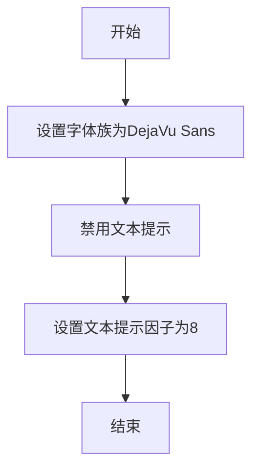
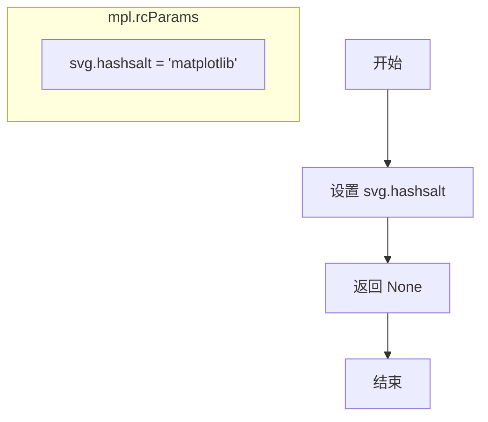
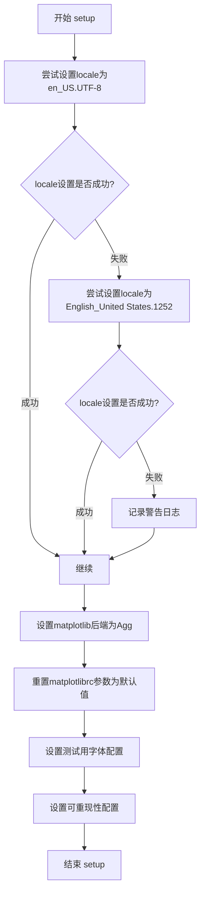
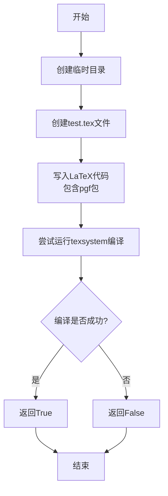
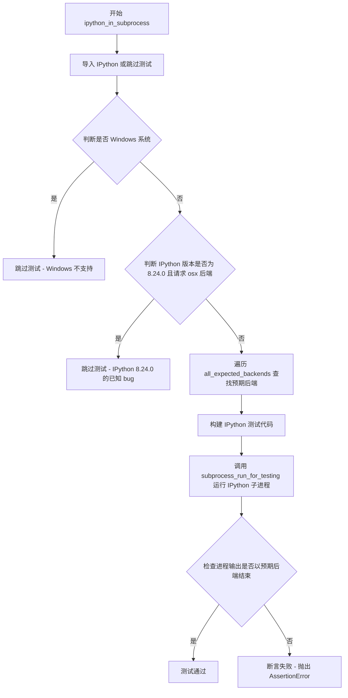
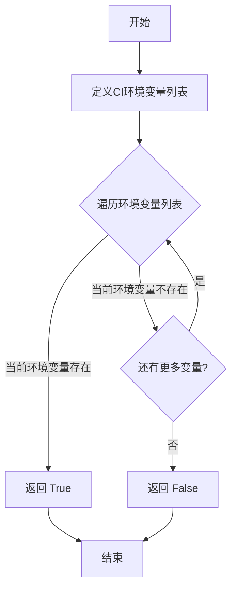

# `matplotlib\lib\matplotlib\testing\__init__.py` 详细设计文档

这是一个用于 Matplotlib 测试的辅助工具模块，主要提供测试环境初始化（字体、本地化、后端）、子进程管理（用于隔离测试）、TeX 系统检查以及生成特定测试数据的功能。

## 整体流程

```mermaid
graph TD
    A[开始] --> B[调用 setup()]
    B --> C{设置本地化}
    C -- 成功 --> D[mpl.use('Agg')]
    C -- 失败 --> E[记录警告日志]
    D --> F[设置字体与可复现性]
    F --> G[测试执行阶段]
    G --> H[subprocess_run_helper: 运行子进程测试]
    G --> I[_check_for_pgf: 检查TeX环境]
    G --> J[is_ci_environment: 检测CI环境]
    H --> K[结束]
    I --> K
    J --> K
```

## 类结构

```
Module: test_helper.py (无类层次结构，采用函数式编程)
├── Global Variables
│   └── _log (logging.Logger)
└── Functions
```

## 全局变量及字段


### `_log`
    
模块级日志记录器，用于记录测试过程中的日志信息

类型：`logging.Logger`
    


    

## 全局函数及方法


### `set_font_settings_for_testing`

该函数用于在测试环境中配置matplotlib的字体相关参数，确保测试结果的一致性和可重现性，通过设置特定的字体族、禁用文本提示并调整提示因子来消除字体渲染的差异。

参数：none

返回值：`None`，无返回值，该函数直接修改matplotlib的全局rcParams配置

#### 流程图



#### 带注释源码

```python
def set_font_settings_for_testing():
    """
    为测试环境设置字体参数。
    
    该函数配置matplotlib的rcParams以确保测试期间字体渲染的一致性，
    消除由于默认字体或提示设置差异导致的测试失败。
    """
    # 设置默认字体族为DejaVu Sans，确保所有平台都有该字体
    mpl.rcParams['font.family'] = 'DejaVu Sans'
    # 禁用文本hinting，防止字体提示影响渲染结果
    mpl.rcParams['text.hinting'] = 'none'
    # 设置hinting因子为8，减少hinting对测试图像的影响
    mpl.rcParams['text.hinting_factor'] = 8
```


### `set_reproducibility_for_testing`

设置 Matplotlib 的 SVG 哈希盐值，以确保测试过程中生成的 SVG 图像具有确定性的哈希值，从而保证测试的可重复性。

参数：无

返回值：`None`，该函数无显式返回值，修改 Matplotlib 的全局配置参数。

#### 流程图



#### 带注释源码

```python
def set_reproducibility_for_testing():
    """
    设置用于测试的 reproducibility（可重现性）配置。
    
    该函数通过设置 Matplotlib 的 svg.hashsalt 参数为固定值 'matplotlib'，
    确保 SVG 图像生成时使用确定性的哈希盐，从而使得每次运行测试时生成的
    SVG 文件具有相同的哈希值，便于图像比对测试的进行。
    """
    # 设置 SVG 哈希盐为固定字符串 'matplotlib'
    # 这样可以确保 SVG 文件的哈希值在每次运行时保持一致
    mpl.rcParams['svg.hashsalt'] = 'matplotlib'
```


### `setup`

该函数用于配置测试环境，设置matplotlib的字体设置和可重现性参数，确保测试在一致的条件下运行。

参数：

- 无

返回值：`None`，无返回值描述

#### 流程图



#### 带注释源码

```python
def setup():
    """
    配置matplotlib测试环境。
    
    该函数执行以下操作：
    1. 设置本地化 locale 为英文环境（确保日期格式测试一致性）
    2. 设置matplotlib后端为'Agg'（非交互式后端）
    3. 重置所有rc参数为默认值
    4. 应用测试专用的字体设置
    5. 设置可重现性相关的配置
    """
    # The baseline images are created in this locale, so we should use
    # it during all of the tests.
    # 尝试设置美式英文UTF-8 locale，用于确保日期相关的测试在一致的环境下运行

    try:
        locale.setlocale(locale.LC_ALL, 'en_US.UTF-8')
    except locale.Error:
        # 如果en_US.UTF-8不可用，尝试Windows的英文locale
        try:
            locale.setlocale(locale.LC_ALL, 'English_United States.1252')
        except locale.Error:
            # 如果都不行，记录警告（某些日期测试可能会失败）
            _log.warning(
                "Could not set locale to English/United States. "
                "Some date-related tests may fail.")

    # 设置matplotlib使用非交互式Agg后端（适用于无GUI的测试环境）
    mpl.use('Agg')

    # 抑制matplotlib弃用警告，并重置所有rc参数为默认值
    with _api.suppress_matplotlib_deprecation_warning():
        mpl.rcdefaults()  # Start with all defaults

    # These settings *must* be hardcoded for running the comparison tests and
    # are not necessarily the default values as specified in rcsetup.py.
    # 应用测试专用的硬编码设置（这些设置对于图像对比测试是必需的）
    set_font_settings_for_testing()    # 设置测试用字体配置
    set_reproducibility_for_testing()   # 设置可重现性配置（如hashsalt）
```


### `subprocess_run_for_testing`

该函数是 `subprocess.run` 的轻量级封装，专门用于测试场景。它在 Windows 平台上自动添加 `CREATE_NO_WINDOW` 标志以减少子进程的超时波动，并针对 Cygwin 平台的 fork() 失败情况进行了特殊处理，将其标记为预期失败而非代码问题。

参数：

- `command`：`list of str`，要执行的命令列表
- `env`：`dict[str, str]`，传递给子进程的环境变量字典，默认为 None
- `timeout`：`float`，子进程超时时间（秒），默认为 60
- `stdout`：可选参数，标准输出目标
- `stderr`：可选参数，标准错误目标
- `check`：`bool`，是否在返回码非零时抛出 CalledProcessError 异常，默认为 False
- `text`：`bool`，是否将输出解码为字符串（True）还是保持为字节（False），默认为 True
- `capture_output`：`bool`，是否捕获 stdout 和 stderr，设置为 True 时会将 stdout 和 stderr 设为 subprocess.PIPE，默认为 False
- `**kwargs`：任意关键字参数，会传递给 subprocess.run

返回值：`subprocess.CompletedProcess`，返回运行完成的子进程对象

#### 流程图

```mermaid
flowchart TD
    A[开始 subprocess_run_for_testing] --> B{capture_output?}
    B -->|True| C[设置 stdout = stderr = PIPE]
    B -->|False| D{platform == 'win32'?}
    D -->|Yes| E{creationflags in kwargs?}
    D -->|No| G[执行 subprocess.run]
    E -->|Yes| F[kwargs['creationflags'] |= CREATE_NO_WINDOW]
    E -->|No| H[kwargs['creationflags'] = CREATE_NO_WINDOW]
    F --> G
    H --> G
    G --> I{捕获异常?}
    I -->|BlockingIOError| J{platform == 'cygwin'?}
    I -->|CalledProcessError| K[记录输出和错误]
    I -->|无异常| L[记录调试信息]
    J -->|Yes| M[pytest.xfail - Fork failure]
    J -->|No| N[重新抛出异常]
    K --> O[重新抛出异常]
    L --> P[返回 proc]
    M --> P
    N --> P
    O --> P
```

#### 带注释源码

```python
def subprocess_run_for_testing(command, env=None, timeout=60, stdout=None,
                               stderr=None, check=False, text=True,
                               capture_output=False, **kwargs):
    """
    Create and run a subprocess.

    Thin wrapper around `subprocess.run`, intended for testing.  Will
    mark fork() failures on Cygwin as expected failures: not a
    success, but not indicating a problem with the code either.

    Parameters
    ----------
    args : list of str
    env : dict[str, str]
    timeout : float
    stdout, stderr
    check : bool
    text : bool
        Also called ``universal_newlines`` in subprocess.  I chose this
        name since the main effect is returning bytes (`False`) vs. str
        (`True`), though it also tries to normalize newlines across
        platforms.
    capture_output : bool
        Set stdout and stderr to subprocess.PIPE

    Returns
    -------
    proc : subprocess.Popen

    See Also
    --------
    subprocess.run

    Raises
    ------
    pytest.xfail
        If platform is Cygwin and subprocess reports a fork() failure.
    """
    # 如果 capture_output 为 True，则自动设置 stdout 和 stderr 为管道
    if capture_output:
        stdout = stderr = subprocess.PIPE
    
    # 在 Windows 平台上添加 CREATE_NO_WINDOW 标志以防止控制台窗口开销
    # 这是为了修复 Windows 上子进程超时不稳定的问题
    if sys.platform == 'win32':
        if 'creationflags' not in kwargs:
            kwargs['creationflags'] = subprocess.CREATE_NO_WINDOW
        else:
            kwargs['creationflags'] |= subprocess.CREATE_NO_WINDOW
    
    try:
        # 执行子进程
        proc = subprocess.run(
            command, env=env,
            timeout=timeout, check=check,
            stdout=stdout, stderr=stderr,
            text=text, **kwargs
        )
    except BlockingIOError:
        # 在 Cygwin 平台上处理 fork() 失败，将其标记为预期失败
        if sys.platform == "cygwin":
            import pytest
            pytest.xfail("Fork failure")
        raise
    except subprocess.CalledProcessError as e:
        # 记录子进程的错误输出到日志
        if e.stdout:
            _log.error(f"Subprocess output:\n{e.stdout}")
        if e.stderr:
            _log.error(f"Subprocess error:\n{e.stderr}")
        raise e
    
    # 记录调试信息
    if proc.stdout:
        _log.debug(f"Subprocess output:\n{proc.stdout}")
    if proc.stderr:
        _log.debug(f"Subprocess error:\n{proc.stderr}")
    
    return proc
```


### `subprocess_run_helper`

在子进程中运行指定的函数，主要用于测试场景。通过动态导入模块并执行目标函数，同时设置特定的环境变量（如SOURCE_DATE_EPOCH和模拟版本号）以确保测试的可重复性。

参数：

- `func`：`function`，要运行的函数，必须是一个可导入的模块中的函数
- `*args`：`str`，传递给命令行的额外参数
- `timeout`：`int`，子进程的超时时间（秒）
- `extra_env`：`dict[str, str] | None`，要为子进程设置的其他环境变量

返回值：`subprocess.CompletedProcess`，包含返回码、标准输出和标准错误的进程对象

#### 流程图

```mermaid
flowchart TD
    A[开始 subprocess_run_helper] --> B[获取函数信息]
    B --> C[提取函数名 target = func.__name__]
    C --> D[提取模块名 module = func.__module__]
    D --> E[提取文件路径 file = func.__code__.co_filename]
    E --> F[构建子进程命令]
    F --> G[准备环境变量]
    G --> H[调用 subprocess_run_for_testing]
    H --> I[返回进程结果 proc]
    
    F --> F1[使用 sys.executable 运行 Python]
    F1 --> F2[通过 importlib.util 动态导入模块]
    F2 --> F3[执行目标函数 _module.{target}()]
    
    G --> G1[合并 os.environ]
    G1 --> G2[设置 SOURCE_DATE_EPOCH=0]
    G2 --> G3[设置 SETUPTOOLS_SCM_PRETEND_VERSION_FOR_MATPLOTLIB]
    G3 --> G4[合并 extra_env]
```

#### 带注释源码

```python
def subprocess_run_helper(func, *args, timeout, extra_env=None):
    """
    Run a function in a sub-process.

    Parameters
    ----------
    func : function
        The function to be run.  It must be in a module that is importable.
    *args : str
        Any additional command line arguments to be passed in
        the first argument to ``subprocess.run``.
    extra_env : dict[str, str]
        Any additional environment variables to be set for the subprocess.
    """
    # 从函数对象中提取关键信息：函数名、所属模块、源代码文件路径
    target = func.__name__                        # 要执行的函数名称
    module = func.__module__                      # 函数所在的模块名
    file = func.__code__.co_filename              # 模块文件的完整路径
    
    # 构建子进程命令：使用当前Python解释器执行
    # 通过importlib动态加载模块并执行目标函数
    proc = subprocess_run_for_testing(
        [
            sys.executable,                       # 当前Python解释器路径
            "-c",                                  # 执行Python代码字符串
            # 动态导入模块的代码：
            # 1. 使用spec_from_file_location根据文件路径创建模块规范
            # 2. 从规范创建模块对象
            # 3. 执行模块（加载模块内容）
            # 4. 调用目标函数
            f"import importlib.util;"
            f"_spec = importlib.util.spec_from_file_location({module!r}, {file!r});"
            f"_module = importlib.util.module_from_spec(_spec);"
            f"_spec.loader.exec_module(_module);"
            f"_module.{target}()",
            *args,                                 # 额外的命令行参数
        ],
        # 环境变量配置
        env={
            **os.environ,                          # 继承当前进程的所有环境变量
            "SOURCE_DATE_EPOCH": "0",              # 强制设置为0，确保构建时间可重现
            # 避免dirty tree导致版本号包含日期（19700101），这会破坏pickle测试
            # 同时减少额外的setuptools-scm子进程调用
            "SETUPTOOLS_SCM_PRETEND_VERSION_FOR_MATPLOTLIB": mpl.__version__,
            **(extra_env or {}),                   # 合并额外的环境变量
        },
        timeout=timeout,                          # 子进程超时时间
        check=True,                                # 检查返回码，非0则抛出异常
        stdout=subprocess.PIPE,                   # 捕获标准输出
        stderr=subprocess.PIPE,                   # 捕获标准错误
        text=True,                                 # 返回字符串而非字节
    )
    return proc  # 返回CompletedProcess对象，包含stdout、stderr和returncode
```


### `_check_for_pgf`

该函数用于检查系统中是否安装了指定的TeX系统以及pgf包，通过尝试编译一个包含pgf包的测试LaTeX文档来判断。

参数：
- `texsystem`：`str`，要检查的TeX可执行文件名称（如"pdflatex"）

返回值：`bool`，如果给定的TeX系统可用且包含pgf包则返回True，否则返回False

#### 流程图



#### 带注释源码

```python
def _check_for_pgf(texsystem):
    """
    Check if a given TeX system + pgf is available
    
    Parameters
    ----------
    texsystem : str
        The executable name to check
    """
    # 创建一个临时目录用于存放测试文件
    with TemporaryDirectory() as tmpdir:
        # 构建测试TeX文件的完整路径
        tex_path = Path(tmpdir, "test.tex")
        
        # 写入测试LaTeX文档，包含pgf包
        # 如果系统中安装了pgf，\pgfversion命令会输出版本号
        tex_path.write_text(r"""
            \documentclass{article}
            \usepackage{pgf}
            \begin{document}
            \typeout{pgfversion=\pgfversion}
            \makeatletter
            \@@end
        """, encoding="utf-8")
        
        # 尝试调用指定的TeX系统编译测试文档
        try:
            subprocess.check_call(
                [texsystem, "-halt-on-error", str(tex_path)],  # 使用-halt-on-error参数快速失败
                cwd=tmpdir,  # 在临时目录中执行
                stdout=subprocess.DEVNULL,  # 抑制标准输出
                stderr=subprocess.DEVNULL   # 抑制标准错误
            )
        except (OSError, subprocess.CalledProcessError):
            # OSError: texsystem不存在或不可执行
            # CalledProcessError: TeX系统执行返回非零退出码
            return False
        
        # 编译成功，返回True
        return True
```


### `_has_tex_package`

该函数用于检测系统中是否安装了指定的 TeX 包。它通过尝试查找该 TeX 包对应的 `.sty` 样式文件来判断包是否可用，返回布尔值表示检测结果。

参数：

- `package`：`str`，TeX 包的名称（不含文件扩展名）

返回值：`bool`，如果找到对应的 `.sty` 文件返回 `True`，否则返回 `False`

#### 流程图

```mermaid
flowchart TD
    A[开始] --> B[接收 package 参数]
    B --> C[构建文件名: {package}.sty]
    C --> D[调用 mpl.dviread.find_tex_file 查找文件]
    D --> E{是否抛出 FileNotFoundError?}
    E -->|否| F[返回 True]
    E -->|是| G[返回 False]
    F --> H[结束]
    G --> H
```

#### 带注释源码

```python
def _has_tex_package(package):
    """
    Check if a given TeX package is available.

    Parameters
    ----------
    package : str
        The name of the TeX package (without file extension).
    """
    try:
        # 尝试在系统中查找该包对应的 .sty 文件
        # find_tex_file 会搜索 TeX 目录结构定位文件
        mpl.dviread.find_tex_file(f"{package}.sty")
        # 如果找到文件，没有异常抛出，返回 True
        return True
    except FileNotFoundError:
        # 如果文件不存在，捕获异常并返回 False
        return False
```


### `ipython_in_subprocess`

该函数用于在独立子进程中运行 IPython，并验证 matplotlib 后端是否按预期设置。它通过启动一个 IPython 子进程，执行特定的 matplotlib 代码，然后检查返回的后端名称是否与根据 IPython 版本预期的后端匹配。

参数：

- `requested_backend_or_gui_framework`：`str`，请求的 matplotlib 后端或 GUI 框架名称
- `all_expected_backends`：`dict[tuple[int, int], str]`，一个字典，键为 IPython 最小版本元组 (major, minor)，值为预期的后端名称

返回值：`None`，该函数通过断言验证子进程输出，不返回任何内容

#### 流程图



#### 带注释源码

```python
def ipython_in_subprocess(requested_backend_or_gui_framework, all_expected_backends):
    """
    在子进程中运行 IPython 并验证 matplotlib 后端设置。
    
    Parameters
    ----------
    requested_backend_or_gui_framework : str
        请求的 matplotlib 后端或 GUI 框架名称
    all_expected_backends : dict[tuple[int, int], str]
        映射 IPython 最小版本到预期后端的字典
    """
    # 动态导入 IPython，如果不存在则跳过测试
    import pytest
    IPython = pytest.importorskip("IPython")

    # Windows 平台不支持在子进程中更改后端，直接跳过
    if sys.platform == "win32":
        pytest.skip("Cannot change backend running IPython in subprocess on Windows")

    # IPython 8.24.0 存在 macosx 后端的已知 bug，在 8.24.1 中已修复
    if (IPython.version_info[:3] == (8, 24, 0) and
            requested_backend_or_gui_framework == "osx"):
        pytest.skip("Bug using macosx backend in IPython 8.24.0 fixed in 8.24.1")

    # 根据 IPython 版本确定预期后端
    # 此代码可在 Python 3.12 (IPython < 8.24 支持的最新版本) 到达生命周期结束时移除
    for min_version, backend in all_expected_backends.items():
        if IPython.version_info[:2] >= min_version:
            expected_backend = backend
            break

    # 构建要执行的 matplotlib 测试代码
    # 导入 matplotlib 和 pyplot，创建图表，获取当前后端名称
    code = ("import matplotlib as mpl, matplotlib.pyplot as plt;"
            "fig, ax=plt.subplots(); ax.plot([1, 3, 2]); mpl.get_backend()")
    
    # 使用测试辅助函数运行 IPython 子进程
    # --no-simple-prompt: 禁用简单提示符模式
    # --matplotlib: 指定要使用的 matplotlib 后端
    # -c: 执行提供的代码
    proc = subprocess_run_for_testing(
        [
            "ipython",
            "--no-simple-prompt",
            f"--matplotlib={requested_backend_or_gui_framework}",
            "-c", code,
        ],
        check=True,
        capture_output=True,
    )

    # 验证子进程输出中包含预期后端名称
    # stdout 末尾应该以后端名称结尾（例如：'Agg'）
    assert proc.stdout.strip().endswith(f"'{expected_backend}'")
```


### `is_ci_environment`

该函数用于检测当前代码是否运行在持续集成（CI）环境中，通过检查常见CI平台设置的环境变量来判断。

参数： 无

返回值：`bool`，返回 `True` 表示当前环境是CI环境，返回 `False` 表示不是CI环境

#### 流程图



#### 带注释源码

```python
def is_ci_environment():
    # 常见的CI环境变量列表，涵盖多个CI平台
    # 包括通用变量和特定平台变量
    ci_environment_variables = [
        'CI',        # 通用CI环境变量
        'CONTINUOUS_INTEGRATION',  # 通用CI环境变量
        'TRAVIS',    # Travis CI
        'CIRCLECI',  # CircleCI
        'JENKINS',   # Jenkins
        'GITLAB_CI',  # GitLab CI
        'GITHUB_ACTIONS',  # GitHub Actions
        'TEAMCITY_VERSION'  # TeamCity
        # 可根据需要添加其他CI环境变量
    ]

    # 遍历所有CI环境变量，检查是否至少有一个被设置
    for env_var in ci_environment_variables:
        if os.getenv(env_var):
            return True

    # 如果没有检测到任何CI环境变量，返回False
    return False
```


### `_gen_multi_font_text`

生成用于测试字体回退功能的测试文本，包含多种字体和大量字符以测试字体的覆盖率。

参数：

- （无参数）

返回值：`tuple[list[str], str]`，返回一个元组，包含字体名称列表（按优先级排序）和测试字符串。

#### 流程图

```mermaid
flowchart TD
    A[开始] --> B[定义 fonts = ['cmr10', 'DejaVu Sans']]
    B --> C[生成 latin1_supplement<br/>字符范围 0xC5-0xFF]
    C --> D[生成 latin_extended_A<br/>字符范围 0x100-0x17F]
    D --> E[生成 latin_extended_B<br/>字符范围 0x180-0x24F]
    E --> F[计算 non_basic_characters<br/>将字符按32个一组分组并用换行符连接]
    F --> G[构建 test_str<br/>包含基本字符和特殊字符的完整测试字符串]
    G --> H[返回 (fonts, test_str)]
    H --> I[结束]
```

#### 带注释源码

```python
def _gen_multi_font_text():
    """
    Generate text intended for use with multiple fonts to exercise font fallbacks.

    Returns
    -------
    fonts : list of str
        The names of the fonts used to render the test string, sorted by intended
        priority. This should be set as the font family for the Figure or Text artist.
    text : str
        The test string.
    """
    # 定义两种字体：cmr10（衬线字体）和 DejaVu Sans（无衬线字体）
    # 这两种字体风格不常见于组合，但便于观察每个字形来自哪个字体
    fonts = ['cmr10', 'DejaVu Sans']
    
    # cmr10 不包含重音字符，因此这些字符应回退到 DejaVu Sans
    # 但某些带重音的大写 A 版本在 cmr10 中存在非标准字形，因此不测试这些
    # （避免测试 Latin1 补充组中从 0xA0 开始的字符）
    start = 0xC5
    
    # 生成 Latin-1 补充字符（0xC5-0xFF）
    latin1_supplement = [chr(x) for x in range(start, 0xFF+1)]
    
    # 生成 Latin 扩展 A 字符（0x100-0x17F）
    latin_extended_A = [chr(x) for x in range(0x100, 0x17F+1)]
    
    # 生成 Latin 扩展 B 字符（0x180-0x24F）
    latin_extended_B = [chr(x) for x in range(0x180, 0x24F+1)]
    
    # 创建计数器，用于将字符按每32个一组分组
    count = itertools.count(start - 0xA0)
    
    # 将所有特殊字符连接成字符串，每32个字符换一行
    # 使用 itertools.groupby 按每32个字符一组进行分组
    non_basic_characters = '\n'.join(
        ''.join(line)
        for _, line in itertools.groupby(  # Replace with itertools.batched for Py3.12+.
            [*latin1_supplement, *latin_extended_A, *latin_extended_B],
            key=lambda x: next(count) // 32)  # 32 characters per line.
    )
    
    # 构建完整的测试字符串，包含基本 ASCII 字符和非基本字符
    test_str = f"""There are basic characters
{string.ascii_uppercase} {string.ascii_lowercase}
{string.digits} {string.punctuation}
and accented characters
{non_basic_characters}
in between!"""
    
    # 返回结果：字体列表和测试字符串
    # 生成的字符串包含 491 个不同字符，某些文件格式使用 8 位表，
    # 大量字符会对这些格式进行双重测试
    return fonts, test_str
```

## 关键组件


### 测试环境初始化 (setup)

配置matplotlib测试所需的全局环境，包括设置区域为英语环境、选择Agg后端、重置rcParams为默认值，以及设置字体和可复现性参数。

### 子进程运行器 (subprocess_run_for_testing)

对subprocess.run的薄封装，专门用于测试场景。在Windows上添加CREATE_NO_WINDOW标志以防止控制台窗口开销，并处理Cygwin上的fork()失败情况。

### 子进程函数运行器 (subprocess_run_helper)

在独立子进程中运行指定的Python函数，支持设置额外的环境变量（如SOURCE_DATE_EPOCH和模拟版本号），常用于隔离测试。

### PGF/TeX系统检查 (_check_for_pgf)

检查指定的TeX系统是否可用，通过编译一个包含pgf包的最小LaTeX文档来验证。

### TeX包检查 (_has_tex_package)

检查特定的LaTeX样式包是否已安装，通过matplotlib的dviread模块查找文件。

### IPython子进程集成测试 (ipython_in_subprocess)

在子进程中测试matplotlib与IPython的集成，验证不同IPython版本下的后端设置是否正确。

### CI环境检测 (is_ci_environment)

通过检查常见CI平台的环境变量（如GITHUB_ACTIONS、TRAVIS、CIRCLECI等）来判断代码是否在CI环境中运行。

### 多字体文本生成器 (_gen_multi_font_text)

生成包含多种字体的测试字符串，用于测试字体回退机制。返回字体列表和包含基本ASCII字符及拉丁扩展字符的测试字符串。

### 字体与可复现性设置

set_font_settings_for_testing和set_reproducibility_for_testing分别配置测试所需的字体参数和SVG哈希盐值，确保测试结果的可复现性。


## 问题及建议


### 已知问题

-   `setup()` 函数中的 locale 设置失败时仅记录警告，但未提供备选方案或明确的状态指示，可能导致某些测试行为不一致
-   `subprocess_run_for_testing` 捕获 `BlockingIOError` 异常处理 Cygwin 的 fork 失败，但该异常类型与 subprocess 语义不匹配，可能掩盖其他 I/O 问题
-   `ipython_in_subprocess` 中存在硬编码的时间假设注释（"Python 3.12 在 2028 年底到达 EOL"），这将在未来造成维护负担
-   `_gen_multi_font_text` 函数使用复杂的 `itertools.groupby` 和计数器逻辑生成文本，注释中已提及可用 `itertools.batched` 简化（但尚未实现）
-   `is_ci_environment()` 的 CI 环境变量列表不完整，可能遗漏 Azure Pipelines、AppVeyor 等常见 CI 平台
-   `subprocess_run_helper` 使用字符串动态构造 import 代码，依赖 `__code__.co_filename` 等实现细节，代码重构时易失效
-   `_check_for_pgf` 每次调用都创建临时文件和子进程检查 TeX 可用性，缺乏缓存机制导致重复开销
-   缺少类型注解（type hints），降低静态分析和 IDE 支持效果
-   函数参数较多（如 `subprocess_run_for_testing` 有 9+ 个参数），缺乏统一的配置对象封装

### 优化建议

-   考虑为 `is_ci_environment()` 添加 `@functools.lru_cache` 装饰器，因为 CI 环境变量在进程生命周期内不会变化
-   将 `subprocess_run_for_testing` 的多个参数封装为 `dataclass` 或 `NamedTuple`，提高可读性和可维护性
-   提取硬编码的 locale 字符串和默认值（如 'en_US.UTF-8'、'DejaVu Sans'）到模块级常量
-   为 `_check_for_pgf` 添加缓存或结果复用机制，避免重复调用时重复执行昂贵的子进程检查
-   使用 `itertools.batched`（Python 3.12+）重写 `_gen_multi_font_text` 中的分组逻辑，提高可读性
-   补充完整的类型注解，包括函数参数和返回值类型
-   扩展 CI 环境变量列表，或改为基于更通用的检测策略（如检查是否在交互式终端中）
-   将 `subprocess_run_helper` 中的动态 import 逻辑改为更稳定的实现方式，或添加更健壮的错误处理


## 其它


### 设计目标与约束

本模块旨在为matplotlib测试框架提供辅助功能，包括环境配置、子进程管理、TeX检查等。设计约束包括：必须在跨平台环境（Linux、Windows、macOS、Cygwin）下工作；需要处理多种locale设置；必须支持可重现的测试结果；需要处理各种子进程超时和错误情况。

### 错误处理与异常设计

模块采用分级错误处理策略：locale设置失败时降级并记录警告；子进程运行时捕获BlockingIOError（Cygwin fork失败）并标记为xfail；CalledProcessError时记录输出并重新抛出；OSError和subprocess.CallProcessError用于TeX检查返回False；IPython缺失时使用pytest.importorskip跳过测试。

### 外部依赖与接口契约

外部依赖包括：matplotlib自身（mpl模块）、Python标准库（subprocess、locale、os、sys等）、pytest框架、IPython（可选）、TeX系统（可选）。接口契约：setup()修改全局rcParams；subprocess_run_for_testing返回subprocess.CompletedProcess；subprocess_run_helper返回包含stdout/stderr的proc对象；_check_for_pgf和_has_tex_package返回布尔值；is_ci_environment返回布尔值。

### 性能考虑与优化空间

性能优化点：subprocess_run_for_testing在Windows上添加CREATE_NO_WINDOW标志减少控制台开销；使用TemporaryDirectory自动清理临时文件；SOURCE_DATE_EPOCH和SETUPTOOLS_SCM_PRETEND_VERSION减少额外子进程调用。潜在优化：可考虑缓存TeX检查结果；可添加子进程池复用机制。

### 安全性考虑

安全措施包括：Windows下使用CREATE_NO_WINDOW防止控制台窗口弹出；环境变量隔离（extra_env参数）；命令参数使用f-string安全构造；临时文件使用TemporaryDirectory自动清理。潜在风险：subprocess_run_helper中使用eval/exec动态执行代码存在限制但仍需注意输入验证。

### 可维护性与扩展性

代码结构清晰，按功能分类：环境设置函数、进程管理函数、TeX检查函数、CI检测函数。扩展点：is_ci_environment可添加更多CI环境变量；subprocess_run_helper可扩展更多参数传递方式；_check_for_pgf可支持更多TeX系统。

### 版本兼容性

代码明确处理Python版本差异：注释提到Python 3.12+可使用itertools.batched；IPython版本检查针对8.24.0的osx后端bug；支持Python 3.x多个版本。

### 日志与监控

使用Python标准logging模块：_log = logging.getLogger(__name__)创建模块级logger；记录子进程输出（debug级别）和错误（error级别）；locale设置失败时记录warning。

    