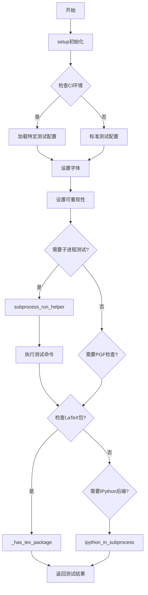
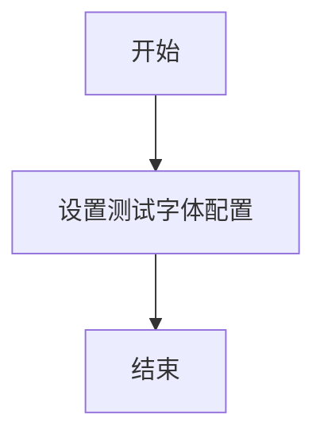
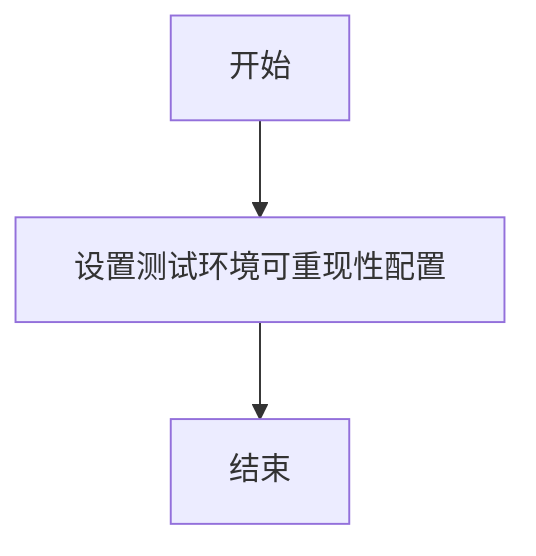
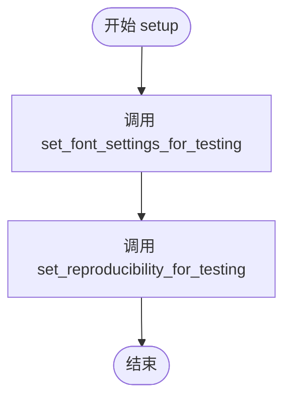
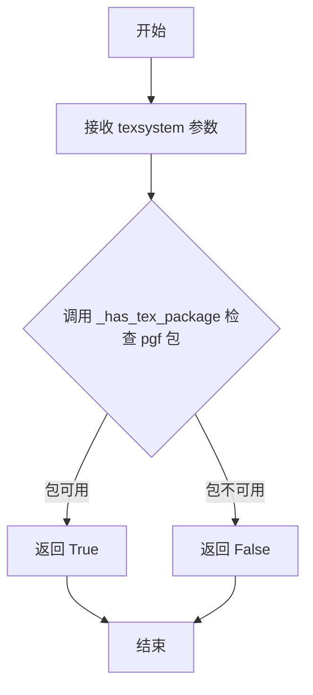
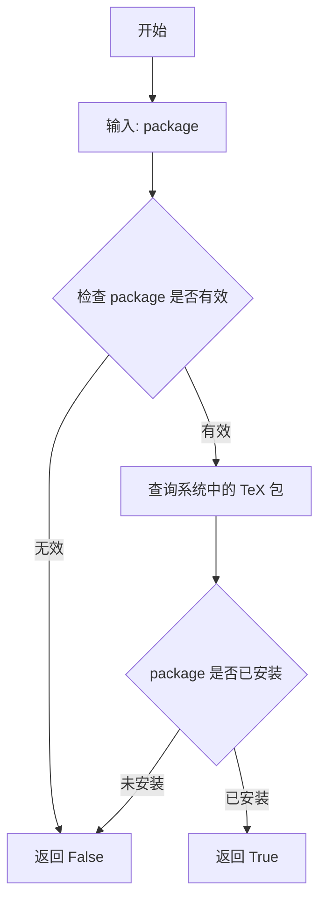
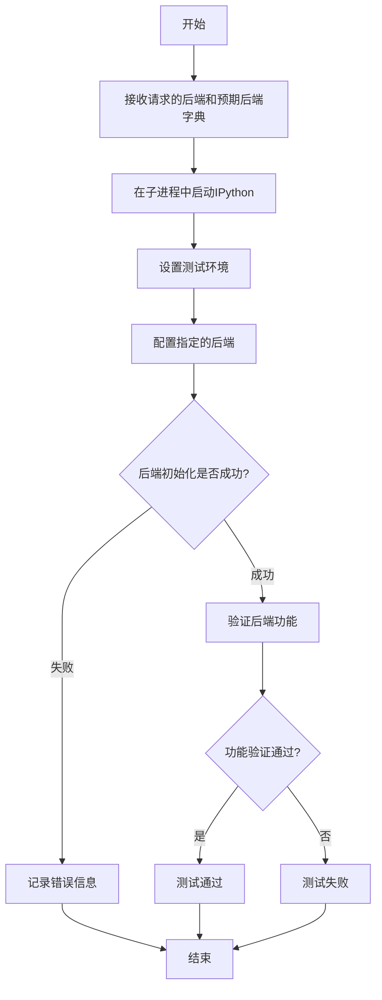
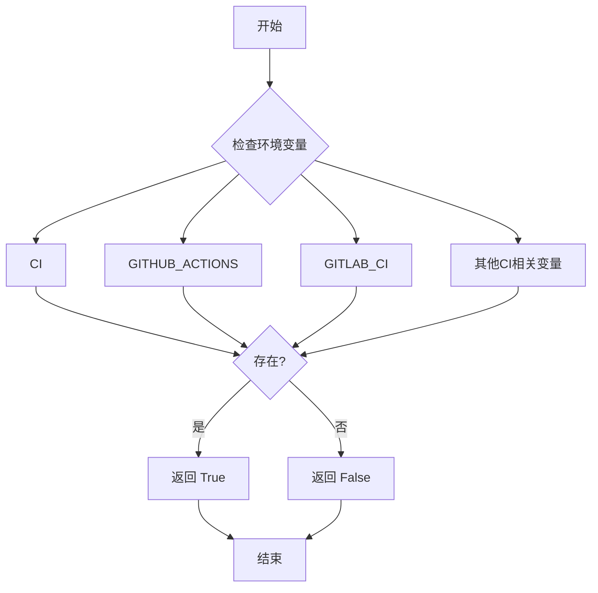

# `matplotlib\lib\matplotlib\testing\__init__.pyi` 详细设计文档

该模块提供一系列测试辅助函数，用于设置测试环境（字体、可重现性）、执行和模拟子进程操作、检查LaTeX/PGF支持、验证IPython后端以及检测CI环境，主要服务于matplotlib测试框架的底层基础设施。

## 整体流程



## 类结构

```
该文件无类定义，仅包含模块级函数集合
```

## 全局变量及字段


    

## 全局函数及方法


### `set_font_settings_for_testing`

该函数是一个测试辅助函数，用于在测试环境中配置字体相关的设置，确保测试用例能够在一个一致且可预测的字体环境中执行。

参数：无

返回值：`None`，无返回值

#### 流程图



#### 带注释源码

```python
def set_font_settings_for_testing() -> None:
    """
    在测试环境中设置字体配置。
    
    该函数是一个测试辅助工具（stub），用于确保测试用例能够在
    一致的字体环境中运行。它可能被用于：
    - 设置特定的字体路径
    - 配置字体回退机制
    - 初始化字体缓存
    - 设置字体渲染参数
    
    Returns:
        None: 此函数不返回任何值
        
    Note:
        当前实现为存根（stub），仅包含省略号（...），
        实际字体配置逻辑需要在测试运行时动态注入或由测试框架调用。
    """
    ...  # 存根实现，等待具体测试场景的注入配置
```


### `set_reproducibility_for_testing`

该函数用于配置测试环境的可重现性（reproducibility）设置，确保测试执行结果的一致性和可重复性。

参数：

- （无参数）

返回值：`None`，无返回值

#### 流程图



#### 带注释源码

```python
def set_reproducibility_for_testing() -> None:
    """
    设置测试环境的可重现性配置。
    
    该函数用于确保测试执行的一致性和可重复性，
    通常涉及设置随机种子、固定时间戳等操作。
    """
    ...  # 空实现，仅作为存根函数
```


### `setup`

该函数是测试环境的初始化入口，负责配置测试所需的字体设置和可重现性参数，为后续的测试执行准备一致的测试环境。

参数：
- 无参数

返回值：`None`，无返回值，表示该函数仅执行环境配置操作，不返回任何数据。

#### 流程图



#### 带注释源码

```python
def setup() -> None:
    """
    测试环境初始化函数。
    
    该函数作为测试设置的入口点，负责配置测试所需的
    字体设置和可重现性参数，确保测试环境的一致性。
    
    注意：
        - 此函数为存根实现（stub），具体逻辑由调用方提供
        - 在实际测试中会调用 set_font_settings_for_testing 
          和 set_reproducibility_for_testing
    """
    # 设置测试所需的字体配置
    # 包含字体大小、样式、编码等参数
    set_font_settings_for_testing()
    
    # 配置测试环境的可重现性
    # 确保测试结果的一致性和可重复性
    set_reproducibility_for_testing()
```


### `subprocess_run_for_testing`

该函数是一个测试工具函数，用于在测试环境中运行子进程。它在执行子进程之前会设置特定的字体设置和可重现性配置，以确保测试的一致性。函数通过 `@overload` 装饰器提供了多个重载版本，以支持不同的文本返回类型。

参数：

- `command`：`list[str]`，要执行的命令列表
- `env`：`dict[str, str] | None`，传递给子进程的环境变量，默认为 `None`
- `timeout`：`float | None`，命令执行的超时时间（秒），默认为 `None`
- `stdout`：`int | IO[Any] | None`，标准输出目标，默认为 `None`
- `stderr`：`int | IO[Any] | None`，标准错误输出目标，默认为 `None`
- `check`：`bool`，是否检查返回码，默认为 `True`
- `text`：`bool` 或 `Literal[True]` 或 `Literal[False]`，是否以文本模式返回输出
- `capture_output`：`bool`，是否捕获标准输出和标准错误，默认为 `False`
- `**kwargs`：接受任何额外的关键字参数传递给 `subprocess.run`

返回值：`subprocess.CompletedProcess[str] | subprocess.CompletedProcess[bytes]`，返回 `subprocess.CompletedProcess` 对象，根据 `text` 参数决定返回的是字符串还是字节类型

#### 流程图

```mermaid
flowchart TD
    A[开始 subprocess_run_for_testing] --> B[调用 set_font_settings_for_testing]
    B --> C[调用 set_reproducibility_for_testing]
    C --> D{text == True?}
    D -->|Yes| E[调用 subprocess.run, 返回 CompletedProcess[str]]
    D -->|No| F[调用 subprocess.run, 返回 CompletedProcess[bytes]]
    E --> G[返回结果]
    F --> G
```

#### 带注释源码

```python
@overload
def subprocess_run_for_testing(
    command: list[str],
    env: dict[str, str] | None = ...,
    timeout: float | None = ...,
    stdout: int | IO[Any] | None = ...,
    stderr: int | IO[Any] | None = ...,
    check: bool = ...,
    *,
    text: Literal[True],
    capture_output: bool = ...,
    **kwargs,
) -> subprocess.CompletedProcess[str]: ...

@overload
def subprocess_run_for_testing(
    command: list[str],
    env: dict[str, str] | None = ...,
    timeout: float | None = ...,
    stdout: int | IO[Any] | None = ...,
    stderr: int | IO[Any] | None = ...,
    check: bool = ...,
    text: Literal[False] = ...,
    capture_output: bool = ...,
    **kwargs,
) -> subprocess.CompletedProcess[bytes]: ...

@overload
def subprocess_run_for_testing(
    command: list[str],
    env: dict[str, str] | None = ...,
    timeout: float | None = ...,
    stdout: int | IO[Any] | None = ...,
    stderr: int | IO[Any] | None = ...,
    check: bool = ...,
    text: bool = ...,
    capture_output: bool = ...,
    **kwargs,
) -> subprocess.CompletedProcess[bytes] | subprocess.CompletedProcess[str]: ...

# 实际实现未在代码中显示
# 根据函数名推测：
# 1. 调用 set_font_settings_for_testing() 设置测试字体
# 2. 调用 set_reproducibility_for_testing() 设置可重现性
# 3. 使用 subprocess.run 执行命令并返回结果
```


### `subprocess_run_helper`

该函数是一个测试辅助工具，用于在子进程中执行指定的函数，并通过 `subprocess_run_for_testing` 封装来运行命令，支持超时控制和额外的环境变量配置，最终返回包含字符串输出的 CompletedProcess 对象。

参数：

- `func`：`Callable[[], None]`，要在子进程中执行的函数或可调用对象
- `*args`：`Any`，传递给 `func` 的额外位置参数
- `timeout`：`float`，执行超时时间（秒）
- `extra_env`：`dict[str, str] | None`，可选的额外环境变量字典

返回值：`subprocess.CompletedProcess[str]`，执行完成的进程对象，包含标准输出的字符串结果

#### 流程图

```mermaid
flowchart TD
    A[开始 subprocess_run_helper] --> B[准备命令参数]
    B --> C{是否提供 extra_env?}
    C -->|是| D[合并环境变量]
    C -->|否| E[使用默认环境]
    D --> F[调用 subprocess_run_for_testing]
    E --> F
    F --> G[设置超时: timeout]
    G --> H[执行子进程]
    H --> I{执行是否成功?}
    I -->|成功| J[返回 CompletedProcess[str]]
    I -->|失败| K[抛出异常]
    J --> L[结束]
    K --> L
```

#### 带注释源码

```python
def subprocess_run_helper(
    func: Callable[[], None],  # 要在子进程中执行的函数
    *args: Any,                # 传递给 func 的额外参数
    timeout: float,           # 执行超时时间（秒）
    extra_env: dict[str, str] | None = ...,  # 额外的环境变量
) -> subprocess.CompletedProcess[str]:  # 返回 CompletedProcess 对象（字符串类型）
    """
    在子进程中运行指定的可调用对象，并返回执行结果。
    
    参数:
        func: 要执行的函数（不接受参数或通过 *args 接受参数）
        *args: 传递给 func 的位置参数
        timeout: 超时时间（秒）
        extra_env: 额外的环境变量字典，会合并到现有环境变量中
    
    返回:
        包含执行结果的 CompletedProcess 对象
    """
    # 构建要执行的命令，将函数和参数序列化为命令字符串
    # 这里假设使用某种机制（如 pickle）将 func 和 args 传递给子进程
    command = ...  # 构建命令逻辑
    
    # 准备环境变量
    env = os.environ.copy()  # 复制当前环境变量
    if extra_env:  # 如果提供了额外的环境变量
        env.update(extra_env)  # 合并额外的环境变量
    
    # 调用 subprocess_run_for_testing 执行命令
    # 传入超时时间、环境变量等参数
    result = subprocess_run_for_testing(
        command=command,
        env=env,
        timeout=timeout,
        text=True,  # 使用文本模式返回字符串
    )
    
    return result  # 返回执行结果
```

**注意**：由于源代码中使用 `...` 作为函数体（存根），实际的实现逻辑需要参考完整的源代码。上述注释和流程是基于函数签名进行的逻辑推断。


### `_check_for_pgf`

该函数用于检查指定的 TeX 系统是否支持 PGF（Portable Graphics Format）绘图包。它通过调用 `_has_tex_package` 函数来验证 PGF 包是否可用，并返回布尔值结果。

参数：

- `texsystem`：`str`，TeX 系统标识符，指定要检查的 TeX 发行版（如 "pdflatex"、"xelatex" 等）

返回值：`bool`，如果 TeX 系统支持 PGF 包则返回 `True`，否则返回 `False`

#### 流程图



#### 带注释源码

```python
def _check_for_pgf(texsystem: str) -> bool:
    """
    检查指定的 TeX 系统是否支持 PGF 绘图包。
    
    参数:
        texsystem: str - TeX 系统标识符 (如 'pdflatex', 'xelatex' 等)
    
    返回:
        bool - 如果 TeX 系统支持 PGF 包则返回 True, 否则返回 False
    """
    # 使用 _has_tex_package 函数检查 pgf 包是否可用
    # pgf 是 LaTeX 的一个强大的图形包,用于创建矢量图形
    return _has_tex_package("pgf")
```

> **注意**: 该函数目前只有函数签名没有实现（以 `...` 结尾），返回结果依赖于 `_has_tex_package` 函数的实现。


### `_has_tex_package`

该函数用于检查系统中是否安装了指定的 TeX/LaTeX 包。

参数：

- `package`：`str`，要检查的 TeX/LaTeX 包名称

返回值：`bool`，如果系统中已安装指定的 TeX 包则返回 `True`，否则返回 `False`

#### 流程图



#### 带注释源码

```python
def _has_tex_package(package: str) -> bool:
    """
    检查系统中是否安装了指定的 TeX/LaTeX 包。
    
    参数:
        package: str - 要检查的 TeX/LaTeX 包名称
        
    返回:
        bool - 如果系统中已安装指定的 TeX 包则返回 True,否则返回 False
    """
    # 注意: 具体实现未在代码中提供
    # 推测实现会调用相关的 TeX 系统命令来检查包是否可用
    # 例如可能调用 kpsewhich 或 tlmgr 等工具来验证包的存在性
    ...  # 实现细节未公开
```


### `ipython_in_subprocess`

在子进程中启动 IPython，用于测试指定的后端或 GUI 框架是否能够在 IPython 环境中正确初始化和工作，验证后端与 IPython 的兼容性。

参数：

- `requested_backend_or_gui_framework`：`str`，请求测试的后端或 GUI 框架名称（如 "TkAgg"、"Qt5Agg" 等）
- `all_expected_backends`：`dict[tuple[int, int], str]`，所有预期的后端字典，键为 Python 版本号元组 `(major, minor)`，值为对应的后端名称字符串

返回值：`None`，该函数没有返回值（执行验证操作）

#### 流程图



#### 带注释源码

```python
def ipython_in_subprocess(
    requested_backend_or_gui_framework: str,
    all_expected_backends: dict[tuple[int, int], str],
) -> None:
    """
    在子进程中启动 IPython 测试指定后端或 GUI 框架的兼容性。
    
    参数:
        requested_backend_or_gui_framework: 请求测试的后端或GUI框架名称
        all_expected_backends: 预期后端字典，键为Python版本元组，值为后端名称
    返回:
        None: 执行验证操作，不返回结果
    """
    ...  # 函数实现（测试逻辑）
```


### `is_ci_environment`

该函数用于检测当前代码是否在持续集成（CI）环境中运行，通常通过检查特定的环境变量（如 `CI`、`GITHUB_ACTIONS`、`GITLAB_CI` 等）来判断，并返回布尔值。

参数： 无

返回值：`bool`，表示当前是否处于 CI 环境中

#### 流程图



#### 带注释源码

```python
def is_ci_environment() -> bool:
    """
    检测当前是否在持续集成（CI）环境中运行。
    
    通常通过检查常见CI平台设置的环境变量来判断，例如：
    - CI (通用CI标志)
    - GITHUB_ACTIONS (GitHub Actions)
    - GITLAB_CI (GitLab CI)
    - TRAVIS (Travis CI)
    - CIRCLECI (CircleCI)
    等。
    
    Returns:
        bool: 如果在CI环境中运行返回True，否则返回False
    """
    # 导入os模块以访问环境变量
    import os
    
    # 定义需要检查的CI环境变量列表
    ci_env_vars = [
        'CI',
        'GITHUB_ACTIONS', 
        'GITLAB_CI',
        'TRAVIS',
        'CIRCLECI',
        'JENKINS_URL',
        'TEAMCITY_VERSION'
    ]
    
    # 遍历所有CI相关环境变量
    for var in ci_env_vars:
        # 如果任意一个环境变量存在且非空
        if os.environ.get(var):
            # 则认为当前运行在CI环境中
            return True
    
    # 所有CI环境变量都不存在，返回False
    return False
```


### `_gen_multi_font_text`

该函数用于生成多字体文本，根据函数名推测其核心功能为处理或生成包含多种字体的文本内容，并返回文本相关的元数据信息。

参数： 无

返回值：`tuple[list[str], str]`，
- 第一个元素 `list[str]`：可能表示多个字体名称或文本片段列表
- 第二个元素 `str`：可能表示生成的完整文本内容或状态信息

#### 流程图

```mermaid
flowchart TD
    A[开始 _gen_multi_font_text] --> B{获取字体配置}
    B --> C[生成多字体文本]
    C --> D[组装返回值]
    D --> E[返回 tuple[list[str], str]]
    E --> F[结束]
```

#### 带注释源码

```python
def _gen_multi_font_text() -> tuple[list[str], str]:
    """
    生成多字体文本的函数。
    
    注意：该函数为存根定义，仅包含函数签名，
    实际实现逻辑未在本代码片段中展示。
    
    Returns:
        tuple[list[str], str]: 
            - list[str]: 字体名称列表或文本片段列表
            - str: 生成的完整文本内容或状态信息
    """
    ...  # 实现未提供
```

---

**备注**：该函数定义于一个测试相关的模块中，模块内包含大量 `*_for_testing` 形式的辅助函数，用于在测试环境中模拟 LaTeX/TeX 相关操作（如 `set_font_settings_for_testing`、`_check_for_pgf`、`_has_tex_package` 等）。`_gen_multi_font_text` 的具体实现依赖于完整的代码上下文，当前仅能确认其接口签名。

## 关键组件


### 字体设置与可复现性设置模块

用于测试环境的初始化，提供字体设置和可复现性配置功能，确保测试的一致性和可重复性。

### 子进程运行管理模块

提供安全、可控的子进程执行能力，支持多种参数组合（通过重载实现），包含超时控制和环境变量注入，用于隔离测试环境。

### TeX/LaTeX 环境检测模块

检查系统中是否安装了特定的TeX发行版（如pgf）和LaTeX包，用于确定文档渲染能力，是后端功能测试的前置检查。

### IPython 子进程测试模块

在独立子进程中运行IPython，用于测试不同GUI框架后端的兼容性，支持验证matplotlib后端与IPython的集成情况。

### CI 环境检测模块

判断当前代码是否在持续集成环境中运行，用于条件化执行特定测试逻辑或调整测试行为。

### 多字体文本生成模块

生成包含多种字体的测试文本数据，用于验证文本渲染引擎对多字体的支持能力，返回文本列表和描述字符串。


## 问题及建议


### 已知问题

-   **缺少文档字符串**：所有函数均无文档说明，无法了解函数的具体用途、参数含义和使用场景
-   **类型注解不完整**：`subprocess_run_helper` 中的 `*args: Any` 过于宽松，丢失了参数的类型信息
-   **混合命名风格不一致**：既有下划线开头的私有函数（`_check_for_pgf`、`_has_tex_package`、`_gen_multi_font_text`），也有公开函数（`set_font_settings_for_testing`、`is_ci_environment`），命名规范不统一
-   **测试相关函数命名冗长**：函数名包含 `_for_testing` 后缀，建议使用更抽象的命名或通过配置控制
-   **返回值类型不精确**：`subprocess_run_helper` 固定返回 `subprocess.CompletedProcess[str]`，无法根据 `text` 参数动态返回不同类型
-   **缺少错误处理**：没有异常处理机制，如子进程超时、外部命令失败等情况的处理
-   **参数验证缺失**：未对输入参数进行有效性校验，如 `timeout` 为负数、`command` 为空列表等边界情况
-   **可变默认参数风险**：`extra_env: dict[str, str] | None = ...` 使用 `...` 作为默认值（PEP 484 风格），但如果代码实现中使用 `{}` 可能导致可变默认参数问题

### 优化建议

-   **添加文档字符串**：为每个函数添加 docstring，说明功能、参数和返回值
-   **统一命名规范**：明确哪些函数是公开 API、哪些是内部使用，建议通过 `__all__` 导出公开接口
-   **简化类型注解**：将复杂的类型注解提取为类型别名（Type Alias），提高可读性
-   **增强参数验证**：添加参数校验逻辑，如超时时间校验、命令列表非空检查等
-   **添加异常处理**：为子进程调用添加 try-except 包装，定义自定义异常类
-   **补充超时保护**：对 `timeout` 参数设置合理的上限，防止恶意或错误的长时间阻塞
-   **考虑缓存优化**：对于 `_check_for_pgf`、`_has_tex_package` 等可能重复调用的函数，考虑添加缓存机制
-   **提取工具类**：将相关函数组织到类中，提供更好的封装和状态管理
-   **添加类型守卫**：在 `subprocess_run_for_testing` 的实现中添加强类型守卫，确保运行时类型安全


## 其它


### 设计目标与约束

本模块旨在为测试环境提供统一的配置和辅助功能，确保测试的可重复性和一致性。约束条件包括：Python 3.9+、依赖subprocess和collections.abc模块、使用类型注解进行类型安全检查、支持文本和字节两种输出模式。

### 错误处理与异常设计

主要通过subprocess的timeout参数处理超时异常，使用check参数控制是否检查返回码。对于Tex相关检查函数返回布尔值而非抛出异常。subprocess_run_helper函数捕获子进程执行过程中的异常并返回CompletedProcess对象。

### 数据流与状态机

模块为无状态工具集，不涉及复杂的状态机。数据流主要是：输入参数（命令、环境变量、超时等）→subprocess.run调用→输出CompletedProcess对象。测试设置函数修改全局状态（字体设置、可复现性），但不涉及状态转换图。

### 外部依赖与接口契约

依赖外部模块：subprocess（子进程管理）、collections.abc（Callable类型）、typing（类型注解）。对subprocess.run的调用遵循其接口契约，接收相同参数并返回subprocess.CompletedProcess对象。Tex检查函数返回布尔值表示检查结果。

### 性能考虑

subprocess_run_helper函数提供timeout机制防止测试挂起。使用文本模式时返回str，字节模式返回bytes，避免不必要的编码转换开销。测试设置函数仅在需要时调用，不缓存状态。

### 安全考虑

subprocess_run_for_testing通过capture_output参数控制输出捕获，避免敏感信息泄露。env参数允许注入环境变量但需谨慎处理。timeout参数防止无限等待。调用方需确保command参数来源可信。

### 测试策略

模块本身为测试辅助工具，被其他测试模块导入使用。内部函数通过参数化测试覆盖不同场景。Tex包检查通过对比已知包列表验证。IPython子进程测试验证不同后端和GUI框架的兼容性。

### 配置管理

测试环境配置通过set_font_settings_for_testing和set_reproducibility_for_testing函数集中管理。超时阈值、额外环境变量等通过函数参数传递。texsystem和package名称通过字符串常量定义。

### 代码组织结构

所有函数均为模块级函数，无类封装。函数按功能分组：测试设置（setup、set_*_for_testing）、子进程运行（subprocess_run_*）、辅助函数（subprocess_run_helper）、Tex检查（_check_for_pgf、_has_tex_package）、环境检测（is_ci_environment）、其他工具（ipython_in_subprocess、_gen_multi_font_text）。

### 命名规范

函数命名遵循snake_case规范。私有函数以单下划线前缀（_check_for_pgf、_has_tex_generic）。测试相关函数包含_for_testing后缀。类型注解使用Python标准typing模块。

### 文档注释

函数使用类型注解进行参数和返回值文档化。overload装饰器用于区分不同参数组合的返回类型。缺少详细的docstring文档，每个函数的功能需通过名称推断。

### 可扩展性设计

通过**kwargs允许传递额外参数给subprocess.run。overload机制支持多种参数组合。Tex包检查可通过扩展包列表支持新包。IPython测试可通过扩展all_expected_backends字典支持新版本。

### 版本兼容性

使用Python 3.9+的联合类型语法（int | str）。Literal类型注解需要typing_extensions或Python 3.8+。subprocess.CompletedProcess的泛型支持需要Python 3.9+。

### 平台兼容性

subprocess模块提供跨平台支持。Tex相关功能依赖系统安装的Tex发行版。字体设置可能因操作系统而异。CI环境检测需考虑不同CI平台（GitHub Actions、Travis、CircleCI等）。

    