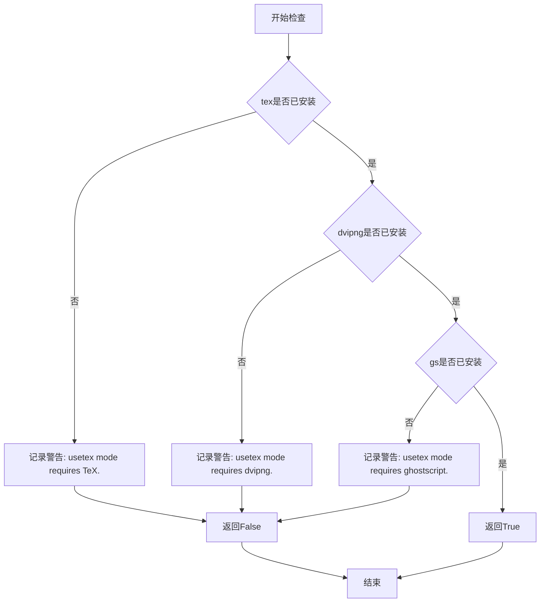

# `matplotlib\lib\matplotlib\testing\_markers.py` 详细设计文档

该文件为 Matplotlib 测试套件定义了一系列 pytest markers，用于根据系统环境和依赖项（如 Ghostscript、LaTeX 工具链等）的可用性有条件地跳过某些测试，确保测试在满足相应环境要求时才执行。

## 整体流程

```mermaid
graph TD
    A[开始] --> B[导入依赖模块]
B --> C[初始化日志记录器 _log]
C --> D[定义 _checkdep_usetex 函数]
D --> E{检查 tex 命令是否存在}
E -- 否 --> F[记录警告并返回 False]
E -- 是 --> G{检查 dvipng 是否存在}
G -- 不存在 --> H[记录警告并返回 False]
G -- 存在 --> I{检查 gs 是否存在]
I -- 不存在 --> J[记录警告并返回 False]
I -- 存在 --> K[返回 True]
K --> L[定义 needs_ghostscript marker]
L --> M[定义 needs_pgf_lualatex marker]
M --> N[定义 needs_pgf_pdflatex marker]
N --> O[定义 needs_pgf_xelatex marker]
O --> P[定义 needs_usetex marker]
P --> Q[结束]
```

## 类结构

```
无类层次结构 (该文件仅包含模块级函数和全局变量)
pytest_markers 模块
└── 全局函数: _checkdep_usetex
└── 全局变量 (pytest markers): needs_ghostscript, needs_pgf_lualatex, needs_pgf_pdflatex, needs_pgf_xelatex, needs_usetex
```

## 全局变量及字段


### `_log`
    
用于记录模块日志的Logger实例

类型：`logging.Logger`
    


### `needs_ghostscript`
    
标记测试需要ghostscript安装，如果缺少则跳过测试

类型：`pytest.mark.skipif`
    


### `needs_pgf_lualatex`
    
标记测试需要lualatex和pgf支持，如果不可用则跳过测试

类型：`pytest.mark.skipif`
    


### `needs_pgf_pdflatex`
    
标记测试需要pdflatex和pgf支持，如果不可用则跳过测试

类型：`pytest.mark.skipif`
    


### `needs_pgf_xelatex`
    
标记测试需要xelatex和pgf支持，如果不可用则跳过测试

类型：`pytest.mark.skipif`
    


### `needs_usetex`
    
标记测试需要TeX相关工具链，如果不可用则跳过测试

类型：`pytest.mark.skipif`
    


    

## 全局函数及方法


### `_checkdep_usetex`

该函数用于检查系统是否满足LaTeX排版所需的依赖环境，通过依次检测tex、dvipng和ghostscript三个可执行文件是否已安装，若任一组件缺失则记录警告日志并返回False，全部满足时返回True。

参数：无需参数

返回值：`bool`，返回True表示LaTeX环境完整可用，返回False表示缺少必要的依赖组件

#### 流程图



#### 带注释源码

```python
def _checkdep_usetex() -> bool:
    """
    检查LaTeX排版所需的依赖工具是否已安装。
    
    依次检查tex、dvipng、ghostscript三个可执行文件，
    任一缺失则记录警告并返回False，全部存在返回True。
    """
    # 检查tex可执行文件是否存在
    if not shutil.which("tex"):
        # TeX未安装，记录警告日志
        _log.warning("usetex mode requires TeX.")
        return False
    
    # 检查dvipng可执行文件是否存在
    try:
        _get_executable_info("dvipng")
    except ExecutableNotFoundError:
        # dvipng未安装，记录警告日志
        _log.warning("usetex mode requires dvipng.")
        return False
    
    # 检查ghostscript可执行文件是否存在
    try:
        _get_executable_info("gs")
    except ExecutableNotFoundError:
        # ghostscript未安装，记录警告日志
        _log.warning("usetex mode requires ghostscript.")
        return False
    
    # 所有依赖都已满足
    return True
```

#### 关键组件信息

| 组件名称 | 一句话描述 |
|---------|-----------|
| `shutil.which` | 用于在系统PATH中查找可执行文件的标准库函数 |
| `_get_executable_info` | Matplotlib内部函数，用于获取可执行文件的详细信息 |
| `ExecutableNotFoundError` | Matplotlib自定义异常，当找不到可执行文件时抛出 |
| `_log` | 模块级logger对象，用于记录警告信息 |

#### 潜在技术债务与优化空间

1. **缺乏缓存机制**：每次调用都会重新检查系统命令，可考虑添加结果缓存以提升性能
2. **错误处理粒度较粗**：仅返回布尔值，调用方无法获知具体缺失哪个依赖
3. **日志级别选择**：使用warning而非debug，可能在正常运行时产生不必要的日志输出
4. **可扩展性不足**：硬编码检查三个工具，若需添加新工具需修改函数逻辑

## 关键组件


### 模块描述

该模块定义了Matplotlib测试套件的各种pytest标记，用于根据系统环境和依赖项条件性地跳过测试。

### 全局变量

#### _log
类型: logging.Logger
描述: 模块级日志记录器，用于输出警告和诊断信息

#### needs_ghostscript
类型: pytest.mark.skipif
描述: 条件跳过标记，检查系统是否安装了ghostscript且支持eps格式

#### needs_pgf_lualatex
类型: pytest.mark.skipif
描述: 条件跳过标记，检查系统是否支持lualatex + pgf渲染

#### needs_pgf_pdflatex
类型: pytest.mark.skipif
描述: 条件跳过标记，检查系统是否支持pdflatex + pgf渲染

#### needs_pgf_xelatex
类型: pytest.mark.skipif
描述: 条件跳过标记，检查系统是否支持xelatex + pgf渲染

#### needs_usetex
类型: pytest.mark.skipif
描述: 条件跳过标记，检查系统是否安装了完整的TeX环境（包括tex、dvipng、ghostscript）

### 函数

#### _checkdep_usetex
参数: 无
返回值类型: bool
返回值描述: 如果系统满足usetex所需的所有依赖则返回True，否则返回False
描述: 内部函数，用于检查TeX相关可执行文件是否存在于系统中


## 问题及建议


### 已知问题

-   **模块级别执行开销**：在模块导入时立即执行`shutil.which()`和`_get_executable_info()`等系统调用检查，每次导入模块都会触发这些检查，即使测试并不使用这些标记，造成不必要的性能开销。
-   **硬编码可执行文件名**：使用`shutil.which("tex")`检查TeX，但不同系统上可执行文件名可能不同（如Windows上可能是`tex.exe`），缺乏跨平台兼容性。
-   **重复的检查逻辑**：`_checkdep_usetex()`函数中多次使用try-except结构检查不同可执行文件，代码结构重复，可提取公共检查逻辑。
-   **魔法字符串分散**："eps"、"lualatex"、"pdflatex"、"xelatex"等依赖名称以字符串形式硬编码在多处，缺乏统一管理。
-   **隐式错误处理**：捕获`ExecutableNotFoundError`后仅记录警告并返回False，调用者无法区分是"未安装"还是"检查失败"，调试困难。
-   **日志级别使用不当**：使用`warning`级别报告依赖缺失更适宜用`info`级别，因为这是预期行为而非真正的警告。

### 优化建议

-   **延迟求值**：将依赖检查改为延迟执行，使用`functools.lru_cache`缓存检查结果，或在pytest收集阶段才进行实际检查。
-   **提取公共函数**：创建通用的可执行文件检查函数，接受可执行文件名列表和错误消息模板，减少重复代码。
-   **配置化依赖**：将依赖名称和对应错误消息提取为常量或配置，统一管理。
-   **改进错误处理**：考虑自定义异常类或在返回False时携带更详细的错误信息，便于调试。
-   **平台检测**：使用`sys.platform`或`platform`模块进行平台判断，适配不同操作系统的可执行文件命名规则。
-   **考虑使用pytest的fixture**：利用pytest的fixture进行依赖检查，让标记更清晰地表达测试需求。

## 其它


### 设计目标与约束

本模块的设计目标是为一组依赖外部工具（TeX、ghostscript、各类LaTeX编译器）的测试提供条件跳过机制，确保在缺少相应工具时测试能够优雅地跳过而非失败。约束包括：必须依赖matplotlib.testing和matplotlib.testing.compare模块，且需要系统中安装对应工具才能完全运行测试。

### 错误处理与异常设计

代码中通过try-except捕获ExecutableNotFoundError异常，当所需的外部可执行文件不存在时记录警告日志并返回False。日志记录使用Python标准logging模块，警告级别确保用户能够意识到缺失的依赖但不影响测试套件的整体运行。

### 数据流与状态机

本模块不涉及复杂的状态机，主要数据流为：导入时检查系统环境（tex、dvipng、gs是否存在）→根据检查结果计算各pytest marker的条件值→将标记应用到测试函数。数据流为单向，仅在模块导入时执行一次。

### 外部依赖与接口契约

本模块依赖以下外部组件：(1) tex/dvipng/gs三个命令行工具，由shutil.which和_get_executable_info检查；(2) matplotlib.testing._check_for_pgf函数，用于检查LaTeX编译器；(3) matplotlib.testing.compare.converter字典，用于检查EPS转换器支持。接口契约：_checkdep_usetex返回布尔值，各marker为pytest.mark.skipif对象。

### 性能考虑

模块在导入时执行所有依赖检查，可能导致导入延迟。建议：检查结果可缓存，或改为延迟检查（首次使用时才检查）。当前实现对测试套件启动性能有轻微影响。

### 安全性考虑

代码仅执行系统命令查询（which、get_executable_info），不涉及用户输入或网络操作，安全性风险较低。但需要注意检查结果可能被恶意修改的系统环境误导。

### 测试策略

本模块本身为测试支持模块，其自身测试应验证：在具备所有工具时marker为正常状态；工具缺失时marker正确应用skipif。建议添加单元测试模拟工具缺失场景。

### 版本兼容性

依赖matplotlib内部API（_get_executable_info、_check_for_pgf、compare.converter），这些API可能在版本迭代中发生变化，建议在文档中标注兼容的matplotlib版本范围。

### 配置管理

无显式配置项，所有配置通过环境变量或系统路径隐式完成。如需更灵活的配置，可考虑添加matplotlibrc参数控制检查行为。


    