# `matplotlib\lib\matplotlib\testing\compare.py` 详细设计文档

该模块提供了图像比较功能，用于matplotlib测试中比较生成的图像与基准图像的差异，支持多种图像格式（png、pdf、svg、eps、gif）的转换和RMS误差计算，包含缓存机制以优化重复转换性能。

## 整体流程

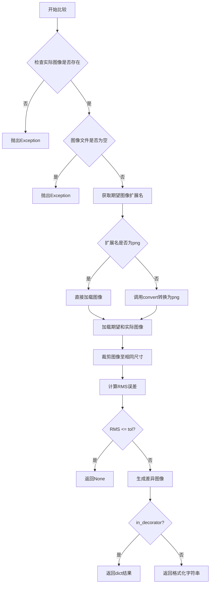

## 类结构

```
_ConverterError (异常类)
_Converter (基类转换器)
├── _MagickConverter (ImageMagick转换)
├── _GSConverter (Ghostscript转换)
│   └── 用于PDF/EPS转换
├── _SVGConverter (Inkscape转换)
│   └── _SVGWithMatplotlibFontsConverter (带字体支持的SVG转换)
```

## 全局变量及字段


### `converter`
    
扩展名到转换函数的映射字典，用于将不同文件格式转换为PNG

类型：`dict`
    


### `_svg_with_matplotlib_fonts_converter`
    
SVG字体转换器实例，用于在转换SVG时添加Matplotlib字体

类型：`_SVGWithMatplotlibFontsConverter`
    


### `_log`
    
日志记录器，用于记录模块运行时的调试和信息日志

类型：`logging.Logger`
    


### `__all__`
    
导出的公共接口列表，定义了模块对外暴露的函数

类型：`list`
    


### `_ConverterError._ConverterError`
    
转换器异常类，用于处理图像转换过程中的错误

类型：`Exception`
    


### `_Converter._proc`
    
子进程对象，用于管理外部转换程序的执行

类型：`subprocess.Popen`
    


### `_SVGConverter._tmpdir`
    
临时目录对象，用于存放SVG转换过程中的临时文件

类型：`TemporaryDirectory`
    


### `_SVGConverter._proc`
    
Inkscape子进程对象，用于执行SVG到PNG的转换

类型：`subprocess.Popen`
    
    

## 全局函数及方法


### `make_test_filename`

该函数用于生成测试文件名，通过在原文件名的扩展名之前插入指定的用途标识，常用于生成带有"-failed-diff"等后缀的对比结果文件名。

参数：

- `fname`：`str`，原始文件名的路径
- `purpose`：`str`，要插入的用途标识字符串

返回值：`str`，插入用途标识后的新文件名

#### 流程图

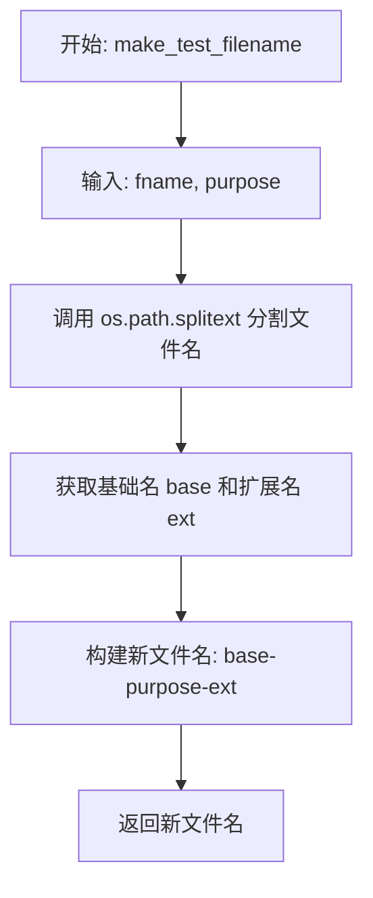

#### 带注释源码

```python
def make_test_filename(fname, purpose):
    """
    Make a new filename by inserting *purpose* before the file's extension.
    """
    # 使用 os.path.splitext 将文件名分割为不带扩展名的部分和扩展名
    # 例如: "image.png" -> ("image", ".png")
    base, ext = os.path.splitext(fname)
    
    # 重新组合文件名，在基础名和扩展名之间插入 purpose
    # 例如: base="image", purpose="failed-diff", ext=".png"
    # 结果: "image-failed-diff.png"
    return f'{base}-{purpose}{ext}'
```


### `_get_cache_path`

获取 Matplotlib 测试图像比较的缓存目录路径，如果目录不存在则自动创建。

参数：

- 无参数

返回值：`Path`，返回缓存目录的 Path 对象，用于存储测试图像转换的缓存文件。

#### 流程图

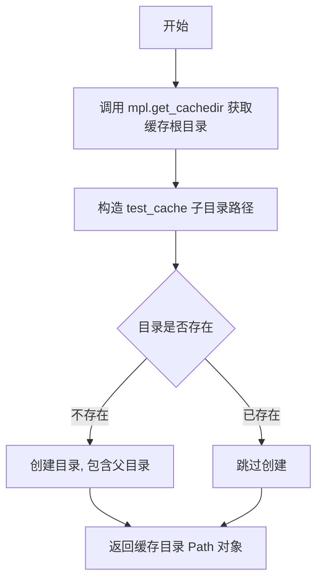

#### 带注释源码

```
def _get_cache_path():
    """
    获取测试图像转换缓存的目录路径。
    
    该函数构建缓存目录的路径，并确保该目录存在。
    如果目录不存在，会自动创建所有必需的父目录。
    """
    # 获取 matplotlib 的缓存根目录，然后拼接 'test_cache' 子目录
    cache_dir = Path(mpl.get_cachedir(), 'test_cache')
    
    # 确保目录存在，如果不存在则创建
    # parents=True 允许创建所有必需的父目录
    # exist_ok=True 防止目录已存在时抛出异常
    cache_dir.mkdir(parents=True, exist_ok=True)
    
    # 返回 Path 对象而非字符串，便于后续文件操作
    return cache_dir
```


### `get_cache_dir`

获取测试图像比较的缓存目录字符串。

参数：

- （无参数）

返回值：`str`，返回缓存目录的绝对路径字符串。

#### 流程图

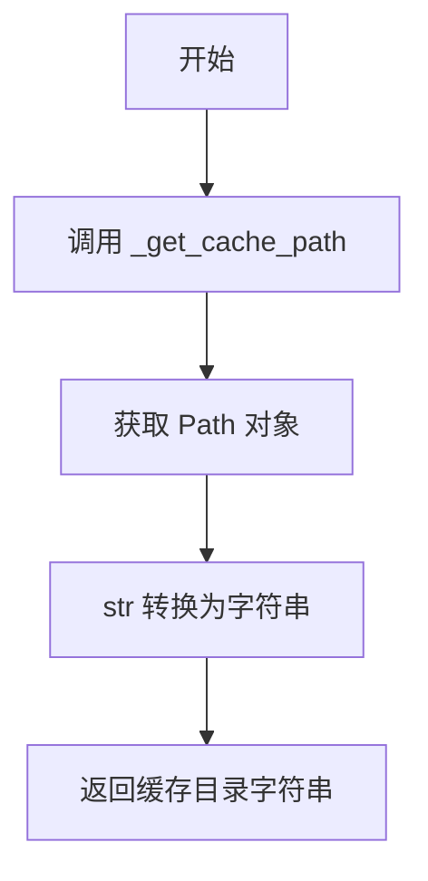

#### 带注释源码

```python
def get_cache_dir():
    """
    获取测试缓存目录的路径字符串。
    
    Returns
    -------
    str
        缓存目录的绝对路径字符串，格式为 {matplotlib缓存目录}/test_cache
    """
    return str(_get_cache_path())
```


### `get_file_hash`

计算指定文件的 SHA256 哈希值，用于生成文件的唯一标识。该函数会分块读取文件内容以避免大文件内存溢出，并根据文件类型（PDF 或 SVG）额外包含相关可执行文件版本信息，以确保不同环境下的哈希一致性。

参数：

- `path`：`str` 或 `Path`，需要计算哈希的文件路径
- `block_size`：`int`，读取文件的块大小，默认为 2^20（1MB）

返回值：`str`，文件内容的 SHA256 哈希值的十六进制表示

#### 流程图

```mermaid
flowchart TD
    A[开始] --> B[创建SHA256哈希对象 usedforsecurity=False]
    B --> C[以二进制模式打开文件]
    C --> D{读取数据块}
    D -->|有数据| E[sha256.update(data)]
    E --> D
    D -->|读取完毕| F{文件扩展名}
    F -->|'.pdf'| G[获取Ghostscript版本信息]
    G --> H[sha256.update版本信息]
    F -->|'.svg'| I[获取Inkscape版本信息]
    I --> H
    F -->|其他| J[返回hexdigest]
    H --> J
```

#### 带注释源码

```python
def get_file_hash(path, block_size=2 ** 20):
    """
    计算文件的 SHA256 哈希值。
    
    参数:
        path: str 或 Path, 文件路径
        block_size: int, 每次读取的块大小, 默认为 1MB
    
    返回:
        str, SHA256 哈希值的十六进制字符串
    """
    # 创建 SHA256 哈希对象, usedforsecurity=False 表示不用于安全加密场景
    # 这在某些平台(如Windows)上可以避免不必要的Cryptography库依赖
    sha256 = hashlib.sha256(usedforsecurity=False)
    
    # 以二进制模式打开文件, 避免编码问题
    with open(path, 'rb') as fd:
        # 循环读取文件块直到文件结束
        while True:
            data = fd.read(block_size)  # 读取一块数据
            if not data:  # 如果没有数据了, 退出循环
                break
            sha256.update(data)  # 更新哈希值

    # 获取文件扩展名(小写)
    suffix = Path(path).suffix.lower()
    
    # 对于 PDF 文件, 额外包含 Ghostscript 版本信息
    # 这样可以确保不同 GS 版本生成的 PDF 产生不同的哈希
    if suffix == '.pdf':
        sha256.update(str(mpl._get_executable_info("gs").version).encode('utf-8'))
    # 对于 SVG 文件, 额外包含 Inkscape 版本信息
    # 确保不同 Inkscape 版本产生的哈希不同
    elif suffix == '.svg':
        sha256.update(str(mpl._get_executable_info("inkscape").version).encode('utf-8'))

    # 返回十六进制格式的哈希值
    return sha256.hexdigest()
```


### `_update_converter`

该函数用于初始化全局的图像格式转换映射表（`converter`）。它在模块导入时被调用，通过尝试检测系统上是否安装了 ImageMagick（magick）、Ghostscript（gs）和 Inkscape 等图像处理工具，根据检测结果将对应的转换器类实例注册到全局字典中，以便后续在图像比较测试中进行格式转换（如 PDF/EPS/SVG 转 PNG）。

参数：
- 该函数无参数。

返回值：
- `None`，该函数不返回值，仅通过修改全局变量 `converter` 产生副作用。

#### 流程图

```mermaid
flowchart TD
    A([开始]) --> B{检查 'magick' 可执行文件}
    B -- 找到 --> C[注册 _MagickConverter 到 converter['gif']]
    B -- 未找到 --> D{检查 'gs' 可执行文件}
    C --> D
    D -- 找到 --> E[注册 _GSConverter 到 converter['pdf'] 和 converter['eps']]
    D -- 未找到 --> F{检查 'inkscape' 可执行文件}
    E --> F
    F -- 找到 --> G[注册 _SVGConverter 到 converter['svg']]
    F -- 未找到 --> H([结束])
    G --> H
```

#### 带注释源码

```python
def _update_converter():
    # 尝试获取 ImageMagick 的可执行信息
    try:
        mpl._get_executable_info("magick")
    # 如果未找到 (ExecutableNotFoundError)，则忽略，不注册 GIF 转换器
    except mpl.ExecutableNotFoundError:
        pass
    # 如果找到了，则将 GIF 转换器映射到全局 converter 字典
    else:
        converter['gif'] = _MagickConverter()

    # 尝试获取 Ghostscript 的可执行信息
    try:
        mpl._get_executable_info("gs")
    except mpl.ExecutableNotFoundError:
        pass
    else:
        # Ghostscript 可处理 PDF 和 EPS 格式
        converter['pdf'] = converter['eps'] = _GSConverter()

    # 尝试获取 Inkscape 的可执行信息
    try:
        mpl._get_executable_info("inkscape")
    except mpl.ExecutableNotFoundError:
        pass
    else:
        converter['svg'] = _SVGConverter()
```

#### 潜在的技术债务或优化空间

1.  **运行时检测开销**：该函数在模块首次导入时执行，每次启动测试脚本都会尝试查找可执行文件。虽然 `mpl._get_executable_info` 可能有内部缓存，但在某些环境下（特别是 CI 容器环境），这可能引入不必要的启动延迟。
2.  **静默失败**：如果外部工具未安装，函数静默失败（pass）。虽然这是合理的设计（允许在最小化环境中运行），但可能导致后续测试失败时，错误信息不够直观（不知道是因为没安装工具还是图片本身的问题）。可以考虑在模块加载时输出 `debug` 级别的日志，提示哪些转换器未被激活。
3.  **全局状态管理**：该函数直接修改全局变量 `converter`。这虽然简单直接，但不利于单元测试隔离（如果需要测试不同的转换器配置，可能需要 mock 全局字典）。

#### 其它项目

*   **设计目标与约束**：设计目标是在不破坏代码可移植性的前提下，利用系统已安装的图像处理工具实现图像格式的自动转换，以便进行视觉回归测试。
*   **错误处理与异常设计**：使用 `try...except mpl.ExecutableNotFoundError` 来捕获工具缺失的异常。这是预期内的“配置缺失”，不应阻断程序运行，因此被捕获并忽略。
*   **数据流与状态机**：该函数是状态初始化的关键节点。它决定了 `compare_images` 函数能够处理哪些格式的图像。执行后，`converter` 字典从空状态变为可用状态。


### `comparable_formats`

获取可比较的格式列表，返回当前系统支持的、可用于图像比较的文件格式。

参数： 无

返回值：`list of str`，返回可比较的文件格式字符串列表，例如 `['png', 'pdf', 'svg', 'eps']`。

#### 流程图

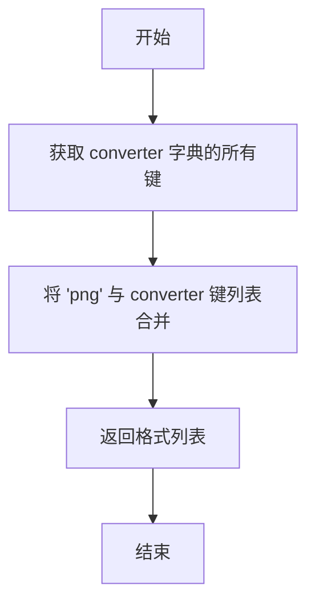

#### 带注释源码

```
def comparable_formats():
    """
    Return the list of file formats that `.compare_images` can compare
    on this system.

    Returns
    -------
    list of str
        E.g. ``['png', 'pdf', 'svg', 'eps']``.

    """
    # 'png' 是基础格式，始终支持
    # converter 字典在模块加载时通过 _update_converter() 填充
    # 根据系统中可用的外部程序（magick, gs, inkscape）动态添加可转换的格式
    return ['png', *converter]
```

#### 关联全局变量

| 变量名称 | 类型 | 描述 |
|---------|------|------|
| `converter` | `dict` | 将文件扩展名映射到转换函数的字典，由 `_update_converter()` 在模块加载时根据系统上可用的可执行程序动态填充 |

#### 设计说明

该函数的设计遵循以下原则：
1. **PNG 始终为基准格式**：PNG 是图像比较的基准格式，所有比较最终都转换为 PNG 进行
2. **动态检测能力**：`converter` 字典通过 `_update_converter()` 函数在模块导入时检测系统上是否安装了 ImageMagick、Ghostscript 和 Inkscape，从而决定支持哪些格式
3. **最小化依赖**：函数本身无参数、无副作用，仅读取全局状态


### `convert`

该函数是图像比较工具的核心转换模块，负责将各种格式的图像文件（PDF、EPS、SVG、GIF等）转换为PNG格式，并支持基于文件内容哈希的转换缓存机制，以提高测试效率。

参数：

- `filename`：`str`，要转换的图像文件的路径
- `cache`：`bool`，是否启用转换结果缓存

返回值：`str`，转换后的PNG文件的路径

#### 流程图

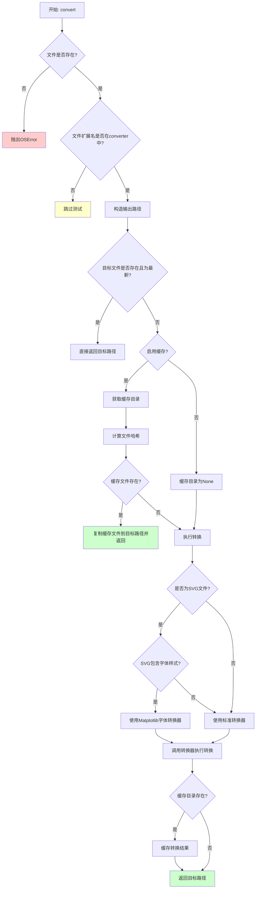

#### 带注释源码

```python
def convert(filename, cache):
    """
    Convert the named file to png; return the name of the created file.

    If *cache* is True, the result of the conversion is cached in
    `matplotlib.get_cachedir() + '/test_cache/'`.  The caching is based on a
    hash of the exact contents of the input file.  Old cache entries are
    automatically deleted as needed to keep the size of the cache capped to
    twice the size of all baseline images.
    """
    # 将文件名转换为Path对象
    path = Path(filename)
    
    # 检查源文件是否存在，不存在则抛出异常
    if not path.exists():
        raise OSError(f"{path} does not exist")
    
    # 检查文件扩展名是否在支持转换的格式列表中
    # 如果不支持，则跳过测试（使用pytest.skip）
    if path.suffix[1:] not in converter:
        import pytest
        pytest.skip(f"Don't know how to convert {path.suffix} files to png")
    
    # 构造输出文件名：将原文件名的后缀替换为.png
    # 例如：test.pdf -> test_pdf.png
    newpath = path.parent / f"{path.stem}_{path.suffix[1:]}.png"

    # Only convert the file if the destination doesn't already exist or
    # 只有当目标文件不存在或源文件比目标文件更新时才执行转换
    # is out of date.
    if not newpath.exists() or newpath.stat().st_mtime < path.stat().st_mtime:
        # 根据cache参数决定是否使用缓存目录
        cache_dir = _get_cache_path() if cache else None

        # 如果启用缓存
        if cache_dir is not None:
            # 注册缓存清理器（仅注册一次）
            _register_conversion_cache_cleaner_once()
            
            # 计算源文件的SHA256哈希值
            hash_value = get_file_hash(path)
            
            # 构造缓存文件路径（哈希值 + .png后缀）
            cached_path = cache_dir / (hash_value + newpath.suffix)
            
            # 如果缓存文件已存在，直接复制并返回，节省转换时间
            if cached_path.exists():
                _log.debug("For %s: reusing cached conversion.", filename)
                shutil.copyfile(cached_path, newpath)
                return str(newpath)

        # 记录转换日志
        _log.debug("For %s: converting to png.", filename)
        
        # 根据文件扩展名获取对应的转换器函数
        convert = converter[path.suffix[1:]]
        
        # 特殊处理SVG文件：检查是否包含字体样式
        if path.suffix == ".svg":
            # 读取SVG文件内容
            contents = path.read_text(encoding="utf-8")
            
            # NOTE: This check should be kept in sync with font styling in
            # `lib/matplotlib/backends/backend_svg.py`. If it changes, then be sure to
            # re-generate any SVG test files using this mode, or else such tests will
            # fail to use the converter for the expected images (but will for the
            # results), and the tests will fail strangely.
            # 使用正则表达式搜索字体相关样式属性
            if re.search(
                # searches for attributes :
                #   style=[font|font-size|font-weight|
                #          font-family|font-variant|font-style]
                # taking care of the possibility of multiple style attributes
                # before the font styling (i.e. opacity)
                r'style="[^"]*font(|-size|-weight|-family|-variant|-style):',
                contents  # raw contents of the svg file
                    ):
                # for svg.fonttype = none, we explicitly patch the font search
                # path so that fonts shipped by Matplotlib are found.
                # 如果SVG使用fonttype="none"，使用Matplotlib字体转换器
                convert = _svg_with_matplotlib_fonts_converter
        
        # 执行实际的图像格式转换
        convert(path, newpath)

        # 如果启用了缓存，将转换结果保存到缓存目录
        if cache_dir is not None:
            _log.debug("For %s: caching conversion result.", filename)
            shutil.copyfile(newpath, cached_path)

    # 返回转换后的PNG文件路径
    return str(newpath)
```


### `_clean_conversion_cache`

清理转换缓存目录，删除旧的缓存文件以保持缓存大小不超过基线图像总大小的两倍。

参数：

- 该函数无参数

返回值：`None`，无返回值，仅执行副作用（删除文件）

#### 流程图

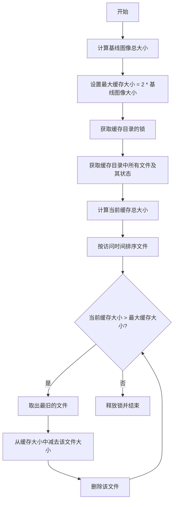

#### 带注释源码

```
def _clean_conversion_cache():
    # 计算matplotlib基线图像的总大小（以字节为单位）
    # 注意：这实际上会忽略mpl_toolkits的基线图像，但它们相对较小
    baseline_images_size = sum(
        path.stat().st_size
        for path in Path(mpl.__file__).parent.glob("**/baseline_images/**/*"))
    
    # 最大缓存大小设为基线图像大小的两倍：
    # 一份完整的基线图像副本 + 一份完整的测试结果副本
    # 实际上这是一个高估值：因为我们不会转换png基线和结果
    max_cache_size = 2 * baseline_images_size
    
    # 减少缓存直到其大小符合限制
    # 使用锁确保并发安全
    with cbook._lock_path(_get_cache_path()):
        # 获取缓存目录中所有文件的stat信息字典
        cache_stat = {
            path: path.stat() for path in _get_cache_path().glob("*")}
        
        # 计算当前缓存的总大小
        cache_size = sum(stat.st_size for stat in cache_stat.values())
        
        # 按最后访问时间排序文件（最旧的排在最后）
        # reverse=True 使得最旧的访问时间排在列表末尾
        paths_by_atime = sorted(
            cache_stat, key=lambda path: cache_stat[path].st_atime,
            reverse=True)
        
        # 循环删除最旧的文件直到缓存大小符合限制
        while cache_size > max_cache_size:
            # 取出列表末尾的元素（即最旧访问的文件）
            path = paths_by_atime.pop()
            # 更新缓存大小
            cache_size -= cache_stat[path].st_size
            # 删除该文件
            path.unlink()
```


### `_register_conversion_cache_cleaner_once`

该函数用于注册一个退出时的缓存清理器，确保转换缓存清理函数仅在程序退出时被注册一次（通过 `@functools.cache` 装饰器实现）。

参数： 无

返回值：`None`，无显式返回值

#### 流程图


#### 带注释源码

```python
@functools.cache  # 使用 functools.cache 装饰器确保该函数只执行一次
def _register_conversion_cache_cleaner_once():
    """
    注册转换缓存清理器，仅在程序退出时执行一次。
    
    该函数通过 atexit 模块注册 _clean_conversion_cache 函数，
    确保在程序结束时清理过期的转换缓存文件。
    使用 functools.cache 装饰器保证即使多次调用也只会注册一次。
    """
    atexit.register(_clean_conversion_cache)  # 注册退出时的回调函数
```


### `crop_to_same`

裁剪两个图像至相同尺寸，主要用于解决 EPS 转 PDF 时可能产生的尺寸差异问题，通过以中心为基准裁剪较大的图像使其与较小图像尺寸一致。

参数：

- `actual_path`：`str`，实际图像的文件路径，用于判断文件类型是否为 EPS
- `actual_image`：`numpy.ndarray`，实际图像的三维数组数据（高度×宽度×通道数）
- `expected_path`：`str`，预期图像的文件路径，用于判断文件类型是否为 PDF
- `expected_image`：`numpy.ndarray`，预期图像的三维数组数据（高度×宽度×通道数）

返回值：`tuple[numpy.ndarray, numpy.ndarray]`，返回裁剪后的实际图像数组和预期图像数组组成的元组

#### 流程图

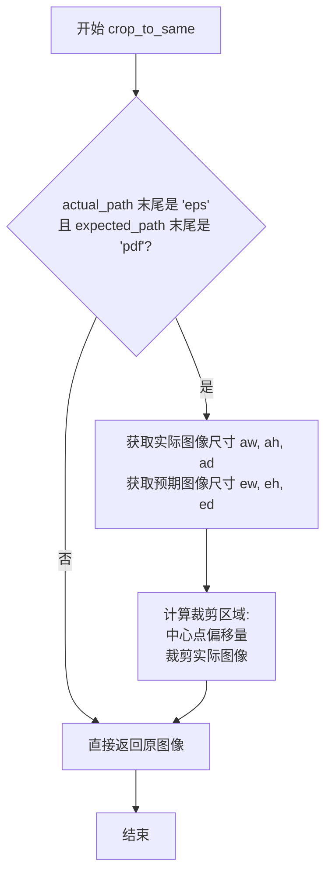

#### 带注释源码

```python
def crop_to_same(actual_path, actual_image, expected_path, expected_image):
    """
    裁剪图像至相同尺寸。
    
    此函数主要用于解决 EPS 转 PDF 时产生的尺寸差异问题。
    当实际图像为 EPS 格式且预期图像为 PDF 格式时，
    将以中心为基准裁剪实际图像，使其尺寸与预期图像一致。
    
    Parameters
    ----------
    actual_path : str
        实际图像的文件路径。
    actual_image : numpy.ndarray
        实际图像的三维数组，形状为 (高度, 宽度, 通道数)。
    expected_path : str
        预期图像的文件路径。
    expected_image : numpy.ndarray
        预期图像的三维数组，形状为 (高度, 宽度, 通道数)。
    
    Returns
    -------
    tuple
        包含裁剪后的实际图像和预期图像的元组。
    """
    # 检查文件类型：仅当比较 eps 和 pdf 时才进行裁剪
    # 通过路径末尾字符判断文件格式
    if actual_path[-7:-4] == 'eps' and expected_path[-7:-4] == 'pdf':
        # 获取实际图像的尺寸信息
        aw, ah, ad = actual_image.shape  # 高度、宽度、通道数
        # 获取预期图像的尺寸信息
        ew, eh, ed = expected_image.shape
        
        # 计算裁剪区域的中心偏移量
        # 以实际图像中心为基准，裁剪出与预期图像相同大小的区域
        actual_image = actual_image[
            int(aw / 2 - ew / 2):int(aw / 2 + ew / 2),  # 高度维度裁剪
            int(ah / 2 - eh / 2):int(ah / 2 + eh / 2)   # 宽度维度裁剪
        ]
    
    # 返回裁剪后的实际图像和未修改的预期图像
    return actual_image, expected_image
```


### `calculate_rms`

计算两幅图像的逐像素误差并返回均方根误差（RMSE），用于图像比较测试。

参数：

- `expected_image`：`numpy.ndarray`，期望的基准图像数据
- `actual_image`：`numpy.ndarray`，实际生成的图像数据

返回值：`float`，两幅图像之间的均方根误差值

#### 流程图

```mermaid
flowchart TD
    A[开始 calculate_rms] --> B{检查图像形状是否相同}
    B -->|形状不同| C[抛出 ImageComparisonFailure 异常]
    B -->|形状相同| D[计算差值: expected_image - actual_image]
    D --> E[转换为 float 类型避免整数溢出]
    E --> F[计算平方: diff \*\* 2]
    F --> G[计算均值: .mean\(\)]
    G --> H[开根号: np.sqrt\(\)]
    H --> I[返回 RMSE 值]
    C --> J[结束]
    I --> J
```

#### 带注释源码

```python
def calculate_rms(expected_image, actual_image):
    """
    Calculate the per-pixel errors, then compute the root mean square error.
    
    该函数用于比较两幅图像的差异，通过计算逐像素误差的均方根来量化图像之间的相似度。
    常用于matplotlib的图像测试中，验证生成的图像是否符合预期。
    
    Parameters
    ----------
    expected_image : numpy.ndarray
        期望的基准图像数据，通常为三维数组（高度 x 宽度 x 通道数）
    actual_image : numpy.ndarray
        实际生成的图像数据，维度应与 expected_image 相同
    
    Returns
    -------
    float
        均方根误差（RMSE）值，值越小表示两幅图像越相似
    
    Raises
    ------
    ImageComparisonFailure
        当两幅图像的形状不同时抛出，表示无法直接比较
    """
    # 检查两幅图像的形状是否一致，如果不一致则抛出异常
    if expected_image.shape != actual_image.shape:
        raise ImageComparisonFailure(
            f"Image sizes do not match expected size: {expected_image.shape} "
            f"actual size {actual_image.shape}")
    
    # 将图像数据转换为 float 类型，避免在计算平方时发生整数溢出
    # 例如：如果图像是 uint8 类型（范围 0-255），直接平方可能溢出
    return np.sqrt(((expected_image - actual_image).astype(float) ** 2).mean())
    # 步骤分解：
    # 1. expected_image - actual_image: 计算逐像素差值
    # 2. .astype(float): 转换为浮点数以支持更精确的计算
    # 3. ** 2: 对差值进行平方处理，消除负值影响
    # 4. .mean(): 计算所有像素差值平方的平均值
    # 5. np.sqrt(): 对平均值开根号，得到最终的 RMSE
```


### `_load_image`

该函数用于加载图像文件，将其转换为RGB模式（如果图像不透明则丢弃Alpha通道），并返回NumPy数组格式以便后续图像比较处理。

参数：

- `path`：`str` 或 `Path`，待加载的图像文件路径

返回值：`numpy.ndarray`，转换后的RGB图像数据数组

#### 流程图

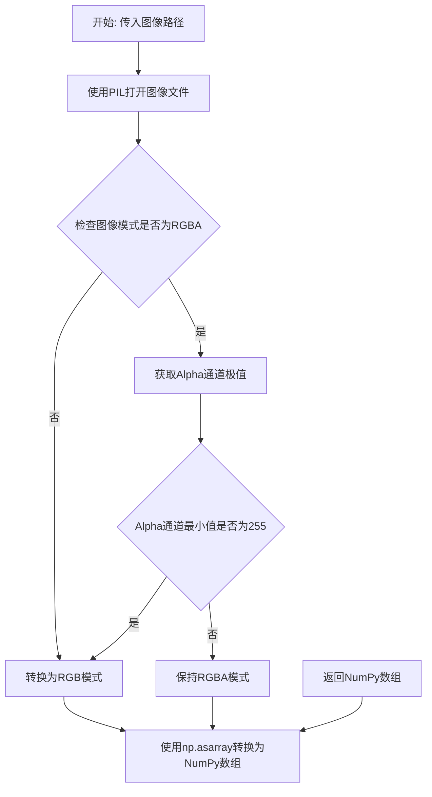

#### 带注释源码

```python
def _load_image(path):
    """
    加载图像文件并转换为NumPy数组。
    
    Parameters
    ----------
    path : str or Path
        图像文件的路径。
    
    Returns
    -------
    numpy.ndarray
        转换后的RGB图像数组。
    """
    # 使用PIL打开图像文件
    img = Image.open(path)
    
    # 在RGBA图像中，如果Alpha通道的最小值为255，则意味着所有像素都是不透明的。
    # 此时可以丢弃Alpha通道，以便与RGB图像进行相等比较。
    if img.mode != "RGBA" or img.getextrema()[3][0] == 255:
        img = img.convert("RGB")
    
    # 将PIL图像转换为NumPy数组并返回
    return np.asarray(img)
```


### `compare_images`

该函数用于比较两个图像文件（期望图像和实际图像）之间的差异，通过计算均方根误差（RMS）来判断图像是否相似。如果差异超过设定的容差（tol），则生成差异图像并返回详细的比较报告；否则返回 None。

参数：

- `expected`：`str`，期望的基准图像文件路径。
- `actual`：`str`，实际生成的图像文件路径。
- `tol`：`float`，容差值（颜色值差异，255 为最大差异）。如果平均像素差异大于此值，测试失败。
- `in_decorator`：`bool`，指定输出格式。如果从 `image_comparison` 装饰器调用，则为 True。（默认为 False）

返回值：`None` or `dict` or `str`。如果图像在容差范围内相等，则返回 `None`。如果图像不同，返回值取决于 `in_decorator`。如果 `in_decorator` 为 `True`，返回包含 `rms`, `expected`, `actual`, `diff_image`, `tol` 的字典；否则返回人类可读的多行字符串。

#### 流程图

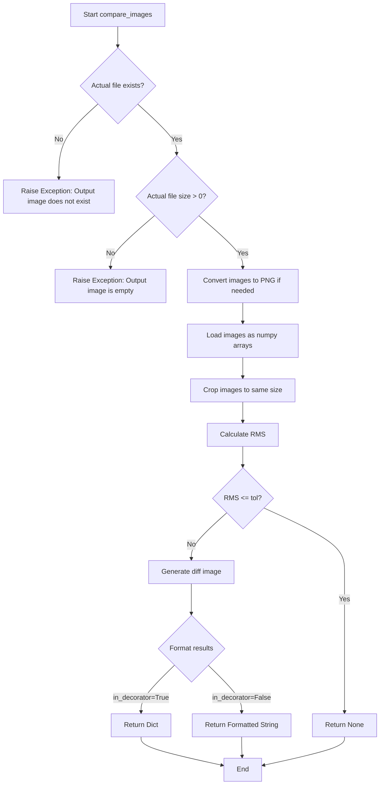

#### 带注释源码

```python
def compare_images(expected, actual, tol, in_decorator=False):
    """
    Compare two "image" files checking differences within a tolerance.

    The two given filenames may point to files which are convertible to
    PNG via the `!converter` dictionary. The underlying RMS is calculated
    in a similar way to the `.calculate_rms` function.

    Parameters
    ----------
    expected : str
        The filename of the expected image.
    actual : str
        The filename of the actual image.
    tol : float
        The tolerance (a color value difference, where 255 is the
        maximal difference).  The test fails if the average pixel
        difference is greater than this value.
    in_decorator : bool
        Determines the output format. If called from image_comparison
        decorator, this should be True. (default=False)

    Returns
    -------
    None or dict or str
        Return *None* if the images are equal within the given tolerance.

        If the images differ, the return value depends on  *in_decorator*.
        If *in_decorator* is true, a dict with the following entries is
        returned:

        - *rms*: The RMS of the image difference.
        - *expected*: The filename of the expected image.
        - *actual*: The filename of the actual image.
        - *diff_image*: The filename of the difference image.
        - *tol*: The comparison tolerance.

        Otherwise, a human-readable multi-line string representation of this
        information is returned.

    Examples
    --------
    ::

        img1 = "./baseline/plot.png"
        img2 = "./output/plot.png"
        compare_images(img1, img2, 0.001)

    """
    # 将actual路径转换为文件系统路径字符串
    actual = os.fspath(actual)
    # 检查实际图像文件是否存在，如果不存在则抛出异常
    if not os.path.exists(actual):
        raise Exception(f"Output image {actual} does not exist.")
    # 检查实际图像文件大小是否为0，如果为0则抛出异常
    if os.stat(actual).st_size == 0:
        raise Exception(f"Output image file {actual} is empty.")

    # 将expected路径转换为文件系统路径字符串
    expected = os.fspath(expected)
    # 检查期望图像文件是否存在，如果不存在则抛出OSError
    if not os.path.exists(expected):
        raise OSError(f'Baseline image {expected!r} does not exist.')
    
    # 获取期望图像的文件扩展名
    extension = expected.split('.')[-1]
    # 如果扩展名不是png，则需要将actual和expected转换为png格式
    if extension != 'png':
        actual = convert(actual, cache=True)
        expected = convert(expected, cache=True)

    # 加载图像文件为numpy数组
    expected_image = _load_image(expected)
    actual_image = _load_image(actual)

    # 如果需要，将图像裁剪到相同大小（例如比较eps和pdf时）
    actual_image, expected_image = crop_to_same(
        actual, actual_image, expected, expected_image)

    # 生成差异图像的文件名
    diff_image = make_test_filename(actual, 'failed-diff')

    # 如果容差小于等于0，则进行严格相等比较
    if tol <= 0:
        if np.array_equal(expected_image, actual_image):
            return None

    # 计算两幅图像的RMS和绝对差异
    rms, abs_diff = _image.calculate_rms_and_diff(expected_image, actual_image)

    # 如果RMS小于等于容差，则认为图像相等
    if rms <= tol:
        return None

    # 如果RMS大于容差，则保存差异图像
    Image.fromarray(abs_diff).save(diff_image, format="png")

    # 构建结果字典
    results = dict(rms=rms, expected=str(expected),
                   actual=str(actual), diff=str(diff_image), tol=tol)

    # 如果不是在装饰器中调用，则将结果格式化为人类可读的字符串
    if not in_decorator:
        # Then the results should be a string suitable for stdout.
        template = ['Error: Image files did not match.',
                    'RMS Value: {rms}',
                    'Expected:  \n    {expected}',
                    'Actual:    \n    {actual}',
                    'Difference:\n    {diff}',
                    'Tolerance: \n    {tol}', ]
        results = '\n  '.join([line.format(**results) for line in template])
    return results
```


### `save_diff_image`

该函数用于比较预期图像和实际图像之间的差异，生成并保存差异图像。它通过计算两个图像的像素差异并进行亮度增强处理，使差异部分更加明显，便于可视化调试。

参数：

- `expected`：`str`，预期（基准）图像的文件路径
- `actual`：`str`，实际（测试输出）图像的文件路径
- `output`：`str`，要保存的差异图像的文件路径

返回值：`None`，该函数无返回值，直接将差异图像保存到指定路径

#### 流程图

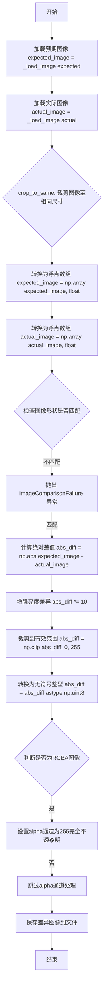

#### 带注释源码

```python
def save_diff_image(expected, actual, output):
    """
    Parameters
    ----------
    expected : str
        File path of expected image.
    actual : str
        File path of actual image.
    output : str
        File path to save difference image to.
    """
    # 1. 使用 _load_image 函数加载预期图像文件，返回 numpy 数组格式
    expected_image = _load_image(expected)
    
    # 2. 使用 _load_image 函数加载实际图像文件，返回 numpy 数组格式
    actual_image = _load_image(actual)
    
    # 3. 裁剪两个图像至相同尺寸（主要用于 EPS 与 PDF 格式的比较）
    actual_image, expected_image = crop_to_same(
        actual, actual_image, expected, expected_image)
    
    # 4. 将预期图像转换为浮点类型数组，以便进行精确的数值计算
    expected_image = np.array(expected_image, float)
    
    # 5. 将实际图像转换为浮点类型数组，以便进行精确的数值计算
    actual_image = np.array(actual_image, float)
    
    # 6. 再次检查两个图像的形状是否完全匹配，若不匹配则抛出异常
    if expected_image.shape != actual_image.shape:
        raise ImageComparisonFailure(
            f"Image sizes do not match expected size: {expected_image.shape} "
            f"actual size {actual_image.shape}")
    
    # 7. 计算两个图像对应像素的绝对差值，得到差异图像
    abs_diff = np.abs(expected_image - actual_image)

    # 8. 扩展差异在亮度域中的显示效果（乘以10使差异更明显）
    abs_diff *= 10
    
    # 9. 将差异值裁剪到有效像素范围 [0, 255]，并转换为无符号整型
    abs_diff = np.clip(abs_diff, 0, 255).astype(np.uint8)

    # 10. 判断差异图像是否为 RGBA 格式（含4个通道）
    if abs_diff.shape[2] == 4:  # Hard-code the alpha channel to fully solid
        # 将 alpha 通道设置为 255（完全不透明），确保差异区域可见
        abs_diff[:, :, 3] = 255

    # 11. 使用 PIL 将差异数组转换为图像对象，并保存为 PNG 格式
    Image.fromarray(abs_diff).save(output, format="png")
```


### `_Converter.__init__`

该方法是 `_Converter` 类的构造函数，用于初始化转换器对象。它将 `self._proc` 设置为 `None`，并通过 `atexit.register()` 注册 `__del__` 方法，以确保在程序退出时能够正确清理子进程资源，避免因模块全局变量已被置为 `None` 而导致进程终止失败。

参数：

- 无参数（仅包含隐式参数 `self`）

返回值：`None`，无返回值

#### 流程图


#### 带注释源码

```python
def __init__(self):
    """
    初始化 _Converter 实例。
    
    该构造函数执行以下操作：
    1. 将 self._proc 初始化为 None，表示当前没有活跃的子进程
    2. 注册 __del__ 方法到 atexit 处理器，确保程序退出时正确清理子进程
    """
    self._proc = None
    # Explicitly register deletion from an atexit handler because if we
    # wait until the object is GC'd (which occurs later), then some module
    # globals (e.g. signal.SIGKILL) has already been set to None, and
    # kill() doesn't work anymore...
    atexit.register(self.__del__)
```


### `_Converter.__del__`

析构函数，在对象被垃圾回收时自动调用，用于安全地终止并清理子进程及其相关资源（标准输入、输出和错误流）。

参数：

- `self`：`_Converter` 对象，隐式参数，表示当前实例

返回值：`None`，析构函数不返回值

#### 流程图

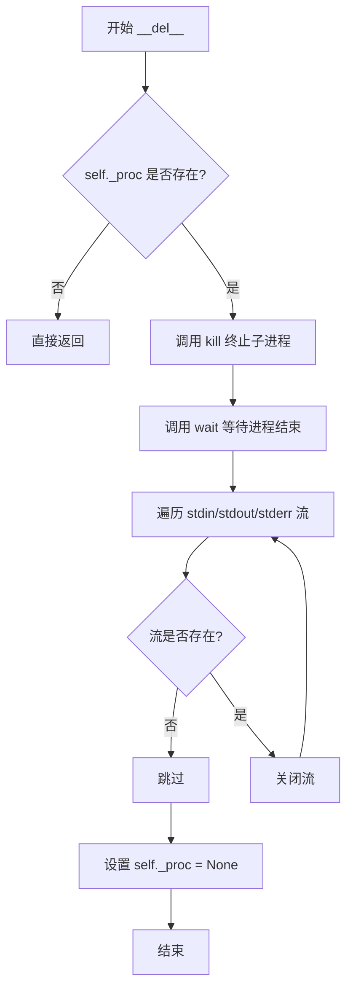

#### 带注释源码

```python
def __del__(self):
    """
    析构函数，在对象销毁时自动调用。
    确保子进程被正确终止并释放相关资源。
    """
    # 检查是否存在子进程（可能在初始化后未启动进程）
    if self._proc:
        # 向子进程发送 SIGKILL 信号，强制终止进程
        self._proc.kill()
        
        # 等待子进程完全终止，释放进程资源
        self._proc.wait()
        
        # 遍历所有可能打开的流（标准输入、标准输出、标准错误）
        for stream in filter(None, [self._proc.stdin,
                                    self._proc.stdout,
                                    self._proc.stderr]):
            # 关闭每个打开的流以释放系统资源
            stream.close()
        
        # 将进程引用置为 None，防止重复清理
        self._proc = None
```


### `_Converter._read_until`

读取子进程输出直到遇到指定的终止符，并将读取到的字节数据返回。

参数：

- `terminator`：`bytes`，终止符字节序列，当输出以该序列结尾时停止读取

返回值：`bytes`，从开始到终止符的所有字节数据

#### 流程图

```mermaid
flowchart TD
    A[开始读取] --> B[创建空字节数组buf]
    B --> C{循环读取}
    C --> D[从stdout读取1个字节c]
    D --> E{c是否为空?}
    E -->|是| F[抛出_ConverterError异常<br/>异常信息为已读取的buf解码后的内容]
    E -->|否| G[将c添加到buf末尾]
    G --> H{buf是否以terminator结尾?}
    H -->|否| C
    H -->|是| I[返回bytes(buf)]
```

#### 带注释源码

```
def _read_until(self, terminator):
    """Read until the prompt is reached."""
    # 创建一个可变的字节数组用于累积读取的数据
    buf = bytearray()
    
    # 持续循环直到遇到终止符或发生错误
    while True:
        # 从子进程的stdout读取1个字节
        c = self._proc.stdout.read(1)
        
        # 如果读取为空（子进程可能已终止或出错）
        if not c:
            # 抛出ConverterError异常，包含已读取的缓冲区内容作为错误信息
            # 使用os.fsdecode将字节解码为字符串
            raise _ConverterError(os.fsdecode(bytes(buf)))
        
        # 将读取到的字节追加到缓冲区
        buf.extend(c)
        
        # 检查缓冲区是否以终止符结尾
        if buf.endswith(terminator):
            # 如果找到终止符，返回完整的字节数据
            return bytes(buf)
```


### `_MagickConverter.__call__`

调用ImageMagick的magick命令行工具将原始图像文件转换为目标格式文件。

参数：

- `self`：`_MagickConverter`，类的实例本身（隐式参数）
- `orig`：`str`，原始图像文件的路径（源文件）
- `dest`：`str`，目标图像文件的路径（转换后的输出文件）

返回值：`None`，无返回值。转换成功时直接返回，失败时抛出`_ConverterError`异常。

#### 流程图

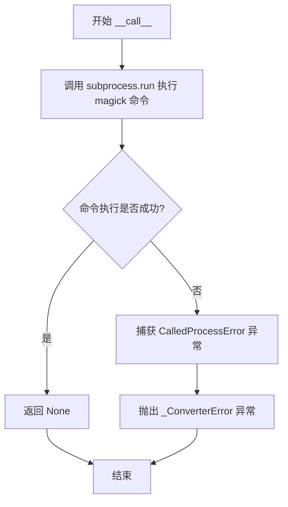

#### 带注释源码

```python
class _MagickConverter:
    def __call__(self, orig, dest):
        """
        使用 ImageMagick 的 magick 命令行工具将图像从 orig 转换到 dest。
        
        Parameters
        ----------
        orig : str
            原始图像文件的路径（源文件）。
        dest : str
            目标图像文件的路径（转换后的输出文件）。
        
        Returns
        -------
        None
            转换成功时无返回值。
        
        Raises
        ------
        _ConverterError
            当 ImageMagick 命令执行失败时抛出。
        """
        try:
            # 调用 subprocess.run 执行 ImageMagick 的 magick 命令
            # 命令格式: magick <orig> <dest>
            # check=True 表示如果命令返回非零退出码则抛出 CalledProcessError
            subprocess.run(
                [mpl._get_executable_info("magick").executable, orig, dest],
                check=True)
        except subprocess.CalledProcessError as e:
            # 捕获命令执行错误，转换为自定义的 _ConverterError 异常
            raise _ConverterError() from e
```


### `_GSConverter.__call__`

使用 Ghostscript 将 EPS/PDF 文件转换为 PNG 格式，通过与 Ghostscript 交互式 Shell 通信实现文件转换，支持错误处理和堆栈清理。

参数：

- `orig`：`str`，原始 EPS/PDF 文件的路径
- `dest`：`str`，目标 PNG 文件的输出路径

返回值：`None`，转换成功后直接写入目标文件，失败时抛出异常

#### 流程图

```mermaid
flowchart TD
    A[开始转换] --> B{Ghostscript 进程是否存在?}
    B -->|否| C[启动 Ghostscript 子进程]
    C --> D[配置参数: -dNOSAFER -dNOPAUSE -dEPSCrop -sDEVICE=png16m]
    D --> E[等待 Ghostscript 启动完成<br/>/读取直到 \nGS]
    E -->|成功| F[进入文件转换阶段]
    E -->|失败| G[抛出 OSError 异常]
    B -->|是| F
    
    F --> H[编码并转义文件名<br/>encode_and_escape]
    H --> I[构建 Ghostscript 命令<br/>/OutputFile (...) (...) run flush]
    I --> J[写入 stdin 并 flush]
    J --> K[读取响应<br/>/GS< 或 GS>/]
    K --> L{响应是否 GS< ?}
    L -->|是| M[读取堆栈信息]
    L -->|否| N{目标文件是否存在?}
    M --> O{堆栈非空或文件不存在?}
    O -->|是| P[清理堆栈: pop\n]
    O -->|否| Q[转换成功结束]
    P --> R[抛出 ImageComparisonFailure]
    N -->|否| R
    N -->|是| Q
```

#### 带注释源码

```python
class _GSConverter(_Converter):
    def __call__(self, orig, dest):
        """
        使用 Ghostscript 将 EPS/PDF 文件转换为 PNG 格式。
        
        Parameters
        ----------
        orig : str
            原始 EPS/PDF 文件路径
        dest : str
            目标 PNG 文件输出路径
        """
        # 首次调用时启动 Ghostscript 交互式进程
        if not self._proc:
            # 启动 Ghostscript 子进程，使用交互式 shell 模式
            self._proc = subprocess.Popen(
                [mpl._get_executable_info("gs").executable,
                 "-dNOSAFER",      # 禁用安全模式，允许文件操作
                 "-dNOPAUSE",      # 禁用暂停，每页后不等待用户输入
                 "-dEPSCrop",      # 裁剪 EPS 页面边界
                 "-sDEVICE=png16m"],  # 输出设备：24位 RGB PNG
                # Ghostscript 不输出 stderr，故只捕获 stdin/stdout
                stdin=subprocess.PIPE, stdout=subprocess.PIPE)
            
            # 等待 Ghostscript 启动完成，读取到 "\nGS" 提示符
            try:
                self._read_until(b"\nGS")
            except _ConverterError as e:
                # 启动失败时抛出 OSError
                raise OSError(f"Failed to start Ghostscript:\n\n{e.args[0]}") from None

        def encode_and_escape(name):
            """
            对文件名进行编码和转义，处理 Ghostscript 特殊字符。
            
            Ghostscript 的 PostScript 字符串中需要转义:
            - 反斜杠 \\ -> \\\\
            - 左括号 ( -> \(
            - 右括号 ) -> \)
            """
            return (os.fsencode(name)
                    .replace(b"\\", b"\\\\")
                    .replace(b"(", br"\(")
                    .replace(b")", br"\)"))

        # 向 Ghostscript 发送转换命令
        # 语法: << /OutputFile (dest) >> setpagedevice (orig) run flush
        self._proc.stdin.write(
            b"<< /OutputFile ("
            + encode_and_escape(dest)
            + b") >> setpagedevice ("
            + encode_and_escape(orig)
            + b") run flush\n")
        self._proc.stdin.flush()
        
        # 读取 Ghostscript 响应
        # GS> 表示成功，GS<n> 表示堆栈上有 n 个元素
        err = self._read_until((b"GS<", b"GS>"))
        
        # 如果是 GS<，说明有错误或警告，读取堆栈信息
        stack = self._read_until(b">") if err.endswith(b"GS<") else b""
        
        # 检查是否有错误：堆栈非空 或 目标文件未生成
        if stack or not os.path.exists(dest):
            stack_size = int(stack[:-1]) if stack else 0
            # 清理堆栈中的剩余元素
            self._proc.stdin.write(b"pop\n" * stack_size)
            # 使用系统文件编码解码错误信息，确保文件名正确显示
            raise ImageComparisonFailure(
                (err + stack).decode(sys.getfilesystemencoding(), "replace"))
        
        # 转换成功，方法返回（无返回值）
```


### `_Converter._read_until`

该方法继承自基类 `_Converter`，用于从子进程的 stdout 持续读取数据，直到遇到指定的终止符为止。它是 `_GSConverter` 与子进程 Ghostscript 交互时的核心读取方法，通过逐字节读取并检查是否达到终止符来获取完整的响应内容。

参数：

- `terminator`：`bytes` 类型，表示要匹配的行尾终止符（如 `b"\nGS"` 或 `b"GS>"`）

返回值：`bytes` 类型，返回读取到的完整数据（包括终止符），如果读取不到任何数据则抛出 `_ConverterError` 异常

#### 流程图

```mermaid
flowchart TD
    A[开始] --> B[初始化 buf = bytearray()]
    B --> C[从 stdout 读取 1 个字节]
    C --> D{读取结果为空?}
    D -->|是| E[raise _ConverterError<br/>使用已读取的 buf 内容]
    D -->|否| F[将字节追加到 buf]
    F --> G{buf 以 terminator 结尾?}
    G -->|是| H[return bytes(buf)]
    G -->|否| C
```

#### 带注释源码

```python
def _read_until(self, terminator):
    """
    Read until the prompt is reached.
    
    参数:
        terminator: bytes, 终止符字节序列，读取直到遇到此序列为止
    
    返回:
        bytes: 包含终止符的完整读取内容
    
    异常:
        _ConverterError: 当读取不到任何数据（进程结束）时抛出
    """
    # 使用 bytearray 高效地进行字节追加
    buf = bytearray()
    while True:
        # 每次从进程 stdout 读取 1 个字节
        c = self._proc.stdout.read(1)
        # 如果没有读取到内容（进程已结束或无输出），抛出异常
        if not c:
            # 将已读取的内容作为错误信息的一部分
            raise _ConverterError(os.fsdecode(bytes(buf)))
        # 将读取到的字节追加到缓冲区
        buf.extend(c)
        # 检查缓冲区是否以终止符结尾
        if buf.endswith(terminator):
            # 达到终止符，返回完整的字节内容
            return bytes(buf)
```


### `_GSConverter.encode_and_escape`

该函数是一个嵌套函数，位于 `_GSConverter` 类的 `__call__` 方法内部。它的主要作用是对文件名进行编码和转义处理，以便安全地作为参数传递给 Ghostscript (gs) 命令。由于 Ghostscript 使用类似 PostScript 的语法，文件名中的反斜杠 `\`、左圆括号 `(` 和右圆括号 `)` 具有特殊含义，因此需要对其进行转义。

参数：

- `name`：`str` 或 `Path`，需要转义处理的文件名（原始路径）。

返回值：`bytes`，经过文件系统编码并转义特殊字符后的字节串，用于构建 Ghostscript 命令。

#### 流程图

```mermaid
graph TD
    A[开始: 输入文件名 name] --> B[os.fsencode: 将文件名编码为字节串]
    B --> C[replace: 转义反斜杠 \\ -> \\\\\\\\]
    C --> D[replace: 转义左圆括号 ( -> \\(]
    D --> E[replace: 转义右圆括号 ) -> \\)]
    E --> F[返回转义后的字节串]
```

#### 带注释源码

```python
def encode_and_escape(name):
    """
    对文件名进行编码和转义，以便传递给 Ghostscript。
    
    Ghostscript (PostScript) 使用圆括号 () 表示字符串，反斜杠 \ 表示转义。
    为了避免文件名中的这些字符被解释器误解析，需要进行双重转义。
    """
    # 1. 使用 os.fsencode 将路径对象或字符串转换为字节串 (bytes)
    #    这确保了在不同操作系统上路径编码的一致性。
    return (os.fsencode(name)
            # 2. 转义反斜杠：PostScript 中的 \ 是转义字符，因此字面反斜杠需要写成 \\
            .replace(b"\\", b"\\\\")
            # 3. 转义左圆括号：字面左圆括号需要写成 \(
            .replace(b"(", br"\(")
            # 4. 转义右圆括号：字面右圆括号需要写成 \)
            .replace(b")", br"\)"))
```


### `_SVGConverter.__call__`

该方法是 `_SVGConverter` 类的核心调用接口，通过调用 Inkscape 命令行工具将 SVG 图像转换为 PNG 格式，支持不同版本的 Inkscape（1.x 和旧版本），并处理进程管理、临时文件创建、错误处理和资源清理等复杂逻辑。

参数：

- `self`：`_SVGConverter`，类实例自身，包含进程和临时目录等资源
- `orig`：`str` 或 `Path`，原始 SVG 文件的路径
- `dest`：`str` 或 `Path`，目标 PNG 文件的输出路径

返回值：`None`，该方法通过副作用完成文件转换，不返回任何值

#### 流程图

```mermaid
flowchart TD
    A[开始 __call__] --> B{检查 Inkscape 版本}
    B -->|旧版本| C[设置终止符为 b'\n>']
    B -->|新版本| D[设置终止符为 b'> ']
    C --> E{是否有 _tmpdir}
    D --> E
    E -->|否| F[创建 TemporaryDirectory]
    E -->|是| G{进程是否存在或已终止}
    F --> G
    G -->|是| H[关闭旧进程的流]
    G -->|否| I{第一次运行}
    H --> J[构建环境变量]
    I -->|否| K[直接使用现有进程]
    I -->|是| J
    J --> L[设置 DISPLAY='' 和 INKSCAPE_PROFILE_DIR]
    L --> M[创建临时文件 stderr]
    M --> N[启动 Inkscape 子进程]
    N --> O{读取终止符成功?}
    O -->|否| P[抛出 OSError]
    O -->|是| Q[进入文件转换阶段]
    P --> Q
    Q --> R[创建临时文件路径]
    R --> S{创建符号链接成功?}
    S -->|是| T[使用 symlink_to]
    S -->|否| U[复制文件]
    T --> V[发送转换命令到 Inkscape]
    U --> V
    V --> W{读取响应成功?}
    W -->|否| X[抛出 ImageComparisonFailure]
    W -->|是| Y[删除临时原文件]
    Y --> Z[移动 PNG 到目标路径]
    Z --> AA[结束]
    X --> AA
```

#### 带注释源码

```python
def __call__(self, orig, dest):
    # 获取 Inkscape 版本信息，判断是否为旧版本（版本号 < 1）
    old_inkscape = mpl._get_executable_info("inkscape").version.major < 1
    # 根据版本设置不同的命令提示终止符
    # 旧版本使用 "\n>"，新版本使用 "> "
    terminator = b"\n>" if old_inkscape else b"> "
    
    # 第一次调用时创建临时目录，用于存放临时文件和 Inkscape 配置
    if not hasattr(self, "_tmpdir"):
        self._tmpdir = TemporaryDirectory()
        # 在 Windows 上，确保进程已终止后再清理临时目录
        # 使用 weakref.finalize 确保 __del__ 在 _tmpdir 被清理前执行
        weakref.finalize(self._tmpdir, self.__del__)
    
    # 检查进程是否需要启动（首次运行或进程已终止）
    if (not self._proc  # 第一次运行
            or self._proc.poll() is not None):  # Inkscape 已终止
        # 如果进程存在且已终止，关闭所有流
        if self._proc is not None and self._proc.poll() is not None:
            for stream in filter(None, [self._proc.stdin,
                                        self._proc.stdout,
                                        self._proc.stderr]):
                stream.close()
        
        # 构建环境变量
        env = {
            **os.environ,
            # 防止 Inkscape 尝试显示 GUI（即使使用 --without-gui）
            # 置空 DISPLAY 会导致 GTK 崩溃，Inkscape 会终止
            "DISPLAY": "",
            # 不加载用户配置，使用隔离的临时目录
            "INKSCAPE_PROFILE_DIR": self._tmpdir.name,
        }
        
        # 旧版本 Inkscape（如 0.48.3.1）重定向 stderr 到管道会死锁
        # 新版本（0.92.1+）无此问题，使用临时文件
        stderr = TemporaryFile()
        
        # 启动 Inkscape 交互式 shell 模式
        self._proc = subprocess.Popen(
            ["inkscape", "--without-gui", "--shell"] if old_inkscape else
            ["inkscape", "--shell"],
            stdin=subprocess.PIPE, stdout=subprocess.PIPE, stderr=stderr,
            env=env, cwd=self._tmpdir.name)
        # 将 stderr 文件对象附加到进程对象，便于后续访问
        self._proc.stderr = stderr
        
        # 等待 Inkscape 启动完成，读取到终止符
        try:
            self._read_until(terminator)
        except _ConverterError as err:
            raise OSError(
                "Failed to start Inkscape in interactive mode:\n\n"
                + err.args[0]) from err

    # Inkscape shell 模式不支持文件名中的元字符转义
    # 为避免问题，从临时目录运行并使用固定文件名
    inkscape_orig = Path(self._tmpdir.name, os.fsdecode(b"f.svg"))
    inkscape_dest = Path(self._tmpdir.name, os.fsdecode(b"f.png"))
    
    # 尝试创建符号链接（跨平台兼容），失败则复制文件
    try:
        inkscape_orig.symlink_to(Path(orig).resolve())
    except OSError:
        shutil.copyfile(orig, inkscape_orig)
    
    # 发送转换命令到 Inkscape
    # 旧版本语法: "f.svg --export-png=f.png\n"
    # 新版本语法: "file-open:f.svg;export-filename:f.png;export-do;file-close\n"
    self._proc.stdin.write(
        b"f.svg --export-png=f.png\n" if old_inkscape else
        b"file-open:f.svg;export-filename:f.png;export-do;file-close\n")
    self._proc.stdin.flush()
    
    # 等待转换完成
    try:
        self._read_until(terminator)
    except _ConverterError as err:
        # Inkscape 输出非本地化，但 gtk 是本地化的，可能混合编码
        # 使用文件系统编码至少能保证文件名正确
        self._proc.stderr.seek(0)
        raise ImageComparisonFailure(
            self._proc.stderr.read().decode(
                sys.getfilesystemencoding(), "replace")) from err
    
    # 清理临时文件并将结果移动到目标路径
    os.remove(inkscape_orig)
    shutil.move(inkscape_dest, dest)
```


### `_SVGConverter.__del__`

该方法是 `_SVGConverter` 类的析构函数，负责在对象生命周期结束时清理临时目录。它首先调用父类 `_Converter` 的析构方法来终止 Inkscape 子进程，然后清理用于 SVG 转换的临时目录。

参数：
- 无（析构方法，`self` 为隐式参数）

返回值：`None`，无返回值

#### 流程图

```mermaid
flowchart TD
    A[开始 __del__] --> B[调用 super().__del__]
    B --> C{检查 _tmpdir 属性是否存在}
    C -->|是| D[调用 self._tmpdir.cleanup 清理临时目录]
    C -->|否| E[跳过清理]
    D --> F[结束]
    E --> F
```

#### 带注释源码

```python
def __del__(self):
    """
    析构函数，清理临时目录。
    
    当 SVGConverter 对象被垃圾回收时调用，确保临时目录被正确清理。
    父类的 __del__ 会先执行以终止 Inkscape 子进程。
    """
    # 调用父类 _Converter 的析构方法
    # 父类方法会执行以下操作：
    # 1. 检查 self._proc 是否存在
    # 2. 如果存在，调用 kill() 终止进程
    # 3. 调用 wait() 等待进程结束
    # 4. 关闭 stdin, stdout, stderr 流
    # 5. 将 self._proc 设为 None
    super().__del__()
    
    # 检查是否存在 _tmpdir 属性（TemporaryDirectory 实例）
    # 只有在 __call__ 方法首次被调用后才会创建此属性
    if hasattr(self, "_tmpdir"):
        # 调用 TemporaryDirectory 的 cleanup 方法
        # 该方法会删除临时目录及其所有内容
        self._tmpdir.cleanup()
```


### `_SVGWithMatplotlibFontsConverter.__call__`

该方法是 `_SVGWithMatplotlibFontsConverter` 类的核心调用接口，用于在 SVG 转换为 PNG 时，将 Matplotlib 自带的字体文件复制到临时目录，以便 Inkscape 能够使用这些字体（特别是支持 `svg.fonttype = "none"` 模式），最后调用父类的转换方法完成实际的 SVG 到 PNG 的转换。

参数：

- `self`：`_SVGWithMatplotlibFontsConverter`，实例本身，隐含参数
- `orig`：`str` 或 `Path`，原始 SVG 文件的路径
- `dest`：`str` 或 `Path`，目标 PNG 文件的路径

返回值：`Any`，返回父类 `_SVGConverter.__call__` 的返回值，通常为 `None`，表示转换操作完成

#### 流程图

```mermaid
flowchart TD
    A[开始 __call__] --> B{self._tmpdir 是否存在?}
    B -->|否| C[创建 TemporaryDirectory]
    C --> D[复制 Matplotlib 字体目录到临时目录 fonts/]
    D --> E[调用父类 super().__call__]
    B -->|是| E
    E --> F[返回父类结果]
    F --> G[结束]
```

#### 带注释源码

```python
def __call__(self, orig, dest):
    """
    将 SVG 文件转换为 PNG，并在转换过程中确保 Matplotlib 字体可用。
    
    Parameters
    ----------
    orig : str or Path
        原始 SVG 文件的路径。
    dest : str or Path
        目标 PNG 文件的路径。
    
    Returns
    -------
    Any
        返回父类 _SVGConverter.__call__ 的返回值。
    """
    # 检查是否已经初始化过临时目录
    if not hasattr(self, "_tmpdir"):
        # 第一次调用时，创建临时目录用于存放字体文件
        self._tmpdir = TemporaryDirectory()
        
        # 将 Matplotlib 自带的字体文件（TTF）复制到临时目录的 fonts/ 子目录
        # 这样 Inkscape 就能在转换时找到这些字体
        shutil.copytree(
            cbook._get_data_path("fonts/ttf"),  # Matplotlib 字体目录
            Path(self._tmpdir.name, "fonts")     # 目标路径：临时目录/fonts/
        )
    
    # 调用父类 _SVGConverter 的 __call__ 方法执行实际的 SVG 到 PNG 转换
    return super().__call__(orig, dest)
```

## 关键组件


### 张量索引与数组切片操作

代码中使用numpy数组索引来处理图像数据。`crop_to_same`函数通过数组切片将图像裁剪到相同大小进行比较，`calculate_rms`函数使用数组减法和数学运算计算均方根误差，`save_diff_image`中使用数组索引访问和修改像素值。

### 反量化支持

代码提供了反量化相关功能。`_load_image`函数将PIL图像转换为numpy数组，处理RGBA图像时若alpha通道完全透明（最小值为255）则丢弃alpha通道以便与RGB图像比较。同时有注释说明代码假设图像不具有16位深度，因为Pillow转换时会出现问题。

### 量化策略与误差计算

代码实现了基于RMS（均方根误差）的量化比较策略。`calculate_rms`函数通过计算预期图像与实际图像的逐像素差值的均方根来量化图像差异。`compare_images`函数使用`_image.calculate_rms_and_diff`计算RMS和绝对差值数组，通过与给定容差（tol）比较判断图像是否匹配。

### 图像转换器架构

代码定义了多种图像格式转换器类（`_MagickConverter`、`_GSConverter`、`_SVGConverter`等），用于将不同格式（PDF、EPS、SVG、GIF）转换为PNG以便比较。这些转换器通过子进程调用外部工具（Ghostscript、Inkscape、ImageMagick）实现惰性初始化和缓存管理。

### 缓存机制

代码实现了基于文件哈希的转换结果缓存系统。`convert`函数使用`get_file_hash`计算输入文件的SHA256哈希值作为缓存键，`_clean_conversion_cache`函数通过LRU策略自动清理旧缓存，控制缓存大小为基准图像的两倍。

### 差异图像生成

`save_diff_image`函数通过将像素差值的亮度域扩展10倍并裁剪到0-255范围，生成可视化的差异图像，便于直观查看图像间的差异区域。


## 问题及建议


### 已知问题

- **全局可变状态**: `converter` 字典作为全局可变状态在模块加载时通过 `_update_converter()` 填充，这使得单元测试困难，可能导致竞态条件，且无法动态重置为测试状态。
- **异常处理不一致**: 代码中混用了多种异常链模式（如 `raise ... from e`、`raise ... from None`、`raise ... from err`），部分位置甚至缺少异常链，降低了错误追踪的可维护性。
- **进程资源泄漏风险**: `_SVGConverter` 中存在双重检查 `self._proc.poll() is not None` 的模式，可能导致流关闭时机不当；`__del__` 方法中的清理逻辑在进程已终止或流已关闭时可能抛出异常。
- **缓存清理依赖访问时间**: `_clean_conversion_cache` 使用 `st_atime` 排序清理缓存，但在某些文件系统（如网络驱动器、SSD）上访问时间可能不可靠或不更新，导致缓存无法有效清理。
- **类型提示缺失**: 整个代码库缺少函数参数和返回值的类型注解，降低了代码的可读性和静态分析工具的有效性。
- **硬编码的缓存大小估算**: 缓存上限使用 `2 * baseline_images_size` 估算，这是一个粗略的上限，可能导致缓存过大或过小，且未考虑实际转换结果的累积。
- **文件扩展名检查脆弱**: 使用字符串切片 `path[-7:-4]` 和 `extension != 'png'` 进行扩展名检查，缺乏对多字符扩展名（如 `.jpeg`）的正确处理。
- **SVG 转换版本兼容性**: `old_inkscape` 通过主版本号判断行为差异，假设主版本号变化会改变命令格式，这种假设可能在次版本变化时失效。
- **缓存键哈希包含版本信息**: `get_file_hash` 对 PDF 和 SVG 文件哈希时包含了 Ghostscript 和 Inkscape 的版本信息，导致工具版本升级后缓存全部失效，缺乏缓存迁移机制。
- **异常信息编码处理**: 使用 `sys.getfilesystemencoding()` 解码错误输出，在某些系统上可能产生乱码或信息丢失。

### 优化建议

- **引入类型提示**: 为所有公共函数和类方法添加类型注解，使用 `typing` 模块定义复杂参数类型。
- **统一异常处理策略**: 建立一致的异常链模式，建议保留原始异常信息以便调试。
- **进程生命周期管理重构**: 使用 `contextlib.contextmanager` 或 `multiprocessing.util` 提供的进程管理机制，或显式使用 `finally` 块确保资源释放。
- **缓存策略优化**: 考虑基于文件修改时间 (`st_mtime`) 而非访问时间进行缓存清理，或提供可配置的缓存策略。
- **扩展名检查规范化**: 使用 `path.suffix` 或 `Path` 对象的 `suffixes` 属性处理多字符扩展名。
- **添加单元测试隔离**: 将 `converter` 字典改为类或模块级配置，允许测试时注入 mock 对象。
- **缓存失效处理**: 增加缓存版本管理，当工具版本变化时提示用户清理缓存或自动迁移。

## 其它


### 设计目标与约束

本模块的设计目标是提供一个跨平台的图像比较工具，用于matplotlib测试框架中验证图像输出的一致性。核心约束包括：支持多种图像格式（PNG、PDF、SVG、EPS、GIF）的相互转换和比较；通过缓存机制减少重复转换的性能开销；确保在不同操作系统（Windows、Linux、macOS）上的行为一致性；对外部工具（Ghostscript、Inkscape、ImageMagick）的依赖进行优雅处理。

### 错误处理与异常设计

异常体系以`_ConverterError`为基础转换错误，`ImageComparisonFailure`用于图像比较失败，`OSError`用于文件操作和外部进程启动失败。当外部工具不存在时，采用静默跳过策略（`try-except`捕获`ExecutableNotFoundError`），使功能可选而非强制依赖。文件不存在、大小为0、格式不支持等场景均抛出明确异常，错误信息包含足够上下文便于调试。

### 数据流与状态机

主数据流为：输入图像文件 → 格式检测 → 转换为PNG（必要时） → 加载为numpy数组 → 裁剪对齐（EPS vs PDF） → 计算RMS差异 → 生成差异图像。状态机主要体现在`_SVGConverter`和`_GSConverter`中：外部进程启动 → 等待就绪提示符 → 发送转换命令 → 读取响应 → 检查错误状态。缓存清理在进程退出时触发。

### 外部依赖与接口契约

外部依赖包括：PIL/Pillow（图像加载）、numpy（数值计算）、matplotlib._image（C扩展RMS计算）、subprocess（进程管理）。可选依赖：Ghostscript（PDF/EPS转换）、Inkscape（SVG转换）、ImageMagick（GIF转换）、matplotlib._get_executable_info（工具发现）。公开API：`calculate_rms()`、`compare_images()`、`convert()`、`comparable_formats()`、`save_diff_image()`。

### 性能考虑与优化点

性能优化措施：文件哈希缓存避免重复转换；转换结果缓存（基于内容哈希）支持跨次运行复用；`_register_conversion_cache_cleaner_once()`确保缓存清理只注册一次；`functools.cache`装饰器避免重复注册。当前潜在优化点：`_clean_conversion_cache()`使用简单遍历而非更高效的数据结构；缓存清理策略（按访问时间排序）可考虑LRU变体；SVG转换中每次创建临时符号链接而非复用。

### 线程安全性

模块级别的`converter`字典在初始化后只读，安全；`_get_cache_path()`每次创建新Path对象，安全；`_GSConverter`和`_SVGConverter`实例包含进程状态，不是线程安全的（单次转换不应跨线程使用）；`TemporaryDirectory`和`TemporaryFile`的使用需确保在多线程环境下正确清理。`compare_images`和`convert`函数设计为单次调用完成一次比较，不维护跨调用状态。

### 缓存机制设计

缓存存储位置：`matplotlib.get_cachedir()/test_cache/`。缓存键：输入文件的SHA256哈希值（对PDF/SVG还包含工具版本信息）。缓存淘汰策略：维护缓存文件的访问时间，按最旧优先删除，直至缓存大小不超过基准图像集的2倍。缓存清理在Python解释器退出时触发（`atexit.register`）。

### 平台兼容性

路径处理使用`pathlib.Path`和`os.fspath`确保跨平台兼容；文件系统编码使用`sys.getfilesystemencoding()`解码错误输出；Ghostscript参数`-dNOSAFER`在Windows可能有差异；Inkscape命令行参数在旧版本（<1.0）和新版本（>=1.0）间有差异（`--without-gui`和`--shell`组合）；SVG到PNG的转换在不同版本Inkscape中terminator不同（`\n>` vs `> `）。

### 安全性考虑

Ghostscript使用`-dNOSAFER`参数允许文件操作；临时目录使用`TemporaryDirectory`自动清理；环境变量继承时显式添加`DISPLAY`和`INKSCAPE_PROFILE_DIR`；文件哈希使用`hashlib.sha256`（非加密用途，`usedforsecurity=False`）。潜在风险：符号链接攻击（`inkscape_orig.symlink_to`可能指向敏感文件）。

### 配置与可扩展性

`converter`字典为公开的扩展点，可通过`converter[ext] = converter_func`添加新格式支持；`_update_converter()`在模块导入时自动检测并注册可用的转换器；`_SVGWithMatplotlibFontsConverter`展示如何通过继承扩展功能。无公开配置接口，工具发现依赖matplotlib内部机制。

### 测试策略

测试覆盖应包括：各种图像格式的转换成功/失败场景；缓存命中/未命中行为；RMS计算正确性；不同tol值下的比较结果；错误场景（文件不存在、格式不支持、进程启动失败）；跨平台差异处理。测试文件应放在`tests/test_image.py`或类似位置。

### 版本兼容性

代码依赖matplotlib内部API`_get_executable_info`和`_image.calculate_rms_and_diff`，这些可能在matplotlib版本间变化；外部工具版本影响行为（如Inkscape 0.92.1前后的stderr处理差异）。建议在文档中明确支持的matplotlib版本范围和外部工具最低版本要求。

    