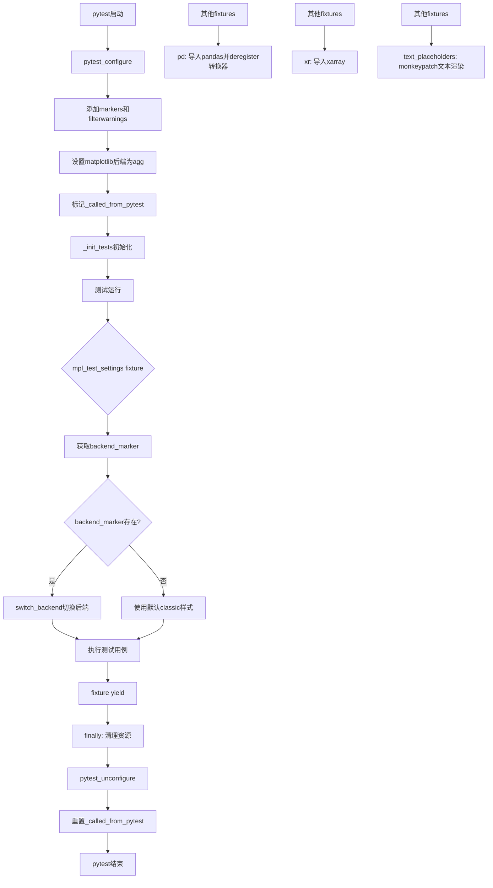
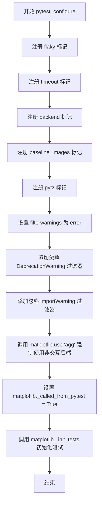
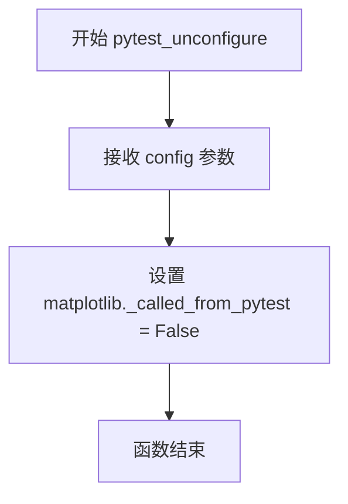
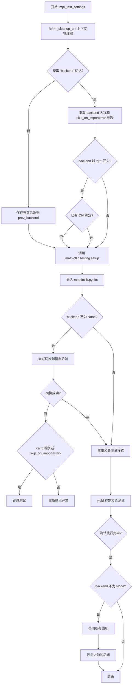
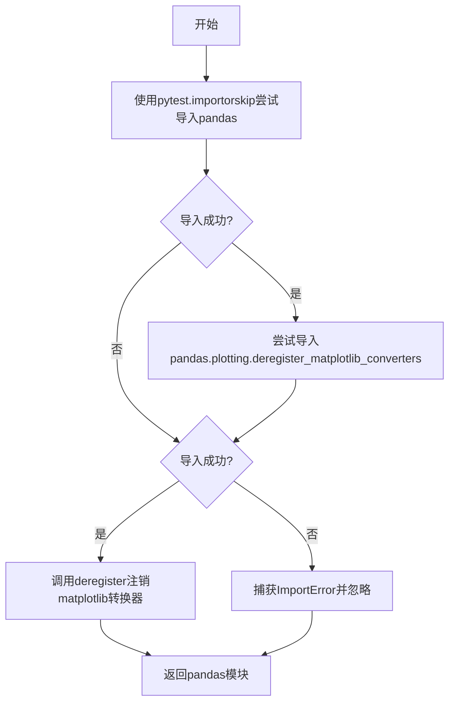
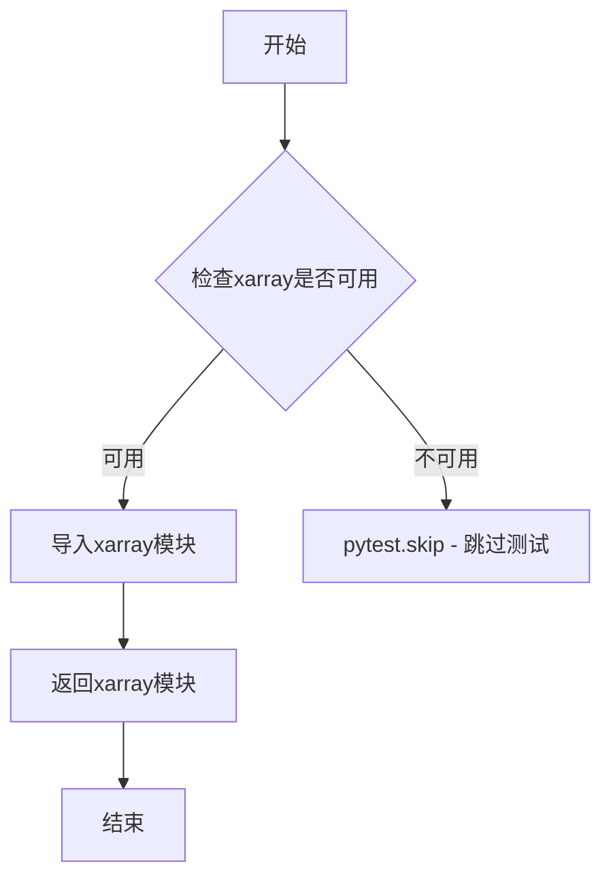
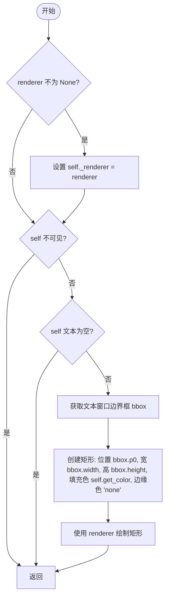

```mermaid
flowchart TD
    A[开始 text_placeholders fixture] --> B[导入 Rectangle from matplotlib.patches]
    B --> C[定义 patched_get_text_metrics_with_cache 函数]
    C --> D[定义 patched_text_draw 方法]
    D --> E[使用 monkeypatch.setattr 替换 _get_text_metrics_with_cache]
    E --> F[使用 monkeypatch.setattr 替换 Text.draw]
    F --> G[结束 fixture, 返回 None]
    
    C -.-> C1[计算固定高度为字体大小]
    C -.-> C2[计算固定宽度为 字符数 × 字体大小 / 1.618]
    C -.-> C3[设置 descent=0]
    C -.-> C4[返回 width, height, descent]
    
    D -.-> D1[获取文本的窗口范围 bbox]
    D -.-> D2[创建 Rectangle 替代文本绘制]
    D -.-> D3[绘制矩形]
```

# `matplotlib\lib\matplotlib\testing\conftest.py` 详细设计文档

这是matplotlib项目的pytest配置文件，定义了测试环境的初始化、全局fixtures以及测试辅助功能，包括matplotlib后端设置、样式配置、以及对pandas和xarray测试库的集成支持。

## 整体流程



## 类结构

```
pytest配置模块
├── pytest_configure (配置钩子)
├── pytest_unconfigure (反配置钩子)
├── mpl_test_settings (autouse fixture)
├── pd (pandas fixture)
├── xr (xarray fixture)
└── text_placeholders (文本占位符fixture)
```

## 全局变量及字段


### `pytest`
    
Pytest testing framework module for running and configuring tests

类型：`module`
    


### `sys`
    
Python standard library module for system-specific parameters and functions

类型：`module`
    


### `matplotlib`
    
Matplotlib visualization library for creating plots, charts, and figures

类型：`module`
    


### `_api`
    
Matplotlib internal API module for handling deprecation warnings and API utilities

类型：`module`
    


    

## 全局函数及方法


### `pytest_configure`

该函数是 Matplotlib 测试框架的 pytest 钩子函数，在 pytest 配置阶段被调用，用于初始化测试环境，包括注册自定义标记、配置警告过滤器、设置非交互式后端 'agg'，以及初始化 Matplotlib 的测试相关状态。

参数：

- `config`：`pytest.Config`，pytest 的配置对象，包含 pytest.ini 和命令行传入的配置信息

返回值：`None`，该函数无返回值，仅执行初始化操作

#### 流程图



#### 带注释源码

```python
def pytest_configure(config):
    # config is initialized here rather than in pytest.ini so that `pytest
    # --pyargs matplotlib` (which would not find pytest.ini) works.  The only
    # entries in pytest.ini set minversion (which is checked earlier),
    # testpaths/python_files, as they are required to properly find the tests
    
    # 遍历配置项列表，为 pytest 注册标记和警告过滤器
    for key, value in [
        # 注册自定义标记用于标记 flaky 测试（由 pytest-rerunfailures 提供）
        ("markers", "flaky: (Provided by pytest-rerunfailures.)"),
        # 注册超时标记（由 pytest-timeout 提供）
        ("markers", "timeout: (Provided by pytest-timeout.)"),
        # 注册后端标记，用于临时设置备用 Matplotlib 后端
        ("markers", "backend: Set alternate Matplotlib backend temporarily."),
        # 注册基准图像标记，用于与参考图像进行对比
        ("markers", "baseline_images: Compare output against references."),
        # 注册 pytz 标记，标识需要 pytz 的测试
        ("markers", "pytz: Tests that require pytz to be installed."),
        # 将所有警告视为错误
        ("filterwarnings", "error"),
        # 忽略 py23 模块已弃用的警告
        ("filterwarnings",
         "ignore:.*The py23 module has been deprecated:DeprecationWarning"),
        # 忽略动态导入器找不到规格的警告
        ("filterwarnings",
         r"ignore:DynamicImporter.find_spec\(\) not found; "
         r"falling back to find_module\(\):ImportWarning"),
    ]:
        # 将每个标记或过滤器添加到 pytest 配置中
        config.addinivalue_line(key, value)

    # 强制使用 'agg' 非交互式后端，用于无显示环境的测试
    matplotlib.use('agg', force=True)
    # 设置标志表示当前从 pytest 调用，用于区分测试和普通脚本
    matplotlib._called_from_pytest = True
    # 执行 Matplotlib 测试框架的初始化
    matplotlib._init_tests()
```


### `pytest_unconfigure`

该函数是 pytest 的钩子函数，在测试会话结束时被调用，用于清理 matplotlib 的全局状态标志，将 `_called_from_pytest` 设为 False，以表明 pytest 上下文已结束。

参数：

- `config`：`pytest.Config`，pytest 的配置对象，用于访问测试会话的配置信息

返回值：`None`，无返回值

#### 流程图



#### 带注释源码

```python
def pytest_unconfigure(config):
    """
    pytest 钩子函数：在测试会话结束时清理 matplotlib 状态。
    
    Parameters
    ----------
    config : pytest.Config
        pytest 的配置对象，包含测试会话的配置信息。
    """
    # 将 matplotlib 的全局标志设为 False，表示已离开 pytest 上下文
    # 这样可以防止某些代码在非测试环境下执行测试相关的特殊逻辑
    matplotlib._called_from_pytest = False
```


### `mpl_test_settings(request)`

这是 Matplotlib 测试框架中的一个 pytest fixture，充当测试环境的自动配置器。它在每个测试运行前自动执行，负责清理之前的 Matplotlib 状态、根据测试标记动态切换后端、配置测试样式，并确保测试间的状态隔离。

参数：

- `request`：`pytest.FixtureRequest`，pytest 内置 fixture，提供对测试请求上下文的访问，可获取测试节点信息、标记等。

返回值：`Generator[None, None, None]`，生成器 fixture，不返回值，通过 yield 控制测试前后的清理逻辑。

#### 流程图



#### 带注释源码

```python
@pytest.fixture(autouse=True)  # 自动应用于所有测试，无需显式请求
def mpl_test_settings(request):
    """
    pytest fixture，用于在每个测试前后设置和清理 Matplotlib 测试环境。
    
    该 fixture 执行以下操作：
    1. 清理之前的 Matplotlib 状态
    2. 根据测试的 'backend' 标记动态切换后端
    3. 配置测试样式（classic + _classic_test_patch）
    4. 测试后恢复原始状态
    """
    from matplotlib.testing.decorators import _cleanup_cm

    # 进入清理上下文管理器，确保测试结束后执行清理操作
    with _cleanup_cm():

        backend = None  # 初始化 backend 为 None（默认不切换）
        backend_marker = request.node.get_closest_marker('backend')  # 获取测试的 backend 标记
        prev_backend = matplotlib.get_backend()  # 保存当前后端，以便测试后恢复
        
        # 如果测试指定了 backend 标记
        if backend_marker is not None:
            # 验证标记必须恰好指定一个后端
            assert len(backend_marker.args) == 1, \
                "Marker 'backend' must specify 1 backend."
            backend, = backend_marker.args  # 解包获取后端名称
            skip_on_importerror = backend_marker.kwargs.get(
                'skip_on_importerror', False)  # 获取是否在导入错误时跳过的选项

            # 特殊处理 Qt5 后端：避免与已导入的 Qt4 冲突
            if backend.lower().startswith('qt5'):
                if any(sys.modules.get(k) for k in ('PyQt4', 'PySide')):
                    pytest.skip('Qt4 binding already imported')  # 跳过测试

        matplotlib.testing.setup()  # 初始化 Matplotlib 测试环境
        
        # 抑制 Matplotlib 弃用警告
        with _api.suppress_matplotlib_deprecation_warning():
            if backend is not None:
                # 此导入必须放在 setup() 之后，避免提前加载默认后端
                import matplotlib.pyplot as plt
                try:
                    plt.switch_backend(backend)  # 切换到指定后端
                except ImportError as exc:
                    # 仅处理 cairo 后代的特殊情况（需要 pycairo 或 cairocffi）
                    if 'cairo' in backend.lower() or skip_on_importerror:
                        pytest.skip("Failed to switch to backend "
                                    f"{backend} ({exc}).")
                    else:
                        raise  # 其他导入错误重新抛出
            
            # 应用默认测试样式：classic 样式 + _classic_test_patch
            # 用于图像比较和清理的标准化外观
            matplotlib.style.use(["classic", "_classic_test_patch"])
        
        try:
            yield  # 暂停执行，将控制权交给测试函数
        finally:
            # 测试执行后的清理工作
            if backend is not None:
                plt.close("all")  # 关闭所有打开的图形窗口
                matplotlib.use(prev_backend)  # 恢复之前的后端
```


### `pd`

这是一个pytest fixture函数，用于动态导入pandas库并在pandas未安装时跳过测试。该fixture还会尝试注销pandas的matplotlib转换器以避免与matplotlib的冲突，确保测试环境的兼容性。

参数：

- 无（fixture函数本身通过pytest框架注入，无需显式参数）

返回值：`module`，返回导入的pandas模块，供测试函数使用

#### 流程图



#### 带注释源码

```python
@pytest.fixture
def pd():
    """
    Fixture to import and configure pandas. Using this fixture, the test is skipped when
    pandas is not installed. Use this fixture instead of importing pandas in test files.

    Examples
    --------
    Request the pandas fixture by passing in ``pd`` as an argument to the test ::

        def test_matshow_pandas(pd):

            df = pd.DataFrame({'x':[1,2,3], 'y':[4,5,6]})
            im = plt.figure().subplots().matshow(df)
            np.testing.assert_array_equal(im.get_array(), df)
    """
    # 使用pytest.importorskip尝试导入pandas，如果失败则自动跳过测试
    pd = pytest.importorskip('pandas')
    try:
        # 尝试从pandas.plotting导入注销matplotlib转换器的函数
        # 这是为了避免pandas的日期/时间转换器与matplotlib的冲突
        from pandas.plotting import (
            deregister_matplotlib_converters as deregister)
        # 调用注销函数，去除pandas对matplotlib的转换器注册
        deregister()
    except ImportError:
        # 如果导入失败（可能是旧版本pandas没有此函数），静默忽略
        pass
    # 返回导入的pandas模块，供测试函数使用
    return pd
```


### `xr`

这是一个 pytest fixture，用于在测试中导入 xarray 库。如果 xarray 未安装，则跳过测试。该 fixture 提供了 xarray 模块的访问，支持在 matplotlib 测试中使用 xarray 数据结构。

参数：无（隐式的 `request` 参数未被使用）

返回值：`module`，返回导入的 xarray 模块，供测试函数使用

#### 流程图



#### 带注释源码

```python
@pytest.fixture
def xr():
    """
    Fixture to import xarray so that the test is skipped when xarray is not installed.
    Use this fixture instead of importing xrray in test files.

    Examples
    --------
    Request the xarray fixture by passing in ``xr`` as an argument to the test ::

        def test_imshow_xarray(xr):

            ds = xr.DataArray(np.random.randn(2, 3))
            im = plt.figure().subplots().imshow(ds)
            np.testing.assert_array_equal(im.get_array(), ds)
    """
    # 使用 pytest.importorskip 检查 xarray 是否已安装
    # 如果未安装，该测试会被自动跳过
    xr = pytest.importorskip('xarray')
    # 返回 xarray 模块供测试使用
    return xr
```


### `text_placeholders`

这是一个pytest fixture，用于将matplotlib中的文本渲染替换为基于占位符矩形的渲染，使得测试对字体渲染细节不敏感，仅依赖于字体大小和文本长度。

参数：

-  `monkeypatch`：`pytest.MonkeyPatch`，pytest提供的monkeypatch工具，用于在测试运行时动态替换对象属性

返回值：`None`，此fixture不返回具体值，仅在测试作用域内进行全局的monkeypatch操作

#### 流程图



#### 带注释源码

```python
@pytest.fixture
def text_placeholders(monkeypatch):
    """
    Replace texts with placeholder rectangles.

    The rectangle size only depends on the font size and the number of characters. It is
    thus insensitive to font properties and rendering details. This should be used for
    tests that depend on text geometries but not the actual text rendering, e.g. layout
    tests.
    """
    from matplotlib.patches import Rectangle

    def patched_get_text_metrics_with_cache(renderer, text, fontprop, ismath, dpi):
        """
        Replace ``_get_text_metrics_with_cache`` with fixed results.

        The usual ``renderer.get_text_width_height_descent`` would depend on font
        metrics; instead the fixed results are based on font size and the length of the
        string only.
        """
        # While get_window_extent returns pixels and font size is in points, font size
        # includes ascenders and descenders. Leaving out this factor and setting
        # descent=0 ends up with a box that is relatively close to DejaVu Sans.
        height = fontprop.get_size()  # 固定高度为字体大小
        width = len(text) * height / 1.618  # Golden ratio for character size. 宽度基于字符数和字体大小
        descent = 0  # 固定descent为0
        return width, height, descent  # 返回固定的宽高和descent

    def patched_text_draw(self, renderer):
        """
        Replace ``Text.draw`` with a fixed bounding box Rectangle.

        The bounding box corresponds to ``Text.get_window_extent``, which ultimately
        depends on the above patched ``_get_text_metrics_with_cache``.
        """
        if renderer is not None:
            self._renderer = renderer
        if not self.get_visible():  # 如果文本不可见，直接返回
            return
        if self.get_text() == '':  # 如果文本为空，直接返回
            return
        bbox = self.get_window_extent()  # 获取文本的窗口范围
        # 创建矩形替代文本绘制，矩形使用文本的颜色
        rect = Rectangle(bbox.p0, bbox.width, bbox.height,
                         facecolor=self.get_color(), edgecolor='none')
        rect.draw(renderer)  # 绘制矩形

    # 使用 monkeypatch 替换 matplotlib.text 模块中的 _get_text_metrics_with_cache 函数
    monkeypatch.setattr('matplotlib.text._get_text_metrics_with_cache',
                        patched_get_text_metrics_with_cache)
    # 使用 monkeypatch 替换 matplotlib.text.Text 类的 draw 方法
    monkeypatch.setattr('matplotlib.text.Text.draw', patched_text_draw)
```


### `patched_get_text_metrics_with_cache`

该函数是一个测试用的补丁函数，用于替换 `_get_text_metrics_with_cache`，使其返回基于字体大小和文本长度的固定结果，而非真实的字体度量值。这用于不依赖于实际字体渲染的测试场景（如布局测试）。

参数：

- `renderer`：`object`，渲染器对象，用于获取文本度量（在此函数中未直接使用）
- `text`：`str`，要测量宽度的文本字符串
- `fontprop`：`FontProperties`，字体属性对象，用于获取字体大小
- `ismath`：`bool` 或 `str`，指示是否在数学模式下的标志
- `dpi`：`int` 或 `float`，每英寸点数（在此函数中未使用）

返回值：`tuple`，包含三个浮点数值 (width, height, descent)，分别表示文本的宽度、高度和下降量

#### 流程图

```mermaid
flowchart TD
    A[开始] --> B[获取字体大小 height = fontprop.get_size]
    B --> C[计算宽度 width = len(text) \* height / 1.618]
    C --> D[设置下降值为0 descent = 0]
    D --> E[返回 width, height, descent 元组]
    E --> F[结束]
```

#### 带注释源码

```python
def patched_get_text_metrics_with_cache(renderer, text, fontprop, ismath, dpi):
    """
    Replace ``_get_text_metrics_with_cache`` with fixed results.

    The usual ``renderer.get_text_width_height_descent`` would depend on font
    metrics; instead the fixed results are based on font size and the length of the
    string only.
    """
    # While get_window_extent returns pixels and font size is in points, font size
    # includes ascenders and descenders. Leaving out this factor and setting
    # descent=0 ends up with a box that is relatively close to DejaVu Sans.
    # 获取字体大小（以点为单位）
    height = fontprop.get_size()
    # 使用黄金比例计算字符宽度：宽度 = 文本长度 * 字体大小 / 1.618
    width = len(text) * height / 1.618  # Golden ratio for character size.
    # 将下降量设为0，忽略实际字体的上升部和下降部
    descent = 0
    # 返回固定的宽度、高度和下降量元组
    return width, height, descent
```


### patched_text_draw

该函数用于替换 `Text.draw` 方法，以绘制一个基于文本边界框的矩形来代替实际文本渲染，常用于测试环境中以避免字体渲染的差异。

参数：
- self：`matplotlib.text.Text`，调用该方法的文本对象实例。
- renderer：`matplotlib.backend_bases.RendererBase`，Matplotlib 的渲染器对象，用于执行绘图操作。

返回值：`None`，该函数不返回任何值。

#### 流程图



#### 带注释源码

```python
def patched_text_draw(self, renderer):
    """
    Replace ``Text.draw`` with a fixed bounding box Rectangle.

    The bounding box corresponds to ``Text.get_window_extent``, which ultimately
    depends on the above patched ``_get_text_metrics_with_cache``.
    """
    # 如果提供了渲染器，则将其保存到文本对象的 _renderer 属性中
    if renderer is not None:
        self._renderer = renderer
    # 如果文本对象不可见，则直接返回，不进行绘制
    if not self.get_visible():
        return
    # 如果文本内容为空，则直接返回，不进行绘制
    if self.get_text() == '':
        return
    # 获取文本的窗口边界框，包含位置和尺寸信息
    bbox = self.get_window_extent()
    # 创建一个矩形，使用边界框的起点作为矩形左下角，宽度和高度与边界框相同
    # 填充色设置为文本颜色，边缘颜色设置为无色
    rect = Rectangle(bbox.p0, bbox.width, bbox.height,
                     facecolor=self.get_color(), edgecolor='none')
    # 使用传入的渲染器绘制这个矩形
    rect.draw(renderer)
```

## 关键组件


### pytest_configure

配置pytest环境，添加markers和filterwarnings，初始化matplotlib测试后端（agg），设置matplotlib._called_from_pytest标志。

### pytest_unconfigure

清理pytest状态，重置matplotlib._called_from_pytest标志。

### mpl_test_settings

自动使用的fixture，负责测试环境设置：获取backend marker，处理Qt后端冲突，切换到指定后端（如失败则跳过），应用测试样式，测试完成后恢复前一个后端并关闭所有图形。

### pd

Fixture用于测试中导入pandas，如果pandas未安装则跳过测试。同时尝试注销matplotlib的日期转换器以避免冲突，返回pandas模块供测试使用。

### xr

Fixture用于测试中导入xarray，如果xarray未安装则跳过测试，返回xarray模块供测试使用。

### text_placeholders

Fixture用于将文本渲染替换为占位符矩形，通过monkeypatch修改matplotlib.text模块的_get_text_metrics_with_cache和Text.draw方法，使文本测试不受字体属性影响。


## 问题及建议


### 已知问题

-   **Qt后端检测方式不健壮**：使用`sys.modules.get(k)`检测是否已导入PyQt4/PySide，这种方式可能会漏判或误判，且无法处理其他Qt绑定（如PyQt6、PySide2、PySide6）
-   **异常处理位置不当**：在`mpl_test_settings`中，`prev_backend`变量的赋值在try块外部，但如果在yield之前发生异常，`prev_backend`可能未被正确保存，导致无法恢复原后端
-   **硬编码配置值**：样式名称`["classic", "_classic_test_patch"]`硬编码在代码中，缺乏灵活性
-   **导入语句位置分散**：在fixture内部导入`matplotlib.pyplot`，影响代码可读性和性能
-   **缺乏日志或调试信息**：配置过程中的关键操作没有日志记录，难以排查问题
-   **过滤器规则静态化**：警告过滤规则硬编码，无法通过pytest.ini或命令行动态配置
-   **monkeypatch使用字符串路径**：虽然这是pytest推荐做法，但如果函数路径变更，运行时才会发现错误
-   **fixture文档示例不完整**：text_placeholders fixture缺少使用示例文档

### 优化建议

-   **重构后端检测逻辑**：使用更可靠的方式检测已加载的Qt绑定，或使用`importlib.metadata`查询已安装包
-   **调整异常处理结构**：将`prev_backend = matplotlib.get_backend()`移入try块，或使用contextlib的退出栈确保后端恢复
-   **提取配置常量**：将样式名称、标记名称等硬编码值提取为模块级常量或配置文件
-   **优化导入策略**：将必要的导入移至文件顶部，延迟导入仅在确实需要时进行（如plt）
-   **添加日志记录**：在关键操作点添加logging记录，便于调试和监控
-   **统一配置管理**：考虑使用pytest的钩子函数集中管理配置，或提供插件配置选项
-   **增强文档和类型注解**：为所有fixture添加完整的类型注解和使用示例
-   **考虑性能优化**：对于`text_placeholders`，可以缓存修补函数避免重复定义


## 其它


### 设计目标与约束

本代码的设计目标是配置Matplotlib的pytest测试框架，使其能够在统一的测试环境下运行，并提供各种测试辅助功能。主要约束包括：1) 必须与pytest插件体系兼容；2) 需要支持多种Matplotlib后端；3) 测试环境需与生产环境隔离；4) 测试 fixtures 必须自动应用到所有测试。

### 错误处理与异常设计

1. **ImportError处理**：在`mpl_test_settings` fixture中，当后端切换失败时，如果是cairo后端且缺少依赖，则跳过测试；否则重新抛出异常
2. **pandas/xarray导入失败**：使用`pytest.importorskip()`自动跳过测试而非失败
3. **Qt后端冲突检测**：检测到Qt4绑定已导入时主动跳过Qt5后端测试
4. **警告过滤**：配置严格的警告过滤规则，将警告转为错误，同时对已知可忽略的警告进行过滤

### 数据流与状态机

**主要流程状态**：
1. **初始化状态** (`pytest_configure`)：设置pytest markers、filterwarnings、强制使用agg后端、初始化测试环境
2. **运行状态** (`mpl_test_settings` fixture)：执行单个测试前的设置，包括后端切换、样式设置
3. **清理状态** (`pytest_unconfigure`)：清理测试状态标志

**数据流**：
- `pytest_configure` → `matplotlib._called_from_pytest = True` → `matplotlib._init_tests()`
- `request.node.get_closest_marker('backend')` → 后端选择逻辑
- `pytest.importorskip()` → 条件性导入外部库

### 外部依赖与接口契约

1. **pytest框架依赖**：依赖pytest主框架、pytest-rerunfailures、pytest-timeout插件
2. **matplotlib内部依赖**：
   - `matplotlib._api.suppress_matplotlib_deprecation_warning()`：抑制弃用警告
   - `matplotlib.testing.setup()`：测试环境初始化
   - `matplotlib.testing.decorators._cleanup_cm`：上下文管理器清理
   - `matplotlib.style.use()`：样式管理
3. **可选依赖**：
   - `pandas`：通过`pd` fixture条件导入
   - `xarray`：通过`xr` fixture条件导入
   - `matplotlib.pyplot`：延迟导入以支持后端切换

### 性能考虑

1. **后端选择**：使用`agg`后端（无GUI、无渲染）以提高测试速度
2. **延迟导入**：matplotlib.pyplot和后端模块延迟导入，减少初始化开销
3. **monkeypatch优化**：text_placeholders使用monkeypatch避免重复创建测试对象

### 平台兼容性

代码主要面向Python 3平台（从代码中的`py23`弃用警告可见），需兼容Windows、Linux、macOS三大平台。Qt后端测试针对特定平台问题（Qt4/Qt5冲突）进行了特殊处理。

### 版本兼容性

1. **pandas版本兼容**：尝试调用`deregister_matplotlib_converters`，但使用try-except处理新版pandas API差异
2. **matplotlib内部API**：使用了`_called_from_pytest`、`_init_tests`等内部API，需与Matplotlib版本同步维护

### 测试覆盖范围

本配置文件覆盖以下测试场景：
1. 基础测试配置（markers、filterwarnings）
2. 后端切换测试（通过`@pytest.mark.backend`）
3. 图像比较测试（`@pytest.mark.baseline_images`）
4. pandas集成测试（`pd` fixture）
5. xarray集成测试（`xr` fixture）
6. 文本渲染测试（`text_placeholders` fixture）
7. 时区相关测试（`@pytest.mark.pytz`）
8. flaky测试和超时控制标记

    