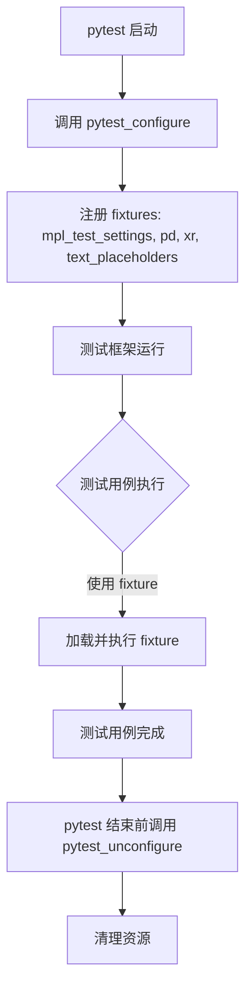
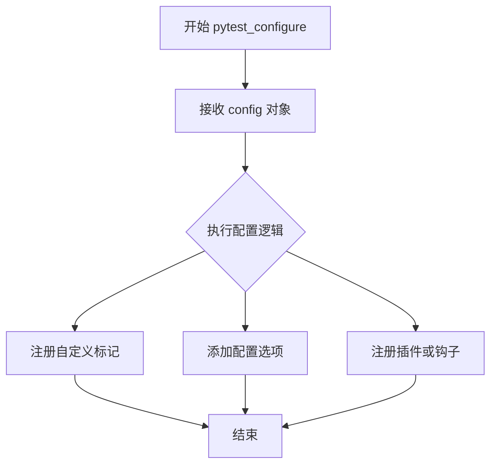
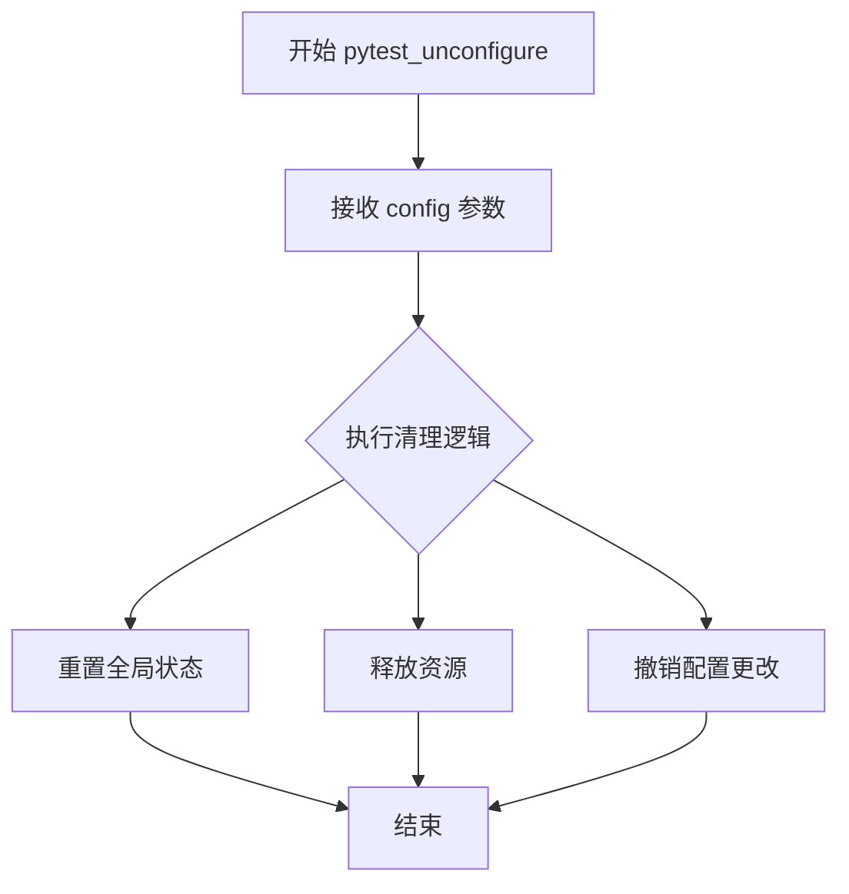
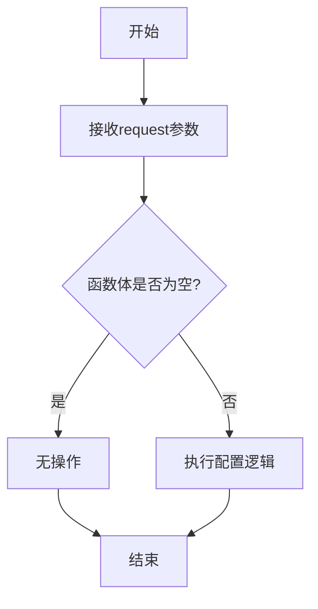
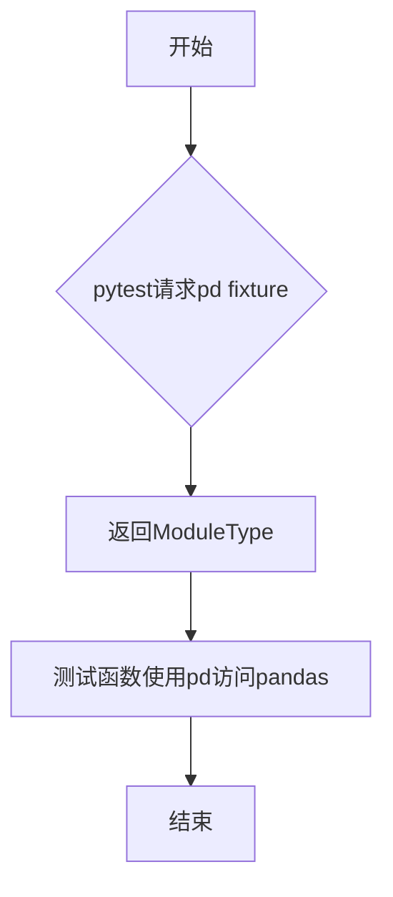
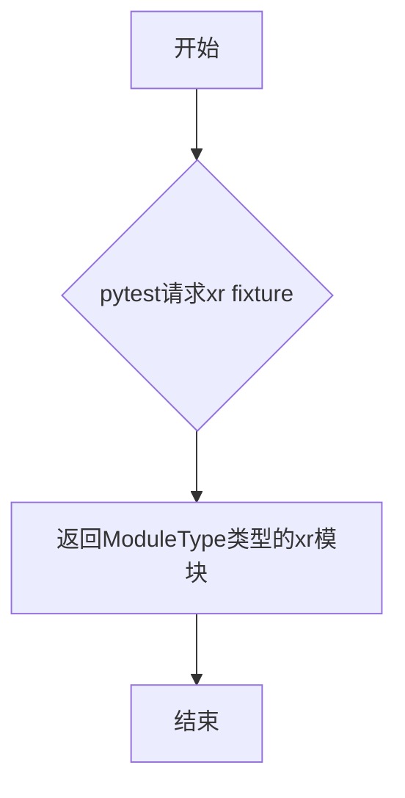
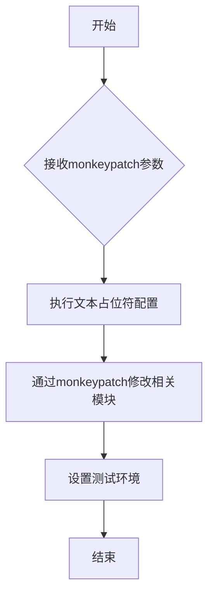

# `matplotlib\lib\matplotlib\testing\conftest.pyi` 详细设计文档

该文件定义了 pytest 的配置钩子函数和多个 fixture，用于在测试环境中模拟外部依赖（如 pandas 和 xarray 模块）以及设置测试所需的上下文，确保测试的隔离性和可重复性。

## 整体流程



## 类结构

```
test_fixtures.py (模块)
├── pytest_configure (配置函数)
├── pytest_unconfigure (清理函数)
├── mpl_test_settings (matplotlib 测试设置 fixture)
├── pd (pandas 模块模拟 fixture)
├── xr (xarray 模块模拟 fixture)
└── text_placeholders (文本占位符 fixture)
```

## 全局变量及字段


### `pytest_configure`
    
pytest配置钩子函数，在pytest测试会话开始时被调用，用于初始化测试配置

类型：`Callable[[pytest.Config], None]`
    


### `pytest_unconfigure`
    
pytest取消配置钩子函数，在pytest测试会话结束时被调用，用于清理测试配置

类型：`Callable[[pytest.Config], None]`
    


### `mpl_test_settings`
    
pytest fixture，用于配置matplotlib测试环境，设置测试所需的图形参数和后端

类型：`Callable[[pytest.FixtureRequest], None]`
    


### `pd`
    
pytest fixture，提供pandas模块的引用，用于测试中访问pandas库功能

类型：`Callable[[], ModuleType]`
    


### `xr`
    
pytest fixture，提供xarray模块的引用，用于测试中访问xarray库功能

类型：`Callable[[], ModuleType]`
    


### `text_placeholders`
    
pytest fixture，使用monkeypatch机制替换文本处理中的占位符，用于测试环境适配

类型：`Callable[[pytest.MonkeyPatch], None]`
    


    

## 全局函数及方法


### `pytest_configure`

该函数是 pytest 的钩子函数，用于在测试会话开始前进行全局配置注册，例如添加自定义标记、配置选项或注册插件等。

参数：

- `config`：`pytest.Config`，pytest 的配置对象，包含当前 pytest 会话的配置信息

返回值：`None`，无返回值

#### 流程图



#### 带注释源码

```python
def pytest_configure(config: pytest.Config) -> None:
    """
    pytest 钩子函数，在测试会话开始前调用。
    
    参数:
        config: pytest.Config 对象，包含当前测试会话的配置信息
                可以通过 config.getoption() 获取命令行选项
                通过 config.addinivalue_line() 添加自定义配置
    
    返回值:
        None: 此函数不返回任何值，主要用于副作用配置
    
    注意:
        此函数为 pytest 框架的标准钩子，由 pytest 框架在测试运行
        之前自动调用，无需手动调用。
    """
    ...  # 实现代码省略，通常包含配置标记、选项注册等逻辑
```


### `pytest_unconfigure`

该函数是pytest的钩子函数之一，在pytest配置阶段完成后被调用，用于执行清理工作，撤销或重置在`pytest_configure`期间所做的配置更改，释放资源或重置全局状态。

参数：

- `config`：`pytest.Config`，pytest的配置对象，包含当前pytest会话的配置信息

返回值：`None`，无返回值

#### 流程图



#### 带注释源码

```python
def pytest_unconfigure(config: pytest.Config) -> None:
    """
    pytest配置后清理钩子函数。
    
    该函数在pytest配置阶段完成后被调用，用于执行清理工作。
    它是pytest_configure的反向操作，用于撤销配置更改或释放资源。
    
    参数:
        config: pytest.Config
            pytest的配置对象，包含了当前pytest会话的所有配置信息
            可以通过该对象访问配置项、插件状态等
    
    返回值:
        None
    
    注意:
        - 这是一个钩子函数（hook），由pytest框架在特定时机自动调用
        - 函数签名为pytest框架约定，必须使用此名称和参数
        - 当前代码仅为存根（stub），实际清理逻辑需由使用者实现
        - 通常用于清理全局状态、关闭文件句柄、释放数据库连接等
    """
    ...  # 实际清理逻辑需由使用者实现
```


### `mpl_test_settings`

这是一个pytest fixture，用于配置matplotlib测试相关的设置。根据代码，该fixture接收一个`pytest.FixtureRequest`类型的参数`request`，但函数体为空（只有`...`），因此不执行任何实际配置操作，也不返回任何值。

参数：
- `request`：`pytest.FixtureRequest`，pytest框架的FixtureRequest对象，用于访问当前测试请求的上下文信息，例如测试函数、模块等。

返回值：`None`，该fixture不返回任何值。

#### 流程图



#### 带注释源码

```python
@pytest.fixture
def mpl_test_settings(request: pytest.FixtureRequest) -> None:
    """
    pytest fixture，用于配置matplotlib测试环境。
    
    参数:
        request: pytest.FixtureRequest对象，提供对当前测试请求的访问，
                 可以用于获取测试函数、模块等上下文信息。
    
    返回值:
        None: 该fixture不返回任何值，仅作为测试环境配置使用。
    """
    # 注意：当前函数体为空（只有...），可能是一个占位符，
    # 实际配置逻辑尚未实现。
    ...  # 空操作，等待后续实现
```


### `pd`

这是一个pytest fixture，用于提供pandas模块的引用，使得测试函数可以访问pandas库的功能。

参数：

- 无显式参数（pytest自动注入）

返回值：`ModuleType`，返回pandas模块本身，供测试用例使用

#### 流程图



#### 带注释源码

```python
@pytest.fixture
def pd() -> ModuleType: 
    """
    pytest fixture，用于提供pandas模块的引用
    
    Returns:
        ModuleType: pandas模块对象
    """
    ...
```

#### 详细说明

| 项目 | 详情 |
|------|------|
| **类型** | pytest fixture函数 |
| **装饰器** | `@pytest.fixture` |
| **文件位置** | pytest测试文件中的fixture定义区域 |
| **用途** | 作为测试依赖注入点，提供pandas模块供测试函数使用 |
| **依赖** | 依赖于pytest框架本身 |
| **注意事项** | 这是一个空实现（`...`），实际模块注入可能通过pytest的自动发现机制或monkeypatch实现 |


### `xr`

该函数是一个pytest fixture，用于提供xr模块（xarray库）的模拟或测试实例，通常在matplotlib与xarray集成的测试场景中使用。

参数： 无

返回值：`ModuleType`，返回xr模块（xarray库）的模块对象

#### 流程图



#### 带注释源码

```python
@pytest.fixture
def xr() -> ModuleType: 
    """
    pytest fixture，用于提供xr模块（xarray库）的测试实例。
    
    返回类型:
        ModuleType: xarray模块对象，用于测试matplotlib与xarray的集成功能
        
    注意:
        函数体为省略号(...)表示这是一个存根fixture，
        具体实现可能在其他文件中或通过monkeypatch动态注入
    """
    ...
```

#### 补充说明

- **fixture类型**: 这是一个pytest装饰器标记的fixture函数
- **使用场景**: 通常用于测试需要xarray数据结构的matplotlib可视化功能
- **依赖关系**: 可能依赖于其他fixture如`mpl_test_settings`进行matplotlib测试配置
- **设计目标**: 提供测试隔离的xr模块模拟，避免在测试环境中导入完整的xarray库


### `text_placeholders`

这是一个pytest fixture函数，用于配置文本占位符相关的测试环境，通过monkeypatch动态修改系统中的文本处理相关功能，以便在测试中模拟特定的文本处理行为。

参数：

- `monkeypatch`：`pytest.MonkeyPatch`，pytest的内置fixture，用于在测试运行时动态地修改对象、属性、模块或字典等

返回值：`None`，该fixture不返回任何值，仅执行副作用操作

#### 流程图



#### 带注释源码

```python
@pytest.fixture
def text_placeholders(monkeypatch: pytest.MonkeyPatch) -> None:
    """
    pytest fixture，用于配置文本占位符测试环境
    
    参数:
        monkeypatch: pytest.MonkeyPatch实例，用于动态修改测试环境
    
    返回值:
        None: 此fixture不返回任何值
    
    说明:
        - 这是一个pytest fixture装饰器
        - 通过monkeypatch可以动态替换系统中的函数或变量
        - 用于在测试场景中模拟文本处理行为
        - 函数体被省略（...），表示实际实现可能涉及具体的文本替换逻辑
    """
    ...  # 实现细节未提供
```


## 关键组件


### pytest_configure

pytest配置钩子函数，用于在pytest会话开始时执行配置操作

### pytest_unconfigure

pytest取消配置钩子函数，用于在pytest会话结束时执行清理操作

### mpl_test_settings

matplotlib测试设置fixture，提供matplotlib相关的测试配置和初始化

### pd

pandas模块fixture，提供pandas库的访问接口

### xr

xarray模块fixture，提供xarray库的访问接口

### text_placeholders

文本占位符fixture，使用monkeypatch修改系统中的文本占位符行为


## 问题及建议


### 已知问题

-   `pytest_configure` 和 `pytest_unconfigure` 函数仅有函数签名但无实际实现，仅包含空语句 `...`，未执行任何配置或清理逻辑
-   `pd()` 和 `xr()` fixtures 返回空 `ModuleType` 对象，未实际导入 pandas 和 xarray 模块，功能不完整
-   `mpl_test_settings` fixture 仅定义了函数签名，缺少具体实现逻辑
-   `text_placeholders` fixture 接收 `monkeypatch` 参数但未展示任何实际的 monkeypatch 行为，代码片段不完整
-   所有函数和 fixture 均缺少文档字符串（docstrings），降低代码可维护性和可读性
-   缺少对返回值的类型注解（如 `mpl_test_settings` 应明确返回 `None`）
-   未定义模块级别的常量或配置项，配置分散在 fixture 定义中

### 优化建议

-   为所有函数和 fixture 添加详细的 docstrings，说明其用途、参数和返回值
-   完成 `pytest_configure` 和 `pytest_unconfigure` 的实现逻辑，或移除未使用的函数定义
-   修正 `pd()` 和 `xr()` fixtures，确保返回实际的模块引用（如 `import pandas as pd` 并返回）
-   实现 `mpl_test_settings` fixture 的具体逻辑或添加 TODO 注释标记待完成项
-   完善 `text_placeholders` fixture 的 monkeypatch 实现，或说明其在完整代码中的作用
-   考虑添加类型注解以提高类型安全性和 IDE 支持
-   将配置相关的常量提取为模块级变量或配置文件，提升可维护性


## 其它


### 设计目标与约束

本模块作为pytest的配置文件，旨在为matplotlib测试环境提供必要的全局设置和fixture支持。设计目标包括：1) 提供matplotlib测试所需的配置初始化和清理机制；2) 为测试用例提供pandas、xarray等依赖库的fixture；3) 通过monkeypatch机制处理文本占位符以支持跨平台测试。约束条件包括：依赖pytest框架、需与matplotlib测试框架兼容、必须在pytest的配置阶段和取消配置阶段正确执行。

### 错误处理与异常设计

本模块采用隐式错误处理策略，主要通过pytest框架的fixture机制管理资源生命周期。pytest_configure和pytest_unconfigure函数使用省略号（...）作为空实现，表明当前版本不执行实际配置逻辑。Fixture的错误处理由pytest框架自动管理：当fixture失败时，pytest会报告详细的错误信息。mpl_test_settings fixture接收request参数，可通过request.node访问测试节点信息，用于实现基于测试上下文的配置逻辑。

### 外部依赖与接口契约

本模块依赖以下外部包：1) pytest框架（pytest.Config、pytest.FixtureRequest、pytest.MonkeyPatch类型）；2) pandas库（pd fixture返回ModuleType）；3) xarray库（xr fixture返回ModuleType）。接口契约方面：pytest_configure和pytest_unconfigure必须接受pytest.Config类型参数且返回None；所有fixture必须符合pytest fixture签名规范；pd和xr fixture返回模块类型的ModuleType对象，供测试代码动态导入使用。

### 性能考虑与优化空间

当前实现较为简洁，性能开销主要来自fixture的导入和初始化。优化建议：1) pd和xr fixture可以改为按需导入，减少启动开销；2) text_placeholders的monkeypatch操作可以延迟到实际使用时执行；3) 考虑使用pytest的pytest_sessionstart和pytest_sessionfinish钩子替代configure/unconfigure以获得更细粒度的控制。当前代码中pytest_configure和pytest_unconfigure为空实现，如需扩展配置功能应考虑增量初始化策略。

### 版本兼容性考虑

代码使用了Python 3的类型注解（类型提示），要求Python 3.5+环境。pytest相关类型（pytest.Config、pytest.FixtureRequest等）的可用性取决于pytest版本，建议使用pytest 6.0+以确保类型注解的稳定性。ModuleType的使用保持了较好的兼容性，不特定依赖pandas和xarray的具体版本，但测试代码可能需要兼容主流版本（pandas 1.0+、xarray 0.16+）。

### 配置管理策略

本模块采用pytest配置钩子与fixture相结合的配置管理策略。pytest_configure在pytest启动时执行全局配置，pytest_unconfigure在pytest结束时执行清理工作。Fixture通过依赖注入机制为测试函数提供配置资源。text_placeholders fixture使用monkeypatch机制修改全局状态，这种方式适合测试环境的临时性修改，但需要注意测试隔离，避免状态泄露影响其他测试用例。


    