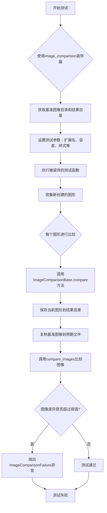
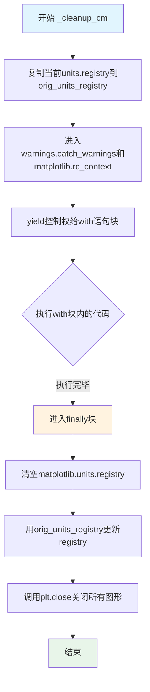
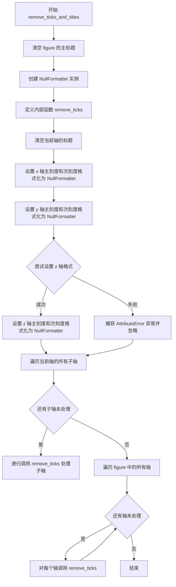
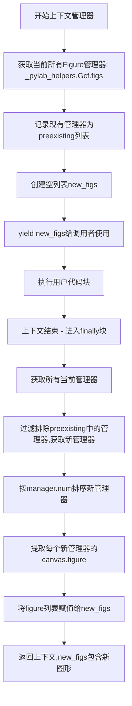
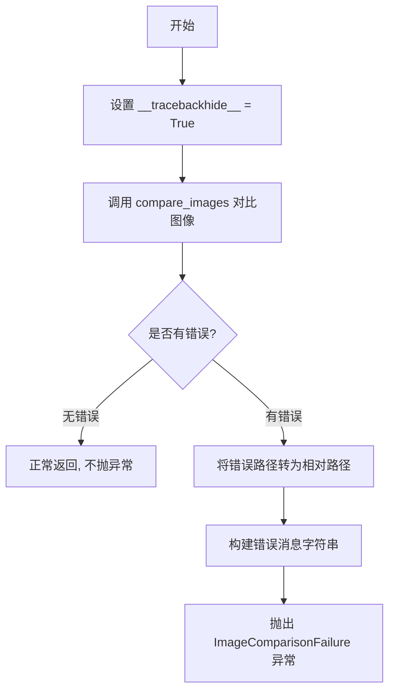
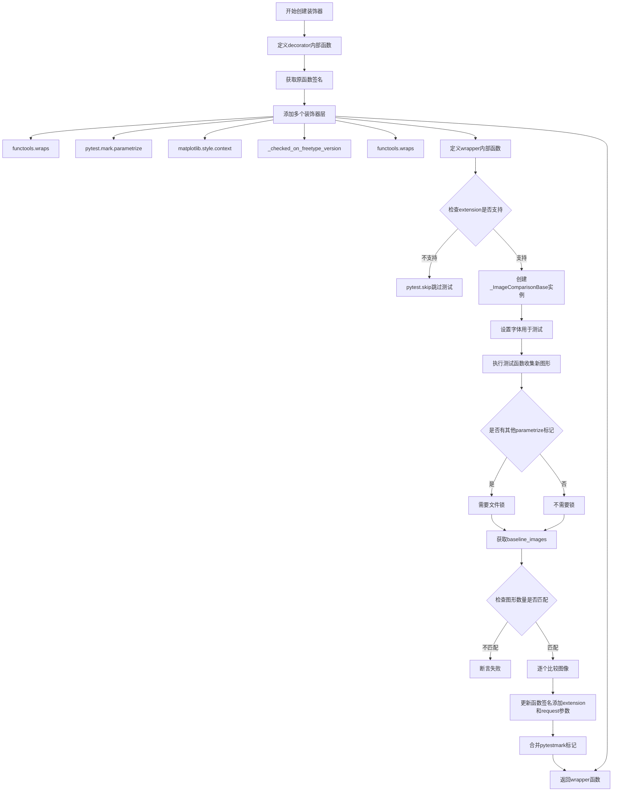
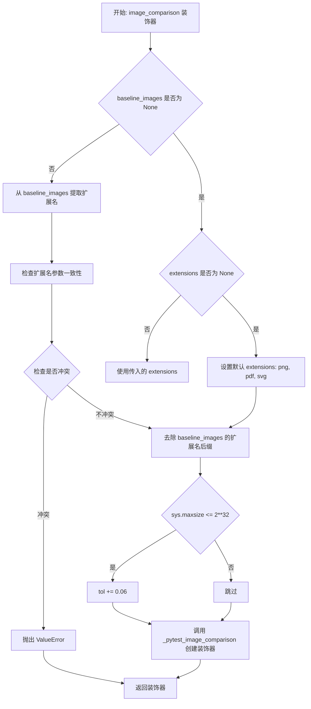
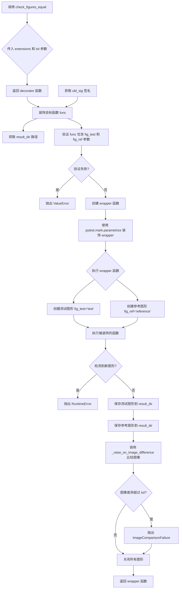
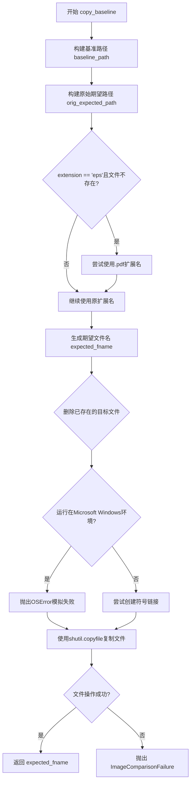
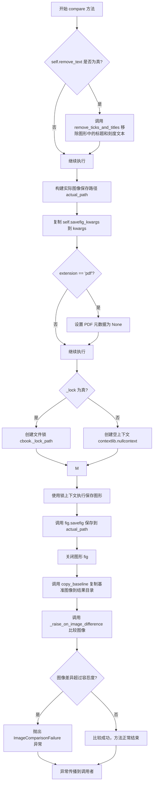

# `matplotlib\lib\matplotlib\testing\decorators.py` 详细设计文档

该模块提供图像比较测试功能，用于验证Matplotlib生成的图表图像是否与基准图像一致，支持多种图像格式（PNG、PDF、SVG），并提供装饰器简化测试代码编写

## 整体流程



## 类结构

```
_ImageComparisonBase (图像比较基类)
└── 功能: 提供图像比较的核心逻辑，不依赖特定测试框架
```

## 全局变量及字段


### `KEYWORD_ONLY`
    
用于函数参数签名，表示参数只能是关键字参数的标记值

类型：`int`
    


### `ALLOWED_CHARS`
    
文件名允许的字符集，包含数字、字母、下划线和中括号等用于生成合法的测试文件名

类型：`set`
    


### `_ImageComparisonBase.func`
    
被测试的函数，用于图像比较测试的回调函数

类型：`Callable`
    


### `_ImageComparisonBase.baseline_dir`
    
基准图像目录，存储预期生成的图像文件用于对比

类型：`Path`
    


### `_ImageComparisonBase.result_dir`
    
结果图像目录，存储实际测试生成的图像文件

类型：`Path`
    


### `_ImageComparisonBase.tol`
    
图像比较的容差阈值，RMS值超过此阈值则判定为图像不一致

类型：`float`
    


### `_ImageComparisonBase.remove_text`
    
是否移除文本，指示比较前是否去除图像中的标题和刻度文本

类型：`bool`
    


### `_ImageComparisonBase.savefig_kwargs`
    
保存图像的额外参数，传递给Figure.savefig方法的配置字典

类型：`dict`
    
    

## 全局函数及方法


### `_cleanup_cm`

该函数是一个上下文管理器，用于在测试或代码块执行期间清理matplotlib units注册表，确保执行前后matplotlib的单位转换注册表状态保持一致，并关闭所有打开的图形，防止测试间的相互干扰。

参数：
- 该函数无显式参数（隐式接收上下文管理器的标准参数）

返回值：`None`，该上下文管理器不向`with`语句块返回值，仅执行清理操作

#### 流程图



#### 带注释源码

```python
@contextlib.contextmanager
def _cleanup_cm():
    """
    清理matplotlib units注册表的上下文管理器。
    
    该管理器确保在代码块执行期间对matplotlib.units.registry的修改
    不会影响后续代码的执行，用于测试环境下的状态隔离。
    """
    # 步骤1: 在进入上下文前保存原始的units注册表副本
    # 这样可以在退出时恢复到初始状态
    orig_units_registry = matplotlib.units.registry.copy()
    
    try:
        # 步骤2: 进入上下文环境
        # - warnings.catch_warnings(): 捕获并可选地记录警告
        # - matplotlib.rc_context(): 提供临时的rc参数上下文
        with warnings.catch_warnings(), matplotlib.rc_context():
            # 步骤3: yield控制权给with语句块
            # 执行with块内的用户代码，此时registry可能已被修改
            yield
    finally:
        # 步骤4: 无论代码块是否抛出异常，都会执行清理操作
        # 清空当前registry，移除代码块期间添加的所有单位转换器
        matplotlib.units.registry.clear()
        
        # 步骤5: 恢复原始注册表状态
        # 使用之前保存的副本更新registry
        matplotlib.units.registry.update(orig_units_registry)
        
        # 步骤6: 关闭所有打开的matplotlib图形
        # 防止测试创建的图形影响后续测试
        plt.close("all")
```

#### 关键特性说明

| 特性 | 说明 |
|------|------|
| 状态隔离 | 通过保存和恢复units.registry，确保测试间互不影响 |
| 异常安全 | 使用`try-finally`结构确保即使代码块抛出异常也会执行清理 |
| 资源释放 | 自动关闭所有图形，防止图形累积占用内存 |
| 警告管理 | 配合`warnings.catch_warnings()`管理测试过程中的警告 |


### `_check_freetype_version`

检查 FreeType 版本是否满足测试要求，如果未指定版本要求则默认通过，若指定了版本或版本范围则与当前 FreeType 版本进行比较。

参数：

- `ver`：`str | tuple[str, str] | None`，期望的 FreeType 版本，可以是单个版本字符串、版本范围元组（如 `(">=2.0", "<3.0")`）或 `None`（表示不检查版本）

返回值：`bool`，如果当前 FreeType 版本在指定范围内返回 `True`，否则返回 `False`

#### 流程图

```mermaid
flowchart TD
    A[开始] --> B{ver is None?}
    B -->|是| C[返回 True]
    B -->|否| D{ver 是字符串?}
    D -->|是| E[将 ver 转换为元组 (ver, ver)]
    D -->|否| F[直接使用 ver]
    E --> G[解析版本号列表]
    F --> G
    G --> H[解析当前 FreeType 版本]
    H --> I{ver[0] <= found <= ver[1]?}
    I -->|是| C
    I -->|否| J[返回 False]
```

#### 带注释源码

```python
def _check_freetype_version(ver):
    """
    检查 FreeType 版本是否满足要求。
    
    Parameters
    ----------
    ver : str, tuple, or None
        期望的 FreeType 版本要求。
        - None: 不检查版本，总是返回 True
        - str: 单个版本要求，如 ">=2.0"
        - tuple: 版本范围，如 (">=2.0", "<3.0")
    
    Returns
    -------
    bool
        如果当前 FreeType 版本满足要求返回 True，否则返回 False。
    """
    # 如果未指定版本要求，直接返回 True（版本检查通过）
    if ver is None:
        return True

    # 如果是单个版本字符串，转换为元组以便统一处理
    # 例如 "2.0" 变为 ("2.0", "2.0")
    if isinstance(ver, str):
        ver = (ver, ver)
    
    # 使用 packaging.version.parse 解析版本号为可比较对象
    ver = [parse_version(x) for x in ver]
    
    # 获取当前 matplotlib 使用的 FreeType 版本
    found = parse_version(ft2font.__freetype_version__)

    # 检查当前版本是否在指定范围内
    return ver[0] <= found <= ver[1]
```


### `_checked_on_freetype_version`

该函数是一个装饰器工厂，用于标记需要特定FreeType版本的测试。如果系统安装的FreeType版本与测试要求的版本不匹配，则该测试将被标记为预期失败（xfail）。

参数：

- `required_freetype_version`：`str | tuple[str, str] | None`，必需的FreeType版本。可以是单个版本字符串（如"2.3.0"）、版本范围元组（如("2.0", "3.0")），或者None表示任意版本。

返回值：`pytest.Mark`，返回pytest的xfail标记，用于跳过版本不匹配的测试。

#### 流程图

```mermaid
flowchart TD
    A[开始: _checked_on_freetype_version] --> B[导入pytest]
    B --> C{required_freetype_version是否为None?}
    C -->|是| D[调用_check_freetype_version]
    C -->|否| E[调用_check_freetype_version]
    D --> F{_check_freetype_version返回True?}
    E --> F
    F -->|是| G[返回pytest.mark.xfail<br/>not False = True<br/>即xfail条件为False<br/>测试正常执行]
    F -->|否| H[返回pytest.mark.xfail<br/>not True = False<br/>即xfail条件为True<br/>测试被标记为预期失败]
    
    subgraph _check_freetype_version[内部函数: _check_freetype_version]
        I[接收ver参数] --> J{ver是否为None?}
        J -->|是| K[返回True<br/>版本检查通过]
        J -->|否| L{ver是否为字符串?}
        L -->|是| M[转换为元组<br/>ver = (ver, ver)]
        L -->|否| N[保持原样]
        M --> O[将ver中的版本字符串<br/>转换为Version对象]
        N --> O
        O --> P[获取系统实际FreeType版本<br/>found = ft2font.__freetype_version__]
        P --> Q[比较版本范围<br/>return ver[0] <= found <= ver[1]]
    end
    
    G --> R[结束]
    H --> R
    K --> Q
```

#### 带注释源码

```python
def _checked_on_freetype_version(required_freetype_version):
    """
    装饰器工厂：标记需要特定FreeType版本的测试。
    
    如果系统安装的FreeType版本与要求的版本不匹配，
    测试将被标记为预期失败（xfail）。
    
    Parameters
    ----------
    required_freetype_version : str, tuple, or None
        要求的FreeType版本。如果为None，任何版本都可以；
        如果为字符串，表示特定版本；
        如果为元组，表示版本范围[min, max]。
    
    Returns
    -------
    pytest.mark.xfail
        返回一个pytest标记，用于跳过版本不匹配的测试。
    """
    import pytest
    # 调用版本检查函数，检查FreeType版本是否满足要求
    # 如果不满足（返回False），则not False = True，测试会被标记为xfail
    # 如果满足（返回True），则not True = False，测试正常执行
    return pytest.mark.xfail(
        not _check_freetype_version(required_freetype_version),
        reason=f"Mismatched version of freetype. "
               f"Test requires '{required_freetype_version}', "
               f"you have '{ft2font.__freetype_version__}'",
        raises=ImageComparisonFailure, strict=False)


def _check_freetype_version(ver):
    """
    检查系统FreeType版本是否满足要求。
    
    Parameters
    ----------
    ver : None, str, or tuple
        版本要求。为None时任何版本都通过；
        为字符串时表示精确版本；
        为元组时表示版本范围。
    
    Returns
    -------
    bool
        如果版本满足要求返回True，否则返回False。
    """
    # None表示无版本要求，任何版本都通过
    if ver is None:
        return True

    # 如果是单个字符串，转换为元组以便统一处理
    if isinstance(ver, str):
        ver = (ver, ver)
    
    # 将版本字符串转换为packaging.version.Version对象以便比较
    ver = [parse_version(x) for x in ver]
    # 获取系统实际安装的FreeType版本
    found = parse_version(ft2font.__freetype_version__)

    # 检查实际版本是否在要求范围内
    return ver[0] <= found <= ver[1]
```


### `remove_ticks_and_titles`

该函数用于移除图表的标题以及所有坐标轴的刻度文本，常用于图像比较测试中，以确保基准图像不受文本渲染差异的影响。

参数：

- `figure`：`matplotlib.figure.Figure`，需要移除标题和刻度文本的图表对象

返回值：`None`，该函数直接修改传入的 figure 对象，不返回任何值

#### 流程图



#### 带注释源码

```python
def remove_ticks_and_titles(figure):
    """
    Remove the title and tick labels from the figure.
    
    This is used to make baseline images independent of variations in text
    rendering between different versions of FreeType.
    """
    # 移除图表的主标题（suptitle）
    figure.suptitle("")
    
    # 创建一个 NullFormatter，用于将所有刻度标签设置为空字符串
    null_formatter = ticker.NullFormatter()
    
    def remove_ticks(ax):
        """Remove ticks in *ax* and all its child Axes."""
        # 清空当前轴的标题
        ax.set_title("")
        
        # 设置 x 轴的主刻度和次刻度 formatter 为 null_formatter
        # 这样可以移除 x 轴上的所有刻度文本
        ax.xaxis.set_major_formatter(null_formatter)
        ax.xaxis.set_minor_formatter(null_formatter)
        
        # 设置 y 轴的主刻度和次刻度 formatter 为 null_formatter
        # 这样可以移除 y 轴上的所有刻度文本
        ax.yaxis.set_major_formatter(null_formatter)
        ax.yaxis.set_minor_formatter(null_formatter)
        
        # 尝试处理 z 轴（仅适用于 3D 图表）
        # 使用 try-except 处理，因为不是所有图表都有 z 轴
        try:
            ax.zaxis.set_major_formatter(null_formatter)
            ax.zaxis.set_minor_formatter(null_formatter)
        except AttributeError:
            # 如果轴没有 zaxis 属性（如 2D 图表），则忽略异常
            pass
        
        # 递归处理当前轴的所有子轴（child_axes）
        for child in ax.child_axes:
            remove_ticks(child)
    
    # 遍历图表中的所有轴，并对每个轴调用 remove_ticks 函数
    for ax in figure.get_axes():
        remove_ticks(ax)
```


### `_collect_new_figures`

该函数是一个上下文管理器，用于捕获在特定代码块执行期间创建的新图形（figures），并在上下文结束时返回这些新创建的图形列表，按图形编号排序。

参数：无

返回值：`list`，包含在代码块执行期间创建的新图形对象（`matplotlib.figure.Figure`）列表，按图形编号（manager.num）升序排列。

#### 流程图



#### 带注释源码

```python
@contextlib.contextmanager
def _collect_new_figures():
    """
    After::

        with _collect_new_figures() as figs:
            some_code()

    the list *figs* contains the figures that have been created during the
    execution of ``some_code``, sorted by figure number.
    """
    # 获取当前所有活动的Figure管理器（字典结构）
    managers = _pylab_helpers.Gcf.figs
    
    # 记录进入上下文前已存在的所有管理器
    # 用于后续区分哪些是代码块执行期间新创建的
    preexisting = [manager for manager in managers.values()]
    
    # 初始化空列表，用于存储新创建的图形
    new_figs = []
    
    try:
        # 暂停执行，将new_figs列表暴露给调用者
        # 调用者可以在此期间执行代码并操作new_figs
        yield new_figs
    finally:
        # 无论代码块是否正常执行，都会在此处进行清理
        # 获取代码块执行后所有的管理器
        new_managers = sorted(
            [manager for manager in managers.values()
             if manager not in preexisting],  # 过滤掉原有的管理器
            key=lambda manager: manager.num    # 按图形编号排序
        )
        # 将新管理器的图形对象更新到new_figs列表中
        # 使用切片赋值[:]确保修改的是调用者持有的列表对象
        new_figs[:] = [manager.canvas.figure for manager in new_managers]
```


### `_raise_on_image_difference`

该函数是图像比较失败时的异常抛出工具，通过调用 `compare_images` 对比预期图像与实际图像的差异，当差异超过给定容差阈值时，将相对路径化的错误信息封装进 `ImageComparisonFailure` 异常并向上抛出，以帮助测试框架精准定位图像不匹配的具体文件位置。

参数：

- `expected`：`str` 或 `Path`，预期（基准）图像的文件路径
- `actual`：`str` 或 `Path`，实际（测试生成）图像的文件路径
- `tol`：`float`，允许的均方根误差（RMS）容差阈值

返回值：`None`，该函数不返回任何值，仅在图像差异超过阈值时抛出异常

#### 流程图



#### 带注释源码

```python
def _raise_on_image_difference(expected, actual, tol):
    """
    比较图像并在差异超过阈值时抛出异常。

    Parameters
    ----------
    expected : str or Path
        预期（基准）图像的文件路径。
    actual : str or Path
        实际（测试生成）图像的文件路径。
    tol : float
        允许的均方根误差（RMS）容差阈值。

    Raises
    ------
    ImageComparisonFailure
        当实际图像与预期图像的差异超过容差阈值时抛出。
    """
    # 隐藏此函数在 pytest traceback 中的显示，提升测试失败时的可读性
    __tracebackhide__ = True

    # 调用 compare_images 进行图像比较，返回错误信息字典或 None
    err = compare_images(expected, actual, tol, in_decorator=True)
    if err:
        # 将错误信息中的文件路径转换为相对路径，便于日志阅读
        for key in ["actual", "expected", "diff"]:
            err[key] = os.path.relpath(err[key])
        
        # 格式化错误消息，包含 RMS 值和三个文件路径
        raise ImageComparisonFailure(
            ('images not close (RMS %(rms).3f):'
                '\n\t%(actual)s\n\t%(expected)s\n\t%(diff)s') % err)
```


### `_pytest_image_comparison`

该函数是pytest图像比较装饰器的工厂函数，用于创建能够比较matplotlib生成的图像与基准图像的装饰器。它接收多个配置参数，返回一个装饰器函数，该装饰器会包装测试函数，添加图像保存、比较和参数化测试等功能。

参数：

- `baseline_images`：`list or None`，用于指定基准图像文件名列表，如果为None则从fixture中获取
- `extensions`：`list`，要测试的文件扩展名列表（如['png', 'pdf']）
- `tol`：`float`，RMS阈值，超过此阈值测试失败
- `freetype_version`：`str or tuple`，期望的FreeType版本或版本范围
- `remove_text`：`bool`，是否在比较前移除图表的标题和刻度文本
- `savefig_kwargs`：`dict`，传递给savefig的额外关键字参数
- `style`：`str, dict, or list`，应用到图像测试的matplotlib样式

返回值：`function`，返回一个装饰器函数，该装饰器函数接收被测试的函数并返回包装后的测试函数

#### 流程图



#### 带注释源码

```python
def _pytest_image_comparison(baseline_images, extensions, tol,
                             freetype_version, remove_text, savefig_kwargs,
                             style):
    """
    Decorate function with image comparison for pytest.

    This function creates a decorator that wraps a figure-generating function
    with image comparison code.
    """
    import pytest

    # 定义关键字专用参数
    KEYWORD_ONLY = inspect.Parameter.KEYWORD_ONLY

    def decorator(func):
        """
        实际的装饰器函数，接收被装饰的测试函数
        """
        # 获取原函数的签名，以便后续修改
        old_sig = inspect.signature(func)

        # 使用多个装饰器堆叠包装函数
        @functools.wraps(func)  # 保留原函数元数据
        @pytest.mark.parametrize('extension', extensions)  # 参数化测试扩展名
        @matplotlib.style.context(style)  # 应用matplotlib样式
        @_checked_on_freetype_version(freetype_version)  # 检查freetype版本
        @functools.wraps(func)  # 再次保留元数据（覆盖上面的）
        def wrapper(*args, extension, request, **kwargs):
            """
            实际执行测试的包装函数
            """
            __tracebackhide__ = True  # pytest隐藏此函数的traceback

            # 如果原函数接受extension参数，传递给它
            if 'extension' in old_sig.parameters:
                kwargs['extension'] = extension
            # 如果原函数接受request参数，传递给它
            if 'request' in old_sig.parameters:
                kwargs['request'] = request

            # 检查扩展名是否支持（需要对应的图像处理工具）
            if extension not in comparable_formats():
                reason = {
                    'gif': 'because ImageMagick is not installed',
                    'pdf': 'because Ghostscript is not installed',
                    'eps': 'because Ghostscript is not installed',
                    'svg': 'because Inkscape is not installed',
                }.get(extension, 'on this system')
                pytest.skip(f"Cannot compare {extension} files {reason}")

            # 创建图像比较基类实例
            img = _ImageComparisonBase(func, tol=tol, remove_text=remove_text,
                                       savefig_kwargs=savefig_kwargs)
            # 设置测试用字体配置
            matplotlib.testing.set_font_settings_for_testing()

            # 收集测试函数生成的新图形
            with _collect_new_figures() as figs:
                func(*args, **kwargs)

            # 检查是否有其他parametrize标记（需要防止文件冲突）
            needs_lock = any(
                marker.args[0] != 'extension'
                for marker in request.node.iter_markers('parametrize'))

            # 确定使用的基准图像列表
            if baseline_images is not None:
                our_baseline_images = baseline_images
            else:
                # 从fixture动态获取基准图像
                our_baseline_images = request.getfixturevalue(
                    'baseline_images')

            # 断言生成的图形数量与基准图像数量一致
            assert len(figs) == len(our_baseline_images), (
                f"Test generated {len(figs)} images but there are "
                f"{len(our_baseline_images)} baseline images")
            
            # 逐个比较每个图形与对应的基准图像
            for fig, baseline in zip(figs, our_baseline_images):
                img.compare(fig, baseline, extension, _lock=needs_lock)

        # 修改函数签名，添加extension和request参数
        parameters = list(old_sig.parameters.values())
        if 'extension' not in old_sig.parameters:
            parameters += [inspect.Parameter('extension', KEYWORD_ONLY)]
        if 'request' not in old_sig.parameters:
            parameters += [inspect.Parameter("request", KEYWORD_ONLY)]
        new_sig = old_sig.replace(parameters=parameters)
        wrapper.__signature__ = new_sig

        # 合并原函数和wrapper的pytestmark标记
        new_marks = getattr(func, 'pytestmark', []) + wrapper.pytestmark
        wrapper.pytestmark = new_marks

        return wrapper

    return decorator
```


### `image_comparison`

`image_comparison` 是一个装饰器函数，用于比较测试生成的图像与基准图像，通过 RMS 阈值判断图像是否一致，支持多种图像格式（png、pdf、svg），并可选择移除文本以消除 FreeType 版本差异带来的影响。

参数：

- `baseline_images`：`list or None`，基准图像文件名列表，用于与生成的图像比较。如果为 `None`，则使用 `baseline_images` fixture。
- `extensions`：`None or list of str`，要测试的文件扩展名列表，默认为 `['png', 'pdf', 'svg']`。
- `tol`：`float`，RMS 阈值，超过此阈值则认为测试失败，默认为 0。在 32 位系统上会额外增加 0.06。
- `freetype_version`：`str or tuple`，期望的 FreeType 版本或版本范围。
- `remove_text`：`bool`，是否移除图表的标题和刻度文本，使基准图像不受 FreeType 版本差异影响，默认为 `False`。
- `savefig_kwarg`：`dict`，传递给 `savefig` 方法的可选参数字典。
- `style`：`str, dict, or list`，应用于图像测试的样式，默认为 `["classic", "_classic_test_patch"]`。

返回值：返回 `_pytest_image_comparison` 装饰器，用于包装测试函数。

#### 流程图



#### 带注释源码

```python
def image_comparison(baseline_images, extensions=None, tol=0,
                     freetype_version=None, remove_text=False,
                     savefig_kwarg=None,
                     # Default of mpl_test_settings fixture and cleanup too.
                     style=("classic", "_classic_test_patch")):
    """
    Compare images generated by the test with those specified in
    *baseline_images*, which must correspond, else an `.ImageComparisonFailure`
    exception will be raised.

    Parameters
    ----------
    baseline_images : list or None
        A list of strings specifying the names of the images generated by
        calls to `.Figure.savefig`.

        If *None*, the test function must use the ``baseline_images`` fixture,
        either as a parameter or with `pytest.mark.usefixtures`. This value is
        only allowed when using pytest.

    extensions : None or list of str
        The list of extensions to test, e.g. ``['png', 'pdf']``.

        If *None*, defaults to: png, pdf, and svg.

        When testing a single extension, it can be directly included in the
        names passed to *baseline_images*.  In that case, *extensions* must not
        be set.

        In order to keep the size of the test suite from ballooning, we only
        include the ``svg`` or ``pdf`` outputs if the test is explicitly
        exercising a feature dependent on that backend (see also the
        `check_figures_equal` decorator for that purpose).

    tol : float, default: 0
        The RMS threshold above which the test is considered failed.

        Due to expected small differences in floating-point calculations, on
        32-bit systems an additional 0.06 is added to this threshold.

    freetype_version : str or tuple
        The expected freetype version or range of versions for this test to
        pass.

    remove_text : bool
        Remove the title and tick text from the figure before comparison.  This
        is useful to make the baseline images independent of variations in text
        rendering between different versions of FreeType.

        This does not remove other, more deliberate, text, such as legends and
        annotations.

    savefig_kwarg : dict
        Optional arguments that are passed to the savefig method.

    style : str, dict, or list
        The optional style(s) to apply to the image test. The test itself
        can also apply additional styles if desired. Defaults to ``["classic",
        "_classic_test_patch"]``.
    """

    # 如果 baseline_images 不为 None，从文件名中提取扩展名
    if baseline_images is not None:
        # List of non-empty filename extensions.
        baseline_exts = [*filter(None, {Path(baseline).suffix[1:]
                                        for baseline in baseline_images})]
        if baseline_exts:
            # 如果扩展名已包含在 baseline_images 中，不能再设置 extensions
            if extensions is not None:
                raise ValueError(
                    "When including extensions directly in 'baseline_images', "
                    "'extensions' cannot be set as well")
            if len(baseline_exts) > 1:
                raise ValueError(
                    "When including extensions directly in 'baseline_images', "
                    "all baselines must share the same suffix")
            # 使用从 baseline_images 提取的扩展名
            extensions = baseline_exts
            # 去除 baseline_images 中的扩展名后缀
            baseline_images = [  # Chop suffix out from baseline_images.
                Path(baseline).stem for baseline in baseline_images]
    
    # 如果未指定 extensions，使用默认值
    if extensions is None:
        # Default extensions to test, if not set via baseline_images.
        extensions = ['png', 'pdf', 'svg']
    
    # 如果未指定 savefig_kwarg，使用空字典
    if savefig_kwarg is None:
        savefig_kwarg = dict()  # default no kwargs to savefig
    
    # 32 位系统增加容差阈值
    if sys.maxsize <= 2**32:
        tol += 0.06
    
    # 返回 _pytest_image_comparison 装饰器
    return _pytest_image_comparison(
        baseline_images=baseline_images, extensions=extensions, tol=tol,
        freetype_version=freetype_version, remove_text=remove_text,
        savefig_kwargs=savefig_kwarg, style=style)
```


### `check_figures_equal`

该装饰器用于测试用例中生成并比较两个图形。装饰的函数必须接收 `fig_test` 和 `fig_ref` 两个关键字参数，分别用于绘制测试图形和参考图形。函数返回后，会保存这两个图形并进行图像比较。当测试用例需要验证图形输出的一致性时，优先使用此装饰器而非 `image_comparison`，以避免测试套件规模膨胀。

**参数：**

- `extensions`：`tuple`，默认值 `("png", )`，指定要测试的图像扩展名，支持 "png"、"pdf"、"svg"
- `tol`：`float`，默认值 `0`，RMS 阈值，超过该阈值则测试失败

**返回值：** 返回一个装饰器函数，用于包装被比较的测试函数

**流程图：**



#### 带注释源码

```python
def check_figures_equal(*, extensions=("png", ), tol=0):
    """
    Decorator for test cases that generate and compare two figures.
    
    装饰器用于测试用例中生成并比较两个图形。被装饰的函数必须接收
    fig_test 和 fig_ref 两个关键字参数，分别绘制测试图像和参考图像。
    函数返回后，保存两个图形并进行比较。
    
    当可能时应优先使用此装饰器而非 image_comparison，以控制测试套件规模。
    
    Parameters
    ----------
    extensions : list, default: ["png"]
        要测试的扩展名。支持 "png", "pdf", "svg"。
        如果输出不依赖于格式（如测试 bar() 绘图与手动放置的 Rectangle 
        结果相同），使用默认扩展名即可。如果涉及渲染器属性（如 alpha 混合），
        应使用所有扩展名。
    tol : float
        RMS 阈值，超过该阈值测试视为失败。
    
    Raises
    ------
    RuntimeError
        如果测试函数内创建了新图形（且未随后关闭）。
    
    Examples
    --------
    检查 Axes.plot 用单个参数调用时是否绘制到 [0, 1, 2, ...]：:
    
        @check_figures_equal()
        def test_plot(fig_test, fig_ref):
            fig_test.subplots().plot([1, 3, 5])
            fig_ref.subplots().plot([0, 1, 2], [1, 3, 5])
    """
    # 允许用于文件名的字符集
    ALLOWED_CHARS = set(string.digits + string.ascii_letters + '_-[]()')
    # 关键字专有参数标记
    KEYWORD_ONLY = inspect.Parameter.KEYWORD_ONLY

    def decorator(func):
        """装饰器内部函数，被装饰的函数传入此处"""
        import pytest

        # 获取结果目录路径，用于保存生成的图像
        _, result_dir = _image_directories(func)
        # 获取被装饰函数的签名
        old_sig = inspect.signature(func)

        # 验证被装饰函数是否包含必需的参数 fig_test 和 fig_ref
        if not {"fig_test", "fig_ref"}.issubset(old_sig.parameters):
            raise ValueError("The decorated function must have at least the "
                             "parameters 'fig_test' and 'fig_ref', but your "
                             f"function has the signature {old_sig}")

        # 使用 pytest 参数化为每个扩展名创建测试变体
        @pytest.mark.parametrize("ext", extensions)
        def wrapper(*args, ext, request, **kwargs):
            """包装后的测试函数"""
            # 如果原函数签名包含 ext 参数，传递它
            if 'ext' in old_sig.parameters:
                kwargs['ext'] = ext
            # 如果原函数签名包含 request 参数，传递它
            if 'request' in old_sig.parameters:
                kwargs['request'] = request

            # 清理文件名，移除非允许的字符
            file_name = "".join(c for c in request.node.name
                                if c in ALLOWED_CHARS)
            try:
                # 创建测试图形和参考图形
                fig_test = plt.figure("test")
                fig_ref = plt.figure("reference")
                
                # 收集执行期间创建的新图形
                with _collect_new_figures() as figs:
                    # 执行被装饰的测试函数，传入 fig_test 和 fig_ref
                    func(*args, fig_test=fig_test, fig_ref=fig_ref, **kwargs)
                
                # 如果测试函数创建了额外的新图形，抛出错误
                if figs:
                    raise RuntimeError('Number of open figures changed during '
                                       'test. Make sure you are plotting to '
                                       'fig_test or fig_ref, or if this is '
                                       'deliberate explicitly close the '
                                       'new figure(s) inside the test.')
                
                # 构建测试图像和参考图像的保存路径
                test_image_path = result_dir / (file_name + "." + ext)
                ref_image_path = result_dir / (file_name + "-expected." + ext)
                
                # 保存两个图形到文件
                fig_test.savefig(test_image_path)
                fig_ref.savefig(ref_image_path)
                
                # 比较测试图像和参考图像的差异
                _raise_on_image_difference(
                    ref_image_path, test_image_path, tol=tol
                )
            finally:
                # 确保关闭两个图形，清理资源
                plt.close(fig_test)
                plt.close(fig_ref)

        # 构建新的函数签名，移除 fig_test 和 fig_ref 参数
        parameters = [
            param
            for param in old_sig.parameters.values()
            if param.name not in {"fig_test", "fig_ref"}
        ]
        # 添加 ext 参数（如果原函数没有）
        if 'ext' not in old_sig.parameters:
            parameters += [inspect.Parameter("ext", KEYWORD_ONLY)]
        # 添加 request 参数（如果原函数没有）
        if 'request' not in old_sig.parameters:
            parameters += [inspect.Parameter("request", KEYWORD_ONLY)]
        
        # 替换函数签名为新签名
        new_sig = old_sig.replace(parameters=parameters)
        wrapper.__signature__ = new_sig

        # 从被包装函数中获取 pytestmark 并合并
        new_marks = getattr(func, "pytestmark", []) + wrapper.pytestmark
        wrapper.pytestmark = new_marks

        return wrapper

    return decorator
```


### `_image_directories`

计算测试函数的基准图像目录和结果图像目录，并根据需要创建结果目录。

参数：

- `func`：`Callable`，用于获取源代码文件路径的测试函数

返回值：`Tuple[Path, Path]`，返回元组包含基准图像目录路径和结果图像目录路径

#### 流程图

```mermaid
flowchart TD
    A[开始] --> B[获取函数模块路径 inspect.getfile(func)]
    B --> C[计算基准目录 baseline_dir]
    C --> D[计算结果目录 result_dir]
    D --> E{检查结果目录是否存在}
    E -->|不存在| F[创建结果目录 result_dir.mkdir]
    E -->|存在| G[跳过创建]
    F --> H[返回 baseline_dir, result_dir]
    G --> H
```

#### 带注释源码

```python
def _image_directories(func):
    """
    Compute the baseline and result image directories for testing *func*.

    For test module ``foo.bar.test_baz``, the baseline directory is at
    ``foo/bar/baseline_images/test_baz`` and the result directory at
    ``$(pwd)/result_images/test_baz``.  The result directory is created if it
    doesn't exist.
    """
    # 使用 inspect.getfile 获取函数所在的模块文件路径
    module_path = Path(inspect.getfile(func))
    
    # 计算基准图像目录: 模块父目录 / baseline_images / 模块名(无后缀)
    # 例如: foo/bar/test_baz.py -> foo/bar/baseline_images/test_baz
    baseline_dir = module_path.parent / "baseline_images" / module_path.stem
    
    # 计算结果图像目录: 当前工作目录 / result_images / 模块名(无后缀)
    result_dir = Path().resolve() / "result_images" / module_path.stem
    
    # 确保结果目录存在,若不存在则创建(包含父目录)
    result_dir.mkdir(parents=True, exist_ok=True)
    
    # 返回基准目录和结果目录的元组
    return baseline_dir, result_dir
```


### `_ImageComparisonBase.__init__`

初始化图像比较器基类，设置比较所需的基本参数和目录信息。

参数：

- `func`：`Callable`，被测试的函数，用于确定基线和结果图像的目录位置
- `tol`：`float`，图像比较的容差阈值（RMS）
- `remove_text`：`bool`，是否在比较前移除图表中的文本（标题、刻度标签等）
- `savefig_kwargs`：`dict`，保存图像时传递给 `savefig` 的额外关键字参数

返回值：`None`，该方法为构造函数，不返回任何值

#### 流程图

```mermaid
flowchart TD
    A[开始 __init__] --> B[接收参数: func, tol, remove_text, savefig_kwargs]
    B --> C[设置 self.func = func]
    C --> D[调用 _image_directories(func)]
    D --> E[获取 baseline_dir 和 result_dir]
    E --> F[设置 self.baseline_dir 和 self.result_dir]
    F --> G[设置 self.tol = tol]
    G --> H[设置 self.remove_text = remove_text]
    H --> I[设置 self.savefig_kwargs = savefig_kwargs]
    I --> J[结束 __init__]
```

#### 带注释源码

```python
def __init__(self, func, tol, remove_text, savefig_kwargs):
    """
    初始化 ImageComparisonBase 比较器
    
    参数:
        func: 被测试的函数，用于确定图像目录
        tol: 容差值，用于图像比较的 RMS 阈值
        remove_text: 是否移除图表中的文本
        savefig_kwargs: 保存图像时的额外参数
    """
    # 存储被测试的函数引用
    self.func = func
    
    # 计算并存储基线图像目录和结果图像目录
    # _image_directories 根据函数所在模块路径确定目录位置
    self.baseline_dir, self.result_dir = _image_directories(func)
    
    # 存储容差阈值
    self.tol = tol
    
    # 存储是否移除文本的标志
    self.remove_text = remove_text
    
    # 存储保存图像时的额外参数
    self.savefig_kwargs = savefig_kwargs
```


### `_ImageComparisonBase.copy_baseline`

将基准图像文件复制或链接到结果目录，以便与测试生成的图像进行比较。该方法处理跨平台的文件操作，包括在Windows上使用复制、在Linux/macOS上使用符号链接，以及处理EPS到PDF的备用扩展名。

参数：

- `baseline`：`str`，基准图像的文件名（不含扩展名）
- `extension`：`str`，目标文件的扩展名（如'png'、'pdf'、'svg'等）

返回值：`Path`，返回生成的期望图像文件路径

#### 流程图



#### 带注释源码

```
def copy_baseline(self, baseline, extension):
    # 构建基准图像目录的完整路径
    baseline_path = self.baseline_dir / baseline
    
    # 根据给定扩展名构建原始期望文件的完整路径
    orig_expected_path = baseline_path.with_suffix(f'.{extension}')
    
    # 特殊处理EPS格式：如果EPS文件不存在，尝试使用PDF作为后备
    if extension == 'eps' and not orig_expected_path.exists():
        orig_expected_path = orig_expected_path.with_suffix('.pdf')
    
    # 生成测试用的期望文件名（添加'expected'前缀）
    expected_fname = make_test_filename(
        self.result_dir / orig_expected_path.name, 'expected')
    
    try:
        # os.symlink errors if the target already exists.
        # 尝试删除已存在的目标文件（符号链接会报错）
        with contextlib.suppress(OSError):
            os.remove(expected_fname)
        
        try:
            # 检测是否在Microsoft Windows环境（WSL）
            if 'microsoft' in uname().release.lower():
                raise OSError  # On WSL, symlink breaks silently
            
            # 尝试创建符号链接（更高效，适用于Linux/macOS）
            os.symlink(orig_expected_path, expected_fname)
        except OSError:  # On Windows, symlink *may* be unavailable.
            # Windows上符号链接可能不可用，回退到文件复制
            shutil.copyfile(orig_expected_path, expected_fname)
    
    except OSError as err:
        # 如果文件操作失败，抛出带有详细信息的异常
        raise ImageComparisonFailure(
            f"Missing baseline image {expected_fname} because the "
            f"following file cannot be accessed: "
            f"{orig_expected_path}") from err
    
    # 返回生成的期望图像文件路径
    return expected_fname
```


### `_ImageComparisonBase.compare`

该方法负责将测试生成的图形保存为图像文件，并与基准图像进行比较，如果图像差异超过设定的容忍度阈值则抛出 `ImageComparisonFailure` 异常。

参数：

- `self`：`_ImageComparisonBase` 实例本身
- `fig`：`matplotlib.figure.Figure`，需要比较的图形对象
- `baseline`：`str`，基准图像的文件名（不含扩展名）
- `extension`：`str`，图像文件扩展名（如 'png'、'pdf'、'svg'）
- `_lock`：`bool`，可选参数，是否对输出文件加锁以防止并发访问，默认为 `False`

返回值：无（方法通过抛出 `ImageComparisonFailure` 异常来表示比较失败）

#### 流程图



#### 带注释源码

```python
def compare(self, fig, baseline, extension, *, _lock=False):
    """
    比较生成的图形与基准图像。
    
    Parameters
    ----------
    fig : matplotlib.figure.Figure
        要比较的图形对象。
    baseline : str
        基准图像的文件名（不含扩展名）。
    extension : str
        图像文件扩展名（如 'png'、'pdf'、'svg'）。
    _lock : bool, optional
        是否对输出文件加锁以防止并发访问，默认为 False。
    
    Raises
    ------
    ImageComparisonFailure
        当实际图像与基准图像的 RMS 差异超过容忍度时抛出。
    """
    __tracebackhide__ = True  # pytest 隐藏此函数的 traceback

    # 如果设置了 remove_text，则移除图形的标题和刻度文本
    # 以确保基准图像与文本渲染版本无关
    if self.remove_text:
        remove_ticks_and_titles(fig)

    # 构建实际图像的保存路径：结果目录/基准名.扩展名
    actual_path = (self.result_dir / baseline).with_suffix(f'.{extension}')
    
    # 复制保存参数，避免修改原始配置
    kwargs = self.savefig_kwargs.copy()
    
    # PDF 输出需要清除元数据以确保一致性
    if extension == 'pdf':
        kwargs.setdefault('metadata',
                          {'Creator': None, 'Producer': None,
                           'CreationDate': None})

    # 根据 _lock 参数决定是否使用文件锁
    # 防止多个进程同时写入同一输出文件
    lock = (cbook._lock_path(actual_path)
            if _lock else contextlib.nullcontext())
    
    # 在锁保护下执行图像保存和比较
    with lock:
        try:
            # 将图形保存到实际路径
            fig.savefig(actual_path, **kwargs)
        finally:
            # 确保图形被关闭，释放资源
            # 注意：matplotlib 本身有 autouse fixture 关闭图形，
            # 但这里显式关闭以方便第三方用户
            plt.close(fig)
        
        # 复制基准图像到结果目录作为对比基准
        expected_path = self.copy_baseline(baseline, extension)
        
        # 比较实际图像和基准图像的差异
        # 如果差异超过 self.tol 阈值，将抛出异常
        _raise_on_image_difference(expected_path, actual_path, self.tol)
```

## 关键组件


### _cleanup_cm

上下文管理器，用于在测试执行后清理matplotlib的units注册表状态，确保测试之间的隔离性

### _check_freetype_version

检查当前FreeType库版本是否在要求的版本范围内，支持单个版本字符串或版本范围元组

### _checked_on_freetype_version

创建pytest标记的装饰器，当FreeType版本不匹配时将测试标记为xfail，提供友好的错误原因说明

### remove_ticks_and_titles

移除figure中所有axes的标题、刻度标签和格式化器，用于生成与文本渲染无关的基准图像

### _collect_new_figures

上下文管理器，捕获并记录测试执行期间创建的新图形对象，按figure编号排序返回

### _raise_on_image_difference

比较预期图像与实际图像的差异，计算RMS误差，超过容忍度时抛出ImageComparisonFailure异常

### _ImageComparisonBase

图像比较基类，提供与测试框架无关的图像比较核心功能，管理baseline和result目录、容差设置及图形保存

### _pytest_image_comparison

创建pytest图像比较装饰器的工厂函数，实现参数化测试、锁定机制、新图形收集和字体测试设置

### image_comparison

主要的图像比较装饰器，支持配置扩展名、容差、FreeType版本检查、文本移除、savefig参数和测试风格

### check_figures_equal

装饰器用于测试生成两个figure并比较它们是否完全相同，适用于验证绘图代码正确性而无需预先基准图像

### _image_directories

根据测试函数路径计算baseline_images和result_images目录路径，支持相对和绝对路径的自动创建


## 问题及建议


### 已知问题

-   **硬编码的阈值增量**：在`image_comparison`函数中，`tol += 0.06`是一个魔法数字，缺乏注释说明为什么在32位系统上需要增加0.06的容忍度
-   **重复的装饰器逻辑**：`_pytest_image_comparison`和`check_figures_equal`装饰器中包含大量重复的代码模式，如签名修改、pytestmark处理、参数注入等
-   **紧耦合的pytest依赖**：代码直接导入pytest并深入使用其内部实现（如`request.node.iter_markers`），降低了框架的可移植性
-   **全局状态操作**：`matplotlib.units.registry`的全局拷贝和恢复机制在多线程环境下可能存在竞态条件风险
-   **异常信息泄露实现细节**：在Windows上使用`shutil.copyfile`作为symlink的备选方案时，异常处理逻辑中包含平台特定判断（`'microsoft' in uname().release.lower()`）
-   **缺少资源清理保证**：虽然使用了`try/finally`，但在`wrapper`函数中如果`func(*args, **kwargs)`抛出异常，`plt.close(fig_test)`和`plt.close(fig_ref)`可能在某些路径下不会被执行
-   **潜在的路径遍历安全**：`_image_directories`函数直接使用`inspect.getfile(func)`的父目录构建路径，未验证路径是否在预期目录内

### 优化建议

-   将0.06的阈值增量提取为命名常量，如`THIRTY_TWO_BIT_TOLERANCE_INCREMENT`，并添加详细注释说明原因
-   提取公共逻辑到独立的辅助函数，如`_modify_signature`、`_hoist_pytestmarks`、`_inject_request_params`等
-   考虑使用`importlib.metadata`或`packaging.version`来替代直接比较freetype版本字符串的逻辑
-   将pytest相关逻辑抽象为可插拔的接口，支持除pytest外的其他测试框架
-   使用上下文管理器确保所有资源路径的清理，或使用`contextlib.ExitStack`简化资源管理
-   对`baseline_images`和`extensions`的验证逻辑进行合并，减少重复的条件判断
-   考虑使用`pathlib`的`resolve()`和相对路径验证来防止路径遍历问题

## 其它


### 设计目标与约束

本模块旨在为matplotlib提供基于pytest的图像比较测试框架，支持将测试生成的图像与基准图像进行像素级对比。设计约束包括：仅支持matplotlib可渲染的图像格式（png/pdf/eps/svg/gif）；依赖FreeType版本兼容性；需要Ghostscript处理EPS/PDF，Inkscape处理SVG，ImageMagick处理GIF；基准图像目录结构必须遵循特定约定（baseline_images/模块名）。

### 错误处理与异常设计

主要异常类型为ImageComparisonFailure，由_raise_on_image_difference函数在图像RMS误差超过阈值时抛出。OSError用于处理文件系统操作失败（如符号链接创建失败时回退到复制）。ValueError用于参数校验（如baseline_images与extensions冲突）。RuntimeError用于检测测试期间意外创建新图形。异常传播使用__tracebackhide__ = True隐藏内部实现细节，仅暴露用户可见的错误信息。

### 数据流与状态机

测试执行流程：1) 装饰器参数解析与fixture注入；2) 样式上下文切换；3) FreeType版本检查；4) 创建_ImageComparisonBase实例；5) 收集新图形；6) 执行测试函数；7) 对每个图形调用compare方法；8) 复制基准图像到结果目录；9) 调用compare_images进行像素对比；10) 抛出ImageComparisonFailure或通过测试。状态转换涉及：units_registry的保存与恢复；图形管理器的追踪；锁文件机制（防止并发写入同一输出文件）。

### 外部依赖与接口契约

核心依赖：matplotlib本身、pytest、packaging.version、ft2font（FreeType版本查询）、pathlib、shutil、os、contextlib。图像比较依赖compare_images函数（来自.compare模块）。外部工具检测：Ghostscript（pdf/eps）、Inkscape（svg）、ImageMagick（gif），通过comparable_formats()动态检测可用性。接口契约：测试函数必须接受fig_test和fig_ref参数（check_figures_equal）或生成可关闭的图形（image_comparison）；baseline_images fixture必须返回与图形数量匹配的列表。

### 平台特定考虑

Windows系统符号链接可能不可用，代码自动回退到shutil.copyfile。WSL（Windows Subsystem for Linux）中符号链接会静默失败，强制使用文件复制。32位系统（sys.maxsize <= 2**32）额外增加0.06的容差阈值以应对浮点数精度差异。uname()用于检测microsoft关键词判断WSL环境。

### 性能特性

图像比较操作是I/O密集型，主要开销在文件读写和像素比对。锁机制（cbook._lock_path）用于防止多进程并发写入。基准图像使用符号链接而非复制以节省磁盘空间（除非平台不支持）。样式上下文使用matplotlib.style.context减少重复样式加载。

### 并发与线程安全性

_lock参数控制是否使用文件锁，防止pytest-xdist等多进程运行时多个worker写入同一图像文件。图形管理器Gcf.figs的访问需要注意线程安全，但测试环境通常单线程执行。_collect_new_figures使用列表原地赋值（new_figs[:] = ...）避免竞争条件。

### 配置与可扩展性

style参数支持自定义样式列表，默认为["classic", "_classic_test_patch"]。savefig_kwargs允许传递任意savefig参数。extensions参数支持灵活扩展新图像格式。remove_text选项允许在比较前移除文本以提高基准图像的稳定性。freetype_version支持精确版本或版本范围匹配。

### 安全性考量

路径处理使用Path对象防止路径遍历攻击。os.path.relpath用于显示相对路径避免泄露绝对路径信息。baseline图像复制操作前会检查文件存在性。动态代码执行仅限于装饰器包装，不存在eval或exec调用。

### 测试策略

本模块自身代码应通过图像比较测试验证decorator行为。关键测试场景：单/多图像比较、多种格式支持、版本不匹配跳过、文本移除功能、锁机制并发、平台差异处理（Windows vs Linux）、参数校验错误。

    