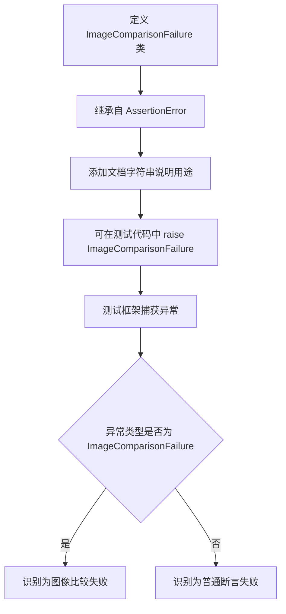

# `matplotlib\lib\matplotlib\testing\exceptions.py` 详细设计文档

定义了一个自定义异常类 ImageComparisonFailure，继承自 Python 内置的 AssertionError，用于在测试框架中标记和标识图像比较失败的情况，帮助测试框架识别这是图像对比相关的断言错误而非普通的断言错误。

## 整体流程



## 类结构

```
object (Python 内置基类)
└── BaseException
└── Exception
└── StandardError
└── AssertionError
└── ImageComparisonFailure (当前类)
```

## 全局变量及字段


    

## 全局函数及方法


## 关键组件


### 一段话描述

该代码定义了一个自定义异常类 ImageComparisonFailure，用于在测试中标记两张图像比较失败的情况，继承自 Python 内置的 AssertionError 异常。

### 文件的整体运行流程

由于该代码仅包含一个异常类定义，不涉及实际执行流程。该异常类在被 raise 时会被测试框架捕获，用于标识图像对比测试失败，并可能触发测试报告生成或截图保存等后续处理。

### 类的详细信息

#### 类字段

| 名称 | 类型 | 描述 |
|------|------|------|
| 无类字段 | - | 该类为简单异常类，无类级别属性 |

#### 类方法

| 名称 | 参数名称 | 参数类型 | 参数描述 | 返回值类型 | 返回值描述 |
|------|----------|----------|----------|------------|------------|
| __init__ | self | ImageComparisonFailure | 实例自身 | None | 初始化异常对象 |
| __init__ | msg | str | 可选的错误消息参数 | None | 传递给父类的错误消息 |

#### 带注释源码

```python
class ImageComparisonFailure(AssertionError):
    """
    Raise this exception to mark a test as a comparison between two images.
    """
    # 该类直接继承自 AssertionError，当图像比较测试失败时抛出此异常
    # 测试框架可以识别此特定异常类型，进行针对性的处理（如截图保存）
    pass  # 无自定义实现，完全继承父类行为
```

### 关键组件信息

### ImageComparisonFailure

自定义异常类，继承自 AssertionError，用于标记图像比较测试失败。该异常的设计目的是让测试框架能够区分普通断言失败和图像比较失败，从而进行特殊的错误处理（如保存失败截图、生成可视化diff等）。

### 潜在的技术债务或优化空间

1. **缺乏具体属性**：当前类仅继承父类，未提供与图像比较相关的特定属性（如actual_image、expected_image、diff_path等），限制了诊断能力
2. **无上下文信息**：缺少存储比较元数据的机制，无法记录比较阈值、相似度分数等信息
3. **文档不完整**：docstring 仅说明用途，未说明预期使用方式和参数

### 其它项目

#### 设计目标与约束

- 设计目标：提供清晰的图像比较失败标识，使测试框架能够进行针对性处理
- 约束：需与主流测试框架（pytest、unittest）兼容

#### 错误处理与异常设计

- 异常类型：检查异常（用于测试失败场景）
- 传播方式：在图像比较断言失败时抛出，由测试框架捕获
- 捕获方：测试框架的断言重写机制或自定义测试运行器

#### 数据流与状态机

该异常类本身不涉及复杂的数据流，仅在测试失败时作为错误载体传递诊断信息。

#### 外部依赖与接口契约

- 依赖：Python 内置 AssertionError
- 接口契约：测试代码在图像比较失败时应 raise ImageComparisonFailure


## 问题及建议


### 已知问题

-   **类实现为空**：类体仅包含文档字符串，无任何自定义属性或方法，虽然继承自 `AssertionError` 但缺乏扩展性。
-   **缺少上下文信息存储能力**：无法在抛出异常时携带比较失败的详细信息（如期望图像路径、实际图像路径、差异度量值等）。
-   **文档字符串不完整**：仅说明用途，未说明该异常应包含哪些属性以支持调试。
-   **缺乏类型提示**：未使用 Python 3 类型注解，影响代码可读性和静态分析工具的支持。
-   **没有自定义 `__init__` 方法**：调用方无法传递有意义的参数，限制了异常的可读性和可调试性。

### 优化建议

-   **添加自定义 `__init__` 方法**：接受并存储比较相关的上下文参数（如 expected_path、actual_path、diff_percentage 等），便于测试失败时提供详细的诊断信息。
-   **增强文档字符串**：补充说明类属性、典型使用场景及与标准 AssertionError 的区别。
-   **添加类型注解**：为类添加显式的类型声明，提升代码可维护性。
-   **考虑实现辅助方法**：如 `get_diff_image()` 或 `to_dict()`，方便测试框架集成和日志记录。
-   **考虑添加差异化度量属性**：如均方误差（MSE）、结构相似性指数（SSIM）等，为图像比较提供量化依据。


## 其它


### 设计目标与约束
- **设计目标**：在自动化测试框架中标记图像比较失败，使测试报告能够清晰展示差异并支持图像对比功能
- **设计约束**：必须继承AssertionError以符合测试框架的断言失败处理机制；仅用于图像比较场景，不适用于其他类型断言

### 错误处理与异常设计
- **异常类型**：自定义异常类，继承自Python内置AssertionError
- **触发场景**：图像比对算法检测到像素差异或不匹配时由测试代码主动抛出
- **处理方式**：由测试框架（如pytest）捕获并生成带有差异标记的测试报告
- **传播机制**：沿调用栈向上传播至测试框架终止点

### 外部依赖与接口契约
- **外部依赖**：无第三方依赖，仅使用Python 3标准库
- **接口规范**：构造函数接受可选的字符串参数message，用于描述比较失败的具体原因
- **调用约定**：通常由测试辅助工具在内部调用，使用者无需直接实例化

### 使用场景与交互
- **典型场景**：UI自动化测试截图对比、计算机视觉模型输出验证、图像处理算法正确性校验
- **交互流程**：测试执行图像采集 → 调用比对工具 → 发现差异 → 抛出ImageComparisonFailure → 测试框架捕获并生成带差异图像的报告

### 兼容性考虑
- **Python版本**：兼容Python 3.6+
- **操作系统**：平台无关，纯Python实现
- **测试框架**：兼容pytest、unittest、nose等主流测试框架

### 测试策略
- **单元测试**：验证类可正常实例化且继承自AssertionError
- **集成测试**：在模拟图像比较失败场景中验证异常能被正确抛出并被测试框架捕获

    