# `matplotlib\lib\matplotlib\testing\jpl_units\Duration.py` 详细设计文档

A Duration class that represents a time duration in different time frames (ET or UTC), supporting arithmetic operations (addition, subtraction, multiplication), comparisons, and providing absolute value and negation capabilities while enforcing frame consistency.

## 整体流程

```mermaid
graph TD
    A[创建Duration对象] --> B{frame在allowed列表中?}
    B -- 否 --> C[抛出ValueError]
    B -- 是 --> D[初始化_frame和_seconds]
    D --> E[等待操作]
    E --> F{执行算术操作?}
    F -- 加法 --> G{类型为Epoch?]
    G -- 是 --> H[调用Epoch的__add__]
    G -- 否 --> I{帧相同?}
    I -- 否 --> J[抛出ValueError]
    I -- 是 --> K[执行加法并返回新Duration]
    F -- 减法 --> L{帧相同?}
    L -- 否 --> M[抛出ValueError]
    L -- 是 --> N[执行减法并返回新Duration]
    F -- 乘法 --> O[执行乘法并返回新Duration]
    F -- 比较操作 --> P{帧相同?}
    P -- 否 --> Q[抛出ValueError]
    P -- 是 --> R[执行比较并返回结果]
```

## 类结构

```
Duration (主类)
└── 继承关系: object (隐式)
    └── 类变量: allowed (允许的时间帧列表)
    └── 实例变量: _frame (时间帧)
    └── 实例变量: _seconds (秒数)
```

## 全局变量及字段


### `functools`
    
Python standard library module providing higher-order functions and utilities.

类型：`module`
    


### `operator`
    
Python standard library module that maps standard operators to callable functions.

类型：`module`
    


### `_api`
    
Matplotlib internal API module for checks, warnings and deprecation utilities.

类型：`module`
    


### `matplotlib.testing.jpl_units`
    
Matplotlib testing submodule for JPL units, used only in the __add__ method to handle Epoch addition.

类型：`module (delayed import)`
    


### `Duration.Duration.allowed`
    
List of permitted time frames ('ET' or 'UTC') for Duration instances.

类型：`class variable (list[str])`
    


### `Duration.Duration._frame`
    
Stores the time frame (e.g., 'ET' or 'UTC') of the Duration.

类型：`instance variable (str)`
    


### `Duration.Duration._seconds`
    
Stores the number of seconds represented by the Duration.

类型：`instance variable (float|int)`
    
    

## 全局函数及方法


### `_api.check_in_list`

该函数是 matplotlib._api 模块中的一个验证工具，用于检查给定的值是否存在于允许的列表中。在 Duration 类中，它被用于验证传入的时间帧（frame）是否属于允许的列表（["ET", "UTC"]），从而确保 Duration 对象只接受有效的时间帧值。如果传入的值不在列表中，该函数将抛出适当的错误。

参数：

- `allowed`：`list`，允许值的列表。在 Duration 类中使用 `self.allowed`，即 `["ET", "UTC"]`
- `frame`：`str`，关键字参数，需要验证的值。在 Duration 类中接收自 `__init__` 方法的 `frame` 参数

返回值：`None`，该函数不返回任何值。如果验证失败，则抛出 ValueError 异常

#### 流程图

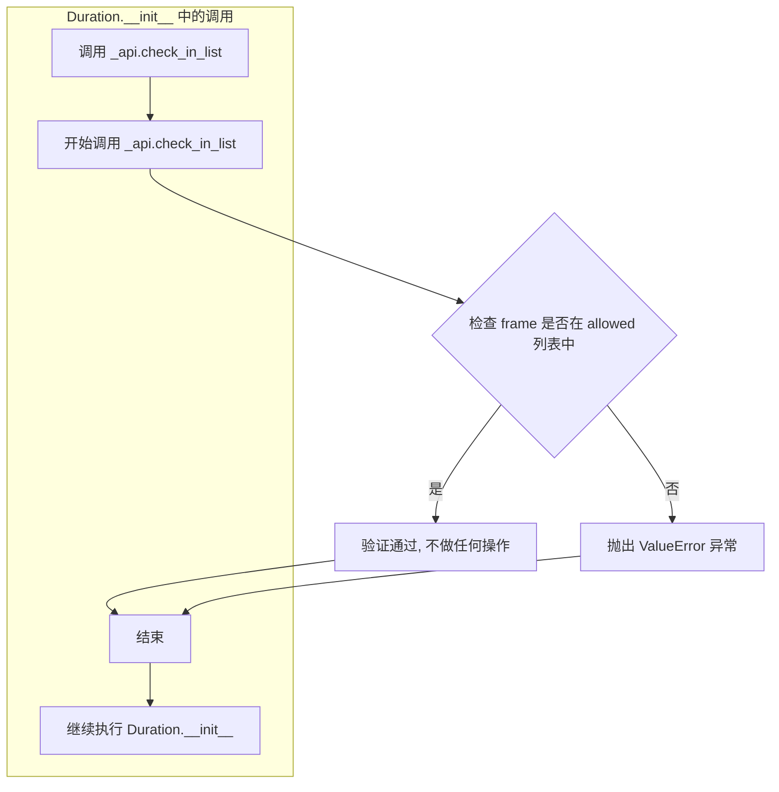

#### 带注释源码

```python
# 在 Duration.__init__ 方法中调用 _api.check_in_list
# 用于验证传入的 frame 参数是否在允许的列表中

_api.check_in_list(self.allowed, frame=frame)

# 参数说明：
# - self.allowed: 类属性，值为 ["ET", "UTC"]
# - frame=frame: 关键字参数，接收用户传入的时间帧值
# 
# 函数行为：
# - 如果 frame 在 self.allowed 列表中，不做任何操作，程序继续
# - 如果 frame 不在 self.allowed 列表中，抛出 ValueError 异常
#
# 异常信息通常会包含：
# - 提示信息说明 frame 不在允许的列表中
# - 显示传入的 frame 值
# - 显示允许的值列表
```

#### 补充说明

该函数是 matplotlib 内部 API 的一部分，属于 _api 模块的装饰器或工具函数集合。从代码的调用方式来看，`_api.check_in_list` 可能是通过装饰器或直接调用的形式实现的，用于在运行时进行参数验证。这种设计模式遵循了"快速失败"（Fail Fast）原则，在对象初始化阶段尽早捕获无效参数，避免在后续操作中产生难以追踪的错误。

在 Duration 类中，这个验证机制确保了：
1. 只有 "ET" 和 "UTC" 两个时间帧可以被接受
2. 用户在创建 Duration 对象时就能立即发现错误
3. 避免了无效的时间帧在整个对象生命周期中传播


### `functools.partialmethod`

描述：`functools.partialmethod` 是 Python 标准库中的函数，用于创建一个可调用对象，该对象可以作为方法使用，但实际上会调用原函数并预先填充部分参数。在 `Duration` 类中，它被用于创建六个比较运算符方法（`__eq__`、`__ne__`、`__lt__`、`__le__`、`__gt__`、`__ge__`），通过绑定 `_cmp` 方法和相应的 `operator` 函数来实现相同帧的 Duration 对象之间的比较功能。

#### 参数：

- `func`：函数或可调用对象，要绑定的方法（这里是 `_cmp` 方法）
- `args`：位置参数，要预先填充的参数（这里是相应的 `operator` 函数，如 `operator.eq`、`operator.ne` 等）
- `keywords`：关键字参数，可选的额外关键字参数

#### 返回值：`partialmethod` 对象，一个描述符对象，可作为类属性访问并在调用时执行绑定的函数

#### 流程图

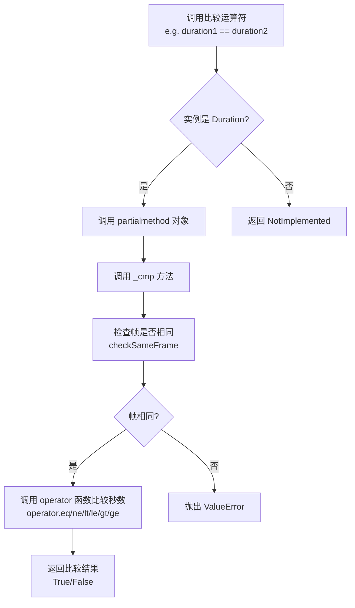

#### 带注释源码

```python
# functools.partialmethod 的使用示例（在 Duration 类中）
# functools.partialmethod 创建一个描述符，该描述符在作为类属性被访问时，
# 会绑定到第一个参数（self）并调用指定的函数

# _cmp 方法定义
def _cmp(self, op, rhs):
    """
    检查 self 和 rhs 是否共享相同的帧；使用 op 比较它们。
    
    参数：
    - self: Duration 实例（隐式）
    - op: 比较操作符函数（如 operator.eq, operator.ne 等）
    - rhs: 右侧的 Duration 对象
    
    返回值：
    - 比较操作的结果（True 或 False）
    """
    self.checkSameFrame(rhs, "compare")  # 检查帧是否相同
    return op(self._seconds, rhs._seconds)  # 使用提供的操作符比较秒数

# 使用 functools.partialmethod 创建比较运算符
# 原理：partialmethod(_cmp, operator.eq) 等价于创建如下方法：
# def __eq__(self, rhs):
#     return self._cmp(operator.eq, rhs)

__eq__ = functools.partialmethod(_cmp, operator.eq)   # 等于 (==)
__ne__ = functools.partialmethod(_cmp, operator.ne)   # 不等于 (!=)
__lt__ = functools.partialmethod(_cmp, operator.lt)   # 小于 (<)
__le__ = functools.partialmethod(_cmp, operator.le)   # 小于等于 (<=)
__gt__ = functools.partialmethod(_cmp, operator.gt)   # 大于 (>)
__ge__ = functools.partialmethod(_cmp, operator.ge)   # 大于等于 (>=)

# 使用示例：
# duration1 = Duration("ET", 100)
# duration2 = Duration("ET", 200)
# result = duration1 < duration2  # 调用 _cmp(operator.lt, duration2)
# # 内部执行：checkSameFrame 验证帧相同，然后返回 operator.lt(100, 200) -> False
```

#### 关键组件信息

| 名称 | 描述 |
|------|------|
| `_cmp` | 内部比较方法，用于验证帧并执行比较操作 |
| `checkSameFrame` | 验证两个 Duration 对象是否在同一时间帧中 |
| `operator.eq/ne/lt/le/gt/ge` | Python operator 模块中的比较函数 |

#### 技术债务与优化空间

1. **类型注解缺失**：方法参数和返回值缺少类型注解，不利于静态分析和 IDE 支持
2. **重复代码**：虽然使用了 `partialmethod`，但仍需手动定义 6 个比较运算符的绑定
3. **文档不完整**：`_cmp` 方法的文档字符串未完整描述所有错误情况

#### 错误处理与异常设计

- **帧不匹配时**：调用 `checkSameFrame` 方法，若帧不同则抛出 `ValueError`，错误信息包含左右操作数的帧信息
- **类型不匹配时**：通过返回 `NotImplemented`（虽然代码中未显式处理，但 Python 会自动处理）让其他对象有机会处理比较操作


### `Duration.__init__` (构造函数)

创建新的 Duration 对象，用于表示带有时间帧（参考框架）的时间持续期。

参数：

- `frame`：`str`，时间帧，必须是 'ET' 或 'UTC' 之一
- `seconds`：`int` 或 `float`，持续期的秒数

返回值：`None`，构造函数不返回值，仅初始化对象状态

#### 流程图

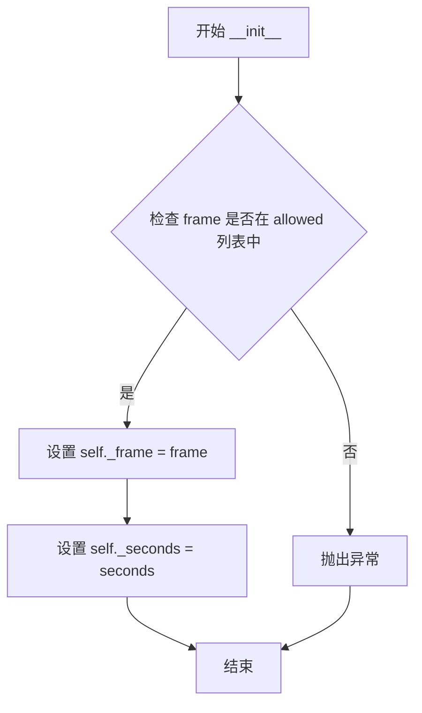

#### 带注释源码

```python
def __init__(self, frame, seconds):
    """
    Create a new Duration object.

    = ERROR CONDITIONS
    - If the input frame is not in the allowed list, an error is thrown.

    = INPUT VARIABLES
    - frame     The frame of the duration.  Must be 'ET' or 'UTC'
    - seconds  The number of seconds in the Duration.
    """
    # 使用 _api.check_in_list 验证 frame 是否在允许的列表中
    # 允许的帧定义在类属性 Duration.allowed = ["ET", "UTC"]
    # 如果 frame 不合法，该函数会抛出异常
    _api.check_in_list(self.allowed, frame=frame)
    
    # 将验证后的 frame 存储到实例属性 _frame 中
    self._frame = frame
    
    # 将秒数存储到实例属性 _seconds 中
    self._seconds = seconds
```


### `Duration.frame`

该方法用于返回当前 Duration 对象所使用的时间帧（frame），即 "ET" 或 "UTC"。

参数：
- （无显式参数，隐式参数 `self` 为 Duration 实例）

返回值：`str`，返回时间帧字符串，表示该 Duration 所属的时间参考系。

#### 流程图

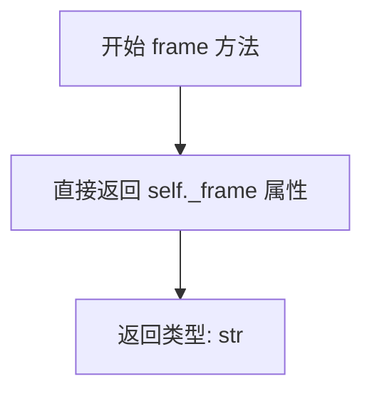

#### 带注释源码

```python
def frame(self):
    """Return the frame the duration is in."""
    return self._frame
```

#### 说明

- **方法性质**：实例方法，通过 `Duration` 对象调用
- **内部逻辑**：直接返回对象初始化时存储的 `_frame` 属性值，该值在构造函数 `__init__` 中经过 `_api.check_in_list` 验证，仅允许 "ET" 或 "UTC" 两种合法值
- **调用场景**：常用于在需要比较或操作两个 Duration 对象前，先行检查其时间帧是否一致（配合 `checkSameFrame` 使用）
- **性能特征**：O(1) 时间复杂度，无任何条件分支或计算开销


### Duration.seconds

获取 Duration 对象中存储的秒数。

参数：

- （无参数，self 为隐式参数）

返回值：`int` 或 `float`，返回 Duration 对象所代表的秒数。

#### 流程图

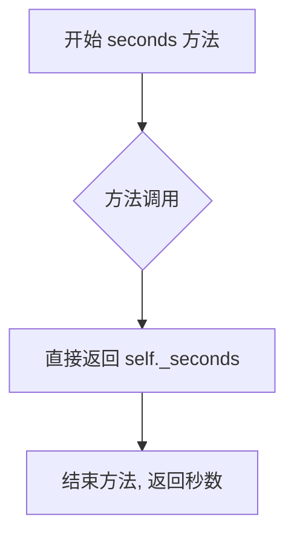

#### 带注释源码

```python
def seconds(self):
    """Return the number of seconds in the Duration."""
    return self._seconds
```


### `Duration.__abs__` (绝对值)

返回持续时间（Duration）的绝对值，创建一个新的 Duration 对象，其秒数值为原秒数的绝对值，帧（frame）保持不变。

参数：

- `self`：`Duration`，当前 Duration 实例

返回值：`Duration`，返回一个新的 Duration 对象，其秒数为原秒数的绝对值

#### 流程图

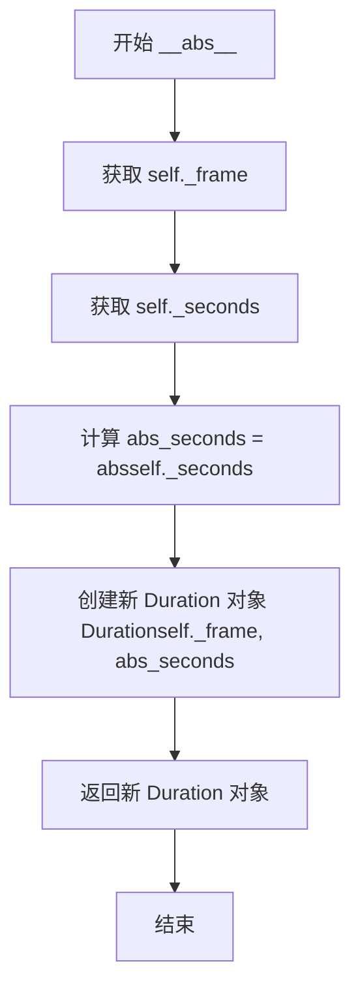

#### 带注释源码

```python
def __abs__(self):
    """Return the absolute value of the duration."""
    # 获取当前 Duration 对象的帧(frame)，保持不变
    frame = self._frame
    # 获取当前 Duration 对象的秒数
    seconds = self._seconds
    # 计算秒数的绝对值
    abs_seconds = abs(seconds)
    # 创建并返回一个全新的 Duration 对象
    # 帧保持不变，秒数取绝对值
    return Duration(frame, abs_seconds)
```


### `Duration.__neg__`

返回该 Duration 对象的负值，创建一个新的 Duration 实例，其时间帧（frame）与原对象相同，但秒数（seconds）取反。

参数：

- `self`：`Duration`，隐式参数，表示当前 Duration 对象实例

返回值：`Duration`，返回一个全新的 Duration 对象，其 frame 属性与原对象保持一致，_seconds 属性取反（即乘以 -1）

#### 流程图

```mermaid
flowchart TD
    A[开始 __neg__] --> B[获取当前对象的 frame: self._frame]
    B --> C[对秒数取反: -self._seconds]
    C --> D[创建新 Duration 对象<br/>Duration(self._frame, -self._seconds)]
    D --> E[返回新 Duration 对象]
    E --> F[结束]
```

#### 带注释源码

```python
def __neg__(self):
    """Return the negative value of this Duration."""
    # 使用当前对象的 frame（时间帧，如 'ET' 或 'UTC'）作为新 Duration 的 frame
    # 对 seconds 取负，实现负值操作
    return Duration(self._frame, -self._seconds)
```


### `Duration.__bool__`

该方法实现了 Python 布尔值转换协议，使得 Duration 对象可以在布尔上下文中使用。当 Duration 的秒数不为零时返回 True，否则返回 False。

参数：

- `self`：`Duration`，调用该方法的 Duration 实例本身

返回值：`bool`，如果 Duration 的秒数值不为零则返回 True，否则返回 False

#### 流程图

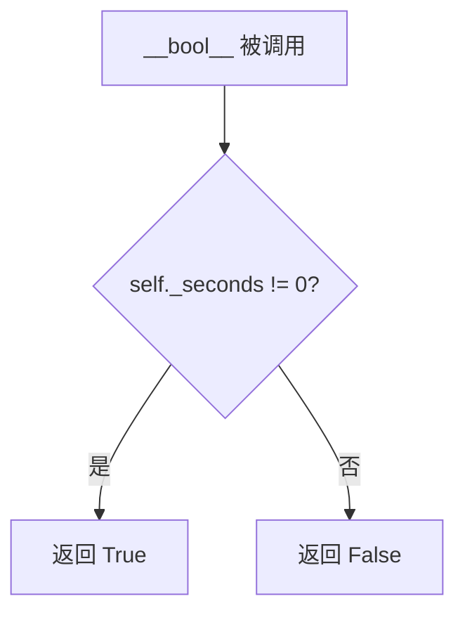

#### 带注释源码

```python
def __bool__(self):
    """
    返回 Duration 对象的布尔值。
    
    当 Duration 的秒数不为零时返回 True，否则返回 False。
    该方法使得 Duration 对象可以在布尔上下文中使用（如 if 语句、逻辑运算符等）。
    
    = RETURN VALUE
    - 返回布尔值，表示 Duration 是否表示非零时间量
    """
    return self._seconds != 0
```


### `Duration._cmp`

该方法是比较操作的辅助方法，用于比较两个 Duration 对象。首先验证比较双方是否处于相同的时间框架（frame），然后使用传入的比较运算符对秒数进行对比。

参数：

- `self`：`Duration`，隐式参数，当前 Duration 实例
- `op`：`Callable`，比较操作符（如 `operator.eq`、`operator.lt` 等）
- `rhs`：`Duration`，右侧参与比较的 Duration 对象

返回值：`bool`，返回比较操作的结果（True 或 False）

#### 流程图

```mermaid
flowchart TD
    A[开始 _cmp] --> B{检查 frame 是否相同}
    B -->|相同| C[执行 op(self._seconds, rhs._seconds)]
    B -->|不同| D[抛出 ValueError]
    C --> E[返回比较结果]
    D --> F[结束]
    E --> F
```

#### 带注释源码

```python
def _cmp(self, op, rhs):
    """
    Check that *self* and *rhs* share frames; compare them using *op*.
    
    参数:
        op: 比较操作符函数 (如 operator.eq, operator.lt 等)
        rhs: 右侧的 Duration 对象
    
    返回:
        bool: 比较操作的结果
    """
    # 首先检查 self 和 rhs 是否在相同的时间框架内
    self.checkSameFrame(rhs, "compare")
    
    # 使用传入的操作符比较两者的秒数
    return op(self._seconds, rhs._seconds)
```


### `Duration.__eq__`

使用 `functools.partialmethod` 实现的相等比较方法，用于比较两个 Duration 对象是否相等。首先检查两个 Duration 对象是否在同一个时间框架（frame）中，如果框架不同则抛出 ValueError 异常；如果框架相同，则比较它们包含的秒数是否相等。

参数：

- `rhs`：`Duration`，要比较的右侧 Duration 对象

返回值：`bool`，如果两个 Duration 对象的秒数相等则返回 `True`，否则返回 `False`

#### 流程图

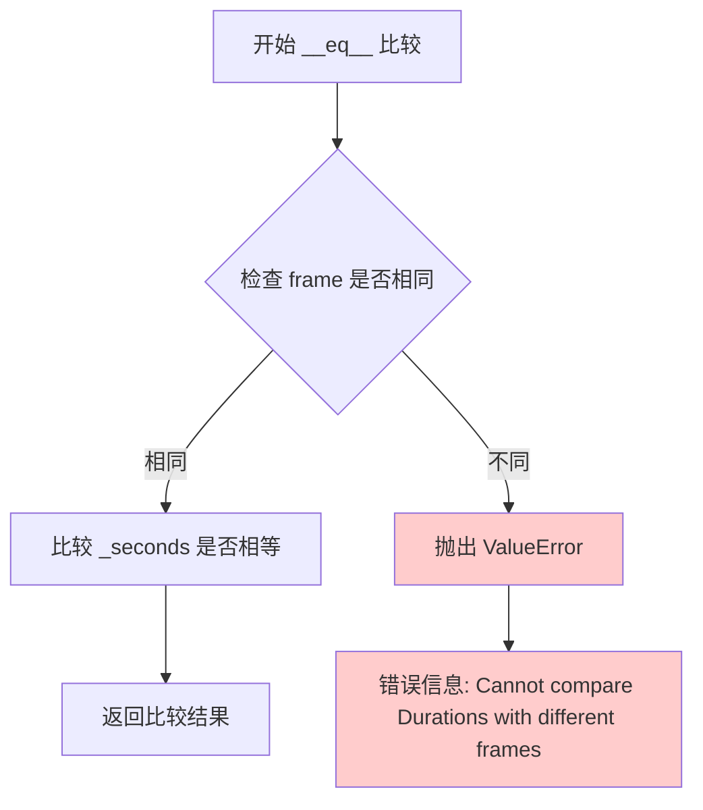

#### 带注释源码

```python
# 定义 __eq__ 方法，使用 functools.partialmethod
# _cmp 方法的签名: def _cmp(self, op, rhs)
# partialmethod 会将 operator.eq 预填充到 op 参数
# 调用时相当于: _cmp(self, operator.eq, rhs)
__eq__ = functools.partialmethod(_cmp, operator.eq)

# 下面是 _cmp 方法的定义，__eq__ 实际调用的是这个方法
def _cmp(self, op, rhs):
    """
    Check that *self* and *rhs* share frames; compare them using *op*.
    """
    # 调用 checkSameFrame 检查两个 Duration 是否在同一个时间框架
    # 传入 "compare" 作为函数名，用于错误信息
    self.checkSameFrame(rhs, "compare")
    
    # 使用传入的操作符（这里是 operator.eq）比较秒数
    # operator.eq(a, b) 等价于 a == b
    return op(self._seconds, rhs._seconds)

# checkSameFrame 方法定义
def checkSameFrame(self, rhs, func):
    """
    Check to see if frames are the same.

    = ERROR CONDITIONS
    - If the frame of the rhs Duration is not the same as our frame,
      an error is thrown.

    = INPUT VARIABLES
    - rhs     The Duration to check for the same frame
    - func    The name of the function doing the check.
    """
    # 检查框架是否相同
    if self._frame != rhs._frame:
        raise ValueError(
            f"Cannot compare Durations with different frames.\n"
            f"LHS: {self._frame}\n"
            f"RHS: {rhs._frame}")
```


### Duration.__ne__

使用 `functools.partialmethod` 实现的"不等于"比较操作符，内部通过 `_cmp` 方法比较两个 Duration 对象在相同 frame 下的秒数是否不相等，若 frame 不同则抛出 ValueError 异常。

参数：

- `rhs`：`Duration`，需要与当前 Duration 对象进行比较的右侧操作数

返回值：`bool`，返回 True 如果两个 Duration 的秒数不相等，否则返回 False

#### 流程图

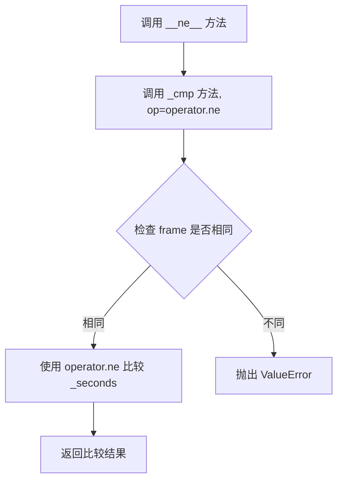

#### 带注释源码

```python
# 使用 functools.partialmethod 将 _cmp 方法与 operator.ne 绑定
# 创建 __ne__ (不等于) 比较方法
__ne__ = functools.partialmethod(_cmp, operator.ne)

# 内部调用的 _cmp 方法实现：
def _cmp(self, op, rhs):
    """
    Check that *self* and *rhs* share frames; compare them using *op*.
    
    参数：
        - self: Duration 实例（左侧操作数）
        - op: operator 对象（如 operator.ne, operator.eq 等）
        - rhs: Duration 实例（右侧操作数）
    
    返回值：
        - 比较结果（bool 类型）
    """
    # 首先检查两个 Duration 是否在相同的 frame 下
    self.checkSameFrame(rhs, "compare")
    # 使用传入的操作符比较秒数
    return op(self._seconds, rhs._seconds)
```


### Duration.__lt__

描述：小于比较操作符（via partialmethod），用于比较两个 Duration 对象的大小关系，如果两个 Duration 的 frame 不同则抛出 ValueError 错误。

参数：

- `self`：`Duration`，左侧操作数（隐式参数）
- `rhs`：`Duration`，右侧要比较的 Duration 对象

返回值：`bool`，如果左侧 Duration 小于右侧 Duration 返回 True，否则返回 False

#### 流程图

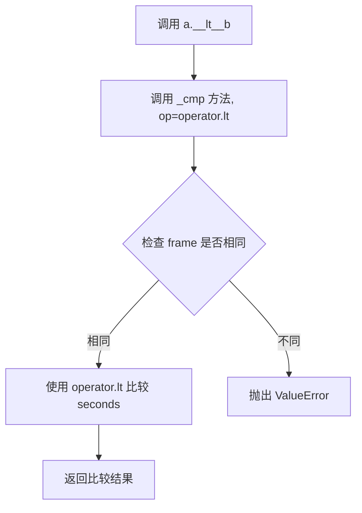

#### 带注释源码

```python
# __lt__ 是通过 functools.partialmethod 实现的
# 它将 _cmp 方法与 operator.lt（小于操作符）绑定
# 当调用 a.__lt__(b) 时，实际上相当于调用 a._cmp(operator.lt, b)
__lt__ = functools.partialmethod(_cmp, operator.lt)

# 底层实现：_cmp 方法
def _cmp(self, op, rhs):
    """
    Check that *self* and *rhs* share frames; compare them using *op*.
    
    参数：
    - self: Duration 对象，左侧操作数（隐式参数）
    - op: operator 对象，比较操作符（如 operator.lt, operator.gt 等）
    - rhs: Duration 对象，右侧要比较的 Duration 对象
    
    返回值：
    - 返回比较操作的结果（布尔值）
    """
    # 检查两个 Duration 对象是否在相同的 frame（时间参考系）
    # 如果 frame 不同，抛出 ValueError
    self.checkSameFrame(rhs, "compare")
    
    # 使用传入的操作符 op 比较两个 Duration 的秒数
    # op(self._seconds, rhs._seconds) 等同于 self._seconds < rhs._seconds
    return op(self._seconds, rhs._seconds)
```


### `Duration.__le__`

实现小于等于比较运算符（`<=`），通过 `functools.partialmethod` 绑定 `_cmp` 方法与 `operator.le` 操作符，用于比较两个 Duration 对象的时间长度（要求帧相同）。

参数：

- `self`：`Duration`，当前的 Duration 对象（左侧操作数）
- `rhs`：`Duration`，要比较的右侧 Duration 对象

返回值：`bool`，如果左侧 Duration 小于等于右侧 Duration 返回 `True`，否则返回 `False`

#### 流程图

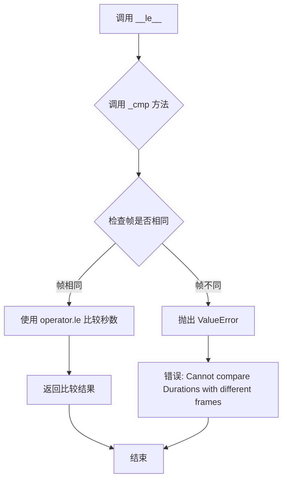

#### 带注释源码

```python
# 通过 functools.partialmethod 实现 __le__ 方法
# 相当于: def __le__(self, rhs): return self._cmp(operator.le, rhs)
__le__ = functools.partialmethod(_cmp, operator.le)

# 底层 _cmp 方法实现:
def _cmp(self, op, rhs):
    """
    Check that *self* and *rhs* share frames; compare them using *op*.
    
    参数:
        op: 比较操作符函数 (如 operator.le, operator.lt 等)
        rhs: 右侧的 Duration 对象
    
    返回:
        bool: 比较结果
    """
    # 调用 checkSameFrame 检查两个 Duration 对象的帧是否相同
    self.checkSameFrame(rhs, "compare")
    
    # 使用传入的操作符比较秒数
    # op 是 operator.le，所以实际执行: self._seconds <= rhs._seconds
    return op(self._seconds, rhs._seconds)
```


### `Duration.__gt__`

实现大于（>）比较运算符，通过 `functools.partialmethod` 委托给 `_cmp` 方法。该方法比较两个 Duration 对象的秒数大小，但前提是它们必须处于相同的时间帧（frame）中。

参数：

-  `rhs`：`Duration`，要进行大于比较的右侧 Duration 对象

返回值：`bool`，如果左侧 Duration 的秒数大于右侧 Duration 的秒数则返回 `True`，否则返回 `False`

#### 流程图

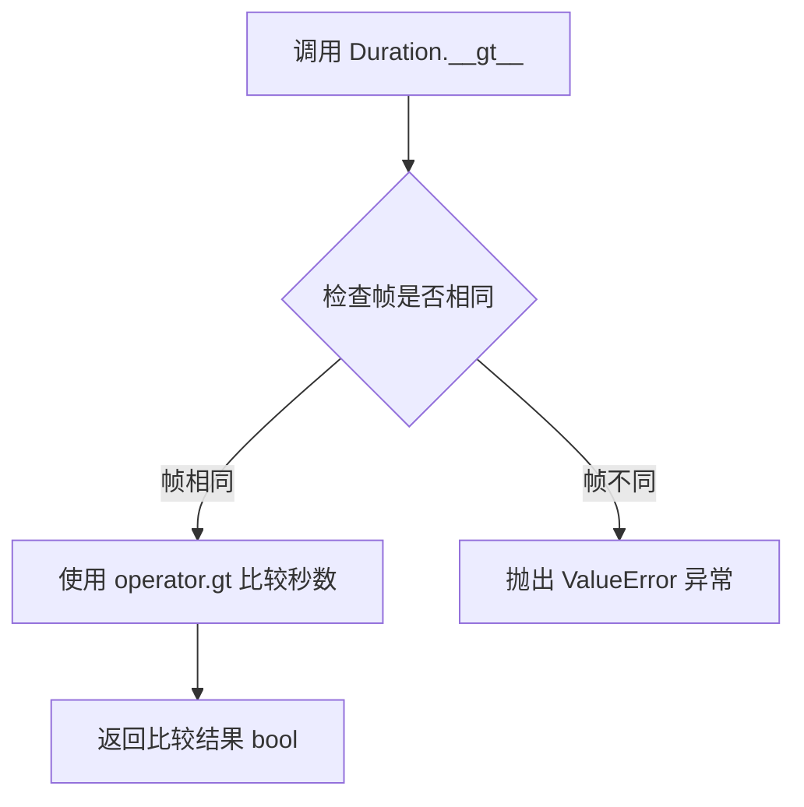

#### 带注释源码

```python
# 定义 __gt__ 为 partialmethod，调用 _cmp 方法并传入 operator.gt
# 当执行 self > rhs 时，实际调用的是 _cmp(operator.gt, rhs)
__gt__ = functools.partialmethod(_cmp, operator.gt)

# 下面是 _cmp 方法的实现，__gt__ 内部调用的核心方法
def _cmp(self, op, rhs):
    """
    检查 self 和 rhs 是否在同一帧中；使用 op 对它们进行比较。
    
    参数:
        op:       比较操作符（如 operator.gt, operator.lt 等）
        rhs:      要比较的右侧 Duration 对象
    
    返回值:
        使用 op 比较两个 Duration 的秒数后的结果（bool）
    """
    # 检查两个 Duration 是否在相同的帧中
    self.checkSameFrame(rhs, "compare")
    # 使用传入的操作符比较秒数（对于 __gt__，即 operator.gt）
    return op(self._seconds, rhs._seconds)

# checkSameFrame 方法确保比较的两个 Duration 具有相同的帧
def checkSameFrame(self, rhs, func):
    """
    检查帧是否相同。
    
    错误条件:
        - 如果 rhs Duration 的帧与当前 Duration 的帧不同，则抛出错误。
    
    输入变量:
        - rhs:     要检查帧是否相同的 Duration
        - func:    执行检查的函数名称
    """
    if self._frame != rhs._frame:
        raise ValueError(
            f"Cannot compare Durations with different frames.\n"
            f"LHS: {self._frame}\n"
            f"RHS: {rhs._frame}")
```


### `Duration.__ge__`

比较两个 Duration 对象是否大于等于。

参数：

- `self`：`Duration`，左侧的 Duration 实例（隐式参数）
- `rhs`：`Duration`，右侧的要比较的 Duration 实例

返回值：`bool`，如果左侧 Duration 大于等于右侧 Duration 返回 `True`，否则返回 `False`

#### 流程图

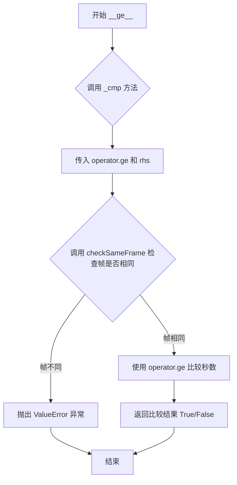

#### 带注释源码

```python
# 使用 functools.partialmethod 创建 __ge__ 方法
# 它绑定到 _cmp 方法，第一个参数 self 已隐式传入
# 第二个参数是 operator.ge (大于等于比较操作符)
# 第三个参数是 rhs (右侧操作数)
__ge__ = functools.partialmethod(_cmp, operator.ge)

# 下面是 _cmp 方法的实现细节：
def _cmp(self, op, rhs):
    """
    检查 self 和 rhs 是否有相同的 frame；使用 op 进行比较。
    
    参数：
    - op: 比较操作符（如 operator.ge）
    - rhs: 右侧的 Duration 对象
    
    返回值：
    - 比较操作的结果（布尔值）
    """
    # 调用 checkSameFrame 检查两个 Duration 的帧是否相同
    # 如果帧不同，将抛出 ValueError 异常
    self.checkSameFrame(rhs, "compare")
    
    # 使用传入的操作符比较两个 Duration 的秒数
    # operator.ge 执行 self._seconds >= rhs._seconds
    return op(self._seconds, rhs._seconds)
```


### `Duration.__add__`

该方法实现了 Duration 类的加法运算，支持 Duration 对象之间的加法以及 Duration 与 Epoch 对象的加法运算。如果两个 Duration 对象不在同一时间框架（frame）中，将抛出 ValueError 异常。

参数：

- `rhs`：`Duration` 或 `matplotlib.testing.jpl_units.Epoch`，要相加的 Duration 或 Epoch 对象

返回值：`Duration`，返回两个 Duration 对象的和（秒数相加），或 Duration 与 Epoch 运算后的结果

#### 流程图

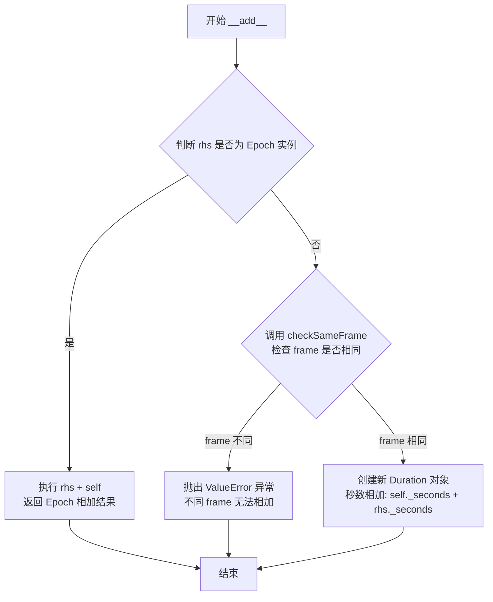

#### 带注释源码

```python
def __add__(self, rhs):
    """
    Add two Durations.

    = ERROR CONDITIONS
    - If the input rhs is not in the same frame, an error is thrown.

    = INPUT VARIABLES
    - rhs     The Duration to add.

    = RETURN VALUE
    - Returns the sum of ourselves and the input Duration.
    """
    # 延迟导入以避免循环依赖
    # 原因：matplotlib.testing.jpl_units 模块可能依赖 Duration 类
    import matplotlib.testing.jpl_units as U

    # 处理 Duration 与 Epoch 的加法
    # 当 rhs 是 Epoch 类型时，调用 Epoch 的 __add__ 方法
    # 这会返回一个 Epoch 对象（而非 Duration）
    if isinstance(rhs, U.Epoch):
        return rhs + self

    # 验证两个 Duration 对象是否在同一时间框架（frame）内
    # 如果 frame 不同，将抛出 ValueError 异常
    self.checkSameFrame(rhs, "add")

    # 创建新的 Duration 对象，秒数为两者之和
    # 新的 Duration 保持原来的 frame
    return Duration(self._frame, self._seconds + rhs._seconds)
```


### `Duration.__sub__`

该方法实现两个 Duration 对象的减法运算，通过 `checkSameFrame` 验证两个 Duration 是否处于同一时间框架（frame），若框架一致则返回一个新的 Duration 对象，其时间长度为当前对象与被减对象的秒数差值；若框架不一致则抛出 ValueError 异常。

参数：

- `self`：Duration，当前 Duration 对象（隐式参数）
- `rhs`：Duration，要减去的 Duration 对象

返回值：Duration，返回表示两个 Duration 对象时间差的新 Duration 实例

#### 流程图

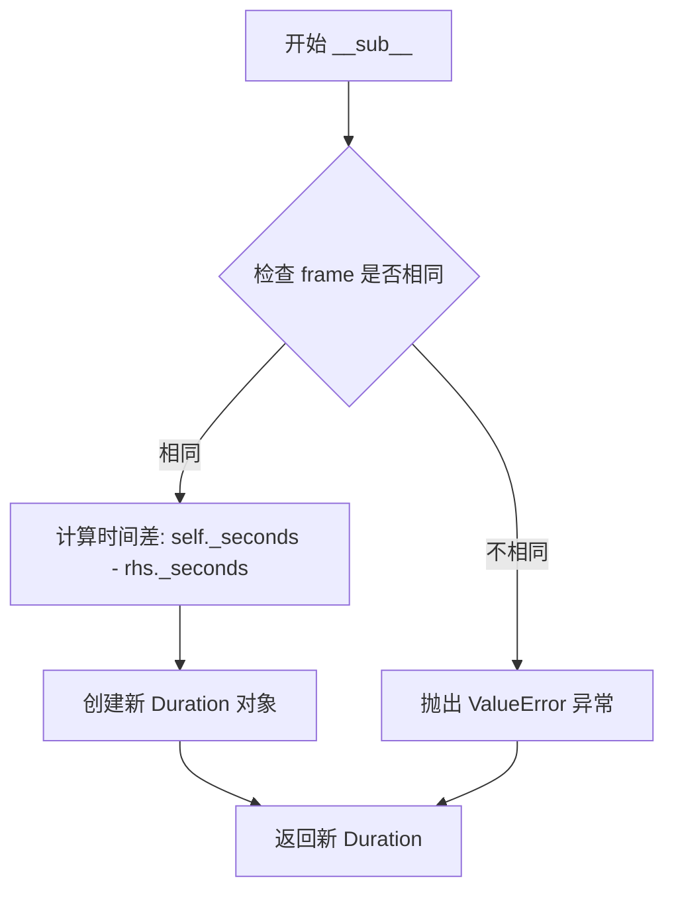

#### 带注释源码

```python
def __sub__(self, rhs):
    """
    Subtract two Durations.

    = ERROR CONDITIONS
    - If the input rhs is not in the same frame, an error is thrown.

    = INPUT VARIABLES
    - rhs     The Duration to subtract.

    = RETURN VALUE
    - Returns the difference of ourselves and the input Duration.
    """
    # 检查两个 Duration 是否具有相同的时间框架（frame）
    # 如果 frame 不同，将抛出 ValueError 异常
    self.checkSameFrame(rhs, "sub")
    
    # 创建新的 Duration 对象，时间长度为两个 Duration 的秒数差值
    # 保持原有的时间框架（self._frame）
    return Duration(self._frame, self._seconds - rhs._seconds)
```


### `Duration.__mul__`

实现Duration对象的乘法运算（标量乘法），允许将Duration对象与数值相乘以生成新的Duration对象，其中秒数被缩放而时间框架保持不变。该方法也支持右乘运算（__rmul__）。

参数：

- `rhs`：任意可转换为float的类型，要乘以的标量值

返回值：`Duration`，返回一个新的Duration对象，其时间框架与原对象相同，秒数为原秒数与标量值的乘积

#### 流程图

```mermaid
graph TD
    A[开始 __mul__] --> B[输入: rhs]
    B --> C[float转换: float(rhs)]
    C --> D[计算乘积: self._seconds * float(rhs)]
    D --> E[创建新Duration对象]
    E --> F[frame=self._frame]
    F --> G[seconds=self._seconds * float(rhs)]
    G --> H[返回新Duration对象]
```

#### 带注释源码

```python
def __mul__(self, rhs):
    """
    Scale a UnitDbl by a value.

    = INPUT VARIABLES
    - rhs     The scalar to multiply by.

    = RETURN VALUE
    - Returns the scaled Duration.
    """
    # 将秒数乘以传入的标量值，并创建新的Duration对象返回
    # frame保持不变，只有seconds被缩放
    return Duration(self._frame, self._seconds * float(rhs))

# 支持右乘运算：当左侧为标量，右侧为Duration时调用
# 例如: 2 * duration 等同于 duration.__mul__(2)
__rmul__ = __mul__
```


### `Duration.__rmul__`

该方法实现 Duration 对象的反向乘法运算（即 `scalar * Duration`），通过调用 `__mul__` 方法实现，返回一个将时间长度按给定标量缩放后的新 Duration 对象。

参数：

- `self`：`Duration`，当前 Duration 对象（隐式参数）
- `rhs`：`任意可转换为 float 的类型`，要乘以的标量值

返回值：`Duration`，返回一个新的 Duration 对象，其时间框架与原对象相同，秒数按标量缩放。

#### 流程图

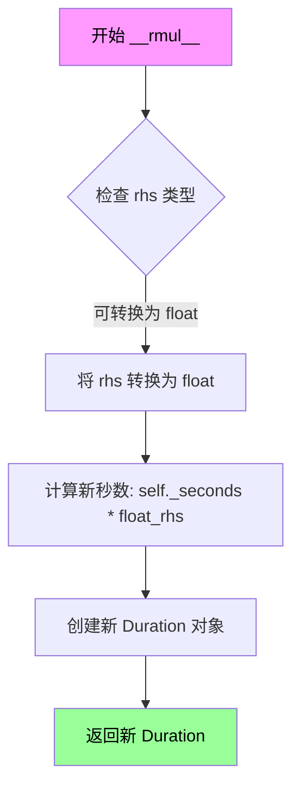

#### 带注释源码

```python
def __rmul__(self, rhs):
    """
    Scale a UnitDbl by a value.
    
    此方法为 __mul__ 的别名，实现反向乘法。
    当执行 scalar * Duration 时，Python 会调用此方法。
    
    = INPUT VARIABLES
    - rhs     The scalar to multiply by.
    
    = RETURN VALUE
    - Returns the scaled Duration.
    """
    # __rmul__ 只是 __mul__ 的别名，调用相同的逻辑
    # 这样可以实现: duration * scalar 和 scalar * duration 两种写法
    return Duration(self._frame, self._seconds * float(rhs))
```


### `Duration.__str__`

返回Duration对象的字符串表示，格式为"秒数 帧"（例如："10 ET"）。

参数： 无（该方法仅使用隐式参数self）

返回值：`str`，返回Duration对象的字符串表示，包含秒数（使用`:g`格式去除不必要的小数点）和帧信息

#### 流程图

```mermaid
flowchart TD
    A[开始 __str__] --> B[获取self._seconds]
    B --> C[获取self._frame]
    C --> D[格式化字符串: seconds + frame]
    D --> E[返回格式化后的字符串]
```

#### 带注释源码

```python
def __str__(self):
    """Print the Duration."""
    # 使用f-string格式化输出
    # {self._seconds:g} 使用:g格式说明符，去除不必要的尾随零
    # 例如: 10.0 -> 10, 10.5 -> 10.5
    # {self._frame} 直接获取帧信息（'ET' 或 'UTC'）
    return f"{self._seconds:g} {self._frame}"
```


### `Duration.__repr__`

返回 Duration 对象的详细字符串表示形式，格式为 `Duration('frame', seconds)`，用于调试和开发环境下的对象展示。

参数：

- `self`：`Duration`，当前 Duration 实例对象

返回值：`str`，返回对象的详细表示字符串，格式为 `Duration('frame', seconds)`

#### 流程图

```mermaid
graph TD
    A[开始 __repr__] --> B[获取实例属性 _frame]
    B --> C[获取实例属性 _seconds]
    C --> D[使用 f-string 格式化字符串]
    D --> E[返回格式: Duration('frame', seconds)]
```

#### 带注释源码

```python
def __repr__(self):
    """
    返回 Duration 对象的详细字符串表示形式。
    
    此方法用于调试和开发环境，以可读的方式展示 Duration 对象。
    格式为: Duration('frame', seconds)，与构造函数格式一致，
    可以直接用于重新创建对象。
    
    Returns:
        str: 格式化的字符串，示例: Duration('ET', 3600.0)
    """
    return f"Duration('{self._frame}', {self._seconds:g})"
    # f-string 格式化:
    # - self._frame: 时间框架(如 'ET', 'UTC')，用单引号包裹
    # - self._seconds: 秒数，使用 :g 格式说明符去除尾随零
```


### `Duration.checkSameFrame`

检查两个 Duration 对象是否在同一时间帧（frame）中。如果帧不一致，则抛出 ValueError 异常。此方法用于在执行算术运算（加、减、比较）前确保两个 Duration 对象使用相同的时间参考系。

参数：

- `rhs`：`Duration`，要检查帧一致性的另一个 Duration 对象
- `func`：`str`，执行帧检查的操作名称（用于错误信息中说明是哪个操作失败了）

返回值：`None`，无返回值。如果帧不一致则抛出 ValueError 异常。

#### 流程图

```mermaid
flowchart TD
    A[开始检查帧一致性] --> B[获取当前对象的帧: self._frame]
    B --> C[获取比较对象的帧: rhs._frame]
    C --> D{self._frame == rhs._frame?}
    D -->|是| E[检查通过, 返回 None]
    D -->|否| F[抛出 ValueError 异常]
    F --> G[错误信息: 包含 LHS 和 RHS 的帧信息]
    
    style E fill:#90EE90
    style F fill:#FFB6C1
```

#### 带注释源码

```python
def checkSameFrame(self, rhs, func):
    """
    Check to see if frames are the same.

    = ERROR CONDITIONS
    - If the frame of the rhs Duration is not the same as our frame,
      an error is thrown.

    = INPUT VARIABLES
    - rhs     The Duration to check for the same frame
    - func    The name of the function doing the check.
    """
    # 比较当前 Duration 对象与传入的 rhs 对象的帧属性
    if self._frame != rhs._frame:
        # 帧不一致时抛出详细的 ValueError 异常
        # 包含左右操作数的帧信息，便于调试
        raise ValueError(
            f"Cannot Duration.checkSameFrame (帧一致性检查) Durations with different frames.\n"
            f"LHS: {self._frame}\n"
            f"RHS: {rhs._frame}")
```


## 关键组件


### Duration 类

表示时间持续时间的核心类，支持 ET（地球时）和 UTC（世界时）两种时间框架，提供算术运算、比较运算和类型转换功能。

### allowed 类属性

允许的时间框架列表，定义了 Duration 类支持的时间系统，目前仅支持 "ET" 和 "UTC" 两种。

### __init__ 方法

Duration 对象的构造函数，接收时间框架和秒数作为参数，验证框架是否合法后初始化对象。

### frame() 方法

返回 Duration 对象所属的时间框架（ET 或 UTC）。

### seconds() 方法

返回 Duration 对象包含的秒数。

### 算术运算符重载

支持加法（__add__）、减法（__sub__）、乘法（__mul__）和右乘（__rmul__）运算，确保同框架 Duration 之间的算术操作。

### 比较运算符重载

通过 _cmp 方法和 functools.partialmethod 实现等于（__eq__）、不等于（__ne__）、小于（__lt__）、小于等于（__le__）、大于（__gt__）和大于等于（__ge__）比较操作。

### __abs__ 和 __neg__ 方法

分别返回 Duration 的绝对值和负值，保持原时间框架不变。

### __bool__ 方法

根据秒数是否为0返回布尔值，实现 Python truthiness 协议。

### __str__ 和 __repr__ 方法

提供人类可读和开发者可读的字符串表示格式。

### checkSameFrame 方法

验证两个 Duration 对象是否处于相同时间框架，不匹配时抛出 ValueError 异常，确保算术和比较操作的有效性。

### _cmp 辅助方法

比较运算符的内部实现，先检查框架兼容性，再执行指定的比较操作。


## 问题及建议


### 已知问题

-   **缺少类型提示（Type Hints）**：整个类没有任何类型注解，无法静态分析类型错误，影响代码可维护性和IDE支持。
-   **运行时导入（Import Inside Method）**：`__add__` 方法内部使用延迟导入 `import matplotlib.testing.jpl_units as U`，每次调用都会执行导入操作，影响性能，应在模块顶部或类级别缓存。
-   **类变量可变性**：`allowed` 使用可变列表 `["ET", "UTC"]`，可能被意外修改，应使用不可变元组 `("ET", "UTC")`。
-   **缺少 `__hash__` 方法**：定义了 `__eq__` 但未定义 `__hash__`，导致 `Duration` 对象不可哈希，无法作为字典键或放入集合中。
-   **缺少不可变性**：`_frame` 和 `_seconds` 属性可以被直接修改（`self._frame = ...`），缺乏对实例的保护。
-   **浮点数比较问题**：`_cmp` 方法直接比较 `self._seconds` 和 `rhs._seconds`，浮点数直接比较可能因精度问题产生错误结果。
-   **方法命名不一致**：使用混合命名风格（camelCase 的 `checkSameFrame` 与 snake_case 的其他方法）。
-   **缺少文档字符串**：`__bool__` 方法没有文档注释。
-   **不一致的错误处理**：部分使用 `_api.check_in_list`，部分使用自定义 `ValueError`，风格不统一。

### 优化建议

-   为所有方法添加类型提示（`-> Duration`、`-> str` 等），并使用 `typing` 模块增强类型声明。
-   将 `import matplotlib.testing.jpl_units as U` 移至模块顶部或使用缓存机制避免重复导入。
-   将 `allowed = ["ET", "UTC"]` 改为 `allowed = ("ET", "UTC")`。
-   如果需要哈希功能，添加 `__hash__` 方法；如果不需要哈希，显式设置 `__hash__ = None`。
-   考虑使用 `@property` 装饰器提供只读属性，或使用 `__slots__` 限制属性添加。
-   对于浮点数比较，考虑使用 `math.isclose()` 或设置合理的容差值。
-   统一方法命名为 snake_case 风格（如 `check_same_frame`）。
-   为 `__bool__` 添加 docstring 文档。
-   统一错误处理方式，或创建自定义异常类（如 `FrameMismatchError`）以提高代码一致性。


## 其它


### 设计目标与约束

**设计目标**：
- 提供一个轻量级的时间持续时间（Duration）抽象，用于表示带有时间框架（frame）的时间增量
- 支持ET（星历时间）和UTC（协调世界时）两种时间框架
- 提供完整的算术和比较操作符重载，使Duration对象可以像数值一样进行运算
- 确保类型安全，在运算前验证时间框架的一致性

**设计约束**：
- 仅支持"ET"和"UTC"两种预定义的时间框架，不支持扩展
- 秒数存储为浮点数，可能存在浮点精度问题
- Duration对象为不可变值对象（尽管内部属性可访问但不建议直接修改）
- 与matplotlib的jpl_units模块存在循环依赖，需延迟加载

### 错误处理与异常设计

**异常类型**：
- `ValueError`：当时间框架不在允许列表中时抛出，由`_api.check_in_list`触发
- `ValueError`：当比较或运算的两个Duration对象框架不一致时抛出，通过`checkSameFrame`方法触发

**错误处理策略**：
- 输入验证在构造函数和运算方法中进行，采用"快速失败"原则
- 错误消息包含左右操作数的框架信息，便于调试
- 循环依赖通过延迟导入（lazy import）解决

### 数据流与状态机

**数据流**：
- 输入：frame（字符串）、seconds（数值）→ 构造函数 → Duration对象
- 运算：Duration + Duration / Duration - Duration → 新Duration对象
- 输出：字符串表示（__str__、__repr__）、布尔值、比较结果

**状态转换**：
- Duration对象创建后，frame和seconds属性保持不变
- 算术运算返回新的Duration对象，不修改原对象（函数式风格）
- 绝对值和负值运算返回新的Duration对象

### 外部依赖与接口契约

**外部依赖**：
- `matplotlib._api`：提供`check_in_list`函数进行输入验证
- `functools`：提供`partialmethod`用于创建比较操作符
- `operator`：提供比较操作符函数
- `matplotlib.testing.jpl_units`：在`__add__`中延迟加载，用于与Epoch类型互操作

**公共接口契约**：
- `frame()`：返回时间框架字符串
- `seconds()`：返回秒数值
- 算术运算：+、-、*、__rmul__返回新Duration对象
- 比较运算：==、!=、<、<=、>、>=返回布尔值
- 布尔上下文：返回seconds != 0

### 性能考虑

- 使用`functools.partialmethod`减少重复代码，但可能增加方法调用开销
- 延迟导入避免循环依赖，但首次调用时存在导入开销
- 浮点秒数存储适合科学计算场景，但不适合精确时间累加场景

### 测试考虑

**测试用例建议**：
- 有效frame输入测试（"ET"、"UTC"）
- 无效frame输入测试（应抛出ValueError）
- 同框架Duration运算测试
- 异框架Duration运算测试（应抛出ValueError）
- 与Epoch对象相加测试
- 所有比较操作符测试
- 边界值测试（0秒、负秒数、极大数值）

    