# `matplotlib\lib\matplotlib\testing\jpl_units\Epoch.py` 详细设计文档

该模块实现了一个Epoch（历元）类，用于处理天文时间，支持在ET（地球时）和UTC（协调世界时）两种时间参考帧之间进行转换，可通过秒数+儒略日、matplotlib天数或Python datetime对象等多种方式创建Epoch对象，并支持时间加减、比较等运算操作。

## 整体流程

```mermaid
graph TD
    A[创建Epoch对象] --> B{输入参数校验}
    B -- sec+jd --> C[使用秒数和儒略日初始化]
    B -- daynum --> D[使用matplotlib天数初始化]
    B -- dt --> E[使用Python datetime初始化]
    B -- 无效输入 --> F[抛出ValueError异常]
    C --> G[规范化秒数到[0, 86400)]
    D --> H[转换为儒略日并计算秒数]
    E --> I[date2num转换为天数后再转儒略日]
    G --> J[存储_frame/_jd/_seconds]
    H --> J
    I --> J
    J --> K{操作请求}
    K -- convert --> L[帧转换]
    K -- julianDate --> M[返回儒略日]
    K -- secondsPast --> N[返回秒数]
    K -- 比较运算 --> O[转换为相同帧后比较]
    K -- +运算 --> P[帧对齐后相加]
    K -- -运算 --> Q[返回Duration或新Epoch]
```

## 类结构

```
Epoch (主类)
```

## 全局变量及字段


### `Epoch.allowed`
    
帧转换偏移量，定义ET与UTC之间的秒数差

类型：`dict`
    


### `Epoch._frame`
    
当前时间参考帧类型

类型：`str`
    


### `Epoch._jd`
    
儒略日的整数部分

类型：`float`
    


### `Epoch._seconds`
    
一天内的秒数

类型：`float`
    
    

## 全局函数及方法


根据任务要求，我需要从给定的代码中提取 `date2num` 函数的信息。

然而，我注意到在提供的代码中，`date2num` 并不是在该文件中实现的，而是从 `matplotlib.dates` 导入的外部函数。该代码只是使用了这个函数（在 `Epoch.__init__` 方法中）。

让我尝试从 matplotlib 的公开文档和代码使用方式来分析这个函数。如果需要获取更准确的信息，建议直接查看 matplotlib 库的源代码。


### `date2num`（从 `matplotlib.dates` 导入）

将 Python 的 `datetime` 对象或类似日期时间对象转换为 matplotlib 内部使用的数值表示形式（天数）。这是 matplotlib 日期处理的核心函数，用于在绘图时将日期转换为数值坐标。

参数：

-  `dt`：`datetime.datetime` 或类似日期时间对象，要转换的日期时间值

返回值：`float`，返回自公元1年1月1日以来的天数（小数部分表示一天中的时间）

#### 流程图

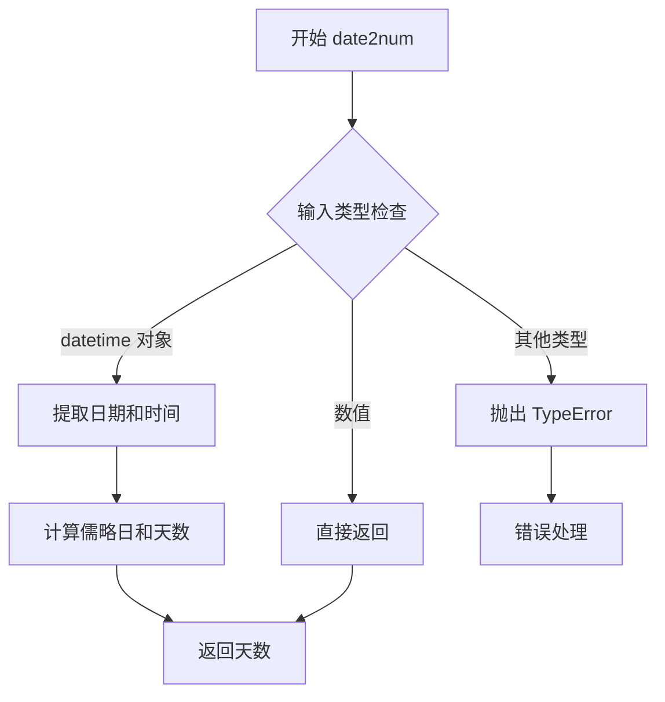

#### 带注释源码

由于 `date2num` 是 matplotlib 库的内部函数，在给定代码中并未实现。以下是从代码中的使用方式推断的函数签名和基本用法：

```python
# 在 Epoch.__init__ 中的使用方式
from matplotlib.dates import date2num

# 函数签名（推断）
def date2num(dt):
    """
    将 datetime 对象转换为 matplotlib 可用的天数数值。
    
    参数:
        dt: datetime.datetime - Python 标准库 datetime 对象
           也可以是 numpy datetime64 或 pandas Timestamp
    
    返回:
        float: 相对于公元1年1月1日的天数
               整数部分是天数，小数部分表示一天中的时间
               例如: 730119.5 表示 2000年1月1日中午12:00
    """
    # 在 Epoch 类中的调用示例：
    if dt is not None:
        daynum = date2num(dt)  # 将 datetime 转换为 matplotlib 日期数字
```

#### 关键信息说明

**在给定代码中的使用上下文：**

在 `Epoch` 类的 `__init__` 方法中：

```python
if dt is not None:
    daynum = date2num(dt)

if daynum is not None:
    # 1-JAN-0001 in JD = 1721425.5
    jd = float(daynum) + 1721425.5
    self._jd = math.floor(jd)
    self._seconds = (jd - self._jd) * 86400.0
```

这表明 `date2num` 返回的天数是以公元1年1月1日为基准的，而后续代码将其转换为儒略日（JD）。

**注意事项：**

由于 `date2num` 是外部依赖函数，其具体实现细节需要参考 matplotlib 官方源代码。建议通过以下方式获取完整信息：

1. 查看 matplotlib 官方文档
2. 访问 matplotlib GitHub 仓库中的 `lib/matplotlib/dates.py` 文件


### `_api.check_in_list`

该函数是 `matplotlib._api` 模块中的一个实用工具函数，用于验证给定的参数值是否在允许的列表或字典键中。如果验证失败，会抛出详细的错误信息，列出允许的值与实际提供的值。

参数：

- `valid_list`：`dict` 或 `list`，允许值的列表或字典（键为有效选项）
- `**kwargs`：关键字参数，要验证的参数名和值对

返回值：`None`，该函数仅进行验证，验证通过则返回 None，验证失败则抛出 `ValueError` 异常

#### 流程图

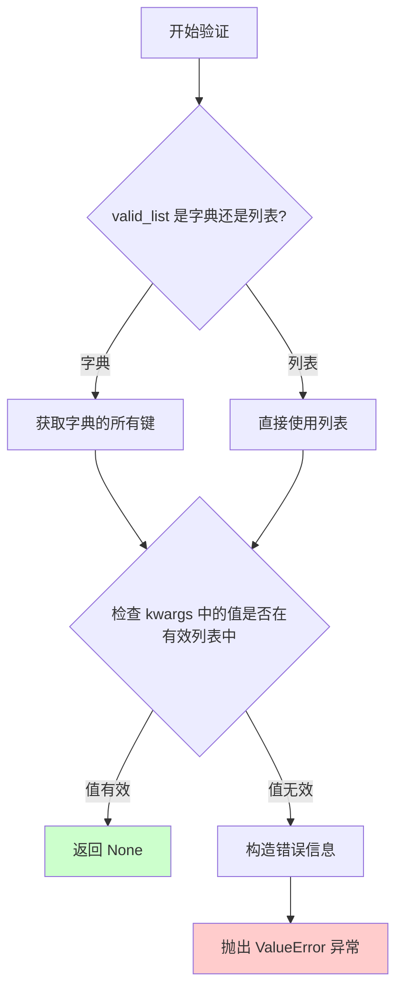

#### 带注释源码

```python
# 注意：这是基于 matplotlib._api.check_in_list 的推断实现
# 实际实现在 matplotlib 库的 _api 模块中

def check_in_list(valid_list, **kwargs):
    """
    检查 kwargs 中的值是否在 valid_list 中。
    
    参数:
        valid_list: dict 或 list
            允许的值列表或字典的键
        **kwargs: 关键字参数
            要验证的参数，格式为 参数名=值
    
    返回:
        None: 验证通过时返回
        
    异常:
        ValueError: 当提供的值不在允许列表中时抛出
    """
    # 从 valid_list 中提取有效选项集合
    if isinstance(valid_list, dict):
        # 如果是字典，只取键作为有效选项
        valid_options = set(valid_list.keys())
    else:
        # 如果是列表/集合，直接使用
        valid_options = set(valid_list)
    
    # 遍历所有要验证的关键字参数
    for key, value in kwargs.items():
        # 检查当前值是否在有效选项中
        if value not in valid_options:
            # 值不在允许列表中，构造详细的错误信息
            raise ValueError(
                f"{value!r} is not a valid value for {key}; "
                f"valid values are {sorted(valid_options)}"
            )
    
    # 所有验证通过，返回 None
    return None


# 在 Epoch.__init__ 中的调用示例：
# _api.check_in_list(self.allowed, frame=frame)
# 
# 这里 self.allowed 是一个字典：
# allowed = {
#     "ET": {"UTC": +64.1839},
#     "UTC": {"ET": -64.1839}
# }
#
# 当 frame='ET' 时：验证通过（'ET' 在字典的键中）
# 当 frame='INVALID' 时：抛出 ValueError
```


### Epoch.__init__

初始化Epoch对象，支持通过秒数+儒略日、matplotlib天数或Python datetime对象三种方式创建时间纪元。

参数：

- `frame`：`str`，时间参考系，必须为'ET'（地球时）或'UTC'（协调世界时）之一
- `sec`：`float`，可选，秒数（相对于儒略日）
- `jd`：`float`，可选，儒略日（Julian Date）
- `daynum`：`float`，可选，matplotlib天数
- `dt`：`datetime.datetime`，可选，Python datetime实例

返回值：`None`，在对象内部设置`self._frame`、`self._jd`和`self._seconds`属性

#### 流程图

```mermaid
flowchart TD
    A[开始 __init__] --> B{验证输入参数组合是否合法}
    B -->|不合法| C[抛出 ValueError 异常]
    B -->|合法| D{检查frame是否在allowed列表中}
    D -->|不在| E[抛出异常]
    D -->|在| F[设置 self._frame = frame]
    F --> G{检查dt是否为None}
    G -->|否| H[将dt转换为daynum: daynum = date2num(dt)]
    G -->|是| I{检查daynum是否为None}
    H --> I
    I -->|否| J[计算jd = daynum + 1721425.5]
    I -->|是| K[使用sec和jd计算]
    J --> L[设置 self._jd = floor(jd)]
    J --> M[设置 self._seconds = (jd - self._jd) * 86400]
    K --> N[设置 self._seconds = float(sec)]
    K --> O[设置 self._jd = float(jd)]
    O --> P[计算deltaDays = floor(self._seconds / 86400)]
    P --> Q[self._jd += deltaDays]
    Q --> R[self._seconds -= deltaDays * 86400]
    L --> S[结束]
    M --> S
    R --> S
```

#### 带注释源码

```python
def __init__(self, frame, sec=None, jd=None, daynum=None, dt=None):
    """
    Create a new Epoch object.

    Build an epoch 1 of 2 ways:

    Using seconds past a Julian date:
    #   Epoch('ET', sec=1e8, jd=2451545)

    or using a matplotlib day number
    #   Epoch('ET', daynum=730119.5)

    = ERROR CONDITIONS
    - If the input units are not in the allowed list, an error is thrown.

    = INPUT VARIABLES
    - frame     The frame of the epoch.  Must be 'ET' or 'UTC'
    - sec        The number of seconds past the input JD.
    - jd         The Julian date of the epoch.
    - daynum    The matplotlib day number of the epoch.
    - dt         A python datetime instance.
    """
    # 验证输入参数组合的有效性
    # 合法的组合只有三种:
    # 1. sec + jd (必须同时提供)
    # 2. daynum (单独提供)
    # 3. dt (单独提供, 且必须为datetime类型)
    if ((sec is None and jd is not None) or
            (sec is not None and jd is None) or
            (daynum is not None and
             (sec is not None or jd is not None)) or
            (daynum is None and dt is None and
             (sec is None or jd is None)) or
            (daynum is not None and dt is not None) or
            (dt is not None and (sec is not None or jd is not None)) or
            ((dt is not None) and not isinstance(dt, DT.datetime))):
        raise ValueError(
            "Invalid inputs.  Must enter sec and jd together, "
            "daynum by itself, or dt (must be a python datetime).\n"
            "Sec = %s\n"
            "JD  = %s\n"
            "dnum= %s\n"
            "dt  = %s" % (sec, jd, daynum, dt))

    # 验证frame是否在允许的时间参考系列表中
    _api.check_in_list(self.allowed, frame=frame)
    # 设置内部属性: 时间参考系
    self._frame = frame

    # 如果提供了datetime对象, 转换为matplotlib天数
    if dt is not None:
        daynum = date2num(dt)

    # 处理daynum方式初始化 (daynum与jd+sec互斥)
    if daynum is not None:
        # 1-JAN-0001 in JD = 1721425.5
        # 将matplotlib天数转换为儒略日
        jd = float(daynum) + 1721425.5
        # 存储整数部分作为JD天数
        self._jd = math.floor(jd)
        # 存储小数部分转换为秒数 (一天86400秒)
        self._seconds = (jd - self._jd) * 86400.0

    # 处理sec+jd方式初始化
    else:
        self._seconds = float(sec)
        self._jd = float(jd)

        # Resolve seconds down to [ 0, 86400)
        # 处理秒数溢出情况, 将超过一天的秒数转换为天数
        deltaDays = math.floor(self._seconds / 86400)
        self._jd += deltaDays
        self._seconds -= deltaDays * 86400.0
```


### `Epoch.convert`

将当前 Epoch 对象从原始时间参考帧转换到指定的目标时间参考帧。如果目标帧与当前帧相同，则直接返回当前对象的引用；否则根据帧间偏移量计算新的时间值并返回一个新的 Epoch 对象。

参数：

-  `frame`：`str`，目标时间参考帧（如 'ET' 或 'UTC'）

返回值：`Epoch`，转换后的 Epoch 对象

#### 流程图

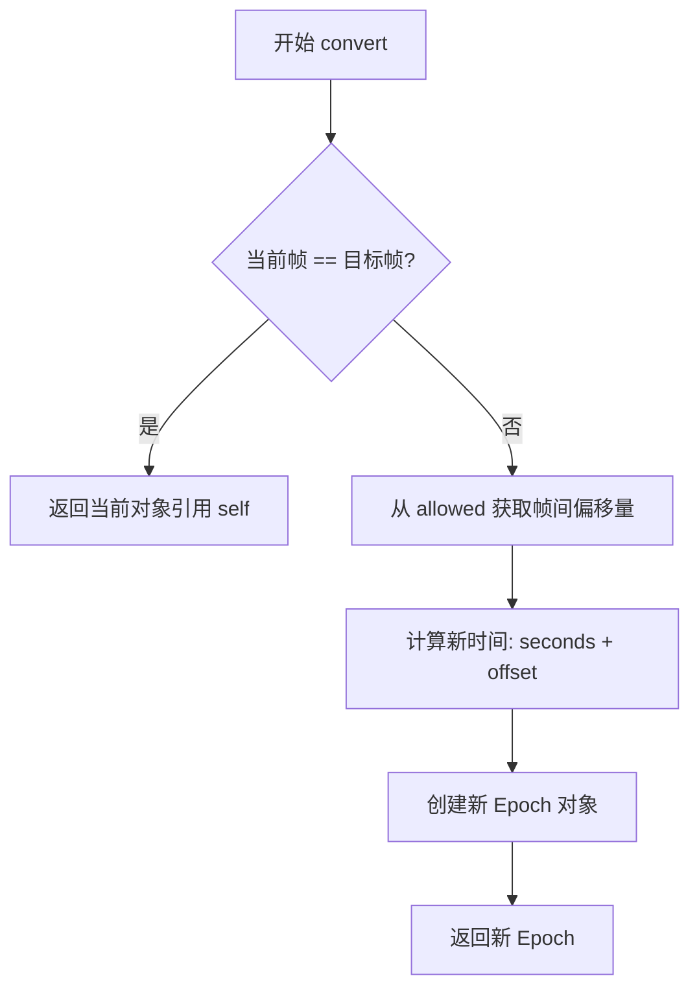

#### 带注释源码

```python
def convert(self, frame):
    """
    将 Epoch 转换到指定的时间参考帧。

    参数:
        frame (str): 目标时间参考帧，必须是 'ET' 或 'UTC' 之一。

    返回:
        Epoch: 转换后的 Epoch 对象。
              - 若目标帧与当前帧相同，返回 self（同一引用）
              - 否则返回新创建的 Epoch 对象
    """
    # 如果目标帧与当前帧相同，无需转换，直接返回当前对象引用
    if self._frame == frame:
        return self

    # 从类属性 allowed 中获取源帧到目标帧的偏移量（单位：秒）
    # allowed 字典结构: allowed[源帧][目标帧] = 偏移量(秒)
    offset = self.allowed[self._frame][frame]

    # 根据偏移量计算转换后的时间，创建新的 Epoch 对象返回
    # 新 epoch 的秒数为原秒数加上偏移量，保持相同的 Julian Date
    return Epoch(frame, self._seconds + offset, self._jd)
```


### Epoch.frame

该方法为 `Epoch` 类的获取器方法，用于返回当前 Epoch 对象所属的时间框架（如 'ET' 或 'UTC'）。

参数：无需参数（仅包含隐式参数 `self`）

返回值：`str`，返回该 Epoch 对象所使用的时间参考框架标识符

#### 流程图

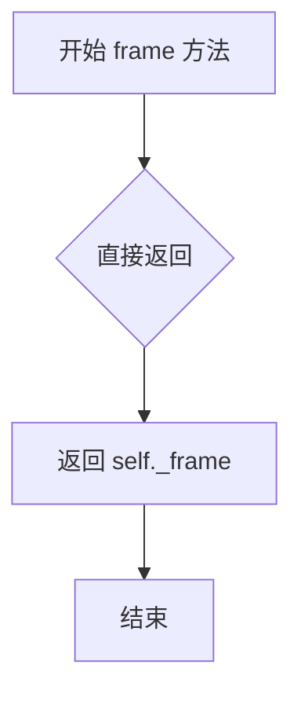

#### 带注释源码

```python
def frame(self):
    """
    返回该 Epoch 对象的时间框架。

    该方法是一个简单的获取器（getter），用于访问私有属性 _frame。
    _frame 表示当前 Epoch 所关联的时间参考系，合法值包括 'ET'（地球时）
    和 'UTC'（协调世界时）。

    = RETURN VALUE
    - 返回一个字符串，表示当前 Epoch 的时间框架。
    """
    return self._frame
```


### `Epoch.julianDate`

该方法用于将 Epoch 对象转换为指定参考帧的儒略日（Julian Date）数值，支持不同时间参考帧（如 ET 和 UTC）之间的转换，并自动处理帧转换逻辑。

参数：

- `frame`：`str`，目标时间参考帧（如 'ET' 或 'UTC'），指定要转换到的目标帧

返回值：`float`，返回对应参考帧下的儒略日数值（包含小数部分，精度到秒级）

#### 流程图

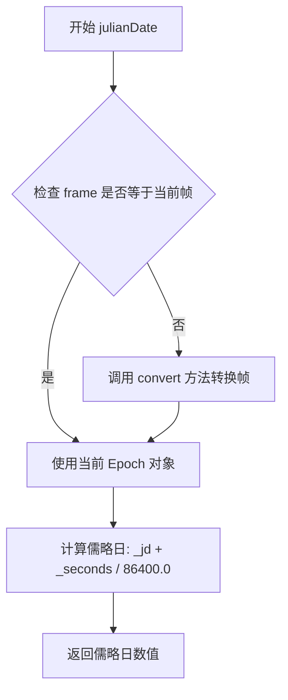

#### 带注释源码

```python
def julianDate(self, frame):
    """
    将 Epoch 转换为指定帧的儒略日。

    参数:
        frame: str，目标参考帧 ('ET' 或 'UTC')

    返回:
        float: 对应帧的儒略日数值
    """
    # 初始化时间对象为当前 Epoch 实例
    t = self
    
    # 如果目标帧与当前帧不同，需要进行帧转换
    # 例如：从 UTC 转换到 ET，或从 ET 转换到 UTC
    if frame != self._frame:
        # 调用 convert 方法进行帧转换
        # 转换时会根据 allowed 字典中的偏移量进行计算
        t = self.convert(frame)

    # 计算儒略日：整数部分(_jd) + 秒数转换为天数的小数部分
    # _jd: 儒略日的整数部分（从 1-Jan-0001 开始计数）
    # _seconds: 当天的秒数（0 <= _seconds < 86400）
    # 除以 86400 将秒转换为天的分数部分
    return t._jd + t._seconds / 86400.0
```


### `Epoch.secondsPast`

该方法用于计算当前Epoch相对于指定儒略日（JD）经过的秒数，可选择先将Epoch转换到指定的时间参考帧（如从ET转换到UTC）。

#### 参数

- `frame`：`str`，目标时间参考帧，必须是允许的帧类型之一（'ET' 或 'UTC'）
- `jd`：`float`，用于计算秒数差的起始儒略日

#### 返回值

`float`，从指定儒略日到当前Epoch经过的秒数

#### 流程图

```mermaid
flowchart TD
    A[开始 secondsPast] --> B{frame != self._frame?}
    B -->|是| C[调用 t = self.convert(frame)]
    B -->|否| D[t = self]
    C --> E[计算 delta = t._jd - jd]
    D --> E
    F[计算 result = t._seconds + delta * 86400]
    E --> F
    F --> G[返回 result]
```

#### 带注释源码

```python
def secondsPast(self, frame, jd):
    """
    计算从指定儒略日到当前Epoch经过的秒数。
    
    参数:
        frame: 目标时间参考帧（'ET' 或 'UTC'）
        jd: 用于计算秒数差的起始儒略日
        
    返回:
        从指定儒略日到当前Epoch经过的秒数
    """
    t = self  # 初始化t为当前Epoch实例
    
    # 如果目标帧与当前帧不同，需要进行帧转换
    if frame != self._frame:
        t = self.convert(frame)  # 将Epoch转换到目标帧
    
    # 计算当前Epoch的儒略日与指定儒略日的差值（天数）
    delta = t._jd - jd
    
    # 计算总秒数：当前秒数 + 差值天数转换为秒数（每天86400秒）
    return t._seconds + delta * 86400
```


### Epoch._cmp

该方法是Epoch类的私有比较方法，用于比较两个Epoch对象的大小关系。它通过先将两个Epoch转换到同一参考系（frame），然后比较它们的儒略日（jd）和秒数（seconds）来确定相对顺序。此方法被`functools.partialmethod`包装成六个比较运算符（`__eq__`、`__ne__`、`__lt__`、`__le__`、`__gt__`、`__ge__`），使得Epoch对象支持Python的标准比较操作。

参数：

- `op`：`_operator`（或`operator`模块的函数），执行实际比较操作的运算符函数（如`operator.eq`、`operator.ne`、`operator.lt`等）
- `rhs`：`Epoch`，要比较的另一个Epoch对象（右侧操作数）

返回值：`bool`，比较操作的结果（True或False）

#### 流程图

```mermaid
flowchart TD
    A[开始 _cmp] --> B{self._frame == rhs._frame?}
    B -->|是| C[使用self作为t]
    B -->|否| D[t = self.convert&#40;rhs._frame&#41;]
    C --> E{t._jd == rhs._jd?}
    D --> E
    E -->|否| F[return op&#40;t._jd, rhs._jd&#41;]
    E -->|是| G[return op&#40;t._seconds, rhs._seconds&#41;]
    F --> H[结束]
    G --> H
```

#### 带注释源码

```python
def _cmp(self, op, rhs):
    """
    Compare Epochs *self* and *rhs* using operator *op*.
    
    参数:
        op: operator模块的运算符函数（如operator.eq, operator.ne等）
        rhs: 要比较的另一个Epoch对象
    
    返回值:
        bool: 比较操作的结果
    """
    # 首先获取self的引用
    t = self
    
    # 检查两个Epoch是否在同一个参考系(frame)中
    # 如果不在，将self转换为rhs的参考系
    if self._frame != rhs._frame:
        t = self.convert(rhs._frame)
    
    # 首先比较儒略日(JD)
    # 如果JD不同，直接返回JD的比较结果
    if t._jd != rhs._jd:
        return op(t._jd, rhs._jd)
    
    # 如果JD相同，则比较秒数
    # 这是更精细的时间比较
    return op(t._seconds, rhs._seconds)
```

#### 关键组件信息

| 组件名称 | 描述 |
|---------|------|
| `_jd` | 儒略日整数部分，存储Epoch的整数天数值 |
| `_seconds` | 一天内的秒数（0-86400），存储Epoch的秒级精度 |
| `_frame` | 参考系标识（'ET'或'UTC'），用于时间转换 |
| `convert()` | 将Epoch转换到指定参考系的实例方法 |

#### 潜在的技术债务或优化空间

1. **frame转换的隐式调用**：比较操作会自动进行frame转换，这可能导致意外的性能开销，特别是在大量比较操作时。可以考虑添加显式的frame验证或缓存机制。

2. **浮点数精度问题**：使用`!=`直接比较`_jd`可能存在浮点数精度问题，虽然`_jd`通常是整数，但建议使用`abs(t._jd - rhs._jd) > epsilon`进行比较。

3. **缺少异常处理**：如果`rhs`不是Epoch对象或frame不在allowed列表中，会抛出较通用的错误。建议添加更明确的输入验证。

#### 其它项目

**设计目标与约束**：
- 支持跨参考系（ET/UTC）的时间比较
- 通过functools.partialmethod实现Python的比较协议

**错误处理与异常设计**：
- 如果两个Epoch的frame不在allowed字典中，`convert()`方法会抛出异常
- 如果`rhs`不是Epoch类型，可能会在访问`_frame`属性时抛出AttributeError

**数据流与状态机**：
- 此方法不修改对象状态，是纯函数式的比较操作
- 状态转换：self (frame A) → t (frame B) → 比较结果

**外部依赖与接口契约**：
- 依赖`operator`模块的运算符函数
- 依赖`convert()`方法进行frame转换
- 通过`functools.partialmethod`绑定到`__eq__`、`__ne__`等魔术方法


### `Epoch.__eq__`

比较两个 Epoch 对象是否相等。首先将两个 Epoch 转换到同一参考框架下，然后比较它们的儒略日（JD）和秒数。

参数：

- `self`：Epoch，当前参与比较的 Epoch 对象（隐式参数）
- `rhs`：Any，要与当前 Epoch 比较的对象，通常应为 Epoch 类型

返回值：`bool`，如果两个 Epoch 相等则返回 `True`，否则返回 `False`

#### 流程图

```mermaid
flowchart TD
    A[开始比较 self == rhs] --> B{self._frame == rhs._frame?}
    B -->|是| C[令 t = self]
    B -->|否| D[t = self.convert&#40;rhs._frame&#41;]
    C --> E{t._jd == rhs._jd?}
    D --> E
    E -->|否| F[返回 operator.eq&#40;t._jd, rhs._jd&#41;]
    E -->|是| G[返回 operator.eq&#40;t._seconds, rhs._seconds&#41;]
```

#### 带注释源码

```python
__eq__ = functools.partialmethod(_cmp, operator.eq)
```

> `__eq__` 是一个通过 `functools.partialmethod` 创建的偏方法，它调用 `_cmp` 方法并传入 `operator.eq` 作为比较运算符。

---

**关联方法 `_cmp` 的源码：**

```python
def _cmp(self, op, rhs):
    """Compare Epochs *self* and *rhs* using operator *op*."""
    # 如果两个 Epoch 的参考框架不同，将 self 转换到 rhs 的参考框架
    t = self
    if self._frame != rhs._frame:
        t = self.convert(rhs._frame)
    
    # 首先比较儒略日（整数部分）
    if t._jd != rhs._jd:
        return op(t._jd, rhs._jd)
    
    # 如果儒略日相同，则比较秒数（小数部分）
    return op(t._seconds, rhs._seconds)
```


### Epoch.__ne__

该方法用于比较两个 Epoch 对象是否不相等。如果两个 Epoch 对象在不同的时间参考帧中，会先进行帧转换再进行比较。

参数：

- `rhs`：`Epoch`，右侧参与比较的 Epoch 对象

返回值：`bool`，如果两个 Epoch 对象不相等返回 True，否则返回 False

#### 流程图

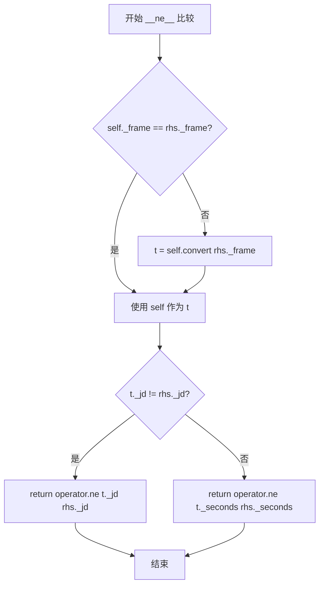

#### 带注释源码

```python
__ne__ = functools.partialmethod(_cmp, operator.ne)
```

> 说明：`__ne__` 是通过 `functools.partialmethod` 绑定 `_cmp` 方法和 `operator.ne` 运算符实现的便捷方法。
>
> 实际的比较逻辑在 `_cmp` 方法中实现：
>
> ```python
> def _cmp(self, op, rhs):
>     """Compare Epochs *self* and *rhs* using operator *op*."""
>     t = self
>     # 如果两个 Epoch 对象不在同一参考帧，转换到 rhs 的帧
>     if self._frame != rhs._frame:
>         t = self.convert(rhs._frame)
>     # 先比较 Julian 日期（整数部分）
>     if t._jd != rhs._jd:
>         return op(t._jd, rhs._jd)
>     # 再比较秒数（一天内的秒数）
>     return op(t._seconds, rhs._seconds)
> ```
>
> 当调用 `epoch1 != epoch2` 时：
> 1. 如果两个 Epoch 的参考帧不同，先将 `self` 转换到 `rhs` 的参考帧
> 2. 比较 Julian 日期（整数部分），如果不相等则返回 `operator.ne` 的结果
> 3. 如果 Julian 日期相等，则比较秒数（一天内的秒数），返回 `operator.ne` 的结果


### Epoch.__lt__

实现两个Epoch对象的小于比较操作。如果两个Epoch处于不同的时间框架，会自动进行框架转换后再比较。

参数：

- `self`：Epoch，隐含的当前Epoch实例
- `rhs`：Epoch，需要比较的右侧Epoch对象

返回值：`bool`，如果当前Epoch小于rhs则返回True，否则返回False

#### 流程图

```mermaid
flowchart TD
    A[开始比较 self < rhs] --> B{self._frame == rhs._frame?}
    B -- 是 --> C[t = self]
    B -- 否 --> D[t = self.convert(rhs._frame)]
    D --> E{t._jd != rhs._jd?}
    C --> E
    E -- 是 --> F[返回 op(t._jd, rhs._jd)]
    E -- 否 --> G[返回 op(t._seconds, rhs._seconds)]
    
    F --> H[结束]
    G --> H
```

#### 带注释源码

```python
# __lt__ 是通过 functools.partialmethod 实现的，它将 _cmp 方法与 operator.lt 绑定
# operator.lt 是 Python 的小于比较运算符 (<)
__lt__ = functools.partialmethod(_cmp, operator.lt)

# _cmp 是实际的比较实现方法
def _cmp(self, op, rhs):
    """Compare Epochs *self* and *rhs* using operator *op*."""
    # 首先获取当前epoch的引用
    t = self
    # 如果两个epoch不在同一个时间框架，需要进行框架转换
    # 例如从ET转换到UTC，或从UTC转换到ET
    if self._frame != rhs._frame:
        t = self.convert(rhs._frame)
    # 先比较整数Julian日期
    if t._jd != rhs._jd:
        # 使用传入的操作符（这里是operator.lt）比较JD
        return op(t._jd, rhs._jd)
    # 如果Julian日期相同，则比较秒数
    return op(t._seconds, rhs._seconds)
```


### `Epoch.__le__`

小于等于比较运算符，用于比较两个 Epoch 对象的时间先后顺序。如果当前 Epoch 对象的时间小于或等于右侧 Epoch 对象的时间，则返回 True，否则返回 False。

参数：

-  `self`：`Epoch`，当前 Epoch 实例（隐式参数）
-  `rhs`：`Epoch`，右侧参与比较的 Epoch 对象

返回值：`bool`，如果当前 Epoch 小于等于右侧 Epoch 返回 True，否则返回 False

#### 流程图

```mermaid
flowchart TD
    A[开始比较 __le__] --> B{检查 frame 是否相同}
    B -->|不同| C[将 self 转换到 rhs 所在 frame]
    B -->|相同| D[使用 self 本身]
    C --> E[比较儒略日期 JD]
    D --> E
    E --> F{JD 是否相等}
    F -->|否| G[返回 op&#40;t._jd, rhs._jd&#41;]
    F -->|是| H[返回 op&#40;t._seconds, rhs._seconds&#41;]
    G --> I[结束]
    H --> I
```

#### 带注释源码

```python
# 由于 __le__ 使用 functools.partialmethod 实现，
# 实际调用的是 _cmp 方法，传入 operator.le 作为比较函数
__le__ = functools.partialmethod(_cmp, operator.le)

# 下面是 _cmp 方法的源码，__le__ 实际上是调用这个方法
def _cmp(self, op, rhs):
    """
    Compare Epochs *self* and *rhs* using operator *op*.
    
    参数:
        self: 当前 Epoch 实例
        op: 比较操作符（如 operator.le, operator.lt 等）
        rhs: 右侧参与比较的 Epoch 对象
    
    返回值:
        bool: 比较结果
    """
    # 初始化 t 为当前 epoch
    t = self
    # 如果两个 epoch 的 frame 不同，需要先将 self 转换到 rhs 的 frame
    if self._frame != rhs._frame:
        t = self.convert(rhs._frame)
    
    # 首先比较儒略日期（JD）
    if t._jd != rhs._jd:
        # JD 不同直接返回 JD 的比较结果
        return op(t._jd, rhs._jd)
    
    # JD 相同的情况下，比较秒数
    # 返回秒数的比较结果
    return op(t._seconds, rhs._seconds)
```


### `Epoch.__gt__`

该方法实现了 Epoch 对象的大于比较功能，通过将两个 Epoch 对象统一到同一时间参考系后，先比较儒略日（JD），若相同则比较秒数，从而确定两个时间点的大小关系。

参数：

- `rhs`：`Epoch`，进行比较的右侧Epoch对象

返回值：`bool`，如果左侧Epoch对象大于右侧Epoch对象返回True，否则返回False

#### 流程图

```mermaid
flowchart TD
    A[开始比较 self > rhs] --> B{self._frame == rhs._frame?}
    B -->|是| C[令 t = self]
    B -->|否| D[将 self 转换为 rhs._frame<br/>令 t = self.convert(rhs._frame)]
    C --> E{t._jd == rhs._jd?}
    D --> E
    E -->|否| F[返回 operator.gt<br/>比较 t._jd 和 rhs._jd]
    E -->|是| G[返回 operator.gt<br/>比较 t._seconds 和 rhs._seconds]
    F --> H[结束]
    G --> H
```

#### 带注释源码

```python
# 通过 functools.partialmethod 绑定 _cmp 方法和 operator.gt 操作符
# 创建大于比较方法
__gt__ = functools.partialmethod(_cmp, operator.gt)

# 实际调用的底层比较方法 _cmp：
def _cmp(self, op, rhs):
    """
    Compare Epochs *self* and *rhs* using operator *op*.
    
    参数:
        op: 比较操作符（如 operator.gt, operator.lt 等）
        rhs: 右侧的 Epoch 对象
    
    返回:
        比较操作的结果（True 或 False）
    """
    # 首先将自身转换为与 rhs 相同的时间参考系
    t = self
    if self._frame != rhs._frame:
        t = self.convert(rhs._frame)
    
    # 如果儒略日不同，比较儒略日
    if t._jd != rhs._jd:
        return op(t._jd, rhs._jd)
    
    # 儒略日相同，则比较秒数
    return op(t._seconds, rhs._seconds)
```


### Epoch.__ge__

大于等于比较运算符，用于比较两个Epoch对象的大小关系（self >= rhs）。如果两个Epoch不在同一参考帧，会先进行帧转换后再比较。

参数：

- `rhs`：`Epoch`，要比较的另一个Epoch对象

返回值：`bool`，如果self大于或等于rhs返回True，否则返回False

#### 流程图

```mermaid
flowchart TD
    A[开始 __ge__ 比较] --> B{self._frame == rhs._frame?}
    B -->|是| C[令 t = self]
    B -->|否| D[将 self 转换到 rhs 的帧<br/>t = self.convert(rhs._frame)]
    C --> E{t._jd == rhs._jd?}
    D --> E
    E -->|否| F[返回 operator.ge(t._jd, rhs._jd)]
    E -->|是| G[返回 operator.ge(t._seconds, rhs._seconds)]
```

#### 带注释源码

```python
# 由于 __ge__ 是通过 functools.partialmethod 创建的，
# 实际上是调用 _cmp 方法，传入 operator.ge 作为比较操作符
__ge__ = functools.partialmethod(_cmp, operator.ge)

# _cmp 方法的源码及注释：
def _cmp(self, op, rhs):
    """Compare Epochs *self* and *rhs* using operator *op*."""
    t = self
    # 如果两个Epoch不在同一参考帧，将self转换到rhs的帧
    if self._frame != rhs._frame:
        t = self.convert(rhs._frame)
    # 先比较儒略日整数部分（天）
    if t._jd != rhs._jd:
        return op(t._jd, rhs._jd)
    # 如果天数相同，再比较秒数部分
    return op(t._seconds, rhs._seconds)
```

#### 详细说明

| 属性 | 值 |
|------|-----|
| 名称 | `Epoch.__ge__` |
| 参数名称 | `rhs` |
| 参数类型 | `Epoch` |
| 参数描述 | 要比较的另一个Epoch对象 |
| 返回值类型 | `bool` |
| 返回值描述 | 如果self大于或等于rhs返回True，否则返回False |
| 实现方式 | 通过`functools.partialmethod`绑定`_cmp`方法和`operator.ge`函数 |
| 帧转换 | 自动将两个Epoch转换到同一参考帧后再比较 |
| 比较逻辑 | 先比较`_jd`（儒略日整数），若相等再比较`_seconds`（秒数） |


### Epoch.__add__

该方法用于将一个时间增量（Duration）加到Epoch对象上，返回一个新的Epoch对象。如果两个Epoch不在同一个参考系中，会先将当前的Epoch转换到目标参考系，然后再进行时间累加。

参数：

- `self`：`Epoch`，调用该方法的Epoch实例（隐式参数）
- `rhs`：`Duration`（或Epoch类型，但根据逻辑应为Duration），要加到Epoch上的时间增量

返回值：`Epoch`，返回一个新的Epoch对象，其时间为原Epoch与时间增量之和

#### 流程图

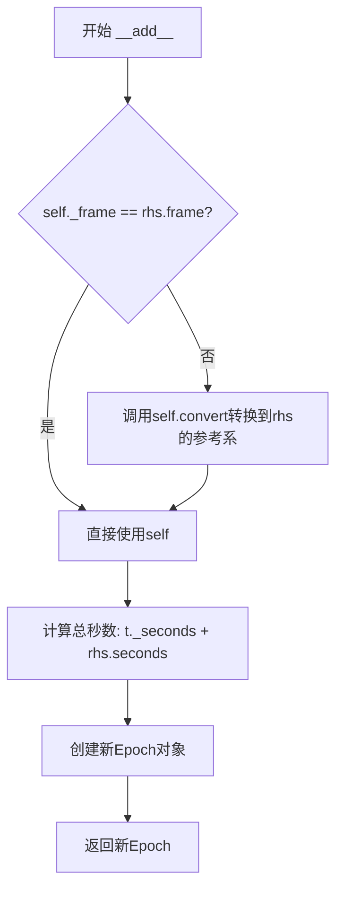

#### 带注释源码

```python
def __add__(self, rhs):
    """
    Add a duration to an Epoch.

    = INPUT VARIABLES
    - rhs     The Epoch to subtract.  # 注意：文档描述有误，实际应为Duration

    = RETURN VALUE
    - Returns the difference of ourselves and the input Epoch.  # 注意：描述有误，实际是求和
    """
    # 将self赋值给t，t为当前操作的Epoch对象
    t = self
    # 检查两个Epoch是否在同一个参考系
    # 如果不在同一参考系，将self转换到rhs的参考系
    if self._frame != rhs.frame():
        t = self.convert(rhs._frame)

    # 计算总秒数：将rhs的秒数加到t的秒数上
    # rhs.seconds()返回Duration的秒数部分
    sec = t._seconds + rhs.seconds()

    # 使用转换后的参考系、累加后的秒数和原JD创建新的Epoch对象并返回
    return Epoch(t._frame, sec, t._jd)
```


### `Epoch.__sub__`

该方法实现了Epoch对象的减法运算，支持两种操作：两个Epoch相减得到Duration（时间差），以及Epoch减去Duration得到新的Epoch（时间回退）。

参数：

- `rhs`：对象（`Epoch` 或 `Duration`），表示要减去的Epoch或Duration

返回值：`对象`（`Epoch` 或 `Duration`），当两个Epoch相减时返回Duration，当Epoch减去Duration时返回新的Epoch

#### 流程图

```mermaid
flowchart TD
    A[__sub__ 方法调用] --> B{判断 rhs 是否为 Duration 类型}
    B -->|是| C[执行 Epoch + -Duration]
    C --> D[返回新的 Epoch 对象]
    B -->|否| E{判断 self._frame == rhs._frame}
    E -->|是| F[t = self]
    E -->|否| G[t = self.convert&#40;rhs._frame&#41;]
    F --> H[计算天数差: days = t._jd - rhs._jd]
    G --> H
    H --> I[计算秒数差: sec = t._seconds - rhs._seconds]
    I --> J[返回 Duration&#40;rhs._frame, days*86400 + sec&#41;]
```

#### 带注释源码

```python
def __sub__(self, rhs):
    """
    Subtract two Epoch's or a Duration from an Epoch.

    Valid:
    Duration = Epoch - Epoch
    Epoch = Epoch - Duration

    = INPUT VARIABLES
    - rhs     The Epoch to subtract.

    = RETURN VALUE
    - Returns either the duration between to Epoch's or the a new
      Epoch that is the result of subtracting a duration from an epoch.
    """
    # 延迟导入以避免循环依赖
    import matplotlib.testing.jpl_units as U

    # 处理 Epoch - Duration 的情况
    # 如果 rhs 是 Duration 对象，则转换为加上负的 Duration
    if isinstance(rhs, U.Duration):
        return self + -rhs

    # 统一时间帧：如果两个 Epoch 的帧不同，将 self 转换到 rhs 的帧
    t = self
    if self._frame != rhs._frame:
        t = self.convert(rhs._frame)

    # 计算天数差（儒略日）
    days = t._jd - rhs._jd
    # 计算秒数差
    sec = t._seconds - rhs._seconds

    # 返回以秒为单位的 Duration 对象
    # 将天数转换为秒：days * 86400
    return U.Duration(rhs._frame, days*86400 + sec)
```


### `Epoch.__str__`

将Epoch对象转换为字符串格式，以科学计数法显示儒略日期并附加时间框架标识。

参数：

- `self`：无显式参数（Python隐式传递），表示Epoch实例本身

返回值：`str`，返回格式化的字符串，包含以22位宽度、15位小数科学计数法表示的儒略日期，以及时间框架标识（如"ET"或"UTC"）

#### 流程图

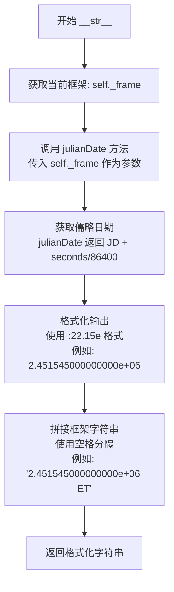

#### 带注释源码

```python
def __str__(self):
    """
    将Epoch对象转换为字符串表示形式。
    
    该方法实现Python的对象字符串化协议（__str__），
    使得print()和str()函数能够以人类可读的方式显示Epoch对象。
    
    Returns:
        str: 格式化字符串，格式为 "{儒略日期} {时间框架}"
             - 儒略日期采用科学计数法，宽度22位，保留15位小数
             - 时间框架为 'ET' 或 'UTC'
    
    Example:
        >>> epoch = Epoch('ET', sec=1e8, jd=2451545)
        >>> str(epoch)
        '  2.451545000000000e+06 ET'
    """
    # 调用julianDate方法获取当前frame下的儒略日期
    # julianDate会先检查是否需要转换frame，然后返回 JD + seconds/86400
    jd = self.julianDate(self._frame)
    
    # 格式化儒略日期为科学计数法字符串
    # :22.15e 表示总宽度22位，指数部分15位小数，科学计数法格式
    # 例如：2.451545000000000e+06
    formatted_jd = f"{jd:22.15e}"
    
    # 拼接时间框架标识，使用空格分隔
    # self._frame 可能是 'ET' (地球时) 或 'UTC' (协调世界时)
    return f"{formatted_jd} {self._frame}"
```


### `Epoch.__repr__`

该方法返回 Epoch 对象的官方字符串表示形式，用于调试和日志输出，内部调用 `__str__` 方法生成格式化的时间戳字符串。

参数：无（仅包含 `self` 实例参数）

返回值：`str`，返回 Epoch 对象的字符串表示，格式为科学计数法表示的儒略日日期加空格加时间帧名称（如 `"1.234567890123456e+06 ET"`）。

#### 流程图

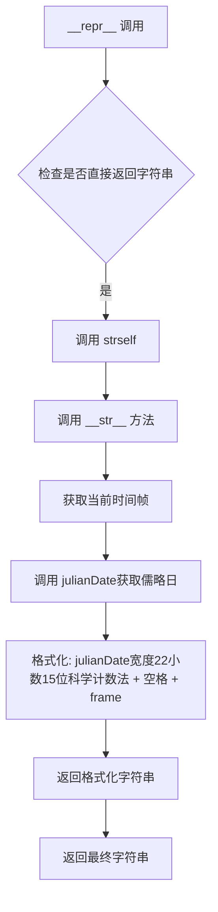

#### 带注释源码

```python
def __repr__(self):
    """
    Print the Epoch.
    
    返回Epoch对象的官方字符串表示形式。
    该方法实现了Python的repr协议，用于交互式显示和调试。
    
    Returns:
        str: Epoch对象的字符串表示，格式为"科学计数法儒略日 时间帧"
    """
    # 直接调用__str__方法，返回格式化的时间字符串
    # 格式示例: "  1.234567890123456e+06 ET"
    return str(self)
```


### `Epoch.range`

生成一个Epoch对象的范围序列，类似于Python的range()方法，返回从start到stop（不包含）的Epoch列表，按step步长递增。

参数：

- `start`：`Epoch`，范围的起始值
- `stop`：`Epoch`，范围的结束值（不包含）
- `step`：`Duration`，步长

返回值：`list`，包含指定范围内Epoch对象的列表

#### 流程图

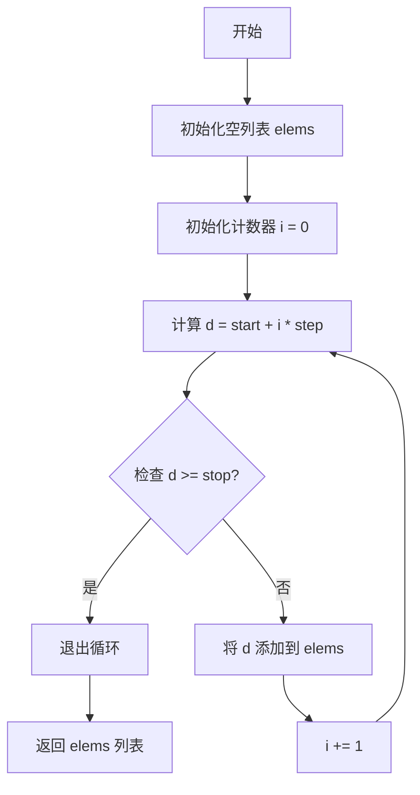

#### 带注释源码

```python
@staticmethod
def range(start, stop, step):
    """
    Generate a range of Epoch objects.

    Similar to the Python range() method.  Returns the range [
    start, stop) at the requested step.  Each element will be a
    Epoch object.

    = INPUT VARIABLES
    - start     The starting value of the range.
    - stop      The stop value of the range.
    - step      Step to use.

    = RETURN VALUE
    - Returns a list containing the requested Epoch values.
    """
    # 初始化结果列表
    elems = []

    # 初始化计数器
    i = 0
    while True:
        # 计算当前元素：起始值 + 步长 * 索引
        d = start + i * step
        
        # 如果当前元素大于等于停止值，则退出循环
        if d >= stop:
            break

        # 将当前Epoch对象添加到结果列表
        elems.append(d)
        
        # 计数器递增
        i += 1

    # 返回生成的Epoch对象列表
    return elems
```

## 关键组件


### Epoch 类

核心时间表示类，用于在不同的参考帧（ET/UTC）下表示和处理天文时间，支持多种输入格式（秒+儒略日、matplotlib天数、Python datetime）并提供帧转换功能。

### 帧转换机制 (allowed 字典)

定义了 ET（地球时）和 UTC（协调世界时）之间的秒级偏移量，用于不同时间参考帧之间的转换计算，当前仅支持 ET 与 UTC 之间的双向转换。

### 多格式输入解析

在 `__init__` 方法中实现的输入参数处理逻辑，支持三种方式创建 Epoch 对象：秒数+儒略日、matplotlib day number、以及 Python datetime 对象，并包含完整的输入合法性校验。

### 帧转换方法 (convert 方法)

将当前 Epoch 对象从一种参考帧转换到另一种参考帧，通过查询 allowed 字典获取偏移量并创建新的 Epoch 对象返回。

### 儒略日计算 (julianDate 方法)

返回指定参考帧下的儒略日值，如果目标帧与当前帧不同则先进行转换再计算，计算公式为儒略日整数部分加上秒数除以 86400。

### 秒数计算 (secondsPast 方法)

计算当前 Epoch 相对于指定儒略日的秒数，支持自动进行帧转换，内部通过儒略日差值乘以 86400 加上秒数来实现。

### 比较运算符机制 (_cmp 方法 + functools.partialmethod)

通过内部方法 _cmp 实现统一的比较逻辑，并利用 functools.partialmethod 绑定操作符，支持跨帧的 Epoch 对象比较（会自动转换到同一帧进行比较）。

### 算术运算 (__add__ 和 __sub__)

实现 Epoch 之间的加法和减法运算，支持 Epoch 与 Duration（时长）的加减，返回值为新的 Epoch 或 Duration 对象，减法可计算两个 Epoch 之间的时间间隔。

### Epoch 范围生成器 (range 静态方法)

类似 Python range() 的静态方法，生成指定起始值、终止值和步长的 Epoch 列表，返回包含起始到终止（不含）的 Epoch 序列。

### 输入校验逻辑

在构造函数中对各种输入参数组合进行严格校验，确保 sec 和 jd 必须同时提供、daynum 和 dt 互斥、且 dt 必须是 Python datetime 实例，否则抛出详细的 ValueError 错误信息。


## 问题及建议


### 已知问题

- **硬编码的转换偏移量**：框架转换的offset（64.1839秒）是硬编码在`allowed`字典中的，缺乏文档说明该数值的来源和精度，也没有提供动态更新或配置的能力。
- **不完整的转换矩阵**：`allowed`字典只定义了单向转换（ET→UTC和UTC→ET），如果尝试转换未定义的路径（如未来扩展其他帧）会直接抛出KeyError，缺乏优雅的错误处理。
- **复杂的参数校验逻辑**：`__init__`方法中的参数校验使用了大量嵌套的布尔表达式，代码可读性差且难以维护，错误信息虽然详细但缺乏针对性。
- **重复的计算逻辑**：在`julianDate`和`secondsPast`方法中都存在相同的框架转换逻辑（`if frame != self._frame: t = self.convert(frame)`），存在代码重复。
- **不支持更精细的时间精度**：内部只使用秒和儒略日整数部分，无法处理毫秒、微秒级别的精度需求。
- **缺失的类型注解**：整个类没有使用类型注解（type hints），不利于静态分析和IDE辅助。
- **循环依赖风险**：`__sub__`方法中使用了延迟导入（`import matplotlib.testing.jpl_units as U`），这种模式虽然解决了循环依赖，但隐藏了真实的依赖关系。
- **`range`方法效率低下**：使用while循环和手动计数器而非更Pythonic的方式实现，且返回list而非迭代器，对大规模数据不友好。

### 优化建议

- **重构参数校验**：将`__init__`中的复杂校验逻辑提取为独立的私有方法（如`_validate_inputs`），使用更清晰的条件分支结构，并提供具体的错误类型（如自定义异常类）。
- **提取公共逻辑**：将`julianDate`和`secondsPast`中的框架转换逻辑提取为私有方法（如`_ensure_frame`），避免代码重复。
- **完善框架转换机制**：将`allowed`字典改为支持双向自动查找，或使用`Graph`类实现更灵活的转换路径搜索，同时为不支持的转换提供有意义的错误信息。
- **添加类型注解**：为所有方法参数和返回值添加类型注解，提升代码的可维护性和可读性。
- **优化`range`方法**：使用`yield`关键字返回生成器而非列表，或考虑实现`__iter__`和`__next__`方法使Epoch类本身可迭代。
- **文档增强**：为转换偏移量添加引用来源说明，为类的主要方法添加更详细的文档字符串，包括物理意义和注意事项。
- **考虑精度扩展**：如果需要支持毫秒级精度，可以考虑在内部使用`datetime.datetime`或`decimal.Decimal`替代当前的浮点数方案。

## 其它


### 设计目标与约束

设计目标：提供跨时间框架（ET/UTC）的时间表示与转换能力，支持多种时间输入形式（秒+儒略日、天数、datetime对象），实现时间加减运算与比较运算。约束：仅支持ET和UTC两种时间框架，秒数必须规范化到[0, 86400)区间，儒略日整数部分与秒数部分分离存储。

### 错误处理与异常设计

输入验证错误：参数组合非法时抛出ValueError，明确说明四种合法构造方式。框架错误：frame参数不在允许列表中时，通过_api.check_in_list抛出断言错误。类型错误：dt参数类型不是datetime.datetime时抛出ValueError。所有错误信息包含当前输入值便于调试。

### 外部依赖与接口契约

外部依赖：matplotlib._api用于框架验证，matplotlib.dates.date2num用于datetime转天数，matplotlib.testing.jpl_units.Duration用于减法运算返回类型。接口契约：convert方法返回新Epoch对象而非修改自身，julianDate和secondsPast方法接受目标框架参数执行隐式转换，range静态方法返回Epoch对象列表而非迭代器。

### 性能考虑

时间转换采用延迟加载避免循环依赖。秒数规范化使用整数除法floor而非浮点数取模。儒略日计算中1-JAN-0001的JD固定为1721425.5。比较运算通过partialmethod实现操作符重载避免重复代码。

### 线程安全性

Epoch对象为不可变对象（虽然使用下划线前缀的内部属性，但无公开修改方法），线程安全。类属性allowed为类级别共享的字典常量，安全。

### 兼容性考虑

支持Python datetime对象输入，兼容matplotlib的daynum系统。与jpl_units模块的Duration类互操作，支持跨框架的时间 duration 计算。

### 使用示例

```python
# 使用秒和儒略日构造
e1 = Epoch('ET', sec=1e8, jd=2451545)

# 使用天数构造
e2 = Epoch('ET', daynum=730119.5)

# 使用datetime构造
e3 = Epoch('UTC', dt=datetime.datetime.now())

# 时间转换
e_utc = e1.convert('UTC')

# 时间运算
duration = e2 - e1  # 返回Duration
e_sum = e1 + duration  # 返回新Epoch
```


    