# `matplotlib\lib\matplotlib\testing\jpl_units\EpochConverter.py` 详细设计文档

The EpochConverter module provides conversion functionality for Monte Epoch and Duration classes, facilitating the conversion between Matplotlib floating-point dates and Epoch values.

## 整体流程

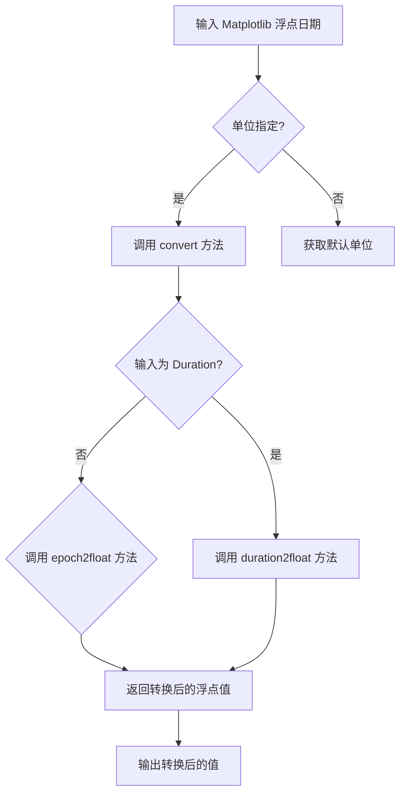

## 类结构

```
EpochConverter (类)
```

## 全局变量及字段


### `jdRef`
    
Reference Julian Date used for Epoch conversion calculations.

类型：`float`
    


### `EpochConverter.jdRef`
    
Reference Julian Date used for Epoch conversion calculations.

类型：`float`
    
    

## 全局函数及方法


### EpochConverter.axisinfo

Converts the Matplotlib axis information for Monte Epoch and Duration classes.

参数：

- `unit`：`str`，The unit system to use for the Epoch.
- `axis`：`matplotlib.axes.Axes`，The Matplotlib axis object.

返回值：`units.AxisInfo`，An object containing the locator, formatter, and label for the axis.

#### 流程图

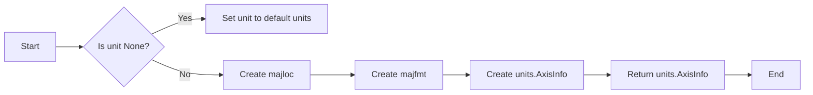

#### 带注释源码

```python
@staticmethod
def axisinfo(unit, axis):
    # docstring inherited
    majloc = date_ticker.AutoDateLocator()
    majfmt = date_ticker.AutoDateFormatter(majloc)
    return units.AxisInfo(majloc=majloc, majfmt=majfmt, label=unit)
```


### float2epoch

Convert a Matplotlib floating-point date into an Epoch of the specified units.

参数：

- value：`float`，The Matplotlib floating-point date.
- unit：`str`，The unit system to use for the Epoch.

返回值：`U.Epoch`，Returns the value converted to an Epoch in the specified time system.

#### 流程图

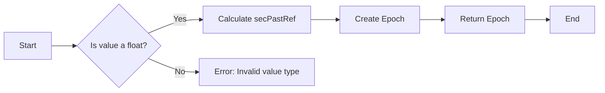

#### 带注释源码

```python
@staticmethod
def float2epoch(value, unit):
    """
    Convert a Matplotlib floating-point date into an Epoch of the specified
    units.

    = INPUT VARIABLES
    - value     The Matplotlib floating-point date.
    - unit      The unit system to use for the Epoch.

    = RETURN VALUE
    - Returns the value converted to an Epoch in the specified time system.
    """
    # Delay-load due to circular dependencies.
    import matplotlib.testing.jpl_units as U

    secPastRef = value * 86400.0 * U.UnitDbl(1.0, 'sec')
    return U.Epoch(unit, secPastRef, EpochConverter.jdRef)
```


### epoch2float

Convert an Epoch value to a float suitable for plotting as a python datetime object.

参数：

- `value`：`Epoch` 或 `list`，An Epoch or list of Epochs that need to be converted.
- `unit`：`str`，The units to use for an axis with Epoch data.

返回值：`float`，The value parameter converted to floats.

#### 流程图

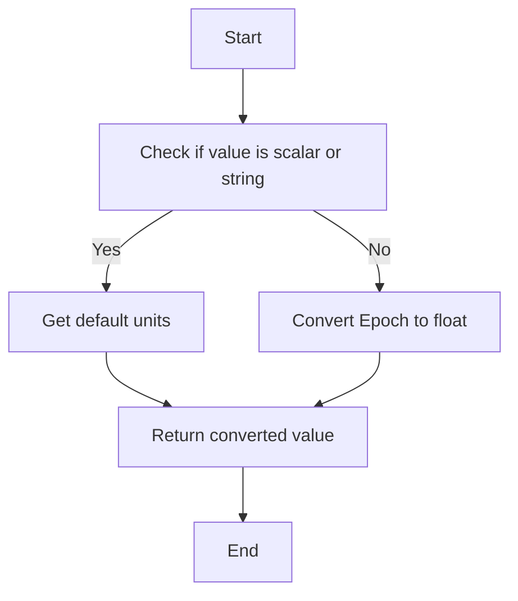

#### 带注释源码

```python
    @staticmethod
    def epoch2float(value, unit):
        """
        Convert an Epoch value to a float suitable for plotting as a python
        datetime object.

        = INPUT VARIABLES
        - value    An Epoch or list of Epochs that need to be converted.
        - unit     The units to use for an axis with Epoch data.

        = RETURN VALUE
        - Returns the value parameter converted to floats.
        """
        return value.julianDate(unit) - EpochConverter.jdRef
```


### duration2float

Convert a Duration value to a float suitable for plotting as a python datetime object.

参数：

- `value`：`Duration` 或 `list`，A Duration or list of Durations that need to be converted.

返回值：`float`，The value parameter converted to floats.

#### 流程图

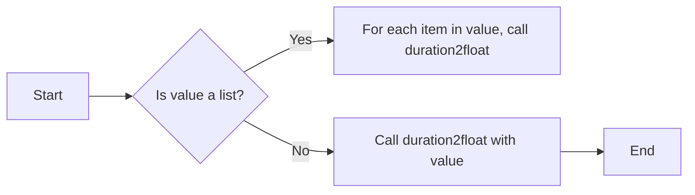

#### 带注释源码

```python
@staticmethod
def duration2float(value):
    """
    Convert a Duration value to a float suitable for plotting as a python
    datetime object.

    = INPUT VARIABLES
    - value    A Duration or list of Durations that need to be converted.

    = RETURN VALUE
    - Returns the value parameter converted to floats.
    """
    return value.seconds() / 86400.0
```


### convert

Converts a value to a float suitable for plotting as a python datetime object.

参数：

- `value`：`Any`，The value to be converted. This can be an Epoch, Duration, or a list of such values.
- `unit`：`str`，The unit system to use for the Epoch.
- `axis`：`Any`，The axis object associated with the value.

返回值：`float`，The converted value suitable for plotting.

#### 流程图

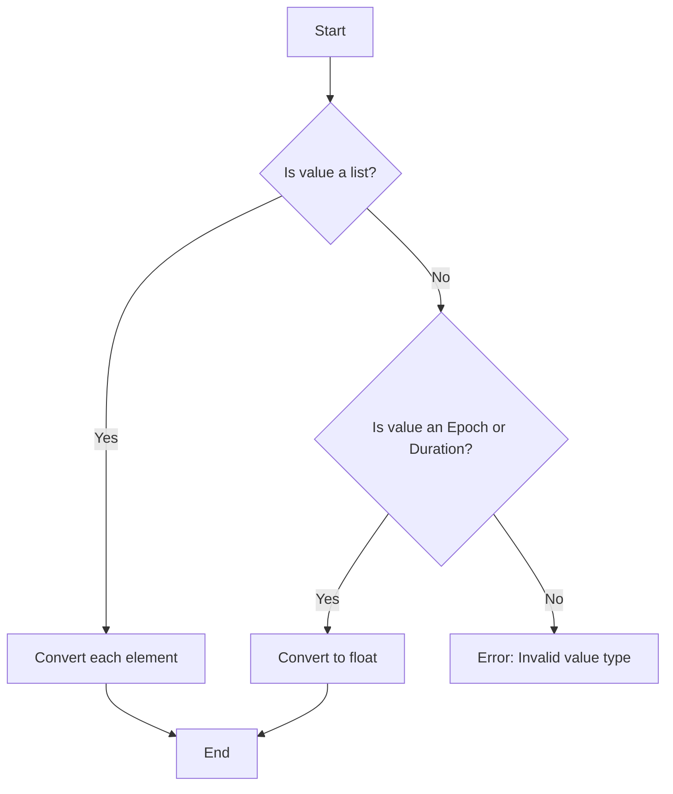

#### 带注释源码

```python
@staticmethod
def convert(value, unit, axis):
    # Delay-load due to circular dependencies.
    import matplotlib.testing.jpl_units as U

    if not cbook.is_scalar_or_string(value):
        return [EpochConverter.convert(x, unit, axis) for x in value]
    if unit is None:
        unit = EpochConverter.default_units(value, axis)
    if isinstance(value, U.Duration):
        return EpochConverter.duration2float(value)
    else:
        return EpochConverter.epoch2float(value, unit)
```


### EpochConverter.default_units

Converts the default units for a given value and axis.

参数：

- `value`：`Any`，The value for which the default units are to be determined.
- `axis`：`Any`，The axis associated with the value.

返回值：`str`，The default units for the given value and axis.

#### 流程图

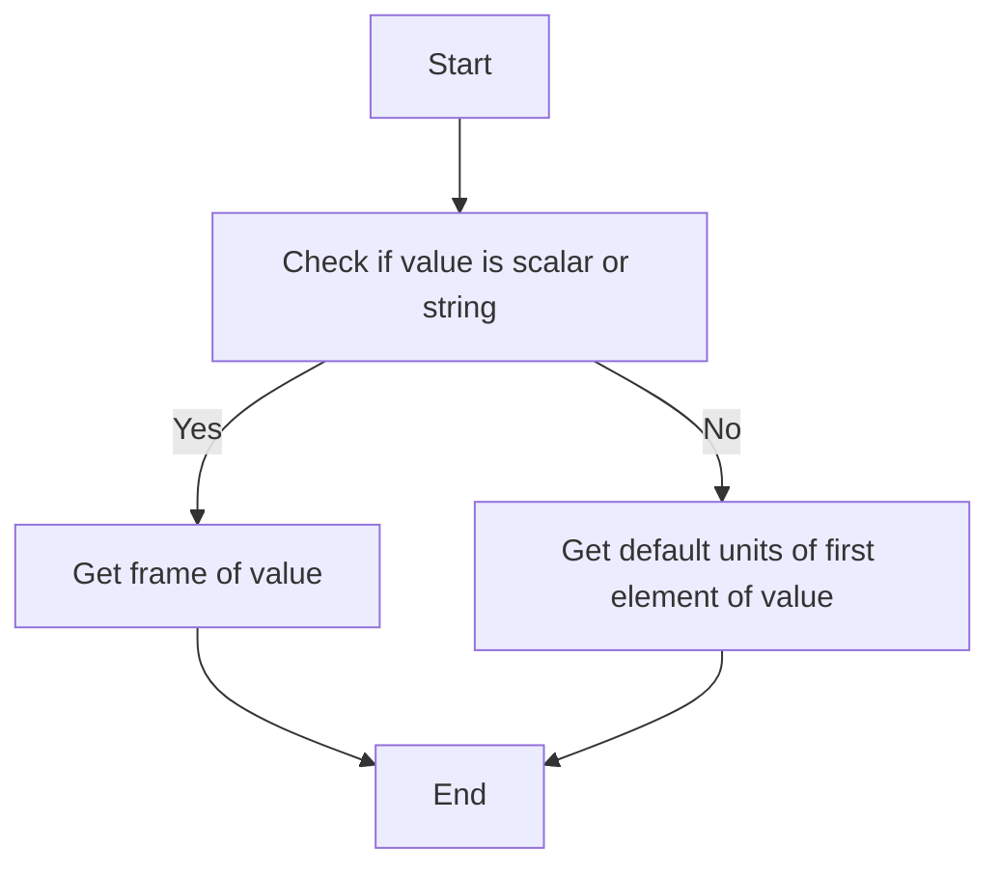

#### 带注释源码

```python
    @staticmethod
    def default_units(value, axis):
        # docstring inherited
        if cbook.is_scalar_or_string(value):
            return value.frame()
        else:
            return EpochConverter.default_units(value[0], axis)
```


### EpochConverter.axisinfo

This function provides axis information for the given unit and axis in Matplotlib.

参数：

- `unit`：`str`，The unit system to use for the Epoch.
- `axis`：`matplotlib.axes.Axes`，The axis object for which the information is provided.

返回值：`matplotlib.units.AxisInfo`，An object containing the locator, formatter, and label for the axis.

#### 流程图

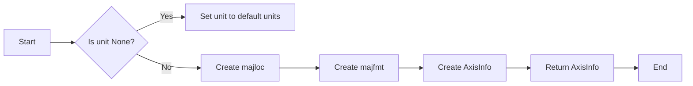

#### 带注释源码

```python
@staticmethod
def axisinfo(unit, axis):
    # docstring inherited
    majloc = date_ticker.AutoDateLocator()
    majfmt = date_ticker.AutoDateFormatter(majloc)
    return units.AxisInfo(majloc=majloc, majfmt=majfmt, label=unit)
```


### EpochConverter.float2epoch

Convert a Matplotlib floating-point date into an Epoch of the specified units.

参数：

- `value`：`float`，The Matplotlib floating-point date.
- `unit`：`str`，The unit system to use for the Epoch.

返回值：`U.Epoch`，Returns the value converted to an Epoch in the specified time system.

#### 流程图


#### 带注释源码

```python
@staticmethod
def float2epoch(value, unit):
    """
    Convert a Matplotlib floating-point date into an Epoch of the specified
    units.

    = INPUT VARIABLES
    - value     The Matplotlib floating-point date.
    - unit      The unit system to use for the Epoch.

    = RETURN VALUE
    - Returns the value converted to an Epoch in the specified time system.
    """
    # Delay-load due to circular dependencies.
    import matplotlib.testing.jpl_units as U

    secPastRef = value * 86400.0 * U.UnitDbl(1.0, 'sec')
    return U.Epoch(unit, secPastRef, EpochConverter.jdRef)
```


### EpochConverter.epoch2float

Convert an Epoch value to a float suitable for plotting as a python datetime object.

参数：

- `value`：`Epoch` 或 `list`，An Epoch or list of Epochs that need to be converted.
- `unit`：`str`，The units to use for an axis with Epoch data.

返回值：`float`，The value parameter converted to floats.

#### 流程图

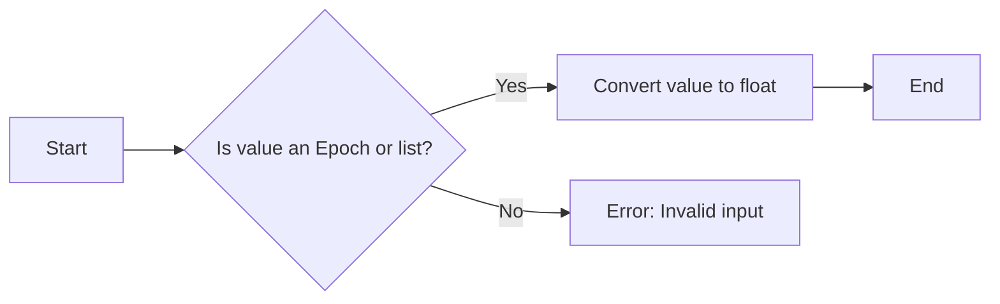

#### 带注释源码

```python
@staticmethod
def epoch2float(value, unit):
    """
    Convert an Epoch value to a float suitable for plotting as a python
    datetime object.

    = INPUT VARIABLES
    - value    An Epoch or list of Epochs that need to be converted.
    - unit     The units to use for an axis with Epoch data.

    = RETURN VALUE
    - Returns the value parameter converted to floats.
    """
    return value.julianDate(unit) - EpochConverter.jdRef
```


### EpochConverter.duration2float

Converts a Duration value to a float suitable for plotting as a python datetime object.

参数：

- `value`：`Duration` 或 `list`，A Duration or list of Durations that need to be converted.

返回值：`float`，The value parameter converted to floats.

#### 流程图

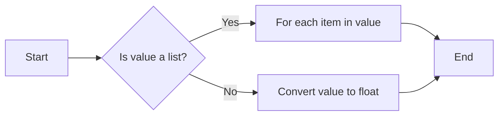

#### 带注释源码

```python
@staticmethod
def duration2float(value):
    """
    Convert a Duration value to a float suitable for plotting as a python
    datetime object.

    = INPUT VARIABLES
    - value    A Duration or list of Durations that need to be converted.

    = RETURN VALUE
    - Returns the value parameter converted to floats.
    """
    return value.seconds() / 86400.0
```


### EpochConverter.convert

Converts a value to a float suitable for plotting as a Python datetime object.

参数：

- `value`：`Any`，The value to be converted. This can be an Epoch, Duration, or a list of such values.
- `unit`：`str`，The unit system to use for the Epoch.
- `axis`：`Any`，The axis object associated with the value.

返回值：`float`，The converted value suitable for plotting as a Python datetime object.

#### 流程图

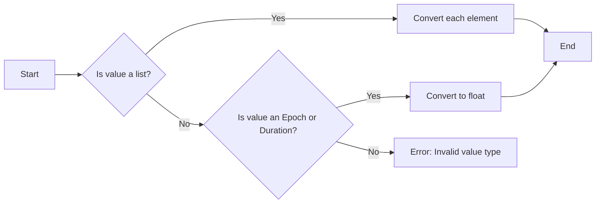

#### 带注释源码

```python
@staticmethod
def convert(value, unit, axis):
    # Delay-load due to circular dependencies.
    import matplotlib.testing.jpl_units as U

    if not cbook.is_scalar_or_string(value):
        return [EpochConverter.convert(x, unit, axis) for x in value]
    if unit is None:
        unit = EpochConverter.default_units(value, axis)
    if isinstance(value, U.Duration):
        return EpochConverter.duration2float(value)
    else:
        return EpochConverter.epoch2float(value, unit)
```


### EpochConverter.default_units

Converts the default units for a given value and axis.

参数：

- `value`：`Any`，The value for which the default units are to be determined.
- `axis`：`Any`，The axis associated with the value.

返回值：`str`，The default units for the given value and axis.

#### 流程图

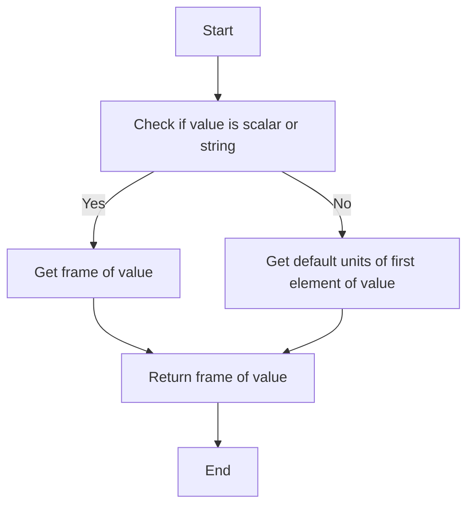

#### 带注释源码

```python
    @staticmethod
    def default_units(value, axis):
        # docstring inherited
        if cbook.is_scalar_or_string(value):
            return value.frame()
        else:
            return EpochConverter.default_units(value[0], axis)
```

## 关键组件


### 张量索引与惰性加载

用于处理张量索引和延迟加载，以优化性能和内存使用。

### 反量化支持

提供对反量化操作的支持，允许在转换过程中进行量化调整。

### 量化策略

实现量化策略，用于在转换过程中对数值进行精确度调整。


## 问题及建议


### 已知问题

-   **循环依赖**: 代码中存在循环依赖，`EpochConverter` 类依赖于 `matplotlib.testing.jpl_units` 模块，而该模块又可能依赖于 `EpochConverter` 类。这种循环依赖可能导致模块加载问题或无限递归。
-   **延迟加载**: 代码中使用了延迟加载（`import ... as ...`），这可能导致在调用未初始化的模块时出现错误。特别是在多线程环境中，延迟加载可能导致线程安全问题。
-   **默认单位**: `default_units` 方法中，如果 `value` 是标量或字符串，则直接返回其 `frame()`，这可能不是预期的行为，因为 `frame()` 方法可能不适用于所有类型的值。

### 优化建议

-   **解决循环依赖**: 重新设计模块结构，避免循环依赖。可以考虑将 `EpochConverter` 类中的依赖项移到其他模块中，或者使用工厂模式来创建依赖项。
-   **避免延迟加载**: 如果可能，避免使用延迟加载。如果必须使用，确保在调用任何方法之前已经完成了模块的加载。
-   **改进默认单位**: 修改 `default_units` 方法，确保它能够正确处理所有类型的输入值，并提供清晰的文档说明其行为。
-   **代码复用**: 考虑将 `epoch2float` 和 `duration2float` 方法中的重复代码提取到单独的函数中，以提高代码的可维护性和可读性。
-   **异常处理**: 增加异常处理，确保在输入值无效或发生错误时，代码能够优雅地处理异常情况。
-   **单元测试**: 为 `EpochConverter` 类编写单元测试，以确保代码在各种情况下都能正常工作，并帮助发现潜在的错误。


## 其它


### 设计目标与约束

- 设计目标：提供Matplotlib中Monte Epoch和Duration类的转换功能，确保时间数据的正确转换和显示。
- 约束条件：避免循环依赖，确保模块的独立性和可重用性。

### 错误处理与异常设计

- 异常处理：在转换过程中，如果输入数据类型不正确或单位不匹配，应抛出相应的异常。
- 异常类型：`ValueError`，`TypeError`，`UnitConversionError`。

### 数据流与状态机

- 数据流：输入数据（Epoch，Duration，浮点日期） -> 转换 -> 输出数据（浮点日期）。
- 状态机：无状态机，转换过程为线性流程。

### 外部依赖与接口契约

- 外部依赖：Matplotlib库，特别是`matplotlib.dates`和`matplotlib.testing.jpl_units`。
- 接口契约：`ConversionInterface`，确保与Matplotlib的转换接口兼容。

### 测试与验证

- 测试策略：编写单元测试，确保每个转换方法都能正确处理各种输入。
- 验证方法：使用已知的时间数据进行转换，并与预期结果进行比较。

### 性能考虑

- 性能优化：避免不必要的重复计算，使用缓存来存储重复的转换结果。

### 安全性考虑

- 安全性：确保输入数据的有效性，防止潜在的注入攻击。

### 维护与扩展

- 维护策略：定期更新依赖库，修复已知问题。
- 扩展性：设计模块时考虑未来可能的功能扩展，如支持更多的时间单位。


    