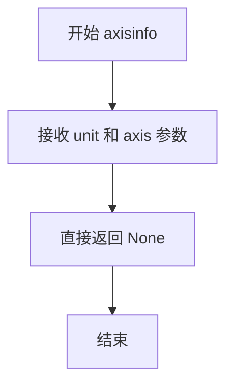
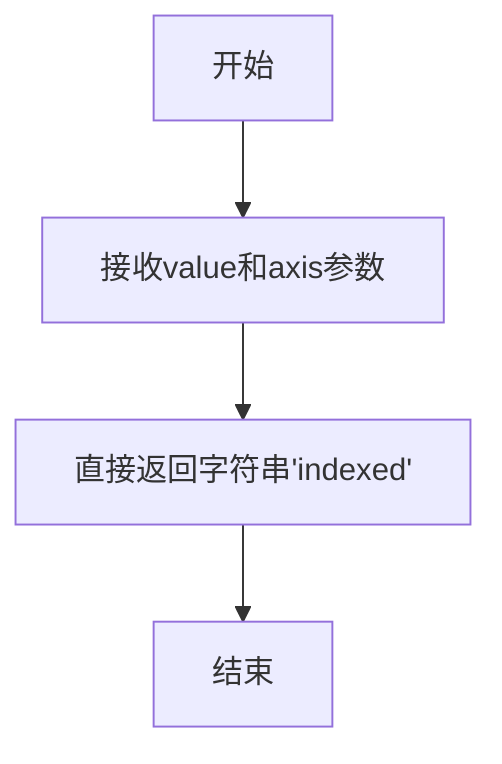
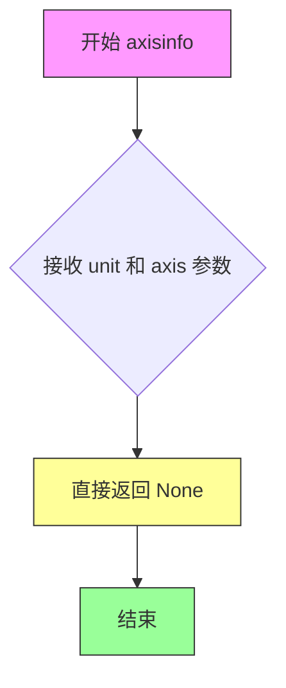
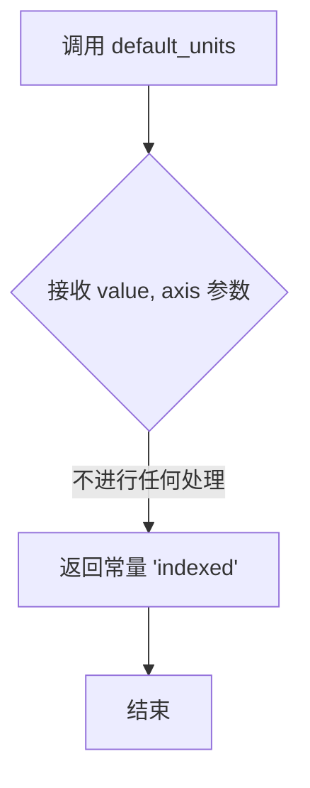

# `matplotlib\lib\matplotlib\testing\jpl_units\StrConverter.py` 详细设计文档

StrConverter是Matplotlib的ConversionInterface实现类，用于将字符串数据值转换为数值索引，以便在图表中正确显示和定位字符串标签轴，支持indexed、sorted、inverted和sorted-inverted等多种字符串索引模式。

## 整体流程

```mermaid
graph TD
    A[convert方法调用] --> B{value == []?}
    B -- 是 --> C[返回空列表]
    B -- 否 --> D[判断X轴或Y轴]
    D --> E[获取刻度位置和标签]
    E --> F[提取标签文本]
    F --> G{标签为空?}
    G -- 是 --> H[清空刻度和标签]
    G -- 否 --> I{value可迭代?}
    I -- 否 --> J[转换为列表]
    I -- 是 --> K[遍历value]
    J --> K
    K --> L{新值不在标签中?}
    L -- 是 --> M[添加新值到标签列表]
    L -- 否 --> N[跳过]
    M --> O
    N --> O
    K --> O[添加首尾填充'']
    O --> P[设置新刻度和标签]
    P --> Q[调整轴限制]
    Q --> R[计算返回值]
    R --> S[返回结果]
```

## 类结构

```
units.ConversionInterface (抽象基类)
└── StrConverter (字符串转换器实现类)
```

## 全局变量及字段


### `__all__`
    
定义模块的公共接口，仅导出StrConverter类供外部使用

类型：`list`
    


    

## 全局函数及方法


### `StrConverter.axisinfo`

该静态方法用于返回与特定单位相关的坐标轴信息（如刻度位置、标签等），但在当前实现中直接返回 `None`，表示使用 Matplotlib 默认的坐标轴信息处理逻辑。

参数：

- `unit`：未知类型或字符串，表示用于坐标轴显示的单位（如 'indexed'、'sorted'、'inverted'、'sorted-inverted' 等）
- `axis`：matplotlib axis 对象，表示需要获取单位信息的坐标轴实例

返回值：`None`，返回 `None` 表示不提供自定义的坐标轴信息，调用方将使用 Matplotlib 默认的坐标轴信息处理机制。

#### 流程图



#### 带注释源码

```python
@staticmethod
def axisinfo(unit, axis):
    """
    返回坐标轴的单位信息。
    
    参数:
        unit: 单位标识字符串，定义字符串值的排序和显示方式
        axis: Matplotlib 坐标轴对象，用于获取坐标轴信息
    
    返回:
        None: 当前实现返回 None，使用 Matplotlib 默认的坐标轴信息处理
    """
    # docstring inherited
    # 从父类 units.ConversionInterface 继承的文档说明
    # 该方法在 ConversionInterface 中通常返回 UnitsInfo 对象，
    # 包含 tick 位置和标签等信息，但此处返回 None 表示不覆盖默认行为
    
    return None
```


### `StrConverter.convert`

该静态方法负责将字符串数据值转换为matplotlib轴上的数值刻度位置，处理空列表边界情况，收集轴上现有标签并追加新值，设置刻度位置和标签，并返回与输入值对应的刻度位置列表。

参数：

- `value`：要转换的值，可以是单个值或可迭代对象（列表/元组），表示需要转换的字符串数据
- `unit`：单位参数（字符串类型），用于指定单位类型，但在当前实现中未被使用（为保持接口兼容性而保留）
- `axis`：matplotlib axis 对象，用于获取轴上的刻度信息并设置新的刻度和标签

返回值：`list`，返回与输入值对应的刻度位置列表

#### 流程图

```mermaid
flowchart TD
    A[开始 convert 方法] --> B{value == []?}
    B -->|是| C[返回空列表 []]
    B -->|否| D[获取 axis.axes]
    D --> E{axis 是 xaxis?}
    E -->|是| F[isXAxis = True]
    E -->|否| G[isXAxis = False]
    F --> H[获取 major ticks]
    G --> H
    H --> I[获取 ticklocs 和 ticklabels]
    I --> J[提取非空标签文本]
    J --> K{labels 为空?}
    K -->|是| L[ticks = [], labels = []]
    K -->|否| M[继续处理]
    L --> N{value 可迭代?}
    M --> N
    N -->|否| O[value = [value]]
    N -->|是| P[遍历 value]
    O --> P
    P --> Q{v 不在 labels 且不在 newValues?}
    Q -->|是| R[将 v 添加到 newValues]
    Q -->|否| S[跳过]
    R --> S
    S --> T{遍历完成?}
    T -->|否| P
    T -->|是| U[labels.extend(newValues)]
    U --> V[添加 padding: '' 在首尾]
    V --> W[重新计算 ticks: 0 到 len(labels)-1]
    W --> X[设置首尾 tick 位置: 0.5 和 len-1.5]
    X --> Y[axis.set_ticks 和 set_ticklabels]
    Y --> Z[设置 major_locator 边界]
    Z --> AA{isXAxis?}
    AA -->|是| AB[ax.set_xlim]
    AA -->|否| AC[ax.set_ylim]
    AB --> AD[返回结果列表]
    AC --> AD
```

#### 带注释源码

```python
@staticmethod
def convert(value, unit, axis):
    # docstring inherited

    # 边界情况处理：空列表直接返回空列表
    if value == []:
        return []

    # 获取 axes 对象，用于后续设置轴的属性
    # 这里延迟加载以保持 matplotlib 兼容性
    ax = axis.axes
    
    # 判断是 x 轴还是 y 轴
    if axis is ax.xaxis:
        isXAxis = True
    else:
        isXAxis = False

    # 强制计算 major ticks，确保 ticklocs 和 ticklabels 有值
    axis.get_major_ticks()
    ticks = axis.get_ticklocs()       # 获取刻度位置
    labels = axis.get_ticklabels()    # 获取刻度标签

    # 过滤掉空文本的标签，只保留有文本内容的标签
    labels = [l.get_text() for l in labels if l.get_text()]

    # 如果没有标签，重置 ticks 和 labels 为空
    if not labels:
        ticks = []
        labels = []

    # 如果 value 不是可迭代对象，转换为单元素列表
    if not np.iterable(value):
        value = [value]

    # 收集需要添加的新值（不在现有标签中且不在已收集的新值中）
    newValues = []
    for v in value:
        if v not in labels and v not in newValues:
            newValues.append(v)

    # 将新值追加到现有标签列表
    labels.extend(newValues)

    # 添加 padding：前后各加一个空字符串
    # 这样做是为了让标签不会出现在坐标轴边缘
    labels = [''] + labels + ['']
    
    # 重新生成 tick 位置序列
    ticks = list(range(len(labels)))
    
    # 调整首尾 tick 位置，使其向内偏移 0.5
    # 这样标签不会紧贴坐标轴边框
    ticks[0] = 0.5
    ticks[-1] = ticks[-1] - 0.5

    # 更新轴的刻度位置和标签
    axis.set_ticks(ticks)
    axis.set_ticklabels(labels)
    
    # 设置 major_locator 的边界，使 autoscale_view 正常工作
    loc = axis.get_major_locator()
    loc.set_bounds(ticks[0], ticks[-1])

    # 根据轴类型设置相应的 limits
    if isXAxis:
        ax.set_xlim(ticks[0], ticks[-1])
    else:
        ax.set_ylim(ticks[0], ticks[-1])

    # 生成返回结果：找到每个值在 labels 中的索引位置
    # 由于添加了 padding，索引位置需要对应 ticks 中的位置
    result = [ticks[labels.index(v)] for v in value]

    # 忽略 viewLim 中的 -1 特殊值
    ax.viewLim.ignore(-1)
    return result
```


### `StrConverter.default_units`

该静态方法用于获取字符串数据的默认单位标识，返回值为 "indexed"，表示默认使用索引方式对字符串进行排序和显示。

参数：

- `value`：任意类型，要处理的数据值
- `axis`：matplotlib axis 对象，matplotlib 的坐标轴对象，用于获取轴的信息

返回值：`str`，返回默认的单位字符串 "indexed"，表示字符串数据的默认索引方式

#### 流程图



#### 带注释源码

```python
@staticmethod
def default_units(value, axis):
    """
    获取字符串数据的默认单位。
    
    参数:
        value: 任意类型，要处理的数据值
        axis: matplotlib axis对象，坐标轴对象
    
    返回:
        str: 默认的单位字符串 'indexed'
    """
    # docstring inherited
    # The default behavior for string indexing.
    return "indexed"
```


### `StrConverter.axisinfo`

该方法为 Matplotlib 的 `ConversionInterface` 提供轴信息（AxisInfo），用于定义坐标轴的刻度范围、方向等属性。当前实现返回 `None`，表示不提供自定义的轴信息，使用 Matplotlib 默认的轴信息处理方式。

参数：

- `unit`：`Any`，单位参数，从父类 `ConversionInterface` 继承，用于指定数据的单位类型（如 'indexed'、'sorted' 等）
- `axis`：`matplotlib.axis.Axis`，坐标轴对象，表示需要进行单位转换的坐标轴实例（x 轴或 y 轴）

返回值：`None`，返回 `None` 表示不覆盖默认的轴信息行为，由 Matplotlib 使用其标准轴信息

#### 流程图



#### 带注释源码

```python
@staticmethod
def axisinfo(unit, axis):
    """
    返回轴信息（AxisInfo）对象。
    
    此方法继承自 matplotlib.units.ConversionInterface，用于提供
    自定义的坐标轴信息，包括刻度定位器、格式化器等。
    
    参数:
        unit: 单位标识符，可以是 'indexed'、'sorted'、'inverted' 等
        axis: matplotlib 的 Axis 对象（XAxis 或 YAxis）
    
    返回:
        None: 不提供自定义轴信息，使用 Matplotlib 默认实现
    """
    # docstring inherited
    # 继承父类的文档字符串，不进行额外处理
    
    # 返回 None 表示不覆盖默认的 AxisInfo
    # Matplotlib 将使用默认的刻度定位器和格式化器
    return None
```


### `StrConverter.convert(value, unit, axis)`

该方法是 Matplotlib 中 `StrConverter` 类的核心转换方法，负责将字符串数据值转换为数值索引，以便在图表坐标轴上正确显示标签文本，支持 'indexed'、'sorted'、'inverted' 和 'sorted-inverted' 四种单位模式。

参数：

- `value`：`any`，待转换的字符串值或值列表
- `unit`：`str`，字符串单位模式（'indexed'、'sorted'、'inverted'、'sorted-inverted'）
- `axis`：`matplotlib.axis.Axis`，Matplotlib 坐标轴对象，用于获取和设置刻度标签

返回值：`list`，转换后的数值索引列表

#### 流程图

```mermaid
flowchart TD
    A[开始 convert] --> B{value == []?}
    B -->|是| C[返回空列表]
    B -->|否| D[获取 axis.axes]
    D --> E{axis 是 xaxis?}
    E -->|是| F[isXAxis = True]
    E -->|否| G[isXAxis = False]
    F --> H[获取刻度位置和标签]
    G --> H
    H --> I[提取非空标签文本]
    I --> J{labels 为空?}
    J -->|是| K[ticks = [], labels = []]
    J -->|否| L[value 可迭代?]
    K --> L
    L -->|否| M[value = [value]]
    L -->|是| N[遍历 value]
    N --> O{v 不在 labels 且 v 不在 newValues?}
    O -->|是| P[newValues.append v]
    O -->|否| Q[继续下一个 v]
    P --> Q
    N --> R[labels.extend newValues]
    R --> S[添加首尾空标签 padding]
    S --> T[设置 ticks 范围]
    T --> U[设置轴的刻度和标签]
    U --> V[更新轴的限值]
    V --> W{isXAxis?}
    W -->|是| X[ax.set_xlim]
    W -->|否| Y[ax.set_ylim]
    X --> Z[计算结果列表]
    Y --> Z
    Z --> AA[返回结果]
```

#### 带注释源码

```python
@staticmethod
def convert(value, unit, axis):
    # docstring inherited

    # 处理空列表输入，直接返回空列表
    if value == []:
        return []

    # 延迟加载以保持 matplotlib 兼容性
    ax = axis.axes
    # 判断是否为 X 轴
    if axis is ax.xaxis:
        isXAxis = True
    else:
        isXAxis = False

    # 获取轴的刻度信息
    axis.get_major_ticks()
    ticks = axis.get_ticklocs()
    labels = axis.get_ticklabels()

    # 提取非空的标签文本
    labels = [l.get_text() for l in labels if l.get_text()]

    # 如果没有标签，初始化为空列表
    if not labels:
        ticks = []
        labels = []

    # 确保 value 是可迭代的列表
    if not np.iterable(value):
        value = [value]

    # 收集新的唯一值（不在现有标签中）
    newValues = []
    for v in value:
        if v not in labels and v not in newValues:
            newValues.append(v)

    # 将新值添加到标签列表
    labels.extend(newValues)

    # ---- 禁用的排序/反转逻辑 ----
    # 注意：matplotlib 柱状图不会重新计算数据值的单位转换
    # 这是设计决定，非实际 bug
    # 若要启用，需取消以下注释：
    # if unit:
    #     if unit.find("sorted") > -1:
    #         labels.sort()
    #     if unit.find("inverted") > -1:
    #         labels = labels[::-1]

    # 添加首尾空标签作为 padding，防止标签显示在坐标轴上
    labels = [''] + labels + ['']
    ticks = list(range(len(labels)))
    ticks[0] = 0.5
    ticks[-1] = ticks[-1] - 0.5

    # 设置轴的刻度位置和标签
    axis.set_ticks(ticks)
    axis.set_ticklabels(labels)
    
    # 调整定位器边界以支持 ax.autoscale_view
    loc = axis.get_major_locator()
    loc.set_bounds(ticks[0], ticks[-1])

    # 根据轴类型设置对应的限值
    if isXAxis:
        ax.set_xlim(ticks[0], ticks[-1])
    else:
        ax.set_ylim(ticks[0], ticks[-1])

    # 计算输入值对应的刻度索引
    result = [ticks[labels.index(v)] for v in value]

    # 忽略视图限制中的 -1
    ax.viewLim.ignore(-1)
    return result
```

### 关键组件信息

| 组件名称 | 一句话描述 |
|---------|-----------|
| `StrConverter` | Matplotlib 的字符串数据值转换接口类 |
| `axisinfo` | 返回 None，表示无特定轴信息 |
| `default_units` | 返回默认单位 "indexed" |
| `convert` | 核心转换方法，将字符串映射到数值索引 |

### 潜在的技术债务或优化空间

1. **禁用的排序/反转逻辑**：代码中有一段被注释掉的排序和反转逻辑，原因标注为 matplotlib 柱状图设计问题，建议调查是否可以通过其他方式解决
2. **单位参数未充分利用**：虽然 docstring 提到了四种单位模式，但 `convert` 方法中实际未使用 `unit` 参数进行任何处理
3. **索引查找效率**：`result = [ticks[labels.index(v)] for v in value]` 使用 `list.index()` 方法时间复杂度为 O(n)，对于大量数据可考虑使用字典映射优化
4. **轴对象获取方式**：通过 `axis.axes` 获取父级 axes 对象的方式在某些边缘情况下可能不够健壮

### 其它项目

**设计目标与约束**：
- 支持字符串数据在 matplotlib 中的数值化显示
- 保持与 matplotlib units 系统的兼容性
- 自动处理新增的唯一值标签

**错误处理与异常设计**：
- 缺乏显式的异常处理逻辑
- 假设输入的 `axis` 参数始终是有效的 matplotlib Axis 对象
- 未验证 `value` 中元素的可哈希性（用于 set 或 dict 操作）

**数据流与状态机**：
- 输入：原始字符串值、字符串单位模式、Matplotlib 轴对象
- 处理流程：获取现有刻度 → 提取标签 → 合并新值 → 设置新刻度 → 计算映射结果
- 输出：数值索引列表，同时修改 axis 对象的刻度和标签状态

**外部依赖与接口契约**：
- 依赖 `numpy` 用于 `np.iterable()` 检查
- 依赖 `matplotlib.units.ConversionInterface` 基类
- 必须遵循 Matplotlib 单位转换接口约定


### `StrConverter.default_units`

该方法为 Matplotlib 的字符串转换接口提供默认的单元标记，固定返回字符串 `"indexed"`，表示字符串值在绘图中按照出现顺序进行索引。

参数：

- `value`：`Any`，未使用，仅保留为接口签名。表示待转换的字符串数据（单值或列表）。
- `axis`：`matplotlib.axis.Axis`，未使用，仅保留为接口签名。指向绑定的坐标轴对象。

返回值：`str`，返回 `"indexed"`——表示默认的字符串索引方式。

#### 流程图



#### 带注释源码

```python
@staticmethod
def default_units(value, axis):
    """
    返回字符串数据的默认单元。

    参数:
        value: 任意类型，未使用，仅为保持 ConversionInterface 签名一致。
               实际调用时会忽略此参数。
        axis:  matplotlib.axis.Axis，未使用，仅为保持 ConversionInterface 签名一致。
               实际调用时会忽略此参数。

    返回:
        str: 默认的字符串索引单元，固定为 "indexed"。
    """
    # 继承自父类的 docstring（docstring inherited）
    # 注释：默认的字符串索引行为是 'indexed'，即按照出现顺序为字符串分配数值索引。
    return "indexed"
```

---

**潜在的技术债务或优化空间**  
- 当前实现直接返回硬编码的常量 `"indexed"`，缺乏灵活性。若以后需要在不同场景下支持不同的默认单元（如 `"sorted"`、`"inverted"`），应考虑从外部配置、主题或轴属性中读取。  
- 参数 `value` 与 `axis` 未被使用，可能导致调用方误以为该方法会根据输入产生不同结果，建议在文档中明确说明这些参数仅为接口占位符，或在实现中加入警告/日志以提示未使用的参数。  

**其它说明**  
- 该方法属于 `units.ConversionInterface` 的实现，满足 Matplotlib 对自定义单元转换器的约定。  
- 由于返回值固定为 `"indexed"`，在 `StrConverter.convert` 中会根据该单元决定字符串的排序与显示方式。  
- 若需要扩展支持更多单元，应在 `default_units` 中加入逻辑，以根据上下文返回相应的单元标识符。  


## 关键组件


### StrConverter 类

Matplotlib 的 ConversionInterface 子类，用于将字符串数据值转换为数值索引以支持在图表中绘制字符串标签，支持 indexed、sorted、inverted 和 sorted-inverted 四种单位模式。

### axisinfo 静态方法

返回 None，表示不为字符串单位提供特定的轴信息，继承父类的默认行为。

### convert 静态方法

核心转换逻辑，将字符串值转换为数值索引。处理空值列表延迟加载轴信息，获取刻度标签和位置，收集未在现有标签中的新值并扩展标签列表，设置刻度位置和标签，并配置坐标轴范围，最后返回输入值对应的数值索引列表。流程：接收值 → 检查空值 → 获取轴和刻度信息 → 合并新值 → 设置刻度/标签/范围 → 返回索引。

### default_units 静态方法

返回默认单位字符串 "indexed"，指定字符串的默认索引行为为按出现顺序索引。

### 关键组件信息

- **ConversionInterface 继承**：通过继承 Matplotlib 的单位转换接口实现字符串到数值的映射
- **字符串索引机制**：维护标签列表并将字符串值映射到数值位置
- **刻度动态生成**：根据字符串值动态生成刻度位置和标签
- **坐标轴范围管理**：设置 x 或 y 轴的显示范围

### 潜在技术债务

- **禁用代码块**：存在大段被注释的代码（关于 sorted 和 inverted 的排序逻辑），如需启用这些功能会导致行为变化
- **硬编码索引值**：使用 ticks[0] 和 ticks[-1] 设置边界，隐含假设索引 -1 存在
- **轴范围设置时机**：在设置刻度后才设置坐标轴范围，可能导致视图更新不一致
- **缺少单元验证**：unit 参数未进行有效性验证

### 其它设计考量

- **错误处理**：空值列表返回空列表，无刻度标签时返回空列表
- **惰性加载**：通过注释"we delay loading to make matplotlib happy"表明延迟加载机制
- **外部依赖**：依赖 matplotlib.units 模块的 ConversionInterface 和 numpy
- **设计约束**：不支持 bar plot 的单位重计算（设计上限制，非 bug）


## 问题及建议


### 已知问题

-   **直接修改axis对象状态**：convert方法直接调用`axis.set_ticks()`和`axis.set_ticklabels()`修改axis状态，这种副作用使得该方法难以测试和复用，且可能导致意外的副作用
-   **重复获取axis数据**：每次调用convert都会执行`axis.get_major_ticks()`、`axis.get_ticklocs()`、`axis.get_ticklabels()`，存在重复计算性能问题
-   **空列表判断不够优雅**：`if value == []:` 应使用 `if not value:` 替代，不符合Python最佳实践
-   **被禁用的代码块遗留**：存在大段被DISABLED注释的代码（排序和反转功能），表明功能未完成但未清理，是潜在的技术债务
-   **硬编码的魔法数字**：如`0.5`、`ticks[0] = 0.5`、`ticks[-1] = ticks[-1] - 0.5`等数值缺乏解释和常量定义
-   **isXAxis判断方式不可靠**：使用`axis is ax.xaxis`进行身份比较，如果axis对象不是同一个实例但功能等效，可能导致判断失败
-   **axisinfo返回None**：该方法返回None可能破坏Matplotlib的单位转换接口契约，可能导致意外行为
-   **缺乏类型注解**：整个类没有使用Python类型提示，影响代码可读性和IDE支持
-   **重复逻辑**：`if v not in labels and v not in newValues`中`v not in labels`的检查在labels已更新后仍存在冗余
-   **viewLim.ignore(-1)调用无解释**：该调用没有任何注释说明其目的和影响

### 优化建议

-   将副作用操作提取为独立方法或使用数据转换与视图更新分离的模式
-   添加类型注解以提高代码可维护性和IDE支持
-   清理被禁用的代码块，若功能不需要则完全移除，若需要则实现
-   将魔法数字提取为类常量或配置参数，并添加注释说明其含义
-   使用更可靠的axis判断方式，如检查axis类型而非对象身份
-   完善axisinfo方法的返回值处理，避免返回None
-   考虑使用`functools.lru_cache`缓存tick和label信息以优化性能

## 其它


### 设计目标与约束

该模块的主要目标是为matplotlib提供字符串数据值的转换功能，使得字符串类型的数据可以在图表中进行可视化展示。设计约束包括：必须继承自matplotlib.units.ConversionInterface以符合matplotlib的单位转换接口规范；支持四种字符串索引模式（'indexed'、'sorted'、'inverted'、'sorted-inverted'）；需要与matplotlib的坐标轴系统紧密集成以实现自动刻度设置。

### 错误处理与异常设计

代码中的错误处理相对简单，主要通过条件判断来处理边界情况。当value为空列表[]时，直接返回空列表避免后续处理。如果轴上没有标签（labels为空），则将ticks和labels都设为空列表。对于不在labels中的值，会将其添加到newValues中并扩展labels列表。当前没有显式的异常捕获机制，如果axis.axes为None或axis对象不符合预期可能会导致AttributeError。

### 数据流与状态机

数据流过程如下：首先获取axis关联的axes对象，判断是X轴还是Y轴；然后获取当前轴的刻度位置和标签；过滤出有效的标签文本；将输入的value转换为列表形式（如果不是可迭代的）；遍历value，将不在labels中的新值添加到labels；为labels添加首尾padding；重新计算ticks位置；设置轴的刻度和标签；最后根据labels中的索引返回对应的tick值。状态转换主要体现在labels和ticks的更新过程中，没有复杂的状态机设计。

### 外部依赖与接口契约

主要依赖包括：numpy库（np.iterable用于判断是否可迭代）；matplotlib.units模块（ConversionInterface基类）。该类实现了ConversionInterface的三个静态方法：axisinfo返回None表示使用默认轴信息；convert方法接收value、unit和axis参数并返回转换后的数值列表；default_units方法返回默认的字符串索引类型"indexed"。调用方（matplotlib）会按照units.ConversionInterface的接口规范传入参数。

### 性能考虑

当前实现存在一些性能潜在问题：每次调用convert方法都会遍历所有labels并创建新列表；使用list的index方法查找索引是O(n)操作，对于大量标签可能较慢；频繁调用set_ticks和set_ticklabels会触发布重绘。可以考虑使用字典替代列表进行O(1)查找；缓存labels和ticks的映射关系；添加缓存机制避免重复计算。

### 兼容性考虑

该代码设计用于matplotlib的字符串单位转换，需要与matplotlib 1.0以上版本兼容。代码中使用了matplotlib.units模块，这是matplotlib的标准接口。由于使用了@staticmethod装饰器，与类的实例化方式无关。numpy的np.iterable函数在不同版本中保持稳定。代码中的DISABLED注释表明曾存在与bar plots的兼容性问题，这可能是历史兼容性问题。

### 使用示例

```python
import matplotlib.pyplot as plt
import matplotlib.units as units

# 注册StrConverter
units.registry[str] = StrConverter

# 创建图表
fig, ax = plt.subplots()
ax.plot(['apple', 'banana', 'cherry'], [1, 2, 3], label='fruits')
ax.set_xlabel('Fruit Names')
ax.set_ylabel('Values')
plt.legend()
plt.show()
```

### 测试策略

测试应覆盖以下场景：空列表输入；单个字符串输入；多个字符串输入；已排序模式的单位；反转模式的单位；组合模式的单位；X轴和Y轴的不同行为；已有标签与新值的混合；空标签情况。单元测试应验证返回的ticks数量与labels长度一致，索引计算正确，轴的limits设置正确。

### 配置管理

当前代码没有显式的配置接口，但可以通过unit参数传递配置。支持的配置选项通过unit字符串中包含关键字实现："sorted"表示排序，"inverted"表示反转。未来可以考虑添加类级别的配置选项或使用matplotlib的rcParams进行全局配置。

### 安全性考虑

代码主要处理图形渲染，安全性风险较低。但需要注意：axis.get_ticklabels()返回的文本可能包含用户输入，如果这些标签用于后续处理（如日志或Web显示），应进行适当的转义处理；代码直接操作matplotlib的axis对象，传入异常的axis对象可能导致意外行为。

### 版本历史与变更记录

当前版本实现了基础的字符串到数值的转换功能。代码中保留了DISABLED的代码块，表明曾有更复杂的功能但被禁用（可能由于bar plots的兼容性问题）。default_units方法固定返回"indexed"，这意味着默认行为是按输入顺序索引。


    