# `matplotlib\lib\matplotlib\testing\jpl_units\UnitDbl.py` 详细设计文档

UnitDbl是一个用于处理带单位数值的类，支持距离(米、公里、英里)、角度(弧度、度)和时间(秒、分钟、小时)单位的转换和运算。内部将所有值标准化为公里、弧度和秒，提供了完整的算术运算符重载、比较运算符和单位验证功能。

## 整体流程

```mermaid
graph TD
    A[创建UnitDbl对象] --> B{单位是否合法?}
    B -- 否 --> C[抛出ValueError]
    B -- 是 --> D[根据转换表将值转换为标准单位]
    D --> E[存储_value和_units]
    E --> F[可执行算术运算/比较运算/单位转换]
    F --> G{算术运算?}
    G -- 是 --> H{单位相同?}
    H -- 否 --> I[抛出ValueError]
    H -- 是 --> J[执行运算并返回新UnitDbl]
    G -- 否 --> K{比较运算?}
    K -- 是 --> L{单位相同?}
    L -- 否 --> M[抛出ValueError]
    L -- 是 --> N[执行比较并返回布尔值]
    K -- 否 --> O{转换请求?}
    O -- 是 --> P{目标单位类型匹配?]
    P -- 否 --> Q[抛出ValueError]
    P -- 是 --> R[返回转换后的值]
```

## 类结构

```
UnitDbl (带单位数值类)
├── allowed (类属性: 单位转换表)
├── _types (类属性: 单位类型映射)
├── _value (实例属性: 转换后的数值)
└── _units (实例属性: 当前单位)
```

## 全局变量及字段


### `functools`
    
Python标准库模块，提供函数式编程工具，如partialmethod

类型：`module`
    


### `operator`
    
Python标准库模块，提供标准运算符对应的函数

类型：`module`
    


### `_api`
    
matplotlib内部API模块，提供类型检查和实用工具函数

类型：`module`
    


### `UnitDbl.allowed`
    
类属性，单位转换表，映射单位名称到(缩放因子, 标准单位)元组

类型：`dict`
    


### `UnitDbl._types`
    
类属性，单位类型映射，映射标准单位到类型名称(distance/angle/time)

类型：`dict`
    


### `UnitDbl._value`
    
实例属性，存储转换后的数值

类型：`float`
    


### `UnitDbl._units`
    
实例属性，存储当前单位名称

类型：`str`
    
    

## 全局函数及方法


### `functools.partialmethod`

本段描述了 `functools.partialmethod` 在 `UnitDbl` 类中的导入和使用方式。该模块用于创建可调用的partial方法对象，使得比较运算符（`__eq__`, `__ne__`, `__lt__`, `__le__`, `__gt__`, `__ge__`）和二元运算符（`__add__`, `__sub__`, `__mul__`, `__rmul__`）能够通过统一的helper方法（`_cmp`, `_binop_unit_unit`, `_binop_unit_scalar`）来复用逻辑，实现带单位值的运算和比较功能。

参数：
- `func`：被包装的原始函数（如 `_cmp`, `_binop_unit_unit`, `_binop_unit_scalar`）
- `args`：固定的位置参数（如 `operator.eq`, `operator.add` 等操作符函数）

返回值：`partialmethod` 对象，调用时将预设参数与传入参数合并后执行

#### 流程图

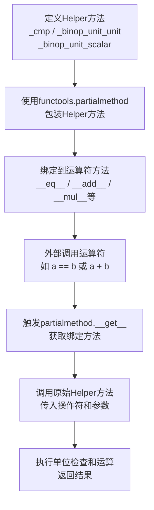

#### 带注释源码

```python
import functools      # 导入functools模块用于创建partialmethod
import operator      # 导入operator模块提供比较和算术运算符

class UnitDbl:
    """Class UnitDbl in development."""
    
    # ... 类定义 ...
    
    def _cmp(self, op, rhs):
        """Check that *self* and *rhs* share units; compare them using *op*."""
        # 比较两个UnitDbl对象，确保单位一致后使用传入的操作符进行比较
        self.checkSameUnits(rhs, "compare")
        return op(self._value, rhs._value)

    # 使用functools.partialmethod将_cmp函数与operator.eq绑定
    # 相当于: def __eq__(self, rhs): return self._cmp(operator.eq, rhs)
    __eq__ = functools.partialmethod(_cmp, operator.eq)
    __ne__ = functools.partialmethod(_cmp, operator.ne)
    __lt__ = functools.partialmethod(_cmp, operator.lt)
    __le__ = functools.partialmethod(_cmp, operator.le)
    __gt__ = functools.partialmethod(_cmp, operator.ge)
    __ge__ = functools.partialmethod(_cmp, operator.ge)

    def _binop_unit_unit(self, op, rhs):
        """Check that *self* and *rhs* share units; combine them using *op*."""
        # 二元运算：UnitDbl 与 UnitDbl 之间的运算
        self.checkSameUnits(rhs, op.__name__)
        return UnitDbl(op(self._value, rhs._value), self._units)

    # 使用partialmethod绑定_binop_unit_unit与operator.add/sub
    __add__ = functools.partialmethod(_binop_unit_unit, operator.add)
    __sub__ = functools.partialmethod(_binop_unit_unit, operator.sub)

    def _binop_unit_scalar(self, op, scalar):
        """Combine *self* and *scalar* using *op*."""
        # 二元运算：UnitDbl 与标量（数字）之间的运算
        return UnitDbl(op(self._value, scalar), self._units)

    # 使用partialmethod绑定乘法运算，支持a * b和b * a两种形式
    __mul__ = functools.partialmethod(_binop_unit_scalar, operator.mul)
    __rmul__ = functools.partialmethod(_binop_unit_scalar, operator.mul)
```

### 关键组件信息

| 名称 | 一句话描述 |
|------|-----------|
| `functools.partialmethod` | 用于创建可调用对象的高级函数，将预定义的参数与调用时传入的参数绑定 |
| `operator.eq/ne/lt/le/gt/ge` | 比较运算符函数对象，用于值的大小比较 |
| `operator.add/mul` | 算术运算符函数对象，用于值的加减乘除 |

### 潜在的技术债务或优化空间

1. **错误信息不准确**：在 `checkSameUnits` 方法中抛出的错误信息包含了 "functools - 模块导入，用于partialmethod" 这样的占位符文本，应该改为更清晰的描述如 "Cannot compare/add units of different types"

2. **单位转换限制**：当前仅支持有限的单位转换（km, rad, sec及其等价单位），扩展性较差

3. **缺乏类型提示**：代码中未使用类型注解（Type Hints），不利于静态分析和IDE智能提示

### 其它项目

#### 设计目标与约束
- 目标：实现带单位的数值类（UnitDbl），支持单位转换和算术运算
- 约束：内部统一转换为km、rad、sec三种基准单位

#### 错误处理与异常设计
- 使用 `_api.getitem_checked` 进行单位合法性检查
- 单位不匹配时抛出 `ValueError` 异常

#### 数据流与状态机
- 输入：数值 + 单位字符串
- 处理：查找转换表 → 转换为基准单位 → 存储
- 输出：可通过 `convert()` 方法转换回指定单位

#### 外部依赖与接口契约
- 依赖 `matplotlib._api` 模块进行单位验证
- 依赖 `functools` 和 `operator` 标准库实现运算符委托


### `operator` 模块导入

该部分描述了 `operator` 模块的导入及其在 `UnitDbl` 类中作为运算符函数的使用，通过 `functools.partialmethod` 将标准运算符（比较、算术）绑定到类的方法中，实现带单位的数值运算。

#### 带注释源码

```python
import functools      # 用于 partialmethod，创建可调用对象
import operator       # 提供标准运算符函数（eq, ne, add, sub, mul等）
```

#### 详细说明

`operator` 模块在 `UnitDbl` 类中被广泛用于实现各种运算符功能：

1. **比较运算符**：通过 `_cmp` 方法结合 `operator.eq`, `operator.ne`, `operator.lt`, `operator.le`, `operator.gt`, `operator.ge` 实现
2. **算术运算符**：通过 `_binop_unit_unit` 方法结合 `operator.add`, `operator.sub` 实现
3. **乘法运算符**：通过 `_binop_unit_scalar` 方法结合 `operator.mul` 实现

这些运算符方法使用 `functools.partialmethod` 将运算符函数绑定到类的方法中，使得 `UnitDbl` 对象可以直接使用 Python 的标准运算符进行运算。


### `_api.getitem_checked`

`_api.getitem_checked` 是 matplotlib 内部提供的带检查的字典取值 API，用于安全地从字典中获取值，如果键不存在则抛出清晰的错误信息。在 `UnitDbl` 类中用于验证单位是否合法并获取转换因子和标准单位。

参数：

-  `dict_obj`：`dict`，要查询的字典对象，在 `UnitDbl` 中为 `self.allowed`（单位转换表）
-  `units`：`str`，要查询的单位名称字符串（如 "m"、"km"、"rad" 等）

返回值：`Tuple[float, str]`，返回元组包含：
  - `float`：从源单位转换到标准单位的缩放因子
  - `str`：标准单位名称（如 "km"、"rad"、"sec"）

#### 流程图

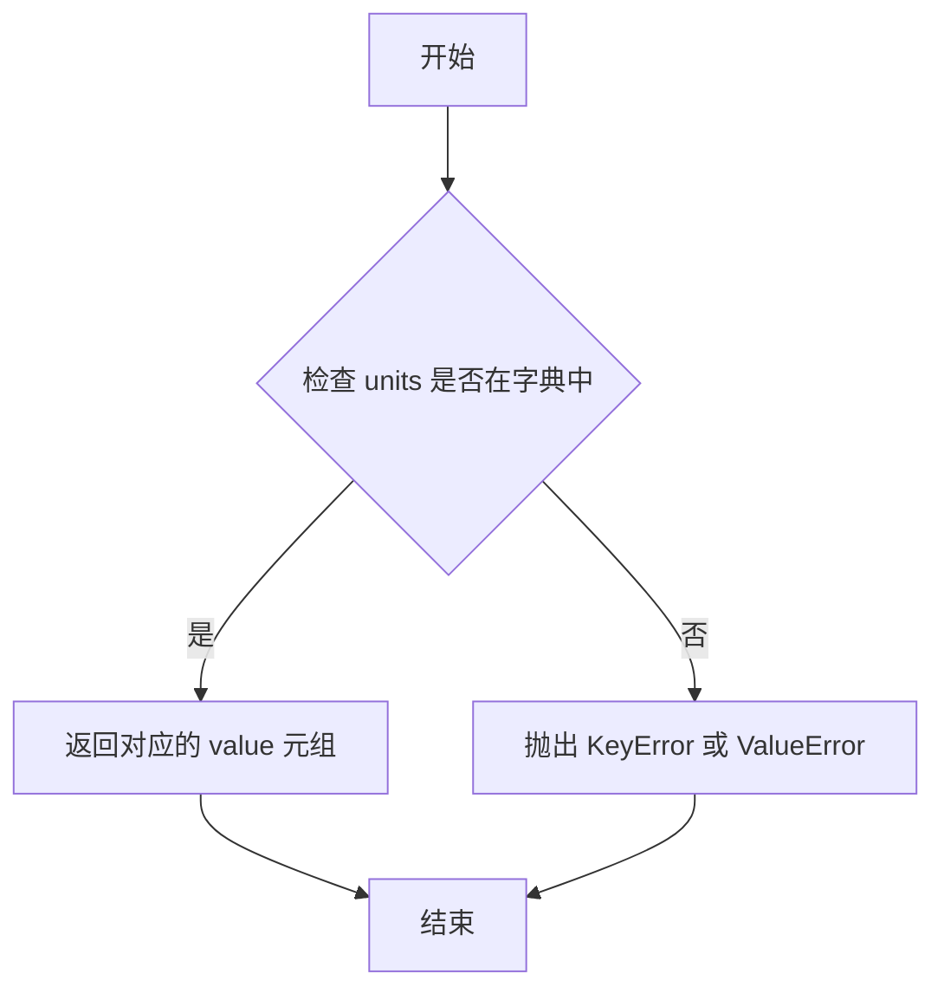

#### 带注释源码

```python
# 在 UnitDbl.__init__ 中的调用示例
def __init__(self, value, units):
    """
    创建 UnitDbl 对象。
    """
    # 使用 getitem_checked 从允许的单位表中获取转换因子和标准单位
    # 如果 units 不在 self.allowed 中，会抛出异常
    data = _api.getitem_checked(self.allowed, units=units)
    # data[0] 是缩放因子, data[1] 是标准单位
    self._value = float(value * data[0])
    self._units = data[1]

# 在 UnitDbl.convert 中的调用示例
def convert(self, units):
    """
    将 UnitDbl 转换为指定单位。
    """
    if self._units == units:
        return self._value
    # 验证目标单位是否合法，获取其转换因子和标准单位
    data = _api.getitem_checked(self.allowed, units=units)
    # 检查单位类型是否兼容（必须转换为相同的标准单位）
    if self._units != data[1]:
        raise ValueError(f"Error trying to convert to different units.\n"
                         f"    Invalid conversion requested.\n"
                         f"    UnitDbl: {self}\n"
                         f"    Units:   {units}\n")
    return self._value / data[0]
```

#### 补充说明

`getitem_checked` 函数是 matplotlib `_api` 模块中的实用工具函数，提供了比普通字典访问更友好的错误处理。当访问不存在的单位时，它会抛出带有上下文信息的异常，帮助开发者快速定位问题。在 `UnitDbl` 中，这个函数确保了只有预定义的单位才能使用，保证了单位转换的安全性和一致性。


### `UnitDbl.__init__`

构造函数，用于创建UnitDbl对象并接受数值和单位，将输入单位自动转换为内部标准单位（km表示距离、rad表示角度、sec表示时间）。

参数：

- `value`：`float` 或数值类型，待转换的数值
- `units`：`str`，单位名称（如m, km, mile, rad, deg, sec, min, hour）

返回值：`None`，构造函数无返回值

#### 流程图

```mermaid
flowchart TD
    A[开始 __init__] --> B[调用 _api.getitem_checked 检查单位是否合法]
    B --> C{单位是否合法?}
    C -->|否| D[抛出 KeyError 异常]
    C -->|是| E[获取转换因子 data[0] 和目标单位 data[1]]
    F[计算转换后的值: self._value = float(value * data[0])] --> G[设置内部单位: self._units = data[1]]
    E --> F
    G --> H[结束 __init__]
    
    style D fill:#ffcccc
    style H fill:#ccffcc
```

#### 带注释源码

```python
def __init__(self, value, units):
    """
    Create a new UnitDbl object.

    Units are internally converted to km, rad, and sec.  The only
    valid inputs for units are [m, km, mile, rad, deg, sec, min, hour].

    The field UnitDbl.value will contain the converted value.  Use
    the convert() method to get a specific type of units back.

    = ERROR CONDITIONS
    - If the input units are not in the allowed list, an error is thrown.

    = INPUT VARIABLES
    - value     The numeric value of the UnitDbl.
    - units     The string name of the units the value is in.
    """
    # 从允许的单位表中检查输入单位是否合法，若不合法会抛出KeyError
    # data[0] 是转换到标准单位的因子，data[1] 是内部标准单位
    data = _api.getitem_checked(self.allowed, units=units)
    
    # 将输入值乘以转换因子，得到标准单位下的数值
    self._value = float(value * data[0])
    
    # 保存内部标准单位（km/rad/sec之一）
    self._units = data[1]
```


### `UnitDbl.convert` - 实例方法，将UnitDbl转换为指定单位

该方法将存储在UnitDbl对象中的值（已转换为内部标准单位）转换回用户指定的单位。如果目标单位与当前单位相同，则直接返回内部值；否则通过查找单位转换表获取转换因子，并进行逆向计算（除以缩放因子）得到目标单位的值。

参数：

- `units`：`str`，要转换到的单位名称（如"m"、"km"、"mile"、"rad"、"deg"、"sec"、"min"、"hour"等）

返回值：`float`，返回以请求单位表示的UnitDbl值的浮点数

#### 流程图

```mermaid
flowchart TD
    A[开始 convert 方法] --> B{当前单位 == 目标单位?}
    B -->|是| C[直接返回内部值 self._value]
    B -->|否| D[从allowed字典获取目标单位数据]
    D --> E{当前单位 == 目标单位基准?}
    E -->|否| F[抛出 ValueError 异常]
    E -->|是| G[计算转换值: self._value / data[0]]
    C --> H[返回结果]
    G --> H
    F --> H
```

#### 带注释源码

```python
def convert(self, units):
    """
    Convert the UnitDbl to a specific set of units.

    = ERROR CONDITIONS
    - If the input units are not in the allowed list, an error is thrown.

    = INPUT VARIABLES
    - units     The string name of the units to convert to.

    = RETURN VALUE
    - Returns the value of the UnitDbl in the requested units as a floating
      point number.
    """
    # 如果目标单位与当前内部单位相同，直接返回存储的转换值
    # 这样可以避免不必要的计算
    if self._units == units:
        return self._value
    
    # 从允许的单位表中获取目标单位的转换数据
    # data[0] 是缩放因子（将目标单位转换为基准单位的系数）
    # data[1] 是基准单位（km、rad、sec）
    data = _api.getitem_checked(self.allowed, units=units)
    
    # 检查单位类型兼容性：只能在不同单位之间转换，
    # 但不能在不同物理类型之间转换（如距离不能转为时间）
    # 例如：self._units 是"km"，data[1]应该是"km"
    if self._units != data[1]:
        raise ValueError(f"Error trying to convert to different units.\n"
                         f"    Invalid conversion requested.\n"
                         f"    UnitDbl: {self}\n"
                         f"    Units:   {units}\n")
    
    # 执行转换：内部值除以目标单位的缩放因子
    # 因为内部存储的是基准单位的值，需要逆向计算得到目标单位的值
    # 例如：内部存储 1.0 km，要转为 m（缩放因子0.001），
    # 结果 = 1.0 / 0.001 = 1000 m
    return self._value / data[0]
```


### `UnitDbl.__abs__`

返回 UnitDbl 的绝对值，创建一个新的 UnitDbl 对象，其值为当前值的绝对值，保留原单位。

参数：

- 无（仅包含隐式参数 `self`）

返回值：`UnitDbl`，返回一个新的 UnitDbl 对象，其值为原值的绝对值，单位保持不变

#### 流程图

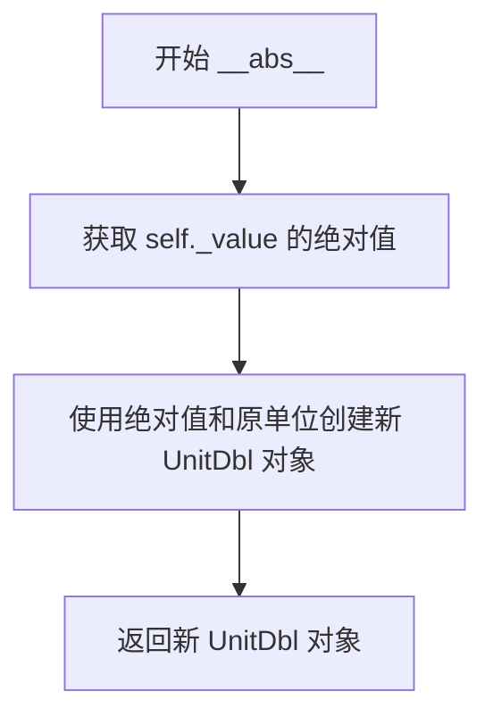

#### 带注释源码

```python
def __abs__(self):
    """Return the absolute value of this UnitDbl."""
    # 使用 Python 内置的 abs() 函数获取 self._value 的绝对值
    # 保持原有的单位不变
    # 创建一个新的 UnitDbl 对象并返回
    return UnitDbl(abs(self._value), self._units)
```


### `UnitDbl.__neg__`

这是一个魔术方法（Magic Method），用于返回 UnitDbl 对象的负值。该方法通过将内部存储的数值取负，同时保持单位不变，创建一个新的 UnitDbl 对象返回。

参数：

- `self`：`UnitDbl`，调用该方法的实例对象（隐式参数）

返回值：`UnitDbl`，返回一个新的 UnitDbl 对象，其值为原值的负数，单位保持不变

#### 流程图

```mermaid
flowchart TD
    A[开始 __neg__] --> B[获取 self._value]
    B --> C[对值取负: -self._value]
    C --> D[获取单位: self._units]
    D --> E[创建新UnitDbl对象: UnitDbl(-self._value, self._units)]
    E --> F[返回新对象]
    F --> G[结束]
```

#### 带注释源码

```python
def __neg__(self):
    """
    Return the negative value of this UnitDbl.
    
    创建一个新的UnitDbl对象，其值为当前对象值的负数，单位保持不变。
    这是一个一元运算符魔术方法，使UnitDbl对象支持负号运算符（如 -unit_dbl）。
    
    = RETURN VALUE
    - 返回一个新的UnitDbl对象，值为原值的负数，单位与原对象相同。
    """
    # 使用UnitDbl构造函数创建新对象，传入负值和原单位
    return UnitDbl(-self._value, self._units)
```


### UnitDbl.__bool__

返回 UnitDbl 对象的布尔真值，用于 Python 的布尔上下文评估（如 if 语句、条件表达式等）。

参数：

-  `self`：`UnitDbl`，隐式参数，表示调用该方法的 UnitDbl 实例本身

返回值：`bool`，返回内部存储数值 `_value` 的布尔值，零值为 False，非零值为 True

#### 流程图

```mermaid
flowchart TD
    A[开始 __bool__ 调用] --> B{获取 self._value}
    B --> C[bool&#40;self._value&#41;]
    C --> D{_value 是否为 0?}
    D -->|是| E[返回 False]
    D -->|否| F[返回 True]
    E --> G[结束]
    F --> G
```

#### 带注释源码

```python
def __bool__(self):
    """Return the truth value of a UnitDbl."""
    # 使用 Python 内置的 bool() 函数将内部存储的数值转换为布尔值
    # 如果 _value 为 0（包含 0.0），返回 False；否则返回 True
    # 这使得 UnitDbl 对象可以在 if 语句中直接使用
    return bool(self._value)
```


### `UnitDbl._cmp`

该方法是 `UnitDbl` 类的内部比较辅助方法。它接受一个比较运算符（如 `operator.eq`, `operator.lt`）和一个右侧操作数 `rhs`。在执行比较之前，它首先调用 `checkSameUnits` 验证两个 `UnitDbl` 对象是否具有相同的单位，若单位一致则执行数值比较，否则抛出异常。此方法主要被 `functools.partialmethod` 绑定至 `__eq__`, `__ne__`, `__lt__` 等魔术方法，以实现统一的单位校验逻辑。

#### 参数

- `op`：函数（Callable），传入的比较运算符（例如 `operator.eq`, `operator.lt`, `operator.gt` 等），用于执行具体的数值比较。
- `rhs`：`UnitDbl`，要比较的右侧 UnitDbl 实例。

#### 返回值

`任意类型（Any）`，返回比较运算符的结果（通常为布尔值 `bool`）。

#### 流程图

```mermaid
flowchart TD
    A([开始 _cmp]) --> B[调用 checkSameUnits 验证单位]
    B --> C{单位是否相同?}
    C -->|否| D[抛出 ValueError]
    C -->|是| E[执行 op(self._value, rhs._value)]
    E --> F([返回比较结果])
```

#### 带注释源码

```python
def _cmp(self, op, rhs):
    """Check that *self* and *rhs* share units; compare them using *op*."""
    # 检查自身与右侧操作数(rhs)是否具有相同的单位
    # 若单位不同，checkSameUnits 会抛出 ValueError
    self.checkSameUnits(rhs, "compare")
    
    # 如果单位校验通过，则使用传入的运算符(op)比较底层的浮点数值
    return op(self._value, rhs._value)
```


### `UnitDbl.__eq__`

等于运算符的魔术方法，用于比较两个 UnitDbl 对象是否相等。首先检查两个对象的单位是否相同，如果单位相同则比较其数值，否则抛出 ValueError。

参数：

- `self`：`UnitDbl`，隐式的当前对象
- `rhs`：`UnitDbl`，进行比较的右侧 UnitDbl 对象

返回值：`bool`，如果两个 UnitDbl 对象的单位相同且值相等则返回 `True`，否则返回 `False`

#### 流程图

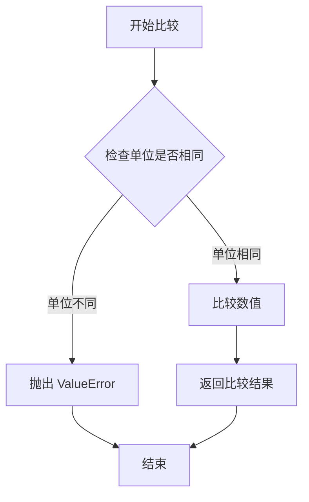

#### 带注释源码

```python
# 使用 functools.partialmethod 创建 __eq__ 方法
# 它绑定到 _cmp 方法，并使用 operator.eq 作为比较操作符
__eq__ = functools.partialmethod(_cmp, operator.eq)

# 实际的比较逻辑在 _cmp 方法中实现：
def _cmp(self, op, rhs):
    """
    检查 self 和 rhs 是否共享相同的单位；
    使用 op 操作符比较它们。
    
    参数：
        op：操作符函数（如 operator.eq, operator.ne 等）
        rhs：右侧的 UnitDbl 对象
    """
    # 调用 checkSameUnits 方法验证单位兼容性
    self.checkSameUnits(rhs, "compare")
    # 使用传入的操作符比较两个值
    return op(self._value, rhs._value)

# checkSameUnits 方法的实现：
def checkSameUnits(self, rhs, func):
    """
    检查单位是否相同。
    
    错误条件：
        - 如果 rhs UnitDbl 的单位与当前对象单位不同，则抛出错误。
    
    输入变量：
        - rhs: 要检查单位的 UnitDbl 对象
        - func: 执行检查的函数名称
    """
    if self._units != rhs._units:
        raise ValueError(f"Cannot compare units of different types.\n"
                         f"LHS: {self._units}\n"
                         f"RHS: {rhs._units}")
```


### `UnitDbl.__ne__`

实现不等于运算符的魔术方法，用于比较两个 UnitDbl 对象是否不相等。

参数：

-  `rhs`：`UnitDbl`，右侧操作数，要比较的 UnitDbl 对象

返回值：`bool`，如果两个 UnitDbl 的值不相等返回 True，否则返回 False

#### 流程图

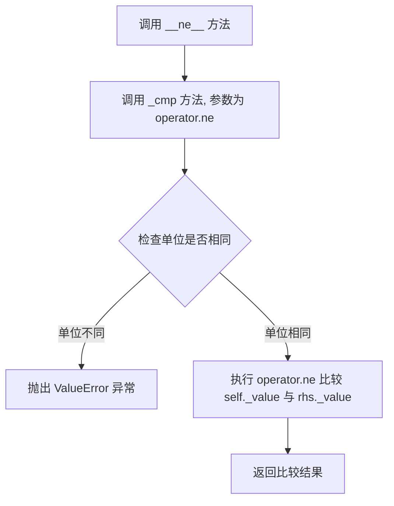

#### 带注释源码

```
def __ne__(self, rhs):
    """
    不等于运算符魔术方法.
    
    此方法通过 functools.partialmethod 绑定 _cmp 方法和 operator.ne 函数实现.
    实际比较逻辑在 _cmp 辅助方法中完成.
    
    参数:
        rhs: UnitDbl - 要比较的右侧 UnitDbl 对象
        
    返回:
        bool - 如果两个 UnitDbl 的值不相等返回 True, 否则返回 False
    """
    # __ne__ = functools.partialmethod(_cmp, operator.ne)
    # 当调用 self != rhs 时, 实际上执行的是:
    # _cmp(self, operator.ne, rhs)
    #
    # _cmp 方法内部逻辑:
    # 1. 调用 self.checkSameUnits(rhs, "compare") 验证单位兼容性
    # 2. 如果单位不同, 抛出 ValueError
    # 3. 如果单位相同, 执行 operator.ne(self._value, rhs._value) 比较数值
    # 4. 返回布尔比较结果
```


### `UnitDbl.__lt__` - 魔术方法，小于运算符

实现小于（<）比较操作的魔术方法，用于比较两个 UnitDbl 对象的大小关系。

参数：

- `self`：`UnitDbl`，调用该方法的 UnitDbl 实例（比较运算符左侧的对象）
- `rhs`：`UnitDbl`，右侧待比较的 UnitDbl 对象

返回值：`bool`，如果左侧对象的值小于右侧对象的值则返回 `True`，否则返回 `False`

#### 流程图

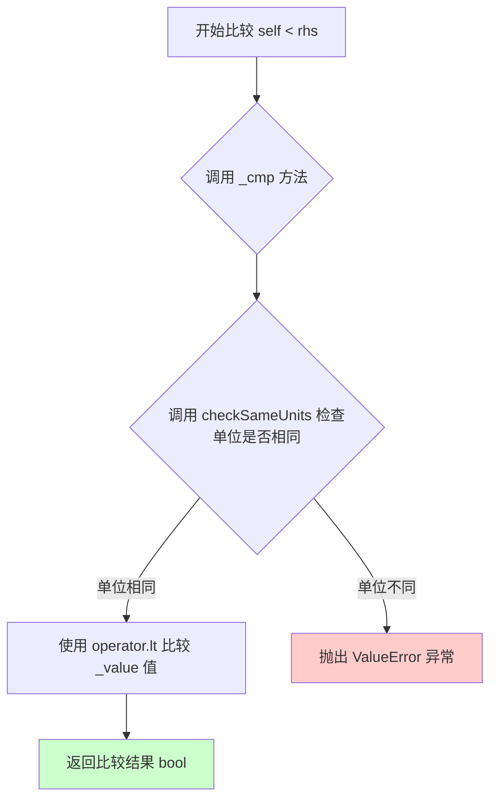

#### 带注释源码

```python
# __lt__ 是通过 functools.partialmethod 实现的快捷方式
# 它将 _cmp 方法与 operator.lt（小于比较操作）绑定
__lt__ = functools.partialmethod(_cmp, operator.lt)

# 内部使用的 _cmp 方法实现
def _cmp(self, op, rhs):
    """
    检查 self 和 rhs 是否共享相同的单位；使用 op 进行比较。
    
    参数：
        self - 左侧的 UnitDbl 对象
        op   - 比较操作函数（如 operator.lt, operator.gt 等）
        rhs  - 右侧的 UnitDbl 对象进行比较
    
    流程：
        1. 首先调用 checkSameUnits 检查单位一致性
        2. 如果单位相同，使用传入的操作函数比较内部 _value 值
        3. 返回比较结果（布尔值）
    """
    # 检查两个 UnitDbl 对象是否具有相同的单位
    self.checkSameUnits(rhs, "compare")
    # 使用传入的操作符（如 operator.lt）比较两个值
    # operator.lt 等同于 lambda a, b: a < b
    return op(self._value, rhs._value)
```


### `UnitDbl.__le__`

小于等于运算符的魔术方法，用于比较两个 UnitDbl 对象是否小于或等于关系。内部通过调用 `_cmp` 方法实现，先检查两个操作数是否具有相同的单位，然后使用 `operator.le` 进行值比较。

参数：

- `rhs`：`UnitDbl`，右侧操作数，要与当前对象比较的 UnitDbl 对象

返回值：`bool`，如果当前对象的值小于等于右侧对象的值则返回 `True`，否则返回 `False`

#### 流程图

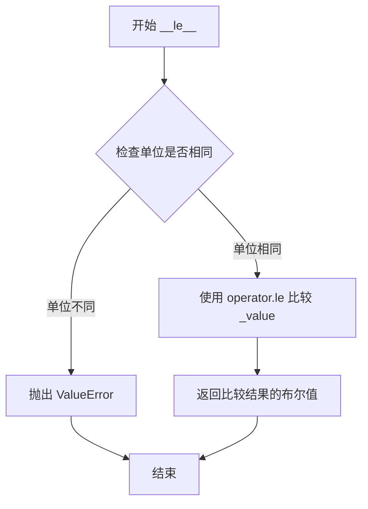

#### 带注释源码

```
def __le__(self, rhs):
    """
    小于等于运算符魔术方法。
    
    使用 functools.partialmethod 绑定 _cmp 方法和 operator.le 函数。
    实际比较逻辑在 _cmp 方法中实现。
    
    参数:
        rhs: UnitDbl类型，右侧操作数，要比较的 UnitDbl 对象
        
    返回:
        bool类型，如果 self._value <= rhs._value 则返回 True，否则返回 False
    """
    # 使用 partialmethod 绑定: _cmp(self, operator.le, rhs)
    # 1. 调用 checkSameUnits(rhs, "compare") 检查单位是否相同
    # 2. 如果单位相同，调用 operator.le(self._value, rhs._value) 进行比较
    # 3. 返回布尔比较结果
    __le__ = functools.partialmethod(_cmp, operator.le)
    
    # 实际调用的 _cmp 方法定义:
    # def _cmp(self, op, rhs):
    #     """Check that *self* and *rhs* share units; compare them using *op*."""
    #     self.checkSameUnits(rhs, "compare")  # 检查单位一致性
    #     return op(self._value, rhs._value)   # 使用传入的操作符比较值
```


### `UnitDbl.__gt__`

该方法是 `UnitDbl` 类的大于（>`）运算符魔术方法，用于比较两个 `UnitDbl` 对象的大小关系。它通过 `_cmp` 方法实现，首先检查两个对象是否具有相同的单位，然后使用 `operator.gt` 比较它们的数值。

参数：

- `self`：`UnitDbl`，进行比较的左侧 UnitDbl 实例（隐式参数）
- `rhs`：`UnitDbl`，进行比较的右侧 UnitDbl 对象

返回值：`bool`，如果左侧 UnitDbl 的值大于右侧 UnitDbl 的值返回 `True`，否则返回 `False`

#### 流程图

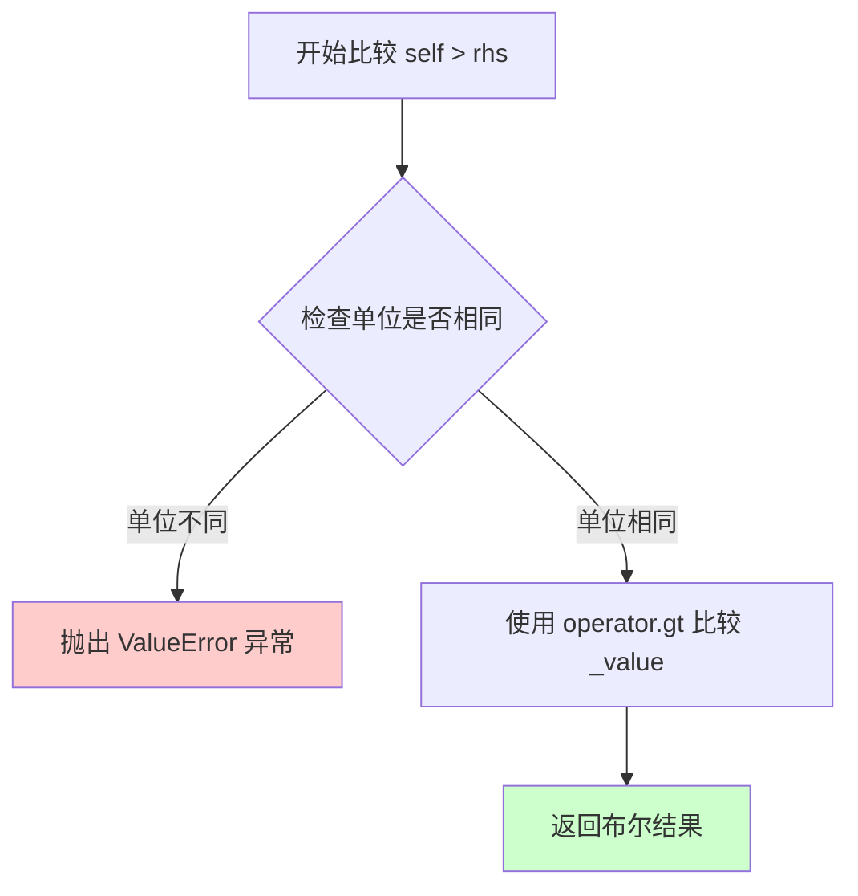

#### 带注释源码

```python
# __gt__ 方法使用 functools.partialmethod 绑定 _cmp 方法和 operator.gt 操作符
# 这是一个简化的定义方式，相当于定义了:
# def __gt__(self, rhs):
#     return self._cmp(operator.gt, rhs)
__gt__ = functools.partialmethod(_cmp, operator.gt)

# 实际执行的 _cmp 方法定义如下:
def _cmp(self, op, rhs):
    """
    检查 self 和 rhs 是否共享相同的单位；使用 op 比较它们。
    
    参数:
        op: 一个二元操作符函数（如 operator.gt, operator.lt 等）
        rhs: 右侧的 UnitDbl 对象
    
    返回值:
        操作符比较的结果（通常是布尔值）
    """
    # 首先调用 checkSameUnits 验证两个 UnitDbl 对象单位是否相同
    self.checkSameUnits(rhs, "compare")
    # 使用传入的操作符（如 operator.gt）比较两个对象的 _value 值
    return op(self._value, rhs._value)
```


### `UnitDbl.__ge__`

实现大于等于运算符（>=），用于比较两个 UnitDbl 对象的大小。当左侧对象的值大于或等于右侧对象的值时返回 True，否则返回 False。

参数：

- `self`：`UnitDbl`，调用该方法的 UnitDbl 实例
- `rhs`：`UnitDbl`，右侧进行比较的 UnitDbl 对象

返回值：`bool`，如果 self 的值大于或等于 rhs 的值则返回 True，否则返回 False

#### 流程图

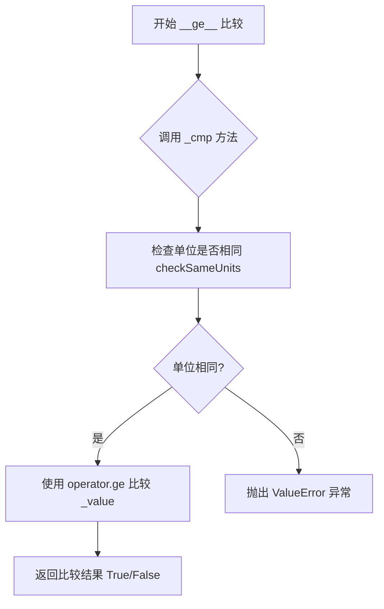

#### 带注释源码

```python
# 通过 functools.partialmethod 实现 __ge__ 方法
# 内部调用 _cmp 方法，传入 operator.ge 作为比较操作符
__ge__ = functools.partialmethod(_cmp, operator.ge)

# _cmp 方法的完整实现：
def _cmp(self, op, rhs):
    """Check that *self* and *rhs* share units; compare them using *op*."""
    # 首先检查两个 UnitDbl 对象是否具有相同的单位
    self.checkSameUnits(rhs, "compare")
    # 使用传入的操作符（这里是 operator.ge）比较两个值
    return op(self._value, rhs._value)
```

**使用示例：**

```python
# 创建两个距离单位对象
distance1 = UnitDbl(10, "km")
distance2 = UnitDbl(5, "km")

# 使用 >= 运算符比较
result = distance1 >= distance2  # 返回 True，因为 10 >= 5

# 如果单位不同会抛出异常
distance3 = UnitDbl(10, "mile")  # mile 单位
# distance1 >= distance3  # 抛出 ValueError: Cannot compare units of different types
```


### `UnitDbl._binop_unit_unit`

这是一个内部辅助方法，用于处理两个 `UnitDbl` 对象之间的二元运算（如加法、减法）。该方法首先检查左右操作数是否具有相同的单位，然后使用传入的运算符函数对数值进行计算，并返回包含结果值和单位的新 `UnitDbl` 对象。

参数：

- `op`：`Callable`，运算符函数（如 `operator.add`、`operator.sub` 等）
- `rhs`：`UnitDbl`，右侧的 `UnitDbl` 操作数

返回值：`UnitDbl`，运算后的新 `UnitDbl` 对象

#### 流程图

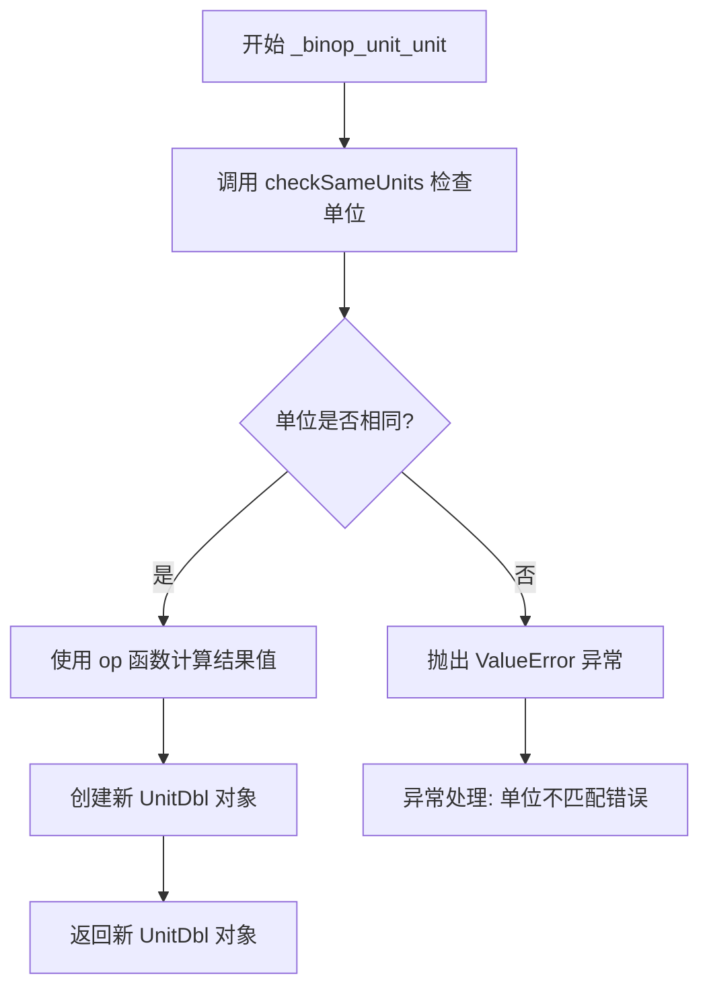

#### 带注释源码

```python
def _binop_unit_unit(self, op, rhs):
    """Check that *self* and *rhs* share units; combine them using *op*.
    
    这是一个内部方法，用于处理两个 UnitDbl 对象之间的二元运算。
    该方法会被 __add__ 和 __sub__ 等方法使用（通过 functools.partialmethod）。
    
    Parameters
    ----------
    op : Callable
        运算符函数，例如 operator.add 或 operator.sub
    rhs : UnitDbl
        右侧的 UnitDbl 操作数
    
    Returns
    -------
    UnitDbl
        运算结果的新 UnitDbl 对象
    """
    # 首先检查左右操作数是否具有相同的单位
    # 如果单位不同，将抛出 ValueError 异常
    self.checkSameUnits(rhs, op.__name__)
    
    # 使用传入的运算符函数对两个数值进行计算
    # 结果值 = op(self._value, rhs._value)
    # 例如：self._value + rhs._value 或 self._value - rhs._value
    return UnitDbl(op(self._value, rhs._value), self._units)
```

#### 关联信息

该方法通过 `functools.partialmethod` 被绑定到以下公开方法：

```python
__add__ = functools.partialmethod(_binop_unit_unit, operator.add)
__sub__ = functools.partialmethod(_binop_unit_unit, operator.sub)
```

这意味着：
- `+` 运算符会调用 `_binop_unit_unit` 并传入 `operator.add`
- `-` 运算符会调用 `_binop_unit_unit` 并传入 `operator.sub`

#### 设计考量

1. **单位检查前置**：在执行任何运算之前先验证单位兼容性，保证运算的物理意义
2. **单位保留**：运算结果保留左侧操作数（`self`）的单位
3. **异常信息**：当单位不匹配时，错误信息清晰地显示左右两边的单位


### `UnitDbl.__add__`

实现 `+` 运算符重载。该方法允许使用 `+` 符号对两个 `UnitDbl` 对象进行加法运算。内部实现通过 `functools.partialmethod` 委托给 `_binop_unit_unit` 方法，主要逻辑包括：先验证左右操作数（`self` 和 `rhs`）的单位类型是否一致，若一致则对数值进行加法运算，并返回一个包含结果值且单位保持与左操作数一致的新 `UnitDbl` 对象。

参数：

- `self`：`UnitDbl`，左操作数，调用加法的对象本身。
- `rhs`：`UnitDbl`，右操作数，需要与左操作数相加的 `UnitDbl` 对象。

返回值：`UnitDbl`，返回一个新的 `UnitDbl` 实例，其值为两个对象值之和，单位与左操作数（`self`）相同。

#### 流程图

```mermaid
flowchart TD
    A[开始: 调用 __add__] --> B{调用 checkSameUnits(rhs, 'add')}
    B -->|单位不一致| C[抛出 ValueError]
    C --> D[结束: 抛出异常]
    B -->|单位一致| E[执行 op(self._value, rhs._value)]
    E --> F[创建新 UnitDbl(计算结果, self._units)]
    F --> G[返回新 UnitDbl 对象]
```

#### 带注释源码

```python
# __add__ 方法的定义，使用 functools.partialmethod 将加法操作绑定到 _binop_unit_unit 方法
# 当执行 a + b 时，实际调用的是 self._binop_unit_unit(operator.add, b)
__add__ = functools.partialmethod(_binop_unit_unit, operator.add)

def _binop_unit_unit(self, op, rhs):
    """
    检查 *self* 和 *rhs* 是否具有相同单位；并使用 *op* 合并它们。
    
    参数:
        op:       运算符函数 (如 operator.add)
        rhs:      右侧的 UnitDbl 操作数
    """
    # 步骤 1: 单元一致性检查
    # 如果单位不同（例如 km + mile），此处会抛出 ValueError
    self.checkSameUnits(rhs, op.__name__)
    
    # 步骤 2: 执行数值运算并构造返回对象
    # 注意：单位固定使用 self._units，即左操作数的单位
    return UnitDbl(op(self._value, rhs._value), self._units)
```


### UnitDbl.__sub__

减法运算符魔术方法，用于实现两个 UnitDbl 对象的减法运算。内部委托给 `_binop_unit_unit` 方法执行，首先检查两个操作数的单位是否相同，若相同则使用 `operator.sub` 进行减法运算并返回新的 UnitDbl 对象。

参数：

- `self`：`UnitDbl`，当前对象（左侧操作数）
- `rhs`：`UnitDbl`，右侧参与减法运算的 UnitDbl 对象

返回值：`UnitDbl`，返回一个新的 UnitDbl 对象，其值为左侧操作数减去右侧操作数的差，单位与左侧操作数相同（因为已验证单位一致）

#### 流程图

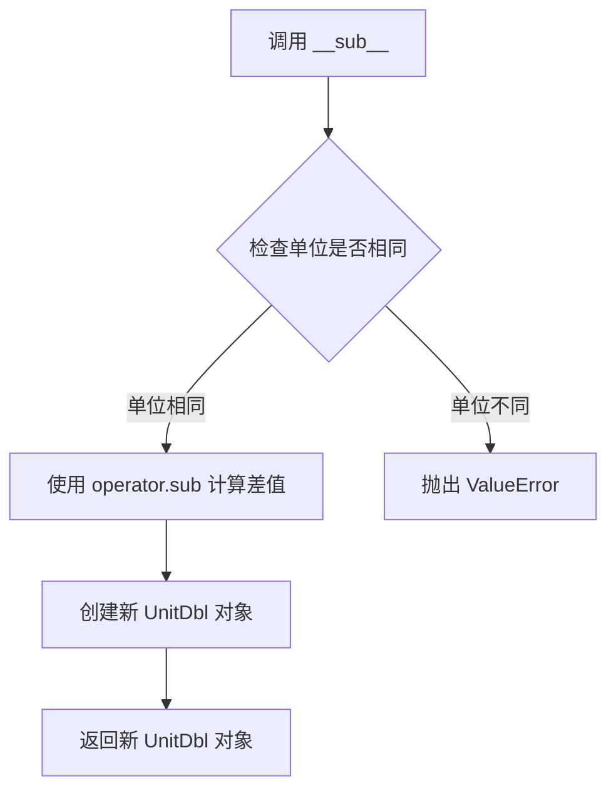

#### 带注释源码

```python
# 定义减法运算符魔术方法
# 使用 functools.partialmethod 将 _binop_unit_unit 方法与 operator.sub 绑定
# _binop_unit_unit 方法会先检查单位一致性，然后执行减法运算
__sub__ = functools.partialmethod(_binop_unit_unit, operator.sub)

# 下面是 _binop_unit_unit 方法的实现（__sub__ 实际调用的核心方法）：
def _binop_unit_unit(self, op, rhs):
    """Check that *self* and *rhs* share units; combine them using *op*."""
    # 调用 checkSameUnits 检查两个 UnitDbl 对象是否具有相同的单位
    self.checkSameUnits(rhs, op.__name__)
    # 使用传入的操作符（如 operator.sub）计算结果值，并保持原单位不变
    # 返回一个新的 UnitDbl 对象，结果值为 op(self._value, rhs._value)
    return UnitDbl(op(self._value, rhs._value), self._units)
```


### `UnitDbl._binop_unit_scalar`

内部方法，UnitDbl与标量进行二元运算的辅助方法，接收操作符函数和标量值，将操作符作用于内部存储的值，生成新的UnitDbl对象并保留原单位。

参数：

- `self`：隐含的UnitDbl实例本身
- `op`：操作符函数（如`operator.mul`），用于执行实际的数学运算
- `scalar`：标量值（float/int），要与UnitDbl进行运算的数值

返回值：`UnitDbl`，返回运算后的新UnitDbl对象，其值为运算结果，单位保持不变

#### 流程图

```mermaid
graph TD
    A[开始 _binop_unit_scalar] --> B[接收 op 和 scalar]
    B --> C[执行 op(self._value, scalar)]
    C --> D[创建新 UnitDbl对象]
    D --> E[使用原单位 self._units]
    E --> F[返回新 UnitDbl实例]
```

#### 带注释源码

```python
def _binop_unit_scalar(self, op, scalar):
    """Combine *self* and *scalar* using *op*."""
    return UnitDbl(op(self._value, scalar), self._units)
    # 说明：
    # - op: 传入的操作符函数（如 operator.mul）
    # - self._value: UnitDbl内部存储的数值（已转换为标准单位）
    # - scalar: 外部传入的标量值
    # - self._units: 保留原单位，确保运算后单位一致性
    # - 返回新建的UnitDbl对象，实现如 5 * UnitDbl(2, 'km') 的运算
```


### `UnitDbl.__mul__`

该方法是 `UnitDbl` 类的乘法运算符重载魔术方法，用于实现 `UnitDbl` 对象与标量（数值）的乘法运算。方法通过 `functools.partialmethod` 绑定到 `_binop_unit_scalar` 辅助方法，使用 `operator.mul` 执行实际的数值乘法运算，并返回一个新的 `UnitDbl` 对象，保持原有的单位不变。

参数：

- `self`：`UnitDbl`，隐式参数，表示调用乘法的左侧操作数（单位数据对象）
- `rhs`：`int` 或 `float`，右侧操作数，要与 `UnitDbl` 值相乘的标量数值

返回值：`UnitDbl`，返回一个新的 `UnitDbl` 对象，其值为原值与标量的乘积，单位保持不变

#### 流程图

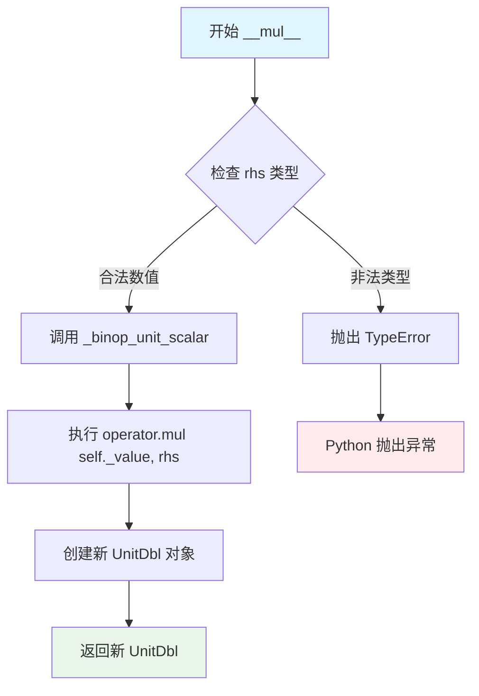

#### 带注释源码

```python
def _binop_unit_scalar(self, op, scalar):
    """
    Combine *self* and *scalar* using *op*.
    
    参数：
        - self: UnitDbl 实例（隐式传入）
        - op: 操作函数（如 operator.mul）
        - scalar: 要进行运算的标量值（int 或 float）
    
    返回：
        - UnitDbl: 运算后的新 UnitDbl 对象
    """
    # 使用传入的操作函数（operator.mul）对自身的值和标量进行运算
    # 保持原有的单位不变（self._units）
    return UnitDbl(op(self._value, scalar), self._units)

# 使用 functools.partialmethod 绑定操作函数
# 当调用 a * b 时（a 是 UnitDbl，b 是标量），触发 __mul__
# 相当于调用 _binop_unit_scalar(self, operator.mul, b)
__mul__ = functools.partialmethod(_binop_unit_scalar, operator.mul)
```


### `UnitDbl.__rmul__`

实现反向乘法运算（标量 * UnitDbl），当左操作数不支持乘法运算时调用此方法，返回一个新的UnitDbl对象，其值为原值乘以标量，保留原单位。

参数：

- `self`：`UnitDbl`，当前的UnitDbl实例
- `scalar`：`int` 或 `float`，标量值，位于乘法运算符左侧

返回值：`UnitDbl`，返回一个新的UnitDbl对象，值为 self._value * scalar，单位保持不变

#### 流程图

```mermaid
graph TD
    A[开始: scalar \* UnitDbl] --> B{检查左操作数是否支持乘法}
    B -->|否, 调用__rmul__| C[调用 UnitDbl.__rmul__]
    C --> D[执行 _binop_unit_scalar]
    D --> E[调用 operator.mul<br/>计算 self._value * scalar]
    E --> F[创建新UnitDbl对象<br/>值: self._value \* scalar<br/>单位: self._units]
    F --> G[返回新UnitDbl对象]
    B -->|是, 调用__mul__| H[正常流程结束]
```

#### 带注释源码

```python
__rmul__ = functools.partialmethod(_binop_unit_scalar, operator.mul)
# 使用 functools.partialmethod 将 _binop_unit_scalar 方法与 operator.mul 绑定
# 当执行 scalar * UnitDbl 时调用此方法
# 
# _binop_unit_scalar 方法定义:
# def _binop_unit_scalar(self, op, scalar):
#     """Combine *self* and *scalar* using *op*."""
#     return UnitDbl(op(self._value, scalar), self._units)
#
# 具体执行流程:
# 1. 接收 scalar 参数（位于运算符左侧的数值）
# 2. 调用 operator.mul(self._value, scalar) 计算乘积
# 3. 使用原始单位 self._units 创建新的 UnitDbl 对象
# 4. 返回新的 UnitDbl 实例
#
# 示例:
# >>> from UnitDbl import UnitDbl
# >>> distance = UnitDbl(5, 'km')
# >>> result = 3 * distance  # 调用 __rmul__(3)
# >>> print(result)  # 输出: 15 *km
```


### `UnitDbl.__str__`

该方法是 Python 魔术方法（特殊方法），用于返回 UnitDbl 对象的字符串表示形式，以便于打印和显示。

参数：

- `self`：`UnitDbl`，调用该方法的 UnitDbl 实例对象

返回值：`str`，返回格式化后的字符串，格式为 "{值} *{单位}"（例如 "5.0 *km"）

#### 流程图

```mermaid
graph TD
    A[开始 __str__] --> B[获取 self._value]
    B --> C[获取 self._units]
    C --> D[使用 f-string 格式化: {value:g} *{units}]
    D --> E[返回格式化字符串]
```

#### 带注释源码

```python
def __str__(self):
    """
    打印 UnitDbl 的字符串表示。
    
    该方法是 Python 的魔术方法__str__，当使用 print() 函数
    或 str() 函数打印 UnitDbl 对象时自动调用。
    
    返回格式为: "{value} *{units}"，例如 "5.0 *km"
    
    参数:
        self: UnitDbl 实例，隐式参数
        
    返回:
        str: 格式化后的字符串表示
    """
    # 使用 :g 格式说明符进行紧凑格式输出（移除尾随零）
    # 例如: 5.0 -> 5, 5.5 -> 5.5
    return f"{self._value:g} *{self._units}"
```


### `UnitDbl.__repr__`

该方法是Python的魔术方法（dunder method），用于返回UnitDbl对象的调试字符串表示，格式为`UnitDbl({value}, '{units}')`，使得对象在调试和开发时能够清晰地展示其内部状态（数值和单位）。

参数：

- `self`：`UnitDbl`，隐式参数，代表调用该方法的UnitDbl实例本身，无需显式传递

返回值：`str`，返回UnitDbl对象的官方字符串表示形式，格式为`UnitDbl({数值}, '{单位}')`，其中数值采用`{value:g}`格式（紧凑浮点数表示），单位为字符串类型

#### 流程图

```mermaid
graph TD
    A[开始 __repr__] --> B[获取 self._value]
    B --> C[获取 self._units]
    C --> D[格式化字符串: UnitDbl({value:g}, '{units}')]
    D --> E[返回格式化后的字符串]
```

#### 带注释源码

```python
def __repr__(self):
    """Print the UnitDbl."""
    return f"UnitDbl({self._value:g}, '{self._units}')"
    # self._value: 存储的数值（已转换为标准单位）
    # :g 格式化: 紧凑的浮点数表示，移除不必要的尾随零
    # self._units: 存储的标准单位（如'km', 'rad', 'sec'）
    # 返回格式示例: UnitDbl(1.5, 'km') 或 UnitDbl(3.14159, 'rad')
```


### UnitDbl.type

返回UnitDbl对象的数据类型（distance/angle/time），用于标识该单位值是距离、角度还是时间。

参数：此方法无参数（仅包含 self 实例引用）

返回值：`str`，返回单位类型字符串，可能的值为 "distance"、"angle" 或 "time"

#### 流程图

```mermaid
flowchart TD
    A[开始 type 方法] --> B[获取 self._units]
    B --> C{查询 _types 字典}
    C -->|km| D[返回 "distance"]
    C -->|rad| E[返回 "angle"]
    C -->|sec| F[返回 "time"]
    D --> G[结束]
    E --> G
    F --> G
```

#### 带注释源码

```python
def type(self):
    """
    Return the type of UnitDbl data.
    
    返回UnitDbl对象的数据类型。
    
    该方法通过查询类属性 _types 字典，
    根据当前存储的单位(_units)返回对应的数据类型字符串。
    
    = RETURN VALUE
    - 返回表示数据类型的字符串:
      - "distance" 如果单位是公里(km)
      - "angle" 如果单位是弧度(rad)
      - "time" 如果单位是秒(sec)
    """
    return self._types[self._units]  # 从_types字典中根据当前单位获取类型字符串
```


### `UnitDbl.range`

生成一系列UnitDbl对象的静态方法，类似于Python的range函数，用于创建指定步长的UnitDbl数值序列。

参数：

- `start`：`UnitDbl`，范围的起始值
- `stop`：`UnitDbl`，范围的结束值（不包含）
- `step`：`UnitDbl | None`，可选参数，步长值，默认为None，此时使用起始值的单位且值为1的UnitDbl

返回值：`list[UnitDbl]`，返回包含指定UnitDbl值的列表

#### 流程图

```mermaid
flowchart TD
    A[开始 range] --> B{step is None?}
    B -->|是| C[step = UnitDbl1, start._units]
    B -->|否| D[step = 提供的step值]
    C --> E[初始化 elems = 空列表]
    D --> E
    E --> F[初始化 i = 0]
    F --> G[计算 d = start + i * step]
    G --> H{d >= stop?}
    H -->|是| I[返回 elems 列表]
    H -->|否| J[elems.appendd]
    J --> K[i += 1]
    K --> G
```

#### 带注释源码

```python
@staticmethod
def range(start, stop, step=None):
    """
    生成一系列UnitDbl对象。

    类似于Python的range()方法。返回从start到stop（不包含）的
    范围，每个元素都是一个UnitDbl对象。

    = 输入变量
    - start     范围的起始值。
    - stop      范围的结束值。
    - step      可选的步长。如果设置为None，则使用start单位的
                  值为1的UnitDbl。

    = 返回值
    - 返回包含请求的UnitDbl值的列表。
    """
    # 如果未提供step，则创建一个单位为start单位、值为1的UnitDbl
    if step is None:
        step = UnitDbl(1, start._units)

    # 初始化存储结果的列表
    elems = []

    # 初始化索引计数器
    i = 0
    while True:
        # 计算当前元素值：start + i * step
        d = start + i * step
        # 如果当前值 >= stop，则退出循环
        if d >= stop:
            break

        # 将当前值添加到结果列表
        elems.append(d)
        # 索引递增
        i += 1

    # 返回生成的UnitDbl对象列表
    return elems
```


### `UnitDbl.checkSameUnits`

该方法是一个实例方法，用于检查当前UnitDbl对象与传入的UnitDbl对象是否具有相同的单位。如果单位不同，则抛出ValueError异常；如果单位相同，则方法正常返回。

参数：

- `self`：`UnitDbl`，当前UnitDbl实例本身
- `rhs`：`UnitDbl`，要检查单位的另一个UnitDbl对象
- `func`：`str`，执行检查的函数名称（该参数在当前实现中未被使用）

返回值：`None`，无返回值。方法通过抛出异常来表示单位不一致的情况。

#### 流程图

```mermaid
flowchart TD
    A[开始检查单位] --> B{self._units == rhs._units?}
    B -->|是| C[方法正常返回]
    B -->|否| D[抛出ValueError异常]
    C --> E[结束]
    D --> E
```

#### 带注释源码

```python
def checkSameUnits(self, rhs, func):
    """
    Check to see if units are the same.

    = ERROR CONDITIONS
    - If the units of the rhs UnitDbl are not the same as our units,
      an error is thrown.

    = INPUT VARIABLES
    - rhs     The UnitDbl to check for the same units
    - func    The name of the function doing the check.
    """
    # 比较当前对象的单位与rhs对象的单位
    if self._units != rhs._units:
        # 如果单位不一致，抛出ValueError异常并显示详细信息
        raise ValueError(f"Cannot UnitDbl.checkSameUnits - 实例方法，检查两个UnitDbl是否具有相同单位 units of different types.\n"
                         f"LHS: {self._units}\n"
                         f"RHS: {rhs._units}")
```

## 关键组件


### 单位转换表 (allowed)

定义可接受的单位及其转换因子，将所有单位标准化为km、rad、sec

### 单位类型映射 (_types)

将单位映射到物理类型（distance、angle、time），用于单位兼容性检查

### 初始化与单位验证 (__init__)

创建UnitDbl对象，验证输入单位是否在允许列表中，并将值转换为标准单位存储

### 单位转换方法 (convert)

将UnitDbl的值从当前单位转换到目标单位，支持任意允许单位之间的转换

### 算术运算符重载

支持加、减、乘运算，实现_unit_unit和_unit_scalar两种二元操作，确保单位一致性

### 比较运算符重载

通过_cmp方法实现等于、不等于、小于、大于等比较操作，比较前验证单位兼容性

### 单位兼容性检查 (checkSameUnits)

验证两个UnitDbl对象是否具有相同单位类型，若不同则抛出ValueError

### 范围生成器 (range)

静态方法，生成指定起始、结束和步长的UnitDbl序列，类似于Python的range()函数


## 问题及建议


### 已知问题

- **`_types` 字典不完整**：`_types` 字典仅定义了 km、rad、sec 三种基本单位的类型，但 `allowed` 字典中还存在 m、mile、deg、min、hour 等单位。当调用 `type()` 方法处理这些非基本单位时，会触发 KeyError 异常，导致程序崩溃。
- **缺少除法运算实现**：代码实现了 `__mul__` 和 `__rmul__` 方法支持乘法运算，但未实现 `__truediv__` 和 `__floordiv__` 方法，导致无法进行 `UnitDbl / scalar` 或 `UnitDbl / UnitDbl` 的除法操作。
- **缺少 `__hash__` 方法**：类中已定义 `__eq__` 方法但未实现 `__hash__` 方法，使得 UnitDbl 对象无法作为字典键或放入集合中使用，这在 Python 3 中会导致潜在的行为不一致。
- **`range()` 方法效率低下**：使用手动索引和 while 循环实现 range 功能，未采用 Pythonic 的迭代器模式，可考虑重构为生成器以提高内存效率。
- **`__bool__` 实现不符合直觉**：当前实现中值为 0 的 UnitDbl 返回 False，但 0 距离或 0 时间在实际应用中应为有效值，建议始终返回 True 或显式检查值是否为 None。
- **单位类型检查错误信息不够详细**：当尝试转换到不兼容的单位时，错误信息仅显示"Invalid conversion requested"，未明确说明是源单位与目标单位不兼容的具体原因。

### 优化建议

- **补全 `_types` 字典映射**：为所有允许的单位添加类型映射，或在 `type()` 方法中添加默认值处理逻辑以增强健壮性。
- **实现除法运算符**：添加 `__truediv__`、`__rtruediv__`、`__floordiv__`、`__rfloordiv__` 方法支持除法运算，同时保持单位一致性。
- **实现 `__hash__` 方法**：基于 `_value` 和 `_units` 实现 `__hash__` 方法，使对象可哈希化以适用于字典和集合。
- **重构 `range()` 方法**：改用生成器模式或直接利用 itertools 库实现，提供更好的性能和内存效率。
- **修正 `__bool__` 方法**：始终返回 True，或根据业务需求调整为显式检查值是否为 0 的合理逻辑。
- **增强错误信息**：在单位转换失败时提供更详细的诊断信息，包括源单位类型和目标单位类型。

## 其它


### 设计目标与约束

**设计目标：**
- 提供一个带单位的数值类，支持距离、角度、时间三类单位的基本运算
- 单位内部统一转换为km、rad、sec进行存储，确保运算一致性
- 实现与Python内置数值类型类似的运算符重载，支持算术和比较运算

**设计约束：**
- 仅支持预定义的单位集合（m、km、mile、rad、deg、sec、min、hour）
- 不支持单位推导或复合单位（如m/s）
- 单位转换必须是同一类型（距离转距离，时间转时间）

### 错误处理与异常设计

**ValueError异常：**
- 单位不在允许列表中时：通过`_api.getitem_checked`抛出KeyError
- 单位类型不匹配时（如距离转角度）：`convert`方法抛出ValueError
- 比较或运算时单位不同：`checkSameUnits`方法抛出ValueError

**异常消息规范：**
- 转换错误：包含"Invalid conversion requested"和具体单位信息
- 单位不匹配：包含"Cannot {func} units of different types"和LHS/RHS单位信息

### 数据流与状态机

**数据流：**
- 输入：value（数值）+ units（字符串）→ 构造函数 → 内部存储_value（转换后数值）+ _units（目标单位）
- 运算：两个UnitDbl对象运算 → 检查单位一致性 → 提取_value进行运算 → 返回新UnitDbl对象
- 输出：通过convert方法将内部表示转换为目标单位

**状态转换：**
- 初始化状态：用户输入单位 → 查表转换表 → 转换为标准单位
- 标准单位状态：_units为km/rad/sec之一
- 转换状态：标准单位 → 目标单位（需同类型）

### 外部依赖与接口契约

**依赖项：**
- `functools`：用于partialmethod实现运算符重载
- `operator`：提供运算符函数（eq、ne、lt、add、sub等）
- `matplotlib._api`：提供getitem_checked方法进行字典查询和错误处理

**接口契约：**
- 构造函数：接受数值和单位字符串，返回UnitDbl实例
- convert方法：接受目标单位字符串，返回浮点数
- 静态方法range：类似Python range，返回UnitDbl列表
- 运算符：支持+、-、*、==、!=、<、>、<=、>=、abs()、bool()

### 性能考虑

- 单位转换表在类级别定义，避免重复创建
- 使用functools.partialmethod减少方法创建开销
- range方法使用while循环而非生成器，适合小范围场景

### 扩展性考虑

- 可通过扩展allowed字典添加新单位
- 可通过扩展_types字典添加新单位类型
- 当前不支持单位推导系统，扩展需手动添加转换关系

### 线程安全性

- 该类实例的状态（_value、_units）在创建后不可变
- 运算符返回新实例，不修改原对象
- 属于不可变对象，线程安全

### 使用示例

```python
# 创建带单位数值
dist = UnitDbl(5, "km")
time = UnitDbl(2, "hour")

# 单位转换
dist_miles = dist.convert("mile")

# 算术运算
total = dist + UnitDbl(1000, "m")  # 自动转换单位

# 范围生成
angles = UnitDbl.range(UnitDbl(0, "deg"), UnitDbl(90, "deg"), UnitDbl(15, "deg"))
```

    