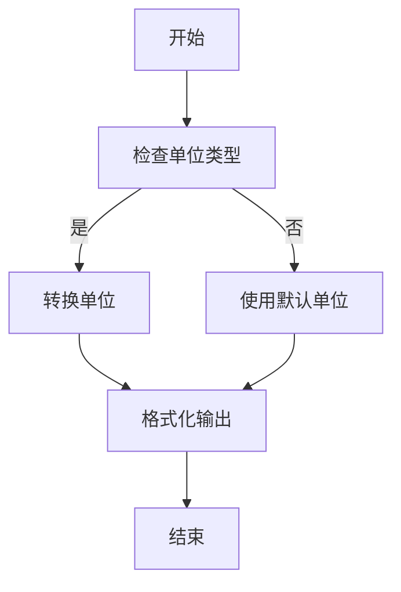
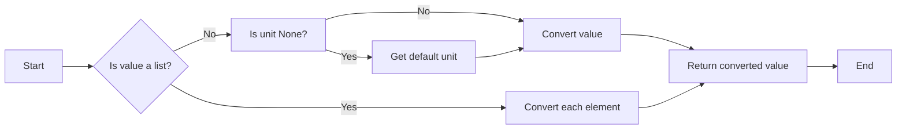
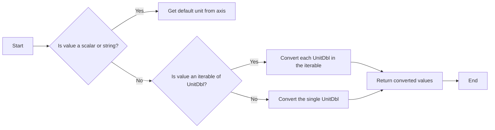

# `matplotlib\lib\matplotlib\testing\jpl_units\UnitDblConverter.py` 详细设计文档

The UnitDblConverter module provides conversion functionality for the Monte UnitDbl class, enabling the conversion of unit values to different units and formatting for Matplotlib plots.

## 整体流程



## 类结构

```
UnitDblConverter (类)
```

## 全局变量及字段


### `__all__`
    
List of module-level names to be exported.

类型：`list`
    


### `rad_fn`
    
Radian function formatter for matplotlib FuncFormatter class.

类型：`function`
    


### `UnitDblConverter`
    
Class providing Matplotlib conversion functionality for the Monte UnitDbl class.

类型：`class`
    


### `UnitDblConverter.defaults`
    
Default units for plotting distance, angle, and time.

类型：`dict`
    
    

## 全局函数及方法


### rad_fn

Radian function formatter for use with the matplotlib FuncFormatter class to format axes with radian units.

参数：

- `x`：`float`，The value to be formatted.
- `pos`：`None`，Optional position of the tick label.

返回值：`str`，The formatted string representation of the radian value.

#### 流程图

```mermaid
graph LR
A[Start] --> B{Is n == 0?}
B -- Yes --> C[Return str(x)]
B -- No --> D{Is n == 1?}
D -- Yes --> E[Return r'$\pi/2$']
D -- No --> F{Is n == 2?}
F -- Yes --> G[Return r'$\pi$']
F -- No --> H{Is n % 2 == 0?}
H -- Yes --> I[Return fr'${n//2}\pi$']
H -- No --> J[Return fr'${n}\pi/2$']
J --> K[End]
```

#### 带注释源码

```python
def rad_fn(x, pos=None):
    """Radian function formatter."""
    n = int((x / np.pi) * 2.0 + 0.25)
    if n == 0:
        return str(x)
    elif n == 1:
        return r'$\pi/2$'
    elif n == 2:
        return r'$\pi$'
    elif n % 2 == 0:
        return fr'${n//2}\pi$'
    else:
        return fr'${n}\pi/2$'
```


### UnitDblConverter.axisinfo

This function provides Matplotlib conversion functionality for the Monte UnitDbl class, specifically for formatting axes with specified units.

参数：

- `unit`：`str`，The unit of the value to be formatted.
- `axis`：`matplotlib.axes.Axes`，The axis on which the formatting is applied.

返回值：`units.AxisInfo`，An object containing the formatter and label for the axis.

#### 流程图

```mermaid
graph LR
A[Start] --> B{Is unit a string?}
B -- Yes --> C[Set label to unit]
B -- No --> D{Is axis a PolarAxes?}
D -- Yes --> E[Set majfmt to PolarAxes.ThetaFormatter]
D -- No --> F[Set majfmt to UnitDblFormatter(useOffset=False)]
E & F --> G[Create and return AxisInfo]
G --> H[End]
```

#### 带注释源码

```python
@staticmethod
    def axisinfo(unit, axis):
        # Delay-load due to circular dependencies.
        import matplotlib.testing.jpl_units as U

        # Check to see if the value used for units is a string unit value
        # or an actual instance of a UnitDbl so that we can use the unit
        # value for the default axis label value.
        if unit:
            label = unit if isinstance(unit, str) else unit.label()
        else:
            label = None

        if label == "deg" and isinstance(axis.axes, polar.PolarAxes):
            # If we want degrees for a polar plot, use the PolarPlotFormatter
            majfmt = polar.PolarAxes.ThetaFormatter()
        else:
            majfmt = U.UnitDblFormatter(useOffset=False)

        return units.AxisInfo(majfmt=majfmt, label=label)
```


### UnitDblConverter.convert

Converts a value from one unit to another.

参数：

- `value`：`UnitDbl` 或 `list`，The value to be converted. This can be a single `UnitDbl` instance or a list of such instances.
- `unit`：`str`，The unit to which the value should be converted.
- `axis`：`matplotlib.axes.Axes`，The axis object associated with the plot.

参数描述：

- `value`：The value to be converted. It can be a single `UnitDbl` instance or a list of `UnitDbl` instances.
- `unit`：The unit to which the value should be converted. If not specified, the default unit is used.
- `axis`：The axis object associated with the plot, used to determine the context of the conversion.

返回值类型：`float` 或 `list` of `float`

返回值描述：The converted value(s) in the specified unit(s).

#### 流程图



#### 带注释源码

```python
@staticmethod
def convert(value, unit, axis):
    # If no units were specified, then get the default units to use.
    if unit is None:
        unit = UnitDblConverter.default_units(value, axis)
    # Convert the incoming UnitDbl value/values to float/floats
    if isinstance(axis.axes, polar.PolarAxes) and value.type() == "angle":
        # Guarantee that units are radians for polar plots.
        return value.convert("rad")
    return value.convert(unit)
```


### UnitDblConverter.convert

Converts a `UnitDbl` value or an iterable of `UnitDbl` values to a specified unit.

参数：

- `value`：`UnitDbl` 或 `UnitDbl` 的可迭代对象，表示要转换的值。
- `unit`：`str`，表示目标单位。
- `axis`：`matplotlib.axes.Axes`，表示轴对象，用于获取默认单位。

参数描述：

- `value`：这是要转换的值，可以是单个 `UnitDbl` 对象或 `UnitDbl` 对象的集合。
- `unit`：这是转换的目标单位，如果未指定，将使用默认单位。
- `axis`：这是轴对象，用于获取默认单位，如果 `unit` 参数未指定。

返回值类型：`float` 或 `float` 的列表

返回值描述：转换后的值，如果 `value` 是单个 `UnitDbl` 对象，则返回单个浮点数；如果 `value` 是 `UnitDbl` 对象的集合，则返回浮点数的列表。

#### 流程图



#### 带注释源码

```python
@staticmethod
def convert(value, unit, axis):
    # If no units were specified, then get the default units to use.
    if unit is None:
        unit = UnitDblConverter.default_units(value, axis)
    # Convert the incoming UnitDbl value/values to float/floats
    if isinstance(axis.axes, polar.PolarAxes) and value.type() == "angle":
        # Guarantee that units are radians for polar plots.
        return value.convert("rad")
    return value.convert(unit)
```


## 关键组件


### 张量索引与惰性加载

用于延迟加载张量索引，以优化性能和内存使用。

### 反量化支持

支持将量化策略应用于反量化操作，以实现更高效的计算。

### 量化策略

提供不同的量化策略，以适应不同的计算需求。


## 问题及建议


### 已知问题

-   **循环依赖**: `matplotlib.testing.jpl_units` 的导入在 `axisinfo` 方法中，这可能导致循环依赖问题，因为 `UnitDblConverter` 类本身可能依赖于 `matplotlib` 的其他部分。
-   **默认单位**: `default_units` 方法中，对于非标量值，它只是简单地取第一个元素的默认单位，这可能不是用户期望的行为，特别是当第一个元素的单位与用户偏好不匹配时。
-   **错误处理**: 代码中没有明显的错误处理机制，如果输入值不是有效的 `UnitDbl` 实例或单位不是有效的字符串，可能会引发异常。

### 优化建议

-   **解决循环依赖**: 将 `matplotlib.testing.jpl_units` 的导入移到模块的顶部，或者重构代码以避免循环依赖。
-   **改进默认单位**: `default_units` 方法应该更加智能，能够根据用户偏好和输入值的类型来选择合适的默认单位。
-   **增加错误处理**: 在 `convert` 方法中添加错误处理，以确保只有有效的 `UnitDbl` 实例和单位被处理，否则抛出有意义的异常。
-   **代码复用**: `rad_fn` 函数是专门为 `matplotlib` 的 `FuncFormatter` 类编写的，可以考虑将其封装在一个类中，以便在其他地方重用。
-   **文档**: 代码中缺少详细的文档字符串，应该为每个方法和函数添加文档字符串，以描述其功能、参数和返回值。


## 其它


### 设计目标与约束

- 设计目标：
  - 提供Matplotlib转换功能，用于Monte UnitDbl类。
  - 支持不同单位的转换，如距离、角度和时间。
  - 与Matplotlib库兼容，确保在matplotlib环境中正常工作。

- 约束条件：
  - 必须使用Matplotlib库中的units模块。
  - 必须遵循Matplotlib的接口规范。
  - 转换功能必须高效且准确。

### 错误处理与异常设计

- 错误处理：
  - 当输入值不是标量或字符串时，抛出TypeError异常。
  - 当指定的单位无效时，抛出ValueError异常。

- 异常设计：
  - 使用try-except块捕获并处理可能发生的异常。
  - 提供清晰的错误信息，帮助用户理解问题所在。

### 数据流与状态机

- 数据流：
  - 输入：UnitDbl对象或包含UnitDbl对象的列表。
  - 处理：根据输入值和单位进行转换。
  - 输出：转换后的浮点数或浮点数列表。

- 状态机：
  - 无状态机，因为转换过程是线性的，没有复杂的状态转换。

### 外部依赖与接口契约

- 外部依赖：
  - Matplotlib库：用于绘图和单位转换。
  - NumPy库：用于数学运算。

- 接口契约：
  - UnitDblConverter类必须实现Matplotlib的ConversionInterface接口。
  - 所有方法必须遵循Matplotlib的规范和约定。
  - 提供的转换功能必须符合Matplotlib的预期行为。

    