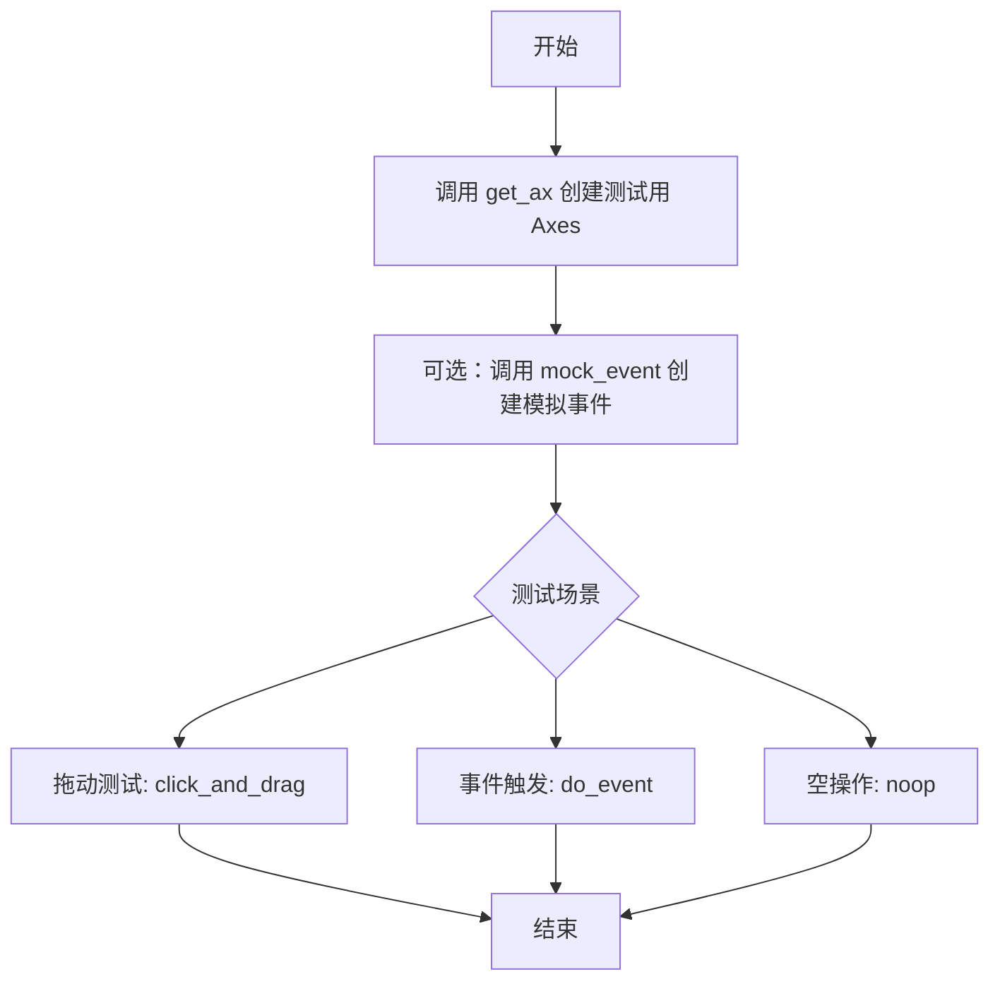
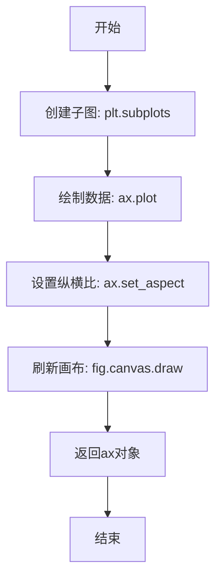
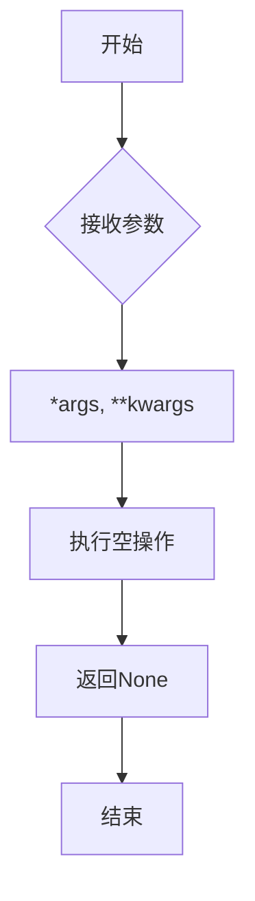
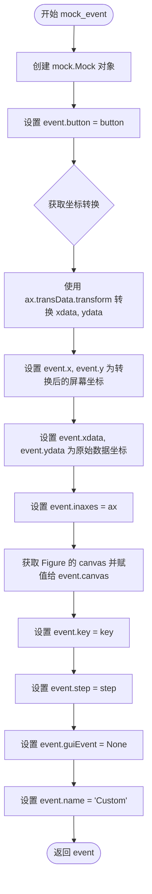
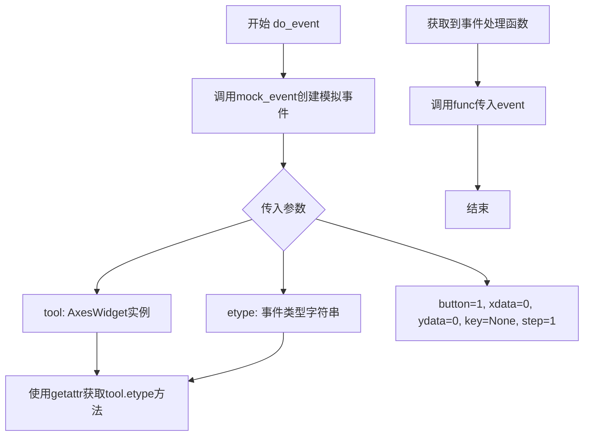
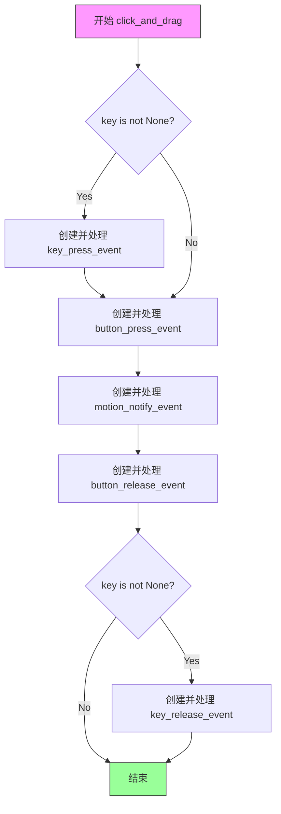

# `matplotlib\lib\matplotlib\testing\widgets.py` 详细设计文档

这是一个 matplotlib 小部件测试工具模块，提供辅助函数用于模拟鼠标和键盘事件，以便在测试中触发小部件的各种交互行为。

## 整体流程



## 类结构

```
模块级别 (无类)
├── 全局函数
│   ├── get_ax
│   ├── noop
│   ├── mock_event (deprecated)
│   ├── do_event (deprecated)
│   └── click_and_drag
```

## 全局变量及字段


### `mock`
    
Python标准库的模拟对象模块，用于创建mock实例以支持单元测试

类型：`module (unittest.mock)`
    


### `_api`
    
Matplotlib内部API模块，提供装饰器和工具函数用于API版本管理和废弃警告

类型：`module (matplotlib._api)`
    


### `MouseEvent`
    
Matplotlib鼠标事件类，用于表示和处理鼠标相关的图形事件

类型：`class (matplotlib.backend_bases.MouseEvent)`
    


### `KeyEvent`
    
Matplotlib键盘事件类，用于表示和处理键盘输入事件

类型：`class (matplotlib.backend_bases.KeyEvent)`
    


### `plt`
    
Matplotlib的pyplot子模块，提供类似MATLAB的绘图接口

类型：`module (matplotlib.pyplot)`
    


    

## 全局函数及方法


### `get_ax`

该函数用于创建一个包含简单线性图表的 Matplotlib 坐标轴（Axes）对象，并返回该坐标轴以供测试使用。

参数： 无

返回值：`matplotlib.axes.Axes`，返回创建的坐标轴对象，包含已绘制的数据点和设置好的纵横比。

#### 流程图



#### 带注释源码

```python
def get_ax():
    """Create a plot and return its Axes."""
    # 创建一个1x1的子图，返回Figure和Axes对象
    fig, ax = plt.subplots(1, 1)
    
    # 在Axes上绘制一条从(0,0)到(200,200)的直线
    ax.plot([0, 200], [0, 200])
    
    # 设置坐标轴的纵横比为1:1，保证数据坐标的单位长度在x和y方向上视觉长度一致
    ax.set_aspect(1.0)
    
    # 强制刷新画布，确保所有绘制操作立即执行（对于测试场景很重要）
    fig.canvas.draw()
    
    # 返回Axes对象供调用者使用
    return ax
```


### `noop`

这是一个空操作函数（no-operation），用于接受任意数量的参数和关键字参数，但不执行任何操作，通常作为回调函数的占位符或默认值。

参数：

- `*args`：任意类型的位置参数列表，用于接收任意数量的位置参数
- `**kwargs`：任意类型的关键字参数字典，用于接收任意数量的关键字参数

返回值：`None`，因为函数体仅包含 `pass` 语句

#### 流程图



#### 带注释源码

```python
def noop(*args, **kwargs):
    """
    空操作函数（No-operation function）。
    
    该函数接受任意数量的位置参数和关键字参数，但不执行任何操作。
    通常用作回调函数的占位符、默认值，或在需要忽略所有参数的场合。
    
    Parameters
    ----------
    *args : tuple
        任意数量的位置参数，这些参数将被忽略。
    **kwargs : dict
        任意数量的关键字参数，这些参数将被忽略。
    
    Returns
    -------
    None
        该函数不执行任何操作，总是返回 None。
    """
    pass  # 不执行任何操作，直接返回 None
```


### `mock_event`

该函数用于创建一个模拟事件（Mock），可替代 `.Event` 及其子类，在测试中传递给事件处理函数。

参数：

- `ax`：`~matplotlib.axes.Axes`，产生事件的 Axes 对象
- `button`：int | None | str，默认值 1，鼠标按钮（参见 `.MouseEvent`）
- `xdata`：float，默认值 0，鼠标在数据坐标系下的 x 坐标
- `ydata`：float，默认值 0，鼠标在数据坐标系下的 y 坐标
- `key`：None | str，默认值 None，按下时的键（参见 `.KeyEvent`）
- `step`：int，默认值 1，滚轮滚动步数（正数向上，负数向下）

返回值：`mock.Mock`，一个类似于 `.Event` 的 Mock 实例，可用于测试

#### 流程图



#### 带注释源码

```python
@_api.deprecated("3.11", alternative="MouseEvent or KeyEvent")
def mock_event(ax, button=1, xdata=0, ydata=0, key=None, step=1):
    r"""
    Create a mock event that can stand in for `.Event` and its subclasses.

    This event is intended to be used in tests where it can be passed into
    event handling functions.

    Parameters
    ----------
    ax : `~matplotlib.axes.Axes`
        The Axes the event will be in.
    xdata : float
        x coord of mouse in data coords.
    ydata : float
        y coord of mouse in data coords.
    button : None or `MouseButton` or {'up', 'down'}
        The mouse button pressed in this event (see also `.MouseEvent`).
    key : None or str
        The key pressed when the mouse event triggered (see also `.KeyEvent`).
    step : int
        Number of scroll steps (positive for 'up', negative for 'down').

    Returns
    -------
    event
        A `.Event`\-like Mock instance.
    """
    # 创建一个 Mock 对象，用于模拟事件
    event = mock.Mock()
    
    # 设置鼠标按钮
    event.button = button
    
    # 使用 Axes 的数据坐标到屏幕坐标的转换 transform
    # 将 (xdata, ydata) 转换为屏幕坐标
    # transform 返回一个数组，取第一个元素作为 (x, y)
    event.x, event.y = ax.transData.transform([(xdata, ydata),
                                               (xdata, ydata)])[0]
    
    # 保留原始的数据坐标
    event.xdata, event.ydata = xdata, ydata
    
    # 设置事件所在的 Axes
    event.inaxes = ax
    
    # 获取 Figure 的 canvas 并赋值
    # root=True 表示获取顶层 Figure
    event.canvas = ax.get_figure(root=True).canvas
    
    # 设置键盘事件
    event.key = key
    
    # 设置滚轮步数
    event.step = step
    
    # 设置 GUI 事件为 None
    event.guiEvent = None
    
    # 设置事件名称
    event.name = 'Custom'
    
    # 返回模拟的事件对象
    return event
```


### `do_event`

触发给定工具上的事件，用于测试目的。该函数创建一个模拟事件（通过调用`mock_event`），然后根据传入的事件类型名称动态获取工具对象上对应的方法并执行。

参数：

- `tool`：`matplotlib.widgets.AxesWidget`，要触发事件的widget实例
- `etype`：`str`，要触发的事件类型名称（如'press'、'release'等）
- `button`：`int` 或 `None`，默认为1，鼠标按钮
- `xdata`：`float`，默认为0，鼠标在数据坐标系中的x坐标
- `ydata`：`float`，默认为0，鼠标在数据坐标系中的y坐标
- `key`：`str` 或 `None`，默认为None，按下的键盘按键
- `step`：`int`，默认为1，滚轮滚动步数

返回值：`None`，该函数无返回值

#### 流程图



#### 带注释源码

```python
@_api.deprecated("3.11", alternative="callbacks.process(event)")
def do_event(tool, etype, button=1, xdata=0, ydata=0, key=None, step=1):
    """
    Trigger an event on the given tool.

    Parameters
    ----------
    tool : matplotlib.widgets.AxesWidget
    etype : str
        The event to trigger.
    xdata : float
        x coord of mouse in data coords.
    ydata : float
        y coord of mouse in data coords.
    button : None or `MouseButton` or {'up', 'down'}
        The mouse button pressed in this event (see also `.MouseEvent`).
    key : None or str
        The key pressed when the mouse event triggered (see also `.KeyEvent`).
    step : int
        Number of scroll steps (positive for 'up', negative for 'down').
    """
    # 使用mock_event函数创建一个模拟事件对象
    # 该模拟事件包含button、坐标、key、step等属性
    event = mock_event(tool.ax, button, xdata, ydata, key, step)
    
    # 使用getattr动态获取tool对象上名为etype的方法（事件处理器）
    # etype是字符串，如'onselect', 'onmove'等
    func = getattr(tool, etype)
    
    # 调用获取到的事件处理函数，传入模拟事件作为参数
    func(event)
```


### `click_and_drag`

用于模拟鼠标拖动操作的辅助函数，支持可选的键盘按键操作。

参数：

- `tool`：`~matplotlib.widgets.Widget`，执行拖动操作的小部件
- `start`：`[float, float]`，拖动起始点的数据坐标 [x, y]
- `end`：`[float, float]`，拖动结束点的数据坐标 [x, y]
- `key`：`None or str`，可选参数，整个操作过程中按下的键盘按键

返回值：`None`，该函数无返回值，仅通过副作用模拟鼠标事件

#### 流程图



#### 带注释源码

```python
def click_and_drag(tool, start, end, key=None):
    """
    Helper to simulate a mouse drag operation.

    Parameters
    ----------
    tool : `~matplotlib.widgets.Widget`
    start : [float, float]
        Starting point in data coordinates.
    end : [float, float]
        End point in data coordinates.
    key : None or str
         An optional key that is pressed during the whole operation
         (see also `.KeyEvent`).
    """
    # 获取工具对象所属的 Axes 对象，用于生成事件坐标
    ax = tool.ax
    
    # 如果提供了 key 参数，则先按下键盘按键
    if key is not None:  # Press key
        # 使用 KeyEvent._from_ax_coords 创建键盘按下事件并处理
        KeyEvent._from_ax_coords("key_press_event", ax, start, key)._process()
    
    # 执行鼠标拖动的三个核心事件：
    # 1. 鼠标按下事件
    MouseEvent._from_ax_coords("button_press_event", ax, start, 1)._process()
    
    # 2. 鼠标移动事件（模拟拖动过程）
    MouseEvent._from_ax_coords("motion_notify_event", ax, end, 1)._process()
    
    # 3. 鼠标释放事件（完成拖动）
    MouseEvent._from_ax_coords("button_release_event", ax, end, 1)._process()
    
    # 如果之前按下了 key，则释放键盘按键
    if key is not None:  # Release key
        # 使用 KeyEvent._from_ax_coords 创建键盘释放事件并处理
        KeyEvent._from_ax_coords("key_release_event", ax, end, key)._process()
```

## 关键组件


### Event Mocking System

用于在测试中创建模拟的鼠标和键盘事件，可以替代 matplotlib 的真实 Event 对象

### MouseEvent 坐标转换

将数据坐标转换为显示坐标，处理坐标系的转换和映射

### 鼠标拖拽模拟器

模拟完整的鼠标拖拽操作流程，包括按键按下、鼠标移动和按键释放事件

### 测试 Axes 创建器

创建带有预设数据的 matplotlib 坐标轴，用于 widget 测试

### 事件触发器

在指定的 widget 上触发特定类型的交互事件


## 问题及建议


### 已知问题

-   **使用已废弃的API**: `mock_event` 和 `do_event` 函数已被标记为废弃（`@_api.deprecated`），但代码中仍在使用这些函数，且废弃后未提供替代实现的完整迁移指南
-   **直接调用内部API**: `click_and_drag` 函数中直接调用 `MouseEvent._from_ax_coords` 和 `KeyEvent._from_ax_coords` 以及 `._process()` 等私有方法，这些是内部API可能在版本升级时发生变化
-   **缺乏类型注解**: 所有函数都缺少类型提示（type hints），降低了代码的可维护性和IDE支持
-   **硬编码的配置值**: `get_ax()` 中硬编码了 `1, 1` 的子图数量和 `1.0` 的aspect ratio，缺乏灵活性
-   **资源泄漏风险**: `get_ax()` 创建的 `fig` 对象未被显式返回或管理，可能导致测试运行时的资源泄漏
-   **魔法数字**: 鼠标按钮值 `1` 在多处重复出现且无解释说明
-   **容错能力不足**: `click_and_drag` 未检查 `tool.ax` 是否为 `None`，可能在无效输入时产生难以追踪的错误

### 优化建议

-   为所有函数添加完整的类型注解，包括参数类型和返回类型
-   移除对废弃函数的使用，统一采用文档中建议的替代方案（如直接使用 `MouseEvent` 或 `KeyEvent` 类）
-   封装硬配置值为可选参数，提供默认行为的同时支持自定义配置
-   使用上下文管理器或显式关闭机制管理 `Figure` 对象的生命周期
-   将重复的鼠标按钮值定义为枚举或常量，提高代码可读性
-   增加输入验证逻辑，确保 `tool.ax` 等关键属性存在且有效
-   考虑使用公共API替代私有方法调用，提高代码的稳定性和兼容性

## 其它


### 设计目标与约束

本模块的设计目标是为Matplotlib的widget组件提供测试工具函数，通过模拟鼠标事件和键盘事件来验证widget的行为。约束包括：仅用于测试目的，使用mock对象而非真实事件，已废弃的API需要在未来版本中移除。

### 错误处理与异常设计

本模块主要依赖mock对象进行错误处理，mock_event函数在创建模拟事件时假设传入的ax参数有效，未对无效的ax进行显式校验。do_event函数使用getattr动态获取事件处理函数，若工具对象不存在指定事件属性会抛出AttributeError。click_and_drag函数依赖MouseEvent和KeyEvent的内部方法_process()，若事件处理失败会直接传播异常。

### 数据流与状态机

数据流从测试代码开始，通过调用click_and_drag或do_event等函数，生成模拟事件对象，传递给widget的事件处理方法，触发widget状态变更。状态机主要涉及widget的交互状态（按下、拖动、释放），但本模块不直接管理状态转换，而是通过模拟完整的鼠标/键盘事件序列来触发widget内部的状态机。

### 外部依赖与接口契约

主要外部依赖包括：matplotlib._api模块（用于deprecated装饰器）、matplotlib.backend_bases（MouseEvent、KeyEvent类）、matplotlib.pyplot（用于get_ax创建测试 axes）、unittest.mock（用于创建mock事件对象）。接口契约方面：mock_event返回Mock对象需具有button、x、y、xdata、ydata、inaxes、canvas、key、step、guiEvent、name等属性；do_event接受tool对象需具有ax属性和对应的事件处理方法；click_and_drag的tool参数需具有ax属性。

### 性能考虑

本模块主要用于测试环境，性能不是主要关注点。潜在的性能问题包括：每次调用get_ax都会创建新的figure和axes，在大量测试场景下可能造成资源消耗；click_and_drag中对每个事件都调用_process()方法，可能产生较多的图形重绘操作。

### 线程安全性

本模块中的函数主要在主线程中调用，MouseEvent和KeyEvent的_process()方法通常不是线程安全的。在多线程测试场景下需要额外同步机制。

### 版本兼容性

本模块使用了@_api.deprecated装饰器标记mock_event和do_event为已废弃函数，废弃版本为3.11，替代方案分别为MouseEvent或KeyEvent和callbacks.process(event)。这表明API将在未来版本中移除，需要关注版本升级路径。

### 资源管理

get_ax函数创建的figure和axes对象需要测试代码自行管理，建议在测试结束后调用plt.close()释放资源。mock_event创建的Mock对象不涉及资源管理。click_and_drag中的事件处理可能触发canvas重绘，建议在不需要时暂停动画以减少资源消耗。

    