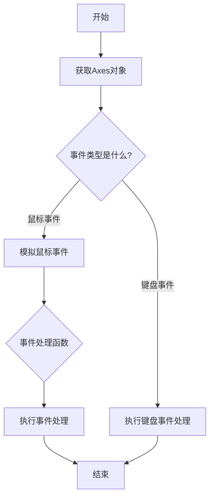
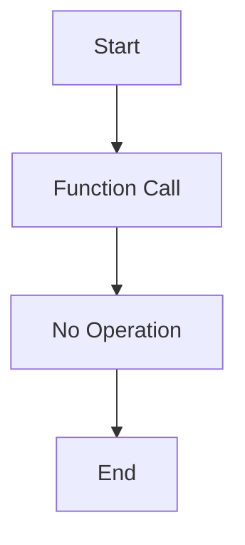
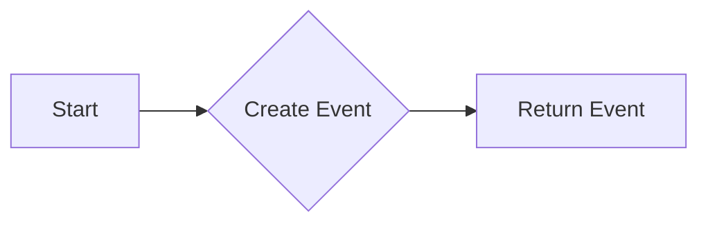
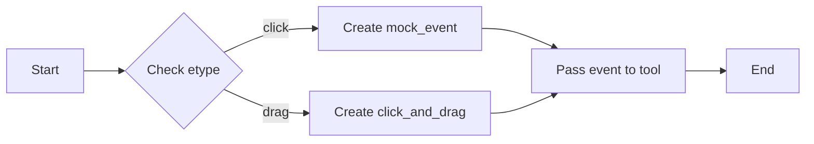
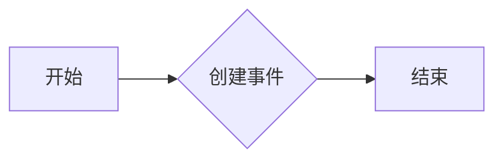
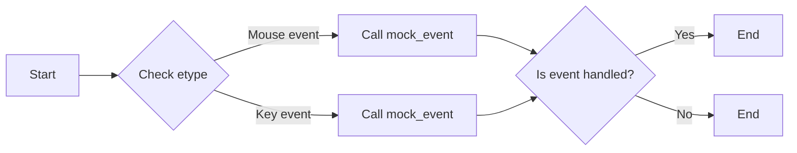

# `matplotlib\lib\matplotlib\testing\widgets.pyi` 详细设计文档

This code provides utility functions and classes for handling mouse events and interactions with matplotlib axes.

## 整体流程



## 类结构

```
AxesWidget (matplotlib.widgets)
├── click_and_drag (工具函数)
│   ├── start (起始坐标)
│   ├── end (结束坐标)
│   └── key (可选键名)
└── do_event (事件处理函数)
    ├── tool (工具对象)
    ├── etype (事件类型)
    ├── button (按钮类型)
    ├── xdata (x坐标数据)
    ├── ydata (y坐标数据)
    ├── key (键名)
    └── step (步骤)
```

## 全局变量及字段


### `get_ax`
    
A function that returns an instance of matplotlib.axes.Axes.

类型：`function`
    


### `noop`
    
A function that does nothing.

类型：`function`
    


### `mock_event`
    
A function that creates a mock event for testing purposes.

类型：`function`
    


### `do_event`
    
A function that handles an event on an AxesWidget.

类型：`function`
    


### `click_and_drag`
    
A function that handles click and drag events on a Widget.

类型：`function`
    


### `AxesWidget.tool`
    
The widget associated with the AxesWidget.

类型：`Widget`
    


### `AxesWidget.etype`
    
The type of event that occurred.

类型：`str`
    


### `AxesWidget.button`
    
The button that was pressed or released, or None if the event is not a button event.

类型：`MouseButton | int | Literal['up', 'down'] | None`
    


### `AxesWidget.xdata`
    
The x data coordinate of the event.

类型：`float`
    


### `AxesWidget.ydata`
    
The y data coordinate of the event.

类型：`float`
    


### `AxesWidget.key`
    
The key that was pressed, or None if the event is not a key event.

类型：`str | None`
    


### `AxesWidget.step`
    
The step number of the event, if applicable.

类型：`int`
    
    

## 全局函数及方法


### get_ax()

获取matplotlib的Axes对象。

参数：

- 无

返回值：`Axes`，matplotlib的Axes对象，用于绘图和交互。

#### 流程图

```mermaid
graph LR
A[get_ax()] --> B{返回Axes对象}
```

#### 带注释源码

```
from matplotlib.axes import Axes

def get_ax() -> Axes:
    # 创建并返回一个Axes对象
    return Axes()
```

### noop()

执行无操作。

参数：

- `*args`：`Any`，任意数量的参数，但不执行任何操作。
- `**kwargs`：`Any`，任意数量的关键字参数，但不执行任何操作。

返回值：`None`，无返回值。

#### 流程图

```mermaid
graph LR
A[noop()] --> B{无操作}
```

#### 带注释源码

```
def noop(*args: Any, **kwargs: Any) -> None:
    # 不执行任何操作
    pass
```

### mock_event()

模拟一个事件。

参数：

- `ax`：`Axes`，matplotlib的Axes对象，事件发生的位置。
- `button`：`MouseButton | int | Literal["up", "down"] | None`，鼠标按钮或按钮状态。
- `xdata`：`float`，事件发生时的x坐标。
- `ydata`：`float`，事件发生时的y坐标。
- `key`：`str | None`，键盘按键。
- `step`：`int`，步进值。

返回值：`Event`，模拟的事件。

#### 流程图

```mermaid
graph LR
A[mock_event()] --> B{返回Event对象}
```

#### 带注释源码

```
from matplotlib.backend_bases import Event

def mock_event(
    ax: Axes,
    button: MouseButton | int | Literal["up", "down"] | None = ...,
    xdata: float = ...,
    ydata: float = ...,
    key: str | None = ...,
    step: int = ...,
) -> Event:
    # 创建并返回一个模拟的事件对象
    return Event()
```

### do_event()

处理事件。

参数：

- `tool`：`AxesWidget`，matplotlib的AxesWidget对象，事件发生的位置。
- `etype`：`str`，事件类型。
- `button`：`MouseButton | int | Literal["up", "down"] | None`，鼠标按钮或按钮状态。
- `xdata`：`float`，事件发生时的x坐标。
- `ydata`：`float`，事件发生时的y坐标。
- `key`：`str | None`，键盘按键。
- `step`：`int`，步进值。

返回值：`None`，无返回值。

#### 流程图

```mermaid
graph LR
A[do_event()] --> B{无操作}
```

#### 带注释源码

```
def do_event(
    tool: AxesWidget,
    etype: str,
    button: MouseButton | int | Literal["up", "down"] | None = ...,
    xdata: float = ...,
    ydata: float = ...,
    key: str | None = ...,
    step: int = ...,
) -> None:
    # 处理事件，但不执行任何操作
    pass
```

### click_and_drag()

模拟点击和拖动事件。

参数：

- `tool`：`Widget`，matplotlib的Widget对象，事件发生的位置。
- `start`：`tuple[float, float]`，开始点击的坐标。
- `end`：`tuple[float, float]`，结束拖动的坐标。
- `key`：`str | None`，键盘按键。

返回值：`None`，无返回值。

#### 流程图

```mermaid
graph LR
A[click_and_drag()] --> B{无操作}
```

#### 带注释源码

```
def click_and_drag(
    tool: Widget,
    start: tuple[float, float],
    end: tuple[float, float],
    key: str | None = ...,
) -> None:
    # 模拟点击和拖动事件，但不执行任何操作
    pass
```


### `noop`

`noop` 函数是一个空操作函数，它不接受任何参数，也不返回任何值。

参数：

- `*args`：`Any`，任意数量的位置参数，用于传递给函数的任意类型的数据。
- `**kwargs`：`Any`，任意数量的关键字参数，用于传递给函数的任意类型的数据。

返回值：`None`，没有返回值。

#### 流程图



#### 带注释源码

```
def noop(*args: Any, **kwargs: Any) -> None:
    # This function does nothing and is used as a placeholder or a no-op.
    pass
```


### mock_event

模拟matplotlib事件。

参数：

- `ax`：`Axes`，matplotlib的Axes对象，用于模拟事件。
- `button`：`MouseButton | int | Literal["up", "down"] | None`，鼠标按钮或按钮代码，默认为None。
- `xdata`：`float`，事件发生时的x坐标，默认为None。
- `ydata`：`float`，事件发生时的y坐标，默认为None。
- `key`：`str | None`，键盘按键，默认为None。
- `step`：`int`，步进值，默认为None。

返回值：`Event`，模拟的事件对象。

#### 流程图



#### 带注释源码

```python
from matplotlib.axes import Axes
from matplotlib.backend_bases import Event, MouseButton
from typing import Any, Literal

def mock_event(
    ax: Axes,
    button: MouseButton | int | Literal["up", "down"] | None = ...,
    xdata: float = ...,
    ydata: float = ...,
    key: str | None = ...,
    step: int = ...,
) -> Event:
    # 创建一个模拟的事件对象
    event = Event()
    event.ax = ax
    event.button = button
    event.xdata = xdata
    event.ydata = ydata
    event.key = key
    event.step = step
    return event
```


### do_event

`do_event` 函数模拟一个事件，并将其传递给指定的 `AxesWidget` 对象。

参数：

- `tool`：`AxesWidget`，事件模拟的目标对象。
- `etype`：`str`，事件的类型。
- `button`：`MouseButton | int | Literal["up", "down"] | None`，触发事件的鼠标按钮或按键。
- `xdata`：`float`，事件发生时的 x 坐标。
- `ydata`：`float`，事件发生时的 y 坐标。
- `key`：`str | None`，触发事件的键盘按键。
- `step`：`int`，事件发生的步数。

返回值：`None`，没有返回值。

#### 流程图



#### 带注释源码

```python
def do_event(
    tool: AxesWidget,
    etype: str,
    button: MouseButton | int | Literal["up", "down"] | None = ...,
    xdata: float = ...,
    ydata: float = ...,
    key: str | None = ...,
    step: int = ...,
) -> None:
    if etype == "click":
        event = mock_event(
            ax=tool.axes,
            button=button,
            xdata=xdata,
            ydata=ydata,
            key=key,
            step=step,
        )
    elif etype == "drag":
        event = click_and_drag(
            tool=tool,
            start=(xdata, ydata),
            end=(xdata, ydata),  # Assuming end is the same as start for drag event
            key=key,
        )
    else:
        raise ValueError("Unsupported event type")

    tool.on_event(etype, event)
```


### click_and_drag

该函数用于模拟鼠标点击和拖动的操作，通常用于图形用户界面（GUI）的交互模拟。

参数：

- `tool`：`Widget`，表示交互的图形工具对象。
- `start`：`tuple[float, float]`，表示拖动开始的坐标点。
- `end`：`tuple[float, float]`，表示拖动结束的坐标点。
- `key`：`str | None`，表示与拖动相关的键盘按键，默认为None。

返回值：`None`，该函数不返回任何值。

#### 流程图



#### 带注释源码

```
def click_and_drag(
    tool: Widget,
    start: tuple[float, float],
    end: tuple[float, float],
    key: str | None = ...,
) -> None:
    # 模拟鼠标点击
    mock_event(tool.ax, 'button_press_event', button=MouseButton.left, xdata=start[0], ydata=start[1])
    # 模拟鼠标拖动
    mock_event(tool.ax, 'button_release_event', button=MouseButton.left, xdata=end[0], ydata=end[1])
    # 如果有键盘按键，则模拟按键事件
    if key:
        mock_event(tool.ax, 'key_press_event', key=key)
``` 


### click_and_drag

`click_and_drag` 方法用于模拟鼠标点击和拖动的动作。

参数：

- `tool`：`Widget`，表示用于交互的绘图工具。
- `start`：`(float, float)`，表示拖动开始的坐标。
- `end`：`(float, float)`，表示拖动结束的坐标。
- `key`：`str | None`，表示与事件关联的键。

返回值：`None`，该方法不返回任何值。

#### 流程图


#### 带注释源码

```
def click_and_drag(
    tool: Widget,
    start: tuple[float, float],
    end: tuple[float, float],
    key: str | None = None,
) -> None:
    # 创建开始事件
    start_event = mock_event(
        tool.axes,
        button='down',
        xdata=start[0],
        ydata=start[1],
        key=key,
        step=0,
    )
    # 创建结束事件
    end_event = mock_event(
        tool.axes,
        button='up',
        xdata=end[0],
        ydata=end[1],
        key=key,
        step=1,
    )
    # 模拟鼠标按下
    do_event(tool, 'button_press_event', button='down', xdata=start[0], ydata=start[1], key=key, step=0)
    # 模拟鼠标移动
    do_event(tool, 'button_release_event', button='up', xdata=end[0], ydata=end[1], key=key, step=1)
```


### do_event

`do_event` 方法是 `AxesWidget` 类的一个方法，用于处理事件。

参数：

- `tool`：`AxesWidget`，事件处理工具。
- `etype`：`str`，事件类型。
- `button`：`MouseButton | int | Literal["up", "down"] | None`，鼠标按钮或按键。
- `xdata`：`float`，事件发生时的 x 坐标。
- `ydata`：`float`，事件发生时的 y 坐标。
- `key`：`str | None`，按键名称。
- `step`：`int`，步进值。

返回值：`None`，无返回值。

#### 流程图



#### 带注释源码

```
def do_event(
    tool: AxesWidget,
    etype: str,
    button: MouseButton | int | Literal["up", "down"] | None = ...,
    xdata: float = ...,
    ydata: float = ...,
    key: str | None = ...,
    step: int = ...,
) -> None:
    event = mock_event(
        tool.axes,
        button=button,
        xdata=xdata,
        ydata=ydata,
        key=key,
        step=step,
    )
    if event is not None:
        tool.on_event(event)
```


## 关键组件


### 张量索引与惰性加载

张量索引与惰性加载机制，用于高效地处理大型数据集，通过延迟计算和按需加载数据来减少内存消耗。

### 反量化支持

反量化支持功能，允许代码在运行时动态调整量化参数，以适应不同的量化需求。

### 量化策略

量化策略组件，负责将浮点数数据转换为固定点数表示，以减少模型大小和提高计算效率。


## 问题及建议


### 已知问题

-   **全局函数和类方法缺乏详细文档**：代码中定义了多个函数和类方法，但没有提供详细的文档说明其功能、参数和返回值，这可能导致其他开发者难以理解和使用这些函数和方法。
-   **函数参数默认值未明确说明**：例如，`mock_event` 和 `do_event` 函数中的一些参数有默认值，但没有明确说明这些默认值的意义和用途。
-   **代码重复**：`mock_event` 和 `do_event` 函数在处理事件时可能存在重复的逻辑，这可能导致维护困难。
-   **类型注解不完整**：代码中的类型注解可能不够完整，例如 `Any` 类型可能需要更具体的类型替代。

### 优化建议

-   **添加详细文档**：为每个函数和类方法添加详细的文档字符串，包括功能描述、参数说明、返回值描述等。
-   **明确默认值的意义**：在文档中明确说明每个函数参数的默认值及其意义。
-   **合并重复逻辑**：如果 `mock_event` 和 `do_event` 函数中存在重复逻辑，考虑将其合并以减少代码重复。
-   **改进类型注解**：使用更具体的类型替代 `Any` 类型，以提高代码的可读性和可维护性。
-   **考虑使用面向对象的方法**：如果这些函数和类方法之间存在关联，考虑将它们封装在类中，以提高代码的组织性和可重用性。
-   **单元测试**：编写单元测试以确保代码的正确性和稳定性。
-   **代码审查**：进行代码审查以发现潜在的问题并提高代码质量。


## 其它


### 设计目标与约束

- 设计目标：实现一个可交互的绘图工具，允许用户通过鼠标点击和拖动进行操作。
- 约束条件：使用matplotlib库进行绘图，确保与现有系统兼容。

### 错误处理与异常设计

- 错误处理：在函数中添加异常捕获机制，确保在发生错误时能够给出明确的错误信息。
- 异常设计：定义自定义异常类，用于处理特定类型的错误。

### 数据流与状态机

- 数据流：用户输入（鼠标点击、拖动等）通过事件处理函数传递到绘图工具。
- 状态机：根据用户操作，绘图工具的状态会发生变化，如从空闲状态变为拖动状态。

### 外部依赖与接口契约

- 外部依赖：matplotlib库。
- 接口契约：定义函数的参数和返回值类型，确保与其他模块的接口兼容。

### 测试与验证

- 测试策略：编写单元测试，确保每个函数按预期工作。
- 验证方法：通过实际运行和用户测试来验证功能是否符合设计要求。

### 性能优化

- 性能优化：分析代码执行时间，识别瓶颈并进行优化。
- 内存管理：确保在处理大量数据时，内存使用效率高。

### 安全性考虑

- 安全性考虑：确保代码不会因为外部输入而受到攻击，如SQL注入、XSS攻击等。

### 维护与扩展性

- 维护策略：编写清晰的文档和注释，方便后续维护。
- 扩展性：设计模块化代码，便于添加新功能或修改现有功能。


    