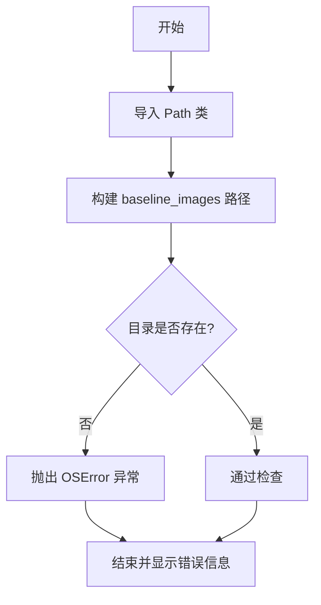
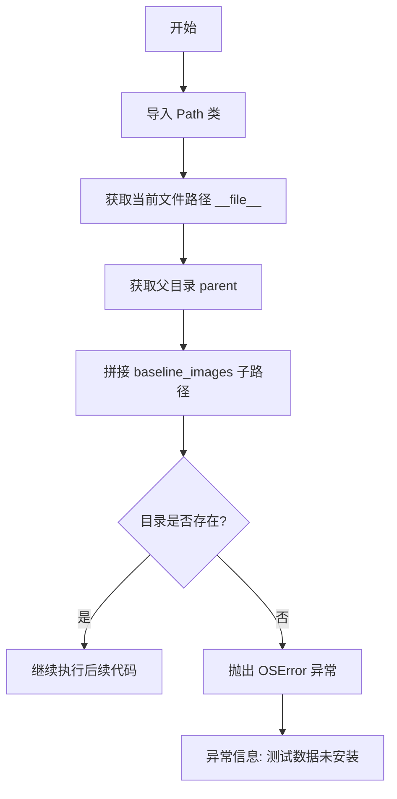

# `matplotlib\lib\matplotlib\tests\__init__.py` 详细设计文档

该代码是一个简单的测试前置检查脚本，用于验证 matplotlib 测试所需的基准图像目录(baseline_images)是否存在，若不存在则抛出 OSError 异常，提示用户可能需要从源码安装 matplotlib 以获取测试数据。

## 整体流程



## 类结构

```
该文件为脚本文件，无类层次结构
```

## 全局变量及字段


### `Path`
    
用于处理文件路径的类，从pathlib模块导入

类型：`class (pathlib.Path)`
    


### `__file__`
    
内置变量，表示当前Python脚本的文件路径

类型：`str`
    


    

## 全局函数及方法


### `Path`

该类为 Python 标准库 `pathlib` 中的路径对象类，用于表示文件系统路径并提供路径操作方法。代码中使用 `Path(__file__).parent / 'baseline_images'` 构造路径并检查目录是否存在。

参数：此类为类构造函数，非函数形式。实例化时参数如下：

- `pathlib.PurePath` 构造函数参数（可接受字符串、字节码或已有路径对象）

返回值：`pathlib.Path` 实例

#### 流程图



#### 带注释源码

```python
# 从标准库 pathlib 导入 Path 类
# Path 类提供面向对象的文件系统路径操作
from pathlib import Path


# 模块级别代码：检查测试所需的 baseline_images 目录是否存在
# 此检查在模块导入时执行
if not (Path(__file__).parent / 'baseline_images').exists():
    # 目录不存在时抛出 OSError 异常
    # 提示用户测试数据可能未安装，需要从源码安装 matplotlib
    raise OSError(
        'The baseline image directory does not exist. '
        'This is most likely because the test data is not installed. '
        'You may need to install matplotlib from source to get the '
        'test data.')
```


## 关键组件


### 路径检查组件

负责获取当前Python文件的父目录路径，为后续目录验证提供基础路径。

### 目录验证组件

检查baseline_images测试数据目录是否存在，确保测试环境完整。

### 异常处理组件

当baseline_images目录缺失时，抛出OSError异常并提供清晰的错误提示信息，告知用户需要从源代码安装matplotlib以获取测试数据。


## 问题及建议


### 已知问题

- **硬编码的目录名称**：目录名 `'baseline_images'` 被硬编码，缺乏灵活性，难以适配不同测试场景或配置需求。
- **模块级副作用**：目录检查在模块导入时立即执行，如果作为模块导入其他文件，每次导入都会执行文件系统检查，增加不必要的开销。
- **错误信息耦合度过高**：错误消息直接提及 `matplotlib` 和 `from source`，导致该检查逻辑与特定项目（matplotlib）强耦合，无法复用于其他项目。
- **缺乏可配置的检查机制**：没有提供参数化或配置化的方式来控制检查行为（例如跳过检查、设置自定义路径等）。
- **异常类型单一**：仅使用 `OSError`，无法区分目录不存在、权限问题或其他文件系统错误类型。

### 优化建议

- **封装为函数**：将检查逻辑封装为函数（如 `ensure_test_data_exists()`），提供可调用的接口，避免模块导入时的自动执行。
- **参数化目录路径**：允许调用者传入目录名称或路径，提高代码的通用性和可测试性。
- **解耦错误信息**：将错误消息中的项目特定内容（如 matplotlib）提取为可配置的参数，或提供更通用的错误描述。
- **增加检查选项**：添加参数控制是否在模块加载时自动执行检查（如 `auto_check=False`），或在需要时显式调用检查函数。
- **细化异常处理**：考虑抛出更具体的异常类型（如 `FileNotFoundError` 或自定义异常），并提供更多上下文信息。


## 其它


### 设计目标与约束

本代码片段的设计目标是在测试执行前验证必要的测试数据目录是否存在，确保测试环境完整性。约束条件包括：必须在测试模块加载时立即执行（位于模块顶层），依赖matplotlib测试数据的安装，且仅支持Python 3.4+（pathlib模块引入版本）。

### 错误处理与异常设计

当baseline_images目录不存在时，抛出OSError异常，错误信息明确指出问题原因（测试数据未安装）和可能的解决方案（从源码安装matplotlib获取测试数据）。异常设计符合Python异常层次结构，OSError适合表示文件系统相关的错误。

### 外部依赖与接口契约

外部依赖包括pathlib.Path类（Python标准库）和matplotlib测试数据目录。接口契约方面：调用者无需传递参数，函数通过Path(__file__).parent自动定位脚本所在目录；无返回值（仅执行检查或抛出异常）。

### 性能考虑

代码在模块导入时执行一次文件系统检查，性能开销极低。Path对象的exists()方法使用os.path.stat()实现，效率较高。无缓存需求，因仅在导入时执行一次。

### 安全性考虑

代码仅执行只读的文件系统检查操作（检查目录是否存在），无写入操作，安全风险较低。使用Path对象而非直接字符串拼接路径，避免了路径注入风险。

### 可维护性与可扩展性

当前实现硬编码了目录名称'baseline_images'，若目录名称变化需修改代码。可考虑将目录名称提取为配置常量或将检查逻辑封装为可复用的函数。当前代码直接置于模块顶层，不利于单元测试，可重构为独立函数以提高可测试性。

### 版本兼容性

代码使用Python 3.4+引入的pathlib模块和Python 3.3+引入的f-string语法切片形式（实际代码中使用字符串拼接，非f-string）。最低Python版本要求为3.4。

### 测试建议

由于代码逻辑简单且仅在导入时执行，可通过模拟Path.exists()返回值或临时创建目录进行测试。建议添加单元测试验证正确抛出OSError的场景，以及目录存在时正常通过的场景。


    