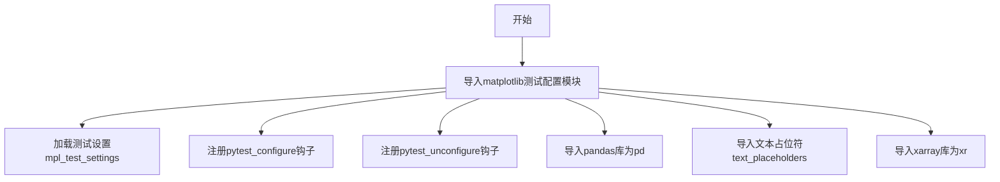

# `matplotlib\lib\matplotlib\tests\conftest.py` 详细设计文档

这是一个测试配置文件，从matplotlib.testing.conftest模块导入测试相关的配置、fixtures、pandas库、文本占位符和xarray库等测试工具，用于支持matplotlib的单元测试框架配置。

## 整体流程



## 类结构

```

```

## 全局变量及字段


### `mpl_test_settings`
    
matplotlib测试环境配置fixture，用于设置测试所需的matplotlib参数和状态

类型：`fixture/function`
    


### `pytest_configure`
    
pytest配置fixture，在测试开始前执行初始化配置

类型：`fixture/function`
    


### `pytest_unconfigure`
    
pytest清理fixture，在测试结束后执行清理和资源释放

类型：`fixture/function`
    


### `pd`
    
pandas库导入别名，用于测试中的数据处理和分析

类型：`module`
    


### `text_placeholders`
    
文本占位符字典，用于测试中替换或验证文本内容

类型：`dict/fixture`
    


### `xr`
    
xarray库导入别名，用于测试中的多维数组数据处理

类型：`module`
    


    

## 全局函数及方法


## 关键组件


## 一段话描述

该代码文件是一个测试配置文件，通过从 `matplotlib.testing.conftest` 模块导入多个测试相关的配置对象和工具，为matplotlib库的测试环境提供必要的fixtures和设置支持，主要涉及pytest配置、测试数据准备以及测试环境初始化等功能。

## 文件的整体运行流程

该文件本身不包含可执行逻辑，仅作为导入模块使用。当其他测试文件导入该模块时，Python解释器会执行该导入语句，从 `matplotlib.testing.conftest` 模块中加载指定的测试配置对象。这些配置对象（mpl_test_settings、pytest_configure、pytest_unconfigure、pd、text_placeholders、xr）随后可供当前模块或导入该模块的其他代码使用，通常用于：
1. 配置pytest测试框架
2. 提供测试数据（pandas DataFrame、xarray数据集）
3. 管理测试环境生命周期
4. 支持文本比较和占位符替换

## 全局变量和全局函数详细信息

### 全局变量

#### mpl_test_settings
- **类型**: pytest fixture / 配置对象
- **描述**: matplotlib测试环境配置对象，包含matplotlib测试所需的各种设置参数，如后端配置、样式设置等

#### pytest_configure
- **类型**: pytest hook函数
- **描述**: pytest配置钩子函数，在pytest测试会话开始前执行，用于初始化测试环境

#### pytest_unconfigure
- **类型**: pytest hook函数
- **描述**: pytest反配置钩子函数，在pytest测试会话结束后执行，用于清理测试环境

#### pd
- **类型**: pandas模块别名
- **描述**: pandas库别名，用于测试中创建和操作测试数据框（DataFrame），支持数值计算和数据处理测试

#### text_placeholders
- **类型**: 字典/列表对象
- **描述**: 文本占位符集合，用于测试中替换或比较文本内容，处理预期的输出变化

#### xr
- **类型**: xarray模块别名
- **描述**: xarray库别名，用于测试中创建和处理多维数组数据，支持标签化的大型数据集测试

## 关键组件信息

### matplotlib测试配置系统

matplotlib的测试框架基础设施，提供统一的测试环境管理和配置

### pytest集成模块

pytest测试框架与matplotlib的集成层，实现测试自动发现和执行

### 测试数据提供器

通过pandas和xarray为测试提供标准化的测试数据集

### 文本比较工具

用于处理matplotlib输出图像和文本的预期差异管理

## 潜在的技术债务或优化空间

1. **模块依赖性**: 该文件依赖于 `matplotlib.testing.conftest` 的内部实现，版本兼容性风险较高
2. **隐式依赖**: 导入的对象没有明确的版本要求说明，可能导致依赖冲突
3. **测试隔离性**: 导入的配置可能影响全局状态，建议使用pytest的fixture作用域控制
4. **文档缺失**: 缺少对导入对象用途和使用场景的说明文档

## 其它项目

### 设计目标与约束
- **目标**: 提供可复现的matplotlib测试环境
- **约束**: 依赖matplotlib内部测试模块，不属于公共API

### 错误处理与异常设计
- 导入失败时会导致ImportError，需要确保matplotlib正确安装

### 数据流与状态机
- 配置对象在测试会话周期内保持有效状态
- pytest_configure和pytest_unconfigure形成状态转换

### 外部依赖与接口契约
- 依赖matplotlib包及其测试模块
- 依赖pytest测试框架
- 依赖pandas和xarray数据处理库
- 所有导入对象均为matplotlib内部API，可能在不同版本间发生变化


## 问题及建议


### 已知问题

-   **导入项过多且职责不明确**：一次性导入6个对象（mpl_test_settings、pytest_configure、pytest_unconfigure、pd、text_placeholders、xr），违反了单一职责原则，可能导致模块耦合度过高
-   **使用 `# noqa` 绕过代码检查**：该注释表明存在代码规范问题（如导入未使用、过长导入行等），但通过注释屏蔽而非解决根本问题
-   **导入来源混杂**：同时导入了pytest配置函数（pytest_configure/pytest_unconfigure）、测试设置（mpl_test_settings）和数据处理库（pd=pandas、xr=xarray），测试配置与数据依赖混在一起
-   **缺少导入必要性审查**：无法确认这6个导入是否在当前文件中全部被使用，可能存在冗余导入
-   **缺乏模块级文档说明**：没有docstring说明这些导入的用途和上下文

### 优化建议

-   **分离导入职责**：将pytest配置、数据处理库、测试辅助工具分类导入到不同的conftest.py或模块中
-   **移除 `# noqa` 并解决问题**：使用flake8/pylint等工具检查具体警告，针对性解决（如使用`__all__`声明、拆分导入行等）
-   **启用按需导入**：对于pd和xr等重型依赖，如非立即使用，考虑延迟导入（lazy import）以加快模块加载速度
-   **添加导入用途注释**：在导入后添加注释说明每个对象的用途，特别是pytest_configure/unconfigure这类钩子函数
-   **审查使用情况**：运行静态分析工具确认所有导入是否被实际使用，移除未使用的导入项


## 其它


### 设计目标与约束

本代码模块的主要目标是通过统一导入matplotlib测试框架中常用的配置符号，简化测试文件的编写并提高代码的可维护性。设计约束包括：必须确保导入的符号在目标环境中可用；应避免导入不必要的符号以减少命名空间污染；所有导入的符号应与matplotlib、pytest等依赖库的版本兼容。

### 外部依赖与接口契约

本模块依赖以下外部包和模块：
- `matplotlib.testing.conftest`：提供测试配置相关的符号，是本导入语句的直接来源
- `pytest`：测试框架，pytest_configure和pytest_unconfigure属于pytest的钩子函数
- `pandas`：数据处理库，导入别名为pd
- `xarray`：多维数组库，导入别名为xr
- `text_placeholders`：文本占位符，可能用于测试中的文本替换

导入的符号包括：mpl_test_settings（测试设置配置）、pytest_configure（pytest配置钩子）、pytest_unconfigure（pytest反配置钩子）、pd（pandas别名）、text_placeholders（文本占位符）、xr（xarray别名）。

### 错误处理与异常设计

本模块可能发生的错误及处理方式包括：
- **ModuleNotFoundError**：当matplotlib.testing.conftest模块不存在时抛出，表明环境配置错误或matplotlib安装不完整
- **ImportError**：当导入的符号不存在于源模块中时抛出，可能是版本不兼容导致
- **NameError**：当使用导入的符号时发生命名冲突，可能需要使用别名或完全限定名

错误处理建议：在导入前应确保所有依赖库已正确安装；可以使用try-except块捕获特定导入错误并提供友好的错误信息；应定期检查依赖库的版本兼容性。

### 数据流与状态机

由于本模块仅包含导入语句，不涉及复杂的数据流或状态机设计。数据流方向为：从matplotlib.testing.conftest模块传递到当前模块的全局命名空间。状态管理方面，pytest_configure和pytest_unconfigure作为pytest的钩子函数，会在测试会话的开始和结束时被调用，用于设置和清理测试环境。

### 性能考虑

本模块的性能影响主要集中在模块加载时的导入开销。为了优化性能，建议：只导入实际使用的符号而非使用通配符导入；可以考虑使用延迟导入（lazy import）如果某些符号仅在特定条件下使用；避免在模块顶层执行耗时操作。

### 潜在的技术债务或优化空间

当前代码存在以下潜在问题或可优化点：
- **导入粒度**：当前导入可能包含测试文件中未使用的符号，增加了模块加载时间和命名空间复杂度，建议按需导入
- **隐式依赖**：部分导入的符号（如text_placeholders）的具体用途不明确，可能导致维护困难，应添加文档说明
- **版本兼容性**：随着matplotlib、pytest等库的更新，导入的符号可能发生变化，需要定期审查和更新

### 其它项目

**配置管理建议**：由于本模块主要服务于测试框架，建议在项目文档中明确记录所需的测试依赖及其版本范围。**安全考虑**：导入的模块来源于可信的官方库（matplotlib、pytest），安全性风险较低，但应确保依赖库来自官方源。**可测试性**：本模块本身不需要测试，其功能由导入的符号在测试框架中体现。

    