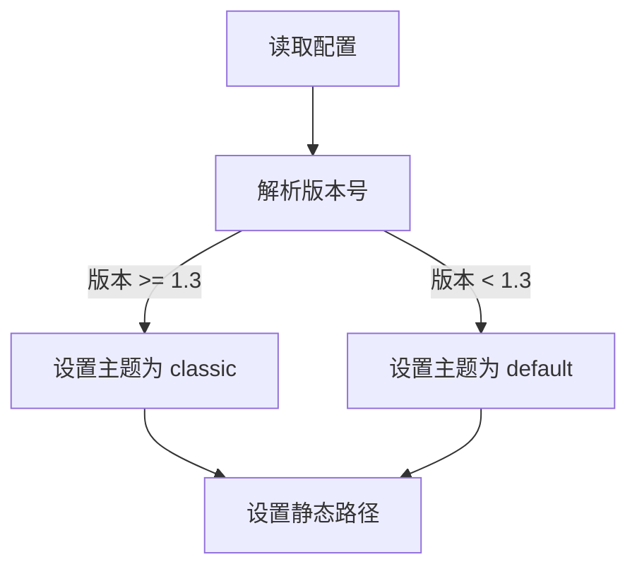
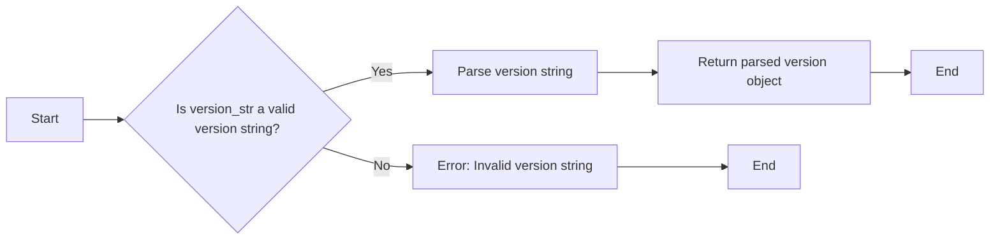
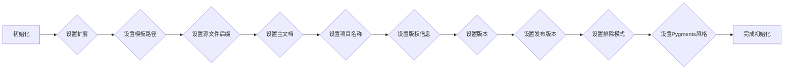

# `matplotlib\lib\matplotlib\tests\data\tinypages\conf.py` 详细设计文档

This code configures Sphinx documentation settings, including extensions, templates, source file suffix, project name, and HTML output options.

## 整体流程



## 类结构

```
SphinxConfig (配置类)
```

## 全局变量及字段


### `extensions`
    
List of extensions to add to the Sphinx configuration.

类型：`list`
    


### `templates_path`
    
List of paths that contain extra templates.

类型：`list`
    


### `source_suffix`
    
Source file extension for documents.

类型：`str`
    


### `master_doc`
    
Name of the master toctree document.

类型：`str`
    


### `project`
    
Name of the project.

类型：`str`
    


### `copyright`
    
The copyright statement for the documentation.

类型：`str`
    


### `version`
    
Version of the project.

类型：`str`
    


### `release`
    
Release of the project.

类型：`str`
    


### `exclude_patterns`
    
Patterns that should be excluded from the build.

类型：`list`
    


### `pygments_style`
    
The Pygments style to use for highlighting.

类型：`str`
    


### `html_theme`
    
The theme to use for HTML output.

类型：`str`
    


### `html_static_path`
    
List of paths that contain static files for HTML output.

类型：`list`
    


### `SphinxConfig.extensions`
    
List of extensions to add to the Sphinx configuration.

类型：`list`
    


### `SphinxConfig.templates_path`
    
List of paths that contain extra templates.

类型：`list`
    


### `SphinxConfig.source_suffix`
    
Source file extension for documents.

类型：`str`
    


### `SphinxConfig.master_doc`
    
Name of the master toctree document.

类型：`str`
    


### `SphinxConfig.project`
    
Name of the project.

类型：`str`
    


### `SphinxConfig.copyright`
    
The copyright statement for the documentation.

类型：`str`
    


### `SphinxConfig.version`
    
Version of the project.

类型：`str`
    


### `SphinxConfig.release`
    
Release of the project.

类型：`str`
    


### `SphinxConfig.exclude_patterns`
    
Patterns that should be excluded from the build.

类型：`list`
    


### `SphinxConfig.pygments_style`
    
The Pygments style to use for highlighting.

类型：`str`
    


### `SphinxConfig.html_theme`
    
The theme to use for HTML output.

类型：`str`
    


### `SphinxConfig.html_static_path`
    
List of paths that contain static files for HTML output.

类型：`list`
    
    

## 全局函数及方法


### parse_version

`parse_version` 是一个全局函数，用于解析版本字符串。

参数：

- `version_str`：`str`，版本字符串，例如 '1.3.0'。

返回值：`packaging.version.Version`，解析后的版本对象。

#### 流程图



#### 带注释源码

```
from packaging.version import parse as parse_version

def parse_version(version_str):
    """
    Parses a version string into a packaging.version.Version object.

    :param version_str: str, the version string to parse
    :return: packaging.version.Version, the parsed version object
    """
    return parse_version(version_str)
```


### SphinxConfig.__init__

初始化Sphinx配置类，设置Sphinx构建的相关参数。

参数：

- `extensions`：`list`，包含Sphinx扩展的列表，用于增强Sphinx的功能。
- `templates_path`：`list`，包含模板文件的路径列表。
- `source_suffix`：`str`，指定源文件的文件后缀。
- `master_doc`：`str`，指定主文档的名称。
- `project`：`str`，指定项目的名称。
- `copyright`：`str`，指定版权信息。
- `version`：`str`，指定项目的版本。
- `release`：`str`，指定项目的发布版本。
- `exclude_patterns`：`list`，包含要排除的文件和目录模式列表。
- `pygments_style`：`str`，指定Pygments语法高亮风格。

返回值：无

#### 流程图



#### 带注释源码

```python
import sphinx
from packaging.version import parse as parse_version

class SphinxConfig:
    def __init__(self):
        # 设置Sphinx扩展
        self.extensions = ['matplotlib.sphinxext.plot_directive',
                           'matplotlib.sphinxext.figmpl_directive']
        # 设置模板路径
        self.templates_path = ['_templates']
        # 设置源文件后缀
        self.source_suffix = '.rst'
        # 设置主文档
        self.master_doc = 'index'
        # 设置项目名称
        self.project = 'tinypages'
        # 设置版权信息
        self.copyright = '2014, Matplotlib developers'
        # 设置版本
        self.version = '0.1'
        # 设置发布版本
        self.release = '0.1'
        # 设置排除模式
        self.exclude_patterns = ['_build']
        # 设置Pygments语法高亮风格
        self.pygments_style = 'sphinx'

        # 根据Sphinx版本设置HTML主题
        if parse_version(sphinx.__version__) >= parse_version('1.3'):
            self.html_theme = 'classic'
        else:
            self.html_theme = 'default'

        # 设置静态文件路径
        self.html_static_path = ['_static']
```


## 关键组件


### 张量索引与惰性加载

支持对张量的索引操作，并在需要时才加载数据，以优化内存使用。

### 反量化支持

提供对反量化操作的支持，允许在量化过程中进行逆量化处理。

### 量化策略

定义了多种量化策略，用于在模型训练和推理过程中对张量进行量化处理。


## 问题及建议


### 已知问题

-   **版本兼容性检查**：代码中使用了 `parse_version` 函数来检查 Sphinx 的版本，并据此设置 HTML 主题。这种硬编码的版本检查可能在未来版本更新时导致问题，因为 `parse_version` 函数或 Sphinx 本身可能发生变化。
-   **全局变量**：代码中定义了多个全局变量（如 `extensions`, `templates_path`, `source_suffix` 等），这些变量在多个地方被修改，可能导致代码难以追踪和维护。
-   **硬编码的版本号**：代码中硬编码了版本号 `0.1`，这不利于版本控制和自动化部署。

### 优化建议

-   **使用配置文件**：将配置信息移至配置文件中，如 `.ini` 或 `.yaml`，这样可以在不修改代码的情况下更改配置。
-   **版本兼容性策略**：考虑使用更通用的 HTML 主题，或者编写一个更健壮的版本兼容性检查函数，以减少对特定版本的依赖。
-   **代码重构**：将全局变量封装到配置类中，以减少全局变量的使用，并提高代码的可读性和可维护性。
-   **自动化版本管理**：使用版本控制系统（如 Git）来自动管理版本号，并在发布时更新版本号。


## 其它


### 设计目标与约束

- 设计目标：确保代码能够生成符合特定格式的文档，并支持多种扩展和主题。
- 约束条件：遵循Sphinx文档工具的规范，兼容不同版本的Sphinx。

### 错误处理与异常设计

- 错误处理：在代码中应包含异常捕获机制，确保在配置错误或版本不兼容时能够给出明确的错误信息。
- 异常设计：定义清晰的异常类型，以便于调试和错误追踪。

### 数据流与状态机

- 数据流：代码中的数据流应清晰，从配置读取到生成HTML输出，每个阶段的数据流向应明确。
- 状态机：描述代码执行过程中的状态变化，例如从配置读取到生成HTML输出的状态转换。

### 外部依赖与接口契约

- 外部依赖：列出代码依赖的第三方库，如sphinx和packaging。
- 接口契约：描述与外部库交互的接口规范，确保代码的稳定性和可维护性。


    