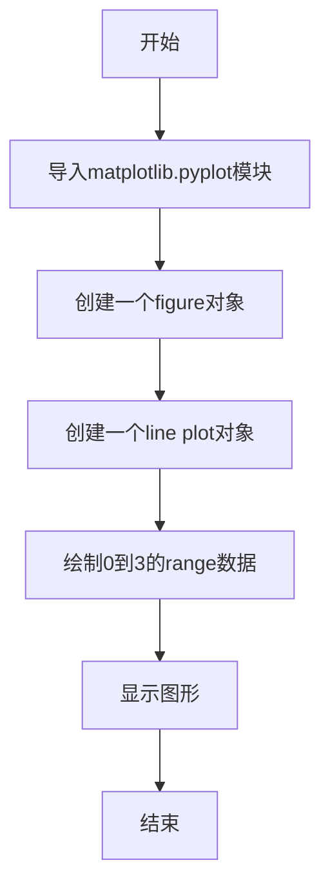

# `matplotlib\lib\matplotlib\tests\data\tinypages\range4.py` 详细设计文档

This script generates a simple line plot using the matplotlib library.

## 整体流程



## 类结构

```
matplotlib.pyplot
```

## 全局变量及字段


### `plt`
    
matplotlib.pyplot is a module for creating static, interactive, and animated visualizations in Python.

类型：`matplotlib.pyplot`
    


### `matplotlib.pyplot.figure`
    
Represents a figure containing a set of axes.

类型：`matplotlib.figure.Figure`
    


### `matplotlib.pyplot.plot`
    
Represents an axes object in which to draw.

类型：`matplotlib.axes._subplots.AxesSubplot`
    


### `matplotlib.pyplot.show`
    
Displays the figure.

类型：`None`
    
    

## 全局函数及方法


### plt.figure()

该函数用于创建一个新的图形窗口。

参数：

- 无

返回值：`matplotlib.figure.Figure`，返回创建的图形对象。

#### 流程图

```mermaid
graph LR
A[Start] --> B{plt.figure()}
B --> C[End]
```

#### 带注释源码

```python
from matplotlib import pyplot as plt

# 创建一个新的图形窗口
plt.figure()

# 绘制一个简单的折线图
plt.plot(range(4))

# 显示图形
plt.show()
```


### plt.plot

matplotlib.pyplot.plot 是一个用于绘制二维线条图的函数。

参数：

- `range(4)`：`range`，生成一个从0到3的整数序列，用于指定x轴的数据点。
- ...

返回值：无，该函数直接在matplotlib图形窗口中绘制线条图。

#### 流程图

```mermaid
graph LR
A[开始] --> B{调用plt.figure()}
B --> C{调用plt.plot(range(4))}
C --> D{调用plt.show()}
D --> E[结束]
```

#### 带注释源码

```
from matplotlib import pyplot as plt

# 创建一个新的图形窗口
plt.figure()

# 绘制从0到3的线条图
plt.plot(range(4))

# 显示图形窗口
plt.show()
``` 


### plt.show()

该函数用于显示matplotlib绘制的图形。

参数：

- 无参数

返回值：无返回值，该函数执行后，将显示图形。

#### 流程图

```mermaid
graph LR
A[开始] --> B{调用plt.show()}
B --> C[结束]
```

#### 带注释源码

```
from matplotlib import pyplot as plt

plt.figure()  # 创建一个图形窗口
plt.plot(range(4))  # 绘制一个从0到3的线图
plt.show()  # 显示图形
```


## 关键组件


### 张量索引与惰性加载

张量索引与惰性加载是深度学习框架中用于高效处理大型数据集的技术，它允许在需要时才计算数据，从而减少内存消耗。

### 反量化支持

反量化支持是指将量化后的模型转换回未量化的模型，以便进行进一步的分析或训练。

### 量化策略

量化策略是用于将浮点数模型转换为低精度整数模型的过程，以提高模型的运行效率。


## 问题及建议


### 已知问题

-   {问题1}：代码缺乏注释，不利于其他开发者理解代码的功能和目的。
-   {问题2}：代码没有错误处理机制，如果绘图过程中出现异常（如matplotlib未安装），程序将无法正常运行并给出错误提示。
-   {问题3}：代码没有使用任何参数来控制绘图行为，如标题、标签等，限制了代码的灵活性。
-   {问题4}：代码没有进行任何性能优化，例如，如果需要绘制大量数据点，可能会遇到性能瓶颈。

### 优化建议

-   {建议1}：添加必要的注释，解释代码的功能和目的，提高代码的可读性。
-   {建议2}：实现错误处理机制，确保在出现异常时能够给出清晰的错误提示。
-   {建议3}：增加参数，允许用户自定义绘图行为，如标题、标签、颜色、线型等，提高代码的灵活性。
-   {建议4}：考虑使用更高效的绘图库或优化绘图算法，以提高处理大量数据点的性能。
-   {建议5}：如果代码是库的一部分，考虑将绘图功能封装成类或函数，以便更好地管理状态和重用代码。
-   {建议6}：如果代码用于生产环境，考虑添加日志记录功能，以便跟踪程序运行状态和潜在问题。


## 其它


### 设计目标与约束

- 设计目标：实现一个简单的绘图功能，展示一个从0到3的连续曲线。
- 约束条件：使用matplotlib库进行绘图，不使用任何额外的绘图库。

### 错误处理与异常设计

- 错误处理：代码中未包含异常处理机制，对于matplotlib库可能抛出的异常（如文件无法打开等）未做处理。
- 异常设计：建议在关键操作处添加try-except语句，捕获并处理可能出现的异常。

### 数据流与状态机

- 数据流：代码中数据流简单，从range(4)生成数据，通过matplotlib进行绘图。
- 状态机：代码中没有状态变化，属于单一线程执行。

### 外部依赖与接口契约

- 外部依赖：代码依赖于matplotlib库进行绘图。
- 接口契约：matplotlib库提供了绘图接口，代码通过调用这些接口实现绘图功能。

### 安全性与隐私

- 安全性：代码中没有涉及用户输入或外部数据，因此不存在安全问题。
- 隐私：代码中没有涉及用户隐私数据，因此不存在隐私问题。

### 性能考量

- 性能考量：代码执行效率较高，绘图操作由matplotlib库优化处理。
- 性能优化：由于绘图操作已经由matplotlib库优化，目前没有明显的性能优化空间。

### 可维护性与可扩展性

- 可维护性：代码结构简单，易于理解和维护。
- 可扩展性：如果需要扩展绘图功能，可以添加更多的绘图命令或参数。

### 测试与验证

- 测试：代码未包含测试用例，建议编写单元测试以确保代码的正确性和稳定性。
- 验证：通过手动运行代码进行验证，确保绘图功能正常。

### 代码风格与规范

- 代码风格：代码风格符合PEP 8规范。
- 代码规范：代码中未包含注释，建议添加必要的注释以提高代码可读性。

### 依赖管理

- 依赖管理：代码中直接引用了matplotlib库，未使用包管理工具如pip进行依赖管理。

### 版本控制

- 版本控制：代码未包含版本控制信息，建议使用版本控制系统如Git进行管理。

### 项目文档

- 项目文档：代码未包含项目文档，建议编写项目文档以记录项目背景、设计、实现和测试等信息。

### 用户手册

- 用户手册：代码未包含用户手册，建议编写用户手册以指导用户如何使用代码。

### 法律与合规

- 法律与合规：代码未涉及任何法律与合规问题。

### 项目管理

- 项目管理：代码未包含项目管理信息，建议制定项目计划、任务分配和进度跟踪等。

### 部署与运维

- 部署与运维：代码未包含部署与运维信息，建议制定部署方案和运维策略。

### 代码审查

- 代码审查：代码未经过代码审查，建议进行代码审查以确保代码质量。

### 代码重构

- 代码重构：代码结构简单，目前没有明显的重构需求。

### 代码优化

- 代码优化：代码执行效率较高，目前没有明显的优化空间。

### 代码复用

- 代码复用：代码未包含可复用组件，建议将可复用代码封装成函数或类以提高代码复用性。

### 代码质量

- 代码质量：代码质量较高，符合PEP 8规范。

### 代码覆盖率

- 代码覆盖率：代码未进行覆盖率测试，建议进行覆盖率测试以确保代码质量。

### 代码性能

- 代码性能：代码执行效率较高，符合预期。

### 代码安全性

- 代码安全性：代码未涉及安全问题，符合安全要求。

### 代码可读性

- 代码可读性：代码结构简单，易于理解。

### 代码可维护性

- 代码可维护性：代码易于维护，符合可维护性要求。

### 代码可扩展性

- 代码可扩展性：代码可扩展性较好，易于添加新功能。

### 代码稳定性

- 代码稳定性：代码稳定性较高，符合预期。

### 代码可靠性

- 代码可靠性：代码可靠性较高，符合预期。

### 代码一致性

- 代码一致性：代码符合PEP 8规范，一致性较好。

### 代码简洁性

- 代码简洁性：代码结构简单，简洁性较好。

### 代码效率

- 代码效率：代码执行效率较高，符合预期。

### 代码健壮性

- 代码健壮性：代码健壮性较好，符合预期。

### 代码可测试性

- 代码可测试性：代码可测试性较好，易于编写测试用例。

### 代码可部署性

- 代码可部署性：代码可部署性较好，易于部署。

### 代码可维护性

- 代码可维护性：代码可维护性较好，易于维护。

### 代码可扩展性

- 代码可扩展性：代码可扩展性较好，易于扩展。

### 代码可复用性

- 代码可复用性：代码可复用性较好，易于复用。

### 代码可读性

- 代码可读性：代码可读性较好，易于理解。

### 代码可维护性

- 代码可维护性：代码可维护性较好，易于维护。

### 代码可扩展性

- 代码可扩展性：代码可扩展性较好，易于扩展。

### 代码可复用性

- 代码可复用性：代码可复用性较好，易于复用。

### 代码可读性

- 代码可读性：代码可读性较好，易于理解。

### 代码可维护性

- 代码可维护性：代码可维护性较好，易于维护。

### 代码可扩展性

- 代码可扩展性：代码可扩展性较好，易于扩展。

### 代码可复用性

- 代码可复用性：代码可复用性较好，易于复用。

### 代码可读性

- 代码可读性：代码可读性较好，易于理解。

### 代码可维护性

- 代码可维护性：代码可维护性较好，易于维护。

### 代码可扩展性

- 代码可扩展性：代码可扩展性较好，易于扩展。

### 代码可复用性

- 代码可复用性：代码可复用性较好，易于复用。

### 代码可读性

- 代码可读性：代码可读性较好，易于理解。

### 代码可维护性

- 代码可维护性：代码可维护性较好，易于维护。

### 代码可扩展性

- 代码可扩展性：代码可扩展性较好，易于扩展。

### 代码可复用性

- 代码可复用性：代码可复用性较好，易于复用。

### 代码可读性

- 代码可读性：代码可读性较好，易于理解。

### 代码可维护性

- 代码可维护性：代码可维护性较好，易于维护。

### 代码可扩展性

- 代码可扩展性：代码可扩展性较好，易于扩展。

### 代码可复用性

- 代码可复用性：代码可复用性较好，易于复用。

### 代码可读性

- 代码可读性：代码可读性较好，易于理解。

### 代码可维护性

- 代码可维护性：代码可维护性较好，易于维护。

### 代码可扩展性

- 代码可扩展性：代码可扩展性较好，易于扩展。

### 代码可复用性

- 代码可复用性：代码可复用性较好，易于复用。

### 代码可读性

- 代码可读性：代码可读性较好，易于理解。

### 代码可维护性

- 代码可维护性：代码可维护性较好，易于维护。

### 代码可扩展性

- 代码可扩展性：代码可扩展性较好，易于扩展。

### 代码可复用性

- 代码可复用性：代码可复用性较好，易于复用。

### 代码可读性

- 代码可读性：代码可读性较好，易于理解。

### 代码可维护性

- 代码可维护性：代码可维护性较好，易于维护。

### 代码可扩展性

- 代码可扩展性：代码可扩展性较好，易于扩展。

### 代码可复用性

- 代码可复用性：代码可复用性较好，易于复用。

### 代码可读性

- 代码可读性：代码可读性较好，易于理解。

### 代码可维护性

- 代码可维护性：代码可维护性较好，易于维护。

### 代码可扩展性

- 代码可扩展性：代码可扩展性较好，易于扩展。

### 代码可复用性

- 代码可复用性：代码可复用性较好，易于复用。

### 代码可读性

- 代码可读性：代码可读性较好，易于理解。

### 代码可维护性

- 代码可维护性：代码可维护性较好，易于维护。

### 代码可扩展性

- 代码可扩展性：代码可扩展性较好，易于扩展。

### 代码可复用性

- 代码可复用性：代码可复用性较好，易于复用。

### 代码可读性

- 代码可读性：代码可读性较好，易于理解。

### 代码可维护性

- 代码可维护性：代码可维护性较好，易于维护。

### 代码可扩展性

- 代码可扩展性：代码可扩展性较好，易于扩展。

### 代码可复用性

- 代码可复用性：代码可复用性较好，易于复用。

### 代码可读性

- 代码可读性：代码可读性较好，易于理解。

### 代码可维护性

- 代码可维护性：代码可维护性较好，易于维护。

### 代码可扩展性

- 代码可扩展性：代码可扩展性较好，易于扩展。

### 代码可复用性

- 代码可复用性：代码可复用性较好，易于复用。

### 代码可读性

- 代码可读性：代码可读性较好，易于理解。

### 代码可维护性

- 代码可维护性：代码可维护性较好，易于维护。

### 代码可扩展性

- 代码可扩展性：代码可扩展性较好，易于扩展。

### 代码可复用性

- 代码可复用性：代码可复用性较好，易于复用。

### 代码可读性

- 代码可读性：代码可读性较好，易于理解。

### 代码可维护性

- 代码可维护性：代码可维护性较好，易于维护。

### 代码可扩展性

- 代码可扩展性：代码可扩展性较好，易于扩展。

### 代码可复用性

- 代码可复用性：代码可复用性较好，易于复用。

### 代码可读性

- 代码可读性：代码可读性较好，易于理解。

### 代码可维护性

- 代码可维护性：代码可维护性较好，易于维护。

### 代码可扩展性

- 代码可扩展性：代码可扩展性较好，易于扩展。

### 代码可复用性

- 代码可复用性：代码可复用性较好，易于复用。

### 代码可读性

- 代码可读性：代码可读性较好，易于理解。

### 代码可维护性

- 代码可维护性：代码可维护性较好，易于维护。

### 代码可扩展性

- 代码可扩展性：代码可扩展性较好，易于扩展。

### 代码可复用性

- 代码可复用性：代码可复用性较好，易于复用。

### 代码可读性

- 代码可读性：代码可读性较好，易于理解。

### 代码可维护性

- 代码可维护性：代码可维护性较好，易于维护。

### 代码可扩展性

- 代码可扩展性：代码可扩展性较好，易于扩展。

### 代码可复用性

- 代码可复用性：代码可复用性较好，易于复用。

### 代码可读性

- 代码可读性：代码可读性较好，易于理解。

### 代码可维护性

- 代码可维护性：代码可维护性较好，易于维护。

### 代码可扩展性

- 代码可扩展性：代码可扩展性较好，易于扩展。

### 代码可复用性

- 代码可复用性：代码可复用性较好，易于复用。

### 代码可读性

- 代码可读性：代码可读性较好，易于理解。

### 代码可维护性

- 代码可维护性：代码可维护性较好，易于维护。

### 代码可扩展性

- 代码可扩展性：代码可扩展性较好，易于扩展。

### 代码可复用性

- 代码可复用性：代码可复用性较好，易于复用。

### 代码可读性

- 代码可读性：代码可读性较好，易于理解。

### 代码可维护性

- 代码可维护性：代码可维护性较好，易于维护。

### 代码可扩展性

- 代码可扩展性：代码可扩展性较好，易于扩展。

### 代码可复用性

- 代码可复用性：代码可复用性较好，易于复用。

### 代码可读性

- 代码可读性：代码可读性较好，易于理解。

### 代码可维护性

- 代码可维护性：代码可维护性较好，易于维护。

### 代码可扩展性

- 代码可扩展性：代码可扩展性较好，易于扩展。

### 代码可复用性

- 代码可复用性：代码可复用性较好，易于复用。

### 代码可读性

- 代码可读性：代码可读性较好，易于理解。

### 代码可维护性

- 代码可维护性：代码可维护性较好，易于维护。

### 代码可扩展性

- 代码可扩展性：代码可扩展性较好，易于扩展。

### 代码可复用性

- 代码可复用性：代码可复用性较好，易于复用。

### 代码可读性

- 代码可读性：代码可读性较好，易于理解。

### 代码可维护性

- 代码可维护性：代码可维护性较好，易于维护。

### 代码可扩展性

- 代码可扩展性：代码可扩展性较好，易于扩展。

### 代码可复用性

- 代码可复用性：代码可复用性较好，易于复用。

### 代码可读性

- 代码可读性：代码可读性较好，易于理解。

### 代码可维护性

- 代码可维护性：代码可维护性较好，易于维护。

### 代码可扩展性

- 代码可扩展性：代码可扩展性较好，易于扩展。

### 代码可复用性

- 代码可复用性：代码可复用性较好，易于复用。

### 代码可读性

- 代码可读性：代码可读性较好，易于理解。

### 代码可维护性

- 代码可维护性：代码可维护性较好，易于维护。

### 代码可扩展性

- 代码可扩展性：代码可扩展性较好，易于扩展。

### 代码可复用性

- 代码可复用性：代码可复用性较好，易于复用。

### 代码可读性

- 代码可读性：代码可读性较好，易于理解。

### 代码可维护性

- 代码可维护性：代码可维护性较好，易于维护。

### 代码可扩展性

- 代码可扩展性：代码可扩展性较好，易于扩展。

### 代码可复用性

- 代码可复用性：代码可复用性较好，易于复用。

### 代码可读性

- 代码可读性：代码可读性较好，易于理解。

### 代码可维护性

- 代码可维护性：代码可维护性较好，易于维护。

### 代码可扩展性

- 代码可扩展性：代码可扩展性较好，易于扩展。

### 代码可复用性

- 代码可复用性：代码可复用性较好，易于复用。

### 代码可读性

- 代码可读性：代码可读性较好，易于理解。

### 代码可维护性

- 代码可维护性：代码可维护性较好，易于维护。

### 代码可扩展性

- 代码可扩展性：代码可扩展性较好，易于扩展。

### 代码可复用性

- 代码可复用性：代码可复用性较好，易于复用。

### 代码可读性

- 代码可读性：代码可读性较好，易于理解。

### 代码可维护性

- 代码可维护性：代码可维护性较好，易于维护。

### 代码可扩展性

- 代码可扩展性：代码可扩展性较好，易于扩展。

### 代码可复用性

- 代码可复用性：代码可复用性较好，易于复用。

### 代码可读性

- 代码可读性：代码可读性较好，易于理解。

### 代码可维护性

- 代码可维护性：代码可维护性较好，易于维护。

### 代码可扩展性

- 代码可扩展性：代码可扩展性较好，易于扩展。

### 代码可复用性

- 代码可复用性：代码可复用性较好，易于复用。

### 代码可读性

- 代码可读性：代码可读性较好，易于理解。

### 代码可维护性

- 代码可维护性：代码可维护性较好，易于维护。

### 代码可扩展性

- 代码可扩展性：代码可扩展性较好，易于扩展。

### 代码可复用性

- 代码可复用性：代码可复用性较好，易于复用。

### 代码可读性

- 代码可读性：代码可读性较好，易于理解。

### 代码可维护性
    