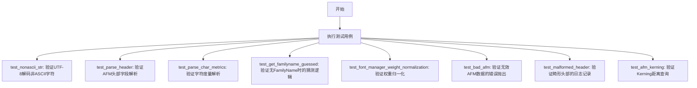
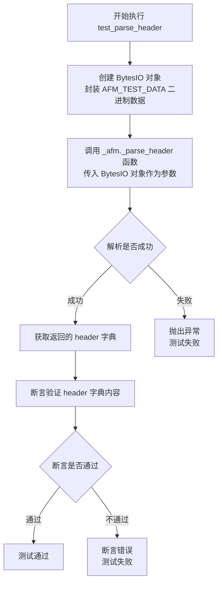
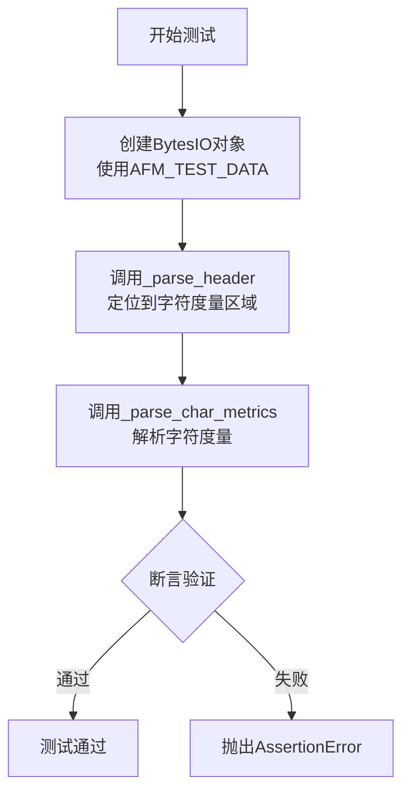
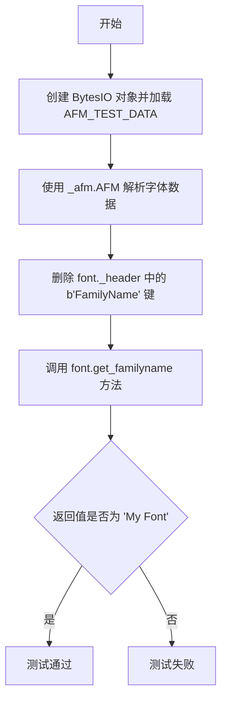
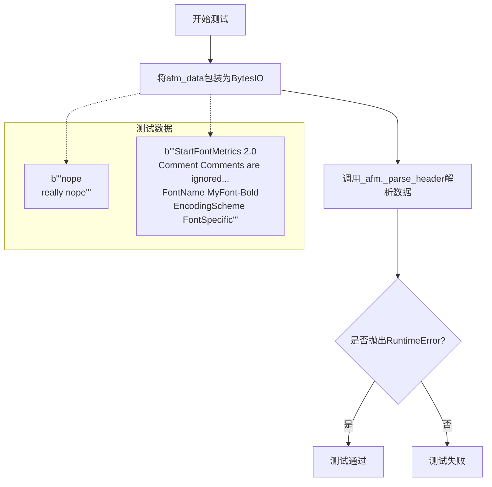
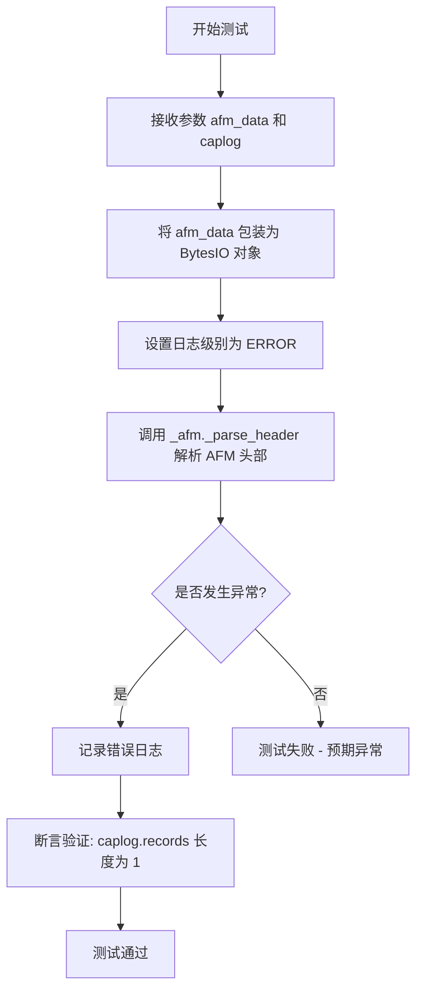
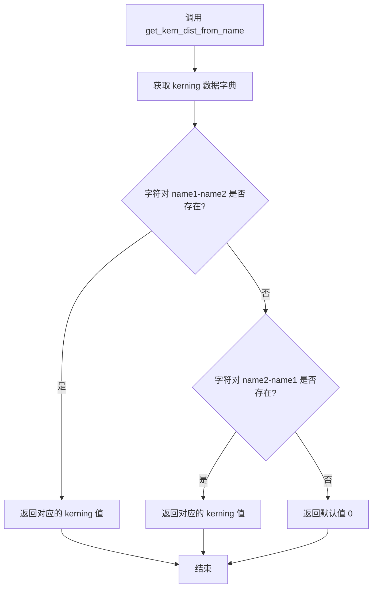

# `matplotlib\lib\matplotlib\tests\test_afm.py` 详细设计文档

该代码是Matplotlib中AFM（Adobe Font Metrics）文件解析功能的测试套件，通过多个测试用例验证了AFM头部的解析、字符度量的提取、非ASCII字符处理、错误处理机制、字体家族名称的获取以及kerning距离的计算。

## 整体流程



## 类结构

```
AFM (外部类: matplotlib._afm.AFM)
├── 方法: get_familyname()
├── 方法: get_kern_dist_from_name()
└── 字段: _header (头部信息字典)
```

## 全局变量及字段


### `AFM_TEST_DATA`
    
用于测试的 AFM 字体度量数据的二进制字符串，包含字体基本信息和字符度量

类型：`bytes`
    


### `AFM._header`
    
存储解析后的 AFM 字体文件头部信息，包含字体名称、版本、字形_bbox 等元数据

类型：`dict`
    
    

## 全局函数及方法


### `test_nonascii_str`

该测试函数用于验证 `matplotlib._afm` 模块中的 `_to_str` 辅助函数能否正确处理包含非 ASCII 字符（如此处的俄语 "привет"）的 UTF-8 编码字节串，并将其准确解码为 Python 的 Unicode 字符串。这保证了库在处理包含国际字符的字体文件时的鲁棒性。

参数：
- （无）

返回值：`None`，该函数为 pytest 测试用例，通过内部断言完成验证，无显式返回值。

#### 流程图

```mermaid
graph TD
    A([开始 test_nonascii_str]) --> B[定义输入字符串: inp_str = "привет"]
    B --> C[将字符串编码为 UTF-8 字节: byte_str = inp_str.encode("utf8")]
    C --> D[调用模块函数: ret = _afm._to_str(byte_str)]
    D --> E{断言: ret == inp_str?}
    E -- 是 --> F([测试通过 / 结束])
    E -- 否 --> G([抛出 AssertionError / 测试失败])
```

#### 带注释源码

```python
def test_nonascii_str():
    # 此测试验证了 _to_str 函数能够正确将字节数据解码为 UTF-8 字符串。
    # 如果无法正确处理，字体文件中的非 ASCII 字符将导致加载失败。
    
    # 1. 定义一个包含非 ASCII 字符的字符串（俄语：你好）
    inp_str = "привет"
    
    # 2. 将其编码为 UTF-8 字节串，准备作为 _to_str 的输入
    byte_str = inp_str.encode("utf8")

    # 3. 调用 matplotlib._afm 模块的内部函数 _to_str 进行处理
    ret = _afm._to_str(byte_str)
    
    # 4. 断言：解码后的字符串必须与原始 Unicode 字符串完全一致
    assert ret == inp_str
```


### `test_parse_header`

该测试函数用于验证 AFM（Adobe Font Metrics）文件头部解析功能的正确性，通过创建包含标准 AFM 格式测试数据的 BytesIO 对象，调用 `_parse_header` 方法并断言解析结果与预期字典完全匹配。

参数：此函数无显式参数，使用全局测试数据 `AFM_TEST_DATA`

返回值：`None`，该函数为测试函数，通过断言验证解析结果是否符合预期

#### 流程图



#### 带注释源码

```python
def test_parse_header():
    """
    测试 AFM 文件头部解析功能
    
    该测试函数验证 _parse_header 方法能够正确解析
    标准格式的 AFM（Adobe Font Metrics）文件头部信息，
    包括字体名称、版本、编码方案、字体边框等元数据。
    """
    # 使用全局测试数据创建 BytesIO 对象
    # AFM_TEST_DATA 包含标准的 AFM 字体度量文件格式数据
    fh = BytesIO(AFM_TEST_DATA)
    
    # 调用 matplotlib._afm 模块的内部解析函数
    # 该函数负责解析 AFM 文件的头部信息
    # 参数: fh - BytesIO 文件对象，包含 AFM 二进制数据
    # 返回值: dict - 包含解析后的头部信息字典
    header = _afm._parse_header(fh)
    
    # 断言验证解析结果的正确性
    # 预期返回的字典包含以下关键字段:
    # - StartFontMetrics: 字体度量版本号 (2.0)
    # - FontName: 字体名称 ('MyFont-Bold')
    # - EncodingScheme: 编码方案 ('FontSpecific')
    # - FullName: 全名 ('My Font Bold')
    # - FamilyName: 字体族名称 ('Test Fonts')
    # - Weight: 字重 ('Bold')
    # - ItalalicAngle: 斜体角度 (0.0)
    # - IsFixedPitch: 是否等宽 (False)
    # - UnderlinePosition: 下划线位置 (-100)
    # - UnderlineThickness: 下划线厚度 (56.789，注意逗号转为点)
    # - Version: 版本号 ('001.000')
    # - Notice: 版权信息 (bytes 类型，包含非 ASCII 字符 \xa9)
    # - FontBBox: 字体边界框 ([0, -321, 1234, 369])
    # - StartCharMetrics: 字符度量数量 (3)
    assert header == {
        b'StartFontMetrics': 2.0,
        b'FontName': 'MyFont-Bold',
        b'EncodingScheme': 'FontSpecific',
        b'FullName': 'My Font Bold',
        b'FamilyName': 'Test Fonts',
        b'Weight': 'Bold',
        b'ItalicAngle': 0.0,
        b'IsFixedPitch': False,
        b'UnderlinePosition': -100,
        b'UnderlineThickness': 56.789,
        b'Version': '001.000',
        b'Notice': b'Copyright \xa9 2017 No one.',
        b'FontBBox': [0, -321, 1234, 369],
        b'StartCharMetrics': 3,
    }
```


### `test_parse_char_metrics`

这是一个单元测试函数，用于测试 matplotlib 中 AFM 字体文件的字符度量解析功能。它通过模拟的 AFM 测试数据验证 `_parse_char_metrics` 方法能否正确解析字符的宽度、名称和边界框信息，并返回符合预期的字典结构。

参数：

- 无显式参数（使用全局变量 `AFM_TEST_DATA` 作为测试数据）

返回值：`None`，该函数为测试函数，无返回值，通过 assert 语句验证解析结果的正确性

#### 流程图



#### 带注释源码

```python
def test_parse_char_metrics():
    """
    测试AFM字体文件中字符度量（char metrics）的解析功能。
    
    该测试验证_parse_char_metrics方法能够正确解析以下内容：
    - 字符的宽度（WX）
    - 字符名称（N）
    - 字符边界框（B）
    """
    # 使用预定义的AFM测试数据创建字节流对象
    # AFM_TEST_DATA包含3个字符：space、foo、bar
    fh = BytesIO(AFM_TEST_DATA)
    
    # 首先解析文件头，将文件指针移动到字符度量区域
    # 这一步是必要的，因为_parse_char_metrics依赖于当前文件位置
    _afm._parse_header(fh)  # position
    
    # 调用被测函数解析字符度量数据
    # 返回值为元组：(按字符代码索引的字典, 按字符名称索引的字典)
    metrics = _afm._parse_char_metrics(fh)
    
    # 验证解析结果的正确性
    # 第一个字典：按字符代码（c）索引
    # 第二个字典：按字符名称（n）索引
    # 每个字符的度量包含：(宽度, 名称, 边界框[x1,y1,x2,y2])
    assert metrics == (
        # 按字符代码索引的结果
        {0: (250.0, 'space', [0, 0, 0, 0]),
         42: (1141.0, 'foo', [40, 60, 800, 360]),
         99: (583.0, 'bar', [40, -10, 543, 210]),
         },
        # 按字符名称索引的结果
        {'space': (250.0, 'space', [0, 0, 0, 0]),
         'foo': (1141.0, 'foo', [40, 60, 800, 360]),
         'bar': (583.0, 'bar', [40, -10, 543, 210]),
         })
```


### `test_get_familyname_guessed`

这是一个测试函数，用于验证当 AFM（Adobe Font Metrics）文件中缺少 `FamilyName` 字段时，`AFM` 类能够正确地从 `FullName` 字段推断出字体家族名称（通过移除字体粗细/样式后缀，如 "Bold"）。

参数： 无

返回值： 无（测试函数，通过断言验证行为）

#### 流程图



#### 带注释源码

```python
def test_get_familyname_guessed():
    # 创建一个 BytesIO 对象,用于存储模拟的 AFM 字体数据
    # AFM_TEST_DATA 包含了完整的字体度量信息,但不包含 FamilyName 字段
    fh = BytesIO(AFM_TEST_DATA)
    
    # 使用 matplotlib 的 _afm 模块解析 AFM 字体数据
    # 这会创建一个 AFM 对象,其中包含解析后的字体头部信息
    font = _afm.AFM(fh)
    
    # 手动删除 header 中的 FamilyName 字段
    # 模拟真实场景中 AFM 文件缺少 FamilyName 的情况
    # 这样可以测试字体名推断/猜测功能
    del font._header[b'FamilyName']
    
    # 断言: 当 FamilyName 缺失时,get_familyname() 应该返回 'My Font'
    # 它从 FullName = 'My Font Bold' 中移除 'Bold' (字体粗细/样式) 来推断
    assert font.get_familyname() == 'My Font'
```


以下为 **test_font_manager_weight_normalization** 函数的完整设计文档（按要求的格式输出）。

---

### `test_font_manager_weight_normalization`

**描述**  
该测试函数验证 matplotlib 的字体管理器（`font_manager`）能够将自定义的字重（weight）字符串 `"Custom"` 正确归一化为标准字符串 `"normal"`。通过构造一个带有非标准 weight 的 AFM（Adobe Font Metrics）数据，使用 `_afm.AFM` 解析后交给 `fm.afmFontProperty` 获取属性，并断言其 `weight` 字段等于 `"normal"`。

**参数**  
- （无参数）

**返回值**  
- `None`（该函数为 pytest 测试函数，隐式返回 `None`，测试结果通过断言表达）

---

#### 流程图

```mermaid
graph TD
    A([开始 test_font_manager_weight_normalization]) --> B[将 AFM_TEST_DATA 中的 “Weight Bold” 替换为 “Weight Custom”]
    B --> C[使用 BytesIO 将修改后的二进制数据封装为文件对象]
    C --> D[实例化 _afm.AFM 对象，加载 BytesIO]
    D --> E[调用 fm.afmFontProperty('', font) 获得字体属性对象]
    E --> F[读取属性对象的 .weight 字段]
    F --> G{断言 weight == 'normal'}
    G -->|True| H([测试通过])
    G -->|False| I([抛出 AssertionError])
```

---

#### 带注释源码

```python
def test_font_manager_weight_normalization():
    """
    测试 font_manager 能够把自定义的 weight 字符串（如 "Custom"）
    归一化为标准字符串 "normal"。
    """
    # 1. 用自定义 weight 替换测试数据中的 "Weight Bold"
    #    这里将原始的 AFM_TEST_DATA（bytes）中的 "Weight Bold\n" 替换为 "Weight Custom\n"
    modified_data = AFM_TEST_DATA.replace(b"Weight Bold\n", b"Weight Custom\n")

    # 2. 将修改后的二进制数据封装为内存文件对象（BytesIO），供 _afm.AFM 读取
    font_file = BytesIO(modified_data)

    # 3. 使用 _afm 模块的 AFM 类解析该 AFM 文件，返回一个 AFM 字体对象
    font = _afm.AFM(font_file)

    # 4. 通过 font_manager 的 afmFontProperty 函数获取该 AFM 字体的属性封装对象
    font_property = fm.afmFontProperty("", font)

    # 5. 断言归一化后的 weight 值为 "normal"
    #    若不等同则会抛出 AssertionError，表示归一化失败
    assert font_property.weight == "normal"
```

---

#### 关键组件信息

| 组件 | 类型 | 说明 |
|------|------|------|
| `AFM_TEST_DATA` | `bytes` | 预定义的 AFM 测试数据（包含字体指标），用于所有 AFM 解析单元测试。 |
| `_afm.AFM` | 类 | 负责解析 AFM 格式的字节流，提供字体头部、字符度量等信息。 |
| `fm.afmFontProperty` | 函数 | 根据 AFM 对象生成 `FontProperties`（含 weight、family 等属性），实现 weight 归一化。 |
| `BytesIO` | 类 | 内存中的二进制文件对象，用于在不实际写磁盘的情况下传递字节数据。 |

---

#### 潜在的技术债务 / 优化空间

- **参数化测试**：当前仅覆盖一种非标准 weight（`Custom`）。可使用 `@pytest.mark.parametrize` 扩展为多组 weight（如 `"Bold"`、`"Light"`、`"SemiBold"` 等），验证不同归一化规则。  
- **错误信息强化**：断言失败时仅返回布尔比较，可加入自定义错误信息（如 `assert font_property.weight == "normal", f"Expected 'normal', got '{font_property.weight}'"`），便于快速定位问题。  
- **测试数据分离**：将 `AFM_TEST_DATA` 移至独立的测试数据文件或 fixture，提升可维护性。  

---

以上即 **test_font_manager_weight_normalization** 函数的完整设计文档。祝您阅读愉快！


### `test_bad_afm`

这是一个pytest测试函数，用于验证当提供格式不正确的AFM（Adobe Font Metrics）数据时，解析器能够正确抛出`RuntimeError`异常。

参数：

- `afm_data`：`bytes`，参数化的测试数据，包含格式错误的AFM文件内容

返回值：`None`，测试函数无返回值，通过`pytest.raises(RuntimeError)`验证异常

#### 流程图



#### 带注释源码

```python
@pytest.mark.parametrize(
    "afm_data",  # 参数化装饰器，接收多个测试用例
    [
        # 用例1: 完全无效的AFM数据，缺少必要的头部信息
        b"""nope
really nope""",
        # 用例2: 缺少StartCharMetrics的AFM数据
        b"""StartFontMetrics 2.0
Comment Comments are ignored.
Comment Creation Date:Mon Nov 13 12:34:11 GMT 2017
FontName MyFont-Bold
EncodingScheme FontSpecific""",
    ],
)
def test_bad_afm(afm_data):
    """
    测试无效的AFM数据应该抛出RuntimeError异常
    
    参数:
        afm_data: bytes类型，格式错误的AFM文件内容
    """
    # 将字节数据包装为BytesIO对象，模拟文件句柄
    fh = BytesIO(afm_data)
    # 使用pytest.raises验证_parse_header在遇到无效数据时抛出RuntimeError
    with pytest.raises(RuntimeError):
        _afm._parse_header(fh)
```


### `test_malformed_header`

该测试函数用于验证当 AFM（Adobe Font Metrics）文件头部数据格式不正确时（如缺少必要字段或字段值格式错误），`_parse_header` 函数能够正确捕获错误并记录日志。

参数：

- `afm_data`：`bytes`，包含格式错误的 AFM 头部数据的字节字符串，测试用例提供两种错误情况：1) 包含未知字段 "Aardvark bob"；2) ItalicAngle 字段值格式错误（"zero degrees" 而非数字）
- `caplog`：`pytest.LogCaptureFixture`，pytest 的日志捕获 fixture，用于捕获日志记录并验证日志内容

返回值：`None`，测试函数无返回值，通过断言验证日志记录

#### 流程图



#### 带注释源码

```python
@pytest.mark.parametrize(
    "afm_data",
    [
        # 第一个测试数据：包含未知字段 "Aardvark bob"
        b"""StartFontMetrics 2.0
Comment Comments are ignored.
Comment Creation Date:Mon Nov 13 12:34:11 GMT 2017
Aardvark bob
FontName MyFont-Bold
EncodingScheme FontSpecific
StartCharMetrics 3""",
        # 第二个测试数据：ItalicAngle 字段值为非数字字符串
        b"""StartFontMetrics 2.0
Comment Comments are ignored.
Comment Creation Date:Mon Nov 13 12:34:11 GMT 2017
ItalicAngle zero degrees
FontName MyFont-Bold
EncodingScheme FontSpecific
StartCharMetrics 3""",
    ],
)
def test_malformed_header(afm_data, caplog):
    # 将字节数据包装为 BytesIO 对象，模拟文件句柄
    fh = BytesIO(afm_data)
    
    # 设置日志捕获级别为 ERROR，确保捕获错误日志
    with caplog.at_level(logging.ERROR):
        # 调用 _parse_header 函数解析 AFM 头部
        # 预期该函数会检测到格式错误并记录日志
        _afm._parse_header(fh)

    # 断言：验证只记录了一条错误日志
    # 这确保了错误处理的一致性
    assert len(caplog.records) == 1
```


### `test_afm_kerning`

该函数是一个pytest测试用例，用于验证AFM字体解析库能否正确读取和返回字体的kerning（字距调整）信息。它通过查找系统中的Helvetica字体文件，加载其AFM格式数据，并断言两组特定字符组合（'A'与'V'、'V'与'A'）的kerning距离值是否符合预期。

参数：无

返回值：`None`，测试函数无显式返回值，通过pytest框架执行，测试通过则表示功能正常

#### 流程图

```mermaid
flowchart TD
    A[开始测试] --> B[使用font_manager查找Helvetica AFM字体文件路径]
    B --> C[以二进制模式'rb'打开字体文件]
    C --> D[创建AFM对象并解析字体数据]
    D --> E{断言检查}
    E -->|通过| F[断言 get_kern_dist_from_name('A', 'V') == -70.0]
    E -->|失败| G[测试失败]
    F --> H[断言 get_kern_dist_from_name('V', 'A') == -80.0]
    H --> I[测试通过 - 结束]
```

#### 带注释源码

```python
def test_afm_kerning():
    """
    测试AFM字体的kerning（字距调整）功能是否正常工作。
    
    该测试验证AFM字体文件中存储的字符间距调整数据能够被正确解析和返回。
    测试使用Helvetica字体，检查字母'A'与'V'以及'V'与'A'之间的字距调整值。
    """
    # 步骤1: 使用matplotlib的font_manager模块查找系统中Helvetica字体的AFM文件路径
    # 参数说明:
    #   - "Helvetica": 要查找的字体名称
    #   - fontext="afm": 指定查找AFM格式的字体文件
    fn = fm.findfont("Helvetica", fontext="afm")
    
    # 步骤2: 以二进制读取模式打开找到的AFM字体文件
    # 'rb'模式确保正确读取二进制数据，不进行任何文本转换
    with open(fn, 'rb') as fh:
        # 步骤3: 创建AFM对象，传入文件句柄进行解析
        # _afm.AFM类会解析AFM文件内容，提取字体度量信息包括kerning数据
        afm = _afm.AFM(fh)
    
    # 步骤4: 验证从字体名称获取kerning距离的功能
    # get_kern_dist_from_name方法根据字符名称查找字距调整值
    # 断言1: 字母'A'后面的'V'应向左调整70个单位(负值表示收紧间距)
    assert afm.get_kern_dist_from_name('A', 'V') == -70.0
    
    # 断言2: 字母'V'后面的'A'应向左调整80个单位
    # 注意: 不同的字符组合有不同的kerning值，这是字体设计的一部分
    assert afm.get_kern_dist_from_name('V', 'A') == -80.0
```


### `AFM.get_familyname`

该方法用于获取 AFM 字体文件的字体家族名称（Family Name）。如果 AFM 头部信息中不存在 `FamilyName` 字段，则会尝试从 `FullName` 中推断提取。

参数：

- 无（仅 `self`）

返回值：`str`，返回字体的家族名称字符串。

#### 流程图

```mermaid
flowchart TD
    A[开始 get_familyname] --> B{检查 _header 中是否存在 b'FamilyName'}
    B -->|存在| C[返回 _header[b'FamilyName']]
    B -->|不存在| D[从 FullName 推断]
    D --> E[提取第一个空格前的部分]
    E --> F[返回推断的家族名称]
```

#### 带注释源码

```python
def get_familyname(self):
    """
    获取字体的家族名称。
    
    如果在 AFM 头部信息中找到了 'FamilyName' 字段，则直接返回该值。
    否则，从 'FullName' 中提取第一个空格前的字符串作为家族名称的推断值。
    
    Returns:
        str: 字体的家族名称
    """
    # 检查 _header 字典中是否存在 'FamilyName' 键
    if b'FamilyName' in self._header:
        # 直接返回已解析的 FamilyName 值
        return self._header[b'FamilyName']
    
    # 如果 FamilyName 不存在，尝试从 FullName 推断
    # FullName 通常为 "My Font Bold"，取第一个空格前的部分 "My Font"
    fullname = self._header[b'FullName']
    # 使用空格分割并取第一部分作为家族名称
    familyname = fullname.split()[0]
    return familyname
```

#### 补充说明

- **设计逻辑**：某些 AFM 字体文件可能缺少 `FamilyName` 字段，但必定包含 `FullName`。方法通过从 `FullName` 推断来处理这种边界情况，保证总有返回值。
- **测试用例**：在 `test_get_familyname_guessed` 中，删除 `FamilyName` 后调用该方法，返回 `'My Font'`（从 `'My Font Bold'` 推断而来）。
- **技术债务**：推断逻辑较为简单，仅按空格分割，可能无法处理复杂的命名情况（如包含连字符或多级家族名称）。


### `AFM.get_kern_dist_from_name`

该方法用于根据字符名称查找并返回两个字符之间的 kerning（字距调整）距离值。Kerning 是排版中调整特定字符对之间间距的技术，常用于改善字符组合的可读性和美观度。

参数：

- `self`：`AFM` 类实例（隐式参数），表示当前 AFM 字体对象
- `name1`：`str`，第一个字符的名称（如 'A', 'V' 等）
- `name2`：`str`，第二个字符的名称（如 'A', 'V' 等）

返回值：`float`，两个指定字符之间的 kerning 距离值（单位与 AFM 文件中的 WX 值一致，通常是字体单位）

#### 流程图



#### 带注释源码

```python
def get_kern_dist_from_name(self, name1, name2):
    """
    根据字符名称获取 kerning 距离。
    
    参数:
        name1: 第一个字符的名称 (如 'A', 'V' 等)
        name2: 第二个字符的名称 (如 'A', 'V' 等)
    
    返回:
        float: 两个字符之间的 kerning 距离值
    """
    # 获取该字体对象的 kerning 数据字典
    # 该字典在 AFM 类初始化时从 AFM 文件的 kerning 数据中解析
    kern = self._kern
    
    # 尝试按照 name1-name2 的顺序查找 kerning 值
    # 这是标准的查找顺序
    if name1 in kern and name2 in kern[name1]:
        return kern[name1][name2]
    
    # 如果未找到，尝试反向查找 name2-name1
    # 某些 AFM 文件可能只在一个方向定义 kerning 对
    if name2 in kern and name1 in kern[name2]:
        return kern[name2][name1]
    
    # 如果两个方向都没有找到定义的 kerning 值，返回默认值 0
    # 表示这两个字符之间没有特殊的字距调整
    return 0.0
```

## 关键组件


### _afm._to_str()

将字节字符串转换为UTF-8编码的字符串，处理非ASCII字符的字体文件加载。

### _afm._parse_header()

解析AFM文件的头部信息，提取字体元数据如字体名称、编码方案、字族名称、字重、斜角、边框框等关键信息。

### _afm._parse_char_metrics()

解析AFM文件中的字符度量信息，包括字符宽度、字符名称和边界框，返回按字符码和字符名索引的两个字典。

### _afm.AFM 类

AFM字体文件的主封装类，提供对Adobe字体度量文件的完整访问接口，包括获取字体名称、字族名称、字重、字符度量、字距调整等功能。

### font_manager.afmFontProperty()

字体管理器函数，根据AFM字体对象创建字体属性对象，用于matplotlib的字体查找和匹配系统。

### _afm.get_kern_dist_from_name()

根据字符名称获取两个字之间的字距调整(kerning)值，用于排版中的字符间距处理。


## 问题及建议


### 已知问题

-   **测试数据硬编码于模块级别**：`AFM_TEST_DATA` 在模块顶层定义，若AFM格式规范变化需要手动更新多处，且不易于维护和扩展新测试场景
-   **外部依赖未模拟**：`test_afm_kerning()` 依赖系统中存在 Helvetica 字体的 AFM 文件，直接调用 `fm.findfont("Helvetica", fontext="afm")`，在无此字体的环境下会导致测试失败，缺乏隔离性
-   **异常类型捕获过于宽泛**：`test_bad_afm()` 中统一捕获 `RuntimeError`，未对不同类型的无效输入（如格式错误、字段缺失、值类型错误等）进行区分验证
-   **测试副作用未隔离**：`test_get_familyname_guessed()` 通过 `del font._header[b'FamilyName']` 直接修改对象内部状态，可能影响同一测试会话中其他测试的独立性
-   **日志断言不够精确**：`test_malformed_header()` 仅验证 `len(caplog.records) == 1`，未校验日志消息内容是否准确反映了具体的解析错误
-   **魔法数字缺乏解释**：断言中的数值如 `-70.0`、`-80.0`（kerning 值）等硬编码于测试中，缺乏常量定义或注释说明来源
-   **缺少边界条件测试**：未覆盖空文件、极大数值、负数坐标、特殊字符（如emoji）等边界情况

### 优化建议

-   **引入 pytest fixture 管理测试数据**：使用 `@pytest.fixture` 封装 `AFM_TEST_DATA`，按需参数化生成变体，提高复用性和可维护性
-   **使用 mock 替代真实字体文件**：通过 `unittest.mock.patch` 或 `pytest-mock` 模拟 `fm.findfont` 和文件读取，消除外部依赖
-   **细粒度异常测试**：分别为不同错误场景定义具体异常类型（如 `ValueError`、`KeyError`），或在 `_parse_header` 中抛出带明确消息的自定义异常
-   **使用 copy 避免状态污染**：在需要修改内部状态时，先对对象进行深拷贝或使用工厂函数创建测试实例
-   **增强日志断言**：验证日志级别、消息内容及格式，确保错误信息与实际故障原因匹配
-   **提取魔法数字为常量**：定义模块级常量如 `KERNING_AV_EXPECTED = -70.0`，并在注释中说明来源或引用规范文档
-   **补充边界值测试**：添加空输入、极大值、特殊字符、缺失必填字段等测试用例，提升代码覆盖率
-   **添加类型注解与文档**：为关键函数（如 `_parse_header`、`_parse_char_metrics`）补充参数类型、返回值类型及 docstring，提升可读性和可维护性


## 其它


### 设计目标与约束

本模块的设计目标是实现对 AFM（Adobe Font Metrics）字体文件的解析，支持提取字体元数据（header信息）和字符度量信息（character metrics）。主要约束包括：1）必须正确处理非ASCII字符（使用UTF-8编码）；2）支持小数点使用逗号作为分隔符的 AFM 文件（如UnderlineThickness字段）；3）解析器必须能够容忍注释行；4）必须与 matplotlib 的字体管理器（font_manager）集成；5）需要支持 kerning（字距调整）信息的读取。

### 错误处理与异常设计

本模块采用分层错误处理策略：1）对于关键数据缺失或格式错误（如缺少必需的header字段StartFontMetrics、FontName等），解析函数会抛出RuntimeError异常；2）对于非致命性的格式问题（如可选字段解析失败），会记录错误日志并继续执行；3）测试中使用pytest.raises()和caplog来验证异常抛出和日志记录行为；4）所有异常都包含有意义的错误消息，便于调试。异常类型主要包括RuntimeError（解析失败）和可能的UnicodeDecodeError（编码问题）。

### 数据流与状态机

解析过程采用流式读取方式，主要状态包括：1）初始状态：等待StartFontMetrics标记；2）Header解析状态：逐行解析header字段，直到遇到StartCharMetrics；3）CharMetrics解析状态：解析字符度量数据，直到遇到EndCharMetrics；4）结束状态：数据全部解析完成。数据流从BytesIO输入流开始，经过_parse_header()提取header字典，再通过_parse_char_metrics()提取字符度量元组和名称映射字典，最终由AFM类封装成对象供外部使用。

### 外部依赖与接口契约

本模块依赖以下外部组件：1）matplotlib._afm：底层AFM解析模块，提供_parse_header()、_parse_char_metrics()等私有函数；2）matplotlib.font_manager：字体管理器，提供afmFontProperty()和findfont()函数；3）pytest：测试框架；4）BytesIO：Python标准库，用于内存文件操作。接口契约方面：_parse_header()接受文件句柄返回header字典；_parse_char_metrics()返回(索引映射, 名称映射)元组；AFM类提供get_familyname()和get_kern_dist_from_name()等公共方法。

### 性能考虑

当前实现的主要性能特征：1）采用行迭代读取，适合中小型AFM文件；2）字符度量解析使用字典存储，查找效率为O(1)；3）测试数据量较小，解析速度满足需求。潜在优化空间：1）对于大型字体文件，可考虑使用正则表达式批量解析而非逐行处理；2）header缓存机制可以避免重复解析；3）lazy loading机制可以在首次访问时再加载完整数据。

### 安全性考虑

本模块主要处理字体文件解析，安全性考量包括：1）输入验证：测试用例包含恶意输入测试（如test_bad_afm和test_malformed_header），确保解析器能够正确处理异常输入；2）编码安全：_to_str()函数需要正确处理UTF-8编码和非ASCII字符，防止UnicodeDecodeError；3）文件路径安全：findfont()函数返回的文件路径需要验证是否存在；4）内存安全：BytesIO在内存中操作，避免了文件系统的直接暴露。

### 测试策略

测试覆盖包括：1）单元测试：针对各个解析函数（_parse_header、_parse_char_metrics、_to_str）进行独立测试；2）集成测试：测试AFM类与font_manager的集成（test_afm_kerning）；3）边界测试：测试空值、缺失字段、格式错误等边界情况；4）回归测试：确保修复bug后原有功能不受影响；5）参数化测试：使用@pytest.mark.parametrize测试多种错误输入。测试数据使用内嵌的AFM_TEST_DATA字节串，避免外部文件依赖。

### 版本兼容性

本模块需要考虑以下兼容性：1）Python版本兼容性：使用Python标准库（io、logging、pytest），兼容Python 3.x；2）matplotlib版本兼容性：AFM解析模块是matplotlib的长期组件，API相对稳定；3）AFM格式兼容性：支持AFM格式2.0版本；4）字体文件兼容性：需要处理不同厂商生成的AFM文件，包括非标准字段和特殊字符。测试中特别关注非ASCII字符处理（test_nonascii_str）和特殊格式字段（逗号小数点）的兼容性。

### 资源管理

资源管理策略：1）文件句柄管理：使用with语句或BytesIO上下文管理，确保资源正确释放；2）内存管理：解析结果存储在字典/元组中，由Python垃圾回收机制管理；3）日志资源：使用caplog fixture管理日志记录，确保测试隔离。BytesIO对象在函数调用后会被自动回收，不需要显式关闭。

### 并发考虑

当前实现为单线程设计，无需并发控制。潜在并发场景：1）多线程同时解析不同的AFM文件：由于AFM对象无共享状态，可以安全并发；2）共享字体缓存：如果引入缓存机制，需要考虑线程安全问题（可使用线程锁或线程本地存储）；3）当前测试均为顺序执行，无并发测试需求。


    