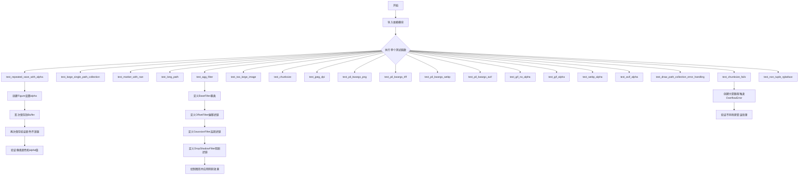
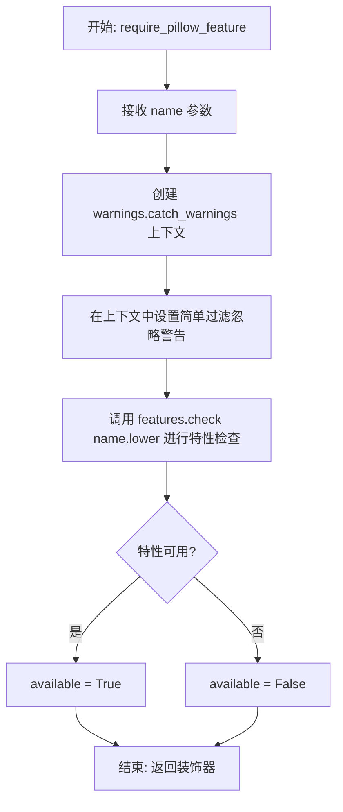
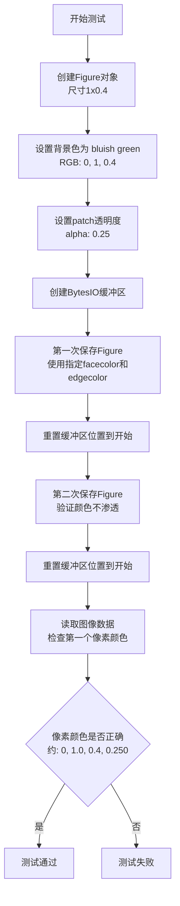
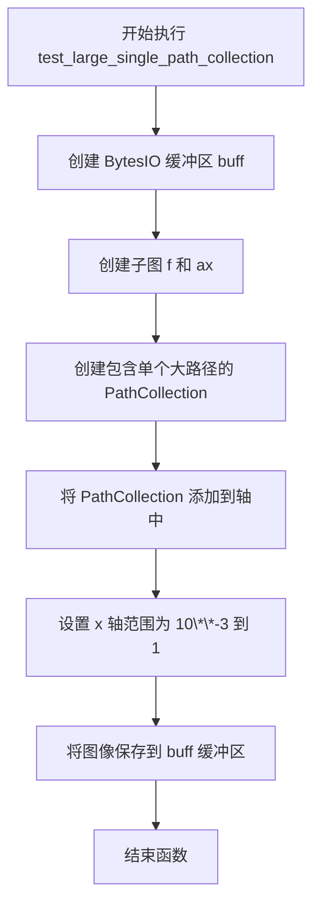
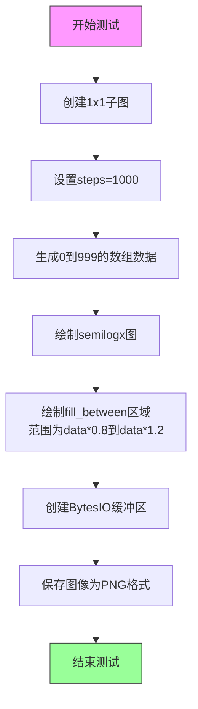
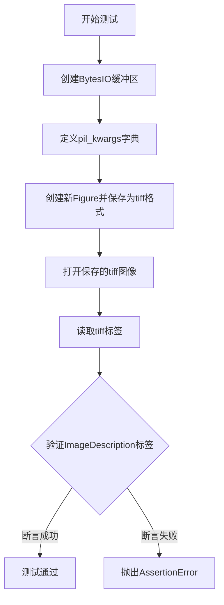
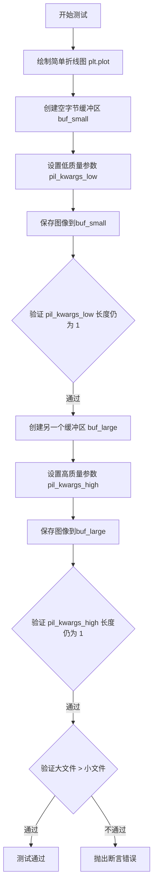
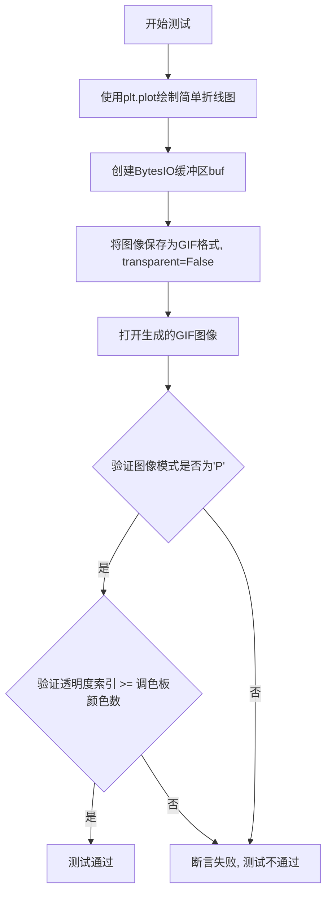
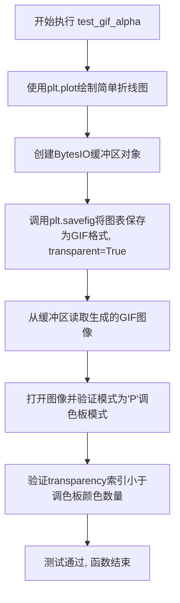
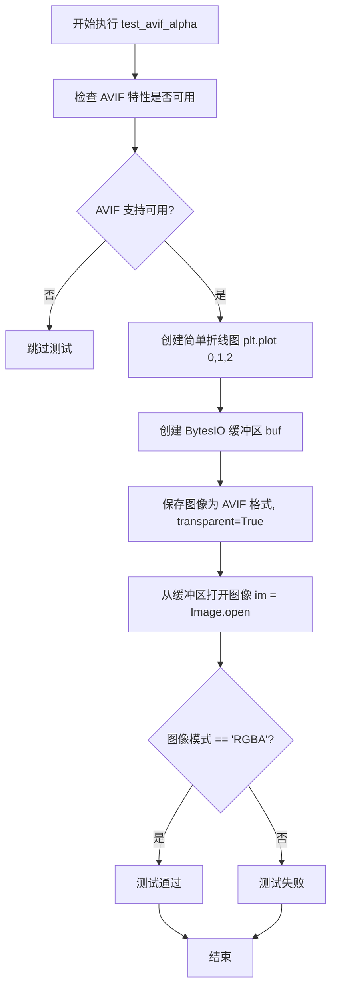

# `matplotlib\lib\matplotlib\tests\test_agg.py` 详细设计文档

该文件是matplotlib的Agg后端综合测试套件，涵盖图像保存、路径渲染、滤镜效果、多种图像格式支持、透明度处理、路径分块优化及错误处理等核心功能的验证。

## 整体流程



## 类结构

```
测试模块 (test_agg_filter.py)
└── 滤镜类 (在test_agg_filter函数内部定义)
    ├── BaseFilter (抽象基类)
    │   ├── get_pad()
    │   ├── process_image()
    │   └── __call__()
    ├── OffsetFilter (继承BaseFilter)
    │   ├── __init__(offsets)
    │   ├── get_pad()
    │   └── process_image()
    ├── GaussianFilter (继承BaseFilter)
    │   ├── __init__(sigma, alpha, color)
    │   ├── get_pad()
    │   └── process_image()
    └── DropShadowFilter (继承BaseFilter)
        ├── __init__(sigma, alpha, color, offsets)
        ├── get_pad()
        └── process_image()
```

## 全局变量及字段


### `N`
    
Number of points in the path for chunk size testing

类型：`int`
    


### `dpi`
    
Dots per inch resolution for the renderer

类型：`int`
    


### `w`
    
Width of the rendering area in pixels

类型：`int`
    


### `h`
    
Height of the rendering area in pixels

类型：`int`
    


### `x`
    
X coordinates array for path generation

类型：`numpy.ndarray`
    


### `y`
    
Y coordinates array for path generation

类型：`numpy.ndarray`
    


### `path`
    
Matplotlib Path object representing a long horizontal line

类型：`Path`
    


### `ra`
    
Agg renderer instance for bitmap rendering

类型：`RendererAgg`
    


### `gc`
    
Graphics context for drawing operations

类型：`GraphicsContextBase`
    


### `fig`
    
Matplotlib Figure object for plotting

类型：`Figure`
    


### `ax`
    
Matplotlib Axes object for containing plot elements

类型：`Axes`
    


### `buf`
    
In-memory binary buffer for image data

类型：`BytesIO`
    


### `points`
    
Array of points for long path plotting

类型：`numpy.ndarray`
    


### `data`
    
Array of data values for plotting

类型：`numpy.ndarray`
    


### `steps`
    
Number of steps for data generation

类型：`int`
    


### `collection`
    
Collection of paths for scatter-like plotting

类型：`PathCollection`
    


### `line1`
    
First line object in the filter test plot

类型：`Line2D`
    


### `line2`
    
Second line object in the filter test plot

类型：`Line2D`
    


### `gauss`
    
Drop shadow filter instance for visual effects

类型：`DropShadowFilter`
    


### `shadow`
    
Shadow line object offset from the original

类型：`Line2D`
    


### `xx`
    
X data coordinates from a line object

类型：`numpy.ndarray`
    


### `yy`
    
Y data coordinates from a line object

类型：`numpy.ndarray`
    


### `transform`
    
Offset transform for positioning the shadow

类型：`Transform`
    


### `OffsetFilter.offsets`
    
Tuple of x and y offset values in points

类型：`tuple`
    


### `GaussianFilter.sigma`
    
Standard deviation for Gaussian kernel

类型：`float`
    


### `GaussianFilter.alpha`
    
Transparency factor for the filter effect

类型：`float`
    


### `GaussianFilter.color`
    
RGB color tuple for the filter output

类型：`tuple`
    


### `DropShadowFilter.gauss_filter`
    
Gaussian filter instance for blur effect

类型：`GaussianFilter`
    


### `DropShadowFilter.offset_filter`
    
Offset filter instance for shadow positioning

类型：`OffsetFilter`
    
    

## 全局函数及方法


### `require_pillow_feature`

该函数用于检查指定的 Pillow 特性是否可用，如果不可用则返回一个跳过测试的 pytest 装饰器，常用于在运行特定图像格式（如 WebP、AVIF）相关测试前验证 Pillow 库是否支持该特性。

参数：

- `name`：`str`，Pillow 特性的名称（如 "WebP"、"AVIF" 等）

返回值：`pytest.MarkDecorator`，一个 pytest 装饰器，如果特性不可用则跳过测试

#### 流程图



#### 带注释源码

```python
def require_pillow_feature(name):
    """
    检查指定的 Pillow 特性是否可用，并返回相应的 pytest 跳过装饰器。
    
    参数:
        name: str - 要检查的 Pillow 特性名称（如 'WebP', 'AVIF' 等）
    
    返回:
        pytest.mark.skipif 装饰器，如果特性不可用则跳过测试
    """
    # 使用 warnings.catch_warnings() 上下文管理器来控制警告行为
    with warnings.catch_warnings():
        # 设置简单的警告过滤器，忽略所有警告
        # 避免在检查特性时产生不必要的警告输出
        warnings.simplefilter('ignore')
        # 调用 Pillow 的 features.check() 方法检查特性是否可用
        # 将特性名称转换为小写以保持一致性
        available = features.check(name.lower())
    
    # 返回 pytest.mark.skipif 装饰器
    # 如果特性不可用（available=False），则跳过测试
    # 跳过原因包含特性名称
    return pytest.mark.skipif(not available, reason=f"{name} support not available")
```


### `test_repeated_save_with_alpha`

该测试函数用于验证 Matplotlib 中 Figure 对象在重复保存时透明度和背景颜色能够正确保持，确保渲染器的状态不会导致颜色渗透（bleeding）问题。

参数： 无

返回值： `None`，测试函数无返回值

#### 流程图



#### 带注释源码

```python
def test_repeated_save_with_alpha():
    # 目标：创建一个背景色为蓝绿色（bluish green）且透明度为0.25的图像
    
    # 创建一个尺寸为 [1, 0.4] 的 Figure 对象（宽度1英寸，高度0.4英寸）
    fig = Figure([1, 0.4])
    
    # 设置 Figure 的背景色为 RGB (0, 1, 0.4) - 蓝绿色
    fig.set_facecolor((0, 1, 0.4))
    
    # 设置 patch（背景补丁）的透明度为 0.25
    fig.patch.set_alpha(0.25)

    # 目标颜色通过 fig.patch.get_facecolor() 获取

    # 创建一个 BytesIO 对象作为内存缓冲区
    buf = io.BytesIO()

    # 第一次保存 Figure 到缓冲区
    # 使用 fig.get_facecolor() 作为 facecolor 参数
    # edgecolor 设置为 'none'
    fig.savefig(buf,
                facecolor=fig.get_facecolor(),
                edgecolor='none')

    # 重新保存 Figure 以检查颜色是否不会从之前的渲染器中泄漏
    # 这是一个回归测试，确保渲染器状态被正确重置
    buf.seek(0)  # 将缓冲区指针重置到开始位置
    fig.savefig(buf,
                facecolor=fig.get_facecolor(),
                edgecolor='none')

    # 检查第一个像素是否具有期望的颜色和透明度
    # 期望值: (0.0, 1.0, 0.4, 0.250) - RGBA 格式
    buf.seek(0)  # 再次重置缓冲区指针以读取图像
    # 使用 assert_array_almost_equal 进行近似比较（精度：小数点后3位）
    assert_array_almost_equal(tuple(imread(buf)[0, 0]),  # 读取第一个像素的RGBA值
                              (0.0, 1.0, 0.4, 0.250),    # 期望的RGBA值
                              decimal=3)                # 比较精度
```


### `test_large_single_path_collection`

该测试函数用于验证当 PathCollection 中包含过大的单个路径时，绘图操作不会因 draw_markers 优化而导致段错误。

参数：なし（无参数）

返回值：`None`，该函数为测试函数，不返回任何值，仅执行绘图操作

#### 流程图



#### 带注释源码

```python
def test_large_single_path_collection():
    """
    测试 PathCollection 中包含过大的单个路径时的渲染行为。
    
    该测试旨在验证当 PathCollection 包含一个非常大的单个路径时，
    如果启用了 draw_markers 优化，不会导致段错误。
    """
    
    # 创建一个 BytesIO 对象用于存储图像数据
    buff = io.BytesIO()

    # 生成一个在路径集合中过大的单个路径，
    # 如果应用 draw_markers 优化可能会导致段错误。
    
    # 创建包含一个子图的图形和坐标轴
    f, ax = plt.subplots()
    
    # 创建 PathCollection，包含一个矩形路径
    # 路径顶点: [(-10, 5), (10, 5), (10, -5), (-10, -5), (-10, 5)]
    # 这是一个矩形路径，顶点在坐标轴外
    collection = collections.PathCollection(
        [Path([[-10, 5], [10, 5], [10, -5], [-10, -5], [-10, 5]])])
    
    # 将 PathCollection 添加到坐标轴
    ax.add_artist(collection)
    
    # 设置 x 轴显示范围为 10**-3 到 1
    # 这个设置使得矩形路径的顶点在显示范围之外
    ax.set_xlim(10**-3, 1)
    
    # 将图形保存到缓冲区（不写入文件）
    # 这是测试的关键步骤，会触发渲染过程
    plt.savefig(buff)
```


### `test_marker_with_nan`

该测试函数用于验证当图表数据中包含NaN值时，Agg渲染后端能够正确处理而不发生段错误。函数通过创建一个包含NaN值的semilogx图和fill_between区域，并将其保存为PNG格式来测试渲染器的稳定性。

参数：
- 无参数

返回值：`None`，该函数为测试函数，不返回任何值

#### 流程图



#### 带注释源码

```python
def test_marker_with_nan():
    # This creates a marker with nans in it, which was segfaulting the
    # Agg backend (see #3722)
    # 目的：测试当数据包含NaN值时，Agg后端能否正确渲染而不发生段错误
    # 对应GitHub issue #3722
    
    fig, ax = plt.subplots(1)
    # 创建一个1x1的图表，返回Figure和Axes对象
    
    steps = 1000
    # 设置数据点数量为1000
    
    data = np.arange(steps)
    # 使用numpy生成从0到999的整数数组
    
    ax.semilogx(data)
    # 在x轴上绘制对数刻度的折线图
    # 注意：此处未提供y值，默认y值从0到999
    
    ax.fill_between(data, data*0.8, data*1.2)
    # 在数据范围内填充上下界之间的区域
    # 下界为data*0.8，上界为data*1.2
    # 这会生成可能包含极大/极小值的数据
    
    buf = io.BytesIO()
    # 创建一个内存缓冲区用于存储图像数据
    
    fig.savefig(buf, format='png')
    # 将图像保存为PNG格式到缓冲区
    # 关键点：如果渲染器不能正确处理数据中的边界情况
    # （如此处的fill_between生成的大范围数据），可能导致段错误
```


### `test_long_path`

该函数用于测试 matplotlib 在绘制包含大量数据点（10万个点）的长路径时的渲染能力，验证图形后端能够正确处理并保存包含大量数据的图表到PNG格式。

参数：
- 该函数没有参数

返回值：`None`，无返回值

#### 流程图

```mermaid
flowchart TD
    A[开始] --> B[创建BytesIO缓冲区 buff]
    B --> C[创建Figure对象 fig]
    C --> D[在fig上创建子图 ax]
    D --> E[创建包含100,000个1的numpy数组 points]
    E --> F[将偶数索引位置的值乘以-1<br/>points[::2] *= -1]
    F --> G[在子图ax上绘制points]
    G --> H[将图像保存到buff<br/>格式为PNG]
    H --> I[结束]
```

#### 带注释源码

```python
def test_long_path():
    """
    测试绘制长路径（大量数据点）时的渲染功能。
    
    该测试函数创建包含100,000个数据点的图表，
    用于验证matplotlib图形后端能够正确处理大量数据的渲染和保存。
    """
    # 创建一个内存缓冲区用于保存图像数据
    # BytesIO将图像以二进制形式存储在内存中，避免磁盘I/O
    buff = io.BytesIO()
    
    # 创建Figure对象
    # Figure是matplotlib中的顶层容器，相当于画布
    fig = Figure()
    
    # 在Figure上创建子图（axes）
    # 返回的ax对象用于添加图表元素
    ax = fig.subplots()
    
    # 创建包含100,000个元素的numpy数组，初始值全部为1
    # 使用100_000（下划线）提高大数字的可读性
    points = np.ones(100_000)
    
    # 将偶数索引位置（0, 2, 4, ...）的元素乘以-1
    # 这样数组中一半是1，一半是-1
    # 用于生成波形数据以测试渲染器
    points[::2] *= -1
    
    # 在子图上绘制数据点
    # plot()方法会将points数组作为y值，索引作为x值
    ax.plot(points)
    
    # 将图像保存到缓冲区
    # format='png'指定输出格式为PNG
    # fig.savefig()会渲染整个Figure并输出到目标位置
    fig.savefig(buff, format='png')
    
    # 函数结束，无显式返回值
    # 图像数据已保存在buff缓冲区中供后续验证使用
```


### `test_agg_filter`

这是一个用于测试AGG后端滤镜功能的图像对比测试函数，它创建包含两条线条的图表，为每条线条添加高斯模糊的投影阴影效果，并验证渲染结果是否符合预期的agg_filter.png图像。

参数：此函数无显式参数（使用@image_comparison装饰器进行图像对比测试）

返回值：此函数无显式返回值（通过@image_comparison装饰器进行视觉验证）

#### 流程图

```mermaid
flowchart TD
    A[开始执行test_agg_filter] --> B[定义smooth1d函数: 一维平滑滤波]
    B --> C[定义smooth2d函数: 二维平滑滤波]
    C --> D[定义BaseFilter基类]
    D --> E[定义OffsetFilter子类: 偏移滤镜]
    E --> F[定义GaussianFilter子类: 高斯模糊滤镜]
    F --> G[定义DropShadowFilter子类: 投影阴影滤镜]
    G --> H[创建Figure和Axes子图]
    H --> I[绘制line1和line2两条线]
    I --> J[创建DropShadowFilter实例]
    J --> K[为每条线创建阴影线]
    K --> L[应用偏移变换]
    K --> M[设置阴影zorder在原线条下方]
    K --> N[应用agg_filter滤镜]
    K --> O[设置光栅化]
    L --> P[隐藏坐标轴]
    M --> P
    N --> P
    O --> P
    P --> Q[通过@image_comparison验证输出图像]
```

#### 带注释源码

```python
@image_comparison(['agg_filter.png'], remove_text=True)
def test_agg_filter():
    """
    测试AGG后端的滤镜功能，创建带有阴影效果的线条图表
    使用图像对比验证渲染结果
    """
    
    def smooth1d(x, window_len):
        # 一维平滑滤波器，使用汉宁窗卷积实现
        # 复制自 scipy-cookbook
        s = np.r_[
            2*x[0] - x[window_len:1:-1], x, 2*x[-1] - x[-1:-window_len:-1]]
        w = np.hanning(window_len)
        y = np.convolve(w/w.sum(), s, mode='same')
        return y[window_len-1:-window_len+1]

    def smooth2d(A, sigma=3):
        """二维平滑滤波，对输入数组在两个方向上应用一维平滑"""
        window_len = max(int(sigma), 3) * 2 + 1
        # 沿第0轴应用smooth1d
        A = np.apply_along_axis(smooth1d, 0, A, window_len)
        # 沿第1轴应用smooth1d
        A = np.apply_along_axis(smooth1d, 1, A, window_len)
        return A

    class BaseFilter:
        """滤镜基类，定义滤镜接口"""
        
        def get_pad(self, dpi):
            """获取填充边距"""
            return 0

        def process_image(self, padded_src, dpi):
            """处理图像，子类必须实现"""
            raise NotImplementedError("Should be overridden by subclasses")

        def __call__(self, im, dpi):
            """滤镜调用入口，对图像进行填充和处理"""
            pad = self.get_pad(dpi)
            # 对图像进行填充
            padded_src = np.pad(im, [(pad, pad), (pad, pad), (0, 0)],
                                "constant")
            tgt_image = self.process_image(padded_src, dpi)
            return tgt_image, -pad, -pad

    class OffsetFilter(BaseFilter):
        """偏移滤镜，沿x和y方向移动图像"""
        
        def __init__(self, offsets=(0, 0)):
            self.offsets = offsets

        def get_pad(self, dpi):
            """根据偏移量计算所需填充边距"""
            return int(max(self.offsets) / 72 * dpi)

        def process_image(self, padded_src, dpi):
            """沿x和y方向滚动数组实现偏移"""
            ox, oy = self.offsets
            a1 = np.roll(padded_src, int(ox / 72 * dpi), axis=1)
            a2 = np.roll(a1, -int(oy / 72 * dpi), axis=0)
            return a2

    class GaussianFilter(BaseFilter):
        """简单的高斯模糊滤镜"""
        
        def __init__(self, sigma, alpha=0.5, color=(0, 0, 0)):
            self.sigma = sigma
            self.alpha = alpha
            self.color = color

        def get_pad(self, dpi):
            """根据sigma计算填充边距"""
            return int(self.sigma*3 / 72 * dpi)

        def process_image(self, padded_src, dpi):
            """应用高斯模糊到alpha通道并着色"""
            tgt_image = np.empty_like(padded_src)
            tgt_image[:, :, :3] = self.color
            tgt_image[:, :, 3] = smooth2d(padded_src[:, :, 3] * self.alpha,
                                          self.sigma / 72 * dpi)
            return tgt_image

    class DropShadowFilter(BaseFilter):
        """组合滤镜：先应用高斯模糊再偏移，产生投影阴影效果"""
        
        def __init__(self, sigma, alpha=0.3, color=(0, 0, 0), offsets=(0, 0)):
            self.gauss_filter = GaussianFilter(sigma, alpha, color)
            self.offset_filter = OffsetFilter(offsets)

        def get_pad(self, dpi):
            """返回两个子滤镜所需的最大填充边距"""
            return max(self.gauss_filter.get_pad(dpi),
                       self.offset_filter.get_pad(dpi))

        def process_image(self, padded_src, dpi):
            """先模糊再偏移"""
            t1 = self.gauss_filter.process_image(padded_src, dpi)
            t2 = self.offset_filter.process_image(t1, dpi)
            return t2

    fig, ax = plt.subplots()  # 创建图形和坐标轴

    # 绘制两条线：蓝色圆圈和红色圆圈
    line1, = ax.plot([0.1, 0.5, 0.9], [0.1, 0.9, 0.5], "bo-",
                     mec="b", mfc="w", lw=5, mew=3, ms=10, label="Line 1")
    line2, = ax.plot([0.1, 0.5, 0.9], [0.5, 0.2, 0.7], "ro-",
                     mec="r", mfc="w", lw=5, mew=3, ms=10, label="Line 1")

    gauss = DropShadowFilter(4)  # 创建投影阴影滤镜，sigma=4

    # 为每条线添加阴影效果
    for line in [line1, line2]:
        # 使用相同的坐标数据创建阴影线
        xx = line.get_xdata()
        yy = line.get_ydata()
        shadow, = ax.plot(xx, yy)
        shadow.update_from(line)  # 复制原线条的属性

        # 设置偏移变换：向右偏移4点，向下偏移6点
        transform = mtransforms.offset_copy(
            line.get_transform(), fig, x=4.0, y=-6.0, units='points')
        shadow.set_transform(transform)

        # 调整zorder使阴影在原线条下方绘制
        shadow.set_zorder(line.get_zorder() - 0.5)
        shadow.set_agg_filter(gauss)  # 应用agg滤镜
        shadow.set_rasterized(True)   # 启用光栅化以支持混合模式渲染器

    # 设置坐标轴范围
    ax.set_xlim(0., 1.)
    ax.set_ylim(0., 1.)

    # 隐藏坐标轴
    ax.xaxis.set_visible(False)
    ax.yaxis.set_visible(False)
```


### `smooth1d`

该函数实现一维信号平滑处理，通过镜像扩展输入数组边界并使用汉宁窗（Hanning Window）进行卷积运算，有效消除信号噪声同时保持边缘特征。

参数：

- `x`：`numpy.ndarray`，输入的一维待平滑数据数组
- `window_len`：`int`，平滑窗口的长度，必须为正奇数

返回值：`numpy.ndarray`，平滑处理后的一维数组，长度与输入数组 x 相同

#### 流程图

```mermaid
flowchart TD
    A[开始 smooth1d] --> B[边界镜像扩展]
    B --> C[构建汉宁窗权重]
    C --> D[计算权重归一化系数]
    D --> E[卷积运算]
    E --> F[切边处理]
    F --> G[返回平滑结果]
    
    subgraph 边界镜像扩展
    B1[复制窗口末尾元素反向扩展] --> B2[复制窗口起始元素反向扩展]
    end
    
    subgraph 构建汉宁窗
    C1[调用np.hanning生成窗函数] --> C2[窗长度=window_len]
    end
    
    subgraph 卷积计算
    E1[使用卷积模式same] --> E2[权重归一化后卷积]
    end
    
    subgraph 切边处理
    F1[y[window_len-1:-window_len+1]] --> F2[去除镜像扩展部分]
    end
```

#### 带注释源码

```python
def smooth1d(x, window_len):
    """
    一维信号平滑函数
    
    参数:
        x: 输入的一维numpy数组
        window_len: 平滑窗口长度，必须为正奇数
    
    返回:
        平滑后的一维数组，长度与输入相同
    """
    # 边界处理：通过镜像反射扩展数组两端，避免卷积产生的边界效应
    # np.r_[] 用于连接数组
    # 左侧扩展：2*x[0] - x[window_len:1:-1] 实现从x[window_len-1]到x[1]的反向镜像
    s = np.r_[
        2*x[0] - x[window_len:1:-1],  # 左侧镜像扩展，长度为window_len-1
        x,                             # 原始输入数组
        2*x[-1] - x[-1:-window_len:-1] # 右侧镜像扩展
    ]
    
    # 生成汉宁窗权重向量
    # 汉宁窗是一种余弦窗，可减少频谱泄漏
    w = np.hanning(window_len)
    
    # 归一化窗口权重并执行卷积
    # w/w.sum() 确保卷积后信号幅度保持不变
    # mode='same' 保持输出与输入长度一致
    y = np.convolve(w/w.sum(), s, mode='same')
    
    # 去除镜像扩展的边界部分，恢复原始长度
    # 切掉左右各window_len-1个元素
    return y[window_len-1:-window_len+1]
```


### `smooth2d`

该函数是一个局部定义的2D图像平滑函数，通过先后沿列方向（axis=0）和行方向（axis=1）应用1D平滑滤波器来实现2D高斯平滑效果。函数内部调用了同作用域内的`smooth1d`函数，使用Hanning窗进行卷积计算。

参数：

- `A`：`numpy.ndarray`，输入的2D图像数组，需要进行平滑处理的图像数据
- `sigma`：`int`，平滑参数，默认为3，用于计算窗口长度，值越大平滑效果越强

返回值：`numpy.ndarray`，平滑处理后的2D数组

#### 流程图

```mermaid
flowchart TD
    A[输入2D数组 A 和 sigma] --> B[计算窗口长度 window_len = max(int(sigma), 3) * 2 + 1]
    B --> C[沿列方向 axis=0 应用 smooth1d 平滑]
    C --> D[沿行方向 axis=1 应用 smooth1d 平滑]
    D --> E[返回平滑后的数组]
```

#### 带注释源码

```python
def smooth2d(A, sigma=3):
    """
    对2D数组进行高斯平滑处理
    
    参数:
        A: 输入的2D numpy数组
        sigma: 平滑参数，默认值为3
        
    返回:
        平滑后的2D数组
    """
    # 根据sigma计算窗口长度，确保窗口长度为奇数且至少为3
    # max(int(sigma), 3) 确保窗口最小为3，然后乘以2加1保证奇数
    window_len = max(int(sigma), 3) * 2 + 1
    
    # 第一次平滑：沿列方向（axis=0）对每一列应用1D平滑
    # np.apply_along_axis会将smooth1d函数应用到数组的每一个一维子数组上
    A = np.apply_along_axis(smooth1d, 0, A, window_len)
    
    # 第二次平滑：沿行方向（axis=1）对每一行应用1D平滑
    # 先列后行的顺序实现了2D卷积效果
    A = np.apply_along_axis(smooth1d, 1, A, window_len)
    
    # 返回双重平滑后的结果
    return A
```


### `test_too_large_image`

该测试函数用于验证当尝试保存一个尺寸过大的图像（300×2^25像素）时，Matplotlib会正确抛出ValueError异常，以确保系统不会因处理超大图像而导致崩溃或内存溢出。

参数：无

返回值：无（测试函数，使用`pytest.raises(ValueError)`捕获异常）

#### 流程图

```mermaid
flowchart TD
    A[开始] --> B[创建Figure对象<br>figsize=(300, 2\*\*25)]
    B --> C[创建BytesIO缓冲区<br>buff = io.BytesIO()]
    C --> D[调用fig.savefig<br>尝试保存超大图像]
    D --> E{是否抛出<br>ValueError?}
    E -->|是| F[测试通过]
    E -->|否| G[测试失败]
```

#### 带注释源码

```python
def test_too_large_image():
    """
    测试超大图像保存时是否正确抛出ValueError异常。
    
    该测试验证了Matplotlib对超大图像尺寸的限制保护机制，
    防止因尝试创建超出系统限制的图像而导致崩溃或内存耗尽。
    """
    # 创建一个尺寸极大的Figure对象
    # 宽度300像素，高度2^25（约3350万像素）
    fig = plt.figure(figsize=(300, 2**25))
    
    # 创建一个内存中的二进制缓冲区用于保存图像
    buff = io.BytesIO()
    
    # 尝试将超大图像保存到缓冲区，预期会触发ValueError异常
    # 如果没有抛出异常或抛出其他类型异常，则测试失败
    with pytest.raises(ValueError):
        fig.savefig(buff)
```


### `test_chunksize`

该函数用于测试matplotlib中路径分块（path chunking）功能，通过绘制正弦波图形并分别在不设置和设置`agg.path.chunksize`参数的情况下调用`canvas.draw()`，以验证路径分块机制是否正常工作。

参数：无

返回值：`None`，该函数为测试函数，不返回任何值

#### 流程图

```mermaid
flowchart TD
    A[开始测试] --> B[创建x数据 range200]
    B --> C[创建第一个子图 fig1, ax1]
    C --> D[在ax1上绘制 x 与 np.sinx 曲线]
    D --> E[调用 fig1.canvas.draw 渲染]
    E --> F[创建第二个子图 fig2, ax2]
    F --> G[设置 rcParams['agg.path.chunksize'] = 105]
    G --> H[在ax2上绘制 x 与 np.sinx 曲线]
    H --> I[调用 fig2.canvas.draw 渲染]
    I --> J[结束测试]
```

#### 带注释源码

```python
def test_chunksize():
    """
    测试matplotlib路径分块功能（agg.path.chunksize）
    
    该测试函数通过创建两个相同的正弦波图形来验证路径分块机制：
    1. 第一个图形不使用路径分块（使用默认rcParams设置）
    2. 第二个图形设置agg.path.chunksize为105后绘制
    3. 两者都调用canvas.draw()进行渲染
    """
    # 定义x轴数据：0到199的整数序列
    x = range(200)

    # ===== 场景1：不使用 chunksize =====
    # 创建包含单个子图的图形和坐标轴
    fig, ax = plt.subplots()
    # 在坐标轴上绘制正弦曲线
    ax.plot(x, np.sin(x))
    # 调用canvas的draw方法触发渲染，验证默认行为
    fig.canvas.draw()

    # ===== 场景2：使用 chunksize =====
    # 再次创建新的图形和坐标轴
    fig, ax = plt.subplots()
    # 设置agg.path.chunksize参数为105
    # 该参数控制路径渲染时分块的大小，用于优化大型复杂路径的渲染
    rcParams['agg.path.chunksize'] = 105
    # 绘制相同的正弦曲线
    ax.plot(x, np.sin(x))
    # 再次调用draw方法渲染，验证设置分块后功能正常
    fig.canvas.draw()
```


### `test_jpeg_dpi`

该测试函数用于验证matplotlib在使用JPG格式保存图像时，DPI设置是否正确应用到输出的JPEG文件中。它通过创建图表、保存为JPEG格式、然后用PIL读取并验证dpi元数据是否与设置值匹配。

参数：  
无

返回值：`None`，测试函数无返回值，通过assert语句进行断言验证

#### 流程图

```mermaid
flowchart TD
    A[开始测试] --> B[调用plt.plot绘制图表<br/>参数: [0,1,2], [0,1,0]]
    B --> C[创建io.BytesIO缓冲区]
    C --> D[调用plt.savefig保存图表<br/>format='jpg', dpi=200]
    D --> E[使用PIL.Image.open打开缓冲区图像]
    E --> F{断言im.info['dpi'] == (200, 200)}
    F -->|通过| G[测试通过]
    F -->|失败| H[测试失败]
```

#### 带注释源码

```python
@pytest.mark.backend('Agg')  # 标记该测试仅在Agg后端运行
def test_jpeg_dpi():
    # Check that dpi is set correctly in jpg files.
    # 验证JPEG文件中的DPI设置是否正确
    
    # 绘制简单的折线图，数据点为(0,0), (1,1), (2,0)
    plt.plot([0, 1, 2], [0, 1, 0])
    
    # 创建内存缓冲区用于保存图像数据
    buf = io.BytesIO()
    
    # 将图表保存为JPEG格式，设置dpi为200
    # 关键：验证dpi参数是否正确写入JPEG元数据
    plt.savefig(buf, format="jpg", dpi=200)
    
    # 使用PIL打开缓冲区中的JPEG图像
    im = Image.open(buf)
    
    # 断言：验证图像的dpi元数据是否为(200, 200)
    # 这是测试的核心验证点
    assert im.info['dpi'] == (200, 200)
```


### `test_pil_kwargs_png`

该测试函数用于验证在使用 matplotlib 保存 PNG 图像时，能否通过 `pil_kwargs` 参数正确传递 PngInfo 元数据对象，并确保自定义文本信息（如 "Software"）能正确嵌入到 PNG 文件的元数据中。

参数：此函数无参数。

返回值：此函数无返回值（测试函数）。

#### 流程图

```mermaid
flowchart TD
    A[开始] --> B[创建 BytesIO 缓冲区]
    B --> C[创建 PngInfo 对象]
    C --> D[添加文本元数据 'Software': 'test']
    D --> E[创建新 Figure 并保存为 PNG 格式]
    E --> F[使用 pil_kwargs 传递 pnginfo 参数]
    F --> G[从缓冲区读取保存的图像]
    G --> H[验证 im.info['Software'] == 'test']
    H --> I{验证结果}
    I -->|通过| J[测试通过]
    I -->|失败| K[抛出断言错误]
```

#### 带注释源码

```python
def test_pil_kwargs_png():
    # 从 PIL.PngImagePlugin 导入 PngInfo 类，用于存储 PNG 元数据
    from PIL.PngImagePlugin import PngInfo
    
    # 创建一个内存缓冲区，用于保存图像数据（不写入磁盘）
    buf = io.BytesIO()
    
    # 创建 PngInfo 对象，用于存储 PNG 文件的文本元数据
    pnginfo = PngInfo()
    
    # 向 PngInfo 添加文本块，键为 "Software"，值为 "test"
    # 这模拟了嵌入图像编辑软件信息到 PNG 文件中
    pnginfo.add_text("Software", "test")
    
    # 创建一个新的 Figure（图形），调用 savefig 方法保存为 PNG 格式
    # pil_kwargs 参数允许传递底层 PIL 库接受的关键字参数
    # 这里传递 pnginfo 参数，让 PIL 将元数据写入 PNG 文件
    plt.figure().savefig(buf, format="png", pil_kwargs={"pnginfo": pnginfo})
    
    # 将缓冲区指针移到开头，准备读取图像数据
    buf.seek(0)
    
    # 使用 PIL 打开保存的图像
    im = Image.open(buf)
    
    # 断言验证：读取的图像 info 字典中应包含我们添加的 "Software" 元数据
    assert im.info["Software"] == "test"
```


### `test_pil_kwargs_tiff`

该测试函数用于验证 matplotlib 在保存 TIFF 图像时能否正确传递 PIL 关键字参数（特别是图像描述信息），确保 `savefig` 的 `pil_kwargs` 参数被正确处理并写入 TIFF 元数据中。

参数： 无

返回值：`None`，该函数为测试函数，通过断言验证功能，不返回具体值

#### 流程图



#### 带注释源码

```python
def test_pil_kwargs_tiff():
    """
    测试matplotlib savefig方法对TIFF格式的pil_kwargs参数支持。
    验证description字段能够正确写入TIFF元数据。
    """
    # 创建一个内存缓冲区用于保存图像数据
    buf = io.BytesIO()
    
    # 定义PIL关键字参数字典，包含图像描述信息
    pil_kwargs = {"description": "test image"}
    
    # 创建新figure并保存为TIFF格式，传入pil_kwargs参数
    plt.figure().savefig(buf, format="tiff", pil_kwargs=pil_kwargs)
    
    # 从缓冲区读取保存的TIFF图像
    im = Image.open(buf)
    
    # 将TIFF标签从数字ID转换为可读名称，并构建字典
    # TiffTags.TAGS_V2提供标签ID到标签名称的映射
    tags = {TiffTags.TAGS_V2[k].name: v for k, v in im.tag_v2.items()}
    
    # 断言验证ImageDescription标签的值是否为"test image"
    assert tags["ImageDescription"] == "test image"
```


### `test_pil_kwargs_webp`

该函数是一个pytest测试用例，用于验证matplotlib在保存WebP格式图像时能够正确处理PIL（Python Imaging Library）参数。具体来说，它测试了不同质量参数（quality）对生成的WebP文件大小的影响，确保低质量设置生成的文件小于高质量设置生成的文件，同时验证PIL参数字典在保存过程中未被意外修改。

参数：
- 该函数无显式参数

返回值：`None`，该函数为测试函数，通过断言验证功能，不返回任何值

#### 流程图

```mermaid
flowchart TD
    A[开始] --> B{检查WebP特性是否可用}
    B -->|可用| C[创建简单折线图 plt.plot]
    B -->|不可用| D[跳过测试]
    C --> E[创建BytesIO缓冲区 buf_small]
    E --> F[设置pil_kwargs_low = {quality: 1}]
    F --> G[调用plt.savefig保存为WebP格式]
    G --> H{断言pil_kwargs_low长度仍为1}
    H -->|通过| I[创建BytesIO缓冲区 buf_large]
    H -->|失败| J[测试失败]
    I --> K[设置pil_kwargs_high = {quality: 100}]
    K --> L[调用plt.savefig保存为WebP格式]
    L --> M{断言pil_kwargs_high长度仍为1}
    M -->|通过| N{断言buf_large > buf_small}
    M -->|失败| J
    N -->|通过| O[测试通过]
    N -->|失败| J
```

#### 带注释源码

```python
@require_pillow_feature('WebP')  # 装饰器：检查系统是否支持WebP格式，不支持则跳过测试
def test_pil_kwargs_webp():
    """
    测试matplotlib保存WebP图像时pil_kwargs参数的正确性。
    验证不同quality值对文件大小的影响，以及参数字典不被意外修改。
    """
    # 创建一个简单的折线图数据 [0,1,2] -> [0,1,0]
    plt.plot([0, 1, 2], [0, 1, 0])
    
    # 创建内存缓冲区用于保存低质量WebP图像
    buf_small = io.BytesIO()
    
    # 设置低质量参数（quality=1，文件应较小）
    pil_kwargs_low = {"quality": 1}
    
    # 将图像保存为WebP格式，使用指定的PIL参数
    plt.savefig(buf_small, format="webp", pil_kwargs=pil_kwargs_low)
    
    # 验证pil_kwargs字典未被savefig修改（长度仍为1）
    assert len(pil_kwargs_low) == 1
    
    # 创建内存缓冲区用于保存高质量WebP图像
    buf_large = io.BytesIO()
    
    # 设置高质量参数（quality=100，文件应较大）
    pil_kwargs_high = {"quality": 100}
    
    # 将图像保存为WebP格式，使用指定的PIL参数
    plt.savefig(buf_large, format="webp", pil_kwargs=pil_kwargs_high)
    
    # 验证pil_kwargs字典未被savefig修改（长度仍为1）
    assert len(pil_kwargs_high) == 1
    
    # 核心断言：高质量图像的文件大小应大于低质量图像的文件大小
    assert buf_large.getbuffer().nbytes > buf_small.getbuffer().nbytes
```


### `test_pil_kwargs_avif`

该函数是一个测试函数，用于验证在使用 AVIF 图像格式保存 matplotlib 图形时，`pil_kwargs` 参数能够正确传递质量参数，并且不同质量设置生成的图像文件大小不同。

参数：无

返回值：`None`，无返回值

#### 流程图



#### 带注释源码

```python
@require_pillow_feature('AVIF')  # 装饰器：检查 Pillow 是否支持 AVIF 格式，不支持则跳过测试
def test_pil_kwargs_avif():
    """测试 AVIF 图像格式的 pil_kwargs 参数功能"""
    
    # 绘制一条简单的折线图 [0,1,2] -> [0,1,0]
    plt.plot([0, 1, 2], [0, 1, 0])
    
    # 创建第一个空字节缓冲区，用于保存低质量图像
    buf_small = io.BytesIO()
    
    # 设置低质量参数 (quality=1 表示极低质量)
    pil_kwargs_low = {"quality": 1}
    
    # 将图像以 AVIF 格式保存到缓冲区，使用自定义的 pil_kwargs
    plt.savefig(buf_small, format="avif", pil_kwargs=pil_kwargs_low)
    
    # 断言：验证 pil_kwargs 字典在传递后长度仍为 1（未被修改）
    assert len(pil_kwargs_low) == 1
    
    # 创建第二个空字节缓冲区，用于保存高质量图像
    buf_large = io.BytesIO()
    
    # 设置高质量参数 (quality=100 表示最高质量)
    pil_kwargs_high = {"quality": 100}
    
    # 将图像以 AVIF 格式保存到缓冲区
    plt.savefig(buf_large, format="avif", pil_kwargs=pil_kwargs_high)
    
    # 断言：验证 pil_kwargs 字典未被修改
    assert len(pil_kwargs_high) == 1
    
    # 断言：验证高质量图像的文件大小大于低质量图像
    assert buf_large.getbuffer().nbytes > buf_small.getbuffer().nbytes
```


### `test_gif_no_alpha`

该测试函数用于验证当保存为GIF格式且不透明（transparent=False）时，生成的GIF图像使用调色板模式（"P"），并且透明度索引大于等于调色板中的颜色数量。

参数：

- 该函数无参数

返回值：`None`，测试函数通过断言进行验证，不返回具体值

#### 流程图



#### 带注释源码

```python
def test_gif_no_alpha():
    # 绘制一个简单的折线图，数据点为 [0,1,2] -> [0,1,0]
    plt.plot([0, 1, 2], [0, 1, 0])
    
    # 创建一个内存缓冲区用于保存图像数据
    buf = io.BytesIO()
    
    # 将图像保存为GIF格式，transparent=False 表示不透明
    plt.savefig(buf, format="gif", transparent=False)
    
    # 从缓冲区读取生成的GIF图像
    im = Image.open(buf)
    
    # 断言：验证图像模式为"P"（调色板模式）
    assert im.mode == "P"
    
    # 断言：验证透明度索引大于等于调色板中的颜色数量
    # 当transparent=False时，应该没有透明像素，所以透明度索引应该 >= 颜色数
    assert im.info["transparency"] >= len(im.palette.colors)
```


### `test_gif_alpha`

该测试函数用于验证matplotlib生成的GIF图像在启用透明背景时的正确性，确保生成的GIF图像使用调色板模式（P模式），并且透明索引值小于调色板中的颜色数量。

参数：None（无参数）

返回值：`None`，无返回值（测试函数）

#### 流程图



#### 带注释源码

```python
def test_gif_alpha():
    """
    测试GIF图像alpha通道功能
    
    验证当transparent=True时，生成的GIF图像：
    1. 使用调色板模式(P模式)而非RGBA
    2. 透明索引值小于调色板中的颜色数量
    """
    # 绘制简单的折线图 [0,1,2] -> [0,1,0]
    plt.plot([0, 1, 2], [0, 1, 0])
    
    # 创建内存缓冲区用于保存图像数据
    buf = io.BytesIO()
    
    # 将图表保存为GIF格式，启用透明背景
    # transparent=True 表示使用透明背景
    plt.savefig(buf, format="gif", transparent=True)
    
    # 从缓冲区读取生成的图像
    im = Image.open(buf)
    
    # 断言1: 验证图像使用调色板模式(Palette mode)
    # GIF格式应使用"P"模式而非"RGBA"模式
    assert im.mode == "P"
    
    # 断言2: 验证透明索引有效
    # 透明索引应该小于调色板中的颜色数量
    # 这样才能正确表示透明像素
    assert im.info["transparency"] < len(im.palette.colors)
```


### `test_webp_alpha`

该函数是一个pytest测试用例，用于验证matplotlib在保存WebP格式图像时正确处理透明通道（alpha通道）。它通过绘制简单的折线图，将图像保存为支持透明的WebP格式，然后验证输出图像的颜色模式为RGBA（包含Alpha通道）。

参数： 无

返回值：`None`，该函数为测试用例，使用assert语句进行验证，不返回任何值。

#### 流程图

```mermaid
flowchart TD
    A[开始 test_webp_alpha] --> B{检查WebP支持是否可用}
    B -->|不可用| C[跳过测试]
    B -->|可用| D[使用plt.plot绘制简单折线图 [0,1,2], [0,1,0]]
    D --> E[创建BytesIO缓冲区]
    E --> F[保存图像为WebP格式, transparent=True]
    F --> G[从缓冲区读取图像为PIL Image对象]
    G --> H{验证图像模式是否为RGBA}
    H -->|是| I[测试通过]
    H -->|否| J[测试失败 - 抛出AssertionError]
```

#### 带注释源码

```python
@require_pillow_feature('WebP')  # 装饰器：检查PIL是否支持WebP，不支持则跳过测试
def test_webp_alpha():
    """
    测试WebP格式图像的透明通道（alpha）支持。
    验证当transparent=True时，输出的WebP图像具有RGBA模式。
    """
    # 绘制一个简单的折线图，数据点为 (0,0), (1,1), (2,0)
    plt.plot([0, 1, 2], [0, 1, 0])
    
    # 创建一个内存缓冲区用于存储图像数据
    buf = io.BytesIO()
    
    # 将图像保存为WebP格式，启用透明通道
    # transparent=True 参数确保图像包含alpha通道信息
    plt.savefig(buf, format="webp", transparent=True)
    
    # 从缓冲区读取图像数据并用PIL打开
    im = Image.open(buf)
    
    # 断言验证：WebP图像在启用透明时应为RGBA模式
    # RGBA模式包含4个通道：R(红)、G(绿)、B(蓝)、A(Alpha透明通道)
    assert im.mode == "RGBA"
```


### `test_avif_alpha`

该函数是一个测试函数，用于验证 matplotlib 在保存 AVIF 格式图像时透明度的处理是否正确。它创建一个简单的折线图，将图像保存为带透明度的 AVIF 格式，然后打开保存的图像并断言其模式为 RGBA（表示图像包含 alpha 通道）。

参数： 无

返回值：`None`，该函数为测试函数，不返回任何值

#### 流程图



#### 带注释源码

```python
@require_pillow_feature('AVIF')  # 装饰器：检查 Pillow 是否支持 AVIF 格式，不支持则跳过测试
def test_avif_alpha():
    """
    测试函数：验证 AVIF 格式图像的透明度支持
    
    该测试函数执行以下步骤：
    1. 创建一个简单的折线图
    2. 将图像保存为 AVIF 格式并启用透明度
    3. 验证保存的图像包含 alpha 通道（RGBA 模式）
    """
    # 创建一个简单的折线图，数据点为 [0,1,2] -> [0,1,0]
    plt.plot([0, 1, 2], [0, 1, 0])
    
    # 创建一个内存缓冲区，用于存储图像数据
    buf = io.BytesIO()
    
    # 将图像保存为 AVIF 格式，transparent=True 表示启用透明背景
    plt.savefig(buf, format="avif", transparent=True)
    
    # 从缓冲区读取保存的图像文件
    im = Image.open(buf)
    
    # 断言：验证图像模式为 RGBA（包含红色、绿色、蓝色和 Alpha 通道）
    # 这确认了透明度信息被正确保存到 AVIF 图像中
    assert im.mode == "RGBA"
```


### `test_draw_path_collection_error_handling`

该函数用于测试matplotlib中PathCollection的错误处理机制，验证当使用无效的路径对象（传递Path对象而不是路径列表）绘制时会抛出TypeError异常。

参数：
- 无

返回值：`None`，该函数为测试函数，不返回任何值

#### 流程图

```mermaid
flowchart TD
    A[开始测试] --> B[创建图形和坐标轴: plt.subplots]
    B --> C[创建散点图并设置无效路径: ax.scatter.set_paths]
    C --> D[调用fig.canvas.draw]
    D --> E{是否抛出TypeError?}
    E -->|是| F[测试通过]
    E -->|否| G[测试失败]
```

#### 带注释源码

```python
def test_draw_path_collection_error_handling():
    """
    测试PathCollection的错误处理机制。
    
    该测试验证当使用无效的路径格式（如直接传递Path对象
    而非路径列表）时，matplotlib能够正确抛出TypeError异常。
    """
    # 创建一个新的图形窗口和一个坐标轴
    fig, ax = plt.subplots()
    
    # 创建一个散点图，设置单个数据点(1,1)
    # 然后尝试设置路径集合，传入了一个Path对象而不是路径列表
    # 这是无效的调用，因为set_paths期望的是路径列表而非单个Path对象
    ax.scatter([1], [1]).set_paths(Path([(0, 1), (2, 3)]))
    
    # 尝试绘制图形，预期会抛出TypeError异常
    # 因为PathCollection.set_paths()方法期望接收路径列表，
    # 而不是单个Path对象
    with pytest.raises(TypeError):
        fig.canvas.draw()
```


### `test_chunksize_fails`

该测试函数用于验证 Matplotlib 在渲染超大路径时的各种失败场景，覆盖 hatched path（斜线填充路径）、filled path（填充路径）、chunksize 参数设置以及路径简化等边界情况，确保在内存限制或参数配置不正确时能够正确抛出 OverflowError 异常。

参数：无

返回值：`None`，无返回值描述

#### 流程图

```mermaid
flowchart TD
    A[开始测试] --> B[设置参数: N=100000, dpi=500, w=2500, h=3000]
    B --> C[创建大数据点: x从0到w共N个点]
    C --> D[创建y坐标数组: 偶数索引为0, 奇数索引为h]
    D --> E[使用Path封装坐标点]
    E --> F[禁用路径简化: path.simplify_threshold = 0]
    F --> G[创建RendererAgg渲染器]
    G --> H[创建GraphicsContext并配置线宽和前景色]
    H --> I1[测试场景1: 设置斜线填充]
    I1 --> I2{是否抛出OverflowError}
    I2 -->|是| J1[测试场景2: 绘制填充路径]
    I2 -->|否| F2[测试失败]
    J1 --> J2{是否抛出OverflowError}
    J2 -->|是| K1[测试场景3: chunksize=0]
    J2 -->|否| F2
    K1 --> K2{是否抛出OverflowError}
    K2 -->|是| L1[测试场景4: chunksize=1_000_000]
    K2 -->|否| F2
    L1 --> L2{是否抛出OverflowError}
    L2 -->|是| M1[测试场景5: chunksize=90_000]
    L2 -->|否| F2
    M1 --> M2{是否抛出OverflowError}
    M2 -->|是| N[测试场景6: should_simplify=False]
    M2 -->|否| F2
    N --> O{是否抛出OverflowError}
    O -->|是| P[所有测试通过]
    O -->|否| F2
    F2[测试失败]
```

#### 带注释源码

```python
def test_chunksize_fails():
    # NOTE: This test covers multiple independent test scenarios in a single
    #       function, because each scenario uses ~2GB of memory and we don't
    #       want parallel test executors to accidentally run multiple of these
    #       at the same time.

    # 设置测试参数：N为点数，dpi为分辨率，w和h为图像宽高
    N = 100_000
    dpi = 500
    w = 5*dpi  # 2500
    h = 6*dpi  # 3000

    # make a Path that spans the whole w-h rectangle
    # 创建x坐标：从0到w均匀分布N个点
    x = np.linspace(0, w, N)
    # 创建y坐标：初始化全为h（顶部），偶数索引设为0（底部）
    # 这样形成上下交替的锯齿状路径
    y = np.ones(N) * h
    y[::2] = 0
    # 使用垂直堆叠的x,y坐标创建Path对象
    path = Path(np.vstack((x, y)).T)
    # effectively disable path simplification (but leaving it "on")
    # 禁用路径简化功能（但保持简化开关开启状态）
    path.simplify_threshold = 0

    # setup the minimal GraphicsContext to draw a Path
    # 创建RendererAgg渲染器，指定宽高和dpi
    ra = RendererAgg(w, h, dpi)
    # 从渲染器创建图形上下文
    gc = ra.new_gc()
    # 设置线宽为1
    gc.set_linewidth(1)
    # 设置前景色为红色'r'
    gc.set_foreground('r')

    # 测试场景1：斜线填充的路径应该抛出OverflowError
    gc.set_hatch('/')  # 设置斜线填充样式
    with pytest.raises(OverflowError, match='cannot split hatched path'):
        # 尝试绘制带填充的路径，应触发"cannot split hatched path"错误
        ra.draw_path(gc, path, IdentityTransform())
    gc.set_hatch(None)  # 清除填充样式

    # 测试场景2：填充路径应该抛出OverflowError
    with pytest.raises(OverflowError, match='cannot split filled path'):
        # 尝试绘制填充路径（颜色参数1,0,0），应触发"cannot split filled path"错误
        ra.draw_path(gc, path, IdentityTransform(), (1, 0, 0))

    # 测试场景3：chunksize设为0（禁用分块）应该抛出OverflowError
    # Set to zero to disable, currently defaults to 0, but let's be sure.
    with rc_context({'agg.path.chunksize': 0}):
        with pytest.raises(OverflowError, match='Please set'):
            # 由于路径过大且分块被禁用，应提示设置合适的chunksize
            ra.draw_path(gc, path, IdentityTransform())

    # 测试场景4：chunksize设得足够大（不尝试分块）应该抛出OverflowError
    # Set big enough that we do not try to chunk.
    with rc_context({'agg.path.chunksize': 1_000_000}):
        with pytest.raises(OverflowError, match='Please reduce'):
            # 路径过大，即使不分块也无法渲染，应提示减少路径大小
            ra.draw_path(gc, path, IdentityTransform())

    # 测试场景5：chunksize设得适中（会尝试分块但仍失败）应该抛出OverflowError
    # Small enough we will try to chunk, but big enough we will fail to render.
    with rc_context({'agg.path.chunksize': 90_000}):
        with pytest.raises(OverflowError, match='Please reduce'):
            # 尝试分块渲染但仍超出限制，应提示减少路径大小
            ra.draw_path(gc, path, IdentityTransform())

    # 测试场景6：关闭路径简化功能应该抛出OverflowError
    path.should_simplify = False
    with pytest.raises(OverflowError, match="should_simplify is False"):
        # 路径简化被关闭，但路径仍过大无法渲染
        ra.draw_path(gc, path, IdentityTransform())
```


### `test_non_tuple_rgbaface`

该函数是一个测试函数，用于验证在3D散点图中使用路径效果时，能够正确处理非元组形式的RGBA面颜色。

参数：
- （无参数）

返回值：`None`，无返回值（测试函数）

#### 流程图

```mermaid
flowchart TD
    A[开始测试] --> B[创建Figure对象]
    B --> C[添加3D子图]
    C --> D[在3D子图上绘制散点<br/>设置path_effects为Stroke效果]
    D --> E[调用canvas.draw渲染图形]
    E --> F[测试完成]
```

#### 带注释源码

```python
def test_non_tuple_rgbaface():
    # This passes rgbaFace as an ndarray to draw_path.
    # 创建一个新的Figure对象
    fig = plt.figure()
    
    # 添加一个3D投影的子图，并在该子图上绘制散点图
    # 传入path_effects参数，使用Stroke效果设置线宽为4
    fig.add_subplot(projection="3d").scatter(
        [0, 1, 2], [0, 1, 2], path_effects=[patheffects.Stroke(linewidth=4)])
    
    # 调用canvas的draw方法渲染整个图形
    fig.canvas.draw()
```


### `BaseFilter.get_pad`

该方法是图像滤镜基类 `BaseFilter` 中的核心方法，用于计算在应用滤镜之前需要给原始图像周围添加的边缘填充（Padding）大小。基类实现中直接返回 0，表示默认不进行填充。其设计意图是让子类（如高斯模糊、偏移滤镜）根据自身的参数（如模糊半径、偏移量）重写此方法，以防止滤镜操作导致的边缘截断。

参数：

- `self`：`BaseFilter` 实例，代表当前的滤镜对象。
- `dpi`：`float` 或 `int`，目标图像的分辨率（每英寸点数），用于将物理单位（如点、英寸）转换为像素单位。

返回值：`int`，返回需要的填充像素值。基类实现固定返回 0。

#### 流程图

```mermaid
graph TD
    A([开始 get_pad]) --> B[返回常量 0]
    B --> C([结束])
```

#### 带注释源码

```python
class BaseFilter:
    def get_pad(self, dpi):
        """
        获取滤镜所需的边缘填充大小。
        
        参数:
            dpi (float | int): 图像的分辨率（每英寸点数）。
        
        返回:
            int: 填充的像素值。基类默认返回 0。
        """
        return 0
```


### `BaseFilter.process_image`

该方法是图像滤波器的抽象处理方法，定义了子类需要对填充后的图像进行实际处理的接口，当前实现抛出 `NotImplementedError` 以强制子类实现具体逻辑。

参数：

- `self`：`BaseFilter` 实例，隐式参数，表示滤波器对象本身
- `padded_src`：`numpy.ndarray`，已填充（padding）的源图像数据，通常是三维数组（高度 × 宽度 × 通道数）
- `dpi`：`float` 或 `int`，每英寸点数（dots per inch），表示输出设备的分辨率，用于计算滤波器的空间参数

返回值：`numpy.ndarray`，返回处理后的目标图像；若未被子类重写，则抛出 `NotImplementedError` 异常

#### 流程图

```mermaid
flowchart TD
    A[开始 process_image] --> B{检查子类实现}
    B -->|未重写| C[raise NotImplementedError]
    B -->|已重写| D[执行子类具体逻辑]
    D --> E[返回处理后的图像]
    C --> F[结束]
    E --> F
```

#### 带注释源码

```python
class BaseFilter:
    """
    图像滤波器的基类，提供了图像处理的抽象接口。
    子类需要实现 process_image 方法来完成具体的图像滤波逻辑。
    """

    def get_pad(self, dpi):
        """
        获取滤波器需要填充的边缘宽度。
        
        参数:
            dpi: 每英寸点数，表示输出分辨率
        返回值:
            填充宽度（像素数）
        """
        return 0

    def process_image(self, padded_src, dpi):
        """
        处理填充后的图像（抽象方法）。
        
        参数:
            padded_src: 已经过边缘填充的图像数组，形状为 (H+2*pad, W+2*pad, C)
            dpi: 分辨率（每英寸点数），用于计算滤波器的空间尺度参数
        返回值:
            处理后的图像数组，形状与 padded_src 相同
        异常:
            NotImplementedError: 当子类未重写此方法时抛出
        """
        # 基类实现为抽象方法，强制要求子类实现具体逻辑
        # 如果子类没有重写此方法，调用时将抛出异常
        raise NotImplementedError("Should be overridden by subclasses")

    def __call__(self, im, dpi):
        """
        使滤波器对象可调用，自动处理图像填充和调用 process_image。
        
        参数:
            im: 原始输入图像数组
            dpi: 分辨率
        返回值:
            (处理后的图像, 水平偏移, 垂直偏移) 的元组
        """
        # 获取需要的填充宽度
        pad = self.get_pad(dpi)
        
        # 对图像进行边缘填充，使用常数填充（值为0）
        # 填充格式：[(pad_top, pad_bottom), (pad_left, pad_right), (0, 0 for channels)]
        padded_src = np.pad(im, [(pad, pad), (pad, pad), (0, 0)],
                            "constant")
        
        # 调用子类的 process_image 方法处理图像
        tgt_image = self.process_image(padded_src, dpi)
        
        # 返回处理后的图像和负的填充偏移量（用于后续坐标调整）
        return tgt_image, -pad, -pad
```


### `BaseFilter.__call__`

这是 BaseFilter 类的核心调用方法，实现了图像滤镜的处理流程：获取填充尺寸、对输入图像进行边缘填充、调用子类实现的 process_image 方法处理图像，并返回处理后的图像及偏移量。

参数：

- `self`：`BaseFilter`，滤镜实例本身
- `im`：`numpy.ndarray`，输入的图像数据（通常是 RGBA 格式的多维数组）
- `dpi`：`float` 或 `int`，图像的分辨率（每英寸点数），用于计算填充大小和处理参数

返回值：`tuple`，返回一个包含三个元素的元组 `(numpy.ndarray, int, int)`，分别是处理后的图像、水平偏移量（负的填充值）、垂直偏移量（负的填充值）

#### 流程图

```mermaid
graph TD
    A([开始]) --> B[获取填充大小: pad = self.get_pad(dpi)]
    B --> C[对图像进行边缘填充: padded_src = np.pad]
    C --> D[调用子类方法处理图像: tgt_image = self.process_image]
    D --> E[返回结果: return tgt_image, -pad, -pad]
    E --> F([结束])
```

#### 带注释源码

```python
def __call__(self, im, dpi):
    """
    应用滤镜效果到输入图像。
    
    这是 BaseFilter 类的核心方法，定义了图像滤镜的标准处理流程：
    1. 根据 DPI 计算需要的填充边界大小
    2. 对输入图像进行边缘填充
    3. 调用子类实现的 process_image 方法处理图像
    4. 返回处理后的图像及负偏移量（用于后续图像对齐）
    
    参数:
        im: 输入图像，numpy.ndarray，形状为 (height, width, channels)
        dpi: 图像分辨率（每英寸点数），用于计算填充大小和处理参数
    
    返回:
        tuple: (处理后的图像, 水平偏移量, 垂直偏移量)
               偏移量为负的填充值，用于在原始位置绘制处理后的图像
    """
    # Step 1: 根据 DPI 计算需要填充的像素数量
    # 子类可以通过重写 get_pad 方法自定义填充大小
    pad = self.get_pad(dpi)
    
    # Step 2: 对图像进行边缘填充
    # 使用 constant 模式填充（填充值为 0/黑色）
    # 填充格式: [(上, 下), (左, 右), (通道, 不填充)]
    padded_src = np.pad(im, [(pad, pad), (pad, pad), (0, 0)],
                        "constant")
    
    # Step 3: 调用子类实现的具体处理方法
    # BaseFilter 的 process_image 是抽象方法，会抛出 NotImplementedError
    # 子类（如 GaussianFilter、OffsetFilter）必须实现此方法
    tgt_image = self.process_image(padded_src, dpi)
    
    # Step 4: 返回处理后的图像和负偏移量
    # 负偏移量用于在绘制时将图像定位到原始位置（去除填充后的偏移）
    return tgt_image, -pad, -pad
```


### `OffsetFilter.__init__`

该方法是 `OffsetFilter` 类的构造函数，用于初始化图像偏移滤镜的实例。它接收一个可选的偏移量参数 `offsets`，默认为 `(0, 0)`，并将其存储为实例属性供后续的 `get_pad` 和 `process_image` 方法使用。

参数：

- `self`：`OffsetFilter`，OffsetFilter 类的实例对象
- `offsets`：`tuple`，图像偏移量元组，格式为 `(x_offset, y_offset)`，默认值为 `(0, 0)`，单位为点（points）

返回值：`None`，构造函数不返回任何值

#### 流程图

```mermaid
flowchart TD
    A[开始 __init__] --> B{是否传入 offsets 参数?}
    B -->|是| C[使用传入的 offsets 值]
    B -->|否| D[使用默认值 (0, 0)]
    C --> E[self.offsets = offsets]
    D --> E
    E --> F[结束 __init__]
```

#### 带注释源码

```python
class OffsetFilter(BaseFilter):
    """图像偏移滤镜类，继承自 BaseFilter，用于对图像进行位置偏移处理"""

    def __init__(self, offsets=(0, 0)):
        """
        初始化 OffsetFilter 实例
        
        参数:
            offsets: tuple, 图像偏移量，格式为 (x偏移, y偏移)，单位为点(points)
                    默认为 (0, 0)，表示不偏移
        """
        # 将偏移量存储为实例属性，供 get_pad 和 process_image 方法使用
        self.offsets = offsets
```


### `OffsetFilter.get_pad`

该方法用于计算基于给定DPI（每英寸点数）的图像填充边距（padding）大小。它根据偏移量（offsets）和DPI计算需要添加的边缘填充像素数，以确保图像在应用偏移滤波器时不会产生边界伪影。

参数：

- `self`：`OffsetFilter` 实例本身，表示当前的偏移滤波器对象
- `dpi`：`int` 或 `float`，目标设备的每英寸点数（DPI），用于将点单位转换为像素单位

返回值：`int`，返回计算得到的填充边距大小（以像素为单位）

#### 流程图

```mermaid
flowchart TD
    A["开始 get_pad(self, dpi)"] --> B["获取 self.offsets"]
    B --> C["使用 max() 获取最大偏移量"]
    C --> D["计算 max_offset / 72 * dpi"]
    D --> E["使用 int() 转换为整数"]
    E --> F["返回填充边距值"]
```

#### 带注释源码

```python
class OffsetFilter(BaseFilter):
    """偏移滤波器，用于在图像处理时应用位置偏移"""

    def __init__(self, offsets=(0, 0)):
        """
        初始化偏移滤波器
        
        参数:
            offsets: 元组 (x_offset, y_offset)，表示x和y方向的偏移量（以点为单位）
        """
        self.offsets = offsets  # 存储偏移量，默认为(0, 0)

    def get_pad(self, dpi):
        """
        计算基于DPI的填充边距大小
        
        该方法计算在应用偏移滤波器时需要添加的边缘填充，
        以确保偏移后的图像不会产生边界伪影。
        
        参数:
            dpi: int 或 float，设备的每英寸点数（DPI）
            
        返回:
            int: 填充边距大小（像素）
        """
        # 步骤1: 获取offsets中的最大偏移量（取x和y偏移量的较大者）
        # 步骤2: 将偏移量从点单位转换为像素单位
        #        (每72点对应1英寸，在给定DPI下即对应dpi个像素)
        # 步骤3: 使用int()取整，确保返回整数像素值
        return int(max(self.offsets) / 72 * dpi)

    def process_image(self, padded_src, dpi):
        """
        对图像应用偏移滤波
        
        参数:
            padded_src: numpy.ndarray，已填充的源图像
            dpi: int 或 float，设备的DPI
            
        返回:
            numpy.ndarray: 偏移后的图像
        """
        ox, oy = self.offsets  # 解包x和y偏移量
        # 在axis=1（水平方向）上滚动ox像素
        a1 = np.roll(padded_src, int(ox / 72 * dpi), axis=1)
        # 在axis=0（垂直方向）上反向滚动oy像素
        a2 = np.roll(a1, -int(oy / 72 * dpi), axis=0)
        return a2
```


### `OffsetFilter.process_image`

该方法实现图像的偏移过滤功能，通过根据给定的 DPI（每英寸点数）计算偏移量，并使用 NumPy 的 roll 函数在水平和垂直方向上对填充后的图像进行滚动偏移。

参数：

- `self`：`OffsetFilter` 对象，OffsetFilter 类的实例，包含 offsets 属性
- `padded_src`：`numpy.ndarray`，已经过填充的源图像数据，通常是一个三维数组（高度 x 宽度 x 通道数）
- `dpi`：`int`，每英寸点数（dots per inch），用于将偏移量从点转换为像素

返回值：`numpy.ndarray`，经过水平和垂直方向偏移处理后的图像数据

#### 流程图

```mermaid
flowchart TD
    A[开始 process_image] --> B[从 self.offsets 解码出 ox, oy]
    B --> C[计算水平偏移像素: int(ox / 72 * dpi)]
    C --> D[在 axis=1 方向滚动图像得到 a1]
    E[计算垂直偏移像素: int(oy / 72 * dpi)] --> F[在 axis=0 方向反向滚动得到 a2]
    D --> F
    F --> G[返回处理后的图像 a2]
```

#### 带注释源码

```python
def process_image(self, padded_src, dpi):
    """
    处理图像，实现偏移过滤效果。
    
    参数:
        padded_src: 已经填充的图像数组，形状为 (高度, 宽度, 通道数)
        dpi: 每英寸点数，用于将偏移量从点转换为像素
    
    返回:
        偏移后的图像数组
    """
    # 从 offsets 元组中解包水平和垂直偏移量（单位：点）
    ox, oy = self.offsets
    
    # 计算水平方向的偏移像素数：
    # 将偏移量（点）转换为像素：偏移量 / 72 * DPI
    # 72 点 = 1 英寸（标准打印分辨率）
    # 然后取整得到实际偏移的像素数量
    # np.roll 的 shift 参数为正时，图像向右滚动
    a1 = np.roll(padded_src, int(ox / 72 * dpi), axis=1)
    
    # 计算垂直方向的偏移像素数：
    # shift 为负值，所以使用 -int(oy / 72 * dpi)
    # 这样图像会向下滚动（负值在 np.roll 中表示向上滚动）
    a2 = np.roll(a1, -int(oy / 72 * dpi), axis=0)
    
    # 返回经过水平和垂直偏移处理后的图像
    return a2
```


### `GaussianFilter.__init__`

这是GaussianFilter类的初始化方法，用于设置高斯滤镜的模糊程度、透明度混合因子和颜色。

参数：

- `self`：类的实例对象，隐式参数，用于访问类的属性和方法
- `sigma`：`float` 或 `int`，高斯滤波器的标准差，决定模糊程度，值越大模糊效果越强
- `alpha`：`float`，透明度/混合系数，控制阴影效果的不透明度，默认值为0.5
- `color`：`tuple`，RGB颜色元组，指定阴影的颜色，默认值为(0, 0, 0)（黑色）

返回值：`None`，无返回值（`__init__`方法自动将参数赋值给实例属性）

#### 流程图

```mermaid
flowchart TD
    A[开始 __init__] --> B[接收参数: sigma, alpha, color]
    B --> C[将 sigma 赋值给 self.sigma]
    C --> D[将 alpha 赋值给 self.alpha]
    D --> E[将 color 赋值给 self.color]
    E --> F[结束 __init__]
```

#### 带注释源码

```python
def __init__(self, sigma, alpha=0.5, color=(0, 0, 0)):
    """
    初始化 GaussianFilter 实例。
    
    参数:
        sigma: 高斯滤波器的标准差，决定模糊程度
        alpha: 透明度混合系数，控制阴影的不透明度
        color: RGB 颜色元组，指定阴影颜色
    """
    self.sigma = sigma          # 存储标准差参数，用于后续计算模糊半径
    self.alpha = alpha          # 存储透明度系数，用于混合原图和模糊结果
    self.color = color          # 存储颜色值，用于填充 RGB 通道
```


### `GaussianFilter.get_pad`

获取高斯滤波器所需的填充边距（padding）大小，用于在应用高斯模糊时对图像进行边缘填充。

参数：

-  `self`：`GaussianFilter`，类的实例本身，包含滤波器的配置参数（sigma、alpha、color）
-  `dpi`：`int`，图像的每英寸像素数（dots per inch），用于将sigma值从标准单位转换为实际像素数

返回值：`int`，返回需要填充的像素数量

#### 流程图

```mermaid
flowchart TD
    A[开始 get_pad] --> B[获取 self.sigma]
    B --> C[计算 sigma × 3]
    C --> D[除以 72]
    D --> E[乘以 dpi]
    E --> F[转换为整数]
    F --> G[返回填充值]
```

#### 带注释源码

```python
def get_pad(self, dpi):
    """
    计算高斯滤波器所需的填充边距大小。
    
    参数:
        dpi (int): 图像分辨率（每英寸点数），用于将sigma从标准单位转换到像素单位
    
    返回:
        int: 填充边距的像素数，计算公式为 int(sigma * 3 / 72 * dpi)
    """
    return int(self.sigma*3 / 72 * dpi)
```


### `GaussianFilter.process_image`

该方法是 `GaussianFilter` 类的核心图像处理方法，用于对填充后的图像应用高斯模糊滤镜。它将图像的 RGB 通道设置为指定颜色，并对 Alpha 通道进行高斯模糊处理，生成带有阴影效果的输出图像。

参数：

- `self`：`GaussianFilter` 实例，隐含的实例引用，包含 `sigma`、`alpha` 和 `color` 属性
- `padded_src`：`numpy.ndarray`，已填充的源图像数据，形状为 (高度, 宽度, 4)，包含 RGBA 四个通道
- `dpi`：`int` 或 `float`，每英寸点数（dots per inch），用于根据 sigma 值计算实际的高斯核半径

返回值：`numpy.ndarray`，处理后的图像数组，形状与 `padded_src` 相同，RGB 通道为指定颜色，Alpha 通道经过高斯模糊处理

#### 流程图

```mermaid
flowchart TD
    A["开始: process_image(padded_src, dpi)"] --> B["创建空数组: tgt_image = np.empty_like(padded_src)"]
    B --> C["设置RGB通道: tgt_image[:, :, :3] = self.color"]
    C --> D["计算sigma值: sigma_scaled = self.sigma / 72 * dpi"]
    D --> E["提取Alpha通道: alpha_channel = padded_src[:, :, 3] * self.alpha"]
    E --> F["应用smooth2d模糊: blurred_alpha = smooth2d(alpha_channel, sigma_scaled)"]
    F --> G["写入Alpha通道: tgt_image[:, :, 3] = blurred_alpha"]
    G --> H["返回结果: return tgt_image"]
```

#### 带注释源码

```python
def process_image(self, padded_src, dpi):
    """
    处理填充后的图像，应用高斯模糊滤镜。

    该方法创建一个新的图像数组，将 RGB 通道设置为指定颜色，
    并对 Alpha 通道应用二维高斯平滑滤波。

    参数:
        padded_src: 已填充的源图像，numpy.ndarray，形状为 (H, W, 4) 的 RGBA 图像
        dpi: 每英寸点数，用于计算高斯核的实际sigma值

    返回:
        处理后的图像，numpy.ndarray，形状与输入相同
    """
    # 创建一个与输入图像形状相同的空数组，用于存储输出结果
    # 使用 empty_like 可以保留原始数组的数据类型和内存布局
    tgt_image = np.empty_like(padded_src)

    # 将输出图像的 RGB 三个通道设置为预设的颜色值
    # 这通常用于创建阴影效果的颜色（如黑色阴影）
    # 使用切片赋值可以直接修改数组，无需创建新对象
    tgt_image[:, :, :3] = self.color

    # 计算缩放后的 sigma 值
    # sigma / 72 * dpi 将相对 sigma 值转换为实际像素值
    # 72 是因为 72 DPI 是标准显示分辨率
    sigma_scaled = self.sigma / 72 * dpi

    # 提取输入图像的 Alpha 通道（透明度通道）
    # 乘以 alpha 参数可以控制阴影的透明度/强度
    alpha_channel = padded_src[:, :, 3] * self.alpha

    # 对 Alpha 通道应用二维高斯平滑滤波
    # smooth2d 是自定义函数，使用 hanning 窗口进行卷积
    # 这会创建模糊的阴影效果
    blurred_alpha = smooth2d(alpha_channel, sigma_scaled)

    # 将模糊后的 Alpha 通道写入输出图像
    tgt_image[:, :, 3] = blurred_alpha

    # 返回处理后的图像
    return tgt_image
```


### `DropShadowFilter.__init__`

该方法是 `DropShadowFilter` 类的构造函数，用于初始化一个实现投影效果的滤镜。它接受模糊程度、透明度、颜色和偏移量等参数，并创建内部的高斯滤镜和偏移滤镜来处理图像以产生投影效果。

参数：

- `sigma`：`float`，模糊半径/标准差，控制投影的模糊程度，值越大投影越模糊
- `alpha`：`float`，透明度/Alpha值，控制投影的不透明度，默认值为 0.3
- `color`：`tuple`，RGB颜色元组，控制投影的颜色，默认值为黑色 (0, 0, 0)
- `offsets`：`tuple`，偏移量元组，控制投影相对于原始图像的位移，默认值为 (0, 0)

返回值：`None`，构造函数不返回任何值，仅初始化对象状态

#### 流程图

```mermaid
flowchart TD
    A[开始 __init__] --> B[接收参数: sigma, alpha, color, offsets]
    B --> C[创建 GaussianFilter 实例]
    C --> D[使用 sigma, alpha, color 参数]
    D --> E[创建 OffsetFilter 实例]
    E --> F[使用 offsets 参数]
    F --> G[将两个滤镜实例存储为类属性]
    G --> H[结束 __init__]
    
    style A fill:#e1f5fe
    style H fill:#e1f5fe
    style C fill:#fff3e0
    style E fill:#fff3e0
    style G fill:#e8f5e9
```

#### 带注释源码

```python
class DropShadowFilter(BaseFilter):
    """实现投影效果的滤镜类，继承自 BaseFilter"""

    def __init__(self, sigma, alpha=0.3, color=(0, 0, 0), offsets=(0, 0)):
        """
        初始化 DropShadowFilter 实例

        参数:
            sigma: float, 模糊半径，控制投影的模糊程度
            alpha: float, 透明度系数，默认 0.3
            color: tuple, RGB 颜色值元组，默认黑色 (0, 0, 0)
            offsets: tuple, 投影偏移量 (x, y)，默认 (0, 0)
        """
        # 使用给定的 sigma、alpha 和 color 参数创建高斯模糊滤镜
        # GaussianFilter 用于对图像进行高斯模糊处理，产生柔和的阴影边缘
        self.gauss_filter = GaussianFilter(sigma, alpha, color)
        
        # 使用给定的 offsets 创建偏移滤镜
        # OffsetFilter 用于将模糊后的图像偏移到指定位置，形成投影效果
        self.offset_filter = OffsetFilter(offsets)
```


### `DropShadowFilter.get_pad`

该方法用于计算 DropShadowFilter（拖影过滤器）所需的填充（padding）大小，通过比较高斯过滤器和高斯模糊过滤器的填充需求，返回两者中的最大值以确保阴影效果完整显示。

参数：
- `self`：`DropShadowFilter`，表示 DropShadowFilter 类的实例本身，包含 `gauss_filter`（高斯过滤器）和 `offset_filter`（偏移过滤器）两个子过滤器
- `dpi`：`float` 或 `int`，表示每英寸点数（dots per inch），用于将基于点的偏移量转换为像素单位

返回值：`int`，返回阴影过滤器所需的填充大小（以像素为单位），确保在图像处理时留有足够的边界空间

#### 流程图

```mermaid
flowchart TD
    A[开始 get_pad] --> B[调用 self.gauss_filter.get_pad<br/>获取高斯模糊的填充值]
    B --> C[调用 self.offset_filter.get_pad<br/>获取偏移的填充值]
    C --> D{比较两个填充值}
    D -->|返回较大值| E[返回 max值 作为最终填充]
```

#### 带注释源码

```python
def get_pad(self, dpi):
    """
    计算 DropShadowFilter 所需的填充大小。
    
    该方法通过获取高斯过滤器和偏移过滤器的填充需求，
    返回两者中的最大值，以确保阴影效果能够完整显示。
    
    参数:
        dpi: float 或 int，每英寸点数，用于将点单位转换为像素单位
    
    返回:
        int，所需的填充大小（像素）
    """
    # 获取高斯模糊过滤器所需的填充值
    gauss_pad = self.gauss_filter.get_pad(dpi)
    
    # 获取偏移过滤器所需的填充值
    offset_pad = self.offset_filter.get_pad(dpi)
    
    # 返回两者中的最大值，确保两种效果都有足够的边界空间
    return max(gauss_pad, offset_pad)
```


### `DropShadowFilter.process_image`

该方法是 `DropShadowFilter` 类的核心图像处理方法，通过组合高斯模糊滤波器和偏移滤波器来生成阴影效果。首先对输入图像应用高斯模糊以产生柔和的阴影，然后通过偏移滤波器将阴影移动到适当的位置。

参数：

- `self`：`DropShadowFilter`，隐式参数，当前类实例
- `padded_src`：`numpy.ndarray`，已经过填充的源图像数据（通常为 RGBA 格式）
- `dpi`：`float` 或 `int`，每英寸点数，用于计算滤波器的像素偏移和模糊半径

返回值：`numpy.ndarray`，处理后的图像数据（应用了高斯模糊和偏移后的阴影图像）

#### 流程图

```mermaid
flowchart TD
    A[开始 process_image] --> B[接收 padded_src 和 dpi 参数]
    B --> C[调用 gauss_filter.process_image]
    C --> D{高斯模糊处理}
    D -->|完成| E[返回模糊后的图像 t1]
    E --> F[调用 offset_filter.process_image]
    F --> G{偏移处理}
    G -->|完成| H[返回偏移后的图像 t2]
    H --> I[返回最终结果 t2]
    I --> J[结束 process_image]
    
    style C fill:#f9f,color:#000
    style F fill:#f9f,color:#000
```

#### 带注释源码

```python
def process_image(self, padded_src, dpi):
    """
    处理图像以生成阴影效果。
    
    该方法首先对输入图像应用高斯模糊，然后对模糊后的图像进行偏移，
    从而产生投影效果。这是通过组合 GaussianFilter 和 OffsetFilter 实现的。
    
    参数:
        padded_src: 经过填充的源图像数组，形状为 (height, width, 4) 的 RGBA 图像
        dpi: 每英寸点数，用于计算像素级的模糊半径和偏移量
    
    返回:
        处理后的图像数组，应用了高斯模糊和偏移的阴影效果
    """
    # 第一步：应用高斯模糊滤波器
    # GaussianFilter 会对图像的 alpha 通道进行模糊处理，
    # 并用指定的颜色填充 RGB 通道
    t1 = self.gauss_filter.process_image(padded_src, dpi)
    
    # 第二步：应用偏移滤波器
    # OffsetFilter 将模糊后的图像按指定的偏移量移动，
    # 产生阴影相对于原图的位置偏移效果
    t2 = self.offset_filter.process_image(t1, dpi)
    
    # 返回最终处理后的图像（已应用模糊和偏移）
    return t2
```

## 关键组件


### BaseFilter

AGG滤镜系统的基类，定义滤镜的接口规范，包含`get_pad()`计算填充区域和`process_image()`处理图像的抽象方法

### OffsetFilter

偏移滤镜组件，根据指定的offsets参数计算图像填充大小，并通过roll函数实现像素级别的偏移效果

### GaussianFilter

高斯模糊滤镜组件，实现sigma模糊和alpha混合，支持自定义颜色，应用smooth2d对alpha通道进行模糊处理

### DropShadowFilter

投影阴影滤镜组件，组合GaussianFilter和OffsetFilter实现阴影效果，计算两者最大填充区域后依次应用高斯模糊和偏移

### smooth1d / smooth2d

一维和二维平滑函数，使用汉宁窗卷积实现信号平滑，test_agg_filter中用于图像模糊处理

### 图像保存与格式处理

支持多种图像格式（PNG/JPEG/TIFF/WebP/AVIF/GIF）的保存流程，包含DPI设置、透明度处理、palette模式转换等

### 路径渲染与分块系统

agg.path.chunksize配置控制路径分块渲染，用于处理超长路径避免内存溢出，包含PathCollection的大规模路径渲染测试

### 错误处理与异常设计

覆盖路径分块OverflowError、图像尺寸过大ValueError、路径集合TypeError等多种异常场景

### 外部依赖与接口契约

依赖Pillow库进行图像编解码，通过`require_pillow_feature`装饰器检查WebP/AVIF等特性可用性，使用PngInfo/TiffTags等PIL组件


## 问题及建议


### 已知问题

- **内存占用过高**：`test_chunksize_fails` 测试函数每次执行约消耗 2GB 内存，容易导致并行测试时内存溢出
- **代码重复**：`test_pil_kwargs_webp` 与 `test_pil_kwargs_avif` 函数结构几乎完全相同，存在大量重复代码
- **资源未释放**：多个测试函数（`test_repeated_save_with_alpha`、`test_large_single_path_collection` 等）创建 Figure 对象后未显式调用 `close()`，可能导致matplotlib内部资源泄漏
- **魔法数字泛滥**：代码中存在大量未命名的常量（如 `100_000`、`90_000`、`105`、`2**25`），缺乏可读性和可维护性
- **测试粒度过大**：`test_agg_filter` 是一个巨大的单体测试函数，包含了多个滤镜类的定义和复杂逻辑，应该拆分为独立的单元测试
- **内联实现外部算法**：`smooth1d` 和 `smooth2d` 函数是从 scipy cookbook 复制过来的实现，测试文件应该直接导入 scipy 库而非手动重写
- **测试与实现混杂**：测试文件中定义了多个滤镜类（`BaseFilter`、`OffsetFilter`、`GaussianFilter`、`DropShadowFilter`），这些类本应是项目源码的一部分，而非测试代码的一部分
- **无效的 assert**：某些断言过于宽松，如 `test_pil_kwargs_webp` 和 `test_pil_kwargs_avif` 中的 `assert len(pil_kwargs_low) == 1` 仅验证字典未被修改，未真正测试功能正确性

### 优化建议

- 将 `test_chunksize_fails` 拆分为独立的子测试函数，并在测试间显式释放内存（调用 `plt.close('all')`）
- 抽取 `test_pil_kwargs_webp` 和 `test_pil_kwargs_avif` 的公共逻辑为辅助函数或使用 pytest 参数化
- 在每个测试函数结束时添加 `plt.close(fig)` 或使用 pytest 的 fixture 管理 Figure 生命周期
- 将所有魔法数字提取为具名常量或配置文件，提升代码可读性
- 将 `test_agg_filter` 拆分为多个独立测试：一个测试渲染结果，几个测试各自的滤镜类行为
- 删除 `smooth1d`/`smooth2d` 的手写实现，改用 `scipy.ndimage.gaussian_filter`
- 将滤镜相关类移至源码目录的适当模块中，测试文件仅保留测试代码
- 加强断言的有效性，验证实际图像内容而非仅检查参数未被修改

## 其它


### 设计目标与约束

本代码的主要设计目标是验证matplotlib在不同图像格式下的保存功能是否正常工作，包括PNG、JPG、WebP、AVIF、TIFF、GIF等格式，以及验证图像的透明度、颜色、DPI等属性是否正确处理。同时测试PathCollection渲染、大路径分块、滤镜效果等高级功能。

### 错误处理与异常设计

代码中使用pytest框架进行异常验证：
- `test_too_large_image`: 捕获`ValueError`异常，验证超大图像尺寸限制
- `test_chunksize_fails`: 捕获`OverflowError`异常，验证路径分块处理失败时的错误信息
- `test_draw_path_collection_error_handling`: 捕获`TypeError`异常，验证PathCollection错误处理
- 装饰器`@require_pillow_feature`用于跳过不支持某些PIL特性的环境

### 数据流与状态机

测试数据流主要分为以下几类：
1. **图像保存流程**: Figure对象 → savefig() → 字节缓冲区 → PIL Image读取 → 验证
2. **颜色合成流程**: set_facecolor() → get_facecolor() → savefig() → 像素验证
3. **滤镜处理流程**: BaseFilter → OffsetFilter/GaussianFilter/DropShadowFilter → process_image()
4. **路径渲染流程**: PathCollection → ax.add_artist() → fig.canvas.draw()

### 外部依赖与接口契约

关键外部依赖：
- `matplotlib`: Figure、Axes、pyplot、collections.PathCollection、patheffects
- `PIL`: Image、TiffTags、PngInfo、features（用于检查WebP/AVIF支持）
- `numpy`: 数组处理
- `pytest`: 测试框架

接口契约：
- `savefig()`: 支持format、dpi、facecolor、edgecolor、pil_kwargs等参数
- `imread()`: 从BytesIO读取图像数据
- PIL Image对象：需要验证mode、info、palette等属性

### 性能考虑

- `test_chunksize_fails`: 使用大数组（N=100_000）测试内存占用
- `test_long_path`: 生成100_000个点的路径测试长路径渲染
- 使用`io.BytesIO()`避免磁盘I/O，提高测试速度

### 安全性考虑

代码为测试文件，无直接安全风险。但涉及图像处理需注意：
- 避免处理超大图像导致内存溢出（test_too_large_image已验证限制）
- 路径分块可防止渲染超时

### 兼容性考虑

- `@require_pillow_feature`装饰器确保WebP和AVIF测试在支持的环境运行
- `@pytest.mark.backend('Agg')`限定特定后端测试
- 测试覆盖多种图像格式以确保兼容性

### 测试策略

- 使用`@image_comparison`进行视觉回归测试
- 使用`assert_array_almost_equal`进行数值精度验证
- 使用字节缓冲区避免文件依赖
- 内存密集型测试串行执行以避免并行测试内存溢出

### 部署与运维考虑

此为测试代码，部署时需：
- 确保安装matplotlib、Pillow等依赖
- AVIF支持需要libavif库
- WebP支持需要libwebp库
- 部分测试需要大量内存（~2GB）

    