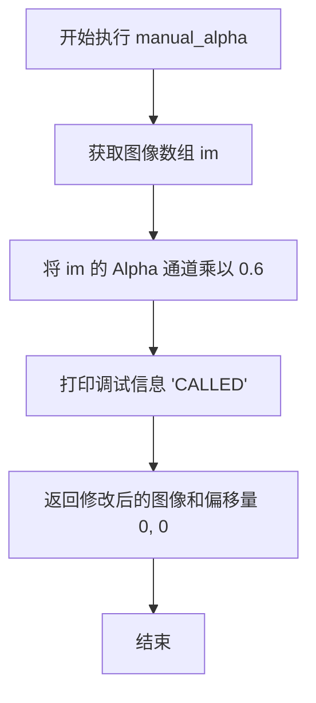

# `matplotlib\lib\matplotlib\tests\test_agg_filter.py` 详细设计文档

这是一个基于 Matplotlib 的测试用例，使用 image_comparison 装饰器来验证在 pcolormesh 上应用自定义 AGG 滤镜（manual_alpha）进行透明度处理后的渲染结果是否与基准图像一致。

## 整体流程

```mermaid
graph TD
    A[测试开始] --> B[装饰器预处理: 加载基准图像]
    B --> C[配置 Matplotlib: 关闭 pcolormesh.snap]
    C --> D[创建画布: plt.axes()]
    D --> E[生成数据: np.mgrid 创建网格, 计算 x**2 - y**2]
    E --> F[绑定数据: ax.pcolormesh 生成网格对象]
    F --> G[定义闭包: manual_alpha 滤镜函数]
    G --> H[应用滤镜: mesh.set_agg_filter(manual_alpha)]
    H --> I[设置光栅化: mesh.set_rasterized(True)]
    I --> J[绑定图形: ax.plot 绘制线条]
    J --> K[测试结束: 图像比对框架自动截图对比]
    K -->|比对成功| L[测试通过]
    K -->|比对失败| M[测试失败]
```

## 类结构

```
模块: test_agg_filter_alpha
└── 函数: test_agg_filter_alpha (测试入口)
    └── 内部函数: manual_alpha (AGG滤镜逻辑闭包)
```

## 全局变量及字段


    

## 全局函数及方法


### `test_agg_filter_alpha`

该测试函数用于验证matplotlib中pcolormesh的`agg_filter`功能，特别是通过自定义滤波器修改图像alpha通道的能力。测试创建一个伪彩色网格，设置自定义的agg_filter来降低透明度，并验证生成的图像是否与基准图像匹配。

参数：
- 该函数无参数

返回值：`None`，测试函数无返回值，通过图像比较验证结果

#### 流程图

```mermaid
flowchart TD
    A[开始测试] --> B[设置plt.rcParams['pcolormesh.snap'] = False]
    B --> C[创建plt.axes坐标轴]
    C --> D[使用np.mgrid生成网格数据x, y]
    D --> E[计算data = x² - y²]
    E --> F[使用ax.pcolormesh创建网格mesh]
    F --> G[定义manual_alpha内部函数]
    G --> H[设置mesh.set_agg_filter manual_alpha]
    H --> I[设置mesh.set_rasterized True]
    I --> J[绘制线条ax.plot]
    J --> K[图像比较验证]
    
    G --> G1[修改im[:,:,3] *= 0.6降低透明度]
    G1 --> G2[打印'CALLED'标识]
    G2 --> G3[返回im, 0, 0]
```

#### 带注释源码

```python
import numpy as np

import matplotlib.pyplot as plt
from matplotlib.testing.decorators import image_comparison


@image_comparison(baseline_images=['agg_filter_alpha'],
                  extensions=['gif', 'png', 'pdf'])
def test_agg_filter_alpha():
    """
    测试agg_filter对pcolormesh alpha通道的修改功能
    该测试验证自定义agg_filter能够成功修改网格的透明度
    """
    # 关闭pcolormesh的snap功能以确保像素边界清晰
    # 注释: 当基准图像重新生成时需移除此行
    plt.rcParams['pcolormesh.snap'] = False

    # 创建matplotlib坐标轴
    ax = plt.axes()
    
    # 生成7x8的网格数据
    x, y = np.mgrid[0:7, 0:8]
    
    # 计算测试数据: 抛物线形状的差值
    data = x**2 - y**2
    
    # 创建伪彩色网格, 设置zorder=5使其绘制在较高层级
    mesh = ax.pcolormesh(data, cmap='Reds', zorder=5)

    def manual_alpha(im, dpi):
        """
        自定义agg_filter回调函数,用于修改图像的alpha通道
        
        参数:
            im: 图像数组 [高度, 宽度, 4通道(RGBA)]
            dpi: 设备分辨率
        
        返回:
            im: 修改后的图像
            0: 坐标偏移x
            0: 坐标偏移y
        """
        # 将alpha通道所有像素值乘以0.6,降低整体透明度
        im[:, :, 3] *= 0.6
        # 打印标识以确认回调被调用
        print('CALLED')
        return im, 0, 0

    # 设置mesh的agg_filter为manual_alpha函数
    # 注意: 这种alpha设置方式与直接在mesh上设置alpha效果不同
    # 当前mesh被绘制为独立色块,我们可以看到色块之间的边界
    # 参考: https://stackoverflow.com/q/20678817/
    mesh.set_agg_filter(manual_alpha)

    # 必须启用栅格化才能在PDF后端生效
    # agg_filter处理的是栅格化后的图像数据
    mesh.set_rasterized(True)

    # 在同一坐标轴上绘制线条,用于测试图层叠加
    ax.plot([0, 4, 7], [1, 3, 8])
```


### `manual_alpha`

这是一个自定义的AGG过滤器回调函数，用于在渲染图像时动态调整图像的透明度。该函数将图像的Alpha通道乘以0.6来实现半透明效果，并返回修改后的图像及位置偏移量。

参数：

- `im`：`ndarray`，输入的图像数组，通常为四通道（RGBA）图像数据
- `dpi`：`float`，每英寸点数（dots per inch），表示图像的分辨率

返回值：`tuple`，返回包含修改后的图像数组和两个整数偏移量的元组

#### 流程图



#### 带注释源码

```python
def manual_alpha(im, dpi):
    """
    自定义 AGG 过滤器回调函数，用于调整图像透明度
    
    参数:
        im: 图像数组，通常为四通道 [R, G, B, A] 格式的 numpy 数组
        dpi: 每英寸点数，表示图像分辨率
    
    返回:
        元组 (修改后的图像, x偏移量, y偏移量)
    """
    # 将图像的第4通道（Alpha通道）乘以0.6，实现60%透明效果
    im[:, :, 3] *= 0.6
    
    # 打印调试信息，表明该函数被调用
    print('CALLED')
    
    # 返回修改后的图像和位置偏移量(0, 0)
    return im, 0, 0
```

## 关键组件


### 测试函数 test_agg_filter_alpha

这是主要的测试函数，用于验证AGG过滤器对pcolormesh的alpha通道处理功能，通过图像比较装饰器进行基线图像对比。

### 图像比较装饰器 @image_comparison

用于自动比较测试生成的图像与基线图像，支持gif、png、pdf格式，基线图像名称为'agg_filter_alpha'。

### pcolormesh网格数据

使用numpy的mgrid创建7x8的网格，data = x**2 - y**2生成测试用的网格数据，用于绘制伪彩色网格。

### manual_alpha自定义AGG过滤器

这是一个自定义的图像过滤函数，接收图像和DPI参数，将图像的alpha通道（第四通道）乘以0.6来实现透明度调整，并返回修改后的图像和偏移量。

### matplotlib Axes对象

通过plt.axes()创建的坐标轴对象，用于承载pcolormesh和plot图形，设置zorder=5确定绘制层次。

### 量化策略与渲染配置

通过plt.rcParams['pcolormesh.snap'] = False禁用pcolormesh的snap功能，通过mesh.set_rasterized(True)启用光栅化以确保PDF后端生效。


## 问题及建议


### 已知问题

-   **全局状态污染**：修改`plt.rcParams['pcolormesh.snap']`后未恢复原始值，可能影响后续测试用例的执行结果
-   **硬编码魔数**：alpha值`0.6`和返回元组中的`0, 0`缺乏注释说明，可读性差
-   **副作用调试代码**：`manual_alpha`函数中的`print('CALLED')`语句不应存在于测试代码中，可能污染测试输出
-   **测试脆弱性**：基于图像比较的测试（`image_comparison`）对渲染环境敏感，跨平台或跨版本时容易产生误报
-   **配置未清理**：`plt.rcParams`的修改缺少对应的`try-finally`或`teardown`机制来确保恢复
-   **文档化已知限制**：代码中提到"Currently meshes are drawn as independent patches, and we see fine borders"但未提供解决方案或TODO标记

### 优化建议

-   **使用上下文管理器或fixture管理全局状态**：通过`matplotlib.rc_context`或pytest fixture来临时修改并自动恢复rcParams
-   **参数化alpha值**：将`0.6`提取为常量或测试参数，提高代码可维护性
-   **移除调试打印语句**：删除`print('CALLED')`，或使用logging替代
-   **添加清理机制**：在测试函数末尾或使用`yield`模式恢复原始配置
-   **补充文档注释**：为返回元组`(im, 0, 0)`中的两个0值添加明确说明，解释其含义（偏移量）
-   **考虑替代测试方案**：评估是否可以用数值断言替代图像比较，减少测试对渲染细节的依赖

## 其它


### 设计目标与约束

本测试代码的核心目标是验证matplotlib的agg_filter功能能够正确处理pcolormesh的透明度（alpha）效果，并通过图像比较确保在不同输出格式（gif、png、pdf）下的一致性。约束条件包括：需要启用栅格化（rasterization）才能在PDF后端生效，且当前的alpha实现方式与直接设置mesh的alpha效果不同，会显示块之间的边界。

### 错误处理与异常设计

代码未包含显式的错误处理机制，主要依赖matplotlib测试框架的image_comparison装饰器进行自动验证。潜在的异常场景包括：图像渲染不一致、文件格式不支持、baseline图像缺失等，均由测试框架捕获并报告。手动alpha函数应返回(im, 0, 0)格式的元组，任何返回格式错误都可能导致渲染失败。

### 数据流与状态机

数据流从numpy网格生成（x, y坐标）开始，经过data = x**2 - y**2计算生成二维数据数组，然后通过ax.pcolormesh()创建可视化网格对象，再通过set_agg_filter()注册自定义alpha处理函数。状态转换包括：rcParams配置修改、axes创建、mesh对象构建、filter设置、rasterization启用，最终输出到不同格式的图像文件。

### 外部依赖与接口契约

主要依赖包括：numpy（数值计算）、matplotlib（绘图）、matplotlib.testing.decorators（测试框架）。关键接口契约：pcolormesh接受data、cmap、zorder参数；set_agg_filter接受callable对象，该callable必须接受(im, dpi)参数并返回(im, xoffset, yoffset)元组；set_rasterized接受布尔值；image_comparison装饰器要求baseline_images列表中的名称与实际生成的图像匹配。

### 性能考虑

代码本身为测试代码，性能不是主要关注点。手动alpha函数在每次渲染时调用，可能影响大型数据集的渲染性能。plt.rcParams['pcolormesh.snap'] = False会改变渲染行为，可能影响性能与渲染质量的平衡。

### 安全性考虑

代码为本地测试文件，不涉及用户输入验证或网络通信，安全性风险较低。print('CALLED')语句用于调试，可能在生产环境中泄露信息。

### 可维护性

代码结构清晰，但存在过时的注释（"Remove this line when this test image is regenerated"）和TODO性质的需求。manual_alpha函数定义在测试函数内部，降低了代码的可复用性。建议将滤镜函数提取为独立模块级函数或可复用的工具类。

### 测试策略

采用图像比较测试策略，通过baseline_images定义预期输出结果，支持多格式验证（gif、png、pdf）。测试覆盖了agg_filter、pcolormesh、rasterization、plot叠加等多个matplotlib特性的集成场景。

### 配置管理

使用plt.rcParams['pcolormesh.snap'] = False修改全局配置，该修改仅在测试函数作用域内有效。配色方案使用'Reds'，zorder设置为5确保正确的图层叠加顺序。

### 版本兼容性

代码依赖matplotlib的特定API（set_agg_filter、set_rasterized、pcolormesh的zorder参数），需要 matplotlib 1.3+ 版本。numpy的mgrid接口为长期稳定API。测试框架的image_comparison装饰器API在不同matplotlib版本间可能有细微差异。


    