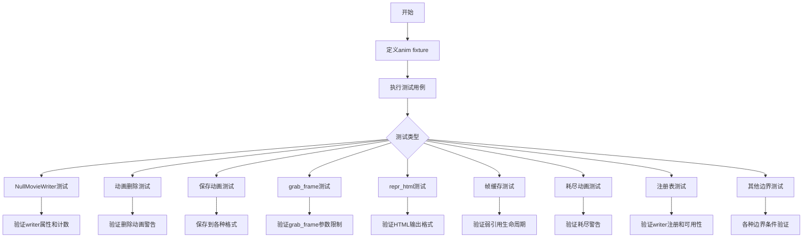
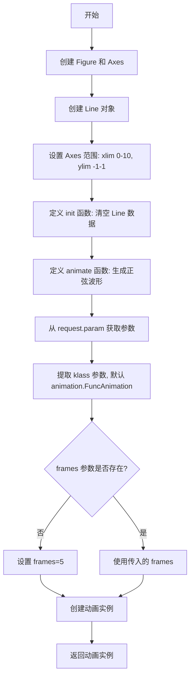
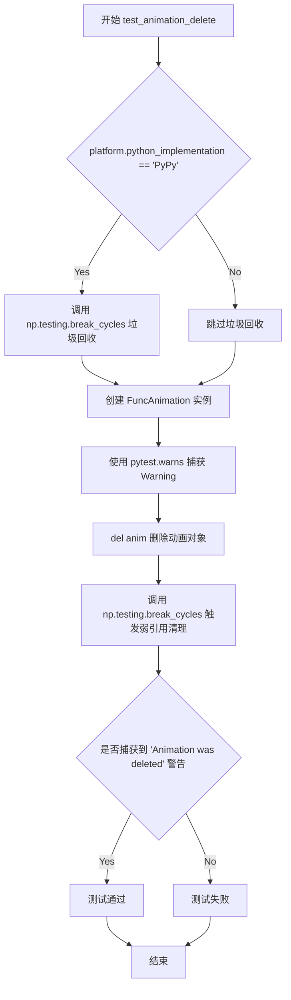
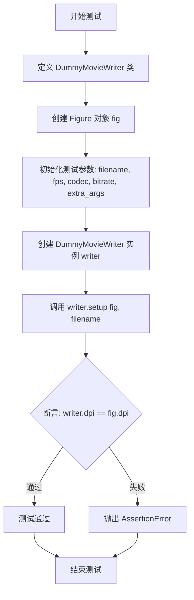
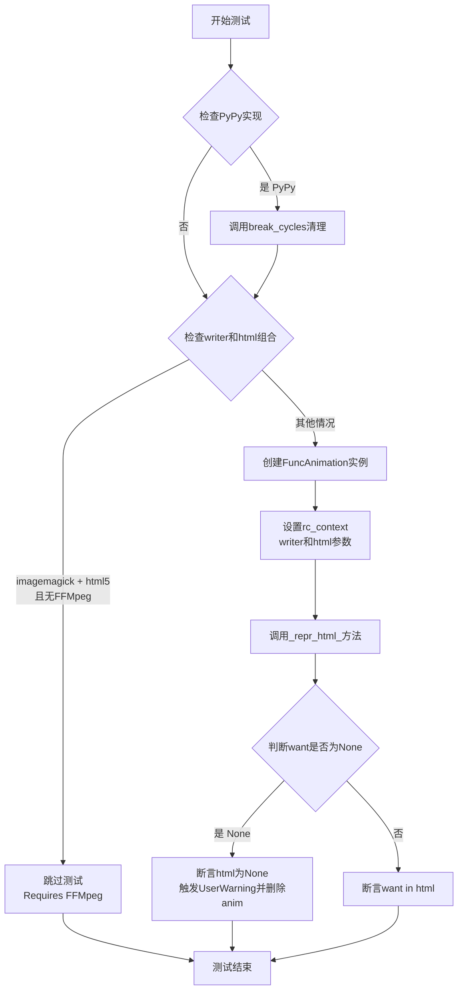
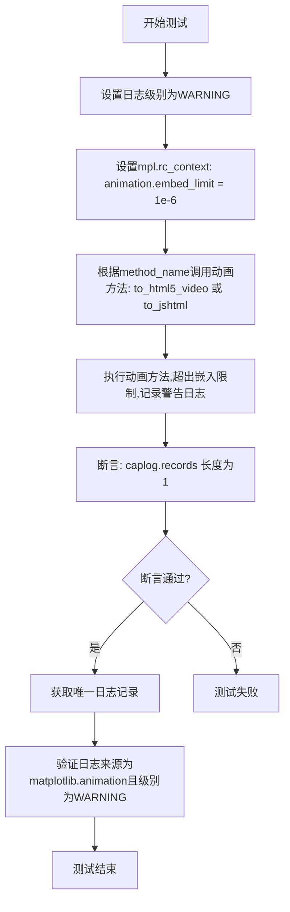
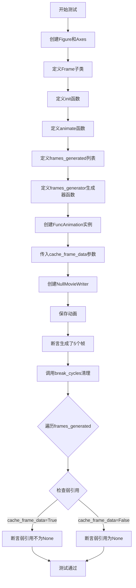
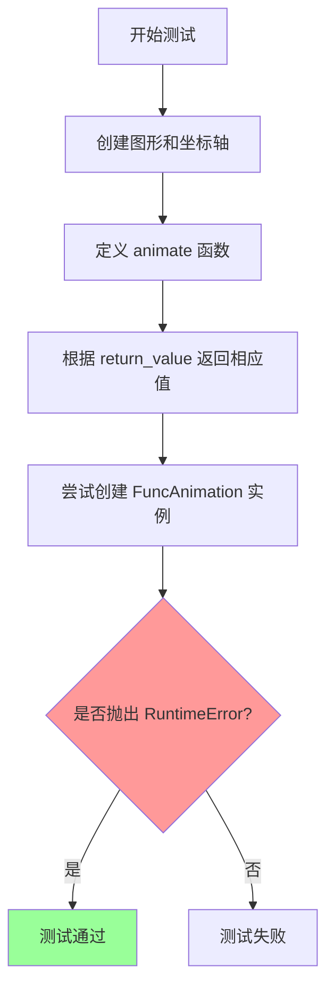
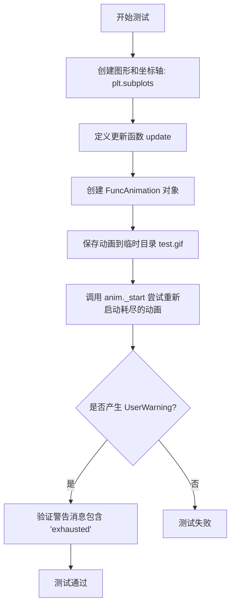
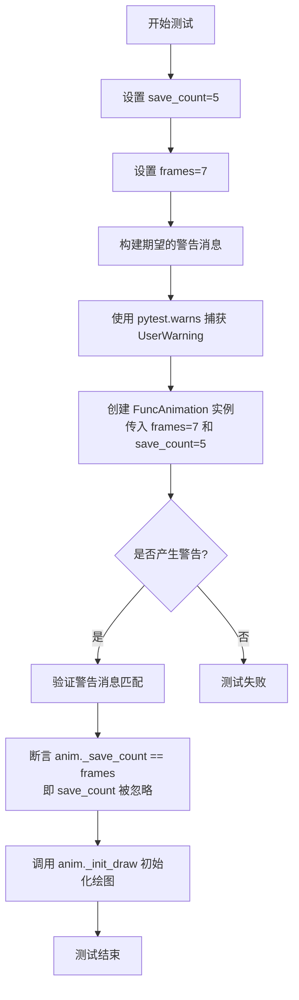

# `matplotlib\lib\matplotlib\tests\test_animation.py` 详细设计文档

该文件是matplotlib动画模块的综合测试套件，涵盖了动画创建、保存、各种MovieWriter（FFmpeg、ImageMagick、Pillow等）的测试、帧缓存机制、动画耗尽处理、repr_html输出、嵌入限制等多个方面的单元测试和集成测试。

## 整体流程



## 类结构

```
Test Module (test_animation.py)
├── Fixtures
│   └── anim (创建测试用FuncAnimation)
├── Classes
│   ├── NullMovieWriter (AbstractMovieWriter)
│   │   └── RegisteredNullMovieWriter (NullMovieWriter)
│   ├── DummyMovieWriter (MovieWriter)
│   └── Frame (dict)
├── Global Variables
│   └── WRITER_OUTPUT (writer和output映射)
└── Functions
    ├── gen_writers (生成器: 遍历可用writer)
    └── test_* (多个测试函数)
```

## 全局变量及字段


### `WRITER_OUTPUT`
    
定义测试用的动画作家名称和对应输出文件扩展名的列表

类型：`List[Tuple[str, str]]`
    


### `anim`
    
pytest fixture，用于创建简单的动画实例供测试使用

类型：`FuncAnimation`
    


### `request`
    
pytest的请求对象，用于访问测试参数和配置

类型：`FixtureRequest`
    


### `fig`
    
matplotlib图形对象，用于显示动画帧

类型：`Figure`
    


### `ax`
    
matplotlib坐标轴对象，用于绘制动画线条

类型：`Axes`
    


### `line`
    
matplotlib线条对象，表示动画中绘制的曲线

类型：`Line2D`
    


### `kwargs`
    
字典类型，用于传递动画构造的可选参数

类型：`Dict[str, Any]`
    


### `klass`
    
动画类类型，默认animation.FuncAnimation

类型：`type`
    


### `filename`
    
字符串或路径，指定动画保存的文件名

类型：`str | Path`
    


### `dpi`
    
每英寸点数，设置输出图像的分辨率

类型：`float`
    


### `savefig_kwargs`
    
字典，保存图形时的额外参数选项

类型：`Dict[str, Any]`
    


### `writer`
    
动画写入器对象，负责将动画写入文件

类型：`MovieWriter`
    


### `output`
    
输出文件路径或文件名

类型：`str | Path`
    


### `frame_format`
    
帧格式字符串，指定动画帧的格式或为None

类型：`str | None`
    


### `WriterClass`
    
电影写入器类，用于创建写入器实例

类型：`type`
    


### `test_writer`
    
测试用的电影写入器实例

类型：`MovieWriter`
    


### `html`
    
HTML字符串或None，表示动画的HTML表示

类型：`str | None`
    


### `want`
    
期望在HTML中匹配的字符串或None

类型：`str | None`
    


### `method_name`
    
方法名称字符串，如to_html5_video或to_jshtml

类型：`str`
    


### `cache_frame_data`
    
布尔值，指示是否缓存帧数据

类型：`bool`
    


### `frames_generated`
    
存储生成的帧的弱引用列表

类型：`List[weakref.ref]`
    


### `MAX_FRAMES`
    
整数值，定义最大帧数限制

类型：`int`
    


### `return_value`
    
动画回调函数的返回值，用于测试各种返回类型

类型：`Any`
    


### `save_count`
    
整数，指定保存的帧数上限

类型：`int`
    


### `frames`
    
帧数据列表或迭代器

类型：`List | Iterator`
    


### `match_target`
    
正则表达式匹配目标字符串

类型：`str`
    


### `rect`
    
matplotlib矩形对象，用于测试透明度

类型：`Rectangle`
    


### `frame`
    
保存的帧图像数据

类型：`PIL.Image | numpy.ndarray`
    


### `NullMovieWriter.fig`
    
保存动画时使用的matplotlib图形对象

类型：`Figure`
    


### `NullMovieWriter.outfile`
    
动画输出目标文件路径

类型：`str | Path`
    


### `NullMovieWriter.dpi`
    
输出图像的分辨率设置

类型：`float`
    


### `NullMovieWriter.args`
    
setup方法接收的额外位置参数元组

类型：`tuple`
    


### `NullMovieWriter._count`
    
grab_frame方法被调用的次数计数器

类型：`int`
    


### `NullMovieWriter.savefig_kwargs`
    
保存图形时使用的关键字参数字典

类型：`dict`
    
    

## 全局函数及方法


### `anim`

该 fixture 函数用于创建简单的动画实例，支持通过参数自定义动画类、帧数等配置，常用于动画相关测试的setup。

参数：

- `request`：`pytest.FixtureRequest`，pytest 的请求对象，用于访问测试函数的参数化配置（`param` 属性）

返回值：`matplotlib.animation.FuncAnimation`（或通过 `klass` 参数指定的动画类），返回配置好的动画实例

#### 流程图



#### 带注释源码

```python
@pytest.fixture()
def anim(request):
    """Create a simple animation (with options)."""
    # 创建图形和坐标轴
    fig, ax = plt.subplots()
    # 创建空线条对象
    line, = ax.plot([], [])

    # 设置坐标轴范围
    ax.set_xlim(0, 10)
    ax.set_ylim(-1, 1)

    def init():
        """初始化函数,用于清空线条数据"""
        line.set_data([], [])
        return line,

    def animate(i):
        """动画更新函数,生成正弦波动画"""
        x = np.linspace(0, 10, 100)
        y = np.sin(x + i)
        line.set_data(x, y)
        return line,

    # 从 request.param 获取参数,支持测试函数参数化配置
    kwargs = dict(getattr(request, 'param', {}))  # make a copy
    # 获取动画类,默认为 FuncAnimation
    klass = kwargs.pop('klass', animation.FuncAnimation)
    # 如果未指定 frames,默认设置为 5 帧
    if 'frames' not in kwargs:
        kwargs['frames'] = 5
    # 创建并返回动画实例
    return klass(fig=fig, func=animate, init_func=init, **kwargs)
```


### `test_null_movie_writer`

这是一个测试函数，用于验证 NullMovieWriter 能够正确地保存动画，并确保传递给它的参数（如图形、文件名、DPI、savefig_kwargs）被正确记录，同时验证 grab_frame 方法被调用的次数与动画的保存帧数相匹配。

参数：

- `anim`：`< Fixture >`，由 pytest fixture 提供的动画对象（FuncAnimation 实例），用于测试保存功能

返回值：`None`，无返回值（测试函数）

#### 流程图

```mermaid
flowchart TD
    A[开始测试 test_null_movie_writer] --> B[设置 savefig.facecolor 为 'auto']
    B --> C[定义保存文件名 'unused.null']
    C --> D[设置 dpi=50]
    D --> E[创建 savefig_kwargs 字典 dict(foo=0)]
    E --> F[创建 NullMovieWriter 实例]
    F --> G[调用 anim.save 保存动画]
    G --> H{断言验证}
    H --> I[验证 writer.fig == plt.figure(1)]
    H --> J[验证 writer.outfile == filename]
    H --> K[验证 writer.dpi == dpi]
    H --> L[验证 writer.args == ()]
    H --> M[验证 savefig_kwargs 被正确传递]
    H --> N[验证 writer._count == anim._save_count]
    I --> O[测试通过]
    J --> O
    K --> O
    L --> O
    M --> O
    N --> O
```

#### 带注释源码

```python
def test_null_movie_writer(anim):
    # 测试使用 NullMovieWriter 运行动画的功能
    # 设置保存图像时的背景色为自动（与 matplotlib 默认行为一致）
    plt.rcParams["savefig.facecolor"] = "auto"
    
    # 定义输出文件名（实际不会真正写入文件）
    filename = "unused.null"
    
    # 设置每英寸点数（DPI）
    dpi = 50
    
    # 定义要传递给 savefig 的额外关键字参数
    savefig_kwargs = dict(foo=0)
    
    # 创建一个 NullMovieWriter 实例
    # NullMovieWriter 是一个最小化的 MovieWriter，不实际写入任何内容
    # 只是保存传递给它的参数用于验证
    writer = NullMovieWriter()

    # 使用指定的 writer 保存动画
    # 这里会调用 writer 的 setup, grab_frame 和 finish 方法
    anim.save(filename, dpi=dpi, writer=writer,
              savefig_kwargs=savefig_kwargs)

    # 断言验证：writer.fig 应该等于动画使用的图形（plt.figure(1)）
    assert writer.fig == plt.figure(1)  # The figure used by anim fixture
    
    # 断言验证：writer.outfile 应该等于传入的文件名
    assert writer.outfile == filename
    
    # 断言验证：writer.dpi 应该等于传入的 dpi 值
    assert writer.dpi == dpi
    
    # 断言验证：writer.args 应该为空元组（因为没有额外参数）
    assert writer.args == ()
    
    # 我们丰富了 savefig kwargs 以确保将透明输出复合到不透明背景
    # 遍历原始的 savefig_kwargs，验证它们被正确保存
    for k, v in savefig_kwargs.items():
        assert writer.savefig_kwargs[k] == v
    
    # 断言验证：grab_frame 被调用的次数应该等于动画的保存帧数
    # _save_count 是动画对象中保存的帧数
    assert writer._count == anim._save_count
```


### `test_animation_delete`

该测试函数用于验证当 FuncAnimation 对象被删除时是否会触发相应的警告信息。它首先检查当前 Python 实现是否为 PyPy，若是则执行垃圾回收以解决测试问题。然后创建 FuncAnimation 实例，在删除该实例时捕获并验证是否产生了包含 "Animation was deleted" 消息的 Warning。

参数：

-  `anim`：一个 pytest fixture 参数（通过 `indirect=['anim']` 间接调用），类型为 `matplotlib.animation.FuncAnimation`，由同文件中的 `anim` fixture 生成。该 fixture 创建一个基本的动画对象，包含 figure、axes、line 以及 animate 和 init 函数。

返回值：`None`，测试函数无返回值（void）。

#### 流程图



#### 带注释源码

```python
@pytest.mark.parametrize('anim', [dict(klass=dict)], indirect=['anim'])
def test_animation_delete(anim):
    """
    测试函数：验证 FuncAnimation 对象删除时是否产生警告。
    
    该测试确保动画对象在被垃圾回收时能够正确发出警告，
    以便开发者意识到动画未被正确保存或处理。
    """
    
    # 检查当前 Python 实现是否为 PyPy
    if platform.python_implementation() == 'PyPy':
        # Something in the test setup fixture lingers around into the test and
        # breaks pytest.warns on PyPy. This garbage collection fixes it.
        # https://foss.heptapod.net/pypy/pypy/-/issues/3536
        # 在 PyPy 环境下，测试夹具中可能存在残留对象干扰 pytest.warns
        # 调用 break_cycles 进行垃圾回收以修复此问题
        np.testing.break_cycles()
    
    # 使用从 fixture 传入的参数创建新的 FuncAnimation 实例
    # fixture 提供了 fig, ax, line, animate, init_func 等必要组件
    anim = animation.FuncAnimation(**anim)
    
    # 上下文管理器：预期捕获到 Warning 类型的警告消息
    # 警告消息需匹配 'Animation was deleted'
    with pytest.warns(Warning, match='Animation was deleted'):
        # 删除动画对象，触发 __del__ 方法
        # 此时动画对象应该发出警告，因为动画未被保存
        del anim
        
        # 强制进行垃圾回收，确保弱引用被清理
        # 这会触发 FuncAnimation 的清理逻辑并发出警告
        np.testing.break_cycles()
```


### `test_movie_writer_dpi_default`

这是一个测试函数，用于验证当使用 figure.dpi 默认值设置电影写入器（MovieWriter）时，写入器的 dpi 是否自动设置为 figure 的 dpi。

参数： 无

返回值：`None`，无返回值（测试函数，通过 assert 断言验证）

#### 流程图



#### 带注释源码

```python
def test_movie_writer_dpi_default():
    """
    测试 MovieWriter 使用 figure.dpi 作为默认 DPI 的功能。
    """
    
    # 定义一个DummyMovieWriter类，继承自animation.MovieWriter
    # 用于模拟测试场景，不执行实际的视频写入操作
    class DummyMovieWriter(animation.MovieWriter):
        def _run(self):
            pass  # 空实现，不执行任何操作

    # 测试设置电影写入器时使用 figure.dpi 默认值
    # 创建一个新的 Figure 对象
    fig = plt.figure()

    # 设置测试所需的参数
    filename = "unused.null"    # 输出文件名（测试中不使用）
    fps = 5                     # 帧率
    codec = "unused"            # 编解码器（测试中不使用）
    bitrate = 1                 # 比特率（测试中不使用）
    extra_args = ["unused"]     # 额外参数（测试中不使用）

    # 创建 DummyMovieWriter 实例，传入配置参数
    writer = DummyMovieWriter(fps, codec, bitrate, extra_args)
    
    # 调用 setup 方法，传入 fig 和 filename
    # 注意：此处未显式传入 dpi 参数
    writer.setup(fig, filename)
    
    # 断言：验证 writer 的 dpi 是否自动设置为 fig.dpi
    assert writer.dpi == fig.dpi
```


### `gen_writers`

这是一个生成器函数，用于为动画写入器测试生成参数组合。它遍历预定义的输出列表，检查每个写入器是否可用，对于不可用的写入器生成跳过的测试参数，对于可用的写入器则遍历其支持的帧格式，生成多种参数组合用于测试。

参数：无需参数

返回值：`Generator`，生成 `pytest.param` 对象，每个参数包含 (writer, frame_format, output) 的三元组，用于 pytest 参数化测试

#### 流程图

```mermaid
flowchart TD
    A[开始] --> B[遍历 WRITER_OUTPUT]
    B --> C{当前写入器是否可用?}
    C -->|否| D[生成跳过标记]
    D --> E[yield pytest.param with None frame_format 和 str output]
    E --> F[yield pytest.param with None frame_format 和 Path output]
    F --> B
    C -->|是| G[获取写入器类]
    G --> H[遍历 supported_formats 或 [None]]
    H --> I[yield (writer, frame_format, output)]
    I --> J[yield (writer, frame_format, Path(output))]
    J --> H
    H --> B
    B --> K[结束]
```

#### 带注释源码

```python
def gen_writers():
    """
    生成器函数：为动画写入器测试生成参数组合
    
    遍历预定义的WRITER_OUTPUT列表，对每个写入器：
    1. 检查是否可用（通过animation.writers.is_available）
    2. 不可用时生成跳过标记的测试参数
    3. 可用时遍历支持的帧格式，生成多种输出组合
    """
    # 遍历预定义的写入器和输出文件列表
    for writer, output in WRITER_OUTPUT:
        # 检查写入器是否在当前系统可用
        if not animation.writers.is_available(writer):
            # 不可用时创建跳过标记
            mark = pytest.mark.skip(f"writer '{writer}' not available on this system")
            # 生成两个跳过参数：str和Path格式的输出路径
            yield pytest.param(writer, None, output, marks=[mark])
            yield pytest.param(writer, None, Path(output), marks=[mark])
            # 跳过当前写入器，继续处理下一个
            continue

        # 获取写入器类
        writer_class = animation.writers[writer]
        # 获取支持的帧格式列表，如果不存在则默认为[None]
        for frame_format in getattr(writer_class, 'supported_formats', [None]):
            # 生成str格式输出的测试参数
            yield writer, frame_format, output
            # 生成Path格式输出的测试参数
            yield writer, frame_format, Path(output)
```


### `test_save_animation_smoketest`

这是一个动画保存功能的冒烟测试（smoke test），用于验证不同视频编写器（writer）和输出格式保存动画的基本功能。

参数：

- `tmp_path`：`pathlib.Path`，pytest 提供的临时目录，用于存放输出的动画文件
- `writer`：`str`，动画编写器名称，可选值为 `'ffmpeg'`, `'ffmpeg_file'`, `'imagemagick'`, `'imagemagick_file'`, `'pillow'`, `'html'`, `'null'`
- `frame_format`：`str` 或 `None`，动画帧格式，当不为 `None` 时设置到 `plt.rcParams["animation.frame_format"]`
- `output`：`str` 或 `pathlib.Path`，输出文件名（含扩展名）
- `anim`：`matplotlib.animation.FuncAnimation`，通过 pytest fixture 创建的动画实例

返回值：`None`，该函数为测试函数，无返回值

#### 流程图

```mermaid
flowchart TD
    A[开始] --> B{检查 frame_format 是否为 None}
    B -->|否| C[设置 plt.rcParams['animation.frame_format'] = frame_format]
    B -->|是| D[跳过设置]
    C --> D
    D --> E[从 fixture 参数创建 FuncAnimation 实例]
    E --> F[初始化 dpi=None, codec=None]
    F --> G{检查 writer == 'ffmpeg'}
    G -->|是| H[设置动画 Figure 尺寸为 10.85×9.21]
    H --> I[设置 dpi=100, codec='h264']
    G -->|否| J[跳过特殊处理]
    I --> K
    J --> K[调用 anim.save 保存动画]
    K --> L[删除动画实例释放资源]
    L --> M[结束]
```

#### 带注释源码

```python
@pytest.mark.parametrize('writer, frame_format, output', gen_writers())
@pytest.mark.parametrize('anim', [dict(klass=dict)], indirect=['anim'])
def test_save_animation_smoketest(tmp_path, writer, frame_format, output, anim):
    """
    冒烟测试：验证不同 writer 保存动画的基本功能。
    
    测试覆盖：
    - 多种视频编写器（ffmpeg, imagemagick, pillow, html, null）
    - 字符串和 Path 两种输出路径类型
    - 不同的帧格式设置
    - ffmpeg 特定的尺寸和编码设置（Issue #8253）
    """
    # 如果指定了帧格式，则设置到全局 rcParams
    if frame_format is not None:
        plt.rcParams["animation.frame_format"] = frame_format
    
    # 使用传入的 kwargs 重新创建 FuncAnimation 实例
    # （fixture 返回的对象可能已在其他测试中使用）
    anim = animation.FuncAnimation(**anim)
    
    # 初始化默认参数
    dpi = None
    codec = None
    
    # 针对 ffmpeg writer 的特殊处理
    # Issue #8253: 某些编码器对尺寸有特定要求
    if writer == 'ffmpeg':
        anim._fig.set_size_inches((10.85, 9.21))
        dpi = 100.
        codec = 'h264'

    # 执行动画保存：fps=30, bitrate=500
    anim.save(tmp_path / output, fps=30, writer=writer, bitrate=500, dpi=dpi,
              codec=codec)

    # 显式删除动画对象以触发清理逻辑
    # 在某些平台上（如 PyPy）需要显式调用以避免警告
    del anim
```


### `test_grabframe`

该测试函数用于验证不同动画写入器（writer）的`grab_frame`方法能否正确工作，并确保`grab_frame`方法拒绝不允许的关键字参数（如dpi、bbox_inches、format）。测试通过pytest参数化支持多种写入器、帧格式和输出路径的组合。

参数：

- `tmp_path`：`pytest.fixture`（临时目录路径），pytest提供的临时目录fixture，用于存放测试生成的输出文件
- `writer`：`str`，动画写入器的名称（如'ffmpeg'、'pillow'、'imagemagick'等）
- `frame_format`：`str` 或 `None`，指定动画的帧格式，如果为None则使用默认格式
- `output`：`str` 或 `Path`，输出文件的名称或路径

返回值：无，该函数为测试函数，使用pytest的断言进行验证

#### 流程图

```mermaid
flowchart TD
    A[开始测试 test_grabframe] --> B[根据writer获取对应的WriterClass]
    B --> C{判断frame_format是否不为None}
    C -->|是| D[设置matplotlib的animation.frame_format参数]
    C -->|否| E[不设置frame_format参数]
    D --> E
    E --> F[创建figure和axes子图]
    F --> G{判断writer是否为ffmpeg}
    G -->|是| H[设置figure尺寸为10.85x9.21英寸, dpi=100, codec=h264]
    G -->|否| I[不设置特殊dpi和codec]
    H --> I
    I --> J[实例化test_writer]
    J --> K[使用test_writer.saving上下文管理器保存动画]
    K --> L[调用test_writer.grab_frame进行冒烟测试]
    L --> M[遍历关键字参数集合 {dpi, bbox_inches, format}]
    M --> N{还有未测试的参数?}
    N -->|是| O[尝试使用当前参数调用grab_frame]
    O --> P{是否抛出TypeError?}
    P -->|是| Q[断言错误消息匹配]
    P -->|否| R[测试失败 - 未抛出预期异常]
    Q --> M
    N -->|否| S[测试通过 - 所有参数都被正确拒绝]
    R --> S

```

#### 带注释源码

```python
@pytest.mark.parametrize('writer, frame_format, output', gen_writers())
def test_grabframe(tmp_path, writer, frame_format, output):
    """
    测试grab_frame方法的功能和参数验证。
    
    该测试函数验证不同动画写入器的grab_frame方法：
    1. 基本功能：能够成功捕获帧
    2. 参数验证：确保不接受不允许的关键字参数
    """
    # 根据writer名称获取对应的写入器类
    WriterClass = animation.writers[writer]

    # 如果指定了frame_format，设置matplotlib的帧格式参数
    if frame_format is not None:
        plt.rcParams["animation.frame_format"] = frame_format

    # 创建测试用的figure和axes
    fig, ax = plt.subplots()

    # 初始化dpi和codec变量
    dpi = None
    codec = None
    # 针对ffmpeg写入器进行特殊配置（处理Issue #8253）
    if writer == 'ffmpeg':
        fig.set_size_inches((10.85, 9.21))
        dpi = 100.
        codec = 'h264'

    # 实例化写入器
    test_writer = WriterClass()
    # 使用saving上下文管理器进行动画保存
    with test_writer.saving(fig, tmp_path / output, dpi):
        # 冒烟测试：验证grab_frame基本功能正常
        test_writer.grab_frame()
        
        # 验证grab_frame拒绝不允许的关键字参数
        for k in {'dpi', 'bbox_inches', 'format'}:
            with pytest.raises(
                    TypeError,
                    match=f"grab_frame got an unexpected keyword argument {k!r}"):
                # 尝试使用不允许的参数调用grab_frame，应该抛出TypeError
                test_writer.grab_frame(**{k: object()})
```


### `test_animation_repr_html`

该测试函数用于验证动画对象在不同HTML呈现模式下的 `_repr_html_()` 方法是否能正确生成对应的HTML表示（包括none、html5、jshtml三种模式），并确保在writer不可用或动画未运行时能正确处理异常和警告。

参数：

-  `writer`：`str`，动画写入器名称（如'ffmpeg'、'imagemagick'），用于指定生成动画的编写器
-  `html`：`str`，HTML呈现模式，可选值为'none'、'html5'、'jshtml'，决定动画的HTML表示形式
-  `want`：`str | None`，期望在HTML表示中包含的字符串，当为None时表示不期望生成HTML
-  `anim`：`FuncAnimation`，通过pytest fixture创建的动画对象，包含了基本的动画配置

返回值：`None`，该函数为测试函数，没有返回值，通过断言进行验证

#### 流程图



#### 带注释源码

```python
@pytest.mark.parametrize('writer', [
    pytest.param(
        'ffmpeg', marks=pytest.mark.skipif(
            not animation.FFMpegWriter.isAvailable(),
            reason='Requires FFMpeg')),
    pytest.param(
        'imagemagick', marks=pytest.mark.skipif(
            not animation.ImageMagickWriter.isAvailable(),
            reason='Requires ImageMagick')),
])
@pytest.mark.parametrize('html, want', [
    ('none', None),
    ('html5', '<video width'),
    ('jshtml', '<script ')
])
@pytest.mark.parametrize('anim', [dict(klass=dict)], indirect=['anim'])
def test_animation_repr_html(writer, html, want, anim):
    """
    测试动画在不同HTML呈现模式下的_repr_html_()方法。
    
    参数:
        writer: 动画写入器名称（'ffmpeg'或'imagemagick'）
        html: HTML呈现模式（'none'、'html5'、'jshtml'）
        want: 期望在HTML中包含的字符串，None表示不期望生成HTML
        anim: pytest fixture创建的FuncAnimation对象
    """
    # PyPy平台特殊处理：清理fixture遗留对象，避免警告检测问题
    if platform.python_implementation() == 'PyPy':
        np.testing.break_cycles()
    
    # ImageMagick的html5模式委托给FFMpeg，需要检查FFMpeg可用性
    if (writer == 'imagemagick' and html == 'html5'
            # ImageMagick delegates to ffmpeg for this format.
            and not animation.FFMpegWriter.isAvailable()):
        pytest.skip('Requires FFMpeg')
    
    # 在此处创建而非fixture中，避免产生__del__警告
    # create here rather than in the fixture otherwise we get __del__ warnings
    # about producing no output
    anim = animation.FuncAnimation(**anim)
    
    # 使用rc_context临时设置动画writer和HTML模式
    with plt.rc_context({'animation.writer': writer,
                         'animation.html': html}):
        # 调用动画的_repr_html_方法生成HTML表示
        html = anim._repr_html_()
    
    # 根据期望值进行断言验证
    if want is None:
        # 不期望生成HTML，验证返回值为None
        assert html is None
        # 动画未运行，删除时会触发警告
        with pytest.warns(UserWarning):
            del anim  # Animation was never run, so will warn on cleanup.
            np.testing.break_cycles()
    else:
        # 验证HTML表示中包含期望的字符串
        assert want in html
```


### `test_no_length_frames`

该函数是一个pytest测试用例，用于测试当动画的`frames`参数为没有长度属性的迭代器（如`iter(range(5))`）时的保存功能是否正常工作。测试通过使用自定义的`NullMovieWriter`来验证`FuncAnimation`对象能够正确处理这种情况。

参数：

- `anim`：`animation.FuncAnimation`，通过pytest fixture `anim`创建的动画对象。该fixture接收参数`{'save_count': 10, 'frames': iter(range(5))}`，创建一个具有迭代器frames的FuncAnimation实例

返回值：`None`，该测试函数没有返回值，仅执行动画保存操作

#### 流程图

```mermaid
flowchart TD
    A[开始测试 test_no_length_frames] --> B[接收 anim 参数<br/>animation.FuncAnimation 对象]
    B --> C[调用 anim.save<br/>参数: outfile='unused.null'<br/>writer=NullMovieWriter()]
    C --> D{保存操作执行}
    D -->|成功| E[测试通过<br/>函数结束]
    D -->|失败| F[抛出异常<br/>测试失败]
```

#### 带注释源码

```python
@pytest.mark.parametrize(
    'anim',
    [{'save_count': 10, 'frames': iter(range(5))}],
    indirect=['anim']
)
def test_no_length_frames(anim):
    """
    测试当frames参数为没有长度属性的迭代器时，动画保存功能是否正常工作。
    
    参数:
        anim: 一个FuncAnimation对象，其frames是iter(range(5))，一个没有__len__方法的迭代器
    """
    # 使用NullMovieWriter保存动画，验证save方法能正确处理无长度frames迭代器
    # 'unused.null'是输出文件名，NullMovieWriter是一个不实际写入文件的测试用writer
    anim.save('unused.null', writer=NullMovieWriter())
```


### `test_movie_writer_registry`

该函数用于测试动画模块的 `writers` 注册表功能，验证注册的 writer 数量以及通过修改 `rcParams` 中的 `ffmpeg_path` 来测试 `is_available` 方法的正确性。

参数：此函数无参数

返回值：`None`，该函数为测试函数，使用 `assert` 语句进行断言验证，不返回具体值

#### 流程图

```mermaid
flowchart TD
    A[开始] --> B{assert len(animation.writers._registered) > 0}
    B -->|通过| C[设置 mpl.rcParams['animation.ffmpeg_path'] = 'not_available_ever_xxxx']
    C --> D{assert not animation.writers.is_available('ffmpeg')}
    D -->|通过| E{判断 sys.platform}
    E -->|!= 'win32'| F[bin = 'true']
    E -->|== 'win32'| G[bin = 'where']
    F --> H[设置 mpl.rcParams['animation.ffmpeg_path'] = bin]
    G --> H
    H --> I{assert animation.writers.is_available('ffmpeg')}
    I -->|通过| J[结束]
    B -->|失败| K[测试失败]
    D -->|失败| K
    I -->|失败| K
```

#### 带注释源码

```python
def test_movie_writer_registry():
    """
    测试动画 writers 注册表的功能。
    验证：
    1. 注册表中存在至少一个 writer
    2. 设置无效的 ffmpeg 路径后，is_available 返回 False
    3. 设置有效的系统命令路径后，is_available 返回 True
    """
    # 断言：验证 writers 注册表非空，确保有 writer 已注册
    assert len(animation.writers._registered) > 0
    
    # 设置一个不存在的 ffmpeg 路径
    mpl.rcParams['animation.ffmpeg_path'] = "not_available_ever_xxxx"
    
    # 断言：无效路径下 ffmpeg 不可用
    assert not animation.writers.is_available("ffmpeg")
    
    # 根据操作系统选择 guaranteed 可用的命令
    # Unix 系统使用 'true' 命令（立即退出且返回成功）
    # Windows 系统使用 'where' 命令（显示命令位置）
    bin = "true" if sys.platform != 'win32' else "where"
    
    # 设置有效的 bin 路径
    mpl.rcParams['animation.ffmpeg_path'] = bin
    
    # 断言：有效路径下 ffmpeg 可用
    assert animation.writers.is_available("ffmpeg")
```


### `test_embed_limit`

该测试函数用于验证当动画嵌入大小超过配置的限制时，是否正确记录警告日志。它通过设置极小的 `animation.embed_limit` 值（约1字节），然后调用动画的 `to_html5_video` 或 `to_jshtml` 方法，检查是否生成了正确的警告信息。

参数：

- `method_name`：`str`，要测试的动画方法名称（"to_html5_video" 或 "to_jshtml"）
- `caplog`：`pytest.LogCaptureFixture`，pytest 的日志捕获 fixture，用于访问测试期间记录的日志
- `anim`：`matplotlib.animation.FuncAnimation`，通过 fixture 提供的动画对象

返回值：`None`，该函数为测试函数，不返回任何值，通过断言验证行为

#### 流程图



#### 带注释源码

```python
@pytest.mark.parametrize(
    "method_name",
    [pytest.param("to_html5_video", marks=pytest.mark.skipif(
        # 如果默认动画写入器不可用，则跳过此测试
        not animation.writers.is_available(mpl.rcParams["animation.writer"]),
        reason="animation writer not installed")),
     "to_jshtml"])  # 参数化测试：测试两种嵌入方法
@pytest.mark.parametrize('anim', [dict(frames=1)], indirect=['anim'])
def test_embed_limit(method_name, caplog, anim):
    """
    测试当动画数据超过embed_limit配置时是否产生警告。
    
    通过设置极小的embed_limit (1e-6 约等于1字节)来触发警告机制。
    """
    # 设置日志捕获级别为WARNING，确保捕获WARNING及以上级别的日志
    caplog.set_level("WARNING")
    # 使用极小的嵌入限制，约1字节，这会导致任何实际的动画数据都会超出限制
    with mpl.rc_context({"animation.embed_limit": 1e-6}):  # ~1 byte.
        # 动态调用动画的指定方法（to_html5_video 或 to_jshtml）
        getattr(anim, method_name)()
    # 验证只记录了一条日志
    assert len(caplog.records) == 1
    # 获取唯一的日志记录
    record, = caplog.records
    # 验证日志来自matplotlib.animation模块且级别为WARNING
    assert (record.name == "matplotlib.animation"
            and record.levelname == "WARNING")
```


### `test_failing_ffmpeg`

测试当 FFmpeg 执行失败时，动画保存功能是否正确抛出 `subprocess.CalledProcessError` 异常。

参数：

-  `tmp_path`：`py.path.local`（或 `pathlib.Path`），pytest 提供的临时目录 fixture，用于创建 mock 的 ffmpeg 可执行文件
-  `monkeypatch`：`pytest.MonkeyPatch`，pytest 的 fixture，用于修改环境变量和系统属性
-  `anim`：`matplotlib.animation.FuncAnimation`，通过 fixture 创建的动画对象

返回值：`None`，无返回值（测试函数）

#### 流程图

```mermaid
flowchart TD
    A[开始] --> B[修改PATH环境变量<br/>prepend tmp_path到PATH]
    --> C[创建fake ffmpeg脚本<br/>exe_path = tmp_path / ffmpeg]
    --> D[写入shell脚本内容<br/>#!/bin/sh<br/>[[ $@ -eq 0 ]]
    --> E[设置可执行权限<br/>os.chmod exe_path 0o755]
    --> F[执行anim.save<br/>保存为test.mpeg]
    --> G{是否抛出<br/>CalledProcessError?}
    -->|是| H[测试通过]
    --> I[结束]
    -->|否| J[测试失败]

    style G fill:#f9f,stroke:#333
    style H fill:#9f9,stroke:#333
    style J fill:#f99,stroke:#333
```

#### 带注释源码

```python
@pytest.mark.skipif(shutil.which("/bin/sh") is None, reason="requires a POSIX OS")
def test_failing_ffmpeg(tmp_path, monkeypatch, anim):
    """
    Test that we correctly raise a CalledProcessError when ffmpeg fails.

    To do so, mock ffmpeg using a simple executable shell script that
    succeeds when called with no arguments (so that it gets registered by
    `isAvailable`), but fails otherwise, and add it to the $PATH.
    """
    # 1. 修改环境变量，将临时目录添加到 PATH 的最前面
    # 这样系统会优先查找 tmp_path 目录下的 ffmpeg
    monkeypatch.setenv("PATH", str(tmp_path), prepend=":")

    # 2. 创建 mock 的 ffmpeg 可执行文件路径
    exe_path = tmp_path / "ffmpeg"

    # 3. 写入 shell 脚本内容
    # #!/bin/sh - shebang，指定使用 shell 解释器
    # [[ $@ -eq 0 ]] - 如果没有参数返回 true，有参数会失败
    # 这样 ffmpeg 可以通过 isAvailable 检查（因为调用无参数版本），
    # 但在实际保存时（带参数调用）会失败
    exe_path.write_bytes(b"#!/bin/sh\n[[ $@ -eq 0 ]]\n")

    # 4. 设置文件为可执行
    os.chmod(exe_path, 0o755)

    # 5. 尝试保存动画，期望抛出 CalledProcessError 异常
    # 因为我们创建的 mock ffmpeg 带有参数时会失败
    with pytest.raises(subprocess.CalledProcessError):
        anim.save("test.mpeg")
```


### `test_funcanimation_cache_frame_data`

该测试函数用于验证 FuncAnimation 的 `cache_frame_data` 参数功能，通过弱引用检查当缓存启用和禁用时帧对象的生命周期是否正确。

参数：

-  `cache_frame_data`：`bool`，控制是否启用帧数据缓存

返回值：`None`，测试函数无返回值

#### 流程图



#### 带注释源码

```python
@pytest.mark.parametrize("cache_frame_data", [False, True])
def test_funcanimation_cache_frame_data(cache_frame_data):
    """测试FuncAnimation的cache_frame_data参数功能"""
    # 创建图形和坐标轴
    fig, ax = plt.subplots()
    line, = ax.plot([], [])

    # 定义Frame类，继承自dict，使其可以使用weakref.ref()
    class Frame(dict):
        # this subclassing enables to use weakref.ref()
        pass

    # 初始化函数
    def init():
        line.set_data([], [])
        return line,

    # 动画帧回调函数
    def animate(frame):
        line.set_data(frame['x'], frame['y'])
        return line,

    # 用于存储生成的弱引用
    frames_generated = []

    # 帧生成器函数
    def frames_generator():
        for _ in range(5):
            x = np.linspace(0, 10, 100)
            y = np.random.rand(100)

            frame = Frame(x=x, y=y)

            # 收集帧的弱引用，以便后续验证其引用
            frames_generated.append(weakref.ref(frame))

            yield frame

    # 最大帧数限制
    MAX_FRAMES = 100
    # 创建FuncAnimation实例，传入cache_frame_data参数
    anim = animation.FuncAnimation(fig, animate, init_func=init,
                                   frames=frames_generator,
                                   cache_frame_data=cache_frame_data,
                                   save_count=MAX_FRAMES)

    # 使用NullMovieWriter保存动画
    writer = NullMovieWriter()
    anim.save('unused.null', writer=writer)
    # 断言生成了5个帧
    assert len(frames_generated) == 5
    # 清理循环引用
    np.testing.break_cycles()
    # 遍历所有生成的帧的弱引用
    for f in frames_generated:
        # 如果cache_frame_data为True，弱引用应该存活；
        # 如果cache_frame_data为False，弱引用应该死亡（为None）。
        assert (f() is None) != cache_frame_data
```


### `test_draw_frame`

该测试函数用于验证 `FuncAnimation` 在动画函数的返回值不符合预期时（例如返回 None、字符串、整数或非序列对象）是否能正确抛出 RuntimeError。它通过参数化测试覆盖多种返回值情况，确保动画系统能够正确处理无效的返回值。

参数：

- `return_value`：`任意类型`，用于模拟动画函数 `animate` 的不同返回值场景，包括 None、字符串、整数、元组以及 'artist' 等情况

返回值：`None`，测试函数本身不返回任何值

#### 流程图



#### 带注释源码

```python
@pytest.mark.parametrize('return_value', [
    # 用户忘记返回值（返回 None）
    None,
    # 用户返回字符串
    'string',
    # 用户返回整数
    1,
    # 用户返回其他对象的序列，例如字符串而不是 Artist
    ('string', ),
    # 用户忘记返回序列（在下面的 animate 中处理）
    'artist',
])
def test_draw_frame(return_value):
    """测试 _draw_frame 方法"""
    
    # 创建图形和坐标轴
    fig, ax = plt.subplots()
    line, = ax.plot([])
    
    # 定义动画更新函数
    def animate(i):
        # 通用更新函数：设置线条数据
        line.set_data([0, 1], [0, i])
        if return_value == 'artist':
            # *不是*序列，返回单个 Artist 对象
            return line
        else:
            # 返回测试参数指定的值（可能是 None、字符串、整数或元组）
            return return_value
    
    # 验证当返回值不符合预期时是否抛出 RuntimeError
    # FuncAnimation 在 blit=True 时要求 animate 函数返回可迭代的 Artist 序列
    with pytest.raises(RuntimeError):
        animation.FuncAnimation(
            fig, animate, blit=True, cache_frame_data=False
        )
```


### `test_exhausted_animation`

该测试函数用于验证当动画的帧迭代器耗尽后（即所有帧已使用完毕），再次尝试启动动画时是否会产生预期的 "exhausted" 警告。

参数：

- `tmp_path`：`tmp_path`，pytest 的 fixture，提供一个临时目录路径用于保存动画文件

返回值：`None`，测试函数无返回值

#### 流程图



#### 带注释源码

```python
def test_exhausted_animation(tmp_path):
    """
    测试当动画的帧迭代器耗尽后，再次启动动画时是否产生预期的警告。
    
    该测试验证 FuncAnimation 在以下场景下的行为：
    1. 使用有限的帧迭代器创建动画
    2. 保存动画（会耗尽帧迭代器）
    3. 尝试再次启动动画
    
    预期行为：产生 UserWarning，提示帧已耗尽
    """
    # 创建图形和坐标轴
    fig, ax = plt.subplots()

    # 定义帧更新函数
    def update(frame):
        # 更新函数接收帧数据并返回艺术家对象列表
        # 此处返回空列表
        return []

    # 创建 FuncAnimation 对象
    # 参数说明：
    # - fig: 要绑定的图形对象
    # - update: 每帧调用的更新函数
    # - frames: 使用 iter(range(10)) 创建有限迭代器，共10帧
    # - repeat=False: 动画播放完毕后不重复
    # - cache_frame_data=False: 不缓存帧数据
    anim = animation.FuncAnimation(
        fig, update, frames=iter(range(10)), repeat=False,
        cache_frame_data=False
    )

    # 保存动画到临时目录
    # 此操作会遍历所有帧，导致 frames 迭代器耗尽
    anim.save(tmp_path / "test.gif", writer='pillow')

    # 尝试再次启动已耗尽的动画
    # 预期：产生 UserWarning，消息包含 "exhausted"
    with pytest.warns(UserWarning, match="exhausted"):
        anim._start()
```


### `test_no_frame_warning`

该测试函数用于验证当动画的帧列表为空时，`FuncAnimation` 是否会正确发出"exhausted"（已耗尽）警告。

参数：无

返回值：`None`，该函数为测试函数，不返回任何值

#### 流程图

```mermaid
flowchart TD
    A[开始测试] --> B[创建图形和坐标轴: plt.subplots]
    C[定义更新函数: update]
    C --> D[创建FuncAnimation实例<br/>frames=[]空列表<br/>repeat=False<br/>cache_frame_data=False]
    D --> E[使用pytest.warns捕获UserWarning<br/>匹配'exhausted'消息]
    E --> F[调用anim._start启动动画]
    F --> G{是否产生预期警告?}
    G -->|是| H[测试通过]
    G -->|否| I[测试失败]
```

#### 带注释源码

```python
def test_no_frame_warning():
    """
    测试当动画帧列表为空时是否会发出exhausted警告。
    
    该测试验证FuncAnimation在以下条件下会发出警告：
    1. frames参数为空列表[]
    2. repeat=False
    3. cache_frame_data=False
    """
    # 创建图形和坐标轴对象
    fig, ax = plt.subplots()

    # 定义帧更新函数
    # 该函数在每一帧被调用，返回该帧需要重绘的艺术对象列表
    def update(frame):
        # 返回空列表，表示没有需要更新的艺术对象
        return []

    # 创建FuncAnimation实例
    # fig: 绑定的图形对象
    # update: 帧更新回调函数
    # frames=[]: 空列表，表示没有帧数据
    # repeat=False: 动画不重复播放
    # cache_frame_data=False: 不缓存帧数据
    anim = animation.FuncAnimation(
        fig, update, frames=[], repeat=False,
        cache_frame_data=False
    )

    # 使用pytest.warns上下文管理器捕获UserWarning
    # 验证确实产生了包含"exhausted"消息的警告
    # 这是测试的核心断言：如果没有产生警告，测试将失败
    with pytest.warns(UserWarning, match="exhausted"):
        # 启动动画，此时会检测到frames为空
        # 从而触发exhausted警告
        anim._start()
```


### `test_animation_frame`

该测试函数用于验证 FuncAnimation 在迭代若干帧后生成的图像是否符合预期。测试通过将动画保存为 GIF 文件来触发帧迭代，然后与参考图形进行比较，以确认动画渲染的正确性。

参数：

- `tmp_path`：`pathlib.Path` 或 `str`，pytest 提供的临时目录路径，用于保存生成的动画文件
- `fig_test`：`matplotlib.figure.Figure`，测试用的图形对象，将在之上创建动画并保存
- `fig_ref`：`matplotlib.figure.Figure`，参考图形对象，用于与动画的最终帧进行图像比较

返回值：`None`，该函数为测试函数，不返回任何值

#### 流程图

```mermaid
flowchart TD
    A[开始 test_animation_frame] --> B[在 fig_test 上添加子图并设置坐标轴范围]
    B --> C[创建空线条对象 line]
    C --> D[定义 init 函数初始化线条数据为空]
    D --> E[定义 animate 函数根据帧索引 i 更新线条数据为 sin(x + i/100)]
    E --> F[创建 FuncAnimation 实例 anim]
    F --> G[调用 anim.save 保存动画为 GIF 文件]
    G --> H[在 fig_ref 上创建参考子图并设置相同坐标轴]
    H --> I[绘制第5帧数据 sin(x + 4/100) 到参考图]
    I --> J[通过 check_figures_equal 装饰器比较两图是否相等]
    J --> K[结束]
```

#### 带注释源码

```python
@check_figures_equal()  # 装饰器：自动比较 fig_test 和 fig_ref 的渲染结果是否一致
def test_animation_frame(tmp_path, fig_test, fig_ref):
    """
    Test the expected image after iterating through a few frames.
    we save the animation to get the iteration because we are not
    in an interactive framework.
    """
    # 在测试图形上添加子图并设置坐标轴范围
    ax = fig_test.add_subplot()
    ax.set_xlim(0, 2 * np.pi)  # 设置 x 轴范围为 0 到 2π
    ax.set_ylim(-1, 1)          # 设置 y 轴范围为 -1 到 1
    
    # 生成 0 到 2π 之间的 100 个点作为 x 坐标
    x = np.linspace(0, 2 * np.pi, 100)
    
    # 创建空线条对象，后续将用于显示动画数据
    line, = ax.plot([], [])

    def init():
        """动画初始化函数，在第一帧显示前调用"""
        line.set_data([], [])  # 将线条数据设置为空
        return line,            # 返回需要重绘的艺术家对象

    def animate(i):
        """
        动画更新函数，每一帧调用一次
        i: 帧索引，从 0 开始
        """
        # 根据帧索引更新线条数据，使用正弦函数生成波形
        line.set_data(x, np.sin(x + i / 100))
        return line,  # 返回需要重绘的艺术家对象

    # 创建 FuncAnimation 动画对象
    anim = animation.FuncAnimation(
        fig_test, animate, init_func=init, frames=5,
        blit=True, repeat=False)
    
    # 保存动画到临时目录的 GIF 文件
    # 这一步会触发动画的完整迭代，从而渲染所有帧
    anim.save(tmp_path / "test.gif")

    # Reference figure without animation
    # 创建参考图形，用于与动画结果进行比较
    ax = fig_ref.add_subplot()
    ax.set_xlim(0, 2 * np.pi)
    ax.set_ylim(-1, 1)

    # 5th frame's data
    # 绘制第5帧（索引为4）的数据到参考图
    # 因为 frames=5，所以最后一帧索引是 4
    ax.plot(x, np.sin(x + 4 / 100))
```


### `test_save_count_override_warnings_has_length`

这是一个测试函数，用于验证当传入的 `frames` 参数具有长度（即为列表）时，传入的显式 `save_count` 参数会被忽略，并产生警告信息。

参数：

-  `anim`：由 pytest fixture `anim` 提供的动画对象（类型为 `matplotlib.animation.FuncAnimation`），用于测试的动画实例

返回值：`None`，测试函数没有返回值

#### 流程图

```mermaid
flowchart TD
    A[开始测试] --> B[设置 save_count=5]
    B --> C[创建 frames=list(range<2))]
    C --> D[构建期望的警告消息]
    D --> E[使用 pytest.warns 捕获 UserWarning]
    E --> F[创建 FuncAnimation 实例]
    F --> G{是否产生预期警告?}
    G -->|是| H[验证 anim._save_count == len<frames>]
    H --> I[调用 anim._init_draw 初始化绘图]
    I --> J[结束测试]
    G -->|否| K[测试失败]
```

#### 带注释源码

```python
@pytest.mark.parametrize('anim', [dict(klass=dict)], indirect=['anim'])
def test_save_count_override_warnings_has_length(anim):
    """
    测试当传入的 frames 有长度时，save_count 参数被忽略的警告。
    
    参数:
        anim: 由 anim fixture 提供的 FuncAnimation 实例
    """
    
    # 设置 save_count 为 5
    save_count = 5
    
    # 创建帧列表，只有 2 帧
    frames = list(range(2))
    
    # 构建期望的警告消息字符串
    # 消息格式: "You passed in an explicit save_count=5 which is being ignored in favor of len(frames)=2."
    match_target = (
        f'You passed in an explicit {save_count=} '
        "which is being ignored in favor of "
        f"{len(frames)=}."
    )

    # 使用 pytest.warns 捕获 UserWarning 并验证消息匹配
    with pytest.warns(UserWarning, match=re.escape(match_target)):
        # 创建 FuncAnimation，传入 frames 和 save_count
        # 由于 frames 有长度，save_count 会被忽略，应该产生警告
        anim = animation.FuncAnimation(
            **{**anim, 'frames': frames, 'save_count': save_count}
        )
    
    # 验证 _save_count 被设置为 frames 的长度（2）而非传入的 save_count（5）
    assert anim._save_count == len(frames)
    
    # 调用初始化绘图方法，确保动画可以正常初始化
    anim._init_draw()
```


### `test_save_count_override_warnings_scaler`

这是一个测试函数，用于验证当 `frames` 参数传入整数（标量）而非可迭代对象时，`save_count` 参数会被忽略并产生警告的行为。

参数：

- `anim`：`FuncAnimation`，通过 pytest fixture 提供的动画对象

返回值：`None`，无返回值（测试函数）

#### 流程图



#### 带注释源码

```python
@pytest.mark.parametrize('anim', [dict(klass=dict)], indirect=['anim'])
def test_save_count_override_warnings_scaler(anim):
    """
    测试当 frames 参数是整数（标量）时，save_count 参数被忽略的情况。
    
    参数:
        anim: 通过 pytest fixture 提供的 FuncAnimation 实例
    """
    # 设置显式的 save_count 值
    save_count = 5
    # 设置 frames 为整数（标量），而非可迭代对象
    frames = 7
    
    # 构建期望的警告消息内容
    # 使用 f-string 格式化，re.escape 用于转义特殊字符以便正则匹配
    match_target = (
        f'You passed in an explicit {save_count=} ' +  # 显示 save_count=5
        "which is being ignored in favor of " +        # 说明该参数被忽略
        f"{frames=}.}"                                  # 显示实际使用的 frames=7
    )

    # 使用 pytest.warns 捕获 UserWarning 并验证消息
    with pytest.warns(UserWarning, match=re.escape(match_target)):
        # 创建 FuncAnimation 实例
        # 使用字典解包将 frames 和 save_count 传入
        # 由于 frames 是整数而非可迭代对象，save_count 应被忽略
        anim = animation.FuncAnimation(
            **{**anim, 'frames': frames, 'save_count': save_count}
        )
    
    # 断言验证 save_count 被忽略，_save_count 等于 frames 的值
    assert anim._save_count == frames
    # 调用 _init_draw 进行初始化绘制
    anim._init_draw()
```


### `test_disable_cache_warning`

这是一个测试函数，用于验证当用户传递了 `cache_frame_data=True` 但没有传递明确的 `save_count` 参数时，系统会正确地禁用帧数据缓存并发出警告。

参数：

-  `anim`：`animation.FuncAnimation`，通过 pytest fixture 传入的动画对象，该 fixture 根据参数创建动画实例

返回值：`None`，测试函数无返回值，通过断言验证行为

#### 流程图

```mermaid
flowchart TD
    A[开始测试] --> B[设置 cache_frame_data = True]
    B --> C[创建 frames = iter(range(5))]
    C --> D[构建期望的警告消息 match_target]
    D --> E[使用 pytest.warns 捕获 UserWarning]
    E --> F[创建 FuncAnimation 对象<br/>传入 cache_frame_data 和 frames]
    F --> G{验证警告是否匹配}
    G -->|匹配| H[断言 anim._cache_frame_data is False]
    H --> I[调用 anim._init_draw 初始化绘图]
    I --> J[结束测试]
    G -->|不匹配| K[测试失败]
```

#### 带注释源码

```python
@pytest.mark.parametrize('anim', [dict(klass=dict)], indirect=['anim'])
def test_disable_cache_warning(anim):
    """
    测试禁用缓存警告功能。
    
    验证当用户设置了 cache_frame_data=True 但未提供明确的 save_count 时，
    FuncAnimation 会禁用帧缓存并发出警告。
    """
    # 1. 设置测试参数：启用帧数据缓存
    cache_frame_data = True
    
    # 2. 创建一个有限长度的迭代器（可推断长度）
    frames = iter(range(5))
    
    # 3. 构建期望的警告消息字符串
    match_target = (
        f"{frames=!r} which we can infer the length of, "
        "did not pass an explicit *save_count* "
        f"and passed {cache_frame_data=}.  To avoid a possibly "
        "unbounded cache, frame data caching has been disabled. "
        "To suppress this warning either pass "
        "`cache_frame_data=False` or `save_count=MAX_FRAMES`."
    )
    
    # 4. 使用 pytest.warns 捕获并验证 UserWarning
    #    验证警告消息与期望的 match_target 相匹配
    with pytest.warns(UserWarning, match=re.escape(match_target)):
        # 5. 创建 FuncAnimation 实例
        #    传入 cache_frame_data=True 和有限迭代器 frames
        #    由于没有显式传入 save_count 且 frames 可推断长度，
        #    因此应该禁用缓存并发出警告
        anim = animation.FuncAnimation(
            **{**anim, 'cache_frame_data': cache_frame_data, 'frames': frames}
        )
    
    # 6. 断言验证：确认 _cache_frame_data 被正确设置为 False
    assert anim._cache_frame_data is False
    
    # 7. 调用 _init_draw 初始化绘图，完成测试
    anim._init_draw()
```


### `test_movie_writer_invalid_path`

该测试函数用于验证当尝试将动画保存到无效的文件路径时，系统能否正确抛出 `FileNotFoundError` 异常。它会根据不同的操作系统平台设置相应的错误消息匹配模式，以确保异常信息的平台兼容性。

参数：

- `anim`：`animation.FuncAnimation`，由 pytest fixture 提供的动画对象，用于执行保存操作

返回值：`None`，测试函数无返回值，通过 `pytest.raises` 验证异常

#### 流程图

```mermaid
flowchart TD
    A[开始测试] --> B{判断操作系统}
    B -->|Windows| C[设置 Windows 错误匹配模式: WinError 3]
    B -->|非 Windows| D[设置 POSIX 错误匹配模式: Errno 2]
    C --> E[调用 pytest.raises 捕获异常]
    D --> E
    E --> F[执行 anim.save 方法]
    F --> G{是否抛出 FileNotFoundError}
    G -->|是| H[验证异常消息匹配]
    G -->|否| I[测试失败]
    H --> J{消息是否匹配}
    J -->|是| K[测试通过]
    J -->|否| I
```

#### 带注释源码

```python
def test_movie_writer_invalid_path(anim):
    """
    测试当保存动画到无效路径时是否正确抛出 FileNotFoundError。
    
    参数:
        anim: 由 pytest fixture 提供的 FuncAnimation 实例
        
    返回:
        None: 测试函数不返回值,异常由 pytest.raises 捕获验证
    """
    # 根据操作系统平台设置不同的错误消息匹配模式
    if sys.platform == "win32":
        # Windows 平台: 匹配 WinError 3 和反斜杠路径
        match_str = r"\[WinError 3] .*\\\\foo\\\\bar\\\\aardvark'"
    else:
        # POSIX 平台: 匹配 Errno 2 和正斜杠路径
        match_str = r"\[Errno 2] .*'/foo"
    
    # 使用 pytest.raises 验证会抛出 FileNotFoundError 异常
    # match 参数确保异常消息与预期模式匹配
    with pytest.raises(FileNotFoundError, match=match_str):
        # 尝试保存动画到一个肯定不存在的绝对路径
        # 这将触发底层文件写入操作并抛出异常
        anim.save(
            "/foo/bar/aardvark/thiscannotreallyexist.mp4",  # 无效的绝对路径
            writer=animation.FFMpegFileWriter()             # 使用 FFMpeg 文件写入器
        )
```


### `test_animation_with_transparency`

该函数用于测试动画在使用PillowWriter时的透明度处理功能。测试创建一个带有半透明矩形_patch的Figure，通过PillowWriter捕获透明帧，并验证最终帧的alpha通道确实包含透明像素（值小于255）。

参数：

- 无

返回值：`None`，无返回值（测试函数，通过断言验证）

#### 流程图

```mermaid
flowchart TD
    A[开始测试] --> B[创建Figure和Axes]
    B --> C[创建半透明红色矩形 Patch]
    C --> D[将矩形添加到Axes]
    D --> E[设置坐标轴范围 xlim/ylim]
    E --> F[创建PillowWriter fps=30]
    F --> G[调用writer.setup初始化输出]
    G --> H[调用writer.grab_frame获取透明帧]
    H --> I[从writer._frames获取最后一帧]
    I --> J{断言验证}
    J -->|通过| K[frame的alpha通道最小值 < 255]
    J -->|失败| L[抛出AssertionError]
    K --> M[plt.close关闭Figure]
    M --> N[测试结束]
```

#### 带注释源码

```python
def test_animation_with_transparency():
    """Test animation exhaustion with transparency using PillowWriter directly"""
    # 创建一个新的Figure和Axes对象
    fig, ax = plt.subplots()
    
    # 创建一个半透明的红色矩形（alpha=0.5表示50%透明）
    rect = plt.Rectangle((0, 0), 1, 1, color='red', alpha=0.5)
    
    # 将矩形添加到Axes中
    ax.add_patch(rect)
    
    # 设置坐标轴的显示范围
    ax.set_xlim(0, 1)
    ax.set_ylim(0, 1)

    # 创建PillowWriter，指定帧率为30fps
    writer = PillowWriter(fps=30)
    
    # 初始化Writer，输出到'unused.gif'，dpi设为100
    writer.setup(fig, 'unused.gif', dpi=100)
    
    # 捕获一帧，设置transparent=True启用透明背景
    writer.grab_frame(transparent=True)
    
    # 获取捕获的最后一帧
    frame = writer._frames[-1]
    
    # 断言验证：检查alpha通道的最小值是否小于255
    # 如果alpha通道最小值为255表示完全不透明，说明透明度未生效
    assert frame.getextrema()[3][0] < 255
    
    # 关闭Figure释放资源
    plt.close(fig)
```


### `NullMovieWriter.setup`

该方法是 `NullMovieWriter` 类对 `AbstractMovieWriter` 中抽象方法 `setup` 的具体实现。它不接受复杂的写入操作，仅将动画初始化时传入的元数据（图形对象、输出文件路径、分辨率及额外参数）存储为类的实例属性，并初始化内部帧计数器，以便后续验证 `grab_frame` 的调用次数。

参数：

- `self`：隐式参数，指向类实例本身。
- `fig`：`matplotlib.figure.Figure`，需要保存为动画的 Matplotlib 图形对象。
- `outfile`：`str` 或 `Path`，动画输出文件的路径。
- `dpi`：`float`，输出文件的分辨率（每英寸点数）。
- `*args`：可变长度位置参数元组，用于接收传递给写入器的其他配置参数。

返回值：`None`，该方法通过修改实例状态（副作用）来工作，不返回任何数据。

#### 流程图

```mermaid
graph TD
    A[开始 setup] --> B[接收参数: fig, outfile, dpi, *args]
    B --> C[设置实例属性: self.fig = fig]
    C --> D[设置实例属性: self.outfile = outfile]
    D --> E[设置实例属性: self.dpi = dpi]
    E --> F[设置实例属性: self.args = args]
    F --> G[设置实例属性: self._count = 0]
    G --> H[结束]
```

#### 带注释源码

```python
def setup(self, fig, outfile, dpi, *args):
    """
    Set up the movie writer with figure and output settings.

    This implementation simply stores the arguments as instance attributes
    to allow inspection later in the test.
    """
    self.fig = fig           # 保存图形对象引用
    self.outfile = outfile   # 保存输出文件路径
    self.dpi = dpi           # 保存分辨率
    self.args = args         # 保存额外的位置参数
    self._count = 0          # 初始化帧计数器，用于记录 grab_frame 调用次数
```


### `NullMovieWriter.grab_frame`

该方法用于在动画保存过程中捕获每一帧，它验证传入的savefig关键字参数，将参数保存到实例属性中，并递增内部计数器以记录捕获的帧数。

参数：

- `**savefig_kwargs`：`dict`，可变关键字参数，用于保存传递给matplotlib savefig函数的各种参数（如dpi、bbox_inches等）

返回值：`None`，无返回值，仅执行副作用操作

#### 流程图

```mermaid
flowchart TD
    A[开始 grab_frame] --> B{检查 savefig_kwargs 参数}
    B -->|调用 _validate_grabframe_kwargs 验证参数|
    C[验证通过] --> D[将 savefig_kwargs 保存到实例属性]
    D --> E[计数器 _count 加 1]
    E --> F[结束]
    
    B -.->|验证失败| G[抛出异常]
    G --> F
```

#### 带注释源码

```python
def grab_frame(self, **savefig_kwargs):
    """
    捕获动画的当前帧并保存参数。
    
    该方法是NullMovieWriter的核心方法，用于模拟帧捕获过程。
    实际上不写入任何文件，仅保存传入的参数并计数。
    
    参数:
        **savefig_kwargs: 关键字参数，会被传递给底层的savefig调用
                         常见参数包括dpi、bbox_inches、format等
    """
    # 从matplotlib.animation模块导入内部验证函数
    from matplotlib.animation import _validate_grabframe_kwargs
    
    # 验证传入的关键字参数是否符合要求
    # 如果参数不合法，该函数会抛出TypeError异常
    _validate_grabframe_kwargs(savefig_kwargs)
    
    # 将验证后的参数保存到实例属性，供测试或后续使用
    self.savefig_kwargs = savefig_kwargs
    
    # 递增帧计数器，记录已捕获的帧数
    # 这个计数器在测试中用于验证动画帧数是否正确
    self._count += 1
```


### `NullMovieWriter.finish`

该方法是一个空实现，用于完成动画保存过程的最终清理工作。在 `NullMovieWriter` 这个最小化的 MovieWriter 中，由于本身不实际写入任何数据，所以 `finish` 方法仅作为接口方法的占位实现。

参数： 无

返回值： `None`，无返回值

#### 流程图

```mermaid
flowchart TD
    A[开始 finish] --> B[执行空操作 pass]
    B --> C[结束]
```

#### 带注释源码

```python
def finish(self):
    """
    完成动画写入过程的清理工作。
    
    由于 NullMovieWriter 是一个最小化的 MovieWriter，
    它不实际写入任何数据，因此此方法仅作为接口方法的占位实现。
    """
    pass
```


### `RegisteredNullMovieWriter.__init__`

该方法是 `RegisteredNullMovieWriter` 类的构造函数，用于初始化一个注册到 matplotlib 动画写入器注册表的 `NullMovieWriter` 实例。它接受标准动画写入器参数（fps、codec、bitrate、extra_args、metadata），但由于该类继承自 `NullMovieWriter`，实际上不执行任何写入操作，仅作为注册所需的接口实现。

参数：

- `fps`：`int | None`，每秒帧数（frames per second），控制动画播放速度
- `codec`：`str | None`，视频编解码器名称，用于指定视频编码格式
- `bitrate`：`int | None`，视频比特率，控制视频质量与文件大小
- `extra_args`：`list | None`，传递给底层视频编码器的额外命令行参数
- `metadata`：`dict | None`，包含视频元数据（如标题、作者等）的字典

返回值：`None`，该方法不返回任何值，仅完成对象初始化

#### 流程图

```mermaid
flowchart TD
    A[__init__ 被调用] --> B{接收参数}
    B --> C[fps = None]
    B --> D[codec = None]
    B --> E[bitrate = None]
    B --> F[extra_args = None]
    B --> G[metadata = None]
    C --> H[方法体不执行任何操作]
    D --> H
    E --> H
    F --> H
    G --> H
    H --> I[返回 None, 初始化完成]
    
    style H fill:#f9f,stroke:#333
    style I fill:#9f9,stroke:#333
```

#### 带注释源码

```python
def __init__(self, fps=None, codec=None, bitrate=None,
             extra_args=None, metadata=None):
    """
    初始化 RegisteredNullMovieWriter 实例。
    
    该 __init__ 方法定义了标准动画写入器所需的接口签名，
    但由于 NullMovieWriter 不执行实际写入，方法体为空。
    仅满足注册到 animation.writers 注册表的要求。
    
    Parameters
    ----------
    fps : int | None, optional
        每秒帧数 (frames per second)，控制动画播放速度。
        默认为 None。
    codec : str | None, optional
        视频编解码器名称（如 'mpeg4', 'h264' 等）。
        默认为 None。
    bitrate : int | None, optional
        视频比特率，控制视频质量。
        默认为 None。
    extra_args : list | None, optional
        传递给底层视频编码器的额外命令行参数列表。
        默认为 None。
    metadata : dict | None, optional
        包含视频元数据的字典（如 {'title': 'My Animation'}）。
        默认为 None。
    
    Returns
    -------
    None
    """
    pass  # NullMovieWriter 不执行实际写入操作，仅作为接口存在
```


### `RegisteredNullMovieWriter.isAvailable`

该方法是一个类方法，用于检查 `RegisteredNullMovieWriter` 是否可用。由于该方法始终返回 `True`，表示该写入器在系统中始终可用。

参数：

- 无显式参数（隐式参数 `cls` 表示类本身）

返回值：`bool`，表示该 MovieWriter 是否可用（始终返回 `True`，表示可用）

#### 流程图

```mermaid
flowchart TD
    A[开始 isAvailable] --> B[返回 True]
    B --> C[结束]
```

#### 带注释源码

```python
@classmethod
def isAvailable(cls):
    """
    检查 RegisteredNullMovieWriter 是否可用。
    
    Returns:
        bool: 始终返回 True，表示该写入器可用。
              这是一个最小化的 MovieWriter 实现，
              不需要任何外部依赖或系统工具。
    """
    return True
```


### `DummyMovieWriter._run`

该方法是 `DummyMovieWriter` 类内部的一个空实现，用于测试电影编写器在默认 DPI 下的设置行为。它不执行任何实际操作，仅作为测试桩（test stub）存在。

参数：

- `self`：`DummyMovieWriter` 实例，隐含参数，表示方法所属的类实例

返回值：`None`，无返回值（Python 中未明确返回的函数默认返回 None）

#### 流程图

```mermaid
flowchart TD
    A[开始 _run] --> B[方法体为空<br/>直接返回]
    B --> C[结束]
```

#### 带注释源码

```python
class DummyMovieWriter(animation.MovieWriter):
    """用于测试的虚拟 MovieWriter 类"""
    
    def _run(self):
        """
        测试用虚拟运行方法。
        
        该方法在 test_movie_writer_dpi_default 测试中被调用，
        用于验证 MovieWriter 能否正确设置 figure.dpi 作为默认 DPI。
        由于是测试桩实现，此方法体为空，不执行任何实际操作。
        """
        pass  # 空方法体，仅用于测试 MovieWriter 的 DPI 默认值设置逻辑
```

## 关键组件


### 动画 Fixture (`anim`)

创建简单的FuncAnimation实例用于测试，支持通过param参数自定义动画类和其他配置。

### NullMovieWriter

一个最小化的MovieWriter实现，不实际写入任何内容，仅保存setup()和grab_frame()方法的参数作为属性，并计数grab_frame()调用次数，用于测试动画保存流程。

### RegisteredNullMovieWriter

继承自NullMovieWriter并注册到animation.writers注册表的类，定义了__init__方法和isAvailable()类方法，使其可以被动画系统发现和使用。

### gen_writers

生成测试所需的(writer, frame_format, output)三元组组合，自动跳过不可用的writer，支持Path对象作为输出路径。

### FuncAnimation (matplotlib.animation)

matplotlib的核心动画类，支持帧序列、初始化函数、blit优化、帧缓存等功能，通过save()方法将动画保存为文件。

### MovieWriter 基类

动画写入器的抽象基类，定义了setup()、grab_frame()、finish()等接口，不同子类实现具体的视频/图像编码逻辑。

### 帧缓存机制 (`cache_frame_data`)

控制是否缓存帧数据的参数，缓存时使用强引用保持帧对象，不缓存时使用弱引用允许垃圾回收，影响内存使用和动画行为。

### 帧生成器 (frames 参数)

支持迭代器、可迭代对象或整数作为frames参数，实现惰性加载帧数据，避免一次性生成所有帧占用过多内存。

### Writers 注册表 (`animation.writers`)

管理可用MovieWriter的注册表，支持动态注册新writer，通过is_available()检查writer可用性，支持ffmpeg、imagemagick、pillow等后端。

### 透明度支持

通过grab_frame()的transparent参数支持透明背景导出，PillowWriter等writer会将透明区域合成到不透明背景上。

### 错误处理与警告机制

测试覆盖了多种异常情况：动画耗尽警告、帧数据缓存限制警告、save_count冲突警告、文件路径错误等，使用pytest.warns和pytest.raises验证。


## 问题及建议


### 已知问题

-   **重复的动画创建逻辑**：多个测试函数（`test_null_movie_writer`、`test_animation_delete`、`test_save_animation_smoketest`等）都包含相似的动画创建代码，导致代码冗余。
-   **资源泄漏风险**：部分测试函数（如`test_animation_frame`、`test_save_animation_smoketest`）在完成后未显式调用`plt.close(fig)`，可能导致Figure对象未及时释放。
-   **硬编码的外部工具依赖**：测试假设`ffmpeg`和`imagemagick`可用，但通过`is_available`检查的逻辑分散在多个地方，缺乏统一的工具可用性管理。
-   **临时文件管理不规范**：使用`tmp_path`但部分测试仍使用硬编码路径（如`'unused.null'`），且未在所有测试中进行清理验证。
-   **平台特定代码**：存在针对`sys.platform`和`platform.python_implementation()`的条件分支（如PyPy兼容性处理），增加了测试维护复杂度。
-   **测试间隐式依赖**：某些测试修改全局状态（如`plt.rcParams`），可能影响其他测试的运行结果。
-   **魔法数字和字符串**：多处使用硬编码数值（如`fps=30`、`bitrate=500`）和字符串，缺乏统一的配置常量定义。

### 优化建议

-   **提取公共 fixture**：将重复的动画创建逻辑封装为更通用的 fixture，减少测试间的代码重复。
-   **强化资源管理**：确保所有测试在完成后调用`plt.close(fig)`或使用上下文管理器管理 Figure 生命周期。
-   **统一配置管理**：将外部工具路径、默认参数等提取为模块级常量或配置文件，提高可维护性。
-   **改进测试隔离**：每个测试应独立设置所需的 rcParams，避免修改全局状态影响其他测试。
-   **简化平台兼容性代码**：将平台特定的逻辑抽象为工具函数或单独的模块，降低主测试代码的复杂度。
-   **添加资源清理验证**：对于使用临时文件的测试，可考虑添加清理验证逻辑，确保测试环境的一致性。

## 其它


### 设计目标与约束

本代码的设计目标是全面测试matplotlib动画模块的核心功能，包括动画创建、保存、不同编写器（writer）的支持、帧缓存机制、异常处理等。约束条件包括：需要外部依赖（如ffmpeg、imagemagick）可用时才能完整测试某些功能，在PyPy环境下需要特殊处理垃圾回收以避免测试警告，以及测试环境应为POSIX系统以支持特定测试用例。

### 错误处理与异常设计

代码中测试了多种错误场景：文件路径不存在时的FileNotFoundError、ffmpeg执行失败时的CalledProcessError、动画帧迭代 exhausted 时的 UserWarning、帧数据缓存无界时的警告、以及grab_frame方法接收到不支持的关键字参数时的TypeError。此外还测试了用户未正确返回艺术家对象时的RuntimeError。

### 数据流与状态机

动画对象的数据流主要包括：初始化阶段（init_func）→帧生成阶段（frames参数）→绘制阶段（animate函数）→缓存阶段（可选cache_frame_data）→保存阶段（writer的setup/grab_frame/finish）。关键状态转换包括：FuncAnimation的创建→_start()启动→帧迭代→_draw_frame绘制→save_count耗尽→动画 exhausted。缓存机制通过weakref验证帧数据是否被正确保留或释放。

### 外部依赖与接口契约

代码依赖多个外部组件：动画编写器（ffmpeg、ffmpeg_file、imagemagick、imagemagick_file、pillow、html、null）、图像处理库（Pillow）、以及系统工具（shutil.which检查）。接口契约包括：MovieWriter需实现setup/grab_frame/finish方法、AbstractMovieWriter的_validate_grabframe_kwargs验证函数、writers注册表的is_available检查方法、以及FuncAnimation的_frames属性和_save_count属性。

### 性能考虑与优化

测试覆盖了帧缓存的性能特性：通过test_funcanimation_cache_frame_data验证cache_frame_data=True时帧数据被保留而False时被释放，通过test_embed_limit测试嵌入限制（embed_limit）机制的内存约束。save_count参数用于限制缓存帧数防止无界内存增长。

### 配置管理

代码使用matplotlib的rcParams进行配置管理，包括：animation.frame_format（帧格式）、animation.writer（默认编写器）、animation.html（HTML输出类型）、animation.embed_limit（嵌入限制）、animation.ffmpeg_path（FFmpeg路径）、savefig.facecolor（保存时的背景色）。

### 测试策略与覆盖范围

测试策略包括：单元测试（NullMovieWriter基本功能）、集成测试（不同writer的保存功能）、回归测试（check_figures_equal比较帧图像）、边界条件测试（空帧列表、 exhausted迭代器）、参数覆盖测试（多参数化组合）以及平台特定测试（Windows路径错误处理）。

### 平台兼容性

代码处理了多个平台差异：Windows下使用"where"而非"true"检测命令可用性、Windows路径错误信息格式不同于POSIX、以及PyPy实现特定的垃圾回收问题需要特殊处理。

### 潜在安全风险

test_failing_ffmpeg通过monkeypatch修改PATH环境变量添加临时目录，这种测试方法可能存在安全隐患但在测试环境中可接受。文件路径验证测试了非法路径的FileNotFoundError处理。

### 关键组件交互

动画模块的关键交互包括：FuncAnimation与MovieWriter的交互（save方法调用writer）、writer注册表（animation.writers）的动态查询、帧迭代器（frames参数）与缓存机制的交互、以及repr_html_与不同writer（html5/jshtml）的交互。
    