# `matplotlib\lib\matplotlib\tests\test_api.py` 详细设计文档

这是matplotlib库中_api模块的单元测试文件，主要测试形状检查、废弃警告、参数装饰器等功能，包括check_shape、warn_deprecated、deprecate_privatize_attribute、delete_parameter、make_keyword_only等API的正确性和异常处理。

## 整体流程

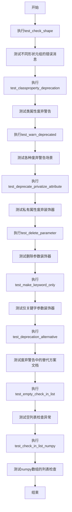

## 类结构

```
无自定义类定义（仅包含测试函数和辅助类A）
```

## 全局变量及字段


### `target`
    
目标形状元组，用于指定期望的数组维度

类型：`tuple[int | None, ...]`
    


### `shape_repr`
    
目标形状的字符串表示形式

类型：`str`
    


### `test_shape`
    
测试用数组的实际形状

类型：`tuple[int, ...]`
    


### `error_pattern`
    
用于匹配错误信息的正则表达式模式

类型：`str`
    


### `data`
    
测试用的零值numpy数组

类型：`np.ndarray`
    


### `alternative`
    
弃用功能的替代方案描述字符串

类型：`str`
    


### `func`
    
被装饰器修改的测试函数对象

类型：`Callable`
    


### `foo`
    
测试函数的可选参数，用于验证弃用警告

类型：`Any`
    


### `arg`
    
函数的位置参数（将改为仅关键字参数）

类型：`Any`
    


### `pre`
    
函数的位置参数（保持不变）

类型：`Any`
    


### `post`
    
函数的可选关键字参数（保持不变）

类型：`Any`
    


### `kwargs`
    
函数的关键字参数字典

类型：`dict[str, Any]`
    


### `A._attr`
    
类的私有实例属性，初始值为1

类型：`int`
    


### `A.attr`
    
已弃用的类属性，通过deprecate_privatize_attribute装饰

类型：`int`
    


### `A.meth`
    
已弃用的类方法，通过deprecate_privatize_attribute装饰

类型：`Callable`
    


### `A.f`
    
已弃用的类属性，结合deprecated和classproperty装饰器

类型：`None`
    


### `C._attr`
    
类的私有实例属性，在__init__中初始化为1

类型：`int`
    


### `C.attr`
    
已弃用的类属性，通过deprecate_privatize_attribute装饰

类型：`Callable`
    


### `C.meth`
    
已弃用的实例方法，通过deprecate_privatize_attribute装饰，返回类型与参数类型相同

类型：`Callable[[T], T]`
    
    

## 全局函数及方法


### `test_check_shape`

这是一个使用 pytest 参数化装饰器的测试函数，用于验证 `_api.check_shape` 函数在目标形状与输入形状不匹配时能否正确抛出 `ValueError` 异常，并通过正则表达式验证异常消息格式是否符合预期。

**参数：**

- `target`：`tuple[int | None, ...]`，期望的数组维度元组，其中 `None` 表示该维度可以是任意正整数
- `shape_repr`：`str`，目标形状的字符串表示形式（如 `"(N, 3)"`）
- `test_shape`：`tuple[int, ...]`（测试用）实际输入数组的形状元组

**返回值：** `None`，该函数为测试函数，无返回值

#### 流程图

```mermaid
flowchart TD
    A[开始测试] --> B[根据parametrize参数组合执行测试]
    B --> C[构建错误消息正则模式<br/>pattern = ^'aardvark' must be {len(target)}D with shape {shape_repr}, but your input has shape {test_shape}]
    C --> D[创建测试数据<br/>data = np.zerostest_shape]
    D --> E[执行check_shape并期望抛出ValueError<br/>_api.check_shapetarget, aardvark=data]
    E --> F{是否抛出ValueError?}
    F -->|是| G{错误消息是否匹配?}
    G -->|是| H[测试通过]
    G -->|否| I[测试失败-消息不匹配]
    F -->|否| J[测试失败-未抛出异常]
    H --> K[下一个测试用例或结束]
    I --> K
    J --> K
```

#### 带注释源码

```python
@pytest.mark.parametrize('target,shape_repr,test_shape',
                         [((None, ), "(N,)", (1, 3)),          # 测试1D: 期望(N,)但输入(1,3)
                          ((None, 3), "(N, 3)", (1,)),          # 测试2D: 期望(N,3)但输入(1,)
                          ((None, 3), "(N, 3)", (1, 2)),       # 测试2D: 期望(N,3)但输入(1,2)维度2不匹配
                          ((1, 5), "(1, 5)", (1, 9)),          # 测试2D: 期望(1,5)但输入(1,9)维度1不匹配
                          ((None, 2, None), "(M, 2, N)", (1, 3, 1))  # 测试3D: 期望(M,2,N)但输入(1,3,1)
                          ])
def test_check_shape(target: tuple[int | None, ...],
                     shape_repr: str,
                     test_shape: tuple[int, ...]) -> None:
    """
    测试 _api.check_shape 函数对形状不匹配的验证
    
    Args:
        target: 期望的形状元组，None表示任意正整数维度
        shape_repr: 形状的字符串表示（用于错误消息）
        test_shape: 实际输入的形状（用于构造测试数据）
    """
    # 构建期望的错误消息正则表达式，使用re.escape转义特殊字符
    # 格式: ^'aardvark' must be {维度数}D with shape {shape_repr}, but your input has shape {test_shape}
    error_pattern = "^" + re.escape(
        f"'aardvark' must be {len(target)}D with shape {shape_repr}, but your input "
        f"has shape {test_shape}")
    
    # 创建指定形状的零数组作为测试数据
    data = np.zeros(test_shape)
    
    # 使用pytest.raises上下文管理器验证：
    # 1. check_shape会抛出ValueError异常
    # 2. 异常消息与error_pattern正则匹配
    with pytest.raises(ValueError, match=error_pattern):
        _api.check_shape(target, aardvark=data)
```


### `test_classproperty_deprecation`

描述：测试 `@_api.classproperty` 装饰器与 `@_api.deprecated` 装饰器组合使用时，是否能正确地在类属性访问和实例属性访问时触发 `MatplotlibDeprecationWarning` 警告。

参数：无

返回值：`None`，无返回值（测试函数）

#### 流程图

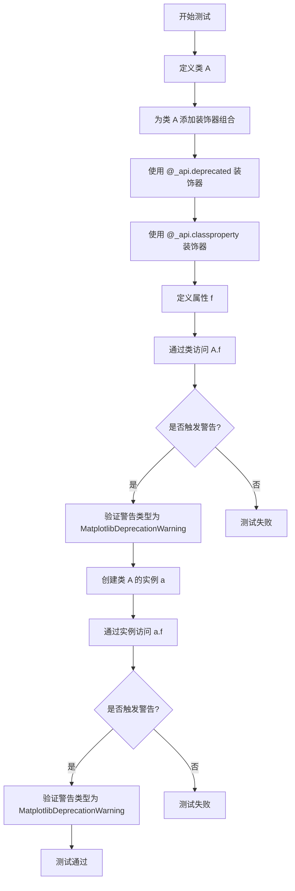

#### 带注释源码

```python
def test_classproperty_deprecation() -> None:
    """
    测试 classproperty 装饰器的弃用警告功能。
    
    验证当使用 @_api.classproperty 和 @_api.deprecated 装饰器组合时，
    无论通过类还是实例访问属性，都会正确触发弃用警告。
    """
    # 定义测试类 A
    class A:
        # 使用 @_api.deprecated 标记该属性将在版本 0.0.0 被弃用
        @_api.deprecated("0.0.0")
        # 使用 @_api.classproperty 使其成为类属性（类似 Java 的静态属性）
        @_api.classproperty
        def f(cls: Self) -> None:
            """被弃用的类属性 f"""
            pass
    
    # 测试 1: 通过类访问属性 A.f
    # 验证是否触发了 MatplotlibDeprecationWarning
    with pytest.warns(mpl.MatplotlibDeprecationWarning):
        A.f  # 预期触发弃用警告
    
    # 测试 2: 通过实例访问属性 a.f
    # 验证实例访问同样会触发弃用警告
    with pytest.warns(mpl.MatplotlibDeprecationWarning):
        a = A()  # 创建类 A 的实例
        a.f  # 预期触发弃用警告
```


### `test_warn_deprecated`

该测试函数用于验证 `_api.warn_deprecated` 函数在不同参数组合下能否正确触发相应类型的弃用警告，并确保警告消息内容与预期格式匹配。

参数： 无

返回值：`None`，该函数为测试函数，不返回任何值

#### 流程图

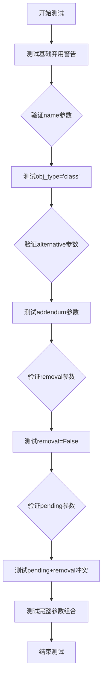

#### 带注释源码

```python
def test_warn_deprecated():
    """
    测试 _api.warn_deprecated 函数的各种使用场景
    """
    # 测试1: 基础功能 - 只提供version和name
    with pytest.warns(mpl.MatplotlibDeprecationWarning,
                      match=r'foo was deprecated in Matplotlib 3\.10 and will be '
                            r'removed in 3\.12\.'):
        _api.warn_deprecated('3.10', name='foo')
    
    # 测试2: 指定obj_type为'class'时，警告消息使用"The {name} class"格式
    with pytest.warns(mpl.MatplotlibDeprecationWarning,
                      match=r'The foo class was deprecated in Matplotlib 3\.10 and '
                            r'will be removed in 3\.12\.'):
        _api.warn_deprecated('3.10', name='foo', obj_type='class')
    
    # 测试3: 添加alternative参数，提示用户使用替代方案
    with pytest.warns(mpl.MatplotlibDeprecationWarning,
                      match=r'foo was deprecated in Matplotlib 3\.10 and will be '
                            r'removed in 3\.12\. Use bar instead\.'):
        _api.warn_deprecated('3.10', name='foo', alternative='bar')
    
    # 测试4: 添加addendum参数，提供额外信息
    with pytest.warns(mpl.MatplotlibDeprecationWarning,
                      match=r'foo was deprecated in Matplotlib 3\.10 and will be '
                            r'removed in 3\.12\. More information\.'):
        _api.warn_deprecated('3.10', name='foo', addendum='More information.')
    
    # 测试5: 自定义移除版本号为'4.0'
    with pytest.warns(mpl.MatplotlibDeprecationWarning,
                      match=r'foo was deprecated in Matplotlib 3\.10 and will be '
                            r'removed in 4\.0\.'):
        _api.warn_deprecated('3.10', name='foo', removal='4.0')
    
    # 测试6: removal=False表示不计划移除，不显示移除版本信息
    with pytest.warns(mpl.MatplotlibDeprecationWarning,
                      match=r'foo was deprecated in Matplotlib 3\.10\.'):
        _api.warn_deprecated('3.10', name='foo', removal=False)
    
    # 测试7: pending=True使用PendingDeprecationWarning而非MatplotlibDeprecationWarning
    with pytest.warns(PendingDeprecationWarning,
                      match=r'foo will be deprecated in a future version'):
        _api.warn_deprecated('3.10', name='foo', pending=True)
    
    # 测试8: pending和removal不能同时设置，应抛出ValueError
    with pytest.raises(ValueError, match=r'cannot have a scheduled removal'):
        _api.warn_deprecated('3.10', name='foo', pending=True, removal='3.12')
    
    # 测试9: 完整参数组合测试
    with pytest.warns(mpl.MatplotlibDeprecationWarning, match=r'Complete replacement'):
        _api.warn_deprecated('3.10', message='Complete replacement', name='foo',
                             alternative='bar', addendum='More information.',
                             obj_type='class', removal='4.0')
```


### `test_deprecate_privatize_attribute`

该函数用于测试 `_api.deprecate_privatize_attribute` 装饰器的功能，验证其能够将类的公共属性和方法标记为私有（在名称前添加下划线），并在访问这些已弃用的属性或方法时发出 `MatplotlibDeprecationWarning` 警告。

参数： 无

返回值：`None`，该函数为测试函数，不返回任何值。

#### 流程图

```mermaid
flowchart TD
    A[开始: 定义测试函数 test_deprecate_privatize_attribute] --> B[定义内部类 C]
    B --> C[类 C 构造函数 __init__ 初始化 self._attr = 1]
    B --> D[类 C 定义私有方法 _meth]
    B --> E[类 C 使用 deprecate_privatize_attribute 装饰 attr]
    B --> F[类 C 使用 deprecate_privatize_attribute 装饰 meth]
    F --> G[创建类 C 的实例 c]
    G --> H[测试读取 attr: with pytest.warns 验证警告并断言 c.attr == 1]
    H --> I[测试写入 attr: with pytest.warns 验证警告并设置 c.attr = 2]
    I --> J[测试再次读取 attr: with pytest.warns 验证警告并断言 c.attr == 2]
    J --> K[测试调用 meth: with pytest.warns 验证警告并断言 c.meth(42) == 42]
    K --> L[结束测试]
```

#### 带注释源码

```python
def test_deprecate_privatize_attribute() -> None:
    """
    测试 deprecate_privatize_attribute 装饰器的功能。
    该装饰器用于将类的公共属性/方法标记为私有，并在访问时发出弃用警告。
    """
    # 定义一个内部类 C，用于测试装饰器
    class C:
        # 构造函数，初始化私有属性 _attr
        def __init__(self) -> None: 
            self._attr = 1
        
        # 私有方法 _meth，接受泛型参数 T 并返回同类型结果
        def _meth(self, arg: T) -> T: 
            return arg
        
        # 使用 deprecate_privatize_attribute 装饰器将 attr 标记为弃用
        # 访问 c.attr 时会触发警告，实际访问的是 self._attr
        attr: int = _api.deprecate_privatize_attribute("0.0")
        
        # 使用 deprecate_privatize_attribute 装饰器将 meth 标记为弃用
        # 访问 c.meth 时会触发警告，实际调用的是 self._meth
        meth: Callable = _api.deprecate_privatize_attribute("0.0")

    # 创建类 C 的实例
    c = C()
    
    # 测试 1: 读取已弃用的属性 attr
    # 预期触发 MatplotlibDeprecationWarning 警告
    with pytest.warns(mpl.MatplotlibDeprecationWarning):
        assert c.attr == 1  # 实际读取的是 self._attr
    
    # 测试 2: 写入已弃用的属性 attr
    # 预期触发 MatplotlibDeprecationWarning 警告
    with pytest.warns(mpl.MatplotlibDeprecationWarning):
        c.attr = 2  # 实际写入的是 self._attr
    
    # 测试 3: 再次读取已弃用的属性 attr，验证写入成功
    # 预期触发 MatplotlibDeprecationWarning 警告
    with pytest.warns(mpl.MatplotlibDeprecationWarning):
        assert c.attr == 2  # 实际读取的是更新后的 self._attr
    
    # 测试 4: 调用已弃用的方法 meth
    # 预期触发 MatplotlibDeprecationWarning 警告
    with pytest.warns(mpl.MatplotlibDeprecationWarning):
        assert c.meth(42) == 42  # 实际调用的是 self._meth
```


### `test_delete_parameter`

该函数是一个测试函数，用于测试 `_api.delete_parameter` 装饰器的功能，验证当使用已标记为删除的参数时是否会正确触发弃用警告。

参数：该函数无参数

返回值：`None`，测试函数不返回任何值

#### 流程图

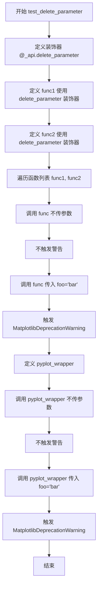

#### 带注释源码

```python
def test_delete_parameter() -> None:
    """
    测试 _api.delete_parameter 装饰器的功能。
    验证当传入已标记为删除的参数时，会正确触发弃用警告。
    """
    
    # 使用 delete_parameter 装饰器标记 foo 参数将在 3.0 版本被删除
    @_api.delete_parameter("3.0", "foo")
    def func1(foo: Any = None) -> None:
        """带默认参数的测试函数"""
        pass

    # 使用 delete_parameter 装饰器标记 foo 参数
    @_api.delete_parameter("3.0", "foo")
    def func2(**kwargs: Any) -> None:
        """使用 **kwargs 接收参数的测试函数"""
        pass

    # 遍历测试 func1 和 func2
    for func in [func1, func2]:  # type: ignore[list-item]
        # 调用函数时不传 foo 参数 - 不触发警告
        func()  # No warning.
        
        # 调用函数时传入 foo 参数 - 触发弃用警告
        with pytest.warns(mpl.MatplotlibDeprecationWarning):
            func(foo="bar")

    # 定义一个 pyplot 包装器，使用 _deprecated_parameter 作为默认值
    def pyplot_wrapper(foo: Any = _api.deprecation._deprecated_parameter) -> None:
        """包装函数，使用特殊默认值"""
        func1(foo)

    # 调用包装器不传参数 - 不触发警告
    pyplot_wrapper()  # No warning.
    
    # 调用函数传入 foo 参数 - 触发弃用警告
    with pytest.warns(mpl.MatplotlibDeprecationWarning):
        func(foo="bar")
```


### `test_make_keyword_only`

这是一个单元测试函数，用于验证 `_api.make_keyword_only` 装饰器的功能。该装饰器强制函数在指定版本后将某个位置参数改为仅限关键字参数（keyword-only argument），并在使用位置参数传递时发出弃用警告。

参数：此函数无参数。

返回值：`None`，无返回值。

#### 流程图

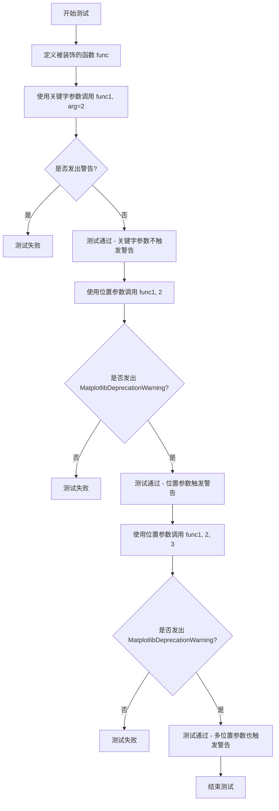

#### 带注释源码

```python
def test_make_keyword_only() -> None:
    """
    测试 make_keyword_only 装饰器是否正确工作。
    
    该装饰器用于在指定版本后将函数参数从位置参数改为仅限关键字参数，
    并在使用旧式位置参数调用时发出弃用警告。
    """
    # 使用 make_keyword_only 装饰器，指定在 3.0 版本后，
    # 'arg' 参数必须以关键字参数形式传递
    @_api.make_keyword_only("3.0", "arg")
    def func(pre: Any, arg: Any, post: Any = None) -> None:
        """示例函数，参数 pre 为位置参数，arg 为待转为关键字的参数，post 为可选参数。"""
        pass

    # 测试场景1：使用关键字参数 arg=2 调用函数
    # 期望：不发出任何警告
    func(1, arg=2)  # Check that no warning is emitted.

    # 测试场景2：使用位置参数 arg=2 调用函数（旧式调用）
    # 期望：发出 MatplotlibDeprecationWarning 警告
    with pytest.warns(mpl.MatplotlibDeprecationWarning):
        func(1, 2)
    
    # 测试场景3：使用多个位置参数调用函数（旧式调用）
    # 期望：发出 MatplotlibDeprecationWarning 警告
    with pytest.warns(mpl.MatplotlibDeprecationWarning):
        func(1, 2, 3)
```


### `test_deprecation_alternative`

该测试函数用于验证`_api.deprecated`装饰器的`alternative`参数功能，确保当为废弃函数指定替代方案时，该替代方案描述能够正确包含在生成的文档字符串中。

参数：无

返回值：`None`，测试函数的默认返回值

#### 流程图

```mermaid
flowchart TD
    A[开始测试] --> B[定义alternative字符串]
    B --> C[使用@_api.deprecated装饰器定义内部函数f]
    C --> D{检查f.__doc__是否为None}
    D -->|是| E[跳过测试]
    D -->|否| F[断言alternative in f.__doc__]
    F --> G[测试通过]
    E --> G
```

#### 带注释源码

```python
def test_deprecation_alternative() -> None:
    """
    测试 _api.deprecated 装饰器的 alternative 参数功能。
    
    该测试验证当使用 @_api.deprecated 装饰器并传入 alternative 参数时，
    该替代方案描述字符串能够正确包含在生成的函数文档字符串中。
    """
    # 定义预期的替代方案字符串，包含多个不同格式的引用形式
    alternative = "`.f1`, `f2`, `f3(x) <.f3>` or `f4(x)<f4>`"
    
    # 使用 @_api.deprecated 装饰器标记内部函数 f 为已废弃，
    # 并将 alternative 参数设置为上述替代方案描述
    @_api.deprecated("1", alternative=alternative)
    def f() -> None:
        """这是一个测试用内部函数。"""
        pass
    
    # 如果文档被禁用（__doc__ 为 None），则跳过此测试
    if f.__doc__ is None:
        pytest.skip('Documentation is disabled')
    
    # 断言：验证 alternative 字符串是否正确包含在 f 的文档中
    # 这是测试的核心验证点，确保装饰器正确处理了 alternative 参数
    assert alternative in f.__doc__
```


### `test_empty_check_in_list`

测试 `_api.check_in_list` 函数在未提供 `value` 参数时是否抛出 `TypeError`，并验证错误消息为 "No argument to check!"。

参数：
- 无

返回值：`None`，测试函数，无返回值。

#### 流程图

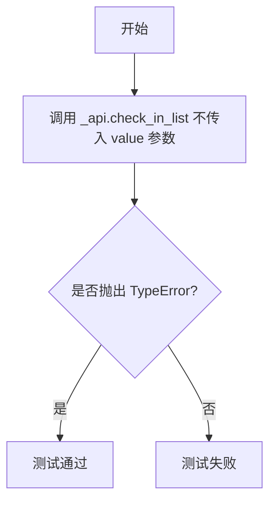

#### 带注释源码

```python
def test_empty_check_in_list() -> None:
    """
    测试 check_in_list 在未提供 value 参数时是否抛出 TypeError。
    """
    # 期望调用 _api.check_in_list 不传入 value 参数时抛出 TypeError
    # 错误消息应匹配 "No argument to check!"
    with pytest.raises(TypeError, match="No argument to check!"):
        _api.check_in_list(["a"])
```


### `test_check_in_list_numpy`

该函数是针对 `_api.check_in_list` 函数的单元测试，验证当传入 NumPy 数组作为 `value` 参数时，函数能够正确抛出 `ValueError` 异常，并包含特定的错误信息。

参数： 无

返回值：`None`，该函数为测试函数，不返回任何值

#### 流程图

```mermaid
flowchart TD
    A[开始测试] --> B[调用 _api.check_in_list]
    B --> C{是否抛出 ValueError?}
    C -- 是 --> D[验证错误信息匹配 'array\\(5\\) is not a valid value']
    D --> E[测试通过]
    C -- 否 --> F[测试失败]
    
    style A fill:#f9f,stroke:#333
    style E fill:#9f9,stroke:#333
    style F fill:#f99,stroke:#333
```

#### 带注释源码

```python
def test_check_in_list_numpy() -> None:
    """
    测试 check_in_list 函数对 NumPy 数组输入的处理。
    
    该测试用例验证当传入 NumPy 标量数组（np.array(5)）作为 value 参数时，
    check_in_list 函数能够正确识别并抛出带有明确错误信息的 ValueError。
    """
    # 使用 pytest.raises 上下文管理器捕获预期的 ValueError 异常
    # match 参数使用正则表达式验证错误消息内容
    with pytest.raises(ValueError, match=r"array\(5\) is not a valid value"):
        # 调用被测试的 check_in_list 函数
        # 参数1: 合法的选项列表 ['a', 'b']
        # 参数2: value=np.array(5) - 传入一个 NumPy 标量数组
        _api.check_in_list(['a', 'b'], value=np.array(5))
```


### `func1`

该函数是一个被 `@_api.delete_parameter` 装饰器标记为已删除参数的测试函数，用于验证在调用时传递已删除参数会触发弃用警告，而不传递参数则正常运行。

参数：

- `foo`：`Any`，被删除的参数，默认值为 None

返回值：`None`，无返回值

#### 流程图

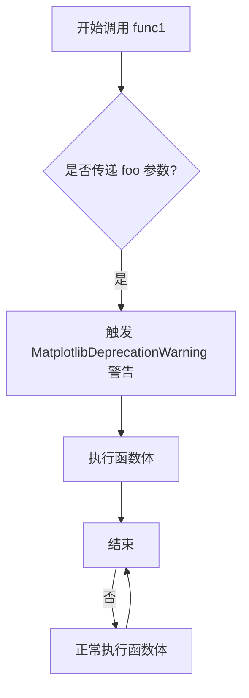

#### 带注释源码

```python
@_api.delete_parameter("3.0", "foo")
def func1(foo: Any = None) -> None:
    """
    一个被标记为已删除参数的测试函数。
    参数 foo 在 Matplotlib 3.0 版本被标记为已删除，
    调用时传递该参数将触发弃用警告。
    """
    pass
```


### `func2`

该函数是一个测试用的带装饰器的函数，使用 `@_api.delete_parameter` 装饰器标记 `foo` 参数已弃用，当调用时传入 `foo` 参数会发出弃用警告，不传入则正常执行。

参数：

- `**kwargs`：`Any`，可变关键字参数，用于接收任意数量的关键字参数

返回值：`None`，该函数没有返回值

#### 流程图

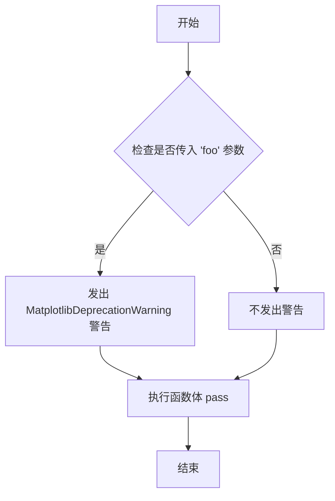

#### 带注释源码

```python
@_api.delete_parameter("3.0", "foo")  # 装饰器标记 foo 参数在 3.0 版本被删除
def func2(**kwargs: Any) -> None:      # 定义 func2 函数，接受任意关键字参数
    """测试被删除参数的函数 - 使用 **kwargs 形式"""
    pass  # 函数体为空，仅用于测试装饰器行为
```


### `pyplot_wrapper`

该函数是一个测试辅助函数，用于演示 `@_api.delete_parameter` 装饰器在嵌套函数场景下的行为，验证当调用时未传递已弃用的参数 `foo` 时不会产生警告。

参数：

- `foo`：`Any`，可选参数，默认值为 `_api.deprecation._deprecated_parameter`，表示该参数已被弃用

返回值：`None`，无返回值描述

#### 流程图

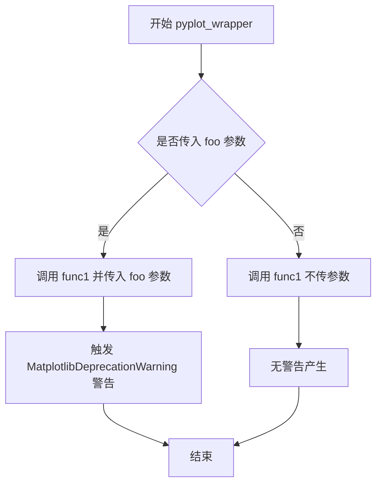

#### 带注释源码

```python
def pyplot_wrapper(foo: Any = _api.deprecation._deprecated_parameter) -> None:
    """
    测试用嵌套函数，用于验证 delete_parameter 装饰器效果。
    参数 foo 已被标记为在 3.0 版本删除。
    
    Args:
        foo: 任意类型参数，已弃用，默认值为 _api.deprecation._deprecated_parameter
    """
    # 调用原始函数 func1，传入参数 foo
    # 如果 foo 使用默认值调用，则不会触发警告
    # 如果显式传入 foo="bar" 等值，则会触发弃用警告
    func1(foo)
```


### `test_check_shape`

该测试函数用于验证 `_api.check_shape` 函数在处理不同形状参数时的行为是否符合预期，通过参数化测试覆盖了多种维度和形状组合，并使用正则表达式匹配具体的错误信息。

参数：

- `target`：`tuple[int | None, ...]`，目标形状元组，其中 None 表示该维度可以是任意整数
- `shape_repr`：`str`，目标形状的字符串表示形式
- `test_shape`：`tuple[int, ...]，测试用的输入形状

返回值：`None`，该函数为测试函数，无返回值

#### 流程图

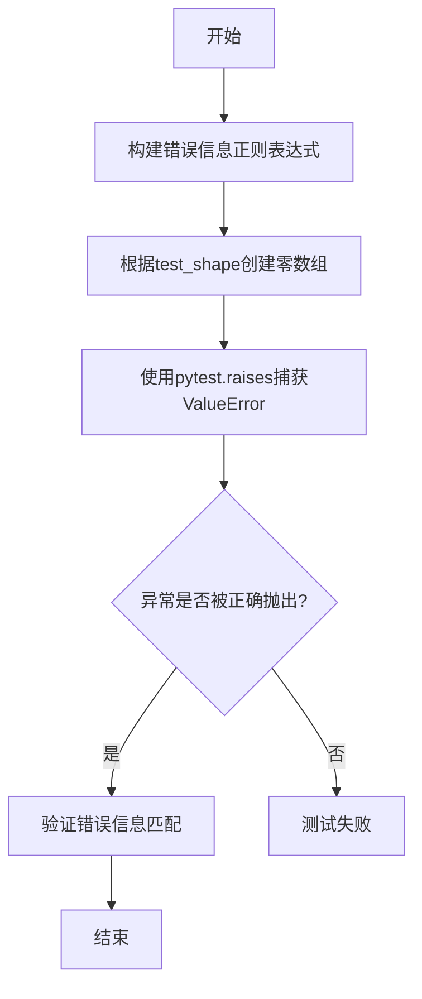

#### 带注释源码

```python
# 参数化测试，测试不同的形状组合
@pytest.mark.parametrize('target,shape_repr,test_shape',
                         [((None, ), "(N,)", (1, 3)),          # 1D形状，N为任意长度
                          ((None, 3), "(N, 3)", (1,)),          # 2D形状，最后维度必须为3
                          ((None, 3), "(N, 3)", (1, 2)),        # 2D形状，但第二维度不为3
                          ((1, 5), "(1, 5)", (1, 9)),           # 固定形状(1,5)，测试不匹配
                          ((None, 2, None), "(M, 2, N)", (1, 3, 1))  # 3D形状，中间维度为2
                          ])
def test_check_shape(target: tuple[int | None, ...],
                     shape_repr: str,
                     test_shape: tuple[int, ...]) -> None:
    """
    测试check_shape函数对各种形状输入的验证逻辑
    
    Args:
        target: 期望的目标形状元组
        shape_repr: 目标形状的可读字符串表示
        test_shape: 测试用的实际输入形状
    """
    # 构建期望的错误信息正则表达式
    error_pattern = "^" + re.escape(
        f"'aardvark' must be {len(target)}D with shape {shape_repr}, but your input "
        f"has shape {test_shape}")
    
    # 创建指定形状的numpy零数组作为测试数据
    data = np.zeros(test_shape)
    
    # 验证check_shape函数能正确抛出ValueError并包含预期错误信息
    with pytest.raises(ValueError, match=error_pattern):
        _api.check_shape(target, aardvark=data)
```


### `C.__init__`

该方法是测试类 `C` 的初始化方法，用于设置实例的私有属性 `_attr` 为 1。

参数：

- `self`：`Self`，类的实例本身，无需显式传递

返回值：`None`，构造函数不返回值

#### 流程图

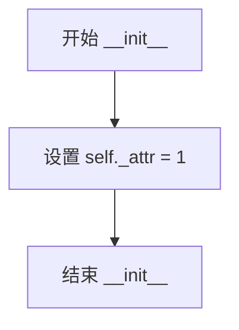

#### 带注释源码

```python
def __init__(self) -> None: 
    """
    初始化 C 类的实例。
    设置实例的私有属性 _attr 为 1。
    """
    self._attr = 1  # 将实例属性 _attr 初始化为 1
```


### `C._meth`（在代码中为类C的方法）

该方法是测试类C中的一个私有方法，用于返回传入的参数值，作为`deprecate_privatize_attribute`装饰器的测试用例之一。

参数：

- `self`：`Self`，类实例本身（隐式参数）
- `arg`：`T`（泛型类型），需要返回的参数值

返回值：`T`（泛型类型），返回传入的参数值

#### 流程图

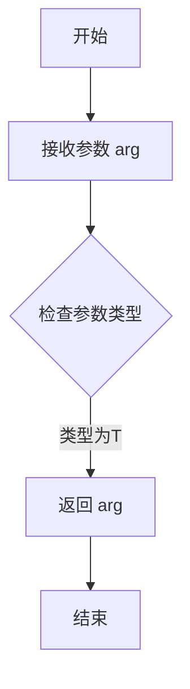

#### 带注释源码

```python
def _meth(self, arg: T) -> T:
    """
    测试用的私有方法，直接返回传入的参数。
    
    参数:
        arg: 泛型类型参数，需要返回的值
    
    返回:
        返回传入的参数值本身
    """
    return arg
```

---

**注意**：该方法出现在`test_deprecate_privatize_attribute`测试函数中，作为被`_api.deprecate_privatize_attribute`装饰器处理的属性/方法示例。类C中定义了两个被装饰的元素：
1. `attr`：一个实例属性，通过`deprecate_privatize_attribute`装饰
2. `meth`：指向`_meth`方法的属性，也通过`deprecate_privatize_attribute`装饰

该测试验证了当访问或修改这些已弃用的私有属性/方法时，会正确发出`MatplotlibDeprecationWarning`警告。


### `C.__init__`

该方法是测试类 `C` 的构造函数，用于初始化实例并将私有属性 `_attr` 设置为初始值 1。

参数：

- `self`：`Self`，隐式的实例对象引用，代表当前创建的类实例

返回值：`None`，无返回值

#### 流程图

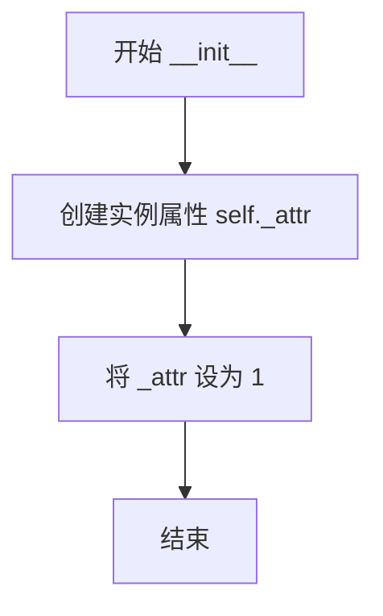

#### 带注释源码

```python
def __init__(self) -> None:
    """
    C 类的初始化方法。
    创建一个实例属性 _attr 并初始化为 1。
    
    参数:
        self: 当前创建的类实例
        
    返回值:
        None
    """
    self._attr = 1  # 初始化私有属性 _attr 为 1
```


### `C._meth`

这是一个在测试函数`test_deprecate_privatize_attribute`内部定义的类C中的方法`_meth`，该方法是一个泛型方法，接受一个泛型参数`arg`并直接将其返回，实现了一个简单的身份函数。

参数：

- `self`：`C`，类实例本身（隐式参数）
- `arg`：`T`（泛型），输入参数，可以是任意类型

返回值：`T`（泛型），返回与输入参数相同类型的值

#### 流程图

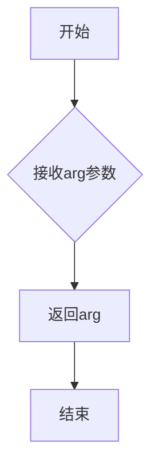

#### 带注释源码

```python
def _meth(self, arg: T) -> T: 
    """
    一个简单的泛型方法，直接返回输入参数。
    
    参数:
        arg: 任意类型的输入参数
        
    返回:
        返回与输入参数类型相同的值
    """
    return arg
```

## 关键组件


### test_check_shape

测试`_api.check_shape`函数，验证张量形状是否符合目标形状规范，支持None维度表示任意大小。

### test_classproperty_deprecation

测试`_api.classproperty`装饰器与`_api.deprecated`组合使用，验证类属性弃用警告的正确触发。

### test_warn_deprecated

测试`_api.warn_deprecated`函数，支持多种弃用场景：版本指定、替代方案、附加信息、移除版本、待定弃用等。

### test_deprecate_privatize_attribute

测试`_api.deprecate_privatize_attribute`装饰器，将公开属性和方法标记为私有并触发弃用警告。

### test_delete_parameter

测试`_api.delete_parameter`装饰器，标记函数参数为已删除，调用时触发弃用警告。

### test_make_keyword_only

测试`_api.make_keyword_only`装饰器，将函数参数强制转换为关键字参数形式。

### test_deprecation_alternative

测试弃用文档中替代方案的正确包含，验证`.f1`、`f2`、`f3(x)`等替代引用是否出现在文档中。

### test_empty_check_in_list

测试`_api.check_in_list`函数对空列表的边界检查，验证无参数时抛出TypeError。

### test_check_in_list_numpy

测试`_api.check_in_list`函数对numpy数组值的验证，确保无效值触发正确的ValueError。


## 问题及建议


### 已知问题

-   **test_delete_parameter函数逻辑错误**：在`test_delete_parameter`函数末尾，定义了`pyplot_wrapper`函数但没有正确使用它。测试中调用`func(foo="bar")`而不是`pyplot_wrapper(foo="bar")`，导致无法测试wrapper的行为，且最后一个测试用例没有使用`pyplot_wrapper`变量。
-   **类型注解不一致**：`test_delete_parameter`中使用了`# type: ignore[list-item]`来忽略类型检查，表明列表中元素类型处理存在问题。
-   **测试覆盖不完整**：`test_check_in_list_numpy`测试用例较少，只测试了一个无效的numpy标量情况，没有测试有效的numpy数组情况。
-   **测试数据硬编码**：多个测试用例中使用了硬编码的测试数据（如`test_check_shape`中的参数），缺乏灵活性。
-   **缺少边界条件测试**：如`test_make_keyword_only`没有测试默认值参数在不同位置的情况。

### 优化建议

-   修复`test_delete_parameter`函数，确保正确调用`pyplot_wrapper`进行测试，并移除未使用的`pyplot_wrapper`变量或完善其测试逻辑。
-   改进类型注解，使用泛型或Union类型正确处理不同函数类型的列表，避免使用类型注释忽略。
-   增加更多测试用例，包括边界条件和不同数据类型的测试，特别是`test_check_in_list_numpy`应添加正向测试用例。
-   将测试数据参数化，使用变量或配置文件管理，提高测试的可维护性和可扩展性。
-   统一测试风格，确保所有测试函数都有清晰的docstring说明测试目的。

## 其它


### 设计目标与约束

本测试文件旨在验证matplotlib._api模块中各种装饰器和工具函数的功能正确性，包括形状检查、属性废弃、参数管理等。设计约束包括：必须使用pytest框架、测试数据使用numpy数组、必须验证废弃警告的正确性。

### 错误处理与异常设计

代码涉及多种异常类型：ValueError用于形状不匹配和参数值无效；TypeError用于参数类型错误；MatplotlibDeprecationWarning用于正式废弃警告；PendingDeprecationWarning用于待废弃警告。测试通过pytest.raises和pytest.warns验证异常和警告的抛出符合预期。

### 数据流与状态机

测试数据流为：定义测试参数(target, shape_repr, test_shape) → 创建测试数据np.zeros(test_shape) → 调用_api函数 → 验证异常/警告抛出。状态机表现为：正常状态 → 检测到不符合要求的输入 → 转换到异常状态或警告状态。

### 外部依赖与接口契约

主要外部依赖包括：numpy提供数组操作；pytest提供测试框架和断言；matplotlib提供MatplotlibDeprecationWarning；matplotlib._api提供被测函数。接口契约包括：check_shape(target, data)返回None或抛出ValueError；warn_deprecated()抛出指定类型警告；deprecate_privatize_attribute返回装饰后的属性/方法。

### 性能考虑

测试使用小规模数组（如(1,3)、(1,9)等）以确保测试速度，未包含大规模性能测试。装饰器在首次调用时可能有一定性能开销，但属于可接受范围。

### 兼容性设计

代码使用from __future__ import annotations支持Python 3.7+的类型注解；使用typing.TYPE_CHECKING避免运行时类型检查开销；测试覆盖了不同版本的废弃警告消息格式。

### 测试覆盖范围

测试覆盖了：形状检查的正向和反向用例；classproperty装饰器的读写和实例访问；warn_deprecated的各种参数组合；deprecate_privatize_attribute的属性和方法；delete_parameter的多种函数签名；make_keyword_only的参数转换；check_in_list的输入验证。

    