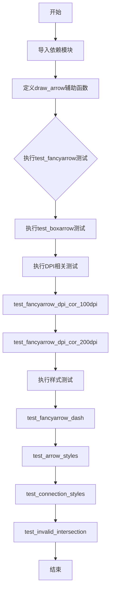
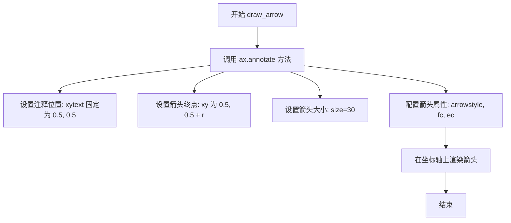
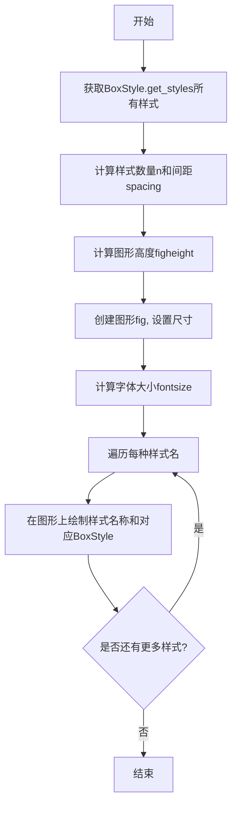
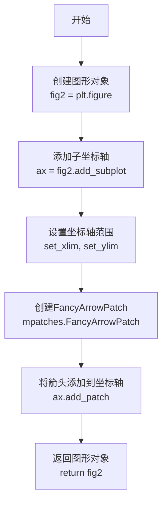
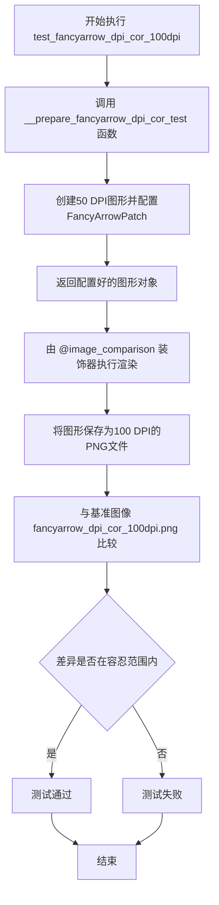
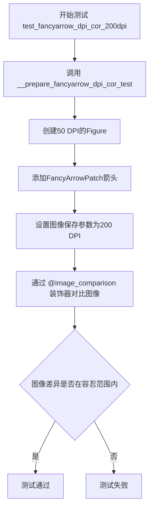
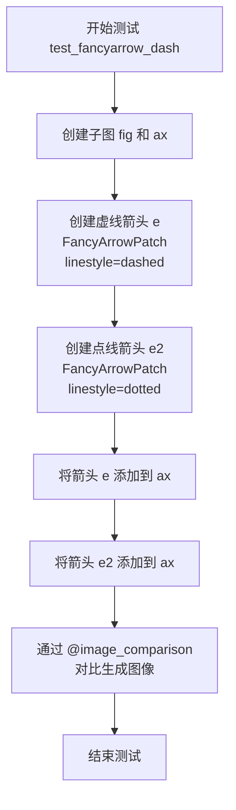
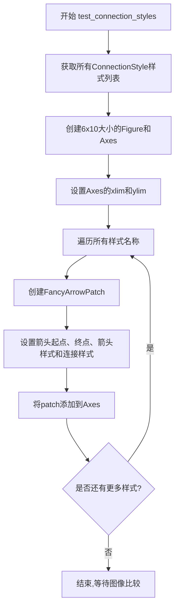
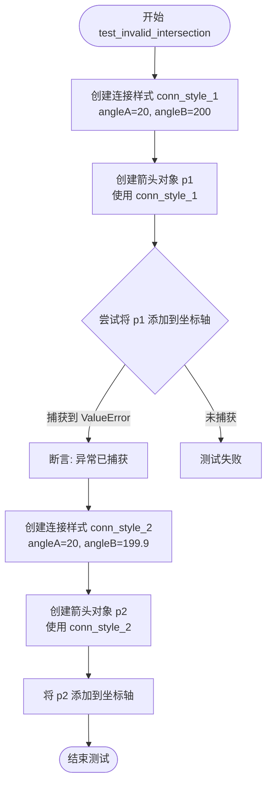

# `matplotlib\lib\matplotlib\tests\test_arrow_patches.py` 详细设计文档

该文件是matplotlib的测试文件，主要用于测试FancyArrowPatch（花式箭头）、BoxStyle（盒子样式）、ArrowStyle（箭头样式）和ConnectionStyle（连接样式）的渲染效果，包括DPI相关性、不同样式展示和无效参数验证等功能。

## 整体流程



## 类结构

```
TestModule (测试模块)
├── draw_arrow (辅助函数)
├── test_fancyarrow (测试用例)
├── test_boxarrow (测试用例)
├── __prepare_fancyarrow_dpi_cor_test (内部函数)
├── test_fancyarrow_dpi_cor_100dpi (测试用例)
├── test_fancyarrow_dpi_cor_200dpi (测试用例)
├── test_fancyarrow_dash (测试用例)
├── test_arrow_styles (测试用例)
├── test_connection_styles (测试用例)
└── test_invalid_intersection (测试用例)
```

## 全局变量及字段


### `r`
    
半径值数组，用于定义箭头尾部与头部之间的距离比例

类型：`list[float]`
    


### `t`
    
箭头样式数组，包含字符串样式名称和ArrowStyle对象实例

类型：`list[str | ArrowStyle]`
    


### `styles`
    
BoxStyle样式集合，通过get_styles()方法获取的所有可用方框样式

类型：`dict[str, BoxStyle]`
    


### `n`
    
样式数量，表示styles字典中包含的样式总数

类型：`int`
    


### `spacing`
    
间距值，用于控制图形中各元素之间的垂直间隔

类型：`float`
    


### `figheight`
    
图形高度，根据样式数量和间距计算得出的Figure高度值

类型：`float`
    


### `fontsize`
    
字体大小，用于设置图形中文本标签的字体尺寸

类型：`float`
    


### `conn_style_1`
    
Angle3连接样式对象，角度参数会导致无效的箭头交叉

类型：`ConnectionStyle.Angle3`
    


### `conn_style_2`
    
Angle3连接样式对象，角度参数在有效范围内

类型：`ConnectionStyle.Angle3`
    


### `p1`
    
使用无效连接样式创建的箭头_patch对象，用于测试异常情况

类型：`FancyArrowPatch`
    


### `p2`
    
使用有效连接样式创建的箭头_patch对象，用于测试正常情况

类型：`FancyArrowPatch`
    


### `e`
    
带角度连接样式的虚线箭头_patch对象

类型：`FancyArrowPatch`
    


### `e2`
    
带角度连接样式的点线箭头_patch对象

类型：`FancyArrowPatch`
    


    

## 全局函数及方法


### `draw_arrow`

绘制箭头的辅助函数，用于在给定的 matplotlib 坐标轴上绘制一个带样式的箭头。该函数通过 `ax.annotate()` 方法在坐标轴中心位置创建一个注释箭头，箭头从底部 (0.5, 0.5) 指向顶部 (0.5, 0.5 + r)，可根据传入的样式参数 t 自定义箭头样式。

参数：

- `ax`：`matplotlib.axes.Axes`，要在其上绘制箭头的坐标轴对象
- `t`：str 或 `matplotlib.patches.ArrowStyle`，箭头的样式，可以是字符串（如 "fancy"、"simple"）或 `ArrowStyle` 对象实例
- `r`：float，箭头尖端的垂直偏移量，决定箭头从基线向上延伸的高度

返回值：`None`，该函数无返回值，直接在传入的坐标轴对象上绘制图形

#### 流程图



#### 带注释源码

```python
def draw_arrow(ax, t, r):
    """
    在给定的坐标轴上绘制一个箭头。
    
    参数:
        ax: matplotlib.axes.Axes 对象，目标坐标轴
        t: 箭头样式，字符串或 ArrowStyle 对象
        r: 箭头垂直偏移量
    """
    # 使用 annotate 方法绘制箭头注释
    # xytext: 箭头的起始点 (固定在坐标轴中心底部)
    # xy: 箭头的终点 (中心底部加上偏移量 r)
    # size: 箭头的大小/缩放
    # arrowprops: 箭头属性字典，包含样式和颜色
    ax.annotate('', xy=(0.5, 0.5 + r), xytext=(0.5, 0.5), size=30,
                arrowprops=dict(arrowstyle=t,  # 箭头样式由参数 t 指定
                                fc="b",         # facecolor: 蓝色
                                ec='k'))        # edgecolor: 黑色
```


### `test_fancyarrow`

#### 1. 核心功能概述
该函数是一个基于图像对比（Image Comparison）的自动化视觉测试，用于验证 Matplotlib 库中 "fancy" 和 "simple" 两种箭头样式在不同尾部半径下的渲染效果是否符合预期。

#### 2. 文件整体运行流程
本文件主要包含一系列针对 `matplotlib.patches`（尤其是 `FancyArrowPatch` 和箭头样式）的视觉回归测试。
- `test_fancyarrow` 专注于测试基础箭头样式的渲染。
- `test_boxarrow` 测试盒子样式。
- `test_fancyarrow_dpi_cor_*` 测试 DPI 分辨率对箭头大小的影响。
- `test_arrow_styles` 和 `test_connection_styles` 测试所有的箭头和连接样式。
- `test_invalid_intersection` 测试无效连接的异常处理。
所有测试均依赖 `@image_comparison` 装饰器来捕获渲染结果并与基准图进行比对。

#### 3. 全局变量与全局函数详情

**全局函数：**
- **`draw_arrow(ax, t, r)`**：
  - **名称**：`draw_arrow`
  - **参数**：
    - `ax`：`matplotlib.axes.Axes`，绘图用的坐标系对象。
    - `t`：箭头样式（字符串或 `ArrowStyle` 对象），如 "fancy", "simple"。
    - `r`：浮点数，箭头尾部的相关参数（代码中用于控制 y 轴上的偏移/高度）。
  - **返回值**：无（直接修改 `ax` 对象）。
  - **描述**：这是一个测试辅助函数，封装了 `ax.annotate` 的调用逻辑，用于在给定的坐标系中绘制单个箭头。

#### 4. `test_fancyarrow` 详细信息

- **名称**：test_fancyarrow
- **参数**：
  - 无（该函数不接受任何显式输入参数，依赖全局配置和装饰器）。
- **返回值**：`None` (在 pytest 框架中，若测试通过通常返回 None，若失败则抛出断言异常)。
- **描述**：该测试函数创建了一个 3x5 的子图网格，分别使用 "fancy", "simple" 三种样式和 0 到 0.4 的半径值进行排列组合，通过绘制箭头并利用 `@image_comparison` 验证生成的图像是否与预存的基准图像 ['fancyarrow_test_image.png'] 一致。

#### 流程图

```mermaid
graph TD
    A([开始 test_fancyarrow]) --> B[定义半径列表 r = [0.4, 0.3, 0.2, 0.1, 0]]
    B --> C[定义样式列表 t = ['fancy', 'simple', ArrowStyle.Fancy]]
    C --> D[创建 3x5 子图网格 Figure & Axes]
    E{遍历样式 t} --> |外层循环| F{遍历半径 r}
    F --> |内层循环| G[获取子图坐标 ax = axs[i_t, i_r]]
    G --> H[调用 draw_arrow(ax, t1, r1) 绘制箭头]
    H --> I[设置坐标轴刻度 labelleft=False...]
    I --> F
    F --> J[内层循环结束]
    E --> K[外层循环结束]
    K --> L{Decorator: @image_comparison 进行图像比对}
    L --> M([结束测试])
```

#### 带注释源码

```python
@image_comparison(['fancyarrow_test_image.png'],
                  tol=0 if platform.machine() == 'x86_64' else 0.012)
def test_fancyarrow():
    # 定义半径列表，用于测试箭头尾部的不同大小/比例
    # 0.4 最大，0 为最小（用于测试极端情况或零值）
    r = [0.4, 0.3, 0.2, 0.1, 0]
    
    # 定义箭头样式列表，测试 'fancy' 字符串、'simple' 字符串
    # 以及 ArrowStyle 类的直接实例化对象
    t = ["fancy", "simple", mpatches.ArrowStyle.Fancy()]

    # 创建子图：行数由样式数量决定，列数由半径数量决定
    # squeeze=False 确保 axs 永远是 2D 数组，方便索引
    fig, axs = plt.subplots(len(t), len(r), squeeze=False,
                            figsize=(8, 4.5), subplot_kw=dict(aspect=1))

    # 嵌套循环遍历所有样式和半径的组合
    for i_r, r1 in enumerate(r):
        for i_t, t1 in enumerate(t):
            # 获取当前对应的子图坐标
            ax = axs[i_t, i_r]
            # 调用辅助函数绘制箭头
            draw_arrow(ax, t1, r1)
            # 隐藏刻度标签以保持图像整洁，只用于外观比对
            ax.tick_params(labelleft=False, labelbottom=False)
```

#### 5. 关键组件信息

- **`@image_comparison`**：这是 Matplotlib 测试框架的核心装饰器。它负责在测试运行前后截图，并对比 `baseline_images` 目录下的文件。`tol` 参数定义了允许的误差容忍度。
- **`matplotlib.patches.ArrowStyle`**：提供了定义箭头几何形状的类，包括 'Fancy', 'Simple' 等预定义样式。
- **`matplotlib.pyplot.annotate`**：底层绘图函数，`draw_arrow` 实际上是对其高级封装。

#### 6. 潜在的技术债务或优化空间

1.  **硬编码的平台判断**：
    ```python
    tol=0 if platform.machine() == 'x86_64' else 0.012
    ```
    代码中直接硬编码了 `x86_64` 架构的判断逻辑。这属于**平台相关的魔法数字**，如果要在其他架构（如 ARM64 的 Mac 或 Windows）上运行，可能会导致测试不稳定（图像误差过大）。建议通过 pytest 的 fixture 或配置文件来管理不同平台的容差。
2.  **辅助函数的耦合**：`test_fancyarrow` 强依赖顶层的 `draw_arrow` 函数。虽然这简化了代码，但 `draw_arrow` 的实现细节（如 `xytext` 的位置固定为 0.5）使得测试的灵活性受限。
3.  **布局参数硬编码**：figsize 和子图参数直接写在测试函数中，调整测试分辨率或布局时需要修改多处代码。

#### 7. 其它项目

- **设计目标与约束**：
  - **目标**：确保 "fancy" 和 "simple" 箭头样式在矢量渲染下的正确性。
  - **约束**：测试仅在 `mpl20` 风格（或其他指定风格）下进行，背景通常为白色。
- **错误处理与异常设计**：
  - 测试本身不包含显式的 `try-except`。错误主要来源于两个方面：一是 Matplotlib 渲染逻辑错误（会直接导致图片像素差异）；二是 `image_comparison` 装饰器检测到的像素差异（会导致测试失败）。
- **外部依赖**：
  - 依赖 `matplotlib.testing.decorators.image_comparison` 库。
  - 依赖基准图像文件 `fancyarrow_test_image.png` 存在于正确的测试数据路径中。


### `test_boxarrow`

该测试函数用于测试`matplotlib.patches.BoxStyle`的所有可用样式，通过获取所有BoxStyle样式并将其绘制在图形中，以图像比较的方式验证每种样式的正确渲染。

参数：
- 无

返回值：`None`，无返回值（测试函数）

#### 流程图



#### 带注释源码

```python
@image_comparison(['boxarrow_test_image.png'])  # 装饰器：比较生成的图像与预期图像
def test_boxarrow():
    """
    测试BoxStyle的所有样式，生成包含每种样式可视化结果的图像
    """
    
    # 获取所有可用的BoxStyle样式名称字典
    styles = mpatches.BoxStyle.get_styles()
    
    # 获取样式数量
    n = len(styles)
    # 设置样式间距
    spacing = 1.2
    
    # 根据样式数量计算图形高度
    figheight = (n * spacing + .5)
    # 创建图形，设置宽度和高度比例
    fig = plt.figure(figsize=(4 / 1.5, figheight / 1.5))
    
    # 计算字体大小（0.3英寸转换为点）
    fontsize = 0.3 * 72
    
    # 遍历所有样式（按名称排序）
    for i, stylename in enumerate(sorted(styles)):
        # 计算每行在图形中的相对垂直位置
        # 使用(n - i)使第一个样式显示在顶部
        y_position = ((n - i) * spacing - 0.5) / figheight
        
        # 在图形中心绘制样式名称
        fig.text(0.5, y_position, stylename,
                 ha="center",  # 水平居中对齐
                 size=fontsize,  # 设置字体大小
                 transform=fig.transFigure,  # 使用图形坐标系
                 # 添加边框，使用对应的BoxStyle样式
                 bbox=dict(boxstyle=stylename, fc="w", ec="k"))
```


### `__prepare_fancyarrow_dpi_cor_test`

该函数是一个测试辅助函数，用于创建并返回一个包含FancyArrowPatch的matplotlib图形对象。其主要目的是为DPI相关性测试准备测试场景，确保箭头头部的大小在不同DPI值下保持一致。

参数：

- 该函数没有参数

返回值：`matplotlib.figure.Figure`，返回一个matplotlib图形对象，该对象包含一个配置好的FancyArrowPatch，可用于验证箭头头部大小与DPI值无关

#### 流程图



#### 带注释源码

```python
def __prepare_fancyarrow_dpi_cor_test():
    """
    Convenience function that prepares and returns a FancyArrowPatch. It aims
    at being used to test that the size of the arrow head does not depend on
    the DPI value of the exported picture.

    NB: this function *is not* a test in itself!
    """
    # 创建一个新的图形对象，名称为"fancyarrow_dpi_cor_test"
    # 尺寸为4x3英寸，DPI设置为50
    fig2 = plt.figure("fancyarrow_dpi_cor_test", figsize=(4, 3), dpi=50)
    
    # 在图形中添加一个子坐标轴
    ax = fig2.add_subplot()
    
    # 设置坐标轴的X轴范围为0到1
    ax.set_xlim(0, 1)
    
    # 设置坐标轴的Y轴范围为0到1
    ax.set_ylim(0, 1)
    
    # 创建FancyArrowPatch对象
    # posA: 箭头起点坐标 (0.3, 0.4)
    # posB: 箭头终点坐标 (0.8, 0.6)
    # lw: 线宽为3
    # arrowstyle: 箭头样式为'->
    # mutation_scale: 突变比例为100，影响箭头头部大小
    ax.add_patch(mpatches.FancyArrowPatch(posA=(0.3, 0.4), posB=(0.8, 0.6),
                                          lw=3, arrowstyle='->',
                                          mutation_scale=100))
    
    # 返回包含箭头的图形对象，供测试函数使用
    return fig2
```


### `test_fancyarrow_dpi_cor_100dpi`

测试100 DPI下的FancyArrowPatch渲染，验证箭头头部大小与DPI值无关（仅测试光栅化格式）。

参数：
- 无

返回值：`None`，无返回值（测试函数，执行图像比较验证）

#### 流程图



#### 带注释源码

```python
@image_comparison(['fancyarrow_dpi_cor_100dpi.png'], remove_text=True,
                  tol=0 if platform.machine() == 'x86_64' else 0.02,
                  savefig_kwarg=dict(dpi=100))
def test_fancyarrow_dpi_cor_100dpi():
    """
    Check the export of a FancyArrowPatch @ 100 DPI. FancyArrowPatch is
    instantiated through a dedicated function because another similar test
    checks a similar export but with a different DPI value.

    Remark: test only a rasterized format.
    """

    # 调用内部辅助函数准备测试图形和箭头
    # 该函数创建图形、设置坐标轴、并添加FancyArrowPatch
    __prepare_fancyarrow_dpi_cor_test()
```


### `test_fancyarrow_dpi_cor_200dpi`

该函数是一个图像对比测试用例，用于验证在200 DPI导出条件下FancyArrowPatch箭头头部尺寸的渲染一致性，确保在不同DPI下箭头头部的相对大小保持不变。

参数：无

返回值：`None`，该函数为测试函数，不返回任何值

#### 流程图



#### 带注释源码

```python
@image_comparison(['fancyarrow_dpi_cor_200dpi.png'],  # 期望的基准图像文件名
                  remove_text=True,  # 移除所有文本元素进行对比
                  tol=0 if platform.machine() == 'x86_64' else 0.02,  # 图像差异容忍度
                  savefig_kwarg=dict(dpi=200))  # 保存图像时使用的DPI设置
def test_fancyarrow_dpi_cor_200dpi():
    """
    As test_fancyarrow_dpi_cor_100dpi, but exports @ 200 DPI. 
    The relative size of the arrow head should be the same.
    
    描述：作为test_fancyarrow_dpi_cor_100dpi的对应测试，但导出为200 DPI。
    箭头头部的相对大小应与100 DPI时保持一致。
    """
    
    # 调用内部准备函数，创建并返回包含FancyArrowPatch的Figure对象
    # 该Figure将以200 DPI的分辨率被保存并与基准图像进行对比
    __prepare_fancyarrow_dpi_cor_test()
```


### `test_fancyarrow_dash`

测试虚线和点线样式的 FancyArrowPatch，验证 `linestyle='dashed'` 和 `linestyle='dotted'` 两种线型在箭头绘制中是否正确渲染，并通过图像对比验证输出效果。

参数：无

返回值：无（`None`），该函数作为测试用例不返回任何值，仅通过 `@image_comparison` 装饰器进行图像对比验证

#### 流程图



#### 带注释源码

```python
@image_comparison(['fancyarrow_dash.png'], remove_text=True, style='default')
def test_fancyarrow_dash():
    """
    测试虚线和点线样式的箭头，验证 FancyArrowPatch 的 linestyle 参数
    能够正确渲染虚线（dashed）和点线（dotted）两种线型。
    """
    # 创建一个新的图形和坐标轴
    fig, ax = plt.subplots()
    
    # 创建第一个 FancyArrowPatch：虚线样式
    # 参数说明：
    # - (0, 0) -> (0.5, 0.5)：箭头从原点到 (0.5, 0.5)
    # - arrowstyle='-|>'：箭头样式为带箭头的直线
    # - connectionstyle='angle3,angleA=0,angleB=90'：连接样式为角度3，角度A=0，角度B=90
    # - mutation_scale=10.0：突变比例，控制箭头大小
    # - linewidth=2：线宽为2
    # - linestyle='dashed'：虚线样式
    # - color='k'：颜色为黑色
    e = mpatches.FancyArrowPatch((0, 0), (0.5, 0.5),
                                 arrowstyle='-|>',
                                 connectionstyle='angle3,angleA=0,angleB=90',
                                 mutation_scale=10.0,
                                 linewidth=2,
                                 linestyle='dashed',
                                 color='k')
    
    # 创建第二个 FancyArrowPatch：点线样式
    # 参数说明：
    # - (0, 0) -> (0.5, 0.5)：箭头从原点到 (0.5, 0.5)
    # - arrowstyle='-|>'：箭头样式为带箭头的直线
    # - connectionstyle='angle3'：连接样式为角度3
    # - mutation_scale=10.0：突变比例
    # - linewidth=2：线宽为2
    # - linestyle='dotted'：点线样式
    # - color='k'：颜色为黑色
    e2 = mpatches.FancyArrowPatch((0, 0), (0.5, 0.5),
                                  arrowstyle='-|>',
                                  connectionstyle='angle3',
                                  mutation_scale=10.0,
                                  linewidth=2,
                                  linestyle='dotted',
                                  color='k')
    
    # 将虚线箭头添加到坐标轴
    ax.add_patch(e)
    
    # 将点线箭头添加到坐标轴
    ax.add_patch(e2)
    
    # 函数结束，@image_comparison 装饰器会自动保存图像并与预期图像对比
```


### `test_arrow_styles`

该函数是一个pytest视觉测试函数，用于测试matplotlib中所有`ArrowStyle`（箭头样式）的渲染效果。它首先获取所有可用的箭头样式并在图表中绘制它们，随后遍历特定的字符串样式组合（如`]-[`）并结合不同的角度参数（angleA/angleB）进行绘制，最终生成图像用于与基准图进行对比。

参数：
- 无

返回值：`None`，该函数为 pytest 测试函数，无返回值，主要用于生成测试图像。

#### 流程图

```mermaid
graph TD
    Start([函数入口]) --> GetStyles[获取所有箭头样式: mpatches.ArrowStyle.get_styles]
    GetStyles --> Setup[创建画布 (8x8) 与坐标轴]
    Setup --> Loop1[遍历并排序所有样式名称]
    Loop1 --> DrawArrow1[绘制 FancyArrowPatch (使用 stylename)]
    DrawArrow1 --> AddPatch1[ax.add_patch 添加箭头到图表]
    AddPatch1 --> CheckLoop1{样式是否遍历完毕?}
    CheckLoop1 -->|是| Loop2[遍历自定义样式字符串: ']-[', ']-', '-[', '|-|']
    CheckLoop1 -->|否| Loop1
    Loop2 --> Logic[根据字符串首尾字符构建角度参数 (angleA/angleB)]
    Logic --> Loop3[遍历角度值: -30, 60]
    Loop3 --> DrawArrow2[根据计算出的样式字符串绘制 FancyArrowPatch]
    DrawArrow2 --> AddPatch2[ax.add_patch 添加箭头到图表]
    AddPatch2 --> CheckLoop3{角度是否遍历完毕?}
    CheckLoop3 -->|是| CheckLoop2{自定义样式是否遍历完毕?}
    CheckLoop3 -->|否| Loop3
    CheckLoop2 -->|是| End([函数结束])
    CheckLoop2 -->|否| Loop2
```

#### 带注释源码

```python
@image_comparison(['arrow_styles.png'], style='mpl20', remove_text=True,
                  tol=0 if platform.machine() == 'x86_64' else 0.02)
def test_arrow_styles():
    # 获取matplotlib中所有可用的ArrowStyle样式
    styles = mpatches.ArrowStyle.get_styles()

    # 获取样式数量，用于设置坐标轴Y轴范围
    n = len(styles)
    
    # 创建画布和坐标轴，设置画布大小为8x8
    fig, ax = plt.subplots(figsize=(8, 8))
    
    # 设置坐标轴显示范围
    ax.set_xlim(0, 1)
    ax.set_ylim(-1, n)
    
    # 调整子图布局，使其紧贴边缘
    fig.subplots_adjust(left=0, right=1, bottom=0, top=1)

    # 循环遍历所有可用的箭头样式并绘制
    for i, stylename in enumerate(sorted(styles)):
        # 创建箭头贴片，使用当前遍历到的样式
        # 利用 i % 2 稍微交错起点位置以展示不同样式
        patch = mpatches.FancyArrowPatch((0.1 + (i % 2)*0.05, i),
                                         (0.45 + (i % 2)*0.05, i),
                                         arrowstyle=stylename,
                                         mutation_scale=25)
        ax.add_patch(patch)

    # 循环遍历特定的字符串样式组合，测试带角度的箭头
    for i, stylename in enumerate([']-[', ']-', '-[', '|-|']):
        style = stylename
        
        # 动态构建箭头样式字符串：如果样式首尾不是 '-', 
        # 则添加对应的角度参数占位符 'ANGLE'
        if stylename[0] != '-':
            style += ',angleA=ANGLE'
        if stylename[-1] != '-':
            style += ',angleB=ANGLE'

        # 对每个基础样式，测试两种不同的角度 (-30度 和 60度)
        for j, angle in enumerate([-30, 60]):
            # 替换占位符为具体的角度值
            arrowstyle = style.replace('ANGLE', str(angle))
            
            # 绘制箭头
            patch = mpatches.FancyArrowPatch((0.55, 2*i + j), (0.9, 2*i + j),
                                             arrowstyle=arrowstyle,
                                             mutation_scale=25)
            ax.add_patch(patch)
```


### `test_connection_styles`

该函数是一个图像比较测试用例，用于测试matplotlib中所有`ConnectionStyle`样式的渲染效果。函数通过获取所有可用的连接样式，并为每种样式绘制一个箭头来验证样式是否正常工作。

参数：无需显式参数

返回值：`None`，该函数为测试函数，不返回任何值，主要通过图像比较验证功能

#### 流程图



#### 带注释源码

```python
@image_comparison(['connection_styles.png'], style='mpl20', remove_text=True,
                  tol=0 if platform.machine() == 'x86_64' else 0.013)
def test_connection_styles():
    # 获取所有可用的ConnectionStyle样式字典
    styles = mpatches.ConnectionStyle.get_styles()

    # 获取样式数量用于设置图表尺寸
    n = len(styles)
    
    # 创建画布,设置尺寸为6x10英寸
    fig, ax = plt.subplots(figsize=(6, 10))
    
    # 设置坐标轴范围
    ax.set_xlim(0, 1)
    ax.set_ylim(-1, n)

    # 遍历所有连接样式名称并排序
    for i, stylename in enumerate(sorted(styles)):
        # 创建FancyArrowPatch对象
        # 参数说明:
        # (0.1, i): 箭头起点坐标
        # (0.8, i + 0.5): 箭头终点坐标  
        # arrowstyle="->": 使用简单箭头样式
        # connectionstyle=stylename: 应用当前遍历到的连接样式
        # mutation_scale=25: 突变比例,控制箭头头部大小
        patch = mpatches.FancyArrowPatch((0.1, i), (0.8, i + 0.5),
                                         arrowstyle="->",
                                         connectionstyle=stylename,
                                         mutation_scale=25)
        # 将创建的箭头补丁添加到坐标轴
        ax.add_patch(patch)
```

#### 关键组件信息

| 组件名称 | 说明 |
|---------|------|
| `mpatches.ConnectionStyle.get_styles()` | 类方法,返回所有可用的连接样式字典 |
| `mpatches.FancyArrowPatch` |  FancyArrowPatch类,用于绘制带样式的箭头连接 |
| `@image_comparison` | 装饰器,用于比较测试生成的图像与参考图像 |

#### 潜在技术债务与优化空间

1. **测试覆盖不够全面**: 该测试仅验证渲染效果,没有验证每种连接样式的数学计算正确性
2. **硬编码的坐标值**: 起点(0.1, i)和终点(0.8, i + 0.5)是硬编码的,可能不适合所有样式
3. **缺少样式参数测试**: 仅测试默认参数下的样式,未测试不同参数值的效果
4. **平台相关的容差值**: 使用`platform.machine() == 'x86_64'`来判断容差,这种判断方式在不同平台上可能不够健壮

#### 其它项目

- **设计目标**: 验证matplotlib中所有ConnectionStyle样式的渲染一致性
- **错误处理**: 通过@image_comparison装饰器自动处理图像不匹配的情况
- **外部依赖**: 依赖matplotlib.testing.decorators中的image_comparison装饰器进行图像比较


### `test_invalid_intersection`

该测试函数用于验证 `matplotlib.patches.ConnectionStyle.Angle3` 在处理无效的连接角度参数（特别是 `angleB=200`）时能够正确抛出 `ValueError`，同时验证有效角度（`angleB=199.9`）能够成功创建箭头。

参数：
- （无）

返回值：`None`，无返回值（该函数为测试用例，使用 `pytest` 进行断言）。

#### 流程图



#### 带注释源码

```python
def test_invalid_intersection():
    """
    测试无效的连接角度参数。
    验证当 angleB 超出有效范围（如 200 度）时，会抛出 ValueError；
    而在有效范围（如 199.9 度）时，可以正常创建箭头。
    """
    # 1. 构造一个无效的连接样式，angleB=200
    # 根据文档或代码逻辑，angleB=200 超过了允许的范围（例如 0-180 或类似约束），应触发异常
    conn_style_1 = mpatches.ConnectionStyle.Angle3(angleA=20, angleB=200)
    
    # 2. 使用该样式创建一个 FancyArrowPatch
    p1 = mpatches.FancyArrowPatch((.2, .2), (.5, .5),
                                  connectionstyle=conn_style_1)
    
    # 3. 断言添加该 patch 到图表时会产生 ValueError
    # 如果没有抛出异常，pytest.raises 上下文管理器将使测试失败
    with pytest.raises(ValueError):
        plt.gca().add_patch(p1)

    # 4. 构造一个有效的连接样式，angleB=199.9
    # 199.9 在有效范围内，应该可以正常创建
    conn_style_2 = mpatches.ConnectionStyle.Angle3(angleA=20, angleB=199.9)
    
    # 5. 使用该样式创建另一个 FancyArrowPatch
    p2 = mpatches.FancyArrowPatch((.2, .2), (.5, .5),
                                  connectionstyle=conn_style_2)
    
    # 6. 成功添加该 patch（不应抛出异常）
    # 如果这里抛出异常，说明有效参数的判断逻辑有误
    plt.gca().add_patch(p2)
```


## 关键组件


### FancyArrowPatch

Matplotlib的 FancyArrowPatch 类，用于绘制花哨的箭头，支持多种箭头样式、连接样式、线宽、线条样式等属性，是测试代码中主要测试的图形对象。

### ArrowStyle (箭头样式)

Matplotlib 的箭头样式系统，支持 "fancy"、"simple" 等预定义样式以及 mpatches.ArrowStyle.Fancy() 等自定义样式，用于定义箭头的外观形状。

### ConnectionStyle (连接样式)

Matplotlib 的连接样式系统，用于定义箭头连接路径的方式，包括 Angle3、angle3 等样式，支持自定义角度参数。

### BoxStyle (盒子样式)

Matplotlib 的盒子样式系统，用于绘制不同形状的盒子，通过 mpatches.BoxStyle.get_styles() 获取所有可用样式。

### @image_comparison 装饰器

Matplotlib 测试框架中的图像比较装饰器，用于自动比较测试生成的图像与参考图像，支持 tolerance (tol) 参数来容忍轻微的像素差异。

### DPI 独立性测试

测试 FancyArrowPatch 的箭头头部大小是否与导出图片的 DPI 值无关，通过在不同 DPI (100dpi, 200dpi) 下渲染相同图形并比较相对大小。

### 平台条件判断

使用 platform.machine() == 'x86_64' 来判断是否为 x86_64 架构，以设置不同的图像比较 tolerance 值，确保在不同平台上测试通过。


## 问题及建议


### 已知问题

-   **平台特定的条件逻辑**：多处使用 `platform.machine() == 'x86_64'` 来决定 tolerance 值，这种硬编码的平台判断逻辑不易维护，应考虑使用 pytest 的平台相关配置或环境变量
-   **魔法数字缺乏解释**：代码中存在大量硬编码数值（如 `0.5`, `0.3`, `72`, `1.5`, `0.012` 等），没有常量定义或注释说明其含义，影响可读性和可维护性
-   **重复的图形初始化模式**：多个测试函数中重复出现 `fig, ax = plt.subplots(...)` 的初始化逻辑，可以提取为共享的 fixture 或工具函数
-   **测试函数 `__prepare_fancyarrow_dpi_cor_test` 命名不规范**：以双下划线开头但定义在模块级别，语义不明确，容易与其他测试函数混淆
-   **全局函数缺乏模块化封装**：测试相关的辅助函数（如 `draw_arrow`、`__prepare_fancyarrow_dpi_cor_test`）都在全局定义，缺乏组织结构
-   **arrowstyle 和 connectionstyle 字符串拼接**：在 `test_arrow_styles` 中使用字符串替换方式构建 arrowstyle（如 `style.replace('ANGLE', str(angle))`），容易引入语法错误且难以调试
-   **测试数据与测试逻辑耦合**：r 和 t 列表直接定义在测试函数内部，数据较多时会影响代码可读性

### 优化建议

-   将平台相关的 tolerance 配置提取为模块级常量或配置文件，统一管理
-   使用 pytest fixture（如 `@pytest.fixture`）管理 matplotlib figure 的创建和销毁，避免重复代码
-   为所有魔法数字定义有意义的常量或配置类，提高代码可读性
-   考虑将辅助函数组织到独立的工具类或模块中，改善代码结构
-   使用 `pytest.mark.parametrize` 参数化类似测试用例，减少重复代码
-   在 `draw_arrow` 等工具函数添加完整的类型注解和文档字符串
-   将 arrowstyle 和 connectionstyle 的构建逻辑封装为工厂函数，提供更好的错误检查

## 其它


### 设计目标与约束

本测试模块旨在验证matplotlib中各种箭头样式（FancyArrowPatch、ArrowStyle）和盒子样式（BoxStyle）的渲染正确性。约束条件包括：测试基于图像比较（image comparison）机制，需要在x86_64平台和ARM平台上使用不同的容差值（tol），仅测试光栅化格式，测试函数使用@pytest.mark.parametrize风格但实际为手工枚举。

### 错误处理与异常设计

test_invalid_intersection函数显式测试了无效的连接角度（angleB=200）会触发ValueError异常。代码中使用了pytest.raises上下文管理器来捕获和验证异常。异常设计符合matplotlib的ConnectionStyle.Angle3约束：angleB必须在0-180度范围内，否则会引发ValueError。

### 数据流与状态机

测试数据流：测试数据通过plt.subplots()创建画布和坐标轴，通过mpatches创建各种箭头/盒子对象，通过ax.add_patch()将对象添加到坐标轴，最后通过@image_comparison装饰器触发渲染和图像比较。状态机：每个测试函数独立创建新的figure和axes，不存在跨测试的状态共享。

### 外部依赖与接口契约

主要依赖：pytest（测试框架）、matplotlib库（含matplotlib.pyplot、matplotlib.patches、matplotlib.testing.decorators）、platform模块（用于平台检测）。接口契约：draw_arrow函数接收(ax, t, r)参数，t可以是字符串样式名或ArrowStyle实例；__prepare_fancyarrow_dpi_cor_test返回fig2对象供测试函数使用；所有@image_comparison装饰的测试函数必须返回None。

### 性能考虑

测试使用较小的figsize（如4x3、8x4.5等）以减少渲染时间。tol参数根据平台调整，避免不必要的图像重生成。测试未包含大规模性能基准测试，属于功能性验证测试。

### 测试覆盖范围

覆盖范围包括：FancyArrowPatch的多种箭头样式（"fancy"、"simple"、ArrowStyle.Fancy）、BoxStyle的全部样式、FancyArrowPatch的DPI无关性（100dpi和200dpi）、虚线和点线样式、ArrowStyle.get_styles()返回的全部样式、ConnectionStyle.get_styles()返回的全部样式、无效连接角度的异常处理。

### 平台兼容性

代码通过platform.machine() == 'x86_64'检测x86_64平台，在该平台上tol=0（严格匹配），在ARM等非x86_64平台上使用较大tol值（0.012-0.02）以容忍渲染差异。这是因为不同CPU架构可能导致浮点运算结果的细微差异。

### 可维护性分析

代码结构清晰，每个测试函数职责单一。存在一定的代码重复（如创建FancyArrowPatch的模式），可考虑提取公共函数。__prepare_fancyarrow_dpi_cor_test函数以双下划线开头但实际被测试函数调用，命名略显混乱。魔法数字（如0.4, 0.3, 0.2等半径值）可通过常量或配置提升可读性。

    