# `matplotlib\lib\matplotlib\tests\test_artist.py` 详细设计文档

该文件是matplotlib的核心功能测试套件，验证了图形渲染、坐标变换、裁剪、属性设置、回调机制、artist检查器等关键功能的正确性，涵盖从基础的patch和collection变换到高级的BoundaryNorm数据格式化等场景。

## 整体流程

```mermaid
graph TD
    A[开始] --> B[导入依赖模块]
B --> C{执行测试函数}
C --> D[test_patch_transform_of_none]
C --> E[test_collection_transform_of_none]
C --> F[test_clipping]
C --> G[test_clipping_zoom]
C --> H[test_cull_markers]
C --> I[test_hatching]
C --> J[test_remove]
C --> K[test_default_edges]
C --> L[test_properties]
C --> M[test_setp]
C --> N[test_artist_set]
C --> O[test_artist_set_invalid_property_raises]
C --> P[test_artist_set_duplicate_aliases_raises]
C --> Q[test_None_zorder]
C --> R[test_artist_inspector_get_valid_values]
C --> S[test_artist_inspector_get_aliases]
C --> T[test_set_alpha]
C --> U[test_set_alpha_for_array]
C --> V[test_callbacks]
C --> W[test_set_signature]
C --> X[test_set_is_overwritten]
C --> Y[test_format_cursor_data_BoundaryNorm]
C --> Z[test_auto_no_rasterize]
C --> AA[test_draw_wraper_forward_input]
C --> AB[test_get_figure]
D --> AE[测试patch变换为None的行为]
E --> AF[测试collection变换为None的行为]
F --> AG[测试复合裁剪路径]
H --> AH[测试PDF/SVG输出的标记剔除]
Y --> AI[测试BoundaryNorm的多种配置]
```

## 类结构

```
测试模块 (test_core.py)
├── 测试函数集
│   ├── 变换测试 (Transform Tests)
│   │   ├── test_patch_transform_of_none
│   │   └── test_collection_transform_of_none
│   ├── 裁剪测试 (Clipping Tests)
│   │   ├── test_clipping
│   │   └── test_clipping_zoom
│   ├── 渲染测试 (Rendering Tests)
│   │   ├── test_cull_markers
│   │   ├── test_hatching
│   │   └── test_default_edges
│   ├── Artist属性测试 (Artist Property Tests)
│   │   ├── test_artist_set
│   │   ├── test_artist_set_invalid_property_raises
│   │   └── test_artist_set_duplicate_aliases_raises
│   ├── 检查器测试 (Inspector Tests)
│   │   ├── test_artist_inspector_get_valid_values
│   │   └── test_artist_inspector_get_aliases
│   ├── 回调测试 (Callback Tests)
│   │   └── test_callbacks
│   └── 工具测试 (Utility Tests)
│       ├── test_set_signature
│       ├── test_set_is_overwritten
│       └── test_get_figure
```

## 全局变量及字段


### `xy_data`
    
数据坐标点(2,2)，用于在数据坐标系中定位椭圆

类型：`tuple`
    


### `xy_pix`
    
设备坐标点，通过数据坐标转换得到的像素坐标

类型：`tuple`
    


### `e`
    
椭圆补丁对象，用于测试不同transform属性下的坐标行为

类型：`mpatches.Ellipse`
    


### `c`
    
补丁集合对象，用于测试集合的变换属性

类型：`mcollections.PatchCollection`
    


### `exterior`
    
外部裁剪路径，矩形形状，顶点放大4倍并偏移

类型：`mpath.Path`
    


### `interior`
    
内部裁剪路径，圆形形状，顶点顺序反转用于创建孔洞

类型：`mpath.Path`
    


### `clip_path`
    
复合裁剪路径，由外部矩形和内部圆形组成

类型：`mpath.Path`
    


### `star`
    
六角星形路径，用于测试裁剪效果

类型：`mpath.Path`
    


### `col`
    
路径集合对象，设置裁剪路径和属性

类型：`mcollections.PathCollection`
    


### `patch`
    
路径补丁对象，用于对比测试裁剪效果

类型：`mpatches.PathPatch`
    


### `x`
    
20000个随机生成的x坐标值，用于性能测试

类型：`numpy.ndarray`
    


### `y`
    
20000个随机生成的y坐标值，用于性能测试

类型：`numpy.ndarray`
    


### `pdf`
    
PDF格式的内存缓冲区，用于保存图像进行大小测试

类型：`io.BytesIO`
    


### `svg`
    
SVG格式的内存缓冲区，用于保存图像进行大小测试

类型：`io.BytesIO`
    


### `fig`
    
matplotlib图形对象，画布容器

类型：`matplotlib.figure.Figure`
    


### `ax`
    
坐标轴对象，包含图形元素和坐标设置

类型：`matplotlib.axes.Axes`
    


### `ax1`
    
第一个子图坐标轴对象

类型：`matplotlib.axes.Axes`
    


### `ax2`
    
第二个子图坐标轴对象

类型：`matplotlib.axes.Axes`
    


### `ax3`
    
第三个子图坐标轴对象

类型：`matplotlib.axes.Axes`
    


### `ax4`
    
第四个子图坐标轴对象

类型：`matplotlib.axes.Axes`
    


### `ln`
    
线条对象，通过plot方法创建

类型：`mlines.Line2D`
    


### `im`
    
图像对象，通过imshow方法创建

类型：`matplotlib.image.AxesImage`
    


### `rect1`
    
矩形补丁对象，使用默认 hatch 颜色

类型：`mpatches.Rectangle`
    


### `rect2`
    
正多边形集合对象，使用默认 hatch 颜色

类型：`mcollections.RegularPolyCollection`
    


### `rect3`
    
矩形补丁对象，设置 hatch 颜色和边缘颜色

类型：`mpatches.Rectangle`
    


### `rect4`
    
正多边形集合对象，设置 hatch 和边缘颜色

类型：`mcollections.RegularPolyCollection`
    


### `line`
    
2D线条对象，用于测试属性设置

类型：`mlines.Line2D`
    


### `art`
    
基础艺术家对象，用于测试alpha和回调功能

类型：`martist.Artist`
    


### `oid`
    
回调函数标识符，用于移除回调

类型：`int`
    


### `func`
    
回调函数，带有计数器用于跟踪调用次数

类型：`function`
    


### `norm`
    
边界归一化对象，将数据映射到离散颜色

类型：`mcolors.BoundaryNorm`
    


### `img`
    
图像对象，用于测试光标数据格式

类型：`matplotlib.image.AxesImage`
    


### `X`
    
测试用数据数组，用于BoundaryNorm格式测试

类型：`numpy.ndarray`
    


### `labels_list`
    
预期格式标签列表，用于验证光标数据格式

类型：`list`
    


### `cmap`
    
颜色映射对象，用于重新采样

类型：`matplotlib.colors.Colormap`
    


### `sio`
    
字符串IO对象，用于捕获setp输出

类型：`io.StringIO`
    


### `lines1`
    
第一条 plot 线的列表

类型：`list`
    


### `lines2`
    
第二条 plot 线的列表

类型：`list`
    


### `l`
    
单个线条对象，用于设置裁剪路径

类型：`mlines.Line2D`
    


### `p`
    
矩形路径对象，用于测试裁剪路径

类型：`mpath.Path`
    


### `pp1`
    
路径补丁对象，绘制曲线图形

类型：`mpatches.PathPatch`
    


### `sfig1`
    
第一个子图对象

类型：`matplotlib.figure.SubFigure`
    


### `sfig2`
    
嵌套的第二个子图对象

类型：`matplotlib.figure.SubFigure`
    


    

## 全局函数及方法


### `test_patch_transform_of_none`

该函数用于测试 Matplotlib 中 patches（如图形）添加到 Axes 时，不同 transform 设置对图形位置的影响。主要验证了不设置 transform、使用 None 和使用 IdentityTransform 时的行为差异。

参数： 无

返回值：`None`，该函数为测试函数，没有返回值，通过断言验证行为

#### 流程图

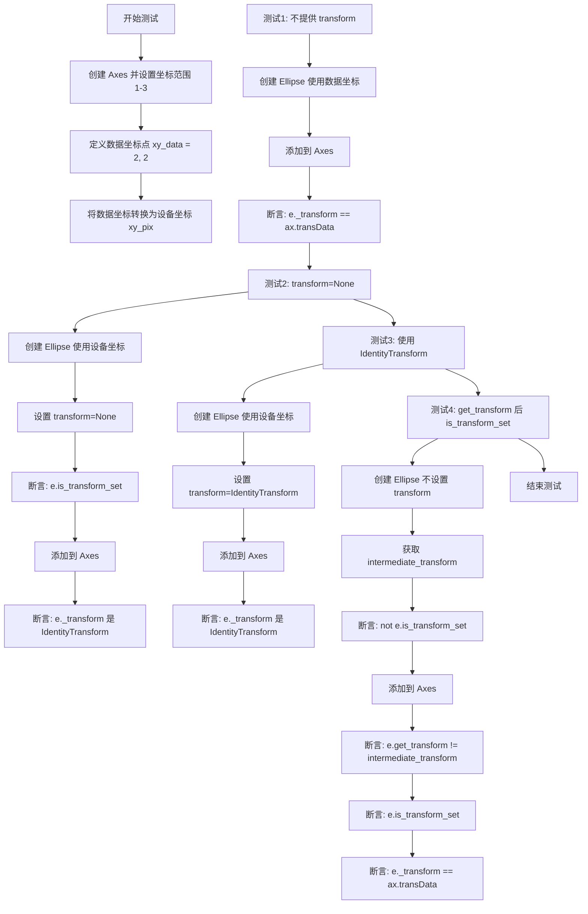

#### 带注释源码

```python
def test_patch_transform_of_none():
    """
    测试 patches 添加到 Axes 时不同 transform 设置的行为
    
    该测试验证了：
    1. 不提供 transform 时，patch 使用数据坐标（ax.transData）
    2. transform=None 时，patch 使用设备坐标（IdentityTransform）
    3. 显式设置 IdentityTransform 时，patch 使用设备坐标
    4. 调用 get_transform 后，is_transform_set 的状态变化
    """
    # 创建一个新的 Axes，并设置坐标轴范围
    ax = plt.axes()
    ax.set_xlim(1, 3)  # 设置 x 轴范围为 1 到 3
    ax.set_ylim(1, 3)  # 设置 y 轴范围为 1 到 3

    # 定义数据坐标点 (2, 2)，用于测试
    xy_data = (2, 2)
    # 使用 transData 将数据坐标转换为设备/像素坐标
    xy_pix = ax.transData.transform(xy_data)

    # ========================================
    # 测试 1: 不提供 transform 参数
    # 期望行为：ellipse 位于数据坐标系中
    # ========================================
    # 创建椭圆，使用数据坐标 (2,2)，宽高各 1
    e = mpatches.Ellipse(xy_data, width=1, height=1, fc='yellow', alpha=0.5)
    ax.add_patch(e)  # 将椭圆添加到 Axes
    # 验证：未提供 transform 时，默认使用 ax.transData
    assert e._transform == ax.transData

    # ========================================
    # 测试 2: 提供 transform=None
    # 期望行为：ellipse 位于设备坐标系中
    # ========================================
    # 创建椭圆，使用设备坐标 (xy_pix)，宽高 120 像素
    e = mpatches.Ellipse(xy_pix, width=120, height=120, fc='coral',
                         transform=None, alpha=0.5)
    # 验证：is_transform_set() 应返回 True（因为显式设置了 transform=None）
    assert e.is_transform_set()
    ax.add_patch(e)
    # 验证：transform 应为 IdentityTransform（设备坐标）
    assert isinstance(e._transform, mtransforms.IdentityTransform)

    # ========================================
    # 测试 3: 显式提供 IdentityTransform
    # 期望行为：ellipse 同样位于设备坐标系中
    # ========================================
    # 创建椭圆，使用设备坐标，宽高 100 像素，显式设置 IdentityTransform
    e = mpatches.Ellipse(xy_pix, width=100, height=100,
                         transform=mtransforms.IdentityTransform(), alpha=0.5)
    ax.add_patch(e)
    # 验证：transform 应为 IdentityTransform
    assert isinstance(e._transform, mtransforms.IdentityTransform)

    # ========================================
    # 测试 4: 调用 get_transform 后的状态变化
    # 期望行为：调用 get_transform 后，is_transform_set 应变为 True
    # ========================================
    # 创建椭圆，不提供 transform 参数
    e = mpatches.Ellipse(xy_pix, width=120, height=120, fc='coral',
                         alpha=0.5)
    # 获取 transform，此时会创建一个默认 transform
    intermediate_transform = e.get_transform()
    # 验证：此时 is_transform_set 仍为 False（因为没有显式设置）
    assert not e.is_transform_set()
    # 将椭圆添加到 Axes
    ax.add_patch(e)
    # 验证：添加后，get_transform 返回的 transform 发生变化
    assert e.get_transform() != intermediate_transform
    # 验证：添加后，is_transform_set 变为 True
    assert e.is_transform_set()
    # 验证：添加后，transform 变为 ax.transData
    assert e._transform == ax.transData
```


### `test_collection_transform_of_none`

该测试函数验证了 Matplotlib 中 Collections（集合）添加到 Axes 时应用不同变换规范的的行为，包括未提供变换、使用 None 变换和使用 IdentityTransform 变换的情况，确保集合能正确地在数据坐标或设备坐标中渲染。

参数： 无

返回值： `None`，该函数为测试函数，不返回任何值，仅通过断言验证行为

#### 流程图

```mermaid
flowchart TD
    A[开始测试函数] --> B[创建Axes并设置坐标范围 1-3]
    B --> C[定义数据坐标点 (2,2) 并转换为设备坐标]
    C --> D[测试1: 未提供变换 - 集合应在数据坐标]
    D --> E[创建Ellipse在数据坐标]
    E --> F[创建PatchCollection并添加到Axes]
    F --> G[断言: get_offset_transform + get_transform == transData]
    G --> H[测试2: transform=None - 集合应在设备坐标]
    H --> I[创建Ellipse在设备坐标]
    I --> J[创建PatchCollection并设置transform=None]
    J --> K[添加到Axes并断言transform是IdentityTransform]
    K --> L[测试3: IdentityTransform - 集合应在设备坐标]
    L --> M[创建Ellipse在设备坐标]
    M --> N[创建PatchCollection并传入IdentityTransform]
    N --> O[添加到Axes并断言offset_transform是IdentityTransform]
    O --> P[结束测试函数]
```

#### 带注释源码

```python
def test_collection_transform_of_none():
    """
    测试集合添加到Axes时不同变换规范的行为。
    
    测试三种情况：
    1. 不提供变换 → 集合使用数据坐标（ax.transData）
    2. transform=None → 集合使用设备坐标（IdentityTransform）
    3. transform=IdentityTransform → 集合使用设备坐标
    """
    
    # 创建一个新的Axes对象
    ax = plt.axes()
    
    # 设置Axes的坐标轴范围
    ax.set_xlim(1, 3)
    ax.set_ylim(1, 3)

    # 定义数据坐标点 (2, 2)，并转换为设备坐标（像素坐标）
    xy_data = (2, 2)
    xy_pix = ax.transData.transform(xy_data)

    # ===== 测试1: 不提供transform =====
    # 不提供变换时，集合应该位于数据坐标系中
    # 使用数据坐标 (2, 2) 创建椭圆
    e = mpatches.Ellipse(xy_data, width=1, height=1)
    
    # 创建PatchCollection并设置面颜色和透明度
    c = mcollections.PatchCollection([e], facecolor='yellow', alpha=0.5)
    
    # 将集合添加到Axes
    ax.add_collection(c)
    
    # 断言：集合的offset_transform + transform 应该等于 ax.transData
    # 这验证了集合确实在数据坐标系中
    assert c.get_offset_transform() + c.get_transform() == ax.transData

    # ===== 测试2: transform=None =====
    # 提供transform=None时，集合应该位于设备坐标系中（像素坐标）
    # 使用设备坐标（像素坐标）创建椭圆
    e = mpatches.Ellipse(xy_pix, width=120, height=120)
    
    # 创建PatchCollection
    c = mcollections.PatchCollection([e], facecolor='coral', alpha=0.5)
    
    # 显式设置transform为None
    c.set_transform(None)
    
    # 将集合添加到Axes
    ax.add_collection(c)
    
    # 断言：transform应该是IdentityTransform（设备坐标）
    assert isinstance(c.get_transform(), mtransforms.IdentityTransform)

    # ===== 测试3: 使用IdentityTransform =====
    # 提供IdentityTransform时，集合也应该位于设备坐标系中
    # 使用设备坐标创建椭圆
    e = mpatches.Ellipse(xy_pix, width=100, height=100)
    
    # 创建PatchCollection并直接传入IdentityTransform
    c = mcollections.PatchCollection(
        [e],
        transform=mtransforms.IdentityTransform(),
        alpha=0.5
    )
    
    # 将集合添加到Axes
    ax.add_collection(c)
    
    # 断言：offset_transform应该是IdentityTransform（设备坐标）
    assert isinstance(c.get_offset_transform(), mtransforms.IdentityTransform)
```


### `test_clipping`

该测试函数用于验证 matplotlib 中剪贴路径（clip path）的功能。它创建一个由外部矩形和内部圆形组成的复合路径作为剪贴区域，然后分别使用 PathCollection 和 PathPatch 两种方式将一个星形图案添加到两个子图上，并通过图像比较验证剪贴效果是否正确。

参数： 无

返回值：`None`，该测试函数不返回任何值，仅用于验证图形输出

#### 流程图

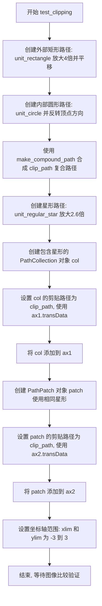

#### 带注释源码

```python
@image_comparison(["clip-path_clipping"], remove_text=True)
def test_clipping():
    # 创建外部矩形路径: 使用单位矩形并放大4倍, 然后平移(-2, -2)
    # 这将形成一个更大的矩形作为剪贴区域的外部边界
    exterior = mpath.Path.unit_rectangle().deepcopy()
    exterior.vertices *= 4
    exterior.vertices -= 2
    
    # 创建内部圆形路径: 使用单位圆
    # 反转顶点方向是为了将填充区域变为外部(创建孔洞效果)
    interior = mpath.Path.unit_circle().deepcopy()
    interior.vertices = interior.vertices[::-1]
    
    # 将外部矩形和内部圆形组合成复合路径
    # 这样内部圆形区域将被排除在渲染之外(形成环形剪贴区域)
    clip_path = mpath.Path.make_compound_path(exterior, interior)

    # 创建星形路径: 6角的星形, 放大2.6倍
    star = mpath.Path.unit_regular_star(6).deepcopy()
    star.vertices *= 2.6

    # 创建1行2列的子图, 共享x和y轴
    fig, (ax1, ax2) = plt.subplots(1, 2, sharex=True, sharey=True)

    # 创建PathCollection: 用于批量绘制多个路径
    # 参数: lw=线宽, edgecolor=边框颜色, facecolor=填充颜色, alpha=透明度, hatch=填充图案
    col = mcollections.PathCollection([star], lw=5, edgecolor='blue',
                                      facecolor='red', alpha=0.7, hatch='*')
    # 设置剪贴路径: clip_path为复合路径, ax1.transData用于坐标转换
    col.set_clip_path(clip_path, ax1.transData)
    # 将集合添加到第一个子图
    ax1.add_collection(col)

    # 创建PathPatch: 用于绘制单个路径
    patch = mpatches.PathPatch(star, lw=5, edgecolor='blue', facecolor='red',
                               alpha=0.7, hatch='*')
    # 设置剪贴路径: 使用相同的clip_path和ax2.transData
    patch.set_clip_path(clip_path, ax2.transData)
    # 将补丁添加到第二个子图
    ax2.add_patch(patch)

    # 设置坐标轴范围, 确保两个子图显示相同视图
    ax1.set_xlim(-3, 3)
    ax1.set_ylim(-3, 3)
```


### `test_clipping_zoom`

该测试函数用于验证当剪贴路径（clip path）完全位于图形视口之外时，Matplotlib 仍能正确处理剪贴操作，不会因此崩溃或产生错误。

参数：

- `fig_test`：`matplotlib.figure.Figure`，测试用的图形对象，用于构建包含剪贴路径的场景
- `fig_ref`：`matplotlib.figure.Figure`，参考用的图形对象，用于与测试结果进行对比

返回值：`None`，无返回值（测试函数）

#### 流程图

```mermaid
flowchart TD
    A[开始 test_clipping_zoom] --> B[在 fig_test 上添加 Axes 0,0,1,1]
    B --> C[在 ax_test 上绘制线段 [-3,3], [-3,3]]
    C --> D[创建矩形 Path p: [[0,0], [1,0], [1,1], [0,1], [0,0]]]
    D --> E[用 PathPatch 包装 Path p, 使用 ax_test.transData]
    E --> F[将 PathPatch p 设置为线段的 clip_path]
    F --> G[在 fig_ref 上添加 Axes 0,0,1,1]
    G --> H[在 ax_ref 上绘制相同线段]
    H --> I[设置 ax_ref 和 ax_test 的 xlim=(0.5, 0.75), ylim=(0.5, 0.75)]
    I --> J[结束]
```

#### 带注释源码

```python
@check_figures_equal()
def test_clipping_zoom(fig_test, fig_ref):
    # 该测试将 Axes 放置并设置其限制，使得 clip 路径完全位于图形之外。
    # 这不应破坏 clip 路径的处理逻辑。

    # === 测试图形设置 ===
    # 创建占满整个图形区域的 Axes (左下角 0,0 宽高 1,1)
    ax_test = fig_test.add_axes((0, 0, 1, 1))
    
    # 绘制一条从 (-3,-3) 到 (3,3) 的线段，返回 Line2D 对象
    l, = ax_test.plot([-3, 3], [-3, 3])
    
    # 创建一个显式的矩形 Path，而非使用 Rectangle，
    # 这样会触发 clip path 处理逻辑，而非使用 clip box 优化
    p = mpath.Path([[0, 0], [1, 0], [1, 1], [0, 1], [0, 0]])
    
    # 用 PathPatch 包装该 Path，并使用数据坐标变换 (transData)
    p = mpatches.PathPatch(p, transform=ax_test.transData)
    
    # 将该 PathPatch 设置为线段的剪贴路径
    l.set_clip_path(p)

    # === 参考图形设置 ===
    # 创建相同的 Axes 配置
    ax_ref = fig_ref.add_axes((0, 0, 1, 1))
    
    # 绘制相同的线段（无剪贴路径）
    ax_ref.plot([-3, 3], [-3, 3])

    # === 设置视口限制 ===
    # 将视图限制在 (0.5, 0.75) x (0.5, 0.75) 范围内
    # 此时原始的 clip 路径矩形 [0,1]x[0,1] 完全在视口之外
    # 测试确保这种情况下不会导致渲染错误
    ax_ref.set(xlim=(0.5, 0.75), ylim=(0.5, 0.75))
    ax_test.set(xlim=(0.5, 0.75), ylim=(0.5, 0.75))
```


### `test_cull_markers`

该测试函数用于验证 matplotlib 在渲染大量标记点时是否能够正确执行标记剔除（culling）操作，通过检查生成的 PDF 和 SVG 文件大小是否在预期范围内来确认优化是否生效。

参数：无

返回值：`None`，测试函数不返回任何值，仅通过断言验证标记剔除的效果

#### 流程图

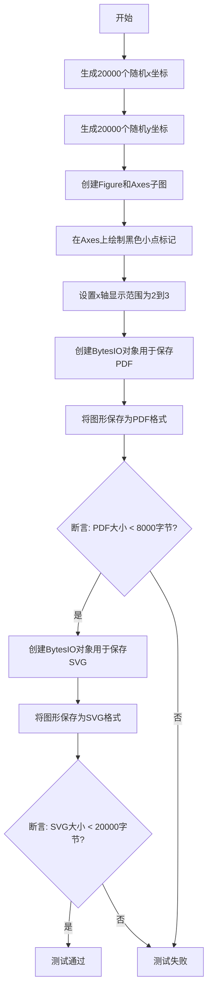

#### 带注释源码

```python
def test_cull_markers():
    """
    测试标记剔除功能是否正常工作。
    
    该测试创建大量随机数据点（20000个），但只显示x范围在[2,3]内的点。
    由于大部分点（99%以上）都在显示范围外，matplotlib应该进行标记剔除优化，
    从而生成较小的输出文件。
    """
    # 生成20000个均匀分布的随机x坐标，范围[0,1)
    x = np.random.random(20000)
    # 生成20000个均匀分布的随机y坐标，范围[0,1)
    y = np.random.random(20000)

    # 创建一个新的图形和一个坐标轴
    fig, ax = plt.subplots()
    # 绘制黑色小点（'k.'表示黑色、点标记）
    ax.plot(x, y, 'k.')
    # 设置x轴的显示范围为2到3，由于数据在[0,1]范围内，
    # 只有约1%的点会落在显示区域内
    ax.set_xlim(2, 3)

    # 创建字节流对象用于保存PDF
    pdf = io.BytesIO()
    # 将图形保存为PDF格式
    fig.savefig(pdf, format="pdf")
    # 断言：PDF文件大小应该小于8000字节
    # 如果标记剔除正常工作，文件应该很小
    assert len(pdf.getvalue()) < 8000

    # 创建字节流对象用于保存SVG
    svg = io.BytesIO()
    # 将图形保存为SVG格式
    fig.savefig(svg, format="svg")
    # 断言：SVG文件大小应该小于20000字节
    assert len(svg.getvalue()) < 20000
```


### `test_hatching`

该函数是一个测试 Matplotlib 中 hatching（填充图案）功能的图像对比测试用例，验证 Rectangle 补丁和 RegularPolyCollection 集合在使用不同 hatch 图案和 edgecolor 时的渲染行为是否符合预期，特别是确保 edgecolor 不会错误地应用到填充图案上。

参数： 无（该函数不接受任何显式参数，pytest 框架会在运行时注入可选的 `pytest.fixture` 参数）

返回值：`None`，该函数为测试函数，不返回任何值，仅通过 `@image_comparison` 装饰器进行图像对比验证

#### 流程图

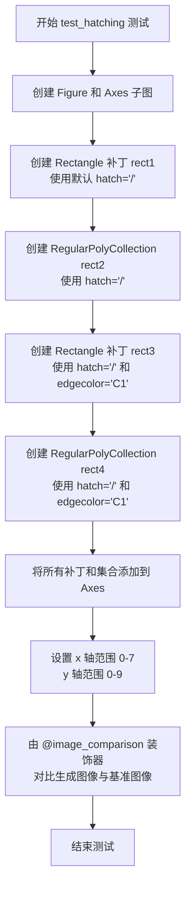

#### 带注释源码

```python
@image_comparison(['hatching'], remove_text=True, style='default')
def test_hatching():
    """
    测试 hatching 填充图案功能的渲染效果。
    验证 Rectangle 和 RegularPolyCollection 的 hatching 是否正确渲染，
    特别是 edgecolor 不应该影响 hatching 的颜色。
    """
    # 创建一个 1x1 的子图，返回 fig 和 ax 对象
    fig, ax = plt.subplots(1, 1)

    # 测试用例1：默认 hatch 颜色
    # 创建一个从 (0,0) 开始，宽3高4的矩形，填充 '/' 斜线图案
    rect1 = mpatches.Rectangle((0, 0), 3, 4, hatch='/')
    # 将矩形添加到 Axes 中
    ax.add_patch(rect1)

    # 测试用例2：RegularPolyCollection 使用相同的 hatch 图案
    # 4表示四边形（菱形），sizes定义大小，offsets定义位置
    # offset_transform=ax.transData 表示偏移量使用数据坐标
    rect2 = mcollections.RegularPolyCollection(
        4, sizes=[16000], offsets=[(1.5, 6.5)], offset_transform=ax.transData,
        hatch='/')
    # 将集合添加到 Axes 中
    ax.add_collection(rect2)

    # 测试用例3：验证 edgecolor 不会应用到 hatching
    # 创建一个矩形，设置 hatch 图案和特定的边缘颜色 'C1'
    rect3 = mpatches.Rectangle((4, 0), 3, 4, hatch='/', edgecolor='C1')
    ax.add_patch(rect3)

    # 测试用例4：RegularPolyCollection 同样验证 edgecolor 不影响 hatch
    rect4 = mcollections.RegularPolyCollection(
        4, sizes=[16000], offsets=[(5.5, 6.5)], offset_transform=ax.transData,
        hatch='/', edgecolor='C1')
    ax.add_collection(rect4)

    # 设置坐标轴的显示范围
    ax.set_xlim(0, 7)
    ax.set_ylim(0, 9)
```


### `test_remove`

该测试函数用于验证matplotlib中艺术家对象（Artist）的移除机制，包括从坐标轴（Axes）中移除图像（Image）和线条（Line2D）对象后，相关状态（如stale状态、鼠标悬停集合、axes引用、figure引用等）是否正确更新。

参数：なし（无参数）

返回值：`None`，无返回值（测试函数）

#### 流程图

```mermaid
flowchart TD
    A[开始测试] --> B[创建Figure和Axes]
    B --> C[添加Image对象]
    C --> D[添加Line2D对象]
    D --> E{检查初始stale状态}
    E -->|fig.stale为True| F[assert fig.stale]
    F --> G[assert ax.stale]
    G --> H[调用fig.canvas.draw]
    H --> I{检查绘制后stale状态}
    I --> J[assert not fig.stale]
    J --> K[assert not ax.stale]
    K --> L[assert not ln.stale]
    L --> M{检查鼠标悬停集合}
    M --> N[assert im in ax._mouseover_set]
    N --> O[assert ln not in ax._mouseover_set]
    O --> P[assert im.axes is ax]
    P --> Q[调用im.remove移除图像]
    Q --> R[调用ln.remove移除线条]
    R --> S{循环验证移除后的状态}
    S --> T[assert art.axes is None]
    T --> U[assert art.get_figure() is None]
    U --> V{检查移除后的集合状态}
    V --> W[assert im not in ax._mouseover_set]
    W --> X[assert fig.stale]
    X --> Y[assert ax.stale]
    Y --> Z[结束测试]
```

#### 带注释源码

```python
def test_remove():
    """
    测试Artist对象的remove()方法，验证移除后状态正确更新。
    
    测试内容：
    1. 新添加的artist会使Figure和Axes变为stale状态
    2. 调用draw()后stale状态重置
    3. Image对象会被加入鼠标悬停集合，Line2D不会
    4. remove()后artist的axes和figure引用被清除
    5. 移除后Figure和Axes再次变为stale状态
    """
    # 创建Figure和Axes对象
    fig, ax = plt.subplots()
    
    # 添加一个6x6的图像对象
    im = ax.imshow(np.arange(36).reshape(6, 6))
    
    # 添加一条包含5个点的线条
    ln, = ax.plot(range(5))

    # ==== 阶段1: 验证初始stale状态 ====
    # 新添加的artist会使Figure和Axes标记为stale（需要重绘）
    assert fig.stale  # 验证Figure需要重绘
    assert ax.stale   # 验证Axes需要重绘

    # ==== 阶段2: 绘制并验证stale状态重置 ====
    # 调用draw()方法渲染图形，之后stale状态应被清除
    fig.canvas.draw()
    assert not fig.stale  # 验证Figure已重绘，不再stale
    assert not ax.stale   # 验证Axes已重绘，不再stale
    assert not ln.stale   # 验证Line2D已重绘，不再stale

    # ==== 阶段3: 验证鼠标悬停集合 ====
    # Image对象会被添加到鼠标悬停集合，支持鼠标交互
    assert im in ax._mouseover_set
    # Line2D默认不参与鼠标交互，不在集合中
    assert ln not in ax._mouseover_set
    # 验证Image的axes引用正确
    assert im.axes is ax

    # ==== 阶段4: 移除artist对象 ====
    # 调用remove()方法将artist从Axes中移除
    im.remove()  # 移除Image对象
    ln.remove()  # 移除Line2D对象

    # ==== 阶段5: 验证移除后的artist状态 ====
    # 移除后artist应该与Figure和Axes解除关联
    for art in [im, ln]:
        assert art.axes is None      # axes引用应被清除
        assert art.get_figure() is None  # figure引用应被清除

    # ==== 阶段6: 验证移除后的集合和stale状态 ====
    # Image移除后不再在鼠标悬停集合中
    assert im not in ax._mouseover_set
    # 移除artist会触发Figure和Axes的stale标记
    assert fig.stale  # Figure需要重新布局
    assert ax.stale   # Axes需要重新布局
```


### `test_default_edges`

这是一个使用 `@image_comparison` 装饰器装饰的测试函数，用于验证 matplotlib 在不同类型的图表中默认边缘的渲染效果是否符合预期。该测试创建 2x2 的子图布局，分别测试线图、柱状图、文本和路径补丁的边缘渲染，并通过对比生成的图像与预期图像来检测渲染差异。

参数： 无

返回值： 无（测试函数无返回值）

#### 流程图

```mermaid
flowchart TD
    A[开始测试] --> B[设置文本字距参数<br/>plt.rcParams['text.kerning_factor'] = 6]
    B --> C[创建2x2子图布局<br/>fig, [[ax1, ax2], [ax3, ax4]] = plt.subplots(2, 2)]
    C --> D[在ax1绘制两条线<br/>plot x标记和o标记的线]
    D --> E[在ax2绘制柱状图<br/>bar with edge align]
    E --> F[在ax3添加文本和边框<br/>text 'BOX' with sawtooth bbox]
    F --> G[在ax4添加路径补丁<br/>PathPatch with CURVE3]
    G --> H[执行图像对比测试<br/>@image_comparison装饰器]
    H --> I[结束测试]
```

#### 带注释源码

```python
@image_comparison(["default_edges.png"], remove_text=True, style='default')
def test_default_edges():
    # Remove this line when this test image is regenerated.
    # 警告：此行应在图像重新生成时移除
    plt.rcParams['text.kerning_factor'] = 6
    # 设置文本字距因子为6，用于控制文本渲染的字距

    fig, [[ax1, ax2], [ax3, ax4]] = plt.subplots(2, 2)
    # 创建一个2行2列的子图布局，返回包含4个axes的数组

    ax1.plot(np.arange(10), np.arange(10), 'x',
             np.arange(10) + 1, np.arange(10), 'o')
    # 在ax1上绘制两条线：第一条用'x'标记，第二条用'o'标记
    # 用于测试不同标记类型的边缘渲染

    ax2.bar(np.arange(10), np.arange(10), align='edge')
    # 在ax2上绘制柱状图，align='edge'表示对齐边缘
    # 用于测试柱状图的边缘渲染效果

    ax3.text(0, 0, "BOX", size=24, bbox=dict(boxstyle='sawtooth'))
    # 在ax3上添加文本"BOX"，字号24，带有锯齿形边框
    # 用于测试文本和边框的渲染

    ax3.set_xlim(-1, 1)
    ax3.set_ylim(-1, 1)
    # 设置ax3的坐标轴范围

    pp1 = mpatches.PathPatch(
        mpath.Path([(0, 0), (1, 0), (1, 1), (0, 0)],
                   [mpath.Path.MOVETO, mpath.Path.CURVE3,
                    mpath.Path.CURVE3, mpath.Path.CLOSEPOLY]),
        fc="none", transform=ax4.transData)
    # 创建路径补丁：定义一个包含MOVETO、CURVE3、CURVE3和CLOSEPOLY命令的路径
    # fc="none"表示填充色为无，transform=ax4.transData使用数据坐标变换

    ax4.add_patch(pp1)
    # 将路径补丁添加到ax4，用于测试路径补丁的边缘渲染
```


### `test_properties`

该测试函数用于验证调用 `Line2D` 对象的 `properties()` 方法时不会触发任何警告，确保属性获取机制正常工作。

参数：无

返回值：`None`，无返回值

#### 流程图

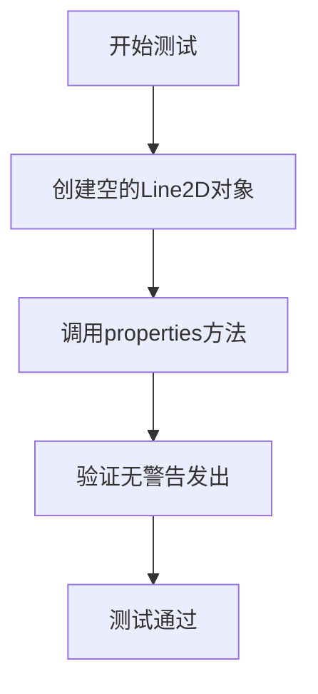

#### 带注释源码

```python
def test_properties():
    # 创建一个空的Line2D对象，传入空的x和y数据
    ln = mlines.Line2D([], [])
    
    # 调用properties()方法获取线条的所有属性
    # 此处检查确保调用该方法时不会触发任何警告
    # 这是一个回归测试，用于验证属性访问机制的稳定性
    ln.properties()
```


### `test_setp`

描述：本测试函数用于验证 `plt.setp`（设置图形对象属性）的多种使用场景，包括空列表、嵌套空列表、可迭代对象的批量属性设置、属性别名以及通过 `file` 参数输出属性描述是否正确。

参数：

- （无）

返回值：`None`，本测试函数不返回任何值，仅通过断言验证行为。

#### 流程图

```mermaid
flowchart TD
    Start((开始)) --> A[调用 plt.setp([])]
    A --> B[调用 plt.setp([[]])]
    B --> C[创建 Figure 和 Axes]
    C --> D[lines1 = ax.plot(range(3))]
    D --> E[lines2 = ax.plot(range(3))]
    E --> F[调用 martist.setp(chain(lines1, lines2), 'lw', 5)]
    F --> G[调用 plt.setp(ax.spines.values(), color='green')]
    G --> H[创建 StringIO 对象 sio]
    H --> I[调用 plt.setp(lines1, 'zorder', file=sio)]
    I --> J{断言 sio.getvalue() == '  zorder: float\n'}
    J -->|成功| End((结束))
    J -->|失败| Error[抛出 AssertionError]
```

#### 带注释源码

```python
def test_setp():
    # 检查空列表输入
    plt.setp([])          # 对空列表调用 setp，应该不报错
    plt.setp([[]])       # 对嵌套空列表调用 setp

    # 检查任意可迭代对象的批量设置
    fig, ax = plt.subplots()          # 创建图形和坐标轴
    lines1 = ax.plot(range(3))         # 绘制第一条线
    lines2 = ax.plot(range(3))        # 绘制第二条线
    # 使用 martist.setp 对两条线批量设置线宽属性
    martist.setp(chain(lines1, lines2), 'lw', 5)
    # 对坐标轴的 spines 批量设置颜色属性
    plt.setp(ax.spines.values(), color='green')

    # 检查 *file* 参数：将属性信息写入文件对象
    sio = io.StringIO()                # 创建内存字符串流
    plt.setp(lines1, 'zorder', file=sio)  # 将 lines1 的 zorder 属性描述写入 sio
    # 验证输出内容符合预期
    assert sio.getvalue() == '  zorder: float\n'
```


### `test_artist_set`

该测试函数用于验证 matplotlib 中 Artist 类的 `set()` 方法能够正确设置对象属性，并且支持属性别名（alias）功能。测试创建一个空 Line2D 对象，分别使用完整属性名 `linewidth` 和简写别名 `lw` 进行设置，并断言属性值被正确更新。

参数：无需参数

返回值：`None`，测试函数不返回任何值，仅通过断言验证行为

#### 流程图

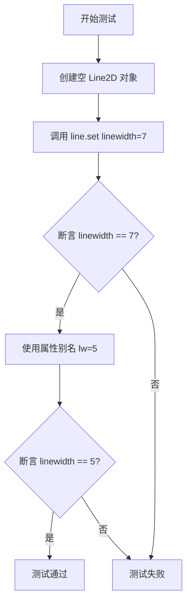

#### 带注释源码

```python
def test_artist_set():
    """
    测试 Artist.set() 方法的基本功能和属性别名支持。
    
    该测试验证：
    1. set() 方法能够正确设置对象属性
    2. 属性别名（如 linewidth 的别名 lw）能够正常工作
    """
    # 创建一个空的 Line2D 对象，用于测试属性设置功能
    line = mlines.Line2D([], [])
    
    # 测试使用完整属性名设置线宽
    line.set(linewidth=7)
    
    # 断言：验证线宽已被正确设置为 7
    assert line.get_linewidth() == 7

    # 测试属性别名功能：lw 是 linewidth 的别名
    # 这验证了 matplotlib 的属性别名系统是否正常工作
    line.set(lw=5)
    
    # 断言：验证使用别名设置后，属性值正确更新为 5
    assert line.get_linewidth() == 5
```


### `test_artist_set_invalid_property_raises`

该测试函数用于验证 `matplotlib.lines.Line2D` 对象的 `set` 方法在接收到无效的属性关键字（如 `not_a_property`）时，能够正确地抛出 `AttributeError` 异常。这是确保 Artist 属性设置器具有严格的参数校验能力的关键测试。

参数：
- （无）

返回值：`None`，该函数不返回任何值，仅用于执行测试断言。

#### 流程图

```mermaid
graph TD
    A[测试开始] --> B[创建 Line2D 实例<br>line = Line2D([0,1], [0,1])]
    B --> C[调用 line.set 方法<br>line.set(not_a_property=1)]
    C --> D{是否捕获到 AttributeError<br>且包含 'unexpected keyword argument'?}
    D -- 是 --> E[测试通过<br>AssertionError 不会触发]
    D -- 否 --> F[测试失败<br>抛出 Unexpected Exception]
```

#### 带注释源码

```python
def test_artist_set_invalid_property_raises():
    """
    Test that set() raises AttributeError for invalid property names.
    """
    # 1. 创建一个 Line2D 对象实例
    line = mlines.Line2D([0, 1], [0, 1])

    # 2. 使用 pytest.raises 上下文管理器来验证异常
    # 期望 line.set 接收到无效的关键字参数 'not_a_property' 时
    # 会抛出 AttributeError
    with pytest.raises(AttributeError, match="unexpected keyword argument"):
        line.set(not_a_property=1)
```


### `test_artist_set_duplicate_aliases_raises`

该测试函数用于验证 Matplotlib 中 Artist 类的 `set()` 方法在同时接收属性及其别名（如 `lw` 和 `linewidth`）时能否正确抛出 `TypeError` 异常，确保属性设置的唯一性与一致性。

参数：无

返回值：`None`，该函数为测试函数，不返回任何值

#### 流程图

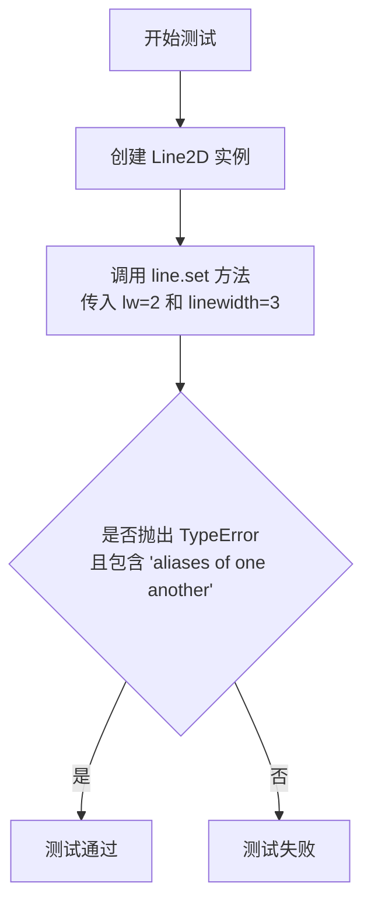

#### 带注释源码

```python
def test_artist_set_duplicate_aliases_raises():
    """
    Test that set() raises TypeError when both a property and its alias are provided.
    
    该测试用于验证 Artist.set() 方法在同时接收属性及其别名时的行为。
    例如 'linewidth' 是 'lw' 的别名，两者同时传入应该导致冲突并抛出异常。
    """
    # 创建一个 Line2D 对象，用于测试属性设置功能
    line = mlines.Line2D([0, 1], [0, 1])

    # 使用 pytest.raises 上下文管理器验证异常抛出
    # 期望抛出 TypeError，且错误信息包含 "aliases of one another"
    with pytest.raises(TypeError, match="aliases of one another"):
        # 同时传入 lw 和 linewidth，它们互为别名
        # 这应该触发 set() 方法中的别名冲突检测逻辑
        line.set(lw=2, linewidth=3)
```


### `test_None_zorder`

该测试函数用于验证 matplotlib 中 Line2D 对象的 zorder 属性在设置为 `None` 时的行为，确保当 zorder 被设置为 `None` 时，Line2D 对象能够正确地恢复到其默认的类级别 zorder 值。

参数：无

返回值：`None`，该函数为测试函数，没有返回值

#### 流程图

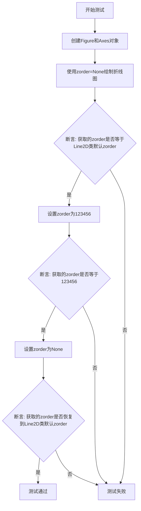

#### 带注释源码

```python
def test_None_zorder():
    """
    测试当Line2D对象的zorder属性设置为None时的行为。
    验证对象能够正确恢复到默认的zorder值。
    """
    # 创建一个新的Figure对象和一个Axes对象
    # plt.subplots() 返回 (fig, ax) 元组
    fig, ax = plt.subplots()
    
    # 使用plot方法绘制一条折线，zorder参数设置为None
    # range(5) 生成 x 轴数据 [0, 1, 2, 3, 4]
    # 拆包时使用 ln, 是因为 plot 返回一个 Line2D 对象列表
    # 我们只取第一个（唯一的一个）元素
    ln, = ax.plot(range(5), zorder=None)
    
    # 断言1: 当初始化时 zorder=None，应该使用 Line2D 类的默认 zorder 值
    # Line2D.zorder 是类属性，定义 Line2D 的默认渲染顺序
    assert ln.get_zorder() == mlines.Line2D.zorder
    
    # 显式设置 zorder 为一个具体的数值 123456
    ln.set_zorder(123456)
    
    # 断言2: 确认 zorder 已经被成功设置为 123456
    assert ln.get_zorder() == 123456
    
    # 再次将 zorder 设置为 None，预期会恢复为默认值
    ln.set_zorder(None)
    
    # 断言3: 验证设置 zorder 为 None 后，对象的 zorder 恢复为类默认值
    assert ln.get_zorder() == mlines.Line2D.zorder
    
    # 测试结束，函数返回 None（隐式）
```


### `test_artist_inspector_get_valid_values`

这是一个测试函数，用于验证 `ArtistInspector.get_valid_values` 方法能够正确解析不同格式的文档字符串中的 ACCEPTS 子句，并返回正确的有效值描述。

参数：

- `accept_clause`：`str`，输入的文档字符串片段，包含可能的 ACCEPTS 子句或其他参数类型声明
- `expected`：`str`，期望 `get_valid_values` 方法返回的结果字符串

返回值：`None`，该函数为测试函数，通过断言验证逻辑，不返回具体值

#### 流程图

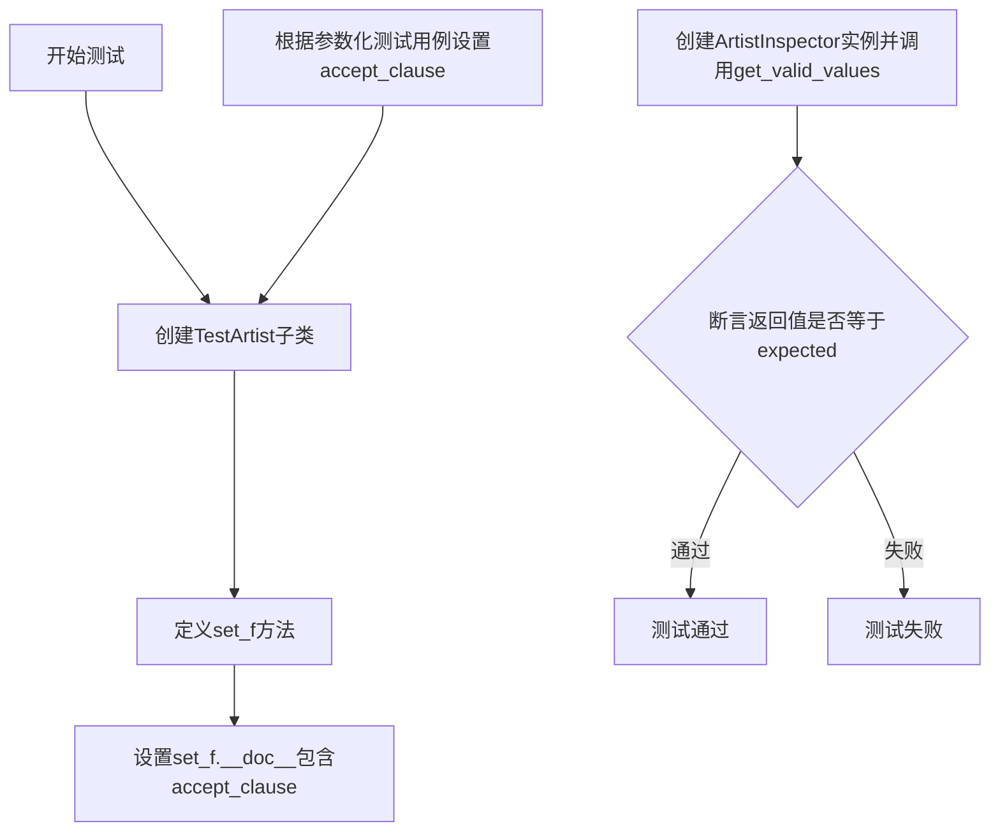

#### 带注释源码

```python
@pytest.mark.parametrize('accept_clause, expected', [
    ('', 'unknown'),  # 空字符串应返回'unknown'
    ("ACCEPTS: [ '-' | '--' | '-.' ]", "[ '-' | '--' | '-.' ]"),  # 解析ACCEPTS子句
    ('ACCEPTS: Some description.', 'Some description.'),  # 解析简单描述
    ('.. ACCEPTS: Some description.', 'Some description.'),  # 解析带reStructuredText前缀的ACCEPTS
    ('arg : int', 'int'),  # 解析类型注解
    ('*arg : int', 'int'),  # 解析可变参数类型注解
    ('arg : int\nACCEPTS: Something else.', 'Something else. '),  # 同时有类型注解和ACCEPTS时优先ACCEPTS
])
def test_artist_inspector_get_valid_values(accept_clause, expected):
    """测试ArtistInspector.get_valid_values方法对文档字符串的解析能力"""
    
    # 定义一个测试用的Artist子类
    class TestArtist(martist.Artist):
        def set_f(self, arg):
            """设置f属性的方法"""
            pass

    # 动态设置set_f方法的文档字符串，包含测试用的accept_clause
    TestArtist.set_f.__doc__ = """
    Some text.

    %s
    """ % accept_clause
    
    # 创建ArtistInspector实例并调用get_valid_values方法获取'f'属性的有效值描述
    valid_values = martist.ArtistInspector(TestArtist).get_valid_values('f')
    
    # 断言获取到的有效值与期望值一致
    assert valid_values == expected
```


### `test_artist_inspector_get_aliases`

该函数是一个测试函数，用于验证 `ArtistInspector` 类的 `get_aliases` 方法能否正确返回属性的别名映射，特别是验证 "linewidth" 属性别名为 {"lw"}。

参数：
- 该函数没有参数

返回值：`None`，该函数仅用于执行测试断言，不返回任何值

#### 流程图

```mermaid
flowchart TD
    A[开始测试] --> B[创建 ArtistInspector 实例<br/>ai = martist.ArtistInspector(mlines.Line2D)]
    B --> C[调用 get_aliases 方法<br/>aliases = ai.get_aliases()]
    C --> D{断言检查<br/>aliases['linewidth'] == {'lw'}}
    D -->|断言通过| E[测试通过]
    D -->|断言失败| F[测试失败]
```

#### 带注释源码

```python
def test_artist_inspector_get_aliases():
    # test the correct format and type of get_aliases method
    # 创建 ArtistInspector 实例，传入 Line2D 类作为参数
    ai = martist.ArtistInspector(mlines.Line2D)
    # 调用 get_aliases 方法获取属性别名映射
    aliases = ai.get_aliases()
    # 断言验证：linewidth 属性的别名应包含 'lw'
    assert aliases["linewidth"] == {"lw"}
```


### `test_set_alpha`

该测试函数用于验证 `martist.Artist` 类的 `set_alpha` 方法对无效输入参数（字符串、列表、数值越界、NaN）的异常处理是否正确。

参数： 无

返回值： `None`，该测试函数不返回任何值，仅通过 pytest 断言验证异常类型和错误信息

#### 流程图

```mermaid
flowchart TD
    A[开始测试] --> B[创建 Artist 实例]
    B --> C[测试传入字符串 'string']
    C --> D{捕获 TypeError?}
    D -->|是| E[验证错误信息匹配 '^alpha must be numeric or None']
    D -->|否| F[测试失败]
    E --> G[测试传入列表 [1, 2, 3]]
    G --> H{捕获 TypeError?}
    H -->|是| I[验证错误信息匹配 '^alpha must be numeric or None']
    H -->|否| F
    I --> J[测试传入数值 1.1]
    J --> K{捕获 ValueError?}
    K -->|是| L[验证错误信息匹配 'outside 0-1 range']
    K -->|否| F
    L --> M[测试传入 np.nan]
    M --> N{捕获 ValueError?}
    N -->|是| O[验证错误信息匹配 'outside 0-1 range']
    N -->|否| F
    O --> P[测试通过]
```

#### 带注释源码

```python
def test_set_alpha():
    """
    测试 Artist.set_alpha 方法对无效输入的异常处理。
    
    该测试函数验证 set_alpha 方法在接收以下无效参数时
    是否能正确抛出预期的异常：
    1. 字符串类型
    2. 列表类型
    3. 超出 0-1 范围的数值
    4. NaN 值
    """
    # 创建基础的 Artist 实例用于测试
    art = martist.Artist()
    
    # 测试1：传入字符串应该抛出 TypeError
    with pytest.raises(TypeError, match='^alpha must be numeric or None'):
        art.set_alpha('string')
    
    # 测试2：传入列表应该抛出 TypeError
    with pytest.raises(TypeError, match='^alpha must be numeric or None'):
        art.set_alpha([1, 2, 3])
    
    # 测试3：传入大于1的数值应该抛出 ValueError
    with pytest.raises(ValueError, match="outside 0-1 range"):
        art.set_alpha(1.1)
    
    # 测试4：传入 NaN 应该抛出 ValueError
    with pytest.raises(ValueError, match="outside 0-1 range"):
        art.set_alpha(np.nan)
```


### `test_set_alpha_for_array`

该测试函数用于验证 `martist.Artist` 类中 `_set_alpha_for_array` 方法在处理各类非法输入时能否正确抛出相应的异常，包括非数值类型、超出 [0,1] 范围的数值以及包含无效值的数组等场景。

参数： 无

返回值：`None`，该函数为测试函数，不返回任何值

#### 流程图

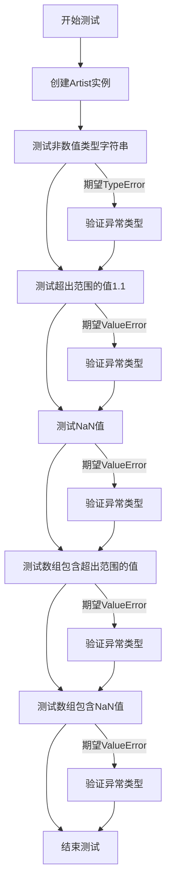

#### 带注释源码

```python
def test_set_alpha_for_array():
    """
    测试 Artist._set_alpha_for_array 方法对各类非法输入的异常处理能力。
    该测试验证方法能够正确区分并抛出 TypeError 和 ValueError 异常。
    """
    # 创建一个 Artist 实例用于测试
    art = martist.Artist()
    
    # 测试1: 验证非数值类型输入会抛出 TypeError
    # 期望匹配错误信息 '^alpha must be numeric or None'
    with pytest.raises(TypeError, match='^alpha must be numeric or None'):
        art._set_alpha_for_array('string')
    
    # 测试2: 验证超出 [0,1] 范围的单一数值会抛出 ValueError
    # 期望匹配错误信息 "outside 0-1 range"
    with pytest.raises(ValueError, match="outside 0-1 range"):
        art._set_alpha_for_array(1.1)
    
    # 测试3: 验证 NaN 值会抛出 ValueError
    # NaN 虽然是数值类型，但不在有效范围内
    with pytest.raises(ValueError, match="outside 0-1 range"):
        art._set_alpha_for_array(np.nan)
    
    # 测试4: 验证数组中包含超出范围的值会抛出 ValueError
    # 期望匹配错误信息 "alpha must be between 0 and 1"
    with pytest.raises(ValueError, match="alpha must be between 0 and 1"):
        art._set_alpha_for_array([0.5, 1.1])
    
    # 测试5: 验证数组中包含 NaN 值会抛出 ValueError
    # 数组中任何一个元素为 NaN 都应触发异常
    with pytest.raises(ValueError, match="alpha must be between 0 and 1"):
        art._set_alpha_for_array([0.5, np.nan])
```


### `test_callbacks`

该函数是一个测试函数，用于验证 matplotlib 的 Artist 类的回调机制。它测试了添加回调函数、通过 `pchanged()` 触发回调、通过属性设置（如 `set_zorder()`）触发回调，以及移除回调等功能。

参数：

- 无

返回值：`None`，无返回值（测试函数，使用 assert 进行验证）

#### 流程图

```mermaid
flowchart TD
    A[开始 test_callbacks] --> B[定义内部函数 func]
    B --> C[初始化 func.counter = 0]
    C --> D[创建 Artist 实例 art]
    D --> E[调用 art.add_callback 添加回调, 获取 oid]
    E --> F[断言: func.counter == 0]
    F --> G[调用 art.pchanged 触发回调]
    G --> H[断言: func.counter == 1]
    H --> I[调用 art.set_zorder(10) 设置属性]
    I --> J[断言: func.counter == 2]
    J --> K[调用 art.remove_callback 移除回调]
    K --> L[再次调用 art.pchanged]
    L --> M[断言: func.counter == 2 回调未被触发]
    M --> N[结束测试]
```

#### 带注释源码

```python
def test_callbacks():
    """
    测试 matplotlib.artist.Artist 的回调机制。
    
    验证以下功能：
    1. 添加回调函数
    2. 通过 pchanged() 手动触发回调
    3. 通过 set_* 方法修改属性时自动触发回调
    4. 移除回调后不再触发
    """
    # 定义一个内部计数回调函数，每次被调用时递增计数器
    def func(artist):
        """回调函数，接收 artist 参数并递增计数器"""
        func.counter += 1

    # 初始化计数器为 0
    func.counter = 0

    # 创建一个 Artist 实例
    art = martist.Artist()
    
    # 添加回调函数到 artist，获取回调 ID
    oid = art.add_callback(func)
    
    # 初始状态：回调尚未被调用，计数器应为 0
    assert func.counter == 0
    
    # 手动调用 pchanged() 触发回调
    art.pchanged()  # must call the callback
    
    # 回调应被调用一次，计数器应为 1
    assert func.counter == 1
    
    # 通过设置属性 zorder 触发回调
    art.set_zorder(10)  # setting a property must also call the callback
    
    # 属性变更应触发回调，计数器应为 2
    assert func.counter == 2
    
    # 移除回调函数
    art.remove_callback(oid)
    
    # 移除后再调用 pchanged()，回调不应再被触发
    art.pchanged()  # must not call the callback anymore
    
    # 计数器应保持为 2
    assert func.counter == 2
```


### `test_set_signature`

这是一个测试函数，用于验证 Artist 子类中自动生成的 `set()` 方法是否正确工作，包括检查自动生成的签名和文档字符串是否包含正确的参数。

参数：
- 无

返回值：`None`，该函数为测试函数，不返回任何值

#### 流程图

```mermaid
flowchart TD
    A[开始] --> B[定义MyArtist1类<br/>继承自martist.Artist]
    B --> C[在MyArtist1中定义set_myparam1方法]
    C --> D[断言: MyArtist1.set具有_autogenerated_signature属性]
    D --> E[断言: 'myparam1'在MyArtist1.set.__doc__中]
    E --> F[定义MyArtist2类<br/>继承自MyArtist1]
    F --> G[在MyArtist2中定义set_myparam2方法]
    G --> H[断言: MyArtist2.set具有_autogenerated_signature属性]
    H --> I[断言: 'myparam1'在MyArtist2.set.__doc__中]
    I --> J[断言: 'myparam2'在MyArtist2.set.__doc__中]
    J --> K[结束]
```

#### 带注释源码

```python
def test_set_signature():
    """Test autogenerated ``set()`` for Artist subclasses."""
    # 定义第一个自定义Artist类，继承自martist.Artist
    class MyArtist1(martist.Artist):
        # 定义一个setter方法，会被自动生成的set()方法识别
        def set_myparam1(self, val):
            pass

    # 验证MyArtist1的set方法是否具有自动生成的签名标记
    assert hasattr(MyArtist1.set, '_autogenerated_signature')
    # 验证自动生成的文档字符串是否包含myparam1参数
    assert 'myparam1' in MyArtist1.set.__doc__

    # 定义第二个自定义Artist类，继承自MyArtist1
    class MyArtist2(MyArtist1):
        # 定义另一个setter方法
        def set_myparam2(self, val):
            pass

    # 验证MyArtist2的set方法也具有自动生成的签名标记
    assert hasattr(MyArtist2.set, '_autogenerated_signature')
    # 验证自动生成的文档字符串是否同时包含父类的myparam1和自身的myparam2
    assert 'myparam1' in MyArtist2.set.__doc__
    assert 'myparam2' in MyArtist2.set.__doc__
```


### `test_set_is_overwritten`

该测试函数用于验证在 Matplotlib 的 Artist 子类中手动定义的 `set()` 方法不会被自动生成的签名覆盖，确保子类正确继承父类的 `set()` 方法实现。

参数：该函数无参数

返回值：`None`，该函数为测试函数，不返回任何值

#### 流程图

```mermaid
flowchart TD
    A[开始测试 test_set_is_overwritten] --> B[定义 MyArtist3 类继承 martist.Artist]
    B --> C[在 MyArtist3 中定义 set 方法, 带文档 'Not overwritten.']
    C --> D[断言 MyArtist3.set 没有 _autogenerated_signature 属性]
    D --> E[断言 MyArtist3.set.__doc__ 等于 'Not overwritten.']
    E --> F[定义 MyArtist4 类继承 MyArtist3]
    F --> G[断言 MyArtist4.set is MyArtist3.set]
    G --> H[测试通过, 函数结束]
```

#### 带注释源码

```python
def test_set_is_overwritten():
    """
    set() defined in Artist subclasses should not be overwritten.
    该测试验证在 Artist 子类中手动定义的 set() 方法
    不会被自动生成的签名覆盖。
    """
    # 定义一个自定义的 Artist 子类 MyArtist3
    class MyArtist3(martist.Artist):
        # 在此类中手动定义 set 方法, 带自定义文档字符串
        def set(self, **kwargs):
            """Not overwritten."""

    # 断言1: 验证手动定义的 set 方法没有 _autogenerated_signature 属性
    # 这表明该方法是手动实现的, 而非自动生成
    assert not hasattr(MyArtist3.set, '_autogenerated_signature')

    # 断言2: 验证手动定义的 set 方法保留原始文档字符串
    assert MyArtist3.set.__doc__ == "Not overwritten."

    # 定义 MyArtist3 的子类 MyArtist4 (不添加任何新方法)
    class MyArtist4(MyArtist3):
        pass

    # 断言3: 验证子类 MyArtist4 正确继承了父类 MyArtist3 的 set 方法
    # 而不是自动生成新的 set 方法
    assert MyArtist4.set is MyArtist3.set
```


### `test_format_cursor_data_BoundaryNorm`

该函数是一个 pytest 单元测试，用于验证在使用 `matplotlib.colors.BoundaryNorm` 时，图像对象（`AxesImage`）的光标数据格式化功能（`format_cursor_data`）是否能正确生成字符串表示。测试覆盖了不同的归一化步长（0.1, 0.01, 0.001）以及不同的扩展（extend）和裁剪（clip）模式。

参数：

-  `无`：此测试函数不接受任何外部参数。

返回值：

-  `None`：此函数不返回值，用于执行断言测试。

#### 流程图

```mermaid
graph TD
    Start([开始]) --> DefineX1[定义测试数据 X (3x3)]
    DefineX1 --> TestGrp1[测试组 1: 步长 0.1]
    TestGrp1 --> CreateFig1[创建图/轴 & BoundaryNorm(20)]
    CreateFig1 --> Assert1[断言 format_cursor_data 输出]
    Assert1 --> Close1[plt.close()]
    Close1 --> TestGrp2[测试组 2: 步长 0.01]
    TestGrp2 --> CreateFig2[创建图/轴 & BoundaryNorm(200)]
    CreateFig2 --> Assert2[断言 format_cursor_data 输出]
    Assert2 --> Close2[plt.close()]
    Close2 --> TestGrp3[测试组 3: 步长 0.001]
    TestGrp3 --> CreateFig3[创建图/轴 & BoundaryNorm(2000)]
    CreateFig3 --> Assert3[断言 format_cursor_data 输出]
    Assert3 --> Close3[plt.close()]
    Close3 --> DefineX2[重新定义测试数据 X (7x1)]
    DefineX2 --> TestGrp4[测试组 4: 扩展模式 (extend)]
    TestGrp4 --> LoopExt[循环: extend='neither', 'min', 'max', 'both']
    LoopExt --> Assert4[断言 format_cursor_data 输出]
    Assert4 --> Close4[plt.close()]
    Close4 --> TestGrp5[测试组 5: 裁剪模式 (clip=True)]
    TestGrp5 --> CreateFig5[创建图/轴 & BoundaryNorm(clip=True)]
    CreateFig5 --> Assert5[断言 format_cursor_data 输出]
    Assert5 --> Close5[plt.close()]
    Close5 --> End([结束])
```

#### 带注释源码

```python
def test_format_cursor_data_BoundaryNorm():
    """Test if cursor data is correct when using BoundaryNorm."""
    # 步骤 1: 定义初始测试数据 X (3x3 数组)，包含不同范围的数值
    X = np.empty((3, 3))
    X[0, 0] = 0.9
    X[0, 1] = 0.99
    X[0, 2] = 0.999
    X[1, 0] = -1
    X[1, 1] = 0
    X[1, 2] = 1
    X[2, 0] = 0.09
    X[2, 1] = 0.009
    X[2, 2] = 0.0009

    # 测试组 1: 映射范围 -1..1 到 0..256，步长为 0.1
    # 验证 BoundaryNorm 在较大步长下的格式化
    fig, ax = plt.subplots()
    fig.suptitle("-1..1 to 0..256 in 0.1")
    norm = mcolors.BoundaryNorm(np.linspace(-1, 1, 20), 256)
    img = ax.imshow(X, cmap='RdBu_r', norm=norm)

    labels_list = [
        "[0.9]",
        "[1.]",
        "[1.]",
        "[-1.0]",
        "[0.0]",
        "[1.0]",
        "[0.09]",
        "[0.009]",
        "[0.0009]",
    ]
    for v, label in zip(X.flat, labels_list):
        # 断言：检查光标数据格式是否与预期标签匹配
        assert img.format_cursor_data(v) == label

    plt.close()

    # 测试组 2: 映射范围 -1..1 到 0..256，步长为 0.01
    # 验证更细粒度的边界格式化
    fig, ax = plt.subplots()
    fig.suptitle("-1..1 to 0..256 in 0.01")
    cmap = mpl.colormaps['RdBu_r'].resampled(200)
    norm = mcolors.BoundaryNorm(np.linspace(-1, 1, 200), 200)
    img = ax.imshow(X, cmap=cmap, norm=norm)

    labels_list = [
        "[0.90]",
        "[0.99]",
        "[1.0]",
        "[-1.00]",
        "[0.00]",
        "[1.00]",
        "[0.09]",
        "[0.009]",
        "[0.0009]",
    ]
    for v, label in zip(X.flat, labels_list):
        assert img.format_cursor_data(v) == label

    plt.close()

    # 测试组 3: 映射范围 -1..1 到 0..256，步长为 0.001
    # 验证极细粒度的边界格式化
    fig, ax = plt.subplots()
    fig.suptitle("-1..1 to 0..256 in 0.001")
    cmap = mpl.colormaps['RdBu_r'].resampled(2000)
    norm = mcolors.BoundaryNorm(np.linspace(-1, 1, 2000), 2000)
    img = ax.imshow(X, cmap=cmap, norm=norm)

    labels_list = [
        "[0.900]",
        "[0.990]",
        "[0.999]",
        "[-1.000]",
        "[0.000]",
        "[1.000]",
        "[0.090]",
        "[0.009]",
        "[0.0009]",
    ]
    for v, label in zip(X.flat, labels_list):
        assert img.format_cursor_data(v) == label

    plt.close()

    # 步骤 2: 重新定义测试数据 X (7x1 数组)，包含边界外的值
    # 用于测试 extend 和 clip 参数
    X = np.empty((7, 1))
    X[0] = -1.0
    X[1] = 0.0
    X[2] = 0.1
    X[3] = 0.5
    X[4] = 0.9
    X[5] = 1.0
    X[6] = 2.0

    labels_list = [
        "[-1.0]",
        "[0.0]",
        "[0.1]",
        "[0.5]",
        "[0.9]",
        "[1.0]",
        "[2.0]",
    ]

    # 测试组 4: 测试不同的 extend 模式 (noclip)
    # 验证当数值超出范围时的显示逻辑
    fig, ax = plt.subplots()
    fig.suptitle("noclip, neither")
    norm = mcolors.BoundaryNorm(
        np.linspace(0, 1, 4, endpoint=True), 256, clip=False, extend='neither')
    img = ax.imshow(X, cmap='RdBu_r', norm=norm)
    for v, label in zip(X.flat, labels_list):
        assert img.format_cursor_data(v) == label

    plt.close()

    # extend='min'
    fig, ax = plt.subplots()
    fig.suptitle("noclip, min")
    norm = mcolors.BoundaryNorm(
        np.linspace(0, 1, 4, endpoint=True), 256, clip=False, extend='min')
    img = ax.imshow(X, cmap='RdBu_r', norm=norm)
    for v, label in zip(X.flat, labels_list):
        assert img.format_cursor_data(v) == label

    plt.close()

    # extend='max'
    fig, ax = plt.subplots()
    fig.suptitle("noclip, max")
    norm = mcolors.BoundaryNorm(
        np.linspace(0, 1, 4, endpoint=True), 256, clip=False, extend='max')
    img = ax.imshow(X, cmap='RdBu_r', norm=norm)
    for v, label in zip(X.flat, labels_list):
        assert img.format_cursor_data(v) == label

    plt.close()

    # extend='both'
    fig, ax = plt.subplots()
    fig.suptitle("noclip, both")
    norm = mcolors.BoundaryNorm(
        np.linspace(0, 1, 4, endpoint=True), 256, clip=False, extend='both')
    img = ax.imshow(X, cmap='RdBu_r', norm=norm)
    for v, label in zip(X.flat, labels_list):
        assert img.format_cursor_data(v) == label

    plt.close()

    # 测试组 5: 测试 clip=True
    # 验证裁剪功能开启时的数据格式化
    fig, ax = plt.subplots()
    fig.suptitle("clip, neither")
    norm = mcolors.BoundaryNorm(
        np.linspace(0, 1, 4, endpoint=True), 256, clip=True, extend='neither')
    img = ax.imshow(X, cmap='RdBu_r', norm=norm)
    for v, label in zip(X.flat, labels_list):
        assert img.format_cursor_data(v) == label

    plt.close()
```


### `test_auto_no_rasterize`

该测试函数用于验证 Matplotlib 中 Artist 子类的 `draw` 方法在类层次结构中的继承行为，特别是检查方法是通过继承还是直接在子类的 `__dict__` 中定义的。

参数： 无

返回值： `None`，测试函数不返回任何值

#### 流程图

```mermaid
flowchart TD
    A[开始测试] --> B[定义 Gen1 类继承自 martist.Artist]
    B --> C[断言 'draw' 在 Gen1.__dict__ 中]
    C --> D[断言 Gen1.__dict__['draw'] 就是 Gen1.draw]
    D --> E[定义 Gen2 类继承自 Gen1]
    E --> F[断言 'draw' 不在 Gen2.__dict__ 中]
    F --> G[断言 Gen2.draw 就是 Gen1.draw]
    G --> H[测试通过]
```

#### 带注释源码

```python
def test_auto_no_rasterize():
    """
    测试 Artist 子类的 draw 方法继承行为。
    
    该测试验证了当定义一个继承自 martist.Artist 的类时：
    1. 父类 Gen1 的 __dict__ 中包含 'draw' 方法
    2. 子类 Gen2 的 __dict__ 中不直接包含 'draw' 方法（从父类继承）
    3. 子类调用 draw 时实际调用的是父类的方法
    """
    # 定义一个继承自 Artist 的基类 Gen1
    class Gen1(martist.Artist):
        ...  # 未显式定义 draw 方法，继承自 Artist

    # 验证 Gen1 的 __dict__ 中包含 'draw' 键
    # 这是因为 Artist 基类定义了 draw 方法
    assert 'draw' in Gen1.__dict__
    
    # 验证 Gen1.__dict__['draw'] 就是 Gen1.draw 本身
    # 确认类属性指向的是类中定义的方法
    assert Gen1.__dict__['draw'] is Gen1.draw

    # 定义一个继承自 Gen1 的子类 Gen2
    class Gen2(Gen1):
        ...  # 未显式定义任何方法，完全继承父类

    # 验证 Gen2 的 __dict__ 中不包含 'draw' 键
    # 因为 draw 方法是从父类 Gen1 继承的，不是直接在 Gen2 中定义的
    assert 'draw' not in Gen2.__dict__
    
    # 验证 Gen2.draw 实际指向的是 Gen1.draw
    # 即子类调用 draw 时会使用父类的方法实现
    assert Gen2.draw is Gen1.draw
```


### `test_draw_wraper_forward_input`

该测试函数用于验证自定义 Artist 子类的 `draw` 方法能够正确地将额外参数（extra parameter）转发并返回，确保在调用 `draw` 时无论使用位置参数还是关键字参数，都能正确传递参数值。

参数： 无

返回值：无（测试函数，无返回值）

#### 流程图

```mermaid
flowchart TD
    A[开始执行 test_draw_wraper_forward_input] --> B[定义内部类 TestKlass 继承自 martist.Artist]
    B --> C[在 TestKlass 中定义 draw 方法，接受 renderer 和 extra 参数]
    C --> D[创建 TestKlass 实例 art]
    D --> E[创建 RendererBase 实例 renderer]
    E --> F[调用 art.draw renderer, 'aardvark' 并断言返回 'aardvark']
    F --> G[调用 art.draw renderer, extra='aardvark' 并断言返回 'aardvark']
    G --> H[测试通过，函数结束]
```

#### 带注释源码

```python
def test_draw_wraper_forward_input():
    """
    测试 Artist 子类的 draw 方法是否正确转发额外输入参数。
    
    该测试验证：
    1. 自定义 Artist 子类的 draw 方法可以接受并返回额外参数
    2. 无论使用位置参数还是关键字参数，extra 参数都能正确传递
    """
    
    # 定义一个测试用的 Artist 子类
    class TestKlass(martist.Artist):
        # 重写 draw 方法，接受 renderer 和 extra 两个参数
        def draw(self, renderer, extra):
            # 直接返回 extra 参数，验证参数转发功能
            return extra

    # 创建 TestKlass 的实例
    art = TestKlass()
    
    # 创建 RendererBase 的实例（用于 draw 方法的第一个参数）
    renderer = mbackend_bases.RendererBase()

    # 断言1：使用位置参数方式调用 draw 方法
    # 验证 extra 参数作为位置参数传递时能正确返回
    assert 'aardvark' == art.draw(renderer, 'aardvark')
    
    # 断言2：使用关键字参数方式调用 draw 方法
    # 验证 extra 参数作为关键字参数传递时能正确返回
    assert 'aardvark' == art.draw(renderer, extra='aardvark')
```


### `test_get_figure`

这是一个单元测试函数，用于验证 `Figure` 和 `SubFigure` 类的 `get_figure()` 方法在不同参数下的行为，包括 `root` 参数的各种取值情况，以及与 `figure` 属性的行为一致性检查。

参数：此函数无显式参数

返回值：`None`，测试函数无返回值

#### 流程图

```mermaid
graph TD
    A[开始测试] --> B[创建顶层Figure]
    B --> C[创建第一级SubFigure]
    C --> D[创建第二级SubFigure]
    D --> E[在第二级SubFigure上创建Axes]
    
    E --> F1[测试fig.get_figure root=True]
    E --> F2[测试fig.get_figure root=False]
    E --> F3[测试ax.get_figure]
    E --> F4[测试ax.get_figure root=False]
    E --> F5[测试ax.get_figure root=True]
    
    F1 --> G1[断言返回自身]
    F2 --> G2[断言返回自身]
    F3 --> G3[断言返回直接父级sfig2]
    F4 --> G4[断言返回直接父级sfig2]
    F5 --> G5[断言返回根Figure]
    
    G1 --> H1[测试sfig2.get_figure root=False]
    H1 --> I1[断言返回sfig1]
    I1 --> J1[测试sfig2.get_figure root=True]
    J1 --> K1[断言返回fig]
    
    K1 --> L[测试未附加Artist的get_figure]
    L --> M[创建Line2D对象]
    M --> N[断言返回None]
    
    N --> O[测试figure属性行为]
    O --> P[验证ax.figure返回父级sfig2]
    P --> Q[验证fig.figure返回自身]
    Q --> R[结束测试]
```

#### 带注释源码

```python
def test_get_figure():
    """
    测试Figure.get_figure()和SubFigure.get_figure()方法的行为
    验证root参数对返回值的影响
    """
    # 创建顶层Figure对象
    fig = plt.figure()
    
    # 创建两级嵌套的SubFigure
    sfig1 = fig.subfigures()
    sfig2 = sfig1.subfigures()
    
    # 在最内层SubFigure上创建Axes
    ax = sfig2.subplots()

    # 测试Figure对象的get_figure方法
    # root=True/False对于顶层Figure都返回自身
    assert fig.get_figure(root=True) is fig
    assert fig.get_figure(root=False) is fig

    # 测试Axes对象的get_figure方法
    # 默认返回直接父级SubFigure (sfig2)
    assert ax.get_figure() is sfig2
    # root=False也返回直接父级
    assert ax.get_figure(root=False) is sfig2
    # root=True返回根Figure
    assert ax.get_figure(root=True) is fig

    # SubFigure.get_figure有独立实现，但应与其他artist行为一致
    # root=False返回直接父级(sfig1)
    assert sfig2.get_figure(root=False) is sfig1
    # root=True返回根Figure
    assert sfig2.get_figure(root=True) is fig
    
    # 默认行为会产生弃用警告，结果与root=True一致
    with pytest.warns(mpl.MatplotlibDeprecationWarning):
        assert sfig2.get_figure() is fig
    
    # 如果root和父级figure相同，则无弃用警告
    assert sfig1.get_figure() is fig

    # 测试未附加到任何figure的Artist
    # 创建独立的Line2D对象（未添加到任何axes）
    ln = mlines.Line2D([], [])
    # 无论root参数如何，都应返回None
    assert ln.get_figure(root=True) is None
    assert ln.get_figure(root=False) is None

    # 测试figure属性的行为
    # 对于Axes，figure属性返回直接父级SubFigure
    assert ax.figure is sfig2
    # 对于Figure，figure属性返回自身（根）
    assert fig.figure is fig
    # 对于SubFigure，figure属性返回根Figure
    assert sfig2.figure is fig
```


### `TestArtist.set_f`

该方法是 `TestArtist` 类中的 setter 方法，用于设置艺术家的属性值。它在测试中作为被检查的目标方法，用于验证 `ArtistInspector.get_valid_values` 方法能否正确解析 docstring 中的参数信息。

参数：

- `self`：`TestArtist` 实例本身，隐式参数，表示方法的调用对象
- `arg`：`任意类型`，方法的输入参数，用于设置属性值（具体类型取决于调用时的实际需求）

返回值：`None`，该方法仅包含 `pass` 语句，不执行任何实际逻辑，因此返回 `None`

#### 流程图

```mermaid
graph TD
    A[开始执行 set_f] --> B{接收 arg 参数}
    B --> C[不做任何处理]
    C --> D[返回 None]
```

#### 带注释源码

```python
class TestArtist(martist.Artist):
    def set_f(self, arg):
        """
        此方法定义在测试函数内部，用于测试 ArtistInspector.get_valid_values 的解析功能。
        其 docstring 会被动态修改以测试不同的解析场景。
        """
        pass  # 不执行任何实际操作，仅用于测试目的
```


### `TestKlass.draw`

该方法是一个测试用的绘图方法，用于验证 `draw` 方法是否正确转发额外的参数。

参数：

- `self`：`TestKlass`，方法的调用者，即当前对象实例
- `renderer`：`RendererBase`，Matplotlib 的渲染器对象，用于控制图形的绘制输出
- `extra`：任意类型（Python object），额外的测试参数，方法将直接返回该参数的值

返回值：任意类型（Python object），返回 `extra` 参数的值，用于验证参数是否被正确传递

#### 流程图

```mermaid
graph TD
    A[开始 draw 方法] --> B{接收 renderer 和 extra 参数}
    B --> C[返回 extra 参数值]
    C --> D[结束]
```

#### 带注释源码

```python
def draw(self, renderer, extra):
    """
    测试 draw 方法是否正确转发 extra 参数。
    
    参数：
        renderer：matplotlib.backend_bases.RendererBase，渲染器对象
        extra：任意类型，额外的测试参数
    
    返回值：
        返回 extra 参数本身的值
    """
    return extra
```


### `Gen1.draw`

该函数是 matplotlib 中 Artist 基类的绘制方法，用于将艺术对象渲染到指定的渲染器上。Gen1 类继承自 martist.Artist，其 draw 方法继承自 Artist 基类。

参数：

- `self`：Gen1 实例，当前艺术对象实例
- `renderer`：matplotlib.backend_bases.RendererBase，渲染器对象，负责实际的图形绘制
- `inframe`：bool（可选），是否在帧内绘制

返回值：`None`，该方法直接进行绘制操作，不返回任何值

#### 流程图

```mermaid
flowchart TD
    A[开始 draw 方法] --> B{检查艺术对象是否可见}
    B -->|不可见| C[直接返回，不进行绘制]
    B -->|可见| D{检查是否需要更新}
    D -->|需要更新| E[调用 draw 方法前 hooks]
    D -->|不需要更新| F{检查是否 stale}
    F -->|stale| G[调用 _draw方法]
    F -->|不stale| H{inframe 参数}
    H -->|True| I[强制绘制]
    H -->|False| J[检查是否是 artists 的 draw]
    I --> K[执行实际绘制]
    J -->|是| K
    J -->|否| L[延迟绘制]
    E --> K
    G --> K
    C --> M[结束 draw 方法]
    K --> M
    L --> M
```

#### 带注释源码

```python
def draw(self, renderer, inframe=False):
    """
    Render the Artist using the provided renderer.
    
    This method is called by the backend to render the artist.
    Subclasses should override the draw method to implement
    custom drawing logic.
    
    Parameters
    ----------
    renderer : RendererBase
        The renderer to use for drawing.
    inframe : bool
        Whether we are inside a frame draw operation.
    """
    # 检查艺术家对象是否可见
    # 如果不可见，直接返回，不进行绘制操作
    if not self.get_visible():
        return
    
    # 检查 _draw 方法是否存在（某些子类可能没有实现）
    # 如果存在，则调用 _draw 方法进行实际绘制
    if hasattr(self, '_draw'):
        self._draw(renderer, inframe)
    
    # 调用 _pchanged 属性标记为已更新
    # 这是一个内部机制，用于跟踪属性变化
    self._pchanged = False
```

#### 备注

- 该方法继承自 `matplotlib.artist.Artist` 基类
- `Gen1` 类在代码中是一个测试类，用于验证 Artist 的自动生成方法
- `Gen1.draw` 方法本身并未在 `Gen1` 类中显式定义，而是继承自父类 `martist.Artist`
- 实际的绘制逻辑实现于 `martist.Artist` 基类的 `draw` 方法中
- 该方法通过 `__dict__` 检查可以确认存在于 `Gen1` 类的字典中（继承自父类）


### `MyArtist1.set_myparam1`

该方法是 `MyArtist1` 类的一个实例方法，用于设置名为 `myparam1` 的属性值。此方法是自动生成的 `set()` 方法的基础，当用户调用 `artist.set(myparam1=value)` 时会触发该方法。

参数：

- `self`：`MyArtist1`，调用此方法的实例对象（隐式参数）
- `val`：任意类型，要设置给 `myparam1` 的值

返回值：`None`，该方法目前只有 `pass` 语句，没有返回值

#### 流程图

```mermaid
graph TD
    A[调用 set_myparam1 方法] --> B{方法被调用}
    B --> C[方法体执行 pass]
    C --> D[方法结束, 返回 None]
    
    style A fill:#f9f,stroke:#333
    style D fill:#9f9,stroke:#333
```

#### 带注释源码

```python
class MyArtist1(martist.Artist):
    """
    一个继承自 matplotlib Artist 的测试类。
    用于测试自动生成的 set() 方法的功能。
    """
    
    def set_myparam1(self, val):
        """
        设置 myparam1 属性的值。
        
        此方法是 MyArtist1 类的一个实例方法，用于设置特定的属性。
        当通过 MyArtist1.set() 自动生成的方法调用时，会设置对应的属性值。
        
        参数:
            val: 任意类型，要设置的值
            
        返回:
            None
        """
        pass  # 当前实现为空，仅用于测试自动生成签名
```

**备注**：此方法在 `test_set_signature` 测试函数中定义，用于验证 matplotlib 的 Artist 类能够自动生成 `set()` 方法。通过在子类中定义 `set_xxx` 方法，自动生成的 `set()` 函数将能够识别并调用这些方法。实际使用中，该方法应该包含具体的属性设置逻辑，而不仅仅是一个 `pass` 语句。


### `MyArtist1.set`

该方法是 matplotlib 中 Artist 类的自动生成方法，用于通过关键字参数批量设置对象的属性。它动态收集类中所有以 `set_` 开头的实例方法作为可设置的属性，并提供统一的接口来设置这些属性。

参数：

- `**kwargs`：可变关键字参数，用于指定要设置的属性名和属性值。例如 `linewidth=2`、`color='red'` 等。
- `val`（隐式参数）：在 `set_myparam1` 等具体 setter 方法中接收单个值参数。

返回值：`None`，该方法直接修改对象状态，不返回任何值。

#### 流程图

```mermaid
graph TD
    A[调用 MyArtist1.set] --> B{是否由自动生成}
    B -->|是| C[从 __dict__ 收集所有 set_* 方法]
    B -->|否| D[使用自定义 set 方法]
    C --> E[生成属性列表到 __doc__]
    E --> F{传入 kwargs}
    F --> G[遍历 kwargs]
    G --> H{属性名是否存在}
    H -->|是| I[调用对应的 set_* 方法]
    H -->|否| J[抛出 AttributeError]
    I --> K[结束]
    J --> K
    D --> L[执行自定义 set 逻辑]
    L --> K
```

#### 带注释源码

```python
# 注意：以下代码为 matplotlib Artist 基类中 set 方法的简化实现
# 实际代码位于 matplotlib.artist.Artist 类中

class MyArtist1(martist.Artist):
    """
    测试用的自定义 Artist 子类
    """
    
    def set_myparam1(self, val):
        """
        设置 myparam1 属性的值
        
        参数:
            val: 任何类型，myparam1 的值
        """
        pass
    
    # set 方法继承自 martist.Artist，其工作原理如下：
    
    # 当调用 MyArtist1.set(width=10, color='red') 时：
    # 1. Python 会检查 set 方法是否有 _autogenerated_signature 属性
    # 2. 如果有，说明是自动生成的，会从类的 __dict__ 中收集所有 set_* 方法
    # 3. 将收集到的方法名存储到 __doc__ 字符串中，供文档和自动补全使用
    # 4. 遍历传入的 kwargs，对每个键值对查找对应的 setter 方法
    # 5. 如果找到对应的 set_xxx 方法，则调用它来设置属性
    # 6. 如果没有找到，则抛出 AttributeError

# 使用示例
artist = MyArtist1()
artist.set(linewidth=2)  # 调用 Line2D 的 set_linewidth
artist.set_myparam1(value)  # 直接调用自定义的 setter
artist.set(linewidth=2, color='red')  # 批量设置多个属性
```

#### 关键说明

1. **自动生成机制**：`set` 方法不是手动实现的，而是通过 Python 的元编程自动生成的。
2. **属性收集**：自动从类的 `__dict__` 中查找所有 `set_` 前缀的方法，并将其作为可用属性。
3. **文档生成**：方法会自动将所有可设置的属性列出在 `__doc__` 中，便于 IDE 自动补全。
4. **错误处理**：如果传入不存在的属性名，会抛出 `AttributeError`。


### `MyArtist2.set_myparam2`

设置 `myparam2` 属性。该方法是在测试中为验证自动生成的 `set()` 方法而定义的简单 setter 方法，目前没有实现具体逻辑。

参数：

- `self`：`MyArtist2`，调用该方法的实例对象
- `val`：`任意类型`，要设置的 `myparam2` 属性值

返回值：`None`，由于方法体为 `pass`，不返回任何内容

#### 流程图

```mermaid
graph TD
    A([开始]) --> B([结束])
```

#### 带注释源码

```python
def set_myparam2(self, val):
    """
    设置 myparam2 属性。

    参数:
        val: 要设置的值，对应 myparam2 属性。
             类型取决于具体使用场景，在此测试中未指定。
    """
    pass  # 当前没有实现任何逻辑，仅作为自动生成 set() 方法的测试用例
```


### MyArtist2.set

描述：`MyArtist2` 类继承自 `MyArtist1`，而 `MyArtist1` 继承自 `martist.Artist`。`set` 方法是 Matplotlib 中 Artist 类的通用属性设置方法，通过方法装饰器自动生成，允许通过关键字参数批量设置对象的多个属性。该方法支持属性别名（如 `linewidth` 和 `lw`）并且会在设置属性时触发相关的回调函数。

参数：

-  `**kwargs`：可变关键字参数，类型为字典（key 为字符串，value 为任意类型），用于指定要设置的属性名和对应的值，例如 `linewidth=2`、`color='red'` 等

返回值：`self`，返回对象本身，以支持链式调用

#### 流程图

```mermaid
graph TD
    A[开始 set 方法] --> B{检查是否提供了属性和别名}
    B -->|是| C[抛出 TypeError]
    B -->|否| D{属性是否有效}
    D -->|否| E[抛出 AttributeError]
    D -->|是| F{是否为自动生成的方法}
    F -->|是| G[从 __dict__ 获取 set_xxx 方法]
    F -->|否| H[调用自定义 set 方法]
    G --> I[调用对应的 set_xxx 方法设置属性]
    H --> I
    I --> J[标记对象为 stale 需要重绘]
    J --> K[返回 self]
```

#### 带注释源码

```python
# MyArtist2 类定义，继承自 MyArtist1
class MyArtist2(MyArtist1):
    # 定义了一个特定的设置方法
    def set_myparam2(self, val):
        pass

# 以下是 Artist.set 方法的核心逻辑（来自 matplotlib 源码逻辑）
# 实际的 set 方法是通过装饰器自动生成的，类似于以下逻辑：

def set(self, **kwargs):
    """
    Set multiple properties at once.
    
    Supported properties are:
    ... (property list generated from set_* methods)
    """
    # 1. 检查是否同时提供了属性和其别名（如 linewidth 和 lw）
    # 如果是，抛出 TypeError
    for key in kwargs:
        # 获取属性的所有别名
        aliases = get_aliases(key)
        # 检查 kwargs 中是否包含别名
        for alias in aliases:
            if alias in kwargs and key in kwargs:
                raise TypeError(f"Arguments {key} and {alias} are aliases of one another")

    # 2. 遍历所有要设置的属性
    for key, value in kwargs.items():
        # 3. 查找对应的 set_xxx 方法
        set_func = getattr(self, f'set_{key}', None)
        
        if set_func is None:
            # 4. 如果没有找到 set 方法，尝试直接设置属性
            if not hasattr(self, key):
                raise AttributeError(f"Artist object does not have property '{key}'")
            setattr(self, key, value)
        else:
            # 5. 调用 set_xxx 方法设置值
            set_func(value)
    
    # 6. 标记对象需要重绘（stale）
    self.stale = True
    
    # 7. 返回 self 以支持链式调用
    return self
```

#### 补充说明

在测试代码中，验证了 `MyArtist2.set` 具有以下特性：
- 拥有 `_autogenerated_signature` 属性，表明它是自动生成的
- 其 `__doc__` 文档包含了父类和自己定义的属性参数（`myparam1` 和 `myparam2`）
- 该方法继承自 `martist.Artist` 基类，为所有 Artist 对象提供统一的属性设置接口


### `MyArtist3.set`

该方法是自定义的 `set` 方法，用于覆盖 Matplotlib Artist 类中自动生成的 `set` 方法。它接受任意关键字参数，但实际不执行任何操作，仅作为演示"子类中定义的 set() 方法不应被覆盖"的测试用例。

参数：

- `self`：隐式参数，表示类的实例本身
- `**kwargs`：任意关键字参数（可变参数），用于接收属性名和值的字典

返回值：`None`，该方法没有显式返回值

#### 流程图

```mermaid
flowchart TD
    A[方法开始] --> B{接收 kwargs 参数}
    B --> C[方法体为空<br/>直接返回 None]
    C --> D[方法结束]
```

#### 带注释源码

```python
def test_set_is_overwritten():
    """set() defined in Artist subclasses should not be overwritten."""
    # 定义测试类 MyArtist3，继承自 martist.Artist
    class MyArtist3(martist.Artist):

        # 自定义 set 方法，接收任意关键字参数
        def set(self, **kwargs):
            """Not overwritten."""
            # 方法体为空，不执行任何属性设置操作
            # 仅作为标记，表示该类的 set 方法未被自动生成机制覆盖
    
    # 断言：验证自定义 set 方法没有 _autogenerated_signature 属性
    # 说明该方法是用户自定义的，而非自动生成的
    assert not hasattr(MyArtist3.set, '_autogenerated_signature')
    
    # 断言：验证自定义 set 方法的文档字符串为 "Not overwritten."
    assert MyArtist3.set.__doc__ == "Not overwritten."

    # 定义 MyArtist4 继承自 MyArtist3
    class MyArtist4(MyArtist3):
        pass

    # 断言：验证子类 MyArtist4 继承的是父类的 set 方法，而非自动生成的版本
    assert MyArtist4.set is MyArtist3.set
```

## 关键组件


### 坐标变换系统（Transform System）

测试并验证了matplotlib中Patch和Collection对象的坐标变换行为，包括None变换、IdentityTransform和DataTransform之间的区别，以及is_transform_set()的状态管理。

### 裁剪路径（Clip Path）

实现了复合路径裁剪功能，通过Path.make_compound_path创建外部和内部路径组成的裁剪区域，测试了PathCollection和PathPatch的裁剪处理，以及裁剪路径完全在视口外时的边界情况处理。

### 标记优化（Marker Culling）

在PDF和SVG后端渲染时，通过限制绘制范围（xlim设置为2-3）来触发标记优化，验证输出文件大小是否符合预期（PDF<8000字节，SVG<20000字节）。

### 阴影线填充（Hatching）

测试了Rectangle和RegularPolyCollection的阴影线图案应用，包括默认填充颜色和自定义边缘颜色的处理，验证阴影线图案不会应用到边缘颜色。

### Artist属性系统

验证了Artist对象的属性获取、设置功能，包括属性别名支持（如linewidth和lw）、无效属性名抛出AttributeError、重复别名同时使用抛出TypeError，以及zorder属性的默认值和显式设置。

### 透明度验证（Alpha Validation）

实现了严格的alpha值验证逻辑：必须是数值或None类型（不接受字符串或列表），必须在0-1范围内（不接受超出范围的值和NaN）。

### 回调机制（Callback System）

建立了Artist对象的属性变化回调系统，通过add_callback注册回调函数，通过pchanged()主动触发回调，通过remove_callback注销回调，验证属性设置（如set_zorder）也会触发回调。

### set方法自动生成

通过装饰器机制自动为Artist子类生成set方法，支持动态添加属性别名，并确保子类不会覆盖父类已定义的set方法。

### 游标数据格式化（Cursor Data Formatting）

测试了BoundaryNorm在不同离散化精度（0.1、0.01、0.001步长）和不同扩展模式（neither/min/max/both）下的数值标签格式化，包括边界值和超出范围值的处理。

### Figure层级管理

实现了Figure和SubFigure的层级关系管理，通过get_figure()方法支持root参数控制返回根Figure还是直接父Figure，验证了Artist对象与Figure的关联关系。


## 问题及建议


### 已知问题

- **魔法数字和硬编码值**: 代码中存在大量硬编码的数值，如`width=120`、`width=100`、`sizes=[16000]`、`assert len(pdf.getvalue()) < 8000`等，缺乏常量定义，损害了代码可读性和可维护性
- **图像比较测试的平台依赖性**: `test_clipping`和`test_default_edges`使用`@image_comparison`装饰器，可能在不同平台或渲染后端产生细微差异，导致测试不稳定
- **随机数据导致测试不确定性**: `test_cull_markers`使用`np.random.random(20000)`生成随机数据，测试结果可能因随机种子不同而变化，影响测试的可重复性
- **测试之间可能存在状态污染**: 没有明确的测试隔离机制，多个测试共享matplotlib的全局状态（如rcParams），`test_default_edges`中修改了`plt.rcParams['text.kerning_factor']`但未恢复
- **重复代码模式**: `test_format_cursor_data_BoundaryNorm`中存在大量重复的测试模式（创建figure、设置norm、验证label），未提取为公共辅助函数
- **缺失的测试清理**: 多个测试使用`plt.close()`关闭图形，但`test_default_edges`中修改rcParams后没有恢复初始状态
- **文档字符串不完整**: 某些测试函数（如`test_cull_markers`）缺少文档字符串，降低了代码的自解释性

### 优化建议

- 将所有硬编码的数值提取为有意义的常量或配置参数，并添加注释说明其用途
- 为随机数据测试设置固定的随机种子（如`np.random.seed(42)`），确保测试结果可重复
- 使用pytest的`setup`和`teardown`方法或fixture来管理测试前后的状态，确保每个测试的环境干净
- 提取`test_format_cursor_data_BoundaryNorm`中的重复模式为辅助函数，减少代码冗余
- 为所有测试函数添加文档字符串，说明测试的目的和预期行为
- 考虑使用`@pytest.mark.parametrize`重构参数化测试，提高测试代码的简洁性
- 在修改全局状态（如rcParams）后添加恢复逻辑，或使用pytest的`monkeypatch` fixture
- 对于图像比较测试，考虑添加容差参数或使用更鲁棒的比较方法


## 其它


### 设计目标与约束

本测试文件的设计目标是通过系统化的测试用例验证matplotlib库中Artist、Patch、Collection等核心组件的功能正确性。设计约束包括：1) 依赖matplotlib 3.x版本及其测试框架；2) 使用特定的图像比较装饰器(@image_comparison)进行视觉回归测试；3) 测试必须在CI环境中可重复执行。

### 错误处理与异常设计

测试代码覆盖了多种异常场景：1) test_artist_set_invalid_property_raises验证设置无效属性时抛出AttributeError；2) test_artist_set_duplicate_aliases_raises测试同时使用属性及其别名时抛出TypeError；3) test_set_alpha和test_set_alpha_for_array验证alpha值的类型和范围检查，涵盖非数值类型、数组和越界值(0-1范围外)的错误情况。

### 数据流与状态机

关键数据流包括：1) Patch到Axes的添加流程(ax.add_patch)触发transform设置和坐标转换；2) Collection通过PatchCollection封装多个Patch并管理offset_transform；3) Artist的stale状态管理流程(设置→pchanged→callback触发)。状态转换涵盖：Artist的attached/detached状态(通过remove()方法)、transform的explicit设置状态(is_transform_set的true/false)、stale标记的脏数据状态。

### 外部依赖与接口契约

核心依赖包括：1) matplotlib.patches模块提供Ellipse、Rectangle、PathPatch等图形原语；2) matplotlib.collections提供PatchCollection、RegularPolyCollection等集合类；3) matplotlib.artist提供Artist基类和Inspector工具；4) matplotlib.transforms处理坐标变换；5) pytest框架提供测试运行和断言机制。接口契约方面：add_patch()返回None但修改Axes对象状态；set_clip_path()接受(Path, Transform)元组参数；set_transform(None)隐式创建IdentityTransform。

### 测试覆盖范围分析

测试覆盖了以下模块接口：1) patches模块的Ellipse、Rectangle、PathPatch；2) collections模块的PatchCollection、RegularPolyCollection；3) artist模块的set()方法、properties()、get_valid_values()、get_aliases()；4) colors模块的BoundaryNorm；5) figure和axes的层级关系(get_figure方法)。

### 性能基准与约束

test_cull_markers建立了性能基准：20000个随机点的PDF输出需小于8000字节，SVG输出需小于20000字节。这设定了matplotlib后端渲染的性能约束阈值。

### 可维护性与扩展性

测试代码采用参数化测试(@pytest.mark.parametrize)和图像比较装饰器的模式，便于添加新的测试场景。test_clipping_zoom展示了如何通过复用参考图形进行增量测试。设计模式包括：测试夹具使用plt.subplots()创建 Axes对象、图像比较测试使用共享坐标系的subplots、回调测试使用计数器验证调用次数。


    