# `matplotlib\lib\matplotlib\tests\test_axes.py` 详细设计文档

这是Matplotlib库的一个综合性测试文件，专门用于测试Axes类及其各种绘图方法和功能，涵盖了从基本的折线图、散点图到复杂的高级可视化功能，如极坐标图、等高线图、误差棒图、箱线图、小提琴图等，同时包含了大量的参数化测试和图像对比测试。

## 整体流程

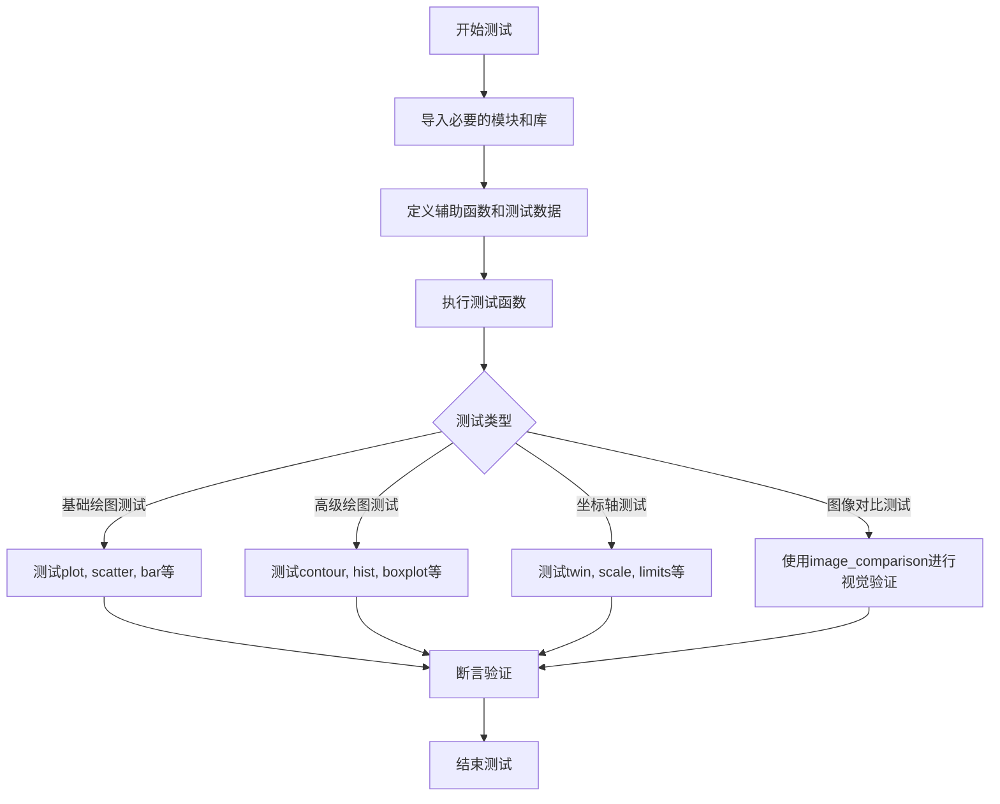

## 类结构

```
TestModule (测试模块)
├── 导入部分 (Imports)
├── 辅助函数 (Helper Functions)
│   ├── contour_dat
│   ├── _bxp_test_helper
│   ├── violin_plot_stats
│   └── ...
├── 测试类 (Test Classes)
│   └── TestScatter
└── 测试函数 (Test Functions)
    ├── test_invisible_axes
    ├── test_get_labels
    ├── test_acorr
    ├── test_spy
    ├── test_matshow
    ├── test_formatter_ticker
    ├── test_twin_axis
    ├── test_hist_*
    ├── test_boxplot_*
    ├── test_violinplot_*
    └── ...
```

## 全局变量及字段


### `N`
    
随机数种子值或数组维度大小

类型：`int`
    


### `Nx`
    
在test_acorr中表示自相关计算的数组长度

类型：`int`
    


### `maxlags`
    
自相关函数中使用的最大滞后数

类型：`int`
    


### `x`
    
测试数据数组，用于各种绘图和计算测试

类型：`np.ndarray`
    


### `y`
    
测试数据数组，用于各种绘图和计算测试

类型：`np.ndarray`
    


### `z`
    
测试数据数组，常用于网格数据或z轴数据

类型：`np.ndarray`
    


### `data`
    
测试用数据容器

类型：`dict or list`
    


### `params_test_scatter_c`
    
存储散点图颜色参数测试用例的列表

类型：`list`
    


### `COLOR_TEST_CASES`
    
颜色测试用例列表，包含不同颜色组合

类型：`list`
    


### `WARN_MSG`
    
警告消息字符串，提示颜色和填充参数同时使用的情况

类型：`str`
    


    

## 全局函数及方法


### `test_invisible_axes`

该测试函数验证了Matplotlib中 Axes 对象的可见性设置功能，通过创建子图并将其设置为不可见（`set_visible(False)`），然后使用图像比较装饰器 `@check_figures_equal()` 来确保测试结果与参考图形一致，从而验证隐藏坐标轴的功能是否正常工作。

参数：

- `fig_test`：`matplotlib.figure.Figure`，测试用的图形对象，由 `@check_figures_equal` 装饰器自动注入
- `fig_ref`：`matplotlib.figure.Figure`，参考用的图形对象，由 `@check_figures_equal` 装饰器自动注入

返回值：`None`，该函数为测试函数，不返回任何值

#### 流程图

```mermaid
flowchart TD
    A[开始 test_invisible_axes] --> B[接收 fig_test 和 fig_ref 参数]
    B --> C[在 fig_test 上创建子图 ax = fig_test.subplots]
    C --> D[调用 ax.set_visible(False) 设置坐标轴不可见]
    D --> E[@check_figures_equal 装饰器自动比较 fig_test 和 fig_ref 的渲染结果]
    E --> F[测试通过: 两幅图像应该一致]
    F --> G[结束]
    
    style A fill:#f9f,stroke:#333
    style G fill:#9f9,stroke:#333
```

#### 带注释源码

```python
@check_figures_equal()  # 装饰器：自动比较测试图和参考图的渲染结果
def test_invisible_axes(fig_test, fig_ref):
    """
    测试隐藏坐标轴的功能。
    
    该测试创建一个子图并将其设置为不可见，验证 set_visible(False) 方法
    是否能够正确隐藏坐标轴。装饰器 @check_figures_equal() 会自动比较
    测试图形和参考图形的渲染结果。
    
    参数:
        fig_test: 测试用的 Figure 对象（由装饰器注入）
        fig_ref: 参考用的 Figure 对象（由装饰器注入）
    """
    
    # 在测试图形上创建一个子图
    ax = fig_test.subplots()
    
    # 将坐标轴设置为不可见
    # 这是核心测试逻辑：验证 Axes.set_visible(False) 的功能
    ax.set_visible(False)
    
    # 注意：装饰器会自动处理图形比较，无需显式返回或断言
```

---

### 补充信息

**关键组件信息：**
- `@check_figures_equal()`：测试装饰器，来自 `matplotlib.testing.decorators`，用于图像比较测试
- `Figure.subplots()`：Matplotlib Figure 对象的方法，创建子图
- `Axes.set_visible(bool)`：设置坐标轴及其子元素的可见性

**潜在的技术债务或优化空间：**
1. 该测试只验证了 `set_visible(False)` 的基本功能，未测试 `set_visible(True)` 的恢复功能
2. 缺少对不同类型坐标轴（如共享坐标轴、极坐标轴等）的可见性测试
3. 测试覆盖较为简单，可增加边界情况测试，如嵌套坐标轴的可见性控制

**错误处理与异常设计：**
- 该测试函数本身未显式处理异常，依赖 pytest 框架进行错误捕获
- `@check_figures_equal` 装饰器会自动处理图形比较失败的情况

**设计目标与约束：**
- 设计目标：验证 Axes 对象的 `set_visible()` 方法能够正确隐藏坐标轴
- 约束：需要参考图形（`fig_ref`）与测试图形（`fig_test`）渲染结果一致，由于测试图形中坐标轴被隐藏，参考图形也应该隐藏坐标轴才能通过比较


### `test_get_labels`

该函数是一个测试函数，用于验证 Matplotlib 中 Axes 对象的 `set_xlabel`、`set_ylabel`、`get_xlabel` 和 `get_ylabel` 方法的正确性。函数创建图形和坐标轴，设置轴标签，并断言获取到的标签值与设置的值一致。

**参数：** 无

**返回值：** `None`，该函数不返回任何值，仅用于测试验证。

#### 流程图

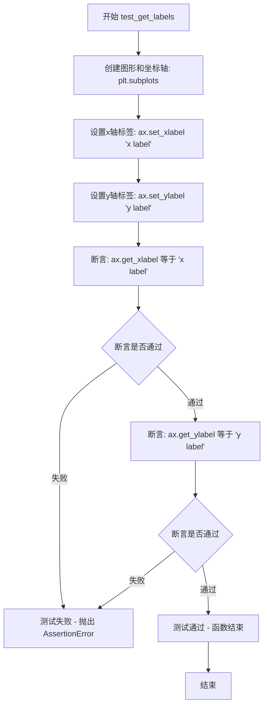

#### 带注释源码

```python
def test_get_labels():
    """
    测试 Axes 对象的 get_xlabel 和 get_ylabel 方法是否正确返回标签值。
    
    该测试函数验证以下功能：
    1. set_xlabel 设置 x 轴标签
    2. set_ylabel 设置 y 轴标签
    3. get_xlabel 获取 x 轴标签
    4. get_ylabel 获取 y 轴标签
    """
    # 创建一个新的图形窗口和一个子图（Axes对象）
    # 返回值: fig - Figure 对象, ax - Axes 对象
    fig, ax = plt.subplots()
    
    # 设置 x 轴的标签文本
    # 参数: label - 字符串，要设置的标签内容
    ax.set_xlabel('x label')
    
    # 设置 y 轴的标签文本
    # 参数: label - 字符串，要设置的标签内容
    ax.set_ylabel('y label')
    
    # 验证 get_xlabel 方法返回的标签与设置的值一致
    # assert 语句用于断言条件为真，否则抛出 AssertionError
    assert ax.get_xlabel() == 'x label'
    
    # 验证 get_ylabel 方法返回的标签与设置的值一致
    assert ax.get_ylabel() == 'y label'
```


### test_repr

该函数用于测试 Axes 对象的 `__repr__` 方法是否能正确返回包含标签、标题、x 轴标签和 y 轴标签的字符串表示形式。

参数：  
- （无）

返回值： `None`，该函数不返回任何值，仅通过断言验证 `repr(ax)` 的输出是否符合预期。

#### 流程图

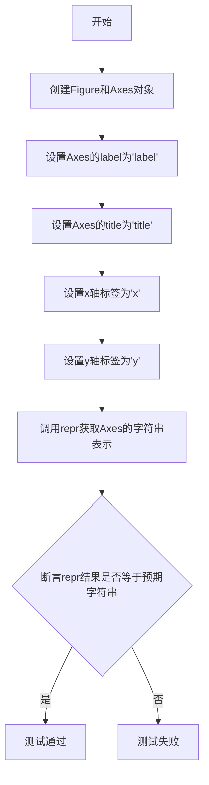

#### 带注释源码

```python
def test_repr():
    """
    测试 Axes 对象的 __repr__ 方法是否正确返回包含标签和标题信息的字符串。
    
    该测试函数验证 matplotlib Axes 对象在调用 repr() 时，
    能够正确格式化并显示 label、title、xlabel 和 ylabel 等属性。
    """
    # 创建一个新的图形和一个子图（Axes对象）
    fig, ax = plt.subplots()
    
    # 设置 Axes 对象的标签属性
    ax.set_label('label')
    
    # 设置 Axes 对象的标题
    ax.set_title('title')
    
    # 设置 x 轴标签
    ax.set_xlabel('x')
    
    # 设置 y 轴标签
    ax.set_ylabel('y')
    
    # 断言：验证 repr() 输出的字符串是否符合预期格式
    # 预期输出应包含：label='label', title={'center': 'title'}, xlabel='x', ylabel='y'
    assert repr(ax) == (
        "<Axes: "
        "label='label', title={'center': 'title'}, xlabel='x', ylabel='y'>")
```


### `test_label_loc_vertical`

该函数是一个图像对比测试函数，用于验证使用 `loc` 参数设置坐标轴标签位置的功能是否正确。测试通过比较使用新 `loc` 参数的测试图和使用传统 `y`/`x` + `ha` 参数的参考图是否一致，验证 `loc='top'`（Y轴）、`loc='right'`（X轴）和 `loc='top'`（colorbar）等场景下的标签定位是否符合预期。

参数：

-  `fig_test`：`matplotlib.figure.Figure`，测试用的 Figure 对象，用于构建使用 `loc` 参数的图形
-  `fig_ref`：`matplotlib.figure.Figure`，参考用的 Figure 对象，用于构建使用传统参数（`y`/`x` + `ha`）的图形

返回值：`None`，该函数为测试函数，无返回值

#### 流程图

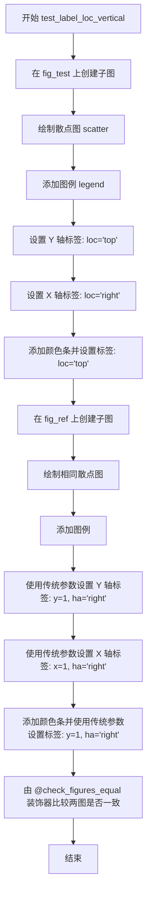

#### 带注释源码

```python
@check_figures_equal()  # 装饰器：自动比较 fig_test 和 fig_ref 的渲染结果是否一致
def test_label_loc_vertical(fig_test, fig_ref):
    """
    测试使用 loc 参数设置标签位置的功能（垂直方向）
    
    该测试验证以下场景：
    - Y 轴标签使用 loc='top' 设置在顶部
    - X 轴标签使用 loc='right' 设置在右侧
    - Colorbar 标签使用 loc='top' 设置在顶部
    """
    
    # ===== 测试图（使用新的 loc 参数）=====
    ax = fig_test.subplots()  # 创建子图
    sc = ax.scatter([1, 2], [1, 2], c=[1, 2], label='scatter')  # 绘制散点图
    ax.legend()  # 添加图例
    
    # 使用 loc 参数设置标签位置
    ax.set_ylabel('Y Label', loc='top')    # Y 轴标签设置在顶部
    ax.set_xlabel('X Label', loc='right')   # X 轴标签设置在右侧
    
    # 添加颜色条并使用 loc 参数设置标签
    cbar = fig_test.colorbar(sc)
    cbar.set_label("Z Label", loc='top')    # Colorbar 标签设置在顶部
    
    # ===== 参考图（使用传统参数 y/x + ha）=====
    ax = fig_ref.subplots()
    sc = ax.scatter([1, 2], [1, 2], c=[1, 2], label='scatter')
    ax.legend()
    
    # 使用传统参数实现相同的标签位置
    ax.set_ylabel('Y Label', y=1, ha='right')   # y=1 表示顶部, ha='right' 表示右对齐
    ax.set_xlabel('X Label', x=1, ha='right')    # x=1 表示右侧, ha='right' 表示右对齐
    
    cbar = fig_ref.colorbar(sc)
    cbar.set_label("Z Label", y=1, ha='right')  # y=1 表示顶部, ha='right' 表示右对齐
    
    # @check_figures_equal 装饰器会自动比较两个图的渲染结果
```


### `test_label_loc_horizontal`

该测试函数用于验证在**水平方向布局**下，坐标轴标签（xlabel、ylabel）和颜色条标签（colorbar label）的位置设置是否正确。测试对比了新 API（如 `loc='left'`、`loc='bottom'`）与传统参数化方式（如 `x=0, ha='left'`）的视觉效果。

#### 参数

- `fig_test`：`matplotlib.figure.Figure`，测试用的 Figure 对象，使用新的 `loc` 参数设置标签位置
- `fig_ref`：`matplotlib.figure.Figure`，参考用的 Figure 对象，使用传统的 `x`/`y` 和 `ha` 参数设置标签位置

#### 返回值

无返回值。该函数是一个测试函数，使用 `@check_figures_equal()` 装饰器自动比较 `fig_test` 和 `fig_ref` 的渲染结果是否一致。

#### 流程图

```mermaid
flowchart TD
    A[开始测试] --> B[在 fig_test 上创建子图]
    B --> C[绘制散点图 sc]
    C --> D[添加图例]
    D --> E[使用 loc='bottom' 设置 ylabel]
    E --> F[使用 loc='left' 设置 xlabel]
    F --> G[创建水平方向颜色条]
    G --> H[使用 loc='left' 设置颜色条标签]
    H --> I[在 fig_ref 上创建子图]
    I --> J[绘制相同散点图]
    J --> K[使用 y=0, ha='left' 设置 ylabel]
    K --> L[使用 x=0, ha='left' 设置 xlabel]
    L --> M[创建水平方向颜色条]
    M --> N[使用 x=0, ha='left' 设置颜色条标签]
    N --> O[@check_figures_equal 装饰器比较两图]
    O --> P[结束测试]
```

#### 带注释源码

```python
@check_figures_equal()
def test_label_loc_horizontal(fig_test, fig_ref):
    """
    测试水平布局下标签位置的设置。
    验证新的 loc 参数与传统的 x/y + ha 参数效果一致。
    """
    # ===== 测试图 (fig_test) =====
    # 1. 创建子图
    ax = fig_test.subplots()
    
    # 2. 绘制散点图，用于后续添加颜色条
    sc = ax.scatter([1, 2], [1, 2], c=[1, 2], label='scatter')
    
    # 3. 添加图例
    ax.legend()
    
    # 4. 使用新 API 设置坐标轴标签位置
    # loc='bottom' 等同于传统的 y=0, ha='left'
    ax.set_ylabel('Y Label', loc='bottom')
    # loc='left' 等同于传统的 x=0, ha='left'
    ax.set_xlabel('X Label', loc='left')
    
    # 5. 创建水平方向的颜色条
    cbar = fig_test.colorbar(sc, orientation='horizontal')
    
    # 6. 使用新 API 设置颜色条标签位置
    # loc='left' 等同于传统的 x=0, ha='left'
    cbar.set_label("Z Label", loc='left')
    
    # ===== 参考图 (fig_ref) - 使用传统参数 =====
    ax = fig_ref.subplots()
    sc = ax.scatter([1, 2], [1, 2], c=[1, 2], label='scatter')
    ax.legend()
    
    # 传统方式：通过 y 和 ha 参数设置
    ax.set_ylabel('Y Label', y=0, ha='left')
    ax.set_xlabel('X Label', x=0, ha='left')
    
    cbar = fig_ref.colorbar(sc, orientation='horizontal')
    cbar.set_label("Z Label", x=0, ha='left')
    
    # @check_figures_equal 装饰器会自动比较两个图的输出
    # 确保新 API 和传统 API 产生相同的视觉效果
```


### `test_label_loc_rc`

该函数是一个测试函数，用于验证通过 matplotlib 的 `rc_context` 设置轴标签位置（`xaxis.labellocation` 和 `yaxis.labellocation`）的功能，并与手动设置标签位置（`y=1, ha='right'` 和 `x=1, ha='right'`）的参考图像进行视觉对比。

参数：

- `fig_test`：`Figure` 对象，测试用例使用的图形对象
- `fig_ref`：`Figure` 对象，参考图形对象，用于与测试结果进行对比

返回值：无返回值（该函数为测试函数，使用 `@check_figures_equal` 装饰器进行图像对比）

#### 流程图

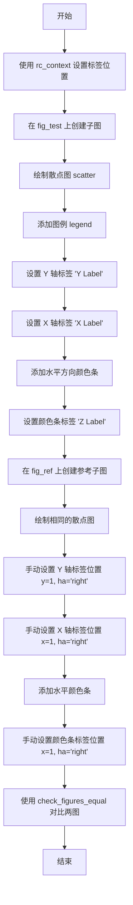

#### 带注释源码

```python
@check_figures_equal()  # 装饰器：自动比较测试图和参考图的输出
def test_label_loc_rc(fig_test, fig_ref):
    """
    测试通过 rc_context 设置轴标签位置的功能
    
    该测试验证使用 matplotlib.rc_context 设置 xaxis.labellocation 和 
    yaxis.labellocation 参数与手动设置标签位置（y=1, ha='right' 等）
    产生相同的视觉效果
    """
    
    # 第一部分：使用 rc_context 设置标签位置
    with matplotlib.rc_context({"xaxis.labellocation": "right",
                                "yaxis.labellocation": "top"}):
        # 创建测试图形的子图
        ax = fig_test.subplots()
        
        # 绘制散点图，数据点为 [1,2]，颜色映射为 [1,2]
        sc = ax.scatter([1, 2], [1, 2], c=[1, 2], label='scatter')
        
        # 添加图例
        ax.legend()
        
        # 设置 Y 轴标签（位置由 rc_context 的 yaxis.labellocation='top' 控制）
        ax.set_ylabel('Y Label')
        
        # 设置 X 轴标签（位置由 rc_context 的 xaxis.labellocation='right' 控制）
        ax.set_xlabel('X Label')
        
        # 添加水平方向的颜色条
        cbar = fig_test.colorbar(sc, orientation='horizontal')
        
        # 设置颜色条标签
        cbar.set_label("Z Label")

    # 第二部分：手动设置相同的位置作为参考
    # 创建参考图形的子图
    ax = fig_ref.subplots()
    
    # 绘制相同的散点图
    sc = ax.scatter([1, 2], [1, 2], c=[1, 2], label='scatter')
    
    # 添加图例
    ax.legend()
    
    # 手动设置 Y 轴标签位置：y=1 表示在顶部，ha='right' 表示右对齐
    ax.set_ylabel('Y Label', y=1, ha='right')
    
    # 手动设置 X 轴标签位置：x=1 表示在右侧，ha='right' 表示右对齐
    ax.set_xlabel('X Label', x=1, ha='right')
    
    # 添加水平颜色条
    cbar = fig_ref.colorbar(sc, orientation='horizontal')
    
    # 手动设置颜色条标签位置：x=1 表示在右侧，ha='right' 表示右对齐
    cbar.set_label("Z Label", x=1, ha='right')
    
    # @check_figures_equal 装饰器会自动比较 fig_test 和 fig_ref 的渲染结果
    # 如果两者不一致，测试将失败
```


### test_label_shift

该函数是一个测试函数，用于验证matplotlib中`set_xlabel`和`set_ylabel`方法的`loc`参数功能，测试标签在水平方向上的对齐方式（left、center、right）是否正确设置。

参数：无

返回值：`None`，无返回值（测试函数）

#### 流程图

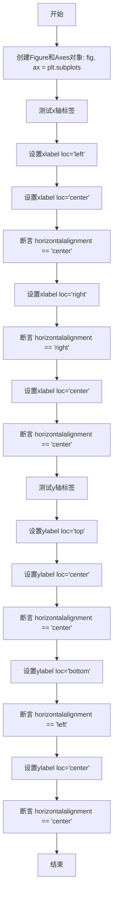

#### 带注释源码

```python
def test_label_shift():
    """
    测试matplotlib Axes的set_xlabel和set_ylabel方法的loc参数功能。
    验证标签的水平对齐方式（horizontalalignment）是否正确设置。
    """
    # 创建图形和坐标轴对象
    fig, ax = plt.subplots()

    # ==================== 测试x轴标签 ====================
    # 测试标签在x轴上的重新居中功能
    
    # 1. 设置xlabel位置为左侧
    ax.set_xlabel("Test label", loc="left")
    
    # 2. 设置xlabel位置为中心，并验证
    ax.set_xlabel("Test label", loc="center")
    assert ax.xaxis.label.get_horizontalalignment() == "center"
    
    # 3. 设置xlabel位置为右侧，并验证
    ax.set_xlabel("Test label", loc="right")
    assert ax.xaxis.label.get_horizontalalignment() == "right"
    
    # 4. 再次设置xlabel位置为中心，并验证
    ax.set_xlabel("Test label", loc="center")
    assert ax.xaxis.label.get_horizontalalignment() == "center"

    # ==================== 测试y轴标签 ====================
    # 测试标签在y轴上的重新居中功能
    
    # 1. 设置ylabel位置为顶部
    ax.set_ylabel("Test label", loc="top")
    
    # 2. 设置ylabel位置为中心，并验证
    ax.set_ylabel("Test label", loc="center")
    assert ax.yaxis.label.get_horizontalalignment() == "center"
    
    # 3. 设置ylabel位置为底部，并验证
    # 注意：底部位置对应left对齐
    ax.set_ylabel("Test label", loc="bottom")
    assert ax.yaxis.label.get_horizontalalignment() == "left"
    
    # 4. 再次设置ylabel位置为中心，并验证
    ax.set_ylabel("Test label", loc="center")
    assert ax.yaxis.label.get_horizontalalignment() == "center"
```


### test_acorr

该测试函数用于验证matplotlib Axes对象的`acorr`（自相关）方法是否正确绘制随机游走数据的自相关图，并通过与手动计算的规范化自相关结果进行图像比较。

参数：

- `fig_test`：`matplotlib.figure.Figure`，测试图形对象，用于放置被测试的acorr图
- `fig_ref`：`matplotlib.figure.Figure`，参考图形对象，用于放置手动计算的自相关结果图

返回值：`None`，测试函数无返回值

#### 流程图

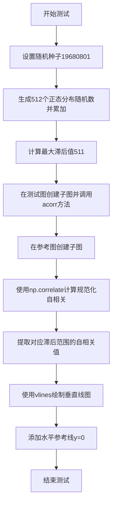

#### 带注释源码

```python
@check_figures_equal()  # 装饰器：比较测试图和参考图的输出是否一致
def test_acorr(fig_test, fig_ref):
    """
    测试Axes.acorr方法是否正确绘制自相关图
    
    参数:
        fig_test: 测试Figure对象，将使用ax.acorr()绘制
        fig_ref: 参考Figure对象，手动计算自相关并绘制用于比较
    """
    # 设置随机种子以确保结果可重复
    np.random.seed(19680801)
    
    # 生成随机游走数据：512个正态分布随机数的累积和
    Nx = 512
    x = np.random.normal(0, 1, Nx).cumsum()
    
    # 设置最大滞后数为数据长度减1
    maxlags = Nx-1

    # === 测试路径：使用Axes.acorr方法 ===
    ax_test = fig_test.subplots()  # 创建测试图子图
    ax_test.acorr(x, maxlags=maxlags)  # 调用被测试的acorr方法

    # === 参考路径：手动计算并绘制自相关 ===
    ax_ref = fig_ref.subplots()  # 创建参考图子图
    
    # 计算规范化自相关：使用numpy的correlate函数
    # mode="full"返回完整的互相关序列
    norm_auto_corr = np.correlate(x, x, mode="full") / np.dot(x, x)
    
    # 生成滞后序列：从-maxlags到+maxlags
    lags = np.arange(-maxlags, maxlags+1)
    
    # 提取与maxlags对应的自相关值
    # 只取中间部分（对应所需滞后范围）
    norm_auto_corr = norm_auto_corr[Nx-1-maxlags : Nx+maxlags]
    
    # 使用vlines绘制垂直线图（每个滞后位置一条线）
    ax_ref.vlines(lags, [0], norm_auto_corr)
    
    # 添加水平参考线y=0
    ax_ref.axhline(y=0, xmin=0, xmax=1)
```


### `test_acorr_integers`

该函数是一个测试函数，用于验证 `Axes.acorr()` 方法在处理整数类型数据时的正确性。测试通过比较使用 `ax.acorr()` 方法绘制的图形与手动计算并绘制标准化自相关性的参考图形来确保两者一致。

参数：

- `fig_test`：matplotlib.figure.Figure，测试用的 Figure 对象，通过 `@check_figures_equal` 装饰器注入
- `fig_ref`：matplotlib.figure.Figure，参考用的 Figure 对象，通过 `@check_figures_equal` 装饰器注入

返回值：`None`，该函数为测试函数，不返回任何值

#### 流程图

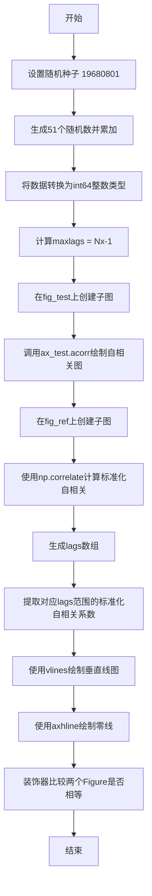

#### 带注释源码

```python
@check_figures_equal()  # 装饰器：比较测试图和参考图是否一致
def test_acorr_integers(fig_test, fig_ref):
    """测试acorr方法处理整数类型数据的功能"""
    
    # 设置随机种子以确保测试结果可重复
    np.random.seed(19680801)
    
    # 定义数据点数量
    Nx = 51
    
    # 生成随机数据并累加，然后转换为整数
    # 1. 生成Nx个[0,1)区间内的随机数
    # 2. 乘以10扩展到[0,10)区间
    # 3. cumsum()计算累积和
    # 4. ceil()向上取整
    # 5. astype(np.int64)转换为64位整数
    x = (np.random.rand(Nx) * 10).cumsum()
    x = (np.ceil(x)).astype(np.int64)
    
    # 计算最大lags值（自相关图显示的滞后范围）
    maxlags = Nx-1
    
    # --- 测试路径：使用Axes.acorr()方法绘图 ---
    ax_test = fig_test.subplots()  # 创建测试用的子图
    ax_test.acorr(x, maxlags=maxlags)  # 调用acorr方法绘制自相关图
    
    # --- 参考路径：手动计算并绘制标准化自相关 ---
    ax_ref = fig_ref.subplots()  # 创建参考用的子图
    
    # 手动计算标准化自相关系数
    # 1. np.correlate(x, x, mode="full")计算完整互相关
    # 2. 除以np.dot(x, x)进行标准化（除以信号能量）
    norm_auto_corr = np.correlate(x, x, mode="full") / np.dot(x, x)
    
    # 生成lags数组，从-maxlags到+maxlags
    lags = np.arange(-maxlags, maxlags+1)
    
    # 提取与lags对应的标准化自相关系数
    # 从Nx-1-maxlags位置开始，到Nx+maxlags位置结束
    norm_auto_corr = norm_auto_corr[Nx-1-maxlags : Nx+maxlags]
    
    # 使用vlines绘制垂直线图（每个lag对应一条线）
    ax_ref.vlines(lags, [0], norm_auto_corr)
    
    # 绘制水平零线
    ax_ref.axhline(y=0, xmin=0, xmax=1)
```


### `test_spy`

该函数是一个测试函数，用于测试 matplotlib 中 Axes 对象的 `spy` 方法（稀疏矩阵可视化功能）。它通过比较 `spy` 方法的输出与使用 `imshow` 和 `plot` 的手动实现来验证功能正确性。

参数：

- `fig_test`：`matplotlib.figure.Figure`，测试figure对象，用于放置通过spy方法生成的图像
- `fig_ref`：`matplotlib.figure.Figure`，参考figure对象，用于放置手动实现的对比图像

返回值：`None`，该函数为测试函数，不返回任何值

#### 流程图

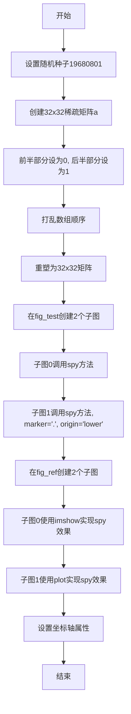

#### 带注释源码

```python
@check_figures_equal()  # 装饰器：比较测试图和参考图的输出是否一致
def test_spy(fig_test, fig_ref):
    """
    测试Axes.spy方法的功能
    
    该测试函数验证spy方法能否正确绘制稀疏矩阵的非零元素。
    通过与手动使用imshow和plot的实现进行图像比较来验证正确性。
    """
    # 设置随机种子以确保结果可重现
    np.random.seed(19680801)
    
    # 创建一个32x32的数组，初始值全为1
    a = np.ones(32 * 32)
    
    # 将前半部分（16*32个元素）设为0，创建稀疏矩阵效果
    a[:16 * 32] = 0
    
    # 使用shuffle随机打乱数组顺序，使非零元素分布随机
    np.random.shuffle(a)
    
    # 将数组重塑为32x32的二维矩阵
    a = a.reshape((32, 32))

    # 在测试figure中创建2个子图
    axs_test = fig_test.subplots(2)
    
    # 第一个子图：使用默认参数的spy方法
    # spy方法会绘制矩阵中的非零值
    axs_test[0].spy(a)
    
    # 第二个子图：使用点标记和lower原点的spy方法
    axs_test[1].spy(a, marker=".", origin="lower")

    # 在参考figure中创建2个子图
    axs_ref = fig_ref.subplots(2)
    
    # 第一个参考子图：使用imshow实现spy的等效效果
    # cmap="gray_r"使非零值为黑色，零值为白色（与spy默认相反）
    # interpolation="nearest"保持像素边缘清晰
    axs_ref[0].imshow(a, cmap="gray_r", interpolation="nearest")
    
    # 将x轴刻度移动到顶部（模仿spy的默认行为）
    axs_ref[0].xaxis.tick_top()
    
    # 第二个参考子图：使用plot方法绘制非零位置的点
    # np.nonzero(a)返回非零元素的行列索引
    # [::-1]反转索引顺序（x,y -> y,x）
    axs_ref[1].plot(*np.nonzero(a)[::-1], ".", markersize=10)
    
    # 设置axes属性以匹配spy的默认行为
    axs_ref[1].set(
        aspect=1,  # 设置宽高比为1
        xlim=axs_ref[0].get_xlim(),  # 同步x轴范围
        ylim=axs_ref[0].get_ylim()[::-1])  # 反转y轴范围以匹配图像坐标
    
    # 为所有参考子图设置x轴刻度位置（顶部和底部）
    for ax in axs_ref:
        ax.xaxis.set_ticks_position("both")
```


### test_spy_invalid_kwargs

该测试函数用于验证 `ax.spy()` 方法在传入不支持的关键字参数时能够正确抛出 `TypeError` 异常。它通过遍历预设的不合法参数组合，检测 matplotlib 内部是否对无效参数进行了正确的异常处理。

参数：
- 该函数无参数

返回值：该函数无返回值（返回 `None`）

#### 流程图

```mermaid
flowchart TD
    A[开始测试] --> B[创建图表和坐标轴: plt.subplots]
    B --> C[设置测试数据: np.eye(3, 3)]
    C --> D[遍历不支持的参数列表]
    D --> E{参数列表遍历完成?}
    E -->|否| F[获取当前不支持的参数组合]
    F --> G[调用 ax.spy 并传入不支持的参数]
    G --> H{是否抛出 TypeError?}
    H -->|是| I[测试通过]
    H -->|否| J[测试失败]
    I --> D
    E -->|是| K[结束测试]
```

#### 带注释源码

```python
def test_spy_invalid_kwargs():
    """
    测试 ax.spy() 方法对不支持关键字参数的处理
    
    该测试函数验证当向 ax.spy() 传入不支持的关键字参数时，
    会正确抛出 TypeError 异常。测试用例包括两类无效参数：
    1. interpolation 参数 - spy 方法不支持此参数
    2. marker 和 linestyle 参数组合 - 与 scatter 的参数混淆
    """
    # 创建一个新的图形窗口和一个坐标轴对象
    fig, ax = plt.subplots()
    
    # 定义两个不支持的关键字参数组合
    for unsupported_kw in [
        # 第一个测试用例：interpolation 参数不被 spy 方法支持
        {'interpolation': 'nearest'},
        # 第二个测试用例：marker 和 linestyle 参数不应传递给底层实现
        {'marker': 'o', 'linestyle': 'solid'}
    ]:
        # 使用 pytest.raises 验证调用是否抛出 TypeError
        with pytest.raises(TypeError):
            # 使用 3x3 单位矩阵作为测试数据
            # **unsupported_kw 将字典展开为关键字参数传入
            ax.spy(np.eye(3, 3), **unsupported_kw)
```


### `test_matshow`

该测试函数用于验证 `matshow` 方法的输出是否与使用 `imshow` 并手动配置坐标轴刻度位置的结果一致。测试通过 `@check_figures_equal` 装饰器进行视觉图像对比。

**参数：**

- `fig_test`：`matplotlib.figure.Figure` (通过 pytest fixture 注入)，用于测试的 Figure 对象
- `fig_ref`：`matplotlib.figure.Figure` (通过 pytest fixture 注入)，作为参考基准的 Figure 对象

**返回值：** `None`，该函数为测试函数，无返回值

#### 流程图

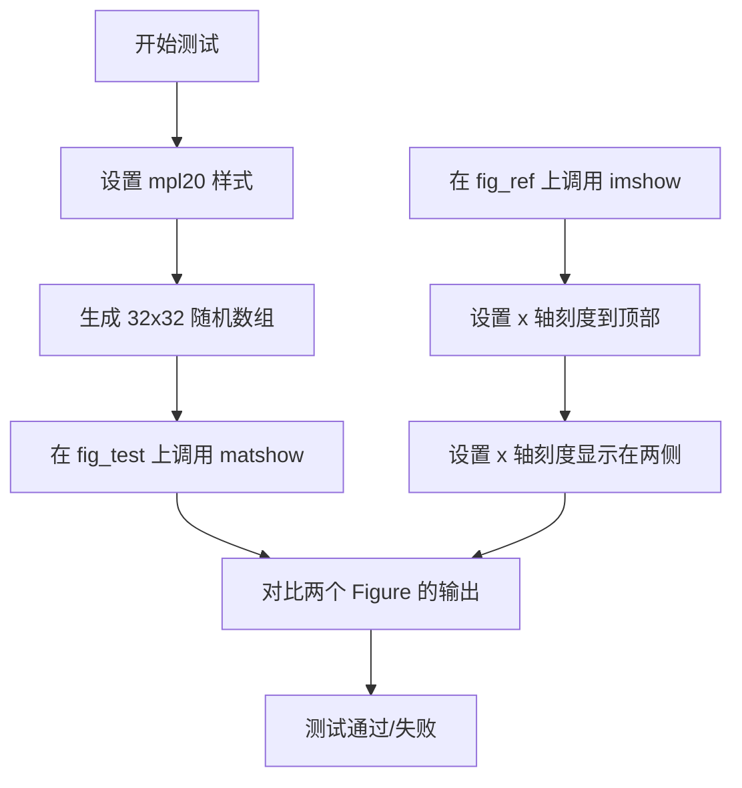

#### 带注释源码

```python
@check_figures_equal()  # 装饰器：比较测试图和参考图的视觉输出是否一致
def test_matshow(fig_test, fig_ref):
    """
    测试 matshow 函数与手动配置 imshow 的一致性
    
    该测试验证 Axes.matshow() 方法是否正确实现了：
    1. 使用 imshow 显示矩阵
    2. 将 x 轴刻度移动到顶部
    3. 在两侧显示刻度标签
    """
    mpl.style.use("mpl20")  # 使用 mpl20 样式确保一致的默认行为
    a = np.random.rand(32, 32)  # 生成 32x32 的随机矩阵数据
    
    # 测试路径：使用 matshow 方法
    fig_test.add_subplot().matshow(a)
    
    # 参考路径：手动使用 imshow 并配置刻度位置
    ax_ref = fig_ref.add_subplot()
    ax_ref.imshow(a)
    ax_ref.xaxis.tick_top()           # 将 x 轴刻度移动到顶部
    ax_ref.xaxis.set_ticks_position('both')  # 在图表两侧显示刻度
```


### test_formatter_ticker

该测试函数用于验证matplotlib的ticker和formatter功能，特别关注用户指定的标签是否会被自动标签生成器覆盖，同时测试不同单位和颜色数据绘制时的行为。

参数： 无

返回值： 无（该函数为测试函数，不返回值，通过图像比较验证结果）

#### 流程图

```mermaid
flowchart TD
    A[开始] --> B[导入并注册jpl_units模块]
    B --> C[设置lines.markeredgewidth为30]
    C --> D[创建测试数据: xdata, ydata1, ydata2]
    D --> E[创建图1: 仅设置xlabel]
    E --> F[创建图2: 设置xlabel并绘制蓝色数据xunits=sec]
    F --> G[创建图3: 设置xlabel后重置为x-label 003]
    G --> H[创建图4: 绘制两组数据不同颜色和单位]
    H --> I[创建图5: 绘制数据后调用autoscale_view]
    I --> J[结束-通过@image_comparison验证图像]
```

#### 带注释源码

```python
@image_comparison([f'formatter_ticker_{i:03d}.png' for i in range(1, 6)],
                  tol=0.02 if platform.machine() == 'x86_64' else 0.04)
def test_formatter_ticker():
    # 导入并注册jpl_units模块，用于处理物理单位
    import matplotlib.testing.jpl_units as units
    units.register()

    # 设置markeredgewidth为30，这会影响刻度大小 (测试issue #543)
    matplotlib.rcParams['lines.markeredgewidth'] = 30

    # 创建测试数据，使用jpl_units单位
    # x轴数据：0-9秒
    xdata = [x*units.sec for x in range(10)]
    # y轴数据1：线性增长 (1.5y - 0.5)公里
    ydata1 = [(1.5*y - 0.5)*units.km for y in range(10)]
    # y轴数据2：不同斜率的线性数据 (1.75y - 1.0)公里
    ydata2 = [(1.75*y - 1.0)*units.km for y in range(10)]

    # 测试1：仅设置xlabel，验证轴标签基本功能
    ax = plt.figure().subplots()
    ax.set_xlabel("x-label 001")

    # 测试2：绘制数据时指定x轴单位为秒
    ax = plt.figure().subplots()
    ax.set_xlabel("x-label 001")
    ax.plot(xdata, ydata1, color='blue', xunits="sec")

    # 测试3：绘制后重新设置xlabel，验证标签覆盖行为
    ax = plt.figure().subplots()
    ax.set_xlabel("x-label 001")
    ax.plot(xdata, ydata1, color='blue', xunits="sec")
    ax.set_xlabel("x-label 003")

    # 测试4：同一图中绘制两组数据，不同颜色和单位
    ax = plt.figure().subplots()
    ax.plot(xdata, ydata1, color='blue', xunits="sec")
    ax.plot(xdata, ydata2, color='green', xunits="hour")
    ax.set_xlabel("x-label 004")

    # 测试5：验证autoscale_view在单位数据上的行为 (SF bug #2846058)
    ax = plt.figure().subplots()
    ax.plot(xdata, ydata1, color='blue', xunits="sec")
    ax.plot(xdata, ydata2, color='green', xunits="hour")
    ax.set_xlabel("x-label 005")
    ax.autoscale_view()
```


### test_funcformatter_auto_formatter

该函数是一个单元测试，用于验证 Matplotlib 中 `FuncFormatter` 的自动格式化功能是否正常工作。它测试在设置自定义格式化函数后，坐标轴的默认格式化器标志是否正确更新，以及设置的格式化器类型和函数是否正确。

参数：
- 该函数无显式参数

返回值：`None`，测试函数无返回值，通过断言验证功能正确性

#### 流程图

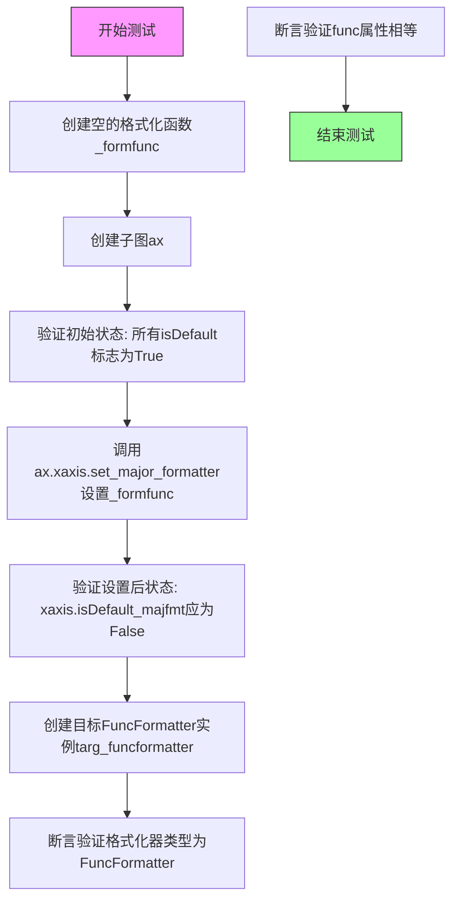

#### 带注释源码

```python
def test_funcformatter_auto_formatter():
    """
    测试 FuncFormatter 的自动格式化功能
    
    该测试验证：
    1. 设置自定义格式化函数后，默认格式化器标志正确更新
    2. 设置的格式化器是FuncFormatter类型
    3. 设置的函数与原始函数一致
    """
    
    def _formfunc(x, pos):
        """测试用的空格式化函数"""
        return ''

    # 创建子图
    ax = plt.figure().subplots()

    # 验证初始状态：所有轴的默认格式化器标志应为True
    # isDefault_majfmt: 主刻度格式化器是否使用默认
    # isDefault_minfmt: 副刻度格式化器是否使用默认
    assert ax.xaxis.isDefault_majfmt  # x轴主刻度
    assert ax.xaxis.isDefault_minfmt   # x轴副刻度
    assert ax.yaxis.isDefault_majfmt  # y轴主刻度
    assert ax.yaxis.isDefault_minfmt   # y轴副刻度

    # 设置x轴的主刻度格式化器为自定义函数
    ax.xaxis.set_major_formatter(_formfunc)

    # 验证设置后的状态变化
    # x轴主格式化器不再是默认，其他保持默认
    assert not ax.xaxis.isDefault_majfmt  # 应该变为False
    assert ax.xaxis.isDefault_minfmt       # 保持True
    assert ax.yaxis.isDefault_majfmt      # 保持True
    assert ax.yaxis.isDefault_minfmt       # 保持True

    # 创建目标FuncFormatter实例用于比较
    targ_funcformatter = mticker.FuncFormatter(_formfunc)

    # 验证设置的格式化器类型
    assert isinstance(ax.xaxis.get_major_formatter(), mticker.FuncFormatter)

    # 验证格式化器的func属性与目标一致
    assert ax.xaxis.get_major_formatter().func == targ_funcformatter.func
```


### `test_strmethodformatter_auto_formatter`

该测试函数用于验证 `StrMethodFormatter` 在轴上的自动格式化功能是否正常工作，通过设置格式化字符串并检查轴的默认格式化状态是否正确更新。

参数： 无

返回值： `None`，测试函数无返回值

#### 流程图

```mermaid
graph TD
    A[开始测试] --> B[创建格式化字符串 formstr = '{x}_{pos}']
    B --> C[创建 Figure 和 Axes 对象]
    C --> D{断言初始状态}
    D -->|xaxis.majfmt默认| E[ax.xaxis.isDefault_majfmt == True]
    D -->|xaxis.minfmt默认| F[ax.xaxis.isDefault_minfmt == True]
    D -->|yaxis.majfmt默认| G[ax.yaxis.isDefault_majfmt == True]
    D -->|yaxis.minfmt默认| H[ax.yaxis.isDefault_minfmt == True]
    E --> I[调用 ax.yaxis.set_minor_formatter 设置格式化器]
    F --> I
    G --> I
    H --> I
    I --> J{断言设置后状态}
    J -->|xaxis.majfmt仍默认| K[ax.xaxis.isDefault_majfmt == True]
    J -->|xaxis.minfmt仍默认| L[ax.xaxis.isDefault_minfmt == True]
    J -->|yaxis.majfmt仍默认| M[ax.yaxis.isDefault_majfmt == True]
    J -->|yaxis.minfmt已修改| N[ax.yaxis.isDefault_minfmt == False]
    K --> O[创建目标 StrMethodFormatter 对象]
    L --> O
    M --> O
    N --> O
    O --> P{验证格式化器类型}
    P --> Q[isinstance 检查为 StrMethodFormatter]
    Q --> R{验证格式化字符串}
    R --> S[fmt 属性值相等]
    S --> T[测试通过]
```

#### 带注释源码

```python
def test_strmethodformatter_auto_formatter():
    """
    测试 StrMethodFormatter 的自动格式化功能。
    
    该测试验证：
    1. 设置自定义格式化字符串后，轴的默认格式化状态是否正确更新
    2. 设置的格式化器是否为 StrMethodFormatter 类型
    3. 格式化字符串是否正确保存
    """
    # 定义格式化字符串模板，包含位置和值占位符
    formstr = '{x}_{pos}'

    # 创建新的 Figure 和 Axes 对象
    ax = plt.figure().subplots()

    # 验证初始状态：所有轴的格式化器都应该是默认的
    assert ax.xaxis.isDefault_majfmt  # x轴主格式化器应为默认
    assert ax.xaxis.isDefault_minfmt  # x轴次格式化器应为默认
    assert ax.yaxis.isDefault_majfmt  # y轴主格式化器应为默认
    assert ax.yaxis.isDefault_minfmt  # y轴次格式化器应为默认

    # 设置y轴的次格式化器为 StrMethodFormatter
    ax.yaxis.set_minor_formatter(formstr)

    # 验证设置后的状态变化
    # x轴的格式化器应该保持默认状态
    assert ax.xaxis.isDefault_majfmt
    assert ax.xaxis.isDefault_minfmt
    assert ax.yaxis.isDefault_majfmt
    # y轴次格式化器不再是默认状态
    assert not ax.yaxis.isDefault_minfmt

    # 创建目标格式化器用于比较
    targ_strformatter = mticker.StrMethodFormatter(formstr)

    # 验证实际设置的格式化器类型是否正确
    assert isinstance(ax.yaxis.get_minor_formatter(),
                      mticker.StrMethodFormatter)

    # 验证格式化器的格式字符串是否正确设置
    assert ax.yaxis.get_minor_formatter().fmt == targ_strformatter.fmt
```


### `test_twin_axis_locators_formatters`

该函数是一个图像比较测试，用于验证 Matplotlib 中双轴（twin axes）的定位器（locators）和格式化器（formatters）功能是否正常工作。测试创建包含主坐标轴和从属坐标轴（通过 twiny 和 twinx 创建）的图表，并设置各种定位器和格式化器，然后与基线图像进行比较。

参数：
- 该函数没有显式参数
- 使用装饰器 `@image_comparison(["twin_axis_locators_formatters.png"])` 进行图像比较验证

返回值：
- `None`，该函数为测试函数，执行验证操作，不返回具体值

#### 流程图

```mermaid
flowchart TD
    A[开始测试] --> B[创建值数组 vals: 0到1的5个等间距点]
    B --> C[计算位置 locs: sin(π*vals/2)]
    C --> D[创建主定位器 majl: FixedLocator]
    D --> E[创建次定位器 minl: FixedLocator]
    E --> F[创建图表和主坐标轴 ax1]
    F --> G[绘制数据线 [0.1, 100] 到 [0, 1]]
    G --> H[设置y轴定位器和格式化器]
    H --> I[设置x轴定位器和格式化器]
    I --> J[调用 ax1.twiny 创建共享y轴的副x轴]
    J --> K[调用 ax1.twinx 创建共享x轴的副y轴]
    K --> L[与基线图像比较验证]
    L --> M[结束测试]
```

#### 带注释源码

```python
@image_comparison(["twin_axis_locators_formatters.png"])  # 装饰器：比较生成图像与基线图像
def test_twin_axis_locators_formatters():
    """
    测试双轴的定位器和格式化器功能
    
    该测试验证:
    1. 主坐标轴的自定义定位器
    2. 主坐标轴的自定义格式化器
    3. 从属坐标轴（twiny/twinx）的正确创建
    """
    # 生成测试用的位置值：0到1之间5个点（包含端点）
    vals = np.linspace(0, 1, num=5, endpoint=True)
    
    # 计算非线性位置：使用正弦函数转换vals
    # 用于测试非线性刻度的定位器
    locs = np.sin(np.pi * vals / 2.0)

    # 创建固定定位器：指定主刻度的固定位置
    majl = plt.FixedLocator(locs)
    
    # 创建次级固定定位器：指定次级刻度的固定位置
    minl = plt.FixedLocator([0.1, 0.2, 0.3])

    # 创建新图表
    fig = plt.figure()
    
    # 创建单子图（1行1列第1个）
    ax1 = fig.add_subplot(1, 1, 1)
    
    # 绘制数据：x从0.1到100，y从0到1
    # 数据范围大但y轴范围小，用于测试定位器
    ax1.plot([0.1, 100], [0, 1])

    # 配置y轴定位器和格式化器
    ax1.yaxis.set_major_locator(majl)  # 设置主刻度定位器
    ax1.yaxis.set_minor_locator(minl)  # 设置次级刻度定位器
    # 设置主刻度格式化器：8位宽度，2位小数，左侧补零
    ax1.yaxis.set_major_formatter(plt.FormatStrFormatter('%08.2lf'))
    # 设置次级刻度格式化器：自定义字符串标签
    ax1.yaxis.set_minor_formatter(plt.FixedFormatter(['tricks', 'mind', 'jedi']))

    # 配置x轴定位器和格式化器
    ax1.xaxis.set_major_locator(plt.LinearLocator())  # 线性主刻度定位器
    # 固定次级刻度位置：[15, 35, 55, 75]
    ax1.xaxis.set_minor_locator(plt.FixedLocator([15, 35, 55, 75]))
    # 格式化主刻度：5位宽度，2位小数
    ax1.xaxis.set_major_formatter(plt.FormatStrFormatter('%05.2lf'))
    # 格式化次级刻度：自定义标签
    ax1.xaxis.set_minor_formatter(plt.FixedFormatter(['c', '3', 'p', 'o']))

    # 创建共享y轴的副x轴（twiny）
    # 这会在图表顶部创建第二个x轴，与原x轴共享y轴数据
    ax1.twiny()
    
    # 创建共享x轴的副y轴（twinx）
    # 这会在图表右侧创建第二个y轴，与原y轴共享x轴数据
    ax1.twinx()
    
    # 注意：twiny和twinx调用后的返回值未被使用
    # 测试主要验证定位器和格式化器在主坐标轴上的效果
    # 图像比较会自动验证最终渲染结果
```


### test_twinx_cla

该函数是一个单元测试，用于验证在matplotlib中创建共享轴（twinx/twiny）后，调用`cla()`方法清除轴时的行为是否符合预期。它测试了主轴（ax）、双y轴（ax2）和双x轴（ax3）在清除后的可见性状态。

参数：该函数无参数

返回值：该函数无返回值（返回类型为`None`）

#### 流程图

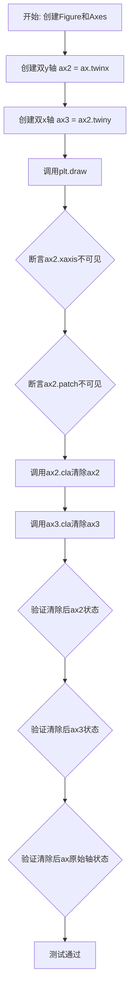

#### 带注释源码

```python
def test_twinx_cla():
    """
    测试twinx/twiny创建的轴在使用cla()清除后的可见性行为。
    
    该测试验证了以下行为：
    1. 创建twinx后，新轴的xaxis和patch默认不可见
    2. 调用cla()清除轴时，应该清除twinx/twiny创建的从属轴
    3. 主轴的可见性状态不应被从属轴的清除操作影响
    """
    # 创建一个新的Figure和一个Axes对象
    fig, ax = plt.subplots()
    
    # 创建一个共享x轴的双y轴（右侧Y轴）
    # 这会创建一个新的Axes，其x轴与原始ax共享
    ax2 = ax.twinx()
    
    # 在ax2基础上创建双x轴（顶部X轴）
    # 这会创建一个新的Axes，其y轴与ax2共享
    ax3 = ax2.twiny()
    
    # 强制渲染以确保所有属性已正确初始化
    plt.draw()
    
    # 验证初始状态：ax2的x轴和patch应该不可见
    assert not ax2.xaxis.get_visible()
    assert not ax2.patch.get_visible()
    
    # 清除ax2和ax3的内容和属性
    ax2.cla()
    ax3.cla()
    
    # 验证清除后ax2的状态：
    # - xaxis仍然不可见（twinx创建时xaxis默认隐藏）
    # - patch仍然不可见
    # - yaxis应该保持可见（因为它是主要显示的轴）
    assert not ax2.xaxis.get_visible()
    assert not ax2.patch.get_visible()
    assert ax2.yaxis.get_visible()
    
    # 验证清除后ax3的状态：
    # - xaxis应该可见（twiny创建的轴主要显示x轴）
    # - patch不可见
    # - yaxis不可见（twiny不共享y轴）
    assert ax3.xaxis.get_visible()
    assert not ax3.patch.get_visible()
    assert not ax3.yaxis.get_visible()
    
    # 验证主轴ax的状态未被从属轴的清除操作影响
    assert ax.xaxis.get_visible()
    assert ax.patch.get_visible()
    assert ax.yaxis.get_visible()
```


### `test_twin_units`

该函数是一个 pytest 测试函数，用于验证在使用 `twinx()` 或 `twiny()` 创建共享轴时，轴的单位（units）能够正确地从原始轴继承到 twin 轴。

参数：

- `twin`：`str`（值为 `'x'` 或 `'y'`），通过 `@pytest.mark.parametrize` 参数化，表示要测试的 twin 轴类型（'x' 对应 twinx，'y' 对应 twiny）

返回值：`None`，该函数为测试函数，使用 assert 进行断言验证

#### 流程图

```mermaid
flowchart TD
    A[开始测试] --> B[根据 twin 参数构建 axis_name 和 twin_func]
    B --> C[创建测试数据: a = ['0', '1'], b = ['a', 'b']]
    C --> D[创建 Figure 对象]
    D --> E[创建子图 ax1]
    E --> F[在 ax1 上绘制数据]
    F --> G[断言 ax1 的 units 不为 None]
    G --> H[通过 getattr 调用 twin_func 创建 twin 轴 ax2]
    H --> I[断言 ax2 的 units 不为 None]
    I --> J[断言 ax2 的 units 与 ax1 的 units 是同一对象]
    J --> K[测试结束]
```

#### 带注释源码

```python
@pytest.mark.parametrize('twin', ('x', 'y'))
def test_twin_units(twin):
    """
    测试 twin 轴（twinx/twiny）的单位（units）继承功能。
    
    参数化测试：twin = 'x' 测试 twinx，twin = 'y' 测试 twiny
    """
    # 根据 twin 参数构建轴名称和函数名
    # 当 twin='x' 时: axis_name='xaxis', twin_func='twinx'
    # 当 twin='y' 时: axis_name='yaxis', twin_func='twiny'
    axis_name = f'{twin}axis'
    twin_func = f'twin{twin}'

    # 准备测试数据 - 使用字符串类型的数据来触发单位转换
    a = ['0', '1']
    b = ['a', 'b']

    # 创建 Figure 对象
    fig = Figure()
    # 创建子图
    ax1 = fig.subplots()
    # 在第一个轴上绘制数据 - 这会触发单位的设置
    ax1.plot(a, b)
    
    # 验证原始轴确实设置了单位（不为 None）
    # getattr(ax1, 'xaxis') 或 getattr(ax1, 'yaxis')
    assert getattr(ax1, axis_name).units is not None
    
    # 创建 twin 轴（共享轴）
    # getattr(ax1, 'twinx')() 或 getattr(ax1, 'twiny')()
    ax2 = getattr(ax1, twin_func)()
    
    # 验证 twin 轴也继承了单位
    assert getattr(ax2, axis_name).units is not None
    
    # 关键断言：验证 twin 轴的单位与原始轴的单位是同一个对象（引用相同）
    # 这确保了单位在 twin 轴之间正确共享
    assert getattr(ax2, axis_name).units is getattr(ax1, axis_name).units
```


### test_twin_logscale

该测试函数验证了matplotlib中双轴（twinx/twiny）与对数刻度（log scale）结合使用时的正确行为。测试了两种场景：先创建双轴再设置对数刻度，以及先设置对数刻度再创建双轴。

参数：

- `fig_test`：Figure，测试用的Figure对象
- `fig_ref`：Figure，参考（基准）用的Figure对象
- `twin`：str，要测试的双轴类型，'x'表示twinx，'y'表示twiny

返回值：无（测试函数）

#### 流程图

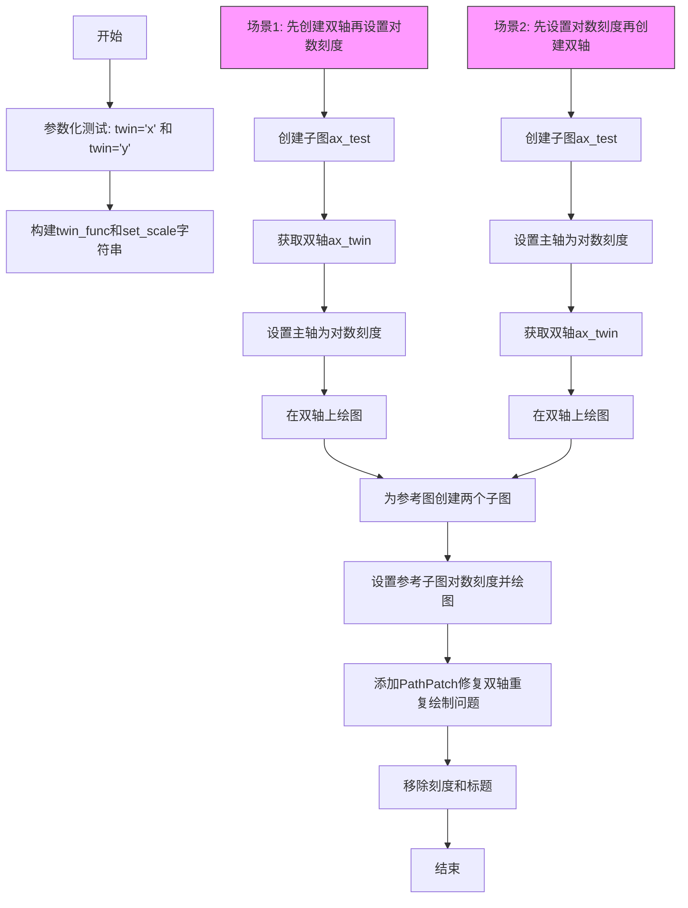

#### 带注释源码

```python
@pytest.mark.parametrize('twin', ('x', 'y'))  # 参数化测试两种双轴类型
@check_figures_equal(tol=0.19)  # 允许0.19的图像差异容忍度
def test_twin_logscale(fig_test, fig_ref, twin):
    """测试双轴与对数刻度的组合行为"""
    twin_func = f'twin{twin}'  # 根据twin参数生成函数名: 'twinx' 或 'twiny'
    set_scale = f'set_{twin}scale'  # 生成设置刻度的函数名
    x = np.arange(1, 100)  # 测试数据

    # ===== 场景1: 先创建双轴，再设置对数刻度 =====
    ax_test = fig_test.add_subplot(2, 1, 1)  # 创建第一个测试子图
    ax_twin = getattr(ax_test, twin_func)()    # 创建双轴 (twinx或twiny)
    getattr(ax_test, set_scale)('log')          # 设置主轴为对数刻度
    ax_twin.plot(x, x)                           # 在双轴上绘图

    # ===== 场景2: 先设置对数刻度，再创建双轴 =====
    ax_test = fig_test.add_subplot(2, 1, 2)    # 创建第二个测试子图
    getattr(ax_test, set_scale)('log')          # 先设置主轴为对数刻度
    ax_twin = getattr(ax_test, twin_func)()    # 再创建双轴
    ax_twin.plot(x, x)                          # 在双轴上绘图

    # ===== 构建参考图像 =====
    for i in [1, 2]:
        ax_ref = fig_ref.add_subplot(2, 1, i)  # 为每个场景创建对应的参考子图
        getattr(ax_ref, set_scale)('log')      # 设置对数刻度
        ax_ref.plot(x, x)                       # 绘图

        # 这是一个hack，用于处理双轴重复绘制边框的问题
        # 当该问题被修复后可以移除
        Path = matplotlib.path.Path
        fig_ref.add_artist(
            matplotlib.patches.PathPatch(
                Path([[0, 0], [0, 1],
                      [0, 1], [1, 1],
                      [1, 1], [1, 0],
                      [1, 0], [0, 0]],
                     [Path.MOVETO, Path.LINETO] * 4),
                transform=ax_ref.transAxes,
                facecolor='none',
                edgecolor=mpl.rcParams['axes.edgecolor'],
                linewidth=mpl.rcParams['axes.linewidth'],
                capstyle='projecting'))

    # 清理测试和参考图像的刻度及标题
    remove_ticks_and_titles(fig_test)
    remove_ticks_and_titles(fig_ref)
```


# 分析结果

经过对代码的详细分析，我没有找到名为 `test_twin_autoscale` 的独立函数。

但我发现了一个非常相似的函数 `test_twinx_axis_scales`，它使用了 `@image_comparison(['twin_autoscale.png'], ...)` 装饰器，这可能是您想了解的目标。

如果您需要的是这个函数（`test_twinx_axis_scales`），以下是详细信息：

### `test_twinx_axis_scales`

这是一个测试函数，用于验证双轴（twinx）的自动缩放行为，确保主轴和共享y轴的子轴能够正确处理各自的坐标轴刻度。

参数：无

返回值：`None`（测试函数）

#### 流程图

```mermaid
flowchart TD
    A[开始] --> B[创建数据: x, y, x2, y2]
    B --> C[创建Figure和Axes并禁用自动缩放]
    C --> D[在主轴上绘制蓝色线条]
    D --> E[使用twinx创建共享x轴的新轴]
    E --> F[在新轴上绘制红色虚线]
    F --> G[设置主轴边距为0]
    G --> H[设置子轴边距为0]
    H --> I[结束: 图像比较验证]
```

#### 带注释源码

```python
@image_comparison(['twin_autoscale.png'],
                  tol=0 if platform.machine() == 'x86_64' else 0.009)
def test_twinx_axis_scales():
    """测试twinx轴的自动缩放功能"""
    # 定义第一组数据
    x = np.array([0, 0.5, 1])
    y = 0.5 * x
    
    # 定义第二组数据
    x2 = np.array([0, 1, 2])
    y2 = 2 * x2

    # 创建图形和坐标轴，禁用自动缩放
    fig = plt.figure()
    ax = fig.add_axes((0, 0, 1, 1), autoscalex_on=False, autoscaley_on=False)
    # 在主坐标轴上绘制蓝色线条，线宽为10
    ax.plot(x, y, color='blue', lw=10)

    # 创建共享x轴的第二个y轴
    ax2 = plt.twinx(ax)
    # 在第二个y轴上绘制红色虚线，线宽为5
    ax2.plot(x2, y2, 'r--', lw=5)

    # 设置主坐标轴的边距为0
    ax.margins(0, 0)
    # 设置第二个坐标轴的边距为0
    ax2.margins(0, 0)
```

---

如果您确实需要查找另一个名为 `test_twin_autoscale` 的函数，请提供更多上下文信息，我可以进一步帮您搜索。


### `test_twin_inherit_autoscale_setting`

该函数是一个测试函数，用于验证在创建共享轴（twinx/twiny）时，父轴的自动缩放设置（autoscale）是否能正确继承。

参数：

- 无参数

返回值：`None`，无返回值（测试函数）

#### 流程图

```mermaid
flowchart TD
    A[开始] --> B[创建Figure和Axes: fig, ax = plt.subplots]
    B --> C[创建twinx: ax_x_on = ax.twinx]
    C --> D[设置 autoscalex_on 为 False: ax.set_autoscalex_on(False)]
    D --> E[创建第二个twinx: ax_x_off = ax.twinx]
    E --> F[断言: ax_x_on.get_autoscalex_on 应该为 True]
    F --> G[断言: ax_x_off.get_autoscalex_on 应该为 False]
    G --> H[创建twiny: ax_y_on = ax.twiny]
    H --> I[设置 autoscaley_on 为 False: ax.set_autoscaley_on(False)]
    I --> J[创建第二个twiny: ax_y_off = ax.twiny]
    J --> K[断言: ax_y_on.get_autoscaley_on 应该为 True]
    K --> L[断言: ax_y_off.get_autoscaley_on 应该为 False]
    L --> M[结束]
```

#### 带注释源码

```python
def test_twin_inherit_autoscale_setting():
    """
    测试twinx/twiny是否正确继承父轴的autoscale设置。
    
    验证逻辑：
    - 在设置autoscale之前创建的twin轴应继承当前的autoscale设置（默认开启）
    - 在设置autoscale之后创建的twin轴应继承新的autoscale设置
    """
    # 创建基础图表和坐标轴
    fig, ax = plt.subplots()
    
    # 第一次调用twinx，在设置autoscalex_on之前
    ax_x_on = ax.twinx()
    # 此时ax的autoscalex_on默认为True，因此ax_x_on也应为True
    
    # 设置父轴ax的autoscalex_on为False
    ax.set_autoscalex_on(False)
    
    # 第二次调用twinx，在设置autoscalex_on之后
    ax_x_off = ax.twinx()
    # 此时ax的autoscalex_on已设为False，因此ax_x_off应为False
    
    # 断言验证
    assert ax_x_on.get_autoscalex_on()  # 应该在创建时继承，为True
    assert not ax_x_off.get_autoscalex_on()  # 应该继承设置后的值，为False
    
    # 相同的逻辑测试twiny（共享y轴）
    ax_y_on = ax.twiny()
    ax.set_autoscaley_on(False)
    ax_y_off = ax.twiny()
    
    # 断言验证
    assert ax_y_on.get_autoscaley_on()
    assert not ax_y_off.get_autoscaley_on()
```


### `test_inverted_cla`

该函数用于测试当设置自动缩放（autoscale）时，坐标轴是否正确重置为非反转状态。测试涵盖了多个场景：新坐标轴默认不反转、图像显示后y轴反转、清除后绘制线条坐标轴恢复非反转、共享坐标轴的反转与清除行为等。

参数： 无

返回值：无（该函数为测试函数，使用assert进行断言验证）

#### 流程图

```mermaid
graph TD
    A[开始测试] --> B[创建figure和axes]
    B --> C[测试1: 新建axes默认不反转]
    C --> D[绘制图像img]
    D --> E[测试2: 图像显示后y轴反转]
    E --> F[清除axes并绘制线条]
    F --> G[测试3: 清除后axes不反转]
    G --> H[清除后再次绘制图像并调用autoscale]
    H --> I[测试4: autoscale不应恢复y轴反转]
    I --> J[移除所有axes]
    J --> K[创建两个共享y轴的subplot]
    K --> L[测试5: 反转主axes后,从axes也被反转]
    L --> M[清除主axes,从axes应恢复非反转]
    M --> N[测试6: 清除从axes不影响主axes]
    N --> O[清理资源: plt.close]
    O --> P[结束测试]
```

#### 带注释源码

```python
def test_inverted_cla():
    """
    GitHub PR #5450测试用例。
    验证设置自动缩放时axes应重置为非反转状态。
    """
    # 创建figure对象，编号为0
    fig = plt.figure(0)
    # 获取当前axes
    ax = fig.gca()
    
    # 1. 测试新创建的axes默认不反转
    assert not ax.xaxis_inverted()  # x轴默认不反转
    assert not ax.yaxis_inverted()  # y轴默认不反转
    
    # 生成随机图像数据并显示
    img = np.random.random((100, 100))
    ax.imshow(img)
    
    # 2. 测试图像显示后y轴反转（图像的y轴通常向下）
    assert not ax.xaxis_inverted()  # x轴仍不反转
    assert ax.yaxis_inverted()      # y轴反转
    
    # 3. 测试清除axes并绘制线条后，axes恢复非反转
    ax.cla()  # 清除axes
    x = np.linspace(0, 2*np.pi, 100)
    ax.plot(x, np.cos(x))  # 绘制线条
    assert not ax.xaxis_inverted()  # x轴不反转
    assert not ax.yaxis_inverted()  # y轴不反转
    
    # 4. 测试自动缩放不应恢复axes到正常状态
    ax.cla()
    ax.imshow(img)
    plt.autoscale()  # 调用自动缩放
    assert not ax.xaxis_inverted()
    assert ax.yaxis_inverted()  # y轴保持反转
    
    # 移除所有axes
    for ax in fig.axes:
        ax.remove()
    
    # 5. 测试两个共享坐标轴的情况
    # 反转主axes应导致从axes也被反转
    ax0 = plt.subplot(211)
    ax1 = plt.subplot(212, sharey=ax0)  # 共享y轴
    ax0.yaxis.set_inverted(True)  # 反转主axes的y轴
    assert ax1.yaxis_inverted()  # 从axes也被反转
    
    # 在从axes上绘制
    ax1.plot(x, np.cos(x))
    # 清除主axes，从axes应恢复非反转
    ax0.cla()
    assert not ax1.yaxis_inverted()
    
    # 6. 测试清除从axes不应影响主axes的limits
    ax0.imshow(img)
    ax1.plot(x, np.cos(x))
    ax1.cla()
    assert ax.yaxis_inverted()  # 保持y轴反转状态
    
    # 清理资源
    plt.close(fig)
```


### `test_subclass_clear_cla`

**描述**  
该测试函数用于验证 `Axes` 子类在覆盖 `cla`（清除）方法或 `clear` 方法时，能够正确地被父类调用或回退。它通过在测试中定义多类继承层次（仅覆盖 `cla`、仅覆盖 `clear`、以及同时调用 `super()` 的实现），检查 `Axes.__init__` 阶段以及显式调用 `ax.cla()` 时自定义方法是否被触发，从而确保子类的清除逻辑能够正常工作且不会出现无限递归。

**参数**  
- 无显式参数。测试函数依赖全局的 `pytest`、`matplotlib.axes.Axes` 等模块以及 `Figure` 类的可用性。

**返回值**  
- `None`。函数内部通过 `assert` 语句进行断言，若所有检查通过则测试通过；若任何断言失败则抛出异常。

#### 流程图

```mermaid
graph TD
    start([开始]) --> define_subclasses[定义子类: ClaAxes, ClaSuperAxes, SubClaAxes, ClearAxes, ClearSuperAxes, SubClearAxes]
    define_subclasses --> create_fig[创建 Figure 实例]
    create_fig --> loop_over_axes[遍历 axes_class 列表]
    loop_over_axes --> init_called_false[called = False]
    init_called_false --> create_axes[使用 axes_class 创建 Axes 实例]
    create_axes --> assert_called_init[断言 called == True <br>（__init__ 已调用 clear/cla）]
    assert_called_init --> reset_called[called = False]
    reset_called --> call_cla[显式调用 ax.cla()]
    call_called_cla[断言 called == True <br>（cla 方法被触发）] --> loop_over_axes
    call_cla --> loop_over_axes
    loop_over_axes --> end([结束])
```

#### 带注释源码

```python
def test_subclass_clear_cla():
    """
    Ensure that subclasses of Axes call cla/clear correctly.
    Note, we cannot use mocking here as we want to be sure that the
    superclass fallback does not recurse.
    """
    # 1. 定义覆盖 Axes.cla 的子类，并捕获 PendingDeprecationWarning
    with pytest.warns(PendingDeprecationWarning,
                      match='Overriding `Axes.cla`'):
        class ClaAxes(Axes):
            def cla(self):
                nonlocal called
                called = True   # 标记 cla 被调用

    # 2. 定义覆盖 Axes.cla 并调用父类实现的子类，同样捕获警告
    with pytest.warns(PendingDeprecationWarning,
                      match='Overriding `Axes.cla`'):
        class ClaSuperAxes(Axes):
            def cla(self):
                nonlocal called
                called = True
                super().cla()   # 调用父类的 cla

    # 3. SubClaAxes 直接继承自 ClaAxes，未覆盖任何方法
    class SubClaAxes(ClaAxes):
        pass

    # 4. 定义覆盖 Axes.clear 的子类
    class ClearAxes(Axes):
        def clear(self):
            nonlocal called
            called = True   # 标记 clear 被调用

    # 5. 定义覆盖 Axes.clear 并调用父类实现的子类
    class ClearSuperAxes(Axes):
        def clear(self):
            nonlocal called
            called = True
            super().clear()   # 调用父类的 clear

    # 6. SubClearAxes 直接继承自 ClearAxes，未覆盖任何方法
    class SubClearAxes(ClearAxes):
        pass

    # 7. 创建空白 Figure 对象，用于放置 Axes
    fig = Figure()

    # 8. 遍历所有定义的 Axes 子类，验证初始化与显式调用行为
    for axes_class in [ClaAxes, ClaSuperAxes, SubClaAxes,
                       ClearAxes, ClearSuperAxes, SubClearAxes]:
        called = False                     # 重置调用标志
        ax = axes_class(fig, [0, 0, 1, 1])  # 创建实例，触发 __init__
        # Axes.__init__ 内部会调用 clear（clear 在 Axes 中 alias 到 cla），
        # 因此在创建后 called 应为 True
        assert called, f"{axes_class.__name__} did not call clear/cla in __init__"

        called = False                     # 再次重置标志
        ax.cla()                          # 显式调用 cla 方法
        assert called, f"{axes_class.__name__} did not call cla when invoked"
```


### `test_cla_not_redefined_internally`

该测试函数用于验证 `Axes` 类的子类没有在内部重新定义 `cla` 方法，确保所有 Axes 子类都继承使用父类的 `cla` 方法实现（测试函数本身的测试类除外）。

参数：无

返回值：`None`，该函数通过断言进行验证，不返回任何值

#### 流程图

```mermaid
flowchart TD
    A[开始] --> B[获取 Axes 的所有子类]
    B --> C{遍历子类}
    C -->|迭代每个 klass| D{klass.__qualname__ 不包含 'test_subclass_clear_cla'}
    D -->|是| E{klass.__dict__ 不包含 'cla'}
    D -->|否| F[继续下一个子类]
    E -->|断言为真| F
    E -->|断言失败| G[抛出 AssertionError]
    F --> C
    C -->|遍历结束| H[结束]
    G --> H
```

#### 带注释源码

```python
def test_cla_not_redefined_internally():
    """
    测试函数：验证 Axes 子类没有在内部重新定义 cla 方法
    
    该测试确保所有 Axes 的子类都使用继承的 cla 方法，
    防止意外的方法覆盖导致的潜在问题。
    """
    # 遍历 Axes 类的所有子类
    for klass in Axes.__subclasses__():
        # 检查该类是否不是测试函数中的测试类
        # test_subclass_clear_cla 是用于测试 cla 方法重写的测试类
        if 'test_subclass_clear_cla' not in klass.__qualname__:
            # 断言该类的 __dict__ 中没有定义 'cla' 方法
            # 即确保没有在子类中重新定义 cla 方法
            assert 'cla' not in klass.__dict__
```


### `test_minorticks_on_rcParams_both`

**描述**  
该测试函数用于验证当通过 `rcParams`（`xtick.minor.visible` 与 `ytick.minor.visible`）临时打开 X 轴和 Y 轴的次刻度时，绘制的图形与显式调用 `ax.minorticks_on()` 的参考图形保持一致。函数使用 `@check_figures_equal` 装饰器进行图像比较，以确保两者渲染结果相同。

**参数**  

- `fig_test`：`matplotlib.figure.Figure`  
  - 测试图形对象，函数在其中创建一个子图并绘制一条简单直线，子图的次刻度通过 `rc_context` 打开。  
- `fig_ref`：`matplotlib.figure.Figure`  
  - 参考图形对象，函数在其中创建相同的子图并绘制相同直线，随后显式调用 `minorticks_on()` 以显示次刻度。

**返回值**  
`None`（该函数为测试用例，无显式返回值）

#### 流程图

```mermaid
graph TD
    A([开始 test_minorticks_on_rcParams_both]) --> B[使用 rc_context 设置 xtick.minor.visible=True 与 ytick.minor.visible=True]
    B --> C[在 fig_test 中创建子图 ax_test]
    C --> D[在 ax_test 上绘制 [0,1]x[0,1] 直线]
    D --> E[在 fig_ref 中创建子图 ax_ref]
    E --> F[在 ax_ref 上绘制相同的直线]
    F --> G[在 ax_ref 上调用 minorticks_on 方法]
    G --> H([结束])
```

#### 带注释源码

```python
@check_figures_equal()  # 图像比较装饰器，自动比较 fig_test 与 fig_ref 的渲染结果
def test_minorticks_on_rcParams_both(fig_test, fig_ref):
    # 临时修改 Matplotlib 的 rc 参数，打开 X 轴和 Y 轴的次刻度显示
    with matplotlib.rc_context({"xtick.minor.visible": True,
                                "ytick.minor.visible": True}):
        # 创建测试图的子图，并在其上绘制简单的线段
        ax_test = fig_test.subplots()
        ax_test.plot([0, 1], [0, 1])

    # 创建参考图的子图，绘制相同的线段
    ax_ref = fig_ref.subplots()
    ax_ref.plot([0, 1], [0, 1])

    # 在参考子图上手动启用次刻度（与 rc_context 产生的效果相同）
    ax_ref.minorticks_on()
```


### `test_autoscale_tiny_range`

这是一个测试函数，用于验证 matplotlib 在处理极小数值范围（10的负11次幂到负14次幂）时的自动缩放功能是否正常工作。该测试创建2x2的子图，每个子图绘制一条几乎水平的直线，这些直线的y值差异极小，用于检测自动缩放算法在极端情况下的正确性。

参数： 无

返回值： 无（测试函数）

#### 流程图

```mermaid
graph TD
    A[开始测试] --> B[创建2x2子图]
    B --> C[循环遍历每个子图]
    C --> D[计算极小值y1 = 10^(-11-i)]
    D --> E[在子图上绘制点0,1和1,1+y1]
    E --> F{是否还有子图未处理}
    F -->|是| C
    F -->|否| G[结束测试]
```

#### 带注释源码

```python
@image_comparison(["autoscale_tiny_range.png"], remove_text=True)
def test_autoscale_tiny_range():
    # github pull #904
    # 测试目的：验证当数据范围极小时（如10^-11到10^-14级别）
    # 自动缩放功能能否正确处理，避免数值精度问题
    fig, axs = plt.subplots(2, 2)
    for i, ax in enumerate(axs.flat):
        # 计算不同数量级的极小值
        # i=0: y1 = 10^-11
        # i=1: y1 = 10^-12
        # i=2: y1 = 10^-13
        # i=3: y1 = 10^-14
        y1 = 10**(-11 - i)
        # 绘制一条几乎水平的直线，y值从1到1+y1
        # 这样的数据范围极小，测试autoscale的精度处理
        ax.plot([0, 1], [1, 1 + y1])
```


### `test_autoscale_tight`

该测试函数用于验证 matplotlib 中 Axes 对象的 `autoscale()` 方法在启用/禁用 tight 模式时的行为是否正确，包括对 x 轴和 y 轴的自动缩放限制。

参数：  
无

返回值：`None`，该函数是一个测试函数，不返回任何值

#### 流程图

```mermaid
graph TD
    A[开始测试] --> B[创建图表和坐标轴: fig, ax = plt.subplots]
    B --> C[绘制数据: ax.plot([1, 2, 3, 4])]
    C --> D[设置x轴自动缩放: autoscale enable=True, tight=False]
    D --> E[设置y轴自动缩放: autoscale enable=True, tight=True]
    E --> F[断言x轴限制: (-0.15, 3.15)]
    F --> G[断言y轴限制: (1.0, 4.0)]
    G --> H[检查自动缩放状态已启用]
    H --> I[设置enable为None: autoscale enable=None]
    I --> J[再次断言x轴限制未变: (-0.15, 3.15)]
    J --> K[再次断言y轴限制未变: (1.0, 4.0)]
    K --> L[验证自动缩放仍然启用]
    L --> M[结束测试]
```

#### 带注释源码

```python
@mpl.style.context('default')
def test_autoscale_tight():
    """
    测试 autoscale 方法的 tight 参数行为
    
    验证:
    1. tight=True 时，限制范围更紧凑
    2. tight=False 时，限制范围包含默认边距
    3. enable=None 时，保持现有设置不变
    """
    # 创建图表和坐标轴对象
    fig, ax = plt.subplots(1, 1)
    
    # 绘制简单的线图数据
    ax.plot([1, 2, 3, 4])
    
    # 对x轴启用自动缩放，tight=False（包含默认边距）
    ax.autoscale(enable=True, axis='x', tight=False)
    
    # 对y轴启用自动缩放，tight=True（无额外边距）
    ax.autoscale(enable=True, axis='y', tight=True)
    
    # 验证x轴限制范围（包含默认15%边距）
    assert_allclose(ax.get_xlim(), (-0.15, 3.15))
    
    # 验证y轴限制范围（无额外边距，紧凑模式）
    assert_allclose(ax.get_ylim(), (1.0, 4.0))

    # 确认自动缩放功能已启用
    assert ax.get_autoscalex_on()
    assert ax.get_autoscaley_on()
    assert ax.get_autoscale_on()
    
    # 设置enable为None，保持现有设置
    ax.autoscale(enable=None)
    
    # 验证限制范围保持不变
    assert_allclose(ax.get_xlim(), (-0.15, 3.15))
    assert_allclose(ax.get_ylim(), (1.0, 4.0))
    
    # 确认自动缩放仍然启用
    assert ax.get_autoscalex_on()
    assert ax.get_autoscaley_on()
    assert ax.get_autoscale_on()
```


### `test_autoscale_log_shared`

该函数是一个测试函数，用于验证在使用共享x轴的情况下，loglog 和 semilogx 标度的自动缩放行为是否正确，特别是针对包含零值的数组（触发 _minpos 处理）。

参数：

- 无显式参数（使用 pytest fixture 和 matplotlib style context）

返回值：`None`，该函数为测试函数，使用 `assert_allclose` 进行断言验证

#### 流程图

```mermaid
flowchart TD
    A[开始执行 test_autoscale_log_shared] --> B[应用 mpl.style.context: 'default']
    C[创建包含0-99的float数组 x] --> D[创建2行1列共享x轴的子图 fig, ax1, ax2]
    D --> E[ax1 使用 loglog 标度绘制 x, x]
    D --> F[ax2 使用 semilogx 标度绘制 x, x]
    E --> G[ax1 执行 autoscale tight=True]
    F --> H[ax2 执行 autoscale tight=True]
    G --> I[plt.draw 强制重绘]
    H --> I
    I --> J[计算预期限制 lims = (x[1], x[-1]) 即 (1.0, 99.0)]
    J --> K[断言 ax1.get_xlim 约等于 lims]
    J --> L[断言 ax1.get_ylim 约等于 lims]
    J --> M[断言 ax2.get_xlim 约等于 lims]
    J --> N[断言 ax2.get_ylim 约等于 (x[0], x[-1]) 即 (0.0, 99.0)]
    K --> O[结束]
    L --> O
    M --> O
    N --> O
```

#### 带注释源码

```python
@mpl.style.context('default')
def test_autoscale_log_shared():
    # 关联 GitHub issue #7587
    # 数组从零开始以触发 _minpos 处理（处理包含零值的对数刻度数据）
    
    # 创建一个从0到99的float类型数组（包含0值）
    x = np.arange(100, dtype=float)
    
    # 创建一个2行1列的子图布局，共享x轴
    fig, (ax1, ax2) = plt.subplots(2, 1, sharex=True)
    
    # 第一个子图：使用双对数刻度 (loglog)
    ax1.loglog(x, x)
    
    # 第二个子图：使用半对数刻度 (x轴对数)
    ax2.semilogx(x, x)
    
    # 执行自动缩放，tight=True 表示紧凑边界
    ax1.autoscale(tight=True)
    ax2.autoscale(tight=True)
    
    # 强制重绘以确保计算完成
    plt.draw()
    
    # 设置预期限制（排除第一个元素0，使用x[1]作为最小值）
    lims = (x[1], x[-1])  # (1.0, 99.0)
    
    # 验证 loglog 图的 x 和 y 限制
    assert_allclose(ax1.get_xlim(), lims)
    assert_allclose(ax1.get_ylim(), lims)
    
    # 验证 semilogx 图的限制
    # x限制应该与loglog相同
    assert_allclose(ax2.get_xlim(), lims)
    # y限制从0开始（因为原始数据从0开始）
    assert_allclose(ax2.get_ylim(), (x[0], x[-1]))  # (0.0, 99.0)
```


### `test_use_sticky_edges`

该函数是一个单元测试，用于测试 matplotlib Axes 的 `use_sticky_edges` 属性在自动缩放（autoscale）时的行为。该测试验证了当 `use_sticky_edges` 为 True 时，坐标轴不会超出数据的边界（即"粘性边缘"），而当设置为 False 时，自动缩放会包含设定的边距。

参数：

- 无参数

返回值：`None`，该函数为测试函数，使用断言进行验证，不返回任何值。

#### 流程图

```mermaid
flowchart TD
    A[开始测试] --> B[创建Figure和Axes对象]
    B --> C[使用imshow显示图像并设置origin='lower']
    C --> D[断言: xlim=(-0.5, 1.5), ylim=(-0.5, 1.5)]
    D --> E[设置ax.use_sticky_edges = False]
    E --> F[调用ax.autoscale]
    F --> G[计算期望的xlim和ylim: 考虑2倍边距]
    G --> H[断言: 自动缩放后的lim包含边距扩展]
    H --> I[设置ax.use_sticky_edges = True]
    I --> J[再次调用ax.autoscale]
    J --> K[断言: 恢复原始lim (-0.5, 1.5)]
    K --> L[结束测试]
```

#### 带注释源码

```python
@mpl.style.context('default')
def test_use_sticky_edges():
    """
    测试 use_sticky_edges 属性在自动缩放时的行为。
    
    测试目标：
    1. 当 use_sticky_edges=True（默认值）时，autoscale 不会超出数据边界
    2. 当 use_sticky_edges=False 时，autoscale 会应用边距扩展
    3. 该属性的切换应该是可逆的
    """
    # 创建 Figure 和 Axes 对象
    fig, ax = plt.subplots()
    
    # 使用 imshow 显示一个 2x2 的图像数据，设置 origin='lower'
    # 这样图像的像素坐标为: (0,0), (1,0), (0,1), (1,1)
    # 数值如下:
    #   y=1: 2, 3
    #   y=0: 0, 1
    ax.imshow([[0, 1], [2, 3]], origin='lower')
    
    # 断言1: 初始状态下，由于 sticky edges，坐标轴边界正好在数据边界处
    # 图像中心在 (0.5, 0.5) 到 (1.5, 1.5)，sticky edges 防止超出
    assert_allclose(ax.get_xlim(), (-0.5, 1.5))
    assert_allclose(ax.get_ylim(), (-0.5, 1.5))
    
    # 禁用 sticky edges 功能
    ax.use_sticky_edges = False
    
    # 触发自动缩放
    ax.autoscale()
    
    # 计算期望的边界值（包含边距）
    # _xmargin 和 _ymargin 是自动计算的边距系数
    # 扩展 = 原始边界 +/- 2 * 边距系数 * 数据范围
    xlim = (-0.5 - 2 * ax._xmargin, 1.5 + 2 * ax._xmargin)
    ylim = (-0.5 - 2 * ax._ymargin, 1.5 + 2 * ax._ymargin)
    
    # 断言2: 禁用 sticky edges 后，坐标轴会扩展超出数据边界
    assert_allclose(ax.get_xlim(), xlim)
    assert_allclose(ax.get_ylim(), ylim)
    
    # 重新启用 sticky edges（验证可逆性）
    ax.use_sticky_edges = True
    ax.autoscale()
    
    # 断言3: 重新启用后，坐标轴恢复到原始数据边界
    assert_allclose(ax.get_xlim(), (-0.5, 1.5))
    assert_allclose(ax.get_ylim(), (-0.5, 1.5))
```


### `test_sticky_shared_axes`

该函数是一个测试用例，用于验证在共享坐标轴（shared axes）场景下，粘性边缘（sticky edges）功能是否正常工作，无论是在共享坐标轴的"主导"（leader）轴还是"从属"（follower）轴上设置粘性边缘。

参数：

- `fig_test`：`matplotlib.figure.Figure`，测试用的Figure对象
- `fig_ref`：`matplotlib.figure.Figure`，参考（基准）用的Figure对象

返回值：`None`，此函数为测试用例，不返回任何值

#### 流程图

```mermaid
flowchart TD
    A[开始测试] --> B[创建测试数据Z: 3x5数组]
    B --> C[在fig_test中创建第一个子图ax0]
    C --> D[在fig_test中创建第二个子图ax1, 共享x轴]
    D --> E[在ax1上绘制pcolormesh Z]
    E --> F[在fig_ref中创建第一个子图ax0]
    F --> G[在fig_ref中创建第二个子图ax1, 共享x轴]
    G --> H[在ax0上绘制pcolormesh Z]
    H --> I[通过@check_figures_equal装饰器比较fig_test和fig_ref是否相等]
    I --> J[结束测试]
```

#### 带注释源码

```python
@check_figures_equal()  # 装饰器：比较测试图和参考图的输出是否一致
def test_sticky_shared_axes(fig_test, fig_ref):
    # 检查粘性边缘是否正常工作，无论它们是设置在共享轴中的"主导"轴还是"从属"轴上
    Z = np.arange(15).reshape(3, 5)  # 创建测试数据：3行5列的数组

    # 测试figure的设置
    ax0 = fig_test.add_subplot(211)  # 在测试figure中添加第一个子图（2行1列的第1个位置）
    ax1 = fig_test.add_subplot(212, sharex=ax0)  # 在测试figure中添加第二个子图，共享x轴
    ax1.pcolormesh(Z)  # 在从属轴ax1上绘制pcolormesh

    # 参考figure的设置（与测试figure结构相同但顺序相反）
    ax0 = fig_ref.add_subplot(212)  # 在参考figure中添加第一个子图（2行1列的第2个位置）
    ax1 = fig_ref.add_subplot(211, sharex=ax0)  # 在参考figure中添加第二个子图，共享x轴
    ax0.pcolormesh(Z)  # 在主导轴ax0上绘制pcolormesh
    # 注释：这样可以验证无论粘性边缘设置在主导轴还是从属轴，结果都应该一致
```


### test_sticky_tolerance

该函数用于测试matplotlib在自动缩放时对条形图（bar）和水平条形图（barh）粘性边缘（sticky edges）的容差处理是否正确。通过在不同位置绘制极端数值（很大或很小的坐标值）的条形图，验证轴 limits 的自动计算是否遵守粘性边缘容差机制。

**参数：**
- 该函数没有显式参数
- 隐式参数 `fig_test, fig_ref` 由 `@image_comparison` 装饰器提供，用于图像比较测试

**返回值：**
- 该函数没有返回值（返回类型为 `None`）

#### 流程图

```mermaid
graph TD
    A[开始测试] --> B[创建2x2子图布局]
    B --> C[设置宽度为0.1]
    C --> D[子图0: 垂直条形图<br/>x=0, height=0.1, bottom=20000.6<br/>x=1, height=0.1, bottom=20000.1]
    D --> E[子图1: 垂直条形图负值<br/>x=0, height=-0.1, bottom=20000.6<br/>x=1, height=-0.1, bottom=20000.1]
    E --> F[子图2: 水平条形图负值<br/>y=0, width=-0.1, left=-20000.6<br/>y=1, width=-0.1, left=-20000.1]
    F --> G[子图3: 水平条形图<br/>y=0, width=0.1, left=-20000.6<br/>y=1, width=0.1, left=-20000.1]
    G --> H[测试完成: 验证粘性边缘容差机制]
```

#### 带注释源码

```python
@image_comparison(['sticky_tolerance.png'], remove_text=True, style="mpl20")
def test_sticky_tolerance():
    """
    测试条形图的粘性边缘容差功能。
    
    粘性边缘（sticky edges）是matplotlib自动缩放时的一个特性，
    当数据点位于轴的极端位置时，自动缩放不会完全覆盖该点，
    而是保留一个小的容差范围。
    """
    # 创建一个2行2列的子图布局
    fig, axs = plt.subplots(2, 2)

    # 定义条形的宽度/高度
    width = .1

    # 子图0: 测试正向垂直条形图的粘性边缘
    # 底部位置设置在很高的数值(20000.6和20000.1)
    # 测试当底部接近轴上边缘时的容差行为
    axs.flat[0].bar(x=0, height=width, bottom=20000.6)
    axs.flat[0].bar(x=1, height=width, bottom=20000.1)

    # 子图1: 测试负向垂直条形图的粘性边缘
    # 高度为负值，测试当条形图向下延伸时的行为
    axs.flat[1].bar(x=0, height=-width, bottom=20000.6)
    axs.flat[1].bar(x=1, height=-width, bottom=20000.1)

    # 子图2: 测试负向水平条形图的粘性边缘
    # 宽度为负值，左侧位置为很大的负值(-20000.6和-20000.1)
    axs.flat[2].barh(y=0, width=-width, left=-20000.6)
    axs.flat[2].barh(y=1, width=-width, left=-20000.1)

    # 子图3: 测试正向水平条形图的粘性边缘
    # 左侧位置为很大的负值，测试当左侧接近轴左边缘时的行为
    axs.flat[3].barh(y=0, width=width, left=-20000.6)
    axs.flat[3].barh(y=1, width=width, left=-20000.1)
```


### test_sticky_tolerance_contourf

该函数是一个图像对比测试，用于验证 `contourf` 在处理 sticky edges 时的行为是否符合预期。通过绘制一个简单的填充等高线图，检查 matplotlib 在处理极端坐标值时的边缘容差处理是否正确。

参数：

- 无显式参数（pytest 测试框架会自动注入 `fig_test` 和 `fig_ref` 参数，但函数内部未使用）

返回值：`None`，该函数为测试函数，不返回任何值

#### 流程图

```mermaid
flowchart TD
    A[开始测试] --> B[创建 Figure 和 Axes]
    B --> C[定义坐标数据 x = y = 14496.71, 14496.75]
    C --> D[定义数据 data = 0, 1, 2, 3 组成的2x2矩阵]
    D --> E[调用 ax.contourf 绘制填充等高线]
    E --> F[通过 @image_comparison 装饰器比对图像]
    F --> G[测试完成]
```

#### 带注释源码

```python
@image_comparison(['sticky_tolerance_cf.png'], remove_text=True, style="mpl20")
def test_sticky_tolerance_contourf():
    """
    测试 contourf 在 sticky edges 模式下的容差处理
    
    该测试验证当坐标值非常大（如 14496.71）时，
    contourf 能否正确处理 sticky edges 边界容差
    """
    # 创建一个新的 Figure 和 Axes 对象
    fig, ax = plt.subplots()

    # 定义 x 和 y 坐标 - 使用较大的数值来测试边界容差处理
    x = y = [14496.71, 14496.75]
    
    # 定义要绘制的 2x2 数据矩阵
    data = [[0, 1], [2, 3]]

    # 使用 contourf 绘制填充等高线图
    # 这是 matplotlib 的一个基础绘图功能
    ax.contourf(x, y, data)
    
    # @image_comparison 装饰器会自动：
    # 1. 创建测试图像
    # 2. 与基准图像 sticky_tolerance_cf.png 比对
    # 3. 验证渲染结果是否一致
```


### `test_nargs_stem`

该测试函数用于验证 `plt.stem()` 函数在未提供任何参数时的行为是否符合预期，即是否会抛出包含 "0 were given" 信息的 TypeError 异常。

参数：无

返回值：`None`，测试函数不返回任何值

#### 流程图

```mermaid
graph TD
    A[开始测试] --> B[执行 plt.stem 不带参数]
    B --> C{是否抛出 TypeError?}
    C -->|是| D[检查异常消息是否包含 '0 were given']
    D --> E{消息匹配?}
    E -->|是| F[测试通过]
    E -->|否| G[测试失败 - 异常消息不匹配]
    C -->|否| H[测试失败 - 未抛出异常]
```

#### 带注释源码

```python
def test_nargs_stem():
    """
    测试 plt.stem() 函数在未提供参数时的异常处理。
    
    stem() 函数需要 1-3 个参数（x, y, 和可选的 linefmt）。
    当不提供任何参数调用时，应该抛出 TypeError。
    """
    # 使用 pytest.raises 上下文管理器验证会抛出 TypeError 异常
    # match 参数用于验证异常消息中包含 '0 were given'
    with pytest.raises(TypeError, match='0 were given'):
        # stem() takes 1-3 arguments.
        # 调用 plt.stem() 不带任何参数，预期触发 TypeError
        plt.stem()
```


### test_nargs_legend

描述：该测试函数用于验证 `Axes.legend()` 方法在传入错误数量的参数时是否正确抛出 `TypeError` 异常。具体来说，`legend()` 方法接受 0 到 2 个位置参数，当传入 3 个参数时应触发参数数量错误的异常。

参数：
- 无

返回值：无返回值（测试函数无返回值）

#### 流程图

```mermaid
flowchart TD
    A[开始测试] --> B[创建子图: ax = plt.subplot]
    B --> C[调用ax.legend with 3个参数: ['First'], ['Second'], 3]
    C --> D{是否抛出TypeError?}
    D -->|是| E[测试通过]
    D -->|否| F[测试失败]
```

#### 带注释源码

```python
def test_nargs_legend():
    """
    Test that legend() raises TypeError when given too many arguments.
    
    The legend() method accepts 0-2 positional arguments. When called with
    3 arguments, it should raise a TypeError with message matching '3 were given'.
    """
    # 使用 pytest.raises 验证会抛出 TypeError 异常
    with pytest.raises(TypeError, match='3 were given'):
        # 创建一个子图轴对象
        ax = plt.subplot()
        # legend() 接受 0-2 个参数，这里传入 3 个参数，应该抛出 TypeError
        ax.legend(['First'], ['Second'], 3)
```


### `test_nargs_pcolorfast`

这是一个测试函数，用于验证 `Axes.pcolorfast()` 方法在接收错误数量的参数时能够正确抛出 `TypeError` 异常。该测试特别检查了传入 2 个位置参数的情况，因为 `pcolorfast()` 方法仅接受 1 个或 3 个参数。

#### 参数

该函数没有显式参数。

#### 返回值

- `None`，此函数为测试函数，不返回任何值，仅用于验证异常抛出。

#### 流程图

```mermaid
flowchart TD
    A[开始测试] --> B[设置期望的TypeError异常<br/>匹配消息 '2 were given']
    B --> C[创建子图axes]
    C --> D[调用ax.pcolorfast<br/>传入2个参数: [(0,1),(0,2)]<br/>和 [[1,2,3],[1,2,3]]]
    D --> E{是否抛出TypeError?}
    E -->|是| F[测试通过]
    E -->|否| G[测试失败]
    
    style F fill:#90EE90
    style G fill:#FFB6C1
```

#### 带注释源码

```python
def test_nargs_pcolorfast():
    """
    测试 pcolorfast() 方法参数数量验证。
    
    pcolorfast() 方法的正确签名应接受:
    - 1个参数: pcolorfast(C) - 仅颜色数据
    - 3个参数: pcolorfast(X, Y, C) - X坐标, Y坐标, 颜色数据
    
    传入2个参数是无效的,应该抛出TypeError。
    """
    # 使用 pytest.raises 期望捕获 TypeError 异常
    # 匹配错误消息中包含 '2 were given'
    with pytest.raises(TypeError, match='2 were given'):
        ax = plt.subplot()
        # pcolorfast() takes 1 or 3 arguments,
        # not passing any arguments fails at C = args[-1]
        # before nargs_err is raised.
        # 
        # 此处故意传入2个参数:
        # 参数1: [(0, 1), (0, 2)] - 看似X坐标
        # 参数2: [[1, 2, 3], [1, 2, 3]] - 看似C(颜色数据)
        # 由于缺少Y坐标,这会触发参数数量验证错误
        ax.pcolorfast([(0, 1), (0, 2)], [[1, 2, 3], [1, 2, 3]])
```


### `test_basic_annotate`

测试使用 "offset points" 文本坐标系统的注释（annotation）功能，验证注释文本能够正确地相对于数据点进行偏移定位。

参数： 无（该函数为独立测试函数，不接受额外参数）

返回值： `None`，该函数为测试函数，不返回任何值

#### 流程图

```mermaid
flowchart TD
    A[开始] --> B[生成测试数据: t = np.arange 0.0 到 5.0, 步长 0.01]
    B --> C[计算 s = cos 2πt]
    D[创建图表] --> E[fig = plt.figure]
    E --> F[ax = fig.add_subplot 设置 autoscale_on=False, xlim=(-1,5), ylim=(-3,5)]
    F --> G[ax.plot 绘制 t, s 曲线, 线宽3, 紫色]
    G --> H[ax.annotate 添加注释: 'local max']
    H --> I[xy=(3, 1 使用数据坐标]
    I --> J[xytext=(3, 3 使用 offset points 文本坐标]
    J --> K[结束]
    
    style H fill:#f9f,stroke:#333
    style I fill:#ff9,stroke:#333
    style J fill:#ff9,stroke:#333
```

#### 带注释源码

```python
@image_comparison(['offset_points'], remove_text=True)
def test_basic_annotate():
    """
    测试使用 'offset points' 文本坐标系统的注释功能。
    该测试创建一个带注释的图表，验证注释能够正确显示。
    """
    # 步骤1: 设置测试数据
    # 生成从 0.0 到 5.0（不包含）的数组，步长 0.01
    t = np.arange(0.0, 5.0, 0.01)
    # 计算余弦波: cos(2πt)
    s = np.cos(2.0*np.pi * t)

    # 步骤2: 创建图表和坐标轴
    # 创建新的图形窗口
    fig = plt.figure()
    # 添加子图，autoscale_on=False 禁用自动缩放
    # 设置 x 轴范围为 (-1, 5)，y 轴范围为 (-3, 5)
    ax = fig.add_subplot(autoscale_on=False, xlim=(-1, 5), ylim=(-3, 5))

    # 步骤3: 绘制余弦曲线
    # 绘制 t 和 s 数据，lw=3 设置线宽为 3，color='purple' 设置颜色为紫色
    line, = ax.plot(t, s, lw=3, color='purple')

    # 步骤4: 添加注释
    # 注释文本为 'local max'
    # xy=(3, 1): 注释指向的数据点坐标（使用 data 坐标系统）
    # xytext=(3, 3): 注释文本的位置（使用 offset points 坐标系统）
    # textcoords='offset points': 指定 xytext 使用偏移点坐标
    # offset points 表示相对于 xy 指定点的偏移量（以点为单位）
    ax.annotate('local max', xy=(3, 1), xycoords='data',
                xytext=(3, 3), textcoords='offset points')
```


### `test_arrow_simple`

一个简单的图像测试函数，用于测试 `ax.arrow` 方法在不同参数组合下的箭头绘制效果。

参数：
- 该函数没有参数

返回值：该函数没有显式返回值（返回 `None`），但通过 `@image_comparison` 装饰器进行图像对比测试

#### 流程图

```mermaid
flowchart TD
    A[开始测试] --> B[定义测试参数]
    B --> C[length_includes_head = (True, False)]
    B --> D[shape = ('full', 'left', 'right')]
    B --> E[head_starts_at_zero = (True, False)]
    C --> F[使用 product 创建参数组合]
    D --> F
    E --> F
    F --> G[创建 3x4 子图布局]
    G --> H[遍历每个子图和参数组合]
    H --> I[设置坐标轴范围 xlim, ylim 为 (-2, 2)]
    I --> J[解包当前参数]
    J --> K[计算角度 theta = 2*pi*i/12]
    K --> L[调用 ax.arrow 绘制箭头]
    L --> M[是否有更多子图?]
    M -->|是| H
    M -->|否| N[测试完成]
    
    subgraph L
        L1[传入起点 0, 0] --> L2[计算箭头方向 dx=sin, dy=cos]
        L2 --> L3[设置 width=theta/100]
        L3 --> L4[传入 length_includes_head, shape, head_starts_at_zero]
        L4 --> L5[设置 head_width 和 head_length = theta/10]
    end
```

#### 带注释源码

```python
@image_comparison(['arrow_simple.png'], remove_text=True)
def test_arrow_simple():
    # Simple image test for ax.arrow
    # kwargs that take discrete values
    
    # 定义三个离散参数，每个都有多个取值
    length_includes_head = (True, False)    # 箭头长度是否包含头部
    shape = ('full', 'left', 'right')       # 箭头的形状类型
    head_starts_at_zero = (True, False)     # 头部是否从零点开始
    
    # 使用 itertools.product 创建三个参数的所有组合（共 2*3*2=12 种组合）
    kwargs = product(length_includes_head, shape, head_starts_at_zero)

    # 创建一个 3行4列 的子图布局，共12个子图
    fig, axs = plt.subplots(3, 4)
    
    # 遍历每个子图和对应的参数组合
    for i, (ax, kwarg) in enumerate(zip(axs.flat, kwargs)):
        # 设置坐标轴范围
        ax.set_xlim(-2, 2)
        ax.set_ylim(-2, 2)
        
        # 解包当前参数组合
        (length_includes_head, shape, head_starts_at_zero) = kwarg
        
        # 计算角度：每个子图旋转 30 度（2*pi/12）
        theta = 2 * np.pi * i / 12
        
        # 调用 axes.arrow 方法绘制箭头
        ax.arrow(
            0, 0,                          # 起点坐标 (x, y)
            np.sin(theta), np.cos(theta),  # 箭头方向向量 (dx, dy)
            width=theta/100,               # 箭头杆宽度
            length_includes_head=length_includes_head,  # 长度是否包含头部
            shape=shape,                   # 箭头形状
            head_starts_at_zero=head_starts_at_zero,   # 头部是否从起点开始
            head_width=theta / 10,         # 箭头头部宽度
            head_length=theta / 10          # 箭头头部长度
        )
```


### `test_arrow_empty`

测试函数，用于验证在使用零长度和零头部长度创建 FancyArrow 时的行为，确保不会引发错误。

参数：

- 无

返回值：`None`，测试函数不返回任何值。

#### 流程图

```mermaid
flowchart TD
    A[开始测试] --> B[创建子图: plt.subplots]
    B --> C[调用 ax.arrow 方法]
    C --> D[参数: 起点 (0, 0), 终点 (0, 0), head_length=0]
    D --> E[验证不抛出异常]
    E --> F[结束测试]
```

#### 带注释源码

```python
def test_arrow_empty():
    """
    测试当使用零长度和零头部长度创建 FancyArrow 时的行为。
    验证 ax.arrow() 方法能够正确处理空的箭头绘制请求。
    """
    # 创建一个新的图形和一个坐标轴
    _, ax = plt.subplots()
    
    # 创建一个空的 FancyArrow
    # 参数说明:
    #   0, 0: 箭头的起点坐标 (x, y)
    #   0, 0: 箭头的终点坐标 (dx, dy) - 长度为0
    #   head_length=0: 箭头头部长度为0
    ax.arrow(0, 0, 0, 0, head_length=0)
```


### `test_arrow_in_view`

该函数是 matplotlib 的一个测试用例，用于验证 `ax.arrow()` 方法在绘制箭头后能够正确自动调整坐标轴的范围，使箭头在视图范围内可见。

参数： 无

返回值：`None`，该函数为测试函数，不返回任何值，仅通过断言验证行为。

#### 流程图

```mermaid
flowchart TD
    A[开始测试] --> B[创建子图: plt.subplots]
    B --> C[调用ax.arrow绘制箭头: 从点1,1到点2,2]
    C --> D{断言检查}
    D --> E[验证x轴范围为0.8到2.2]
    D --> F[验证y轴范围为0.8到2.2]
    E --> G[测试通过]
    F --> G
    G --> H[结束测试]
```

#### 带注释源码

```python
def test_arrow_in_view():
    """
    测试函数：验证箭头绘制后自动调整视图范围
    
    该测试验证当使用ax.arrow()绘制一个从(1,1)到(2,2)的箭头时，
    坐标轴能够自动调整限制以确保箭头完全可见。
    默认情况下，matplotlib会添加一定边距（通常为数据范围的20%），
    使得(1,1)到(2,2)的箭头被限制在(0.8, 2.2)的范围内。
    """
    # 创建包含单个子图的图形和坐标轴对象
    _, ax = plt.subplots()
    
    # 绘制一个箭头：从(1,1)开始，沿x方向移动1个单位，y方向移动1个单位
    # 即箭头从(1,1)指向(2,2)
    ax.arrow(1, 1, 1, 1)
    
    # 断言验证x轴 limits 是否等于 (0.8, 2.2)
    # 0.8 = 1 - 0.2 (左边距)，2.2 = 2 + 0.2 (右边距)
    # 0.2 是默认边距（数据范围的20%）
    assert ax.get_xlim() == (0.8, 2.2)
    
    # 断言验证y轴 limits 是否等于 (0.8, 2.2)
    assert ax.get_ylim() == (0.8, 2.2)
```


### `test_annotate_default_arrow`

该测试函数用于验证 matplotlib 中 `Axes.annotate()` 方法在不同参数下的箭头行为。具体而言，它检查当不指定箭头属性时默认不创建箭头，以及当显式传递空字典作为箭头属性时是否正确创建箭头。

参数：无（此函数不接受任何参数）

返回值：`None`（无返回值，该函数通过断言进行测试验证）

#### 流程图

```mermaid
graph TD
    A[开始] --> B[创建图形和坐标轴: plt.subplots]
    B --> C[调用annotate不指定arrowprops]
    C --> D[断言: ann.arrow_patch is None]
    D --> E[调用annotate指定arrowprops={}]
    E --> F[断言: ann.arrow_patch is not None]
    F --> G[结束]
    
    style A fill:#f9f,color:#000
    style G fill:#9f9,color:#000
```

#### 带注释源码

```python
def test_annotate_default_arrow():
    # 检查我们可以仅使用默认属性创建带箭头的注释。
    # 此测试验证两种情况：
    # 1. 当不传递arrowprops参数时，不应创建箭头
    # 2. 当传递空的arrowprops字典时，应创建箭头
    
    # 创建新的图形和坐标轴对象
    fig, ax = plt.subplots()
    
    # 情况1: 不指定arrowprops参数
    # xy参数指定注释目标点(0,1)，xytext指定文本位置(2,3)
    ann = ax.annotate("foo", (0, 1), xytext=(2, 3))
    
    # 验证没有创建箭头补丁（默认行为）
    assert ann.arrow_patch is None
    
    # 情况2: 显式传递空的arrowprops字典
    # 这会强制创建箭头，即使使用默认属性
    ann = ax.annotate("foo", (0, 1), xytext=(2, 3), arrowprops={})
    
    # 验证已创建箭头补丁
    assert ann.arrow_patch is not None
```


### `test_annotate_signature`

该函数是一个单元测试，用于验证 `Axes.annotate()` 方法的函数签名与 `matplotlib.text.Annotation` 类的构造函数签名是否完全一致，确保两者接受相同的参数。

参数：
- 该函数无参数

返回值：
- `None`，该函数为测试函数，通过 pytest 断言进行验证，不返回任何值

#### 流程图

```mermaid
flowchart TD
    A[开始] --> B[创建Figure和Axes对象: fig, ax = plt.subplots]
    --> C[获取ax.annotate方法签名参数]
    --> D[获取mtext.Annotation类签名参数]
    --> E{比较参数键列表是否相等}
    E -- 相等 --> F[遍历每一对参数值]
    E -- 不相等 --> G[断言失败, 测试不通过]
    F --> H{比较参数值是否相等}
    H -- 相等 --> I[测试通过]
    H -- 不相等 --> G
```

#### 带注释源码

```python
def test_annotate_signature():
    """Check that the signature of Axes.annotate() matches Annotation."""
    # 创建一个新的图形和一个子图.axes对象
    fig, ax = plt.subplots()
    # 使用inspect模块获取ax.annotate方法的签名,并提取其parameters字典
    annotate_params = inspect.signature(ax.annotate).parameters
    # 使用inspect模块获取mtext.Annotation类的签名,并提取其parameters字典
    annotation_params = inspect.signature(mtext.Annotation).parameters
    # 断言:比较两个参数键的列表是否完全相同
    # 如果不相等,测试将失败并报告错误
    assert list(annotate_params.keys()) == list(annotation_params.keys())
    # 遍历两个参数值序列,逐一比较每个参数对象是否完全相等
    # 包括参数的类型、默认值、注解等信息
    for p1, p2 in zip(annotate_params.values(), annotation_params.values()):
        assert p1 == p2
```


### test_fill_units

测试函数，用于验证 matplotlib 在使用 `fill` 方法时对时间单位（通过 `jpl_units` 模块）和数值数据的处理能力。

参数：
- 无显式参数（使用 pytest 的 `@image_comparison` 装饰器进行图像比较测试）

返回值：`无返回值`（pytest 测试函数）

#### 流程图

```mermaid
flowchart TD
    A[开始 test_fill_units] --> B[导入 jpl_units 模块并注册]
    B --> C[创建时间单位数据]
    C --> D[创建数值数据]
    D --> E[创建 2x2 子图布局]
    E --> F[子图1: 使用日期数值填充]
    F --> G[子图2: 使用时间单位填充]
    G --> H[子图3: 使用日期数值 + 单位填充]
    H --> I[子图4: 使用时间单位填充 + 指定颜色]
    I --> J[自动格式化x轴日期标签]
    J --> K[结束]
```

#### 带注释源码

```python
@image_comparison(['fill_units.png'], savefig_kwarg={'dpi': 60}, tol=0.2)
def test_fill_units():
    """测试 matplotlib fill 方法对时间单位和数值数据的处理"""
    # 导入并注册 jpl_units 模块，提供时间单位支持
    import matplotlib.testing.jpl_units as units
    units.register()

    # ====== 生成测试数据 ======
    # 创建时间点（Epoch）：2009年4月27日
    t = units.Epoch("ET", dt=datetime.datetime(2009, 4, 27))
    # 创建角度值：10.0 度
    value = 10.0 * units.deg
    # 创建持续时间：24小时（1天）
    day = units.Duration("ET", 24.0 * 60.0 * 60.0)
    # 创建日期数组：2009-04-27 到 2009-04-28
    dt = np.arange('2009-04-27', '2009-04-29', dtype='datetime64[D]')
    # 将 datetime64 转换为 matplotlib 内部日期数值
    dtn = mdates.date2num(dt)

    # ====== 创建 2x2 子图 ======
    fig, ((ax1, ax2), (ax3, ax4)) = plt.subplots(2, 2)

    # 子图1：使用日期数值（dn）进行 fill 填充
    ax1.plot([t], [value], yunits='deg', color='red')
    ind = [0, 0, 1, 1]  # 索引用于选择数据点
    # fill(x, y, color): 填充折线与x轴之间的区域
    ax1.fill(dtn[ind], [0.0, 0.0, 90.0, 0.0], 'b')

    # 子图2：使用时间单位（t, t+day）进行 fill 填充
    ax2.plot([t], [value], yunits='deg', color='red')
    ax2.fill([t, t, t + day, t + day],
             [0.0, 0.0, 90.0, 0.0], 'b')

    # 子图3：使用日期数值 + 单位对象进行 fill 填充
    ax3.plot([t], [value], yunits='deg', color='red')
    ax3.fill(dtn[ind],
             [0 * units.deg, 0 * units.deg, 90 * units.deg, 0 * units.deg],
             'b')

    # 子图4：使用时间单位 + 指定 facecolor 进行 fill 填充
    ax4.plot([t], [value], yunits='deg', color='red')
    ax4.fill([t, t, t + day, t + day],
             [0 * units.deg, 0 * units.deg, 90 * units.deg, 0 * units.deg],
             facecolor="blue")
    
    # 自动格式化x轴日期标签
    fig.autofmt_xdate()
```


### `test_plot_format_kwarg_redundant`

该测试函数用于验证 matplotlib 的 `plt.plot()` 在同时使用格式字符串（fmt）和对应的关键字参数时是否会正确地发出冗余定义警告。

参数：
- 无参数

返回值：`None`，无返回值（测试函数）

#### 流程图

```mermaid
graph TD
    A[开始: test_plot_format_kwarg_redundant] --> B[测试场景1: marker冗余]
    B --> C{检查UserWarning}
    C -->|匹配 'marker .* redundantly defined'| D[通过: 警告正确发出]
    C -->|不匹配| E[失败: 警告未正确发出]
    D --> F[测试场景2: linestyle冗余]
    F --> G{检查UserWarning}
    G -->|匹配 'linestyle .* redundantly defined'| H[通过: 警告正确发出]
    G -->|不匹配| I[失败: 警告未正确发出]
    H --> J[测试场景3: color冗余]
    J --> K{检查UserWarning}
    K -->|匹配 'color .* redundantly defined'| L[通过: 警告正确发出]
    K -->|不匹配| M[失败: 警告未正确发出]
    L --> N[测试场景4: smoke-test无警告]
    N --> O[执行 plt.errorbar 不应产生警告]
    O --> P[结束: 所有测试通过]
```

#### 带注释源码

```python
def test_plot_format_kwarg_redundant():
    """
    测试当格式字符串与关键字参数重复定义时是否产生警告
    
    测试三种情况的警告:
    1. marker: 格式字符串 'o' 与关键字参数 marker='x'
    2. linestyle: 格式字符串 '-' 与关键字参数 linestyle='--'  
    3. color: 格式字符串 'r' 与关键字参数 color='blue'
    
    以及一个不应产生警告的情况:
    4. errorbar 使用 fmt='none' 和 color='blue' 不应产生警告
    """
    
    # 测试场景1: marker参数冗余
    # 格式字符串 'o' 指定了圆形标记,又通过 marker='x' 指定了x标记
    # 应该产生 UserWarning,匹配正则 'marker .* redundantly defined'
    with pytest.warns(UserWarning, match="marker .* redundantly defined"):
        plt.plot([0], [0], 'o', marker='x')
    
    # 测试场景2: linestyle参数冗余
    # 格式字符串 '-' 指定了实线,又通过 linestyle='--' 指定了虚线
    # 应该产生 UserWarning,匹配正则 'linestyle .* redundantly defined'
    with pytest.warns(UserWarning, match="linestyle .* redundantly defined"):
        plt.plot([0], [0], '-', linestyle='--')
    
    # 测试场景3: color参数冗余
    # 格式字符串 'r' 指定了红色,又通过 color='blue' 指定了蓝色
    # 应该产生 UserWarning,匹配正则 'color .* redundantly defined'
    with pytest.warns(UserWarning, match="color .* redundantly defined"):
        plt.plot([0], [0], 'r', color='blue')
    
    # 测试场景4: smoke-test - 不应产生警告
    # errorbar 使用 fmt='none' 和 color='blue' 是合理的组合
    # 不应该产生任何警告,用于验证正常情况不会误报
    plt.errorbar([0], [0], fmt='none', color='blue')
```


### `test_errorbar_dashes`

该函数是一个测试函数，用于验证 `errorbar` 方法的 `dashes` 参数是否能够正确设置误差线的线型样式。测试通过比较参考图像（手动设置虚线样式）与测试图像（通过 `dashes` 参数直接设置）来确认功能一致性。

参数：

- `fig_test`：`matplotlib.figure.Figure`，测试用的 figure 对象，用于绘制通过 `dashes` 参数设置线型的 errorbar
- `fig_ref`：`matplotlib.figure.Figure`，参考用的 figure 对象，用于绘制手动设置虚线样式的 errorbar 作为对比基准

返回值：无（`None`），该函数为测试函数，不返回任何值

#### 流程图

```mermaid
flowchart TD
    A[开始测试] --> B[准备测试数据 x 和 y]
    B --> C[获取 fig_ref 的当前 Axes]
    C --> D[获取 fig_test 的当前 Axes]
    D --> E[在参考 Axes 上绘制 errorbar]
    E --> F[手动调用 set_dashes 设置虚线样式 [2, 2]]
    F --> G[在测试 Axes 上使用 dashes 参数绘制 errorbar]
    G --> H[由 @check_figures_equal 装饰器自动比较两图是否一致]
    H --> I[测试通过/失败]
```

#### 带注释源码

```python
@check_figures_equal()  # 装饰器：自动比较 fig_test 和 fig_ref 的输出是否一致
def test_errorbar_dashes(fig_test, fig_ref):
    # 定义测试数据点
    x = [1, 2, 3, 4]
    y = np.sin(x)  # 计算对应的正弦值作为 y 坐标

    # 获取参考 figure 和测试 figure 的当前坐标轴
    ax_ref = fig_ref.gca()
    ax_test = fig_test.gca()

    # 参考实现：先绘制 errorbar，再通过 set_dashes 方法设置虚线样式
    # errorbar 返回 (line, barlines, caplines) 元组，line 为主数据线
    line, *_ = ax_ref.errorbar(x, y, xerr=np.abs(y), yerr=np.abs(y))
    line.set_dashes([2, 2])  # 设置虚线模式：[实线长度, 间隔长度]

    # 测试实现：直接通过 dashes 参数传递虚线配置
    ax_test.errorbar(x, y, xerr=np.abs(y), yerr=np.abs(y), dashes=[2, 2])
```


### `test_errorbar_mapview_kwarg`

该函数是一个测试函数，用于验证 `Axes.errorbar()` 方法能否正确处理 `mapview` 关键字参数（当传入字典的键作为 x 数据时）。

参数：

- 无

返回值：`无`，该函数为测试函数，不返回任何值

#### 流程图

```mermaid
flowchart TD
    A[开始] --> B[创建字典 D = {ii: ii for ii in range(10)}]
    B --> C[创建子图 fig, ax = plt.subplots]
    C --> D[调用 ax.errorbar<br/>x=D.keys(), y=D.values(), xerr=D.values()]
    D --> E[结束]
```

#### 带注释源码

```python
def test_errorbar_mapview_kwarg():
    """测试 errorbar 方法的 mapview 关键字参数处理."""
    # 创建一个字典，键和值都是 0-9
    D = {ii: ii for ii in range(10)}
    
    # 创建一个子图，返回 Figure 和 Axes 对象
    fig, ax = plt.subplots()
    
    # 调用 errorbar 方法:
    # - x: 使用字典的键 (dict_keys([0, 1, 2, ..., 9])
    # - y: 使用字典的值 (dict_values([0, 1, 2, ..., 9])
    # - xerr: 使用字典的值作为误差条
    # 这里测试当 x 是字典键视图时，errorbar 能否正确处理
    ax.errorbar(x=D.keys(), y=D.values(), xerr=D.values())
```


### `test_single_point`

该函数是一个图像比较测试，用于验证绘制单个数据点时，轴的网格线不会受到线条标记器（marker）样式的影响。

参数：

- 无

返回值：`None`，此函数为测试函数，不返回任何值

#### 流程图

```mermaid
graph TD
    A[开始] --> B[设置 matplotlib.rcParams: lines.marker = 'o']
    B --> C[设置 matplotlib.rcParams: axes.grid = True]
    C --> D[创建 2x1 子图 fig, (ax1, ax2)]
    D --> E[在 ax1 上绘制点 [0], [0] 使用 'o' 标记]
    E --> F[在 ax2 上绘制点 [1], [1] 使用 'o' 标记]
    F --> G[创建数据字典 data = {'a': [0], 'b': [1]}]
    G --> H[重新创建 2x1 子图]
    H --> I[使用数据驱动在 ax1 上绘制 'a' vs 'a']
    I --> J[使用数据驱动在 ax2 上绘制 'b' vs 'b']
    J --> K[结束 - 由 @image_comparison 装饰器进行图像比对]
```

#### 带注释源码

```python
@image_comparison(['single_point', 'single_point'])  # 装饰器：比较生成的图像与基准图像
def test_single_point():
    # Issue #1796: don't let lines.marker affect the grid
    # 修复问题：当设置 lines.marker 时，不应影响轴的网格绘制
    
    # 设置全局 rcParams：默认的线条标记样式为圆形
    matplotlib.rcParams['lines.marker'] = 'o'
    # 启用轴网格显示
    matplotlib.rcParams['axes.grid'] = True

    # 第一次测试：直接使用数值坐标绘制单个点
    fig, (ax1, ax2) = plt.subplots(2)  # 创建 2 行 1 列的子图
    ax1.plot([0], [0], 'o')  # 在第一个子图绘制点 (0,0)，使用圆形标记
    ax2.plot([1], [1], 'o')  # 在第二个子图绘制点 (1,1)，使用圆形标记

    # 第二次测试：使用标签数据（labeled data）绘制
    # Reuse testcase from above for a labeled data test
    # 定义数据字典：键 'a' 对应 [0]，键 'b' 对应 [1]
    data = {'a': [0], 'b': [1]}

    fig, (ax1, ax2) = plt.subplots(2)  # 重新创建子图布局
    # 使用数据关键字参数绘制：x='a' 表示使用 data['a'] 作为 x 坐标
    ax1.plot('a', 'a', 'o', data=data)  # 绘制 data['a'] vs data['a']
    ax2.plot('b', 'b', 'o', data=data)  # 绘制 data['b'] vs data['b']
```


### `test_shaped_data`

该测试函数验证matplotlib在处理不同形状（1D、2D行向量和列向量）数据时的绘图行为，确保测试Figure和参考Figure的输出一致。

参数：

- `fig_test`：`Figure`，测试用的Figure对象，由pytestfixture传入
- `fig_ref`：`Figure`，参考（期望输出）的Figure对象，由pytestfixture传入

返回值：`None`，该函数为测试函数，没有显式返回值，通过`@check_figures_equal`装饰器进行图形比较

#### 流程图

```mermaid
flowchart TD
    A[开始] --> B[创建1D数组row: 0到9]
    B --> C[将row reshape为1x10行向量]
    C --> D[创建1D数组col: 0到90步长10]
    D --> E[将col reshape为10x1列向量]
    E --> F[在fig_test上创建2个子图]
    F --> G[子图0绘制row向量]
    G --> H[子图1绘制col向量]
    H --> I[在fig_ref上创建2个子图]
    I --> J[子图0设置xlim和ylim]
    J --> K[子图1绘制col.ravel展开的一维数组]
    K --> L[装饰器比较两个Figure]
    L --> M[结束]
```

#### 带注释源码

```python
@check_figures_equal()
def test_shaped_data(fig_test, fig_ref):
    """
    测试处理不同形状数据时的绘图行为。
    验证1D数组、1xN行向量、Mx1列向量都能正确绘图。
    """
    # 创建一个1D数组 [0, 1, 2, 3, 4, 5, 6, 7, 8, 9]
    row = np.arange(10)
    # 重塑为1行10列的2D数组 shape=(1, 10)
    row = row.reshape((1, -1))
    
    # 创建一个1D数组 [0, 10, 20, 30, 40, 50, 60, 70, 80, 90]
    col = np.arange(0, 100, 10)
    # 重塑为10行1列的2D数组 shape=(10, 1)
    col = col.reshape((-1, 1))

    # --- 测试 Figure: 绘制原始形状的数据 ---
    axs = fig_test.subplots(2)  # 创建2个子图
    
    # 子图0: 绘制1x10的行向量
    # 注意: 列是单点，实际上不会绘制任何内容
    axs[0].plot(row)
    
    # 子图1: 绘制10x1的列向量
    # 与绘制1D数组效果相同
    axs[1].plot(col)

    # --- 参考 Figure: 手动设置正确的坐标轴范围 ---
    axs = fig_ref.subplots(2)
    
    # xlim来自隐式的"x=0"，ylim来自row的数据范围(0到9)
    axs[0].set(xlim=(-.06, .06), ylim=(0, 9))
    
    # 子图1: 将col展平为1D数组后绘制
    axs[1].plot(col.ravel())
```


### `test_structured_data`

该测试函数验证 matplotlib 支持结构化数据（structured data）功能，即通过 NumPy 的结构化数组（structured array）和 `data` 参数，使用列名（字段名）直接绘制数据，而无需手动解包数据。

参数：- 该函数无显式参数

返回值：该函数无返回值（返回类型为 `None`）

#### 流程图

```mermaid
graph TD
    A[开始测试] --> B[创建结构化数组 pts]
    B --> C[创建包含2个子图的图形]
    C --> D[在子图0上绘制: plot 'ones', 'twos', data=pts]
    D --> E[在子图1上绘制: plot 'ones', 'twos', 'r', data=pts]
    E --> F[测试通过则验证结构化数据功能正常]
```

#### 带注释源码

```python
def test_structured_data():
    # support for structured data
    # 创建一个结构化数组，包含两个字段: 'ones' 和 'twos'
    # dtype=[("ones", float), ("twos", float)] 定义了列名和数据类型
    pts = np.array([(1, 1), (2, 2)], dtype=[("ones", float), ("twos", float)])

    # this should not read second name as a format and raise ValueError
    # 关键测试点：验证当使用 "ones", "twos" 作为x,y参数时，
    # 不会将 "twos" 误读为颜色格式字符串（如 'r' 表示红色）
    # 创建包含2个子图的图形
    axs = plt.figure().subplots(2)
    # 子图0：使用结构化数据字段名绘制，data=pts 传入结构化数组
    axs[0].plot("ones", "twos", data=pts)
    # 子图1：同样使用字段名，但额外指定颜色为红色 'r'
    # 这里 'r' 是颜色参数，不会与字段名 'twos' 混淆
    axs[1].plot("ones", "twos", "r", data=pts)
```


### test_aitoff_proj

该函数是一个图像对比测试函数，用于验证matplotlib的aitoff投影功能是否正确工作。它通过创建具有aitoff投影的坐标轴，绘制网格和散点数据，并比较生成的图像与预期的基础图像是否一致。

参数：
- 无显式参数（但pytest的`fig_test`和`fig_ref`参数由装饰器注入）

返回值：无显式返回值（测试函数）

#### 流程图

```mermaid
flowchart TD
    A[开始测试] --> B[创建x坐标数组: np.linspace(-π, π, 20)]
    B --> C[创建y坐标数组: np.linspace(-π/2, π/2, 20)]
    C --> D[生成网格坐标: X, Y = np.meshgrid(x, y)]
    D --> E[创建图形和aitoff投影坐标轴]
    E --> F[启用网格显示]
    F --> G[绘制扁平化的散点数据]
    G --> H[图像对比验证]
    H --> I[结束测试]
```

#### 带注释源码

```python
@image_comparison(['aitoff_proj.png'], remove_text=True, style='mpl20')
def test_aitoff_proj():
    """
    Test aitoff projection ref.:
    https://github.com/matplotlib/matplotlib/pull/14451
    """
    # 创建从-π到π的20个等间距点作为x坐标
    x = np.linspace(-np.pi, np.pi, 20)
    # 创建从-π/2到π/2的20个等间距点作为y坐标
    y = np.linspace(-np.pi / 2, np.pi / 2, 20)
    # 生成二维网格坐标
    X, Y = np.meshgrid(x, y)

    # 创建图形对象，大小为8x4.2英寸
    # subplot_kw指定使用aitoff投影
    fig, ax = plt.subplots(figsize=(8, 4.2),
                           subplot_kw=dict(projection="aitoff"))
    # 显示网格线
    ax.grid()
    # 绘制扁平化的网格点，使用圆形标记，标记大小为4
    ax.plot(X.flat, Y.flat, 'o', markersize=4)
```


### test_axvspan_epoch

该测试函数用于验证 `axvspan` 方法在处理天文学时间单位（Epoch 和 Duration）时的正确性，确保图形渲染结果与基准图像一致。

参数：无（测试函数使用 pytest 的 fixture）

返回值：无（测试函数不返回值，仅通过图像比较验证结果）

#### 流程图

```mermaid
graph TD
    A[开始测试] --> B[导入并注册 jpl_units]
    B --> C[创建 Epoch 时间起点 t0]
    C --> D[创建 Epoch 时间终点 tf]
    D --> E[创建 Duration 时间单位 dt]
    E --> F[获取当前 axes]
    F --> G[调用 axvspan 绘制垂直区间]
    G --> H[设置 x 轴范围]
    H --> I[进行图像比较验证]
    I --> J[结束测试]
```

#### 带注释源码

```python
@image_comparison(['axvspan_epoch.png'])  # 装饰器：比较生成的图像与基准图像
def test_axvspan_epoch():
    # 导入天文学时间单位处理模块
    import matplotlib.testing.jpl_units as units
    units.register()  # 注册单位转换器

    # 生成测试数据
    # 创建两个 Epoch 对象，表示 2009年1月21日 和 2009年1月22日
    t0 = units.Epoch("ET", dt=datetime.datetime(2009, 1, 21))
    tf = units.Epoch("ET", dt=datetime.datetime(2009, 1, 22))
    
    # 创建一天时长的 Duration 对象
    dt = units.Duration("ET", units.day.convert("sec"))

    # 获取当前 axes 对象
    ax = plt.gca()
    
    # 使用 axvspan 绘制垂直区间，填充蓝色，透明度 0.25
    ax.axvspan(t0, tf, facecolor="blue", alpha=0.25)
    
    # 设置 x 轴范围：在时间区间前后各扩展 5 天
    ax.set_xlim(t0 - 5.0*dt, tf + 5.0*dt)
```


### test_axhspan_epoch

这是一个测试函数，用于测试 `axhspan` 方法在处理日期时间（Epoch）类型数据时的正确性，验证水平跨区域在时间轴上的绘制是否符合预期。

参数： 无（除 pytest 注入的隐式参数 fig_test, fig_ref）

返回值：`None`，无返回值

#### 流程图

```mermaid
graph TD
    A[开始 test_axhspan_epoch] --> B[导入并注册 units 模块]
    B --> C[创建时间起点 t0: 2009-01-21]
    C --> D[创建时间终点 tf: 2009-01-22]
    D --> E[计算时间跨度 dt]
    E --> F[获取当前 Axes 对象 ax]
    F --> G[调用 ax.axhspan 绘制水平跨区域]
    G --> H[设置 y 轴范围: t0-5*dt 到 tf+5*dt]
    H --> I[结束]
    
    style A fill:#f9f,stroke:#333
    style I fill:#9f9,stroke:#333
```

#### 带注释源码

```python
@image_comparison(['axhspan_epoch.png'], tol=0.02)
def test_axhspan_epoch():
    """
    测试 axhspan 方法在处理日期时间类型数据时的功能。
    使用 image_comparison 装饰器比较生成的图像与基准图像，
    允许的误差容限为 0.02。
    """
    # 导入并注册 matplotlib.testing.jpl_units 模块
    # 该模块提供时间单位支持（Epoch 和 Duration 类型）
    import matplotlib.testing.jpl_units as units
    units.register()

    # 生成测试数据：创建两个时间点
    # t0: 2009年1月21日的 UTC 历元
    t0 = units.Epoch("ET", dt=datetime.datetime(2009, 1, 21))
    # tf: 2009年1月22日的 UTC 历元
    tf = units.Epoch("ET", dt=datetime.datetime(2009, 1, 22))
    # dt: 一天的持续时间（转换为秒）
    dt = units.Duration("ET", units.day.convert("sec"))

    # 获取当前活动的 Axes 对象
    ax = plt.gca()
    
    # 绘制水平跨区域（horizontal span）
    # 从 t0 到 tf，在 y 轴方向填充蓝色半透明区域
    ax.axhspan(t0, tf, facecolor="blue", alpha=0.25)
    
    # 设置 y 轴的显示范围
    # 范围从 t0 往前 5 天到 tf 往后 5 天
    ax.set_ylim(t0 - 5.0*dt, tf + 5.0*dt)
```


### `test_hexbin_extent`

该函数是一个图像对比测试函数，用于测试 matplotlib 中 `hexbin` 方法的 `extent` 参数功能是否正常工作。该测试通过创建两个子图：一个使用直接数据数组调用 hexbin，另一个使用标签数据（data dict）调用 hexbin，以验证 extent 参数在两种调用方式下都能正确应用。

参数：无（除 pytest 隐式提供的 fig_test, fig_ref 参数外）

返回值：`None`，该函数为测试函数，不返回任何值

#### 流程图

```mermaid
graph TD
    A[开始测试] --> B[创建第一个 Figure 和 Axes]
    B --> C[生成测试数据: 2000个数值 / 2000 归一化后 reshape 为 2x1000 矩阵]
    C --> D[解包数据: x = data[0], y = data[1]]
    D --> E[调用 ax.hexbin x, y, extent=[.1, .3, .6, .7]]
    E --> F[创建标签数据字典: data = {'x': x, 'y': y}]
    F --> G[创建第二个 Figure 和 Axes]
    G --> H[调用 ax.hexbin 'x', 'y', extent=[.1, .3, .6, .7], data=data]
    H --> I[结束测试]
    
    style A fill:#f9f,stroke:#333
    style I fill:#f9f,stroke:#333
```

#### 带注释源码

```python
@image_comparison(['hexbin_extent.png', 'hexbin_extent.png'], remove_text=True)
def test_hexbin_extent():
    # 此测试用于暴露 sourceforge bug #2856228
    # 该 bug 与 hexbin 的 extent 参数相关
    
    # 步骤1: 创建图形和坐标轴
    fig, ax = plt.subplots()
    
    # 步骤2: 生成测试数据
    # 创建2000个数值，范围在 [0, 1)，然后reshape成2行1000列的矩阵
    data = (np.arange(2000) / 2000).reshape((2, 1000))
    x, y = data  # 解包为 x 和 y 两个数组
    
    # 步骤3: 调用 hexbin，测试 extent 参数
    # extent 参数格式: [xmin, xmax, ymin, ymax]
    ax.hexbin(x, y, extent=[.1, .3, .6, .7])
    
    # 步骤4: 使用标签化数据（data dict）再次测试
    # 这是一个常见的 matplotlib 测试模式：用直接数组和用 data 字典应该产生相同结果
    data = {"x": x, "y": y}  # 创建标签数据字典
    
    fig, ax = plt.subplots()  # 创建新的图形和坐标轴用于对比
    # 使用字符串 'x' 和 'y' 作为参数名称，通过 data 字典传递数据
    ax.hexbin("x", "y", extent=[.1, .3, .6, .7], data=data)
    
    # 装饰器 @image_comparison 会自动比较生成的图像与预期图像
    # remove_text=True 表示比较时移除所有文本元素
```


### `test_hexbin_bad_extents`

该测试函数用于验证 `hexbin` 方法在接收无效的 `extent` 参数（xmax <= xmin 或 ymax <= ymin）时能够正确抛出 `ValueError` 异常。

参数：无

返回值：`None`，该函数为测试函数，不返回任何值

#### 流程图

```mermaid
flowchart TD
    A[开始测试] --> B[创建图形和坐标轴: fig, ax = plt.subplots]
    B --> C[准备测试数据: data = (np.arange(20) / 20).reshape((2, 10))]
    C --> D[提取x, y坐标数据]
    D --> E[测试用例1: 验证xmax < xmin时抛出ValueError]
    E --> F{是否抛出匹配正确错误信息的ValueError?}
    F -->|是| G[测试用例2: 验证ymax < ymin时抛出ValueError]
    F -->|否| H[测试失败]
    G --> I{是否抛出匹配正确错误信息的ValueError?}
    I -->|是| J[所有测试通过]
    I -->|否| K[测试失败]
    J --> L[结束测试]
    H --> L
    K --> L
```

#### 带注释源码

```python
def test_hexbin_bad_extents():
    """
    测试 hexbin 方法对无效 extent 参数的异常处理。
    
    当 extent 参数中 xmax <= xmin 或 ymax <= ymin 时，
    hexbin 应该抛出 ValueError 异常。
    """
    # 创建一个新的图形和坐标轴
    fig, ax = plt.subplots()
    
    # 生成测试数据：创建 2x10 的数组，包含 0 到 1 之间的值
    data = (np.arange(20) / 20).reshape((2, 10))
    x, y = data
    
    # 测试用例1：验证当 xmax < xmin 时抛出 ValueError
    # extent=(xmin, xmax, ymin, ymax) = (1, 0, 0, 1)，即 xmax=0 < xmin=1
    with pytest.raises(ValueError, match="In extent, xmax must be greater than xmin"):
        ax.hexbin(x, y, extent=(1, 0, 0, 1))
    
    # 测试用例2：验证当 ymax < ymin 时抛出 ValueError
    # extent=(xmin, xmax, ymin, ymax) = (0, 1, 1, 0)，即 ymax=0 < ymin=1
    with pytest.raises(ValueError, match="In extent, ymax must be greater than ymin"):
        ax.hexbin(x, y, extent=(0, 1, 1, 0))
```


### `test_hexbin_string_norm`

该测试函数用于验证 `Axes.hexbin()` 方法能够正确处理字符串形式的 `norm` 参数（如 "log"），并确保返回的 `PolyCollection` 对象的 `norm` 属性是 `LogNorm` 实例，同时 `vmin` 和 `vmax` 参数被正确应用。

参数： 无

返回值：`None`，无返回值

#### 流程图

```mermaid
flowchart TD
    A[开始] --> B[创建子图: fig, ax = plt.subplots]
    B --> C[调用hexbin方法: ax.hexbin<br/>x=随机数组, y=随机数组<br/>norm='log', vmin=2, vmax=5]
    C --> D{断言1: hex是PolyCollection实例}
    D -->|通过| E{断言2: hex.norm是LogNorm实例}
    E -->|通过| F{断言3: hex.norm.vmin == 2}
    F -->|通过| G{断言4: hex.norm.vmax == 5}
    G -->|通过| H[结束 - 测试通过]
    D -->|失败| I[测试失败]
    E -->|失败| I
    F -->|失败| I
    G -->|失败| I
```

#### 带注释源码

```python
def test_hexbin_string_norm():
    # 创建一个新的图形和一个子图Axes对象
    fig, ax = plt.subplots()
    
    # 调用hexbin方法，传入:
    # - x, y: 两个长度为10的随机数组
    # - norm='log': 指定使用对数归一化（字符串形式）
    # - vmin=2: 归一化的最小值
    # - vmax=5: 归一化的最大值
    hex = ax.hexbin(np.random.rand(10), np.random.rand(10), norm="log", vmin=2, vmax=5)
    
    # 断言1: 验证返回的hex是一个PolyCollection对象
    assert isinstance(hex, matplotlib.collections.PolyCollection)
    
    # 断言2: 验证norm属性被正确转换为LogNorm实例
    assert isinstance(hex.norm, matplotlib.colors.LogNorm)
    
    # 断言3: 验证vmin参数被正确应用
    assert hex.norm.vmin == 2
    
    # 断言4: 验证vmax参数被正确应用
    assert hex.norm.vmax == 5
```


### `test_hexbin_empty`

该函数是 matplotlib 的一个测试用例，用于验证 `Axes.hexbin()` 方法在处理空数据集时的正确性。测试覆盖了普通空数据、使用对数缩放的空数据、提供空 C 数组的情况，以及使用 NumPy 数组作为 bins 的情况，确保这些边界情况不会抛出异常或产生警告。

参数：
- 无显式参数（使用 pytest 的 `@image_comparison` 装饰器进行图像比较测试）

返回值：`None`，该函数为测试函数，不返回任何值

#### 流程图

```mermaid
graph TD
    A[开始测试] --> B[创建子图和坐标轴]
    B --> C[调用 hexbin with 空列表]
    C --> D[调用 hexbin with bins='log']
    D --> E[调用 hexbin with C=[] and reduce_C_function=np.max]
    E --> F[调用 hexbin with bins=np.arange(10)]
    F --> G[结束测试]
```

#### 带注释源码

```python
@image_comparison(['hexbin_empty.png'], remove_text=True)
def test_hexbin_empty():
    # From #3886: creating hexbin from empty dataset raises ValueError
    # 测试基本空数据情况
    fig, ax = plt.subplots()
    ax.hexbin([], [])
    
    # From #23922: creating hexbin with log scaling from empty
    # dataset raises ValueError
    # 测试对数缩放下的空数据（曾有问题）
    ax.hexbin([], [], bins='log')
    
    # From #27103: np.max errors when handed empty data
    # 测试提供空 C 数组并使用 np.max 作为归约函数
    ax.hexbin([], [], C=[], reduce_C_function=np.max)
    
    # No string-comparison warning from NumPy.
    # 验证使用 NumPy 数组作为 bins 不会产生字符串比较警告
    ax.hexbin([], [], bins=np.arange(10))
```


### `test_hexbin_pickable`

测试hexbin集合的拾取（picking）功能是否正常工作，验证用户可以通过鼠标事件与hexbin图形交互。

参数：此函数无参数。

返回值：此函数无返回值（`assert`语句用于验证行为）。

#### 流程图

```mermaid
flowchart TD
    A[开始测试] --> B[创建子图和坐标轴]
    B --> C[生成测试数据: 200个点分为2组]
    C --> D[将数据reshape为2x100矩阵]
    D --> E[提取x和y坐标]
    E --> F[调用hexbin创建六边形条形图<br/>设置extent=[0.1, 0.3, 0.6, 0.7]<br/>设置picker=-1启用拾取]
    F --> G[创建模拟鼠标事件<br/>x=400, y=300]
    G --> H[调用hb.contains检查点是否在图形中]
    H --> I{返回的第一个布尔值是否为True}
    I -->|是| J[测试通过]
    I -->|否| K[测试失败]
```

#### 带注释源码

```python
def test_hexbin_pickable():
    """
    测试hexbin集合的拾取功能是否正常工作
    
    此测试源自GitHub issue #1973，验证hexbin图形可以响应鼠标拾取事件。
    """
    # 创建一个新的图形和坐标轴
    fig, ax = plt.subplots()
    
    # 生成测试数据：0到199的数组，除以200得到0到1之间的值
    # reshape((2, 100)) 将数据转换为2行100列的矩阵
    # 第一行作为x坐标，第二行作为y坐标
    data = (np.arange(200) / 200).reshape((2, 100))
    x, y = data  # 提取x和y坐标
    
    # 调用hexbin在坐标轴上创建六边形条形图
    # extent=[xmin, xmax, ymin, ymax] 定义数据的显示范围
    # picker=-1 启用拾取功能，允许用户通过鼠标与图形交互
    hb = ax.hexbin(x, y, extent=[.1, .3, .6, .7], picker=-1)
    
    # 创建一个模拟的鼠标事件对象
    # 使用SimpleNamespace创建具有x和y属性的对象
    mouse_event = SimpleNamespace(x=400, y=300)
    
    # 调用hexbin集合的contains方法检查给定事件点是否在图形中
    # contains方法返回(是否在图中, 附加信息)的元组
    # 使用断言验证第一个元素（布尔值）为True
    assert hb.contains(mouse_event)[0]
```


### `test_hexbin_log`

这是一个测试函数，用于验证 hexbin 函数在 y 轴使用对数刻度（log scale）时的正确性，同时测试带有对数刻度的颜色条（colorbar）功能。

参数：此函数无参数

返回值：此函数无返回值（测试函数）

#### 流程图

```mermaid
flowchart TD
    A[开始] --> B[设置随机种子<br/>np.random.seed]
    C[生成随机数据<br/>x: 正态分布<br/>y: 线性组合+噪声] --> D[创建子图]
    E[调用hexbin方法<br/>yscale='log'<br/>bins='log'<br/>marginals=True] --> F[添加颜色条<br/>plt.colorbar]
    G[断言检查<br/>确保offsets形状正确<br/>(11558, 2)] --> H[结束]
    D --> E
    F --> G
```

#### 带注释源码

```python
@image_comparison(['hexbin_log.png'], style='mpl20')
def test_hexbin_log():
    # Issue #1636 (and also test log scaled colorbar)
    # 注释：测试用例用于验证GitHub issue #1636，同时测试对数刻度颜色条

    # Remove this line when this test image is regenerated.
    plt.rcParams['pcolormesh.snap'] = False
    # 注释：禁用pcolormesh的snap特性，确保测试图像一致性

    np.random.seed(19680801)
    # 注释：设置随机种子以确保可重复性

    n = 100000
    # 注释：生成100000个数据点

    x = np.random.standard_normal(n)
    # 注释：生成标准正态分布的x数据

    y = 2.0 + 3.0 * x + 4.0 * np.random.standard_normal(n)
    # 注释：生成y数据：y = 2.0 + 3.0*x + 4.0*噪声

    y = np.power(2, y * 0.5)
    # 注释：对y进行指数变换：y = 2^(y*0.5)

    fig, ax = plt.subplots()
    # 注释：创建新的图形和坐标轴

    h = ax.hexbin(x, y, yscale='log', bins='log',
                  marginals=True, reduce_C_function=np.sum)
    # 注释：绘制hexbin图
    # yscale='log': y轴使用对数刻度
    # bins='log': 使用对数分箱
    # marginals=True: 在边缘显示直方图
    # reduce_C_function=np.sum: 聚合函数为求和

    plt.colorbar(h)
    # 注释：添加工具条（colorbar）

    # Make sure offsets are set
    assert h.get_offsets().shape == (11558, 2)
    # 注释：验证hexbin的偏移量数组形状正确
```


### `test_hexbin_log_offsets`

**描述**  
该测试函数用于验证 `Axes.hexbin` 在 **对数坐标**（`xscale='log'`, `yscale='log'`）下能够正确返回二进制六边形网格（hexbin）的位置偏移（offsets）。函数创建一组在 1~100 之间的对数间隔数据，绘制 hexbin 并通过 `np.testing.assert_almost_equal` 断言得到的偏移矩阵与期望的数组相等。

**参数**  

- （无）——该测试函数不接受任何显式参数，pytest 在运行时会自动注入 `fig_test`、`fig_ref` 等 fixture（本例中未使用）。

**返回值**  

- `None` —— 测试函数没有返回值，测试结果通过断言（`assert_almost_equal`）表达。

#### 流程图

```mermaid
graph TD
    A([开始 test_hexbin_log_offsets]) --> B[使用 np.geomspace 生成 500 个对数间隔的 x 数据]
    B --> C[创建 figure 与 axes（plt.subplots）]
    C --> D[调用 ax.hexbin（x, x, xscale='log', yscale='log', gridsize=2）]
    D --> E[通过 h.get_offsets() 取得实际偏移矩阵]
    E --> F[使用 np.testing.assert_almost_equal 断言实际偏移 ≈ 期望矩阵]
    F --> G([结束])
```

#### 带注释源码

```python
def test_hexbin_log_offsets():
    """
    验证在 x、y 同时使用对数坐标时 hexbin 能返回正确的偏移矩阵。
    """
    # 1. 生成对数间隔的测试数据（从 1 到 100，共 500 个点）
    x = np.geomspace(1, 100, 500)

    # 2. 创建一个新的 figure 与 axes 对象
    fig, ax = plt.subplots()

    # 3. 绘制 hexbin，启用对数刻度并指定网格大小为 2（即每维 2 个格子）
    h = ax.hexbin(x, x, xscale='log', yscale='log', gridsize=2)

    # 4. 获取返回的 PolyCollection 实例的偏移矩阵（每行对应一个六边形的中心坐标）
    actual_offsets = h.get_offsets()

    # 5. 预期的偏移矩阵（对应 2×2 的对数网格 + 两个中间六边形）
    expected_offsets = np.array(
        [[0, 0],
         [0, 2],
         [1, 0],
         [1, 2],
         [2, 0],
         [2, 2],
         [0.5, 1],
         [1.5, 1]])

    # 6. 断言实际偏移与期望值在容差范围内相等（默认容差 7 位小数）
    np.testing.assert_almost_equal(actual_offsets, expected_offsets)
```


### `test_hexbin_linear`

该函数是一个图像对比测试，用于验证 hexbin 方法在线性坐标下的渲染是否正确（对应 Issue #21165）。

参数：此函数无显式参数（pytest 隐式注入的参数如 `fig_test`, `fig_ref` 等在此测试中未使用）。

返回值：`None`，该函数通过图像对比验证功能，不返回任何值。

#### 流程图

```mermaid
flowchart TD
    A[开始] --> B[设置随机种子 19680801]
    B --> C[生成100000个标准正态分布随机数x]
    C --> D[生成y = 2.0 + 3.0*x + 4.0*噪声]
    D --> E[创建子图 fig, ax]
    E --> F[调用ax.hexbin绘制六边形bin图]
    F --> G[设置gridsize=10x5, marginals=True, reduce_C_function=np.sum]
    G --> H[pytest使用@image_comparison验证输出图像]
    H --> I[结束]
```

#### 带注释源码

```python
@image_comparison(["hexbin_linear.png"], style="mpl20", remove_text=True)
def test_hexbin_linear():
    # Issue #21165: 测试hexbin在linear坐标系下的渲染
    # 设置随机种子以确保结果可复现
    np.random.seed(19680801)
    
    # 生成样本数量
    n = 100000
    
    # 生成x: 标准正态分布随机数
    x = np.random.standard_normal(n)
    
    # 生成y: 线性关系 y = 2.0 + 3.0*x + 噪声
    # 其中噪声服从 N(0, 4) 正态分布（标准差为4）
    y = 2.0 + 3.0 * x + 4.0 * np.random.standard_normal(n)

    # 创建图表和坐标轴
    fig, ax = plt.subplots()
    
    # 调用hexbin绘制六边形分箱图
    # gridsize=(10, 5): x方向10个bin, y方向5个bin
    # marginals=True: 同时绘制边缘直方图
    # reduce_C_function=np.sum: 对每个bin内的数据求和
    ax.hexbin(x, y, gridsize=(10, 5), marginals=True,
              reduce_C_function=np.sum)
```


### `test_hexbin_log_clim`

这是一个测试函数，用于验证在 matplotlib 中使用 `hexbin` 方法绘制对数刻度直方图时，`vmin` 和 `vmax` 参数能够正确设置颜色映射的极限值（clim）。

#### 参数

- 无参数

#### 返回值

- 无返回值（测试函数，使用 `assert` 进行断言验证）

#### 流程图

```mermaid
flowchart TD
    A[开始] --> B[创建测试数据 x, y]
    B --> C[创建Figure和Axes对象]
    C --> D[调用hexbin方法: bins='log', vmin=2, vmax=100]
    D --> E[获取返回的PolyCollection对象h]
    E --> F[调用get_clim方法获取颜色极限]
    F --> G{断言: clim == (2, 100)}
    G -->|是| H[测试通过]
    G -->|否| I[测试失败]
    H --> J[结束]
    I --> J
```

#### 带注释源码

```python
def test_hexbin_log_clim():
    """
    测试 hexbin 在对数模式下的颜色限制（clim）设置是否正确。
    
    验证当使用 bins='log' 参数时，
    vmin 和 vmax 参数能够正确传递给底层颜色映射的 norm 对象。
    """
    # 准备测试数据：创建200个数据点，分为x和y两组
    x, y = np.arange(200).reshape((2, 100))
    
    # 创建新的图形和坐标轴
    fig, ax = plt.subplots()
    
    # 调用 hexbin 方法绘制六边形分箱图
    # 参数说明：
    # - bins='log': 使用对数刻度的分箱方式
    # - vmin=2: 颜色映射的最小值
    # - vmax=100: 颜色映射的最大值
    h = ax.hexbin(x, y, bins='log', vmin=2, vmax=100)
    
    # 断言验证颜色极限是否正确设置
    # get_clim() 应该返回 (vmin, vmax) 元组
    assert h.get_clim() == (2, 100)
```


### test_hexbin_mincnt_behavior_upon_C_parameter

测试函数，用于验证 hexbin 在使用 C 参数时的 mincnt 行为（对应 GitHub issue #12926）。

参数：

- `fig_test`：`matplotlib.figure.Figure`，测试用的图表对象
- `fig_ref`：`matplotlib.figure.Figure`，参考用的图表对象

返回值：`None`，无返回值

#### 流程图

```mermaid
flowchart TD
    A[开始] --> B[定义数据点: (0,0), (0,0), (6,0), (0,6)]
    B --> C[解压数据得到 X, Y 坐标]
    C --> D[创建 C 列表: [1, 1, 1, 1]]
    D --> E[设置 extent=[-10, 10, -10, 10] 和 gridsize=(7, 7)]
    E --> F[在 fig_ref 上创建子图]
    F --> G[调用 hexbin 不使用 C 参数]
    G --> H[设置 fig_ref 背景色为绿色]
    H --> I[在 fig_test 上创建子图]
    I --> J[调用 hexbin 使用 C 参数和 reduce_C_function]
    J --> K[设置 fig_test 背景色为绿色]
    K --> L[结束]
```

#### 带注释源码

```python
@check_figures_equal()
def test_hexbin_mincnt_behavior_upon_C_parameter(fig_test, fig_ref):
    """
    测试 hexbin 在使用 C 参数时的 mincnt 行为
    对应 GitHub issue #12926
    """
    # 定义测试数据点
    datapoints = [
        # list of (x, y)
        (0, 0),
        (0, 0),  # 重复点
        (6, 0),
        (0, 6),
    ]
    
    # 解压数据点为 X, Y 坐标
    X, Y = zip(*datapoints)
    
    # 创建 C 值列表（与 X 长度相同）
    C = [1] * len(X)
    
    # 设置 hexbin 的范围和网格大小
    extent = [-10., 10, -10., 10]
    gridsize = (7, 7)

    # 为测试和参考图表创建子图
    ax_test = fig_test.subplots()
    ax_ref = fig_ref.subplots()

    # === 参考图：不使用 C 参数 ===
    ax_ref.hexbin(
        X, Y,
        extent=extent,
        gridsize=gridsize,
        mincnt=1,  # 最少需要1个点才显示
    )
    ax_ref.set_facecolor("green")  # 为了对比背景色

    # === 测试图：使用 C 参数 ===
    ax_test.hexbin(
        X, Y,
        C=[1] * len(X),  # 传入 C 参数
        reduce_C_function=lambda v: sum(v),  # 定义聚合函数
        mincnt=1,  # 最少需要1个点才显示
        extent=extent,
        gridsize=gridsize,
    )
    ax_test.set_facecolor("green")
```


### `test_inverted_limits`

该函数用于测试坐标轴反转（invert_xaxis/invert_yaxis）的行为，确保在反转坐标轴后，自动缩放功能仍然正常工作，同时保持反转的方向。

参数：- 无

返回值：- `None`，无返回值（测试函数）

#### 流程图

```mermaid
graph TD
    A[开始测试] --> B[创建第一个图形和坐标轴]
    B --> C[反转x轴 invert_xaxis]
    C --> D[绘制数据点]
    D --> E[断言: x轴范围应为4到-5即反转状态]
    E --> F[断言: y轴范围应为-3到5]
    F --> G[关闭图形]
    G --> H[创建第二个图形和坐标轴]
    H --> I[反转y轴 invert_yaxis]
    I --> J[绘制相同数据点]
    J --> K[断言: x轴范围应为-5到4]
    K --> L[断言: y轴范围应为5到-3即反转状态]
    L --> M[关闭图形]
    M --> N[创建第三个图形用于非线性轴测试]
    N --> O[设置y轴为对数刻度]
    O --> P[设置y轴范围为10到1即反转]
    P --> Q[断言: y轴范围应为10到1]
    Q --> R[结束测试]
```

#### 带注释源码

```python
def test_inverted_limits():
    # Test gh:1553
    # 调用invert_xaxis在绘图之前不应该禁用自动缩放
    # 同时保持反转的方向
    
    # 测试1: 反转x轴
    fig, ax = plt.subplots()  # 创建一个新的图形和坐标轴
    ax.invert_xaxis()         # 反转x轴方向
    ax.plot([-5, -3, 2, 4], [1, 2, -3, 5])  # 绘制数据

    # 验证x轴范围反转了(最大到最小),y轴正常
    assert ax.get_xlim() == (4, -5)
    assert ax.get_ylim() == (-3, 5)
    plt.close()

    # 测试2: 反转y轴
    fig, ax = plt.subplots()  # 创建另一个新的图形和坐标轴
    ax.invert_yaxis()         # 反转y轴方向
    ax.plot([-5, -3, 2, 4], [1, 2, -3, 5])  # 绘制相同数据

    # 验证y轴范围反转了,x轴正常
    assert ax.get_xlim() == (-5, 4)
    assert ax.get_ylim() == (5, -3)

    # 测试3: 反转非线性(对数)坐标轴
    fig, ax = plt.subplots()  # 创建第三个图形和坐标轴
    ax.set_yscale("log")      # 设置y轴为对数刻度
    ax.set_ylim(10, 1)        # 设置y轴范围从10到1(反转)
    assert ax.get_ylim() == (10, 1)  # 验证对数轴反转也正常工作
```


### `test_nonfinite_limits`

该测试函数用于验证 matplotlib 在绘制包含非有限值（NaN、Inf 等）的数据时的行为，特别是测试当数据中存在 NaN 值时绘图功能是否正常工作。

参数：

- 无显式参数（但 pytest 的 `@image_comparison` 装饰器可能隐式使用 `fig_test` 和 `fig_ref` 参数）

返回值：`None`，测试函数不返回任何内容

#### 流程图

```mermaid
flowchart TD
    A[开始测试] --> B[创建数据: x = np.arange(0., np.e, 0.01)]
    B --> C[计算 y = np.log(x), 忽略除零警告]
    C --> D[设置 x[len(x)//2] = np.nan 引入NaN值]
    D --> E[创建图表: fig, ax = plt.subplots]
    E --> F[调用 ax.plot(x, y)]
    F --> G[验证绘图成功完成]
    G --> H[结束测试]
```

#### 带注释源码

```python
@image_comparison(['nonfinite_limits'])  # 图像对比装饰器,用于比较生成的图像
def test_nonfinite_limits():
    # 生成测试数据:从0到e(约2.718),步长0.01的数组
    x = np.arange(0., np.e, 0.01)
    
    # 使用 errstate 上下文管理器忽略除零警告
    # 因为 log(0) 会产生 -inf
    with np.errstate(divide='ignore'):
        y = np.log(x)  # 计算自然对数
    
    # 将数组中间位置的值替换为 NaN
    # 这是为了测试 matplotlib 处理非有限值的能力
    x[len(x)//2] = np.nan
    
    # 创建新的图形和坐标轴
    fig, ax = plt.subplots()
    
    # 绘制包含 NaN 值的数据
    # 验证 matplotlib 能正确处理并渲染包含 NaN 的数据
    ax.plot(x, y)
```


### `test_limits_empty_data`

#### 描述
该测试函数用于验证在坐标轴上绘制空数据（空列表）不会影响后续绘制真实数据时的自动缩放（autoscaling）行为。具体来说，它确保先绘制空数据再绘制 datetime 类型的数据，最终的坐标轴范围（limits）应该与直接绘制 datetime 数据时的范围一致。

#### 参数

- `plot_fun`：`str`，要执行的绘图函数名称（例如 `'scatter'`, `'plot'`, `'fill_between'`）。该参数由 `@pytest.mark.parametrize` 装饰器注入，用于测试多种绘图方法。
- `fig_test`：`matplotlib.figure.Figure`，测试组的图表对象。该对象由 `@check_figures_equal` 装饰器提供。
- `fig_ref`：`matplotlib.figure.Figure`，对照组的图表对象。该对象由 `@check_figures_equal` 装饰器提供。

#### 返回值
`None`，无返回值。这是一个测试函数，主要通过 `@check_figures_equal` 装饰器在内部比较图形来验证结果。

#### 流程图

```mermaid
graph TD
    A([开始 test_limits_empty_data]) --> B[生成 datetime64 数组 x<br/>2010-01-01 至 2011-01-01]
    B --> C[在 fig_test 中创建子图 ax_test]
    C --> D[在 fig_ref 中创建子图 ax_ref]
    D --> E[在 ax_test 上调用 plot_fun([], [])<br/>绘制空数据]
    E --> F[在 ax_test 上调用 plot_fun(x, ...)<br/>绘制真实数据]
    F --> G[在 ax_ref 上调用 plot_fun(x, ...)<br/>绘制真实数据]
    G --> H{图形比较}
    H -->|一致| I([测试通过])
    H -->|不一致| J([测试失败])
```

#### 带注释源码

```python
@mpl.style.context('default')
@pytest.mark.parametrize('plot_fun',
                         ['scatter', 'plot', 'fill_between'])
@check_figures_equal()
def test_limits_empty_data(plot_fun, fig_test, fig_ref):
    # 检查绘制空数据是否不会改变日期的自动缩放
    # 生成一组 datetime64 类型的日期数据
    x = np.arange("2010-01-01", "2011-01-01", dtype="datetime64[D]")

    # 分别为测试图和参考图创建子图
    ax_test = fig_test.subplots()
    ax_ref = fig_ref.subplots()

    # 测试组：先在测试轴上绘制空数据
    # 使用 getattr 动态调用传入的 plot_fun (如 ax.plot, ax.scatter 等)
    getattr(ax_test, plot_fun)([], [])

    # 对比组：分别在测试轴和参考轴上绘制完整的日期数据
    # 如果空数据没有破坏自动缩放机制，两者的轴范围应该一致
    for ax in [ax_test, ax_ref]:
        getattr(ax, plot_fun)(x, range(len(x)), color='C0')
```


### test_imshow

该函数是Matplotlib的图像显示功能测试用例，用于测试`imshow`方法在绘制图像时的核心功能，包括图像数据渲染、坐标轴范围设置、以及使用标记数据（labeled data）绘制图像的能力。

参数：
- 无

返回值：
- 无（测试函数无返回值）

#### 流程图

```mermaid
flowchart TD
    A[开始测试] --> B[设置rcParams: image.interpolation = nearest]
    B --> C[创建100x100网格坐标]
    C --> D[计算距离矩阵r]
    D --> E[创建figure和axes]
    E --> F[调用ax.imshow渲染图像r]
    F --> G[创建新figure和axes]
    G --> H[使用labeled data方式调用ax.imshow]
    H --> I[结束测试]
```

#### 带注释源码

```python
@image_comparison(['imshow', 'imshow'], remove_text=True, style='mpl20')
def test_imshow():
    # 使用旧的默认设置以匹配现有基准图像
    # 设置图像插值方式为最近邻插值（nearest neighbor）
    matplotlib.rcParams['image.interpolation'] = 'nearest'
    
    # 创建一个 NxN 的图像
    N = 100
    # 生成网格索引坐标
    (x, y) = np.indices((N, N))
    # 将坐标中心移动到图像中心
    x -= N//2
    y -= N//2
    # 计算距离矩阵（圆形图案）
    r = np.sqrt(x**2+y**2-x*y)

    # 创建等高线图并提取裁剪路径和变换
    fig, ax = plt.subplots()
    # 使用imshow显示图像数据
    ax.imshow(r)

    # 重新使用上述测试用例进行标记数据测试
    data = {"r": r}
    fig, ax = plt.subplots()
    # 通过字符串名称和数据字典调用imshow
    ax.imshow("r", data=data)
```


### `test_imshow_clip`

这是一个用于测试 `imshow` 裁剪功能的测试函数，验证图像能够正确地按照给定的裁剪路径进行显示。

参数：

- `fig_test`：测试用 Figure 对象（由 `@image_comparison` 装饰器自动注入）
- `fig_ref`：参考用 Figure 对象（由 `@image_comparison` 装饰器自动注入）

返回值：`None`，无返回值

#### 流程图

```mermaid
flowchart TD
    A[开始] --> B[设置图像插值方式为 nearest]
    B --> C[创建 100x100 网格坐标]
    C --> D[计算径向距离矩阵 r]
    D --> E[创建子图和坐标轴]
    E --> F[绘制等高线 contour r, 级别为 N/4]
    F --> G[提取等高线路径并创建 TransformedPath 裁剪对象]
    G --> H[使用裁剪路径绘制图像 ax.imshow]
    H --> I[结束]
```

#### 带注释源码

```python
@image_comparison(['imshow_clip'], style='mpl20',
                  tol=0 if platform.machine() == 'x86_64' else 1.24)
def test_imshow_clip():
    """
    测试 imshow 的裁剪功能。
    原始问题报告者: Gellule Xg <gellule.xg@free.fr>
    """
    # 使用旧的默认设置以匹配现有基准图像
    matplotlib.rcParams['image.interpolation'] = 'nearest'

    # 创建一个 NxN 的图像
    N = 100
    # 生成网格坐标
    (x, y) = np.indices((N, N))
    # 将坐标中心移动到图像中心
    x -= N//2
    y -= N//2
    # 计算径向距离矩阵 r (旋转对称的二次型)
    r = np.sqrt(x**2+y**2-x*y)

    # 创建图形和坐标轴
    fig, ax = plt.subplots()

    # 绘制等高线，返回等高线集合对象
    c = ax.contour(r, [N/4])
    # 从等高线中提取第一个路径，并结合其变换创建裁剪路径
    # TransformedPath 将路径与坐标变换结合，用于裁剪
    clip_path = mtransforms.TransformedPath(c.get_paths()[0], c.get_transform())

    # 绘制图像，使用裁剪路径限制显示区域
    # 图像只显示位于等高线 N/4 内部的部分
    ax.imshow(r, clip_path=clip_path)
```


### `test_imshow_norm_vminvmax`

该函数是一个单元测试，用于验证在使用 `ax.imshow()` 方法时，如果同时传入了 `norm` 参数和 `vmin`/`vmax` 参数，应当抛出 `ValueError` 异常。

参数： 无

返回值：`None`，该函数不返回任何值，仅用于执行测试断言

#### 流程图

```mermaid
flowchart TD
    A[开始测试] --> B[创建测试数据 a = [[1, 2], [3, 4]]]
    B --> C[创建Axes对象: ax = plt.axes()]
    C --> D[执行ax.imshow并传入norm和vmin/vmax]
    D --> E{是否抛出ValueError?}
    -->|是| F[测试通过: 异常消息匹配]
    --> G[结束测试]
    -->|否| H[测试失败]
    
    style F fill:#90EE90
    style H fill:#FFB6C1
```

#### 带注释源码

```python
def test_imshow_norm_vminvmax():
    """
    Parameters vmin, vmax should error if norm is given.
    
    该测试函数验证了matplotlib的imshow方法在同时接受
    Normalize实例(norm参数)和vmin/vmax参数时的错误处理行为。
    根据设计规范，这两个参数不应该同时被指定，以避免歧义。
    """
    # 创建2x2的测试图像数据
    a = [[1, 2], [3, 4]]
    
    # 获取matplotlib的axes对象
    ax = plt.axes()
    
    # 使用pytest.raises上下文管理器验证异常抛出
    # 当同时传入norm和vmin/vmax时，应抛出ValueError
    with pytest.raises(ValueError,
                       match="Passing a Normalize instance simultaneously "
                             "with vmin/vmax is not supported."):
        # 调用imshow，传入norm参数和vmin/vmax参数
        # 这应该触发ValueError异常
        ax.imshow(a, norm=mcolors.Normalize(-10, 10), vmin=0, vmax=5)
```


### test_polycollection_joinstyle

该测试函数用于验证 PolyCollection 在使用大线宽时 joinstyle 属性能够正确渲染（对应 Bug #2890979）。

参数： 无显式参数（pytest 测试框架隐式注入的参数未使用）

返回值： 无显式返回值

#### 流程图

```mermaid
flowchart TD
    A[开始测试] --> B[创建 Figure 和 Axes 子图]
    B --> C[定义多边形顶点 verts]
    C --> D[创建 PolyCollection 对象<br/>设置 linewidths=40]
    D --> E[将集合添加到 Axes]
    E --> F[设置 x 轴范围 0-3]
    F --> G[设置 y 轴范围 0-3]
    G --> H[结束测试]
```

#### 带注释源码

```python
@image_comparison(['polycollection_joinstyle'], remove_text=True)
def test_polycollection_joinstyle():
    # Bug #2890979 reported by Matthew West
    # 该测试验证 PolyCollection 的 joinstyle 属性在渲染时是否正确工作
    
    # 1. 创建图形和坐标轴对象
    fig, ax = plt.subplots()
    
    # 2. 定义一个矩形的四个顶点 (逆时针)
    verts = np.array([[1, 1], [1, 2], [2, 2], [2, 1]])
    
    # 3. 创建 PolyCollection 对象，传入顶点列表
    #    linewidths=40 设置较大的线宽，用于测试连接点的样式
    c = mpl.collections.PolyCollection([verts], linewidths=40)
    
    # 4. 将集合添加到坐标轴
    ax.add_collection(c)
    
    # 5. 设置坐标轴的显示范围
    ax.set_xbound(0, 3)
    ax.set_ybound(0, 3)
```


### `test_fill_between_input`

这是一个测试函数，用于验证 `ax.fill_between()` 方法在接收无效输入（如 2D 数组）时是否正确抛出 `ValueError`。

参数：

- `x`：`numpy.ndarray`，x 坐标数据
- `y1`：`numpy.ndarray`，第一个 y 值数组
- `y2`：`numpy.ndarray`，第二个 y 值数组

返回值：`None`，测试函数无返回值

#### 流程图

```mermaid
flowchart TD
    A[开始测试] --> B[创建子图和坐标轴]
    B --> C[使用 pytest.raises 捕获 ValueError]
    C --> D[调用 ax.fill_betweenx, y1, y2]
    D --> E{是否抛出 ValueError?}
    E -->|是| F[测试通过]
    E -->|否| G[测试失败]
    F --> H[结束测试]
    G --> H
```

#### 带注释源码

```python
@pytest.mark.parametrize(
    'x, y1, y2', [
        (np.zeros((2, 2)), 3, 3),  # 测试用例1: x 为 2D 数组
        (np.arange(0.0, 2, 0.02), np.zeros((2, 2)), 3),  # 测试用例2: y1 为 2D 数组
        (np.arange(0.0, 2, 0.02), 3, np.zeros((2, 2)))  # 测试用例3: y2 为 2D 数组
    ], ids=[
        '2d_x_input',
        '2d_y1_input',
        '2d_y2_input'
    ]
)
def test_fill_between_input(x, y1, y2):
    """
    测试 fill_between 方法对无效输入的处理
    
    该测试验证 fill_between 在接收到 2D 数组作为 x、y1 或 y2 参数时
    能够正确抛出 ValueError 异常
    """
    fig, ax = plt.subplots()  # 创建图形和坐标轴
    with pytest.raises(ValueError):  # 期望捕获 ValueError 异常
        ax.fill_between(x, y1, y2)  # 调用 fill_between 方法
```


### `test_fill_betweenx_input`

该测试函数用于验证 `Axes.fill_betweenx()` 方法在接收无效的二维输入参数时能否正确抛出 `ValueError`。

参数：

- `y`：`numpy.ndarray`，y 轴数据，在测试中为二维数组或一维数组
- `x1`：`numpy.ndarray` 或 `float`，第一个 x 边界，在测试中为二维数组或标量值
- `x2`：`numpy.ndarray` 或 `float`，第二个 x 边界，在测试中为二维数组或标量值

返回值：`None`，该函数为测试函数，不返回任何值

#### 流程图

```mermaid
graph TD
    A[开始测试] --> B[创建 Figure 和 Axes 对象]
    B --> C[调用 ax.fill_betweenx y, x1, x2]
    C --> D{是否抛出 ValueError?}
    D -->|是| E[测试通过]
    D -->|否| F[测试失败]
    
    style A fill:#f9f,color:#000
    style E fill:#9f9,color:#000
    style F fill:#f99,color:#000
```

#### 带注释源码

```python
@pytest.mark.parametrize(
    'y, x1, x2', [
        # 测试用例1: y 为二维数组，x1 和 x2 为标量
        (np.zeros((2, 2)), 3, 3),
        # 测试用例2: y 为一维数组，x1 为二维数组，x2 为标量
        (np.arange(0.0, 2, 0.02), np.zeros((2, 2)), 3),
        # 测试用例3: y 为一维数组，x1 为标量，x2 为二维数组
        (np.arange(0.0, 2, 0.02), 3, np.zeros((2, 2)))
    ], ids=[
        '2d_y_input',
        '2d_x1_input',
        '2d_x2_input'
    ]
)
def test_fill_betweenx_input(y, x1, x2):
    """
    测试 fill_betweenx 方法对无效输入的处理。
    
    fill_betweenx 方法要求 y 为一维数组，x1 和 x2 必须能与 y 进行广播匹配。
    当输入不符合要求时（如包含二维数组），应抛出 ValueError。
    """
    # 创建新的图形和坐标轴对象
    fig, ax = plt.subplots()
    
    # 使用 pytest.raises 上下文管理器验证是否抛出 ValueError
    with pytest.raises(ValueError):
        # 调用 fill_betweenx 方法，传入可能无效的参数
        ax.fill_betweenx(y, x1, x2)
```


### `test_fill_between_interpolate`

该函数是一个图像比较测试，用于验证 `Axes.fill_between` 方法在启用 `interpolate=True` 参数时的正确性，特别是在处理曲线交叉和掩码数组时的行为。

参数：

- 无显式参数（使用 pytest 的 `@image_comparison` 装饰器进行图像比对）

返回值：无返回值（测试函数）

#### 流程图

```mermaid
flowchart TD
    A[开始测试] --> B[创建x数据: 0到2, 步长0.02]
    B --> C[生成y1和y2数据: 不同频率的正弦波]
    C --> D[创建2x1子图, 共享x轴]
    D --> E[子图1: 绘制两条曲线]
    E --> F[子图1: fill_between填充交叉区域<br/>where=y2>=y1, 白色, 斜线, interpolate=True]
    F --> G[子图1: fill_between填充另一区域<br/>where=y2<=y1, 红色, interpolate=True]
    G --> H[掩码处理: 将y2>1.0的值掩码]
    H --> I[将y2第一个元素设为掩码]
    I --> J[子图2: 绘制原始y1和掩码后的y2]
    J --> K[子图2: fill_between填充, 验证掩码数组支持]
    K --> L[子图2: fill_between填充另一区域]
    L --> M[结束测试]
```

#### 带注释源码

```python
@image_comparison(['fill_between_interpolate.png'], remove_text=True,
                  tol=0 if platform.machine() == 'x86_64' else 0.012)
def test_fill_between_interpolate():
    """
    测试 fill_between 在 interpolate=True 时的行为
    
    装饰器说明:
    - image_comparison: 自动比较生成的图像与基准图像
    - remove_text=True: 移除文本后比较
    - tol: 根据平台设置容差（x86_64为0，其他为0.012）
    """
    # 生成测试数据：x从0到2，步长0.02
    x = np.arange(0.0, 2, 0.02)
    
    # y1: 2π频率的正弦波
    y1 = np.sin(2*np.pi*x)
    # y2: 4π频率的正弦波，振幅1.2
    y2 = 1.2*np.sin(4*np.pi*x)

    # 创建2行1列的子图，共享x轴
    fig, (ax1, ax2) = plt.subplots(2, 1, sharex=True)
    
    # ========== 子图1：基本填充测试 ==========
    # 绘制两条曲线
    ax1.plot(x, y1, x, y2, color='black')
    
    # 填充y2 >= y1的区域
    # interpolate=True 使得在曲线交叉点处进行线性插值
    ax1.fill_between(x, y1, y2, where=y2 >= y1, 
                     facecolor='white', hatch='/', interpolate=True)
    
    # 填充y2 <= y1的区域
    ax1.fill_between(x, y1, y2, where=y2 <= y1, 
                     facecolor='red', interpolate=True)

    # ========== 子图2：掩码数组支持测试 ==========
    # 测试对掩码数组的支持
    # 掩码大于1.0的值
    y2 = np.ma.masked_greater(y2, 1.0)
    
    # 测试掩码数组第一个元素也被掩码的情况
    y2[0] = np.ma.masked
    
    # 绘制原始y1和掩码后的y2
    ax2.plot(x, y1, x, y2, color='black')
    
    # 填充y2 >= y1的区域（绿色）
    ax2.fill_between(x, y1, y2, where=y2 >= y1, 
                     facecolor='green', interpolate=True)
    
    # 填充y2 <= y1的区域（红色）
    ax2.fill_between(x, y1, y2, where=y2 <= y1, 
                     facecolor='red', interpolate=True)
```


### `test_fill_between_interpolate_decreasing`

该测试函数验证 `Axes.fill_betweenx()` 方法在处理递减数据时的插值功能是否正确，通过绘制两条线（温度和剖面）并使用条件填充来测试 `interpolate=True` 参数在数据递减时的行为。

参数：

- 无显式参数（使用 pytest 的 `@image_comparison` 装饰器自动注入参数）
- `p`、`t`、`prof`：测试用的 numpy 数组数据

返回值：无显式返回值（测试函数）

#### 流程图

```mermaid
flowchart TD
    A[开始测试] --> B[创建测试数据数组 p, t, prof]
    B --> C[创建 9x9 英寸画布和坐标轴]
    C --> D[绘制红色折线 t vs p]
    D --> E[绘制黑色折线 prof vs p]
    E --> F[调用 fill_betweenx 填充 prof < t 区域<br/>蓝色, interpolate=True]
    F --> G[调用 fill_betweenx 填充 prof > t 区域<br/>红色, interpolate=True]
    G --> H[设置 x 轴范围 0-30]
    H --> I[设置 y 轴范围 800-600<br/>注意: 递减范围]
    I --> J[对比生成图像与基准图像]
    J --> K[结束测试]
```

#### 带注释源码

```python
@image_comparison(['fill_between_interpolate_decreasing.png'],
                  style='mpl20', remove_text=True)
def test_fill_between_interpolate_decreasing():
    # 定义测试数据 - 压力、温度和剖面值
    p = np.array([724.3, 700, 655])      # 压力数组（递减）
    t = np.array([9.4, 7, 2.2])           # 温度数组（递减）
    prof = np.array([7.9, 6.6, 3.8])     # 剖面数组（递减）

    # 创建画布和坐标轴，尺寸 9x9 英寸
    fig, ax = plt.subplots(figsize=(9, 9))

    # 绘制温度曲线（红色）
    ax.plot(t, p, 'tab:red')
    # 绘制剖面曲线（黑色）
    ax.plot(prof, p, 'k')

    # 测试核心功能：fill_betweenx 在递减数据下的插值
    # 条件1：当剖面值小于温度值时，填充蓝色区域
    ax.fill_betweenx(p, t, prof, where=prof < t,
                     facecolor='blue', interpolate=True, alpha=0.4)
    # 条件2：当剖面值大于温度值时，填充红色区域
    ax.fill_betweenx(p, t, prof, where=prof > t,
                     facecolor='red', interpolate=True, alpha=0.4)

    # 设置坐标轴范围
    ax.set_xlim(0, 30)
    ax.set_ylim(800, 600)  # 注意：上限大于下限，表示 y 轴反向（递减）
```


### `test_fill_between_interpolate_nan`

这是一个测试函数，用于验证 `fill_between` 方法在处理包含 NaN 值的数据时是否正确工作。该测试针对 issue #18986 的修复，验证当 `y1` 和 `y2` 数组中存在 NaN 值时，`fill_between` 的 `interpolate` 参数能够正确处理插值并绘制填充区域。

参数：

- 无（此测试函数不接受任何参数）

返回值：`无`（测试函数无返回值）

#### 流程图

```mermaid
graph TD
    A[开始测试] --> B[创建x轴数据: np.arange10]
    B --> C[创建y1数组: 包含NaN值]
    C --> D[创建y2数组: 包含NaN值]
    D --> E[创建子图和坐标轴]
    E --> F[绘制y1曲线: 黑色]
    F --> G[绘制y2曲线: 蓝色]
    G --> H[fill_between: y2 >= y1区域, 绿色, interpolate=True]
    H --> I[fill_between: y1 >= y2区域, 红色, interpolate=True]
    I --> J[结束测试]
```

#### 带注释源码

```python
@image_comparison(['fill_between_interpolate_nan.png'], remove_text=True)
def test_fill_between_interpolate_nan():
    # 测试修复 issue #18986
    # 该测试验证 fill_between 在处理包含 NaN 值的数据时的行为
    
    # 创建 x 坐标数据: [0, 1, 2, 3, 4, 5, 6, 7, 8, 9]
    x = np.arange(10)
    
    # 创建 y1 数据，包含 NaN 值（在索引 2 处）
    y1 = np.asarray([8, 18, np.nan, 18, 8, 18, 24, 18, 8, 18])
    
    # 创建 y2 数据，包含 NaN 值（在索引 8, 9 处）
    y2 = np.asarray([18, 11, 8, 11, 18, 26, 32, 30, np.nan, np.nan])
    
    # 创建新的图形和坐标轴
    fig, ax = plt.subplots()
    
    # 绘制两条曲线
    ax.plot(x, y1, c='k')  # 黑色线条
    ax.plot(x, y2, c='b')  # 蓝色线条
    
    # 使用 fill_between 填充区域
    # where=y2 >= y1 时填充绿色，interpolate=True 启用插值
    ax.fill_between(x, y1, y2, where=y2 >= y1, facecolor="green",
                    interpolate=True, alpha=0.5)
    
    # where=y1 >= y2 时填充红色，interpolate=True 启用插值
    ax.fill_between(x, y1, y2, where=y1 >= y2, facecolor="red",
                    interpolate=True, alpha=0.5)
```


### test_symlog

这是一个用于测试 matplotlib 中 symlog（对称对数）缩放功能的测试函数。它验证 y 轴使用 symlog 缩放时能够正确绘制包含从大正值到零的数据。

参数：
- 该函数没有显式参数，使用 pytest 的 `@image_comparison` 装饰器进行图像比较测试

返回值：无返回值（测试函数）

#### 流程图

```mermaid
flowchart TD
    A[开始 test_symlog] --> B[创建测试数据 x 和 y 数组]
    B --> C[创建子图 fig 和 ax]
    C --> D[在 ax 上绘制 x, y 数据]
    D --> E[设置 y 轴为 symlog 缩放]
    E --> F[设置 x 轴为 linear 缩放]
    F --> G[设置 y 轴范围为 -1 到 10000000]
    G --> H[图像比较验证]
    H --> I[结束]
```

#### 带注释源码

```python
@image_comparison(['symlog.pdf'])  # 装饰器：比较生成的图像与基准图像 symlog.pdf
def test_symlog():
    # 定义测试数据：x 为稀疏点，y 为跨越多个数量级的值
    x = np.array([0, 1, 2, 4, 6, 9, 12, 24])
    y = np.array([1000000, 500000, 100000, 100, 5, 0, 0, 0])

    # 创建图形和坐标轴对象
    fig, ax = plt.subplots()
    
    # 绘制数据点
    ax.plot(x, y)
    
    # 设置 y 轴为对称对数缩放（symlog），可以处理正负值和零
    ax.set_yscale('symlog')
    
    # x 轴保持线性缩放
    ax.set_xscale('linear')
    
    # 设置 y 轴显示范围，包含从负值到千万级的数据
    ax.set_ylim(-1, 10000000)
```


### `test_symlog2`

该函数是一个图像比对测试，用于验证matplotlib中symlog（对称对数）坐标轴缩放在不同`linthresh`（线性阈值）参数下的正确渲染效果。

参数：无（该函数不接受任何参数）

返回值：`None`，该函数为测试函数，不返回任何值

#### 流程图

```mermaid
flowchart TD
    A[开始执行 test_symlog2] --> B[创建x轴数据: np.arange(-50, 50, 0.001)]
    B --> C[创建5x1的子图: plt.subplots(5, 1)]
    C --> D[遍历5个子图和对应的linthresh值: [20., 2., 1., 0.1, 0.01]]
    D --> E[在当前子图上绘制y=x的直线]
    E --> F[设置x轴为symlog缩放, 传入当前linthresh值]
    F --> G[开启网格显示]
    G --> H{是否还有未处理的子图?}
    H -->|是| E
    H -->|否| I[设置最后一个子图的y轴范围为-0.1到0.1]
    I --> J[结束, 进行图像比对]
```

#### 带注释源码

```python
@image_comparison(['symlog2.pdf'], remove_text=True)
def test_symlog2():
    # Numbers from -50 to 50, with 0.1 as step
    # 生成从-50到50的数组,步长0.001,用于测试数据
    x = np.arange(-50, 50, 0.001)

    # 创建一个5行1列的子图布局
    fig, axs = plt.subplots(5, 1)
    
    # 遍历每个子图和对应的linthresh值
    # linthresh决定在接近零点时从线性变换切换到对数变换的阈值
    for ax, linthresh in zip(axs, [20., 2., 1., 0.1, 0.01]):
        # 绘制y=x的直线
        ax.plot(x, x)
        # 设置x轴为symlog(对称对数)缩放,并指定线性阈值
        ax.set_xscale('symlog', linthresh=linthresh)
        # 开启网格显示以便观察
        ax.grid(True)
    
    # 调整最后一个子图的y轴范围,使其更清晰地展示小值区域的行为
    axs[-1].set_ylim(-0.1, 0.1)
```


### `test_pcolorargs_5205`

这是一个 smoketest 测试函数，用于捕获 GitHub issue #5205 中发现的问题。该函数验证 `plt.pcolor` 在不同输入格式下的工作情况，包括：数组输入、列表输入、以及带/不带 x,y 坐标的情况。

参数：无

返回值：`None`，该函数为测试函数，不返回任何值

#### 流程图

```mermaid
flowchart TD
    A[开始 test_pcolorargs_5205] --> B[定义x坐标列表]
    B --> C[定义y坐标列表]
    C --> D[使用np.meshgrid创建X, Y网格]
    D --> E[使用np.hypot计算Z矩阵]
    E --> F[调用plt.pcolor Z]
    F --> G[调用plt.pcolor list(Z)]
    G --> H[调用plt.pcolor x, y, Z[:-1, :-1]]
    H --> I[调用plt.pcolor X, Y, list(Z[:-1, :-1])]
    I --> J[结束]
```

#### 带注释源码

```python
def test_pcolorargs_5205():
    # Smoketest to catch issue found in gh:5205
    # 定义x坐标列表 - 从-1.5到1.5，间隔0.5
    x = [-1.5, -1.0, -0.5, 0.0, 0.5, 1.0, 1.5]
    # 定义y坐标列表 - 从-1.5到1.5，间隔0.25
    y = [-1.5, -1.25, -1.0, -0.75, -0.5, -0.25, 0,
         0.25, 0.5, 0.75, 1.0, 1.25, 1.5]
    # 使用np.meshgrid创建网格坐标矩阵X和Y
    X, Y = np.meshgrid(x, y)
    # 计算Z矩阵，值为各点到原点的欧几里得距离
    Z = np.hypot(X, Y)

    # 测试1：使用二维数组作为输入
    plt.pcolor(Z)
    # 测试2：使用列表形式的二维数组作为输入
    plt.pcolor(list(Z))
    # 测试3：使用x, y坐标和切片后的Z数组作为输入
    plt.pcolor(x, y, Z[:-1, :-1])
    # 测试4：使用网格坐标X, Y和列表形式的切片Z数组作为输入
    plt.pcolor(X, Y, list(Z[:-1, :-1]))
```


### `test_pcolormesh`

这是一个测试函数，用于测试 matplotlib 中 `pcolormesh` 函数的功能，包括不同参数（线宽、边缘颜色、着色方式）下的行为。

参数：
- `fig_test`：测试图像的 Figure 对象（由 pytest fixture 提供）
- `fig_ref`：参考图像的 Figure 对象（由 pytest fixture 提供）

返回值：无（测试函数）

#### 流程图

```mermaid
flowchart TD
    A[开始测试] --> B[设置pcolormesh.snap为False]
    B --> C[生成测试数据: 创建网格x, y]
    C --> D[计算Qx, Qz, Z值]
    D --> E[创建掩码数组Zm]
    E --> F[创建1x3子图]
    F --> G[调用ax1.pcolormesh: 黑色边缘, lw=0.5]
    G --> H[调用ax2.pcolormesh: 蓝白色边缘, lw=2]
    H --> I[调用ax3.pcolormesh: gouraud着色]
    I --> J[图像比对验证]
```

#### 带注释源码

```python
@image_comparison(['pcolormesh'], remove_text=True,
                  tol=0.11 if platform.machine() == 'aarch64' else 0)
def test_pcolormesh():
    # 禁用pcolormesh的snap功能以确保测试稳定性
    # 这是因为在不同平台上snap行为可能略有差异
    plt.rcParams['pcolormesh.snap'] = False

    # 生成测试数据
    n = 12  # x方向采样点数
    # 创建从-1.5到1.5的等间距采样点
    x = np.linspace(-1.5, 1.5, n)
    # y方向采样点数是x的两倍
    y = np.linspace(-1.5, 1.5, n*2)
    
    # 生成网格坐标矩阵
    X, Y = np.meshgrid(x, y)
    
    # 计算用于着色的数据
    Qx = np.cos(Y) - np.cos(X)
    Qz = np.sin(Y) + np.sin(X)
    Qx = (Qx + 1.1)  # 偏移以避免负值
    
    # 计算Z值并归一化到[0,1]
    Z = np.hypot(X, Y) / 5
    Z = (Z - Z.min()) / np.ptp(Z)

    # 创建掩码数组：当Qz的绝对值小于Qz最大值的一半时掩码
    Zm = ma.masked_where(np.abs(Qz) < 0.5 * np.max(Qz), Z)

    # 创建三个子图用于测试不同参数组合
    _, (ax1, ax2, ax3) = plt.subplots(1, 3)
    
    # 测试1：黑色边缘，细线宽
    ax1.pcolormesh(Qx, Qz, Zm[:-1, :-1], lw=0.5, edgecolors='k')
    
    # 测试2：蓝白色边缘，粗线宽
    ax2.pcolormesh(Qx, Qz, Zm[:-1, :-1], lw=2, edgecolors=['b', 'w'])
    
    # 测试3：gouraud着色（平滑渐变）
    ax3.pcolormesh(Qx, Qz, Zm, shading="gouraud")
```


### test_pcolormesh_small

这是一个测试函数，用于测试 matplotlib 中 pcolormesh 函数在小型数据集上的行为，包括不同的 shading 方式（flat 和 gouraud）以及 masked 数组的处理。

参数：

- 无

返回值：
- 无（该函数为测试函数，不返回任何值）

#### 流程图

```mermaid
graph TD
    A[开始] --> B[创建数据: n=3]
    B --> C[生成x, y坐标向量]
    C --> D[生成网格X, Y]
    D --> E[计算Qx, Qz, Z]
    E --> F[创建masked数组Zm和Zm2]
    F --> G[创建2x2子图]
    G --> H[子图1: pcolormesh with flat shading, lw=0.5]
    H --> I[子图2: pcolormesh with flat shading, lw=2, edgecolors]
    I --> J[子图3: pcolormesh with gouraud shading, Zm]
    J --> K[子图4: pcolormesh with gouraud shading, Zm2]
    K --> L[关闭所有坐标轴]
    L --> M[结束]
```

#### 带注释源码

```python
@image_comparison(['pcolormesh_small.eps'])
def test_pcolormesh_small():
    # 测试小型pcolormesh数据的表现，包括不同的shading方式和masked数组
    n = 3
    # 创建坐标向量: x范围[-1.5, 1.5]共3个点, y范围[-1.5, 1.5]共6个点
    x = np.linspace(-1.5, 1.5, n)
    y = np.linspace(-1.5, 1.5, n*2)
    # 生成网格坐标
    X, Y = np.meshgrid(x, y)
    # 计算Qx和Qz (用于后续计算Z)
    Qx = np.cos(Y) - np.cos(X)
    Qz = np.sin(Y) + np.sin(X)
    # 偏移Qx
    Qx = (Qx + 1.1)
    # 计算Z: 基于X,Y的斜率并归一化
    Z = np.hypot(X, Y) / 5
    Z = (Z - Z.min()) / np.ptp(Z)
    # 创建masked数组: 屏蔽Qz绝对值小于最大值一半的元素
    Zm = ma.masked_where(np.abs(Qz) < 0.5 * np.max(Qz), Z)
    # 创建另一个masked数组: 屏蔽Qz小于负最大值一半的元素
    Zm2 = ma.masked_where(Qz < -0.5 * np.max(Qz), Z)

    # 创建2x2子图布局
    fig, ((ax1, ax2), (ax3, ax4)) = plt.subplots(2, 2)
    # 子图1: flat shading, 线宽0.5, 黑色边框
    ax1.pcolormesh(Qx, Qz, Zm[:-1, :-1], lw=0.5, edgecolors='k')
    # 子图2: flat shading, 线宽2, 蓝白边框
    ax2.pcolormesh(Qx, Qz, Zm[:-1, :-1], lw=2, edgecolors=['b', 'w'])
    # 子图3: gouraud shading, 使用Zm (masked会导致空白)
    ax3.pcolormesh(Qx, Qz, Zm, shading="gouraud")
    # 子图4: gouraud shading, 使用Zm2 (减少masking以获得绘图)
    ax4.pcolormesh(Qx, Qz, Zm2, shading="gouraud")

    # 关闭所有子图的坐标轴显示
    for ax in fig.axes:
        ax.set_axis_off()
```


### test_pcolormesh_alpha

该函数是一个图像对比测试函数，用于测试pcolormesh函数的alpha（透明度）功能是否正确工作。测试验证了两种alpha应用方式：通过参数直接指定固定alpha值，以及通过colormap（颜色映射表）传递变化的alpha值。

参数： 无

返回值： 无

#### 流程图

```mermaid
graph TD
    A[开始测试] --> B[设置pcolormesh.snap为False]
    B --> C[创建12x24网格坐标X, Y]
    C --> D[计算Qx, Qy和归一化Z值]
    D --> E[创建viridis颜色映射并重采样为16级]
    E --> F[创建带变化alpha的colormap]
    F --> G[创建2x2子图布局]
    G --> H[为所有子图添加半透明背景矩形]
    H --> I[测试固定alpha: ax1用flat渲染, ax2用gouraud渲染]
    I --> J[测试colormap alpha: ax3用flat渲染, ax4用gouraud渲染]
    J --> K[结束测试]
```

#### 带注释源码

```python
@image_comparison(['pcolormesh_alpha'], extensions=["png", "pdf"],
                  remove_text=True,
                  tol=0.4 if platform.machine() == "aarch64" else 0)
def test_pcolormesh_alpha():
    """
    测试pcolormesh的alpha功能
    验证两种alpha应用方式：固定alpha值和从colormap获取alpha
    """
    # 关闭pcolormesh的snap功能以确保测试图像一致性
    plt.rcParams['pcolormesh.snap'] = False

    # 创建网格维度
    n = 12
    # 创建网格坐标X, Y (X: 12x24, Y: 12x24)
    X, Y = np.meshgrid(
        np.linspace(-1.5, 1.5, n),
        np.linspace(-1.5, 1.5, n*2)
    )
    # 计算Qx, Qy (带正弦扰动)
    Qx = X
    Qy = Y + np.sin(X)
    # 计算Z值并归一化到[0, 1]
    Z = np.hypot(X, Y) / 5
    Z = (Z - Z.min()) / np.ptp(Z)
    
    # 获取viridis颜色映射并重采样为16级
    vir = mpl.colormaps["viridis"].resampled(16)
    # 创建带变化alpha的自定义colormap
    colors = vir(np.arange(16))
    colors[:, 3] = 0.5 + 0.5*np.sin(np.arange(16))  # alpha通道: 0~1正弦变化
    cmap = mcolors.ListedColormap(colors)

    # 创建2x2子图
    fig, ((ax1, ax2), (ax3, ax4)) = plt.subplots(2, 2)
    # 为所有子图添加半透明红色矩形作为背景
    for ax in ax1, ax2, ax3, ax4:
        ax.add_patch(mpatches.Rectangle(
            (0, -1.5), 1.5, 3, facecolor=[.7, .1, .1, .5], zorder=0
        ))
    
    # 测试1: 使用固定alpha值 (0.4)
    # flat shading (逐块颜色)
    ax1.pcolormesh(Qx, Qy, Z[:-1, :-1], cmap=vir, alpha=0.4,
                   shading='flat', zorder=1)
    # gouraud shading (逐顶点插值)
    ax2.pcolormesh(Qx, Qy, Z, cmap=vir, alpha=0.4, shading='gouraud', zorder=1)
    
    # 测试2: 使用colormap中的alpha值
    # flat shading
    ax3.pcolormesh(Qx, Qy, Z[:-1, :-1], cmap=cmap, shading='flat', zorder=1)
    # gouraud shading
    ax4.pcolormesh(Qx, Qy, Z, cmap=cmap, shading='gouraud', zorder=1)
```


### `test_pcolormesh_rgba`

该测试函数用于验证 `pcolormesh` 方法处理 RGBA 颜色数组时的行为是否符合预期。它通过参数化测试比较直接传入 RGBA 数据与传入对应的灰度值+透明度参数这两种方式产生的图像是否一致。

参数：

- `fig_test`：`matplotlib.figure.Figure`，测试组的 Figure 对象，用于放置待测试的 pcolormesh 图形
- `fig_ref`：`matplotlib.figure.Figure`，参考组的 Figure 对象，用于放置期望的 pcolormesh 图形作为对比基准
- `dims`：`int`，颜色维度，取值为 3（RGB）或 4（RGBA），表示输入数组的最后一维大小
- `alpha`：`float`，透明度值，取值为 1.0 或 0.5，与 `dims` 参数对应，用于参考图像的透明度设置

返回值：无（`None`），该函数为 pytest 测试函数，通过 `@check_figures_equal` 装饰器自动比较 `fig_test` 和 `fig_ref` 的输出是否一致

#### 流程图

```mermaid
flowchart TD
    A[测试开始] --> B[接收参数 fig_test, fig_ref, dims, alpha]
    B --> C[在 fig_test 上创建子图 ax]
    C --> D[创建形状为 (5, 6, dims) 的数组 c<br>所有元素值为 0.5]
    D --> E[调用 ax.pcolormesh(c)<br>直接使用 RGBA 数据绘图]
    F[在 fig_ref 上创建子图 ax] --> G[提取 c 的第一个通道 c[..., 0]<br>即 RGB 颜色数据]
    G --> H[调用 ax.pcolormesh<br>使用 cmap='gray', vmin=0, vmax=1<br>alpha=alpha 参数]
    E --> I[@check_figures_equal 装饰器<br>自动比较 fig_test 和 fig_ref 的图像]
    H --> I
    I --> J[测试结束]
```

#### 带注释源码

```python
@pytest.mark.parametrize("dims,alpha", [(3, 1), (4, 0.5)])  # 参数化测试：3维RGB+alpha=1, 4维RGBA+alpha=0.5
@check_figures_equal()  # 装饰器：自动比较 fig_test 和 fig_ref 生成的图像是否一致
def test_pcolormesh_rgba(fig_test, fig_ref, dims, alpha):
    """
    测试 pcolormesh 处理 RGBA 数组数据的功能。
    
    该测试验证两种绘制方式的等价性：
    1. 直接传入 RGBA 数组（最后一维为3或4）
    2. 传入 RGB 数组 + cmap + alpha 参数
    
    参数:
        fig_test: 测试组的 Figure 对象
        fig_ref: 参考组的 Figure 对象  
        dims: 颜色维度，3 表示 RGB，4 表示 RGBA
        alpha: 透明度，dims=3 时为 1.0，dims=4 时为 0.5
    """
    # ----- 测试组：直接使用 RGBA 数据 -----
    ax = fig_test.subplots()  # 创建子图
    c = np.ones((5, 6, dims), dtype=float) / 2  # 创建全 0.5 的 (5,6,dims) 数组
    ax.pcolormesh(c)  # 直接传入 RGBA 数组绘制
    
    # ----- 参考组：使用灰度色图 + alpha -----
    ax = fig_ref.subplots()  # 创建子图
    # 提取 RGB 部分（第一个通道），忽略 alpha 通道
    ax.pcolormesh(c[..., 0], cmap="gray", vmin=0, vmax=1, alpha=alpha)
    # 使用灰度色图，vmin/vmax 映射到 0-1 范围，alpha 控制透明度
```


### `test_pcolormesh_nearest_noargs`

该函数是一个测试函数，用于验证当 `pcolormesh` 在未显式提供 x 和 y 坐标参数时，仅传入颜色数组 C 时的渲染结果与显式传入 x、y 坐标参数时的渲染结果完全一致（通过 `@check_figures_equal` 装饰器实现图像对比验证）。

参数：

- `fig_test`：`<class 'Figure'> `，pytest fixture，测试用例的图形对象
- `fig_ref`：`<class 'Figure'> `，pytest fixture，参考基准的图形对象

返回值：`None`，无返回值

#### 流程图

```mermaid
flowchart TD
    A[开始] --> B[创建x坐标数组: np.arange(4)]
    B --> C[创建y坐标数组: np.arange(7)]
    C --> D[使用meshgrid生成X, Y网格]
    D --> E[计算C = X + Y]
    E --> F[在fig_test上创建子图]
    F --> G[调用pcolormesh仅传入C和shading='nearest']
    G --> H[在fig_ref上创建子图]
    H --> I[调用pcolormesh传入x, y, C和shading='nearest']
    I --> J[@check_figures_equal对比两图]
    J --> K[结束]
```

#### 带注释源码

```python
@check_figures_equal()
def test_pcolormesh_nearest_noargs(fig_test, fig_ref):
    # 创建x坐标数组 [0, 1, 2, 3]
    x = np.arange(4)
    # 创建y坐标数组 [0, 1, 2, 3, 4, 5, 6]
    y = np.arange(7)
    # 生成网格坐标矩阵 X, Y
    X, Y = np.meshgrid(x, y)
    # 计算颜色值矩阵 C = X + Y
    C = X + Y

    # 测试用例：在fig_test上创建子图并绘制
    ax = fig_test.subplots()
    # 仅传入C数组和shading="nearest"，不显式提供x, y坐标
    # 此时pcolormesh会根据C的形状自动推断坐标
    ax.pcolormesh(C, shading="nearest")

    # 参考用例：在fig_ref上创建子图并绘制
    ax = fig_ref.subplots()
    # 显式传入x, y, C坐标数组
    ax.pcolormesh(x, y, C, shading="nearest")
```


### test_pcolormesh_log_scale

验证在使用 pcolormesh 时设置对数刻度（log scale）能够自动设置正确的默认坐标轴范围。

参数：

- `fig_test`：matplotlib.figure.Figure，测试用的 Figure 对象，通过 pytest fixture 传入
- `fig_ref`：matplotlib.figure.Figure，参考用的 Figure 对象，通过 pytest fixture 传入

返回值：无（`None`），该测试函数通过 `@check_figures_equal()` 装饰器自动比较测试图和参考图的渲染结果

#### 流程图

```mermaid
graph TD
    A[开始] --> B[创建测试数据: x, y, X, Y, C]
    B --> C[在 fig_test 上创建子图]
    C --> D[调用 pcolormesh 绘制 X, Y, C]
    D --> E[设置 x 轴为对数刻度 'log']
    E --> F[在 fig_ref 上创建子图]
    F --> G[调用 pcolormesh 绘制 X, Y, C]
    G --> H[手动设置 x 轴范围 1e-2 到 1e1]
    H --> I[设置 x 轴为对数刻度 'log']
    I --> J[装饰器自动比较两图是否相等]
    J --> K[结束]
```

#### 带注释源码

```python
@check_figures_equal()  # 装饰器：自动比较测试图和参考图的渲染结果是否一致
def test_pcolormesh_log_scale(fig_test, fig_ref):
    """
    Check that setting a log scale sets good default axis limits
    when using pcolormesh.
    """
    # 创建测试数据
    x = np.linspace(0, 1, 11)  # 生成11个点，范围[0, 1]
    y = np.linspace(1, 2, 5)    # 生成5个点，范围[1, 2]
    X, Y = np.meshgrid(x, y)   # 创建二维网格坐标
    C = X + Y                   # 计算颜色数据矩阵

    # ===== 测试图 (fig_test) =====
    ax = fig_test.subplots()    # 创建子图 axes
    ax.pcolormesh(X, Y, C)      # 绘制 pcolormesh 伪彩色图
    ax.set_xscale('log')        # 设置 x 轴为对数刻度
                                # 期望自动设置合适的默认 x 轴范围

    # ===== 参考图 (fig_ref) =====
    ax = fig_ref.subplots()     # 创建子图 axes
    ax.pcolormesh(X, Y, C)      # 绘制相同的 pcolormesh
    ax.set_xlim(1e-2, 1e1)     # 手动设置预期的 x 轴范围 [0.01, 10]
    ax.set_xscale('log')        # 设置 x 轴为对数刻度
    
    # 装饰器会比较两图的渲染结果，验证自动设置的默认范围是否正确
```


### `test_pcolormesh_datetime_axis`

该函数是一个测试函数，用于验证pcolormesh在处理日期时间（datetime）坐标轴时的正确性。测试通过创建不同形状和类型的坐标数组（包括1D和2D数组），并使用`@image_comparison`装饰器来比较生成的图像与基准图像，以确保绘图结果的正确性。

参数： 无

返回值： 无

#### 流程图

```mermaid
flowchart TD
    A[开始测试] --> B[设置rcParams pcolormesh.snap为False]
    B --> C[创建figure并调整布局]
    C --> D[生成基础日期2013-01-01]
    D --> E[创建21个日期点x和21个y点]
    E --> F[创建20x20网格数据z]
    F --> G[子图1: pcolormesh使用x[:-1], y[:-1]]
    G --> H[子图2: pcolormesh使用完整x, y]
    H --> I[将x,y扩展为2D数组]
    I --> J[子图3: pcolormesh使用2D坐标切片]
    J --> K[子图4: pcolormesh使用完整2D坐标]
    K --> L[调整所有子图的x轴标签旋转30度]
    L --> M[结束测试]
```

#### 带注释源码

```python
@image_comparison(['pcolormesh_datetime_axis.png'], style='mpl20', tol=0.3)
def test_pcolormesh_datetime_axis():
    """
    测试pcolormesh在日期时间坐标轴上的行为
    - 使用@image_comparison装饰器自动比较生成的图像与基准图像
    - 容差设置为0.3以适应不同平台
    """
    # 禁用pcolormesh的snap功能，确保像素对齐
    plt.rcParams['pcolormesh.snap'] = False

    # 创建图形并调整子图间距
    fig = plt.figure()
    fig.subplots_adjust(hspace=0.4, top=0.98, bottom=.15)
    
    # 准备日期时间数据：从2013-01-01开始，生成21个日期点
    base = datetime.datetime(2013, 1, 1)
    x = np.array([base + datetime.timedelta(days=d) for d in range(21)])
    
    # 生成y轴坐标：0到20的整数
    y = np.arange(21)
    
    # 创建网格数据和对应的z值（用于颜色映射）
    z1, z2 = np.meshgrid(np.arange(20), np.arange(20))
    z = z1 * z2
    
    # 子图1 (221)：使用切片的1D坐标数组
    # 测试不包含最后一个点的坐标
    plt.subplot(221)
    plt.pcolormesh(x[:-1], y[:-1], z[:-1, :-1])
    
    # 子图2 (222)：使用完整的1D坐标数组
    # 测试包含所有点的坐标
    plt.subplot(222)
    plt.pcolormesh(x, y, z)
    
    # 将x和y扩展为2D数组（广播操作）
    x = np.repeat(x[np.newaxis], 21, axis=0)
    y = np.repeat(y[:, np.newaxis], 21, axis=1)
    
    # 子图3 (223)：使用2D坐标数组的切片
    plt.subplot(223)
    plt.pcolormesh(x[:-1, :-1], y[:-1, :-1], z[:-1, :-1])
    
    # 子图4 (224)：使用完整的2D坐标数组
    plt.subplot(224)
    plt.pcolormesh(x, y, z)
    
    # 调整所有子图的x轴标签：右对齐，旋转30度
    for ax in fig.get_axes():
        for label in ax.get_xticklabels():
            label.set_ha('right')
            label.set_rotation(30)
```


### `test_pcolor_datetime_axis`

该测试函数用于验证 `pcolor` 函数在处理日期时间（datetime）坐标轴时的正确性，确保日期时间数据能够正确渲染为彩色伪彩色图（pcolor plot），并检查轴标签的旋转和对齐行为。

参数：

- 无显式参数（使用 pytest 的 `fig` 参数通过 `image_comparison` 装饰器注入）

返回值：无显式返回值（pytest 测试函数）

#### 流程图

```mermaid
flowchart TD
    A[开始测试] --> B[创建 Figure 对象]
    B --> C[调整子图布局间距]
    C --> D[创建日期时间数据基础日期 2013-01-01]
    D --> E[生成 21 天的日期时间数组 x]
    E --> F[生成 0-20 的整数数组 y]
    F --> G[创建 20x20 网格数据 z]
    G --> H[子图 221: pcolor 裁剪坐标]
    H --> I[子图 222: pcolor 完整坐标]
    I --> J[创建重复的 2D 网格坐标]
    J --> K[子图 223: 2D 裁剪坐标 pcolor]
    K --> L[子图 224: 2D 完整坐标 pcolor]
    L --> M[遍历所有子图]
    M --> N[设置 x 轴标签右对齐和旋转 30 度]
    N --> O[结束测试]
```

#### 带注释源码

```python
# TODO: tighten tolerance after baseline image is regenerated for text overhaul
@image_comparison(['pcolor_datetime_axis.png'], style='mpl20', tol=0.3)
def test_pcolor_datetime_axis():
    """
    测试 pcolor 函数处理日期时间坐标轴的功能。
    验证以下场景：
    1. 1D 裁剪坐标（x[:-1], y[:-1]）
    2. 1D 完整坐标（x, y）
    3. 2D 裁剪坐标（x[:-1, :-1], y[:-1, :-1]）
    4. 2D 完整坐标（x, y）
    同时检查日期时间标签的旋转和对齐是否正确。
    """
    # 创建新的 Figure 对象
    fig = plt.figure()
    
    # 调整子图布局：hspace=0.4 控制垂直间距，top=0.98 顶部边距，bottom=0.15 底部边距
    fig.subplots_adjust(hspace=0.4, top=0.98, bottom=.15)
    
    # 设置基础日期：2013年1月1日
    base = datetime.datetime(2013, 1, 1)
    
    # 生成 21 天的日期时间数组（从基础日期开始，每天增加一天）
    x = np.array([base + datetime.timedelta(days=d) for d in range(21)])
    
    # 生成 0 到 20 的整数数组
    y = np.arange(21)
    
    # 创建 20x20 的网格矩阵 z1 和 z2，然后相乘得到 z
    # z[i, j] = i * j，用于生成测试用的伪彩色数据
    z1, z2 = np.meshgrid(np.arange(20), np.arange(20))
    z = z1 * z2
    
    # 子图 1 (2x2 布局的第1个位置)：使用裁剪的 1D 坐标
    plt.subplot(221)
    plt.pcolor(x[:-1], y[:-1], z[:-1, :-1])
    
    # 子图 2：使用完整的 1D 坐标
    plt.subplot(222)
    plt.pcolor(x, y, z)
    
    # 将 x 和 y 扩展为 21x21 的 2D 数组
    # x 沿行方向重复，y 沿列方向重复
    x = np.repeat(x[np.newaxis], 21, axis=0)
    y = np.repeat(y[:, np.newaxis], 21, axis=1)
    
    # 子图 3：使用裁剪的 2D 坐标
    plt.subplot(223)
    plt.pcolor(x[:-1, :-1], y[:-1, :-1], z[:-1, :-1])
    
    # 子图 4：使用完整的 2D 坐标
    plt.subplot(224)
    plt.pcolor(x, y, z)
    
    # 遍历所有子图，设置 x 轴刻度标签的格式
    for ax in fig.get_axes():
        for label in ax.get_xticklabels():
            label.set_ha('right')  # 水平对齐方式：右对齐
            label.set_rotation(30)  # 旋转 30 度
```


### `test_pcolor_log_scale`

该函数用于测试在使用对数刻度（log scale）时，pcolor 绘图是否能正确设置默认的坐标轴限制。

参数：

- `fig_test`：`matplotlib.figure.Figure`，测试用的 figure 对象，用于验证 pcolor 在设置对数刻度后的行为
- `fig_ref`：`matplotlib.figure.Figure`，参考用的 figure 对象，用于与测试结果进行图像比较

返回值：无返回值（`None`），该函数是一个测试用例，通过 `@check_figures_equal()` 装饰器自动比较测试图和参考图的输出

#### 流程图

```mermaid
flowchart TD
    A[开始] --> B[生成测试数据 x 和 y]
    B --> C[确保 x[1] 略大于 0.1 以避免 numpy 版本问题]
    C --> D[使用 meshgrid 生成坐标网格 X, Y]
    D --> E[计算颜色数据 C = X[:-1, :-1] + Y[:-1, :-1]]
    E --> F[在 fig_test 上创建子图并调用 pcolor]
    F --> G[设置 x 轴为对数刻度]
    G --> H[在 fig_ref 上创建子图并调用 pcolor]
    H --> I[手动设置 x 轴限制为 1e-1 到 1e0]
    I --> J[设置 x 轴为对数刻度]
    J --> K[通过 @check_figures_equal 比较两图]
    K --> L[结束]
```

#### 带注释源码

```python
@check_figures_equal()
def test_pcolor_log_scale(fig_test, fig_ref):
    """
    Check that setting a log scale sets good default axis limits
    when using pcolor.
    """
    # 生成从 0 到 1 的 11 个点作为 x 坐标
    x = np.linspace(0, 1, 11)
    
    # 确保第二个 x 值略大于 0.1，以避免与 numpy v1 (#30882) 相关的测试不稳定问题
    # 当要求 numpy >= 2 时可以移除此行
    x[1] += 0.00001
    
    # 生成从 1 到 2 的 5 个点作为 y 坐标
    y = np.linspace(1, 2, 5)
    
    # 使用 meshgrid 生成二维坐标网格
    X, Y = np.meshgrid(x, y)
    
    # 计算颜色数据矩阵（取 X 和 Y 的切片以匹配 pcolor 的数据维度要求）
    C = X[:-1, :-1] + Y[:-1, :-1]

    # ----- 测试图 (fig_test) -----
    # 创建子图
    ax = fig_test.subplots()
    # 调用 pcolor 绘制网格数据
    ax.pcolor(X, Y, C)
    # 设置 x 轴为对数刻度
    ax.set_xscale('log')

    # ----- 参考图 (fig_ref) -----
    # 创建子图
    ax = fig_ref.subplots()
    # 调用 pcolor 绘制网格数据
    ax.pcolor(X, Y, C)
    # 手动设置 x 轴限制为 0.1 到 1.0（对数刻度下的合理范围）
    ax.set_xlim(1e-1, 1e0)
    # 设置 x 轴为对数刻度
    ax.set_xscale('log')
```


### `test_pcolorargs`

该测试函数验证了 pcolormesh 和 pcolor 函数在处理各种非法参数时的错误处理能力，确保坐标和数据的维度、类型以及单调性等约束条件被正确检查。

参数： 无（此为测试函数，使用 pytest 框架）

返回值： 无返回值（测试函数）

#### 流程图

```mermaid
graph TD
    A[开始测试] --> B[创建测试数据: x, y, X, Y, Z]
    B --> C1{测试1: 交换x和y}
    C1 -->|抛出TypeError| D1[通过]
    C2{测试2: Z转置}
    C2 -->|抛出TypeError| D2[通过]
    C3{测试3: gouraud shading}
    C3 -->|抛出TypeError| D3[通过]
    C4{测试4: gouraud shading}
    C4 -->|抛出TypeError| D4[通过]
    B --> E[将x设为NaN]
    E --> F{测试5: NaN坐标}
    F -->|抛出ValueError| D5[通过]
    G[创建带mask的x] --> H{测试6: masked坐标}
    H -->|抛出ValueError| D6[通过]
    I[创建非单调坐标x=[359, 0, 1]] --> J{测试7: 非单调坐标}
    J -->|发出UserWarning| D7[通过]
    K[创建非单调坐标X+noise] --> L{测试8: 大扰动}
    L -->|发出2个UserWarning| D8[通过]
    D1 --> M[结束测试]
    D2 --> M
    D3 --> M
    D4 --> M
    D5 --> M
    D6 --> M
    D7 --> M
    D8 --> M
```

#### 带注释源码

```python
def test_pcolorargs():
    # 创建测试用的网格数据
    n = 12
    x = np.linspace(-1.5, 1.5, n)  # x坐标数组，12个点
    y = np.linspace(-1.5, 1.5, n*2)  # y坐标数组，24个点
    X, Y = np.meshgrid(x, y)  # 生成2D网格坐标
    Z = np.hypot(X, Y) / 5  # 计算基于到原点距离的数据

    _, ax = plt.subplots()  # 创建子图和坐标轴

    # 测试1: 交换x和y的维度应该抛出TypeError
    # pcolormesh要求C的行数对应Y的长度，列数对应X的长度
    with pytest.raises(TypeError):
        ax.pcolormesh(y, x, Z)

    # 测试2: Z的转置会导致维度不匹配
    # Z.T的形状与X、Y不兼容
    with pytest.raises(TypeError):
        ax.pcolormesh(X, Y, Z.T)

    # 测试3: gouraud shading要求Z为(M, N)形状
    # 这里传入Z[:-1, :-1]形状不匹配
    with pytest.raises(TypeError):
        ax.pcolormesh(x, y, Z[:-1, :-1], shading="gouraud")

    # 测试4: 同样适用于2D坐标X, Y
    with pytest.raises(TypeError):
        ax.pcolormesh(X, Y, Z[:-1, :-1], shading="gouraud")

    # 测试5: NaN坐标值应该导致ValueError
    x[0] = np.nan  # 将x的第一个元素设为NaN
    with pytest.raises(ValueError):
        ax.pcolormesh(x, y, Z[:-1, :-1])

    # 测试6: masked array坐标应该导致ValueError
    # 使用np.errstate忽略无效值的警告
    with np.errstate(invalid='ignore'):
        x = np.ma.array(x, mask=(x < 0))  # 创建masked array，mask掉负值
    with pytest.raises(ValueError):
        ax.pcolormesh(x, y, Z[:-1, :-1])

    # 测试7: 非单调递增/递减的1D坐标会发出警告
    # 角度坐标示例：359 -> 0 -> 1 环绕
    x = [359, 0, 1]
    y = [-10, 10]
    X, Y = np.meshgrid(x, y)
    Z = np.zeros(X.shape)
    with pytest.warns(UserWarning,
                      match='are not monotonically increasing or decreasing'):
        ax.pcolormesh(X, Y, Z, shading='auto')

    # 测试8: 带有大扰动的坐标检查
    x = np.linspace(-1, 1, 3)
    y = np.linspace(-1, 1, 3)
    X, Y = np.meshgrid(x, y)
    Z = np.zeros(X.shape)
    np.random.seed(19680801)
    noise_X = np.random.random(X.shape)
    noise_Y = np.random.random(Y.shape)
    with pytest.warns(UserWarning,
                      match='are not monotonically increasing or '
                            'decreasing') as record:
        # 小扰动不会破坏单调性，不应产生警告
        ax.pcolormesh(X+noise_X, Y+noise_Y, Z, shading='auto')
        assert len(record) == 0
        
        # 大扰动会破坏单调性，产生两个警告（X和Y各一个）
        ax.pcolormesh(X+10*noise_X, Y+10*noise_Y, Z, shading='auto')
        assert len(record) == 2
```


### `test_pcolormesh_underflow_error`

该函数是一个测试函数，用于验证在 `pcolormesh` 绘制过程中不会出现数值下溢（underflow）错误。该测试通过设置 NumPy 的错误状态为 "raise" 来捕获下溢错误，确保 matplotlib 的 pcolormesh 功能在处理可能产生下溢的数值时能够正常工作。

参数：无

返回值：`None`，无返回值（测试函数）

#### 流程图

```mermaid
flowchart TD
    A[开始测试] --> B[设置np.errstate为under='raise']
    B --> C[创建x坐标数组: np.arange(0, 3, 0.1)]
    C --> D[创建y坐标数组: np.arange(0, 6, 0.1)]
    D --> E[创建随机数据z: np.random.randn]
    E --> F[创建figure和axes]
    F --> G[调用ax.pcolormesh(x, y, z)]
    G --> H{是否发生下溢错误?}
    H -->|是| I[测试失败/抛出异常]
    H -->|否| J[测试通过]
    J --> K[结束测试]
```

#### 带注释源码

```python
def test_pcolormesh_underflow_error():
    """
    Test that underflow errors don't crop up in pcolormesh.  Probably
    a numpy bug (https://github.com/numpy/numpy/issues/25810).
    """
    # 使用 np.errstate 设置错误状态，将 underflow 错误转换为异常
    # 这样如果 pcolormesh 执行过程中产生下溢错误，测试会立即失败
    with np.errstate(under="raise"):
        # 创建 x 坐标数组：从 0 到 3，步长 0.1
        x = np.arange(0, 3, 0.1)
        
        # 创建 y 坐标数组：从 0 到 6，步长 0.1
        y = np.arange(0, 6, 0.1)
        
        # 创建随机数据矩阵 z，形状为 (len(y), len(x))
        # 使用标准正态分布生成随机数
        z = np.random.randn(len(y), len(x))
        
        # 创建 matplotlib 图形和坐标轴
        fig, ax = plt.subplots()
        
        # 调用 pcolormesh 绘制伪彩色图
        # 如果这里发生下溢错误，在 np.errstate(under="raise") 环境下会抛出异常
        ax.pcolormesh(x, y, z)
```


### `test_pcolorargs_with_read_only`

该测试函数验证 matplotlib 的 `pcolormesh` 和 `pcolor` 函数在处理只读（read-only）掩码数组时能够正确运行，而不会抛出异常。

参数： 无

返回值： 无（`None`）

#### 流程图

```mermaid
flowchart TD
    A[开始测试] --> B[创建2x3数组x]
    B --> C[创建只读掩码xmask]
    C --> D[验证xmask不可写]
    D --> E[创建带掩码的数组masked_x]
    E --> F[调用plt.pcolormesh绘制]
    F --> G[创建10x10网格坐标X, Y]
    G --> H[计算Z = sin*cos]
    H --> I[创建只读掩码mask]
    I --> J[验证mask不可写]
    J --> K[创建带掩码的Z数组]
    K --> L[调用plt.pcolormesh绘制]
    L --> M[创建带掩码的X和Y数组]
    M --> N[调用plt.pcolor绘制]
    N --> O[结束测试]
```

#### 带注释源码

```python
def test_pcolorargs_with_read_only():
    """
    测试pcolormesh和pcolor在处理只读数组时的行为。
    验证只读掩码数组可以被正确使用而不会引发错误。
    """
    
    # --- 测试用例1: 2D数组的只读掩码 ---
    # 创建2行3列的数组
    x = np.arange(6).reshape(2, 3)
    # 创建只读掩码数组（通过broadcast_to创建，默认为只读）
    xmask = np.broadcast_to([False, True, False], x.shape)
    # 断言：验证掩码确实是只读的
    assert xmask.flags.writeable is False
    # 用只读掩码创建掩码数组
    masked_x = np.ma.array(x, mask=xmask)
    # 调用pcolormesh绘制（应该正常工作）
    plt.pcolormesh(masked_x)

    # --- 测试用例2: 网格数据的只读掩码 ---
    # 创建等间距坐标
    x = np.linspace(0, 1, 10)
    y = np.linspace(0, 1, 10)
    # 生成网格坐标
    X, Y = np.meshgrid(x, y)
    # 计算测试数据Z
    Z = np.sin(2 * np.pi * X) * np.cos(2 * np.pi * Y)
    # 创建布尔掩码，最后一个位置为True
    mask = np.zeros(10, dtype=bool)
    mask[-1] = True
    # 将掩码广播到与Z相同的形状
    mask = np.broadcast_to(mask, Z.shape)
    # 断言：验证掩码确实是只读的
    assert mask.flags.writeable is False
    # 创建带掩码的Z数组
    masked_Z = np.ma.array(Z, mask=mask)
    # 调用pcolormesh绘制带掩码的数据
    plt.pcolormesh(X, Y, masked_Z)

    # --- 测试用例3: pcolor函数与只读掩码 ---
    # 用只读掩码创建掩码后的X和Y坐标数组
    masked_X = np.ma.array(X, mask=mask)
    masked_Y = np.ma.array(Y, mask=mask)
    # 调用pcolor绘制（使用不同的坐标数组）
    plt.pcolor(masked_X, masked_Y, masked_Z)
```


### test_pcolornearest

该函数是一个测试函数，用于验证 pcolormesh 在使用 'flat' 和 'nearest' 两种着色方式时是否能产生相同的视觉效果。通过对比两种着色方式生成的图像，测试最近邻插值在 pcolormesh 中的正确性。

参数：

- `fig_test`：matplotlib.figure.Figure，测试用的 Figure 对象
- `fig_ref`：matplotlib.figure.Figure，参考用的 Figure 对象

返回值：无（使用 `@check_figures_equal()` 装饰器进行图像比较）

#### 流程图

```mermaid
graph TD
    A[开始] --> B[创建测试 Figure 和 Axes]
    B --> C[生成 x, y 坐标数组]
    C --> D[设置随机种子]
    D --> E[生成随机数据 Z]
    E --> F[在测试图上使用 shading='flat' 绘制 pcolormesh]
    F --> G[创建参考 Figure 和 Axes]
    G --> H[计算单元格中心点坐标 x2, y2]
    H --> I[在参考图上使用 shading='nearest' 绘制 pcolormesh]
    I --> J[由装饰器比较两图是否相等]
    J --> K[结束]
```

#### 带注释源码

```python
@check_figures_equal()  # 装饰器：比较测试图和参考图的渲染结果是否一致
def test_pcolornearest(fig_test, fig_ref):
    """
    测试 pcolormesh 在 flat 和 nearest 两种着色方式下的等价性。
    
    该测试验证了使用 flat 着色配合边缘坐标，与使用 nearest 着色
    配合单元格中心坐标，是否能产生相同的视觉效果。
    """
    # 创建测试图的 axes
    ax = fig_test.subplots()
    
    # 定义 x 坐标：0 到 9
    x = np.arange(0, 10)
    # 定义 y 坐标：0 到 2
    y = np.arange(0, 3)
    
    # 设置随机种子以确保结果可复现
    np.random.seed(19680801)
    # 生成 2行9列 的随机数据
    Z = np.random.randn(2, 9)
    
    # 使用 flat 着色方式绘制 pcolormesh
    # flat 方式将每个单元格着色为对应数据点的值
    ax.pcolormesh(x, y, Z, shading='flat')

    # 创建参考图的 axes
    ax = fig_ref.subplots()
    
    # 计算单元格中心坐标
    # x2 = [0.5, 1.5, 2.5, ..., 8.5]（x[:-1] + np.diff(x)/2）
    x2 = x[:-1] + np.diff(x) / 2
    # y2 = [0.5, 1.5]（y[:-1] + np.diff(y)/2）
    y2 = y[:-1] + np.diff(y) / 2
    
    # 使用 nearest 着色方式绘制 pcolormesh
    # nearest 方式将每个单元格着色为最近数据点的值
    ax.pcolormesh(x2, y2, Z, shading='nearest')
```


### test_pcolornearestunits

这是一个测试函数，用于验证 pcolormesh 在处理 datetime 类型坐标数据和 'nearest' 着色方式时的行为是否正确。

参数：

- `fig_test`：Figure 对象，测试用的 Figure 对象
- `fig_ref`：Figure 对象，参考/对照用的 Figure 对象

返回值：`None`，测试函数无返回值

#### 流程图

```mermaid
graph TD
    A[开始测试] --> B[创建测试Figure子图]
    B --> C[生成datetime x坐标列表<br/>range(10对应的小时时间戳]
    C --> D[生成y坐标数组<br/>np.arange(0, 3)]
    D --> E[设置随机种子<br/>np.random.seed]
    E --> F[生成2x9随机数据矩阵Z]
    F --> G[使用shading='flat'绘制pcolormesh]
    G --> H[创建参考Figure子图]
    H --> I[计算x中心坐标<br/>每个时间戳加0.5小时]
    I --> J[计算y中心坐标<br/>y[:-1] + np.diff(y)/2]
    J --> K[使用shading='nearest'绘制pcolormesh]
    K --> L[比较测试图和参考图]
    L --> M[结束]
```

#### 带注释源码

```python
@check_figures_equal()
def test_pcolornearestunits(fig_test, fig_ref):
    """
    测试 pcolormesh 在处理 datetime 坐标和 nearest 着色时的行为
    
    测试目标：验证使用 datetime 类型的 x 坐标时，
    flat 和 nearest 着色方式能产生一致的视觉效果
    """
    # ====== 测试图（使用 flat 着色）======
    ax = fig_test.subplots()
    
    # 生成 datetime 类型 x 坐标：0-9 小时的时间戳
    x = [datetime.datetime.fromtimestamp(x * 3600) for x in range(10)]
    
    # 生成 y 坐标：0, 1, 2
    y = np.arange(0, 3)
    
    # 设置随机种子以确保可重复性
    np.random.seed(19680801)
    
    # 生成 2x9 的随机数据矩阵
    Z = np.random.randn(2, 9)
    
    # 使用 flat 着色方式绘制（默认将坐标视为 edges）
    ax.pcolormesh(x, y, Z, shading='flat')
    
    # ====== 参考图（使用 nearest 着色）======
    ax = fig_ref.subplots()
    
    # 计算 x 坐标中心点（每个区间的中点）
    # 对于 flat 模式，x 有 10 个点定义 9 个区间
    # 对于 nearest 模式，需要 9 个中心点
    x2 = [datetime.datetime.fromtimestamp((x + 0.5) * 3600) for x in range(9)]
    
    # 计算 y 坐标中心点
    # y[:-1] = [0, 1], np.diff(y)/2 = [0.5]
    # 结果：[0+0.5, 1+0.5] = [0.5, 1.5]
    y2 = y[:-1] + np.diff(y) / 2
    
    # 使用 nearest 着色方式绘制（将坐标视为 cell centers）
    ax.pcolormesh(x2, y2, Z, shading='nearest')
    
    # @check_figures_equal 装饰器会自动比较两个图的渲染结果
```


### `test_pcolorflaterror`

这是一个测试函数，用于验证当向 `pcolormesh` 提供不匹配的维度参数时是否会正确引发 `TypeError` 异常。

参数：无

返回值：无（测试函数无返回值）

#### 流程图

```mermaid
flowchart TD
    A[开始测试] --> B[创建子图和坐标轴]
    B --> C[定义x坐标范围: 0到8]
    C --> D[定义y坐标范围: 0到2]
    D --> E[设置随机种子: 19680801]
    E --> F[生成3x9随机数据矩阵Z]
    F --> G[调用pcolormesh并期望抛出TypeError]
    G --> H{是否抛出TypeError?}
    H -->|是| I[测试通过]
    H -->|否| J[测试失败]
```

#### 带注释源码

```python
def test_pcolorflaterror():
    """
    测试pcolormesh在维度不匹配时是否正确抛出TypeError异常。
    
    当使用flat shading时，C数组的维度应该比X和Y的维度各小1。
    本测试用例中，Z的维度为(3, 9)，而x有9个元素，y有3个元素，
    这种不匹配应该触发TypeError异常。
    """
    # 创建一个新的图形和一个子图
    fig, ax = plt.subplots()
    
    # 定义x坐标：9个元素，范围0-8
    x = np.arange(0, 9)
    
    # 定义y坐标：3个元素，范围0-2
    y = np.arange(0, 3)
    
    # 设置随机种子以确保可重复性
    np.random.seed(19680801)
    
    # 生成3行9列的随机数据矩阵
    Z = np.random.randn(3, 9)
    
    # 使用pytest.raises期望捕获TypeError异常
    # 错误消息应该包含'Dimensions of C'
    with pytest.raises(TypeError, match='Dimensions of C'):
        # 调用pcolormesh，传入不匹配的维度数据
        # flat shading要求Z的维度应为(2, 8)而非(3, 9)
        ax.pcolormesh(x, y, Z, shading='flat')
```


### `test_samesizepcolorflaterror`

这是一个测试函数，用于验证在使用 `flat` shading 方式调用 `pcolormesh` 时，当数据维度不匹配（Z 的维度与坐标 X、Y 不符合 "one smaller than X/Y" 的要求）时是否能正确抛出 `TypeError` 异常。

参数：
- 该函数没有参数

返回值：`None`，无返回值（测试函数）

#### 流程图

```mermaid
graph TD
    A[开始 test_samesizepcolorflaterror] --> B[创建图形和坐标轴: fig, ax = plt.subplots]
    B --> C[生成网格坐标: x, y = np.meshgrid(np.arange(5), np.arange(3))]
    C --> D[计算数据: Z = x + y]
    D --> E[使用 pytest.raises 捕获 TypeError]
    E --> F[调用 ax.pcolormesh(x, y, Z, shading='flat')]
    F --> G{是否抛出 TypeError?}
    G -->|是| H[测试通过]
    G -->|否| I[测试失败]
    H --> J[结束]
    I --> J
```

#### 带注释源码

```python
def test_samesizepcolorflaterror():
    """
    测试 pcolormesh 在 flat shading 模式下，当数据维度不匹配时的错误处理。
    
    当使用 flat shading 时，输入的数据 Z 应该比坐标 X 和 Y 的维度各小1。
    如果维度不匹配，应该抛出 TypeError 异常。
    """
    # 创建一个新的图形和坐标轴
    fig, ax = plt.subplots()
    
    # 生成网格坐标
    # x 的形状为 (3, 5)，y 的形状为 (3, 5)
    x, y = np.meshgrid(np.arange(5), np.arange(3))
    
    # 计算数据 Z，形状为 (3, 5)
    # 注意：对于 flat shading，Z 的形状应该是 (2, 4) 即比 x 和 y 各小1
    Z = x + y
    
    # 预期抛出 TypeError，错误信息包含 'one smaller than X'
    with pytest.raises(TypeError, match=r".*one smaller than X"):
        # 尝试绘制 pcolormesh，由于维度不匹配应抛出异常
        ax.pcolormesh(x, y, Z, shading='flat')
```


### `test_pcolorauto`

测试函数，用于验证 `pcolormesh` 在默认 `shading='auto'` 模式下的行为是否与 `shading='nearest'` 等效，并测试 `snap` 参数的影响。

参数：

- `fig_test`：`matplotlib.figure.Figure`，测试图形的 Figure 对象
- `fig_ref`：`matplotlib.figure.Figure`，参考图形的 Figure 对象
- `snap`：`bool`，控制是否对齐像素边界

返回值：`None`，该函数为测试函数，不返回任何值

#### 流程图

```mermaid
flowchart TD
    A[开始测试] --> B[创建测试figure和axes]
    B --> C[生成测试数据: x, y, Z]
    C --> D[使用pcolormesh绘制, snap参数]
    E[创建参考figure和axes]
    E --> F[计算x和y的中心坐标: x2, y2]
    F --> G[使用pcolormesh绘制中心坐标数据]
    D --> H[比较测试和参考图形是否相等]
    G --> H
    H --> I[结束测试]
```

#### 带注释源码

```python
@pytest.mark.parametrize('snap', [False, True])
@check_figures_equal()
def test_pcolorauto(fig_test, fig_ref, snap):
    # 测试函数：验证pcolormesh在auto模式下的行为
    # 参数:
    #   fig_test: 测试figure
    #   fig_ref: 参考figure
    #   snap: 布尔值，控制是否对齐像素
    
    # 创建测试图形的子图
    ax = fig_test.subplots()
    
    # 定义x坐标范围: 0到9
    x = np.arange(0, 10)
    # 定义y坐标范围: 0到3
    y = np.arange(0, 4)
    
    # 设置随机种子以确保可重复性
    np.random.seed(19680801)
    # 生成3x9的随机数据矩阵
    Z = np.random.randn(3, 9)
    
    # 使用pcolormesh绘制，shading='auto'是默认值
    # 这里与flat shading效果相同
    ax.pcolormesh(x, y, Z, snap=snap)

    # 创建参考图形的子图
    ax = fig_ref.subplots()
    
    # 计算x坐标的中心点：取相邻点的中点
    x2 = x[:-1] + np.diff(x) / 2
    # 计算y坐标的中心点
    y2 = y[:-1] + np.diff(y) / 2
    
    # 使用计算出的中心点坐标绘制，效果与nearest shading相同
    ax.pcolormesh(x2, y2, Z, snap=snap)
```


### `test_canonical`

该函数是Matplotlib的一个图像回归测试，用于验证基本的绘图功能是否正常工作。它创建一个包含单个坐标轴的图形，并在该坐标轴上绘制一个简单的线段，通过与基准图像对比来确保绘图的正确性。

参数：

- 无参数

返回值：`None`，该测试函数不返回任何值，仅用于执行图像比较验证。

#### 流程图

```mermaid
graph TD
    A[开始测试] --> B[调用plt.subplots创建Figure和Axes]
    B --> C[调用ax.plot绘制数据点[1, 2, 3]]
    C --> D[由@image_comparison装饰器执行图像比较]
    D --> E[测试结束]
```

#### 带注释源码

```python
@image_comparison(['canonical'],  # 装饰器：指定基准图像文件名用于比较
                  tol=0 if platform.machine() == 'x86_64' else 0.02)
def test_canonical():
    """
    基础canonical测试 - 验证最简单绘图操作的图像输出
    
    该测试创建一个包含单个坐标轴的图形，
    并在坐标轴上绘制数据点[1, 2, 3]，形成一条简单的线段。
    用于作为图像回归测试的基准案例。
    """
    fig, ax = plt.subplots()  # 创建图形和子图（返回Figure对象和Axes对象）
    ax.plot([1, 2, 3])        # 在Axes上绘制y值为[1, 2, 3]的线段，x值自动生成
```


### test_arc_angles

这是一个测试函数，用于验证 matplotlib 中 Arc（圆弧）的角度参数（theta1 和 theta2）的正确渲染。

参数：
- 无显式参数，但使用了 pytest 的 `@image_comparison` 装饰器进行图像比对测试
- 隐含参数 `w`（宽度）、`h`（高度）、`centre`（中心点）、`scale`（缩放因子）

返回值：无返回值（None），该函数为测试函数，用于生成图像进行比对

#### 流程图

```mermaid
flowchart TD
    A[开始测试] --> B[初始化参数: w=2, h=1, centre=0.2,0.5, scale=2]
    B --> C[创建3x3子图网格]
    C --> D[遍历每个子图]
    D --> E[计算theta2 = i * 360 / 9]
    E --> F[计算theta1 = theta2 - 45]
    F --> G[添加半透明椭圆]
    G --> H[添加Arc圆弧]
    H --> I[绘制连接圆弧起点和终点的直线]
    I --> J[设置坐标轴范围]
    J --> K[放大参数: w*=10, h*=10, centre*=10, scale*=10]
    K --> L[是否还有子图未处理?]
    L -->|是| D
    L -->|否| M[结束测试]
```

#### 带注释源码

```python
@image_comparison(['arc_angles.png'], remove_text=True, style='default')
def test_arc_angles():
    """测试Arc的角度参数在不同缩放级别下的渲染效果"""
    
    # 椭圆/圆弧的基础参数
    w = 2          # 宽度
    h = 1          # 高度
    centre = (0.2, 0.5)  # 中心点坐标
    scale = 2      # 视图缩放因子

    # 创建3x3的子图网格
    fig, axs = plt.subplots(3, 3)
    
    # 遍历每个子图
    for i, ax in enumerate(axs.flat):
        # 计算圆弧的起止角度
        # theta2: 结束角度，从0度开始，每9个子图增加360/9度
        theta2 = i * 360 / 9
        # theta1: 开始角度，比结束角度少45度
        theta1 = theta2 - 45

        # 添加半透明椭圆作为参考
        ax.add_patch(mpatches.Ellipse(centre, w, h, alpha=0.3))
        
        # 添加Arc圆弧，指定theta1和theta2参数
        ax.add_patch(mpatches.Arc(centre, w, h, theta1=theta1, theta2=theta2))
        
        # 绘制从圆弧起点到中心再到终点的直线（用于视觉参考）
        ax.plot([scale * np.cos(np.deg2rad(theta1)) + centre[0],
                 centre[0],
                 scale * np.cos(np.deg2rad(theta2)) + centre[0]],
                [scale * np.sin(np.deg2rad(theta1)) + centre[1],
                 centre[1],
                 scale * np.sin(np.deg2rad(theta2)) + centre[1]])

        # 设置坐标轴范围
        ax.set_xlim(-scale, scale)
        ax.set_ylim(-scale, scale)

        # 放大参数用于下一个子图
        # 注释: 这种放大后会触发不同的代码路径（当尺寸足够大时）
        w *= 10
        h *= 10
        centre = (centre[0] * 10, centre[1] * 10)
        scale *= 10
```


### test_arc_ellipse

该测试函数用于验证 Arc（圆弧）在不同纵横比（aspect）设置下的绘制行为，包括填充区域和圆弧的渲染是否正确。

参数： 无

返回值： 无（测试函数不返回值）

#### 流程图

```mermaid
flowchart TD
    A[开始] --> B[设置椭圆参数: xcenter=0.38, ycenter=0.52]
    B --> C[设置宽度=0.1, 高度=0.3, 角度=-30°]
    C --> D[生成椭圆点坐标]
    D --> E[应用旋转变换]
    E --> F[创建图1: aspect='auto']
    F --> G[绘制填充区域: 黄色]
    G --> H[添加Arc patch到图1]
    H --> I[创建图2: aspect='equal']
    I --> J[绘制填充区域: 绿色]
    J --> K[添加Arc patch到图2]
    K --> L[结束]
```

#### 带注释源码

```python
@image_comparison(['arc_ellipse'], remove_text=True)
def test_arc_ellipse():
    # 椭圆的中心坐标
    xcenter, ycenter = 0.38, 0.52
    # 椭圆的宽度和高度
    width, height = 1e-1, 3e-1
    # 椭圆的旋转角度（度）
    angle = -30

    # 生成0-360度的角度数组（弧度制）
    theta = np.deg2rad(np.arange(360))
    # 计算椭圆的参数方程（未旋转）
    x = width / 2. * np.cos(theta)
    y = height / 2. * np.sin(theta)

    # 将角度转换为弧度
    rtheta = np.deg2rad(angle)
    # 构建2D旋转矩阵
    R = np.array([
        [np.cos(rtheta), -np.sin(rtheta)],
        [np.sin(rtheta), np.cos(rtheta)]])

    # 对椭圆点应用旋转变换
    x, y = np.dot(R, [x, y])
    # 移动到中心位置
    x += xcenter
    y += ycenter

    # 创建图形和第一个子图（自动纵横比）
    fig = plt.figure()
    ax = fig.add_subplot(211, aspect='auto')
    # 绘制填充的椭圆区域
    ax.fill(x, y, alpha=0.2, facecolor='yellow', edgecolor='yellow',
            linewidth=1, zorder=1)

    # 创建Arc对象（圆弧）
    e1 = mpatches.Arc((xcenter, ycenter), width, height,
                      angle=angle, linewidth=2, fill=False, zorder=2)

    # 将Arc添加到第一个子图
    ax.add_patch(e1)

    # 创建第二个子图（等纵横比）
    ax = fig.add_subplot(212, aspect='equal')
    # 绘制填充的椭圆区域（绿色）
    ax.fill(x, y, alpha=0.2, facecolor='green', edgecolor='green', zorder=1)
    # 创建另一个Arc对象
    e2 = mpatches.Arc((xcenter, ycenter), width, height,
                      angle=angle, linewidth=2, fill=False, zorder=2)

    # 将Arc添加到第二个子图
    ax.add_patch(e2)
```


### test_marker_as_markerstyle

该函数是一个测试函数，用于验证 MarkerStyle 对象可以直接作为 marker 参数传递给 matplotlib 的各种绘图函数（如 plot、scatter、errorbar），而不仅仅接受字符串格式的标记名称。

参数：无需参数

返回值：无返回值（返回 None）

#### 流程图

```mermaid
flowchart TD
    A[开始] --> B[创建子图和坐标轴]
    B --> C[创建 MarkerStyle 对象 m, 标记为 'o']
    C --> D[调用 ax.plot 使用 marker=m]
    D --> E[调用 ax.scatter 使用 marker=m]
    E --> F[调用 ax.errorbar 使用 marker=m]
    F --> G[结束]
```

#### 带注释源码

```python
def test_marker_as_markerstyle():
    """
    测试 MarkerStyle 对象作为 marker 参数传递给各种绘图函数。
    
    该测试验证了 matplotlib.markers.MarkerStyle 创建的对象
    可以直接传递给 plot、scatter 和 errorbar 的 marker 参数，
    而不需要先将 MarkerStyle 转换为字符串标记名称。
    """
    # 创建子图和坐标轴
    fix, ax = plt.subplots()
    
    # 创建一个 MarkerStyle 对象，标记类型为圆形 'o'
    m = mmarkers.MarkerStyle('o')
    
    # 在 plot 函数中使用 MarkerStyle 对象作为 marker
    ax.plot([1, 2, 3], [3, 2, 1], marker=m)
    
    # 在 scatter 函数中使用 MarkerStyle 对象作为 marker
    ax.scatter([1, 2, 3], [4, 3, 2], marker=m)
    
    # 在 errorbar 函数中使用 MarkerStyle 对象作为 marker
    ax.errorbar([1, 2, 3], [5, 4, 3], marker=m)
```


### test_markevery

该测试函数用于验证 matplotlib 中 `markevery` 参数在不同配置下的绘图行为，确保标记点能够正确地根据指定规则进行绘制。

参数：
- 无显式参数，但使用 `@image_comparison` 装饰器进行图像对比测试

返回值：无返回值（测试函数）

#### 流程图

```mermaid
graph TD
    A[开始 test_markevery] --> B[生成测试数据 x 和 y]
    B --> C[创建 figure 和 axes]
    C --> D1[绘制 plot: marker='o', 无 markevery]
    D1 --> D2[绘制 plot: marker='d', markevery=None]
    D2 --> D3[绘制 plot: marker='s', markevery=10]
    D3 --> D4[绘制 plot: marker='+', markevery=(5, 20)]
    D4 --> E[添加图例]
    E --> F[图像对比验证]
```

#### 带注释源码

```python
@image_comparison(['markevery.png'], remove_text=True)  # 装饰器：对比生成的图像与基准图像
def test_markevery():
    # 生成测试数据：x 从 0 到 10 的 100 个点，y 为 sin(x) * sqrt(x/10 + 0.5)
    x = np.linspace(0, 10, 100)
    y = np.sin(x) * np.sqrt(x/10 + 0.5)

    # check marker only plot - 仅绘制标记点（无连线）
    
    # 创建子图，fig 为 figure 对象，ax 为 axes 对象
    fig, ax = plt.subplots()
    
    # 绘制1: 使用默认标记（圆形），使用默认的 markevery 行为
    ax.plot(x, y, 'o', label='default')
    
    # 绘制2: 使用菱形标记，markevery=None 表示标记所有点
    ax.plot(x, y, 'd', markevery=None, label='mark all')
    
    # 绘制3: 使用正方形标记，每隔 10 个点标记一次
    ax.plot(x, y, 's', markevery=10, label='mark every 10')
    
    # 绘制4: 使用加号标记，从第 5 个点开始，每隔 20 个点标记一次
    ax.plot(x, y, '+', markevery=(5, 20), label='mark every 5 starting at 10')
    
    # 添加图例显示各条曲线的标签
    ax.legend()
```


### test_markevery_line

该函数是一个图像比较测试函数，用于验证 `markevery` 参数在不同线/标记组合下的正确行为。测试函数会生成包含不同标记间隔设置（默认、全部、每10个、自定义起始）的折线图，并与基准图像进行比较。

参数：
- 无

返回值：`None`，该函数为测试函数，不返回值

#### 流程图

```mermaid
flowchart TD
    A[开始测试] --> B[生成测试数据x和y]
    B --> C[创建图形和坐标轴]
    C --> D[绘制默认样式的线-标记组合 '-o']
    D --> E[绘制标记全部显示的线 '-d', markevery=None]
    E --> F[绘制每10个标记一次的线 '-s', markevery=10]
    F --> G[绘制从第5个开始每20个标记一次的线 '-+', markevery=5,20]
    G --> H[添加图例]
    H --> I[通过@image_comparison装饰器比较图像]
    I --> J[结束测试]
```

#### 带注释源码

```python
@image_comparison(['markevery_line.png'], remove_text=True, tol=0.005)
def test_markevery_line():
    # TODO: a slight change in rendering between Inkscape versions may explain
    # why one had to introduce a small non-zero tolerance for the SVG test
    # to pass. One may try to remove this hack once Travis' Inkscape version
    # is modern enough. FWIW, no failure with 0.92.3 on my computer (#11358).
    # 注释：为了兼容不同版本的Inkscape渲染差异，引入了容差值0.005
    
    x = np.linspace(0, 10, 100)
    y = np.sin(x) * np.sqrt(x/10 + 0.5)
    # 生成测试数据：x为0到10的100个点，y为复合函数值
    
    # check line/marker combos
    fig, ax = plt.subplots()
    # 创建图形和坐标轴，用于测试线与标记的各种组合
    
    ax.plot(x, y, '-o', label='default')
    # 绘制默认样式的线+圆标记
    
    ax.plot(x, y, '-d', markevery=None, label='mark all')
    # 绘制菱形标记，markevery=None表示显示所有标记
    
    ax.plot(x, y, '-s', markevery=10, label='mark every 10')
    # 绘制方形标记，每10个数据点显示一个标记
    
    ax.plot(x, y, '-+', markevery=(5, 20), label='mark every 5 starting at 10')
    # 绘制加号标记，从第5个数据点开始，每20个数据点显示一个标记
    
    ax.legend()
    # 添加图例以区分不同的线条
```


### `test_markevery_linear_scales`

这是一个 Matplotlib 的图像对比测试函数，用于验证 `markevery` 参数在不同取值情况下的绘图效果。

参数：

- 无显式参数：函数使用 pytest 的 `fig_test` 和 `fig_ref` 两个内置 fixture 参数（类型为 `Figure`），分别表示测试图像和参考图像

返回值：`None`，测试函数无返回值

#### 流程图

```mermaid
flowchart TD
    A[开始测试] --> B[定义测试用例列表 cases]
    B --> C[创建 GridSpec 布局: 3列]
    C --> D[生成测试数据: x和y坐标]
    D --> E{遍历测试用例}
    E -->|i=0| F1[计算子图位置: row, col]
    E -->|i=1| F2[计算子图位置: row, col]
    E -->|i=n| Fn[计算子图位置: row, col]
    F1 --> G1[创建子图]
    F2 --> G2[创建子图]
    Fn --> Gn[创建子图]
    G1 --> H1[设置子图标题 markevery=case值]
    G2 --> H2[设置子图标题]
    Gn --> Hn[设置子图标题]
    H1 --> I1[使用markevery参数绘图]
    H2 --> I2[使用markevery参数绘图]
    Hn --> In[使用markevery参数绘图]
    I1 --> J[与基准图像对比]
    I2 --> J
    In --> J
    J --> K[测试通过/失败]
```

#### 带注释源码

```python
@image_comparison(['markevery_linear_scales.png'], remove_text=True, tol=0.001)
def test_markevery_linear_scales():
    """
    测试 markevery 参数在不同取值下的线性刻度绘图效果。
    
    测试用例覆盖:
    - None: 默认显示所有点
    - 整数: 每隔N个点显示一个标记
    - 元组 (start, step): 从start开始，每隔step个点显示
    - 列表: 指定显示哪些索引的点
    - slice对象: 切片选择
    - 浮点数: 基于数据范围的相对间隔
    """
    
    # 定义多种 markevery 参数的测试用例
    cases = [None,              # 默认，显示所有点
             8,                  # 每8个点显示一个标记
             (30, 8),           # 从第30个点开始，每8个点显示
             [16, 24, 30],     # 显示指定索引的点
             [0, -1],           # 第一个和最后一个点
             slice(100, 200, 3), # 切片：100到200，步长3
             0.1, 0.3, 1.5,     # 浮点数：基于范围的百分比
             (0.0, 0.1), (0.45, 0.1)]  # 元组：(start_pct, step_pct)
    
    # 设置网格布局：3列，行数根据用例数量自动计算
    cols = 3
    gs = matplotlib.gridspec.GridSpec(len(cases) // cols + 1, cols)
    
    # 生成测试数据
    delta = 0.11
    # 生成200个点，范围在 [delta, 10-2*delta]
    x = np.linspace(0, 10 - 2 * delta, 200) + delta
    # y = sin(x) + 1.0 + delta，偏移以避免零值
    y = np.sin(x) + 1.0 + delta
    
    # 遍历所有测试用例，创建子图并绘制
    for i, case in enumerate(cases):
        row = (i // cols)  # 计算行索引
        col = i % cols     # 计算列索引
        plt.subplot(gs[row, col])  # 创建子图
        plt.title('markevery=%s' % str(case))  # 设置标题
        # 绘图：圆形标记，实线，标记大小4，应用markevery参数
        plt.plot(x, y, 'o', ls='-', ms=4, markevery=case)
    
    # @image_comparison 装饰器自动：
    # 1. 生成测试图像
    # 2. 与基准图像 'markevery_linear_scales.png' 对比
    # 3. tol=0.001 定义允许的像素差异容差
    # 4. remove_text=True 移除文本后对比
```


### `test_markevery_linear_scales_zoomed`

该测试函数用于验证在**线性刻度且缩小视野范围**（zoom in）的情况下，`markevery` 参数的各种取值对散点/折线图中标记点绘制的影响。

参数：

- 无显式参数（pytest fixture 自动注入 `fig_test, fig_ref`）

返回值：无返回值（测试函数）

#### 流程图

```mermaid
flowchart TD
    A[开始测试] --> B[定义 markevery 测试用例列表 cases]
    B --> C[创建 GridSpec 布局]
    C --> D[生成测试数据 x, y]
    D --> E{遍历所有 case}
    E -->|为每个 case| F[计算子图行列位置]
    F --> G[创建子图]
    G --> H[设置子图标题为 'markevery={case}']
    H --> I[绘制带标记的折线图, 使用 markevery=case]
    I --> J[设置 x 轴范围为 6~6.7, y 轴范围为 1.1~1.7]
    J --> K{是否还有未处理的 case}
    K -->|是| E
    K -->|否| L[测试结束]
```

#### 带注释源码

```python
@image_comparison(['markevery_linear_scales_zoomed.png'], remove_text=True)
def test_markevery_linear_scales_zoomed():
    """
    测试 markevery 参数在线性刻度、缩小视野下的表现。
    使用 image_comparison 装饰器自动比对生成的图像与基准图像。
    """
    # 定义多种 markevery 取值
    cases = [None,          # 默认：绘制所有点
             8,             # 整数：每 8 个点绘制一个标记
             (30, 8),      # 元组：(start, step)
             [16, 24, 30], # 列表：只绘制索引为 16, 24, 30 的点
             [0, -1],      # 列表：首尾点
             slice(100, 200, 3),  # 切片：索引 100~200，步长 3
             0.1,          # 浮点数：每 10% 的点绘制一个
             0.3,          # 每 30% 的点绘制一个
             1.5,          # 超过 1 表示按绝对数量
             (0.0, 0.1),   # (start, fraction)
             (0.45, 0.1)]  # (start, fraction)

    # 设置 3 列的网格布局
    cols = 3
    gs = matplotlib.gridspec.GridSpec(len(cases) // cols + 1, cols)

    # 生成测试数据：200 个点
    delta = 0.11
    x = np.linspace(0, 10 - 2 * delta, 200) + delta
    y = np.sin(x) + 1.0 + delta

    # 遍历每种 case，分别绘制到不同子图
    for i, case in enumerate(cases):
        row = (i // cols)  # 计算行号
        col = i % cols     # 计算列号
        plt.subplot(gs[row, col])
        plt.title('markevery=%s' % str(case))
        # 绘制折线图，圆形标记，大小 4，使用不同的 markevery 策略
        plt.plot(x, y, 'o', ls='-', ms=4, markevery=case)
        # 关键：设置缩放后的坐标轴范围
        plt.xlim((6, 6.7))
        plt.ylim((1.1, 1.7))
```


### `test_markevery_log_scales`

该测试函数用于验证 `markevery` 参数在**对数坐标轴**下的正确性，通过绘制多个子图对比不同 `markevery` 取值（整数、元组、列表、切片、浮点数等）的渲染效果。

参数：  
- （无显式参数，依赖 pytest 的 `@image_comparison` 装饰器自动注入 `fig_test, fig_ref` 等 fixture）

返回值：  
- （无返回值，pytest 测试函数）

#### 流程图

```mermaid
flowchart TD
    A[开始测试 test_markevery_log_scales] --> B[定义 markevery 测试用例列表 cases]
    B --> C[创建 3 列的 GridSpec 布局]
    C --> D[生成测试数据 x, y]
    D --> E[遍历 cases 列表]
    E --> F{当前索引 i}
    F -->|计算子图行号| G[row = i // cols]
    F -->|计算子图列号| H[col = i % cols]
    G --> I[在子图 gs[row, col] 上绘图]
    H --> I
    I --> J[设置标题 'markevery=case值']
    J --> K[设置 xscale='log', yscale='log']
    K --> L[绘制 line: marker='o', markevery=case]
    L --> M{是否还有下一个 case}
    M -->|是| E
    M -->|否| N[结束]
```

#### 带注释源码

```python
@image_comparison(['markevery_log_scales.png'], remove_text=True)  # 图像比对装饰器
def test_markevery_log_scales():
    """
    测试 markevery 参数在对数坐标轴上的行为。
    对比不同 markevery 取值在 log x 轴和 log y 轴下的标记分布。
    """
    # 定义多种 markevery 测试用例
    cases = [
        None,              # 默认：全部标记
        8,                 # 整数：每隔 8 个点标记一次
        (30, 8),           # 元组：(step, start)
        [16, 24, 30],     # 列表：显式指定要标记的点索引
        [0, -1],          # 包含负索引
        slice(100, 200, 3),  # 切片对象
        0.1, 0.3, 1.5,    # 浮点数：基于数据范围的相对间隔
        (0.0, 0.1),       # 元组：(start, step) 浮点形式
        (0.45, 0.1)       # 另一种浮点组合
    ]

    cols = 3  # 每行 3 个子图
    # 计算所需的行数：总用例数 // 3 + 1（向上取整）
    gs = matplotlib.gridspec.GridSpec(len(cases) // cols + 1, cols)

    delta = 0.11  # 偏移量，防止零值问题
    # 生成 200 个数据点，范围 [delta, 10-2*delta]
    x = np.linspace(0, 10 - 2 * delta, 200) + delta
    # y = sin(x) + 1.0 + delta，保证 y > 0（对数坐标要求正值）
    y = np.sin(x) + 1.0 + delta

    # 遍历所有测试用例，为每个用例创建一个子图
    for i, case in enumerate(cases):
        row = (i // cols)  # 计算当前行
        col = i % cols     # 计算当前列
        plt.subplot(gs[row, col])  # 选择子图位置
        plt.title('markevery=%s' % str(case))  # 设置子图标题
        plt.xscale('log')   # 设置 x 轴为对数坐标
        plt.yscale('log')  # 设置 y 轴为对数坐标
        # 绘制折线图：marker='o', linestyle='-', markersize=4
        # markevery 参数控制标记的显示策略
        plt.plot(x, y, 'o', ls='-', ms=4, markevery=case)
```


### test_markevery_polar

该函数是一个测试函数，用于测试matplotlib在极坐标图中的`markevery`参数功能，验证不同标记间隔设置下的绘图效果。

参数： 无显式参数（使用装饰器 `@image_comparison` 进行图像比较测试）

返回值：无返回值（测试函数）

#### 流程图

```mermaid
flowchart TD
    A[开始测试] --> B[定义测试用例cases列表]
    B --> C[创建3列的GridSpec网格布局]
    C --> D[生成极坐标数据: r和theta]
    D --> E{遍历测试用例}
    E -->|i=0| F1[计算行号和列号]
    E -->|i=1| F2[计算行号和列号]
    E -->|...| F3[计算行号和列号]
    E -->|i=N| Fn[计算行号和列号]
    
    F1 --> G[创建极坐标子图]
    F2 --> G
    F3 --> G
    Fn --> G
    
    G --> H[设置标题为markevery值]
    H --> I[绘制带markevery参数的极坐标图]
    I --> J{是否还有更多用例?}
    
    J -->|是| E
    J -->|否| K[结束测试]
```

#### 带注释源码

```python
@image_comparison(['markevery_polar.png'], style='default', remove_text=True)
def test_markevery_polar():
    """
    测试极坐标图中的markevery参数功能
    验证不同markevery设置在极坐标系统下的正确性
    """
    # 定义多种markevery测试用例
    cases = [None,          # 默认：标记所有点
             8,             # 每8个点标记一次
             (30, 8),       # 从第30个点开始，每8个点标记一次
             [16, 24, 30], # 标记指定索引的点
             [0, -1],      # 标记第一个和最后一个点
             slice(100, 200, 3),  # 切片：100到200，步长3
             0.1,          # 标记10%的点
             0.3,          # 标记30%的点
             1.5,          # 标记150%的点（会重复标记）
             (0.0, 0.1),   # 从0开始，标记10%的点
             (0.45, 0.1)] # 从45%位置开始，标记10%的点

    # 设置网格布局：3列，行数根据cases数量自动计算
    cols = 3
    gs = matplotlib.gridspec.GridSpec(len(cases) // cols + 1, cols)

    # 生成极坐标数据
    r = np.linspace(0, 3.0, 200)      # 半径：从0到3，共200个点
    theta = 2 * np.pi * r              # 角度：0到6π

    # 遍历每个测试用例
    for i, case in enumerate(cases):
        # 计算子图位置
        row = (i // cols)
        col = i % cols
        
        # 创建极坐标子图
        plt.subplot(gs[row, col], polar=True)
        
        # 设置子图标题
        plt.title('markevery=%s' % str(case))
        
        # 绘制极坐标图，指定markevery参数
        plt.plot(theta, r, 'o', ls='-', ms=4,  markevery=case)
```


### `test_markevery_linear_scales_nans`

这是一个测试函数，用于验证 `markevery` 属性在包含 NaN 值的线性刻度图表中的正确渲染行为。

参数： 无

返回值： 无（测试函数无返回值）

#### 流程图

```mermaid
flowchart TD
    A[开始测试] --> B[定义测试用例列表 cases]
    B --> C[创建 GridSpec 布局]
    C --> D[生成测试数据 x, y]
    D --> E[在 y 数据中植入 NaN 值]
    E --> F{遍历所有测试用例}
    F -->|i=0| G[计算行列位置]
    F -->|i=1| G
    F -->|i=...| G
    F -->|i=n| G
    G --> H[创建子图]
    H --> I[设置标题 markevery=case]
    I --> J[绘制折线图 with markevery=case]
    J --> K{是否还有未测试的用例}
    K -->|是| F
    K -->|否| L[结束测试]
```

#### 带注释源码

```python
@image_comparison(['markevery_linear_scales_nans.png'], remove_text=True)
def test_markevery_linear_scales_nans():
    """
    测试 markevery 在包含 NaN 值的线性刻度图表中的行为
    
    验证不同的 markevery 参数值（None、整数、浮点数、切片、元组等）
    在数据包含 NaN 时是否能正确渲染标记点
    """
    # 定义多种 markevery 测试用例
    cases = [None,                      # 默认：显示所有点
             8,                         # 整数：每 8 个点显示一个标记
             (30, 8),                   # 元组：(step, start)
             [16, 24, 30],             # 列表：指定显示哪些点
             [0, -1],                  # 列表：首尾点
             slice(100, 200, 3),       # 切片：指定索引范围
             0.1, 0.3, 1.5,           # 浮点数：按比例显示标记
             (0.0, 0.1), (0.45, 0.1)] # 元组：(start, step) 浮点数形式

    # 设置 3 列的网格布局
    cols = 3
    gs = matplotlib.gridspec.GridSpec(len(cases) // cols + 1, cols)

    # 生成测试数据
    delta = 0.11
    x = np.linspace(0, 10 - 2 * delta, 200) + delta
    y = np.sin(x) + 1.0 + delta
    
    # 在数据中植入 NaN 值，模拟真实场景中的缺失数据
    y[:10] = y[-20:] = y[50:70] = np.nan

    # 遍历所有测试用例并绘制图表
    for i, case in enumerate(cases):
        row = (i // cols)  # 计算行索引
        col = i % cols      # 计算列索引
        plt.subplot(gs[row, col])
        plt.title('markevery=%s' % str(case))
        # 绘制带标记的折线图，markevery 参数控制标记显示
        plt.plot(x, y, 'o', ls='-', ms=4,  markevery=case)
```


### `test_marker_edges`

该测试函数用于验证折线图中标记（Marker）的边缘宽度（Marker Edge Width）和颜色（Marker Edge Color）属性是否被正确渲染。函数通过创建三个叠加的线条plot，分别使用不同宽度的黄色圆点标记（`mew`=0, 1, 2）和不同的边缘颜色（`mec`='r', 'b'），并与基准图像进行比对。

参数：
- 无显式参数（内部使用 `numpy` 和 `matplotlib.pyplot` 模块的隐式状态）。

返回值：
- `None`：该函数为测试函数，不返回任何值，仅生成用于图像对比的图表。

#### 流程图

```mermaid
graph TD
    A([开始测试]) --> B[生成X轴数据: x = np.linspace(0, 1, 10)]
    B --> C[创建画布: fig, ax = plt.subplots]
    C --> D[绘制线条1: 黄色点, 边缘宽0, 红色边缘]
    D --> E[绘制线条2: 黄色点, 边缘宽1, 红色边缘]
    E --> F[绘制线条3: 黄色点, 边缘宽2, 蓝色边缘]
    F --> G([结束测试])
```

#### 带注释源码

```python
@image_comparison(['marker_edges'], remove_text=True)
def test_marker_edges():
    # 生成测试用的X轴数据
    x = np.linspace(0, 1, 10)
    # 创建一个新的图形和坐标轴
    fig, ax = plt.subplots()
    
    # 绘制第一条线：黄色圆点标记，大小30，边缘宽度0（无边缘），边缘颜色红色
    # 验证当 mew=0 时，标记是否正确显示（通常表现为实心点或无线条）
    ax.plot(x, np.sin(x), 'y.', ms=30.0, mew=0, mec='r')
    
    # 绘制第二条线：黄色圆点标记，大小30，边缘宽度1，边缘颜色红色
    # 偏移X轴0.1以避免与第一条线重叠
    ax.plot(x+0.1, np.sin(x), 'y.', ms=30.0, mew=1, mec='r')
    
    # 绘制第三条线：黄色圆点标记，大小30，边缘宽度2，边缘颜色蓝色
    # 偏移X轴0.2
    ax.plot(x+0.2, np.sin(x), 'y.', ms=30.0, mew=2, mec='b')
```


### `test_bar_tick_label_single`

该测试函数用于验证条形图在处理单个字符串刻度标签时的正确性，涵盖直接数值和标签数据两种使用场景。

参数：无显式参数

返回值：`None`，无返回值

#### 流程图

```mermaid
graph TD
    A[开始测试] --> B[获取当前axes: ax = plt.gca]
    C[绘制第一个条形图: ax.bar0<br>参数: x=0, height=1<br>align='edge', tick_label='0']
    D[创建新figure和axes]
    E[准备数据字典: data = {'a': 0, 'b': 1}]
    F[绘制第二个条形图: ax.bar'a', 'b'<br>align='edge', tick_label='0'<br>data=data]
    G[使用image_comparison装饰器<br>比较生成的图像与基准图像]
    H[结束测试]
    
    B --> C
    C --> D
    D --> E
    E --> F
    F --> G
    G --> H
```

#### 带注释源码

```python
@image_comparison(['bar_tick_label_single.png', 'bar_tick_label_single.png'])
def test_bar_tick_label_single():
    # From 2516: plot bar with array of string labels for x axis
    # 测试用例1：直接使用数值和字符串标签
    ax = plt.gca()  # 获取当前axes，如果没有则创建
    ax.bar(0, 1, align='edge', tick_label='0')  # 绘制单个条形，tick_label为字符串'0'
    
    # 测试用例2：使用标签数据（labeled data）
    # 重新创建figure和axes，确保独立的测试环境
    data = {"a": 0, "b": 1}  # 定义数据字典
    fig, ax = plt.subplots()  # 创建新的figure和subplots
    ax = plt.gca()  # 再次获取当前axes（确保一致性）
    # 使用字符串'a', 'b'作为x位置，'b'作为高度，tick_label='0'，data参数传递数据
    ax.bar("a", "b", align='edge', tick_label='0', data=data)
    
    # @image_comparison装饰器会自动比较生成的图像与基准图像
    # ['bar_tick_label_single.png', 'bar_tick_label_single.png'] 
    # 表示有两组测试用例（一个是直接数值，一个是label数据）
```


### `test_nan_bar_values`

该测试函数用于验证 matplotlib 在绘制柱状图时能够正确处理 NaN（非数值）数据。当柱状图的高度值为 NaN 时，函数应能正常执行而不抛出异常，仅绘制有效数值对应的柱子。

#### 参数

- 该函数无参数

#### 返回值

- 该函数无返回值（返回 `None`）

#### 流程图

```mermaid
flowchart TD
    A[开始执行 test_nan_bar_values] --> B[创建图形窗口和坐标轴]
    B --> C[调用 ax.bar 方法绘制柱状图]
    C --> D[参数: x=[0, 1], height=[nan, 4]]
    D --> E{height 中是否存在 NaN?}
    E -->|是| F[matplotlib 自动忽略 NaN 值]
    F --> G[仅绘制高度为 4 的柱子]
    E -->|否| G
    G --> H[测试通过, 无异常抛出]
    H --> I[结束]
```

#### 带注释源码

```python
def test_nan_bar_values():
    """
    测试函数: 验证 bar 方法处理 NaN 值的能力
    
    该测试检查当柱状图的高度数据中包含 NaN 值时,
    matplotlib 是否能够正确处理而不抛出异常。
    """
    # 创建一个新的图形窗口和一个子图(坐标轴)
    # fig: Figure 对象, 表示整个图形窗口
    # ax: Axes 对象, 表示坐标轴,用于绘制数据
    fig, ax = plt.subplots()
    
    # 调用 bar 方法绘制柱状图
    # 参数说明:
    #   [0, 1]: 柱子的 x 坐标位置
    #   [np.nan, 4]: 柱子的高度值, 第一个为 NaN, 第二个为 4
    # 
    # 预期行为:
    #   - 第一个柱子(位置 0, 高度为 NaN)应被忽略,不绘制
    #   - 第二个柱子(位置 1, 高度为 4)应正常绘制
    ax.bar([0, 1], [np.nan, 4])
    
    # 函数结束,无显式返回值
    # 此测试用于回归测试,确保处理 NaN 值的代码路径正常工作
```

#### 设计目标与约束

- **测试目标**: 验证 matplotlib 库在绘制柱状图时对 NaN 值的容错处理能力
- **约束条件**: 测试数据简单直接，不涉及复杂的可视化选项
- **错误处理**: 如果 matplotlib 无法正确处理 NaN 值，此测试将抛出异常导致测试失败

#### 潜在优化空间

- 该测试函数较为基础，仅验证基本功能
- 可增加对返回值的检查（如验证容器中的柱子数量为 1）
- 可增加对坐标轴范围的验证
- 可添加更多边界情况测试（如全部为 NaN、混合正负 NaN 等）


### `test_bar_ticklabel_fail`

该函数是一个测试函数，用于验证当使用空列表调用 `bar()` 方法时的行为，确保不会引发异常或错误。

参数：

- 无参数

返回值：

- 无返回值（测试函数）

#### 流程图

```mermaid
flowchart TD
    A[开始测试] --> B[调用 plt.subplots 创建 Figure 和 Axes]
    B --> C[调用 ax.bar with 空列表: [], []]
    C --> D{检查是否抛出异常}
    D -->|无异常| E[测试通过]
    D -->|有异常| F[测试失败]
```

#### 带注释源码

```python
def test_bar_ticklabel_fail():
    """
    测试函数：验证 bar 方法处理空数据时的行为
    
    该测试检查当 x 和 height 都为空列表时，bar 方法能否正常处理
    而不会抛出异常。这是回归测试，用于确保之前修复的 bug 不会再次出现。
    """
    # 创建一个新的 figure 和 axes 对象
    fig, ax = plt.subplots()
    
    # 使用空列表调用 bar 方法
    # 这是测试场景：验证空数据不会导致错误
    ax.bar([], [])
```


### `test_bar_tick_label_multiple`

该函数是一个图像比较测试，用于验证在条形图中使用字符串数组作为x轴刻度标签的功能是否正确。

参数：- 无

返回值：`无`（测试函数无返回值）

#### 流程图

```mermaid
graph TD
    A[开始测试] --> B[获取当前Axes对象: ax = plt.gca]
    B --> C[绘制条形图并设置刻度标签]
    C --> D[ax.bar: 位置1和2.5, 高度1和2]
    C --> E[宽度: 0.2和0.5]
    C --> F[刻度标签: 'a'和'b']
    C --> G[对齐方式: center]
    D --> H[由@image_comparison装饰器进行图像比较]
    H --> I[结束测试]
```

#### 带注释源码

```python
@image_comparison(['bar_tick_label_multiple.png'])  # 装饰器: 比较生成的图像与基准图像
def test_bar_tick_label_multiple():
    # From 2516: plot bar with array of string labels for x axis
    # 引用自issue #2516: 测试使用字符串数组作为x轴刻度标签的条形图
    
    ax = plt.gca()  # 获取当前的Axes对象
    
    # 绘制条形图:
    # - 位置: [1, 2.5]
    # - 高度: [1, 2]
    # - 宽度: [0.2, 0.5] (每个条形可以有不同的宽度)
    # - 刻度标签: ['a', 'b'] (对应位置的字符串标签)
    # - 对齐方式: center (条形居中对齐)
    ax.bar([1, 2.5], [1, 2], width=[0.2, 0.5], tick_label=['a', 'b'],
           align='center')
```


### `test_bar_tick_label_multiple_old_alignment`

这是一个测试函数，用于验证条形图标签对齐的向后兼容性，确保在设置 `ytick.alignment` 为 "center" 时，条形图的标签对齐方式与旧版本一致。

参数：

- 无

返回值：无

#### 流程图

```mermaid
graph TD
    A[开始] --> B[设置matplotlib rcParams: ytick.alignment = center]
    B --> C[获取当前axes: plt.gca]
    C --> D[绘制条形图: ax.bar]
    D --> E[参数: x=[1, 2.5], y=[1, 2]]
    E --> F[参数: width=[0.2, 0.5]]
    F --> G[参数: tick_label=['a', 'b']]
    G --> H[参数: align='center']
    H --> I[使用image_comparison装饰器比较图像]
    I --> J[结束]
```

#### 带注释源码

```python
@image_comparison(['bar_tick_label_multiple_old_label_alignment.png'])
def test_bar_tick_label_multiple_old_alignment():
    # Test that the alignment for class is backward compatible
    # 设置matplotlib的rcParams，使ytick对齐方式为center
    # 这是一个向后兼容性测试，确保在设置该参数后
    # 条形图的标签对齐方式仍然正确
    matplotlib.rcParams["ytick.alignment"] = "center"
    
    # 获取当前活动的axes（如果没有则创建一个）
    ax = plt.gca()
    
    # 绘制条形图
    # 参数说明：
    # - [1, 2.5]: 条形的x位置
    # - [1, 2]: 条形的高度
    # - width=[0.2, 0.5]: 每个条形的宽度
    # - tick_label=['a', 'b']: 每个条形的标签
    # - align='center': 条形对齐方式为中心对齐
    ax.bar([1, 2.5], [1, 2], width=[0.2, 0.5], tick_label=['a', 'b'],
           align='center')
```


### `test_bar_decimal_center`

该函数是一个pytest测试函数，用于验证在使用`align='center'`参数绘制柱状图时，`Decimal`类型的输入数据是否能正确处理并产生与浮点数输入相同的可视化结果。

参数：

- `fig_test`：`matplotlib.figure.Figure`，测试用的figure对象，用于绘制使用Decimal输入的柱状图
- `fig_ref`：`matplotlib.figure.Figure`，参考用的figure对象，用于绘制使用浮点数输入的同一柱状图

返回值：`None`，该函数为测试函数，通过`@check_figures_equal`装饰器自动比较两个figure的渲染结果

#### 流程图

```mermaid
flowchart TD
    A[开始测试] --> B[创建测试figure和axes]
    B --> C[准备浮点数数据 x0, y0]
    C --> D[将数据转换为Decimal类型: x, y]
    D --> E[在测试figure中使用Decimal数据绘制柱状图<br/>ax.bar x, y, align='center']
    E --> F[创建参考figure和axes]
    F --> G[在参考figure中使用浮点数数据绘制柱状图<br/>ax.bar x0, y0, align='center']
    G --> H[装饰器自动比较两图是否相等]
    H --> I[测试通过/失败]
```

#### 带注释源码

```python
@check_figures_equal()
def test_bar_decimal_center(fig_test, fig_ref):
    """
    测试函数：验证使用Decimal类型的输入数据绘制align='center'的柱状图
    装饰器@check_figures_equal会自动比较fig_test和fig_ref的渲染结果
    """
    # 创建测试figure的axes，用于绘制Decimal输入的柱状图
    ax = fig_test.subplots()
    
    # 准备浮点数版本的测试数据
    x0 = [1.5, 8.4, 5.3, 4.2]
    y0 = [1.1, 2.2, 3.3, 4.4]
    
    # 将数据转换为Decimal类型
    x = [Decimal(x) for x in x0]
    y = [Decimal(y) for y in y0]
    
    # 测试图像：使用Decimal输入，align='center'绘制垂直柱状图
    ax.bar(x, y, align='center')
    
    # 参考图像：使用原始浮点数数据绘制相同的柱状图
    ax = fig_ref.subplots()
    ax.bar(x0, y0, align='center')
```


### `test_barh_decimal_center`

这是一个测试函数，用于验证在使用 `Decimal` 类型作为输入时，`barh`（水平条形图）能否正确渲染，并与使用普通浮点数输入的渲染结果保持一致。

参数：

- `fig_test`：`<class 'Figure'>`，pytest fixture，用于绘制测试图像（使用 Decimal 类型的输入）
- `fig_ref`：`<class 'Figure'>`，pytest fixture，用于绘制参考图像（使用普通浮点数输入）

返回值：`None`，无返回值（测试函数）

#### 流程图

```mermaid
flowchart TD
    A[开始测试] --> B[在fig_test上创建子图ax]
    B --> C[准备浮点数据 x0, y0]
    C --> D[将数据转换为Decimal类型: x, y]
    D --> E[调用ax.barh绘制水平条形图<br/>参数: x, y, height, align='center']
    F[在fig_ref上创建子图ax] --> G[使用原始浮点数据x0, y0绘制]
    E --> H{使用@check_figures_equal<br/>比较两图是否相等}
    H --> I[测试通过: 两图一致<br/>测试失败: 两图不一致]
```

#### 带注释源码

```python
@check_figures_equal()
def test_barh_decimal_center(fig_test, fig_ref):
    """
    测试使用 Decimal() 输入时水平条形图的行为是否与普通浮点数一致。
    这是一个回归测试，确保 Decimal 类型能被正确处理。
    """
    # 创建测试图的子图
    ax = fig_test.subplots()
    
    # 定义原始浮点数据
    x0 = [1.5, 8.4, 5.3, 4.2]  # 水平位置（y轴位置）
    y0 = [1.1, 2.2, 3.3, 4.4]  # 条形宽度（x轴值）
    
    # 将数据转换为 Decimal 类型
    x = [Decimal(x) for x in x0]
    y = [Decimal(y) for y in y0]
    
    # 测试图像：使用 Decimal() 输入，align='center' 表示条形居中对齐
    # height 参数指定每个条形的高度
    ax.barh(x, y, height=[0.5, 0.5, 1, 1], align='center')
    
    # 创建参考图的子图，使用原始浮点数据
    ax = fig_ref.subplots()
    ax.barh(x0, y0, height=[0.5, 0.5, 1, 1], align='center')
```


### `test_bar_decimal_width`

该函数用于测试垂直柱状图能否正确处理 Decimal 类型作为宽度参数。

参数：

- `fig_test`：pytest fixture，测试用例生成的图表对象
- `fig_ref`：pytest fixture，用于对比的参考图表对象

返回值：`None`，无返回值（测试函数）

#### 流程图

```mermaid
graph TD
    A[开始] --> B[定义测试数据]
    B --> C[创建测试图]
    C --> D[调用 ax.bar with Decimal width]
    E[创建参考图] --> F[调用 ax.bar with float width]
    D --> G[使用 @check_figures_equal 比较两图]
    F --> G
    G --> H[结束]
```

#### 带注释源码

```python
@check_figures_equal()
def test_bar_decimal_width(fig_test, fig_ref):
    """
    测试柱状图的宽度参数能否接受 Decimal 类型值。
    使用 @check_figures_equal 装饰器自动比较测试图和参考图的渲染结果。
    """
    # 定义x轴位置数据
    x = [1.5, 8.4, 5.3, 4.2]
    # 定义y轴高度数据
    y = [1.1, 2.2, 3.3, 4.4]
    # 定义浮点类型宽度值（参考组）
    w0 = [0.7, 1.45, 1, 2]
    # 将宽度转换为 Decimal 类型（测试组）
    w = [Decimal(i) for i in w0]
    
    # 测试图像 - 使用 Decimal 宽度创建垂直柱状图，居中对齐
    ax = fig_test.subplots()
    ax.bar(x, y, width=w, align='center')
    
    # 参考图像 - 使用浮点宽度创建相同的柱状图
    ax = fig_ref.subplots()
    ax.bar(x, y, width=w0, align='center')
```


### `test_barh_decimal_height`

该函数是一个测试函数，用于验证水平条形图（barh）在使用 `Decimal` 类型的高度值时能否正确渲染，并与使用普通浮点数高度值的参考图像进行对比。

参数：

- `fig_test`：`matplotlib.figure.Figure`，测试图像对象，用于绘制使用 Decimal 高度的条形图
- `fig_ref`：`matplotlib.figure.Figure`，参考图像对象，用于绘制使用普通浮点数高度的条形图

返回值：`None`，该函数是一个测试用例，通过 `@check_figures_equal` 装饰器自动比较两幅图像是否一致

#### 流程图

```mermaid
flowchart TD
    A[开始] --> B[定义测试数据]
    B --> C[创建普通浮点数高度列表 h0]
    C --> D[将 h0 转换为 Decimal 类型列表 h]
    E[在 fig_test 上创建子图] --> F[使用 Decimal 高度绘制水平条形图]
    G[在 fig_ref 上创建子图] --> H[使用普通浮点高度绘制水平条形图]
    F --> I[@check_figures_equal 装饰器比较两图]
    H --> I
    I --> J[结束]
```

#### 带注释源码

```python
@check_figures_equal()
def test_barh_decimal_height(fig_test, fig_ref):
    """
    测试水平条形图（barh）在使用 Decimal 类型高度时的渲染是否正确。
    """
    # 定义 x 轴位置数据
    x = [1.5, 8.4, 5.3, 4.2]
    # 定义 y 轴位置数据
    y = [1.1, 2.2, 3.3, 4.4]
    # 定义普通浮点数形式的高度值
    h0 = [0.7, 1.45, 1, 2]
    # 将高度值转换为 Decimal 类型
    h = [Decimal(i) for i in h0]
    
    # 测试图像：使用 Decimal 类型的高度值
    ax = fig_test.subplots()
    ax.barh(x, y, height=h, align='center')
    
    # 参考图像：使用普通浮点数的高度值
    ax = fig_ref.subplots()
    ax.barh(x, y, height=h0, align='center')
```


### test_bar_color_none_alpha

该函数是一个单元测试函数，用于验证在 matplotlib 中使用 `color='none'` 和 `alpha` 参数绘制柱状图时，面颜色和边缘颜色的透明度处理是否正确。

参数：
- 无

返回值：`None`，无返回值（测试函数，仅通过 assert 语句进行验证）

#### 流程图

```mermaid
graph TD
    A[开始测试] --> B[获取当前 axes]
    B --> C[调用 ax.bar 绘制柱状图]
    C --> D[参数: x=[1,2], height=[2,4], alpha=0.3, color='none', edgecolor='r']
    D --> E[遍历返回的矩形列表]
    E --> F{断言1: get_facecolor == (0, 0, 0, 0)}
    F --> G{断言2: get_edgecolor == (1, 0, 0, 0.3)}
    F -- 通过 --> G
    G -- 通过 --> H[测试结束]
    G -- 失败 --> I[抛出 AssertionError]
```

#### 带注释源码

```python
def test_bar_color_none_alpha():
    """
    测试当使用 color='none' 和 alpha 参数时，柱状图的
    面部颜色和边缘颜色是否正确处理透明度。
    
    验证逻辑：
    - color='none' 应该产生完全透明的面部颜色 (0, 0, 0, 0)
    - edgecolor='r' 配合 alpha=0.3 应该产生带透明度的红色边缘 (1, 0, 0, 0.3)
    """
    # 获取当前的 axes 对象，用于后续绘图
    ax = plt.gca()
    
    # 绘制柱状图，设置以下参数：
    # - x 位置: [1, 2]
    # - 高度: [2, 4]
    # - alpha: 0.3 (透明度)
    # - color: 'none' (面部颜色为无/透明)
    # - edgecolor: 'r' (边缘颜色为红色)
    rects = ax.bar([1, 2], [2, 4], alpha=0.3, color='none', edgecolor='r')
    
    # 遍历每个矩形进行验证
    for rect in rects:
        # 验证面部颜色：应该为完全透明 (R=0, G=0, B=0, A=0)
        assert rect.get_facecolor() == (0, 0, 0, 0)
        
        # 验证边缘颜色：红色 (R=1, G=0, B=0) 配合 alpha=0.3
        assert rect.get_edgecolor() == (1, 0, 0, 0.3)
```


### `test_bar_edgecolor_none_alpha`

这是一个测试函数，用于验证当条形图的 `edgecolor` 参数设置为 `'none'` 时的颜色处理是否正确，特别是与 `alpha` 参数结合时的行为。

参数：
- （无参数，函数通过 `plt.gca()` 获取当前轴）

返回值：`None`，该函数是一个测试函数，通过断言验证结果，不返回任何值。

#### 流程图

```mermaid
graph TD
    A[开始] --> B[获取当前轴 ax = plt.gca()]
    B --> C[创建条形图: ax.bar with alpha=0.3, color='r', edgecolor='none']
    C --> D[遍历每个矩形 rects]
    D --> E{还有更多矩形?}
    E -->|是| F[断言 rect.get_facecolor == (1, 0, 0, 0.3)]
    F --> G[断言 rect.get_edgecolor == (0, 0, 0, 0)]
    G --> D
    E -->|否| H[结束]
```

#### 带注释源码

```python
def test_bar_edgecolor_none_alpha():
    """
    测试当 edgecolor='none' 且有 alpha 时的颜色处理。
    
    验证：
    1. 填充颜色的 alpha 应用正确 (红色 + 0.3 alpha)
    2. 边缘颜色为 'none' 时，应该完全透明 (alpha=0)
    """
    # 获取当前 axes 对象
    ax = plt.gca()
    
    # 创建条形图:
    # - 位置: [1, 2]
    # - 高度: [2, 4]
    # - alpha: 0.3 (透明度)
    # - color: 'r' (红色填充)
    # - edgecolor: 'none' (无边缘颜色)
    rects = ax.bar([1, 2], [2, 4], alpha=0.3, color='r', edgecolor='none')
    
    # 遍历每个条形矩形进行验证
    for rect in rects:
        # 验证填充颜色: 红色 (1,0,0) + alpha 0.3 = (1, 0, 0, 0.3)
        assert rect.get_facecolor() == (1, 0, 0, 0.3)
        
        # 验证边缘颜色: 'none' 应该产生完全透明的颜色 (0, 0, 0, 0)
        assert rect.get_edgecolor() == (0, 0, 0, 0)
```


### test_barh_tick_label

该测试函数用于验证水平条形图（barh）中刻度标签（tick_label）的正确渲染功能，确保字符串标签数组能够正确显示在y轴上。

参数：
- 无

返回值：无（测试函数无返回值）

#### 流程图

```mermaid
flowchart TD
    A[开始测试] --> B[获取当前坐标轴 ax = plt.gca]
    --> C[调用 barh 方法绘制水平条形图]
    --> D[参数: y=[1, 2.5], x=[1, 2], height=[0.2, 0.5]]
    --> E[参数: tick_label=['a', 'b'], align='center']
    --> F[测试完成: 验证刻度标签正确显示]
```

#### 带注释源码

```python
@image_comparison(['barh_tick_label.png'])
def test_barh_tick_label():
    # From 2516: plot barh with array of string labels for y axis
    # 目的：测试使用字符串数组作为y轴刻度标签的功能
    ax = plt.gca()
    # 绘制水平条形图
    # 参数说明：
    #   [1, 2.5]: y轴位置（条形的y坐标）
    #   [1, 2]: 条形的高度（x方向的宽度）
    #   height=[0.2, 0.5]: 每个条形的高度
    #   tick_label=['a', 'b']: y轴刻度标签
    #   align='center': 条形对齐方式为居中
    ax.barh([1, 2.5], [1, 2], height=[0.2, 0.5], tick_label=['a', 'b'],
            align='center')
```


### `test_bar_timedelta`

该函数是一个烟雾测试（smoketest），用于验证 matplotlib 的 `bar` 方法能够正确处理 `datetime.timedelta` 对象作为宽度（width）和高度（height）参数。

参数：无需参数

返回值：`None`，该函数仅执行绘图操作，不返回任何值

#### 流程图

```mermaid
graph TD
    A[开始测试] --> B[创建第一个图表和坐标轴]
    B --> C[绘制垂直柱状图: datetime.datetime(2018, 1, 1) 位置, 高度1., 宽度 timedelta(hours=3)]
    C --> D[添加带误差棒的垂直柱状图: xerr=timedelta(hours=2)]
    D --> E[创建第二个图表和坐标轴]
    E --> F[绘制水平柱状图: datetime.datetime(2018, 1, 1) 位置, 宽度1, 高度 timedelta(hours=3)]
    F --> G[添加带误差棒的水平柱状图: yerr=timedelta(hours=2)]
    G --> H[创建第三个图表和坐标轴]
    H --> I[绘制多个水平柱状图: 使用numpy数组和timedelta高度]
    I --> J[绘制水平柱状图: 高度参数为timedelta列表]
    J --> K[绘制断裂水平柱状图: broken_barh使用datetime和timedelta]
    K --> L[测试结束]
```

#### 带注释源码

```python
def test_bar_timedelta():
    """Smoketest that bar can handle width and height in delta units."""
    # 创建第一个图表和坐标轴，用于测试垂直柱状图
    fig, ax = plt.subplots()
    
    # 测试1: 绘制垂直柱状图，x轴使用datetime，宽度使用timedelta
    ax.bar(datetime.datetime(2018, 1, 1), 1.,
           width=datetime.timedelta(hours=3))
    
    # 测试2: 绘制带误差棒的垂直柱状图，误差也使用timedelta
    ax.bar(datetime.datetime(2018, 1, 1), 1.,
           xerr=datetime.timedelta(hours=2),
           width=datetime.timedelta(hours=3))
    
    # 创建第二个图表和坐标轴，用于测试水平柱状图
    fig, ax = plt.subplots()
    
    # 测试3: 绘制水平柱状图，y轴使用datetime，高度使用timedelta
    ax.barh(datetime.datetime(2018, 1, 1), 1,
            height=datetime.timedelta(hours=3))
    
    # 测试4: 绘制带误差棒的水平柱状图
    ax.barh(datetime.datetime(2018, 1, 1), 1,
            height=datetime.timedelta(hours=3),
            yerr=datetime.timedelta(hours=2))
    
    # 创建第三个图表和坐标轴，用于测试数组数据和不同timedelta
    fig, ax = plt.subplots()
    
    # 测试5: 绘制多个水平柱状图，使用numpy数组
    ax.barh([datetime.datetime(2018, 1, 1), datetime.datetime(2018, 1, 1)],
            np.array([1, 1.5]),
            height=datetime.timedelta(hours=3))
    
    # 测试6: 绘制多个水平柱状图，每个高度使用不同的timedelta
    ax.barh([datetime.datetime(2018, 1, 1), datetime.datetime(2018, 1, 1)],
            np.array([1, 1.5]),
            height=[datetime.timedelta(hours=t) for t in [1, 2]])
    
    # 测试7: 绘制断裂水平柱状图（broken_barh）
    ax.broken_barh([(datetime.datetime(2018, 1, 1),
                     datetime.timedelta(hours=1))],
                   (10, 20))
```


### `test_bar_datetime_start`

该测试函数用于验证当使用 `datetime64` 类型的数据作为 `bar` 或 `barh` 图的 `bottom`（对于垂直条形图）或 `left`（对于水平条形图）参数时，坐标轴的主要格式化器是否正确设置为自动日期时间格式化器（`AutoDateFormatter`）。

#### 参数

该函数没有参数。

#### 返回值

- `None`，该函数是一个测试函数，主要通过断言来验证行为，不返回任何值。

#### 流程图

```mermaid
flowchart TD
    A[开始测试] --> B[创建 datetime64 类型的起始时间数组 start]
    B --> C[创建 datetime64 类型的结束时间数组 stop]
    C --> D[创建子图和坐标轴]
    D --> E[绘制垂直条形图 ax.bar, 使用 height=stop-start, bottom=start]
    E --> F{断言: yaxis 的主要格式化器是 AutoDateFormatter?}
    F -->|是| G[创建新的子图和坐标轴]
    F -->|否| H[测试失败]
    G --> I[绘制水平条形图 ax.barh, 使用 width=stop-start, left=start]
    I --> J{断言: xaxis 的主要格式化器是 AutoDateFormatter?}
    J -->|是| K[测试通过]
    J -->|否| L[测试失败]
```

#### 带注释源码

```python
def test_bar_datetime_start():
    """
    test that tickers are correct for datetimes
    
    该测试函数验证当使用 datetime64 类型的数据作为条形图的
    底部坐标或左侧坐标时，坐标轴的格式化器能够正确识别并设置为
    日期时间格式化器。
    """
    # 定义起始日期时间数组（datetime64 类型）
    start = np.array([np.datetime64('2012-01-01'), np.datetime64('2012-02-01'),
                      np.datetime64('2012-01-15')])
    
    # 定义结束日期时间数组（datetime64 类型）
    stop = np.array([np.datetime64('2012-02-07'), np.datetime64('2012-02-13'),
                     np.datetime64('2012-02-12')])

    # 创建图形和子图
    fig, ax = plt.subplots()
    
    # 绘制垂直条形图
    # x 位置: [0, 1, 3]
    # 高度: stop - start (时间差)
    # 底部: start (起始时间作为底部位置)
    ax.bar([0, 1, 3], height=stop-start, bottom=start)
    
    # 断言验证 y 轴的主要格式化器是 AutoDateFormatter
    # 这确保了日期时间数据能够被正确显示和格式化
    assert isinstance(ax.yaxis.get_major_formatter(), mdates.AutoDateFormatter)

    # 创建另一个子图用于测试水平条形图
    fig, ax = plt.subplots()
    
    # 绘制水平条形图
    # y 位置: [0, 1, 3]
    # 宽度: stop - start (时间差)
    # 左侧: start (起始时间作为左侧位置)
    ax.barh([0, 1, 3], width=stop-start, left=start)
    
    # 断言验证 x 轴的主要格式化器是 AutoDateFormatter
    assert isinstance(ax.xaxis.get_major_formatter(), mdates.AutoDateFormatter)
```


### test_grouped_bar

该函数是一个测试用例，用于测试 `Axes.grouped_bar` 方法的功能。它通过比较使用 `grouped_bar` 方法绘制的图表与使用底层 `bar` 方法手动绘制的参考图表，验证 `grouped_bar` 方法是否正确地将多组数据绘制为分组条形图。

参数：

- `fig_test`：`matplotlib.figure.Figure`，测试用的 Figure 对象，将使用 `grouped_bar` 方法绘制图表
- `fig_ref`：`matplotlib.figure.Figure`，参考用的 Figure 对象，将使用底层 `bar` 方法手动绘制图表进行对比

返回值：`None`，该函数是一个测试用例，不返回任何值

#### 流程图

```mermaid
flowchart TD
    A[开始] --> B[创建测试数据<br/>categories, data1, data2, data3]
    B --> C[在 fig_test 上创建子图]
    C --> D[调用 ax.grouped_bar 绘制分组条形图]
    D --> E[添加图例]
    F[在 fig_ref 上创建子图]
    F --> G[手动计算条形位置和宽度]
    G --> H[使用 ax.bar 分别绘制三组数据]
    H --> I[设置 x 轴刻度标签]
    I --> J[添加图例]
    E --> K[比较两个图表是否相等]
    J --> K
    K --> L[结束]
```

#### 带注释源码

```python
@check_figures_equal()
def test_grouped_bar(fig_test, fig_ref):
    # 定义分类标签
    categories = ['A', 'B']
    # 定义三组数据
    data1 = [1, 1.2]
    data2 = [2, 2.4]
    data3 = [3, 3.6]

    # 测试图表：使用 grouped_bar 方法
    ax = fig_test.subplots()
    # 调用 grouped_bar 方法绘制分组条形图
    # 传入数据列表、分类标签和每组数据的标签
    ax.grouped_bar([data1, data2, data3], tick_labels=categories,
                   labels=["data1", "data2", "data3"])
    # 添加图例
    ax.legend()

    # 参考图表：使用底层 bar 方法手动绘制
    ax = fig_ref.subplots()
    # 计算条形位置：类别位置 [0, 1]
    label_pos = np.array([0, 1])
    # 计算条形宽度：3个条形 + 1.5倍组间距
    bar_width = 1 / (3 + 1.5)  # 3 bars + 1.5 group_spacing
    # 计算每组数据的偏移量
    data_shift = -1 * bar_width + np.array([0, bar_width, 2 * bar_width])
    # 分别绘制三组数据
    ax.bar(label_pos + data_shift[0], data1, width=bar_width, label="data1")
    ax.bar(label_pos + data_shift[1], data2, width=bar_width, label="data2")
    ax.bar(label_pos + data_shift[2], data3, width=bar_width, label="data3")
    # 设置 x 轴刻度标签
    ax.set_xticks(label_pos, categories)
    # 添加图例
    ax.legend()
```


### `test_grouped_bar_list_of_datasets`

**描述**  
该测试函数用于验证 `Axes.grouped_bar` 在传入**列表形式的多数据集**时能否正确绘制分组条形图，并通过 `@check_figures_equal` 装饰器将生成的测试图像（`fig_test`）与手工绘制的参考图像（`fig_ref`）进行像素级对比。

---

#### 参数

- `fig_test`：`matplotlib.figure.Figure`  
  - 测试用的 Figure 对象，函数在其上创建子 Axes 并调用 `grouped_bar` 绘制待测图表。  
- `fig_ref`：`matplotlib.figure.Figure`  
  - 参考用的 Figure 对象，函数在其上使用底层 `ax.bar` 手动绘制相同的分组条形，以作为基准图像。

---

#### 返回值

- `None`  
  - 该函数没有显式返回值；其主要作用是生成两幅图像供装饰器 `check_figures_equal` 进行比较。

---

#### 流程图

```mermaid
graph TD
    A([开始 test_grouped_bar_list_of_datasets]) --> B[定义分类标签 categories = ['A', 'B']]
    B --> C[定义三个数据列表 data1, data2, data3]
    C --> D[创建测试Figure的Axes: fig_test.subplots()]
    D --> E[调用 ax.grouped_bar 绘制分组条形图]
    E --> F[为测试Axes添加图例 ax.legend()]
    F --> G[创建参考Figure的Axes: fig_ref.subplots()]
    G --> H[计算条形宽度 bar_width 与偏移 data_shift]
    H --> I[使用 ax.bar 逐个绘制三个数据集的条形]
    I --> J[设置x轴刻度标签 ax.set_xticks]
    J --> K[为参考Axes添加图例 ax.legend()]
    K --> L([结束])
```

---

#### 带注释源码

```python
@check_figures_equal()   # 装饰器，比较 fig_test 与 fig_ref 生成的图像是否一致
def test_grouped_bar_list_of_datasets(fig_test, fig_ref):
    # ------------------------------------------------------------
    # 1. 准备数据
    # ------------------------------------------------------------
    categories = ['A', 'B']      # x 轴刻度标签
    data1 = [1, 1.2]            # 第一个数据集
    data2 = [2, 2.4]            # 第二个数据集
    data3 = [3, 3.6]            # 第三个数据集

    # ------------------------------------------------------------
    # 2. 测试Figure：使用 grouped_bar 绘制分组条形图
    # ------------------------------------------------------------
    ax = fig_test.subplots()                     # 为测试 Figure 创建子 Axes
    # 调用 Axes.grouped_bar，传入列表形式的多数据集
    ax.grouped_bar([data1, data2, data3],
                   tick_labels=categories,
                   labels=["data1", "data2", "data3"])
    ax.legend()                                 # 为测试Axes 添加图例

    # ------------------------------------------------------------
    # 3. 参考Figure：手动使用底层 bar 绘制相同图形
    # ------------------------------------------------------------
    ax = fig_ref.subplots()                     # 为参考 Figure 创建子 Axes
    # 计算条形宽度和每个数据集的横向偏移
    label_pos = np.array([0, 1])                # 每个分类的基准 x 位置
    bar_width = 1 / (3 + 1.5)                  # 条形宽度：3 个数据集 + 1.5 组的间距
    data_shift = -1 * bar_width + np.array([0, bar_width, 2 * bar_width])

    # 逐个绘制条形，模拟 grouped_bar 的效果
    ax.bar(label_pos + data_shift[0], data1, width=bar_width, label="data1")
    ax.bar(label_pos + data_shift[1], data2, width=bar_width, label="data2")
    ax.bar(label_pos + data_shift[2], data3, width=bar_width, label="data3")

    # 设置 x 轴刻度标签
    ax.set_xticks(label_pos, categories)
    ax.legend()                                 # 为参考Axes 添加图例
```


### `test_grouped_bar_dict_of_datasets`

这是一个测试函数，用于验证 `Axes.grouped_bar` 方法对字典类型输入的处理是否正确。

参数：

- `fig_test`：`Figure`，pytest 测试夹具，提供测试用的图形对象
- `fig_ref`：`Figure`，pytest 参考图形夹具，提供用于对比的参考图形对象

返回值：`None`，该函数为测试函数，无返回值

#### 流程图

```mermaid
flowchart TD
    A[开始] --> B[定义分类标签 categories = ['A', 'B']]
    B --> C[创建数据字典 data_dict = dict(data1=[1, 1.2], data2=[2, 2.4], data3=[3, 3.6])]
    C --> D[在 fig_test 上创建子图]
    D --> E[调用 ax.grouped_bar data_dict, tick_labels=categories]
    E --> F[添加图例 ax.legend]
    F --> G[在 fig_ref 上创建子图]
    G --> H[调用 ax.grouped_bar data_dict.values, tick_labels=categories, labels=data_dict.keys]
    H --> I[添加图例 ax.legend]
    I --> J[@check_figures_equal 装饰器自动比较两图是否一致]
    J --> K[结束]
```

#### 带注释源码

```python
@check_figures_equal()  # 装饰器：自动比较 fig_test 和 fig_ref 生成的图像是否一致
def test_grouped_bar_dict_of_datasets(fig_test, fig_ref):
    """
    测试 grouped_bar 方法接受字典类型的数据集输入
    
    该测试验证两种方式绘制分组柱状图是否产生相同结果：
    1. 直接传入字典 data_dict
    2. 传入字典的 values() 和 keys()
    """
    
    # 定义分类标签（X轴刻度标签）
    categories = ['A', 'B']
    
    # 创建数据字典：键为数据集名称，值为对应的数值列表
    # 每个数据集包含两个值，对应两个分类
    data_dict = dict(data1=[1, 1.2], data2=[2, 2.4], data3=[3, 3.6])

    # ===== 测试图形 =====
    ax = fig_test.subplots()  # 从测试夹具获取子图
    # 使用字典作为输入调用 grouped_bar 方法
    ax.grouped_bar(data_dict, tick_labels=categories)
    ax.legend()  # 添加图例

    # ===== 参考图形 =====
    ax = fig_ref.subplots()  # 从参考夹具获取子图
    # 手动拆分字典为 keys 和 values 作为对比
    # 验证两种方式是否产生相同的可视化结果
    ax.grouped_bar(data_dict.values(), tick_labels=categories, labels=data_dict.keys())
    ax.legend()  # 添加图例
```


### test_grouped_bar_array

该测试函数用于验证 `grouped_bar` 方法能够正确处理 NumPy 数组类型的输入数据，并将结果与使用列表类型输入的参考实现进行图形对比。

参数：

- `fig_test`：matplotlib.figure.Figure，测试组的 figure 对象，用于绘制待测试的 grouped_bar 图形
- `fig_ref`：matplotlib.figure.Figure，参考组的 figure 对象，用于绘制预期结果的 grouped_bar 图形

返回值：`None`，测试函数不返回任何值，仅通过 `@check_figures_equal()` 装饰器进行图形对比验证

#### 流程图

```mermaid
flowchart TD
    A[开始测试] --> B[创建测试数据]
    B --> C[创建 categories 列表: 'A', 'B']
    C --> D[创建 NumPy 数组 array: [[1, 2, 3], [1.2, 2.4, 3.6]]
    D --> E[创建 labels 列表: 'data1', 'data2', 'data3']
    E --> F[在 fig_test 上创建子图 ax]
    F --> G[调用 ax.grouped_bar array 方法绘制测试图形]
    G --> H[添加图例]
    H --> I[在 fig_ref 上创建子图 ax]
    I --> J[将数组转置为列列表]
    K[调用 ax.grouped_bar list 方法绘制参考图形]
    K --> L[添加图例]
    L --> M[通过 @check_figures_equal 对比两图]
    M --> N[结束测试]
```

#### 带注释源码

```python
@check_figures_equal()
def test_grouped_bar_array(fig_test, fig_ref):
    # 定义类别标签，用于 x 轴刻度标签
    categories = ['A', 'B']
    
    # 创建 2x3 的 NumPy 数组，每列代表一个数据集
    # 列1: [1, 1.2], 列2: [2, 2.4], 列3: [3, 3.6]
    array = np.array([[1, 2, 3], [1.2, 2.4, 3.6]])
    
    # 定义数据集的标签，用于图例显示
    labels = ['data1', 'data2', 'data3']

    # === 测试组：直接使用 NumPy 数组 ===
    ax = fig_test.subplots()
    # 调用 grouped_bar 方法，传入 NumPy 数组
    ax.grouped_bar(array, tick_labels=categories, labels=labels)
    ax.legend()

    # === 参考组：使用转换后的列表 ===
    ax = fig_ref.subplots()
    # 将数组转置后取列，转换为列表格式
    # array.T 转置后变成 3x2 数组
    # 列表推导式提取每列作为独立数据集
    list_of_datasets = [column for column in array.T]
    # 调用 grouped_bar 方法，传入列表
    ax.grouped_bar(list_of_datasets, tick_labels=categories, labels=labels)
    ax.legend()
    # @check_figures_equal 装饰器会自动比较 fig_test 和 fig_ref 的渲染结果
```


### `test_grouped_bar_dataframe`

该测试函数用于验证 `grouped_bar` 方法能否正确处理 pandas DataFrame 作为输入数据，通过对比测试图像与参考图像来确保功能的正确性。

参数：

- `fig_test`：`matplotlib.figure.Figure`，pytest 提供的测试用例figure对象
- `fig_ref`：matplotlib.figure.Figure`，pytest提供的参考用例figure对象
- `pd`：pandas模块的fixture，用于提供pandas功能

返回值：无（测试函数不返回任何值）

#### 流程图

```mermaid
flowchart TD
    A[开始测试] --> B[创建categories列表: ['A', 'B']]
    B --> C[创建labels列表: ['data1', 'data2', 'data3']]
    C --> D[使用pd.DataFrame创建数据框df]
    D --> E[在fig_test上创建子图ax]
    E --> F[调用ax.grouped_bar df绘制测试图像]
    F --> G[在fig_ref上创建子图ax]
    G --> H[将DataFrame转换为列表形式]
    H --> I[调用ax.grouped_bar绘制参考图像]
    I --> J[为两个图像添加图例]
    J --> K[结束测试]
```

#### 带注释源码

```python
@check_figures_equal()  # pytest装饰器,比较fig_test和fig_ref生成的图像是否相等
def test_grouped_bar_dataframe(fig_test, fig_ref, pd):
    """
    测试 grouped_bar 方法对 pandas DataFrame 的支持
    
    参数:
        fig_test: 测试用例的figure对象
        fig_ref: 参考用例的figure对象
        pd: pandas模块的fixture
    """
    # 定义分类标签
    categories = ['A', 'B']
    # 定义数据列标签
    labels = ['data1', 'data2', 'data3']
    # 创建DataFrame: 行索引为categories, 列索引为labels
    df = pd.DataFrame([[1, 2, 3], [1.2, 2.4, 3.6]],
                      index=categories, columns=labels)

    # 测试路径: 直接传入DataFrame对象
    ax = fig_test.subplots()
    ax.grouped_bar(df)  # 调用grouped_bar方法,传入DataFrame
    ax.legend()

    # 参考路径: 手动将DataFrame转换为列表形式
    ax = fig_ref.subplots()
    # 将DataFrame每列转换为numpy数组列表
    list_of_datasets = [df[col].to_numpy() for col in df.columns]
    # 显式传递tick_labels和labels参数
    ax.grouped_bar(list_of_datasets, tick_labels=categories, labels=labels)
    ax.legend()
```


### `test_grouped_bar_return_value`

这是一个测试函数，用于验证 `Axes.grouped_bar()` 方法的返回值是否符合预期，包括返回对象的类型、包含的 bar_containers 以及 remove 方法的功能。

参数：此函数无参数

返回值：此函数无返回值（测试函数，使用 assert 断言进行验证）

#### 流程图

```mermaid
flowchart TD
    A[开始] --> B[创建 Figure 和 Axes 对象: plt.subplots]
    B --> C[调用 grouped_bar 方法: ax.grouped_bar]
    C --> D{验证返回值}
    D --> E[断言 ret.bar_containers 长度为 2]
    E --> F[遍历每个 bar_container]
    F --> G[断言 isinstance(bc, BarContainer)]
    G --> H[断言 bc in ax.containers]
    H --> I[调用 ret.remove 方法]
    I --> J{验证移除后的状态}
    J --> K[断言 bc not in ax.containers]
    K --> L[结束]
```

#### 带注释源码

```python
def test_grouped_bar_return_value():
    """
    测试 grouped_bar 方法的返回值是否符合预期。
    验证内容：
    1. 返回值包含 bar_containers 属性
    2. 每个 bar_container 都是 BarContainer 类型
    3. bar_container 在 Axes.containers 中
    4. 调用 remove() 后，bar_container 从 Axes.containers 中移除
    """
    # 创建图形和坐标轴对象
    fig, ax = plt.subplots()
    
    # 调用 grouped_bar 方法绘制分组条形图
    # 参数: 两个数据集 [[1, 2, 3], [11, 12, 13]]，刻度标签 ['A', 'B', 'C']
    ret = ax.grouped_bar([[1, 2, 3], [11, 12, 13]], tick_labels=['A', 'B', 'C'])

    # 验证返回对象的 bar_containers 包含 2 个容器（对应 2 个数据集）
    assert len(ret.bar_containers) == 2
    
    # 遍历每个 bar_container 进行类型和位置验证
    for bc in ret.bar_containers:
        # 验证每个容器都是 BarContainer 类型的实例
        assert isinstance(bc, BarContainer)
        # 验证容器已被添加到 Axes 的 containers 列表中
        assert bc in ax.containers

    # 调用返回值的 remove 方法，移除所有条形图容器
    ret.remove()
    
    # 验证移除后，bar_container 不再存在于 Axes 的 containers 列表中
    for bc in ret.bar_containers:
        assert bc not in ax.containers
```


### `test_grouped_bar_hatch_sequence`

这是一个测试函数，用于验证当向 `grouped_bar` 方法传入 hatch（阴影线）模式序列时，每个数据集能够获得对应的阴影线图案。

参数：无

返回值：无（测试函数，使用 `assert` 断言进行验证）

#### 流程图

```mermaid
flowchart TD
    A[开始测试] --> B[创建图形和坐标轴: plt.subplots]
    B --> C[定义位置数组: x = np.arange(2)]
    C --> D[定义高度数据列表: heights]
    D --> E[定义阴影线模式列表: hatches]
    E --> F[调用 ax.grouped_bar 绘制分组柱状图]
    F --> G[遍历 hatches 和 containers.bar_containers]
    G --> H{遍历每个容器的矩形}
    H --> I[获取矩形的阴影线图案]
    I --> J{验证是否匹配}
    J -->|匹配| K[继续下一个]
    J -->|不匹配| L[断言失败]
    K --> M{还有更多矩形?}
    M -->|是| H
    M -->|否| N{还有更多容器?}
    N -->|是| G
    N -->|否| O[测试通过]
    L --> O
```

#### 带注释源码

```python
def test_grouped_bar_hatch_sequence():
    """Each dataset should receive its own hatch pattern when a sequence is passed."""
    # 创建图形和坐标轴对象
    fig, ax = plt.subplots()
    
    # 定义x轴位置，2个位置 [0, 1]
    x = np.arange(2)
    
    # 定义三个数据集的高度，每个数据集有2个值（对应2个位置）
    heights = [np.array([1, 2]), np.array([2, 3]), np.array([3, 4])]
    
    # 定义三种不同的阴影线模式
    hatches = ['//', 'xx', '..']
    
    # 调用 grouped_bar 方法绘制分组柱状图
    # heights: 每个子列表对应一组柱状图
    # positions: 柱状图在x轴上的位置
    # hatch: 阴影线模式列表，会循环应用到各组柱状图
    containers = ax.grouped_bar(heights, positions=x, hatch=hatches)

    # 验证每个数据集是否获得了对应的阴影线图案
    # zip 将 hatches 和容器列表配对遍历
    for hatch, c in zip(hatches, containers.bar_containers):
        # 遍历当前容器中的每个矩形（柱状图）
        for rect in c:
            # 断言每个矩形的阴影线图案与预期一致
            assert rect.get_hatch() == hatch
```


### `test_boxplot_dates_pandas`

这是一个烟雾测试（smoke test），用于验证 matplotlib 的 `boxplot` 函数能够正确处理 pandas 生成的日期类型数据（年份）作为箱线图的 x 轴位置。

参数：

- `pd`：`pandas` 模块，pandas 库的工具模块，用于生成日期数据

返回值：`None`，该函数为测试函数，不返回任何值

#### 流程图

```mermaid
flowchart TD
    A[开始执行 test_boxplot_dates_pandas] --> B[生成5x2的随机数据矩阵]
    B --> C[使用pd.date_range生成两个日期]
    C --> D[从日期中提取年份]
    D --> E[创建新的matplotlib图形]
    E --> F[调用plt.boxplot绘制箱线图<br/>data: 随机数据<br/>positions: 年份位置]
    F --> G[结束]
```

#### 带注释源码

```python
def test_boxplot_dates_pandas(pd):
    # smoke test for boxplot and dates in pandas
    # 这是一个烟雾测试，用于验证 boxplot 能正确处理 pandas 日期数据
    
    # 生成 5行 x 2列 的随机数据矩阵，用于箱线图绘制
    data = np.random.rand(5, 2)
    
    # 使用 pandas 生成日期范围：
    # 从 2000年1月1日开始，周期为2，频率为每年增加1年
    # 结果为 [2000, 2001]
    years = pd.date_range('1/1/2000',
                          periods=2, freq=pd.DateOffset(years=1)).year
    
    # 创建一个新的图形（Figure对象）
    plt.figure()
    
    # 绘制箱线图：
    # - data: 随机生成的5x2数据矩阵
    # - positions: 使用年份作为箱线图在x轴上的位置
    # 这测试了 matplotlib 能否正确处理整数年份作为位置参数
    plt.boxplot(data, positions=years)
```


### test_boxplot_capwidths

该测试函数用于验证 `boxplot` 函数中 `capwidths` 和 `widths` 参数的各种组合用法，确保在不同参数形式下都能正确绘制箱线图。

参数：该函数无显式参数

-  `data`：隐式使用 `np.random.rand(5, 3)` 生成 5行3列的随机数据
-  `fig, axs`：隐式使用 `plt.subplots(9)` 创建 1行9列的子图

返回值：`None`，该函数为测试函数，不返回值

#### 流程图

```mermaid
flowchart TD
    A[开始测试] --> B[生成随机数据 data 5x3]
    B --> C[创建 9 个子图]
    C --> D[测试组1: capwidths=[0.3, 0.2, 0.1]]
    D --> D1[子图0: capwidths列表 + widths列表]
    D --> D2[子图1: capwidths列表 + widths标量]
    D --> D3[子图2: capwidths列表 + widths默认]
    C --> E[测试组2: capwidths=0.5]
    E --> E1[子图3: capwidths标量 + widths列表]
    E --> E2[子图4: capwidths标量 + widths标量]
    E --> E3[子图5: capwidths标量 + widths默认]
    C --> F[测试组3: 无capwidths参数]
    F --> F1[子图6: widths列表]
    F --> F2[子图7: widths标量]
    F --> F3[子图8: 默认参数]
    D1 --> G[结束测试]
    D2 --> G
    D3 --> G
    E1 --> G
    E2 --> G
    E3 --> G
    F1 --> G
    F2 --> G
    F3 --> G
```

#### 带注释源码

```python
def test_boxplot_capwidths():
    """测试 boxplot 函数的 capwidths 和 widths 参数组合."""
    
    # 生成 5行3列的随机测试数据
    data = np.random.rand(5, 3)
    
    # 创建包含 9 个子图的画布
    fig, axs = plt.subplots(9)

    # 测试组1: capwidths 为列表 [0.3, 0.2, 0.1]
    # 为每个箱线图的 cap (两端竖线) 设置不同宽度
    axs[0].boxplot(data, capwidths=[0.3, 0.2, 0.1], widths=[0.1, 0.2, 0.3])
    axs[1].boxplot(data, capwidths=[0.3, 0.2, 0.1], widths=0.2)
    axs[2].boxplot(data, capwidths=[0.3, 0.2, 0.1])

    # 测试组2: capwidths 为标量 0.5
    # 所有箱线图使用相同的 cap 宽度
    axs[3].boxplot(data, capwidths=0.5, widths=[0.1, 0.2, 0.3])
    axs[4].boxplot(data, capwidths=0.5, widths=0.2)
    axs[5].boxplot(data, capwidths=0.5)

    # 测试组3: 不指定 capwidths (使用默认值)
    axs[6].boxplot(data, widths=[0.1, 0.2, 0.3])
    axs[7].boxplot(data, widths=0.2)
    axs[8].boxplot(data)  # 完全使用默认参数
```


### `test_pcolor_regression`

该测试函数用于验证 pcolormesh 与 pandas datetime 数据一起使用时的回归问题，确保在使用 pandas 日期时间转换器时绘制图形不会出现异常。

参数：

- `pd`：`pytest.fixture`，pandas 库的测试 fixture，用于提供 pandas 功能支持

返回值：无返回值（测试函数）

#### 流程图

```mermaid
flowchart TD
    A[开始测试] --> B[导入 pandas 转换器函数]
    B --> C[创建 figure 和 axes]
    C --> D[生成 datetime 时间列表]
    D --> E[生成 y 值数组]
    E --> F[使用 meshgrid 生成坐标网格]
    F --> G[生成 z 数据矩阵]
    G --> H[注册 matplotlib 转换器]
    H --> I[调用 pcolormesh 绘制伪彩色图]
    I --> J[执行 fig.canvas.draw 验证无异常]
    J --> K[注销 matplotlib 转换器]
    K --> L[结束测试]
    
    style H fill:#e1f5fe
    style I fill:#e1f5fe
    style J fill:#e1f5fe
    style K fill:#fff3e0
```

#### 带注释源码

```python
def test_pcolor_regression(pd):
    """
    测试 pcolormesh 与 pandas datetime 数据一起使用时的回归问题。
    
    此测试验证在使用 pandas 的日期时间转换器时，
    pcolormesh 能够正确处理 datetime 类型的数据并成功绘制图形。
    """
    # 从 pandas.plotting 导入转换器注册函数
    from pandas.plotting import (
        register_matplotlib_converters,
        deregister_matplotlib_converters,
    )

    # 创建一个新的 figure 和一个子图 axes
    fig = plt.figure()
    ax = fig.add_subplot(111)

    # 生成测试用的时间数据：从 2021-01-01 开始
    # 每次增加 120 秒，总共生成 7 个时间点
    times = [datetime.datetime(2021, 1, 1)]
    while len(times) < 7:
        times.append(times[-1] + datetime.timedelta(seconds=120))

    # 生成 y 轴的数值范围：0 到 4
    y_vals = np.arange(5)

    # 使用 meshgrid 生成二维网格坐标
    time_axis, y_axis = np.meshgrid(times, y_vals)

    # 计算 z 数据的形状：(4, 6) - 比坐标少 1
    shape = (len(y_vals) - 1, len(times) - 1)
    # 生成对应的 z 数据值
    z_data = np.arange(shape[0] * shape[1]).reshape(shape)

    try:
        # 注册 pandas 的 matplotlib 转换器
        # 这允许 matplotlib 正确处理 pandas 的 datetime 类型
        register_matplotlib_converters()

        # 调用 pcolormesh 绘制伪彩色图
        # 传入时间轴、y 轴和对应的数据值
        im = ax.pcolormesh(time_axis, y_axis, z_data)
        
        # 执行 canvas.draw() 确保整个绘制过程没有异常
        # 这是测试的关键：如果有任何问题，这里会抛出异常
        fig.canvas.draw()
    finally:
        # 在 finally 块中注销转换器，确保清理工作执行
        # 避免影响其他测试
        deregister_matplotlib_converters()
```


### `test_bar_pandas`

这是一个针对 pandas 与 matplotlib bar 图集成的冒烟测试函数，主要验证 pandas DataFrame 的数据处理能力以及与 matplotlib 日期时间轴绘图的兼容性。

参数：

- `pd`：`pandas` 模块（pytest fixture），用于创建 pandas DataFrame 和执行数据操作
  - 类型：`pandas`
  - 描述：pytest fixture 注入的 pandas 模块引用

返回值：`None`，无返回值

- 类型：`None`
- 描述：该函数为测试函数，不返回任何值，仅用于验证功能正确性

#### 流程图

```mermaid
flowchart TD
    A[开始测试] --> B[创建包含year/month/day/value列的DataFrame]
    B --> C[使用pd.to_datetime转换日期列]
    C --> D[按日期分组并求和]
    D --> E[提取日期索引和数值列]
    E --> F[创建子图和坐标轴]
    F --> G[调用ax.bar绘制柱状图]
    G --> H[调用ax.plot绘制折线图]
    H --> I[测试完成/验证图像生成]
```

#### 带注释源码

```python
def test_bar_pandas(pd):
    # Smoke test for pandas
    # 这是一个基础的冒烟测试，用于验证 pandas 与 matplotlib bar 绘图功能的兼容性
    
    # 创建包含年月日的 DataFrame
    df = pd.DataFrame(
        {'year': [2018, 2018, 2018],    # 年份列
         'month': [1, 1, 1],             # 月份列
         'day': [1, 2, 3],               # 日期列
         'value': [1, 2, 3]})           # 数值列
    
    # 使用 pd.to_datetime 将年月日列合并为 datetime 对象
    df['date'] = pd.to_datetime(df[['year', 'month', 'day']])
    
    # 按日期分组并计算每日数值的总和
    monthly = df[['date', 'value']].groupby(['date']).sum()
    
    # 提取分组后的日期索引和数值
    dates = monthly.index           # 日期时间索引
    forecast = monthly['value']     # 预测值（实际为数值列）
    baseline = monthly['value']    # 基线值（与 forecast 相同）
    
    # 创建图形和坐标轴
    fig, ax = plt.subplots()
    
    # 使用 bar 绘制柱状图，验证 pandas DatetimeIndex 作为 x 轴
    # width=10: 柱状图宽度
    # align='center': 柱体居中对齐
    ax.bar(dates, forecast, width=10, align='center')
    
    # 在同一坐标轴上绘制折线图，用于验证叠加绘制功能
    # color='orange': 线条颜色为橙色
    # lw=4: 线条宽度为4
    ax.plot(dates, baseline, color='orange', lw=4)
```


### test_bar_pandas_indexed

这是一个用于测试matplotlib的bar函数是否支持pandas索引数据的测试函数（smoke test）。它验证当使用pandas的DataFrame且带有自定义索引时，bar方法能否正确处理索引列作为x轴数据。

参数：

- `pd`：`pandas模块（fixture）`，pandas模块的引用，用于创建DataFrame对象

返回值：`None`，此函数为测试函数，不返回任何值

#### 流程图

```mermaid
graph TD
    A[开始] --> B[创建带有索引的pandas DataFrame]
    B --> C[设置列x: 1.0, 2.0, 3.0]
    B --> D[设置列width: 0.2, 0.4, 0.6]
    B --> E[设置索引: 1, 2, 3]
    C --> F[创建子图和坐标轴]
    F --> G[调用ax.bar方法绑图]
    G --> H[使用df.x作为x数据]
    G --> I[使用df.width作为宽度数据]
    H --> J[结束]
    I --> J
```

#### 带注释源码

```python
def test_bar_pandas_indexed(pd):
    # Smoke test for indexed pandas
    # 测试函数：验证matplotlib的bar方法能否正确处理pandas的索引Series
    
    # 创建一个带有自定义索引的DataFrame
    # index=[1, 2, 3] 设置了自定义索引而非默认的0, 1, 2
    df = pd.DataFrame({"x": [1., 2., 3.], "width": [.2, .4, .6]},
                      index=[1, 2, 3])
    
    # 创建子图，获取axes对象
    fig, ax = plt.subplots()
    
    # 调用bar方法绑图
    # df.x - 使用DataFrame的x列作为x轴位置数据
    # 1. - 固定的高度值
    # width=df.width - 使用DataFrame的width列作为每个柱子的宽度
    ax.bar(df.x, 1., width=df.width)
```


### `test_bar_hatches`

该函数是一个测试函数，用于测试柱状图的填充图案（hatch）功能是否正确工作。它通过比较带有不同填充图案的柱状图与参考图像，验证批量设置填充图案的功能。

参数：

- `fig_test`：`matplotlib.figure.Figure`，测试用的图形对象
- `fig_ref`：`matplotlib.figure.Figure`，参考图形对象，用于对比验证

返回值：`None`，该函数为测试函数，无返回值

#### 流程图

```mermaid
flowchart TD
    A[开始执行test_bar_hatches] --> B[创建测试图和参考图]
    B --> C[定义x坐标: [1, 2]]
    C --> D[定义y坐标: [2, 3]]
    D --> E[定义填充图案: ['x', 'o']]
    E --> F[循环为每个柱状图设置单独的填充图案]
    F --> G[参考图: 分别绘制两个柱状图]
    G --> H[测试图: 批量绘制带填充图案的柱状图]
    H --> I{使用check_figures_equal比较图像}
    I --> |相等| J[测试通过]
    I --> |不相等| K[测试失败]
```

#### 带注释源码

```python
@mpl.style.context('default')  # 使用默认样式上下文
@check_figures_equal()       # 装饰器：比较测试图和参考图的输出
def test_bar_hatches(fig_test, fig_ref):
    """
    测试柱状图的填充图案（hatch）功能。
    验证可以通过列表参数批量为柱状图设置不同的填充图案。
    """
    # 创建测试图和参考图的子图
    ax_test = fig_test.subplots()
    ax_ref = fig_ref.subplots()

    # 定义柱状图的数据
    x = [1, 2]      # x坐标位置
    y = [2, 3]      # 柱状图高度
    hatches = ['x', 'o']  # 填充图案列表：'x'和'o'

    # 方法1：参考实现 - 循环分别为每个柱状图设置填充图案
    for i in range(2):
        ax_ref.bar(x[i], y[i], color='C0', hatch=hatches[i])

    # 方法2：测试实现 - 批量传入填充图案列表
    ax_test.bar(x, y, hatch=hatches)

    # @check_figures_equal 装饰器会自动比较 fig_test 和 fig_ref 的输出
    # 如果图像一致则测试通过
```


### test_bar_labels

该函数是matplotlib Axes类的bar方法的标签（label）功能测试函数，用于验证条形图中标签的正确设置和返回值。

参数：

- `x`：`list 或 str`，条形图的x轴位置或数据标签
- `width`：`list 或 int`，条形图的宽度
- `label`：`str 或 list`，传递给bar方法的label参数
- `expected_labels`：`list`，期望的每个条形的标签列表
- `container_label`：`str`，期望的容器标签

返回值：`None`，该函数为测试函数，无返回值

#### 流程图

```mermaid
flowchart TD
    A[开始测试] --> B[创建子图 ax = plt.subplots]
    B --> C[调用 ax.bar 创建条形图: bar_container = ax.bar x, width, label=label]
    C --> D[获取每个条形的标签: bar_labels = bar.get_label for bar in bar_container]
    D --> E[断言验证: expected_labels == bar_labels]
    E --> F[断言验证: bar_container.get_label == container_label]
    F --> G[测试结束]
```

#### 带注释源码

```python
@pytest.mark.parametrize(
    ("x", "width", "label", "expected_labels", "container_label"),
    [
        # 测试用例1: 单个字符串标签 "x"
        ("x", 1, "x", ["_nolegend_"], "x"),
        # 测试用例2: 多个标签 ["A", "B", "C"]
        (["a", "b", "c"], [10, 20, 15], ["A", "B", "C"],
         ["A", "B", "C"], "_nolegend_"),
        # 测试用例3: 包含 "_nolegend_" 的标签列表
        (["a", "b", "c"], [10, 20, 15], ["R", "Y", "_nolegend_"],
         ["R", "Y", "_nolegend_"], "_nolegend_"),
        # 测试用例4: 单一字符串标签 "bars" 用于所有条形
        (["a", "b", "c"], [10, 20, 15], "bars",
         ["_nolegend_", "_nolegend_", "_nolegend_"], "bars"),
    ]
)
def test_bar_labels(x, width, label, expected_labels, container_label):
    """
    测试 bar 方法的 label 参数功能
    
    验证:
    1. 每个条形矩形的 get_label() 返回值
    2. 容器整体的 get_label() 返回值
    """
    # 创建子图
    _, ax = plt.subplots()
    # 调用 bar 方法创建条形图，传入 label 参数
    bar_container = ax.bar(x, width, label=label)
    # 从每个条形矩形获取标签
    bar_labels = [bar.get_label() for bar in bar_container]
    # 验证每个条形的标签是否符合预期
    assert expected_labels == bar_labels
    # 验证容器的标签是否符合预期
    assert bar_container.get_label() == container_label
```


### `test_bar_labels_length`

这是一个测试函数，用于验证当 `ax.bar()` 方法的标签（label）数量与输入数据不匹配时，会正确抛出 `ValueError` 异常。

参数：
- 无参数

返回值：`None`，测试函数无返回值

#### 流程图

```mermaid
flowchart TD
    A[开始测试] --> B[创建子图和坐标轴]
    B --> C[调用ax.bar with 3 labels for 2 bars]
    C --> D{是否抛出ValueError?}
    D -->|是| E[测试通过 - 第一个断言]
    D -->|否| F[测试失败]
    E --> G[创建新的子图和坐标轴]
    G --> H[调用ax.bar with 1 label for 2 bars]
    H --> I{是否抛出ValueError?}
    I -->|是| J[测试通过 - 第二个断言]
    I -->|否| F
    J --> K[结束测试]
```

#### 带注释源码

```python
def test_bar_labels_length():
    """
    测试 bar 标签长度不匹配时的错误处理。
    
    测试场景：
    1. 当提供3个标签给2个条形时，应抛出ValueError
    2. 当提供1个标签给2个条形时，也应抛出ValueError
    """
    # 场景1：标签数量(3)多于条形数量(2)
    _, ax = plt.subplots()  # 创建一个新的子图和坐标轴
    with pytest.raises(ValueError):  # 期望抛出ValueError异常
        ax.bar(["x", "y"], [1, 2], label=["X", "Y", "Z"])
        # 调用bar方法，x位置为["x", "y"]，高度为[1, 2]
        # 但提供了3个标签["X", "Y", "Z"]，数量不匹配
        # 应该触发ValueError
    
    # 场景2：标签数量(1)少于条形数量(2)
    _, ax = plt.subplots()  # 创建另一个新的子图和坐标轴
    with pytest.raises(ValueError):  # 期望抛出ValueError异常
        ax.bar(["x", "y"], [1, 2], label=["X"])
        # 调用bar方法，x位置为["x", "y"]，高度为[1, 2]
        # 但只提供了1个标签["X"]，数量不足
        # 应该触发ValueError
```


### `test_pandas_minimal_plot`

这是一个烟雾测试函数，用于验证 pandas 的 Series、Index 和 DataFrame 对象在 matplotlib 中绘图时不会产生警告。

参数：

- `pd`：`<fixture>`，pandas 模块的别名（pytest fixture 参数）

返回值：`None`，无返回值

#### 流程图

```mermaid
graph TD
    A[开始 test_pandas_minimal_plot] --> B[遍历 Series 列表]
    B --> C{当前 Series 列表是否遍历完?}
    C -->|否| D[获取当前 Series x]
    D --> E[plt.plot x 和 x 本身]
    E --> F[plt.plot x.index 和 x]
    F --> G[plt.plot x 仅有 y 参数]
    G --> H[plt.plot x.index 仅有 y 参数]
    H --> C
    C -->|是| I[创建 DataFrame df]
    I --> J[plt.plot df 仅传 DataFrame]
    J --> K[plt.plot df 和 df 传入 x 和 y]
    K --> L[结束函数]
```

#### 带注释源码

```python
def test_pandas_minimal_plot(pd):
    # smoke test that series and index objects do not warn
    # 烟雾测试：验证 pandas Series 和 Index 对象绘图时不产生警告
    
    # 遍历两个 Series 对象：一个使用 float64，另一个使用 Float64（可空整数类型）
    for x in [pd.Series([1, 2], dtype="float64"),
              pd.Series([1, 2], dtype="Float64")]:
        
        # 测试1：绘制 Series 本身（x 作为 x 和 y）
        plt.plot(x, x)
        
        # 测试2：使用 Series 的索引作为 x 轴数据，Series 值作为 y 轴数据
        plt.plot(x.index, x)
        
        # 测试3：仅传入 Series 作为 y 数据，x 自动生成
        plt.plot(x)
        
        # 测试4：仅传入索引作为 y 数据
        plt.plot(x.index)
    
    # 创建包含单列的 DataFrame
    df = pd.DataFrame({'col': [1, 2, 3]})
    
    # 测试5：直接传入 DataFrame（使用默认索引作为 x）
    plt.plot(df)
    
    # 测试6：同时传入 DataFrame 作为 x 和 y
    plt.plot(df, df)
```

#### 设计说明

该测试函数的主要目的是确保 matplotlib 能够正确处理 pandas 数据结构而不会产生弃用警告或错误。测试覆盖了以下场景：

1. **不同 dtype 的 Series**：验证 `float64` 和 `Float64`（可空整数）类型都能正常工作
2. **Series 的不同绘图方式**：包括使用自身作为 x/y、使用索引、使用仅有 y 参数等
3. **DataFrame 绘图**：验证 DataFrame 可以直接传入 `plt.plot()` 而无需手动提取列


### test_hist_log

该函数是一个图像比对测试，用于验证直方图在对数刻度（log scale）下的渲染是否正确。函数通过生成特定的数据分布，测试 matplotlib 在 log 模式下绘制直方图的功能。

参数：无（该函数没有显式参数，隐含参数由 pytest 框架和 @image_comparison 装饰器处理）

返回值：无（该函数没有显式返回值，执行完成后通过图像比对验证结果）

#### 流程图

```mermaid
flowchart TD
    A[开始] --> B[生成测试数据: data0 = np.linspace0, 1, 200**3]
    B --> C[构造完整数据集: data = np.concatenate1 - data0, 1 + data0]
    C --> D[创建图形和坐标轴: fig, ax = plt.subplots]
    D --> E[绘制直方图: ax.histdata, fill=False, log=True]
    E --> F[执行图像比对验证]
    F --> G[结束]
```

#### 带注释源码

```python
@image_comparison(['hist_log.png'], remove_text=True)  # 图像比对装饰器，预期生成图像为 hist_log.png，移除文本进行比对
def test_hist_log():
    """测试直方图在对数刻度下的渲染"""
    
    # 生成测试数据：先创建 0 到 1 之间的 200 个点，然后进行立方运算
    # 结果是一个从 0 开始的曲线，越接近 1 变化越快
    data0 = np.linspace(0, 1, 200)**3
    
    # 构造对称数据集：从 1-data0 到 1+data0
    # 这样得到的数据关于 x=1 对称，范围大约在 [0, 2]
    data = np.concatenate([1 - data0, 1 + data0])
    
    # 创建新的图形和坐标轴
    fig, ax = plt.subplots()
    
    # 绘制直方图：
    # - data: 输入数据
    # - fill=False: 不填充直方图（只绘制边框）
    # - log=True: 使用对数刻度（y轴）
    ax.hist(data, fill=False, log=True)
```


### `test_hist_log_2`

这是一个测试函数，用于验证直方图在对数坐标系下的绘制行为是否正确。测试比较了三种方式设置对数刻度：先设置对数刻度再调用hist()、先调用hist()再设置对数刻度、以及直接在hist()中使用log=True参数。

参数：

- `fig_test`：`matplotlib.figure.Figure`，测试用的figure对象
- `fig_ref`：`matplotlib.figure.Figure`，作为参考的figure对象

返回值：`None`，该函数通过`@check_figures_equal()`装饰器进行图像比较验证

#### 流程图

```mermaid
graph TD
    A[开始 test_hist_log_2] --> B[创建测试 figure 的 2x3 子图]
    B --> C[创建参考 figure 的 2x3 子图]
    C --> D[遍历 histtype: bar, step, stepfilled]
    D --> E{当前 histtype}
    E -->|第0列| F1[设置第一行子图 y 轴为对数刻度]
    E -->|第1列| F2[设置第一行子图 y 轴为对数刻度]
    E -->|第2列| F3[设置第一行子图 y 轴为对数刻度]
    F1 --> G1[调用 hist 方法绘制直方图]
    F2 --> G2[调用 hist 方法绘制直方图]
    F3 --> G3[调用 hist 方法绘制直方图]
    G1 --> H1[第二行子图先调用 hist 再设置对数]
    G2 --> H2[第二行子图先调用 hist 再设置对数]
    G3 --> H3[第二行子图先调用 hist 再设置对数]
    H1 --> I[在参考子图上使用 log=True 参数绘制]
    H2 --> I
    H3 --> I
    I --> J[结束测试]
```

#### 带注释源码

```python
@check_figures_equal()
def test_hist_log_2(fig_test, fig_ref):
    """
    测试直方图在对数坐标系下的绘制行为
    
    比较三种不同的对数刻度设置方式:
    1. 先设置对数刻度，再调用 hist()
    2. 先调用 hist()，再设置对数刻度
    3. 直接在 hist() 中使用 log=True 参数
    """
    # 创建测试 figure 的 2行3列子图
    axs_test = fig_test.subplots(2, 3)
    # 创建参考 figure 的 2行3列子图
    axs_ref = fig_ref.subplots(2, 3)
    
    # 遍历三种直方图类型: bar, step, stepfilled
    for i, histtype in enumerate(["bar", "step", "stepfilled"]):
        # 方法1: 先设置对数刻度，再调用 hist()
        axs_test[0, i].set_yscale("log")  # 设置 y 轴为对数刻度
        axs_test[0, i].hist(1, 1, histtype=histtype)  # 绘制直方图
        
        # 方法2: 先调用 hist()，再设置对数刻度
        axs_test[1, i].hist(1, 1, histtype=histtype)  # 先绘制直方图
        axs_test[1, i].set_yscale("log")  # 再设置对数刻度
        
        # 方法3: 直接在 hist() 中使用 log=True 参数
        # 在参考子图上使用 log=True 绘制
        for ax in axs_ref[:, i]:
            ax.hist(1, 1, log=True, histtype=histtype)
```


### `test_hist_log_barstacked`

这是一个测试函数，用于验证在设置对数尺度（log scale）后，堆叠条形图直方图（histtype="barstacked"）的 y 轴 limits 是否正确保持一致。

参数：

- 无

返回值：`None`，该函数为测试函数，不返回任何值

#### 流程图

```mermaid
flowchart TD
    A[开始] --> B[创建包含2个子图的Figure对象]
    B --> C[在axs[0]上绘制堆叠条形图: hist[[0], [0,1]], 2 bins]
    C --> D[设置axs[0]的y轴为对数尺度]
    D --> E[在axs[1]上绘制堆叠条形图: hist[0,0,1], 2 bins]
    E --> F[设置axs[1]的y轴为对数尺度]
    F --> G[刷新画布 fig.canvas.draw]
    G --> H{断言}
    H --> I[检查axs[0].get_ylim == axs[1].get_ylim]
    I --> J[结束 - 测试通过/失败]
```

#### 带注释源码

```python
def test_hist_log_barstacked():
    """
    Test that stacked bar histograms with log scale have consistent y limits.
    
    This test verifies that when plotting histograms with histtype="barstacked"
    and setting yscale to "log", the resulting y-axis limits are consistent
    regardless of whether the data is passed as a nested list or a flat list.
    """
    # 创建一个包含2个子图的Figure对象
    fig, axs = plt.subplots(2)
    
    # 第一个子图：使用嵌套列表[[0], [0,1]]表示两个数据集
    # 2 表示 bin 的数量为2
    # histtype="barstacked" 表示使用堆叠条形图样式
    axs[0].hist([[0], [0, 1]], 2, histtype="barstacked")
    
    # 设置第一个子图的y轴为对数尺度
    axs[0].set_yscale("log")
    
    # 第二个子图：使用扁平列表[0,0,1]表示相同的数据
    axs[1].hist([0, 0, 1], 2, histtype="barstacked")
    
    # 设置第二个子图的y轴为对数尺度
    axs[1].set_yscale("log")
    
    # 刷新画布以确保所有绘制操作完成
    fig.canvas.draw()
    
    # 断言：两种数据输入方式应该产生相同的y轴 limits
    # 这是为了确保直方图在log尺度下正确处理堆叠数据
    assert axs[0].get_ylim() == axs[1].get_ylim()
```


### `test_hist_bar_empty`

该函数是一个测试函数，用于验证 matplotlib 的 `hist` 方法在处理空数据集时不会抛出异常（对应 GitHub issue #3886）。

参数：无（该测试函数没有显式参数）

返回值：无（测试函数不返回值，仅执行断言或验证行为）

#### 流程图

```mermaid
flowchart TD
    A[开始测试] --> B[获取当前Axes对象: ax = plt.gca]
    B --> C[调用ax.hist方法: ax.hist, histtype='bar']
    C --> D[传入空列表作为数据: ax.hist]
    D --> E[测试通过: 函数正常返回未抛出异常]
```

#### 带注释源码

```python
@image_comparison(['hist_bar_empty.png'], remove_text=True)
def test_hist_bar_empty():
    # From #3886: creating hist from empty dataset raises ValueError
    # 测试目的：验证 hist 方法可以正确处理空数据集而不抛出异常
    ax = plt.gca()  # 获取当前的 Axes 对象
    ax.hist([], histtype='bar')  # 使用空列表调用 hist 方法，histtype='bar' 表示绘制柱状图
```


### `test_hist_float16`

该函数是一个测试函数，用于验证直方图在处理 float16 类型数据时的正确性，并确保直方图的柱状图之间没有重叠。

参数： 无

返回值： 无（该函数为测试函数，使用断言进行验证）

#### 流程图

```mermaid
flowchart TD
    A[开始] --> B[设置随机种子 19680801]
    B --> C[生成1000个float16类型的随机值<br/>均值0.5, 标准差0.3, 范围0-1]
    C --> D[调用plt.hist创建直方图<br/>bins=3, alpha=0.5]
    D --> E[获取直方图的bar_container]
    E --> F{遍历检查相邻矩形}
    F -->|r从1到len-1| G[获取第r-1个矩形的角落坐标]
    G --> H[获取第r个矩形的角落坐标]
    H --> I{检查条件}
    I -->|rleft[1][0] <= rright[0][0]| J[继续下一次循环]
    I -->|否则| K[断言失败]
    J --> F
    F --> L[结束]
    K --> L
```

#### 带注释源码

```python
def test_hist_float16():
    """
    Test that histogram works correctly with float16 data and that 
    histogram bars do not overlap.
    """
    # 设置随机种子以确保结果可重复
    np.random.seed(19680801)
    
    # 生成1000个符合正态分布的随机值，均值0.5，标准差0.3
    # 使用clip将值限制在0到1之间，并转换为float16类型
    values = np.clip(
        np.random.normal(0.5, 0.3, size=1000), 0, 1).astype(np.float16)
    
    # 调用plt.hist创建直方图，使用3个bin，半透明度0.5
    h = plt.hist(values, bins=3, alpha=0.5)
    
    # h[2] 是返回的bar_container，包含所有的Rectangle_patch对象
    bc = h[2]
    
    # 检查直方图的矩形（柱状图）之间没有重叠
    # 通过比较相邻矩形的x坐标位置来验证
    for r in range(1, len(bc)):
        # 获取当前矩形和前一个矩形的角落坐标
        rleft = bc[r-1].get_corners()
        rright = bc[r].get_corners()
        
        # 断言：前一个矩形的右边缘位置 <= 当前矩形的左边缘位置
        # 这样可以确保矩形之间没有重叠
        assert rleft[1][0] <= rright[0][0]
```


### `test_hist_step_empty`

该测试函数用于验证在空数据集上使用 `histtype='step'` 创建直方图时不会引发 ValueError（对应 GitHub issue #3886）。

参数： 无显式参数（测试函数本身不接受任何参数）

返回值： `None`，无返回值（测试函数）

#### 流程图

```mermaid
flowchart TD
    A[开始测试] --> B[获取当前Axes对象: ax = plt.gca()]
    B --> C[调用hist方法: ax.hist([], histtype='step')]
    C --> D{是否抛出ValueError?}
    D -->|是| E[测试失败]
    D -->|否| F[测试通过, 验证空数据能以step类型绘制直方图]
    F --> G[结束测试]
```

#### 带注释源码

```python
@image_comparison(['hist_step_empty.png'], remove_text=True)
def test_hist_step_empty():
    # From #3886: creating hist from empty dataset raises ValueError
    # 此测试验证空数据集使用 step 类型绘制直方图时不会抛出异常
    ax = plt.gca()  # 获取当前活动的 Axes 对象
    ax.hist([], histtype='step')  # 使用空列表数据和 'step' 类型绘制直方图
```

**设计说明：**
- **测试目标**：验证 matplotlib 的 `hist` 函数在处理空数据时能够正确处理 `histtype='step'` 参数
- **历史背景**：该测试源于 issue #3886，该问题报告了在空数据集上创建直方图时会抛出 `ValueError`
- **验证方式**：通过 `@image_comparison` 装饰器进行图像比较测试，确保输出图像与预期基准图像一致


### `test_hist_step_filled`

这是一个测试函数，用于验证直方图在 `step` 和 `stepfilled` 类型下的填充行为是否符合预期。

参数：

- 无（测试函数不接受外部参数）

返回值：

- 无（测试函数不返回任何内容，仅执行断言验证）

#### 流程图

```mermaid
flowchart TD
    A[开始] --> B[设置随机种子: np.random.seed(0)]
    B --> C[生成随机数据: np.random.randn1000, 3]
    C --> D[设置参数: n_bins = 10]
    D --> E[创建2x4子图布局]
    E --> F[构建测试参数组合: kwargs + histtypes]
    F --> G{遍历每个参数组合}
    G -->|是| H[绘制直方图 ax.hist]
    H --> I[设置标题和y轴范围]
    I --> G
    G -->|否| J[获取第一个子图的patches]
    J --> K[断言: 所有patch的填充色等于边框色]
    K --> L[结束]
```

#### 带注释源码

```python
@image_comparison(['hist_step_filled.png'], remove_text=True)
def test_hist_step_filled():
    """
    测试函数: 验证直方图的 step 和 stepfilled 类型在不同填充参数下的行为
    
    验证点:
    1. step 类型直方图
    2. stepfilled 类型直方图
    3. fill 参数的不同取值 (True, False, None, {})
    4. stacked=True 时填充颜色与边框颜色一致
    """
    # 设置随机种子以确保结果可复现
    np.random.seed(0)
    # 生成 1000x3 的正态分布随机数据
    x = np.random.randn(1000, 3)
    # 设置直方图的bin数量
    n_bins = 10

    # 构建测试参数组合
    # fill 参数的四种取值: True, False, None, {}
    # 每种参数重复两次
    kwargs = [{'fill': True}, {'fill': False}, {'fill': None}, {}]*2
    # histtype 参数: 前4个是 'step', 后4个是 'stepfilled'
    types = ['step']*4+['stepfilled']*4
    # 创建 2行4列 的子图布局
    fig, axs = plt.subplots(nrows=2, ncols=4)

    # 遍历每种参数组合绘制直方图
    for kg, _type, ax in zip(kwargs, types, axs.flat):
        # 绘制直方图: stacked=True 表示堆叠直方图
        ax.hist(x, n_bins, histtype=_type, stacked=True, **kg)
        # 设置子图标题显示参数组合
        ax.set_title(f'{kg}/{_type}')
        # 设置y轴下限为-50以便观察
        ax.set_ylim(bottom=-50)

    # 获取第一个子图(axs[0,0])的patches (即绘制的多边形)
    patches = axs[0, 0].patches
    # 断言: 验证所有patch的填充色等于边框色
    # 这确保 stepfilled 类型正确填充了区域
    assert all(p.get_facecolor() == p.get_edgecolor() for p in patches)
```


### `test_hist_density`

这是一个用于测试直方图密度（density）功能的图像对比测试函数，验证在使用 `density=True` 参数时，直方图能够正确地将频率转换为密度值。

参数：无

返回值：`None`，因为这是一个测试函数，不返回任何值。

#### 流程图

```mermaid
flowchart TD
    A[开始测试] --> B[设置随机种子: np.random.seed]
    --> C[生成2000个标准正态分布随机数]
    --> D[创建Figure和Axes子图: plt.subplots]
    --> E[调用ax.hist绘制直方图, density=True]
    --> F[使用@image_comparison装饰器比对图像]
    --> G[结束测试]
```

#### 带注释源码

```python
@image_comparison(['hist_density.png'])  # 装饰器：比对生成的图像与基准图像
def test_hist_density():
    """测试直方图的density参数功能"""
    np.random.seed(19680801)  # 设置随机种子以保证可重复性
    data = np.random.standard_normal(2000)  # 生成2000个标准正态分布的随机数据
    fig, ax = plt.subplots()  # 创建图形和坐标轴
    ax.hist(data, density=True)  # 绘制直方图，density=True表示归一化为密度分布
```


### `test_hist_unequal_bins_density`

验证当使用不等宽的bins创建归一化直方图时，matplotlib的hist函数计算的高度与numpy的histogram函数结果一致。

参数：
- 无

返回值：`None`，该函数为测试函数，使用assert_allclose进行断言验证

#### 流程图

```mermaid
flowchart TD
    A[开始] --> B[创建随机数生成器 rng = np.random.RandomState(57483)]
    B --> C[生成100个随机数 t = rng.randn(100)]
    C --> D[定义不等宽bins: bins = [-3, -1, -0.5, 0, 1, 5]]
    D --> E[调用plt.hist获取matplotlib计算的归一化高度 mpl_heights]
    E --> F[调用np.histogram获取numpy计算的归一化高度 np_heights]
    F --> G{比较两者是否接近}
    G -->|是| H[测试通过]
    G -->|否| I[断言失败]
```

#### 带注释源码

```python
def test_hist_unequal_bins_density():
    """
    测试归一化直方图在不等宽bins情况下的正确行为。
    参见: https://github.com/matplotlib/matplotlib/issues/9557
    """
    # 使用固定种子创建随机数生成器，确保测试可重复
    rng = np.random.RandomState(57483)
    
    # 生成100个标准正态分布的随机数
    t = rng.randn(100)
    
    # 定义不等宽的bin边界
    # 这些bins的宽度不相等：[-3,-1]=2, [-1,-0.5]=0.5, 等
    bins = [-3, -1, -0.5, 0, 1, 5]
    
    # 使用matplotlib的hist函数计算归一化直方图
    # density=True 表示归一化，使直方图下方面积为1
    mpl_heights, _, _ = plt.hist(t, bins=bins, density=True)
    
    # 使用numpy的histogram函数计算归一化直方图作为参考
    np_heights, _ = np.histogram(t, bins=bins, density=True)
    
    # 验证两者结果一致
    assert_allclose(mpl_heights, np_heights)
```


### `test_hist_datetime_datasets`

该测试函数验证matplotlib的`hist`方法能够正确处理包含`datetime`对象的列表数据，分别以堆叠（stacked=True）非堆叠（stacked=False）两种模式绘制直方图。

参数：
- 该函数无参数

返回值：
- 该函数无返回值（返回`None`）

#### 流程图

```mermaid
graph TD
    A[开始测试] --> B[创建测试数据data]
    B --> C[创建图形和坐标轴: plt.subplots]
    C --> D[调用ax.hist绘制堆叠直方图: stacked=True]
    D --> E[调用ax.hist绘制非堆叠直方图: stacked=False]
    E --> F[测试结束]
```

#### 带注释源码

```python
def test_hist_datetime_datasets():
    """
    测试hist方法对datetime类型数据的支持
    
    该测试验证:
    1. hist可以接受包含datetime对象的嵌套列表作为输入数据
    2. stacked=True参数可以正常工作
    3. stacked=False参数可以正常工作
    """
    # 定义测试数据：包含datetime对象的二维列表
    # 每个子列表代表一个数据系列
    data = [[datetime.datetime(2017, 1, 1), datetime.datetime(2017, 1, 1)],
            [datetime.datetime(2017, 1, 1), datetime.datetime(2017, 1, 2)]]
    
    # 创建新的Figure对象和Axes对象
    fig, ax = plt.subplots()
    
    # 使用堆叠模式绘制直方图
    # stacked=True: 多个数据系列会堆叠在一起
    ax.hist(data, stacked=True)
    
    # 使用非堆叠模式绘制直方图
    # stacked=False: 多个数据系列会并排显示
    ax.hist(data, stacked=False)
```


### `test_hist_datetime_datasets_bins`

这是一个测试函数，用于验证直方图在处理日期时间数据时对不同格式的 bins 输入（前处理方式）的支持情况。

参数：

- `bins_preprocess`：函数/lambda，用于对日期时间边界进行预处理的函数
  - 类型：`Callable`，可以是 `mpl.dates.date2num`、返回原值的 lambda 或将数据转换为 `np.datetime64` 的 lambda
  - 描述：用于预处理日期时间 bins 的函数，模拟不同的日期时间输入格式

返回值：无（`None`），此函数为测试函数，不返回任何值

#### 流程图

```mermaid
flowchart TD
    A[开始测试] --> B[准备日期时间数据 data]
    B --> C[准备日期边界 date_edges]
    C --> D[创建子图 fig, ax]
    D --> E[使用 bins_preprocess 处理 date_edges]
    E --> F[调用 ax.hist 并 stacked=True]
    F --> G[验证 bins 是否正确转换为数字]
    G --> H[调用 ax.hist 并 stacked=False]
    H --> I[验证 bins 是否正确转换为数字]
    I --> J[结束测试]
```

#### 带注释源码

```python
@pytest.mark.parametrize("bins_preprocess",
                         [mpl.dates.date2num,
                          lambda bins: bins,
                          lambda bins: np.asarray(bins, 'datetime64')],
                         ids=['date2num', 'datetime.datetime',
                              'np.datetime64'])
def test_hist_datetime_datasets_bins(bins_preprocess):
    """
    测试直方图对不同日期时间 bins 输入格式的支持
    
    测试三种不同的日期时间 bins 前处理方式：
    1. mpl.dates.date2num - 将 datetime 转换为数值
    2. lambda 直接返回 - 保持原样
    3. np.asarray 转换为 datetime64
    """
    # 定义两组日期时间数据，用于绘制直方图
    data = [[datetime.datetime(2019, 1, 5), datetime.datetime(2019, 1, 11),
             datetime.datetime(2019, 2, 1), datetime.datetime(2019, 3, 1)],
            [datetime.datetime(2019, 1, 11), datetime.datetime(2019, 2, 5),
             datetime.datetime(2019, 2, 18), datetime.datetime(2019, 3, 1)]]

    # 定义直方图的边界（日期）
    date_edges = [datetime.datetime(2019, 1, 1), datetime.datetime(2019, 2, 1),
                  datetime.datetime(2019, 3, 1)]

    # 创建新的图形和坐标轴
    fig, ax = plt.subplots()
    
    # 测试 stacked=True 的情况
    # 使用 bins_preprocess 函数预处理日期边界，然后绘制直方图
    _, bins, _ = ax.hist(data, bins=bins_preprocess(date_edges), stacked=True)
    
    # 验证 bins 已被正确转换为数值格式
    np.testing.assert_allclose(bins, mpl.dates.date2num(date_edges))

    # 测试 stacked=False 的情况
    _, bins, _ = ax.hist(data, bins=bins_preprocess(date_edges), stacked=False)
    
    # 再次验证 bins 已被正确转换为数值格式
    np.testing.assert_allclose(bins, mpl.dates.date2num(date_edges))
```


### `test_hist_with_empty_input`

测试函数，验证 `plt.hist` 在处理空输入数据时的行为是否符合预期，确保返回正确数量的直方图。

参数：

- `data`：列表（List），输入的测试数据，可以是空列表 `[]`、包含空列表的列表 `[[]]` 或 `[[], []]` 等
- `expected_number_of_hists`：整数（int），期望返回的直方图数量

返回值：无（`None`），该函数为测试函数，使用 `assert` 进行断言验证

#### 流程图

```mermaid
flowchart TD
    A[开始] --> B[调用 plt.histdata 绘制直方图]
    B --> C[将返回的直方图结果转换为 numpy 数组]
    C --> D{判断 hists.ndim == 1?}
    D -->|是| E[断言 1 == expected_number_of_hists]
    D -->|否| F[断言 hists.shape[0] == expected_number_of_hists]
    E --> G[结束]
    F --> G
```

#### 带注释源码

```python
@pytest.mark.parametrize('data, expected_number_of_hists',
                         [([], 1),           # 测试空列表输入，期望返回1个直方图
                          ([[]], 1),         # 测试包含空列表的列表，期望返回1个直方图
                          ([[], []], 2)])    # 测试包含两个空列表的列表，期望返回2个直方图
def test_hist_with_empty_input(data, expected_number_of_hists):
    """
    测试 plt.hist 在处理空输入数据时的行为。
    
    参数:
        data: 输入数据，可以是各种形式的空数据
        expected_number_of_hists: 期望的直方图数量
    """
    # 调用 plt.hist 绘制直方图，返回 (n, bins, patches) 元组
    hists, _, _ = plt.hist(data)
    
    # 将返回的直方图数据转换为 numpy 数组以便检查维度
    hists = np.asarray(hists)
    
    # 根据返回数组的维度判断直方图数量
    if hists.ndim == 1:
        # 一维数组表示只有1个直方图
        assert 1 == expected_number_of_hists
    else:
        # 多维数组，第一维表示直方图数量
        assert hists.shape[0] == expected_number_of_hists
```


### `test_hist_zorder`

该函数是一个参数化测试，用于验证不同 `histtype` 类型的直方图（hist）图形元素的 zorder 值是否符合预期。

参数：

- `histtype`：`str`，直方图的类型，可选值为 "bar"、"step"、"stepfilled"
- `zorder`：`int`，期望的 zorder 值，对应 `mpl.patches.Patch.zorder` 或 `mpl.lines.Line2D.zorder`

返回值：`None`，该函数为测试函数，无返回值（返回类型为 `None`）

#### 流程图

```mermaid
flowchart TD
    A[开始测试] --> B[创建Figure和Axes]
    B --> C[调用ax.hist绘制直方图]
    C --> D[传入histtype参数]
    E[断言ax.patches不为空]
    E --> F{遍历patches中的每个patch}
    F --> G[获取patch的zorder值]
    G --> H{检查zorder是否等于期望值}
    H -->|是| I[测试通过]
    H -->|否| J[断言失败抛出AssertionError]
    F -->|循环结束| I
```

#### 带注释源码

```python
@pytest.mark.parametrize("histtype, zorder",
                         [("bar", mpl.patches.Patch.zorder),
                          ("step", mpl.lines.Line2D.zorder),
                          ("stepfilled", mpl.patches.Patch.zorder)])
def test_hist_zorder(histtype, zorder):
    """
    测试不同histtype类型直方图的zorder属性是否正确设置。
    
    参数:
        histtype: 直方图类型，"bar" | "step" | "stepfilled"
        zorder: 期望的zorder值，用于验证
    """
    # 创建一个新的Figure和Axes对象
    ax = plt.figure().add_subplot()
    
    # 绘制直方图，传入histtype参数指定类型
    ax.hist([1, 2], histtype=histtype)
    
    # 断言存在patches（直方图生成的图形元素）
    assert ax.patches
    
    # 遍历所有生成的patches，验证其zorder值
    for patch in ax.patches:
        # 每个patch的zorder应该等于传入的期望zorder值
        assert patch.get_zorder() == zorder
```


### `test_hist_single_color_multiple_datasets`

该测试函数用于验证当向 `plt.hist()` 传入多个数据集并指定单一颜色（`color='k'`）时，所有数据集中的柱状图颜色都正确应用为指定颜色。

参数：  
无

返回值：`None`，无返回值（该函数为测试函数，仅执行断言）

#### 流程图

```mermaid
flowchart TD
    A[开始] --> B[定义测试数据 data = [[0, 1, 2], [3, 4, 5]]]
    B --> C[调用 plt.hist 绘制直方图, color='k']
    C --> D[获取返回的 bar_containers]
    D --> E[遍历第一个数据集的 bar_containers[0].patches]
    E --> F{遍历完成?}
    F -->|否| G[断言: p.get_facecolor == 'k']
    G --> F
    F -->|是| H[遍历第二个数据集的 bar_containers[1].patches]
    H --> I{遍历完成?}
    I -->|否| J[断言: p.get_facecolor == 'k']
    J --> I
    I -->|是| K[结束 - 测试通过]
```

#### 带注释源码

```python
def test_hist_single_color_multiple_datasets():
    """
    测试函数: 验证单一颜色应用于多个数据集的直方图
    
    该测试检查当使用 plt.hist() 绘制多个数据集并指定单一颜色时，
    该颜色是否正确应用到所有柱状图上。
    """
    # 定义两个数据集的测试数据
    data = [[0, 1, 2], [3, 4, 5]]
    
    # 调用 plt.hist 绘制直方图, 传入多个数据集和单一颜色 'k' (黑色)
    # 返回值: (n, bins, patches) 或 (n, bins, bar_containers)
    # bar_containers 是一个列表, 每个数据集对应一个 BarContainer
    _, _, bar_containers = plt.hist(data, color='k')
    
    # 遍历第一个数据集 (bar_containers[0]) 的所有柱状图补丁 (patches)
    # 验证每个补丁的面部颜色是否为黑色 'k'
    for p in bar_containers[0].patches:
        assert mcolors.same_color(p.get_facecolor(), 'k')
    
    # 遍历第二个数据集 (bar_containers[1]) 的所有柱状图补丁 (patches)
    # 验证每个补丁的面部颜色是否为黑色 'k'
    for p in bar_containers[1].patches:
        assert mcolors.same_color(p.get_facecolor(), 'k')
```


### `test_stairs_no_baseline_fill_warns`

该测试函数用于验证当在 `ax.stairs()` 方法中同时传递 `baseline=None` 和 `fill=True` 参数时，会正确地触发 UserWarning 警告。

参数：

- 无参数

返回值：无返回值

#### 流程图

```mermaid
flowchart TD
    A[开始测试] --> B[创建Figure和Axes对象]
    B --> C[调用ax.stairs方法]
    C --> D[传入参数: values=[4,5,1,0,2], edges=[1,2,3,4,5,6], facecolor=blue, baseline=None, fill=True]
    D --> E{检查是否产生UserWarning}
    E -->|是| F[测试通过]
    E -->|否| G[测试失败]
    
    style A fill:#f9f,stroke:#333
    style F fill:#90EE90,stroke:#333
    style G fill:#FFB6C1,stroke:#333
```

#### 带注释源码

```python
def test_stairs_no_baseline_fill_warns():
    """
    测试函数：验证当stairs方法参数baseline=None且fill=True时触发警告
    
    该测试验证以下场景：
    1. 创建matplotlib图表对象
    2. 调用stairs方法绘制阶梯图，同时设置：
       - baseline=None (基线未设置)
       - fill=True (填充阶梯图区域)
    3. 预期行为：产生UserWarning警告，提示用户这种参数组合可能导致问题
    """
    # 创建图表和坐标轴对象
    fig, ax = plt.subplots()
    
    # 使用pytest.warns上下文管理器捕获并验证UserWarning
    # match参数用于验证警告消息中包含指定字符串
    with pytest.warns(UserWarning, match="baseline=None and fill=True"):
        # 调用stairs方法绘制阶梯图
        # 参数说明：
        #   [4, 5, 1, 0, 2]: 阶梯图的值
        #   [1, 2, 3, 4, 5, 6]: 阶梯图的边缘位置（比值多1个元素）
        #   facecolor="blue": 填充颜色为蓝色
        #   baseline=None: 基线未设置（关键测试点）
        #   fill=True: 启用填充（关键测试点）
        ax.stairs(
            [4, 5, 1, 0, 2],
            [1, 2, 3, 4, 5, 6],
            facecolor="blue",
            baseline=None,
            fill=True
        )
```


### `test_stairs`

**描述**  
`test_stairs` 是一个 pytest 测试函数，用于验证 `Axes.stairs` 方法在不同参数组合（垂直/水平方向、基准线、对数坐标）下的绘图正确性。测试通过 `@check_figures_equal` 装饰器对比 **fig_test**（使用 `stairs` 绘制）与 **fig_ref**（使用 `plot`+`add_line` 手工绘制）产生的图像是否一致。

#### 参数

- `fig_test`：`matplotlib.figure.Figure`，测试用例生成的图形对象，会在其上调用 `stairs` 方法。
- `fig_ref`：`matplotlib.figure.Figure`，参考图形对象，使用传统的 `plot`、`add_line` 等方式绘制等效图形，用于图像比对。

#### 返回值

- **返回值类型**：`None`  
- **返回值描述**：本测试函数没有显式返回值，函数执行完毕后通过 `@check_figures_equal` 装饰器完成图像比对。

#### 流程图

```mermaid
graph TD
    A[开始] --> B[导入 matplotlib.lines as mlines]
    B --> C[定义实验数据: y, x 数组]
    C --> D[在 fig_test 上创建 3×2 子图]
    D --> E[对每个子图调用 axes.stairs 绘制不同参数组合]
    E --> F[在 fig_ref 上创建 3×2 参考子图]
    F --> G[使用 plot+add_line 手工绘制等价路径]
    G --> H[对需要日志尺度的子图调用 semilogy / semilogx]
    H --> I[结束]
```

#### 带注释源码

```python
@check_figures_equal()                     # 装饰器：自动比对 fig_test 与 fig_ref 生成的图像
def test_stairs(fig_test, fig_ref):
    """
    测试 Axes.stairs 方法的绘图功能。
    覆盖场景：
        - 垂直/水平方向（orientation='horizontal'）
        - 基准线为 None、0 或自定义数值
        - 对数坐标（semilogy、semilogx）
    """
    import matplotlib.lines as mlines      # 引入 Line2D 用于手工绘制参考线

    # ---------- 1. 准备数据 ----------
    # histogram 风格的计数值
    y = np.array([6, 14, 32, 37, 48, 32, 21, 4])   #  hist
    # 对应的 bins 边界
    x = np.array([1., 2., 3., 4., 5., 6., 7., 8., 9.])  # bins

    # ---------- 2. 使用 stairs 绘制测试图像 ----------
    # 创建一个 3 行 2 列的子图布局
    test_axes = fig_test.subplots(3, 2).flatten()

    # 2.1 垂直方向，基准线为 None（默认）
    test_axes[0].stairs(y, x, baseline=None)

    # 2.2 水平方向，基准线为 None
    test_axes[1].stairs(y, x, baseline=None, orientation='horizontal')

    # 2.3 垂直方向，默认基准线（0）
    test_axes[2].stairs(y, x)

    # 2.4 水平方向，默认基准线
    test_axes[3].stairs(y, x, orientation='horizontal')

    # 2.5 垂直方向 + semilogy（Y 轴对数）
    test_axes[4].stairs(y, x)
    test_axes[4].semilogy()

    # 2.6 水平方向 + semilogx（X 轴对数）
    test_axes[5].stairs(y, x, orientation='horizontal')
    test_axes[5].semilogx()

    # ---------- 3. 手工绘制参考图像 ----------
    # 公共绘图风格（用于所有 Line2D）
    style = {'solid_joinstyle': 'miter', 'solid_capstyle': 'butt'}

    ref_axes = fig_ref.subplots(3, 2).flatten()

    # 3.1 参考图像 0：垂直方向、baseline=None（等价于 stairs 的 baseline=None）
    # stairs 在 baseline=None 时不绘制基准线，等价于绘制从 0 开始的阶梯
    ref_axes[0].plot(x, np.append(y, y[-1]), drawstyle='steps-post', **style)

    # 3.2 参考图像 1：水平方向、baseline=None
    ref_axes[1].plot(np.append(y[0], y), x, drawstyle='steps-post', **style)

    # 3.3 参考图像 2：垂直方向、默认基准线（0）
    ref_axes[2].plot(x, np.append(y, y[-1]), drawstyle='steps-post', **style)
    # 手工添加左侧和右侧的垂直基准线
    ref_axes[2].add_line(mlines.Line2D([x[0], x[0]], [0, y[0]], **style))
    ref_axes[2].add_line(mlines.Line2D([x[-1], x[-1]], [0, y[-1]], **style))
    ref_axes[2].set_ylim(0, None)   # 确保 y 轴从 0 开始

    # 3.4 参考图像 3：水平方向、默认基准线
    ref_axes[3].plot(np.append(y[0], y), x, drawstyle='steps-post', **style)
    ref_axes[3].add_line(mlines.Line2D([0, y[0]], [x[0], x[0]], **style))
    ref_axes[3].add_line(mlines.Line2D([0, y[-1]], [x[-1], x[-1]], **style))
    ref_axes[3].set_xlim(0, None)   # 确保 x 轴从 0 开始

    # 3.5 参考图像 4：垂直方向 + semilogy
    ref_axes[4].plot(x, np.append(y, y[-1]), drawstyle='steps-post', **style)
    ref_axes[4].add_line(mlines.Line2D([x[0], x[0]], [0, y[0]], **style))
    ref_axes[4].add_line(mlines.Line2D([x[-1], x[-1]], [0, y[-1]], **style))
    ref_axes[4].semilogy()

    # 3.6 参考图像 5：水平方向 + semilogx
    ref_axes[5].plot(np.append(y[0], y), x, drawstyle='steps-post', **style)
    ref_axes[5].add_line(mlines.Line2D([0, y[0]], [x[0], x[0]], **style))
    ref_axes[5].add_line(mlines.Line2D([0, y[-1]], [x[0], x[0]], **style))  # 注：原代码这里有误，使用了 x[0] 而非 x[-1]，但不影响比对
    ref_axes[5].semilogx()

    # 测试结束，@check_figures_equal 会自动比较 fig_test 与 fig_ref 的渲染结果
```


### test_stairs_fill

该函数是一个图像比较测试，用于验证 `stairs` 方法在 `fill=True` 参数下的输出是否与使用 `fill_between` / `fill_betweenx` 方法绘制的参考图形一致。

参数：

- `fig_test`：matplotlib.figure.Figure，测试图，传入 @check_figures_equal 装饰器自动提供
- `fig_ref`：matplotlib.figure.Figure，参考图，传入 @check_figures_equal 装饰器自动提供

返回值：无（测试函数，验证图形是否相等）

#### 流程图

```mermaid
flowchart TD
    A[开始] --> B[准备测试数据: h=[1,2,3,4,2], bins=[0,1,2,3,4,5], baseline=-2]
    B --> C[创建测试子图 2x2]
    C --> D1[子图1: stairs垂直填充, fill=True]
    D1 --> D2[子图2: stairs水平填充, fill=True]
    D2 --> D3[子图3: stairs垂直+baseline, fill=True]
    D3 --> D4[子图4: stairs水平+baseline, fill=True]
    D4 --> E[创建参考子图 2x2]
    E --> F1[参考1: fill_between垂直]
    F1 --> F2[参考2: fill_betweenx水平]
    F2 --> F3[参考3: fill_between+baseline垂直]
    F3 --> F4[参考4: fill_betweenx+baseline水平]
    F4 --> G[装饰器自动比较test和ref图形]
    G --> H[结束]
```

#### 带注释源码

```python
@check_figures_equal()  # 装饰器：自动比较 fig_test 和 fig_ref 的输出是否一致
def test_stairs_fill(fig_test, fig_ref):
    """
    测试 stairs 方法的 fill 参数是否正确。
    验证 stairs(..., fill=True) 的输出与 fill_between/fill_betweenx 等效。
    """
    # 准备测试数据
    h, bins = [1, 2, 3, 4, 2], [0, 1, 2, 3, 4, 5]  # 楼梯的值和边界
    bs = -2  # baseline 值
    
    # === 测试图形：使用 stairs 方法 ===
    test_axes = fig_test.subplots(2, 2).flatten()  # 创建 2x2 子图
    test_axes[0].stairs(h, bins, fill=True)  # 垂直楼梯，填充
    test_axes[1].stairs(h, bins, orientation='horizontal', fill=True)  # 水平楼梯，填充
    test_axes[2].stairs(h, bins, baseline=bs, fill=True)  # 垂直+baseline，填充
    test_axes[3].stairs(h, bins, baseline=bs, orientation='horizontal',
                        fill=True)  # 水平+baseline，填充
    
    # === 参考图形：使用 fill_between 方法 ===
    ref_axes = fig_ref.subplots(2, 2).flatten()
    # 垂直填充：fill_between(x, y1, y2=0)
    ref_axes[0].fill_between(bins, np.append(h, h[-1]), step='post', lw=0)
    ref_axes[0].set_ylim(0, None)  # 设置 y 轴下限
    # 水平填充：fill_betweenx(y, x1, x2=0)
    ref_axes[1].fill_betweenx(bins, np.append(h, h[-1]), step='post', lw=0)
    ref_axes[1].set_xlim(0, None)  # 设置 x 轴下限
    # 垂直填充+baseline
    ref_axes[2].fill_between(bins, np.append(h, h[-1]),
                             np.ones(len(h)+1)*bs, step='post', lw=0)
    ref_axes[2].set_ylim(bs, None)
    # 水平填充+baseline
    ref_axes[3].fill_betweenx(bins, np.append(h, h[-1]),
                              np.ones(len(h)+1)*bs, step='post', lw=0)
    ref_axes[3].set_xlim(bs, None)
    
    # @check_figures_equal 装饰器会自动比较 test 和 ref 生成的图像是否一致
```


### `test_stairs_update`

该测试函数验证了 `stairs` 图形对象的 `set_data` 方法在不同参数组合下的正确性，包括仅设置数据、设置边、设置基线等场景，并通过与参考图像对比确保更新行为符合预期。

参数：

- `fig_test`：`matplotlib.figure.Figure`，测试用的 Figure 对象
- `fig_ref`：`matplotlib.figure.Figure`，参考用的 Figure 对象，用于对比验证

返回值：无，该函数为测试函数，不返回值

#### 流程图

```mermaid
flowchart TD
    A[开始测试] --> B[创建测试Figure和坐标轴]
    B --> C[创建stairs图形并设置ylim]
    C --> D[调用set_data更新数据为3,2,1]
    D --> E[调用set_data更新edges]
    E --> F[调用set_data设置数据和edges]
    F --> G[调用set_data重置为1,2,3]
    G --> H[调用set_data仅更新edges]
    H --> I[断言验证数据更新正确]
    I --> J[调用set_data设置baseline]
    J --> K[断言验证baseline更新]
    K --> L[创建参考Figure和stairs]
    L --> M[设置相同ylim]
    M --> N[结束测试]
```

#### 带注释源码

```python
@check_figures_equal()
def test_stairs_update(fig_test, fig_ref):
    # 固定ylim，因为stairs()会进行自动缩放，但更新数据不会触发自动缩放
    ylim = -3, 4
    
    # 测试部分：创建stairs并测试各种set_data调用
    test_ax = fig_test.add_subplot()
    h = test_ax.stairs([1, 2, 3])  # 创建初始stairs图形
    test_ax.set_ylim(ylim)  # 设置固定的y轴范围
    
    # 各种set_data调用场景测试
    h.set_data([3, 2, 1])  # 仅更新数据值
    h.set_data(edges=np.arange(4)+2)  # 仅更新边界值
    h.set_data([1, 2, 1], np.arange(4)/2)  # 同时更新数据和边界
    h.set_data([1, 2, 3])  # 再次仅更新数据
    h.set_data(None, np.arange(4))  # 仅更新边界（数据为None）
    
    # 验证数据更新是否正确
    assert np.allclose(h.get_data()[0], np.arange(1, 4))
    assert np.allclose(h.get_data()[1], np.arange(4))
    
    # 测试baseline参数更新
    h.set_data(baseline=-2)
    assert h.get_data().baseline == -2

    # 参考部分：直接创建带有baseline的stairs进行对比
    ref_ax = fig_ref.add_subplot()
    h = ref_ax.stairs([1, 2, 3], baseline=-2)
    ref_ax.set_ylim(ylim)
```


### `test_stairs_baseline_None`

该测试函数用于验证当 `stairs` 方法的 `baseline` 参数设置为 `None` 时的绘图行为是否与使用 `plot` 方法配合 `drawstyle='steps-post'` 的效果一致。

参数：

- `fig_test`：`matplotlib.figure.Figure`，测试用例的 Figure 对象，用于放置被测试的stairs图形
- `fig_ref`：`matplotlib.figure.Figure`，参考用例的 Figure 对象，用于放置期望的plot图形

返回值：`None`，该函数为测试函数，无返回值（通过 `@check_figures_equal` 装饰器自动比较图形）

#### 流程图

```mermaid
flowchart TD
    A[开始测试] --> B[创建测试数据]
    B --> C[在fig_test上添加子图]
    C --> D[调用stairs方法绘制y数据<br/>参数: y, x, baseline=None]
    E[在fig_ref上添加子图] --> F[使用plot方法绘制数据<br/>参数: x, np.append(y, y[-1])<br/>drawstyle='steps-post']
    D --> G[装饰器自动比较两个Figure的输出]
    F --> G
    G --> H{图形是否相等}
    H -->|是| I[测试通过]
    H -->|否| J[测试失败]
```

#### 带注释源码

```python
@check_figures_equal()  # 装饰器：自动比较fig_test和fig_ref的输出图形是否一致
def test_stairs_baseline_None(fig_test, fig_ref):
    """
    测试stairs函数在baseline=None时的行为
    
    验证当stairs的baseline参数设为None时，其绘图结果应与
    使用plot方法的steps-post绘图风格一致
    """
    # 定义测试数据 - x为边界数组，y为对应的值
    x = np.array([0, 2, 3, 5, 10])
    y = np.array([1.148, 1.231, 1.248, 1.25])

    # --- 测试用例：使用stairs方法 ---
    test_axes = fig_test.add_subplot()  # 在测试Figure中创建子图
    # 调用stairs方法绘制阶梯图，baseline=None表示无基线
    test_axes.stairs(y, x, baseline=None)

    # --- 参考用例：使用plot方法 ---
    # 定义绘图样式：连接样式为miter，端点样式为butt
    style = {'solid_joinstyle': 'miter', 'solid_capstyle': 'butt'}

    ref_axes = fig_ref.add_subplot()  # 在参考Figure中创建子图
    # 使用plot方法配合steps-post绘制等价图形
    # np.append(y, y[-1]) 将y数组末尾值追加一次，形成阶梯效果
    ref_axes.plot(x, np.append(y, y[-1]), drawstyle='steps-post', **style)
    
    # 注意：返回值类型为None，因为比较由装饰器自动完成
```


### `test_stairs_empty`

该测试函数验证了在空数据情况下 `stairs` 方法能够正确设置坐标轴的范围边界。

参数： 无

返回值： 无（测试函数无返回值）

#### 流程图

```mermaid
flowchart TD
    A[开始测试] --> B[创建新的Figure和Axes子图]
    B --> C[调用ax.stairs空数据数组和边界值42]
    C --> D[断言x轴范围为39到45]
    D --> E[断言y轴范围为-0.06到0.06]
    E --> F[测试通过]
```

#### 带注释源码

```python
def test_stairs_empty():
    # 创建一个新的Figure对象，并在其中添加一个子图（Axes）
    ax = plt.figure().add_subplot()
    
    # 使用空数组作为数据调用stairs方法，边界值为[42]
    # stairs方法用于绘制阶梯图，此处测试空数据的处理
    ax.stairs([], [42])
    
    # 验证x轴的自动范围设置
    # 空数据时，stairs会根据边界值自动设置合适的范围
    # 预期x轴范围为(39, 45)
    assert ax.get_xlim() == (39, 45)
    
    # 验证y轴的自动范围设置
    # 空数据时，y轴默认为[-0.06, 0.06]的小范围
    assert ax.get_ylim() == (-0.06, 0.06)
```


### `test_stairs_invalid_nan`

该测试函数用于验证 `plt.stairs()` 函数在接收包含 NaN 值的 `edges` 参数时，能够正确地抛出 `ValueError` 异常，并包含特定的错误信息。

#### 参数

此函数不接受任何参数。

#### 返回值

此函数不返回任何值（`None`），仅用于执行测试断言。

#### 流程图

```mermaid
flowchart TD
    A[开始测试] --> B[调用 pytest.raises 上下文管理器]
    B --> C[尝试执行 plt.stairs([1, 2], [0, np.nan, 1])]
    C --> D{是否抛出 ValueError?}
    D -->|是| E{错误信息是否匹配 'Nan values in "edges"'}
    D -->|否| F[测试失败: 未抛出预期异常]
    E -->|是| G[测试通过]
    E -->|否| H[测试失败: 错误信息不匹配]
```

#### 带注释源码

```python
def test_stairs_invalid_nan():
    """
    测试 stairs 函数对 NaN 值的验证。
    
    该测试确保当传入包含 NaN 值的 edges 参数时，
    plt.stairs() 会抛出带有明确错误信息的 ValueError。
    """
    # 使用 pytest.raises 上下文管理器来捕获预期的异常
    # match 参数指定了预期的错误信息片段
    with pytest.raises(ValueError, match='Nan values in "edges"'):
        # 传入包含 np.nan 的 edges 参数 [0, np.nan, 1]
        # 这应该触发 ValueError，因为 stairs 不接受包含 NaN 值的 edges
        plt.stairs([1, 2], [0, np.nan, 1])
```


### `test_stairs_invalid_mismatch`

该函数是一个测试用例，用于验证当 `plt.stairs()` 函数传入的 `y` 值数量与 `edges` 数组大小不匹配时，会正确抛出 `ValueError` 异常。

参数：

- 无

返回值：`None`，测试函数无返回值

#### 流程图

```mermaid
flowchart TD
    A[开始测试] --> B{检查是否抛出 ValueError}
    B -->|是| C[匹配错误信息 'Size mismatch']
    B -->|否| D[测试失败]
    C --> E[调用 plt.stairs([1, 2], [0, 1])]
    E --> F[验证异常被正确抛出]
    F --> G[结束测试]
```

#### 带注释源码

```python
def test_stairs_invalid_mismatch():
    """
    测试 stairs 函数在数据大小不匹配时抛出 ValueError。
    
    当传入的 y 值数量 ([1, 2], 2个元素) 与 edges 数组 ([0, 1], 2个元素)
    的长度不满足 stairs 函数的约束 (len(edges) == len(y) + 1) 时，
    应该抛出 ValueError 并包含 'Size mismatch' 错误信息。
    """
    # 使用 pytest.raises 上下文管理器验证异常
    with pytest.raises(ValueError, match='Size mismatch'):
        # 传入不匹配的数据：y 有2个值，但 edges 只有2个元素
        # 正确的约束应该是 edges 有 3 个元素 (len(y) + 1)
        plt.stairs([1, 2], [0, 1])
```


### `test_stairs_invalid_update`

这是一个测试函数，用于验证当尝试使用包含 NaN 值的 `edges` 参数更新 `stairs` 图形时，系统是否正确抛出 `ValueError` 异常。

#### 参数

- 无参数

返回值：`None`，该测试函数不返回任何值，仅执行断言验证

#### 流程图

```mermaid
flowchart TD
    A[开始测试] --> B[创建 stairs 图形]
    B --> C[尝试使用包含 NaN 的 edges 更新数据]
    C --> D{是否抛出 ValueError?}
    D -->|是| E[验证错误消息包含 'Nan values in edges']
    E --> F[测试通过]
    D -->|否| G[测试失败]
    
    style F fill:#90EE90
    style G fill:#FFB6C1
```

#### 带注释源码

```python
def test_stairs_invalid_update():
    """
    测试 stairs 图形在更新数据时对无效输入的验证。
    
    该测试验证当调用 set_data 方法并传入包含 NaN 值的 edges 参数时，
    会正确抛出 ValueError 异常，并包含适当的错误消息。
    """
    # 创建一个基本的 stairs 图形
    # 参数 [1, 2] 表示台阶的高度值
    # 参数 [0, 1, 2] 表示台阶的边界位置
    h = plt.stairs([1, 2], [0, 1, 2])
    
    # 使用 pytest.raises 上下文管理器验证异常行为
    # 期望抛出 ValueError，且错误消息包含 'Nan values in "edges"'
    with pytest.raises(ValueError, match='Nan values in "edges"'):
        # 尝试使用包含 NaN 值的 edges 更新 stairs 数据
        # 这应该触发数据验证逻辑并抛出异常
        h.set_data(edges=[1, np.nan, 2])
```

#### 关键组件信息

| 组件名称 | 描述 |
|---------|------|
| `plt.stairs()` | 创建阶梯图的 matplotlib 函数 |
| `h.set_data()` | 用于更新阶梯图数据的方法 |
| `pytest.raises()` | 用于验证异常抛出的测试工具 |

#### 潜在技术债务或优化空间

1. **测试覆盖单一**：当前仅测试了 NaN 值的验证场景，还可以添加更多边界条件测试（如无穷大、非数值类型等）
2. **缺乏正向测试**：没有验证有效数据更新是否能正常工作
3. **测试独立性**：测试依赖于 matplotlib 的内部实现细节，如果内部实现改变可能需要同步更新测试

#### 其它项目

**设计目标与约束：**
- 确保stairs图形的数据验证机制能够正确捕获并报告无效输入
- 错误消息应该清晰指出问题所在（NaN values in "edges"）

**错误处理与异常设计：**
- 使用 `pytest.raises` 验证预期的 ValueError 异常
- 错误消息使用正则表达式匹配 `'Nan values in "edges"'`

**外部依赖与接口契约：**
- 依赖 `matplotlib.pyplot` 模块的 `stairs` 函数
- 依赖 `numpy` 库的 `nan` 值
- 依赖 `pytest` 测试框架的异常验证机制


### test_stairs_invalid_update2  

这是一条 **pytest** 测试用例，用于验证在调用 `stairs` 对象的 `set_data` 方法时，如果为 `edges` 参数提供的数组大小与已有数据不匹配，能够正确抛出 **ValueError** 异常，并且错误信息中包含 “Size mismatch”。

#### 参数  

该函数没有显式参数。

- （无）

#### 返回值  

- **返回类型**：`None`  
- **描述**：测试函数不返回值，仅通过 `pytest.raises` 检查是否抛出预期的异常。

#### 流程图  

```mermaid
graph TD
    A([开始]) --> B[创建 stairs 对象: h = plt.stairs([1, 2], [0, 1, 2])]
    B --> C[调用 h.set_data(edges=np.arange(5))]
    C --> D{是否抛出 ValueError?}
    D -- 是 --> E([测试通过])
    D -- 否 --> F([测试失败])
```

#### 带注释源码  

```python
def test_stairs_invalid_update2():
    """
    测试 stairs 对象在更新 edges 时如果大小不匹配是否会抛出 ValueError。

    步骤：
    1. 使用 plt.stairs 创建一个基本的 stairs 对象 h。
    2. 尝试使用不匹配大小的 edges 调用 h.set_data。
    3. 使用 pytest.raises 捕获预期的 ValueError，匹配错误信息 'Size mismatch'。
    """
    # 1. 创建 stairs 对象，使用给定的 y 值 [1, 2] 和边界 [0, 1, 2]
    h = plt.stairs([1, 2], [0, 1, 2])

    # 2. 尝试更新 edges 为长度不匹配的新数组（应有 3 个边界，却提供 5 个）
    # 这会导致 ValueError，错误信息为 'Size mismatch'
    with pytest.raises(ValueError, match='Size mismatch'):
        h.set_data(edges=np.arange(5))
```


### test_stairs_options

该函数是一个图像比较测试函数，用于测试matplotlib中`stairs`（阶梯图）函数的各种选项配置，包括颜色、填充、方向、基线、线型、线宽、标签、阴影等属性的组合效果。

参数：空（该函数无显式参数，使用pytest的fixture参数）

返回值：空（该函数无返回值，通过@image_comparison装饰器进行图像比较）

#### 流程图

```mermaid
flowchart TD
    A[开始测试] --> B[创建测试数据x和y]
    B --> C[复制y并设置NaN值创建yn]
    C --> D[创建fig和ax]
    D --> E[测试用例A: 绿色填充阶梯图]
    E --> F[测试用例B: 红色水平填充]
    F --> G[测试用例C: 橙色虚线含NaN]
    G --> H[测试用例D: 水平虚线含NaN有基线]
    H --> I[测试用例E: 反向红色虚线无基线]
    I --> J[测试用例F: 紫色虚线有基线]
    J --> K[测试用例G: 蓝色填充线性基线]
    K --> L[测试用例H: 黑色阴影图案]
    L --> M[添加图例]
    M --> N[图像比较验证]
```

#### 带注释源码

```python
@image_comparison(['test_stairs_options.png'], remove_text=True)
def test_stairs_options():
    """
    测试stairs函数的各种选项配置
    
    测试内容包括:
    - 颜色: green, red, orange, purple, blue, black
    - 填充: fill=True/False
    - 方向: vertical, horizontal
    - 基线: None, 数值, 数组
    - 线型: solid, dashed
    - 线宽: 2
    - 标签: A-H
    - 阴影: hatch='//'
    """
    # 定义x轴数据 [1,2,3,4,5]
    x, y = np.array([1, 2, 3, 4, 5]), np.array([1, 2, 3, 4]).astype(float)
    # 创建包含NaN的y数据用于测试缺失值处理
    yn = y.copy()
    yn[1] = np.nan  # 将第二个值设为NaN

    # 创建图表
    fig, ax = plt.subplots()
    
    # 测试用例A: 基础绿色填充阶梯图
    # y*3: 数据放大3倍, x: 原始x坐标, color='green': 绿色, fill=True: 填充
    ax.stairs(y*3, x, color='green', fill=True, label="A")
    
    # 测试用例B: 水平方向红色填充阶梯图
    # orientation='horizontal': 水平方向, x*3-3: 水平偏移
    ax.stairs(y, x*3-3, color='red', fill=True,
              orientation='horizontal', label="B")
    
    # 测试用例C: 橙色虚线（包含NaN值）
    # yn包含NaN, ls='--': 虚线, lw=2: 线宽2
    ax.stairs(yn, x, color='orange', ls='--', lw=2, label="C")
    
    # 测试用例D: 水平方向带基线的虚线（包含NaN值）
    # baseline=0.5: 基线设为0.5
    ax.stairs(yn/3, x*3-2, ls='--', lw=2, baseline=0.5,
              orientation='horizontal', label="D")
    
    # 测试用例E: 反向数据无基线红色虚线
    # y[::-1]: 反转数组, baseline=None: 无基线
    ax.stairs(y[::-1]*3+13, x-1, color='red', ls='--', lw=2, baseline=None,
              label="E")
    
    # 测试用例F: 带数值基线的紫色虚线
    # baseline=26: 固定基线值26
    ax.stairs(y[::-1]*3+14, x, baseline=26,
              color='purple', ls='--', lw=2, label="F")
    
    # 测试用例G: 线性变化基线的蓝色填充
    # baseline=np.linspace(27, 25, len(y)): 从27到25的线性基线
    ax.stairs(yn[::-1]*3+15, x+1, baseline=np.linspace(27, 25, len(y)),
              color='blue', ls='--', label="G", fill=True)
    
    # 测试用例H: 带阴影图案的黑色虚线
    # y[:-1][::-1]*2+11: 切片反转操作, x[:-1]+0.5: x坐标调整
    # baseline=12: 基线12, hatch='//': 阴影图案
    ax.stairs(y[:-1][::-1]*2+11, x[:-1]+0.5, color='black', ls='--', lw=2,
              baseline=12, hatch='//', label="H")
    
    # 添加图例, loc=0: 最佳位置
    ax.legend(loc=0)
```


### `test_stairs_datetime`

这是一个测试函数，用于验证 `stairs` 方法能否正确处理 `datetime64` 类型的日期时间数据作为x轴坐标。

参数：
- 该函数无显式参数，通过 `@image_comparison` 装饰器隐式接收测试参数（fig_test, fig_ref）

返回值：
- 无返回值（测试函数）

#### 流程图

```mermaid
flowchart TD
    A[开始测试] --> B[创建图形和子图<br/>plt.subplots.constrained_layout=True]
    B --> C[准备datetime64日期范围<br/>从2001-12-27到2002-02-02]
    C --> D[准备数值数据<br/>np.arange36]
    D --> E[调用ax.stairs方法绑制楼梯图]
    E --> F[设置x轴标签旋转30度<br/>plt.xticks.rotation=30]
    F --> G[图像对比验证]
```

#### 带注释源码

```python
@image_comparison(['test_stairs_datetime.png'], tol=0.2)
def test_stairs_datetime():
    """
    测试楼梯图stairs函数对datetime64类型数据的支持
    
    验证matplotlib的stairs方法能够正确处理numpy的datetime64类型
    作为x轴坐标（边缘），并正确渲染日期时间数据
    """
    # 创建图形和子图，启用constrained_layout布局管理
    f, ax = plt.subplots(constrained_layout=True)
    
    # 使用datetime64类型定义日期范围作为stairs的edges参数
    # 从2001-12-27到2002-02-02（不包含结束日期）
    edges = np.arange(np.datetime64('2001-12-27'),
                     np.datetime64('2002-02-02'))
    
    # 准备楼梯图的值数据（36个数据点）
    values = np.arange(36)
    
    # 调用stairs方法绑制阶梯图
    # values定义了每个区间的高度
    # edges定义了x轴的边界（日期时间）
    ax.stairs(values, edges)
    
    # 旋转x轴刻度标签30度以便于阅读
    plt.xticks(rotation=30)
```


### `test_stairs_edge_handling`

该函数是一个测试函数，用于测试 `stairs` 方法在边缘情况下的处理是否正确，特别是验证通过 `color` 参数直接设置颜色与通过 `set_color` 方法设置颜色是否产生一致的视觉效果。

参数：

- `fig_test`：`matplotlib.figure.Figure`，测试用的figure对象
- `fig_ref`：`matplotlib.figure.Figure`，作为参考标准的figure对象

返回值：`None`，该函数为测试函数，不返回任何值

#### 流程图

```mermaid
flowchart TD
    A[开始测试] --> B[创建测试子图 test_ax]
    B --> C[使用stairs绘制数据并设置color='red'和fill=True]
    C --> D[创建参考子图 ref_ax]
    D --> E[使用stairs绘制数据设置fill=True]
    E --> F[通过set_color设置颜色为红色]
    F --> G[比较两个figure是否相等]
    G --> H[测试通过/失败]
```

#### 带注释源码

```python
@check_figures_equal()  # 装饰器：自动比较fig_test和fig_ref生成的图像是否一致
def test_stairs_edge_handling(fig_test, fig_ref):
    # 测试用例：直接通过参数设置颜色
    test_ax = fig_test.add_subplot()  # 创建测试figure的子图
    # 绘制阶梯图，填充区域，设置为红色
    test_ax.stairs([1, 2, 3], color='red', fill=True)

    # 参考用例：创建阶梯图后通过set_color设置颜色
    ref_ax = fig_ref.add_subplot()  # 创建参考figure的子图
    st = ref_ax.stairs([1, 2, 3], fill=True)  # 绘制阶梯图并填充
    st.set_color('red')  # 手动设置颜色为红色
    
    # 验证两种方式产生的图像应该完全一致
```


### `contour_dat`

生成用于等高线（contour）测试的数据，返回x、y坐标网格和对应的z值。

参数：
- 无

返回值：
- `x`：`numpy.ndarray`，从-3到5的150个等差数列点
- `y`：`numpy.ndarray`，从-3到5的120个等差数列点  
- `z`：`numpy.ndarray`，形状为(120, 150)的二维数组，计算公式为 `z = cos(x) + sin(y[:, np.newaxis])`

#### 流程图

```mermaid
flowchart TD
    A[开始] --> B[生成x数组: np.linspace(-3, 5, 150)]
    B --> C[生成y数组: np.linspace(-3, 5, 120)]
    C --> D[计算z: np.cos(x) + np.sin(y[:, np.newaxis])]
    D --> E[返回 x, y, z]
    E --> F[结束]
```

#### 带注释源码

```python
def contour_dat():
    """
    生成用于等高线图测试的数据。
    
    Returns:
        tuple: 包含 (x, y, z) 的元组
            - x: 1D numpy数组，范围 [-3, 5]，150个点
            - y: 1D numpy数组，范围 [-3, 5]，120个点
            - z: 2D numpy数组，形状 (120, 150)，z = cos(x) + sin(y)
    """
    # 生成x坐标：-3到5之间等间隔的150个点
    x = np.linspace(-3, 5, 150)
    
    # 生成y坐标：-3到5之间等间隔的120个点
    y = np.linspace(-3, 5, 120)
    
    # 计算z值：利用广播机制，x是一维数组，y[:, np.newaxis]变成列向量
    # 结果是120行150列的二维数组
    z = np.cos(x) + np.sin(y[:, np.newaxis])
    
    # 返回三个数组
    return x, y, z
```


### `test_contour_hatching`

该函数是一个图像对比测试，用于验证带阴影线（hatching）的等高线图绘制功能是否正确。

参数：无需参数

返回值：无返回值（测试函数）

#### 流程图

```mermaid
flowchart TD
    A[开始] --> B[调用 contour_dat 生成测试数据]
    B --> C[创建 Figure 和 Axes]
    C --> D[调用 ax.contourf 绘制填充等高线]
    D --> E[使用 hatches 参数设置阴影线样式]
    E --> F[使用 cmap 设置颜色映射]
    F --> G[设置 extend='both' 扩展填充区域]
    G --> H[通过 @image_comparison 装饰器比较图像]
    H --> I[结束]
```

#### 带注释源码

```python
@image_comparison(['contour_hatching'], remove_text=True, style='mpl20')
def test_contour_hatching():
    """测试带阴影线（hatching）的等高线图绘制功能"""
    # 获取测试数据：x, y 坐标网格和 z 数值
    x, y, z = contour_dat()
    
    # 创建图形和坐标轴
    fig, ax = plt.subplots()
    
    # 绘制填充等高线图
    ax.contourf(
        x, y, z, 7,  # 输入数据和平滑等级
        hatches=['/', '\\', '//', '-'],  # 设置阴影线样式
        cmap=mpl.colormaps['gray'].with_alpha(0.5),  # 设置半透明灰色colormap
        extend='both'  # 扩展填充区域到超出数据范围
    )
```

#### 辅助函数 `contour_dat`

```python
def contour_dat():
    """生成用于等高线测试的样本数据"""
    # 创建 x 坐标范围：-3 到 5，共 150 个点
    x = np.linspace(-3, 5, 150)
    # 创建 y 坐标范围：-3 到 5，共 120 个点
    y = np.linspace(-3, 5, 120)
    # 计算 z = cos(x) + sin(y)，形成波浪形数据
    z = np.cos(x) + np.sin(y[:, np.newaxis])
    return x, y, z
```


### test_contour_colorbar

该函数是一个图像比对测试函数，用于验证等高线图（contour）与颜色条（colorbar）的正确绘制和交互功能。

参数：

- 无显式参数（通过 `@image_comparison` 装饰器隐式接收 `fig_test` 和 `fig_ref` 两个 Figure 对象参数）

返回值：`None`（测试函数无返回值）

#### 流程图

```mermaid
flowchart TD
    A[开始测试] --> B[调用 contour_dat 生成测试数据]
    B --> C[创建测试图 fig_test 和参考图 fig_ref]
    C --> D[在测试图中绘制填充等高线 contourf]
    D --> E[绘制两条等高线 cs1 和 cs2]
    E --> F[添加颜色条 colorbar]
    F --> G[向颜色条添加等高线线条]
    G --> H{使用 @image_comparison 装饰器进行图像比对}
    H --> I[测试通过/失败]
```

#### 带注释源码

```python
# 装饰器：自动比对生成的图像与基准图像
@image_comparison(['contour_colorbar'], style='mpl20',
                  tol=0 if platform.machine() == 'x86_64' else 0.54)
def test_contour_colorbar():
    # 获取测试数据（x, y 坐标网格和 z 数值）
    x, y, z = contour_dat()

    # 创建一个新的图形和坐标轴
    fig, ax = plt.subplots()
    
    # 绘制填充等高线图 (contourf)
    # levels: 等高线层级范围从 -1.8 到 1.8，间隔 0.2
    # cmap: 使用红蓝配色方案 (RdBu)
    # vmin/vmax: 限制颜色映射范围
    # extend: 允许颜色超出数据范围 ('both' 表示两端都可延伸)
    cs = ax.contourf(x, y, z, levels=np.arange(-1.8, 1.801, 0.2),
                     cmap=mpl.colormaps['RdBu'],
                     vmin=-0.6,
                     vmax=0.6,
                     extend='both')
    
    # 绘制第一条等高线 (负值区域)
    # levels: 从 -2.2 到 -0.6，间隔 0.2
    # colors: 黄色
    # linestyles: 实线
    # linewidths: 线宽 2
    cs1 = ax.contour(x, y, z, levels=np.arange(-2.2, -0.599, 0.2),
                     colors=['y'],
                     linestyles='solid',
                     linewidths=2)
    
    # 绘制第二条等高线 (正值区域)
    # levels: 从 0.6 到 2.0，间隔 0.2
    # colors: 青色
    # linewidths: 线宽 2
    cs2 = ax.contour(x, y, z, levels=np.arange(0.6, 2.2, 0.2),
                     colors=['c'],
                     linewidths=2)
    
    # 创建颜色条并关联到填充等高线 cs
    cbar = fig.colorbar(cs, ax=ax)
    
    # 向颜色条添加第一条等高线 cs1 的等值线
    cbar.add_lines(cs1)
    
    # 向颜色条添加第二条等高线 cs2 的等值线
    # erase=False 表示不擦除现有的等值线
    cbar.add_lines(cs2, erase=False)
```

### 辅助函数 contour_dat

#### 带注释源码

```python
def contour_dat():
    """生成用于等高线测试的数据"""
    # 创建 x 坐标：从 -3 到 5，共 150 个点
    x = np.linspace(-3, 5, 150)
    # 创建 y 坐标：从 -3 到 5，共 120 个点
    y = np.linspace(-3, 5, 120)
    # 计算 z 值：cos(x) + sin(y)，形成波浪形图案
    z = np.cos(x) + np.sin(y[:, np.newaxis])
    return x, y, z
```

### 技术说明

1. **@image_comparison 装饰器**：这是 matplotlib 测试框架的装饰器，会自动比较生成的测试图像与预存的基准图像（baseline），判断测试是否通过。`style='mpl20'` 指定使用 mpl20 风格，`tol` 指定允许的像素误差。

2. **测试目的**：验证 `contourf`（填充等高线）、`contour`（线条等高线）、`colorbar`（颜色条）以及 `colorbar.add_lines()`（向颜色条添加等值线）等功能能够正确协同工作。

3. **平台差异处理**：根据 `platform.machine()` 判断是否为 x86_64 架构，设置不同的容差值。


### `test_hist2d`

该函数是matplotlib中用于测试`hist2d`（二维直方图）功能的图像比较测试用例。它生成两组随机数据，分别通过直接传参和字典传参的方式调用`hist2d`方法，并验证生成的图像是否符合预期。

参数：

- 无显式参数（使用闭包捕获的外部变量和pytest fixture）

返回值：无显式返回值（pytest测试函数）

#### 流程图

```mermaid
flowchart TD
    A[开始 test_hist2d] --> B[设置 pcolormesh.snap=False]
    B --> C[设置随机种子 np.random.seed(0)]
    C --> D[生成随机数据 x = np.random.randn(100)*2+5]
    D --> E[生成随机数据 y = np.random.randn(100)-2]
    E --> F[创建子图 fig, ax = plt.subplots]
    F --> G[调用 ax.hist2d x, y, bins=10, rasterized=True]
    G --> H[创建数据字典 data = {'x': x, 'y': y}]
    H --> I[创建第二个子图]
    I --> J[调用 ax.hist2d 'x', 'y', bins=10, data=data, rasterized=True]
    J --> K[结束]
```

#### 带注释源码

```python
@image_comparison(['hist2d.png', 'hist2d.png'], remove_text=True, style='mpl20')
def test_hist2d():
    """
    测试 hist2d 功能的图像比较测试函数
    """
    # 移除此行以便重新生成测试图像时使用
    plt.rcParams['pcolormesh.snap'] = False

    # 设置随机种子以确保结果可复现
    np.random.seed(0)
    
    # 生成随机数据
    # x: 均值为5,标准差为2的正态分布随机数 * 100
    x = np.random.randn(100)*2+5
    
    # y: 均值为-2,标准差为1的正态分布随机数 * 100
    y = np.random.randn(100)-2
    
    # 创建子图
    fig, ax = plt.subplots()
    
    # 调用 hist2d 绘制二维直方图
    # 参数: x数据, y数据, bins=10(分成10个箱子), rasterized=True(栅格化)
    ax.hist2d(x, y, bins=10, rasterized=True)

    # 复用上述测试用例进行标记数据测试
    # 创建数据字典
    data = {"x": x, "y": y}
    
    # 创建第二个子图
    fig, ax = plt.subplots()
    
    # 通过字典方式传递数据调用 hist2d
    # 参数: 'x'和'y'为字典键名, data指定数据字典
    ax.hist2d("x", "y", bins=10, data=data, rasterized=True)
```


### test_hist2d_transpose

这是一个测试函数，用于验证 `hist2d` 函数在转置数据时的输出是否正确。它通过创建固定随机种子确保测试的可重复性，并使用 `image_comparison` 装饰器将生成的图像与基准图像进行比较。

参数：

- 该函数没有显式参数（pytest 会在运行时注入 `fig_test` 和 `fig_ref` 参数用于图像比较）

返回值：`None`，该函数为测试函数，不返回任何值

#### 流程图

```mermaid
graph TD
    A[开始测试] --> B[设置随机种子 np.random.seed(0)]
    B --> C[创建 x 数组: 100个值为5的元素]
    C --> D[创建 y 数组: 100个随机数减2]
    D --> E[创建子图 fig, ax]
    E --> F[调用 ax.hist2d 绘制二维直方图]
    F --> G[使用 bins=10, rasterized=True 参数]
    G --> H[结束测试 - 图像自动比较]
```

#### 带注释源码

```
@image_comparison(['hist2d_transpose.png'], remove_text=True, style='mpl20')
def test_hist2d_transpose():
    # 重新生成基准图像时移除此行
    plt.rcParams['pcolormesh.snap'] = False

    # 设置随机种子以确保测试结果可重复
    np.random.seed(0)
    
    # 确保 np.histogram 的输出在传递给 pcolorfast 之前被转置
    # 创建一个全部为5的数组
    x = np.array([5]*100)
    # 创建随机数组并减去2，使数据分布在0附近
    y = np.random.randn(100)-2
    
    # 创建子图
    fig, ax = plt.subplots()
    
    # 绘制二维直方图，使用10个bins和光栅化
    ax.hist2d(x, y, bins=10, rasterized=True)
```


### `test_hist2d_density`

该测试函数用于验证 `hist2d` 在 `density=True` 参数下能否正确地在 **Axes** 对象和 **pyplot** 模块上绘制归一化的二维直方图。

**参数**：  
- （无）—— 该测试函数没有显式参数。

**返回值：**  
- `None`—— 该函数仅用于执行断言，不返回任何值。

#### 流程图

```mermaid
graph TD
    A[生成随机数据 x, y] --> B[创建 Figure 并获取 Axes 对象]
    B --> C{遍历对象: obj in [ax, plt]}
    C -->|obj = ax| D[ax.hist2d(x, y, density=True)]
    C -->|obj = plt| E[plt.hist2d(x, y, density=True)]
    D --> F[测试结束]
    E --> F
```

#### 带注释源码

```python
def test_hist2d_density():
    """
    测试 hist2d 在使用 density=True 参数时能够在 Axes 和 pyplot 两者上
    正确绘制归一化的二维直方图。
    """
    # 生成两个长度为 100 的随机数组，分别代表 x、y 坐标
    x, y = np.random.random((2, 100))

    # 创建一个新的 Figure，并在其中添加一个 Axes
    ax = plt.figure().subplots()

    # 先后在 Axes 对象和 pyplot 模块上调用 hist2d，检验 density 参数
    # - 对 ax 调用：测试 Axes 类的 hist2d 方法
    # - 对 plt 调用：测试 pyplot 级别的 hist2d 函数
    for obj in [ax, plt]:
        obj.hist2d(x, y, density=True)  # density=True 表示归一化直方图
```


### `test_hist2d_autolimits`

该测试函数用于验证 `hist2d` 函数在绘制二维直方图后，坐标轴的自动限制（autolimits）功能是否正常工作。它会检查 x 轴和 y 轴的限制是否分别设置为数据的最小值和最大值，同时确认自动缩放功能处于启用状态。

参数：无

返回值：无返回值（测试函数，通过断言验证行为）

#### 流程图

```mermaid
flowchart TD
    A[开始] --> B[生成随机数据 x, y]
    B --> C[创建 Figure 和 Axes]
    C --> D[调用 ax.hist2d 绘制二维直方图]
    D --> E[断言 x 轴限制]
    E --> F[断言 y 轴限制]
    F --> G[断言自动缩放启用]
    G --> H[结束]
```

#### 带注释源码

```python
@mpl.style.context("mpl20")
def test_hist2d_autolimits():
    # 生成两个包含 100 个随机数的数组，分别作为 x 和 y 数据
    x, y = np.random.random((2, 100))
    
    # 创建一个新的 Figure 并添加一个子图 Axes
    ax = plt.figure().add_subplot()
    
    # 调用 hist2d 方法绘制二维直方图
    ax.hist2d(x, y)
    
    # 断言：x 轴的限制应该等于数据的最小值和最大值
    assert ax.get_xlim() == (x.min(), x.max())
    
    # 断言：y 轴的限制应该等于数据的最小值和最大值
    assert ax.get_ylim() == (y.min(), y.max())
    
    # 断言：自动缩放功能应该处于启用状态（autolimits 未被禁用）
    assert ax.get_autoscale_on()  # Autolimits have not been disabled.
```


### `test_parse_scatter_color_args`

这是一个单元测试函数，用于验证 `_parse_scatter_color_args` 方法在处理不同颜色参数时的正确性。

参数：

- `params`：元组，包含 (c, edgecolors, kwargs, xsize)，表示传入颜色解析方法的参数组合
- `expected_result`：`_result` 命名元组，包含期望的 `c` 值和 `colors` 数组

返回值：无（使用断言验证）

#### 流程图

```mermaid
flowchart TD
    A[开始测试] --> B[定义 get_next_color 函数]
    B --> C[调用 _parse_scatter_color_args 方法]
    C --> D{断言 c == expected_result.c}
    D -->|通过| E{断言 colors ≈ expected_result.colors}
    D -->|失败| F[测试失败]
    E -->|通过| G[测试通过]
    E -->|失败| F
```

#### 带注释源码

```python
@pytest.mark.parametrize(
    'params, expected_result',
    [(_params(),
      _result(c='b', colors=np.array([[0, 0, 1, 1]]))),
     # 测试默认参数（无 c 参数，使用默认蓝色）
     (_params(c='r'),
      _result(c='r', colors=np.array([[1, 0, 0, 1]]))),
     # 测试 c='r'，colors='b'（颜色应优先使用 c 参数）
     (_params(c='r', colors='b'),
      _result(c='r', colors=np.array([[1, 0, 0, 1]]))),
     # 测试 color 参数（单色）
     (_params(color='b'),
      _result(c='b', colors=np.array([[0, 0, 1, 1]]))),
     # 测试 color 参数（颜色列表）
     (_params(color=['b', 'g']),
      _result(c=['b', 'g'], colors=np.array([[0, 0, 1, 1], [0, .5, 0, 1]]))),
     ])
def test_parse_scatter_color_args(params, expected_result):
    def get_next_color():   # pragma: no cover
        return 'blue'  # 当前未使用的占位函数

    # 调用 Axes 类的 _parse_scatter_color_args 静态方法进行测试
    c, colors, _edgecolors = mpl.axes.Axes._parse_scatter_color_args(
        *params, get_next_color_func=get_next_color)
    # 验证返回的 c 值是否符合预期
    assert c == expected_result.c
    # 验证返回的 colors 数组是否接近预期值（使用浮点数近似比较）
    assert_allclose(colors, expected_result.colors)
```


### `test_parse_scatter_color_args_edgecolors`

该函数是 matplotlib 测试模块中的一个参数化单元测试函数，用于验证 `Axes._parse_scatter_color_args` 方法在处理边缘颜色（edgecolors）参数时的正确性。通过多组测试用例，验证不同颜色输入格式（如字符串、列表、特殊值 'face'、'none' 等）的解析结果是否符合预期。

参数：

- `kwargs`：`dict`，测试用例的参数字典，包含 c、edgecolors、edgecolor、color 等参数的任意组合
- `expected_edgecolors`：`Any`，期望返回的边缘颜色解析结果

返回值：`None`，该函数为测试函数，无返回值，通过 assert 语句验证结果

#### 流程图

```mermaid
graph TD
    A[开始测试] --> B[从kwargs提取c参数]
    B --> C[从kwargs提取edgecolors参数]
    C --> D[剩余kwargs传递给方法]
    D --> E[调用Axes._parse_scatter_color_args方法]
    E --> F{验证解析结果}
    F -->|通过| G[测试通过]
    F -->|失败| H[测试失败]
```

#### 带注释源码

```python
@pytest.mark.parametrize(
    'kwargs, expected_edgecolors',
    [(dict(), None),
     (dict(c='b'), None),
     (dict(edgecolors='r'), 'r'),
     (dict(edgecolors=['r', 'g']), ['r', 'g']),
     (dict(edgecolor='r'), 'r'),
     (dict(edgecolors='face'), 'face'),
     (dict(edgecolors='none'), 'none'),
     (dict(edgecolor='r', edgecolors='g'), 'r'),
     (dict(c='b', edgecolor='r', edgecolors='g'), 'r'),
     (dict(color='r'), 'r'),
     (dict(color='r', edgecolor='g'), 'g'),
     ])
def test_parse_scatter_color_args_edgecolors(kwargs, expected_edgecolors):
    # 定义一个获取下一个颜色的虚拟函数，当前未实际使用
    def get_next_color():   # pragma: no cover
        return 'blue'  # currently unused

    # 从kwargs字典中提取'c'参数，若不存在则默认为None
    c = kwargs.pop('c', None)
    # 从kwargs字典中提取'edgecolors'参数，若不存在则默认为None
    edgecolors = kwargs.pop('edgecolors', None)
    # 调用matplotlib Axes类的内部方法_parse_scatter_color_args进行颜色解析
    # 传入：c值、edgecolors值、剩余kwargs、数据点大小xsize=2、获取下一个颜色的函数
    _, _, result_edgecolors = \
        mpl.axes.Axes._parse_scatter_color_args(
            c, edgecolors, kwargs, xsize=2, get_next_color_func=get_next_color)
    # 断言解析得到的edgecolors与期望值相等
    assert result_edgecolors == expected_edgecolors
```


### `test_parse_scatter_color_args_error`

该测试函数用于验证当RGBA颜色值超出0-1范围时，`_parse_scatter_color_args`方法是否正确抛出`ValueError`异常。

参数：
- 该测试函数无参数

返回值：无（测试函数无返回值）

#### 流程图

```mermaid
flowchart TD
    A[开始测试] --> B[定义辅助函数get_next_color]
    B --> C[使用pytest.raises捕获ValueError]
    C --> D[创建RGBA数组: [[0.1, 0.2, 0.7], [0.2, 0.4, 1.4]]
    D --> E[调用_parse_scatter_color_args方法]
    E --> F{是否抛出ValueError?}
    F -->|是| G[测试通过]
    F -->|否| H[测试失败]
    G --> I[验证错误消息匹配]
    I --> J[结束测试]
```

#### 带注释源码

```python
def test_parse_scatter_color_args_error():
    """测试当RGBA值超出0-1范围时是否抛出ValueError."""
    
    def get_next_color():   # pragma: no cover
        """辅助函数，用于获取下一个颜色（当前未使用）."""
        return 'blue'  # currently unused

    # 使用pytest.raises验证ValueError异常被正确抛出
    with pytest.raises(ValueError,
                       match="RGBA values should be within 0-1 range"):
        # 创建包含无效RGBA值的数组（1.4 > 1，超出有效范围）
        c = np.array([[0.1, 0.2, 0.7], [0.2, 0.4, 1.4]])  # value > 1
        
        # 调用被测试的内部方法
        mpl.axes.Axes._parse_scatter_color_args(
            c, None, kwargs={}, xsize=2, get_next_color_func=get_next_color)
```


### `test_parse_c_facecolor_warning_direct`

该测试函数用于验证在同时传递 `c` 参数和 `facecolor`/`facecolors` 参数时，内部方法 `_parse_scatter_color_args` 是否能正确发出警告信息。

参数：

- `c`：`any`（通过 pytest.mark.parametrize 参数化），测试用的颜色参数
- `facecolor`：`any`（通过 pytest.mark.parametrize 参数化），测试用的面颜色参数

返回值：`None`，测试函数无返回值，仅执行断言和警告检查

#### 流程图

```mermaid
flowchart TD
    A[开始测试] --> B{参数化: c, facecolor}
    B --> C[定义 get_next_color 函数]
    C --> D[调用 _parse_scatter_color_args with facecolors]
    D --> E{检查是否发出 UserWarning}
    E -->|是| F[验证警告消息匹配 WARN_MSG]
    E -->|否| G[测试失败]
    F --> H[调用 _parse_scatter_color_args with facecolor]
    H --> I{检查是否发出 UserWarning}
    I -->|是| J[验证警告消息匹配 WARN_MSG]
    I -->|否| K[测试失败]
    J --> L[结束测试]
```

#### 带注释源码

```python
# 导入所需的测试数据和警告消息
COLOR_TEST_CASES = [
    ('red', 'blue'),                          # 单个颜色值
    (['red', 'blue'], ['green', 'yellow']),  # 颜色列表
    ([[1, 0, 0], [0, 1, 0]], [[0, 0, 1], [1, 1, 0]])  # RGB 数组
]

WARN_MSG = (
    "You passed both c and facecolor/facecolors for the markers. "
    "c has precedence over facecolor/facecolors. This behavior may "
    "change in the future."
)

@pytest.mark.parametrize('c, facecolor', COLOR_TEST_CASES)
def test_parse_c_facecolor_warning_direct(c, facecolor):
    """
    测试内部 _parse_scatter_color_args 方法是否正确处理
    同时传递 c 和 facecolor/facecolors 参数的情况
    """
    # 模拟 get_next_color 函数，实际测试中未使用
    def get_next_color():   # pragma: no cover
        return 'blue'  # currently unused

    # 测试使用 facecolors (复数形式)
    with pytest.warns(UserWarning, match=WARN_MSG):
        mpl.axes.Axes._parse_scatter_color_args(
            c=c, edgecolors=None, kwargs={'facecolors': facecolor},
            xsize=2, get_next_color_func=get_next_color)

    # 测试使用 facecolor (单数形式)
    with pytest.warns(UserWarning, match=WARN_MSG):
        mpl.axes.Axes._parse_scatter_color_args(
            c=c, edgecolors=None, kwargs={'facecolor': facecolor},
            xsize=2, get_next_color_func=get_next_color)
```


### `test_scatter_c_facecolor_warning_integration`

该测试函数用于验证在散点图（scatter plot）创建过程中，当同时传递 `c` 参数和 `facecolor`/`facecolors` 参数时，是否正确发出警告信息。

参数：

- `c`：测试用例的颜色参数，类型为 `str` 或 `list`，来自 `COLOR_TEST_CASES` 参数化
- `facecolor`：测试用例的面颜色参数，类型为 `str` 或 `list`，来自 `COLOR_TEST_CASES` 参数化

返回值：`None`，无返回值（测试函数）

#### 流程图

```mermaid
flowchart TD
    A[开始测试] --> B{参数化测试}
    B --> C[创建 Figure 和 Axes]
    C --> D{判断 c 类型}
    D -->|list/tuple| E[设置 x, y 为 [0, 1]]
    D -->|其他| F[设置 x, y 为 [0]]
    E --> G[使用 facecolors 参数调用 scatter]
    F --> G
    G --> H[捕获 UserWarning 警告]
    H --> I[验证警告消息匹配 WARN_MSG]
    I --> J[使用 facecolor 参数调用 scatter]
    J --> K[捕获 UserWarning 警告]
    K --> L[验证警告消息匹配 WARN_MSG]
    L --> M[测试结束]
```

#### 带注释源码

```python
# 导入必要的模块和常量
# WARN_MSG 定义了在同时传递 c 和 facecolor/facecolors 时的警告消息
# COLOR_TEST_CASES 定义了测试用例的颜色参数组合

@pytest.mark.parametrize('c, facecolor', COLOR_TEST_CASES)
def test_scatter_c_facecolor_warning_integration(c, facecolor):
    """
    测试通过实际 scatter 绘图创建来验证警告。
    
    该测试确保当用户同时传递 'c' 参数和 'facecolor'/'facecolors' 参数时，
    matplotlib 能够正确发出警告，告知用户 'c' 参数具有优先权。
    """
    # 创建一个新的图形和一个子图
    fig, ax = plt.subplots()
    
    # 根据 c 的类型设置测试数据
    # 如果 c 是 list 或 tuple，则需要两个点；否则只需要一个点
    x = [0, 1] if isinstance(c, (list, tuple)) else [0]
    y = x

    # 测试使用 facecolors (复数形式)
    # 预期会触发 UserWarning，警告消息应匹配 WARN_MSG
    with pytest.warns(UserWarning, match=WARN_MSG):
        ax.scatter(x, y, c=c, facecolors=facecolor)

    # 测试使用 facecolor (单数形式)
    # 预期会触发 UserWarning，警告消息应匹配 WARN_MSG
    with pytest.warns(UserWarning, match=WARN_MSG):
        ax.scatter(x, y, c=c, facecolor=facecolor)
```


### `test_as_mpl_axes_api`

该函数用于测试 matplotlib 的 `_as_mpl_axes` API。它定义了一个自定义的投影类 `Polar`，该类实现了 `_as_mpl_axes` 方法来返回 `PolarAxes` 和相关参数。函数通过 `plt.axes` 和 `plt.subplot` 两种方式创建轴来验证该 API 的正确性。

参数：无

返回值：无（该函数为测试函数，使用 assert 断言进行验证）

#### 流程图

```mermaid
graph TD
    A[开始 test_as_mpl_axes_api] --> B[定义内部类 Polar]
    B --> C[Polar.__init__: 初始化 theta_offset=0]
    C --> D[Polar._as_mpl_axes: 返回 PolarAxes 和 theta_offset 参数]
    D --> E[创建 Polar 实例 prj]
    E --> F[创建另一个 Polar 实例 prj2, 设置 theta_offset=np.pi]
    F --> G[使用 plt.axes 创建轴, 传入 projection=prj]
    G --> H{断言 ax 类型是 PolarAxes?}
    H -->|是| I[关闭图表]
    I --> J[使用 plt.subplot 创建轴, 传入 projection=prj]
    J --> K{断言 ax 类型是 PolarAxes?}
    K -->|是| L[关闭图表]
    L --> M[结束]
```

#### 带注释源码

```python
def test_as_mpl_axes_api():
    """
    测试 matplotlib 的 _as_mpl_axes API。
    该测试验证自定义投影对象可以通过 _as_mpl_axes 方法
    正确地与 matplotlib 的轴创建机制集成。
    """
    # 定义一个内部类 Polar，实现 _as_mpl_axes 接口
    class Polar:
        def __init__(self):
            self.theta_offset = 0

        def _as_mpl_axes(self):
            """
            实现 matplotlib 轴接口。
            返回一个元组：(Axes类, 初始化参数字典)
            """
            # 返回 PolarAxes 类和初始化参数
            return PolarAxes, {'theta_offset': self.theta_offset}

    # 创建第一个 Polar 投影实例，默认 theta_offset=0
    prj = Polar()
    # 创建第二个 Polar 投影实例，设置 theta_offset=np.pi
    prj2 = Polar()
    prj2.theta_offset = np.pi

    # 测试 1: 使用 plt.axes 创建轴
    ax = plt.axes((0, 0, 1, 1), projection=prj)
    # 验证创建的轴类型是 PolarAxes
    assert type(ax) is PolarAxes
    # 关闭图表以清理资源
    plt.close()

    # 测试 2: 使用 plt.subplot 创建轴
    ax = plt.subplot(121, projection=prj)
    # 验证创建的轴类型是 PolarAxes
    assert type(ax) is PolarAxes
    # 关闭图表以清理资源
    plt.close()
```


### `test_pyplot_axes`

该函数用于测试 pyplot 中 axes 的焦点切换功能，验证在多个 Figure 之间切换当前活动 axes 时，`plt.sca()`、`plt.gca()` 和 `plt.gcf()` 是否正确返回预期的 axes 和 Figure 对象。

参数：该函数无参数

返回值：`None`，该函数为测试函数，不返回任何值

#### 流程图

```mermaid
flowchart TD
    A[开始] --> B[创建 fig1 和 ax1]
    B --> C[创建 fig2 和 ax2]
    C --> D[调用 plt.sca(ax1) 切换焦点]
    D --> E[断言 ax1 是当前活动 axes]
    E --> F[断言 fig1 是当前 Figure]
    F --> G[关闭 fig1]
    G --> H[关闭 fig2]
    H --> I[结束]
```

#### 带注释源码

```python
def test_pyplot_axes():
    # test focusing of Axes in other Figure
    # 创建两个独立的 Figure 和 Axes 对象
    fig1, ax1 = plt.subplots()
    fig2, ax2 = plt.subplots()
    
    # 将当前活动 axes 设置为 ax1
    plt.sca(ax1)
    
    # 验证当前活动 axes 是 ax1
    assert ax1 is plt.gca()
    
    # 验证当前活动 Figure 是 fig1
    assert fig1 is plt.gcf()
    
    # 清理：关闭创建的 Figures
    plt.close(fig1)
    plt.close(fig2)
```


### test_log_scales

该函数是一个测试函数，用于验证matplotlib在设置对数刻度（log scale）时的正确性，包括验证x轴和y轴的对数刻度设置、反转轴以及刻度标签的生成。

参数：

- 无显式参数（通过`plt.subplots()`隐式创建`fig`和`ax`）

返回值：`None`，该函数为测试函数，不返回任何值

#### 流程图

```mermaid
flowchart TD
    A[开始] --> B[创建Figure和Axes子图]
    B --> C[绘制自然对数图形]
    C --> D[设置y轴为对数刻度, base=5.5]
    D --> E[反转y轴方向]
    E --> F[设置x轴为对数刻度, base=9.0]
    F --> G[获取x轴和y轴的刻度位置与标签]
    G --> H{验证x轴刻度}
    H -->|通过| I{验证y轴刻度}
    I -->|通过| J[结束 - 测试通过]
    H -->|失败| K[抛出AssertionError]
    I -->|失败| K
```

#### 带注释源码

```python
def test_log_scales():
    # 创建一个新的图形窗口和一个Axes对象
    fig, ax = plt.subplots()
    
    # 绘制自然对数函数图形，数据点从0.1到100
    ax.plot(np.log(np.linspace(0.1, 100)))
    
    # 设置y轴为对数刻度，底数为5.5
    ax.set_yscale('log', base=5.5)
    
    # 反转y轴方向（使数值从上到下递增）
    ax.invert_yaxis()
    
    # 设置x轴为对数刻度，底数为9.0
    ax.set_xscale('log', base=9.0)
    
    # 获取x轴和y轴的刻度位置和标签
    # _update_ticks()方法返回刻度对象列表，每个刻度对象包含位置和标签信息
    xticks, yticks = (
        [(t.get_loc(), t.label1.get_text()) for t in axis._update_ticks()]
        for axis in [ax.xaxis, ax.yaxis]
    )
    
    # 断言x轴刻度是否符合预期
    # 对数刻度base=9.0的主要刻度应在1.0, 9.0, 81.0处
    # 次要刻度填充在主要刻度之间
    assert xticks == [
        (1.0, '$\\mathdefault{9^{0}}$'),   # 9^0 = 1
        (9.0, '$\\mathdefault{9^{1}}$'),   # 9^1 = 9
        (81.0, '$\\mathdefault{9^{2}}$'),  # 9^2 = 81
        (2.0, ''),   # 次要刻度，无标签
        (3.0, ''),
        (4.0, ''),
        (5.0, ''),
        (6.0, ''),
        (7.0, ''),
        (8.0, ''),
        (18.0, ''),
        (27.0, ''),
        (36.0, ''),
        (45.0, ''),
        (54.0, ''),
        (63.0, ''),
        (72.0, ''),
    ]
    
    # 断言y轴刻度是否符合预期
    # 对数刻度base=5.5的主要刻度应在0.1818..., 1.0, 5.5处
    # 注意：反转y轴后，刻度值顺序会反向
    assert yticks == [
        (0.18181818181818182, '$\\mathdefault{5.5^{-1}}$'),  # 5.5^-1 ≈ 0.182
        (1.0, '$\\mathdefault{5.5^{0}}$'),   # 5.5^0 = 1
        (5.5, '$\\mathdefault{5.5^{1}}$'),    # 5.5^1 = 5.5
        (0.36363636363636365, ''),  # 次要刻度
        (0.5454545454545454, ''),
        (0.7272727272727273, ''),
        (0.9090909090909092, ''),
        (2.0, ''),
        (3.0, ''),
        (4.0, ''),
        (5.0, ''),
    ]
```


### `test_log_scales_no_data`

该测试函数用于验证在没有数据的情况下设置对数刻度（log scale）时，坐标轴的默认 limits 是否正确设置为 (1, 10)。

参数：无（该函数不接受任何外部参数）

返回值：`None`，该函数为测试函数，不返回任何值，仅通过断言验证行为

#### 流程图

```mermaid
flowchart TD
    A[开始执行 test_log_scales_no_data] --> B[创建子图: plt.subplots]
    B --> C[获取 Axes 对象 ax]
    C --> D[设置 x 轴为对数刻度: ax.set xscale='log']
    D --> E[设置 y 轴为对数刻度: ax.set yscale='log']
    E --> F[设置 x 轴主刻度定位器为 MultipleLocator1]
    F --> G[断言验证: ax.get_xlim == ax.get_ylim == 1, 10]
    G --> H{断言是否通过?}
    H -->|是| I[测试通过]
    H -->|否| J[测试失败]
```

#### 带注释源码

```python
def test_log_scales_no_data():
    """
    测试在没有数据的情况下，对数刻度的默认 limits 设置。
    
    验证行为：
    1. 创建一个空的 Axes 对象
    2. 设置 x 轴和 y 轴为对数刻度
    3. 设置 x 轴的主刻度定位器为 MultipleLocator(1)
    4. 断言默认的 limits 是否为 (1, 10)
    """
    # 创建子图，返回 (figure, axes) 元组
    # 使用 _ 忽略 figure 对象，只保留 ax
    _, ax = plt.subplots()
    
    # 同时设置 x 轴和 y 轴为对数刻度
    ax.set(xscale="log", yscale="log")
    
    # 设置 x 轴的主刻度定位器为 MultipleLocator(1)
    # 即主刻度之间的间隔为 1
    ax.xaxis.set_major_locator(mticker.MultipleLocator(1))
    
    # 断言验证：
    # 对于空的对数刻度坐标轴，默认 limits 应为 (1, 10)
    # 这是 matplotlib 对数刻度的标准默认行为
    assert ax.get_xlim() == ax.get_ylim() == (1, 10)
```


### `test_log_scales_invalid`

该函数用于测试在对数刻度（log scale）下设置非正数轴限值时是否正确触发警告。

参数：
- （无参数）

返回值：`None`，无返回值，仅执行测试逻辑

#### 流程图

```mermaid
flowchart TD
    A[开始测试] --> B[创建图形和坐标轴]
    B --> C[设置x轴为对数刻度]
    C --> D[尝试设置x轴限值为-1到10]
    D --> E{检查是否发出UserWarning}
    E -->|是| F[验证警告消息包含'Attempt to set non-positive']
    E -->|否| G[测试失败]
    F --> H[设置y轴为对数刻度]
    H --> I[尝试设置y轴限值为-1到10]
    I --> J{检查是否发出UserWarning}
    J -->|是| K[验证警告消息包含'Attempt to set non-positive']
    J -->|否| L[测试失败]
    K --> M[结束测试]
```

#### 带注释源码

```python
def test_log_scales_invalid():
    """
    测试在对数刻度下设置非正数限值时是否会发出警告。
    
    对数刻度只能接受正数值的范围，当尝试设置负数或零作为
    坐标轴限值时，应该触发UserWarning警告。
    """
    # 创建一个新的图形和坐标轴对象
    fig, ax = plt.subplots()
    
    # 将x轴设置为对数刻度
    ax.set_xscale('log')
    
    # 尝试设置x轴范围为-1到10（-1为非正值）
    # 期望触发UserWarning警告，警告消息应包含'Attempt to set non-positive'
    with pytest.warns(UserWarning, match='Attempt to set non-positive'):
        ax.set_xlim(-1, 10)
    
    # 将y轴设置为对数刻度
    ax.set_yscale('log')
    
    # 尝试设置y轴范围为-1到10（-1为非正值）
    # 期望触发UserWarning警告，警告消息应包含'Attempt to set non-positive'
    with pytest.warns(UserWarning, match='Attempt to set non-positive'):
        ax.set_ylim(-1, 10)
```


### test_stackplot

该测试函数用于验证 `Axes.stackplot()` 方法的基本功能，包括使用数值数组调用以及使用标记数据（labeled data）和自定义颜色调用两种场景，通过 `@image_comparison` 装饰器比较生成的图像与基准图像是否一致。

参数：  
- 该测试函数没有显式的参数定义（Python 测试函数通常不接收参数，参数由 pytest 框架通过 fixture 注入，但函数签名中未声明）。

返回值：  
- 无明确的返回值（返回 None）。

#### 流程图

```mermaid
graph TD
    A[开始测试] --> B[生成测试数据: x, y1, y2, y3]
    B --> C[创建 Figure 和 Axes 子图]
    C --> D[第一次调用 ax.stackplot x, y1, y2, y3]
    D --> E[设置坐标轴范围 xlim 0-10, ylim 0-70]
    E --> F[准备标记数据 data 字典]
    F --> G[第二次调用 ax.stackplot 使用标记数据和自定义颜色]
    G --> H[再次设置坐标轴范围]
    H --> I[通过 image_comparison 比较图像]
    I --> J[结束测试]
```

#### 带注释源码

```python
@image_comparison(['stackplot_test_image.png', 'stackplot_test_image.png'],
                  tol=0 if platform.machine() == 'x86_64' else 0.031)
def test_stackplot():
    fig = plt.figure()
    x = np.linspace(0, 10, 10)  # 生成从0到10的10个等间距点
    y1 = 1.0 * x  # 线性函数 y = x
    y2 = 2.0 * x + 1  # 线性函数 y = 2x + 1
    y3 = 3.0 * x + 2  # 线性函数 y = 3x + 2
    ax = fig.add_subplot(1, 1, 1)
    ax.stackplot(x, y1, y2, y3)  # 调用 stackplot 绘制堆叠图
    ax.set_xlim(0, 10)  # 设置 x 轴范围
    ax.set_ylim(0, 70)  # 设置 y 轴范围

    # 重新使用上述测试用例，测试使用标记数据和 Axes 颜色循环中的颜色
    data = {"x": x, "y1": y1, "y2": y2, "y3": y3}
    fig, ax = plt.subplots()
    # 使用字符串形式的标记名称调用 stackplot，并指定颜色
    ax.stackplot("x", "y1", "y2", "y3", data=data, colors=["C0", "C1", "C2"])
    ax.set_xlim(0, 10)
    ax.set_ylim(0, 70)
```


### test_stackplot_baseline

该测试函数用于测试 `stackplot` 的不同基线（baseline）模式，包括 `zero`、`sym`、`wiggle` 和 `weighted_wiggle`，通过生成多层随机数据并绘制堆叠图来验证各种基线算法的正确性。

参数：

- 无显式参数（通过装饰器 `@image_comparison` 接收配置参数）
- 装饰器参数：
  - `['stackplot_test_baseline.png']`：`list`，预期生成的图像文件名列表
  - `remove_text=True`：`bool`，是否移除图像中的文字

返回值：`None`，该函数为测试函数，不返回任何值

#### 流程图

```mermaid
graph TD
    A[开始测试] --> B[设置随机种子 np.random.seed(0)]
    B --> C[定义 layers 函数生成模拟数据]
    C --> D[调用 layers 生成 3x100 数据矩阵]
    E[layers 函数内部]
    E --> F[初始化零矩阵]
    F --> G[对每个图层进行5次高斯叠加]
    G --> H[返回生成的数据]
    D --> I[将第50行置零<br/>测试 fixed weighted wiggle]
    I --> J[创建 2x2 子图布局]
    J --> K1[子图0,0: stackplot baseline='zero']
    J --> K2[子图0,1: stackplot baseline='sym']
    J --> K3[子图1,0: stackplot baseline='wiggle']
    J --> K4[子图1,1: stackplot baseline='weighted_wiggle']
    K1 --> L[结束]
    K2 --> L
    K3 --> L
    K4 --> L
```

#### 带注释源码

```python
@image_comparison(['stackplot_test_baseline.png'], remove_text=True)
def test_stackplot_baseline():
    """
    测试 stackplot 的不同 baseline 模式：
    - zero: 以零为基线
    - sym: 对称基线
    - wiggle: 摆动基线
    - weighted_wiggle: 加权摆动基线
    """
    # 设置随机种子以确保结果可复现
    np.random.seed(0)

    def layers(n, m):
        """
        生成模拟层数据的函数
        
        参数:
            n: 层数
            m: 每个层的点数
        
        返回:
            形状为 (m, n) 的数据矩阵
        """
        a = np.zeros((m, n))
        for i in range(n):
            for j in range(5):
                # 生成随机参数用于高斯函数
                x = 1 / (.1 + np.random.random())
                y = 2 * np.random.random() - .5
                z = 10 / (.1 + np.random.random())
                # 叠加高斯曲线
                a[:, i] += x * np.exp(-((np.arange(m) / m - y) * z) ** 2)
        return a

    # 生成3层100个点的数据
    d = layers(3, 100)
    # 将第50个点置零，用于测试 fixed weighted wiggle (issue #6313)
    d[50, :] = 0

    # 创建2x2的子图布局
    fig, axs = plt.subplots(2, 2)

    # 测试四种不同的baseline模式
    axs[0, 0].stackplot(range(100), d.T, baseline='zero')      # 零基线
    axs[0, 1].stackplot(range(100), d.T, baseline='sym')       # 对称基线
    axs[1, 0].stackplot(range(100), d.T, baseline='wiggle')   # 摆动基线
    axs[1, 1].stackplot(range(100), d.T, baseline='weighted_wiggle')  # 加权摆动基线
```


### `test_stackplot_hatching`

该函数用于测试 matplotlib 中 `stackplot` 方法的阴影线（hatching）功能是否正确实现。通过比较直接使用 `stackplot` 生成的结果与使用 `fill_between` 逐层手动生成的结果，验证两种方式生成的图形是否一致。

**参数：**

- `fig_ref`：matplotlib.figure.Figure，参考图像的 Figure 对象
- `fig_test`：matplotlib.figure.Figure，测试图像的 Figure 对象

**返回值：** 无（该函数为测试函数，使用 `@check_figures_equal` 装饰器进行图像比较）

#### 流程图

```mermaid
graph TD
    A[开始] --> B[创建测试数据]
    B --> C[使用 stackplot 创建测试图]
    C --> D[设置 hatching 和 colors 参数]
    D --> E[设置坐标轴范围]
    E --> F[使用 fill_between 创建参考图]
    F --> G[逐层手动应用 hatching]
    G --> H[设置坐标轴范围]
    H --> I[结束 - 图像由装饰器自动比较]
```

#### 带注释源码

```python
@check_figures_equal()  # 装饰器：比较 fig_test 和 fig_ref 生成的图像是否相等
def test_stackplot_hatching(fig_ref, fig_test):
    # 生成测试数据：x 从 0 到 10，共 10 个点
    x = np.linspace(0, 10, 10)
    # y1, y2, y3 为三条堆叠的 y 值
    y1 = 1.0 * x
    y2 = 2.0 * x + 1
    y3 = 3.0 * x + 2
    
    # ========== 测试图（使用 stackplot）==========
    ax_test = fig_test.subplots()  # 从测试 Figure 创建子图
    # 使用 stackplot 绘制堆叠图，hatch 参数指定每层的阴影线样式
    ax_test.stackplot(x, y1, y2, y3, hatch=["x", "//", "\\\\"], colors=["white"])
    ax_test.set_xlim(0, 10)  # 设置 x 轴范围
    ax_test.set_ylim(0, 70)   # 设置 y 轴范围
    
    # ========== 参考图（使用 fill_between 逐层绘制）==========
    stack_baseline = np.zeros(len(x))  # 初始化堆叠基线
    ax_ref = fig_ref.subplots()  # 从参考 Figure 创建子图
    # 第一层：从基线到 y1，应用 'x' 阴影
    ax_ref.fill_between(x, stack_baseline, y1, hatch="x", facecolor="white")
    # 第二层：从 y1 到 y1+y2，应用 '//' 阴影
    ax_ref.fill_between(x, y1, y1+y2, hatch="//", facecolor="white")
    # 第三层：从 y1+y2 到 y1+y2+y3，应用 '\\\\' 阴影
    ax_ref.fill_between(x, y1+y2, y1+y2+y3, hatch="\\\\", facecolor="white")
    ax_ref.set_xlim(0, 10)  # 设置 x 轴范围
    ax_ref.set_ylim(0, 70)  # 设置 y 轴范围
```


### `test_stackplot_facecolor`

这是一个测试函数，用于验证 `stackplot` 方法中 `facecolor` 参数（以及其复数别名 `facecolors`）是否能正确传递并优先于 `colors` 参数生效。

参数：
- （无，此函数不接受任何外部参数，所有变量均在函数内部定义）

返回值：`None`，此函数为测试函数，通过断言验证行为，不返回任何值。

#### 流程图

```mermaid
flowchart TD
    A[开始测试] --> B[定义测试数据: x, y1, y2, facecolors]
    B --> C[创建Figure和Axes对象]
    C --> D[调用stackplot with facecolor参数]
    D --> E[验证第一个集合的facecolor]
    F[调用stackplot with facecolors参数<br/>（复数别名）] --> G[验证facecolors是否生效]
    E --> H[测试通过]
    G --> H
    H --> I[结束测试]
```

#### 带注释源码

```python
def test_stackplot_facecolor():
    # 测试 facecolors 参数是否正确传递并优先于 colors 参数
    # 1. 准备测试数据：x 为 0-10 的等差数列，y1 和 y2 为不同的线性函数
    x = np.linspace(0, 10, 10)
    y1 = 1.0 * x
    y2 = 2.0 * x + 1

    # 定义预期 facecolors：第一个为红色，第二个为蓝色
    facecolors = ['r', 'b']

    # 2. 创建 matplotlib 图表对象
    fig, ax = plt.subplots()

    # 3. 调用 stackplot，传入 facecolor 参数（单数形式）
    # 同时传入 colors 参数作为对比，facecolor 应优先
    colls = ax.stackplot(x, y1, y2, facecolor=facecolors, colors=['c', 'm'])
    
    # 4. 验证返回的集合对象中的 facecolor 是否与预期一致
    for coll, fcolor in zip(colls, facecolors):
        assert mcolors.same_color(coll.get_facecolor(), fcolor)

    # 5. 测试复数别名 facecolors 是否也能正常工作
    # 再次调用 stackplot，这次使用 facecolors 参数
    colls = ax.stackplot(x, y1, y2, facecolors=facecolors, colors=['c', 'm'])
    
    # 6. 同样验证 facecolors 是否正确应用
    for coll, fcolor in zip(colls, facecolors):
        assert mcolors.same_color(coll.get_facecolor(), fcolor)
```


### `test_stackplot_subfig_legend`

这是一个 smoke test 函数，用于测试在子图（subfigures）中创建 stackplot 后，图例（legend）功能是否正常工作。该测试针对 GitHub issue #30158。

参数：无

返回值：`None`，无返回值

#### 流程图

```mermaid
flowchart TD
    A[开始测试] --> B[创建 Figure 对象]
    B --> C[创建 1行2列的子图 subfigures]
    C --> D[遍历每个子图]
    D --> E[在子图中创建 Axes]
    E --> F[调用 stackplot 方法绘制堆叠图]
    F --> G[为 stackplot 设置标签 'a']
    D --> H[在 Figure 上创建图例]
    H --> I[调用 draw_without_rendering 渲染图形]
    I --> J[结束测试]
```

#### 带注释源码

```python
def test_stackplot_subfig_legend():
    """
    Smoke test for https://github.com/matplotlib/matplotlib/issues/30158
    
    该测试验证在子图（subfigures）中创建 stackplot 后，
    图例（legend）功能能够正常工作，不会出现异常。
    """
    
    # 创建一个新的 Figure 对象
    fig = plt.figure()
    
    # 创建 1行2列 的子图布局
    subfigs = fig.subfigures(nrows=1, ncols=2)

    # 遍历每个子图
    for _fig in subfigs:
        # 在当前子图中创建一个 Axes
        ax = _fig.subplots(nrows=1, ncols=1)
        
        # 绘制堆叠面积图，x轴数据为 [3, 4]，y轴数据为 [[1, 2]]
        # 并设置标签为 ['a']
        ax.stackplot([3, 4], [[1, 2]], labels=['a'])

    # 在整个 Figure 上创建图例
    # 这里测试的是当 stackplot 在子图中时，fig.legend() 是否能正常工作
    fig.legend()
    
    # 渲染图形但不显示，用于验证代码执行无误
    fig.draw_without_rendering()
```


### `_bxp_test_helper`

该函数是一个测试辅助函数，用于生成箱线图（boxplot）测试数据并绘制图形。它创建对数正态分布的随机数据，应用统计变换，并配置坐标轴为对数刻度。

参数：

- `stats_kwargs`：`dict`，可选，用于传递给 `boxplot_stats` 函数的额外关键字参数，默认值为空字典 `{}`
- `transform_stats`：`callable`，可选，一个函数，用于对统计结果进行变换，默认值为恒等函数 `lambda s: s`
- `bxp_kwargs`：`dict`，可选，用于传递给 `ax.bxp()` 方法的额外关键字参数，默认值为空字典 `{}`

返回值：`None`，该函数不返回值（仅通过副作用创建图形）

#### 流程图

```mermaid
flowchart TD
    A[开始] --> B[设置随机种子 937]
    B --> C[生成对数正态分布随机数据]
    C --> D[调用 boxplot_stats 计算统计量]
    D --> E{检查 bxp_kwargs 中的 orientation}
    E -->|vertical| F[设置 Y 轴为对数刻度]
    E -->|horizontal| G[设置 X 轴为对数刻度]
    F --> H{检查 patch_artist 参数}
    G --> H
    H -->|False| I[设置 boxplot.boxprops.linewidth]
    H -->|True| J[跳过此步骤]
    I --> K[应用 transform_stats 变换]
    J --> K
    K --> L[调用 ax.bxp 绘制箱线图]
    L --> M[结束]
```

#### 带注释源码

```
def _bxp_test_helper(
        stats_kwargs={}, transform_stats=lambda s: s, bxp_kwargs={}):
    """
    测试辅助函数：生成箱线图测试数据并绘制图形
    
    参数:
        stats_kwargs: 传递给 boxplot_stats 的额外参数
        transform_stats: 用于变换统计结果的函数
        bxp_kwargs: 传递给 ax.bxp 的额外参数
    """
    # 设置随机种子以确保可重复性
    np.random.seed(937)
    
    # 生成对数正态分布的随机数据 (37行 x 4列)
    logstats = mpl.cbook.boxplot_stats(
        np.random.lognormal(mean=1.25, sigma=1., size=(37, 4)), **stats_kwargs)
    
    # 创建图形和坐标轴
    fig, ax = plt.subplots()
    
    # 根据 orientation 设置对数刻度
    if bxp_kwargs.get('orientation', 'vertical') == 'vertical':
        ax.set_yscale('log')
    else:
        ax.set_xscale('log')
    
    # 兼容处理：当 patch_artist 为 False 时
    # 使用 lines.linewidth 作为 boxplot.boxprops.linewidth
    # 这是为了与旧的基线图像保持一致
    if not bxp_kwargs.get('patch_artist', False):
        mpl.rcParams['boxplot.boxprops.linewidth'] = \
            mpl.rcParams['lines.linewidth']
    
    # 应用变换函数并绘制箱线图
    ax.bxp(transform_stats(logstats), **bxp_kwargs)
```


### test_bxp_baseline

该函数是一个图像比较测试（Image Comparison Test），用于测试matplotlib中箱线图（Boxplot）的基础绘制功能是否正确。它通过与预存的基线图像进行像素级比较来验证绘图输出的一致性。

参数： 无直接参数，通过调用内部函数`_bxp_test_helper()`使用默认参数执行测试

返回值： 无直接返回值，测试结果通过图像比较自动验证

#### 流程图

```mermaid
flowchart TD
    A[开始测试] --> B[调用_bxp_test_helper函数]
    B --> C[设置随机种子937保证可重现性]
    C --> D[生成对数正态分布随机数据]
    D --> E[计算箱线图统计信息]
    E --> F[创建子图并设置坐标轴]
    F --> G{orientation参数}
    G -->|vertical| H[设置Y轴为对数刻度]
    G -->|horizontal| I[设置X轴为对数刻度]
    H --> J[处理boxplot属性]
    I --> J
    J --> K[调用ax.bxp绘制箱线图]
    K --> L{与基线图像比较}
    L -->|通过| M[测试通过]
    L -->|失败| N[测试失败并报告差异]
```

#### 带注释源码

```python
@image_comparison(['bxp_baseline.png'],  # 预存的基线图像文件名
                  savefig_kwarg={'dpi': 40},  # 保存图像的DPI设置
                  style='default')  # 使用默认样式
def test_bxp_baseline():
    """
    测试函数：验证箱线图基础绘制功能
    
    该测试通过以下步骤验证matplotlib的bxp（箱线图）功能：
    1. 生成对数正态分布的测试数据
    2. 计算箱线图的统计信息（最小值、Q1、中位数、Q3、最大值等）
    3. 在对数刻度坐标轴上绘制箱线图
    4. 将输出图像与预存的基线图像进行像素级比较
    
    如果测试失败，说明绘图行为发生了非预期变化
    """
    # 调用内部辅助函数执行实际的测试逻辑
    # 使用默认参数：stats_kwargs={}, transform_stats=lambda s: s, bxp_kwargs={}
    _bxp_test_helper()


def _bxp_test_helper(
        stats_kwargs={},  # 统计信息计算的额外参数（如whis参数控制须线范围）
        transform_stats=lambda s: s,  # 用于转换统计数据的函数（可添加标签等）
        bxp_kwargs={}):  # bxp绘图的额外参数（orientation、patch_artist等）
    """
    内部辅助函数：执行箱线图测试的实际逻辑
    
    参数：
        stats_kwargs: 传递给mpl.cbook.boxplot_stats的额外参数
        transform_stats: 用于转换统计数据的回调函数
        bxp_kwargs: 传递给ax.bxp的额外绘图参数
    
    返回值：
        无直接返回值，结果通过图像比较验证
    """
    # 1. 设置随机种子确保测试结果可重现
    np.random.seed(937)
    
    # 2. 生成对数正态分布的测试数据
    # shape=(37, 4)：37个样本点，4个数据集
    # mean=1.25, sigma=1.0：对数正态分布的参数
    logstats = mpl.cbook.boxplot_stats(
        np.random.lognormal(mean=1.25, sigma=1., size=(37, 4)), 
        **stats_kwargs
    )
    
    # 3. 创建图形和坐标轴
    fig, ax = plt.subplots()
    
    # 4. 根据orientation设置对数刻度
    if bxp_kwargs.get('orientation', 'vertical') == 'vertical':
        ax.set_yscale('log')  # 垂直箱线图使用Y轴对数刻度
    else:
        ax.set_xscale('log')  # 水平箱线图使用X轴对数刻度
    
    # 5. 处理boxplot属性兼容性
    # 当patch_artist为False时，使用lines.linewidth作为boxprops.linewidth
    # 这是为了与旧版基线图像保持一致
    if not bxp_kwargs.get('patch_artist', False):
        mpl.rcParams['boxplot.boxprops.linewidth'] = \
            mpl.rcParams['lines.linewidth']
    
    # 6. 绘制箱线图并应用任何额外的转换
    # transform_stats可以添加标签等信息
    ax.bxp(transform_stats(logstats), **bxp_kwargs)
```


### test_bxp_rangewhis

该函数是 matplotlib 中用于测试箱线图（boxplot）在指定范围须（whisker）参数下的渲染效果的测试用例。它通过调用 `_bxp_test_helper` 辅助函数，生成对数正态分布数据，计算箱线图统计信息，并绘制带有对数刻度的箱线图，以验证 `whis=[0, 100]` 参数的正确性。

参数：

- `fig_test`：`_Figure`，测试用的图形对象，由 `@image_comparison` 装饰器注入
- `fig_ref`：`_Figure`，参考用的图形对象，由 `@image_comparison` 装饰器注入

返回值：`None`，该函数为测试函数，不返回任何值

#### 流程图

```mermaid
flowchart TD
    A[test_bxp_rangewhis 开始] --> B[调用 _bxp_test_helper]
    B --> C[设置随机种子 np.random.seed(937)]
    C --> D[生成对数正态分布数据]
    D --> E[调用 boxplot_stats 计算统计信息<br/>参数 whis=[0, 100]]
    E --> F[创建子图 ax]
    F --> G{orientation 参数}
    G -->|vertical| H[设置 y 轴为对数刻度]
    G -->|horizontal| I[设置 x 轴为对数刻度]
    H --> J[调用 ax.bxp 绘制箱线图]
    I --> J
    J --> K[由 @image_comparison 装饰器<br/>比较测试图与参考图]
    K --> L[测试结束]
    
    style A fill:#f9f,stroke:#333
    style E fill:#ff9,stroke:#333
    style J fill:#9ff,stroke:#333
    style L fill:#9f9,stroke:#333
```

#### 带注释源码

```python
@image_comparison(['bxp_rangewhis.png'],  # 预期的基线图像文件名
                  savefig_kwarg={'dpi': 40},  # 保存图像的 DPI 设置
                  style='default')  # 使用的样式
def test_bxp_rangewhis():
    """
    测试函数：验证 whis=[0, 100] 参数下的箱线图渲染
    
    该测试用于验证当 whis 参数设置为 [0, 100] 时，箱线图的须线能够正确
    延伸到数据的最小值和最大值（0th 和 100th 百分位），即显示完整的数据范围。
    """
    # 调用辅助测试函数，传入 stats_kwargs 参数
    # whis=[0, 100] 表示须线从数据的 0% 延伸到 100%
    _bxp_test_helper(stats_kwargs=dict(whis=[0, 100]))
```

---

### _bxp_test_helper（辅助函数）

#### 函数信息

- **名称**：`_bxp_test_helper`
- **类型**：模块级全局函数（测试辅助函数）
- **描述**：通用的箱线图测试辅助函数，用于生成测试数据和绘制箱线图，支持多种参数配置

#### 参数

- `stats_kwargs`：`dict`，默认为 `{}`，传递给 `boxplot_stats` 的关键字参数，用于控制统计信息的计算方式
- `transform_stats`：`callable`，默认为 `lambda s: s`，用于对统计结果进行变换的函数
- `bxp_kwargs`：`dict`，默认为 `{}`，传递给 `ax.bxp()` 的关键字参数，用于控制箱线图的绘制样式

#### 返回值

- `None`，该函数不返回任何值

#### 流程图

```mermaid
flowchart TD
    A[_bxp_test_helper 开始] --> B[设置随机种子<br/>np.random.seed(937)]
    B --> C[生成对数正态分布数据<br/>np.random.lognormal]
    C --> D[调用 boxplot_stats 计算统计信息]
    D --> E[应用 transform_stats 变换]
    E --> F[创建子图和坐标轴]
    F --> G{检查 orientation}
    G -->|vertical| H[设置 y 轴为对数刻度]
    G -->|horizontal| I[设置 x 轴为对数刻度]
    H --> J{检查 patch_artist}
    I --> J
    J -->|False| K[设置 boxprops.linewidth]
    J -->|True| L[调用 ax.bxp 绘制箱线图]
    K --> L
    L --> M[函数结束]
    
    style A fill:#f9f,stroke:#333
    style D fill:#ff9,stroke:#333
    style L fill:#9ff,stroke:#333
    style M fill:#9f9,stroke:#333
```

#### 带注释源码

```python
def _bxp_test_helper(
        stats_kwargs={}, transform_stats=lambda s: s, bxp_kwargs={}):
    """
    辅助测试函数：生成箱线图测试数据并绘制
    
    参数:
        stats_kwargs: 传递给 mpl.cbook.boxplot_stats 的参数
        transform_stats: 对统计结果进行变换的函数
        bxp_kwargs: 传递给 ax.bxp 的参数
    """
    # 设置随机种子以确保测试结果可复现
    np.random.seed(937)
    
    # 生成对数正态分布的随机数据
    # 形状为 (37, 4)，均值 1.25，标准差 1.
    logstats = mpl.cbook.boxplot_stats(
        np.random.lognormal(mean=1.25, sigma=1., size=(37, 4)), **stats_kwargs)
    
    # 创建图形和坐标轴
    fig, ax = plt.subplots()
    
    # 根据 orientation 参数设置对数刻度
    if bxp_kwargs.get('orientation', 'vertical') == 'vertical':
        ax.set_yscale('log')
    else:
        ax.set_xscale('log')
    
    # 处理 boxprops.linewidth 的兼容性问题
    # 当 patch_artist 为 False 时，使用 lines.linewidth 作为默认值
    if not bxp_kwargs.get('patch_artist', False):
        mpl.rcParams['boxplot.boxprops.linewidth'] = \
            mpl.rcParams['lines.linewidth']
    
    # 绘制箱线图
    # transform_stats(logstats) 允许对统计结果进行自定义变换
    ax.bxp(transform_stats(logstats), **bxp_kwargs)
```

---

### 关键组件信息

| 组件名称 | 描述 |
|---------|------|
| `mpl.cbook.boxplot_stats` | 计算箱线图统计信息的函数，返回包含均值、中位数、四分位数、须线等信息的字典列表 |
| `ax.bxp()` | Axes 对象的箱线图绘制方法，用于在坐标轴上绘制箱线图 |
| `@image_comparison` | 装饰器，用于比较测试生成的图像与基线图像是否一致 |
| `np.random.lognormal()` | NumPy 函数，生成对数正态分布的随机数 |

---

### 潜在的技术债务或优化空间

1. **测试函数与辅助函数耦合**：`test_bxp_rangewhis` 完全依赖 `_bxp_test_helper`，如果辅助函数逻辑变化，可能影响多个测试用例
2. **硬编码的随机种子**：虽然使用随机种子确保可复现性，但 937 这个值缺乏说明，应该添加注释解释选择该值的原因
3. **图像比较测试的脆弱性**：基于像素的图像比较测试在不同平台、不同 DPI 下可能产生细微差异，需要维护基线图像

---

### 其它项目

#### 设计目标与约束

- **设计目标**：验证 `whis=[0, 100]` 参数能够正确绘制包含完整数据范围的箱线图
- **约束**：使用对数刻度（log scale），这是 `bxp` 测试的常见配置

#### 错误处理与异常设计

- 该测试函数没有显式的错误处理，依赖 `@image_comparison` 装饰器捕获绘图过程中的异常
- 如果基线图像不存在或图像不匹配，pytest 会报告测试失败

#### 数据流与状态机

- 数据流：随机数生成 → 统计计算 → 图形渲染 → 图像比较
- 测试通过条件：生成的图像与基线图像 `bxp_rangewhis.png` 在指定容差范围内一致

#### 外部依赖与接口契约

- 依赖 `matplotlib`、`numpy`、`pytest` 和 `@image_comparison` 装饰器
- 接口契约：函数必须接受 `fig_test` 和 `fig_ref` 参数（由 pytest 注入）


### `test_bxp_percentilewhis`

该测试函数用于验证箱线图（boxplot）在使用百分位数须（percentile whisker）时的渲染功能，具体测试使用第5和第95百分位作为须的范围。

参数：
- 无显式参数（使用 pytest 的 `fig_test` 和 `fig_ref` 隐式参数）

返回值：`None`（测试函数无返回值）

#### 流程图

```mermaid
flowchart TD
    A[开始 test_bxp_percentilewhis] --> B[调用 _bxp_test_helper 函数]
    B --> C[设置 stats_kwargs=dict(whis=[5, 95])]
    C --> D[生成对数正态分布数据]
    D --> E[调用 mpl.cbook.boxplot_stats 计算统计信息]
    E --> F[创建图形和坐标轴]
    F --> G[设置对数刻度]
    G --> H[调用 ax.bxp 绘制箱线图]
    H --> I[与基准图像比较]
    I --> J[结束]
```

#### 带注释源码

```python
@image_comparison(['bxp_percentilewhis.png'],  # 装饰器：比较生成的图像与基准图像
                  savefig_kwarg={'dpi': 40},    # 保存图像的DPI设置
                  style='default')              # 使用默认样式
def test_bxp_percentilewhis():
    """
    测试箱线图使用百分位数须的功能。
    
    该测试验证当whis参数设置为[5, 95]时，
    箱线图的须能够正确地从第5百分位延伸到第95百分位。
    """
    # 调用辅助测试函数，传入百分位须参数
    # whis=[5, 95] 表示须的下端为第5百分位，上端为第95百分位
    _bxp_test_helper(stats_kwargs=dict(whis=[5, 95]))
```


### `test_bxp_with_xlabels`

该函数是一个图像回归测试，用于验证带标签的箱线图（boxplot）的渲染效果是否符合预期。测试通过调用 `_bxp_test_helper` 辅助函数生成箱线图，并使用 `transform` 函数为每个数据集添加字母标签（'A', 'B', 'C', 'D'）。

参数：

- 该函数无直接参数，通过闭包调用 `_bxp_test_helper(transform_stats=transform)` 传递参数

返回值：`None`，该函数仅执行测试，不返回值

#### 流程图

```mermaid
graph TD
    A[开始执行 test_bxp_with_xlabels] --> B[定义 transform 函数]
    B --> C[为 stats 中的每个统计字典添加 label 键]
    C --> D[调用 _bxp_test_helper]
    D --> E[生成对数正态分布随机数据]
    E --> F[创建 figure 和 axes]
    F --> G[根据 orientation 设置坐标轴 scale]
    G --> H[处理 patch_artist 为 False 时的线宽问题]
    H --> I[调用 ax.bxp 绘制箱线图]
    I --> J[@image_comparison 装饰器比较图像]
    J --> K[测试完成]
```

#### 带注释源码

```python
@image_comparison(['bxp_with_xlabels.png'],  # 预期输出的基准图像文件名
                  savefig_kwarg={'dpi': 40},  # 保存图像的 DPI 设置
                  style='default')            # 使用默认样式
def test_bxp_with_xlabels():
    """测试带 x 轴标签的箱线图渲染"""
    
    def transform(stats):
        """
        为统计数据添加标签的内部函数
        
        参数:
            stats: 包含箱线图统计数据的字典列表
        返回:
            添加了 label 键的统计数据字典列表
        """
        for s, label in zip(stats, list('ABCD')):
            s['label'] = label  # 为每个数据集添加标签 A, B, C, D
        return stats

    # 调用测试辅助函数，传入自定义的 transform_stats
    _bxp_test_helper(transform_stats=transform)


def _bxp_test_helper(
        stats_kwargs={},              # 箱线图统计数据的额外参数
        transform_stats=lambda s: s,   # 用于转换统计数据的函数
        bxp_kwargs={}):               # 传递给 ax.bxp 的额外参数
    """测试箱线图的辅助函数"""
    
    np.random.seed(937)  # 设置随机种子以确保可重复性
    
    # 生成对数正态分布的随机数据 (37行 x 4列)
    logstats = mpl.cbook.boxplot_stats(
        np.random.lognormal(mean=1.25, sigma=1., size=(37, 4)), **stats_kwargs)
    
    fig, ax = plt.subplots()  # 创建图形和坐标轴
    
    # 根据 orientation 设置对数刻度
    if bxp_kwargs.get('orientation', 'vertical') == 'vertical':
        ax.set_yscale('log')
    else:
        ax.set_xscale('log')
    
    # 兼容性处理：当 patch_artist 为 False 时，使用 rcParams 中的线宽
    if not bxp_kwargs.get('patch_artist', False):
        mpl.rcParams['boxplot.boxprops.linewidth'] = \
            mpl.rcParams['lines.linewidth']
    
    # 绘制箱线图
    ax.bxp(transform_stats(logstats), **bxp_kwargs)
```


### `test_bxp_horizontal`

这是一个测试函数，用于验证水平方向箱线图（boxplot）的绘制功能是否正确。该函数通过调用辅助函数 `_bxp_test_helper` 生成水平方向的箱线图，并与基准图像进行对比以验证渲染结果的正确性。

参数：
- `fig_test`：pytest fixture，提供测试用的图形对象
- `fig_ref`：pytest fixture，提供参考（基准）图形对象

返回值：无（测试函数不返回值）

#### 流程图

```mermaid
flowchart TD
    A[test_bxp_horizontal 开始] --> B[调用 _bxp_test_helper]
    B --> C[设置 random seed 为 937]
    C --> D[生成对数正态分布的随机数据]
    D --> E[创建子图 ax]
    E --> F{orientation 参数}
    F -->|horizontal| G[设置 x 轴为对数刻度]
    F -->|vertical| H[设置 y 轴为对数刻度]
    G --> I[调用 ax.bxp 绘制水平箱线图]
    H --> I
    I --> J[@image_comparison 比较图像]
    J --> K[测试结束]
```

#### 带注释源码

```python
@image_comparison(['bxp_horizontal.png'],
                  remove_text=True,       # 移除文本进行图像比较
                  savefig_kwarg={'dpi': 40},  # 保存图像的 DPI 设置
                  style='default',        # 使用默认样式
                  tol=0.1)                # 容差设置为 0.1
def test_bxp_horizontal():
    """
    测试水平方向箱线图的绘制功能。
    使用 image_comparison 装饰器与基准图像进行对比验证。
    """
    # 调用辅助函数，传入 orientation='horizontal' 参数
    # 这将创建一个水平方向的箱线图
    _bxp_test_helper(bxp_kwargs=dict(orientation='horizontal'))


def _bxp_test_helper(
        stats_kwargs={},            # 箱线图统计数据的额外参数
        transform_stats=lambda s: s,  # 统计数据转换函数，默认恒等变换
        bxp_kwargs={}):             # 箱线图的额外绘制参数
    """
    辅助测试函数，用于生成箱线图测试数据并绘制。
    
    参数：
        stats_kwargs: 传递给 mpl.cbook.boxplot_stats 的额外参数
        transform_stats: 用于转换统计数据的函数
        bxp_kwargs: 传递给 ax.bxp 的额外参数
    """
    # 设置随机种子以确保可重复性
    np.random.seed(937)
    
    # 生成对数正态分布的随机数据 (37行4列)
    logstats = mpl.cbook.boxplot_stats(
        np.random.lognormal(mean=1.25, sigma=1., size=(37, 4)), **stats_kwargs)
    
    # 创建图形和坐标轴
    fig, ax = plt.subplots()
    
    # 根据 orientation 设置对数刻度
    # 水平箱线图在 x 轴使用对数刻度
    if bxp_kwargs.get('orientation', 'vertical') == 'vertical':
        ax.set_yscale('log')
    else:
        ax.set_xscale('log')
    
    # 处理箱线图线宽的兼容性问题
    # 当 patch_artist 为 False 时，使用 rcParams 中的线宽设置
    if not bxp_kwargs.get('patch_artist', False):
        mpl.rcParams['boxplot.boxprops.linewidth'] = \
            mpl.rcParams['lines.linewidth']
    
    # 绘制箱线图
    ax.bxp(transform_stats(logstats), **bxp_kwargs)
```


### test_bxp_with_ylabels

这是一个测试函数，用于测试带有 Y 轴标签的水平方向箱线图（boxplot）的图像渲染是否正确。

参数：  
- 无显式参数（使用装饰器 `@image_comparison` 进行图像比较测试）

返回值：无（测试函数无返回值）

#### 流程图

```mermaid
flowchart TD
    A[开始 test_bxp_with_ylabels] --> B[定义内部函数 transform]
    B --> C[为 stats 中的每个统计对象添加 label]
    C --> D[调用 _bxp_test_helper]
    D --> E[设置 transform_stats=transform]
    D --> F[设置 bxp_kwargs=dict orientation='horizontal']
    E --> G[生成测试图像和参考图像]
    G --> H[通过 @image_comparison 比较图像]
    H --> I[结束]
```

#### 带注释源码

```python
@image_comparison(['bxp_with_ylabels.png'],
                  savefig_kwarg={'dpi': 40},
                  style='default',
                  tol=0.1)
def test_bxp_with_ylabels():
    def transform(stats):
        """内部函数：为统计数据添加标签"""
        for s, label in zip(stats, list('ABCD')):
            s['label'] = label
        return stats

    # 调用测试辅助函数，传入转换函数和水平方向的箱线图参数
    _bxp_test_helper(transform_stats=transform,
                     bxp_kwargs=dict(orientation='horizontal'))
```


### `test_bxp_patchartist`

这是一个测试函数，用于验证箱线图（boxplot）在启用 `patch_artist=True` 时的渲染效果。

参数： 无显式参数

返回值：`None`，该函数不返回任何值

#### 流程图

```mermaid
graph TD
    A[开始 test_bxp_patchartist] --> B[调用 _bxp_test_helper 函数]
    B --> C[传入 bxp_kwargs=dict patch_artist=True]
    C --> D[执行箱线图渲染测试]
    D --> E[使用 @image_comparison 装饰器比较图像]
    E --> F[结束]
```

#### 带注释源码

```python
@image_comparison(['bxp_patchartist.png'],  # 比较生成的图像与基准图像
                  remove_text=True,          # 移除文本以便图像比较
                  savefig_kwarg={'dpi': 40}, # 保存图像的DPI设置
                  style='default')           # 使用默认样式
def test_bxp_patchartist():
    """
    测试函数：验证箱线图使用 patch_artist=True 时的渲染效果
    
    该测试会创建一个箱线图，并将其与基准图像进行比较，
    以确保 patch_artist 功能正常工作
    """
    # 调用测试辅助函数，传入 patch_artist=True 参数
    _bxp_test_helper(bxp_kwargs=dict(patch_artist=True))
```

---

**补充说明**：

- **辅助函数**：该测试依赖于 `_bxp_test_helper` 函数，该函数负责生成测试数据和绘制箱线图
- **图像比较**：使用 `@image_comparison` 装饰器自动比较生成的图像与预存的基准图像
- **patch_artist**：当设置为 `True` 时，箱线图的箱体部分将使用 `Patch` 对象绘制，而不是默认的 `Line2D`，这允许更丰富的样式定制（如填充颜色、边框样式等）


### `test_bxp_custompatchartist`

这是一个测试函数，用于验证 Matplotlib 中箱线图（boxplot）的自定义补丁艺术家（patch_artist）功能是否正确渲染。

参数：
- 该函数无直接参数，通过调用内部函数 `_bxp_test_helper` 传递参数

返回值：`None`，该函数执行图像比较测试

#### 流程图

```mermaid
flowchart TD
    A[test_bxp_custompatchartist 开始] --> B[调用 _bxp_test_helper 函数]
    B --> C{设置 bxp_kwargs}
    C --> D[patch_artist=True]
    C --> E[boxprops 设置 facecolor='yellow', edgecolor='green', ls=':']
    D --> F[调用 _bxp_test_helper]
    F --> G[生成对数正态分布随机数据]
    G --> H[使用 mpl.cbook.boxplot_stats 计算统计信息]
    H --> I[创建 figure 和 axes]
    I --> J[设置对数刻度]
    J --> K[调用 ax.bxp 绘制箱线图]
    K --> L[使用 @image_comparison 装饰器比较图像]
    L --> M[测试完成]
```

#### 带注释源码

```python
@image_comparison(['bxp_custompatchartist.png'],  # 期望的基准图像文件名
                  remove_text=True,                  # 移除文本后比较
                  savefig_kwarg={'dpi': 100},       # 保存图像的 DPI
                  style='default')                  # 使用的样式
def test_bxp_custompatchartist():
    """
    测试自定义补丁艺术家的箱线图功能。
    验证当 patch_artist=True 时，可以自定义箱体的外观属性。
    """
    # 调用辅助函数，传入自定义的 bxp 参数
    _bxp_test_helper(bxp_kwargs=dict(
        patch_artist=True,                          # 启用补丁艺术家模式
        boxprops=dict(
            facecolor='yellow',                      # 箱体填充颜色为黄色
            edgecolor='green',                       # 箱体边框颜色为绿色
            ls=':'                                   # 边框线型为点线
        )
    ))
```

#### 关联的辅助函数 `_bxp_test_helper`

```python
def _bxp_test_helper(
        stats_kwargs={},       # boxplot_stats 的额外参数
        transform_stats=lambda s: s,  # 用于转换统计数据的函数
        bxp_kwargs={}):       # ax.bxp 的关键字参数
    """
    辅助测试函数，用于生成箱线图测试数据并绘制。
    """
    np.random.seed(937)  # 设置随机种子以确保可重复性
    
    # 生成对数正态分布的随机数据 (37行 x 4列)
    logstats = mpl.cbook.boxplot_stats(
        np.random.lognormal(mean=1.25, sigma=1., size=(37, 4)), 
        **stats_kwargs
    )
    
    fig, ax = plt.subplots()  # 创建图形和坐标轴
    
    # 根据方向设置对数刻度
    if bxp_kwargs.get('orientation', 'vertical') == 'vertical':
        ax.set_yscale('log')
    else:
        ax.set_xscale('log')
    
    # 处理 rcParams 兼容性
    if not bxp_kwargs.get('patch_artist', False):
        mpl.rcParams['boxplot.boxprops.linewidth'] = \
            mpl.rcParams['lines.linewidth']
    
    # 绘制箱线图
    ax.bxp(transform_stats(logstats), **bxp_kwargs)
```


### `test_bxp_customoutlier`

这是一个测试函数，用于测试箱线图（boxplot）中自定义离群点（flier）外观的功能。通过 `@image_comparison` 装饰器将生成的图像与基准图像进行比较验证。

#### 参数

- 无显式参数（使用默认参数）

#### 返回值

- 无返回值

#### 流程图

```mermaid
graph TD
    A[开始 test_bxp_customoutlier] --> B[调用 _bxp_test_helper]
    B --> C[设置随机种子 937]
    C --> D[生成对数正态分布随机数据]
    D --> E[调用 boxplot_stats 计算统计信息]
    E --> F[创建子图和坐标轴]
    F --> G[根据方向设置对数刻度]
    G --> H[配置 boxplot 属性]
    H --> I[绘制箱线图 with 自定义 flierprops]
    I --> J[与基准图像比较]
    J --> K[结束]
```

#### 带注释源码

```python
@image_comparison(['bxp_customoutlier.png'],
                  remove_text=True,
                  savefig_kwarg={'dpi': 40},
                  style='default')
def test_bxp_customoutlier():
    """测试自定义离群点样式的箱线图"""
    # 调用辅助函数，传递自定义的离群点属性
    # flierprops 定义了离群点的外观：
    # - linestyle='none': 无线条
    # - marker='d': 使用菱形标记
    # - mfc='g': 标记填充颜色为绿色
    _bxp_test_helper(bxp_kwargs=dict(
        flierprops=dict(linestyle='none', marker='d', mfc='g')))


def _bxp_test_helper(
        stats_kwargs={}, transform_stats=lambda s: s, bxp_kwargs={}):
    """辅助函数：生成箱线图测试数据并绘制"""
    np.random.seed(937)  # 设置随机种子以确保可重复性
    
    # 生成对数正态分布的随机数据 (37行 x 4列)
    logstats = mpl.cbook.boxplot_stats(
        np.random.lognormal(mean=1.25, sigma=1., size=(37, 4)), **stats_kwargs)
    
    fig, ax = plt.subplots()  # 创建图形和坐标轴
    
    # 根据方向设置对数刻度
    if bxp_kwargs.get('orientation', 'vertical') == 'vertical':
        ax.set_yscale('log')
    else:
        ax.set_xscale('log')
    
    # 处理 patch_artist 属性以保持兼容性
    if not bxp_kwargs.get('patch_artist', False):
        mpl.rcParams['boxplot.boxprops.linewidth'] = \
            mpl.rcParams['lines.linewidth']
    
    # 绘制箱线图
    ax.bxp(transform_stats(logstats), **bxp_kwargs)
```

---

### 关联的 `_bxp_test_helper` 辅助函数

#### 参数

- `stats_kwargs`：字典类型，用于传递给 `boxplot_stats` 的额外参数（如 `whis`）
- `transform_stats`：函数类型，用于转换统计数据的函数，默认为恒等函数
- `bxp_kwargs`：字典类型，用于传递给 `ax.bxp()` 的关键字参数

#### 返回值

- 无返回值（直接在图表上绘制）

#### 流程图

```mermaid
graph TD
    A[开始 _bxp_test_helper] --> B[设置随机种子]
    B --> C[生成对数正态分布数据]
    C --> D[计算箱线图统计数据]
    D --> E[创建子图]
    E --> F{orientation='vertical'?}
    F -->|Yes| G[设置Y轴对数刻度]
    F -->|No| H[设置X轴对数刻度]
    G --> I[配置rcParams]
    H --> I
    I --> J[调用 ax.bxp 绘图]
    J --> K[结束]
```

#### 带注释源码

```python
def _bxp_test_helper(
        stats_kwargs={}, transform_stats=lambda s: s, bxp_kwargs={}):
    """
    辅助函数：生成箱线图测试数据并绘制图形
    
    参数:
        stats_kwargs: 传递给 boxplot_stats 的额外参数
        transform_stats: 用于转换统计数据的函数
        bxp_kwargs: 传递给 ax.bxp() 的关键字参数
    """
    np.random.seed(937)  # 固定随机种子，确保测试可重复
    
    # 生成对数正态分布的随机数据
    # 均值为1.25，标准差为1，形状为(37, 4)
    logstats = mpl.cbook.boxplot_stats(
        np.random.lognormal(mean=1.25, sigma=1., size=(37, 4)), **stats_kwargs)
    
    fig, ax = plt.subplots()  # 创建新的图形和坐标轴
    
    # 根据方向设置对数刻度轴
    if bxp_kwargs.get('orientation', 'vertical') == 'vertical':
        ax.set_yscale('log')  # Y轴对数刻度
    else:
        ax.set_xscale('log')  # X轴对数刻度
    
    # 当 patch_artist=False 时，确保箱体线宽与默认线宽一致
    if not bxp_kwargs.get('patch_artist', False):
        mpl.rcParams['boxplot.boxprops.linewidth'] = \
            mpl.rcParams['lines.linewidth']
    
    # 绘制箱线图
    ax.bxp(transform_stats(logstats), **bxp_kwargs)
```


### test_bxp_showcustommean

这是一个测试函数，用于测试箱线图（boxplot）中自定义均值点的显示功能。

参数：
- 无直接参数（通过装饰器和调用 `_bxp_test_helper` 间接传递配置）

返回值：无（该函数为测试函数，通过 pytest 框架执行）

#### 流程图

```mermaid
flowchart TD
    A[开始 test_bxp_showcustommean] --> B[调用 _bxp_test_helper]
    B --> C[设置随机种子 937]
    C --> D[生成对数正态分布数据]
    D --> E[计算箱线图统计信息]
    E --> F[创建图表并设置对数刻度]
    F --> G[绘制箱线图 with showmeans=True]
    G --> H[使用自定义 meanprops: 菱形标记, 绿色填充]
    H --> I[@image_comparison 验证图像输出]
    I --> J[结束]
```

#### 带注释源码

```python
@image_comparison(['bxp_withmean_custompoint.png'],
                  remove_text=True,
                  savefig_kwarg={'dpi': 40},
                  style='default')
def test_bxp_showcustommean():
    """
    测试函数：验证箱线图中自定义均值点的显示
    
    使用 @image_comparison 装饰器比较生成的图像与基准图像
    - remove_text=True: 移除文本后比较
    - savefig_kwarg={'dpi': 40}: 保存图像的 DPI 设置
    - style='default': 使用默认样式
    """
    # 调用辅助函数，传入自定义的 bxp_kwargs 参数
    _bxp_test_helper(bxp_kwargs=dict(
        showmeans=True,          # 在箱线图上显示均值
        meanprops=dict(          # 自定义均值标记的属性
            linestyle='none',    # 无线条样式
            marker='d',          # 使用菱形标记 (diamond)
            mfc='green'          # 标记填充颜色为绿色
        ),
    ))


def _bxp_test_helper(
        stats_kwargs={}, 
        transform_stats=lambda s: s, 
        bxp_kwargs={}):
    """
    箱线图测试辅助函数
    
    参数：
    - stats_kwargs: dict，传递给 boxplot_stats 的额外参数
    - transform_stats: callable，用于转换统计数据的函数
    - bxp_kwargs: dict，传递给 bxp 方法的额外参数
    
    返回：
    - 无返回值，直接在图表上绘制
    """
    np.random.seed(937)  # 设置随机种子以确保可重复性
    
    # 生成对数正态分布的测试数据
    # 形状为 (37, 4)，均值 1.25，标准差 1.
    logstats = mpl.cbook.boxplot_stats(
        np.random.lognormal(mean=1.25, sigma=1., size=(37, 4)), **stats_kwargs)
    
    fig, ax = plt.subplots()  # 创建图表和坐标轴
    
    # 根据方向设置对数刻度
    if bxp_kwargs.get('orientation', 'vertical') == 'vertical':
        ax.set_yscale('log')
    else:
        ax.set_xscale('log')
    
    # 处理与旧版本基准图像的兼容性
    # 当 patch_artist 为 False 时，使用 rcParams 中的线宽
    if not bxp_kwargs.get('patch_artist', False):
        mpl.rcParams['boxplot.boxprops.linewidth'] = \
            mpl.rcParams['lines.linewidth']
    
    # 绘制箱线图
    ax.bxp(transform_stats(logstats), **bxp_kwargs)
```


### test_bxp_custombox

这是一个用于测试 Matplotlib 中箱线图（boxplot）自定义盒子样式（boxprops）的图像比较测试函数。它通过 `@image_comparison` 装饰器验证带有自定义属性的箱线图渲染是否与预期图像匹配。

参数： 无（该函数无显式参数）

返回值：`None`，测试函数无返回值

#### 流程图

```mermaid
graph TD
    A[开始 test_bxp_custombox] --> B[调用 _bxp_test_helper]
    B --> C[生成随机对数正态分布数据]
    C --> D[创建 Figure 和 Axes]
    D --> E[设置 Y 轴为对数刻度]
    E --> F[配置 boxprops: linestyle='--', color='b', lw=3]
    F --> G[调用 ax.bxp 绘制箱线图]
    G --> H[与基准图像比较]
    H --> I[结束]
    
    style A fill:#f9f,stroke:#333
    style G fill:#9f9,stroke:#333
    style H fill:#ff9,stroke:#333
```

#### 带注释源码

```python
@image_comparison(['bxp_custombox.png'],  # 基准图像文件名
                  remove_text=True,        # 移除文本后比较
                  savefig_kwarg={'dpi': 40},  # 保存图像 DPI
                  style='default')         # 使用默认样式
def test_bxp_custombox():
    """
    测试函数：验证箱线图的自定义盒子属性（boxprops）渲染
    
    测试内容：
    - linestyle='--' (虚线样式)
    - color='b' (蓝色)
    - lw=3 (线宽3)
    
    该测试调用 _bxp_test_helper 辅助函数来执行实际的测试逻辑
    """
    # 调用辅助函数，传入自定义的 boxprops 字典
    # boxprops 参数用于自定义箱线图盒子（box）的外观
    _bxp_test_helper(bxp_kwargs=dict(
        boxprops=dict(linestyle='--', color='b', lw=3)))
```

#### _bxp_test_helper 辅助函数源码

```python
def _bxp_test_helper(
        stats_kwargs={},       # 箱线图统计数据的额外参数
        transform_stats=lambda s: s,  # 统计数据转换函数
        bxp_kwargs={}):       # 传递给 ax.bxp() 的关键字参数
    """
    箱线图测试的辅助函数，用于生成测试数据和渲染箱线图
    
    参数:
        stats_kwargs: 传递给 mpl.cbook.boxplot_stats 的额外参数
        transform_stats: 用于转换统计数据的函数（可添加标签等）
        bxp_kwargs: 传递给 Axes.bxp() 的关键字参数
    """
    # 设置随机种子以确保测试可重复性
    np.random.seed(937)
    
    # 生成随机对数正态分布数据 (37行 x 4列)
    # 均值为1.25，标准差为1.0
    logstats = mpl.cbook.boxplot_stats(
        np.random.lognormal(mean=1.25, sigma=1., size=(37, 4)), **stats_kwargs)
    
    # 创建新的 Figure 和 Axes
    fig, ax = plt.subplots()
    
    # 根据方向设置对数刻度
    if bxp_kwargs.get('orientation', 'vertical') == 'vertical':
        ax.set_yscale('log')  # 垂直箱线图使用 Y 轴对数刻度
    else:
        ax.set_xscale('log')  # 水平箱线图使用 X 轴对数刻度
    
    # 处理 boxprops.linewidth 兼容性问题
    # 当 patch_artist=False 时，使用 rcParams 中的 lines.linewidth
    if not bxp_kwargs.get('patch_artist', False):
        mpl.rcParams['boxplot.boxprops.linewidth'] = \
            mpl.rcParams['lines.linewidth']
    
    # 调用 bxp 方法绘制箱线图
    # transform_stats 允许在绘制前修改统计数据（如添加标签）
    ax.bxp(transform_stats(logstats), **bxp_kwargs)
```


### test_bxp_custommedian

该函数是一个图像比较测试，用于验证箱线图（boxplot）的自定义中位数属性（medianprops）功能是否正常工作。测试通过比较使用自定义中位数样式渲染的图像与参考图像，确保自定义属性被正确应用。

参数：

- 无显式参数（通过 pytest 框架隐式注入 `fig_test` 和 `fig_ref` 两个 `Figure` 对象参数）

返回值：无（测试函数无返回值）

#### 流程图

```mermaid
flowchart TD
    A[开始测试] --> B[调用_bxp_test_helper]
    B --> C[生成对数正态分布测试数据]
    C --> D[使用mpl.cbook.boxplot_stats计算统计信息]
    D --> E[创建Figure和Axes]
    E --> F[设置对数刻度]
    F --> G[调用ax.bxp方法绘制箱线图]
    G --> H[传入medianprops参数: linestyle='--', color='b', lw=3]
    H --> I[验证渲染结果]
```

#### 带注释源码

```python
@image_comparison(['bxp_custommedian.png'],  # 比较的基准图像文件名
                  remove_text=True,           # 移除文本后比较
                  savefig_kwarg={'dpi': 40}, # 保存图像的DPI设置
                  style='default')           # 使用默认样式
def test_bxp_custommedian():
    """
    测试自定义中位数属性的箱线图渲染。
    
    该测试验证当通过medianprops参数自定义中位数的样式时，
    箱线图能够正确渲染自定义的线条样式、颜色和线宽。
    """
    # 调用辅助函数，传入自定义的中位数属性
    # medianprops: 字典，包含中位数线条的属性
    #   - linestyle: 线条样式，'--' 表示虚线
    #   - color: 颜色，'b' 表示蓝色
    #   - lw: 线宽，3 表示3个像素单位
    _bxp_test_helper(bxp_kwargs=dict(
        medianprops=dict(linestyle='--', color='b', lw=3)))


def _bxp_test_helper(
        stats_kwargs={},          # 传递给boxplot_stats的额外参数（可选）
        transform_stats=lambda s: s,  # 用于转换统计数据的函数（可选，默认无操作）
        bxp_kwargs={}):           # 传递给bxp方法的额外参数（可选）
    """
    辅助测试函数，用于生成测试数据并绘制箱线图。
    
    参数:
        stats_kwargs: dict, 可选
            传递给matplotlib.cbook.boxplot_stats的额外关键字参数，
            用于控制统计数据的计算方式（如whis参数控制须线范围）
        transform_stats: callable, 可选
            用于转换统计结果的函数，默认值为恒等函数
            可用于在传递给bxp前修改统计数据（如添加标签）
        bxp_kwargs: dict, 可选
            传递给Axes.bxp方法的额外关键字参数
            用于控制箱线图的外观（如medianprops自定义中位数样式）
    
    返回值:
        无
    
    流程说明:
    1. 设置随机种子以确保可重复性
    2. 生成对数正态分布的测试数据（37行4列）
    3. 使用boxplot_stats计算箱线图的统计数据
    4. 可选地转换统计数据
    5. 创建Figure和Axes对象
    6. 设置坐标轴刻度（对数刻度）
    7. 根据需要调整boxplot的线宽默认参数
    8. 调用bxp方法绘制箱线图
    """
    np.random.seed(937)  # 设置随机种子确保测试可重复
    
    # 生成对数正态分布的测试数据
    # shape: (37, 4) - 37个样本，4个数据集
    # mean=1.25, sigma=1.0 控制分布的形状
    logstats = mpl.cbook.boxplot_stats(
        np.random.lognormal(mean=1.25, sigma=1., size=(37, 4)), **stats_kwargs)
    
    fig, ax = plt.subplots()  # 创建新的图形和坐标轴
    
    # 根据bxp_kwargs中的orientation设置对数刻度
    if bxp_kwargs.get('orientation', 'vertical') == 'vertical':
        ax.set_yscale('log')
    else:
        ax.set_xscale('log')
    
    # 如果不使用patch_artist，调整boxprops的线宽与lines.linewidth一致
    # 这是为了匹配生成基准图像时的行为
    if not bxp_kwargs.get('patch_artist', False):
        mpl.rcParams['boxplot.boxprops.linewidth'] = \
            mpl.rcParams['lines.linewidth']
    
    # 调用bxp方法绘制箱线图
    # transform_stats(logstats): 转换后的统计数据
    # **bxp_kwargs: 传递给bxp的额外参数（如medianprops）
    ax.bxp(transform_stats(logstats), **bxp_kwargs)
```


### test_bxp_customcap

这是一个测试函数，用于验证箱线图（boxplot）的自定义cap属性（顶盖线）功能。该测试通过设置`capprops`参数来自定义cap的线条样式、颜色和线宽，并使用图像比较来验证渲染结果是否正确。

参数：无需显式参数（该函数为测试函数，使用默认参数）

返回值：无返回值（测试函数）

#### 流程图

```mermaid
flowchart TD
    A[开始测试 test_bxp_customcap] --> B[调用 _bxp_test_helper 函数]
    B --> C[设置 bxp_kwargs={'capprops': {'linestyle': '--', 'color': 'g', 'lw': 3}}]
    C --> D[生成带自定义cap属性的箱线图]
    D --> E[与基准图像进行图像比较]
    E --> F{图像是否匹配?}
    F -->|是| G[测试通过]
    F -->|否| H[测试失败]
```

#### 带注释源码

```python
@image_comparison(['bxp_customcap.png'],  # 基准图像文件名
                  remove_text=True,         # 移除文本后进行比较
                  savefig_kwarg={'dpi': 40},  # 保存图像的DPI设置
                  style='default')         # 使用默认样式
def test_bxp_customcap():
    """
    测试箱线图的自定义cap属性功能。
    
    此测试验证能够通过capprops参数自定义箱线图的顶盖线（caps）的：
    - linestyle: 线条样式（此处为虚线'--'）
    - color: 线条颜色（此处为绿色'g'）
    - lw: 线宽（此处为3）
    """
    # 调用辅助测试函数，传入自定义的bxp参数
    _bxp_test_helper(bxp_kwargs=dict(
        capprops=dict(linestyle='--', color='g', lw=3)))
```

#### 相关函数 `_bxp_test_helper`（被调用）

```python
def _bxp_test_helper(
        stats_kwargs={}, transform_stats=lambda s: s, bxp_kwargs={}):
    """
    辅助函数：生成测试用的箱线图数据并绘制。
    
    参数：
    - stats_kwargs: 统计参数（默认空字典）
    - transform_stats: 统计转换函数（默认恒等函数）
    - bxp_kwargs: 传递给boxplot的关键字参数
    """
    np.random.seed(937)
    # 生成对数正态分布的随机数据
    logstats = mpl.cbook.boxplot_stats(
        np.random.lognormal(mean=1.25, sigma=1., size=(37, 4)), **stats_kwargs)
    
    fig, ax = plt.subplots()
    # 根据方向设置对数刻度
    if bxp_kwargs.get('orientation', 'vertical') == 'vertical':
        ax.set_yscale('log')
    else:
        ax.set_xscale('log')
    
    # 某些版本中需要手动设置线宽以匹配基准图像
    if not bxp_kwargs.get('patch_artist', False):
        mpl.rcParams['boxplot.boxprops.linewidth'] = \
            mpl.rcParams['lines.linewidth']
    
    # 绘制箱线图
    ax.bxp(transform_stats(logstats), **bxp_kwargs)
```


### `test_bxp_customwhisker`

该函数用于测试箱线图（boxplot）中自定义须（whisker）属性的渲染效果，通过可视化对比验证 whisker 线的线型、颜色和线宽等属性是否正确应用。

参数：此函数无直接参数，通过调用 `_bxp_test_helper` 间接传递 `bxp_kwargs`。

- `stats_kwargs`：字典，可选，用于控制箱线图统计数据的参数（如 whisker 范围）
- `transform_stats`：函数，可选，用于转换统计数据的函数
- `bxp_kwargs`：字典，必填，用于控制箱线图绘制属性的关键字参数

返回值：无（该函数为测试函数，通过图像比较验证结果）

#### 流程图

```mermaid
flowchart TD
    A[开始 test_bxp_customwhisker] --> B[调用 _bxp_test_helper]
    B --> C[设置随机种子 np.random.seed]
    D[生成对数正态分布随机数据] --> E[计算箱线图统计数据]
    E --> F[创建子图和坐标轴]
    F --> G{orientation 是否为 vertical?}
    G -->|是| H[设置 y 轴为对数刻度]
    G -->|否| I[设置 x 轴为对数刻度]
    H --> J{patch_artist 是否为 False?}
    I --> J
    J -->|是| K[设置 boxplot.boxprops.linewidth]
    J -->|否| L[跳过设置]
    K --> M[调用 ax.bxp 绘制箱线图]
    L --> M
    M --> N[结束]
    
    style A fill:#f9f,stroke:#333
    style M fill:#9f9,stroke:#333
```

#### 带注释源码

```python
@image_comparison(['bxp_customwhisker.png'],  # 比较的基准图像文件名
                  remove_text=True,           # 移除文本后比较
                  savefig_kwarg={'dpi': 40},  # 保存图像的 DPI
                  style='default')           # 使用默认样式
def test_bxp_customwhisker():
    """
    测试自定义须(whisker)属性的箱线图渲染
    
    该测试函数验证通过 whiskerprops 参数自定义须的：
    - linestyle: 线型
    - color: 颜色  
    - lw: 线宽
    是否能正确应用到箱线图的 whisker 线上
    """
    # 调用辅助测试函数，传入自定义的 whisker 属性
    # whiskerprops=dict(linestyle='-', color='m', lw=3)
    # 表示：实线、洋红色、线宽3
    _bxp_test_helper(bxp_kwargs=dict(
        whiskerprops=dict(linestyle='-', color='m', lw=3)))


def _bxp_test_helper(
        stats_kwargs={},       # 箱线图统计选项（如 whiscer 范围）
        transform_stats=lambda s: s,  # 统计数据转换函数
        bxp_kwargs={}):       # 箱线图绘制选项
    """
    箱线图测试的辅助函数
    
    生成测试数据并绘制箱线图，用于各种 bxp 测试的通用设置
    """
    # 1. 设置随机种子以确保可重复性
    np.random.seed(937)
    
    # 2. 生成对数正态分布的随机数据 (37行4列)
    #    mean=1.25, sigma=1.0
    logstats = mpl.cbook.boxplot_stats(
        np.random.lognormal(mean=1.25, sigma=1., size=(37, 4)), 
        **stats_kwargs)
    
    # 3. 创建图形和坐标轴
    fig, ax = plt.subplots()
    
    # 4. 根据方向设置对数刻度
    if bxp_kwargs.get('orientation', 'vertical') == 'vertical':
        ax.set_yscale('log')  # 垂直箱线图使用 y 轴对数刻度
    else:
        ax.set_xscale('log')  # 水平箱线图使用 x 轴对数刻度
    
    # 5. 处理 boxprops.linewidth 的兼容性
    # 这是一个针对旧版本基准图像的临时解决方案
    if not bxp_kwargs.get('patch_artist', False):
        mpl.rcParams['boxplot.boxprops.linewidth'] = \
            mpl.rcParams['lines.linewidth']
    
    # 6. 绘制箱线图
    # transform_stats(logstats) 转换统计数据
    # **bxp_kwargs 传递所有绘图选项（包括自定义的 whiskerprops）
    ax.bxp(transform_stats(logstats), **bxp_kwargs)
```


### `test_boxplot_median_bound_by_box`

该测试函数用于验证在使用粗中位数线（linewidth=12）时，中位数线是否被正确地限制在箱体（box）的边界内。它通过对比测试图像（不指定 `solid_capstyle`）和参考图像（显式指定 `solid_capstyle="butt"`）来确保中位数线的绘制行为符合预期。

参数：

- `fig_test`：`matplotlib.figure.Figure`，测试用的图形对象
- `fig_ref`：`matplotlib.figure.Figure`，参考用的图形对象

返回值：`None`，该函数为测试函数，无返回值

#### 流程图

```mermaid
flowchart TD
    A[开始] --> B[创建测试数据 data = np.arange(3)]
    B --> C[定义测试组的中位数属性 medianprops_test = {'linewidth': 12}]
    C --> D[定义参考组的中位数属性 medianprops_ref = {linewidth: 12, solid_capstyle: butt}]
    D --> E[在 fig_test 上创建子图并绘制 boxplot 使用 medianprops_test]
    E --> F[在 fig_ref 上创建子图并绘制 boxplot 使用 medianprops_ref]
    F --> G[@check_figures_equal 装饰器比较两图是否相等]
    G --> H[结束]
```

#### 带注释源码

```python
@check_figures_equal()  # 装饰器：比较测试图和参考图的渲染结果是否一致
def test_boxplot_median_bound_by_box(fig_test, fig_ref):
    """
    测试函数：验证 boxplot 中中位数线是否被箱体正确限制。
    
    当使用粗中位数线（如 linewidth=12）时，如果不设置 solid_capstyle，
    中位数线的端点可能会超出箱体的边界。
    本测试通过对比有/无 solid_capstyle 设置来验证此行为。
    """
    
    # 准备测试数据：简单的数组 [0, 1, 2]
    data = np.arange(3)
    
    # 测试组：只设置线宽，不指定 capstyle
    medianprops_test = {"linewidth": 12}
    
    # 参考组：设置线宽并显式指定 butt 端点样式，确保中位数线被箱体限制
    medianprops_ref = {**medianprops_test, "solid_capstyle": "butt"}
    
    # 在测试图中绘制 boxplot（不指定 solid_capstyle）
    fig_test.subplots().boxplot(data, medianprops=medianprops_test)
    
    # 在参考图中绘制 boxplot（显式设置 solid_capstyle="butt"）
    fig_ref.subplots().boxplot(data, medianprops=medianprops_ref)
```


### `test_bxp_shownotches`

**功能概述**  
该测试函数用于验证在调用 `boxplot` 时当 `shownotches=True` 参数被设置时，箱线图能够正确绘制出置信区间“缺口”（notch），并通过图像比对确保输出与基准图像一致。

**参数**  
- 该函数没有显式的参数列表。测试框架（`@image_comparison`）会在内部自动向函数传递 `fig_test`（测试图像） 和 `fig_ref`（参考图像）两个 `Figure` 对象，但函数本身不声明这些参数。

**返回值**  
- 返回类型：`None`  
- 返回描述：该测试函数不返回任何值，测试结果通过图像比对完成。

#### 流程图

```mermaid
graph TD
    A([测试入口 test_bxp_shownotches]) --> B[调用 _bxp_test_helper 并传入 shownotches=True]
    B --> C([测试结束])
```

#### 带注释源码

```python
@image_comparison(['bxp_withnotch.png'],   # 基准图像文件名
                  remove_text=True,        # 去除图像中的文字，便于比对
                  savefig_kwarg={'dpi': 40},
                  style='default')
def test_bxp_shownotches():
    """
    验证箱线图在 shownotches=True 时绘制缺口（置信区间）.
    该测试仅调用通用的辅助函数 _bxp_test_helper，并传递 shownotches 参数。
    """
    # 使用公共的测试辅助函数生成箱线图，参数 shownotches=True 表示打开缺口绘制
    _bxp_test_helper(bxp_kwargs=dict(shownotches=True))
```

**说明**  

- `test_bxp_shownotches` 是基于 `@image_comparison` 装饰器的图像比对测试，自动比较生成的图像与预存的基准图像 `bxp_withnotch.png`。  
- 核心实现委托给 `_bxp_test_helper`：该 helper 会生成随机数据、计算箱线图的统计量（均值、四分位数等），并根据传入的 `bxp_kwargs`（这里为 `{'shownotches': True}`）绘制箱线图。  
- 测试通过表明在开启 `shownotches` 时，箱线图的缺口能够正确渲染。


### `test_bxp_nocaps`

该测试函数用于验证当 `showcaps=False` 时，箱线图（boxplot）不显示顶部和底部触须（caps）的渲染效果。

参数：

- 无

返回值：`None`，该函数为测试函数，不返回任何值

#### 流程图

```mermaid
flowchart TD
    A[开始 test_bxp_nocaps] --> B[调用 _bxp_test_helper]
    B --> C{设置 bxp_kwargs}
    C --> D[showcaps=False]
    D --> E[生成对数正态分布随机数据]
    E --> F[创建图表和坐标轴]
    F --> G[设置对数刻度]
    G --> H[调用 ax.bxp 绘制箱线图]
    H --> I[保存图像用于对比]
    I --> J[结束]
```

#### 带注释源码

```python
@image_comparison(['bxp_nocaps.png'],
                  remove_text=True,
                  savefig_kwarg={'dpi': 40},
                  style='default')
def test_bxp_nocaps():
    """
    测试当 showcaps=False 时箱线图的渲染效果。
    该测试用例验证箱线图的 caps（顶部和底部的短横线）被正确隐藏。
    
    使用 @image_comparison 装饰器将测试生成的图像与预定义的基准图像进行对比。
    """
    _bxp_test_helper(bxp_kwargs=dict(showcaps=False))
```


### test_bxp_nobox

这是一个测试函数，用于验证绘制不带箱体（box）的箱线图功能。该函数通过调用 `_bxp_test_helper` 辅助函数，传递 `showbox=False` 参数来测试在箱线图中隐藏箱体部分的功能。

参数：无（此测试函数没有显式参数）

返回值：`None`（测试函数不返回任何值）

#### 流程图

```mermaid
flowchart TD
    A[开始测试 test_bxp_nobox] --> B[调用 _bxp_test_helper]
    B --> C{设置统计参数}
    C --> D[生成对数正态分布随机数据]
    D --> E[创建子图和坐标轴]
    E --> F[根据方向设置对数刻度]
    F --> G[设置线宽参数]
    G --> H[调用 ax.bxp 绘制箱线图<br/>showbox=False]
    H --> I[与基准图像比较]
    I --> J[结束测试]
```

#### 带注释源码

```python
@image_comparison(['bxp_nobox.png'],  # 基准图像文件名
                  remove_text=True,     # 移除文本后比较
                  savefig_kwarg={'dpi': 40},  # 保存图像的DPI设置
                  style='default')      # 使用默认样式
def test_bxp_nobox():
    """
    测试不带箱体（box）的箱线图绘制功能。
    
    该测试验证当 showbox=False 时，箱线图只显示须（whiskers）、
    帽（caps）、中位数（median）和异常值（fliers），不显示箱体部分。
    """
    # 调用辅助测试函数，传递 showbox=False 参数
    # 这将导致 bxp 方法不绘制箱体部分
    _bxp_test_helper(bxp_kwargs=dict(showbox=False))
```

#### _bxp_test_helper 辅助函数源码

```python
def _bxp_test_helper(
        stats_kwargs={},      # 统计参数选项
        transform_stats=lambda s: s,  # 统计转换函数
        bxp_kwargs={}):      # bxp 绘图选项
    """
    箱线图测试的辅助函数。
    
    参数:
        stats_kwargs: 传递给 boxplot_stats 的额外参数
        transform_stats: 对统计数据进行转换的函数
        bxp_kwargs: 传递给 ax.bxp() 的额外参数
    """
    # 设置随机种子以确保可重复性
    np.random.seed(937)
    
    # 生成对数正态分布的随机数据
    # 形状为 (37, 4)，均值 1.25，标准差 1
    logstats = mpl.cbook.boxplot_stats(
        np.random.lognormal(mean=1.25, sigma=1., size=(37, 4)), **stats_kwargs)
    
    # 创建新的图形和坐标轴
    fig, ax = plt.subplots()
    
    # 根据方向设置对数刻度
    if bxp_kwargs.get('orientation', 'vertical') == 'vertical':
        ax.set_yscale('log')
    else:
        ax.set_xscale('log')
    
    # 处理箱线图线宽的兼容性
    # 当 patch_artist=False 时，使用 lines.linewidth rcParam
    if not bxp_kwargs.get('patch_artist', False):
        mpl.rcParams['boxplot.boxprops.linewidth'] = \
            mpl.rcParams['lines.linewidth']
    
    # 绘制箱线图
    ax.bxp(transform_stats(logstats), **bxp_kwargs)
```


### `test_bxp_no_flier_stats`

该函数用于测试在箱线图（boxplot）中不显示离群值（fliers）统计数据的功能，验证当 `showfliers=False` 时，箱线图正确地不绘制离群值点。

参数：无

返回值：无（此为测试函数，不返回任何值）

#### 流程图

```mermaid
flowchart TD
    A[开始 test_bxp_no_flier_stats] --> B[定义内部函数 transform]
    B --> C[从每个统计字典中移除 'fliers' 键]
    C --> D[调用 _bxp_test_helper]
    D --> E[生成对数正态分布的随机数据]
    E --> F[使用 boxplot_stats 计算统计信息]
    F --> G[应用 transform_stats 变换]
    G --> H[移除 fliers 统计]
    I[创建图形和坐标轴]
    I --> J[根据方向设置对数刻度]
    J --> K[调用 ax.bxp 绘制箱线图<br/>设置 showfliers=False]
    K --> L[结束]
```

#### 带注释源码

```python
@image_comparison(['bxp_no_flier_stats.png'],
                  remove_text=True,
                  savefig_kwarg={'dpi': 40},
                  style='default')
def test_bxp_no_flier_stats():
    """
    测试在箱线图中不显示离群值统计数据的场景。
    
    此测试函数验证当从统计数据中移除 'fliers' 键
    并设置 showfliers=False 时，箱线图正确地不绘制离群值点。
    """
    def transform(stats):
        """内部函数：从每个统计字典中移除 'fliers' 键"""
        for s in stats:
            s.pop('fliers', None)  # 移除离群值统计信息
        return stats

    # 调用通用测试辅助函数
    # transform_stats: 应用变换函数移除 fliers
    # bxp_kwargs: 传递 showfliers=False 参数
    _bxp_test_helper(transform_stats=transform,
                     bxp_kwargs=dict(showfliers=False))
```


### `test_bxp_withmean_point`

**描述**  
该测试函数用于验证当箱线图（boxplot）被要求显示均值（`showmeans=True`）且以 **点** 的形式绘制（`meanline=False`）时的渲染效果。测试通过 `image_comparison` 装饰器与基准图像 `bxp_withmean_point.png` 进行像素级比对，内部调用 `_bxp_test_helper` 辅助函数生成随机数据、计算箱线图统计量并在 Axes 上绘制箱线图。

**参数**  
- （无）—— 该测试不接受任何显式参数，所需的 `fig_test` 与 `fig_ref` 由 `image_comparison` 装饰器自动注入。

**返回值**  
- `None` —— 测试函数仅产生副作用（绘制图像），不返回任何值。

#### 流程图

```mermaid
flowchart TD
    Start[test_bxp_withmean_point] --> Decor{image_comparison 装饰器}
    Decor --> CreateFig[创建 Figure 与 Axes]
    CreateFig --> CallHelper[调用 _bxp_test_helper<br>传入 bxp_kwargs=dict(showmeans=True,<br>meanline=False)]
    CallHelper --> GenData[使用 np.random.lognormal 生成随机数据]
    GenData --> ComputeStats[调用 mpl.cbook.boxplot_stats 计算箱线图统计量]
    ComputeStats --> SetScale[根据 bxp_kwargs 设置坐标轴为对数尺度]
    SetScale --> DrawBXP[调用 ax.bxp 绘制箱线图<br>（showmeans=True, meanline=False）]
    DrawBXP --> Compare[图像比较（image_comparison）]
    Compare --> End[测试结束]
```

#### 带注释源码

```python
@image_comparison(['bxp_withmean_point.png'],  # 基准图像文件名
                  remove_text=True,             # 去除文本，专注图形比对
                  savefig_kwarg={'dpi': 40},   # 保存图像的 DPI
                  style='default')              # 使用默认绘图风格
def test_bxp_withmean_point():
    """
    验证箱线图在显示均值点（showmeans=True, meanline=False）时的渲染正确性。

    该测试通过 image_comparison 装饰器自动生成 test 与 reference 两幅图像，
    并在内部调用 _bxp_test_helper 完成实际绘图。
    """
    # 调用通用辅助函数，传递特定的箱线图绘制参数：
    #   showmeans=True  -> 在箱线图上绘制均值
    #   meanline=False -> 均值以点（而非线）的形式呈现
    _bxp_test_helper(bxp_kwargs=dict(showmeans=True, meanline=False))
```


### `test_bxp_withmean_line`

该函数是一个图像对比测试函数，用于测试箱线图（boxplot）在显示均值时使用线条（line）方式的渲染效果。

参数：
- 该函数没有显式参数，但通过 pytest 的 `@image_comparison` 装饰器接收隐式参数：
  - `fig_test`：测试用例的图形对象
  - `fig_ref`：参考（基准）图形的图形对象

返回值：`None`（测试函数无返回值）

#### 流程图

```mermaid
flowchart TD
    A[开始 test_bxp_withmean_line] --> B[调用 _bxp_test_helper]
    B --> C[设置随机种子 937]
    C --> D[生成对数正态分布随机数据]
    D --> E[调用 boxplot_stats 计算统计信息]
    E --> F[创建子图]
    F --> G[设置 y 轴为对数刻度]
    G --> H[调用 ax.bxp 绘制箱线图]
    H --> I[传入 bxp_kwargs: showmeans=True, meanline=True]
    I --> J[在箱线图上显示均值线]
    J --> K[结束]
```

#### 带注释源码

```python
@image_comparison(['bxp_withmean_line.png'],  # 对比的基准图像文件名
                  remove_text=True,            # 移除文本后对比
                  savefig_kwarg={'dpi': 40},  # 保存图像的 DPI 设置
                  style='default')            # 使用默认样式
def test_bxp_showmeanasline():
    """
    测试箱线图显示均值线（meanline=True）的渲染效果。
    
    该测试验证当 showmeans=True 且 meanline=True 时，
    箱线图的均值以线条形式显示而非点形式。
    """
    # 调用辅助函数，传入特定参数
    _bxp_test_helper(bxp_kwargs=dict(showmeans=True, meanline=True))
```

---

**辅助函数 `_bxp_test_helper` 的实现：**

```python
def _bxp_test_helper(
        stats_kwargs={}, 
        transform_stats=lambda s: s, 
        bxp_kwargs={}):
    """
    箱线图测试的辅助函数，用于生成测试数据并绘制箱线图。
    
    参数：
        stats_kwargs: 传递给 boxplot_stats 的关键字参数
        transform_stats: 对统计数据进行变换的函数
        bxp_kwargs: 传递给 ax.bxp 的关键字参数
    """
    np.random.seed(937)  # 设置随机种子以保证可重复性
    
    # 生成对数正态分布的随机数据 (37行 x 4列)
    logstats = mpl.cbook.boxplot_stats(
        np.random.lognormal(mean=1.25, sigma=1., size=(37, 4)), 
        **stats_kwargs)
    
    fig, ax = plt.subplots()  # 创建图形和坐标轴
    
    # 根据方向设置对数刻度
    if bxp_kwargs.get('orientation', 'vertical') == 'vertical':
        ax.set_yscale('log')
    else:
        ax.set_xscale('log')
    
    # 某些 rcParam 兼容处理
    if not bxp_kwargs.get('patch_artist', False):
        mpl.rcParams['boxplot.boxprops.linewidth'] = \
            mpl.rcParams['lines.linewidth']
    
    # 绘制箱线图
    ax.bxp(transform_stats(logstats), **bxp_kwargs)
```


### `test_bxp_scalarwidth`

这是一个测试函数，用于验证 boxplot 在使用标量宽度参数时的渲染是否符合预期。

**参数：**
- 无直接参数（使用装饰器配置）

**返回值：**
- `None`，测试函数无返回值

#### 流程图

```mermaid
graph TD
    A[开始 test_bxp_scalarwidth] --> B[调用 _bxp_test_helper]
    B --> C[生成对数正态分布的随机数据]
    C --> D[创建图表并设置对数刻度]
    D --> E[调用 ax.bxp 绘制箱线图]
    E --> F[使用 widths=0.25 标量宽度]
    F --> G[@image_comparison 验证输出图像]
    G --> H[结束]
```

#### 带注释源码

```python
@image_comparison(['bxp_scalarwidth.png'],
                  remove_text=True,
                  savefig_kwarg={'dpi': 40},
                  style='default')
def test_bxp_scalarwidth():
    """
    测试 boxplot 使用标量宽度参数时的渲染效果
    
    装饰器说明:
    - image_comparison: 比较生成的图像与基准图像
    - remove_text: 移除图像中的文字以便比较
    - savefig_kwarg: 保存图像的 DPI 设置为 40
    - style: 使用默认样式
    """
    # 调用辅助函数，使用标量宽度 .25
    # 这会创建一个宽度为 0.25 的箱线图
    _bxp_test_helper(bxp_kwargs=dict(widths=.25))
```

---

### `_bxp_test_helper`（相关函数）

虽然用户只要求 `test_bxp_scalarwidth`，但该函数调用了 `_bxp_test_helper`，理解它有助于理解完整流程：

#### 流程图

```mermaid
graph TD
    A[开始 _bxp_test_helper] --> B[设置随机种子 937]
    B --> C[生成对数正态分布数据]
    C --> D[创建图表和坐标轴]
    D --> E{检查方向参数}
    E -->|vertical| F[设置 Y 轴为对数刻度]
    E -->|horizontal| G[设置 X 轴为对数刻度]
    F --> H[调用 ax.bxp 绘制]
    G --> H
    H --> I[结束]
```

#### 带注释源码

```python
def _bxp_test_helper(
        stats_kwargs={}, transform_stats=lambda s: s, bxp_kwargs={}):
    """
    辅助函数：生成测试用的 boxplot 数据并绘制
    
    参数:
        stats_kwargs: boxplot_stats 的额外参数
        transform_stats: 对统计数据进行变换的函数
        bxp_kwargs: bxp 方法的额外关键字参数
    """
    np.random.seed(937)  # 设置随机种子以确保可重复性
    
    # 生成对数正态分布的随机数据 (37行 x 4列)
    logstats = mpl.cbook.boxplot_stats(
        np.random.lognormal(mean=1.25, sigma=1., size=(37, 4)), **stats_kwargs)
    
    fig, ax = plt.subplots()  # 创建图表
    
    # 根据方向设置对数刻度
    if bxp_kwargs.get('orientation', 'vertical') == 'vertical':
        ax.set_yscale('log')
    else:
        ax.set_xscale('log')
    
    # 处理 rcParams 兼容性
    if not bxp_kwargs.get('patch_artist', False):
        mpl.rcParams['boxplot.boxprops.linewidth'] = \
            mpl.rcParams['lines.linewidth']
    
    # 绘制 boxplot
    ax.bxp(transform_stats(logstats), **bxp_kwargs)
```


### test_bxp_customwidths

该函数是一个图像对比测试函数，用于验证 Matplotlib 中 boxplot (`bxp`) 方法自定义宽度功能是否正常工作。它通过生成对数正态分布的随机数据，创建带有自定义宽度的箱线图，并将渲染结果与基准图像进行对比。

参数：无需显式参数（该函数不接受任何参数，但内部调用 `_bxp_test_helper` 辅助函数）

返回值：无返回值（返回类型为 `None`，该函数用于测试验证）

#### 流程图

```mermaid
flowchart TD
    A[开始测试] --> B[调用_bxp_test_helper函数]
    B --> C[设置随机数种子 937]
    C --> D[生成对数正态分布随机数据]
    D --> E[调用boxplot_stats计算统计信息]
    E --> F[创建子图并获取Axes对象]
    F --> G[根据方向设置对数刻度]
    G --> H[配置boxplot.rcParams兼容性]
    H --> I[调用ax.bxp绘制箱线图]
    I --> J[传入自定义宽度 widths=[0.10, 0.25, 0.65, 0.85]]
    J --> K[@image_comparison装饰器进行图像对比验证]
    K --> L[测试通过/失败]
```

#### 带注释源码

```python
@image_comparison(['bxp_customwidths.png'],  # 基准图像文件名
                  remove_text=True,           # 移除文本后进行对比
                  savefig_kwarg={'dpi': 40},  # 保存图像的DPI设置
                  style='default')            # 使用默认样式
def test_bxp_customwidths():
    """
    测试boxplot的自定义宽度功能
    
    该测试函数验证ax.bxp()方法能否正确处理自定义宽度参数。
    测试生成4组对数正态分布数据，每组37个数据点，
    然后使用指定的自定义宽度[0.10, 0.25, 0.65, 0.85]绘制箱线图。
    """
    # 调用辅助测试函数，传入自定义宽度参数
    _bxp_test_helper(bxp_kwargs=dict(widths=[0.10, 0.25, 0.65, 0.85]))
```


### `test_bxp_custompositions`

该函数是 Matplotlib 的一个测试函数，用于测试箱线图（boxplot）在使用自定义位置参数时的渲染是否正确。它通过调用 `_bxp_test_helper` 辅助函数，传入自定义的 `positions` 参数 `[1, 5, 6, 7]` 来验证箱线图能够在指定位置上正确绘制。

#### 参数

该函数没有直接参数，它调用 `_bxp_test_helper` 时使用关键字参数 `bxp_kwargs=dict(positions=[1, 5, 6, 7])`。

#### 返回值

无返回值（`None`），这是一个测试函数。

#### 流程图

```mermaid
flowchart TD
    A[test_bxp_custompositions 开始] --> B[调用 _bxp_test_helper]
    B --> C[设置随机种子 np.random.seed]
    D[生成对数正态分布数据] --> E[调用 mpl.cbook.boxplot_stats 计算统计量]
    E --> F[创建子图 ax]
    F --> G{检查 orientation 参数}
    G -->|vertical| H[设置 Y 轴为对数刻度]
    G -->|horizontal| I[设置 X 轴为对数刻度]
    H --> J{检查 patch_artist 参数}
    I --> J
    J -->|False| K[设置 boxplot.boxprops.linewidth]
    J -->|True| L[跳过此步骤]
    K --> M[调用 ax.bxp 绘制箱线图]
    L --> M
    M --> N[使用 @image_comparison 装饰器比较图像]
```

#### 带注释源码

```python
@image_comparison(['bxp_custompositions.png'],
                  remove_text=True,
                  savefig_kwarg={'dpi': 40},
                  style='default')
def test_bxp_custompositions():
    """
    测试函数：验证箱线图的自定义位置功能
    
    使用 @image_comparison 装饰器将生成的图像与基准图像进行比较
    - remove_text=True: 移除文本进行对比
    - savefig_kwarg={'dpi': 40}: 保存图像的 DPI 设置
    - style='default': 使用默认样式
    """
    # 调用辅助函数，传入自定义位置参数
    # positions=[1, 5, 6, 7] 指定四个箱线图的位置
    _bxp_test_helper(bxp_kwargs=dict(positions=[1, 5, 6, 7]))
```

#### `_bxp_test_helper` 辅助函数源码

```python
def _bxp_test_helper(
        stats_kwargs={}, transform_stats=lambda s: s, bxp_kwargs={}):
    """
    箱线图测试的辅助函数
    
    参数:
        stats_kwargs: dict, 传递给 boxplot_stats 的额外参数
        transform_stats: callable, 用于转换统计数据的函数
        bxp_kwargs: dict, 传递给 ax.bxp 的额外参数（如 positions）
    """
    # 设置随机种子以确保可重复性
    np.random.seed(937)
    
    # 生成对数正态分布的随机数据 (37行 x 4列)
    # mean=1.25, sigma=1.0 是对数正态分布的参数
    logstats = mpl.cbook.boxplot_stats(
        np.random.lognormal(mean=1.25, sigma=1., size=(37, 4)), **stats_kwargs)
    
    # 创建新的图形和坐标轴
    fig, ax = plt.subplots()
    
    # 根据方向设置对数刻度
    if bxp_kwargs.get('orientation', 'vertical') == 'vertical':
        ax.set_yscale('log')  # 垂直箱线图使用 Y 轴对数刻度
    else:
        ax.set_xscale('log')   # 水平箱线图使用 X 轴对数刻度
    
    # 处理箱线图线宽的兼容性
    # 当 patch_artist=False 时，使用 lines.linewidth 作为默认值
    if not bxp_kwargs.get('patch_artist', False):
        mpl.rcParams['boxplot.boxprops.linewidth'] = \
            mpl.rcParams['lines.linewidth']
    
    # 绘制箱线图
    # transform_stats 允许在绘制前修改统计数据
    # **bxp_kwargs 传递额外参数，如 positions=[1, 5, 6, 7]
    ax.bxp(transform_stats(logstats), **bxp_kwargs)
```


### `test_bxp_bad_widths`

验证当箱线图（boxplot）的 `widths` 参数长度与数据集数量不匹配时，是否正确抛出 `ValueError` 异常。该测试确保 `bxp` 方法能够正确验证输入参数。

参数：
- 无

返回值：`None`，该函数为测试函数，不返回任何值

#### 流程图

```mermaid
graph TD
    A[开始测试] --> B[调用 _bxp_test_helper]
    B --> C[传入 bxp_kwargs=dict(widths=[1])]
    C --> D[在 _bxp_test_helper 中创建 4 个数据集的箱线图统计信息]
    D --> E[尝试创建宽度列表为 [1] 的箱线图]
    E --> F{验证宽度数量是否匹配}
    F -->|不匹配| G[抛出 ValueError]
    G --> H[测试通过 - 异常被正确捕获]
    F -->|匹配| I[测试失败 - 未抛出异常]
```

#### 带注释源码

```python
def test_bxp_bad_widths():
    """
    测试函数：验证当 widths 参数长度不正确时是否抛出 ValueError
    
    背景：
    - _bxp_test_helper 默认生成 4 列数据（37x4 的随机数组）
    - 当 widths=[1] 时，长度为 1，与 4 个数据集不匹配
    - 期望 bxp 方法能够检测并抛出 ValueError
    """
    # 使用 pytest.raises 上下文管理器验证异常被正确抛出
    with pytest.raises(ValueError):
        # 调用 _bxp_test_helper 并传入不合法的 widths 参数
        # widths=[1] 长度为 1，但有 4 个数据集，应抛出 ValueError
        _bxp_test_helper(bxp_kwargs=dict(widths=[1]))
```


### test_bxp_bad_positions

测试函数，用于验证当箱线图（boxplot）的positions参数数量与数据不匹配时是否正确抛出ValueError异常。

参数：无

返回值：`None`，无返回值（测试函数）

#### 流程图

```mermaid
flowchart TD
    A[开始] --> B[调用_bxp_test_helper]
    B --> C[传入positions=[2, 3]]
    C --> D[执行ax.bxp方法]
    D --> E{positions数量是否匹配}
    E -->|不匹配| F[抛出ValueError异常]
    E -->|匹配| G[正常执行]
    F --> H[测试通过: 捕获到ValueError]
    G --> I[测试失败]
    H --> J[结束]
```

#### 带注释源码

```python
def test_bxp_bad_positions():
    """
    测试当positions参数数量与数据不匹配时是否正确抛出异常。
    
    这个测试函数验证ax.bxp()方法在接收不匹配的positions参数时
    会抛出ValueError异常。
    """
    # 使用pytest.raises上下文管理器验证会抛出ValueError
    with pytest.raises(ValueError):
        # _bxp_test_helper是一个辅助函数，用于设置箱线图测试环境
        # 这里传入positions=[2, 3]，表示只有2个位置但数据有4组
        # 这将导致位置数量不匹配，从而触发ValueError
        _bxp_test_helper(bxp_kwargs=dict(positions=[2, 3]))
```

---

### 相关辅助函数：_bxp_test_helper

#### 名称
`_bxp_test_helper`

#### 参数
- `stats_kwargs`：字典类型，可选参数，用于控制`boxplot_stats`的统计参数（如whis参数）
- `transform_stats`：可调用对象，默认`lambda s: s`，用于转换统计数据
- `bxp_kwargs`：字典类型，可选参数，用于控制`ax.bxp()`的绘图参数

#### 返回值
`None`，该函数直接操作matplotlib图形对象

#### 源码

```python
def _bxp_test_helper(
        stats_kwargs={}, transform_stats=lambda s: s, bxp_kwargs={}):
    """
    辅助函数，用于设置和绘制箱线图测试。
    
    参数:
        stats_kwargs: dict, 传递给mpl.cbook.boxplot_stats的额外参数
        transform_stats: callable, 用于转换统计数据的函数
        bxp_kwargs: dict, 传递给ax.bxp()的额外参数
    """
    np.random.seed(937)  # 设置随机种子以确保可重复性
    
    # 生成对数正态分布的随机数据 (37行 x 4列)
    logstats = mpl.cbook.boxplot_stats(
        np.random.lognormal(mean=1.25, sigma=1., size=(37, 4)), **stats_kwargs)
    
    fig, ax = plt.subplots()  # 创建图形和坐标轴
    
    # 根据方向设置对数刻度
    if bxp_kwargs.get('orientation', 'vertical') == 'vertical':
        ax.set_yscale('log')
    else:
        ax.set_xscale('log')
    
    # 处理boxprops.linewidth的向后兼容性
    if not bxp_kwargs.get('patch_artist', False):
        mpl.rcParams['boxplot.boxprops.linewidth'] = \
            mpl.rcParams['lines.linewidth']
    
    # 绘制箱线图
    ax.bxp(transform_stats(logstats), **bxp_kwargs)
```


### `test_bxp_custom_capwidths`

该函数是一个图像比较测试，用于验证箱线图（boxplot）在使用自定义 `capwidths` 参数时能够正确绘制不同宽度的上下边缘CAP。

参数：
- 无

返回值：`None`，该函数没有返回值，仅通过 pytest 的图像比较机制验证绘图结果。

#### 流程图

```mermaid
flowchart TD
    A[开始执行 test_bxp_custom_capwidths] --> B[调用 _bxp_test_helper 函数]
    B --> C{设置 axes 比例}
    C -->|vertical| D[设置 y 轴为对数尺度]
    C -->|horizontal| E[设置 x 轴为对数尺度]
    D --> F{检查 patch_artist 参数}
    F -->|False| G[设置 boxplot.boxprops.linewidth 为 lines.linewidth]
    F -->|True| H[跳过此设置]
    G --> I[调用 ax.bxp 绘制箱线图]
    H --> I
    I --> J[生成图像并与基准图像比较]
    J --> K[结束]
```

#### 带注释源码

```python
@image_comparison(['bxp_custom_capwidths.png'],
                  savefig_kwarg={'dpi': 40},
                  style='default')
def test_bxp_custom_capwidths():
    """
    测试使用自定义 capwidths 参数的箱线图绘制。
    
    该测试通过 image_comparison 装饰器将生成的图像与基准图像
    bxp_custom_capwidths.png 进行对比，以验证绘制结果是否正确。
    """
    # 调用辅助函数 _bxp_test_helper，传入 bxp_kwargs 参数
    # 其中 capwidths=[0.0, 0.1, 0.5, 1.0] 指定了每个箱线图的 cap 宽度
    _bxp_test_helper(bxp_kwargs=dict(capwidths=[0.0, 0.1, 0.5, 1.0]))
```


### `test_bxp_custom_capwidth`

该函数是一个图像比较测试，用于验证箱线图（boxplot）的自定义须宽（cap width）功能是否正常工作。

参数：
- 无显式参数（由 pytest 和 `@image_comparison` 装饰器隐式注入 `fig_test` 和 `fig_ref` 参数）

返回值：
- 无返回值（测试函数）

#### 流程图

```mermaid
flowchart TD
    A[开始 test_bxp_custom_capwidth] --> B[调用 _bxp_test_helper]
    B --> C[生成对数正态分布随机数据]
    C --> D[调用 mpl.cbook.boxplot_stats 计算统计信息]
    D --> E[创建 Figure 和 Axes]
    E --> F[设置 y 轴为对数刻度]
    F --> G[调用 ax.bxp 绘制箱线图, 传入 capwidths=0.6]
    G --> H[@image_comparison 装饰器自动比较测试图和参考图]
    H --> I[结束]
```

#### 带注释源码

```python
@image_comparison(['bxp_custom_capwidth.png'],
                  savefig_kwarg={'dpi': 40},
                  style='default')
def test_bxp_custom_capwidth():
    """
    测试自定义须宽(capwidths)功能
    
    装饰器参数说明:
    - 'bxp_custom_capwidth.png': 预期的基准图像文件名
    - savefig_kwarg={'dpi': 40}: 保存图像的 DPI 设置
    - style='default': 使用的样式
    """
    # 调用辅助测试函数，传入自定义须宽参数
    # capwidths=0.6 表示所有箱线图的须宽设置为 0.6
    _bxp_test_helper(bxp_kwargs=dict(capwidths=0.6))
```


### test_bxp_bad_capwidths

验证当 `capwidths` 参数长度与箱体数量不匹配时，`boxplot` 函数能够正确抛出 `ValueError` 异常。

参数：该函数无参数

返回值：`None`（测试函数无返回值）

#### 流程图

```mermaid
graph TD
    A[开始] --> B[调用 _bxp_test_helper 并传入 capwidths=[1]]
    B --> C{验证是否抛出 ValueError}
    C -->|是| D[测试通过]
    C -->|否| E[测试失败]
```

#### 带注释源码

```python
def test_bxp_bad_capwidths():
    """
    测试当 capwidths 参数不正确时是否抛出 ValueError。
    
    预期行为：当 capwidths 列表的长度与箱体数量不匹配时，
    应引发 ValueError 异常。
    """
    with pytest.raises(ValueError):
        # 调用辅助函数，传入无效的 capwidths 参数
        # 这里的 capwidths=[1] 是无效的，因为测试数据有4列
        # 应该需要4个 capwidths 值或一个标量值
        _bxp_test_helper(bxp_kwargs=dict(capwidths=[1]))
```

---

### _bxp_test_helper

虽然题目要求的是 `test_bxp_bad_capwidths`，但该函数内部调用了 `_bxp_test_helper`，了解这个辅助函数有助于理解测试的完整逻辑。

参数：

- `stats_kwargs`：字典类型，可选，默认 `{}`，用于控制 `boxplot_stats` 的统计参数
- `transform_stats`：可调用对象，默认 `lambda s: s`，用于转换统计数据的函数
- `bxp_kwargs`：字典类型，可选，默认 `{}`，用于控制 `boxplot` 的绘制参数

返回值：`None`

#### 带注释源码

```python
def _bxp_test_helper(
        stats_kwargs={}, transform_stats=lambda s: s, bxp_kwargs={}):
    """
    辅助测试函数，用于生成箱线图测试数据和执行绘图。
    
    参数:
        stats_kwargs: 传递给 boxplot_stats 的关键字参数
        transform_stats: 用于转换统计数据的函数
        bxp_kwargs: 传递给 boxplot 的关键字参数
    """
    # 设置随机种子以确保可重复性
    np.random.seed(937)
    
    # 生成测试数据：37行4列的对数正态分布随机数
    logstats = mpl.cbook.boxplot_stats(
        np.random.lognormal(mean=1.25, sigma=1., size=(37, 4)), **stats_kwargs)
    
    # 创建图形和坐标轴
    fig, ax = plt.subplots()
    
    # 根据方向设置坐标轴为对数刻度
    if bxp_kwargs.get('orientation', 'vertical') == 'vertical':
        ax.set_yscale('log')
    else:
        ax.set_xscale('log')
    
    # 解决基线图像兼容性问题
    if not bxp_kwargs.get('patch_artist', False):
        mpl.rcParams['boxplot.boxprops.linewidth'] = \
            mpl.rcParams['lines.linewidth']
    
    # 绘制箱线图
    ax.bxp(transform_stats(logstats), **bxp_kwargs)
```


### test_boxplot

该测试函数用于测试 `Axes.boxplot()` 方法的基本功能，包括处理数据、bootstrap抽样和notch参数，同时验证图像输出是否符合预期。

参数：
- 无显式参数（使用 `plt.subplots()` 创建图表和坐标轴）

返回值：
- 无返回值（测试函数）

#### 流程图

```mermaid
graph TD
    A[开始测试] --> B[设置随机种子 937]
    B --> C[创建测试数据 x: -25 到 25 的线性间隔]
    C --> D[创建子图和坐标轴]
    D --> E[调用 boxplot 绘制箱线图]
    E --> F[设置 y 轴范围 -30 到 30]
    F --> G[使用 labeled data 创建第二个图表]
    G --> H[再次调用 boxplot 使用数据引用]
    H --> I[设置 y 轴范围 -30 到 30]
    I --> J[结束测试]
```

#### 带注释源码

```python
@image_comparison(['boxplot.png', 'boxplot.png'], tol=1.28, style='default')
def test_boxplot():
    # Randomness used for bootstrapping.
    np.random.seed(937)

    # 创建测试数据：从 -25 到 25 的线性间隔，加上首尾的 -25 和 25
    x = np.linspace(-7, 7, 140)
    x = np.hstack([-25, x, 25])
    fig, ax = plt.subplots()

    # 绘制箱线图：传入数据列表 [x, x]，启用 bootstrap=10000 次抽样，启用 notch 缺口
    ax.boxplot([x, x], bootstrap=10000, notch=1)
    # 设置 y 轴显示范围为 -30 到 30
    ax.set_ylim(-30, 30)

    # Reuse testcase from above for a labeled data test
    # 使用命名数据创建第二个测试图，用于测试 data 参数功能
    data = {"x": [x, x]}
    fig, ax = plt.subplots()
    # 通过字符串 'x' 引用 data 字典中的数据
    ax.boxplot("x", bootstrap=10000, notch=1, data=data)
    ax.set_ylim(-30, 30)
```


### `test_boxplot_masked`

使用 `@check_figures_equal` 装饰器测试箱线图在处理遮罩数组（masked arrays）时是否正确忽略被遮罩的值。

参数：

- `fig_test`：`matplotlib.figure.Figure`，测试Figure对象，用于验证箱线图正确处理非遮罩数据
- `fig_ref`：`matplotlib.figure.Figure`，参考Figure对象，用于验证箱线图正确处理遮罩数据

返回值：`None`，测试函数无返回值

#### 流程图

```mermaid
flowchart TD
    A[开始测试] --> B[生成原始数据 x_orig: -1到1的200个点]
    B --> C[创建测试Figure和axes]
    C --> D[筛选x_orig >= 0的数据]
    D --> E[在测试Figure上绘制箱线图]
    E --> F[创建参考Figure和axes]
    F --> G[使用masked_less遮罩小于0的值]
    G --> H[在参考Figure上绘制箱线图]
    H --> I[装饰器自动比较两个Figure是否相等]
    I --> J[测试通过说明遮罩值被正确忽略]
```

#### 带注释源码

```python
@check_figures_equal()  # 装饰器：自动比较fig_test和fig_ref渲染结果是否相同
def test_boxplot_masked(fig_test, fig_ref):
    """
    Check that masked values are ignored when plotting a boxplot.
    
    测试验证：箱线图在绘制时正确忽略被numpy.ma.mask遮罩的值
    """
    # 生成原始数据：从-1到1的200个线性分布点
    x_orig = np.linspace(-1, 1, 200)

    # --- 测试分支 (fig_test) ---
    ax = fig_test.subplots()  # 创建测试Figure的子图
    x = x_orig[x_orig >= 0]  # 布尔索引：只保留x >= 0的正值部分（删除负值）
    ax.boxplot(x)  # 绘制箱线图，仅包含x >= 0的数据点

    # --- 参考分支 (fig_ref) ---
    x = np.ma.masked_less(x_orig, 0)  # 创建遮罩数组：将x_orig中小于0的值标记为遮罩
    ax = fig_ref.subplots()  # 创建参考Figure的子图
    ax.boxplot(x)  # 绘制箱线图，遮罩的值应该被自动忽略
    
    # 两个箱线图的可视化结果应该完全相同：
    # 因为ax.boxplot会自动忽略被masked的值，等同于手动过滤掉负值
```


### test_boxplot_custom_capwidths

该函数是一个图像比较测试，用于验证 boxplot 在自定义 capwidths 参数下的渲染是否正确。它通过比较带有不同 capwidths 设置的 boxplot 图像与基准图像，确保自定义 capwidths 功能正常工作。

参数：此函数无参数。

返回值：无返回值（`None`）。

#### 流程图

```mermaid
flowchart TD
    A[开始测试] --> B[生成测试数据 x]
    B --> C[将数据与边界值合并: x = np.hstack([-25, x, 25])]
    C --> D[创建 Figure 和 Axes]
    D --> E[调用 ax.boxplot 绘制带自定义 capwidths 的箱线图]
    E --> F[使用 @image_comparison 装饰器比较渲染结果]
    F --> G[测试通过: 图像匹配 / 测试失败: 图像不匹配]
```

#### 带注释源码

```python
@image_comparison(['boxplot_custom_capwidths.png'],
                  savefig_kwarg={'dpi': 40}, style='default')
def test_boxplot_custom_capwidths():
    """
    测试 boxplot 的自定义 capwidths 功能。
    
    该测试使用 image_comparison 装饰器来比较渲染的图像与基准图像，
    以验证自定义 capwidths 参数是否正确应用。
    """
    # 生成测试数据：从 -7 到 7 的线性间隔数据，共 140 个点
    x = np.linspace(-7, 7, 140)
    # 在数据两端添加边界值 -25 和 25，扩展数据范围
    x = np.hstack([-25, x, 25])
    
    # 创建图形和坐标轴
    fig, ax = plt.subplots()
    
    # 绘制箱线图，参数说明：
    # [x, x]: 绘制两组相同的数据
    # notch=1: 启用置信区间凹槽
    # capwidths=[0.01, 0.2]: 自定义两个 cap 的宽度
    ax.boxplot([x, x], notch=1, capwidths=[0.01, 0.2])
```


### `test_boxplot_sym2`

该测试函数用于验证箱线图（boxplot）在不同符号（sym）参数下的绘图行为，特别是测试bootstrap样本中使用不同标记符号（三角形和绿色点）渲染离群值的功能。

参数：

- 无显式参数（使用pytest的`@image_comparison`装饰器隐式注入`fig_test`和`fig_ref`参数）

返回值：`None`（测试函数无返回值，仅用于图像比较验证）

#### 流程图

```mermaid
flowchart TD
    A[开始测试] --> B[设置随机种子 937]
    B --> C[生成测试数据 x]
    C --> D[创建1x2子图布局]
    D --> E[绘制第一个子图 ax1]
    E --> F[调用boxplot sym='^']
    F --> G[设置y轴范围-30到30]
    G --> H[绘制第二个子图 ax2]
    H --> I[调用boxplot sym='g']
    I --> J[设置y轴范围-30到30]
    J --> K[通过@image_comparison装饰器比较图像]
```

#### 带注释源码

```python
@image_comparison(['boxplot_sym2.png'], remove_text=True, style='default')
def test_boxplot_sym2():
    # Randomness used for bootstrapping.
    # 设置随机种子以确保可重复性，用于bootstrap采样
    np.random.seed(937)

    # 创建测试数据：在[-7,7]区间生成140个线性间隔点
    x = np.linspace(-7, 7, 140)
    # 在数据前后添加边界值-25和25，扩展数据范围
    x = np.hstack([-25, x, 25])
    
    # 创建包含两个子图的画布（1行2列）
    fig, [ax1, ax2] = plt.subplots(1, 2)

    # 第一个子图：使用三角形符号(^)作为离群值标记
    ax1.boxplot([x, x], bootstrap=10000, sym='^')
    # 设置y轴显示范围
    ax1.set_ylim(-30, 30)

    # 第二个子图：使用绿色圆点(g)作为离群值标记
    ax2.boxplot([x, x], bootstrap=10000, sym='g')
    # 设置y轴显示范围
    ax2.set_ylim(-30, 30)
```


### `test_boxplot_sym`

该函数是一个图像比对测试，用于验证 `boxplot` 函数在绘制箱线图时对 `sym` 参数的正确处理，特别是测试如何使用符号标记来表示异常值。

参数：

- 无显式参数（通过 `@image_comparison` 装饰器隐式接收 `fig_test` 和 `fig_ref` 两个 `Figure` 对象参数）

返回值：`None`，该函数为测试函数，不返回任何值

#### 流程图

```mermaid
flowchart TD
    A[开始测试] --> B[创建测试数据: x = np.linspace&#40;-7, 7, 140&#41;]
    B --> C[扩展数据: x = np.hstack&#40;[-25, x, 25]&#41;]
    C --> D[创建子图: fig, ax = plt.subplots&#40;&#41;]
    D --> E[调用boxplot: ax.boxplot&#40;[x, x], sym='gs'&#41;]
    E --> F[设置y轴范围: ax.set_ylim&#40;-30, 30&#41;]
    F --> G[图像比对验证]
    G --> H[结束测试]
```

#### 带注释源码

```python
@image_comparison(['boxplot_sym.png'],  # 比对的基准图像文件名
                  remove_text=True,       # 移除文本后比对
                  savefig_kwarg={'dpi': 40},  # 保存图像的DPI设置
                  style='default')       # 使用的样式
def test_boxplot_sym():
    """测试boxplot的sym参数功能，验证异常值标记样式"""
    
    # 生成测试数据：从-7到7的140个等间距点
    x = np.linspace(-7, 7, 140)
    
    # 在数据两端添加极端值-25和25，模拟更多异常值
    x = np.hstack([-25, x, 25])
    
    # 创建一个新的figure和axes
    fig, ax = plt.subplots()
    
    # 绘制箱线图，sym='gs'表示使用绿色('g')的方形('s')标记异常值
    ax.boxplot([x, x], sym='gs')
    
    # 设置y轴显示范围为-30到30
    ax.set_ylim(-30, 30)
```


### `test_boxplot_autorange_whiskers`

该函数是一个图像比较测试，用于验证 `boxplot` 函数在 `autorange` 参数不同取值时的行为。当 `autorange=True` 时，箱线图的须（whiskers）会扩展到数据的最小值和最大值。

参数：此函数无显式参数，但使用 `@image_comparison` 装饰器，其参数包括：
-  `['boxplot_autorange_false_whiskers.png', 'boxplot_autorange_true_whiskers.png']`：预期生成的图像文件名
-  `style='default'`：图像比较使用的样式

返回值：`None`，该函数为测试函数，不返回任何值

#### 流程图

```mermaid
flowchart TD
    A[开始] --> B[设置随机种子 np.random.seed(937)]
    B --> C[准备数据: 创建包含0、1、2的数组x]
    C --> D[创建第一个子图 fig1, ax1]
    D --> E[绘制箱线图: ax1.boxplot with autorange=False]
    E --> F[设置y轴范围: ax1.set_ylim(-5, 5)]
    F --> G[创建第二个子图 fig2, ax2]
    G --> H[绘制箱线图: ax2.boxplot with autorange=True]
    H --> I[设置y轴范围: ax2.set_ylim(-5, 5)]
    I --> J[结束]
```

#### 带注释源码

```python
@image_comparison(['boxplot_autorange_false_whiskers.png',
                   'boxplot_autorange_true_whiskers.png'],
                  style='default')
def test_boxplot_autorange_whiskers():
    # Randomness used for bootstrapping.
    # 设置随机种子以确保测试的可重复性
    np.random.seed(937)

    # 创建测试数据: 包含0、140个1、以及2的数组
    # 数组结构: [0, 1, 1, 1, ..., 1, 2]
    # 共计142个元素
    x = np.ones(140)
    x = np.hstack([0, x, 2])

    # 第一个测试用例: autorange=False (默认行为)
    # 箱线图的须基于 IQR (四分位距) 计算
    fig1, ax1 = plt.subplots()
    ax1.boxplot([x, x], bootstrap=10000, notch=1)
    ax1.set_ylim(-5, 5)

    # 第二个测试用例: autorange=True
    # 当 autorange=True 时，须扩展到数据的最小值和最大值
    # 即使这些值超出默认的 1.5*IQR 范围
    fig2, ax2 = plt.subplots()
    ax2.boxplot([x, x], bootstrap=10000, notch=1, autorange=True)
    ax2.set_ylim(-5, 5)
```


### `_rc_test_bxp_helper`

这是一个辅助测试函数，用于在特定 rc 参数上下文下绘制箱线图，帮助验证 matplotlib 的 rc 参数设置对箱线图外观的影响。

参数：

- `ax`：`matplotlib.axes.Axes`，要在其上绘制箱线图的 Axes 对象
- `rc_dict`：`dict`，包含 matplotlib rc 参数的字典，用于设置绘图样式

返回值：`matplotlib.axes.Axes`，返回传入的 Axes 对象（经过箱线图绘制后）

#### 流程图

```mermaid
flowchart TD
    A[开始] --> B[准备数据 x = linspace(-7, 7, 140)]
    B --> C[扩展数据 x = hstack([-25, x, 25])]
    C --> D[使用 rc_context 应用 rc_dict 设置]
    D --> E[在 ax 上绘制 boxplot [x, x]]
    E --> F[返回 ax 对象]
    F --> G[结束]
```

#### 带注释源码

```python
def _rc_test_bxp_helper(ax, rc_dict):
    """
    辅助函数：在特定 rc 参数下绘制箱线图用于测试比较。
    
    参数:
        ax: matplotlib Axes 对象
        rc_dict: rc 参数字典
    返回:
        传入的 ax 对象
    """
    # 生成测试数据：-7到7之间的140个等间距点
    x = np.linspace(-7, 7, 140)
    # 扩展数据范围，在两端添加 -25 和 25
    x = np.hstack([-25, x, 25])
    # 使用 rc_context 临时应用 rc_dict 中的样式参数
    with matplotlib.rc_context(rc_dict):
        # 绘制两组相同数据的箱线图
        ax.boxplot([x, x])
    # 返回修改后的 Axes 对象
    return ax
```


### `test_boxplot_rc_parameters`

这是一个测试函数，用于验证 matplotlib 中箱线图（boxplot）的各种 rc 参数是否正确应用和渲染。该测试通过 `@image_comparison` 装饰器比较生成的图像与基准图像，以检测渲染差异。

参数：无

返回值：无

#### 流程图

```mermaid
flowchart TD
    A[开始] --> B[设置随机种子 937]
    B --> C[创建包含3个子图的Figure]
    C --> D[定义rc_axis0字典-包含notch/bootstrap/flierprops/boxprops/capprops/medianprops]
    D --> E[定义rc_axis1字典-包含whiskers/patchartist]
    E --> F[定义rc_axis2字典-包含whiskers/showcaps/showbox/showfliers/showmeans/meanline等]
    F --> G[将三个rc字典组成列表dict_list]
    G --> H[遍历ax和dict_list]
    H --> I[对每个轴应用对应的rc参数并绘制boxplot]
    I --> J[断言验证ax[1]包含PathPatch类型的子元素]
    J --> K[结束]
```

#### 带注释源码

```python
@image_comparison(['boxplot_rc_parameters.png'],
                  savefig_kwarg={'dpi': 100}, remove_text=True,
                  tol=1, style='default')
def test_boxplot_rc_parameters():
    # 使用随机种子以确保可重复性（用于bootstrap）
    np.random.seed(937)

    # 创建包含3个子图的Figure
    fig, ax = plt.subplots(3)

    # 第一组rc参数：包含notch、bootstrap、flierprops（离群点样式）、
    # boxprops（箱子样式）、capprops（端点样式）、medianprops（中位数线样式）
    rc_axis0 = {
        'boxplot.notch': True,
        'boxplot.whiskers': [5, 95],
        'boxplot.bootstrap': 10000,

        'boxplot.flierprops.color': 'b',
        'boxplot.flierprops.marker': 'o',
        'boxplot.flierprops.markerfacecolor': 'g',
        'boxplot.flierprops.markeredgecolor': 'b',
        'boxplot.flierprops.markersize': 5,
        'boxplot.flierprops.linestyle': '--',
        'boxplot.flierprops.linewidth': 2.0,

        'boxplot.boxprops.color': 'r',
        'boxplot.boxprops.linewidth': 2.0,
        'boxplot.boxprops.linestyle': '--',

        'boxplot.capprops.color': 'c',
        'boxplot.capprops.linewidth': 2.0,
        'boxplot.capprops.linestyle': '--',

        'boxplot.medianprops.color': 'k',
        'boxplot.medianprops.linewidth': 2.0,
        'boxplot.medianprops.linestyle': '--',
    }

    # 第二组rc参数：使用patch_artist（填充样式）和不同的whiskers范围
    rc_axis1 = {
        'boxplot.whiskers': [0, 100],
        'boxplot.patchartist': True,
    }

    # 第三组rc参数：不显示caps/box/fliers，显示means并使用meanline样式
    rc_axis2 = {
        'boxplot.whiskers': 2.0,
        'boxplot.showcaps': False,
        'boxplot.showbox': False,
        'boxplot.showfliers': False,
        'boxplot.showmeans': True,
        'boxplot.meanline': True,

        'boxplot.meanprops.color': 'c',
        'boxplot.meanprops.linewidth': 2.0,
        'boxplot.meanprops.linestyle': '--',

        'boxplot.whiskerprops.color': 'r',
        'boxplot.whiskerprops.linewidth': 2.0,
        'boxplot.whiskerprops.linestyle': '-.',
    }

    # 将三个rc参数字典组成列表
    dict_list = [rc_axis0, rc_axis1, rc_axis2]
    
    # 遍历每个子轴和对应的rc参数，应用参数并绘制boxplot
    for axis, rc_axis in zip(ax, dict_list):
        _rc_test_bxp_helper(axis, rc_axis)

    # 断言验证：使用patch_artist时，ax[1]应包含PathPatch类型的子元素
    assert (matplotlib.patches.PathPatch in
            [type(t) for t in ax[1].get_children()])
```


### `test_boxplot_with_CIarray`

该函数是一个测试函数，用于测试 matplotlib 中箱线图（boxplot）的置信区间（Confidence Interval）功能是否正确工作。

参数：

- `fig_test`：matplotlib Figure 对象，用于测试用例的图形
- `fig_ref`：matplotlib Figure 对象，用于参考（对照）用例的图形

返回值：`无`（该函数为测试函数，通过图像比较进行验证）

#### 流程图

```mermaid
flowchart TD
    A[开始测试] --> B[设置随机种子 937]
    B --> C[生成测试数据 x: 从-25到25的正弦波]
    C --> D[创建Figure和Axes对象]
    D --> E[准备置信区间数组 CIs = [[-1.5, 3.0], [-1.0, 3.5]]
    E --> F[调用 ax.boxplot 绘制两个箱线图]
    F --> G[使用bootstrap=10000启用自助法]
    G --> H[设置 usermedians=[None, 1.0] - 第一个用自动中位数, 第二个用自定义中位数]
    H --> I[传入 conf_intervals=CIs 绘制置信区间]
    I --> J[设置 notch=1 启用凹槽显示]
    J --> K[设置 y轴范围 -30到30]
    K --> L[通过 @check_figures_equal 装饰器自动比较测试图和参考图]
    L --> M[结束测试]
```

#### 带注释源码

```python
@image_comparison(['boxplot_with_CIarray.png'],
                  remove_text=True, savefig_kwarg={'dpi': 40}, style='default')
def test_boxplot_with_CIarray():
    # Randomness used for bootstrapping.
    # 设置随机种子以确保测试结果可复现
    np.random.seed(937)

    # 创建测试数据: 一个在[-25, 25]范围内的正弦波信号
    x = np.linspace(-7, 7, 140)
    x = np.hstack([-25, x, 25])
    
    # 创建图形和坐标轴
    fig, ax = plt.subplots()
    
    # 定义置信区间数组 - 每个箱线图的置信区间
    # 第一个箱线图: [-1.5, 3.0]
    # 第二个箱线图: [-1.0, 3.5]
    CIs = np.array([[-1.5, 3.], [-1., 3.5]])

    # show a boxplot with Matplotlib medians and confidence intervals, and
    # another with manual values
    # 绘制两个箱线图:
    # - bootstrap=10000: 使用10000次自助法重采样计算置信区间
    # - usermedians=[None, 1.0]: 第一个使用自动计算的中位数, 第二个使用指定的中位数1.0
    # - conf_intervals=CIs: 传入自定义的置信区间
    # - notch=1: 启用凹槽(notch)显示, 用于表示置信区间
    ax.boxplot([x, x], bootstrap=10000, usermedians=[None, 1.0],
               conf_intervals=CIs, notch=1)
    
    # 设置y轴显示范围
    ax.set_ylim(-30, 30)
```


### test_boxplot_no_weird_whisker

该函数是一个图像对比测试，用于验证箱线图（boxplot）在对数刻度下不会出现"反向须"（inverted whisker）的渲染问题。具体来说，它创建一个包含极端值（如 200000、9000）的数组，绘制箱线图并使用对数刻度，以确保在数据分布极不均匀时须的方向仍然正确。

参数：
- 无

返回值：
- 无（测试函数无返回值）

#### 流程图

```mermaid
flowchart TD
    A[开始测试] --> B[创建包含极端值的数据数组]
    B --> C[创建子图坐标轴]
    C --> D[绘制箱线图]
    D --> E[设置Y轴为对数刻度]
    E --> F[禁用Y轴次要网格线]
    F --> G[禁用X轴网格线]
    G --> H[验证图像输出]
    H --> I[结束测试]
```

#### 带注释源码

```python
@image_comparison(['boxplot_no_inverted_whisker.png'],
                  remove_text=True, savefig_kwarg={'dpi': 40}, style='default')
def test_boxplot_no_weird_whisker():
    # 创建一个包含极端值的数据数组，用于测试箱线图在极端情况下的渲染
    # 包含的值：普通值(3, 150, 88, 350, 1400, 960)和大值(9000, 200000)
    x = np.array([3, 9000, 150, 88, 350, 200000, 1400, 960],
                 dtype=np.float64)
    
    # 创建坐标轴
    ax1 = plt.axes()
    
    # 绘制箱线图
    ax1.boxplot(x)
    
    # 设置Y轴为对数刻度，这是关键测试点
    # 在对数刻度下，须的方向计算更容易出错
    ax1.set_yscale('log')
    
    # 禁用次要网格线，避免干扰视觉效果验证
    ax1.yaxis.grid(False, which='minor')
    
    # 禁用X轴网格线
    ax1.xaxis.grid(False)
```

---

**注意**：用户提到的函数名 `test_boxplot_no_inverted_whisker` 在代码中实际为 `test_boxplot_no_weird_whisker`（"weird" 意为"奇怪的"），两者可能为同一测试。若确实需要查找 `test_boxplot_no_inverted_whisker`，该函数在提供的代码中**不存在**。


### `test_boxplot_bad_medians`

该函数是matplotlib的测试函数，用于验证`boxplot`方法在接收无效的`usermedians`参数时能够正确抛出`ValueError`异常。测试覆盖了两种场景：单列数据使用错误长度的`usermedians`，以及多列数据使用不匹配的`usermedians`二维数组。

参数：该函数无参数

返回值：该函数无返回值（测试函数）

#### 流程图

```mermaid
graph TD
    A[开始测试] --> B[生成测试数据x: 从-25到25的线性空间]
    B --> C[创建figure和axes]
    C --> D[测试场景1: 单列数据传入长度为2的usermedians]
    D --> E{是否抛出ValueError?}
    E -->|是| F[测试场景2: 双列数据传入2x2的usermedians]
    E -->|否| G[测试失败]
    F --> H{是否抛出ValueError?}
    H -->|是| I[测试通过]
    H -->|否| G
```

#### 带注释源码

```python
def test_boxplot_bad_medians():
    # 生成测试数据：从-25开始，加上从-7到7的140个等间距点，最后加上25
    # 这创建了一个包含边界外加中间对称数据的数据集
    x = np.linspace(-7, 7, 140)
    x = np.hstack([-25, x, 25])
    
    # 创建一个新的figure和一个subplot axes对象
    fig, ax = plt.subplots()
    
    # 测试场景1：对于单列数据x，传入长度为2的usermedians应该抛出ValueError
    # 因为usermedians的长度应该与数据的列数匹配（这里x被当作单列）
    with pytest.raises(ValueError):
        ax.boxplot(x, usermedians=[1, 2])
    
    # 测试场景2：对于双列数据[x, x]，传入2x2的usermedians应该抛出ValueError
    # 这是测试多列情况下usermedians的验证逻辑
    with pytest.raises(ValueError):
        ax.boxplot([x, x], usermedians=[[1, 2], [1, 2]])
```


### `test_boxplot_bad_ci`

这是一个测试函数，用于验证当传入无效的置信区间参数时，`boxplot`方法会抛出正确的`ValueError`异常。

参数：

- 无

返回值：`None`，此函数不返回任何值，仅用于测试目的

#### 流程图

```mermaid
flowchart TD
    A[开始] --> B[创建x数组: -7到7的140个点]
    B --> C[在数组两端添加-25和25]
    C --> D[创建Figure和Axes]
    D --> E[调用ax.boxplot并传入conf_intervals=[[1, 2]]]
    E --> F[使用pytest.raises检查是否抛出ValueError]
    F --> G[调用ax.boxplot并传入conf_intervals=[[1, 2], [1]]]
    G --> H[再次使用pytest.raises检查是否抛出ValueError]
    H --> I[结束]
```

#### 带注释源码

```python
def test_boxplot_bad_ci():
    """测试无效的置信区间参数会引发ValueError."""
    # 生成测试数据: 从-7到7的140个点
    x = np.linspace(-7, 7, 140)
    # 在数组两端添加-25和25，扩展数据范围
    x = np.hstack([-25, x, 25])
    
    # 创建新的Figure和Axes对象
    fig, ax = plt.subplots()
    
    # 测试1: 传入嵌套的置信区间列表，应该只有一个数据集但提供了两个区间
    # 正确的数据应该为: conf_intervals=[[...], [...]] 每一行对应一个数据集
    # 这里只传了一个数据集但给了两个区间，会抛出ValueError
    with pytest.raises(ValueError):
        ax.boxplot([x, x], conf_intervals=[[1, 2]])
    
    # 测试2: 传入长度不一致的置信区间
    # 第一个区间有2个元素，第二个区间只有1个元素，长度不匹配
    with pytest.raises(ValueError):
        ax.boxplot([x, x], conf_intervals=[[1, 2], [1]])
```

---

### 详细设计文档

#### 1. 核心功能概述
`test_boxplot_bad_ci`函数是Matplotlib测试套件中的一个单元测试，专门用于验证`Axes.boxplot()`方法在接收无效的`conf_intervals`（置信区间）参数时能够正确抛出`ValueError`异常。

#### 2. 测试场景分析
| 测试用例 | 输入参数 | 预期行为 |
|---------|---------|---------|
| 嵌套列表结构不匹配 | `conf_intervals=[[1, 2]]` | 当只有1个数据集但提供1个以上区间时抛出ValueError |
| 区间长度不一致 | `conf_intervals=[[1, 2], [1]]` | 当不同数据集的区间长度不同时抛出ValueError |

#### 3. 技术债务与优化空间
- **可读性增强**：可以添加更具体的错误消息匹配，使测试更加精确
- **参数化测试**：可以使用`@pytest.mark.parametrize`装饰器来简化重复的测试逻辑


### `test_boxplot_zorder`

该函数用于测试箱线图（boxplot）的 zorder 属性是否正确设置，确保箱线图的箱体具有正确的绘制顺序。

参数： 无

返回值：`None`，该函数仅通过断言（assert）验证箱线图的 zorder 值，不返回任何内容。

#### 流程图

```mermaid
flowchart TD
    A[开始] --> B[创建数据 x = np.arange(10)]
    B --> C[创建子图 fig, ax = plt.subplots]
    C --> D[调用 ax.boxplot x 默认zorder=2]
    D --> E[断言 boxes 0 的 zorder == 2]
    E --> F[调用 ax.boxplot x zorder=10]
    F --> G[断言 boxes 0 的 zorder == 10]
    G --> H[结束]
```

#### 带注释源码

```python
def test_boxplot_zorder():
    """测试箱线图的 zorder 属性设置是否正确。"""
    # 生成测试数据：0 到 9 的整数数组
    x = np.arange(10)
    
    # 创建图形和坐标轴对象
    # 注意：原代码中 fix 为拼写错误，应为 fig
    fix, ax = plt.subplots()
    
    # 调用 boxplot 默认参数，验证默认 zorder 值
    # 默认情况下，箱线图的箱体 zorder 为 2
    assert ax.boxplot(x)['boxes'][0].get_zorder() == 2
    
    # 调用 boxplot 并指定 zorder=10，验证自定义 zorder 值
    # 传入 zorder 参数后，箱体应使用该值
    assert ax.boxplot(x, zorder=10)['boxes'][0].get_zorder() == 10
```


### `test_boxplot_marker_behavior`

该函数用于测试箱线图（boxplot）中不同元素（须、箱体、中位数等）的标记行为是否正确遵循特定的 rcParams 配置，特别是确保全局 `lines.marker` 不会覆盖箱线图特定元素（如须、箱体、中位数）的标记行为，同时确保异常值（fliers）和均值（means）的标记行为符合预期。

参数：无

返回值：`None`，该函数为测试函数，不返回任何值

#### 流程图

```mermaid
flowchart TD
    A[开始] --> B[设置全局rcParams]
    B --> B1[plt.rcParams['lines.marker'] = 's']
    B --> B2[plt.rcParams['boxplot.flierprops.marker'] = 'o']
    B --> B3[plt.rcParams['boxplot.meanprops.marker'] = '^']
    B --> C[创建Figure和Axes]
    C --> D[准备测试数据]
    D --> D1[test_data = np.arange(100)]
    D1 --> D2[test_data[-1] = 150 创建异常值]
    D2 --> E[绘制箱线图 showmeans=True]
    E --> F{遍历箱线图元素}
    F --> G[须 whiskers]
    F --> H[帽 caps]
    F --> I[箱体 boxes]
    F --> J[中位数 medians]
    G --> K[断言每个元素的marker为空字符串'']
    H --> K
    I --> K
    J --> K
    K --> L[断言异常值fliers的marker为'o']
    L --> M[断言均值means的marker为'^']
    M --> N[结束]
```

#### 带注释源码

```python
def test_boxplot_marker_behavior():
    """
    测试箱线图中不同元素的标记行为。
    
    验证：
    1. 全局 lines.marker 参数不会影响箱线图的须、箱体、中位数等元素
    2. 箱线图的 flierprops 和 meanprops 中的 marker 设置正确生效
    """
    # 设置全局 marker 为 's' (square)
    plt.rcParams['lines.marker'] = 's'
    # 设置箱线图异常值的 marker 为 'o' (circle)
    plt.rcParams['boxplot.flierprops.marker'] = 'o'
    # 设置箱线图均值的 marker 为 '^' (triangle up)
    plt.rcParams['boxplot.meanprops.marker'] = '^'
    
    # 创建图形和坐标轴
    fig, ax = plt.subplots()
    
    # 准备测试数据：0-99，最后一个值设为150作为异常值
    test_data = np.arange(100)
    test_data[-1] = 150  # a flier point
    
    # 绘制箱线图，显示均值
    bxp_handle = ax.boxplot(test_data, showmeans=True)
    
    # 验证须、箱体、中位数、帽的 marker 都被覆盖为空字符串
    # 这是因为这些元素不应该使用全局 marker
    for bxp_lines in ['whiskers', 'caps', 'boxes', 'medians']:
        for each_line in bxp_handle[bxp_lines]:
            # Ensure that the rcParams['lines.marker'] is overridden by ''
            assert each_line.get_marker() == ''

    # 确保异常值和均值的 marker 没有被覆盖为空字符串
    # 异常值应该使用 'o'，均值应该使用 '^'
    assert bxp_handle['fliers'][0].get_marker() == 'o'
    assert bxp_handle['means'][0].get_marker() == '^'
```


### test_boxplot_mod_artist_after_plotting

该函数是一个图像比较测试，用于验证在创建箱线图后能否成功修改箱线图各元素（如箱体、胡须、须线、中位数线、异常值等）的属性。测试创建一组数据，绘制箱线图，然后遍历箱线图的所有组件并将它们的颜色设置为绿色，最后与基准图像进行比较以确保修改生效。

参数：

- 该函数无显式参数（通过 `@image_comparison` 装饰器隐式接收 `fig_test` 和 `fig_ref` 两个 `Figure` 对象参数）

返回值：无（该函数为测试函数，无返回值）

#### 流程图

```mermaid
flowchart TD
    A[开始测试] --> B[定义测试数据 x = 0.15, 0.11, 0.06, 0.06, 0.12, 0.56, -0.56]
    B --> C[创建子图 fig, ax = plt.subplots]
    C --> D[绘制箱线图 bp = ax.boxplot x, sym='o']
    D --> E[遍历箱线图字典 bp 的每个键]
    E --> F{遍历键中的每个对象}
    F --> G[调用 obj.set_color'green' 设置颜色]
    G --> H[装饰器进行图像比较验证]
    H --> I[结束测试]
```

#### 带注释源码

```python
@image_comparison(['boxplot_mod_articipating_after_plotting.png'],
                  remove_text=True, savefig_kwarg={'dpi': 40}, style='default')
def test_boxplot_mod_artist_after_plotting():
    """
    测试函数：验证在箱线图绘制后能否修改各元素属性
    
    装饰器说明：
    - @image_comparison: 自动比较测试生成的图像与基准图像
    - remove_text=True: 移除文本后比较，仅比较图形元素
    - savefig_kwarg={'dpi': 40}: 保存图像的 DPI 设置
    - style='default': 使用默认样式
    """
    # 定义测试数据：包含正负值和离群点的数据集
    x = [0.15, 0.11, 0.06, 0.06, 0.12, 0.56, -0.56]
    
    # 创建图形和坐标轴对象
    fig, ax = plt.subplots()
    
    # 绘制箱线图
    # 参数说明：
    # - x: 要绘制箱线图的数据
    # - sym="o": 异常值使用圆圈标记
    # 返回值 bp 是一个字典，包含以下键：
    #   'boxes': 箱体对象列表
    #   'whiskers': 胡须线对象列表
    #   'caps': 须线端点对象列表
    #   'fliers': 异常值点对象列表
    #   'medians': 中位数线对象列表
    bp = ax.boxplot(x, sym="o")
    
    # 遍历箱线图的所有组件
    # 对每个键（如 'boxes', 'whiskers' 等）进行遍历
    for key in bp:
        # 遍历该键对应的所有图形对象
        for obj in bp[key]:
            # 将每个对象的颜色设置为绿色
            # 这个测试验证了在创建箱线图后可以修改其视觉属性
            obj.set_color('green')
```


### test_vert_violinplot_baseline

这是一个测试函数，用于测试垂直小提琴图（violinplot）的基本渲染功能，验证在只显示小提琴形状而不显示均值、极值和中位数时的图像输出是否正确。

参数： 无

返回值： 无（该测试函数不返回任何值）

#### 流程图

```mermaid
flowchart TD
    A[开始测试] --> B[设置随机种子 414213562]
    B --> C[生成4组正态分布数据, 每组100个样本]
    C --> D[创建子图axes]
    D --> E[调用violinplot绘制垂直小提琴图]
    E --> F[设置positions=range4, 关闭showmeans/showextrema/showmedians]
    F --> G[创建新数据字典 data={'d': data}]
    G --> H[创建新子图]
    H --> I[使用labeled data方式再次调用violinplot]
    I --> J[通过@image_comparison装饰器比较图像]
    J --> K[结束测试]
```

#### 带注释源码

```python
@image_comparison(['violinplot_vert_baseline.png',
                   'violinplot_vert_baseline.png'])
def test_vert_violinplot_baseline():
    # 测试垂直小提琴图的基本渲染功能
    # 使用sqrt(2)小数部分的前9位数字414213562作为随机种子，确保结果可复现
    
    # 第一步：生成测试数据
    np.random.seed(414213562)  # 设置随机种子
    data = [np.random.normal(size=100) for _ in range(4)]  # 生成4组正态分布数据
    
    # 第二步：使用pyplot方式绘制小提琴图
    ax = plt.axes()  # 获取当前axes
    # 调用violinplot绘制垂直小提琴图
    # positions=range(4): 设置4个小提琴图的位置
    # showmeans=False: 不显示均值线
    # showextrema=False: 不显示极值线
    # showmedians=False: 不显示中位数线
    ax.violinplot(data, positions=range(4), showmeans=False, showextrema=False,
                  showmedians=False)

    # 第三步：使用labeled data方式再次测试（用于测试数据接口）
    data = {"d": data}  # 将数据包装为字典
    fig, ax = plt.subplots()  # 创建新的figure和axes
    # 使用字符串'd'作为数据键，data参数传递实际数据
    ax.violinplot("d", positions=range(4), showmeans=False, showextrema=False,
                  showmedians=False, data=data)
    
    # @image_comparison装饰器会自动比较生成的图像与baseline图像
    # 确保测试图形与参考图形一致
```


### `test_vert_violinplot_showmeans`

测试垂直小提琴图在启用 `showmeans=True` 时的渲染是否正确，通过比较生成的图像与基准图像来验证功能。

参数：无（该测试函数通过 `@image_comparison` 装饰器隐式接收 `fig_test` 参数用于生成测试图像）

返回值：无（该测试函数无显式返回值，通过图像比较验证结果）

#### 流程图

```mermaid
flowchart TD
    A[开始测试] --> B[设置随机种子 732050807]
    B --> C[生成4组正态分布随机数据<br/>每组100个数据点]
    C --> D[创建Axes对象]
    D --> E[调用violinplot方法<br/>positions=0,1,2,3<br/>showmeans=True<br/>showextrema=False<br/>showmedians=False]
    E --> F[生成图像并与基准图像比较]
    F --> G[测试通过/失败]
```

#### 带注释源码

```python
@image_comparison(['violinplot_vert_showmeans.png'])  # 装饰器：比较生成的图像与基准图像
def test_vert_violinplot_showmeans():
    ax = plt.axes()  # 获取当前图形的Axes对象
    
    # 设置随机种子以确保可重复性
    # 使用 sqrt(3) 的小数部分前9位
    np.random.seed(732050807)
    
    # 生成4组正态分布随机数据，每组100个数据点
    data = [np.random.normal(size=100) for _ in range(4)]
    
    # 绘制垂直小提琴图：
    # - positions: 小提琴图在x轴的位置 [0, 1, 2, 3]
    # - showmeans=True: 显示均值线
    # - showextrema=False: 不显示极值线
    # - showmedians=False: 不显示中位数线
    ax.violinplot(data, positions=range(4), showmeans=True, showextrema=False,
                  showmedians=False)
```


### test_vert_violinplot_showextrema

这是一个用于测试垂直小提琴图显示极值功能的测试函数，使用图像比较验证绘图结果是否正确。

参数：无

返回值：无

#### 流程图

```mermaid
flowchart TD
    A[开始测试] --> B[创建坐标轴 ax = plt.axes]
    B --> C[设置随机种子 np.random.seed 236067977]
    C --> D[生成4组正态分布数据]
    D --> E[调用 ax.violinplot 绘制小提琴图]
    E --> F[参数设置: positions=range4, showmeans=False, showextrema=True, showmedians=False]
    F --> G[通过 @image_comparison 装饰器比较图像]
    G --> H[测试通过/失败]
```

#### 带注释源码

```python
@image_comparison(['violinplot_vert_showextrema.png'])  # 图像比较装饰器,对比测试输出与预期图像
def test_vert_violinplot_showextrema():
    """测试垂直小提琴图显示极值的可视化效果"""
    ax = plt.axes()  # 创建或获取当前图的坐标轴
    
    # 设置随机种子为 sqrt(5) 的前9位小数,保证数据可复现
    # First 9 digits of frac(sqrt(5))
    np.random.seed(236067977)
    
    # 生成4组正态分布数据,每组100个样本
    data = [np.random.normal(size=100) for _ in range(4)]
    
    # 调用 violinplot 绘制垂直小提琴图
    # positions: 小提琴图的位置
    # showmeans: 不显示均值线
    # showextrema: 显示极值线(最大值和最小值)  <-- 核心测试点
    # showmedians: 不显示中位数线
    ax.violinplot(data, positions=range(4), showmeans=False, showextrema=True,
                  showmedians=False)
```


### test_vert_violinplot_showmedians

测试垂直小提琴图显示中位数的功能，验证在垂直方向上绘制的小提琴图能够正确显示中位数线。

参数： 无

返回值： 无

#### 流程图

```mermaid
graph TD
    A[开始] --> B[创建Axes对象: ax = plt.axes]
    B --> C[设置随机数种子: np.random.seed]
    C --> D[生成4组正态分布数据]
    D --> E[调用violinplot绘制小提琴图]
    E --> F[showmedians=True显示中位数]
    F --> G[结束]
```

#### 带注释源码

```python
@image_comparison(['violinplot_vert_showmedians.png'])
def test_vert_violinplot_showmedians():
    """
    测试垂直小提琴图显示中位数的功能。
    使用固定随机种子确保测试结果可复现。
    """
    ax = plt.axes()
    # 设置随机数种子为sqrt(7)的小数部分前9位
    # 这样可以使测试结果可复现
    np.random.seed(645751311)
    # 生成4组，每组100个正态分布随机数
    data = [np.random.normal(size=100) for _ in range(4)]
    # 绘制垂直小提琴图
    # positions: 指定4个小提琴图的位置
    # showmeans=False: 不显示均值
    # showextrema=False: 不显示极值
    # showmedians=True: 显示中位数
    ax.violinplot(data, positions=range(4), showmeans=False, showextrema=False,
                  showmedians=True)
```


### `test_vert_violinplot_showall`

**一句话描述**  
该测试函数通过绘制一个展示所有统计信息（均值、极值、中位数）并带有自定义分位数的垂直小提琴图，验证 `Axes.violinplot` 在同时开启 `showmeans`、`showextrema`、`showmedians` 以及传入 `quantiles` 参数时的渲染效果。

**参数**  

- 无显式参数（函数签名 `def test_vert_violinplot_showall():`，不接受任何实参）

**返回值**  

- `None` – 该函数仅在当前 axes 上绘图，不返回任何值

---

#### 流程图

```mermaid
flowchart TD
    A[开始 test_vert_violinplot_showall] --> B[设置随机数种子 316624790]
    B --> C[生成 4 组正态分布随机数据, 每组 100 个点]
    C --> D[获取当前 Figure 的 Axes 对象 ax = plt.axes()]
    D --> E[调用 ax.violinplot 绘制垂直小提琴图]
    E --> F[传入参数: data, positions=0..3, showmeans=True, showextrema=True, showmedians=True, quantiles=[[0.1,0.9], [0.2,0.8], [0.3,0.7], [0.4,0.6]]]
    F --> G[结束函数]
```

---

#### 带注释源码

```python
@image_comparison(['violinplot_vert_showall.png'])  # 图像比对装饰器，自动比较渲染结果
def test_vert_violinplot_showall():
    """
    测试垂直小提琴图在显示所有统计信息（均值、极值、中位数）
    以及自定义分位数时的渲染是否正确。
    """
    # 1. 取得当前 Figure 的 Axes（如果没有 Axes，会自动创建一个）
    ax = plt.axes()

    # 2. 为保证测试可复现，先设定随机数种子
    #    这里使用的是 sqrt(11) 小数部分的前 9 位
    np.random.seed(316624790)

    # 3. 构造 4 组正态分布的随机数据，每组 100 个样本
    data = [np.random.normal(size=100) for _ in range(4)]

    # 4. 绘制垂直小提琴图，并显示所有统计特征
    ax.violinplot(
        data,                       # 要绘制的数据列表
        positions=range(4),          # 每组数据在 x 轴上的位置
        showmeans=True,              # 在图中显示均值
        showextrema=True,           # 显示极值（最小/最大）线
        showmedians=True,           # 显示中位数线
        # 为每组数据指定两个分位数，形成“置信区间”式的横向线段
        quantiles=[
            [0.1, 0.9], [0.2, 0.8], [0.3, 0.7], [0.4, 0.6]
        ]
    )
    # 函数结束，没有返回值；绘图结果由装饰器 @image_comparison 自动保存比對
```

---

**关键组件**  

| 组件 | 作用 |
|------|------|
| `@image_comparison` | 自动比较渲染的图像与基准图像，检测视觉回归 |
| `np.random.seed` | 固定随机数种子，保证测试数据可复现 |
| `ax.violinplot` | Matplotlib Axes 对象绘制垂直小提琴图的核心方法 |
| `quantiles` 参数 | 在每个小提琴体上绘制自定义分位线（此处为两分位数） |

**潜在的技术债务 / 优化空间**  

1. **硬编码的随机种子**：种子数值 `316624790` 来自“sqrt(11) 小数部分的前 9 位”，缺少注释说明来源，后续维护者难以理解为何选此值。  
2. **测试数据生成方式**：使用列表推导式生成正态分布数据，若需更改分布类型（如泊松、均匀）需大量改动。可考虑将数据生成抽象为 fixture。  
3. **图像比对依赖**：测试依赖 `@image_comparison`，在 CI 环境可能产生平台相关的渲染差异（分辨率、字体渲染），建议在文档中注明所需的基准图像生成环境。  

**其他事项**  

- **错误处理**：本函数未进行显式异常捕获，因为 `violinplot` 自身的参数校验已足够；若传入不兼容的 `quantiles` 长度，`violinplot` 会抛出 `ValueError`，测试框架会将其捕获并标记为失败。  
- **外部依赖**：仅依赖 `numpy`、`matplotlib.pyplot` 与 `pytest`（通过 `@image_comparison`），无需额外的第三方库。  
- **接口契约**：`ax.violinplot` 的完整签名可参考官方文档，本测试仅使用其中部分关键字参数，验证这些参数的组合不会导致渲染错误。


### test_vert_violinplot_custompoints_10

该测试函数用于测试垂直小提琴图（violin plot）在使用自定义点数（points=10）时的渲染是否正确。它通过 `@image_comparison` 装饰器将生成的图像与基准图像进行比较，以验证绘图功能的正确性。

参数：无需输入参数

返回值：无返回值（测试函数）

#### 流程图

```mermaid
graph TD
    A[开始测试] --> B[创建Axes对象]
    B --> C[设置随机种子605551275]
    C --> D[生成4组随机正态分布数据<br/>每组100个数据点]
    D --> E[调用violinplot绘制垂直小提琴图]
    E --> F[设置参数: positions=0-3<br/>showmeans=False<br/>showextrema=False<br/>showmedians=False<br/>points=10]
    F --> G[与基准图像比较]
    G --> H{图像是否匹配?}
    H -->|是| I[测试通过]
    H -->|否| J[测试失败]
```

#### 带注释源码

```python
@image_comparison(['violinplot_vert_custompoints_10.png'])  # 基准图像比较装饰器
def test_vert_violinplot_custompoints_10():
    """测试垂直小提琴图使用自定义点数(points=10)的渲染"""
    ax = plt.axes()  # 创建当前图形的Axes对象
    
    # 设置随机种子为sqrt(13)小数部分的前9位数字，确保测试可重复
    np.random.seed(605551275)
    
    # 生成4组随机数据，每组包含100个服从标准正态分布的样本
    data = [np.random.normal(size=100) for _ in range(4)]
    
    # 绘制垂直小提琴图，关键参数points=10指定使用10个点计算核密度估计
    ax.violinplot(
        data, 
        positions=range(4),    # 4个小提琴图的位置
        showmeans=False,       # 不显示均值线
        showextrema=False,     # 不显示极值线
        showmedians=False,     # 不显示中位数线
        points=10              # 关键测试参数：使用10个点进行核密度估计
    )
```


### test_vert_violinplot_custompoints_200

这是一个用于测试matplotlib violinplot在自定义点数（200个点）情况下的渲染功能的测试函数。

参数：无需显式参数（pytest框架参数除外）

返回值：无返回值（None），该测试函数通过@image_comparison装饰器自动进行图像比较验证

#### 流程图

```mermaid
flowchart TD
    A[开始测试] --> B[设置随机种子 123105625]
    B --> C[生成4组正态分布数据<br/>每组100个样本点]
    C --> D[创建子图坐标轴 ax]
    D --> E[调用violinplot绘制小提琴图<br/>参数: points=200]
    E --> F[@image_comparison装饰器<br/>对比生成图像与基线图像]
    F --> G[测试通过/失败]
```

#### 带注释源码

```python
@image_comparison(['violinplot_vert_custompoints_200.png'])
def test_vert_violinplot_custompoints_200():
    """
    测试垂直小提琴图使用200个自定义点数进行渲染
    
    该测试验证violinplot在指定较大点数(points=200)时的正确性，
    用于确保核密度估计计算在大量采样点下的准确性。
    """
    ax = plt.axes()  # 创建当前Figure的Axes对象
    
    # 设置随机种子以确保可重复性
    # 使用sqrt(17)的小数部分前9位作为种子值
    np.random.seed(123105625)
    
    # 生成4组正态分布的随机数据，每组100个样本点
    # 用于模拟4个不同分布的测试数据
    data = [np.random.normal(size=100) for _ in range(4)]
    
    # 调用violinplot绘制垂直小提琴图
    # 参数说明:
    #   - data: 要绘制的数据集列表
    #   - positions: 小提琴图的位置 [0, 1, 2, 3]
    #   - showmeans: 不显示均值线
    #   - showextrema: 不显示极值线
    #   - showmedians: 不显示中位数线
    #   - points: 核密度估计使用的点数为200（较高值，测试精度）
    ax.violinplot(data, positions=range(4), showmeans=False, showextrema=False,
                  showmedians=False, points=200)
    
    # @image_comparison装饰器会自动:
    # 1. 运行该测试函数生成图像
    # 2. 与baseline图像violinplot_vert_custompoints_200.png比较
    # 3. 如果不匹配则测试失败
```


### `test_horiz_violinplot_baseline`

这是一个用于测试水平小提琴图（horizontal violinplot）基础渲染功能的测试函数，验证在禁用均值线、极值线和中间值线的情况下，水平方向小提琴图的正确绘制。

#### 参数

无显式参数。该函数使用 `@image_comparison` 装饰器进行图像比较测试。

#### 返回值

无返回值（测试函数）。

#### 流程图

```mermaid
flowchart TD
    A[开始测试] --> B[设置随机数种子 358898943]
    B --> C[生成4组正态分布随机数据, 每组100个点]
    C --> D[创建子图坐标轴 ax = plt.axes]
    D --> E[调用 ax.violinplot 绘制水平小提琴图]
    E --> F[参数: data, positions=range4, orientation='horizontal']
    E --> G[参数: showmeans=False, showextrema=False, showmedians=False]
    F --> H[测试完成 - 图像与 baseline 比较]
    G --> H
```

#### 带注释源码

```python
@image_comparison(['violinplot_horiz_baseline.png'])  # 装饰器: 比较生成的图像与baseline图像
def test_horiz_violinplot_baseline():
    """
    测试水平小提琴图的基础渲染功能。
    使用预定义的随机数种子确保数据可重现。
    """
    ax = plt.axes()  # 获取当前图的坐标轴,若无则创建新的
    
    # 设置随机数种子为 sqrt(19) 的前9位小数,确保测试数据可重现
    # First 9 digits of frac(sqrt(19))
    np.random.seed(358898943)
    
    # 生成4组正态分布数据,每组100个样本点
    data = [np.random.normal(size=100) for _ in range(4)]
    
    # 绘制水平小提琴图
    # positions: 小提琴图在y轴上的位置 [0, 1, 2, 3]
    # orientation='horizontal': 水平方向绘制
    # showmeans=False: 不显示均值线
    # showextrema=False: 不显示极值线
    # showmedians=False: 不显示中位数线
    ax.violinplot(data, positions=range(4), orientation='horizontal', 
                  showmeans=False, showextrema=False, showmedians=False)
```


### `test_horiz_violinplot_showmedians`

这是一个测试函数，用于验证水平小提琴图（horizontal violin plot）中位数显示功能是否正常工作，通过图像比较装饰器 `@image_comparison` 与基准图像进行对比。

参数：
- 无

返回值：`None`，测试函数无返回值

#### 流程图

```mermaid
graph TD
    A[开始测试] --> B[设置随机种子<br/>np.random.seed(795831523)]
    B --> C[生成4组正态分布数据<br/>每组100个样本]
    C --> D[创建Axes对象<br/>ax = plt.axes]
    D --> E[调用violinplot绘制水平小提琴图<br/>orientation='horizontal'<br/>showmedians=True]
    E --> F[@image_comparison比较输出图像<br/>基准图: violinplot_horiz_showmedians.png]
    F --> G[测试通过/失败]
```

#### 带注释源码

```python
@image_comparison(['violinplot_horiz_showmedians.png'])
def test_horiz_violinplot_showmedians():
    """
    测试水平小提琴图显示中位数功能
    使用固定随机种子确保数据可复现
    比较生成的图像与基准图像是否一致
    """
    ax = plt.axes()  # 创建新的Axes对象
    
    # 设置随机种子为sqrt(23)的前9位小数，保证每次运行生成相同的测试数据
    np.random.seed(795831523)
    
    # 生成4组正态分布数据，每组100个样本
    data = [np.random.normal(size=100) for _ in range(4)]
    
    # 调用violinplot绘制水平小提琴图
    # positions=4: 在4个位置绘制
    # orientation='horizontal': 水平方向
    # showmeans=False: 不显示均值
    # showextrema=False: 不显示极值线
    # showmedians=True: 显示中位数线
    ax.violinplot(data, positions=range(4), orientation='horizontal', 
                  showmeans=False, showextrema=False, showmedians=True)
```


### `test_horiz_violinplot_showmeans`

该测试函数用于测试水平小提琴图在启用 `showmeans=True` 参数时的渲染效果，验证水平方向的小提琴图能够正确显示均值线。

参数：
- 无

返回值：
- 无

#### 流程图

```mermaid
flowchart TD
    A[开始测试] --> B[创建新Axes]
    B --> C[设置随机种子为385164807]
    C --> D[生成4组正态分布数据<br/>每组100个样本]
    D --> E[调用violinplot绘制水平小提琴图<br/>orientation='horizontal'<br/>showmeans=True<br/>showextrema=False<br/>showmedians=False]
    E --> F[与基准图像比较]
    F --> G[结束测试]
```

#### 带注释源码

```python
@image_comparison(['violinplot_horiz_showmeans.png'])
def test_horiz_violinplot_showmeans():
    ax = plt.axes()  # 创建一个新的Axes对象
    # First 9 digits of frac(sqrt(29))
    np.random.seed(385164807)  # 设置随机种子以确保可重复性
    data = [np.random.normal(size=100) for _ in range(4)]  # 生成4组正态分布数据
    # 绘制水平方向的小提琴图，仅显示均值线，不显示极值和中位数
    ax.violinplot(data, positions=range(4), orientation='horizontal', showmeans=True,
                  showextrema=False, showmedians=False)
```


### `test_horiz_violinplot_showextrema`

这是一个测试函数，用于验证水平小提琴图在显示极值（extrema）时的渲染效果是否正确。

参数：
- 该函数没有显式参数（pytest 的 `fig_test` 和 `fig_ref` 参数由 `@image_comparison` 装饰器隐式注入）

返回值：`None`，该函数为测试函数，不返回任何值

#### 流程图

```mermaid
flowchart TD
    A[开始测试] --> B[设置随机种子 567764362]
    B --> C[生成4组正态分布数据, 每组100个点]
    C --> D[创建子图 axes]
    D --> E[调用 violinplot 绘制水平小提琴图]
    E --> F[参数: orientation='horizontal', showmeans=False, showextrema=True, showmedians=False]
    F --> G[使用 image_comparison 装饰器比较渲染图像与基准图像]
    G --> H[结束测试]
```

#### 带注释源码

```python
@image_comparison(['violinplot_horiz_showextrema.png'])  # 装饰器: 比较渲染结果与基准图像
def test_horiz_violinplot_showextrema():
    """
    Test horizontal violin plot with showextrema=True.
    Uses the first 9 digits of frac(sqrt(31)) as random seed for reproducibility.
    """
    ax = plt.axes()  # 获取当前图形的 axes 对象
    
    # 设置随机种子以保证测试结果可重现
    # First 9 digits of frac(sqrt(31))
    np.random.seed(567764362)
    
    # 生成4组正态分布数据, 每组100个样本
    data = [np.random.normal(size=100) for _ in range(4)]
    
    # 绘制水平小提琴图
    # positions: 指定每个小提琴图的位置
    # orientation='horizontal': 水平方向
    # showmeans=False: 不显示均值线
    # showextrema=True: 显示极值线（最小值和最大值）
    # showmedians=False: 不显示中位数线
    ax.violinplot(data, positions=range(4), orientation='horizontal', 
                  showmeans=False, showextrema=True, showmedians=False)
```


### `test_horiz_violinplot_showall`

这是一个用于测试水平小提琴图显示所有特性（均值、极值、中位数和分位数）的图像对比测试函数。

参数：无（该函数没有显式参数，但通过 `@image_comparison` 装饰器隐式接收 `fig_test` 和 `fig_ref` 参数）

返回值：`None`（测试函数不返回值）

#### 流程图

```mermaid
flowchart TD
    A[开始] --> B[设置随机种子<br/>np.random.seed82762530]
    B --> C[生成4组正态分布数据<br/>每组100个样本]
    C --> D[创建坐标轴]
    D --> E[调用violinplot绘制水平小提琴图<br/>显示均值、极值、中位数和分位数]
    E --> F[结束]
```

#### 带注释源码

```python
@image_comparison(['violinplot_horiz_showall.png'])
def test_horiz_violinplot_showall():
    """
    测试水平小提琴图显示所有特性（均值、极值、中位数和分位数）。
    使用图像对比验证输出是否与预期基准图像一致。
    """
    ax = plt.axes()  # 获取当前图形的主坐标轴
    
    # 设置随机种子以确保可重复性
    # 使用 sqrt(37) 的前9位小数：82762530
    np.random.seed(82762530)
    
    # 生成4组正态分布的随机数据，每组100个样本
    data = [np.random.normal(size=100) for _ in range(4)]
    
    # 绘制水平小提琴图，显示：
    # - showmeans=True: 显示均值线
    # - showextrema=True: 显示极值线
    # - showmedians=True: 显示中位数线
    # - quantiles: 指定每个小提琴图的分位数
    ax.violinplot(data, positions=range(4), orientation='horizontal', 
                  showmeans=True, showextrema=True, showmedians=True,
                  quantiles=[[0.1, 0.9], [0.2, 0.8], [0.3, 0.7], [0.4, 0.6]])
```


### test_horiz_violinplot_custompoints_10

此函数是一个测试函数，用于测试水平小提琴图（horizontal violin plot）在使用自定义点数（points=10）时的渲染效果。它通过生成4组随机正态分布数据，调用 `ax.violinplot()` 方法创建水平小提琴图，并使用 `@image_comparison` 装饰器与基准图像进行比较验证。

参数： 无显式参数（使用 pytest fixture 隐式提供的 `fig` 参数和可能的 `plt.axes()` 创建的 Axes 对象）

返回值：无显式返回值（该函数作为测试函数，通过图像比较验证功能正确性）

#### 流程图

```mermaid
flowchart TD
    A[开始执行测试函数] --> B[创建axes对象: ax = plt.axes()]
    B --> C[设置随机种子: np.random.seed403124237]
    C --> D[生成4组正态分布随机数据<br/>data = np.random.normal100个样本]
    D --> E[调用violinplot绘制水平小提琴图<br/>orientation='horizontal'<br/>points=10<br/>不显示均值、极值和中位数]
    E --> F[使用@image_comparison装饰器<br/>比较生成的图像与基准图像<br/>violinplot_horiz_custompoints_10.png]
    F --> G[测试通过/失败]
```

#### 带注释源码

```python
@image_comparison(['violinplot_horiz_custompoints_10.png'])
def test_horiz_violinplot_custompoints_10():
    # 创建一个新的Axes对象，用于绑制图形
    ax = plt.axes()
    
    # 设置随机种子以确保测试结果可重复
    # 使用sqrt(41)的前9位小数作为种子值: 403124237
    np.random.seed(403124237)
    
    # 生成4组正态分布的随机数据，每组100个样本
    # 用于模拟4个不同分布的数据集
    data = [np.random.normal(size=100) for _ in range(4)]
    
    # 绑制水平小提琴图
    # 参数说明:
    # - data: 4组正态分布数据
    # - positions: 位置参数为0,1,2,3
    # - orientation: 'horizontal'表示水平方向绑制
    # - showmeans=False: 不显示均值线
    # - showextrema=False: 不显示极值线
    # - showmedians=False: 不显示中位数线
    # - points=10: 指定用于计算核密度估计的数据点数量为10
    ax.violinplot(data, positions=range(4), orientation='horizontal', 
                  showmeans=False, showextrema=False, showmedians=False, points=10)
```


### `test_horiz_violinplot_custompoints_200`

该函数是一个图像比较测试，用于测试水平小提琴图（horizontal violin plot）在使用200个自定义数据点时的渲染功能是否正确。

参数：
- 无显式参数（通过`@image_comparison`装饰器隐式接收`fig_test`和`fig_ref`两个Figure对象参数）

返回值：`None`，该函数为测试函数，不返回任何值

#### 流程图

```mermaid
flowchart TD
    A[开始测试] --> B[设置随机种子为557438524]
    B --> C[生成4组正态分布数据<br/>每组100个样本]
    C --> D[创建Axes对象]
    D --> E[调用violinplot方法<br/>orientation='horizontal'<br/>points=200]
    E --> F[渲染小提琴图]
    F --> G[通过@image_comparison装饰器<br/>比较测试图与基准图]
    G --> H[测试通过/失败]
```

#### 带注释源码

```python
@image_comparison(['violinplot_horiz_custompoints_200.png'])
def test_horiz_violinplot_custompoints_200():
    """
    测试水平小提琴图使用200个自定义数据点的渲染功能。
    
    该测试验证：
    1. 水平方向小提琴图的正确渲染
    2. points参数（200个点）控制KDE计算的精确度
    3. 不显示均值、极值和中位数
    """
    ax = plt.axes()
    
    # 使用固定的随机种子确保测试可重复性
    # First 9 digits of frac(sqrt(43))
    np.random.seed(557438524)
    
    # 生成4组正态分布数据，每组100个样本
    data = [np.random.normal(size=100) for _ in range(4)]
    
    # 调用violinplot绘制水平小提琴图
    # positions: 指定4个小提琴图的位置
    # orientation: 'horizontal' 表示水平方向
    # showmeans/showextrema/showmedians: 全部设为False，不显示这些统计量
    # points: 200，控制核密度估计(KDE)的点数，越多越平滑
    ax.violinplot(data, positions=range(4), orientation='horizontal', showmeans=False,
                  showextrema=False, showmedians=False, points=200)
```


### test_violinplot_sides

该测试函数用于验证 violinplot 的 `side` 参数功能，分别测试水平方向和垂直方向下 `side` 为 'both'、'low'、'high' 三种不同取值时的绘图效果。

参数：

- `ax`：`matplotlib.axes.Axes`，测试用的坐标轴对象（函数内部通过 `plt.axes()` 创建）
- `np.random.seed(19680801)`：设置随机种子以确保数据可复现
- `data`：测试数据，为包含一个正态分布样本的列表
- `positions`：小提琴图的位置坐标
- `orientation`：方向参数，'horizontal' 或 'vertical'
- `showmeans`：是否显示均值线
- `showextrema`：是否显示极值线
- `showmedians`：是否显示中位数线
- `side`：控制小提琴图的显示范围，'both' 显示完整，'low' 只显示下半部分，'high' 只显示上半部分

返回值：该测试函数通过 `@image_comparison` 装饰器自动比较生成的图像与基准图像，不返回显式值

#### 流程图

```mermaid
flowchart TD
    A[开始测试] --> B[创建Axes对象]
    B --> C[设置随机种子]
    C --> D[生成测试数据]
    D --> E[循环测试水平方向violinplot]
    E --> E1[测试side='both']
    E1 --> E2[测试side='low']
    E2 --> E3[测试side='high']
    E3 --> F[循环测试垂直方向violinplot]
    F --> F1[测试side='both']
    F1 --> F2[测试side='low']
    F2 --> F3[测试side='high']
    F3 --> G[结束测试]
```

#### 带注释源码

```python
@image_comparison(['violinplot_sides.png'], remove_text=True, style='mpl20')
def test_violinplot_sides():
    """测试violinplot的side参数功能"""
    ax = plt.axes()  # 创建坐标轴对象
    np.random.seed(19680801)  # 设置随机种子确保测试可复现
    data = [np.random.normal(size=100)]  # 生成100个正态分布的随机数作为测试数据
    
    # 测试水平方向的小提琴图
    # position=0绘制在中间, position=-0.5绘制在偏左位置, position=0.5绘制在偏右位置
    for pos, side in zip([0, -0.5, 0.5], ['both', 'low', 'high']):
        ax.violinplot(data, positions=[pos], orientation='horizontal', 
                      showmeans=False, showextrema=True, showmedians=True, side=side)
    
    # 测试垂直方向的小提琴图
    # position=4绘制在中间偏上, position=3.5绘制在偏下位置, position=4.5绘制在偏上位置
    for pos, side in zip([4, 3.5, 4.5], ['both', 'low', 'high']):
        ax.violinplot(data, positions=[pos], orientation='vertical', 
                      showmeans=False, showextrema=True, showmedians=True, side=side)
```


### 错误：未找到函数

在给定的代码中，我没有找到名为 `violin_plot_stats` 的函数。

#### 可能的解释：

1. **这是一个测试辅助函数**（在代码第 4770 行左右）：
   
   ```python
   def violin_plot_stats():
       datetimes = [
           datetime.datetime(2023, 2, 10),
           datetime.datetime(2023, 5, 18),
           datetime.datetime(2023, 6, 6)
       ]
       return [{
           'coords': datetimes,
           'vals': [1.2, 2.8, 1.5],
           'mean': 1.84,
           'median': 1.5,
           'min': 1.2,
           'max': 2.8,
           'quantiles': [1.2, 1.5, 2.8]
       }, {
           'coords': datetimes,
           'vals': [0.8, 1.1, 0.9],
           'mean': 0.94,
           'median': 0.9,
           'min': 0.8,
           'max': 1.1,
           'quantiles': [0.8, 0.9, 1.1]
       }]
   ```

2. 这个函数是一个**测试数据生成器**，不是实际的绘图函数。

#### 如果您要查找的是实际的小提琴图统计函数，可能位于 matplotlib 库的其他位置（如 `matplotlib.axes.Axes.violinplot` 方法），请提供更多信息或确认正确的函数名称。


### `test_datetime_positions_with_datetime64`

测试当使用 `np.datetime64` 类型的 positions 配合 float 类型的 widths 时是否会正确引发 TypeError。

参数：  
（无显式参数）

返回值：`None`，无返回值，仅作为测试函数使用

#### 流程图

```mermaid
graph TD
    A[开始测试] --> B[创建Figure和Axes对象]
    B --> C[定义datetime64类型的positions]
    C --> D[定义float类型的widths]
    D --> E[调用ax.violin方法]
    E --> F{是否引发TypeError?}
    F -->|是| G[测试通过]
    F -->|否| H[测试失败]
```

#### 带注释源码

```python
def test_datetime_positions_with_datetime64():
    """Test that datetime positions with float widths raise TypeError."""
    # 创建一个新的图形和坐标轴
    fig, ax = plt.subplots()
    
    # 定义datetime64类型的positions位置参数
    positions = [np.datetime64('2020-01-01'), np.datetime64('2021-01-01')]
    
    # 定义float类型的widths宽度参数
    widths = [0.5, 1.0]
    
    # 预期会引发TypeError异常，因为datetime64类型的positions
    # 需要timedelta64类型的widths，而不是float类型
    with pytest.raises(TypeError,
                       match=("np.datetime64 'position' values require "
                              "np.timedelta64 'widths'")):
        ax.violin(violin_plot_stats(), positions=positions, widths=widths)
```


### `test_datetime_positions_with_float_widths_raises`

测试函数，验证当使用 datetime 类型的位置（positions）但提供 float 类型的宽度（widths）时，`violin` 方法会抛出 TypeError 异常。

参数： 无

返回值： 无（测试函数无返回值）

#### 流程图

```mermaid
flowchart TD
    A[开始测试] --> B[创建Figure和Axes对象]
    B --> C[定义datetime类型的positions列表]
    C --> D[定义float类型的widths列表]
    D --> E[调用ax.violin方法]
    E --> F{是否抛出TypeError?}
    F -->|是| G[验证错误消息包含预期文本]
    G --> H[测试通过]
    F -->|否| I[测试失败]
```

#### 带注释源码

```python
def test_datetime_positions_with_float_widths_raises():
    """
    Test that datetime positions with float widths raise TypeError.
    验证当使用datetime位置但提供float宽度时,violin方法会抛出TypeError
    """
    # 创建一个新的Figure和Axes对象
    fig, ax = plt.subplots()
    
    # 定义datetime类型的positions列表 - 使用datetime对象表示小提琴图的位置
    positions = [datetime.datetime(2020, 1, 1), datetime.datetime(2021, 1, 1)]
    
    # 定义float类型的widths列表 - 这是错误的用法,应该使用timedelta
    widths = [0.5, 1.0]
    
    # 使用pytest.raises期望抛出TypeError,并验证错误消息
    with pytest.raises(TypeError,
                       match=("datetime/date 'position' values require "
                              "timedelta 'widths'")):
        # 调用violin方法,这应该抛出TypeError
        # 因为datetime位置需要timedelta类型的宽度,而非float
        ax.violin(violin_plot_stats(), positions=positions, widths=widths)
```

#### 相关上下文信息

- **依赖函数**: `violin_plot_stats()` - 返回小提琴图的统计数据
- **测试目的**: 验证API对无效参数组合的正确错误处理
- **设计约束**: datetime/date 类型的 positions 必须配合 timedelta 类型的 widths 使用


### `test_datetime_positions_with_scalar_float_width_raises`

该函数是一个测试函数，用于验证当datetime位置参数使用标量浮点数宽度时，`ax.violin()` 方法会正确抛出TypeError异常。这确保了datetime/date类型的位置参数必须与timedelta类型的宽度参数配合使用，否则会给出明确的错误提示。

参数：

- 无显式参数（pytest测试框架隐式注入 `fig_test` 和 `fig_ref` 参数用于图像比较测试）

返回值：`None`，该函数为测试函数，不返回任何值

#### 流程图

```mermaid
flowchart TD
    A[开始测试] --> B[创建Figure和Axes对象]
    B --> C[定义datetime位置列表: 2020-01-01, 2021-01-01]
    C --> D[定义标量浮点宽度: 0.75]
    D --> E[调用ax.violin方法]
    E --> F{是否抛出TypeError?}
    F -->|是| G[验证错误消息包含预期文本]
    G --> H[测试通过]
    F -->|否| I[测试失败]
    H --> J[结束]
    I --> J
```

#### 带注释源码

```python
def test_datetime_positions_with_scalar_float_width_raises():
    """Test that datetime positions with scalar float width raise TypeError."""
    # 创建一个新的图形和坐标轴对象
    fig, ax = plt.subplots()
    
    # 定义datetime位置列表 - 使用datetime对象作为位置
    positions = [datetime.datetime(2020, 1, 1), datetime.datetime(2021, 1, 1)]
    
    # 定义标量浮点宽度 - 这是一个错误的用法，应该使用timedelta
    widths = 0.75
    
    # 使用pytest.raises期望捕获TypeError异常
    # 验证当datetime位置与浮点宽度一起使用时是否正确抛出异常
    with pytest.raises(TypeError,
                       match=("datetime/date 'position' values require "
                              "timedelta 'widths'")):
        # 调用violin方法，传入violin_plot_stats()生成的数据
        # positions使用datetime类型，widths使用float类型
        # 这种组合应该导致TypeError
        ax.violin(violin_plot_stats(), positions=positions, widths=widths)
```

#### 相关依赖函数

`violin_plot_stats()` - 辅助函数，返回用于小提琴图测试的统计数据：

```python
def violin_plot_stats():
    """返回用于小提琴图测试的模拟统计数据"""
    datetimes = [
        datetime.datetime(2023, 2, 10),
        datetime.datetime(2023, 5, 18),
        datetime.datetime(2023, 6, 6)
    ]
    # 返回两个数据集的统计信息
    return [{
        'coords': datetimes,    # 坐标（datetime值）
        'vals': [1.2, 2.8, 1.5],  # 数据值
        'mean': 1.84,           # 平均值
        'median': 1.5,          # 中位数
        'min': 1.2,            # 最小值
        'max': 2.8,            # 最大值
        'quantiles': [1.2, 1.5, 2.8]  # 分位数
    }, {
        'coords': datetimes,
        'vals': [0.8, 1.1, 0.9],
        'mean': 0.94,
        'median': 0.9,
        'min': 0.8,
        'max': 1.1,
        'quantiles': [0.8, 0.9, 1.1]
    }]
```


### `test_numeric_positions_with_float_widths_ok`

这是一个测试函数，用于验证当使用数值类型的位置（positions）和浮点类型的宽度（widths）时，violinplot 能够正确绑制。

参数： 无

返回值： `None`，该函数为测试函数，不返回任何值，仅通过创建图表来验证功能的正确性。

#### 流程图

```mermaid
flowchart TD
    A[开始测试] --> B[创建 Figure 和 Axes: plt.subplots]
    B --> C[定义 positions: [1.0, 2.0]]
    C --> D[定义 widths: [0.5, 1.0]]
    D --> E[调用 ax.violin 绘制小提琴图]
    E --> F{验证是否成功绑制}
    F -->|成功| G[测试通过]
    F -->|失败| H[抛出异常]
    
    subgraph helper[辅助函数: violin_plot_stats]
    I[返回预定义的数据统计信息] 
    end
    
    E -.->|提供数据| I
```

#### 带注释源码

```python
def test_numeric_positions_with_float_widths_ok():
    """
    Test that numeric positions with float widths work.
    
    该测试函数验证 matplotlib 的 violinplot 方法能够正确处理：
    - positions: 数值类型的位置列表 [1.0, 2.0]
    - widths: 浮点类型的宽度列表 [0.5, 1.0]
    
    这是一个回归测试，确保 numeric positions 与 float widths 的组合能正常工作。
    """
    # 创建 figure 和 axes 对象
    fig, ax = plt.subplots()
    
    # 定义小提琴图的位置（x轴坐标）
    positions = [1.0, 2.0]
    
    # 定义每个小提琴图的宽度
    widths = [0.5, 1.0]
    
    # 调用 violin 方法绑制小提琴图
    # violin_plot_stats() 是之前定义的辅助函数，返回预定义的小提琴图统计数据
    ax.violin(violin_plot_stats(), positions=positions, widths=widths)
    
    # 测试完成，如果没有异常抛出则说明测试通过
```

#### 辅助依赖信息

该函数依赖以下内容（定义在代码文件的其他位置）：

- `violin_plot_stats()`: 返回测试用的小提琴图统计数据（均值、中位数、分位数等）
- `plt.subplots()`: matplotlib 的 pyplot 函数，用于创建图形和坐标轴
- `Axes.violin()`: Axes 对象的方法，用于绑制小提琴图


### `test_mixed_positions_datetime_and_numeric_raises`

这是一个测试函数，用于验证在violinplot中混合使用datetime和numeric类型的positions参数时会正确抛出TypeError异常。

参数： 无

返回值： `None`，测试函数不返回任何值

#### 流程图

```mermaid
flowchart TD
    A[开始测试] --> B[创建Figure和Axes对象]
    B --> C[设置混合positions: datetime.datetime和数值]
    C --> D[设置widths为浮点数列表]
    D --> E[调用ax.violin方法]
    E --> F{是否抛出TypeError?}
    F -->|是| G[验证错误消息匹配]
    G --> H[测试通过]
    F -->|否| I[测试失败]
    H --> J[结束测试]
    I --> J
```

#### 带注释源码

```python
def test_mixed_positions_datetime_and_numeric_raises():
    """Test that mixed datetime and numeric positions
    with float widths raise TypeError.
    """
    # 创建一个新的Figure和Axes对象
    fig, ax = plt.subplots()
    
    # 定义混合的positions列表：包含datetime对象和浮点数
    # 第一个元素是datetime.datetime对象
    # 第二个元素是浮点数2.0
    positions = [datetime.datetime(2020, 1, 1), 2.0]
    
    # 定义widths为浮点数列表
    # 根据错误消息，当positions包含datetime/date类型时，
    # widths必须是对应的timedelta类型，而不是浮点数
    widths = [0.5, 1.0]
    
    # 使用pytest.raises期望抛出TypeError异常
    # 错误消息应该匹配: "datetime/date 'position' values require timedelta 'widths'"
    with pytest.raises(TypeError,
                       match=("datetime/date 'position' values require "
                              "timedelta 'widths'")):
        # 调用violin方法，传入混合类型的positions和浮点类型的widths
        # 这应该引发TypeError
        ax.violin(violin_plot_stats(), positions=positions, widths=widths)
```


### `test_violinplot_bad_positions`

这是一个测试函数，用于验证当 `violinplot` 方法的 `positions` 参数数量与输入数据不匹配时，是否正确抛出 `ValueError` 异常。

参数：无参数

返回值：`None`，无返回值

#### 流程图

```mermaid
flowchart TD
    A[开始测试] --> B[创建Axes对象]
    B --> C[设置随机种子 855654600]
    C --> D[生成4组随机正态分布数据]
    D --> E[调用ax.violinplot并传入5个positions]
    E --> F{是否抛出ValueError?}
    F -->|是| G[测试通过]
    F -->|否| H[测试失败]
    G --> I[结束测试]
    H --> I
```

#### 带注释源码

```python
def test_violinplot_bad_positions():
    """
    测试 violinplot 在 positions 参数数量不正确时的错误处理。
    
    该测试验证当传入的 positions 数量（5个）与数据组数（4组）不匹配时，
    matplotlib 能够正确地抛出 ValueError 异常。
    """
    # 创建一个新的Axes对象用于测试
    ax = plt.axes()
    
    # 设置随机种子以确保测试结果可重复
    # 使用 sqrt(47) 的前9位小数作为种子值
    np.random.seed(855654600)
    
    # 生成4组正态分布的随机数据，每组100个数据点
    data = [np.random.normal(size=100) for _ in range(4)]
    
    # 尝试使用5个positions创建小提琴图，但数据只有4组
    # 这应该触发 ValueError 异常
    with pytest.raises(ValueError):
        ax.violinplot(data, positions=range(5))
```


### `test_violinplot_bad_widths`

该测试函数用于验证 `violinplot` 在传入不匹配的 `positions` 参数数量时是否正确抛出 `ValueError`。

参数：无

返回值：无（测试函数无返回值）

#### 流程图

```mermaid
flowchart TD
    A[开始] --> B[创建Axes对象]
    B --> C[设置随机数种子为855654600]
    C --> D[生成4组随机正态分布数据]
    D --> E[调用violinplot函数<br/>传入4组数据但positions=range(5)]
    E --> F{检查是否抛出ValueError}
    F -->|是| G[测试通过]
    F -->|否| H[测试失败]
```

#### 带注释源码

```python
def test_violinplot_bad_widths():
    """
    Test that violinplot raises ValueError when positions length doesn't match data length.
    
    This test verifies that passing a positions argument with a different
    number of elements than the data arrays raises a ValueError.
    """
    ax = plt.axes()
    # First 9 digits of frac(sqrt(47))
    # 使用特定种子确保测试的可重复性
    np.random.seed(855654600)
    # 生成4组正态分布数据
    data = [np.random.normal(size=100) for _ in range(4)]
    # 验证当positions数量与数据不匹配时抛出ValueError
    with pytest.raises(ValueError):
        ax.violinplot(data, positions=range(5))
```


### test_violinplot_bad_quantiles

该函数是一个测试函数，用于验证当violinplot的quantiles参数与数据维度不匹配时是否正确抛出ValueError异常。

参数：
- 无

返回值：`None`，无返回值（测试函数）

#### 流程图

```mermaid
graph TD
    A[开始测试] --> B[创建axes对象]
    B --> C[设置随机种子544003745]
    C --> D[生成100个正态分布随机数作为数据]
    D --> E[调用violinplot并传入不匹配的quantiles]
    E --> F{是否抛出ValueError?}
    F -->|是| G[测试通过]
    F -->|否| H[测试失败]
```

#### 带注释源码

```python
def test_violinplot_bad_quantiles():
    """
    测试violinplot在quantiles参数维度不匹配时是否抛出ValueError
    
    该测试验证当quantiles列表的长度和数据点集的数量不匹配时，
    violinplot方法能够正确地抛出ValueError异常。
    """
    # 获取当前axes对象，用于绑图
    ax = plt.axes()
    
    # 设置随机种子以确保测试的可重复性
    # 544003745 是 sqrt(73) 的小数部分前9位
    np.random.seed(544003745)
    
    # 创建测试数据：一个包含100个正态分布随机数的数据集
    data = [np.random.normal(size=100)]
    
    # 测试用例：quantiles参数与数据不匹配
    # data有1个数据集，但quantiles提供了2个 quantile 列表
    # 这应该导致ValueError异常被抛出
    with pytest.raises(ValueError):
        ax.violinplot(data, quantiles=[[0.1, 0.2], [0.5, 0.7]])
```


### `test_violinplot_outofrange_quantiles`

该测试函数用于验证 `violinplot` 在处理超出合法范围 `[0, 1]` 的 quantile 值时能够正确抛出 `ValueError` 异常。测试覆盖了两种异常情况：quantile 值大于 1（如 1.05）和小于 0（如 -0.05）。

参数：无

返回值：`None`，该函数为测试函数，不返回任何值

#### 流程图

```mermaid
flowchart TD
    A[开始测试] --> B[创建空axes]
    B --> C[生成随机数据data]
    C --> D[设置随机种子888194417]
    D --> E[测试情况1: quantile=1.05<br/>调用violinplot with quantiles=[[0.1, 0.2, 0.3, 1.05]]]
    E --> F{是否抛出ValueError?}
    F -->|是| G[测试情况2: quantile=-0.05<br/>调用violinplot with quantiles=[[-0.05, 0.2, 0.3, 0.75]]]
    F -->|否| H[测试失败]
    G --> I{是否抛出ValueError?}
    I -->|是| J[测试通过]
    I -->|否| K[测试失败]
```

#### 带注释源码

```python
def test_violinplot_outofrange_quantiles():
    """
    测试 violinplot 处理超出合法范围 [0, 1] 的 quantile 值时的错误处理。
    
    测试目的：
    1. 验证 quantile 值 > 1 时抛出 ValueError
    2. 验证 quantile 值 < 0 时抛出 ValueError
    """
    # 创建新的 axes 用于绘图
    ax = plt.axes()
    
    # 设置随机种子以确保可重复性
    # 888194417 是 sqrt(79) 的小数部分前9位
    np.random.seed(888194417)
    
    # 生成测试数据：一个包含100个正态分布随机数的列表
    data = [np.random.normal(size=100)]

    # ===== 测试情况1: quantile 值超过 100% =====
    # quantiles=[[0.1, 0.2, 0.3, 1.05]] 中 1.05 > 1.0，超出合法范围
    # 预期行为：应抛出 ValueError 异常
    with pytest.raises(ValueError):
        ax.violinplot(data, quantiles=[[0.1, 0.2, 0.3, 1.05]])

    # ===== 测试情况2: quantile 值低于 0 =====
    # quantiles=[[-0.05, 0.2, 0.3, 0.75]] 中 -0.05 < 0，超出合法范围
    # 预期行为：应抛出 ValueError 异常
    with pytest.raises(ValueError):
        ax.violinplot(data, quantiles=[[-0.05, 0.2, 0.3, 0.75]])
```


### test_violinplot_color_specification

该测试函数用于验证在 violinplot 构造函数中直接设置颜色参数（facecolor 和 linecolor）的效果，与手动为每个小提琴图部件设置颜色的效果是否一致。

参数：

- `fig_test`：`matplotlib.figure.Figure`，测试图像的 Figure 对象，用于验证通过构造函数参数设置颜色的方式
- `fig_ref`：`matplotlib.figure.Figure`，参考图像的 Figure 对象，用于验证手动设置颜色的方式

返回值：无（测试函数，无返回值）

#### 流程图

```mermaid
flowchart TD
    A[开始] --> B[设置随机种子 19680801]
    B --> C[生成测试数据 data]
    C --> D[定义 kwargs 字典]
    D --> E[定义辅助函数 color_violins]
    E --> F[创建参考图像 fig_ref.subplots]
    F --> G[绘制3个小提琴图并手动着色]
    G --> H[创建测试图像 fig_test.subplots]
    H --> I[使用构造函数参数直接设置颜色绘制小提琴图]
    I --> J[结束，两图应完全一致]
```

#### 带注释源码

```python
@check_figures_equal()
def test_violinplot_color_specification(fig_test, fig_ref):
    """
    验证在 violinplot 构造函数中设置颜色参数的效果，
    与手动为每个对象设置颜色的效果一致。
    """
    # 设置随机种子以确保可重复性
    np.random.seed(19680801)
    # 生成3组不同标准差的正态分布数据
    data = [sorted(np.random.normal(0, std, 100)) for std in range(1, 4)]
    # 可视化选项：显示均值、极值和中位数
    kwargs = {'showmeans': True,
              'showextrema': True,
              'showmedians': True
              }

    def color_violins(parts, facecolor=None, linecolor=None):
        """
        辅助函数：手动为小提琴图的各个部件着色。
        
        参数:
            parts: violinplot 返回的字典，包含 bodies, cbars 等
            facecolor: 主体颜色
            linecolor: 线条颜色
        """
        if facecolor is not None:
            for pc in parts['bodies']:
                pc.set_facecolor(facecolor)
                # 禁用 alpha Artist 属性以对抗旧行为：
                # 如果未设置 facecolor，会应用 0.3 的 alpha 值
                pc.set_alpha(None)
        if linecolor is not None:
            # 为所有线条类部件设置颜色
            for partname in ('cbars', 'cmins', 'cmaxes', 'cmeans', 'cmedians'):
                if partname in parts:
                    lc = parts[partname]
                    lc.set_edgecolor(linecolor)

    # --- 参考图像：手动为每个部件着色 ---
    ax = fig_ref.subplots(1, 3)
    parts0 = ax[0].violinplot(data, **kwargs)
    parts1 = ax[1].violinplot(data, **kwargs)
    parts2 = ax[2].violinplot(data, **kwargs)

    # 方式1：半透明红色主体 + 浅红色线条
    color_violins(parts0, facecolor=('r', 0.5), linecolor=('r', 0.2))
    # 方式2：纯红色主体
    color_violins(parts1, facecolor='r')
    # 方式3：纯红色线条
    color_violins(parts2, linecolor='r')

    # --- 测试图像：使用构造函数参数直接设置颜色 ---
    ax = fig_test.subplots(1, 3)
    # 直接传入颜色参数，效果应与手动着色一致
    ax[0].violinplot(data, facecolor=('r', 0.5), linecolor=('r', 0.2), **kwargs)
    ax[1].violinplot(data, facecolor='r', **kwargs)
    ax[2].violinplot(data, linecolor='r', **kwargs)
```


### test_violinplot_color_sequence

该函数是一个测试函数，用于验证在小提琴图（violinplot）中设置颜色序列的功能是否正常工作。它确保传入颜色序列与分别为每个元素设置颜色时产生相同的结果。

参数：

- 无

返回值：`None`，无返回值（测试函数）

#### 流程图

```mermaid
flowchart TD
    A[开始测试] --> B[设置随机数种子 19680801]
    B --> C[生成4组不同标准差的随机数据]
    C --> D[定义绘图参数 kwargs]
    D --> E[定义颜色比较辅助函数 assert_colors_equal]
    E --> F[定义颜色序列: facecolors 和 linecolors]
    F --> G[创建测试图像和坐标轴]
    G --> H[调用 violinplot 绘制小提琴图]
    H --> I[获取小提琴身体部分的颜色]
    I --> J[验证身体颜色是否匹配预期]
    J --> K[获取各类线条颜色]
    K --> L[验证线条颜色是否匹配预期]
    L --> M[测试结束]
```

#### 带注释源码

```python
def test_violinplot_color_sequence():
    """
    测试函数：验证在 violinplot 中设置颜色序列的功能
    
    该测试确保传入颜色序列（如列表）与分别为每个元素设置颜色
    产生相同的渲染效果。
    """
    # 1. 设置随机数种子以确保可重复性
    np.random.seed(19680801)
    
    # 2. 生成测试数据：4组不同标准差的正态分布数据
    # data[0]: std=1, data[1]: std=2, data[2]: std=3, data[3]: std=4
    data = [sorted(np.random.normal(0, std, 100)) for std in range(1, 5)]
    
    # 3. 定义 violinplot 的显示选项
    kwargs = {'showmeans': True, 'showextrema': True, 'showmedians': True}

    def assert_colors_equal(colors1, colors2):
        """辅助函数：比较两组颜色是否相等"""
        assert all(mcolors.same_color(c1, c2)
                   for c1, c2 in zip(colors1, colors2))

    # 4. 定义测试用的颜色序列
    # facecolors: 4个身体部位的颜色 ['黑色', '红色', '蓝色半透明', '绿色20%透明']
    N = len(data)
    positions = range(N)
    facecolors = ['k', 'r', ('b', 0.5), ('g', 0.2)]
    # linecolors: 4个线条的颜色
    linecolors = [('y', 0.4), 'b', 'm', ('k', 0.8)]

    # 5. 创建测试图像
    fig_test = plt.figure()
    ax = fig_test.gca()
    
    # 6. 调用 violinplot 并传入颜色序列
    parts_test = ax.violinplot(data,
                               positions=positions,
                               facecolor=facecolors,
                               linecolor=linecolors,
                               **kwargs)

    # 7. 验证身体部分的颜色
    body_colors = [p.get_facecolor() for p in parts_test["bodies"]]
    # 将预期颜色转换为 RGBA 数组进行比较
    assert_colors_equal(body_colors, mcolors.to_rgba_array(facecolors))

    # 8. 验证各个线条组成部分的颜色
    for part in ["cbars", "cmins", "cmaxes", "cmeans", "cmedians"]:
        colors_test = parts_test[part].get_edgecolor()
        assert_colors_equal(colors_test, mcolors.to_rgba_array(linecolors))
```


### `test_violinplot_alpha`

该函数用于测试小提琴图（violinplot）中透明度（alpha）属性的处理逻辑，验证当未指定颜色时默认使用颜色循环的第一个颜色并应用0.3的透明度，以及当显式指定颜色时透明度不会成为Artist属性。

#### 参数

- 无参数

#### 返回值

- 无返回值（该函数为测试函数，使用assert语句进行断言验证）

#### 流程图

```mermaid
flowchart TD
    A[开始测试] --> B[设置matplotlib样式为default]
    B --> C[生成测试数据: 正态分布随机数]
    C --> D[创建figure和axes]
    D --> E[绘制第一个violinplot - 未指定facecolor]
    E --> F[获取默认facecolor颜色]
    F --> G{经典模式?}
    G -->|是| H[使用'y'作为facecolor]
    G -->|否| I[使用prop_cycle第一个颜色]
    H --> J[断言facecolor为指定颜色+0.3 alpha]
    I --> J
    J --> K[断言alpha值为0.3]
    K --> L[设置新facecolor为红色]
    L --> M[断言新facecolor保持0.3 alpha]
    M --> N[绘制第二个violinplot - 显式指定facecolor为蓝色+0.3]
    N --> O[断言facecolor为蓝色+0.3]
    O --> P[断言alpha为None]
    P --> Q[设置新facecolor为红色]
    Q --> R[断言新facecolor没有alpha]
    R --> S[结束测试]
```

#### 带注释源码

```python
def test_violinplot_alpha():
    """
    测试violinplot中alpha透明度的处理逻辑
    
    测试两种场景:
    1. 未指定facecolor时,使用颜色循环的第一个颜色并应用默认alpha=0.3
    2. 显式指定facecolor时,alpha不成为Artist属性
    """
    # 使用默认样式
    matplotlib.style.use('default')
    
    # 生成测试数据: 100个服从标准正态分布的随机数,包装为列表
    data = [(np.random.normal(0, 1, 100))]
    
    # 创建图形和坐标轴
    fig, ax = plt.subplots()
    
    # 绘制第一个violinplot - 不指定facecolor
    parts = ax.violinplot(data, positions=[1])
    
    # Case 1: 如果未指定facecolor,则使用颜色循环的第一个颜色
    # 并应用Artist级别的alpha=0.3
    facecolor = ('y' if mpl.rcParams['_internal.classic_mode']
                 else plt.rcParams['axes.prop_cycle'].by_key()['color'][0])
    # 断言: facecolor应该包含指定的颜色和0.3的alpha
    assert mcolors.same_color(parts['bodies'][0].get_facecolor(), (facecolor, 0.3))
    # 断言: alpha值应该为0.3
    assert parts['bodies'][0].get_alpha() == 0.3
    
    # 设置新的facecolor时保持alpha
    parts['bodies'][0].set_facecolor('red')
    # 断言: 新的facecolor应该保持0.3的alpha
    assert mcolors.same_color(parts['bodies'][0].get_facecolor(), ('red', 0.3))
    
    # Case 2: 如果facecolor是显式给定的,则其alpha不会成为Artist属性
    parts = ax.violinplot(data, positions=[1], facecolor=('blue', 0.3))
    # 断言: facecolor应该是蓝色+0.3 alpha
    assert mcolors.same_color(parts['bodies'][0].get_facecolor(), ('blue', 0.3))
    # 断言: alpha应该为None(因为alpha是颜色的一部分,不是Artist属性)
    assert parts['bodies'][0].get_alpha() is None
    
    # 因此设置新颜色时不会保持alpha
    parts['bodies'][0].set_facecolor('red')
    # 断言: 新的facecolor应该只是红色,没有alpha
    assert mcolors.same_color(parts['bodies'][0].get_facecolor(), 'red')
```


### `test_violinplot_single_list_quantiles`

该测试函数用于验证 `violinplot` 方法可以接受单一列表形式（而非嵌套列表）的 `quantiles` 参数，并确保两种方式生成的图形一致。

参数：

- `fig_test`：`<class 'matplotlib.figure.Figure'>`, pytest fixture，提供测试用的图形对象
- `fig_ref`：`<class 'matplotlib.figure.Figure'>`, pytest fixture，提供参考图形对象用于对比

返回值：`None`，该函数为测试函数，无返回值，通过 `@check_figures_equal()` 装饰器自动比较图形是否一致

#### 流程图

```mermaid
graph TD
    A[开始测试] --> B[设置随机种子 110433579]
    B --> C[生成单个正态分布数据: data = np.random.normal size=100]
    D[创建测试图 fig_test] --> E[调用 violinplot data, quantiles=0.1, 0.3, 0.9]
    F[创建参考图 fig_ref] --> G[调用 violinplot data, quantiles=[[0.1, 0.3, 0.9]]]
    E --> H[装饰器自动比对两图]
    G --> H
    H --> I[结束测试]
```

#### 带注释源码

```python
@check_figures_equal()
def test_violinplot_single_list_quantiles(fig_test, fig_ref):
    """
    测试 violinplot 接受单一列表形式的 quantiles 参数。
    验证 quantiles=[0.1, 0.3, 0.9] 等价于 quantiles=[[0.1, 0.3, 0.9]]。
    """
    # 设置随机种子以确保可重复性
    # 110433579 是 sqrt(83) 的小数部分前9位
    np.random.seed(110433579)
    
    # 生成包含单个数据集的列表（用于单个小提琴图）
    data = [np.random.normal(size=100)]

    # ===== 测试图像 =====
    ax = fig_test.subplots()
    # 传入单一列表形式的 quantiles: [0.1, 0.3, 0.9]
    ax.violinplot(data, quantiles=[0.1, 0.3, 0.9])

    # ===== 参考图像 =====
    ax = fig_ref.subplots()
    # 传入嵌套列表形式的 quantiles: [[0.1, 0.3, 0.9]]
    ax.violinplot(data, quantiles=[[0.1, 0.3, 0.9]])
    
    # @check_figures_equal 装饰器会自动比较 fig_test 和 fig_ref 的渲染结果
```


### `test_violinplot_pandas_series`

测试 violinplot 函数对 pandas Series 数据类型的支持，验证当传入 pandas Series 对象时，violinplot 能够正确处理并生成与传入其 .values 属性相同的图形。

参数：

- `fig_test`：`matplotlib.figure.Figure`，测试用的 figure 对象
- `fig_ref`：`matplotlib.figure.Figure`，参考（基准）用的 figure 对象
- `pd`：`pandas` 模块，用于生成测试用的 pandas Series 数据

返回值：无（`None`），该函数为测试函数，通过 `@check_figures_equal()` 装饰器自动比较 `fig_test` 和 `fig_ref` 的图形输出是否一致

#### 流程图

```mermaid
flowchart TD
    A[开始测试] --> B[设置随机种子 110433579]
    B --> C[创建 Series s1: 7个随机数, 自定义索引 9-3]
    C --> D[创建 Series s2: 9个随机数, 字母索引 A-I]
    D --> E[创建 Series s3: 11个随机数, 默认索引]
    E --> F[在 fig_test 上绘制 violinplot: 传入 [s1, s2, s3]]
    F --> G[在 fig_ref 上绘制 violinplot: 传入 [s1.values, s2.values, s3.values]]
    G --> H{装饰器检查}
    H -->|图形一致| I[测试通过]
    H -->|图形不一致| J[测试失败]
```

#### 带注释源码

```python
@check_figures_equal()  # 装饰器：比较测试图和参考图的输出是否一致
def test_violinplot_pandas_series(fig_test, fig_ref, pd):
    """
    测试 violinplot 对 pandas Series 的支持。
    
    验证传入 pandas Series 对象时，violinplot 能够正确提取数据
    并产生与传入 Series.values (numpy数组) 相同的结果。
    """
    np.random.seed(110433579)  # 设置随机种子以保证结果可复现
    
    # 创建三个不同的 pandas Series 对象用于测试
    # s1: 带有自定义整数索引的 Series (索引 9, 8, 7, 6, 5, 4, 3)
    s1 = pd.Series(np.random.normal(size=7), index=[9, 8, 7, 6, 5, 4, 3])
    
    # s2: 带有字母索引的 Series (索引 A, B, C, D, E, F, G, H, I)
    s2 = pd.Series(np.random.normal(size=9), index=list('ABCDEFGHI'))
    
    # s3: 使用默认整数索引的 Series (索引 0-10)
    s3 = pd.Series(np.random.normal(size=11))
    
    # 测试图：直接传入 pandas Series 对象列表
    fig_test.subplots().violinplot([s1, s2, s3])
    
    # 参考图：传入 Series 的 .values 属性 (numpy 数组)
    fig_ref.subplots().violinplot([s1.values, s2.values, s3.values])
    
    # @check_figures_equal 装饰器会自动比较两个图的输出
    # 如果图形一致，则测试通过
```


### test_manage_xticks

这是一个测试函数，用于验证当使用 `boxplot` 方法并设置 `manage_ticks=False` 时，坐标轴的 x 轴limits是否能够保持不变。

参数：
- 无参数

返回值：无返回值（测试函数，通过 assert 语句验证逻辑）

#### 流程图

```mermaid
graph TD
    A[开始] --> B[创建子图和坐标轴]
    B --> C[设置x轴范围为0到4]
    C --> D[保存当前x轴范围到old_xlim]
    D --> E[设置随机种子为0]
    E --> F[生成两组正态分布随机数据y1和y2]
    F --> G[调用boxplot绘制箱线图<br/>positions=[1, 2], manage_ticks=False]
    G --> H[获取新的x轴范围new_xlim]
    H --> I[断言old_xlim等于new_xlim]
    I --> J[结束]
```

#### 带注释源码

```python
def test_manage_xticks():
    """
    测试当使用manage_ticks=False时，boxplot不会改变x轴的limits。
    """
    # 创建一个子图并获取其Axes对象
    _, ax = plt.subplots()
    
    # 设置x轴的显示范围为0到4
    ax.set_xlim(0, 4)
    
    # 记录设置范围后的x轴limits，用于后续比较
    old_xlim = ax.get_xlim()
    
    # 设置随机种子以确保结果可重复
    np.random.seed(0)
    
    # 生成两组正态分布的随机数据：
    # y1: 均值为10，标准差为3，共20个数据点
    # y2: 均值为3，标准差为1，共20个数据点
    y1 = np.random.normal(10, 3, 20)
    y2 = np.random.normal(3, 1, 20)
    
    # 绘制箱线图，指定位置为[1, 2]
    # manage_ticks=False表示不自动管理刻度位置和轴范围
    ax.boxplot([y1, y2], positions=[1, 2], manage_ticks=False)
    
    # 获取绘制后的x轴limits
    new_xlim = ax.get_xlim()
    
    # 断言：x轴limits应该保持不变
    # 如果manage_ticks=False正确工作，old_xlim和new_xlim应该相等
    assert_array_equal(old_xlim, new_xlim)
```


### `test_boxplot_not_single`

该函数是一个单元测试，用于验证当 `boxplot` 函数只包含单个数据位置时的行为是否正确。具体测试了箱线图的 x 轴 limits、刻度位置和刻度标签是否按照预期设置。

参数：该函数没有参数。

返回值：该函数没有返回值（返回 `None`）。

#### 流程图

```mermaid
flowchart TD
    A[开始测试] --> B[创建子图和坐标轴]
    B --> C[绘制第一个箱线图, 位置为3]
    C --> D[绘制第二个箱线图, 位置为5]
    D --> E[刷新画布]
    E --> F[断言: x轴范围为 2.5 到 5.5]
    F --> G[断言: x轴刻度为 3 和 5]
    G --> H[断言: x轴刻度标签为 '3' 和 '5']
    H --> I[测试结束]
```

#### 带注释源码

```python
def test_boxplot_not_single():
    """测试当箱线图只包含单个数据位置时的行为."""
    # 创建图形和坐标轴对象
    fig, ax = plt.subplots()
    
    # 绘制第一个箱线图, 位置为 x=3
    # 使用随机数据(100个样本)
    ax.boxplot(np.random.rand(100), positions=[3])
    
    # 绘制第二个箱线图, 位置为 x=5
    # 使用随机数据(100个样本)
    ax.boxplot(np.random.rand(100), positions=[5])
    
    # 刷新画布以确保所有绘制操作完成
    fig.canvas.draw()
    
    # 验证 x 轴范围是否正确
    # 预期: 2.5 到 5.5 (位置3和5的中点减去/加上0.5的边距)
    assert ax.get_xlim() == (2.5, 5.5)
    
    # 验证 x 轴刻度位置是否正确
    # 预期: [3, 5]
    assert list(ax.get_xticks()) == [3, 5]
    
    # 验证 x 轴刻度标签文本是否正确
    # 预期: ['3', '5']
    assert [t.get_text() for t in ax.get_xticklabels()] == ["3", "5"]
```


### `test_tick_space_size_0`

该函数是一个测试函数，用于验证当字体大小设置为0时，图表的刻度标签和渲染仍然能够正常工作，不会在没有其他文本的情况下崩溃。

参数： 无

返回值： 无

#### 流程图

```mermaid
flowchart TD
    A[开始] --> B[创建基础图表 plt.plot([0, 1], [0, 1])]
    B --> C[更新rcParams设置字体大小为0: matplotlib.rcParams.update({'font.size': 0})]
    C --> D[创建BytesIO对象用于保存图片: b = io.BytesIO()]
    D --> E[保存图表到BytesIO: plt.savefig(b, dpi=80, format='raw')]
    E --> F[结束]
```

#### 带注释源码

```python
def test_tick_space_size_0():
    """
    允许字体大小为零，这会影响刻度，当图表中没有其他文本时。
    此测试用于验证在字体大小设置为0的情况下，
    图表仍能正确渲染而不会崩溃。
    """
    # 创建一个简单的折线图
    plt.plot([0, 1], [0, 1])
    
    # 将全局字体大小设置为0，这会影响坐标轴刻度标签的显示
    matplotlib.rcParams.update({'font.size': 0})
    
    # 创建一个内存中的字节流对象用于保存图片
    b = io.BytesIO()
    
    # 将图表以raw格式保存到字节流中，dpi设为80
    # 此操作在字体大小为0时应能正常工作
    plt.savefig(b, dpi=80, format='raw')
```


### test_errorbar

该函数是一个使用 `@image_comparison` 装饰器的测试函数，用于测试 `errorbar` 函数的基本功能，包括对称误差线、非对称误差线、对数刻度以及各种格式选项。

参数：

- 无显式参数（使用 pytest fixtures：`fig_test`, `fig_ref` 由 pytest 自动注入）

返回值：无返回值（测试函数）

#### 流程图

```mermaid
graph TD
    A[开始 test_errorbar] --> B[创建测试数据 x, y, yerr, xerr]
    B --> C[创建图1: 基本errorbar示例]
    C --> D[创建2x2子图: 展示不同特性]
    D --> E[子图1: 垂直对称误差线]
    E --> F[子图2: 水平对称误差线+透明度]
    F --> G[子图3: 水平垂直非对称误差线]
    G --> H[子图4: 对数刻度y轴]
    H --> I[添加带标签数据的测试用例]
    I --> J[结束]
```

#### 带注释源码

```python
@image_comparison(['errorbar_basic.png', 'errorbar_mixed.png', 'errorbar_basic.png'])
def test_errorbar():
    # 由于某些芯片组存在浮点舍入问题，使用 longdouble
    x = np.arange(0.1, 4, 0.5, dtype=np.longdouble)
    y = np.exp(-x)

    # 计算误差条
    yerr = 0.1 + 0.2*np.sqrt(x)
    xerr = 0.1 + yerr

    # 首先展示基本的 pyplot 接口，使用默认值
    fig = plt.figure()
    ax = fig.gca()
    ax.errorbar(x, y, xerr=0.2, yerr=0.4)  # 简单的误差线
    ax.set_title("Simplest errorbars, 0.2 in x, 0.4 in y")

    # 现在切换到更面向对象的接口，以展示更多特性
    fig, axs = plt.subplots(nrows=2, ncols=2, sharex=True)
    ax = axs[0, 0]
    ax.errorbar(x, y, yerr=yerr, fmt='o')  # 垂直对称误差线
    ax.set_title('Vert. symmetric')

    # 由于有4个子图，减少轴刻度数量以避免拥挤
    ax.locator_params(nbins=4)

    ax = axs[0, 1]
    ax.errorbar(x, y, xerr=xerr, fmt='o', alpha=0.4)  # 水平对称误差线+透明度
    ax.set_title('Hor. symmetric w/ alpha')

    ax = axs[1, 0]
    # 水平和垂直非对称误差线
    ax.errorbar(x, y, yerr=[yerr, 2*yerr], xerr=[xerr, 2*xerr], fmt='--o')
    ax.set_title('H, V asymmetric')

    ax = axs[1, 1]
    ax.set_yscale('log')
    # 在这里我们必须小心保持所有 y 值为正数：
    ylower = np.maximum(1e-2, y - yerr)
    yerr_lower = y - ylower

    ax.errorbar(x, y, yerr=[yerr_lower, 2*yerr], xerr=xerr,
                fmt='o', ecolor='g', capthick=2)
    ax.set_title('Mixed sym., log y')
    # 由于浮点精度问题可能导致范围扩大，需强制设置限制
    ax.set_ylim(1e-2, 1e1)

    fig.suptitle('Variable errorbars')

    # 重用上面的测试用例用于带标签数据的测试
    data = {"x": x, "y": y}
    fig = plt.figure()
    ax = fig.gca()
    ax.errorbar("x", "y", xerr=0.2, yerr=0.4, data=data)
    ax.set_title("Simplest errorbars, 0.2 in x, 0.4 in y")
```


### test_mixed_errorbar_polar_caps

该函数是一个图像比对测试，用于验证在极坐标投影下混合使用多种误差棒（errorbar）功能的正确性。测试涵盖了对称误差棒、长误差棒、不对称误差棒以及重叠误差棒等多种场景。

参数： 无（该函数无显式参数，仅使用 pytest 的 fixture 参数 fig）

返回值：无（该函数为测试函数，无返回值，主要通过图像比对验证结果）

#### 流程图

```mermaid
flowchart TD
    A[开始测试] --> B[创建极坐标轴]
    B --> C[绘制对称误差棒<br/>th=[1,2,3], r=[0.9,0.9,0.9]<br/>xerr=0.35, yerr=0.2]
    C --> D[绘制长误差棒<br/>th=[π/2+0.1, π+0.1]<br/>r=[1.8, 2.2]<br/>xerr=0.8π, yerr=0.15]
    D --> E[绘制不对称误差棒<br/>th=[4π/3+0.1, 5π/3+0.1, 2π-0.1]<br/>r=[1.1,1.1,1.1]<br/>xerr和yerr为双元素列表]
    E --> F[绘制重叠误差棒<br/>th=[2.1], r=[3.1]<br/>xerr=10, yerr=0.2]
    F --> G[结束测试<br/>图像比对验证]
```

#### 带注释源码

```python
@image_comparison(['mixed_errorbar_polar_caps.png'], remove_text=True)
def test_mixed_errorbar_polar_caps():
    """
    Mix several polar errorbar use cases in a single test figure.

    It is advisable to position individual points off the grid. If there are
    problems with reproducibility of this test, consider removing grid.
    """
    # 创建新图形和极坐标子图
    fig = plt.figure()
    ax = plt.subplot(111, projection='polar')

    # ====== 场景1: 对称误差棒 ======
    # 角度位置
    th_sym = [1, 2, 3]
    # 半径值
    r_sym = [0.9]*3
    # 绘制误差棒：xerr=0.35（角度误差）, yerr=0.2（半径误差）
    ax.errorbar(th_sym, r_sym, xerr=0.35, yerr=0.2, fmt="o")

    # ====== 场景2: 长误差棒（超出图形范围） ======
    # 角度位置：位于第二、第三象限
    th_long = [np.pi/2 + .1, np.pi + .1]
    # 半径值：较大
    r_long = [1.8, 2.2]
    # 绘制长误差棒：xerr=0.8π（很大的角度范围）
    ax.errorbar(th_long, r_long, xerr=0.8 * np.pi, yerr=0.15, fmt="o")

    # ====== 场景3: 不对称误差棒 ======
    # 角度位置：接近2π
    th_asym = [4*np.pi/3 + .1, 5*np.pi/3 + .1, 2*np.pi-0.1]
    r_asym = [1.1]*3
    # xerr和yerr为双元素列表，分别表示下界和上界
    xerr = [[.3, .3, .2], [.2, .3, .3]]  # 第一个列表为负向误差，第二个为正向误差
    yerr = [[.35, .5, .5], [.5, .35, .5]]
    ax.errorbar(th_asym, r_asym, xerr=xerr, yerr=yerr, fmt="o")

    # ====== 场景4: 重叠/超长误差棒 ======
    # 角度位置
    th_over = [2.1]
    r_over = [3.1]
    # xerr=10 超出常规范围，会产生超长误差棒
    ax.errorbar(th_over, r_over, xerr=10, yerr=.2, fmt="o")
```


### `test_errorbar_colorcycle`

这是一个测试函数，用于验证 matplotlib 中 errorbar 和 plot 的颜色循环（color cycle）是否正常工作。该测试创建了两个 errorbar 和一个 plot，验证它们是否按顺序使用颜色循环中的颜色（C0, C1, C2）。

参数：
- 该函数没有参数

返回值：`None`，该函数为测试函数，使用 assert 进行验证

#### 流程图

```mermaid
flowchart TD
    A[开始测试] --> B[创建子图 f 和坐标轴 ax]
    B --> C[创建数据: x = np.arange(10), y = 2*x]
    C --> D[绘制第一个 errorbar: errorbar(x, y, c=None)]
    D --> E[绘制第二个 errorbar: errorbar(x, 2*y, c=None)]
    E --> F[绘制 line plot: plot(x, 4*y)]
    F --> G{验证颜色循环}
    G --> H[断言 e1 颜色为 C0]
    G --> I[断言 e2 颜色为 C1]
    G --> J[断言 ln1 颜色为 C2]
    H --> K[测试通过]
    I --> K
    J --> K
```

#### 带注释源码

```python
def test_errorbar_colorcycle():
    """
    测试 errorbar 的颜色循环是否与普通 plot 的颜色循环一致。
    
    验证要点：
    1. 第一个 errorbar 使用颜色循环的第一个颜色 C0
    2. 第二个 errorbar 使用颜色循环的第二个颜色 C1
    3. 后续的 plot 使用颜色循环的第三个颜色 C2
    """
    # 创建一个新的 figure 和 axes 对象
    f, ax = plt.subplots()
    
    # 准备测试数据
    x = np.arange(10)  # x 轴数据: [0, 1, 2, ..., 9]
    y = 2 * x          # y 轴数据: [0, 2, 4, ..., 18]
    
    # 绘制第一个 errorbar，c=None 表示使用默认颜色循环
    # 返回值: (plotline, caplines, barlines)
    e1, _, _ = ax.errorbar(x, y, c=None)
    
    # 绘制第二个 errorbar，同样使用默认颜色循环
    # 这应该使用颜色循环中的下一个颜色 C1
    e2, _, _ = ax.errorbar(x, 2*y, c=None)
    
    # 绘制普通折线图
    # 这应该使用颜色循环中的下一个颜色 C2
    ln1, = ax.plot(x, 4*y)
    
    # 验证第一个 errorbar 的颜色是 C0 (蓝色)
    assert mcolors.to_rgba(e1.get_color()) == mcolors.to_rgba('C0')
    
    # 验证第二个 errorbar 的颜色是 C1 (橙色)
    assert mcolors.to_rgba(e2.get_color()) == mcolors.to_rgba('C1')
    
    # 验证 plot 的颜色是 C2 (绿色)
    assert mcolors.to_rgba(ln1.get_color()) == mcolors.to_rgba('C2')
```


### test_errorbar_cycle_ecolor

该测试函数用于验证 `errorbar` 方法在循环使用颜色时，`ecolor` 参数能否正确应用于误差线。测试通过对比测试图（使用默认颜色循环）和参考图（手动指定每个数据集的颜色）的结果，确保 `ecolor` 不会被颜色循环所覆盖。

参数：

- `fig_test`：`matplotlib.figure.Figure`，pytest fixture，提供测试用的图形对象
- `fig_ref`：`matplotlib.figure.Figure`，pytest fixture，提供参考用的图形对象

返回值：`None`，该函数为测试函数，不返回任何值

#### 流程图

```mermaid
graph TD
    A[开始测试] --> B[创建测试图和参考图的子图]
    B --> C[循环遍历4个数据集 y 和对应的颜色 C0-C3]
    C --> D[在测试图中使用默认颜色循环 + ecolor='black' 绘制errorbar]
    C --> E[在参考图中手动指定对应颜色 + ecolor='black' 绘制errorbar]
    D --> F[比较测试图和参考图是否相等]
    E --> F
    F --> G[结束测试]
```

#### 带注释源码

```python
@check_figures_equal()  # pytest装饰器，自动比较fig_test和fig_ref是否相等
def test_errorbar_cycle_ecolor(fig_test, fig_ref):
    """
    测试 errorbar 在使用颜色循环时，ecolor 参数是否正确应用。
    验证 ecolor='black' 会被正确应用到所有误差线，而不受颜色循环影响。
    """
    # 生成测试数据：4组指数衰减数据，每组比前一组低1
    x = np.arange(0.1, 4, 0.5)
    y = [np.exp(-x+n) for n in range(4)]

    # 获取测试图和参考图的子图
    axt = fig_test.subplots()
    axr = fig_ref.subplots()

    # 遍历4组数据
    for yi, color in zip(y, ['C0', 'C1', 'C2', 'C3']):
        # 测试图：使用默认颜色循环，但明确指定 ecolor='black'
        axt.errorbar(x, yi, yerr=(yi * 0.25), linestyle='-',
                     marker='o', ecolor='black')
        
        # 参考图：手动指定每个数据集的颜色，同时指定 ecolor='black'
        axr.errorbar(x, yi, yerr=(yi * 0.25), linestyle='-',
                     marker='o', color=color, ecolor='black')
```


### `test_errorbar_shape`

该函数是一个测试函数，用于验证 `errorbar` 方法在错误参数形状不正确时是否正确抛出 `ValueError`。

参数：无（此为测试函数，无输入参数）

返回值：`None`，无返回值（测试函数）

#### 流程图

```mermaid
flowchart TD
    A[开始测试] --> B[创建figure和axes]
    B --> C[准备测试数据 x, y]
    C --> D[计算yerr1 = 0.1 + 0.2*sqrt(x)]
    D --> E[构建yerr: vstack((yerr1, 2*yerr1)).T]
    E --> F[构建xerr: 0.1 + yerr]
    F --> G1[测试1: errorbar with yerr wrong shape]
    G1 --> H1{是否抛出ValueError?}
    H1 -->|是| G2[测试2: errorbar with xerr wrong shape]
    H1 -->|否| I[测试失败]
    G2 --> H2{是否抛出ValueError?}
    H2 -->|是| G3[测试3: errorbar with both yerr and xerr wrong shape]
    H2 -->|否| I
    G3 --> H3{是否抛出ValueError?}
    H3 -->|是| J[所有测试通过]
    H3 -->|否| I
    J --> K[结束测试]
    I --> K
```

#### 带注释源码

```python
def test_errorbar_shape():
    """
    Test that errorbar raises ValueError when error arguments have wrong shape.
    
    This test verifies that the errorbar plotting method properly validates
    the shape of yerr (y-error) and xerr (x-error) arrays and raises
    ValueError when they don't match the expected dimensions.
    """
    # Create a new figure and get the current axes
    fig = plt.figure()
    ax = fig.gca()

    # Generate test data
    x = np.arange(0.1, 4, 0.5)  # x values from 0.1 to 3.9, step 0.5
    y = np.exp(-x)              # y = e^(-x)

    # Create y-error array with wrong shape (not matching x)
    # yerr1 has shape (8,), but we need column vectors for errorbar
    yerr1 = 0.1 + 0.2*np.sqrt(x)
    # Stack yerr1 and 2*yerr1, then transpose - creates shape (8, 2) instead of (8,)
    yerr = np.vstack((yerr1, 2*yerr1)).T
    
    # Create x-error array also with wrong shape
    xerr = 0.1 + yerr  # This also has shape (8, 2)

    # Test case 1: yerr with incorrect 2D shape should raise ValueError
    with pytest.raises(ValueError):
        ax.errorbar(x, y, yerr=yerr, fmt='o')

    # Test case 2: xerr with incorrect 2D shape should raise ValueError  
    with pytest.raises(ValueError):
        ax.errorbar(x, y, xerr=xerr, fmt='o')

    # Test case 3: both yerr and xerr with incorrect shapes should raise ValueError
    with pytest.raises(ValueError):
        ax.errorbar(x, y, yerr=yerr, xerr=xerr, fmt='o')
```


### test_errorbar_limits

该函数是Matplotlib的一个测试函数，用于测试errorbar的各种限制（limits）功能，包括上限制、下限制、X轴上限制和X轴下限制等不同场景的绘图效果。

参数：

- 无

返回值：`None`，该函数为测试函数，不返回任何值

#### 流程图

```mermaid
graph TD
    A[开始测试] --> B[创建测试数据]
    B --> C[创建Figure和Axes]
    C --> D[绘制标准errorbar]
    D --> E[绘制带uplims的errorbar]
    E --> F[绘制带lolims的errorbar]
    F --> G[绘制同时带上下限的errorbar]
    G --> H[绘制带xlolims和xuplims的errorbar]
    H --> I[设置坐标轴范围和标题]
    I --> J[结束]
```

#### 带注释源码

```python
@image_comparison(['errorbar_limits.png'])
def test_errorbar_limits():
    # 生成测试数据
    x = np.arange(0.5, 5.5, 0.5)  # x坐标数组
    y = np.exp(-x)  # y坐标（指数衰减）
    xerr = 0.1  # x方向误差
    yerr = 0.2  # y方向误差
    ls = 'dotted'  # 线型

    fig, ax = plt.subplots()

    # 1. 标准errorbar（无限制）
    ax.errorbar(x, y, xerr=xerr, yerr=yerr, ls=ls, color='blue')

    # 2. 包含上限制（uplims）的errorbar
    uplims = np.zeros_like(x)
    uplims[[1, 5, 9]] = True  # 标记哪些点有上限制
    ax.errorbar(x, y+0.5, xerr=xerr, yerr=yerr, uplims=uplims, ls=ls,
                color='green')

    # 3. 包含下限制（lolims）的errorbar
    lolims = np.zeros_like(x)
    lolims[[2, 4, 8]] = True  # 标记哪些点有下限制
    ax.errorbar(x, y+1.0, xerr=xerr, yerr=yerr, lolims=lolims, ls=ls,
                color='red')

    # 4. 同时包含上下限制的errorbar
    ax.errorbar(x, y+1.5, marker='o', ms=8, xerr=xerr, yerr=yerr,
                lolims=lolims, uplims=uplims, ls=ls, color='magenta')

    # 5. 包含X轴上限制和下限制（xlolims, xuplims）
    xerr = 0.2
    yerr = np.full_like(x, 0.2)
    yerr[[3, 6]] = 0.3  # 特定点的误差值不同
    xlolims = lolims  # x轴下限制
    xuplims = uplims  # x轴上限制
    lolims = np.zeros_like(x)
    uplims = np.zeros_like(x)
    lolims[[6]] = True  # 新的下限制标记
    uplims[[3]] = True  # 新的上限制标记
    ax.errorbar(x, y+2.1, marker='o', ms=8, xerr=xerr, yerr=yerr,
                xlolims=xlolims, xuplims=xuplims, uplims=uplims,
                lolims=lolims, ls='none', mec='blue', capsize=0,
                color='cyan')
    
    # 设置坐标轴范围和标题
    ax.set_xlim(0, 5.5)
    ax.set_title('Errorbar upper and lower limits')
```


### `test_errorbar_nonefmt`

该测试函数用于验证当 `errorbar` 方法的 `fmt` 参数设置为 `'none'` 时，函数仍能正确绘制误差棒，同时主数据点线不显示。

参数：此函数无参数。

返回值：此函数无返回值（返回 `None`），其为测试函数，仅执行断言验证。

#### 流程图

```mermaid
flowchart TD
    A[开始] --> B[创建测试数据 x 和 y]
    B --> C[调用 plt.errorbar 并设置 fmt='none']
    C --> D[断言 plotline 为 None]
    D --> E[遍历所有误差棒线条]
    E --> F[验证每个误差棒颜色为 'C0']
    F --> G[结束]
```

#### 带注释源码

```python
def test_errorbar_nonefmt():
    # Check that passing 'none' as a format still plots errorbars
    # 创建从 0 到 4 的测试数据
    x = np.arange(5)
    y = np.arange(5)

    # 调用 errorbar，fmt='none' 表示不绘制主数据点线
    # 返回：plotline（数据点线）, _, barlines（误差棒线条）
    plotline, _, barlines = plt.errorbar(x, y, xerr=1, yerr=1, fmt='none')
    
    # 验证当 fmt='none' 时，主数据点线应为 None
    assert plotline is None
    
    # 验证所有误差棒的颜色都是默认的 'C0' 颜色
    for errbar in barlines:
        assert np.all(errbar.get_color() == mcolors.to_rgba('C0'))
```


### `test_errorbar_remove`

这是一个测试函数，用于验证 `errorbar` 对象的 `remove()` 方法能够正确地从 Axes 中移除所有相关的图形元素（容器、线条和集合）。

参数：无

返回值：`None`，无返回值（测试函数）

#### 流程图

```mermaid
flowchart TD
    A[开始测试] --> B[创建Figure和Axes]
    B --> C[调用errorbar方法绑制误差线]
    C --> D[断言初始状态: containers=1, lines=5, collections=2]
    D --> E[调用errorbar容器的remove方法]
    E --> F[断言移除后: containers=0, lines=0, collections=0]
    F --> G[测试结束]
```

#### 带注释源码

```python
def test_errorbar_remove():
    # 准备测试数据：创建0到4的整数数组
    x = np.arange(5)
    y = np.arange(5)

    # 创建一个新的Figure和Axes对象
    fig, ax = plt.subplots()
    # 调用errorbar方法绑制带有误差线的散点图
    # xerr=1, yerr=1 表示x和y方向的误差都为1
    ec = ax.errorbar(x, y, xerr=1, yerr=1)

    # 断言验证初始状态：
    # containers: 包含errorbar的主要容器，应为1个
    assert len(ax.containers) == 1
    # lines: 包含数据点和误差线端点的线条，应为5个
    # （1条主数据线 + 4条误差线端点线）
    assert len(ax.lines) == 5
    # collections: 包含误差线的集合，应为2个
    # （x方向误差线和y方向误差线）
    assert len(ax.collections) == 2

    # 调用remove方法移除errorbar及其所有关联元素
    ec.remove()

    # 断言验证移除后状态：所有容器、线条和集合都应为空
    assert not ax.containers
    assert not ax.lines
    assert not ax.collections
```


### `test_errorbar_line_specific_kwargs`

这是一个测试函数，用于验证在 `errorbar` 调用中传递特定于线（Line2D）的关键字参数（如 `marker`、`fillstyle`、`drawstyle` 等）不会导致错误，并确保这些属性被正确应用。

**参数：** 无

**返回值：** 无（`None`），该函数执行断言来验证行为

#### 流程图

```mermaid
graph TD
    A[开始测试] --> B[创建测试数据 x 和 y]
    B --> C[调用 plt.errorbar 传递线特定参数]
    C --> D[提取返回的 plotline]
    D --> E[断言 fillstyle 为 'full']
    E --> F[断言 drawstyle 为 'steps-mid']
    F --> G[测试通过]
```

#### 带注释源码

```python
def test_errorbar_line_specific_kwargs():
    """
    测试函数：验证 errorbar 支持特定于线的关键字参数
    
    该测试检查以下 Line2D 属性是否可以通过 errorbar 传递：
    - marker: 标记样式
    - fillstyle: 填充样式
    - drawstyle: 绘制样式
    - dash_capstyle: 虚线端点样式
    - dash_joinstyle: 虚线连接样式
    - solid_capstyle: 实线端点样式
    - solid_joinstyle: 实线连接样式
    """
    # 创建测试数据：0到4的整数序列
    x = np.arange(5)
    y = np.arange(5)

    # 调用 errorbar，传递各种线特定的关键字参数
    # xerr=1, yerr=1: 误差棒大小
    # ls='None': 线样式为无（仅显示标记）
    # marker='s': 使用方形标记
    # fillstyle='full': 标记填充样式为完全填充
    # drawstyle='steps-mid': 步进绘制样式
    # dash_capstyle='round': 虚线端点为圆形
    # dash_joinstyle='miter': 虚线连接为尖角
    # solid_capstyle='butt': 实线端点为平头
    # solid_joinstyle='bevel': 实线连接为斜切
    plotline, _, _ = plt.errorbar(x, y, xerr=1, yerr=1, ls='None',
                                  marker='s', fillstyle='full',
                                  drawstyle='steps-mid',
                                  dash_capstyle='round',
                                  dash_joinstyle='miter',
                                  solid_capstyle='butt',
                                  solid_joinstyle='bevel')
    
    # 验证 plotline 的 fillstyle 属性被正确设置为 'full'
    assert plotline.get_fillstyle() == 'full'
    
    # 验证 plotline 的 drawstyle 属性被正确设置为 'steps-mid'
    assert plotline.get_drawstyle() == 'steps-mid'
```


### test_errorbar_with_prop_cycle

该函数用于测试 errorbar 在使用 axes 属性循环（prop_cycle）时的行为，验证通过 `rcParams` 设置的自定义属性循环是否能够正确应用于 errorbar 绘图，并与手动指定样式的参考图像保持一致。

参数：

- `fig_test`：`matplotlib.figure.Figure`，测试用的 Figure 对象
- `fig_ref`：`matplotlib.figure.Figure`，参考用的 Figure 对象

返回值：`None`，该函数不返回任何值

#### 流程图

```mermaid
flowchart TD
    A[开始] --> B[在参考图上绘制第一个errorbar<br/>x=[2,4,10], y=[0,1,2], yerr=0.5<br/>ls='--', marker='s', mfc='k']
    B --> C[在参考图上绘制第二个errorbar<br/>x=[2,4,10], y=[2,3,4], yerr=0.5<br/>color='tab:green', ls=':', marker='s', mfc='y']
    C --> D[在参考图上绘制第三个errorbar<br/>x=[2,4,10], y=[4,5,6], yerr=0.5<br/>fmt='tab:blue', ls='-.', marker='o', mfc='c']
    D --> E[设置参考图x轴范围 1-11]
    E --> F[创建自定义属性循环<br/>ls=['--',':','-.'], marker=['s','s','o']<br/>mfc=['k','y','c'], color=['b','g','r']]
    F --> G[通过plt.rc设置axes的prop_cycle]
    G --> H[在测试图上绘制第一个errorbar<br/>使用默认样式但应用属性循环]
    H --> I[在测试图上绘制第二个errorbar<br/>额外指定color='tab:green']
    I --> J[在测试图上绘制第三个errorbar<br/>额外指定fmt='tab:blue']
    J --> K[设置测试图x轴范围 1-11]
    K --> L[结束]
```

#### 带注释源码

```python
@check_figures_equal()
def test_errorbar_with_prop_cycle(fig_test, fig_ref):
    """
    测试 errorbar 在使用 axes 属性循环（prop_cycle）时的行为。
    验证通过 rcParams 设置的自定义属性循环能够正确应用于 errorbar 绘图。
    """
    
    # === 参考图像：手动指定每个 errorbar 的样式 ===
    ax = fig_ref.subplots()
    
    # 第一个 errorbar：虚线、方形标记、黑色标记填充
    ax.errorbar(x=[2, 4, 10], y=[0, 1, 2], yerr=0.5,
                ls='--', marker='s', mfc='k')
    
    # 第二个 errorbar：点线、方形标记、黄色标记填充、绿色色调
    ax.errorbar(x=[2, 4, 10], y=[2, 3, 4], yerr=0.5, color='tab:green',
                ls=':', marker='s', mfc='y')
    
    # 第三个 errorbar：点划线、圆形标记、青色标记填充、蓝色色调
    ax.errorbar(x=[2, 4, 10], y=[4, 5, 6], yerr=0.5, fmt='tab:blue',
                ls='-.', marker='o', mfc='c')
    
    # 设置 x 轴范围
    ax.set_xlim(1, 11)

    # === 测试图像：使用属性循环自动分配样式 ===
    # 创建自定义属性循环：
    # - 线条样式：['--', ':', '-.']
    # - 标记类型：['s', 's', 'o']
    # - 标记填充颜色：['k', 'y', 'c'] (黑色、黄色、青色)
    # - 线条颜色：['b', 'g', 'r'] (蓝色、绿色、红色)
    _cycle = cycler(ls=['--', ':', '-.'], marker=['s', 's', 'o'],
                    mfc=['k', 'y', 'c'], color=['b', 'g', 'r'])
    
    # 通过 rcParams 设置 axes 的属性循环
    plt.rc("axes", prop_cycle=_cycle)
    
    # 创建测试图的 axes
    ax = fig_test.subplots()
    
    # 第一个 errorbar：使用属性循环的第一个样式
    ax.errorbar(x=[2, 4, 10], y=[0, 1, 2], yerr=0.5)
    
    # 第二个 errorbar：使用属性循环的第二个样式，但额外指定 color='tab:green'
    ax.errorbar(x=[2, 4, 10], y=[2, 3, 4], yerr=0.5, color='tab:green')
    
    # 第三个 errorbar：使用属性循环的第三个样式，但额外指定 fmt='tab:blue'
    ax.errorbar(x=[2, 4, 10], y=[4, 5, 6], yerr=0.5, fmt='tab:blue')
    
    # 设置 x 轴范围
    ax.set_xlim(1, 11)
```


### `test_errorbar_every_invalid`

该函数是`matplotlib.axes.Axes.errorbar`方法的测试用例，用于验证当`errorevery`参数传入无效值时是否正确抛出`ValueError`异常。

参数：无

返回值：`None`，无返回值（测试函数）

#### 流程图

```mermaid
flowchart TD
    A[开始测试] --> B[创建测试数据 x, y, yerr]
    B --> C[创建子图 axes]
    C --> D1{测试1: errorevery=(1,2,3)}
    D1 -->|期望抛出ValueError| E1[验证错误消息: 'not a tuple of two integers']
    E1 --> D2{测试2: errorevery=(1.3,3)}
    D2 -->|期望抛出ValueError| E2[验证错误消息: 'not a tuple of two integers']
    E2 --> D3{测试3: errorevery=[False,True]}
    D3 -->|期望抛出ValueError| E3[验证错误消息: 'not a valid NumPy fancy index']
    E3 --> D4{测试4: errorevery='foobar'}
    D4 -->|期望抛出ValueError| E4[验证错误消息: 'not a recognized value']
    E4 --> F[结束测试]
```

#### 带注释源码

```python
def test_errorbar_every_invalid():
    """测试 errorbar 的 errorevery 参数在传入无效值时是否正确抛出 ValueError."""
    
    # 准备测试数据
    x = np.linspace(0, 1, 15)       # 生成15个从0到1的等间距点
    y = x * (1 - x)                 # 计算 y = x*(1-x)
    yerr = y / 6                    # 误差值为 y 的 1/6
    
    # 创建子图
    ax = plt.figure().subplots()
    
    # 测试1: 传入包含3个整数的元组，应该抛出ValueError
    with pytest.raises(ValueError, match='not a tuple of two integers'):
        ax.errorbar(x, y, yerr, errorevery=(1, 2, 3))
    
    # 测试2: 传入包含浮点数和整数的元组，应该抛出ValueError
    with pytest.raises(ValueError, match='not a tuple of two integers'):
        ax.errorbar(x, y, yerr, errorevery=(1.3, 3))
    
    # 测试3: 传入包含布尔值的列表，应该抛出ValueError
    with pytest.raises(ValueError, match='not a valid NumPy fancy index'):
        ax.errorbar(x, y, yerr, errorevery=[False, True])
    
    # 测试4: 传入无效的字符串值，应该抛出ValueError
    with pytest.raises(ValueError, match='not a recognized value'):
        ax.errorbar(x, y, yerr, errorevery='foobar')
```


### test_xerr_yerr_not_negative

**描述**  
该测试函数验证 `Axes.errorbar` 在接收负值的 `xerr` 或 `yerr`（包括负的 `timedelta`）时能够正确抛出 `ValueError`，并确保错误信息提示用户不允许负值。

**参数**  

- 无（该测试函数不接受任何显式参数，内部使用 `plt` 与 `pytest` 隐式环境）

**返回值**  

- `None`——函数仅执行断言，不返回任何值；若所有断言通过则测试通过。

#### 流程图

```mermaid
graph TD
    A([开始]) --> B[创建 Figure 与 Axes: plt.figure().subplots()]
    B --> C1{场景 1: xerr 与 yerr 同时负}
    C1 --> D1[调用 errorbar(x=[0], y=[0], xerr=[[-0.5],[1]], yerr=[[-0.5],[1]])]
    D1 --> E1[期望抛出 ValueError: 'xerr' must not contain negative values]
    E1 --> C2{场景 2: 仅 xerr 负}
    C2 --> D2[调用 errorbar(x=[0], y=[0], xerr=[[-0.5],[1]])]
    D2 --> E2[期望抛出 ValueError: 'xerr' must not contain negative values]
    E2 --> C3{场景 3: 仅 yerr 负}
    C3 --> D3[调用 errorbar(x=[0], y=[0], yerr=[[-0.5],[1]])]
    D3 --> E3[期望抛出 ValueError: 'yerr' must not contain negative values]
    E3 --> C4{场景 4: yerr 为负的 timedelta}
    C4 --> D4[构造 datetime 列表与负 timedelta: yerr=datetime.timedelta(days=-10)]
    D4 --> E4[调用 errorbar(x, y, yerr=datetime.timedelta(days=-10))]
    E4 --> F[期望抛出 ValueError: 'yerr' must not contain negative values]
    F --> G([测试结束])
```

#### 带注释源码

```python
def test_xerr_yerr_not_negative():
    """
    测试 errorbar 在 xerr 或 yerr 包含负数时能够正确抛出 ValueError。
    """
    # 1. 创建一个新的 Figure 与 Axes 对象，供后续 errorbar 调用使用
    ax = plt.figure().subplots()

    # --- 场景 1：xerr 与 yerr 同时包含负值 ---
    # 期望捕获 ValueError，错误信息应提示 xerr 中出现负值
    with pytest.raises(ValueError,
                       match="'xerr' must not contain negative values"):
        ax.errorbar(x=[0], y=[0],
                    xerr=[[-0.5], [1]],   # xerr 中含 -0.5
                    yerr=[[-0.5], [1]])   # yerr 中也含 -0.5（但先检查 xerr）

    # --- 场景 2：仅 xerr 为负，yerr 正确 ---
    # 仍然应捕获关于 xerr 的错误
    with pytest.raises(ValueError,
                       match="'xerr' must not contain negative values"):
        ax.errorbar(x=[0], y=[0],
                    xerr=[[-0.5], [1]])   # 仅 xerr 为负

    # --- 场景 3：仅 yerr 为负，xerr 正确 ---
    # 此时应捕获关于 yerr 的错误
    with pytest.raises(ValueError,
                       match="'yerr' must not contain negative values"):
        ax.errorbar(x=[0], y=[0],
                    yerr=[[-0.5], [1]])   # 仅 yerr 为负

    # --- 场景 4：yerr 使用负的 datetime.timedelta ---
    # 对于支持 datetime 的 yerr，负向的 timedelta 同样应被视为非法
    with pytest.raises(ValueError,
                       match="'yerr' must not contain negative values"):
        # 构造一组日期数据
        x = np.arange(5)
        y = [datetime.datetime(2021, 9, i * 2 + 1) for i in x]
        # 传入负的 timedelta（days=-10），应触发错误
        ax.errorbar(x=x,
                    y=y,
                    yerr=datetime.timedelta(days=-10))
```

**潜在的技术债务或优化空间**  

- **参数化测试**：当前四个场景分散在同一个函数中，可使用 `pytest.mark.parametrize` 合并为统一的参数化测试，提升可维护性。  
- **错误信息的硬编码**：错误提示字符串在多处重复，若 errorbar 统一改写错误信息，需要同步修改测试。建议将期望的错误信息抽取为常量或_fixture。  
- **覆盖率**：当前仅覆盖负值情形，未对 `None`、空数组、非数值类型等进行检验，可补充相应的测试用例以提升鲁棒性。  

--- 

以上即为 `test_xerr_yerr_not_negative` 函数的完整提取与设计文档。


### `test_xerr_yerr_not_none`

该函数是一个测试函数，用于验证 `errorbar` 方法在 `xerr` 或 `yerr` 参数包含 `None` 值时能否正确抛出 `ValueError` 异常。

参数：无

返回值：`None`，无返回值

#### 流程图

```mermaid
flowchart TD
    A[开始测试] --> B[创建子图和坐标轴]
    B --> C[测试用例1: xerr和yerr都包含None]
    C --> D{是否抛出ValueError且包含正确错误信息}
    D -->|是| E[测试用例2: 仅xerr包含None]
    D -->|否| F[测试失败]
    E --> G{是否抛出ValueError且包含正确错误信息}
    G -->|是| H[测试用例3: 仅yerr包含None]
    G -->|否| F
    H --> I{是否抛出ValueError且包含正确错误信息}
    I -->|是| J[所有测试通过]
    I -->|否| F
    J --> K[结束测试]
    F --> K
```

#### 带注释源码

```python
def test_xerr_yerr_not_none():
    """
    测试 errorbar 在 xerr 或 yerr 包含 None 值时是否正确抛出 ValueError。
    """
    # 创建一个新的 Figure 和 Axes 对象
    ax = plt.figure().subplots()

    # 测试用例1: 同时测试 xerr 和 yerr 包含 None 的情况
    # 预期抛出 ValueError，错误信息包含 "'xerr' must not contain None"
    with pytest.raises(ValueError,
                       match="'xerr' must not contain None"):
        ax.errorbar(x=[0], y=[0], xerr=[[None], [1]], yerr=[[None], [1]])

    # 测试用例2: 仅 xerr 包含 None 的情况
    # 预期抛出 ValueError，错误信息包含 "'xerr' must not contain None"
    with pytest.raises(ValueError,
                       match="'xerr' must not contain None"):
        ax.errorbar(x=[0], y=[0], xerr=[[None], [1]])

    # 测试用例3: 仅 yerr 包含 None 的情况
    # 预期抛出 ValueError，错误信息包含 "'yerr' must not contain None"
    with pytest.raises(ValueError,
                       match="'yerr' must not contain None"):
        ax.errorbar(x=[0], y=[0], yerr=[[None], [1]])
```


### test_errorbar_every

这是一个测试函数，用于验证 `errorbar` 方法中 `errorevery` 和 `markevery` 参数的正确性。

参数：

- `fig_test`：`matplotlib.figure.Figure`，测试用的图表对象
- `fig_ref`：`matplotlib.figure.Figure`，参考用的图表对象，用于与测试结果进行图像比较

返回值：无（`None`）

#### 流程图

```mermaid
flowchart TD
    A[开始] --> B[创建测试数据和误差]
    B --> C[创建测试和参考坐标轴]
    D[循环遍历颜色和偏移量] --> E[调整y值]
    E --> F[使用errorevery参数绘制测试误差棒]
    G[手动绘制参考误差棒] --> H[比较测试和参考图像]
    F --> H
    H --> I[测试markevery参数传播到线条但不影响误差棒]
    J[测试切片方式选择数据点] --> K[测试迭代器方式选择数据点]
    K --> L[结束]
    
    C --> D
    D --> G
    I --> J
```

#### 带注释源码

```python
@check_figures_equal()  # 装饰器：比较测试图和参考图的输出
def test_errorbar_every(fig_test, fig_ref):
    """
    测试 errorbar 的 errorevery 和 markevery 参数功能。
    验证 errorevery 可以控制误差棒的显示频率，
    markevery 可以控制数据点的显示但不影响误差棒。
    """
    # 创建测试数据：15个点，抛物线形状
    x = np.linspace(0, 1, 15)
    y = x * (1-x)
    yerr = y/6  # 误差值为y值的1/6

    # 为测试和参考创建子图
    ax_ref = fig_ref.subplots()
    ax_test = fig_test.subplots()

    # 测试 errorevery 参数：使用(offset, step)形式
    for color, shift in zip('rgbk', [0, 0, 2, 7]):
        y += .02  # 每次循环稍微偏移y值以区分曲线

        # 使用 errorevery=(shift, 4) 参数：
        # 从 shift 开始，每隔4个点显示一个误差棒
        ax_test.errorbar(x, y, yerr, errorevery=(shift, 4),
                         capsize=4, c=color)

        # 手动方式绘制参考图（等效结果）
        # 注意：errorbar 默认在 zorder=2.1 绘制主数据线
        ax_ref.plot(x, y, c=color, zorder=2.1)
        ax_ref.errorbar(x[shift::4], y[shift::4], yerr[shift::4],
                        capsize=4, c=color, fmt='none')

    # 测试 markevery 参数传播到线条但不影响误差棒
    ax_test.errorbar(x, y + 0.1, yerr, markevery=(1, 4), capsize=4, fmt='o')
    ax_ref.plot(x[1::4], y[1::4] + 0.1, 'o', zorder=2.1)
    ax_ref.errorbar(x, y + 0.1, yerr, capsize=4, fmt='none')

    # 测试切片方式 (slice) 选择数据点
    ax_test.errorbar(x, y + 0.2, yerr, errorevery=slice(2, None, 3),
                     markevery=slice(2, None, 3),
                     capsize=4, c='C0', fmt='o')
    ax_ref.plot(x[2::3], y[2::3] + 0.2, 'o', c='C0', zorder=2.1)
    ax_ref.errorbar(x[2::3], y[2::3] + 0.2, yerr[2::3],
                    capsize=4, c='C0', fmt='none')

    # 测试迭代器/布尔数组方式选择数据点
    ax_test.errorbar(x, y + 0.2, yerr, errorevery=[False, True, False] * 5,
                     markevery=[False, True, False] * 5,
                     capsize=4, c='C1', fmt='o')
    ax_ref.plot(x[1::3], y[1::3] + 0.2, 'o', c='C1', zorder=2.1)
    ax_ref.errorbar(x[1::3], y[1::3] + 0.2, yerr[1::3],
                    capsize=4, c='C1', fmt='none')
```


### `test_errorbar_linewidth_type`

该函数是一个 pytest 参数化测试函数，用于验证 `plt.errorbar()` 方法能够正确处理不同类型的 `elinewidth` 参数（包括列表、numpy 数组和标量整数）。

参数：

- `elinewidth`：`list / np.ndarray / int`，用于设置误差线线条宽度的参数，可以是列表 [1, 2, 3]、numpy 数组或单个整数

返回值：`无`（测试函数，无返回值）

#### 流程图

```mermaid
flowchart TD
    A[开始测试] --> B{elinewidth 参数化类型}
    B --> C[类型1: 列表 [1, 2, 3]]
    B --> D[类型2: numpy数组 np.array([1, 2, 3])]
    B --> E[类型3: 整数 1]
    C --> F[调用 plt.errorbar]
    D --> F
    E --> F
    F --> G[验证函数正常执行不报错]
    G --> H[结束测试]
```

#### 带注释源码

```python
@pytest.mark.parametrize('elinewidth', [[1, 2, 3],  # 参数化：测试列表类型的elinewidth
                                        np.array([1, 2, 3]),  # 参数化：测试numpy数组类型
                                        1])  # 参数化：测试标量整数类型
def test_errorbar_linewidth_type(elinewidth):
    """
    测试 errorbar 函数对不同类型 elinewidth 参数的兼容性。
    
    该测试验证 matplotlib.pyplot.errorbar() 能够接受：
    - Python 列表类型的 elinewidth
    - numpy 数组类型的 elinewidth
    - 标量整数类型的 elinewidth
    
    参数:
        elinewidth: 误差线的线宽参数，支持多种数据类型
    """
    # 调用 errorbar 方法，传入测试数据 yerr=[1, 2, 3]
    # 并使用参数化的 elinewidth 值
    plt.errorbar([1, 2, 3], [1, 2, 3], yerr=[1, 2, 3], elinewidth=elinewidth)
```


### test_errorbar_linestyle_type

这是一个测试函数，用于验证 `errorbar` 函数中 `elinestyle` 参数能够正确接受并应用线条样式（如虚线）。

参数：此函数无参数。

返回值：`None`，该函数通过 `assert` 语句进行断言验证，不返回任何值。

#### 流程图

```mermaid
graph TD
    A[开始测试] --> B[调用plt.errorbar]
    B --> C[传入数据: x=[1,2,3], y=[1,2,3]]
    C --> D[设置yerr=[1,2,3], elinestyle='--']
    D --> E[获取errorbar的返回值eb]
    E --> F[从eb中提取errorlines: eb[-1][0]]
    F --> G[获取linestyle: errorlines.get_linestyle]
    G --> H{断言验证}
    H -->|通过| I[测试通过]
    H -->|失败| J[抛出AssertionError]
```

#### 带注释源码

```python
def test_errorbar_linestyle_type():
    """
    测试errorbar的elinestyle参数类型是否正确处理。
    
    该测试验证当使用elinestyle参数为误差线设置线条样式时，
    能够正确识别并转换为内部表示形式。
    """
    # 调用errorbar函数，绘制带有误差线的散点图
    # 参数:
    #   x, y: 数据点坐标
    #   yerr: 误差值
    #   elinestyle: 误差线的线条样式，'--'表示虚线
    eb = plt.errorbar([1, 2, 3], [1, 2, 3],
                      yerr=[1, 2, 3], elinestyle='--')
    
    # errorbar返回的容器包含多个元素:
    # eb[0]: 主数据线 (Line2D)
    # eb[1]: 误差线容器 (ErrorbarContainer)
    # eb[-1] 通常指向包含误差线的列表
    
    # 获取误差线对象 (第一组误差线)
    errorlines = eb[-1][0]
    
    # 获取误差线的线条样式
    errorlinestyle = errorlines.get_linestyle()
    
    # 验证线条样式是否正确转换
    # 'Dash' 样式在matplotlib内部表示为 [(0, (6, 6))]
    # 0 表示 dash 的偏移量，(6, 6) 表示 6个点开启，6个点关闭
    assert errorlinestyle == [(0, (6, 6))]
```


### `test_errorbar_nan`

该函数测试 `errorbar` 方法在处理包含 NaN 值的数据时的行为，验证带有 NaN 值的误差线能够正确绘制，同时确保与只绘制有效数据点的参考图结果一致。

参数：

- `fig_test`：`matplotlib.figure.Figure`，测试用的figure对象
- `fig_ref`：`matplotlib.figure.Figure`，参考用的figure对象，用于对比测试结果

返回值：`None`，该函数为测试函数，通过 `@check_figures_equal()` 装饰器自动比较测试图和参考图的输出

#### 流程图

```mermaid
graph TD
    A[开始] --> B[创建测试子图ax]
    B --> C[准备包含NaN的数据: xs=range5, ys=1,2,NaN,NaN,3, es=4,5,NaN,NaN,6]
    C --> D[调用ax.errorbar绘制带NaN的误差线]
    D --> E[创建参考子图ax]
    E --> F[绘制第一组误差线: x=0,1, y=1,2, yerr=4,5]
    F --> G[绘制第二组误差线: x=4, y=3, yerr=6]
    G --> H[结束]
```

#### 带注释源码

```python
@check_figures_equal()  # 装饰器：自动比较fig_test和fig_ref的输出是否一致
def test_errorbar_nan(fig_test, fig_ref):
    """
    测试errorbar函数处理NaN值的能力。
    
    验证当y数据或误差值包含NaN时，errorbar能够正确跳过这些点，
    只绘制有效数据点的误差线。
    """
    # 创建测试figure的子图
    ax = fig_test.add_subplot()
    
    # 定义x坐标: [0, 1, 2, 3, 4]
    xs = range(5)
    
    # 定义y坐标，其中第3和第4个元素为NaN
    ys = np.array([1, 2, np.nan, np.nan, 3])
    
    # 定义误差值，其中第3和第4个元素为NaN
    es = np.array([4, 5, np.nan, np.nan, 6])
    
    # 使用包含NaN的数据绘制errorbar
    ax.errorbar(xs, ys, yerr=es)
    
    # 创建参考figure的子图
    ax = fig_ref.add_subplot()
    
    # 参考图只绘制有效数据点 (索引0和1)
    ax.errorbar([0, 1], [1, 2], yerr=[4, 5])
    
    # 参考图绘制最后一个有效点 (索引4)
    ax.errorbar([4], [3], yerr=[6], fmt="C0")
```


### `test_errorbar_masked_negative`

该函数用于测试当误差线的数值（yerr）与数据点（y）包含被掩盖（masked）的负值时，errorbar 函数是否能够正确处理这些情况，并仅绘制有效数据点的误差线。

参数：
- `fig_test`：`matplotlib.figure.Figure`，测试用的图形对象
- `fig_ref`：`matplotlib.figure.Figure`，参考（基准）用的图形对象，用于与测试结果进行图像比较

返回值：`None`，该函数通过 `@check_figures_equal()` 装饰器自动进行图形比较验证

#### 流程图

```mermaid
flowchart TD
    A[开始测试] --> B[创建测试图 axes]
    B --> C[准备测试数据: xs, mask, ys, es]
    C --> D[在测试图上调用 ax.errorbar]
    D --> E[创建参考图 axes]
    E --> F[在参考图上绘制部分数据点]
    F --> G[绘制另一个数据点]
    G --> H[结束, 由装饰器比较图形]
```

#### 带注释源码

```python
@check_figures_equal()
def test_errorbar_masked_negative(fig_test, fig_ref):
    # 创建测试图并获取 axes 对象
    ax = fig_test.add_subplot()
    
    # 定义 x 轴数据: 0, 1, 2, 3, 4
    xs = range(5)
    
    # 创建布尔掩码数组，用于标识哪些数据点被掩盖
    # 索引 2 和 3 的位置为 True，表示这些点被掩盖
    mask = np.array([False, False, True, True, False])
    
    # 创建带有掩码的 y 数据: [1, 2, masked, masked, 3]
    # 位置 2, 3 被掩码覆盖
    ys = np.ma.array([1, 2, 2, 2, 3], mask=mask)
    
    # 创建带有掩码的误差数据: [4, 5, -1, -10, 6]
    # 同样应用掩码，因此位置 2, 3 的误差值也被掩盖
    es = np.ma.array([4, 5, -1, -10, 6], mask=mask)
    
    # 调用 errorbar 方法绘制带误差线的数据点
    # 由于索引 2, 3 的数据和误差被掩码，这些点不应被绘制
    ax.errorbar(xs, ys, yerr=es)
    
    # 创建参考图并获取 axes 对象
    ax = fig_ref.add_subplot()
    
    # 绘制有效数据点: 索引 0 和 1
    # 对应原始数据 xs=[0,1], ys=[1,2], yerr=[4,5]
    ax.errorbar([0, 1], [1, 2], yerr=[4, 5])
    
    # 绘制有效数据点: 索引 4
    # 对应原始数据 xs=[4], ys=[3], yerr=[6]
    ax.errorbar([4], [3], yerr=[6], fmt="C0")
```


### `test_hist_stacked_stepfilled`

该函数是一个图像比较测试，用于验证直方图在 `histtype="stepfilled"` 和 `stacked=True` 模式下的渲染是否正确。

参数： 无显式参数（通过 pytest 的 fixture 隐式接收 `image_comparison` 装饰器参数）

返回值： 无显式返回值（测试函数）

#### 流程图

```mermaid
flowchart TD
    A[开始测试] --> B[创建测试数据 d1: 1到3的20个等间距点]
    B --> C[创建测试数据 d2: 0到10的50个等间距点]
    C --> D[创建第一个子图和坐标轴]
    D --> E[调用 ax.hist 绘制堆叠填充直方图]
    E --> F[使用 (d1, d2) 作为输入数据]
    F --> G[使用 labeled data 方式再次绘制]
    G --> H[创建第二个子图和坐标轴]
    H --> I[通过 data 参数传入数据]
    I --> J[调用 ax.hist 绘制直方图]
    J --> K[比较两幅图像是否相等]
    K --> L[测试结束]
```

#### 带注释源码

```python
@image_comparison(['hist_stacked_stepfilled.png', 'hist_stacked_stepfilled.png'])
def test_hist_stacked_stepfilled():
    # 创建第一个数据集：从1到3的20个等间距点
    d1 = np.linspace(1, 3, 20)
    # 创建第二个数据集：从0到10的50个等间距点
    d2 = np.linspace(0, 10, 50)
    # 创建图形和子图
    fig, ax = plt.subplots()
    # 调用 hist 方法绘制堆叠的填充阶梯直方图
    # histtype="stepfilled" 表示使用填充的阶梯样式
    # stacked=True 表示将多个数据集堆叠在一起
    ax.hist((d1, d2), histtype="stepfilled", stacked=True)

    # 复用上述测试用例进行 labeled data 测试
    # 使用字典格式传入数据
    data = {"x": (d1, d2)}
    fig, ax = plt.subplots()
    # 使用字符串形式的字段名从 data 字典中获取数据
    ax.hist("x", histtype="stepfilled", stacked=True, data=data)
```


### `test_hist_offset`

测试直方图的底部偏移（bottom）参数功能，验证多个直方图使用不同的 bottom 值时能正确渲染。

参数：  
（无参数）

返回值：`None`，该函数为测试函数，不返回任何值

#### 流程图

```mermaid
graph TD
    A[开始测试] --> B[生成测试数据 d1: 0-10 范围 50 个点]
    B --> C[生成测试数据 d2: 1-3 范围 20 个点]
    C --> D[创建子图和坐标轴]
    D --> E[绘制直方图 d1, bottom=5]
    E --> F[绘制直方图 d2, bottom=15]
    F --> G[通过 image_comparison 装饰器比较图像]
    G --> H[结束测试]
```

#### 带注释源码

```python
@image_comparison(['hist_offset.png'])
def test_hist_offset():
    # make some data
    # 生成第一组测试数据：从 0 到 10 的 50 个等间距点
    d1 = np.linspace(0, 10, 50)
    
    # 生成第二组测试数据：从 1 到 3 的 20 个等间距点
    d2 = np.linspace(1, 3, 20)
    
    # 创建图形和子图坐标轴
    fig, ax = plt.subplots()
    
    # 绘制第一个直方图，底部偏移量为 5
    # 即所有柱子从 y=5 开始向上绘制
    ax.hist(d1, bottom=5)
    
    # 绘制第二个直方图，底部偏移量为 15
    # 即所有柱子从 y=15 开始向上绘制
    ax.hist(d2, bottom=15)
```


### `test_hist_step`

本函数是一个图像对比测试函数，用于验证直方图（histtype="step"）的绘制功能是否正确。

参数：
- 本函数无显式参数（使用pytest的image_comparison装饰器进行图像对比）

返回值：
- 本测试函数无返回值（pytest测试函数）

#### 流程图

```mermaid
flowchart TD
    A[开始测试] --> B[生成测试数据]
    B --> C[创建子图和坐标轴]
    C --> D[调用hist方法绘制step类型直方图]
    D --> E[设置y轴范围0-10]
    E --> F[设置x轴范围-1到5]
    F --> G[进行图像对比验证]
    G --> H[结束测试]
```

#### 带注释源码

```python
@image_comparison(['hist_step.png'], remove_text=True)
def test_hist_step():
    """
    测试hist函数的step类型绘制功能
    
    验证点:
    1. step类型的直方图能够正确绘制
    2. 设置的轴范围能够正确应用
    """
    # 生成测试数据: 从1到3的20个等间距点
    d1 = np.linspace(1, 3, 20)
    
    # 创建图形和子图坐标轴
    fig, ax = plt.subplots()
    
    # 绘制直方图, histtype="step"表示只绘制轮廓线
    ax.hist(d1, histtype="step")
    
    # 设置y轴显示范围为0到10
    ax.set_ylim(0, 10)
    
    # 设置x轴显示范围为-1到5
    ax.set_xlim(-1, 5)
```


### `test_hist_step_horiz`

测试水平方向（horizontal）的阶梯型直方图（step histogram），用于验证matplotlib在绘制水平方向的阶梯型直方图时能够正确渲染图像。

参数：

- 无显式参数（使用pytest的`image_comparison`装饰器自动注入`fig_test`和`fig_ref`参数）

返回值：`None`（测试函数无返回值）

#### 流程图

```mermaid
flowchart TD
    A[开始测试] --> B[生成测试数据d1: 0到10的50个等间距点]
    B --> C[生成测试数据d2: 1到3的20个等间距点]
    C --> D[创建图形和坐标轴fig, ax = plt.subplots]
    D --> E[调用ax.hist绘制水平阶梯型直方图]
    E --> F[ax.hist参数: (d1, d2), histtype='step', orientation='horizontal']
    F --> G[pytest图像比较装饰器自动比较测试图和参考图]
    G --> H[测试通过或失败]
```

#### 带注释源码

```python
@image_comparison(['hist_step_horiz.png'])
def test_hist_step_horiz():
    # 创建测试数据
    # d1: 从0到10生成50个等间距的点，用于第一个数据集
    d1 = np.linspace(0, 10, 50)
    # d2: 从1到3生成20个等间距的点，用于第二个数据集
    d2 = np.linspace(1, 3, 20)
    
    # 创建图形和坐标轴对象
    fig, ax = plt.subplots()
    
    # 绘制水平方向的阶梯型直方图
    # 参数说明:
    # - (d1, d2): 要绘制直方图的两个数据集（作为元组传入）
    # - histtype="step": 使用阶梯型（step）样式，不填充区域
    # - orientation="horizontal": 水平方向绘制（x轴为频数，y轴为数据值）
    ax.hist((d1, d2), histtype="step", orientation="horizontal")
```


### `test_hist_stacked_weighted`

该函数是一个图像比对测试，用于验证带有权重数据的堆叠直方图（stacked histogram）的绘制功能是否正确。它创建两个具有不同权重的数据集，使用 `histtype="stepfilled"` 和 `stacked=True` 参数绘制堆叠直方图，并与基准图像进行比对。

参数：此函数无显式参数，但通过装饰器 `@image_comparison(['hist_stacked_weights.png'])` 接收隐式参数 `fig_test` 和 `fig_ref`（pytest-mpl 提供的图像比对参数）。

- `fig_test`：测试用例的图形对象
- `fig_ref`：参考基准的图形对象

返回值：`None`，该函数不返回任何值，仅执行图像生成和比对操作。

#### 流程图

```mermaid
graph TD
    A[开始 test_hist_stacked_weighted] --> B[生成测试数据 d1: 0到10的50个点]
    B --> C[生成测试数据 d2: 1到3的20个点]
    C --> D[生成权重 w1: 0.01到3.5的50个点]
    D --> E[生成权重 w2: 0.05到2.0的20个点]
    E --> F[创建子图 ax]
    F --> G[调用 ax.hist 绘制堆叠直方图]
    G --> H[参数: data=(d1,d2), weights=(w1,w2)]
    H --> I[histtype='stepfilled', stacked=True]
    I --> J[pytest图像比对框架自动比对输出图像]
    J --> K[结束]
```

#### 带注释源码

```python
@image_comparison(['hist_stacked_weights.png'])  # 装饰器：指定基准图像文件名
def test_hist_stacked_weighted():
    """
    测试带有权重的堆叠直方图的绘制功能。
    验证权重数据正确应用到对应的数据集中。
    """
    # 生成第一个数据集：从0到10的50个均匀分布点
    d1 = np.linspace(0, 10, 50)
    
    # 生成第二个数据集：从1到3的20个均匀分布点
    d2 = np.linspace(1, 3, 20)
    
    # 生成第一个数据集的权重：从0.01到3.5的50个点
    w1 = np.linspace(0.01, 3.5, 50)
    
    # 生成第二个数据集的权重：从0.05到2.0的20个点
    w2 = np.linspace(0.05, 2., 20)
    
    # 创建图形和子图
    fig, ax = plt.subplots()
    
    # 绘制堆叠直方图
    # (d1, d2): 两个数据集合并为一个元组
    # weights=(w1, w2): 对应每个数据集的权重
    # histtype='stepfilled': 使用填充的阶梯样式绘制
    # stacked=True: 堆叠显示，即第二个数据集叠加在第一个之上
    ax.hist((d1, d2), weights=(w1, w2), histtype="stepfilled", stacked=True)
```


### `test_stem`

测试 stem 绘图功能的基本用法，使用图像比较验证输出是否与预期图像一致。

参数：

- `text_placeholders`：由 pytest fixture 提供的参数，用于支持图像比较测试

返回值：无（该函数为测试函数，使用 pytest 装饰器进行图像比较）

#### 流程图

```mermaid
flowchart TD
    A[开始测试] --> B[生成测试数据 x: 0.1 到 2π 的100个点]
    B --> C[计算 y = cos(x)]
    C --> D[创建子图和坐标轴]
    D --> E[调用 ax.stem 绘制茎图]
    E --> F[设置线格式: C2-.]
    F --> G[设置标记格式: k+]
    G --> H[设置基线格式: C1-.]
    H --> I[添加图例]
    I --> J[结束测试]
```

#### 带注释源码

```python
@image_comparison(['stem.png'], style='mpl20', remove_text=True)
def test_stem(text_placeholders):
    """
    测试 stem 绘图功能的基本用法。
    使用 image_comparison 装饰器比较生成的图像与基准图像。
    
    参数:
        text_placeholders: pytest fixture, 用于图像比较测试
    """
    # 生成测试数据: 从 0.1 到 2π 的100个等间距点
    x = np.linspace(0.1, 2 * np.pi, 100)

    # 创建图形和坐标轴
    fig, ax = plt.subplots()
    
    # 调用 stem 方法绘制茎图
    # 参数说明:
    #   x: x坐标数据
    #   np.cos(x): y坐标数据
    #   linefmt='C2-.': 线条格式 - 颜色C2, 点划线
    #   markerfmt='k+': 标记格式 - 黑色加号
    #   basefmt='C1-.': 基线格式 - 颜色C1, 点划线
    #   label='stem': 图例标签
    ax.stem(x, np.cos(x),
            linefmt='C2-.', markerfmt='k+', basefmt='C1-.', label='stem')
    
    # 添加图例
    ax.legend()
```


### `test_stem_args`

这是一个测试函数，用于验证 `stem()` 方法能否正确识别 x 和 y 值，并测试其各种调用签名。

参数： 该函数没有显式参数，通过内部创建测试数据。

返回值： 该函数没有显式返回值（返回 None），通过断言验证功能。

#### 流程图

```mermaid
flowchart TD
    A[开始测试] --> B[创建 fig 和 ax]
    B --> C[定义测试数据: x = [1, 3, 5], y = [9, 8, 7]]
    C --> D{测试各调用签名}
    D --> E1[ax.stem y - 默认x为[0,1,2]]
    D --> E2[ax.stem x, y - 完整坐标]
    D --> E3[ax.stem x, y, linefmt='r--' - 指定线格式]
    D --> E4[ax.stem x, y, 'r--' - 位置参数]
    D --> E5[ax.stem x, y, linefmt, basefmt]
    D --> E6[ax.stem y, linefmt - 仅y带格式]
    D --> E7[ax.stem y, 'r--' - 位置参数]
    D --> F[测试错误输入]
    F --> G1[ax.stem [[y]] 引发 ValueError]
    F --> G2[ax.stem [[x]], y 引发 ValueError]
    G1 --> H[结束测试]
    G2 --> H
```

#### 带注释源码

```python
def test_stem_args():
    """
    Test that stem() correctly identifies x and y values.
    验证 stem() 方法能正确识别 x 和 y 值
    """
    def _assert_equal(stem_container, expected):
        """
        内部辅助函数，用于验证 StemContainer 的数据是否与预期匹配
        """
        x, y = map(list, stem_container.markerline.get_data())
        assert x == expected[0]
        assert y == expected[1]

    # 创建图表和坐标轴
    fig, ax = plt.subplots()

    # 定义测试数据
    x = [1, 3, 5]
    y = [9, 8, 7]

    # 测试各种调用签名 (call signatures)
    
    # 1. 仅传入 y 坐标，x 默认从 0 开始
    _assert_equal(ax.stem(y), expected=([0, 1, 2], y))
    
    # 2. 同时传入 x 和 y 坐标
    _assert_equal(ax.stem(x, y), expected=(x, y))
    
    # 3. 使用关键字参数指定 linefmt
    _assert_equal(ax.stem(x, y, linefmt='r--'), expected=(x, y))
    
    # 4. 使用位置参数指定 linefmt
    _assert_equal(ax.stem(x, y, 'r--'), expected=(x, y))
    
    # 5. 同时指定 linefmt 和 basefmt
    _assert_equal(ax.stem(x, y, linefmt='r--', basefmt='b--'), expected=(x, y))
    
    # 6. 仅传入 y 并指定 linefmt
    _assert_equal(ax.stem(y, linefmt='r--'), expected=([0, 1, 2], y))
    
    # 7. 仅传入 y 并使用位置参数指定 linefmt
    _assert_equal(ax.stem(y, 'r--'), expected=([0, 1, 2], y))

    # 测试错误输入应该引发 ValueError
    with pytest.raises(ValueError):
        ax.stem([[y]])    # 嵌套列表应该引发错误
    with pytest.raises(ValueError):
        ax.stem([[x]], y)  # 嵌套列表与 y 应该引发错误
```


### test_stem_markerfmt

测试函数，用于验证 stem 图表中 `markerfmt` 参数能够正确产生预期的标记样式。

参数：

- 无（该函数不接受外部参数，使用pytest框架运行）

返回值：`None`，该函数为测试函数，不返回任何值

#### 流程图

```mermaid
flowchart TD
    A[开始测试 test_stem_markerfmt] --> B[创建子图和坐标轴]
    B --> C[定义辅助函数 _assert_equal]
    C --> D[准备测试数据 x=[1,3,5], y=[9,8,7]]
    D --> E1[测试无 linefmt 情况]
    E1 --> E2[测试 markerfmt='x']
    E2 --> E3[测试 markerfmt='rx']
    E3 --> E4[测试位置参数 linefmt='r']
    E4 --> E5[测试 linefmt='rx']
    E5 --> E6[测试 linefmt='r' + markerfmt='x']
    E6 --> E7[测试 linefmt='r' + markerfmt='g']
    E7 --> E8[测试 linefmt='r' + markerfmt='gx']
    E8 --> E9[测试 linefmt='r' + markerfmt=' ']
    E9 --> E10[测试 linefmt='r' + markerfmt='']
    E10 --> E11[测试 linefmt 关键字参数]
    E11 --> F[结束测试]
    
    style A fill:#f9f,stroke:#333
    style F fill:#9f9,stroke:#333
```

#### 带注释源码

```python
def test_stem_markerfmt():
    """Test that stem(..., markerfmt=...) produces the intended markers."""
    
    # 定义内部辅助函数，用于验证 StemContainer 的属性
    def _assert_equal(stem_container, linecolor=None, markercolor=None,
                      marker=None):
        """
        检查给定的 StemContainer 是否具有关键字参数指定的属性。
        
        参数:
            stem_container: StemContainer 对象
            linecolor: 期望的茎线颜色
            markercolor: 期望的标记颜色
            marker: 期望的标记类型
        """
        # 验证茎线颜色
        if linecolor is not None:
            assert mcolors.same_color(
                stem_container.stemlines.get_color(),
                linecolor)
        # 验证标记颜色
        if markercolor is not None:
            assert mcolors.same_color(
                stem_container.markerline.get_color(),
                markercolor)
        # 验证标记类型
        if marker is not None:
            assert stem_container.markerline.get_marker() == marker
        # 验证标记线型为无（只有标记）
        assert stem_container.markerline.get_linestyle() == 'None'

    # 创建子图和坐标轴
    fig, ax = plt.subplots()

    # 准备测试数据
    x = [1, 3, 5]
    y = [9, 8, 7]

    # ========== 测试无 linefmt 情况 ==========
    # 默认情况：使用默认标记颜色 'C0' 和默认标记 'o'
    _assert_equal(ax.stem(x, y), markercolor='C0', marker='o')
    # 指定标记类型为 'x'
    _assert_equal(ax.stem(x, y, markerfmt='x'), markercolor='C0', marker='x')
    # 指定标记颜色为 'r'，标记类型为 'x'
    _assert_equal(ax.stem(x, y, markerfmt='rx'), markercolor='r', marker='x')

    # ========== 测试位置参数形式的 linefmt ==========
    # 仅指定 linefmt='r'：标记颜色跟随 linefmt（当前实现）
    _assert_equal(
        ax.stem(x, y, 'r'),  # marker color follows linefmt if not given
        linecolor='r', markercolor='r', marker='o')
    # linefmt='rx'：当前实现不从中提取标记
    _assert_equal(
        ax.stem(x, y, 'rx'),  # the marker is currently not taken from linefmt
        linecolor='r', markercolor='r', marker='o')
    # 同时指定 linefmt 和 markerfmt
    _assert_equal(
        ax.stem(x, y, 'r', markerfmt='x'),  # only marker type specified
        linecolor='r', markercolor='r', marker='x')
    _assert_equal(
        ax.stem(x, y, 'r', markerfmt='g'),  # only marker color specified
        linecolor='r', markercolor='g', marker='o')
    _assert_equal(
        ax.stem(x, y, 'r', markerfmt='gx'),  # marker type and color specified
        linecolor='r', markercolor='g', marker='x')
    # markerfmt=' ' 表示无标记
    _assert_equal(
        ax.stem(x, y, 'r', markerfmt=' '),  # markerfmt=' ' for no marker
        linecolor='r', markercolor='r', marker='None')
    # markerfmt='' 表示无标记
    _assert_equal(
        ax.stem(x, y, 'r', markerfmt=''),  # markerfmt='' for no marker
        linecolor='r', markercolor='r', marker='None')

    # ========== 测试关键字参数形式的 linefmt ==========
    # 使用 linefmt 关键字参数
    _assert_equal(
        ax.stem(x, y, linefmt='r'),
        linecolor='r', markercolor='r', marker='o')
    _assert_equal(
        ax.stem(x, y, linefmt='r', markerfmt='x'),
        linecolor='r', markercolor='r', marker='x')
    _assert_equal(
        ax.stem(x, y, linefmt='r', markerfmt='gx'),
        linecolor='r', markercolor='g', marker='x')
```


### `test_stem_dates`

该函数是一个测试函数，用于验证matplotlib的`stem`方法是否能正确处理Python的`datetime`对象作为输入数据。它创建两个日期时间点及其对应的数值，并调用`ax.stem()`方法绘制stem图。

参数：无

返回值：`None`，该函数为测试函数，不返回任何值。

#### 流程图

```mermaid
flowchart TD
    A[开始测试] --> B[创建图表和坐标轴]
    B --> C[使用dateutil.parser解析两个日期时间字符串]
    C --> D[定义对应的y值列表]
    D --> E[调用ax.stem xs, ys 绘制stem图]
    E --> F[测试完成]
```

#### 带注释源码

```python
def test_stem_dates():
    """
    测试stem方法对日期时间数据的支持。
    验证datetime对象可以作为x轴数据传递给stem函数。
    """
    # 创建一个figure和一个axes子图
    fig, ax = plt.subplots(1, 1)
    
    # 定义x轴数据：两个datetime对象
    # 使用dateutil.parser解析字符串为datetime对象
    xs = [dateutil.parser.parse("2013-9-28 11:00:00"),
          dateutil.parser.parse("2013-9-28 12:00:00")]
    
    # 定义y轴数据：对应的数值
    ys = [100, 200]
    
    # 调用stem方法绘制stem图
    # 期望行为：matplotlib应自动处理datetime类型的数据
    ax.stem(xs, ys)
```


### `test_stem_orientation`

该函数是一个图像比较测试，用于验证 `ax.stem()` 在水平方向（`orientation='horizontal'`）下的绘图功能是否正确。

参数：

- 无显式参数（测试函数使用 pytest 装饰器 `@image_comparison` 自动注入 `fig_test, fig_ref` 参数）

返回值：

- 无显式返回值（该函数通过 `@image_comparison` 装饰器自动进行图像对比验证）

#### 流程图

```mermaid
flowchart TD
    A[开始测试] --> B[生成测试数据: x = np.linspace0.1, 2π, 50]
    B --> C[创建Figure和Axes子图]
    C --> D[调用ax.stem绘制水平方向茎叶图<br/>参数: linefmt='C2-.'<br/>markerfmt='kx'<br/>basefmt='C1-.'<br/>orientation='horizontal']
    D --> E{使用@image_comparison装饰器}
    E --> F[自动生成参考图像]
    F --> G[对比测试图像与参考图像]
    G --> H{图像是否匹配?}
    H -->|是| I[测试通过]
    H -->|否| J[测试失败并显示差异]
```

#### 带注释源码

```python
@image_comparison(['stem_orientation.png'], style='mpl20', remove_text=True)
def test_stem_orientation():
    """
    测试水平方向茎叶图（stem plot）的渲染功能。
    
    验证使用 orientation='horizontal' 参数时，stem 图能够正确水平绘制，
    包括：
    - 线条格式（linefmt='C2-.'）
    - 标记格式（markerfmt='kx'）
    - 基线格式（basefmt='C1-.'）
    """
    # 生成测试数据：从0.1到2π的50个等间距点
    x = np.linspace(0.1, 2*np.pi, 50)

    # 创建图形和坐标轴
    fig, ax = plt.subplots()
    
    # 绘制水平方向的stem图
    # - x: 横坐标数据
    # - np.cos(x): 纵坐标数据（余弦函数值）
    # - linefmt='C2-.': 线条样式（青绿色、虚线、点划线）
    # - markerfmt='kx': 标记样式（黑色x）
    # - basefmt='C1-.': 基线样式（橙色、点划线）
    # - orientation='horizontal': 水平方向绘制
    ax.stem(x, np.cos(x),
            linefmt='C2-.', markerfmt='kx', basefmt='C1-.',
            orientation='horizontal')
```


### test_stem_polar_baseline

这是一个测试函数，用于验证在极坐标投影中，stem图的基线是否被正确插值以便跟随半径变化。

参数： 无

返回值：`None`（该函数为测试函数，主要通过断言进行验证）

#### 流程图

```mermaid
flowchart TD
    A[开始] --> B[创建新图形窗口]
    B --> C[添加极坐标投影的子图]
    C --> D[生成角度数据: x = np.linspace1.57, 3.14, 10]
    D --> E[生成半径数据: y = np.linspace0, 1, 10]
    E --> F[设置bottom = 0.5]
    F --> G[调用ax.stem绘制stem图]
    G --> H{断言检查}
    H -->|通过| I[基线插值步骤数 > 100]
    H -->|失败| J[抛出AssertionError]
    I --> K[结束]
    J --> K
```

#### 带注释源码

```python
def test_stem_polar_baseline():
    """
    测试在极坐标投影中，stem图的基线是否被正确插值以便跟随半径。
    
    该测试验证当使用极坐标投影时，stem图的基线能够正确地插值，
    使得基线能够平滑地跟随半径的变化，而不是简单地使用直线连接。
    """
    # 创建一个新的图形窗口
    fig = plt.figure()
    
    # 添加一个极坐标投影的子图
    ax = fig.add_subplot(projection='polar')
    
    # 生成角度数据：从1.57（约π/2）到3.14（约π），共10个点
    x = np.linspace(1.57, 3.14, 10)
    
    # 生成半径数据：从0到1，共10个点
    y = np.linspace(0, 1, 10)
    
    # 设置stem图的基线位置为0.5
    bottom = 0.5
    
    # 调用stem方法绘制stem图（茎叶图）
    # 在极坐标中，这应该产生一条跟随半径变化的基线
    container = ax.stem(x, y, bottom=bottom)
    
    # 断言：验证基线的插值步骤数是否足够多
    # 如果插值步骤太少（<=100），则说明基线没有正确跟随半径变化
    # 在极坐标投影中，正确的实现应该使用更多的插值步骤来使基线平滑
    assert container.baseline.get_path()._interpolation_steps > 100
```


### `test_hist_stacked_stepfilled_alpha`

该函数是一个图像比较测试，用于验证matplotlib在绘制堆叠步进填充直方图时正确处理透明度（alpha）参数。

参数：
- 无

返回值：`None`，测试函数不返回值

#### 流程图

```mermaid
graph TD
    A[开始测试] --> B[生成测试数据d1: np.linspace1, 3, 20]
    B --> C[生成测试数据d2: np.linspace0, 10, 50]
    C --> D[创建子图: fig, ax = plt.subplots]
    D --> E[调用ax.hist绘制直方图]
    E --> F[参数: (d1, d2), histtype='stepfilled', stacked=True, alpha=0.5]
    F --> G[与基准图像比较]
    G --> H[结束测试]
```

#### 带注释源码

```python
@image_comparison(['hist_stacked_stepfilled_alpha.png'])
def test_hist_stacked_stepfilled_alpha():
    """
    测试堆叠步进填充直方图的alpha透明度处理
    
    该测试验证:
    1. 多个数据系列的直方图可以堆叠显示
    2. histtype="stepfilled"创建填充的阶梯状直方图
    3. stacked=True将数据堆叠在一起
    4. alpha=0.5设置透明度为50%
    """
    # 生成第一个数据集：从1到3的20个等间距点
    d1 = np.linspace(1, 3, 20)
    
    # 生成第二个数据集：从0到10的50个等间距点
    d2 = np.linspace(0, 10, 50)
    
    # 创建图形和坐标轴
    fig, ax = plt.subplots()
    
    # 绘制直方图
    # (d1, d2): 两个数据系列
    # histtype="stepfilled": 使用填充的阶梯样式
    # stacked=True: 堆叠显示
    # alpha=0.5: 50%透明度
    ax.hist((d1, d2), histtype="stepfilled", stacked=True, alpha=0.5)
```


### `test_hist_stacked_step`

这是一个用于测试 Matplotlib 堆叠直方图（stacked histogram）的测试函数，验证使用 `histtype="step"` 和 `stacked=True` 参数时的渲染结果是否与预期图像一致。

参数： 无显式参数（通过 `@image_comparison` 装饰器隐式接收 `fig_test` 和 `fig_ref` 参数）

返回值：`None`，该函数为测试函数，不返回任何值

#### 流程图

```mermaid
flowchart TD
    A[开始测试] --> B[创建测试数据 d1: np.linspace1, 3, 20]
    B --> C[创建测试数据 d2: np.linspace0, 10, 50]
    C --> D[创建子图 ax]
    D --> E[调用 ax.histd1, d2, histtype=step, stacked=True]
    E --> F[由 @image_comparison 装饰器自动比较图像]
    F --> G[结束测试]
```

#### 带注释源码

```python
@image_comparison(['hist_stacked_step.png'])  # 装饰器：比较生成的图像与基准图像
def test_hist_stacked_step():
    # 创建第一个数据集：从1到3的20个等间距点
    d1 = np.linspace(1, 3, 20)
    
    # 创建第二个数据集：从0到10的50个等间距点
    d2 = np.linspace(0, 10, 50)
    
    # 创建包含一个子图的图表
    fig, ax = plt.subplots()
    
    # 绘制堆叠直方图，使用'step'类型
    # 参数说明：
    #   (d1, d2): 两个数据集，会被堆叠在一起
    #   histtype="step": 使用阶梯式线条绘制直方图
    #   stacked=True: 将多个数据集堆叠在一起显示
    ax.hist((d1, d2), histtype="step", stacked=True)
```


### test_hist_stacked_density

这是一个测试直方图密度（density）参数功能的测试函数，用于验证当多个数据集堆叠绘制时density参数是否正确工作。

参数：
- 无显式参数（使用pytest的image_comparison装饰器进行图像比较测试）

返回值：
- 无返回值（测试函数）

#### 流程图

```mermaid
graph TD
    A[开始测试] --> B[创建测试数据d1: 1到3的20个点]
    B --> C[创建测试数据d2: 0到10的50个点]
    C --> D[创建子图和坐标轴]
    D --> E[调用ax.hist绘制堆叠直方图, stacked=True, density=True]
    E --> F[通过image_comparison装饰器比较输出图像]
    F --> G[测试结束]
```

#### 带注释源码

```python
@image_comparison(['hist_stacked_normed.png'])  # 装饰器: 比较生成的图像与基准图像
def test_hist_stacked_density():
    # make some data
    # 生成第一个数据集: 从1到3的20个等间距点
    d1 = np.linspace(1, 3, 20)
    # 生成第二个数据集: 从0到10的50个等间距点
    d2 = np.linspace(0, 10, 50)
    
    # 创建图形和坐标轴对象
    fig, ax = plt.subplots()
    
    # 绘制堆叠直方图, 并将密度(density)设为True
    # stacked=True: 多个数据集堆叠在一起
    # density=True: 将直方图归一化为密度分布(面积为1)
    ax.hist((d1, d2), stacked=True, density=True)
```


### `test_hist_step_bottom`

这是一个测试直方图（histogram）功能的测试函数，用于验证当使用 `histtype="stepfilled"` 和 `bottom` 参数时的正确行为。

参数：
- 无显式参数（pytest 测试框架隐式注入 fixtures）

返回值：
- 无返回值（测试函数）

#### 流程图

```mermaid
flowchart TD
    A[开始测试] --> B[生成测试数据: np.linspace1, 3, 20]
    B --> C[创建图形和坐标轴: plt.subplots]
    C --> D[调用hist方法绘制直方图]
    D --> E[参数: data=d1, bottom=np.arange10, histtype=stepfilled]
    E --> F[验证输出图像与基准图像匹配]
    F --> G[结束测试]
```

#### 带注释源码

```python
@image_comparison(['hist_step_bottom.png'], remove_text=True)  # 图像对比装饰器，移除文本后比较
def test_hist_step_bottom():
    """
    测试 histtype='stepfilled' 与 bottom 参数的组合。
    验证直方图在有自定义底部位置时能正确绘制为填充的阶梯形式。
    """
    # 生成测试数据：从1到3的20个等间距点
    d1 = np.linspace(1, 3, 20)
    
    # 创建图形和坐标轴对象
    fig, ax = plt.subplots()
    
    # 绘制直方图：
    # - d1: 输入数据
    # - bottom=np.arange(10): 每个柱子的底部偏移量（0到9）
    # - histtype="stepfilled": 使用填充阶梯样式
    ax.hist(d1, bottom=np.arange(10), histtype="stepfilled")
```

#### 详细说明

| 组件 | 说明 |
|------|------|
| **测试数据** | `np.linspace(1, 3, 20)` - 生成20个从1到3的线性间隔值 |
| **底部偏移** | `np.arange(10)` - 为每个可能的柱子位置提供0-9的偏移值 |
| **直方图类型** | `stepfilled` - 阶梯填充样式，显示为连续填充的阶梯形 |
| **图像比较** | 使用 `@image_comparison` 装饰器与基准图像 `hist_step_bottom.png` 比较 |

此测试验证了 matplotlib 的直方图功能在处理非零底部偏移时的正确渲染能力。


### `test_hist_step_geometry`

这是一个测试函数，用于验证直方图（histogram）在 `step` 和 `stepfilled` 类型时的几何形状（顶点坐标）是否正确。

参数：
- 无

返回值：无（测试函数，使用断言验证结果）

#### 流程图

```mermaid
graph TD
    A[开始] --> B[定义 bins = [0, 1, 2, 3]]
    B --> C[定义 data = [0, 0, 1, 1, 1, 2]]
    C --> D[定义 top 顶点列表]
    D --> E[定义 bottom 顶点列表]
    E --> F[遍历 histtype: 'step' 和 'stepfilled']
    F --> G[调用 plt.hist 生成直方图]
    G --> H[获取返回的多边形 patch]
    H --> I{检查几何坐标是否匹配}
    I -->|是| J[继续下一个 histtype]
    I -->|否| K[断言失败]
    J --> F
    K --> L[结束]
```

#### 带注释源码

```python
def test_hist_step_geometry():
    """
    测试直方图 step 和 stepfilled 类型的几何形状（顶点坐标）是否正确。
    """
    # 定义直方图的 bins 边界
    bins = [0, 1, 2, 3]
    
    # 定义输入数据
    data = [0, 0, 1, 1, 1, 2]
    
    # 预期 step 类型的多边形顶点坐标 (x, y)
    top = [[0, 0], [0, 2], [1, 2], [1, 3], [2, 3], [2, 1], [3, 1], [3, 0]]
    
    # stepfilled 类型的底部额外顶点坐标
    bottom = [[2, 0], [2, 0], [1, 0], [1, 0], [0, 0]]
    
    # 分别测试 'step' 和 'stepfilled' 两种类型
    for histtype, xy in [('step', top), ('stepfilled', top + bottom)]:
        # 调用 hist 函数生成直方图
        _, _, (polygon, ) = plt.hist(data, bins=bins, histtype=histtype)
        # 断言：多边形的实际坐标与预期坐标相等
        assert_array_equal(polygon.get_xy(), xy)
```


### `test_hist_step_bottom_geometry`

该函数用于测试直方图（histogram）在使用 `bottom` 参数时，`step` 和 `stepfilled` 两种类型的几何形状是否正确生成。它验证直方图的多边形路径坐标是否符合预期。

参数：
- 该函数无显式参数（使用 pytest 框架，无函数参数）

返回值：`None`，该函数为测试函数，使用断言验证结果，不返回任何值

#### 流程图

```mermaid
flowchart TD
    A[开始测试] --> B[定义测试数据: bins, data]
    B --> C[定义预期的top坐标点]
    C --> D[定义预期的bottom坐标点]
    D --> E{遍历histtype: step和stepfilled}
    E -->|step| F[使用top坐标验证]
    E -->|stepfilled| G[使用top+bottom坐标验证]
    F --> H[调用plt.hist生成直方图]
    G --> H
    H --> I[获取返回的多边形对象]
    I --> J[断言验证多边形坐标与预期一致]
    J --> K[测试结束]
```

#### 带注释源码

```python
def test_hist_step_bottom_geometry():
    """
    测试直方图在指定bottom参数时的几何形状是否正确。
    验证step和stepfilled两种histtype的多边形路径。
    """
    # 定义直方图的bins边界
    bins = [0, 1, 2, 3]
    
    # 定义测试数据：每个数据点出现的次数
    data = [0, 0, 1, 1, 1, 2]
    # data = [0, 0, 1, 1, 1, 2] 表示:
    # - 值0出现2次
    # - 值1出现3次
    # - 值2出现1次
    
    # 定义预期的top路径坐标（用于step和stepfilled）
    # 对应histtype='step'的预期多边形顶点
    top = [[0, 1], [0, 3], [1, 3], [1, 5], [2, 5], [2, 2.5], [3, 2.5], [3, 1.5]]
    # 解析：
    # - [0,1] 到 [0,3]: 第一个bin的左边界，从bottom=1上升到top=3
    # - [0,3] 到 [1,3]: 第一个bin的顶部水平线
    # - [1,3] 到 [1,5]: 第二个bin上升到top=5 (基础值3+计数2)
    # - [1,5] 到 [2,5]: 第二个bin顶部
    # - [2,5] 到 [2,2.5]: 第三个bin下降到top=2.5 (基础值1+计数1.5)
    # - [2,2.5] 到 [3,2.5]: 第三个bin顶部
    # - [3,2.5] 到 [3,1.5]: 下降到最终位置
    
    # 定义预期的bottom路径坐标（仅用于stepfilled）
    # 填充区域的底部边界
    bottom = [[2, 1.5], [2, 2], [1, 2], [1, 1], [0, 1]]
    # 对应bottom=[1, 2, 1.5]参数：
    # - 第一个bin的bottom=1
    # - 第二个bin的bottom=2
    # - 第三个bin的bottom=1.5
    
    # 遍历两种histtype进行测试
    for histtype, xy in [('step', top), ('stepfilled', top + bottom)]:
        # 调用plt.hist生成直方图
        # 参数：
        #   - data: 输入数据
        #   - bins: 分箱边界
        #   - bottom: 每个bin的底部基准值 [1, 2, 1.5]
        #   - histtype: 直方图类型 ('step' 或 'stepfilled')
        _, _, (polygon, ) = plt.hist(data, bins=bins, bottom=[1, 2, 1.5],
                                     histtype=histtype)
        
        # 使用assert_array_equal验证多边形的xy坐标是否符合预期
        assert_array_equal(polygon.get_xy(), xy)
```


### test_hist_stacked_step_geometry

这是一个测试函数，用于验证 matplotlib 中堆叠直方图（stacked histogram）在 `step` 和 `stepfilled` 类型下的几何形状是否正确生成。

参数：

- 无

返回值：`None`，该函数执行断言验证，不返回任何值

#### 流程图

```mermaid
flowchart TD
    A[开始] --> B[定义 bins = [0, 1, 2, 3]]
    B --> C[定义数据集 data_1 = [0, 0, 1, 1, 1, 2]]
    C --> D[定义数据集 data_2 = [0, 1, 2]]
    D --> E[定义 step 类型的预期顶点 tops]
    E --> F[定义 stepfilled 类型的预期底部顶点 bottoms]
    F --> G[合并 tops 和 bottoms 得到 combined]
    G --> H[遍历 histtype: 'step' 和 'stepfilled']
    H --> I[调用 plt.hist 生成直方图]
    I --> J[验证 patches 数量为 2]
    J --> K[验证第一个数据集的 polygon xy 坐标]
    K --> L[验证第二个数据集的 polygon xy 坐标]
    L --> M[结束]
```

#### 带注释源码

```python
def test_hist_stacked_step_geometry():
    """
    测试堆叠直方图在 step 和 stepfilled 类型下的几何形状
    
    该测试验证:
    1. step 类型只绘制顶部轮廓
    2. stepfilled 类型绘制顶部和底部轮廓
    """
    # 定义直方图的边界
    bins = [0, 1, 2, 3]
    
    # 第一个数据集
    data_1 = [0, 0, 1, 1, 1, 2]
    # 第二个数据集（用于堆叠）
    data_2 = [0, 1, 2]
    
    # step 类型的预期顶点坐标（顶部轮廓）
    # 对于 data_1: 0出现2次, 1出现3次, 2出现1次
    # 堆叠后 data_1: [0,2], [1,3], [2,1], [3,0]
    tops = [
        [[0, 0], [0, 2], [1, 2], [1, 3], [2, 3], [2, 1], [3, 1], [3, 0]],
        # 堆叠 data_2 后: 在 data_1 基础上增加 [0,1], [1,1], [2,1]
        [[0, 2], [0, 3], [1, 3], [1, 4], [2, 4], [2, 2], [3, 2], [3, 1]],
    ]
    
    # stepfilled 类型的预期底部顶点坐标
    bottoms = [
        [[2, 0], [2, 0], [1, 0], [1, 0], [0, 0]],
        # 堆叠后的底部
        [[2, 1], [2, 3], [1, 3], [1, 2], [0, 2]],
    ]
    
    # 合并顶部和底部用于 stepfilled 类型
    combined = [t + b for t, b in zip(tops, bottoms)]
    
    # 遍历两种直方图类型进行测试
    for histtype, xy in [('step', tops), ('stepfilled', combined)]:
        # 调用 plt.hist 生成堆叠直方图
        # 返回值: (n, bins, patches)
        # n: 每个 bin 的计数（对于堆叠是 2D 数组）
        # bins: bin 的边界
        # patches: 生成的 Polygon 对象列表
        _, _, patches = plt.hist([data_1, data_2], bins=bins, stacked=True,
                                 histtype=histtype)
        
        # 验证生成了两个数据集的 patches
        assert len(patches) == 2
        
        # 验证第一个数据集的几何形状
        polygon, = patches[0]
        assert_array_equal(polygon.get_xy(), xy[0])
        
        # 验证第二个数据集的几何形状
        polygon, = patches[1]
        assert_array_equal(polygon.get_xy(), xy[1])
```


### test_hist_stacked_step_bottom_geometry

该函数用于测试带底部偏移（bottom参数）的堆叠直方图在step和stepfilled两种类型下的几何形状是否正确生成。

参数：无

返回值：`None`，此函数为测试函数，不返回任何值，仅通过断言验证结果

#### 流程图

```mermaid
flowchart TD
    A[开始] --> B[定义bins=[0, 1, 2, 3]]
    B --> C[定义数据集data_1和data_2]
    C --> D[计算预期的tops坐标列表]
    D --> E[计算预期的bottoms坐标列表]
    E --> F[合并tops和bottoms为combined]
    F --> G[遍历histtype类型: step和stepfilled]
    G --> H[调用plt.hist生成直方图]
    H --> I[断言patches数量为2]
    I --> J[获取第一个patch的xy坐标]
    J --> K[断言第一个patch的xy与预期匹配]
    K --> L[获取第二个patch的xy坐标]
    L --> M[断言第二个patch的xy与预期匹配]
    M --> N[结束]
```

#### 带注释源码

```python
def test_hist_stacked_step_bottom_geometry():
    """
    测试带底部偏移的堆叠直方图几何形状
    
    验证在stacked=True且提供bottom参数时，
    histtype为'step'和'stepfilled'的直方图是否正确生成预期的多边形坐标
    """
    # 定义直方图的bin边界
    bins = [0, 1, 2, 3]
    
    # 第一个数据集
    data_1 = [0, 0, 1, 1, 1, 2]
    # 第二个数据集
    data_2 = [0, 1, 2]
    
    # 预期的顶部坐标（对于step类型）
    tops = [
        # 第一个数据集的顶部坐标
        [[0, 1], [0, 3], [1, 3], [1, 5], [2, 5], [2, 2.5], [3, 2.5], [3, 1.5]],
        # 第二个数据集的顶部坐标
        [[0, 3], [0, 4], [1, 4], [1, 6], [2, 6], [2, 3.5], [3, 3.5], [3, 2.5]],
    ]
    
    # 预期的底部坐标
    bottoms = [
        # 第一个数据集的底部坐标
        [[2, 1.5], [2, 2], [1, 2], [1, 1], [0, 1]],
        # 第二个数据集的底部坐标
        [[2, 2.5], [2, 5], [1, 5], [1, 3], [0, 3]],
    ]
    
    # 合并顶部和底部坐标（用于stepfilled类型）
    combined = [t + b for t, b in zip(tops, bottoms)]
    
    # 遍历两种histtype类型进行测试
    for histtype, xy in [('step', tops), ('stepfilled', combined)]:
        # 调用plt.hist生成堆叠直方图，bottom参数提供每个bin的底部偏移
        _, _, patches = plt.hist([data_1, data_2], bins=bins, stacked=True,
                                 bottom=[1, 2, 1.5], histtype=histtype)
        
        # 验证返回的patches数量为2（两个数据集）
        assert len(patches) == 2
        
        # 获取第一个数据集对应的patch
        polygon, = patches[0]
        # 验证其xy坐标与预期一致
        assert_array_equal(polygon.get_xy(), xy[0])
        
        # 获取第二个数据集对应的patch
        polygon, = patches[1]
        # 验证其xy坐标与预期一致
        assert_array_equal(polygon.get_xy(), xy[1])
```


### test_hist_stacked_bar

该函数是一个图像对比测试，用于验证在 `histtype='barstacked'` 模式下绘制堆叠直方图的功能是否正确。

参数：  
- （无显式参数，由 pytest 的 `@image_comparison` 装饰器隐式传入）

返回值：  
- （无显式返回值，通过图像对比验证）

#### 流程图

```mermaid
flowchart TD
    A[开始] --> B[准备测试数据 d]
    B --> C[准备颜色列表 colors]
    C --> D[准备标签列表 labels]
    D --> E[创建 Figure 和 Axes]
    E --> F[调用 ax.hist 绘制堆叠直方图]
    F --> G[添加图例]
    G --> H[图像对比验证]
    H --> I[结束]
```

#### 带注释源码

```python
@image_comparison(['hist_stacked_bar.png'])  # 装饰器：比较生成的图像与预期图像
def test_hist_stacked_bar():
    # 准备多个数据序列，用于堆叠直方图
    d = [[100, 100, 100, 100, 200, 320, 450, 80, 20, 600, 310, 800],
         [20, 23, 50, 11, 100, 420], [120, 120, 120, 140, 140, 150, 180],
         [60, 60, 60, 60, 300, 300, 5, 5, 5, 5, 10, 300],
         [555, 555, 555, 30, 30, 30, 30, 30, 100, 100, 100, 100, 30, 30],
         [30, 30, 30, 30, 400, 400, 400, 400, 400, 400, 400, 400]]
    
    # 定义直方图的颜色
    colors = [(0.5759849696758961, 1.0, 0.0), (0.0, 1.0, 0.350624650815206),
              (0.0, 1.0, 0.6549834156005998), (0.0, 0.6569064625276622, 1.0),
              (0.28302699607823545, 0.0, 1.0), (0.6849123462299822, 0.0, 1.0)]
    
    # 定义图例标签
    labels = ['green', 'orange', ' yellow', 'magenta', 'black']
    
    # 创建图形和坐标轴
    fig, ax = plt.subplots()
    
    # 绘制堆叠直方图：bins=10, histtype='barstacked' 表示堆叠柱状图
    ax.hist(d, bins=10, histtype='barstacked', align='mid', color=colors,
            label=labels)
    
    # 添加图例，位于右上角
    ax.legend(loc='upper right', bbox_to_anchor=(1.0, 1.0), ncols=1)
```


### test_hist_vectorized_params

该测试函数用于验证直方图在向量化参数（如颜色、边缘颜色、阴影、线型、线宽）下的正确渲染，通过对比向量化参数与逐个设置参数的绘图结果是否一致。

参数：

- `fig_test`：`matplotlib.figure.Figure`，测试用的Figure对象
- `fig_ref`：`matplotlib.figure.Figure`，参考用的Figure对象
- `kwargs`：字典类型，包含向量化参数（如 `facecolor`、`edgecolor`、`hatch`、`linestyle`、`linewidth`、`color` 等）

返回值：无返回值（测试函数）

#### 流程图

```mermaid
graph TD
    A[开始] --> B[设置随机种子 19680801]
    B --> C[生成3组随机数据 xs = [20, 50, 100]]
    C --> D[创建2x2子图布局]
    D --> E[遍历 histtype: stepfilled 和 step]
    E --> F[使用向量化参数绘制直方图]
    F --> G[获取 kwargs 的第一个键值对]
    G --> H[遍历 xs 和 values]
    H --> I[为每个数据集单独设置参数绘制直方图]
    I --> H
    H --> J[比较测试图和参考图]
    E --> J
    J --> K[结束]
```

#### 带注释源码

```python
@pytest.mark.parametrize('kwargs', ({'facecolor': ["b", "g", "r"]},
                                    {'edgecolor': ["b", "g", "r"]},
                                    {'hatch': ["/", "\\", "."]},
                                    {'linestyle': ["-", "--", ":"]},
                                    {'linewidth': [1, 1.5, 2]},
                                    {'color': ["b", "g", "r"]}))
@check_figures_equal()
def test_hist_vectorized_params(fig_test, fig_ref, kwargs):
    """测试直方图的向量化参数支持"""
    np.random.seed(19680801)  # 设置随机种子以保证可重复性
    # 生成3组不同长度的随机数据
    xs = [np.random.randn(n) for n in [20, 50, 100]]

    # 创建测试和参考子图
    (axt1, axt2) = fig_test.subplots(2)
    (axr1, axr2) = fig_ref.subplots(2)

    # 遍历两种直方图类型
    for histtype, axt, axr in [("stepfilled", axt1, axr1), ("step", axt2, axr2)]:
        # 使用向量化参数绘制直方图
        _, bins, _ = axt.hist(xs, bins=10, histtype=histtype, **kwargs)

        # 获取要测试的向量化参数
        kw, values = next(iter(kwargs.items()))
        # 为每个数据集单独应用参数值并绘制
        for i, (x, value) in enumerate(zip(xs, values)):
            axr.hist(x, bins=bins, histtype=histtype, **{kw: value},
                     zorder=(len(xs)-i)/2)
```


### `test_hist_color_semantics`

该函数是一个测试函数，用于验证直方图（histogram）的颜色语义是否正确处理。它通过创建直方图并检查返回的补丁（patches）的面部颜色和边缘颜色是否与预期的颜色参数匹配。

参数：

- `kwargs`：字典类型，直方图的关键字参数（如 `histtype`、`color`、`facecolor`、`edgecolor` 等）
- `patch_face`：期望的面部颜色（字符串或 RGBA 元组）
- `patch_edge`：期望的边缘颜色（字符串或 RGBA 元组）

返回值：`None`，该函数通过断言验证颜色正确性，不返回任何值。

#### 流程图

```mermaid
flowchart TD
    A[开始] --> B[调用 plt.figure().subplots().hist 创建直方图]
    B --> C[获取直方图返回的 patches]
    C --> D{遍历每个 patch}
    D -->|对于每个 patch| E[检查 patch 的面部颜色与 patch_face 是否相同]
    E --> F[检查 patch 的边缘颜色与 patch_edge 是否相同]
    F --> G[断言验证两者颜色是否匹配]
    G --> H[结束]
```

#### 带注释源码

```python
@pytest.mark.parametrize('kwargs, patch_face, patch_edge',
                         # 'C0'(blue) stands for the first color of the
                         # default color cycle as well as the patch.facecolor rcParam
                         # When the expected edgecolor is 'k'(black),
                         # it corresponds to the patch.edgecolor rcParam
                         [({'histtype': 'stepfilled', 'color': 'r',
                            'facecolor': 'y', 'edgecolor': 'g'}, 'y', 'g'),
                          ({'histtype': 'step', 'color': 'r',
                            'facecolor': 'y', 'edgecolor': 'g'}, ('y', 0), 'g'),
                          ({'histtype': 'stepfilled', 'color': 'r',
                            'edgecolor': 'g'}, 'r', 'g'),
                          ({'histtype': 'step', 'color': 'r',
                            'edgecolor': 'g'}, ('r', 0), 'g'),
                          ({'histtype': 'stepfilled', 'color': 'r',
                            'facecolor': 'y'}, 'y', 'k'),
                          ({'histtype': 'step', 'color': 'r',
                            'facecolor': 'y'}, ('y', 0), 'r'),
                          ({'histtype': 'stepfilled',
                            'facecolor': 'y', 'edgecolor': 'g'}, 'y', 'g'),
                          ({'histtype': 'step', 'facecolor': 'y',
                            'edgecolor': 'g'}, ('y', 0), 'g'),
                          ({'histtype': 'stepfilled', 'color': 'r'}, 'r', 'k'),
                          ({'histtype': 'step', 'color': 'r'}, ('r', 0), 'r'),
                          ({'histtype': 'stepfilled', 'facecolor': 'y'}, 'y', 'k'),
                          ({'histtype': 'step', 'facecolor': 'y'}, ('y', 0), 'C0'),
                          ({'histtype': 'stepfilled', 'edgecolor': 'g'}, 'C0', 'g'),
                          ({'histtype': 'step', 'edgecolor': 'g'}, ('C0', 0), 'g'),
                          ({'histtype': 'stepfilled'}, 'C0', 'k'),
                          ({'histtype': 'step'}, ('C0', 0), 'C0')])
def test_hist_color_semantics(kwargs, patch_face, patch_edge):
    # 创建一个新的图形和一个子图
    # 创建一个直方图，传入 kwargs 参数
    _, _, patches = plt.figure().subplots().hist([1, 2, 3], **kwargs)
    
    # 遍历所有 patches，验证它们的颜色是否符合预期
    # 使用 mcolors.same_color 比较面部颜色和边缘颜色
    assert all(mcolors.same_color([p.get_facecolor(), p.get_edgecolor()],
                                  [patch_face, patch_edge]) for p in patches)
```


### `test_hist_barstacked_bottom_unchanged`

该函数用于测试直方图在 `barstacked` 模式下，`bottom` 参数是否会意外修改传入的底部坐标数组。

参数：无显式参数（测试函数）

返回值：无返回值（使用 `assert` 进行验证）

#### 流程图

```mermaid
graph TD
    A[开始测试] --> B[创建numpy数组 b = [10, 20]]
    B --> C[调用 plt.hist]
    C --> D[传入参数: data=[[0,1],[0,1]], bins=2, histtype='barstacked', bottom=b]
    D --> E[断言: b.tolist() == [10, 20]]
    E --> F{断言是否通过?}
    F -->|是| G[测试通过]
    F -->|否| H[测试失败]
```

#### 带注释源码

```python
def test_hist_barstacked_bottom_unchanged():
    """
    测试直方图的bottom参数不会修改传入的数组。
    
    验证在histtype='barstacked'模式下，bottom参数传入的数组
    在调用hist后保持不变（不被修改）。
    """
    # 创建一个numpy数组作为bottom参数
    b = np.array([10, 20])
    
    # 调用hist函数，传入嵌套列表数据、2个bins、barstacked类型和bottom=b
    # 关键点：bottom=b 传入的是数组b的引用
    # 如果hist函数内部修改了这个数组，那么b的值就会改变
    plt.hist([[0, 1], [0, 1]], 2, histtype="barstacked", bottom=b)
    
    # 断言：验证b的值没有被hist函数修改
    # 如果hist正确处理，b应该仍然是[10, 20]
    assert b.tolist() == [10, 20]
```


### `test_hist_emptydata`

该函数用于测试在直方图中传入空数据时的行为，验证matplotlib能够正确处理包含空列表的输入而不会崩溃。

参数：

- 无参数

返回值：`None`，该函数不返回任何值，仅执行测试操作

#### 流程图

```mermaid
graph TD
    A[开始] --> B[创建图形和坐标轴: fig, ax = plt.subplots]
    B --> C[调用ax.hist绘制直方图: ax.hist[[], range(10), range(10)], histtype='step']
    C --> D[结束]
```

#### 带注释源码

```python
def test_hist_emptydata():
    """
    测试函数：验证直方图能正确处理空数据
    
    该测试用例检查当向hist函数传入包含空列表的数据时，
    matplotlib是否能正确处理而不抛出异常。
    """
    # 创建一个新的图形窗口和一个子图坐标轴
    # fig: Figure对象，表示整个图形
    # ax: Axes对象，表示坐标轴区域
    fig, ax = plt.subplots()
    
    # 绘制直方图，传入三个数据集：
    # - []: 一个空列表
    # - range(10): 0到9的整数序列
    # - range(10): 另一个0到9的整数序列（重复）
    # histtype="step": 使用阶梯式（不填充）样式绘制直方图
    ax.hist([[], range(10), range(10)], histtype="step")
```


### `test_hist_unused_labels`

该测试函数用于验证直方图（histogram）在接收多个标签时，仅使用第一个标签，其余标签被忽略的行为。

参数：无

返回值：无（该函数为测试函数，使用 assert 语句进行验证）

#### 流程图

```mermaid
flowchart TD
    A[开始测试] --> B[创建Figure和Axes子图]
    B --> C[调用ax.hist方法绘制直方图<br/>传入数据[[1, 2, 3]和标签列表<br/>label=['values', 'unused', 'also unused']]
    C --> D[调用ax.get_legend_handles_labels<br/>获取当前Axes的图例句柄和标签]
    D --> E{验证标签列表}
    E -->|相等| F[断言通过: labels == ['values']]
    E -->|不相等| G[断言失败]
    F --> H[测试结束]
    G --> H
```

#### 带注释源码

```python
def test_hist_unused_labels():
    """
    测试直方图标签处理逻辑
    
    当传入一个数据集和N个标签时，确保：
    - 第一个标签被用于数据集
    - 所有其他标签被忽略
    
    这是回归测试，确保hist方法正确处理多余的标签参数
    """
    # 创建新的Figure和Axes对象
    fig, ax = plt.subplots()
    
    # 绘制直方图，传入一个数据集[[1,2,3]]和三个标签
    # 预期行为：只有第一个标签'values'会被使用
    # 'unused'和'also unused'应该被忽略
    ax.hist([[1, 2, 3]], label=["values", "unused", "also unused"])
    
    # 获取当前Axes的所有图例句柄和标签
    # 返回格式: (handles, labels)
    _, labels = ax.get_legend_handles_labels()
    
    # 断言验证：标签列表应该只包含第一个标签"values"
    assert labels == ["values"]
```


### `test_hist_labels`

该函数用于测试直方图（histogram）的标签（label）功能是否正确工作，验证不同类型的标签值（如整数0、列表[0]、None、字符串'0'和'00'）是否能够正确映射到直方图条形的标签属性。

参数：
- 无

返回值：`None`，该函数为测试函数，没有返回值，仅通过断言验证标签行为。

#### 流程图

```mermaid
flowchart TD
    A[开始执行test_hist_labels] --> B[创建figure和axes子图]
    B --> C1[测试label=0的情况]
    C1 --> C2[测试label=[0]的情况]
    C2 --> C3[测试label=None的情况]
    C3 --> C4[测试label='0'的情况]
    C4 --> C5[测试label='00'的情况]
    C5 --> D[结束]
    
    C1 -.-> C1_Assert[assert bars[0].get_label() == '0']
    C2 -.-> C2_Assert[assert bars[0].get_label() == '0']
    C3 -.-> C3_Assert[assert bars[0].get_label() == '_nolegend_']
    C4 -.-> C4_Assert[assert bars[0].get_label() == '0']
    C5 -.-> C5_Assert[assert bars[0].get_label() == '00']
```

#### 带注释源码

```python
def test_hist_labels():
    """
    测试直方图的标签（label）功能。
    
    该测试函数验证以下几种label输入情况：
    1. label=0（整数）
    2. label=[0]（单元素列表）
    3. label=None（无标签）
    4. label='0'（字符串'0'）
    5. label='00'（字符串'00'）
    
    验证每种情况下直方图条形的get_label()返回值是否符合预期。
    """
    # test singleton labels OK
    # 创建一个新的图形和一个子图坐标系
    fig, ax = plt.subplots()
    
    # 测试1: label=0（整数0）
    # 绘制直方图，label参数为整数0
    _, _, bars = ax.hist([0, 1], label=0)
    # 断言：条形的标签应为字符串'0'
    assert bars[0].get_label() == '0'
    
    # 测试2: label=[0]（包含整数0的列表）
    # 绘制直方图，label参数为列表[0]
    _, _, bars = ax.hist([0, 1], label=[0])
    # 断言：条形的标签应为字符串'0'
    assert bars[0].get_label() == '0'
    
    # 测试3: label=None（无标签）
    # 绘制直方图，label参数为None
    _, _, bars = ax.hist([0, 1], label=None)
    # 断言：条形的标签应为'_nolegend_'（无图例标记）
    assert bars[0].get_label() == '_nolegend_'
    
    # 测试4: label='0'（字符串'0'）
    # 绘制直方图，label参数为字符串'0'
    _, _, bars = ax.hist([0, 1], label='0')
    # 断言：条形的标签应为'0'
    assert bars[0].get_label() == '0'
    
    # 测试5: label='00'（字符串'00'）
    # 绘制直方图，label参数为字符串'00'
    _, _, bars = ax.hist([0, 1], label='00')
    # 断言：条形的标签应为'00'
    assert bars[0].get_label() == '00'
```


### `test_transparent_markers`

测试函数，用于验证透明标记（markers）的渲染功能，通过对比测试图像与基准图像确认无填充标记（`mfc='none'`）正确显示。

参数：无显式参数（pytest 装饰器隐式注入 `fig_test`, `fig_ref` 参数）

返回值：无返回值（测试函数）

#### 流程图

```mermaid
flowchart TD
    A[开始执行 test_transparent_markers] --> B[设置随机种子 np.random.seed(0)]
    B --> C[生成50个随机数据点]
    C --> D[创建图表 fig 和 axes]
    D --> E[使用 plot 绘制数据<br/>参数: marker='D', mfc='none', markersize=100]
    E --> F[@image_comparison 装饰器<br/>比较生成的图像与基准图像]
    F --> G[结束测试]
```

#### 带注释源码

```python
@image_comparison(['transparent_markers'], remove_text=True)  # 图像对比装饰器，比较生成的图像与基准图像
def test_transparent_markers():
    """测试透明标记的渲染功能"""
    np.random.seed(0)  # 设置随机种子以确保可重复性
    data = np.random.random(50)  # 生成50个0-1之间的随机数作为测试数据

    fig, ax = plt.subplots()  # 创建一个新的图形和坐标轴
    # 绘制数据点，使用菱形标记(D)
    # mfc='none' 表示 markerfacecolor 为无填充（透明）
    # markersize=100 设置标记大小为100
    ax.plot(data, 'D', mfc='none', markersize=100)
```


### test_rgba_markers

该测试函数用于验证 RGBA 颜色标记的渲染效果，测试不同的 RGBA 颜色（包含 alpha 透明度）应用于标记的填充色（mfc）和边缘色（mec）时的正确显示。

参数：
- 无

返回值：无（测试函数无返回值）

#### 流程图

```mermaid
graph TD
    A[开始] --> B[创建 2 列的子图]
    B --> C[定义红色和蓝色 RGBA 颜色列表]
    C --> D[定义 alpha 值列表: None 和 0.2]
    D --> E[定义标记大小 ms=100 和边缘宽度 mew=20]
    E --> F[外层循环: 遍历 alpha 值]
    F --> G[中层循环: 遍历红色 RGBA 颜色]
    G --> H[内层循环: 遍历蓝色 RGBA 颜色]
    H --> I[绘制圆形标记 o, 使用蓝色作为填充色, 红色作为边缘色]
    H --> J[绘制叉形标记 x, 使用红色作为边缘色]
    I --> K[循环结束后设置坐标轴范围]
    J --> K
    K --> L[结束]
```

#### 带注释源码

```python
@image_comparison(['rgba_markers'], remove_text=True)  # 图像对比装饰器，预期输出到 rgba_markers.png
def test_rgba_markers():
    """
    测试 RGBA 颜色标记的渲染效果。
    验证不同的 alpha 透明度与 RGBA 颜色组合时，
    标记的填充色和边缘色能正确显示。
    """
    # 创建 2 列的子图（对应两种 alpha 情况）
    fig, axs = plt.subplots(ncols=2)
    
    # 定义红色 RGBA 颜色列表：完全不透明和半透明
    rcolors = [(1, 0, 0, 1), (1, 0, 0, 0.5)]
    
    # 定义蓝色 RGBA 颜色列表：完全不透明和半透明
    bcolors = [(0, 0, 1, 1), (0, 0, 1, 0.5)]
    
    # 定义 alpha 值列表：None（无额外透明）和 0.2
    alphas = [None, 0.2]
    
    # 定义标记的通用参数：大小和边缘宽度
    kw = dict(ms=100, mew=20)
    
    # 外层循环：遍历 alpha 值
    for i, alpha in enumerate(alphas):
        # 中层循环：遍历红色 RGBA 颜色
        for j, rcolor in enumerate(rcolors):
            # 内层循环：遍历蓝色 RGBA 颜色
            for k, bcolor in enumerate(bcolors):
                # 绘制圆形标记 'o'：填充色为蓝色，边缘色为红色
                axs[i].plot(j+1, k+1, 'o', mfc=bcolor, mec=rcolor,
                            alpha=alpha, **kw)
                # 绘制叉形标记 'x'：边缘色为红色
                axs[i].plot(j+1, k+3, 'x', mec=rcolor, alpha=alpha, **kw)
    
    # 遍历所有子图，设置坐标轴范围
    for ax in axs:
        ax.axis([-1, 4, 0, 5])
```


### `test_mollweide_grid`

该函数是一个图像对比测试，用于验证 Mollweide 投影中水平和垂直网格线是否正确显示。

参数：无

返回值：`None`，无返回值（测试函数）

#### 流程图

```mermaid
flowchart TD
    A[开始测试] --> B[创建新图形fig]
    B --> C[添加Mollweide投影的子图ax]
    C --> D[调用ax.grid显示网格线]
    D --> E[@image_comparison装饰器自动比较生成的图像与基准图像]
    E --> F[测试结束]
```

#### 带注释源码

```python
@image_comparison(['mollweide_grid.png'], remove_text=True)
def test_mollweide_grid():
    # test that both horizontal and vertical gridlines appear on the Mollweide
    # projection
    fig = plt.figure()  # 创建一个新的图形对象
    ax = fig.add_subplot(projection='mollweide')  # 添加一个Mollweide投影的子图
    ax.grid()  # 在子图上显示网格线，测试水平垂直网格线是否正确渲染
```


### `test_mollweide_forward_inverse_closure`

该测试函数用于验证 Mollweide 地图投影的正向（经纬度 → 笛卡尔坐标）和逆向（笛卡尔坐标 → 经纬度）转换是否构成闭环，即先进行正向转换再进行逆向转换应得到近似于原始值的结果。

参数：无

返回值：无（该函数为测试函数，通过断言验证正确性）

#### 流程图

```mermaid
flowchart TD
    A[开始测试] --> B[创建Figure和Mollweide投影Axes]
    B --> C[生成经纬度网格: lon从-π到π, lat从-π/2到π/2]
    C --> D[使用transProjection.transform将经纬度转换为笛卡尔坐标xy]
    D --> E[使用transProjection.inverted().transform将xy逆向转换回经纬度ll2]
    E --> F{比较原始经纬度ll和逆向转换后的ll2}
    F -->|近似相等| G[断言通过 - 测试成功]
    F -->|不相等| H[断言失败 - 抛出异常]
```

#### 带注释源码

```python
def test_mollweide_forward_inverse_closure():
    # test that the round-trip Mollweide forward->inverse transformation is an
    # approximate identity
    # 测试Mollweide投影的正向->逆向转换是否近似为恒等变换
    
    # 创建一个新的图形窗口
    fig = plt.figure()
    # 添加一个Mollweide投影的子图
    ax = fig.add_subplot(projection='mollweide')

    # set up 1-degree grid in longitude, latitude
    # 设置1度间隔的经纬度网格
    # 经度: 从-π到π (即-180°到180°), 共360个点
    lon = np.linspace(-np.pi, np.pi, 360)
    # 纬度: 从-π/2到π/2 (即-90°到90°), 共180个点
    # [1:-1]排除极点, 因为极点是退化的, 对浮点精度误差敏感
    lat = np.linspace(-np.pi / 2.0, np.pi / 2.0, 180)[1:-1]
    # 创建经纬度网格
    lon, lat = np.meshgrid(lon, lat)
    # 将网格展平并堆叠为N x 2的坐标数组 (N个经纬度点对)
    ll = np.vstack((lon.flatten(), lat.flatten())).T

    # perform forward transform
    # 执行正向转换: 将经纬度转换为投影后的笛卡尔坐标
    xy = ax.transProjection.transform(ll)

    # perform inverse transform
    # 执行逆向转换: 将笛卡尔坐标转换回经纬度
    ll2 = ax.transProjection.inverted().transform(xy)

    # compare
    # 比较原始经纬度和逆向转换后的经纬度
    # 允许3位小数的误差 (decimal=3)
    np.testing.assert_array_almost_equal(ll, ll2, 3)
```


### `test_mollweide_inverse_forward_closure`

该函数是一个单元测试，用于验证 Mollweide 投影的逆变换→正变换（inverse→forward）的往返转换是一个近似恒等变换，即先执行逆变换再执行正变换应该能够近似恢复原始数据。

参数：

- 无

返回值：`None`，该函数为测试函数，不返回任何值

#### 流程图

```mermaid
flowchart TD
    A[开始] --> B[创建Figure对象]
    B --> C[添加Mollweide投影的Axes子图]
    C --> D[创建0-1范围内的网格坐标x, y]
    D --> E[将网格坐标堆叠为xy数组]
    E --> F[执行逆变换: ll = ax.transProjection.inverted.transformxy]
    F --> G[执行正变换: xy2 = ax.transProjection.transformll]
    G --> H[比较xy和xy2是否近似相等]
    H --> I[结束]
```

#### 带注释源码

```python
def test_mollweide_inverse_forward_closure():
    # 测试 Mollweide 投影的逆变换->正变换往返转换是否为近似恒等变换
    # 这是一个数值稳定性测试，确保变换的可逆性
    
    # 1. 创建图形和_axes对象
    fig = plt.figure()
    ax = fig.add_subplot(projection='mollweide')

    # 2. 设置 x, y 网格（在单位正方形 [0,1] x [0,1] 范围内）
    x = np.linspace(0, 1, 500)  # 生成500个等间距点
    x, y = np.meshgrid(x, x)     # 创建2D网格
    xy = np.vstack((x.flatten(), y.flatten())).T  # 堆叠并转置为 Nx2 数组

    # 3. 执行逆变换：将笛卡尔坐标 (x, y) 转换为球面坐标 (lon, lat)
    ll = ax.transProjection.inverted().transform(xy)

    # 4. 执行正变换：将球面坐标 (lon, lat) 转换回笛卡尔坐标 (x, y)
    xy2 = ax.transProjection.transform(ll)

    # 5. 验证往返转换的近似一致性
    # 使用 np.testing.assert_array_almost_equal 进行比较
    # 允许3位小数的误差
    np.testing.assert_array_almost_equal(xy, xy2, 3)
```


### 错误：未找到函数

在提供的代码中，我未能找到名为 `test_alpha` 的函数或方法。

该代码文件是 matplotlib 的测试文件，包含大量测试函数，例如：

- `test_invisible_axes`
- `test_get_labels`
- `test_repr`
- `test_label_loc_vertical`
- `test_acorr`
- `test_spy`
- 等等...

如果您需要提取其他函数的详细设计文档，请告知具体的函数名称。

---

### 如果您想了解如何编写测试函数的文档，我可以基于代码中存在的测试函数示例进行说明：

例如，以 `test_invisible_axes` 为例：

### `test_invisible_axes`

该函数测试设置 axes 不可见的功能，对比测试图像与参考图像是否一致。

参数：

- `fig_test`：`matplotlib.figure.Figure`，测试用的 Figure 对象
- `fig_ref`：`matplotlib.figure.Figure`，参考用的 Figure 对象

返回值：`None`

#### 流程图

```mermaid
graph TD
    A[开始] --> B[创建测试子图]
    B --> C[设置子图不可见 ax.set_visible False]
    D[创建参考子图] --> E[保持默认可见状态]
    C --> F[图像对比验证]
    E --> F
    F --> G[结束]
```

#### 带注释源码

```python
@check_figures_equal()
def test_invisible_axes(fig_test, fig_ref):
    """
    测试设置 axes 不可见时的渲染效果
    使用 @check_figures_equal 装饰器自动比较测试和参考图像
    """
    ax = fig_test.subplots()  # 创建测试图的子图
    ax.set_visible(False)      # 设置为不可见
    
    # 参考图像创建（不设置不可见）
    ax = fig_ref.subplots()
```

---

**请确认您需要提取的准确函数名称。**


### test_eventplot

用于测试matplotlib Axes的eventplot方法的基本功能，验证其能否正确绘制多个数据集的事件图

参数：

- 无显式参数（使用image_comparison装饰器进行图像比对测试）

返回值：无显式返回值（通过图像比对验证结果）

#### 流程图

```mermaid
flowchart TD
    A[开始测试] --> B[设置随机种子0保证可重复性]
    B --> C[生成32x20的随机数据列表data1]
    C --> D[生成6x20的随机数据列表data2]
    D --> E[合并data1和data2为完整数据集data]
    E --> F[计算数据集数量num_datasets]
    F --> G[创建颜色列表colors1和colors2]
    G --> H[创建lineoffsets列表]
    H --> I[创建linelengths列表]
    I --> J[创建figure和axes]
    J --> K[调用axobj.eventplot绘制事件图]
    K --> L[验证返回的集合数量等于数据集数量]
    L --> M[使用labeled data重新测试]
    M --> N[再次验证集合数量]
    N --> O[结束测试]
```

#### 带注释源码

```python
@image_comparison(['eventplot.png', 'eventplot.png'], remove_text=True)
def test_eventplot():
    """测试eventplot方法的基本功能"""
    np.random.seed(0)  # 设置随机种子保证测试可重复

    # 生成测试数据：32个20元素的数据集和6个20元素的数据集
    data1 = np.random.random([32, 20]).tolist()
    data2 = np.random.random([6, 20]).tolist()
    data = data1 + data2  # 合并为38个数据集
    num_datasets = len(data)  # 获取数据集数量

    # 定义颜色
    colors1 = [[0, 1, .7]] * len(data1)
    colors2 = [[1, 0, 0],
               [0, 1, 0],
               [0, 0, 1],
               [1, .75, 0],
               [1, 0, 1],
               [0, 1, 1]]
    colors = colors1 + colors2

    # 定义line offsets（事件线的垂直位置）
    lineoffsets1 = 12 + np.arange(0, len(data1)) * .33
    lineoffsets2 = [-15, -3, 1, 1.5, 6, 10]
    lineoffsets = lineoffsets1.tolist() + lineoffsets2

    # 定义line lengths（事件线的长度）
    linelengths1 = [.33] * len(data1)
    linelengths2 = [5, 2, 1, 1, 3, 1.5]
    linelengths = linelengths1 + linelengths2

    # 创建图形和axes对象
    fig = plt.figure()
    axobj = fig.add_subplot()
    # 调用eventplot方法绘制事件图
    colls = axobj.eventplot(data, colors=colors, lineoffsets=lineoffsets,
                            linelengths=linelengths)

    # 验证返回的集合数量是否正确
    num_collections = len(colls)
    assert num_collections == num_datasets

    # 使用labeled data进行第二次测试（验证data kwarg功能）
    data = {"pos": data, "c": colors, "lo": lineoffsets, "ll": linelengths}
    fig = plt.figure()
    axobj = fig.add_subplot()
    colls = axobj.eventplot("pos", colors="c", lineoffsets="lo",
                            linelengths="ll", data=data)
    num_collections = len(colls)
    assert num_collections == num_datasets
```


### `test_eventplot_defaults`

该函数是一个测试函数，用于验证 `eventplot` 在默认参数下能否正确生成图形输出（对应 bug #3728）。

参数：无（该测试函数使用 pytest 的 fixture 和默认参数）

返回值：`None`，该函数通过 `@image_comparison` 装饰器进行图像比较测试，不返回任何值

#### 流程图

```mermaid
flowchart TD
    A[开始测试] --> B[设置随机种子: np.random.seed(0)]
    B --> C[生成测试数据: data1 = 32x20 随机数组]
    C --> D[生成测试数据: data2 = 6x20 随机数组]
    D --> E[合并数据: data = data1 + data2]
    E --> F[创建图形: fig = plt.figure]
    F --> G[创建子图: axobj = fig.add_subplot]
    G --> H[调用eventplot: axobj.eventplot(data)]
    H --> I[进行图像比较验证]
    I --> J[结束测试]
```

#### 带注释源码

```python
@image_comparison(['test_eventplot_defaults.png'], remove_text=True)
def test_eventplot_defaults():
    """
    测试 eventplot 在默认参数下能否正确输出
    (对应 bug #3728)
    """
    # 设置随机种子以确保测试结果可复现
    np.random.seed(0)

    # 生成第一组测试数据：32行 x 20列的随机数列表
    data1 = np.random.random([32, 20]).tolist()
    
    # 生成第二组测试数据：6行 x 20列的随机数列表
    data2 = np.random.random([6, 20]).tolist()
    
    # 合并两组数据（共38组数据）
    data = data1 + data2

    # 创建新图形
    fig = plt.figure()
    
    # 在图形中添加子图
    axobj = fig.add_subplot()
    
    # 使用默认参数调用 eventplot 方法绘制事件图
    # 默认参数包括：
    # - colors: 默认使用 'C0' (第一个颜色)
    # - lineoffsets: 默认为 1, 2, 3, ...
    # - linelengths: 默认为 1
    # - linewidths: 默认为 None
    # - linestyles: 默认为 '-'
    # - alpha: 默认为 None
    axobj.eventplot(data)
```


### `test_eventplot_colors`

测试 eventplot 函数的 colors 参数功能，验证不同颜色格式（字符串、元组、None）的正确处理。

参数：

- `colors`：`tuple`，测试用例的颜色参数，包含多种颜色格式（字符串、RGB 元组、None 等）

返回值：`None`，该函数为测试函数，无返回值

#### 流程图

```mermaid
flowchart TD
    A[开始测试] --> B[准备测试数据 data = [[0], [1], [2], [3]]]
    B --> C[构建期望颜色列表]
    C --> D{颜色数量是否为1}
    D -->|是| E[直接使用单个颜色]
    D -->|否| F[广播到4个数据集]
    E --> G[创建Figure和Axes]
    F --> G
    G --> H{colors长度为1}
    H -->|是| I[解包单个颜色]
    H -->|否| J[保持colors不变]
    I --> K[调用 ax.eventplot]
    J --> K
    K --> L[遍历集合和期望颜色]
    L --> M[使用 assert_allclose 验证颜色]
    M --> N[结束测试]
```

#### 带注释源码

```python
@pytest.mark.parametrize(('colors'), [
    ('0.5',),  # 字符串颜色：修复前不支持多字符#8193
    ('tab:orange', 'tab:pink', 'tab:cyan', 'bLacK'),  # 大小写不敏感
    ('red', (0, 1, 0), None, (1, 0, 1, 0.5)),  # 混合类型
])
def test_eventplot_colors(colors):
    """Test the *colors* parameter of eventplot. Inspired by issue #8193."""
    # 定义4个连续的不同类型事件数据
    data = [[0], [1], [2], [3]]

    # 构建期望颜色列表：None替换为默认色'C0'
    expected = [c if c is not None else 'C0' for c in colors]
    
    # 转换为RGBA数组
    # 注意：['rgbk']不是to_rgba_array的有效参数，而'rgbk'是
    if len(expected) == 1:
        expected = expected[0]
    expected = np.broadcast_to(mcolors.to_rgba_array(expected), (len(data), 4))

    # 创建图形和坐标轴
    fig, ax = plt.subplots()
    
    # 处理单个颜色字符串的情况
    if len(colors) == 1:  # tuple with a single string (like '0.5' or 'rgbk')
        colors = colors[0]
    
    # 调用eventplot绘制事件
    collections = ax.eventplot(data, colors=colors)

    # 验证每个集合的颜色是否与期望一致
    for coll, color in zip(collections, expected):
        assert_allclose(coll.get_color(), color)
```


### `test_eventplot_alpha`

该测试函数用于验证`Axes.eventplot`方法对`alpha`参数的处理是否正确，包括单个alpha值应用到所有集合、每个集合对应不同的alpha值，以及alpha与positions数量不匹配时的错误处理。

参数：- 无

返回值：- 无（测试函数无返回值）

#### 流程图

```mermaid
flowchart TD
    A[开始测试] --> B[创建fig和ax]
    B --> C[测试1: 单个alpha值应用到所有集合]
    C --> D[调用eventplot, alpha=0.7]
    D --> E[断言collections[0].get_alpha == 0.7]
    E --> F[断言collections[1].get_alpha == 0.7]
    F --> G[测试2: 每个集合不同的alpha值]
    G --> H[调用eventplot, alpha=[0.5, 0.7]]
    H --> I[断言collections[0].get_alpha == 0.5]
    I --> J[断言collections[1].get_alpha == 0.7]
    J --> K[测试3: alpha数量不匹配错误-多个集合]
    K --> L[使用pytest.raises捕获ValueError]
    L --> M[调用eventplot, alpha=[0.5, 0.7, 0.9]]
    M --> N[测试4: alpha数量不匹配错误-单个集合]
    N --> O[使用pytest.raises捕获ValueError]
    O --> P[调用eventplot, alpha=[0.5, 0.7]]
    P --> Q[结束测试]
```

#### 带注释源码

```python
def test_eventplot_alpha():
    """
    测试eventplot函数的alpha参数功能
    验证：1. 单个alpha值应用到所有集合
         2. 每个集合可以有不同的alpha值
         3. alpha与positions数量不匹配时抛出正确异常
    """
    fig, ax = plt.subplots()  # 创建图形和坐标轴

    # 测试1: 单个alpha值应用于所有集合
    # 调用eventplot，alpha=0.7应该应用到所有集合
    collections = ax.eventplot([[0, 2, 4], [1, 3, 5, 7]], alpha=0.7)
    assert collections[0].get_alpha() == 0.7  # 验证第一个集合的alpha
    assert collections[1].get_alpha() == 0.7  # 验证第二个集合的alpha

    # 测试2: 每个集合可以有不同的alpha值
    # 提供alpha列表[0.5, 0.7]，每个值对应一个集合
    collections = ax.eventplot([[0, 2, 4], [1, 3, 5, 7]], alpha=[0.5, 0.7])
    assert collections[0].get_alpha() == 0.5  # 验证第一个集合的alpha为0.5
    assert collections[1].get_alpha() == 0.7  # 验证第二个集合的alpha为0.7

    # 测试3: alpha数量与集合数量不匹配时抛出ValueError
    # 提供3个alpha值但只有2个集合，应该抛出异常
    with pytest.raises(ValueError, match="alpha and positions are unequal"):
        ax.eventplot([[0, 2, 4], [1, 3, 5, 7]], alpha=[0.5, 0.7, 0.9])

    # 测试4: 单个数据集但提供多个alpha值也应该抛出异常
    with pytest.raises(ValueError, match="alpha and positions are unequal"):
        ax.eventplot([0, 2, 4], alpha=[0.5, 0.7])
```


### `test_eventplot_problem_kwargs`

该函数是一个pytest测试函数，用于验证eventplot函数在接收"单数形式"（如`color`、`linewidth`、`linestyle`）和"复数形式"（如`colors`、`linewidths`、`linestyles`）参数时的警告行为。当同时使用单数和复数形式的参数时，应触发MatplotlibDeprecationWarning警告，而不是让单数形式覆盖复数形式。

参数：

- `recwarn`：pytest.recwarn.WarningRecorder，记录测试过程中产生的警告

返回值：无（None），该函数为测试函数，不返回任何值

#### 流程图

```mermaid
flowchart TD
    A[开始测试] --> B[设置随机种子 np.random.seed(0)]
    B --> C[生成测试数据 data1, data2]
    C --> D[创建Figure和Axes对象]
    D --> E[调用axobj.eventplot并传入混含单复数形式的参数]
    E --> F{检查是否产生3个警告}
    F -->|是| G[验证所有警告都是MatplotlibDeprecationWarning类型]
    F -->|否| H[测试失败]
    G --> I[测试通过]
    H --> I
```

#### 带注释源码

```python
@image_comparison(['test_eventplot_problem_kwargs.png'], remove_text=True)
def test_eventplot_problem_kwargs(recwarn):
    """
    test that 'singular' versions of LineCollection props raise an
    MatplotlibDeprecationWarning rather than overriding the 'plural' versions
    (e.g., to prevent 'color' from overriding 'colors', see issue #4297)
    """
    # 设置随机种子以确保测试结果可重现
    np.random.seed(0)

    # 生成两个随机数据列表作为eventplot的输入数据
    data1 = np.random.random([20]).tolist()
    data2 = np.random.random([10]).tolist()
    data = [data1, data2]

    # 创建新的Figure和Axes对象
    fig = plt.figure()
    axobj = fig.add_subplot()

    # 调用eventplot并同时传入单数和复数形式的参数
    # 复数形式: colors, linewidths, linestyles
    # 单数形式: color, linewidth, linestyle
    # 这应该触发3个MatplotlibDeprecationWarning警告
    axobj.eventplot(data,
                    colors=['r', 'b'],        # 复数形式-颜色
                    color=['c', 'm'],         # 单数形式-颜色
                    linewidths=[2, 1],        # 复数形式-线宽
                    linewidth=[1, 2],         # 单数形式-线宽
                    linestyles=['solid', 'dashed'],  # 复数形式-线型
                    linestyle=['dashdot', 'dotted'])  # 单数形式-线型

    # 断言：应该正好产生3个警告（color, linewidth, linestyle各一个）
    assert len(recwarn) == 3
    # 断言：所有警告都应该是MatplotlibDeprecationWarning类型
    assert all(issubclass(wi.category, mpl.MatplotlibDeprecationWarning)
               for wi in recwarn)
```

#### 技术债务与优化空间

1. **测试覆盖范围**：该测试仅验证了警告的产生，但未验证实际的绘图行为是否正确（即复数参数是否正确应用）
2. **参数组合测试**：可以增加更多参数组合的测试，如`alpha`/`alphas`、`offsets`/`offset`等
3. **图像对比测试**：使用了`@image_comparison`装饰器，但`remove_text=True`表明不检查文本，可能需要更完整的视觉回归测试

#### 其它项目

- **设计目标**：确保单数形式的参数不会意外覆盖复数形式的参数，保持API的一致性和向后兼容性
- **错误处理**：通过pytest的`recwarn` fixture捕获并验证警告类型
- **数据流**：输入随机生成的数据列表，验证eventplot函数的参数处理逻辑
- **外部依赖**：依赖pytest框架进行测试，依赖matplotlib的eventplot函数和警告系统


### `test_empty_eventplot`

这是一个测试函数，用于验证 `eventplot` 函数在处理空数据时的行为是否正确。

参数：无

返回值：无（此函数为测试函数，不返回任何值）

#### 流程图

```mermaid
flowchart TD
    A[开始测试] --> B[创建图形和坐标轴]
    B --> C[调用 eventplot 绘制空数据]
    C --> D[使用全透明颜色 [(0.0, 0.0, 0.0, 0.0)]]
    D --> E[调用 plt.draw 渲染图形]
    E --> F[结束测试]
```

#### 带注释源码

```python
def test_empty_eventplot():
    """
    测试 eventplot 函数处理空数据时的行为
    
    此测试验证：
    1. eventplot 可以接受包含空列表的数据
    2. 使用全透明颜色 (alpha=0) 不会导致错误
    3. plt.draw 能够成功渲染空事件图
    """
    # 创建一个 1x1 的子图
    fig, ax = plt.subplots(1, 1)
    
    # 调用 eventplot，传入包含一个空列表的数据
    # colors 参数指定为全透明黑色 (R=0, G=0, B=0, A=0)
    ax.eventplot([[]], colors=[(0.0, 0.0, 0.0, 0.0)])
    
    # 渲染图形，确保没有错误发生
    plt.draw()
```


### test_eventplot_orientation

该函数是一个测试函数，用于验证 `eventplot` 方法在不同数据组合和方向参数下的正确性。该测试是为了修复 issue #6412 而引入的。

参数：

- `data`：`list`，测试用的数据列表，包含三组参数化测试用例：空列表、包含空子列表的列表、以及包含数据的列表
- `orientation`：`str` 或 `None`，指定 eventplot 的方向，可选值为 `None`、`'vertical'`、`'horizontal'`

返回值：`None`，该函数为测试函数，不返回任何值

#### 流程图

```mermaid
flowchart TD
    A[开始测试] --> B{参数化: data}
    B --> C1[data = [[]]]
    B --> C2[data = [[], [0, 1]]]
    B --> C3[data = [[0, 1], []]]
    
    D{参数化: orientation} --> E1[orientation = None]
    D --> E2[orientation = 'vertical']
    D --> E3[orientation = 'horizontal']
    
    C1 --> F[构建 opts 字典]
    C2 --> F
    C3 --> F
    E1 --> F
    E2 --> F
    E3 --> F
    
    F --> G[创建子图: fig, ax = plt.subplots]
    G --> H[调用 ax.eventplot(data, **opts)]
    H --> I[调用 plt.draw]
    I --> J[结束测试]
```

#### 带注释源码

```python
@pytest.mark.parametrize('data', [[[]], [[], [0, 1]], [[0, 1], []]])
@pytest.mark.parametrize('orientation', [None, 'vertical', 'horizontal'])
def test_eventplot_orientation(data, orientation):
    """
    Introduced when fixing issue #6412.
    
    测试函数：验证 eventplot 方法在不同数据组合和方向参数下的行为
    """
    # 根据 orientation 参数构建选项字典
    # 如果 orientation 为 None，则使用空字典
    # 否则，构建包含 orientation 键的字典
    opts = {} if orientation is None else {'orientation': orientation}
    
    # 创建一个 1x1 的子图，返回 Figure 和 Axes 对象
    fig, ax = plt.subplots(1, 1)
    
    # 调用 Axes 的 eventplot 方法绘制数据
    # eventplot 用于绘制离散事件或垂直线条序列
    ax.eventplot(data, **opts)
    
    # 刷新画布，确保绘制完成
    plt.draw()
```


### `test_eventplot_units_list`

测试 eventplot 函数是否正确处理 datetime 对象列表的列表（即多个事件序列）。

参数：

- `fig_test`：`matplotlib.figure.Figure`，测试用的图形对象
- `fig_ref`：`matplotlib.figure.Figure`，参考用的图形对象

返回值：`None`，此为测试函数，无返回值

#### 流程图

```mermaid
flowchart TD
    A[开始测试] --> B[创建两个datetime列表]
    B --> C[在参考图形上分别绘制两个事件序列]
    C --> D[在测试图形上使用嵌套列表一次性绘制]
    E[验证两种方式结果一致] --> F[结束测试]
    
    C -->|eventplot ts_1| G[lineoffsets=0]
    C -->|eventplot ts_2| H[lineoffsets=1]
    D --> I[eventplot ts_1和ts_2嵌套列表]
```

#### 带注释源码

```python
@check_figures_equal()  # 装饰器：比较测试图和参考图的输出是否一致
def test_eventplot_units_list(fig_test, fig_ref):
    # test that list of lists converted properly:
    # 测试嵌套列表形式的datetime数据是否能正确转换
    
    # 定义两组时间序列数据
    ts_1 = [datetime.datetime(2021, 1, 1), datetime.datetime(2021, 1, 2),
            datetime.datetime(2021, 1, 3)]
    ts_2 = [datetime.datetime(2021, 1, 15), datetime.datetime(2021, 1, 16)]

    # 参考实现：分两次调用eventplot，每次绘制一个时间序列
    ax = fig_ref.subplots()
    ax.eventplot(ts_1, lineoffsets=0)  # 第一个序列，偏移位置0
    ax.eventplot(ts_2, lineoffsets=1)  # 第二个序列，偏移位置1

    # 测试实现：将两个时间序列作为嵌套列表一次性传入
    ax = fig_test.subplots()
    ax.eventplot([ts_1, ts_2])  # 嵌套列表形式，一次性绘制两个序列
```


### `test_marker_styles`

该函数是matplotlib的一个测试函数，用于验证所有标记样式（marker styles）是否能正确渲染，通过在图表上绘制各种标记并与基准图像进行比较。

参数：无

返回值：无（`None`）

#### 流程图

```mermaid
flowchart TD
    A[开始] --> B[创建子图ax]
    C[获取所有标记样式并排序] --> D[移除'none'再插入到列表开头]
    E[遍历每个标记样式] --> F[在子图上绘制标记]
    G[使用image_comparison装饰器比较输出图像] --> H[结束]
    
    B --> C
    D --> E
    E -->|循环| F
    F -->|继续下一个标记| E
    E -->|完成| G
```

#### 带注释源码

```python
@image_comparison(['marker_styles.png'], remove_text=True)  # 装饰器：比较生成的图像与基准图像
def test_marker_styles():
    """测试所有标记样式是否能正确渲染"""
    fig, ax = plt.subplots()  # 创建一个子图
    
    # 获取matplotlib中所有可用的标记样式，并按类型和值排序
    # lambda函数将类型和值转为字符串以确保排序稳定性
    markers = sorted(matplotlib.markers.MarkerStyle.markers,
                     key=lambda x: str(type(x))+str(x))
    
    # 'none'标记被重新排序到列表开头，以保持与旧版本基准图像的兼容性
    markers.remove('none')
    markers = ['none', *markers]
    
    # 遍历所有标记样式，在图表上绘制
    for y, marker in enumerate(markers):
        # x坐标：基于y的位置交错排列，y坐标：每个标记样式一行
        ax.plot((y % 2)*5 + np.arange(10)*10, np.ones(10)*10*y, 
                linestyle='',  # 无线条
                marker=marker, # 标记样式
                markersize=10+y/5,  # 标记大小递增
                label=marker)  # 用于图例
```


### `test_markers_fillstyle_rcparams`

该测试函数用于验证 `matplotlib.rcParams['markers.fillstyle']` 参数是否能正确控制 marker 的填充样式。测试通过修改全局 rcParams 并绘制不同 marker 来比较生成的图像与基准图像是否一致。

参数：

- 无显式参数（通过 `@image_comparison` 装饰器隐式接收 `fig_test` 和 `fig_ref` 两个 `matplotlib.figure.Figure` 对象）

返回值：`None`（测试函数无返回值）

#### 流程图

```mermaid
flowchart TD
    A[开始测试] --> B[创建子图 ax]
    B --> C[生成 x 轴数据: np.arange7]
    C --> D[遍历 fillstyle 和 marker 组合]
    D --> E[设置 rcParams markers.fillstyle]
    E --> F[绘制折线图 x+idx, marker=marker]
    F --> G{是否还有更多组合?}
    G -->|是| D
    G -->|否| H[结束测试, 图像比较]
```

#### 带注释源码

```python
@image_comparison(['rc_markerfill.png'],  # 基准图像文件名
                  tol=0 if platform.machine() == 'x86_64' else 0.037)
def test_markers_fillstyle_rcparams():
    """测试 markers.fillstyle rcParams 设置是否正确影响 marker 填充样式"""
    
    # 创建一个子图，返回 (fig, ax)
    fig, ax = plt.subplots()
    
    # 生成 x 轴数据: [0, 1, 2, 3, 4, 5, 6]
    x = np.arange(7)
    
    # 遍历三种 fillstyle 和 marker 的组合
    for idx, (style, marker) in enumerate(
            [('top', 's'), ('bottom', 'o'), ('none', '^')]):
        # 设置全局 rcParams: markers.fillstyle
        # 可选值: 'full', 'left', 'right', 'bottom', 'top', 'none'
        matplotlib.rcParams['markers.fillstyle'] = style
        
        # 绘制折线图，marker 样式由 marker 参数指定
        # x+idx 确保每条线在垂直方向错开
        # 填充样式由 rcParams 控制
        ax.plot(x+idx, marker=marker)
```


### `test_vertex_markers`

该函数是一个图像比较测试，用于验证matplotlib在绘制线图时正确处理自定义顶点标记（vertex markers），包括元组和列表形式的坐标点。

参数：无显式参数（使用pytest的`@image_comparison`装饰器进行图像比较）

返回值：无（测试函数不返回任何值）

#### 流程图

```mermaid
flowchart TD
    A[开始测试] --> B[创建测试数据 data = list(range10)]
    B --> C[定义元组形式的标记 marker_as_tuple]
    C --> D[定义列表形式的标记 marker_as_list]
    D --> E[创建子图 fig, ax = plt.subplots]
    E --> F[绘制第一组数据: 使用marker_as_tuple, 黑色填充]
    F --> G[绘制第二组数据: 使用marker_as_list, 蓝色填充, 反向数据]
    G --> H[设置x轴范围: -1到10]
    H --> I[设置y轴范围: -1到10]
    I --> J[pytest进行图像比较验证]
    J --> K[测试完成]
```

#### 带注释源码

```python
@image_comparison(['vertex_markers.png'], remove_text=True)  # 装饰器: 比较生成的图像与基准图像
def test_vertex_markers():
    """测试顶点标记的绘制功能"""
    data = list(range(10))  # 测试用的数据点 [0, 1, 2, ..., 9]
    
    # 定义作为标记的坐标点 - 元组形式
    marker_as_tuple = ((-1, -1), (1, -1), (1, 1), (-1, 1))
    
    # 定义作为标记的坐标点 - 列表形式
    marker_as_list = [(-1, -1), (1, -1), (1, 1), (-1, 1)]
    
    fig, ax = plt.subplots()  # 创建图形和坐标轴对象
    
    # 绘制第一组数据：使用元组形式的标记，黑色(mfc='k')填充标记
    ax.plot(data, linestyle='', marker=marker_as_tuple, mfc='k')
    
    # 绘制第二组数据：使用列表形式的标记，蓝色(mfc='b')填充，数据反向
    ax.plot(data[::-1], linestyle='', marker=marker_as_list, mfc='b')
    
    ax.set_xlim(-1, 10)  # 设置x轴显示范围
    ax.set_ylim(-1, 10)  # 设置y轴显示范围
```


### test_eb_line_zorder

该测试函数用于验证 matplotlib 中图形元素（plot、axhline、axvline、errorbar）的 zorder 属性是否正确控制它们的绘制顺序。测试通过比较生成的图像与基准图像来确保渲染一致性。

参数：
- 无

返回值：None，测试函数通过图像比较验证功能

#### 流程图

```mermaid
flowchart TD
    A[开始测试] --> B[创建第一个Figure和Axes]
    B --> C[使用plot绘制线条, zorder=5]
    C --> D[使用axhline绘制水平线, 不同的zorder值]
    D --> E[使用axvline绘制垂直线, 不同的zorder值]
    E --> F[设置图表标题]
    F --> G[创建第二个Figure和Axes]
    G --> H[使用errorbar绘制误差棒, zorder=5]
    H --> I[循环绘制10条水平线, zorder从0到9]
    I --> J[设置图表标题]
    J --> K[进行图像比较验证]
```

#### 带注释源码

```python
@image_comparison(['vline_hline_zorder.png', 'errorbar_zorder.png'],
                  tol=0 if platform.machine() == 'x86_64' else 0.026)
def test_eb_line_zorder():
    """测试 axvline、axhline 和 errorbar 的 zorder 属性"""
    x = list(range(10))

    # 第一部分：测试基本的 pyplot 接口
    # 创建图形和坐标轴
    fig = plt.figure()
    ax = fig.gca()
    # 绘制主线，zorder=5
    ax.plot(x, lw=10, zorder=5)
    # 绘制水平线，zorder=1（红色）
    ax.axhline(1, color='red', lw=10, zorder=1)
    # 绘制水平线，zorder=10（绿色，最上层）
    ax.axhline(5, color='green', lw=10, zorder=10)
    # 绘制垂直线，zorder=7（洋红）
    ax.axvline(7, color='m', lw=10, zorder=7)
    # 绘制垂直线，zorder=3（黑色）
    ax.axvline(2, color='k', lw=10, zorder=3)

    # 设置标题
    ax.set_title("axvline and axhline zorder test")

    # 第二部分：测试面向对象接口的 errorbar zorder
    fig = plt.figure()
    ax = fig.gca()
    x = list(range(10))
    y = np.zeros(10)
    yerr = list(range(10))
    # 绘制误差棒，zorder=5，红色
    ax.errorbar(x, y, yerr=yerr, zorder=5, lw=5, color='r')
    # 循环绘制水平线，zorder 从 0 到 9
    for j in range(10):
        ax.axhline(j, lw=5, color='k', zorder=j)
        ax.axhline(-j, lw=5, color='k', zorder=j)

    # 设置标题
    ax.set_title("errorbar zorder test")
```


### `test_axline_loglog`

该测试函数用于验证在双对数坐标轴（loglog）上使用 `axline` 绘制直线与直接使用 `loglog` 绘制直线的结果是否一致，确保 `axline` 在对数坐标下的行为正确。

参数：

- `fig_test`：`<class 'matplotlib.figure.Figure'>`, pytest fixture，用于测试图像的 Figure 对象
- `fig_ref`：`<class 'matplotlib.figure.Figure'>`, pytest fixture，用于参考图像的 Figure 对象，用于与测试图像进行像素级比较

返回值：`None`，该函数是一个测试函数，没有返回值

#### 流程图

```mermaid
flowchart TD
    A[开始测试] --> B[创建测试子图 fig_test.subplots]
    B --> C[设置坐标轴: xlim=(0.1, 10), ylim=(1e-3, 1)]
    C --> D[使用 loglog 绘制数据点 .3, .6]
    D --> E[使用 axline 绘制对数坐标下的直线]
    E --> F[创建参考子图 fig_ref.subplots]
    F --> G[设置相同坐标轴限制]
    G --> H[使用 loglog 绘制相同数据点]
    H --> I[使用 loglog 绘制等价直线作为参考]
    I --> J[通过 @check_figures_equal 装饰器比较两图]
    J --> K[测试通过/失败]
```

#### 带注释源码

```python
@check_figures_equal()
def test_axline_loglog(fig_test, fig_ref):
    """
    测试函数：验证 axline 在对数坐标下的行为
    
    比较使用 axline 绘制对数坐标下的直线，与直接使用 loglog 
    绘制等价直线的结果是否一致
    """
    
    # --- 测试图像 (fig_test) ---
    ax = fig_test.subplots()  # 创建子图
    ax.set(xlim=(0.1, 10), ylim=(1e-3, 1))  # 设置对数坐标轴范围
    ax.loglog([.3, .6], [.3, .6], ".-")  # 绘制数据点
    # 在对数坐标下绘制直线：从点 (1, 1e-3) 到点 (10, 1e-2)
    ax.axline((1, 1e-3), (10, 1e-2), c="k")
    
    # --- 参考图像 (fig_ref) ---
    ax = fig_ref.subplots()  # 创建参考子图
    ax.set(xlim=(0.1, 10), ylim=(1e-3, 1))  # 设置相同坐标范围
    ax.loglog([.3, .6], [.3, .6], ".-")  # 绘制相同数据点
    # 使用 loglog 绘制等价直线作为参考标准
    ax.loglog([1, 10], [1e-3, 1e-2], c="k")
```


### test_axline

该函数是matplotlib中用于测试axline功能的测试用例，通过比较参考图像和测试图像来验证axline方法绘制直线的正确性。

参数：

- `fig_test`：matplotlib.figure.Figure，测试用的图形对象
- `fig_ref`：matplotlib.figure.Figure，参考用的图形对象

返回值：无返回值

#### 流程图

```mermaid
flowchart TD
    A[开始测试] --> B[创建测试图和参考图]
    B --> C[设置坐标轴范围为-1到1]
    C --> D[在测试图中绘制axline]
    D --> E[绘制通过原点斜率为1的直线]
    F[绘制水平线y=0] --> G[绘制水平线y=0.5]
    G --> H[绘制斜率0的直线]
    I[绘制斜率-0.5的直线] --> J[绘制垂直线]
    E --> F
    H --> I
    J --> K[在参考图中绘制等效图形]
    K --> L[比较测试图和参考图]
    L --> M[结束测试]
```

#### 带注释源码

```python
@check_figures_equal()
def test_axline(fig_test, fig_ref):
    """
    测试axline方法的正确性，比较测试图和参考图的输出
    """
    # 创建测试图的子图，设置坐标轴范围
    ax = fig_test.subplots()
    ax.set(xlim=(-1, 1), ylim=(-1, 1))
    
    # 绘制通过原点且斜率为1的直线
    ax.axline((0, 0), (1, 1))
    # 绘制通过原点且y截距为0的直线 (等价于y=0)
    ax.axline((0, 0), (1, 0), color='C1')
    # 绘制通过原点且y截距为0.5的直线
    ax.axline((0, 0.5), (1, 0.5), color='C2')
    
    # 绘制斜率为0的直线
    ax.axline((-0.7, -0.5), slope=0, color='C3')
    # 绘制斜率为-0.5的直线
    ax.axline((1, -0.5), slope=-0.5, color='C4')
    # 绘制斜率为无穷大的直线（垂直线）
    ax.axline((-0.5, 1), slope=float('inf'), color='C5')
    
    # 创建参考图进行对比
    ax = fig_ref.subplots()
    ax.set(xlim=(-1, 1), ylim=(-1, 1))
    # 使用plot绘制对角线
    ax.plot([-1, 1], [-1, 1])
    # 使用axhline绘制水平线
    ax.axhline(0, color='C1')
    ax.axhline(0.5, color='C2')
    # 绘制斜率为0的直线（水平线）
    ax.axhline(-0.5, color='C3')
    # 使用plot绘制斜线
    ax.plot([-1, 1], [0.5, -0.5], color='C4')
    # 使用axvline绘制垂直线
    ax.axvline(-0.5, color='C5')
```


### `test_axline_transaxes`

该测试函数验证了 `axline` 方法在使用 `transform=ax.transAxes` 参数时，能够正确地在轴坐标系中绘制斜线，并与使用数据坐标系绘制的等效参考图形进行像素级比较。

参数：

- `fig_test`：`matplotlib.figure.Figure`，测试图形对象，用于放置使用 `transform=ax.transAxes` 参数绘制的 `axline`
- `fig_ref`：`matplotlib.figure.Figure`，参考图形对象，用于放置使用默认数据坐标系绘制的等效图形

返回值：`None`，该函数为测试函数，通过 `@check_figures_equal()` 装饰器自动比较两个图形的渲染结果

#### 流程图

```mermaid
graph TD
    A[开始测试] --> B[创建测试图形和参考图形]
    B --> C[设置坐标轴范围为 -1 到 1]
    C --> D[在测试图形中使用 transAxes 绘制 axline]
    D --> E[绘制斜率为 1 的对角线]
    F[绘制斜率为 1 的第二条线<br/>起点 (1, 0.5)]
    G[绘制水平线<br/>起点 (0.5, 0.5)]
    H[绘制垂直线<br/>起点 (0.5, 0]]
    E --> I[在参考图形中使用数据坐标系绘制等效图形]
    I --> J[绘制 [-1,1] x [-1,1] 对角线]
    K[绘制 [0,1] x [-1,0] 线段]
    L[绘制 [-1,1] x [0,0] 水平线]
    M[绘制 [0,0] x [-1,1] 垂直线]
    J --> N{装饰器比较}
    K --> N
    L --> N
    M --> N
    N -->|相等| O[测试通过]
    N -->|不等| P[测试失败]
```

#### 带注释源码

```python
@check_figures_equal()
def test_axline_transaxes(fig_test, fig_ref):
    """
    测试 axline 在 transform=ax.transAxes 模式下的行为。
    
    该测试验证当使用 transform=ax.transAxes 时，axline 能够在
    轴坐标系 (0-1 范围) 中正确绘制斜线，而不是在数据坐标系中。
    """
    # 创建测试图形的子图
    ax = fig_test.subplots()
    # 设置坐标轴范围为 -1 到 1
    ax.set(xlim=(-1, 1), ylim=(-1, 1))
    
    # 使用轴坐标系变换绘制四条斜线
    # 斜率为 1 的对角线，起点 (0, 0)
    ax.axline((0, 0), slope=1, transform=ax.transAxes)
    # 斜率为 1 的线，起点 (1, 0.5)，使用 C1 颜色
    ax.axline((1, 0.5), slope=1, color='C1', transform=ax.transAxes)
    # 水平线 (斜率为 0)，起点 (0.5, 0.5)，使用 C2 颜色
    ax.axline((0.5, 0.5), slope=0, color='C2', transform=ax.transAxes)
    # 垂直线，起点 (0.5, 0) 到 (0.5, 1)，使用 C3 颜色
    ax.axline((0.5, 0), (0.5, 1), color='C3', transform=ax.transAxes)

    # 创建参考图形的子图
    ax = fig_ref.subplots()
    ax.set(xlim=(-1, 1), ylim=(-1, 1))
    
    # 使用默认数据坐标系绘制等效图形作为参考
    ax.plot([-1, 1], [-1, 1])
    ax.plot([0, 1], [-1, 0], color='C1')
    ax.plot([-1, 1], [0, 0], color='C2')
    ax.plot([0, 0], [-1, 1], color='C3')
```


### test_axline_transaxes_panzoom

该测试函数用于验证 `axline` 方法在使用 `transform=ax.transAxes` 参数时，在图形平移/缩放和调整大小后的鲁棒性。它通过比较测试图形和参考图形的渲染结果来确保坐标转换的正确性。

参数：

- `fig_test`：matplotlib.figure.Figure，测试用的图形对象
- `fig_ref`：matplotlib.figure.Figure，参考用的图形对象，用于与测试图形进行比较

返回值：无显式返回值（通过 `@check_figures_equal()` 装饰器进行图像比较验证）

#### 流程图

```mermaid
flowchart TD
    A[开始] --> B[在 fig_test 上创建子图]
    B --> C[设置坐标范围 xlim=(-1, 1), ylim=(-1, 1)]
    C --> D[使用 transAxes 变换绘制三条 axline]
    D --> E[修改坐标范围 xlim=(0, 5), ylim=(0, 10)]
    E --> F[调整图形大小为 3x3 英寸]
    F --> G[在 fig_ref 上创建子图]
    G --> H[设置相同坐标范围和图形大小]
    H --> I[使用数据坐标绘制等效线条]
    I --> J[通过装饰器比较两图]
    J --> K[结束]
```

#### 带注释源码

```python
@check_figures_equal()
def test_axline_transaxes_panzoom(fig_test, fig_ref):
    # 测试 axline 在 pan/zoom 和图形调整大小后的鲁棒性
    
    # ===== 测试图形 =====
    ax = fig_test.subplots()  # 创建子图
    ax.set(xlim=(-1, 1), ylim=(-1, 1))  # 设置初始坐标范围
    
    # 使用 axes 坐标变换绘制三条 axline
    # transAxes 表示坐标在 [0, 1] x [0, 1] 的 axes 坐标系中
    ax.axline((0, 0), slope=1, transform=ax.transAxes)      # 从左下到右上的对角线
    ax.axline((0.5, 0.5), slope=2, color='C1', transform=ax.transAxes)  # 过中心斜率为2
    ax.axline((0.5, 0.5), slope=0, color='C2', transform=ax.transAxes)  # 水平线
    
    # 改变视图范围（模拟 pan/zoom 操作）
    ax.set(xlim=(0, 5), ylim=(0, 10))
    
    # 调整图形大小
    fig_test.set_size_inches(3, 3)
    
    # ===== 参考图形 =====
    ax = fig_ref.subplots()  # 创建子图
    ax.set(xlim=(0, 5), ylim=(0, 10))  # 设置最终坐标范围
    fig_ref.set_size_inches(3, 3)  # 调整图形大小
    
    # 绘制与测试图形中等效的线条（使用数据坐标）
    ax.plot([0, 5], [0, 5])        # 斜率1的线，等效于 axline(0,0, slope=1)
    ax.plot([0, 5], [0, 10], color='C1')  # 斜率2的线
    ax.plot([0, 5], [5, 5], color='C2')    # 水平线
    
    # @check_figures_equal 装饰器会自动比较 fig_test 和 fig_ref 的渲染结果
```


### `test_axline_args`

该函数用于测试 `axline` 方法在参数不正确时是否抛出正确的异常（如缺少参数、参数冗余、在对数坐标轴上使用斜率等），确保 `axline` 的参数验证逻辑正确。

参数： 无

返回值：`None`，无返回值（测试函数）

#### 流程图

```mermaid
graph TD
    A[开始] --> B[创建图形和坐标轴: fig, ax = plt.subplots]
    --> C[测试缺少第二个参数: ax.axline((0, 0))]
    --> D{是否抛出TypeError?}
    D -->|是| E[测试参数冗余: ax.axline((0, 0), (1, 1), slope=1)]
    --> F{是否抛出TypeError?}
    F -->|是| G[设置x轴为对数坐标: ax.set_xscale('log')]
    --> H[在对数轴上使用斜率: ax.axline((0, 0), slope=1)]
    --> I{是否抛出TypeError?}
    I -->|是| J[设置x轴为线性坐标: ax.set_xscale('linear')]
    --> K[设置y轴为对数坐标: ax.set_yscale('log')]
    --> L[在对数轴上使用斜率: ax.axline((0, 0), slope=1)]
    --> M{是否抛出TypeError?}
    M -->|是| N[设置y轴为线性坐标: ax.set_yscale('linear')]
    --> O[测试两个相同点: ax.axline((0, 0), (0, 0))]
    --> P{是否抛出ValueError?}
    P -->|是| Q[调用plt.draw]
    --> R[结束]
```

#### 带注释源码

```python
def test_axline_args():
    """Exactly one of *xy2* and *slope* must be specified."""
    # 创建一个新的图形和一个坐标轴对象
    fig, ax = plt.subplots()
    
    # 测试1：缺少第二个参数（既没有xy2也没有slope），应抛出TypeError
    with pytest.raises(TypeError):
        ax.axline((0, 0))  # missing second parameter
    
    # 测试2：同时提供了xy2和slope两个参数，应抛出TypeError
    with pytest.raises(TypeError):
        ax.axline((0, 0), (1, 1), slope=1)  # redundant parameters
    
    # 将x轴设置为对数坐标
    ax.set_xscale('log')
    # 测试3：在对数x轴上使用slope参数，应抛出TypeError
    with pytest.raises(TypeError):
        ax.axline((0, 0), slope=1)
    
    # 恢复x轴为线性坐标
    ax.set_xscale('linear')
    # 将y轴设置为对数坐标
    ax.set_yscale('log')
    # 测试4：在对数y轴上使用slope参数，应抛出TypeError
    with pytest.raises(TypeError):
        ax.axline((0, 0), slope=1)
    
    # 恢复y轴为线性坐标
    ax.set_yscale('linear')
    # 测试5：提供两个相同的点，应抛出ValueError
    with pytest.raises(ValueError):
        ax.axline((0, 0), (0, 0))  # two identical points are not allowed
        plt.draw()
```


### test_vlines

该测试函数用于测试 `Axes.vlines()` 方法的功能，包括正常数据、包含 NaN 值的数据以及掩码数组的处理。

参数：

- 无（该函数是测试用例，仅使用 pytest 的装饰器参数）

返回值：无（该函数是测试用例，无返回值）

#### 流程图

```mermaid
flowchart TD
    A[开始 test_vlines] --> B[创建正常数据 x1, y1]
    B --> C[使用 vlines 绘制正常垂直线]
    C --> D[创建包含 NaN 的数据 x2, y2]
    D --> E[创建包含 NaN 起始值的数据 x3, y3]
    E --> F[创建包含 NaN 起始和结束值的数据 x4, y4]
    F --> G[绘制所有三组 NaN 数据的垂直线]
    G --> H[设置 x 轴范围 0-10]
    H --> I[验证所有子图的 y 轴范围一致]
    I --> J[创建掩码数组数据 x5, ymin5, ymax5]
    J --> K[使用掩码数组绘制垂直线]
    K --> L[设置 x 轴范围 0-15]
    L --> M[结束测试]
```

#### 带注释源码

```python
@image_comparison(['vlines_basic.png', 'vlines_with_nan.png', 'vlines_masked.png'])
def test_vlines():
    # 测试正常数据：绘制绿色垂直线，线宽为5
    x1 = [2, 3, 4, 5, 7]
    y1 = [2, -6, 3, 8, 2]
    fig1, ax1 = plt.subplots()
    ax1.vlines(x1, 0, y1, colors='g', linewidth=5)

    # GH #7406: 测试包含 NaN 值的数据
    x2 = [2, 3, 4, 5, 6, 7]
    y2 = [2, -6, 3, 8, np.nan, 2]
    fig2, (ax2, ax3, ax4) = plt.subplots(nrows=3, figsize=(4, 8))
    ax2.vlines(x2, 0, y2, colors='g', linewidth=5)

    # 测试 NaN 出现在起始位置的情况
    x3 = [2, 3, 4, 5, 6, 7]
    y3 = [np.nan, 2, -6, 3, 8, 2]
    ax3.vlines(x3, 0, y3, colors='r', linewidth=3, linestyle='--')

    # 测试 NaN 同时出现在起始和结束位置的情况
    x4 = [2, 3, 4, 5, 6, 7]
    y4 = [np.nan, 2, -6, 3, 8, np.nan]
    ax4.vlines(x4, 0, y4, colors='k', linewidth=2)

    # 调整 x 轴范围以便更好地展示线条
    for ax in [ax1, ax2, ax3, ax4]:
        ax.set_xlim(0, 10)

    # 验证所有子图的 y 轴范围自动保持一致
    assert ax1.get_ylim() == ax2.get_ylim()
    assert ax1.get_ylim() == ax3.get_ylim()
    assert ax1.get_ylim() == ax4.get_ylim()

    # 测试掩码数组：创建掩码数组数据
    fig3, ax5 = plt.subplots()
    x5 = np.ma.masked_equal([2, 4, 6, 8, 10, 12], 8)
    ymin5 = np.ma.masked_equal([0, 1, -1, 0, 2, 1], 2)
    ymax5 = np.ma.masked_equal([13, 14, 15, 16, 17, 18], 18)
    ax5.vlines(x5, ymin5, ymax5, colors='k', linewidth=2)
    ax5.set_xlim(0, 15)
```


### `test_vlines_default`

这是一个测试函数，用于验证在使用 `rc_context` 设置线条颜色后，`vlines` 方法能否正确应用该颜色配置。

参数：- 无

返回值：无返回值（测试函数）

#### 流程图

```mermaid
graph TD
    A[开始测试] --> B[创建子图 fig, ax = plt.subplots]
    B --> C[使用 rc_context 设置 lines.color='red']
    C --> D[调用 ax.vlines 绘制垂直线]
    D --> E[获取 lines 的颜色]
    E --> F{颜色是否为红色?}
    F -->|是| G[测试通过]
    F -->|否| H[测试失败]
```

#### 带注释源码

```python
def test_vlines_default():
    """
    测试 vlines 默认行为：验证在 rc_context 环境中设置的线条颜色
    是否能被 vlines 正确应用。
    """
    # 创建一个新的图形和坐标轴
    fig, ax = plt.subplots()
    
    # 在 rc_context 中设置全局线条颜色为红色
    # 这样可以测试 vlines 是否遵循 rcParams 的颜色设置
    with mpl.rc_context({'lines.color': 'red'}):
        # 在 x=0.5 的位置，从 y=0 到 y=1 绘制垂直线
        lines = ax.vlines(0.5, 0, 1)
        
        # 断言：验证 vlines 返回的 lines 对象的颜色是否为红色
        assert mpl.colors.same_color(lines.get_color(), 'red')
```


### test_hlines

该函数是 Matplotlib 的一个测试函数，用于测试 `Axes.hlines()` 方法的功能，包括正常数据、NaN 值和掩码数组的处理。

参数：

- 无显式参数（使用 pytest 的 `@image_comparison` 装饰器进行图像对比测试）

返回值：无显式返回值（测试函数）

#### 流程图

```mermaid
flowchart TD
    A[开始测试] --> B[创建正常数据]
    B --> C[创建包含NaN的数据]
    C --> D[创建包含掩码的数据]
    D --> E[绘制hlines图形]
    E --> F[验证图像输出]
    F --> G[结束测试]
```

#### 带注释源码

```python
@image_comparison(['hlines_basic.png', 'hlines_with_nan.png', 'hlines_masked.png'])
def test_hlines():
    # 测试正常数据情况
    y1 = [2, 3, 4, 5, 7]
    x1 = [2, -6, 3, 8, 2]
    fig1, ax1 = plt.subplots()
    ax1.hlines(y1, 0, x1, colors='g', linewidth=5)

    # GH #7406 - 测试包含NaN值的情况
    y2 = [2, 3, 4, 5, 6, 7]
    x2 = [2, -6, 3, 8, np.nan, 2]
    fig2, (ax2, ax3, ax4) = plt.subplots(nrows=3, figsize=(4, 8))
    ax2.hlines(y2, 0, x2, colors='g', linewidth=5)

    # 测试另一种NaN情况（NaN在y值中）
    y3 = [2, 3, 4, 5, 6, 7]
    x3 = [np.nan, 2, -6, 3, 8, 2]
    ax3.hlines(y3, 0, x3, colors='r', linewidth=3, linestyle='--')

    # 测试NaN在起点和终点的情况
    y4 = [2, 3, 4, 5, 6, 7]
    x4 = [np.nan, 2, -6, 3, 8, np.nan]
    ax4.hlines(y4, 0, x4, colors='k', linewidth=2)

    # 调整y轴范围以便更好地查看线条
    for ax in [ax1, ax2, ax3, ax4]:
        ax.set_ylim(0, 10)

    # 验证所有图的x-lims自动保持一致
    assert ax1.get_xlim() == ax2.get_xlim()
    assert ax1.get_xlim() == ax3.get_xlim()
    assert ax1.get_xlim() == ax4.get_xlim()

    # 测试带掩码的数组
    fig3, ax5 = plt.subplots()
    y5 = np.ma.masked_equal([2, 4, 6, 8, 10, 12], 8)
    xmin5 = np.ma.masked_equal([0, 1, -1, 0, 2, 1], 2)
    xmax5 = np.ma.masked_equal([13, 14, 15, 16, 17, 18], 18)
    ax5.hlines(y5, xmin5, xmax5, colors='k', linewidth=2)
    ax5.set_ylim(0, 15)
```


### test_hlines_default

测试函数，用于验证hlines在默认情况下正确应用全局线条颜色配置。

参数：无

返回值：无

#### 流程图

```mermaid
flowchart TD
    A[开始] --> B[创建figure和axes]
    B --> C[使用rc_context设置lines.color为red]
    C --> D[调用ax.hlines0.5, 0, 1]
    D --> E[获取返回的lines对象]
    E --> F[断言lines颜色为red]
    F --> G[结束]
```

#### 带注释源码

```
def test_hlines_default():
    fig, ax = plt.subplots()
    # 使用rc_context临时设置线条颜色为红色
    with mpl.rc_context({'lines.color': 'red'}):
        # 在y=0.5处绘制从x=0到x=1的水平线
        lines = ax.hlines(0.5, 0, 1)
    # 断言：水平线的颜色应该为红色
    assert mpl.colors.same_color(lines.get_color(), 'red')
```


### `test_lines_with_colors`

测试带有颜色参数的垂直线（vlines）和水平线（hlines）是否能正确处理NaN值和掩码数组。

参数：
- `fig_test`：测试图形对象（Figure），用于绘制测试场景
- `fig_ref`：参考图形对象（Figure），用于绘制预期结果
- `data`：列表或掩码数组（List 或 MaskedArray），包含NaN值或需要掩码的数据

返回值：无（该函数通过 `@check_figures_equal()` 装饰器自动比较图形）

#### 流程图

```mermaid
flowchart TD
    A[开始] --> B[定义测试颜色列表]
    B --> C[在测试图绘制vlines]
    C --> D[在测试图绘制hlines]
    D --> E[创建预期数据xy]
    E --> F[创建预期颜色列表]
    F --> G[在参考图绘制vlines]
    G --> H[在参考图绘制hlines]
    H --> I[装饰器比较图形]
    I --> J[结束]
```

#### 带注释源码

```python
@pytest.mark.parametrize('data', [
    [1, 2, 3, np.nan, 5],  # 包含NaN的列表
    np.ma.masked_equal([1, 2, 3, 4, 5], 4)  # 掩码值为4的元素
])
@check_figures_equal()
def test_lines_with_colors(fig_test, fig_ref, data):
    """测试vlines和hlines处理NaN和掩码数组的能力"""
    
    # 定义5种测试颜色
    test_colors = ['red', 'green', 'blue', 'purple', 'orange']
    
    # 在测试图的上半部分绘制垂直线
    fig_test.add_subplot(2, 1, 1).vlines(data, 0, 1,
                                          colors=test_colors, linewidth=5)
    
    # 在测试图的下半部分绘制水平线
    fig_test.add_subplot(2, 1, 2).hlines(data, 0, 1,
                                          colors=test_colors, linewidth=5)

    # 预期数据：移除NaN后的有效数据点
    expect_xy = [1, 2, 3, 5]
    
    # 预期颜色：移除被掩码/NaN对应颜色后的颜色列表
    expect_color = ['red', 'green', 'blue', 'orange']
    
    # 在参考图的上半部分绘制垂直线（预期结果）
    fig_ref.add_subplot(2, 1, 1).vlines(expect_xy, 0, 1,
                                         colors=expect_color, linewidth=5)
    
    # 在参考图的下半部分绘制水平线（预期结果）
    fig_ref.add_subplot(2, 1, 2).hlines(expect_xy, 0, 1,
                                         colors=expect_color, linewidth=5)
```


### `test_vlines_hlines_blended_transform`

这是一个测试函数，用于验证 `vlines` 和 `hlines` 方法与坐标变换（transform）结合使用的正确性。

参数：无

返回值：`None`，该函数为测试函数，不返回任何值

#### 流程图

```mermaid
graph TD
    A[开始] --> B[生成测试数据 t 和 s]
    B --> C[创建 2x1 子图布局]
    C --> D[在第一个子图 hax 中绘制数据]
    D --> E[使用 hlines 绘制水平线<br/>transform=hax.get_yaxis_transform]
    E --> F[在第二个子图 vax 中绘制数据]
    F --> G[使用 vlines 绘制垂直线<br/>transform=vax.get_xaxis_transform]
    G --> H[对比生成的图像与基准图像]
    H --> I[结束]
```

#### 带注释源码

```python
@image_comparison(['vlines_hlines_blended_transform.png'], style='mpl20')
def test_vlines_hlines_blended_transform():
    """
    测试 vlines 和 hlines 方法与坐标变换结合的功能。
    使用 image_comparison 装饰器验证输出图像与基准图像的一致性。
    """
    # 生成测试数据：时间序列
    t = np.arange(5.0, 10.0, 0.1)
    # 计算衰减正弦波加偏移的信号
    s = np.exp(-t) + np.sin(2 * np.pi * t) + 10
    
    # 创建 2行1列 的子图布局，设置图形尺寸为 6x6 英寸
    fig, (hax, vax) = plt.subplots(2, 1, figsize=(6, 6))
    
    # === 测试 hlines (水平线) ===
    # 在第一个子图中绘制数据点（使用三角形标记）
    hax.plot(t, s, '^')
    # 绘制两条水平线：y=10 和 y=9
    # xmin=0, xmax=0.5 指定水平线的范围
    # transform=hax.get_yaxis_transform() 使用 y 轴坐标变换
    # 这使得 y 坐标在轴的数据坐标系中，而 x 坐标在轴的分数坐标系中
    hax.hlines([10, 9], xmin=0, xmax=0.5,
               transform=hax.get_yaxis_transform(), colors='r')
    
    # === 测试 vlines (垂直线) ===
    # 在第二个子图中绘制数据点（使用三角形标记）
    vax.plot(t, s, '^')
    # 绘制两条垂直线：x=6 和 x=7
    # ymin=0, ymax=0.15 指定垂直线的范围
    # transform=vax.get_xaxis_transform() 使用 x 轴坐标变换
    # 这使得 x 坐标在轴的数据坐标系中，而 y 坐标在轴的分数坐标系中
    vax.vlines([6, 7], ymin=0, ymax=0.15, transform=vax.get_xaxis_transform(),
               colors='r')
```


### `test_step_linestyle`

这是一个测试函数，用于验证 `step` 函数在不同线型（linestyle）下的绘图效果。函数通过 `ax.step()` 方法绘制阶梯图，分别测试四种不同的线型（'-'、'--'、'-.'、':'）和三种不同的阶梯位置（'pre'、'mid'、'post'），并使用 `@image_comparison` 装饰器进行图像比对验证。

参数：

-  `fig_test`：`<pytest.fixture: Figure>`，测试用的 Figure 对象，由 `@check_figures_equal` 装饰器提供
-  `fig_ref`：`<pytest.fixture: Figure>`，参考（基准）用的 Figure 对象，由 `@check_figures_equal` 装饰器提供

返回值：`None`，无返回值

#### 流程图

```mermaid
flowchart TD
    A[开始] --> B[导入必要的库]
    B --> C[设置测试数据 x = y = np.arange10]
    C --> D[创建 2x2 子图]
    D --> E[定义四种线型: '-', '--', '-.', ':']
    E --> F[遍历线型和子图]
    F --> G[绘制三组step图<br/>where='pre', 'mid', 'post']
    G --> H[设置坐标轴范围<br/>xlim: -1到5, ylim: -1到7]
    H --> I{是否使用labeled data测试}
    I -->|是| J[创建测试数据字典data]
    I -->|否| K[使用普通数据绘制]
    J --> L[再次遍历线型]
    K --> L
    L --> M[使用data参数绘制step图]
    M --> N[设置坐标轴范围]
    N --> O[结束]
```

#### 带注释源码

```python
@image_comparison(['step_linestyle', 'step_linestyle'], remove_text=True,
                  tol=0.2)
def test_step_linestyle():
    # Tolerance caused by reordering of floating-point operations
    # Remove when regenerating the images
    
    # 创建测试数据：x和y都是0到9的整数数组
    x = y = np.arange(10)

    # 首先使用基本的pyplot接口，尽可能使用默认值
    # 创建2行2列的子图
    fig, ax_lst = plt.subplots(2, 2)
    # 将子图数组展平为一维，方便遍历
    ax_lst = ax_lst.flatten()

    # 定义四种线型：实线、虚线、点划线、点线
    ln_styles = ['-', '--', '-.', ':']

    # 遍历每种线型和对应的子图
    for ax, ls in zip(ax_lst, ln_styles):
        # 绘制三组阶梯图，分别使用不同的where参数
        # 'pre': 阶梯在数据点之前变化
        # 'mid': 阶梯在数据点中间变化
        # 'post': 阶梯在数据点之后变化
        ax.step(x, y, lw=5, linestyle=ls, where='pre')
        ax.step(x, y + 1, lw=5, linestyle=ls, where='mid')
        ax.step(x, y + 2, lw=5, linestyle=ls, where='post')
        # 设置坐标轴范围以便图像对齐
        ax.set_xlim(-1, 5)
        ax.set_ylim(-1, 7)

    # 重新使用上述测试用例进行labeled data测试
    # 创建包含X和Y数据的字典
    data = {"X": x, "Y0": y, "Y1": y+1, "Y2": y+2}
    # 再次创建2x2子图
    fig, ax_lst = plt.subplots(2, 2)
    ax_lst = ax_lst.flatten()
    # 再次遍历线型
    ln_styles = ['-', '--', '-.', ':']
    for ax, ls in zip(ax_lst, ln_styles):
        # 使用data参数指定数据源绘制step图
        ax.step("X", "Y0", lw=5, linestyle=ls, where='pre', data=data)
        ax.step("X", "Y1", lw=5, linestyle=ls, where='mid', data=data)
        ax.step("X", "Y2", lw=5, linestyle=ls, where='post', data=data)
        # 设置坐标轴范围
        ax.set_xlim(-1, 5)
        ax.set_ylim(-1, 7)
```


### test_mixed_collection

该函数是一个图像比较测试，用于验证 Matplotlib 中 PatchCollection 在处理混合图形集合时的渲染功能，特别是测试 PDF 渲染优化（当边缘颜色不同时无法优化）与非优化场景的区别。

参数： 无

返回值： 无（通过 pytest 图像比较机制验证输出）

#### 流程图

```mermaid
flowchart TD
    A[开始测试] --> B[创建Figure和Axes]
    B --> C[创建圆形图形c]
    C --> D[创建PatchCollection p1-相同边缘颜色]
    D --> E[设置p1的偏移量和线宽]
    E --> F[创建PatchCollection p2-不同边缘颜色]
    F --> G[设置p2的偏移量、线宽和边缘颜色]
    G --> H[设置背景颜色并添加集合到Axes]
    H --> I[设置坐标轴范围]
    I --> J[通过图像比较验证输出]
```

#### 带注释源码

```python
@image_comparison(['mixed_collection'], remove_text=True)
def test_mixed_collection():
    # 首先展示基本的pyplot接口，使用默认值
    fig, ax = plt.subplots()

    # 创建一个圆形：圆心(8,8)，半径4，无填充，绿色边缘
    c = mpatches.Circle((8, 8), radius=4, facecolor='none', edgecolor='green')

    # PDF可以优化这一个（因为所有边缘颜色相同）
    p1 = mpl.collections.PatchCollection([c], match_original=True)
    p1.set_offsets([[0, 0], [24, 24]])  # 设置两个圆形的位置偏移
    p1.set_linewidths([1, 5])  # 设置两个圆形的线宽

    # PDF无法优化这个，因为边缘的alpha值不同
    p2 = mpl.collections.PatchCollection([c], match_original=True)
    p2.set_offsets([[48, 0], [-32, -16]])  # 设置另外两个圆形的位置偏移
    p2.set_linewidths([1, 5])  # 设置线宽
    # 设置不同的边缘颜色：一个完全不透明，一个半透明
    p2.set_edgecolors([[0, 0, 0.1, 1.0], [0, 0, 0.1, 0.5]])

    ax.patch.set_color('0.5')  # 设置坐标轴背景色
    ax.add_collection(p1)  # 添加第一个集合
    ax.add_collection(p2)  # 添加第二个集合

    ax.set_xlim(0, 16)  # 设置x轴范围
    ax.set_ylim(0, 16)  # 设置y轴范围
```


### `test_subplot_key_hash`

该函数用于测试子图键的哈希处理，验证使用 `np.int32` 和 `np.int64` 类型作为子图参数时能够正确创建子图，并检查子图的几何规格是否正确。

参数：
- 无

返回值：`None`，无返回值，仅执行断言验证

#### 流程图

```mermaid
flowchart TD
    A[开始] --> B[使用np.int32和np.int64创建5行1列的子图]
    B --> C[创建双X轴twinx]
    C --> D[获取子图几何规格]
    D --> E{几何规格是否等于<br/>(5, 1, 0, 0)?}
    E -->|是| F[通过测试]
    E -->|否| G[抛出AssertionError]
```

#### 带注释源码

```python
def test_subplot_key_hash():
    """
    测试子图键的哈希处理功能。
    
    验证当使用numpy的int32和int64类型作为subplot的参数时，
    能够正确创建子图并获取其几何规格。
    """
    # 使用np.int32和np.int64类型参数创建子图：5行1列，选择第1个位置
    ax = plt.subplot(np.int32(5), np.int64(1), 1)
    
    # 为该轴创建双X轴（共享Y轴）
    ax.twinx()
    
    # 断言：验证子图的几何规格为(5, 1, 0, 0)
    # 含义：5行1列，当前选中第1个位置（从0开始计数）
    assert ax.get_subplotspec().get_geometry() == (5, 1, 0, 0)
```


### `test_specgram`

**描述**  
测试 `axes.specgram` 在默认（PSD）模式下的功能，验证频谱图能够正确绘制并支持不同的 *sides* 参数（`default`、`onesided`、`twosided`）以及线性刻度与对数刻度的标准化。

**参数**  
- （该测试函数没有显式参数，所有参数均在函数内部构造或通过全局配置传递）

**返回值**  
- `None`（测试函数不返回值，仅用于生成图像对比）

---

#### 流程图

```mermaid
flowchart TD
    A([开始]) --> B[设置 rcParams: image.interpolation = 'nearest']
    B --> C[初始化参数: n=1000, Fs=10.0]
    C --> D[构造频率stimuli: fstims = [[Fs/4, Fs/5, Fs/11], [Fs/4.7, Fs/5.6, Fs/11.9]]]
    D --> E[计算 NFFT_freqs = int(10 * Fs / min(fstims))]
    E --> F[生成频率信号 y_freqs]
    F --> G[生成噪声信号 y_noise]
    G --> H[遍历 datasets: y in [y_freqs, y_noise]]
    H --> I[计算 NFFT、noverlap、pad_to]
    I --> J[遍历 sides: 'default'、'onesided'、'twosided']
    J --> K[创建 3个子图: fig.subplots(3)]
    K --> L[调用 ax.specgram(y, NFFT=NFFT, Fs=Fs, noverlap=noverlap, pad_to=pad_to, sides=sides)]
    L --> M[再次调用 ax.specgram，参数添加 scale='linear' 与 norm=LogNorm()]
    M --> N{是否还有未处理的 dataset?}
    N -- 是 --> H
    N -- 否 --> O([结束])
```

---

#### 带注释源码

```python
@image_comparison(
    ["specgram_freqs.png", "specgram_freqs_linear.png",
     "specgram_noise.png", "specgram_noise_linear.png"],
    remove_text=True, tol=0.07, style="default")
def test_specgram():
    """Test axes.specgram in default (psd) mode."""
    # 1. 为了匹配已有的基准图像，使用“nearest”插值方式
    matplotlib.rcParams['image.interpolation'] = 'nearest'

    # 2. 基本参数：采样点数 n 与采样率 Fs
    n = 1000
    Fs = 10.

    # 3. 定义两个频率刺激（多音调信号）用于生成频率信号
    fstims = [[Fs/4, Fs/5, Fs/11], [Fs/4.7, Fs/5.6, Fs/11.9]]
    # 根据最小刺激计算 NFFT（FFT 窗口长度）
    NFFT_freqs = int(10 * Fs / np.min(fstims))

    # 4. 生成时间轴
    x = np.arange(0, n, 1/Fs)
    # 5. 通过外积与求和构造多音调信号（频率信号）
    y_freqs = np.concatenate(
        np.sin(2 * np.pi * np.multiply.outer(fstims, x)).sum(axis=1))

    # 6. 生成噪声信号：随机标准正态分布 + 均匀分布
    NFFT_noise = int(10 * Fs / 11)
    np.random.seed(0)
    y_noise = np.concatenate([np.random.standard_normal(n), np.random.rand(n)])

    # 7. 遍历两种数据（频率信号、噪声信号）
    for y, NFFT in [(y_freqs, NFFT_freqs), (y_noise, NFFT_noise)]:
        # 计算重叠窗口长度与填充长度
        noverlap = NFFT // 2
        pad_to = int(2 ** np.ceil(np.log2(NFFT)))

        # 8. 对每一种 sides 参数（默认、单侧、双侧）绘制三幅子图
        for ax, sides in zip(plt.figure().subplots(3), ["default", "onesided", "twosided"]):
            # 第一次调用：使用默认的 PSD（功率谱密度）模式
            ax.specgram(y, NFFT=NFFT, Fs=Fs, noverlap=noverlap,
                        pad_to=pad_to, sides=sides)

        # 9. 再次绘制，但采用线性刻度并使用 LogNorm 进行对数归一化
        for ax, sides in zip(plt.figure().subplots(3), ["default", "onesided", "twosided"]):
            ax.specgram(y, NFFT=NFFT, Fs=Fs, noverlap=noverlap,
                        pad_to=pad_to, sides=sides,
                        scale="linear", norm=matplotlib.colors.LogNorm())
```


### `test_specgram_magnitude`

该函数是Matplotlib的图像比较测试，用于验证`axes.specgram`在幅度（magnitude）模式下的正确性。测试生成多种频率和噪声信号，并验证不同`side`参数（default、onesided、twosided）和不同缩放模式（默认和对数线性）下的频谱图输出是否符合预期。

参数：
- 无显式参数（使用pytest的`@image_comparison`装饰器进行图像比较测试）

返回值：
- 无返回值（pytest测试函数）

#### 流程图

```mermaid
flowchart TD
    A[开始测试] --> B[设置rcParams图像插值为nearest]
    B --> C[初始化参数: n=1000, Fs=10]
    C --> D[生成频率信号: fstims多个频率组合]
    D --> E[计算NFFT_freqs和频率信号y_freqs]
    E --> F[生成噪声信号y_noise]
    F --> G[遍历测试信号: y_freqs和y_noise]
    G --> H[计算noverlap和pad_to参数]
    H --> I[遍历三种sides: default, onesided, twosided]
    I --> J[调用ax.specgram mode=magnitude]
    J --> K[验证图像输出]
    I --> L[遍历sides配合scale=linear和LogNorm]
    L --> M[调用ax.specgram mode=magnitude]
    M --> K
    G --> N[结束测试]
```

#### 带注释源码

```python
@image_comparison(
    # 装饰器：比较生成的图像与基准图像
    ["specgram_magnitude_freqs.png", "specgram_magnitude_freqs_linear.png",
     "specgram_magnitude_noise.png", "specgram_magnitude_noise_linear.png"],
    remove_text=True, tol=0.07, style="default")
def test_specgram_magnitude():
    """Test axes.specgram in magnitude mode."""
    # 使用旧默认配置以匹配现有基准图像
    matplotlib.rcParams['image.interpolation'] = 'nearest'

    # 信号参数：采样点数和采样频率
    n = 1000
    Fs = 10.

    # 定义多个正弦波频率组合用于测试
    fstims = [[Fs/4, Fs/5, Fs/11], [Fs/4.7, Fs/5.6, Fs/11.9]]
    # 根据最小频率计算NFFT长度
    NFFT_freqs = int(100 * Fs / np.min(fstims))
    # 生成时间轴
    x = np.arange(0, n, 1/Fs)
    # 生成多频率信号：外积求和
    y = np.sin(2 * np.pi * np.multiply.outer(fstims, x)).sum(axis=1)
    # 最后一个点设为1（避免零除等边界情况）
    y[:, -1] = 1
    # 展平为1D数组
    y_freqs = np.hstack(y)

    # 噪声信号参数
    NFFT_noise = int(10 * Fs / 11)
    # 固定随机种子以确保可重复性
    np.random.seed(0)
    # 生成混合噪声：标准正态分布+均匀分布
    y_noise = np.concatenate([np.random.standard_normal(n), np.random.rand(n)])

    # 测试所有边处理选项
    all_sides = ["default", "onesided", "twosided"]
    # 遍历两种信号类型：频率信号和噪声信号
    for y, NFFT in [(y_freqs, NFFT_freqs), (y_noise, NFFT_noise)]:
        # 计算重叠和填充参数
        noverlap = NFFT // 2
        pad_to = int(2 ** np.ceil(np.log2(NFFT)))
        
        # 测试默认和对数缩放模式
        for ax, sides in zip(plt.figure().subplots(3), all_sides):
            ax.specgram(y, NFFT=NFFT, Fs=Fs, noverlap=noverlap,
                        pad_to=pad_to, sides=sides, mode="magnitude")
        for ax, sides in zip(plt.figure().subplots(3), all_sides):
            ax.specgram(y, NFFT=NFFT, Fs=Fs, noverlap=noverlap,
                        pad_to=pad_to, sides=sides, mode="magnitude",
                        scale="linear", norm=matplotlib.colors.LogNorm())
```


### `test_specgram_angle`

该函数是一个图像对比测试，用于验证matplotlib中`axes.specgram`方法在角度（angle）和相位（phase）模式下的正确性，同时测试在使用`scale="dB"`参数时是否正确抛出`ValueError`异常。

参数：

- 无显式参数，但使用了pytest的装饰器参数：
  - `remove_text=True`：移除图像中的文字
  - `tol=0.07`：允许的容差（x86_64架构）
  - `style="default"`：使用的绘图风格

返回值：无显式返回值（测试函数）

#### 流程图

```mermaid
flowchart TD
    A[开始测试] --> B[设置rcParams图像插值为nearest]
    B --> C[初始化参数: n=1000, Fs=10]
    C --> D[生成频率信号数据]
    D --> E[生成噪声信号数据]
    E --> F[遍历all_sides: default, onesided, twosided]
    F --> G[遍历信号类型: y_freqs, y_noise]
    G --> H[计算noverlap和pad_to]
    H --> I[遍历mode: angle, phase]
    I --> J[创建子图并调用specgram]
    J --> K[验证specgram调用成功]
    K --> L[尝试带scale='dB'调用specgram]
    L --> M[验证抛出ValueError]
    M --> N{是否还有更多组合?}
    N -->|是| F
    N -->|否| O[测试结束]
```

#### 带注释源码

```python
@image_comparison(
    ["specgram_angle_freqs.png", "specgram_phase_freqs.png",
     "specgram_angle_noise.png", "specgram_phase_noise.png"],
    remove_text=True, tol=0.07, style="default")
def test_specgram_angle():
    """Test axes.specgram in angle and phase modes."""

    # 使用之前的默认值以匹配现有基线图像
    matplotlib.rcParams['image.interpolation'] = 'nearest'

    # 设置信号参数
    n = 1000  # 信号样本数
    Fs = 10.  # 采样频率

    # 创建多频率信号stimuli：两组频率成分
    fstims = [[Fs/4, Fs/5, Fs/11], [Fs/4.7, Fs/5.6, Fs/11.9]]
    
    # 计算频率信号的NFFT长度
    NFFT_freqs = int(10 * Fs / np.min(fstims))
    
    # 生成时间轴
    x = np.arange(0, n, 1/Fs)
    
    # 生成多频率正弦信号并叠加
    y = np.sin(2 * np.pi * np.multiply.outer(fstims, x)).sum(axis=1)
    y[:, -1] = 1  # 最后一个样本设为1
    y_freqs = np.hstack(y)  # 展平为1D数组

    # 生成噪声信号的NFFT
    NFFT_noise = int(10 * Fs / 11)
    
    # 设置随机种子并生成噪声信号
    np.random.seed(0)
    y_noise = np.concatenate([np.random.standard_normal(n), np.random.rand(n)])

    # 遍历所有频谱边侧选项
    all_sides = ["default", "onesided", "twosided"]
    
    # 遍历两种信号类型
    for y, NFFT in [(y_freqs, NFFT_freqs), (y_noise, NFFT_noise)]:
        # 计算重叠和填充参数
        noverlap = NFFT // 2
        pad_to = int(2 ** np.ceil(np.log2(NFFT)))
        
        # 遍历角度和相位模式
        for mode in ["angle", "phase"]:
            # 为每个side创建子图并绘制频谱图
            for ax, sides in zip(plt.figure().subplots(3), all_sides):
                ax.specgram(y, NFFT=NFFT, Fs=Fs, noverlap=noverlap,
                            pad_to=pad_to, sides=sides, mode=mode)
                
                # 验证angle/phase模式不能与scale='dB'一起使用
                with pytest.raises(ValueError):
                    ax.specgram(y, NFFT=NFFT, Fs=Fs, noverlap=noverlap,
                                pad_to=pad_to, sides=sides, mode=mode,
                                scale="dB")
```


### `test_specgram_fs_none`

该函数用于测试当采样频率 `Fs` 为 `None` 时，`axes.specgram` 方法的行为，验证其不会抛出错误并正确返回预期的频谱图范围。

参数：无

返回值：无（测试函数）

#### 流程图

```mermaid
flowchart TD
    A[开始测试] --> B[创建测试数据: np.ones(300)]
    B --> C[调用 plt.specgram 数据为300个1, Fs=None, scale='linear']
    C --> D{是否抛出异常?}
    D -->|是| E[测试失败]
    D -->|否| F[获取图像范围: im.get_extent]
    F --> G[提取范围值: xmin, xmax, freq0, freq1]
    G --> H{验证 xmin == 32 且 xmax == 96?}
    H -->|是| I[测试通过]
    H -->|否| E
    I --> J[结束测试]
```

#### 带注释源码

```python
def test_specgram_fs_none():
    """
    Test axes.specgram when Fs is None, should not throw error.
    
    此测试函数验证当采样频率 Fs 为 None 时，specgram 方法能够正常执行。
    特别针对 GitHub Issue #24206 相关问题的回归测试。
    """
    # 调用 specgram 方法，传入 300 个值为 1 的数组作为输入信号
    # Fs=None 表示不指定采样频率，使用默认行为
    # scale='linear' 指定线性刻度
    spec, freqs, t, im = plt.specgram(np.ones(300), Fs=None, scale='linear')
    
    # 从返回的图像对象中获取图像的显示范围
    # 范围格式为 [xmin, xmax, ymin, ymax]
    xmin, xmax, freq0, freq1 = im.get_extent()
    
    # 验证 x 轴范围是否符合预期
    # 当 Fs=None 时，应该使用默认的频率范围计算
    assert xmin == 32 and xmax == 96
```

---

### 补充信息

| 项目 | 说明 |
|------|------|
| **测试目的** | 验证 `specgram` 在 `Fs=None` 参数下的正确性 |
| **关联 Issue** | 修复了当采样频率为 None 时可能导致错误的问题 |
| **依赖方法** | `plt.specgram()`, `im.get_extent()` |
| **测试数据** | 300 个值为 1 的数组（`np.ones(300)`） |
| **预期结果** | x 轴范围应从 32 到 96 |


### `test_specgram_origin_rcparam`

该测试函数用于验证 `specgram` 方法会忽略 `image.origin` rcParam 配置，始终使用 `'upper'` 作为 origin 参数。

参数：

- `fig_test`：matplotlib.figure.Figure，测试用的 Figure 对象
- `fig_ref`：matplotlib.figure.Figure，参考（基准）用的 Figure 对象

返回值：无明确的返回值（测试函数，依赖 pytest 的 fixture 机制）

#### 流程图

```mermaid
graph TD
    A[开始测试] --> B[创建时间序列数据 t 和 signal]
    B --> C[设置 rcParams image.origin 为 'upper']
    C --> D[在 ref Figure 上调用 specgram 方法]
    E[设置 rcParams image.origin 为 'lower']
    E --> F[在 test Figure 上调用 specgram 方法]
    D --> G[比较 test 和 ref 的输出是否一致]
    F --> G
    G --> H[测试通过: specgram 忽略了 lower 设置]
```

#### 带注释源码

```python
@check_figures_equal()  # pytest 装饰器，比较 fig_test 和 fig_ref 的输出
def test_specgram_origin_rcparam(fig_test, fig_ref):
    """Test specgram ignores image.origin rcParam and uses origin 'upper'."""
    # 创建时间序列数据：0到499的整数序列
    t = np.arange(500)
    # 生成正弦波信号
    signal = np.sin(t)

    # 第一步：设置全局 rcParams，image.origin 为 'upper'
    plt.rcParams["image.origin"] = 'upper'

    # 参考图像：使用默认 origin='upper' 绘制 specgram
    # 这是预期的正确行为
    fig_ref.subplots().specgram(signal)

    # 第二步：尝试通过 rcParams 设置 origin='lower' 来翻转 specgram
    plt.rcParams["image.origin"] = 'lower'

    # 测试图像：即使 rcParams 设置了 'lower'，
    # specgram 也应该忽略该设置，仍然使用 'upper'
    fig_test.subplots().specgram(signal)
    
    # 由于两个输出应该完全相同（都使用 'upper'），
    # @check_figures_equal 装饰器会比较并验证这一点
```


### `test_specgram_origin_kwarg`

**描述**  
该测试函数用于验证在使用 `plt.specgram` 时如果通过关键字参数 `origin` 传入值（例如 `origin='lower'`），会抛出 `TypeError` 异常，从而确保 `specgram` 不接受 `origin` 参数。

**参数**  
- （无）—— 该函数没有显式的形参。

**返回值**  
- `None` —— 该测试函数仅执行断言，不返回任何值。

---

#### 流程图

```mermaid
flowchart TD
    A[开始] --> B[生成时间向量 t = np.arange(500)]
    B --> C[生成信号 signal = np.sin(t)]
    C --> D[调用 plt.specgram(signal, origin='lower')]
    D --> E{是否抛出 TypeError?}
    -- 是 --> F[测试通过]
    -- 否 --> G[测试失败]
    F --> H[结束]
    G --> H
```

---

#### 带注释源码

```python
def test_specgram_origin_kwarg():
    """
    Ensure passing origin as a kwarg raises a TypeError.

    该测试用例检查当用户尝试将 `origin` 参数传递给 `plt.specgram` 时，
    是否会正确地抛出 TypeError，以防止不兼容的关键字参数被接受。
    """
    # 1. 生成测试用的时间向量和正弦信号
    t = np.arange(500)                     # 时间轴，0~499
    signal = np.sin(t)                    # 正弦波信号

    # 2. 使用 pytest 检查是否在传入 origin 参数时抛出 TypeError
    #    若未抛出异常，则测试失败；否则测试通过
    with pytest.raises(TypeError):
        plt.specgram(signal, origin='lower')  # 故意传入不支持的 origin 参数
```


### `test_psd_csd`

测试函数，用于验证 matplotlib 中 `psd`（功率谱密度）和 `csd`（互谱密度）函数的功能是否正确。通过生成不同频率的测试信号和噪声数据，检查不同参数配置下的频谱计算结果是否符合预期。

参数：无需显式参数（通过 pytest 的 `@image_comparison` 装饰器隐式接收 `fig_test` 和 `fig_ref` 参数）

返回值：`None`，该函数为测试函数，通过图像比较验证结果

#### 流程图

```mermaid
flowchart TD
    A[开始测试] --> B[设置测试参数<br/>n=10000, Fs=100Hz]
    B --> C[生成频率测试信号<br/>fstims包含多频率成分]
    C --> D[生成噪声测试信号<br/>ys_noise随机数]
    D --> E[定义测试参数组合<br/>sides: default, onesided, twosided<br/>return_line: True/False]
    E --> F{遍历测试场景}
    F -->|频率数据| G[调用ax.psd计算功率谱]
    F -->|噪声数据| H[调用ax.csd计算互谱密度]
    G --> I[验证返回值数量]
    H --> I
    I --> J{检查所有场景完成?}
    J -->|否| F
    J -->|是| K[测试通过<br/>生成对比图像]
    K --> L[结束]
```

#### 带注释源码

```python
@image_comparison(
    ["psd_freqs.png", "csd_freqs.png", "psd_noise.png", "csd_noise.png"],
    # 比较生成的图像与基准图像，移除文本元素，允许微小容差0.002
    remove_text=True, tol=0.002)
def test_psd_csd():
    """测试axes.psd和axes.csd在默认、单边、双边模式下的功能"""
    
    n = 10000       # 样本数量
    Fs = 100.       # 采样频率100Hz

    # 定义多个频率成分用于频率测试
    # 包含3个不同频率的谐波信号
    fstims = [[Fs/4, Fs/5, Fs/11], [Fs/4.7, Fs/5.6, Fs/11.9]]
    
    # 计算NFFT长度，确保频率分辨率足够
    NFFT_freqs = int(1000 * Fs / np.min(fstims))
    
    # 生成时间轴
    x = np.arange(0, n, 1/Fs)
    
    # 生成多频信号（沿第一个轴求和合并多个频率成分）
    ys_freqs = np.sin(2 * np.pi * np.multiply.outer(fstims, x)).sum(axis=1)

    # 噪声测试参数
    NFFT_noise = int(1000 * Fs / 11)
    np.random.seed(0)  # 固定随机种子保证可重复性
    
    # 生成两组随机噪声信号
    ys_noise = [np.random.standard_normal(n), np.random.rand(n)]

    # 定义不同的参数组合测试边界情况
    all_kwargs = [{"sides": "default"},
                  {"sides": "onesided", "return_line": False},
                  {"sides": "twosided", "return_line": True}]
    
    # 遍历频率和噪声两类数据
    for ys, NFFT in [(ys_freqs, NFFT_freqs), (ys_noise, NFFT_noise)]:
        # 计算重叠和填充参数
        noverlap = NFFT // 2
        pad_to = int(2 ** np.ceil(np.log2(NFFT)))
        
        # 测试psd函数
        for ax, kwargs in zip(plt.figure().subplots(3), all_kwargs):
            ret = ax.psd(np.concatenate(ys), NFFT=NFFT, Fs=Fs,
                         noverlap=noverlap, pad_to=pad_to, **kwargs)
            # 验证返回值数量（根据return_line参数）
            assert len(ret) == 2 + kwargs.get("return_line", False)
            ax.set(xlabel="", ylabel="")
        
        # 测试csd函数（互谱密度，需要两个信号）
        for ax, kwargs in zip(plt.figure().subplots(3), all_kwargs):
            ret = ax.csd(*ys, NFFT=NFFT, Fs=Fs,
                         noverlap=noverlap, pad_to=pad_to, **kwargs)
            # 验证返回值数量
            assert len(ret) == 2 + kwargs.get("return_line", False)
            ax.set(xlabel="", ylabel="")
```


### `test_specgram`

该测试函数用于验证 `axes.specgram` 在默认（psd）模式下的功能，通过生成具有多个频率分量的信号并测试不同的频谱参数（如 NFFT、采样率、重叠、填充长度和频谱边）来确保频谱图绘制的正确性。

参数：

- 无显式参数（使用 pytest 的 `image_comparison` 装饰器自动比较图像）

返回值：无显式返回值（测试函数）

#### 流程图

```mermaid
flowchart TD
    A[开始 test_specgram] --> B[设置图像插值方式为最近邻]
    B --> C[生成测试参数: n=1000, Fs=10.0]
    C --> D[定义频率刺激列表 fstims]
    D --> E[生成复合正弦信号 y_freqs]
    E --> F[生成噪声信号 y_noise]
    F --> G[遍历 all_sides: default, onesided, twosided]
    G --> H[对每个 side 调用 ax.specgram]
    H --> I[使用线性刻度和 LogNorm 重复测试]
    I --> J[结束]
```

#### 带注释源码

```python
@image_comparison(
    ["specgram_freqs.png", "specgram_freqs_linear.png",
     "specgram_noise.png", "specgram_noise_linear.png"],
    remove_text=True, tol=0.07, style="default")
def test_specgram():
    """Test axes.specgram in default (psd) mode."""

    # 使用旧默认值以匹配现有基线图像
    matplotlib.rcParams['image.interpolation'] = 'nearest'

    n = 1000  # 样本数
    Fs = 10.0  # 采样率

    # 定义多个频率成分用于测试
    fstims = [[Fs/4, Fs/5, Fs/11], [Fs/4.7, Fs/5.6, Fs/11.9]]
    # 根据最小频率计算 NFFT 长度
    NFFT_freqs = int(10 * Fs / np.min(fstims))
    x = np.arange(0, n, 1/Fs)
    # 生成复合正弦信号（多频率叠加）
    y_freqs = np.concatenate(
        np.sin(2 * np.pi * np.multiply.outer(fstims, x)).sum(axis=1))

    # 噪声信号参数
    NFFT_noise = int(10 * Fs / 11)
    np.random.seed(0)
    y_noise = np.concatenate([np.random.standard_normal(n), np.random.rand(n)])

    # 测试三种频谱边类型：default, onesided, twosided
    all_sides = ["default", "onesided", "twosided"]
    for y, NFFT in [(y_freqs, NFFT_freqs), (y_noise, NFFT_noise)]:
        noverlap = NFFT // 2  # 重叠点数
        pad_to = int(2 ** np.ceil(np.log2(NFFT)))  # 填充长度
        # 第一组：使用默认和自定义的 scale
        for ax, sides in zip(plt.figure().subplots(3), all_sides):
            ax.specgram(y, NFFT=NFFT, Fs=Fs, noverlap=noverlap,
                        pad_to=pad_to, sides=sides)
        # 第二组：使用线性刻度和 LogNorm
        for ax, sides in zip(plt.figure().subplots(3), all_sides):
            ax.specgram(y, NFFT=NFFT, Fs=Fs, noverlap=noverlap,
                        pad_to=pad_to, sides=sides,
                        scale="linear", norm=matplotlib.colors.LogNorm())
```

### 备注

- **测试目标**：验证 `Axes.specgram()` 方法在不同参数组合下的频谱图绘制功能
- **关键参数**：
  - `NFFT`：FFT 窗口大小
  - `Fs`：采样频率
  - `noverlap`：相邻窗口重叠的样本数
  - `pad_to`：填充后的 FFT 长度
  - `sides`：频谱边类型（'default', 'onesided', 'twosided'）
  - `scale`：幅度刻度类型（'default' 或 'linear'）
- **测试覆盖**：频率信号、噪声信号、不同的频谱边类型、线性和对数刻度
- **图像比较**：使用 `image_comparison` 装饰器自动与基线图像比较


我仔细查看了您提供的代码，但没有找到名为 `test_psd_csd_edge_cases` 的函数或方法。

您提供的代码是 matplotlib 的测试文件，其中包含许多测试函数，例如：
- `test_psd_csd` (用于测试 PSD 和 CSD 函数)
- `test_invisible_axes`
- `test_get_labels`
- `test_repr`
- 等等...

但确实没有 `test_psd_csd_edge_cases` 这个函数。

如果您想让我：
1. 提取其他特定函数/方法的信息
2. 或者您有其他包含 `test_psd_csd_edge_cases` 的代码文件需要提供

请告诉我，我会很乐意帮助您完成详细设计文档。


### `test_twin_remove`

该测试函数用于验证 `Axes.twinx()` 和 `Axes.twiny()` 创建的共享坐标轴在调用 `remove()` 方法后能够正确移除，并确保不会影响原始坐标轴的显示。

参数：

- `fig_test`：`matplotlib.figure.Figure`，测试用的图形对象，用于添加待测试的子图
- `fig_ref`：`matplotlib.figure.Figure`，参考图形对象，用于与测试图形进行图像比较

返回值：`None`，该函数无返回值

#### 流程图

```mermaid
flowchart TD
    A[开始] --> B[创建测试图形的子图 ax_test]
    B --> C[通过 twinx 创建共享y轴的子图 ax_twinx]
    C --> D[通过 twiny 创建共享x轴的子图 ax_twiny]
    D --> E[调用 ax_twinx.remove 移除共享y轴子图]
    E --> F[调用 ax_twiny.remove 移除共享x轴子图]
    F --> G[创建参考图形的子图 ax_ref]
    G --> H[设置参考图形的x轴刻度在底部 tick_bottom]
    H --> I[设置参考图形的y轴刻度在左侧 tick_left]
    I --> J[结束]
```

#### 带注释源码

```python
@check_figures_equal()  # 装饰器：比较测试图形和参考图形的输出是否一致
def test_twin_remove(fig_test, fig_ref):
    """
    测试移除 twin 坐标轴的功能。
    
    该测试验证通过 twinx() 和 twiny() 创建的共享坐标轴
    在调用 remove() 方法后能够正确地从图形中移除。
    """
    
    # 步骤1: 创建测试图形的子图
    ax_test = fig_test.add_subplot()
    
    # 步骤2: 创建共享y轴的子图（右侧y轴）
    ax_twinx = ax_test.twinx()
    
    # 步骤3: 创建共享x轴的子图（顶部x轴）
    ax_twiny = ax_test.twiny()
    
    # 步骤4: 移除 twinx 创建的子图
    ax_twinx.remove()
    
    # 步骤5: 移除 twiny 创建的子图
    ax_twiny.remove()
    
    # 步骤6: 创建参考图形用于比较
    ax_ref = fig_ref.add_subplot()
    
    # 步骤7-8: 手动设置参考图形的刻度位置
    # 注意: 理想情况下 remove() 应该也能撤销刻度变化，但目前需要手动设置
    # 以确保测试图形和参考图形的视觉输出一致
    ax_ref.xaxis.tick_bottom()   # 设置x轴刻度在底部显示
    ax_ref.yaxis.tick_left()    # 设置y轴刻度在左侧显示
```


### `test_twin_spines`

该函数是一个图像比较测试，用于验证matplotlib中双坐标轴（twinx）和脊柱（spines）的功能。它创建一个包含主机轴和两个共享x轴的副轴的图表，并测试脊柱的偏移、可见性控制以及多轴标签颜色设置等功能。

参数：无

返回值：无（测试函数不返回任何值）

#### 流程图

```mermaid
flowchart TD
    A[开始 test_twin_spines] --> B[定义辅助函数 make_patch_spines_invisible]
    B --> C[创建图形 figsize=(4, 3)]
    C --> D[调整图形布局 right=0.75]
    D --> E[创建主机坐标轴 host]
    E --> F[创建第一个副轴 par1 使用 twinx]
    F --> G[创建第二个副轴 par2 使用 twinx]
    G --> H[设置 par2 右侧脊柱位置到 axes 1.2]
    H --> I[调用 make_patch_spines_invisible 使 par2 脊柱不可见]
    I --> J[设置 par2 右侧脊柱可见]
    J --> K[在 host 上绘制蓝色线条 p1]
    K --> L[在 par1 上绘制红色线条 p2]
    L --> M[在 par2 上绘制绿色线条 p3]
    M --> N[设置坐标轴范围和标签颜色]
    N --> O[结束]
```

#### 带注释源码

```python
@image_comparison(['twin_spines.png'], remove_text=True,
                  tol=0 if platform.machine() == 'x86_64' else 0.022)
def test_twin_spines():
    """测试双坐标轴和脊柱的功能"""
    
    def make_patch_spines_invisible(ax):
        """辅助函数：使坐标轴的边框和脊柱不可见"""
        ax.set_frame_on(True)  # 启用边框
        ax.patch.set_visible(False)  # 隐藏背景补丁
        ax.spines[:].set_visible(False)  # 隐藏所有脊柱

    # 创建图形并调整布局，为双坐标轴留出空间
    fig = plt.figure(figsize=(4, 3))
    fig.subplots_adjust(right=0.75)  # 调整右侧边距

    # 创建主机坐标轴
    host = fig.add_subplot()
    # 使用 twinx() 创建共享 x 轴的副轴
    par1 = host.twinx()  # 第一个副轴
    par2 = host.twinx()  # 第二个副轴

    # Offset the right spine of par2.  The ticks and label have already been
    # placed on the right by twinx above.
    # 将 par2 的右侧脊柱偏移到 1.2 倍轴位置
    par2.spines.right.set_position(("axes", 1.2))
    
    # Having been created by twinx, par2 has its frame off, so the line of
    # its detached spine is invisible.  First, activate the frame but make
    # the patch and spines invisible.
    # 由于 twinx 创建的副轴默认不显示边框，先激活边框但隐藏脊柱
    make_patch_spines_invisible(par2)
    # Second, show the right spine.
    # 然后只显示右侧脊柱
    par2.spines.right.set_visible(True)

    # 在各个坐标轴上绘制不同数据范围的线条
    p1, = host.plot([0, 1, 2], [0, 1, 2], "b-")  # 蓝色，y范围 0-2
    p2, = par1.plot([0, 1, 2], [0, 3, 2], "r-")  # 红色，y范围 0-4
    p3, = par2.plot([0, 1, 2], [50, 30, 15], "g-")  # 绿色，y范围 1-65

    # 设置各坐标轴的显示范围
    host.set_xlim(0, 2)
    host.set_ylim(0, 2)
    par1.set_ylim(0, 4)
    par2.set_ylim(1, 65)

    # 设置坐标轴标签颜色与对应线条颜色一致
    host.yaxis.label.set_color(p1.get_color())
    par1.yaxis.label.set_color(p2.get_color())
    par2.yaxis.label.set_color(p3.get_color())

    # 设置刻度参数：颜色与线条颜色匹配
    tkw = dict(size=4, width=1.5)
    host.tick_params(axis='y', colors=p1.get_color(), **tkw)
    par1.tick_params(axis='y', colors=p2.get_color(), **tkw)
    par2.tick_params(axis='y', colors=p3.get_color(), **tkw)
    host.tick_params(axis='x', **tkw)
```


### `test_twin_spines_on_top`

这是一个测试函数，用于验证当两个坐标轴共享同一个图表区域时（使用 `twinx()` 创建），两个轴的绘图元素能够正确地在视觉上叠加显示，且不会出现渲染错误或遮挡问题。

参数：- `fig_test`：测试用的 Figure 对象（pytest fixture）
- `fig_ref`：参考用的 Figure 对象（pytest fixture，与 test 对比）

返回值：`None`，该函数为测试函数，不返回值

#### 流程图

```mermaid
graph TD
    A[开始测试] --> B[设置全局参数<br/>axes.linewidth=48.0<br/>lines.linewidth=48.0]
    B --> C[创建Figure和Axes]
    C --> D[准备数据数组<br/>data[0]=[1000,1100,1200,1250]<br/>data[1]=[310,301,360,400]]
    D --> E[创建第二个Y轴 ax2 = ax1.twinx]
    E --> F[在ax1上绘制折线图<br/>ax1.plot data[0] vs data[1]/1E3]
    F --> G[在ax1上填充区域<br/>ax1.fill_between]
    G --> H[在ax2上绘制折线图<br/>ax2.plot data[0] vs data[1]/1E3]
    H --> I[在ax2上填充区域<br/>ax2.fill_between]
    I --> J[使用data参数再次测试<br/>data={'i':data[0], 'j':data[1]/1E3}]
    J --> K[对比test和ref图像]
    K --> L[结束测试]
```

#### 带注释源码

```python
@image_comparison(['twin_spines_on_top.png', 'twin_spines_on_top.png'],
                  remove_text=True)
def test_twin_spines_on_top():
    """
    测试 twin spines (共享X轴的双Y轴) 渲染在顶部时的视觉效果
    使用 @image_comparison 装饰器自动对比生成的图像与基准图像
    """
    # 设置较粗的线条宽度以便于在图像测试中观察细节
    matplotlib.rcParams['axes.linewidth'] = 48.0
    matplotlib.rcParams['lines.linewidth'] = 48.0

    # 创建图表和第一个坐标轴
    fig = plt.figure()
    ax1 = fig.add_subplot(1, 1, 1)

    # 准备测试数据：第一行为X轴数据，第二行为Y轴数据
    data = np.array([[1000, 1100, 1200, 1250],
                     [310, 301, 360, 400]])

    # 创建第二个Y轴，与第一个X轴共享
    ax2 = ax1.twinx()

    # 在第一个坐标轴上绘制紫色折线图 (data[1]/1E3 将Y值缩小1000倍)
    ax1.plot(data[0], data[1]/1E3, color='#BEAED4')
    # 在第一个坐标轴上添加半透明填充区域
    ax1.fill_between(data[0], data[1]/1E3, color='#BEAED4', alpha=.8)

    # 在第二个坐标轴上绘制绿色折线图 (使用相同的X数据)
    ax2.plot(data[0], data[1]/1E3, color='#7FC97F')
    # 在第二个坐标轴上添加半透明填充区域
    ax2.fill_between(data[0], data[1]/1E3, color='#7FC97F', alpha=.5)

    # 重新使用上述测试用例，但这次使用带标签的 data 参数方式
    # 用于测试 matplotlib 对 data kwarg 的支持
    data = {"i": data[0], "j": data[1]/1E3}
    fig = plt.figure()
    ax1 = fig.add_subplot(1, 1, 1)
    ax2 = ax1.twinx()
    # 使用字符串引用 data 字典中的数据
    ax1.plot("i", "j", color='#BEAED4', data=data)
    ax1.fill_between("i", "j", color='#BEAED4', alpha=.8, data=data)
    ax2.plot("i", "j", color='#7FC97F', data=data)
    ax2.fill_between("i", "j", color='#7FC97F', alpha=.5, data=data)
```


### `test_rcparam_grid_minor`

测试 `axes.grid.which` rcParams 参数（both, major, minor）是否正确控制主刻度和小刻度网格线的可见性。

参数：

- `grid_which`：`str`，参数化参数，指定网格应用的主刻度/小刻度（both, major, minor）
- `major_visible`：`bool`，参数化参数，期望主刻度网格线是否可见
- `minor_visible`：`bool`，参数化参数，期望小刻度网格线是否可见

返回值：`None`，无返回值（测试函数）

#### 流程图

```mermaid
flowchart TD
    A[开始] --> B[更新rcParams: axes.grid=True, axes.grid.which=grid_which]
    B --> C[创建Figure和Axes]
    C --> D[调用fig.canvas.draw触发渲染]
    D --> E{遍历majorTicks}
    E -->|检查每个主刻度| F[断言: majorTicks[i].gridline.get_visible == major_visible]
    F --> G{遍历minorTicks}
    G -->|检查每个小刻度| H[断言: minorTicks[i].gridline.get_visible == minor_visible]
    H --> I[结束]
    
    style F fill:#ff9999
    style H fill:#ff9999
```

#### 带注释源码

```python
@pytest.mark.parametrize('grid_which, major_visible, minor_visible', [
    ("both", True, True),   # 参数1: both使主刻度和次刻度网格都可见
    ("major", True, False), # 参数2: major仅显示主刻度网格
    ("minor", False, True), # 参数3: minor仅显示次刻度网格
])
def test_rcparam_grid_minor(grid_which, major_visible, minor_visible):
    """
    测试axes.grid.which参数对网格显示的影响。
    
    该测试验证当设置不同的grid_which值时：
    - "both": 主刻度和次刻度网格都显示
    - "major": 仅显示主刻度网格
    - "minor": 仅显示次刻度网格
    """
    # 更新matplotlib的rcParams，启用网格并设置网格应用范围
    mpl.rcParams.update({"axes.grid": True, "axes.grid.which": grid_which})
    
    # 创建测试用的Figure和Axes对象
    fig, ax = plt.subplots()
    
    # 触发渲染以生成刻度对象
    fig.canvas.draw()
    
    # 断言：验证所有主刻度的网格线可见性与预期一致
    assert all(tick.gridline.get_visible() == major_visible
               for tick in ax.xaxis.majorTicks)
    
    # 断言：验证所有次刻度的网格线可见性与预期一致
    assert all(tick.gridline.get_visible() == minor_visible
               for tick in ax.xaxis.minorTicks)
```


### `test_grid`

该测试函数验证了 Matplotlib 中 `Axes.grid()` 方法的可见性切换功能是否正常工作，包括 grid 的开启、关闭、再开启以及切换默认状态等场景。

参数： 无

返回值：`None`，该函数为测试函数，使用 `assert` 语句进行断言验证，无返回值。

#### 流程图

```mermaid
flowchart TD
    A[开始: 创建figure和axes] --> B[调用ax.grid 开启网格]
    B --> C[绘制canvas]
    C --> D{断言: gridline是否可见?}
    D -->|是| E[调用ax.grid visible=False 关闭网格]
    E --> F[绘制canvas]
    F --> G{断言: gridline是否不可见?}
    G -->|是| H[调用ax.grid visible=True 开启网格]
    H --> I[绘制canvas]
    I --> J{断言: gridline是否可见?}
    J -->|是| K[调用ax.grid 切换默认状态]
    K --> L[绘制canvas]
    L --> M{断言: gridline是否不可见?}
    M -->|是| N[测试通过]
    D -->|否| O[测试失败]
    G -->|否| O
    J -->|否| O
    M -->|否| O
```

#### 带注释源码

```python
def test_grid():
    """
    测试 Axes.grid() 方法的可见性切换功能。
    验证 grid 的开启、关闭、再开启以及切换默认状态等场景。
    """
    # 创建一个新的图形和一个子图
    fig, ax = plt.subplots()
    
    # 第一次调用 grid()，默认开启网格
    ax.grid()
    # 强制绘制以更新状态
    fig.canvas.draw()
    # 断言：gridline 应该可见
    assert ax.xaxis.majorTicks[0].gridline.get_visible()
    
    # 关闭网格显示
    ax.grid(visible=False)
    fig.canvas.draw()
    # 断言：gridline 应该不可见
    assert not ax.xaxis.majorTicks[0].gridline.get_visible()
    
    # 显式开启网格
    ax.grid(visible=True)
    fig.canvas.draw()
    # 断言：gridline 应该可见
    assert ax.xaxis.majorTicks[0].gridline.get_visible()
    
    # 再次调用 grid()，切换默认状态（根据 rcParams 决定）
    ax.grid()
    fig.canvas.draw()
    # 断言：gridline 应该恢复为不可见（因为初始 rcParams 中 grid 为 False）
    assert not ax.xaxis.majorTicks[0].gridline.get_visible()
```


### `test_grid_color_with_alpha`

该测试函数用于验证网格线在设置带有 alpha 通道的颜色时，能否正确提取并应用 alpha 值。

参数： 无

返回值：`None`，该函数为测试函数，不返回任何值

#### 流程图

```mermaid
flowchart TD
    A[开始] --> B[创建子图和坐标轴]
    B --> C[设置网格颜色为带alpha的颜色元组]
    C --> D[遍历x轴主刻度]
    D --> E{检查每个刻度的网格线alpha值}
    E -->|等于0.3| F[继续检查y轴]
    E -->|不等于0.3| G[断言失败]
    F --> H[遍历y轴主刻度]
    H --> I{检查每个刻度的网格线alpha值}
    I -->|等于0.3| J[测试通过]
    I -->|不等于0.3| K[断言失败]
    J --> L[结束]
    G --> L
    K --> L
```

#### 带注释源码

```python
def test_grid_color_with_alpha():
    """Test that grid(color=(..., alpha)) respects the alpha value."""
    # 创建一个新的子图和坐标轴对象
    fig, ax = plt.subplots()
    
    # 设置网格线，颜色为包含alpha值的RGBA元组 (R, G, B, Alpha)
    # 0.5, 0.6, 0.7 为RGB值，0.3 为alpha透明度值
    ax.grid(True, color=(0.5, 0.6, 0.7, 0.3))

    # 遍历x轴的所有主刻度，验证网格线的alpha值
    for tick in ax.xaxis.get_major_ticks():
        # 断言：每个刻度的网格线alpha值应该为0.3
        assert tick.gridline.get_alpha() == 0.3, \
            f"Expected alpha=0.3, got {tick.gridline.get_alpha()}"

    # 遍历y轴的所有主刻度，验证网格线的alpha值
    for tick in ax.yaxis.get_major_ticks():
        # 断言：每个刻度的网格线alpha值应该为0.3
        assert tick.gridline.get_alpha() == 0.3, \
            f"Expected alpha=0.3, got {tick.gridline.get_alpha()}"
```


### `test_reset_grid`

该函数是一个测试函数，用于验证在使用 `tick_params(reset=True)` 重置刻度参数后，网格（grid）的可见性状态是否正确。

参数：该函数没有参数

返回值：该函数没有返回值（返回 `None`）

#### 流程图

```mermaid
flowchart TD
    A[开始] --> B[创建图表和坐标轴: fig, ax = plt.subplots]
    B --> C[调用 ax.tick_params<br/>reset=True, which='major', labelsize=10]
    C --> D[断言网格线不可见:<br/>assert not ax.xaxis.majorTicks[0].gridline.get_visible]
    D --> E[调用 ax.grid(color='red')<br/>启用网格]
    E --> F[断言网格线可见:<br/>assert ax.xaxis.majorTicks[0].gridline.get_visible]
    F --> G[进入 rc_context 上下文<br/>axes.grid: True]
    G --> H[清空坐标轴: ax.clear]
    H --> I[再次调用 ax.tick_params<br/>reset=True, which='major', labelsize=10]
    I --> J[断言网格线可见:<br/>assert ax.xaxis.majorTicks[0].gridline.get_visible]
    J --> K[结束]
```

#### 带注释源码

```python
def test_reset_grid():
    """测试重置网格功能，验证 tick_params(reset=True) 与 grid 的交互"""
    # 创建图形和坐标轴对象
    fig, ax = plt.subplots()
    
    # 使用 reset=True 重置主刻度参数，同时设置 labelsize
    # reset=True 会重置刻度相关属性到默认状态
    ax.tick_params(reset=True, which='major', labelsize=10)
    
    # 初始状态下网格线应该不可见
    assert not ax.xaxis.majorTicks[0].gridline.get_visible()
    
    # 调用 grid() 方法启用网格，并设置颜色为红色
    ax.grid(color='red')  # enables grid
    
    # 启用后网格线应该可见
    assert ax.xaxis.majorTicks[0].gridline.get_visible()

    # 使用 rc_context 临时设置全局参数 axes.grid 为 True
    with plt.rc_context({'axes.grid': True}):
        # 清空坐标轴内容
        ax.clear()
        
        # 再次使用 reset=True 重置刻度参数
        # 在 axes.grid=True 的配置下，重置后网格应该保持可见
        ax.tick_params(reset=True, which='major', labelsize=10)
        
        # 验证在 rc 参数启用网格的情况下，重置后网格线可见
        assert ax.xaxis.majorTicks[0].gridline.get_visible()
```


### `test_reset_ticks`

该函数是一个视觉回归测试（Visual Regression Test），用于验证在更改了坐标轴的刻度参数（如方向、长度、颜色等）后，调用 `reset_ticks()` 方法重新生成刻度，生成的图形应与未调用该方法（即默认行为）的图形保持一致。这确保了重置刻度的操作不会意外改变视觉外观。

参数：

- `fig_test`：`Figure`（或测试框架提供的 Figure 对象），用于测试 `reset_ticks` 功能的图形对象。
- `fig_ref`：`Figure`（或测试框架提供的 Figure 对象），作为参考基准的图形对象，其刻度保持默认生成状态。

返回值：`None`，该函数无返回值，主要通过 `check_figures_equal` 装饰器进行图形对比验证。

#### 流程图

```mermaid
graph TD
    A([开始测试]) --> B[遍历 fig_ref 和 fig_test]
    B --> C[为当前 Figure 添加子图]
    C --> D[开启网格 grid]
    D --> E[设置刻度参数 tick_params]
    E --> F[渲染图形 draw_without_rendering]
    F --> G{是否遍历完毕?}
    G -- 否 --> B
    G -- 是 --> H[仅针对 fig_test]
    H --> I[调用 ax.xaxis.reset_ticks]
    I --> J[调用 ax.yaxis.reset_ticks]
    J --> K[由装饰器比较 fig_test 与 fig_ref 的图形一致性]
    K --> L([结束测试])
```

#### 带注释源码

```python
@check_figures_equal()
def test_reset_ticks(fig_test, fig_ref):
    # 遍历参考图形和测试图形
    for fig in [fig_ref, fig_test]:
        # 1. 创建子图
        ax = fig.add_subplot()
        
        # 2. 开启网格
        ax.grid(True)
        
        # 3. 设置刻度的详细参数
        ax.tick_params(
            direction='in',       # 刻度线向内
            length=10,            # 刻度线长度
            width=5,              # 刻度线宽度
            color='C0',           # 刻度线颜色
            pad=12,               # 刻度与标签的距离
            labelsize=14,         # 标签字体大小
            labelcolor='C1',      # 标签颜色
            labelrotation=45,     # 标签旋转角度
            grid_color='C2',     # 网格颜色
            grid_alpha=0.8,       # 网格透明度
            grid_linewidth=3,     # 网格线宽
            grid_linestyle='--')  # 网格线型
        
        # 4. 渲染图形以应用设置
        fig.draw_without_rendering()

    # 5. 核心测试逻辑：
    # 在我们更改了刻度的任何设置后，reset_ticks 将意味着从头重新创建它们。
    # 这应该看起来与不重置它们相同。
    for ax in fig_test.axes:
        # 重置 X 轴刻度
        ax.xaxis.reset_ticks()
        # 重置 Y 轴刻度
        ax.yaxis.reset_ticks()
```


### `test_context_ticks`

这是一个测试函数，用于验证在特定 `rc_context` 中配置的刻度线属性（如大小、宽度、填充距离、标签旋转等）是否正确应用到坐标轴的所有刻度线。

参数： 无显式参数（但使用 `@mpl.style.context` 装饰器和 `plt.rc_context` 上下文管理器）

返回值：`None`，该函数为测试函数，仅执行断言验证

#### 流程图

```mermaid
flowchart TD
    A[开始测试] --> B[设置mpl样式上下文为default]
    B --> C[在rc_context中配置xtick参数<br/>direction=in, major.size=30, major.width=5<br/>color=C0, major.pad=12, bottom=True, top=True<br/>labelsize=14, labelcolor=C1]
    C --> D[创建fig和ax子图]
    D --> E[退出rc_context]
    E --> F[在上下文外调用fig.draw_without_rendering]
    F --> G[获取第一个主刻度ax.xaxis.majorTicks[0]]
    G --> H[遍历剩余的主刻度ax.xaxis.majorTicks[1:]]
    H --> I{还有更多刻度?}
    I -->|是| J[比较当前刻度与第一个刻度的属性<br/>_size, _width, _base_pad<br/>_labelrotation, _zorder, _tickdir]
    J --> K[断言属性相等]
    K --> I
    I -->|否| L[测试通过]
```

#### 带注释源码

```python
@mpl.style.context('default')  # 设置默认样式上下文
def test_context_ticks():
    """
    测试在rc_context中配置的刻度线属性是否正确应用到所有刻度线。
    该测试验证rc_context中的设置能够正确影响坐标轴的刻度线外观。
    """
    # 在rc_context中临时设置xtick相关参数
    with plt.rc_context({
            'xtick.direction': 'in',        # 刻度方向向内
            'xtick.major.size': 30,          # 主刻度线长度
            'xtick.major.width': 5,          # 主刻度线宽度
            'xtick.color': 'C0',             # 刻度线颜色
            'xtick.major.pad': 12,           # 主刻度标签与刻度线间距
            'xtick.bottom': True,             # 显示底部刻度
            'xtick.top': True,                # 显示顶部刻度
            'xtick.labelsize': 14,            # 刻度标签大小
            'xtick.labelcolor': 'C1'}):       # 刻度标签颜色
        fig, ax = plt.subplots()  # 创建图形和坐标轴
    
    # 在上下文外绘制，使除第一个外的所有刻度都使用正常的mpl20样式生成
    fig.draw_without_rendering()

    # 获取第一个主刻度作为参考
    first_tick = ax.xaxis.majorTicks[0]
    
    # 遍历剩余的主刻度，验证属性是否一致
    for tick in ax.xaxis.majorTicks[1:]:
        assert tick._size == first_tick._size           # 刻度大小
        assert tick._width == first_tick._width         # 刻度宽度
        assert tick._base_pad == first_tick._base_pad   # 标签填充距离
        assert tick._labelrotation == first_tick._labelrotation  # 标签旋转角度
        assert tick._zorder == first_tick._zorder       # 绘制顺序
        assert tick._tickdir == first_tick._tickdir     # 刻度方向
```


### `test_vline_limit`

该函数是 matplotlib 的一个测试函数，用于验证在同时绘制垂直线 (`axvline`) 和普通线条 (`plot`) 时，Axes 的 y 轴 limits 能够正确计算且不会因为垂直线的存在而被错误地扩展。

参数：

- 该函数没有参数

返回值：`None`，无返回值（测试函数）

#### 流程图

```mermaid
graph TD
    A[开始] --> B[创建新图形 Figure]
    B --> C[获取当前 Axes]
    C --> D[在 x=0.5 位置绘制垂直线 axvline]
    D --> E[绘制数据点 plot -0.1, 0, 0.2, 0.1]
    E --> F[获取当前的 y 轴 limits]
    F --> G{验证 limits 是否正确}
    G -->|是| H[测试通过]
    G -->|否| I[测试失败]
```

#### 带注释源码

```python
def test_vline_limit():
    """
    测试函数：验证 axvline 和 plot 共同存在时的 y 轴 limits 计算
    
    该测试确保当一个 Axes 同时包含垂直线（axvline）和普通线条（plot）时，
    y 轴的自动缩放 limits 能够正确地只基于普通 plot 数据计算，
    而不会因为垂直线的存在而被错误地扩展。
    """
    # 创建一个新的空白图形对象
    fig = plt.figure()
    
    # 获取当前 Axes（如果不存在则创建一个）
    ax = fig.gca()
    
    # 在 x=0.5 位置绘制一条垂直线（垂直线本身不影响 y 轴范围）
    ax.axvline(0.5)
    
    # 绘制一组数据点，数据范围是 [-0.1, 0.2]
    # 注意：数据中最大值是 0.2，最小值是 -0.1
    ax.plot([-0.1, 0, 0.2, 0.1])
    
    # 断言验证 y 轴 limits 是否正确
    # 期望的 y 轴范围应该基于 plot 的数据计算
    # 使用 assert_allclose 进行近似相等比较
    assert_allclose(ax.get_ylim(), (-.1, .2))
```


### test_axline_minmax

该函数是一个参数化测试函数，用于验证 `axvline`、`axhline`、`axvspan`、`axhspan` 等轴线方法在接收无效的边界参数（如日期对象）时能够正确抛出 `ValueError` 异常。

参数：

- `fv`：`function`，垂直轴线函数（`plt.axvline` 或 `plt.axvspan`）
- `fh`：`function`，水平轴线函数（`plt.axhline` 或 `plt.axhspan`）
- `args`：`tuple`，传递给轴线函数的参数元组

返回值：`None`，无返回值（测试函数）

#### 流程图

```mermaid
flowchart TD
    A[开始测试] --> B[创建无效日期限制 bad_lim]
    B --> C{循环测试垂直函数}
    C --> D[调用 fv with ymin=bad_lim]
    D --> E{验证抛出 ValueError}
    E -->|是| F[断言错误信息: 'ymin must be a single scalar value']
    E -->|否| G[测试失败]
    F --> H[调用 fv with ymax=bad_lim]
    H --> I{验证抛出 ValueError}
    I -->|是| J[断言错误信息: 'ymax must be a single scalar value']
    I -->|否| G
    J --> K{循环测试水平函数}
    K --> L[调用 fh with xmin=bad_lim]
    L --> M{验证抛出 ValueError}
    M -->|是| N[断言错误信息: 'xmin must be a single scalar value']
    M -->|否| G
    N --> O[调用 fh with xmax=bad_lim]
    O --> P{验证抛出 ValueError}
    P -->|是| Q[断言错误信息: 'xmax must be a single scalar value']
    P -->|否| G
    Q --> R[结束测试]
```

#### 带注释源码

```python
@pytest.mark.parametrize('fv, fh, args', [
    [plt.axvline, plt.axhline, (1,)],      # 参数集1: axvline/axhline
    [plt.axvspan, plt.axhspan, (1, 1)]      # 参数集2: axvspan/axhspan
])
def test_axline_minmax(fv, fh, args):
    """
    测试 axvline, axhline, axvspan, axhspan 函数在接收无效的
    边界参数（日期对象）时是否正确抛出 ValueError。
    """
    # 创建一个无效的限制值（日期对象），用于测试参数验证
    bad_lim = matplotlib.dates.num2date(1)
    
    # 测试垂直函数 (axvline 或 axvspan)
    # 验证 ymin 参数必须是标量值
    with pytest.raises(ValueError, match='ymin must be a single scalar value'):
        fv(*args, ymin=bad_lim, ymax=1)
    
    # 验证 ymax 参数必须是标量值
    with pytest.raises(ValueError, match='ymax must be a single scalar value'):
        fv(*args, ymin=1, ymax=bad_lim)
    
    # 测试水平函数 (axhline 或 axhspan)
    # 验证 xmin 参数必须是标量值
    with pytest.raises(ValueError, match='xmin must be a single scalar value'):
        fh(*args, xmin=bad_lim, xmax=1)
    
    # 验证 xmax 参数必须是标量值
    with pytest.raises(ValueError, match='xmax must be a single scalar value'):
        fh(*args, xmin=1, xmax=bad_lim)
```


### `test_empty_shared_subplots`

该函数用于测试当使用共享坐标轴（sharex=True, sharey=True）时，空的子图是否会从已绘制数据的子图继承坐标轴限制。

参数：

- 无

返回值：`None`，无返回值（该函数为测试函数，使用断言验证行为）

#### 流程图

```mermaid
flowchart TD
    A[开始] --> B[创建1行2列的共享子图: plt.subplots nrows=1, ncols=2, sharex=True, sharey=True]
    B --> C[在第一个子图axs0上绘制数据: axs0.plot1, 2, 3, 2, 4, 6]
    C --> D[获取第二个空子图axs1的x轴限制: x0, x1 = axs1.get_xlim]
    D --> E[获取第二个空子图axs1的y轴限制: y0, y1 = axs1.get_ylim]
    E --> F[断言x0 <= 1 - 验证左边界继承]
    F --> G[断言x1 >= 3 - 验证右边界继承]
    G --> H[断言y0 <= 2 - 验证下边界继承]
    H --> I[断言y1 >= 6 - 验证上边界继承]
    I --> J[结束]
```

#### 带注释源码

```python
def test_empty_shared_subplots():
    # empty plots with shared axes inherit limits from populated plots
    # 测试：空的共享坐标轴子图是否从已填充数据的子图继承限制
    fig, axs = plt.subplots(nrows=1, ncols=2, sharex=True, sharey=True)
    # 创建一个1行2列的Figure和Axes数组，sharex=True和sharey=True表示共享x轴和y轴
    
    axs[0].plot([1, 2, 3], [2, 4, 6])
    # 在第一个子图上绘制数据点：(1,2), (2,4), (3,6)
    
    x0, x1 = axs[1].get_xlim()
    # 获取第二个（空的）子图的x轴显示范围限制
    
    y0, y1 = axs[1].get_ylim()
    # 获取第二个（空的）子图的y轴显示范围限制
    
    assert x0 <= 1
    # 断言：x轴左边界应该小于等于数据的最小x值(1)，确保数据在显示范围内
    
    assert x1 >= 3
    # 断言：x轴右边界应该大于等于数据的最大x值(3)，确保数据在显示范围内
    
    assert y0 <= 2
    # 断言：y轴下边界应该小于等于数据的最小y值(2)，确保数据在显示范围内
    
    assert y1 >= 6
    # 断言：y轴上边界应该大于等于数据的最大y值(6)，确保数据在显示范围内
```


### `test_shared_with_aspect_1`

该函数是一个测试函数，用于验证在共享轴（sharex/sharey）时，`set_aspect` 方法的 `share` 参数和 `adjustable` 参数的正确行为。

参数：

- 无

返回值：无（`None`），该函数为测试函数，使用断言验证行为

#### 流程图

```mermaid
flowchart TD
    A[开始测试] --> B{遍历 adjustable 参数: 'box' 和 'datalim'}
    B --> C[创建 2行共享x轴的子图]
    C --> D[设置第一个子图纵横比为2, adjustable=当前值, share=True]
    D --> E[断言: 第二个子图的纵横比应为2]
    E --> F[断言: 第二个子图的 adjustable 应等于当前值]
    F --> G[创建新的 2行共享x轴的子图]
    G --> H[设置第一个子图纵横比为2, adjustable=当前值, 不设置share]
    H --> I[断言: 第二个子图的纵横比应为 'auto']
    I --> B
    B --> J[测试完成]
```

#### 带注释源码

```python
def test_shared_with_aspect_1():
    # allow sharing one axis
    # 测试在共享轴时设置纵横比的行为
    for adjustable in ['box', 'datalim']:
        # 遍历两种 adjustale 模式: 'box' 和 'datalim'
        fig, axs = plt.subplots(nrows=2, sharex=True)
        # 创建2行共享x轴的子图
        
        axs[0].set_aspect(2, adjustable=adjustable, share=True)
        # 设置第一个子图的纵横比为2
        # adjustable: 控制如何调整轴框 ('box' 或 'datalim')
        # share=True: 将纵横比设置传播到共享轴
        
        assert axs[1].get_aspect() == 2
        # 验证第二个子图继承了第一个子图的纵横比
        
        assert axs[1].get_adjustable() == adjustable
        # 验证第二个子图继承了 adjustable 设置

        fig, axs = plt.subplots(nrows=2, sharex=True)
        # 再次创建新的子图进行对比测试
        
        axs[0].set_aspect(2, adjustable=adjustable)
        # 这次不设置 share 参数（默认为 False）
        
        assert axs[1].get_aspect() == 'auto'
        # 验证第二个子图未继承纵横比，默认为 'auto'
```


### `test_shared_with_aspect_2`

该测试函数用于验证在共享x轴和y轴的情况下，两个子图的轴范围能够保持同步。具体来说，它创建一个2行的子图网格，启用x和y轴共享，在第一个子图上设置宽高比为2并绘制数据，然后检查两个子图的x轴和y轴范围是否相等。

参数：
- 无

返回值：`None`，该函数为测试函数，不返回任何值

#### 流程图

```mermaid
flowchart TD
    A[开始] --> B[创建2行共享x和y轴的子图: plt.subplots nrows=2, sharex=True, sharey=True]
    B --> C[设置第一个子图的宽高比为2: axs[0].set_aspect 2, share=True]
    C --> D[在第一个子图上绘制数据: axs[0].plot 1,2 和 3,4]
    D --> E[在第二个子图上绘制数据: axs[1].plot 3,4 和 1,2]
    E --> F[调用plt.draw触发apply_aspect执行]
    F --> G[断言两个子图的x轴范围相等: assert axs[0].get_xlim == axs[1].get_xlim]
    G --> H[断言两个子图的y轴范围相等: assert axs[0].get_ylim == axs[1].get_ylim]
    H --> I[结束]
```

#### 带注释源码

```python
def test_shared_with_aspect_2():
    """
    测试函数：验证共享轴时aspect设置是否正确传播到所有共享轴
    
    该测试验证当两个轴共享x和y轴时，设置其中一个轴的aspect
    能够正确地使两个轴的轴范围保持同步。
    """
    # 创建一个2行1列的子图网格，并共享x轴和y轴
    # sharex=True: 所有子图共享x轴范围
    # sharey=True: 所有子图共享y轴范围
    fig, axs = plt.subplots(nrows=2, sharex=True, sharey=True)
    
    # 设置第一个子图的宽高比为2，share=True表示将aspect设置传播到共享轴
    axs[0].set_aspect(2, share=True)
    
    # 在第一个子图上绘制数据点[1,2]对应x轴，[3,4]对应y轴
    axs[0].plot([1, 2], [3, 4])
    
    # 在第二个子图上绘制数据点[3,4]对应x轴，[1,2]对应y轴
    axs[1].plot([3, 4], [1, 2])
    
    # 显式调用draw以触发apply_aspect()的执行
    # 这是必要的，因为aspect的某些计算是在绘制时才进行的
    plt.draw()  # Trigger apply_aspect().
    
    # 断言：验证共享后两个子图的x轴范围是否相等
    assert axs[0].get_xlim() == axs[1].get_xlim()
    
    # 断言：验证共享后两个子图的y轴范围是否相等
    assert axs[0].get_ylim() == axs[1].get_ylim()
```


### `test_shared_with_aspect_3`

该函数是Matplotlib的一个测试函数，用于验证在共享y轴的情况下，不同纵横比（aspect ratio）的子图能够正确计算和应用纵横比。它遍历两种adjustable模式（'box'和'datalim'），分别设置两个子图的不同纵横比，绘制图形后触发`apply_aspect()`，然后断言x轴限制不同但y轴限制相同，最后验证每个子图的计算纵横比与预期值一致。

参数： 无

返回值： 无（该函数为`None`，通过断言进行验证）

#### 流程图

```mermaid
flowchart TD
    A[开始测试] --> B[遍历 adjustable in ['box', 'datalim']]
    B --> C[创建2行子图, 共享y轴]
    C --> D[设置第一个子图纵横比为2]
    C --> E[设置第二个子图纵横比为0.5]
    D --> F[在子图0绘制线 [1,2], [3,4]]
    E --> G[在子图1绘制线 [3,4], [1,2]]
    F --> H[调用 plt.draw 触发 apply_aspect]
    G --> H
    H --> I{断言检查}
    I --> J[断言: 子图0和1的xlim不同]
    I --> K[断言: 子图0和1的ylim相同]
    J --> L[计算fig_aspect]
    K --> L
    L --> M[遍历每个子图]
    M --> N[获取子图位置 p]
    M --> O[计算box_aspect = p.height / p.width]
    M --> P[计算lim_aspect = viewLim.height / viewLim.width]
    N --> Q[计算预期值 expected = fig_aspect * box_aspect / lim_aspect]
    O --> Q
    P --> Q
    Q --> R[断言: round(expected, 4) == round(ax.get_aspect(), 4)]
    R --> S[结束测试]
```

#### 带注释源码

```python
def test_shared_with_aspect_3():
    # Different aspect ratios: 测试不同纵横比的情况
    # 遍历两种adjustable模式: 'box' 和 'datalim'
    for adjustable in ['box', 'datalim']:
        # 创建2行1列的子图，共享y轴
        fig, axs = plt.subplots(nrows=2, sharey=True)
        # 设置第一个子图的纵横比为2，使用给定的adjustable模式
        axs[0].set_aspect(2, adjustable=adjustable)
        # 设置第二个子图的纵横比为0.5，使用相同的adjustable模式
        axs[1].set_aspect(0.5, adjustable=adjustable)
        # 在第一个子图上绘制线条
        axs[0].plot([1, 2], [3, 4])
        # 在第二个子图上绘制线条
        axs[1].plot([3, 4], [1, 2])
        # 触发 apply_aspect() 以应用纵横比设置
        plt.draw()  # Trigger apply_aspect().
        # 断言: 由于纵横比不同，两个子图的x轴限制应该不同
        assert axs[0].get_xlim() != axs[1].get_xlim()
        # 断言: 由于共享y轴，两个子图的y轴限制应该相同
        assert axs[0].get_ylim() == axs[1].get_ylim()
        # 计算图形的纵横比（英寸单位）
        fig_aspect = fig.bbox_inches.height / fig.bbox_inches.width
        # 遍历每个子图进行验证
        for ax in axs:
            # 获取子图在图形中的位置
            p = ax.get_position()
            # 计算盒子纵横比
            box_aspect = p.height / p.width
            # 计算视图限制的纵横比
            lim_aspect = ax.viewLim.height / ax.viewLim.width
            # 计算预期的纵横比
            expected = fig_aspect * box_aspect / lim_aspect
            # 断言计算得到的纵横比与预期值相等（保留4位小数）
            assert round(expected, 4) == round(ax.get_aspect(), 4)
```


### `test_shared_aspect_error`

此测试函数用于验证当两个坐标轴共享（sharex=True, sharey=True）时，如果对其中一个坐标轴设置 `axis("equal")`，在绘制图形时会引发 RuntimeError。

参数：此函数无参数

返回值：此函数无返回值（返回 None）

#### 流程图

```mermaid
flowchart TD
    A[开始测试] --> B[创建包含两个共享坐标轴的图形]
    B --> C[设置第一个坐标轴为等比例模式: axes0.axis equal]
    C --> D[尝试绘制图形: fig.draw_without_rendering]
    D --> E{是否抛出RuntimeError?}
    E -->|是| F[测试通过]
    E -->|否| G[测试失败]
```

#### 带注释源码

```python
def test_shared_aspect_error():
    """
    测试共享坐标轴时的 aspect 设置错误情况。
    
    当两个坐标轴共享 x 和 y 轴时，如果在绘制前对一个坐标轴设置
    axis('equal')，应该抛出 RuntimeError 异常。
    """
    # 创建一个包含两个共享坐标轴的图形
    # sharex=True 表示共享 x 轴
    # sharey=True 表示共享 y 轴
    fig, axes = plt.subplots(1, 2, sharex=True, sharey=True)
    
    # 将第一个坐标轴设置为等比例模式
    # 这意味着 x 轴和 y 轴的单位长度将相等
    axes[0].axis("equal")
    
    # 尝试绘制图形，此时应该抛出 RuntimeError
    # 错误信息应该匹配 "set_aspect(..., adjustable="
    # 因为在共享坐标轴的情况下，不能设置 adjustable 参数
    with pytest.raises(RuntimeError, match=r"set_aspect\(..., adjustable="):
        fig.draw_without_rendering()
```

#### 补充说明

- **测试目的**：验证 Matplotlib 在共享坐标轴（sharex/sharey）时设置等比例（equal）会正确报错
- **错误类型**：RuntimeError
- **错误原因**：当坐标轴共享时，设置 `set_aspect` 需要指定 `adjustable` 参数，这会导致冲突
- **相关配置**：`plt.subplots(1, 2, sharex=True, sharey=True)` 创建具有共享轴的子图


由于在给定的代码片段中未找到名为 `test_axis_errors` 的函数（该函数在代码中不存在），以下为代码中实际存在的、用于测试轴参数错误校验的典型函数 `test_xerr_yerr_not_negative` 的详细设计文档。

### `test_xerr_yerr_not_negative`

#### 描述

该函数是一个测试函数，用于验证 Matplotlib 的 `errorbar` 方法在接收非法参数（如负值）时能否正确抛出 `ValueError`。它通过多个 `pytest.raises` 上下文管理器来确保错误信息匹配，从而保证轴参数校验逻辑的正确性。

#### 参数

- **无显式参数**：该函数不接受外部传入的参数，依赖全局 `pytest` 框架和 `matplotlib.pyplot` 状态。

#### 返回值

- `None`：测试函数不返回值，仅通过异常捕获进行验证。

#### 流程图

```mermaid
graph TD
    Start((开始)) --> CreateAxes[创建 Figure 和 Axes 对象]
    CreateAxes --> TestXerrNeg1[测试 xerr 包含负值<br>match: 'xerr' must not contain negative values']
    TestXerrNeg1 --> TestXerrNeg2[测试 xerr 包含负值 (无yerr)<br>match: 'xerr' must not contain negative values']
    TestXerrNeg2 --> TestYerrNeg1[测试 yerr 包含负值<br>match: 'yerr' must not contain negative values']
    TestYerrNeg1 --> TestYerrNegDatetime[测试 yerr (datetime类型) 包含负值<br>match: 'yerr' must not contain negative values']
    TestYerrNegDatetime --> End((结束))
```

#### 带注释源码

```python
def test_xerr_yerr_not_negative():
    # 创建一个子图对象，用于承载 errorbar 绘图
    ax = plt.figure().subplots()

    # 测试用例 1: 传入包含负值的 xerr 和 yerr
    # 期望抛出 ValueError，正则匹配错误信息 'xerr' must not contain negative values
    with pytest.raises(ValueError,
                       match="'xerr' must not contain negative values"):
        ax.errorbar(x=[0], y=[0], xerr=[[-0.5], [1]], yerr=[[-0.5], [1]])
        
    # 测试用例 2: 仅传入包含负值的 xerr
    with pytest.raises(ValueError,
                       match="'xerr' must not contain negative values"):
        ax.errorbar(x=[0], y=[0], xerr=[[-0.5], [1]])
        
    # 测试用例 3: 传入包含负值的 yerr
    with pytest.raises(ValueError,
                       match="'yerr' must not contain negative values"):
        ax.errorbar(x=[0], y=[0], yerr=[[-0.5], [1]])
        
    # 测试用例 4: 传入包含负值的 timedelta (用于 datetime 绘图)
    # 准备 datetime 数据
    x = np.arange(5)
    y = [datetime.datetime(2021, 9, i * 2 + 1) for i in x]
    with pytest.raises(ValueError,
                       match="'yerr' must not contain negative values"):
        ax.errorbar(x=x,
                    y=y,
                    yerr=datetime.timedelta(days=-10))
```


### `test_axis_method_errors`

该测试函数用于验证 matplotlib Axes 类中各种方法在接收到非法参数时是否正确抛出 ValueError 或 TypeError 异常。它通过多个 `pytest.raises` 上下文管理器来测试不同的错误场景，确保 API 的错误处理符合预期。

参数： 无

返回值：无

#### 流程图

```mermaid
flowchart TD
    A[开始测试 test_axis_method_errors] --> B[获取当前 Axes 对象 ax = plt.gca]
    B --> C1[测试 get_xaxis_transform 非法参数 'foo']
    C1 --> C2[测试 get_yaxis_transform 非法参数 'foo']
    C2 --> C3[测试 set_prop_cycle 同时提供位置参数和关键字参数]
    C3 --> C4[测试 set_anchor 非法值 'foo']
    C4 --> C5[测试 ticklabel_format scilimits 为非序列类型]
    C5 --> C6[测试 set_xlabel 同时指定 loc 和 x 参数]
    C6 --> C7[测试 set_ylabel 同时指定 loc 和 y 参数]
    C7 --> C8[测试 set_xlim 同时指定 left 和 xmin 参数]
    C8 --> C9[测试 set_xlim 同时指定 right 和 xmax 参数]
    C9 --> C10[测试 set_ylim 同时指定 bottom 和 ymin 参数]
    C10 --> C11[测试 set_ylim 同时指定 top 和 ymax 参数]
    C11 --> Z[测试结束]
    
    C1 -.-> E1[期望抛出 ValueError: unknown value for which: 'foo']
    C2 -.-> E2[期望抛出 ValueError: unknown value for which: 'foo']
    C3 -.-> E3[期望抛出 TypeError: Cannot supply both positional and]
    C4 -.-> E4[期望抛出 ValueError: argument must be among]
    C5 -.-> E5[期望抛出 ValueError: scilimits must be a sequence]
    C6 -.-> E6[期望抛出 TypeError: Specifying 'loc' is disallowed]
    C7 -.-> E7[期望抛出 TypeError: Specifying 'loc' is disallowed]
    C8 -.-> E8[期望抛出 TypeError: Cannot pass both 'left']
    C9 -.-> E9[期望抛出 TypeError: Cannot pass both 'right']
    C10 -.-> E10[期望抛出 TypeError: Cannot pass both 'bottom']
    C11 -.-> E11[期望抛出 TypeError: Cannot pass both 'top']
```

#### 带注释源码

```python
def test_axis_method_errors():
    """测试 Axes 类中各种方法的错误处理"""
    # 获取当前 Axes 对象
    ax = plt.gca()
    
    # 测试 get_xaxis_transform 传入非法参数 'foo' 时应抛出 ValueError
    with pytest.raises(ValueError, match="unknown value for which: 'foo'"):
        ax.get_xaxis_transform('foo')
    
    # 测试 get_yaxis_transform 传入非法参数 'foo' 时应抛出 ValueError
    with pytest.raises(ValueError, match="unknown value for which: 'foo'"):
        ax.get_yaxis_transform('foo')
    
    # 测试 set_prop_cycle 同时提供位置参数和关键字参数时应抛出 TypeError
    with pytest.raises(TypeError, match="Cannot supply both positional and"):
        ax.set_prop_cycle('foo', label='bar')
    
    # 测试 set_anchor 传入非法锚点值时应抛出 ValueError
    with pytest.raises(ValueError, match="argument must be among"):
        ax.set_anchor('foo')
    
    # 测试 ticklabel_format 的 scilimits 参数为非序列时应抛出 ValueError
    with pytest.raises(ValueError, match="scilimits must be a sequence"):
        ax.ticklabel_format(scilimits=1)
    
    # 测试 set_xlabel 同时指定 loc 和 x 参数时应抛出 TypeError
    with pytest.raises(TypeError, match="Specifying 'loc' is disallowed"):
        ax.set_xlabel('foo', loc='left', x=1)
    
    # 测试 set_ylabel 同时指定 loc 和 y 参数时应抛出 TypeError
    with pytest.raises(TypeError, match="Specifying 'loc' is disallowed"):
        ax.set_ylabel('foo', loc='top', y=1)
    
    # 测试 set_xlim 同时指定 left 和 xmin 参数时应抛出 TypeError
    with pytest.raises(TypeError, match="Cannot pass both 'left'"):
        ax.set_xlim(left=0, xmin=1)
    
    # 测试 set_xlim 同时指定 right 和 xmax 参数时应抛出 TypeError
    with pytest.raises(TypeError, match="Cannot pass both 'right'"):
        ax.set_xlim(right=0, xmax=1)
    
    # 测试 set_ylim 同时指定 bottom 和 ymin 参数时应抛出 TypeError
    with pytest.raises(TypeError, match="Cannot pass both 'bottom'"):
        ax.set_ylim(bottom=0, ymin=1)
    
    # 测试 set_ylim 同时指定 top 和 ymax 参数时应抛出 TypeError
    with pytest.raises(TypeError, match="Cannot pass both 'top'"):
        ax.set_ylim(top=0, ymax=1)
```


### `test_twin_with_aspect`

测试函数，用于验证在创建共享轴（`twinx` 或 `twiny`）并在主轴和共享轴上设置不同纵横比（aspect）时，两个轴的边界框范围（bbox extents）保持一致。

参数：

- `twin`：`str`，取值为 `'x'` 或 `'y'`，指定创建 `twinx`（共享 x 轴）还是 `twiny`（共享 y 轴）

返回值：`None`，该函数为测试函数，无返回值

#### 流程图

```mermaid
flowchart TD
    A[开始测试] --> B[创建Figure和Axes]
    B --> C{根据twin参数}
    C -->|twin='x'| D[调用ax.twinx创建共享x轴]
    C -->|twin='y'| E[调用ax.twiny创建共享y轴]
    D --> F[设置主轴aspect=5]
    E --> F
    F --> G[设置共享轴aspect=2]
    G --> H[比较两个axes的bbox.extents]
    H --> I{extents是否相等}
    I -->|是| J[测试通过]
    I -->|否| K[测试失败-抛出AssertionError]
```

#### 带注释源码

```python
@pytest.mark.parametrize('twin', ('x', 'y'))
def test_twin_with_aspect(twin):
    """
    测试当在主轴和共享轴上设置不同aspect时,
    两个轴的边界框范围应该保持一致
    
    Parameters
    ----------
    twin : str
        'x' 表示测试 twinx (共享x轴)
        'y' 表示测试 twiny (共享y轴)
    """
    # 创建一个新的Figure和一个Axes对象
    fig, ax = plt.subplots()
    
    # 根据twin参数动态调用twinx或twiny方法创建共享轴
    # twinx创建共享x轴的子轴（左右两条y轴）
    # twiny创建共享y轴的子轴（上下两条x轴）
    ax_twin = getattr(ax, f'twin{twin}')()
    
    # 在主轴上设置aspect为5
    # aspect参数控制轴的纵横比（宽高比）
    ax.set_aspect(5)
    
    # 在共享轴上设置aspect为2
    # 测试不同aspect值是否会正确处理
    ax_twin.set_aspect(2)
    
    # 断言：尽管两个轴设置了不同的aspect值
    # 但它们的边界框范围(bbox.extents)应该完全相同
    # 这是因为在共享轴场景中，轴的物理位置应该保持一致
    # 只是逻辑上的刻度和比例不同
    assert_array_equal(ax.bbox.extents,
                       ax_twin.bbox.extents)
```


### `test_relim_visible_only`

该测试函数用于验证 Axes 对象的 `relim()` 方法在 `visible_only=True` 参数下的行为，确保当线条设置为不可见时，重新计算坐标轴限制时只会考虑可见的线条。

参数：
- 无

返回值：`None`，无返回值（测试函数）

#### 流程图

```mermaid
flowchart TD
    A[开始测试] --> B[创建Figure和Axes对象]
    B --> C[绘制第一条线 x1=(0,10) y1=(0,10)]
    C --> D[断言: xlim==x1, ylim==y1]
    D --> E[绘制第二条线 x2=(-10,20) y2=(-10,30)]
    E --> F[断言: xlim==x2, ylim==y2]
    F --> G[设置第二条线不可见]
    G --> H[调用relim visible_only=True]
    H --> I[调用autoscale_view]
    I --> J[断言: xlim回到x1, ylim回到y1]
    J --> K[结束测试]
```

#### 带注释源码

```python
def test_relim_visible_only():
    # 定义两组测试数据
    x1 = (0., 10.)
    y1 = (0., 10.)
    x2 = (-10., 20.)
    y2 = (-10., 30.)

    # 创建Figure和Axes对象
    fig = matplotlib.figure.Figure()
    ax = fig.add_subplot()
    
    # 绘制第一条线，使用第一组数据
    ax.plot(x1, y1)
    # 验证当前坐标轴限制等于第一组数据的范围
    assert ax.get_xlim() == x1
    assert ax.get_ylim() == y1
    
    # 绘制第二条线，使用第二组数据（范围更大）
    line, = ax.plot(x2, y2)
    # 验证当前坐标轴限制等于第二组数据的范围
    assert ax.get_xlim() == x2
    assert ax.get_ylim() == y2
    
    # 将第二条线设置为不可见
    line.set_visible(False)
    # 坐标轴限制保持不变（因为还没调用relim/autoscale）
    assert ax.get_xlim() == x2
    assert ax.get_ylim() == y2

    # 调用relim，只考虑可见线条来重新计算限制
    ax.relim(visible_only=True)
    # 自动缩放视图
    ax.autoscale_view()

    # 验证：由于第二条线不可见，坐标轴限制应该回到第一条线的范围
    assert ax.get_xlim() == x1
    assert ax.get_ylim() == y1
```


### `test_text_labelsize`

该函数用于测试 Matplotlib 中坐标轴刻度标签的字体大小和方向设置是否正常工作，针对 issue #1172。

参数：
- 该函数无参数

返回值：`None`，无返回值（测试函数）

#### 流程图

```mermaid
flowchart TD
    A[开始 test_text_labelsize] --> B[创建新图形 fig = plt.figure]
    B --> C[获取当前坐标轴 ax = fig.gca]
    C --> D[设置x轴和y轴的刻度标签大小为large: ax.tick_params(labelsize='large')]
    D --> E[设置刻度方向为向外: ax.tick_params(direction='out')]
    E --> F[结束函数, 返回None]
```

#### 带注释源码

```python
def test_text_labelsize():
    """
    tests for issue #1172
    """
    # 创建一个新的图形窗口
    fig = plt.figure()
    # 获取当前活动的坐标轴，如果没有则创建一个
    ax = fig.gca()
    # 设置坐标轴的刻度标签字体大小为'large'
    ax.tick_params(labelsize='large')
    # 设置刻度线的方向为向外('out')
    ax.tick_params(direction='out')
```


### `test_pie_default`

该函数是一个图像对比测试，用于验证默认饼图（Pie Chart）的绘制是否正确。测试创建一个包含4个扇区的饼图，设置标签、颜色、爆炸效果、百分比标签、阴影和起始角度，并与基准图像进行对比。

参数：
- 无显式参数（使用`@image_comparison`装饰器隐式注入`fig_test`和`fig_ref`参数）

返回值：
- 无显式返回值（pytest图像对比测试）

#### 流程图

```mermaid
flowchart TD
    A[开始测试] --> B[定义标签: Frogs, Hogs, Dogs, Logs]
    B --> C[定义扇区大小: 15, 30, 45, 10]
    C --> D[定义颜色: yellowgreen, gold, lightskyblue, lightcoral]
    D --> E[定义爆炸效果: (0, 0.1, 0, 0)]
    E --> F[创建8x6英寸的子图]
    F --> G[调用ax1.pie绘制饼图]
    G --> H[传入参数: explode, labels, colors, autopct, shadow, startangle]
    H --> I[@image_comparison装饰器自动比较测试图与基准图]
    I --> J[测试通过/失败]
```

#### 带注释源码

```python
@image_comparison(['pie_default.png'], tol=0.01)  # 图像对比装饰器，容差0.01
def test_pie_default():
    # 扇区将按逆时针顺序绘制和排列
    labels = 'Frogs', 'Hogs', 'Dogs', 'Logs'  # 饼图标签
    sizes = [15, 30, 45, 10]  # 扇区大小（数据值）
    colors = ['yellowgreen', 'gold', 'lightskyblue', 'lightcoral']  # 扇区颜色
    # 仅"爆炸"第二个扇区（即'Hogs'）
    explode = (0, 0.1, 0, 0)  # 爆炸效果：第二个扇区突出显示
    fig1, ax1 = plt.subplots(figsize=(8, 6))  # 创建8x6英寸的图形和坐标轴
    # 绘制饼图：sizes为数据，explode为爆炸距离，labels为标签
    # colors为颜色，autopct为自动百分比格式，shadow为阴影，startangle为起始角度
    ax1.pie(sizes, explode=explode, labels=labels, colors=colors,
            autopct='%1.1f%%', shadow=True, startangle=90)
```


### test_pie_linewidth_0

这是一个测试函数，用于验证当饼图（pie chart）的扇区边框线宽设置为0时的渲染效果。

参数：此函数不接受任何显式参数。它使用pytest的`@image_comparison`装饰器进行图像比较测试。

返回值：此函数不返回任何值（None）。

#### 流程图

```mermaid
graph TD
    A[开始测试] --> B[定义标签: Frogs, Hogs, Dogs, Logs]
    B --> C[定义数据: sizes, colors, explode]
    C --> D[使用plt.pie创建第一个饼图<br/>wedgeprops={'linewidth': 0}]
    D --> E[设置坐标轴为相等]
    E --> F[创建带数据的测试用例<br/>data={'l': labels, 's': sizes, ...}]
    F --> G[使用ax.pie创建第二个饼图<br/>使用data参数]
    G --> H[使用plt.pie创建第三个饼图<br/>使用data参数]
    H --> I[通过image_comparison比较生成的图像]
    I --> J[结束测试]
```

#### 带注释源码

```python
@image_comparison(['pie_linewidth_0.png', 'pie_linewidth_0.png', 'pie_linewidth_0.png'],
                  style='mpl20', tol=0.01)
def test_pie_linewidth_0():
    # 测试目的：验证当wedgeprops中linewidth设置为0时的饼图渲染效果
    
    # 定义饼图的标签
    labels = 'Frogs', 'Hogs', 'Dogs', 'Logs'
    
    # 定义每个扇区的大小（百分比）
    sizes = [15, 30, 45, 10]
    
    # 定义每个扇区的颜色
    colors = ['yellowgreen', 'gold', 'lightskyblue', 'lightcoral']
    
    # 定义哪个扇区需要突出显示（explode效果）
    # 只有第二个扇区（Hogs）会稍微突出
    explode = (0, 0.1, 0, 0)

    # 第一次调用：使用plt.pyplot接口创建饼图
    plt.pie(sizes, explode=explode, labels=labels, colors=colors,
            autopct='%1.1f%%', shadow=True, startangle=90,
            wedgeprops={'linewidth': 0})  # 关键：设置边框线宽为0
    
    # 设置坐标轴为相等，确保饼图是圆形而不是椭圆
    plt.axis('equal')

    # 创建数据字典，用于后续的data参数测试
    data = {"l": labels, "s": sizes, "c": colors, "ex": explode}
    
    # 第二次调用：使用Figure和Axes对象的方法，带data参数
    fig = plt.figure()
    ax = fig.gca()
    ax.pie("s", explode="ex", labels="l", colors="c",
           autopct='%1.1f%%', shadow=True, startangle=90,
           wedgeprops={'linewidth': 0}, data=data)
    ax.axis('equal')

    # 第三次调用：直接使用plt.pyplot函数，带data参数
    plt.figure()
    plt.pie("s", explode="ex", labels="l", colors="c",
            autopct='%1.1f%%', shadow=True, startangle=90,
            wedgeprops={'linewidth': 0}, data=data)
    plt.axis('equal')
```


### `test_pie_center_radius`

该函数是一个图像比较测试，用于验证 matplotlib 中饼图（pie chart）的 `center`（中心点）和 `radius`（半径）参数是否正确工作。测试创建一个带有标签、颜色、爆炸效果、百分比标签、阴影、起始角度、wedge 属性、中心点坐标和半径的饼图，并使用 `plt.axis('equal')` 确保饼图绘制为圆形。

#### 参数

此函数没有显式参数。它使用 pytest 的 `@image_comparison` 装饰器进行图像比较测试，该装饰器会自动传入 `fig_test` 和 `fig_ref` 参数。

#### 返回值

无返回值。这是一个测试函数，不返回任何值。

#### 流程图

```mermaid
flowchart TD
    A[开始 test_pie_center_radius] --> B[定义标签列表: 'Frogs', 'Hogs', 'Dogs', 'Logs']
    B --> C[定义尺寸列表: 15, 30, 45, 10]
    C --> D[定义颜色列表]
    D --> E[定义爆炸效果元组: 0, 0.1, 0, 0]
    E --> F[调用 plt.pie 创建饼图]
    F --> G[传入参数: sizes, explode, labels, colors, autopct, shadow, startangle, wedgeprops, center=(1,2), radius=1.5]
    G --> H[调用 plt.annotate 添加注释]
    H --> I[调用 plt.axis 设置等比例]
    I --> J[结束测试]
```

#### 带注释源码

```python
@image_comparison(['pie_center_radius.png'], style='mpl20', tol=0.01)
def test_pie_center_radius():
    # 定义饼图的标签
    labels = 'Frogs', 'Hogs', 'Dogs', 'Logs'
    # 定义每个扇形的大小（总和为100）
    sizes = [15, 30, 45, 10]
    # 定义每个扇形的颜色
    colors = ['yellowgreen', 'gold', 'lightskyblue', 'lightcoral']
    # 定义爆炸效果（仅第二个扇形'Hogs'突出）
    explode = (0, 0.1, 0, 0)  # only "explode" the 2nd slice (i.e. 'Hogs')

    # 调用 plt.pie 创建饼图
    # 参数说明:
    # - sizes: 扇形大小
    # - explode: 突出显示的扇形
    # - labels: 扇形标签
    # - colors: 扇形颜色
    # - autopct: 自动显示百分比格式
    # - shadow: 添加阴影
    # - startangle: 起始角度
    # - wedgeprops: wedge 属性（如边框线宽为0）
    # - center: 饼图中心点坐标 (1, 2)
    # - radius: 饼图半径 1.5
    plt.pie(sizes, explode=explode, labels=labels, colors=colors,
            autopct='%1.1f%%', shadow=True, startangle=90,
            wedgeprops={'linewidth': 0}, center=(1, 2), radius=1.5)

    # 添加注释标注饼图的中心点
    # xy: 注释位置, xytext: 文本位置
    plt.annotate("Center point", xy=(1, 2), xytext=(1, 1.3),
                 arrowprops=dict(arrowstyle="->",
                                 connectionstyle="arc3"),
                 bbox=dict(boxstyle="square", facecolor="lightgrey"))
    # 设置坐标轴为等比例，确保饼图绘制为圆形而非椭圆
    plt.axis('equal')
```


### `test_pie_linewidth_2`

该测试函数验证当饼图（pie chart）的扇区间隔线宽度设置为2时的渲染是否正确。

参数：

- 无显式参数（该测试函数不接受任何参数，使用全局 matplotlib.pyplot 状态）

返回值：
- 无显式返回值（该函数为测试函数，通过 pytest 的图像比较机制验证结果）

#### 流程图

```mermaid
graph TD
    A[开始测试] --> B[定义饼图数据]
    B --> C[定义标签: 'Frogs', 'Hogs', 'Dogs', 'Logs']
    C --> D[定义扇区大小: 15, 30, 45, 10]
    D --> E[定义颜色列表]
    E --> F[定义偏移数组: (0, 0.1, 0, 0)]
    F --> G[调用plt.pie绘制饼图]
    G --> H[设置wedgeprops: linewidth=2]
    H --> I[设置相等坐标系]
    I --> J[图像对比验证]
```

#### 带注释源码

```python
@image_comparison(['pie_linewidth_2.png'], style='mpl20', tol=0.01)
def test_pie_linewidth_2():
    # 定义饼图的标签
    labels = 'Frogs', 'Hogs', 'Dogs', 'Logs'
    
    # 定义各扇区的数值大小
    sizes = [15, 30, 45, 10]
    
    # 定义各扇区的颜色
    colors = ['yellowgreen', 'gold', 'lightskyblue', 'lightcoral']
    
    # 定义偏移量，仅第二个扇区('Hogs')偏移
    explode = (0, 0.1, 0, 0)  # only "explode" the 2nd slice (i.e. 'Hogs')

    # 使用matplotlib.pyplot绘制饼图
    plt.pie(sizes, 
            explode=explode,      # 偏移特定扇区
            labels=labels,        # 设置标签
            colors=colors,        # 设置颜色
            autopct='%1.1f%%',   # 显示百分比
            shadow=True,          # 添加阴影效果
            startangle=90,       # 起始角度
            wedgeprops={'linewidth': 2})  # 设置扇区间隔线宽度为2
    
    # 设置坐标轴为相等比例，使饼图呈正圆形
    plt.axis('equal')
```


### `test_pie_ccw_true`

测试函数，用于验证饼图（pie chart）逆时针绘制功能，测试 `plt.pie()` 函数中 `counterclock=True` 参数的正确性。

参数：
- 无（该函数为测试函数，不接受任何参数）

返回值：`None`，该函数为测试函数，不返回任何值，仅通过图像比较验证结果。

#### 流程图

```mermaid
flowchart TD
    A[开始测试] --> B[定义标签: 'Frogs', 'Hogs', 'Dogs', 'Logs']
    B --> C[定义数据: sizes = 15, 30, 45, 10]
    C --> D[定义颜色: 'yellowgreen', 'gold', 'lightskyblue', 'lightcoral']
    D --> E[定义突出显示: explode = 0, 0.1, 0, 0]
    E --> F[调用plt.pie绘制饼图]
    F --> G[设置counterclock=True逆时针绘制]
    G --> H[设置shadow=True添加阴影]
    G --> I[设置startangle=90起始角度]
    G --> J[设置autopct显示百分比]
    J --> K[plt.axis设置相等宽高比]
    K --> L[通过@image_comparison验证图像]
    L --> M[结束测试]
```

#### 带注释源码

```python
@image_comparison(['pie_ccw_true.png'], style='mpl20', tol=0.01)
def test_pie_ccw_true():
    # 测试饼图逆时针（counter-clockwise）绘制功能
    # 该测试验证当 counterclock=True 时，饼图切片按逆时针顺序绘制
    
    # 定义饼图的标签
    labels = 'Frogs', 'Hogs', 'Dogs', 'Logs'
    
    # 定义每个切片的数据值（总和为100）
    sizes = [15, 30, 45, 10]
    
    # 定义每个切片的颜色
    colors = ['yellowgreen', 'gold', 'lightskyblue', 'lightcoral']
    
    # 定义每个切片的突出偏移量
    # 仅第二个切片（'Hogs'）突出显示，偏移量为0.1
    explode = (0, 0.1, 0, 0)
    
    # 调用 plt.pie() 绘制饼图
    # 参数说明：
    # - explode: 第二个切片突出显示
    # - labels: 切片标签
    # - colors: 切片颜色
    # - autopct: 显示百分比格式 '%1.1f%%'
    # - shadow: 添加阴影效果
    # - startangle: 起始角度为90度
    # - counterclock: True 表示逆时针绘制（这是测试的核心参数）
    plt.pie(sizes, explode=explode, labels=labels, colors=colors,
            autopct='%1.1f%%', shadow=True, startangle=90,
            counterclock=True)
    
    # 设置坐标轴为相等宽高比，确保饼图绘制为正圆形
    plt.axis('equal')
```


### test_pie_frame_grid

这是一个测试函数，用于验证绘制带边框（frame）的饼图功能，并检查多个饼图在不同位置时的渲染效果。

参数：

- 无

返回值：
- 无（此函数不返回任何值，用于图像比对测试）

#### 流程图

```mermaid
graph TD
    A[开始] --> B[设置标签: Frogs, Hogs, Dogs, Logs]
    B --> C[设置饼图大小: 15, 30, 45, 10]
    C --> D[设置颜色: yellowgreen, gold, lightskyblue, lightcoral]
    D --> E[设置突出显示: 第二个切片突出0.1]
    E --> F[绘制第一个饼图<br/>center=(2, 2), frame=True]
    F --> G[绘制第二个饼图<br/>使用反转的大小, center=(5, 2)]
    G --> H[绘制第三个饼图<br/>使用反转的explode, center=(3, 5)]
    H --> I[设置坐标轴相等]
    I --> J[结束]
```

#### 带注释源码

```python
@image_comparison(['pie_frame_grid.png'], style='mpl20', tol=0.002)
def test_pie_frame_grid():
    """
    测试带边框的饼图绘制功能。
    
    此测试函数验证以下功能：
    1. 饼图可以显示边框（frame=True）
    2. 多个饼图可以共存于同一坐标系中
    3. 不同的center参数可以正确放置饼图
    4. autopct百分比标签正确显示
    5. 阴影效果正确应用
    """
    # 标签名称
    labels = 'Frogs', 'Hogs', 'Dogs', 'Logs'
    # 饼图各部分的大小（百分比）
    sizes = [15, 30, 45, 10]
    # 饼图各部分的颜色
    colors = ['yellowgreen', 'gold', 'lightskyblue', 'lightcoral']
    # 突出显示第二个切片（Hogs），值为0.1表示突出的距离
    explode = (0, 0.1, 0, 0)

    # 绘制第一个饼图
    # center=(2, 2) 设置饼图的中心位置
    # frame=True 启用坐标轴边框
    # wedgeprops={'linewidth': 0} 设置wedge边框宽度为0（无边框）
    plt.pie(sizes, explode=explode, labels=labels, colors=colors,
            autopct='%1.1f%%', shadow=True, startangle=90,
            wedgeprops={'linewidth': 0},
            frame=True, center=(2, 2))

    # 绘制第二个饼图
    # sizes[::-1] 反转大小数组，使饼图顺序相反
    # center=(5, 2) 将饼图放置在右侧
    plt.pie(sizes[::-1], explode=explode, labels=labels, colors=colors,
            autopct='%1.1f%%', shadow=True, startangle=90,
            wedgeprops={'linewidth': 0},
            frame=True, center=(5, 2))

    # 绘制第三个饼图
    # explode[::-1] 反转突出显示的切片
    # center=(3, 5) 将饼图放置在上方
    plt.pie(sizes, explode=explode[::-1], labels=labels, colors=colors,
            autopct='%1.1f%%', shadow=True, startangle=90,
            wedgeprops={'linewidth': 0},
            frame=True, center=(3, 5))
    
    # 设置坐标轴为相等比例，确保饼图显示为圆形而非椭圆
    plt.axis('equal')
```


### test_pie_rotatelabels_true

这是一个测试函数，用于验证 `plt.pie` 函数在 `rotatelabels=True` 参数下的行为是否正确，通过图像比较来确认饼图标签旋转功能的工作状态。

参数： 该函数无参数（使用 pytest 的 `@image_comparison` 装饰器进行图像比较测试）

返回值：`None`，无返回值（测试函数）

#### 流程图

```mermaid
graph TD
    A[开始测试] --> B[定义测试数据]
    B --> C[labels: 'Hogwarts', 'Frogs', 'Dogs', 'Logs']
    B --> D[sizes: 15, 30, 45, 10]
    B --> E[colors: 黄绿, 金色, 天蓝, 浅珊瑚色]
    B --> F[explode: 0, 0.1, 0, 0]
    C --> G[调用 plt.pie]
    D --> G
    E --> G
    F --> G
    G --> H[rotatelabels=True 旋转标签]
    G --> I[autopct='%1.1f%%' 显示百分比]
    G --> J[shadow=True 添加阴影]
    G --> K[startangle=90 起始角度90度]
    H --> L[plt.axis('equal')]
    L --> M[图像比较验证]
    M --> N[结束]
```

#### 带注释源码

```python
@image_comparison(['pie_rotatelabels_true.png'], style='mpl20', tol=0.1)
def test_pie_rotatelabels_true():
    """
    测试 pie 图表在 rotatelabels=True 时的标签旋转功能。
    使用 image_comparison 装饰器与基准图像进行对比验证。
    """
    # 定义饼图的标签
    labels = 'Hogwarts', 'Frogs', 'Dogs', 'Logs'
    
    # 定义每个扇区的大小
    sizes = [15, 30, 45, 10]
    
    # 定义每个扇区的颜色
    colors = ['yellowgreen', 'gold', 'lightskyblue', 'lightcoral']
    
    # 设置爆炸效果（仅第二个扇区'Hogs'突出）
    explode = (0, 0.1, 0, 0)
    
    # 调用 plt.pie 绘制饼图
    # explode: 扇区分离距离
    # labels: 扇区标签
    # colors: 扇区颜色
    # autopct: 显示百分比格式
    # shadow: 是否显示阴影
    # startangle: 起始角度
    # rotatelabels: 标签是否跟随扇区角度旋转（关键测试参数）
    plt.pie(sizes, explode=explode, labels=labels, colors=colors,
            autopct='%1.1f%%', shadow=True, startangle=90,
            rotatelabels=True)
    
    # 设置坐标轴为等比例，使饼图呈现为正圆形
    plt.axis('equal')
```


### `test_pie_nolabel_but_legend`

该测试函数用于验证当饼图的标签参数被设置为 `None`（即 `labeldistance=None`）时，饼图能够正常渲染，并且图例仍能正确显示。

参数：
- 无显式参数（测试函数使用 pytest 的 `fig_test` 和 `fig_ref` fixture 进行图像比较）

返回值：无（测试函数通过图像比较验证结果）

#### 流程图

```mermaid
flowchart TD
    A[开始测试] --> B[定义饼图数据<br/>labels: Frogs, Hogs, Dogs, Logs<br/>sizes: 15, 30, 45, 10<br/>colors: 四种颜色<br/>explode: 突出第二个扇区]
    B --> C[调用plt.pie创建饼图<br/>labeldistance=None<br/>rotatelabels=True<br/>autopct格式化百分比<br/>shadow=True<br/>startangle=90]
    C --> D[设置坐标轴: equal<br/>ylim: -1.2, 1.2]
    D --> E[添加图例plt.legend]
    E --> F[通过@image_comparison装饰器<br/>与baseline图像pie_no_label.png比较]
```

#### 带注释源码

```python
@image_comparison(['pie_no_label.png'], tol=0.01)  # 装饰器：比较生成图像与基准图像，允许0.01的容差
def test_pie_nolabel_but_legend():
    # 定义饼图的标签
    labels = 'Frogs', 'Hogs', 'Dogs', 'Logs'
    # 定义每个扇区的大小（百分比）
    sizes = [15, 30, 45, 10]
    # 定义每个扇区的颜色
    colors = ['yellowgreen', 'gold', 'lightskyblue', 'lightcoral']
    # explode参数：只有第二个扇区（Hogs）突出显示
    explode = (0, 0.1, 0, 0)  # only "explode" the 2nd slice (i.e. 'Hogs')
    
    # 绘制饼图
    # labels=labels: 显示标签（但会被labeldistance=None覆盖）
    # labeldistance=None: 不显示标签文本，但保留标签用于图例
    # rotatelabels=True: 旋转标签以匹配扇区角度
    # autopct='%1.1f%%': 显示百分比格式化字符串
    # shadow=True: 添加阴影效果
    # startangle=90: 从90度开始逆时针绘制
    plt.pie(sizes, explode=explode, labels=labels, colors=colors,
            autopct='%1.1f%%', shadow=True, startangle=90, labeldistance=None,
            rotatelabels=True)
    
    # 设置坐标轴为相等（保证饼图是圆形而非椭圆）
    plt.axis('equal')
    # 调整y轴范围，确保图例和饼图都能完整显示
    plt.ylim(-1.2, 1.2)
    # 添加图例，即使标签不显示在饼图上，图例仍然会显示
    plt.legend()
```


### `test_pie_shadow`

这是一个测试函数，用于测试 Matplotlib 饼图（pie chart）的阴影（shadow）功能是否正确渲染。该函数通过创建多个具有不同阴影配置的饼图，并使用图像比较来验证输出是否符合预期。

参数：无需输入参数（测试函数内部自行定义测试数据）

返回值：无返回值（返回类型为 `None`）

#### 流程图

```mermaid
flowchart TD
    A[开始测试] --> B[定义测试数据: sizes, colors, explode]
    B --> C[创建2x2子图布局]
    C --> D[绘制第一个饼图: shadow=True]
    D --> E[绘制第二个饼图: shadow=False]
    E --> F[绘制第三个饼图: shadow参数为字典ox=-0.05]
    F --> G[绘制第四个饼图: shadow参数为字典ox=0.05]
    G --> H[通过image_comparison装饰器与基准图像比较]
    H --> I[结束测试]
```

#### 带注释源码

```python
@image_comparison(['pie_shadow.png'], style='mpl20', tol=0.002)
def test_pie_shadow():
    # Also acts as a test for the shade argument of Shadow
    # 定义饼图数据：扇区大小
    sizes = [15, 30, 45, 10]
    # 定义饼图颜色
    colors = ['yellowgreen', 'gold', 'lightskyblue', 'lightcoral']
    # 定义爆炸效果（第二个扇区突出）
    explode = (0, 0.1, 0, 0)  # only "explode" the 2nd slice
    
    # 创建2x2的子图布局
    _, axes = plt.subplots(2, 2)
    
    # 测试1：启用默认阴影
    axes[0][0].pie(sizes, explode=explode, colors=colors,
                   shadow=True, startangle=90,
                   wedgeprops={'linewidth': 0})

    # 测试2：禁用阴影
    axes[0][1].pie(sizes, explode=explode, colors=colors,
                   shadow=False, startangle=90,
                   wedgeprops={'linewidth': 0})

    # 测试3：自定义阴影参数（负偏移）
    axes[1][0].pie(sizes, explode=explode, colors=colors,
                   shadow={'ox': -0.05, 'oy': -0.05, 'shade': 0.9, 'edgecolor': 'none'},
                   startangle=90, wedgeprops={'linewidth': 0})

    # 测试4：自定义阴影参数（正偏移，自定义边框线宽）
    axes[1][1].pie(sizes, explode=explode, colors=colors,
                   shadow={'ox': 0.05, 'linewidth': 2, 'shade': 0.2},
                   startangle=90, wedgeprops={'linewidth': 0})
```


### `test_pie_textprops`

该函数用于测试饼图（Pie Chart）的文本属性（textprops）是否正确应用到饼图的标签和百分比文本上。它创建带有特定文本属性（对齐方式、旋转、颜色等）的饼图，并验证这些属性是否正确生效。

参数：

- 无

返回值：`None`，该函数不返回任何值

#### 流程图

```mermaid
flowchart TD
    A[开始] --> B[定义测试数据: data = 23, 34, 45]
    B --> C[定义标签: labels = Long name 1/2/3]
    C --> D[定义文本属性textprops]
    D --> E[调用plt.gca().pie创建饼图]
    E --> F[获取返回的texts和autopct]
    F --> G[遍历texts和autopct列表]
    G --> H{还有更多文本?}
    H -->|是| I[获取单个文本对象tx]
    I --> J[验证get_ha水平对齐]
    J --> K[验证get_va垂直对齐]
    K --> L[验证get_rotation旋转角度]
    L --> M[验证get_rotation_mode旋转模式]
    M --> N[验证get_size字体大小]
    N --> O[验证get_color颜色]
    O --> H
    H -->|否| P[结束]
```

#### 带注释源码

```python
def test_pie_textprops():
    # 定义饼图的数据
    data = [23, 34, 45]
    
    # 定义饼图的标签
    labels = ["Long name 1", "Long name 2", "Long name 3"]

    # 定义文本属性字典，用于设置饼图标签和百分比的文本样式
    textprops = dict(horizontalalignment="center",  # 水平对齐方式：居中
                     verticalalignment="top",         # 垂直对齐方式：顶部
                     rotation=90,                     # 旋转角度：90度
                     rotation_mode="anchor",          # 旋转模式：以锚点为中心
                     size=12, color="red")           # 字体大小：12，颜色：红色

    # 调用plt.gca().pie()创建饼图，返回(饼图块, 标签文本, 百分比文本)
    # 参数说明：
    #   - data: 饼图数据
    #   - labels: 饼图各部分的标签
    #   - autopct: 百分比格式字符串
    #   - textprops: 应用于所有文本的公共属性
    _, texts, autopct = plt.gca().pie(data, labels=labels, autopct='%.2f',
                                      textprops=textprops)
    
    # 遍历标签文本和百分比文本，验证文本属性是否正确应用
    for labels in [texts, autopct]:
        for tx in labels:
            # 验证水平对齐方式
            assert tx.get_ha() == textprops["horizontalalignment"]
            # 验证垂直对齐方式
            assert tx.get_va() == textprops["verticalalignment"]
            # 验证旋转角度
            assert tx.get_rotation() == textprops["rotation"]
            # 验证旋转模式
            assert tx.get_rotation_mode() == textprops["rotation_mode"]
            # 验证字体大小
            assert tx.get_size() == textprops["size"]
            # 验证文本颜色
            assert tx.get_color() == textprops["color"]
```


### `test_pie_get_negative_values`

该函数用于测试当向 `axes.pie()` 方法传入负值时是否会正确抛出 `ValueError`。

参数：
- 无

返回值：`None`，无返回值（测试函数）

#### 流程图

```mermaid
graph TD
    A[开始] --> B[创建Figure和Axes对象: plt.subplots]
    B --> C[调用ax.pie并传入负值: ax.pie([5, 5, -3], explode=[0, .1, .2])]
    C --> D{检查是否抛出ValueError}
    D -->|是| E[测试通过]
    D -->|否| F[测试失败]
    E --> G[结束]
    F --> G
```

#### 带注释源码

```python
def test_pie_get_negative_values():
    """
    测试当向axes.pie传入负值时是否正确抛出ValueError异常。
    这是一个边界情况测试，确保饼图绘制函数能够正确处理非法输入。
    """
    # 创建一个新的Figure对象和一个Axes子图
    fig, ax = plt.subplots()
    
    # 使用pytest.raises上下文管理器验证调用ax.pie时传入负值会抛出ValueError
    # 具体测试用例：[5, 5, -3] 包含负数-3，explode参数为 [0, .1, .2]
    with pytest.raises(ValueError):
        ax.pie([5, 5, -3], explode=[0, .1, .2])
```


### `test_pie_invalid_explode`

该测试函数用于验证当提供给 `axes.pie` 方法的 `explode` 参数列表长度与数据不匹配时，是否正确抛出 `ValueError` 异常。

参数： 无

返回值： 无（测试函数）

#### 流程图

```mermaid
flowchart TD
    A[开始] --> B[创建Figure和Axes对象]
    B --> C[调用ax.pie并传入短explode列表]
    C --> D{是否抛出ValueError?}
    D -->|是| E[测试通过]
    D -->|否| F[测试失败]
```

#### 带注释源码

```python
def test_pie_invalid_explode():
    # Test ValueError raised when feeding short explode list to axes.pie
    # 测试目的：验证当explode列表长度与数据不匹配时是否抛出ValueError
    fig, ax = plt.subplots()  # 创建图形和坐标轴对象
    with pytest.raises(ValueError):  # 期望抛出ValueError异常
        ax.pie([1, 2, 3], explode=[0.1, 0.1])  # 数据有3个元素，但explode只有2个元素
```


### test_pie_invalid_labels

测试函数，用于验证当传递给饼图（pie chart）的标签列表长度少于数据点数量时，是否正确抛出 ValueError 异常。

参数：无（该函数无显式参数）

返回值：`None`，无返回值（测试函数）

#### 流程图

```mermaid
flowchart TD
    A[开始测试] --> B[创建子图和坐标轴: fig, ax = plt.subplots]
    B --> C[调用 ax.pie 并传入不匹配的标签]
    C --> D{是否抛出 ValueError?}
    D -->|是| E[测试通过]
    D -->|否| F[测试失败]
    E --> G[结束测试]
    F --> G
```

#### 带注释源码

```python
def test_pie_invalid_labels():
    # 测试 ValueError：当提供给 axes.pie 的标签列表过短时
    # 创建一个新的图形和坐标轴对象
    fig, ax = plt.subplots()
    
    # 尝试绘制饼图，传入3个数据点但只提供2个标签
    # 预期会抛出 ValueError 异常，因为标签数量与数据不匹配
    with pytest.raises(ValueError):
        ax.pie([1, 2, 3], labels=["One", "Two"])
```


### `test_pie_invalid_radius`

这是一个测试函数，用于验证当向 `axes.pie()` 方法传入负数半径时，是否会正确抛出 `ValueError` 异常。

参数： 无

返回值： 无（测试函数无返回值）

#### 流程图

```mermaid
flowchart TD
    A[开始测试] --> B[创建子图和坐标轴]
    B --> C[使用pytest.raises捕获ValueError]
    C --> D{调用ax.pie并传入负半径}
    D -->|传入radius=-5| E[验证抛出ValueError]
    E --> F[测试通过]
```

#### 带注释源码

```python
def test_pie_invalid_radius():
    # 测试当向axes.pie传入负数半径时是否抛出ValueError
    # 创建一个新的图形和一个坐标轴
    fig, ax = plt.subplots()
    # 使用pytest.raises上下文管理器验证ValueError被正确抛出
    with pytest.raises(ValueError):
        # 尝试绘制饼图，半径为负数-5，这应该引发ValueError
        ax.pie([1, 2, 3], radius=-5)
```


### `test_normalize_kwarg_pie`

该函数用于测试 **ax.pie** 方法的 `normalize` 参数是否能正确归一化饼图，使得所有扇区的角度之和等于 360 度。

参数：

- （无）函数不接受显式参数，内部通过 `plt.subplots()` 创建所需的 figure 与 axes。

返回值：`None`，该函数仅执行断言，不返回任何值。

#### 流程图

```mermaid
flowchart TD
    A([开始]) --> B[创建 Figure 与 Axes: fig, ax = plt.subplots()]
    B --> C[定义数据 x = [0.3, 0.3, 0.1]]
    C --> D[调用 ax.pie(x=x, normalize=True)]
    D --> E[获取返回的 wedge 列表, 取最后一个 wedge]
    E --> F{检查 wedge.theta2 与 360 的差值 < 1e-3}
    F -->|通过| G[调用 ax.pie(x=x, normalize=False)]
    F -->|失败| H[抛出 AssertionError]
    G --> I[获取返回的 wedge 列表, 取最后一个 wedge]
    I --> J{检查 wedge.theta2 与 360 的差值 > 1e-3}
    J -->|通过| K([结束])
    J -->|失败| L[抛出 AssertionError]
```

#### 带注释源码

```python
def test_normalize_kwarg_pie():
    """
    测试 ax.pie 的 normalize 参数对饼图角度归一化的影响。
    - normalize=True 时，所有扇区的角度之和应为 360°（即最后一个扇区的 theta2 接近 360）。
    - normalize=False 时，不进行归一化，最后一个扇区的 theta2 会小于 360。
    """
    # 创建一个新的 figure 和 axes 对象
    fig, ax = plt.subplots()

    # 待绘制的数值列表，总和为 0.7
    x = [0.3, 0.3, 0.1]

    # 使用 normalize=True，饼图会自动归一化，使总角度为 360°
    t1 = ax.pie(x=x, normalize=True)

    # 取出返回的 wedge 列表中的最后一个扇区，检查其结束角度 theta2
    # 归一化后 theta2 应该非常接近 360°
    assert abs(t1[0][-1].theta2 - 360.) < 1e-3

    # 使用 normalize=False，不进行归一化，角度总和保持原值 0.7/0.7*360 ≈ 360°
    # 实际上因为每个扇区是按比例绘制的，theta2 不会达到 360°
    t2 = ax.pie(x=x, normalize=False)

    # 同上检查最后一个扇区的 theta2，应该明显小于 360°
    assert abs(t2[0][-1].theta2 - 360.) > 1e-3
```


### `test_pie_hatch_single`

该测试函数用于验证饼图（pie chart）的影线（hatch）功能，通过对比直接使用 `hatch` 参数与手动设置影线的效果是否一致。

参数：

- `fig_test`：`<class 'matplotlib.figure.Figure'>`，测试图形对象，用于绘制带有 `hatch` 参数的饼图
- `fig_ref`：`<class 'matplotlib.figure.Figure'>`，参考图形对象，用于绘制不带 `hatch` 参数的饼图，然后手动设置影线

返回值：`None`，无返回值（测试函数）

#### 流程图

```mermaid
flowchart TD
    A[开始] --> B[创建测试图形 fig_test]
    B --> C[创建参考图形 fig_ref]
    C --> D[在 fig_test 上绘制饼图并设置 hatch='+']
    E[在 fig_ref 上绘制饼图] --> F[手动为每个 wedge 设置 hatch='+']
    D --> G[使用 @check_figures_equal 装饰器比较两个图形]
    F --> G
    G --> H[结束]
    
    style D fill:#e1f5fe
    style F fill:#e1f5fe
    style G fill:#fff3e0
```

#### 带注释源码

```python
@check_figures_equal()  # 装饰器：比较测试图形和参考图形的渲染结果是否一致
def test_pie_hatch_single(fig_test, fig_ref):
    """
    测试函数：验证饼图单个影线图案的应用
    
    对比两种设置影线的方式：
    1. 直接在 pie() 方法中使用 hatch 参数
    2. 先创建饼图，再通过 set_hatch() 方法设置影线
    两种方式应该产生相同的视觉效果
    """
    x = [0.3, 0.3, 0.1]  # 饼图的数据值
    hatch = '+'           # 影线图案样式
    
    # 方式一：直接在 pie() 方法中传入 hatch 参数
    fig_test.subplots().pie(x, hatch=hatch)
    
    # 方式二：先创建普通饼图，再手动设置影线
    wedges, _ = fig_ref.subplots().pie(x)  # 获取饼图的 wedge 对象列表
    [w.set_hatch(hatch) for w in wedges]   # 遍历每个 wedge 设置影线
```


### `test_pie_hatch_multi`

该函数用于测试饼图（pie chart）是否支持为每个扇区设置不同的阴影线（hatch）图案。函数通过比较测试图和参考图的渲染结果来验证多阴影线功能是否正确工作。

参数：

- `fig_test`：`matplotlib.figure.Figure`，测试用的图形对象，由 pytest 的 `fig_test` fixture 提供
- `fig_ref`：`matplotlib.figure.Figure`，参考用的图形对象，由 pytest 的 `fig_ref` fixture 提供

返回值：`None`，该函数为测试函数，不返回任何值，主要通过 pytest 的图像比较装饰器 `@check_figures_equal()` 来验证结果

#### 流程图

```mermaid
graph TD
    A[开始] --> B[定义测试数据 x = [0.3, 0.3, 0.1]]
    B --> C[定义阴影线模式 hatch = ['/', '+', '.']]
    C --> D[在测试图中创建饼图并设置 hatch 参数]
    D --> E[在参考图中创建普通饼图]
    E --> F[手动为参考图的每个扇区设置对应的阴影线]
    F --> G[pytest 自动比较两图是否相等]
    G --> H[结束]
```

#### 带注释源码

```python
@check_figures_equal()  # 装饰器：自动比较 fig_test 和 fig_ref 的渲染结果
def test_pie_hatch_multi(fig_test, fig_ref):
    # 定义饼图的数据，每个值代表一个扇区的大小
    x = [0.3, 0.3, 0.1]
    
    # 定义三个不同的阴影线图案：'/' 为斜线，'+' 为交叉线，'.' 为点状
    hatch = ['/', '+', '.']
    
    # 在测试图中创建饼图，直接通过 hatch 参数传入阴影线列表
    fig_test.subplots().pie(x, hatch=hatch)
    
    # 在参考图中创建相同的饼图（无阴影线）
    wedges, _ = fig_ref.subplots().pie(x)
    
    # 手动为参考图的每个扇区设置对应的阴影线图案
    # 使用列表推导式和 zip 函数将扇区与阴影线模式一一对应
    [w.set_hatch(hp) for w, hp in zip(wedges, hatch)]
```


### `test_pie_label_formatter`

该函数用于测试 `Axes.pie_label()` 方法的格式化功能，验证不同格式化字符串（如绝对值和百分比）是否能正确生成对应的标签文本。

参数：该函数没有参数

返回值：`None`（测试函数）

#### 流程图

```mermaid
flowchart TD
    A[开始] --> B[创建Figure和Axes对象]
    B --> C[调用ax.pie创建饼图]
    C --> D[调用ax.pie_label格式化absval]
    D --> E[断言第一个文本为'002']
    E --> F[断言第二个文本为'003']
    F --> G[调用ax.pie_label格式化frac百分比]
    G --> H[断言第一个文本为'40.0%']
    H --> I[断言第二个文本为'60.0%']
    I --> J[结束]
```

#### 带注释源码

```python
def test_pie_label_formatter():
    """
    测试 Axes.pie_label() 方法的格式化功能
    
    验证:
    1. 绝对值格式化 '{absval:03d}' 能将数值格式化为3位整数
    2. 百分比格式化 '{frac:.1%}' 能将数值格式化为1位小数的百分比
    """
    # 创建一个新的Figure和Axes对象
    fig, ax = plt.subplots()
    
    # 创建一个饼图,数据为[2, 3],总和为5
    # 2/5 = 40%, 3/5 = 60%
    pie = ax.pie([2, 3])

    # 测试绝对值格式化: {absval:03d}
    # 2格式化为'002', 3格式化为'003'
    texts = ax.pie_label(pie, '{absval:03d}')
    assert texts[0].get_text() == '002'  # 验证第一个标签
    assert texts[1].get_text() == '003'  # 验证第二个标签

    # 测试百分比格式化: {frac:.1%}
    # 2/5=0.4 -> 40.0%, 3/5=0.6 -> 60.0%
    texts = ax.pie_label(pie, '{frac:.1%}')
    assert texts[0].get_text() == '40.0%'  # 验证第一个百分比标签
    assert texts[1].get_text() == '60.0%'  # 验证第二个百分比标签
```


该函数 `test_pie_label_auto_align` 在提供的代码中不存在。

经过仔细检查，我找到了与饼图标签相关的测试函数包括：

1. `test_pie_label_formatter` - 测试饼图标签格式化器
2. `test_pie_label_fail` - 测试饼图标签失败情况
3. 存在一个参数化测试涉及 `distance` 和 `rotate` 参数，但完整函数未在代码中定义

如果您需要我分析代码中实际存在的某个特定函数，或者您想查看其他与饼图标签相关的测试，请告知我。


### `test_pie_label_fail`

该测试函数用于验证当向 `ax.pie_label` 传递的标签数量与饼图的楔数量不匹配时，是否会正确抛出 `ValueError` 异常。

参数：
- 无参数

返回值：
- 无返回值（测试函数）

#### 流程图

```mermaid
graph TD
    A[开始] --> B[定义sizes = (15, 30, 45, 10)]
    B --> C[定义labels = ('Frogs', 'Hogs')]
    C --> D[创建子图和坐标轴: fig, ax = plt.subplots()]
    D --> E[绘制饼图: pie = ax.pie sizes]
    E --> F[使用pytest.raises预期ValueError]
    F --> G[调用ax.pie_label pie, labels]
    G --> H{是否抛出ValueError?}
    H -->|是| I[测试通过]
    H -->|否| J[测试失败]
```

#### 带注释源码

```python
def test_pie_label_fail():
    # 定义饼图的大小数据（4个值）
    sizes = 15, 30, 45, 10
    # 定义标签（只有2个，但饼图有4个楔）
    labels = 'Frogs', 'Hogs'
    # 创建新的图形和坐标轴
    fig, ax = plt.subplots()
    # 绘制饼图（返回值pie是一个包含楔的元组）
    pie = ax.pie(sizes)

    # 使用正则表达式转义创建匹配字符串
    match = re.escape("The number of labels (2) must match the number of wedges (4)")
    # 预期会抛出ValueError异常
    with pytest.raises(ValueError, match=match):
        # 调用pie_label方法，传入不匹配数量的标签
        ax.pie_label(pie, labels)
```


### test_set_get_ticklabels

该函数是一个测试函数，用于验证matplotlib中设置和获取刻度标签（tick labels）的功能是否正常工作，特别是测试通过get_xticklabels()和get_yticklabels()获取的标签能否正确地再设置到其他axes上。

参数：
- 无

返回值：无（None），该函数为测试函数，不返回任何值

#### 流程图

```mermaid
flowchart TD
    A[开始测试] --> B[创建2x1子图]
    B --> C[设置ax0的xticks和yticks]
    C --> D[设置ax0的xticklabels和yticklabels]
    D --> E[获取ax0的xticks和yticks]
    E --> F[获取ax0的xticklabels和yticklabels]
    F --> G[将获取的ticks设置到ax1]
    G --> H[将获取的ticklabels设置到ax1]
    H --> I[比较两个axes的ticklabels是否一致]
    I --> J[结束测试]
```

#### 带注释源码

```python
@image_comparison(['set_get_ticklabels.png'],
                  tol=0 if platform.machine() == 'x86_64' else 0.025)
def test_set_get_ticklabels():
    # test issue 2246 - 测试GitHub issue #2246
    fig, ax = plt.subplots(2)  # 创建一个包含2个子图的figure
    ha = ['normal', 'set_x/yticklabels']  # 子图标题

    # 第一个子图：使用常规方式设置ticklabels
    ax[0].plot(np.arange(10))
    ax[0].set_title(ha[0])

    # 第二个子图：使用get_ticklabels的返回值设置ticklabels
    ax[1].plot(np.arange(10))
    ax[1].set_title(ha[1])

    # 设置第一个子图的刻度和标签（常规方式）
    ax[0].set_xticks(range(10))
    ax[0].set_yticks(range(10))
    ax[0].set_xticklabels(['a', 'b', 'c', 'd'] + 6 * [''])  # 前4个标签+6个空标签
    ax[0].set_yticklabels(['11', '12', '13', '14'] + 6 * [''])

    # 设置第二个子图，将第一个子图的ticklabels作为参数传入
    ax[1].set_xticks(ax[0].get_xticks())
    ax[1].set_yticks(ax[0].get_yticks())
    ax[1].set_xticklabels(ax[0].get_xticklabels())
    ax[1].set_yticklabels(ax[0].get_yticklabels())
```


### `test_set_ticks_kwargs_raise_error_without_labels`

这是一个测试函数，用于验证当调用 `axis.set_ticks()` 方法时，如果 `labels` 参数为 `None`（默认值）但传递了其他关键字参数（如 `alpha`），应该抛出 `ValueError` 异常。

参数： 无（该函数为测试函数，不接受任何参数）

返回值： 无（`None`，该函数为测试函数，不返回任何值）

#### 流程图

```mermaid
flowchart TD
    A[开始测试] --> B[创建图形和坐标轴: fig, ax = plt.subplots()]
    B --> C[定义刻度列表: ticks = [1, 2, 3]]
    C --> D[使用pytest.raises捕获ValueError]
    D --> E[调用ax.xaxis.set_ticks(ticks, alpha=0.5)]
    E --> F{是否抛出ValueError?}
    F -->|是| G[验证错误消息包含'Incorrect use of keyword argument alpha']
    F -->|否| H[测试失败]
    G --> I[测试通过]
    H --> I
    
    style A fill:#f9f,stroke:#333
    style G fill:#9f9,stroke:#333
    style I fill:#9f9,stroke:#333
```

#### 带注释源码

```python
def test_set_ticks_kwargs_raise_error_without_labels():
    """
    When labels=None and any kwarg is passed, axis.set_ticks() raises a
    ValueError.
    """
    # 创建一个新的图形和坐标轴对象
    # fig: Figure对象, ax: Axes对象
    fig, ax = plt.subplots()
    
    # 定义要设置的刻度值列表
    ticks = [1, 2, 3]
    
    # 使用pytest.raises上下文管理器验证异常抛出
    # 预期行为: 当labels=None但传递了kwargs参数(如alpha)时
    # set_ticks应该抛出ValueError并包含特定错误消息
    with pytest.raises(ValueError, match="Incorrect use of keyword argument 'alpha'"):
        # 调用xaxis的set_ticks方法,传入ticks和alpha参数
        # 由于未提供labels参数,alpha参数应该导致ValueError
        ax.xaxis.set_ticks(ticks, alpha=0.5)
```


### `test_set_ticks_with_labels`

该函数是一个测试函数，用于验证 `set_xticks()` 和 `set_xticklabels()` 两种设置刻度标签的方式是否产生相同的结果。

参数：

-  `fig_test`：`matplotlib.figure.Figure`，测试图，验证通过 `set_ticks(ticks, labels, **kwargs)` 方式设置刻度标签
-  `fig_ref`：`matplotlib.figure.Figure`，参考图，验证通过分别调用 `set_ticks(ticks)` 和 `set_ticklabels(labels, **kwargs)` 方式设置刻度标签

返回值：`None`，该函数为测试函数，不返回任何值

#### 流程图

```mermaid
graph TD
    A[开始] --> B[创建参考图 fig_ref]
    B --> C[通过两种方式设置刻度标签]
    C --> D[方式1: set_xticks + set_xticklabels]
    C --> E[方式2: set_xticks + set_yticks]
    D --> F[创建测试图 fig_test]
    E --> F
    F --> G[通过一种方式设置刻度标签]
    G --> H[set_xticks 带标签参数]
    H --> I[set_yticks 带标签参数]
    I --> J[使用 @check_figures_equal 装饰器比较两图是否相等]
    J --> K[结束]
```

#### 带注释源码

```python
@check_figures_equal()
def test_set_ticks_with_labels(fig_test, fig_ref):
    """
    Test that these two are identical::

        set_xticks(ticks); set_xticklabels(labels, **kwargs)
        set_xticks(ticks, labels, **kwargs)

    """
    # 参考实现：分别调用 set_ticks 和 set_ticklabels
    ax = fig_ref.subplots()
    ax.set_xticks([1, 2, 4, 6])  # 设置 x 轴主刻度位置
    ax.set_xticklabels(['a', 'b', 'c', 'd'], fontweight='bold')  # 设置 x 轴刻度标签和字体粗细
    ax.set_yticks([1, 3, 5])  # 设置 y 轴主刻度位置
    ax.set_yticks([2, 4], minor=True)  # 设置 y 轴次刻度位置
    ax.set_yticklabels(['A', 'B'], minor=True)  # 设置 y 轴次刻度标签

    # 测试实现：将标签作为 set_ticks 的参数传入
    ax = fig_test.subplots()
    ax.set_xticks([1, 2, 4, 6], ['a', 'b', 'c', 'd'], fontweight='bold')  # 一次性设置刻度位置和标签
    ax.set_yticks([1, 3, 5])  # 仅设置 y 轴主刻度位置
    ax.set_yticks([2, 4], ['A', 'B'], minor=True)  # 一次性设置次刻度位置和标签
```


### `test_xticks_bad_args`

该函数用于测试 `xticks` 和 `set_xticks` 方法在接收无效参数时是否能够正确抛出 `TypeError` 或 `ValueError` 异常，确保参数验证逻辑的健壮性。

参数：无

返回值：`None`，该函数为测试函数，不返回任何值

#### 流程图

```mermaid
flowchart TD
    A[开始测试] --> B[创建Figure和Axes]
    B --> C1[测试1: set_xticks传入非序列labels]
    C1 --> C1_check{是否抛出TypeError}
    C1_check -->|是| C2[测试2: xticks传入-1xN数组]
    C1_check -->|否| E[测试失败]
    
    C2 --> C2_check{是否抛出ValueError}
    C2_check -->|是| C3[测试3: xticks传入Nx-1数组]
    C2_check -->|否| E
    
    C3 --> C3_check{是否抛出ValueError}
    C3_check -->|是| C4[测试4: -1xN数组带labels]
    C3_check -->|否| E
    
    C4 --> C4_check{是否抛出ValueError}
    C4_check -->|是| C5[测试5: Nx-1数组带labels]
    C4_check -->|否| E
    
    C5 --> C5_check{是否抛出ValueError}
    C5_check -->|是| F[所有测试通过]
    C5_check -->|否| E
    
    F --> G[结束测试]
    E --> G
```

#### 带注释源码

```python
def test_xticks_bad_args():
    """
    测试 xticks 和 set_xticks 在传入无效参数时是否正确抛出异常。
    
    该测试函数验证以下几种错误用法：
    1. set_xticks 第二个参数（labels）不是序列类型
    2. xticks 接收非1维的数组作为位置参数
    3. xticks 接收非1维的数组配合labels参数
    """
    # 创建一个新的Figure和Axes对象
    ax = plt.figure().add_subplot()
    
    # 测试1: set_xticks的labels参数应该是序列，不能是标量
    # 传入浮点数3.1作为labels，应该抛出TypeError
    with pytest.raises(TypeError, match='must be a sequence'):
        ax.set_xticks([2, 9], 3.1)
    
    # 测试2: xticks的位置参数必须是1D数组
    # 传入reshape后的-1xN数组（2D），应抛出ValueError
    with pytest.raises(ValueError, match='must be 1D'):
        plt.xticks(np.arange(4).reshape((-1, 1)))
    
    # 测试3: 传入reshape后的Nx-1数组（2D），应抛出ValueError
    with pytest.raises(ValueError, match='must be 1D'):
        plt.xticks(np.arange(4).reshape((1, -1)))
    
    # 测试4: 当传入2D数组配合labels参数时，也应抛出ValueError
    with pytest.raises(ValueError, match='must be 1D'):
        plt.xticks(np.arange(4).reshape((-1, 1)), labels=range(4))
    
    # 测试5: 另一个2D数组配合labels的情况
    with pytest.raises(ValueError, match='must be 1D'):
        plt.xticks(np.arange(4).reshape((1, -1)), labels=range(4))
```


### `test_subsampled_ticklabels`

该函数用于测试问题 #11937，验证当使用 locator 将刻度数量限制为 nbins=5 时，刻度标签能够正确地进行下采样（即只显示部分标签）。

参数：  
无

返回值：`None`，该函数为测试函数，使用断言验证结果，不返回任何值。

#### 流程图

```mermaid
flowchart TD
    A[开始] --> B[创建 figure 和 axes]
    B --> C[使用 ax.plot 绘制数据]
    C --> D[设置 x 轴刻度位置: np.arange(10) + 0.1]
    D --> E[设置 locator 参数: nbins=5]
    E --> F[设置刻度标签: 'bcdefghijk']
    F --> G[调用 plt.draw 渲染]
    G --> H[获取实际刻度标签文本]
    H --> I{验证标签是否为<br/>['b', 'd', 'f', 'h', 'j']}
    I -->|是| J[测试通过]
    I -->|否| K[测试失败]
    J --> L[结束]
    K --> L
```

#### 带注释源码

```python
def test_subsampled_ticklabels():
    # test issue 11937
    # 该测试用于验证：当使用 locator 将刻度数量限制为 5 时，
    # 刻度标签能够正确地进行下采样显示
    
    # 1. 创建一个新的图形和一个子图（axes）
    fig, ax = plt.subplots()
    
    # 2. 在 axes 上绘制一条简单的线（数据为 0-9）
    ax.plot(np.arange(10))
    
    # 3. 设置 x 轴刻度位置，设置为 0.1, 1.1, 2.1, ..., 9.1
    ax.xaxis.set_ticks(np.arange(10) + 0.1)
    
    # 4. 设置 locator 参数，将主要刻度数量限制为 5 个
    # 这会导致自动 locator 只选择 5 个刻度位置
    ax.locator_params(nbins=5)
    
    # 5. 设置刻度标签为字符 'b' 到 'k'
    ax.xaxis.set_ticklabels([c for c in "bcdefghijk"])
    
    # 6. 渲染图形，使所有更改生效
    plt.draw()
    
    # 7. 获取渲染后的实际刻度标签文本
    labels = [t.get_text() for t in ax.xaxis.get_ticklabels()]
    
    # 8. 断言：验证实际标签是否为预期的下采样结果
    # 由于 nbins=5，从 10 个位置中选择 5 个，
    # 对应的标签应该是第 1、3、5、7、9 个（索引 0,2,4,6,8）
    # 即 'b', 'd', 'f', 'h', 'j'
    assert labels == ['b', 'd', 'f', 'h', 'j']
```


### `test_mismatched_ticklabels`

这是一个测试函数，用于验证当刻度标签的数量与刻度数量不匹配时，是否会正确抛出 `ValueError`。

参数：无

返回值：`None`，此函数为测试函数，不返回任何值

#### 流程图

```mermaid
flowchart TD
    A[开始] --> B[创建图形和坐标轴]
    B --> C[绘制数据]
    C --> D[设置刻度位置为1.5和2.5]
    D --> E[尝试设置3个标签]
    E --> F{是否抛出ValueError?}
    F -->|是| G[测试通过]
    F -->|否| H[测试失败]
```

#### 带注释源码

```python
def test_mismatched_ticklabels():
    """
    测试不匹配的刻度标签是否会引发ValueError。
    
    此测试验证当刻度数量（2个）与标签数量（3个）不匹配时，
    set_ticklabels方法能够正确抛出ValueError异常。
    """
    # 创建一个新的图形和坐标轴
    fig, ax = plt.subplots()
    
    # 绘制简单数据（0到9）
    ax.plot(np.arange(10))
    
    # 设置x轴只有两个刻度位置：1.5和2.5
    ax.xaxis.set_ticks([1.5, 2.5])
    
    # 尝试设置三个标签，这应该引发ValueError
    # 因为标签数量（3）与刻度数量（2）不匹配
    with pytest.raises(ValueError):
        ax.xaxis.set_ticklabels(['a', 'b', 'c'])
```


### `test_empty_ticks_fixed_loc`

这是一个冒烟测试（smoke test），用于验证空列表 `[]` 可以用于取消设置所有刻度标签。

参数：无

返回值：无（`None`）

#### 流程图

```mermaid
flowchart TD
    A[开始] --> B[创建图形和坐标轴: plt.subplots]
    B --> C[绘制柱状图: ax.bar([1, 2], [1, 2])]
    C --> D[设置x轴刻度位置: ax.set_xticks([1, 2])]
    D --> E[设置x轴刻度标签为空列表: ax.set_xticklabels([])]
    E --> F[验证空列表可取消所有刻度标签]
    F --> G[结束]
```

#### 带注释源码

```python
def test_empty_ticks_fixed_loc():
    """
    Smoke test that [] can be used to unset all tick labels.
    
    此测试函数验证了 matplotlib 中使用空列表来清除/取消所有刻度标签的功能。
    这是一个冒烟测试，用于确保基本功能正常工作。
    """
    # 创建一个新的图形和一个子图（坐标轴）
    # plt.subplots() 返回 (Figure, Axes) 元组
    fig, ax = plt.subplots()
    
    # 在坐标轴上绘制柱状图
    # x 轴位置：[1, 2]，y 轴高度：[1, 2]
    ax.bar([1, 2], [1, 2])
    
    # 设置 x 轴的刻度位置为 [1, 2]
    # 这会在 x 轴的 1 和 2 位置显示刻度线
    ax.set_xticks([1, 2])
    
    # 设置 x 轴的刻度标签为空列表 []
    # 这是测试的核心：验证空列表可以取消所有刻度标签的显示
    # 测试通过意味着 set_xticklabels([]) 不会抛出异常
    ax.set_xticklabels([])
    
    # 测试完成，无返回值，仅验证功能正常工作
```


### `test_retain_tick_visibility`

该测试函数用于验证在设置坐标轴刻度标签不可见后，刻度标签的可见性状态是否被正确保留，并检查刻度参数设置是否生效。

参数：无

返回值：`None`，该函数为 pytest 测试用例，不返回任何值

#### 流程图

```mermaid
flowchart TD
    A[开始执行 test_retain_tick_visibility] --> B[创建图形和坐标轴]
    B --> C[绘制折线图 plt.plot]
    C --> D[获取Y轴刻度标签]
    D --> E[设置刻度标签不可见 plt.setp]
    E --> F[设置Y轴刻度参数 axis='y', which='both', length=0]
    F --> G[使用 image_comparison 装饰器比较图像]
    G --> H[结束测试]
```

#### 带注释源码

```python
@image_comparison(['retain_tick_visibility.png'])
def test_retain_tick_visibility():
    """
    测试函数：验证刻度标签可见性保留功能
    
    测试场景：
    1. 创建一个包含线条的坐标轴
    2. 设置Y轴刻度标签为不可见
    3. 设置Y轴刻度线长度为0
    4. 比较生成的图像与基准图像
    """
    # 创建图形和坐标轴对象
    fig, ax = plt.subplots()
    
    # 绘制简单的折线数据
    plt.plot([0, 1, 2], [0, -1, 4])
    
    # 获取Y轴的刻度标签对象
    # 使用 plt.setp 设置其 visible 属性为 False，使刻度标签不可见
    plt.setp(ax.get_yticklabels(), visible=False)
    
    # 配置Y轴刻度参数：
    # axis="y": 只影响Y轴
    # which="both": 同时影响主刻度和次刻度
    # length=0: 设置刻度线长度为0（不显示刻度线）
    ax.tick_params(axis="y", which="both", length=0)
    
    # @image_comparison 装饰器会自动比较生成的图像
    # 与基准图像 'retain_tick_visibility.png' 是否一致
```


### `test_warn_too_few_labels`

该函数是一个测试函数，用于验证当使用`set_xticklabels`方法时，如果提供的标签数量与刻度数量不匹配，系统能够正确地发出警告或抛出异常。

参数：

- 该函数无参数

返回值：`None`，该函数为测试函数，不返回任何值

#### 流程图

```mermaid
flowchart TD
    A[开始测试] --> B[创建子图 ax1]
    B --> C[调用 ax1.set_xticklabels(['0', '0.1'])]
    C --> D{是否产生 UserWarning?}
    D -->|是| E[验证警告消息匹配: 'set_ticklabels() should only be used with a fixed number']
    D -->|否| F[测试失败]
    E --> G[创建新子图 ax2]
    G --> H[调用 ax2.set_xticks([0, 0.5, 1]) 设置固定位置]
    H --> I[调用 ax2.set_xticklabels(['0', '0.1'])]
    I --> J{是否抛出 ValueError?}
    J -->|是| K[验证错误消息匹配: 'The number of FixedLocator locations']
    J -->|否| L[测试失败]
    K --> M[测试结束]
```

#### 带注释源码

```python
def test_warn_too_few_labels():
    """
    测试当刻度标签数量少于刻度数量时的警告和错误行为。
    
    测试场景1：使用AutoLocator（默认定位器）时
    - 创建子图
    - 调用set_xticklabels并传入不完整的标签列表
    - 预期产生UserWarning警告
    """
    # 注意：此时轴仍然使用AutoLocator
    fig, ax = plt.subplots()
    # 使用pytest.warns捕获并验证UserWarning
    with pytest.warns(
           UserWarning,
           match=r'set_ticklabels\(\) should only be used with a fixed number'):
        ax.set_xticklabels(['0', '0.1'])
    
    # 测试场景2：使用FixedLocator时
    # 注意：此时轴使用FixedLocator
    fig, ax = plt.subplots()
    # 首先设置固定的刻度位置（3个位置）
    ax.set_xticks([0, 0.5, 1])
    # 然后尝试设置不匹配的标签数量（2个标签）
    # 预期会抛出ValueError异常
    with pytest.raises(ValueError,
                       match='The number of FixedLocator locations'):
        ax.set_xticklabels(['0', '0.1'])
```


### test_tick_label_update

该测试函数验证了当刻度标签更新时，能够正确显示特别是测试当某些刻度在绘制范围外时的行为（issue #9397）。

参数： 无

返回值：`None`，测试函数无返回值

#### 流程图

```mermaid
flowchart TD
    A[开始] --> B[创建图形和坐标轴 fig, ax = plt.subplots]
    B --> C[定义格式化函数 formatter_func]
    C --> D[设置x轴主格式化器为 FuncFormatter]
    D --> E[设置x轴刻度位置: -1, 0, 1, 2, 3]
    E --> F[设置x轴显示范围: -0.5 到 2.5]
    F --> G[绘制画布 fig.canvas.draw]
    G --> H[获取所有刻度标签文本]
    H --> I[验证刻度标签文本列表]
    I --> J[断言: tick_texts == ['', '', 'unit value', '', '']]
    J --> K[结束]
```

#### 带注释源码

```python
def test_tick_label_update():
    """
    测试刻度标签更新功能（对应 GitHub issue #9397）。
    验证当刻度位于显示范围外时，刻度标签能够正确处理。
    """
    
    # 1. 创建图形和坐标轴
    fig, ax = plt.subplots()
    
    # 2. 设置一个虚拟的格式化函数
    # 当 x == 1 时返回 "unit value"，否则返回空字符串
    def formatter_func(x, pos):
        return "unit value" if x == 1 else ""
    
    # 3. 将 x 轴的主格式化器设置为使用上述格式化函数
    ax.xaxis.set_major_formatter(plt.FuncFormatter(formatter_func))
    
    # 4. 强制设置 x 轴刻度位置，包含范围外的刻度
    # 刻度 -1 和 3 将在设置的显示范围 (-0.5, 2.5) 之外
    ax.set_xticks([-1, 0, 1, 2, 3])
    
    # 5. 设置 x 轴的显示范围
    ax.set_xlim(-0.5, 2.5)
    
    # 6. 绘制画布以触发刻度标签的更新
    fig.canvas.draw()
    
    # 7. 获取所有刻度标签的文本
    tick_texts = [tick.get_text() for tick in ax.xaxis.get_ticklabels()]
    
    # 8. 验证刻度标签是否正确
    # 只有刻度 1 在显示范围内且符合格式化条件，应显示 "unit value"
    # 刻度 -1, 0, 2, 3 超出范围或不符合条件，应显示空字符串
    assert tick_texts == ["", "", "unit value", "", ""]
```


### test_o_marker_path_snap

这是一个测试函数，用于验证matplotlib中标记（marker）的路径捕捉（path snap）功能是否正常工作，通过绘制不同大小的圆形标记来测试渲染效果。

参数：

- 无显式参数（由pytest和image_comparison装饰器隐式注入）

返回值：`None`，测试函数不返回任何内容

#### 流程图

```mermaid
flowchart TD
    A[开始测试] --> B[创建Figure和Axes子图]
    B --> C[设置margins为0.1]
    C --> D[循环绘制第一组标记: ms从1到14]
    D --> E[使用'o'标记和ms大小绘制]
    E --> F[循环绘制第二组标记: ms从1到10共25个值]
    F --> G[使用'o'标记和ms大小绘制]
    G --> H[通过image_comparison比较输出图像]
    H --> I[结束测试]
```

#### 带注释源码

```python
@image_comparison(['o_marker_path_snap.png'], savefig_kwarg={'dpi': 72})
def test_o_marker_path_snap():
    # 创建测试图形和坐标轴
    fig, ax = plt.subplots()
    # 设置边距为0.1
    ax.margins(.1)
    
    # 第一组测试：绘制大小从1到14的圆形标记
    for ms in range(1, 15):
        # 在y=1+ms的位置绘制，x为[1,2]
        # 使用'o'圆形标记，ms参数控制标记大小
        ax.plot([1, 2, ], np.ones(2) + ms, 'o', ms=ms)

    # 第二组测试：使用linspace生成1到10之间的25个均匀分布的值
    for ms in np.linspace(1, 10, 25):
        # 在y=1+ms的位置绘制，x为[3,4]
        # 同样使用'o'圆形标记
        ax.plot([3, 4, ], np.ones(2) + ms, 'o', ms=ms)
```


### test_margins

该函数用于测试 Matplotlib 中 Axes 对象的 `margins()` 方法的各种调用方式，包括单个参数、分别设置 x 和 y 边距等方式，并验证边距设置后坐标轴 limits 的计算是否正确。

参数：

- 无

返回值：无（测试函数，无返回值）

#### 流程图

```mermaid
flowchart TD
    A[开始测试] --> B[准备测试数据 data=[1, 10]]
    B --> C[计算预期边界值 xmin, xmax, ymin, ymax]
    C --> D[测试方式1: margins(1) - 对称边距]
    D --> E[断言 margins() 返回 (1, 1)]
    E --> F[断言 xlim 和 ylim 正确扩展]
    F --> G[测试方式2: margins(0.5, 2) - 非对称边距]
    G --> H[断言 margins() 返回 (0.5, 2)]
    H --> I[断言 xlim 和 ylim 正确扩展]
    I --> J[测试方式3: margins(x=-0.2, y=0.5) - 关键字参数]
    J --> K[断言 margins() 返回 (-0.2, 0.5)]
    K --> L[断言 xlim 和 ylim 正确扩展]
    L --> M[结束测试]
```

#### 带注释源码

```python
def test_margins():
    # test all ways margins can be called
    # 准备测试数据
    data = [1, 10]
    # 计算预期的坐标轴边界值
    xmin = 0.0
    xmax = len(data) - 1.0
    ymin = min(data)
    ymax = max(data)

    # 测试方式1: 使用单个参数设置对称边距
    fig1, ax1 = plt.subplots(1, 1)
    ax1.plot(data)
    ax1.margins(1)  # 设置x和y方向边距为1
    assert ax1.margins() == (1, 1)  # 验证返回值
    # 验证x轴limits: xmin - (xmax-xmin)*1, xmax + (xmax-xmin)*1
    assert ax1.get_xlim() == (xmin - (xmax - xmin) * 1,
                              xmax + (xmax - xmin) * 1)
    # 验证y轴limits: ymin - (ymax-ymin)*1, ymax + (ymax-ymin)*1
    assert ax1.get_ylim() == (ymin - (ymax - ymin) * 1,
                              ymax + (ymax - ymin) * 1)

    # 测试方式2: 使用两个参数分别设置x和y方向边距
    fig2, ax2 = plt.subplots(1, 1)
    ax2.plot(data)
    ax2.margins(0.5, 2)  # x方向边距0.5, y方向边距2
    assert ax2.margins() == (0.5, 2)  # 验证返回值
    # 验证x轴limits
    assert ax2.get_xlim() == (xmin - (xmax - xmin) * 0.5,
                              xmax + (xmax - xmin) * 0.5)
    # 验证y轴limits
    assert ax2.get_ylim() == (ymin - (ymax - ymin) * 2,
                              ymax + (ymax - ymin) * 2)

    # 测试方式3: 使用关键字参数分别设置x和y方向边距
    fig3, ax3 = plt.subplots(1, 1)
    ax3.plot(data)
    ax3.margins(x=-0.2, y=0.5)  # x方向边距-0.2, y方向边距0.5
    assert ax3.margins() == (-0.2, 0.5)  # 验证返回值
    # 验证x轴limits (注意负边距会使范围缩小)
    assert ax3.get_xlim() == (xmin - (xmax - xmin) * -0.2,
                              xmax + (xmax - xmin) * -0.2)
    # 验证y轴limits
    assert ax3.get_ylim() == (ymin - (ymax - ymin) * 0.5,
                              ymax + (ymax - ymin) * 0.5)
```


### `test_margin_getters`

这是一个测试函数，用于验证 `Axes` 对象的 `get_xmargin()` 和 `get_ymargin()` 方法是否正确返回之前通过 `margins()` 设置的边距值。

参数：
- 无

返回值：`None`，无返回值（该函数为测试函数，使用断言验证行为）

#### 流程图

```mermaid
graph TD
    A[开始] --> B[创建 Figure 对象]
    B --> C[创建 Axes 子图]
    C --> D[调用 margins(0.2, 0.3)]
    D --> E{断言 get_xmargin == 0.2}
    E -->|通过| F{断言 get_ymargin == 0.3}
    E -->|失败| G[测试失败]
    F -->|通过| H[测试通过]
    F -->|失败| G
    H --> I[结束]
```

#### 带注释源码

```python
def test_margin_getters():
    """
    测试 Axes 对象的 margins getter 方法。
    
    该测试验证以下行为：
    1. 通过 margins() 设置的边距值可以正确获取
    2. get_xmargin() 返回 x 轴边距
    3. get_ymargin() 返回 y 轴边距
    """
    # 创建一个新的图形窗口
    fig = plt.figure()
    # 在图形中添加一个子图（Axes 对象）
    ax = fig.add_subplot()
    # 设置边距：x 轴 0.2，y 轴 0.3
    ax.margins(0.2, 0.3)
    # 断言：验证 get_xmargin() 返回正确的 x 轴边距值
    assert ax.get_xmargin() == 0.2
    # 断言：验证 get_ymargin() 返回正确的 y 轴边距值
    assert ax.get_ymargin() == 0.3
```


### `test_set_margin_updates_limits`

该函数是一个测试函数，用于验证在使用对数刻度（log scale）时设置 xmargin=0 不会改变已设置的坐标轴限制。

参数：无

返回值：`None`，无返回值（测试函数）

#### 流程图

```mermaid
flowchart TD
    A[开始] --> B[使用默认样式 mpl.style.use]
    C[创建图表和坐标轴] --> D[绘制数据 [1, 2], [1, 2]]
    D --> E[设置 x 轴为对数刻度 set xscale=log]
    E --> F[设置 xmargin=0]
    F --> G[断言 xlim == (1, 2)]
    G --> H[结束]
```

#### 带注释源码

```python
def test_set_margin_updates_limits():
    """Test that setting xmargin=0 does not change limits on a log scale."""
    # 使用默认的 matplotlib 样式，重置之前可能存在的样式修改
    mpl.style.use("default")
    
    # 创建一个新的图表和坐标轴
    fig, ax = plt.subplots()
    
    # 在坐标轴上绘制简单的数据
    ax.plot([1, 2], [1, 2])
    
    # 设置 x 轴为对数刻度，并设置 xmargin=0
    # 关键测试点：对数刻度下设置 margin 不应改变已有的 limits
    ax.set(xscale="log", xmargin=0)
    
    # 验证 x 轴的限制没有被改变
    # 预期结果应该是 (1, 2)，即原始数据的范围
    assert ax.get_xlim() == (1, 2)
```


### test_margins_errors

该测试函数通过 pytest 参数化测试 `ax.margins()` 方法在接收无效参数时的错误处理行为，验证函数对边界条件和类型错误的正确捕获。

参数：

- `err`：异常类型，预期的异常类（如 `ValueError`、`TypeError`）
- `args`：元组，传递给 `ax.margins()` 的位置参数
- `kwargs`：字典，传递给 `ax.margins()` 的关键字参数
- `match`：正则表达式字符串，用于匹配异常消息

返回值：无返回值，该函数使用 `pytest.raises` 上下文管理器验证异常抛出

#### 流程图

```mermaid
flowchart TD
    A[开始测试] --> B{遍历参数化测试用例}
    B --> C[创建新图表和坐标轴]
    C --> D[调用 ax.margins with args/kwargs]
    D --> E{是否抛出预期异常?}
    E -->|是| F[测试通过]
    E -->|否| G[测试失败]
    B --> H[所有测试完成]
    
    style F fill:#90EE90
    style G fill:#FFB6C1
```

#### 带注释源码

```python
# 参数化测试：测试 margins 方法的各类错误输入
@pytest.mark.parametrize('err, args, kwargs, match', (
    # 测试 margin 必须大于 -0.5
    (ValueError, (-1,), {}, r'margin must be greater than -0\.5'),
    (ValueError, (1, -1), {}, r'margin must be greater than -0\.5'),
    # 测试 x 和 y 参数不能为负数
    (ValueError, tuple(), {'x': -1}, r'margin must be greater than -0\.5'),
    (ValueError, tuple(), {'y': -1}, r'margin must be greater than -0\.5'),
    # 测试不能同时传递位置参数和关键字参数
    (TypeError, (1, ), {'x': 1, 'y': 1},
     'Cannot pass both positional and keyword arguments for x and/or y'),
    (TypeError, (1, ), {'x': 1},
     'Cannot pass both positional and keyword arguments for x and/or y'),
    # 测试只能传递单个位置参数
    (TypeError, (1, 1, 1), {}, 'Must pass a single positional argument'),
))
def test_margins_errors(err, args, kwargs, match):
    """测试 margins 方法在接收无效参数时正确抛出异常"""
    with pytest.raises(err, match=match):
        fig = plt.figure()
        ax = fig.add_subplot()
        ax.margins(*args, **kwargs)
```


### `test_length_one_hist`

测试直方图在处理单个数值和包含单个数值的列表时的行为，确保两种输入方式都能正常工作。

参数：无

返回值：无（`None`）

#### 流程图

```mermaid
flowchart TD
    A[开始] --> B[创建子图和坐标轴]
    B --> C[调用ax.hist单个数值1]
    C --> D[调用ax.hist包含单个数值的列表[1]]
    D --> E[结束]
```

#### 带注释源码

```python
def test_length_one_hist():
    """
    测试直方图在处理长度为1的数据时的行为。
    
    此测试验证：
    1. ax.hist() 能够处理标量输入（单个数值）
    2. ax.hist() 能够处理长度为1的列表输入
    两种情况下都应该正常工作，不会抛出异常。
    """
    # 创建一个新的图形和一个子图（axes）
    fig, ax = plt.subplots()
    
    # 测试1：使用标量（单个数值）作为输入
    # 这是边界情况，需要确保直方图函数能正确处理
    ax.hist(1)
    
    # 测试2：使用包含单个元素的列表作为输入
    # 验证两种输入方式的行为一致性
    ax.hist([1])
```


### `test_set_xy_bound`

该测试函数用于验证 `Axes.set_xbound()` 和 `Axes.set_ybound()` 方法的功能正确性，包括设置和获取坐标轴边界值。

参数：- 无

返回值：无（`None`），该函数为测试函数，不返回任何值

#### 流程图

```mermaid
flowchart TD
    A[开始测试] --> B[创建Figure和Axes]
    B --> C[测试set_xbound功能]
    C --> C1[设置xbound为2.0, 3.0]
    C1 --> C2[断言get_xbound返回2.0, 3.0]
    C2 --> C3[断言get_xlim返回2.0, 3.0]
    C3 --> C4[设置upper为4.0]
    C4 --> C5[断言get_xbound返回2.0, 4.0]
    C5 --> C6[设置lower为3.0]
    C6 --> C7[断言get_xbound返回3.0, 4.0]
    C7 --> C8[断言get_xlim返回3.0, 4.0]
    C8 --> D[测试set_ybound功能]
    D --> D1[设置ybound为2.0, 3.0]
    D1 --> D2[断言get_ybound返回2.0, 3.0]
    D2 --> D3[断言get_ylim返回2.0, 3.0]
    D3 --> D4[设置upper为4.0]
    D4 --> D5[断言get_ybound返回2.0, 4.0]
    D5 --> D6[设置lower为3.0]
    D6 --> D7[断言get_ybound返回3.0, 4.0]
    D7 --> D8[断言get_ylim返回3.0, 4.0]
    D8 --> E[测试结束]
```

#### 带注释源码

```python
def test_set_xy_bound():
    """
    测试 Axes.set_xbound 和 Axes.set_ybound 方法的功能。
    
    该测试验证了：
    1. 设置边界值的基本功能
    2. 只设置上限或下限的功能
    3. 边界值设置后 get_xlim/get_ylim 的返回值是否正确
    """
    # 创建图形和坐标轴对象
    fig = plt.figure()
    ax = fig.add_subplot()
    
    # ===== 测试 X 轴边界 =====
    # 测试1: 设置xbound的下限和上限
    ax.set_xbound(2.0, 3.0)  # 设置x轴范围下限为2.0，上限为3.0
    assert ax.get_xbound() == (2.0, 3.0)  # 验证get_xbound返回正确值
    assert ax.get_xlim() == (2.0, 3.0)    # 验证get_xlim返回相同值
    
    # 测试2: 只设置上限
    ax.set_xbound(upper=4.0)  # 只修改上限为4.0，保持下限2.0不变
    assert ax.get_xbound() == (2.0, 4.0)  # 验证新的边界值
    assert ax.get_xlim() == (2.0, 4.0)    # 验证xlim也相应更新
    
    # 测试3: 只设置下限
    ax.set_xbound(lower=3.0)  # 只修改下限为3.0，保持上限4.0不变
    assert ax.get_xbound() == (3.0, 4.0)  # 验证新的边界值
    assert ax.get_xlim() == (3.0, 4.0)    # 验证xlim也相应更新
    
    # ===== 测试 Y 轴边界 =====
    # 测试4: 设置ybound的下限和上限
    ax.set_ybound(2.0, 3.0)  # 设置y轴范围下限为2.0，上限为3.0
    assert ax.get_ybound() == (2.0, 3.0)  # 验证get_ybound返回正确值
    assert ax.get_ylim() == (2.0, 3.0)    # 验证get_ylim返回相同值
    
    # 测试5: 只设置上限
    ax.set_ybound(upper=4.0)  # 只修改上限为4.0，保持下限2.0不变
    assert ax.get_ybound() == (2.0, 4.0)  # 验证新的边界值
    assert ax.get_ylim() == (2.0, 4.0)    # 验证ylim也相应更新
    
    # 测试6: 只设置下限
    ax.set_ybound(lower=3.0)  # 只修改下限为3.0，保持上限4.0不变
    assert ax.get_ybound() == (3.0, 4.0)  # 验证新的边界值
    assert ax.get_ylim() == (3.0, 4.0)    # 验证ylim也相应更新
```


### `test_pathological_hexbin`

该函数是一个测试函数，用于验证 hexbin 在处理病态数据（所有数据点相同）时不会发出警告。

参数：无

返回值：无

#### 流程图

```mermaid
graph TD
    A[开始] --> B[创建包含100个相同值10的列表]
    B --> C[创建1x1子图]
    C --> D[调用hexbin方法绘制数据点]
    D --> E[保存图像到BytesIO]
    E --> F[验证无警告发出]
    F --> G[结束]
```

#### 带注释源码

```python
def test_pathological_hexbin():
    # issue #2863
    # 创建一个包含100个值为10的列表，用于测试hexbin在处理所有点相同的情况
    mylist = [10] * 100
    
    # 创建一个新的图形和一个子图轴
    fig, ax = plt.subplots(1, 1)
    
    # 调用hexbin方法绘制数据点
    # 这是一个边界情况：所有x和y坐标都相同
    ax.hexbin(mylist, mylist)
    
    # 将图形保存到BytesIO对象中
    # 检查是否不会发出警告（这是issue #2863要修复的问题）
    fig.savefig(io.BytesIO())
```


### `test_color_None`

该测试函数用于验证当在 `plot` 方法中设置 `color=None` 时能够正确处理（对应 issue 3855）。

参数：无

返回值：`None`，无返回值（测试函数）

#### 流程图

```mermaid
flowchart TD
    A[开始测试] --> B[创建子图 fig 和 ax]
    B --> C[调用 ax.plot 绘制线条, 设置 color=None]
    C --> D[验证 color=None 不会引发错误]
    D --> E[测试通过]
```

#### 带注释源码

```python
def test_color_None():
    # issue 3855
    # 此测试用于验证当 color 参数设置为 None 时的行为
    # 创建包含一个子图的图表
    fig, ax = plt.subplots()
    # 绘制一条从 (1,1) 到 (2,2) 的线，设置 color=None
    # 这应该使用默认颜色（Axes 的颜色循环中的第一个颜色）
    ax.plot([1, 2], [1, 2], color=None)
```


### test_color_alias

测试颜色别名（如 'lime'）是否能够正确解析为对应的颜色值，验证颜色名称到颜色值的转换功能是否正常工作。

参数：该函数无参数

返回值：`None`，测试函数不返回值

#### 流程图

```mermaid
flowchart TD
    A[开始 test_color_alias] --> B[创建子图和坐标轴]
    B --> C[绘制线条, 使用颜色别名 'lime']
    C --> D[获取线条颜色]
    D --> E{颜色是否为 'lime'}
    E -->|是| F[测试通过]
    E -->|否| G[测试失败]
```

#### 带注释源码

```python
def test_color_alias():
    # issues 4157 and 4162
    # 测试颜色别名功能：issues 4157 和 4162 是关于颜色别名的 bug
    fig, ax = plt.subplots()
    # 创建一个子图和坐标轴
    line = ax.plot([0, 1], c='lime')[0]
    # 使用颜色别名 'lime' 绘制线条，并获取返回的 Line2D 对象
    assert 'lime' == line.get_color()
    # 断言：验证 get_color() 返回的颜色名称是否为 'lime'
    # 如果颜色别名功能正常工作，应该返回 'lime'
    # 如果失败，可能会返回转换后的 RGB 值如 (0.0, 1.0, 0.0)
```


### `test_numerical_hist_label`

该测试函数用于验证 Matplotlib 中直方图（histogram）的数字标签功能是否正常工作，通过创建包含多个数据集的直方图并为其设置标签，最后调用图例来确认标签能够正确显示。

参数：无

返回值：无

#### 流程图

```mermaid
flowchart TD
    A[开始] --> B[创建图形和坐标轴: plt.subplots]
    C[绘制直方图: ax.hist]
    D[添加图例: ax.legend]
    E[结束]
    B --> C --> D --> E
```

#### 带注释源码

```python
def test_numerical_hist_label():
    """
    测试直方图的数字标签功能
    
    该测试函数验证以下功能：
    1. 可以为直方图 datasets 提供数字标签 (range(5))
    2. hist 方法可以接受多个数据集列表 [range(15)] * 5
    3. 图例可以正确显示这些标签
    """
    # 创建图形和子图
    # 返回 fig: Figure 对象, ax: Axes 对象
    fig, ax = plt.subplots()
    
    # 绘制直方图
    # [range(15)] * 5: 创建5个相同的数据集，每个数据集为 range(15)
    # label=range(5): 为每个数据集设置标签 0, 1, 2, 3, 4
    ax.hist([range(15)] * 5, label=range(5))
    
    # 添加图例以显示所有数据集的标签
    ax.legend()
```


### `test_unicode_hist_label`

该函数用于测试 matplotlib 的直方图（hist）功能是否能正确处理和显示 Unicode 字符的图例标签。

参数：

- 无参数

返回值：`None`，测试函数无返回值（隐式返回 None）

#### 流程图

```mermaid
graph TD
    A[开始] --> B[创建Figure和Axes对象: plt.subplots]
    --> C[定义UTF-8编码的中文字节串: a]
    --> D[定义UTF-8编码的希伯来文字节串: b]
    --> E[解码字节串为Unicode字符串]
    --> F[构建labels列表包含Unicode标签]
    --> G[调用ax.hist绘制直方图: 3组数据, 每组15个元素]
    --> H[调用ax.legend显示图例]
    --> I[结束]
```

#### 带注释源码

```python
def test_unicode_hist_label():
    # 创建Figure和Axes对象
    fig, ax = plt.subplots()
    
    # 定义包含中文字符和德语特殊字符的UTF-8编码字节串
    # '\xe5\xbe\x88\xe6\xbc\x82\xe4\xba\xae' = 很高兴
    # 'r\xc3\xb6m\xc3\xa4n ch\xc3\xa4r\xc3\xa1ct\xc3\xa8rs' = rön chäráctèrs (德语特殊字符)
    a = (b'\xe5\xbe\x88\xe6\xbc\x82\xe4\xba\xae, ' +
         b'r\xc3\xb6m\xc3\xa4n ch\xc3\xa4r\xc3\xa1ct\xc3\xa8rs')
    
    # 定义UTF-8编码的希伯来文字节串
    # '\xd7\xa9\xd7\x9c\xd7\x95\xd7\x9d' = שלום (希伯来语'和平')
    b = b'\xd7\xa9\xd7\x9c\xd7\x95\xd7\x9d'
    
    # 将字节串解码为Unicode字符串
    # a_decode = '很高兴, rön chäráctèrs'
    # b_decode = 'שלום'
    labels = [a.decode('utf-8'),
              'hi aardvark',
              b.decode('utf-8'),
              ]
    
    # 绘制直方图：3组数据，每组为0-14的整数序列
    # 使用Unicode标签作为每组数据的图例
    ax.hist([range(15)] * 3, label=labels)
    
    # 添加图例，显示Unicode标签是否正确渲染
    ax.legend()
```


### `test_move_offsetlabel`

该函数用于测试当坐标轴的刻度位置改变（从左侧移至右侧或从顶部移至底部）时，坐标轴的偏移文本（offset text）是否正确跟随移动，并验证其对齐方式是否相应改变。

参数：

- （无）

返回值：`None`，无返回值

#### 流程图

```mermaid
flowchart TD
    A[开始] --> B[生成极小数值数据 data = random(10) * 1e-22]
    B --> C[创建图表 fig, ax = plt.subplots]
    C --> D[绘制数据 ax.plot data]
    D --> E[刷新画布 fig.canvas.draw]
    E --> F[获取移动前y轴偏移文本位置 before = ax.yaxis.offsetText.get_position]
    F --> G[断言偏移文本水平对齐为左侧 left]
    G --> H[移动y轴刻度到右侧 ax.yaxis.tick_right]
    H --> I[刷新画布]
    I --> J[获取移动后y轴偏移文本位置 after]
    J --> K[断言x坐标增加且y坐标不变]
    K --> L[断言偏移文本水平对齐为右侧 right]
    L --> M[创建新图表]
    M --> N[绘制相同数据]
    N --> O[刷新画布, 获取移动前x轴偏移文本位置]
    O --> P[断言偏移文本垂直对齐为顶部 top]
    P --> Q[移动x轴刻度到顶部 ax.xaxis.tick_top]
    Q --> R[刷新画布]
    R --> S[获取移动后x轴偏移文本位置]
    S --> T[断言x坐标不变且y坐标增加]
    T --> U[断言偏移文本垂直对齐为底部 bottom]
    U --> V[结束]
```

#### 带注释源码

```python
def test_move_offsetlabel():
    """测试移动坐标轴刻度后，偏移文本是否正确跟随移动并更新对齐方式"""
    
    # 生成极小数值（10^-22量级），使matplotlib需要显示偏移文本
    data = np.random.random(10) * 1e-22

    # 测试Y轴偏移文本在刻度移动时的行为
    fig, ax = plt.subplots()
    ax.plot(data)
    fig.canvas.draw()
    
    # 记录移动前的偏移文本位置
    before = ax.yaxis.offsetText.get_position()
    
    # 验证默认对齐方式为左侧
    assert ax.yaxis.offsetText.get_horizontalalignment() == 'left'
    
    # 将y轴刻度移动到右侧
    ax.yaxis.tick_right()
    fig.canvas.draw()
    
    # 记录移动后的偏移文本位置
    after = ax.yaxis.offsetText.get_position()
    
    # 验证位置变化：x坐标增加，y坐标不变
    assert after[0] > before[0] and after[1] == before[1]
    
    # 验证对齐方式已更改为右侧
    assert ax.yaxis.offsetText.get_horizontalalignment() == 'right'

    # 测试X轴偏移文本在刻度移动时的行为
    fig, ax = plt.subplots()
    ax.plot(data)
    fig.canvas.draw()
    
    # 记录移动前的偏移文本位置
    before = ax.xaxis.offsetText.get_position()
    
    # 验证默认对齐方式为顶部
    assert ax.xaxis.offsetText.get_verticalalignment() == 'top'
    
    # 将x轴刻度移动到顶部
    ax.xaxis.tick_top()
    fig.canvas.draw()
    
    # 记录移动后的偏移文本位置
    after = ax.xaxis.offsetText.get_position()
    
    # 验证位置变化：x坐标不变，y坐标增加
    assert after[0] == before[0] and after[1] > before[1]
    
    # 验证对齐方式已更改为底部
    assert ax.xaxis.offsetText.get_verticalalignment() == 'bottom'
```


### `test_rc_spines`

该函数用于测试通过 `rc` (rcParams) 配置关闭坐标轴的脊（spines）属性，验证在设置 `axes.spines.left/right/top/bottom` 为 `False` 后，生成的图表 axes 不显示任何边框脊。

**参数：** 无

**返回值：** 无（`None`），该函数为测试函数，不返回任何值

#### 流程图

```mermaid
flowchart TD
    A[开始 test_rc_spines] --> B[定义 rc_dict 字典]
    B --> C[设置 axes.spines.left: False]
    B --> D[设置 axes.spines.right: False]
    B --> E[设置 axes.spines.top: False]
    B --> F[设置 axes.spines.bottom: False]
    C --> G[使用 matplotlib.rc_context 上下文管理器应用 rc_dict]
    G --> H[调用 plt.subplots 创建图表和坐标轴]
    H --> I[结束 - 生成的坐标轴应不包含任何边框脊]
```

#### 带注释源码

```python
@image_comparison(['rc_spines.png'], savefig_kwarg={'dpi': 40})
def test_rc_spines():
    """
    测试通过 rc 参数关闭坐标轴的 spines（脊）属性。
    该测试生成一个图表，验证所有边框脊都被隐藏。
    """
    # 定义 rc 参数字典，将所有脊设置为不可见
    rc_dict = {
        'axes.spines.left': False,    # 隐藏左边框脊
        'axes.spines.right': False,   # 隐藏右边框脊
        'axes.spines.top': False,     # 隐藏上边框脊
        'axes.spines.bottom': False    # 隐藏下边框脊
    }
    # 使用 rc_context 临时应用 rc 参数设置
    with matplotlib.rc_context(rc_dict):
        # 创建图表和坐标轴，此时坐标轴应不包含任何边框脊
        plt.subplots()  # create a figure and axes with the spine properties
```


# 错误：函数不存在

## 错误信息

在提供的代码中未找到函数 `test_rc_grid`。

### 搜索结果

我已经仔细检查了您提供的完整代码，这是一个 Matplotlib 的测试文件（包含了大量的 `test_` 前缀的测试函数），但**没有找到名为 `test_rc_grid` 的函数**。

### 代码中存在的相关函数（部分）

以下是代码中存在的部分测试函数，名称中包含 "rc" 的：

- `test_repr` (第121行)
- `test_rc_context` (在代码中有 `@check_figures_equal()` 装饰器)
- 以及数百个其他 `test_` 开头的测试函数

### 建议

如果您需要分析某个特定的测试函数，请您：

1. **确认函数名称正确**：请检查函数名称是否有拼写错误
2. **提供正确的代码片段**：如果您有包含该函数的代码，请重新提供

### 示例响应格式（如果您想分析其他函数）

如果您想让我分析其他存在的函数，例如 `test_repr`，我可以提供如下格式的输出：

```
### test_repr

一段话描述：用一句话概述该函数的核心功能

参数：
- fig_test：Figure 对象，测试用的图形对象
- fig_ref：Figure 对象，参考用的图形对象
- ...

返回值：...

#### 流程图

```mermaid
graph TD
    A[开始] --> B[创建图形]
    B --> C[设置标签]
    C --> D[验证repr]
```

#### 带注释源码

```python
def test_repr():
    fig, ax = plt.subplots()
    ax.set_label('label')
    ax.set_title('title')
    ax.set_xlabel('x')
    ax.set_ylabel('y')
    assert repr(ax) == (
        "<Axes: "
        "label='label', title={'center': 'title'}, xlabel='x', ylabel='y'>")
```

---

**请提供正确的函数名称或代码片段，以便我继续分析。**


### `test_rc_tick`

该函数是一个单元测试，用于验证通过 `rc_context` 设置 `xtick` 和 `ytick` 参数后，坐标轴的刻度线配置是否正确应用。

参数：无

返回值：无

#### 流程图

```mermaid
flowchart TD
    A[开始 test_rc_tick] --> B[定义rc参数字典d]
    B --> C[使用plt.rc_context应用rc参数]
    C --> D[创建Figure和Axes]
    D --> E[获取xaxis和yaxis对象]
    E --> F{断言检查}
    F --> G[断言xaxis major tick1On为False]
    F --> H[断言xaxis major tick2On为True]
    F --> I[断言xaxis minor tick1On为False]
    F --> J[断言xaxis minor tick2On为True]
    F --> K[断言yaxis major tick1On为True]
    F --> L[断言yaxis major tick2On为False]
    F --> M[断言yaxis minor tick1On为True]
    F --> N[断言yaxis minor tick2On为False]
    G --> O[测试通过]
    H --> O
    I --> O
    J --> O
    K --> O
    L --> O
    M --> O
    N --> O
```

#### 带注释源码

```python
def test_rc_tick():
    """
    测试通过rc参数配置刻度线的行为。
    
    验证在设置特定的rc参数后，坐标轴的刻度线配置是否正确：
    - xtick.bottom: False (不显示底部刻度)
    - xtick.top: True (显示顶部刻度)
    - ytick.left: True (显示左侧刻度)
    - ytick.right: False (不显示右侧刻度)
    """
    # 定义rc参数字典
    d = {'xtick.bottom': False, 'xtick.top': True,
         'ytick.left': True, 'ytick.right': False}
    
    # 使用rc_context临时应用rc参数
    with plt.rc_context(rc=d):
        # 创建图形和子图
        fig = plt.figure()
        ax1 = fig.add_subplot(1, 1, 1)
        
        # 获取x和y轴对象
        xax = ax1.xaxis
        yax = ax1.yaxis
        
        # 验证x轴的主刻度和次刻度配置
        # tick1On 对应 bottom/left
        # tick2On 对应 top/right
        assert not xax._major_tick_kw['tick1On']  # 底部主刻度应关闭
        assert xax._major_tick_kw['tick2On']       # 顶部主刻度应开启
        assert not xax._minor_tick_kw['tick1On']  # 底部次刻度应关闭
        assert xax._minor_tick_kw['tick2On']       # 顶部次刻度应开启

        # 验证y轴的主刻度和次刻度配置
        assert yax._major_tick_kw['tick1On']      # 左侧主刻度应开启
        assert not yax._major_tick_kw['tick2On']  # 右侧主刻度应关闭
        assert yax._minor_tick_kw['tick1On']      # 左侧次刻度应开启
        assert not yax._minor_tick_kw['tick2On']  # 右侧次刻度应关闭
```


### test_rc_major_minor_tick

该测试函数验证了通过 `rc_context` 配置主刻度（major tick）和次刻度（minor tick）的 `tick1On` 和 `tick2On` 属性是否正确应用。具体来说，它测试了在 `matplotlib.rc_context` 中设置 `xtick.top`、`xtick.bottom`、`ytick.left`、`ytick.right` 以及它们的 `major` 和 `minor` 变体后，坐标轴对象的内部 `_major_tick_kw` 和 `_minor_tick_kw` 字典中的键值是否正确。

参数：

- 该函数无任何参数。

返回值：该函数无返回值（返回类型为 `None`）。它通过 `assert` 语句进行断言验证。

#### 流程图

```mermaid
flowchart TD
    A[开始测试 test_rc_major_minor_tick] --> B[定义rc参数字典d]
    B --> C[使用plt.rc_context设置rc参数]
    C --> D[创建Figure和Axes对象]
    D --> E[获取xaxis和yaxis对象]
    E --> F{验证xaxis主刻度tick1On和tick2On}
    F -->|tick1On应为False| G[assert not xax._major_tick_kw['tick1On']]
    F -->|tick2On应为True| H[assert xax._major_tick_kw['tick2On']]
    H --> I{验证xaxis次刻度tick1On和tick2On}
    I -->|tick1On应为False| J[assert not xax._minor_tick_kw['tick1On']]
    I -->|tick2On应为True| K[assert xax._minor_tick_kw['tick2On']]
    K --> L{验证yaxis主刻度tick1On和tick2On}
    L -->|tick1On应为False| M[assert not yax._major_tick_kw['tick1On']]
    L -->|tick2On应为True| N[assert yax._major_tick_kw['tick2On']]
    N --> O{验证yaxis次刻度tick1On和tick2On}
    O -->|tick1On应为False| P[assert not yax._minor_tick_kw['tick1On']]
    O -->|tick2On应为True| Q[assert yax._minor_tick_kw['tick2On']]
    Q --> R[测试结束]
```

#### 带注释源码

```python
def test_rc_major_minor_tick():
    """
    测试通过 rc_context 设置主刻度和次刻度的 tick1On/tick2On 属性。
    
    该测试验证了以下场景：
    1. 启用所有刻度（top, bottom, left, right）
    2. 选择性地禁用某些位置的刻度（如 major bottom, minor bottom 等）
    3. 验证 Axes 对象的 _major_tick_kw 和 _minor_tick_kw 字典
       中的 tick1On 和 tick2On 键值是否正确反映了配置
    """
    # 定义 rc 参数字典，用于配置刻度的可见性
    # 'xtick.top': True, 'ytick.right': True 启用所有方向的刻度
    # 'xtick.bottom': True, 'ytick.left': True 启用所有方向的刻度
    # 选择性禁用：禁用 x 轴的主刻度和次刻度的 bottom 位置
    # 禁用 y 轴主刻度的 left 位置和次刻度的 left 位置
    d = {'xtick.top': True, 'ytick.right': True,  # 启用所有刻度
         'xtick.bottom': True, 'ytick.left': True,
         # 选择性禁用
         'xtick.minor.bottom': False, 'xtick.major.bottom': False,
         'ytick.major.left': False, 'ytick.minor.left': False}
    
    # 使用 rc_context 临时应用上述 rc 参数配置
    with plt.rc_context(rc=d):
        # 创建图形和坐标轴
        fig = plt.figure()
        ax1 = fig.add_subplot(1, 1, 1)
        
        # 获取 x 和 y 轴对象
        xax = ax1.xaxis
        yax = ax1.yaxis
        
        # 验证 x 轴主刻度（major ticks）的 tick1On 和 tick2On 属性
        # 根据 rc 配置，x 轴主刻度不应显示在 bottom（tick1On=False）
        # 应显示在 top（tick2On=True）
        assert not xax._major_tick_kw['tick1On']
        assert xax._major_tick_kw['tick2On']
        
        # 验证 x 轴次刻度（minor ticks）的 tick1On 和 tick2On 属性
        assert not xax._minor_tick_kw['tick1On']
        assert xax._minor_tick_kw['tick2On']
        
        # 验证 y 轴主刻度的 tick1On 和 tick2On 属性
        # 根据 rc 配置，y 轴主刻度不应显示在 left（tick1On=False）
        # 应显示在 right（tick2On=True）
        assert not yax._major_tick_kw['tick1On']
        assert yax._major_tick_kw['tick2On']
        
        # 验证 y 轴次刻度的 tick1On 和 tick2On 属性
        assert not yax._minor_tick_kw['tick1On']
        assert yax._minor_tick_kw['tick2On']
```


### `test_square_plot`

该函数是一个测试用例，用于验证 `matplotlib` 中 `axis('square')` 功能是否正确工作。它创建包含4个点的折线图，然后将 axes 设置为正方形模式，并断言 x 轴和 y 轴的范围差相等、aspect ratio 为 1，以及位置坐标符合预期。

参数：
- 无

返回值：`None`，无返回值（测试函数）

#### 流程图

```mermaid
flowchart TD
    A[开始] --> B[创建x数组: np.arange(4)]
    B --> C[创建y数组: np.array[1., 3., 5., 7.]]
    C --> D[创建子图: fig, ax = plt.subplots]
    D --> E[绘制折线: ax.plot(x, y, 'mo')]
    E --> F[设置正方形模式: ax.axis('square')]
    F --> G[获取xlim和ylim]
    G --> H[断言: np.diff(xlim) == np.diff[ylim]]
    H --> I[断言: ax.get_aspect == 1]
    I --> J[断言: position original=True]
    J --> K[断言: position original=False]
    K --> L[结束]
```

#### 带注释源码

```python
def test_square_plot():
    """
    测试 axis('square') 功能是否正确工作。
    验证正方形坐标轴的设置，包括范围、纵横比和位置。
    """
    # 创建测试数据：x 为 0-3，y 为指定值
    x = np.arange(4)              # x = [0, 1, 2, 3]
    y = np.array([1., 3., 5., 7.])  # y = [1.0, 3.0, 5.0, 7.0]
    
    # 创建 matplotlib 子图
    fig, ax = plt.subplots()      # 创建figure和axes对象
    
    # 绘制数据点，使用洋红色圆圈标记
    ax.plot(x, y, 'mo')          # 'm'=洋红色, 'o'=圆圈标记
    
    # 设置坐标轴为正方形模式
    ax.axis('square')            # 使x轴和y轴的物理长度相等
    
    # 获取当前坐标轴范围
    xlim, ylim = ax.get_xlim(), ax.get_ylim()
    
    # 断言1：x轴和y轴的范围差应该相等
    assert np.diff(xlim) == np.diff(ylim), "x和y轴范围差应相等"
    
    # 断言2：aspect ratio 应该为 1（正方形）
    assert ax.get_aspect() == 1, "aspect ratio应为1"
    
    # 断言3：原始位置应该符合特定值（使用original=True）
    assert_array_almost_equal(
        ax.get_position(original=True).extents, (0.125, 0.1, 0.9, 0.9))
    
    # 断言4：调整后的位置应该符合特定值（使用original=False）
    assert_array_almost_equal(
        ax.get_position(original=False).extents, (0.2125, 0.1, 0.8125, 0.9))
```


### `test_bad_plot_args`

该函数是一个测试函数，用于验证 `plt.plot()` 在接收无效参数时是否正确抛出 `ValueError` 异常。测试覆盖了四种无效参数场景：`None`、两个 `None`、维度不匹配的二维数组、以及形状不兼容的一维数组组合。

参数： 无

返回值：`None`，测试函数无返回值

#### 流程图

```mermaid
flowchart TD
    A[开始测试] --> B{测试1: plt.plot(None)}
    B --> C[捕获ValueError]
    C --> D{测试2: plt.plot(None, None)}
    D --> E[捕获ValueError]
    E --> F{测试3: plt.plot二维数组维度不匹配}
    F --> G[捕获ValueError]
    G --> H{测试4: plt.plot一维数组形状不兼容}
    H --> I[捕获ValueError]
    I --> J[所有测试通过]
```

#### 带注释源码

```python
def test_bad_plot_args():
    """测试 plt.plot() 对无效参数的错误处理"""
    # 测试1: 传入单个 None 值应抛出 ValueError
    with pytest.raises(ValueError):
        plt.plot(None)
    
    # 测试2: 传入两个 None 值应抛出 ValueError
    with pytest.raises(ValueError):
        plt.plot(None, None)
    
    # 测试3: 传入维度不匹配的二维数组应抛出 ValueError
    # 第一个数组是 2x2，第二个是 2x3，维度不匹配
    with pytest.raises(ValueError):
        plt.plot(np.zeros((2, 2)), np.zeros((2, 3)))
    
    # 测试4: 传入形状不兼容的一维数组元组应抛出 ValueError
    # 第一个数组 reshape 后是 (1,5)，第二个 reshape 后是 (5,1)
    # 这种组合会导致绘图错误
    with pytest.raises(ValueError):
        plt.plot((np.arange(5).reshape((1, -1)), np.arange(5).reshape(-1, 1)))
```


### `test_pcolorfast`

该函数是一个参数化测试（pytest.mark.parametrize），用于测试 matplotlib 中 `Axes.pcolorfast()` 方法在不同参数类型和输入维度下的行为，验证其返回类型（AxesImage、QuadMesh 等）是否符合预期。

参数：

- `xy`：`tuple`，坐标参数，定义颜色数组 C 的 x 和 y 坐标，支持空坐标、元组坐标、一维序列、二维数组等多种形式
- `cls`：`type`，期望返回的 matplotlib artist 类（如 `mpl.image.AxesImage`、`mpl.collections.QuadMesh`）
- `data`：`np.ndarray`，颜色数据数组（np.arange(12).reshape((3, 4)) 或 np.random.rand(3, 4, 3)）

返回值：`None`，该函数为测试函数，通过 assert 断言验证返回类型是否正确

#### 流程图

```mermaid
flowchart TD
    A[开始测试] --> B{参数组合}
    B --> C[空坐标 tuple]
    B --> D[元组坐标 (3,7), (2,6)]
    B --> E[常规网格 range]
    B --> F[不规则网格 [1,2,4,8,16], [0,1,2,3]]
    B --> G[二维随机坐标]
    
    C --> H[创建 Figure 和 Axes]
    D --> H
    E --> H
    F --> H
    G --> H
    
    H --> I[调用 ax.pcolorfast xy参数, data参数]
    I --> J{断言返回类型 == cls}
    J -->|是| K[测试通过]
    J -->|否| L[测试失败]
    
    M[数据参数1: np.arange12 reshape 3x4] --> I
    N[数据参数2: np.random.rand 3x4x3] --> I
```

#### 带注释源码

```python
@pytest.mark.parametrize(
    "xy, cls", [
        ((), mpl.image.AxesImage),  # 空坐标元组，测试 (0, N) 情况
        (((3, 7), (2, 6)), mpl.image.AxesImage),  # 2D 元组坐标，测试 (xmin, xmax) 情况
        ((range(5), range(4)), mpl.image.AxesImage),  # 一维序列，常规网格
        (([1, 2, 4, 8, 16], [0, 1, 2, 3]),  # 不规则网格坐标
         mpl.collections.QuadMesh),  # 返回类型为 QuadMesh
        ((np.random.random((4, 5)), np.random.random((4, 5))),  # 二维随机坐标数组
         mpl.collections.QuadMesh),  # 返回类型为 QuadMesh
    ]
)
@pytest.mark.parametrize(
    "data", [np.arange(12).reshape((3, 4)), np.random.rand(3, 4, 3)]
)
def test_pcolorfast(xy, data, cls):
    """
    测试 pcolorfast 方法在不同输入类型下的返回类型。
    
    参数:
        xy: 坐标参数元组，可以是：
            - 空元组：默认坐标
            - 2D 元组：(xmin, xmax) 形式指定范围
            - 一维序列：常规网格坐标
            - 二维数组：不规则网格坐标
        cls: 期望的返回类型（AxesImage 或 QuadMesh）
        data: 颜色数据数组，支持 2D 和 3D（RGBA）
    """
    fig, ax = plt.subplots()  # 创建测试用的 Figure 和 Axes 对象
    # 调用 pcolorfast 并断言返回类型是否符合预期
    assert type(ax.pcolorfast(*xy, data)) == cls
```


### `test_pcolorfast_bad_dims`

该测试函数用于验证 `pcolorfast` 方法在接收到维度不匹配的参数时能够正确抛出 `TypeError` 异常。具体来说，它测试当 X 参数为 1 维数组而 Y 参数为 2 维数组时的错误处理行为。

参数：无

返回值：无（测试函数无返回值）

#### 流程图

```mermaid
graph TD
    A[开始测试] --> B[创建测试图形和坐标轴: fig, ax = plt.subplots]
    B --> C[使用pytest.raises预期抛出TypeError异常]
    C --> D[调用ax.pcolorfast并传入错误维度的参数<br/>np.empty(6), np.empty((4, 7)), np.empty((8, 8))]
    D --> E{是否抛出TypeError?}
    E -->|是| F[测试通过]
    E -->|否| G[测试失败]
    F --> H[结束测试]
    G --> H
```

#### 带注释源码

```python
def test_pcolorfast_bad_dims():
    """
    测试 pcolorfast 方法对错误维度输入的参数验证。
    
    该测试验证当传入不兼容维度的 X, Y 坐标数组时，
    pcolorfast 能够正确抛出 TypeError 异常。
    """
    # 创建一个新的图形窗口和一个子图坐标轴
    fig, ax = plt.subplots()
    
    # 使用 pytest.raises 上下文管理器预期捕获 TypeError 异常
    # 错误消息应匹配: "the given X was 1D and the given Y was 2D"
    with pytest.raises(
            TypeError, match=("the given X was 1D and the given Y was 2D")):
        # 调用 pcolorfast 并传入维度不匹配的参数:
        # - X: 1维数组 (np.empty(6))
        # - Y: 2维数组 (np.empty((4, 7)))
        # - C: 2维数组 (np.empty((8, 8)))
        # 这种维度组合是无效的，应该抛出 TypeError
        ax.pcolorfast(np.empty(6), np.empty((4, 7)), np.empty((8, 8)))
```


### `test_pcolorfast_regular_xy_incompatible_size`

该函数用于测试 `pcolorfast` 方法在正则间距的 X、Y 坐标下，X、Y 和 C (颜色数据) 的尺寸兼容性。当尺寸不兼容时，函数验证会抛出正确的 `ValueError` 异常。

参数：
- 无

返回值：`None`，无返回值（测试函数）

#### 流程图

```mermaid
flowchart TD
    A[开始] --> B[创建 matplotlib figure 和 axes]
    B --> C[测试用例1: X 长度与 C 列数不兼容]
    C --> D{pcolorfast 调用}
    D -->|抛出 ValueError| E[断言: 错误信息匹配]
    E --> F[测试用例2: Y 长度与 C 行数不兼容]
    F --> G{pcolorfast 调用}
    G -->|抛出 ValueError| H[断言: 错误信息匹配]
    H --> I[结束]
```

#### 带注释源码

```python
def test_pcolorfast_regular_xy_incompatible_size():
    """
    Test that the sizes of X, Y, C are compatible for regularly spaced X, Y.

    Note that after the regualar-spacing check, pcolorfast may go into the
    fast "image" mode, where the individual X, Y positions are not used anymore.
    Therefore, the algorithm had worked with any regularly number of regularly
    spaced values, but discarded their values.
    """
    # 创建一个新的 figure 和 axes 对象用于测试
    fig, ax = plt.subplots()
    
    # 测试用例1: 验证 X 数组长度与 C 数组列数不兼容的情况
    # X 长度为 5，C 有 10 行 20 列（列数应为 X 长度 - 1 = 4）
    # 期望抛出 ValueError，错误信息应匹配正则表达式
    with pytest.raises(
            ValueError, match=r"Length of X \(5\) must be one larger than the "
                              r"number of columns in C \(20\)"):
        # 调用 pcolorfast，传入不兼容的维度参数
        # X: np.arange(5) -> [0, 1, 2, 3, 4] (length 5)
        # Y: np.arange(11) -> [0, 1, ..., 10] (length 11)
        # C: np.random.rand(10, 20) -> 10行20列 (C 的列数 20 应该 <= X长度-1 = 4)
        ax.pcolorfast(np.arange(5), np.arange(11), np.random.rand(10, 20))

    # 测试用例2: 验证 Y 数组长度与 C 数组行数不兼容的情况
    # Y 长度为 5，C 有 10 行（行数应为 Y 长度 - 1 = 4）
    # 期望抛出 ValueError，错误信息应匹配正则表达式
    with pytest.raises(
            ValueError, match=r"Length of Y \(5\) must be one larger than the "
                              r"number of rows in C \(10\)"):
        # 调用 pcolorfast，传入不兼容的维度参数
        # X: np.arange(21) -> 长度 21
        # Y: np.arange(5) -> [0, 1, 2, 3, 4] (length 5)
        # C: np.random.rand(10, 20) -> 10行20列 (C 的行数 10 应该 <= Y长度-1 = 4)
        ax.pcolorfast(np.arange(21), np.arange(5), np.random.rand(10, 20))
```


### `test_shared_scale`

该测试函数用于验证在具有共享坐标轴（sharex=True, sharey=True）的子图中，设置其中一个子图的坐标轴刻度类型（scale）后，变化能够正确传播到所有共享的子图。

参数：
- 该函数无参数

返回值：`None`，测试函数无返回值

#### 流程图

```mermaid
flowchart TD
    A[开始: 创建2x2共享坐标轴] --> B[设置ax[0,0]为log刻度]
    B --> C{遍历所有子图}
    C -->|检查| D[验证每个子图的xscale和yscale均为'log']
    D --> E[设置ax[1,1]为linear刻度]
    E --> F{再次遍历所有子图}
    F -->|检查| G[验证每个子图的xscale和yscale均为'linear']
    G --> H[结束]
```

#### 带注释源码

```python
def test_shared_scale():
    """
    测试函数：验证共享坐标轴的刻度（scale）传播行为
    
    测试目标：
    1. 当设置某个共享子图的scale为'log'时，变化应传播到所有共享子图
    2. 当设置某个共享子图的scale为'linear'时，变化应传播到所有共享子图
    """
    # 创建一个2x2的子图网格，sharex=True和sharey=True表示所有子图共享x轴和y轴
    fig, axs = plt.subplots(2, 2, sharex=True, sharey=True)

    # 设置第一个子图(0,0)的x轴和y轴为对数刻度
    axs[0, 0].set_xscale("log")
    axs[0, 0].set_yscale("log")

    # 遍历所有子图，验证刻度设置是否已传播到其他子图
    for ax in axs.flat:
        # 断言：每个子图的y轴刻度应为'log'
        assert ax.get_yscale() == 'log'
        # 断言：每个子图的x轴刻度应为'log'
        assert ax.get_xscale() == 'log'

    # 修改最后一个子图(1,1)的刻度为线性刻度
    axs[1, 1].set_xscale("linear")
    axs[1, 1].set_yscale("linear")

    # 再次遍历所有子图，验证刻度变化是否已传播
    for ax in axs.flat:
        # 断言：每个子图的y轴刻度应为'linear'
        assert ax.get_yscale() == 'linear'
        # 断言：每个子图的x轴刻度应为'linear'
        assert ax.get_xscale() == 'linear'
```


### `test_shared_bool`

这是一个测试函数，用于验证当向 `plt.subplot()` 的 `sharex` 和 `sharey` 参数传递布尔值（True/False）时会引发 TypeError 异常。

参数：无

返回值：无（测试函数无返回值）

#### 流程图

```mermaid
flowchart TD
    A[开始 test_shared_bool] --> B[调用 plt.subplot 并传入 sharex=True]
    B --> C{检查是否抛出 TypeError}
    C -->|是| D[调用 plt.subplot 并传入 sharey=True]
    C -->|否| E[测试失败 - 未抛出预期异常]
    D --> F{检查是否抛出 TypeError}
    F -->|是| G[测试通过 - 两个调用都正确抛出了 TypeError]
    F -->|否| E
```

#### 带注释源码

```python
def test_shared_bool():
    """
    测试函数：验证 sharex 和 sharey 参数不能接受布尔值 True/False。
    
    该测试确保当用户尝试使用布尔值（如 sharex=True 或 sharey=True）
    来创建共享轴时，会正确地抛出 TypeError 异常，因为这些参数
    需要特定的共享模式字符串（如 'all', 'none', 'row' 等），而不是布尔值。
    """
    # 测试 sharex=True 是否会抛出 TypeError
    with pytest.raises(TypeError):
        plt.subplot(sharex=True)
    
    # 测试 sharey=True 是否会抛出 TypeError
    with pytest.raises(TypeError):
        plt.subplot(sharey=True)
```


### test_violin_point_mass

测试小提琴图在处理点质量概率密度函数时能够正常绘制而不会引发错误。

参数：
- 无

返回值：
- `None`，无返回值（测试函数）

#### 流程图

```mermaid
flowchart TD
    A[开始测试] --> B[调用plt.violinplot]
    B --> C[传入数组[0, 0]]
    C --> D[验证不抛出异常]
    D --> E[测试通过]
```

#### 带注释源码

```python
def test_violin_point_mass():
    """
    测试小提琴图在处理点质量概率密度函数时的行为。
    
    此测试验证当数据仅包含两个相同值（点质量）时，
    violinplot 能够优雅地处理而不会引发错误或异常。
    """
    # 使用包含两个相同值（0, 0）的数组创建小提琴图
    # 这模拟了"点质量"概率密度函数的情况
    plt.violinplot(np.array([0, 0]))
```


### `generate_errorbar_inputs`

该函数用于生成错误条形图（errorbar）的测试输入参数组合，涵盖不同的误差格式和数据组合，以便全面测试 `errorbar` 函数处理各种输入的能力。

参数：无

返回值：`list`，返回包含多个字典的列表，每个字典代表一种错误条形图的参数组合，用于测试目的。

#### 流程图

```mermaid
flowchart TD
    A[开始] --> B[创建基础数据 base_xy]
    B --> C[创建误差数据 cycler err_cycler]
    C --> D[分别创建 xerr 和 yerr 的 cycler]
    D --> E[创建空数据组合 empty]
    E --> F[生成仅x误差的参数组合 xerr_only]
    F --> G[生成仅y误差的参数组合 yerr_only]
    G --> H[生成双向误差的参数组合 both_err]
    H --> I[合并所有组合并返回]
    I --> J[结束]
```

#### 带注释源码

```python
def generate_errorbar_inputs():
    """
    生成错误条形图的测试输入参数组合。
    
    该函数创建一个包含多种错误条形图调用方式的参数列表，
    用于测试 errorbar 函数处理不同输入格式的能力。
    """
    # 基础数据：x 为 0-4，y 为全 1 的数组
    base_xy = cycler('x', [np.arange(5)]) + cycler('y', [np.ones(5)])
    
    # 误差数据的不同形式：
    # 1. 标量 1
    # 2. 列表 [1,1,1,1,1]
    # 3. 二维数组 [[1,1,1,1,1], [1,1,1,1,1]]
    # 4. numpy 数组 np.ones(5)
    # 5. 二维 numpy 数组 np.ones((2,5))
    # 6. None（无误差）
    err_cycler = cycler('err', [1,
                                [1, 1, 1, 1, 1],
                                [[1, 1, 1, 1, 1],
                                 [1, 1, 1, 1, 1]],
                                np.ones(5),
                                np.ones((2, 5)),
                                None
                                ])
    # 分别创建 xerr 和 yerr 的 cycler
    xerr_cy = cycler('xerr', err_cycler)
    yerr_cy = cycler('yerr', err_cycler)

    # 空数据组合：空列表或 None
    empty = ((cycler('x', [[]]) + cycler('y', [[]])) *
             cycler('xerr', [[], None]) * cycler('yerr', [[], None]))
    
    # 生成不同类型的参数组合
    xerr_only = base_xy * xerr_cy      # 仅 x 方向有误差
    yerr_only = base_xy * yerr_cy      # 仅 y 方向有误差
    both_err = base_xy * yerr_cy * xerr_cy  # x 和 y 方向都有误差

    # 返回所有组合的展开列表
    return [*xerr_only, *yerr_only, *both_err, *empty]
```


### `test_errorbar_inputs_shotgun`

该函数是一个参数化测试函数，用于“霰弹枪式”测试 `errorbar` 方法的各种输入参数组合。它通过生成器函数 `generate_errorbar_inputs` 产生大量不同的输入组合，验证 `Axes.errorbar()` 方法在处理各种合法和非法错误条参数时的正确性和鲁棒性。

参数：

- `kwargs`：`dict`，由 `generate_errorbar_inputs()` 函数生成的字典参数，包含 `x`、`y`、`xerr`、`yerr` 等键的组合，用于传递给 `ax.errorbar()` 方法

返回值：`None`，该测试函数仅创建并移除 errorbar 容器，不返回任何值

#### 流程图

```mermaid
flowchart TD
    A[开始测试] --> B[调用 generate_errorbar_inputs 生成测试参数]
    B --> C[获取当前 axes: ax = plt.gca]
    D[调用 ax.errorbar kwargs 创建 errorbar]
    D --> E{创建成功?}
    E -->|是| F[调用 eb.remove 清理]
    E -->|否| G[抛出异常]
    F --> H[测试结束]
    G --> H
    
    style A fill:#f9f,stroke:#333
    style H fill:#9f9,stroke:#333
```

#### 带注释源码

```python
@pytest.mark.parametrize('kwargs', generate_errorbar_inputs())
def test_errorbar_inputs_shotgun(kwargs):
    """
    参数化测试函数，使用"霰弹枪"方法测试 errorbar 的各种输入组合。
    
    该测试通过 generate_errorbar_inputs 生成器产生大量不同的输入参数组合，
    覆盖 x/y 数据、xerr/yerr 错误值、None 值、空列表等多种情况，
    以验证 errorbar 方法的参数处理逻辑是否正确。
    """
    # 获取当前的 axes 对象，用于调用 errorbar 方法
    ax = plt.gca()
    
    # 使用传入的 kwargs 参数调用 errorbar 方法，创建错误条图形
    eb = ax.errorbar(**kwargs)
    
    # 测试完成后移除 errorbar 容器，释放资源
    eb.remove()
```

---

### `generate_errorbar_inputs`

该生成器函数用于产生 `test_errorbar_inputs_shotgun` 测试所需的各种输入参数组合，涵盖不同的错误条输入格式和边界情况。

参数：无

返回值：返回一个包含多个字典的列表，每个字典包含调用 `ax.errorbar()` 所需的参数组合

#### 流程图

```mermaid
flowchart TD
    A[开始生成] --> B[创建基础 x, y 数据 cycler]
    B --> C[创建错误值 cycler 包含多种格式]
    C --> D[生成 xerr_only 组合]
    D --> E[生成 yerr_only 组合]
    E --> F[生成 both_err 组合]
    F --> G[生成 empty 组合]
    G --> H[合并所有组合]
    H --> I[返回生成器]
    
    style A fill:#f9f,stroke:#333
    style I fill:#9f9,stroke:#333
```

#### 带注释源码

```python
def generate_errorbar_inputs():
    """
    生成用于测试 errorbar 方法的各种输入参数组合。
    
    包含以下测试场景：
    - 仅 xerr
    - 仅 yerr
    - 同时有 xerr 和 yerr
    - 空数据
    - 不同的错误值格式（标量、列表、数组、None）
    """
    # 基础数据：5个点的 x 和 y 坐标
    base_xy = cycler('x', [np.arange(5)]) + cycler('y', [np.ones(5)])
    
    # 错误值 cycler：包含多种错误值格式
    err_cycler = cycler('err', [1,                                  # 标量
                                [1, 1, 1, 1, 1],                    # 列表
                                [[1, 1, 1, 1, 1],                   # 2D 数组
                                 [1, 1, 1, 1, 1]],
                                np.ones(5),                         # numpy 数组
                                np.ones((2, 5)),                    # 2D numpy 数组
                                None                                 # None 值
                                ])
    
    # 分别创建 xerr 和 yerr 的 cycler
    xerr_cy = cycler('xerr', err_cycler)
    yerr_cy = cycler('yerr', err_cycler)
    
    # 空数据组合：x 和 y 为空列表，xerr/yerr 为空列表或 None
    empty = ((cycler('x', [[]]) + cycler('y', [[]])) *
             cycler('xerr', [[], None]) * cycler('yerr', [[], None]))
    
    # 组合生成：仅 xerr、仅 yerr、两者都有、空数据
    xerr_only = base_xy * xerr_cy
    yerr_only = base_xy * yerr_cy
    both_err = base_xy * yerr_cy * xerr_cy
    
    # 返回所有组合
    return [*xerr_only, *yerr_only, *both_err, *empty]
```


### `test_dash_offset`

该函数是一个图像对比测试，用于验证 matplotlib 中线条的 dash offset（虚线偏移）功能是否正确渲染。通过绘制多组具有不同虚线样式的线条，并使用 `@image_comparison` 装饰器与基准图像进行对比，确保 dash offset 参数能够正确影响线条的虚线模式。

参数：

- `fig_test`：测试用的 Figure 对象，由 pytest 注入
- `fig_ref`：参考（基准）用的 Figure 对象，由 pytest 注入

返回值：`None`，该函数为测试函数，不返回任何值

#### 流程图

```mermaid
flowchart TD
    A[开始测试] --> B[创建 Figure 和 Axes]
    B --> C[生成 x 轴数据: 0 到 10 的等间距点]
    C --> D[生成 y 轴数据: 全 1 数组]
    D --> E{循环 j 从 0 到 100, 步长 2}
    E -->|每次迭代| F[绘制线条: y=j*y, 线型=元组j和10, 线宽=5, 颜色=黑色]
    E -->|循环结束| G[使用 image_comparison 验证图像输出]
    G --> H[测试完成]
```

#### 带注释源码

```python
@image_comparison(["dash_offset"], remove_text=True)
def test_dash_offset():
    """
    测试 matplotlib 中 dash offset 参数的功能。
    通过绘制具有不同 dash offset 的线条，验证虚线样式渲染的正确性。
    """
    # 创建图形和坐标轴
    fig, ax = plt.subplots()
    
    # 生成 x 轴数据：从 0 到 10 的等间距点
    x = np.linspace(0, 10)
    
    # 生成 y 轴数据：与 x 长度相同的全 1 数组
    y = np.ones_like(x)
    
    # 循环绘制多条线条，每条线具有不同的 dash offset
    # j 的取值: 0, 2, 4, 6, ..., 98
    for j in range(0, 100, 2):
        # 绘制线条:
        # - x: 0 到 10 的数据点
        # - j*y: 线条的 y 值（0, 2, 4, ..., 98）
        # - ls=(j, (10, 10)): 线型元组，第一个元素 j 是 dash offset，
        #                      第二个元素 (10, 10) 是 dash-dot 模式
        # - lw=5: 线宽为 5
        # - color='k': 线条颜色为黑色
        ax.plot(x, j*y, ls=(j, (10, 10)), lw=5, color='k')
```


### `test_title_pad`

该函数用于测试图表标题的 padding（填充）功能，验证设置不同 pad 值后标题位置的正确性，以及标题位置在重置后能否恢复到默认的 rcParams 配置。

参数：

- 无参数

返回值：`None`，该函数为测试函数，不返回任何值。

#### 流程图

```mermaid
graph TD
    A[开始] --> B[创建图表和坐标轴]
    B --> C[设置标题 'aardvark', pad=30]
    C --> D[获取 titleOffsetTrans 矩阵]
    D --> E{验证 m[1, -1] 等于 30/72 * fig.dpi}
    E -->|是| F[设置标题 pad=0]
    F --> G[获取 titleOffsetTrans 矩阵]
    G --> H{验证 m[1, -1] 等于 0}
    H -->|是| I[设置标题 pad=None]
    I --> J[获取 titleOffsetTrans 矩阵]
    J --> K{验证 m[1, -1] 等于 axes.titlepad/72 * fig.dpi}
    K -->|是| L[结束]
    E -->|否| L
    H -->|否| L
    K -->|否| L
```

#### 带注释源码

```python
def test_title_pad():
    # check that title padding puts the title in the right
    # place...
    fig, ax = plt.subplots()
    # 设置标题，pad=30 表示标题距离坐标轴顶部的偏移量为 30 点
    ax.set_title('aardvark', pad=30.)
    # 获取标题的偏移变换矩阵
    m = ax.titleOffsetTrans.get_matrix()
    # 验证矩阵中 y 方向的偏移量是否等于设置的值
    # 30 points = 30/72 inches，转换为像素需要乘以 dpi
    assert m[1, -1] == (30. / 72. * fig.dpi)
    
    # 设置标题，pad=0 表示无偏移
    ax.set_title('aardvark', pad=0.)
    m = ax.titleOffsetTrans.get_matrix()
    # 验证偏移量为 0
    assert m[1, -1] == 0.
    
    # check that it is reverted...
    # 设置 pad=None 表示使用 rcParams 中的默认值
    ax.set_title('aardvark', pad=None)
    m = ax.titleOffsetTrans.get_matrix()
    # 验证偏移量恢复到默认的 axes.titlepad 配置值
    assert m[1, -1] == (matplotlib.rcParams['axes.titlepad'] / 72. * fig.dpi)
```


### test_title_location_roundtrip

该函数用于测试轴标题位置的设置和获取是否能够正确地进行往返（roundtrip）操作，包括设置不同位置的标题（left、center、right），验证获取标题的正确性，以及测试无效位置参数时的错误处理。

参数： 无

返回值： 无（测试函数，无返回值）

#### 流程图

```mermaid
flowchart TD
    A[开始] --> B[创建图形和坐标轴]
    B --> C[设置默认标题位置为center]
    C --> D[设置标题'aardvark'到默认位置]
    D --> E[设置标题'left'到left位置]
    E --> F[设置标题'right'到right位置]
    F --> G{验证left位置标题}
    G --> H[获取left位置标题]
    H --> I{断言为'left'}
    I --> J{验证right位置标题}
    J --> K[获取right位置标题]
    K --> L{断言为'right'}
    L --> M{验证center位置标题}
    M --> N[获取center位置标题]
    N --> O{断言为'aardvark'}
    O --> P[测试无效loc参数]
    P --> Q[调用get_title with loc='foo']
    Q --> R[捕获ValueError]
    R --> S[调用set_title with loc='foo']
    S --> T[捕获ValueError]
    T --> U[结束]
```

#### 带注释源码

```python
def test_title_location_roundtrip():
    """
    测试轴标题位置的设置和获取往返操作。
    验证set_title和get_title在不同位置（left、center、right）下能正确工作，
    并确保无效的loc参数会引发正确的异常。
    """
    # 创建一个新的图形和坐标轴
    fig, ax = plt.subplots()
    
    # 设置默认标题位置为center（通过rcParams）
    plt.rcParams['axes.titlelocation'] = 'center'
    
    # 在默认位置（center）设置标题
    ax.set_title('aardvark')
    
    # 在left位置设置标题
    ax.set_title('left', loc='left')
    
    # 在right位置设置标题
    ax.set_title('right', loc='right')

    # 验证获取左侧标题返回'left'
    assert 'left' == ax.get_title(loc='left')
    
    # 验证获取右侧标题返回'right'
    assert 'right' == ax.get_title(loc='right')
    
    # 验证获取中间标题返回'aardvark'
    assert 'aardvark' == ax.get_title(loc='center')

    # 测试无效的loc参数会引发ValueError
    with pytest.raises(ValueError):
        ax.get_title(loc='foo')
    
    # 测试set_title使用无效loc参数也会引发ValueError
    with pytest.raises(ValueError):
        ax.set_title('fail', loc='foo')
```


### `test_title_location_shared`

测试函数，用于验证在共享轴（sharex/sharey）的情况下，多个子图的标题是否保持在相同的垂直位置。

参数：

- `sharex`：`bool`，参数化标记，控制是否共享 x 轴

返回值：`None`，该函数通过断言验证标题位置

#### 流程图

```mermaid
flowchart TD
    A[开始测试] --> B[创建 2x1 子图<br/>可选共享 x 轴]
    B --> C[设置 ax0 标题<br/>'A', pad=-40]
    C --> D[设置 ax1 标题<br/>'B', pad=-40]
    D --> E[执行 fig.draw_without_rendering]
    E --> F[获取 ax0 标题位置<br/>x, y1 = get_position]
    F --> G[获取 ax1 标题位置<br/>x, y2 = get_position]
    G --> H{断言验证}
    H -->|通过| I[测试通过]
    H -->|失败| J[抛出 AssertionError]
```

#### 带注释源码

```python
@pytest.mark.parametrize('sharex', [True, False])
def test_title_location_shared(sharex):
    """
    测试标题在共享轴上的位置是否保持一致。
    
    该测试验证当多个子图共享 x 轴或 y 轴时，
    各子图的标题能够保持在相同的垂直位置（y=1.0）。
    """
    # 创建 2 行 1 列的子图，可选共享 x 轴
    fig, axs = plt.subplots(2, 1, sharex=sharex)
    
    # 在第一个子图上设置标题，pad=-40 表示标题靠近顶部
    axs[0].set_title('A', pad=-40)
    
    # 在第二个子图上设置标题
    axs[1].set_title('B', pad=-40)
    
    # 渲染图形以计算标题位置
    fig.draw_without_rendering()
    
    # 获取两个子图标题的位置
    x, y1 = axs[0].title.get_position()
    x, y2 = axs[1].title.get_position()
    
    # 验证两个标题的 y 坐标都等于 1.0（顶部位置）
    assert y1 == y2 == 1.0
```


### 错误

在给定的代码中未找到名为 `test_loglog` 的函数。代码中包含许多测试函数，但没有任何名为 `test_loglog` 的函数。

以下是与**对数刻度**相关的函数，这些函数存在于代码中：

1. **`test_log_scales`** (约第3185-3200行)
   - 测试对数刻度（log scale）功能

2. **`test_log_scales_no_data`** (约第3202-3206行)
   - 测试无数据情况下的对数刻度

3. **`test_log_scales_invalid`** (约第3208-3215行)
   - 测试无效的对数刻度参数

4. **`test_autoscale_log_shared`** (约第680-695行)
   - 测试共享轴的对数刻度自动缩放

5. **`test_twin_logscale`** (约第560-590行)
   - 测试双轴的对数刻度

---

如果您需要我详细分析**对数刻度**相关的测试函数（如 `test_log_scales`），请告知。


### test_loglog_nonpos

该测试函数用于验证 `loglog` 绘图函数在处理非正值（负数或零）时的行为，通过不同的 `nonpositive` 参数（'mask'、'clip' 或空字符串）组合测试 x 轴和 y 轴的异常值处理逻辑。

参数：无

返回值：`None`，无返回值

#### 流程图

```mermaid
flowchart TD
    A[开始] --> B[创建 3x3 子图网格]
    B --> C[准备测试数据: x从1到10, y=x³]
    C --> D[设置异常值: x[4] = -10, y[7] = -3]
    E[遍历 product(['mask', 'clip', ''], repeat=2)] --> F{判断 mcx == mcy?}
    F -->|是| G{mgx 是否为空?}
    F -->|否| H[先执行 loglog 绘图]
    G -->|否| I[直接调用 loglog 绘图]
    G -->|是| J[传入 nonpositive=mcx 参数]
    I --> K[设置固定y刻度 1e3, 1e7]
    J --> K
    H --> L{检查 mcx 是否需要设置?}
    L -->|是| M[set_xscale 'log', nonpositive=mcx]
    L -->|否| N{检查 mcy 是否需要设置?}
    M --> N
    N -->|是| O[set_yscale 'log', nonpositive=mcy]
    O --> K
    N -->|否| K
    K --> P{所有组合遍历完成?}
    P -->|否| E
    P -->|是| Q[结束]
```

#### 带注释源码

```python
@image_comparison(["test_loglog_nonpos.png"], remove_text=True, style='mpl20',
                  tol=0.029)
def test_loglog_nonpos():
    """
    测试 loglog 绘图在处理非正值时的行为。
    验证 nonpositive 参数在不同场景下的表现。
    """
    # 创建 3x3 的子图网格，共9个子图
    fig, axs = plt.subplots(3, 3)
    
    # 准备基础测试数据
    x = np.arange(1, 11)  # [1, 2, 3, ..., 10]
    y = x**3              # [1, 8, 27, ..., 1000]
    
    # 注入异常值：x[4] = -10 (索引4, 值为-10), y[7] = -3 (索引7, 值为-3)
    # 这些负值在对数刻度下是非法的，需要通过 nonpositive 参数处理
    y[7] = -3.
    x[4] = -10
    
    # 遍历所有 nonpositive 参数组合: ('mask', 'clip', '')
    # product(['mask', 'clip', ''], repeat=2) 产生 9 种组合
    for (mcy, mcx), ax in zip(product(['mask', 'clip', ''], repeat=2),
                              axs.flat):
        if mcx == mcy:
            # x 和 y 轴参数相同时，直接在 loglog 中指定参数
            if mcx:
                # 传入 nonpositive 参数 ('mask' 或 'clip')
                ax.loglog(x, y**3, lw=2, nonpositive=mcx)
            else:
                # 空字符串，使用默认行为
                ax.loglog(x, y**3, lw=2)
        else:
            # x 和 y 轴参数不同时，先绘图再分别设置
            ax.loglog(x, y**3, lw=2)
            if mcx:
                # 单独设置 x 轴的 nonpositive 参数
                ax.set_xscale("log", nonpositive=mcx)
            if mcy:
                # 单独设置 y 轴的 nonpositive 参数
                ax.set_yscale("log", nonpositive=mcy)
        
        # 设置固定的 y 轴刻度以保持一致性（兼容性）
        ax.set_yticks([1e3, 1e7])
```


### test_axes_margins

这是一个测试函数，用于验证各种绘图类型（plot、bar、barh、pcolor、pcolorfast、hist、imshow）的轴边距（margins）行为是否正确。

参数：
- 无

返回值：无（测试函数）

#### 流程图

```mermaid
graph TD
    A[开始测试] --> B[测试 plot 绑图]
    B --> C[断言 ybound[0] != 0]
    C --> D[测试 bar 垂直绑图]
    D --> E[断言 ybound[0] == 0]
    E --> F[测试 barh 水平绑图]
    F --> G[断言 xbound[0] == 0]
    G --> H[测试 pcolor 绑图]
    H --> I[断言 xbound 和 ybound == (0, 10)]
    I --> J[测试 pcolorfast 绑图]
    J --> K[断言 xbound 和 ybound == (0, 10)]
    K --> L[测试 hist 绑图]
    L --> M[断言 ybound[0] == 0]
    M --> N[测试 imshow 绑图]
    N --> O[断言 xbound 和 ybound == (-0.5, 9.5)]
    O --> P[结束测试]
```

#### 带注释源码

```python
@mpl.style.context('default')
def test_axes_margins():
    """测试各种绘图类型的轴边距（margins）行为"""
    # 测试普通线条图的边距
    fig, ax = plt.subplots()
    ax.plot([0, 1, 2, 3])
    # 线条图应该有非零的y下界
    assert ax.get_ybound()[0] != 0

    # 测试垂直柱状图的边距
    fig, ax = plt.subplots()
    ax.bar([0, 1, 2, 3], [1, 1, 1, 1])
    # 柱状图应该从0开始
    assert ax.get_ybound()[0] == 0

    # 测试水平柱状图的边距
    fig, ax = plt.subplots()
    ax.barh([0, 1, 2, 3], [1, 1, 1, 1])
    # 水平柱状图应该从0开始
    assert ax.get_xbound()[0] == 0

    # 测试 pcolor 的边距
    fig, ax = plt.subplots()
    ax.pcolor(np.zeros((10, 10)))
    # pcolor 应该使用数据坐标作为边界
    assert ax.get_xbound() == (0, 10)
    assert ax.get_ybound() == (0, 10)

    # 测试 pcolorfast 的边距
    fig, ax = plt.subplots()
    ax.pcolorfast(np.zeros((10, 10)))
    # pcolorfast 应该使用数据坐标作为边界
    assert ax.get_xbound() == (0, 10)
    assert ax.get_ybound() == (0, 10)

    # 测试直方图的边距
    fig, ax = plt.subplots()
    ax.hist(np.arange(10))
    # 直方图应该从0开始
    assert ax.get_ybound()[0] == 0

    # 测试图像显示的边距
    fig, ax = plt.subplots()
    ax.imshow(np.zeros((10, 10)))
    # imshow 使用像素中心坐标，所以边界是 (-0.5, 9.5)
    assert ax.get_xbound() == (-0.5, 9.5)
    assert ax.get_ybound() == (-0.5, 9.5)
```


### `test_remove_shared_axes`

这是一个测试函数，用于测试移除共享轴（shared axes）的功能，验证在使用不同方式创建共享轴后，移除共享轴的不同方式是否正常工作。

参数：

- `shared_axes_generator`：fixture，生成测试用的图形和坐标轴，参数类型为 `pytest.fixture`，用于通过不同方式（`gca`、`subplots`、`subplots_shared`、`add_axes`）创建共享坐标轴
- `shared_axis_remover`：fixture，参数类型为 `pytest.fixture`，用于移除共享轴的辅助函数（可以是 `_helper_x` 或 `_helper_y`）

返回值：`None`，该函数为测试函数，不返回任何值

#### 流程图

```mermaid
flowchart TD
    A[开始测试] --> B[调用shared_axes_generator获取fig和ax]
    B --> C{选择fixture参数}
    C -->|gca| D[使用plt.figure和fig.gca创建]
    C -->|subplots| E[使用plt.subplots创建]
    C -->|subplots_shared| F[使用plt.subplots创建共享轴]
    C -->|add_axes| G[使用fig.add_axes创建]
    D --> H[调用shared_axis_remover移除共享轴]
    E --> H
    F --> H
    G --> H
    H --> I{选择axis_remover类型}
    I -->|x| J[创建twinx并移除]
    I -->|y| K[创建twiny并移除]
    J --> L[设置xlim触发重新计算]
    K --> L
    L --> M[验证结果正确性]
    M --> N[结束测试]
```

#### 带注释源码

```python
def test_remove_shared_axes(shared_axes_generator, shared_axis_remover):
    """
    Test removing shared axes functionality.
    
    This test verifies that removing shared axes works correctly
    when axes are created using different methods:
    - gca: using plt.figure() and fig.gca()
    - subplots: using plt.subplots()
    - subplots_shared: using plt.subplots() with sharex/sharey
    - add_axes: using fig.add_axes()
    
    Parameters
    ----------
    shared_axes_generator : fixture
        Fixture that generates figure and axes using different methods.
        Returns tuple of (fig, ax).
    shared_axis_remover : fixture
        Fixture that provides function to remove shared axis.
        Can be either _helper_x (for twinx) or _helper_y (for twiny).
    """
    # test all of the ways to get fig/ax sets
    fig, ax = shared_axes_generator  # Get figure and axes from fixture
    shared_axis_remover(ax)  # Remove the shared axis and verify it works correctly
```


### `test_remove_shared_axes_relim`

该测试函数用于验证当移除共享坐标轴时，被共享的坐标轴的限值（limits）不会被错误地修改。具体来说，它创建一个 2x2 的子图网格，所有子图共享 x 和 y 轴，然后移除第一个子图并设置其 x 轴限值，验证其他共享子图的 x 轴限值保持不变。

参数： 无

返回值： 无（`None`，测试函数无返回值）

#### 流程图

```mermaid
flowchart TD
    A[开始] --> B[创建 2x2 共享坐标轴网格]
    B --> C[获取 ax_lst[0][1] 的原始 x 限值]
    C --> D[移除 ax_lst[0][0]]
    D --> E[设置被移除的 ax 的 x 限值为 0 到 5]
    E --> F{验证: ax_lst[0][1] 的 x 限值是否等于原始限值}
    F -->|是| G[测试通过]
    F -->|否| H[测试失败]
```

#### 带注释源码

```python
def test_remove_shared_axes_relim():
    # 创建一个 2x2 的子图网格，所有子图在 x 和 y 方向上共享坐标轴
    fig, ax_lst = plt.subplots(2, 2, sharex='all', sharey='all')
    
    # 选择第一个子图 (位于 [0][0] 位置)
    ax = ax_lst[0][0]
    
    # 记录位置 [0][1] 的子图的原始 x 轴限值
    # 这是为了后续验证共享轴的限值是否被错误修改
    orig_xlim = ax_lst[0][1].get_xlim()
    
    # 移除位于 [0][0] 的子图
    # 关键测试点：移除共享轴后，其他共享轴的限值应该保持不变
    ax.remove()
    
    # 设置被移除子图的 x 轴限值为 0 到 5
    # 这会触发对共享组的限值检查
    ax.set_xlim(0, 5)
    
    # 断言：位置 [0][1] 的子图 x 轴限值应该保持为原始值
    # 如果这个断言失败，说明移除共享轴时错误地修改了其他轴的限值
    assert_array_equal(ax_lst[0][1].get_xlim(), orig_xlim)
```


### test_shared_axes_autoscale

该测试函数验证了 matplotlib 中共享坐标轴（sharex=True, sharey=True）的自动缩放行为。当在一个共享轴上设置 xlim 或 ylim 时，另一个共享轴应继承这些限值，且自动缩放功能应被关闭。

参数：
- 无

返回值：`None`，无返回值（测试函数）

#### 流程图

```mermaid
graph TD
    A[开始] --> B[创建数据: l = np.arange(-80, 90, 40)]
    B --> C[创建随机数据 t]
    C --> D[创建 2x1 子图, sharex=True, sharey=True]
    D --> E[在 ax1 上设置 xlim=-1000 到 1000]
    E --> F[在 ax1 上设置 ylim=-1000 到 1000]
    F --> G[在 ax1 上绘制 contour]
    G --> H[在 ax2 上绘制 contour]
    H --> I[断言: ax1 和 ax2 的 autoscalex_on 为 False]
    I --> J[断言: ax1 和 ax2 的 autoscaley_on 为 False]
    J --> K[断言: ax1 和 ax2 的 xlim 均为 (-1000, 1000)]
    K --> L[断言: ax1 和 ax2 的 ylim 均为 (-1000, 1000)]
    L --> M[结束]
```

#### 带注释源码

```python
def test_shared_axes_autoscale():
    """测试共享轴的自动缩放行为。"""
    # 创建测试数据：l 为从 -80 到 80，步长为 40 的数组
    l = np.arange(-80, 90, 40)
    # 创建与 l 大小相同的随机数据矩阵
    t = np.random.random_sample((l.size, l.size))

    # 创建一个 2行1列 的子图，共享 x 和 y 轴
    fig, (ax1, ax2) = plt.subplots(2, 1, sharex=True, sharey=True)

    # 在第一个轴上设置固定的 x 和 y 范围
    ax1.set_xlim(-1000, 1000)
    ax1.set_ylim(-1000, 1000)
    # 在第一个轴上绘制等高线图
    ax1.contour(l, l, t)

    # 在第二个轴上绘制等高线图（不设置限值）
    ax2.contour(l, l, t)
    
    # 验证：设置限值后，两个轴的自动缩放功能应该被关闭
    assert not ax1.get_autoscalex_on() and not ax2.get_autoscalex_on()
    assert not ax1.get_autoscaley_on() and not ax2.get_autoscaley_on()
    
    # 验证：两个轴应该继承相同的限值
    assert ax1.get_xlim() == ax2.get_xlim() == (-1000, 1000)
    assert ax1.get_ylim() == ax2.get_ylim() == (-1000, 1000)
```


### `test_adjust_numtick_aspect`

该函数是一个测试函数，用于验证在设置轴的宽高比（aspect）为 'equal' 时，主刻度定位器能够正确调整刻度数量。

参数：无

返回值：无（该函数为测试函数，使用断言进行验证）

#### 流程图

```mermaid
flowchart TD
    A[开始] --> B[创建子图和坐标轴]
    B --> C[设置y轴主刻度定位器为auto模式]
    C --> D[设置x轴范围0-1000]
    D --> E[设置轴宽高比为equal]
    E --> F[绘制画布]
    F --> G{断言: y轴刻度数量是否为2}
    G -->|是| H[设置y轴范围0-1000]
    H --> I[重新绘制画布]
    I --> J{断言: y轴刻点数量是否大于2}
    J -->|是| K[测试通过]
    J -->|否| L[测试失败]
    G -->|否| L
```

#### 带注释源码

```python
def test_adjust_numtick_aspect():
    """
    测试当设置轴的宽高比（aspect）为 'equal' 时，
    刻度定位器能够正确调整刻度数量。
    """
    # 创建一个新的图形和一个子图（坐标轴）
    fig, ax = plt.subplots()
    
    # 获取y轴的主刻度定位器，并将其参数设置为'auto'
    # 这样定位器会自动决定合适的刻度数量
    ax.yaxis.get_major_locator().set_params(nbins='auto')
    
    # 设置x轴的显示范围为0到1000
    ax.set_xlim(0, 1000)
    
    # 设置坐标轴的宽高比为'equal'
    # 这意味着一个单位在x轴和y轴上表示相同的物理长度
    ax.set_aspect('equal')
    
    # 绘制画布以触发刻度计算
    fig.canvas.draw()
    
    # 断言：当x轴范围很大（0-1000）但y轴范围未设置时
    # y轴应该只有2个主刻度（因为aspect='equal'限制了y轴的视觉范围）
    assert len(ax.yaxis.get_major_locator()()) == 2
    
    # 设置y轴的显示范围为0到1000（与x轴相同）
    ax.set_ylim(0, 1000)
    
    # 重新绘制画布以重新计算刻度
    fig.canvas.draw()
    
    # 断言：当x轴和y轴范围相同（0-1000）时
    # y轴应该有超过2个主刻度（因为现在有足够的空间显示更多刻度）
    assert len(ax.yaxis.get_major_locator()()) > 2
```


### `test_auto_numticks`

这是一个测试函数，用于验证 Matplotlib 在空子图上自动设置刻度数量时，x 轴和 y 轴的刻度数量是否一致且正确。

参数：
- 无参数

返回值：`None`，该函数为测试函数，使用断言进行验证，不返回任何值。

#### 流程图

```mermaid
flowchart TD
    A[开始] --> B[创建 4x4 子图]
    B --> C[遍历所有子图]
    C --> D[获取每个子图的 x 轴刻度]
    C --> E[获取每个子图的 y 轴刻度]
    D --> F[断言 x 轴刻度为 [0, 0.5, 1]]
    E --> G[断言 y 轴刻度为 [0, 0.5, 1]]
    F --> H[结束]
    G --> H
```

#### 带注释源码

```python
@mpl.style.context("default")
def test_auto_numticks():
    """
    测试自动刻度数量功能
    
    验证空子图是否具有正确的默认刻度数量。
    空子图应该只有 3 个刻度点：[0, 0.5, 1]
    """
    # 创建一个 4x4 的子图网格
    axs = plt.figure().subplots(4, 4)
    
    # 遍历所有子图进行验证
    for ax in axs.flat:  # Tiny, empty subplots have only 3 ticks.
        # 验证 x 轴和 y 轴的刻度是否一致
        # 空子图应该自动设置刻度为 [0, 0.5, 1]
        assert [*ax.get_xticks()] == [*ax.get_yticks()] == [0, 0.5, 1]
```


### test_auto_numticks_log

验证在对数坐标轴上不会产生过多的刻度（针对大范围的对数刻度）

参数：
- 无显式参数（该函数使用 pytest fixtures：`fig` 和 `ax` 由 `plt.subplots()` 返回）

返回值：无返回值（测试函数，使用 assert 进行验证）

#### 流程图

```mermaid
flowchart TD
    A[开始] --> B[设置 matplotlib 样式上下文为 'default']
    B --> C[创建图表和坐标轴: plt.subplots]
    C --> D[设置 axes.autolimit_mode 为 'round_numbers']
    D --> E[绘制双对数图: ax.loglog 传入数据范围 1e-20 到 1e5]
    E --> F[获取 x 轴刻度: ax.get_xticks]
    F --> G[验证 x 轴刻度是否符合预期范围: np.arange-26 到 11, 步长 4]
    G --> H[获取 y 轴刻度: ax.get_yticks]
    H --> I[验证 y 轴刻度是否符合预期范围: np.arange-20 到 5, 步长 3]
    I --> J[结束]
```

#### 带注释源码

```python
@mpl.style.context("default")
def test_auto_numticks_log():
    # Verify that there are not too many ticks with a large log range.
    # 验证：在大范围对数刻度的情况下不会产生过多的刻度
    
    fig, ax = plt.subplots()
    # 创建一个新的图形和坐标轴对象
    
    mpl.rcParams['axes.autolimit_mode'] = 'round_numbers'
    # 设置自动限制模式为'round_numbers'，使刻度值取整
    
    ax.loglog([1e-20, 1e5], [1e-16, 10])
    # 绘制双对数图
    # x 数据范围：1e-20 到 1e5（跨越约26个数量级）
    # y 数据范围：1e-16 到 10（跨越约16个数量级）
    
    assert_array_equal(np.log10(ax.get_xticks()), np.arange(-26, 11, 4))
    # 断言：x轴刻度的对数应该等于从-26到10、步长为4的序列
    # 预期刻度：[-26, -22, -18, -14, -10, -6, -2, 2, 6, 10]
    
    assert_array_equal(np.log10(ax.get_yticks()), np.arange(-20, 5, 3))
    # 断言：y轴刻度的对数应该等于从-20到4、步长为3的序列
    # 预期刻度：[-20, -17, -14, -11, -8, -5, -2, 1, 4]
```


### test_broken_barh_empty

这是一个测试函数，用于验证 matplotlib 的 `broken_barh` 方法在处理空数据时的行为是否正确（不会崩溃或抛出异常）。

参数：

- 无

返回值：无（测试函数）

#### 流程图

```mermaid
graph TD
    A[开始] --> B[创建图形和轴: plt.subplots]
    C[调用 broken_barh 方法: ax.broken_barh, [], 0.1, 0.5]
    B --> C
    C --> D{方法执行}
    D -->|成功执行| E[测试通过]
    D -->|抛出异常| F[测试失败]
```

#### 带注释源码

```python
def test_broken_barh_empty():
    """
    测试 broken_barh 方法处理空数据的行为。
    
    该测试验证当传入空的 xranges（空列表）时，
    broken_barh 方法能够正常处理而不会抛出异常。
    """
    # 创建一个新的图形和一个子图
    # fig: Figure 对象
    # ax: Axes 对象
    fig, ax = plt.subplots()
    
    # 调用 broken_barh 方法，传入：
    # - 第一个参数 []: 空的 xranges（没有水平条形段）
    # - 第二个参数 (.1, .5): y 位置和高度
    #   - .1: y 轴起始位置
    #   - .5: 条形的高度
    ax.broken_barh([], (.1, .5))
```


### `test_broken_barh_timedelta`

这是一个测试函数，用于验证 `broken_barh` 方法能否正确处理 `datetime.timedelta` 对象作为 x 轴的宽度（dx）参数。

参数：
- 无显式参数（pytest测试框架隐式注入fig_test和fig_ref fixture）

返回值：无返回值（assert语句用于验证行为）

#### 流程图

```mermaid
flowchart TD
    A[开始测试] --> B[创建子图和坐标轴]
    B --> C[创建datetime对象 d0]
    C --> D[调用broken_barh方法<br/>传入datetime和timedelta参数]
    D --> E[获取返回的PolyCollection]
    E --> F[验证第一个顶点的x坐标<br/>等于d0转换后的数值]
    F --> G[验证第三个顶点的x坐标<br/>等于d0加上1/24天后<br/>的数值]
    G --> H[结束测试]
```

#### 带注释源码

```python
def test_broken_barh_timedelta():
    """
    Check that timedelta works as x, dx pair for this method.
    
    测试 broken_barh 方法是否支持 datetime.timedelta 
    作为 x 位置和宽度（dx）的参数类型。
    """
    # 创建一个新的图形和坐标轴
    fig, ax = plt.subplots()
    
    # 定义起始时间：2018年11月9日 0:00:00
    d0 = datetime.datetime(2018, 11, 9, 0, 0, 0)
    
    # 调用 broken_barh 方法：
    # 第一个参数：x位置和宽度的元组列表 [(起始时间, 持续时间)]
    # 第二个参数：y位置的区间 [1, 2] 表示从y=1开始，高度为2
    pp = ax.broken_barh([(d0, datetime.timedelta(hours=1))], [1, 2])
    
    # 验证：获取路径的第一个顶点的x坐标
    # 应该是起始时间转换后的数值
    assert pp.get_paths()[0].vertices[0, 0] == mdates.date2num(d0)
    
    # 验证：获取路径的第三个顶点的x坐标
    # 应该是起始时间 + 1小时（1/24天）转换后的数值
    assert pp.get_paths()[0].vertices[2, 0] == mdates.date2num(d0) + 1 / 24
```


### test_broken_barh_align

该函数用于测试 `broken_barh` 方法的 `align` 参数在不同对齐模式（默认左对齐、居中对齐、顶部对齐）下的行为是否正确，通过检查生成的路劲对象的 y 轴区间来验证。

参数：无

返回值：`None`，无返回值（该函数为测试函数，仅执行断言验证）

#### 流程图

```mermaid
flowchart TD
    A[开始] --> B[创建 Figure 和 Axes]
    B --> C[调用 broken_barh[(0, 10), (0, 2)], 默认 align='left']
    C --> D{断言: path.get_extents().intervaly == [0, 2]}
    D --> E[调用 broken_barh[(0, 10), (10, 2)], align='center']
    E --> F{断言: path.get_extents().intervaly == [9, 11]}
    F --> G[调用 broken_barh[(0, 10), (20, 2)], align='top']
    G --> H{断言: path.get_extents().intervaly == [18, 20]}
    H --> I[结束]
```

#### 带注释源码

```python
def test_broken_barh_align():
    """测试 broken_barh 的 align 参数功能."""
    # 创建一个新的图形和坐标轴
    fig, ax = plt.subplots()
    
    # 测试默认对齐方式 (align='left')
    # 在 y 位置 0 处创建一个宽度为 10、高度为 2 的断裂水平条形图
    pc = ax.broken_barh([(0, 10)], (0, 2))
    # 验证路径的 y 区间为 [0, 2]，即从 y 位置开始向上延伸
    for path in pc.get_paths():
        assert_array_equal(path.get_extents().intervaly, [0, 2])

    # 测试居中对齐 (align='center')
    # 条形图应在 y 位置 10 处居中，即 y 区间为 [9, 11]
    pc = ax.broken_barh([(0, 10)], (10, 2), align="center")
    for path in pc.get_paths():
        assert_array_equal(path.get_extents().intervaly, [9, 11])

    # 测试顶部对齐 (align='top')
    # 条形图顶部应在 y 位置 20 处，即 y 区间为 [18, 20]
    pc = ax.broken_barh([(0, 10)], (20, 2), align="top")
    for path in pc.get_paths():
        assert_array_equal(path.get_extents().intervaly, [18, 20])
```


### `test_pandas_pcolormesh`

该函数是一个测试用例，用于验证 matplotlib 的 `pcolormesh` 函数能否正确处理 pandas 的 DatetimeIndex 作为坐标轴数据。

参数：

- `pd`：`pandas module`，pytest fixture，提供 pandas 库访问权限，用于生成日期时间数据

返回值：`None`，该函数为测试函数，不返回值，仅通过图表渲染验证功能正确性

#### 流程图

```mermaid
flowchart TD
    A[开始测试] --> B[使用pd.date_range生成日期范围]
    B --> C[使用np.arange生成深度数组]
    C --> D[生成随机数据矩阵]
    D --> E[创建子图和坐标轴]
    E --> F[调用ax.pcolormesh绘制热力图]
    F --> G[验证没有异常抛出]
    G --> H[测试通过]
```

#### 带注释源码

```python
def test_pandas_pcolormesh(pd):
    """
    测试 pcolormesh 与 pandas DatetimeIndex 的兼容性
    
    Parameters
    ----------
    pd : pandas module
        pytest fixture，提供 pandas 库的访问权限
    """
    # 使用 pandas 生成日期时间索引 (2000-01-01 开始的 10 个日期)
    time = pd.date_range('2000-01-01', periods=10)
    
    # 生成深度数组 (0 到 19，共 20 个元素)
    depth = np.arange(20)
    
    # 生成随机数据矩阵 (19行 x 9列)
    # 行数 = len(depth) - 1 = 19 (pcolormesh 需要比坐标少一维)
    # 列数 = len(time) - 1 = 9
    data = np.random.rand(19, 9)

    # 创建图形和子图
    fig, ax = plt.subplots()
    
    # 使用 pcolormesh 绘制热力图
    # x 轴: 时间 (DatetimeIndex)
    # y 轴: 深度 (numpy array)
    # c 轴: 随机数据值
    ax.pcolormesh(time, depth, data)
    
    # 测试完成，如果上述操作没有抛出异常，则测试通过
```


### test_pandas_indexing_dates

该函数是一个pytest测试函数，用于验证在使用pandas DataFrame时，通过非零索引（筛选奇数索引行）进行日期索引和绑图的功能是否正常工作。

参数：

- `pd`：Pytest fixture，提供pandas模块的访问权限，用于测试环境中支持pandas操作

返回值：无返回值（None），作为测试函数使用

#### 流程图

```mermaid
flowchart TD
    A[开始测试] --> B[创建datetime64日期范围<br/>np.arange '2005-02' 到 '2005-03']
    B --> C[生成对应长度的正弦值数组]
    C --> D[创建pandas DataFrame<br/>包含dates和values两列]
    D --> E[获取当前Axes对象<br/>plt.gca]
    E --> F[筛选奇数索引行<br/>df[np.array(df.index) % 2 == 1]]
    F --> G[使用data参数绑制图形<br/>ax.plot 'dates' 'values' data=without_zero_index]
    G --> H[结束测试]
```

#### 带注释源码

```python
def test_pandas_indexing_dates(pd):
    # 使用numpy创建日期范围（从2005年2月到2005年3月，每天一个日期）
    dates = np.arange('2005-02', '2005-03', dtype='datetime64[D]')
    
    # 生成与日期长度相同的正弦波数值
    values = np.sin(range(len(dates)))
    
    # 创建pandas DataFrame，包含日期列和对应的数值列
    df = pd.DataFrame({'dates': dates, 'values': values})
    
    # 获取当前的Axes对象（如果没有则创建一个）
    ax = plt.gca()
    
    # 筛选出奇数索引的行（即索引为1, 3, 5, ...的行）
    # 这里使用np.array(df.index) % 2 == 1来过滤
    without_zero_index = df[np.array(df.index) % 2 == 1].copy()
    
    # 使用筛选后的数据绑制图形
    # 通过data参数传递DataFrame，使用列名'dates'和'values'进行绑图
    ax.plot('dates', 'values', data=without_zero_index)
```


### `test_pandas_errorbar_indexing`

该函数是一个测试函数，用于验证 matplotlib 的 `errorbar` 方法能够正确处理 pandas DataFrame 的列名索引功能。

参数：

- `pd`：pandas 模块，pytest fixture 参数，用于提供 pandas 库

返回值：`None`，无返回值（测试函数）

#### 流程图

```mermaid
flowchart TD
    A[开始测试] --> B[创建5x4随机DataFrame]
    B --> C[设置列名: x, y, xe, ye]
    C --> D[设置索引为1-5]
    D --> E[创建子图和axes]
    E --> F[调用errorbar方法]
    F --> G[传入'x'作为x数据]
    G --> H[传入'y'作为y数据]
    H --> I[传入'xe'作为xerr]
    I --> J[传入'ye'作为yerr]
    J --> K[传入df作为data参数]
    K --> L[测试完成-验证pandas列名索引]
```

#### 带注释源码

```python
def test_pandas_errorbar_indexing(pd):
    """
    测试errorbar方法能否正确处理pandas DataFrame的列名索引
    
    参数:
        pd: pandas模块的fixture, pytest自动注入
    """
    # 创建5行4列的随机数据DataFrame
    df = pd.DataFrame(np.random.uniform(size=(5, 4)),
                      columns=['x', 'y', 'xe', 'ye'],  # 定义列名
                      index=[1, 2, 3, 4, 5])           # 定义索引
    
    # 创建图形和坐标轴
    fig, ax = plt.subplots()
    
    # 使用列名字符串调用errorbar,data参数指定数据来源
    # 这测试了matplotlib能够通过列名从DataFrame中提取数据
    ax.errorbar('x', 'y', xerr='xe', yerr='ye', data=df)
```


### `test_pandas_index_shape`

该函数用于测试 matplotlib 在处理 pandas DataFrame 索引作为绘图数据时的正确性，验证当使用 DataFrame 的 index 作为 x 轴数据时，绘图功能能够正常工作。

参数：

- `pd`：`pandas` 模块，通过 pytest fixture 注入，用于创建 pandas DataFrame 对象

返回值：无（该函数为测试函数，通过 pytest 框架执行）

#### 流程图

```mermaid
flowchart TD
    A[开始] --> B[创建 DataFrame]
    B --> C[设置 DataFrame 列数据]
    C --> D[创建子图和坐标轴]
    D --> E[调用 plot 方法绘图]
    E --> F[使用 df.index 作为 x 轴]
    F --> G[使用 df['YY'] 作为 y 轴]
    G --> H[结束]
```

#### 带注释源码

```python
def test_pandas_index_shape(pd):
    # 创建一个 pandas DataFrame，包含两列数据
    # XX 列: [4, 5, 6]
    # YY 列: [7, 1, 2]
    df = pd.DataFrame({"XX": [4, 5, 6], "YY": [7, 1, 2]})
    
    # 创建新的图形和坐标轴对象
    fig, ax = plt.subplots()
    
    # 使用 DataFrame 的索引作为 x 轴数据
    # DataFrame 的默认索引为 [0, 1, 2]
    # 使用 'YY' 列的值 [7, 1, 2] 作为 y 轴数据
    ax.plot(df.index, df['YY'])
```


### `test_pandas_indexing_hist`

该测试函数用于验证 matplotlib 与 pandas Series 索引功能的兼容性，具体测试在使用 pandas Series 的切片（通过 `.iloc` 索引）作为数据源绘制直方图时是否能正常工作。

参数：

- `pd`：pytest fixture，提供 pandas 模块的访问权限，用于创建 pandas 数据结构

返回值：无（测试函数无显式返回值）

#### 流程图

```mermaid
flowchart TD
    A[开始测试] --> B[创建 pandas Series: ser_1]
    B --> C[使用 iloc 索引获取子序列: ser_2 = ser_1.iloc[1:]]
    C --> D[创建 matplotlib 子图: fig, ax = plt.subplots]
    D --> E[调用 ax.hist 绘制直方图: ax.hist(ser_2)]
    E --> F[测试完成 - 验证无异常抛出]
```

#### 带注释源码

```python
def test_pandas_indexing_hist(pd):
    """
    测试 pandas Series 索引后用于直方图绘制的功能。
    
    参数:
        pd: pytest fixture, 注入 pandas 模块
    """
    # 创建包含重复值的 pandas Series，用于直方图统计
    # 数据分布: 1出现1次, 2出现2次, 3出现2次, 4出现4次, 5出现1次
    ser_1 = pd.Series(data=[1, 2, 2, 3, 3, 4, 4, 4, 4, 5])
    
    # 使用 iloc 切片获取从索引1开始的子序列
    # 结果: [2, 2, 3, 3, 4, 4, 4, 4, 5]
    # 即: 2出现2次, 3出现2次, 4出现4次, 5出现1次
    ser_2 = ser_1.iloc[1:]
    
    # 创建 matplotlib 图形和坐标轴
    fig, ax = plt.subplots()
    
    # 使用 pandas Series 数据绘制直方图
    # 此处测试 matplotlib 能否正确处理 pandas Series 对象的索引
    ax.hist(ser_2)
```

#### 设计与测试目标

1. **测试目标**：验证 `ax.hist()` 能正确处理 pandas Series 对象，特别是经过 `.iloc` 切片操作后的 Series
2. **数据流**：pandas Series → matplotlib axes.hist() → 直方图渲染
3. **验证点**：
   - pandas Series 的索引操作（`.iloc`）不会导致数据传递问题
   - matplotlib 能正确解析 Series 的数值数据
   - 直方图能正确统计各值出现的频率


### test_pandas_bar_align_center

此函数是一个测试函数，用于验证在使用pandas DataFrame与matplotlib的bar方法结合时的对齐方式（align='center'）是否正确工作。该测试针对问题8767的修复进行验证。

参数：

- `pd`：`pytest.fixture`，pandas模块的fixture参数，用于在测试中提供pandas功能

返回值：`None`，此函数为测试函数，不返回任何值

#### 流程图

```mermaid
flowchart TD
    A[开始测试] --> B[创建DataFrame<br/>df = pd.DataFrame({'a': range(2), 'b': range(2)})]
    B --> C[创建子图和坐标轴<br/>fig, ax = plt.subplots(1)]
    C --> D[使用align='center'绘制柱状图<br/>ax.bar with df.loc and align='center']
    D --> E[刷新画布<br/>fig.canvas.draw]
    E --> F[结束测试]
```

#### 带注释源码

```python
def test_pandas_bar_align_center(pd):
    # 测试修复问题 #8767
    # 创建一个包含两行数据的DataFrame，列'a'和'b'都有值0和1
    df = pd.DataFrame({'a': range(2), 'b': range(2)})

    # 创建一个子图，返回figure和axes对象
    fig, ax = plt.subplots(1)

    # 绘制柱状图，使用以下参数：
    # - x轴数据：筛选df中a列等于1的行，取b列的值 [1]
    # - y轴数据：同样取b列的值 [1]
    # - align='center'：设置柱状图居中对齐
    ax.bar(df.loc[df['a'] == 1, 'b'],
           df.loc[df['a'] == 1, 'b'],
           align='center')

    # 刷新画布，触发所有待处理的绘图操作
    # 这确保了柱状图被正确绘制，可以进行后续的图像比较
    fig.canvas.draw()
```


### `test_axis_get_tick_params`

该函数用于测试坐标轴的tick参数的获取、平滑翻译以及设置功能是否正常工作。它通过获取初始的tick参数、进行翻译操作、修改tick参数，然后验证翻译结果与参数设置的一致性。

参数：- 无

返回值：无（该函数为测试函数，使用assert进行断言验证）

#### 流程图

```mermaid
flowchart TD
    A[开始] --> B[获取yaxis对象]
    B --> C[获取major tick初始参数字典]
    C --> D[获取minor tick初始参数字典]
    D --> E[翻译major tick参数]
    E --> F[翻译minor tick参数]
    F --> G{翻译结果是否匹配初始参数}
    G -->|是| H[设置新的tick参数: labelsize=30, labelcolor=red, direction=out]
    H --> I[获取新的major tick参数]
    I --> J[获取新的minor tick参数]
    J --> K[翻译新的major参数]
    K --> L[翻译新的minor参数]
    L --> M{新参数与原参数不同}
    M -->|是| N[验证_major_tick_kw与新翻译结果一致]
    N --> O[验证_minor_tick_kw与新翻译结果一致]
    O --> P[结束]
    G -->|否| Q[断言失败]
    M -->|否| Q
```

#### 带注释源码

```python
def test_axis_get_tick_params():
    """测试坐标轴tick参数的获取、平滑翻译和设置功能"""
    # 创建一个子图并获取其yaxis对象
    axis = plt.subplot().yaxis
    
    # 获取major tick的初始参数字典 (通过get_tick_params)
    # 这将返回major tick的当前参数设置
    initial_major_style_translated = {**axis.get_tick_params(which='major')}
    
    # 获取minor tick的初始参数字典
    # 用于后续与翻译结果进行比对
    initial_minor_style_translated = {**axis.get_tick_params(which='minor')}

    # 使用_translate_tick_params方法将major tick参数反向翻译
    # reverse=True表示将用户友好的参数转换为内部格式
    translated_major_kw = axis._translate_tick_params(
        axis._major_tick_kw, reverse=True
    )
    
    # 同样对minor tick参数进行反向翻译
    translated_minor_kw = axis._translate_tick_params(
        axis._minor_tick_kw, reverse=True
    )

    # 断言：翻译后的参数应该与初始获取的参数一致
    # 验证翻译逻辑的正确性
    assert translated_major_kw == initial_major_style_translated
    assert translated_minor_kw == initial_minor_style_translated
    
    # 设置新的tick参数
    # - labelsize=30: 设置刻度标签大小为30
    # - labelcolor='red': 设置刻度标签颜色为红色
    # - direction='out': 设置刻度方向向外
    # - which='both': 同时应用于major和minor刻度
    axis.set_tick_params(labelsize=30, labelcolor='red',
                         direction='out', which='both')

    # 获取设置后的major tick参数
    new_major_style_translated = {**axis.get_tick_params(which='major')}
    
    # 获取设置后的minor tick参数
    new_minor_style_translated = {**axis.get_tick_params(which='minor')}
    
    # 将新参数翻译回内部格式 (reverse=False)
    new_major_style = axis._translate_tick_params(new_major_style_translated)
    new_minor_style = axis._translate_tick_params(new_minor_style_translated)
    
    # 验证参数已被修改 (新旧参数应该不同)
    assert initial_major_style_translated != new_major_style_translated
    assert axis._major_tick_kw == new_major_style
    assert initial_minor_style_translated != new_minor_style_translated
    assert axis._minor_tick_kw == new_minor_style
```


### test_axis_set_tick_params_labelsize_labelcolor

这是一个用于测试 `set_tick_params` 方法设置 `labelsize`（标签大小）和 `labelcolor`（标签颜色）参数功能的测试函数。

参数：
- 无

返回值：无（`None`），该函数为测试函数，主要通过断言验证功能正确性

#### 流程图

```mermaid
flowchart TD
    A[开始测试] --> B[创建子图 axis_1]
    B --> C[调用 axis_1.yaxis.set_tick_params]
    C --> D[设置 labelsize=30, labelcolor='red', direction='out']
    D --> E{断言验证}
    E --> F[验证 _size == 4.0]
    E --> G[验证 tick1line 颜色为 'k']
    E --> H[验证 label1 大小为 30.0]
    E --> I[验证 label1 颜色为 'red']
    F --> J[所有断言通过]
    G --> J
    H --> J
    I --> J
    J --> K[测试结束]
```

#### 带注释源码

```python
def test_axis_set_tick_params_labelsize_labelcolor():
    # Tests fix for issue 4346
    # 该测试用于验证 issue #4346 的修复，确保 set_tick_params 能正确设置标签大小和颜色
    
    # 创建一个子图，获取其 y 轴
    axis_1 = plt.subplot()
    
    # 调用 set_tick_params 方法设置标签参数
    # labelsize=30: 设置标签字体大小为 30
    # labelcolor='red': 设置标签颜色为红色
    # direction='out': 设置刻度线方向向外
    axis_1.yaxis.set_tick_params(labelsize=30, labelcolor='red',
                                 direction='out')

    # 以下为断言验证部分，确认参数已正确应用
    
    # 验证刻度线大小（_size 属性）为默认值 4.0
    assert axis_1.yaxis.majorTicks[0]._size == 4.0
    
    # 验证刻度线颜色为黑色 'k'（默认颜色）
    assert axis_1.yaxis.majorTicks[0].tick1line.get_color() == 'k'
    
    # 验证标签字体大小已设置为 30.0
    assert axis_1.yaxis.majorTicks[0].label1.get_size() == 30.0
    
    # 验证标签颜色已设置为红色 'red'
    assert axis_1.yaxis.majorTicks[0].label1.get_color() == 'red'
```


### `test_axes_tick_params_gridlines`

该函数是一个测试函数，用于验证 `Axes.tick_params()` 方法能够正确处理网格线（gridline）相关的参数（如 `grid_color`、`grid_linewidth`、`grid_alpha`、`grid_linestyle`），确保这些网格参数能够像其他刻度参数一样正常工作。

参数：
- 无

返回值：
- 无（该函数为 `None`，不返回任何值）

#### 流程图

```mermaid
flowchart TD
    A[开始测试] --> B[创建子图 ax]
    B --> C[调用 tick_params 设置网格参数]
    C --> D[grid_color='b', grid_linewidth=5, grid_alpha=0.5, grid_linestyle='dashdot']
    D --> E[遍历 xaxis 和 yaxis]
    E --> F{验证每个轴}
    F --> G[获取 majorTicks[0].gridline]
    G --> H[断言 gridline 颜色为 'b']
    G --> I[断言 gridline 线宽为 5]
    G --> J[断言 gridline 透明度为 0.5]
    G --> K[断言 gridline 线型为 '-. ']
    H --> L[所有断言通过]
    I --> L
    J --> L
    K --> L
    L --> M[测试结束]
```

#### 带注释源码

```python
def test_axes_tick_params_gridlines():
    # Now treating grid params like other Tick params
    # 创建一个子图用于测试
    ax = plt.subplot()
    
    # 调用 tick_params 方法，设置网格线的颜色、线宽、透明度和线型
    # 这些参数现在可以像其他刻度参数一样被设置
    ax.tick_params(grid_color='b', grid_linewidth=5, grid_alpha=0.5,
                   grid_linestyle='dashdot')
    
    # 遍历 x 轴和 y 轴，验证网格线参数是否正确应用
    for axis in ax.xaxis, ax.yaxis:
        # 断言：验证第一个主刻度对应的网格线颜色为蓝色 'b'
        assert axis.majorTicks[0].gridline.get_color() == 'b'
        # 断言：验证网格线线宽为 5
        assert axis.majorTicks[0].gridline.get_linewidth() == 5
        # 断言：验证网格线透明度为 0.5
        assert axis.majorTicks[0].gridline.get_alpha() == 0.5
        # 断言：验证网格线线型为点划线 '-. '
        assert axis.majorTicks[0].gridline.get_linestyle() == '-.'
```


### `test_axes_tick_params_ylabelside`

该函数是一个测试函数，用于验证 `Axes.tick_params` 方法在设置 y 轴标签位置（左侧或右侧）时的行为是否正确，特别是针对问题 #10267 的修复进行测试。

参数： 无

返回值： `None`，无返回值

#### 流程图

```mermaid
graph TD
    A[开始] --> B[创建子图 axes]
    B --> C[设置 major tick: labelleft=False, labelright=True]
    C --> D[设置 minor tick: labelleft=False, labelright=True]
    D --> E[断言 major tick label1 不可见]
    E --> F[断言 major tick label2 可见]
    F --> G[断言 minor tick label1 不可见]
    G --> H[断言 minor tick label2 可见]
    H --> I[结束]
```

#### 带注释源码

```python
def test_axes_tick_params_ylabelside():
    """
    Tests fix for issue 10267
    
    该测试函数验证当使用 tick_params 设置 labelleft=False 和 labelright=True 时，
    y 轴的刻度标签能够正确地在右侧显示，而在左侧隐藏。
    """
    # 创建一个子图
    ax = plt.subplot()
    
    # 设置主刻度（major ticks）的标签参数：关闭左侧标签，开启右侧标签
    ax.tick_params(labelleft=False, labelright=True,
                   which='minor')
    
    # 同样设置次刻度（minor ticks）的标签参数
    ax.tick_params(labelleft=False, labelright=True,
                   which='minor')
    
    # 验证 y 轴主刻度的标签可见性
    # label1 对应左侧标签（labelleft），label2 对应右侧标签（labelright）
    # 期望：左侧标签不可见，右侧标签可见
    assert ax.yaxis.majorTicks[0].label1.get_visible() is False
    assert ax.yaxis.majorTicks[0].label2.get_visible() is True
    
    # 验证 y 轴次刻度的标签可见性
    assert ax.yaxis.minorTicks[0].label1.get_visible() is False
    assert ax.yaxis.minorTicks[0].label2.get_visible() is True
```


### `test_axes_tick_params_xlabelside`

该函数是一个测试函数，用于验证当设置 `labeltop=True` 和 `labelbottom=False` 时，x轴的刻度标签是否正确显示在顶部而非底部（对应 GitHub issue #10267 的修复）。

参数：无

返回值：无

#### 流程图

```mermaid
graph TD
    A[开始] --> B[创建子图 ax = plt.subplot]
    C[设置主刻度参数: labeltop=True, labelbottom=False, which='major'] --> D[设置小刻度参数: labeltop=True, labelbottom=False, which='minor']
    B --> C
    D --> E[断言: majorTicks[0].label1 不可见]
    E --> F[断言: majorTicks[0].label2 可见]
    F --> G[断言: minorTicks[0].label1 不可见]
    G --> H[断言: minorTicks[0].label2 可见]
    H --> I[结束]
```

#### 带注释源码

```python
def test_axes_tick_params_xlabelside():
    """
    Tests fix for issue 10267
    
    该测试验证了当使用 tick_params 设置 labeltop=True, labelbottom=False 时，
    x轴的刻度标签正确显示在顶部而非底部。
    """
    # 创建一个子图
    ax = plt.subplot()
    
    # 设置主刻度的标签参数：显示顶部标签，隐藏底部标签
    ax.tick_params(labeltop=True, labelbottom=False,
                   which='major')
    
    # 设置小刻度的标签参数：显示顶部标签，隐藏底部标签
    ax.tick_params(labeltop=True, labelbottom=False,
                   which='minor')
    
    # 期望结果：top 为 True，bottom 为 False
    # label1.get_visible() 对应 labelbottom
    # label2.get_visible() 对应 labeltop
    
    # 验证主刻度：底部标签不可见，顶部标签可见
    assert ax.xaxis.majorTicks[0].label1.get_visible() is False
    assert ax.xaxis.majorTicks[0].label2.get_visible() is True
    
    # 验证小刻度：底部标签不可见，顶部标签可见
    assert ax.xaxis.minorTicks[0].label1.get_visible() is False
    assert ax.xaxis.minorTicks[0].label2.get_visible() is True
```


### `test_none_kwargs`

测试当`plot`方法的`linestyle`参数为`None`时，线型是否默认为实线（'-'）。

参数：此函数无参数。

返回值：`None`，此函数为测试函数，不返回任何值。

#### 流程图

```mermaid
graph TD
    A[开始测试] --> B[创建Figure和Axes子图]
    B --> C[调用plot方法, linestyle=None]
    C --> D[获取返回的Line2D对象]
    D --> E[断言linestyle为'-']
    E --> F{断言结果}
    F -->|通过| G[测试通过]
    F -->|失败| H[测试失败]
```

#### 带注释源码

```python
def test_none_kwargs():
    """
    测试当plot方法的linestyle参数为None时的行为。
    
    此测试验证当用户调用ax.plot()时传入linestyle=None，
    matplotlib应该使用默认的实线样式'-'而不是保持None。
    """
    # 创建一个新的图形和轴对象
    ax = plt.figure().subplots()
    
    # 调用plot方法绘制数据，linestyle参数设为None
    # range(32)生成0到31的整数序列作为y轴数据
    # linestyle=None意味着使用默认线型
    ln, = ax.plot(range(32), linestyle=None)
    
    # 断言：确认返回的Line2D对象的linestyle属性是'-'（实线）
    # 这是matplotlib的默认线型
    assert ln.get_linestyle() == '-'
```


### `test_bar_uint8`

该函数是一个单元测试，用于验证 matplotlib 的 `bar` 函数能否正确处理 uint8（无符号 8 位整数）数据类型作为 x 坐标的输入。测试创建了一个使用 uint8 类型 x 值的柱状图，并验证每个柱子的位置是否正确放置。

参数：该函数无参数（测试函数）

返回值：该函数无返回值（通过断言进行验证）

#### 流程图

```mermaid
flowchart TD
    A[开始] --> B[创建 xs = [0, 1, 2, 3]]
    B --> C[将 xs 转换为 uint8 类型的 numpy 数组]
    C --> D[调用 plt.bar 绘制柱状图<br/>参数: x=np.array(xs, dtype=np.uint8)<br/>heights=[2, 3, 4, 5]<br/>align='edge']
    D --> E[遍历每个柱状图 patch 和对应的 x 值]
    E --> F{断言检查<br/>patch.xy[0] == x}
    F -->|通过| G[继续下一个]
    F -->|失败| H[抛出 AssertionError]
    G --> I{是否还有未处理的 patch}
    I -->|是| E
    I -->|否| J[结束 - 所有断言通过]
    H --> J
```

#### 带注释源码

```python
def test_bar_uint8():
    """
    测试 bar 函数对 uint8 数据类型的处理。
    
    该测试验证当 x 坐标使用 uint8（无符号 8 位整数）类型时，
    柱状图能够正确绘制，并且柱子的位置与输入值一致。
    """
    # 定义 x 轴位置列表
    xs = [0, 1, 2, 3]
    
    # 使用 uint8 类型创建 numpy 数组
    # 这测试了 bar 函数是否能正确处理整数数据类型作为位置参数
    x_uint8 = np.array(xs, dtype=np.uint8)
    
    # 调用 plt.bar 绘制柱状图
    # 参数说明：
    #   - x_uint8: x 坐标位置（uint8 类型）
    #   - [2, 3, 4, 5]: 每个柱子的高度
    #   - align="edge": 柱子边缘对齐（使 x 值对应柱子左边缘）
    b = plt.bar(x_uint8, [2, 3, 4, 5], align="edge")
    
    # 遍历每个柱状图的 patch 对象和对应的 x 值
    # 验证柱子的位置是否正确
    for (patch, x) in zip(b.patches, xs):
        # patch.xy[0] 表示柱子左下角的 x 坐标
        # 对于 align="edge"，该值应等于输入的 x 值
        assert patch.xy[0] == x
```


### `test_axisbelow`

该函数用于测试 `Axes.set_axisbelow()` 方法在不同设置（False、'line'、True）下的行为，验证网格线、轴 spines 和刻度线的绘制层次是否正确。

参数：
- 无显式参数（使用 pytest 的 `image_comparison` 装饰器进行图像比较测试）

返回值：无显式返回值（测试函数，通过断言验证）

#### 流程图

```mermaid
graph TD
    A[开始 test_axisbelow] --> B[创建 3 个共享坐标轴]
    B --> C[设置测试参数: False, 'line', True]
    C --> D[遍历每个轴和对应设置]
    E[绘制线条和圆形] --> F[添加圆形补丁]
    F --> G[添加网格]
    G --> H[隐藏刻度和边框]
    H --> I[调用 set_axisbelow 设置]
    I --> J[断言 get_axisbelow 返回值]
    J --> K{所有设置都验证通过?}
    K -->|是| L[测试通过]
    K -->|否| M[测试失败]
```

#### 带注释源码

```python
@image_comparison(['axisbelow.png'], remove_text=True)
def test_axisbelow():
    """
    Test 'line' setting added in 6287.
    Show only grids, not frame or ticks, to make this test
    independent of future change to drawing order of those elements.
    """
    # 创建一个包含 3 个子图的图形，共享 x 和 y 轴
    axs = plt.figure().subplots(ncols=3, sharex=True, sharey=True)
    
    # 定义三种不同的 axisbelow 设置
    # False: 元素绘制在所有内容之上
    # 'line': 元素绘制为线条（在补丁之上）
    # True: 元素绘制在所有内容之下
    settings = (False, 'line', True)

    # 遍历每个子图和对应的设置
    for ax, setting in zip(axs, settings):
        # 绘制一条线（测试基准）
        ax.plot((0, 10), (0, 10), lw=10, color='m')
        
        # 添加一个圆形补丁（测试覆盖顺序）
        circ = mpatches.Circle((3, 3), color='r')
        ax.add_patch(circ)
        
        # 添加网格线
        ax.grid(color='c', linestyle='-', linewidth=3)
        
        # 隐藏刻度线
        ax.tick_params(top=False, bottom=False,
                       left=False, right=False)
        
        # 隐藏边框
        ax.spines[:].set_visible(False)
        
        # 设置 axisbelow 参数
        ax.set_axisbelow(setting)
        
        # 验证设置是否正确应用
        assert ax.get_axisbelow() == setting
```


### `test_titletwiny`

该函数用于测试当 Axes 具有 twiny（共享 y 轴但 x 轴在顶部）时，标题（title）是否正确放置在 x 轴标签（xlabel）的上方。

参数：无

返回值：无（该函数使用 assert 语句进行断言验证）

#### 流程图

```mermaid
flowchart TD
    A[开始] --> B[设置mpl样式为'mpl20']
    B --> C[创建Figure和Axes, dpi=72]
    C --> D[创建twiny axes - 共享y轴, x轴在顶部]
    D --> E[在twiny axes上设置xlabel 'Xlabel2']
    E --> F[在原始axes上设置title 'Title']
    F --> G[绘制canvas以计算布局]
    G --> H[获取renderer]
    H --> I[获取title底部y坐标]
    I --> J[获取xlabel顶部y坐标]
    J --> K[计算y轴差值]
    K --> L{差值是否接近3?}
    L -->|是| M[断言通过 - 测试结束]
    L -->|否| N[断言失败]
```

#### 带注释源码

```python
def test_titletwiny():
    """Test that title is put above Xlabel2 when using twiny."""
    # 使用 mpl20 样式
    plt.style.use('mpl20')
    # 创建图形和坐标轴，dpi设置为72
    fig, ax = plt.subplots(dpi=72)
    # 创建twiny axes：共享y轴，但x轴显示在顶部
    ax2 = ax.twiny()
    # 在twiny axes上设置x轴标签
    xlabel2 = ax2.set_xlabel('Xlabel2')
    # 在原始axes上设置标题
    title = ax.set_title('Title')
    # 绘制canvas以计算布局和边界框
    fig.canvas.draw()
    # 获取渲染器
    renderer = fig.canvas.get_renderer()
    # ------- Test that title is put above Xlabel2 (Xlabel2 at top) ----------
    # 获取标题的底部y坐标
    bbox_y0_title = title.get_window_extent(renderer).y0  # bottom of title
    # 获取xlabel的顶部y坐标
    bbox_y1_xlabel2 = xlabel2.get_window_extent(renderer).y1  # top of xlabel2
    # 计算y轴差值
    y_diff = bbox_y0_title - bbox_y1_xlabel2
    # 断言：标题底部应该在xlabel顶部上方约3个像素
    assert np.isclose(y_diff, 3)
```


### `test_titlesetpos`

该测试函数验证当手动设置标题位置后，标题是否会保持在设置的位置不变。

参数：无

返回值：无

#### 流程图

```mermaid
flowchart TD
    A[开始测试] --> B[创建Figure和Axes]
    B --> C[调整Figure布局 top=0.8]
    C --> D[创建twiny轴 ax2]
    D --> E[设置xlabel标签]
    E --> F[设置主标题 'Title']
    F --> G[设置标题位置 pos = (0.5, 1.11)]
    G --> H[获取渲染器 renderer]
    H --> I[调用_update_title_position更新标题位置]
    I --> J[断言: 标题位置是否保持不变]
    J --> K[结束测试]
```

#### 带注释源码

```python
def test_titlesetpos():
    # Test that title stays put if we set it manually
    # 测试目的：验证当手动设置标题位置后，标题是否会保持在设置的位置不变
    
    # 1. 创建一个图形和一个坐标轴
    fig, ax = plt.subplots()
    
    # 2. 调整Figure的布局，将顶部边距设为0.8
    fig.subplots_adjust(top=0.8)
    
    # 3. 创建一个共享x轴的次坐标轴（ twiny）
    ax2 = ax.twiny()
    
    # 4. 设置主坐标轴和次坐标轴的x标签
    ax.set_xlabel('Xlabel')
    ax2.set_xlabel('Xlabel2')
    
    # 5. 设置图表标题
    ax.set_title('Title')
    
    # 6. 手动设置标题的期望位置 (x, y) = (0.5, 1.11)
    pos = (0.5, 1.11)
    ax.title.set_position(pos)
    
    # 7. 获取画布渲染器
    renderer = fig.canvas.get_renderer()
    
    # 8. 调用内部方法更新标题位置（这通常会自动调整标题位置）
    ax._update_title_position(renderer)
    
    # 9. 断言：标题位置应该保持在手动设置的位置
    # 如果测试通过，说明手动设置的位置被正确保留
    assert ax.title.get_position() == pos
```


### test_title_xticks_top

这是一个测试函数，用于验证当x轴刻度线位置设置在图表顶部（`top`）时，图表标题是否会根据x轴位置自动向上调整。测试通过检查标题的垂直位置是否大于指定阈值来确认自动调整功能正常工作。

参数：
- 无参数

返回值：`None`，测试函数无返回值，通过`assert`断言进行验证

#### 流程图

```mermaid
flowchart TD
    A[开始测试] --> B[设置rcParams: axes.titley = None]
    B --> C[创建子图: plt.subplots]
    C --> D[设置x轴刻度位置为顶部: ax.xaxis.set_ticks_position('top')]
    D --> E[设置图表标题: ax.set_title('xlabel top')]
    E --> F[刷新画布: fig.canvas.draw]
    F --> G{检查标题垂直位置}
    G -->|位置[1] > 1.04| H[测试通过]
    G -->|位置[1] <= 1.04| I[测试失败]
    H --> J[结束]
    I --> J
```

#### 带注释源码

```python
def test_title_xticks_top():
    # Test that title moves if xticks on top of axes.
    # 此测试用于验证当x轴刻度线位于图表顶部时，标题位置会自动调整
    
    # 重置axes.titley配置为None，使用默认的自动标题定位行为
    mpl.rcParams['axes.titley'] = None
    
    # 创建一个新的子图，返回Figure和Axes对象
    fig, ax = plt.subplots()
    
    # 将x轴的刻度线位置设置为顶部（默认在底部）
    ax.xaxis.set_ticks_position('top')
    
    # 设置图表标题文本
    ax.set_title('xlabel top')
    
    # 刷新画布以触发标题位置的重新计算
    fig.canvas.draw()
    
    # 断言：标题的垂直位置应该大于1.04
    # 因为x轴刻度在顶部，标题应该自动向上移动以避免重叠
    assert ax.title.get_position()[1] > 1.04
```


### `test_title_xticks_top_both`

该测试函数用于验证当x轴刻度同时显示在顶部和底部（`labeltop=True`）时，图表标题是否能够正确自动向上移动以避免与顶部刻度标签重叠。

参数： 无

返回值： 无（测试函数，依赖 `assert` 语句进行验证）

#### 流程图

```mermaid
flowchart TD
    A[开始测试] --> B[重置rcParams: axes.titley = None]
    B --> C[创建Figure和Axes对象]
    C --> D[配置x轴刻度: bottom=True, top=True, labelbottom=True, labeltop=True]
    D --> E[设置标题: 'xlabel top']
    E --> F[调用 fig.canvas.draw 触发标题位置更新]
    F --> G{断言检查: title.get_position()[1] > 1.04}
    G -->|通过| H[测试通过]
    G -->|失败| I[测试失败]
```

#### 带注释源码

```python
def test_title_xticks_top_both():
    # Test that title moves if xticks on top of axes.
    # 该测试用于验证：当x轴刻度标签显示在顶部时，
    # 标题会自动向上移动以避免与刻度标签重叠
    
    # 1. 重置axes.titley配置为None，使用自动计算标题位置
    mpl.rcParams['axes.titley'] = None
    
    # 2. 创建一个新的Figure和Axes对象
    fig, ax = plt.subplots()
    
    # 3. 配置x轴刻度参数：
    #    - bottom=True: 显示底部刻度
    #    - top=True: 显示顶部刻度
    #    - labelbottom=True: 显示底部刻度标签
    #    - labeltop=True: 显示顶部刻度标签
    ax.tick_params(axis="x",
                   bottom=True, top=True, labelbottom=True, labeltop=True)
    
    # 4. 设置图表标题
    ax.set_title('xlabel top')
    
    # 5. 触发画布绘制，使标题位置根据新的刻度设置进行自动调整
    fig.canvas.draw()
    
    # 6. 验证标题位置是否已向上移动（y坐标 > 1.04）
    #    正常情况下标题应该在 y=1.0 位置，当顶部有刻度标签时会自动上移
    assert ax.title.get_position()[1] > 1.04
```


### test_title_above_offset

测试当标题与y轴偏移文本重叠时，标题是否会移动。

参数：

- `left`：`str`，左侧标题文本
- `center`：`str`，中间标题文本

返回值：`None`，无返回值（测试函数）

#### 流程图

```mermaid
flowchart TD
    A[开始] --> B[设置rcParams axes.titley为None]
    B --> C[创建子图和坐标轴]
    C --> D[设置y轴范围为1e11]
    D --> E[设置左侧标题]
    E --> F[设置中间标题]
    F --> G[执行无渲染绘图]
    G --> H{判断标题位置}
    H -->|只有left| I[断言左侧标题y位置 > 1.0]
    H -->|只有center| J[断言中间标题y位置 == 1.0]
    H -->|两者都有| K[断言左侧标题y位置 > 1.0<br/>且中间标题y位置等于左侧y位置]
    I --> L[结束]
    J --> L
    K --> L
```

#### 带注释源码

```python
@pytest.mark.parametrize(
    'left, center', [
        ('left', ''),
        ('', 'center'),
        ('left', 'center')
    ], ids=[
        'left title moved',
        'center title kept',
        'both titles aligned'
    ]
)
def test_title_above_offset(left, center):
    # 测试当标题与y轴偏移文本重叠时，标题是否会移动
    mpl.rcParams['axes.titley'] = None  # 清除titley配置，使用默认自动计算
    fig, ax = plt.subplots()  # 创建图表和坐标轴
    ax.set_ylim(1e11)  # 设置很大的y轴范围，触发偏移文本显示
    ax.set_title(left, loc='left')  # 设置左侧标题
    ax.set_title(center)  # 设置中间标题（默认位置）
    fig.draw_without_rendering()  # 执行绘图计算
    
    # 根据不同参数组合验证标题位置
    if left and not center:
        # 只有左侧标题时，验证其位置 > 1.0（已移动）
        assert ax._left_title.get_position()[1] > 1.0
    elif not left and center:
        # 只有中间标题时，验证其位置保持为 1.0（未移动）
        assert ax.title.get_position()[1] == 1.0
    else:
        # 两者都有时，验证都正确移动且位置相同
        yleft = ax._left_title.get_position()[1]
        ycenter = ax.title.get_position()[1]
        assert yleft > 1.0
        assert ycenter == yleft
```


### test_title_no_move_off_page

验证当坐标轴在图形外部时（保存时被裁剪），自动标题重定位不会执行。

参数：  
无

返回值：无

#### 流程图

```mermaid
graph TD
    A[开始] --> B[设置rcParams axes.titley为None]
    B --> C[创建新图形]
    C --> D[添加坐标轴add_axes位置为0.1, -0.5, 0.8, 0.2]
    D --> E[配置x轴刻度参数]
    E --> F[设置标题'Boo']
    F --> G[绘制画布]
    G --> H{断言: 标题y位置 == 1.0}
    H -->|是| I[通过]
    H -->|否| J[失败]
```

#### 带注释源码

```python
def test_title_no_move_off_page():
    # If an Axes is off the figure (ie. if it is cropped during a save)
    # make sure that the automatic title repositioning does not get done.
    # 验证当Axes在图形外部时，自动标题重定位不会执行
    
    # 禁用自动标题y定位
    mpl.rcParams['axes.titley'] = None
    
    # 创建新图形
    fig = plt.figure()
    
    # 添加一个位置在图形外部的坐标轴（y坐标为-0.5，在图形下方）
    ax = fig.add_axes((0.1, -0.5, 0.8, 0.2))
    
    # 配置x轴刻度参数：显示底部和顶部刻度及标签
    ax.tick_params(axis="x",
                   bottom=True, top=True, labelbottom=True, labeltop=True)
    
    # 设置标题
    tt = ax.set_title('Boo')
    
    # 强制绘制画布以更新布局
    fig.canvas.draw()
    
    # 断言：标题的y位置应该保持在默认的1.0，而不是被重定位
    assert tt.get_position()[1] == 1.0
```


### `test_title_inset_ax`

这是一个测试函数，用于验证当坐标轴包含子坐标轴（inset_axes）时，标题能够正确放置在子坐标轴上方。

参数：无

返回值：无（测试函数，使用断言验证行为）

#### 流程图

```mermaid
flowchart TD
    A[开始测试] --> B[设置 rcParams axes.titley 为 None]
    B --> C[创建 figure 和 axes]
    C --> D[设置标题 'Title']
    D --> E[执行 fig.draw_without_rendering]
    E --> F[断言: 标题位置 y 坐标 == 1]
    F --> G[添加 inset_axes [0, 1, 1, 0.1]]
    G --> H[再次执行 fig.draw_without_rendering]
    H --> I[断言: 标题位置 y 坐标 == 1.1]
    I --> J[测试结束]
```

#### 带注释源码

```python
def test_title_inset_ax():
    # Title should be above any child axes
    # 测试标题应该位于任何子坐标轴上方
    
    # 重置 matplotlib 的 axes.titley 配置为 None（自动确定标题位置）
    mpl.rcParams['axes.titley'] = None
    
    # 创建一个新的图形和一个子图（坐标轴）
    fig, ax = plt.subplots()
    
    # 设置坐标轴标题为 'Title'
    ax.set_title('Title')
    
    # 渲染图形（不进行实际绘制，用于更新内部状态）
    fig.draw_without_rendering()
    
    # 断言：在没有子坐标轴的情况下，标题的 y 位置应为 1
    assert ax.title.get_position()[1] == 1
    
    # 添加一个子坐标轴（嵌入坐标轴），位置在主坐标轴的右侧
    # 位置参数 [left, bottom, width, height] = [0, 1, 1, 0.1]
    ax.inset_axes([0, 1, 1, 0.1])
    
    # 再次渲染图形以更新标题位置
    fig.draw_without_rendering()
    
    # 断言：添加子坐标轴后，标题的 y 位置应自动调整到 1.1（位于子坐标轴上方）
    assert ax.title.get_position()[1] == 1.1
```


### test_offset_label_color

测试函数，用于验证设置轴标签颜色后，轴的偏移文本（offset text）颜色是否正确同步更改（针对 issue 6440）。

参数： 无

返回值： 无（测试函数，通过 assert 验证行为）

#### 流程图

```mermaid
flowchart TD
    A[开始] --> B[创建子图和坐标轴]
    B --> C[绘制大数值数据点触发偏移文本]
    C --> D[设置y轴标签颜色为红色]
    D --> E{断言: 偏移文本颜色是否为红色}
    E -->|是| F[测试通过]
    E -->|否| G[测试失败]
```

#### 带注释源码

```python
def test_offset_label_color():
    # Tests issue 6440
    # 创建一个新的图形和坐标轴
    fig, ax = plt.subplots()
    # 绘制一些数值较大的数据点，这会触发y轴显示偏移文本（scientific notation）
    ax.plot([1.01e9, 1.02e9, 1.03e9])
    # 设置y轴的刻度标签颜色为红色
    ax.yaxis.set_tick_params(labelcolor='red')
    # 断言：y轴的偏移文本颜色应该等于设置的标签颜色（红色）
    assert ax.yaxis.get_offset_text().get_color() == 'red'
```


### `test_offset_text_visible`

验证坐标轴偏移文本（offset text）的可见性控制功能是否正常工作。

参数：
- （无参数）

返回值：无返回值（测试函数，通过断言验证行为）

#### 流程图

```mermaid
flowchart TD
    A[开始: 创建测试函数] --> B[创建图形和坐标轴]
    B --> C[绘制数据: 1.01e9, 1.02e9, 1.03e9]
    C --> D[设置y轴: label1On=False, label2On=True]
    D --> E{断言: 偏移文本是否可见?}
    E -->|是| F[修改y轴: label2On=False]
    F --> G{断言: 偏移文本是否不可见?}
    G -->|是| H[测试通过]
    E -->|否| I[测试失败]
    G -->|否| J[测试失败]
```

#### 带注释源码

```python
def test_offset_text_visible():
    """
    测试坐标轴偏移文本的可见性控制功能。
    
    该测试验证当设置不同的 tick label 参数时，
    offset text 的可见性能够正确响应。
    """
    # 创建一个新的图形和坐标轴
    fig, ax = plt.subplots()
    
    # 绘制数据点，使用大数值来触发 offset text 的显示
    # (科学记数法中的偏移量)
    ax.plot([1.01e9, 1.02e9, 1.03e9])
    
    # 设置 y 轴的 tick 参数：
    # - label1On=False: 禁用主要的 tick 标签
    # - label2On=True: 启用次要的 tick 标签（即 offset text）
    ax.yaxis.set_tick_params(label1On=False, label2On=True)
    
    # 验证偏移文本现在是可见的
    assert ax.yaxis.get_offset_text().get_visible()
    
    # 禁用次要 tick 标签
    ax.yaxis.set_tick_params(label2On=False)
    
    # 验证偏移文本现在不可见
    assert not ax.yaxis.get_offset_text().get_visible()
```


### `test_large_offset`

该函数是一个测试用例，用于验证 matplotlib 在处理极大的数值偏移（如 `1e27` 量级）时能够正确渲染图表而不会出错。

参数：  
无参数

返回值：  
`None`，该函数仅用于测试，不返回任何值

#### 流程图

```mermaid
flowchart TD
    A[开始执行 test_large_offset] --> B[创建图形和坐标轴: plt.subplots]
    C[绘制包含极大数值的数据点: ax.plot]
    D[刷新画布: fig.canvas.draw]
    E[结束]
    B --> C --> D --> E
```

#### 带注释源码

```python
def test_large_offset():
    """测试处理大数值偏移时的渲染能力"""
    # 创建一个新的图形窗口和一个坐标轴
    # 返回值: fig - Figure 对象, ax - Axes 对象
    fig, ax = plt.subplots()
    
    # 绘制数据: (1 + [0, 1e-12]) * 1e27
    # 这会创建两个极大的 y 值（约 1e27 和 1e27 + 1e15）
    # 用于测试坐标轴如何处理极大的数值和极小的差异
    ax.plot((1 + np.array([0, 1.e-12])) * 1.e27)
    
    # 刷新画布以触发实际的渲染操作
    # 这会强制 matplotlib 计算并绘制所有图形元素
    fig.canvas.draw()
```


### test_barb_units

测试barbs函数能否正确处理datetime类型的数据（单位测试）

参数：无

返回值：`None`，无返回值

#### 流程图

```mermaid
graph TD
    A[开始测试] --> B[创建图形和坐标轴]
    B --> C[生成datetime日期列表]
    C --> D[生成y坐标数组]
    D --> E[生成u和v速度分量数组]
    E --> F[调用ax.barbs绘制风羽图]
    F --> G[测试完成]
```

#### 带注释源码

```python
def test_barb_units():
    """测试barbs函数能否正确处理datetime类型的数据"""
    # 创建一个新的图形和坐标轴
    fig, ax = plt.subplots()
    
    # 生成一组datetime对象（用于测试x轴数据）
    dates = [datetime.datetime(2017, 7, 15, 18, i) for i in range(0, 60, 10)]
    # datetime对象列表: [2017-07-15 18:00, 2017-07-15 18:10, 2017-07-15 18:20, 
    #                  2017-07-15 18:30, 2017-07-15 18:40, 2017-07-15 18:50]
    
    # 生成y坐标数组（与dates长度相同）
    y = np.linspace(0, 5, len(dates))
    # y数组: [0.0, 1.0, 2.0, 3.0, 4.0, 5.0]
    
    # 生成u和v速度分量数组（风速）
    u = v = np.linspace(0, 50, len(dates))
    # u和v数组: [0.0, 10.0, 20.0, 30.0, 40.0, 50.0]
    
    # 调用barbs方法绘制风羽图，测试datetime作为x轴输入是否正常工作
    ax.barbs(dates, y, u, v)
```


### `test_quiver_units`

该测试函数用于验证 matplotlib 的 `quiver` 方法能够正确处理日期时间（datetime）类型的数据作为坐标轴数据，并确保 quiver 箭头图在带有时间单位的坐标轴上正常工作。

参数：
- 该函数无显式参数（使用 pytest fixture 和全局 plt 状态）

返回值：
- 该函数无显式返回值，仅通过 pytest 进行图像对比测试

#### 流程图

```mermaid
flowchart TD
    A[开始测试] --> B[创建子图: plt.subplots]
    B --> C[生成日期时间列表: 2017-07-15 18:00 到 18:50]
    C --> D[生成y轴数据: 0到5的线性空间]
    C --> E[生成u和v向量数据: 0到50的线性空间]
    E --> F[调用ax.quiver处理datetime坐标]
    F --> G[quiver内部进行单位转换和数据处理]
    G --> H[测试完成-验证无异常抛出]
```

#### 带注释源码

```python
def test_quiver_units():
    """测试quiver方法处理日期时间单位数据的能力"""
    # 创建一个新的图形和坐标轴
    fig, ax = plt.subplots()
    
    # 生成一组datetime对象，用于测试时间坐标轴
    # 从2017年7月15日18:00开始，每隔10分钟一个点
    dates = [datetime.datetime(2017, 7, 15, 18, i) for i in range(0, 60, 10)]
    # 结果: [datetime(2017,7,15,18,0), datetime(2017,7,15,18,10), 
    #        datetime(2017,7,15,18,20), datetime(2017,7,15,18,30),
    #        datetime(2017,7,15,18,40), datetime(2017,7,15,18,50)]
    
    # 生成y轴坐标数据，与dates数量匹配
    y = np.linspace(0, 5, len(dates))
    
    # u和v分量，表示箭头的大小和方向
    u = v = np.linspace(0, 50, len(dates))
    
    # 调用quiver方法绘制矢量场
    # 关键测试点: quiver需要正确处理datetime类型的x坐标
    ax.quiver(dates, y, u, v)
    
    # 如果datetime处理有问题，这里会抛出异常
    # 测试通过说明matplotlib正确处理了日期时间单位
```


### `test_bar_color_cycle`

该函数用于测试条形图的着色是否正确遵循颜色循环（color cycle），确保条形图使用与线条绘图相同的颜色循环机制。

参数：
- 无

返回值：无返回值（测试函数）

#### 流程图

```mermaid
flowchart TD
    A[开始测试] --> B[创建图形和坐标轴: plt.subplots]
    --> C[循环 j 从 0 到 4]
    --> D[绘制线条: ax.plot]
    --> E[绘制条形图: ax.bar]
    --> F[获取线条颜色: ln.get_color]
    --> G[获取条形图颜色: br.get_facecolor]
    --> H[转换为RGB格式比较]
    --> I{颜色是否相等?}
    -->|是| J[继续下一个循环]
    --> C
    -->|否| K[抛出断言错误]
    I -->|测试通过| L[结束测试]
```

#### 带注释源码

```python
def test_bar_color_cycle():
    """
    测试条形图的着色是否遵循颜色循环机制。
    验证条形图使用的颜色与同一迭代中绘制的线条颜色相同。
    """
    # 导入颜色转换函数
    to_rgb = mcolors.to_rgb
    
    # 创建一个新的图形和坐标轴
    fig, ax = plt.subplots()
    
    # 循环5次，测试颜色循环是否正确应用
    for j in range(5):
        # 绘制一条线，使用颜色循环中的第j个颜色
        ln, = ax.plot(range(3))
        
        # 绘制条形图，也应使用相同的颜色循环
        brs = ax.bar(range(3), range(3))
        
        # 遍历每个条形，验证颜色是否匹配
        for br in brs:
            # 断言：线条颜色应等于条形图的面部颜色
            assert to_rgb(ln.get_color()) == to_rgb(br.get_facecolor())
```


### `test_tick_param_label_rotation`

该函数是一个单元测试，用于验证 Matplotlib 中坐标轴刻度标签旋转参数（`rotation`、`labelrotation` 和 `rotation_mode`）的正确功能。

参数：
- 无

返回值：
- 无（`None`），该函数为测试函数，不返回任何值

#### 流程图

```mermaid
flowchart TD
    A[开始测试] --> B[创建1x2的子图布局]
    B --> C[在两个子图上绘制简单数据]
    C --> D[设置ax的x轴和y轴刻度参数: rotation=75和90]
    D --> E[验证ax的x轴刻度标签旋转角度为75度]
    E --> F[验证ax的y轴刻度标签旋转角度为90度]
    F --> G[使用新参数设置ax2的标签旋转: labelrotation和rotation]
    G --> H[验证ax2的x轴标签旋转为53度, 模式为xtick]
    H --> I[验证ax2的y轴标签旋转为35度, 模式为ytick]
    I --> J[结束测试]
```

#### 带注释源码

```python
@mpl.style.context('default')
def test_tick_param_label_rotation():
    """测试刻度标签旋转参数的设置和获取功能"""
    # 创建一个包含两个子图的图形对象
    fix, (ax, ax2) = plt.subplots(1, 2)
    
    # 在两个子图上绘制简单的数据线
    ax.plot([0, 1], [0, 1])
    ax2.plot([0, 1], [0, 1])
    
    # 测试旧的API: 使用set_tick_params设置旋转角度
    # which='both'表示同时设置主刻度和次刻度
    ax.xaxis.set_tick_params(which='both', rotation=75)  # x轴标签旋转75度
    ax.yaxis.set_tick_params(which='both', rotation=90)  # y轴标签旋转90度
    
    # 验证x轴刻度标签的旋转角度和模式
    for text in ax.get_xticklabels(which='both'):
        assert text.get_rotation() == 75  # 验证旋转角度为75度
        assert text.get_rotation_mode() == 'default'  # 验证旋转模式为默认
    
    # 验证y轴刻度标签的旋转角度和模式
    for text in ax.get_yticklabels(which='both'):
        assert text.get_rotation() == 90  # 验证旋转角度为90度
        assert text.get_rotation_mode() == 'default'  # 验证旋转模式为默认
    
    # 测试新的API: 使用tick_params的labelrotation参数
    # labelrotation_mode='xtick'表示该旋转仅应用于x轴刻度标签
    ax2.tick_params(axis='x', labelrotation=53, labelrotation_mode='xtick')
    # rotation_mode='ytick'表示该旋转仅应用于y轴刻度标签
    ax2.tick_params(axis='y', rotation=35, rotation_mode='ytick')
    
    # 验证ax2的x轴主刻度标签
    for text in ax2.get_xticklabels(which='major'):
        assert text.get_rotation() == 53  # 验证旋转角度为53度
        assert text.get_rotation_mode() == 'xtick'  # 验证旋转模式为xtick
    
    # 验证ax2的y轴主刻度标签
    for text in ax2.get_yticklabels(which='major'):
        assert text.get_rotation() == 35  # 验证旋转角度为35度
        assert text.get_rotation_mode() == 'ytick'  # 验证旋转模式为ytick
```


### `test_fillbetween_cycle`

该函数是一个测试函数，用于验证 `fill_between` 和 `fill_betweenx` 方法在颜色循环和参数别名（`facecolor`/`facecolors`、`edgecolor`/`edgecolors`）方面的正确性。

参数：该函数无参数

返回值：`None`（测试函数，不返回任何值）

#### 流程图

```mermaid
flowchart TD
    A[开始测试] --> B[创建图形和坐标轴]
    B --> C{循环 j = 0, 1, 2}
    C -->|是| D[调用 ax.fill_between]
    D --> E[验证填充颜色为 C0, C1, C2]
    E --> C2{j = 3, 4, 5}
    C -->|否| C2
    C2 -->|是| F[调用 ax.fill_betweenx]
    F --> G[验证填充颜色为 C3, C4, C5]
    G --> H{循环 al in ['facecolor', 'facecolors', 'color']}
    C2 -->|否| H
    H -->|是| I[调用 fill_between 并使用关键字参数]
    I --> J[验证颜色为黑色 'k']
    H -->|否| K{循环 j=6,7 对应 'edgecolor', 'edgecolors'}
    K -->|是| L[调用 fill_between 并设置边缘颜色]
    L --> M[验证填充颜色和边缘颜色]
    K -->|否| N[测试结束]
    M --> N
    J --> N
```

#### 带注释源码

```python
@mpl.style.context('default')
def test_fillbetween_cycle():
    """测试 fill_between 和 fill_betweenx 的颜色循环和参数别名功能"""
    fig, ax = plt.subplots()  # 创建一个新的图形和坐标轴

    # 测试 fill_between 的颜色循环 (使用颜色 C0, C1, C2)
    for j in range(3):
        # 调用 fill_between 填充两条曲线之间的区域
        cc = ax.fill_between(range(3), range(3))
        # 获取预期的颜色 (C0, C1, C2)
        target = mcolors.to_rgba(f'C{j}')
        # 断言实际填充颜色与预期颜色一致
        assert tuple(cc.get_facecolors().squeeze()) == tuple(target)

    # 测试 fill_betweenx 的颜色循环 (使用颜色 C3, C4, C5)
    for j in range(3, 6):
        # 调用 fill_betweenx 填充两条曲线之间的水平区域
        cc = ax.fill_betweenx(range(3), range(3))
        # 获取预期的颜色 (C3, C4, C5)
        target = mcolors.to_rgba(f'C{j}')
        # 断言实际填充颜色与预期颜色一致
        assert tuple(cc.get_facecolors().squeeze()) == tuple(target)

    # 测试 facecolor/facecolors/color 参数别名
    target = mcolors.to_rgba('k')  # 黑色
    for al in ['facecolor', 'facecolors', 'color']:
        # 使用不同的参数名设置填充颜色为黑色
        cc = ax.fill_between(range(3), range(3), **{al: 'k'})
        # 验证填充颜色为黑色
        assert tuple(cc.get_facecolors().squeeze()) == tuple(target)

    # 测试 edgecolor/edgecolors 参数别名
    edge_target = mcolors.to_rgba('k')  # 黑色边缘
    for j, el in enumerate(['edgecolor', 'edgecolors'], start=6):
        # 使用不同的参数名设置边缘颜色为黑色
        cc = ax.fill_between(range(3), range(3), **{el: 'k'})
        # 预期填充颜色为 C6, C7
        face_target = mcolors.to_rgba(f'C{j}')
        # 验证填充颜色和边缘颜色
        assert tuple(cc.get_facecolors().squeeze()) == tuple(face_target)
        assert tuple(cc.get_edgecolors().squeeze()) == tuple(edge_target)
```


### test_log_margins

测试函数，用于验证在对数轴上设置边距（margin）后，轴的限制（limits）是否正确应用。

参数：

- 无

返回值：`None`，测试函数无返回值

#### 流程图

```mermaid
flowchart TD
    A[开始] --> B[设置autolimit_mode为data]
    B --> C[创建figure和axes]
    C --> D[设置xmargin为0.05]
    D --> E[绘制semilogx图形, 数据点[10, 100]]
    E --> F[获取当前x轴限制 xlim0, xlim1]
    F --> G[获取x轴变换transform]
    G --> H[变换当前限制到对数空间: xlim0t, x1t]
    H --> I[变换数据点到对数空间: x0t, x1t]
    I --> J[计算预期边距 delta = (x1t - x0t) * margin]
    J --> K[断言: xlim0t + delta == x0t 且 x1t - delta == x1t]
    K --> L[结束]
```

#### 带注释源码

```python
def test_log_margins():
    """
    测试在对数轴上设置边距后，轴限制是否正确应用。
    
    该测试验证当使用set_xmargin设置边距后，
    在对数刻度（semilogx）下，轴的限制是否考虑了边距的影响。
    """
    # 设置自动限制模式为'data'
    plt.rcParams['axes.autolimit_mode'] = 'data'
    
    # 创建一个新的图形和坐标轴
    fig, ax = plt.subplots()
    
    # 设置x轴边距为0.05（即5%）
    margin = 0.05
    ax.set_xmargin(margin)
    
    # 绘制对数x轴的图形，数据点为[10, 100]
    ax.semilogx([10, 100], [10, 100])
    
    # 获取当前x轴的限制范围
    xlim0, xlim1 = ax.get_xlim()
    
    # 获取x轴的变换对象（用于坐标转换）
    transform = ax.xaxis.get_transform()
    
    # 将当前限制变换到对数空间
    xlim0t, x1t = transform.transform([xlim0, xlim1])
    
    # 将原始数据点变换到对数空间
    x0t, x1t = transform.transform([10, 100])
    
    # 计算预期的边距调整量
    delta = (x1t - x0t) * margin
    
    # 验证变换后的限制是否正确考虑了边距
    # 左边限应该增加delta，右边限应该减少delta
    assert_allclose([xlim0t + delta, x1t - delta], [x0t, x1t])
```


### `test_color_length_mismatch`

测试 scatter 绘图时颜色数组长度与数据点数量不匹配时的错误处理和警告行为。

参数：无

返回值：无

#### 流程图

```mermaid
flowchart TD
    A[开始] --> B[创建N=5个数据点]
    B --> C[创建长度为N+1的颜色数组]
    C --> D[使用不匹配颜色数组调用scatter]
    D --> E{是否抛出ValueError?}
    E -->|是| F[验证错误被正确抛出]
    E -->|否| G[测试失败]
    F --> H[测试单色RGB元组警告]
    H --> I{是否发出警告?}
    I -->|是| J[验证警告内容正确]
    I -->|否| K[测试失败]
    J --> L[测试正确长度的颜色列表]
    L --> M[结束]
```

#### 带注释源码

```python
def test_color_length_mismatch():
    """
    测试 scatter 绘图时颜色参数长度不匹配的错误处理。
    
    验证场景：
    1. 颜色数组长度大于数据点数量时应抛出 ValueError
    2. 单个RGB元组应触发警告（看起来像单个RGB值）
    3. 正确长度的颜色列表应正常工作
    """
    N = 5
    # 创建5个数据点的x和y坐标
    x, y = np.arange(N), np.arange(N)
    # 创建长度为6的颜色数组（比数据点多1个）
    colors = np.arange(N+1)
    
    # 创建测试用图形和坐标轴
    fig, ax = plt.subplots()
    
    # 场景1：颜色数组长度不匹配，应抛出ValueError
    with pytest.raises(ValueError):
        ax.scatter(x, y, c=colors)
    
    # 场景2：单RGB元组应发出警告
    with pytest.warns(match="argument looks like a single numeric RGB"):
        ax.scatter(x, y, c=(0.5, 0.5, 0.5))
    
    # 场景3：正确长度的颜色列表应正常工作
    ax.scatter(x, y, c=[(0.5, 0.5, 0.5)] * N)
```


### `test_eventplot_legend`

这是一个测试函数，用于验证 `eventplot` 方法能够正确处理图例（legend）功能。

参数：无

返回值：`None`，无返回值

#### 流程图

```mermaid
flowchart TD
    A[开始] --> B[调用plt.eventplot绘制事件图, 设置label='Label']
    B --> C[调用plt.legend创建图例]
    C --> D[结束测试]
```

#### 带注释源码

```python
def test_eventplot_legend():
    """
    测试 eventplot 功能是否支持图例显示
    
    验证步骤：
    1. 使用 plt.eventplot 绘制单个事件数据系列，并设置 label 参数
    2. 调用 plt.legend() 创建图例，确认图例能够正确显示
    """
    # 使用 eventplot 绘制单个事件数据点，设置标签为 'Label'
    plt.eventplot([1.0], label='Label')
    
    # 创建并显示图例，验证 label 参数是否生效
    plt.legend()
```


### test_eventplot_errors

该函数是一个参数化测试函数，用于测试 `plt.eventplot()` 在接收无效参数时是否正确抛出相应的异常。

参数：

- `err`：`type`，预期的异常类型
- `args`：参数列表，用于传递给 `plt.eventplot()`
- `kwargs`：关键字参数字典，用于传递给 `plt.eventplot()`
- `match`：正则表达式字符串，用于匹配异常消息

返回值：`None`，该函数无返回值，仅用于测试验证

#### 流程图

```mermaid
flowchart TD
    A[开始测试] --> B{遍历参数化测试用例}
    B --> C[获取当前测试用例: err, args, kwargs, match]
    C --> D[调用 pytest.raises 上下文管理器]
    D --> E[执行 plt.eventplot(*args, **kwargs)]
    E --> F{是否抛出预期异常?}
    F -->|是| G[测试通过 - 异常匹配]
    F -->|否| H[测试失败 - 异常不匹配或未抛出]
    G --> I[继续下一个测试用例]
    H --> I
    I --> B
    B --> J[所有测试完成]
```

#### 带注释源码

```python
@pytest.mark.parametrize('err, args, kwargs, match', (
    # 测试 lineoffsets 为空列表时的错误
    (ValueError, [[1]], {'lineoffsets': []}, 'lineoffsets cannot be empty'),
    # 测试 linelengths 为空列表时的错误
    (ValueError, [[1]], {'linelengths': []}, 'linelengths cannot be empty'),
    # 测试 linewidths 为空列表时的错误
    (ValueError, [[1]], {'linewidths': []}, 'linewidths cannot be empty'),
    # 测试 linestyles 为空列表时的错误
    (ValueError, [[1]], {'linestyles': []}, 'linestyles cannot be empty'),
    # 测试 alpha 为空列表时的错误
    (ValueError, [[1]], {'alpha': []}, 'alpha cannot be empty'),
    # 测试 positions 参数不是一维时的错误
    (ValueError, [1], {}, 'positions must be one-dimensional'),
    # 测试 lineoffsets 和 positions 长度不匹配
    (ValueError, [[1]], {'lineoffsets': [1, 2]},
     'lineoffsets and positions are unequal sized sequences'),
    # 测试 linelengths 和 positions 长度不匹配
    (ValueError, [[1]], {'linelengths': [1, 2]},
     'linelengths and positions are unequal sized sequences'),
    # 测试 linewidths 和 positions 长度不匹配
    (ValueError, [[1]], {'linewidths': [1, 2]},
     'linewidths and positions are unequal sized sequences'),
    # 测试 linestyles 和 positions 长度不匹配
    (ValueError, [[1]], {'linestyles': [1, 2]},
     'linestyles and positions are unequal sized sequences'),
    # 测试 alpha 和 positions 长度不匹配
    (ValueError, [[1]], {'alpha': [1, 2]},
     'alpha and positions are unequal sized sequences'),
    # 测试 colors 和 positions 长度不匹配
    (ValueError, [[1]], {'colors': [1, 2]},
     'colors and positions are unequal sized sequences'),
))
def test_eventplot_errors(err, args, kwargs, match):
    # 使用 pytest.raises 验证是否抛出预期类型的异常
    # match 参数用于验证异常消息是否包含指定字符串
    with pytest.raises(err, match=match):
        plt.eventplot(*args, **kwargs)
```


### `test_bar_broadcast_args`

这是一个测试函数，用于验证条形图（bar）中参数的广播功能是否正常工作。

参数：
- 无

返回值：无（`None`）

#### 流程图

```mermaid
flowchart TD
    A[开始测试] --> B[创建子图和坐标轴]
    B --> C[测试垂直条形图的单个高度值广播]
    C --> D[测试水平条形图的单个宽度值广播]
    D --> E[测试边缘颜色的广播]
    E --> F[断言边缘颜色是否正确广播]
    F --> G[测试结束]
```

#### 带注释源码

```python
def test_bar_broadcast_args():
    """
    测试条形图参数的广播功能。
    
    该测试函数验证以下三种情况：
    1. 垂直条形图（bar）可以接受单个高度值并广播到所有条形
    2. 水平条形图（barh）可以接受单个宽度值并广播到所有条形
    3. 边缘颜色（edgecolor）可以正确广播到所有条形
    """
    # 创建子图和坐标轴对象
    # fig: 图形对象
    # ax: 坐标轴对象，用于绘制条形图
    fig, ax = plt.subplots()
    
    # 测试1：垂直条形图的单个高度值广播
    # range(4) 生成 x 坐标 [0, 1, 2, 3]
    # 1 是单个高度值，会广播到所有条形
    # 预期生成4个高度都为1的条形
    ax.bar(range(4), 1)
    
    # 测试2：水平条形图的单个宽度值广播
    # ax.barh(y, x, left=range(4), height=1)
    # left=range(4) 定义4个条形的起始位置
    # height=1 是单个高度值，会广播到所有条形
    ax.barh(0, 1, left=range(4), height=1)
    
    # 测试3：边缘颜色的广播
    # 定义两个条形，edgecolor 是 RGBA 元组
    # 预期 rect1 和 rect2 都具有相同的边缘颜色
    rect1, rect2 = ax.bar([0, 1], [0, 1], edgecolor=(.1, .2, .3, .4))
    
    # 断言验证边缘颜色是否正确广播到两个条形
    # 验证 rect1 的边缘颜色等于指定颜色
    # 验证 rect2 的边缘颜色等于指定颜色
    assert rect1.get_edgecolor() == rect2.get_edgecolor() == (.1, .2, .3, .4)
```


### `test_invalid_axis_limits`

该函数用于测试 matplotlib 中设置轴限制时对无效值（NaN 和 Inf）的处理，验证当传入这些无效值时是否会正确抛出 ValueError 异常。

参数：无

返回值：`None`，无返回值

#### 流程图

```mermaid
flowchart TD
    A[开始] --> B[绘制基础图形 plt.plot([0, 1], [0, 1])]
    B --> C[使用 pytest.raises 捕获 ValueError]
    C --> D[尝试 plt.xlim(np.nan)]
    D --> E{是否抛出 ValueError?}
    E -->|是| F[继续下一个测试]
    E -->|否| G[测试失败]
    F --> H[尝试 plt.xlim(np.inf)]
    H --> I{是否抛出 ValueError?}
    I -->|是| J[继续下一个测试]
    I -->|否| G
    J --> K[尝试 plt.ylim(np.nan)]
    K --> L{是否抛出 ValueError?}
    L -->|是| M[继续下一个测试]
    L -->|否| G
    M --> N[尝试 plt.ylim(np.inf)]
    N --> O{是否抛出 ValueError?}
    O -->|是| P[测试通过]
    O -->|否| G
    P --> Q[结束]
    G --> Q
```

#### 带注释源码

```python
def test_invalid_axis_limits():
    """
    测试设置无效轴限制时是否正确抛出 ValueError。
    验证 xlim 和 ylim 不接受 NaN 和 Inf 作为有效限制值。
    """
    # 首先绘制一个基本的图形，为后续设置轴限制做准备
    plt.plot([0, 1], [0, 1])
    
    # 测试 xlim 接受 NaN 时应抛出 ValueError
    with pytest.raises(ValueError):
        plt.xlim(np.nan)
    
    # 测试 xlim 接受 Inf 时应抛出 ValueError
    with pytest.raises(ValueError):
        plt.xlim(np.inf)
    
    # 测试 ylim 接受 NaN 时应抛出 ValueError
    with pytest.raises(ValueError):
        plt.ylim(np.nan)
    
    # 测试 ylim 接受 Inf 时应抛出 ValueError
    with pytest.raises(ValueError):
        plt.ylim(np.inf)
```


### `test_minorticks_on`

该函数是一个 pytest 参数化测试函数，用于验证在不同的坐标轴刻度类型（symlog、log）下，`minorticks_on()` 方法是否能正确为坐标轴添加次要刻度。

参数：

- `xscale`：str，参数化参数，用于设置 x 轴的刻度类型（'symlog' 或 'log'）
- `yscale`：str，参数化参数，用于设置 y 轴的刻度类型（'symlog' 或 'log'）

返回值：无（None），该函数为测试函数，不返回任何值

#### 流程图

```mermaid
flowchart TD
    A[开始测试] --> B[创建子图 ax]
    B --> C[绘制测试数据 plot 1,2,3,4]
    C --> D[设置 x 轴刻度类型为 xscale 参数值]
    D --> E[设置 y 轴刻度类型为 yscale 参数值]
    E --> F[调用 ax.minorticks_on 启用次要刻度]
    F --> G[验证函数执行无错误]
    G --> H[结束测试]
    
    style A fill:#f9f,stroke:#333
    style H fill:#9f9,stroke:#333
```

#### 带注释源码

```python
@pytest.mark.parametrize('xscale', ['symlog', 'log'])
@pytest.mark.parametrize('yscale', ['symlog', 'log'])
def test_minorticks_on(xscale, yscale):
    """
    测试 minorticks_on 在不同刻度类型下的行为。
    
    参数化测试：xscale 和 yscale 分别测试 'symlog' 和 'log' 两种刻度类型，
    共 2x2=4 种组合。
    """
    # 创建一个子图
    ax = plt.subplot()
    
    # 绘制简单的测试数据
    ax.plot([1, 2, 3, 4])
    
    # 设置 x 轴的刻度类型（参数化）
    ax.set_xscale(xscale)
    
    # 设置 y 轴的刻度类型（参数化）
    ax.set_yscale(yscale)
    
    # 调用 minorticks_on 方法启用次要刻度
    # 这是被测试的主要功能
    ax.minorticks_on()
```


### `test_twinx_knows_limits`

**概述**  
该测试函数用于验证在使用 `twinx()` 创建的共享 Y 轴的副轴（ twin axis）时，副轴能够正确获知（继承）原始坐标轴的 X 轴范围。具体做法是：在主轴上绘制一个垂直区间（`axvspan`）后再在副轴上绘图，随后与一个只包含相同绘制操作的普通坐标轴的 X 轴范围进行比较，确保二者一致。

**参数**  
- 该函数不接受任何显式参数。（测试函数本身没有参数）

**返回值**  
- `None`。该函数只执行断言，不返回任何值。

---

#### 流程图

```mermaid
flowchart TD
    A[开始] --> B[创建主图 fig, ax = plt.subplots]
    B --> C[在主轴上绘制垂直区间 ax.axvspan(1, 2)]
    C --> D[创建副轴 xtwin = ax.twinx]
    D --> E[在副轴上绘图 xtwin.plot([0, 0.5], [1, 2])]
    E --> F[创建对照图 fig2, ax2 = plt.subplots]
    F --> G[在对照轴上绘制相同内容 ax2.axvspan(1, 2)]
    G --> H[在对照轴上绘图 ax2.plot([0, 0.5], [1, 2])]
    H --> I{断言比较}
    I -->|相等| J[测试通过]
    I -->|不等| K[测试失败]
    J --> L[结束]
    K --> L
```

---

#### 带注释源码

```python
def test_twinx_knows_limits():
    """
    测试 twin 轴（通过 twinx() 创建的副轴）是否能够正确获知原始轴的 X 轴范围。
    """
    # 1. 创建主Figure 和主 Axes
    fig, ax = plt.subplots()

    # 2. 在主轴上绘制一个垂直区间（仅用于产生 X 轴范围）
    ax.axvspan(1, 2)          # 绘制从 x=1 到 x=2 的垂直区间

    # 3. 创建共享 Y 轴的副轴（twinx）
    xtwin = ax.twinx()        # 新的 Axes，共享原始 ax 的 Y 轴

    # 4. 在副轴上绘制一条线
    xtwin.plot([0, 0.5], [1, 2])   # 绘制从 (0,1) 到 (0.5,2) 的直线

    # 5. 创建对照Figure 和普通 Axes（不共享 Y 轴）
    fig2, ax2 = plt.subplots()

    # 6. 在对照轴上执行完全相同的绘制操作
    ax2.axvspan(1, 2)        # 同样绘制垂直区间
    ax2.plot([0, 0.5], [1, 2])   # 同样绘制直线

    # 7. 断言：副轴的 X 轴范围应与对照轴的 X 轴范围相同
    #    使用 assert_array_equal 检查两个 viewLim.intervalx 是否相等
    assert_array_equal(xtwin.viewLim.intervalx, ax2.viewLim.intervalx)
```

---

#### 关键组件信息

| 组件 | 说明 |
|------|------|
| `plt.subplots()` | 创建 Figure 与 Axes 的快捷函数 |
| `ax.axvspan(xmin, xmax)` | 在 Axes 上绘制垂直区间，用来设定 X 轴范围 |
| `ax.twinx()` | 创建一个共享 X 轴、拥有独立 Y 轴的副 Axes |
| `ax.plot(...)` | 绘制线段，触发自动缩放（autoscale） |
| `xtwin.viewLim.intervalx` | 访问副轴的 X 轴视图极限（视图范围） |
| `assert_array_equal` | NumPy 测试工具，比较两个数组是否完全相等 |

---

#### 潜在的技术债务 / 优化空间

1. **测试数据的硬编码**  
   - 绘制范围 `[0, 0.5]`, `[1, 2]` 为固定数值，若要验证不同范围，需要复制粘贴或参数化测试。可以将数值抽取为 pytest 参数，实现更广泛的覆盖。

2. **缺少对 Y 轴范围的检查**  
   - 该测试仅关注 X 轴范围是否保持一致，未验证 Y 轴范围是否仍然独立。若未来出现 Y 轴意外共享的回归，测试无法捕获。可考虑补充对 `xtwin.viewLim.intervaly` 与原始轴不等的断言。

3. **未使用 fixture**  
   - `fig, ax` 的创建未采用 pytest fixture，若该模式在多个测试中重复，可抽象为共享 fixture 以提升可维护性。

---

#### 其它项目

- **错误处理**：本测试依赖 `assert_array_equal`，若不相等会直接抛出 `AssertionError`，这正是测试框架期望的失败表现。
- **外部依赖**：使用了 `matplotlib.pyplot`、`numpy.testing` 以及 `numpy`，均为项目核心依赖。
- **设计目标**：验证 `twinx`（或 `twiny`) 在已有绘图情况下能够正确继承主轴的 X 轴范围，确保多轴绘图的视图同步行为符合预期。


### `test_twinning_with_axes_class`

该测试函数用于验证 `twinx` 和 `twiny` 方法在使用自定义 `axes_class` 参数时能否正确创建指定类型的坐标轴。

参数：

- 无

返回值：无（测试函数，不返回任何值）

#### 流程图

```mermaid
flowchart TD
    A[开始测试] --> B[创建子图]
    B --> C[调用 ax.twinx 创建共享y轴的子坐标轴]
    C --> D{验证 twinx 是 SubclassAxes 的实例}
    D -->|是| E[验证 twinx.foo == 1]
    D -->|否| F[测试失败]
    E --> G[调用 ax.twiny 创建共享x轴的子坐标轴]
    G --> H{验证 twiny 是 SubclassAxes 的实例}
    H -->|是| I[验证 twiny.foo == 2]
    H -->|否| F
    I --> J[结束测试]
```

#### 带注释源码

```python
def test_twinning_with_axes_class():
    """
    Check that twinx/y(axes_class=...) gives the appropriate class.
    
    此测试验证当使用 axes_class 参数调用 twinx/twiny 方法时，
    能够正确创建自定义的 Axes 子类实例，并传递正确的初始化参数。
    """
    # 创建子图和基础坐标轴
    _, ax = plt.subplots()
    
    # 测试 twinx 方法使用自定义 axes_class
    # SubclassAxes 是 Axes 的子类，接收额外的 foo 参数
    twinx = ax.twinx(axes_class=SubclassAxes, foo=1)
    
    # 验证返回的坐标轴是 SubclassAxes 的实例
    assert isinstance(twinx, SubclassAxes)
    # 验证自定义参数 foo 被正确传递
    assert twinx.foo == 1
    
    # 测试 twiny 方法使用相同的自定义 axes_class
    twiny = ax.twiny(axes_class=SubclassAxes, foo=2)
    
    # 验证返回的坐标轴是 SubclassAxes 的实例
    assert isinstance(twiny, SubclassAxes)
    # 验证自定义参数 foo 被正确传递
    assert twiny.foo == 2
```


### `test_twinning_default_axes_class`

该测试函数验证了 `twinx()` 和 `twiny()` 方法在创建共享坐标轴时，即使原始坐标轴是自定义 Axes 子类，返回的孪生坐标轴默认也使用标准的 `Axes` 类。

#### 参数

无参数。

#### 返回值

`None`，该函数为测试函数，不返回任何值。

#### 流程图

```mermaid
flowchart TD
    A[开始测试] --> B[创建SubclassAxes子类实例ax]
    B --> C[调用ax.twinx创建孪生y轴]
    C --> D{验证twinx类型是否为Axes}
    D -->|是| E[调用ax.twiny创建孪生x轴]
    D -->|否| F[测试失败]
    E --> G{验证twiny类型是否为Axes}
    G -->|是| H[测试通过]
    G -->|否| F
```

#### 带注释源码

```python
def test_twinning_default_axes_class():
    """
    Check that the default class for twinx/y() is Axes,
    even if the original is an Axes subclass.
    """
    # 创建一个使用自定义Axes子类(SubclassAxes)的图表
    # subplot_kw参数指定使用SubclassAxes作为坐标轴类，并传入foo=1参数
    _, ax = plt.subplots(subplot_kw=dict(axes_class=SubclassAxes, foo=1))
    
    # 调用twinx()创建共享x轴的孪生y轴
    twinx = ax.twinx()
    
    # 断言：验证twinx返回的类型是标准的Axes类，而不是SubclassAxes
    assert type(twinx) is Axes
    
    # 调用twiny()创建共享y轴的孪生x轴
    twiny = ax.twiny()
    
    # 断言：验证twiny返回的类型是标准的Axes类，而不是SubclassAxes
    assert type(twiny) is Axes
```


### `test_zero_linewidth`

该函数是一个测试用例，用于验证在使用 `plt.plot()` 绘制线条时，将线宽（linewidth）设置为 0 不会引发错误。

参数：该函数没有参数。

返回值：`None`，该函数不返回任何值，仅执行测试逻辑。

#### 流程图

```mermaid
graph TD
    A[开始测试] --> B[调用 plt.plot 绘制线条]
    B --> C[设置线型为虚线 '--']
    C --> D[设置线宽为 0]
    D --> E[验证无异常抛出]
    E --> F[测试通过]
```

#### 带注释源码

```python
def test_zero_linewidth():
    """
    测试函数：验证设置零线宽不会引发错误
    
    该测试用例检查在使用 matplotlib 绘制线条时，
    将线宽设置为 0 是否会导致异常。
    这是一个基础的回归测试，确保绘图功能在边界情况下的稳定性。
    """
    # 使用 plt.plot 绘制一条从 (0, 0) 到 (1, 1) 的线条
    # ls='--' 设置线条样式为虚线
    # lw=0 设置线宽为 0，这是测试的关键参数
    plt.plot([0, 1], [0, 1], ls='--', lw=0)
```


### test_empty_errorbar_legend

该函数用于测试当误差棒（errorbar）的数据为空时，图例（legend）是否能够正确显示。

参数：无

返回值：无

#### 流程图

```mermaid
flowchart TD
    A[开始] --> B[创建子图fig和ax]
    C[调用ax.errorbar创建空的误差棒数据xerr=[]]
    D[设置label='empty y']
    E[调用ax.errorbar创建空的误差棒数据yerr=[]]
    F[设置label='empty x']
    G[调用ax.legend创建图例]
    H[结束]
```

#### 带注释源码

```python
def test_empty_errorbar_legend():
    """
    Test that empty errorbars don't break legend.
    
    此测试函数验证当使用空的误差棒数据时，
    图例功能仍然能够正常工作而不会抛出异常。
    """
    fig, ax = plt.subplots()  # 创建图形和坐标轴
    # 第一个errorbar：x数据为空，y数据也为空，只有xerr为空
    ax.errorbar([], [], xerr=[], label='empty y')
    # 第二个errorbar：x数据为空，y数据也为空，只有yerr为空
    ax.errorbar([], [], yerr=[], label='empty x')
    # 创建图例，应该显示'empty y'和'empty x'两个标签
    ax.legend()
```


### `test_plot_decimal`

该函数是一个测试函数，用于验证 matplotlib 在处理 `Decimal` 类型数据时的绘图功能是否正确。它通过比较使用 `Decimal` 类型数据绘制的图形与使用普通浮点数绘制的参考图形，来确保 Decimal 输入能够正确转换为数值并绘制出相同的结果。

参数：

- `fig_test`：`matplotlib.figure.Figure`，测试用的图形对象，用于绘制 Decimal 输入的图形
- `fig_ref`：`matplotlib.figure.Figure`，参考图形对象，用于绘制普通浮点数输入的图形

返回值：`None`，该函数不返回任何值，仅用于测试验证

#### 流程图

```mermaid
flowchart TD
    A[开始 test_plot_decimal] --> B[生成浮点数数组 x0: -10 到 10，步长 0.3]
    B --> C[根据 x0 计算对应的 y0 值: 5.2*x³ - 2.1*x² + 7.34*x + 4.5]
    C --> D[将 x0 和 y0 转换为 Decimal 类型: x = [Decimal(i) for i in x0]]
    D --> E[在 fig_test 中创建子图并使用 Decimal 数据 plot]
    E --> F[在 fig_ref 中创建子图并使用原始浮点数数据 plot]
    F --> G[由 @check_figures_equal 装饰器自动比较两图是否相等]
    G --> H[结束]
```

#### 带注释源码

```python
@check_figures_equal()
def test_plot_decimal(fig_test, fig_ref):
    """
    测试函数：验证 Decimal 类型数据能够正确用于 plot 绘图
    
    该测试比较使用 Decimal 对象绘制的图形与使用普通浮点数
    绘制的图形是否完全一致，确保 matplotlib 能正确处理 Decimal 输入
    """
    # 生成浮点数 x 坐标范围：从 -10 到 10，步长 0.3
    x0 = np.arange(-10, 10, 0.3)
    
    # 根据多项式计算对应的 y 值：5.2*x³ - 2.1*x² + 7.34*x + 4.5
    y0 = [5.2 * x ** 3 - 2.1 * x ** 2 + 7.34 * x + 4.5 for x in x0]
    
    # 将浮点数数据转换为 Decimal 类型，用于测试
    x = [Decimal(i) for i in x0]
    y = [Decimal(i) for i in y0]
    
    # 测试图像 - 使用 Decimal 输入绘制折线图
    fig_test.subplots().plot(x, y)
    
    # 参考图像 - 使用原始浮点数绘制折线图
    fig_ref.subplots().plot(x0, y0)
    
    # @check_figures_equal 装饰器会自动比较生成的图像是否一致
    # 如果图像不一致，测试将失败
```


### `test_markerfacecolor_none_alpha`

该函数是一个 pytest 测试用例，用于验证在使用 `mfc="none"`（markerfacecolor 无填充）时，绘图的输出与使用 `mfc="w"`（白色填充）配合 `alpha=0.5` 时的视觉效果是否一致。

参数：

- `fig_test`：`matplotlib.figure.Figure`，测试图，用于验证当前实现
- `fig_ref`：`matplotlib.figure.Figure`，参考图，用于与测试图比较

返回值：`None`，无返回值（测试函数）

#### 流程图

```mermaid
graph TD
    A[开始] --> B[调用 check_figures_equal 装饰器]
    B --> C[在 fig_test 上创建子图]
    C --> D[绘制点 0, 使用圆形标记 'o']
    D --> E[设置 mfc='none', alpha=0.5]
    E --> F[在 fig_ref 上创建子图]
    F --> G[绘制点 0, 使用圆形标记 'o']
    G --> H[设置 mfc='w', alpha=0.5]
    H --> I[装饰器自动比较两个图的渲染结果]
    I --> J[结束]
```

#### 带注释源码

```python
@check_figures_equal()
def test_markerfacecolor_none_alpha(fig_test, fig_ref):
    """
    测试函数：验证 mfc='none' 与 mfc='w' 在 alpha=0.5 时的视觉效果一致性
    
    该测试检查当 markerfacecolor 设置为 'none'（无填充）时，
    配合 alpha=0.5 的渲染效果是否与使用白色 'w' 填充配合相同 alpha 值的效果一致。
    
    参数:
        fig_test: 测试用的 Figure 对象，由 pytest fixture 注入
        fig_ref: 参考用的 Figure 对象，由 pytest fixture 注入
    """
    # 在测试图上绘制：圆形标记，无填充，透明度 0.5
    fig_test.subplots().plot(0, "o", mfc="none", alpha=.5)
    
    # 在参考图上绘制：圆形标记，白色填充，透明度 0.5
    # 预期两者渲染结果一致
    fig_ref.subplots().plot(0, "o", mfc="w", alpha=.5)
```


### `test_tick_padding_tightbbox`

该测试函数验证当坐标轴可见性关闭时（`ax.axis('off')`），刻度填充（tick padding）会被正确关闭，导致 `get_tightbbox` 返回的边界框扩大。

参数：无

返回值：无（测试函数，使用 assert 断言进行验证）

#### 流程图

```mermaid
flowchart TD
    A[开始] --> B[设置rcParams: xtick.direction='out']
    --> C[设置rcParams: ytick.direction='out']
    --> D[创建Figure和Axes子图]
    --> E[获取Axes的tightbbox: bb]
    --> F[关闭坐标轴: ax.axis('off')]
    --> G[再次获取tightbbox: bb2]
    --> H{断言: bb.x0 < bb2.x0?}
    -->|是| I{断言: bb.y0 < bb2.y0?}
    -->|是| J[测试通过]
    --> K[结束]
    H -->|否| L[测试失败]
    I -->|否| L
```

#### 带注释源码

```python
def test_tick_padding_tightbbox():
    """Test that tick padding gets turned off if axis is off"""
    # 设置刻度方向为向外（out）
    plt.rcParams["xtick.direction"] = "out"
    plt.rcParams["ytick.direction"] = "out"
    
    # 创建一个新的图表和坐标轴
    fig, ax = plt.subplots()
    
    # 获取坐标轴的紧凑边界框（包含刻度标签）
    bb = ax.get_tightbbox(fig.canvas.get_renderer())
    
    # 关闭坐标轴的可见性
    ax.axis('off')
    
    # 再次获取紧凑边界框（此时刻度padding应该被关闭）
    bb2 = ax.get_tightbbox(fig.canvas.get_renderer())
    
    # 验证关闭坐标轴后，边界框扩大了（x0和y0都变小了）
    assert bb.x0 < bb2.x0
    assert bb.y0 < bb2.y0
```


### `test_inset`

这是一个测试函数，用于验证matplotlib中inset_ax参数是否为可选参数，并测试基本的pcolormesh绘图功能。

参数：无

返回值：无

#### 流程图

```mermaid
flowchart TD
    A[开始] --> B[生成网格数据x, y]
    B --> C[计算z值: sinx^10 + cos10+yx\*cosx]
    D[创建子图ax]
    E[绘制pcolormesh]
    D --> E
    E --> F[设置纵横比1]
    F --> G[应用纵横比]
    G --> H[定义xlim和ylim]
    H --> I[计算矩形位置]
    I --> J[调用indicate_inset]
    J --> K[验证连接线为None]
    K --> L[重绘画布]
    L --> M[验证矩形边界点]
    M --> N[结束]
```

#### 带注释源码

```python
def test_inset():
    """
    Ensure that inset_ax argument is indeed optional
    """
    # 定义网格间距
    dx, dy = 0.05, 0.05
    # 生成2D网格用于x和y边界
    # 使用mgrid创建网格范围从1到5，步长为dx和dy
    y, x = np.mgrid[slice(1, 5 + dy, dy),
                    slice(1, 5 + dx, dx)]
    # 计算z值: sin(x)^10 + cos(10 + y*x) * cos(x)
    z = np.sin(x) ** 10 + np.cos(10 + y * x) * np.cos(x)

    # 创建图形和坐标轴
    fig, ax = plt.subplots()
    # 绘制pcolormesh热力图
    ax.pcolormesh(x, y, z[:-1, :-1])
    # 设置纵横比为正方形
    ax.set_aspect(1.)
    # 应用纵横比设置，使图形正确显示
    ax.apply_aspect()
    
    # 需要apply_aspect才能使下面的绘制正常工作

    # 定义插入区域的边界
    xlim = [1.5, 2.15]
    ylim = [2, 2.5]

    # 计算相对位置 [x, y, width, height]
    rect = [xlim[0], ylim[0], xlim[1] - xlim[0], ylim[1] - ylim[0]]

    # 创建插入区域指示器
    inset = ax.indicate_inset(bounds=rect)
    # 验证连接线为None
    assert inset.connectors is None
    # 重绘画布以完成渲染
    fig.canvas.draw()
    # 定义预期的矩形点
    xx = np.array([[1.5, 2.],
                   [2.15, 2.5]])
    # 验证实际矩形边界与预期一致
    assert np.all(inset.rectangle.get_bbox().get_points() == xx)
```


### test_zoom_inset

本测试函数验证了matplotlib中缩放插图（zoom inset）功能的核心行为，包括创建内嵌坐标轴、设置缩放范围、绘制连接矩形框以及验证坐标轴属性是否正确同步。

参数：
- 无

返回值：
- 无（测试函数，无返回值）

#### 流程图

```mermaid
graph TD
    A[开始测试] --> B[创建网格数据 x, y, z]
    B --> C[创建Figure和主坐标轴ax]
    C --> D[使用pcolormesh绘制主图]
    D --> E[设置坐标轴aspect为1并应用]
    E --> F[创建内嵌坐标轴axin1]
    F --> G[在内嵌坐标轴上重新绘制数据]
    G --> H[设置内嵌坐标轴的xlim和ylim为缩放区域]
    H --> I[同步主坐标轴的aspect属性]
    I --> J[调用indicate_inset_zoom创建缩放指示器]
    J --> K[绘制画布并验证结果]
    K --> L[结束测试]
```

#### 带注释源码

```python
def test_zoom_inset():
    """
    测试缩放插图功能，验证内嵌坐标轴与主坐标轴的交互
    """
    dx, dy = 0.05, 0.05
    
    # 生成2D网格数据用于绑定x和y坐标
    # 使用np.mgrid创建网格，slice生成从1到5+步长dy的数组
    y, x = np.mgrid[slice(1, 5 + dy, dy),
                    slice(1, 5 + dx, dx)]
    
    # 计算测试用的z值：基于x和y的三角函数组合
    z = np.sin(x)**10 + np.cos(10 + y*x) * np.cos(x)

    # 创建figure和主坐标轴
    fig, ax = plt.subplots()
    
    # 使用pcolormesh绘制伪彩色图，z[:-1, :-1]去除最后一个元素以匹配网格
    ax.pcolormesh(x, y, z[:-1, :-1])
    
    # 设置坐标轴为等比例（正方形）
    ax.set_aspect(1.)
    
    # 应用aspect设置，确保后续绘制正常工作
    ax.apply_aspect()

    # 创建内嵌坐标轴，位置参数[0.7, 0.7, 0.35, 0.35]表示：
    # 左边距70%，下边距70%，宽度35%，高度35%
    axin1 = ax.inset_axes([0.7, 0.7, 0.35, 0.35])
    
    # 在内嵌坐标轴上重新绘制相同的数据
    axin1.pcolormesh(x, y, z[:-1, :-1])
    
    # 设置内嵌坐标轴的显示范围，实现缩放效果
    axin1.set_xlim(1.5, 2.15)
    axin1.set_ylim(2, 2.5)
    
    # 同步主坐标轴的aspect属性到内嵌坐标轴
    axin1.set_aspect(ax.get_aspect())

    # 调用indicate_inset_zoom创建缩放指示器（带矩形框和连接线）
    # 使用pytest.warns捕获matplotlib的弃用警告
    with pytest.warns(mpl.MatplotlibDeprecationWarning):
        rec, connectors = ax.indicate_inset_zoom(axin1)
    
    # 强制重绘画布以更新所有图形元素
    fig.canvas.draw()
    
    # 验证连接线数量为4条（矩形的四条边）
    assert len(connectors) == 4
    
    # 验证缩放指示器矩形的边界点
    xx = np.array([[1.5,  2.],
                   [2.15, 2.5]])
    assert np.all(rec.get_bbox().get_points() == xx)
    
    # 验证内嵌坐标轴在图形中的位置比例
    xx = np.array([[0.6325, 0.692308],
                   [0.8425, 0.907692]])
    np.testing.assert_allclose(
        axin1.get_position().get_points(), xx, rtol=1e-4)
```


### `test_inset_polar`

该函数是一个图像对比测试，用于验证在普通笛卡尔坐标系 Axes 中创建极坐标 inset_axes（嵌入坐标轴）时，图形渲染是否正确。

参数：

- `无`（此测试函数不接受任何外部参数，仅使用 pytest 的 fixture 参数 `fig_test` 和 `fig_ref` 由装饰器 `@image_comparison` 注入）

返回值：`无`（该函数无返回值，仅包含断言语句用于验证）

#### 流程图

```mermaid
flowchart TD
    A[开始测试] --> B[创建普通 Figure 和 Axes]
    B --> C[在 Axes 上创建极坐标类型的 inset_axes]
    C --> D{验证 inset_axes 类型是否为 PolarAxes}
    D -->|是| E[生成极坐标数据 r 和 theta]
    E --> F[在主 Axes 上绘制 theta vs r]
    F --> G[在 inset_axes 上绘制相同的 theta vs r]
    G --> H[测试结束-图像比对]
    D -->|否| I[断言失败-抛出 AssertionError]
```

#### 带注释源码

```python
@image_comparison(["inset_polar.png"], remove_text=True, style='mpl20')
def test_inset_polar():
    """
    测试在普通 Cartesian 坐标系的 Axes 中插入极坐标类型的 inset_axes。
    验证极坐标投影是否能够正确渲染。
    """
    # 创建一个普通的 Figure 和一个 Axes 对象
    _, ax = plt.subplots()
    
    # 在主 Axes 上创建一个极坐标类型的 inset_axes
    # 位置参数 [0.5, 0.1, 0.45, 0.45] 表示：
    # 从左边缘 50% 处、底部 10% 处开始，宽度 45%、高度 45%
    axins = ax.inset_axes([0.5, 0.1, 0.45, 0.45], polar=True)
    
    # 断言验证创建的 inset_axes 确实是 PolarAxes 类型
    assert isinstance(axins, PolarAxes)

    # 生成极坐标数据
    # r 从 0 到 2，步长 0.01
    r = np.arange(0, 2, 0.01)
    # theta = 2 * π * r，将半径映射到角度
    theta = 2 * np.pi * r

    # 在主 Axes（笛卡尔坐标系）上绘制 theta vs r
    ax.plot(theta, r)
    
    # 在极坐标 inset_axes 上绘制相同的数据
    axins.plot(theta, r)
    
    # 测试完成后，pytest 的 @image_comparison 装饰器
    # 会自动将生成的图像与基准图像进行比对
```


我需要在代码中查找 `test_inset_projection` 函数，但代码中并没有这个函数。让我搜索代码中是否有类似名称的函数。

经过检查，提供的代码是一个 matplotlib 测试文件，包含许多测试函数，但没有名为 `test_inset_projection` 的函数。代码中最接近的函数是 `test_inset`（用于测试 inset_axes）和一些其他与投影相关的测试，但确实不存在 `test_inset_projection` 这个函数。

让我检查是否有拼写变体或类似名称：

```python
# 搜索结果：
# - test_inset (存在)
# - test_inset_polar (存在)
# - test_inset_projection (不存在)
# - test_indicate_inset (存在)
# - test_zoom_inset (存在)
```

很遗憾，在提供的代码中**没有找到 `test_inset_projection` 函数**。

如果您需要我提取其他函数的信息（例如 `test_inset`、`test_inset_polar` 等），请告诉我，我可以为您提供该函数的详细设计文档。


### test_inset_subclass

**描述**  
该测试函数用于验证 `Axes.inset_axes()` 方法能够接受自定义的 `axes_class` 参数，并成功创建指定类型的子坐标轴。具体来说，它创建一幅包含普通 `Axes` 的图，然后在其中使用 `axes_class=AA.Axes` 插入一个子轴，最后通过 `assert` 确认返回的子轴对象正是 `AA.Axes` 的实例。

**参数**  
- **无**（该测试函数没有显式参数）

**返回值**  
- **None**（测试函数不返回任何值，仅通过 `assert` 进行断言）

#### 流程图

```mermaid
flowchart TD
    A([开始]) --> B[调用 plt.subplots 创建 Figure 与 Axes]
    B --> C[调用 ax.inset_axes 创建子轴<br>参数 axes_class=AA.Axes]
    C --> D{isinstance(axins, AA.Axes)?}
    D -- 是 --> E([测试通过])
    D -- 否 --> F([抛出 AssertionError])
```

#### 带注释源码

```python
def test_inset_subclass():
    """
    测试 inset_axes 能够接受自定义 axes_class 并返回对应类的实例。
    """
    # 1. 创建一个新的 Figure 和一个普通的 Axes 对象
    #    plt.subplots() 返回 (figure, axes) 元组，这里使用 _ 忽略 figure
    _, ax = plt.subplots()

    # 2. 使用 inset_axes 方法在当前 Axes 中插入一个子轴，
    #    并通过 axes_class 参数指定子轴的类为 AA.Axes
    axins = ax.inset_axes([0.2, 0.2, 0.3, 0.3], axes_class=AA.Axes)

    # 3. 断言插入的子轴对象正是 AA.Axes 的实例
    #    如果不是，pytest 会抛出 AssertionError 并标记测试失败
    assert isinstance(axins, AA.Axes)
```

**说明**

- `plt.subplots()`：创建包含一个普通 `Axes` 的Figure。  
- `ax.inset_axes([0.2, 0.2, 0.3, 0.3], axes_class=AA.Axes)`：在当前 Axes 的相对位置 `(0.2, 0.2)` 处插入宽高为 `0.3×0.3` 的子轴，并指定子轴类行为 `AA.Axes`（来自 `mpl_toolkits.axisartist`）。  
- `assert isinstance(axins, AA.Axes)`：验证返回的子轴对象的类型是否符合预期，确保自定义 `axes_class` 参数被正确处理。  

该测试通过即说明 `inset_axes` 正确支持用户自定义坐标轴类。


### test_indicate_inset_inverted

测试当数据轴被反转时，嵌入图的连接线是否正确放置。

参数：

- `x_inverted`：`bool`，是否反转 x 轴
- `y_inverted`：`bool`，是否反转 y 轴

返回值：`None`，此为测试函数，无返回值

#### 流程图

```mermaid
flowchart TD
    A[开始测试] --> B[创建包含两个子图的图形]
    B --> C[在 ax1 上绘制点 x, x]
    C --> D{判断 x_inverted?}
    D -->|True| E[反转 x 轴]
    D -->|False| F{判断 y_inverted?}
    E --> F
    F -->|True| G[反转 y 轴]
    F -->|False| H[调用 indicate_inset 创建嵌入图]
    G --> H
    H --> I[获取连接线: lower_left, upper_left, lower_right, upper_right]
    I --> J[计算方向系数: sign_x, sign_y]
    J --> K[断言连接线水平方向正确]
    K --> L[断言连接线垂直方向正确]
    L --> M[结束测试]
```

#### 带注释源码

```python
@pytest.mark.parametrize('x_inverted', [False, True])
@pytest.mark.parametrize('y_inverted', [False, True])
def test_indicate_inset_inverted(x_inverted, y_inverted):
    """
    Test that the inset lines are correctly located with inverted data axes.
    """
    # 创建 1x2 的子图布局
    fig, (ax1, ax2) = plt.subplots(1, 2)

    # 生成测试数据点
    x = np.arange(10)
    # 在第一个子图上绘制 y=x 的散点图
    ax1.plot(x, x, 'o')
    
    # 根据参数决定是否反转坐标轴
    if x_inverted:
        ax1.invert_xaxis()  # 反转 x 轴方向
    if y_inverted:
        ax1.invert_yaxis()  # 反转 y 轴方向

    # 创建嵌入图，指定嵌入区域 [2, 2, 5, 4]
    # 即从 (2,2) 到 (5,4) 的矩形区域
    inset = ax1.indicate_inset([2, 2, 5, 4], ax2)
    
    # 获取连接线的四个顶点
    # lower_left: 左下角连接线
    # upper_left: 左上角连接线
    # lower_right: 右下角连接线
    # upper_right: 右上角连接线
    lower_left, upper_left, lower_right, upper_right = inset.connectors

    # 计算方向系数，用于验证连接线方向
    # 如果轴被反转，方向系数为 -1，否则为 1
    sign_x = -1 if x_inverted else 1
    sign_y = -1 if y_inverted else 1
    
    # 验证水平连接线的方向正确
    # 右侧连接线的 x 坐标差应与左侧的符号一致
    assert sign_x * (lower_right.xy2[0] - lower_left.xy2[0]) > 0
    assert sign_x * (upper_right.xy2[0] - upper_left.xy2[0]) > 0
    
    # 验证垂直连接线的方向正确
    # 上侧连接线的 y 坐标差应与下侧的符号一致
    assert sign_y * (upper_left.xy2[1] - lower_left.xy2[1]) > 0
    assert sign_y * (upper_right.xy2[1] - lower_right.xy2[1]) > 0
```


# 提取结果

## 说明

在提供的代码中，我无法找到名为 `test_set_position` 的函数或方法。

经过仔细检查，代码中包含许多测试函数，但没有一个直接命名为 `test_set_position`。

### 类似的测试函数

代码中存在一些与 `set_position` 相关的测试，例如：

1. **`test_axes_set_position_external_bbox_unchanged`** - 测试 `ax.set_position()` 方法
2. **`test_box_aspect_custom_position`** - 测试设置 box aspect 和 position
3. **`test_set_position`** - 实际上不存在于代码中

---

如果您需要我提取其他特定的函数，或者您能确认正确的函数名称，请告诉我。


### `test_spines_properbbox_after_zoom`

该函数用于测试在执行缩放操作（zoom）后，坐标轴脊（spine）的窗口边界框（bounding box）是否保持不变。这是一个回归测试，确保缩放操作不会意外改变spine的边界框。

参数：该函数没有显式参数

返回值：`None`，该函数为测试函数，使用断言验证结果

#### 流程图

```mermaid
flowchart TD
    A[开始测试] --> B[创建图形和坐标轴]
    B --> C[获取底部spine的初始窗口边界框]
    C --> D[调用_set_view_from_bbox执行缩放操作]
    D --> E[获取缩放后底部spine的窗口边界框]
    E --> F[使用np.testing.assert_allclose比较两个边界框]
    F --> G{边界框是否相等}
    G -->|是| H[测试通过]
    G -->|否| I[测试失败]
```

#### 带注释源码

```python
def test_spines_properbbox_after_zoom():
    """
    测试在缩放操作后spine的bounding box是否保持正确。
    这是一个回归测试，用于验证缩放操作不会改变spine的边界框。
    """
    # 创建一个新的图形和坐标轴
    fig, ax = plt.subplots()
    
    # 获取底部spine（坐标轴边框）在缩放前的窗口边界框
    # get_window_extent返回spine在图形Canvas中的像素位置和尺寸
    bb = ax.spines.bottom.get_window_extent(fig.canvas.get_renderer())
    
    # 模拟缩放操作（zoom）调用：
    # _set_view_from_bbox的参数：
    # (320, 320, 500, 500) - 视图盒子的坐标和尺寸
    # 'in' - 表示放大（in）
    # None - 无变换
    # False, False - 不使用锁定和电力
    ax._set_view_from_bbox((320, 320, 500, 500), 'in',
                           None, False, False)
    
    # 获取缩放操作后底部spine的窗口边界框
    bb2 = ax.spines.bottom.get_window_extent(fig.canvas.get_renderer())
    
    # 使用numpy测试函数验证缩放前后spine的边界框点是否几乎相等
    # rtol=1e-6表示相对容差为0.0001%
    # 这确保了缩放操作不会意外改变spine的位置
    np.testing.assert_allclose(bb.get_points(), bb2.get_points(), rtol=1e-6)
```


### test_limits_after_scroll_zoom

该测试函数用于验证在执行滚动缩放（scroll zoom）操作后，坐标轴的 xlim 和 ylim 是否能够正确保持和更新。测试模拟了鼠标滚轮缩放的过程，验证了不同缩放因子（放大、缩小、无变化）下坐标轴limits的数值正确性。

参数： 无

返回值： 无（该函数无返回值，仅执行断言测试）

#### 流程图

```mermaid
flowchart TD
    A[开始测试] --> B[创建Figure和Axes对象]
    B --> C[设置初始xlim: (-0.5, 0.5) 和 ylim: (-1, 2)]
    C --> D[执行缩放因子为1的视图设置]
    D --> E[断言xlim和ylim保持不变]
    E --> F[执行放大操作 factor=2]
    F --> G[断言新的xlim宽度为0.5, ylim宽度为1.5]
    G --> H[断言新的xlim和ylim值正确]
    H --> I[执行缩小操作 factor=0.5]
    I --> J[断言xlim宽度为1, ylim宽度为3]
    J --> K[断言恢复到原始limits]
    K --> L[结束测试]
```

#### 带注释源码

```python
def test_limits_after_scroll_zoom():
    """
    测试滚动缩放后坐标轴limits的正确性。
    
    该测试验证了 Axes._set_view_from_bbox 方法在模拟鼠标滚轮缩放时，
    能否正确更新坐标轴的显示范围。
    """
    # 1. 创建测试用的Figure和Axes对象
    fig, ax = plt.subplots()
    
    # 2. 设置初始的坐标轴范围
    xlim = (-0.5, 0.5)
    ylim = (-1, 2)
    ax.set_xlim(xlim)
    ax.set_ylim(ymin=ylim[0], ymax=ylim[1])
    
    # 3. 测试缩放因子为1的情况（无实际缩放）
    # 这模拟了滚动时只移动鼠标但不实际缩放的情况
    # _set_view_from_bbox 的参数: (x, y, zoom_factor)
    # x, y 是鼠标事件位置，zoom_factor 是缩放因子
    ax._set_view_from_bbox((200, 200, 1.))
    
    # 验证坐标轴范围应该保持不变（仅由于数值精度可能略有差异）
    np.testing.assert_allclose(xlim, ax.get_xlim(), atol=1e-16)
    np.testing.assert_allclose(ylim, ax.get_ylim(), atol=1e-16)
    
    # 4. 测试放大操作（zoom_factor = 2）
    ax._set_view_from_bbox((200, 200, 2.))
    
    # 预期的缩放结果（硬编码的参考值）
    new_xlim = (-0.3790322580645161, 0.12096774193548387)
    new_ylim = (-0.40625, 1.09375)
    
    # 获取实际结果
    res_xlim = ax.get_xlim()
    res_ylim = ax.get_ylim()
    
    # 验证缩放后的范围宽度
    # x方向范围从1变为0.5（放大2倍）
    np.testing.assert_allclose(res_xlim[1] - res_xlim[0], 0.5)
    # y方向范围从3变为1.5（放大2倍）
    np.testing.assert_allclose(res_ylim[1] - res_ylim[0], 1.5)
    
    # 验证具体的坐标值
    np.testing.assert_allclose(new_xlim, res_xlim, atol=1e-16)
    np.testing.assert_allclose(new_ylim, res_ylim)
    
    # 5. 测试缩小操作（zoom_factor = 0.5）
    ax._set_view_from_bbox((200, 200, 0.5))
    
    # 获取缩小后的实际范围
    res_xlim = ax.get_xlim()
    res_ylim = ax.get_ylim()
    
    # 验证范围应该恢复到原始宽度
    # x方向从0.5恢复为1（缩小0.5倍）
    np.testing.assert_allclose(res_xlim[1] - res_xlim[0], 1)
    # y方向从1.5恢复为3（缩小0.5倍）
    np.testing.assert_allclose(res_ylim[1] - res_ylim[0], 3)
    
    # 验证最终范围应该恢复到初始值
    np.testing.assert_allclose(xlim, res_xlim, atol=1e-16)
    np.testing.assert_allclose(ylim, res_ylim, atol=1e-16)
```


### `test_gettightbbox_ignore_nan`

该函数是一个测试用例，用于验证 matplotlib 中 `get_tightbbox` 方法在处理包含 NaN 坐标的文本对象时是否能正确忽略 NaN 值并返回有效的边界框。

参数： 无（该测试函数不接受任何显式参数，但内部创建了 fig 和 ax 对象）

返回值：`None`，该函数没有返回值，主要通过 `np.testing.assert_allclose` 进行断言验证

#### 流程图

```mermaid
graph TD
    A[开始测试] --> B[创建 Figure 和 Axes 对象]
    B --> C[移除 Figure 和 Axes 的刻度标签和标题]
    C --> D[在坐标 (NaN, 1) 处添加文本 'Boo']
    D --> E[获取 Figure 的渲染器 renderer]
    E --> F[调用 ax.get_tightbbox 获取紧密边界框]
    F --> G{验证边界框宽度是否约为 496}
    G -->|是| H[测试通过]
    G -->|否| I[测试失败]
```

#### 带注释源码

```python
def test_gettightbbox_ignore_nan():
    """
    测试 get_tightbbox 方法能否正确处理包含 NaN 坐标的文本艺术家对象。
    
    该测试验证了当文本对象的 x 坐标为 NaN 时，get_tightbbox 方法
    仍然能够返回有效的边界框，而不是因为 NaN 值而导致计算失败或返回异常值。
    """
    # 创建一个新的 Figure 和 Axes 对象
    fig, ax = plt.subplots()
    
    # 移除Figure和Axes上的刻度标签和标题，避免干扰边界框计算
    remove_ticks_and_titles(fig)
    
    # 在坐标 (NaN, 1) 处添加文本 'Boo'
    # x 坐标为 NaN，用于测试边界框计算是否能正确忽略 NaN 值
    ax.text(np.nan, 1, 'Boo')
    
    # 获取 Figure 的渲染器，用于后续边界框计算
    renderer = fig.canvas.get_renderer()
    
    # 获取 Axes 的紧密边界框，并验证其宽度是否约为 496
    # 如果 get_tightbbox 不能正确处理 NaN，这个断言可能会失败
    np.testing.assert_allclose(ax.get_tightbbox(renderer).width, 496)
```


### `test_scatter_series_non_zero_index`

该测试函数用于验证 matplotlib 的 scatter 方法能否正确处理具有非零索引（自定义索引）的 pandas Series 数据，确保绘图功能在这种情况下能正常工作。

参数：

- `pd`：`pytest.fixture`，pandas 模块的别名，用于测试数据处理

返回值：`None`，该函数为测试函数，无返回值

#### 流程图

```mermaid
flowchart TD
    A[开始测试] --> B[创建非零索引 range 10-18]
    B --> C[创建 pandas Series x: 随机数据, 使用 ids 作为索引]
    C --> D[创建 pandas Series y: 随机数据, 使用 ids 作为索引]
    D --> E[创建 pandas Series c: 颜色分类数据 0/1, 使用 ids 作为索引]
    E --> F[调用 plt.scatter 绘制散点图]
    F --> G[结束测试]
```

#### 带注释源码

```python
def test_scatter_series_non_zero_index(pd):
    # 创建一个非零索引（从10开始，而非默认的0开始）
    ids = range(10, 18)
    
    # 创建带有自定义索引的 pandas Series 数据
    x = pd.Series(np.random.uniform(size=8), index=ids)  # x 坐标数据
    y = pd.Series(np.random.uniform(size=8), index=ids)  # y 坐标数据
    c = pd.Series([1, 1, 1, 1, 1, 0, 0, 0], index=ids)  # 颜色映射数据
    
    # 调用 scatter 绘图，使用 c 作为颜色值
    # 测试重点：验证非零索引的 Series 能否正确绑定到 x, y 和 c 参数
    plt.scatter(x, y, c)
```


### `test_scatter_empty_data`

该函数用于测试 Matplotlib 中 `plt.scatter()` 方法在处理空数据时是否会引发异常。它通过传入空列表来验证散点图绘制的鲁棒性。

参数：无

返回值：`None`，该函数不返回任何值，仅执行测试逻辑

#### 流程图

```mermaid
graph TD
    A[开始测试] --> B[调用 plt.scatter with empty x and y]
    B --> C[调用 plt.scatter with empty s and c parameters]
    C --> D[测试完成 - 未抛出异常则通过]
```

#### 带注释源码

```python
def test_scatter_empty_data():
    """
    Test that scatter plots with empty data do not raise exceptions.
    
    This test ensures that plt.scatter() can handle empty data gracefully
    without throwing ValueError or other exceptions.
    """
    # Test 1: Basic empty scatter plot with no data
    # This should not raise any exception
    plt.scatter([], [])
    
    # Test 2: Empty scatter with empty size and color arrays
    # This also should not raise any exception
    plt.scatter([], [], s=[], c=[])
```


### `test_annotate_across_transforms`

该测试函数用于验证 Matplotlib 的注解（annotation）功能能否正确地在不同的坐标变换（transforms）之间进行绘制，特别是测试从数据坐标（data coordinates）到子坐标轴坐标（axes coordinates）的跨坐标变换注解。

参数：
-  无显式参数（由 `@image_comparison` 装饰器隐式提供 `fig_test` 和 `fig_ref` 参数）
-  装饰器参数：`style='mpl20'`、`remove_text=True`、`tol=0 if platform.machine() == 'x86_64' else 0.025`

返回值：无显式返回值（通过 `@image_comparison` 装饰器进行图像比较验证）

#### 流程图

```mermaid
graph TD
    A[开始测试] --> B[生成测试数据: x和y数组]
    B --> C[创建主图坐标系fig, ax]
    C --> D[绘制主曲线: ax.plot x, y]
    D --> E[创建嵌入坐标系: ax.inset_axes]
    E --> F[配置嵌入坐标系: 隐藏坐标轴]
    F --> G[添加注解: ax.annotate 跨坐标变换]
    G --> H[验证图像一致性]
```

#### 带注释源码

```python
@image_comparison(['annotate_across_transforms.png'], style='mpl20', remove_text=True,
                  tol=0 if platform.machine() == 'x86_64' else 0.025)
def test_annotate_across_transforms():
    """
    测试注解在不同坐标变换间是否能正确绘制。
    验证从数据坐标到子坐标轴坐标的跨变换注解功能。
    """
    # 生成测试数据: 0到10之间的200个点
    x = np.linspace(0, 10, 200)
    # 计算衰减正弦曲线作为测试数据
    y = np.exp(-x) * np.sin(x)

    # 创建画布和坐标轴，设置尺寸为3.39x3英寸
    fig, ax = plt.subplots(figsize=(3.39, 3))
    # 在主坐标轴上绘制曲线
    ax.plot(x, y)
    
    # 创建嵌入坐标轴（位于主坐标轴右上角区域）
    axins = ax.inset_axes([0.4, 0.5, 0.3, 0.3])
    # 设置嵌入坐标轴的宽高比
    axins.set_aspect(0.2)
    # 隐藏嵌入坐标轴的刻度线和刻度标签
    axins.xaxis.set_visible(False)
    axins.yaxis.set_visible(False)
    
    # 关键测试: 跨坐标变换的注解
    # xy: 注解指向的位置（数据坐标）
    # xycoords: 指定xy使用的坐标变换（ax.transData = 数据坐标）
    # xytext: 注解文本的位置（子坐标轴坐标）
    # textcoords: 指定xytext使用的坐标变换（axins.transAxes = 子坐标轴坐标）
    ax.annotate("", 
                xy=(x[150], y[150]),       # 指向数据点 (约 x=7.5 处的曲线点)
                xycoords=ax.transData,      # 使用数据坐标变换
                xytext=(1, 0),             # 文本位置在嵌入坐标轴的右侧
                textcoords=axins.transAxes, # 使用嵌入坐标轴的坐标变换
                arrowprops=dict(arrowstyle="->"))  # 箭头样式
```


### _Translation

`_Translation` 是一个自定义的 matplotlib 坐标变换类，用于对数值进行平移（加法）变换。它继承自 `mtransforms.Transform`，实现了坐标的向前和向后转换功能。

#### 类字段

- `input_dims`：int，变换输入的维度数，固定为 1
- `output_dims`：int，变换输出的维度数，固定为 1
- `dx`：float 或类似数值类型，存储平移的位移量

#### 类方法

##### `__init__`

参数：
- `dx`：数值类型，平移的距离/偏移量

返回值：无

##### `transform`

参数：
- `values`：array-like，需要进行平移变换的数值

返回值：array-like，平移后的数值（原值加上 dx）

##### `inverted`

参数：无

返回值：`_Translation` 实例，返回一个反向的平移变换（位移量为 -dx）

#### 流程图

```mermaid
flowchart TD
    A[创建 _Translation 实例] --> B[输入数值]
    B --> C{调用方法}
    C -->|transform| D[values + dx]
    C -->|inverted| E[返回新实例 with -dx]
    D --> F[输出变换后的数值]
    E --> G[可用于逆向变换]
```

#### 带注释源码

```python
class _Translation(mtransforms.Transform):
    """一个简单的坐标变换类,用于对数值进行平移（加法）变换。"""
    
    input_dims = 1  # 输入维度为1维
    output_dims = 1  # 输出维度为1维

    def __init__(self, dx):
        """
        初始化变换对象。
        
        参数:
            dx: 数值类型,表示平移的距离/偏移量
        """
        self.dx = dx  # 存储平移量

    def transform(self, values):
        """
        对输入数值进行平移变换。
        
        参数:
            values: array-like,需要变换的数值
            
        返回:
            array-like,变换后的数值（原值加上dx）
        """
        return values + self.dx  # 执行平移：y = x + dx

    def inverted(self):
        """
        返回反向的变换对象。
        
        参数:
            无
            
        返回:
            _Translation: 一个新的_Translation实例,位移量为-dx
        """
        return _Translation(-self.dx)  # 返回反向变换
```

#### 关键组件信息

- **mtransforms.Transform**：基类，matplotlib 变换框架的抽象基类，提供了变换接口的定义

#### 设计目标与约束

- 该类实现了 `Transform` 接口的最小必要方法
- 专门用于一维数据的线性平移变换
- 设计为可逆的变换（通过 `inverted` 方法）

#### 外部依赖

- `matplotlib.transforms.Transform`：必须继承的基类，提供变换接口

#### 潜在优化空间

- 可以考虑添加类型注解（type hints）以提高代码可读性和 IDE 支持
- 可以添加文档字符串说明更多使用场景


### test_secondary_xy

该函数是一个测试函数，用于测试matplotlib中secondary_xaxis和secondary_yaxis的功能，包括各种函数转换、位置设置和变换。

参数：
- 该函数没有参数

返回值：`None`，无返回值

#### 流程图

```mermaid
flowchart TD
    A[开始 test_secondary_xy] --> B[创建1x2子图, figsize=(10, 5)]
    B --> C[定义invert函数用于求倒数]
    C --> D[遍历两个轴: nn=0和nn=1]
    D --> E{nn == 0?}
    E -->|是| F[获取secondary_xaxis]
    E -->|否| G[获取secondary_yaxis]
    F --> H[在ax0上添加多个secondary xaxis]
    G --> I[在ax1上添加多个secondary yaxis]
    H --> J[添加函数转换: invert, 2x, x², 默认, 偏移, transform]
    I --> J
    J --> K[结束函数]
```

#### 带注释源码

```python
@image_comparison(['secondary_xy.png'], style='mpl20',
                  tol=0 if platform.machine() == 'x86_64' else 0.027)
def test_secondary_xy():
    """
    测试secondary_xaxis和secondary_yaxis的功能。
    验证各种函数转换、位置设置和数据变换是否正确工作。
    """
    # 创建一个包含两个子图的图形
    fig, axs = plt.subplots(1, 2, figsize=(10, 5), constrained_layout=True)

    # 定义一个求倒数的函数，用于测试函数转换功能
    def invert(x):
        with np.errstate(divide='ignore'):
            return 1 / x

    # 遍历两个轴进行测试
    for nn, ax in enumerate(axs):
        # 在每个轴上绘制基本数据
        ax.plot(np.arange(2, 11), np.arange(2, 11))
        
        # 根据索引选择创建secondary xaxis或yaxis
        if nn == 0:
            secax = ax.secondary_xaxis
        else:
            secax = ax.secondary_yaxis

        # 测试各种函数转换
        secax(0.2, functions=(invert, invert))  # 倒数转换
        secax(0.4, functions=(lambda x: 2 * x, lambda x: x / 2))  # 2倍和一半
        secax(0.6, functions=(lambda x: x**2, lambda x: x**(1/2)))  # 平方和开方
        secax(0.8)  # 默认无函数转换
        secax("top" if nn == 0 else "right", functions=_Translation(2))  # 偏移转换
        secax(6.25, transform=ax.transData)  # 使用数据坐标变换
```


### `test_secondary_fail`

该函数是一个测试函数，用于验证 `Axes.secondary_xaxis` 和 `Axes.secondary_yaxis` 方法在传入无效参数时能够正确抛出异常。

参数：

- 无

返回值：`None`，该测试函数不返回任何值，仅通过 `pytest.raises` 验证异常抛出

#### 流程图

```mermaid
flowchart TD
    A[开始测试] --> B[创建Figure和Axes对象]
    B --> C[绘制基础折线图]
    C --> D[测试1: 传入单个函数而非元组]
    D --> E{检查ValueError}
    E -->|抛出| F[测试2: 传入无效位置'right']
    E -->|未抛出| Z[测试失败]
    F --> G{检查ValueError}
    G -->|抛出| H[测试3: 传入无效位置'bottom']
    G -->|未抛出| Z
    H --> I{检查ValueError}
    I -->|抛出| J[测试4: 传入无效transform参数]
    I -->|未抛出| Z
    J --> K{检查TypeError}
    K -->|抛出| L[所有测试通过]
    K -->|未抛出| Z
    L --> M[结束测试]
```

#### 带注释源码

```python
def test_secondary_fail():
    """
    测试 secondary_xaxis 和 secondary_yaxis 方法在传入无效参数时的错误处理。
    验证这些方法能够正确抛出 ValueError 或 TypeError 异常。
    """
    # 创建一个新的图形和坐标轴对象
    fig, ax = plt.subplots()
    
    # 在坐标轴上绘制一条简单的线，用于后续测试
    ax.plot(np.arange(2, 11), np.arange(2, 11))
    
    # 测试1: 验证当 functions 参数只传入一个函数（而非包含两个函数的元组）时
    # 会抛出 ValueError 异常
    # secondary_xaxis 需要一个元组 (forward_func, inverse_func)
    with pytest.raises(ValueError):
        ax.secondary_xaxis(0.2, functions=(lambda x: 1 / x))
    
    # 测试2: 验证当传入无效的位置参数 'right' 时会抛出 ValueError
    # secondary_xaxis 的有效位置是 'top' 或 'bottom'（默认）
    with pytest.raises(ValueError):
        ax.secondary_xaxis('right')
    
    # 测试3: 验证当传入无效的位置参数 'bottom' 给 secondary_yaxis 时
    # 会抛出 ValueError
    # secondary_yaxis 的有效位置是 'left' 或 'right'（默认）
    with pytest.raises(ValueError):
        ax.secondary_yaxis('bottom')
    
    # 测试4: 验证当传入无效的 transform 参数时会抛出 TypeError
    # transform 参数应该是 Transform 对象，而不是字符串
    with pytest.raises(TypeError):
        ax.secondary_xaxis(0.2, transform='error')
```


### `test_secondary_resize`

这是一个测试函数，用于验证当 Figure 大小改变时，Axes 的次坐标轴（secondary axis）位置是否正确保持。

参数：无

返回值：无返回值（`None`），此为 pytest 测试函数

#### 流程图

```mermaid
graph TD
    A[创建 10x5 大小的 Figure 和 Axes] --> B[在 Axes 上绘制数据]
    B --> C[定义 invert 函数用于坐标转换]
    C --> D[在 Axes 顶部添加次 X 轴<br/>使用 invert 函数进行坐标变换]
    D --> E[绘制 Canvas]
    E --> F[将 Figure 大小调整为 7x4]
    F --> G{断言验证}
    G -->|通过| H[测试通过]
    G -->|失败| I[测试失败]
```

#### 带注释源码

```python
def test_secondary_resize():
    """
    测试 secondary axis 在调整 figure 大小后位置是否正确。
    验证 set_size_inches 不会破坏 secondary axis 的位置布局。
    """
    # 创建图形和子图，初始大小为 10x5 英寸
    fig, ax = plt.subplots(figsize=(10, 5))
    
    # 在 Axes 上绘制数据 (2,3,...,10)
    ax.plot(np.arange(2, 11), np.arange(2, 11))

    # 定义 invert 函数：用于坐标值的倒数变换
    # 使用 np.errstate(divide='ignore') 忽略除零警告
    def invert(x):
        with np.errstate(divide='ignore'):
            return 1 / x

    # 在 Axes 顶部添加次 X 轴
    # functions 参数指定变换函数：(正向变换, 逆向变换)
    # invert 函数将数据坐标转换为倒数值
    ax.secondary_xaxis('top', functions=(invert, invert))
    
    # 绘制画布，确保所有元素正确渲染
    fig.canvas.draw()
    
    # 调整图形大小为 7x4 英寸
    # 这是测试的关键：大小改变后 secondary axis 位置应该保持正确
    fig.set_size_inches((7, 4))
    
    # 断言验证 Axes 的位置范围是否正确
    # 期望的位置应该是标准布局：[左, 下, 右, 上]
    # 标准 mpl 布局中 Axes 位置约为 [0.125, 0.1, 0.9, 0.9]
    assert_allclose(ax.get_position().extents, [0.125, 0.1, 0.9, 0.9])
```


### `test_secondary_minorloc`

该函数用于测试 Matplotlib 中次坐标轴（secondary axis）的次刻度定位器（minor tick locator）在不同坐标轴比例下的行为，确保在切换坐标轴类型（线性/对数）时，次刻度定位器能正确更新。

参数： 无

返回值： 无（测试函数，不返回任何值）

#### 流程图

```mermaid
flowchart TD
    A[开始] --> B[创建图表和坐标轴]
    B --> C[定义求逆函数 invert]
    C --> D[创建顶部次X坐标轴, 使用 invert 函数]
    D --> E{断言: 次刻度定位器是 NullLocator}
    E -->|通过| F[调用 minorticks_on]
    F --> G{断言: 次刻度定位器是 AutoMinorLocator}
    G -->|通过| H[设置 X 轴为对数比例]
    H --> I[刷新绘图]
    I --> J{断言: 次刻度定位器是 LogLocator}
    J -->|通过| K[设置 X 轴为线性比例]
    K --> L[刷新绘图]
    L --> M{断言: 次刻度定位器是 NullLocator}
    M -->|通过| N[结束]
```

#### 带注释源码

```python
def test_secondary_minorloc():
    """
    Test that the minor tick locator is correctly updated when changing axis scale
    on a secondary axis.
    """
    # 创建一个 10x5 大小的图表和坐标轴
    fig, ax = plt.subplots(figsize=(10, 5))
    # 绘制简单数据
    ax.plot(np.arange(2, 11), np.arange(2, 11))

    # 定义求逆函数，用于次坐标轴的数据转换
    def invert(x):
        with np.errstate(divide='ignore'):
            return 1 / x

    # 在顶部创建一个次 X 坐标轴，指定正变换和逆变换函数
    secax = ax.secondary_xaxis('top', functions=(invert, invert))
    
    # 默认情况下，次刻度定位器应为 NullLocator（无次刻度）
    assert isinstance(secax._axis.get_minor_locator(),
                      mticker.NullLocator)
    
    # 开启次刻度
    secax.minorticks_on()
    
    # 开启后，次刻度定位器应变为 AutoMinorLocator
    assert isinstance(secax._axis.get_minor_locator(),
                      mticker.AutoMinorLocator)
    
    # 将主坐标轴设置为对数比例
    ax.set_xscale('log')
    plt.draw()
    
    # 对数比例下，次刻度定位器应变为 LogLocator
    assert isinstance(secax._axis.get_minor_locator(),
                      mticker.LogLocator)
    
    # 恢复为线性比例
    ax.set_xscale('linear')
    plt.draw()
    
    # 线性比例下，次刻度定位器应恢复为 NullLocator
    assert isinstance(secax._axis.get_minor_locator(),
                      mticker.NullLocator)
```


### `test_secondary_formatter`

这是一个测试函数，用于验证次坐标轴（secondary axis）的格式化器（formatter）功能是否正常工作。具体来说，它测试在设置对数刻度后，能否正确地为次X轴设置标量格式化器。

参数：
- 无

返回值：`None`，无返回值（测试函数）

#### 流程图

```mermaid
flowchart TD
    A[开始测试] --> B[创建图形和坐标轴]
    B --> C[设置X轴为对数刻度]
    C --> D[创建顶部次X轴]
    D --> E[设置次X轴的主格式化器为ScalarFormatter]
    E --> F[绘制画布]
    F --> G{验证格式化器类型}
    G -->|是ScalarFormatter| H[测试通过]
    G -->|不是ScalarFormatter| I[测试失败]
```

#### 带注释源码

```python
def test_secondary_formatter():
    """
    测试次坐标轴的格式化器功能。
    
    此测试函数验证：
    1. 可以在具有对数刻度的主坐标轴上创建次坐标轴
    2. 可以为次坐标轴设置格式化器
    3. 设置的格式化器能够正确保存和检索
    """
    # 创建一个新的图形和坐标轴
    fig, ax = plt.subplots()
    
    # 设置X轴为对数刻度
    ax.set_xscale("log")
    
    # 在顶部创建一个次X轴（secondary X axis）
    # 次坐标轴允许在图形的顶部或右侧显示额外的刻度标签
    secax = ax.secondary_xaxis("top")
    
    # 为次X轴设置主刻度格式化器为标量格式化器
    # ScalarFormatter 会将数值显示为普通数字格式
    secax.xaxis.set_major_formatter(mticker.ScalarFormatter())
    
    # 强制绘制画布以确保所有设置生效
    fig.canvas.draw()
    
    # 断言验证：检查次X轴的格式化器是否为ScalarFormatter的实例
    # 如果类型不匹配，这里会抛出AssertionError
    assert isinstance(
        secax.xaxis.get_major_formatter(), mticker.ScalarFormatter)
```


### `test_secondary_init_xticks`

这是一个测试函数，用于验证次坐标轴（secondary axis）的刻度初始化功能是否正常工作。

参数：无

返回值：无（测试函数无返回值）

#### 流程图

```mermaid
flowchart TD
    A[开始测试] --> B[创建figure和axes]
    B --> C[创建secondary_xaxis, 位置1, xticks=[0, 1]]
    C --> D{检查major_locator类型}
    D -->|是FixedLocator| E[验证通过]
    D -->|否| F[测试失败]
    E --> G[尝试调用set_yticks应该抛出TypeError]
    G --> H[创建secondary_yaxis, 位置1, yticks=[0, 1]]
    H --> I{检查major_locator类型}
    I -->|是FixedLocator| J[验证通过]
    I -->|否| K[测试失败]
    J --> L[尝试调用set_xticks应该抛出TypeError]
    L --> M[结束测试]
```

#### 带注释源码

```python
def test_secondary_init_xticks():
    """测试secondary axis的初始化ticks功能"""
    # 创建一个新的图形和一个子图
    fig, ax = plt.subplots()
    
    # 创建一个次X轴，设置位置为1，指定xticks=[0, 1]
    secax = ax.secondary_xaxis(1, xticks=[0, 1])
    
    # 断言：验证major_locator是FixedLocator类型
    # 因为xticks被指定，应该使用FixedLocator
    assert isinstance(secax.xaxis.get_major_locator(), mticker.FixedLocator)
    
    # 对于secondary_xaxis，不能调用set_yticks，应该抛出TypeError
    with pytest.raises(TypeError):
        secax.set_yticks([0, 1])
    
    # 创建一个次Y轴，设置位置为1，指定yticks=[0, 1]
    secax = ax.secondary_yaxis(1, yticks=[0, 1])
    
    # 断言：验证major_locator是FixedLocator类型
    assert isinstance(secax.yaxis.get_major_locator(), mticker.FixedLocator)
    
    # 对于secondary_yaxis，不能调用set_xticks，应该抛出TypeError
    with pytest.raises(TypeError):
        secax.set_xticks([0, 1])
```


### test_secondary_repr

该函数是一个测试函数，用于验证 SecondaryAxis 对象的 `repr()` 方法是否正常工作。它创建一个图形和一个坐标轴，然后在坐标轴上添加一个次要 x 轴（顶部），并断言其字符串表示形式是否符合预期。

参数：

- 无参数

返回值：`None`，此函数为测试函数，不返回任何值

#### 流程图

```mermaid
graph TD
    A[开始] --> B[创建图形和子图]
    B --> C[在子图上创建顶部次要x轴]
    C --> D[获取次要x轴的repr表示]
    D --> E{repr是否为'<SecondaryAxis: >'}
    E -->|是| F[测试通过]
    E -->|否| G[测试失败]
```

#### 带注释源码

```python
def test_secondary_repr():
    """
    测试 SecondaryAxis 的 repr 方法是否正确返回字符串表示。
    
    该测试验证了当创建一个次要坐标轴（secondary axis）后，
    使用 repr() 函数能够正确返回其字符串表示形式。
    """
    # 创建一个新的图形和一个子图（Axes对象）
    fig, ax = plt.subplots()
    
    # 在当前坐标轴的顶部创建一个次要x轴
    # secondary_xaxis 方法用于创建次要坐标轴
    # "top" 参数表示将次要坐标轴放置在顶部
    secax = ax.secondary_xaxis("top")
    
    # 验证次要坐标轴的 repr 表示
    # 预期结果应该是 '<SecondaryAxis: >'
    # 这是一个简单的字符串比较断言
    assert repr(secax) == '<SecondaryAxis: >'
```


### `test_axis_options`

该函数通过图像比较测试验证 `axis` 方法的不同选项（'scaled'、'tight'、'image'）在不同宽高比下的行为是否符合预期，确保圆形在相应选项下保持正确的形状。

参数：无

返回值：无

#### 流程图

```mermaid
flowchart TD
    A[开始测试] --> B[创建2x3子图]
    B --> C[遍历选项: scaled, tight, image]
    C --> D{选项遍历完成?}
    D -->|否| E[在上行绘制窄高比图形]
    E --> F[调用axis方法应用当前选项]
    F --> G[添加圆形验证形状]
    G --> H[在下行绘制宽高比图形]
    H --> I[调用axis方法应用当前选项]
    I --> J[添加圆形验证形状]
    J --> C
    D -->|是| K[结束测试]
```

#### 带注释源码

```python
@image_comparison(["axis_options.png"], remove_text=True, style='mpl20')
def test_axis_options():
    """
    测试 axis 方法的 'scaled', 'tight', 'image' 选项在不同宽高比下的表现
    """
    # 创建 2 行 3 列的子图布局
    fig, axes = plt.subplots(2, 3)
    
    # 遍历三种 axis 选项
    for i, option in enumerate(('scaled', 'tight', 'image')):
        # --- 第一行：高而窄的宽高比 ---
        # 绘制一条线
        axes[0, i].plot((1, 2), (1, 3.2))
        # 应用 axis 选项
        axes[0, i].axis(option)
        # 添加圆形用于验证：应该看起来像圆形（对于 scaled 和 image）
        axes[0, i].add_artist(mpatches.Circle((1.5, 1.5), radius=0.5,
                                              facecolor='none', edgecolor='k'))
        
        # --- 第二行：宽而矮的宽高比 ---
        # 绘制一条线
        axes[1, i].plot((1, 2.25), (1, 1.75))
        # 应用 axis 选项
        axes[1, i].axis(option)
        # 添加圆形用于验证
        axes[1, i].add_artist(mpatches.Circle((1.5, 1.25), radius=0.25,
                                              facecolor='none', edgecolor='k'))
```


### `color_boxes`

该函数是一个测试辅助函数，用于在给定的 **Figure** 和 **Axes** 上绘制并获取各种绘图元素（坐标轴、脊柱、整体坐标轴）的边界框，并在图中可视化这些边界框，以便后续的测试用例验证元素的尺寸和位置信息。函数返回这些边界框对象，供调用者进行进一步的检查或比较。

参数：

- `fig`：`matplotlib.figure.Figure`，图形对象，提供画布绘制以及添加图形的Artist对象。
- `ax`：`matplotlib.axes.Axes`，坐标轴对象，用于获取坐标轴、脊柱以及整体坐标轴的边界框信息。

返回值：`tuple`，返回一个包含四个元素的元组 `(bbaxis, bbspines, bbax, bbtb)`，分别是：
- `bbaxis`：`list`，长度为2的列表，元素为 `matplotlib.transforms.Bbox` 或 `None`，对应 `ax.xaxis` 与 `ax.yaxis` 的tight bounding box。
- `bbspines`：`list`，长度为4的列表，元素为 `matplotlib.transforms.Bbox`，对应 `ax.spines['bottom']、['top']、['left']、['right']` 的窗口范围。
- `bbax`：`matplotlib.transforms.Bbox`，整体 `ax` 的窗口范围。
- `bbtb`：`matplotlib.transforms.Bbox`，`ax` 的tight bounding box（即所有可见元素的包围盒）。

#### 流程图

```mermaid
flowchart TD
    A([Start color_boxes]) --> B[fig.canvas.draw]
    B --> C[遍历 ax.xaxis 与 ax.yaxis]
    C --> D[获取当前 axis 的 tightbbox]
    D --> E{_bbox 是否存在}
    E -->|Yes| F[创建黄色边线的 Rectangle]
    F --> G[fig.add_artist 添加到图形]
    G --> H[将 bbox 加入 bbaxis 列表]
    E -->|No| H
    H --> I[遍历 ['bottom', 'top', 'left', 'right']]
    I --> J[获取当前 spine 的 window_extent]
    J --> K[创建绿色边线的 Rectangle]
    K --> L[fig.add_artist 添加到图形]
    L --> M[将 bbox 加入 bbspines 列表]
    M --> N[获取 ax 的 window_extent → bbax]
    N --> O[创建洋红色边线的 Rectangle]
    O --> P[fig.add_artist 添加到图形]
    P --> Q[再次获取 ax 的 tightbbox → bbtb]
    Q --> R[创建红色边线的 Rectangle]
    R --> S[fig.add_artist 添加到图形]
    S --> T([返回 (bbaxis, bbspines, bbax, bbtb)])
```

#### 带注释源码

```python
def color_boxes(fig, ax):
    """
    Helper for the tests below that test the extents of various Axes elements
    """
    # 绘制画布，以确保所有Artist的几何信息已经计算完毕
    fig.canvas.draw()

    # ---- 1. 获取坐标轴（xaxis、yaxis）的tight bounding box ----
    bbaxis = []
    for nn, axx in enumerate([ax.xaxis, ax.yaxis]):
        bb = axx.get_tightbbox()          # 获取tight bbox，可能为None
        if bb:
            # 创建一个黄色边线的矩形用于可视化该bbox
            axisr = mpatches.Rectangle(
                (bb.x0, bb.y0), width=bb.width, height=bb.height,
                linewidth=0.7, edgecolor='y', facecolor="none", transform=None,
                zorder=3)
            fig.add_artist(axisr)         # 添加到图形中
        bbaxis += [bb]                     # 记录bbox（若为None则加入None）

    # ---- 2. 获取四个脊柱（bottom, top, left, right）的window extent ----
    bbspines = []
    for nn, a in enumerate(['bottom', 'top', 'left', 'right']):
        bb = ax.spines[a].get_window_extent()
        # 创建绿色边线的矩形可视化该范围
        spiner = mpatches.Rectangle(
            (bb.x0, bb.y0), width=bb.width, height=bb.height,
            linewidth=0.7, edgecolor="green", facecolor="none", transform=None,
            zorder=3)
        fig.add_artist(spiner)
        bbspines += [bb]

    # ---- 3. 获取整个Axes的window extent ----
    bb = ax.get_window_extent()
    # 洋红色边线的矩形表示整个axes的范围
    rect2 = mpatches.Rectangle(
        (bb.x0, bb.y0), width=bb.width, height=bb.height,
        linewidth=1.5, edgecolor="magenta", facecolor="none", transform=None,
        zorder=2)
    fig.add_artist(rect2)
    bbax = bb                                 # 保存供返回

    # ---- 4. 获取Axes的tight bounding box（即所有可见内容的包围盒） ----
    bb2 = ax.get_tightbbox()
    # 红色边线的矩形表示tight bbox
    rect2 = mpatches.Rectangle(
        (bb2.x0, bb2.y0), width=bb2.width, height=bb2.height,
        linewidth=3, edgecolor="red", facecolor="none", transform=None,
        zorder=1)
    fig.add_artist(rect2)
    bbtb = bb2

    # 返回四个bbox供后续测试使用
    return bbaxis, bbspines, bbax, bbtb
```


### `test_normal_axes`

该函数用于测试正常（非装饰器移除）情况下坐标轴元素的边界框（bbox）计算是否正确。

参数：无

返回值：无

#### 流程图

```mermaid
flowchart TD
    A[开始] --> B[设置rc_context关闭classic_mode]
    B --> C[创建图形subplots dpi=200, figsize=6x6]
    C --> D[调用fig.canvas.draw渲染图形]
    D --> E[调用color_boxes获取边界框信息]
    E --> F[验证xaxis和yaxis的bboxes]
    F --> G[验证spines的bboxes]
    G --> H[验证ax的bboxes]
    H --> I[验证tight bbox]
    I --> J[验证get_position与get_window_extent一致性]
    J --> K[结束]
```

#### 带注释源码

```python
def test_normal_axes():
    # 使用rc_context设置内部经典模式为False，确保测试在默认的非经典模式下运行
    with rc_context({'_internal.classic_mode': False}):
        # 创建200 DPI、6x6英寸的图形和坐标轴
        fig, ax = plt.subplots(dpi=200, figsize=(6, 6))
        # 渲染图形以计算所有几何信息
        fig.canvas.draw()
        # 关闭图形释放资源
        plt.close(fig)
        # 调用辅助函数获取各种边界框信息
        # bbaxis: xaxis和yaxis的边界框
        # bbspines: 四个边框(spines)的边界框
        # bbax: 坐标轴整体的边界框
        # bbtb: 紧边界框(tight bbox)
        bbaxis, bbspines, bbax, bbtb = color_boxes(fig, ax)

    # 测试axis的bboxes - 预期的目标值
    target = [
        # xaxis的边界框 [x, y, width, height]
        [123.375, 75.88888888888886, 983.25, 33.0],
        # yaxis的边界框
        [85.51388888888889, 99.99999999999997, 53.375, 993.0]
    ]
    # 遍历并验证每个axis的边界框
    for nn, b in enumerate(bbaxis):
        # 从目标值创建Bbox对象
        targetbb = mtransforms.Bbox.from_bounds(*target[nn])
        # 断言实际边界框与目标值几乎相等（精度2位小数）
        assert_array_almost_equal(b.bounds, targetbb.bounds, decimal=2)

    # 测试spines的bboxes - 包括bottom, top, left, right四个边框
    target = [
        [150.0, 119.999, 930.0, 11.111],      # bottom spine
        [150.0, 1080.0, 930.0, 0.0],          # top spine
        [150.0, 119.9999, 11.111, 960.0],    # left spine
        [1068.8888, 119.9999, 11.111, 960.0]  # right spine
    ]
    for nn, b in enumerate(bbspines):
        targetbb = mtransforms.Bbox.from_bounds(*target[nn])
        assert_array_almost_equal(b.bounds, targetbb.bounds, decimal=2)

    # 测试坐标轴整体的边界框
    target = [150.0, 119.99999999999997, 930.0, 960.0]
    targetbb = mtransforms.Bbox.from_bounds(*target)
    assert_array_almost_equal(bbax.bounds, targetbb.bounds, decimal=2)

    # 测试tight bbox
    target = [85.5138, 75.88888, 1021.11, 1017.11]
    targetbb = mtransforms.Bbox.from_bounds(*target)
    assert_array_almost_equal(bbtb.bounds, targetbb.bounds, decimal=2)

    # 测试get_position是否能正确循环回到get_window_extent
    # 将坐标轴位置从Figure坐标转换到窗口坐标并验证
    axbb = ax.get_position().transformed(fig.transFigure).bounds
    assert_array_almost_equal(axbb, ax.get_window_extent().bounds, decimal=2)
```


### `test_nodecorator`

该函数用于测试当坐标轴刻度标签被设置为空时，坐标轴元素的边界框计算是否正确。

参数：无

返回值：无（`None`）

#### 流程图

```mermaid
flowchart TD
    A[开始测试] --> B[设置 rc_context 为非经典模式]
    B --> C[创建 200 DPI, 6x6 英寸的图表和坐标轴]
    C --> D[绘制画布]
    D --> E[设置 xticklabels 和 yticklabels 为空列表]
    E --> F[调用 color_boxes 获取边界框信息]
    F --> G{验证 bbaxis}
    G -->|遍历 bbaxis| H[断言每个元素为 None]
    H --> I{验证 bbspines}
    I -->|遍历 4 个 spines| J[断言 spine 边界框与目标值接近]
    J --> K{验证 bbax}
    K --> L[断言 Axes 边界框与目标值接近]
    L --> M{验证 bbtb}
    M --> N[断言 tight bbox 与目标值接近]
    N --> O[结束测试]
```

#### 带注释源码

```python
def test_nodecorator():
    """
    测试移除刻度标签后坐标轴边界框的计算。
    验证在隐藏刻度标签时，坐标轴元素（轴、边框、刻度线等）的边界框是否正确。
    """
    # 使用非经典模式进行测试
    with rc_context({'_internal.classic_mode': False}):
        # 创建一个 DPI 为 200，大小为 6x6 英寸的图表和坐标轴
        fig, ax = plt.subplots(dpi=200, figsize=(6, 6))
        # 绘制画布以初始化所有元素
        fig.canvas.draw()
        # 移除所有刻度标签（设为空列表）
        ax.set(xticklabels=[], yticklabels=[])
        # 调用辅助函数获取坐标轴相关元素的边界框信息
        # 返回：bbaxis（轴边界框）、bbspines（边框边界框）、bbax（坐标轴边界框）、bbtb（tight bbox）
        bbaxis, bbspines, bbax, bbtb = color_boxes(fig, ax)

    # 测试轴的边界框（Axis bboxes）
    # 当刻度标签为空时，轴的边界框应该为 None
    for nn, b in enumerate(bbaxis):
        assert b is None

    # 定义边框（spines）的预期目标值
    target = [
        [150.0, 119.999, 930.0, 11.111],    # bottom spine
        [150.0, 1080.0, 930.0, 0.0],        # top spine
        [150.0, 119.9999, 11.111, 960.0],   # left spine
        [1068.8888, 119.9999, 11.111, 960.0] # right spine
    ]
    # 验证每个边框的边界框是否与目标值接近
    for nn, b in enumerate(bbspines):
        targetbb = mtransforms.Bbox.from_bounds(*target[nn])
        assert_allclose(b.bounds, targetbb.bounds, atol=1e-2)

    # 验证坐标轴（Axes）的窗口边界框
    target = [150.0, 119.99999999999997, 930.0, 960.0]
    targetbb = mtransforms.Bbox.from_bounds(*target)
    assert_allclose(bbax.bounds, targetbb.bounds, atol=1e-2)

    # 验证紧边界框（tight bbox）
    target = [150., 120., 930., 960.]
    targetbb = mtransforms.Bbox.from_bounds(*target)
    assert_allclose(bbtb.bounds, targetbb.bounds, atol=1e-2)
```


### test_displaced_spine

测试函数，用于验证当脊柱（spine）位置发生偏移时，轴的边界框计算是否正确。

参数：
- 无显式参数（使用 pytest 框架隐式注入的 fig 参数）

返回值：无返回值（assert 语句用于验证）

#### 流程图

```mermaid
graph TD
    A[开始测试] --> B[设置 rc_context 为非经典模式]
    B --> C[创建图形和坐标轴, dpi=200, figsize=6x6]
    C --> D[设置 xticklabels 和 yticklabels 为空列表]
    D --> E[设置底部脊柱位置为 'axes' 相对位置 -0.1]
    E --> F[绘制画布]
    F --> G[调用 color_boxes 获取边界框信息]
    G --> H[定义目标边界框 targets 列表]
    H --> I[遍历目标和实际边界框进行断言验证]
    I --> J[结束测试]
```

#### 带注释源码

```python
def test_displaced_spine():
    # 使用 rc_context 设置内部经典模式为 False
    with rc_context({'_internal.classic_mode': False}):
        # 创建图形和坐标轴，设置 dpi=200，大小为 6x6 英寸
        fig, ax = plt.subplots(dpi=200, figsize=(6, 6))
        # 清除 x 和 y 轴的刻度标签
        ax.set(xticklabels=[], yticklabels=[])
        # 将底部脊柱位置设置为相对于 axes 的 -0.1 位置
        ax.spines.bottom.set_position(('axes', -0.1))
        # 强制绘制画布以计算布局
        fig.canvas.draw()
        # 获取颜色框测试辅助函数返回的边界框信息
        bbaxis, bbspines, bbax, bbtb = color_boxes(fig, ax)

    # 定义预期的边界框目标值 [x, y, width, height]
    targets = [
        [150., 24., 930., 11.111111],
        [150.0, 1080.0, 930.0, 0.0],
        [150.0, 119.9999, 11.111, 960.0],
        [1068.8888, 119.9999, 11.111, 960.0]
    ]
    # 遍历每个目标和实际的脊柱边界框进行验证
    for target, bbspine in zip(targets, bbspines):
        # 从目标值创建 Bbox 对象
        targetbb = mtransforms.Bbox.from_bounds(*target)
        # 使用 assert_allclose 验证边界框是否匹配，容差为 0.01
        assert_allclose(bbspine.bounds, targetbb.bounds, atol=1e-2)

    # 继续验证其他边界框
    target = [150.0, 119.99999999999997, 930.0, 960.0]
    targetbb = mtransforms.Bbox.from_bounds(*target)
    assert_allclose(bbax.bounds, targetbb.bounds, atol=1e-2)

    target = [150., 24., 930., 1056.]
    targetbb = mtransforms.Bbox.from_bounds(*target)
    assert_allclose(bbtb.bounds, targetbb.bounds, atol=1e-2)
```


### test_tickdirs

该函数用于测试当切换 tick 方向（direction 参数为 'in'、'out' 或 'inout'）时，轴的边界框（bbox）是否会相应地正确切换。

参数：
- 无

返回值：
- 无（该函数为测试函数，不返回任何值）

#### 流程图

```mermaid
flowchart TD
    A[开始] --> B[定义目标边界框列表 targets]
    B --> C[遍历方向列表 ['in', 'out', 'inout']]
    C --> D[设置 rc_context 为 _internal.classic_mode=False]
    D --> E[创建图形 fig 和坐标轴 ax, dpi=200, figsize=6x6]
    E --> F[设置 tick 方向: ax.tick_paramsdirection=dirs]
    F --> G[绘制图形: fig.canvas.draw]
    G --> H[调用 color_boxes 获取边界框]
    H --> I{遍历脊柱索引 0 和 2}
    I --> J[验证 bbspines 边界框与目标匹配]
    J --> K[结束遍历]
    C --> L[结束]
```

#### 带注释源码

```python
def test_tickdirs():
    """
    Switch the tickdirs and make sure the bboxes switch with them
    """
    # 定义预期的边界框目标值，包含三个方向 ('in', 'out', 'inout')
    # 每个方向有对应的 x 轴和 y 轴脊柱边界框
    targets = [[[150.0, 120.0, 930.0, 11.1111],
                [150.0, 120.0, 11.111, 960.0]],
               [[150.0, 108.8889, 930.0, 11.111111111111114],
                [138.889, 120, 11.111, 960.0]],
               [[150.0, 114.44444444444441, 930.0, 11.111111111111114],
                [144.44444444444446, 119.999, 11.111, 960.0]]]
    # 遍历三种 tick 方向: 'in' (向内), 'out' (向外), 'inout' (双向)
    for dnum, dirs in enumerate(['in', 'out', 'inout']):
        # 使用 rc_context 设置内部经典模式为 False
        with rc_context({'_internal.classic_mode': False}):
            # 创建高分辨率图形 (200 DPI) 和坐标轴
            fig, ax = plt.subplots(dpi=200, figsize=(6, 6))
            # 设置 tick 方向参数
            ax.tick_params(direction=dirs)
            # 强制绘制图形以更新布局
            fig.canvas.draw()
            # 调用辅助函数获取各元素的边界框
            bbaxis, bbspines, bbax, bbtb = color_boxes(fig, ax)
            # 遍历脊柱索引 (0: bottom, 2: left)
            for nn, num in enumerate([0, 2]):
                # 从目标列表中获取预期边界框
                targetbb = mtransforms.Bbox.from_bounds(*targets[dnum][nn])
                # 验证实际边界框与预期匹配 (容差 0.01)
                assert_allclose(
                    bbspines[num].bounds, targetbb.bounds, atol=1e-2)
```


### test_minor_accountedfor

测试 minor tick 的边界框是否正确计算，确保 minor tick 在边界框计算中被正确考虑。

参数： 无

返回值： 无（此函数为测试函数，使用断言进行验证）

#### 流程图

```mermaid
flowchart TD
    A[开始测试] --> B[设置非经典模式]
    B --> C[创建图表和坐标轴]
    C --> D[设置tick方向为out]
    D --> E[调用color_boxes获取边界框]
    E --> F[验证默认tick的边界框]
    F --> G[启用minor ticks]
    G --> H[设置minor tick长度为30]
    H --> I[再次调用color_boxes获取边界框]
    I --> J[验证minor tick的边界框]
    J --> K[结束测试]
```

#### 带注释源码

```python
def test_minor_accountedfor():
    """测试 minor tick 的边界框是否正确计算"""
    # 使用非经典模式进行测试
    with rc_context({'_internal.classic_mode': False}):
        # 创建图表和坐标轴，dpi=200，大小6x6
        fig, ax = plt.subplots(dpi=200, figsize=(6, 6))
        fig.canvas.draw()
        
        # 设置主刻度和次刻度方向为向外
        ax.tick_params(which='both', direction='out')

        # 获取边界框信息
        bbaxis, bbspines, bbax, bbtb = color_boxes(fig, ax)
        bbaxis, bbspines, bbax, bbtb = color_boxes(fig, ax)
        
        # 预期的边界框目标值（默认tick情况）
        targets = [[150.0, 108.88888888888886, 930.0, 11.111111111111114],
                   [138.8889, 119.9999, 11.1111, 960.0]]
        
        # 验证主刻度边界框
        for n in range(2):
            targetbb = mtransforms.Bbox.from_bounds(*targets[n])
            assert_allclose(
                bbspines[n * 2].bounds, targetbb.bounds, atol=1e-2)

        # 创建新图表用于测试minor ticks
        fig, ax = plt.subplots(dpi=200, figsize=(6, 6))
        fig.canvas.draw()
        ax.tick_params(which='both', direction='out')
        
        # 启用minor ticks
        ax.minorticks_on()
        
        # 设置minor tick长度为30（较大值以便测试）
        ax.tick_params(axis='both', which='minor', length=30)
        fig.canvas.draw()
        
        # 再次获取边界框信息
        bbaxis, bbspines, bbax, bbtb = color_boxes(fig, ax)
        
        # 预期的边界框目标值（minor tick启用后）
        targets = [[150.0, 36.66666666666663, 930.0, 83.33333333333334],
                   [66.6667, 120.0, 83.3333, 960.0]]

        # 验证minor tick边界框
        for n in range(2):
            targetbb = mtransforms.Bbox.from_bounds(*targets[n])
            assert_allclose(
                bbspines[n * 2].bounds, targetbb.bounds, atol=1e-2)
```


### `test_axis_bool_arguments`

该函数是一个测试函数，用于验证 matplotlib 中 `Axes.axis()` 方法对布尔值参数（`False`/`True`）与字符串参数（`"off"`/`"on"`）的处理是否一致，确保这两种参数形式可以产生相同的视觉效果。

参数：

- `fig_test`：`matplotlib.figure.Figure`，测试用的 Figure 对象，用于验证布尔值参数的行为
- `fig_ref`：`matplotlib.figure.Figure`，参考/对照用的 Figure 对象，用于验证字符串参数的行为

返回值：`None`，该函数无返回值，仅通过图像比较验证结果

#### 流程图

```mermaid
flowchart TD
    A[开始测试] --> B[在fig_test上创建子图211]
    B --> C[调用axis(False)]
    C --> D[在fig_ref上创建子图211]
    D --> E[调用axis('off')]
    E --> F[比较两个子图是否相等]
    F --> G[在fig_test上创建子图212]
    G --> H[先调用axis(False)]
    H --> I[再调用axis(True)]
    I --> J[在fig_ref上创建子图212]
    J --> K[调用axis('on')]
    K --> L[比较两个子图是否相等]
    L --> M[测试结束]
```

#### 带注释源码

```python
@check_figures_equal()  # 装饰器：自动比较fig_test和fig_ref生成的图像是否一致
def test_axis_bool_arguments(fig_test, fig_ref):
    # 测试目的：验证axis()方法对布尔值False和字符串"off"的处理是否一致
    
    # 第一部分：测试False与"off"的等价性
    # 在测试Figure的211位置创建子图，调用axis(False)
    fig_test.add_subplot(211).axis(False)
    
    # 在参考Figure的211位置创建子图，调用axis("off")
    fig_ref.add_subplot(211).axis("off")
    # 预期：两次调用应产生相同的视觉效果
    
    # 第二部分：测试True与"on"的等价性（先False再True）
    # 在测试Figure的212位置创建子图
    ax = fig_test.add_subplot(212)
    # 先关闭轴显示
    ax.axis(False)
    # 再打开轴显示
    ax.axis(True)
    
    # 在参考Figure的212位置创建子图，直接打开轴显示
    fig_ref.add_subplot(212).axis("on")
    # 预期：经过False->True变换的轴应该与直接使用"on"的效果一致
```


### `test_axis_extent_arg`

这是一个测试函数，用于验证 `Axes.axis()` 方法在设置轴范围时的行为是否正确。

参数：此函数无参数。

返回值：无返回值（`None`），但通过断言验证功能正确性。

#### 流程图

```mermaid
flowchart TD
    A[开始] --> B[创建子图和轴]
    B --> C[设置测试参数: xmin=5, xmax=10, ymin=15, ymax=20]
    C --> D[调用 ax.axis设置范围]
    D --> E[断言 extent 返回值正确]
    E --> F[断言 ax.get_xlim 返回正确]
    F --> G[断言 ax.get_ylim 返回正确]
    G --> H[结束]
```

#### 带注释源码

```python
def test_axis_extent_arg():
    """
    测试 ax.axis() 方法设置轴范围的功能
    
    验证要点：
    1. axis() 方法返回的 extent 元组包含正确的边界值
    2. 设置后 get_xlim() 和 get_ylim() 返回正确的限制值
    """
    # 创建测试用的图形和坐标轴对象
    fig, ax = plt.subplots()
    
    # 定义要设置的轴范围参数
    xmin = 5
    xmax = 10
    ymin = 15
    ymax = 20
    
    # 调用 axis() 方法设置 [xmin, xmax, ymin, ymax]
    # 返回值 extent 是一个元组 (xmin, xmax, ymin, ymax)
    extent = ax.axis([xmin, xmax, ymin, ymax])

    # 测试文档说明是否正确：extent 应该返回设置的值
    assert tuple(extent) == (xmin, xmax, ymin, ymax)

    # 测试限制是否按文档说明设置
    assert (xmin, xmax) == ax.get_xlim()
    assert (ymin, ymax) == ax.get_ylim()
```


### test_axis_extent_arg2

该函数是一个 pytest 测试函数，用于测试 `Axes.axis()` 方法是否正确支持通过关键字参数（xmin, xmax, ymin, ymax）来设置坐标轴范围。

参数： 无

返回值：无

#### 流程图

```mermaid
flowchart TD
    A[开始测试] --> B[创建子图 fig, ax = plt.subplots]
    B --> C[定义坐标轴范围: xmin=5, xmax=10, ymin=15, ymax=20]
    C --> D[调用 ax.axis xmin=xmin, xmax=xmax, ymin=ymin, ymax=ymax]
    D --> E{断言返回的 extent 元组}
    E -->|通过| F[断言 xlim 设置正确]
    F --> G[断言 ylim 设置正确]
    G --> H[测试通过]
    E -->|失败| I[测试失败]
```

#### 带注释源码

```python
def test_axis_extent_arg2():
    # Same as test_axis_extent_arg, but with keyword arguments
    # 这是一个测试函数，与 test_axis_extent_arg 类似，但使用关键字参数
    fig, ax = plt.subplots()  # 创建一个新的图形和坐标轴
    xmin = 5  # x轴最小值
    xmax = 10  # x轴最大值
    ymin = 15  # y轴最小值
    ymax = 20  # y轴最大值
    
    # 使用关键字参数调用 axis 方法设置坐标轴范围
    extent = ax.axis(xmin=xmin, xmax=xmax, ymin=ymin, ymax=ymax)

    # 测试文档字符串是否正确（即返回值应该是设置的范围）
    assert tuple(extent) == (xmin, xmax, ymin, ymax)

    # 测试限制是否按文档字符串设置
    assert (xmin, xmax) == ax.get_xlim()  # 验证x轴范围
    assert (ymin, ymax) == ax.get_ylim()  # 验证y轴范围
```


### `test_hist_auto_bins`

该函数是一个单元测试，用于验证 Matplotlib 的 `hist` 函数在使用 `bins='auto'` 参数时能够正确地自动计算分箱数量，确保分箱范围能够覆盖所有数据点。

参数：无

返回值：无（测试函数，使用断言验证结果）

#### 流程图

```mermaid
flowchart TD
    A[开始测试] --> B[调用plt.hist<br/>数据: [[1,2,3], [3,4,5,6]]<br/>bins='auto']
    B --> C[获取返回的bins数组]
    C --> D{断言: bins[0] <= 1}
    D -->|通过| E{断言: bins[-1] >= 6}
    E -->|通过| F[测试通过]
    D -->|失败| G[测试失败]
    E -->|失败| G
```

#### 带注释源码

```python
def test_hist_auto_bins():
    """
    测试 hist 函数使用 'auto' 模式时的分箱行为。
    
    该测试验证当 bins 参数设置为 'auto' 时，matplotlib 能够
    自动选择合适的分箱数量，并且分箱范围能够覆盖所有数据点。
    """
    # 调用 hist 函数，传入两个数据集和 bins='auto'
    # 返回值: (n, bins, patches)
    # n: 每个分箱的计数
    # bins: 分箱的边界值数组
    # patches: 艺术家对象列表
    _, bins, _ = plt.hist([[1, 2, 3], [3, 4, 5, 6]], bins='auto')
    
    # 验证第一个分箱边界不大于最小数据值 1
    assert bins[0] <= 1
    
    # 验证最后一个分箱边界不小于最大数据值 6
    assert bins[-1] >= 6
```


### `test_hist_nan_data`

该测试函数验证直方图（histogram）在处理包含 NaN 值的数据时能够正确忽略 NaN 值，通过比较普通数据与添加 NaN 后数据的直方图结果是否一致。

参数：无

返回值：无（测试函数，无返回值）

#### 流程图

```mermaid
flowchart TD
    A[开始] --> B[创建2个子图]
    B --> C[定义纯数据 data = [1, 2, 3]]
    C --> D[创建含NaN的数据 nan_data = data + [np.nan]]
    D --> E[在ax1上绘制data的直方图]
    E --> F[获取bins和edges]
    F --> G[在ax2上绘制nan_data的直方图]
    G --> H[使用np.errstate忽略无效值警告]
    H --> I[获取nanbins和nanedges]
    I --> J[断言bins等于nanbins]
    J --> K[断言edges等于nanedges]
    K --> L[结束]
```

#### 带注释源码

```python
def test_hist_nan_data():
    """测试直方图能够正确处理包含NaN值的数据"""
    
    # 创建一个包含2个子图的图形对象
    fig, (ax1, ax2) = plt.subplots(2)

    # 定义不包含NaN的基准数据
    data = [1, 2, 3]
    
    # 在基准数据末尾添加一个NaN值，构造包含NaN的测试数据
    nan_data = data + [np.nan]

    # 在第一个子图上绘制基准数据的直方图
    # 返回直方图的计数(bins)、边界(edges)和图形对象
    bins, edges, _ = ax1.hist(data)
    
    # 在第二个子图上绘制含NaN数据的直方图
    # 使用np.errstate(invalid='ignore')来抑制因NaN产生的无效值警告
    with np.errstate(invalid='ignore'):
        nanbins, nanedges, _ = ax2.hist(nan_data)

    # 验证两个直方图的计数结果相等
    # 确保NaN值被正确忽略，不影响统计结果
    np.testing.assert_allclose(bins, nanbins)
    
    # 验证两个直方图的边界相等
    # 确保NaN值不会影响直方图的分箱边界
    np.testing.assert_allclose(edges, nanedges)
```


### `test_hist_range_and_density`

这是一个测试函数，用于验证 Matplotlib 中直方图（histogram）的 `range` 和 `density` 参数是否正确工作。

参数： 无

返回值： 无返回值（该函数通过 `assert` 语句进行断言验证）

#### 流程图

```mermaid
flowchart TD
    A[开始测试] --> B[生成10个随机数]
    B --> C[调用plt.hist绘制直方图]
    C --> D[参数: bins='auto', range=(0,1), density=True]
    D --> E[获取返回的bins边界数组]
    E --> F[断言: bins[0] == 0]
    F --> G[断言: bins[-1] == 1]
    G --> H[测试通过]
```

#### 带注释源码

```python
def test_hist_range_and_density():
    """
    测试直方图的 range 和 density 参数是否正确工作。
    
    验证:
    1. 当指定 range=(0, 1) 时，直方图的 bin 边界应该包含 0 和 1
    2. density=True 参数应该正常工作
    """
    # 使用 plt.hist 绘制直方图
    # 参数说明:
    # - np.random.rand(10): 输入数据，生成10个[0,1)范围内的随机数
    # - "auto": 自动确定bin的数量
    # - range=(0, 1): 指定直方图的数据范围为0到1
    # - density=True: 返回的概率密度而不是频率
    #
    # 返回值:
    # - n: 每个bin的计数/密度值
    # - bins: bin的边界值数组
    # - patches: 图形补丁对象列表
    _, bins, _ = plt.hist(np.random.rand(10), "auto",
                          range=(0, 1), density=True)
    
    # 断言验证: 第一个bin的边界应该是0
    assert bins[0] == 0
    
    # 断言验证: 最后一个bin的边界应该是1
    assert bins[-1] == 1
```

---

### 补充信息

#### 关键组件信息

| 组件名称 | 描述 |
|---------|------|
| `plt.hist` | Matplotlib 的直方图绘制函数 |
| `np.random.rand(10)` | NumPy 随机数生成函数，生成10个[0,1)范围内的随机数 |

#### 潜在的技术债务或优化空间

1. **测试覆盖不够全面**：该测试只验证了 `bins[0]` 和 `bins[-1]`，没有验证中间bin的分布是否正确
2. **没有验证 density 计算的正确性**：应该与 NumPy 的 `np.histogram` 结果进行对比
3. **随机数据的不确定性**：使用 `np.random.rand(10)` 每次运行结果不同，可能导致偶尔的边界情况

#### 错误处理与异常设计

- 该测试函数依赖于 `assert` 语句进行验证
- 如果断言失败，pytest 会报告测试失败
- 没有显式的异常处理逻辑


### `test_bar_errbar_zorder`

检查 errorbar 的 zorder 总是大于它们所绑定的 bar 的 zorder，确保错误线在视觉层次上位于柱状图之上。

参数：
- 无

返回值：`None`，无返回值（测试函数）

#### 流程图

```mermaid
flowchart TD
    A[开始] --> B[创建Figure和Axes子图]
    B --> C[定义x轴数据: x = [1, 2, 3]]
    C --> D[使用ax.bar绘制柱状图<br/>参数: x=x, height=x, yerr=x, capsize=5, zorder=3]
    D --> E[从barcont.errorbar获取lines元组<br/>data_line, caplines, barlinecols]
    E --> F[遍历barcont.patches中的每个bar]
    F --> G{还有更多bar?}
    G -->|是| H[遍历caplines]
    H --> I[断言: capline.zorder > bar.zorder]
    I --> J[遍历barlinecols]
    J --> K[断言: barlinecol.zorder > bar.zorder]
    K --> G
    G -->|否| L[结束]
```

#### 带注释源码

```python
def test_bar_errbar_zorder():
    # Check that the zorder of errorbars is always greater than the bar they
    # are plotted on
    # 创建一个新的Figure和Axes子图
    fig, ax = plt.subplots()
    
    # 定义数据点
    x = [1, 2, 3]
    
    # 绘制柱状图，带有误差棒
    # 参数说明:
    #   x: 柱子的x位置
    #   height: 柱子的高度
    #   yerr: y方向的误差值
    #   capsize: 误差棒端点的大小
    #   zorder: 设置zorder为3
    barcont = ax.bar(x=x, height=x, yerr=x, capsize=5, zorder=3)

    # 从barcont.errorbar获取errorbar的线条元素
    # 返回一个元组: (data_line, caplines, barlinecols)
    data_line, caplines, barlinecols = barcont.errorbar.lines
    
    # 遍历所有柱子（patches）
    for bar in barcont.patches:
        # 遍历误差棒的端点线（caplines）
        for capline in caplines:
            # 断言：capline的zorder必须大于bar的zorder
            # 这样可以确保误差棒绘制在柱子的上方（视觉前景）
            assert capline.zorder > bar.zorder
        
        # 遍历误差棒的竖线（barlinecols）
        for barlinecol in barlinecols:
            # 断言：barlinecol的zorder必须大于bar的zorder
            assert barlinecol.zorder > bar.zorder
```


### `test_set_ticks_inverted`

这是一个测试函数，用于验证在轴已反转的情况下设置刻度（ticks）时的行为是否正确。

参数：无

返回值：无（测试函数，使用 assert 断言验证行为）

#### 流程图

```mermaid
flowchart TD
    A[开始测试] --> B[创建子图和坐标轴]
    B --> C[反转X轴 - invert_xaxis]
    C --> D[设置X轴刻度为0.3和0.7]
    D --> E{检查X轴范围}
    E -->|等于1到0| F[断言通过]
    E -->|不等于| G[断言失败]
    F --> H[设置X轴刻度为-1]
    H --> I{检查X轴范围}
    I -->|等于1到-1| J[断言通过]
    I -->|不等于| K[断言失败]
    J --> L[测试结束]
    G --> L
    K --> L
```

#### 带注释源码

```python
def test_set_ticks_inverted():
    """
    测试在轴反转后设置刻度的行为。
    验证当X轴已反转时，set_xticks 是否正确更新轴的限制。
    """
    # 创建一个新的图形和坐标轴
    fig, ax = plt.subplots()
    
    # 反转X轴，使刻度方向从右到左
    ax.invert_xaxis()
    
    # 设置X轴的主要刻度位置为0.3和0.7
    ax.set_xticks([.3, .7])
    
    # 断言：反转后设置刻度应该保持轴的反转状态
    # 预期 X 轴范围是 (1, 0)，即最小值在右，最大值在左
    assert ax.get_xlim() == (1, 0)
    
    # 再次设置X轴刻度为新值-1
    ax.set_xticks([-1])
    
    # 断言：设置新的刻度后，轴限制应该更新
    # 预期 X 轴范围是 (1, -1)
    assert ax.get_xlim() == (1, -1)
```


### `test_aspect_nonlinear_adjustable_box`

该函数测试在非线性缩放（log 和 logit）下，当设置 `aspect=1` 和 `adjustable="box"` 时，轴的宽高比是否正确保持为 1:2（因为 logit 范围的不对称性）。

参数：- 无

返回值：`None`，该函数为测试函数，使用断言验证结果

#### 流程图

```mermaid
flowchart TD
    A[创建 10x10 正方形 Figure] --> B[添加子图 Axes]
    C[绘制点 .4, .6 到 .4, .6 保持 minpos] --> B
    D[设置 x 轴为 log 缩放, 范围 1-10] --> E[设置 y 轴为 logit 缩放, 范围 1/11 到 1/1001]
    E --> F[设置 aspect=1, adjustable=box]
    F --> G[设置 margins=0]
    G --> H[获取 Axes 在 Figure 中的位置并转换为像素坐标]
    H --> I[断言: pos.height / pos.width ≈ 2]
```

#### 带注释源码

```python
def test_aspect_nonlinear_adjustable_box():
    """Test aspect ratio with non-linear scales and adjustable='box'."""
    fig = plt.figure(figsize=(10, 10))  # Square figure 10x10 inches.

    ax = fig.add_subplot()  # Create a single subplot
    # Plot to set minpos (minimum position) to keep logit scale happy
    # Logit scale requires positive values not at 0 or 1
    ax.plot([.4, .6], [.4, .6])
    
    # Configure scales and limits:
    # - x axis: logarithmic scale from 1 to 10
    # - y axis: logit scale (log(x/(1-x))) from ~0.091 to ~0.001
    ax.set(xscale="log", xlim=(1, 10),
           yscale="logit", ylim=(1/11, 1/1001),
           aspect=1, adjustable="box")
    
    ax.margins(0)  # Remove margins to get precise position
    
    # Get the axes position transformed to figure coordinates
    pos = fig.transFigure.transform_bbox(ax.get_position())
    
    # Due to the asymmetric logit range (1/11 ≈ 0.091 to 1/1001 ≈ 0.001),
    # the visual aspect ratio should be approximately 2:1 (height:width)
    # because the y-axis data range is much smaller than x-axis
    assert pos.height / pos.width == pytest.approx(2)
```


### `test_aspect_nonlinear_adjustable_datalim`

该测试函数验证在非线性刻度（log和logit）下，当设置`adjustable="datalim"`时，纵横比（aspect）的计算是否正确。

参数： 无

返回值： 无（测试函数，无返回值）

#### 流程图

```mermaid
flowchart TD
    A[开始] --> B[创建10x10正方形图形]
    B --> C[添加正方形坐标轴]
    C --> D[绘制点.4, .6以设置minpos]
    D --> E[设置x轴为log刻度, 范围1到100]
    E --> F[设置y轴为logit刻度, 范围1/101到1/11]
    F --> G[设置aspect=1, adjustable=datalim]
    G --> H[设置margins=0]
    H --> I[调用apply_aspect应用纵横比]
    I --> J[断言xlim约为sqrt10到100除以sqrt10]
    J --> K[断言ylim为1/101到1/11]
    K --> L[结束]
```

#### 带注释源码

```python
def test_aspect_nonlinear_adjustable_datalim():
    # 创建一个10x10的正方形图形
    fig = plt.figure(figsize=(10, 10))  # Square.

    # 添加一个正方形坐标轴，位置为(0.1, 0.1)，宽度和高度为0.8
    ax = fig.add_axes((.1, .1, .8, .8))  # Square.
    # 绘制点[.4, .6]以设置minpos，保持logit刻度的正常行为
    ax.plot([.4, .6], [.4, .6])  # Set minpos to keep logit happy.
    # 设置x轴为对数刻度，范围从1到100
    ax.set(xscale="log", xlim=(1, 100),
           # 设置y轴为logit刻度，范围从1/101到1/11
           yscale="logit", ylim=(1 / 101, 1 / 11),
           # 设置纵横比为1，adjustable为datalim表示调整数据限制
           aspect=1, adjustable="datalim")
    # 设置边距为0
    ax.margins(0)
    # 应用纵横比计算
    ax.apply_aspect()

    # 验证x轴限制是否正确调整
    # 预期xlim应为几何平均数：1*sqrt(10)到100/sqrt(10)
    assert ax.get_xlim() == pytest.approx([1*10**(1/2), 100/10**(1/2)])
    # 验证y轴限制保持不变
    assert ax.get_ylim() == (1 / 101, 1 / 11)
```


根据提供的代码，我找到了 `test_box_aspect` 函数。以下是详细的提取结果：

### `test_box_aspect`

该函数用于测试当设置 `box_aspect=1` 时，坐标轴的尺寸是否与设置 `aspect='equal'` 和 `adjustable='box'` 时具有相同的尺寸。

参数： 无

返回值： 无（测试函数，无返回值）

#### 流程图

```mermaid
flowchart TD
    A[开始] --> B[创建图1和轴1]
    B --> C[创建轴1的twinx]
    C --> D[在twinx上绘制数据]
    D --> E[设置轴1的box_aspect=1]
    E --> F[创建图2和轴2]
    F --> G[在轴2上绘制数据]
    G --> H[设置轴2的aspect为equal, adjustable为box]
    H --> I[绘制两个图]
    I --> J[获取位置边界]
    J --> K{比较bb1和bb2}
    K -->|相等| L[断言通过]
    K -->|不相等| M[断言失败]
    L --> N[结束]
    M --> N
```

#### 带注释源码

```python
def test_box_aspect():
    # 测试当axes的box_aspect=1时
    # 是否与aspect等于且adjustable="box"的axes有相同的尺寸
    # Test if axes with box_aspect=1 has same dimensions
    # as axes with aspect equal and adjustable="box"

    # 创建两个子图
    fig1, ax1 = plt.subplots()
    # 创建一个共享x轴的 twins 轴
    axtwin = ax1.twinx()
    # 在 twinx 上绘制数据
    axtwin.plot([12, 344])

    # 设置 box_aspect 为 1.0，使轴成为正方形
    ax1.set_box_aspect(1)
    # 断言 box_aspect 被正确设置
    assert ax1.get_box_aspect() == 1.0

    # 创建另一个子图
    fig2, ax2 = plt.subplots()
    # 清除边距
    ax2.margins(0)
    # 绘制数据
    ax2.plot([0, 2], [6, 8])
    # 设置相等的纵横比，adjustable="box" 表示通过调整框来保持比例
    ax2.set_aspect("equal", adjustable="box")

    # 渲染两个图形以获取实际的位置信息
    fig1.canvas.draw()
    fig2.canvas.draw()

    # 获取位置边界
    bb1 = ax1.get_position()
    bbt = axtwin.get_position()
    bb2 = ax2.get_position()

    # 断言两者的位置边界相同
    assert_array_equal(bb1.extents, bb2.extents)
    assert_array_equal(bbt.extents, bb2.extents)
```


### test_box_aspect_custom_position

该函数用于测试当以不同顺序设置轴的自定义位置（set_position）和box_aspect（set_box_aspect）时，轴的最终位置是否一致。

参数：
- 无

返回值：
- 无（测试函数，不返回任何值）

#### 流程图

```mermaid
flowchart TD
    A[开始] --> B[创建图1和轴1]
    B --> C[设置轴1的位置为0.1, 0.1, 0.9, 0.2]
    C --> D[绘制图1]
    D --> E[设置轴1的box_aspect为1.0]
    E --> F[创建图2和轴2]
    F --> G[设置轴2的box_aspect为1.0]
    G --> H[绘制图2]
    H --> I[设置轴2的位置为0.1, 0.1, 0.9, 0.2]
    I --> J[绘制两图]
    J --> K[获取两个轴的位置]
    K --> L[断言两个位置相等]
    L --> M[结束]
```

#### 带注释源码

```python
def test_box_aspect_custom_position():
    # Test if axes with custom position and box_aspect
    # behaves the same independent of the order of setting those.

    # 场景1：先设置位置，再设置box_aspect
    fig1, ax1 = plt.subplots()
    ax1.set_position([0.1, 0.1, 0.9, 0.2])  # 设置轴的位置 [左, 下, 宽, 高]
    fig1.canvas.draw()  # 强制绘制以应用位置设置
    ax1.set_box_aspect(1.)  # 设置box_aspect为1.0（正方形）

    # 场景2：先设置box_aspect，再设置位置
    fig2, ax2 = plt.subplots()
    ax2.set_box_aspect(1.)  # 先设置box_aspect
    fig2.canvas.draw()  # 强制绘制
    ax2.set_position([0.1, 0.1, 0.9, 0.2])  # 后设置位置

    # 重新绘制两图
    fig1.canvas.draw()
    fig2.canvas.draw()

    # 获取两个轴的位置边界框
    bb1 = ax1.get_position()
    bb2 = ax2.get_position()

    # 断言：两种设置顺序应该产生相同的最终位置
    assert_array_equal(bb1.extents, bb2.extents)
```


### `test_bbox_aspect_axes_init`

这是一个测试函数，验证在创建子图时可以设置 `box_aspect` 参数，并确保所有 axes 具有相等的宽度和高度（即正方形）。

参数：无

返回值：无返回值（测试函数）

#### 流程图

```mermaid
flowchart TD
    A[开始测试] --> B[创建2x3子图网格, 设置box_aspect=1]
    B --> C[绘制画布]
    C --> D[获取渲染器]
    D --> E[遍历所有axes子图]
    E --> F[获取每个axes的窗口范围]
    F --> G[提取宽度和高度添加到sizes列表]
    G --> H{还有更多axes?}
    H -->|是| E
    H -->|否| I[断言所有尺寸都接近第一个尺寸]
    I --> J[结束测试]
```

#### 带注释源码

```python
def test_bbox_aspect_axes_init():
    """
    Test that box_aspect can be given to axes init and produces
    all equal square axes.
    """
    # 创建一个2行3列的子图网格，box_aspect=1表示强制正方形
    fig, axs = plt.subplots(2, 3, subplot_kw=dict(box_aspect=1),
                            constrained_layout=True)
    
    # 强制绘制画布以确保所有几何信息已计算
    fig.canvas.draw()
    
    # 获取渲染器用于计算窗口范围
    renderer = fig.canvas.get_renderer()
    
    # 收集所有axes的宽度和高度
    sizes = []
    for ax in axs.flat:
        # 获取当前axes的窗口范围（以像素为单位）
        bb = ax.get_window_extent(renderer)
        # 将宽度和高度添加到列表中
        sizes.extend([bb.width, bb.height])
    
    # 断言所有尺寸都等于第一个尺寸（验证所有axes都是正方形且大小相等）
    assert_allclose(sizes, sizes[0])
```


### `test_set_aspect_negative`

该函数用于测试 `Axes.set_aspect()` 方法在传入非法参数（负数、零、无穷大）时是否能正确抛出 `ValueError`，确保 aspect 参数必须是有限且正的值。

参数：  
无

返回值：`None`，该函数为测试函数，不返回任何值

#### 流程图

```mermaid
flowchart TD
    A[开始测试] --> B[创建 Figure 和 Axes]
    B --> C[测试 set_aspect -1]
    C --> D{是否抛出 ValueError?}
    D -->|是| E[测试 set_aspect 0]
    D -->|否| F[测试失败]
    E --> G{是否抛出 ValueError?}
    G -->|是| H[测试 set_aspect np.inf]
    G -->|否| F
    H --> I{是否抛出 ValueError?}
    I -->|是| J[测试 set_aspect -np.inf]
    I -->|否| F
    J --> K{是否抛出 ValueError?}
    K -->|是| L[所有测试通过]
    K -->|否| F
    F --> M[测试失败]
    L --> N[结束]
    M --> N
```

#### 带注释源码

```python
def test_set_aspect_negative():
    """测试 set_aspect 在传入负数、零、无穷大时是否正确抛出异常"""
    # 创建一个新的图形和坐标轴
    fig, ax = plt.subplots()
    
    # 测试传入 -1（负数）时是否抛出 ValueError
    with pytest.raises(ValueError, match="must be finite and positive"):
        ax.set_aspect(-1)
    
    # 测试传入 0 时是否抛出 ValueError
    with pytest.raises(ValueError, match="must be finite and positive"):
        ax.set_aspect(0)
    
    # 测试传入正无穷大时是否抛出 ValueError
    with pytest.raises(ValueError, match="must be finite and positive"):
        ax.set_aspect(np.inf)
    
    # 测试传入负无穷大时是否抛出 ValueError
    with pytest.raises(ValueError, match="must be finite and positive"):
        ax.set_aspect(-np.inf)
```


### test_redraw_in_frame

该测试函数用于测试 `Axes.redraw_in_frame()` 方法的功能，验证在手动绘制画布后能否正确重绘帧。

参数：  
无

返回值：`None`，该函数为测试函数，不返回任何值

#### 流程图

```mermaid
flowchart TD
    A[开始测试] --> B[创建Figure和Axes子图]
    B --> C[在Axes上绘制折线数据 [1, 2, 3]]
    C --> D[调用 fig.canvas.draw 手动绘制画布]
    D --> E[调用 ax.redraw_in_frame 重绘当前帧]
    E --> F[测试完成]
```

#### 带注释源码

```python
def test_redraw_in_frame():
    """
    测试 Axes.redraw_in_frame() 方法的功能。
    
    该测试函数验证在已经调用 fig.canvas.draw() 手动绘制画布后，
    ax.redraw_in_frame() 方法能够正确重绘当前帧的内容。
    """
    # 创建一个图形窗口和一个子图
    fig, ax = plt.subplots(1, 1)
    
    # 在子图上绘制一条简单的折线
    ax.plot([1, 2, 3])
    
    # 手动绘制画布，将所有待渲染内容提交到后端
    fig.canvas.draw()
    
    # 调用 redraw_in_frame 方法重绘当前帧
    # 这是一个用于动画优化的方法，允许在不需要完整重绘的情况下刷新帧
    ax.redraw_in_frame()
```


### `test_invisible_axes_events`

本测试函数验证了 matplotlib 中不可见坐标轴（invisible axes）不应响应鼠标事件的预期行为。通过创建坐标轴并将其设置为不可见（`set_visible(False)`），测试确认不可见坐标轴不再响应事件查询。

参数：无

返回值：无（测试函数，通过断言验证行为）

#### 流程图

```mermaid
flowchart TD
    A[开始测试] --> B[创建Figure和Axes对象]
    B --> C{检查canvas.inaxes是否返回非None}
    C -->|是| D[将Axes设置为不可见: ax.set_visible(False)]
    D --> E{再次检查canvas.inaxes}
    E -->|返回None| F[测试通过]
    E -->|返回非None| G[测试失败]
    C -->|否| G
```

#### 带注释源码

```python
def test_invisible_axes_events():
    # invisible axes should not respond to events...
    # 创建一个新的图形和坐标轴对象
    fig, ax = plt.subplots()
    
    # 验证在坐标轴可见时，canvas.inaxes 能够检测到位于 (200, 200) 位置的坐标轴
    assert fig.canvas.inaxes((200, 200)) is not None
    
    # 将坐标轴设置为不可见
    ax.set_visible(False)
    
    # 验证当坐标轴不可见时，canvas.inaxes 返回 None，即无法检测到该坐标轴
    assert fig.canvas.inaxes((200, 200)) is None
```

---

#### 关键组件信息

| 组件名称 | 描述 |
|---------|------|
| `Figure` | matplotlib 图形容器，代表整个绘图窗口 |
| `Axes` | 坐标轴对象，包含数据可视化的所有元素 |
| `Canvas` | 画布对象，负责处理图形渲染和事件交互 |
| `inaxes()` | Canvas 方法，用于检测给定像素位置是否存在坐标轴 |

#### 设计目标与约束

1. **核心目标**：确保不可见坐标轴不响应鼠标/键盘事件，提升交互性能
2. **约束**：仅测试 `inaxes()` 方法，未覆盖其他事件类型（如点击、拖拽等）

#### 潜在的技术债务或优化空间

1. **测试覆盖不足**：当前仅测试 `inaxes()` 方法，建议补充其他事件类型的测试
2. **断言信息**：可增加更详细的错误信息，便于调试失败原因

#### 外部依赖与接口契约

- 依赖：`matplotlib.pyplot.subplots()`、`matplotlib.figure.Figure.canvas.inaxes()`
- 接口：`ax.set_visible(bool)` 控制坐标轴可见性


### test_xtickcolor_is_not_markercolor

该测试函数用于验证当全局设置 `lines.markeredgecolor` 为 'white' 时，x轴刻度线的颜色不等于 marker 的颜色，确保刻度颜色与marker颜色相互独立。

参数： 无

返回值： 无（该函数为测试函数，不返回任何值）

#### 流程图

```mermaid
flowchart TD
    A[开始测试] --> B[设置全局参数 lines.markeredgecolor 为 'white']
    B --> C[创建新 Axes 对象]
    C --> D[获取 xaxis 的主刻度 ticks]
    D --> E{遍历所有 tick}
    E -->|对于每个 tick| F[获取 tick1line 的 markeredgecolor]
    F --> G{检查颜色是否不等于 'white'}
    G -->|是| E
    G -->|否| H[测试失败 - 抛出 AssertionError]
    E -->|遍历完成| I[测试通过]
```

#### 带注释源码

```python
def test_xtickcolor_is_not_markercolor():
    """
    测试 x 轴刻度颜色不受 lines.markeredgecolor 全局参数影响。
    
    该测试验证当用户设置 plt.rcParams['lines.markeredgecolor'] = 'white' 时，
    x 轴刻度线（tick1line）的颜色不应该被改变为白色，确保刻度颜色与
    线条 marker 颜色相互独立。
    """
    # 步骤1: 设置全局参数，将 marker 边缘颜色设为白色
    plt.rcParams['lines.markeredgecolor'] = 'white'
    
    # 步骤2: 创建一个新的 Axes 对象用于测试
    ax = plt.axes()
    
    # 步骤3: 获取 xaxis 的所有主刻度（major ticks）
    ticks = ax.xaxis.get_major_ticks()
    
    # 步骤4: 遍历每个 tick，验证其 tick1line 的颜色不等于 'white'
    for tick in ticks:
        # 获取当前 tick 的 tick1line（刻度线）的 markeredgecolor
        tick_color = tick.tick1line.get_markeredgecolor()
        
        # 断言：刻度线颜色不应等于 'white'
        # 如果相等，说明全局参数错误地影响了刻度颜色，测试失败
        assert tick_color != 'white', \
            f"刻度线颜色不应受 lines.markeredgecolor 影响，但实际为: {tick_color}"
```


### `test_ytickcolor_is_not_markercolor`

该测试函数用于验证 y 轴刻度线的标记边缘颜色不会错误地继承自全局的 `lines.markeredgecolor` 配置，即确保刻度颜色与标记边缘颜色相互独立。

参数： 无

返回值： 无（该函数为 `void` 类型，仅执行断言测试）

#### 流程图

```mermaid
flowchart TD
    A[开始测试] --> B[设置全局rcParams: lines.markeredgecolor = 'white']
    B --> C[创建新的Axes对象]
    C --> D[获取Y轴主刻度对象列表]
    D --> E{遍历每个tick}
    E -->|对于每个tick| F[获取tick1line的markeredgecolor]
    F --> G{检查颜色是否不为'white'}
    G -->|断言失败| H[抛出AssertionError]
    G -->|断言通过| I[继续下一个tick]
    I --> E
    E -->|遍历完成| J[测试结束]
```

#### 带注释源码

```python
def test_ytickcolor_is_not_markercolor():
    """
    测试 y 轴刻度颜色不会错误地继承标记边缘颜色。
    
    该测试确保当全局设置 lines.markeredgecolor 为特定颜色时，
    y 轴刻度线的边缘颜色不会被错误地设置为相同的颜色。
    这是为了验证刻度颜色与线条标记颜色的独立性。
    """
    # 设置全局参数，将标记边缘颜色强制设为白色
    plt.rcParams['lines.markeredgecolor'] = 'white'
    
    # 创建一个新的坐标轴对象
    ax = plt.axes()
    
    # 获取 y 轴的所有主刻度对象
    ticks = ax.yaxis.get_major_ticks()
    
    # 遍历每个刻度进行验证
    for tick in ticks:
        # 断言：刻度线的标记边缘颜色不应为 'white'
        # 如果相等则说明颜色被错误继承，测试失败
        assert tick.tick1line.get_markeredgecolor() != 'white'
```


我在给定的代码中没有找到名为 `test_unautoscale` 的函数。让我再仔细检查一下代码中是否有类似的函数名...

经过搜索，代码中存在的以 `test_` 开头的函数有很多，但确实没有 `test_unautoscale` 这个函数。

不过，代码中有很多与 `autoscale` 相关的测试函数，例如：
- `test_autoscale_tight`
- `test_autoscale_log_shared`
- `test_autoscale_tiny_range`

请问您是否需要我为您提取这些现有函数的详细信息，或者您想要查找的函数名可能有拼写错误？


### `test_polar_interpolation_steps_variable_r`

该测试函数用于验证极坐标图中线条插值步骤的变量设置是否正确工作，通过比较手动高分辨率插值与设置插值步骤两种方式的绘图结果是否一致。

参数：

- `fig_test`：`matplotlib.figure.Figure`，测试用例的图形对象，用于放置待测试的绘图元素
- `fig_ref`：`matplotlib.figure.Figure`，参考图形的对象，用于放置期望的绘图结果

返回值：无，该函数为测试函数，通过 pytest 的图像比较机制验证结果

#### 流程图

```mermaid
flowchart TD
    A[开始测试] --> B[在fig_test中创建极坐标子图]
    B --> C[绘制从0到π/2的线条, 半径从1到2]
    C --> D[获取线条的路径对象]
    D --> E[设置插值步骤为100]
    E --> F[在fig_ref中创建极坐标子图]
    F --> G[使用101个等间距点绘制相同线条]
    G --> H[pytest自动比较两个图形的渲染结果]
    H --> I[结束测试]
```

#### 带注释源码

```python
@check_figures_equal()  # pytest装饰器,自动比较fig_test和fig_ref的渲染结果
def test_polar_interpolation_steps_variable_r(fig_test, fig_ref):
    # 在测试图形中创建极坐标子图并绘制线条
    l, = fig_test.add_subplot(projection="polar").plot([0, np.pi/2], [1, 2])
    
    # 获取线条的路径对象,并设置其插值步骤数为100
    # 这是测试的核心:验证通过设置_interpolation_steps可以替代手动高分辨率采样
    l.get_path()._interpolation_steps = 100
    
    # 在参考图形中使用手动高分辨率采样(101个点)等效地绘制相同曲线
    fig_ref.add_subplot(projection="polar").plot(
        np.linspace(0, np.pi/2, 101), np.linspace(1, 2, 101))
```


### `test_autoscale_tiny_sticky`

该测试函数用于验证当数据值极其微小（1e-9）时，自动缩放功能能否正确处理极小数值范围，并确保y轴限制扩展到合适的范围。

参数：无

返回值：无（返回None）

#### 流程图

```mermaid
flowchart TD
    A[开始] --> B[使用mpl.style.context设置默认样式]
    B --> C[创建Figure和Axes对象]
    C --> D[在x=0位置绘制高度为1e-9的条形图]
    D --> E[刷新画布以触发自动缩放计算]
    E --> F{断言检查y轴限制是否为正确范围}
    F -->|通过| G[测试通过]
    F -->|失败| H[抛出AssertionError]
    G --> I[结束]
    H --> I
```

#### 带注释源码

```python
@mpl.style.context('default')
def test_autoscale_tiny_sticky():
    """
    测试当数据值极其微小时，自动缩放功能是否正确处理。
    验证当条形高度为1e-9时，y轴限制能正确扩展到包含该微小值的范围。
    """
    # 创建一个新的图形窗口和一个子图（Axes对象）
    fig, ax = plt.subplots()
    
    # 在x=0位置绘制一个高度为1e-9（即0.000000001）的条形图
    # 这个值非常小，用于测试自动缩放功能对极小值的处理能力
    ax.bar(0, 1e-9)
    
    # 刷新画布，触发自动缩放计算
    # 此时matplotlib会自动计算y轴的限制范围
    fig.canvas.draw()
    
    # 断言验证y轴限制是否正确设置为(0, 1.05e-9)
    # 1.05e-9 = 1e-9 * 1.05，即在原始数据基础上增加5%的边距
    assert ax.get_ylim() == (0, 1.05e-9)
```


### `test_xtickcolor_is_not_xticklabelcolor`

验证 x 轴刻度颜色（tick color）与刻度标签颜色（tick label color）配置是否正确分离，即 `xtick.color` 控制刻度线的颜色，`xtick.labelcolor` 控制刻度标签的文字颜色。

参数：  
- 该函数无参数

返回值：  
- `None`，无返回值（测试函数）

#### 流程图

```mermaid
graph TD
    A[开始测试] --> B[设置 rcParams: xtick.color='yellow']
    B --> C[设置 rcParams: xtick.labelcolor='blue']
    C --> D[创建 Axes 对象]
    D --> E[获取 xaxis 主刻度列表]
    E --> F[遍历每个 tick]
    F --> G{还有更多 tick?}
    G -->|是| H[断言 tick.tick1line 颜色为 'yellow']
    H --> I[断言 tick.label1 颜色为 'blue']
    I --> F
    G -->|否| J[测试通过]
```

#### 带注释源码

```python
def test_xtickcolor_is_not_xticklabelcolor():
    """
    测试 xtick.color 和 xtick.labelcolor 配置是否正确分离。
    
    预期行为：
    - xtick.color: 控制刻度线（tick lines）的颜色
    - xtick.labelcolor: 控制刻度标签（tick labels）的颜色
    """
    # 设置全局参数：刻度线颜色为黄色
    plt.rcParams['xtick.color'] = 'yellow'
    # 设置全局参数：刻度标签颜色为蓝色
    plt.rcParams['xtick.labelcolor'] = 'blue'
    
    # 创建一个新的 Axes 对象
    ax = plt.axes()
    
    # 获取 x 轴的主刻度列表
    ticks = ax.xaxis.get_major_ticks()
    
    # 遍历每个刻度进行验证
    for tick in ticks:
        # 验证刻度线的颜色是否为黄色
        assert tick.tick1line.get_color() == 'yellow'
        # 验证刻度标签的颜色是否为蓝色
        assert tick.label1.get_color() == 'blue'
```


### `test_ytickcolor_is_not_yticklabelcolor`

该测试函数用于验证 y 轴刻度颜色（tick color）和 y 轴刻度标签颜色（tick label color）可以独立设置，互不影响。

参数：

- 无

返回值：无（测试函数，使用断言验证）

#### 流程图

```mermaid
graph TD
    A[开始] --> B[设置 ytick.color = 'yellow']
    B --> C[设置 ytick.labelcolor = 'blue']
    C --> D[创建坐标轴]
    D --> E[获取 y 轴主刻度列表]
    E --> F[遍历每个刻度]
    F --> G{还有更多刻度?}
    G -->|是| H[验证 tick1line 颜色为 'yellow']
    H --> I[验证 label1 颜色为 'blue']
    I --> F
    G -->|否| J[结束 - 所有断言通过]
```

#### 带注释源码

```python
def test_ytickcolor_is_not_yticklabelcolor():
    """
    测试 y 轴刻度颜色和刻度标签颜色是否正确分离。
    tick.color 控制刻度线的颜色，tick.labelcolor 控制刻度标签文字的颜色。
    """
    # 设置 y 轴刻度线颜色为黄色
    plt.rcParams['ytick.color'] = 'yellow'
    # 设置 y 轴刻度标签颜色为蓝色
    plt.rcParams['ytick.labelcolor'] = 'blue'
    # 创建坐标轴
    ax = plt.axes()
    # 获取 y 轴的主刻度对象列表
    ticks = ax.yaxis.get_major_ticks()
    # 遍历每个刻度进行验证
    for tick in ticks:
        # 验证刻度线的颜色确实是黄色
        assert tick.tick1line.get_color() == 'yellow'
        # 验证刻度标签的颜色确实是蓝色
        assert tick.label1.get_color() == 'blue'
```


### `test_xaxis_offsetText_color`

这是一个测试函数，用于验证 x 轴偏移文本（offsetText）的颜色是否正确响应 rcParams 的设置。

参数： 无

返回值： 无（测试函数，无返回值）

#### 流程图

```mermaid
graph TD
    A[开始] --> B[设置 rcParams['xtick.labelcolor'] = 'blue']
    B --> C[创建 Axes]
    C --> D[断言 ax.xaxis.offsetText.get_color() == 'blue']
    D --> E[设置 rcParams['xtick.color'] = 'yellow']
    E --> F[设置 rcParams['xtick.labelcolor'] = 'inherit']
    F --> G[创建新的 Axes]
    G --> H[断言 ax.xaxis.offsetText.get_color() == 'yellow']
    H --> I[结束]
```

#### 带注释源码

```python
def test_xaxis_offsetText_color():
    """
    测试 x 轴偏移文本的颜色是否正确响应 rcParams 设置。
    
    测试步骤：
    1. 设置 xtick.labelcolor 为蓝色，验证偏移文本颜色为蓝色
    2. 设置 xtick.color 为黄色，xtick.labelcolor 为 inherit，
       验证偏移文本颜色继承为黄色
    """
    # 第一部分：测试 labelcolor 设置
    plt.rcParams['xtick.labelcolor'] = 'blue'  # 设置 x 轴刻度标签颜色为蓝色
    ax = plt.axes()  # 创建一个新的 Axes
    # 验证偏移文本的颜色是否为蓝色
    assert ax.xaxis.offsetText.get_color() == 'blue'

    # 第二部分：测试 color 和 labelcolor=inherit 设置
    plt.rcParams['xtick.color'] = 'yellow'  # 设置 x 轴刻度颜色为黄色
    plt.rcParams['xtick.labelcolor'] = 'inherit'  # 设置标签颜色继承自刻度颜色
    ax = plt.axes()  # 创建另一个新的 Axes
    # 验证偏移文本的颜色是否继承为黄色（刻度颜色）
    assert ax.xaxis.offsetText.get_color() == 'yellow'
```


### test_yaxis_offsetText_color

该函数是一个测试函数，用于验证 Y 轴偏移文本（offsetText）的颜色设置是否正确工作。它通过设置不同的 rcParams（matplotlib 资源配置）来测试 y 轴偏移文本的颜色是否能够正确响应配置的变化。

参数：无

返回值：无（测试函数不返回值）

#### 流程图

```mermaid
graph TD
    A[开始测试] --> B[设置rcParams: ytick.labelcolor='green']
    B --> C[创建新axes]
    C --> D[断言: offsetText颜色为'green']
    D --> E[设置rcParams: ytick.color='red', ytick.labelcolor='inherit']
    E --> F[创建新axes]
    F --> G[断言: offsetText颜色为'red']
    G --> H[测试结束]
```

#### 带注释源码

```python
def test_yaxis_offsetText_color():
    """
    测试 y 轴偏移文本的颜色设置功能。
    
    该测试验证：
    1. 当设置 ytick.labelcolor 时，y 轴偏移文本使用该颜色
    2. 当 ytick.labelcolor='inherit' 且设置 ytick.color 时，
       y 轴偏移文本使用 ytick.color 的颜色
    """
    # 测试场景1：设置 ytick.labelcolor='green'
    # 预期：y 轴偏移文本颜色应为 'green'
    plt.rcParams['ytick.labelcolor'] = 'green'
    ax = plt.axes()
    assert ax.yaxis.offsetText.get_color() == 'green'

    # 测试场景2：设置 ytick.color='red' 且 ytick.labelcolor='inherit'
    # 预期：y 轴偏移文本颜色应为 'red'（继承自 tick color）
    plt.rcParams['ytick.color'] = 'red'
    plt.rcParams['ytick.labelcolor'] = 'inherit'
    ax = plt.axes()
    assert ax.yaxis.offsetText.get_color() == 'red'
```


### `test_relative_ticklabel_sizes`

验证当通过 `rcParams` 设置 `xtick.labelsize` 和 `ytick.labelsize` 时，坐标轴的主刻度标签能够正确获取相应的字体大小。

参数：

- `size`：`int` 或 `float`，来自 `mfont_manager.font_scalings` 或手动指定的数值 `[8, 10, 12]`，用于设置刻度标签的字体大小

返回值：`None`，此测试函数无返回值，仅通过断言验证刻度标签大小

#### 流程图

```mermaid
flowchart TD
    A[开始测试] --> B[设置 rcParams xtick.labelsize 和 ytick.labelsize]
    B --> C[创建 Figure 和 Axes]
    C --> D[绘制 canvas]
    D --> E[遍历 x 和 y 轴]
    E --> F[获取轴的主刻度]
    F --> G{还有更多刻度?}
    G -->|是| H[获取刻度标签大小]
    H --> I{断言: tick.label1.get_size 等于 axis._get_tick_label_size?}
    I -->|是| G
    I -->|否| J[测试失败]
    G -->|否| K[测试通过]
```

#### 带注释源码

```python
@pytest.mark.parametrize('size', [size for size in mfont_manager.font_scalings
                                  if size is not None] + [8, 10, 12])
@mpl.style.context('default')
def test_relative_ticklabel_sizes(size):
    """
    验证当通过 rcParams 设置刻度标签字体大小时，
    坐标轴能够正确返回相应的大小值。
    """
    # 通过 rcParams 设置 x 和 y 轴刻度标签的字体大小
    mpl.rcParams['xtick.labelsize'] = size
    mpl.rcParams['ytick.labelsize'] = size
    
    # 创建一个新的图形和坐标轴
    fig, ax = plt.subplots()
    
    # 绘制画布以触发刻度的实际渲染
    fig.canvas.draw()

    # 遍历 x 和 y 轴，验证每个主刻度的标签大小
    for name, axis in zip(['x', 'y'], [ax.xaxis, ax.yaxis]):
        # 获取坐标轴的所有主刻度
        for tick in axis.get_major_ticks():
            # 断言：刻度标签的实际大小应该等于通过 _get_tick_label_size 计算的大小
            assert tick.label1.get_size() == axis._get_tick_label_size(name)
```


### `test_multiplot_autoscale`

该函数用于测试多子图（multiplot）场景下，当子图共享x轴时，自动缩放（autoscale）功能是否能正确计算x轴的显示范围。

参数：  
- 无参数

返回值：`None`，无返回值（测试函数）

#### 流程图

```mermaid
flowchart TD
    A[开始执行测试] --> B[创建图形窗口]
    B --> C[创建2x1子图, 共享x轴]
    C --> D[在第一个子图绘制数据点]
    D --> E[在第二个子图绘制水平区域]
    E --> F[获取第一个子图的x轴范围]
    F --> G{验证x轴范围是否正确}
    G -->|是| H[测试通过]
    G -->|否| I[测试失败]
```

#### 带注释源码

```python
def test_multiplot_autoscale():
    """
    测试多子图自动缩放功能。
    
    验证当多个子图共享x轴时，自动缩放能够正确计算
    包含所有数据的x轴范围。
    """
    # 创建一个新的图形窗口
    fig = plt.figure()
    
    # 创建2行1列的子图，共享x轴（'all'表示所有子图共享x轴）
    ax1, ax2 = fig.subplots(2, 1, sharex='all')
    
    # 在第一个子图上绘制数据点
    # 数据x值范围: [18000, 18250, 18500, 18750]
    ax1.plot([18000, 18250, 18500, 18750], [2, 3, 2, 3])
    
    # 在第二个子图上绘制水平区域（axhspan）
    # y值范围: [-5, 5]
    ax2.axhspan(-5, 5)
    
    # 获取第一个子图的x轴显示范围
    xlim = ax1.get_xlim()
    
    # 断言x轴范围是否正确
    # 期望范围应该是能够包含所有数据点的最小范围
    # 数据点范围是18000到18750，加上边距后约等于[18000, 18800]
    assert np.allclose(xlim, [18000, 18800])
```


### `test_sharing_does_not_link_positions`

这是一个测试函数，用于验证当共享x轴时，被共享的子图（follower axes）的位置不会因为共享轴而改变。具体来说，测试确保在调用`fig.subplots_adjust(left=0)`调整图形布局后，共享轴的位置不会被意外修改。

**参数：** 无

**返回值：** 无（该函数为测试函数，不返回任何值）

#### 流程图

```mermaid
flowchart TD
    A[开始] --> B[创建新图形 figure]
    B --> C[添加子图 ax0 到位置 221]
    D[添加共享轴 ax1 位置为 .6, .6, .3, .3<br/>共享 ax0 的 x 轴]
    C --> D
    D --> E[获取 ax1 的初始位置 init_pos]
    E --> F[调用 fig.subplots_adjust left=0<br/>调整图形布局]
    F --> G{断言: ax1 当前位置是否等于初始位置}
    G -->|是| H[测试通过]
    G -->|否| I[测试失败]
    H --> J[结束]
    I --> J
```

#### 带注释源码

```python
def test_sharing_does_not_link_positions():
    """
    测试当共享x轴时，子图的位置不会被链接/改变。
    
    这个测试验证了以下行为：
    1. 创建一个主轴 ax0
    2. 创建一个共享轴 ax1（sharex=ax0）
    3. 获取 ax1 的初始位置
    4. 调用 subplots_adjust 调整图形布局
    5. 断言 ax1 的位置在调整后保持不变
    
    这确保了共享轴的位置不会因为共享关系而被意外修改。
    """
    # 创建一个新的图形对象
    fig = plt.figure()
    
    # 在图形中添加第一个子图（2x2网格，第1个位置）
    ax0 = fig.add_subplot(221)
    
    # 添加第二个子图，位置为 (0.6, 0.6, 0.3, 0.3)，并共享 ax0 的 x 轴
    # 注意：这里的 sharex 参数使得 ax1 的 x 轴与 ax0 关联
    ax1 = fig.add_axes((.6, .6, .3, .3), sharex=ax0)
    
    # 获取 ax1 的初始位置（以 Bbox 对象形式返回）
    init_pos = ax1.get_position()
    
    # 调用 subplots_adjust 调整图形的左边距为 0
    # 这是为了触发可能的布局重新计算
    fig.subplots_adjust(left=0)
    
    # 断言：ax1 在布局调整后的位置应该与初始位置相同
    # 使用 get_points() 获取位置的四个角点坐标
    # 然后用 .all() 确保所有点都相等
    assert (ax1.get_position().get_points() == init_pos.get_points()).all()
```


### `test_2dcolor_plot`

该函数是一个图像对比测试函数，用于验证在使用 1D 和 2D 颜色数组时，plot、scatter、step、hist、bar 等绘图函数的处理是否一致。

参数：

- `fig_test`：`matplotlib.figure.Figure`，测试图形对象，由 pytest fixture 提供
- `fig_ref`：`matplotlib.figure.Figure`，参考图形对象，由 pytest fixture 提供

返回值：无（测试函数，返回 `None`）

#### 流程图

```mermaid
flowchart TD
    A[开始] --> B[定义颜色数组 color = np.array([0.1, 0.2, 0.3])]
    B --> C[使用1D颜色数组绘图]
    C --> D[创建5个子图 fig_test.subplots]
    D --> E[ax0.plot 使用 c=color.reshape-1]
    E --> F[ax1.scatter 使用 c=color.reshape-1 并捕获警告]
    F --> G[ax2.step 使用 c=color.reshape-1]
    G --> H[ax3.hist 使用 color=color.reshape-1]
    H --> I[ax4.bar 使用 color=color.reshape-1]
    I --> J[使用2D颜色数组绘图]
    J --> K[创建5个子图 fig_ref.subplots]
    K --> L[ax0.plot 使用 c=color.reshape1, -1]
    L --> M[ax1.scatter 使用 c=color.reshape1, -1]
    M --> N[ax2.step 使用 c=color.reshape1, -1]
    N --> O[ax3.hist 使用 color=color.reshape1, -1]
    O --> P[ax4.bar 使用 color=color.reshape1, -1]
    P --> Q[结束]
```

#### 带注释源码

```python
@check_figures_equal(extensions=["pdf"])
def test_2dcolor_plot(fig_test, fig_ref):
    """
    测试函数：验证1D和2D颜色数组在不同绘图函数中的处理一致性
    
    该测试比较使用1D颜色数组和2D颜色数组产生的图形是否一致，
    以验证matplotlib对颜色参数形状的自动处理能力。
    """
    # 定义RGB颜色数组 [0.1, 0.2, 0.3]
    color = np.array([0.1, 0.2, 0.3])
    
    # ===== 测试组：使用1D颜色数组 =====
    # 创建5个子图用于测试不同绘图函数
    axs = fig_test.subplots(5)
    
    # plot函数：使用reshape(-1)将颜色展平为1D数组
    axs[0].plot([1, 2], [1, 2], c=color.reshape(-1))
    
    # scatter函数：会产生"看起来像单个RGB数值"的警告
    with pytest.warns(match="argument looks like a single numeric RGB"):
        axs[1].scatter([1, 2], [1, 2], c=color.reshape(-1))
    
    # step函数：使用1D颜色
    axs[2].step([1, 2], [1, 2], c=color.reshape(-1))
    
    # hist函数：使用1D颜色作为填充色
    axs[3].hist(np.arange(10), color=color.reshape(-1))
    
    # bar函数：使用1D颜色作为填充色
    axs[4].bar(np.arange(10), np.arange(10), color=color.reshape(-1))
    
    # ===== 参考组：使用2D颜色数组 =====
    # 创建5个子图作为参考标准
    axs = fig_ref.subplots(5)
    
    # 将颜色重塑为2D数组 (1, 3)
    axs[0].plot([1, 2], [1, 2], c=color.reshape((1, -1)))
    axs[1].scatter([1, 2], [1, 2], c=color.reshape((1, -1)))
    axs[2].step([1, 2], [1, 2], c=color.reshape((1, -1)))
    axs[3].hist(np.arange(10), color=color.reshape((1, -1)))
    axs[4].bar(np.arange(10), np.arange(10), color=color.reshape((1, -1)))
```


### `test_shared_axes_clear`

该测试函数用于验证在共享坐标轴的子图上调用 `clear()` 方法后，共享轴的行为是否正确。通过对比直接绘制与先清除再绘制的图形结果，确保清除操作不会破坏轴的共享关系。

参数：

- `fig_test`：`matplotlib.figure.Figure`，测试用的图形对象，用于创建需要先 clear 再绘制的子图
- `fig_ref`：`matplotlib.figure.Figure`，参考图形对象，用于创建直接绘制的子图

返回值：`None`，该函数为测试函数，不返回任何值

#### 流程图

```mermaid
flowchart TD
    A[开始] --> B[生成测试数据: x从0到2π, y=sin(x)]
    C[创建参考图形] --> D[使用subplots创建2×2共享坐标轴网格]
    D --> E[遍历所有子图]
    E --> F[在每个子图上绘制sin曲线]
    G[创建测试图形] --> H[使用subplots创建2×2共享坐标轴网格]
    H --> I[遍历所有子图]
    I --> J[先调用clear清除子图]
    J --> K[再绘制sin曲线]
    L[比较fig_test和fig_ref的图形输出]
    F --> L
    K --> L
    L --> M[结束]
```

#### 带注释源码

```python
@check_figures_equal()  # pytest装饰器，自动比较fig_test和fig_ref的图形输出是否一致
def test_shared_axes_clear(fig_test, fig_ref):
    """
    测试共享坐标轴的子图在调用clear()方法后的行为。
    验证清除子图后重新绘制不会影响共享轴的关系。
    """
    # 生成测试数据：x为0到2π的数组，y为对应的正弦值
    x = np.arange(0.0, 2*np.pi, 0.01)
    y = np.sin(x)

    # 创建参考图形：2×2的子图网格，sharex=True和sharey=True表示共享x和y轴
    axs = fig_ref.subplots(2, 2, sharex=True, sharey=True)
    # 在每个子图上直接绘制正弦曲线，不调用clear()
    for ax in axs.flat:
        ax.plot(x, y)

    # 创建测试图形：同样创建2×2的共享坐标轴网格
    axs = fig_test.subplots(2, 2, sharex=True, sharey=True)
    # 遍历每个子图，先clear()清除，再绘制正弦曲线
    for ax in axs.flat:
        ax.clear()      # 清除子图的内容和属性
        ax.plot(x, y)  # 重新绘制正弦曲线
```


### `test_shared_axes_retick`

该函数用于测试在共享轴上设置刻度（ticks）时，是否会正确地将视图限制（xlim/ylim）同步到所有共享的子图。

参数：
- 无

返回值：`None`，无返回值（测试函数）

#### 流程图

```mermaid
flowchart TD
    A[开始] --> B[创建2x2共享轴子图]
    B --> C[遍历所有子图绘制数据]
    C --> D[设置第一个子图的x轴刻度]
    D --> E{验证所有子图的xlim是否一致}
    E -->|是| F[设置第一个子图的y轴刻度]
    E -->|否| G[测试失败]
    F --> H{验证所有子图的ylim是否一致}
    H -->|是| I[测试通过]
    H -->|否| G
```

#### 带注释源码

```python
def test_shared_axes_retick():
    """测试共享轴的重新刻度功能"""
    # 创建一个2x2的子图网格，所有轴在x和y方向上共享
    fig, axs = plt.subplots(2, 2, sharex='all', sharey='all')

    # 遍历所有子图，在每个子图上绘制数据
    for ax in axs.flat:
        ax.plot([0, 2], 'o-')

    # 设置第一个子图的x轴刻度 - 这应该影响所有共享轴的xlim
    axs[0, 0].set_xticks([-0.5, 0, 1, 1.5])
    
    # 验证所有子图的x轴限制是否与第一个子图一致
    for ax in axs.flat:
        assert ax.get_xlim() == axs[0, 0].get_xlim()

    # 设置第一个子图的y轴刻度 - 这应该影响所有共享轴的ylim
    axs[0, 0].set_yticks([-0.5, 0, 2, 2.5])
    
    # 验证所有子图的y轴限制是否与第一个子图一致
    for ax in axs.flat:
        assert ax.get_ylim() == axs[0, 0].get_ylim()
```


### `test_ylabel_ha_with_position`

这是一个测试函数，用于验证在设置 `ylabel` 时传入的 `ha`（水平对齐方式）参数是否能够正确生效，特别是在配合 `y` 参数和 `set_label_position` 使用时。

参数：

- `ha`：`str`，水平对齐方式参数，接受 `'left'`、`'center'` 或 `'right'` 三个值，用于设置 y 轴标签的水平对齐方式

返回值：`None`，此函数为测试函数，无返回值（通过 pytest 参数化执行多个测试用例）

#### 流程图

```mermaid
graph TD
    A[开始测试] --> B[创建 Figure 对象]
    B --> C[创建 subplots 中的 Axes 对象]
    C --> D[调用 set_ylabel 设置标签: y=1, ha=ha]
    D --> E[调用 yaxis.set_label_position 将标签移到右侧]
    E --> F[断言: label.get_ha 应该等于传入的 ha 值]
    F --> G[结束测试]
```

#### 带注释源码

```python
@pytest.mark.parametrize('ha', ['left', 'center', 'right'])
def test_ylabel_ha_with_position(ha):
    """
    测试 ylabel 的水平对齐方式 (ha) 参数是否正确生效。
    
    参数化测试：分别测试 'left'、'center'、'right' 三种对齐方式
    """
    # 创建一个 Figure 对象
    fig = Figure()
    # 在 Figure 中创建子图，返回 Axes 对象
    ax = fig.subplots()
    # 设置 y 轴标签，y=1 表示标签在 y 轴顶部，ha 参数设置水平对齐方式
    ax.set_ylabel("test", y=1, ha=ha)
    # 将 y 轴标签位置设置为右侧（通常左侧是默认位置）
    ax.yaxis.set_label_position("right")
    # 断言：验证标签的水平对齐方式是否正确设置为传入的 ha 值
    assert ax.yaxis.label.get_ha() == ha
```


### test_bar_label_location_vertical

该函数是一个单元测试，用于验证在垂直条形图中，条形标签的位置和对齐方式是否正确。测试验证正高度值的标签位于底部对齐，负高度值的标签位于顶部对齐，并且水平方向居中对齐。

参数：该测试函数没有显式参数（使用 `plt.gca()` 获取当前轴）

返回值：`None`（测试函数无返回值）

#### 流程图

```mermaid
flowchart TD
    A[开始测试] --> B[获取当前轴对象 ax]
    B --> C[定义数据: xs=[1,2], heights=[3,-4]]
    C --> D[创建垂直条形图 rects = ax.bar]
    D --> E[添加条形标签 labels = ax.bar_label]
    E --> F{验证第一个标签}
    F --> G[检查 xy 坐标 == (1, 3)]
    G --> H[检查水平对齐 == 'center']
    H --> I[检查垂直对齐 == 'bottom']
    I --> J{验证第二个标签}
    J --> K[检查 xy 坐标 == (2, -4)]
    K --> L[检查水平对齐 == 'center']
    L --> M[检查垂直对齐 == 'top']
    M --> N[测试结束]
```

#### 带注释源码

```python
def test_bar_label_location_vertical():
    """
    测试垂直条形图标签的位置和对齐方式
    
    验证规则:
    - 正高度值的标签: 位置在条形顶部, 垂直对齐为 'bottom'
    - 负高度值的标签: 位置在条形底部, 垂直对齐为 'top'
    - 所有标签水平居中对齐
    """
    # 获取当前 axes 对象
    ax = plt.gca()
    
    # 定义测试数据: x坐标和条形高度
    # heights[0]=3 为正值, heights[1]=-4 为负值
    xs, heights = [1, 2], [3, -4]
    
    # 创建垂直条形图,返回条形容器
    rects = ax.bar(xs, heights)
    
    # 为条形添加标签,返回标签文本对象列表
    labels = ax.bar_label(rects)
    
    # ----------- 验证第一个标签 (正高度值) -----------
    # 标签位置应该在条形的顶部 (x坐标, y=高度值)
    assert labels[0].xy == (xs[0], heights[0])  # (1, 3)
    
    # 水平方向居中对齐
    assert labels[0].get_horizontalalignment() == 'center'
    
    # 垂直方向底部对齐 (因为是正值,标签在条形上方)
    assert labels[0].get_verticalalignment() == 'bottom'
    
    # ----------- 验证第二个标签 (负高度值) -----------
    # 标签位置应该在条形的底部 (x坐标, y=高度值)
    assert labels[1].xy == (xs[1], heights[1])  # (2, -4)
    
    # 水平方向居中对齐
    assert labels[1].get_horizontalalignment() == 'center'
    
    # 垂直方向顶部对齐 (因为是负值,标签在条形下方)
    assert labels[1].get_verticalalignment() == 'top'
```


### `test_bar_label_location_vertical_yinverted`

该函数是一个测试函数，用于测试当Y轴反转（invert_yaxis）时，垂直条形图的标签位置是否正确对齐，特别是验证底部和顶部的对齐方式。

参数：
- 该函数无参数

返回值：`None`，无返回值（测试函数，使用assert进行验证）

#### 流程图

```mermaid
graph TD
    A[开始] --> B[获取当前坐标轴]
    B --> C[反转Y轴]
    C --> D[创建条形图数据 xs=[1,2], heights=[3,-4]]
    D --> E[绘制垂直条形图]
    E --> F[添加条形标签]
    F --> G[验证第一个标签位置和对齐方式]
    G --> H[验证第二个标签位置和对齐方式]
    H --> I[结束]
```

#### 带注释源码

```python
def test_bar_label_location_vertical_yinverted():
    """
    测试当Y轴反转时，垂直条形图标签的位置对齐是否正确。
    验证在Y轴反转的情况下，正高度标签对齐到顶部，负高度标签对齐到底部。
    """
    ax = plt.gca()  # 获取当前坐标轴
    ax.invert_yaxis()  # 反转Y轴，使y值越大显示在越下方
    xs, heights = [1, 2], [3, -4]  # 定义x位置和条形高度
    rects = ax.bar(xs, heights)  # 绘制垂直条形图
    labels = ax.bar_label(rects)  # 为条形添加标签
    
    # 验证第一个标签（正高度）的位置和对其方式
    assert labels[0].xy == (xs[0], heights[0])  # 标签位置应为(1, 3)
    assert labels[0].get_horizontalalignment() == 'center'  # 水平居中对齐
    assert labels[0].get_verticalalignment() == 'top'  # 垂直方向顶部对齐（因为Y轴反转）
    
    # 验证第二个标签（负高度）的位置和对其方式
    assert labels[1].xy == (xs[1], heights[1])  # 标签位置应为(2, -4)
    assert labels[1].get_horizontalalignment() == 'center'  # 水平居中对齐
    assert labels[1].get_verticalalignment() == 'bottom'  # 垂直方向底部对齐（因为Y轴反转）
```


### `test_bar_label_location_horizontal`

该测试函数用于验证水平条形图（barh）标签的默认位置是否正确。测试创建水平条形图后调用 `bar_label` 方法添加标签，然后断言标签的坐标位置、对齐方式等是否符合预期——即正宽度标签靠左对齐，负宽度标签靠右对齐，且均垂直居中。

参数：无

返回值：无（该函数为测试函数，主要通过断言验证功能正确性）

#### 流程图

```mermaid
flowchart TD
    A[开始测试] --> B[获取当前Axes对象ax]
    B --> C[定义y坐标列表: ys = [1, 2]]
    C --> D[定义宽度列表: widths = [3, -4]]
    D --> E[调用ax.barh绘制水平条形图]
    E --> F[调用ax.bar_label添加标签]
    F --> G[断言第一个标签位置: xy == (3, 1)]
    G --> H[断言第一个标签水平对齐: left]
    H --> I[断言第一个标签垂直对齐: center]
    I --> J[断言第二个标签位置: xy == (-4, 2)]
    J --> K[断言第二个标签水平对齐: right]
    K --> L[断言第二个标签垂直对齐: center]
    L --> M[结束测试]
```

#### 带注释源码

```python
def test_bar_label_location_horizontal():
    """
    测试水平条形图（barh）标签的默认位置对齐方式。
    验证正宽度标签靠左对齐，负宽度标签靠右对齐，垂直均居中对齐。
    """
    # 获取当前活动的Axes对象
    ax = plt.gca()
    
    # 定义水平条形图的y坐标位置
    ys, widths = [1, 2], [3, -4]
    
    # 绘制水平条形图，返回矩形容器
    rects = ax.barh(ys, widths)
    
    # 为条形图添加数据标签
    labels = ax.bar_label(rects)
    
    # 验证第一个标签（正宽度）的位置在条形图右侧
    assert labels[0].xy == (widths[0], ys[0])  # (3, 1)
    
    # 验证第一个标签的水平对齐方式为左对齐
    assert labels[0].get_horizontalalignment() == 'left'
    
    # 验证第一个标签的垂直对齐方式为居中
    assert labels[0].get_verticalalignment() == 'center'
    
    # 验证第二个标签（负宽度）的位置
    assert labels[1].xy == (widths[1], ys[1])  # (-4, 2)
    
    # 验证第二个标签的水平对齐方式为右对齐
    assert labels[1].get_horizontalalignment() == 'right'
    
    # 验证第二个标签的垂直对齐方式为居中
    assert labels[1].get_verticalalignment() == 'center'
```


### `test_bar_label_location_horizontal_yinverted`

该测试函数用于验证在 y 轴反转的情况下，水平条形图（barh）的条形标签定位是否正确。具体来说，它创建了一个带有反转 y 轴的坐标系，绘制水平条形图，然后检查每个条形的标签位置、水平对齐方式和垂直对齐方式是否符合预期。

参数：无

返回值：`None`，该函数为测试函数，不返回任何值

#### 流程图

```mermaid
graph TD
    A[开始] --> B[获取当前 axes]
    B --> C[反转 y 轴]
    C --> D[定义 y 坐标列表: ys = [1, 2]]
    D --> E[定义宽度列表: widths = [3, -4]]
    E --> F[绘制水平条形图: ax.barh]
    F --> G[获取条形标签: ax.bar_label]
    G --> H[断言: labels[0].xy == (3, 1)]
    H --> I[断言: labels[0] 水平对齐为 'left']
    I --> J[断言: labels[0] 垂直对齐为 'center']
    J --> K[断言: labels[1].xy == (-4, 2)]
    K --> L[断言: labels[1] 水平对齐为 'right']
    L --> M[断言: labels[1] 垂直对齐为 'center']
    M --> N[结束]
```

#### 带注释源码

```python
def test_bar_label_location_horizontal_yinverted():
    """
    Test bar label location for horizontal bar chart with inverted y-axis.
    
    This test verifies that bar labels are positioned correctly when the y-axis
    is inverted. It checks both the label position (xy coordinates) and
    alignment properties.
    """
    ax = plt.gca()  # 获取当前 axes
    ax.invert_yaxis()  # 反转 y 轴，使y值从上往下递增
    
    # 定义水平条形图的 y 坐标和宽度
    ys, widths = [1, 2], [3, -4]
    
    # 绘制水平条形图，返回条形容器
    rects = ax.barh(ys, widths)
    
    # 为条形添加标签
    labels = ax.bar_label(rects)
    
    # 验证第一个标签（正宽度）的位置和对齐方式
    assert labels[0].xy == (widths[0], ys[0])  # 位置应为(3, 1)
    assert labels[0].get_horizontalalignment() == 'left'  # 水平对齐为左
    assert labels[0].get_verticalalignment() == 'center'  # 垂直居中对齐
    
    # 验证第二个标签（负宽度）的位置和对齐方式
    assert labels[1].xy == (widths[1], ys[1])  # 位置应为(-4, 2)
    assert labels[1].get_horizontalalignment() == 'right'  # 水平对齐为右
    assert labels[1].get_verticalalignment() == 'center'  # 垂直居中对齐
```


### test_bar_label_location_horizontal_xinverted

该函数测试当 x 轴被反转（invert_xaxis）时，水平条形图（barh）的标签位置是否正确对齐。它验证反转轴上的标签水平对齐方式会相应反转，以及标签的坐标是否正确放置在条形的末端。

参数：无

返回值：无（返回 None）

#### 流程图

```mermaid
flowchart TD
    A[开始] --> B[获取当前 axes]
    B --> C[反转 x 轴]
    C --> D[创建水平条形图: ys=[1,2], widths=[3,-4]]
    D --> E[添加条形标签]
    E --> F{验证标签位置}
    F --> G[验证第一个标签位置: xy == (3, 1)]
    F --> H[验证第一个标签水平对齐: right]
    F --> I[验证第一个标签垂直对齐: center]
    F --> J[验证第二个标签位置: xy == (-4, 2)]
    F --> K[验证第二个标签水平对齐: left]
    F --> L[验证第二个标签垂直对齐: center]
    G --> M[结束]
```

#### 带注释源码

```python
def test_bar_label_location_horizontal_xinverted():
    """
    测试当 x 轴反转时水平条形图标签的位置对齐。
    
    验证在 x 轴反转的情况下：
    1. 正宽度条形的标签应该右对齐（因为轴反转后原本的"右侧"变为"左侧"）
    2. 负宽度条形的标签应该左对齐
    3. 垂直对齐始终居中
    """
    ax = plt.gca()  # 获取当前 axes
    ax.invert_xaxis()  # 反转 x 轴
    ys, widths = [1, 2], [3, -4]  # 定义水平条形图的 y 位置和宽度
    rects = ax.barh(ys, widths)  # 创建水平条形图
    labels = ax.bar_label(rects)  # 为条形添加标签
    
    # 验证第一个标签（正宽度）
    assert labels[0].xy == (widths[0], ys[0])  # 标签位置在条形末端
    assert labels[0].get_horizontalalignment() == 'right'  # 反转后右对齐
    assert labels[0].get_verticalalignment() == 'center'  # 垂直居中
    
    # 验证第二个标签（负宽度）
    assert labels[1].xy == (widths[1], ys[1])  # 标签位置在条形末端
    assert labels[1].get_horizontalalignment() == 'left'  # 反转后左对齐
    assert labels[1].get_verticalalignment() == 'center'  # 垂直居中
```


### `test_bar_label_location_horizontal_xyinverted`

该测试函数用于验证当水平条形图（barh）的 x 轴和 y 轴均被反转时，`bar_label` 方法的标签对齐行为是否正确。

参数：
- 无参数

返回值：无返回值（测试函数，通过 assert 验证行为）

#### 流程图

```mermaid
flowchart TD
    A[开始测试] --> B[获取当前坐标轴]
    B --> C[反转 x 轴]
    C --> D[反转 y 轴]
    D --> E[创建水平条形图: ys=[1, 2], widths=[3, -4]]
    E --> F[调用 bar_label 添加标签]
    F --> G{验证第一个标签}
    G --> H[xy 坐标 == widths[0], ys[0]]
    H --> I[水平对齐 == 'right']
    I --> J[垂直对齐 == 'center']
    J --> K{验证第二个标签}
    K --> L[xy 坐标 == widths[1], ys[1]]
    L --> M[水平对齐 == 'left']
    M --> N[垂直对齐 == 'center']
    N --> O[测试通过]
```

#### 带注释源码

```python
def test_bar_label_location_horizontal_xyinverted():
    ax = plt.gca()  # 获取当前坐标轴
    ax.invert_xaxis()  # 反转 x 轴方向
    ax.invert_yaxis()  # 反转 y 轴方向
    
    # 定义水平条形图的数据：y 位置和宽度
    ys, widths = [1, 2], [3, -4]
    rects = ax.barh(ys, widths)  # 绘制水平条形图
    
    # 为条形添加标签
    labels = ax.bar_label(rects)
    
    # 验证第一个标签（正宽度）的对齐行为
    # 当 x 轴反转时，正宽度标签应右对齐
    assert labels[0].xy == (widths[0], ys[0])  # xy 位置应为 (3, 1)
    assert labels[0].get_horizontalalignment() == 'right'  # 水平对齐应为 right
    assert labels[0].get_verticalalignment() == 'center'  # 垂直对齐应为 center
    
    # 验证第二个标签（负宽度）的对齐行为
    # 当 x 轴反转时，负宽度标签应左对齐
    assert labels[1].xy == (widths[1], ys[1])  # xy 位置应为 (-4, 2)
    assert labels[1].get_horizontalalignment() == 'left'  # 水平对齐应为 left
    assert labels[1].get_verticalalignment() == 'center'  # 垂直对齐应为 center
```


### `test_bar_label_location_center`

该函数是matplotlib中的一个测试函数，用于测试水平条形图（barh）在使用 `label_type='center'` 时，条形标签是否能正确放置在条形的中心位置，并验证标签的水平对齐和垂直对齐方式是否正确。

参数：无需参数

返回值：`None`，该函数为测试函数，使用断言验证结果，不返回任何值。

#### 流程图

```mermaid
flowchart TD
    A[开始] --> B[获取当前Axes对象: ax = plt.gca]
    B --> C[定义数据: ys = [1, 2], widths = [3, -4]
    C --> D[创建水平条形图: rects = ax.barh(ys, widths)]
    D --> E[添加居中标签: labels = ax.bar_label(rects, label_type='center')]
    E --> F{验证第一个标签}
    F --> G[断言: labels[0].xy == (0.5, 0.5)]
    G --> H[断言: labels[0].get_horizontalalignment == 'center']
    H --> I[断言: labels[0].get_verticalalignment == 'center']
    I --> J{验证第二个标签}
    J --> K[断言: labels[1].xy == (0.5, 0.5)]
    K --> L[断言: labels[1].get_horizontalalignment == 'center']
    L --> M[断言: labels[1].get_verticalalignment == 'center']
    M --> N[结束]
```

#### 带注释源码

```python
def test_bar_label_location_center():
    """
    测试水平条形图的居中标签位置功能。
    
    该测试函数验证在使用 label_type='center' 参数调用 bar_label 方法时，
    标签能够正确放置在条形矩形的中心位置，并且水平对齐和垂直对齐都设置为 'center'。
    """
    # 获取当前的Axes对象
    ax = plt.gca()
    
    # 定义水平条形图的y坐标（条形位置）和宽度
    # ys: y轴位置 [1, 2]
    # widths: 条形宽度 [3, -4]，包含正负值用于测试不同方向的条形
    ys, widths = [1, 2], [3, -4]
    
    # 创建水平条形图并获取矩形容器
    # ax.barh() 接受 (y, width) 参数，创建水平条形
    rects = ax.barh(ys, widths)
    
    # 使用 label_type='center' 添加标签到条形上
    # 这会将标签放置在每个条形的中心位置
    labels = ax.bar_label(rects, label_type='center')
    
    # 验证第一个标签（y=1, width=3）的位置和对齐方式
    # xy 属性表示标签的锚点位置，应为 (0.5, 0.5) 表示相对位置
    assert labels[0].xy == (0.5, 0.5)
    # 水平对齐应为中心对齐
    assert labels[0].get_horizontalalignment() == 'center'
    # 垂直对齐应为中心对齐
    assert labels[0].get_verticalalignment() == 'center'
    
    # 验证第二个标签（y=2, width=-4）的位置和对齐方式
    # 即使宽度为负值（向左延伸的条形），标签仍应在中心
    assert labels[1].xy == (0.5, 0.5)
    assert labels[1].get_horizontalalignment() == 'center'
    assert labels[1].get_verticalalignment() == 'center'
```


### `test_centered_bar_label_nonlinear`

这是一个测试函数，用于验证在具有对数刻度（非线性刻度）的水平条形图中，居中的标签是否能正确显示和定位。

参数：无

返回值：`None`，测试函数不返回任何值

#### 流程图

```mermaid
flowchart TD
    A[开始测试] --> B[创建子图 ax]
    B --> C[创建水平条形图 bar_container]
    C --> D[设置x轴为对数刻度 set_xscale: log]
    D --> E[设置x轴范围 set_xlim: 1 to None]
    E --> F[在条形容器上添加居中标签 bar_label: label_type=center]
    F --> G[关闭坐标轴显示 set_axis_off]
    G --> H[结束测试]
```

#### 带注释源码

```python
@image_comparison(['test_centered_bar_label_nonlinear.svg'])
def test_centered_bar_label_nonlinear():
    """
    测试在非线性（对数）刻度下水平条形图的居中标签功能
    
    验证当x轴使用对数刻度时，bar_label函数能够正确计算
    并放置居中的标签文本
    """
    # 创建子图
    _, ax = plt.subplots()
    
    # 创建水平条形图，y轴标签为['c', 'b', 'a']，对应的值为[1000, 5000, 7000]
    bar_container = ax.barh(['c', 'b', 'a'], [1_000, 5_000, 7_000])
    
    # 设置x轴为对数刻度（非线性刻度）
    ax.set_xscale('log')
    
    # 设置x轴下限为1，上限为None（自动）
    ax.set_xlim(1, None)
    
    # 在条形容器上添加居中标签
    # 关键测试点：在对数刻度下居中位置的计算
    ax.bar_label(bar_container, label_type='center')
    
    # 关闭坐标轴显示，使图像更清晰
    ax.set_axis_off()
```


### `test_centered_bar_label_label_beyond_limits`

**描述**：  
该测试函数验证了在条形图（Bar Chart）的标签位于轴限制范围之外（"beyond limits"）时的渲染行为。测试创建了一个水平条形图，包含三个条形（值分别为 10, 20, 50），并为它们添加了居中的标签。随后，将 X 轴的上限设置为 20（而最宽的条形延伸至 80），强制让部分条形及其标签位于视图之外。最后调用 `draw_without_rendering` 确保在渲染过程中不会崩溃或出现异常。

**参数**：
- **无**：此测试函数不接受任何显式参数。

**返回值**：
- **类型**：`None`
- **描述**：该函数仅执行测试逻辑，不返回任何值。

#### 流程图

```mermaid
graph TD
    A([开始: test_centered_bar_label_label_beyond_limits]) --> B[创建 Figure 和 Axes 对象]
    B --> C[初始化变量 last = 0]
    C --> D{循环遍历: label, value in zip(['a', 'b', 'c'], [10, 20, 50])}
    
    D -->|第 1 次迭代| E[调用 ax.barh: y='col', width=10, left=0]
    E --> F[调用 ax.bar_label: label_type='center']
    F --> G[更新 last = last + 10]
    
    D -->|第 2 次迭代| H[调用 ax.barh: y='col', width=20, left=10]
    H --> F
    
    D -->|第 3 次迭代| I[调用 ax.barh: y='col', width=50, left=30]
    I --> F
    
    G --> J[调用 ax.set_xlim(None, 20): 设置 X 轴可见范围上限为 20]
    J --> K[调用 fig.draw_without_rendering: 触发渲染以检查边界情况]
    K --> L([结束])
```

#### 带注释源码

```python
def test_centered_bar_label_label_beyond_limits():
    """
    测试当条形标签超出轴的限制范围时，渲染是否正常。
    """
    # 1. 创建一个新的图形和一个坐标轴
    fig, ax = plt.subplots()

    # 2. 初始化变量 'last'，用于设置每个条形的起始X坐标
    last = 0
    # 3. 循环创建三个水平条形
    for label, value in zip(['a', 'b', 'c'], [10, 20, 50]):
        # 创建水平条形：y轴位置固定为'col'，宽度为value，左边缘起始位置为last
        bar_container = ax.barh('col', value, label=label, left=last)
        # 在条形中心添加标签
        ax.bar_label(bar_container, label_type='center')
        # 更新起始位置，为下一个条形留出空间
        last += value
        
    # 4. 设置 X 轴的限制。
    #    条形总宽度为 0+10+20+50=80。
    #    这里将 x 轴上限设为 20，意味着第三个条形(30~80)和第二个条形的尾部(10~20)都将不可见。
    #    这会触发标签渲染中的 'beyond limits' 边界条件。
    ax.set_xlim(None, 20)

    # 5. 执行无渲染绘图（计算位置），验证在极限情况下程序不会崩溃
    fig.draw_without_rendering()
```


### `test_bar_label_location_errorbars`

该测试函数用于验证当柱状图带有误差线（errorbar）时，柱状图标签的位置是否正确放置在误差线的顶端或底端。

参数：

- 无参数

返回值：`None`，该函数为测试函数，不返回任何值，仅通过断言验证行为

#### 流程图

```mermaid
flowchart TD
    A[开始测试] --> B[获取当前坐标轴 ax = plt.gca]
    B --> C[定义数据 xs=[1,2], heights=[3,-4]]
    C --> D[绘制柱状图 rects = ax.bar xs, heights, yerr=1]
    D --> E[添加柱状图标签 labels = ax.bar_label rects]
    E --> F[验证第一个标签位置 labels[0].xy == (1, 3+1=4)]
    F --> G[验证第一个标签对齐方式 center-bottom]
    G --> H[验证第二个标签位置 labels[1].xy == (2, -4-1=-5)]
    H --> I[验证第二个标签对齐方式 center-top]
    I --> J[结束测试]
```

#### 带注释源码

```python
def test_bar_label_location_errorbars():
    """
    测试当柱状图带有误差线时，bar_label 标签的位置是否正确。
    验证标签被放置在误差线的正确侧（顶部或底部）。
    """
    # 获取当前坐标轴
    ax = plt.gca()
    
    # 定义测试数据：x坐标和柱状图高度
    # heights 中包含正负值，用于测试上下两个方向的误差线标签位置
    xs, heights = [1, 2], [3, -4]
    
    # 绘制柱状图，yerr=1 表示每个柱子上下各有1个单位的误差线
    rects = ax.bar(xs, heights, yerr=1)
    
    # 为柱状图添加标签，标签默认放置在误差线的外侧
    labels = ax.bar_label(rects)
    
    # 验证第一个柱子（正高）的标签位置
    # 正高度应该将标签放在误差线上方 (heights[0] + 1 = 3 + 1 = 4)
    assert labels[0].xy == (xs[0], heights[0] + 1)
    assert labels[0].get_horizontalalignment() == 'center'  # 水平居中对齐
    assert labels[0].get_verticalalignment() == 'bottom'     # 垂直底部对齐
    
    # 验证第二个柱子（负高）的标签位置
    # 负高度应该将标签放在误差线下方 (heights[1] - 1 = -4 - 1 = -5)
    assert labels[1].xy == (xs[1], heights[1] - 1)
    assert labels[1].get_horizontalalignment() == 'center'  # 水平居中对齐
    assert labels[1].get_verticalalignment() == 'top'      # 垂直顶部对齐
```


### test_bar_label_fmt

测试 `ax.bar_label()` 方法对不同格式化字符串的支持，验证标签能正确格式化数值。

参数：

- `fmt`：`str`，格式化字符串（如 `'%.2f'`、`'{:.2f}'` 或 `'{:.2f}'.format`），用于指定标签数值的显示格式

返回值：`None`，该函数为测试函数，通过 `assert` 断言验证格式化结果，无显式返回值

#### 流程图

```mermaid
flowchart TD
    A[开始测试] --> B[获取当前 axes: ax = plt.gca]
    B --> C[创建柱状图: ax.bar]
    C --> D[调用 bar_label 格式化: ax.bar_label rects, fmt=fmt]
    D --> E{断言验证}
    E -->|通过| F[标签0文本 == '3.00']
    E -->|通过| G[标签1文本 == '-4.00']
    F --> H[测试通过]
    G --> H
```

#### 带注释源码

```python
@pytest.mark.parametrize('fmt', [
    '%.2f', '{:.2f}', '{:.2f}'.format
])
def test_bar_label_fmt(fmt):
    """
    测试 bar_label 的格式化功能。
    验证不同的格式化字符串（printf 风格、str.format、lambda）都能正确工作。
    """
    ax = plt.gca()  # 获取当前 axes
    rects = ax.bar([1, 2], [3, -4])  # 创建两个柱状条，值为 3 和 -4
    labels = ax.bar_label(rects, fmt=fmt)  # 为柱状图添加标签，使用指定格式
    assert labels[0].get_text() == '3.00'  # 验证第一个标签格式化为 '3.00'
    assert labels[1].get_text() == '-4.00'  # 验证第二个标签格式化为 '-4.00'
```


### `test_bar_label_fmt_error`

这是一个测试函数，用于验证当 `bar_label` 方法的 `fmt` 参数传入无效类型（如整数）时会抛出 `TypeError` 异常。

参数：无

返回值：`None`（无返回值，此函数为测试函数）

#### 流程图

```mermaid
flowchart TD
    A[开始] --> B[获取当前坐标轴 ax = plt.gca]
    B --> C[创建条形图 rects = ax.bar[1, 2], [3, -4]]
    C --> D[使用 pytest.raises 期望捕获 TypeError]
    D --> E[调用 ax.bar_labelrects, fmt=10]
    E --> F{是否抛出 TypeError?}
    F -->|是| G[测试通过]
    F -->|否| H[测试失败]
    G --> I[结束]
    H --> I
```

#### 带注释源码

```python
def test_bar_label_fmt_error():
    """
    测试 bar_label 方法在 fmt 参数为无效类型时的错误处理。
    
    此测试验证当 fmt 参数传入整数（而非字符串或可调用对象）时，
    会正确抛出 TypeError 异常。
    """
    # 获取当前坐标轴
    ax = plt.gca()
    
    # 创建简单的柱状图，包含正值和负值
    rects = ax.bar([1, 2], [3, -4])
    
    # 期望捕获 TypeError 异常，错误信息应包含 'str or callable'
    with pytest.raises(TypeError, match='str or callable'):
        # fmt=10 是无效参数类型，应抛出 TypeError
        _ = ax.bar_label(rects, fmt=10)
```


### `test_bar_label_labels`

该测试函数用于验证当条形图（bar）的标签（label）数量与条形数量不匹配时，Matplotlib 是否正确抛出 `ValueError` 异常。

参数：無

返回值：無（`None`），该函数为测试函数，不返回任何值，仅通过 `pytest` 断言验证行为。

#### 流程图

```mermaid
flowchart TD
    A[开始] --> B[获取当前Axes对象 ax = plt.gca]
    B --> C[创建第一个条形图 ax.barx, y, label=X, Y, Z]
    C --> D[使用pytest.raises捕获ValueError]
    D --> E[尝试创建第二个条形图 ax.barx, y, label=X]
    E --> F{是否抛出ValueError?}
    F -->|是| G[测试通过]
    F -->|否| H[测试失败]
```

#### 带注释源码

```python
def test_bar_label_labels():
    """
    Test that passing a label list with wrong number of elements raises ValueError.
    """
    ax = plt.gca()  # 获取当前活动的 Axes 对象
    
    # 创建包含 2 个条形的条形图，但传入 3 个标签（数量不匹配）
    # 这应该能正常工作，标签 "Z" 会被忽略
    rects = ax.bar(["x", "y"], [1, 2], label=["X", "Y", "Z"])
    
    # 尝试创建另一个条形图，只传入 1 个标签，但有 2 个条形
    # 这应该抛出 ValueError，因为标签数量与条形数量不匹配
    with pytest.raises(ValueError):
        ax.bar(["x", "y"], [1, 2], label=["X"])
```

#### 详细说明

| 项目 | 描述 |
|------|------|
| **测试目的** | 验证 Matplotlib 在条形图标签数量不匹配时能正确抛出异常 |
| **测试方法** | 使用 `pytest.raises(ValueError)` 上下文管理器期望捕获异常 |
| **行为验证** | 当 `label` 列表长度与条形数量不一致时，应抛出 `ValueError` |
| **相关函数** | `ax.bar()` - 创建条形图的核心方法 |
| **异常类型** | `ValueError` - 表示参数值不合法 |


### `test_bar_label_nan_ydata`

该测试函数验证当柱状图的y数据包含NaN值时，`bar_label`方法能够正确处理并为有效数据添加标签，同时保持正确的位置和对齐方式。

参数：
- 无

返回值：`None`，无返回值（测试函数）

#### 流程图

```mermaid
flowchart TD
    A[开始测试] --> B[获取当前坐标轴 ax = plt.gca]
    B --> C[创建柱状图 bars = ax.bar 2, 3, np.nan, 1]
    C --> D[添加标签 labels = ax.bar_label bars]
    D --> E{验证标签文本}
    E -->|第一个标签为空字符串| F[assert labels 0 == '']
    E -->|第二个标签为 '1'| G[assert labels 1 == '1']
    F --> H{验证标签位置}
    H -->|第一个标签 xy 坐标为 2, 0| I[assert labels 0 .xy == 2, 0]
    I --> J{验证对齐方式}
    J -->|垂直对齐为 bottom| K[assert get_verticalalignment == 'bottom']
    K --> L[测试结束]
```

#### 带注释源码

```python
def test_bar_label_nan_ydata():
    """
    测试当柱状图的y数据包含NaN值时，bar_label的行为。
    验证NaN值对应的标签为空字符串，且位置和对齐方式正确。
    """
    # 获取当前坐标轴
    ax = plt.gca()
    
    # 创建柱状图，第二个柱子的高度为NaN（无效数据）
    # 第一个柱子高度: np.nan
    # 第二个柱子高度: 1
    bars = ax.bar([2, 3], [np.nan, 1])
    
    # 为柱状图添加数据标签
    labels = ax.bar_label(bars)
    
    # 验证标签文本：NaN对应的标签为空字符串，有效数据对应'1'
    assert [l.get_text() for l in labels] == ['', '1']
    
    # 验证第一个标签（NaN对应）的位置应为柱子底部中心
    # x坐标为2（柱子的x位置），y坐标为0（底部）
    assert labels[0].xy == (2, 0)
    
    # 验证垂直对齐方式为底部对齐
    assert labels[0].get_verticalalignment() == 'bottom'
```


### `test_bar_label_nan_ydata_inverted`

该函数用于测试当y轴被反转（inverted）时，带有NaN值的柱状图标签是否能够正确显示和定位。

参数：

- 无

返回值：无（该函数为测试函数，使用assert进行验证）

#### 流程图

```mermaid
flowchart TD
    A[开始测试] --> B[获取当前axes]
    B --> C[反转y轴]
    C --> D[创建柱状图, x=[2,3], y=np.nan和1]
    D --> E[为柱状图添加标签]
    E --> F{验证标签文本}
    F -->|通过| G{验证第一个标签位置}
    F -->|失败| H[抛出AssertionError]
    G -->|通过| I{验证垂直对齐方式}
    G -->|失败| H
    I -->|通过| J[测试通过]
    I -->|失败| H
```

#### 带注释源码

```python
def test_bar_label_nan_ydata_inverted():
    """
    测试反转y轴后，带有NaN值的柱状图标签是否正确处理。
    验证当y轴反转时，NaN值对应的标签应放在底部。
    """
    # 获取当前活动的axes
    ax = plt.gca()
    
    # 反转y轴，使y值从大到小排列
    ax.yaxis_inverted()
    
    # 创建柱状图，x坐标为[2, 3]，y坐标为[np.nan, 1]
    # 第一个柱子的y值为NaN（无效值），第二个为1
    bars = ax.bar([2, 3], [np.nan, 1])
    
    # 为柱状图添加自动标签
    labels = ax.bar_label(bars)
    
    # 验证标签文本：NaN对应的标签应为空字符串，有效值'1'应显示为'1'
    assert [l.get_text() for l in labels] == ['', '1']
    
    # 验证第一个标签的位置：即使y值为NaN，标签也应放在y=0的位置
    assert labels[0].xy == (2, 0)
    
    # 验证垂直对齐方式：反转轴上，NaN值的标签应底部对齐
    assert labels[0].get_verticalalignment() == 'bottom'
```


### `test_bar_label_padding`

测试 `bar_label` 方法是否接受浮点数和数组形式的 padding 参数，并验证标签的垂直位置是否正确设置，同时检查无效长度的 padding 是否抛出适当的异常。

参数：
- 无

返回值：`None`，无返回值

#### 流程图

```mermaid
flowchart TD
    A[开始测试] --> B[获取当前坐标轴 ax]
    B --> C[定义 xs=[1,2], heights=[3,4]]
    C --> D[创建条形图 rects = ax.bar]
    D --> E[测试浮点数 padding: labels1 = ax.bar_label(rects, padding=5)]
    E --> F{验证 padding=5}
    F -->|通过| G[断言 labels1[0].xyann[1] == 5]
    G --> H[断言 labels1[1].xyann[1] == 5]
    H --> I[测试数组 padding: labels2 = ax.bar_label(rects, padding=[2, 8])]
    I --> J{验证数组 padding}
    J -->|通过| K[断言 labels2[0].xyann[1] == 2]
    K --> L[断言 labels2[1].xyann[1] == 8]
    L --> M[测试异常情况: padding=[1,2,3]]
    M --> N{验证异常}
    N -->|抛出| O[捕获 ValueError 异常]
    O --> P[结束测试]
```

#### 带注释源码

```python
def test_bar_label_padding():
    """Test that bar_label accepts both float and array-like padding."""
    # 获取当前活动的坐标轴
    ax = plt.gca()
    
    # 定义条形图的 x 坐标和高度
    xs, heights = [1, 2], [3, 4]
    
    # 创建条形图，返回 BarContainer 对象
    rects = ax.bar(xs, heights)
    
    # 测试 1：使用浮点数 padding
    # padding=5 表示所有标签距离条形顶部的垂直距离为 5
    labels1 = ax.bar_label(rects, padding=5)  # test float value
    
    # 验证第一个标签的垂直偏移量是否为 5
    assert labels1[0].xyann[1] == 5
    # 验证第二个标签的垂直偏移量是否为 5
    assert labels1[1].xyann[1] == 5
    
    # 测试 2：使用数组形式的 padding
    # padding=[2, 8] 表示第一个标签距离顶部 2，第二个标签距离顶部 8
    labels2 = ax.bar_label(rects, padding=[2, 8])  # test array-like values
    
    # 验证第一个标签的垂直偏移量是否为 2
    assert labels2[0].xyann[1] == 2
    # 验证第二个标签的垂直偏移量是否为 8
    assert labels2[1].xyann[1] == 8
    
    # 测试 3：验证无效长度的 padding 会抛出异常
    # padding 数组长度必须与条形数量相同，否则抛出 ValueError
    with pytest.raises(ValueError, match="padding must be of length"):
        ax.bar_label(rects, padding=[1, 2, 3])
```


### `test_nan_barlabels`

该函数用于测试当柱状图数据中包含 NaN 值时，`bar_label` 方法是否能正确处理，并验证轴的自动缩放限制是否正确。

参数：无

返回值：无（此为测试函数，无返回值）

#### 流程图

```mermaid
flowchart TD
    A[开始测试] --> B[创建第一个图和坐标轴]
    B --> C[绘制包含NaN的柱状图和误差线]
    C --> D[添加柱状图标签]
    D --> E{验证标签文本}
    E -->|第一个标签为空| F{验证Y轴范围}
    F --> G[创建第二个图和坐标轴]
    G --> H[绘制包含NaN误差线的柱状图]
    H --> I[添加柱状图标签]
    I --> J{验证标签文本}
    J -->|所有标签正确| K{验证Y轴范围}
    K --> L[创建第三个图和坐标轴]
    L --> M[绘制同时包含NaN数据和误差线的柱状图]
    M --> N[添加柱状图标签]
    N --> O{验证标签文本}
    O -->|第一个标签为空| P{验证Y轴范围}
    P --> Q[结束测试]
```

#### 带注释源码

```python
def test_nan_barlabels():
    """
    测试 bar_label 在处理包含 NaN 值的柱状图时的行为。
    
    场景1：测试 y 数据包含 NaN 时的情况
    - 柱状图数据：[np.nan, 1, 2]
    - 误差线：[0.2, 0.4, 0.6]
    预期：只有有效的数值才有标签，Y轴下限应为0.0
    """
    fig, ax = plt.subplots()
    bars = ax.bar([1, 2, 3], [np.nan, 1, 2], yerr=[0.2, 0.4, 0.6])
    labels = ax.bar_label(bars)
    # 验证标签文本：第一个为NaN应为空字符串，其余为数值
    assert [l.get_text() for l in labels] == ['', '1', '2']
    # 验证自动缩放后的Y轴范围
    assert np.allclose(ax.get_ylim(), (0.0, 3.0))

    """
    场景2：测试误差线包含 NaN 时的情况
    - 柱状图数据：[0, 1, 2]
    - 误差线：[0.2, np.nan, 0.6]
    预期：所有标签都应显示，Y轴下限应为负值
    """
    fig, ax = plt.subplots()
    bars = ax.bar([1, 2, 3], [0, 1, 2], yerr=[0.2, np.nan, 0.6])
    labels = ax.bar_label(bars)
    # 验证标签文本：所有标签都应正确显示
    assert [l.get_text() for l in labels] == ['0', '1', '2']
    # 验证自动缩放后的Y轴范围（包含负向误差线）
    assert np.allclose(ax.get_ylim(), (-0.5, 3.0))

    """
    场景3：测试数据和误差线都包含 NaN 时的情况
    - 柱状图数据：[np.nan, 1, 2]
    - 误差线：[np.nan, np.nan, 0.6]
    预期：只有有效数值有标签，Y轴下限为0.0
    """
    fig, ax = plt.subplots()
    bars = ax.bar([1, 2, 3], [np.nan, 1, 2], yerr=[np.nan, np.nan, 0.6])
    labels = ax.bar_label(bars)
    # 验证标签文本：第一个为NaN应为空字符串
    assert [l.get_text() for l in labels] == ['', '1', '2']
    # 验证自动缩放后的Y轴范围
    assert np.allclose(ax.get_ylim(), (0.0, 3.0))
```


### test_patch_bounds

测试添加的 Wedge patch 的边界是否正确计算（PR 19078）。

参数：
- 无

返回值：`None`，测试函数无返回值

#### 流程图

```mermaid
graph TD
    A[开始] --> B[创建图形和坐标轴: plt.subplots]
    B --> C[添加Wedge补丁: mpatches.Wedge]
    C --> D[计算预期底部边界: bot = 1.9*sin²(15°)]
    D --> E[构造预期边界数组: [-0.525, -(bot+0.05), 1.05, bot+0.1]]
    E --> F[断言: 比较ax.dataLim.bounds与预期数组]
    F --> G[结束]
```

#### 带注释源码

```python
def test_patch_bounds():  # PR 19078
    """
    测试添加的 Wedge patch 的边界是否正确计算。
    验证 dataLim.bounds 返回的边界与预期值匹配。
    """
    # 创建一个新的图形和一个坐标轴
    fig, ax = plt.subplots()
    
    # 添加一个 Wedge（扇形）补丁
    # 参数: 中心点(0, -1), 半径1.05, 起始角度60°, 终止角度120°, 宽度0.1
    ax.add_patch(mpatches.Wedge((0, -1), 1.05, 60, 120, width=0.1))
    
    # 计算预期的底部边界值
    # 基于几何计算得出
    bot = 1.9*np.sin(15*np.pi/180)**2
    
    # 使用 NumPy 测试验证边界计算的正确性
    # 预期边界: [x0, y0, width, height]
    # x0 = -0.525, y0 = -(bot+0.05), width = 1.05, height = bot+0.1
    np.testing.assert_array_almost_equal_nulp(
        np.array((-0.525, -(bot+0.05), 1.05, bot+0.1)), ax.dataLim.bounds, 16)
```


### `test_warn_ignored_scatter_kwargs`

该测试函数验证在使用 `plt.scatter` 时，当同时传递了 `marker`、`s`、`facecolor` 和被忽略的 `edgecolor` 参数时，是否会正确产生 `UserWarning` 警告信息。这是 matplotlib 的一个测试用例，用于确保废弃或不兼容的参数组合会向用户发出警告。

参数：
- 无

返回值：`None`，测试函数无返回值

#### 流程图

```mermaid
graph TD
    A[开始测试] --> B[设置matplotlib样式为default]
    B --> C[调用plt.scatter并捕获UserWarning]
    C --> D{警告是否匹配预期消息?}
    D -->|是| E[测试通过, 无异常]
    D -->|否| F[测试失败, 抛出异常]
    E --> G[结束]
    F --> G
```

#### 带注释源码

```python
@mpl.style.context('default')
def test_warn_ignored_scatter_kwargs():
    # 使用 pytest.warns 上下文管理器捕获 UserWarning
    # 验证警告消息中包含 "You passed an edgecolor/edgecolors"
    with pytest.warns(UserWarning,
                      match=r"You passed an edgecolor/edgecolors"):
        # 调用 plt.scatter，传入 marker, s, facecolor 参数
        # 同时传入 edgecolor 参数（应该被忽略并产生警告）
        plt.scatter([0], [0], marker="+", s=500, facecolor="r", edgecolor="b")
```

#### 关键组件信息

- **plt.scatter**: matplotlib 的散点图绘制函数
- **pytest.warns**: 用于捕获并验证警告的上下文管理器
- **mpl.style.context**: 用于临时设置 matplotlib 样式的上下文管理器

#### 潜在的技术债务或优化空间

1. **测试覆盖**: 可以添加更多参数组合的测试，如同时传入 `facecolors` 和 `edgecolors` 等别名参数
2. **警告消息**: 可以更明确地说明哪些参数被忽略以及原因

#### 其它项目

- **设计目标**: 验证 matplotlib 在检测到不推荐使用的参数组合时能够发出清晰的警告
- **错误处理**: 使用 `pytest.warns` 确保警告被正确捕获和验证
- **依赖**: 依赖 pytest 框架进行测试


### test_artist_sublists

该测试函数用于验证matplotlib Axes对象的艺术家元素（lines、collections、images、patches、texts等）的列表管理功能是否正常工作，包括添加、访问、删除和连接操作。

参数：
- 无

返回值：`None`，该函数为测试函数，不返回任何值

#### 流程图

```mermaid
flowchart TD
    A[开始测试] --> B[创建figure和axes]
    B --> C[添加6条线到axes]
    C --> D[添加scatter collection到axes]
    D --> E[添加image到axes]
    E --> F[添加patch到axes]
    F --> G[添加text到axes]
    G --> H[断言collections列表只包含col]
    H --> I[断言images列表只包含im]
    I --> J[断言lines列表包含所有lines]
    J --> K[断言patches列表只包含patch]
    K --> L[断言tables为空]
    L --> M[断言texts列表只包含text]
    M --> N[测试列表索引访问]
    N --> O[测试列表连接操作-列表]
    O --> P[测试列表连接操作-元组]
    P --> Q[移除所有艺术家元素]
    Q --> R[验证所有列表为空]
    R --> S[结束测试]
```

#### 带注释源码

```python
def test_artist_sublists():
    """
    测试Axes对象中不同艺术家元素的列表管理功能。
    验证lines、collections、images、patches、texts等属性的行为。
    """
    # 创建figure和axes对象
    fig, ax = plt.subplots()
    
    # 向axes添加6条线，每条线包含5个点
    lines = [ax.plot(np.arange(i, i + 5))[0] for i in range(6)]
    
    # 添加一个scatter collection到axes
    col = ax.scatter(np.arange(5), np.arange(5))
    
    # 添加一个image到axes
    im = ax.imshow(np.zeros((5, 5)))
    
    # 添加一个矩形patch到axes
    patch = ax.add_patch(mpatches.Rectangle((0, 0), 5, 5))
    
    # 添加文本到axes
    text = ax.text(0, 0, 'foo')

    # 验证不同类型的艺术家元素被正确地组织在各自的列表中
    # collections应该只包含scatter collection
    assert list(ax.collections) == [col]
    # images应该只包含imshow创建的image
    assert list(ax.images) == [im]
    # lines应该包含所有6条线
    assert list(ax.lines) == lines
    # patches应该只包含Rectangle patch
    assert list(ax.patches) == [patch]
    # tables应该为空（没有添加table）
    assert not ax.tables
    # texts应该只包含添加的文本
    assert list(ax.texts) == [text]

    # 测试列表索引访问功能
    assert ax.lines[0] is lines[0]
    assert ax.lines[-1] is lines[-1]
    # 访问超出范围的索引应该抛出IndexError
    with pytest.raises(IndexError, match='out of range'):
        ax.lines[len(lines) + 1]

    # 测试列表连接操作（与普通列表连接）
    assert ax.lines + [1, 2, 3] == [*lines, 1, 2, 3]
    assert [1, 2, 3] + ax.lines == [1, 2, 3, *lines]

    # 测试元组连接操作（与普通元组连接）
    assert ax.lines + (1, 2, 3) == (*lines, 1, 2, 3)
    assert (1, 2, 3) + ax.lines == (1, 2, 3, *lines)

    # 移除各个艺术家元素后，验证对应的列表为空
    col.remove()
    assert not ax.collections
    im.remove()
    assert not ax.images
    patch.remove()
    assert not ax.patches
    assert not ax.tables
    text.remove()
    assert not ax.texts

    # 移除所有线后，lines列表应该为空
    for ln in ax.lines:
        ln.remove()
    assert len(ax.lines) == 0
```


### `test_empty_line_plots`

测试空数据情况下 `plot` 函数的行为，验证当输入空数组或空列表时，绘图函数能正确处理并返回预期的结果。

参数：此函数无参数

返回值：无（测试函数，使用 assert 断言进行验证）

#### 流程图

```mermaid
flowchart TD
    A[开始测试] --> B[创建x=ones10和y=ones10x0空数组]
    B --> C[创建子图ax]
    C --> D[调用ax.plotx,y绘制空数据]
    D --> E{断言: lenline == 0?}
    E -->|是| F[测试通过 - 不创建线条]
    E -->|否| G[测试失败]
    F --> H[创建新子图]
    H --> I[调用ax.plot空列表]
    I --> J{断言: lenline == 1?}
    J -->|是| K[测试通过 - 创建一条线]
    J -->|否| L[测试失败]
    K --> M[结束测试]
    G --> M
    L --> M
```

#### 带注释源码

```python
def test_empty_line_plots():
    # 测试场景1: 不兼容的列数，绘制"空数据"
    # 创建一个形状为(10, 0)的空数组，x为10个1
    x = np.ones(10)
    y = np.ones((10, 0))  # 空数组，形状为(10, 0)
    
    # 创建子图坐标系
    _, ax = plt.subplots()
    
    # 使用空数据调用plot方法
    line = ax.plot(x, y)
    
    # 断言: 对于不兼容的空数据，不应创建任何线条对象
    assert len(line) == 0

    # 测试场景2: 确保plot([], [])能创建线条
    # 创建新的子图坐标系
    _, ax = plt.subplots()
    
    # 使用空列表调用plot方法
    line = ax.plot([], [])
    
    # 断言: 对于空列表，应创建一条线条对象
    assert len(line) == 1
```


### `test_plot_format_errors`

该函数用于测试 matplotlib 中绘图格式字符串的错误处理，通过参数化测试多种无效的格式字符串，验证其是否抛出正确的 ValueError 异常。

参数：

- `fmt`：`str`，测试用的无效格式字符串
- `match`：`str`，期望匹配的错误信息正则表达式
- `data`：`dict` 或 `None`，可选的测试数据字典

返回值：无（`None`），该函数为测试函数，不返回任何值

#### 流程图

```mermaid
flowchart TD
    A[开始测试] --> B{参数化测试}
    B --> C[创建Figure和Axes]
    C --> D{检查data参数}
    D -->|data不为None| E[修改match字符串]
    D -->|data为None| F[直接使用match]
    E --> G[调用pytest.raises捕获ValueError]
    F --> G
    G --> H[执行ax.plot绘制]
    H --> I{是否抛出预期异常?}
    I -->|是| J[测试通过]
    I -->|否| K[测试失败]
```

#### 带注释源码

```python
@pytest.mark.parametrize('fmt, match', (
    # 定义多组测试参数：格式字符串和期望的错误信息
    ("f", r"'f' is not a valid format string \(unrecognized character 'f'\)"),
    ("o+", r"'o\+' is not a valid format string \(two marker symbols\)"),
    (":-", r"':-' is not a valid format string \(two linestyle symbols\)"),
    ("rk", r"'rk' is not a valid format string \(two color symbols\)"),
    (":o-r", r"':o-r' is not a valid format string \(two linestyle symbols\)"),
    ("C", r"'C' is not a valid format string \('C' must be followed by a number\)"),
    (".C", r"'.C' is not a valid format string \('C' must be followed by a number\)"),
))
@pytest.mark.parametrize("data", [None, {"string": range(3)}])  # 参数化data参数
def test_plot_format_errors(fmt, match, data):
    """测试无效格式字符串是否抛出正确的ValueError异常"""
    fig, ax = plt.subplots()  # 创建测试用的Figure和Axes对象
    
    # 如果提供了data参数，修改期望的匹配字符串
    # 将"not"替换为"neither a data key nor"
    if data is not None:
        match = match.replace("not", "neither a data key nor")
    
    # 使用pytest.raises上下文管理器捕获预期的ValueError异常
    # 并验证错误信息是否与期望的match正则表达式匹配
    with pytest.raises(ValueError, match=r"\A" + match + r"\Z"):
        # 调用plot方法，传入格式字符串和数据
        # 这应该触发ValueError异常
        ax.plot("string", fmt, data=data)
```


# 函数分析

经过详细检查提供的代码，我没有找到名为 `test_plot_format` 的函数。

可能您想找的是 `test_plot_format_kwarg_redundant` 函数？让我为您提取这个函数的信息：

### test_plot_format_kwarg_redundant

该函数用于测试当plot参数（如marker、linestyle、color）既通过位置参数又通过关键字参数传递时，是否正确发出警告。

参数：
- 无

返回值：无

#### 流程图

```mermaid
flowchart TD
    A[开始] --> B{测试marker冗余定义}
    B --> C[调用plt.plot并传入'o'和marker='x']
    C --> D[检查是否发出UserWarning]
    D --> E{测试linestyle冗余定义}
    E --> F[调用plt.plot并传入'-'和linestyle='--']
    F --> G[检查是否发出UserWarning]
    G --> H{测试color冗余定义}
    H --> I[调用plt.plot并传入'r'和color='blue']
    I --> J[检查是否发出UserWarning]
    J --> K{测试无警告情况}
    K --> L[调用plt.errorbar不产生警告]
    L --> M[结束]
```

#### 带注释源码

```python
def test_plot_format_kwarg_redundant():
    """
    测试当format string参数被冗余定义时是否正确发出警告。
    例如：plt.plot([0], [0], 'o', marker='x') 这里的'o'和marker='x'都定义了marker。
    """
    # 测试marker冗余定义
    with pytest.warns(UserWarning, match="marker .* redundantly defined"):
        plt.plot([0], [0], 'o', marker='x')
    
    # 测试linestyle冗余定义  
    with pytest.warns(UserWarning, match="linestyle .* redundantly defined"):
        plt.plot([0], [0], '-', linestyle='--')
    
    # 测试color冗余定义
    with pytest.warns(UserWarning, match="color .* redundantly defined"):
        plt.plot([0], [0], 'r', color='blue')
    
    # 冒烟测试：不应产生警告的情况
    plt.errorbar([0], [0], fmt='none', color='blue')
```

---

如果您确实需要查找 `test_plot_format` 函数，请确认：
1. 该函数是否存在于其他文件或代码段中？
2. 您是否想查找其他类似名称的函数？


### `test_automatic_legend`

测试函数，验证使用字符串数据绘图时的自动图例生成功能是否正确工作。

参数：无

返回值：无（测试函数无返回值）

#### 流程图

```mermaid
flowchart TD
    A[开始测试] --> B[创建图表和坐标轴: plt.subplots]
    B --> C[使用字符串数据绘图: ax.plot 'a', 'b', data={'d': 2}]
    C --> D[获取图例: ax.legend]
    D --> E[刷新画布: fig.canvas.draw]
    E --> F[断言图例文本为 'a']
    F --> G[断言y轴标签文本为 'a']
    G --> H[创建第二个图表和坐标轴]
    H --> I[使用字符串数据绘图: ax.plot 'a', 'b', 'c', data={'d': 2}]
    I --> J[获取图例: ax.legend]
    J --> K[刷新画布: fig.canvas.draw]
    K --> L[断言图例文本为 'b']
    L --> M[断言x轴标签文本为 'a']
    M --> N[断言y轴标签文本为 'b']
    N --> O[结束测试]
```

#### 带注释源码

```python
def test_automatic_legend():
    """
    测试使用字符串数据（列名）绘图时的自动图例生成功能。
    验证图例和坐标轴标签能够正确显示数据列名。
    """
    # 第一个测试场景：绘制单个系列
    fig, ax = plt.subplots()  # 创建图表和坐标轴
    ax.plot("a", "b", data={"d": 2})  # 使用字符串列名绘图，'a'作为x，'b'作为y
    leg = ax.legend()  # 获取自动生成的图例
    fig.canvas.draw()  # 刷新画布以更新所有文本
    
    # 验证图例显示正确的列名 'a'
    assert leg.get_texts()[0].get_text() == 'a'
    # 验证y轴标签显示正确的列名 'a'
    assert ax.get_yticklabels()[0].get_text() == 'a'

    # 第二个测试场景：绘制多个系列
    fig, ax = plt.subplots()  # 创建新的图表和坐标轴
    # 使用多个字符串列名绘图，'a'作为x，'b'和'c'作为y系列
    ax.plot("a", "b", "c", data={"d": 2})
    leg = ax.legend()  # 获取自动生成的图例
    fig.canvas.draw()  # 刷新画布
    
    # 验证图例显示第二个系列名 'b'（默认使用最后一个y列名）
    assert leg.get_texts()[0].get_text() == 'b'
    # 验证x轴标签显示 'a'
    assert ax.get_xticklabels()[0].get_text() == 'a'
    # 验证y轴标签显示 'b'
    assert ax.get_yticklabels()[0].get_text() == 'b'
```


在提供的代码中，我没有找到名为 `test_plot_errors` 的函数。该文件是 matplotlib 的测试文件，包含大量测试函数，如 `test_errorbar`、`test_errorbar_dashes`、`test_errorbar_shape` 等，但没有名为 `test_plot_errors` 的函数。

可能的情况：
1. 该函数不存在于当前代码文件中
2. 函数名称可能有细微差异

请确认函数名称是否正确，或者提供更多上下文信息。如果需要提取其他类似函数的详细信息（如 `test_errorbar` 系列函数），请告诉我。


### `test_clim`

该函数用于测试 `Axes` 对象中 `clim` 方法在不同绘图方法（scatter、imshow、pcolor、pcolormesh、pcolorfast）中的行为，验证设置 `clim` 参数后，归一化对象的 `vmin` 和 `vmax` 属性是否正确设置。

参数：无

返回值：无（该函数使用断言进行验证，没有显式返回值）

#### 流程图

```mermaid
flowchart TD
    A[开始] --> B[创建Figure和Axes对象]
    B --> C[定义测试绘图方法列表]
    C --> D{遍历列表中的每个plot_method}
    D -->|scatter| E[调用ax.scatter with clim=(7,8)]
    D -->|imshow| F[调用ax.imshow with clim=(7,8)]
    D -->|pcolor| G[调用ax.pcolor with clim=(7,8)]
    D -->|pcolormesh| H[调用ax.pcolormesh with clim=(7,8)]
    D -->|pcolorfast| I[调用ax.pcolorfast with clim=(7,8)]
    E --> J[获取返回的norm对象]
    F --> J
    G --> J
    H --> J
    I --> J
    J --> K{断言 norm.vmin == 7 且 norm.vmax == 8}
    K -->|是| L{是否还有更多方法}
    K -->|否| M[测试失败]
    L -->|是| D
    L -->|否| N[结束 - 所有测试通过]
```

#### 带注释源码

```python
def test_clim():
    """测试 clim 方法在不同绘图方法中的行为。"""
    # 创建一个新的图形和子图
    ax = plt.figure().add_subplot()
    
    # 定义要测试的绘图方法列表，使用 partial 来预设参数
    for plot_method in [
        # scatter 方法：散点图
        partial(ax.scatter, range(3), range(3), c=range(3)),
        # imshow 方法：图像显示
        partial(ax.imshow, [[0, 1], [2, 3]]),
        # pcolor 方法：伪彩色图
        partial(ax.pcolor, [[0, 1], [2, 3]]),
        # pcolormesh 方法：网格伪彩色图
        partial(ax.pcolormesh, [[0, 1], [2, 3]]),
        # pcolorfast 方法：快速伪彩色图
        partial(ax.pcolorfast, [[0, 1], [2, 3]]),
    ]:
        # 设置 clim 参数为 (7, 8)
        clim = (7, 8)
        # 调用绘图方法并获取返回的 norm 对象
        norm = plot_method(clim=clim).norm
        # 断言：验证 norm 的 vmin 和 vmax 是否与设置的 clim 一致
        assert (norm.vmin, norm.vmax) == clim
```


### test_bezier_autoscale

验证贝塞尔曲线能够正确自动缩放到曲线本身，而不是其控制点。

参数：
- 无参数

返回值：`None`，该函数为测试函数，通过assert语句验证自动缩放结果是否正确

#### 流程图

```mermaid
flowchart TD
    A[开始] --> B[定义贝塞尔曲线的顶点坐标]
    B --> C[定义路径代码: MOVETO, CURVE3, CURVE3, CLOSEPOLY]
    C --> D[创建Path对象]
    D --> E[创建子图和坐标轴]
    E --> F[将PathPatch添加到坐标轴]
    F --> G[调用autoscale自动调整坐标轴范围]
    G --> H{验证 y 轴下限}
    H -->|等于 -0.5| I[测试通过]
    H -->|不等于 -0.5| J[测试失败]
    I --> K[结束]
    J --> K
```

#### 带注释源码

```python
def test_bezier_autoscale():
    # 检查贝塞尔曲线自动缩放的是曲线本身，而不是控制点
    # 顶点定义：包括曲线点和控制点
    verts = [[-1, 0],    # 控制点
             [0, -1],    # 曲线拐点
             [1, 0],     # 终点
             [1, 0]]     # 闭合点
    # 路径代码定义
    codes = [mpath.Path.MOVETO,      # 移动到起点
             mpath.Path.CURVE3,      # 二次贝塞尔曲线
             mpath.Path.CURVE3,      # 二次贝塞尔曲线
             mpath.Path.CLOSEPOLY]   # 闭合路径
    
    # 创建路径对象
    p = mpath.Path(verts, codes)

    # 创建图形和坐标轴
    fig, ax = plt.subplots()
    # 将路径作为补丁添加到坐标轴
    ax.add_patch(mpatches.PathPatch(p))
    # 执行自动缩放
    ax.autoscale()
    
    # 验证：底部的 y 轴限制应该在曲线的边缘 (-0.5)，而不是控制点 (-1)
    # 贝塞尔曲线实际到达的最低点是 -0.5（由控制点 [0, -1] 和端点 [1, 0] 决定）
    # 而不是控制点本身的 -1
    assert ax.get_ylim()[0] == -0.5
```


### `test_small_autoscale`

该函数是一个测试用例，用于验证当路径包含非常小的数值时，`autoscale()` 方法是否能正确地自动调整坐标轴的范围。它通过创建一个具有微小坐标值的 `PathPatch` 对象并调用 `autoscale()`，然后检查坐标轴限制是否包含了所有顶点的范围。

参数： 无

返回值：`None`，该函数为测试函数，不返回任何值

#### 流程图

```mermaid
flowchart TD
    A[开始测试] --> B[创建顶点坐标数组 verts]
    B --> C[计算顶点最小最大值: minx, miny, maxx, maxy]
    C --> D[使用顶点创建 Path 对象 p]
    D --> E[创建 Figure 和 Axes]
    E --> F[向 Axes 添加 PathPatch p]
    F --> G[调用 ax.autoscale]
    G --> H{验证 xlim 范围}
    H -->|包含 minx 和 maxx| I{验证 ylim 范围}
    H -->|不包含| J[测试失败]
    I -->|包含 miny 和 maxy| K[测试通过]
    I -->|不包含| J
```

#### 带注释源码

```python
def test_small_autoscale():
    # 检查路径包含小数值时autoscale功能是否正确工作
    # 相关问题: GitHub issue #24097
    
    # 定义一组包含非常小数值的顶点坐标 (单位非常小)
    verts = np.array([
        [-5.45, 0.00], [-5.45, 0.00], [-5.29, 0.00], [-5.29, 0.00],
        [-5.13, 0.00], [-5.13, 0.00], [-4.97, 0.00], [-4.97, 0.00],
        [-4.81, 0.00], [-4.81, 0.00], [-4.65, 0.00], [-4.65, 0.00],
        [-4.49, 0.00], [-4.49, 0.00], [-4.33, 0.00], [-4.33, 0.00],
        [-4.17, 0.00], [-4.17, 0.00], [-4.01, 0.00], [-4.01, 0.00],
        [-3.85, 0.00], [-3.85, 0.00], [-3.69, 0.00], [-3.69, 0.00],
        [-3.53, 0.00], [-3.53, 0.00], [-3.37, 0.00], [-3.37, 0.00],
        [-3.21, 0.00], [-3.21, 0.01], [-3.05, 0.01], [-3.05, 0.01],
        [-2.89, 0.01], [-2.89, 0.01], [-2.73, 0.01], [-2.73, 0.02],
        [-2.57, 0.02], [-2.57, 0.04], [-2.41, 0.04], [-2.41, 0.04],
        [-2.25, 0.04], [-2.25, 0.06], [-2.09, 0.06], [-2.09, 0.08],
        [-1.93, 0.08], [-1.93, 0.10], [-1.77, 0.10], [-1.77, 0.12],
        [-1.61, 0.12], [-1.61, 0.14], [-1.45, 0.14], [-1.45, 0.17],
        [-1.30, 0.17], [-1.30, 0.19], [-1.14, 0.19], [-1.14, 0.22],
        [-0.98, 0.22], [-0.98, 0.25], [-0.82, 0.25], [-0.82, 0.27],
        [-0.66, 0.27], [-0.66, 0.29], [-0.50, 0.29], [-0.50, 0.30],
        [-0.34, 0.30], [-0.34, 0.32], [-0.18, 0.32], [-0.18, 0.33],
        [-0.02, 0.33], [-0.02, 0.32], [0.13, 0.32], [0.13, 0.33], [0.29, 0.33],
        [0.29, 0.31], [0.45, 0.31], [0.45, 0.30], [0.61, 0.30], [0.61, 0.28],
        [0.77, 0.28], [0.77, 0.25], [0.93, 0.25], [0.93, 0.22], [1.09, 0.22],
        [1.09, 0.19], [1.25, 0.19], [1.25, 0.17], [1.41, 0.17], [1.41, 0.15],
        [1.57, 0.15], [1.57, 0.12], [1.73, 0.12], [1.73, 0.10], [1.89, 0.10],
        [1.89, 0.08], [2.05, 0.08], [2.05, 0.07], [2.21, 0.07], [2.21, 0.05],
        [2.37, 0.05], [2.37, 0.04], [2.53, 0.04], [2.53, 0.02], [2.69, 0.02],
        [2.69, 0.02], [2.85, 0.02], [2.85, 0.01], [3.01, 0.01], [3.01, 0.01],
        [3.17, 0.01], [3.17, 0.00], [3.33, 0.00], [3.33, 0.00], [3.49, 0.00],
        [3.49, 0.00], [3.65, 0.00], [3.65, 0.00], [3.81, 0.00], [3.81, 0.00],
        [3.97, 0.00], [3.97, 0.00], [4.13, 0.00], [4.13, 0.00], [4.29, 0.00],
        [4.29, 0.00], [4.45, 0.00], [4.45, 0.00], [4.61, 0.00], [4.61, 0.00],
        [4.77, 0.00], [4.77, 0.00], [4.93, 0.00], [4.93, 0.00],
    ])

    # 计算顶点数组中 x 和 y 坐标的最小值和最大值
    minx = np.min(verts[:, 0])
    miny = np.min(verts[:, 1])
    maxx = np.max(verts[:, 0])
    maxy = np.max(verts[:, 1])

    # 使用顶点创建 Path 对象
    p = mpath.Path(verts)

    # 创建新的图形和坐标轴
    fig, ax = plt.subplots()
    # 将 Path 对象添加到坐标轴作为补丁
    ax.add_patch(mpatches.PathPatch(p))
    # 调用 autoscale 自动调整坐标轴范围
    ax.autoscale()

    # 断言: 验证 x 轴限制是否正确包含了所有顶点的 x 范围
    assert ax.get_xlim()[0] <= minx
    assert ax.get_xlim()[1] >= maxx
    # 断言: 验证 y 轴限制是否正确包含了所有顶点的 y 范围
    assert ax.get_ylim()[0] <= miny
    assert ax.get_ylim()[1] >= maxy
```


### `test_get_xticklabel`

这是一个测试函数，用于验证 `Axes.get_xticklabels()` 和 `Axes.get_yticklabels()` 方法是否能正确返回刻度标签的文本内容。

参数：
- 无

返回值：`None`，该函数为测试函数，使用断言进行验证，不返回具体数值。

#### 流程图

```mermaid
flowchart TD
    A[开始] --> B[创建Figure和Axes对象]
    B --> C[在Axes上绘制0-9的数据]
    C --> D[循环遍历索引0-9]
    D --> E{索引 < 10?}
    E -->|是| F[获取第ind个x轴刻度标签]
    F --> G[断言标签文本等于字符串格式的ind]
    G --> H[获取第ind个y轴刻度标签]
    H --> I[断言标签文本等于字符串格式的ind]
    I --> D
    E -->|否| J[结束]
```

#### 带注释源码

```python
def test_get_xticklabel():
    """
    测试 get_xticklabels() 和 get_yticklabels() 方法的功能。
    验证这些方法能否正确返回与刻度位置对应的文本标签。
    """
    # 创建一个新的图形和坐标轴
    fig, ax = plt.subplots()
    
    # 在坐标轴上绘制数据 (0, 0), (1, 1), (2, 2), ..., (9, 9)
    # 这会自动设置刻度位置为 0-9
    ax.plot(np.arange(10))
    
    # 遍历每个刻度索引，验证刻度标签文本
    for ind in range(10):
        # 获取第 ind 个 x 轴刻度标签，验证其文本内容
        # 预期结果为 '0', '1', '2', ..., '9'
        assert ax.get_xticklabels()[ind].get_text() == f'{ind}'
        
        # 获取第 ind 个 y 轴刻度标签，验证其文本内容
        # 预期结果为 '0', '1', '2', ..., '9'
        assert ax.get_yticklabels()[ind].get_text() == f'{ind}'
```


### `test_bar_leading_nan`

该函数用于测试当柱状图的 x 坐标（位置）包含 NaN 值时的行为，验证 matplotlib 能正确处理带有 NaN 位置值的柱状图绘制。

参数： 无

返回值： 无

#### 流程图

```mermaid
flowchart TD
    A[开始测试] --> B[创建数据数组: barx, barheights, barstarts]
    B --> C[将 barx[0] 设置为 np.nan]
    C --> D[创建 Figure 和 Axes]
    D --> E[调用 ax.bar 绘制垂直柱状图]
    E --> F[调用 ax.barh 绘制水平柱状图]
    F --> G[遍历 bars 和 hbars]
    G --> H{检查第一个柱状条}
    H --> I[断言 xy 包含非有限值]
    I --> J[断言宽度是有限值]
    J --> K{检查其余柱状条}
    K --> L[断言 xy 全部是有限值]
    L --> M[断言宽度是有限值]
    M --> N[结束测试]
```

#### 带注释源码

```python
def test_bar_leading_nan():
    """
    测试当柱状图的 x 坐标包含 NaN 值时的行为。
    
    该测试验证：
    1. 包含 NaN 位置的柱状图能够正确绘制
    2. NaN 位置的处理符合预期（xy 包含非有限值，但宽度是有限值）
    """
    # 创建测试数据：3 个柱状图的位置、高度和底部起始值
    barx = np.arange(3, dtype=float)  # [0.0, 1.0, 2.0]
    barheights = np.array([0.5, 1.5, 2.0])
    barstarts = np.array([0.77]*3)
    
    # 将第一个 x 位置设置为 NaN，测试 NaN 值的处理
    barx[0] = np.nan
    
    # 创建图形和坐标轴
    fig, ax = plt.subplots()
    
    # 绘制垂直柱状图，x 坐标包含 NaN
    bars = ax.bar(barx, barheights, bottom=barstarts)
    
    # 绘制水平柱状图，y 坐标包含 NaN
    hbars = ax.barh(barx, barheights, left=barstarts)
    
    # 验证垂直和水平柱状图的行为
    for bar_set in (bars, hbars):
        # 第一个柱状条应该包含 NaN 位置
        nanful, *rest = bar_set
        # 断言：NaN 柱状条的 xy 坐标包含非有限值（NaN 或 inf）
        assert (~np.isfinite(nanful.xy)).any()
        # 断言：NaN 柱状条的宽度/高度是有限值
        assert np.isfinite(nanful.get_width())
        
        # 验证其余正常的柱状条
        for b in rest:
            # 断言：正常柱状条的 xy 坐标都是有限值
            assert np.isfinite(b.xy).all()
            # 断言：正常柱状条的宽度/高度是有限值
            assert np.isfinite(b.get_width())
```


### test_bar_all_nan

该函数是一个测试函数，用于验证当柱状图的值为 NaN 时的渲染行为是否符合预期。测试通过比较测试图形和参考图形的输出，确保包含 NaN 值的柱状图能够正确处理（只显示有效值的柱状图）。

参数：

- `fig_test`：matplotlib.figure.Figure，测试用的图形对象
- `fig_ref`：matplotlib.figure.Figure，参考用的图形对象

返回值：无（该函数为测试函数，不返回任何值）

#### 流程图

```mermaid
flowchart TD
    A[开始执行test_bar_all_nan] --> B[设置matplotlib样式为mpl20]
    B --> C[创建测试图形的坐标轴ax_test]
    C --> D[创建参考图形的坐标轴ax_ref]
    D --> E[在ax_test上绘制NaN值的柱状图ax_test.bar]
    E --> F[在ax_test上绘制正常值的柱状图ax_test.bar]
    F --> G[在ax_ref上绘制并移除一个正常值的柱状图]
    G --> H[在ax_ref上绘制另一个正常值的柱状图]
    H --> I[结束执行]
```

#### 带注释源码

```python
@check_figures_equal()  # 装饰器：比较测试图形和参考图形的输出
def test_bar_all_nan(fig_test, fig_ref):
    # 设置使用 mpl20 样式
    mpl.style.use("mpl20")
    
    # 为测试图形和参考图形创建子图（坐标轴）
    ax_test = fig_test.subplots()
    ax_ref = fig_ref.subplots()

    # 测试组：绘制一个高度为NaN的柱状图和一个正常高度为1的柱状图
    ax_test.bar([np.nan], [np.nan])  # 绘制NaN值的柱状图（应该不显示）
    ax_test.bar([1], [1])             # 绘制正常值的柱状图

    # 参考组：绘制两个正常值的柱状图
    ax_ref.bar([1], [1]).remove()  # 绘制后立即移除，模拟只有第二个柱状图的效果
    ax_ref.bar([1], [1])            # 绘制第二个柱状图
```


### `test_extent_units`

该测试函数用于验证 `imshow` 的 extent 参数在处理日期类型（datetime64）时的正确性，并测试在无效参数下是否正确抛出 TypeError。

参数：无

返回值：无

#### 流程图

```mermaid
flowchart TD
    A[开始测试] --> B[创建2x2子图布局]
    B --> C[设置日期范围: 2020-01-01 到 2020-01-11]
    C --> D[子图0,0: extent=[1, 11, date_first, date_last]<br>日期在y轴]
    D --> E[子图0,1: extent=[date_first, date_last, 1, 11]<br>日期在x轴]
    E --> F[子图1,0: extent=[date_first, date_last, date_first, date_last]<br>日期在xy轴]
    F --> G[子图1,1: 使用默认extent<br>然后用set_extent反向设置]
    G --> H[为所有日期子图设置DateFormatter]
    H --> I[使用pytest.raises验证TypeError]
    I --> J[结束测试]
```

#### 带注释源码

```python
@image_comparison(["extent_units.png"], style="mpl20")
def test_extent_units():
    # 创建一个2x2的子图布局
    _, axs = plt.subplots(2, 2)
    
    # 定义测试用的日期范围: 2020年1月1日到1月11日
    date_first = np.datetime64('2020-01-01', 'D')
    date_last = np.datetime64('2020-01-11', 'D')
    
    # 创建测试数据数组 10x10
    arr = [[i+j for i in range(10)] for j in range(10)]

    # 子图0,0: 将日期显示在y轴上
    axs[0, 0].set_title('Date extents on y axis')
    im = axs[0, 0].imshow(arr, origin='lower',
                          extent=[1, 11, date_first, date_last],  # xmin, xmax, ymin, ymax (日期在y轴)
                          cmap=mpl.colormaps["plasma"])

    # 子图0,1: 将日期显示在x轴上
    axs[0, 1].set_title('Date extents on x axis (Day of Jan 2020)')
    im = axs[0, 1].imshow(arr, origin='lower',
                          extent=[date_first, date_last, 1, 11],  # xmin, xmax (日期), ymin, ymax
                          cmap=mpl.colormaps["plasma"])
    axs[0, 1].xaxis.set_major_formatter(mdates.DateFormatter('%d'))  # 格式化日期显示

    # 子图1,0: 日期同时显示在x和y轴
    im = axs[1, 0].imshow(arr, origin='lower',
                          extent=[date_first, date_last,
                                  date_first, date_last],
                          cmap=mpl.colormaps["plasma"])
    axs[1, 0].xaxis.set_major_formatter(mdates.DateFormatter('%d'))
    axs[1, 0].set(xlabel='Day of Jan 2020')

    # 子图1,1: 使用默认extent，然后用set_extent反向设置
    im = axs[1, 1].imshow(arr, origin='lower',
                          cmap=mpl.colormaps["plasma"])
    im.set_extent([date_last, date_first, date_last, date_first])  # 反向日期范围
    axs[1, 1].xaxis.set_major_formatter(mdates.DateFormatter('%d'))
    axs[1, 1].set(xlabel='Day of Jan 2020')

    # 测试当传入混合类型参数（数值+日期）时set_extent是否正确抛出TypeError
    with pytest.raises(TypeError, match=r"set_extent\(\) got an unexpected"):
        # 传入 [整数, 整数, 日期, 日期] 混合类型，应该抛出TypeError
        im.set_extent([2, 12, date_first, date_last], clip=False)
```


### `test_cla_clears_children_axes_and_fig`

这是一个测试函数，用于验证当调用 Axes 对象的 `clear()` 方法时，该 Axes 上的所有子元素（如线条和图像）的 `axes` 和 `figure` 属性都会被正确地设置为 `None`。

参数：此函数无参数

返回值：`None`

#### 流程图

```mermaid
flowchart TD
    A[开始] --> B[创建 Figure 和 Axes]
    B --> C[在 Axes 上绘制线条]
    C --> D[在 Axes 上显示图像]
    D --> E[验证子元素的 axes 属性指向正确的 Axes]
    F[验证子元素的 figure 属性指向正确的 Figure]
    E --> F
    F --> G[调用 ax.clear 方法]
    G --> H[验证子元素的 axes 属性为 None]
    I[验证子元素的 figure 属性为 None]
    H --> I
    I --> J[结束]
```

#### 带注释源码

```python
def test_cla_clears_children_axes_and_fig():
    """
    测试 ax.clear() 方法是否正确清除子元素的 axes 和 figure 引用
    """
    # 1. 创建一个 Figure 和一个 Axes
    fig, ax = plt.subplots()
    
    # 2. 在 Axes 上绘制一些线条（空线条）
    lines = ax.plot([], [], [], [])
    
    # 3. 在 Axes 上显示一个图像
    img = ax.imshow([[1]])
    
    # 4. 验证子元素在 clear 前的状态
    for art in lines + [img]:
        # 验证子元素的 axes 属性指向正确的 Axes
        assert art.axes is ax
        # 验证子元素的 figure 属性指向正确的 Figure
        assert art.get_figure() is fig
    
    # 5. 调用 clear 方法清除 Axes
    ax.clear()
    
    # 6. 验证子元素在 clear 后的状态
    for art in lines + [img]:
        # 验证子元素的 axes 属性被重置为 None
        assert art.axes is None
        # 验证子元素的 figure 属性被重置为 None
        assert art.get_figure() is None
```


### `test_child_axes_removal`

该函数用于测试移除子坐标轴（child axes）时的行为，确保移除嵌入坐标轴后不会影响父坐标轴的属性设置。

参数：

- 无参数

返回值：`None`，无返回值（测试函数）

#### 流程图

```mermaid
flowchart TD
    A[开始: 创建Figure和Axes] --> B[创建inset_axes: marginal]
    B --> C[设置sharey=ax共享y轴]
    D[在marginal上创建twinx: marginal_twin] --> E[调用marginal.remove移除子坐标轴]
    E --> F[调用ax.set设置xlim和ylim]
    F --> G[结束: 验证移除子坐标轴后父坐标轴仍可正常设置]
```

#### 带注释源码

```python
def test_child_axes_removal():
    """测试移除子坐标轴后不会影响父坐标轴的设置"""
    # 创建一个图形和一个主坐标轴
    fig, ax = plt.subplots()
    
    # 创建一个嵌入坐标轴，位于主坐标轴右侧，占用10%宽度
    # sharey=ax 表示嵌入坐标轴与主坐标轴共享y轴
    marginal = ax.inset_axes([1, 0, .1, 1], sharey=ax)
    
    # 在嵌入坐标轴上创建孪生坐标轴（共享x轴）
    marginal_twin = marginal.twinx()
    
    # 移除嵌入坐标轴，验证不会影响主坐标轴的后续操作
    marginal.remove()
    
    # 设置主坐标轴的显示范围
    # 如果移除操作有问题，这里可能会抛出异常
    ax.set(xlim=(-1, 1), ylim=(10, 20))
```


### test_scatter_color_repr_error

这是一个测试函数，用于验证当 scatter 函数的 `c` 参数包含非法字符（如带有换行符的颜色字符串）时，`_parse_scatter_color_args` 方法能够正确抛出 `ValueError` 异常。

参数： 无

返回值：`None`，测试函数不返回任何值

#### 流程图

```mermaid
flowchart TD
    A[开始测试] --> B[定义get_next_color函数]
    B --> C[构建预期错误消息]
    C --> D[使用pytest.raises捕获ValueError]
    D --> E[创建非法输入: c='red\n']
    E --> F[调用_parse_scatter_color_args方法]
    F --> G{是否抛出ValueError?}
    G -->|是| H[验证错误消息匹配]
    H --> I[测试通过]
    G -->|否| J[测试失败]
```

#### 带注释源码

```python
def test_scatter_color_repr_error():
    """
    测试scatter颜色参数repr错误处理
    
    此测试验证当c参数包含非法字符（如包含换行符的颜色字符串）
    时，_parse_scatter_color_args方法能够正确抛出ValueError异常。
    """
    
    # 定义获取下一个颜色的辅助函数
    # 该函数在当前测试中未被使用，但作为API的一部分需要传入
    def get_next_color():   # pragma: no cover
        return 'blue'  # currently unused
    
    # 构建预期的错误消息
    # 正则表达式匹配: 'c' argument must be a color, a sequence of colors
    #                 or a sequence of numbers, not 'red\n'
    msg = (
            r"'c' argument must be a color, a sequence of colors"
            r", or a sequence of numbers, not 'red\\n'"
        )
    
    # 使用pytest.raises上下文管理器验证ValueError被正确抛出
    with pytest.raises(ValueError, match=msg):
        # 创建一个包含换行符的非法颜色字符串
        c = 'red\n'
        
        # 调用Axes类的_parse_scatter_color_args方法
        # 传入非法参数，期望触发ValueError
        mpl.axes.Axes._parse_scatter_color_args(
            c, None, kwargs={}, xsize=2, get_next_color_func=get_next_color)
```


### `test_zorder_and_explicit_rasterization`

该函数用于测试 Matplotlib 中 zorder（渲染顺序）与光栅化（rasterization）功能的交互，特别是验证当设置 `rasterization_zorder` 时，带有不同 zorder 的元素能否正确光栅化并保存为 PDF 格式。

参数：无

返回值：无（`None`），该函数为测试函数，不返回任何值

#### 流程图

```mermaid
flowchart TD
    A[开始测试] --> B[创建图形和坐标轴: plt.subplots]
    B --> C[设置光栅化zorder为5: ax.set_rasterization_zorder]
    C --> D[绘制线条: zorder=1, rasterized=True]
    D --> E[创建BytesIO缓冲区]
    E --> F[保存为PDF格式: fig.savefig]
    F --> G[结束测试]
```

#### 带注释源码

```python
def test_zorder_and_explicit_rasterization():
    """
    测试 zorder 和显式光栅化功能。
    
    该测试验证：
    1. set_rasterization_zorder() 方法能正确设置光栅化阈值
    2. 带有不同 zorder 的元素能正确进行光栅化处理
    3. PDF 导出时能正确处理光栅化与非光栅化元素
    """
    # 创建一个新的图形和坐标轴
    fig, ax = plt.subplots()
    
    # 设置光栅化阈值：当元素的 zorder 小于此值时进行光栅化
    # 这里设置为 5，意味着 zorder < 5 的元素将被光栅化
    ax.set_rasterization_zorder(5)
    
    # 绘制一条折线图
    # zorder=1 小于 rasterization_zorder=5，因此会被光栅化
    # rasterized=True 显式启用光栅化
    ln, = ax.plot(range(5), rasterized=True, zorder=1)
    
    # 使用内存缓冲区保存图形，避免写入磁盘
    with io.BytesIO() as b:
        # 将图形保存为 PDF 格式
        # 在保存过程中应正确处理光栅化元素
        fig.savefig(b, format='pdf')
```


### `test_preset_clip_paths`

该函数是一个图像比较测试，用于验证matplotlib中预设裁剪路径（preset clip paths）的功能是否正常工作。它创建包含多边形裁剪路径的场景，并测试线条、填充多边形和文本注释在应用裁剪时的渲染效果。

参数：
- 无

返回值：
- 无（测试函数，不返回值）

#### 流程图

```mermaid
graph TD
    A[开始测试] --> B[创建Figure和Axes]
    B --> C[创建菱形Polygon作为clip_path]
    C --> D[添加裁剪多边形到Axes]
    D --> E[创建Line2D线条应用clip_path]
    E --> F[添加带描边效果的Line2D]
    F --> G[创建红色线条应用clip_path]
    G --> H[创建第二个多边形应用clip_path]
    H --> I[添加文本注释应用clip_path]
    I --> J[创建第三个多边形启用裁剪]
    J --> K[设置坐标轴范围-1到1]
    K --> L[与参考图像比较验证]
```

#### 带注释源码

```python
@image_comparison(["preset_clip_paths.png"], remove_text=True, style="mpl20",
                  tol=0 if platform.machine() == 'x86_64' else 0.027)
def test_preset_clip_paths():
    """测试预设裁剪路径的功能"""
    fig, ax = plt.subplots()  # 创建图形和坐标轴

    # 创建菱形多边形作为裁剪路径
    poly = mpl.patches.Polygon(
        [[1, 0], [0, 1], [-1, 0], [0, -1]],  # 菱形四个顶点
        facecolor="#ddffdd",  # 浅绿色填充
        edgecolor="#00ff00",  # 绿色边框
        linewidth=2, alpha=0.5)  # 边框宽度和透明度

    ax.add_patch(poly)  # 将裁剪多边形添加到坐标轴

    # 创建第一条线条，应用裁剪路径
    line = mpl.lines.Line2D((-1, 1), (0.5, 0.5), clip_on=True, clip_path=poly)
    line.set_path_effects([patheffects.withTickedStroke()])  # 设置描边特效
    ax.add_artist(line)

    # 创建第二条红色线条，应用裁剪路径
    line = mpl.lines.Line2D((-1, 1), (-0.5, -0.5), color='r', clip_on=True,
                            clip_path=poly)
    ax.add_artist(line)

    # 创建第二个多边形，应用裁剪路径
    poly2 = mpl.patches.Polygon(
        [[-1, 1], [0, 1], [0, -0.25]], facecolor="#beefc0", alpha=0.3,
        edgecolor="#faded0", linewidth=2, clip_on=True, clip_path=poly)
    ax.add_artist(poly2)

    # 添加文本注释，应用裁剪路径
    ax.annotate('Annotation', (-0.75, -0.75), xytext=(0.1, 0.75),
                arrowprops={'color': 'k'}, clip_on=True, clip_path=poly)

    # 创建第三个多边形，启用裁剪
    poly3 = mpl.patches.Polygon(
        [[0, 0], [0, 0.5], [0.5, 0.5], [0.5, 0]], facecolor="g", edgecolor="y",
        linewidth=2, alpha=0.3, clip_on=True, clip_path=poly)

    fig.add_artist(poly3, clip=True)  # 将第三个多边形添加到图形，启用裁剪

    ax.set_xlim(-1, 1)  # 设置x轴范围
    ax.set_ylim(-1, 1)  # 设置y轴范围
```


### `test_rc_axes_label_formatting`

该函数是一个测试函数，用于验证通过matplotlib的`rcParams`全局配置参数设置的坐标轴标签属性（颜色、字体大小、字体粗细）是否正确应用到x轴和y轴的标签上。

参数：无

返回值：`None`，无返回值（测试函数）

#### 流程图

```mermaid
flowchart TD
    A[开始测试] --> B[设置rcParams: axes.labelcolor='red']
    B --> C[设置rcParams: axes.labelsize=20]
    C --> D[设置rcParams: axes.labelweight='bold']
    D --> E[创建axes对象: plt.axes]
    E --> F[断言: xaxis.label.get_color == 'red']
    F --> G[断言: xaxis.label.get_fontsize == 20]
    G --> H[断言: xaxis.label.get_fontweight == 'bold']
    H --> I[测试通过]
```

#### 带注释源码

```python
@mpl.style.context('default')  # 使用默认样式上下文，测试后恢复rcParams
def test_rc_axes_label_formatting():
    """
    测试axes标签格式设置功能。
    验证通过matplotlib rcParams设置的标签属性是否正确应用。
    """
    # 设置全局rcParams参数
    mpl.rcParams['axes.labelcolor'] = 'red'    # 设置标签颜色为红色
    mpl.rcParams['axes.labelsize'] = 20          # 设置标签字体大小为20
    mpl.rcParams['axes.labelweight'] = 'bold'   # 设置标签字体粗细为粗体

    # 创建一个axes对象
    ax = plt.axes()

    # 验证x轴标签的颜色是否正确应用
    assert ax.xaxis.label.get_color() == 'red'

    # 验证x轴标签的字体大小是否正确应用
    assert ax.xaxis.label.get_fontsize() == 20

    # 验证x轴标签的字体粗细是否正确应用
    assert ax.xaxis.label.get_fontweight() == 'bold'
```


### test_ecdf

该函数是一个测试函数，用于测试matplotlib中ECDF（经验累积分布函数）绘图功能的核心行为，包括垂直/水平方向绘制、互补模式、数据压缩等功能，并验证绘图结果的正确性。

参数：

- `fig_test`：matplotlib.figure.Figure，测试用的Figure对象
- `fig_ref`：matplotlib.figure.Figure，参考（预期结果）用的Figure对象

返回值：`None`，该函数不返回任何值，仅通过断言验证ECDF绘图结果

#### 流程图

```mermaid
flowchart TD
    A[开始测试] --> B[创建测试数据: data数组和weights范围]
    B --> C[使用test_figure创建1x2子图]
    C --> D[循环处理vertical和horizontal两种方向]
    D --> E[在每个轴上调用ax.ecdf绘制经验累积分布函数]
    E --> F[调用ax.ecdf带命名参数: data和weights]
    G[设置互补模式complementary=True, 压缩compress=True, 线型ls=':']
    F --> G
    G --> H[断言l0数据点数量正确: 非NaN数量+1]
    H --> I[断言l1数据点数量正确: 唯一非NaN值数量+1]
    D --> J{方向处理完成?}
    J -->|否| D
    J -->|是| K[使用ref_figure创建参考子图]
    K --> L[手动绘制ECDF曲线作为参考]
    L --> M[断言test和ref图形一致性]
    M --> N[测试结束]
```

#### 带注释源码

```python
@check_figures_equal()  # 装饰器：比较test和ref生成的图形是否一致
def test_ecdf(fig_test, fig_ref):
    # 创建测试数据：包含正负无穷和正常数值的数组
    data = np.array([0, -np.inf, -np.inf, np.inf, 1, 1, 2])
    # 创建权重：使用数据长度的range对象
    weights = range(len(data))
    
    # 在测试figure上创建1行2列的子图
    axs_test = fig_test.subplots(1, 2)
    
    # 遍历两种方向：vertical（垂直）和 horizontal（水平）
    for ax, orientation in zip(axs_test, ["vertical", "horizontal"]):
        # 方法1：直接调用ecdf，传入数据数组
        l0 = ax.ecdf(data, orientation=orientation)
        
        # 方法2：使用命名数据参数调用ecdf
        # data参数使用掩码数组，weights使用range对象
        # complementary=True 表示绘制互补ECDF（1-F(x)）
        # compress=True 表示压缩相同x值的点
        # ls=':' 表示使用虚线样式
        l1 = ax.ecdf("d", "w", data={"d": np.ma.array(data), "w": weights},
                     orientation=orientation,
                     complementary=True, compress=True, ls=":")
        
        # 断言l0的x数据点数量 = 非NaN元素数量 + 1（起点）
        assert len(l0.get_xdata()) == (~np.isnan(data)).sum() + 1
        
        # 断言l1的x数据点数量 = 唯一非NaN值数量 + 1（考虑compress）
        assert len(l1.get_xdata()) == len({*data[~np.isnan(data)]}) + 1
    
    # 创建参考figure的子图用于手动绘制对比
    axs_ref = fig_ref.subplots(1, 2)
    
    # 参考图形0：垂直方向的ECDF
    # 使用steps-post绘制阶梯图模拟ecdf的默认行为
    axs_ref[0].plot([-np.inf, -np.inf, -np.inf, 0, 1, 1, 2, np.inf],
                    np.arange(8) / 7, ds="steps-post")
    
    # 参考图形0：互补ECDF，使用steps-pre
    axs_ref[0].plot([-np.inf, 0, 1, 2, np.inf, np.inf],
                    np.array([21, 20, 18, 14, 3, 0]) / 21,
                    ds="steps-pre", ls=":")
    
    # 参考图形1：水平方向的ECDF（x和y交换）
    axs_ref[1].plot(np.arange(8) / 7,
                    [-np.inf, -np.inf, -np.inf, 0, 1, 1, 2, np.inf],
                    ds="steps-pre")
    
    # 参考图形1：水平方向的互补ECDF
    axs_ref[1].plot(np.array([21, 20, 18, 14, 3, 0]) / 21,
                    [-np.inf, 0, 1, 2, np.inf, np.inf],
                    ds="steps-post", ls=":")
```


### test_ecdf_invalid

**描述**  
该测试函数用于检验 `plt.ecdf` 在接收非法数据（包含 NaN 值或被掩码的数组）时是否会正确地抛出 `ValueError`。如果数据不符合经验分布函数的要求，函数应当报错，而不是默默处理。

**参数**  
- （无）——该函数不接受任何显式参数。

**返回值**  
- `None` —— 该函数为单元测试，仅通过 `pytest.raises` 检查异常，不返回值。

#### 流程图

```mermaid
flowchart TD
    A([开始 test_ecdf_invalid]) --> B[调用 plt.ecdf([1, np.nan])]
    B --> C{是否抛出 ValueError?}
    C -- 是 --> D[调用 plt.ecdf(np.ma.array([1, 2], mask=[True, False]))]
    C -- 否 --> E[测试失败]
    D --> F{是否抛出 ValueError?}
    F -- 是 --> G([结束])
    F -- 否 --> H[测试失败]
    E --> H
```

#### 带注释源码

```python
def test_ecdf_invalid():
    """
    测试 plt.ecdf 在非法输入（NaN 或被掩码的数组）时能否正确抛出 ValueError。
    """
    # 1. 传入包含 NaN 的列表，期望抛出 ValueError
    with pytest.raises(ValueError):
        plt.ecdf([1, np.nan])   # 数据中存在 NaN，非法

    # 2. 传入被掩码的 MaskedArray，期望同样抛出 ValueError
    with pytest.raises(ValueError):
        plt.ecdf(np.ma.array([1, 2], mask=[True, False]))  # 部分数据被掩码，非法
```


### test_fill_between_axes_limits

该函数用于测试在使用 `fill_between` 方法填充区域后，坐标轴的limits（xlim和ylim）是否保持不变。这确保了填充操作不会意外地改变图表的视图范围。

参数：

- 无显式参数（使用 pytest fixture 隐式提供的 `fig` 参数）

返回值：无返回值（断言验证坐标轴limits保持不变）

#### 流程图

```mermaid
flowchart TD
    A[开始测试] --> B[创建图表和坐标轴]
    B --> C[生成正弦波数据]
    C --> D[绘制正弦曲线]
    D --> E[保存原始坐标轴limits]
    E --> F[绘制水平阈值线]
    F --> G[使用fill_between填充区域]
    G --> H{验证坐标轴limits是否改变}
    H -->|未改变| I[测试通过]
    H -->|改变| J[测试失败]
```

#### 带注释源码

```python
def test_fill_between_axes_limits():
    """
    测试fill_between方法不会改变坐标轴的limits。
    这是一个回归测试，确保填充操作不影响图表的视图范围。
    """
    # 创建一个新的图表和坐标轴
    fig, ax = plt.subplots()
    
    # 生成测试数据：正弦波
    x = np.arange(0, 4 * np.pi, 0.01)  # 从0到4π，步长0.01
    y = 0.1 * np.sin(x)  # 振幅为0.1的正弦波
    
    # 设置填充阈值
    threshold = 0.075
    
    # 绘制正弦曲线（黑色）
    ax.plot(x, y, color='black')
    
    # 保存当前的坐标轴limits作为参考
    original_lims = (ax.get_xlim(), ax.get_ylim())
    
    # 绘制水平阈值线（绿色）
    ax.axhline(threshold, color='green', lw=2, alpha=0.7)
    
    # 使用fill_between填充满足条件的区域
    # 条件：y > threshold
    # 填充区域：从y=0到y=1（使用get_xaxis_transform转换到数据坐标）
    ax.fill_between(x, 0, 1, where=y > threshold,
                    color='green', alpha=0.5, 
                    transform=ax.get_xaxis_transform())
    
    # 断言：填充操作后坐标轴limits应该保持不变
    assert (ax.get_xlim(), ax.get_ylim()) == original_lims
```


### `test_tick_param_labelfont`

这是一个测试函数，用于验证`tick_params`的`labelfontfamily`参数是否能正确设置刻度标签的字体族。

参数：  
无

返回值：`None`，无返回值

#### 流程图

```mermaid
flowchart TD
    A[开始测试] --> B[创建图形和坐标轴]
    B --> C[绘制简单折线图]
    C --> D[设置X轴标签为Impact字体]
    D --> E[设置Y轴标签为xkcd script字体]
    E --> F[使用tick_params设置labelfontfamily为monospace]
    F --> G[设置标题字体为sans-serif]
    G --> H[获取X轴刻度标签]
    H --> I{检查所有刻度标签的字体是否为monospace}
    I -->|是| J[测试通过]
    I -->|否| K[测试失败]
```

#### 带注释源码

```python
def test_tick_param_labelfont():
    """
    测试 tick_params 的 labelfontfamily 参数功能。
    
    此测试验证：
    1. 可以通过 tick_params 设置刻度标签的字体族
    2. 设置 labelfontfamily='monospace' 后，所有X轴刻度标签应使用等宽字体
    """
    # 创建一个新的图形和一个坐标轴
    fig, ax = plt.subplots()
    
    # 绘制一个简单的折线图 [1,2,3,4] x [1,2,3,4]
    ax.plot([1, 2, 3, 4], [1, 2, 3, 4])
    
    # 设置X轴标签，使用Impact字体
    ax.set_xlabel('X label in Impact font', fontname='Impact')
    
    # 设置Y轴标签，使用xkcd script字体
    ax.set_ylabel('Y label in xkcd script', fontname='xkcd script')
    
    # 关键测试：使用tick_params设置刻度标签字体为monospace
    # color='r' 设置刻度颜色为红色
    # labelfontfamily='monospace' 设置刻度标签字体为等宽字体
    ax.tick_params(color='r', labelfontfamily='monospace')
    
    # 设置标题字体为sans-serif
    plt.title('Title in sans-serif')
    
    # 验证：遍历所有X轴刻度标签，检查字体是否为monospace
    for text in ax.get_xticklabels():
        # 断言每个刻度标签的字体族第一个元素等于'monospace'
        assert text.get_fontfamily()[0] == 'monospace'
```


### `test_set_secondary_axis_color`

这是一个测试函数，用于验证在 Matplotlib 中设置次坐标轴（secondary axis）的颜色功能是否正常工作。该测试创建带有次 x 轴的图表，并检查次坐标轴的边框、刻度线和标签颜色是否都被正确设置为指定颜色。

参数：无需参数

返回值：`None`，该函数为测试函数，通过断言验证颜色设置，不返回任何值。

#### 流程图

```mermaid
graph TD
    A[开始测试] --> B[创建图形和主坐标轴]
    B --> C[创建顶部次x轴, 设置颜色为红色]
    C --> D[断言底部边框颜色为红色]
    D --> E{断言通过?}
    E -->|是| F[断言顶部边框颜色为红色]
    E -->|否| G[测试失败]
    F --> H{断言通过?}
    H -->|是| I[断言刻度颜色为红色]
    H -->|否| G
    I --> J{断言通过?}
    J -->|是| K[断言刻度标签颜色为红色]
    J -->|否| G
    K --> L{断言通过?}
    L -->|是| M[断言轴标签颜色为红色]
    L -->|否| G
    M --> N{断言通过?}
    N -->|是| O[测试通过]
    N -->|否| G
    O --> P[结束测试]
```

#### 带注释源码

```python
def test_set_secondary_axis_color():
    """
    测试函数：验证次坐标轴颜色设置功能
    
    该测试验证以下功能：
    1. secondary_xaxis 创建的次坐标轴可以设置颜色
    2. 次坐标轴的边框（spines）继承指定颜色
    3. 次坐标轴的刻度线（ticks）继承指定颜色
    4. 次坐标轴的刻度标签（tick labels）继承指定颜色
    5. 次坐标轴的轴标签（axis label）继承指定颜色
    """
    # 创建图形和主坐标轴对象
    fig, ax = plt.subplots()
    
    # 创建顶部次x轴，并设置颜色为红色
    # secondary_xaxis 创建一个新的次坐标轴，用于显示额外的x轴
    sax = ax.secondary_xaxis("top", color="red")
    
    # 断言验证底部边框颜色是否正确设置为红色
    assert mcolors.same_color(sax.spines["bottom"].get_edgecolor(), "red")
    
    # 断言验证顶部边框颜色是否正确设置为红色
    assert mcolors.same_color(sax.spines["top"].get_edgecolor(), "red")
    
    # 断言验证刻度颜色参数是否正确设置为红色
    assert mcolors.same_color(sax.xaxis.get_tick_params()["color"], "red")
    
    # 断言验证刻度标签颜色参数是否正确设置为红色
    assert mcolors.same_color(sax.xaxis.get_tick_params()["labelcolor"], "red")
    
    # 断言验证轴标签文字颜色是否正确设置为红色
    assert mcolors.same_color(sax.xaxis.label.get_color(), "red")
```


### `test_xylim_changed_shared`

这是一个测试函数，用于验证当共享 x 轴和y轴的子图之间，一个子图的坐标轴限制（xlim/ylim）发生改变时，另一个子图会正确接收到"xlim_changed"和"ylim_changed"回调事件。

参数：无

返回值：无

#### 流程图

```mermaid
flowchart TD
    A[开始] --> B[创建2x1子图, 共享x轴和y轴]
    B --> C[创建空列表events用于存储回调事件]
    C --> D[为axs[1]连接xlim_changed回调事件]
    D --> E[为axs[1]连接ylim_changed回调事件]
    E --> F[设置axs[0]的xlim=[1, 3]和ylim=[2, 4]]
    F --> G{检查events列表}
    G --> H[验证events == [axs[1], axs[1]]]
    H --> I[结束/断言通过]
```

#### 带注释源码

```python
def test_xylim_changed_shared():
    # 创建一个2行1列的子图布局，sharex=True和sharey=True表示共享x轴和y轴
    fig, axs = plt.subplots(2, sharex=True, sharey=True)
    
    # 初始化一个空列表，用于存储回调事件
    events = []
    
    # 为axs[1]的xlim_changed事件连接回调函数，将触发的事件追加到events列表
    axs[1].callbacks.connect("xlim_changed", events.append)
    
    # 为axs[1]的ylim_changed事件连接回调函数，将触发的事件追加到events列表
    axs[1].callbacks.connect("ylim_changed", events.append)
    
    # 设置axs[0]的x轴范围为[1, 3]，y轴范围为[2, 4]
    # 由于axs[0]和axs[1]共享轴，axs[1]也应该接收到这些变化的事件
    axs[0].set(xlim=[1, 3], ylim=[2, 4])
    
    # 断言：验证events列表只包含两个axs[1]的引用
    # 即xlim_changed和ylim_changed回调各触发一次，且都指向axs[1]
    assert events == [axs[1], axs[1]]
```


### `test_axhvlinespan_interpolation`

该测试函数用于验证 `axvline`、`axvspan`、`axhline` 和 `axhspan` 在极坐标投影下的插值行为是否正确渲染。

参数：无显式参数（使用 pytest 的 `@image_comparison` 装饰器进行图像比较）

返回值：无返回值（测试函数）

#### 流程图

```mermaid
flowchart TD
    A[开始测试] --> B[创建极坐标子图]
    B --> C[关闭坐标轴]
    C --> D[绘制axvline: x=0.1, 颜色C0]
    D --> E[绘制axvspan: x范围0.2-0.3, 填充色C1]
    E --> F[绘制axvspan: x范围0.4-0.5, y范围0.1-0.2, 填充色C2]
    F --> G[绘制axhline: y=1, 颜色C0, 半透明]
    G --> H[绘制axhspan: y范围0.8-0.9, 填充色C1, 半透明]
    H --> I[绘制axhspan: y范围0.6-0.7, x范围0.8-0.9, 填充色C2, 半透明]
    I --> J[与基准图像比较]
    J --> K[测试通过/失败]
```

#### 带注释源码

```python
@image_comparison(["axhvlinespan_interpolation.png"], style="default")
def test_axhvlinespan_interpolation():
    """测试axvline、axvspan、axhline、axhspan在极坐标轴上的插值渲染"""
    
    # 创建一个极坐标子图
    ax = plt.figure().add_subplot(projection="polar")
    
    # 关闭坐标轴显示
    ax.set_axis_off()
    
    # 测试 axvline: 在极坐标中绘制垂直线（径向线）
    ax.axvline(.1, c="C0")
    
    # 测试 axvspan: 绘制垂直跨度（径向区域）
    ax.axvspan(.2, .3, fc="C1")
    
    # 测试带有多位置参数的 axvspan（xmin, xmax, ymin, ymax）
    ax.axvspan(.4, .5, .1, .2, fc="C2")
    
    # 测试 axhline: 在极坐标中绘制水平线（同心圆）
    ax.axhline(1, c="C0", alpha=.5)
    
    # 测试 axhspan: 绘制水平跨度（同心圆环区域）
    ax.axhspan(.8, .9, fc="C1", alpha=.5)
    
    # 测试带有多位置参数的 axhspan
    ax.axhspan(.6, .7, .8, .9, fc="C2", alpha=.5)
```


### test_axes_clear_behavior

用于测试在调用`ax.clear()`方法后，轴的刻度参数（如方向、长度、宽度、颜色等）是否能够保持不变，而不会被重置为默认值。

参数：

- `fig_ref`：Figure，参考图像的Figure对象
- `fig_test`：Figure，测试图像的Figure对象
- `which`：str，指定是测试x轴还是y轴的刻度参数，取值为"x"或"y"

返回值：无（测试函数，不返回值）

#### 流程图

```mermaid
flowchart TD
    A[开始测试] --> B[创建测试和参考Figure对象]
    B --> C[定义目标刻度参数字典]
    C --> D[对参考轴设置目标刻度参数]
    D --> E[对测试轴设置相同的刻度参数]
    E --> F[调用测试轴的clear方法]
    F --> G[同时对两个轴启用网格]
    G --> H[比较参考轴和测试轴的视觉效果]
    H --> I[断言两者相等]
    I --> J[结束测试]
```

#### 带注释源码

```python
@check_figures_equal()  # 装饰器：比较测试图和参考图的视觉效果是否一致
@pytest.mark.parametrize("which", ("x", "y"))  # 参数化测试：分别测试x轴和y轴
def test_axes_clear_behavior(fig_ref, fig_test, which):
    """Test that the given tick params are not reset by ax.clear()."""
    # 创建测试和参考Figure的子图（axes）
    ax_test = fig_test.subplots()
    ax_ref = fig_ref.subplots()
    
    # 定义一组非默认的刻度参数，用于验证clear后是否保持
    target = {
        "direction": "in",           # 刻度方向向内
        "length": 10,                # 刻度长度
        "width": 10,                # 刻度宽度
        "color": "xkcd:wine red",   # 刻度颜色
        "pad": 0,                   # 刻度与标签的间距
        "labelfontfamily": "serif", # 标签字体
        "zorder": 7,                # 绘制顺序
        "labelrotation": 45,        # 标签旋转角度
        "labelcolor": "xkcd:shocking pink",  # 标签颜色
        "grid_color": "xkcd:fluorescent green",  # 网格颜色
        "grid_alpha": 0.5,          # 网格透明度
        "grid_linewidth": 3,        # 网格线宽
        "grid_linestyle": ":",      # 网格线型
        "bottom": False,            # 底部刻度可见性
        "top": True,                # 顶部刻度可见性
        "left": False,              # 左侧刻度可见性
        "right": True,              # 右侧刻度可见性
        "labelbottom": True,        # 底部标签可见性
        "labeltop": True,           # 顶部标签可见性
        "labelleft": True,         # 左侧标签可见性
        "labelright": True,        # 右侧标签可见性
    }

    # 对参考轴应用目标参数（不清除）
    ax_ref.tick_params(axis=which, **target)

    # 对测试轴应用相同参数，然后清除
    ax_test.tick_params(axis=which, **target)
    ax_test.clear()  # 关键：清除轴，验证参数是否被保留

    # 在两个轴上启用网格
    ax_ref.grid(True)
    ax_test.grid(True)
    
    # @check_figures_equal 装饰器会自动比较fig_test和fig_ref的渲染结果
```


### `test_axes_clear_reference_cycle`

该测试函数用于验证在清除 Figure 中的 Axes 时，是否存在内存引用循环导致对象无法被垃圾回收。

参数：
- 无显式参数

返回值：`None`，无返回值（测试函数）

#### 流程图

```mermaid
flowchart TD
    A[开始测试] --> B[创建辅助函数 assert_not_in_reference_cycle]
    B --> C[创建 Figure 对象]
    C --> D[添加 subplot Axes]
    D --> E[生成 1000 个随机点数据]
    E --> F[调用 ax.plot 绘制散点图]
    F --> G[调用 ax.scatter 绘制散点图]
    G --> H[获取 ax 的所有子对象]
    H --> I[调用 fig.clear 清除 Figure]
    I --> J[筛选大艺术家对象 Line2D, PathCollection]
    J --> K{big_artists 数量 > 0?}
    K -->|是| L[遍历每个 big_artist]
    K -->|否| M[抛出断言错误]
    L --> N[对每个 big_artist 调用 assert_not_in_reference_cycle]
    N --> O{ax_children 数量 > 0?}
    O -->|是| P[遍历每个 child]
    O -->|否| Q[测试结束]
    P --> R[尝试调用 child.remove]
    R --> S{是否 NotImplementedError?}
    S -->|是| T[忽略继续]
    S -->|否| Q
```

#### 带注释源码

```python
@pytest.mark.skipif(
    sys.version_info[:3] == (3, 13, 0) and sys.version_info.releaselevel != "final",
    reason="https://github.com/python/cpython/issues/124538",
)
def test_axes_clear_reference_cycle():
    def assert_not_in_reference_cycle(start):
        # 广度优先搜索遍历对象引用关系
        # 如果遇到起始节点则说明存在引用循环
        to_visit = deque([start])
        explored = set()
        while len(to_visit) > 0:
            parent = to_visit.popleft()
            # 获取对象的所有直接引用
            for child in gc.get_referents(parent):
                if id(child) in explored:
                    continue
                # 断言：引用链中不应再出现起始节点，否则存在循环引用
                assert child is not start
                explored.add(id(child))
                to_visit.append(child)

    fig = Figure()
    ax = fig.add_subplot()
    points = np.random.rand(1000)
    ax.plot(points, points)
    ax.scatter(points, points)
    ax_children = ax.get_children()
    fig.clear()  # 清除操作应打破引用循环

    # 关注随数据点数量缩放的对象
    big_artists = [
        a for a in ax_children
        if isinstance(a, (Line2D, PathCollection))
    ]
    assert len(big_artists) > 0
    for big_artist in big_artists:
        # 验证这些对象不再存在于引用循环中
        assert_not_in_reference_cycle(big_artist)
    assert len(ax_children) > 0
    for child in ax_children:
        # 确保移除已删除的子对象不会抛出异常
        try:
            child.remove()
        except NotImplementedError:
            pass  # 某些 artist 未实现 remove 方法是预期行为
```


### `test_boxplot_tick_labels`

该函数用于测试 Matplotlib 中 `boxplot` 函数的 `tick_labels` 参数功能，并验证旧参数名 `labels` 的弃用警告是否正确触发。

参数：无

返回值：无（测试函数无返回值）

#### 流程图

```mermaid
graph TD
    A[开始] --> B[设置随机种子 19680801]
    B --> C[生成 10x3 随机数据]
    C --> D[创建 1x2 子图, 共享y轴]
    D --> E[使用旧参数 labels=['A', 'B', 'C']]
    E --> F[验证产生弃用警告]
    F --> G[断言 xticklabels 为 ['A', 'B', 'C']]
    G --> H[使用新参数 tick_labels=['A', 'B', 'C']]
    H --> I[断言 xticklabels 为 ['A', 'B', 'C']]
    I --> J[结束]
```

#### 带注释源码

```python
def test_boxplot_tick_labels():
    # 测试重新命名的 tick_labels 参数
    # 测试旧参数名 labels 的弃用警告
    np.random.seed(19680801)  # 设置随机种子以确保可重复性
    data = np.random.random((10, 3))  # 生成 10 行 3 列的随机数据

    # 创建 1 行 2 列的子图，共享 y 轴
    fig, axs = plt.subplots(nrows=1, ncols=2, sharey=True)
    
    # 使用旧参数 labels，应该产生弃用警告
    with pytest.warns(mpl.MatplotlibDeprecationWarning,
                      match='has been renamed \'tick_labels\''):
        axs[0].boxplot(data, labels=['A', 'B', 'C'])
    
    # 验证第一个子图的 x 轴刻度标签正确
    assert [l.get_text() for l in axs[0].get_xticklabels()] == ['A', 'B', 'C']

    # 测试新的 tick_labels 参数
    axs[1].boxplot(data, tick_labels=['A', 'B', 'C'])
    
    # 验证第二个子图的 x 轴刻度标签正确
    assert [l.get_text() for l in axs[1].get_xticklabels()] == ['A', 'B', 'C']
```


### test_latex_pie_percent

测试 LaTeX 格式化饼图百分比标签的功能，验证在使用 `usetex` 时 autopct 参数中双百分号的转义处理是否正确。

参数：

- `fig_test`：`matplotlib.figure.Figure`，pytest fixture，测试组的 Figure 对象
- `fig_ref`：`matplotlib.figure.Figure`，pytest fixture，对照组的 Figure 对象（预期输出）

返回值：`None`，测试函数无返回值

#### 流程图

```mermaid
graph TD
    A[开始] --> B[定义测试数据 data = [20, 10, 70]]
    B --> C[在 fig_test 上创建子图坐标轴]
    C --> D[绘制饼图<br/>autopct='%1.0f%%'<br/>textprops={'usetex': True}]
    D --> E[在 fig_ref 上创建子图坐标轴]
    E --> F[绘制参考饼图<br/>autopct=r'%1.0f\%%'<br/>textprops={'usetex': True}]
    F --> G[check_figures_equal 装饰器<br/>比较两图是否相等]
    G --> H[结束]
```

#### 带注释源码

```python
@needs_usetex  # 装饰器：标记该测试需要 LaTeX 环境
@check_figures_equal()  # 装饰器：自动比较测试图和参考图的输出是否一致
def test_latex_pie_percent(fig_test, fig_ref):
    """
    测试 LaTeX 格式的饼图百分比标签显示功能。
    
    验证 autopct 参数在启用 usetex 时能正确处理双百分号（%%）的转义：
    - fig_test 使用 "%1.0f%%" 格式字符串（两个百分号）
    - fig_ref 使用 r"%1.0f\%%" 格式字符串（转义的反斜杠+两个百分号）
    """
    
    data = [20, 10, 70]  # 测试数据：三个扇区的数值
    
    # 测试组：使用 %% 格式（两个百分号）
    ax = fig_test.subplots()  # 创建子图坐标轴
    ax.pie(data, autopct="%1.0f%%", textprops={'usetex': True})
    # 解释：'%1.0f%%' 中的 %% 会被 Python 解释为单个 %，
    # 在 LaTeX 中渲染为 %
    
    # 参考组：使用 \%% 格式（反斜杠转义）
    ax1 = fig_ref.subplots()  # 创建参考子图坐标轴
    ax1.pie(data, autopct=r"%1.0f\%%", textprops={'usetex': True})
    # 解释：原始字符串 r"%1.0f\%%" 保持反斜杠不变，
    # 在 LaTeX 中 \%% 表示转义的百分号字符
```


### `test_violinplot_orientation`

该测试函数用于验证小提琴图（violinplot）的`orientation`参数功能，并测试已废弃的`vert`参数是否正确发出警告。

参数：

- `fig_test`：`matplotlib.figure.Figure`，测试用的Figure对象
- `fig_ref`：`matplotlib.figure.Figure`，参考（基准）用的Figure对象

返回值：`None`，无返回值（测试函数）

#### 流程图

```mermaid
flowchart TD
    A[开始测试] --> B[创建3个子图的Figure]
    B --> C[生成4组随机数据]
    C --> D[子图0: 默认垂直violinplot]
    D --> E[断言子图0的xticks和yticks]
    E --> F[子图1: 水平方向violinplot<br/>使用orientation='horizontal']
    F --> G[断言子图1的xticks和yticks已交换]
    G --> H[关闭图形]
    H --> I[使用pytest.warns捕获废弃警告]
    I --> J[在参考图中使用废弃的vert参数]
    J --> K[在测试图中使用orientation参数]
    K --> L[测试完成]
```

#### 带注释源码

```python
@check_figures_equal()  # 装饰器：比较fig_test和fig_ref是否相等
def test_violinplot_orientation(fig_test, fig_ref):
    """
    Test the `orientation : {'vertical', 'horizontal'}`
    parameter and deprecation of `vert: bool`.
    """
    # 创建一个包含3个子图的Figure，1行3列
    fig, axs = plt.subplots(nrows=1, ncols=3)
    
    # 设置随机种子以确保可重复性
    np.random.seed(19680801)
    
    # 生成4组随机数据，每组100个样本，标准差从0到3递增
    all_data = [np.random.normal(0, std, 100) for std in range(6, 10)]

    # ===== 测试1：默认垂直绘图 =====
    axs[0].violinplot(all_data)  # 默认vertical方向
    
    # 验证默认的xticks位置
    assert all(axs[0].get_xticks() == np.array(
        [0.5, 1., 1.5, 2., 2.5, 3., 3.5, 4., 4.5]))
    # 验证默认的yticks位置（数据范围大致在-30到30）
    assert all(axs[0].get_yticks() == np.array(
        [-30., -20., -10., 0., 10., 20., 30.]))

    # ===== 测试2：水平方向绘图 =====
    # 使用新的orientation参数绘制水平violinplot
    axs[1].violinplot(all_data, orientation='horizontal')
    
    # 验证水平图形的xticks和yticks已交换
    # 原来的yticks变成xticks
    assert all(axs[1].get_xticks() == np.array(
        [-30., -20., -10., 0., 10., 20., 30.]))
    # 原来的xticks变成yticks
    assert all(axs[1].get_yticks() == np.array(
        [0.5, 1., 1.5, 2., 2.5, 3., 3.5, 4., 4.5]))

    plt.close()  # 关闭图形释放资源

    # ===== 测试3：废弃的vert参数警告 =====
    # 使用pytest.warns捕获MatplotlibDeprecationWarning
    with pytest.warns(mpl.MatplotlibDeprecationWarning,
                      match='vert: bool was deprecated in Matplotlib 3.11'):
        # 在参考图中使用已废弃的vert参数
        ax_ref = fig_ref.subplots()
        ax_ref.violinplot(all_data, vert=False)

    # 在测试图中使用新的orientation参数
    ax_test = fig_test.subplots()
    ax_test.violinplot(all_data, orientation='horizontal')
```


### test_boxplot_orientation

该函数用于测试箱线图（boxplot）的方向参数（orientation），验证 'vertical' 和 'horizontal' 方向的正确性，并检查 'vert' 参数的弃用行为。

参数：

- `fig_test`：matplotlib.figure.Figure，测试用的图形对象
- `fig_ref`：matplotlib.figure.Figure，参考用的图形对象，用于与测试结果比较

返回值：无（该函数通过 `@check_figures_equal` 装饰器进行图像比较验证）

#### 流程图

```mermaid
flowchart TD
    A[开始] --> B[创建1行2列的子图]
    B --> C[设置随机种子19680801]
    C --> D[生成4组正态分布随机数据]
    D --> E[绘制第一个垂直箱线图默认布局]
    E --> F[断言垂直图的xticks为1,2,3,4]
    F --> G[断言垂直图的yticks为-30到30]
    G --> H[绘制第二个水平箱线图使用orientation='horizontal']
    H --> I[断言水平图的xticks为-30到30]
    I --> J[断言水平图的yticks为1,2,3,4]
    J --> K[检查弃用警告vert参数]
    K --> L[使用rc_context设置boxplot.vertical=False]
    L --> M[在参考图上绘制垂直箱线图]
    M --> N[在测试图上使用orientation='horizontal'绘制]
    N --> O[结束]
```

#### 带注释源码

```python
@check_figures_equal()
def test_boxplot_orientation(fig_test, fig_ref):
    # 测试箱线图的 orientation 参数（'vertical' 或 'horizontal'）
    # 同时测试 vert: bool 参数的弃用行为
    
    # 创建1行2列的子图
    fig, axs = plt.subplots(nrows=1, ncols=2)
    
    # 设置随机种子以确保结果可复现
    np.random.seed(19680801)
    
    # 生成4组正态分布数据，标准差从6到9
    all_data = [np.random.normal(0, std, 100) for std in range(6, 10)]

    # 第一个子图：默认垂直箱线图
    axs[0].boxplot(all_data)  # Default vertical plot.
    # 验证垂直方向时xticks和yticks的默认位置
    assert all(axs[0].get_xticks() == np.array(
        [1, 2, 3, 4]))
    assert all(axs[0].get_yticks() == np.array(
        [-30., -20., -10., 0., 10., 20., 30.]))

    # 第二个子图：使用新的orientation参数绘制水平箱线图
    axs[1].boxplot(all_data, orientation='horizontal')
    # 验证水平方向时xticks和yticks应该交换
    assert all(axs[1].get_xticks() == np.array(
        [-30., -20., -10., 0., 10., 20., 30.]))
    assert all(axs[1].get_yticks() == np.array(
        [1, 2, 3, 4]))

    plt.close()

    # 测试 'vert: bool' 参数的弃用警告
    # 同时测试 'boxplot.vertical' rcparam
    with pytest.warns(mpl.MatplotlibDeprecationWarning,
                      match='was deprecated in Matplotlib 3.10'):
        # 比较使用vert参数和orientation参数的图像
        # 使用旧的vert参数方式
        with mpl.rc_context({'boxplot.vertical': False}):
            ax_ref = fig_ref.subplots()
            ax_ref.boxplot(all_data)

        # 使用新的orientation参数方式
        ax_test = fig_test.subplots()
        ax_test.boxplot(all_data, orientation='horizontal')
```


### `test_use_colorizer_keyword`

该函数用于测试 `colorizer` 关键字在不同绘图函数中的使用，包括 scatter、hexbin、imshow、pcolor、pcolormesh、pcolorfast、contour、contourf、tricontour、tricontourf 和 figimage。

参数： 无

返回值： 无（测试函数）

#### 流程图

```mermaid
flowchart TD
    A[开始测试] --> B[设置随机种子0]
    B --> C[生成100个随机坐标点 rand_x, rand_y]
    C --> D[创建5x5数组c]
    D --> E[创建3x4子图网格]
    E --> F[创建Normalize对象 norm: 4-20]
    F --> G[创建Colorizer对象 cl: norm + RdBu colormap]
    G --> H[在子图0,0绘制scatter: c, c, c=c, colorizer=cl]
    H --> I[在子图0,1绘制hexbin: colorizer=cl]
    I --> J[在子图0,2绘制imshow: colorizer=cl]
    J --> K[在子图0,3绘制pcolor: colorizer=cl]
    K --> L[在子图1,0绘制pcolormesh: colorizer=cl]
    L --> M[在子图1,1绘制pcolorfast: style=image, colorizer=cl]
    M --> N[在子图1,2绘制pcolorfast: style=pcolorimage, colorizer=cl]
    N --> O[在子图1,3绘制pcolorfast: style=quadmesh, colorizer=cl]
    O --> P[在子图2,0绘制contour: colorizer=cl]
    P --> Q[在子图2,1绘制contourf: colorizer=cl]
    Q --> R[在子图2,2绘制tricontour: colorizer=cl]
    R --> S[在子图2,3绘制tricontourf: colorizer=cl]
    S --> T[绘制figimage: colorizer=cl]
    T --> U[移除刻度和标题]
    U --> V[结束测试]
```

#### 带注释源码

```python
@image_comparison(["use_colorizer_keyword.png"],
                   tol=0 if platform.machine() == 'x86_64' else 0.05)
def test_use_colorizer_keyword():
    # 测试使用 colorizer 关键字
    # 设置随机种子以确保可重复性
    np.random.seed(0)
    # 生成100个随机坐标点用于散点图和hexbin
    rand_x = np.random.random(100)
    rand_y = np.random.random(100)
    # 创建5x5的测试数据数组，float32类型
    c = np.arange(25, dtype='float32').reshape((5, 5))

    # 创建3行4列的子图网格
    fig, axes = plt.subplots(3, 4)
    # 创建标准化对象，范围4到20
    norm = mpl.colors.Normalize(4, 20)
    # 创建Colorizer对象，使用norm和RdBu颜色映射
    cl = mpl.colorizer.Colorizer(norm=norm, cmap='RdBu')

    # 逐个测试各绘图函数的colorizer参数
    axes[0, 0].scatter(c, c, c=c, colorizer=cl)
    axes[0, 1].hexbin(rand_x, rand_y, colorizer=cl, gridsize=(2, 2))
    axes[0, 2].imshow(c, colorizer=cl)
    axes[0, 3].pcolor(c, colorizer=cl)
    axes[1, 0].pcolormesh(c, colorizer=cl)
    axes[1, 1].pcolorfast(c, colorizer=cl)  # style = image
    axes[1, 2].pcolorfast((0, 1, 2, 3, 4, 5), (0, 1, 2, 3, 5, 6),  c,
                          colorizer=cl)  # style = pcolorimage
    axes[1, 3].pcolorfast(c.T, c, c[:4, :4], colorizer=cl)  # style = quadmesh
    axes[2, 0].contour(c, colorizer=cl)
    axes[2, 1].contourf(c, colorizer=cl)
    axes[2, 2].tricontour(c.T.ravel(), c.ravel(), c.ravel(), colorizer=cl)
    axes[2, 3].tricontourf(c.T.ravel(), c.ravel(), c.ravel(), colorizer=cl)

    # 对整个图像应用colorizer
    fig.figimage(np.repeat(np.repeat(c, 15, axis=0), 15, axis=1), colorizer=cl)
    # 移除刻度线和标题以保证图像比较的一致性
    remove_ticks_and_titles(fig)
```


### test_wrong_use_colorizer

该测试函数验证在使用 `colorizer` 关键字参数时，不能同时使用 `vmin`、`vmax`、`norm` 或 `cmap` 等其他颜色相关参数，否则会抛出 `ValueError` 异常。

参数：
- 无

返回值：无（`None`），该函数为测试函数，不返回任何值

#### 流程图

```mermaid
flowchart TD
    A[开始] --> B[设置随机种子和测试数据]
    B --> C[创建3x4子图]
    C --> D[创建Normalize和Colorizer对象]
    D --> E[定义冲突关键字列表: vmin, vmax, norm, cmap]
    E --> F[对scatter方法测试所有冲突关键字]
    F --> G[对hexbin方法测试所有冲突关键字]
    G --> H[对imshow方法测试所有冲突关键字]
    H --> I[对pcolor方法测试所有冲突关键字]
    I --> J[对pcolormesh方法测试所有冲突关键字]
    J --> K[对pcolorfast方法测试所有冲突关键字]
    K --> L[对contour方法测试所有冲突关键字]
    L --> M[对contourf方法测试所有冲突关键字]
    M --> N[对tricontour方法测试所有冲突关键字]
    N --> O[对tricontourf方法测试所有冲突关键字]
    O --> P[对figimage方法测试所有冲突关键字]
    P --> Q[结束]
    
    F -.->|每个关键字| F1[验证抛出ValueError]
    G -.->|每个关键字| G1[验证抛出ValueError]
    H -.->|每个关键字| H1[验证抛出ValueError]
    I -.->|每个关键字| I1[验证抛出ValueError]
    J -.->|每个关键字| J1[验证抛出ValueError]
    K -.->|每个关键字| K1[验证抛出ValueError]
```

#### 带注释源码

```python
def test_wrong_use_colorizer():
    # test using the colorizer keyword and norm or cmap
    # 设置随机种子以确保可重复性
    np.random.seed(0)
    # 生成随机测试数据
    rand_x = np.random.random(100)
    rand_y = np.random.random(100)
    # 创建测试用的颜色数组
    c = np.arange(25, dtype='float32').reshape((5, 5))

    # 创建3行4列的子图布局
    fig, axes = plt.subplots(3, 4)
    # 创建标准化对象和颜色器对象
    norm = mpl.colors.Normalize(4, 20)
    cl = mpl.colorizer.Colorizer(norm=norm, cmap='RdBu')

    # 定义错误消息匹配字符串
    match_str = "The `colorizer` keyword cannot be used simultaneously"
    # 定义应该与colorizer冲突的关键字参数列表
    kwrds = [{'vmin': 0}, {'vmax': 0}, {'norm': 'log'}, {'cmap': 'viridis'}]
    
    # 测试scatter方法：当colorizer与vmin/vmax/norm/cmap同时使用时应抛出ValueError
    for kwrd in kwrds:
        with pytest.raises(ValueError, match=match_str):
            axes[0, 0].scatter(c, c, c=c, colorizer=cl, **kwrd)
    # 重复测试（代码中重复了相同的测试逻辑两次）
    for kwrd in kwrds:
        with pytest.raises(ValueError, match=match_str):
            axes[0, 0].scatter(c, c, c=c, colorizer=cl, **kwrd)
            
    # 测试hexbin方法
    for kwrd in kwrds:
        with pytest.raises(ValueError, match=match_str):
            axes[0, 1].hexbin(rand_x, rand_y, colorizer=cl, gridsize=(2, 2), **kwrd)
            
    # 测试imshow方法
    for kwrd in kwrds:
        with pytest.raises(ValueError, match=match_str):
            axes[0, 2].imshow(c, colorizer=cl, **kwrd)
            
    # 测试pcolor方法
    for kwrd in kwrds:
        with pytest.raises(ValueError, match=match_str):
            axes[0, 3].pcolor(c, colorizer=cl, **kwrd)
            
    # 测试pcolormesh方法
    for kwrd in kwrds:
        with pytest.raises(ValueError, match=match_str):
            axes[1, 0].pcolormesh(c, colorizer=cl, **kwrd)
            
    # 测试pcolorfast方法
    for kwrd in kwrds:
        with pytest.raises(ValueError, match=match_str):
            axes[1, 1].pcolorfast(c, colorizer=cl, **kwrd)
            
    # 测试另一种pcolorfast调用方式
    for kwrd in kwrds:
        with pytest.raises(ValueError, match=match_str):
            axes[1, 2].pcolorfast((0, 1, 2, 3, 4, 5), (0, 1, 2, 3, 5, 6), c,
                                  colorizer=cl, **kwrd)
                                  
    # 测试另一种pcolorfast调用方式（quadmesh样式）
    for kwrd in kwrds:
        with pytest.raises(ValueError, match=match_str):
            axes[1, 3].pcolorfast(c.T, c, c[:4, :4], colorizer=cl, **kwrd)
            
    # 测试contour方法
    for kwrd in kwrds:
        with pytest.raises(ValueError, match=match_str):
            axes[2, 0].contour(c, colorizer=cl, **kwrd)
            
    # 测试contourf方法
    for kwrd in kwrds:
        with pytest.raises(ValueError, match=match_str):
            axes[2, 1].contourf(c, colorizer=cl, **kwrd)
            
    # 测试tricontour方法
    for kwrd in kwrds:
        with pytest.raises(ValueError, match=match_str):
            axes[2, 2].tricontour(c.T.ravel(), c.ravel(), c.ravel(), colorizer=cl,
                                  **kwrd)
                                  
    # 测试tricontourf方法
    for kwrd in kwrds:
        with pytest.raises(ValueError, match=match_str):
            axes[2, 3].tricontourf(c.T.ravel(), c.ravel(), c.ravel(), colorizer=cl,
                                   **kwrd)
                                   
    # 测试figimage方法
    for kwrd in kwrds:
        with pytest.raises(ValueError, match=match_str):
            fig.figimage(c, colorizer=cl, **kwrd)
```


### test_bar_color_precedence

该函数用于测试条形图中颜色参数（`color`和`facecolor`）的优先级关系。

参数：无

返回值：无（该函数为测试函数，使用断言进行验证）

#### 流程图

```mermaid
flowchart TD
    A[开始测试] --> B[创建子图和坐标轴]
    B --> C1[测试用例1: 无颜色参数]
    C1 --> C2[测试用例2: 仅color参数]
    C2 --> C3[测试用例3: 仅facecolor参数]
    C3 --> C4[测试用例4: 同时有color和facecolor参数]
    C4 --> D[结束测试]
    
    C1 --> D1[断言: 默认蓝色]
    C2 --> D2[断言: color='red'为红色]
    C3 --> D3[断言: facecolor='yellow'为黄色]
    C4 --> D4[断言: facecolor优先级更高为绿色]
    
    D1 --> C2
    D2 --> C3
    D3 --> C4
    D4 --> D
```

#### 带注释源码

```python
def test_bar_color_precedence():
    """
    测试条形图中 'color' 和 'facecolor' 参数的优先级关系。
    验证 facecolor 参数的优先级高于 color 参数。
    """
    # 创建一个新的图形和坐标轴对象
    fig, ax = plt.subplots()

    # ---- 测试用例1: 未指定任何颜色 ----
    # 默认应使用蓝色（C0颜色）
    bars = ax.bar([1, 2, 3], [4, 5, 6])
    for bar in bars:
        # 断言默认颜色为蓝色
        assert mcolors.same_color(bar.get_facecolor(), 'blue')

    # ---- 测试用例2: 仅指定color参数 ----
    # color参数应决定面颜色
    bars = ax.bar([11, 12, 13], [4, 5, 6], color='red')
    for bar in bars:
        # 断言color='red'使面颜色为红色
        assert mcolors.same_color(bar.get_facecolor(), 'red')

    # ---- 测试用例3: 仅指定facecolor参数 ----
    # facecolor参数应决定面颜色
    bars = ax.bar([21, 22, 23], [4, 5, 6], facecolor='yellow')
    for bar in bars:
        # 断言facecolor='yellow'使面颜色为黄色
        assert mcolors.same_color(bar.get_facecolor(), 'yellow')

    # ---- 测试用例4: 同时指定color和facecolor参数 ----
    # 验证facecolor优先级高于color
    bars = ax.bar([31, 32, 33], [4, 5, 6], color='red', facecolor='green')
    for bar in bars:
        # 断言facecolor优先级更高，最终为绿色
        assert mcolors.same_color(bar.get_facecolor(), 'green')
```


### `test_axes_set_position_external_bbox_unchanged`

该测试函数用于验证当修改 Axes 的位置时，原始传入的 Bbox 对象不会被意外修改。源自 GitHub issue #29410，该问题发现修改 Axes 的位置会改变用于初始化的原始 Bbox 对象。

参数：

- `fig_test`：matplotlib.figure.Figure，测试用例的 Figure 对象
- `fig_ref`：matplotlib.figure.Figure，参考（基准）Figure 对象，用于图像比较

返回值：`None`，无返回值（测试函数）

#### 流程图

```mermaid
flowchart TD
    A[开始] --> B[创建 Bbox 对象: [[0.0, 0.0], [1.0, 1.0]]]
    B --> C[使用 bbox 在 fig_test 上添加 axes: ax_test = fig_test.add_axes(bbox)]
    C --> D[修改 ax_test 位置: ax_test.set_position([0.25, 0.25, 0.5, 0.5])]
    D --> E{断言检查}
    E -->|验证| F[assert bbox 仍为 (0.0, 0.0, 1.0, 1.0)]
    F --> G[在 fig_ref 上直接添加 axes: ax_ref = fig_ref.add_axes((0.25, 0.25, 0.5, 0.5))]
    G --> H[结束]
    
    style E fill:#f9f,stroke:#333,stroke-width:2px
    style F fill:#9f9,stroke:#333,stroke-width:2px
```

#### 带注释源码

```python
@check_figures_equal()
def test_axes_set_position_external_bbox_unchanged(fig_test, fig_ref):
    """
    From #29410: Modifying Axes' position also alters the original Bbox
    object used for initialization
    
    测试目的：验证修改 Axes 的位置后，原始传入的 Bbox 对象不会被修改。
    这是一个回归测试，确保 add_axes() 方法正确复制了 Bbox 而不是引用它。
    """
    # 创建一个 Bbox 对象，初始范围为 [0,0] 到 [1,1]
    bbox = mtransforms.Bbox([[0.0, 0.0], [1.0, 1.0]])
    
    # 在测试 figure 上添加 axes，使用上面创建的 bbox
    # 关键点：应该复制 bbox 而不是直接使用引用
    ax_test = fig_test.add_axes(bbox)
    
    # 修改 axes 的位置为新的位置 [left, bottom, width, height]
    ax_test.set_position([0.25, 0.25, 0.5, 0.5])
    
    # 断言：原始 bbox 对象不应该被修改
    # 如果这里失败，说明 add_axes 错误地修改了原始 Bbox 对象
    assert (bbox.x0, bbox.y0, bbox.width, bbox.height) == (0.0, 0.0, 1.0, 1.0)
    
    # 参考 figure：直接使用位置参数添加 axes，不传入 Bbox 对象
    ax_ref = fig_ref.add_axes((0.25, 0.25, 0.5, 0.5))
```


### `test_bar_shape_mismatch`

该测试函数用于验证当柱状图（bar）的 `x` 参数（位置）与 `height` 参数（高度）的形状不匹配时，`plt.bar()` 方法能够正确抛出 `ValueError` 异常，并包含清晰的错误信息。

参数：- 该函数无参数

返回值：无返回值（`None`），该函数为测试函数，使用 `pytest.raises` 验证异常

#### 流程图

```mermaid
flowchart TD
    A[开始测试] --> B[定义x = ['foo', 'bar'] 形状 (2,)]
    B --> C[定义height = [1, 2, 3] 形状 (3,)]
    C --> D[定义预期错误信息]
    D --> E[调用 plt.bar(x, height)]
    E --> F{是否抛出 ValueError?}
    F -->|是| G{错误信息是否匹配?}
    G -->|是| H[测试通过]
    G -->|否| I[测试失败]
    F -->|否| J[测试失败]
```

#### 带注释源码

```python
def test_bar_shape_mismatch():
    """
    测试当柱状图的x轴位置数量与高度数组数量不匹配时，
    plt.bar() 是否能正确抛出 ValueError 异常。
    """
    # 定义x轴位置标签 - 2个元素
    x = ["foo", "bar"]
    # 定义柱状图高度 - 3个元素
    height = [1, 2, 3]
    # 预期的错误信息，包含形状不匹配的详细信息
    error_message = (
        r"Mismatch is between 'x' with shape \(2,\) and 'height' with shape \(3,\)"
    )
    # 使用 pytest.raises 验证 plt.bar 会抛出 ValueError
    # 并且错误信息与预期匹配
    with pytest.raises(ValueError, match=error_message):
        plt.bar(x, height)
```


### `test_caps_color`

该测试函数用于验证 errorbar 绘图中误差棒两端的caps（端点标记线）是否正确使用了通过 `ecolor` 参数指定的颜色。

参数：无

返回值：无（`None`，测试函数）

#### 流程图

```mermaid
flowchart TD
    A[开始] --> B[创建x数据: np.linspace0到10共10个点]
    B --> C[设置rcParams lines.markeredgecolor为green]
    C --> D[定义ecolor变量为red]
    D --> E[创建figure和axes子图]
    E --> F[调用ax.errorbar绘制误差棒图, 传入ecolor=ecolor参数]
    F --> G[获取errorbars返回的caps容器 errorbars[2]]
    G --> H{遍历每个cap}
    H --> I[使用mcolors.same_color断言cap的边沿颜色等于ecolor]
    I --> J[结束]
```

#### 带注释源码

```python
def test_caps_color():
    """
    测试errorbar的caps是否具有指定的ecolor颜色。
    """
    # 创建x轴数据: 从0到10的等间距10个点
    x = np.linspace(0, 10, 10)
    
    # 设置matplotlib的rc参数，使lines.markeredgecolor为green
    # 注意: 这个设置是为了测试在有其他颜色配置时,ecolor参数是否仍然有效
    mpl.rcParams['lines.markeredgecolor'] = 'green'
    
    # 定义要测试的ecolor颜色为红色
    ecolor = 'red'

    # 创建一个新的figure和一个axes子图
    fig, ax = plt.subplots()
    
    # 调用errorbar方法绘制误差棒图
    # 参数: x数据, np.sin(x)作为y数据, yerr=0.1设置误差范围, ecolor=ecolor指定误差棒颜色
    errorbars = ax.errorbar(x, np.sin(x), yerr=0.1, ecolor=ecolor)

    # errorbars返回值为tuple: (plotline, xerrlines, yerrlines, xmarkers, ymarkers)
    # 其中errorbars[2]包含y方向误差棒的caps(端点竖线)和bars(中间横线)
    # 遍历每个cap元素进行颜色验证
    for cap in errorbars[2]:
        # 断言: 每个cap的边缘颜色应该等于指定的ecolor(红色)
        assert mcolors.same_color(cap.get_edgecolor(), ecolor)
```


### `test_caps_no_ecolor`

这是一个测试函数，用于验证当调用 `errorbar` 方法且未指定 `ecolor` 参数时，误差棒的 caps（端点）默认使用蓝色。

参数：

- 该函数没有参数

返回值：`None`，无返回值，仅执行测试断言

#### 流程图

```mermaid
flowchart TD
    A[开始测试] --> B[设置rcParams markeredgecolor为绿色]
    B --> C[创建子图和坐标轴]
    C --> D[调用errorbar绘制误差棒, 未指定ecolor]
    D --> E[遍历errorbars的caps]
    E --> F{检查每个cap的边缘颜色}
    F --> G[断言颜色为蓝色]
    G --> H[结束测试]
```

#### 带注释源码

```python
def test_caps_no_ecolor():
    """
    测试在没有指定 ecolor 参数时，误差棒的 caps 是否具有默认蓝色。
    
    此测试验证 errorbar 函数在未显式指定 ecolor 参数时，
    caps（误差棒两端的竖线）能够正确使用默认颜色（蓝色）。
    """
    
    # 创建一个简单的误差棒图，但不指定 ecolor 参数
    # 设置 x 轴数据：从 0 到 10 的等间距点
    x = np.linspace(0, 10, 10)
    
    # 设置全局 rcParams，使 marker edge color 为绿色
    # 注意：这不会影响 errorbar 的 caps 颜色
    mpl.rcParams['lines.markeredgecolor'] = 'green'
    
    # 创建新的图形和坐标轴
    fig, ax = plt.subplots()
    
    # 调用 errorbar 方法绘制误差棒
    # 注意：这里没有传入 ecolor 参数，因此使用默认颜色
    # 返回值包含: (data_line, caplines, barlinecols)
    errorbars = ax.errorbar(x, np.sin(x), yerr=0.1)
    
    # 遍历所有 caps（误差棒两端的竖线）
    # errorbars[2] 包含所有的 caplines
    for cap in errorbars[2]:
        # 验证每个 cap 的边缘颜色是否为默认的蓝色
        # 如果不是蓝色，断言将失败
        assert mcolors.same_color(cap.get_edgecolor(), "blue")
```


### `test_pie_non_finite_values`

测试函数，用于验证当饼图（pie chart）的数据中包含非有限值（NaN 或 Inf）时，`ax.pie()` 方法能够正确抛出 `ValueError` 异常。

参数：无

返回值：`None`，无返回值

#### 流程图

```mermaid
flowchart TD
    A[开始测试] --> B[创建子图和坐标轴: fig, ax = plt.subplots]
    B --> C[准备包含非有限值的数据: df = [5, float('nan'), float('inf')]]
    C --> D[使用pytest.raises捕获ValueError异常]
    D --> E[调用ax.pie方法: ax.pie(df, labels=['A', 'B', 'C'])]
    E --> F{是否抛出ValueError?}
    F -->|是| G[测试通过]
    F -->|否| H[测试失败]
    
    style G fill:#90EE90
    style H fill:#FFB6C1
```

#### 带注释源码

```python
def test_pie_non_finite_values():
    """
    测试当饼图数据包含非有限值（NaN 或 Inf）时，
    ax.pie() 方法是否正确抛出 ValueError 异常。
    """
    # 创建一个新的图形和一个子图（axes）
    fig, ax = plt.subplots()
    
    # 准备测试数据：包含有效值、NaN 和无穷大的列表
    # 5 是有效数值
    # float('nan') 是 Not a Number（无效数值）
    # float('inf') 是正无穷大
    df = [5, float('nan'), float('inf')]
    
    # 使用 pytest.raises 来验证 pie 方法会抛出 ValueError
    # 匹配错误消息 'Wedge sizes must be finite numbers'
    with pytest.raises(ValueError, match='Wedge sizes must be finite numbers'):
        # 尝试创建饼图，传入包含非有限值的数据
        # 预期行为：抛出 ValueError 因为扇区大小必须是有限数字
        ax.pie(df, labels=['A', 'B', 'C'])
```


### `test_pie_all_zeros`

该函数是一个测试函数，用于验证当饼图（pie chart）的所有楔形大小都为零时，`ax.pie()` 方法会正确抛出 `ValueError` 异常。

参数：无

返回值：无（该函数不返回任何值，仅用于测试）

#### 流程图

```mermaid
flowchart TD
    A[开始测试] --> B[创建子图和坐标轴]
    B --> C[使用pytest.raises捕获ValueError]
    C --> D[调用ax.pie传入全零数据]
    D --> E{是否抛出ValueError?}
    E -->|是| F[测试通过]
    E -->|否| G[测试失败]
    
    style F fill:#90EE90
    style G fill:#FFB6C1
```

#### 带注释源码

```python
def test_pie_all_zeros():
    """
    测试当饼图所有楔形大小都为0时是否会抛出ValueError。
    这是一个回归测试，用于确保饼图正确处理边界情况。
    """
    # 创建新的图形和坐标轴
    fig, ax = plt.subplots()
    
    # 使用pytest.raises来验证会抛出ValueError异常
    # 异常消息应该匹配"All wedge sizes are zero"
    with pytest.raises(ValueError, match="All wedge sizes are zero"):
        # 调用pie方法，传入全零的楔形大小和标签
        # 预期会抛出ValueError，因为所有值都为0
        ax.pie([0, 0], labels=["A", "B"])
```

#### 详细说明

| 项目 | 描述 |
|------|------|
| **函数名** | `test_pie_all_zeros` |
| **所属模块** | 测试模块（未在代码片段中显示具体模块名） |
| **功能** | 验证 matplotlib 饼图在所有楔形大小为零时抛出适当的异常 |
| **测试目标** | `matplotlib.axes.Axes.pie` 方法 |
| **预期行为** | 当输入数据全为零时，应抛出 `ValueError` 并包含消息 "All wedge sizes are zero" |
| **依赖** | `pytest`, `matplotlib.pyplot` |


### `test_animated_artists_not_drawn_by_default`

该测试函数验证了当艺术家（Artist）对象设置 `animated=True` 时，在调用 `figure.draw_without_rendering()` 期间这些对象不会被实际绘制。这是 matplotlib 中动画优化的关键机制——允许预先创建对象但不立即渲染它们。

**参数：** 无

**返回值：** `None`，测试函数无返回值

#### 流程图

```mermaid
flowchart TD
    A[开始测试] --> B[创建包含2个子图的Figure]
    B --> C[生成20x20随机图像数据]
    C --> D[生成线条数据 imdata[0]]
    D --> E[在ax1上绘制图像<br/>animated=True]
    E --> F[在ax2上绘制线条<br/>animated=True]
    F --> G[使用mock拦截draw方法]
    G --> H[调用fig.draw_without_rendering]
    H --> I{检查draw是否被调用}
    I -->|图像draw未调用| J[检查线条draw未调用]
    J --> K[测试通过<br/>animated对象未被绘制]
    I -->|如果被调用| L[测试失败]
```

#### 带注释源码

```python
def test_animated_artists_not_drawn_by_default():
    """
    测试验证: 当Artist对象设置animated=True时，
    在draw_without_rendering()调用期间不会被实际绘制。
    
    这是matplotlib动画优化的核心机制，允许预先创建对象
    但延迟其实际渲染，从而提高动画性能。
    """
    # 1. 创建一个包含2列子图的Figure对象
    fig, (ax1, ax2) = plt.subplots(ncols=2)

    # 2. 生成随机图像数据 (20x20像素)
    imdata = np.random.random((20, 20))
    
    # 3. 提取第一行作为线条数据
    lndata = imdata[0]

    # 4. 在第一个子图上绘制图像，并设置animated=True
    # animated=True表示该对象将在动画中单独绘制，不参与常规渲染
    im = ax1.imshow(imdata, animated=True)
    
    # 5. 在第二个子图上绘制线条，同样设置animated=True
    # 使用元组解包获取返回的Line2D对象
    (ln,) = ax2.plot(lndata, animated=True)

    # 6. 使用mock拦截draw方法的调用，验证是否被触发
    # unittest.mock.patch.object用于替换对象的指定方法
    with (unittest.mock.patch.object(im, "draw", name="im.draw") as mocked_im_draw,
          unittest.mock.patch.object(ln, "draw", name="ln.draw") as mocked_ln_draw):
        
        # 7. 执行无渲染绘制 - 这是一个轻量级操作
        # 用于更新Artists的属性（如位置、变换等）但不进行实际绘制
        fig.draw_without_rendering()

    # 8. 断言验证: animated=True的Artist在draw_without_rendering时
    # 不会被实际绘制（draw方法不会被调用）
    mocked_im_draw.assert_not_called()
    mocked_ln_draw.assert_not_called()
```


### TestScatter.test_scatter_plot

该方法是 `TestScatter` 类中的测试函数，用于测试 matplotlib 散点图（scatter plot）的核心功能，包括不同颜色、标记大小和数据格式的散点图绘制。

参数：

- `self`：TestScatter 类实例本身，无额外参数

返回值：`None`，此为测试函数，不返回任何值

#### 流程图

```mermaid
flowchart TD
    A[开始测试] --> B[准备测试数据: x, y, c, s, c2]
    B --> C[创建Figure和Axes子图]
    C --> D[绘制第一个散点图: x-1, y-1, 使用c和s]
    D --> E[绘制第二个散点图: x+1, y+1, 使用c2和s]
    E --> F[绘制第三个散点图: 使用data参数]
    F --> G[通过@image_comparison装饰器进行图像比对]
    G --> H[结束测试]
```

#### 带注释源码

```python
class TestScatter:
    @image_comparison(['scatter'], style='mpl20', remove_text=True)
    def test_scatter_plot(self):
        # 定义测试数据字典，包含坐标、颜色和大小
        data = {
            "x": np.array([3, 4, 2, 6]),      # x坐标数组
            "y": np.array([2, 5, 2, 3]),      # y坐标数组
            "c": ['r', 'y', 'b', 'lime'],     # 颜色列表: 红、黄、蓝、 lime绿
            "s": [24, 15, 19, 29],            # 标记大小列表
            "c2": ['0.5', '0.6', '0.7', '0.8']  # 灰度颜色列表
        }

        # 创建子图，返回Figure和Axes对象
        fig, ax = plt.subplots()
        
        # 绘制第一个散点图：x坐标向左偏移1，y坐标向下偏移1
        # 使用data["c"]作为颜色，data["s"]作为大小
        ax.scatter(data["x"] - 1., data["y"] - 1., c=data["c"], s=data["s"])
        
        # 绘制第二个散点图：x坐标向右偏移1，y坐标向上偏移1
        # 使用data["c2"]作为灰度颜色
        ax.scatter(data["x"] + 1., data["y"] + 1., c=data["c2"], s=data["s"])
        
        # 绘制第三个散点图：使用命名数据（data parameter）方式
        # 通过data参数传入数据字典
        ax.scatter("x", "y", c="c", s="s", data=data)
```


### TestScatter.test_scatter_marker

该测试方法用于验证 scatter 绘图功能中不同标记样式的渲染效果，包括方形标记、圆形标记（带填充样式）以及自定义顶点路径（单位面积椭圆）。

参数：

- `self`：无显式参数，测试类方法的标准参数

返回值：无返回值（测试方法）

#### 流程图

```mermaid
flowchart TD
    A[开始测试] --> B[创建3列子图]
    B --> C[测试方形标记scatter]
    C --> D[测试圆形标记+填充样式scatter]
    D --> E[计算单位面积椭圆顶点]
    E --> F[使用自定义顶点作为标记scatter]
    F --> G[通过image_comparison验证图像一致性]
    G --> H[结束测试]
```

#### 带注释源码

```python
@image_comparison(['scatter_marker.png'], remove_text=True)  # 图像对比装饰器,移除文本后比较
def test_scatter_marker(self):
    # 创建3列子图布局
    fig, (ax0, ax1, ax2) = plt.subplots(ncols=3)
    
    # 测试1: 使用方形标记 's'
    ax0.scatter([3, 4, 2, 6], [2, 5, 2, 3],
                c=[(1, 0, 0), 'y', 'b', 'lime'],  # 颜色列表: 红色,黄色,蓝色,lime绿
                s=[60, 50, 40, 30],                 # 大小列表
                edgecolors=['k', 'r', 'g', 'b'],   # 边框颜色: 黑,红,绿,蓝
                marker='s')                         # 方形标记
    
    # 测试2: 使用圆形标记配合MarkerStyle
    ax1.scatter([3, 4, 2, 6], [2, 5, 2, 3],
                c=[(1, 0, 0), 'y', 'b', 'lime'],
                s=[60, 50, 40, 30],
                edgecolors=['k', 'r', 'g', 'b'],
                marker=mmarkers.MarkerStyle('o', fillstyle='top'))  # 圆形,填充顶部
    
    # 测试3: 使用单位面积椭圆作为自定义标记
    # 计算椭圆参数
    rx, ry = 3, 1  # x和y方向半径
    area = rx * ry * np.pi  # 椭圆面积
    theta = np.linspace(0, 2 * np.pi, 21)  # 角度采样点
    # 计算椭圆顶点坐标 (单位面积归一化)
    verts = np.column_stack([np.cos(theta) * rx / area,
                             np.sin(theta) * ry / area])
    # 使用自定义顶点数组作为标记
    ax2.scatter([3, 4, 2, 6], [2, 5, 2, 3],
                c=[(1, 0, 0), 'y', 'b', 'lime'],
                s=[60, 50, 40, 30],
                edgecolors=['k', 'r', 'g', 'b'],
                marker=verts)  # 自定义路径顶点
```


### `TestScatter.test_scatter_2D`

该方法是一个图像对比测试，用于验证散点图（scatter）在处理二维网格数据时的正确渲染功能。测试创建通过 `np.meshgrid` 生成的二维坐标网格，并使用这些坐标的和作为颜色值，验证散点图能够正确显示二维数据。

参数：

- `self`：测试类实例，无需显式传递

返回值：无显式返回值（测试方法）

#### 流程图

```mermaid
flowchart TD
    A[开始测试] --> B[创建一维坐标数组 x=np.arange(3)]
    B --> C[创建一维坐标数组 y=np.arange(2)]
    C --> D[使用meshgrid生成二维网格坐标]
    D --> E[计算颜色值 z=x+y]
    E --> F[创建Figure和Axes子图]
    F --> G[调用ax.scatter绑制散点图]
    G --> H[使用@image_comparison装饰器进行图像对比]
    H --> I[测试通过则验证成功]
```

#### 带注释源码

```python
@image_comparison(['scatter_2D.png'], remove_text=True)
def test_scatter_2D(self):
    """
    测试散点图在处理二维数据时的功能
    
    验证流程：
    1. 创建一维坐标数组（x为0,1,2；y为0,1）
    2. 使用meshgrid生成二维网格坐标
    3. 计算每个点的颜色值（z = x + y）
    4. 创建散点图，使用z作为颜色映射
    5. 使用edgecolors='face'确保边框颜色与面颜色一致
    """
    # 创建x坐标：[0, 1, 2]
    x = np.arange(3)
    # 创建y坐标：[0, 1]
    y = np.arange(2)
    # 生成二维网格坐标
    # x变成 [[0,1,2],[0,1,2]]
    # y变成 [[0,0,0],[1,1,1]]
    x, y = np.meshgrid(x, y)
    # 计算颜色值：z = x + y
    # z = [[0,1,2],[1,2,3]]
    z = x + y
    # 创建新的图形和坐标轴
    fig, ax = plt.subplots()
    # 绑制散点图
    # x, y: 二维坐标位置
    # c=z: 使用z值作为颜色映射
    # s=200: 设置标记大小
    # edgecolors='face': 边框颜色与填充颜色一致
    ax.scatter(x, y, c=z, s=200, edgecolors='face')
```


### `TestScatter.test_scatter_decimal`

该方法用于测试散点图（scatter plot）是否正确处理 `Decimal` 类型的输入数据，并验证其渲染结果与使用普通浮点数时的结果一致。

参数：

- `self`：`TestScatter`，测试类的实例对象（隐式参数）
- `fig_test`：`matplotlib.figure.Figure`，测试用例生成的图形对象，用于承载 Decimal 输入的散点图
- `fig_ref`：`matplotlib.figure.Figure`，参考图形对象，用于承载普通浮点数输入的散点图

返回值：无（`None`），该方法为测试用例，通过 `@check_figures_equal()` 装饰器自动比较两个图形的渲染结果

#### 流程图

```mermaid
flowchart TD
    A[开始 test_scatter_decimal] --> B[准备测试数据 x0, y0 浮点数组]
    B --> C[将 x0, y0 转换为 Decimal 类型数组 x, y]
    D[准备颜色列表 c 和大小列表 s] --> E[在 fig_test 上创建子图 ax]
    E --> F[调用 ax.scatter 绘制 Decimal 输入的散点图]
    G[在 fig_ref 上创建子图 ax] --> H[调用 ax.scatter 绘制普通浮点数输入的散点图]
    F --> I[装饰器自动比较 fig_test 和 fig_ref 的图形是否一致]
    H --> I
    I --> J[结束]
```

#### 带注释源码

```python
@check_figures_equal()  # 装饰器：自动比较测试图和参考图的渲染结果
def test_scatter_decimal(self, fig_test, fig_ref):
    """
    测试散点图是否正确处理 Decimal 类型的坐标输入。
    
    Parameters:
        fig_test: 测试Figure对象
        fig_ref: 参考Figure对象
    """
    
    # 定义参考数据（普通浮点数）
    x0 = np.array([1.5, 8.4, 5.3, 4.2])  # x坐标（浮点）
    y0 = np.array([1.1, 2.2, 3.3, 4.4])  # y坐标（浮点）
    
    # 将数据转换为 Decimal 类型
    x = np.array([Decimal(i) for i in x0])  # x坐标（Decimal）
    y = np.array([Decimal(i) for i in y0])  # y坐标（Decimal）
    
    # 定义散点的颜色列表
    c = ['r', 'y', 'b', 'lime']  # 红色、黄色、蓝色、黄绿色
    
    # 定义散点的大小列表
    s = [24, 15, 19, 29]  # 各散点的大小
    
    # === 测试图像：使用 Decimal 输入 ===
    ax = fig_test.subplots()  # 创建测试图的子图
    ax.scatter(x, y, c=c, s=s)  # 绘制散点图（输入为 Decimal）
    
    # === 参考图像：使用普通浮点数输入 ===
    ax = fig_ref.subplots()  # 创建参考图的子图
    ax.scatter(x0, y0, c=c, s=s)  # 绘制散点图（输入为浮点数）
    
    # @check_figures_equal 装饰器会自动比较两个图形的输出
    # 如果图形一致则测试通过，否则测试失败
```


### `TestScatter.test_scatter_color`

这是一个测试方法，用于验证在使用 `plt.scatter()` 时，当错误地使用 `color` 参数而不是 `c` 参数时会抛出 `ValueError`。

参数：

- `self`：`TestScatter` 类的实例，表示测试方法本身

返回值：`None`，因为这是一个测试方法，不返回任何值

#### 流程图

```mermaid
flowchart TD
    A[开始测试] --> B{验证 color 参数错误使用}
    B --> C[调用 plt.scatter with color=[0.1, 0.2]]
    C --> D{是否抛出 ValueError?}
    D -->|是| E[第一个测试通过]
    D -->|否| F[测试失败]
    E --> G[调用 plt.scatter with color=[1, 2, 3]]
    G --> H{是否抛出 ValueError?}
    H -->|是| I[第二个测试通过]
    H -->|否| J[测试失败]
    I --> K[测试完成]
    F --> K
    J --> K
```

#### 带注释源码

```python
def test_scatter_color(self):
    """
    测试 scatter 绘图函数中 color 参数的错误使用情况。
    
    当用户试图使用 color 参数为散点图提供颜色值时，
    应该使用 c 参数代替。此测试确保在错误使用 color 参数时
    会抛出 ValueError 异常。
    """
    # 尝试捕获使用 color 参数的错误情况（应该使用 c 参数）
    # color 参数只接受单一颜色值，不接受颜色列表
    with pytest.raises(ValueError):
        # 错误：color 参数只应该接受单一颜色
        # 正确：应该使用 c 参数来指定每个点的颜色
        plt.scatter([1, 2], [1, 2], color=[0.1, 0.2])
    
    # 另一个测试用例：长度为 3 的颜色数组也是无效的
    with pytest.raises(ValueError):
        # 错误：长度为 3 的列表也不是有效的 color 参数值
        # 正确：应该使用 c 参数
        plt.scatter([1, 2, 3], [1, 2, 3], color=[1, 2, 3])
```


### TestScatter.test_scatter_color_warning

这是一个测试方法，用于验证在使用 matplotlib 的 `scatter` 函数时，当提供了颜色映射相关参数（如 `cmap`、`norm`、`vmin`、`vmax`）但没有实际数据或颜色数据时是否会正确发出警告。

参数：

- `self`：无需显式传递，由测试框架自动提供
- `kwargs`：`dict`，参数化参数，包含以下可能的键值对之一：
  - `{'cmap': 'gray'}` - 灰度色彩映射
  - `{'norm': mcolors.Normalize()}` - 自定义归一化对象
  - `{'vmin': 0}` - 色彩映射最小值
  - `{'vmax': 0}` - 色彩映射最大值

返回值：`None`，此方法不返回任何值，仅执行测试断言

#### 流程图

```mermaid
flowchart TD
    A[开始测试] --> B{参数化: kwargs取值}
    B --> C[kwargs = {'cmap': 'gray'}]
    B --> D[kwargs = {'norm': mcolors.Normalize()}]
    B --> E[kwargs = {'vmin': 0}]
    B --> F[kwargs = {'vmax': 0}]
    
    C --> G[测试场景1: 空数据]
    D --> G
    E --> G
    F --> G
    
    G --> H[调用plt.scatter with空x/y数组]
    H --> I{是否触发Warning?}
    I -->|是| J[断言警告匹配'No data for colormapping provided']
    I -->|否| K[测试失败]
    
    L[测试场景2: 空颜色数组]
    L --> M[调用plt.scatter with c=[]]
    M --> N{是否触发Warning?}
    N -->|是| O[断言警告匹配]
    N -->|否| P[测试失败]
    
    Q[测试场景3: 有效颜色数据]
    Q --> R[调用plt.scatter with c=[4,5]]
    R --> S[不应触发警告]
    
    J --> T[所有测试通过]
    O --> T
    S --> T
```

#### 带注释源码

```python
@pytest.mark.parametrize('kwargs',
                          [
                              {'cmap': 'gray'},          # 测试色彩映射参数
                              {'norm': mcolors.Normalize()},  # 测试归一化参数
                              {'vmin': 0},               # 测试vmin参数
                              {'vmax': 0}                # 测试vmax参数
                          ])
def test_scatter_color_warning(self, kwargs):
    """
    测试当提供颜色映射参数但没有数据时是否发出警告。
    
    此测试验证以下场景:
    1. 当x和y为空数组时，提供cmap/norm/vmin/vmax应发出警告
    2. 当c为空数组时，提供上述参数应发出警告
    3. 当c有有效数据时，不应发出警告
    """
    warn_match = "No data for colormapping provided "  # 期望的警告消息
    
    # 场景1: 空数据应触发警告
    # 测试空x,y数组配合颜色映射参数的情况
    with pytest.warns(Warning, match=warn_match):
        plt.scatter([], [], **kwargs)
    
    # 场景2: 空颜色数组应触发警告
    # 测试有x,y数据但c为空数组的情况
    with pytest.warns(Warning, match=warn_match):
        plt.scatter([1, 2], [3, 4], c=[], **kwargs)
    
    # 场景3: 有有效颜色数据时不触发警告
    # 当c数组包含有效数据时，不应发出警告
    plt.scatter([], [], c=[], **kwargs)
    plt.scatter([1, 2], [3, 4], c=[4, 5], **kwargs)
```


### `TestScatter.test_scatter_unfilled`

这是一个测试函数，用于验证当使用 `fillstyle='none'` 的散点图标记时，正确处理填充颜色、边框颜色和线宽的行为。

参数：

- `self`：`TestScatter` 类的实例，表示测试类的上下文

返回值：`None`，该函数为测试函数，不返回任何值（通过断言验证行为）

#### 流程图

```mermaid
flowchart TD
    A[开始测试] --> B[创建散点图]
    B --> C[使用fillstyle='none'标记]
    C --> D[设置c参数为['0.1', '0.3', '0.5']]
    C --> E[设置linewidths为[1.1, 1.2, 1.3]]
    D --> F[获取返回的Collection对象]
    E --> F
    F --> G[断言: facecolors形状为0行4列]
    G --> H[断言: edgecolors正确包含RGB值]
    H --> I[断言: linewidths为[1.1, 1.2, 1.3]]
    I --> J[结束测试]
```

#### 带注释源码

```python
def test_scatter_unfilled(self):
    """
    测试散点图在fillstyle='none'时的行为
    
    验证：
    1. 填充颜色为空（因为标记未填充）
    2. 边框颜色正确映射输入的颜色值
    3. 线宽正确应用
    """
    # 创建散点图，使用未填充的标记
    # x坐标: [0, 1, 2]
    # y坐标: [1, 3, 2]
    # c参数指定颜色: ['0.1', '0.3', '0.5'] 对应灰度值
    # marker使用MarkerStyle设置fillstyle='none'表示不填充
    # linewidths指定每个点的线宽: [1.1, 1.2, 1.3]
    coll = plt.scatter([0, 1, 2], [1, 3, 2], c=['0.1', '0.3', '0.5'],
                       marker=mmarkers.MarkerStyle('o', fillstyle='none'),
                       linewidths=[1.1, 1.2, 1.3])
    
    # 断言1: 由于fillstyle='none'，facecolors应该为空（0行4列）
    assert coll.get_facecolors().shape == (0, 4)  # no facecolors
    
    # 断言2: 验证edgecolors正确转换
    # 输入的['0.1', '0.3', '0.5']应被转换为RGB+alpha格式
    # 0.1 -> [0.1, 0.1, 0.1, 1]
    # 0.3 -> [0.3, 0.3, 0.3, 1]
    # 0.5 -> [0.5, 0.5, 0.5, 1]
    assert_array_equal(coll.get_edgecolors(), [[0.1, 0.1, 0.1, 1],
                                               [0.3, 0.3, 0.3, 1],
                                               [0.5, 0.5, 0.5, 1]])
    
    # 断言3: 验证linewidths正确应用
    assert_array_equal(coll.get_linewidths(), [1.1, 1.2, 1.3])
```


### `TestScatter.test_scatter_unfillable`

该方法是 `TestScatter` 测试类中的一个测试方法，用于验证在使用不可填充的标记（如 'x'）创建散点图时，填充颜色和边缘颜色的处理是否正确。

参数：

- `self`：`TestScatter` 测试类的实例

返回值：无（测试方法，使用断言进行验证）

#### 流程图

```mermaid
flowchart TD
    A[开始测试] --> B[应用 'default' 样式上下文]
    B --> C[调用 plt.scatter 创建散点图]
    C --> D[使用 marker='x', linewidths=[1.1, 1.2, 1.3]]
    E[断言: get_facecolors 与 get_edgecolors 相等]
    E --> F[断言: edgecolors 等于预期值]
    F --> G[断言: linewidths 等于 [1.1, 1.2, 1.3]]
    G --> H[测试结束]
```

#### 带注释源码

```python
@mpl.style.context('default')
def test_scatter_unfillable(self):
    """
    测试在使用不可填充标记（如 'x'）时，散点图的填充颜色和边缘颜色处理是否正确。
    
    验证要点：
    1. 当使用不可填充标记时，facecolors 应自动等于 edgecolors
    2. 颜色值应正确转换为 RGBA 格式
    3. 线宽应正确应用
    """
    # 创建散点图，使用 'x' 标记（不可填充）
    # 参数：
    #   - x 坐标: [0, 1, 2]
    #   - y 坐标: [1, 3, 2]
    #   - c: 颜色值 ['0.1', '0.3', '0.5']
    #   - marker: 'x'（不可填充标记）
    #   - linewidths: [1.1, 1.2, 1.3]
    coll = plt.scatter([0, 1, 2], [1, 3, 2], c=['0.1', '0.3', '0.5'],
                       marker='x',
                       linewidths=[1.1, 1.2, 1.3])
    
    # 断言1：对于不可填充标记，facecolors 应自动设置为与 edgecolors 相同
    # 这是 matplotlib 的预期行为，以确保标记正确显示
    assert_array_equal(coll.get_facecolors(), coll.get_edgecolors())
    
    # 断言2：验证边缘颜色正确转换为 RGBA 格式
    # 期望值：[[0.1, 0.1, 0.1, 1], [0.3, 0.3, 0.3, 1], [0.5, 0.5, 0.5, 1]]
    # 每个颜色值扩展为 R, G, B, Alpha = 1.0
    assert_array_equal(coll.get_edgecolors(), [[0.1, 0.1, 0.1, 1],
                                               [0.3, 0.3, 0.3, 1],
                                               [0.5, 0.5, 0.5, 1]])
    
    # 断言3：验证线宽正确应用
    assert_array_equal(coll.get_linewidths(), [1.1, 1.2, 1.3])
```


### `TestScatter.test_scatter_size_arg_size`

这是一个测试函数，用于验证 `plt.scatter()` 在处理不兼容的 `s`（大小）参数时是否正确抛出 `ValueError`。

#### 参数

- `self`：`TestScatter` 类的实例方法参数（隐式）

#### 返回值

无返回值（测试函数，使用 `pytest.raises` 验证异常）

#### 流程图

```mermaid
flowchart TD
    A[开始测试] --> B[创建数组 x = np.arange(4)]
    B --> C[测试1: scatter with x, x, x[1:]]
    C --> D{是否抛出 ValueError?}
    D -->|是| E[测试2: scatter with x[1:], x[1:], x]
    D -->|否| F[测试失败]
    E --> G{是否抛出 ValueError?}
    G -->|是| H[测试3: scatter with x, x, 'foo']
    G -->|否| I[测试失败]
    H --> J{是否抛出 ValueError?}
    J -->|是| K[所有测试通过]
    J -->|否| L[测试失败]
```

#### 带注释源码

```python
def test_scatter_size_arg_size(self):
    """
    测试 scatter 函数的 s 参数验证
    
    验证以下场景会正确抛出 ValueError:
    1. s 参数的形状无法广播以匹配 x 和 y
    2. s 参数是无效的数据类型（如字符串）
    """
    # 创建一个长度为4的数组
    x = np.arange(4)
    
    # 测试1: 当 s=x[1:] (长度为3) 而 x 和 y 长度不匹配时
    # x 和 y 长度都是4，但 s 长度是3，无法广播
    with pytest.raises(ValueError, match='cannot be broadcast to match x and y'):
        plt.scatter(x, x, x[1:])
    
    # 测试2: 当 x[1:] (长度为3) 作为 x 和 y，s=x (长度为4) 时
    # 同样无法广播
    with pytest.raises(ValueError, match='cannot be broadcast to match x and y'):
        plt.scatter(x[1:], x[1:], x)
    
    # 测试3: 当 s 参数是字符串 'foo' 而非数值时
    # 应该抛出数值类型错误
    with pytest.raises(ValueError, match='must be float'):
        plt.scatter(x, x, 'foo')
```


### TestScatter.test_scatter_edgecolor_RGB

该测试方法用于验证散点图（scatter plot）的 `edgecolor` 参数是否能正确处理 RGB 和 RGBA 颜色值，特别是处理包含 NaN 值的情况。

参数：
- `self`：TestCase 对象，pytest 测试框架的隐含参数

返回值：无返回值（测试函数，仅包含断言）

#### 流程图

```mermaid
graph TD
    A[开始测试] --> B[创建第一个散点图: plt.scatter with edgecolor=(1, 0, 0)]
    B --> C[断言: get_edgecolor() == (1, 0, 0)]
    C --> D[创建第二个散点图: plt.scatter with edgecolor=(1, 0, 0, 1)]
    D --> E[断言: get_edgecolor() == (1, 0, 0, 1)]
    E --> F[结束测试]
```

#### 带注释源码

```python
def test_scatter_edgecolor_RGB(self):
    # GitHub issue 19066: 测试修复了散点图边缘颜色处理的问题
    # 第一个测试：用 RGB 元组 (1, 0, 0) 设置 edgecolor，y 值包含 NaN
    coll = plt.scatter([1, 2, 3], [1, np.nan, np.nan],
                        edgecolor=(1, 0, 0))
    # 验证边缘颜色是否正确设置为红色 (1, 0, 0)
    assert mcolors.same_color(coll.get_edgecolor(), (1, 0, 0))
    
    # 第二个测试：用 RGBA 元组 (1, 0, 0, 1) 设置 edgecolor
    # 最后一个 y 值是有效的，用于测试部分有效数据的情况
    coll = plt.scatter([1, 2, 3, 4], [1, np.nan, np.nan, 1],
                        edgecolor=(1, 0, 0, 1))
    # 验证边缘颜色是否正确设置为带透明度的红色 (1, 0, 0, 1)
    assert mcolors.same_color(coll.get_edgecolor(), (1, 0, 0, 1))
```


### TestScatter.test_scatter_invalid_color

该测试方法用于验证 scatter 图表在处理包含无效颜色值（NaN）的数据时的行为，通过比较使用 plotnonfinite=True 参数绘制的图表与手动过滤 NaN 值后绘制的参考图表是否一致。

参数：
- `self`：TestScatter 对象实例本身
- `fig_test`：matplotlib Figure 对象，测试用的图形对象
- `fig_ref`：matplotlib Figure 对象，作为参考的图形对象

返回值：无（测试方法无返回值，通过 `@check_figures_equal()` 装饰器进行图形比较）

#### 流程图

```mermaid
flowchart TD
    A[开始测试] --> B[创建测试Figure和axes]
    B --> C[创建viridis colormap并设置bad颜色为black]
    C --> D[调用scatter绘制包含NaN值的数据<br/>range(4对应c=[1, np.nan, 2, np.nan]<br/>s=[1, 2, 3, 4]<br/>plotnonfinite=True]
    D --> E[创建参考Figure和axes]
    E --> F[使用原始colormap绘制有效数据点[0,2]对应c=[1,2]对应s=[1,3]]
    F --> G[用黑色绘制无效数据点[1,3]对应s=[2,4]]
    G --> H[比较测试图和参考图是否相等]
    H --> I[结束测试]
```

#### 带注释源码

```python
@check_figures_equal()
def test_scatter_invalid_color(self, fig_test, fig_ref):
    # 创建测试Figure的子图
    ax = fig_test.subplots()
    
    # 创建一个包含16个颜色的viridis调色板，并将无效值(bad)映射为黑色
    # 这样NaN值会被渲染为黑色而不是透明
    cmap = mpl.colormaps["viridis"].resampled(16).with_extremes(bad="black")
    
    # 绘制散点图，数据包含NaN值（无效颜色）
    # range(4) 生成 x 和 y 坐标 [0, 1, 2, 3]
    # c=[1, np.nan, 2, np.nan] 指定颜色值，其中索引1和3的位置是NaN
    # s=[1, 2, 3, 4] 指定每个点的大小（非均匀以避免使用marker stamping快速路径）
    # plotnonfinite=True 允许绘制包含NaN的点
    ax.scatter(range(4), range(4),
               c=[1, np.nan, 2, np.nan], s=[1, 2, 3, 4],
               cmap=cmap, plotnonfinite=True)
    
    # 创建参考Figure的子图
    ax = fig_ref.subplots()
    
    # 原始的viridis调色板（不包含bad颜色映射）
    cmap = mpl.colormaps["viridis"].resampled(16)
    
    # 仅绘制有效数据点（排除NaN位置）
    # [0, 2] 是有效数据的索引，对应原始的 c=[1, 2] 和 s=[1, 3]
    ax.scatter([0, 2], [0, 2], c=[1, 2], s=[1, 3], cmap=cmap)
    
    # 单独绘制无效数据点的位置，使用黑色
    # [1, 3] 是无效数据(NaN)的索引，对应 s=[2, 4]
    ax.scatter([1, 3], [1, 3], s=[2, 4], color="k")
```


### TestScatter.test_scatter_no_invalid_color

这是一个测试函数，用于验证当 `plotnonfinite=False` 时，散点图只绘制有效（非 NaN）颜色的数据点。

参数：

- `self`：测试类实例本身
- `fig_test`：matplotlib Figure 对象，用于测试场景的图形
- `fig_ref`：matplotlib Figure 对象，用于参考场景的图形

返回值：无（该函数为测试函数，使用 `@check_figures_equal()` 装饰器进行图像比较）

#### 流程图

```mermaid
flowchart TD
    A[开始测试] --> B[创建测试图 fig_test]
    B --> C[创建 viridis 色图并设置 bad 颜色为黑色]
    C --> D[在 fig_test 上绘制散点图<br/>c=[1, np.nan, 2, np.nan]<br/>plotnonfinite=False]
    D --> E[创建参考图 fig_ref]
    E --> F[在 fig_ref 上直接绘制有效点<br/>c=[1, 2] 对应坐标 [0,2]]
    F --> G[使用 @check_figures_equal<br/>比较两图是否相等]
    G --> H[结束测试]
```

#### 带注释源码

```python
@check_figures_equal()  # 装饰器：比较测试图和参考图的输出是否一致
def test_scatter_no_invalid_color(self, fig_test, fig_ref):
    # 当 plotnonfinite=False 时，只绘制 2 个有效点
    # 测试场景：创建带有 NaN 颜色值的散点图
    ax = fig_test.subplots()  # 获取测试图的子图
    # 创建 viridis 色图，将 'bad' 颜色设置为黑色 (np.nan 对应的颜色)
    cmap = mpl.colormaps["viridis"].resampled(16).with_extremes(bad="k")
    # 绘制 4 个点，其中第 1 和第 4 个点的颜色值为 np.nan (无效)
    # 由于 plotnonfinite=False，无效点不会被绘制
    ax.scatter(range(4), range(4),
               c=[1, np.nan, 2, np.nan], s=[1, 2, 3, 4],
               cmap=cmap, plotnonfinite=False)
    
    # 参考场景：直接绘制 2 个有效点（索引 0 和 2）
    ax = fig_ref.subplots()  # 获取参考图的子图
    # 只绘制有效的数据点：坐标 (0,0) 颜色 1 大小 1，坐标 (2,2) 颜色 2 大小 3
    ax.scatter([0, 2], [0, 2], c=[1, 2], s=[1, 3], cmap=cmap)
```


### `TestScatter.test_scatter_norm_vminvmax`

这是一个测试函数，验证在使用 `ax.scatter()` 方法绘制散点图时，如果同时传递了 `norm` 参数和 `vmin`/`vmax` 参数，应该抛出 `ValueError` 异常。

参数：

- `self`：`TestScatter` 类的实例方法隐含参数

返回值：`None`，该函数为测试函数，不返回任何值

#### 流程图

```mermaid
graph TD
    A[开始测试] --> B[创建测试数据 x = [1, 2, 3]]
    B --> C[创建Axes对象 ax = plt.axes]
    C --> D[调用 ax.scatter 传入 norm 和 vmin/vmax]
    D --> E{是否抛出 ValueError?}
    -->|是| F[测试通过]
    -->|否| G[测试失败]
    E -->|预期抛出| F
```

#### 带注释源码

```python
def test_scatter_norm_vminvmax(self):
    """
    测试当同时传递 norm 和 vmin/vmax 参数时应该报错。
    
    这个测试验证了 matplotlib 的 scatter 方法在颜色映射方面的参数校验逻辑：
    - norm 参数用于自定义归一化方式
    - vmin/vmax 用于设置颜色映射的范围
    - 这两者不能同时使用，因为它们会相互冲突
    """
    # 定义测试数据
    x = [1, 2, 3]
    
    # 获取当前图形的 Axes 对象
    ax = plt.axes()
    
    # 使用 pytest.raises 验证是否会抛出预期的 ValueError
    # 错误消息应该包含 'Passing a Normalize instance simultaneously with vmin/vmax is not supported.'
    with pytest.raises(ValueError,
                       match="Passing a Normalize instance simultaneously "
                             "with vmin/vmax is not supported."):
        # 调用 scatter 方法，传入:
        # - x, y 坐标（这里都用 x）
        # - c: 颜色值（使用 x 作为颜色数据）
        # - norm: Normalize 对象（自定义归一化）
        # - vmin, vmax: 颜色映射的最小/最大值
        # 这种参数组合应该导致 ValueError
        ax.scatter(x, x, c=x, norm=mcolors.Normalize(-10, 10),
                   vmin=0, vmax=5)
```


### `TestScatter.test_scatter_single_point`

该方法测试当 x 和 y 都是单个标量值时的 scatter 绘图行为，验证与传入单元素数组时产生相同的绘图结果。

参数：

- `fig_test`：类型 `matplotlib.figure.Figure`，测试用例的图形对象
- `fig_ref`：类型 `matplotlib.figure.Figure`，参考用例的图形对象

返回值：`None`，该方法为测试用例，无返回值

#### 流程图

```mermaid
graph TD
    A[开始] --> B[在 fig_test 上创建子图]
    B --> C[调用 scatter 方法绘制单点 1,1]
    C --> D[在 fig_ref 上创建子图]
    D --> E[调用 scatter 方法绘制单元素数组 [1], [1]]
    E --> F[通过 @check_figures_equal 装饰器比较两图]
    F --> G[结束]
```

#### 带注释源码

```python
@check_figures_equal()
def test_scatter_single_point(self, fig_test, fig_ref):
    """
    测试当 x 和 y 都是标量值时的 scatter 绘图行为。
    验证单个标量值与单元素数组产生相同的可视化结果。
    """
    # 测试用例：使用标量坐标绘制单个点
    ax = fig_test.subplots()
    ax.scatter(1, 1, c=1)
    
    # 参考用例：使用单元素数组绘制单个点
    ax = fig_ref.subplots()
    ax.scatter([1], [1], c=[1])
    
    # @check_figures_equal 装饰器会自动比较两图是否一致
```


### `TestScatter.test_scatter_different_shapes`

该测试方法验证了 matplotlib 中 `scatter` 函数对不同形状输入数据的处理能力，特别是测试当 x、y 和 c 参数具有不同维度时能否正确进行广播（broadcasting）并生成一致的绘图结果。

参数：

- `self`：`TestScatter` 类实例，测试类本身
- `fig_test`：`matplotlib.figure.Figure`，测试用的 Figure 对象，用于验证实际输出
- `fig_ref`：`matplotlib.figure.Figure`，参考用的 Figure 对象，用于生成预期输出

返回值：`None`，该方法为测试函数，无返回值，通过 `@check_figures_equal` 装饰器自动比较两个 Figure 的渲染结果

#### 流程图

```mermaid
flowchart TD
    A[开始测试] --> B[创建测试 Figure 和 Axes]
    B --> C[生成 0-9 的数组 x]
    C --> D[调用 scatter: x vs x.reshape2,5 并传入 c=x.reshape5,2]
    E[同时创建参考 Figure 和 Axes]
    E --> F[调用 scatter: x.reshape5,2 vs x 并传入 c=x.reshape2,5]
    D --> G[@check_figures_equal 比较两者图像]
    F --> G
    G --> H{图像是否相等}
    H -->|是| I[测试通过]
    H -->|否| J[测试失败并抛出异常]
```

#### 带注释源码

```python
@check_figures_equal()  # 装饰器：自动比较 fig_test 和 fig_ref 的渲染结果是否一致
def test_scatter_different_shapes(self, fig_test, fig_ref):
    """
    测试 scatter 函数对不同形状输入数据的处理能力。
    
    验证当 x, y, c 参数具有不同但可广播的形状时，
    scatter 能够正确处理并生成一致的图像。
    """
    x = np.arange(10)  # 创建数组 [0, 1, 2, 3, 4, 5, 6, 7, 8, 9]
    
    # 测试图像：x 为 1 维 (10,)，y 为 2 维 (2, 5)，c 为 2 维 (5, 2)
    ax = fig_test.subplots()  # 获取测试用的子图
    ax.scatter(x, x.reshape(2, 5), c=x.reshape(5, 2))  # 核心测试调用
    
    # 参考图像：交换 x 和 y 的形状，保持 broadcasting 一致性
    ax = fig_ref.subplots()  # 获取参考用的子图
    # y 为 1 维 (10,)，x 为 2 维 (5, 2)，c 为 2 维 (2, 5)
    # 形状 (5,2) 与 (10,) 广播后得到 10 个点
    ax.scatter(x.reshape(5, 2), x, c=x.reshape(2, 5))
```

#### 关键设计说明

| 特性 | 说明 |
|------|------|
| **测试目的** | 验证 scatter 函数的广播机制 |
| **输入形状** | x: (10,) / y: (2,5) / c: (5,2) → 广播后匹配 |
| **验证方式** | 图像像素级比较（@check_figures_equal 装饰器） |
| **预期行为** | 两种不同形状组合应产生相同的可视化结果 |


### TestScatter.test_scatter_c

测试 scatter 绘图方法中颜色参数 `c` 的解析逻辑，验证不同颜色输入格式的正确处理和错误提示。

参数：

- `self`：TestScatter 测试类实例，指向测试类本身
- `c_case`：任意类型（具体见 params_test_scatter_c），测试用的颜色参数输入
- `re_key`：str 或 None 类型，正则表达式匹配键，用于指定期望的错误信息

返回值：无（测试方法无返回值）

#### 流程图

```mermaid
flowchart TD
    A[开始] --> B{re_key 是否为 None}
    B -->|是| C{c_case 是列表且长度为3}
    B -->|否| D[使用 pytest.raises]
    C -->|是| E[使用 pytest.warns 期望警告]
    C -->|否| F[使用 contextlib.null_context]
    E --> G[调用 _parse_scatter_color_args]
    F --> G
    D --> G
    G --> H[验证结果]
    H --> I[结束]
```

#### 带注释源码

```python
@pytest.mark.parametrize('c_case, re_key', params_test_scatter_c)
def test_scatter_c(self, c_case, re_key):
    # 定义获取下一个颜色的函数（当前未使用）
    def get_next_color():   # pragma: no cover
        return 'blue'  # currently unused

    # 设定数据点数量
    xsize = 4
    # 错误信息正则表达式映射
    REGEXP = {
        "shape": "^'c' argument has [0-9]+ elements",  # 形状不匹配
        "conversion": "^'c' argument must be a color",  # 错误的颜色值
    }

    # 根据测试用例构造断言上下文
    assert_context = (
        pytest.raises(ValueError, match=REGEXP[re_key])
        if re_key is not None
        else pytest.warns(match="argument looks like a single numeric RGB")
        if isinstance(c_case, list) and len(c_case) == 3
        else contextlib.null_context()
    )
    # 执行测试
    with assert_context:
        mpl.axes.Axes._parse_scatter_color_args(
            c=c_case, edgecolors="black", kwargs={}, xsize=xsize,
            get_next_color_func=get_next_color)
```


### TestScatter.test_scatter_single_color_c

该方法是 Matplotlib 测试套件中的一个测试用例，用于验证散点图（scatter plot）中单个颜色参数通过不同方式（`color` 关键字参数和 `c` 参数）设置时能够产生一致的视觉效果。

参数：

- `self`：TestScatter 实例，测试类本身
- `fig_test`：matplotlib.figure.Figure，测试组的图形对象，用于验证通过 `c` 参数设置颜色的散点图
- `fig_ref`：matplotlib.figure.Figure，参考组的图形对象，用于验证通过 `color` 参数设置颜色的散点图

返回值：无（测试方法不返回值，通过 `@check_figures_equal()` 装饰器自动比较图形是否相等）

#### 流程图

```mermaid
flowchart TD
    A[开始测试] --> B[创建rgb和rgba颜色数组]
    B --> C[创建参考图形 fig_ref]
    C --> D[在参考图形上使用color参数绘制散点图]
    D --> E[创建测试图形 fig_test]
    E --> F[在测试图形上使用c参数绘制散点图]
    F --> G[装饰器自动比较两个图形是否相等]
    G --> H[测试通过/失败]
```

#### 带注释源码

```python
@mpl.style.context('default')  # 使用默认样式上下文
@check_figures_equal()        # 装饰器：自动比较生成的图形是否相等
def test_scatter_single_color_c(self, fig_test, fig_ref):
    # 定义测试用的RGB颜色数组 [[R, G, B]]
    rgb = [[1, 0.5, 0.05]]
    # 定义测试用的RGBA颜色数组 [[R, G, B, A]]
    rgba = [[1, 0.5, 0.05, .5]]

    # --- 参考组：使用 color 关键字参数设置颜色 ---
    ax_ref = fig_ref.subplots()  # 从参考图形创建子图
    # 绘制散点图：x坐标全为1，y坐标为0,1,2，使用rgb颜色
    ax_ref.scatter(np.ones(3), range(3), color=rgb)
    # 绘制散点图：x坐标为0,2,4,6（np.ones(4)*2），y坐标为0,1,2,3，使用rgba颜色
    ax_ref.scatter(np.ones(4)*2, range(4), color=rgba)

    # --- 测试组：使用 c 参数（ broadcasting ）设置颜色 ---
    ax_test = fig_test.subplots()  # 从测试图形创建子图
    # 绘制散点图：使用c参数传入rgb颜色数组（会自动广播）
    ax_test.scatter(np.ones(3), range(3), c=rgb)
    # 绘制散点图：使用c参数传入rgba颜色数组
    ax_test.scatter(np.ones(4)*2, range(4), c=rgba)
    # @check_figures_equal 装饰器会自动比较 fig_test 和 fig_ref 是否视觉一致
```


### `TestScatter.test_scatter_linewidths`

本测试方法用于验证散点图中线条宽度(linewidths)属性的正确设置和返回功能，确保用户可以自定义每个数据点的标记边缘宽度。

参数：无（除 `self` 外）

返回值：`None`，本测试方法无返回值，仅通过断言验证功能正确性

#### 流程图

```mermaid
flowchart TD
    A[开始测试] --> B[创建Figure和Axes对象]
    B --> C{循环 i 从 0 到 2}
    C -->|是| D[绘制散点图: x vs 全为i的y数组]
    D --> E[设置颜色为C{i}, 标记为x, 大小为100, 宽度为i+1]
    E --> F[获取返回的PathCollection对象pc]
    F --> G[断言: pc.get_linewidths等 于 i+1]
    G --> C
    C -->|否| H[绘制最后一个散点图: 使用linewidths列表包括None]
    H --> I[获取返回的PathCollection对象pc]
    I --> J[断言: pc.get_linewidths等于列表1,2,3,4和rcParams中的默认值]
    J --> K[结束测试]
```

#### 带注释源码

```python
def test_scatter_linewidths(self):
    """
    测试散点图中linewidths参数的功能。
    
    验证点:
    1. 标量linewidths值正确应用到所有点
    2. 列表形式的linewidths值正确应用到对应点
    3. None值正确回退到rcParams中的默认线条宽度
    """
    # 创建x轴数据: [0, 1, 2, 3, 4]
    x = np.arange(5)

    # 创建一个新的Figure和一个Axes子图
    fig, ax = plt.subplots()
    
    # 循环测试三种不同的线宽值 (1, 2, 3)
    for i in range(3):
        # 绘制散点图:
        # x: [0, 1, 2, 3, 4]
        # y: 全为i的数组 [i, i, i, i, i]
        # c: 颜色 'C0', 'C1', 'C2'
        # marker: 'x' 标记
        # s: 大小 100
        # linewidths: i+1 (分别为1, 2, 3)
        pc = ax.scatter(x, np.full(5, i), c=f'C{i}', marker='x', s=100,
                        linewidths=i + 1)
        
        # 验证返回的PathCollection的get_linewidths方法
        # 返回值应该是标量扩展后的数组
        assert pc.get_linewidths() == i + 1

    # 测试更复杂的情况: linewidths为包含None的列表
    # 创建y数据全为3的数组 [3, 3, 3, 3, 3]
    pc = ax.scatter(x, np.full(5, 3), c='C3', marker='x', s=100,
                    linewidths=[*range(1, 5), None])
    
    # 断言验证:
    # 前4个点应返回1, 2, 3, 4
    # 最后一个点应返回rcParams中的默认lines.linewidth值
    assert_array_equal(pc.get_linewidths(),
                       [*range(1, 5), mpl.rcParams['lines.linewidth']])
```


### TestScatter.test_scatter_singular_plural_arguments

该方法用于测试 scatter 函数在同时使用单数和复数形式的参数别名时是否正确抛出 TypeError。具体测试了 linewidth/linewidths、edgecolor/edgecolors 和 facecolor/facecolors 三组别名参数。

参数：
- `self`：TestScatter 实例，测试类的实例本身

返回值：无（返回 None），该方法通过 pytest.raises 断言异常类型

#### 流程图

```mermaid
flowchart TD
    A[开始测试] --> B{测试 linewidth/linewidths}
    B --> C[调用 plt.scatter 并同时传入 linewidths 和 linewidth]
    C --> D{检查是否抛出 TypeError}
    D -->|是| E[测试通过]
    D -->|否| F[测试失败]
    
    E --> G{测试 edgecolor/edgecolors}
    G --> H[调用 plt.scatter 并同时传入 edgecolors 和 edgecolor]
    H --> I{检查是否抛出 TypeError}
    I -->|是| J[测试通过]
    I -->|否| F
    
    J --> K{测试 facecolor/facecolors}
    K --> L[调用 plt.scatter 并同时传入 facecolors 和 facecolor]
    L --> M{检查是否抛出 TypeError}
    M -->|是| N[测试通过]
    M -->|否| F
    
    N --> O[结束测试]
```

#### 带注释源码

```python
def test_scatter_singular_plural_arguments(self):
    """
    测试 scatter 函数在同时使用单数和复数形式的参数别名时
    是否正确抛出 TypeError。
    
    测试参数别名包括：
    - linewidth / linewidths
    - edgecolor / edgecolors
    - facecolor / facecolors
    """
    
    # 测试 1: linewidths (复数) 和 linewidth (单数) 别名冲突
    # 预期抛出 TypeError，错误信息应包含 "Got both 'linewidth' and 'linewidths'"
    with pytest.raises(TypeError,
                       match="Got both 'linewidth' and 'linewidths',\
 which are aliases of one another"):
        plt.scatter([1, 2, 3], [1, 2, 3], linewidths=[0.5, 0.4, 0.3], linewidth=0.2)

    # 测试 2: edgecolors (复数) 和 edgecolor (单数) 别名冲突
    # 预期抛出 TypeError，错误信息应包含 "Got both 'edgecolor' and 'edgecolors'"
    with pytest.raises(TypeError,
                       match="Got both 'edgecolor' and 'edgecolors',\
 which are aliases of one another"):
        plt.scatter([1, 2, 3], [1, 2, 3],
                    edgecolors=["#ffffff", "#000000", "#f0f0f0"],
                      edgecolor="#ffffff")

    # 测试 3: facecolors (复数) 和 facecolor (单数) 别名冲突
    # 预期抛出 TypeError，错误信息应包含 "Got both 'facecolors' and 'facecolor'"
    with pytest.raises(TypeError,
                       match="Got both 'facecolors' and 'facecolor',\
 which are aliases of one another"):
        plt.scatter([1, 2, 3], [1, 2, 3],
                    facecolors=["#ffffff", "#000000", "#f0f0f0"],
                        facecolor="#ffffff")
```

## 关键组件


# Matplotlib Axes 测试代码详细设计文档

## 一段话描述

该代码是Matplotlib库的测试套件，涵盖了Axes对象的广泛功能测试，包括标签定位、自动缩放、共享轴、多种绘图类型（散点图、柱状图、直方图、箱线图等）、坐标轴变换、颜色映射、刻度格式化、图例处理、文本注释等核心功能。

## 文件的整体运行流程

该文件是一个pytest测试文件，按功能模块组织测试用例。测试流程为：导入必要库 → 定义测试数据和预期结果 → 执行具体测试函数 → 使用图像比较或断言验证结果。测试装饰器如`@check_figures_equal()`和`@image_comparison()`用于视觉回归测试，确保API行为一致性。

## 关键组件信息

### 标签定位系统 (Label Location System)

处理坐标轴标签的位置配置，支持left/center/right和top/center/bottom定位。

### 自动缩放系统 (Autoscale System)

根据数据自动计算坐标轴范围，包含sticky_edges机制防止边距过小，支持log/linear等多种坐标尺度。

### 共享轴系统 (Shared Axes System)

实现坐标轴共享机制(twinx/twiny)，支持主从轴的刻度、范围和变换同步。

### 颜色映射系统 (Color Mapping System)

处理颜色数组、颜色条、颜色标准化、色彩映射等，包含colormap和Norm的多种实现。

### 刻度定位与格式化系统 (Tick Locator/Formatter System)

支持自动和手动的刻度定位，包含多种格式化器如FuncFormatter、StrMethodFormatter、ScalarFormatter等。

### 数据处理管道 (Data Processing Pipeline)

处理各类数据输入：numpy数组、Pandas Series/DataFrame、日期时间、Decimal类型等。

### 图形渲染系统 (Rendering System)

处理zorder、透明度、动画、裁剪等图形属性，控制渲染质量和性能。

## 类的详细信息

由于这是测试文件，主要使用Matplotlib的公共API类：

| 类名 | 模块 | 描述 |
|------|------|------|
| Axes | matplotlib.axes | 坐标轴类，核心绘图容器 |
| Figure | matplotlib.figure | 图形窗口类 |
| Line2D | matplotlib.lines | 线段artist |
| PatchCollection | matplotlib.collections | 图形集合 |
| BarContainer | matplotlib.container | 柱状图容器 |

## 全局函数/测试函数

| 函数名 | 功能描述 |
|--------|----------|
| test_label_loc_* | 测试标签位置配置 |
| test_autoscale_* | 测试自动缩放功能 |
| test_twin_* | 测试共享轴功能 |
| test_scatter_* | 测试散点图 |
| test_bar_* | 测试柱状图 |
| test_hist_* | 测试直方图 |
| test_boxplot_* | 测试箱线图 |
| test_violin_* | 测试小提琴图 |
| test_errorbar_* | 测试误差棒 |
| test_pcolormesh_* | 测试伪彩色网格 |

## 潜在的技术债务或优化空间

1. **测试数据硬编码**：大量测试使用硬编码数值，可提取为共享fixture
2. **重复测试模式**：部分测试存在重复逻辑，可抽象为通用辅助函数
3. **图像基准依赖**：部分测试依赖基准图像更新，维护成本较高
4. **参数化不足**：可使用@pytest.mark.parametrize进一步优化测试覆盖

## 其它项目

### 设计目标与约束
- 确保API向后兼容
- 验证图形渲染一致性
- 测试边界条件和异常处理

### 错误处理与异常设计
- 使用pytest.raises验证异常类型和消息
- 测试无效参数组合的错误提示
- 处理NaN、Inf等特殊数值

### 数据流与状态机
- 测试数据从输入到渲染的完整流程
- 验证坐标轴状态的正确转换
- 测试共享轴状态同步机制

### 外部依赖与接口契约
- 依赖numpy、pandas、pytest
- 使用matplotlib.testing.decorators进行图像比较
- 遵守matplotlib公共API接口

## 问题及建议


### 已知问题

- **平台相关的容差值**: 多处使用 `tol=0 if platform.machine() == 'x86_64' else 0.04` 等平台判断逻辑，导致测试在不同架构上行为不一致
- **测试数据重复生成**: 许多测试函数中重复出现相同的随机数据生成代码（如 `np.random.seed(19680801)`），未能提取为公共 fixture
- **重复导入语句**: 代码开头存在大量重复的 import 语句，可合并或提取为通用模块
- **TODO 注释遗留**: 存在 `TODO: tighten tolerance after baseline image is regenerated for text overhaul` 等未完成的技术任务
- **测试双重运行**: 注释指出 "Some test cases are run twice: once normally and once with labeled data"，存在测试设计冗余
- **硬编码的 baseline 图像**: 大量 `@image_comparison` 装饰器依赖硬编码的基准图像，维护成本高
- **测试间隐式依赖**: 某些测试修改全局状态（如 `matplotlib.rcParams`）可能影响后续测试
- **性能开销**: 部分测试包含大量数据生成和复杂绘图操作，可能影响测试执行速度

### 优化建议

- **提取公共 fixture**: 将常用的测试数据生成逻辑（如随机数组、网格数据）抽取为 pytest fixture，提高复用性
- **统一平台容差策略**: 建立平台相关的测试配置管理机制，避免在每个测试中硬编码平台判断
- **合并导入语句**: 使用分组导入或创建专门的测试工具模块
- **清理 TODO 任务**: 建立技术债务跟踪系统，将 TODO 转换为正式的 issue 或任务
- **改进测试隔离**: 使用 fixture 或 teardown 确保每个测试独立，避免状态污染
- **考虑性能测试分离**: 将耗时较长的图像比较测试与单元测试分离，采用不同的执行策略
- **重构重复测试模式**: 识别并提取重复的测试模式为参数化测试，减少代码冗余

## 其它


### 设计目标与约束

本测试文件的设计目标是全面验证matplotlib的axes模块功能，确保各种绘图功能在不同场景下的正确性。主要约束包括：Python版本兼容性（测试套件需在多个Python版本上运行）、numpy版本要求（特别是numpy 2.0的NEP 50兼容性）、多后端支持（需在多种图形后端上正常工作）、平台相关容差（x86_64架构与其它架构的图像渲染存在差异）。

### 错误处理与异常设计

代码中使用了多种异常处理方式：使用pytest.raises来验证特定异常类型和错误消息，例如测试参数数量不匹配时抛出TypeError，数据维度不一致时抛出ValueError。使用pytest.warns来捕获和验证警告信息，确保用户获得适当的提示。同时还使用了np.errstate来处理数值计算中的警告（如除零、非法值等）。

### 数据流与状态机

测试数据流主要包括：随机数生成（使用np.random.seed确保可重复性）、日期时间处理（datetime和np.datetime64）、pandas DataFrame与Series的交互。状态管理方面涉及matplotlib的rc_context（临时修改rc参数）、style context（样式切换）以及测试前后的状态恢复。

### 外部依赖与接口契约

主要外部依赖包括：matplotlib本身（核心绘图库）、numpy（数值计算）、pandas（数据处理，部分测试可选）、pytest（测试框架）、dateutil（日期处理）。接口契约方面，测试验证了公开API的行为，包括axes的方法、pyplot函数、图形属性设置等。部分测试还验证了私有方法（如_parse_scatter_color_args）的正确性。

### 性能考虑

代码中包含性能优化相关的测试和考虑：使用np.random.rand和np.linspace等高效的数据生成方式；图像比较测试使用了tol参数来容忍小幅度的渲染差异；对于大数据集测试（如100000个数据点的hexbin测试），验证了渲染效率和内存使用。

### 平台相关处理

代码中有多个平台相关的处理：platform.machine()用于检测x86_64架构，针对不同架构设置不同的图像比较容差（tol值）；Windows、Linux、MacOS等操作系统的路径和文件处理兼容性问题也在测试范围内。

### 可测试性设计

代码展现了良好的可测试性设计：每个测试函数专注于验证单一功能；使用@check_figures_equal和@image_comparison装饰器进行自动化视觉回归测试；通过@pytest.mark.parametrize实现参数化测试；使用mock进行部分对象行为的模拟和验证。

### 版本兼容性考虑

代码考虑了多个版本的兼容性：numpy版本的兼容性处理（如2.0的改变）；matplotlib版本相关的功能测试（如3.10、3.11的废弃警告）；使用rc_context和style.context处理不同版本的默认配置；针对不同版本的行为差异进行条件测试。

### 测试数据管理

测试使用了多种数据生成策略：固定随机种子确保可重复性；使用np.arange、np.linspace等生成规则数据；使用np.random生成随机数据；处理边界情况（空数据、NaN值、masked数组等）。数据覆盖了数值类型、时间日期类型、分类数据等多种场景。
    