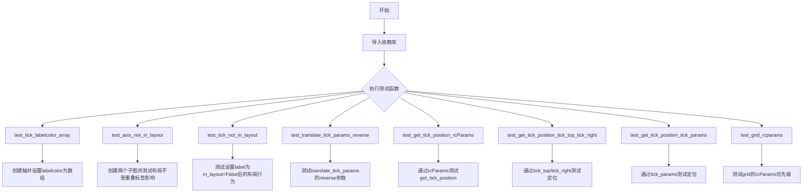
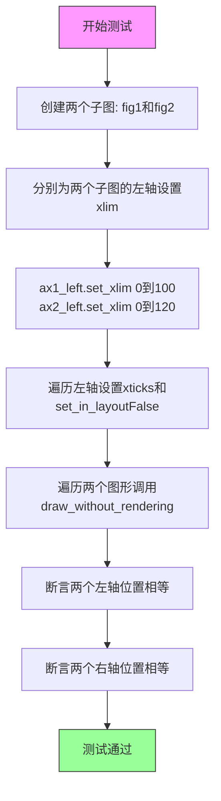
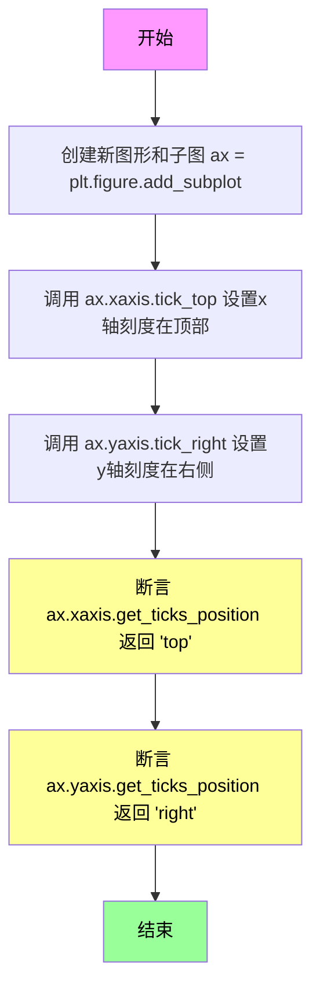
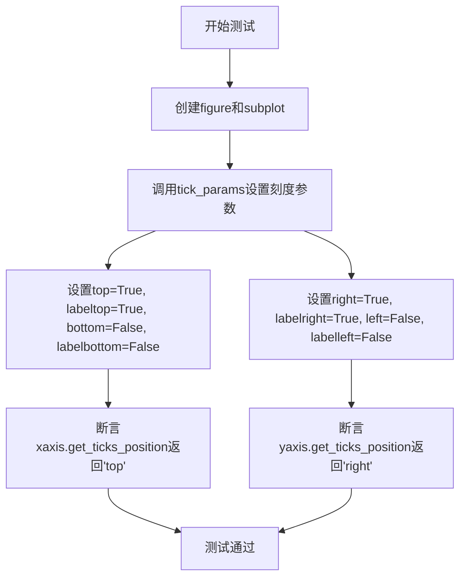
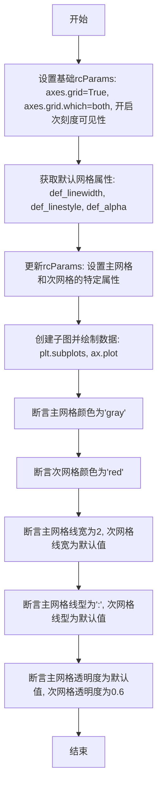

# `matplotlib\lib\matplotlib\tests\test_axis.py` 详细设计文档

这是一个matplotlib测试文件，用于测试坐标轴刻度标签、布局和网格相关的功能，包括labelcolor数组支持、布局优化、tick参数翻译、定位获取以及grid rcParams配置等。

## 整体流程



## 类结构

```
无类层次结构 (纯测试模块)
```

## 全局变量及字段


    

## 全局函数及方法


### `test_tick_labelcolor_array`

这是一个烟雾测试（smoke test），用于验证matplotlib中是否能够使用NumPy数组作为`labelcolor`参数来实例化`XTick`对象。该测试确保了轴刻度标签颜色可以接受数组形式的RGBA值。

参数：

- 该函数无参数

返回值：`None`，该函数不返回任何值，仅执行测试逻辑

#### 流程图

```mermaid
graph TD
    A[开始测试] --> B[创建axes: ax = plt.axes]
    B --> C[创建XTick对象并传入数组颜色: XTickax, 0, labelcolor=np.array[1, 0, 0, 1]]
    C --> D[测试完成]
```

#### 带注释源码

```python
def test_tick_labelcolor_array():
    # Smoke test that we can instantiate a Tick with labelcolor as array.
    # 烟雾测试：验证可以使用数组形式的labelcolor创建Tick对象
    ax = plt.axes()
    # 创建一个axes对象，用于放置图表
    
    XTick(ax, 0, labelcolor=np.array([1, 0, 0, 1]))
    # 创建X轴刻度对象，第0个位置，labelcolor为RGBA数组[红, 绿, 蓝, 透明度]
    # 测试labelcolor参数是否支持numpy数组类型
```


### `test_axis_not_in_layout`

该测试函数用于验证当matplotlib的坐标轴（Axis）通过`set_in_layout(False)`被标记为不参与布局计算时，布局引擎是否会正确忽略该坐标轴上的tick labels，从而确保即使存在可能与其他子图重叠的标签，也不会影响整体布局。

参数： 无

返回值：`None`，该函数为测试函数，不返回任何值

#### 流程图



#### 带注释源码

```python
def test_axis_not_in_layout():
    """
    测试当坐标轴标记为不参与布局时（set_in_layout(False)），
    布局引擎是否能正确忽略tick labels的影响。
    
    验证场景：即使左轴有一个100的标签可能与右轴重叠，
    由于该轴被标记为不参与布局，两个子图的位置应该相同。
    """
    
    # 创建两个具有两列布局（constrained）的子图
    fig1, (ax1_left, ax1_right) = plt.subplots(ncols=2, layout='constrained')
    fig2, (ax2_left, ax2_right) = plt.subplots(ncols=2, layout='constrained')

    # 设置第一个子图左轴的x轴范围为0-100（100的标签会与右轴边界重叠）
    # 100 label overlapping the end of the axis
    ax1_left.set_xlim(0, 100)
    
    # 设置第二个子图左轴的x轴范围为0-120（100的标签不会与右轴重叠）
    # 100 label not overlapping the end of the axis
    ax2_left.set_xlim(0, 120)

    # 遍历两个子图的左轴，设置相同的tick位置，并将xaxis标记为不参与布局计算
    for ax in ax1_left, ax2_left:
        ax.set_xticks([0, 100])           # 设置x轴刻度位置为0和100
        ax.xaxis.set_in_layout(False)      # 关键：将该axis标记为不参与layout计算

    # 对两个图形执行无渲染绘制，确保布局计算完成
    for fig in fig1, fig2:
        fig.draw_without_rendering()

    # 断言：即使存在可能重叠的标签，由于set_in_layout(False)，
    # 两个子图的左轴位置应该完全相同
    # Positions should not be affected by overlapping 100 label
    assert ax1_left.get_position().bounds == ax2_left.get_position().bounds
    
    # 断言：两个子图的右轴位置也应该完全相同
    assert ax1_right.get_position().bounds == ax2_right.get_position().bounds
```


### `test_tick_not_in_layout`

该函数用于测试当通过set_in_layout(False)将某个刻度标签排除在布局计算之外后，布局引擎是否能够正确地将其视为空字符串进行处理，即忽略该标签对布局的影响。

参数：

- `fig_test`：`matplotlib.figure.Figure`，测试用的图形对象，用于设置包含"very long"标签的图形
- `fig_ref`：`matplotlib.figure.Figure`，参考用的图形对象，用于设置包含空字符串标签的图形

返回值：`None`，该函数使用`@check_figures_equal`装饰器进行图形比较验证，测试结果由装饰器返回

#### 流程图

```mermaid
graph TD
    A[开始] --> B[设置fig_test为constrained布局引擎]
    B --> C[在fig_test中添加子图, 设置xticks为0和1, xticklabels为'short'和'very long']
    C --> D[设置刻度标签颜色为白色]
    D --> E[调用draw_without_rendering确保刻度正确]
    E --> F[获取最后一个主刻度标签并设置set_in_layout(False)]
    F --> G[设置fig_ref为constrained布局引擎]
    G --> H[在fig_ref中添加子图, 设置xticks为0和1, xticklabels为'short'和空字符串]
    H --> I[设置刻度标签颜色为白色]
    I --> J[由@check_figures_equal装饰器比较两个图形是否相等]
    J --> K[结束]
```

#### 带注释源码

```python
@check_figures_equal()  # 装饰器：比较测试图形和参考图形的渲染结果是否一致
def test_tick_not_in_layout(fig_test, fig_ref):
    # 检查在set_in_layout(False)之后，"非常长"的刻度标签被忽略出布局；
    # 即布局就像刻度标签为空一样。刻度标签设置为白色，因此实际字符串内容无关紧要。
    
    # 为测试图形设置约束布局引擎
    fig_test.set_layout_engine("constrained")
    
    # 添加子图，设置x轴刻度为0和1，刻度标签为"short"和"very long"
    ax = fig_test.add_subplot(xticks=[0, 1], xticklabels=["short", "very long"])
    
    # 将刻度标签颜色设置为白色（隐藏标签内容）
    ax.tick_params(labelcolor="w")
    
    # 执行无渲染绘制，确保刻度正确初始化
    fig_test.draw_without_rendering()
    
    # 获取x轴的最后一个主刻度，将其标签的in_layout属性设为False
    # 这样该标签将被排除在布局计算之外
    ax.xaxis.majorTicks[-1].label1.set_in_layout(False)
    
    # 为参考图形设置相同的约束布局引擎
    fig_ref.set_layout_engine("constrained")
    
    # 参考图形使用空字符串代替"very long"标签，作为预期结果
    ax = fig_ref.add_subplot(xticks=[0, 1], xticklabels=["short", ""])
    
    # 同样设置标签颜色为白色
    ax.tick_params(labelcolor="w")
    # 装饰器将自动比较fig_test和fig_ref的最终布局是否一致
```


### `test_translate_tick_params_reverse`

该测试函数用于验证 matplotlib 中坐标轴的 `_translate_tick_params` 方法在逆向模式（reverse=True）下能否正确将简短的内部参数名称（如 `label1On`、`label2On`、`tick1On`、`tick2On`）转换为完整的 axis 属性参数名称（如 xaxis 的 `labelbottom`、`labeltop`、`bottom`、`top` 以及 yaxis 的 `labelleft`、`labelright`、`left`、`right`）。

参数：该函数无参数。

返回值：`None`，因为这是一个测试函数，使用 `assert` 语句进行断言验证。

#### 流程图

```mermaid
graph TD
    A[开始 test_translate_tick_params_reverse] --> B[创建图形 fig 和坐标轴 ax]
    B --> C[定义 kw 字典: label1On='a', label2On='b', tick1On='c', tick2On='d']
    C --> D[调用 ax.xaxis._translate_tick_params(kw, reverse=True)]
    D --> E{assert 断言}
    E -->|相等| F[验证 xaxis 结果: labelbottom='a', labeltop='b', bottom='c', top='d']
    F --> G[调用 ax.yaxis._translate_tick_params(kw, reverse=True)]
    G --> H{assert 断言}
    H -->|相等| I[验证 yaxis 结果: labelleft='a', labelright='b', left='c', right='d']
    I --> J[结束]
    E -->|不等| K[抛出 AssertionError]
    H -->|不等| K
```

#### 带注释源码

```python
def test_translate_tick_params_reverse():
    # 创建一个新的图形和坐标轴对象
    fig, ax = plt.subplots()
    
    # 定义测试用的参数字典，包含简短的参数名称
    # label1On, label2On 对应标签位置参数
    # tick1On, tick2On 对应刻度位置参数
    kw = {'label1On': 'a', 'label2On': 'b', 'tick1On': 'c', 'tick2On': 'd'}
    
    # 测试 xaxis 的逆向参数转换
    # 期望将 short 名称转换为完整的 axis 属性参数名
    # reverse=True 表示从内部名称转换回标准参数名
    assert (ax.xaxis._translate_tick_params(kw, reverse=True) ==
            {'labelbottom': 'a', 'labeltop': 'b', 'bottom': 'c', 'top': 'd'})
    
    # 测试 yaxis 的逆向参数转换
    # yaxis 使用 left/right 而不是 bottom/top
    # labelleft/labelright 而不是 labelbottom/labeltop
    assert (ax.yaxis._translate_tick_params(kw, reverse=True) ==
            {'labelleft': 'a', 'labelright': 'b', 'left': 'c', 'right': 'd'})
```


### `test_get_tick_position_rcParams`

该函数是一个测试函数，用于验证 `get_tick_position()` 方法能否正确读取 rcParams 中的 tick 位置设置。测试分别设置 X 轴的 tick 在顶部、Y 轴的 tick 在右侧，然后断言返回的位置字符串是否为 "top" 和 "right"。

参数：该函数无参数

返回值：`None`，无返回值（测试函数，使用 assert 进行断言验证）

#### 流程图

```mermaid
flowchart TD
    A[开始] --> B[更新 rcParams: xtick.top=1, xtick.labeltop=1, xtick.bottom=0, xtick.labelbottom=0, ytick.right=1, ytick.labelright=1, ytick.left=0, ytick.labelleft=0]
    B --> C[创建 Figure 和 Subplot: ax = plt.figure().add_subplot]
    C --> D[断言: ax.xaxis.get_ticks_position == 'top']
    D --> E[断言: ax.yaxis.get_ticks_position == 'right']
    E --> F[结束]
```

#### 带注释源码

```python
def test_get_tick_position_rcParams():
    """Test that get_tick_position() correctly picks up rcParams tick positions."""
    # 更新 matplotlib 的 rcParams 全局配置
    # 设置 X 轴 tick 在顶部显示，不在底部显示
    # 设置 Y 轴 tick 在右侧显示，不在左侧显示
    plt.rcParams.update({
        "xtick.top": 1, "xtick.labeltop": 1, "xtick.bottom": 0, "xtick.labelbottom": 0,
        "ytick.right": 1, "ytick.labelright": 1, "ytick.left": 0, "ytick.labelleft": 0,
    })
    # 创建一个新的 Figure 并添加一个子图（Axes）
    ax = plt.figure().add_subplot()
    # 断言 X 轴的 tick 位置为 "top"，验证 rcParams 配置已生效
    assert ax.xaxis.get_ticks_position() == "top"
    # 断言 Y 轴的 tick 位置为 "right"，验证 rcParams 配置已生效
    assert ax.yaxis.get_ticks_position() == "right"
```


### `test_get_tick_position_tick_top_tick_right`

这是一个单元测试函数，用于验证 `get_tick_position()` 方法能够正确识别通过 `tick_top()` 和 `tick_right()` 方法设置的刻度位置（"top" 和 "right"）。

参数： 无

返回值：`None`，无返回值（测试函数）

#### 流程图



#### 带注释源码

```python
def test_get_tick_position_tick_top_tick_right():
    """Test that get_tick_position() correctly picks up tick_top() / tick_right()."""
    # 创建一个新的Figure对象，并在其中添加一个子图，返回轴对象ax
    ax = plt.figure().add_subplot()
    
    # 将x轴的刻度线位置设置为顶部（即刻度线显示在轴的上方）
    ax.xaxis.tick_top()
    
    # 将y轴的刻度线位置设置为右侧（即刻度线显示在轴的右侧）
    ax.yaxis.tick_right()
    
    # 断言：验证x轴的get_ticks_position()方法返回'top'
    assert ax.xaxis.get_ticks_position() == "top"
    
    # 断言：验证y轴的get_ticks_position()方法返回'right'
    assert ax.yaxis.get_ticks_position() == "right"
```


### `test_get_tick_position_tick_params`

该测试函数用于验证`get_tick_position()`方法能够正确获取通过`tick_params()`设置的刻度位置配置，涵盖x轴和y轴的顶部/底部、左侧/右侧刻度及标签的显示状态。

参数：

- 该函数无参数

返回值：`None`，该函数为测试函数，不返回任何值，仅通过断言验证行为

#### 流程图



#### 带注释源码

```python
def test_get_tick_position_tick_params():
    """Test that get_tick_position() correctly picks up tick_params()."""
    # 创建一个新的figure和一个子图坐标轴
    ax = plt.figure().add_subplot()
    
    # 使用tick_params配置刻度参数：
    # - x轴：top=True显示顶部刻度, labeltop=True显示顶部标签
    #       bottom=False隐藏底部刻度, labelbottom=False隐藏底部标签
    # - y轴：right=True显示右侧刻度, labelright=True显示右侧标签
    #       left=False隐藏左侧刻度, labelleft=False隐藏左侧标签
    ax.tick_params(top=True, labeltop=True, bottom=False, labelbottom=False,
                   right=True, labelright=True, left=False, labelleft=False)
    
    # 断言验证x轴的刻度位置返回'top'
    assert ax.xaxis.get_ticks_position() == "top"
    
    # 断言验证y轴的刻度位置返回'right'
    assert ax.yaxis.get_ticks_position() == "right"
```

#### 补充说明

该测试函数的设计目标：
- 验证`tick_params()`设置的刻度参数能够被`get_ticks_position()`正确读取
- 测试x轴和y轴的刻度位置配置独立性

潜在的技术债务或优化空间：
- 该测试仅覆盖了极端情况（全部移到一侧），建议增加混合场景测试
- 可以考虑添加对`get_ticks_position()`返回值的其他可能性测试（如"default"、"unknown"等）


### `test_grid_rcparams`

该函数是一个单元测试，用于验证matplotlib中`grid.major/minor.*`配置参数能够正确覆盖`grid.*`基础配置参数。具体来说，测试通过设置rcParams并检查主网格线和次网格线的颜色、线宽、线型和透明度属性，来验证网格参数层级覆盖的正确性。

参数：

- 无参数

返回值：`None`，无返回值（该函数为测试函数，通过断言验证行为而非返回值）

#### 流程图



#### 带注释源码

```
def test_grid_rcparams():
    """Tests that `grid.major/minor.*` overwrites `grid.*` in rcParams."""
    # 第一步：设置基础rcParams配置
    # 启用网格显示, 应用于主刻度和次刻度, 开启次刻度可见性
    plt.rcParams.update({
        "axes.grid": True, "axes.grid.which": "both",
        "ytick.minor.visible": True, "xtick.minor.visible": True,
    })
    
    # 第二步：获取默认的网格属性（用于后续对比）
    # 保存默认的线宽、线型和透明度设置
    def_linewidth = plt.rcParams["grid.linewidth"]
    def_linestyle = plt.rcParams["grid.linestyle"]
    def_alpha = plt.rcParams["grid.alpha"]

    # 第三步：更新rcParams，设置主网格和次网格的特定属性
    # 主网格：灰色、点线线型、线宽2
    # 次网格：红色、透明度0.6
    # 注意：这里只设置了部分属性，其他属性应继承自基础grid配置
    plt.rcParams.update({
        "grid.color": "gray", "grid.minor.color": "red",
        "grid.major.linestyle": ":", "grid.major_linewidth": 2,
        "grid.minor.alpha": 0.6,
    })
    
    # 第四步：创建图表并绘制简单数据
    # 这一步会触发网格的渲染和应用
    _, ax = plt.subplots()
    ax.plot([0, 1])

    # 第五步：断言验证 - 主网格应使用特定设置
    # 验证主网格颜色为灰色（覆盖基础grid.color）
    assert ax.xaxis.get_major_ticks()[0].gridline.get_color() == "gray"
    # 验证次网格颜色为红色（覆盖基础grid.color）
    assert ax.xaxis.get_minor_ticks()[0].gridline.get_color() == "red"
    # 验证主网格线宽为2（覆盖基础grid.linewidth）
    assert ax.xaxis.get_major_ticks()[0].gridline.get_linewidth() == 2
    # 验证次网格线宽使用默认值（未在rcParams中设置次网格线宽）
    assert ax.xaxis.get_minor_ticks()[0].gridline.get_linewidth() == def_linewidth
    # 验证主网格线型为点线（覆盖基础grid.linestyle）
    assert ax.xaxis.get_major_ticks()[0].gridline.get_linestyle() == ":"
    # 验证次网格线型使用默认值（未在rcParams中设置次网格线型）
    assert ax.xaxis.get_minor_ticks()[0].gridline.get_linestyle() == def_linestyle
    # 验证主网格透明度使用默认值（未在rcParams中设置主网格透明度）
    assert ax.xaxis.get_major_ticks()[0].gridline.get_alpha() == def_alpha
    # 验证次网格透明度为0.6（覆盖基础grid.alpha）
    assert ax.xaxis.get_minor_ticks()[0].gridline.get_alpha() == 0.6
```

#### 关键组件信息

- `plt.rcParams`：matplotlib的运行时配置字典，用于管理全局默认样式设置
- `ax.xaxis.get_major_ticks()`：获取X轴主刻度对象列表
- `ax.xaxis.get_minor_ticks()`：获取X轴次刻度对象列表
- `gridline.get_color()`：获取网格线颜色
- `gridline.get_linewidth()`：获取网格线宽度
- `gridline.get_linestyle()`：获取网格线线型
- `gridline.get_alpha()`：获取网格线透明度

#### 潜在技术债务或优化空间

1. **测试隔离性问题**：该测试直接修改全局`plt.rcParams`，可能会影响后续测试用例的执行，建议在测试前后保存和恢复rcParams状态
2. **断言重复代码**：多处类似的断言可以提取为辅助函数以提高可维护性
3. **只验证X轴**：测试仅验证了X轴的网格属性，Y轴的属性未被验证，覆盖不够全面
4. **硬编码值**：默认值（def_linewidth、def_linestyle、def_alpha）依赖于当前matplotlib的默认rcParams值，如果默认值改变可能导致测试脆弱

#### 其他项目说明

- **设计目标**：验证matplotlib rcParams系统中`grid.major.*`和`grid.minor.*`配置项能够正确覆盖基础`grid.*`配置项
- **约束条件**：需要matplotlib版本支持`grid.major.*`和`grid.minor.*`配置项（matplotlib 3.7+）
- **错误处理**：使用assert语句进行断言验证，任何不匹配都会抛出AssertionError
- **数据流**：rcParams配置 → 轴对象创建 → 网格线渲染 → 属性验证
- **外部依赖**：numpy（用于数组操作）、matplotlib.pyplot、matplotlib.axis.XTick、matplotlib.testing.decorators


## 关键组件


### XTick 实例化与 labelcolor 数组支持

测试 XTick 类能否接受数组形式的 labelcolor 参数，验证张量索引在 matplotlib 图形元素中的应用。

### 轴布局管理（Layout Management）

通过 constrained layout 引擎测试轴在布局计算中的行为，特别是验证长标签不会影响轴的位置计算，确保布局算法的正确性。

### 刻度标签布局排除

测试 set_in_layout(False) 方法排除特定刻度标签的布局计算，验证布局引擎能够正确处理被标记为不在布局中的元素。

### 刻度参数双向翻译

验证 Axis._translate_tick_params() 方法在正向和反向模式下正确转换刻度参数，包括 label 和 tick 的开关状态。

### rcParams 驱动的刻度位置

测试从 matplotlib rcParams 配置中读取刻度位置信息，支持通过全局配置控制刻度的显示位置（top/bottom, left/right）。

### 显式方法设置刻度位置

测试 tick_top(), tick_right() 等方法直接设置刻度位置，与 rcParams 方式对比验证优先级和一致性。

### tick_params 方法集成

测试 tick_params() 方法同时设置多个刻度属性（top/bottom, labeltop/labelbottom, left/right, labelleft/labelright）的功能。

### 网格参数层级覆盖

测试 rcParams 中 grid.major/minor.* 配置对基础 grid.* 配置的覆盖机制，验证层级配置的优先级和合并逻辑。


## 问题及建议


### 已知问题

- **全局状态污染**：多个测试函数修改`plt.rcParams`后未恢复原始状态，可能影响其他测试的执行结果
- **代码重复**：`test_get_tick_position_rcParams`、`test_get_tick_position_tick_top_tick_right`和`test_get_tick_position_tick_params`三个测试中存在大量重复的断言代码
- **硬编码值缺乏参数化**：测试中的数值（如100、120、数组[1,0,0,1]等）直接写死在代码中，降低了测试的可维护性
- **断言缺乏自定义消息**：所有断言都使用默认的错误消息，测试失败时难以快速定位问题
- **测试隔离不足**：`test_axis_not_in_layout`创建fig1和fig2后，在同一个测试中对两个figure进行操作，可能存在隐藏的依赖关系
- **注释不足**：部分测试如`test_tick_labelcolor_array`仅有"Smoke test"注释，未说明具体验证点

### 优化建议

- 在修改`plt.rcParams`的测试中使用`plt.rcdefaults()`或`try-finally`确保恢复默认配置
- 抽取重复的断言逻辑为辅助函数，例如创建`assert_tick_position(ax, expected)`函数
- 将硬编码值提取为测试函数参数或常量，使用pytest参数化减少重复代码
- 为关键断言添加描述性消息，如`assert ... , "xaxis position should be 'top'"`
- 将`test_axis_not_in_layout`拆分为独立的单元测试，避免测试间的隐式依赖
- 为每个测试补充详细的docstring，说明测试目的、输入和预期输出

## 其它


### 设计目标与约束

本测试文件旨在验证matplotlib中与刻度线（Tick）、轴（Axis）相关的核心功能，包括刻度标签颜色数组支持、布局引擎中的轴位置计算、刻度参数转换以及rcParams配置的正确应用。测试覆盖X轴和Y轴的行为，确保在不同配置下get_ticks_position()方法能正确返回"top"、"right"等位置信息。测试约束包括：依赖matplotlib 3.7+的API（如constrained布局引擎），需要numpy和matplotlib.testing.decorators模块。

### 错误处理与异常设计

测试代码主要采用断言（assert）进行验证，未显式使用try-except。当测试失败时，断言错误会直接向上传播，触发测试框架的错误报告机制。在test_tick_not_in_layout中使用装饰器@check_figures_equal()自动比较测试图和参考图的渲染结果，期望两者一致。若布局计算或渲染过程抛出异常，pytest会将该测试标记为失败。

### 数据流与状态机

测试涉及的核心数据流包括：1）rcParams配置更新流程：plt.rcParams.update()修改全局配置，影响后续轴的创建和渲染；2）轴布局计算流程：set_in_layout(False)标记特定轴元素不参与布局计算，draw_without_rendering()触发布局重算；3）刻度位置状态机：tick_top()、tick_right()、tick_params()等方法修改轴的tick位置状态，get_ticks_position()读取并返回当前状态字符串。状态转换主要围绕"top"/"bottom"和"left"/"right"两个维度进行。

### 外部依赖与接口契约

本测试文件直接依赖以下外部包：numpy（版本需支持np.array([1, 0, 0, 1])数组创建）、matplotlib（需包含XTick类、Axis.set_in_layout()方法、constrained布局引擎）、matplotlib.testing.decorators（check_figures_equal装饰器）。关键接口契约包括：ax.xaxis.get_ticks_position()必须返回"default"/"top"/"bottom"等字符串；ax.get_position().bounds返回浮点型四元组(x0, y0, width, height)；xaxis._translate_tick_params()接收字典参数reverse=True时返回翻转后的参数字典。

### 性能考虑

测试代码本身运行时间较短，但涉及图形渲染的测试（如test_tick_not_in_layout）可能消耗较多资源。draw_without_rendering()方法在不实际显示图形的情况下计算布局，适度平衡了测试覆盖度和执行效率。建议在CI环境中使用Agg后端避免GUI依赖。

### 安全性考虑

测试代码无用户输入处理，无敏感数据操作，安全性风险较低。但需注意：plt.rcParams的全局修改可能影响同一进程中的其他测试，建议在测试结束后恢复默认配置或使用pytest fixtures管理配置状态。

### 兼容性考虑

测试代码针对matplotlib 3.7+设计，某些API（如constrained布局引擎）在旧版本中不可用。test_get_tick_position_rcParams中对rcParams的修改（将top/bottom设为0/1）要求matplotlib版本支持"xtick.top"等参数键。numpy数组作为labelcolor的要求同样需要较新版本支持。

### 测试策略

采用三种测试策略：1）单元测试（test_translate_tick_params_reverse、test_get_tick_position_*系列）验证单个方法或函数的行为；2）集成测试（test_axis_not_in_layout、test_tick_not_in_layout）验证多个组件协同工作的正确性；3）回归测试（@check_figures_equal装饰的测试）通过图像比对确保视觉输出未被意外修改。

### 配置管理

测试中的配置管理主要通过plt.rcParams上下文实现。test_get_tick_position_rcParams使用plt.rcParams.update()临时修改全局配置，测试结束后配置会保留，可能影响后续测试。建议使用pytest的monkeypatch fixture或显式恢复默认rcParams以提高测试隔离性。

### 边界条件与特殊输入

测试覆盖的边界条件包括：刻度标签数组作为labelcolor输入（test_tick_labelcolor_array）；长文本标签在布局边界处的行为（test_axis_not_in_layout中100 vs 120的xlim）；rcParams中grid.major/minor.*覆盖grid.*的情况；以及反向参数转换时的键名映射（label1On -> labelbottom vs labeltop）。

    