# `matplotlib\lib\matplotlib\tests\test_backend_bases.py` 详细设计文档

这是matplotlib后端基础功能的测试文件，主要测试FigureCanvasBase、NavigationToolbar2、事件处理（鼠标/键盘）、交互式缩放平移、工具管理器等功能，验证后端组件在不同场景下的行为正确性。

## 整体流程

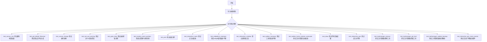

## 类结构

```
测试文件 (无自定义类)
└── 全局函数: 20+ 测试函数
    └── 全局变量: _EXPECTED_WARNING_TOOLMANAGER
```

## 全局变量及字段


### `_EXPECTED_WARNING_TOOLMANAGER`
    
一个用于匹配ToolManager中关于实验性工具类的预期UserWarning消息的正则表达式模式字符串

类型：`str`
    


    

## 全局函数及方法


### `test_uses_per_path`

这是一个测试函数，用于验证 `RendererBase` 类的 `_iter_collection_uses_per_path` 方法的正确性。该测试通过多组不同的输入参数（路径、变换矩阵、偏移量、颜色等）来检查路径使用次数的计算是否在预期范围内。

参数： 无

返回值：`None`，无返回值（测试函数）

#### 流程图

```mermaid
flowchart TD
    A[开始 test_uses_per_path] --> B[初始化测试数据]
    B --> C[创建 id = Affine2D]
    B --> D[创建 paths = 3-6边的正多边形]
    B --> E[创建 tforms_matrices = 4个旋转矩阵]
    B --> F[创建 offsets = 10x2数组]
    B --> G[创建 facecolors 和 edgecolors]
    
    G --> H[定义内部函数 check]
    
    H --> H1[创建 RendererBase 实例 rb]
    H1 --> H2[调用 rb._iter_collection_raw_paths 获取原始路径]
    H2 --> H3[创建新 gc 实例]
    H3 --> H4[调用 rb._iter_collection 获取路径ID列表]
    H4 --> H5[调用 rb._iter_collection_uses_per_path 获取每路径使用次数]
    H5 --> H6{raw_paths 是否为空?}
    H6 -->|否| H7[使用 np.bincount 统计每个路径的出现次数]
    H7 --> H8[断言: 出现次数集合是 [uses-1, uses] 的子集]
    H6 -->|是| H9[跳过断言]
    
    H9 --> I[调用 check 1: 完整数据]
    I --> J[调用 check 2: 单路径]
    J --> K[调用 check 3: 空路径]
    K --> L[调用 check 4: 单变换]
    L --> M[调用 check 5: 空变换]
    M --> N[调用 check 6-10: 各种边界情况]
    N --> O[结束]
```

#### 带注释源码

```python
def test_uses_per_path():
    # 创建基础仿射变换对象
    id = transforms.Affine2D()
    
    # 创建一组正多边形路径（3边、4边、5边、6边）
    paths = [path.Path.unit_regular_polygon(i) for i in range(3, 7)]
    
    # 创建一组旋转矩阵（分别旋转1、2、3、4弧度）
    tforms_matrices = [id.rotate(i).get_matrix().copy() for i in range(1, 5)]
    
    # 创建偏移量数组：20个元素重塑为10行2列
    offsets = np.arange(20).reshape((10, 2))
    
    # 定义填充颜色和边缘颜色
    facecolors = ['red', 'green']
    edgecolors = ['red', 'green']

    # 内部检查函数，用于验证路径使用次数计算
    def check(master_transform, paths, all_transforms,
              offsets, facecolors, edgecolors):
        # 创建渲染器基实例
        rb = RendererBase()
        
        # 获取原始路径列表
        raw_paths = list(rb._iter_collection_raw_paths(
            master_transform, paths, all_transforms))
        
        # 创建新的图形上下文
        gc = rb.new_gc()
        
        # 迭代收集获取每个路径的ID
        ids = [path_id for xo, yo, path_id, gc0, rgbFace in
               rb._iter_collection(
                   gc, range(len(raw_paths)), offsets,
                   transforms.AffineDeltaTransform(master_transform),
                   facecolors, edgecolors, [], [], [False],
                   [], 'screen', hatchcolors=[])]
        
        # 获取每个路径的使用次数
        uses = rb._iter_collection_uses_per_path(
            paths, all_transforms, offsets, facecolors, edgecolors)
        
        # 如果有原始路径，验证使用次数
        if raw_paths:
            # 统计每个路径ID出现的次数
            seen = np.bincount(ids, minlength=len(raw_paths))
            # 断言：出现次数应该在 [uses-1, uses] 范围内
            assert set(seen).issubset([uses - 1, uses])

    # 测试用例1：完整数据
    check(id, paths, tforms_matrices, offsets, facecolors, edgecolors)
    
    # 测试用例2：单个路径
    check(id, paths[0:1], tforms_matrices, offsets, facecolors, edgecolors)
    
    # 测试用例3：空路径列表
    check(id, [], tforms_matrices, offsets, facecolors, edgecolors)
    
    # 测试用例4：单个变换矩阵
    check(id, paths, tforms_matrices[0:1], offsets, facecolors, edgecolors)
    
    # 测试用例5：空变换矩阵列表
    check(id, paths, [], offsets, facecolors, edgecolors)
    
    # 测试用例6-10：各种数量的偏移量和其他边界情况
    for n in range(0, offsets.shape[0]):
        check(id, paths, tforms_matrices, offsets[0:n, :],
              facecolors, edgecolors)
    
    # 测试用例11：无填充颜色
    check(id, paths, tforms_matrices, offsets, [], edgecolors)
    
    # 测试用例12：无边缘颜色
    check(id, paths, tforms_matrices, offsets, facecolors, [])
    
    # 测试用例13：无颜色
    check(id, paths, tforms_matrices, offsets, [], [])
    
    # 测试用例14：单颜色
    check(id, paths, tforms_matrices, offsets, facecolors[0:1], edgecolors)
```


### `test_canvas_ctor`

该测试函数用于验证 `FigureCanvasBase` 类在默认实例化（不传入 `Figure` 参数）时，其内部生成的 `figure` 属性是否为 `Figure` 类的合法实例。

参数：
- 无

返回值：`None`，该函数不显式返回值。如果断言失败（`FigureCanvasBase().figure` 不是 `Figure` 实例），则抛出 `AssertionError`；否则返回 `None`。

#### 流程图

```mermaid
graph TD
    A([开始 test_canvas_ctor]) --> B[实例化 FigureCanvasBase: new_canvas = FigureCanvasBase()]
    B --> C[获取 figure 属性: fig = new_canvas.figure]
    C --> D{判断 fig 是否为 Figure 的实例}
    D -- 是 --> E([测试通过 / 返回 None])
    D -- 否 --> F([抛出 AssertionError / 测试失败])
```

#### 带注释源码

```python
def test_canvas_ctor():
    # 1. 创建一个 FigureCanvasBase 实例（不传入任何参数，使用默认构造逻辑）
    # 2. 访问该实例的 .figure 属性
    # 3. 使用 assert 断言该属性是否为 Figure 类的实例
    assert isinstance(FigureCanvasBase().figure, Figure)
```


### `test_get_default_filename`

该函数是一个测试用例，用于验证 `FigureCanvasBase` 的 `get_default_filename` 方法能够正确生成默认文件名，包括处理窗口标题中的特殊字符。

参数：

- 无参数

返回值：`None`，该函数为测试函数，使用断言验证行为，不返回任何值。

#### 流程图

```mermaid
flowchart TD
    A[开始测试] --> B[创建Figure对象: fig = plt.figure]
    B --> C[调用 fig.canvas.get_default_filename]
    C --> D{断言结果 == 'Figure_1.png'}
    D -->|通过| E[设置窗口标题: set_window_title('0:1/2<3')]
    E --> F[再次调用 get_default_filename]
    F --> G{断言结果 == '0_1_2_3.png'}
    G -->|通过| H[测试结束]
    D -->|失败| I[抛出AssertionError]
    G -->|失败| I
```

#### 带注释源码

```python
def test_get_default_filename():
    """
    测试 FigureCanvasBase.get_default_filename() 方法的行为。
    
    验证点：
    1. 新建 Figure 的默认文件名格式
    2. 窗口标题被包含在默认文件名中
    3. 特殊字符（冒号、斜杠、小于号）被替换为下划线
    """
    # 步骤1: 创建一个新的Figure对象
    # 这会创建一个新的图形窗口和对应的canvas
    fig = plt.figure()
    
    # 步骤2: 获取默认文件名，预期为 'Figure_1.png'
    # Figure编号从1开始，格式为 Figure_{number}.{extension}
    assert fig.canvas.get_default_filename() == "Figure_1.png"
    
    # 步骤3: 设置窗口标题为包含特殊字符的字符串
    # 特殊字符包括: 冒号(:)、斜杠(/)、小于号(<)
    fig.canvas.manager.set_window_title("0:1/2<3")
    
    # 步骤4: 再次获取默认文件名
    # 窗口标题被用作文件名基础
    # 特殊字符被替换为下划线: 0:1/2<3 -> 0_1_2_3.png
    assert fig.canvas.get_default_filename() == "0_1_2_3.png"
```


### `test_canvas_change`

该测试函数用于验证在手动替换 Figure 对象的 canvas 属性后，调用 `plt.close()` 关闭该 Figure 仍能正常工作，确保 Figure 的清理逻辑不依赖于特定的 canvas 实现。

参数：
- 该函数无参数

返回值：`None`，该函数为测试函数，不返回任何值

#### 流程图

```mermaid
flowchart TD
    A[开始 test_canvas_change] --> B[创建新 Figure: fig = plt.figure]
    B --> C[创建新 FigureCanvasBase 并替换 fig.canvas: canvas = FigureCanvasBase(fig)]
    C --> D[调用 plt.close(fig) 关闭 Figure]
    D --> E{检查 Figure 是否已关闭}
    E -->|是| F[断言 plt.fignum_exists fig.number 为 False]
    F --> G[测试通过]
    E -->|否| H[测试失败]
    
    style A fill:#f9f,stroke:#333
    style G fill:#9f9,stroke:#333
    style H fill:#f99,stroke:#333
```

#### 带注释源码

```python
def test_canvas_change():
    """
    测试更换 Figure 的 canvas 后，plt.close() 是否仍然正常工作。
    
    该测试验证了 Figure 的生命周期管理不依赖于特定的 canvas 实现，
    即使手动替换了 canvas，关闭逻辑也应该能够正确执行。
    """
    # 创建一个新的 Figure 对象
    fig = plt.figure()
    
    # 手动替换 fig.canvas 为一个新的 FigureCanvasBase 实例
    # 这是测试场景：模拟用户更换 canvas 的操作
    canvas = FigureCanvasBase(fig)
    
    # 关闭 Figure，应该能够正常清理资源
    # 即使 canvas 被替换过，关闭操作也应该成功
    plt.close(fig)
    
    # 验证 Figure 已被关闭（通过检查其编号是否存在于 fignum_exists 中）
    assert not plt.fignum_exists(fig.number)
```


### `test_non_gui_warning`

该测试函数验证在使用非交互式 PDF 后端时，调用 `plt.show()` 或 `Figure.show()` 会产生正确的 UserWarning，提示用户该后端是非交互式的，无法以交互方式显示。

参数：

- `monkeypatch`：`MonkeyPatch`（pytest 内置 fixture），用于在测试期间修改环境变量，将 DISPLAY 设置为无效值 ":999" 以模拟无显示环境

返回值：`None`，该函数为测试函数，不返回任何值

#### 流程图

```mermaid
flowchart TD
    A[开始测试] --> B[调用 plt.subplots 创建图形]
    B --> C[使用 monkeypatch.setenv 设置 DISPLAY=:999]
    C --> D[使用 pytest.warns 捕获警告]
    D --> E[调用 plt.show]
    E --> F{检查警告数量为1?}
    F -->|是| G{检查警告消息内容?}
    G -->|是| H[调用 plt.gcf().show]
    H --> I{检查警告数量为1?}
    I -->|是| J{检查警告消息内容?}
    J -->|是| K[测试通过]
    F -->|否| L[测试失败]
    G -->|否| L
    I -->|否| L
    J -->|否| L
```

#### 带注释源码

```python
@pytest.mark.backend('pdf')  # 标记该测试仅在 pdf 后端运行时执行
def test_non_gui_warning(monkeypatch):
    """
    测试非交互式后端（PDF）在尝试显示时是否产生正确的警告。
    
    该测试验证当使用 PDF 后端时：
    1. plt.show() 会产生 UserWarning
    2. fig.show() 会产生 UserWarning
    警告内容应说明 FigureCanvasPdf 是非交互式的，无法显示
    """
    
    # 创建图形和坐标轴，使用当前配置的 PDF 后端
    plt.subplots()
    
    # 将 DISPLAY 环境变量设置为无效值 ":999"
    # 模拟无显示服务器的环境，确保触发警告而非实际显示
    monkeypatch.setenv("DISPLAY", ":999")
    
    # 第一次测试：验证 plt.show() 产生警告
    with pytest.warns(UserWarning) as rec:
        plt.show()  # 触发警告
        assert len(rec) == 1  # 确认只产生一条警告
        assert ('FigureCanvasPdf is non-interactive, and thus cannot be shown'
                in str(rec[0].message))  # 验证警告消息内容
    
    # 第二次测试：验证当前图形的 show() 方法产生警告
    with pytest.warns(UserWarning) as rec:
        plt.gcf().show()  # 通过获取当前图形调用 show()
        assert len(rec) == 1  # 确认只产生一条警告
        assert ('FigureCanvasPdf is non-interactive, and thus cannot be shown'
                in str(rec[0].message))  # 验证警告消息内容
```


### `test_grab_clear`

此测试函数验证在调用 Figure 的 `clear()` 方法后，鼠标捕获器（mouse_grabber）会被正确重置为 None，确保清除画布时释放了鼠标捕获。

参数：

- 无

返回值：`None`，测试函数无返回值，仅通过断言验证行为

#### 流程图

```mermaid
graph TD
    A[开始] --> B[创建Figure和Axes: fig, ax = plt.subplots]
    B --> C[调用fig.canvas.grab_mouse(ax)捕获鼠标到ax]
    C --> D[断言: fig.canvas.mouse_grabber == ax]
    D --> E[调用fig.clear()清空Figure]
    E --> F[断言: fig.canvas.mouse_grabber is None]
    F --> G[结束]
```

#### 带注释源码

```python
def test_grab_clear():
    """
    测试Figure.clear()后鼠标捕获是否被正确释放。
    
    此测试函数验证以下行为:
    1. 使用grab_mouse捕获鼠标到指定Axes
    2. 调用clear()方法后,鼠标捕获状态被重置为None
    """
    # 创建Figure和Axes对象
    fig, ax = plt.subplots()

    # 调用grab_mouse方法,将鼠标捕获到ax axes
    # 这会设置fig.canvas.mouse_grabber = ax
    fig.canvas.grab_mouse(ax)
    # 验证鼠标捕获器已正确设置为ax
    assert fig.canvas.mouse_grabber == ax

    # 清除Figure内容,这应该释放鼠标捕获
    fig.clear()
    # 验证清除后mouse_grabber被正确重置为None
    assert fig.canvas.mouse_grabber is None
```


### `test_location_event_position`

该函数是一个测试函数，用于验证 `LocationEvent` 类对其 x 和 y 参数的类型转换行为。它确保非 None 的数值坐标被正确转换为整数类型，而 None 值保持为 None，同时还验证了坐标格式化的功能。

参数：

- `x`：`int | float | None`，x 坐标的测试输入值，用于验证 LocationEvent 对 x 坐标的类型转换
- `y`：`int | float | None`，y 坐标的测试输入值，用于验证 LocationEvent 对 y 坐标的类型转换

返回值：`None`，该函数为测试函数，没有返回值，通过断言验证行为

#### 流程图

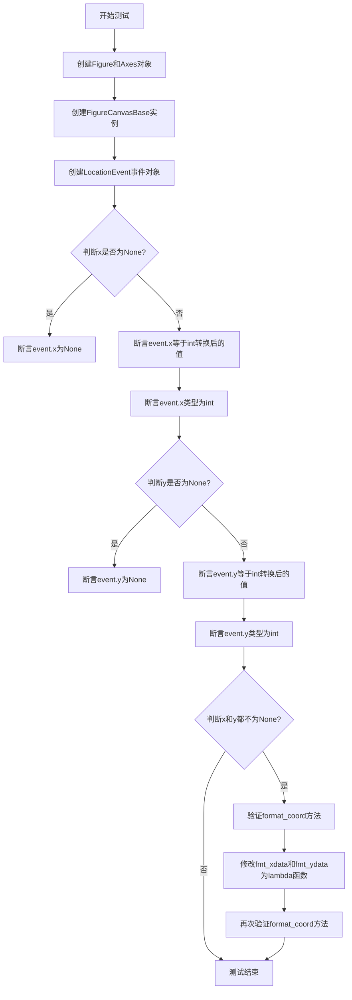

#### 带注释源码

```python
@pytest.mark.parametrize(
    "x, y", [(42, 24), (None, 42), (None, None), (200, 100.01), (205.75, 2.0)])
def test_location_event_position(x, y):
    # LocationEvent应该将其x和y参数转换为int类型，除非参数为None
    fig, ax = plt.subplots()  # 创建图形和坐标轴对象
    canvas = FigureCanvasBase(fig)  # 创建画布对象
    event = LocationEvent("test_event", canvas, x, y)  # 创建位置事件对象
    
    # 验证x坐标的处理逻辑
    if x is None:
        assert event.x is None  # 如果输入为None，则保持为None
    else:
        assert event.x == int(x)  # 验证x坐标被转换为int
        assert isinstance(event.x, int)  # 验证x的类型是int
    
    # 验证y坐标的处理逻辑
    if y is None:
        assert event.y is None  # 如果输入为None，则保持为None
    else:
        assert event.y == int(y)  # 验证y坐标被转换为int
        assert isinstance(event.y, int)  # 验证y的类型是int
    
    # 验证坐标格式化功能（仅当x和y都不为None时）
    if x is not None and y is not None:
        # 验证默认的坐标格式化输出
        assert (ax.format_coord(x, y)
                == f"(x, y) = ({ax.format_xdata(x)}, {ax.format_ydata(y)})")
        
        # 自定义格式化函数并验证
        ax.fmt_xdata = ax.fmt_ydata = lambda x: "foo"
        assert ax.format_coord(x, y) == "(x, y) = (foo, foo)"
```


### `test_location_event_position_twin`

这是一个测试函数，用于验证 Matplotlib 中 `format_coord` 方法在坐标轴具有 twinx（共享x轴的副轴）或 twiny（共享y轴的副轴）时的行为是否正确。

参数： 无显式参数（函数内部创建所需的 fig 和 ax 对象）

返回值： 无返回值（测试函数，使用 assert 进行断言验证）

#### 流程图

```mermaid
flowchart TD
    A[开始测试] --> B[创建子图 fig, ax]
    B --> C[设置主轴范围: xlim=(0,10), ylim=(0,20)]
    C --> D[验证单轴 format_coord 输出]
    D --> E[创建 twinx 副轴, 设置 ylim=(0,40)]
    E --> F[验证 twinx 副轴 format_coord 输出]
    F --> G[创建 twiny 副轴, 设置 xlim=(0,5)]
    G --> H[验证 twiny 副轴 format_coord 输出]
    H --> I[测试结束]
```

#### 带注释源码

```python
def test_location_event_position_twin():
    """
    测试 format_coord 在具有 twinx/twiny 副轴时的行为
    """
    # 创建一个新的图形和坐标轴
    fig, ax = plt.subplots()
    
    # 设置主坐标轴的范围：x轴0-10，y轴0-20
    ax.set(xlim=(0, 10), ylim=(0, 20))
    
    # 验证单轴时 format_coord 的输出格式
    # 期望输出："(x, y) = (5.00, 5.00)"
    assert ax.format_coord(5., 5.) == "(x, y) = (5.00, 5.00)"
    
    # 创建共享x轴的副轴（twinx），设置y轴范围为0-40
    ax.twinx().set(ylim=(0, 40))
    
    # 验证双轴时 format_coord 的输出格式
    # 期望输出："(x, y) = (5.00, 5.00) | (5.00, 10.0)"
    # 注意：主轴y=5对应副轴y=10（因为副轴ylim是主轴的2倍）
    assert ax.format_coord(5., 5.) == "(x, y) = (5.00, 5.00) | (5.00, 10.0)"
    
    # 创建共享y轴的副轴（twiny），设置x轴范围为0-5
    ax.twiny().set(xlim=(0, 5))
    
    # 验证三轴时 format_coord 的输出格式
    # 期望输出："(x, y) = (5.00, 5.00) | (5.00, 10.0) | (2.50, 5.00)"
    # 注意：主轴x=5对应twiny副轴x=2.5（因为twiny的xlim是主轴的一半）
    assert (ax.format_coord(5., 5.)
            == "(x, y) = (5.00, 5.00) | (5.00, 10.0) | (2.50, 5.00)")
```


### `test_pick`

该函数用于测试matplotlib中的pick事件功能，验证当用户在图形上点击具有`picker=True`属性的文本元素时，能够正确触发pick事件，并且事件中的鼠标事件键值正确。

参数：
- 无

返回值：无（通过assert语句进行验证）

#### 流程图

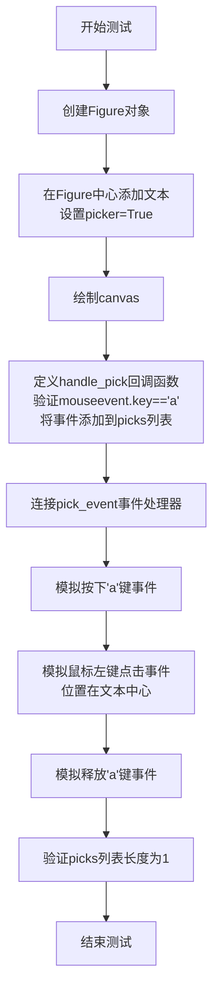

#### 带注释源码

```python
def test_pick():
    # 创建一个新的Figure对象
    fig = plt.figure()
    
    # 在Figure的中心位置(.5, .5)添加文本"hello"
    # ha="center"水平居中, va="center"垂直居中
    # picker=True启用pick事件检测
    fig.text(.5, .5, "hello", ha="center", va="center", picker=True)
    
    # 绘制canvas，确保所有元素渲染完成
    fig.canvas.draw()

    # 初始化存储pick事件的列表
    picks = []
    
    # 定义pick事件处理函数
    def handle_pick(event):
        # 验证触发pick事件的鼠标事件中的key属性为"a"
        assert event.mouseevent.key == "a"
        # 将事件添加到picks列表中
        picks.append(event)
    
    # 将handle_pick函数连接到FigureCanvas的pick_event事件
    fig.canvas.mpl_connect("pick_event", handle_pick)

    # 模拟键盘按下事件：key_press_event
    # 在canvas上按下"a"键
    KeyEvent("key_press_event", fig.canvas, "a")._process()
    
    # 模拟鼠标左键点击事件：button_press_event
    # 将文本位置(.5, .5)从Figure坐标转换为显示坐标
    # 在该位置点击鼠标左键
    MouseEvent("button_press_event", fig.canvas,
               *fig.transFigure.transform((.5, .5)),
               MouseButton.LEFT)._process()
    
    # 模拟键盘释放事件：key_release_event
    # 释放"a"键
    KeyEvent("key_release_event", fig.canvas, "a")._process()
    
    # 验证pick事件只被触发了一次
    # 这是测试的关键断言，确保pick事件正确触发且不重复
    assert len(picks) == 1
```


### `test_interactive_zoom`

该测试函数用于验证matplotlib中交互式缩放功能是否正常工作，测试内容包括：激活缩放工具、进行放大和缩小操作、验证坐标轴范围是否正确更新以及确认导航模式的正确切换。

参数： 该函数没有参数。

返回值： 该函数没有返回值（None），主要通过断言来验证功能正确性。

#### 流程图

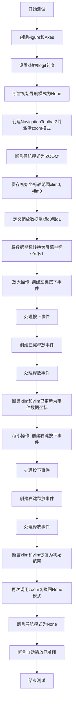

#### 带注释源码

```python
def test_interactive_zoom():
    """
    测试交互式缩放功能。
    
    验证流程：
    1. 创建Figure和Axes，设置x轴为logit刻度
    2. 激活缩放工具，验证导航模式为'ZOOM'
    3. 执行放大操作（左键拖拽），验证坐标轴范围更新
    4. 执行缩小操作（右键拖拽），验证坐标轴范围恢复
    5. 关闭缩放工具，验证导航模式恢复为None
    """
    # 步骤1: 创建Figure和Axes对象
    fig, ax = plt.subplots()
    
    # 设置x轴为logit刻度（对数刻度，用于测试特殊坐标系统）
    ax.set(xscale="logit")
    
    # 验证初始状态下导航模式为None（未激活任何工具）
    assert ax.get_navigate_mode() is None

    # 步骤2: 创建导航工具栏并激活缩放模式
    tb = NavigationToolbar2(fig.canvas)
    tb.zoom()  # 激活缩放工具
    
    # 验证激活后导航模式变为'ZOOM'
    assert ax.get_navigate_mode() == 'ZOOM'

    # 保存初始坐标轴范围，用于后续验证缩小操作
    xlim0 = ax.get_xlim()
    ylim0 = ax.get_ylim()

    # 步骤3: 定义缩放区域的数据坐标
    # 从点(1e-6, 0.1)到点(1-1e-5, 0.8)进行缩放
    d0 = (1e-6, 0.1)
    d1 = (1-1e-5, 0.8)
    
    # 将数据坐标转换为屏幕坐标（像素坐标）
    # 注意：鼠标事件只支持整数像素精度，因此需要取整
    s0 = ax.transData.transform(d0).astype(int)
    s1 = ax.transData.transform(d1).astype(int)

    # 执行放大操作（左键拖拽）
    # 创建鼠标左键按下事件
    start_event = MouseEvent(
        "button_press_event", fig.canvas, *s0, MouseButton.LEFT)
    # 通过回调处理该事件
    fig.canvas.callbacks.process(start_event.name, start_event)
    
    # 创建鼠标左键释放事件
    stop_event = MouseEvent(
        "button_release_event", fig.canvas, *s1, MouseButton.LEFT)
    fig.canvas.callbacks.process(stop_event.name, stop_event)
    
    # 验证放大后的坐标轴范围等于按下和释放事件的数据坐标
    assert ax.get_xlim() == (start_event.xdata, stop_event.xdata)
    assert ax.get_ylim() == (start_event.ydata, stop_event.ydata)

    # 执行缩小操作（右键拖拽）
    # 创建鼠标右键按下事件（从s1拖拽到s0，实现缩小效果）
    start_event = MouseEvent(
        "button_press_event", fig.canvas, *s1, MouseButton.RIGHT)
    fig.canvas.callbacks.process(start_event.name, start_event)
    
    # 创建鼠标右键释放事件
    stop_event = MouseEvent(
        "button_release_event", fig.canvas, *s0, MouseButton.RIGHT)
    fig.canvas.callbacks.process(stop_event.name, stop_event)
    
    # 验证缩小后的坐标轴范围恢复到初始范围（允许很小的浮点误差）
    # 绝对容差远小于原始xmin(1e-7)
    assert ax.get_xlim() == pytest.approx(xlim0, rel=0, abs=1e-10)
    assert ax.get_ylim() == pytest.approx(ylim0, rel=0, abs=1e-10)

    # 步骤5: 关闭缩放工具
    tb.zoom()  # 再次调用切换回None模式
    
    # 验证导航模式恢复为None
    assert ax.get_navigate_mode() is None

    # 验证自动缩放功能已关闭
    assert not ax.get_autoscalex_on() and not ax.get_autoscaley_on()
```


### `test_widgetlock_zoompan`

该测试函数验证了 matplotlib 中的 widget lock（组件锁）功能能够正确阻止缩放（zoom）和平移（pan）工具栏操作的激活。当某个坐标轴被 widget lock 锁定后，即使调用 toolbar 的 zoom() 或 pan() 方法，该坐标轴的导航模式（navigate_mode）也应该保持为 None。

参数：无

返回值：`None`，该函数为测试函数，使用断言进行验证，不返回具体数值

#### 流程图

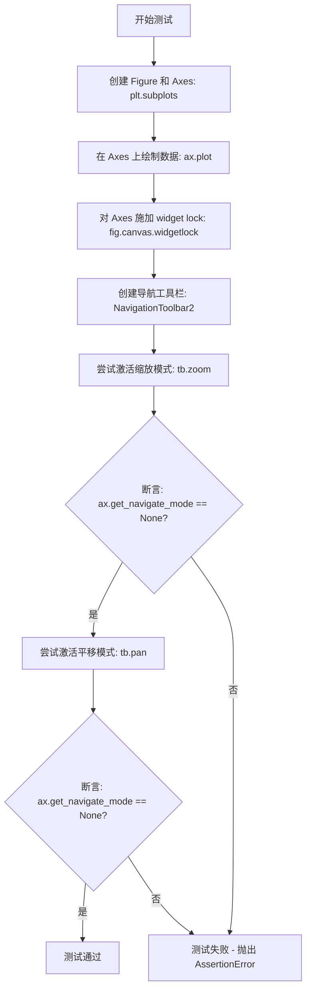

#### 带注释源码

```python
def test_widgetlock_zoompan():
    """
    测试 widget lock 机制是否能阻止 zoom 和 pan 工具栏操作的激活。
    
    该测试验证了当使用 fig.canvas.widgetlock() 锁定某个 Axes 后，
    NavigationToolbar2 的 zoom() 和 pan() 方法不应该能够激活该 Axes 的导航模式。
    """
    # 步骤 1: 创建一个新的 Figure 和 Axes 对象
    fig, ax = plt.subplots()
    
    # 步骤 2: 在 Axes 上绘制简单的数据线
    ax.plot([0, 1], [0, 1])
    
    # 步骤 3: 对该 Axes 施加 widget lock，锁定该 Axes 的交互功能
    # widget lock 会阻止该 Axes 响应某些交互操作
    fig.canvas.widgetlock(ax)
    
    # 步骤 4: 创建导航工具栏实例
    tb = NavigationToolbar2(fig.canvas)
    
    # 步骤 5: 尝试激活缩放模式
    tb.zoom()
    
    # 断言: 由于 Axes 已被 widget lock 锁定，navigate_mode 应该保持为 None
    assert ax.get_navigate_mode() is None, \
        "Widget lock should prevent zoom mode from being activated"
    
    # 步骤 6: 尝试激活平移模式
    tb.pan()
    
    # 断言: 由于 Axes 已被 widget lock 锁定，navigate_mode 应该保持为 None
    assert ax.get_navigate_mode() is None, \
        "Widget lock should prevent pan mode from being activated"
```


### `test_interactive_colorbar`

这是一个测试函数，用于验证交互式颜色条（colorbar）在缩放（zoom）和平移（pan）操作下的行为是否符合预期。测试涵盖了不同的绘图函数（imshow、contourf）、颜色条方向（vertical、horizontal）以及不同的工具和鼠标按钮组合。

参数：

- `plot_func`：`str`，指定用于绘制数据的函数，支持 "imshow" 和 "contourf"
- `orientation`：`str`，指定颜色条的方向，支持 "vertical" 和 "horizontal"
- `tool`：`str`，指定交互工具，支持 "zoom"（缩放）和 "pan"（平移）
- `button`：`MouseButton`，指定触发交互的鼠标按钮
- `expected`：`tuple`，预期缩放或平移后的 (vmin, vmax) 值

返回值：`None`，该函数为测试函数，没有返回值

#### 流程图

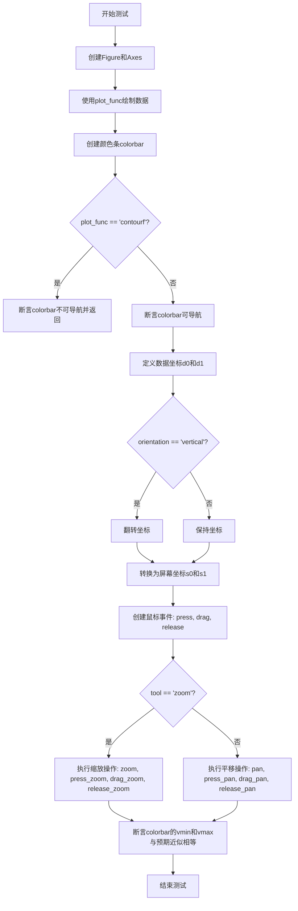

#### 带注释源码

```python
@pytest.mark.parametrize("plot_func", ["imshow", "contourf"])
@pytest.mark.parametrize("orientation", ["vertical", "horizontal"])
@pytest.mark.parametrize("tool,button,expected",
                         [("zoom", MouseButton.LEFT, (4, 6)),  # zoom in
                          ("zoom", MouseButton.RIGHT, (-20, 30)),  # zoom out
                          ("pan", MouseButton.LEFT, (-2, 8)),
                          ("pan", MouseButton.RIGHT, (1.47, 7.78))])  # zoom
def test_interactive_colorbar(plot_func, orientation, tool, button, expected):
    """
    测试交互式颜色条在缩放和平移操作下的行为
    
    参数:
        plot_func: 绘图函数类型 ('imshow' 或 'contourf')
        orientation: 颜色条方向 ('vertical' 或 'horizontal')
        tool: 交互工具 ('zoom' 或 'pan')
        button: 鼠标按钮
        expected: 预期的 (vmin, vmax) 元组
    """
    # 创建图形和坐标轴
    fig, ax = plt.subplots()
    # 准备测试数据 (4x3 矩阵)
    data = np.arange(12).reshape((4, 3))
    # 设置颜色映射范围
    vmin0, vmax0 = 0, 10
    # 根据plot_func调用相应的绘图方法
    coll = getattr(ax, plot_func)(data, vmin=vmin0, vmax=vmax0)

    # 创建颜色条并关联到坐标轴
    cb = fig.colorbar(coll, ax=ax, orientation=orientation)
    
    # 如果是contourf，颜色条默认不可导航，直接返回
    if plot_func == "contourf":
        # Just determine we can't navigate and exit out of the test
        assert not cb.ax.get_navigate()
        return

    # 验证颜色条坐标轴可以导航
    assert cb.ax.get_navigate()

    # Mouse from 4 to 6 (data coordinates, "d").
    # 定义数据坐标系的起点和终点
    vmin, vmax = 4, 6
    # y坐标在0到1之间即可，这里设为0.5
    # 选择相同的y坐标以测试像素坐标的小变化不会像普通坐标轴那样取消缩放
    d0 = (vmin, 0.5)
    d1 = (vmax, 0.5)
    
    # 如果是垂直方向，交换坐标
    if orientation == "vertical":
        d0 = d0[::-1]
        d1 = d1[::-1]
    
    # 将数据坐标转换为屏幕/像素坐标
    # 事件定义仅支持像素精度，因此取整
    # 之后检查对应的xdata/ydata，它们接近但不完全等于d0/d1
    s0 = cb.ax.transData.transform(d0).astype(int)
    s1 = cb.ax.transData.transform(d1).astype(int)

    # 设置鼠标事件序列
    # 1. 鼠标按下事件
    start_event = MouseEvent(
        "button_press_event", fig.canvas, *s0, button)
    # 2. 鼠标拖动事件
    drag_event = MouseEvent(
        "motion_notify_event", fig.canvas, *s1, button, buttons={button})
    # 3. 鼠标释放事件
    stop_event = MouseEvent(
        "button_release_event", fig.canvas, *s1, button)

    # 创建导航工具栏
    tb = NavigationToolbar2(fig.canvas)
    
    # 根据tool参数执行缩放或平移操作
    if tool == "zoom":
        tb.zoom()
        tb.press_zoom(start_event)
        tb.drag_zoom(drag_event)
        tb.release_zoom(stop_event)
    else:
        tb.pan()
        tb.press_pan(start_event)
        tb.drag_pan(drag_event)
        tb.release_pan(stop_event)

    # 验证结果接近预期值
    # 由于屏幕整数分辨率，不完全精确
    assert (cb.vmin, cb.vmax) == pytest.approx(expected, abs=0.15)
```


### `test_toolbar_zoompan`

测试工具栏的缩放和平移功能是否正确通过ToolManager接口工作，验证触发zoom和pan工具后坐标轴的导航模式是否正确切换。

参数：

- （无）

返回值：`None`，测试函数不返回任何值

#### 流程图

```mermaid
graph TD
    A[开始] --> B[设置toolbar为toolmanager]
    B --> C[获取当前坐标轴ax]
    C --> D[从ax获取figure]
    D --> E[断言: ax.get_navigate_mode() is None]
    E --> F[触发'zoom'工具]
    F --> G[断言: ax.get_navigate_mode() == "ZOOM"]
    G --> H[触发'pan'工具]
    H --> I[断言: ax.get_navigate_mode() == "PAN"]
    I --> J[结束]
```

#### 带注释源码

```python
def test_toolbar_zoompan():
    # 使用pytest.warns捕获预期的UserWarning，关于ToolManager的实验性状态
    with pytest.warns(UserWarning, match=_EXPECTED_WARNING_TOOLMANAGER):
        # 设置matplotlib的toolbar为toolmanager模式
        plt.rcParams['toolbar'] = 'toolmanager'
    
    # 获取当前活动的坐标轴
    ax = plt.gca()
    
    # 从坐标轴获取关联的Figure对象
    fig = ax.get_figure()
    
    # 验证初始状态下导航模式为None
    assert ax.get_navigate_mode() is None
    
    # 通过ToolManager触发zoom工具
    fig.canvas.manager.toolmanager.trigger_tool('zoom')
    
    # 验证触发zoom后导航模式变为"ZOOM"
    assert ax.get_navigate_mode() == "ZOOM"
    
    # 通过ToolManager触发pan工具
    fig.canvas.manager.toolmanager.trigger_tool('pan')
    
    # 验证触发pan后导航模式变为"PAN"
    assert ax.get_navigate_mode() == "PAN"
```


### `test_toolbar_home_restores_autoscale`

验证导航工具栏的"主页"（Home）按钮在缩放和平移操作后能够正确恢复自动缩放功能，包括线性坐标和对数坐标两种场景。

参数： 无

返回值：`None`，该函数为测试函数，不返回任何值

#### 流程图

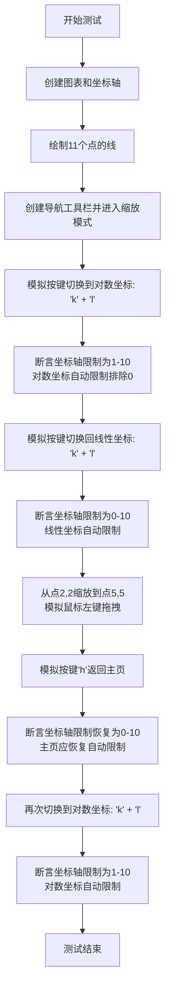

#### 带注释源码

```python
def test_toolbar_home_restores_autoscale():
    """
    测试导航工具栏主页按钮在缩放操作后是否正确恢复自动缩放功能。
    验证线性坐标和对数坐标两种模式下的行为。
    """
    # 创建图表和坐标轴对象
    fig, ax = plt.subplots()
    # 在坐标轴上绘制一条直线，数据点为(0,0)到(10,10)
    ax.plot(range(11), range(11))

    # 创建导航工具栏并激活缩放模式
    tb = NavigationToolbar2(fig.canvas)
    tb.zoom()

    # --- 测试对数坐标下的自动限制 ---
    # 按下 'k' 键进入键映射模式（key press）
    KeyEvent("key_press_event", fig.canvas, "k", 100, 100)._process()
    # 按下 'l' 键切换到对数坐标（log scale）
    KeyEvent("key_press_event", fig.canvas, "l", 100, 100)._process()
    # 对数坐标下自动限制范围应为 (1, 10)，排除0因为log(0)为负无穷
    assert ax.get_xlim() == ax.get_ylim() == (1, 10)

    # --- 测试切换回线性坐标 ---
    # 再次按下 'k' 和 'l' 键切换回线性坐标
    KeyEvent("key_press_event", fig.canvas, "k", 100, 100)._process()
    KeyEvent("key_press_event", fig.canvas, "l", 100, 100)._process()
    # 线性坐标下自动限制范围应为 (0, 10)
    assert ax.get_xlim() == ax.get_ylim() == (0, 10)

    # --- 测试缩放操作 ---
    # 将数据坐标(2,2)和(5,5)转换为屏幕坐标
    start, stop = ax.transData.transform([(2, 2), (5, 5)])
    # 模拟鼠标左键按下事件，开始框选缩放区域
    MouseEvent("button_press_event", fig.canvas, *start, MouseButton.LEFT)._process()
    # 模拟鼠标左键释放事件，执行缩放
    MouseEvent("button_release_event", fig.canvas, *stop, MouseButton.LEFT)._process()

    # --- 测试主页按钮恢复自动限制 ---
    # 模拟按下 'h' 键，触发导航工具栏的"主页"功能
    # 主页功能应恢复视图到初始自动缩放状态
    KeyEvent("key_press_event", fig.canvas, "h")._process()

    # 主页后应恢复到初始的自动限制范围 (0, 10)
    assert ax.get_xlim() == ax.get_ylim() == (0, 10)

    # --- 再次验证对数坐标下的自动限制 ---
    # 再次切换到对数坐标
    KeyEvent("key_press_event", fig.canvas, "k", 100, 100)._process()
    KeyEvent("key_press_event", fig.canvas, "l", 100, 100)._process()
    # 验证主页功能已正确恢复自动缩放，对数坐标限制仍为 (1, 10)
    assert ax.get_xlim() == ax.get_ylim() == (1, 10)
```


### test_draw

该测试函数通过参数化测试验证不同后端（svg、ps、pdf、pgf）在绘制图形时的布局一致性。测试创建一个 Figure 对象并使用指定后端的 Canvas，然后通过比较不同后端的坐标轴位置（axes position）来确保各后端在布局计算上的正确性。

参数：

- `backend`：`str`，要测试的 Matplotlib 后端名称（如 'svg'、'ps'、'pdf'、'pgf'）

返回值：`None`，该函数为测试函数，无返回值（pytest 测试）

#### 流程图

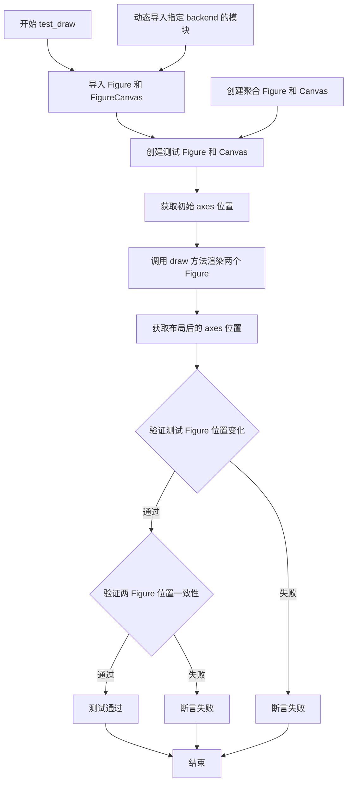

#### 带注释源码

```python
@pytest.mark.parametrize(
    "backend", ['svg', 'ps', 'pdf',
                pytest.param('pgf', marks=needs_pgf_xelatex)]
)
def test_draw(backend):
    """
    测试不同后端在绘制图形时的布局一致性
    
    参数:
        backend: str, 要测试的 Matplotlib 后端名称
    """
    # 从 matplotlib 导入需要的类
    from matplotlib.figure import Figure
    from matplotlib.backends.backend_agg import FigureCanvas
    
    # 动态导入指定后端的模块 (如 matplotlib.backends.backend_svg)
    test_backend = importlib.import_module(f'matplotlib.backends.backend_{backend}')
    # 获取该后端的 FigureCanvas 类
    TestCanvas = test_backend.FigureCanvas
    
    # 创建测试用的 Figure，使用 constrained_layout=True
    fig_test = Figure(constrained_layout=True)
    # 为 Figure 绑定指定后端的 Canvas
    TestCanvas(fig_test)
    # 创建 2x2 的子图
    axes_test = fig_test.subplots(2, 2)

    # 默认使用 FigureCanvasBase (agg 后端)
    fig_agg = Figure(constrained_layout=True)
    # 显式绑定 agg 后端的 Canvas
    FigureCanvas(fig_agg)
    axes_agg = fig_agg.subplots(2, 2)

    # 记录初始化时各 axes 的位置
    init_pos = [ax.get_position() for ax in axes_test.ravel()]

    # 调用 draw 方法触发布局计算和渲染
    fig_test.canvas.draw()
    fig_agg.canvas.draw()

    # 获取布局后各 axes 的位置
    layed_out_pos_test = [ax.get_position() for ax in axes_test.ravel()]
    layed_out_pos_agg = [ax.get_position() for ax in axes_agg.ravel()]

    # 验证: 布局前后位置应该发生变化 (constrained_layout 生效)
    for init, placed in zip(init_pos, layed_out_pos_test):
        assert not np.allclose(init, placed, atol=0.005)

    # 验证: 测试后端与 agg 后端的布局位置应该一致
    for ref, test in zip(layed_out_pos_agg, layed_out_pos_test):
        np.testing.assert_allclose(ref, test, atol=0.005)
```


### `test_interactive_pan`

该函数是一个pytest测试函数，用于测试matplotlib的交互式平移（pan）功能，验证在不同的按键（shift、control、x、y）和鼠标结束位置组合下，坐标轴的x和y限制是否按预期变化。

参数：

- `key`：`str | None`，表示鼠标事件时按下的键（如"shift"、"control"、"x"、"y"或None）
- `mouseend`：`tuple[float, float]`，表示鼠标结束位置的坐标（数据坐标）
- `expectedxlim`：`tuple[float, float]`，期望的x轴限制范围
- `expectedylim`：`tuple[float, float]`，期望的y轴限制范围

返回值：`None`，该函数为测试函数，不返回任何值

#### 流程图

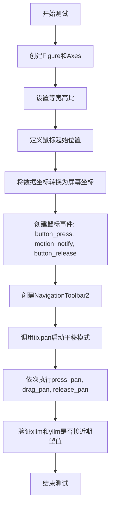

#### 带注释源码

```python
@pytest.mark.parametrize(
    "key,mouseend,expectedxlim,expectedylim",
    [(None, (0.2, 0.2), (3.49, 12.49), (2.7, 11.7)),
     (None, (0.2, 0.5), (3.49, 12.49), (0, 9)),
     (None, (0.5, 0.2), (0, 9), (2.7, 11.7)),
     (None, (0.5, 0.5), (0, 9), (0, 9)),  # No move
     (None, (0.8, 0.25), (-3.47, 5.53), (2.25, 11.25)),
     (None, (0.2, 0.25), (3.49, 12.49), (2.25, 11.25)),
     (None, (0.8, 0.85), (-3.47, 5.53), (-3.14, 5.86)),
     (None, (0.2, 0.85), (3.49, 12.49), (-3.14, 5.86)),
     ("shift", (0.2, 0.4), (3.49, 12.49), (0, 9)),  # snap to x
     ("shift", (0.4, 0.2), (0, 9), (2.7, 11.7)),  # snap to y
     ("shift", (0.2, 0.25), (3.49, 12.49), (3.49, 12.49)),  # snap to diagonal
     ("shift", (0.8, 0.25), (-3.47, 5.53), (3.47, 12.47)),  # snap to diagonal
     ("shift", (0.8, 0.9), (-3.58, 5.41), (-3.58, 5.41)),  # snap to diagonal
     ("shift", (0.2, 0.85), (3.49, 12.49), (-3.49, 5.51)),  # snap to diagonal
     ("x", (0.2, 0.1), (3.49, 12.49), (0, 9)),  # only x
     ("y", (0.1, 0.2), (0, 9), (2.7, 11.7)),  # only y
     ("control", (0.2, 0.2), (3.49, 12.49), (3.49, 12.49)),  # diagonal
     ("control", (0.4, 0.2), (2.72, 11.72), (2.72, 11.72)),  # diagonal
     ])
def test_interactive_pan(key, mouseend, expectedxlim, expectedylim):
    # 创建图形和坐标轴，绘制一条线
    fig, ax = plt.subplots()
    ax.plot(np.arange(10))
    assert ax.get_navigate()
    # 设置等宽高比以更容易观察对角线捕捉
    ax.set_aspect('equal')

    # 鼠标移动从0.5, 0.5开始
    mousestart = (0.5, 0.5)
    # 转换为屏幕坐标("s")。事件仅定义像素精度，因此对像素值进行四舍五入，
    # 下方检查对应的xdata/ydata，它们接近但不完全等于d0/d1
    sstart = ax.transData.transform(mousestart).astype(int)
    send = ax.transData.transform(mouseend).astype(int)

    # 设置鼠标移动事件
    start_event = MouseEvent(
        "button_press_event", fig.canvas, *sstart, button=MouseButton.LEFT,
        key=key)
    drag_event = MouseEvent(
        "motion_notify_event", fig.canvas, *send, button=MouseButton.LEFT,
        buttons={MouseButton.LEFT}, key=key)
    stop_event = MouseEvent(
        "button_release_event", fig.canvas, *send, button=MouseButton.LEFT,
        key=key)

    # 创建导航工具栏并启动平移模式
    tb = NavigationToolbar2(fig.canvas)
    tb.pan()
    tb.press_pan(start_event)
    tb.drag_pan(drag_event)
    tb.release_pan(stop_event)
    # 应该接近，但由于屏幕整数分辨率不会完全精确
    assert tuple(ax.get_xlim()) == pytest.approx(expectedxlim, abs=0.02)
    assert tuple(ax.get_ylim()) == pytest.approx(expectedylim, abs=0.02)
```


### `test_toolmanager_remove`

该测试函数用于验证 `ToolManager` 中工具的移除功能。测试首先启用 `toolmanager` 工具栏，获取当前工具列表的初始长度，然后移除名为 'forward' 的工具，最后验证工具列表长度减少且 'forward' 不再存在。

#### 全局变量

- `_EXPECTED_WARNING_TOOLMANAGER`：字符串，用于匹配关于 ToolManager 实验性功能的警告信息。

#### 函数详情

- **函数名称**：`test_toolmanager_remove`
- **参数**：无
- **返回值**：无（`None`）
- **描述**：测试移除 ToolManager 中的指定工具，验证移除操作成功。

#### 流程图

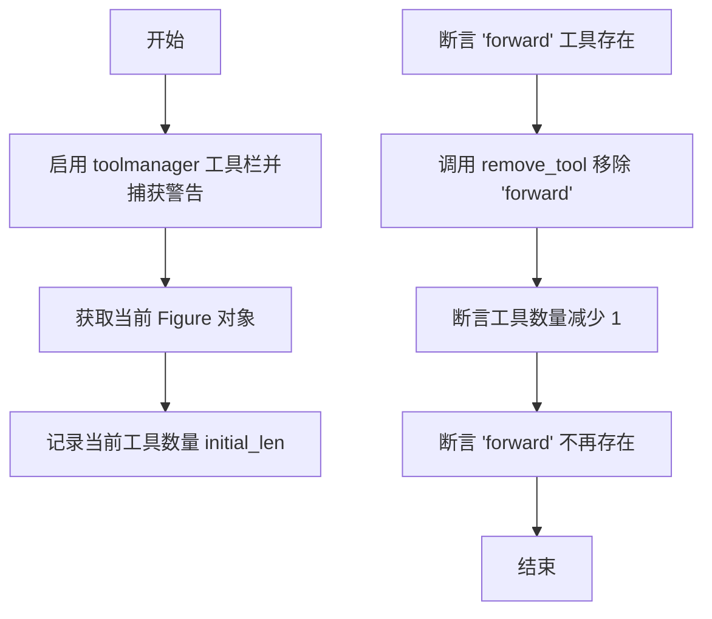

#### 带注释源码

```python
def test_toolmanager_remove():
    # 启用工具栏为 toolmanager 模式，并捕获预期的实验性功能警告
    with pytest.warns(UserWarning, match=_EXPECTED_WARNING_TOOLMANAGER):
        plt.rcParams['toolbar'] = 'toolmanager'
    
    # 获取当前活动的 Figure 对象
    fig = plt.gcf()
    
    # 记录当前工具管理器中的工具数量
    initial_len = len(fig.canvas.manager.toolmanager.tools)
    
    # 确认 'forward' 工具当前存在于工具列表中
    assert 'forward' in fig.canvas.manager.toolmanager.tools
    
    # 从工具管理器中移除 'forward' 工具
    fig.canvas.manager.toolmanager.remove_tool('forward')
    
    # 验证工具数量已减少 1
    assert len(fig.canvas.manager.toolmanager.tools) == initial_len - 1
    
    # 确认 'forward' 工具已被成功移除
    assert 'forward' not in fig.canvas.manager.toolmanager.tools
```


### `test_toolmanager_get_tool`

该函数是一个单元测试，用于验证 `ToolManager` 的 `get_tool` 方法在不同场景下的行为，包括获取已存在的工具、通过工具实例获取自身、处理不存在的工具以及关闭警告等功能。

参数：无（该函数无显式参数）

返回值：`None`（测试函数不返回值）

#### 流程图

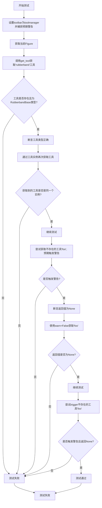

#### 带注释源码

```python
def test_toolmanager_get_tool():
    """
    测试 ToolManager 的 get_tool 方法功能
    
    测试场景：
    1. 通过工具名称获取已注册的工具
    2. 通过工具实例本身获取工具
    3. 获取不存在的工具时返回 None 并可选择是否警告
    4. trigger_tool 在工具不存在时的行为
    """
    # 启用 ToolManager 并捕获预期的实验性功能警告
    # _EXPECTED_WARNING_TOOLMANAGER 是一个正则表达式
    # 警告用户 ToolManager 是实验性功能
    with pytest.warns(UserWarning, match=_EXPECTED_WARNING_TOOLMANAGER):
        plt.rcParams['toolbar'] = 'toolmanager'  # 设置使用 toolmanager 工具栏
    
    # 获取当前活动的 Figure 对象
    fig = plt.gcf()
    
    # 测试场景1: 通过工具名称获取已注册的工具
    # 'rubberband' 是 ToolManager 默认管理的工具之一
    rubberband = fig.canvas.manager.toolmanager.get_tool('rubberband')
    
    # 验证获取到的工具是 RubberbandBase 的实例
    # RubberbandBase 是橡皮筋选择工具的基类
    assert isinstance(rubberband, RubberbandBase)
    
    # 测试场景2: 通过工具实例获取工具
    # 传入工具实例时，应返回该实例本身
    assert fig.canvas.manager.toolmanager.get_tool(rubberband) is rubberband
    
    # 测试场景3: 获取不存在的工具
    # 'foo' 不是有效的工具名称，应该返回 None
    # 预期会触发 UserWarning 警告
    with pytest.warns(UserWarning,
                      match="ToolManager does not control tool 'foo'"):
        # 验证获取不存在的工具返回 None
        assert fig.canvas.manager.toolmanager.get_tool('foo') is None
    
    # 测试场景3扩展: 使用 warn=False 参数不触发警告
    # 当 warn=False 时，获取不存在的工具不会产生警告
    assert fig.canvas.manager.toolmanager.get_tool('foo', warn=False) is None
    
    # 测试场景4: 触发不存在的工具
    # trigger_tool 用于触发工具的默认行为
    # 对于不存在的工具，应该返回 None 并触发警告
    with pytest.warns(UserWarning,
                      match="ToolManager does not control tool 'foo'"):
        assert fig.canvas.manager.toolmanager.trigger_tool('foo') is None
```


### `test_toolmanager_update_keymap`

该测试函数用于验证 `ToolManager` 的 `update_keymap` 方法的功能，包括正常更新工具的键映射以及处理无效工具名称时的异常抛出。

参数： 无

返回值：`None`，因为这是一个测试函数，没有显式的返回值

#### 流程图

```mermaid
flowchart TD
    A[开始测试] --> B[设置toolbar为toolmanager并捕获警告]
    B --> C[获取当前figure]
    C --> D[断言'v'在'forward'工具的keymap中]
    D --> E[尝试更新'forward'工具的keymap为'c']
    E --> F{更新是否产生警告?}
    F -->|是| G[捕获并验证警告信息'Key c changed from back to forward']
    F -->|否| H[测试失败]
    G --> I[断言'forward'工具的keymap为['c']]
    I --> J[尝试更新不存在的工具'foo'的keymap]
    J --> K{是否抛出KeyError?}
    K -->|是| L[验证错误消息包含'foo' not in Tools]
    K -->|否| M[测试失败]
    L --> N[测试通过]
```

#### 带注释源码

```python
def test_toolmanager_update_keymap():
    # 设置matplotlib的toolbar配置为toolmanager模式
    # 这会触发一个关于新工具类为实验性的警告
    with pytest.warns(UserWarning, match=_EXPECTED_WARNING_TOOLMANAGER):
        plt.rcParams['toolbar'] = 'toolmanager'
    
    # 获取当前的Figure对象
    fig = plt.gcf()
    
    # 验证'forward'工具的默认keymap包含'v'键
    assert 'v' in fig.canvas.manager.toolmanager.get_tool_keymap('forward')
    
    # 尝试更新'forward'工具的keymap为'c'
    # 这会触发一个警告，说明键从'v'变为'c'
    with pytest.warns(UserWarning,
                      match="Key c changed from back to forward"):
        fig.canvas.manager.toolmanager.update_keymap('forward', 'c')
    
    # 验证'forward'工具的keymap已被成功更新为['c']
    assert fig.canvas.manager.toolmanager.get_tool_keymap('forward') == ['c']
    
    # 尝试更新不存在的工具'foo'的keymap
    # 预期会抛出KeyError异常
    with pytest.raises(KeyError, match="'foo' not in Tools"):
        fig.canvas.manager.toolmanager.update_keymap('foo', 'c')
```


### `test_interactive_pan_zoom_events`

这是一个测试函数，用于验证交互式平移（pan）和缩放（zoom）事件在不同场景下的正确行为，包括不同的工具类型、鼠标按钮、补丁可见性设置、前进导航事件设置以及共享轴/双轴配置。

参数：

- `tool`：`str`，指定要测试的工具类型（"zoom" 表示缩放，"pan" 表示平移）
- `button`：`MouseButton`，测试使用的鼠标按钮（MouseButton.LEFT 或 MouseButton.RIGHT）
- `patch_vis`：`bool`，设置补丁（patch）的可见性状态
- `forward_nav`：`bool`，控制是否启用前进导航事件（True/False/"auto"）
- `t_s`：`str`，指定轴的共享类型（"twin" 表示 twinx/twiny，"share" 表示 sharex/sharey）

返回值：`None`，该函数为测试函数，不返回任何值

#### 流程图

```mermaid
flowchart TD
    A[开始测试] --> B[创建Figure和两个子图 ax_b, ax_t]
    B --> C{判断t_s类型}
    C -->|share| D[创建共享轴 ax_t_twin, ax_b_twin]
    C -->|twin| E[创建双轴 ax_t_twin = ax_t.twinx, ax_b_twin = ax_b.twinx]
    D --> F[设置轴标签和颜色]
    E --> F
    F --> G[设置初始轴限制 init_xlim, init_ylim]
    G --> H[计算数据坐标到屏幕坐标的转换 s0, s1]
    H --> I[计算底部轴的鼠标距离]
    I --> J[创建鼠标事件: start_event, drag_event, stop_event]
    J --> K[创建导航工具栏 NavigationToolbar2]
    K --> L{判断tool类型}
    L -->|zoom| M[计算预期缩放限制 xlim_t, ylim_t, xlim_b, ylim_b]
    L -->|pan| N[计算预期平移限制 xlim_t, ylim_t, xlim_b, ylim_b]
    M --> O[调用tb.zoom激活缩放工具]
    N --> P[调用tb.pan激活平移工具]
    O --> Q[执行鼠标事件处理]
    P --> Q
    Q --> R[断言 ax_t 和 ax_b 的限制是否接近预期值]
    R --> S[断言 twin 轴是否正确同步]
    S --> T[测试结束]
```

#### 带注释源码

```python
@pytest.mark.parametrize("tool", ["zoom", "pan"])
@pytest.mark.parametrize("button", [MouseButton.LEFT, MouseButton.RIGHT])
@pytest.mark.parametrize("patch_vis", [True, False])
@pytest.mark.parametrize("forward_nav", [True, False, "auto"])
@pytest.mark.parametrize("t_s", ["twin", "share"])
def test_interactive_pan_zoom_events(tool, button, patch_vis, forward_nav, t_s):
    # 创建Figure和底部子图ax_b
    fig, ax_b = plt.subplots()
    # 添加顶部子图ax_t，设置为高z-order确保显示在前
    ax_t = fig.add_subplot(221, zorder=99)
    # 设置ax_t的前进导航事件模式
    ax_t.set_forward_navigation_events(forward_nav)
    # 设置ax_t补丁的可见性
    ax_t.patch.set_visible(patch_vis)

    # ----------------------------
    # 根据t_s类型创建关联轴（twin或share）
    if t_s == "share":
        # 创建共享x/y轴的子图
        ax_t_twin = fig.add_subplot(222)
        ax_t_twin.sharex(ax_t)
        ax_t_twin.sharey(ax_t)

        ax_b_twin = fig.add_subplot(223)
        ax_b_twin.sharex(ax_b)
        ax_b_twin.sharey(ax_b)
    elif t_s == "twin":
        # 创建双轴（共享x或y轴但独立scale）
        ax_t_twin = ax_t.twinx()
        ax_b_twin = ax_b.twinx()

    # 设置标签和颜色以便手动检查
    ax_t.set_label("ax_t")
    ax_t.patch.set_facecolor((1, 0, 0, 0.5))  # 红色半透明

    ax_t_twin.set_label("ax_t_twin")
    ax_t_twin.patch.set_facecolor("r")

    ax_b.set_label("ax_b")
    ax_b.patch.set_facecolor((0, 0, 1, 0.5))  # 蓝色半透明

    ax_b_twin.set_label("ax_b_twin")
    ax_b_twin.patch.set_facecolor("b")

    # ----------------------------

    # 设置初始轴限制为 (0, 10)
    init_xlim, init_ylim = (0, 10), (0, 10)
    for ax in [ax_t, ax_b]:
        ax.set_xlim(*init_xlim)
        ax.set_ylim(*init_ylim)

    # 定义鼠标移动的起止数据坐标（ax_t的坐标系）
    xstart_t, xstop_t, ystart_t, ystop_t = 1, 2, 1, 2
    # 将数据坐标转换为屏幕/像素坐标（事件只支持整数像素精度）
    s0 = ax_t.transData.transform((xstart_t, ystart_t)).astype(int)
    s1 = ax_t.transData.transform((xstop_t, ystop_t)).astype(int)

    # 计算在ax_b的数据坐标系中的等效位置
    xstart_b, ystart_b = ax_b.transData.inverted().transform(s0)
    xstop_b, ystop_b = ax_b.transData.inverted().transform(s1)

    # 创建鼠标事件对象
    start_event = MouseEvent("button_press_event", fig.canvas, *s0, button)
    drag_event = MouseEvent(
        "motion_notify_event", fig.canvas, *s1, button, buttons={button})
    stop_event = MouseEvent("button_release_event", fig.canvas, *s1, button)

    # 创建导航工具栏
    tb = NavigationToolbar2(fig.canvas)

    if tool == "zoom":
        # 计算预期的缩放限制
        direction = ("in" if button == 1 else "out")  # LEFT=1为放大，RIGHT=3为缩小

        # 计算ax_t的预期视图限制
        xlim_t, ylim_t = ax_t._prepare_view_from_bbox([*s0, *s1], direction)

        # 根据forward_nav和patch_vis确定ax_b的限制
        if ax_t.get_forward_navigation_events() is True:
            xlim_b, ylim_b = ax_b._prepare_view_from_bbox([*s0, *s1], direction)
        elif ax_t.get_forward_navigation_events() is False:
            # 不启用前进导航时，ax_b保持初始限制
            xlim_b = init_xlim
            ylim_b = init_ylim
        else:
            # "auto"模式下，根据patch可见性决定
            if not ax_t.patch.get_visible():
                xlim_b, ylim_b = ax_b._prepare_view_from_bbox([*s0, *s1], direction)
            else:
                xlim_b = init_xlim
                ylim_b = init_ylim

        # 激活缩放工具
        tb.zoom()

    else:  # tool == "pan"
        # 计算预期的平移限制
        # 调用start_pan确保ax._pan_start被正确设置
        ax_t.start_pan(*s0, button)
        xlim_t, ylim_t = ax_t._get_pan_points(button, None, *s1).T.astype(float)
        ax_t.end_pan()

        if ax_t.get_forward_navigation_events() is True:
            ax_b.start_pan(*s0, button)
            xlim_b, ylim_b = ax_b._get_pan_points(button, None, *s1).T.astype(float)
            ax_b.end_pan()
        elif ax_t.get_forward_navigation_events() is False:
            xlim_b = init_xlim
            ylim_b = init_ylim
        else:
            if not ax_t.patch.get_visible():
                ax_b.start_pan(*s0, button)
                xlim_b, ylim_b = ax_b._get_pan_points(button, None, *s1).T.astype(float)
                ax_b.end_pan()
            else:
                xlim_b = init_xlim
                ylim_b = init_ylim

        # 激活平移工具
        tb.pan()

    # 执行鼠标事件处理
    start_event._process()
    drag_event._process()
    stop_event._process()

    # 验证ax_t的轴限制是否接近预期（允许0.15的误差）
    assert ax_t.get_xlim() == pytest.approx(xlim_t, abs=0.15)
    assert ax_t.get_ylim() == pytest.approx(ylim_t, abs=0.15)
    # 验证ax_b的轴限制是否接近预期
    assert ax_b.get_xlim() == pytest.approx(xlim_b, abs=0.15)
    assert ax_b.get_ylim() == pytest.approx(ylim_b, abs=0.15)

    # 验证twin轴是否正确同步更新
    assert ax_t.get_xlim() == pytest.approx(ax_t_twin.get_xlim(), abs=0.15)
    assert ax_b.get_xlim() == pytest.approx(ax_b_twin.get_xlim(), abs=0.15)
```


## 关键组件


### FigureCanvasBase

matplotlib图形画布的基类，提供图形绘制的底层接口，支持事件处理和坐标转换功能。

### RendererBase

渲染器基类，包含路径集合的迭代方法（_iter_collection_raw_paths、_iter_collection、_iter_collection_uses_per_path），用于批量渲染图形元素。

### NavigationToolbar2

交互式图形工具栏，提供缩放(zoom)和平移(pan)功能，支持鼠标拖拽操作进行视图范围的调整。

### ToolManager

图形工具管理器，负责管理图形工具（如缩放、平移、选择等）的注册、触发和键盘映射。

### MouseEvent / KeyEvent / LocationEvent

图形事件类，分别处理鼠标按钮事件、键盘按键事件和位置事件，支持交互式图形操作。

### 坐标变换系统

包含transData、transFigure、Affine2D、AffineDeltaTransform等，负责数据坐标、显示坐标和图形坐标之间的转换。

### Collection迭代器

用于批量渲染图形集合的迭代器，支持高效的批量路径渲染和颜色属性管理。

### Figure和Axes

Figure代表整个图形容器，Axes表示图形中的坐标轴，提供plot、imshow、contourf等绘图接口。

### Colorbar交互

图形颜色条组件，支持与主坐标轴的联动缩放和平移操作。

### Twin Axes

坐标轴共享功能（twinx、twiny、sharex、sharey），支持多个坐标轴共享数据视图。

### 事件处理系统

matplotlib的回调系统（callbacks.process），支持事件注册、触发和处理机制。

### 工具栏切换

toolbar配置切换（classic/toolbar），支持传统工具栏和新版ToolManager的切换。

### 图形导出

get_default_filename方法，根据图形标题生成默认保存文件名。

### 后端兼容性

支持多种图形后端（pdf、svg、ps、agg、pgf）的测试验证。


## 问题及建议


### 已知问题

-   **测试代码重复**：多个测试函数中存在大量重复的代码模式，如鼠标事件创建（MouseEvent）、工具栏初始化（NavigationToolbar2）以及坐标转换（transData.transform）等，这导致代码冗余度高，维护困难。
-   **测试函数过长**：部分测试函数如`test_interactive_pan_zoom_events`和`test_interactive_pan`包含大量行代码和复杂的嵌套逻辑，违反了单一职责原则，降低了代码可读性和可维护性。
-   **魔法数字和硬编码值**：代码中大量使用硬编码的坐标值、阈值和容差（如`abs=0.15`、`abs=0.02`、`abs=1e-10`等），缺乏对这些数值含义的解释，增加了后续理解和修改的难度。
-   **测试隔离性问题**：`test_non_gui_warning`函数中使用`monkeypatch.setenv`修改环境变量，可能对后续测试产生副作用，虽然使用后未显式恢复环境变量。
-   **复杂的条件分支**：在`test_interactive_pan_zoom_events`中存在大量if-elif-else嵌套和参数化测试的组合，导致测试逻辑复杂，难以追踪所有分支的执行路径。
-   **缺乏辅助函数抽象**：相同的功能（如坐标转换、事件创建、工具栏操作）被重复实现多次，未提取为可重用的辅助函数或pytest fixture。

### 优化建议

-   **提取公共辅助函数**：将重复的鼠标事件创建、坐标转换、工具栏操作等代码提取为模块级别的辅助函数或pytest fixture，减少代码冗余并提高可维护性。
-   **拆分大型测试函数**：将过长的测试函数拆分为多个较小的、专注于特定功能的测试函数，每个测试函数验证一个具体的行为或场景。
-   **定义常量或配置文件**：将硬编码的坐标值、阈值、容差等提取为有意义的常量或配置文件，并在代码中添加注释解释其物理意义或来源。
-   **使用pytest fixture管理测试状态**：利用pytest fixture来管理测试所需的Figure、Canvas、Axes等对象的创建和销毁，确保测试之间的隔离性。
-   **改善测试参数化**：对于参数化测试，考虑将复杂的参数组合拆分为多个独立的参数化测试或使用更清晰的数据驱动方式，减少测试内部的分支逻辑。
-   **添加测试文档字符串**：为复杂的测试函数添加详细的docstring，说明测试的目的、输入、预期输出以及关键的业务逻辑，帮助后续开发者理解测试意图。
-   **环境变量管理**：在使用`monkeypatch.setenv`后，应在测试结束时显式恢复或删除环境变量，或使用pytest的`monkeypatch.delenv`确保环境状态的一致性。

## 其它


### 设计目标与约束

本测试文件旨在验证matplotlib后端交互功能的正确性，包括FigureCanvasBase、NavigationToolbar2、ToolManager、坐标变换、事件处理等核心功能。设计约束包括：测试必须在支持GUI后端的环境中运行（尽管部分测试使用了非交互后端如pdf进行警告验证），测试用例覆盖交互式缩放/平移、鼠标事件捕获、坐标转换、工具栏状态管理等关键路径，确保matplotlib图形交互功能的跨平台一致性。

### 错误处理与异常设计

测试代码中采用pytest框架进行异常捕获与验证。主要异常处理场景包括：1) 使用pytest.warns捕获并验证UserWarning警告信息（如非交互后端显示警告、ToolManager实验性API警告）；2) 使用pytest.approx进行浮点数近似比较处理数值精度问题；3) 使用np.testing.assert_allclose验证数组近似相等；4) 使用pytest.mark.parametrize实现多参数组合测试，确保边界条件覆盖。

### 数据流与状态机

核心数据流包括：1) 鼠标事件流：button_press → motion_notify → button_release 触发缩放/平移操作；2) 键盘事件流：key_press_event/key_release_event 触发工具栏切换；3) 坐标变换流：数据坐标(d) → 显示坐标(s) → 屏幕像素坐标的转换；4) 工具栏状态机：ZOOM/PAN/Navigation模式之间的转换；5) Axes共享状态：twin axes/subplot共享时的坐标同步机制。

### 外部依赖与接口契约

主要外部依赖包括：matplotlib核心库（matplotlib.pyplot, matplotlib.figure, matplotlib.transforms, matplotlib.path）、numpy数值计算库、pytest测试框架。关键接口契约：FigureCanvasBase类提供图形画布基础接口；NavigationToolbar2提供传统工具栏功能；ToolManager提供新型工具管理API；Figure.colorbar返回Colorbar对象；Axes的transData提供坐标变换能力。所有测试均依赖matplotlib的内部API（以_前缀的方法），这意味着测试与实现细节紧密耦合。

### 性能考虑

测试代码本身执行速度较快，主要性能开销在图形渲染（canvas.draw()）和坐标变换计算。测试中通过pytest.mark.parametrize进行参数化组合测试，在单次运行中覆盖多种场景，避免重复启动测试框架开销。数值验证采用近似比较（abs=0.02~0.15）而非精确匹配，平衡了测试严格性与数值稳定性。

### 安全性考虑

测试代码无直接安全风险，主要为功能验证。需要注意的点：1) 测试使用monkeypatch修改环境变量（DISPLAY），事后自动恢复；2) 部分测试修改全局rcParams配置（toolbar设置），通过pytest.warns确保警告提示；3) 测试不涉及用户数据处理或网络通信。

### 兼容性考虑

测试覆盖多个后端（pdf, svg, ps, pgf, agg），通过@pytest.mark.backend装饰器选择性运行。测试考虑了Python版本差异（使用f-string需要Python 3.6+），以及matplotlib不同版本间的API变化（如ToolManager的实验性警告）。坐标转换测试考虑了不同axes配置（twin, twinx, twiny, sharex, sharey）的兼容性。

### 测试覆盖范围

测试覆盖以下功能模块：1) FigureCanvasBase基础功能（构造函数、默认文件名生成）；2) 交互式缩放（zoom in/out、方向键缩放）；3) 交互式平移（pan with 鼠标拖拽、对角线吸附）；4) 鼠标事件处理（定位事件、拾取事件、鼠标锁定）；5) 键盘事件处理（快捷键触发工具栏）；6) 颜色条交互（colorbar上的缩放/平移）；7) 工具栏状态管理（传统toolbar与toolmanager）；8) 坐标变换（数据坐标/显示坐标/屏幕坐标转换）；9) 多axes联动（twin axes坐标同步）。

### 可维护性考虑

代码结构清晰，每个测试函数职责单一，采用描述性函数命名。测试参数通过pytest.mark.parametrize外部化，便于扩展。magic number和阈值（如0.02, 0.15, 1e-10）应考虑提取为常量。测试之间通过plt.close(fig)或fig.clear()确保状态隔离。部分重复代码（如坐标转换、事件创建）可考虑提取为辅助函数。

### 部署/运行要求

运行要求：1) Python 3.6+；2) 已安装matplotlib、numpy、pytest；3) 对于特定后端测试需要对应系统依赖（如pdflatex用于pgf后端）；4) 部分测试需要显示服务器（DISPLAY环境变量），CI环境中可能跳过；5) 使用pytest -v执行，可通过-m选择特定标记的测试（如-m 'backend pdf'）。

### 潜在改进建议

1. 将硬编码的阈值和magic number提取为模块级常量；2. 考虑使用pytest fixtures管理Figure/Canvas对象的创建和销毁；3. 对于内部API（_前缀方法）的依赖，考虑添加版本检查或fallback逻辑；4. 增加边界条件测试（如空数据、极端坐标值、并发事件）；5. 考虑添加性能基准测试，监控渲染和事件处理时间。

    