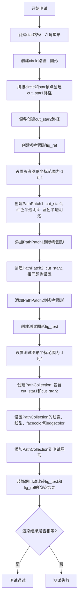

# `matplotlib\lib\matplotlib\tests\test_backend_cairo.py` 详细设计文档

这是一个matplotlib测试函数，用于验证PathPatch（独立补丁）和PathCollection（路径集合）在指定alpha值的facecolor和edgecolor下渲染结果的一致性，确保两者图形输出完全相同。

## 整体流程

```mermaid
graph TD
    A[开始] --> B[创建unit_regular_star(6)路径]
    B --> C[创建unit_circle路径]
    C --> D[合并圆形和反转星星顶点创建剪切星星]
    D --> E[创建参考图: fig_ref]
E --> F[添加第一个PathPatch: cut_star1]
F --> G[添加第二个PathPatch: cut_star2]
    G --> H[创建测试图: fig_test]
H --> I[添加PathCollection包含两个路径]
    I --> J[check_figures_equal比较渲染结果]
J --> K{渲染一致?}
K -- 是 --> L[测试通过]
K -- 否 --> M[测试失败]
```

## 类结构

```
测试模块（无自定义类）
└── test_patch_alpha_coloring (测试函数)
```

## 全局变量及字段


### `star`
    
星星形状路径

类型：`Path对象`
    


### `circle`
    
圆形路径

类型：`Path对象`
    


### `verts`
    
合并后的顶点数组

类型：`ndarray`
    


### `codes`
    
路径codes数组

类型：`ndarray`
    


### `cut_star1`
    
第一个剪切星星路径

类型：`Path对象`
    


### `cut_star2`
    
第二个剪切星星路径（偏移1单位）

类型：`Path对象`
    


### `ax`
    
坐标轴对象（参考图）

类型：`Axes对象`
    


### `patch`
    
补丁对象

类型：`PathPatch对象`
    


### `col`
    
路径集合对象

类型：`PathCollection对象`
    


### `fig_test`
    
测试图形

类型：`Figure对象`
    


### `fig_ref`
    
参考图形

类型：`Figure对象`
    


    

## 全局函数及方法


### `test_patch_alpha_coloring`

该测试函数验证matplotlib中Patch和PathCollection在指定alpha值的情况下，facecolor和edgecolor能否正确渲染，通过比较分别使用两个独立PathPatch（参考图）和一个PathCollection（测试图）的渲染结果来确认两者一致性。

参数：

- `fig_test`：`Figure`，测试组图形对象，由`@check_figures_equal`装饰器自动注入，用于承载PathCollection的渲染结果
- `fig_ref`：`Figure`，参考组图形对象，由`@check_figures_equal`装饰器自动注入，用于承载两个独立PathPatch的渲染结果

返回值：`None`，测试函数通过装饰器`@check_figures_equal`自动执行图形相等性验证

#### 流程图



#### 带注释源码

```python
import numpy as np

import pytest

from matplotlib.testing.decorators import check_figures_equal
from matplotlib import (
    collections as mcollections, patches as mpatches, path as mpath)


@pytest.mark.backend('cairo')  # 标记该测试使用Cairo后端进行渲染
@check_figures_equal()  # 装饰器：自动比较fig_test和fig_ref的渲染结果是否一致
def test_patch_alpha_coloring(fig_test, fig_ref):
    """
    Test checks that the patch and collection are rendered with the specified
    alpha values in their facecolor and edgecolor.
    """
    # 创建一个单位大小的六角星形路径
    star = mpath.Path.unit_regular_star(6)
    # 创建一个单位大小的圆形路径
    circle = mpath.Path.unit_circle()
    
    # 将圆形的顶点与反转后的星形顶点连接，创建带有星形切割孔的图形
    # 通过反向星形顶点实现内部切割效果
    verts = np.concatenate([circle.vertices, star.vertices[::-1]])
    codes = np.concatenate([circle.codes, star.codes])
    
    # 使用拼接后的顶点和编码创建第一个带切割的星形路径
    cut_star1 = mpath.Path(verts, codes)
    # 创建第二个带切割的星形路径，X坐标偏移1个单位
    cut_star2 = mpath.Path(verts + 1, codes)

    # ========== 构建参考图形 (fig_ref) ==========
    ax = fig_ref.subplots()  # 创建子图坐标轴
    ax.set_xlim([-1, 2])  # 设置X轴范围
    ax.set_ylim([-1, 2])  # 设置Y轴范围
    
    # 创建第一个PathPatch：红色半透明填充，蓝色半透明边框
    patch = mpatches.PathPatch(cut_star1,
                               linewidth=5, linestyle='dashdot',
                               facecolor=(1, 0, 0, 0.5),  # RGBA: 红色50%透明
                               edgecolor=(0, 0, 1, 0.75))  # RGBA: 蓝色25%透明
    ax.add_patch(patch)  # 添加补丁到坐标轴
    
    # 创建第二个PathPatch：相同的颜色和样式设置
    patch = mpatches.PathPatch(cut_star2,
                               linewidth=5, linestyle='dashdot',
                               facecolor=(1, 0, 0, 0.5),
                               edgecolor=(0, 0, 1, 0.75))
    ax.add_patch(patch)

    # ========== 构建测试图形 (fig_test) ==========
    ax = fig_test.subplots()  # 创建子图坐标轴
    ax.set_xlim([-1, 2])  # 设置相同的坐标范围
    ax.set_ylim([-1, 2])
    
    # 使用PathCollection一次性渲染多个路径
    # PathCollection是Patch的集合版本，用于批量渲染
    col = mcollections.PathCollection([cut_star1, cut_star2],
                                      linewidth=5, linestyles='dashdot',
                                      facecolor=(1, 0, 0, 0.5),
                                      edgecolor=(0, 0, 1, 0.75))
    ax.add_collection(col)  # 添加集合到坐标轴
```

## 关键组件


### 测试函数 test_patch_alpha_coloring

这是核心测试函数，用于验证PathPatch和PathCollection是否正确渲染带有alpha通道的facecolor和edgecolor。测试通过比较参考图像（使用两个独立PathPatch）和测试图像（使用单个PathCollection）来验证渲染一致性。

### Path 对象创建

通过mpath.Path.unit_regular_star(6)创建六角星形路径，通过mpath.Path.unit_circle()创建圆形路径，然后通过concatenate合并vertices和codes来创建一个内部带有圆形裁剪的星形路径。

### RGBA 颜色规格

使用(1, 0, 0, 0.5)作为facecolor（红色半透明），(0, 0, 1, 0.75)作为edgecolor（蓝色更透明），测试alpha通道的渲染正确性。

### 参考渲染分支 (fig_ref)

使用两个独立的PathPatch对象，每个都设置linewidth=5和linestyle='dashdot'，通过ax.add_patch()逐个添加到axes中。

### 测试渲染分支 (fig_test)

使用单个PathCollection对象同时渲染两个路径对象，统一设置linewidth=5和linestyles='dashdot'，通过ax.add_collection()添加到axes中。

### 坐标范围设置

通过ax.set_xlim([-1, 2])和ax.set_ylim([-1, 2])设置统一的坐标范围，确保参考和测试图像的视图一致。

### 图形对比验证

使用@check_figures_equal()装饰器和@pytest.mark.backend('cairo')标记，执行Cairo后端渲染并自动比较两个figure的像素输出是否完全一致。


## 问题及建议


### 已知问题

- **硬编码的测试参数**：颜色值 (1, 0, 0, 0.5)、(0, 0, 1, 0.75)、线宽 5、图形范围 [-1, 2]、星形顶点数 6 等均为硬编码，缺乏可配置性
- **代码重复**：设置 ax.set_xlim 和 ax.set_ylim 的代码在参考图和测试图中重复出现；创建 PathPatch 的逻辑存在重复模式
- **测试覆盖不足**：仅验证单一场景（一种 alpha 组合），未对不同 alpha 值、线型、颜色组合进行参数化测试
- **后端依赖限制**：测试标记为特定后端 'cairo'，当该后端不可用时测试将失败，缺乏后端兼容性检查
- **魔法数字缺乏说明**：线宽值 5、星形顶点数 6 等数值未以常量或变量形式定义，降低了代码可读性和可维护性
- **异常处理缺失**：未对 matplotlib 对象创建、图形渲染等可能失败的操作进行异常捕获
- **测试验证方式单一**：仅依赖视觉比对（check_figures_equal），缺少对 alpha 值是否正确传递到底层渲染的单元验证

### 优化建议

- **提取测试参数**：将颜色、线宽、图形范围等参数定义为模块级常量或测试 fixture，提高可维护性
- **消除重复代码**：抽取重复的 ax 初始化逻辑为辅助函数；使用循环创建多个 PathPatch
- **参数化测试**：使用 pytest.mark.parametrize 装饰器测试多组 alpha、颜色、线型组合，提升测试覆盖率
- **添加后端兼容性检查**：在测试开始前检查 cairo 后端可用性，不可用时跳过测试（pytest.skip）
- **增加数值验证**：在视觉比对之外，添加代码验证 PathCollection 中的路径对象是否正确接收了指定的 facecolor 和 edgecolor 参数
- **改进文档**：为测试函数添加更详细的 docstring，说明测试目的、预期行为和验证逻辑

## 其它


### 设计目标与约束

本测试文件的核心设计目标是验证Matplotlib中PathPatch（独立色块）和PathCollection（集合渲染）在透明度（alpha通道）处理上的一致性。约束条件包括：1）必须使用Cairo后端进行渲染测试；2）测试用例需使用pytest框架；3）通过@check_figures_equal装饰器确保测试图与参考图完全一致；4）测试仅验证facecolor和edgecolor的alpha值渲染，不涉及其他颜色空间或混合模式的测试。

### 错误处理与异常设计

本测试文件主要依赖pytest框架进行错误处理。若渲染结果不一致，check_figures_equal装饰器会自动捕获并报告差异。可能的异常场景包括：1）Cairo后端不可用时，测试会被跳过（通过@pytest.mark.backend('cairo')标记）；2）图形尺寸或坐标范围不匹配时，测试失败并显示具体差异；3）Path对象创建失败时（如顶点数据格式错误），会抛出标准的Python异常并终止测试。

### 数据流与状态机

测试数据流如下：1）初始化阶段：创建星形路径（6角星）和圆形路径；2）数据处理阶段：将圆形顶点与反转的星形顶点拼接，生成带孔洞的复合路径；3）渲染阶段：参考图使用ax.add_patch()添加两个独立PathPatch，测试图使用ax.add_collection()添加一个PathCollection；4）验证阶段：check_figures_equal比较两图的像素数据。状态机转换：准备状态（数据创建）→渲染状态（图形绘制）→比较状态（结果验证）→完成状态（测试通过/失败）。

### 外部依赖与接口契约

外部依赖包括：1）numpy库：用于数组操作（np.concatenate）；2）pytest框架：测试运行和装饰器；3）matplotlib.testing.decorators：check_figures_equal比较函数；4）matplotlib.collections：PathCollection类；5）matplotlib.patches：PathPatch类；6）matplotlib.path：Path类。接口契约：test_patch_alpha_coloring(fig_test, fig_ref)接收两个Figure对象参数，分别用于放置测试渲染结果和参考渲染结果；函数无返回值，通过装饰器自动完成比较验证。

### 测试策略

采用对比测试策略，使用视觉回归测试方法。参考实现（fig_ref）使用传统的PathPatch方式渲染两个独立色块，测试实现（fig_test）使用PathCollection方式批量渲染相同色块。通过像素级比较确保两种渲染方式在alpha通道处理上完全等价。测试覆盖的场景包括：1）半透明填充色（alpha=0.5）；2）半透明边框色（alpha=0.75）；3）虚线边框样式（dashdot）。

### 性能考量

当前测试性能开销主要来自：1）Cairo后端渲染过程；2）图形像素比较（check_figures_equal）。由于测试仅涉及两个简单几何图形，性能表现良好。优化建议：1）对于更复杂的测试场景，可考虑使用矢量比较而非像素比较；2）可添加@pytest.mark.slow标记分离耗时测试；3）可使用缓存机制避免重复渲染相同的静态图形。

### 可维护性分析

代码可维护性良好，体现在：1）测试函数命名清晰（test_patch_alpha_coloring直接表明测试意图）；2）注释详细说明了参考实现和测试实现的区别；3）使用常量（linewidth=5, linestyle='dashdot'）便于后续调整；4）坐标范围设置（set_xlim/set_ylim）统一管理。潜在改进：1）可将测试参数（如颜色、线宽）提取为模块级常量；2）可添加更多测试用例变体（如不同alpha组合）；3）可重构路径创建逻辑为独立函数以提高复用性。

### 版本兼容性

本测试代码依赖于Matplotlib的特定API：1）matplotlib.testing.decorators.check_figures_equal（Matplotlib 2.0+）；2）fig.subplots()方法（Matplotlib 1.4+）；3）Path.unit_regular_star()和Path.unit_circle()方法。兼容性要求：Matplotlib 2.0及以上版本，Python 3.5+，NumPy 1.8+。建议在CI配置中明确指定最低版本要求，避免API变更导致的测试失败。

### 参考文献与相关文档

相关Matplotlib官方文档包括：1）Matplotlib Path API文档 - https://matplotlib.org/stable/api/path_api.html；2）Matplotlib PathPatch文档 - https://matplotlib.org/stable/api/_as_gen/matplotlib.patches.PathPatch.html；3）Matplotlib PathCollection文档 - https://matplotlib.org/stable/api/collections_api.html#matplotlib.collections.PathCollection；4）Matplotlib测试指南 - https://matplotlib.org/stable/devel/testing.html；5）Cairo后端文档 - https://matplotlib.org/stable/backend_cairo.html。

    