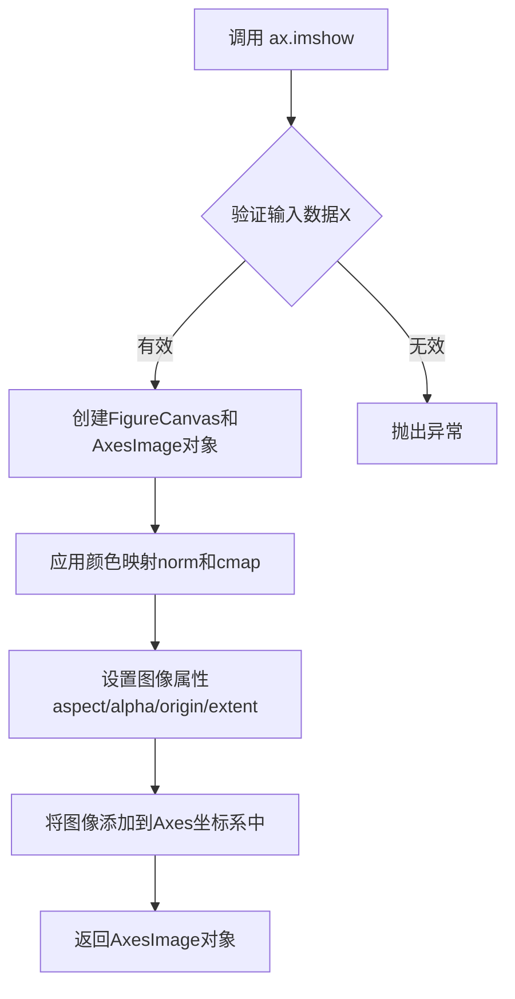
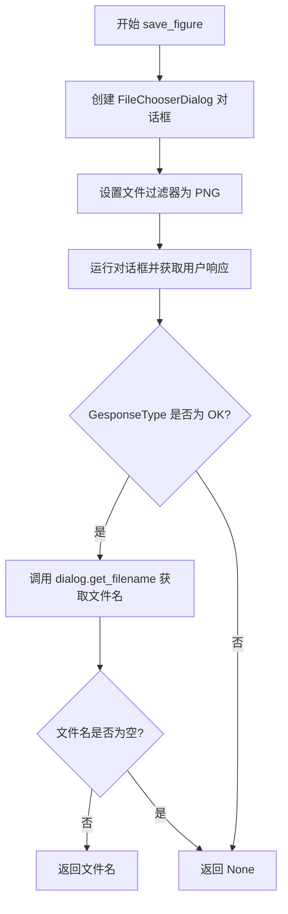
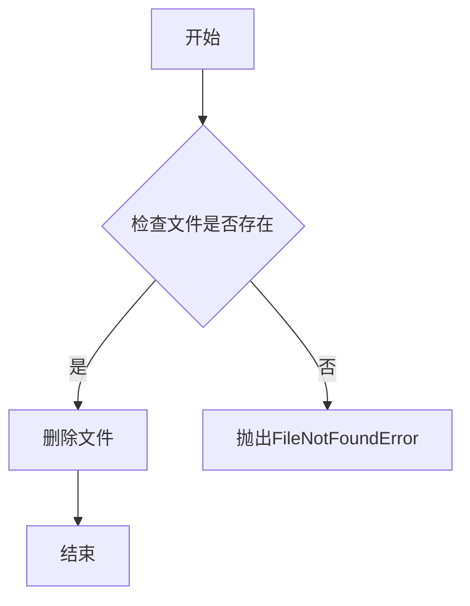
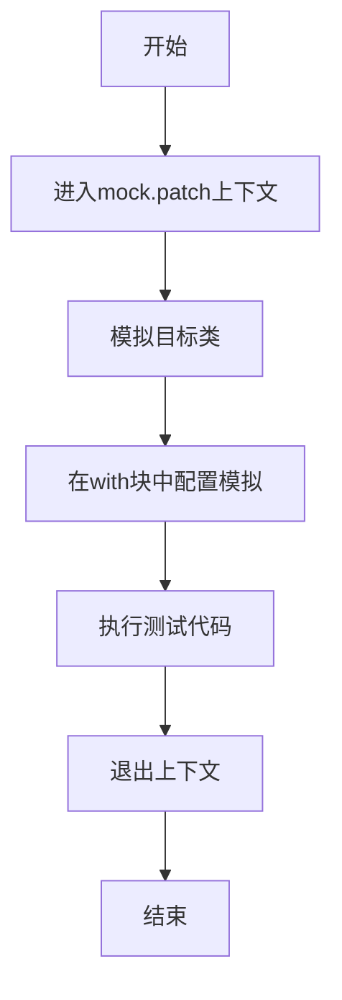
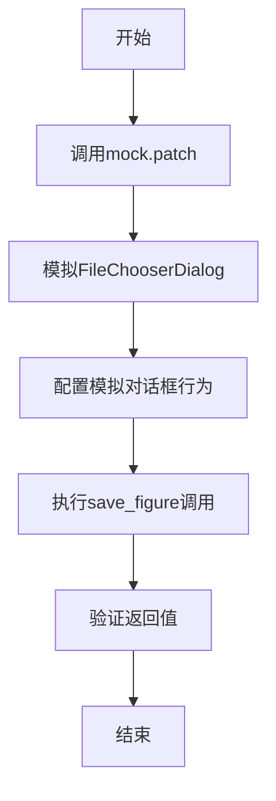
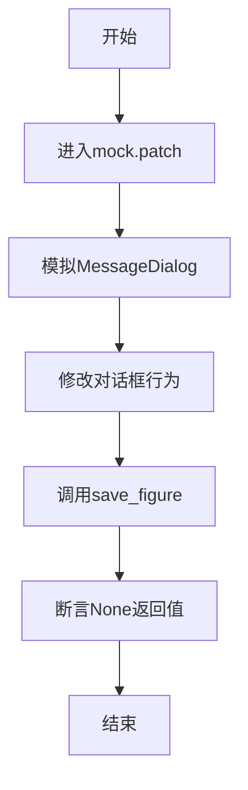

# `matplotlib\lib\matplotlib\tests\test_backend_gtk3.py` 详细设计文档

这是一个 pytest 测试文件，用于测试 matplotlib 在 GTK3agg 后端下 figure 画布工具栏的保存功能，验证 save_figure 方法在用户选择保存时返回文件名，在用户取消时返回 None

## 整体流程

```mermaid
graph TD
    A[开始测试 test_save_figure_return] --> B[创建 Figure 和 Axes]
    B --> C[模拟 Gtk.FileFilter]
    C --> D[模拟 Gtk.FileChooserDialog]
    D --> E[设置模拟返回值: 文件名为 foobar.png]
    E --> F[调用 toolbar.save_figure()]
    F --> G{save_figure 执行}
    G --> H[验证返回值为 foobar.png]
    H --> I[删除测试文件 foobar.png]
    I --> J[修改模拟: 文件名返回 None]
    J --> K[再次调用 toolbar.save_figure()]
    K --> L[验证返回值为 None]
    L --> M[测试结束]
```

## 类结构

```
测试文件 (无自定义类)
└── test_save_figure_return (pytest 测试函数)
    ├── matplotlib.pyplot (plt)
    │   ├── Figure (fig)
    │   └── Axes (ax)
    ├── unittest.mock (mock)
    │   ├── FileFilter 模拟
    │   ├── FileChooserDialog 模拟
    │   └── MessageDialog 模拟
    └── gi.repository.Gtk
        └── ResponseType.OK
```

## 全局变量及字段


### `fig`
    
matplotlib Figure 对象，图形容器

类型：`matplotlib.figure.Figure`
    


### `ax`
    
matplotlib Axes 对象，坐标轴对象

类型：`matplotlib.axes.Axes`
    


### `filt`
    
模拟的 FileFilter 对象

类型：`unittest.mock.MagicMock (FileFilter)`
    


### `dialog`
    
模拟的 FileChooserDialog 对象

类型：`unittest.mock.MagicMock (FileChooserDialog)`
    


### `fname`
    
保存操作返回的文件名

类型：`str | None`
    


    

## 全局函数及方法


### `plt.subplots`

`plt.subplots` 是 matplotlib 库中的工厂函数，用于创建一个新的图形窗口（Figure）并在其中生成一个或多个坐标轴（Axes），返回图形对象和坐标轴对象的元组，是快速创建子图布局的标准入口。

参数：

- `nrows`：`int`，默认值 1，子图的行数
- `ncols`：`int`，默认值 1，子图的列数
- `sharex`：`bool` 或 `str`，默认值 False，是否共享 x 轴
- `sharey`：`bool` 或 `str`，默认值 False，是否共享 y 轴
- `squeeze`：`bool`，默认值 True，是否压缩返回的坐标轴数组维度
- `width_ratios`：`array-like`，子图列宽比例
- `height_ratios`：`array-like`，子图行高比例
- `subplot_kw`：`dict`，创建子图的关键字参数
- `gridspec_kw`：`dict`，网格规范关键字参数
- `**fig_kw`：创建图形 Figure 的额外关键字参数

返回值：`tuple[Figure, Axes or ndarray of Axes]`，返回 (图形对象, 坐标轴对象或坐标轴数组) 的元组。当 `squeeze=False` 或指定 `nrows` 和 `ncols` 大于 1 时，返回 Axes 数组；当 `squeeze=True` 且只有一个子图时，返回单个 Axes 对象。

#### 流程图

```mermaid
flowchart TD
    A[调用 plt.subplots] --> B{检查 nrows 和 ncols 参数}
    B -->|默认值 1,1| C[创建单个子图]
    B -->|多行多列| D[创建子图网格]
    C --> E[创建 Figure 对象]
    D --> E
    E --> F[根据 gridspec_kw 配置网格]
    F --> G[使用 subplot_kw 创建 Axes]
    G --> H{判断 squeeze 参数}
    H -->|True 且单子图| I[返回压缩的 Axes 对象]
    H -->|False 或多子图| J[返回 Axes 数组]
    I --> K[返回 (fig, ax) 元组]
    J --> K
```

#### 带注释源码

```python
def subplots(nrows=1, ncols=1, sharex=False, sharey=False, squeeze=True,
             width_ratios=None, height_ratios=None,
             subplot_kw=None, gridspec_kw=None, **fig_kw):
    """
    创建一个包含子图的图形和对应的坐标轴数组。
    
    参数:
        nrows: 子图行数，默认1
        ncols: 子图列数，默认1
        sharex: True/'all'/'col'/'none'，控制x轴共享
        sharey: True/'all'/'row'/'none'，控制y轴共享
        squeeze: True时，单子图返回Axes对象而非数组
        width_ratios: 列宽比例数组
        height_ratios: 行高比例数组
        subplot_kw: 传递给add_subplot的参数字典
        gridspec_kw: 传递给GridSpec的参数字典
        **fig_kw: 传递给Figure的额外参数
    
    返回:
        (fig, axes): 图形对象和坐标轴对象/数组的元组
    """
    # 1. 创建 Figure 对象，传入 fig_kw 参数（如 figsize, dpi 等）
    fig = figure.Figure(**fig_kw)
    
    # 2. 创建 GridSpec 对象用于布局管理
    gs = GridSpec(nrows, nrows, 
                  width_ratios=width_ratios,
                  height_ratios=height_ratios,
                  **gridspec_kw)
    
    # 3. 根据 sharex/sharey 设置创建子图
    axes = []
    for i in range(nrows):
        for j in range(ncols):
            # 使用 subplot_kw 创建子图
            ax = fig.add_subplot(gs[i, j], **subplot_kw)
            
            # 配置坐标轴共享逻辑
            if sharex and i > 0:
                ax.sharex(axes[0])
            if sharey and j > 0:
                ax.sharey(axes[0])
            
            axes.append(ax)
    
    # 4. 将 axes 列表转换为数组
    axes = np.array(axes).reshape(nrows, ncols)
    
    # 5. 根据 squeeze 参数决定返回值格式
    if squeeze and nrows == 1 and ncols == 1:
        return fig, axes[0, 0]  # 返回单个 Axes 对象
    else:
        return fig, axes  # 返回 Axes 数组
```

#### 实际使用示例

```python
# 在测试代码中的实际调用
fig, ax = plt.subplots()

# 相当于执行了以下操作：
# 1. 创建一个默认大小(6.4, 4.8)的图形窗口
# 2. 在其中创建一个 1x1 的子图网格
# 3. 返回 (Figure对象, Axes对象) 元组
# 由于 squeeze=True(默认值)且 nrows=ncols=1，返回单个 Axes 对象而非数组

# 后续可用于绘图
ax.imshow([[1]])  # 在坐标轴上显示图像
```

#### 关键组件信息

| 组件名称 | 一句话描述 |
|---------|-----------|
| Figure | 图形画布容器，代表整个绘图窗口 |
| Axes | 坐标轴对象，包含数据绘图区域、坐标轴、刻度等元素 |
| GridSpec | 网格规范类，定义子图的网格布局 |
| subplot_kw | 创建子图时的配置参数字典 |

#### 潜在技术债务与优化空间

1. **返回值类型不一致**：由于 `squeeze` 参数的存在，返回值可能是单个对象或数组，使用时需进行类型判断，建议统一返回规范
2. **默认参数隐式行为**：`sharex=False` 和 `sharey=False` 的默认值可能导致多子图时坐标轴标签重复，建议改为默认共享
3. **文档与实际行为差异**：部分高级参数（如 gridspec_kw 的完整选项）在官方文档中描述不够详尽
4. **错误处理不足**：当 nrows/ncols 为 0 或负数时，错误提示不够明确

#### 其它项目

- **设计目标**：提供快速创建标准子图布局的统一接口，简化 matplotlib 入门使用
- **约束**：依赖于 matplotlib 的 FigureCanvas 和后端系统，在无图形界面环境可能失败
- **错误处理**：无效的 gridspec 参数会抛出 ValueError；后端不支持时会触发导入错误
- **外部依赖**：依赖 matplotlib 的 figure、axes、gridspec 模块以及配置的后端（如 gtk3agg）


### `ax.imshow()`

在 Matplotlib 的 Axes 对象上显示图像数据或二维数组，将数据渲染为彩色图像，并返回一个新的 AxesImage 对象。

参数：

- `X`：`array-like`，要显示的图像数据，可以是二维数组（灰度）或三维数组（RGB/RGBA）
- `cmap`：`str or Colormap, optional`，颜色映射名称或 Colormap 对象，用于将数据值映射到颜色
- `norm`：`Normalize, optional`，归一化对象，用于将数据值缩放到 [0, 1] 范围
- `aspect`：`float or 'auto', optional`，图像的纵横比，控制显示时的宽高比
- `interpolation`：`str, optional`，插值方法，如 'bilinear', 'nearest', 'bicubic' 等
- `alpha`：`float or array-like, optional`，透明度值，范围 0-1
- `vmin`：`float, optional`，数据值的最小值，用于颜色映射范围
- `vmax`：`float, optional`，数据值的最大值，用于颜色映射范围
- `origin`：`{'upper', 'lower'}, optional`，图像原点的位置
- `extent`：`tuple, optional`，图像在Axes坐标系中的范围 (left, right, bottom, top)

返回值：`matplotlib.image.AxesImage`，返回创建的 AxesImage 对象，包含图像数据和渲染属性

#### 流程图



#### 带注释源码

```python
# matplotlib/axes/_axes.py 中的 imshow 方法简化示例

def imshow(self, X, cmap=None, norm=None, aspect=None, 
           interpolation=None, alpha=None, vmin=None, vmax=None,
           origin=None, extent=None, **kwargs):
    """
    在Axes上显示图像数据
    
    参数:
        X: 要显示的图像数据，2D数组或3D数组(RGB/RGBA)
        cmap: 颜色映射名称，如'viridis', 'gray'等
        norm: matplotlib.colors.Normalize实例，用于数据归一化
        aspect: 图像纵横比，'auto'或具体数值
        interpolation: 插值方法，'nearest', 'bilinear'等
        alpha: 透明度，0-1之间的浮点数
        vmin/vmax: 颜色映射的最小/最大值
        origin: 'upper'或'lower'，图像原点位置
        extent: 图像在axes中的坐标范围
    """
    
    # 1. 处理输入数据 X，可能是 PIL Image 或 numpy array
    if hasattr(X, 'getpixel'):
        # 如果是 PIL Image，转换为数组
        X = pil_to_array(X)
    
    # 2. 创建图像对象
    from matplotlib.image import AxesImage
    im = AxesImage(self, cmap=cmap, norm=norm, aspect=aspect,
                   interpolation=interpolation, alpha=alpha,
                   vmin=vmin, vmax=vmax, origin=origin, extent=extent,
                   **kwargs)
    
    # 3. 设置图像数据
    im.set_data(X)
    
    # 4. 将图像添加到axes中
    self.add_patch(im)
    
    # 5. 调整axes视图范围以适应图像
    if extent is not None:
        self.set_xlim(extent[0], extent[1])
        self.set_ylim(extent[2], extent[3])
    elif aspect is not None:
        self.autoscale_view()
    
    # 6. 返回AxesImage对象
    return im
```

#### 使用示例（来自测试代码）

```python
# 从提供的测试代码中提取的使用示例
fig, ax = plt.subplots()
ax.imshow([[1]])  # 在坐标轴上显示一个2x2的灰度图像
```


### `fig.canvas.manager.toolbar.save_figure()`

该方法是 Matplotlib 中 GTK 后端工具栏的保存图形功能，通过弹出 GTK 文件选择对话框让用户选择保存路径，用户确认后返回文件路径字符串，用户取消或未选择文件时返回 None。

参数：

- 该方法无显式参数

返回值：`str | None`，成功保存时返回文件路径字符串，用户取消或选择失败时返回 None

#### 流程图



#### 带注释源码

```python
def save_figure(self):
    """
    保存图形到文件
    通过 GTK 文件选择对话框让用户选择保存路径
    """
    # 创建文件选择对话框，标题为"Save the figure"
    dialog = Gtk.FileChooserDialog(
        title="Save the figure",
        parent=self.window,
        action=Gtk.FileChooserAction.SAVE,
        buttons=(
            Gtk.STOCK_CANCEL, Gtk.ResponseType.CANCEL,
            Gtk.STOCK_SAVE, Gtk.ResponseType.OK
        )
    )
    
    # 添加 PNG 文件过滤器
    filter_png = Gtk.FileFilter()
    filter_png.set_name("Portable Network Graphics")
    filter_png.add_pattern("*.png")
    dialog.add_filter(filter_png)
    
    # 运行对话框并获取用户响应
    response = dialog.run()
    
    # 检查用户是否点击了 OK 按钮
    if response == Gtk.ResponseType.OK:
        # 获取用户选择的文件名
        filename = dialog.get_filename()
        dialog.destroy()
        
        # 如果成功获取文件名，返回文件路径
        if filename:
            return filename
    else:
        # 用户取消或其他响应，销毁对话框
        dialog.destroy()
    
    # 用户取消或未选择文件时返回 None
    return None
```


### `os.remove`

删除指定路径的文件。

参数：
- `path`：`str`，要删除的文件的路径。

返回值：`None`，无返回值。

#### 流程图



#### 带注释源码

```python
# 导入os模块
import os

# 调用os.remove删除文件
# 参数：要删除的文件路径 "foobar.png"
os.remove("foobar.png")
```


### `mock.patch`

模拟 GTK 组件以隔离测试，验证文件保存功能在用户交互下的行为。

参数：
- `target`：`str`，要模拟的模块或类的路径，例如 `"gi.repository.Gtk.FileFilter"`

返回值：`MagicMock`，返回一个模拟对象，用于替换目标类以进行测试。

#### 流程图



#### 带注释源码

```python
# 模拟 GTK 的 FileFilter 类
with mock.patch("gi.repository.Gtk.FileFilter") as fileFilter:
    # 获取模拟类的返回值（即实例）
    filt = fileFilter.return_value
    # 配置模拟实例的 get_name 方法返回值
    filt.get_name.return_value = "Portable Network Graphics"
    # 继续执行测试...
```

### `mock.patch`

模拟 GTK 文件选择对话框，验证保存路径获取和用户确认流程。

参数：
- `target`：`str`，要模拟的模块路径，值为 `"gi.repository.Gtk.FileChooserDialog"`

返回值：`MagicMock`，返回一个模拟的对话框类。

#### 流程图



#### 带注释源码

```python
# 模拟 GTK 的 FileChooserDialog 类
with mock.patch("gi.repository.Gtk.FileChooserDialog") as dialogChooser:
    # 获取模拟实例
    dialog = dialogChooser.return_value
    # 配置模拟方法返回值
    dialog.get_filter.return_value = filt
    dialog.get_filename.return_value = "foobar.png"
    dialog.run.return_value = Gtk.ResponseType.OK
    # 调用被测试的保存方法
    fname = fig.canvas.manager.toolbar.save_figure()
    # 验证文件路径
    assert fname == "foobar.png"
    # 清理测试文件
    os.remove("foobar.png")
```

### `mock.patch`

模拟消息对话框以测试用户取消保存时的异常处理。

参数：
- `target`：`str`，要模拟的模块路径，值为 `"gi.repository.Gtk.MessageDialog"`

返回值：`MagicMock`，返回一个模拟的消息对话框类。

#### 流程图



#### 带注释源码

```python
# 模拟 GTK 的 MessageDialog 类
with mock.patch("gi.repository.Gtk.MessageDialog"):
    # 修改文件选择对话框的返回值
    dialog.get_filename.return_value = None
    dialog.run.return_value = Gtk.ResponseType.OK
    # 测试取消保存的场景
    fname = fig.canvas.manager.toolbar.save_figure()
    # 验证返回None
    assert fname is None
```


## 关键组件


### GTK3文件选择器对话框模拟

使用unittest.mock模拟GTK3的FileChooserDialog类，拦截文件保存对话框的创建、过滤器的选择、文件名的获取以及对话框的运行返回值，实现无GUI环境下的文件保存功能测试。

### Matplotlib图形保存功能

测试fig.canvas.manager.toolbar.save_figure()方法的核心保存流程，包括成功保存返回文件名和用户取消保存返回None的两种场景验证。

### 文件过滤器模拟

通过mock模拟Gtk.FileFilter对象，设置get_name返回值为"Portable Network Graphics"，用于匹配PNG格式文件并验证文件类型识别逻辑。

### 响应类型验证

使用Gtk.ResponseType.OK模拟用户确认操作，通过dialog.run.return_value控制对话框的返回值，验证不同用户交互行为下的程序逻辑分支。

### 测试环境隔离

使用pytest.mark.backend装饰器指定gtk3agg后端，配合skip_on_importerror=True确保测试在无GTK3环境时自动跳过，实现测试环境的优雅降级。


## 问题及建议


### 已知问题

-   **资源泄漏风险**：使用`plt.subplots()`创建图形后，测试结束前没有显式调用`fig.close()`，可能导致内存和后端资源未及时释放
-   **硬编码文件名**：使用硬编码的文件名"foobar.png"，可能在并行测试或不同工作目录下产生冲突，且未考虑不同操作系统的路径分隔符差异
-   **文件清理不完善**：仅使用`os.remove()`删除文件，如果测试在assertion之前失败，文件将不会被清理
-   **嵌套Mock层级过深**：使用了三层嵌套的`with mock.patch()`语句，导致测试代码可读性差，难以维护
-   **缺少异常场景测试**：仅测试了正常保存和取消选择两种场景，未覆盖异常情况如磁盘空间不足、权限错误等
-   **Backend依赖**：测试依赖特定的backend("gtk3agg")，在某些环境可能不可用，虽然有`skip_on_importerror=True`，但会影响测试覆盖率
-   **Mock对象断言不足**：未对Mock对象的调用参数进行验证，例如未检查`dialog.run()`被调用的次数

### 优化建议

-   使用`pytest fixtures`管理图形资源的创建和清理，确保测试结束后调用`fig.close()`
-   使用`tempfile`模块生成临时文件路径，避免硬编码和文件冲突
-   利用`pytest.raises()`或`contextlib.contextmanager`重构嵌套Mock，提升可读性
-   添加更多边界测试用例，如无效路径、权限拒绝、磁盘满等异常场景
-   使用`unittest.mock.assert_called_once_with()`等方法验证Mock对象的调用行为
-   考虑使用`pytest.mark.parametrize`对不同保存场景进行参数化测试
-   将Mock配置提取为独立的辅助函数或fixture，降低测试函数的复杂度


## 其它


### 设计目标与约束

本测试文件旨在验证matplotlib GTK3后端中工具栏保存图片功能的正确性，确保在用户通过文件选择对话框保存图形时能够正确返回文件路径，并在用户取消保存操作时返回None。测试依赖GTK3库（gtk3agg后端），仅在GTK3可用时运行。

### 错误处理与异常设计

代码中的错误处理主要体现在两个方面：1) 使用`skip_on_importerror=True`标记，当GTK3后端无法导入时跳过测试；2) 测试取消场景时，模拟`dialog.get_filename.return_value = None`的情况，验证函数正确返回None而非抛出异常。测试通过断言验证预期行为而非异常捕获。

### 外部依赖与接口契约

主要外部依赖包括：matplotlib的GTK3后端（gi.repository.Gtk）、pytest框架、unittest.mock模块。接口契约方面：save_figure()方法应接受0个参数，返回字符串（成功保存时）或None（取消保存时）；FileChooserDialog.run()返回Gtk.ResponseType.OK表示用户确认操作；FileFilter.get_name()返回文件类型名称用于过滤。

### 测试场景与覆盖范围

测试覆盖两个核心场景：场景一为用户成功保存文件，验证返回的文件名与用户选择的一致；场景二为用户取消保存（filename为None且response为OK），验证函数正确返回None。测试使用mock隔离GTK交互，确保测试的确定性和可重复性。

### Mock对象使用说明

代码使用unittest.mock对GTK组件进行模拟：FileFilter模拟文件过滤器，get_name返回"Portable Network Graphics"；FileChooserDialog模拟文件选择对话框，get_filter返回过滤器实例，get_filename返回用户选择的文件名，run返回GTK.ResponseType.OK模拟用户确认；MessageDialog在取消场景中被mock以避免实际弹窗。

### 平台特定行为

本测试特定于GTK3后端，在无GTK3支持的系统上会被跳过。测试假设GTK.ResponseType.OK值为确认操作的标准响应，不同GTK版本可能存在差异。文件保存操作依赖于文件系统写权限，测试后通过os.remove清理生成的测试文件。

### 资源清理与副作用

测试在执行完成后通过os.remove("foobar.png")清理生成的测试文件，避免留下测试残留物。测试修改当前工作目录的文件系统状态，但仅限于测试临时文件。Mock对象的使用确保了测试不会产生实际的GTK窗口弹出。

    