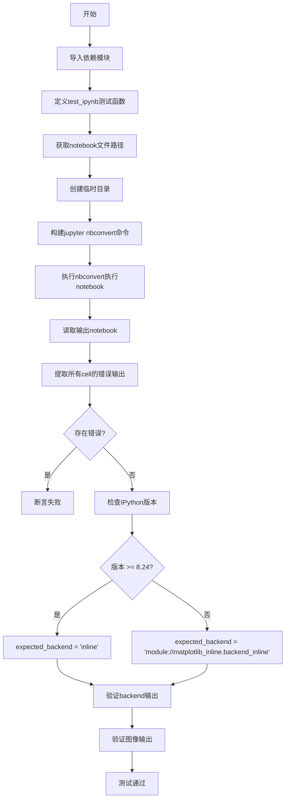
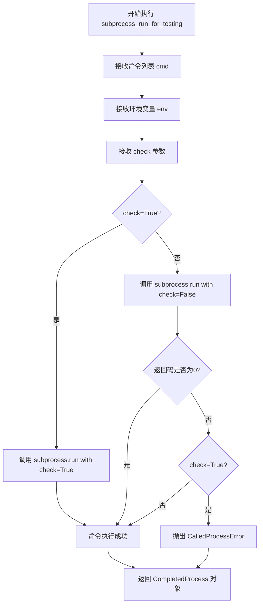
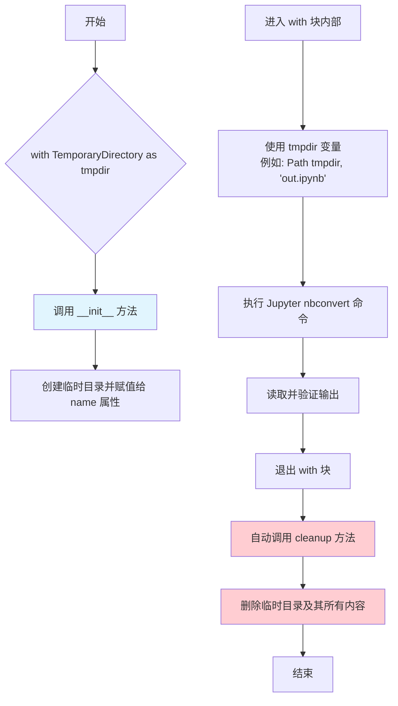
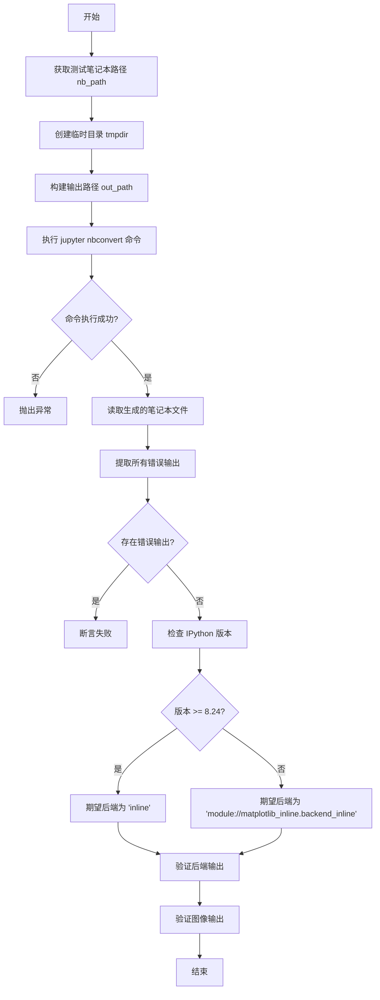
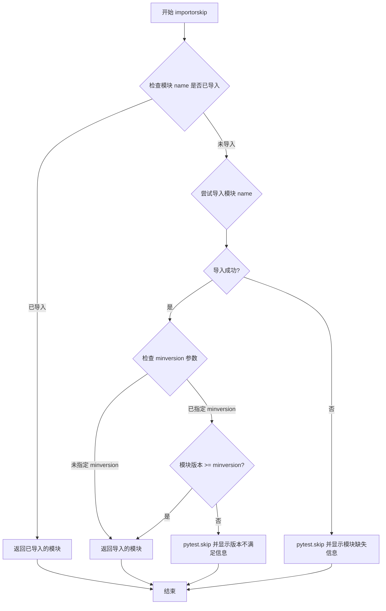

# `matplotlib\lib\matplotlib\tests\test_backend_inline.py` 详细设计文档

该文件是一个pytest测试脚本，用于验证Jupyter Notebook中matplotlib inline后端的集成功能。测试通过执行一个包含matplotlib代码的notebook，检查是否存在执行错误、验证inline后端配置是否正确以及图像输出是否有效。

## 整体流程



## 类结构

```
测试模块 (无自定义类)
└── test_ipynb (测试函数)
    ├── 依赖: nbformat
    ├── 依赖: nbconvert
    ├── 依赖: ipykernel
    ├── 依赖: matplotlib_inline
    └── 依赖: IPython
```

## 全局变量及字段


### `nb_path`
    
测试用的Jupyter notebook文件路径

类型：`pathlib.Path`
    


### `tmpdir`
    
临时目录路径，用于存放IPython配置和输出文件

类型：`str`
    


### `out_path`
    
输出的Jupyter notebook文件路径

类型：`pathlib.Path`
    


### `nb`
    
解析后的Jupyter notebook对象，包含所有单元格和输出

类型：`nbformat.notebook.NotebookNode`
    


### `errors`
    
包含所有错误输出的列表，用于验证notebook执行无错误

类型：`list`
    


### `expected_backend`
    
期望的matplotlib后端字符串，根据IPython版本选择inline或完整模块路径

类型：`str`
    


### `backend_outputs`
    
包含后端输出的单元格输出列表，用于验证后端配置

类型：`list`
    


### `image`
    
包含图像数据的字典，包含text/plain和image/png格式的输出

类型：`dict`
    


    

## 全局函数及方法


### `test_ipynb`

该测试函数通过 Jupyter nbconvert 执行指定的 Jupyter notebook 文件，验证 matplotlib inline 后端配置正确、图像输出有效，并确保执行过程无错误。

参数：此函数无参数。

返回值：`None`，测试通过时无返回值，失败时抛出 `AssertionError`。

#### 流程图

```mermaid
flowchart TD
    A[开始测试] --> B[获取测试数据路径<br/>nb_path = Path(__file__).parent / 'data/test_inline_01.ipynb']
    B --> C[创建临时目录 tmpdir]
    C --> D[构建输出路径<br/>out_path = Path/tmpdir/out.ipynb']
    D --> E[执行 Jupyter nbconvert 命令]
    E --> F{命令执行成功?}
    F -->|是| G[读取生成的 notebook 文件]
    F -->|否| H[抛出异常]
    G --> I[提取所有 cell 的 outputs]
    I --> J{存在 error 类型 output?}
    J -->|是| K[断言失败 - 存在错误]
    J -->|否| L[获取 backend 配置检查逻辑]
    L --> M{IPython.version >= 8.24?}
    M -->|是| N[expected_backend = 'inline']
    M -->|否| O[expected_backend = 'module://matplotlib_inline.backend_inline']
    N --> P[验证 cells[2] 的 backend 输出]
    O --> P
    P --> Q[验证图像输出存在]
    Q --> R[测试通过]
```

#### 带注释源码

```python
def test_ipynb():
    """
    测试 Jupyter notebook 执行流程，验证 matplotlib inline 后端和图像输出正确性。
    """
    # 定义测试用的 notebook 文件路径
    # 从当前测试文件所在目录的 data 子目录中获取 test_inline_01.ipynb
    nb_path = Path(__file__).parent / 'data/test_inline_01.ipynb'

    # 使用上下文管理器创建临时目录，测试结束后自动清理
    with TemporaryDirectory() as tmpdir:
        # 定义转换后的输出 notebook 路径
        out_path = Path(tmpdir, "out.ipynb")

        # 调用 matplotlib 测试工具执行 jupyter nbconvert 命令
        # 参数说明：
        #   --to notebook: 转换为 notebook 格式
        #   --execute: 执行 notebook 中的代码
        #   --ExecutePreprocessor.timeout=500: 执行超时时间设为 500 秒
        #   --output: 指定输出文件路径
        # 环境变量 IPYTHONDIR 设置为临时目录，避免干扰系统 IPython 配置
        subprocess_run_for_testing(
            ["jupyter", "nbconvert", "--to", "notebook",
             "--execute", "--ExecutePreprocessor.timeout=500",
             "--output", str(out_path), str(nb_path)],
            env={**os.environ, "IPYTHONDIR": tmpdir},
            check=True)
        
        # 打开生成的 notebook 文件并读取内容
        with out_path.open() as out:
            # 使用 nbformat 模块读取 notebook，nbformat.current_nbformat 为最新版本常量
            nb = nbformat.read(out, nbformat.current_nbformat)

    # 遍历所有 cell 的 outputs，收集所有错误类型的输出
    # output.output_type == "error" 表示代码执行过程中产生异常
    errors = [output for cell in nb.cells for output in cell.get("outputs", [])
              if output.output_type == "error"]
    
    # 断言不存在任何错误输出，确保 notebook 执行成功
    assert not errors

    # 导入 IPython 模块进行版本检查
    import IPython
    
    # 根据 IPython 版本选择预期的 backend 字符串
    # IPython 8.24+ 简化为 'inline'，早期版本需要完整模块路径
    # 这是因为 IPython 8.24 对 inline backend 做了内部优化
    if IPython.version_info[:2] >= (8, 24):
        expected_backend = "inline"
    else:
        # 此兼容代码可在 Python 3.12（IPython < 8.24 支持的最新版本）
        # 于 2028 年底停止支持后移除
        expected_backend = "module://matplotlib_inline.backend_inline"
    
    # 获取第 3 个 cell（索引为 2）的 outputs，验证 backend 配置输出
    # cells[2] 预期包含显示 backend 信息的代码单元
    backend_outputs = nb.cells[2]["outputs"]
    
    # 断言第一个 output 的 text/plain 数据等于预期的 backend 字符串
    assert backend_outputs[0]["data"]["text/plain"] == f"'{expected_backend}'"

    # 获取第 2 个 cell（索引为 1）的 outputs，验证图像输出
    # cells[1] 预期包含 matplotlib 绘图代码
    image = nb.cells[1]["outputs"][1]["data"]
    
    # 验证图像的 text/plain 表示为预期的大小描述
    assert image["text/plain"] == "<Figure size 300x200 with 1 Axes>"
    
    # 验证图像数据中包含 PNG 格式
    assert "image/png" in image
```

#### 全局变量和全局函数信息

| 名称 | 类型 | 描述 |
|------|------|------|
| `os` | 模块 | Python 标准库，提供操作系统交互功能 |
| `Path` | 类 | pathlib 模块路径对象，用于路径操作 |
| `TemporaryDirectory` | 类 | tempfile 模块上下文管理器，创建临时目录 |
| `pytest` | 模块 | pytest 测试框架 |
| `subprocess_run_for_testing` | 函数 | matplotlib.testing 模块函数，用于执行子进程并捕获输出 |
| `nbformat` | 模块 | Jupyter notebook 格式处理库 |
| `nbconvert` | 模块 | Jupyter notebook 转换工具 |
| `ipykernel` | 模块 | Jupyter 内核实现 |
| `matplotlib_inline` | 模块 | Matplotlib inline 绘图后端 |
| `IPython` | 模块 | Python 交互式计算框架 |

#### 关键组件信息

| 组件名称 | 一句话描述 |
|----------|------------|
| `test_ipynb` | pytest 测试函数，验证 Jupyter notebook 执行和 matplotlib inline 后端功能 |
| `subprocess_run_for_testing` | 执行 jupyter nbconvert 命令的封装函数 |
| `nbformat.read()` | 解析 Jupyter notebook 文件的函数 |
| `TemporaryDirectory` | 自动管理临时目录生命周期的上下文管理器 |

#### 潜在的技术债务或优化空间

1. **硬编码的 notebook 索引**：`cells[1]` 和 `cells[2]` 使用硬编码索引，若 notebook 结构变化测试会失败，建议通过 cell 标签或代码内容定位
2. **版本兼容代码**：`IPython.version_info[:2] >= (8, 24)` 的判断逻辑在 2028 年后可移除，但目前必须保留以支持旧版本
3. **缺少异常信息输出**：当断言失败时，错误信息不够详细，难以快速定位问题
4. **超时时间硬编码**：`timeout=500` 为固定值，对于复杂计算可能不足，但增大可能影响测试速度

#### 其它项目

**设计目标与约束**：
- 目标：确保 matplotlib inline 后端在 Jupyter notebook 环境中正确工作
- 约束：依赖特定版本的 IPython (>= 8.24 或 < 8.24)，需要处理版本差异

**错误处理与异常设计**：
- `subprocess_run_for_testing` 的 `check=True` 参数会在命令非零返回时抛出异常
- `assert not errors` 确保执行过程无 Python 异常
- 其他 assert 语句验证输出内容的正确性

**数据流与状态机**：
1. 读取源 notebook (nb_path)
2. 执行转换命令生成新 notebook (out_path)
3. 解析输出 notebook 获取执行结果
4. 验证输出内容符合预期

**外部依赖与接口契约**：
- 依赖外部命令 `jupyter`，需确保 PATH 中包含 jupyter
- 依赖特定目录结构：`data/test_inline_01.ipynb` 必须存在
- 环境变量 `IPYTHONDIR` 用于隔离 IPython 配置


### `subprocess_run_for_testing`

`subprocess_run_for_testing` 是 matplotlib 测试框架中的一个辅助函数，用于在测试环境中执行子进程（通常是外部命令如 jupyter nbconvert），并提供统一的错误处理和超时控制。该函数封装了 `subprocess.run`，增加了测试所需的特定功能，如环境变量设置和返回码检查。

参数：

- `cmd`：`List[str]`，要执行的命令列表，类似于 `subprocess.run` 的第一个参数
- `env`：`Optional[Dict[str, str]]`，可选的环境变量字典，会与当前进程的环境变量合并；示例中用于设置 `IPYTHONDIR`
- `check`：`bool`，是否为真时抛出 `CalledProcessError` 异常；设置为 `True` 时，如果命令返回非零退出码则抛出异常
- 其他参数：可能还包括 `timeout`、`capture_output` 等标准 `subprocess.run` 参数

返回值：`subprocess.CompletedProcess`，执行完成后返回的 CompletedProcess 对象，包含 returncode、stdout、stderr 等属性

#### 流程图



#### 带注释源码

```python
# 这是一个推断的函数签名和实现，基于 matplotlib 源码库中的常见模式
# 实际实现可能有所不同

def subprocess_run_for_testing(
    cmd: List[str],
    env: Optional[Dict[str, str]] = None,
    check: bool = False,
    timeout: Optional[int] = None,
    capture_output: bool = False,
    *args,
    **kwargs
) -> subprocess.CompletedProcess:
    """
    在测试环境中执行子进程命令的辅助函数。
    
    Parameters
    ----------
    cmd : List[str]
        要执行的命令及其参数列表。
    env : Optional[Dict[str, str]], optional
        环境变量字典，会与当前进程环境变量合并。
    check : bool, optional
        如果为 True，则命令返回非零退出码时抛出 CalledProcessError。
    timeout : Optional[int], optional
        命令执行超时时间（秒）。
    capture_output : bool, optional
        是否捕获 stdout 和 stderr。
    *args, **kwargs
        传递给 subprocess.run 的其他参数。
    
    Returns
    -------
    subprocess.CompletedProcess
        包含命令执行结果的 CompletedProcess 对象。
    
    Raises
    ------
    subprocess.CalledProcessError
        当 check=True 且命令返回非零退出码时抛出。
    subprocess.TimeoutExpired
        当命令执行超时时抛出。
    """
    # 合并环境变量：如果提供了 env，则与当前环境变量合并
    # 这样可以确保测试环境的一致性，同时允许自定义特定环境变量
    if env is not None:
        merged_env = {**os.environ, **env}
    else:
        merged_env = None
    
    # 调用 subprocess.run 执行命令
    # 传递所有额外的参数以保持灵活性
    result = subprocess.run(
        cmd,
        env=merged_env,
        check=check,
        timeout=timeout,
        capture_output=capture_output,
        *args,
        **kwargs
    )
    
    return result
```

#### 关键组件信息

| 组件名称 | 一句话描述 |
|---------|-----------|
| `subprocess_run_for_testing` | matplotlib 测试框架中用于在测试环境中执行外部命令的封装函数 |
| `subprocess.CompletedProcess` | Python 标准库中的对象，包含子进程执行结果（返回码、标准输出、标准错误） |

#### 潜在的技术债务或优化空间

1. **文档不完整**：该函数的完整文档字符串和参数说明可能分散在不同位置，缺乏统一的 API 文档
2. **错误处理增强**：可以增加更详细的错误信息，包括命令输出内容的捕获，以便于调试失败的测试
3. **超时默认值**：当前实现中 timeout 可能没有默认值或使用较长的默认值，可能导致测试挂起时间过长
4. **跨平台兼容性**：需要确认在 Windows 和 macOS 上的行为一致性

#### 其它项目

**设计目标与约束**：
- 提供一个统一的接口来执行外部命令（特别是 jupyter 相关工具）
- 确保测试环境的一致性（通过环境变量控制）
- 简化测试中的错误处理（通过 check 参数）

**错误处理与异常设计**：
- 使用 `check=True` 时，命令失败会自动抛出 `subprocess.CalledProcessError`
- 超时情况会抛出 `subprocess.TimeoutExpired`
- 建议在测试中使用 `check=True` 以便快速定位问题

**数据流与状态机**：
- 输入：命令列表、环境变量配置、执行选项
- 处理：调用操作系统 API 执行子进程
- 输出：CompletedProcess 对象，包含执行结果

**外部依赖与接口契约**：
- 依赖 Python 标准库 `subprocess`
- 依赖 `os` 模块用于环境变量处理
- 调用方需要确保命令在系统 PATH 中可用


### `tempfile.TemporaryDirectory`

描述：TemporaryDirectory 是 Python 标准库 tempfile 模块中的一个类，用于创建临时目录。作为上下文管理器，它在进入时自动创建临时目录，在退出时自动清理（删除）该目录及其所有内容，有效防止临时文件泄漏。

参数：

-  `suffix`：`str`，可选，后缀追加到目录名末尾（默认为空字符串）
-  `prefix`：`str`，可选，前缀追加到目录名开头（默认为 'tmp'）
-  `dir`：`str` 或 `Path`，可选，指定创建临时目录的父目录（默认为系统默认临时目录）

返回值：`TemporaryDirectory`，返回一个临时目录对象的上下文管理器

#### 流程图



#### 带注释源码

```python
# temp_file.py (标准库实现示意)

import os
import shutil
import tempfile

class TemporaryDirectory:
    """
    用于创建临时目录的上下文管理器。
    
    特性：
    - 自动生成唯一的临时目录名
    - 在退出上下文时自动清理目录
    - 支持自定义前缀、后缀和父目录
    """
    
    def __init__(self, suffix="", prefix="tmp", dir=None):
        """
        初始化临时目录对象。
        
        参数：
        - suffix: 目录名后缀
        - prefix: 目录名前缀  
        - dir: 父目录路径，None 则使用系统临时目录
        """
        self.name = tempfile.mkdtemp(suffix, prefix, dir)
    
    def __enter__(self):
        """进入上下文管理器，返回目录路径"""
        return self.name
    
    def __exit__(self, exc, value, tb):
        """退出上下文管理器，自动清理临时目录"""
        self.cleanup()
    
    def cleanup(self):
        """
        手动清理临时目录。
        
        如果目录存在，递归删除其所有内容。
        """
        if self.name is not None and os.path.exists(self.name):
            shutil.rmtree(self.name)  # 递归删除目录树
            self.name = None  # 标记为已清理
```

#### 在测试代码中的实际使用

```python
# 在 test_ipynb() 函数中的使用方式
with TemporaryDirectory() as tmpdir:
    # tmpdir 已被赋值为临时目录的路径字符串
    out_path = Path(tmpdir, "out.ipynb")  # 构建输出文件路径
    
    # 在此处执行 Jupyter 转换操作...
    subprocess_run_for_testing(
        ["jupyter", "nbconvert", "--to", "notebook",
         "--execute", "--ExecutePreprocessor.timeout=500",
         "--output", str(out_path), str(nb_path)],
        env={**os.environ, "IPYTHONDIR": tmpdir},
        check=True)
    
    # 读取输出文件...
    with out_path.open() as out:
        nb = nbformat.read(out, nbformat.current_nbformat)

# 退出 with 块后，tmpdir 指向的临时目录会被自动删除
# 无需手动清理，防止资源泄漏
```


### `test_ipynb`

该测试函数验证 Jupyter notebook 的转换和执行功能，包括将指定的 `.ipynb` 文件通过 `jupyter nbconvert` 转换为可执行笔记本，运行后检查错误输出、matplotlib 后端设置以及图像输出是否正确。

参数：

- 无参数

返回值：`None`，该函数为测试函数，使用 `assert` 进行断言验证，不返回具体值

#### 流程图



#### 带注释源码

```python
import os
from pathlib import Path
from tempfile import TemporaryDirectory

import pytest

# 导入测试所需的依赖库，若缺失则跳过测试
from matplotlib.testing import subprocess_run_for_testing

nbformat = pytest.importorskip('nbformat')
pytest.importorskip('nbconvert')
pytest.importorskip('ipykernel')
pytest.importorskip('matplotlib_inline')


def test_ipynb():
    """
    测试 Jupyter notebook 转换为可执行笔记本并验证输出内容的功能。
    
    该测试执行以下步骤：
    1. 获取测试用的 notebook 文件路径
    2. 使用 jupyter nbconvert 将 notebook 转换为可执行格式
    3. 运行转换后的 notebook
    4. 验证输出中是否存在错误
    5. 验证 matplotlib 后端设置是否正确
    6. 验证图像输出是否正确生成
    """
    # 获取测试数据文件路径：当前文件所在目录的 data/test_inline_01.ipynb
    nb_path = Path(__file__).parent / 'data/test_inline_01.ipynb'

    # 创建临时目录用于存放输出文件
    with TemporaryDirectory() as tmpdir:
        # 构建输出 notebook 的完整路径
        out_path = Path(tmpdir, "out.ipynb")

        # 执行 jupyter nbconvert 命令进行转换和执行
        # 参数说明：
        # --to notebook: 转换为 notebook 格式
        # --execute: 执行笔记本
        # --ExecutePreprocessor.timeout=500: 设置执行超时时间为 500 秒
        # --output: 指定输出文件路径
        # env: 设置 IPYTHONDIR 环境变量指向临时目录
        subprocess_run_for_testing(
            ["jupyter", "nbconvert", "--to", "notebook",
             "--execute", "--ExecutePreprocessor.timeout=500",
             "--output", str(out_path), str(nb_path)],
            env={**os.environ, "IPYTHONDIR": tmpdir},
            check=True)
        
        # 读取生成的输出 notebook 文件
        with out_path.open() as out:
            nb = nbformat.read(out, nbformat.current_nbformat)

    # 从所有单元格中收集错误类型的输出
    # 遍历每个单元格的 outputs，检查 output_type 是否为 "error"
    errors = [output for cell in nb.cells for output in cell.get("outputs", [])
              if output.output_type == "error"]
    
    # 断言：确保没有错误输出
    assert not errors

    # 导入 IPython 并检查版本号
    import IPython
    # 根据 IPython 版本确定期望的 matplotlib 后端
    if IPython.version_info[:2] >= (8, 24):
        # IPython 8.24 及以上版本使用 'inline' 后端
        expected_backend = "inline"
    else:
        # 早期版本需要使用完整的模块路径
        # 这是因为 Python 3.12（IPython < 8.24 支持的最新版本）将在 2028 年底停止支持
        expected_backend = "module://matplotlib_inline.backend_inline"
    
    # 获取第 3 个单元格（索引为 2）的输出，验证后端设置
    # 索引 2 对应设置 matplotlib 后端的代码单元
    backend_outputs = nb.cells[2]["outputs"]
    assert backend_outputs[0]["data"]["text/plain"] == f"'{expected_backend}'"

    # 获取第 2 个单元格（索引为 1）的第二个输出，验证图像输出
    # 索引 1 对应生成 matplotlib 图表的代码单元
    image = nb.cells[1]["outputs"][1]["data"]
    
    # 验证图像的文本表示
    assert image["text/plain"] == "<Figure size 300x200 with 1 Axes>"
    
    # 验证 PNG 图像数据存在于输出中
    assert "image/png" in image
```


### `pytest.importorskip`

`pytest.importorskip` 是 pytest 框架中的一个实用函数，用于在测试中动态导入可选依赖模块。如果模块不存在或版本不满足要求，则跳过当前测试。该函数简化了可选依赖的处理流程，避免在测试开始前手动检查依赖。

参数：

- `name`：`str`，要导入的模块名称，必需参数。
- `reason`：`Optional[str] = None`，跳过测试时显示的原因描述，用于提高测试输出的可读性。
- `minversion`：`Optional[str] = None`，模块的最小版本要求，如果不满足则跳过测试。

返回值：`ModuleType` 或跳 过测试，如果模块存在且版本满足要求，返回导入的模块对象（`ModuleType`）；否则调用 `pytest.skip()` 跳过当前测试。

#### 流程图



#### 带注释源码

```python
def importorskip(
    name: str,
    reason: Optional[str] = None,
    minversion: Optional[str] = None,
) -> Any:
    """
    导入一个模块，如果导入失败则跳过测试。
    
    这是一个 pytest 提供的实用函数，用于处理可选依赖。
    当测试需要某些可选模块但不想因此失败时，可以使用此函数。
    
    参数:
        name: 要导入的模块名称，例如 'numpy'、'matplotlib' 等
        reason: 跳过测试的原因描述，会在测试输出中显示
        minversion: 模块的最小版本要求，使用 pep440 版本比较
    
    返回值:
        成功导入时返回模块对象，失败时调用 pytest.skip() 跳过测试
    
    示例:
        # 基本用法 - 缺少 numpy 时跳过测试
        numpy = pytest.importorskip('numpy')
        
        # 带原因描述 - 明确说明为何需要该模块
        scipy = pytest.importorskip('scipy', reason='需要 scipy 进行科学计算')
        
        # 带版本检查 - 确保模块版本满足最低要求
        sklearn = pytest.importorskip('sklearn', minversion='0.22')
    """
    # 实际实现位于 _pytest.python.api 模块中
    # 核心逻辑：
    # 1. 首先检查模块是否已导入
    # 2. 尝试使用 importlib 导入模块
    # 3. 如果指定了 minversion，则检查模块版本
    # 4. 任何失败都会触发 pytest.skip()
    
    # 伪代码实现逻辑：
    """
    import importlib
    import pytest
    
    if name in sys.modules:
        mod = sys.modules[name]
    else:
        try:
            mod = importlib.import_module(name)
        except ImportError:
            pytest.skip(f"could not import {name!r}: {reason}", allow_module_level=True)
    
    if minversion is not None:
        from packaging.version import Version
        mod_version = getattr(mod, '__version__', None)
        if mod_version is None or Version(mod_version) < Version(minversion):
            pytest.skip(f"module {name!r} has version {mod_version!r}, required: >= {minversion}")
    
    return mod
    """
    pass
```

#### 在测试代码中的实际使用示例

```python
# 代码中的实际调用方式
nbformat = pytest.importorskip('nbformat')  # 尝试导入 nbformat，失败则跳过
pytest.importorskip('nbconvert')            # 仅检查导入，不保存返回值
pytest.importorskip('ipykernel')             # 验证 ipykernel 是否可用
pytest.importorskip('matplotlib_inline')     # 检查 matplotlib_inline 依赖
```

#### 关键特性说明

| 特性 | 说明 |
|------|------|
| 动态导入 | 使用 `importlib` 在运行时动态导入模块 |
| 版本检查 | 支持通过 `minversion` 参数指定最低版本要求 |
| 跳过机制 | 失败时调用 `pytest.skip()` 而非 `pytest.fail()` |
| 模块缓存 | 已导入模块会缓存到 `sys.modules` 中 |
| 原因追溯 | 支持自定义跳过原因，便于调试 |


## 关键组件


### 测试执行与子进程管理

使用 `subprocess_run_for_testing` 调用 jupyter nbconvert 命令执行 Jupyter notebook，将结果输出到临时目录，支持环境变量配置（IPYTHONDIR）和超时控制（500秒）

### Notebook 文件读取与解析

使用 nbformat 读取执行后的 notebook 文件，支持版本自动检测（nbformat.current_nbformat），遍历所有 cell 的 outputs 进行验证

### 错误输出检测

通过列表推导式收集所有 output_type 为 "error" 的输出，用于验证 notebook 执行过程中是否产生异常

### IPython 版本兼容性处理

根据 IPython 版本号（>= 8,24）动态确定预期 backend 字符串，版本兼容逻辑体现对不同 IPython 版本的适配

### 图像输出验证

验证 notebook cell 中的图像输出包含 text/plain 表示（"<Figure size 300x200 with 1 Axes>"）和 image/png 格式数据，确保 matplotlib inline 图形渲染正确

### 依赖检查与跳过机制

使用 pytest.importorskip 确保可选依赖（nbformat、nbconvert、ipykernel、matplotlib_inline）可用，否则跳过测试

### 临时文件管理

使用 Python context manager TemporaryDirectory 自动管理临时目录，确保测试结束后资源正确释放


## 问题及建议


### 已知问题

- **硬编码的cell索引**：代码使用 `nb.cells[1]` 和 `nb.cells[2]` 访问特定单元格，如果notebook结构发生变化（如单元格顺序调整、添加新单元格），测试会失败且难以定位问题
- **魔法数字与硬编码值**：timeout=500、cell索引、expected_backend的判断逻辑等硬编码在代码中，缺乏配置化和可读性
- **缺少错误消息的断言**：多处assert语句没有提供有意义的错误消息，如 `assert not errors` 和 `assert backend_outputs[0]["data"]["text/plain"] == f"'{expected_backend}'"`，调试时难以快速定位失败原因
- **外部文件依赖缺乏显式检查**：测试依赖外部文件 `data/test_inline_01.ipynb`，如果文件不存在会抛出难以理解的FileNotFoundError，而不是友好的测试跳过或明确错误提示
- **IPython版本兼容性技术债务**：代码中包含针对特定IPython版本(8.24)的兼容性逻辑，并注释说明将在2028年移除，但这种基于时间的条件判断会增加长期维护成本
- **环境变量处理可能引入问题**：通过 `env={**os.environ, "IPYTHONDIR": tmpdir}` 复制整个环境变量，可能导致测试在不同环境下行为不一致，且无法明确知道哪些环境变量真正被需要
- **断言顺序与效率**：先执行所有errors检查，再分别检查backend和image输出，如果前面的断言失败，后续有价值的错误信息不会被执行到

### 优化建议

- 使用pytest的parametrize或fixture来管理配置值，将timeout、expected_backend等提取为可配置参数
- 在断言中加入描述性错误消息，如 `assert not errors, f"Found {len(errors)} errors in notebook execution: {errors}"`
- 添加notebook结构验证函数，检查cell数量和类型是否符合预期，避免使用裸索引访问
- 在测试开始时显式检查测试数据文件是否存在，使用pytest.skip或明确的assert提供友好的错误提示
- 考虑将IPython版本检查逻辑封装为辅助函数，提高代码可读性
- 只传递必要的环境变量而非复制整个os.environ，明确测试的依赖关系
- 重新排列断言顺序或将关键断言分组，使错误信息更具诊断价值
- 考虑将notebook输出验证逻辑拆分为独立的辅助函数，提高代码可测试性和可维护性


## 其它


### 设计目标与约束

本测试的核心目标是验证matplotlib与Jupyter Notebook集成功能的正确性，具体包括：确保notebook能够成功执行、matplotlib后端配置符合预期、图像输出格式正确。约束条件主要体现在IPython版本兼容性上，需要根据IPython版本(8.24为分界点)判断期望的后端字符串格式。

### 错误处理与异常设计

测试采用三层错误处理机制：第一层使用`pytest.importorskip`在缺少可选依赖时跳过测试而非失败；第二层通过`subprocess_run_for_testing`的`check=True`参数确保nbconvert命令执行成功，失败时抛出异常；第三层遍历所有cell的outputs，捕获output_type为"error"的数据并通过`assert not errors`断言确保notebook执行过程无任何错误。

### 数据流与状态机

数据流遵循以下状态转换：初始态(读取.ipynb文件) → 执行态(调用jupyter nbconvert执行notebook) → 验证态(解析输出结果) → 终止态(断言验证)。输入数据为test_inline_01.ipynb文件，输出数据为out.ipynb执行结果，验证内容包括错误列表、后端字符串、图像元数据。

### 外部依赖与接口契约

直接依赖包括nbformat(笔记本格式解析)、nbconvert(笔记本转换执行)、ipykernel(Jupyter内核)、matplotlib_inline(matplotlib内联后端)。外部接口调用为jupyter命令行工具，通过subprocess执行`jupyter nbconvert --to notebook --execute`命令。环境变量IPYTHONDIR需要指向临时目录以隔离测试环境。

### 配置与环境要求

测试要求完整的Jupyter环境，包括jupyter、nbconvert、ipykernel等组件。环境变量IPYTHONDIR必须设置为临时目录路径，避免影响系统IPython配置。测试文件位于data/test_inline_01.ipynb，需要确保该文件存在于项目data目录中。

### 性能考虑

nbconvert执行超时设置为500秒，用于处理可能耗时较长的notebook计算。使用TemporaryDirectory管理临时文件，测试结束后自动清理，避免磁盘空间泄漏。单个测试用例执行时间可能较长，不适合高频重复运行。

### 兼容性考虑

主要兼容性挑战在于IPython版本差异处理：当IPython版本>=8.24时，期望后端为"inline"；当版本<8.24时，期望后端为完整的模块路径"module://matplotlib_inline.backend_inline"。此外，nbformat使用current_nbformat动态获取当前版本号，确保与不同版本的nbformat库兼容。代码注释表明针对IPython < 8.24的兼容代码计划在2028年Python 3.12生命周期结束后移除。

    