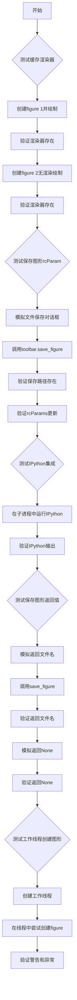
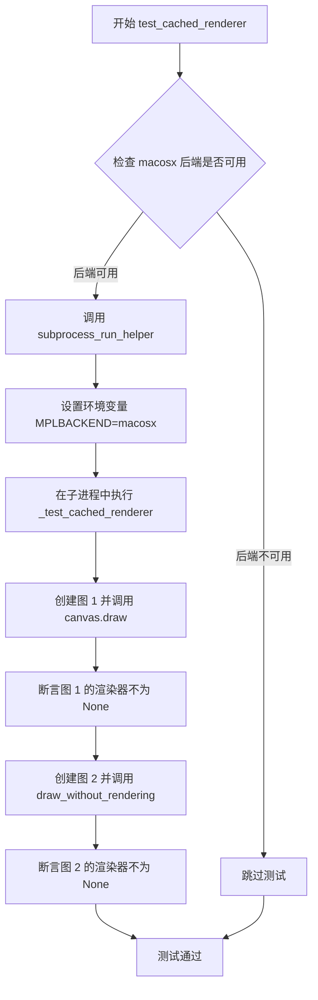
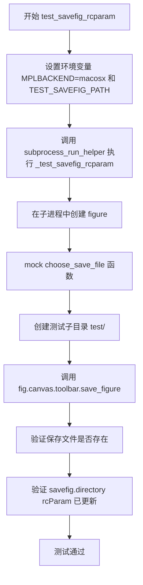
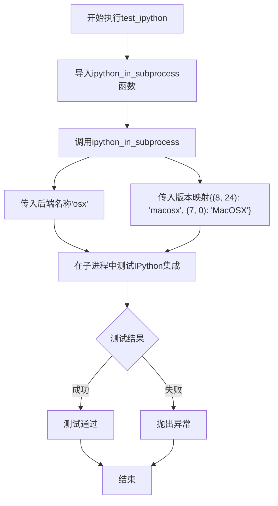
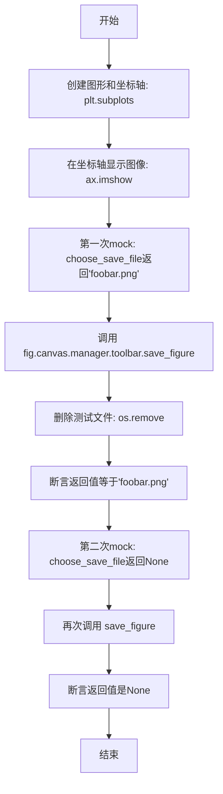
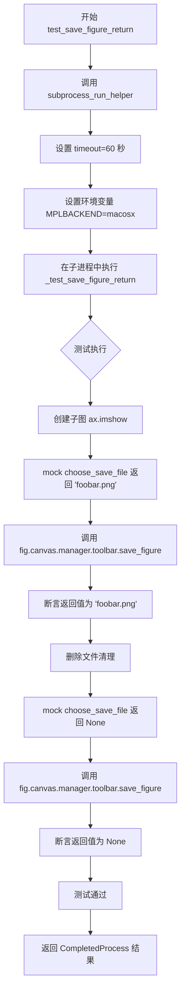
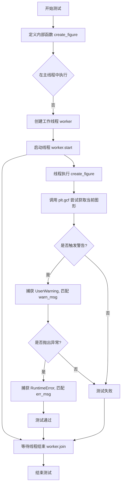
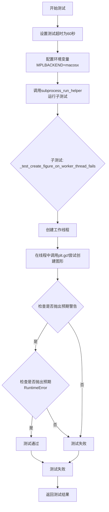

# `matplotlib\lib\matplotlib\tests\test_backend_macosx.py` 详细设计文档

该文件是matplotlib库在macOS平台上的后端功能测试套件，主要测试macOS特定的GUI功能，包括缓存渲染器行为、保存图形时的rcParams设置更新、IPython集成、保存图形返回值以及在工作线程创建图形时的错误处理。

## 整体流程



## 类结构

```
无类层次结构
该文件为测试模块，仅包含函数定义
```

## 全局变量及字段


### `_test_timeout`
    
全局变量，测试超时时间设置为60秒

类型：`int`
    


    

## 全局函数及方法


### `_test_cached_renderer`

该函数是Matplotlib的macosx后端测试函数，用于验证figure在调用`canvas.draw()`和`draw_without_rendering()`方法后是否成功创建并缓存了有效的渲染器，确保图形在macosx后端上能够正确地进行渲染和缓存。

参数：此函数无参数。

返回值：`None`，该函数通过assert语句进行断言验证，不返回具体值。

#### 流程图

```mermaid
flowchart TD
    A[开始测试] --> B[创建Figure 1: plt.figure(1)]
    B --> C[调用fig.canvas.draw]
    C --> D{断言: fig.canvas.get_renderer._renderer is not None}
    D -->|失败| E[抛出AssertionError]
    D -->|成功| F[创建Figure 2: plt.figure(2)]
    F --> G[调用fig.draw_without_rendering]
    G --> H{断言: fig.canvas.get_renderer._renderer is not None}
    H -->|失败| E
    H --> I[测试通过, 结束]
```

#### 带注释源码

```python
def _test_cached_renderer():
    """
    测试缓存渲染器功能。
    
    验证figure在canvas.draw()和draw_without_rendering()后
    是否有有效的渲染器。
    """
    # 创建Figure编号1
    # 目的：测试在调用draw()方法后渲染器是否被正确缓存
    fig = plt.figure(1)
    
    # 调用canvas的draw方法，触发渲染和缓存
    fig.canvas.draw()
    
    # 断言验证：确保渲染器已创建且不为None
    # _renderer属性应该指向一个有效的渲染器对象
    assert fig.canvas.get_renderer()._renderer is not None

    # 创建Figure编号2
    # 目的：测试在调用draw_without_rendering()方法后渲染器是否被正确缓存
    fig = plt.figure(2)
    
    # 调用draw_without_rendering方法，该方法在不实际渲染的情况下
    # 准备渲染器所需的布局和属性
    fig.draw_without_rendering()
    
    # 断言验证：确保渲染器在调用draw_without_rendering()后也被正确初始化
    assert fig.canvas.get_renderer()._renderer is not None
```


### `test_cached_renderer`

使用 macosx 后端运行缓存渲染器测试的入口函数，通过子进程执行 `_test_cached_renderer` 来验证 figures 在 `fig.canvas.draw()` 调用后拥有关联的渲染器，且渲染器对象不为空。

参数： 无

返回值：`None`，无返回值（pytest 测试函数）

#### 流程图



#### 带注释源码

```python
@pytest.mark.backend('macosx', skip_on_importerror=True)
def test_cached_renderer():
    """
    使用 macosx 后端运行缓存渲染器测试的入口函数
    
    该函数通过子进程运行 _test_cached_renderer，以确保在独立的
    环境中测试 macosx 后端的渲染器缓存功能
    """
    # 调用子进程运行辅助函数，传入待测试的函数和超时时间
    # extra_env 参数设置环境变量，指定使用 macosx 后端
    subprocess_run_helper(_test_cached_renderer, timeout=_test_timeout,
                          extra_env={"MPLBACKEND": "macosx"})
```


### `_test_savefig_rcparam`

该函数是一个测试函数，用于验证在保存图形时，rcParams中的`savefig.directory`设置是否能够正确更新，特别是当用户通过文件选择对话框创建了子目录时，rcParams是否能够自动更新为最新的目录路径。

参数：None

返回值：`None`，该函数没有返回值，主要通过断言进行验证

#### 流程图

```mermaid
flowchart TD
    A[开始测试] --> B[获取环境变量TEST_SAVEFIG_PATH]
    B --> C[定义new_choose_save_file函数]
    C --> D[创建figure对象]
    D --> E[使用mock替换choose_save_file函数并设置rcContext]
    E --> F[调用fig.canvas.toolbar.save_figure]
    F --> G{调用new_choose_save_file}
    G --> H[验证directory参数等于tmp_path]
    H --> I[创建子目录test]
    I --> J[返回完整文件路径]
    J --> K[检查保存的文件是否存在]
    K --> L{assert os.path.exists}
    L -->|通过| M[检查rcParams['savefig.directory']是否更新为tmp_path/test]
    M --> N{assert rcParams}
    N -->|通过| O[测试通过]
    L -->|失败| P[抛出AssertionError]
    N -->|失败| P
```

#### 带注释源码

```python
def _test_savefig_rcparam():
    # 从环境变量中获取测试用的临时保存路径
    tmp_path = Path(os.environ["TEST_SAVEFIG_PATH"])

    # 定义一个模拟的保存文件选择函数，用于替代GUI文件选择对话框
    def new_choose_save_file(title, directory, filename):
        # Replacement function instead of opening a GUI window
        # Make a new directory for testing the update of the rcParams
        # 验证传入的directory参数等于初始的tmp_path
        assert directory == str(tmp_path)
        # 创建一个名为"test"的子目录，用于测试rcParams是否会被更新
        os.makedirs(f"{directory}/test")
        # 返回包含子目录的完整文件路径
        return f"{directory}/test/{filename}"

    # 创建一个新的figure对象
    fig = plt.figure()
    # 使用mock替换macosx后端的choose_save_file函数
    # 并在rcContext中设置初始的savefig.directory为tmp_path
    with (mock.patch("matplotlib.backends._macosx.choose_save_file",
                     new_choose_save_file),
          mpl.rc_context({"savefig.directory": tmp_path})):
        # 调用工具栏的保存功能，这会触发new_choose_save_file
        fig.canvas.toolbar.save_figure()
        # Check the saved location got created
        # 构建完整保存文件路径
        save_file = f"{tmp_path}/test/{fig.canvas.get_default_filename()}"
        # 断言保存的文件确实被创建了
        assert os.path.exists(save_file)

        # Check the savefig.directory rcParam got updated because
        # we added a subdirectory "test"
        # 断言rcParams中的savefig.directory已经更新为包含"test"子目录的路径
        # 这是测试的核心：验证rcParams能够响应用户创建子目录的操作而自动更新
        assert mpl.rcParams["savefig.directory"] == f"{tmp_path}/test"
```


### `test_savefig_rcparam`

该函数是 macosx 后端保存图形时 rcParams 更新的测试入口函数，通过 subprocess 运行辅助测试函数，验证保存图形时 `savefig.directory` rcParam 是否正确更新。

参数：

- `tmp_path`：`Path`，pytest 提供的临时目录 fixture，用于指定测试保存图像的目标路径

返回值：`None`，pytest 测试函数无返回值

#### 流程图



#### 带注释源码

```python
@pytest.mark.backend('macosx', skip_on_importerror=True)
def test_savefig_rcparam(tmp_path):
    """
    macosx 后端保存图形 rcParams 更新的测试入口函数
    
    参数:
        tmp_path: Path 对象，pytest 提供的临时目录 fixture
        
    返回:
        None，pytest 测试函数
    """
    # 使用 subprocess 运行辅助测试函数，设置超时为 60 秒
    # 并传递环境变量：MPLBACKEND=macosx 和 TEST_SAVEFIG_PATH=tmp_path
    subprocess_run_helper(
        _test_savefig_rcparam, timeout=_test_timeout,
        extra_env={"MPLBACKEND": "macosx", "TEST_SAVEFIG_PATH": tmp_path})
```


### `test_ipython`

测试matplotlib在IPython子进程中的集成功能，验证macosx后端能否在IPython环境下正常工作。

参数： 该函数没有显式参数（pytest框架隐式注入的fixture参数除外）

返回值：`None`，无返回值

#### 流程图



#### 带注释源码

```python
@pytest.mark.backend('macosx', skip_on_importerror=True)
def test_ipython():
    """
    测试matplotlib在IPython子进程中的集成功能
    
    该测试函数验证macosx后端能够正确地在IPython子进程中运行，
    通过调用matplotlib.testing模块中的ipython_in_subprocess来
    执行实际的集成测试。
    """
    # 从matplotlib.testing模块导入IPython子进程测试辅助函数
    from matplotlib.testing import ipython_in_subprocess
    
    # 调用ipython_in_subprocess执行IPython集成测试
    # 参数说明：
    #   第一个参数 'osx'：指定后端类型（对应macosx后端）
    #   第二个参数：版本到后端名称的映射字典
    #     (8, 24) -> 'macosx'：IPython 8.24版本使用macosx后端
    #     (7, 0)  -> 'MacOSX'：IPython 7.0版本使用MacOSX后端
    ipython_in_subprocess("osx", {(8, 24): "macosx", (7, 0): "MacOSX"})
```


### `_test_save_figure_return`

这是一个内部测试函数，用于测试 macOS 环境下 `toolbar.save_figure()` 方法的返回值行为。函数通过 mock 模拟用户保存文件时的两种场景：选择有效文件名保存和取消保存操作（返回 None），验证返回值是否与预期一致。

参数： 无

返回值：`None`，因为这是一个测试函数，不返回任何值

#### 流程图



#### 带注释源码

```python
def _test_save_figure_return():
    """
    测试 toolbar.save_figure() 的返回值行为。
    场景1：当用户选择保存文件时，返回有效的文件名路径。
    场景2：当用户取消保存操作时，返回 None。
    """
    # 创建图形窗口和坐标轴
    fig, ax = plt.subplots()
    # 在坐标轴上显示一个简单的图像数据（2x2矩阵）
    ax.imshow([[1]])
    
    # 保存要mock的函数路径
    prop = "matplotlib.backends._macosx.choose_save_file"
    
    # 场景1：模拟用户选择保存文件，返回有效文件名
    with mock.patch(prop, return_value="foobar.png"):
        # 调用 toolbar 的保存方法
        fname = fig.canvas.manager.toolbar.save_figure()
        # 删除测试生成的文件
        os.remove("foobar.png")
        # 验证返回值是否为保存的文件名
        assert fname == "foobar.png"
    
    # 场景2：模拟用户取消保存操作（点击取消按钮）
    with mock.patch(prop, return_value=None):
        # 再次调用保存方法
        fname = fig.canvas.manager.toolbar.save_figure()
        # 验证返回值是否为 None
        assert fname is None
```


### `test_save_figure_return`

该函数是使用 macosx 后端运行保存图形返回值测试的入口函数，通过 `subprocess_run_helper` 在子进程中执行实际的测试逻辑 `_test_save_figure_return`，并设置超时时间和后端环境变量。

参数：此函数无显式参数

返回值：`subprocess.CompletedProcess`，subprocess_run_helper 的执行结果，包含返回码、标准输出和标准错误等信息

#### 流程图



#### 带注释源码

```python
@pytest.mark.backend('macosx', skip_on_importerror=True)
def test_save_figure_return():
    """
    使用 macosx 后端运行保存图形返回值测试的入口函数。
    
    该函数通过 subprocess_run_helper 在子进程中运行测试，
    以确保在独立的环境中测试 macosx 后端的功能。
    """
    # 调用 subprocess_run_helper 执行实际的测试逻辑
    # timeout=60: 设置超时时间为 60 秒
    # extra_env={"MPLBACKEND": "macosx"}: 设置环境变量指定使用 macosx 后端
    subprocess_run_helper(_test_save_figure_return, timeout=_test_timeout,
                          extra_env={"MPLBACKEND": "macosx"})
```


### `_test_create_figure_on_worker_thread_fails`

该测试函数用于验证在工作线程（非主线程）中尝试创建图形时，Matplotlib 是否能正确抛出 `RuntimeError` 异常并发出 UserWarning 警告。这确保了在多线程环境下使用 GUI 时能够给出明确的错误提示，防止用户在不兼容的环境中遇到意外的崩溃或行为异常。

参数： 无

返回值： `None`，该函数不返回任何值，仅执行测试逻辑

#### 流程图



#### 带注释源码

```python
def _test_create_figure_on_worker_thread_fails():
    """
    测试在工作线程中创建图形时是否抛出正确的警告和异常
    
    该函数通过在单独的工作线程中调用 plt.gcf() 来验证：
    1. 是否会发出 UserWarning 警告
    2. 是否会抛出 RuntimeError 异常
    """
    
    # 定义内部测试函数，将在独立线程中执行
    def create_figure():
        # 定义期望的警告消息
        warn_msg = "Matplotlib GUI outside of the main thread will likely fail."
        # 定义期望的异常消息
        err_msg = "Cannot create a GUI FigureManager outside the main thread"
        
        # 使用 pytest.warns 捕获并验证 UserWarning
        # match 参数用于匹配警告消息内容
        with pytest.warns(UserWarning, match=warn_msg):
            # 使用 pytest.raises 捕获并验证 RuntimeError
            # match 参数用于匹配异常消息内容
            with pytest.raises(RuntimeError, match=err_msg):
                # 尝试获取当前图形，这会在工作线程中触发错误
                plt.gcf()

    # 创建工作线程，目标函数为 create_figure
    worker = threading.Thread(target=create_figure)
    
    # 启动线程
    worker.start()
    
    # 等待线程执行完成
    worker.join()
```


### `test_create_figure_on_worker_thread_fails`

该测试函数用于验证在 macOS 平台下，使用 macosx 后端时，在工作线程（非主线程）中尝试创建图形会失败，并抛出预期的警告和错误信息。测试通过在子进程中运行工作线程来模拟跨线程图形创建的场景。

参数：

- 无直接参数（但通过 subprocess_run_helper 间接传递了 timeout 和 extra_env 参数）

返回值：`None`，该函数为测试函数，不返回任何值

#### 流程图



#### 带注释源码

```python
def _test_create_figure_on_worker_thread_fails():
    """
    内部测试函数：在工作线程中尝试创建图形，验证会失败
    """
    def create_figure():
        # 定义预期的警告消息
        warn_msg = "Matplotlib GUI outside of the main thread will likely fail."
        # 定义预期的错误消息
        err_msg = "Cannot create a GUI FigureManager outside the main thread"
        # 验证是否抛出预期的UserWarning警告
        with pytest.warns(UserWarning, match=warn_msg):
            # 验证是否抛出预期的RuntimeError错误
            with pytest.raises(RuntimeError, match=err_msg):
                # 尝试获取当前图形，在非主线程会失败
                plt.gcf()

    # 创建工作线程，target为要执行的函数
    worker = threading.Thread(target=create_figure)
    # 启动工作线程
    worker.start()
    # 等待工作线程执行完成
    worker.join()


@pytest.mark.backend('macosx', skip_on_importerror=True)
def test_create_figure_on_worker_thread_fails():
    """
    测试函数：使用macosx后端运行工作线程图形创建失败测试
    通过subprocess在子进程中运行测试，确保测试环境隔离
    """
    subprocess_run_helper(
        _test_create_figure_on_worker_thread_fails,  # 被调用的内部测试函数
        timeout=_test_timeout,                       # 超时时间60秒
        extra_env={"MPLBACKEND": "macosx"}           # 设置环境变量指定后端
    )
```

## 关键组件


### 缓存渲染器测试 (Cached Renderer Testing)

验证在调用 fig.canvas.draw() 或 fig.draw_without_rendering() 后，FigureCanvas 对象能够正确缓存并提供渲染器实例。

### 保存图形 rcParams 测试 (Savefig RCParam Testing)

测试在使用 macosx 后端保存图形时，savefig.directory rcParam 能够正确更新为实际创建的子目录路径。

### IPython 集成测试 (IPython Integration Testing)

验证 matplotlib 与 IPython 子进程的集成功能，支持不同 IPython 版本的兼容性映射。

### 保存图形返回值测试 (Save Figure Return Value Testing)

测试 FigureCanvas 的 save_figure() 方法在用户选择保存和取消保存两种场景下的返回值行为。

### 工作线程创建图形失败测试 (Worker Thread Figure Creation Testing)

验证在非主线程（worker thread）中尝试创建 GUI FigureManager 会抛出预期的 RuntimeError 警告和异常。

### 进程间测试辅助函数 (Subprocess Run Helper)

通过子进程运行测试函数，支持超时控制和额外的环境变量配置，确保测试环境隔离。

### Mock 补丁工具 (Mock Patch Utilities)

使用 unittest.mock 模拟 macosx 后端的 choose_save_file 函数，实现无需 GUI 交互的自动化测试。


## 问题及建议


### 已知问题

- **环境变量耦合**: `TEST_SAVEFIG_PATH` 通过 `os.environ` 在测试函数内部读取，而非通过 pytest fixture 传递，导致测试与环境变量强耦合
- **硬编码超时时间**: `_test_timeout = 60` 硬编码了60秒超时，在CI环境或慢速机器上可能导致误报
- **临时文件清理不完善**: `test_save_figure_return` 中使用 `os.remove("foobar.png")` 手动清理，未使用 pytest 提供的 tmp_path fixture，清理逻辑分散且易遗漏
- **重复的backend标记**: 每个测试函数都重复添加 `@pytest.mark.backend('macosx', skip_on_importerror=True)` 装饰器，可通过 pytest fixture 或 autouse fixture 集中处理
- **重复的导入语句**: `import matplotlib.pyplot as plt` 和 `import matplotlib as mpl` 在文件顶部导入，但在每个内部测试函数中又通过 `subprocess_run_helper` 在子进程中重新加载
- **魔法数字和字符串**: `{(8, 24): "macosx", (7, 0): "MacOSX"}` 这类IPython版本与后端映射关系缺乏注释说明
- **测试函数命名不一致**: 内部实现函数以下划线开头（如 `_test_savefig_rcparam`），但外部测试函数也以下划线开头，命名风格不够清晰

### 优化建议

- 使用 pytest fixture 管理临时目录和超时配置，例如 `@pytest.fixture(timeout=_test_timeout)` 或在 conftest.py 中定义
- 将 backend 检查逻辑抽取为 pytest fixture 并使用 `autouse=True` 自动应用，减少重复装饰器
- 使用 `tmp_path` fixture 替代手动创建和清理临时文件，提升测试隔离性
- 将超时时间和环境变量配置提取为模块级常量或配置文件，便于维护和调整
- 为 IPython 版本映射、macOS 特定行为等添加详细注释，说明测试意图
- 考虑将子进程测试框架抽象为通用测试工具类，减少测试函数中的重复样板代码

## 其它


### 设计目标与约束

验证matplotlib的macosx后端在以下场景下的正确性：1)Figure渲染器缓存机制正常工作；2)保存图形时savefig.directory rcParam正确更新；3)与IPython的集成符合版本兼容要求；4)save_figure方法返回正确的文件路径；5)非主线程创建Figure时给出明确警告并抛出异常。测试必须在macosx后端环境下运行，若后端不可用则跳过测试。

### 错误处理与异常设计

代码通过pytest的warns和raises上下文管理器处理预期异常：_test_create_figure_on_worker_thread_fails预期在worker线程中调用plt.gcf()时产生UserWarning警告并抛出RuntimeError；save_figure的返回值测试验证了用户取消保存时返回None而非抛出异常。subprocess_run_helper的timeout参数防止测试进程无限阻塞，超时时间设置为60秒。使用mock.patch模拟GUI文件选择对话框，避免实际文件对话框交互。

### 数据流与状态机

测试数据流：1)缓存渲染器测试：创建Figure→调用canvas.draw()→验证get_renderer()._renderer非空→创建新Figure→调用draw_without_rendering()→验证渲染器已缓存；2)保存图形rcparam测试：mock choose_save_file→调用toolbar.save_figure()→验证子目录创建→验证rcParams["savefig.directory"]更新为新路径；3)保存返回值测试：mock choose_save_file返回文件路径→调用save_figure()→验证返回路径正确→mock返回None→验证返回None。

### 外部依赖与接口契约

核心依赖：matplotlib.backends._macosx模块（macosx后端实现）；matplotlib.testing.subprocess_run_helper（子进程测试运行器）；matplotlib.testing.ipython_in_subprocess（IPython集成测试）；pytest框架及标记系统。接口契约：choose_save_file(title, directory, filename)→返回完整文件路径或None；fig.canvas.manager.toolbar.save_figure()→返回保存的文件路径或None；plt.gcf()在非主线程调用→抛出RuntimeError；rcParams["savefig.directory"]在用户选择新目录后自动更新。

### 并发处理设计

_test_create_figure_on_worker_thread_fails通过threading.Thread在独立线程中执行Figure创建操作，验证matplotlib的GUI线程安全约束。主线程运行测试套件，子线程执行可能失败的GUI操作，使用worker.join()确保测试完成前等待子线程结束。subprocess_run_helper确保每个测试函数在独立进程中运行，避免测试间状态污染。

### 配置管理

使用mpl.rc_context临时修改rcParams，测试结束后自动恢复。TEST_SAVEFIG_PATH环境变量传递临时目录路径给子进程。MPLBACKEND环境变量强制指定macosx后端。测试超时通过_test_timeout全局常量（60秒）统一配置。

### 性能考虑

每个测试通过subprocess运行产生进程创建开销，但保证测试隔离性。渲染器缓存测试验证draw_without_rendering()的优化效果，避免重复渲染。timeout设置为60秒，留有充足时间同时避免无限等待。

    