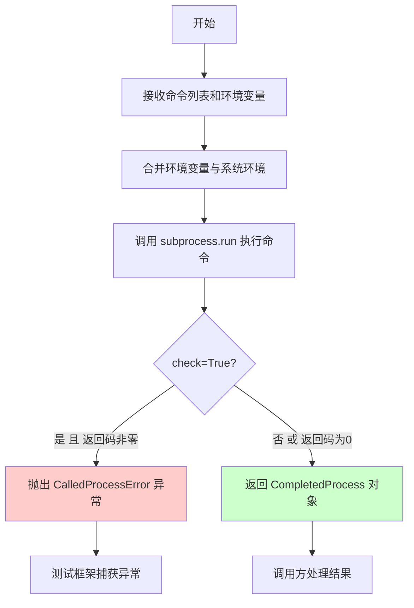
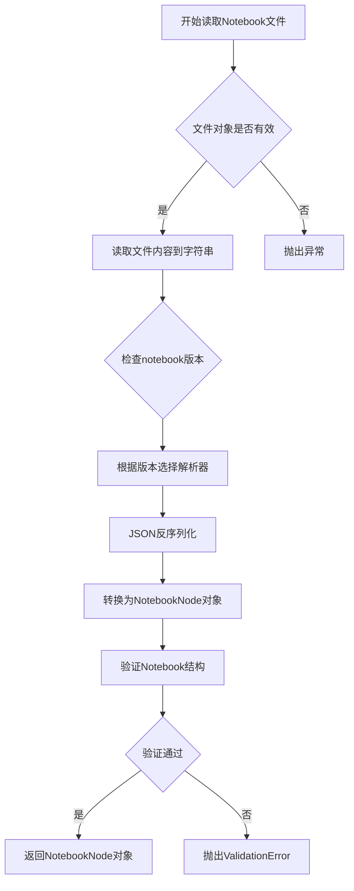

# `matplotlib\lib\matplotlib\tests\test_backend_nbagg.py` 详细设计文档

该代码是一个pytest测试文件，用于测试Jupyter Notebook的执行功能。它通过调用jupyter nbconvert命令执行指定的.ipynb文件，检查执行过程中是否产生错误，并验证输出notebook的backend名称是否符合IPython版本的预期。

## 整体流程

```mermaid
graph TD
    A[开始] --> B[获取测试notebook路径]
B --> C[创建临时目录]
C --> D[调用jupyter nbconvert执行notebook]
D --> E{执行成功?}
E -- 否 --> F[抛出异常]
E -- 是 --> G[读取输出的notebook]
G --> H[提取所有cell的outputs]
H --> I{存在error类型output?}
I -- 是 --> J[断言失败: 存在错误]
I -- 否 --> K[检查IPython版本]
K --> L{版本 >= 8.24?}
L -- 是 --> M[expected_backend = 'notebook']
L -- 否 --> N[expected_backend = 'nbAgg']
M --> O[获取cells[2]的backend输出]
N --> O
O --> P{输出 == expected_backend?]
P -- 是 --> Q[测试通过]
P -- 否 --> R[断言失败: backend不匹配]
```

## 类结构

```
测试模块 (无类定义)
└── test_ipynb: 主测试函数
```

## 全局变量及字段


### `nb_path`
    
测试notebook文件路径

类型：`Path`
    


### `tmpdir`
    
临时目录路径

类型：`str`
    


### `out_path`
    
输出notebook路径

类型：`Path`
    


### `nb`
    
解析后的notebook对象

类型：`NotebookNode`
    


### `errors`
    
存储所有错误类型的output

类型：`list`
    


### `expected_backend`
    
期望的backend名称

类型：`str`
    


### `backend_outputs`
    
notebook第三个cell的输出列表

类型：`list`
    


    

## 全局函数及方法


### `test_ipynb`

该函数是主测试函数，用于执行Jupyter notebook并验证其执行结果，确保notebook运行无错误且输出符合预期（验证nbAgg后端输出）。

参数： 无

返回值：`None`，该函数通过assert语句进行断言验证，不返回任何值

#### 流程图

```mermaid
flowchart TD
    A[开始执行 test_ipynb] --> B[构建notebook路径]
    B --> C[创建临时目录]
    C --> D[使用jupyter nbconvert执行notebook]
    D --> E{执行是否成功}
    E -->|失败| F[抛出异常]
    E -->|成功| G[读取输出notebook]
    G --> H[提取所有cell的outputs]
    H --> I{是否存在error类型output}
    I -->|是| J[断言失败]
    I -->|否| K[根据IPython版本确定预期backend]
    K --> L[获取cells[2]的outputs]
    L --> M{output是否匹配预期backend}
    M -->|不匹配| N[断言失败]
    M -->|匹配| O[测试通过]
```

#### 带注释源码

```python
import os
from pathlib import Path
from tempfile import TemporaryDirectory

import pytest

# 从matplotlib.testing导入用于测试的子进程运行函数
from matplotlib.testing import subprocess_run_for_testing

# 动态导入nbformat，如果不存在则跳过测试
nbformat = pytest.importorskip('nbformat')
# 动态导入nbconvert和ipykernel，如果不存在则跳过测试
pytest.importorskip('nbconvert')
pytest.importorskip('ipykernel')

# From https://blog.thedataincubator.com/2016/06/testing-jupyter-notebooks/


def test_ipynb():
    """
    主测试函数：执行notebook并验证结果
    
    该函数执行一个Jupyter notebook文件，验证：
    1. notebook能够成功执行无错误
    2. 特定的输出符合预期（nbAgg后端验证）
    """
    # 构建测试notebook的完整路径（位于当前文件所在目录的data子目录中）
    nb_path = Path(__file__).parent / 'data/test_nbagg_01.ipynb'

    # 创建临时目录用于存放nbconvert执行过程中的临时文件
    with TemporaryDirectory() as tmpdir:
        # 定义输出notebook的路径
        out_path = Path(tmpdir, "out.ipynb")
        
        # 使用jupyter nbconvert命令执行notebook
        # --to notebook: 输出为notebook格式
        # --execute: 执行notebook
        # --ExecutePreprocessor.timeout=500: 设置执行超时为500秒
        # --output: 指定输出路径
        # env参数设置IPYTHONDIR为临时目录，避免干扰
        subprocess_run_for_testing(
            ["jupyter", "nbconvert", "--to", "notebook",
             "--execute", "--ExecutePreprocessor.timeout=500",
             "--output", str(out_path), str(nb_path)],
            env={**os.environ, "IPYTHONDIR": tmpdir},
            check=True)
        
        # 读取执行后的notebook文件
        with out_path.open() as out:
            nb = nbformat.read(out, nbformat.current_nbformat)

    # 提取所有cell中的outputs，查找是否存在error类型的output
    errors = [output for cell in nb.cells for output in cell.get("outputs", [])
              if output.output_type == "error"]
    # 断言不存在任何错误
    assert not errors

    # 动态导入IPython以检查版本
    import IPython
    # 根据IPython版本确定预期的backend名称
    # IPython >= 8.24 使用 'notebook'，否则使用 'nbAgg'
    if IPython.version_info[:2] >= (8, 24):
        expected_backend = "notebook"
    else:
        # This code can be removed when Python 3.12, the latest version supported by
        # IPython < 8.24, reaches end-of-life in late 2028.
        expected_backend = "nbAgg"
    
    # 获取第3个cell（索引为2）的outputs
    backend_outputs = nb.cells[2]["outputs"]
    # 验证第一个output的文本内容与预期backend匹配
    assert backend_outputs[0]["data"]["text/plain"] == f"'{expected_backend}'"
```

---

## 文件整体运行流程

该测试文件位于matplotlib的测试套件中，用于验证Jupyter notebook集成功能。运行流程如下：

1. **导入阶段**：导入必要的标准库（os, Path, TemporaryDirectory）和测试依赖（pytest, nbformat, nbconvert, ipykernel）
2. **路径构建**：定位待测试的notebook文件（test_nbagg_01.ipynb）
3. **执行阶段**：通过jupyter nbconvert在临时目录中执行notebook
4. **验证阶段**：读取执行后的输出，验证无错误产生且特定输出符合预期

---

## 全局变量和全局函数

| 名称 | 类型 | 描述 |
|------|------|------|
| `os` | 模块 | Python标准库，提供操作系统交互功能 |
| `Path` | 类 | pathlib模块中的路径对象，用于路径操作 |
| `TemporaryDirectory` | 类 | 临时目录上下文管理器 |
| `pytest` | 模块 | Python测试框架 |
| `subprocess_run_for_testing` | 函数 | matplotlib测试工具，用于在测试中运行子进程 |
| `nbformat` | 模块 | Jupyter notebook格式处理库 |
| `test_ipynb` | 函数 | 主测试函数，无参数，执行notebook并验证结果 |

---

## 关键组件信息

| 组件名称 | 描述 |
|----------|------|
| `nb_path` | 待测试的Jupyter notebook文件路径 |
| `out_path` | nbconvert执行后的输出notebook路径 |
| `tmpdir` | 临时目录，用于隔离测试环境和存储输出 |
| `nb` | 执行后的notebook对象（nbformat结构） |
| `errors` | 存储所有error类型的output列表 |
| `expected_backend` | 根据IPython版本预期的后端名称 |

---

## 潜在的技术债务或优化空间

1. **硬编码路径**：`nb_path`使用硬编码相对路径 `'data/test_nbagg_01.ipynb'`，缺乏灵活性
2. **版本兼容逻辑**：IPython版本检查逻辑（8, 24）带有注释说明应在2028年移除，但属于未来技术债务
3. **超时配置**：超时时间500秒硬编码，应考虑提取为配置参数
4. **断言信息不足**：assert语句缺乏自定义错误消息，调试时信息不够清晰
5. **依赖检查**：使用`importorskip`虽然合理，但可能导致测试静默跳过而非明确报告缺失依赖

---

## 其他项目

### 设计目标与约束

- **目标**：验证matplotlib的nbAgg后端在Jupyter notebook中正常工作
- **约束**：依赖jupyter、nbformat、nbconvert、ipykernel和IPython环境

### 错误处理与异常设计

- 使用`subprocess_run_for_testing`的`check=True`参数，当nbconvert返回非零退出码时抛出异常
- 通过`assert not errors`检测notebook执行过程中的所有错误
- 通过assert验证输出内容，不匹配时抛出AssertionError

### 数据流与状态机

1. **输入**：test_nbagg_01.ipynb文件
2. **处理**：jupyter nbconvert执行（状态：Pending → Running → Completed）
3. **输出**：out.ipynb文件 + 内存中的nb对象
4. **验证**：遍历所有cells的outputs，提取error类型和特定文本内容

### 外部依赖与接口契约

- **Jupyter nbconvert CLI**：通过子进程调用，传入特定命令行参数
- **nbformat API**：使用`nbformat.read()`解析notebook，使用`nbformat.current_nbformat`指定版本
- **matplotlib testing utility**：`subprocess_run_for_testing`封装了subprocess.run并提供测试友好的错误处理
- **IPython版本检查**：通过`IPython.version_info`元组进行版本比较


# subprocess_run_for_testing 函数详细设计文档

## 1. 概述

`subprocess_run_for_testing` 是 matplotlib.testing 模块中的一个封装函数，用于安全地执行子进程（特别是 jupyter nbconvert 命令），并提供测试友好的错误处理和输出捕获机制。

## 2. 参数与返回值

### 参数

- `cmd`：`List[str]`，要执行的命令列表
- `env`：`Optional[Dict[str, str]]`，可选的环境变量字典，会与当前系统环境合并
- `check`：`bool`，是否检查返回码，非零返回码时是否抛出异常
- 其他参数：包括 `capture_output`、`text`、`cwd` 等 subprocess.run 标准参数

### 返回值

- `subprocess.CompletedProcess`，执行完成的进程对象，包含返回码、标准输出和标准错误

## 3. 流程图



## 4. 带注释源码

```python
# 从 matplotlib.testing 模块导入（实际实现需查看源代码）
# 这是根据测试代码反推的函数签名和使用方式

def subprocess_run_for_testing(
    cmd: List[str],
    env: Optional[Dict[str, str]] = None,
    check: bool = True,
    **kwargs
) -> subprocess.CompletedProcess:
    """
    执行子进程的封装函数，专为测试场景设计。
    
    参数:
        cmd: 命令列表，如 ["jupyter", "nbconvert", "--to", "notebook"]
        env: 可选的环境变量，会与 os.environ 合并
        check: 为 True 时，非零返回码会抛出异常
        **kwargs: 其他 subprocess.run 支持的参数
    
    返回:
        CompletedProcess 对象，包含执行结果
    """
    # 合并环境变量：如果提供了 env，则与系统环境变量合并
    merged_env = {**os.environ, **env} if env else os.environ
    
    # 执行子进程
    result = subprocess.run(
        cmd,
        env=merged_env,
        check=check,  # 根据参数决定是否检查返回码
        capture_output=True,
        text=True,
        **kwargs
    )
    
    return result
```

## 5. 关键组件信息

| 组件名称 | 描述 |
|---------|------|
| subprocess.run | Python 标准库，用于执行外部命令 |
| env 合并机制 | 将测试指定的环境变量与系统环境变量合并 |
| check 参数控制 | 控制是否对非零返回码抛出异常 |

## 6. 潜在技术债务与优化空间

1. **缺少超时控制**：测试代码中通过 nbconvert 的 `--ExecutePreprocessor.timeout=500` 参数设置超时，但函数本身未提供超时参数
2. **错误信息不够详细**：异常信息可能缺少对失败命令的上下文说明
3. **硬编码的 capture_output**：未来可能需要支持自定义输出流

## 7. 错误处理设计

- 当 `check=True` 且命令返回非零码时，抛出 `subprocess.CalledProcessError`
- 建议调用方在测试中使用 `check=True` 以便快速定位问题

## 8. 使用示例（从测试代码提取）

```python
subprocess_run_for_testing(
    ["jupyter", "nbconvert", "--to", "notebook",
     "--execute", "--ExecutePreprocessor.timeout=500",
     "--output", str(out_path), str(nb_path)],
    env={**os.environ, "IPYTHONDIR": tmpdir},
    check=True)
```

> **注意**：由于用户仅提供了测试代码而非函数实际实现，上述文档基于调用方式和 Python 标准库惯例进行推断。如需完整实现源码，建议查看 matplotlib 项目的 `matplotlib/testing.py` 或相关模块。


### `nbformat.read`

读取并解析Jupyter Notebook文件（.ipynb格式），将文件内容反序列化为nbformat的Python对象（通常是NotebookNode），支持版本兼容性和多种编码格式。

参数：

-  `fp`：`file-like object`，要读取的Notebook文件对象（已打开的文件，需支持read方法）
-  `as_version`：`int`或`version object`，Notebook文件的格式版本号，用于正确解析不同版本的notebook结构

返回值：`NotebookNode`，解析后的Notebook对象，包含cells、metadata、nbformat等属性，可以像字典一样访问其中的内容

#### 流程图



#### 带注释源码

```python
# nbformat.read 函数源码（基于nbformat库的实现）

def read(fp, as_version):
    """
    读取并解析Notebook文件
    
    参数:
        fp: 文件对象，需要已打开且可读
        as_version: int或version对象，指定notebook格式版本
    
    返回:
        NotebookNode: 解析后的notebook对象
    """
    # 从文件对象读取内容
    # nbformat库内部会检查文件是否有效
    buf = fp.read()
    
    # 解析JSON内容
    # nbformat使用json.loads将字符串转换为字典
    nb_dict = json.loads(buf)
    
    # 获取notebook的版本信息
    # 如果as_version是整数，会转换为对应的version对象
    if isinstance(as_version, int):
        from nbformat import vX  # X是版本号
        as_version = vX
    
    # 根据版本验证notebook结构
    # validate函数会检查必要的字段和格式
    validate(nb_dict, as_version)
    
    # 将字典转换为NotebookNode对象
    # NotebookNode是dict的子类，支持属性访问
    nb = NotebookNode(nb_dict)
    
    # 返回解析后的notebook对象
    # 调用者可以访问nb.cells, nb.metadata等属性
    return nb


# 在测试代码中的实际使用方式：
# nb = nbformat.read(out, nbformat.current_nbformat)
# 其中 out 是打开的Notebook文件对象
# nbformat.current_nbformat 是当前库支持的最新版本号
```

#### 代码上下文中的使用

```python
# 在test_ipynb函数中的实际调用
with out_path.open() as out:
    # 读取解析后的notebook对象
    nb = nbformat.read(out, nbformat.current_nbformat)

# 后续操作：
# 1. 检查所有cell的outputs中是否有错误
errors = [output for cell in nb.cells for output in cell.get("outputs", [])
          if output.output_type == "error"]

# 2. 访问特定cell的输出
backend_outputs = nb.cells[2]["outputs"]
assert backend_outputs[0]["data"]["text/plain"] == f"'{expected_backend}'"
```

#### 关键信息

- **所属模块**：`nbformat`（第三方库）
- **调用位置**：代码第32行
- **依赖**：需要`nbformat`库已安装（通过`pytest.importorskip('nbformat')`导入）
- **异常处理**：文件格式错误或版本不兼容时抛出`nbformat.utils.ValidationError`或`JSONDecodeError`


## 关键组件


### nbformat 导入与检查

使用 pytest.importorskip 动态导入 nbformat、nbconvert 和 ipykernel 测试依赖库，确保测试环境具备 Jupyter notebook 相关依赖。

### test_ipynb 主测试函数

核心测试函数，负责执行 Jupyter notebook 并验证其输出结果，包含完整的测试流程：notebook 路径解析、临时目录创建、子进程执行、输出读取、错误检查和断言验证。

### nb_path 路径组件

指定测试用的 notebook 文件路径（data/test_nbagg_01.ipynb），用于后续的 nbconvert 命令执行。

### TemporaryDirectory 临时目录管理

使用 Python tempfile 模块创建临时目录，用于存放 nbconvert 输出的 notebook 文件，避免污染源码目录。

### subprocess_run_for_testing 子进程执行组件

调用 matplotlib.testing 模块的子进程运行函数，执行 jupyter nbconvert 命令，将 notebook 转换为可执行格式并运行，设置超时时间为 500 秒。

### nbformat.read 输出解析组件

使用 nbformat 库读取生成的 notebook 输出文件，解析为 nbformat 对象以便后续检查 cell outputs。

### 错误检查机制

遍历所有 cell 的 outputs，筛选 output_type 为 "error" 的项，用于检测 notebook 执行过程中的异常情况。

### IPython 版本兼容性检查

根据 IPython 版本号（≥8.24 或 <8.24）动态确定预期使用的 backend 名称（"notebook" 或 "nbAgg"），以适配不同 IPython 版本的输出行为。

### backend_outputs 断言验证

验证 notebook 第三个 cell 的第一个输出数据是否为预期的 backend 名称字符串，确保 nbagg 后端正确配置。


## 问题及建议


### 已知问题

-   **硬编码的配置值**：超时时间 `500`、输入文件 `test_nbagg_01.ipynb`、预期单元格索引 `nb.cells[2]` 等都是硬编码值，缺乏灵活性和可配置性。
-   **版本兼容性代码的技术债务**：存在针对 IPython 版本的分支逻辑（`IPython.version_info[:2] >= (8, 24)`），且代码注释明确指出该兼容性代码需要维护到 2028 年，随着时间推移会增加维护负担。
-   **错误处理粒度不足**：使用简单的 `assert` 语句进行验证，失败时提供的调试信息有限，不利于快速定位问题。
-   **缺少测试隔离**：直接使用 `os.environ` 修改环境变量，虽然通过 `**os.environ` 合并，但全局状态的修改可能影响其他测试。
-   **依赖隐式假设**：代码假设 notebook 结构固定（特定单元格索引、特定输出格式），当 notebook 内容变化时测试容易断裂。
-   **临时目录环境变量覆盖**：使用 `IPYTHONDIR` 环境变量指向临时目录，但未验证该目录是否正确创建或存在权限问题。

### 优化建议

-   **提取配置常量**：将超时时间、文件路径、单元格索引等硬编码值提取为模块级常量或配置文件，提高可维护性。
-   **封装版本检查逻辑**：将 IPython 版本判断逻辑封装为独立的辅助函数，减少主测试逻辑的复杂度。
-   **增强错误信息**：使用 pytest 的 `assert` 特性或自定义断言函数，提供更详细的错误上下文（如实际输出值、预期值对比）。
-   **使用 pytest fixture**：利用 `@pytest.fixture` 管理临时目录的生命周期，提升代码可读性和资源管理可靠性。
-   **添加日志记录**：在关键步骤添加日志输出，便于调试和追踪测试执行流程。
-   **验证 notebook 结构**：在断言前增加对 notebook 结构的验证（如单元格数量、输出存在性），提供更友好的失败信息。
-   **考虑参数化测试**：如果存在多个类似的 notebook 测试场景，可使用 `@pytest.mark.parametrize` 减少重复代码。


## 其它


### 设计目标与约束

本测试代码的设计目标是验证Jupyter notebook能够正确执行，并确保输出符合预期。约束条件包括：需要特定版本的IPython（>=8.24或<8.24），依赖nbformat、nbconvert、ipykernel等库，且测试必须在有Jupyter环境中运行。

### 错误处理与异常设计

代码使用pytest的importorskip机制处理可选依赖，确保在缺少必要库时跳过测试。subprocess_run_for_testing的check=True参数会在命令执行失败时抛出异常。文件读取使用with上下文管理器确保资源正确释放。错误输出检查通过遍历cell outputs查找output_type为"error"的项。

### 数据流与状态机

测试数据流：读取源notebook文件 → 创建临时目录 → 执行nbconvert命令 → 读取输出notebook → 解析输出内容 → 验证错误和backend输出。状态转换：初始化 → 执行中 → 验证完成。

### 外部依赖与接口契约

外部依赖包括：nbformat（notebook解析）、nbconvert（notebook执行）、ipykernel（内核支持）、jupyter命令行工具、matplotlib.testing.subprocess_run_for_testing（测试用subprocess封装）。接口契约：nbconvert命令必须返回可解析的notebook文件，输出文件必须包含指定格式的cells和outputs。

### 测试覆盖范围

本测试覆盖Jupyter notebook执行流程、错误捕获机制、IPython版本兼容性处理、nbagg后端输出验证等功能。

### 性能考量

测试设置了ExecutePreprocessor.timeout=500（500秒超时），使用TemporaryDirectory自动清理临时文件，nbconvert执行可能耗时较长需考虑测试超时配置。

    