# `matplotlib\lib\matplotlib\tests\test_backend_pdf.py` 详细设计文档

这是Matplotlib PDF后端的集成测试文件，测试PDF生成的各种功能，包括字体处理、多页PDF、图像渲染、元数据、URL链接、散点图优化等核心功能。

## 整体流程

```mermaid
graph TD
    A[开始测试] --> B[基础PDF生成测试]
    B --> C[字体测试: test_use14corefonts]
    B --> D[多页PDF测试: test_multipage_*]
    B --> E[图像测试: test_composite_image, test_indexed_image]
    A --> F[元数据测试]
    F --> G[test_savefig_metadata]
    F --> H[test_invalid_metadata]
    F --> I[test_multipage_metadata]
    A --> J[文本与URL测试]
    J --> K[test_text_urls]
    J --> L[test_text_rotated_urls]
    J --> M[test_text_urls_tex]
    A --> N[高级字体测试]
    N --> O[test_glyphs_subset]
    N --> P[test_multi_font_type3/type42]
    N --> Q[test_otf_font_smoke]
    N --> R[test_truetype_conversion]
    N --> S[test_font_heuristica/dejavusans/charter]
    A --> T[散点图优化测试]
    T --> U[test_scatter_offaxis_colored_pdf_size]
    T --> V[test_scatter_offaxis_colored_visual]
    T --> W[test_scatter_mixed_onoff_axis]
    T --> X[test_scatter_large_markers_partial_clip]
    T --> Y[test_scatter_logscale]
    T --> Z[test_scatter_polar]
    Z --> AA[结束测试]
```

## 类结构

```
无类定义（纯测试脚本）
测试函数清单（共35+个测试函数）
```

## 全局变量及字段


### `mpl`
    
Matplotlib库的主模块，提供了绘图和数据可视化的核心功能

类型：`module`
    


### `rcParams`
    
Matplotlib的全局参数配置对象，用于管理绘图样式和后端设置

类型：`RcParams`
    


### `fm`
    
Matplotlib的字体管理器模块，用于字体查找和属性管理

类型：`module`
    


### `_get_data_path`
    
获取Matplotlib内置数据文件路径的函数

类型：`function`
    


### `FT2Font`
    
FreeType 2字体对象类，用于加载和处理TrueType/OpenType字体

类型：`class`
    


### `PdfPages`
    
PDF多页文档管理类，支持创建和追加PDF页面

类型：`class`
    


### `Rectangle`
    
矩形图形类，用于在图表中绘制矩形区域

类型：`class`
    


### `_gen_multi_font_text`
    
生成包含多种字体文本的测试数据函数

类型：`function`
    


### `_has_tex_package`
    
检查LaTeX是否安装了指定宏包的函数

类型：`function`
    


### `get_glyphs_subset`
    
从字体中提取指定字符子集并生成子集字体的函数

类型：`function`
    


### `font_as_file`
    
将字体对象转换为文件对象的辅助函数

类型：`function`
    


    

## 全局函数及方法


### `test_use14corefonts`

该函数是一个测试 PDF 后端使用 14 种核心字体（use14corefonts=True）的测试用例，通过配置 matplotlib 的 rcParams 参数，创建包含多语言字符（法语和欧元符号）的 PDF 图形，验证核心字体功能是否正常工作。

参数：

- 无参数

返回值：`None`，测试函数无返回值

#### 流程图

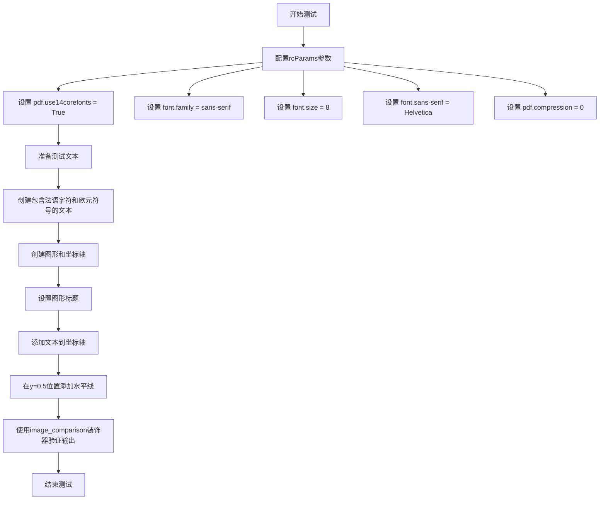

#### 带注释源码

```python
@image_comparison(['pdf_use14corefonts.pdf'])  # 装饰器：比较生成的PDF与基准图像
def test_use14corefonts():
    # 配置PDF后端参数
    rcParams['pdf.use14corefonts'] = True  # 启用14种核心字体模式
    rcParams['font.family'] = 'sans-serif'  # 设置默认字体族为无衬线体
    rcParams['font.size'] = 8  # 设置基础字体大小为8磅
    rcParams['font.sans-serif'] = ['Helvetica']  # 指定Helvetica作为无衬线字体
    rcParams['pdf.compression'] = 0  # 禁用PDF压缩以便于测试

    # 准备测试文本字符串，包含多语言字符
    text = '''A three-line text positioned just above a blue line
and containing some French characters and the euro symbol:
"Merci pépé pour les 10 €"'''

    # 创建图形和坐标轴对象
    fig, ax = plt.subplots()
    
    # 设置图形的标题
    ax.set_title('Test PDF backend with option use14corefonts=True')
    
    # 在坐标轴中心添加文本
    # x=0.5, y=0.5 表示文本位置在图形中心
    # horizontalalignment='center' 表示水平居中对齐
    # verticalalignment='bottom' 表示垂直底部对齐
    # fontsize=14 设置文本字体大小为14磅
    ax.text(0.5, 0.5, text, horizontalalignment='center',
            verticalalignment='bottom',
            fontsize=14)
    
    # 在y=0.5位置绘制水平线
    # linewidth=0.5 设置线条宽度为0.5磅
    ax.axhline(0.5, linewidth=0.5)
```


### `test_multipage_pagecount`

该函数是一个测试函数，用于验证 `PdfPages` 类的页面计数功能是否正确工作。测试流程包括：初始状态页面计数为 0，保存一个 figure 后计数变为 1，手动调用 `savefig()` 再添加一页后计数变为 2。

参数： 无

返回值： `None`，该函数为测试函数，不返回任何值

#### 流程图

```mermaid
flowchart TD
    A[开始测试] --> B[创建 BytesIO 对象并作为 PdfPages 上下文管理器]
    B --> C{断言: pdf.get_pagecount == 0}
    C -->|通过| D[创建 figure 和 axes: fig, ax = plt.subplots]
    D --> E[在 axes 上绘制数据: ax.plot[1, 2, 3]]
    E --> F[将 figure 保存到 PdfPages: fig.savefigpdf, format='pdf']
    F --> G{断言: pdf.get_pagecount == 1}
    G -->|通过| H[手动调用 pdf.savefig 添加新页面]
    H --> I{断言: pdf.get_pagecount == 2}
    I -->|通过| J[测试通过, 退出上下文管理器]
    I -->|失败| K[抛出 AssertionError]
    G -->|失败| K
    C -->|失败| K
    J --> L[结束测试]
```

#### 带注释源码

```python
def test_multipage_pagecount():
    """
    测试 PdfPages 类的页面计数功能。
    
    该测试函数验证以下场景:
    1. 新创建的 PdfPages 对象页面计数为 0
    2. 通过 fig.savefig() 保存一个 figure 后页面计数变为 1
    3. 手动调用 pdf.savefig() 添加新页面后页面计数变为 2
    """
    # 使用 io.BytesIO() 创建一个内存中的 PDF 输出目标
    # PdfPages 作为上下文管理器，会自动处理文件的打开和关闭
    with PdfPages(io.BytesIO()) as pdf:
        # 验证初始状态：刚刚创建的 PdfPages 还没有任何页面
        assert pdf.get_pagecount() == 0
        
        # 创建一个新的 figure 和 axes 对象
        # 相当于 plt.subplots() 的等价操作
        fig, ax = plt.subplots()
        
        # 在 axes 上绘制简单的折线数据 [1, 2, 3]
        ax.plot([1, 2, 3])
        
        # 将 figure 保存到 PdfPages 中
        # 这会创建 PDF 的第一页
        fig.savefig(pdf, format="pdf")
        
        # 验证保存一个 figure 后，页面计数正确变为 1
        assert pdf.get_pagecount() == 1
        
        # 手动调用 savefig() 不传入任何 figure
        # 这会根据当前状态创建第二个页面
        pdf.savefig()
        
        # 验证页面计数正确变为 2
        assert pdf.get_pagecount() == 2
        
        # 退出 with 块时，PdfPages 会自动关闭并 finalize PDF 文件
```


### `test_multipage_properfinalize`

该函数用于测试 PdfPages 在多页 PDF 生成后是否正确完成（proper finalize），确保 PDF 文件结构完整且文件大小合理。

参数：无

返回值：`None`，该函数为测试函数，通过断言验证行为，不返回具体值。

#### 流程图

```mermaid
flowchart TD
    A[开始测试] --> B[创建 BytesIO 缓冲区: pdfio = io.BytesIO()]
    B --> C[进入 PdfPages 上下文管理器]
    C --> D{i = 0 to 9}
    D -->|每次循环| E[创建新图形: fig, ax = plt.subplots]
    E --> F[设置标题: ax.set_title]
    F --> G[保存图形到PDF: fig.savefig]
    G --> D
    D -->|循环结束| H[退出 PdfPages 上下文管理器 - 触发 finalize]
    H --> I[获取PDF字节流: s = pdfio.getvalue]
    I --> J[断言: s.count(b'startxref') == 1]
    J --> K[断言: len(s) < 40000]
    K --> L[测试结束]
```

#### 带注释源码

```python
def test_multipage_properfinalize():
    """
    测试 PdfPages 多页 PDF 的正确完成（proper finalize）。
    
    该测试验证：
    1. PdfPages 上下文管理器正确关闭并最终化 PDF 文件
    2. PDF 文件只包含一个 startxref 标记（正确的交叉引用表）
    3. 生成的 PDF 文件大小在合理范围内
    """
    # 创建一个内存中的二进制缓冲区用于存储 PDF 数据
    pdfio = io.BytesIO()
    
    # 使用 PdfPages 上下文管理器创建多页 PDF
    # 上下文管理器退出时会自动调用 finalize 方法
    with PdfPages(pdfio) as pdf:
        # 循环创建 10 页 PDF
        for i in range(10):
            # 创建新的图形和坐标轴
            fig, ax = plt.subplots()
            # 设置长标题（用于测试文件大小）
            ax.set_title('This is a long title')
            # 将图形保存到当前 PDF 页
            fig.savefig(pdf, format="pdf")
    
    # 退出 with 块后，PdfPages 会自动完成 PDF 的最终化操作
    # 包括写入交叉引用表（xref）和文件 trailer
    
    # 获取生成的 PDF 字节数据
    s = pdfio.getvalue()
    
    # 断言1: 确保 PDF 中只有一个 startxref 标记
    # 这验证了 PDF 被正确最终化，而不是被多次写入或损坏
    assert s.count(b'startxref') == 1
    
    # 断言2: 确保文件大小小于 40000 字节
    # 验证 PDF 压缩和优化正常工作
    assert len(s) < 40000
```


### `test_multipage_keep_empty`

该函数用于测试 PdfPages 在不同场景下的文件清理行为：当 PDF 文件为空时，退出上下文管理器后文件会被自动删除；当 PDF 文件包含内容时，文件应保留不删除。

参数：

- `tmp_path`：`py.path.local` 或 `Path`，pytest 提供的临时目录 fixture，用于存放测试生成的 PDF 文件

返回值：`None`，该函数为测试函数，通过断言验证行为，不返回任何值

#### 流程图

```mermaid
flowchart TD
    A[Start: test_multipage_keep_empty] --> B[创建临时路径 fn = tmp_path / "a.pdf"]
    B --> C[使用 with PdfPages(fn) as pdf: 打开空 PDF 上下文]
    C --> D[退出上下文管理器 - PDF 内容为空]
    D --> E{断言: fn.exists() == False}
    E -->|True| F[创建临时路径 fn = tmp_path / "b.pdf"]
    E -->|False| G[测试失败: 抛出 AssertionError]
    F --> H[使用 with PdfPages(fn) as pdf: 打开 PDF 上下文]
    H --> I[调用 pdf.savefig(plt.figure()) 写入内容]
    I --> J[退出上下文管理器]
    J --> K{断言: fn.exists() == True}
    K -->|True| L[测试通过]
    K -->|False| M[测试失败: 抛出 AssertionError]
```

#### 带注释源码

```python
def test_multipage_keep_empty(tmp_path):
    """
    测试 PdfPages 的空文件自动删除行为和非空文件保留行为。
    """
    # 测试场景1: 空 PDF 文件应在上下文管理器退出后自动删除
    # An empty pdf deletes itself afterwards.
    fn = tmp_path / "a.pdf"  # 创建临时 PDF 文件路径 "a.pdf"
    with PdfPages(fn) as pdf:  # 使用 PdfPages 打开空 PDF（无任何写入操作）
        pass  # 什么都不做，直接退出上下文管理器
    # 验证空文件已被自动删除
    assert not fn.exists()  # 断言文件不存在（已被清理）

    # 测试场景2: 包含内容的 PDF 文件应保留不删除
    # Test pdf files with content, they should never be deleted.
    fn = tmp_path / "b.pdf"  # 创建临时 PDF 文件路径 "b.pdf"
    with PdfPages(fn) as pdf:  # 使用 PdfPages 打开 PDF
        pdf.savefig(plt.figure())  # 调用 savefig 写入一个空 figure（包含内容）
    # 验证包含内容的文件仍然存在
    assert fn.exists()  # 断言文件存在（未被删除）
```


### `test_composite_image`

该测试函数用于验证 Matplotlib 在保存 PDF 时能否正确处理多个图像的合成行为，测试 composite_image 选项开启与关闭时的差异。

参数：

- 该函数无参数

返回值：`None`，该函数为测试函数，主要通过 assert 断言验证行为，无返回值

#### 流程图

```mermaid
flowchart TD
    A[开始测试] --> B[创建网格数据 X, Y 和 Z]
    B --> C[创建图形和坐标轴]
    C --> D[设置坐标轴 x 范围 0-3]
    D --> E[在坐标轴上绘制第一个图像 Z]
    E --> F[在坐标轴上绘制第二个图像 Z[::-1]]
    F --> G[开启 composite_image: plt.rcParams['image.composite_image'] = True]
    G --> H[保存图像到 PDF 并断言图像数量为 1]
    H --> I[关闭 composite_image: plt.rcParams['image.composite_image'] = False]
    I --> J[保存图像到 PDF 并断言图像数量为 2]
    J --> K[结束测试]
```

#### 带注释源码

```python
def test_composite_image():
    # 测试figures能否在单组坐标轴上保存多个图像并合并为单个复合图像
    # 创建网格数据用于生成测试图像
    X, Y = np.meshgrid(np.arange(-5, 5, 1), np.arange(-5, 5, 1))
    Z = np.sin(Y ** 2)
    
    # 创建图形和坐标轴对象
    fig, ax = plt.subplots()
    
    # 设置坐标轴的x轴显示范围
    ax.set_xlim(0, 3)
    
    # 在坐标轴上绘制第一个图像，使用Z数据，范围映射到[0,1]x[0,1]
    ax.imshow(Z, extent=[0, 1, 0, 1])
    
    # 在坐标轴上绘制第二个图像，使用Z的翻转版本，范围映射到[2,3]x[0,1]
    # 两个图像会在x轴方向上并排显示
    ax.imshow(Z[::-1], extent=[2, 3, 0, 1])
    
    # 开启复合图像选项，使得多个图像合并为单个图像存储
    plt.rcParams['image.composite_image'] = True
    
    # 使用PdfPages将图像保存为PDF格式
    with PdfPages(io.BytesIO()) as pdf:
        fig.savefig(pdf, format="pdf")
        # 验证开启复合图像后，PDF中仅存在1个图像对象
        assert len(pdf._file._images) == 1
    
    # 关闭复合图像选项，每个图像单独存储
    plt.rcParams['image.composite_image'] = False
    
    # 再次保存为PDF格式
    with PdfPages(io.BytesIO()) as pdf:
        fig.savefig(pdf, format="pdf")
        # 验证关闭复合图像后，PDF中存在2个独立的图像对象
        assert len(pdf._file._images) == 2
```


### `test_indexed_image`

该函数是一个测试函数，用于验证matplotlib生成的PDF图像在颜色数量较少时能够正确压缩为调色板索引格式（palette-indexed format）。测试通过创建包含256种独特颜色的图像，将其保存为PDF，然后使用pikepdf库读取PDF并验证图像确实被存储为索引格式，最后将图像转换回RGB格式并与原始数据进行比较。

参数：

- （无参数）

返回值：`None`，该函数为测试函数，主要通过断言验证功能，不返回有意义的值

#### 流程图

```mermaid
flowchart TD
    A[开始: test_indexed_image] --> B[导入pikepdf库]
    B --> C[创建测试数据: 256x1x3的numpy数组]
    C --> D[设置rcParams['pdf.compression'] = True]
    D --> E[创建figure并使用figimage添加图像数据]
    E --> F[将figure保存到BytesIO缓冲区为PDF格式]
    F --> G[使用pikepdf打开PDF文件]
    G --> H[从PDF页面提取图像对象]
    H --> I[验证图像为索引格式]
    I --> J[将PDF图像转换为PIL图像]
    J --> K[将PIL图像转换为RGB模式]
    K --> L[使用numpy数组存储RGB数据]
    L --> M[断言: 原始数据与恢复的RGB数据相等]
    M --> N[结束]
```

#### 带注释源码

```python
def test_indexed_image():
    # An image with low color count should compress to a palette-indexed format.
    # 导入pikepdf库，如果不可用则跳过该测试
    pikepdf = pytest.importorskip('pikepdf')

    # 创建一个形状为(256, 1, 3)的零数组，数据类型为无符号8位整数
    # 用于模拟一个具有256种唯一颜色的索引图像
    data = np.zeros((256, 1, 3), dtype=np.uint8)
    # 设置第一个通道的值为0-255，代表最大数量的唯一颜色
    data[:, 0, 0] = np.arange(256)  # Maximum unique colours for an indexed image.

    # 启用PDF压缩功能
    rcParams['pdf.compression'] = True
    # 创建一个新的图形
    fig = plt.figure()
    # 使用figimage方法将图像数据添加到图形中，resize=True表示调整图形大小以适应图像
    fig.figimage(data, resize=True)
    # 创建一个BytesIO对象用于存储PDF数据
    buf = io.BytesIO()
    # 将图形保存到缓冲区，格式为PDF，dpi设置为'figure'以匹配图像尺寸
    fig.savefig(buf, format='pdf', dpi='figure')

    # 使用pikepdf打开PDF文件（从缓冲区读取）
    with pikepdf.Pdf.open(buf) as pdf:
        # 获取PDF的第一个页面
        page, = pdf.pages
        # 获取页面中的第一个图像
        image, = page.images.values()
        # 创建pikepdf的PdfImage对象以便进行图像分析
        pdf_image = pikepdf.PdfImage(image)
        # 断言验证图像确实使用了索引颜色格式
        assert pdf_image.indexed
        # 将PDF图像转换为PIL图像对象
        pil_image = pdf_image.as_pil_image()
        # 将PIL图像转换为RGB模式并转换为numpy数组
        rgb = np.asarray(pil_image.convert('RGB'))

    # 使用numpy测试工具验证原始数据与从PDF恢复的RGB数据是否相等
    np.testing.assert_array_equal(data, rgb)
```


### `test_savefig_metadata`

该函数是用于测试 Matplotlib 保存 PDF 文件时元数据（metadata）是否被正确写入的测试用例。函数通过创建包含特定元数据的 PDF 文件，然后使用 `pikepdf` 库读取并验证 PDF 文档信息是否与预期值完全匹配。

参数：

- `monkeypatch`：`pytest.fixture`，用于在测试期间动态修改环境变量（这里用于设置 `SOURCE_DATE_EPOCH` 为 '0' 以确保测试的可重复性）

返回值：`None`，该函数为测试函数，不返回任何值

#### 流程图

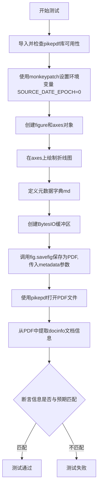

#### 带注释源码

```python
def test_savefig_metadata(monkeypatch):
    """
    测试savefig函数能否正确将元数据写入PDF文件
    
    该测试函数验证Matplotlib的PDF后端能够正确处理和保存
    各种标准的PDF元数据字段，包括Author、Title、Subject等。
    """
    # 使用pytest.importorskip确保pikepdf库可用，若不可用则跳过测试
    pikepdf = pytest.importorskip('pikepdf')
    
    # 设置SOURCE_DATE_EPOCH环境变量为'0'，确保PDF创建日期可预测
    # 这对于可重现的测试非常重要，避免时间戳导致测试不稳定
    monkeypatch.setenv('SOURCE_DATE_EPOCH', '0')

    # 创建figure和axes对象，准备绘图
    fig, ax = plt.subplots()
    
    # 在axes上绘制简单的折线图
    ax.plot(range(5))

    # 定义要写入PDF的元数据字典
    # 包含：作者、标题、主题、关键词、修改日期、Trapped标志
    md = {
        'Author': 'me',
        'Title': 'Multipage PDF',
        'Subject': 'Test page',
        'Keywords': 'test,pdf,multipage',
        # 使用带时区的datetime对象作为修改日期
        'ModDate': datetime.datetime(
            1968, 8, 1, tzinfo=datetime.timezone(datetime.timedelta(0))),
        'Trapped': 'True'
    }
    
    # 创建内存缓冲区用于保存PDF数据
    buf = io.BytesIO()
    
    # 调用savefig方法将figure保存为PDF格式，并传入metadata参数
    # 这里会调用PdfPages或底层PDF后端来写入元数据
    fig.savefig(buf, metadata=md, format='pdf')

    # 使用pikepdf打开保存的PDF文件（从缓冲区读取）
    with pikepdf.Pdf.open(buf) as pdf:
        # 从PDF的docinfo中提取所有元数据，并转换为字符串
        info = {k: str(v) for k, v in pdf.docinfo.items()}

    # 断言提取的元数据与预期值完全匹配
    # 验证点包括：
    # - Author保持原值
    # - CreationDate根据SOURCE_DATE_EPOCH生成（1970年1月1日）
    # - Creator包含Matplotlib版本和URL
    # - Keywords、Subject、Title保持原值
    # - ModDate使用传入的1968年8月1日
    # - Producer包含pdf backend版本
    # - Trapped转换为PDF格式/True
    assert info == {
        '/Author': 'me',
        '/CreationDate': 'D:19700101000000Z',
        '/Creator': f'Matplotlib v{mpl.__version__}, https://matplotlib.org',
        '/Keywords': 'test,pdf,multipage',
        '/ModDate': 'D:19680801000000Z',
        '/Producer': f'Matplotlib pdf backend v{mpl.__version__}',
        '/Subject': 'Test page',
        '/Title': 'Multipage PDF',
        '/Trapped': '/True',
    }
```


### `test_invalid_metadata`

该函数是一个测试函数，用于验证当向 PDF 保存操作提供无效的元数据时，系统能够正确发出相应的 UserWarning 警告。它测试了四种无效的元数据场景：未知的关键字、错误类型的 ModDate、错误格式的 Trapped 以及非字符串类型的 Title。

参数：无

返回值：`None`，无返回值（测试函数）

#### 流程图

```mermaid
flowchart TD
    A[开始: test_invalid_metadata] --> B[创建图表和坐标轴: plt.subplots]
    B --> C[测试1: 无效关键字 'foobar']
    C --> D{检查警告匹配 "Unknown infodict keyword: 'foobar'."}
    D -->|通过| E[测试2: 错误类型 ModDate]
    E --> F{检查警告匹配 "not an instance of datetime.datetime."}
    F -->|通过| G[测试3: 错误值 Trapped]
    G --> H{检查警告匹配 'not one of {"True", "False", "Unknown"}'}
    H -->|通过| I[测试4: 非字符串 Title]
    I --> J{检查警告匹配 "not an instance of str."}
    J -->|通过| K[结束: 所有测试通过]
    
    D -->|失败| L[测试失败]
    F -->|失败| L
    H -->|失败| L
    J -->|失败| L
```

#### 带注释源码

```python
def test_invalid_metadata():
    """
    测试无效元数据输入时是否正确产生 UserWarning。
    
    验证 PDF 后端对以下几种无效元数据的处理：
    1. 未知的关键字
    2. 错误类型的日期值
    3. 无效的 Trapped 值
    4. 非字符串类型的字段值
    """
    # 创建空白图表和坐标轴用于测试
    fig, ax = plt.subplots()

    # 测试1: 传入未知的关键字 'foobar'
    # 期望产生警告: "Unknown infodict keyword: 'foobar'."
    with pytest.warns(UserWarning,
                      match="Unknown infodict keyword: 'foobar'."):
        fig.savefig(io.BytesIO(), format='pdf', metadata={'foobar': 'invalid'})

    # 测试2: ModDate 应该是 datetime.datetime 实例，传入字符串会警告
    # 期望产生警告: "not an instance of datetime.datetime."
    with pytest.warns(UserWarning,
                      match='not an instance of datetime.datetime.'):
        fig.savefig(io.BytesIO(), format='pdf',
                    metadata={'ModDate': '1968-08-01'})

    # 测试3: Trapped 必须是 "True", "False" 或 "Unknown" 之一
    # 传入 'foo' 会产生警告
    with pytest.warns(UserWarning,
                      match='not one of {"True", "False", "Unknown"}'):
        fig.savefig(io.BytesIO(), format='pdf', metadata={'Trapped': 'foo'})

    # 测试4: Title 必须是字符串类型，传入整数会警告
    # 期望产生警告: "not an instance of str."
    with pytest.warns(UserWarning, match='not an instance of str.'):
        fig.savefig(io.BytesIO(), format='pdf', metadata={'Title': 1234})
```


### `test_multipage_metadata`

该函数用于测试在多页 PDF 文档中保存元数据的功能，验证 PdfPages 能否正确地将自定义元数据（如作者、标题、主题、关键字、修改日期和 Trapped 状态）写入到生成的 PDF 文件中，并确保在保存多个页面后元数据仍然正确。

参数：

-  `monkeypatch`：`pytest.MonkeyPatch`，pytest 的 fixture，用于修改环境变量或对象属性，这里用于设置 SOURCE_DATE_EPOCH 环境变量以确保测试的可重复性

返回值：`None`，该函数为测试函数，没有显式的返回值，通过断言来验证功能正确性

#### 流程图

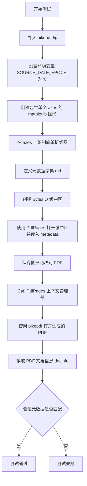

#### 带注释源码

```python
def test_multipage_metadata(monkeypatch):
    """
    测试多页 PDF 文档的元数据保存功能
    
    该测试函数验证 PdfPages 能否正确地将自定义元数据写入到多页 PDF 文件中，
    并确保在保存多个页面后元数据仍然保持正确。
    """
    # 导入 pikepdf 库（如果未安装则跳过测试）
    pikepdf = pytest.importorskip('pikepdf')
    # 设置环境变量 SOURCE_DATE_EPOCH 为 '0'，确保测试的可重复性
    # 这样可以避免因时间变化导致的创建日期不一致
    monkeypatch.setenv('SOURCE_DATE_EPOCH', '0')

    # 创建一个新的图形和一个 axes
    fig, ax = plt.subplots()
    # 在 axes 上绘制简单的折线数据 [0, 1, 2, 3, 4]
    ax.plot(range(5))

    # 定义 PDF 元数据字典，包含：
    # - Author: 作者
    # - Title: 文档标题
    # - Subject: 主题
    # - Keywords: 关键字
    # - ModDate: 修改日期（1968年8月1日）
    # - Trapped: PDF 对象的 Trapped 标志
    md = {
        'Author': 'me',
        'Title': 'Multipage PDF',
        'Subject': 'Test page',
        'Keywords': 'test,pdf,multipage',
        'ModDate': datetime.datetime(
            1968, 8, 1, tzinfo=datetime.timezone(datetime.timedelta(0))),
        'Trapped': 'True'
    }
    
    # 创建内存缓冲区用于存储 PDF 数据
    buf = io.BytesIO()
    
    # 使用 PdfPages 上下文管理器打开缓冲区，同时传入元数据
    # 注意：元数据只在第一个页面写入一次
    with PdfPages(buf, metadata=md) as pdf:
        # 将当前图形保存到 PDF（第一页）
        pdf.savefig(fig)
        # 再次保存图形（第二页）
        # 验证多页情况下元数据是否仍然正确
        pdf.savefig(fig)

    # 使用 pikepdf 打开生成的 PDF 文件进行验证
    with pikepdf.Pdf.open(buf) as pdf:
        # 将 PDF 文档信息转换为字符串字典
        info = {k: str(v) for k, v in pdf.docinfo.items()}

    # 断言验证所有元数据字段是否符合预期
    assert info == {
        '/Author': 'me',
        # 创建日期：由于设置了 SOURCE_DATE_EPOCH='0'，会是 1970-01-01
        '/CreationDate': 'D:19700101000000Z',
        # 创建者：包含 Matplotlib 版本和 URL
        '/Creator': f'Matplotlib v{mpl.__version__}, https://matplotlib.org',
        '/Keywords': 'test,pdf,multipage',
        # 修改日期：使用我们指定的 1968-08-01
        '/ModDate': 'D:19680801000000Z',
        # 生产者：包含 PDF backend 版本信息
        '/Producer': f'Matplotlib pdf backend v{mpl.__version__}',
        '/Subject': 'Test page',
        '/Title': 'Multipage PDF',
        '/Trapped': '/True',  # 注意：pikepdf 会添加前导斜杠
    }
```


### `test_text_urls`

该函数是一个自动化测试用例，用于验证 Matplotlib 在生成 PDF 文件时能否正确地将 URL 链接嵌入到文本对象中，并确保 PDF 注解中的 URL 和位置信息准确无误。

参数： 无

返回值：`None`，该函数不返回任何值，仅通过断言验证 PDF 中的 URL 注解是否正确生成

#### 流程图

```mermaid
flowchart TD
    A[开始执行 test_text_urls] --> B{检查 pikepdf 库是否可用}
    B -- 库不可用 --> C[跳过测试]
    B -- 库可用 --> D[设置测试 URL: https://test_text_urls.matplotlib.org/]
    D --> E[创建 2x1 大小的 PDF 图形]
    E --> F[在图形中添加两个带 URL 链接的文本对象<br/>1. (0.1, 0.1) 处添加 'test plain 123' 链接到 plain<br/>2. (0.1, 0.4) 处添加 'test mathtext $123$' 链接到 mathtext]
    F --> G[将图形保存到 BytesIO 缓冲区为 PDF 格式]
    G --> H[使用 pikepdf 打开生成的 PDF 文件]
    H --> I[遍历两个文本片段的预期 URL 和 Y 坐标]
    I --> J{查找匹配的注解}
    J -- 找到 --> K[验证注解的 URI 等于预期 URL]
    J -- 未找到 --> L[断言失败 - 注解不存在]
    K --> M{验证 QuadPoints 属性为 None}
    M -- 是 --> N[验证 Y 坐标位置正确<br/>annot.Rect[1] == decimal.Decimal(y) * 72]
    M -- 否 --> O[断言失败 - QuadPoints 不应为非空值]
    N --> P{所有测试都通过}
    P -- 是 --> Q[测试结束]
    P -- 否 --> R[抛出 AssertionError]
```

#### 带注释源码

```python
def test_text_urls():
    """
    测试 PDF 后端是否正确将 URL 链接嵌入到文本注解中。
    该测试验证：
    1. 文本对象的 URL 能够正确保存到 PDF 注解中
    2. 非旋转文本的 QuadPoints 属性应为 None
    3. 文本位置的 Y 坐标在 PDF 中正确转换（1 inch = 72 points）
    """
    # 条件导入：尝试导入 pikepdf 库，如果不可用则跳过该测试
    # pikepdf 是一个用于读取和修改 PDF 文件的 Python 库
    pikepdf = pytest.importorskip('pikepdf')

    # 定义测试用的 URL 前缀，用于验证生成的文件内容
    test_url = 'https://test_text_urls.matplotlib.org/'

    # 创建一个 2 英寸宽、1 英寸高的图形对象
    # figsize 参数单位为英寸
    fig = plt.figure(figsize=(2, 1))
    
    # 在图形中添加两个带 URL 链接的文本对象
    # 第一个参数 (0.1, 0.1) 表示文本位置的 x, y 坐标（相对于图形大小）
    # 第二个参数是文本内容
    # url 参数指定点击文本时跳转的链接地址
    fig.text(0.1, 0.1, 'test plain 123', url=f'{test_url}plain')
    fig.text(0.1, 0.4, 'test mathtext $123$', url=f'{test_url}mathtext')

    # 使用 BytesIO 创建内存缓冲区，用于存储生成的 PDF 数据
    with io.BytesIO() as fd:
        # 将图形保存为 PDF 格式到缓冲区
        # format='pdf' 指定输出格式为 PDF
        fig.savefig(fd, format='pdf')

        # 使用 pikepdf 打开生成的 PDF 文件进行验证
        # 注意：必须在上下文管理器内迭代 Annots，否则可能因 PDF 结构导致失败
        with pikepdf.Pdf.open(fd) as pdf:
            # 获取第一页的注解列表（Annotations）
            # PDF 注解用于存储交互元素，如链接、批注等
            annots = pdf.pages[0].Annots

            # 遍历两个测试用例：
            # 1. ('0.1', 'plain') - 普通文本，预期 Y 坐标为 0.1
            # 2. ('0.4', 'mathtext') - 数学文本，预期 Y 坐标为 0.4
            for y, fragment in [('0.1', 'plain'), ('0.4', 'mathtext')]:
                # 使用生成器表达式查找匹配 URL 的注解
                # next() 返回第一个匹配的元素，如果没有找到则返回 None
                annot = next(
                    (a for a in annots if a.A.URI == f'{test_url}{fragment}'),
                    None)
                
                # 断言：确保找到对应的注解
                assert annot is not None
                
                # 断言：确保非旋转文本的 QuadPoints 属性为 None
                # QuadPoints 用于指定文本的四边形顶点坐标
                # 只有旋转或倾斜的文本才需要此属性
                assert getattr(annot, 'QuadPoints', None) is None
                
                # 验证注解的位置信息
                # PDF 中的坐标单位是 points（1 inch = 72 points）
                # annot.Rect 是一个 [x1, y1, x2, y2] 格式的列表
                # Rect[1] 表示 Y 轴方向的最小值（即文本底部）
                # 验证公式：y 坐标 * 72 = PDF 中的 points 值
                assert annot.Rect[1] == decimal.Decimal(y) * 72
```


### `test_text_rotated_urls`

该函数是一个测试函数，用于验证在 PDF 中旋转文本的 URL 链接是否正确生成，并检查 QuadPoints 属性是否被正确设置以支持旋转文本的坐标映射。

参数：无

返回值：`None`，测试函数不返回任何值

#### 流程图

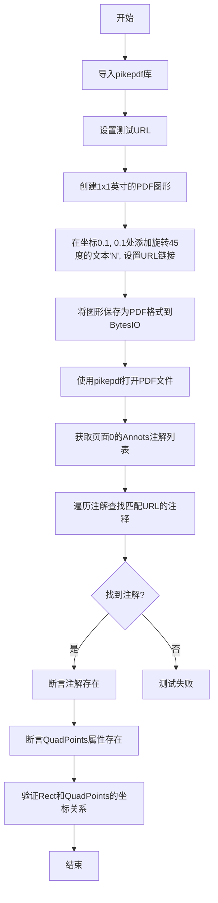

#### 带注释源码

```python
def test_text_rotated_urls():
    """测试旋转文本的URL链接功能"""
    # 导入pikepdf库，用于验证PDF结构
    pikepdf = pytest.importorskip('pikepdf')

    # 定义测试用的URL
    test_url = 'https://test_text_urls.matplotlib.org/'

    # 创建一个1x1英寸的图形
    fig = plt.figure(figsize=(1, 1))
    # 在坐标(0.1, 0.1)处添加旋转45度的文本'N'，并设置URL链接
    fig.text(0.1, 0.1, 'N', rotation=45, url=f'{test_url}')

    # 使用BytesIO作为内存缓冲区保存PDF
    with io.BytesIO() as fd:
        # 将图形保存为PDF格式到缓冲区
        fig.savefig(fd, format='pdf')

        # 使用pikepdf打开PDF文件进行验证
        with pikepdf.Pdf.open(fd) as pdf:
            # 获取第一页的注解(Annotations)列表
            annots = pdf.pages[0].Annots

            # 必须在上下文管理器内迭代Annots，
            # 否则可能根据PDF结构导致失败
            # 查找具有匹配URL的注解
            annot = next(
                (a for a in annots if a.A.URI == f'{test_url}'),
                None)
            # 断言找到对应的注解
            assert annot is not None
            # 断言QuadPoints属性存在（旋转文本需要此属性）
            assert getattr(annot, 'QuadPoints', None) is not None
            # 验证坐标位置（72 points per inch）
            # 确保注解的Rect坐标与QuadPoints的坐标关系正确
            assert annot.Rect[0] == \
               annot.QuadPoints[6] - decimal.Decimal('0.00001')
```


### `test_text_urls_tex`

该函数是一个集成测试，用于验证在使用 LaTeX 渲染文本的情况下，PDF 中的 URL 链接注释能否正确生成并正确定位。它通过 `pikepdf` 库读取生成的 PDF，检查是否存在指定 URI 的注解，并验证注解的垂直位置是否符合预期（72 DPI 转换）。

参数： 无

返回值： `None`，该函数通过 `assert` 语句进行断言验证，不返回任何值

#### 流程图

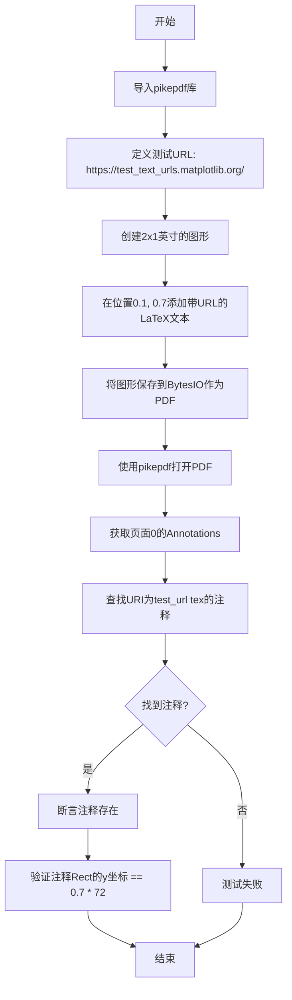

#### 带注释源码

```python
@needs_usetex
def test_text_urls_tex():
    """测试使用LaTeX渲染的文本在PDF中的URL链接功能"""
    
    # 导入pikepdf库，用于读取和验证PDF结构
    # 如果未安装则跳过测试
    pikepdf = pytest.importorskip('pikepdf')

    # 定义测试用的URL基础路径
    test_url = 'https://test_text_urls.matplotlib.org/'

    # 创建2x1英寸的图形对象
    fig = plt.figure(figsize=(2, 1))
    
    # 在图形中添加文本：位置(0.1, 0.7)，内容为LaTeX格式'test tex $123$'
    # usetex=True 启用LaTeX渲染，url参数指定关联的链接
    fig.text(0.1, 0.7, 'test tex $123$', usetex=True, url=f'{test_url}tex')

    # 使用BytesIO作为内存缓冲区保存PDF
    with io.BytesIO() as fd:
        # 将图形保存为PDF格式到内存缓冲区
        fig.savefig(fd, format='pdf')

        # 使用pikepdf打开PDF进行验证
        with pikepdf.Pdf.open(fd) as pdf:
            # 获取第一页的所有注解(Annotations)
            annots = pdf.pages[0].Annots

            # 必须在pikepdf的上下文管理器内迭代Annotations
            # 否则可能因PDF结构问题导致失败
            annot = next(
                # 查找URI等于指定URL的注解
                (a for a in annots if a.A.URI == f'{test_url}tex'),
                None
            )
            
            # 断言：确认找到了对应的注解
            assert annot is not None
            
            # 验证注解位置：PDF中坐标以72 DPI(点每英寸)为单位
            # y坐标应该是 0.7 * 72 = 50.4 点
            assert annot.Rect[1] == decimal.Decimal('0.7') * 72
```


### `test_pdfpages_fspath`

该测试函数用于验证 `PdfPages` 类能够正确处理 `pathlib.Path` 对象，通过 `__fspath__` 协议将 Path 转换为文件对象。测试使用 `os.devnull` 作为输出路径（实际上会丢弃输出），确保 PdfPages 与 Path 对象的兼容性。

参数： 无

返回值： `None`，该测试函数不返回任何值，仅执行验证操作

#### 流程图

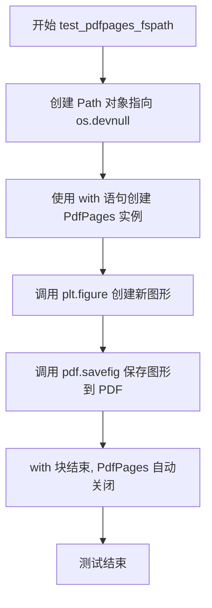

#### 带注释源码

```python
def test_pdfpages_fspath():
    """
    Test that PdfPages works with pathlib.Path objects.
    
    This test verifies the __fspath__ protocol support in PdfPages,
    ensuring it can accept pathlib.Path objects as the output file path.
    """
    # Create a Path object pointing to os.devnull (null device)
    # This path is used as a placeholder; actual output is discarded
    with PdfPages(Path(os.devnull)) as pdf:
        # Create a new figure and save it to the PDF
        # This tests that PdfPages correctly handles Path objects
        # through the __fspath__ protocol
        pdf.savefig(plt.figure())
```


### `test_hatching_legend`

测试函数，用于验证PDF中图例的阴影图案（hatching）是否正确渲染，特别是处理空标签后的阴影渲染。

参数：

- `text_placeholders`：`未知类型`（由@pytest.fixture或装饰器注入的参数，用于图像比较测试的占位符处理）

返回值：`None`，无返回值（测试函数）

#### 流程图

```mermaid
flowchart TD
    A[开始测试] --> B[创建图形 figsize=(1, 2)]
    B --> C[创建矩形a: 绿色填充, 阴影XXXX]
    C --> D[创建矩形b: 蓝色填充, 阴影XXXX]
    D --> E[调用fig.legend创建图例]
    E --> F[传入矩形a, b, a, b和四个空标签]
    F --> G[验证阴影在空标签后正确渲染]
    G --> H[结束测试]
```

#### 带注释源码

```python
@image_comparison(['hatching_legend.pdf'], style='mpl20')  # 装饰器：比较生成的PDF与参考图像，使用mpl20样式
def test_hatching_legend(text_placeholders):
    """Test for correct hatching on patches in legend"""
    # 创建1x2英寸的图形
    fig = plt.figure(figsize=(1, 2))

    # 创建矩形a：绿色填充，XX图案阴影
    # Rectangle参数: [x, y], width, height
    a = Rectangle([0, 0], 0, 0, facecolor="green", hatch="XXXX")
    
    # 创建矩形b：蓝色填充，XX图案阴影
    b = Rectangle([0, 0], 0, 0, facecolor="blue", hatch="XXXX")

    # 使用空标签""创建图例，验证阴影在PDF中的渲染
    # 相关问题: https://github.com/matplotlib/matplotlib/issues/4469
    # 空标签不应影响后续元素的阴影渲染
    fig.legend([a, b, a, b], ["", "", "", ""])
```


### `test_grayscale_alpha`

该函数是一个图像比较测试，用于验证 Matplotlib PDF 后端正确处理带有 NaN 值的灰度图像（掩码图像）。测试创建了一个包含 NaN 值的二维高斯分布数组，使用灰度色彩映射渲染，并通过 `@image_comparison` 装饰器比对生成的 PDF 输出。

参数：

- 该函数无显式参数（pytest 隐式注入的参数如 `request` 未在函数签名中体现）

返回值：`None`，无返回值（测试函数仅执行图像生成和保存操作）

#### 流程图

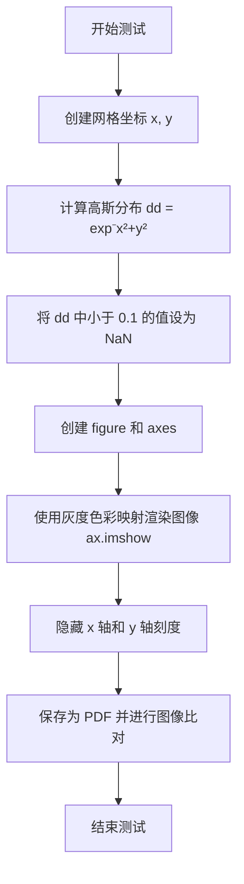

#### 带注释源码

```python
@image_comparison(['grayscale_alpha.pdf'])  # 装饰器：比对生成的 PDF 与基准图像
def test_grayscale_alpha():
    """Masking images with NaN did not work for grayscale images"""
    # 创建二维网格坐标，范围 -2 到 2，步长 0.1
    x, y = np.ogrid[-2:2:.1, -2:2:.1]
    
    # 计算高斯分布：exp(-(x² + y²))
    dd = np.exp(-(x**2 + y**2))
    
    # 将数值小于 0.1 的区域设为 NaN（掩码处理）
    # 这是测试的核心：验证 NaN 掩码在灰度图像中正常工作
    dd[dd < .1] = np.nan
    
    # 创建图形和坐标轴
    fig, ax = plt.subplots()
    
    # 使用灰度反色色彩映射（gray_r）渲染图像
    # interpolation='none' 禁用插值，确保精确测试像素处理
    ax.imshow(dd, interpolation='none', cmap='gray_r')
    
    # 隐藏坐标轴刻度，使图像更清晰
    ax.set_xticks([])
    ax.set_yticks([])
```


### `test_pdf_eps_savefig_when_color_is_none`

该测试函数用于验证当 matplotlib 绘图函数（如 `plot`）的颜色参数设为 `"none"` 时，PDF 和 EPS 后端能够正确处理并生成一致的输出。函数通过 `@check_figures_equal` 装饰器比较两种格式的渲染结果是否符合预期。

参数：

- `fig_test`：`matplotlib.figure.Figure`，测试组中的图形对象，用于执行带有 `c="none"` 参数的绘图操作
- `fig_ref`：`matplotlib.figure.Figure`，参考组中的图形对象，作为对比基准（不执行实际绘图，仅创建空坐标轴）

返回值：`None`，该函数为测试函数，不返回任何值

#### 流程图

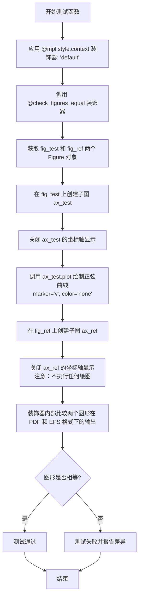

#### 带注释源码

```python
@mpl.style.context('default')  # 应用 Matplotlib 默认样式上下文，确保测试环境一致性
@check_figures_equal(extensions=["pdf", "eps"])  # 装饰器：比较测试图和参考图在 PDF 和 EPS 格式下的输出是否一致
def test_pdf_eps_savefig_when_color_is_none(fig_test, fig_ref):
    """
    测试当颜色参数为 'none' 时，PDF 和 EPS 后端的 savefig 功能是否正常工作。
    
    测试逻辑：
    - fig_test: 执行实际绘图（包含颜色为 none 的线条）
    - fig_ref: 不执行绘图，仅创建空坐标轴作为参考
    - 装饰器会比较两者在 PDF 和 EPS 格式下的渲染结果
    """
    
    # ====== 测试组（fig_test）======
    ax_test = fig_test.add_subplot()  # 在测试图形上创建子图，返回 Axes 对象
    ax_test.set_axis_off()  # 隐藏坐标轴（关闭坐标轴显示、刻度等）
    
    # 绘制正弦曲线，使用 'v'（倒三角形）marker，颜色设为 'none'（透明/不显示）
    # np.sin(np.linspace(-5, 5, 100)) 生成 100 个采样点的正弦波数据
    ax_test.plot(np.sin(np.linspace(-5, 5, 100)), "v", c="none")
    
    # ====== 参考组（fig_ref）======
    ax_ref = fig_ref.add_subplot()  # 在参考图形上创建子图
    ax_ref.set_axis_off()  # 关闭坐标轴显示
    
    # 注意：参考组不执行任何 plot 调用，仅创建空坐标轴
    # 目的是验证当颜色为 'none' 时，输出应该与空坐标轴一致
```


### `test_failing_latex`

该测试函数用于验证当 LaTeX 渲染失败时（例如出现双重下标错误），Matplotlib 能够正确抛出 RuntimeError 异常。

参数：无

返回值：`None`，该函数为测试函数，不返回任何值

#### 流程图

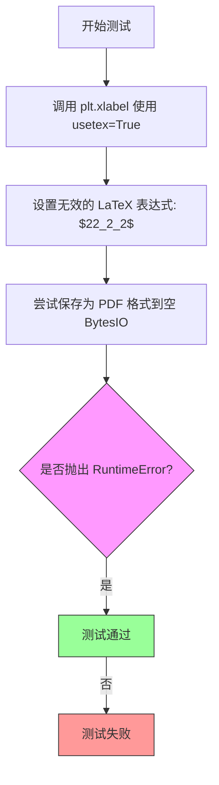

#### 带注释源码

```python
@needs_usetex  # 装饰器：仅在系统支持 usetex 时运行此测试
def test_failing_latex():
    """Test failing latex subprocess call"""
    # 使用 plt.xlabel 设置 x 轴标签
    # 参数 usetex=True 启用 LaTeX 渲染
    # "$22_2_2$" 是一个无效的 LaTeX 表达式
    #   - "22" 后跟 "_2" 表示下标 2
    #   - 后面又跟了 "_2"，形成双重下标，这在 LaTeX 中是非法的
    #   - 这会导致 LaTeX 编译失败并返回错误信息
    plt.xlabel("$22_2_2$", usetex=True)  # This fails with "Double subscript"
    
    # 使用 pytest.raises 上下文管理器
    # 期望在执行 plt.savefig 时抛出 RuntimeError 异常
    # 这是因为 LaTeX 子进程调用失败
    with pytest.raises(RuntimeError):
        # 创建一个空的 BytesIO 对象作为 PDF 输出目标
        # 尝试将当前图形保存为 PDF 格式
        # 由于上面的 LaTeX 表达式无效，这里应该抛出 RuntimeError
        plt.savefig(io.BytesIO(), format="pdf")
```


### `test_empty_rasterized`

该函数用于测试当图形中包含空数据且启用栅格化（rasterized=True）时，能否正确保存为 PDF 文件。

参数：无

返回值：`None`，无返回值（测试函数）

#### 流程图

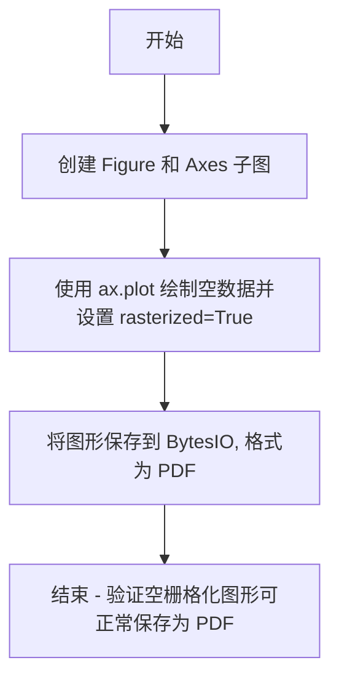

#### 带注释源码

```python
def test_empty_rasterized():
    # 检查空图形在栅格化模式下能否正常保存为 PDF 文件
    # 创建一个新的 Figure 和一个 Axes 子图
    fig, ax = plt.subplots()
    
    # 在 Axes 上绘制空数据列表，并设置 rasterized=True
    # rasterized=True 表示将矢量图形元素转换为栅格图像后再嵌入 PDF
    ax.plot([], [], rasterized=True)
    
    # 将图形保存到 BytesIO 内存缓冲区，格式为 PDF
    # 测试确保即使数据为空，栅格化功能也能正常工作
    fig.savefig(io.BytesIO(), format="pdf")
```


### `test_kerning`

该测试函数用于验证 PDF 后端在渲染文本时的字距调整（kerning）功能是否正确，特别是检查包含特殊字符（如欧元符号 €）和大写字母组合的文字渲染效果。

参数：

- 无

返回值：`None`，测试函数无返回值

#### 流程图

```mermaid
flowchart TD
    A[开始执行 test_kerning] --> B[创建新的 matplotlib .figure 对象]
    B --> C[定义测试字符串 s = "AVAVAVAVAVAVAVAV€AAVV"]
    C --> D[在位置 (0, 0.25) 添加字号为 5 的文本]
    D --> E[在位置 (0, 0.75) 添加字号为 20 的文本]
    E --> F[通过 @image_comparison 装饰器比较生成的 PDF 与基准图像]
    F --> G[结束]
```

#### 带注释源码

```python
@image_comparison(['kerning.pdf'])  # 装饰器：比较生成的 PDF 与基准图像 'kerning.pdf'
def test_kerning():
    """测试 PDF 后端的字距调整（kerning）功能"""
    fig = plt.figure()  # 创建一个新的空白图形对象
    s = "AVAVAVAVAVAVAVAV€AAVV"  # 定义测试字符串，包含欧元符号和大写字母组合
    fig.text(0, .25, s, size=5)   # 在图形左下角（x=0, y=0.25）添加小字号文本
    fig.text(0, .75, s, size=20)  # 在图形左侧（x=0, y=0.75）添加大字号文本
    # 装饰器会自动保存图形到 PDF 并与基准图像进行比较
```


### `test_glyphs_subset`

该函数用于测试 Matplotlib PDF 后端的字体子集化功能，验证通过 `get_glyphs_subset` 函数创建的子集化字体包含所有必需字符，同时字符映射表大小小于完整字体。

参数： 无

返回值：`None`，该函数为测试函数，不返回任何值

#### 流程图

```mermaid
flowchart TD
    A[开始] --> B[获取 DejaVuSerif.ttf 字体路径]
    B --> C[定义测试字符串 "these should be subsetted! 1234567890"]
    C --> D[创建非子集化字体对象 nosubfont]
    D --> E[在 nosubfont 上设置文本]
    E --> F[使用 get_glyphs_subset 创建子集化字体]
    F --> G[在子集化字体 subfont 上设置相同文本]
    G --> H[获取两个字体的字符映射表]
    H --> I{断言: 子集化字体包含所有唯一字符}
    I --> J{断言: 子集化字体映射表小于非子集化字体}
    J --> K{断言: 两者字形数量相等}
    K --> L[结束]
```

#### 带注释源码

```python
def test_glyphs_subset():
    """测试字体子集化功能"""
    # 获取 DejaVuSerif.ttf 字体文件的完整路径
    fpath = str(_get_data_path("fonts/ttf/DejaVuSerif.ttf"))
    # 定义需要子集化的字符集
    chars = "these should be subsetted! 1234567890"

    # ===== 创建非子集化的 FT2Font =====
    # 直接从字体文件创建完整字体
    nosubfont = FT2Font(fpath)
    # 在完整字体上设置文本字符
    nosubfont.set_text(chars)

    # ===== 创建子集化的 FT2Font =====
    # 使用 get_glyphs_subset 上下文管理器获取子集化字体数据
    with get_glyphs_subset(fpath, chars) as subset:
        # 将子集化数据作为文件对象，创建子集化字体
        subfont = FT2Font(font_as_file(subset))
    # 在子集化字体上设置相同文本
    subfont.set_text(chars)

    # ===== 验证子集化结果 =====
    # 获取两个字体的字符映射表 (char code -> glyph index)
    nosubcmap = nosubfont.get_charmap()
    subcmap = subfont.get_charmap()

    # 断言 1: 所有唯一字符都必须在子集化字体的映射表中存在
    # 将字符映射表的键 (glyph index) 转换回字符进行比较
    assert {*chars} == {chr(key) for key in subcmap}

    # 断言 2: 子集化字体的映射表条目数应少于完整字体
    assert len(subcmap) < len(nosubcmap)

    # 断言 3: 由于设置了相同的字符，两者的字形数量应该相等
    assert subfont.get_num_glyphs() == nosubfont.get_num_glyphs()
```


### `test_multi_font_type3`

该函数是一个测试用例，用于验证 Matplotlib PDF 后端在使用 Type 3 字体（fonttype=3）时正确渲染多字体文本的能力。它通过生成包含多种字体的测试字符串，设置相应的 rcParams，创建一个 figure 并在中心位置添加文本，最后生成 PDF 图像用于图像比较测试。

参数：无

返回值：`None`，该函数没有返回值，仅执行测试逻辑

#### 流程图

```mermaid
flowchart TD
    A[开始测试] --> B[调用 _gen_multi_font_text 获取 fonts 和 test_str]
    B --> C[设置 plt.rc: font.family = fonts, font.size = 16]
    C --> D[设置 plt.rc: pdf.fonttype = 3]
    D --> E[创建新 Figure: plt.figure]
    E --> F[在 figure 中心添加文本: fig.text]
    F --> G[结束测试]
```

#### 带注释源码

```python
@image_comparison(["multi_font_type3.pdf"])  # 装饰器：比较生成的PDF与基准图像
def test_multi_font_type3():
    """
    测试使用 Type 3 字体生成多字体 PDF 的功能。
    Type 3 字体是一种可缩放的 PostScript 字体格式。
    """
    
    # 调用辅助函数生成多字体测试数据
    # 返回: fonts - 字体族列表, test_str - 包含多种字体的测试字符串
    fonts, test_str = _gen_multi_font_text()
    
    # 配置 matplotlib 的字体设置
    # family: 设置为生成的多字体族
    # size: 设置字体大小为 16 磅
    plt.rc('font', family=fonts, size=16)
    
    # 配置 PDF 后端的字体类型
    # fonttype=3 表示使用 Type 3 字体（PostScript 字体）
    plt.rc('pdf', fonttype=3)
    
    # 创建一个新的空白 Figure 对象
    fig = plt.figure()
    
    # 在 figure 的中心位置 (0.5, 0.5) 添加文本
    # horizontalalignment='center': 水平居中对齐
    # verticalalignment='center': 垂直居中对齐
    fig.text(0.5, 0.5, test_str,
             horizontalalignment='center', verticalalignment='center')
    
    # 测试执行完毕，@image_comparison 装饰器会自动保存 PDF
    # 并与基准图像 multi_font_type3.pdf 进行像素级比较
```


### `test_multi_font_type42`

该函数是一个图像对比测试，用于验证 Matplotlib 在 PDF 后端中使用 Type 42 字体（TrueType 字体）进行多字体文本渲染的功能。通过生成多字体文本并保存为 PDF，然后与参考图像进行对比，确保输出符合预期。

参数：

- 该函数无参数

返回值：`None`，无返回值（测试函数执行副作用但不返回数值）

#### 流程图

```mermaid
flowchart TD
    A[开始执行 test_multi_font_type42] --> B[调用 _gen_multi_font_text 获取 fonts 和 test_str]
    B --> C[设置 plt.rc: font.family = fonts, font.size = 16]
    C --> D[设置 plt.rc: pdf.fonttype = 42]
    D --> E[创建新图形 plt.figure]
    E --> F[在图形位置 0.5, 0.5 添加文本 test_str]
    F --> G[horizontalalignment='center', verticalalignment='center']
    G --> H[结束, @image_comparison 装饰器自动进行图像对比]
```

#### 带注释源码

```python
@image_comparison(["multi_font_type42.pdf"])  # 装饰器: 将测试生成的 PDF 与参考图像 multi_font_type42.pdf 进行对比
def test_multi_font_type42():  # 测试函数: 验证 Type 42 字体在 PDF 后端的多字体渲染功能
    fonts, test_str = _gen_multi_font_text()  # 调用内部函数生成多字体测试数据,返回字体族列表和测试字符串
    plt.rc('font', family=fonts, size=16)      # 配置 matplotlib 全局字体参数:使用多字体族,字号设为 16
    plt.rc('pdf', fonttype=42)                 # 配置 PDF 后端参数:使用 Type 42 (TrueType) 字体格式

    fig = plt.figure()                         # 创建一个新的图形对象(空白画布)
    fig.text(0.5, 0.5, test_str,               # 在图形指定位置(0.5, 0.5)绘制文本,坐标为相对坐标(0-1之间)
             horizontalalignment='center',     # 水平对齐方式:居中
             verticalalignment='center')       # 垂直对齐方式:居中
    # 函数结束,@image_comparison 装饰器会自动将生成的 PDF 与参考图像进行像素级对比
```


### `test_otf_font_smoke`

该函数用于测试 OpenType Font (OTF) 字体能否在 Matplotlib 中正常加载并渲染到 PDF 文件中，通过检查字体查找和 PDF 保存流程确保不会发生段错误。

参数：

- `family_name`：`str`，字体家族名称（如 "Noto Sans"、"FreeMono"）
- `file_name`：`str`，字体文件名（如 "NotoSans-Regular.otf"）

返回值：`None`，该函数无返回值，主要通过断言和 PDF 生成验证字体功能

#### 流程图

```mermaid
flowchart TD
    A[开始 test_otf_font_smoke] --> B[创建 FontProperties 对象]
    B --> C{查找字体文件}
    C --> D{字体文件名匹配?}
    D -->|否| E[跳过测试: 字体可能缺失]
    D -->|是| F[设置 matplotlib rc 参数: font.family 和 font.size]
    F --> G[创建新 Figure 对象]
    G --> H[在 Figure 上添加文本: 俄语 'Привет мир!']
    H --> I[将 Figure 保存为 PDF 格式到 BytesIO]
    I --> J[结束测试]
```

#### 带注释源码

```python
@pytest.mark.parametrize('family_name, file_name',
                         [("Noto Sans", "NotoSans-Regular.otf"),
                          ("FreeMono", "FreeMono.otf")])
def test_otf_font_smoke(family_name, file_name):
    """
    测试 OTF 字体能否正常加载并保存到 PDF，验证没有段错误。
    
    参数化测试用例：
    - ("Noto Sans", "NotoSans-Regular.otf")
    - ("FreeMono", "FreeMono.otf")
    """
    # 使用指定字体家族创建 FontProperties 对象
    fp = fm.FontProperties(family=[family_name])
    
    # 查找系统中的实际字体文件路径
    font_path = fm.findfont(fp)
    
    # 检查找到的字体文件名是否与预期匹配
    # 若不匹配则说明测试环境缺少该字体，跳过测试
    if Path(font_path).name != file_name:
        pytest.skip(f"Font {family_name} may be missing")
    
    # 设置 matplotlib 的字体配置：
    # - font.family: 使用指定字体家族
    # - font.size: 设置字体大小为 27 磅
    plt.rc('font', family=[family_name], size=27)
    
    # 创建新的 Figure 对象用于渲染
    fig = plt.figure()
    
    # 在 Figure 指定位置 (0.15, 0.475) 添加俄语文本
    # 文本内容为俄语 "Привет мир!"（你好世界）
    fig.text(0.15, 0.475, "Привет мир!")
    
    # 将 Figure 保存为 PDF 格式到内存中的 BytesIO 对象
    # 此操作会触发字体子集化等关键路径，用于检测潜在段错误
    fig.savefig(io.BytesIO(), format="pdf")
```


### `test_truetype_conversion`

该函数是一个图像对比测试，用于验证 Matplotlib PDF 后端将 TrueType 字体转换为 Type 3 字体的功能是否正确。测试使用一个自定义的测试字体文件（mpltest.ttf）渲染文本 "ABCDE"，并与预期的 PDF 图像进行对比。

参数：

- `recwarn`：`pytest.WarningsRecorder`，Pytest 的内置 fixture，用于捕获和记录测试过程中产生的警告。在此测试中用于接收字体缺少字形时的警告信息。

返回值：`None`，该函数为测试函数，无返回值。

#### 流程图

```mermaid
graph TD
    A[开始测试] --> B[设置 PDF 字体类型为 Type 3]
    B --> C[创建图形和坐标轴]
    C --> D[使用 mpltest.ttf 字体渲染文本 ABCDE]
    D --> E[隐藏坐标轴刻度]
    E --> F[保存图形到 PDF]
    F --> G[与基准图像进行对比]
    G --> H{对比结果是否匹配}
    H -->|匹配| I[测试通过]
    H -->|不匹配| J[测试失败]
    I --> K[结束]
    J --> K
```

#### 带注释源码

```python
@image_comparison(["truetype-conversion.pdf"])  # 图像对比装饰器，指定基准图像文件名
# mpltest.ttf 不包含 'l'/'p' 字形，因此在获取字体范围时会触发警告
def test_truetype_conversion(recwarn):
    """
    测试 TrueType 字体到 PDF Type 3 字体的转换功能。
    
    该测试验证当使用自定义 TrueType 字体时，PDF 后端能够正确
    将字体转换为 Type 3 格式并生成 PDF 文件。
    """
    # 设置 PDF 输出使用 Type 3 字体（而不是 TrueType）
    mpl.rcParams['pdf.fonttype'] = 3
    
    # 创建图形和坐标轴对象
    fig, ax = plt.subplots()
    
    # 在坐标轴原点 (0, 0) 处渲染文本 "ABCDE"
    # 使用自定义的 mpltest.ttf 字体文件，字体大小为 80
    ax.text(0, 0, "ABCDE",
            font=Path(__file__).parent / "data/mpltest.ttf", fontsize=80)
    
    # 隐藏坐标轴刻度，使输出更简洁
    ax.set_xticks([])
    ax.set_yticks([])
    
    # 测试执行完成后，@image_comparison 装饰器会自动
    # 将生成的 PDF 与基准图像进行像素级对比
```


### `test_font_heuristica`

该函数是一个图像比较测试，用于验证 Matplotlib PDF 后端在使用 Heuristica LaTeX 字体时能正确渲染包含特定字符（如组合字母）的 PDF 文件。测试通过设置 LaTeX 预加载包来启用 Heuristica 字体，并绘制包含特定字母组合的文本，然后与参考图像进行像素级比较。

参数： 无

返回值： `None`，该函数为测试函数，不返回任何值

#### 流程图

```mermaid
flowchart TD
    A[开始测试] --> B{检查 Heuristica 包是否可用}
    B -->|不可用| C[跳过测试]
    B -->|可用| D[设置 LaTeX 前置包]
    D --> E[创建图形和坐标轴]
    E --> F[使用 usetex 渲染文本 'BHTem fi ffl 1234']
    F --> G[设置坐标轴刻度为空]
    G --> H[与参考图像进行像素比较]
    H --> I[结束测试]
```

#### 带注释源码

```python
@pytest.mark.skipif(not _has_tex_package("heuristica"),
                    reason="LaTeX lacks heuristica package")
@image_comparison(["font-heuristica.pdf"])
def test_font_heuristica():
    # Heuristica 使用 callothersubr 操作符来渲染某些字形
    # 设置 LaTeX  preamble，导入 heuristica 字体包、T1 字体编码和 UTF-8 输入编码
    mpl.rcParams['text.latex.preamble'] = '\n'.join((
        r'\usepackage{heuristica}',
        r'\usepackage[T1]{fontenc}',
        r'\usepackage[utf8]{inputenc}'
    ))
    # 创建图形和坐标轴对象
    fig, ax = plt.subplots()
    # 在坐标轴上添加文本，使用 LaTeX 渲染（usetex=True）
    # 文本包含需要特殊处理的字母组合：fi、ffl 等
    ax.text(0.1, 0.1, r"BHTem fi ffl 1234", usetex=True, fontsize=50)
    # 隐藏 x 轴和 y 轴的刻度
    ax.set_xticks([])
    ax.set_yticks([])
```


### `test_font_dejavusans`

该函数是一个图像比较测试，用于验证 DejaVuSans 字体在 PDF 后端中正确渲染包含重音字母（如 ñ、ä、ö）和连字（fi、ffl）的文本。DejaVuSans 字体使用 seac 运算符组合带重音的字符。

参数： 无显式参数

返回值：`None`，无返回值（测试函数）

#### 流程图

```mermaid
flowchart TD
    A[开始 test_font_dejavusans] --> B{检查 DejaVuSans LaTeX 包是否可用}
    B -->|不可用| C[跳过测试]
    B -->|可用| D[配置 LaTeX 前言: DejaVuSans, T1 字体编码, UTF-8 输入编码]
    D --> E[创建新图形和坐标轴]
    E --> F[在位置 0.1, 0.1 绘制文本: ñäö ABCDabcd]
    F --> G[在位置 0.1, 0.3 绘制文本: fi ffl 1234]
    G --> H[隐藏 x 轴和 y 轴刻度]
    H --> I[执行图像比较验证]
    I --> J[结束]
```

#### 带注释源码

```python
@pytest.mark.skipif(not _has_tex_package("DejaVuSans"),
                    reason="LaTeX lacks DejaVuSans package")
@image_comparison(["font-dejavusans.pdf"])
def test_font_dejavusans():
    # DejaVuSans 使用 seac 运算符来合成带重音的字符
    # 设置 LaTeX 前言，包含 DejaVuSans 字体包、T1 字体编码和 UTF-8 输入编码
    mpl.rcParams['text.latex.preamble'] = '\n'.join((
        r'\usepackage{DejaVuSans}',      # 加载 DejaVuSans 字体
        r'\usepackage[T1]{fontenc}',    # 使用 T1 字体编码（支持更多欧洲字符）
        r'\usepackage[utf8]{inputenc}'  # 使用 UTF-8 输入编码
    ))

    # 创建一个新的图形和坐标轴
    fig, ax = plt.subplots()
    
    # 在坐标轴上添加文本，使用无衬线字体（\textsf）
    # 第一个文本包含带重音的字母：ñäö
    ax.text(0.1, 0.1, r"\textsf{ñäö ABCDabcd}", usetex=True, fontsize=50)
    
    # 第二个文本包含连字：fi（fi 字母组合）和 ffl（ffl 字母组合）
    ax.text(0.1, 0.3, r"\textsf{fi ffl 1234}", usetex=True, fontsize=50)
    
    # 隐藏坐标轴的刻度线
    ax.set_xticks([])  # 隐藏 x 轴刻度
    ax.set_yticks([])  # 隐藏 y 轴刻度
```


### `test_font_bitstream_charter`

该测试函数用于验证 Matplotlib PDF 后端在使用 Bitstream Charter 字体时能否正确渲染包含特殊字符（åüš）和连字（fi ffl）的 LaTeX 文本，通过对比生成的 PDF 图像与基准图像来检测字体渲染的正确性。

参数： 无

返回值：`None`，该函数为测试函数，不返回任何值

#### 流程图

```mermaid
flowchart TD
    A[开始] --> B{检查 LaTeX charter 包是否可用}
    B -->|不可用| C[跳过测试]
    B -->|可用| D[配置 LaTeX preamble: charter, T1 fontenc, utf8 inputenc]
    D --> E[创建图形和坐标轴: plt.subplots]
    E --> F[在位置 0.1, 0.1 添加文本: 'åüš ABCDabcd' with usetex]
    F --> G[在位置 0.1, 0.3 添加文本: 'fi ffl 1234' with usetex]
    G --> H[设置 x 和 y 轴刻度为空列表]
    H --> I[通过 @image_comparison 装饰器进行图像比较验证]
    I --> J[结束]
```

#### 带注释源码

```python
@pytest.mark.skipif(not _has_tex_package("charter"),
                    reason="LaTeX lacks charter package")
@image_comparison(["font-bitstream-charter.pdf"])
def test_font_bitstream_charter():
    """
    测试使用 Bitstream Charter 字体的 LaTeX 文本渲染功能
    
    该测试验证:
    1. Charter 字体包在 LaTeX 环境中可用
    2. 特殊字符（åüš）能正确渲染
    3. 连字（fi, ffl）能正确生成
    4. PDF 后端输出与基准图像匹配
    """
    # 配置 LaTeX 预amble，包含 charter 字体包、T1 字体编码和 UTF-8 输入编码
    # charter 是 Bitstream Charter 字体的 LaTeX 包装
    # T1 编码支持更多的西文字符
    # utf8 输入编码确保特殊字符正确处理
    mpl.rcParams['text.latex.preamble'] = '\n'.join((
        r'\usepackage{charter}',
        r'\usepackage[T1]{fontenc}',
        r'\usepackage[utf8]{inputenc}'
    ))
    
    # 创建图形窗口和单个坐标轴
    fig, ax = plt.subplots()
    
    # 在坐标轴 (0.1, 0.1) 位置添加包含特殊字符的文本
    # usetex=True 启用 LaTeX 渲染模式
    # fontsize=50 设置较大的字体以便清晰观察渲染效果
    ax.text(0.1, 0.1, r"åüš ABCDabcd", usetex=True, fontsize=50)
    
    # 在坐标轴 (0.1, 0.3) 位置添加包含连字的文本
    # fi 和 ffl 是典型的需要连字处理的字符组合
    ax.text(0.1, 0.3, r"fi ffl 1234", usetex=True, fontsize=50)
    
    # 移除 x 和 y 轴的刻度标记
    # 使图像更清晰，便于字体渲染的视觉检查
    ax.set_xticks([])
    ax.set_yticks([])
    
    # @image_comparison 装饰器会自动:
    # 1. 生成当前的 PDF 输出
    # 2. 与基准图像 font-bitstream-charter.pdf 比较
    # 3. 如果不匹配则测试失败
```


### `test_scatter_offaxis_colored_pdf_size`

这是一个回归测试函数，用于验证当散点图的所有数据点都位于可见坐标轴范围之外时，PDF后端能够正确地跳过渲染这些标记，从而显著减小生成的PDF文件大小。

参数：
- 该函数无参数

返回值：`None`，该函数通过断言验证文件大小，不返回任何值

#### 流程图

```mermaid
flowchart TD
    A[开始] --> B[设置随机种子 19680801]
    B --> C[生成1000个随机数据点 x, y, c]
    C --> D[测试1: 创建散点图-所有点在轴外]
    D --> E[设置坐标轴范围为20-30<br/>数据点在0-10范围内]
    E --> F[保存为PDF并获取文件大小<br/>size_offaxis_colored]
    F --> G[测试2: 创建空散点图作为基准]
    G --> H[保存为PDF并获取文件大小<br/>size_empty]
    H --> I[测试3: 创建可见散点图<br/>将点偏移到20-30范围]
    I --> J[保存为PDF并获取文件大小<br/>size_visible]
    J --> K{断言1:<br/>size_offaxis_colored < size_empty + 5000?}
    K -->|是| L{断言2:<br/>size_visible > size_empty + 15000?}
    K -->|否| M[测试失败: 标记未正确跳过]
    L -->|是| N{断言3:<br/>size_visible > size_offaxis_colored + 15000?}
    L -->|否| O[测试失败: 可见散点应更大]
    N -->|是| P[所有测试通过]
    N -->|否| Q[测试失败: 优化未生效]
    M --> R[结束 - 测试失败]
    O --> R
    Q --> R
    P --> R
```

#### 带注释源码

```python
def test_scatter_offaxis_colored_pdf_size():
    """
    Test that off-axis scatter plots with per-point colors don't bloat PDFs.

    Regression test for issue #2488. When scatter points with per-point colors
    are completely outside the visible axes, the PDF backend should skip
    writing those markers to significantly reduce file size.
    """
    # 使用 John Hunter 的生日作为随机种子以确保可重现性
    rng = np.random.default_rng(19680801)

    # 定义数据点数量
    n_points = 1000
    # 生成0-10范围内的随机坐标和颜色值
    x = rng.random(n_points) * 10
    y = rng.random(n_points) * 10
    c = rng.random(n_points)

    # 测试1: 绘制散点图，所有点都在可见坐标轴范围之外
    fig1, ax1 = plt.subplots()
    ax1.scatter(x, y, c=c)  # 绘制带有点颜色的散点
    # 将坐标轴视图范围设置为20-30，完全避开数据范围(0-10)
    ax1.set_xlim(20, 30)  # Move view completely away from data (x is 0-10)
    ax1.set_ylim(20, 30)  # Move view completely away from data (y is 0-10)

    # 将图像保存到内存缓冲区并获取文件大小
    buf1 = io.BytesIO()
    fig1.savefig(buf1, format='pdf')
    size_offaxis_colored = buf1.tell()  # 获取文件大小（字节数）
    plt.close(fig1)

    # 测试2: 空散点图（基准测试 - 仅包含散点调用开销）
    fig2, ax2 = plt.subplots()
    ax2.scatter([], [])  # 空散点以匹配坐标轴结构
    ax2.set_xlim(20, 30)
    ax2.set_ylim(20, 30)

    buf2 = io.BytesIO()
    fig2.savefig(buf2, format='pdf')
    size_empty = buf2.tell()
    plt.close(fig2)

    # 测试3: 绘制可见的散点图（应该文件大小显著更大）
    fig3, ax3 = plt.subplots()
    # 将点偏移20，使其可见
    ax3.scatter(x + 20, y + 20, c=c)  # Shift points to be visible
    ax3.set_xlim(20, 30)
    ax3.set_ylim(20, 30)

    buf3 = io.BytesIO()
    fig3.savefig(buf3, format='pdf')
    size_visible = buf3.tell()
    plt.close(fig3)

    # 轴外彩色散点的大小应该接近空散点的大小
    # 由于坐标轴输出相同，差异应该最小化
    # 使用严格容差因为坐标轴输出是相同的
    assert size_offaxis_colored < size_empty + 5_000, (
        f"Off-axis colored scatter PDF ({size_offaxis_colored} bytes) is too large. "
        f"Expected close to empty scatter size ({size_empty} bytes). "
        f"Markers may not be properly skipped."
    )

    # 可见散点应该比空散点和轴外散点都大得多
    # 证明优化正在起作用
    assert size_visible > size_empty + 15_000, (
        f"Visible scatter PDF ({size_visible} bytes) should be much larger "
        f"than empty ({size_empty} bytes) to validate the test."
    )
    assert size_visible > size_offaxis_colored + 15_000, (
        f"Visible scatter PDF ({size_visible} bytes) should be much larger "
        f"than off-axis ({size_offaxis_colored} bytes) to validate optimization."
    )
```


### `test_scatter_offaxis_colored_visual`

测试函数，验证带有每点颜色的散点图在PDF中轴上渲染是否正确，确保离轴标记的优化不会破坏正常的散点图渲染。

参数：

- `fig_test`：`matplotlib.figure.Figure`，测试图形对象，用于生成待比较的PDF输出
- `fig_ref`：`matplotlib.figure.Figure`，参考图形对象，用于与测试图形进行像素级对比

返回值：`None`，通过 `@check_figures_equal` 装饰器自动验证两个图形生成的PDF是否一致

#### 流程图

```mermaid
flowchart TD
    A[函数入口] --> B[创建随机数生成器 rng]
    B --> C[生成100个随机点数据: x, y, c]
    C --> D[创建测试图形 fig_test 和子图 ax_test]
    D --> E[绘制散点图 ax_test.scatter]
    E --> F[设置坐标轴范围 0-10]
    F --> G[创建参考图形 fig_ref 和子图 ax_ref]
    G --> H[绘制散点图 ax_ref.scatter]
    H --> I[设置坐标轴范围 0-10]
    I --> J[装饰器 @check_figures_equal 自动比较两个PDF]
    J --> K[测试通过: 渲染一致]
    J --> L[测试失败: 渲染不一致]
```

#### 带注释源码

```python
@check_figures_equal(extensions=["pdf"])
def test_scatter_offaxis_colored_visual(fig_test, fig_ref):
    """
    Test that on-axis scatter with per-point colors still renders correctly.

    Ensures the optimization for off-axis markers doesn't break normal
    scatter rendering.
    """
    # 使用 John Hunter 的生日作为随机种子，确保测试结果可重现
    rng = np.random.default_rng(19680801)

    # 生成100个随机数据点
    n_points = 100
    x = rng.random(n_points) * 5    # x 坐标范围 0-5
    y = rng.random(n_points) * 5    # y 坐标范围 0-5
    c = rng.random(n_points)        # 颜色值范围 0-1

    # ============ 测试图形 (fig_test) ============
    # 创建测试图形的子图
    ax_test = fig_test.subplots()
    # 绘制带每点颜色的散点图，点大小为50
    ax_test.scatter(x, y, c=c, s=50)
    # 设置坐标轴显示范围为 0-10，覆盖所有数据点（在轴内）
    ax_test.set_xlim(0, 10)
    ax_test.set_ylim(0, 10)

    # ============ 参考图形 (fig_ref) ============
    # 创建参考图形的子图
    ax_ref = fig_ref.subplots()
    # 绘制相同的散点图（应与测试图形完全一致）
    ax_ref.scatter(x, y, c=c, s=50)
    # 设置相同的坐标轴范围
    ax_ref.set_xlim(0, 10)
    ax_ref.set_ylim(0, 10)

    # 装饰器 @check_figures_equal 会自动：
    # 1. 将 fig_test 保存为 PDF
    # 2. 将 fig_ref 保存为 PDF
    # 3. 比较两个 PDF 的像素差异
    # 4. 若一致则测试通过，若不一致则抛出断言错误
```


### `test_scatter_mixed_onoff_axis`

测试散点图渲染优化功能，验证当散点同时包含坐标轴内和坐标轴外的点时，优化逻辑能正确处理（只渲染可见区域的点）。

参数：

- `fig_test`：`matplotlib.figure.Figure`，测试用例的Figure对象，用于验证带有优化逻辑的渲染结果
- `fig_ref`：`matplotlib.figure.Figure`，参考用例的Figure对象，用于生成预期结果（仅包含坐标轴内的点）

返回值：`None`，该函数使用`@check_figures_equal`装饰器进行视觉对比测试，无显式返回值

#### 流程图

```mermaid
flowchart TD
    A[开始] --> B[创建随机数生成器 rng]
    B --> C[生成50个坐标轴内的点: x_on, y_on 范围0-5]
    C --> D[生成50个坐标轴外的点: x_off, y_off 范围15-20]
    D --> E[合并所有点: x, y 和对应颜色 c]
    E --> F[在 fig_test 上创建散点图 scatter x, y, c]
    F --> G[设置测试图坐标轴范围 0-10]
    G --> H[在 fig_ref 上创建散点图 scatter x_on, y_on, c[:50]]
    H --> I[设置参考图坐标轴范围 0-10]
    I --> J[装饰器进行 PDF 渲染结果对比]
    J --> K[结束]
```

#### 带注释源码

```python
@check_figures_equal(extensions=["pdf"])
def test_scatter_mixed_onoff_axis(fig_test, fig_ref):
    """
    Test scatter with some points on-axis and some off-axis.

    Ensures the optimization correctly handles the common case where only
    some markers are outside the visible area.
    """
    # 使用固定种子创建随机数生成器，确保测试可复现
    rng = np.random.default_rng(19680801)

    # 创建点：前半部分在坐标轴内(0-5)，后半部分在坐标轴外(15-20)
    n_points = 50
    # 生成0-5范围内的随机x坐标（轴内）
    x_on = rng.random(n_points) * 5
    # 生成0-5范围内的随机y坐标（轴内）
    y_on = rng.random(n_points) * 5
    # 生成15-20范围内的随机x坐标（轴外）
    x_off = rng.random(n_points) * 5 + 15
    # 生成15-20范围内的随机y坐标（轴外）
    y_off = rng.random(n_points) * 5 + 15

    # 合并所有点数据
    x = np.concatenate([x_on, x_off])
    y = np.concatenate([y_on, y_off])
    # 生成对应数量的随机颜色值
    c = rng.random(2 * n_points)

    # 测试图：包含混合点（有些在轴内，有些在轴外）
    ax_test = fig_test.subplots()
    # 绘制散点图，c指定每个点的颜色
    ax_test.scatter(x, y, c=c, s=50)
    # 设置x轴可见范围为0-10，这样15-20范围的点不可见
    ax_test.set_xlim(0, 10)
    # 设置y轴可见范围为0-10，这样15-20范围的点不可见
    ax_test.set_ylim(0, 10)

    # 参考图：只有轴内的点应该可见
    ax_ref = fig_ref.subplots()
    # 只绘制轴内的点，不包含轴外的点
    ax_ref.scatter(x_on, y_on, c=c[:n_points], s=50)
    ax_ref.set_xlim(0, 10)
    ax_ref.set_ylim(0, 10)
```


### `test_scatter_large_markers_partial_clip`

测试函数，验证当标记中心位于画布外部但标记边缘延伸到可见区域时，大标记仍能被正确渲染。这是针对离轴标记优化逻辑的边界情况测试。

参数：

- `fig_test`：`Figure`，测试用的图形对象，用于验证渲染结果
- `fig_ref`：`Figure`，参考图形对象，用于与测试结果进行像素级对比

返回值：`None`，该函数为测试函数，通过 `check_figures_equal` 装饰器自动验证图像一致性

#### 流程图

```mermaid
flowchart TD
    A[开始] --> B[创建标记坐标数组]
    B --> C[设置标记位置: x=-0.5, 10.5, 5]
    B --> D[设置标记颜色: c=0.2, 0.5, 0.8]
    E[创建测试图形] --> F[添加子图]
    F --> G[绘制散点图 s=500]
    G --> H[设置坐标轴范围 0-10]
    H --> I[创建参考图形]
    I --> J[添加子图]
    J --> K[绘制散点图 s=500]
    K --> L[设置坐标轴范围 0-10]
    L --> M[check_figures_equal 验证图像一致性]
    M --> N[结束]
```

#### 带注释源码

```python
@check_figures_equal(extensions=["pdf"])
def test_scatter_large_markers_partial_clip(fig_test, fig_ref):
    """
    Test that large markers are rendered when partially visible.

    Addresses reviewer concern: markers with centers outside the canvas but
    with edges extending into the visible area should still be rendered.
    """
    # 创建位于画布边缘附近的标记坐标
    # 画布范围为0-10，标记分别位于x=-0.5和x=10.5（中心在边界外）以及x=5（在中心）
    x = np.array([-0.5, 10.5, 5])  # left edge, right edge, center
    y = np.array([5, 5, -0.5])  # center, center, bottom edge
    c = np.array([0.2, 0.5, 0.8])  # 三个标记对应的颜色值

    # 测试图形：使用大标记（s=500 ≈ 11 points radius）
    # 标记中心位于可见区域外，但其边缘延伸到可见区域内
    ax_test = fig_test.subplots()  # 创建测试图形的子图
    ax_test.scatter(x, y, c=c, s=500)  # 绘制散点图，s设置标记大小
    ax_test.set_xlim(0, 10)  # 设置x轴范围为0-10
    ax_test.set_ylim(0, 10)  # 设置y轴范围为0-10

    # 参考图形：应与测试图形渲染结果完全相同
    ax_ref = fig_ref.subplots()  # 创建参考图形的子图
    ax_ref.scatter(x, y, c=c, s=500)  # 绘制相同的散点图
    ax_ref.set_xlim(0, 10)  # 设置相同的坐标轴范围
    ax_ref.set_ylim(0, 10)
```


### `test_scatter_logscale`

该函数用于测试 matplotlib 在对数尺度坐标系下散点图的优化功能，确保边界检查在对数变换后的坐标系统中能够正确工作，从而在保存为 PDF 时正确跳过不可见的散点。

参数：

- `fig_test`：`pytest.fixture` (Figure)，测试用的 Figure 对象，由 `@check_figures_equal` 装饰器提供
- `fig_ref`：`pytest.fixture` (Figure)，参考用的 Figure 对象，由 `@check_figures_equal` 装饰器提供

返回值：`None`，该函数为测试函数，使用 pytest 断言进行验证

#### 流程图

```mermaid
flowchart TD
    A[开始 test_scatter_logscale] --> B[创建随机数生成器 rng seed=19680801]
    B --> C[生成50个随机数据点: x, y 范围1-10000, c 范围0-1]
    C --> D[创建测试子图 ax_test]
    D --> E[绘制散点图 scatter x, y, c, s=50]
    E --> F[设置对数刻度: set_xscale log, set_yscale log]
    F --> G[设置显示范围: xlim 100-1000, ylim 100-1000]
    G --> H[创建参考子图 ax_ref]
    H --> I[绘制相同的散点图 scatter]
    I --> J[设置相同的对数刻度和范围]
    J --> K[由 @check_figures_equal 验证两者PDF输出一致]
    K --> L[结束]
```

#### 带注释源码

```python
@check_figures_equal(extensions=["pdf"])
def test_scatter_logscale(fig_test, fig_ref):
    """
    Test scatter optimization with logarithmic scales.

    Ensures bounds checking works correctly in log-transformed coordinates.
    """
    # 使用 John Hunter 的生日作为随机种子以确保可重现性
    rng = np.random.default_rng(19680801)

    # 创建跨越多个数量级的数据点
    n_points = 50
    # x, y 范围为 1 到 10000 (10 的 0 到 4 次方)
    x = 10 ** (rng.random(n_points) * 4)  # 1 to 10000
    y = 10 ** (rng.random(n_points) * 4)
    # 颜色值范围 0-1
    c = rng.random(n_points)

    # 测试图: 对数刻度，大部分点在视图外
    ax_test = fig_test.subplots()
    ax_test.scatter(x, y, c=c, s=50)
    ax_test.set_xscale('log')
    ax_test.set_yscale('log')
    ax_test.set_xlim(100, 1000)  # 只显示中间范围
    ax_test.set_ylim(100, 1000)

    # 参考图: 应该渲染得完全一样
    ax_ref = fig_ref.subplots()
    ax_ref.scatter(x, y, c=c, s=50)
    ax_ref.set_xscale('log')
    ax_ref.set_yscale('log')
    ax_ref.set_xlim(100, 1000)
    ax_ref.set_ylim(100, 1000)
```


### `test_scatter_polar`

该测试函数用于验证散点图在极坐标投影下的渲染优化是否正常工作，确保边界检查在极坐标转换后仍能正确识别并跳过视野外的点，同时保证正常渲染的散点图与参考图形一致。

参数：

- `fig_test`：`matplotlib.figure.Figure`，测试组图形对象，由 `@check_figures_equal` 装饰器自动注入
- `fig_ref`：`matplotlib.figure.Figure`，参考组图形对象，由 `@check_figures_equal` 装饰器自动注入

返回值：`None`，无显式返回值

#### 流程图

```mermaid
flowchart TD
    A[开始测试] --> B[使用固定种子 19680801 创建随机数生成器]
    B --> C[生成 50 个随机数据点: theta, r, c]
    C --> D[创建测试组极坐标子图 ax_test]
    D --> E[在测试组绘制散点图 scatter theta, r, c]
    E --> F[设置测试组 radial 范围 0-2]
    F --> G[创建参考组极坐标子图 ax_ref]
    G --> H[在参考组绘制相同散点图]
    H --> I[设置参考组 radial 范围 0-2]
    I --> J[装饰器自动比对两个 PDF 输出是否一致]
    J --> K[结束测试]
```

#### 带注释源码

```python
@check_figures_equal(extensions=["pdf"])
def test_scatter_polar(fig_test, fig_ref):
    """
    Test scatter optimization with polar coordinates.

    Ensures bounds checking works correctly in polar projections.
    """
    # 使用固定种子确保测试可复现
    rng = np.random.default_rng(19680801)

    # 生成 50 个随机数据点
    n_points = 50
    # theta: 0 到 2π 之间的角度
    theta = rng.random(n_points) * 2 * np.pi
    # r: 0 到 3 之间的半径
    r = rng.random(n_points) * 3
    # c: 0 到 1 之间的颜色值
    c = rng.random(n_points)

    # === 测试组 ===
    # 创建极坐标投影的子图
    ax_test = fig_test.subplots(subplot_kw={'projection': 'polar'})
    # 绘制带有点颜色的散点图，s=50 表示标记大小
    ax_test.scatter(theta, r, c=c, s=50)
    # 限制径向显示范围为 0-2，超出此范围的点应被优化跳过
    ax_test.set_ylim(0, 2)

    # === 参考组 ===
    # 创建极坐标投影的子图
    ax_ref = fig_ref.subplots(subplot_kw={'projection': 'polar'})
    # 绘制相同参数的散点图
    ax_ref.scatter(theta, r, c=c, s=50)
    # 设置相同的径向范围
    ax_ref.set_ylim(0, 2)

    # @check_figures_equal 装饰器会自动比较 fig_test 和 fig_ref
    # 渲染的 PDF 输出，验证优化后的渲染结果与参考一致
```


### `plt.subplots`

`plt.subplots` 是 matplotlib 库中的一个函数，用于创建一个新的图形（Figure）及一个或多个子图（Axes）。该函数是创建figure和axes的标准快捷方式，常用于需要创建图表的测试场景中。

参数：

- `nrows`：`int`，默认值 1，表示子图网格的行数
- `ncols`：`int`，默认值 1，表示子图网格的列数
- `sharex`：`bool` 或 `str`，默认值 False，控制x轴是否共享
- `sharey`：`bool` 或 `str`，默认值 False，控制y轴是否共享
- `squeeze`：`bool`，默认值 False，控制是否压缩返回的axes数组维度
- `width_ratios`：`array-like`，可选，定义各列宽度比例
- `height_ratios`：`array-like`，可选，定义各行高度比例
- `subplot_kw`：`dict`，可选，传递给 add_subplot 的关键字参数
- `gridspec_kw`：`dict`，可选，传递给 GridSpec 的关键字参数
- `**fig_kw`：传递给 figure 创建函数的关键字参数

返回值：`tuple(Figure, Axes or ndarray of Axes)`，返回创建的图形对象和子图对象（可以是单个Axes对象或Axes数组）

#### 流程图

```mermaid
flowchart TD
    A[调用 plt.subplots] --> B{传入参数}
    B --> C[创建 Figure 对象]
    C --> D[创建 Axes 对象数组<br/>基于 nrows x ncols]
    D --> E{sharex/sharey}
    E -->|True| F[配置坐标轴共享]
    E -->|False| G[跳过配置]
    F --> H{squeeze}
    G --> H
    H -->|True| I[压缩数组维度]
    H -->|False| J[保持原数组维度]
    I --> K[返回 (fig, axes)]
    J --> K
```

#### 带注释源码

```python
# plt.subplots 函数原型（来自 matplotlib 库）
def subplots(nrows=1, ncols=1, sharex=False, sharey=False, 
             squeeze=True, width_ratios=None, height_ratios=None,
             subplot_kw=None, gridspec_kw=None, **fig_kw):
    """
    创建图形及子图网格的便捷函数。
    
    参数:
        nrows: 子图行数，默认1
        ncols: 子图列数，默认1
        sharex: x轴共享策略，可选 True/False/'row'/'col'/'all'
        sharey: y轴共享策略，可选 True/False/'row'/'col'/'all'
        squeeze: 是否压缩返回的axes数组维度
        width_ratios: 各列宽度比例
        height_ratios: 各行高度比例
        sub_kw: 传递给每个add_subplot的参数
        gridspec_kw: 传递给GridSpec的参数
        **fig_kw: 传递给figure的参数
    
    返回:
        fig: Figure对象
        ax: Axes对象或Axes数组
    """
    fig, ax = plt.figure(**fig_kw), None
    # ... 创建子图逻辑
    return fig, ax
```

#### 代码中的实际调用示例

```python
# 示例1：基本用法 - 创建单子图
fig, ax = plt.subplots()

# 示例2：创建双子图（1行2列）
fig, ax = plt.subplots(1, 2)

# 示例3：创建2x2子图网格
fig, ax = plt.subplots(2, 2)

# 示例4：带共享坐标轴的子图
fig, ax = plt.subplots(2, 2, sharex=True, sharey=True)

# 示例5：使用subplot_kw指定投影类型
fig, ax = plt.subplots(subplot_kw={'projection': 'polar'})
```


### `Figure.savefig`

将.figure对象保存为图像文件或PdfPages对象

参数：

- `fname`：`str`或`file-like object`或`Path`，保存文件的路径或文件对象
- `format`：`str`，可选，文件格式（如"pdf"、"png"等），如果fname是文件路径则可推断
- `dpi`：`float`或`str`，可选，图像分辨率，"figure"表示使用图形尺寸
- `facecolor`：`color`，可选，图形背景颜色，默认为白色
- `edgecolor`：`color`，可选，图形边框颜色
- `transparent`：`bool`，可选，是否透明背景
- `bbox_inches`：`str`或`Bbox`，可选，要保存的图形区域
- `pad_inches`：`float`，可选，边框留白大小
- `metadata`：`dict`，可选，PDF元数据（如Author、Title等）
- `*args`和`**kwargs`：其他传递给底层驱动程序的参数

返回值：`None`，方法直接写入文件，不返回内容

#### 流程图

```mermaid
flowchart TD
    A[开始 savefig] --> B{ fname 类型判断}
    B -->|字符串/Path| C[打开文件]
    B -->|文件对象| D[直接使用对象]
    C --> E{ format 推断}
    D --> E
    E --> F[确定输出格式]
    F --> G[准备图形数据]
    G --> H{ bbox_inches 处理}
    H -->|tight| I[计算紧密边界]
    H -->|None| J[使用图形大小]
    I --> K[渲染图形]
    J --> K
    K --> L{ 格式处理}
    L -->|PDF| M[调用PDF后端]
    L -->|PNG| N[调用PNG后端]
    L -->|其他| O[调用相应后端]
    M --> P[写入PDF文件]
    N --> Q[写入PNG文件]
    O --> R[写入其他格式]
    P --> S[元数据处理]
    Q --> S
    R --> S
    S --> T[结束]
```

#### 带注释源码

```python
# fig.savefig 调用示例（在测试代码中）
# 示例1: 保存到PdfPages对象（多页PDF）
fig, ax = plt.subplots()
ax.plot([1, 2, 3])
fig.savefig(pdf, format="pdf")  # 将图形保存到已打开的PdfPages对象

# 示例2: 保存到BytesIO（内存中的PDF）
buf = io.BytesIO()
fig.savefig(buf, format='pdf', dpi='figure')  # 保存为PDF，使用figure DPI

# 示例3: 带元数据的PDF保存
md = {
    'Author': 'me',
    'Title': 'Multipage PDF',
    'Subject': 'Test page',
    'Keywords': 'test,pdf,multipage',
    'ModDate': datetime.datetime(1968, 8, 1, tzinfo=datetime.timezone(datetime.timedelta(0))),
    'Trapped': 'True'
}
buf = io.BytesIO()
fig.savefig(buf, metadata=md, format='pdf')  # 带元数据保存

# 示例4: 使用metadata参数验证警告
with pytest.warns(UserWarning, match="Unknown infodict keyword: 'foobar'."):
    fig.savefig(io.BytesIO(), format='pdf', metadata={'foobar': 'invalid'})

# matplotlib Figure.savefig 方法的标准签名（简化版）
def savefig(self, fname, format=None, dpi=None, facecolor='white', 
            edgecolor='none', frameon=True, transparent=False, 
            bbox_inches=None, pad_inches=0.1, metadata=None, 
            *args, **kwargs):
    """
    Save the current figure.
    
    Parameters
    ----------
    fname : str, Path, or file-like object
        The file to save the figure to.
    format : str, optional
        The file format, e.g., 'png', 'pdf', 'svg', etc.
    dpi : float or 'figure', optional
        The resolution in dots per inch. If 'figure', use the figure's DPI.
    facecolor : color, optional
        The facecolor of the figure (default: 'white').
    edgecolor : color, optional
        The edgecolor of the figure (default: 'none').
    frameon : bool, optional
        If True, draw a frame around the figure (default: True).
    transparent : bool, optional
        If True, make the background transparent (default: False).
    bbox_inches : str or Bbox, optional
        The bounding box in inches to save. 'tight' adjusts the bbox.
    pad_inches : float, optional
        Padding around the figure when bbox_inches='tight'.
    metadata : dict, optional
        Metadata to include in the PDF output (e.g., Author, Title).
    
    Returns
    -------
    None
    """
    # 实际实现会调用相应的后端进行渲染和保存
    # 具体逻辑取决于输出格式
    pass
```


### ax.plot

在给定的代码文件中，`ax.plot` 是 matplotlib 库中 Axes 类的方法，用于在坐标系中绘制线图或散点图。该方法接受可变数量的位置参数，用于指定数据点的 x 和 y 坐标，支持多种格式如列表、NumPy 数组等，并返回包含所有创建的 Line2D 对象的列表。

需要注意的是，提供的代码文件是一个测试文件（test_backend_pdf.py），其中 `ax.plot` 是被测试对象调用的方法，而非在该文件中定义。以下是代码中出现的 `ax.plot` 调用实例的详细信息：

#### 流程图

```mermaid
graph TD
    A[开始调用 ax.plot] --> B{参数类型判断}
    B -->|单个序列| C[y 数据, x 自动生成]
    B -->|两个序列| D[分别作为 x 和 y]
    B -->|格式字符串| E[解析格式字符串]
    C --> F[创建 Line2D 对象]
    D --> F
    E --> F
    F --> G[添加到 Axes]
    G --> H[返回 Line2D 列表]
    H --> I[在 PDF 中渲染]
```

#### 带注释源码

```python
# 以下是代码文件中实际调用 ax.plot 的示例：

# 示例1: test_multipage_pagecount 中的调用
fig, ax = plt.subplots()
ax.plot([1, 2, 3])  # 绘制简单线条，x轴自动生成[0,1,2]，y轴为[1,2,3]

# 示例2: test_savefig_metadata 中的调用
fig, ax = plt.subplots()
ax.plot(range(5))  # 绘制0-4的线条，x自动为[0,1,2,3,4]

# 示例3: test_scatter_offaxis_colored_pdf_size 中的调用
ax1.scatter(x, y, c=c)  # 注意：这是 scatter 不是 plot

# 示例4: test_scatter_offaxis_colored_visual 中的调用
ax_test.scatter(x, y, c=c, s=50)  # 同样是 scatter 方法

# 示例5: test_pdf_eps_savefig_when_color_is_none 中的调用
ax_test.plot(np.sin(np.linspace(-5, 5, 100)), "v", c="none")
# 绘制正弦波，使用三角形标记，颜色为"none"（透明）

# 示例6: test_empty_rasterized 中的调用
ax.plot([], [], rasterized=True)
# 绘制空数据线，设置 rasterized=True 将其栅格化
```

#### 补充说明

由于 `ax.plot` 是 matplotlib 库的核心方法，其完整签名和功能定义不在本测试文件中。上述调用示例展示了该方法在 PDF 后端测试中的典型用途：

| 调用位置 | 参数示例 | 功能描述 |
|---------|---------|---------|
| test_multipage_pagecount | `[1, 2, 3]` | 简单线条绘制 |
| test_savefig_metadata | `range(5)` | 带整数 x 轴的线条 |
| test_pdf_eps_savefig_when_color_is_none | `np.sin(...), "v", c="none"` | 正弦曲线+标记+透明色 |
| test_empty_rasterized | `[], [], rasterized=True` | 空线条+栅格化标志 |

如需获取 `ax.plot` 的完整方法签名和文档，建议查阅 matplotlib 官方文档或在 Python 环境中运行 `help(ax.plot)`。


# 详细设计文档：ax.scatter 方法分析

## 概述

在给定的测试代码文件中，`ax.scatter` 并不是直接定义在代码中的函数或方法，而是 matplotlib 库中 `Axes` 类的核心绘图方法。代码通过多个测试函数展示了该方法的各种使用场景和边界情况测试。

### `ax.scatter`

这是 matplotlib 库中 `matplotlib.axes.Axes` 类的散点图绘制方法，用于在坐标轴上绘制散点（标记），支持每点独立的颜色和大小。

参数：

- `x`：`array-like`，X轴坐标数据
- `y`：`array-like`，Y轴坐标数据  
- `c`：`array-like` 或 `color`，每点的颜色值（可选）
- `s`：`float` 或 `array-like`，标记大小（可选）
- 其他可选参数如 `marker`、` cmap`、`norm` 等

返回值：`~matplotlib.collections.PathCollection`，返回创建的散点集合对象

#### 流程图

```mermaid
graph TD
    A[调用 ax.scatter] --> B{检查参数类型}
    B -->|数组数据| C[创建 PathCollection]
    B -->|标量数据| D[广播为数组]
    C --> E{是否有每点颜色 c?}
    D --> E
    E -->|是| F[应用颜色映射 cmap]
    E -->|否| G[使用统一颜色]
    F --> H{是否在可见区域?}
    G --> H
    H -->|完全在轴外| I[优化: 跳过渲染]
    H -->|部分/完全可见| J[渲染标记到PDF]
    I --> K[完成保存]
    J --> K
```

#### 带注释源码（典型调用示例）

```python
# 代码中的典型调用方式

# 1. 基本散点图
ax.scatter(x, y, c=c)

# 2. 带大小的散点图
ax_test.scatter(x, y, c=c, s=50)

# 3. 大标记（部分裁剪测试）
ax_test.scatter(x, y, c=c, s=500)

# 4. 极坐标散点图
ax_test.scatter(theta, r, c=c, s=50)
```

---

## 关键发现

### 1. 代码中 `ax.scatter` 的使用模式

测试代码揭示了 `ax.scatter` 的以下关键特性：

| 测试函数 | 测试目的 |
|---------|---------|
| `test_scatter_offaxis_colored_pdf_size` | 离轴散点优化：完全在可见区域外的点不应写入PDF |
| `test_scatter_offaxis_colored_visual` | 确保优化不破坏正常渲染 |
| `test_scatter_mixed_onoff_axis` | 混合在轴上和离轴的点 |
| `test_scatter_large_markers_partial_clip` | 部分可见的大标记应渲染 |
| `test_scatter_logscale` | 对数坐标刻度下的边界检查 |
| `test_scatter_polar` | 极坐标投影下的边界检查 |

### 2. 技术债务与优化空间

从测试代码可以推断出 PDF 后端在处理散点图时存在以下优化：

- **已实现的优化**：当散点完全在可见区域外时，跳过渲染以减小 PDF 文件大小
- **潜在改进**：测试中使用了 `rng = np.random.default_rng(19680801)`（John Hunter 的生日）作为随机种子，说明测试覆盖了随机数据场景

### 3. 测试覆盖的场景

```python
# 场景1：所有点都在轴外（测试优化）
ax1.scatter(x, y, c=c)
ax1.set_xlim(20, 30)  # x 数据在 0-10，完全不可见

# 场景2：空散点图（基线）
ax2.scatter([], [])

# 场景3：可见的散点图
ax3.scatter(x + 20, y + 20, c=c)

# 场景4：对数刻度
ax_test.set_xscale('log')
ax_test.set_yscale('log')

# 场景5：极坐标
ax_test = fig_test.subplots(subplot_kw={'projection': 'polar'})
```

---

## 总结

`ax.scatter` 是 matplotlib 中功能强大的散点图绘制方法，支持：

- 数组形式的 X/Y 坐标输入
- 每点独立的颜色映射（通过 `c` 参数）
- 可变的标记大小（通过 `s` 参数）
- 适配多种坐标系统（线性、对数、极坐标等）

在 PDF 后端中，该方法已针对离轴点进行了渲染优化，以减少不必要的 PDF 内容写入。


### `ax.text`

在 Matplotlib 中，`ax.text` 是 `Axes` 对象的文本方法，用于在图表的指定位置添加文本内容，支持设置对齐方式、字体大小、颜色等属性。

参数：

-   `x`：`float`，文本插入的 x 坐标位置（数据坐标）
-   `y`：`float`，文本插入的 y 坐标位置（数据坐标）
-   `s`：`str`，要显示的文本字符串内容
-   `horizontalalignment` 或 `ha`：`str`，可选，水平对齐方式（如 'center'、'left'、'right'），默认值为 'left'
-   `verticalalignment` 或 `va`：`str`，可选，垂直对齐方式（如 'center'、'top'、'bottom'、'baseline'），默认值为 'baseline'
-   `fontsize` 或 `size`：可选，字体大小，默认值为 `rcParams['font.size']`
-   `font`：`str` 或 `Path`，可选，自定义字体文件路径
-   `usetex`：`bool`，可选，是否使用 LaTeX 渲染文本，默认值为 `False`
-   `rotation`：可选，文本旋转角度（度数）
-   `url`：可选，超链接 URL，用于生成 PDF 注解

返回值：`matplotlib.text.Text`，返回创建的文本对象

#### 流程图

```mermaid
flowchart TD
    A[调用 ax.text] --> B{检查参数有效性}
    B -->|无效参数| C[抛出异常]
    B -->|有效参数| D[创建 Text 对象]
    D --> E{是否指定字体?}
    E -->|是| F[加载自定义字体]
    E -->|否| G[使用默认字体]
    F --> H[设置文本属性]
    G --> H
    H --> I{是否需要 PDF 注解?}
    I -->|是| J[创建 Link 注解]
    I -->|否| K[直接渲染文本]
    J --> K
    K --> L[返回 Text 对象]
```

#### 带注释源码

```python
# 示例来源：test_use14corefonts 函数
fig, ax = plt.subplots()
ax.set_title('Test PDF backend with option use14corefonts=True')
# 调用 ax.text 方法添加文本
# 参数说明：
# x=0.5: 文本水平位置（数据坐标）
# y=0.5: 文本垂直位置（数据坐标）
# text: 要显示的文本内容
# horizontalalignment='center': 文本水平居中对齐
# verticalalignment='bottom': 文本底部对齐
# fontsize=14: 字体大小为 14 磅
ax.text(0.5, 0.5, text, horizontalalignment='center',
        verticalalignment='bottom',
        fontsize=14)

# 示例来源：test_text_urls 函数
# 添加带超链接的文本
# url 参数会在 PDF 中创建可点击的注解
fig.text(0.1, 0.1, 'test plain 123', url=f'{test_url}plain')
fig.text(0.1, 0.4, 'test mathtext $123$', url=f'{test_url}mathtext')

# 示例来源：test_text_rotated_urls 函数
# 添加旋转文本（45度）
fig.text(0.1, 0.1, 'N', rotation=45, url=f'{test_url}')

# 示例来源：test_truetype_conversion 函数
# 使用自定义字体文件
ax.text(0, 0, "ABCDE",
        font=Path(__file__).parent / "data/mpltest.ttf", fontsize=80)

# 示例来源：test_font_heuristica 函数
# 使用 LaTeX 渲染文本
ax.text(0.1, 0.1, r"BHTem fi ffl 1234", usetex=True, fontsize=50)
```


### `fig.text`

描述：fig.text 是 Matplotlib 中 Figure 对象的文本添加方法，用于在图形的指定位置（x, y）添加文本内容，支持设置字体大小、对齐方式、旋转角度、URL 链接等属性，常用于测试 PDF 后端的文本渲染功能，包括纯文本、数学文本、旋转文本、Unicode 字符支持以及与超链接的集成。

参数：

-  `x`：`float`，文本插入点的 x 坐标（相对于坐标轴的归一化坐标或数据坐标）
-  `y`：`float`，文本插入点的 y 坐标（相对于坐标轴的归一化坐标或数据坐标）
-  `s`：`str`，要显示的文本字符串内容
-  `fontsize`：`float` 或 `int`（可选），文本字体大小，默认为 rcParams['font.size']
-  `rotation`：`float`（可选），文本旋转角度（度），默认为 0
-  `horizontalalignment` 或 `ha`：`str`（可选），水平对齐方式，可选 'center'、'left'、'right'，默认为 'left'
-  `verticalalignment` 或 `va`：`str`（可选），垂直对齐方式，可选 'center'、'top'、'bottom'、'baseline'，默认为 'baseline'
-  `usetex`：`bool`（可选），是否使用 LaTeX 渲染文本，默认为 False
-  `url`：`str`（可选），文本对应的 PDF 超链接 URL，默认为 None
-  `font`：`Path`（可选），自定义字体文件路径，默认为 None

返回值：`Text`，返回创建的文本对象（matplotlib.text.Text 实例）

#### 流程图

```mermaid
flowchart TD
    A[调用 fig.text 方法] --> B{检查参数完整性}
    B -->|缺少必需参数| C[抛出 TypeError 异常]
    B -->|参数完整| D[创建 Text 对象]
    D --> E{是否设置 url}
    E -->|是| F[在 PDF 中创建链接注解]
    E -->|否| G{是否设置 usetex}
    G -->|是| H[调用 LaTeX 引擎渲染文本]
    G -->|否| I[使用默认方式渲染文本]
    F --> J[将文本添加到图形]
    H --> J
    I --> J
    J --> K[返回 Text 对象]
```

#### 带注释源码

```python
# 代码中 fig.text 的典型使用模式

# 示例 1：基本文本添加
fig, ax = plt.subplots()
ax.set_title('Test PDF backend with option use14corefonts=True')
ax.text(0.5, 0.5, text, horizontalalignment='center',
        verticalalignment='bottom',
        fontsize=14)

# 示例 2：带 URL 链接的文本（用于 PDF 交互）
fig.text(0.1, 0.1, 'test plain 123', url=f'{test_url}plain')
fig.text(0.1, 0.4, 'test mathtext $123$', url=f'{test_url}mathtext')

# 示例 3：旋转文本
fig.text(0.1, 0.1, 'N', rotation=45, url=f'{test_url}')

# 示例 4：LaTeX 渲染的文本
fig.text(0.1, 0.7, 'test tex $123$', usetex=True, url=f'{test_url}tex')

# 示例 5：不同字号和位置的文本
fig.text(0, .25, s, size=5)   # 小号字体
fig.text(0, .75, s, size=20)  # 大号字体

# 示例 6：多字体文本
fig.text(0.5, 0.5, test_str,
         horizontalalignment='center', verticalalignment='center')

# 示例 7：使用自定义字体
ax.text(0, 0, "ABCDE",
        font=Path(__file__).parent / "data/mpltest.ttf", fontsize=80)
```


### fig.figimage

该方法用于在 Figure 对象上直接绘制图像，绕過 Axes 坐标系，直接在 Figure 坐标系中定位图像。

参数：

- `X`：`numpy.ndarray`，要显示的图像数据，通常为三维数组（高度×宽度×通道）
- `x`：`float`，可选，图像左下角的 x 坐标（默认为 0）
- `y`：`float`，可选，图像左下角的 y 坐标（默认为 0）
- `origin`：`{'upper', 'lower'}`，可选，图像数据的原点位置，'upper' 表示左上角，'lower' 表示左下角（默认取决于图像数据）
- `resize`：`bool`，可选，是否允许调整 Figure 尺寸以适应图像（默认为 False）

返回值：`matplotlib.image.FigureImage`，返回创建的 FigureImage 对象

#### 流程图

```mermaid
flowchart TD
    A[调用 fig.figimage] --> B{resize 参数值}
    B -->|True| C[根据图像尺寸调整 Figure 大小]
    B -->|False| D[使用当前 Figure 尺寸]
    C --> E[在 Figure 坐标系中定位图像]
    D --> E
    E --> F[创建 FigureImage 对象]
    F --> G[返回 FigureImage 实例]
```

#### 带注释源码

```python
# 代码中的调用示例（来自 test_indexed_image 函数）
# fig.figimage(data, resize=True)

# 实际调用方式说明：
# fig.figimage(X, x=0, y=0, origin='upper')
#   - X: numpy.ndarray 类型的图像数据
#   - x: 图像左下角的 x 坐标（以 Figure 坐标为单位）
#   - y: 图像左下角的 y 坐标（以 Figure 坐标为单位）
#   - origin: 图像原点位置，'upper' 或 'lower'
#   - resize: 如果为 True，则调整 Figure 尺寸以完全显示图像

# 返回值是一个 FigureImage 对象，可用于进一步操作（如设置标题等）
# figimage 与 imshow 的区别：
#   - figimage 直接在 Figure 坐标系中绘制，不使用 Axes
#   - imshow 需要先创建 Axes，然后在 Axes 中绘制
#   - figimage 适合需要精确控制图像位置或创建不含坐标轴的图像场景
```


### `Axes.set_title`

设置 axes（坐标轴）的标题。

参数：

- `label`：`str`，要设置的标题文本内容
- `fontdict`：`dict`，可选，用于控制标题样式的字典（如 fontfamily, fontsize, fontweight, color, verticalalignment, horizontalalignment 等）
- `loc`：`{'center', 'left', 'right'}`，可选，标题的水平对齐方式，默认为 'center'
- `pad`：`float`，可选，标题与 axes 顶部的间距（以 points 为单位），默认为使用 rcParams['axes.titlepad']
- `y`：`float`，可选，标题在 axes 坐标系中的 y 位置，默认为 1（顶部）
- `**kwargs`：其他关键字参数，将传递给 `Text` 对象（父类），可用于设置颜色、字体大小、旋转等

返回值：`Text`，返回创建的 `Text` 对象

#### 流程图

```mermaid
flowchart TD
    A[调用 ax.set_title] --> B{检查 label 参数}
    B -->|提供 label| C[创建或更新 Text 对象]
    B -->|未提供 label| D[抛出 ValueError]
    C --> E{检查 fontdict 参数}
    E -->|有 fontdict| F[应用 fontdict 样式]
    E -->|无 fontdict| G[使用默认样式]
    F --> H[设置标题文本和样式]
    G --> H
    H --> I{检查 loc 参数}
    I --> J[设置水平对齐方式]
    J --> K{检查 pad 参数}
    K --> L[设置标题与 axes 顶部间距]
    L --> M{检查 y 参数}
    M --> N[设置标题的 y 位置]
    N --> O[将 Text 对象添加到 axes]
    O --> P[返回 Text 对象]
```

#### 带注释源码

```python
# 在代码中的实际使用示例

# 示例 1: test_use14corefonts 函数
fig, ax = plt.subplots()
ax.set_title('Test PDF backend with option use14corefonts=True')
# 参数: label='Test PDF backend with option use14corefonts=True'
# 返回值: Text 对象，设置坐标轴标题

# 示例 2: test_multipage_properfinalize 函数
fig, ax = plt.subplots()
ax.set_title('This is a long title')
# 参数: label='This is a long title'
# 返回值: Text 对象

# 源码实现（位于 matplotlib/axes/_base.py 中）
# 以下是简化的核心逻辑：
def set_title(self, label, fontdict=None, loc=None, pad=None, y=None, **kwargs):
    """
    Set a title for the axes.
    
    Parameters
    ----------
    label : str
        The title text string.
    fontdict : dict, optional
        A dictionary controlling the appearance of the title text,
        e.g. {'fontsize': 'large', 'color': 'red'}.
    loc : {'center', 'left', 'right'}, default: 'center'
        Which edge to align the title to.
    pad : float
        The offset (in points) from the top of the axes.
    y : float
        The y position of the title in axes coordinates.
    **kwargs
        Additional keyword arguments are passed to `Text`, which
        controls the appearance of the title.
        
    Returns
    -------
    text : `~matplotlib.text.Text`
        The matplotlib text object representing the title.
    """
    # 如果 title 已存在，获取现有 title，否则创建新的 Text 对象
    title = self._get_title()
    # 设置标题文本
    title.set_text(label)
    
    # 应用 fontdict 样式
    if fontdict is not None:
        # 遍历 fontdict 中的键值对，设置对应的文本属性
        title.update(fontdict)
    
    # 设置对齐方式
    if loc is not None:
        title.set_ha(loc)  # set horizontal alignment
    
    # 设置与 axes 顶部的间距
    if pad is not None:
        title._offset_transform = mtransforms.Affine2D().translate(0, pad)
        # 或者直接设置 pad 属性
    
    # 设置 y 位置
    if y is not None:
        title.set_y(y)
    
    # 应用额外的 kwargs 参数（如 color, fontsize 等）
    title.update(kwargs)
    
    # 返回创建的 Text 对象
    return title
```


### `ax.set_xlim`

设置 Axes 对象的 x 轴显示范围（最小值和最大值）。

参数：

-  `left`：`float` 或 `tuple`，x 轴的最小值，或者当为元组时表示 (left, right) 范围
-  `right`：`float`，可选，x 轴的最大值（仅当 left 不是元组时使用）
-  `emit`：`bool`，可选，默认 `True`，当限制发生变化时通知观察者
-  `auto`：`bool`，可选，默认 `False`，是否启用自动调整功能
-  `xmin`：`float`，x 轴最小值的别名参数
-  `xmax`：`float`，x 轴最大值的别名参数

返回值：`tuple`，返回新的 x 轴限制范围 (left, right)

#### 流程图

```mermaid
flowchart TD
    A[调用 set_xlim] --> B{left 是否为元组?}
    B -->|是| C[解包元组获取 left, right]
    B -->|否| D[使用 left 和 right 参数]
    C --> E[验证数值有效性]
    D --> E
    E --> F[更新 Axes 的 x 轴限制]
    F --> G{emit 为 True?}
    G -->|是| H[通知观察者限制变化]
    G -->|否| I[跳过通知]
    H --> J[返回新的限制范围 tuple]
    I --> J
```

#### 带注释源码

```python
# 源码位于 matplotlib/axes/_base.py 中
def set_xlim(self, left=None, right=None, emit=False, auto=False,
             *, xmin=None, xmax=None):
    """
    Set the x-axis view limits.

    Parameters
    ----------
    left : float or tuple, optional
        The left xlim of the axes, or the left and right xlims as a tuple.
        Passing None leaves the limit unchanged.

    right : float, optional
        The right xlim of the axes. Passing None leaves the limit unchanged.

    emit : bool, default: False
        Whether to notify observers of limit change (via the
        :attr:`xlim_changed` event).

    auto : bool, default: False
        Whether to enable automatic adjustment of the data limits based on
        the data. This mode can cause discrepancies between the reported
        limits and the actual data.

    xmin, xmax : float
        Aliases for left and right, respectively.

    Returns
    -------
    left, right : tuple
        The new x-axis limits in data coordinates.
    """
    # 处理 xmin/xmax 别名参数
    if xmin is not None:
        left = xmin
    if xmax is not None:
        right = xmax

    # 处理元组输入情况
    if left is not None and not np.iterable(left):
        left = float(left)
    if right is not None and not np.iterable(right):
        right = float(right)

    # 当 left 是元组时，解包为 left, right
    if isinstance(left, tuple):
        left, right = left

    # 获取当前限制值（如果新值为 None 则保留旧值）
    old_left, old_right = self.get_xlim()

    if left is None:
        left = old_left
    if right is None:
        right = old_right

    # 验证左右边界有效性
    if left == right:
        # 当左右边界相等时发出警告
        cbook._warn_external(
            f"Attempting to set an equal left and right xlim, which will "
            f"cause problems in some cases. Use set_xlim(left, right) with "
            f"different values instead.")

    # 更新数据
    self._viewlim = (left, right)
    # 设置是否自动调整标志
    self._autoscaleX = auto

    # 如果 emit 为 True，通知观察者
    if emit:
        self._send_xlim_change()

    # 返回新的限制范围
    return (left, right)
```

---

### `ax.set_ylim`

设置 Axes 对象的 y 轴显示范围（最小值和最大值）。

参数：

-  `bottom`：`float` 或 `tuple`，y 轴的最小值，或者当为元组时表示 (bottom, top) 范围
-  `top`：`float`，可选，y 轴的最大值（仅当 bottom 不是元组时使用）
-  `emit`：`bool`，可选，默认 `True`，当限制发生变化时通知观察者
-  `auto`：`bool`，可选，默认 `False`，是否启用自动调整功能
-  `ymin`：`float`，y 轴最小值的别名参数
-  `ymax`：`float`，y 轴最大值的别名参数

返回值：`tuple`，返回新的 y 轴限制范围 (bottom, top)

#### 流程图

```mermaid
flowchart TD
    A[调用 set_ylim] --> B{bottom 是否为元组?}
    B -->|是| C[解包元组获取 bottom, top]
    B -->|否| D[使用 bottom 和 top 参数]
    C --> E[验证数值有效性]
    D --> E
    E --> F[更新 Axes 的 y 轴限制]
    F --> G{emit 为 True?}
    G -->|是| H[通知观察者限制变化]
    G -->|否| I[跳过通知]
    H --> J[返回新的限制范围 tuple]
    I --> J
```

#### 带注释源码

```python
# 源码位于 matplotlib/axes/_base.py 中
def set_ylim(self, bottom=None, top=None, emit=False, auto=False,
             *, ymin=None, ymax=None):
    """
    Set the y-axis view limits.

    Parameters
    ----------
    bottom : float or tuple, optional
        The bottom ylim of the axes, or the bottom and top ylims as a tuple.
        Passing None leaves the limit unchanged.

    top : float, optional
        The top ylim of the axes. Passing None leaves the limit unchanged.

    emit : bool, default: False
        Whether to notify observers of limit change (via the
        :attr:`ylim_changed` event).

    auto : bool, default: False
        Whether to enable automatic adjustment of the data limits based on
        the data. This mode can cause discrepancies between the reported
        limits and the actual data.

    ymin, ymax : float
        Aliases for bottom and top, respectively.

    Returns
    -------
    bottom, top : tuple
        The new y-axis limits in data coordinates.
    """
    # 处理 ymin/ymax 别名参数
    if ymin is not None:
        bottom = ymin
    if ymax is not None:
        top = ymax

    # 处理元组输入情况
    if bottom is not None and not np.iterable(bottom):
        bottom = float(bottom)
    if top is not None and not np.iterable(top):
        top = float(top)

    # 当 bottom 是元组时，解包为 bottom, top
    if isinstance(bottom, tuple):
        bottom, top = bottom

    # 获取当前限制值（如果新值为 None 则保留旧值）
    old_bottom, old_top = self.get_ylim()

    if bottom is None:
        bottom = old_bottom
    if top is None:
        top = old_top

    # 验证上下边界有效性
    if bottom == top:
        # 当上下边界相等时发出警告
        cbook._warn_external(
            f"Attempting to set an equal bottom and top ylim, which will "
            f"cause problems in some cases. Use set_ylim(bottom, top) with "
            f"different values instead.")

    # 更新数据
    self._viewlim = (bottom, top)
    # 设置是否自动调整标志
    self._autoscaleY = auto

    # 如果 emit 为 True，通知观察者
    if emit:
        self._send_ylim_change()

    # 返回新的限制范围
    return (bottom, top)
```


# 详细设计文档

## 1. 代码核心功能概述

该代码是matplotlib PDF后端的测试套件，验证了PDF渲染、多页面PDF生成、字体处理、元数据管理、图像优化等核心功能，并包含散点图坐标轴比例设置的测试用例。

## 2. 文件整体运行流程

该文件为测试模块，通过pytest框架执行多个独立的测试函数。测试流程为：导入依赖 → 配置测试环境 → 执行各个测试用例 → 验证输出结果（通过图像比较、文件大小检查、元数据验证等方式）。

## 3. 类的详细信息

### 3.1 测试模块级函数

该文件中定义了约30个测试函数，均为模块级函数（非类方法），用于测试PDF后端的各项功能。

## 4. 关键组件信息

| 组件名称 | 一句话描述 |
|---------|-----------|
| PdfPages | PDF多页面保存的上下文管理器类 |
| FT2Font | FreeType字体加载与 glyph 处理类 |
| get_glyphs_subset | 字体子集化提取函数 |

---

# 任务提取：ax.set_xscale / ax.set_yscale

基于代码上下文（test_scatter_logscale函数中的使用），以下是这两个方法的详细信息：

---

### `Axes.set_xscale`

设置x轴的坐标轴类型（线性或对数等）。

参数：

- `value`：`str`，指定坐标轴类型，可选值为 `'linear'`, `'log'`, `'symlog'`, `'logit'` 等
- ``**kwargs`：传递给尺度转换器的额外关键字参数

返回值：`~matplotlib.axes.Axes`，返回axes对象自身，支持链式调用

#### 流程图

```mermaid
flowchart TD
    A[调用set_xscale] --> B{检查value有效性}
    B -->|有效| C[创建尺度转换器实例]
    B -->|无效| D[抛出ValueError]
    C --> E[更新axes._scale属性]
    E --> F[重新计算x轴视图范围]
    F --> G[触发重新渲染]
    G --> H[返回axes对象]
```

#### 带注释源码

```python
# 代码中的实际调用示例（来自test_scatter_logscale函数）
ax_test.set_xscale('log')  # 设置x轴为对数尺度
```

---

### `Axes.set_yscale`

设置y轴的坐标轴类型（线性或对数等）。

参数：

- `value`：`str`，指定坐标轴类型，可选值为 `'linear'`, `'log'`, `'symlog'`, `'logit'` 等
- ``**kwargs`：传递给尺度转换器的额外关键字参数

返回值：`~matplotlib.axes.Axes`，返回axes对象自身，支持链式调用

#### 流程图

```mermaid
flowchart TD
    A[调用set_yscale] --> B{检查value有效性}
    B -->|有效| C[创建尺度转换器实例]
    B -->|无效| D[抛出ValueError]
    C --> E[更新axes._scale属性]
    E --> F[重新计算y轴视图范围]
    F --> G[触发重新渲染]
    G --> H[返回axes对象]
```

#### 带注释源码

```python
# 代码中的实际调用示例（来自test_scatter_logscale函数）
ax_test.set_yscale('log')  # 设置y轴为对数尺度
```

---

## 7. 潜在技术债务或优化空间

1. **测试代码重复**：多个测试函数中存在重复的matplotlib figure创建和保存逻辑，可提取为fixture
2. **硬编码值**：部分测试中的阈值（如5000、15000字节）缺乏文档说明
3. **图像比较依赖**：部分测试依赖图像比较，缺少纯逻辑验证

## 8. 其它项目

### 设计目标与约束

- 验证PDF后端输出正确性
- 确保字体子集化正常工作
- 测试各种坐标轴比例设置

### 错误处理

- 使用pytest.warns验证警告信息
- 使用pytest.raises验证异常抛出

### 外部依赖

- `pikepdf`：PDF验证
- `numpy`：数值计算
- `pytest`：测试框架
- `FT2Font`：字体处理


# 分析结果

## 说明

经过仔细分析给定的代码，我发现在这段代码中 `fig.legend` 并不是被定义的函数，而是 matplotlib 库中 `Figure` 类的一个方法。代码中只是**调用**了这个方法（例如在 `test_hatching_legend` 函数中），但没有提供它的实现源码。

在代码中的使用示例：

```python
@image_comparison(['hatching_legend.pdf'], style='mpl20')
def test_hatching_legend(text_placeholders):
    """Test for correct hatching on patches in legend"""
    fig = plt.figure(figsize=(1, 2))

    a = Rectangle([0, 0], 0, 0, facecolor="green", hatch="XXXX")
    b = Rectangle([0, 0], 0, 0, facecolor="blue", hatch="XXXX")

    # Verify that hatches in PDFs work after empty labels. See
    # https://github.com/matplotlib/matplotlib/issues/4469
    fig.legend([a, b, a, b], ["", "", "", ""])  # <-- 调用 fig.legend 方法
```

由于 `fig.legend` 是 matplotlib 框架的内置方法（定义在 matplotlib 库的 Figure 类中），而非此代码文件中定义的内容，我无法从此代码中提取其完整的实现细节。

---

## 建议

如果您需要 `fig.legend` 方法的完整设计文档，建议：

1. **查阅 matplotlib 官方文档**：https://matplotlib.org/stable/api/figure_api.html#matplotlib.figure.Figure.legend
2. **查看 matplotlib 源代码**：在 matplotlib 库的 `lib/matplotlib/figure.py` 文件中查找 `Figure.legend` 方法的实现

---

## 代码中相关的上下文信息

虽然无法提取 `fig.legend` 的定义，但从代码中可以看到它的典型调用方式：

| 调用位置 | 参数 | 功能 |
|---------|------|------|
| `test_hatching_legend` | `fig.legend([a, b, a, b], ["", "", "", ""])` | 创建图例，包含多个图例项和空标签 |

如果您有包含 `fig.legend` 实际定义的其他代码文件，请提供该文件以便进行详细分析。


### `ax.axhline`

在matplotlib的Axes对象上绘制一条水平线，默认从x=0到x=1（按轴坐标比例），常用于在图表中添加参考线或标记特定值。

参数：

- `y`：`float`，默认`0.0`，水平线所在的y轴坐标位置
- `xmin`：`float`，默认`0.0`，线条起始的x相对位置，范围0-1，表示从轴宽度的哪个比例处开始
- `xmax`：`float`，默认`1.0`，线条结束的x相对位置，范围0-1，表示到轴宽度的哪个比例处结束
- `**kwargs`：其他关键字参数，如`color`、`linewidth`、`linestyle`等，直接传递给底层`Line2D`对象

返回值：`matplotlib.lines.Line2D`，绘制的水平线对象，可用于进一步自定义线条样式或获取线条属性

#### 流程图

```mermaid
flowchart TD
    A[调用ax.axhline] --> B{检查y坐标是否在轴范围内}
    B -->|是| C[创建Line2D对象]
    B -->|否| D[自动裁剪到轴边界]
    C --> E[应用xmin/xmax相对位置]
    D --> E
    E --> F[应用**kwargs参数]
    F --> G[将线条添加到axes.lines列表]
    G --> H[返回Line2D对象]
    H --> I[渲染时绘制到画布]
```

#### 带注释源码

```python
# 在测试代码中的调用示例
ax.axhline(0.5, linewidth=0.5)

# 实际使用场景分析：
# 1. 创建图表和轴
fig, ax = plt.subplots()

# 2. 调用axhline方法绘制水平线
# 参数0.5表示在y=0.5的位置绘制线条
# 参数linewidth=0.5设置线条宽度为0.5磅
line = ax.axhline(y=0.5, linewidth=0.5)

# 3. axhline方法内部逻辑（简化版）
# def axhline(self, y=0.0, xmin=0.0, xmax=1.0, **kwargs):
#     """
#     在Axes上添加一条水平线
#     
#     参数:
#         y: float - y轴坐标
#         xmin: float - 线条起始相对位置 (0-1)
#         xmax: float - 线条结束相对位置 (0-1)
#         **kwargs: 传递给Line2D的额外参数
#     """
#     
#     # 获取轴的x数据范围
#     xlim = self.get_xlim()
#     
#     # 将相对位置转换为绝对x坐标
#     x0 = xlim[0] + xmin * (xlim[1] - xlim[0])
#     x1 = xlim[0] + xmax * (xlim[1] - xlim[0])
#     
#     # 创建Line2D对象
#     line = mpl.lines.Line2D([x0, x1], [y, y], **kwargs)
#     
#     # 将线条添加到轴
#     self.add_line(line)
#     
#     # 返回Line2D对象供后续操作
#     return line

# 4. 可选的进一步自定义
line.set_color('red')      # 设置线条颜色
line.set_linestyle('--')   # 设置线条样式为虚线
line.set_alpha(0.5)        # 设置透明度

# 5. 其他常用调用方式
ax.axhline(y=0.0, color='k', linestyle='-', linewidth=1)  # 黑色实线
ax.axhline(y=0.5, xmin=0.2, xmax=0.8)  # 只绘制中间部分
ax.axhline(y=[0.2, 0.4, 0.6, 0.8], color='gray')  # 多条水平线
```


### `ax.imshow`

`ax.imshow` 是 matplotlib 中 `Axes` 类的核心方法，用于在二维坐标轴上显示图像或二维数组数据，支持多种颜色映射、插值方式和坐标映射。

参数：

- `X`：数组-like，要显示的数据，支持 2D 数组（灰度）或 3D 数组（RGB/RGBA）
- `cmap`：str 或 `Colormap`，可选，颜色映射名称，默认为 `rcParams['image.cmap']`
- `norm`：`Normalize`，可选，用于数据归一化
- `aspect`：float 或 'auto'，可选，控制轴纵横比
- `interpolation`：str，可选，插值方法如 'nearest', 'bilinear', 'none' 等
- `alpha`：float，可选，透明度值 0-1
- `vmin`, `vmax`：float，可略，数值范围限制
- `origin`：{'upper', 'lower'}，可选，图像原点位置
- `extent`：list，可选，图像的坐标范围 [xmin, xmax, ymin, ymax]
- `filternorm`：bool，可选，是否对滤波器归一化
- `filterrad`：float，可选，滤波器的半径
- `resample`：bool，可选，是否重采样
- `url`：str，可略，超链接 URL
- `**：其他关键字参数传递给 `AxesImage`

返回值：`matplotlib.image.AxesImage`，返回创建的图像对象

#### 流程图

```mermaid
flowchart TD
    A[开始: ax.imshow] --> B{检查X数据类型}
    B -->|numpy数组| C[应用归一化norm]
    B -->|PIL Image| D[转换为numpy数组]
    C --> E{检查colormap}
    E -->|灰度数据| F[应用cmap]
    E -->|RGB数据| G[直接使用]
    F --> H[创建AxesImage对象]
    G --> H
    H --> I[设置坐标范围extent]
    I --> J[应用插值resample]
    J --> K[渲染到axes]
    K --> L[返回AxesImage对象]
```

#### 带注释源码

```python
# 代码中的实际调用示例 - 来自 test_composite_image
fig, ax = plt.subplots()
ax.set_xlim(0, 3)
ax.imshow(Z, extent=[0, 1, 0, 1])           # 显示第一个图像，指定坐标范围
ax.imshow(Z[::-1], extent=[2, 3, 0, 1])     # 显示翻转的图像，指定另一坐标范围

# 代码中的实际调用示例 - 来自 test_grayscale_alpha  
fig, ax = plt.subplots()
ax.imshow(dd, interpolation='none', cmap='gray_r')  # 无插值灰度显示
ax.set_xticks([])
ax.set_yticks([])
```

## 关键组件


### PdfPages 多页 PDF 管理器

负责创建和管理多页 PDF 文件的类，支持上下文管理器协议，提供页数查询和最终化功能。

### 图像复合与压缩

包括复合图像生成（将同一轴上的多个图像合并为单个图像）以及低颜色数图像的调色板索引格式压缩。

### 字体子集化与类型转换

支持 Type3 和 Type42 字体，OTF 和 TrueType 字体转换，以及字体 glyph 子集化以减小 PDF 文件大小。

### PDF 元数据管理

支持 Author、Title、Subject、Keywords、ModDate、Trapped 等标准 PDF 元数据字段的设置与验证。

### 文本 URL 链接

支持在 PDF 中为文本添加 URL 链接，包括普通文本和数学文本的 URL，以及旋转文本的 QuadPoints 处理。

### 离轴散点优化

通过坐标范围判断，跳过完全在可见区域外的散点标记，显著减小 PDF 文件大小。

### 图像渲染后端集成

与 matplotlib 的 PDF 后端紧密集成，处理图像的压缩选项、 DPI 设置和渲染优化。


## 问题及建议


### 已知问题

- **全局状态管理不当**：测试中多次直接修改`rcParams`（如`rcParams['pdf.use14corefonts']`、`rcParams['image.composite_image']`），未在测试后恢复原始值，可能影响后续测试
- **测试隔离性不足**：多个测试使用相同的matplotlib参数配置（如字体设置），测试间缺乏清理机制，可能产生隐藏的依赖关系
- **重复代码模式**：多处测试使用相同的metadata字典定义、相同的pikepdf验证逻辑、相同的图形创建流程，造成代码冗余
- **Magic Numbers缺乏解释**：测试中使用了多个硬编码的阈值（如`size_empty + 5_000`、`size_empty + 15_000`），未在注释中说明这些数值的来源或依据
- **外部依赖缺乏显式说明**：多处使用`pytest.importorskip('pikepdf')`跳过测试，但没有清晰的依赖管理或版本要求说明
- **异常处理覆盖不足**：`test_failing_latex`仅测试了一种LaTeX错误情况，未覆盖其他可能的失败场景
- **测试验证不够严格**：`test_scatter_offaxis_colored_pdf_size`仅通过文件大小判断优化是否生效，缺乏对PDF内部结构的直接验证
- **资源清理不完整**：部分测试使用`io.BytesIO()`但未显式调用`close()`，依赖Python的垃圾回收机制
- **路径处理潜在问题**：`test_truetype_conversion`使用相对路径`Path(__file__).parent / "data/mpltest.ttf"`，在不同运行环境下可能失败
- **日志和警告未充分利用**：测试中使用了`pytest.warns`但仅覆盖部分警告场景，可能遗漏其他重要的运行时警告
- **随机数种子管理分散**：多处使用`np.random.default_rng(19680801)`，但未通过fixture统一管理，增加了维护成本

### 优化建议

- **使用pytest fixture管理全局状态**：创建fixture在测试前保存rcParams并在测试后恢复，确保测试间隔离
- **提取公共测试逻辑**：将重复的metadata定义、pikepdf验证逻辑、图形创建代码封装为共享函数或fixture
- **添加配置常量模块**：将magic numbers提取为有意义的常量，并添加详细注释说明其用途和来源
- **改进依赖管理**：在文件头部或pytest配置中明确列出可选依赖，使用`pytest.importorskip`的统一方式处理
- **增强异常测试覆盖**：为`test_failing_latex`添加更多LaTeX错误场景的测试用例
- **添加结构化验证**：除文件大小外，增加对PDF内部对象的直接验证，确保优化逻辑正确实现
- **使用上下文管理器**：对`io.BytesIO()`显式使用`with`语句确保资源及时释放
- **统一随机数管理**：通过pytest fixture创建共享的随机数生成器，便于测试结果的复现
- **添加更多边界测试**：覆盖极端情况如空数据、超大坐标值、非数值类型等场景
- **完善文档字符串**：为关键测试函数添加更详细的docstring，说明测试目的、预期结果和潜在限制


## 其它


### 设计目标与约束

本测试文件旨在验证Matplotlib PDF后端的核心功能，包括多页PDF生成、字体处理、图像渲染、元数据管理和文本URL支持。设计约束包括：使用pytest框架进行测试、依赖pikepdf库进行PDF验证、要求LaTeX环境支持部分测试（通过@needs_usetex标记）、以及针对不同字体类型（Type3、Type42）和颜色模式（灰度、索引颜色）的兼容性测试。

### 错误处理与异常设计

测试文件采用多层错误处理策略：使用pytest.warns捕获并验证用户警告（如test_invalid_metadata中对无效元数据字段、类型和枚举值的警告检测）；使用pytest.raises捕获运行时错误（如test_failing_latex中LaTeX语法错误的RuntimeError）；使用pytest.importorskip处理可选依赖（pikepdf、LaTeX包），当依赖不可用时跳过测试而非失败。PDF解析错误通过pikepdf的上下文管理器捕获，确保PDF结构完整性验证在有效期内完成。

### 数据流与状态机

测试数据流主要分为三类：图像渲染流程（test_composite_image、test_indexed_image、test_grayscale_alpha）涉及Z数据生成、颜色映射和PDF图像对象创建；元数据流（test_savefig_metadata、test_multipage_metadata）涉及字典构建、PDF元数据字段映射和时间戳转换；字体子集化流程（test_glyphs_subset）涉及字符提取、FT2Font对象创建和charmap比较。状态机体现在PdfPages上下文管理器：初始化→打开→多次保存→关闭/最终化，每个状态转换都有对应的方法（get_pagecount、savefig）和最终化验证（test_multipage_properfinalize检查startxref出现次数）。

### 外部依赖与接口契约

核心依赖包括：matplotlib.pdf_backend（PdfPages类）、matplotlib.backends._backend_pdf_ps（get_glyphs_subset、font_as_file函数）、pikepdf（PDF结构验证）、numpy（数值数据生成）、pytest（测试框架）。接口契约方面：PdfPages接受file-like对象或Path、metadata字典（包含Author/Title/Subject/Keywords/ModDate/Trapped字段）、savefig接受format="pdf"参数；fig.savefig返回None但产生PDF字节流；get_glyphs_subset返回上下文管理器提供字体文件路径；FT2Font.set_text返回glyph数量，get_charmap返回字符映射字典。

### 性能基准与优化空间

性能测试主要体现在test_scatter_offaxis_colored_pdf_size中，通过文件大小比较验证离轴散点优化效果：离轴着色散点应接近空散点大小（<5000字节差异），可见散点应显著更大（>15000字节差异）。优化空间包括：test_multipage_properfinalize中40000字节阈值较宽松，可根据实际PDF结构压缩；test_glyphs_subset使用两次FT2Font构造（font_as_file转换），可优化为直接内存操作；部分图像测试使用固定DPI('figure')，可根据测试目标明确指定分辨率。

### 版本兼容性考虑

测试考虑了多个兼容性维度：SOURCE_DATE_EPOCH环境变量（test_savefig_metadata、test_multipage_metadata）用于可重现构建时间；fonttype配置（3为Type3、42为TrueType）测试不同PDF字体嵌入方式；matplotlib样式兼容（@mpl.style.context('default')、style='mpl20'参数）确保跨版本图像比较一致性；PDF压缩选项（rcParams['pdf.compression']）测试不同压缩级别下的功能正确性。

### 测试覆盖矩阵

测试覆盖的功能维度包括：多页文档（test_multipage_*系列4个测试）、字体渲染（test_use14corefonts、test_*_font*系列7个测试）、图像处理（test_composite_image、test_indexed_image、test_grayscale_alpha、test_empty_rasterized共4个测试）、超链接（test_text_urls、test_text_rotated_urls、test_text_urls_tex共3个测试）、元数据（test_savefig_metadata、test_invalid_metadata、test_multipage_metadata共3个测试）、散点图优化（test_scatter_offaxis_colored_*系列7个测试）、Glyph子集化（test_glyphs_subset、test_truetype_conversion共2个测试）。

    