# `matplotlib\lib\matplotlib\tests\test_backend_pgf.py` 详细设计文档

这是Matplotlib的PGF后端测试文件，主要测试使用LaTeX引擎（xelatex、pdflatex、lualatex）将图形渲染为PDF的功能，包括文本特殊字符处理、rc参数更新、路径裁剪、混合模式渲染、多页PDF生成、PDF元数据验证、字体处理、透明度和草图参数等功能。

## 整体流程

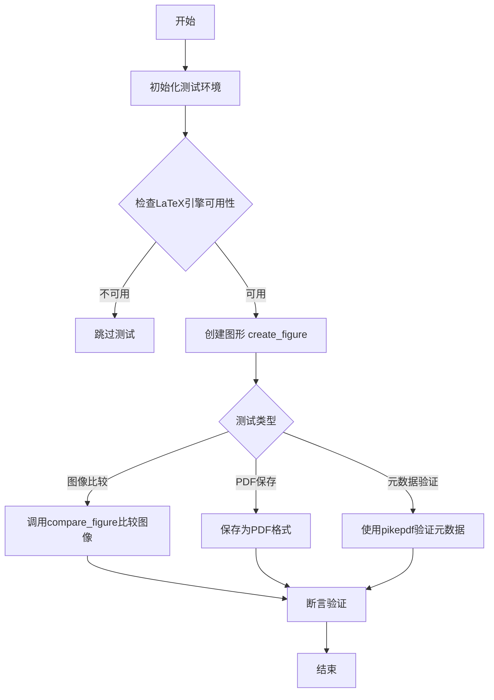

## 类结构

```
无类定义
└── 模块级函数集合
    ├── 工具函数
    │   ├── compare_figure
    │   └── create_figure
    ├── 测试函数
    │   ├── test_tex_special_chars
    │   ├── test_xelatex
    │   ├── test_pdflatex
    │   ├── test_rcupdate
    │   ├── test_pathclip
    │   ├── test_mixedmode
    │   ├── test_bbox_inches
    │   ├── test_pdf_pages
    │   ├── test_pdf_pages_metadata_check
    │   ├── test_multipage_keep_empty
    │   ├── test_tex_restart_after_error
    │   ├── test_bbox_inches_tight
    │   ├── test_png_transparency
    │   ├── test_unknown_font
    │   ├── test_minus_signs_with_tex
    │   ├── test_sketch_params
    │   └── test_document_font_size
```

## 全局变量及字段


### `baseline_dir`
    
基准图像目录路径，用于存放预期的测试图像

类型：`str`
    


### `result_dir`
    
结果图像目录路径，用于存放实际生成的测试图像进行比对

类型：`str`
    


### `_old_gs_version`
    
Ghostscript版本标志，True表示版本小于9.50用于条件判断

类型：`bool`
    


    

## 全局函数及方法


### `compare_figure`

该函数用于比较生成的图像与基准图像，通过保存当前图像、复制基准图像、使用图像比较工具进行对比，并在图像不一致时抛出异常。

参数：

- `fname`：`str`，图像文件名，用于构建实际输出和期望输出文件的路径
- `savefig_kwargs`：`dict`，可选，传递给 `plt.savefig()` 的关键字参数，用于控制图像保存格式和属性
- `tol`：`float`，可选，默认值为 0，图像比较的容差阈值，允许的像素差异程度

返回值：`None`，该函数没有返回值；若图像比较失败则抛出 `ImageComparisonFailure` 异常

#### 流程图

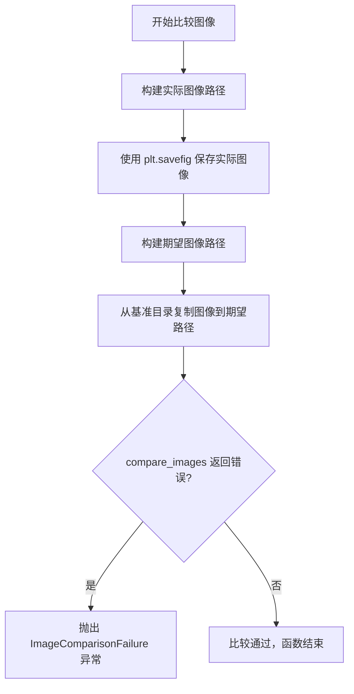

#### 带注释源码

```python
def compare_figure(fname, savefig_kwargs={}, tol=0):
    """
    比较生成的图像与基准图像
    
    参数:
        fname: str, 图像文件名
        savefig_kwargs: dict, 保存图像的额外参数
        tol: float, 图像比较容差
    """
    # 获取实际图像的完整路径（保存在result_dir中）
    actual = os.path.join(result_dir, fname)
    # 将当前生成的图像保存到实际路径
    plt.savefig(actual, **savefig_kwargs)

    # 构建期望图像的路径（expected_前缀）
    expected = os.path.join(result_dir, "expected_%s" % fname)
    # 从基准目录复制基准图像到期望路径
    # 注意：这里假设基准图像一定存在，否则会抛出FileNotFoundError
    shutil.copyfile(os.path.join(baseline_dir, fname), expected)
    # 使用matplotlib的图像比较工具对比期望图像和实际图像
    err = compare_images(expected, actual, tol=tol)
    # 如果比较结果存在差异（即err不为None），则抛出比较失败异常
    if err:
        raise ImageComparisonFailure(err)
```


### `create_figure`

该函数是一个测试辅助函数，用于在当前上下文中创建一个包含折线图、散点标记、填充区域、多边形以及包含 Unicode 字符和 LaTeX 数学公式的文本标签的 Matplotlib 图形（Figure），主要供后端测试（如 PGF/XeLaTeX）生成基准图像使用。

#### 1. 文件整体运行流程

该代码文件是一个测试模块（Test Module），主要针对 Matplotlib 的 PGF（Portable Graphics Format）后端进行图像生成和比较测试。
1.  **初始化**：设置图像比较的基准目录 `baseline_dir` 和结果目录 `result_dir`，并定义辅助函数 `compare_figure`。
2.  **定义被测函数**：定义全局函数 `create_figure`，该函数不接收参数，直接操作全局的 `plt` 状态来绘制图形。
3.  **执行测试**：多个测试函数（如 `test_xelatex`, `test_pdflatex`, `test_rcupdate`）使用装饰器 `@image_comparison` 装饰，并在其内部调用 `create_figure()`。测试框架会自动截取 `create_figure` 生成的图像并与基准图像进行比对。

#### 2. 类的详细信息

由于该代码段为脚本文件，不包含类定义，主要包含全局函数和变量。

**全局变量**

*   `baseline_dir`: `str` 或 `Path`，存储基准图像的目录路径。
*   `result_dir`: `str` 或 `Path`，存储测试生成的临时图像的目录路径。

**全局函数 (create_figure)**

- **函数名称**: `create_figure`
- **参数**: 无
- **返回值**: `None` (无返回值，主要通过副作用修改全局 Matplotlib 状态)

**局部变量**

- **`x`**: `numpy.ndarray`，由 `np.linspace(0, 1, 15)` 生成，包含 15 个从 0 到 1 的线性间隔数据点，用于后续绘图的数据源。

#### 3. 关键组件信息

- **Line Plot (折线图)**: 使用 `plt.plot` 绘制蓝色 (`b-`) 抛物线 $y=x^2$。
- **Marker Plot (标记图)**: 使用 `plt.plot` 绘制绿色 (`g>`) 倒抛物线 $y=1-x^2$。
- **Fill Between (区域填充)**: 使用 `plt.fill_between` 在指定区间填充斜线阴影（hatch）和灰色底色。
- **Polygon Fill (多边形填充)**: 使用 `plt.fill` 绘制蓝色多边形。
- **Text & Math (文本与公式)**: 使用 `plt.text` 和 `plt.ylabel` 展示 Unicode 字符（如 ü, °）和 LaTeX 数学公式（如 $\frac{\sqrt{x}}{y^2}$）。
- **Clipping (裁剪)**: 演示了基于 Axes 的默认裁剪行为。

#### 4. 流程图

```mermaid
graph TD
    A([开始 create_figure]) --> B[plt.figure: 创建新图形和坐标轴]
    B --> C[生成数据: x = np.linspace(0, 1, 15)]
    C --> D[plt.plot: 绘制蓝色折线 y=x^2]
    D --> E[plt.plot: 绘制绿色标记 y=1-x^2]
    E --> F[plt.fill_between: 填充曲线间区域]
    F --> G[plt.fill: 绘制多边形]
    G --> H[plt.text & plt.ylabel: 添加文本与数学公式标签]
    H --> I[plt.xlim & plt.ylim: 设置坐标轴范围]
    I --> J([结束])
```

#### 5. 带注释源码

```python
def create_figure():
    """
    创建一个包含多种图形元素的测试 Figure。
    用于生成测试用的图像数据。
    """
    # 创建一个新的空白图形和Axes（默认）
    plt.figure()
    
    # 生成测试用的 x 轴数据：0 到 1 之间均匀分布的 15 个点
    x = np.linspace(0, 1, 15)

    # --- 1. 折线图 (Line Plot) ---
    # 绘制蓝色实线 ("b-")，y = x 的平方
    plt.plot(x, x ** 2, "b-")

    # --- 2. 标记图 (Marker Plot) ---
    # 绘制绿色右箭头标记 (">")，y = 1 - x 的平方
    plt.plot(x, 1 - x**2, "g>")

    # --- 3. 填充路径和图案 (Filled Paths and Patterns) ---
    # 在 x=[0.0, 0.4], y=[0.4, 0.0] 围成的区域内进行填充
    # hatch='//': 斜线阴影, facecolor="lightgray": 浅灰背景, edgecolor="red": 红色边框
    plt.fill_between([0., .4], [.4, 0.], hatch='//', facecolor="lightgray",
                     edgecolor="red")
    
    # 绘制并填充一个闭合多边形 [3,3,0.8,0.8,3] x [2,-2,-2,0,2]
    # 颜色为蓝色 ("b")
    plt.fill([3, 3, .8, .8, 3], [2, -2, -2, 0, 2], "b")

    # --- 4. 文本与排版 (Text and Typesetting) ---
    # 绘制一个红色小圆点
    plt.plot([0.9], [0.5], "ro", markersize=3)
    
    # 在坐标 (0.9, 0.5) 处添加文本
    # 包含 Unicode 字符 (ü, °, §) 和 LaTeX 数学符号 ($\mu_i = x_i^2$)
    plt.text(0.9, 0.5, 'unicode (ü, °, \N{Section Sign}) and math ($\\mu_i = x_i^2$)',
             ha='right', fontsize=20)
             
    # 添加 Y 轴标签，包含复杂的 LaTeX 公式
    plt.ylabel('sans-serif, blue, $\\frac{\\sqrt{x}}{y^2}$..',
               family='sans-serif', color='blue')
               
    # 在坐标 (1, 1) 处添加文本，并开启裁剪 (clip_on=True)
    # 用于测试默认 clip_box (Axes bbox) 下的裁剪行为
    plt.text(1, 1, 'should be clipped as default clip_box is Axes bbox',
             fontsize=20, clip_on=True)

    # --- 5. 坐标轴设置 (Axis Settings) ---
    plt.xlim(0, 1)
    plt.ylim(0, 1)
```

#### 6. 潜在的技术债务或优化空间

1.  **硬编码与缺乏灵活性**：
    *   **数据硬编码**：数据点 `x` 的生成和图形内容完全硬编码在函数体内。如果需要测试不同的数据或图形布局，必须修改函数源码。
    *   **无参数化**：函数没有参数（`args` 或 `kwargs`），无法复用于不同的测试场景（除了外部的 `rc_context`）。
2.  **全局状态依赖**：
    *   该函数直接调用 `plt.figure()` 等全局函数，依赖于 Matplotlib 的全局状态（`pyplot` 栈）。这使得函数非纯函数式，难以进行单元测试或并发运行（虽然测试框架通过 `tmp_path` 解决了文件并发问题，但状态清理依赖框架机制）。
3.  **返回值缺失**：
    *   函数创建了 Figure 对象但没有返回它（返回 `None`）。调用者如果需要访问 Figure 对象进行进一步操作（例如保存为特定格式而不比对），会很不方便。

#### 7. 其它项目

*   **设计目标**：该函数的设计纯粹是为了满足“图像比对”（Image Comparison）测试的需求。它作为一个**基准生成器**（Golden Generator），负责在特定配置下绘制出“正确”的图像，供后续测试对比。
*   **错误处理**：函数内部未包含任何显式的错误处理逻辑（try-except）。错误通常由调用它的测试框架（如 `pytest`）在图像生成或比对失败时捕获。
*   **外部依赖**：
    *   `matplotlib.pyplot`: 核心绘图库。
    *   `numpy`: 用于生成数据。
    *   `test_xelatex` 等测试函数依赖外部 LaTeX 引擎（XeLaTeX, PDFLaTeX）和 Ghostscript。
*   **接口契约**：
    *   **输入**：无显式输入。
    *   **输出**：在内存中创建 Matplotlib Figure 对象，并将其添加至 pyplot 状态栈。
    *   **副作用**：改变全局 `plt` 状态（当前Figure变为新创建的Figure）。


### `test_tex_special_chars`

该测试函数用于验证LaTeX特殊字符（如 `%`、`_`、`^`）在PGF后端的处理是否正确，特别是确保前导百分号不会吞噬所有内容。

参数：

- `tmp_path`：`py.path.local`，Pytest的临时目录fixture，用于提供临时测试目录

返回值：`None`，无返回值（测试函数）

#### 流程图

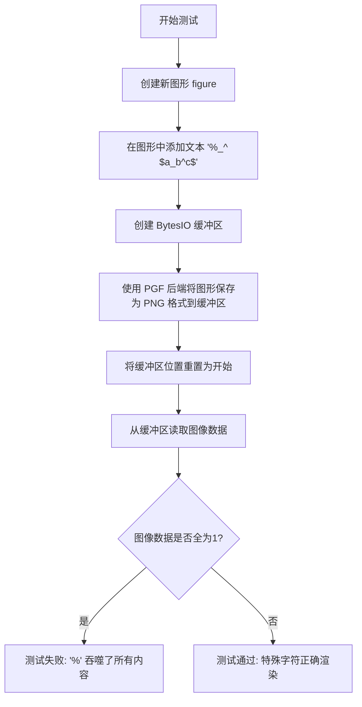

#### 带注释源码

```python
@needs_pgf_xelatex  # 装饰器：需要 xelatex 引擎
@needs_ghostscript  # 装饰器：需要 ghostscript
@pytest.mark.backend('pgf')  # 装饰器：指定使用 PGF 后端
def test_tex_special_chars(tmp_path):
    """
    测试 LaTeX 特殊字符在 PGF 后端中的处理。
    
    验证以下字符能正确渲染：
    - % (百分号，在 LaTeX 中是注释符)
    - _ (下标符号)
    - ^ (上标符号)
    - $...$ (数学模式)
    """
    fig = plt.figure()  # 创建一个新的图形
    # 在图形中心添加文本，包含 LaTeX 特殊字符
    # 文本内容：'%_^ $a_b^c$'
    fig.text(.5, .5, "%_^ $a_b^c$")
    
    buf = BytesIO()  # 创建内存缓冲区用于存储图像
    # 将图形保存为 PNG 格式，使用 PGF 后端
    fig.savefig(buf, format="png", backend="pgf")
    
    buf.seek(0)  # 将缓冲区位置重置到开始位置
    t = plt.imread(buf)  # 从缓冲区读取图像数据为 numpy 数组
    
    # 断言：验证图像不是全白的（全1表示白色）
    # 如果全为1，说明前导百分号 '%' 导致 LaTeX 吞噬了所有内容
    assert not (t == 1).all()  # The leading "%" didn't eat up everything.
```


### `test_xelatex`

该函数用于测试使用 XeLaTeX 引擎编译 Matplotlib 图形为 PDF 的功能，通过更新 Matplotlib 的 PGF 后端参数并创建测试图形，最后由 `image_comparison` 装饰器自动进行图像对比验证。

参数： 无

返回值：`None`，该函数没有显式返回值，主要通过装饰器 `image_comparison` 进行图像比较验证

#### 流程图

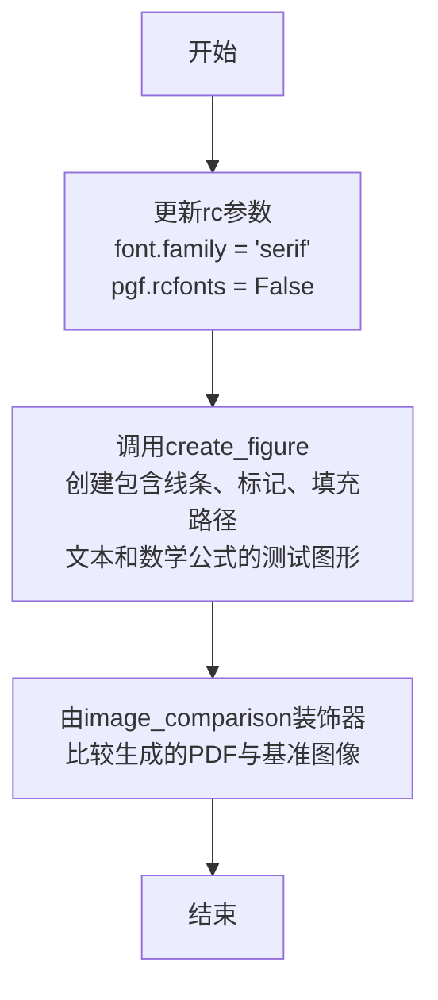

#### 带注释源码

```python
# test compiling a figure to pdf with xelatex
@needs_pgf_xelatex          # 装饰器：标记该测试需要 XeLaTeX 环境
@pytest.mark.backend('pgf') # 装饰器：指定使用 PGF 后端
@image_comparison(['pgf_xelatex.pdf'], style='default')  # 装饰器：将生成的PDF与基准图像进行对比
def test_xelatex():
    # 定义 XeLaTeatex 的配置参数
    rc_xelatex = {'font.family': 'serif',   # 设置字体为衬线体
                  'pgf.rcfonts': False}    # 禁用自动从 rc 参数加载字体设置
    mpl.rcParams.update(rc_xelatex)         # 更新 Matplotlib 的全局参数
    create_figure()                         # 调用辅助函数创建测试图形
```


### `test_pdflatex`

该函数用于测试使用 pdflatex 编译 PDF 的功能，配置 matplotlib 的 PGF 后端使用 pdflatex 引擎，并调用 `create_figure()` 生成图形进行图像比较测试。

参数：

- `tmp_path`：pytest fixture，`pytest.contrib.pytest_freezegun.FreezeGun.freeze_time.<locals>.FreezeDecorator` 或 `py.path.local`，用于提供临时目录（隐式参数，测试框架注入）

返回值：`None`，无返回值（测试函数）

#### 流程图

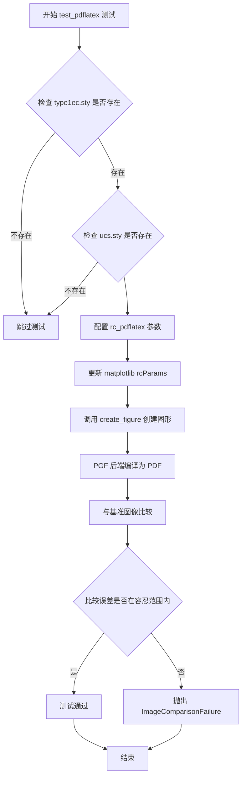

#### 带注释源码

```python
# test compiling a figure to pdf with pdflatex
@needs_pgf_pdflatex                      # 装饰器：标记需要 pdflatex 环境
@pytest.mark.skipif(
    not _has_tex_package('type1ec'),     # 跳过条件：若缺少 type1ec.sty 则跳过
    reason='needs type1ec.sty'
)
@pytest.mark.skipif(
    not _has_tex_package('ucs'),         # 跳过条件：若缺少 ucs.sty 则跳过
    reason='needs ucs.sty'
)
@pytest.mark.backend('pgf')              # 标记：使用 PGF 后端运行测试
@image_comparison(                       # 装饰器：比较输出图像与基准图像
    ['pgf_pdflatex.pdf'],                # 基准图像文件名
    style='default',                     # matplotlib 样式
    tol=11.71 if _old_gs_version else 0  # 容差：旧版 Ghostscript 用 11.71，新版用 0
)
def test_pdflatex():
    """测试使用 pdflatex 编译 PDF 的功能"""
    
    # 定义 pdflatex 的 rc 参数配置
    rc_pdflatex = {
        'font.family': 'serif',          # 字体族：serif
        'pgf.rcfonts': False,            # 不从 rc 文件加载字体设置
        'pgf.texsystem': 'pdflatex',     # TeX 系统：pdflatex
        'pgf.preamble': (                 # LaTeX 前导包
            '\\usepackage[utf8x]{inputenc}'  # 加载 utf8x 输入编码
            '\\usepackage[T1]{fontenc}'       # 加载 T1 字体编码
        )
    }
    
    # 更新 matplotlib 的全局参数
    mpl.rcParams.update(rc_pdflatex)
    
    # 创建测试图形（定义在模块中的辅助函数）
    create_figure()
```


### `test_rcupdate`

测试rc参数动态更新功能，验证Matplotlib能够在每个figure生成时动态更改rc参数（字体 family、大小、子图布局、标记大小、pgf.texsystem等），并正确渲染到PDF中。

参数：
- 无显式参数（但通过装饰器隐式指定了后端为'pgf'）

返回值：`None`，该函数为测试函数，使用pytest框架，通过图像比较验证功能

#### 流程图

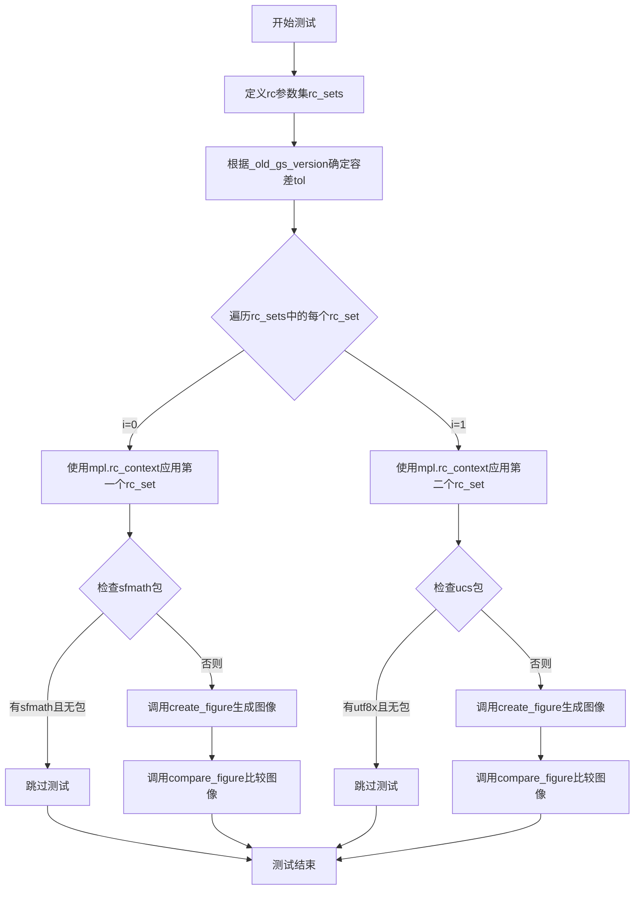

#### 带注释源码

```python
@needs_pgf_xelatex
@needs_pgf_pdflatex
@mpl.style.context('default')
@pytest.mark.backend('pgf')
def test_rcupdate():
    """
    测试rc参数动态更新功能。
    
    该测试验证Matplotlib能够在每次创建figure时动态更改rc参数，
    并将不同的rc设置正确应用到生成的PDF中。
    """
    # 定义两组不同的rc参数配置，用于测试动态更新
    rc_sets = [
        # 第一组：sans-serif字体，较大字号，左子图位置偏移，较小标记
        {'font.family': 'sans-serif',
         'font.size': 30,
         'figure.subplot.left': .2,
         'lines.markersize': 10,
         'pgf.rcfonts': False,
         'pgf.texsystem': 'xelatex'},
        # 第二组：monospace字体，较字号，左子图位置偏移较大，较大标记，pdflatex引擎
        {'font.family': 'monospace',
         'font.size': 10,
         'figure.subplot.left': .1,
         'lines.markersize': 20,
         'pgf.rcfonts': False,
         'pgf.texsystem': 'pdflatex',
         'pgf.preamble': ('\\usepackage[utf8x]{inputenc}'
                          '\\usepackage[T1]{fontenc}'
                          '\\usepackage{sfmath}')}
    ]
    
    # 根据Ghostscript版本设置容差
    # 旧版本Ghostscript(<9.50)对某些图像比较需要更大容差
    tol = [0, 13.2] if _old_gs_version else [0, 0]
    
    # 遍历每组rc参数，分别生成并比较图像
    for i, rc_set in enumerate(rc_sets):
        # 使用rc_context临时应用rc参数
        # 上下文管理器确保参数更改不影响后续测试
        with mpl.rc_context(rc_set):
            # 检查preamble中引用的包是否可用
            for substring, pkg in [('sfmath', 'sfmath'), ('utf8x', 'ucs')]:
                if (substring in mpl.rcParams['pgf.preamble']
                        and not _has_tex_package(pkg)):
                    # 如果缺少必要的LaTeX包，则跳过测试
                    pytest.skip(f'needs {pkg}.sty')
            
            # 使用当前rc设置创建figure
            create_figure()
            
            # 比较生成的图像与预期图像
            # i+1使文件名从1开始：pgf_rcupdate1.pdf, pgf_rcupdate2.pdf
            compare_figure(f'pgf_rcupdate{i + 1}.pdf', tol=tol[i])
```


### `test_pathclip`

该测试函数用于验证 Matplotlib 的 PGF 后端能否正确处理大数值（1e100）的裁剪，因为 TeX 不支持这些大数值。测试创建两个子图：一个包含超大数值坐标的线条图，另一个包含散点图和直方图（使用对数刻度），并将图形保存为 PDF 格式。

参数： 无显式参数（该函数使用 pytest fixture `tmp_path` 但代码中未使用）

返回值：`None`，该函数不返回任何值，仅执行测试逻辑

#### 流程图

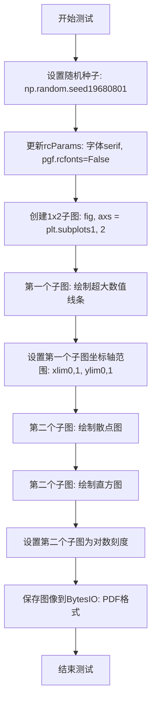

#### 带注释源码

```python
# test backend-side clipping, since large numbers are not supported by TeX
# 测试后端裁剪大数值，因为TeX不支持大数值
@needs_pgf_xelatex
# 装饰器：需要xelatex编译器
@mpl.style.context('default')
# 装饰器：使用默认样式上下文
@pytest.mark.backend('pgf')
# 装饰器：标记为pgf后端测试
def test_pathclip():
    # 设置随机种子以确保测试结果可重现
    np.random.seed(19680801)
    # 更新matplotlib的rc参数：使用serif字体，不使用rcfonts配置
    mpl.rcParams.update({'font.family': 'serif', 'pgf.rcfonts': False})
    # 创建一个1行2列的子图布局，返回图形对象和轴数组
    fig, axs = plt.subplots(1, 2)

    # ======== 第一个子图：测试大数值裁剪 ========
    # 绘制坐标值极大的线条（1e100），用于测试后端是否正确裁剪
    axs[0].plot([0., 1e100], [0., 1e100])
    # 设置x轴范围为0到1，超出范围的数据应被裁剪
    axs[0].set_xlim(0, 1)
    # 设置y轴范围为0到1，超出范围的数据应被裁剪
    axs[0].set_ylim(0, 1)

    # ======== 第二个子图：测试其他图形元素 ========
    # 绘制散点图，坐标为[0,1]和[1,1]
    axs[1].scatter([0, 1], [1, 1])
    # 绘制直方图，使用正态分布随机数据，20个区间，范围-10到10
    axs[1].hist(np.random.normal(size=1000), bins=20, range=[-10, 10])
    # 设置x轴为对数刻度
    axs[1].set_xscale('log')

    # 将图形保存到BytesIO对象中，格式为PDF，不进行图像比较
    # 注释表明该测试不与基准图像比较，仅验证不崩溃
    fig.savefig(BytesIO(), format="pdf")  # No image comparison.
```


### `test_mixedmode`

该函数用于测试 Matplotlib PGF 后端的混合模式渲染功能，验证光栅化渲染是否正常工作。

参数：无显式参数（测试函数使用 pytest 装饰器隐式注入的参数）

返回值：`None`，该函数为测试函数，不返回任何值

#### 流程图

```mermaid
flowchart TD
    A[开始测试] --> B[设置 rcParams: font.family=serif, pgf.rcfonts=False]
    B --> C[创建坐标网格: Y, X = np.ogrid[-1:1:40j, -1:1:40j]
    C --> D[计算 pcolor 数据: X**2 + Y**2]
    D --> E[调用 plt.pcolor 创建伪彩色图]
    E --> F[调用 set_rasterized(True) 启用光栅化]
    F --> G[@image_comparison 装饰器自动保存并对比图像]
    G --> H[结束测试]
```

#### 带注释源码

```python
# test mixed mode rendering
# 装饰器：需要 xelatex 工具
@needs_pgf_xelatex
# 装饰器：指定测试后端为 pgf
@pytest.mark.backend('pgf')
# 装饰器：进行图像对比，基准图像为 pgf_mixedmode.pdf，风格为 default
@image_comparison(['pgf_mixedmode.pdf'], style='default')
def test_mixedmode():
    """
    测试混合模式渲染功能。
    
    该测试验证 PGF 后端能够正确处理光栅化（rasterized）图形元素，
    同时保持矢量格式输出，实现混合模式渲染。
    """
    # 更新 Matplotlib 参数：使用 serif 字体，不从 rc 文件加载字体设置
    mpl.rcParams.update({'font.family': 'serif', 'pgf.rcfonts': False})
    
    # 创建坐标网格：生成 -1 到 1 范围内的 40 个点
    # np.ogrid 返回开放网格（open mesh），用于广播运算
    Y, X = np.ogrid[-1:1:40j, -1:1:40j]
    
    # 使用 plt.pcolor 创建伪彩色图
    # 数据为 X^2 + Y^2，即距离原点的平方距离，形成同心圆图案
    # 然后调用 set_rasterized(True) 将此图形元素标记为光栅化
    plt.pcolor(X**2 + Y**2).set_rasterized(True)
    
    # 注意：
    # 1. plt.pcolor 返回一个 QuadMesh 对象
    # 2. set_rasterized(True) 告诉后端将此元素渲染为位图而非矢量
    # 3. @image_comparison 装饰器会自动保存渲染结果并与基准图像对比
```


### `test_bbox_inches`

该测试函数用于验证 matplotlib 在 PGF 后端中正确使用 `bbox_inches` 参数进行图形裁剪，确保保存的 PDF 文件只包含指定的坐标区域。

参数：

- 该函数无显式参数（使用 pytest fixtures 如 `tmp_path` 等隐式参数，但在本函数中未直接使用）

返回值：`None`，测试通过时不返回任何值，若比较失败则抛出 `ImageComparisonFailure` 异常

#### 流程图

```mermaid
flowchart TD
    A[开始测试] --> B[设置 rc 参数: font.family=serif, pgf.rcfonts=False]
    B --> C[创建 1x2 子图布局]
    C --> D[在 ax1 和 ax2 上绘制 range(5)]
    D --> E[调用 tight_layout 调整布局]
    E --> F[获取 ax1 的窗口范围并转换为英寸坐标]
    F --> G[调用 compare_figure 保存并比较图像]
    G --> H{图像是否匹配?}
    H -->|是| I[测试通过]
    H -->|否| J[抛出 ImageComparisonFailure]
```

#### 带注释源码

```python
# test bbox_inches clipping
@needs_pgf_xelatex          # 装饰器：需要 xelatex 环境
@mpl.style.context('default')  # 装饰器：使用默认样式上下文
@pytest.mark.backend('pgf')   # 装饰器：指定使用 PGF 后端
def test_bbox_inches():
    """测试 bbox_inches 裁剪功能"""
    # 更新 matplotlib rc 参数，设置字体为衬线体，不使用 rcfonts
    mpl.rcParams.update({'font.family': 'serif', 'pgf.rcfonts': False})
    
    # 创建一个包含 1 行 2 列子图的图形
    fig, (ax1, ax2) = plt.subplots(1, 2)
    
    # 在两个子图上绘制数据
    ax1.plot(range(5))
    ax2.plot(range(5))
    
    # 使用 tight_layout 自动调整子图布局
    plt.tight_layout()
    
    # 获取 ax1 的窗口范围，并将其从像素坐标转换为英寸坐标
    # transform: 将窗口范围从显示坐标转换到物理英寸坐标
    bbox = ax1.get_window_extent().transformed(fig.dpi_scale_trans.inverted())
    
    # 调用 compare_figure 比较生成的图像与基准图像
    # savefig_kwargs 传递 bbox_inches 参数，只保存 ax1 区域
    compare_figure('pgf_bbox_inches.pdf', savefig_kwargs={'bbox_inches': bbox},
                   tol=0)
```


### `test_pdf_pages`

该测试函数验证多页PDF生成功能，支持使用不同的LaTeX引擎（xelatex、pdflatex、lualatex）生成包含多个figure的多页PDF文件，并正确记录页面数量。

参数：

- `system`：`str`，来自pytest.parametrize装饰器，表示要使用的LaTeX引擎类型（'lualatex'、'pdflatex'或'xelatex'）

返回值：`None`，该函数为测试函数，通过断言验证页面数量

#### 流程图

```mermaid
flowchart TD
    A[开始测试] --> B[更新rcParams设置pgf.texsystem为system]
    B --> C[创建fig1和ax1, 绘制折线图]
    C --> D[创建fig2和ax2, 设置尺寸为3x2英寸, 绘制折线图]
    D --> E[构建PDF输出路径: result_dir/pdfpages_{system}.pdf]
    E --> F[创建元数据字典md包含Author、Title等]
    F --> G[使用PdfPages上下文管理器打开PDF文件]
    G --> H[保存fig1到PDF第一页]
    H --> I[保存fig2到PDF第二页]
    I --> J[再次保存fig1到PDF第三页]
    J --> K[调用pdf.get_pagecount获取页面数]
    K --> L{页面数是否等于3?}
    L -->|是| M[断言通过, 测试结束]
    L -->|否| N[断言失败, 抛出异常]
```

#### 带注释源码

```python
@mpl.style.context('default')
@pytest.mark.backend('pgf')
@pytest.mark.parametrize('system', [
    pytest.param('lualatex', marks=[needs_pgf_lualatex]),
    pytest.param('pdflatex', marks=[needs_pgf_pdflatex]),
    pytest.param('xelatex', marks=[needs_pgf_xelatex]),
])
def test_pdf_pages(system):
    """
    测试多页PDF生成功能，支持不同的LaTeX引擎。
    
    参数:
        system: LaTeTeX引擎类型，可选值为'lualatex'、'pdflatex'、'xelatex'
    """
    # 设置matplotlib的rc参数，配置PGF后端使用指定的LaTeX引擎
    rc_pdflatex = {
        'font.family': 'serif',      # 设置字体家族为serif
        'pgf.rcfonts': False,         # 禁用从rcParams自动加载字体设置
        'pgf.texsystem': system,     # 指定使用的LaTeX引擎
    }
    mpl.rcParams.update(rc_pdflatex)  # 更新全局rcParams

    # 创建第一个figure，默认尺寸
    fig1, ax1 = plt.subplots()
    ax1.plot(range(5))               # 在ax1上绘制0-4的折线图
    fig1.tight_layout()              # 调整布局避免重叠

    # 创建第二个figure，指定尺寸为3x2英寸
    fig2, ax2 = plt.subplots(figsize=(3, 2))
    ax2.plot(range(5))               # 在ax2上绘制0-4的折线图
    fig2.tight_layout()              # 调整布局

    # 构建输出PDF文件的完整路径
    path = os.path.join(result_dir, f'pdfpages_{system}.pdf')
    
    # 定义PDF元数据信息
    md = {
        'Author': 'me',                                          # 文档作者
        'Title': 'Multipage PDF with pgf',                       # 文档标题
        'Subject': 'Test page',                                  # 文档主题
        'Keywords': 'test,pdf,multipage',                        # 关键词
        # 修改日期：1968年8月1日，使用UTC时区
        'ModDate': datetime.datetime(
            1968, 8, 1, tzinfo=datetime.timezone(datetime.timedelta(0))),
        'Trapped': 'Unknown'                                      # Trapped标志
    }

    # 使用PdfPages上下文管理器创建多页PDF
    with PdfPages(path, metadata=md) as pdf:
        pdf.savefig(fig1)    # 将fig1保存为PDF的第一页
        pdf.savefig(fig2)   # 将fig2保存为PDF的第二页
        pdf.savefig(fig1)    # 再次将fig1保存为PDF的第三页

        # 验证PDF包含3页
        assert pdf.get_pagecount() == 3
```


### `test_pdf_pages_metadata_check`

该函数是一个测试 PDF 元数据生成的测试用例。它使用 `pikepdf` 库读取由 Matplotlib `PdfPages` 生成的 PDF 文件，并验证写入的元数据（如作者、标题、创建日期等）是否符合预期。函数参数化支持多种 TeX 系统（xelatex, pdflatex, lualatex）。

参数：
- `monkeypatch`：`_pytest.monkeypatch.MonkeyPatch`，用于修改环境变量。这里用于设置 `SOURCE_DATE_EPOCH` 以确保 PDF 生成时间的一致性。
- `system`：`str`，指定要测试的 TeX 排版系统（如 'xelatex', 'pdflatex', 'lualatex'）。

返回值：`None`，无返回值。测试通过 `assert` 语句验证逻辑，若失败则抛出异常。

#### 流程图

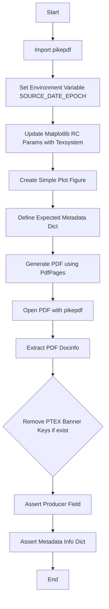

#### 带注释源码

```python
def test_pdf_pages_metadata_check(monkeypatch, system):
    # 导入 pikepdf，如果未安装则跳过测试
    # 这样可以将 pikepdf 作为可选依赖
    pikepdf = pytest.importorskip('pikepdf')
    
    # 设置环境变量 SOURCE_DATE_EPOCH 为 '0'
    # 这确保了 PDF 中的时间戳是可重现的
    monkeypatch.setenv('SOURCE_DATE_EPOCH', '0')

    # 更新 matplotlib 的 rc 参数，指定 texsystem
    mpl.rcParams.update({'pgf.texsystem': system})

    # 创建一个简单的图形
    fig, ax = plt.subplots()
    ax.plot(range(5))

    # 定义预期的 PDF 元数据字典
    md = {
        'Author': 'me',
        'Title': 'Multipage PDF with pgf',
        'Subject': 'Test page',
        'Keywords': 'test,pdf,multipage',
        'ModDate': datetime.datetime(
            1968, 8, 1, tzinfo=datetime.timezone(datetime.timedelta(0))),
        'Trapped': 'True'
    }
    
    # 构建输出 PDF 文件的路径
    path = os.path.join(result_dir, f'pdfpages_meta_check_{system}.pdf')
    
    # 使用 PdfPages 创建 PDF 并保存图形，传入元数据
    with PdfPages(path, metadata=md) as pdf:
        pdf.savefig(fig)

    # 使用 pikepdf 打开生成的 PDF 文件
    with pikepdf.Pdf.open(path) as pdf:
        # 将 PDF 文档信息转换为字符串字典
        info = {k: str(v) for k, v in pdf.docinfo.items()}

    # 删除不是由我们设置但可能存在的 PTEX 字段
    if '/PTEX.FullBanner' in info:
        del info['/PTEX.FullBanner']
    if '/PTEX.Fullbanner' in info:
        del info['/PTEX.Fullbanner']

    # 提取并验证 Producer 字段
    # 它应该匹配 'Matplotlib pgf backend v<version>' 或者对于 lualatex 包含 'LuaTeX'
    producer = info.pop('/Producer')
    assert producer == f'Matplotlib pgf backend v{mpl.__version__}' or (
            system == 'lualatex' and 'LuaTeX' in producer)

    # 验证剩余的元数据信息是否与预期字典匹配
    assert info == {
        '/Author': 'me',
        '/CreationDate': 'D:19700101000000Z',
        '/Creator': f'Matplotlib v{mpl.__version__}, https://matplotlib.org',
        '/Keywords': 'test,pdf,multipage',
        '/ModDate': 'D:19680801000000Z',
        '/Subject': 'Test page',
        '/Title': 'Multipage PDF with pgf',
        '/Trapped': '/True',
    }
```


### `test_multipage_keep_empty`

该测试函数用于验证 Matplotlib 的 PdfPages 在处理空PDF文件时的行为，确保空的PDF文件在关闭后被自动删除，而包含实际内容的PDF文件则会被保留。

参数：

- `tmp_path`：`pathlib.Path`（pytest fixture），提供临时目录路径，用于存放生成的PDF文件

返回值：`None`，该函数为测试函数，不返回任何值

#### 流程图

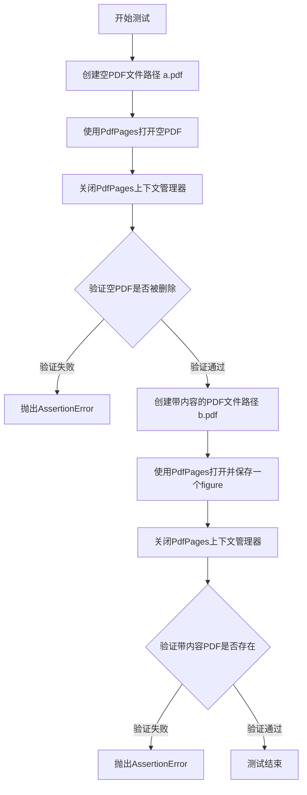

#### 带注释源码

```python
@needs_pgf_xelatex
def test_multipage_keep_empty(tmp_path):
    # 测试空PDF文件是否会被自动删除
    # 根据设计，空的PDF文件在关闭后应该被删除以节省空间
    
    # 创建临时PDF文件路径 a.pdf（空文件）
    fn = tmp_path / "a.pdf"
    
    # 使用PdfPages上下文管理器打开空PDF
    # 不写入任何内容，直接关闭
    with PdfPages(fn) as pdf:
        pass  # 什么都不做，创建空PDF
    
    # 验证：空PDF文件应该被自动删除
    assert not fn.exists()

    # 测试带内容的PDF文件是否会被保留
    # 有内容的PDF文件不应该被删除
    
    # 创建临时PDF文件路径 b.pdf
    fn = tmp_path / "b.pdf"
    
    # 使用PdfPages打开并保存一个matplotlib figure
    with PdfPages(fn) as pdf:
        pdf.savefig(plt.figure())  # 创建一个新figure并保存到PDF
    
    # 验证：带内容的PDF文件应该存在
    assert fn.exists()
```


### `test_tex_restart_after_error`

该测试函数用于验证 Matplotlib 的 PGF 后端在遇到 LaTeX 渲染错误后能够正确恢复。测试通过故意使用无效的 LaTeX 命令触发错误，捕获异常后创建新图形并成功保存，以此确认错误恢复机制正常工作。

参数： 无

返回值：`None`，该测试函数不返回任何值，仅用于验证错误恢复功能

#### 流程图

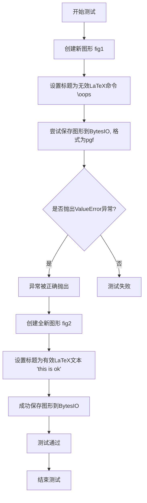

#### 带注释源码

```python
@needs_pgf_xelatex  # 装饰器：仅在xelatex可用时运行此测试
def test_tex_restart_after_error():
    """测试LaTeX错误后恢复功能"""
    
    # 步骤1：创建一个新的图形对象
    fig = plt.figure()
    
    # 步骤2：设置一个包含无效LaTeX命令的标题
    # "\oops" 不是一个有效的LaTeX命令，会导致LaTeX编译错误
    fig.suptitle(r"\oops")
    
    # 步骤3：尝试保存图形，这会触发LaTeX错误
    # 使用 pytest.raises 捕获预期的 ValueError 异常
    with pytest.raises(ValueError):
        # 将图形保存到内存中的 BytesIO 对象，格式为 pgf
        fig.savefig(BytesIO(), format="pgf")
    
    # 步骤4：从头开始创建一个全新的图形
    # 验证在之前的错误之后，后端能够正确重置和恢复
    fig = plt.figure()  # start from scratch
    
    # 步骤5：设置一个有效的LaTeX标题
    fig.suptitle(r"this is ok")
    
    # 步骤6：成功保存图形，验证恢复功能正常工作
    fig.savefig(BytesIO(), format="pgf")
```


### `test_bbox_inches_tight`

该测试函数用于测试使用 `bbox_inches="tight"` 参数保存 PDF 图形时的紧凑布局功能，验证 PGF 后端能正确处理紧凑边界框并生成符合预期的 PDF 输出。

参数： 无

返回值：`None`，该测试函数不返回任何值，仅执行图形创建和保存操作。

#### 流程图

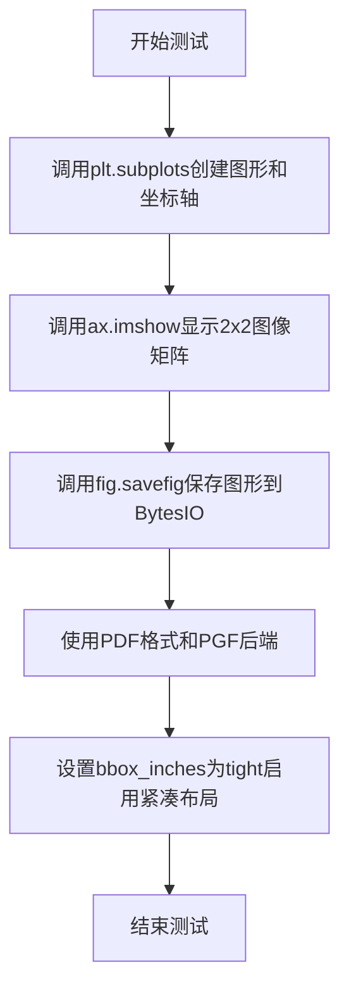

#### 带注释源码

```python
@needs_pgf_xelatex  # 装饰器：仅在xelatex可用时运行此测试
def test_bbox_inches_tight():
    """
    测试bbox_inches='tight'参数在PGF后端中的功能。
    验证当保存PDF时，紧凑布局能够正确裁剪图形边界。
    """
    fig, ax = plt.subplots()  # 创建一个新的图形和一个坐标轴
    ax.imshow([[0, 1], [2, 3]])  # 在坐标轴上显示一个简单的2x2图像矩阵
    # 将图形保存到BytesIO对象中，使用PDF格式和PGF后端
    # bbox_inches="tight"参数使图形边界紧凑，去除多余空白边距
    fig.savefig(BytesIO(), format="pdf", backend="pgf", bbox_inches="tight")
```


### `test_png_transparency`

该函数用于测试使用 PGF 后端保存 PNG 图像时的透明度功能，通过创建一个空 Figure 并以透明模式保存为 PNG，然后验证生成的图像是否完全透明（alpha 通道值均为 0），同时也是对 PNG 后端功能的基本测试。

参数： 无

返回值： 无返回值（该函数为测试函数，使用断言进行验证）

#### 流程图

```mermaid
flowchart TD
    A[开始测试] --> B[创建 BytesIO 缓冲区]
    B --> C[创建空 Figure]
    C --> D[使用 PGF 后端将 Figure 保存为 PNG 格式, 启用透明模式]
    D --> E[重置缓冲区读取位置到开头]
    E --> F[使用 plt.imread 读取 PNG 图像为 numpy 数组]
    F --> G[断言: 验证图像的 alpha 通道 t[..., 3] 全部为 0]
    G --> H{断言是否通过}
    H -->|通过| I[测试通过]
    H -->|失败| J[抛出 AssertionError]
```

#### 带注释源码

```python
@needs_pgf_xelatex  # 装饰器: 需要 xelatex 工具
@needs_ghostscript  # 装饰器: 需要 ghostscript 工具
def test_png_transparency():  # Actually, also just testing that png works.
    """
    测试 PNG 透明度功能。
    
    该函数验证使用 PGF 后端保存 PNG 图像时，
    transparent=True 参数是否正确生成完全透明的图像。
    同时也是对 PGF 后端 PNG 输出功能的基本测试。
    """
    buf = BytesIO()  # 创建一个内存缓冲区用于存储图像数据
    plt.figure().savefig(buf, format="png", backend="pgf", transparent=True)
    # 创建空 Figure 并保存为 PNG 格式, 使用 PGF 后端, 启用透明背景
    
    buf.seek(0)  # 重置缓冲区读取位置到起始位置
    t = plt.imread(buf)  # 读取 PNG 图像数据为 numpy 数组
    
    assert (t[..., 3] == 0).all()  # fully transparent.
    # 断言: 验证图像的 alpha 通道 (第4通道) 全部为 0
    # 即图像完全透明, 测试透明功能是否正常工作
```


### `test_unknown_font`

该测试函数用于验证matplotlib在渲染图形时遇到不存在的字体时能够正确记录警告信息，确保字体回退机制工作正常。

参数：

- `caplog`：`pytest.LogCaptureFixture`，pytest提供的日志捕获fixture，用于在测试期间捕获日志记录

返回值：`None`，该测试函数通过断言验证日志内容，不返回任何值

#### 流程图

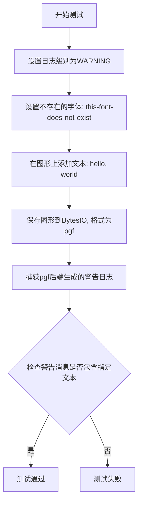

#### 带注释源码

```python
@needs_pgf_xelatex  # 装饰器：仅在xelatex可用时运行此测试
def test_unknown_font(caplog):
    """
    测试未知字体警告功能。
    
    验证当指定的字体不存在时，matplotlib能够记录
    相应的警告信息到日志中。
    """
    # 使用caplog fixture捕获日志，设置日志级别为WARNING
    with caplog.at_level("WARNING"):
        # 将matplotlib的字体族设置为不存在的字体
        # 这将触发字体警告，因为该字体不存在于系统
        mpl.rcParams["font.family"] = "this-font-does-not-exist"
        
        # 在图形的指定位置(.5, .5)添加文本
        # 由于字体不存在，这里会触发警告
        plt.figtext(.5, .5, "hello, world")
        
        # 将图形保存为pgf格式到内存缓冲区
        # pgf后端会尝试使用指定的字体，发现不存在后记录警告
        plt.savefig(BytesIO(), format="pgf")
    
    # 断言验证捕获的日志中包含预期的警告消息
    # 检查是否存在"Ignoring unknown font: this-font-does-not-exist"警告
    assert "Ignoring unknown font: this-font-does-not-exist" in [
        r.getMessage() for r in caplog.records
    ]
```


### `test_minus_signs_with_tex`

该测试函数用于验证在 PGF 后端中，使用 LaTeX 语法 `-1` 和 Unicode 字符 `\N{MINUS SIGN}` 表示负号时，渲染结果是否一致。通过参数化测试支持多种 TeX 引擎（pdflatex、xelatex、lualatex）。

参数：

- `fig_test`：`matplotlib.figure.Figure`，测试图形对象，用于显示使用 LaTeX 语法的负号（$-1$）
- `fig_ref`：`matplotlib.figure.Figure`，参考图形对象，用于显示使用 Unicode 字符的负号（$\N{MINUS SIGN}1$）
- `texsystem`：`str`，TeX 系统类型，指定使用哪种 TeX 引擎进行渲染测试（pdflatex、xelatex 或 lualatex）

返回值：`None`，无返回值（测试函数）

#### 流程图

```mermaid
flowchart TD
    A[开始测试] --> B{检查 PGF 和 TeX 系统是否可用}
    B -->|不可用| C[跳过测试]
    B -->|可用| D[设置 PGF TeX 系统]
    D --> E[在测试图形上添加文本: $-1$]
    E --> F[在参考图形上添加文本: $\N{MINUS SIGN}1$]
    F --> G[比较两个图形是否相等]
    G --> H[测试完成]
```

#### 带注释源码

```python
@check_figures_equal(extensions=["pdf"])  # 装饰器：比较测试图形和参考图形生成的 PDF 是否相等
@pytest.mark.parametrize("texsystem", ("pdflatex", "xelatex", "lualatex"))  # 参数化测试：遍历三种 TeX 系统
@pytest.mark.backend("pgf")  # 装饰器：指定使用 PGF 后端
def test_minus_signs_with_tex(fig_test, fig_ref, texsystem):
    """
    测试负号渲染：比较 LaTeX 语法 $-1$ 和 Unicode 字符 \N{MINUS SIGN}1 的渲染结果
    
    参数:
        fig_test: 测试图形对象，将使用 LaTeX 语法 $-1$ 显示负号
        fig_ref: 参考图形对象，将使用 Unicode 字符显示负号
        texsystem: TeX 系统类型 (pdflatex/xelatex/lualatex)
    """
    # 检查指定的 TeX 系统是否可用，如果不可用则跳过测试
    if not _check_for_pgf(texsystem):
        pytest.skip(texsystem + ' + pgf is required')
    
    # 设置 Matplotlib 的 PGF 后端使用的 TeX 系统
    mpl.rcParams["pgf.texsystem"] = texsystem
    
    # 在测试图形的中心位置 (.5, .5) 添加使用 LaTeX 语法的负号文本
    fig_test.text(.5, .5, "$-1$")
    
    # 在参考图形的中心位置 (.5, .5) 添加使用 Unicode 字符的负号文本
    fig_ref.text(.5, .5, "$\N{MINUS SIGN}1$")
```


### `test_sketch_params`

该测试函数用于验证 Matplotlib 的 PGF 后端能够正确处理和渲染线条的草图参数（sketch params），确保生成的 PGF 代码包含正确的随机步骤装饰（random steps decoration）指令。

参数：
- 无

返回值：`None`，该函数为测试函数，通过断言验证结果，不返回任何值。

#### 流程图

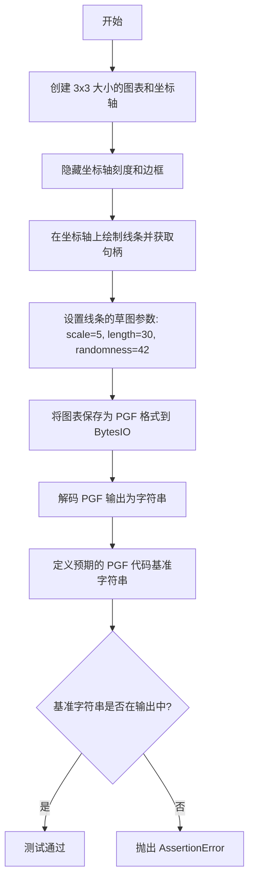

#### 带注释源码

```python
@pytest.mark.backend("pgf")
def test_sketch_params():
    # 创建一个 3x3 英寸大小的图形和坐标轴
    fig, ax = plt.subplots(figsize=(3, 3))
    
    # 隐藏坐标轴的刻度（X轴和Y轴）
    ax.set_xticks([])
    ax.set_yticks([])
    
    # 隐藏坐标轴的边框框架
    ax.set_frame_on(False)
    
    # 在坐标轴上绘制一条从 (0,0) 到 (1,1) 的线，返回线条句柄
    handle, = ax.plot([0, 1])
    
    # 设置线条的草图参数：
    # scale: 装饰的缩放比例，控制随机步骤的总体大小
    # length: 每个线段的长度
    # randomness: 随机种子，确保结果可重现
    handle.set_sketch_params(scale=5, length=30, randomness=42)

    # 使用 BytesIO 作为内存缓冲区保存图形
    with BytesIO() as fd:
        # 将图形保存为 PGF 格式（PGF/TikZ 绘图语言）
        fig.savefig(fd, format='pgf')
        # 获取字节数据并解码为字符串（UTF-8）
        buf = fd.getvalue().decode()

    # 定义预期的 PGF 代码基准字符串，用于验证生成代码的正确性
    # 这些命令设置了：
    # 1. 线条路径的起点和终点
    # 2. 加载 PGF 装饰模块和路径变形库
    # 3. 设置装饰参数：线段长度和振幅
    # 4. 设置随机种子为 42（必须与应用设置的 randomness 一致）
    # 5. 应用随机步骤装饰
    baseline = r"""\pgfpathmoveto{\pgfqpoint{0.375000in}{0.300000in}}%
\pgfpathlineto{\pgfqpoint{2.700000in}{2.700000in}}%
\usepgfmodule{decorations}%
\usepgflibrary{decorations.pathmorphing}%
\pgfkeys{/pgf/decoration/.cd, """ \
    r"""segment length = 0.150000in, amplitude = 0.100000in}%
\pgfmathsetseed{42}%
\pgfdecoratecurrentpath{random steps}%
\pgfusepath{stroke}%"""
    
    # 注释说明：\pgfdecoratecurrentpath 必须放在路径定义之后、路径使用之前（\pgfusepath 之前）
    # 这确保装饰效果正确应用到路径上
    
    # 断言：验证生成的 PGF 代码包含预期的装饰命令
    assert baseline in buf
```


### `test_document_font_size`

该测试函数用于验证在使用 PGF 后端时文档字体大小是否被正确一致地设置，特别是检查 unicode-math 包对字体大小的影响。

参数：无需参数

返回值：无返回值（`None`），该函数通过图像比较验证字体设置

#### 流程图

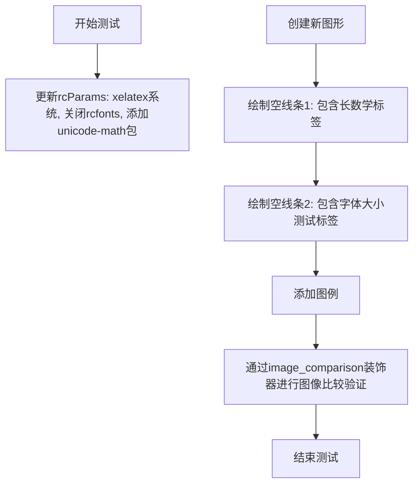

#### 带注释源码

```python
# test to make sure that the document font size is set consistently (see #26892)
@needs_pgf_xelatex  # 装饰器：仅在xelatex可用时运行
@pytest.mark.skipif(
    not _has_tex_package('unicode-math'), reason='needs unicode-math.sty'
)  # 跳过条件：需要unicode-math包
@pytest.mark.backend('pgf')  # 指定使用pgf后端
@image_comparison(['pgf_document_font_size.pdf'], style='default', remove_text=True)  # 图像比较装饰器
def test_document_font_size():
    """测试文档字体大小设置的一致性"""
    # 配置PGF后端参数
    mpl.rcParams.update({
        'pgf.texsystem': 'xelatex',      # 使用xelatex引擎
        'pgf.rcfonts': False,           # 禁用rcfonts自动配置
        'pgf.preamble': r'\usepackage{unicode-math}',  # 加载unicode-math包
    })
    
    # 创建新图形
    plt.figure()
    
    # 绘制第一条空线条，带有长数学表达式标签
    plt.plot([],
             label=r'$this is a very very very long math label a \times b + 10^{-3}$ '
                   r'and some text'
             )
    
    # 绘制第二条空线条，带有字体大小测试标签
    plt.plot([],
             label=r'\normalsize the document font size is \the\fontdimen6\font'
             )
    
    # 添加图例
    plt.legend()
```

## 关键组件


### 图像比较框架

用于比较生成的图像与基准图像，包含compare_figure函数和image_comparison装饰器，支持tol容差参数

### PDF页面管理

PdfPages类用于创建和管理多页PDF文件，支持设置元数据（Author、Title、Subject、Keywords等），提供get_pagecount方法获取页数

### LaTeX后端测试装饰器

needs_pgf_xelatex、needs_pgf_pdflatex、needs_pgf_lualatex装饰器用于标记需要特定LaTeX引擎的测试用例

### 图形创建函数

create_figure函数创建包含线条图、标记、填充路径、文本和数学公式的复合图形，用于测试各种渲染功能

### XeLaTeX编译测试

test_xelatex测试使用XeLaTeX引擎编译图形为PDF，配置serif字体族并禁用rcfonts

### Pdflatex编译测试

test_pdflatex测试使用PdfLaTeX引擎编译，支持UTF-8输入编码和T1字体编码，处理旧版GhostScript兼容性问题

### RC参数更新测试

test_rcupdate测试动态更新matplotlib的rc参数，为不同图形应用不同的字体大小、子图布局和标记大小配置

### 路径裁剪测试

test_pathclip测试backend端裁剪功能，处理TeX不支持的大数值，使用散点图和直方图验证裁剪效果

### 混合模式渲染测试

test_mixedmode测试栅格化与矢量混合渲染，使用pcolor创建等高线图并调用set_rasterized(True)

### 边界框裁剪测试

test_bbox_inches测试tight layout与bbox_inches结合使用，确保图形正确裁剪

### 多页PDF测试

test_pdf_pages测试使用不同TeX系统创建多页PDF，验证保存多个图形到同一PDF文件

### PDF元数据验证

test_pdf_pages_metadata_check使用pikepdf库验证PDF元数据正确性，包括作者、创建日期、主题等字段

### 空PDF清理测试

test_multipage_keep_empty测试空的PDF文件在上下文管理器退出后是否被正确删除

### TeX错误恢复测试

test_tex_restart_after_error测试LaTeX编译出错后重新开始新图形的能力

### 紧凑边界框测试

test_bbox_inches_tight测试bbox_inches="tight"参数与pgf后端结合使用

### PNG透明度测试

test_png_transparency测试生成透明PNG图像，验证alpha通道全为0

### 未知字体警告测试

test_tex_restart_after_error后的字体测试，验证未知字体被正确忽略并记录警告

### 负号渲染测试

test_minus_signs_with_tex测试不同TeX系统中负号的渲染一致性

### 草图参数测试

test_sketch_params测试set_sketch_params方法生成随机步骤装饰路径

### 文档字体大小测试

test_document_font_size测试使用unicode-math包时文档字体大小的一致性


## 问题及建议


### 已知问题

- **全局状态管理混乱**：模块顶层直接修改`mpl.rcParams`（如在测试函数中频繁调用`mpl.rcParams.update()`），可能导致测试之间的状态污染
- **_old_gs_version计算逻辑**：在模块加载时执行版本检查，如果gs不可用会静默设置为True，可能导致某些测试在预期外条件下运行
- **重复代码模式**：test_pdf_pages和test_pdf_pages_metadata_check存在大量重复的PDF创建和元数据设置逻辑
- **硬编码的阈值和路径**：多处使用硬编码的容差值（如`tol=11.71`, `tol=13.2`），缺乏对这些值来源的注释
- **compare_figure函数副作用**：每次调用都会用shutil.copyfile覆盖expected文件，测试逻辑不够清晰
- **缺少对临时资源的清理**：虽然test_multipage_keep_empty测试了空PDF的清理，但其他测试可能产生未清理的临时文件
- **测试函数装饰器顺序不一致**：部分测试装饰器顺序不同，可能影响测试执行优先级
- **缺少类型注解**：所有函数都缺乏类型提示，降低了代码可维护性

### 优化建议

- 将rcParams的修改封装到独立的辅助函数中，使用pytest fixture管理测试上下文
- 将_old_gs_version的检查延迟到实际需要时（惰性求值），或在pytest fixture中初始化
- 提取test_pdf_pages和test_pdf_pages_metadata_check的公共逻辑到独立的setup函数
- 将硬编码的阈值提取为模块级常量，并添加注释说明其来源和意义
- 重构compare_figure函数，明确其设计意图，或使用pytest的tmp_path管理临时文件
- 统一装饰器顺序，遵循pytest约定（先标记再函数）
- 为关键函数添加类型注解，提高代码可读性和可维护性

## 其它


### 设计目标与约束

本测试文件旨在验证matplotlib的PGF后端在不同LaTeX引擎（XeLaTeX、PDFLaTeX、LuaLaTeX）下的功能正确性，确保生成的PDF文档符合预期。主要约束包括：1）需要安装对应的LaTeX引擎；2）部分测试依赖Ghostscript；3）需要特定的LaTeX包（如type1ec、ucs、unicode-math）；4）测试生成的图像与基准图像的对比容差控制。

### 错误处理与异常设计

代码中使用了多种错误处理机制：1）使用pytest.skipif跳过依赖不满足的测试；2）使用pytest.importorskip处理可选依赖pikepdf；3）使用pytest.raises捕获预期的ValueError；4）使用ImageComparisonFailure处理图像比较失败；5）通过caplog捕获日志警告处理未知字体问题。

### 外部依赖与接口契约

外部依赖包括：1）LaTeX引擎：xelatex、pdflatex、lualatex；2）Ghostscript；3）LaTeX包：type1ec.sty、ucs.sty、unicode-math.sty、sfmath.sty；4）Python包：pikepdf（可选）；5）matplotlib后端：pgf。接口契约方面：1）测试函数使用@pytest.mark.backend('pgf')指定后端；2）使用@image_comparison装饰器进行图像对比；3）PdfPages类提供savefig和get_pagecount方法；4）compare_figure函数用于比较生成的PDF与基准图像。

### 性能考虑

部分测试包含性能优化逻辑：1）使用tol参数控制图像比较的容差，_old_gs_version变量根据Ghostscript版本调整容差值以适应不同版本的渲染差异；2）test_pathclip测试使用BytesIO()直接保存到内存而非磁盘，减少I/O开销；3）test_rcupdate测试中预先计算容差值避免重复判断。

### 安全性考虑

代码中的安全性设计：1）使用matplotlib.rc_context和style.context确保配置修改后能恢复；2）test_pdf_pages_metadata_check使用monkeypatch.setenv设置环境变量SOURCE_DATE_EPOCH以支持可重现构建；3）PDF元数据中的ModDate使用固定日期避免时间戳泄露。

### 可维护性与扩展性

代码设计具有良好的可维护性：1）create_figure()函数封装了通用的图形创建逻辑，多个测试复用此函数；2）compare_figure()函数封装了图像比较逻辑；3）使用pytest.mark.parametrize实现参数化测试，便于扩展测试场景；4）全局变量baseline_dir和result_dir集中管理目录路径。

### 测试策略

采用多层测试策略：1）单元测试：每个test_函数针对特定功能；2）图像回归测试：使用@image_comparison装饰器进行视觉验证；3）参数化测试：使用@pytest.mark.parametrize覆盖多种LaTeX引擎；4）条件跳过：使用@needs_*装饰器和pytest.skipif处理环境依赖。

### 平台依赖性

代码存在平台依赖：1）LaTeX引擎在Windows、Linux、macOS上的安装方式不同；2）Ghostscript版本检测逻辑针对9.50以下版本有特殊处理；3）字体渲染在不同操作系统上可能存在细微差异；4）环境变量SOURCE_DATE_EPOCH在某些平台上可能不被支持。

### 资源管理

资源管理方面：1）使用tmp_path fixture管理临时文件，测试结束后自动清理；2）BytesIO()用于内存缓冲区操作，避免生成临时文件；3）with语句确保PdfPages等资源正确关闭；4）test_multipage_keep_empty验证空PDF文件的正确清理行为。

### 配置与参数

关键配置参数：1）pgf.texsystem：指定LaTeX引擎；2）pgf.rcfonts：控制是否自动配置字体；3）pgf.preamble：LaTeX preamble内容；4）font.family：字体族设置；5）figure.subplot.left：子图布局参数；6）lines.markersize：标记大小。

### 版本兼容性

版本兼容性处理：1）通过parse_version解析Ghostscript版本；2）使用try/except捕获mpl.ExecutableNotFoundError处理LaTeX未安装情况；3）_old_gs_version变量根据版本调整测试容差；4）使用mpl.__version__获取matplotlib版本信息写入PDF元数据。


    