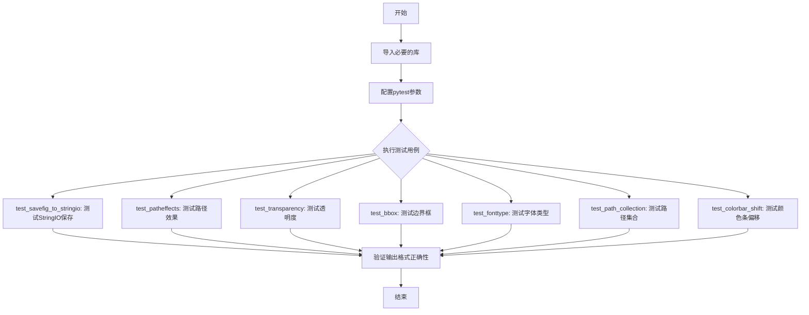
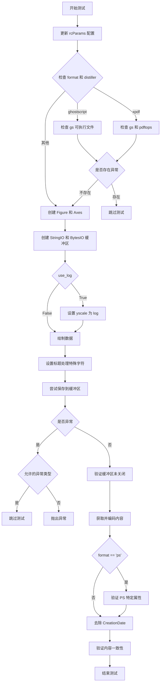
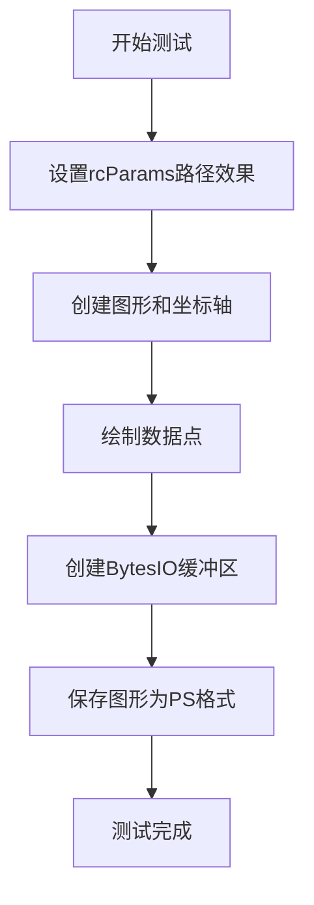
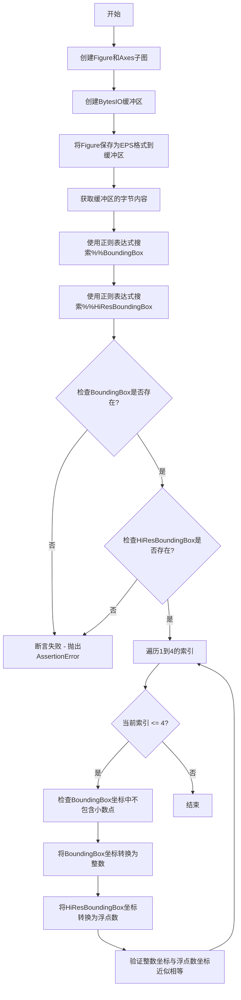
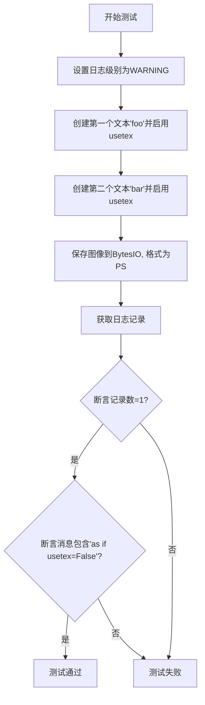
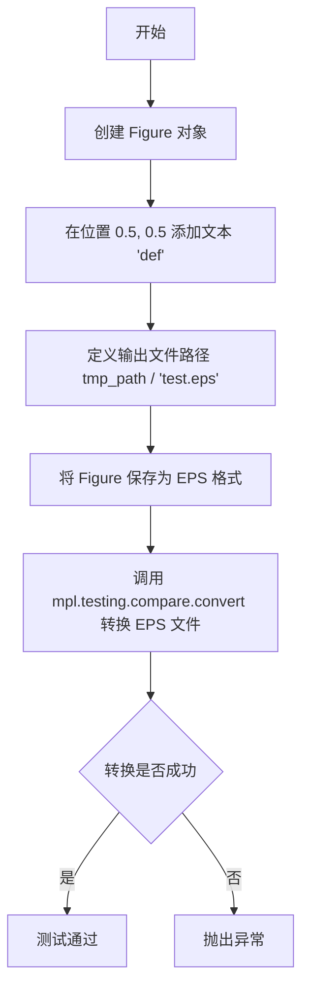
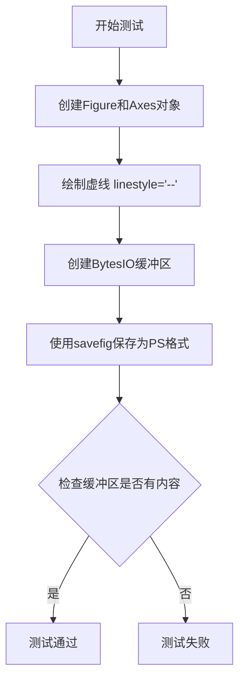
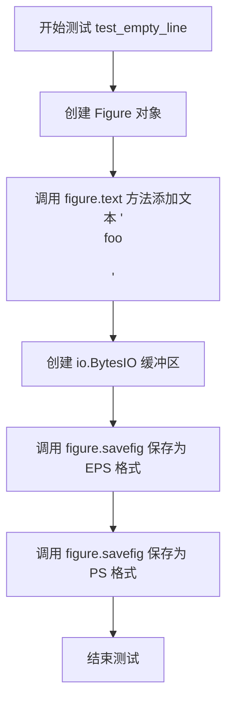

# `matplotlib\lib\matplotlib\tests\test_backend_ps.py` 详细设计文档

该文件是Matplotlib的测试文件，主要用于测试PostScript (PS) 和 Encapsulated PostScript (EPS) 后端的导出功能，包括字体处理、透明度、边界框、LaTeX支持、颜色条等各种场景的保存和渲染测试。

## 整体流程



## 类结构

```
测试模块 (test_backend_ps.py)
├── test_savefig_to_stringio (参数化测试)
├── test_patheffects
├── test_tilde_in_tempfilename
├── test_transparency
├── test_transparency_tex
├── test_bbox
├── test_failing_latex
├── test_partial_usetex
├── test_usetex_preamble
├── test_useafm
├── test_type3_font
├── test_colored_hatch_zero_linewidth
├── test_text_clip
├── test_d_glyph
├── test_type42_font_without_prep
├── test_fonttype (参数化测试)
├── test_linedash
├── test_empty_line
├── test_no_duplicate_definition
├── test_multi_font_type3
├── test_multi_font_type42
├── test_path_collection
├── test_colorbar_shift
└── test_auto_papersize_removal
```

## 全局变量及字段


    

## 全局函数及方法


### `test_savefig_to_stringio`

该测试函数用于验证 matplotlib 的 `savefig` 功能能否正确将图形保存到 `StringIO` 和 `BytesIO` 对象中，并测试不同的输出格式（PS/EPS）、日志开关、TeX 渲染选项、页面方向和纸张大小。

参数：

- `format`：`str`，输出文件格式（'ps' 或 'eps'）
- `use_log`：`bool`，是否使用对数刻度
- `rcParams`：`dict`，matplotlib 配置字典
- `orientation`：`str`，页面方向（'portrait' 或 'landscape'）
- `papersize`：`str`，纸张大小（'letter' 或 'figure'）

返回值：`None`，该函数为测试函数，无返回值

#### 流程图



#### 带注释源码

```python
@pytest.mark.flaky(reruns=3)
@pytest.mark.parametrize('papersize', ['letter', 'figure'])
@pytest.mark.parametrize('orientation', ['portrait', 'landscape'])
@pytest.mark.parametrize('format, use_log, rcParams', [
    ('ps', False, {}),
    ('ps', False, {'ps.usedistiller': 'ghostscript'}),
    ('ps', False, {'ps.usedistiller': 'xpdf'}),
    ('ps', False, {'text.usetex': True}),
    ('eps', False, {}),
    ('eps', True, {'ps.useafm': True}),
    ('eps', False, {'text.usetex': True}),
], ids=[
    'ps',
    'ps with distiller=ghostscript',
    'ps with distiller=xpdf',
    'ps with usetex',
    'eps',
    'eps afm',
    'eps with usetex'
])
def test_savefig_to_stringio(format, use_log, rcParams, orientation, papersize):
    """
    测试 savefig 功能将图形保存到 StringIO 和 BytesIO 中。
    
    参数:
        format: str, 输出格式 ('ps' 或 'eps')
        use_log: bool, 是否使用对数刻度
        rcParams: dict, matplotlib 配置参数
        orientation: str, 页面方向 ('portrait' 或 'landscape')
        papersize: str, 纸张大小 ('letter' 或 'figure')
    """
    # 1. 更新 matplotlib 全局配置
    mpl.rcParams.update(rcParams)
    
    # 2. 检查 ghostscript 可执行文件（如果使用 ghostscript distiller）
    if mpl.rcParams["ps.usedistiller"] == "ghostscript":
        try:
            mpl._get_executable_info("gs")
        except mpl.ExecutableNotFoundError as exc:
            pytest.skip(str(exc))
    # 3. 检查 ghostscript 和 pdftops（如果使用 xpdf distiller）
    elif mpl.rcParams["ps.usedistiller"] == "xpdf":
        try:
            mpl._get_executable_info("gs")  # 检查 ps2pdf
            mpl._get_executable_info("pdftops")
        except mpl.ExecutableNotFoundError as exc:
            pytest.skip(str(exc))

    # 4. 创建图形和坐标轴对象
    fig, ax = plt.subplots()

    # 5. 创建 StringIO 和 BytesIO 缓冲区用于保存图形
    with io.StringIO() as s_buf, io.BytesIO() as b_buf:

        # 6. 根据 use_log 设置 y 轴为对数刻度
        if use_log:
            ax.set_yscale('log')

        # 7. 绘制简单的线图
        ax.plot([1, 2], [1, 2])
        
        # 8. 设置标题，处理特殊字符（ Deja vu + 减号和欧元符号）
        title = "Déjà vu"
        if not mpl.rcParams["text.usetex"]:
            title += " \N{MINUS SIGN}\N{EURO SIGN}"
        ax.set_title(title)
        
        # 9. 定义允许的异常类型（用于跳过测试）
        allowable_exceptions = []
        if mpl.rcParams["text.usetex"]:
            allowable_exceptions.append(RuntimeError)
        if mpl.rcParams["ps.useafm"]:
            allowable_exceptions.append(mpl.MatplotlibDeprecationWarning)
        
        # 10. 尝试保存图形到两个缓冲区
        try:
            # 保存到 StringIO（文本模式）
            fig.savefig(s_buf, format=format, orientation=orientation,
                        papertype=papersize)
            # 保存到 BytesIO（二进制模式）
            fig.savefig(b_buf, format=format, orientation=orientation,
                        papertype=papersize)
        except tuple(allowable_exceptions) as exc:
            # 如果遇到允许的异常，跳过测试
            pytest.skip(str(exc))

        # 11. 验证缓冲区未被关闭
        assert not s_buf.closed
        assert not b_buf.closed
        
        # 12. 获取内容并进行 ASCII 编码
        s_val = s_buf.getvalue().encode('ascii')
        b_val = b_buf.getvalue()

        # 13. 针对 PS 格式进行特定验证
        if format == 'ps':
            # 默认图形尺寸 (8, 6) 英寸
            # 风景模式会交换尺寸
            if mpl.rcParams["ps.usedistiller"] == "xpdf":
                # 简化测试：检查 letter 关键字
                if papersize == 'figure':
                    assert b'letter' not in s_val.lower()
                else:
                    assert b'letter' in s_val.lower()
            elif mpl.rcParams["ps.usedistiller"] or mpl.rcParams["text.usetex"]:
                # 验证设备宽度或纸张尺寸
                width = b'432.0' if orientation == 'landscape' else b'576.0'
                wanted = (b'-dDEVICEWIDTHPOINTS=' + width if papersize == 'figure'
                          else b'-sPAPERSIZE')
                assert wanted in s_val
            else:
                # 标准 PS 模式：验证文档纸张尺寸
                if papersize == 'figure':
                    assert b'%%DocumentPaperSizes' not in s_val
                else:
                    assert b'%%DocumentPaperSizes' in s_val

        # 14. 去除 CreationDate（确保测试确定性）
        s_val = re.sub(b"(?<=\n%%CreationDate: ).*", b"", s_val)
        b_val = re.sub(b"(?<=\n%%CreationDate: ).*", b"", b_val)

        # 15. 验证 StringIO 和 BytesIO 内容一致
        assert s_val == b_val.replace(b'\r\n', b'\n')
```


### `test_patheffects`

该测试函数用于验证 Matplotlib 中 patheffects（路径效果）功能在 PostScript (PS) 格式导出时的正确性，通过设置描边效果并保存图形来确保路径效果能够正确渲染。

参数：此函数无参数。

返回值：`None`，该函数不返回任何值，仅执行测试逻辑。

#### 流程图



#### 带注释源码

```python
def test_patheffects():
    # 配置Matplotlib的路径效果：使用描边效果，白色前景色，线宽4
    # 这会在绘制的图形元素周围添加白色描边，增强可见性
    mpl.rcParams['path.effects'] = [
        patheffects.withStroke(linewidth=4, foreground='w')]
    
    # 创建包含一个坐标轴的图形对象
    fig, ax = plt.subplots()
    
    # 在坐标轴上绘制数据点 [1, 2, 3]
    # 此时路径效果会被应用到绘制的线条上
    ax.plot([1, 2, 3])
    
    # 使用BytesIO作为内存缓冲区来保存PS文件
    # 无需写入磁盘即可进行测试
    with io.BytesIO() as ps:
        # 将图形保存为PostScript格式到内存缓冲区
        # 测试patheffects在PS后端是否正常工作
        fig.savefig(ps, format='ps')
```


### `test_tilde_in_tempfilename`

#### 描述
这是一个回归测试函数，用于验证 Matplotlib 在使用 LaTeX (usetex) 渲染文本时，即使临时目录路径被修改为短路径（模拟 Windows 上用户名很长导致路径被缩短的场景），也能正确保存 PostScript/EPS 文件。该测试通过临时覆盖 `tempfile.tempdir` 来模拟环境，并确保不会触发与波浪号（~）相关的 LaTeX 错误。

#### 文件整体运行流程
该代码文件位于 `matplotlib` 项目的测试模块中，主要用于测试 `PS` (PostScript) 和 `EPS` (Encapsulated PostScript) 后端的各种功能。文件中的测试函数按逻辑可分为以下几类：
1.  **基础保存测试** (`test_savefig_to_stringio`): 测试图形保存为字符串/字节流的基本功能。
2.  **路径与环境测试** (`test_tilde_in_tempfilename`): 专注于测试临时文件路径与 LaTeX 的交互。
3.  **渲染与样式测试** (`test_patheffects`, `test_transparency`, `test_useafm`): 测试特定的渲染效果、透明度以及字体处理。
4.  **特定格式与字体测试** (`test_type3_font`, `test_type42_font_without_prep`): 验证不同字体类型的嵌入和输出。

`test_tilde_in_tempfilename` 依赖 `@needs_usetex` 和 `@needs_ghostscript` 装饰器来跳过不支持 LaTeX 的环境。

#### 函数详细信息

**参数：**
- `tmp_path`：`pathlib.Path` (或 pytest 的 `py.path.local`)，这是 pytest 的内置 fixture，提供一个临时的文件目录供测试使用。

**返回值：**
- `None`：该函数没有显式返回值。如果保存成功且未抛出异常，测试即视为通过。

#### 流程图

```mermaid
flowchart TD
    A([开始测试]) --> B[创建临时子目录 'short-1']
    B --> C{使用 cbook._setattr_cm 上下文}
    C --> D[临时修改 tempfile.tempdir]
    D --> E[开启 mpl.rcParams['text.usetex']]
    E --> F[调用 plt.plot 绘制数据]
    F --> G[调用 plt.xlabel 设置 LaTeX 标签]
    G --> H[调用 plt.savefig 保存为 EPS]
    H --> I{检查是否抛出异常}
    I -- 否 --> J([测试通过])
    I -- 是 --> K([测试失败])
```

#### 带注释源码

```python
@needs_usetex
@needs_ghostscript
def test_tilde_in_tempfilename(tmp_path):
    # Tilde ~ in the tempdir path (e.g. TMPDIR, TMP or TEMP on windows
    # when the username is very long and windows uses a short name) breaks
    # latex before https://github.com/matplotlib/matplotlib/pull/5928
    
    # 1. 准备测试环境：创建一个短路径的临时目录
    # 这里的意图是模拟 Windows 环境下用户名很长但被映射为短名称的情况，
    # 或者为了避开原始代码中 tilde (~) 导致的问题。
    base_tempdir = tmp_path / "short-1"
    base_tempdir.mkdir()
    
    # 2. 注入逻辑：更改 Python 标准库的 tempfile 模块寻找临时文件的路径
    # 使用 cbook._setattr_cm 确保在上下文管理器退出后，tempfile.tempdir 会恢复原状，
    # 避免影响其他测试。
    with cbook._setattr_cm(tempfile, tempdir=str(base_tempdir)):
        # 3. 启用 LaTeX 渲染
        mpl.rcParams['text.usetex'] = True
        
        # 4. 绘制图形并设置标签（包含 LaTeX 语法），这会调用底层的 LaTeX 引擎
        plt.plot([1, 2, 3, 4])
        plt.xlabel(r'\textbf{time} (s)')
        
        # 5. 使用 PS 后端保存文件。
        # 如果 tempdir 处理不当（例如包含 ~ 且未被正确转义），这里会失败。
        plt.savefig(base_tempdir / 'tex_demo.eps', format="ps")
```

#### 关键组件信息
- **`cbook._setattr_cm`**：Matplotlib 内部提供的上下文管理器，用于临时修改对象属性。这里用于安全地替换 `tempfile.tempdir`，防止测试污染全局状态。
- **`mpl.rcParams`**：Matplotlib 的运行时配置字典。测试通过修改 `text.usetex` 来强制触发 LaTeX 子进程调用。
- **`tempfile.tempdir`**：Python 标准库模块中的全局变量，用于指定 `mkstemp` 等函数创建临时文件的默认目录。

#### 潜在的技术债务或优化空间
1.  **间接测试**：目前的测试通过创建一个“不包含 tilde 的短路径”来*绕过*问题并验证功能，而不是创建一个*包含 tilde 的路径*然后验证 tilde 被正确处理。虽然这是标准的回归测试做法（确保修复后的代码有效），但如果想更严谨，可以增加一个断言来确认 `tempfile.tempdir` 确实被应用了。
2.  **外部依赖**：该测试强依赖系统上安装了完整的 LaTeX 发行版（TeX Live, MiKTeX 等）和 Ghostscript。虽然 `@needs_usetex` 装饰器会在缺失时跳过测试，但在 CI 环境中维护这些依赖会增加构建时间和复杂性。
3.  **全局状态管理**：虽然使用了上下文管理器，但在多线程环境下修改 `tempfile` 模块的全局变量仍存在理论上的风险（尽管在单线程测试中通常没问题）。

#### 其它项目

**设计目标与约束：**
- **目标**：确保 LaTeX 渲染功能在处理文件系统路径时具有鲁棒性，特别是在 Windows 平台上可能出现的路径别名情况。
- **约束**：仅在 `text.usetex` 设置为 `True` 时运行。

**错误处理与异常设计：**
- 测试本身不包含复杂的 try-except 逻辑。如果 LaTeX 执行失败（例如路径中有非法字符），`plt.savefig` 会抛出异常导致测试失败。如果系统缺少 LaTeX，pytest 会根据装饰器自动跳过。

**数据流与状态机：**
- 测试流程是线性的：Setup (创建目录) -> Action (Plot/Save) -> Teardown (上下文退出)。
- 状态变化：`mpl.rcParams` 和 `tempfile.tempdir` 在测试内部被临时修改，测试结束后恢复。


### `test_transparency`

该函数是一个图像对比测试函数，用于测试matplotlib在导出EPS图像时对透明度（alpha=0）的处理是否正确。通过创建包含透明线条和透明文本的图形，并使用图像比较装饰器验证输出是否符合预期的"empty.eps"参考图像。

参数：

- 无参数

返回值：`None`，无返回值（测试函数）

#### 流程图

```mermaid
graph TD
    A[开始 test_transparency] --> B[创建子图 fig, ax = plt.subplots]
    B --> C[关闭坐标轴 ax.set_axis_off]
    C --> D[绘制透明红色线条 ax.plot[0, 1], color=r, alpha=0]
    D --> E[添加透明红色文本 ax.text.5, .5, foo, color=r, alpha=0]
    E --> F[由 @image_comparison 装饰器执行图像对比验证]
    F --> G[结束]
```

#### 带注释源码

```python
@image_comparison(["empty.eps"])  # 装饰器：使用 empty.eps 作为参考图像进行对比测试
def test_transparency():
    """测试透明度（alpha=0）在EPS输出中的处理"""
    fig, ax = plt.subplots()  # 创建一个新的图形和坐标轴
    ax.set_axis_off()  # 隐藏坐标轴，只保留内容
    ax.plot([0, 1], color="r", alpha=0)  # 绘制一条透明度为0的红色线段（不可见）
    ax.text(.5, .5, "foo", color="r", alpha=0)  # 在中心位置添加透明度为0的文本（不可见）
    # 函数执行完毕后，@image_comparison 装饰器会自动保存生成的EPS图像
    # 并与预定义的 empty.eps 参考图像进行对比，验证输出是否正确
```


### `test_transparency_tex`

该函数是一个图像对比测试，用于验证在使用 LaTeX 渲染文本（`text.usetex=True`）的情况下，透明度（alpha=0）的图形元素（线条和文本）能否正确生成 EPS 图像，并与参考图像进行对比。

参数： 无

返回值：`None`，该函数为测试函数，直接通过 pytest 框架执行，不返回任何值

#### 流程图

```mermaid
graph TD
    A[开始] --> B[设置 mpl.rcParams['text.usetex'] = True]
    B --> C[创建 Figure 和 Axes]
    C --> D[关闭坐标轴显示 ax.set_axis_off()]
    D --> E[绘制透明线条 ax.plot - alpha=0]
    E --> F[添加透明文本 ax.text - alpha=0]
    F --> G[@image_comparison 装饰器<br>对比输出与 empty.eps]
    G --> H[结束]
```

#### 带注释源码

```python
@needs_usetex                              # 装饰器：仅在支持 usetex 的环境运行
@image_comparison(["empty.eps"])          # 装饰器：将生成图像与参考图像 empty.eps 对比
def test_transparency_tex():
    """
    测试在使用 LaTeX 文本渲染时，透明度为 0 的图形元素
    （线条和文本）能否正确生成 EPS 图像。
    """
    mpl.rcParams['text.usetex'] = True     # 启用 LaTeX 文本渲染
    fig, ax = plt.subplots()               # 创建图形和坐标轴
    ax.set_axis_off()                      # 隐藏坐标轴
    ax.plot([0, 1], color="r", alpha=0)    # 绘制红色透明线条（完全不可见）
    ax.text(.5, .5, "foo", color="r", alpha=0)  # 添加红色透明文本
    # 图像对比由 @image_comparison 装饰器自动完成
```


### `test_bbox`

该函数用于测试matplotlib生成的EPS格式图像的BoundingBox和HiResBoundingBox是否正确，具体验证BoundingBox必须使用整数，并且是HiResBoundingBox的ceil/floor近似值。

参数：
- 无

返回值：`None`，该函数为测试函数，通过断言验证EPS文件中的边界框信息

#### 流程图



#### 带注释源码

```python
def test_bbox():
    # 创建一个新的Figure对象和一个Axes对象（子图）
    fig, ax = plt.subplots()
    
    # 使用BytesIO作为内存缓冲区来存储EPS输出
    with io.BytesIO() as buf:
        # 将Figure保存为EPS格式，输出到内存缓冲区
        fig.savefig(buf, format='eps')
        
        # 获取缓冲区中的字节数据
        buf = buf.getvalue()

    # 使用正则表达式搜索EPS文件中的%%BoundingBox条目
    # 格式: %%BoundingBox: llx lly urx ury (左下x, 左下y, 右上x, 右上y)
    bb = re.search(b'^%%BoundingBox: (.+) (.+) (.+) (.+)$', buf, re.MULTILINE)
    
    # 断言BoundingBox必须存在于EPS输出中
    assert bb
    
    # 使用正则表达式搜索EPS文件中的%%HiResBoundingBox条目（高精度版本）
    hibb = re.search(b'^%%HiResBoundingBox: (.+) (.+) (.+) (.+)$', buf,
                     re.MULTILINE)
    
    # 断言HiResBoundingBox必须存在于EPS输出中
    assert hibb

    # 遍历BoundingBox的四个坐标值（索引1-4对应四个捕获组）
    for i in range(1, 5):
        # BoundingBox必须使用整数（不包含小数点）
        assert b'.' not in bb.group(i)
        
        # 验证整数BoundingBox是HiResBoundingBox的ceil/floor近似值
        # 使用pytest.approx进行浮点数近似比较，容差为1
        assert int(bb.group(i)) == pytest.approx(float(hibb.group(i)), 1)
```


### `test_failing_latex`

该函数用于测试当 LaTeX 渲染失败时（例如使用无效的 LaTeX 语法导致 "Double subscript" 错误）是否正确抛出 RuntimeError。它通过设置 `text.usetex` 为 True，创建一个包含无效 LaTeX 语法的标签（双下标），然后尝试保存为 PS 格式，预期会捕获到 RuntimeError。

参数： 无

返回值： `None`，无返回值（该函数为测试函数，验证异常捕获）

#### 流程图

```mermaid
flowchart TD
    A[Start: test_failing_latex] --> B[设置 mpl.rcParams['text.usetex'] = True]
    B --> C[调用 plt.xlabel with LaTeX 标签: $22_2_2$]
    C --> D[尝试调用 plt.savefig 保存为 PS 格式到 BytesIO]
    D --> E{是否抛出 RuntimeError?}
    E -->|是| F[测试通过]
    E -->|否| G[测试失败]
```

#### 带注释源码

```python
@needs_usetex  # 装饰器：标记该测试需要 usetex 环境
def test_failing_latex():
    """Test failing latex subprocess call"""  # 测试函数：验证 LaTeX 子进程调用失败时的行为
    mpl.rcParams['text.usetex'] = True  # 启用 text.usetex 配置，强制使用 LaTeX 渲染文本
    # This fails with "Double subscript"  # 注释：说明下面的 LaTeX 语法会导致 "Double subscript" 错误
    plt.xlabel("$22_2_2$")  # 创建 x 轴标签，使用无效的 LaTeX 语法（双下标），这将导致 LaTeX 渲染失败
    with pytest.raises(RuntimeError):  # 上下文管理器：期望捕获 RuntimeError 异常
        plt.savefig(io.BytesIO(), format="ps")  # 尝试将图表保存为 PS 格式，由于 LaTeX 错误应抛出 RuntimeError
```


### `test_partial_usetex`

该函数是一个pytest测试用例，用于验证在使用`text.usetex=True`时，当部分文本无法使用LaTeX渲染时，系统能够正确降级到非LaTeX模式（as if usetex=False），并记录相应的警告信息。

参数：

- `caplog`：`pytest.LogCaptureFixture`，pytest的日志捕获fixture，用于在测试中捕获日志记录

返回值：`None`，该函数为测试函数，不返回任何值

#### 流程图



#### 带注释源码

```python
@needs_usetex  # 装饰器：标记该测试需要usetex环境，如果不可用则跳过测试
@needs_ghostscript  # 装饰器：标记该测试需要ghostscript，如果不可用则跳过测试
def test_partial_usetex(caplog):
    """
    测试部分使用usetex时的降级行为。
    
    当使用usetex=True但某些文本无法使用LaTeX渲染时，
    系统应记录警告并降级处理。
    """
    # 设置日志捕获级别为WARNING，用于捕获降级警告
    caplog.set_level("WARNING")
    
    # 在 figure 的 (0.1, 0.1) 位置创建文本 'foo'，启用 usetex
    plt.figtext(.1, .1, "foo", usetex=True)
    
    # 在 figure 的 (0.2, 0.2) 位置创建文本 'bar'，启用 usetex
    plt.figtext(.2, .2, "bar", usetex=True)
    
    # 将图像保存到 BytesIO，格式为 PostScript
    # 这会触发文本渲染，包括可能的 LaTeX 处理
    plt.savefig(io.BytesIO(), format="ps")
    
    # 获取日志记录（断言只有一条记录）
    # 这是测试的关键断言：确保有且仅有一条警告记录
    record, = caplog.records  # asserts there's a single record.
    
    # 断言日志消息包含特定的降级信息
    # 验证当usetex部分失败时，系统正确记录了降级行为
    assert "as if usetex=False" in record.getMessage()
```


### `test_usetex_preamble`

该函数用于测试当用户自定义 LaTeX 前导码（preamble）时，是否与 matplotlib 默认加载的包产生冲突。它通过设置 `text.usetex` 为 True 和自定义 `text.latex.preamble` 来验证 PS 后端能否正确处理包含额外 LaTeX 包（如 color、graphicx、textcomp）的文档。

参数：

- `caplog`：`pytest.LogCaptureFixture`，pytest 的日志捕获 fixture，用于在测试过程中捕获和检查日志记录

返回值：`None`，该函数没有返回值，仅执行测试逻辑

#### 流程图

```mermaid
graph TD
    A[开始 test_usetex_preamble] --> B[设置 rcParams: text.usetex=True]
    B --> C[设置 rcParams: text.latex.preamble='\\usepackage{color,graphicx,textcomp}']
    C --> D[调用 plt.figtext 在图形中添加文本 'foo']
    D --> E[调用 plt.savefig 保存为 PS 格式到 BytesIO]
    E --> F[测试完成 - 无异常则通过]
```

#### 带注释源码

```python
@needs_usetex  # 装饰器：仅在支持 usetex 的环境中运行
def test_usetex_preamble(caplog):
    """
    测试用户自定义 LaTeX 前导码是否与默认包冲突
    
    该测试验证当用户通过 text.latex.preamble 添加自定义 LaTeX 包时，
    matplotlib 的 PS 后端能够正确处理，不会因为包冲突而导致错误。
    """
    # 更新 matplotlib 的 rcParams 配置
    mpl.rcParams.update({
        # 启用 LaTeX 文本渲染
        "text.usetex": True,
        # 设置自定义 LaTeX 前导码，包含额外包
        # 这些包不应与 matplotlib 默认加载的包冲突
        "text.latex.preamble": r"\usepackage{color,graphicx,textcomp}",
    })
    
    # 使用 figtext 在图形中央添加文本 'foo'
    # 文本将使用 LaTeX 渲染
    plt.figtext(.5, .5, "foo")
    
    # 将图形保存为 PostScript 格式到 BytesIO 对象
    # 如果前导码有问题，这里会抛出异常
    plt.savefig(io.BytesIO(), format="ps")
```


### `test_useafm`

该测试函数用于验证 matplotlib 在启用 `ps.useafm` 配置时能够正确生成 EPS 格式的输出文件，确保 AFM（Adobe Font Metrics）字体在 PostScript 输出中正常工作。

参数：
- 无

返回值：`None`，无返回值（测试函数）

#### 流程图

```mermaid
graph TD
    A[开始 test_useafm] --> B[设置 mpl.rcParams['ps.useafm'] = True]
    B --> C[创建 Figure 和 Axes]
    C --> D[关闭坐标轴显示 ax.set_axis_off]
    D --> E[绘制水平线 ax.axhline at y=0.5]
    E --> F[添加文本 ax.text at 0.5, 0.5 内容为'qk']
    F --> G[使用 @image_comparison 装饰器比较输出与 useafm.eps]
    G --> H[结束]
```

#### 带注释源码

```python
@image_comparison(["useafm.eps"])  # 装饰器：比较生成的图像与参考图像 useafm.eps
def test_useafm():
    """测试使用 AFM 字体时的 EPS 输出功能"""
    
    # 启用 PostScript 使用 AFM 字体
    mpl.rcParams["ps.useafm"] = True
    
    # 创建图形和坐标轴对象
    fig, ax = plt.subplots()
    
    # 隐藏坐标轴的显示（边框、刻度等）
    ax.set_axis_off()
    
    # 在 y=0.5 位置绘制水平线
    ax.axhline(.5)
    
    # 在坐标 (0.5, 0.5) 处添加文本 'qk'
    # 当 ps.useafm=True 时，此文本应使用 AFM 字体渲染
    ax.text(.5, .5, "qk")
```

---

### 关键组件信息

| 组件名称 | 描述 |
|---------|------|
| `@image_comparison` | 装饰器，用于将测试生成的图像与参考 EPS 图像进行像素级比较 |
| `mpl.rcParams["ps.useafm"]` | Matplotlib 配置参数，控制是否在 PostScript 输出中使用 AFM 字体 |
| `plt.subplots()` | 创建 Figure 和 Axes 的工厂函数 |
| `ax.axhline()` | 在 Axes 上绘制水平线的函数 |
| `ax.text()` | 在 Axes 指定位置添加文本的函数 |

---

### 潜在的技术债务或优化空间

1. **测试覆盖单一**: 该测试仅验证基本的 AFM 字体渲染，未测试多字体、特殊字符或不同字号下的 AFM 行为
2. **依赖参考图像**: 使用 `@image_comparison` 需要预先存储参考图像，增加了测试维护成本
3. **无错误处理验证**: 测试未验证 AFM 字体缺失或不可用时的降级处理逻辑
4. **缺少性能测试**: 未测试大规模文本渲染时 AFM 的性能表现

---

### 其它项目

#### 设计目标与约束
- **目标**: 确保 `ps.useafm=True` 时生成的 EPS 文件使用 AFM 字体而非 Type 3 或 Type 42 字体
- **约束**: 依赖 `@image_comparison` 装饰器进行视觉回归测试，需要参考图像 `useafm.eps` 存在

#### 错误处理与异常设计
- 该测试函数本身不包含显式的异常处理逻辑
- 若 `ps.useafm` 配置导致渲染失败，`@image_comparison` 装饰器会捕获异常并标记测试失败

#### 外部依赖与接口契约
- **matplotlib**: 核心绘图库
- **参考图像**: `useafm.eps` 存储在测试图像基准目录中
- **配置接口**: 通过 `mpl.rcParams` 字典修改全局配置


### `test_type3_font`

该测试函数用于验证 Matplotlib 在生成 EPS 图像时正确处理 Type 3 字体，通过在图形中央绘制文本 "I/J" 并与预期图像进行像素级比较。

参数：

- 该函数无参数

返回值：`None`，测试函数无返回值，测试结果通过 `@image_comparison` 装饰器自动验证

#### 流程图

```mermaid
flowchart TD
    A[开始测试] --> B[执行 plt.figtext 在坐标 0.5, 0.5 处绘制文本 'I/J']
    B --> C[@image_comparison 装饰器自动比较生成的 EPS 图像与 type3.eps 基准图像]
    C --> D{图像是否匹配}
    D -->|匹配| E[测试通过]
    D -->|不匹配| F[测试失败]
```

#### 带注释源码

```python
@image_comparison(["type3.eps"])  # 装饰器：声明基准图像文件，测试自动比较生成的图像
def test_type3_font():
    # 测试函数：验证 Type 3 字体的正确渲染
    # 使用 figtext 在图形中央位置 (0.5, 0.5) 绘制文本 "I/J"
    # 该文本将作为 Type 3 字体被嵌入到 EPS 输出中
    plt.figtext(.5, .5, "I/J")
```


### `test_colored_hatch_zero_linewidth`

该测试函数用于验证matplotlib在linewidth为0时的彩色填充（hatch）渲染效果，通过创建三个具有不同填充样式、颜色和线宽的椭圆来对比图像输出是否与预期一致。

参数： 无

返回值： 无

#### 流程图

```mermaid
graph TD
    A[开始] --> B[获取当前坐标轴 ax = plt.gca]
    B --> C[添加第一个Ellipse: 中心(0,0), 宽1高1, hatch='/', 边红色, linewidth=0]
    C --> D[添加第二个Ellipse: 中心(0.5,0.5), 宽0.5高0.5, hatch='+', 边绿色, linewidth=0.2]
    D --> E[添加第三个Ellipse: 中心(1,1), 宽0.3高0.8, hatch='\\', 边蓝色, linewidth=0]
    E --> F[关闭坐标轴显示 ax.set_axis_off]
    F --> G[使用@image_comparison装饰器对比生成的eps图像与预期图像coloredhatcheszerolw.eps]
    G --> H[结束]
```

#### 带注释源码

```python
@image_comparison(["coloredhatcheszerolw.eps"])
def test_colored_hatch_zero_linewidth():
    """
    测试在linewidth为0时的彩色填充渲染效果
    
    该测试通过image_comparison装饰器自动比较生成的图像
    与参考图像coloredhatcheszerolw.eps是否一致
    """
    # 获取当前坐标轴（当前活动Figure的当前子图）
    ax = plt.gca()
    
    # 添加第一个椭圆：中心(0,0)，宽1高1，填充样式为'/'，无面部颜色，红色边框，线宽0
    # 线宽为0用于测试零线宽情况下的渲染
    ax.add_patch(Ellipse((0, 0), 1, 1, hatch='/', facecolor='none',
                         edgecolor='r', linewidth=0))
    
    # 添加第二个椭圆：中心(0.5,0.5)，宽0.5高0.5，填充样式为'+'，无面部颜色，绿色边框，线宽0.2
    # 线宽0.2作为对比参照
    ax.add_patch(Ellipse((0.5, 0.5), 0.5, 0.5, hatch='+', facecolor='none',
                         edgecolor='g', linewidth=0.2))
    
    # 添加第三个椭圆：中心(1,1)，宽0.3高0.8，填充样式为'\\'，无面部颜色，蓝色边框，线宽0
    # 再次测试零线宽情况，使用不同的填充样式
    ax.add_patch(Ellipse((1, 1), 0.3, 0.8, hatch='\\', facecolor='none',
                         edgecolor='b', linewidth=0))
    
    # 关闭坐标轴的显示（隐藏刻度、标签等），仅显示图形元素
    ax.set_axis_off()
```


### `test_text_clip`

该函数用于测试在PostScript/EPS输出中，完全被裁剪（clip）的文本不应出现在渲染结果中，通过比较测试图形（包含裁剪文本）和参考图形（不包含文本）的渲染结果来验证这一点。

参数：

- `fig_test`：`matplotlib.figure.Figure`，测试用的Figure对象，用于添加被裁剪的文本
- `fig_ref`：`matplotlib.figure.Figure`，参考用的Figure对象，作为对比基准（不添加任何文本）

返回值：`None`，该函数没有返回值，主要通过`@check_figures_equal`装饰器进行图形比较验证

#### 流程图

```mermaid
graph TD
    A[开始] --> B[调用fig_test.add_subplot创建子图]
    B --> C[调用ax.text添加完全裁剪的文本]
    C --> D[在坐标0, 0处添加文本hello]
    D --> E[设置transform为fig_test.transFigure]
    E --> F[设置clip_on=True启用裁剪]
    F --> G[调用fig_ref.add_subplot创建空白参考子图]
    G --> H[装饰器@check_figures_equal比较两个figure的EPS输出]
    H --> I[结束]
```

#### 带注释源码

```python
@check_figures_equal(extensions=["eps"])  # 装饰器：比较测试和参考figure的EPS渲染结果是否相等
def test_text_clip(fig_test, fig_ref):
    """
    测试完全裁剪的文本不应出现在PS/EPS输出中
    
    该测试验证当文本被完全裁剪（超出显示区域）时，
    在最终的PostScript/EPS输出中不会产生任何渲染内容
    """
    ax = fig_test.add_subplot()  # 在测试figure中创建一个子图axes
    
    # Fully clipped-out text should not appear.
    # 完全裁剪的文本不应该出现
    # 在figure坐标(0,0)处添加文本"hello"，使用figure坐标变换，启用裁剪
    ax.text(0, 0, "hello", transform=fig_test.transFigure, clip_on=True)
    
    fig_ref.add_subplot()  # 在参考figure中创建空白子图（不添加任何文本）
```


### `test_d_glyph`

该测试函数验证在生成 EPS 文件时，不会意外地将名为 "/d" 的过程（procedure）定义覆盖为字母 "d" 的字形（glyph）定义，从而导致 PostScript 语法错误或意外行为。

参数：

- `tmp_path`：`pathlib.Path` 或 `pytest.fixture`，pytest 提供的临时目录 fixture，用于存放生成的 EPS 测试文件

返回值：`None`，该函数通过 `pytest` 的断言机制验证转换过程不抛出异常

#### 流程图



#### 带注释源码

```python
@needs_ghostscript  # 标记该测试需要 Ghostscript 依赖
def test_d_glyph(tmp_path):
    # Ensure that we don't have a procedure defined as /d, which would be
    # overwritten by the glyph definition for "d".
    # 目的：确保 EPS 输出中不会将自定义的 /d 过程定义被字母 d 的字形定义所覆盖
    # 这是一个潜在的 PostScript 命名冲突问题
    
    fig = plt.figure()  # 创建一个新的 Figure 对象
    fig.text(.5, .5, "def")  # 在 figure 中心位置 (.5, .5) 添加文本 "def"
    # 这里的 "def" 包含字母 'd'，如果处理不当可能与 EPS 中的 /d 过程定义冲突
    
    out = tmp_path / "test.eps"  # 构建输出文件路径为临时目录下的 test.eps
    fig.savefig(out)  # 将 figure 保存为 EPS 格式到指定路径
    
    mpl.testing.compare.convert(out, cache=False)  # 调用 Ghostscript 转换 EPS 文件
    # cache=False 确保不使用缓存，强制进行实际转换测试
    # Should not raise. 如果转换成功则测试通过，否则抛出异常
```


### `test_type42_font_without_prep`

该函数是一个测试函数，用于验证 Matplotlib 在生成 EPS 文件时能否正确嵌入不包含 prep 表的 Type 42 字体。测试通过设置特定的 rcParams 参数，使用 STIX 数学字体集渲染包含数学符号的文本，并使用图像比较装饰器验证输出结果。

参数：无

返回值：无（`None`），该函数为测试函数，不返回任何值

#### 流程图

```mermaid
flowchart TD
    A[开始测试] --> B[设置 ps.fonttype = 42]
    B --> C[设置 mathtext.fontset = stix]
    C --> D[调用 plt.figtext 渲染文本 'Mass $m$']
    D --> E[@image_comparison 验证输出图像]
    E --> F[测试完成]
```

#### 带注释源码

```python
@image_comparison(["type42_without_prep.eps"], style='mpl20')
def test_type42_font_without_prep():
    # Test whether Type 42 fonts without prep table are properly embedded
    # 设置 PostScript 字体类型为 42 (Type 42 字体)
    mpl.rcParams["ps.fonttype"] = 42
    # 设置数学文本字体集为 STIX
    mpl.rcParams["mathtext.fontset"] = "stix"

    # 在页面中心 (0.5, 0.5) 位置渲染包含数学符号的文本 "Mass $m$"
    # $m$ 会使用数学字体渲染
    plt.figtext(0.5, 0.5, "Mass $m$")
```


### `test_fonttype`

该测试函数用于验证 PostScript 输出中字体类型（FontType）的正确性，通过参数化测试分别检查 Type 3 和 Type 42 字体是否被正确嵌入到 PS 文件中。

参数：

- `fonttype`：`str`，字体类型参数，可取值为 "3"（Type 3 字体）或 "42"（Type 42 字体）

返回值：`None`，无返回值（测试函数）

#### 流程图

```mermaid
graph TD
    A[开始] --> B[设置 mpl.rcParams['ps.fonttype'] = fonttype]
    B --> C[创建 Figure 和 Axes: plt.subplots]
    C --> D[在 Axes 上添加文本: ax.text]
    D --> E[创建 BytesIO 缓冲区]
    E --> F[保存图表为 PS 格式: fig.savefig]
    F --> G[构建期望的字节串: b'/FontType ' + fonttype + b' def']
    G --> H[使用正则表达式搜索验证 PS 内容]
    H --> I[断言匹配成功]
    I --> J[结束]
```

#### 带注释源码

```python
@pytest.mark.parametrize('fonttype', ["3", "42"])
def test_fonttype(fonttype):
    """
    测试 PostScript 输出中的字体类型是否正确设置。
    
    参数化测试：分别测试 Type 3 字体和 Type 42 字体。
    """
    # 1. 设置 matplotlib 的 PostScript 字体类型配置
    mpl.rcParams["ps.fonttype"] = fonttype
    
    # 2. 创建图表和坐标轴
    fig, ax = plt.subplots()
    
    # 3. 在图表上添加文本内容
    ax.text(0.25, 0.5, "Forty-two is the answer to everything!")
    
    # 4. 创建内存缓冲区用于保存 PS 输出
    buf = io.BytesIO()
    
    # 5. 将图表保存为 PostScript 格式到缓冲区
    fig.savefig(buf, format="ps")
    
    # 6. 构建期望在 PS 文件中找到的字体类型定义字符串
    # 例如：b'/FontType 3 def' 或 b'/FontType 42 def'
    test = b'/FontType ' + bytes(f"{fonttype}", encoding='utf-8') + b' def'
    
    # 7. 使用正则表达式在 PS 内容中搜索字体类型定义
    # re.MULTILINE 允许 ^ 和 $ 匹配每行的开始和结束
    assert re.search(test, buf.getvalue(), re.MULTILINE)
```


### `test_linedash`

该测试函数验证matplotlib在使用PS（PostScript）格式输出图形时，虚线（dashed line）的渲染不会导致输出文件损坏或为空，确保`savefig`能够正确生成包含虚线样式的PostScript文件。

参数：無

返回值：無（该函数为测试函数，使用assert语句进行断言验证）

#### 流程图



#### 带注释源码

```python
def test_linedash():
    """Test that dashed lines do not break PS output"""
    # 创建图形窗口和坐标轴
    fig, ax = plt.subplots()

    # 在坐标轴上绘制一条虚线 (linestyle="--")
    ax.plot([0, 1], linestyle="--")

    # 创建一个内存缓冲区用于保存PS输出
    buf = io.BytesIO()
    # 将图形保存为PostScript格式到缓冲区
    fig.savefig(buf, format="ps")

    # 断言：确保缓冲区中有数据（文件大小大于0）
    # 这样可以验证虚线不会导致PS输出为空或损坏
    assert buf.tell() > 0
```

#### 关键组件信息

| 组件名称 | 描述 |
|---------|------|
| `plt.subplots()` | 创建Figure和Axes对象的工厂函数 |
| `ax.plot()` | 绘制线条的绘图方法 |
| `io.BytesIO()` | 内存中的二进制缓冲区，用于模拟文件操作 |
| `fig.savefig()` | 将图形保存为各种格式的核心方法 |

#### 潜在的技术债务或优化空间

1. **断言信息不够详细**：当断言失败时，只知道缓冲区为空，但无法了解具体原因。建议添加更详细的错误信息。
2. **测试覆盖不足**：只验证了输出非空，没有验证PS文件内容的正确性，例如是否正确包含虚线定义。
3. **缺少边界测试**：没有测试不同类型的虚线样式（如":"、"-. "、"steps"等）。

#### 其它项目

- **设计目标**：确保matplotlib的PS后端能够正确处理虚线样式，这是PS格式渲染的基本功能要求。
- **错误处理**：使用assert进行简单验证，如果失败会抛出`AssertionError`。
- **外部依赖**：依赖于matplotlib的PS后端实现和`io.BytesIO`缓冲区功能。
- **测试环境**：该测试可能被标记为`flaky`（在某些CI环境中可能不稳定），使用了重试机制（`reruns=3`）。


### `test_empty_line`

该函数是一个冒烟测试，用于验证当文本中包含空行时，EPS 和 PS 格式的保存功能是否正常工作（针对 GitHub issue #23954）。

参数： 无

返回值：`None`，该函数没有返回值，用于执行测试操作。

#### 流程图



#### 带注释源码

```python
def test_empty_line():
    # 冒烟测试：验证空行处理（针对 gh#23954）
    
    # 1. 创建一个新的 Figure 对象（画布）
    figure = Figure()
    
    # 2. 在画布上添加文本，文本内容包含多个换行符（空行）
    #    文本内容：换行符 + 'foo' + 换行符 + 换行符
    figure.text(0.5, 0.5, "\nfoo\n\n")
    
    # 3. 创建一个 BytesIO 对象作为内存缓冲区
    buf = io.BytesIO()
    
    # 4. 将图形保存为 EPS 格式（Encapsulated PostScript）
    figure.savefig(buf, format='eps')
    
    # 5. 将图形保存为 PS 格式（PostScript）
    #    这是一个额外的测试，确保在保存为 EPS 后再次保存为 PS 也不会出错
    figure.savefig(buf, format='ps')
```


### `test_no_duplicate_definition`

这是一个单元测试函数，用于验证Matplotlib生成的EPS（Encapsulated PostScript）文件中不存在重复的PostScript过程定义。测试通过创建包含16个子图的极坐标网格，保存为EPS格式，然后检查输出中所有以`/`开头的定义名称是否唯一（每个定义最多出现一次），以确保输出符合PostScript规范并避免潜在的渲染问题。

参数： 无

返回值：`None`，该函数为pytest测试函数，不返回任何值，通过断言验证正确性

#### 流程图

```mermaid
flowchart TD
    A([开始 test_no_duplicate_definition]) --> B[创建Figure对象: fig = Figure]
    B --> C[创建4x4极坐标子图网格: axs = fig.subplots]
    C --> D{遍历每个子图 ax in axs.flat}
    D --> E[清除刻度: ax.setxticks, yticks=[]]
    E --> F[绘制线条: ax.plot1, 2]
    F --> D
    D -->|遍历完成| G[设置总标题: fig.suptitle]
    G --> H[创建StringIO缓冲区: buf = io.StringIO]
    H --> I[保存为EPS格式: fig.savefigbuf, format='eps']
    I --> J[重置缓冲区位置: buf.seek0]
    J --> K[读取所有行并过滤以/开头的行]
    K --> L[提取定义名称: ln.partition' '[0]]
    L --> M[统计出现次数: Counterwds]
    M --> N[获取最大计数值: maxCounter.values]
    N --> O{最大计数值 == 1?}
    O -->|是| P([测试通过 断言成功])
    O -->|否| Q([断言失败 pytest AssertionError])
```

#### 带注释源码

```python
def test_no_duplicate_definition():
    """
    测试EPS输出中不存在重复的PostScript定义。
    
    该测试确保在保存为EPS格式时，每个PostScript过程/字体定义
    只定义一次，避免覆盖问题。
    """
    
    # 步骤1: 创建Figure对象
    fig = Figure()
    
    # 步骤2: 创建一个4x4的子图网格，使用极坐标投影
    # 这将产生16个子图，每个都会生成一些PostScript代码
    axs = fig.subplots(4, 4, subplot_kw=dict(projection="polar"))
    
    # 步骤3: 遍历所有子图（flat将多维数组展平为一维）
    for ax in axs.flat:
        # 清除x和y轴刻度，避免额外的PostScript代码
        ax.set(xticks=[], yticks=[])
        # 在每个子图上绘制简单的线段 [1, 2]
        ax.plot([1, 2])
    
    # 步骤4: 设置图形的总标题
    fig.suptitle("hello, world")
    
    # 步骤5: 创建StringIO缓冲区用于存储EPS输出
    buf = io.StringIO()
    
    # 步骤6: 将图形保存为EPS格式
    # 这会生成大量的PostScript代码
    fig.savefig(buf, format='eps')
    
    # 步骤7: 将缓冲区位置重置到开头，以便读取
    buf.seek(0)
    
    # 步骤8: 提取所有以'/'开头的行（PostScript定义）
    # 列表推导式遍历所有行，过滤以'/'开头的定义行
    # partition(' ')将行按空格分割，取第一部分（即定义名称）
    wds = [ln.partition(' ')[0] for
           ln in buf.readlines()
           if ln.startswith('/')]
    
    # 步骤9: 断言验证
    # 使用Counter统计每个定义名称出现的次数
    # 验证最大出现次数为1，即没有重复定义
    assert max(Counter(wds).values()) == 1
```


### `test_multi_font_type3`

该测试函数用于验证 Matplotlib 在生成 PostScript（PS）输出时正确处理多字体 Type3 字体的渲染功能，通过比较生成的图像与基准图像确保渲染一致性。

参数： 无（仅使用装饰器 `@image_comparison` 隐式注入的参数）

返回值：`None`，该函数为测试函数，不返回任何值，仅通过 `@image_comparison` 装饰器进行图像比对验证

#### 流程图

```mermaid
graph TD
    A[开始 test_multi_font_type3] --> B[调用 _gen_multi_font_text 获取 fonts 和 test_str]
    B --> C[设置 Matplotlib RC 参数: font family, size=16]
    C --> D[设置 PS 字体类型为 3 (Type3)]
    D --> E[创建新 Figure 对象]
    E --> F[在 Figure 中心位置添加文本 test_str]
    F --> G[通过 @image_comparison 装饰器比对生成的 EPS 图像与基准图像 multi_font_type3.eps]
    G --> H[结束]
```

#### 带注释源码

```python
@image_comparison(["multi_font_type3.eps"])  # 装饰器：比对生成的图像与基准图像
def test_multi_font_type3():
    """
    测试多字体 Type3 字体的 PostScript 输出功能
    
    该测试验证 Matplotlib 能够正确渲染包含多种字体的文本，
    并以 Type3 字体格式输出到 PostScript 文件
    """
    # 从测试工具模块获取多字体测试数据
    # 返回 (fonts, test_str) 元组
    fonts, test_str = _gen_multi_font_text()
    
    # 配置 Matplotlib 字体参数
    # 设置使用多字体族，字体大小为 16 磅
    plt.rc('font', family=fonts, size=16)
    
    # 配置 PostScript 输出参数
    # 指定使用 Type3 字体（可缩放字体）
    plt.rc('ps', fonttype=3)

    # 创建新图形对象
    fig = plt.figure()
    
    # 在图形中心位置添加文本
    # 参数: (x, y, text, horizontalalignment, verticalalignment)
    fig.text(0.5, 0.5, test_str,
             horizontalalignment='center', verticalalignment='center')
    
    # 图像保存和比对由 @image_comparison 装饰器自动处理
    # 装饰器会：
    # 1. 保存生成的 EPS 文件
    # 2. 与基准图像 multi_font_type3.eps 进行像素级比对
    # 3. 如果不匹配则测试失败
```


### `test_multi_font_type42`

该测试函数用于验证 matplotlib 在 PostScript 输出中正确使用 Type 42 字体渲染多字体文本的功能，通过比对生成的图像文件确认字体嵌入的正确性。

参数：无

返回值：`None`，测试函数不返回任何值

#### 流程图

```mermaid
flowchart TD
    A[开始测试 test_multi_font_type42] --> B[调用 _gen_multi_font_text 获取字体和测试字符串]
    B --> C[设置 matplotlib rc 参数: font family 和 fonttype=42]
    C --> D[创建新 Figure 对象]
    D --> E[在 Figure 中心位置添加文本 test_str]
    E --> F[@image_comparison 装饰器自动保存并比对图像]
    F --> G[测试结束]
```

#### 带注释源码

```python
@image_comparison(["multi_font_type42.eps"])  # 装饰器：用于比对生成的图像与参考图像 multi_font_type42.eps
def test_multi_font_type42():
    """测试使用 Type 42 字体渲染多字体文本的功能"""
    # 调用测试辅助函数获取多字体测试所需的字体族和测试字符串
    fonts, test_str = _gen_multi_font_text()
    
    # 设置 matplotlib 的 rc 参数，指定使用多字体族
    plt.rc('font', family=fonts, size=16)
    # 设置 PostScript 输出使用 Type 42 字体格式
    plt.rc('ps', fonttype=42)

    # 创建一个新的 Figure 对象
    fig = plt.figure()
    
    # 在 Figure 的中心位置 (0.5, 0.5) 添加文本
    # 水平和垂直居中对齐
    fig.text(0.5, 0.5, test_str,
             horizontalalignment='center', verticalalignment='center')
    
    # @image_comparison 装饰器会自动保存图像并与参考图像进行比对
    # 如果图像不一致则测试失败
```


### `test_path_collection`

这是一个测试函数，用于验证matplotlib中PathCollection（路径集合）的渲染功能，通过创建散点图和多边形路径集合并与参考图像进行比较，确保图形输出正确。

参数：

- 无

返回值：`None`，该函数为测试函数，不返回任何值

#### 流程图

```mermaid
flowchart TD
    A[开始测试] --> B[创建随机数生成器]
    B --> C[生成x坐标数组 0-1之间的10个随机数]
    C --> D[生成y坐标数组 0-1之间的10个随机数]
    D --> E[生成大小数组 30-100之间的10个随机数]
    E --> F[创建Figure和Axes子图]
    F --> G[使用scatter绘制散点图]
    G --> H[关闭坐标轴显示]
    H --> I[创建多边形路径列表 正3-6边形]
    I --> J[生成偏移量数组 0-200之间的20个值]
    J --> K[设置不同的大小数组]
    K --> L[创建PathCollection对象]
    L --> M[将PathCollection添加到Axes]
    M --> N[设置x轴范围 0-1]
    N --> O[通过image_comparison装饰器与参考图像比较]
    O --> P[结束测试]
```

#### 带注释源码

```python
@image_comparison(["scatter.eps"])  # 装饰器：比较输出图像与scatter.eps参考图像
def test_path_collection():
    """测试PathCollection的渲染功能"""
    
    # 创建随机数生成器，种子为19680801确保可重复性
    rng = np.random.default_rng(19680801)
    
    # 生成10个0-1之间的随机x坐标值
    xvals = rng.uniform(0, 1, 10)
    
    # 生成10个0-1之间的随机y坐标值
    yvals = rng.uniform(0, 1, 10)
    
    # 生成10个30-100之间的随机大小值
    sizes = rng.uniform(30, 100, 10)
    
    # 创建Figure和单个Axes子图
    fig, ax = plt.subplots()
    
    # 绘制散点图，设置标记大小、边框颜色和标记形状
    ax.scatter(xvals, yvals, sizes, edgecolor=[0.9, 0.2, 0.1], marker='<')
    
    # 关闭坐标轴显示
    ax.set_axis_off()
    
    # 创建多边形路径列表：分别生成正三角形、正方形、正五边形、正六边形
    paths = [path.Path.unit_regular_polygon(i) for i in range(3, 7)]
    
    # 生成20个0-200之间的随机值，重塑为10x2的偏移量数组
    offsets = rng.uniform(0, 200, 20).reshape(10, 2)
    
    # 定义PathCollection的大小数组
    sizes = [0.02, 0.04]
    
    # 创建PathCollection对象，包含路径、设置、z顺序、面部颜色和偏移量
    pc = mcollections.PathCollection(paths, sizes, zorder=-1,
                                     facecolors='yellow', offsets=offsets)
    
    # 将PathCollection添加到Axes，autolim=False保持当前视图限制不变
    # 注意：autolim=False用于保持视图限制不变
    # 因为autolim=True的行为已更新为同时更新视图限制
    ax.add_collection(pc, autolim=False)
    
    # 设置x轴范围为0-1
    ax.set_xlim(0, 1)
```


### `test_colorbar_shift`

该函数是一个图像比对测试，用于验证 Matplotlib 中颜色条（colorbar）在使用特定颜色映射（ListedColormap）和边界规范（BoundaryNorm）时的渲染是否正确，特别是颜色条的偏移效果。

参数：

- `tmp_path`：`tmp_path` (pytest fixture)，用于提供临时目录路径

返回值：`None`，无返回值

#### 流程图

```mermaid
flowchart TD
    A[开始测试] --> B[创建 ListedColormap]
    B --> C[创建 BoundaryNorm 边界规范]
    C --> D[调用 plt.scatter 绑定数据与颜色映射]
    D --> E[调用 plt.colorbar 创建颜色条]
    E --> F[图像比对验证]
    F --> G[结束测试]
```

#### 带注释源码

```python
@image_comparison(["colorbar_shift.eps"], savefig_kwarg={"bbox_inches": "tight"},
                  style="mpl20")
def test_colorbar_shift(tmp_path):
    # 创建一个包含红、绿、蓝三种颜色的离散颜色映射
    cmap = mcolors.ListedColormap(["r", "g", "b"])
    
    # 创建边界规范，定义颜色映射的边界区间为 [-1, -0.5, 0.5, 1]
    # cmap.N 指定颜色数量为颜色映射的总颜色数
    norm = mcolors.BoundaryNorm([-1, -0.5, 0.5, 1], cmap.N)
    
    # 绘制散点图，x坐标 [0, 1]，y坐标 [1, 1]
    # c=[0, 1] 指定数据值，cmap 指定颜色映射，norm 指定边界规范
    plt.scatter([0, 1], [1, 1], c=[0, 1], cmap=cmap, norm=norm)
    
    # 创建颜色条并显示，用于验证颜色条偏移是否正确渲染
    plt.colorbar()
```


### `test_auto_papersize_removal`

该函数用于测试 matplotlib 在保存 EPS 图形时拒绝使用 `'auto'` 作为纸张大小的功能，验证当用户尝试使用 `papertype='auto'` 或设置 `ps.papersize='auto'` 时会正确抛出 `ValueError` 异常。

参数： 无

返回值： `None`，无返回值（测试函数）

#### 流程图

```mermaid
flowchart TD
    A[开始] --> B[创建 Figure 对象: fig = plt.figure]
    C[测试 1: 验证 savefig 拒绝 papertype='auto'] --> D[调用 fig.savefig with papertype='auto']
    D --> E{是否抛出 ValueError?}
    E -->|是| F[断言错误消息包含 'auto' is not a valid value]
    E -->|否| G[测试失败]
    F --> H[测试 2: 验证 rcParams 拒绝 ps.papersize='auto']
    H --> I[设置 mpl.rcParams['ps.papersize'] = 'auto']
    I --> J{是否抛出 ValueError?}
    J -->|是| K[断言错误消息包含 'auto' is not a valid value]
    J -->|否| L[测试失败]
    K --> M[结束]
    G --> M
    L --> M
```

#### 带注释源码

```python
def test_auto_papersize_removal():
    """
    测试当使用 'auto' 作为纸张大小时,matplotlib 会正确抛出 ValueError。
    验证功能:拒绝 'auto' 作为 papertype 参数和 ps.papersize 配置项。
    """
    # 创建一个新的 Figure 对象用于后续保存测试
    fig = plt.figure()
    
    # 测试 1: 验证 fig.savefig() 方法拒绝 papertype='auto' 参数
    # 期望抛出 ValueError,错误消息应包含 "'auto' is not a valid value"
    with pytest.raises(ValueError, match="'auto' is not a valid value"):
        fig.savefig(io.BytesIO(), format='eps', papertype='auto')

    # 测试 2: 验证通过 rcParams 设置 ps.papersize='auto' 也会抛出 ValueError
    # 期望抛出 ValueError,错误消息应包含 "'auto' is not a valid value"
    with pytest.raises(ValueError, match="'auto' is not a valid value"):
        mpl.rcParams['ps.papersize'] = 'auto'
```

## 关键组件


### test_savefig_to_stringio

测试将 matplotlib 图形保存到 StringIO 和 BytesIO 对象，支持多种输出格式（PS/EPS）、纸张大小、方向和 rcParams 配置组合，验证生成的 PostScript 代码正确性和一致性。

### test_bbox

测试 EPS 格式输出中的BoundingBox和HiResBoundingBox元数据，确保边界框使用整数并与高精度边界框匹配。

### test_transparency / test_transparency_tex

测试图形元素的透明度处理，支持普通模式和 LaTeX 渲染模式，验证 alpha=0 的元素正确隐藏。

### test_failing_latex

测试 LaTeX 渲染失败时的异常处理，验证错误的 LaTeX 表达式（如双重下标）会抛出 RuntimeError。

### test_usetex_preamble

测试自定义 LaTeX 前言（preamble）功能，允许用户通过 text.latex.preamble 配置添加额外包（如 color, graphicx, textcomp）。

### test_fonttype

测试 PostScript 字体类型支持，包括 Type 3 和 Type 42 字体，通过检查输出中的 /FontType 定义验证。

### test_type42_font_without_prep

测试 Type 42 字体（TrueType）的嵌入功能，特别验证无 prep 表的字体能正确嵌入，使用 STIX 数学字体集。

### test_multi_font_type3 / test_multi_font_type42

测试多字体文本渲染功能，支持在同一文本中使用多种字体族，验证 Type 3 和 Type 42 字体格式。

### test_path_collection

测试 PathCollection（散点图的底层实现）的 PostScript 输出，包括自定义标记形状、多边形路径和偏移量处理。

### test_colorbar_shift

测试颜色条（colorbar）与主图分离时的边界框计算，使用 BoundaryNorm 和离散颜色映射。

### test_d_glyph

测试字体中 "d" 字母的字形定义不会与 PS 过程中的 /d 程序定义冲突，避免 ghostscript 警告。

### test_no_duplicate_definition

验证 EPS 输出中不存在重复的 PostScript 定义，使用词频统计检查每个定义只出现一次。

### test_empty_line

测试空行和换行符的渲染处理，确保 "\n" 字符正确转换为 PostScript 文本输出。

### 图像比较测试框架

使用 @image_comparison 装饰器进行视觉回归测试，比对生成的 EPS 图像与参考图像，支持多种样式配置（mpl20 等）。

### 参数化测试配置

使用 pytest.mark.parametrize 实现多维度测试组合：papersize（letter/figure）、orientation（portrait/landscape）、format（ps/eps）、use_log、rcParams 配置。

### 外部依赖检测

动态检测 ghostscript 和 xpdf 可执行文件，不存在时跳过相关测试，处理跨平台兼容性。


## 问题及建议


### 已知问题

- **全局状态污染**：多个测试直接修改`mpl.rcParams`全局配置（如`mpl.rcParams['text.usetex']`、`mpl.rcParams['ps.useafm']`、`mpl.rcParams['ps.fonttype']`等），未在测试结束后恢复原始值，可能影响后续测试的执行结果
- **测试隔离性不足**：`test_savefig_to_stringio`函数使用`mpl.rcParams.update(rcParams)`修改全局状态，但没有对应的清理逻辑
- **硬编码的随机种子和数值**：多处使用硬编码的数值（如`19680801`、`0.9, 0.2, 0.1`等颜色值），降低测试的可维护性
- **重复的IO对象创建模式**：`io.BytesIO()`和`io.StringIO()`的创建、写入、验证模式在多个测试中重复出现，可提取为公共辅助函数
- **外部依赖强耦合**：测试依赖Ghostscript、LaTeX等外部可执行文件，缺少这些工具时通过`pytest.skip`跳过，降低了测试覆盖率
- **测试方法命名不一致**：部分测试以`test_`开头，部分使用`@image_comparison`装饰器但没有明确的功能描述
- **魔法数字和字符串**：如`b'/FontType ' + bytes(f"{fonttype}", encoding='utf-8') + b' def'`中的字符串拼接，可读性较差

### 优化建议

- **使用fixture管理全局状态**：通过pytest fixture在测试前保存`rcParams`，测试后自动恢复，确保测试隔离
- **提取公共辅助函数**：将`io.BytesIO()`创建、图形保存、缓冲区验证等重复逻辑封装为模块级辅助函数
- **参数化测试扩展**：对于不同格式、papersize、orientation的组合，可进一步扩展为更完整的参数化测试，减少硬编码
- **添加性能基准**：对于涉及文件I/O和图像生成的测试，可添加简单的性能基准，避免回归
- **改进错误处理**：对于外部工具缺失的情况，可考虑更优雅的降级策略或更明确的错误提示
- **文档化测试意图**：为关键测试添加docstring，说明测试目的、预期行为和外部依赖

## 其它


### 设计目标与约束

本测试文件旨在全面验证matplotlib的PostScript (PS) 和 Encapsulated PostScript (EPS) 导出功能的核心行为，包括不同纸张大小、方向、字体类型、颜色处理等场景下的功能正确性和输出一致性。约束条件包括：依赖外部工具（ghostscript、xpdf、pdftops）进行PS到PDF的转换；需要LaTeX环境支持usetex功能；部分测试在Windows环境下可能因路径处理差异而表现不同。

### 错误处理与异常设计

测试文件采用pytest框架进行异常处理，主要策略包括：使用`pytest.raises()`捕获预期异常（如test_failing_latex测试LaTeX语法错误导致的RuntimeError）；使用`pytest.skip()`跳过在特定条件下不可用的测试（如缺少ghostscript或xpdf可执行文件时）；通过`allowable_exceptions`列表允许特定配置下的已知异常（如usetex时的RuntimeError和useafm时的DeprecationWarning）。

### 数据流与状态机

测试数据流主要围绕Figure对象的创建、渲染和导出过程。状态转换包括：初始状态（空Figure）→ 配置状态（设置坐标轴、文本、图形元素）→ 导出状态（调用savefig写入Buffer）→ 验证状态（检查输出内容）。参数化测试覆盖了(papersize, orientation, format, use_log, rcParams)的多维组合空间，形成状态机式的全面测试覆盖。

### 外部依赖与接口契约

外部依赖包括：ghostscript (gs) - 用于PS distiller和EPS到其他格式的转换；xpdf工具集 (pdftops, ps2pdf) - 用于PDF转换；LaTeX (text.usetex=True) - 用于LaTeX文本渲染；matplotlib的patheffects模块 - 用于路径效果测试。接口契约要求：savefig接受format、orientation、papertype等参数；返回的PS/EPS文件应包含标准的%%BoundingBox和%%HiResBoundingBox注释；StringIO和BytesIO应保持打开状态。

### 性能考虑

测试中的性能敏感操作包括：大量文本渲染（multi_font测试）；复杂图形元素（PathCollection、scatter）；高精度边界框计算。测试未包含明确的性能基准测试，但通过reruns=3处理偶发的缓存锁竞争问题。潜在优化点：考虑添加测试执行时间监控；对于资源密集型测试考虑单独标记。

### 安全性考虑

安全相关测试包括：test_tilde_in_tempfilename验证临时文件名中波浪号的正确处理（防止LaTeX注入漏洞）；test_bbox验证输出文件不包含恶意内容；test_no_duplicate_definition确保PS定义不重复（防止文件膨胀）。文件内容验证使用正则表达式和字节串比较，避免了不安全的eval或exec使用。

### 兼容性设计

兼容性覆盖维度包括：PS/EPS格式版本（format参数）；字体类型（type3和type42）；纸张大小（letter、figure）；页面方向（portrait、landscape）；AFM字体使用（ps.useafm）；LaTeX渲染（usetex）；不同matplotlib样式（style='mpl20'）。测试使用@pytest.mark.parametrize实现跨版本兼容性检查。

### 配置管理

配置管理通过matplotlib的rcParams机制实现：测试使用mpl.rcParams.update()临时修改配置；使用cbook._setattr_cm上下文管理器临时修改tempfile.tempdir；测试后配置应自动恢复。关键配置项包括：ps.usedistiller、ps.useafm、ps.fonttype、text.usetex、path.effects等。

### 测试策略

测试策略包含多个层面：单元测试（test_bbox测试边界框格式）；集成测试（完整Figure导出流程）；图像比较测试（@image_comparison装饰器）；参数化测试（多维度组合）；条件测试（@needs_usetex、@needs_ghostscript标记）。测试数据使用numpy.random.default_rng()生成确定性随机数，确保测试可复现。

### 并发/线程安全考虑

测试文件主要为顺序执行，未涉及显式并发。但需注意：TeX缓存锁竞争问题通过@pytest.mark.flaky(reruns=3)处理；测试间应保证状态隔离（每次创建新Figure/axes）；全局rcParams修改应在测试后恢复（通过上下文管理器或单独测试修改）。

### 资源管理

资源管理实践包括：使用io.StringIO和io.BytesIO作为内存缓冲区避免磁盘IO；临时文件使用pytest的tmp_path fixture；Figure对象通过plt.subplots()创建并在测试结束时自动清理；正则表达式编译未缓存但使用简单模式影响较小。潜在改进：长时间运行的测试可添加资源超时检测。

    