# `matplotlib\lib\matplotlib\tests\test_backend_qt.py` 详细设计文档

该文件是Matplotlib Qt后端的集成测试套件，用于验证Qt图形界面交互、事件处理、信号管理和工具栏功能，包含对图形关闭、按键事件、设备像素比、窗口调整大小、SIGINT信号处理等核心功能的测试。

## 整体流程

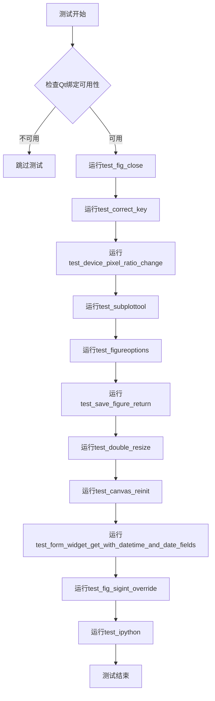

## 类结构

```
测试模块 (test_backend_qt)
├── 全局变量
│   └── _test_timeout
├── 辅助函数
│   └── _get_testable_qt_backends
└── 测试函数
    ├── test_fig_close
    ├── test_correct_key (参数化)
    ├── test_device_pixel_ratio_change
    ├── test_subplottool
    ├── test_figureoptions
    ├── test_save_figure_return
    ├── test_figureoptions_with_datetime_axes
    ├── test_double_resize
    ├── test_canvas_reinit
    ├── test_form_widget_get_with_datetime_and_date_fields
    ├── test_fig_sigint_override
    └── test_ipython
```

## 全局变量及字段


### `_test_timeout`
    
测试超时时间（秒），设为60秒以适应较慢的架构

类型：`int`
    


### `init_figs`
    
保存Gcf.figs的初始状态，用于测试后验证

类型：`dict`
    


### `result`
    
存储按键事件捕获的键值结果

类型：`str`
    


### `qt_mod`
    
Qt键盘修饰符组合对象

类型：`QtCore.Qt.KeyboardModifier`
    


### `called`
    
标志位，指示回调函数是否被调用

类型：`bool`
    


### `event_loop_handler`
    
事件循环中捕获的SIGINT信号处理器

类型：`signal handler`
    


### `original_handler`
    
测试前保存的原始SIGINT信号处理器

类型：`signal handler`
    


### `expected`
    
预期的保存文件路径

类型：`Path`
    


### `fname`
    
实际返回的文件名

类型：`str`
    


### `xydata`
    
用于测试的日期时间数据列表

类型：`list[datetime]`
    


### `form`
    
表单字段配置列表

类型：`list`
    


### `widget`
    
表单布局控件实例

类型：`FormWidget`
    


### `values`
    
从表单控件获取的值列表

类型：`list`
    


### `envs`
    
可测试的Qt后端环境配置列表

类型：`list`
    


### `deps`
    
Qt后端依赖包列表

类型：`list`
    


### `env`
    
单个后端测试环境变量字典

类型：`dict`
    


### `reason`
    
跳过测试的原因描述

类型：`str`
    


### `missing`
    
缺失的依赖包列表

类型：`list`
    


### `marks`
    
pytest标记列表

类型：`list`
    


### `ratio`
    
设备像素比率值

类型：`float`
    


### `dpi`
    
图形DPI值

类型：`float`
    


### `width`
    
渲染器宽度（像素）

类型：`int`
    


### `height`
    
渲染器高度（像素）

类型：`int`
    


### `size`
    
画布的尺寸对象

类型：`QSize`
    


### `prop`
    
要mock的属性路径字符串

类型：`str`
    


### `current_version`
    
Qt版本号元组

类型：`tuple`
    


### `w`
    
图形宽度（英寸）

类型：`float`
    


### `h`
    
图形高度（英寸）

类型：`float`
    


### `old_width`
    
窗口原始宽度

类型：`int`
    


### `old_height`
    
窗口原始高度

类型：`int`
    


### `test_fig_close.fig`
    
通过pyplot创建的图形对象

类型：`Figure`
    


### `test_correct_key.fig`
    
通过pyplot创建的图形对象

类型：`Figure`
    


### `test_correct_key.qt_canvas`
    
Qt图形画布对象

类型：`FigureCanvasQTAgg`
    


### `test_device_pixel_ratio_change.fig`
    
通过pyplot创建的图形对象

类型：`Figure`
    


### `test_device_pixel_ratio_change.qt_canvas`
    
Qt图形画布对象

类型：`FigureCanvasQTAgg`
    


### `test_device_pixel_ratio_change.window`
    
Qt窗口对象

类型：`QWindow`
    


### `test_subplottool.fig`
    
通过pyplot创建的图形对象

类型：`Figure`
    


### `test_subplottool.ax`
    
图形坐标轴对象

类型：`Axes`
    


### `test_figureoptions.fig`
    
通过pyplot创建的图形对象

类型：`Figure`
    


### `test_figureoptions.ax`
    
图形坐标轴对象

类型：`Axes`
    


### `test_save_figure_return.fig`
    
通过pyplot创建的图形对象

类型：`Figure`
    


### `test_save_figure_return.ax`
    
图形坐标轴对象

类型：`Axes`
    


### `test_figureoptions_with_datetime_axes.fig`
    
通过pyplot创建的图形对象

类型：`Figure`
    


### `test_figureoptions_with_datetime_axes.ax`
    
图形坐标轴对象

类型：`Axes`
    


### `test_double_resize.fig`
    
通过pyplot创建的图形对象

类型：`Figure`
    


### `test_double_resize.ax`
    
图形坐标轴对象

类型：`Axes`
    


### `test_double_resize.window`
    
Qt窗口部件对象

类型：`QWidget`
    


### `test_canvas_reinit.fig`
    
通过pyplot创建的图形对象

类型：`Figure`
    


### `test_canvas_reinit.ax`
    
图形坐标轴对象

类型：`Axes`
    
    

## 全局函数及方法


### `_get_testable_qt_backends`

该函数用于生成可测试的 Qt 后端配置列表，遍历常见的 Qt 绑定库（PyQt6、PySide6、PyQt5、PySide2），检查每个后端的可用性，并根据平台环境和依赖情况为不可用的后端添加跳过标记，最终返回一组用于 pytest 参数化测试的 `pytest.param` 对象列表。

参数： 无

返回值：`List[pytest.param]`，返回包含 Qt 后端测试参数的列表，每个参数包含环境变量配置和可能的跳过标记

#### 流程图

```mermaid
flowchart TD
    A[开始] --> B[初始化空列表 envs]
    B --> C[遍历 Qt API 列表: PyQt6, PySide6, PyQt5, PySide2]
    C --> D[构建 deps 和 env 字典]
    D --> E{检查条件}
    E --> F1{Linux 平台且 display 无效?}
    E --> F2{有缺失依赖?}
    E --> F3{macosx 后端且 TF_BUILD 存在?}
    
    F1 -->|是| G1[设置 reason = '$DISPLAY and $WAYLAND_DISPLAY are unset']
    F2 -->|是| G2[设置 reason = '{缺失模块} cannot be imported']
    F3 -->|是| G3[设置 reason = 'macosx backend fails on Azure']
    F1 -->|否| H
    F2 -->|否| H
    F3 -->|否| H
    
    H{reason 存在?} -->|是| I[创建跳过标记]
    H -->|否| J
    I --> K[创建 pytest.param]
    J --> K
    
    K --> L[添加到 envs 列表]
    L --> C
    C --> M[返回 envs 列表]
```

#### 带注释源码

```python
def _get_testable_qt_backends():
    """
    生成可测试的 Qt 后端配置列表。
    
    遍历常见的 Qt 绑定库，检查每个后端的可用性，
    并为不可用的后端添加跳过标记。
    
    Returns:
        List[pytest.param]: 包含 Qt 后端测试参数的列表
    """
    envs = []  # 存储最终的测试参数列表
    
    # 遍历所有需要测试的 Qt API
    # 每个元素是 (依赖列表, 环境变量字典) 的元组
    for deps, env in [
            ([qt_api], {"MPLBACKEND": "qtagg", "QT_API": qt_api})
            for qt_api in ["PyQt6", "PySide6", "PyQt5", "PySide2"]
    ]:
        reason = None  # 初始化跳过原因为 None
        missing = [dep for dep in deps if not importlib.util.find_spec(dep)]  # 检查缺失依赖
        
        # 检查 Linux 平台下显示是否有效
        if (sys.platform == "linux" and
                not _c_internal_utils.display_is_valid()):
            reason = "$DISPLAY and $WAYLAND_DISPLAY are unset"
        # 检查是否有缺失的依赖模块
        elif missing:
            reason = "{} cannot be imported".format(", ".join(missing))
        # 检查 macosx 后端在 Azure 上的兼容性问题
        elif env["MPLBACKEND"] == 'macosx' and os.environ.get('TF_BUILD'):
            reason = "macosx backend fails on Azure"
        
        marks = []  # 初始化 pytest 标记列表
        if reason:  # 如果存在跳过原因
            marks.append(pytest.mark.skip(
                reason=f"Skipping {env} because {reason}"))  # 添加跳过标记
        
        # 创建 pytest 参数，包含环境变量和标记
        envs.append(pytest.param(env, marks=marks, id=str(env)))
    
    return envs  # 返回测试参数列表
```


### `test_fig_close`

该函数是一个pytest测试用例，用于验证关闭Qt图形界面窗口时，matplotlib的Gcf.figs注册表是否正确移除了对应的FigureManager引用。测试通过模拟用户点击关闭按钮的行为，确保图形对象被正确清理。

参数：无

返回值：无（该函数为测试用例，通过assert断言验证结果）

#### 流程图

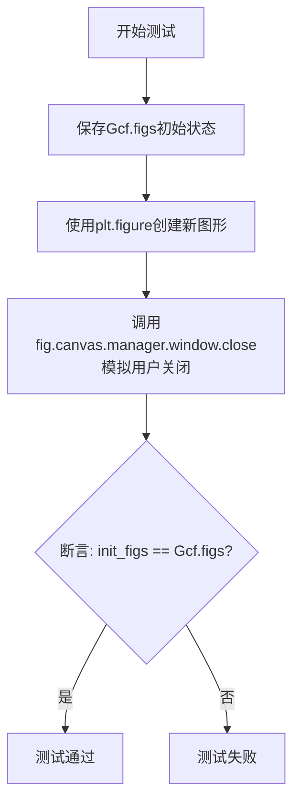

#### 带注释源码

```python
@pytest.mark.backend('QtAgg', skip_on_importerror=True)  # 标记该测试仅在QtAgg后端可用，若导入错误则跳过
def test_fig_close():
    """
    测试函数：验证关闭Qt图形窗口后，Gcf.figs注册表是否正确清理
    """
    
    # 保存Gcf.figs的初始状态
    # Gcf.figs是一个字典，用于跟踪当前所有活跃的FigureManager实例
    init_figs = copy.copy(Gcf.figs)
    
    # 使用pyplot接口创建一个新图形
    # 这会自动将FigureManager注册到Gcf.figs中
    fig = plt.figure()
    
    # 模拟用户点击窗口关闭按钮
    # 直接调用Qt窗口对象的close方法
    fig.canvas.manager.window.close()
    
    # 断言：关闭图形后，Gcf.figs应该恢复到初始状态
    # 即plt.figure()添加的FigureManager引用应该被移除
    assert init_figs == Gcf.figs
```


### `test_correct_key`

该测试函数用于验证Matplotlib Qt后端在处理键盘按键事件时，能够正确地将Qt键码转换为Matplotlib的键名字符串。测试通过创建图形、模拟键盘按下事件并捕获事件中的键名，与预期结果进行比对来确保键位映射的正确性。

参数：

- `backend`：`str`，测试参数化的Qt后端（Qt5Agg或QtAgg），通过pytest.mark.parametrize指定
- `qt_key`：`str`，Qt键名称（如"Key_A"、"Key_Backspace"等），来自pytest.mark.parametrize参数化
- `qt_mods`：`list`，Qt修饰键列表（如["ShiftModifier", "ControlModifier"]），来自pytest.mark.parametrize参数化
- `answer`：`str | tuple | None`，预期转换后的键名字符串，来自pytest.mark.parametrize参数化
- `monkeypatch`：`pytest.MonkeyPatch`，pytest的monkeypatch fixture，用于替换QtApplication的keyboardModifiers方法

返回值：`None`，该函数为测试函数，不返回任何值，通过assert断言验证结果

#### 流程图

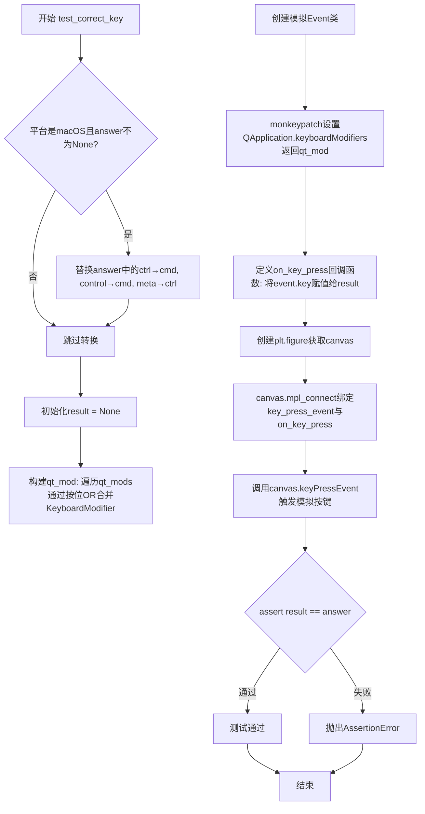

#### 带注释源码

```python
@pytest.mark.parametrize(
    "qt_key, qt_mods, answer",
    [
        ("Key_A", ["ShiftModifier"], "A"),  # Shift+A → 大写A
        ("Key_A", [], "a"),                  # 普通A → 小写a
        ("Key_A", ["ControlModifier"], ("ctrl+a")),  # Ctrl+A → ctrl+a
        (
            "Key_Aacute",
            ["ShiftModifier"],
            "\N{LATIN CAPITAL LETTER A WITH ACUTE}",  # 带 acute 符号的大写A
        ),
        ("Key_Aacute", [], "\N{LATIN SMALL LETTER A WITH ACUTE}"),  # 小写带 acute
        ("Key_Control", ["AltModifier"], ("alt+control")),  # Alt+Control
        ("Key_Alt", ["ControlModifier"], "ctrl+alt"),       # Ctrl+Alt
        (
            "Key_Aacute",
            ["ControlModifier", "AltModifier", "MetaModifier"],
            ("ctrl+alt+meta+\N{LATIN SMALL LETTER A WITH ACUTE}"),
        ),
        ("Key_Play", [], None),     # 媒体键不支持，返回None
        ("Key_Backspace", [], "backspace"),
        ("Key_Backspace", ["ControlModifier"], "ctrl+backspace"),
    ],
    ids=[
        'shift',
        'lower',
        'control',
        'unicode_upper',
        'unicode_lower',
        'alt_control',
        'control_alt',
        'modifier_order',
        'non_unicode_key',
        'backspace',
        'backspace_mod',
    ]
)
@pytest.mark.parametrize('backend', [
    pytest.param(
        'Qt5Agg',
        marks=pytest.mark.backend('Qt5Agg', skip_on_importerror=True)),
    pytest.param(
        'QtAgg',
        marks=pytest.mark.backend('QtAgg', skip_on_importerror=True)),
])
def test_correct_key(backend, qt_key, qt_mods, answer, monkeypatch):
    """
    Make a figure.
    Send a key_press_event event (using non-public, qtX backend specific api).
    Catch the event.
    Assert sent and caught keys are the same.
    """
    # 导入Qt兼容层工具函数和QtCore模块
    from matplotlib.backends.qt_compat import _to_int, QtCore

    # macOS平台特殊处理：将Windows/Linux的ctrl/control/meta键映射改为macOS对应键位
    # macOS使用cmd代替ctrl，ctrl代替meta
    if sys.platform == "darwin" and answer is not None:
        answer = answer.replace("ctrl", "cmd")
        answer = answer.replace("control", "cmd")
        answer = answer.replace("meta", "ctrl")
    
    # 初始化结果变量，用于存储捕获的键名
    result = None
    
    # 初始化键盘修饰符为无修饰符状态
    qt_mod = QtCore.Qt.KeyboardModifier.NoModifier
    
    # 遍历qt_mods列表，通过按位OR运算合并多个修饰键
    for mod in qt_mods:
        qt_mod |= getattr(QtCore.Qt.KeyboardModifier, mod)

    # 定义模拟的Qt事件类，用于模拟keyPressEvent
    class _Event:
        def isAutoRepeat(self): return False  # 模拟非自动重复按键
        def key(self): return _to_int(getattr(QtCore.Qt.Key, qt_key))  # 返回Qt键值

    # monkeypatch: 替换QApplication.keyboardModifiers方法，使其返回我们设置的qt_mod
    monkeypatch.setattr(QtWidgets.QApplication, "keyboardModifiers",
                        lambda self: qt_mod)

    # 定义键盘按下事件回调函数，捕获事件中的键名
    def on_key_press(event):
        nonlocal result
        result = event.key

    # 创建图形并获取Qt画布
    qt_canvas = plt.figure().canvas
    
    # 将回调函数绑定到key_press_event事件
    qt_canvas.mpl_connect('key_press_event', on_key_press)
    
    # 触发模拟的按键事件
    qt_canvas.keyPressEvent(_Event())
    
    # 断言：捕获的键名应与预期结果一致
    assert result == answer
```


### `test_device_pixel_ratio_change`

该函数用于测试当设备像素比（device pixel ratio）发生变化时，Figure 的 DPI 会相应改变，但 widget 的逻辑尺寸保持不变。

参数：

- 该函数无参数

返回值：`None`，无返回值（测试函数通过断言验证行为）

#### 流程图

```mermaid
flowchart TD
    A[开始] --> B[Mock devicePixelRatioF 属性返回值为 3]
    B --> C[创建 Figure: figsize=(5,2), dpi=120]
    C --> D[获取 qt_canvas 并显示]
    D --> E[记录初始尺寸 size = qt_canvas.size]
    E --> F[定义 set_device_pixel_ratio 函数]
    F --> G[循环测试不同像素比: None/3/2/1.5]
    G --> H{当前 ratio 是否为 None?}
    H -->|是| I[使用初始 ratio]
    H -->|否| J[调用 set_device_pixel_ratio 设置新比例]
    J --> K{判断 Qt 版本 >= 6.6?}
    K -->|是| L[发送 DevicePixelRatioChange 事件]
    K -->|否| M[触发 logicalDotsPerInchChanged.emit 事件]
    L --> N[qt_canvas.draw 和 flush_events]
    M --> N
    N --> O[断言 fig.dpi == 预期 dpi]
    O --> P[断言 renderer 尺寸 == 预期宽高]
    P --> Q[断言 widget 尺寸保持 600x240]
    Q --> R[断言 get_width_height 返回 600x240]
    R --> S[断言 get_size_inches 返回 5x2]
    S --> T{还有更多 ratio 测试?}
    T -->|是| G
    T -->|否| U[plt.close(fig) 关闭 figure]
    U --> V[断言 fig.dpi 恢复到 120]
    V --> W[结束]
```

#### 带注释源码

```python
@pytest.mark.backend('QtAgg', skip_on_importerror=True)
def test_device_pixel_ratio_change():
    """
    Make sure that if the pixel ratio changes, the figure dpi changes but the
    widget remains the same logical size.
    """

    # 1. 获取要 mock 的属性路径
    #    这个属性是 FigureCanvasQT.devicePixelRatioF，用于获取设备像素比
    prop = 'matplotlib.backends.backend_qt.FigureCanvasQT.devicePixelRatioF'
    
    # 2. 使用 mock.patch 拦截 devicePixelRatioF 属性
    #    初始返回值为 3
    with mock.patch(prop) as p:
        p.return_value = 3

        # 3. 创建 Figure，设置 figsize=(5,2) 英寸，初始 dpi=120
        #    5 英寸 * 120 dpi = 600 像素（宽度）
        #    2 英寸 * 120 dpi = 240 像素（高度）
        fig = plt.figure(figsize=(5, 2), dpi=120)
        
        # 4. 获取 Qt canvas 并显示
        qt_canvas = fig.canvas
        qt_canvas.show()

        # 5. 定义内部函数：设置设备像素比并触发 DPI 变化事件
        def set_device_pixel_ratio(ratio):
            # 更新 mock 的返回值
            p.return_value = ratio

            # 获取 Qt 窗口句柄
            window = qt_canvas.window().windowHandle()
            
            # 获取当前 Qt 版本号
            current_version = tuple(int(x) for x in QtCore.qVersion().split('.', 2)[:2])
            
            # 根据 Qt 版本选择触发 DPI 变化事件的方式
            if current_version >= (6, 6):
                # Qt 6.6+ 使用专门的 DevicePixelRatioChange 事件
                QtCore.QCoreApplication.sendEvent(
                    window,
                    QtCore.QEvent(QtCore.QEvent.Type.DevicePixelRatioChange))
            else:
                # 旧版本 Qt 通过触发 logicalDotsPerInchChanged 信号来模拟
                # 这里发送的数值不重要，重要的是触发 Matplotlib 的处理逻辑
                window.screen().logicalDotsPerInchChanged.emit(96)

            # 重新绘制 canvas 并刷新事件
            qt_canvas.draw()
            qt_canvas.flush_events()

            # 验证 mock 生效，canvas 确实获取到了新的像素比
            assert qt_canvas.device_pixel_ratio == ratio

        # 6. 显示窗口并执行初始绘制
        qt_canvas.manager.show()
        qt_canvas.draw()
        qt_canvas.flush_events()
        
        # 7. 记录初始 widget 尺寸（逻辑像素）
        size = qt_canvas.size()

        # 8. 定义测试用例：ratio, 期望dpi, 期望渲染器宽高
        #    逻辑尺寸始终保持 600x240（5*120 x 2*120）
        #    - (None, 360, 1800, 720): 初始 ratio=3 时，dpi=120*3=360
        #    - (3, 360, 1800, 720): 显式设置 ratio=3
        #    - (2, 240, 1200, 480): ratio=2，dpi=120*2=240
        #    - (1.5, 180, 900, 360): ratio=1.5，dpi=120*1.5=180
        options = [
            (None, 360, 1800, 720),  # Use ratio at startup time.
            (3, 360, 1800, 720),  # Change to same ratio.
            (2, 240, 1200, 480),  # Change to different ratio.
            (1.5, 180, 900, 360),  # Fractional ratio.
        ]
        
        # 9. 遍历所有测试用例进行验证
        for ratio, dpi, width, height in options:
            # 如果指定了 ratio，则设置新的像素比
            if ratio is not None:
                set_device_pixel_ratio(ratio)

            # 10. 验证 DPI 和渲染器尺寸随像素比变化
            assert fig.dpi == dpi
            assert qt_canvas.renderer.width == width
            assert qt_canvas.renderer.height == height

            # 11. 验证 widget 实际尺寸和 figure 逻辑尺寸保持不变
            #     逻辑尺寸 = 5英寸 * 120dpi = 600, 2英寸 * 120dpi = 240
            assert size.width() == 600
            assert size.height() == 240
            assert qt_canvas.get_width_height() == (600, 240)
            assert (fig.get_size_inches() == (5, 2)).all()

        # 12. 验证关闭 figure 后 DPI 恢复到原始值
        plt.close(fig)
        assert fig.dpi == 120
```


### `test_subplottool`

该测试函数用于验证 Matplotlib 中子图工具（Subplot Tool）的配置功能，通过创建 figure 和 axes，使用 mock 替换 Qt 执行方法，调用 toolbar 的 `configure_subplots` 方法并断言返回的工具对象不为空且两次调用返回相同对象。

参数：无

返回值：`None`，该测试函数没有显式返回值，通过 assert 语句进行断言验证

#### 流程图

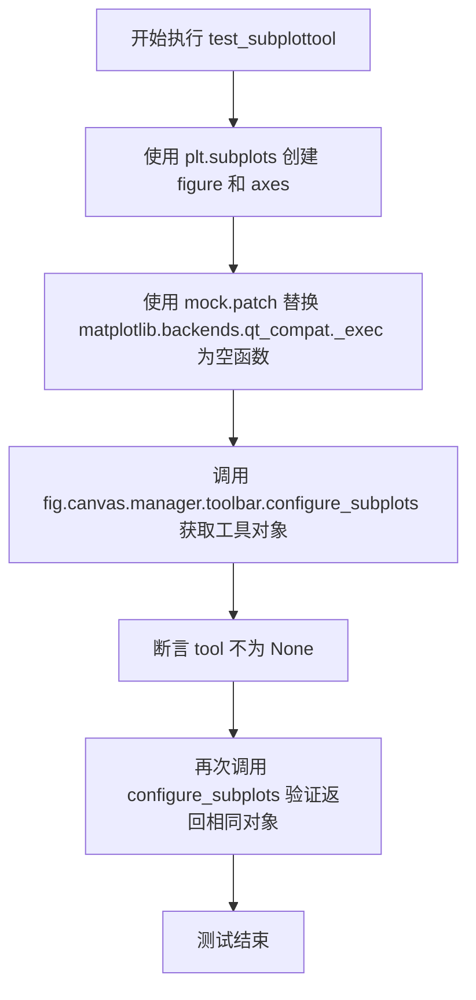

#### 带注释源码

```python
@pytest.mark.backend('QtAgg', skip_on_importerror=True)
def test_subplottool():
    """
    测试子图工具配置功能。
    验证 QtAgg 后端下 toolbar 的 configure_subplots 方法能正确返回工具对象。
    """
    # 创建 figure 和 axes 对象
    fig, ax = plt.subplots()
    
    # 使用 mock 替换 Qt 执行方法，使其不做任何实际操作
    # 这样可以避免实际弹出 Qt 对话框，同时测试工具创建逻辑
    with mock.patch("matplotlib.backends.qt_compat._exec", lambda obj: None):
        # 调用 toolbar 的 configure_subplots 方法获取子图配置工具
        tool = fig.canvas.manager.toolbar.configure_subplots()
        
        # 断言返回的工具对象不为 None
        assert tool is not None
        
        # 再次调用并断言返回相同对象，验证方法幂等性
        assert tool == fig.canvas.manager.toolbar.configure_subplots()
```


### `test_figureoptions`

该函数是一个测试函数，用于测试matplotlib图形选项对话框（Figure Options dialog）。它创建一个包含线图、图像和散点图的图形，然后通过工具栏打开编辑参数对话框，以验证Qt后端的figure options功能是否正常工作。

参数： 无

返回值： `None`，无返回值（测试函数）

#### 流程图

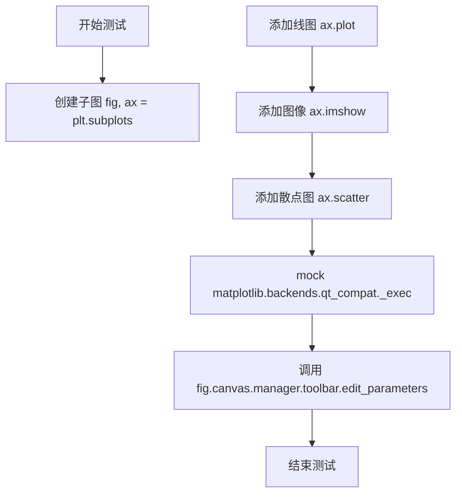

#### 带注释源码

```python
@pytest.mark.backend('QtAgg', skip_on_importerror=True)
def test_figureoptions():
    """
    测试figure options对话框功能。
    创建包含多种图表类型的图形，并打开编辑参数对话框。
    """
    # 创建一个包含一个子图的图形
    fig, ax = plt.subplots()
    
    # 添加一个简单的线图
    ax.plot([1, 2])
    
    # 添加一个图像
    ax.imshow([[1]])
    
    # 添加一个散点图，带有颜色映射
    ax.scatter(range(3), range(3), c=range(3))
    
    # 使用mock拦截Qt对话框的exec调用，防止实际弹出对话框
    with mock.patch("matplotlib.backends.qt_compat._exec", lambda obj: None):
        # 调用工具栏的edit_parameters方法，打开figure options对话框
        fig.canvas.manager.toolbar.edit_parameters()
```


### `test_save_figure_return`

该测试函数用于验证 Matplotlib 中 Qt 后端的工具栏保存图形功能，通过模拟 Qt 文件对话框的返回值，测试 `save_figure()` 方法在用户选择保存路径和取消保存两种场景下的行为是否正确。

参数：

-  `tmp_path`：`pytest.fixture`，Pytest 提供的临时目录路径，用于存放测试生成的图形文件

返回值：`None`，测试函数不返回任何值，仅通过断言验证功能

#### 流程图

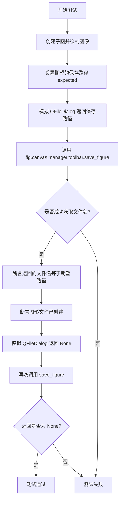

#### 带注释源码

```python
@pytest.mark.backend('QtAgg', skip_on_importerror=True)  # 标记仅在 QtAgg 后端可用，若导入错误则跳过
def test_save_figure_return(tmp_path):  # tmp_path 是 pytest 提供的临时目录 fixture
    fig, ax = plt.subplots()  # 创建一个包含单个子图的图形
    ax.imshow([[1]])  # 在子图上绘制一个简单的图像
    
    expected = tmp_path / "foobar.png"  # 构建期望的保存文件路径
    
    # 模拟 Qt 文件对话框的 getSaveFileName 方法，使其返回我们指定的文件路径
    prop = "matplotlib.backends.qt_compat.QtWidgets.QFileDialog.getSaveFileName"
    with mock.patch(prop, return_value=(str(expected), None)):
        fname = fig.canvas.manager.toolbar.save_figure()  # 调用工具栏的保存方法
        assert fname == str(expected)  # 断言返回的文件名与期望路径一致
        assert expected.exists()  # 断言图形文件已成功创建
    
    # 模拟用户取消保存操作（对话框返回 None）
    with mock.patch(prop, return_value=(None, None)):
        fname = fig.canvas.manager.toolbar.save_figure()  # 再次调用保存方法
        assert fname is None  # 断言返回值为 None（表示用户取消）
```


### `test_figureoptions_with_datetime_axes`

该测试函数用于验证Matplotlib的Figure选项对话框（edit_parameters）能够正确处理包含datetime类型数据的坐标轴。在创建包含datetime数据的图表后，通过模拟打开编辑器界面的方式，确保GUI组件在处理时间序列数据时不会出错。

参数：

- 无参数

返回值：`None`，测试函数无返回值，仅通过断言验证行为

#### 流程图

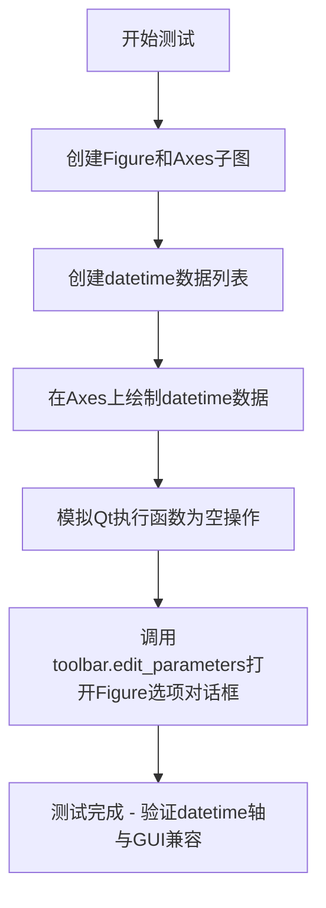

#### 带注释源码

```python
@pytest.mark.backend('QtAgg', skip_on_importerror=True)  # 标记该测试仅在QtAgg后端可用，跳过导入错误
def test_figureoptions_with_datetime_axes():
    """
    测试Figure选项对话框能否正确处理datetime类型的坐标轴数据。
    这是一个回归测试，确保GUI组件在处理时间序列数据时不会崩溃。
    """
    
    # 创建Figure画布和Axes子图
    # 使用pyplot的subplots()函数，返回(fig, ax)元组
    fig, ax = plt.subplots()
    
    # 定义datetime数据列表，包含两个datetime对象
    # 2021年1月1日和2021年2月1日
    xydata = [
        datetime(year=2021, month=1, day=1),
        datetime(year=2021, month=2, day=1)
    ]
    
    # 使用datetime数据绘制图表
    # 将xydata同时作为x轴和y轴数据
    ax.plot(xydata, xydata)
    
    # 使用mock模拟Qt执行函数为空操作
    # 防止实际打开Qt对话框，仅测试调用路径
    with mock.patch("matplotlib.backends.qt_compat._exec", lambda obj: None):
        
        # 调用toolbar的edit_parameters方法
        # 这会打开Figure参数编辑器对话框
        # 测试在有datetime数据时该函数能否正常执行
        fig.canvas.manager.toolbar.edit_parameters()
```


### `test_double_resize`

该测试函数用于验证在使用 Qt 后端时，连续两次将 Figure 设置为相同尺寸时，窗口尺寸应保持不变，而不会因为重复设置尺寸而发生改变。

参数： 无

返回值： `None`，该函数为测试函数，不返回任何值

#### 流程图

```mermaid
flowchart TD
    A[开始测试] --> B[创建子图 fig, ax = plt.subplots]
    B --> C[绘制画布 fig.canvas.draw]
    C --> D[获取窗口对象 window = fig.canvas.manager.window]
    D --> E[设置目标尺寸 w=3, h=2 英寸]
    E --> F[调用 fig.set_size_inches(w, h)]
    F --> G[断言: canvas宽度 = w × figure.dpi]
    G --> H[断言: canvas高度 = h × figure.dpi]
    H --> I[记录当前窗口尺寸 old_width, old_height]
    I --> J[再次调用 fig.set_size_inches(w, h)]
    J --> K[断言: 窗口宽度保持不变]
    K --> L[断言: 窗口高度保持不变]
    L --> M[测试通过]
```

#### 带注释源码

```python
@pytest.mark.backend('QtAgg', skip_on_importerror=True)
def test_double_resize():
    # Check that resizing a figure twice keeps the same window size
    # 验证连续两次调整图形尺寸时窗口大小保持一致
    
    # 创建子图，返回 Figure 对象和 Axes 对象
    fig, ax = plt.subplots()
    
    # 强制绘制画布，确保所有初始化完成
    fig.canvas.draw()
    
    # 获取 Qt 窗口对象，用于后续窗口尺寸检查
    window = fig.canvas.manager.window

    # 设置目标尺寸：宽3英寸，高2英寸
    w, h = 3, 2
    
    # 第一次设置图形尺寸（以英寸为单位）
    fig.set_size_inches(w, h)
    
    # 断言：画布宽度应等于 英寸宽度 × DPI
    # 例如：3英寸 × 120 DPI = 360 像素
    assert fig.canvas.width() == w * matplotlib.rcParams['figure.dpi']
    
    # 断言：画布高度应等于 英寸高度 × DPI
    assert fig.canvas.height() == h * matplotlib.rcParams['figure.dpi']

    # 记录当前窗口的像素尺寸
    old_width = window.width()
    old_height = window.height()

    # 第二次设置图形尺寸为相同的值
    fig.set_size_inches(w, h)
    
    # 断言：窗口宽度应保持不变
    assert window.width() == old_width
    
    # 断言：窗口高度应保持不变
    assert window.height() == old_height
```


### `test_canvas_reinit`

该测试函数用于验证在使用 QtAgg 后端时，重新初始化 `FigureCanvasQTAgg` 对象时不会因为 `stale_callback` 机制导致异常，确保在 figure 被标记为 stale 时回调能够正常执行。

参数： 无

返回值：`None`，该函数为 pytest 测试函数，通过 `assert` 语句验证行为，不返回具体值。

#### 流程图

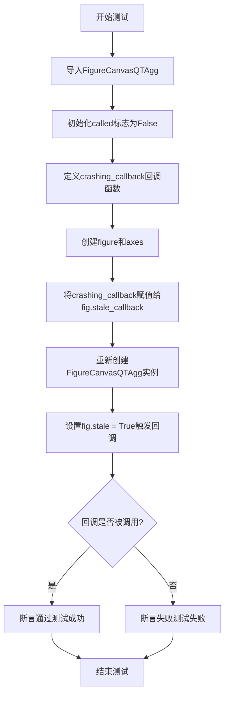

#### 带注释源码

```python
@pytest.mark.backend('QtAgg', skip_on_importerror=True)  # 标记该测试仅在QtAgg后端可用，若导入失败则跳过
def test_canvas_reinit():
    """
    测试Canvas重新初始化时的回调处理是否正常。
    验证在创建新的FigureCanvasQTAgg实例后，stale_callback能够被正确触发。
    """
    from matplotlib.backends.backend_qtagg import FigureCanvasQTAgg  # 导入QtAgg后端的Canvas类

    called = False  # 初始化标志，用于跟踪回调是否被调用

    def crashing_callback(fig, stale):
        """
        模拟一个在stale状态改变时调用的回调函数。
        该回调会尝试调用canvas.draw_idle()方法。
        """
        nonlocal called  # 声明使用外层的called变量
        fig.canvas.draw_idle()  # 触发canvas的延迟绘制
        called = True  # 标记回调已被调用

    fig, ax = plt.subplots()  # 创建一个figure和一个axes
    fig.stale_callback = crashing_callback  # 将自定义回调注册到figure的stale_callback
    
    # 重新创建Canvas实例，这会重新初始化Qt控件
    # 此处测试的关键点是：重新初始化canvas不应导致回调执行时崩溃
    canvas = FigureCanvasQTAgg(fig)
    
    fig.stale = True  # 将figure标记为stale，触发stale_callback的调用
    assert called  # 断言回调已被成功调用，验证整个流程正常工作
```


### `test_form_widget_get_with_datetime_and_date_fields`

该测试函数用于验证Qt后端的表单布局组件（FormWidget）能够正确处理Python的datetime和date类型字段，确保在获取表单值时能正确返回这些日期时间对象的值。

参数：

- 该函数无参数

返回值：`None`，无返回值（测试函数）

#### 流程图

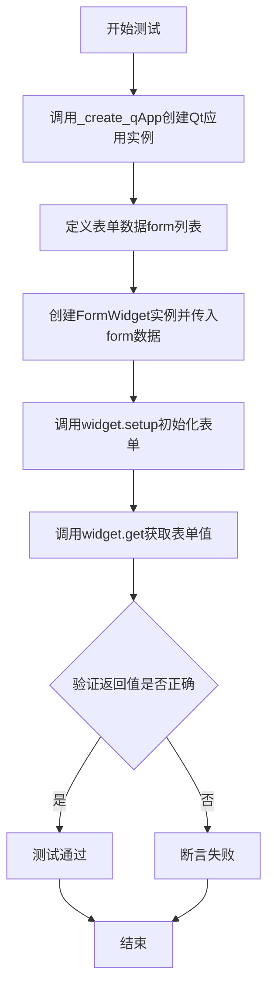

#### 带注释源码

```python
# 使用Qt5Agg后端标记测试，若导入失败则跳过测试
@pytest.mark.backend('Qt5Agg', skip_on_importerror=True)
def test_form_widget_get_with_datetime_and_date_fields():
    """
    测试FormWidget在处理datetime和date类型字段时的行为
    
    该测试验证表单布局组件能够正确获取Python标准库中的
    datetime和date对象作为字段值
    """
    # 从matplotlib后端模块导入Qt应用创建函数
    from matplotlib.backends.backend_qt import _create_qApp
    
    # 创建或获取Qt应用程序实例，确保Qt环境已初始化
    _create_qApp()

    # 定义表单字段列表，包含两个字段：
    # 1. Datetime字段 - 使用datetime对象
    # 2. Date字段 - 使用date对象
    form = [
        ("Datetime field", datetime(year=2021, month=3, day=11)),
        ("Date field", date(year=2021, month=3, day=11))
    ]
    
    # 创建FormWidget实例，传入表单定义数据
    widget = _formlayout.FormWidget(form)
    
    # 调用setup方法初始化表单widget
    widget.setup()
    
    # 调用get方法获取表单的当前值
    values = widget.get()
    
    # 断言返回的值与输入的原始日期时间对象完全一致
    assert values == [
        datetime(year=2021, month=3, day=11),
        date(year=2021, month=3, day=11)
    ]
```


### `test_fig_sigint_override`

该测试函数验证Qt后端在事件循环期间正确管理SIGINT信号处理器，确保在进入事件循环时信号处理器被正确覆盖，并在退出后恢复原始处理器。

参数： 无

返回值：`None`，该函数为测试函数，不返回任何值，主要通过断言验证行为

#### 流程图

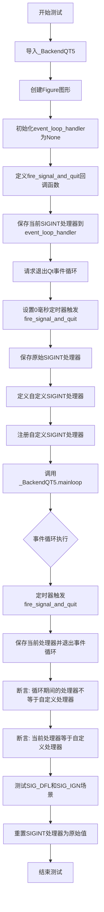

#### 带注释源码

```python
@pytest.mark.backend('QtAgg', skip_on_importerror=True)
def test_fig_sigint_override():
    """测试Qt后端在事件循环期间正确管理SIGINT信号处理器"""
    # 导入Qt5后端类用于测试
    from matplotlib.backends.backend_qt5 import _BackendQT5
    
    # 创建一个新的Figure图形
    plt.figure()

    # 用于从事件循环内部访问处理器的变量
    event_loop_handler = None

    # 在事件循环期间执行的回调：保存SIGINT处理器，然后退出
    def fire_signal_and_quit():
        """回调函数：在事件循环运行时保存信号处理器并请求退出"""
        # 保存事件循环中的信号处理器
        nonlocal event_loop_handler
        event_loop_handler = signal.getsignal(signal.SIGINT)

        # 请求退出Qt事件循环
        QtCore.QCoreApplication.exit()

    # 设置定时器在0毫秒后触发回调（即立即触发）
    QtCore.QTimer.singleShot(0, fire_signal_and_quit)

    # 保存原始的SIGINT处理器
    original_handler = signal.getsignal(signal.SIGINT)

    # 使用我们自己的SIGINT处理器以确保测试100%有效
    def custom_handler(signum, frame):
        """自定义SIGINT处理器（空实现）"""
        pass

    # 注册自定义处理器
    signal.signal(signal.SIGINT, custom_handler)

    try:
        # mainloop()设置SIGINT，启动Qt事件循环（触发定时器并退出）
        # 然后mainloop()重置SIGINT
        matplotlib.backends.backend_qt._BackendQT.mainloop()

        # 断言：事件循环执行期间的信号处理器已被更改
        # （无法使用函数相等性测试）
        assert event_loop_handler != custom_handler

        # 断言：当前信号处理器与我们之前设置的相同
        assert signal.getsignal(signal.SIGINT) == custom_handler

        # 重复测试以验证SIG_DFL和SIG_IGN不会被覆盖
        for custom_handler in (signal.SIG_DFL, signal.SIG_IGN):
            # 重新设置定时器和处理器
            QtCore.QTimer.singleShot(0, fire_signal_and_quit)
            signal.signal(signal.SIGINT, custom_handler)

            # 调用后端的主事件循环
            _BackendQT5.mainloop()

            # 验证处理器状态正确
            assert event_loop_handler == custom_handler
            assert signal.getsignal(signal.SIGINT) == custom_handler

    finally:
        # 测试结束后将SIGINT处理器重置为测试前的状态
        signal.signal(signal.SIGINT, original_handler)
```


### `test_ipython`

该测试函数用于验证 Matplotlib 在 IPython 环境中与 Qt 后端的集成是否正常工作。它通过在子进程中启动 IPython，并使用不同的 IPython 版本映射到相应的 Qt 后端（qtagg、QtAgg、Qt5Agg）来测试后端的兼容性。

参数：

- 无

返回值：`None`，无返回值（隐式返回 None）

#### 流程图

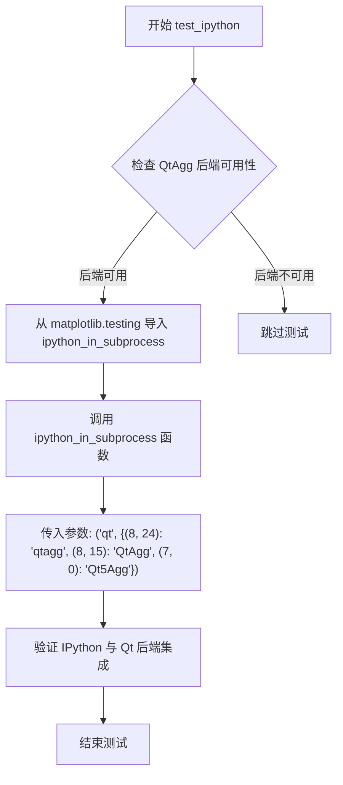

#### 带注释源码

```python
@pytest.mark.backend('QtAgg', skip_on_importerror=True)  # 标记该测试使用 QtAgg 后端，若导入错误则跳过
def test_ipython():
    """
    测试 Matplotlib 与 IPython 和 Qt 后端的集成。
    
    该测试函数验证在不同 IPython 版本下，Matplotlib 的 Qt 相关后端
    是否能够正确工作。它通过在子进程中运行 IPython 来模拟真实使用场景。
    """
    # 从 matplotlib.testing 模块导入用于在子进程中测试 IPython 的辅助函数
    from matplotlib.testing import ipython_in_subprocess
    
    # 调用 ipython_in_subprocess 函数进行集成测试
    # 参数说明：
    #   - "qt": 指定测试类型为 Qt 相关后端
    #   - {(8, 24): "qtagg", (8, 15): "QtAgg", (7, 0): "Qt5Agg"}:
    #       IPython 主版本号映射到对应的 Matplotlib Qt 后端
    #       - (8, 24): IPython 8.24 版本使用 qtagg 后端
    #       - (8, 15): IPython 8.15 版本使用 QtAgg 后端
    #       - (7, 0): IPython 7.x 版本使用 Qt5Agg 后端
    ipython_in_subprocess("qt", {(8, 24): "qtagg", (8, 15): "QtAgg", (7, 0): "Qt5Agg"})
```


### `crashing_callback`

这是一个在测试函数内部定义的回调函数，用于测试当 Figure 的 `stale` 状态改变时是否可以安全地重新初始化画布。该回调会在图形变"stale"时被触发，尝试调用 `draw_idle()` 进行重绘。

参数：

- `fig`：`matplotlib.figure.Figure`，触发回调的图形对象
- `stale`：`bool`，表示图形是否处于过时（stale）状态的布尔标志

返回值：`None`，该函数不返回任何值

#### 流程图

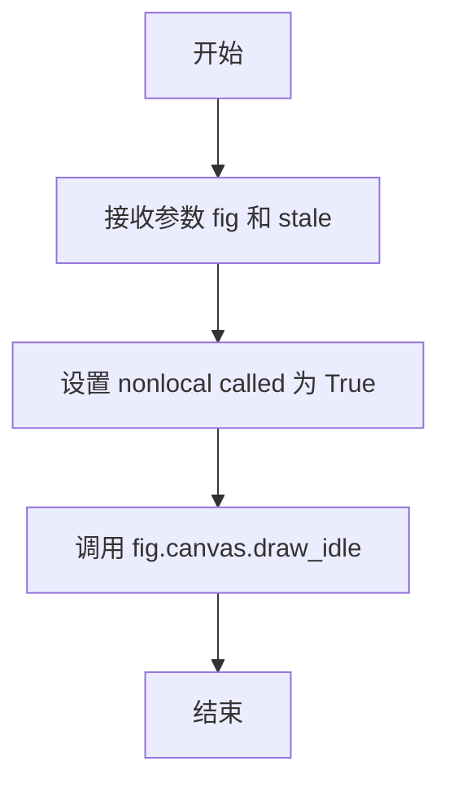

#### 带注释源码

```python
def crashing_callback(fig, stale):
    """
    测试回调函数：当 Figure 进入 stale 状态时触发
    
    参数:
        fig: matplotlib.figure.Figure 对象
        stale: bool，表示图形是否需要重绘
    """
    nonlocal called  # 引用外层函数的局部变量
    fig.canvas.draw_idle()  # 调用画布的空闲绘制方法
    called = True  # 标记回调已被调用
```


### `fire_signal_and_quit`

在测试SIGINT信号处理器覆盖功能中，该内部函数用于保存当前事件循环的SIGINT信号处理器，并请求Qt事件循环退出。

参数： 无

返回值：`None`，无返回值描述

#### 流程图

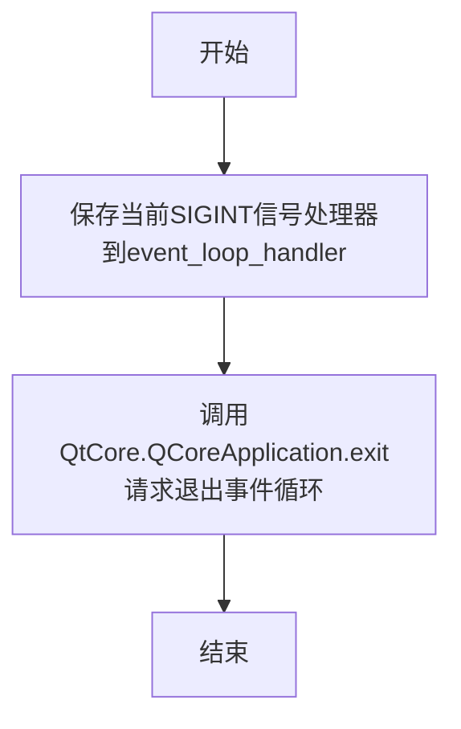

#### 带注释源码

```python
def fire_signal_and_quit():
    """
    在测试SIGINT信号处理器覆盖时使用的回调函数。
    用于保存事件循环执行期间的SIGINT处理器，然后退出Qt事件循环。
    """
    # 保存事件循环信号处理器
    # 使用nonlocal访问外部函数中定义的变量event_loop_handler
    nonlocal event_loop_handler
    # 获取当前的SIGINT信号处理器并保存，供后续断言验证
    event_loop_handler = signal.getsignal(signal.SIGINT)

    # 请求事件循环退出
    # 这会触发Qt事件循环退出，使控制权返回到mainloop()调用者
    QtCore.QCoreApplication.exit()
```


### `custom_handler`

这是一个在测试函数内部定义的信号处理函数，用于在测试中作为自定义的SIGINT（中断信号）处理器。它接收两个参数：信号编号和当前堆栈帧对象，不执行任何实际操作（pass），主要用于测试信号处理机制是否正常工作。

参数：

- `signum`：`int`，信号编号，表示接收到的信号类型（如signal.SIGINT）
- `frame`：`frame object`，当前执行堆栈的帧对象，用于调试和跟踪

返回值：`None`，该函数不返回任何值

#### 流程图

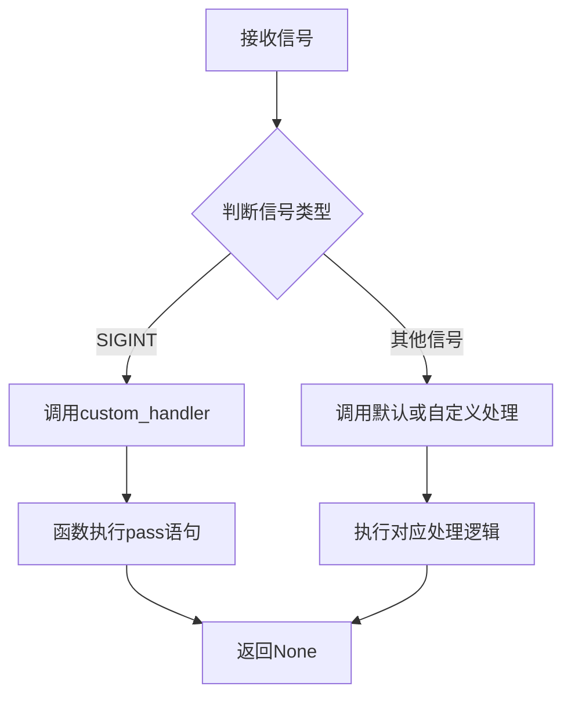

#### 带注释源码

```python
# 在test_fig_sigint_override测试函数内部定义
# 用于作为自定义的SIGINT信号处理器
def custom_handler(signum, frame):
    """
    自定义信号处理函数
    
    参数:
        signum: int - 接收到的信号编号（如signal.SIGINT = 2）
        frame: frame object - 当前执行环境的堆栈帧对象
    
    返回:
        None - 该函数不执行任何操作，仅作为信号处理的占位符
    """
    pass  # 空函数体，仅用于测试信号处理机制的设置和恢复
```


### `on_key_press`

这是一个在测试函数内部定义的回调函数，用于捕获matplotlib的键盘按键事件，并将按下的键存储到外部变量中。

参数：

- `event`：对象，matplotlib的键盘事件对象，包含按键信息

返回值：`None`，无返回值

#### 流程图

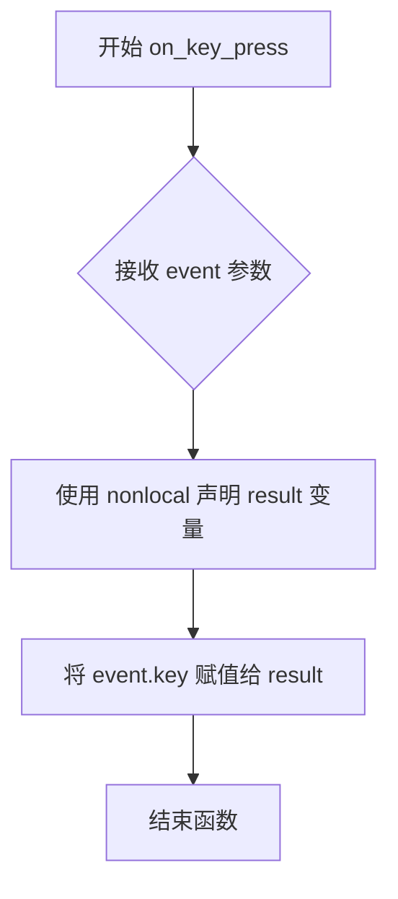

#### 带注释源码

```python
def on_key_press(event):
    """
    回调函数，用于处理 matplotlib 的 key_press_event 事件。
    该函数定义在 test_correct_key 测试函数内部。
    """
    nonlocal result  # 声明 result 为外层作用域的变量，以便修改
    result = event.key  # 将事件对象中的按键信息提取并存储到 result 变量中
```


### `set_device_pixel_ratio`

该函数是一个内部测试辅助函数，用于在测试中模拟设备像素比率（Device Pixel Ratio）的变化。它通过修改mock返回值、发送Qt事件或发射信号来触发DPI变化处理逻辑，然后重绘canvas并验证DPI是否正确更新。

参数：

- `ratio`：`float`，期望设置的目标设备像素比率值，用于验证DPI变化是否正确应用

返回值：`None`，该函数没有显式返回值（Python中默认返回None）

#### 流程图

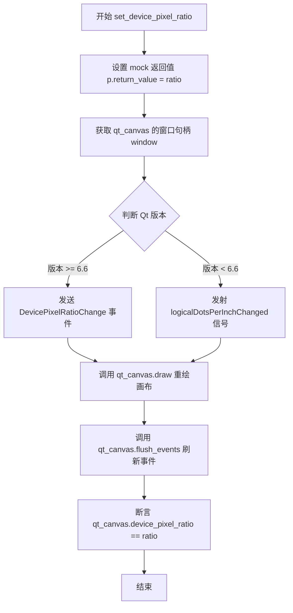

#### 带注释源码

```
def set_device_pixel_ratio(ratio):
    # 设置 mock 对象的返回值，使 devicePixelRatioF() 返回指定的 ratio
    p.return_value = ratio

    # 获取 Qt canvas 的窗口句柄，用于发送事件
    window = qt_canvas.window().windowHandle()
    
    # 获取当前 Qt 版本号，解析为主版本号.次版本号
    current_version = tuple(int(x) for x in QtCore.qVersion().split('.', 2)[:2])
    
    # 根据 Qt 版本选择不同的触发 DPI 变化的方式
    if current_version >= (6, 6):
        # Qt 6.6 及以上版本：直接发送 DevicePixelRatioChange 事件
        QtCore.QCoreApplication.sendEvent(
            window,
            QtCore.QEvent(QtCore.QEvent.Type.DevicePixelRatioChange))
    else:
        # Qt 6.6 以下版本：发射 logicalDotsPerInchChanged 信号
        # 这里的值实际上不重要，因为无法 mock C++ QScreen 对象
        # 发射此事件的目的是以与正常运行时相同的方式触发 Matplotlib 的 DPI 变化处理程序
        window.screen().logicalDotsPerInchChanged.emit(96)

    # 触发 canvas 重绘
    qt_canvas.draw()
    
    # 刷新待处理的事件
    qt_canvas.flush_events()

    # 验证 mock 是否生效，确认 canvas 的 device_pixel_ratio 已更新
    assert qt_canvas.device_pixel_ratio == ratio
```


### `_Event.isAutoRepeat`

这是一个在测试函数内部定义的模拟事件类的成员方法，用于模拟Qt键盘事件的`isAutoRepeat`行为。在测试中，该方法被调用以确定按键事件是否为自动重复（当用户按住键不放时操作系统自动生成的重复事件）。

参数：此方法无参数（除隐式`self`）

返回值：`bool`，返回`False`，表示该模拟的按键事件不是自动重复的

#### 流程图

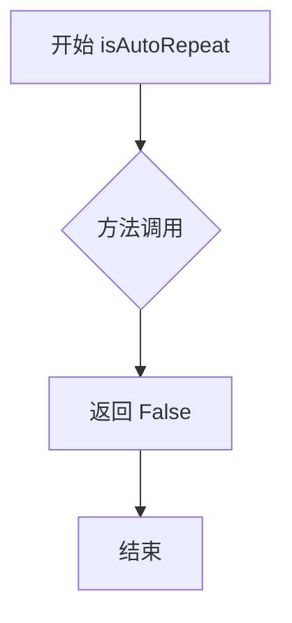

#### 带注释源码

```python
class _Event:
    """
    模拟Qt键盘事件的测试辅助类
    用于在测试中模拟Qt的键盘事件对象
    """
    
    def isAutoRepeat(self):
        """
        模拟Qt QEvent.isAutoRepeat() 方法
        
        Returns:
            bool: 返回False，表示该事件不是由操作系统自动重复生成的
                  （即用户是首次按下按键，而非长按键位）
        """
        return False
    
    def key(self):
        """
        获取模拟按键的键值
        
        Returns:
            int: 返回Qt键码的整数值
        """
        return _to_int(getattr(QtCore.Qt.Key, qt_key))
```

#### 补充说明

- **上下文**：此`_Event`类定义在`test_correct_key`测试函数内部，是一个本地类
- **用途**：用于模拟Qt的`QKeyEvent`对象，以便通过`qt_canvas.keyPressEvent(_Event())`触发Matplotlib的键盘事件处理
- **设计意图**：该类模拟了Qt键盘事件的关键接口，使得测试可以在不依赖真实Qt事件的情况下验证Matplotlib的键盘事件处理逻辑


### `_Event.key`

获取Qt键盘事件的键值，将Qt键枚举转换为整数形式。

参数：

- `self`：`_Event`，_Event类的实例，代表模拟的Qt键盘事件对象

返回值：`int`，返回Qt键盘事件的键值（整数形式）

#### 流程图

```mermaid
flowchart TD
    A[开始] --> B[执行 key 方法]
    B --> C[获取 QtCore.Qt.Key 属性: qt_key]
    C --> D[通过 getattr 获取具体键值]
    D --> E[调用 _to_int 转换为整数]
    E --> F[返回整数键值]
```

#### 带注释源码

```python
class _Event:
    """模拟Qt键盘事件的测试类"""
    
    def isAutoRepeat(self):
        """检查事件是否为自动重复（按键长按）"""
        return False
    
    def key(self):
        """
        获取键盘事件的键值
        
        Returns:
            int: Qt键盘键值（整数形式），通过_to_int函数转换
        """
        return _to_int(getattr(QtCore.Qt.Key, qt_key))
```

## 关键组件


### Qt后端测试框架

整个测试文件针对matplotlib的Qt后端（Qt4/5/6）进行集成测试，验证图形渲染、键盘事件、设备像素比、工具栏功能等核心功能

### 键盘事件映射组件

test_correct_key函数测试Qt键码到matplotlib键名的转换逻辑，处理Shift/Control/Alt/Meta修饰符以及Unicode大小写转换

### 设备像素比处理组件

test_device_pixel_ratio_change测试DPI变化时figure尺寸的调整逻辑，确保逻辑尺寸不变但渲染分辨率改变

### 图形管理组件

test_fig_close验证关闭Qt窗口时正确清理Gcf.figs字典中的引用

### 工具栏功能组件

test_subplottool、test_figureoptions、test_save_figure_return分别测试子图配置、图形参数编辑、保存文件对话框功能

### 画布重置机制

test_canvas_reinit测试FigureCanvasQTAgg重新初始化时stale_callback的正确调用

### 信号处理组件

test_fig_sigint_override测试Qt事件循环中SIGINT信号处理器的临时替换机制

### Qt兼容性层

通过qt_compat模块导入QtCore/QtGui/QtWidgets，处理PyQt5/PyQt6/PySide2/PySide6的兼容性差异

### 后端标记系统

使用pytest.mark.backend装饰器标记测试仅在特定Qt后端运行时执行，skip_on_importerror处理缺失Qt绑定的情况


## 问题及建议


### 已知问题

-   **硬编码的魔法数字和版本号**：代码中多处出现硬编码的版本检查（如 `current_version >= (6, 6)`）和超时值（`_test_timeout = 60`），这些数值缺乏上下文解释，且在Qt版本演进时需要手动维护。
-   **测试隔离性不足**：多个测试修改全局状态（如 `Gcf.figs`、`signal.getsignal(signal.SIGINT)`），虽然使用了 `try/finally` 进行恢复，但如果测试提前失败，可能导致状态泄露影响后续测试。
-   **重复的导入和配置逻辑**：Qt绑定检查（`pytest.mark.backend('QtAgg', skip_on_importerror=True)`）在每个测试函数上重复声明，违反了 DRY 原则；`_get_testable_qt_backends()` 函数的逻辑与 pytest 的 backend fixture 存在功能重叠。
-   **过度使用 Monkeypatch**：大量使用 `monkeypatch.setattr` 和 `mock.patch` 替换内部实现细节（如 `matplotlib.backends.qt_compat._exec`），使测试与实现强耦合，任何内部重构都可能导致测试失效。
-   **测试函数职责过载**：部分测试函数混合了设置、断言和清理逻辑（如 `test_fig_sigint_override`），降低了可读性和可维护性。
-   **缺失的异常处理**：在 `test_correct_key` 中，`_to_int` 和 `getattr` 调用缺乏对无效 key 的异常捕获，可能导致测试本身抛出意外错误。
-   **平台特定逻辑分散**：`sys.platform == "darwin"` 的替换逻辑嵌入在测试函数内部，使得跨平台测试的意图不够清晰。

### 优化建议

-   **提取公共配置**：创建 pytest fixture 来集中管理 Qt backend 的 skip 逻辑和超时配置，避免在每个测试上重复声明标记。
-   **封装全局状态管理**：将 `Gcf.figs` 和 signal handler 的保存/恢复逻辑抽取为上下文管理器或 fixture，确保异常情况下也能正确恢复状态。
-   **减少 Monkeypatch 依赖**：优先测试公开 API，对于必须 mock 的内部实现，使用更稳定的接口或通过配置注入依赖。
-   **分解复杂测试**：将 `test_fig_sigint_override` 拆分为独立的测试函数，每个函数专注于验证一个行为（如 handler 设置、恢复机制）。
-   **统一版本检查逻辑**：将 Qt 版本号提取为常量或从配置读取，并为版本兼容性检查添加文档说明支持的版本范围。
-   **增强错误处理**：为涉及外部输入（如 Qt key、平台判断）的逻辑添加显式的异常处理或输入验证，提高测试的健壮性。
-   **集中平台适配逻辑**：创建平台特定的辅助函数，将 `darwin` 平台下的 key 映射逻辑封装起来，测试函数只调用而不直接处理平台判断。


## 其它


### 设计目标与约束

该测试文件旨在验证matplotlib的Qt后端（QtAgg/Qt5Agg）的核心功能，包括图形关闭、键盘事件处理、设备像素比变化、子图工具、图形选项对话框、保存图形、双重调整大小、画布重初始化、日期时间字段处理、SIGINT信号处理以及IPython集成等功能。测试约束包括：需要可用的Qt绑定（PyQt5/PyQt6/PySide2/PySide6），在Linux平台需要有效的显示服务器（$DISPLAY或$WAYLAND_DISPLAY），测试超时设置为60秒，以及仅在标记为QtAgg或Qt5Agg后端时执行。

### 错误处理与异常设计

测试代码主要处理两类错误：一是ImportError，当Qt绑定不可用时使用pytestmark跳过整个测试文件；二是平台特定的差异处理，如macOS上需要将"ctrl"替换为"cmd"。对于设备像素比变化测试，需要区分Qt6.6及以上版本和更早版本的API差异。此外，测试中使用mock.patch来模拟Qt对象以避免实际依赖底层C++ QScreen对象。

### 数据流与状态机

测试数据流主要围绕Figure对象和Canvas对象的状态变化：test_fig_close验证Gcf.figs字典在关闭图形后的状态恢复；test_device_pixel_ratio_change测试DPI、渲染器尺寸与实际窗口尺寸的同步；test_double_resize验证调整大小后窗口尺寸的保持；test_canvas_reinit测试画布重初始化时stale_callback的触发。状态转换包括：Figure创建→显示→调整大小→关闭，以及KeyboardModifier的组合状态。

### 外部依赖与接口契约

核心外部依赖包括：matplotlib本身、Qt绑定（QtCore/QtGui/QtWidgets）、qt_compat兼容性层、_pylab_helpers中的Gcf管理、_c_internal_utils的显示验证、_formlayout的表单布局、ipython_in_subprocess的IPython测试。关键接口契约：FigureCanvasQT.devicePixelRatioF属性、QApplication.keyboardModifiers方法、FigureManager.toolbar的configure_subplots/edit_parameters/save_figure方法、QEvent.Type.DevicePixelRatioChange事件。

### 线程模型

Qt测试通常在主线程中运行，test_fig_sigint_override展示了如何使用QTimer.singleShot在事件循环中调度回调。该测试还涉及信号处理（signal模块）与Qt事件循环的交互，需要在主线程中运行以确保SIGINT处理正确。

### 平台特定实现

代码包含多个平台特定的分支处理：macOS上（sys.platform == "darwin"）键盘修饰键需要转换"ctrl"为"cmd"、"control"为"cmd"、"meta"为"ctrl"；Linux平台需要检查DISPLAY/WAYLAND_DISPLAY环境变量；Qt版本差异处理体现在DevicePixelRatioChange事件的发送方式（Qt6.6+使用新API，旧版本使用logicalDotsPerInchChanged信号）。

### 性能考虑

_test_timeout设置为60秒以适应较慢的架构。test_device_pixel_ratio_change中使用mock.patch避免实际的硬件DPI查询。测试避免创建大量图形对象以减少资源消耗。

### 资源管理

测试使用tmp_path fixture管理临时文件（test_save_figure_return）。每个测试函数独立创建图形，测试结束后通过plt.close(fig)或自动清理释放资源。Gcf.figs在test_fig_close中被保存和恢复以验证正确清理。

### 测试策略

采用参数化测试（pytest.mark.parametrize）覆盖多种键盘按键和修饰符组合。使用pytest.mark.backend标记指定所需后端。test_correct_key同时参数化后端类型（Qt5Agg/QtAgg）。使用mock.patch模拟Qt对象以实现单元测试隔离。使用pytest.mark.skip处理不可用的依赖。

    