# `matplotlib\lib\matplotlib\tests\test_backend_registry.py` 详细设计文档

这是一个pytest测试文件，用于测试matplotlib的backend_registry模块，验证后端注册表的功能，包括GUI框架到后端的映射、内置后端列表获取、后端有效性验证、后端名称规范化、入口点加载机制以及后端解析等功能。

## 整体流程

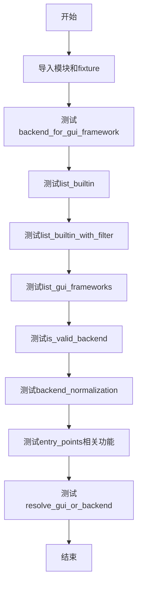

## 类结构

```
测试模块 (test_backend_registry.py)
├── pytest fixture: clear_backend_registry
├── 辅助函数: has_duplicates
└── 测试函数集
    ├── test_backend_for_gui_framework
    ├── test_list_builtin
    ├── test_list_builtin_with_filter
    ├── test_list_gui_frameworks
    ├── test_is_valid_backend
    ├── test_backend_normalization
    ├── test_entry_points_inline
    ├── test_entry_points_ipympl
    ├── test_entry_point_name_shadows_builtin
    ├── test_entry_point_name_duplicate
    ├── test_entry_point_identical
    ├── test_entry_point_name_is_module
    ├── test_load_entry_points_only_if_needed
    ├── test_resolve_gui_or_backend
    └── test_resolve_gui_or_backend_invalid
```

## 全局变量及字段


### `backend_registry`
    
Matplotlib后端注册表单例对象，用于管理可用后端

类型：`Any`
    


### `framework`
    
GUI框架名称字符串，用于测试后端查找功能

类型：`str`
    


### `expected`
    
测试参数中的预期后端名称或None

类型：`Any`
    


### `filter`
    
后端过滤器枚举，用于筛选后端列表

类型：`BackendFilter`
    


### `backends`
    
存储后端名称的列表，用于验证和比较

类型：`list`
    


### `gui_or_backend`
    
GUI框架或后端名称，用于解析为具体后端

类型：`str`
    


### `expected_backend`
    
期望解析得到的后端名称

类型：`str`
    


### `expected_gui`
    
期望解析得到的GUI框架名称，可能为None

类型：`Optional[str]`
    


### `backend`
    
后端名称字符串，用于验证或规范化

类型：`str`
    


### `is_valid`
    
布尔值，表示后端名称是否有效

类型：`bool`
    


### `normalized`
    
规范化后的后端模块名字符串

类型：`str`
    


### `n`
    
整数，用于记录条目数量

类型：`int`
    


### `BackendFilter.INTERACTIVE`
    
交互式后端过滤器枚举值

类型：`BackendFilter`
    


### `BackendFilter.NON_INTERACTIVE`
    
非交互式后端过滤器枚举值

类型：`BackendFilter`
    
    

## 全局函数及方法


### `clear_backend_registry`

这是一个pytest fixture，用于在测试前后清除`singleton backend_registry`，确保测试状态隔离。

参数：
- 无

返回值：`None`，无返回值。该fixture使用`yield`来暂停执行，不返回具体值。

#### 流程图

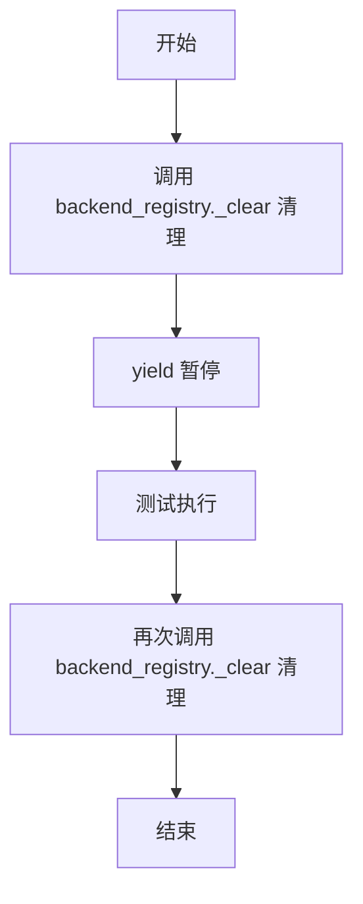

#### 带注释源码

```python
@pytest.fixture
def clear_backend_registry():
    # Fixture that clears the singleton backend_registry before and after use
    # so that the test state remains isolated.
    backend_registry._clear()
    yield
    backend_registry._clear()
```


### `has_duplicates`

该函数用于检测给定序列中是否存在重复元素。它通过比较序列长度与其转换为集合后的长度来判断：如果序列长度大于集合长度，则说明存在重复元素，返回 `True`；否则返回 `False`。

参数：

- `seq`：`Sequence[Any]`，任意类型的序列（列表、元组等可迭代对象）

返回值：`bool`，如果序列包含重复元素返回 `True`，否则返回 `False`

#### 流程图

```mermaid
flowchart TD
    A[开始] --> B[输入序列 seq]
    B --> C[计算序列长度 len_seq = len(seq)]
    C --> D[计算集合长度 len_set = len(set(seq))]
    D --> E{len_seq > len_set?}
    E -->|是| F[返回 True]
    E -->|否| G[返回 False]
    F --> H[结束]
    G --> H
```

#### 带注释源码

```python
def has_duplicates(seq: Sequence[Any]) -> bool:
    """
    检查给定序列是否包含重复元素。
    
    参数:
        seq: 任意类型的序列（列表、元组等）
    
    返回:
        bool: 如果序列包含重复元素返回 True，否则返回 False
    """
    # 核心逻辑：集合会自动去重，如果序列长度大于集合长度，说明有重复元素
    # 例如: [1, 2, 3, 3] -> len=4, set后{1,2,3} -> len=3, 4>3 返回 True
    #       [1, 2, 3] -> len=3, set后{1,2,3} -> len=3, 3>3 返回 False
    return len(seq) > len(set(seq))
```

---

## 补充文档信息

### 文件整体运行流程

该代码文件是一个测试文件（test_backend_registry.py），用于测试 `matplotlib` 的后端注册表功能。文件开头定义了 `has_duplicates` 辅助函数，随后使用 pytest 框架的各种测试函数来验证 `backend_registry` 的功能，包括：
- 测试 GUI 框架对应的后端解析
- 测试内置后端列表
- 测试后端过滤功能
- 测试 GUI 框架列表
- 测试后端名称验证
- 测试后端名称规范化
- 测试入口点加载逻辑
- 测试后端解析功能

### 关键组件信息

| 组件名称 | 一句话描述 |
|---------|-----------|
| `has_duplicates` | 用于检测序列是否包含重复元素的工具函数 |
| `backend_registry` | matplotlib 的后端注册表管理器，负责管理所有可用的渲染后端 |
| `BackendFilter` | 枚举类型，用于过滤后端列表（交互式/非交互式） |

### 潜在的技术债务或优化空间

1. **函数过于简单**：`has_duplicates` 函数虽然功能正确，但逻辑极其简单，可能不需要作为一个独立函数存在，可以直接在调用处内联实现。

2. **缺乏输入验证**：函数没有对 `seq` 参数进行类型检查，如果传入非序列类型可能导致运行时错误。

3. **测试覆盖**：该函数主要用于测试场景，可以考虑添加边界情况测试（如空序列、单元素序列等）。

### 其它项目

- **设计目标与约束**：该函数是一个纯函数，无副作用，设计简洁高效，利用 Python 集合的唯一性特性实现去重检测，时间复杂度为 O(n)。
  
- **错误处理与异常设计**：未实现显式的错误处理，依赖于 Python 自身的异常机制。如果传入不可迭代对象，会抛出 `TypeError`。

- **数据流与状态机**：该函数是纯函数式设计，输入序列 -> 转换为集合 -> 比较长度 -> 返回布尔值，无状态变化。

- **外部依赖与接口契约**：依赖 `typing.Sequence` 和 `typing.Any` 类型提示，来自 Python 标准库。


### `test_backend_for_gui_framework`

该测试函数通过参数化测试验证 `backend_registry.backend_for_gui_framework()` 方法能够正确地将各种 GUI 框架名称（如 'qt', 'gtk3', 'gtk4', 'wx', 'tk', 'macosx', 'headless'）映射到对应的后端名称，对于不存在的框架返回 `None`。

参数：

-  `framework`：`str`，GUI 框架的名称字符串，测试用例包括 'qt', 'gtk3', 'gtk4', 'wx', 'tk', 'macosx', 'headless' 和 'does not exist'
-  `expected`：`str | None`，预期的后端名称，对于存在的框架返回对应的 agg 后端（如 'qtagg'），对于不存在的框架返回 `None`

返回值：`None`，该函数为测试函数，无返回值，通过 assert 断言验证逻辑正确性

#### 流程图

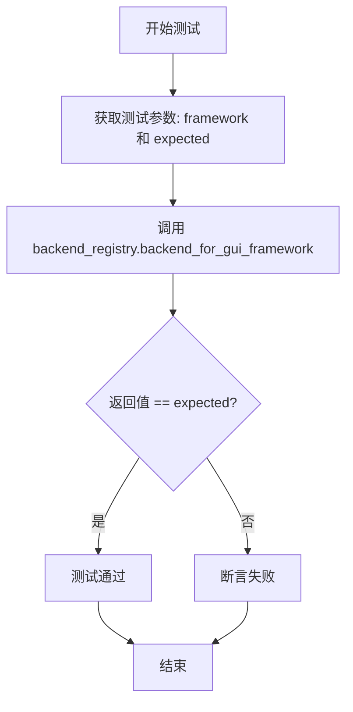

#### 带注释源码

```python
@pytest.mark.parametrize(
    'framework,expected',
    [
        ('qt', 'qtagg'),        # Qt 框架对应 qtagg 后端
        ('gtk3', 'gtk3agg'),    # Gtk3 框架对应 gtk3agg 后端
        ('gtk4', 'gtk4agg'),    # Gtk4 框架对应 gtk4agg 后端
        ('wx', 'wxagg'),        # Wx 框架对应 wxagg 后端
        ('tk', 'tkagg'),        # Tk 框架对应 tkagg 后端
        ('macosx', 'macosx'),   # macOS 框架对应 macosx 后端（无 agg 变体）
        ('headless', 'agg'),    # 无头模式对应 agg 后端
        ('does not exist', None),  # 不存在的框架返回 None
    ]
)
def test_backend_for_gui_framework(framework, expected):
    """
    参数化测试：验证 backend_for_gui_framework 方法的映射逻辑
    
    Args:
        framework: GUI 框架名称字符串
        expected: 预期的后端名称或 None
    
    Returns:
        None（测试函数无返回值，通过 assert 验证）
    """
    # 断言 backend_registry.backend_for_gui_framework(framework) 返回值等于 expected
    assert backend_registry.backend_for_gui_framework(framework) == expected
```


### `test_list_builtin`

描述：该测试函数用于验证 `backend_registry.list_builtin()` 方法能否正确返回所有内置后端列表，且列表中不存在重复的后端名称，并与预期的内置后端集合完全匹配。

参数：此函数无参数。

返回值：`None`，该函数为测试函数，不返回任何值，仅通过断言验证内部逻辑的正确性。

#### 流程图

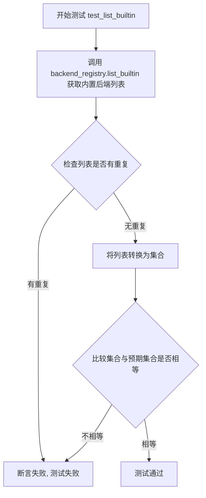

#### 带注释源码

```python
def test_list_builtin():
    """
    测试 backend_registry.list_builtin() 返回的内置后端列表功能。
    验证内容：
    1. 返回的列表中不存在重复的后端
    2. 返回的后端集合与预期的内置后端集合完全匹配
    """
    # 调用 list_builtin() 方法获取所有内置后端的列表
    backends = backend_registry.list_builtin()
    
    # 断言：确保返回的列表中没有重复的后端名称
    # 使用 has_duplicates 函数检查，该函数通过比较列表长度和集合长度来判断
    assert not has_duplicates(backends)
    
    # 断言：比较返回的后端集合与预期集合是否相等
    # 使用集合比较是因为内置后端的顺序并不重要
    assert {*backends} == {
        'gtk3agg', 'gtk3cairo', 'gtk4agg', 'gtk4cairo', 'macosx', 'nbagg', 'notebook',
        'qtagg', 'qtcairo', 'qt5agg', 'qt5cairo', 'tkagg',
        'tkcairo', 'webagg', 'wx', 'wxagg', 'wxcairo', 'agg', 'cairo', 'pdf', 'pgf',
        'ps', 'svg', 'template',
    }
```


### `test_list_builtin_with_filter`

这是一个测试函数，用于验证 `backend_registry.list_builtin()` 方法能否根据指定的过滤器（`BackendFilter.INTERACTIVE` 或 `BackendFilter.NON_INTERACTIVE`）正确返回对应的内置后端列表。测试通过比较集合来验证结果，忽略顺序。

参数：

- `filter`：`BackendFilter`，过滤器类型，用于指定要获取的后端类型（如交互式或非交互式后端）
- `expected`：`list`，期望返回的后端名称列表

返回值：`None`，该函数为测试函数，主要通过断言验证功能，不返回具体值

#### 流程图

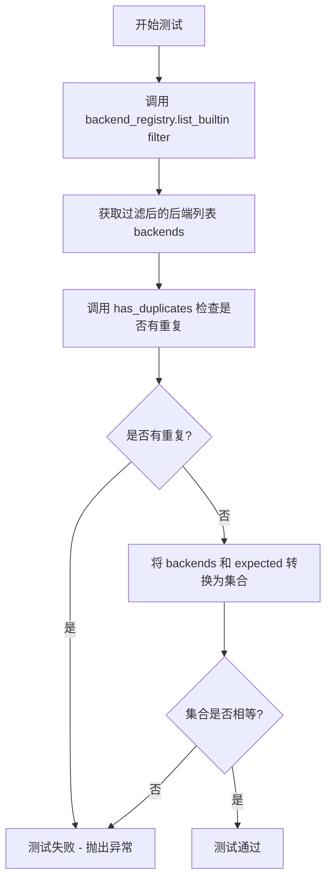

#### 带注释源码

```python
@pytest.mark.parametrize(
    'filter,expected',
    [
        # 测试交互式后端过滤器
        (BackendFilter.INTERACTIVE,
         ['gtk3agg', 'gtk3cairo', 'gtk4agg', 'gtk4cairo', 'macosx', 'nbagg', 'notebook',
          'qtagg', 'qtcairo', 'qt5agg', 'qt5cairo', 'tkagg',
          'tkcairo', 'webagg', 'wx', 'wxagg', 'wxcairo']),
        # 测试非交互式后端过滤器
        (BackendFilter.NON_INTERACTIVE,
         ['agg', 'cairo', 'pdf', 'pgf', 'ps', 'svg', 'template']),
    ]
)
def test_list_builtin_with_filter(filter, expected):
    """
    测试 list_builtin 方法是否能根据过滤器正确返回内置后端列表
    
    参数:
        filter: BackendFilter 枚举值，指定后端类型
        expected: 期望的后端名称列表
    """
    # 调用被测试的 list_builtin 方法，传入过滤器获取后端列表
    backends = backend_registry.list_builtin(filter)
    
    # 验证返回的列表没有重复的后端
    assert not has_duplicates(backends)
    
    # 使用集合比较来验证结果（顺序不重要）
    assert {*backends} == {*expected}
```


### `test_list_gui_frameworks`

这是一个测试函数，用于验证 `backend_registry.list_gui_frameworks()` 方法返回的 GUI 框架列表是否包含正确的框架且没有重复项。

参数： 无

返回值：`None`，因为这是一个测试函数，不返回任何值

#### 流程图

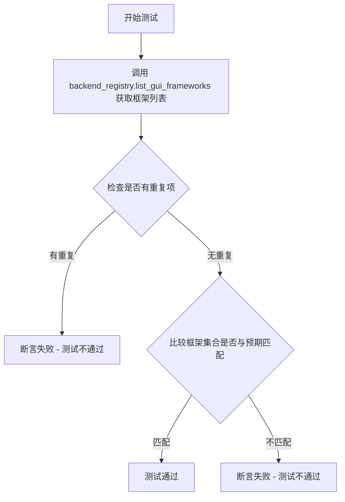

#### 带注释源码

```python
def test_list_gui_frameworks():
    """
    测试 backend_registry.list_gui_frameworks() 方法返回的 GUI 框架列表。
    
    验证点：
    1. 返回的框架列表中没有重复项
    2. 返回的框架集合与预期框架集合一致
    """
    # 调用被测函数，获取当前所有可用的 GUI 框架列表
    frameworks = backend_registry.list_gui_frameworks()
    
    # 断言：确保返回的框架列表中没有重复项
    # 使用 has_duplicates 函数检查列表是否有重复
    assert not has_duplicates(frameworks)
    
    # 断言：比较返回的框架集合与预期集合
    # 使用集合比较是因为顺序不重要
    assert {*frameworks} == {
        "gtk3",    # GTK+ 3.x 后端
        "gtk4",    # GTK+ 4.x 后端
        "macosx",  # macOS 后端
        "qt",      # Qt (通用名称，可能指向 Qt6)
        "qt5",     # Qt5 后端
        "qt6",     # Qt6 后端
        "tk",      # Tk 后端
        "wx",      # wxWidgets 后端
    }
```


### test_is_valid_backend

这是一个 pytest 测试函数，用于验证 `backend_registry.is_valid_backend` 方法对不同后端名称的验证逻辑是否正确。通过参数化测试多组后端名称和预期结果，检验该方法能否正确区分有效和无效的后端名称。

参数：

- `backend`：`str`，测试的后端名称，包括普通后端名称（如 "agg"）、大小写混合名称（如 "QtAgg"）、模块路径（如 "module://anything"）和无效名称（如 "made-up-name"）
- `is_valid`：`bool`，期望的验证结果，`True` 表示该后端名称是有效的，`False` 表示无效

返回值：无（该函数为测试函数，使用 `assert` 语句进行断言验证，无显式返回值）

#### 流程图

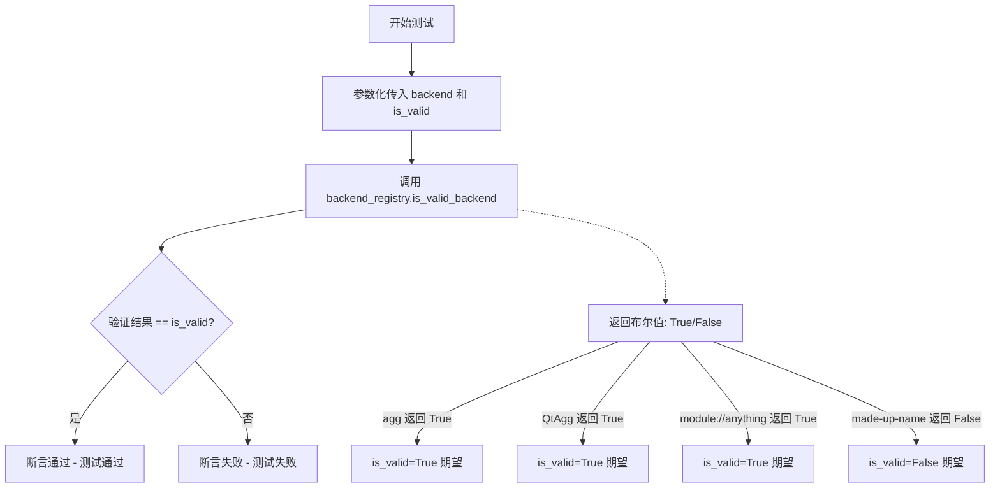

#### 带注释源码

```python
@pytest.mark.parametrize("backend, is_valid", [
    ("agg", True),                  # 测试标准后端名称 - 应返回有效
    ("QtAgg", True),                # 测试大小写混合的后端名称 - 应返回有效
    ("module://anything", True),    # 测试模块路径格式 - 应返回有效
    ("made-up-name", False),        # 测试不存在的后端名称 - 应返回无效
])
def test_is_valid_backend(backend, is_valid):
    """
    测试 backend_registry.is_valid_backend 方法的验证逻辑。
    
    该测试通过多组参数化数据验证 is_valid_backend 方法能否正确判断：
    1. 标准后端名称是否有效
    2. 大小写混合的后端名称是否有效（QtAgg vs qtagg）
    3. 模块路径格式（module://）是否被正确识别为有效
    4. 不存在的后端名称是否被正确识别为无效
    
    参数:
        backend (str): 要测试的后端名称
        is_valid (bool): 期望的验证结果
    
    断言:
        backend_registry.is_valid_backend(backend) 应该等于 is_valid
    """
    # 调用被测试的 is_valid_backend 方法，并将结果与期望值进行断言比较
    assert backend_registry.is_valid_backend(backend) == is_valid
```


### `test_backend_normalization`

该测试函数用于验证后端名称规范化的正确性，通过参数化测试验证不同的后端输入（如简写名称 "agg"、大小写混合名称 "QtAgg"、模块前缀 "module://Anything"）能够被正确转换为标准的模块名称。

参数：

- `backend`：`str`，输入的后端名称，可能是简写形式、大小写混合形式或带有 module:// 前缀的模块路径
- `normalized`：`str`，期望规范化后的模块名称，标准格式为 "matplotlib.backends.backend_xxx" 或保持原样的模块路径

返回值：`None`，该函数为 pytest 测试函数，无显式返回值，通过 `assert` 断言验证规范化结果是否符合预期

#### 流程图

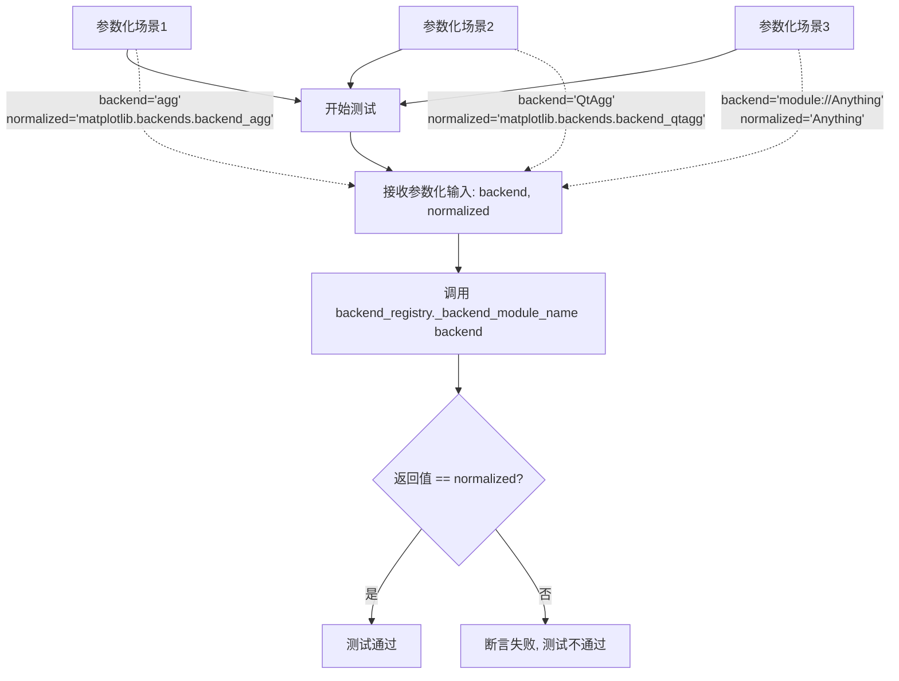

#### 带注释源码

```python
@pytest.parametrize("backend, normalized", [
    # 测试场景1: 简写后端名称 'agg' 应该被规范化为完整的模块路径
    ("agg", "matplotlib.backends.backend_agg"),
    
    # 测试场景2: 大小写混合的 'QtAgg' 应该被规范化为小写的 'qtagg' 模块路径
    ("QtAgg", "matplotlib.backends.backend_qtagg"),
    
    # 测试场景3: 以 'module://' 为前缀的模块路径应保持原样,只去除前缀
    ("module://Anything", "Anything"),
])
def test_backend_normalization(backend, normalized):
    """
    测试后端名称规范化的正确性。
    
    该测试验证 backend_registry 模块中的 _backend_module_name 方法
    能够正确处理不同格式的后端名称输入,并将其转换为标准的模块名称格式。
    
    参数:
        backend: 输入的后端名称,支持三种格式:
            - 简写名称 (如 'agg')
            - 大小写混合名称 (如 'QtAgg')
            - 模块路径前缀 (如 'module://Anything')
        normalized: 期望的规范化输出结果
    
    返回值:
        无返回值,通过 assert 断言进行验证
    """
    # 调用后端注册表的内部方法 _backend_module_name 进行名称规范化
    # 然后与期望的规范化结果进行比对
    assert backend_registry._backend_module_name(backend) == normalized
```


### `test_entry_points_inline`

该测试函数用于验证 `matplotlib_inline` 扩展后端是否被正确注册到后端注册表中，确保通过 entry points 机制加载的 inline 后端可见。

参数：无

返回值：`None`，该函数通过断言进行验证，不返回具体值

#### 流程图

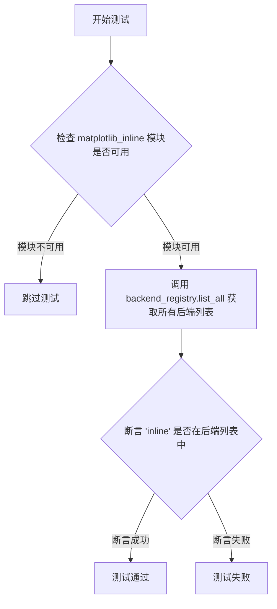

#### 带注释源码

```python
def test_entry_points_inline():
    """
    测试函数：验证 inline 后端是否通过 entry points 正确注册
    
    该测试执行以下操作：
    1. 检查 matplotlib_inline 模块是否已安装
    2. 获取所有已注册的后端列表
    3. 验证 inline 后端存在于列表中
    """
    # 尝试导入 matplotlib_inline，如果模块不存在则跳过此测试
    # pytest.importorskip 会检查模块是否可用，不可用时标记测试为 skipped
    pytest.importorskip('matplotlib_inline')
    
    # 获取所有已注册的后端（包括内置后端和通过 entry points 加载的后端）
    backends = backend_registry.list_all()
    
    # 断言验证 inline 后端已成功注册
    # inline 后端由 matplotlib_inline 包通过 entry points 机制提供
    assert 'inline' in backends
```


### `test_entry_points_ipympl`

该测试函数用于验证 ipympl 相关的后端入口点是否被正确注册到 backend_registry 中，确保 `list_all()` 方法能够返回 ipympl 和 widget 后端。

参数：无

返回值：`None`，无返回值（测试函数）

#### 流程图

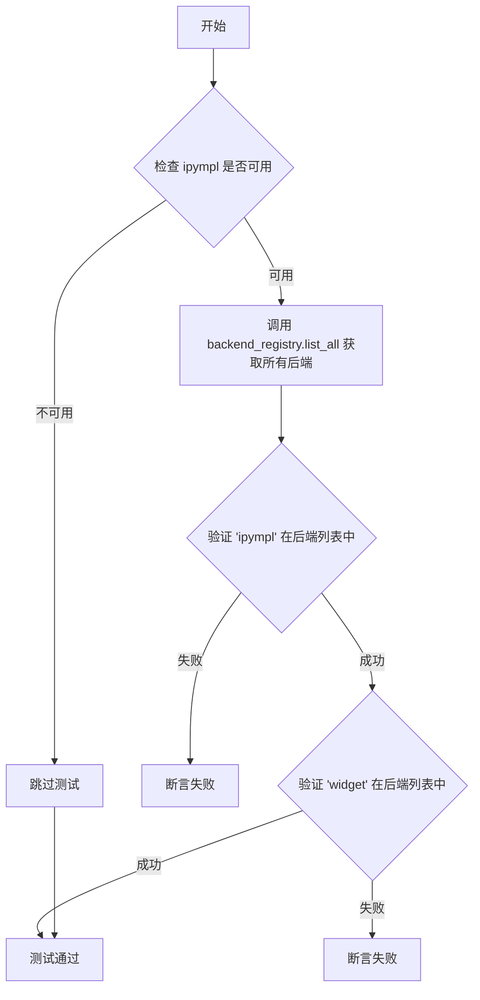

#### 带注释源码

```python
def test_entry_points_ipympl():
    """测试 ipympl 相关的后端入口点是否被正确注册。"""
    # 使用 pytest.importorskip 确保 ipympl 库可用，若不可用则跳过该测试
    pytest.importorskip('ipympl')
    
    # 获取所有已注册的后端列表，包括通过 entry points 注册的后端
    backends = backend_registry.list_all()
    
    # 断言 'ipympl' 后端存在于后端列表中
    assert 'ipympl' in backends
    
    # 断言 'widget' 后端存在于后端列表中
    assert 'widget' in backends
```


### `test_entry_point_name_shadows_builtin`

该测试函数用于验证当尝试注册一个与内置后端名称（如'qtagg'）相同的入口点时，`backend_registry`模块是否会正确地抛出`RuntimeError`异常，从而防止内置后端被意外覆盖。

参数：

- `clear_backend_registry`：`pytest.fixture`，一个测试夹具（fixture），用于在测试前后清除`backend_registry`的单例状态，确保测试环境相互隔离，避免测试之间的状态污染。

返回值：`None`，该测试函数没有显式返回值，它使用`pytest.raises`上下文管理器来验证代码是否抛出了预期的`RuntimeError`异常。

#### 流程图

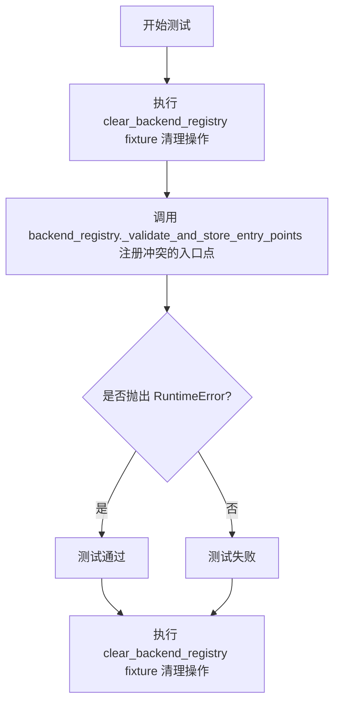

#### 带注释源码

```python
def test_entry_point_name_shadows_builtin(clear_backend_registry):
    """
    测试当入口点名称与内置后端名称冲突时的行为。
    
    此测试验证了系统能够正确识别并阻止试图覆盖内置后端的行为。
    'qtagg' 是 matplotlib 的一个内置后端名称，不允许被外部入口点覆盖。
    
    参数:
        clear_backend_registry: pytest fixture，用于在测试前后清除 backend_registry 的单例状态
                               确保测试之间相互隔离
    
    返回值:
        None: 此测试函数不返回任何值，仅验证异常抛出行为
    
    预期行为:
        _validate_and_store_entry_points 应该检测到 'qtagg' 是已存在的内置后端，
        并抛出 RuntimeError 异常来阻止这种覆盖行为。
    """
    # 使用 pytest.raises 上下文管理器来验证代码是否抛出 RuntimeError
    # 如果没有抛出异常，或抛出了其他类型的异常，测试将失败
    with pytest.raises(RuntimeError):
        # 尝试注册一个名称为 'qtagg' 的入口点，该名称与内置后端冲突
        # module1 是任意选择的模块路径，用于测试名称冲突检测逻辑
        backend_registry._validate_and_store_entry_points(
            [('qtagg', 'module1')])
```


### `test_entry_point_name_duplicate`

该测试函数用于验证当尝试向 backend_registry 注册两个具有相同名称但不同模块的后端入口点时，系统能够正确抛出 RuntimeError 异常，确保了后端名称的唯一性约束得到执行。

参数：

- `clear_backend_registry`：`pytest.fixture`，一个清理 backend_registry 单例状态的 fixture，在测试前后清除注册表以保证测试隔离性

返回值：`None`，该测试函数通过 `pytest.raises` 上下文管理器验证异常行为，不返回具体值

#### 流程图

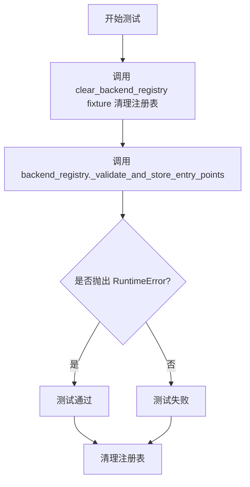

#### 带注释源码

```python
def test_entry_point_name_duplicate(clear_backend_registry):
    """
    测试当存在重复的后端名称时是否会抛出 RuntimeError。
    
    参数:
        clear_backend_registry: fixture，用于在测试前后清理 backend_registry 的单例状态，
                               确保测试之间不会相互影响。
    """
    # 使用 pytest.raises 上下文管理器验证是否抛出 RuntimeError
    # 如果没有抛出异常，或抛出其他类型异常，测试将失败
    with pytest.raises(RuntimeError):
        # 调用内部方法 _validate_and_store_entry_points
        # 尝试注册两个具有相同名称 'some_name' 但不同模块的后端
        # 这应该触发名称重复的验证逻辑并抛出 RuntimeError
        backend_registry._validate_and_store_entry_points(
            [('some_name', 'module1'), ('some_name', 'module2')])
```


### `test_entry_point_identical`

该测试函数用于验证当多个入口点具有相同的名称和模块值时，系统能够正确处理这种重复情况（Issue #28367）。测试确保相同的名称-模块组合不会被去重，而是被接受并存储。

参数：

- `clear_backend_registry`：fixture (类型: `Callable`)，用于在测试前后清除 `backend_registry` 单例，确保测试状态隔离。

返回值：`None`，无返回值（pytest 测试函数）。

#### 流程图

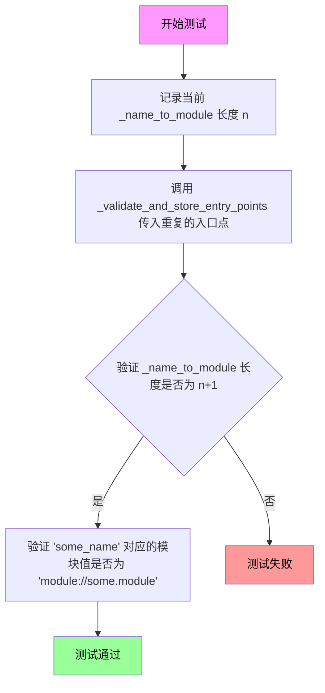

#### 带注释源码

```python
def test_entry_point_identical(clear_backend_registry):
    # Issue https://github.com/matplotlib/matplotlib/issues/28367
    # 描述问题：多个入口点具有相同的名称和值（值是模块）应该是可接受的
    
    # 1. 记录当前 backend_registry 中名称到模块映射的条目数量
    n = len(backend_registry._name_to_module)
    
    # 2. 调用内部方法 _validate_and_store_entry_points
    #    传入两个具有相同名称和相同模块值的入口点
    #    这模拟了加载两个完全相同的入口点的情况
    backend_registry._validate_and_store_entry_points(
        [('some_name', 'some.module'), ('some_name', 'some.module')])
    
    # 3. 断言验证映射数量增加了 1（而不是 2）
    #    这说明重复的入口点被正确处理，只添加了一条记录
    assert len(backend_registry._name_to_module) == n+1
    
    # 4. 验证存储的模块名称被正确规范化为 'module://' 前缀格式
    assert backend_registry._name_to_module['some_name'] == 'module://some.module'
```


### `test_entry_point_name_is_module`

该测试函数用于验证当后端入口点的名称以 `module://` 前缀开头时，系统会正确抛出 RuntimeError 异常，防止用户错误地使用 module:// 语法作为入口点名称。

参数：

- `clear_backend_registry`：`<fixture>`，pytest fixture，用于在测试前后清除 backend_registry 单例，确保测试状态隔离

返回值：`None`，测试函数无返回值，通过 pytest 断言验证行为

#### 流程图

```mermaid
flowchart TD
    A[开始测试] --> B[调用 clear_backend_registry fixture 清理状态]
    B --> C[调用 backend_registry._validate_and_store_entry_points]
    C --> D[传入参数: [('module://backend.something', 'module1')]]
    D --> E{是否抛出 RuntimeError?}
    E -->|是| F[测试通过]
    E -->|否| G[测试失败]
    
    style F fill:#90EE90
    style G fill:#FFB6C1
```

#### 带注释源码

```python
def test_entry_point_name_is_module(clear_backend_registry):
    """
    测试当入口点名称以 'module://' 开头时是否会抛出 RuntimeError。
    
    这是一个负面测试用例，验证系统正确处理非法输入：
    - 'module://backend.something' 是一个无效的入口点名称
    - 因为 'module://' 前缀是保留给动态模块加载使用的
    - 用户不应该将其作为 entry point 的名称
    """
    # 使用 pytest.raises 上下文管理器捕获并验证异常
    # 如果没有抛出 RuntimeError，测试将失败
    with pytest.raises(RuntimeError):
        # 调用私有方法 _validate_and_store_entry_points
        # 尝试注册一个名称为 'module://backend.something' 的入口点
        # 这应该被拒绝并抛出 RuntimeError
        backend_registry._validate_and_store_entry_points(
            [('module://backend.something', 'module1')]
        )
```

#### 关键点说明

| 项目 | 描述 |
|------|------|
| **测试目的** | 验证入口点名称不能使用 `module://` 前缀 |
| **预期行为** | `_validate_and_store_entry_points` 应抛出 `RuntimeError` |
| **测试类型** | 负面测试（Negative Test） |
| **使用的 Fixture** | `clear_backend_registry` - 确保测试隔离 |


### `test_load_entry_points_only_if_needed`

该测试函数用于验证后端入口点的延迟加载机制，确保在调用 `resolve_backend` 时不会立即加载入口点，只有在显式调用 `list_all()` 时才会触发入口点的加载。

参数：

- `clear_backend_registry`：`pytest.fixture`，用于清除 backend_registry 单例的测试fixture，确保测试状态隔离
- `backend`：`str`，要测试的后端名称，参数化支持 `'agg'` 和 `'module://matplotlib.backends.backend_agg'` 两种形式

返回值：`None`，该函数为测试函数，无显式返回值（pytest通过断言验证）

#### 流程图

```mermaid
flowchart TD
    A[开始测试] --> B[断言 _loaded_entry_points 为 False]
    B --> C[调用 resolve_backend 获取后端]
    C --> D{后端名称是否为 'agg'}
    D -->|是| E[返回 ('agg', None)]
    D -->|否| F[返回 ('module://matplotlib.backends.backend_agg', None)]
    E --> G[断言 check == (backend, None)]
    F --> G
    G --> H[断言 _loaded_entry_points 仍为 False]
    H --> I[调用 list_all 强制加载入口点]
    I --> J[断言 _loaded_entry_points 为 True]
    J --> K[测试通过]
```

#### 带注释源码

```python
@pytest.mark.parametrize('backend', [
    'agg',                                           # 测试简写后端名
    'module://matplotlib.backends.backend_agg',    # 测试完整模块路径后端名
])
def test_load_entry_points_only_if_needed(clear_backend_registry, backend):
    """
    测试入口点的延迟加载机制。
    
    验证 resolve_backend 不会触发入口点加载，
    只有显式调用 list_all 才会加载入口点。
    """
    # 初始状态：入口点尚未加载
    assert not backend_registry._loaded_entry_points
    
    # 调用 resolve_backend 解析后端
    # 预期：返回传入的后端名称，gui 为 None
    check = backend_registry.resolve_backend(backend)
    
    # 验证返回结果正确
    assert check == (backend, None)
    
    # 关键验证：resolve_backend 不应触发入口点加载
    # _loaded_entry_points 仍应为 False
    assert not backend_registry._loaded_entry_points
    
    # 显式调用 list_all 强制加载入口点
    backend_registry.list_all()  # Force load of entry points
    
    # 验证调用 list_all 后，入口点已加载
    assert backend_registry._loaded_entry_points
```


### `test_resolve_gui_or_backend`

这是一个使用 pytest 的参数化测试函数，用于验证 `backend_registry.resolve_gui_or_backend` 方法能否正确解析给定的 GUI 框架或后端名称，并返回对应的后端名称和 GUI 框架名称。

参数：

- `gui_or_backend`：`str`，输入的 GUI 框架或后端名称（如 'agg'、'qt'、'TkCairo'）
- `expected_backend`：`str`，期望返回的后端名称
- `expected_gui`：`str | None`，期望返回的 GUI 框架名称（如果没有对应的 GUI 框架则返回 None）

返回值：`None`，该函数为测试函数，无返回值，通过断言验证解析结果的正确性

#### 流程图

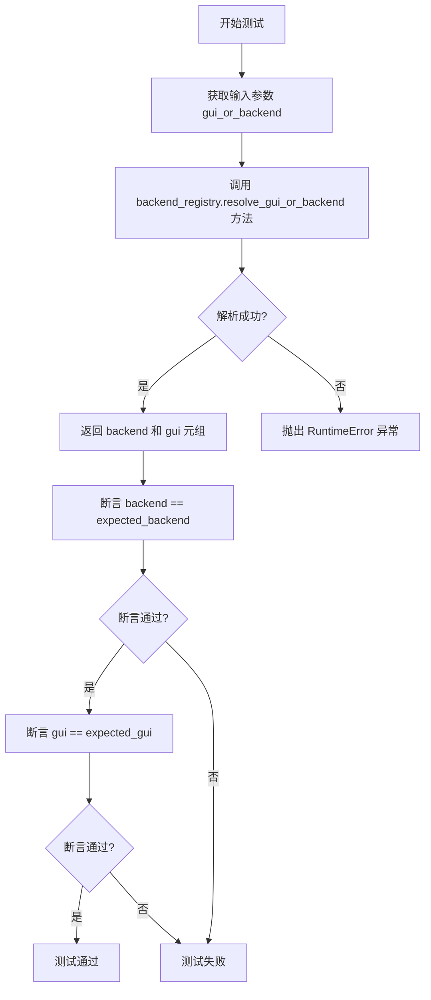

#### 带注释源码

```python
@pytest.mark.parametrize(
    'gui_or_backend, expected_backend, expected_gui',
    [
        ('agg', 'agg', None),          # 测试纯后端名称，返回后端名，GUI 为 None
        ('qt', 'qtagg', 'qt'),          # 测试 GUI 框架名称，解析为对应的后端
        ('TkCairo', 'tkcairo', 'tk'),   # 测试混合大小写，解析为 tk 后端和 tk GUI
    ]
)
def test_resolve_gui_or_backend(gui_or_backend, expected_backend, expected_gui):
    """
    参数化测试函数，验证 resolve_gui_or_backend 方法的解析逻辑。
    
    测试用例说明：
    1. 'agg' -> ('agg', None)：纯后端名称，不需要 GUI 框架
    2. 'qt' -> ('qtagg', 'qt')：GUI 框架名称映射到对应的 agg 后端
    3. 'TkCairo' -> ('tkcairo', 'tk')：大小写不敏感的 GUI 框架解析
    """
    # 调用被测试的方法，返回 (backend, gui) 元组
    backend, gui = backend_registry.resolve_gui_or_backend(gui_or_backend)
    
    # 验证返回的后端名称是否与预期一致
    assert backend == expected_backend
    
    # 验证返回的 GUI 框架名称是否与预期一致
    assert gui == expected_gui
```


### `test_resolve_gui_or_backend_invalid`

该测试函数用于验证当向 `backend_registry.resolve_gui_or_backend()` 方法传入无效的 GUI 框架或后端名称时，系统能够正确抛出包含特定错误消息的 `RuntimeError` 异常，确保错误处理的健壮性。

参数： 无

返回值：无（测试函数无返回值，使用 pytest 框架进行验证）

#### 流程图

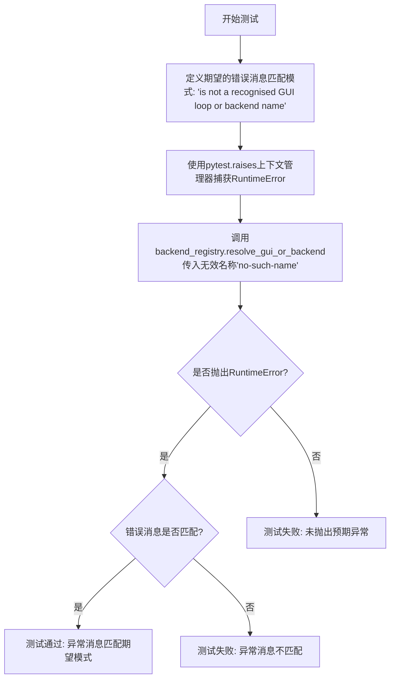

#### 带注释源码

```python
def test_resolve_gui_or_backend_invalid():
    """
    测试无效的GUI框架或后端名称是否能正确抛出RuntimeError异常。
    
    该测试验证了backend_registry.resolve_gui_or_backend()方法
    对于无效输入能够正确地进行错误处理。
    """
    # 定义期望在异常消息中看到的错误文本
    # 这个消息来自于resolve_gui_or_backend方法的实现
    match = "is not a recognised GUI loop or backend name"
    
    # 使用pytest.raises上下文管理器验证异常被正确抛出
    # match参数确保抛出的异常消息与期望的模式匹配
    with pytest.raises(RuntimeError, match=match):
        # 调用resolve_gui_or_backend方法，传入一个不存在的后端名称
        # 期望这会触发RuntimeError异常
        backend_registry.resolve_gui_or_backend('no-such-name')
```

## 关键组件


### backend_registry (后端注册表)

负责管理 matplotlib 所有可用后端的注册、查询、解析和加载的核心模块。

### BackendFilter (后端过滤器)

枚举类，用于过滤后端列表，包含 INTERACTIVE（交互式后端）和 NON_INTERACTIVE（非交互式后端）两种类型。

### backend_for_gui_framework (GUI框架到后端的映射)

根据 GUI 框架名称（如 'qt', 'gtk3', 'wx' 等）返回对应的默认后端模块名称。

### list_builtin (列出内置后端)

返回所有内置后端列表，可通过 BackendFilter 进行过滤。

### list_gui_frameworks (列出GUI框架)

返回所有支持的 GUI 框架名称列表。

### is_valid_backend (后端有效性验证)

验证给定的后端名称是否为有效的后端。

### _backend_module_name (后端模块名称规范化)

将各种格式的后端名称规范化为标准的模块路径格式。

### resolve_backend (后端解析)

解析后端名称并返回标准化的后端名称和可能的模块。

### resolve_gui_or_backend (GUI或后端解析)

统一解析 GUI 框架名称或后端名称，返回对应的后端和 GUI 类型。

### _validate_and_store_entry_points (入口点验证与存储)

验证并存储动态加载的后端入口点，确保名称唯一性。

### _name_to_module (名称到模块的映射)

存储后端名称到模块路径的映射关系的字典变量。

### _loaded_entry_points (入口点加载状态标志)

布尔标志，记录入口点是否已被加载。


## 问题及建议


### 已知问题

- **私有API直接访问**：测试代码直接访问了多个私有成员（如`_name_to_module`、`_loaded_entry_points`、`_validate_and_store_entry_points`、`_backend_module_name`），这些API可能在未来版本中变化，导致测试脆弱性。
- **硬编码的预期值**：多个测试函数中包含硬编码的后端列表（如`test_list_builtin`和`test_list_builtin_with_filter`），当添加或移除后端时需要手动同步更新，容易遗漏。
- **测试隔离不完整**：部分测试（如`test_list_builtin`、`test_list_gui_frameworks`）没有使用`clear_backend_registry` fixture，可能存在测试顺序依赖导致的副作用。
- **重复代码模式**：多处使用`has_duplicates`检查和`set`比较逻辑，可提取为共享工具函数或测试辅助方法。
- **Magic字符串缺乏解释**：测试中的字符串值如`'module://anything'`、`'no-such-name'`等缺乏注释说明其业务含义。

### 优化建议

- **封装私有API调用**：考虑在`backend_registry`模块中提供受保护的测试接口方法，将直接访问私有属性的测试代码迁移到这些方法中，降低耦合度。
- **动态生成预期列表**：从注册表配置或入口点声明中动态获取预期后端列表，而非硬编码，提高测试的可维护性。
- **统一测试隔离策略**：确保所有可能修改全局状态的测试都使用`clear_backend_registry` fixture，或在测试类级别添加自动清理机制。
- **提取测试辅助函数**：将重复的`has_duplicates`检查和集合比较逻辑封装为pytest fixtures或自定义断言函数。
- **增加文档和类型提示**：为关键测试函数和复杂参数添加文档字符串和详细的类型注解，提升代码可读性。

## 其它


### 设计目标与约束

本模块的核心设计目标是提供一个统一的matplotlib后端注册与管理机制，支持动态发现、加载和验证各种GUI框架后端（如Qt、GTK、Tk等）以及非交互式后端（如agg、pdf、svg等）。设计约束包括：1）后端注册表采用单例模式确保全局唯一性；2）支持通过entry points机制扩展第三方后端；3）后端名称不区分大小写并支持多种命名形式（短名称如"qt"，完整名称如"QtAgg"，模块路径如"module://..."）；4）必须保证内置后端与entry points后端的优先级和冲突处理机制。

### 错误处理与异常设计

本模块定义了RuntimeError用于处理以下异常情况：1）entry point名称与内置后端名称冲突；2）存在重复的entry point名称；3）entry point名称格式不符合规范（如直接使用"module://..."作为名称）；4）尝试解析不存在的GUI框架或后端名称。所有解析和验证函数在遇到无效输入时应抛出明确的RuntimeError并附带描述性错误信息。

### 数据流与状态机

后端注册表的核心状态转换如下：初始状态为未加载entry points，此时_name_to_module字典仅包含内置后端；调用list_all()或resolve_backend()等方法时会触发entry points加载，将新发现的后端添加到字典中；每次操作前会检查后端名称规范化（_backend_module_name）确保一致性。状态转换由_loaded_entry_points布尔标志控制，避免重复加载。

### 外部依赖与接口契约

本模块依赖以下外部组件：1）matplotlib.backends模块中的BackendFilter枚举类，用于过滤后端类型；2）Python的entry points机制（通过importlib.metadata）；3）pytest框架用于测试。公开接口包括：backend_for_gui_framework(framework)、list_builtin(filter)、list_all()、list_gui_frameworks()、is_valid_backend(backend)、resolve_backend(backend)、resolve_gui_or_backend(name)。所有接口均为线程不安全设计，单线程使用。

### 性能要求与考量

模块设计考虑了以下性能因素：1）entry points采用延迟加载（lazy loading）策略，仅在首次需要时加载；2）后端名称映射采用字典数据结构，支持O(1)查找；3）内置后端列表在模块初始化时静态定义，避免重复计算。潜在优化空间包括：缓存规范化后的后端名称、考虑线程安全的单例实现。

### 安全性考虑

本模块处理用户输入的后端名称时进行验证，防止加载恶意模块。安全措施包括：1）is_valid_backend()验证后端名称格式；2）仅允许加载已注册的后端模块；3）entry point名称必须符合命名规范。警告：使用"module://"协议时应确保模块路径可信。

### 配置管理

后端注册表的行为可通过以下方式配置：1）环境变量MATPLOTLIB_BACKEND可设置默认后端；2）matplotlibrc配置文件中的backend参数；3）运行时通过matplotlib.use()显式指定。entry points的发现由Python的打包机制（setuptools或importlib.metadata）管理。

### 版本兼容性

本模块需兼容以下Python版本：3.8+（用于importlib.metadata的entry points支持）。对于较旧的Python版本可能需要安装importlib_metadata作为后备。BackendFilter枚举的INTERACTIVE和NON_INTERACTIVE分类在不同matplotlib版本中可能略有调整。

### 测试策略

测试覆盖了以下场景：1）GUI框架到后端的正确映射；2）内置后端的完整性和唯一性；3）按过滤器的分类功能；4）后端名称验证和规范化；5）entry points的发现、验证和加载逻辑；6）错误情况的异常抛出。测试使用pytest的parametrize装饰器实现参数化测试，使用fixture确保测试隔离。

### 部署与集成注意事项

该模块作为matplotlib的核心组件，在部署时需注意：1）确保所有内置后端模块正确安装；2）第三方后端需正确配置entry points；3）在无GUI环境中应能正常降级到非交互式后端。模块初始化时会自动注册内置后端，无需手动配置。

    