# `matplotlib\lib\matplotlib\tests\test_backend_svg.py` 详细设计文档

这是matplotlib SVG后端的测试套件，通过多个独立的测试用例验证SVG导出的正确性，涵盖文本渲染、字体处理、图像元素、光栅化、裁剪路径、元数据、URL链接、对象ID等核心功能的正确输出。

## 整体流程

```mermaid
graph TD
    A[开始: 导入依赖库] --> B[定义测试函数]
    B --> C1[test_visibility: 验证艺术家对象可见性]
    B --> C2[test_fill_black_with_alpha: 测试透明度填充]
    B --> C3[test_noscale: 测试无缩放]
    B --> C4[test_text_urls: 测试URL链接]
    B --> C5[test_bold_font_output: 测试粗体字体]
    B --> C6[test_bold_font_output_with_none_fonttype: 测试none字体类型]
    B --> C7[test_rasterized: 测试光栅化]
    B --> C8[test_rasterized_ordering: 测试光栅化顺序]
    B --> C9[test_prevent_rasterization: 测试防止光栅化]
    B --> C10[test_count_bitmaps: 统计位图数量]
    B --> C11[test_unicode_won: 测试Unicode字符]
    B --> C12[test_svgnone_with_data_coordinates: 测试数据坐标]
    B --> C13[test_gid: 测试对象gid]
    B --> C14[test_clip_path_ids_reuse: 测试裁剪路径ID重用]
    B --> C15[test_savefig_tight: 测试紧凑保存]
    B --> C16[test_url: 测试URL]
    B --> C17[test_url_tick: 测试刻度URL]
    B --> C18[test_svg_default_metadata: 测试默认元数据]
    B --> C19[test_svg_clear_default_metadata: 测试清除默认元数据]
    B --> C20[test_svg_clear_all_metadata: 测试清除所有元数据]
    B --> C21[test_svg_metadata: 测试SVG元数据]
    B --> C22[test_multi_font_type3: 测试多字体Type3]
    B --> C23[test_multi_font_type42: 测试多字体Type42]
    B --> C24[test_svg_incorrect_metadata: 测试错误元数据]
    B --> C25[test_svg_escape: 测试SVG转义]
    B --> C26[test_svg_font_string: 测试字体字符串]
    B --> C27[test_annotationbbox_gid: 测试AnnotationBbox的gid]
    B --> C28[test_svgid: 测试svg.id参数]
```

## 类结构

```
无类定义 - 纯测试函数模块
```

## 全局变量及字段


### `datetime`
    
Provides date and time classes.

类型：`module`
    


### `BytesIO`
    
In‑memory binary stream used for buffering SVG data.

类型：`class`
    


### `Path`
    
Represents filesystem paths.

类型：`class`
    


### `xml.etree.ElementTree`
    
XML parsing and generation.

类型：`module`
    


### `xml.parsers.expat`
    
Fast XML parser implementation.

类型：`module`
    


### `pytest`
    
Testing framework for Python.

类型：`module`
    


### `np`
    
NumPy library for numerical computing.

类型：`module`
    


### `mpl`
    
Matplotlib main package.

类型：`module`
    


### `Figure`
    
Matplotlib Figure container for plots.

类型：`class`
    


### `Circle`
    
Circular patch artist.

类型：`class`
    


### `Text`
    
Text artist for rendering text.

类型：`class`
    


### `plt`
    
Matplotlib pyplot module for interactive plotting.

类型：`module`
    


### `_gen_multi_font_text`
    
Generates test strings with multiple fonts.

类型：`function`
    


### `check_figures_equal`
    
Decorator that asserts two figures produce identical rendering.

类型：`function`
    


### `image_comparison`
    
Decorator for image comparison tests.

类型：`function`
    


### `needs_usetex`
    
pytest marker indicating test requires LaTeX rendering.

类型：`function`
    


### `fm`
    
Font manager for font selection and loading.

类型：`module`
    


### `OffsetImage`
    
Image artist that can be positioned with an offset.

类型：`class`
    


### `AnnotationBbox`
    
Annotation box that can contain an artist and be positioned.

类型：`class`
    


### `test_visibility`
    
Tests that setting errorbar artists invisible still produces a valid SVG.

类型：`function`
    


### `test_fill_black_with_alpha`
    
Tests scatter plot with black color and alpha transparency in SVG.

类型：`function`
    


### `test_noscale`
    
Tests imshow with no scaling/interpolation in SVG output.

类型：`function`
    


### `test_text_urls`
    
Verifies that a URL set on a figure title appears in the SVG.

类型：`function`
    


### `test_bold_font_output`
    
Checks bold font rendering in SVG with fontweight='bold'.

类型：`function`
    


### `test_bold_font_output_with_none_fonttype`
    
Checks bold font rendering when svg.fonttype is set to 'none'.

类型：`function`
    


### `test_rasterized`
    
Compares rasterized and vector lines in SVG for correctness.

类型：`function`
    


### `test_rasterized_ordering`
    
Tests ordering of rasterized elements with different zorders.

类型：`function`
    


### `test_prevent_rasterization`
    
Ensures annotation boxes prevent rasterization of surrounding elements.

类型：`function`
    


### `test_count_bitmaps`
    
Counts <image> and <path> tags in SVG under various rasterization settings.

类型：`function`
    


### `test_unicode_won`
    
Tests rendering of Unicode \textwon in LaTeX-generated SVG.

类型：`function`
    


### `test_svgnone_with_data_coordinates`
    
Verifies SVG output with svg.fonttype='none' and date objects on axes.

类型：`function`
    


### `test_gid`
    
Checks that object gids appear in the generated SVG.

类型：`function`
    


### `test_clip_path_ids_reuse`
    
Ensures clipPath IDs are unique even when reused across axes.

类型：`function`
    


### `test_savefig_tight`
    
Tests saving SVG with bbox_inches='tight' and a draw-disabled renderer.

类型：`function`
    


### `test_url`
    
Verifies URL attributes on scatter, plot, and markers appear in SVG.

类型：`function`
    


### `test_url_tick`
    
Checks URL on tick labels with a reproducible timestamp.

类型：`function`
    


### `test_svg_default_metadata`
    
Validates default metadata (Creator, Date, Format, Type) in SVG output.

类型：`function`
    


### `test_svg_clear_default_metadata`
    
Confirms clearing default metadata by setting it to None.

类型：`function`
    


### `test_svg_clear_all_metadata`
    
Ensures all metadata can be removed from SVG.

类型：`function`
    


### `test_svg_metadata`
    
Tests custom metadata entries in SVG RDF/Dublin Core format.

类型：`function`
    


### `test_multi_font_type3`
    
Tests multi-font text rendered as paths in SVG.

类型：`function`
    


### `test_multi_font_type42`
    
Tests multi-font text rendered as text elements in SVG.

类型：`function`
    


### `test_svg_incorrect_metadata`
    
Checks that invalid metadata raises appropriate errors.

类型：`function`
    


### `test_svg_escape`
    
Verifies escaping of special characters in SVG output.

类型：`function`
    


### `test_svg_font_string`
    
Tests font fallback strings with generic families in SVG.

类型：`function`
    


### `test_annotationbbox_gid`
    
Verifies gid attribute on AnnotationBbox appears in SVG.

类型：`function`
    


### `test_svgid`
    
Checks that svg.id rcParam appears in the SVG root element.

类型：`function`
    


    

## 全局函数及方法


### `test_visibility`

该函数是一个测试函数，用于验证matplotlib生成的SVG输出在艺术家对象设置为不可见时的有效性。它创建一个带有误差棒的折线图，将误差棒艺术家对象的可见性设置为False，保存为SVG格式，并使用XML解析器验证SVG的有效性。

**参数：** 无

**返回值：** `None`，该函数为测试函数，不返回任何有意义的值

#### 流程图

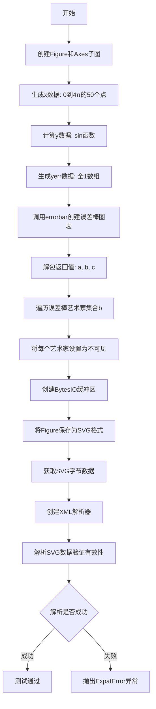

#### 带注释源码

```python
def test_visibility():
    """
    测试函数：验证SVG输出在艺术家对象设置为不可见时的有效性
    
    该测试创建包含误差棒的折线图，然后将误差棒部分的艺术家
    对象设置为不可见，保存为SVG并验证XML有效性。
    """
    # 创建一个新的Figure对象和一个Axes对象
    fig, ax = plt.subplots()

    # 生成测试数据：0到4π之间均匀分布的50个点
    x = np.linspace(0, 4 * np.pi, 50)
    # 计算对应的正弦值
    y = np.sin(x)
    # 生成误差棒数据：与y相同形状的全1数组
    yerr = np.ones_like(y)

    # 调用errorbar方法创建误差棒图表
    # 返回三个值：line对象(a), errorbar容器(b), cap对象(c)
    a, b, c = ax.errorbar(x, y, yerr=yerr, fmt='ko')
    
    # 遍历误差棒的艺术家对象集合（误差线）
    for artist in b:
        # 将每个艺术家对象的可见性设置为False
        # 这样在SVG输出中这些元素将不可见
        artist.set_visible(False)

    # 使用BytesIO作为内存缓冲区来保存SVG数据
    with BytesIO() as fd:
        # 将Figure保存为SVG格式到缓冲区
        fig.savefig(fd, format='svg')
        # 获取SVG的字节数据
        buf = fd.getvalue()

    # 创建XML解析器来验证SVG的有效性
    parser = xml.parsers.expat.ParserCreate()
    # 解析SVG数据，如果SVG格式无效将抛出ExpatError异常
    # this will raise ExpatError if the svg is invalid
    parser.Parse(buf)
```


### `test_fill_black_with_alpha`

该函数是一个图像比对测试用例，用于验证 Matplotlib 在生成 SVG 时正确处理带有透明度（alpha=0.1）的黑色（c='k'）散点图的渲染效果。

参数： 无

返回值：`None`，该测试函数不返回任何值，主要通过 `@image_comparison` 装饰器进行图像比对验证

#### 流程图

```mermaid
flowchart TD
    A[开始测试] --> B[调用 @image_comparison 装饰器]
    B --> C[创建 Figure 和 Axes 子图: plt.subplots]
    C --> D[调用 ax.scatter 绘制散点图]
    D --> E[散点参数: x=[0, 0.1, 1], y=[0, 0, 0], c='k', alpha=0.1, s=10000]
    E --> F[装饰器自动保存渲染结果并与预期图像比对]
    F --> G[测试通过/失败]
```

#### 带注释源码

```python
@image_comparison(['fill_black_with_alpha.svg'], remove_text=True)
def test_fill_black_with_alpha():
    """
    测试函数：验证带有透明度的黑色散点图在 SVG 输出中的渲染正确性
    
    @image_comparison 装饰器参数:
        - 'fill_black_with_alpha.svg': 预期输出图像文件名
        - remove_text=True: 比对时移除所有文本元素，确保只比较图形内容
    """
    # 创建一个新的 Figure 和 Axes（子图）
    # 返回 fig: Figure 对象, ax: Axes 对象
    fig, ax = plt.subplots()
    
    # 绘制散点图
    # 参数说明:
    #   x=[0, 0.1, 1]: x 坐标数组，三个点的 x 位置
    #   y=[0, 0, 0]:  y 坐标数组，三个点都在 y=0 位置
    #   c='k':       颜色为黑色 (black)
    #   alpha=0.1:   透明度为 0.1（非常透明）
    #   s=10000:     点的大小为 10000（非常大的点，便于观察透明度效果）
    ax.scatter(x=[0, 0.1, 1], y=[0, 0, 0], c='k', alpha=0.1, s=10000)
    
    # 函数结束，自动返回 None
    # @image_comparison 装饰器会在后台:
    #   1. 渲染当前图像到临时文件
    #   2. 与 baseline 图像 fill_black_with_alpha.svg 比对
    #   3. 如果不一致则抛出断言错误
```


### `test_noscale`

该函数是一个图像比较测试，用于验证在SVG输出中使用 `imshow` 绘制数组时，图像能够正确渲染且没有应用任何缩放变换。

参数：此函数无参数。

返回值：`None`，该函数不返回任何值，仅执行图像生成和保存操作。

#### 流程图

```mermaid
flowchart TD
    A[开始 test_noscale] --> B[创建网格坐标 X, Y]
    B --> C[计算 Z = sin(Y²)]
    C --> D[创建 figure 和 axes 子图]
    D --> E[使用 imshow 渲染 Z 数组]
    E --> F[设置 colormap 为 'gray', interpolation 为 'none']
    F --> G[通过 @image_comparison 装饰器保存 SVG]
    G --> H[结束]
```

#### 带注释源码

```python
@image_comparison(['noscale'], remove_text=True)  # 装饰器：比较生成的SVG与基准图像，移除文本进行对比
def test_noscale():
    # 创建二维网格坐标，X为列索引，Y为行索引
    X, Y = np.meshgrid(np.arange(-5, 5, 1), np.arange(-5, 5, 1))
    
    # 计算Z值：Y的平方的正弦值，形成测试用的二维数据
    Z = np.sin(Y ** 2)
    
    # 创建图形窗口和一个子图 axes
    fig, ax = plt.subplots()
    
    # 使用 imshow 显示二维数组 Z
    # cmap='gray': 使用灰度色彩映射
    # interpolation='none': 不进行插值，保持原始像素
    ax.imshow(Z, cmap='gray', interpolation='none')
```


### `test_text_urls`

该函数用于测试matplotlib在生成SVG图像时是否正确包含文本的URL链接，通过创建一个带有超链接标题的图形并验证SVG输出中是否包含正确的`<a xlink:href="...">`标签。

参数：无

返回值：`None`，该函数为测试函数，不返回任何值，主要通过断言验证SVG内容

#### 流程图

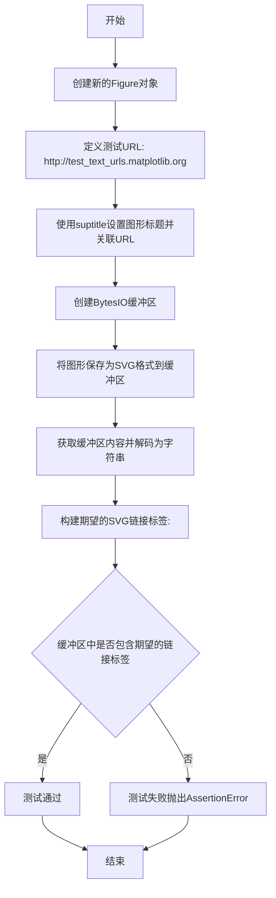

#### 带注释源码

```python
def test_text_urls():
    """
    测试函数：验证SVG输出中文本URL是否正确生成
    
    该测试验证matplotlib能够正确将URL属性嵌入到SVG图像的
    <a>标签中，用于创建可点击的链接。
    """
    
    # 创建一个新的图形对象（Figure）
    fig = plt.figure()

    # 定义测试用的URL地址
    test_url = "http://test_text_urls.matplotlib.org"
    
    # 设置图形的总标题，并为标题添加url属性
    # 这将使得SVG输出中标题文本被包裹在<a>标签内
    fig.suptitle("test_text_urls", url=test_url)

    # 使用BytesIO作为内存缓冲区来保存SVG数据
    with BytesIO() as fd:
        # 将图形保存为SVG格式
        fig.savefig(fd, format='svg')
        
        # 获取缓冲区中的二进制数据并解码为字符串
        buf = fd.getvalue().decode()

    # 构建期望在SVG中找到的链接标签字符串
    expected = f'<a xlink:href="{test_url}">'
    
    # 断言验证SVG输出中包含正确的URL链接标签
    assert expected in buf
```


### `test_bold_font_output`

该函数是一个图像对比测试，用于验证 Matplotlib 在生成 SVG 图像时对粗体字体的处理是否正确。测试创建包含普通文本和粗体文本（使用字符串 'bold' 和整数 600 作为 fontweight）的图表，并使用 `@image_comparison` 装饰器将生成的 SVG 与基准图像进行像素级对比。

参数：无

返回值：`None`，无返回值（测试函数）

#### 流程图

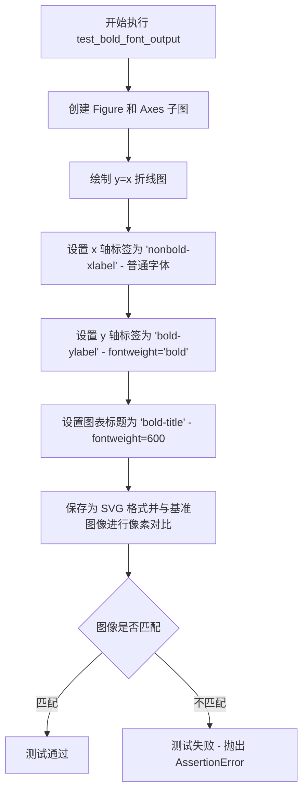

#### 带注释源码

```python
@image_comparison(['bold_font_output.svg'])  # 装饰器：比较生成的 SVG 与基准图像
def test_bold_font_output():
    """
    测试 SVG 输出中的粗体字体渲染功能。
    验证以下场景：
    1. 普通字体（默认 fontweight）
    2. 字符串形式的粗体（fontweight='bold'）
    3. 整数形式的字重（fontweight=600）
    """
    fig, ax = plt.subplots()  # 创建包含一个 Axes 的 Figure
    ax.plot(np.arange(10), np.arange(10))  # 绘制 y=x 的折线图
    
    # 设置 x 轴标签 - 使用默认字重（非粗体）
    ax.set_xlabel('nonbold-xlabel')
    
    # 设置 y 轴标签 - 使用字符串 'bold' 指定粗体
    ax.set_ylabel('bold-ylabel', fontweight='bold')
    
    # 设置图表标题 - 使用整数 600 指定字重
    # 此处用整数是为了确保代码能正确处理非字符串的 fontweight 值
    ax.set_title('bold-title', fontweight=600)
    
    # 注意：实际的图像比较由 @image_comparison 装饰器自动完成
    # 函数本身不返回任何值
```


### `test_bold_font_output_with_none_fonttype`

该函数是一个图像对比测试，用于验证当 `svg.fonttype` 设置为 `'none'` 时，SVG 输出中粗体字体的渲染是否正确。测试创建一个包含普通文本和粗体文本的图表，并使用 `image_comparison` 装饰器将生成的 SVG 图像与基准图像进行对比。

参数： 无

返回值：`None`，该函数为测试函数，不返回任何值，主要通过图像对比验证输出结果。

#### 流程图

```mermaid
flowchart TD
    A[开始执行 test_bold_font_output_with_none_fonttype] --> B[设置 rcParams['svg.fonttype'] = 'none']
    B --> C[创建 Figure 和 Axes 子图]
    C --> D[绘制线图数据 np.arange(10)]
    D --> E[设置 x 轴标签为 'nonbold-xlabel']
    E --> F[设置 y 轴标签为 'bold-ylabel', fontweight='bold']
    F --> G[设置标题为 'bold-title', fontweight=600]
    G --> H[通过 @image_comparison 装饰器保存 SVG 图像]
    H --> I[将生成的图像与基准图像 bold_font_output_with_none_fonttype.svg 对比]
    I --> J[结束]
```

#### 带注释源码

```python
@image_comparison(['bold_font_output_with_none_fonttype.svg'])
def test_bold_font_output_with_none_fonttype():
    """
    测试函数：验证 svg.fonttype='none' 时粗体字体的 SVG 输出
    
    该测试验证以下场景：
    1. 当 matplotlib 的 svg.fonttype 设置为 'none' 时，字体以文本形式输出而非路径
    2. 整数类型的 fontweight (如 600) 能否被正确处理
    3. 字符串类型的 fontweight ('bold') 能否被正确处理
    """
    # 设置 SVG 输出字体类型为 'none'，表示字体以文本形式输出，不转换为路径
    plt.rcParams['svg.fonttype'] = 'none'
    
    # 创建一个新的 Figure 和 Axes
    fig, ax = plt.subplots()
    
    # 绘制一条简单的折线图
    ax.plot(np.arange(10), np.arange(10))
    
    # 设置 x 轴标签（普通字体）
    ax.set_xlabel('nonbold-xlabel')
    
    # 设置 y 轴标签为粗体（使用字符串 'bold'）
    ax.set_ylabel('bold-ylabel', fontweight='bold')
    
    # 设置图表标题，fontweight 使用整数 600，验证整数类型的字重能被正确处理
    ax.set_title('bold-title', fontweight=600)
    
    # @image_comparison 装饰器会自动保存生成的 SVG 到基准文件，
    # 并在测试运行时自动对比输出结果
```


### `test_rasterized`

该函数是一个pytest测试用例，用于验证matplotlib在导出SVG图像时对光栅化（rasterized）图形的处理是否正确。函数通过`@check_figures_equal`装饰器比较带光栅化效果的测试图与不带光栅化的参考图的SVG输出是否在容差范围内一致。

参数：

- `fig_test`：`matplotlib.figure.Figure`，测试组中的Figure对象，将包含启用`rasterized=True`参数的绘图元素
- `fig_ref`：`matplotlib.figure.Figure`，参考组中的Figure对象，包含未启用光栅化的绘图元素，用于与测试图进行视觉对比

返回值：`None`，该函数为测试用例，通过`@check_figures_equal`装饰器内部进行断言比较

#### 流程图

```mermaid
flowchart TD
    A[开始 test_rasterized] --> B[生成测试数据 t, x, y]
    B --> C[创建参考子图 ax_ref]
    C --> D[在参考图绘制红色线条 - 未光栅化]
    D --> E[在参考图绘制蓝色线条 - 未光栅化]
    E --> F[创建测试子图 ax_test]
    F --> G[在测试图绘制红色线条 - 启用rasterized=True]
    G --> H[在测试图绘制蓝色线条 - 启用rasterized=True]
    H --> I{@check_figures_equal 装饰器比较SVG}
    I --> J[断言: 测试图与参考图在容差20内相等]
    J --> K[结束]
```

#### 带注释源码

```python
@check_figures_equal(extensions=['svg'], tol=20)  # 装饰器：比较SVG输出，允许20像素容差
def test_rasterized(fig_test, fig_ref):
    """
    测试函数：验证SVG导出时光栅化（rasterized）图形的处理
    
    Args:
        fig_test: 测试组Figure对象，包含rasterized=True的绘图
        fig_ref: 参考组Figure对象，包含普通（非rasterized）绘图
    """
    
    # 生成测试数据：参数t范围0-230（弧度），步长2.3
    t = np.arange(0, 100) * (2.3)
    
    # 计算对应的余弦和正弦坐标
    x = np.cos(t)
    y = np.sin(t)

    # ===== 创建参考图（不启用光栅化）=====
    # 在参考Figure上创建单子图
    ax_ref = fig_ref.subplots()
    
    # 绘制红色粗线条（线宽10），不启用光栅化
    ax_ref.plot(x, y, "-", c="r", lw=10)
    
    # 绘制蓝色粗线条（线宽10），不启用光栅化
    ax_ref.plot(x+1, y, "-", c="b", lw=10)

    # ===== 创建测试图（启用光栅化）=====
    # 在测试Figure上创建单子图
    ax_test = fig_test.subplots()
    
    # 绘制红色粗线条（线宽10），启用rasterized=True
    # 启用光栅化后，该线条将以位图形式嵌入SVG
    ax_test.plot(x, y, "-", c="r", lw=10, rasterized=True)
    
    # 绘制蓝色粗线条（线宽10），启用rasterized=True
    ax_test.plot(x+1, y, "-", c="b", lw=10, rasterized=True)
    
    # 注意：@check_figures_equal装饰器会自动比较fig_test和fig_ref
    # 生成的SVG输出，验证光栅化效果在允许容差内与矢量图一致
```


### `test_rasterized_ordering`

该测试函数用于验证 SVG 输出中光栅化（rasterized）元素和非光栅化元素的绘制顺序是否正确。通过比较参考图像（fig_ref）和测试图像（fig_test）的渲染结果，确保在使用 zorder 参数控制绘图顺序时，光栅化元素的堆叠顺序符合预期。

参数：

- `fig_test`：`matplotlib.figure.Figure`，测试用的 Figure 对象，用于生成带有特定 zorder 的图形
- `fig_ref`：`matplotlib.figure.Figure`，参考用的 Figure 对象，用于生成按绘制顺序排列的图形

返回值：`None`，该函数为测试函数，通过装饰器 `@check_figures_equal` 自动比较两张图的渲染结果

#### 流程图

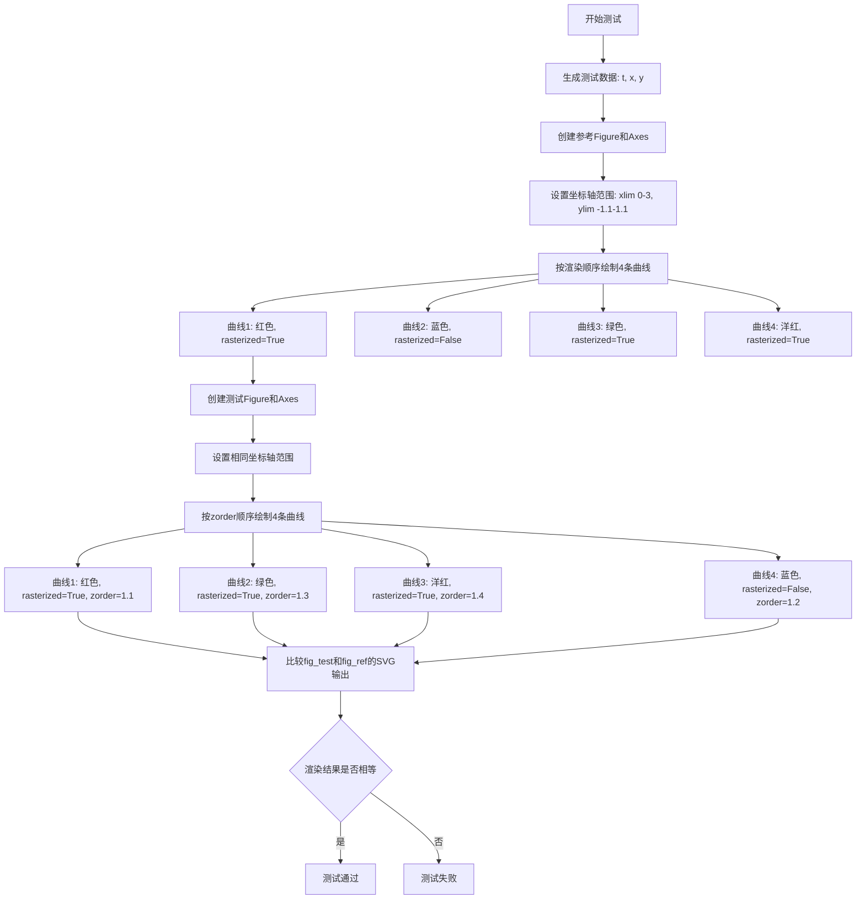

#### 带注释源码

```python
@check_figures_equal(extensions=['svg'])  # 装饰器：比较SVG格式的输出图像，容差为默认tol=0
def test_rasterized_ordering(fig_test, fig_ref):
    """
    测试SVG中光栅化元素的绘制顺序是否正确。
    
    验证当使用zorder参数控制绘图顺序时，光栅化（rasterized）和
    非光栅化（path）元素能够按照正确的堆叠顺序渲染。
    """
    # 生成测试数据：参数t从0到100*2.3，步长为2.3
    t = np.arange(0, 100) * (2.3)
    # 计算对应的cos和sin坐标
    x = np.cos(t)
    y = np.sin(t)

    # ============ 创建参考图像（按实际渲染顺序绘制）============
    ax_ref = fig_ref.subplots()  # 创建参考图的Axes
    ax_ref.set_xlim(0, 3)        # 设置x轴范围
    ax_ref.set_ylim(-1.1, 1.1)   # 设置y轴范围
    
    # 按实际绘制顺序添加曲线（这个顺序决定了渲染顺序）
    ax_ref.plot(x, y, "-", c="r", lw=10, rasterized=True)    # 曲线1: 红色，光栅化
    ax_ref.plot(x+1, y, "-", c="b", lw=10, rasterized=False) # 曲线2: 蓝色，非光栅化
    ax_ref.plot(x+2, y, "-", c="g", lw=10, rasterized=True)  # 曲线3: 绿色，光栅化
    ax_ref.plot(x+3, y, "-", c="m", lw=10, rasterized=True)  # 曲线4: 洋红，光栅化

    # ============ 创建测试图像（通过zorder控制顺序）============
    ax_test = fig_test.subplots()  # 创建测试图的Axes
    ax_test.set_xlim(0, 3)          # 设置相同的x轴范围
    ax_test.set_ylim(-1.1, 1.1)     # 设置相同的y轴范围
    
    # 按zorder顺序绘制曲线（与参考图的渲染顺序一致）
    ax_test.plot(x, y, "-", c="r", lw=10, rasterized=True, zorder=1.1)    # 曲线1: 红色，光栅化，zorder=1.1
    ax_test.plot(x+2, y, "-", c="g", lw=10, rasterized=True, zorder=1.3)  # 曲线2: 绿色，光栅化，zorder=1.3
    ax_test.plot(x+3, y, "-", c="m", lw=10, rasterized=True, zorder=1.4)  # 曲线3: 洋红，光栅化，zorder=1.4
    ax_test.plot(x+1, y, "-", c="b", lw=10, rasterized=False, zorder=1.2) # 曲线4: 蓝色，非光栅化，zorder=1.2
    
    # 注释：测试图的绘制顺序不同，但通过zorder控制渲染顺序
    # 预期渲染结果（从下到上）：红色(1.1) → 蓝色(1.2) → 绿色(1.3) → 洋红(1.4)
    # 这与参考图的渲染顺序完全一致
```


### `test_prevent_rasterization`

该测试函数用于验证当图表中的线条被栅格化（rasterized=True）时，AnnotationBbox（注解框）对象不会被栅格化，而是保持为矢量图形。测试通过比较参考图像（未栅格化）和测试图像（部分栅格化）的SVG输出来确保AnnotationBbox的正确渲染。

参数：

- `fig_test`：`Figure`，测试用的Figure对象，将其中的plot设置为rasterized=True
- `fig_ref`：`Figure`，参考用的Figure对象，其中的plot保持默认的rasterized=False

返回值：`None`，该函数为测试函数，通过装饰器 `@check_figures_equal` 进行图像比较验证

#### 流程图

```mermaid
flowchart TD
    A[开始测试 test_prevent_rasterization] --> B[定义位置 loc = [0.05, 0.05]]
    B --> C[创建参考Axes: fig_ref.subplots]
    C --> D[在参考Axes上绘制点: plot marker=x, zorder=2]
    D --> E[创建TextArea和AnnotationBbox]
    E --> F[将AnnotationBbox添加到参考Axes]
    F --> G[创建测试Axes: fig_test.subplots]
    G --> H[在测试Axes上绘制点: plot marker=x, rasterized=True, zorder=2]
    H --> I[创建TextArea和AnnotationBbox]
    I --> J[将AnnotationBbox添加到测试Axes]
    J --> K[通过 @check_figures_equal 比较两张图]
    K --> L[结束测试]
```

#### 带注释源码

```python
@check_figures_equal(tol=5, extensions=['svg', 'pdf'])
def test_prevent_rasterization(fig_test, fig_ref):
    """
    测试函数：验证AnnotationBbox在图表被栅格化时不被栅格化
    
    该测试用于确保即使plot元素被设置为rasterized=True，
    AnnotationBbox等重要注解元素仍然保持矢量图形格式输出
    """
    # 定义标记位置坐标
    loc = [0.05, 0.05]

    # === 创建参考图像 (非栅格化) ===
    ax_ref = fig_ref.subplots()  # 创建参考图的Axes

    # 绘制标记点 (默认rasterized=False，保持矢量)
    ax_ref.plot([loc[0]], [loc[1]], marker="x", c="black", zorder=2)

    # 创建注解框 (TextArea + AnnotationBbox)
    b = mpl.offsetbox.TextArea("X")  # 创建文本区域，内容为"X"
    abox = mpl.offsetbox.AnnotationBbox(b, loc, zorder=2.1)  # 创建注解框
    ax_ref.add_artist(abox)  # 将注解框添加到图表

    # === 创建测试图像 (部分栅格化) ===
    ax_test = fig_test.subplots()  # 创建测试图的Axes

    # 绘制标记点 (设置rasterized=True，期望被栅格化)
    ax_test.plot([loc[0]], [loc[1]], marker="x", c="black", zorder=2,
                 rasterized=True)

    # 创建注解框 (应该保持矢量，不受rasterized影响)
    b = mpl.offsetbox.TextArea("X")  # 创建文本区域
    abox = mpl.offsetbox.AnnotationBbox(b, loc, zorder=2.1)  # 创建注解框
    ax_test.add_artist(abox)  # 将注解框添加到图表
    
    # 注意：@check_figures_equal 装饰器会自动比较fig_test和fig_ref的输出
    # 验证两者在SVG/PDF格式下视觉一致，确保AnnotationBbox未被栅格化
```


### `test_count_bitmaps`

该函数是一个测试函数，用于验证SVG后端在处理光栅化（rasterized）元素时的行为。它通过保存Figure到SVG格式并统计其中`<image>`和`<path>`标签的数量，来验证不同光栅化配置下SVG渲染的正确性，包括：无光栅化、可合并光栅化、不可合并光栅化、整个坐标轴光栅化以及抑制合并等场景。

参数： 无

返回值： 无（该函数为测试函数，使用assert语句进行断言验证）

#### 流程图

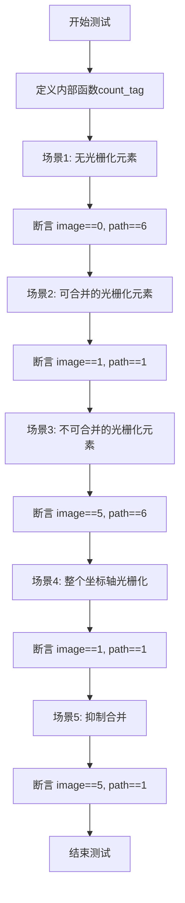

#### 带注释源码

```python
def test_count_bitmaps():
    # 内部函数：统计SVG中指定标签的出现次数
    def count_tag(fig, tag):
        # 创建内存缓冲区用于保存SVG
        with BytesIO() as fd:
            # 将图形保存为SVG格式
            fig.savefig(fd, format='svg')
            # 获取SVG内容并解码为字符串
            buf = fd.getvalue().decode()
        # 返回指定标签在SVG中出现的次数
        return buf.count(f"<{tag}")

    # 场景1: 无光栅化元素
    # 预期: 无<image>标签, 有6个<path>标签(坐标轴patch + 5条线)
    fig1 = plt.figure()
    ax1 = fig1.add_subplot(1, 1, 1)
    ax1.set_axis_off()
    for n in range(5):
        ax1.plot([0, 20], [0, n], "b-", rasterized=False)
    assert count_tag(fig1, "image") == 0
    assert count_tag(fig1, "path") == 6  # axis patch plus lines

    # 场景2: 多个可合并的光栅化元素
    # 预期: 只有1个<image>标签(所有线被合并), 1个<path>标签(坐标轴patch)
    fig2 = plt.figure()
    ax2 = fig2.add_subplot(1, 1, 1)
    ax2.set_axis_off()
    for n in range(5):
        ax2.plot([0, 20], [0, n], "b-", rasterized=True)
    assert count_tag(fig2, "image") == 1
    assert count_tag(fig2, "path") == 1  # axis patch

    # 场景3: 不可合并的光栅化元素(影响绘制顺序)
    # 预期: 5个<image>标签(每个光栅化线单独一个), 6个<path>标签
    fig3 = plt.figure()
    ax3 = fig3.add_subplot(1, 1, 1)
    ax3.set_axis_off()
    for n in range(5):
        ax3.plot([0, 20], [n, 0], "b-", rasterized=False)
        ax3.plot([0, 20], [0, n], "b-", rasterized=True)
    assert count_tag(fig3, "image") == 5
    assert count_tag(fig3, "path") == 6

    # 场景4: 整个坐标轴光栅化
    # 预期: 1个<image>标签, 1个<path>标签(所有内容被合并)
    fig4 = plt.figure()
    ax4 = fig4.add_subplot(1, 1, 1)
    ax4.set_axis_off()
    ax4.set_rasterized(True)
    for n in range(5):
        ax4.plot([0, 20], [n, 0], "b-", rasterized=False)
        ax4.plot([0, 20], [0, n], "b-", rasterized=True)
    assert count_tag(fig4, "image") == 1
    assert count_tag(fig4, "path") == 1

    # 场景5: 可合并但被suppressComposite抑制
    # 预期: 5个<image>标签(无法合并), 1个<path>标签
    fig5 = plt.figure()
    fig5.suppressComposite = True
    ax5 = fig5.add_subplot(1, 1, 1)
    ax5.set_axis_off()
    for n in range(5):
        ax5.plot([0, 20], [0, n], "b-", rasterized=True)
    assert count_tag(fig5, "image") == 5
    assert count_tag(fig5, "path") == 1  # axis patch
```


### `test_unicode_won`

该测试函数用于验证matplotlib在导出SVG时能否正确处理LaTeX的`\textwon`字符（Unicode字符"ŵ"），确保SVG输出中包含正确的字体路径定义和引用。

参数：此函数无参数。

返回值：`None`，该函数通过断言验证SVG内容的正确性，不返回任何值。

#### 流程图

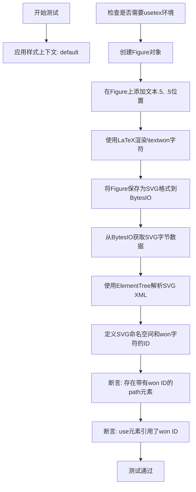

#### 带注释源码

```python
@mpl.style.context('default')  # 应用matplotlib的默认样式上下文
@needs_usetex  # 装饰器：标记该测试需要usetex环境
def test_unicode_won():
    # 创建Figure对象，用于绘制图形
    fig = Figure()
    
    # 在Figure的(.5, .5)位置添加文本，使用LaTeX渲染\textwon命令
    # usetex=True表示使用LaTeX引擎渲染文本
    fig.text(.5, .5, r'\textwon', usetex=True)

    # 使用BytesIO作为内存缓冲区保存SVG文件
    with BytesIO() as fd:
        # 将Figure保存为SVG格式到fd缓冲区
        fig.savefig(fd, format='svg')
        # 获取缓冲区中的字节数据
        buf = fd.getvalue()

    # 使用ElementTree解析SVG字节数据为XML树
    tree = xml.etree.ElementTree.fromstring(buf)
    
    # 定义SVG的XML命名空间
    ns = 'http://www.w3.org/2000/svg'
    
    # 定义要查找的won字符的特定ID（来自Computer Modern Sans Serif字体）
    won_id = 'SFSS1728-8e'
    
    # 断言1: 确保SVG中存在一个带有d属性和指定won_id的path元素
    # 这验证了LaTeX渲染的won字符被正确转换为SVG路径
    assert len(tree.findall(f'.//{{{ns}}}path[@d][@id="{won_id}"]')) == 1
    
    # 断言2: 确保SVG中存在use元素引用了won字符的ID
    # 这验证了won字符在SVG中被正确引用
    assert f'#{won_id}' in tree.find(f'.//{{{ns}}}use').attrib.values()
```


### `test_svgnone_with_data_coordinates`

该测试函数用于验证当 matplotlib 的 SVG 后端配置 `svg.fonttype` 为 `'none'`（即不将文本转换为路径）且使用数据坐标（datetime64 类型）时，生成的 SVG 输出能够正确包含文本内容和字体拉伸属性。

参数： 无

返回值： `None`，该函数为测试函数，无返回值，主要通过 assert 语句进行断言验证

#### 流程图

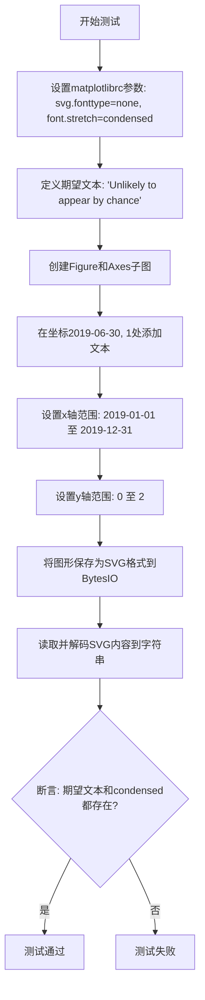

#### 带注释源码

```python
def test_svgnone_with_data_coordinates():
    """
    测试 SVG 输出在使用数据坐标（datetime64）和 fonttype='none' 时
    能否正确包含文本内容和字体拉伸属性。
    """
    # 设置 matplotlib rcParams：SVG 字体类型为 'none'（不转换为路径），
    # 字体拉伸为 'condensed'
    plt.rcParams.update({'svg.fonttype': 'none', 'font.stretch': 'condensed'})
    
    # 期望在 SVG 中出现的文本内容
    expected = 'Unlikely to appear by chance'

    # 创建图形和坐标轴
    fig, ax = plt.subplots()
    
    # 在指定数据坐标位置添加文本（使用 datetime64 类型坐标）
    # x坐标: 2019-06-30, y坐标: 1
    ax.text(np.datetime64('2019-06-30'), 1, expected)
    
    # 设置坐标轴的数据范围（使用 datetime64 类型）
    ax.set_xlim(np.datetime64('2019-01-01'), np.datetime64('2019-12-31'))
    ax.set_ylim(0, 2)

    # 将图形保存为 SVG 格式到内存缓冲区
    with BytesIO() as fd:
        fig.savefig(fd, format='svg')
        fd.seek(0)
        buf = fd.read().decode()

    # 断言验证：
    # 1. 期望的文本内容出现在 SVG 输出中
    # 2. 字体拉伸属性 'condensed' 出现在 SVG 输出中
    assert expected in buf and "condensed" in buf
```


### `test_gid`

该函数用于测试 Matplotlib 中对象的 `gid`（图形标识符）属性是否能够正确出现在输出的 SVG 文件中。它通过创建包含多种图形元素（图像、散点、线条、坐标轴等）的 Figure，赋予可见对象唯一的 GID，将图像保存为 SVG 格式，然后验证这些 GID 是否存在于 SVG 缓冲区中。

参数：
- 无

返回值：`None`，该函数不返回任何值，主要通过内部的断言来验证功能正确性。

#### 流程图

```mermaid
graph TD
    A([开始 test_gid]) --> B[创建 Figure 和 3 个子图]
    B --> C[向子图添加各类艺术家对象<br>如图像、散点、线条、图例等]
    C --> D[执行 fig.canvas.draw]
    D --> E[遍历 Figure 中的所有对象]
    E --> F{对象是否可见?}
    F -- 否 --> G[跳过]
    F -- 是 --> H[生成唯一 GID: test123{ClassName}_{Idx}]
    H --> I[在对象上设置 GID 并存入字典]
    I --> E
    E --> J[将图像保存为 SVG 格式到 BytesIO 缓冲区]
    J --> K[定义辅助函数 include<br>用于过滤不应出现在 SVG 中的对象]
    K --> L[遍历存储 GID 的字典]
    L --> M{include 函数判定}
    M -- False --> N[跳过]
    M -- True --> O[断言: GID 必须存在于 SVG 缓冲区中]
    O --> P([结束测试])
    N --> P
```

#### 带注释源码

```python
def test_gid():
    """Test that object gid appears in output svg."""
    # 导入必要的模块（在测试函数内部或文件顶部导入）
    from matplotlib.offsetbox import OffsetBox
    from matplotlib.axis import Tick

    # 1. 创建图表和子图
    fig = plt.figure()

    # 子图1: 2D 坐标轴，包含图像、散点、线条、图例、双Y轴
    ax1 = fig.add_subplot(131)
    ax1.imshow([[1., 2.], [2., 3.]], aspect="auto")
    ax1.scatter([1, 2, 3], [1, 2, 3], label="myscatter")
    ax1.plot([2, 3, 1], label="myplot")
    ax1.legend()
    ax1a = ax1.twinx()
    ax1a.bar([1, 2, 3], [1, 2, 3])

    # 子图2: 极坐标
    ax2 = fig.add_subplot(132, projection="polar")
    ax2.plot([0, 1.5, 3], [1, 2, 3])

    # 子图3: 3D 坐标轴
    ax3 = fig.add_subplot(133, projection="3d")
    ax3.plot([1, 2], [1, 2], [1, 2])

    # 2. 强制绘制画布，确保所有对象已生成
    fig.canvas.draw()

    # 3. 遍历所有对象，为可见对象分配 GID
    gdic = {}
    for idx, obj in enumerate(fig.findobj(include_self=True)):
        if obj.get_visible():
            # 生成唯一的 ID 字符串
            gid = f"test123{obj.__class__.__name__}_{idx}"
            gdic[gid] = obj
            obj.set_gid(gid)

    # 4. 将图表保存为 SVG 格式到内存缓冲区
    with BytesIO() as fd:
        fig.savefig(fd, format='svg')
        buf = fd.getvalue().decode()

    # 5. 定义过滤函数，用于排除不会渲染到 SVG 的对象
    def include(gid, obj):
        # 排除 OffsetBox (如 AnnotationBbox)
        if isinstance(obj, OffsetBox):
            return False
        # 排除空文本或无坐标轴的文本
        if isinstance(obj, Text):
            if obj.get_text() == "":
                return False
            elif obj.axes is None:
                return False
        # 排除单点线或无线条属性的对象
        if isinstance(obj, plt.Line2D):
            xdata, ydata = obj.get_data()
            if len(xdata) == len(ydata) == 1:
                return False
            elif not hasattr(obj, "axes") or obj.axes is None:
                return False
        # 排除 Tick 位置无效的情况
        if isinstance(obj, Tick):
            loc = obj.get_loc()
            if loc == 0:
                return False
            vi = obj.get_view_interval()
            if loc < min(vi) or loc > max(vi):
                return False
        return True

    # 6. 验证 GID 是否出现在 SVG 缓冲区中
    for gid, obj in gdic.items():
        if include(gid, obj):
            assert gid in buf
```


### `test_clip_path_ids_reuse`

该测试函数用于验证在SVG输出中，当同一个clip_path对象被多个图像（imshow）重复使用时，生成的clipPath元素ID保持唯一性，并且相同的clip_path对象不会重复生成多个clipPath元素。

参数： 无

返回值：`None`，该函数为测试函数，不返回任何值，主要通过断言进行验证

#### 流程图

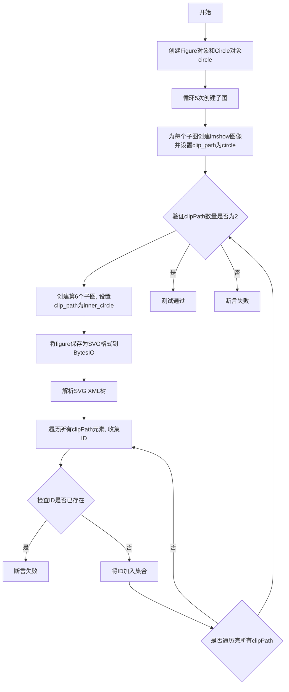

#### 带注释源码

```python
def test_clip_path_ids_reuse():
    """
    测试SVG输出中clip_path的ID复用问题
    
    验证当同一个clip_path对象被多个图像使用时:
    1. 生成的clipPath元素ID保持唯一性
    2. 相同的clip_path对象不会重复生成多个clipPath元素
    """
    
    # 创建Figure对象和一个圆形裁剪路径对象
    fig, circle = Figure(), Circle((0, 0), radius=10)
    
    # 循环创建5个子图,每个子图添加一个图像并应用相同的clip_path
    # 验证: 虽然使用了5次circle对象,但应该只生成1个clipPath
    for i in range(5):
        ax = fig.add_subplot()
        aimg = ax.imshow([[i]])
        aimg.set_clip_path(circle)

    # 创建另一个不同半径的圆形裁剪路径
    inner_circle = Circle((0, 0), radius=1)
    
    # 创建第6个子图,使用不同的clip_path
    ax = fig.add_subplot()
    aimg = ax.imshow([[0]])
    aimg.set_clip_path(inner_circle)

    # 将figure保存为SVG格式
    with BytesIO() as fd:
        fig.savefig(fd, format='svg')
        buf = fd.getvalue()

    # 解析SVG XML树
    tree = xml.etree.ElementTree.fromstring(buf)
    ns = 'http://www.w3.org/2000/svg'

    # 收集所有clipPath的ID,验证ID唯一性
    clip_path_ids = set()
    for node in tree.findall(f'.//{{{ns}}}clipPath[@id]'):
        node_id = node.attrib['id']
        # 断言: 每个clipPath的ID应该是唯一的,不应该重复出现
        assert node_id not in clip_path_ids
        clip_path_ids.add(node_id)
    
    # 断言: 尽管circle对象被使用了5次,inner_circle使用了1次
    # 但由于clip_path对象相同,SVG中应该只有2个clipPath元素
    assert len(clip_path_ids) == 2
```


### test_savefig_tight

该函数用于测试 matplotlib 在使用 `bbox_inches="tight"` 参数保存 SVGZ 格式图像时，"draw-disabled" 渲染器是否正确禁用 open/close_group 操作。

参数： 无

返回值： `None`，无返回值

#### 流程图

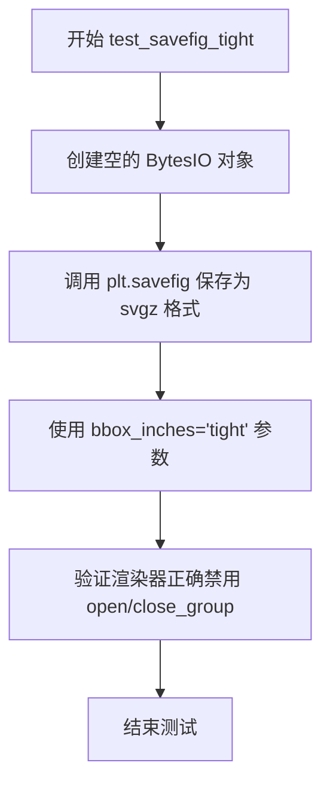

#### 带注释源码

```python
def test_savefig_tight():
    # Check that the draw-disabled renderer correctly disables open/close_group
    # as well.
    # 创建一个内存缓冲区用于保存图像数据，不写入磁盘
    plt.savefig(BytesIO(), format="svgz", bbox_inches="tight")
    # format="svgz": 使用 SVGZ 压缩格式输出
    # bbox_inches="tight": 裁剪图像至紧凑边界，排除多余的空白区域
    # 此测试验证在 tight bbox 模式下，渲染器的 group 操作被正确禁用
```


### `test_url`

该函数用于测试 SVG 输出中对象 URL 是否正确出现。它创建包含散点图和折线图的图形，设置不同类型对象（集合、Line2D、仅标记的 Line2D）的 URL，然后验证生成的 SVG 文件中是否包含这些 URL。

参数：

- 无参数

返回值：`None`，该函数为测试函数，使用断言验证结果，不返回任何值。

#### 流程图

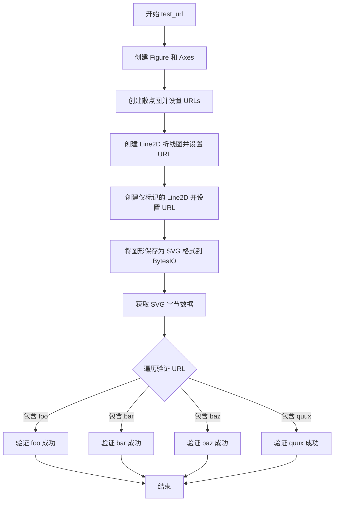

#### 带注释源码

```python
def test_url():
    # Test that object url appears in output svg.
    # 测试函数：验证 SVG 输出中对象的 URL 是否正确出现

    # 创建一个新的图形和一个 Axes 对象
    fig, ax = plt.subplots()

    # 创建散点图并设置 URLs
    # collections - 为散点图中的每个点设置不同的 URL
    s = ax.scatter([1, 2, 3], [4, 5, 6])
    s.set_urls(['https://example.com/foo', 'https://example.com/bar', None])

    # Line2D - 为普通折线设置 URL
    p, = plt.plot([2, 3, 4], [4, 5, 6])
    p.set_url('https://example.com/baz')

    # Line2D markers-only - 为仅包含标记的折线设置 URL
    # 使用 linestyle='none' 和 marker='x' 创建只有标记的线条
    p, = plt.plot([3, 4, 5], [4, 5, 6], linestyle='none', marker='x')
    p.set_url('https://example.com/quux')

    # 将图形保存为 SVG 格式到 BytesIO 对象
    b = BytesIO()
    fig.savefig(b, format='svg')
    b = b.getvalue()  # 获取字节数据

    # 验证所有预期的 URL 都出现在 SVG 输出中
    for v in [b'foo', b'bar', b'baz', b'quux']:
        assert b'https://example.com/' + v in b
```


### `test_url_tick`

验证matplotlib生成的SVG输出中，坐标轴刻度标签的URL是否正确设置。

参数：

- `monkeypatch`：`pytest.fixture`，用于临时修改环境变量的fixture

返回值：`None`，无返回值（测试函数）

#### 流程图

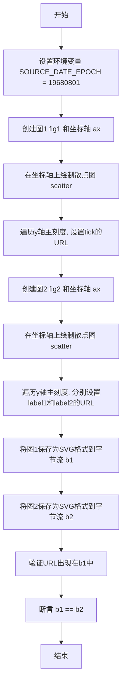

#### 带注释源码

```python
def test_url_tick(monkeypatch):
    """
    测试SVG输出中tick标签的URL是否正确设置。
    比较两种设置URL的方式（通过tick或label）生成的SVG是否一致。
    """
    # 使用monkeypatch设置环境变量，用于控制SVG中的时间戳
    monkeypatch.setenv('SOURCE_DATE_EPOCH', '19680801')

    # 创建第一个图形，使用set_url方法直接设置tick的URL
    fig1, ax = plt.subplots()
    ax.scatter([1, 2, 3], [4, 5, 6])  # 绘制散点图
    for i, tick in enumerate(ax.yaxis.get_major_ticks()):
        # 为每个y轴主刻度设置URL
        tick.set_url(f'https://example.com/{i}')

    # 创建第二个图形，使用label1和label2设置URL
    fig2, ax = plt.subplots()
    ax.scatter([1, 2, 3], [4, 5, 6])  # 绘制散点图
    for i, tick in enumerate(ax.yaxis.get_major_ticks()):
        # 分别为label1和label2设置相同的URL
        tick.label1.set_url(f'https://example.com/{i}')
        tick.label2.set_url(f'https://example.com/{i}')

    # 将图1保存为SVG格式
    b1 = BytesIO()
    fig1.savefig(b1, format='svg')
    b1 = b1.getvalue()

    # 将图2保存为SVG格式
    b2 = BytesIO()
    fig2.savefig(b2, format='svg')
    b2 = b2.getvalue()

    # 验证URL是否正确出现在SVG输出中
    for i in range(len(ax.yaxis.get_major_ticks())):
        # 断言每个URL都存在于图1的SVG中
        assert f'https://example.com/{i}'.encode('ascii') in b1
    
    # 断言两种方式生成的SVG完全相同
    assert b1 == b2
```


### `test_svg_default_metadata`

该测试函数用于验证 SVG 导出时默认元数据（Creator、Date、Format、Type）的正确生成，以及当这些元数据设置为 None 时是否能够正确清除。

参数：

- `monkeypatch`：`pytest.fixture`，用于临时修改环境变量，将 `SOURCE_DATE_EPOCH` 设置为 '19680801' 以确保测试的确定性

返回值：`None`，该函数为测试函数，通过 assert 断言验证 SVG 内容的正确性

#### 流程图

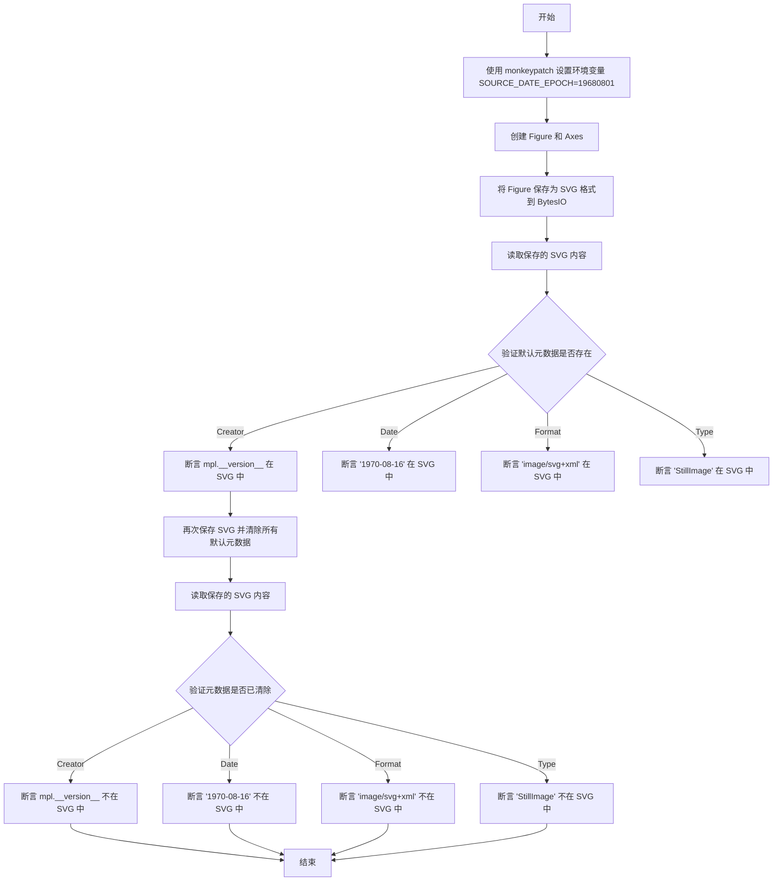

#### 带注释源码

```python
def test_svg_default_metadata(monkeypatch):
    # 使用 monkeypatch 设置环境变量 SOURCE_DATE_EPOCH 为 '19680801'
    # 这样可以确保测试过程中日期相关的元数据是确定的
    monkeypatch.setenv('SOURCE_DATE_EPOCH', '19680801')

    # 创建一个 Figure 和一个子图 Axes
    fig, ax = plt.subplots()
    
    # 将 Figure 保存为 SVG 格式到 BytesIO 内存缓冲区
    with BytesIO() as fd:
        fig.savefig(fd, format='svg')
        # 获取保存的 SVG 内容并解码为字符串
        buf = fd.getvalue().decode()

    # 验证 Creator 元数据：应该包含 matplotlib 的版本号
    assert mpl.__version__ in buf
    # 验证 Date 元数据：应该包含从 SOURCE_DATE_EPOCH 转换的日期 1970-08-16
    assert '1970-08-16' in buf
    # 验证 Format 元数据：SVG 格式应该是 image/svg+xml
    assert 'image/svg+xml' in buf
    # 验证 Type 元数据：类型应该是 StillImage
    assert 'StillImage' in buf

    # 现在测试清除所有默认元数据的功能
    # 将所有默认元数据设置为 None 来清除它们
    with BytesIO() as fd:
        fig.savefig(fd, format='svg', metadata={'Date': None, 'Creator': None,
                                                'Format': None, 'Type': None})
        buf = fd.getvalue().decode()

    # 验证 Creator 元数据已被清除
    assert mpl.__version__ not in buf
    # 验证 Date 元数据已被清除
    assert '1970-08-16' not in buf
    # 验证 Format 元数据已被清除
    assert 'image/svg+xml' not in buf
    # 验证 Type 元数据已被清除
    assert 'StillImage' not in buf
```


### `test_svg_clear_default_metadata`

该函数是一个测试函数，用于验证在保存SVG文件时，将默认元数据字段设置为`None`可以正确移除对应的XML标签。

参数：

- `monkeypatch`：pytest的monkeypatch对象，用于修改环境变量

返回值：`None`，该函数为测试函数，通过assert断言验证功能，不返回任何值

#### 流程图

```mermaid
flowchart TD
    A[开始测试] --> B[设置环境变量 SOURCE_DATE_EPOCH=19680801]
    B --> C[定义元数据字典 metadata_contains]
    C --> D[定义SVG命名空间常量]
    D --> E[创建Figure和Axes]
    E --> F[遍历 metadata_contains 中的每个 name]
    F --> G[保存SVG到BytesIO, metadata={name.title(): None}]
    G --> H[解析SVG XML]
    H --> I[查找 Work 节点]
    I --> J{遍历 metadata_contains 中的每个 key}
    J --> K{key == name?}
    K -->|是| L[断言被清除的元数据不存在]
    K -->|否| M[获取元数据节点并验证值存在]
    L --> N{还有更多key?}
    M --> N
    N -->|是| J
    N -->|否| O{还有更多name?}
    O -->|是| F
    O -->|否| P[测试结束]
```

#### 带注释源码

```python
def test_svg_clear_default_metadata(monkeypatch):
    # Makes sure that setting a default metadata to `None`
    # removes the corresponding tag from the metadata.
    # 使用 monkeypatch 设置环境变量 SOURCE_DATE_EPOCH
    # 这样可以确保生成的日期是固定的 '1970-08-16'
    monkeypatch.setenv('SOURCE_DATE_EPOCH', '19680801')

    # 定义预期存在于SVG元数据中的键值对
    metadata_contains = {'creator': mpl.__version__, 'date': '1970-08-16',
                         'format': 'image/svg+xml', 'type': 'StillImage'}

    # 定义SVG相关的XML命名空间
    SVGNS = '{http://www.w3.org/2000/svg}'
    RDFNS = '{http://www.w3.org/1999/02/22-rdf-syntax-ns#}'
    CCNS = '{http://creativecommons.org/ns#}'
    DCNS = '{http://purl.org/dc/elements/1.1/}'

    # 创建一个包含Axes的Figure对象
    fig, ax = plt.subplots()
    # 遍历每个元数据名称，测试将其设置为None的效果
    for name in metadata_contains:
        # 使用BytesIO作为内存缓冲区保存SVG
        with BytesIO() as fd:
            # 保存为SVG格式，传入metadata参数将对应字段设为None
            fig.savefig(fd, format='svg', metadata={name.title(): None})
            buf = fd.getvalue().decode()

        # 解析SVG字符串为XML树
        root = xml.etree.ElementTree.fromstring(buf)
        # 查找SVG中的Work节点（包含元数据信息）
        work, = root.findall(f'./{SVGNS}metadata/{RDFNS}RDF/{CCNS}Work')
        # 遍历所有元数据键
        for key in metadata_contains:
            # 在Work节点下查找对应的元数据元素
            data = work.findall(f'./{DCNS}{key}')
            if key == name:
                # 当key等于当前测试的name时，该元数据已被清除
                # 断言该元数据不存在
                assert not data
                continue
            # 其他未被清除的元数据应该存在
            # 获取元数据节点
            data, = data
            # 将XML节点转换为字符串
            xmlstr = xml.etree.ElementTree.tostring(data, encoding="unicode")
            # 断言预期的值存在于XML字符串中
            assert metadata_contains[key] in xmlstr
```


### `test_svg_clear_all_metadata`

该函数是一个测试用例，用于验证当将所有默认元数据（Date、Creator、Format、Type）设置为 `None` 时，SVG 输出中不会包含 metadata 标签。

参数：该函数没有参数。

返回值：`None`，该函数执行测试断言，不返回任何值。

#### 流程图

```mermaid
flowchart TD
    A[开始] --> B[创建Figure和Axes子图]
    B --> C[创建BytesIO缓冲区]
    C --> D[保存Figure为SVG格式<br/>metadata设置所有值为None]
    D --> E[获取缓冲区内容并解码为字符串]
    E --> F[使用ElementTree解析SVG XML]
    F --> G[查找./{SVGNS}metadata元素]
    G --> H{是否找到metadata元素?}
    H -->|是| I[断言失败 - 测试不通过]
    H -->|否| J[断言通过 - 测试通过]
    J --> K[结束]
```

#### 带注释源码

```python
def test_svg_clear_all_metadata():
    """
    测试清除所有默认元数据的功能。
    
    验证当将所有默认元数据字段（Date、Creator、Format、Type）
    设置为 None 时，输出的 SVG 文件中不包含 metadata 标签。
    """
    # 创建一个新的Figure对象和一个子图Axes
    fig, ax = plt.subplots()
    
    # 使用 BytesIO 作为内存缓冲区来保存 SVG 数据
    with BytesIO() as fd:
        # 将Figure保存为SVG格式，并设置所有默认元数据为None
        # 这应该导致SVG输出中不包含任何元数据标签
        fig.savefig(fd, format='svg', metadata={'Date': None, 'Creator': None,
                                                'Format': None, 'Type': None})
        # 获取缓冲区中的字节数据并解码为字符串
        buf = fd.getvalue().decode()

    # 定义 SVG 命名空间前缀
    SVGNS = '{http://www.w3.org/2000/svg}'

    # 解析 SVG 字符串为 ElementTree XML 对象
    root = xml.etree.ElementTree.fromstring(buf)
    
    # 断言：验证 SVG 根元素下不存在 metadata 子元素
    # 如果找到任何 metadata 元素，此断言将失败
    assert not root.findall(f'./{SVGNS}metadata')
```


### `test_svg_metadata`

该函数用于测试 SVG 文件输出时的元数据（metadata）功能，验证单值和多值元数据字段是否正确写入到 SVG 文件的 RDF 元数据块中，并确保解析后的值与原始输入一致。

参数： 无

返回值：`None`，该函数为测试函数，通过断言验证元数据内容的正确性，无显式返回值。

#### 流程图

```mermaid
flowchart TD
    A[开始] --> B[定义单值字段列表 single_value]
    B --> C[定义多值字段列表 multi_value]
    C --> D[构建 metadata 字典]
    D --> E[创建 Figure 对象]
    E --> F[使用 BytesIO 保存为 SVG 格式]
    F --> G[解析 SVG 内容为 XML 树]
    G --> H[提取 RDF 节点]
    H --> I[验证 title 和 type 字段]
    I --> J[遍历验证 Description 和 single_value 字段]
    J --> K[遍历验证 multi_value 字段]
    K --> L[验证日期字段格式]
    L --> M[验证 Keywords 关键词字段]
    M --> N[结束]
```

#### 带注释源码

```python
def test_svg_metadata():
    # 定义单值元数据字段列表（每个字段只接受单个字符串值）
    single_value = ['Coverage', 'Identifier', 'Language', 'Relation', 'Source',
                    'Title', 'Type']
    
    # 定义多值元数据字段列表（每个字段可接受字符串列表）
    multi_value = ['Contributor', 'Creator', 'Keywords', 'Publisher', 'Rights']
    
    # 构建测试用元数据字典
    metadata = {
        # Date 字段接受日期或日期时间对象列表
        'Date': [datetime.date(1968, 8, 1),
                 datetime.datetime(1968, 8, 2, 1, 2, 3)],
        # Description 为多行文本
        'Description': 'description\ntext',
        # 为单值字段生成测试数据（格式：字段名 + ' foo'）
        **{k: f'{k} foo' for k in single_value},
        # 为多值字段生成测试数据（格式：字段名 + ' bar/baz'）
        **{k: [f'{k} bar', f'{k} baz'] for k in multi_value},
    }

    # 创建 matplotlib 图形对象
    fig = plt.figure()
    
    # 使用 BytesIO 作为内存缓冲区保存 SVG
    with BytesIO() as fd:
        # 将图形保存为 SVG 格式，传入自定义 metadata
        fig.savefig(fd, format='svg', metadata=metadata)
        # 获取缓冲区内容并解码为字符串
        buf = fd.getvalue().decode()

    # 定义 XML 命名空间常量
    SVGNS = '{http://www.w3.org/2000/svg}'        # SVG 命名空间
    RDFNS = '{http://www.w3.org/1999/02/22-rdf-syntax-ns#}'  # RDF 命名空间
    CCNS = '{http://creativecommons.org/ns#}'    # Creative Commons 命名空间
    DCNS = '{http://purl.org/dc/elements/1.1/}'  # Dublin Core 命名空间

    # 解析 SVG 内容为 XML 树
    root = xml.etree.ElementTree.fromstring(buf)
    
    # 查找 RDF 节点（位于 metadata 标签下）
    rdf, = root.findall(f'./{SVGNS}metadata/{RDFNS}RDF')

    # ------- 验证单值条目 -------

    # 验证 title 元素内容
    titles = [node.text for node in root.findall(f'./{SVGNS}title')]
    assert titles == [metadata['Title']]
    
    # 验证 type 元素的 resource 属性
    types = [node.attrib[f'{RDFNS}resource']
             for node in rdf.findall(f'./{CCNS}Work/{DCNS}type')]
    assert types == [metadata['Type']]
    
    # 遍历验证 Description 和各个单值字段
    for k in ['Description', *single_value]:
        if k == 'Type':  # Type 已在上面单独验证，跳过
            continue
        values = [node.text
                  for node in rdf.findall(f'./{CCNS}Work/{DCNS}{k.lower()}')]
        assert values == [metadata[k]]

    # ------- 验证多值条目 -------

    # 遍历验证各个多值字段（除 Keywords 外）
    for k in multi_value:
        if k == 'Keywords':  # Keywords 需要特殊处理，跳过
            continue
        values = [
            node.text
            for node in rdf.findall(
                f'./{CCNS}Work/{DCNS}{k.lower()}/{CCNS}Agent/{DCNS}title')]
        assert values == metadata[k]

    # ------- 验证特殊字段 -------

    # 验证日期字段（多个日期合并为一个范围字符串）
    dates = [node.text for node in rdf.findall(f'./{CCNS}Work/{DCNS}date')]
    assert dates == ['1968-08-01/1968-08-02T01:02:03']

    # 验证 Keywords 关键词字段（存储在 RDF Bag 中）
    values = [node.text for node in
              rdf.findall(f'./{CCNS}Work/{DCNS}subject/{RDFNS}Bag/{RDFNS}li')]
    assert values == metadata['Keywords']
```


### `test_multi_font_type3`

该函数是一个图像对比测试，用于验证 matplotlib 在生成 SVG 时能够正确处理多字体文本。它通过将 SVG 字体类型设置为 'path' 来测试字体路径渲染功能。

参数：无

返回值：`None`，无返回值（测试函数）

#### 流程图

```mermaid
flowchart TD
    A[开始 test_multi_font_type3] --> B[调用 _gen_multi_font_text 获取字体和测试字符串]
    B --> C[设置 matplotlib rc 参数: font family 和 size=16]
    C --> D[设置 SVG fonttype 为 'path']
    D --> E[创建新 Figure 对象]
    E --> F[在 Figure 中心位置添加文本]
    F --> G[@image_comparison 装饰器保存图像用于对比]
    G --> H[结束]
```

#### 带注释源码

```python
@image_comparison(["multi_font_aspath.svg"])  # 装饰器：比对生成的SVG图像与预期图像
def test_multi_font_type3():
    """
    测试函数：验证多字体文本在 SVG 路径渲染模式下的输出
    
    该测试通过以下步骤验证 matplotlib 的 SVG 多字体支持：
    1. 生成包含多种字体的测试文本
    2. 配置 matplotlib 使用这些字体
    3. 设置 SVG 渲染模式为路径模式（fonttype='path'）
    4. 在 Figure 上渲染文本并保存为 SVG
    """
    
    # 调用测试工具函数获取多字体测试数据
    # 返回值: fonts - 字体族列表, test_str - 包含多字体的测试字符串
    fonts, test_str = _gen_multi_font_text()
    
    # 设置 matplotlib 的全局 rc 参数
    # font.family: 指定使用的字体族（可以是多个备选字体）
    # font.size: 设置字体大小为 16 磅
    plt.rc('font', family=fonts, size=16)
    
    # 设置 SVG 输出的字体渲染方式
    # 'path' 模式：将文本转换为 SVG 路径（矢量图形）
    # 这样可以确保字体在不同系统上一致显示，但文件体积较大
    plt.rc('svg', fonttype='path')
    
    # 创建新的 Figure 画布
    fig = plt.figure()
    
    # 在画布中心 (0.5, 0.5) 添加文本
    # horizontalalignment='center': 水平居中对齐
    # verticalalignment='center': 垂直居中对齐
    fig.text(0.5, 0.5, test_str,
             horizontalalignment='center', verticalalignment='center')
    
    # 函数结束，@image_comparison 装饰器会自动保存生成的 SVG
    # 并与基准图像进行像素对比（容差为默认 tol 值）
```


### `test_multi_font_type42`

这是一个测试函数，用于验证在 SVG 输出中使用 'none' 字体类型时，多字体文本（包含多个不同字体家族的文本）能够正确渲染。

参数：此函数没有参数。

返回值：`None`，无返回值（测试函数）。

#### 流程图

```mermaid
flowchart TD
    A[开始执行 test_multi_font_type42] --> B[调用 _gen_multi_font_text 获取字体和测试字符串]
    B --> C[设置 matplotlib rc 参数: font.family 和 font.size]
    C --> D[设置 matplotlib rc 参数: svg.fonttype 为 'none']
    D --> E[创建新 Figure 对象]
    E --> F[在 figure 中央 (0.5, 0.5) 位置添加文本]
    F --> G[使用 @image_comparison 装饰器比较 SVG 输出]
    G --> H[结束]
```

#### 带注释源码

```python
@image_comparison(["multi_font_astext.svg"])  # 装饰器：比较生成的 SVG 图像与基准图像
def test_multi_font_type42():
    """
    测试多字体文本在 SVG 输出中使用 'none' 字体类型时的渲染效果。
    'none' 字体类型表示将文本输出为实际文本而非路径。
    """
    # 调用测试辅助函数获取多字体测试数据和测试字符串
    fonts, test_str = _gen_multi_font_text()
    
    # 设置 matplotlib 的字体配置：使用多字体家族，字号 16
    plt.rc('font', family=fonts, size=16)
    
    # 设置 SVG 输出使用 'none' 字体类型（输出实际文本而非路径）
    plt.rc('svg', fonttype='none')

    # 创建一个新的 Figure 对象
    fig = plt.figure()
    
    # 在 figure 的中心位置 (0.5, 0.5) 添加文本
    # 文本水平 和垂直居中对齐
    fig.text(0.5, 0.5, test_str,
             horizontalalignment='center', verticalalignment='center')
```


### `test_svg_incorrect_metadata`

该函数用于测试 SVG 导出时元数据验证功能，验证传入无效类型的元数据时是否正确抛出相应的异常（TypeError 或 ValueError）。

参数：

- `metadata`：`dict`，包含错误元数据的字典，用于测试元数据验证
- `error`：`TypeError` 或 `ValueError`，预期抛出的异常类型
- `message`：`str`，预期的错误消息文本

返回值：无（`None`），该函数为测试函数，不返回任何值

#### 流程图

```mermaid
flowchart TD
    A[开始] --> B[接收参数: metadata, error, message]
    B --> C[使用 pytest.raises 捕获异常]
    C --> D[创建 BytesIO 缓冲区]
    D --> E[创建空白 Figure]
    E --> F[调用 fig.savefig 保存为 SVG 格式]
    F --> G{是否抛出预期异常?}
    G -->|是| H[测试通过]
    G -->|否| I[测试失败]
    H --> J[结束]
    I --> J
```

#### 带注释源码

```python
@pytest.mark.parametrize('metadata,error,message', [
    # 测试 Date 字段类型错误 - 期望 str 但传入 int
    ({'Date': 1}, TypeError, "Invalid type for Date metadata. Expected str"),
    # 测试 Date 字段类型错误 - 期望 iterable 但传入 int
    ({'Date': [1]}, TypeError,
     "Invalid type for Date metadata. Expected iterable"),
    # 测试 Keywords 字段类型错误 - 期望 str 但传入 int
    ({'Keywords': 1}, TypeError,
     "Invalid type for Keywords metadata. Expected str"),
    # 测试 Keywords 字段类型错误 - 期望 iterable 但传入 int
    ({'Keywords': [1]}, TypeError,
     "Invalid type for Keywords metadata. Expected iterable"),
    # 测试 Creator 字段类型错误 - 期望 str 但传入 int
    ({'Creator': 1}, TypeError,
     "Invalid type for Creator metadata. Expected str"),
    # 测试 Creator 字段类型错误 - 期望 iterable 但传入 int
    ({'Creator': [1]}, TypeError,
     "Invalid type for Creator metadata. Expected iterable"),
    # 测试 Title 字段类型错误 - 期望 str 但传入 int
    ({'Title': 1}, TypeError,
     "Invalid type for Title metadata. Expected str"),
    # 测试 Format 字段类型错误 - 期望 str 但传入 int
    ({'Format': 1}, TypeError,
     "Invalid type for Format metadata. Expected str"),
    # 测试未知元数据键 - 传入无效的键名
    ({'Foo': 'Bar'}, ValueError, "Unknown metadata key"),
    ])
def test_svg_incorrect_metadata(metadata, error, message):
    # 使用 pytest.raises 上下文管理器验证异常抛出
    with pytest.raises(error, match=message), BytesIO() as fd:
        # 创建空白图表
        fig = plt.figure()
        # 尝试保存为 SVG 格式，传入无效的 metadata
        # 预期会抛出指定类型的异常
        fig.savefig(fd, format='svg', metadata=metadata)
```


### `test_svg_escape`

该函数用于测试 Matplotlib 在生成 SVG 输出时能否正确转义 XML/SVG 特殊字符（如 `<`、`'`、`"`、`&`、`>`），确保这些字符在 SVG 文件中以安全的实体形式存在。

参数： 无

返回值：`None`，该函数为测试函数，通过 assert 语句验证功能，不返回任何值。

#### 流程图

```mermaid
graph TD
    A[开始] --> B[创建Figure对象]
    B --> C[在Figure上添加文本: <'\"&>]
    C --> D[设置gid属性为: <'\"&>]
    D --> E[保存Figure为SVG格式到BytesIO]
    E --> F[读取并解码SVG内容]
    F --> G{检查转义字符 &lt;&apos;&quot;&amp;&gt; 是否存在}
    G -->|是| H[测试通过]
    G -->|否| I[测试失败]
```

#### 带注释源码

```python
def test_svg_escape():
    # 创建一个新的Figure对象
    fig = plt.figure()
    
    # 在Figure中心位置添加文本，内容包含XML/SVG特殊字符
    # 同时设置gid属性为相同的特殊字符，用于测试属性值的转义
    fig.text(0.5, 0.5, "<\'\"&>", gid="<\'\"&>")
    
    # 使用BytesIO作为内存缓冲区保存SVG输出
    with BytesIO() as fd:
        # 将Figure保存为SVG格式
        fig.savefig(fd, format='svg')
        # 获取保存的内容并解码为字符串
        buf = fd.getvalue().decode()
        # 验证特殊字符已被正确转义为XML实体:
        # < 转为 &lt;
        # ' 转为 &apos;
        # " 转为 &quot;
        # & 转为 &amp;
        # > 转为 &gt;
        assert '&lt;&apos;&quot;&amp;&gt;"' in buf
```


### `test_svg_font_string`

该函数是Matplotlib SVG后端的测试函数，用于验证SVG输出中字体字符串的正确处理，包括字体回退机制和去重功能。

参数：

- `font_str`：`str`，字体家族字符串，包含多个字体选项（如 "'DejaVu Sans', 'WenQuanYi Zen Hei', 'Arial', sans-serif"）
- `include_generic`：`bool`，是否在字体列表中包含通用字体家族名称

返回值：`None`，该函数为测试函数，无返回值

#### 流程图

```mermaid
flowchart TD
    A[开始测试] --> B{检查WenQuanYi字体是否存在}
    B -->|不存在| C[跳过测试]
    B -->|存在| D[解析font_str获取explicit rest generic]
    D --> E{include_generic为True?}
    E -->|是| F[将generic加入rest列表]
    E -->|否| G[设置rcParams字体配置]
    G --> H[创建Figure和Axes]
    H --> I{遍历generic_options}
    I -->|第一次| J[使用family=[explicit, generic_name]添加文本]
    I -->|第二次| K[使用family=[explicit, *rest, generic_name]添加文本]
    K --> L[保存为SVG格式]
    L --> M[解析SVG XML]
    M --> N[遍历所有text元素]
    N --> O{验证每个text元素}
    O -->|font-size| P[断言font-size等于size px]
    O -->|font-family| Q[断言font-family等于font_str]
    Q --> R[断言text_count等于ax.texts数量]
    R --> S[测试完成]
```

#### 带注释源码

```python
@pytest.mark.parametrize("font_str", [
    "'DejaVu Sans', 'WenQuanYi Zen Hei', 'Arial', sans-serif",
    "'DejaVu Serif', 'WenQuanYi Zen Hei', 'Times New Roman', serif",
    "'Arial', 'WenQuanYi Zen Hei', cursive",
    "'Impact', 'WenQuanYi Zen Hei', fantasy",
    "'DejaVu Sans Mono', 'WenQuanYi Zen Hei', 'Courier New', monospace",
])
@pytest.mark.parametrize("include_generic", [True, False])
def test_svg_font_string(font_str, include_generic):
    # 创建FontProperties对象来查找特定字体
    fp = fm.FontProperties(family=["WenQuanYi Zen Hei"])
    
    # 检查WenQuanYi字体是否存在，如果不存在则跳过测试
    if Path(fm.findfont(fp)).name != "wqy-zenhei.ttc":
        pytest.skip("Font may be missing")

    # 解析font_str，提取字体名称并去除引号
    # explicit: 第一个显式字体（如'DejaVu Sans'）
    # rest: 中间的回退字体列表
    # generic: 通用字体家族（如sans-serif）
    explicit, *rest, generic = map(
        lambda x: x.strip("'"), font_str.split(", ")
    )
    
    # 使用通用字体名称的长度作为字体大小
    size = len(generic)
    
    # 根据include_generic决定是否将通用字体加入回退列表
    if include_generic:
        rest = rest + [generic]
    
    # 配置matplotlib的字体参数
    # 设置特定字体家族的回退列表
    plt.rcParams[f"font.{generic}"] = rest
    # 设置基础字体大小
    plt.rcParams["font.size"] = size
    # 设置SVG字体类型为none（不转换为路径）
    plt.rcParams["svg.fonttype"] = "none"

    # 创建图形和坐标轴
    fig, ax = plt.subplots()
    
    # 根据通用字体类型选择测试选项
    if generic == "sans-serif":
        generic_options = ["sans", "sans-serif", "sans serif"]
    else:
        generic_options = [generic]

    # 遍历每个通用字体选项进行测试
    for generic_name in generic_options:
        # 测试字体回退机制：使用显式字体+通用字体
        ax.text(0.5, 0.5, "There are 几个汉字 in between!",
                family=[explicit, generic_name], ha="center")
        
        # 测试去重功能：使用显式字体+回退字体+通用字体
        # 如果去重工作正常，font-family应该只显示唯一的字体
        ax.text(0.5, 0.1, "There are 几个汉字 in between!",
                family=[explicit, *rest, generic_name], ha="center")
    
    # 关闭坐标轴显示
    ax.axis("off")

    # 将图形保存为SVG格式到内存缓冲区
    with BytesIO() as fd:
        fig.savefig(fd, format="svg")
        buf = fd.getvalue()

    # 解析SVG XML
    tree = xml.etree.ElementTree.fromstring(buf)
    ns = "http://www.w3.org/2000/svg"
    text_count = 0
    
    # 遍历所有text元素进行验证
    for text_element in tree.findall(f".//{{{ns}}}text"):
        text_count += 1
        # 解析style属性为字典
        font_style = dict(
            map(lambda x: x.strip(), _.strip().split(":"))
            for _ in dict(text_element.items())["style"].split(";")
        )

        # 验证字体大小
        assert font_style["font-size"] == f"{size}px"
        # 验证字体家族（应该正确处理回退和去重）
        assert font_style["font-family"] == font_str
    
    # 验证文本元素数量与添加的文本数量一致
    assert text_count == len(ax.texts)
```


### `test_annotationbbox_gid`

该函数用于测试 Matplotlib 中的 `AnnotationBbox`（注解框）的 `gid`（图形对象标识符）属性是否能够正确地被序列化到输出的 SVG 文件中。

参数：
-  无

返回值：`None`，该函数通过断言（assert）验证 SVG 字符串中是否包含预期的 ID 标签。

#### 流程图

```mermaid
graph TD
    A([开始]) --> B[创建 Figure 和 Axes]
    B --> C[创建模拟图像数据 arr_img]
    C --> D[创建 OffsetImage]
    D --> E[创建 AnnotationBbox]
    E --> F[设置 GID: ab.set_gid]
    F --> G[将 ab 添加到 Axes]
    G --> H[保存图像到 BytesIO: format='svg']
    H --> I[读取并解码 SVG 内容]
    I --> J{断言 GID 存在?}
    J -- 是 --> K([结束])
    J -- 否 --> L([断言失败])
```

#### 带注释源码

```python
def test_annotationbbox_gid():
    # 测试 AnnotationBbox 的 gid (组标识符) 是否出现在输出 svg 中。
    
    # 1. 创建一个图形实例和一个坐标轴
    fig = plt.figure()
    ax = fig.add_subplot()
    
    # 2. 准备一个简单的图像数据 (32x32 像素的全 1 数组)
    arr_img = np.ones((32, 32))
    
    # 3. 定义注解框在数据坐标系中的位置
    xy = (0.3, 0.55)

    # 4. 创建一个 OffsetImage 对象来包装图像数据
    # zoom 参数用于调整图像显示大小
    imagebox = OffsetImage(arr_img, zoom=0.1)
    imagebox.image.axes = ax

    # 5. 创建 AnnotationBbox
    # 参数包括：包含的对象(imagebox)、位置(xy)、相对于位置的偏移(xybox)等
    ab = AnnotationBbox(imagebox, xy,
                        xybox=(120., -80.),  # 偏移量
                        xycoords='data',     # xy 使用的坐标系
                        boxcoords="offset points", # box 使用的坐标系
                        pad=0.5,             # 内边距
                        arrowprops=dict(     # 箭头样式
                            arrowstyle="->",
                            connectionstyle="angle,angleA=0,angleB=90,rad=3")
                        )
    
    # 6. 设置 gid，这是测试的核心：验证此 ID 能否写入 SVG
    ab.set_gid("a test for issue 20044")
    
    # 7. 将注解框添加到坐标轴
    ax.add_artist(ab)

    # 8. 将图形保存为 SVG 格式到内存缓冲区
    with BytesIO() as fd:
        fig.savefig(fd, format='svg')
        # 获取字节流并解码为 UTF-8 字符串以便解析
        buf = fd.getvalue().decode('utf-8')

    # 9. 断言验证：检查 SVG 内容中是否包含设置了 gid 的 <g> 标签
    expected = '<g id="a test for issue 20044">'
    assert expected in buf
```


### `test_svgid`

测试 `svg.id` rcparam（运行时配置参数）是否在输出的 SVG 中出现（当其值不为 None 时）。

参数：

- 无参数

返回值：`None`，该函数为测试函数，使用断言进行验证，不返回任何值。

#### 流程图

```mermaid
flowchart TD
    A[开始] --> B[创建 Figure 和 Axes 对象]
    B --> C[在 Axes 上绘制数据]
    C --> D[调用 fig.canvas.draw]
    D --> E[使用默认 svg.id=None 保存 SVG]
    E --> F[解析 SVG 为 ElementTree]
    F --> G[断言 plt.rcParams['svg.id'] is None]
    G --> H[断言树中无 id 属性]
    H --> I[设置 svg.id 为字符串 'a test for issue 28535']
    I --> J[重新保存 SVG]
    J --> K[重新解析 SVG]
    K --> L[断言 plt.rcParams['svg.id'] == svg_id]
    L --> M[断言树中存在对应 id 属性]
    M --> N[结束]
```

#### 带注释源码

```python
def test_svgid():
    """Test that `svg.id` rcparam appears in output svg if not None."""
    # 创建图形和坐标轴
    fig, ax = plt.subplots()
    # 绘制简单折线数据
    ax.plot([1, 2, 3], [3, 2, 1])
    # 强制渲染画布以确保所有元素已绘制
    fig.canvas.draw()

    # 测试场景1: 默认 svg.id = None
    # 使用 BytesIO 作为内存缓冲区保存 SVG
    with BytesIO() as fd:
        fig.savefig(fd, format='svg')  # 保存为 SVG 格式
        buf = fd.getvalue().decode()   # 获取解码后的 SVG 字符串

    # 解析 SVG 内容为 XML ElementTree
    tree = xml.etree.ElementTree.fromstring(buf)

    # 断言: 默认配置下 svg.id 应为 None
    assert plt.rcParams['svg.id'] is None
    # 断言: SVG 树中不应存在任何 id 属性
    assert not tree.findall('.')

    # 测试场景2: 设置 svg.id 为字符串值
    svg_id = 'a test for issue 28535'
    plt.rc('svg', id=svg_id)  # 设置 SVG 根元素 id

    # 重新保存 SVG
    with BytesIO() as fd:
        fig.savefig(fd, format='svg')
        buf = fd.getvalue().decode()

    tree = xml.etree.ElementTree.fromstring(buf)

    # 断言: 配置已正确设置为指定字符串
    assert plt.rcParams['svg.id'] == svg_id
    # 断言: SVG 树根元素应具有指定的 id 属性
    assert tree.findall(f'.')
```

## 关键组件


### SVG后端测试框架

该代码文件是matplotlib SVG后端的综合测试套件，验证SVG渲染功能的各个方面，包括图形元素、文本、字体、光栅化、metadata和交互属性等。

### 图形可见性测试

test_visibility函数验证errorbar图形元素的可见性设置是否正确影响SVG输出，通过解析生成的SVG XML来确保无效的SVG会抛出ExpatError异常。

### 透明度渲染测试

test_fill_black_with_alpha和test_text_urls测试散点图中alpha透明度的正确渲染以及文本元素中超链接URL属性的嵌入。

### 字体处理机制

包含多个字体相关测试：test_bold_font_output验证粗体字体的SVG输出，test_bold_font_output_with_none_fonttype测试fonttype='none'配置下的字体处理，test_svg_font_string测试字体回退机制的完整流程。

### 光栅化混合渲染

test_rasterized和test_rasterized_ordering验证矢量图中嵌入光栅化元素的行为，test_prevent_rasterization测试特定元素被强制保持矢量格式的机制，test_count_bitmaps统计并验证SVG输出中image和path标签的数量以确保光栅化合并优化正确执行。

### SVG元数据管理

test_svg_default_metadata、test_svg_clear_default_metadata和test_svg_metadata系列测试验证SVG文档元数据的生成、清除和自定义功能，包括Creator、Date、Format、Type等标准Dublin Core元数据字段。

### 对象标识符系统

test_gid、test_annotationbbox_gid和test_svgid测试matplotlib图形对象通过set_gid方法设置的标识符是否正确映射到SVG输出的id属性，以及svg.id rcParam全局标识符的功能。

### 裁剪路径优化

test_clip_path_ids_reuse验证当多个图形元素共享相同裁剪路径时，SVG输出中裁剪路径ID的唯一性和重用优化。

### Unicode文本支持

test_unicode_won使用LaTeX渲染Unicode字符，验证特定Unicode字符（如\textwon）的SVG路径生成和引用是否正确。


## 问题及建议


### 已知问题

- **全局状态修改未恢复**: 多个测试函数修改了 `plt.rcParams` 但未恢复原始值。例如 `test_bold_font_output_with_none_fonttype` 设置 `plt.rcParams['svg.fonttype'] = 'none'`，`test_svgnone_with_data_coordinates` 修改 `plt.rcParams`，`test_svg_font_string` 修改多个字体相关 rcParams，可能影响后续测试
- **测试隔离性问题**: 测试之间共享全局状态（rcParams、matplotlib 状态），可能导致测试顺序依赖，降低测试的可靠性和可维护性
- **代码重复**: 多个测试中使用相同的 `BytesIO()` + `fig.savefig()` 模式，以及 XML 解析逻辑重复出现（如 `xml.etree.ElementTree.fromstring(buf)` 和命名空间定义）
- **内部函数定义**: `count_tag` 函数定义在 `test_count_bitmaps` 内部，虽然合理但可提取为模块级辅助函数以提高复用性
- **硬编码值**: 许多断言使用硬编码值（如 `assert count_tag(fig1, "path") == 6`），使测试脆弱且难以理解
- **字节比较测试**: `test_url_tick` 中使用 `assert b1 == b2` 进行字节级比较，可能因非确定性因素导致偶发失败
- **测试复杂度**: `test_rasterized_ordering` 和 `test_count_bitmaps` 包含复杂逻辑，可读性和可维护性较低

### 优化建议

- **使用 fixture 管理全局状态**: 创建 pytest fixture 自动保存和恢复 rcParams，确保测试隔离
- **提取公共辅助函数**: 将 `BytesIO` 封装、XML 解析、命名空间定义等重复代码提取为模块级函数
- **参数化测试**: 对 `test_svg_font_string` 等参数化测试可进一步扩展，覆盖更多字体组合场景
- **改进断言信息**: 为关键断言添加描述性错误信息，提高调试效率
- **清理测试资源**: 显式关闭 figure 或使用 pytest fixture 自动清理
- **拆分大型测试**: 将 `test_count_bitmaps` 拆分为多个独立测试，每个测试验证单一场景
- **增强错误处理验证**: `test_svg_incorrect_metadata` 的错误测试设计良好，建议在其他测试中推广类型检查和验证模式

## 其它


### 设计目标与约束

本测试文件旨在验证matplotlib库SVG后端的各种渲染功能和输出正确性。测试覆盖SVG生成的多个方面，包括图形元素渲染、文本处理、光栅化混合、元数据输出、字体处理、URL链接、GID属性等。设计约束包括：测试必须在CI环境中可重复执行，需要支持多种matplotlib配置组合，测试用例需要独立运行且无副作用。

### 错误处理与异常设计

测试代码使用pytest的异常捕获机制验证错误输入。`test_svg_incorrect_metadata`函数使用参数化测试验证各类错误元数据类型的处理，包括TypeError（类型错误）和ValueError（值错误）。测试通过`pytest.raises`上下文管理器捕获并验证异常类型和错误消息的正确性。XML解析错误通过`xml.parsers.expat.ParserCreate`在`test_visibility`中捕获验证。

### 数据流与状态机

测试数据流主要涉及Figure对象的创建、配置、渲染到SVG格式的过程。状态转换包括：Figure创建 → Axes添加 → 图形元素绘制 → Canvas渲染 → SVG序列化。测试中的状态机主要体现在：配置状态（rcParams的改变与恢复）、图形元素状态（visibility、rasterized属性）、SVG DOM结构状态。

### 外部依赖与接口契约

主要外部依赖包括：matplotlib核心库（Figure、Axes、pyplot）、numpy数值计算库、xml.etree.ElementTree和xml.parsers.expat用于XML解析验证、pytest测试框架。接口契约体现在：Figure.savefig()方法接受format='svg'参数返回字节流；BytesIO模拟文件对象用于内存操作；SVG输出必须符合W3C SVG规范（验证命名空间、结构有效性）。

### 性能考虑

测试代码中`test_count_bitmaps`等函数通过计数SVG中image和path标签数量来验证光栅化优化效果。`test_rasterized_ordering`验证光栅化元素的zorder处理正确性。性能测试关注点包括：大量图形元素的光栅化合并效率、SVG文件大小控制、渲染顺序正确性。

### 安全性考虑

`test_svg_escape`测试SVG输出中的特殊字符转义处理，确保XML特殊字符（<、'、"、&）被正确转义防止注入问题。测试验证用户提供的gid和文本内容在SVG输出中的安全性。

### 测试策略

采用多种测试策略：图像对比测试（@image_comparison装饰器）验证视觉输出一致性；数值比较测试（@check_figures_equal）比较生成图形；XML结构验证测试解析SVG并检查特定元素和属性；参数化测试（@pytest.mark.parametrize）覆盖多组输入组合；环境模拟测试使用monkeypatch修改环境变量。

### 配置管理

测试涉及多个matplotlib配置项：svg.fonttype（none/path）、font.family、font.size、font.stretch、svg.id、suppressComposite。通过plt.rcParams和mpl.style.context管理配置，确保测试间隔离。部分测试使用@mpl.style.context装饰器确保配置恢复。

### 版本兼容性

`test_unicode_won`使用@needs_usetex装饰器处理LaTeX依赖可选情况。`test_svg_font_string`检测字体可用性，不可用时跳过测试。测试需兼容matplotlib不同版本，通过检查特定API存在性处理版本差异。

### 资源管理

使用BytesIO作为内存缓冲区避免实际文件操作。所有SVG输出通过内存流处理，测试结束后自动释放。测试函数间相互独立，共享资源最小化。

### 并发处理

当前测试文件主要为顺序执行，无并发场景。部分测试使用matplotlib的全局状态（如rcParams），通过配置隔离和恢复确保测试独立性。

### 日志与监控

测试使用pytest的标准输出和断言机制。image_comparison测试失败时自动生成差异图像。XML解析异常会直接raise供调试。

### 可维护性与扩展性

测试代码按功能模块组织（字体测试、元数据测试、光栅化测试等），易于扩展新测试用例。参数化测试模式便于添加更多测试场景。测试函数的docstring提供了清晰的测试目的说明。


    