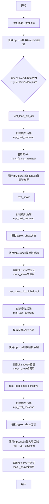
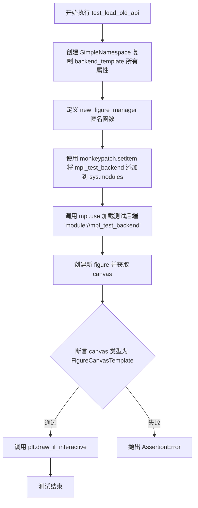
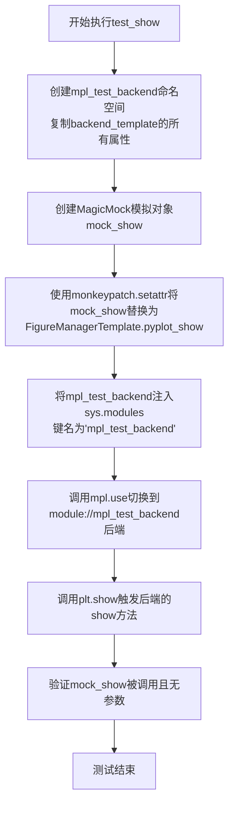
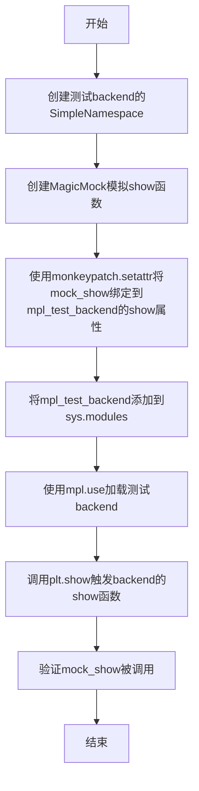
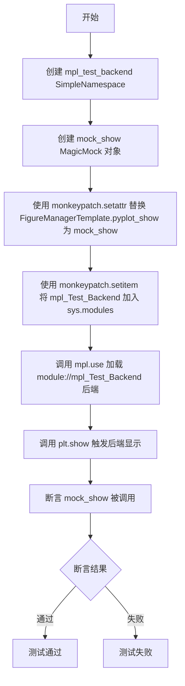
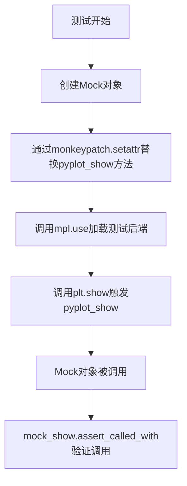

# `matplotlib\lib\matplotlib\tests\test_backend_template.py` 详细设计文档

这是matplotlib后端加载机制的测试文件，用于验证template后端的加载、旧API兼容性、show功能以及大小写敏感性。

## 整体流程



## 类结构

```
测试模块 (无类定义)
├── test_load_template (测试template后端加载)
├── test_load_old_api (测试旧API兼容性)
├── test_show (测试show功能)
├── test_show_old_global_api (测试旧全局API)
└── test_load_case_sensitive (测试大小写敏感性)
```

## 全局变量及字段


### `backend_template`
    
matplotlib后端模板模块，提供FigureCanvasTemplate和FigureManagerTemplate类，用于创建自定义后端的模板

类型：`module`
    


### `mpl_test_backend`
    
基于backend_template模块属性创建的测试后端对象，用于模拟后端加载和测试后端功能

类型：`SimpleNamespace`
    


### `mock_show`
    
用于模拟后端show方法的Mock对象，用于测试后端的显示调用逻辑

类型：`MagicMock`
    


    

## 全局函数及方法


### `test_load_template`

该函数用于测试 Matplotlib 是否能够正确加载 "template" 后端，并验证通过该后端创建的 Figure 对象的 Canvas 类型是否为 `FigureCanvasTemplate`。

参数：

- 该函数没有参数

返回值：`None`，该函数为测试函数，使用 `assert` 断言进行验证，不返回具体值

#### 流程图

```mermaid
flowchart TD
    A[开始] --> B[调用 mpl.use('template')]
    B --> C[创建 Figure 对象: plt.figure]
    C --> D[获取 Figure 的 canvas 属性]
    D --> E{canvas 类型是否为 FigureCanvasTemplate?}
    E -->|是| F[断言通过 - 测试通过]
    E -->|否| G[断言失败 - 抛出 AssertionError]
```

#### 带注释源码

```python
def test_load_template():
    """
    测试加载 template 后端功能
    
    该测试函数验证 Matplotlib 是否能够正确加载并使用
    template 后端，检查通过 plt.figure() 创建的 Figure 对象
    的 canvas 类型是否符合预期。
    """
    # 设置 matplotlib 使用 "template" 后端
    # 这会触发后端加载机制，将全局后端切换为 template
    mpl.use("template")
    
    # 创建一个新的 Figure 对象，并获取其 canvas 属性
    # 验证 canvas 的类型是否为 FigureCanvasTemplate
    # 使用 == 进行类型比较，若不匹配则抛出 AssertionError
    assert type(plt.figure().canvas) == FigureCanvasTemplate
```


### `test_load_old_api`

该测试函数用于验证matplotlib能否正确加载使用旧版API（`new_figure_manager`函数而非新版的`new_figure_manager_given_figure`）的自定义后端模块，通过模拟一个基于模板后端的测试后端来检测向后兼容性。

参数：

- `monkeypatch`：`pytest.fixture MonkeyPatch`，pytest的测试夹具，用于在测试期间动态修改对象、字典或环境变量

返回值：`None`，该函数为测试函数，没有显式返回值

#### 流程图



#### 带注释源码

```python
def test_load_old_api(monkeypatch):
    """
    测试旧版 API 后端加载功能。
    
    该测试验证 matplotlib 能够正确加载使用旧版 API（new_figure_manager）
    而不是新版 API（new_figure_manager_given_figure）的自定义后端。
    """
    # 步骤1: 创建一个 SimpleNamespace 对象，复制 backend_template 模块的所有属性
    # vars() 返回模块的 __dict__，即所有属性和方法的字典
    mpl_test_backend = SimpleNamespace(**vars(backend_template))
    
    # 步骤2: 定义新的 new_figure_manager 函数
    # 这模拟了一个使用旧版 API 的后端
    # 参数:
    #   - num: 图形编号
    #   - *args: 可变位置参数（传递给 FigureClass）
    #   - FigureClass: 默认为 mpl.figure.Figure
    #   - **kwargs: 可变关键字参数
    # 返回值: FigureManagerTemplate 实例
    mpl_test_backend.new_figure_manager = (
        lambda num, *args, FigureClass=mpl.figure.Figure, **kwargs:
        FigureManagerTemplate(
            FigureCanvasTemplate(FigureClass(*args, **kwargs)), num))
    
    # 步骤3: 将测试后端模块注入到 sys.modules
    # 这样 mpl.use 就能像加载真实模块一样加载它
    monkeypatch.setitem(sys.modules, "mpl_test_backend", mpl_test_backend)
    
    # 步骤4: 使用 mpl.use 加载测试后端
    # 'module://' 前缀表示从 sys.modules 加载
    mpl.use("module://mpl_test_backend")
    
    # 步骤5: 创建图形并验证 canvas 类型
    # 断言返回的 canvas 是 FigureCanvasTemplate 类型
    assert type(plt.figure().canvas) == FigureCanvasTemplate
    
    # 步骤6: 如果是交互模式则绘制
    # 这确保旧版 API 后端与交互式绘图兼容
    plt.draw_if_interactive()
```


### `test_show`

该测试函数用于验证matplotlib在使用template backend时能否正确调用FigureManagerTemplate的pyplot_show方法。它通过创建模拟后端并拦截pyplot_show调用来测试后端加载和show功能的集成。

参数：

- `monkeypatch`：`<class 'pytest.MonkeyPatch'>`，pytest的monkeypatch fixture，用于动态替换属性和模块

返回值：`None`，该函数为测试函数，不返回任何值

#### 流程图



#### 带注释源码

```python
def test_show(monkeypatch):
    """
    测试使用template backend时pyplot_show方法能被正确调用。
    
    该测试验证matplotlib后端加载机制与FigureManagerTemplate的
    pyplot_show方法正确集成。
    """
    # 第1步：创建测试后端命名空间
    # 复制backend_template模块的所有属性（vars()获取__dict__）
    mpl_test_backend = SimpleNamespace(**vars(backend_template))
    
    # 第2步：创建Mock对象用于拦截show调用
    # MagicMock会自动记录所有调用，用于后续断言验证
    mock_show = MagicMock()
    
    # 第3步：替换FigureManagerTemplate的pyplot_show方法
    # 使用monkeypatch.setattr动态替换类的实例方法
    monkeypatch.setattr(
        mpl_test_backend.FigureManagerTemplate, "pyplot_show", mock_show)
    
    # 第4步：将测试后端注入sys.modules
    # mpl.use需要从sys.modules查找'mpl_test_backend'模块
    monkeypatch.setitem(sys.modules, "mpl_test_backend", mpl_test_backend)
    
    # 第5步：切换matplotlib后端为测试后端
    # 这会触发后端初始化流程
    mpl.use("module://mpl_test_backend")
    
    # 第6步：调用plt.show触发后端的show方法
    # 期望调用链: plt.show -> 后端.FigureManager.pyplot_show
    plt.show()
    
    # 第7步：断言验证
    # 确认mock_show被调用且无参数传递
    mock_show.assert_called_with()
```


### `test_show_old_global_api`

该测试函数用于验证在使用旧版全局 API 时（`show` 函数作为模块级全局函数），`plt.show()` 是否正确调用了 backend 模块中的 `show` 函数。

参数：

- `monkeypatch`：`MonkeyPatch` 类型，pytest 的 fixture，用于在测试中动态替换对象、模块属性等

返回值：`None`，无返回值

#### 流程图



#### 带注释源码

```python
def test_show_old_global_api(monkeypatch):
    """
    测试旧版全局 API（模块级 show 函数）是否被正确调用。
    
    该测试验证当 backend 使用旧版 API 模式时（即 show 函数作为模块级
    全局函数，而非 FigureManager 的方法），plt.show() 能够正确调用
    该全局 show 函数。
    """
    # 创建测试 backend 的副本，使用 SimpleNamespace 动态创建对象
    mpl_test_backend = SimpleNamespace(**vars(backend_template))
    
    # 创建 MagicMock 对象用于模拟 show 函数
    mock_show = MagicMock()
    
    # 使用 monkeypatch 将 mock_show 设置为 mpl_test_backend 模块的 show 属性
    # raising=False 表示如果 show 属性不存在也不会抛出异常
    monkeypatch.setattr(mpl_test_backend, "show", mock_show, raising=False)
    
    # 将测试 backend 添加到 sys.modules，使其可以被 mpl.use 导入
    monkeypatch.setitem(sys.modules, "mpl_test_backend", mpl_test_backend)
    
    # 切换 matplotlib 使用的 backend 为测试 backend
    mpl.use("module://mpl_test_backend")
    
    # 调用 plt.show()，这应该触发 backend 的全局 show 函数
    plt.show()
    
    # 验证 mock_show 被调用（即 backend 的全局 show 函数被调用）
    mock_show.assert_called_with()
```


### `test_load_case_sensitive`

该测试函数用于验证 Matplotlib 后端加载机制的大小写敏感性，确保当模块名使用非标准大小写（如 `mpl_Test_Backend`）时仍能正确加载并调用后端的 `pyplot_show` 方法。

参数：

- `monkeypatch`：`MonkeyPatch`（来自 pytest），用于在测试过程中动态替换模块属性、设置系统模块等

返回值：`None`，无返回值（测试函数）

#### 流程图



#### 带注释源码

```python
def test_load_case_sensitive(monkeypatch):
    """
    测试后端加载的大小写敏感性。
    
    该测试验证当使用非标准大小写的模块名（如 mpl_Test_Backend）
    加载自定义后端时，Matplotlib 仍能正确找到并调用后端的 show 方法。
    """
    # 从 backend_template 模块复制所有变量到新的 SimpleNamespace 对象
    # 创建一个可修改的后端模板副本
    mpl_test_backend = SimpleNamespace(**vars(backend_template))
    
    # 创建一个 Mock 对象用于模拟后端的 show 方法
    # 这样可以验证 show 是否被正确调用，而无需实际显示图形
    mock_show = MagicMock()
    
    # 使用 monkeypatch 将 FigureManagerTemplate 类的 pyplot_show 方法
    # 替换为 mock 对象，从而拦截后端的显示调用
    monkeypatch.setattr(
        mpl_test_backend.FigureManagerTemplate, "pyplot_show", mock_show)
    
    # 将自定义后端模块注册到 sys.modules 中
    # 注意：这里使用大小写混合的模块名 'mpl_Test_Backend'
    monkeypatch.setitem(sys.modules, "mpl_Test_Backend", mpl_test_backend)
    
    # 通知 Matplotlib 使用指定的后端模块
    # 这会触发后端的加载和初始化过程
    mpl.use("module://mpl_Test_Backend")
    
    # 调用 plt.show，这会触发后端的显示方法
    # 对于 template 后端，会调用 FigureManagerTemplate.pyplot_show
    plt.show()
    
    # 验证 mock_show 方法被调用过
    # 如果后端加载失败或方法名不匹配，此断言将失败
    mock_show.assert_called_with()
```


### FigureManagerTemplate.pyplot_show

该方法在提供的代码中未被直接实现。提供的代码是matplotlib后端加载机制的测试代码，使用了`unittest.mock`模块中的`monkeypatch`和`MagicMock`来模拟和测试`FigureManagerTemplate.pyplot_show`方法的行为。

参数：

- 无（该方法在测试中通过Mock模拟调用，不接受任何显式参数）

返回值：`无`（Mock方法不返回任何值）

#### 流程图



#### 带注释源码

```python
def test_show(monkeypatch):
    # 创建测试用的后端模块副本
    mpl_test_backend = SimpleNamespace(**vars(backend_template))
    
    # 创建Mock对象用于模拟show方法
    mock_show = MagicMock()
    
    # 使用monkeypatch替换FigureManagerTemplate的pyplot_show方法为mock对象
    monkeypatch.setattr(
        mpl_test_backend.FigureManagerTemplate, "pyplot_show", mock_show)
    
    # 将测试后端注入到sys.modules
    monkeypatch.setitem(sys.modules, "mpl_test_backend", mpl_test_backend)
    
    # 切换matplotlib后端为测试后端
    mpl.use("module://mpl_test_backend")
    
    # 调用plt.show()，这会触发FigureManagerTemplate.pyplot_show的调用
    plt.show()
    
    # 验证pyplot_show被调用且无参数
    mock_show.assert_called_with()
```

---

### 补充说明

1. **方法来源**：`FigureManagerTemplate.pyplot_show`方法定义在`matplotlib.backends.backend_template`模块中，但在提供的测试代码中未包含其具体实现。

2. **测试目的**：该测试用于验证matplotlib后端加载机制能够正确调用模板后端的`pyplot_show`方法。

3. **技术债务/优化空间**：
   - 测试代码依赖Mock对象，未测试实际的方法实现
   - 缺少对`pyplot_show`方法具体行为的单元测试

4. **外部依赖**：
   - `matplotlib.backends.backend_template`：提供模板后端基类
   - `unittest.mock`：提供Mock和monkeypatch功能


## 关键组件


### 后端加载机制 (Backend Loading Mechanism)

通过mpl.use()函数动态加载不同的后端模板，支持直接加载template后端和通过module://协议加载自定义模块后端。

### 动态后端模拟 (Dynamic Backend Mocking)

使用SimpleNamespace和vars()函数动态复制backend_template模块的所有属性，创建可定制的测试后端对象，用于模拟各种后端场景。

### 旧API兼容性测试 (Legacy API Compatibility)

验证对旧版后端API的支持，包括new_figure_manager函数和全局show函数，确保向后兼容性。

### 测试隔离机制 (Test Isolation)

使用monkeypatch.setitem修改sys.modules，将模拟后端注入到Python模块系统中，实现测试间的隔离。

### 图形管理器模板 (FigureManagerTemplate)

模板后端的图形管理器类，负责管理FigureCanvasTemplate实例和图形显示编号。

### 画布模板 (FigureCanvasTemplate)

模板后端的画布类，继承自后端基础类，负责图形的渲染和交互。

### 显示调用验证 (Show Call Verification)

通过MagicMock拦截pyplot_show方法和全局show方法，验证后端的show功能被正确调用。


## 问题及建议


### 已知问题

- **测试隔离性不足**：`mpl.use()` 会全局改变matplotlib的后端设置，测试之间可能相互影响，没有在测试后恢复原始后端状态
- **代码重复**：多处重复创建 `mpl_test_backend = SimpleNamespace(**vars(backend_template))`、`monkeypatch.setitem(sys.modules, ...)` 和 `mpl.use("module://...")` 的模式
- **类型断言不够健壮**：使用 `==` 进行类型比较（如 `assert type(plt.figure().canvas) == FigureCanvasTemplate`），不如 `isinstance()` 健壮
- **硬编码字符串**：模块名如 `"mpl_test_backend"`、`"mpl_Test_Backend"` 重复出现，应提取为常量
- **Magic Mock 配置不完整**：部分测试中 `monkeypatch.setattr(..., mock_show, raising=False)` 的 `raising=False` 参数含义不明确
- **缺少清理逻辑**：测试修改了 `sys.modules`，但没有显式清理，可能产生副作用
- **test_load_old_api 参数设计冗余**：lambda 中 `FigureClass=mpl.figure.Figure` 作为默认参数，但从未被外部传入的值覆盖

### 优化建议

- 使用 pytest fixture 封装公共的 backend 创建和加载逻辑，减少重复代码
- 在测试结束后使用 `yield` 或 `finally` 块恢复原始 matplotlib 后端设置
- 将类型断言改为 `isinstance()` 或使用 `assert isinstance(..., FigureCanvasTemplate)`
- 提取模块名字符串为模块级常量，提高可维护性
- 考虑使用 `unittest.addTypeEqualityFunc` 自定义类型比较逻辑
- 清理 `sys.modules` 中的测试模块 entries，确保测试完全隔离
- 统一测试中的 mock 策略，明确 `raising=False` 的使用场景和文档注释

## 其它


### 设计目标与约束

本测试模块旨在验证matplotlib后端加载机制的正确性，确保模板后端能够正确加载并正常工作，同时保证向后兼容性。测试覆盖了新旧API的使用场景，并验证了模块名称的大小写处理机制。

### 错误处理与异常设计

测试代码主要验证后端加载成功的情况，未包含显式的异常测试场景。当前实现依赖于matplotlib内置的错误处理机制，当后端加载失败时会抛出相关异常。测试使用assert语句进行基本的正确性验证。

### 数据流与状态机

数据流主要涉及sys.modules的模块注册、matplotlib后端的动态加载、以及Figure对象的创建流程。状态机方面，后端从默认状态转换为指定的后端状态，FigureCanvas和FigureManager对象被创建并关联。

### 外部依赖与接口契约

本测试依赖于matplotlib核心库（mpl模块）、matplotlib.backends.backend_template模板后端、以及Python标准库（sys模块、unittest.mock）。核心接口契约包括：mpl.use()接受后端名称、plt.figure()返回Figure对象且canvas属性类型需匹配、plt.show()触发后端的显示函数。

### 性能考虑

测试代码主要关注功能正确性，未包含性能基准测试。由于仅涉及简单的模块加载和对象创建，性能开销较小。

### 安全性考虑

测试使用monkeypatch修改系统模块，需要确保测试环境隔离。module://协议加载后端时，应注意不可加载恶意模块。测试中的SimpleNamespace复制操作是安全的，仅用于测试目的。

### 测试覆盖率

测试覆盖了以下场景：模板后端基本加载、旧API（new_figure_manager函数）兼容性、show方法调用、旧全局show API、大小写敏感的模块名称处理。覆盖了后端加载流程的主要分支。

### 平台兼容性

测试使用Python标准库和matplotlib公共API，具有良好的跨平台兼容性。module://后端加载机制在Windows、Linux和macOS上行为一致。

### 可维护性与扩展性

测试代码结构清晰，每个测试函数独立验证一个场景。添加新的后端加载测试只需创建新的测试函数并遵循现有模式。测试使用了足够抽象的mock机制，便于验证不同的后端实现。

    