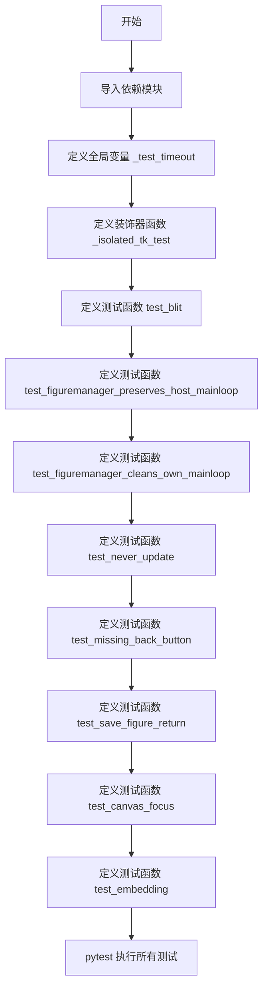
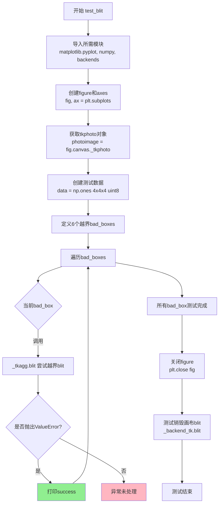
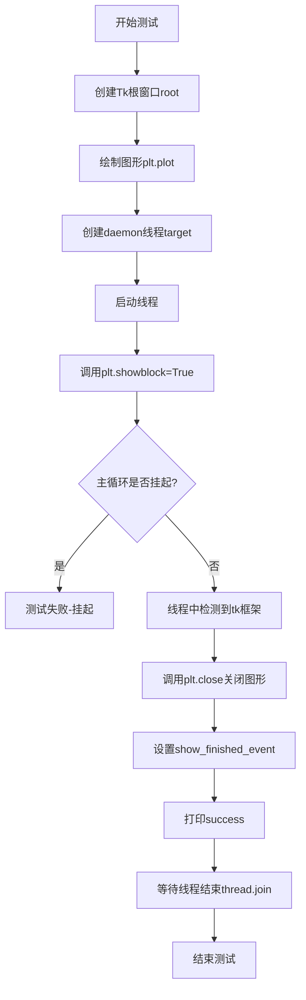
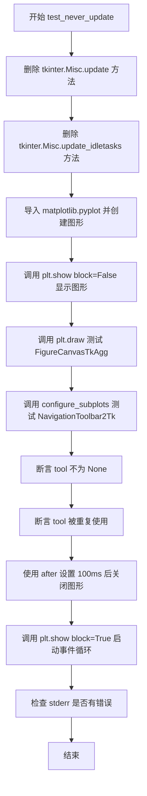
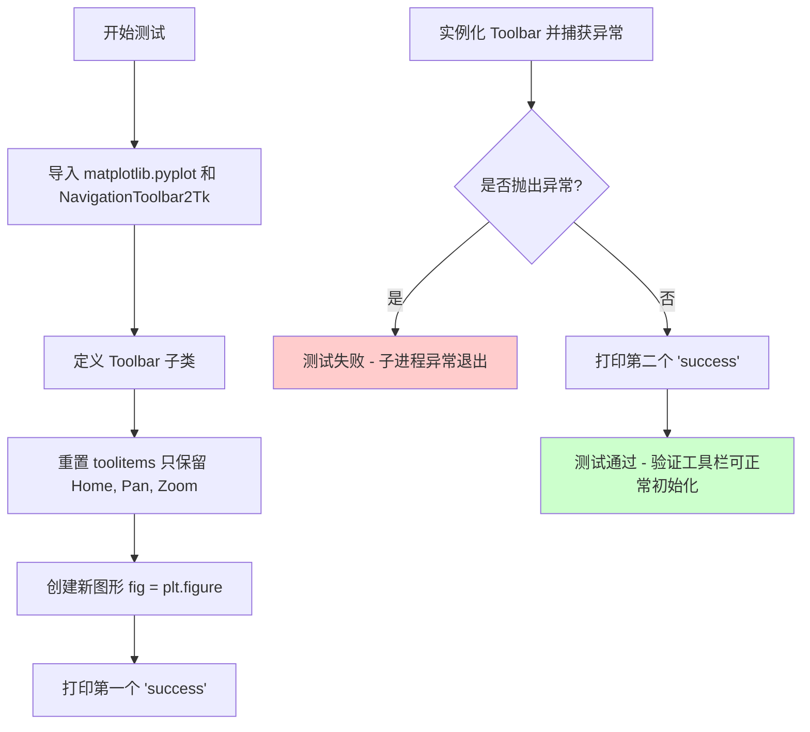
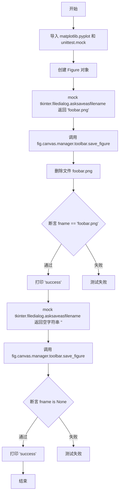
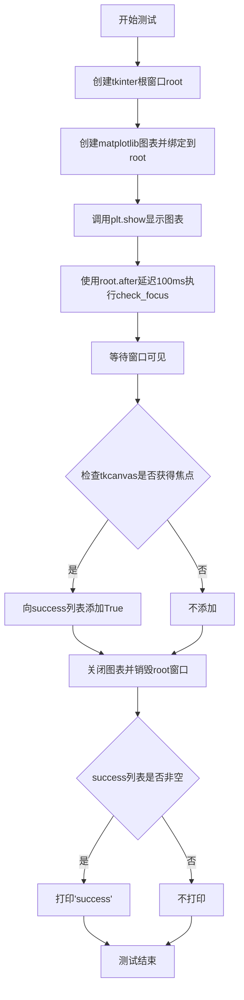
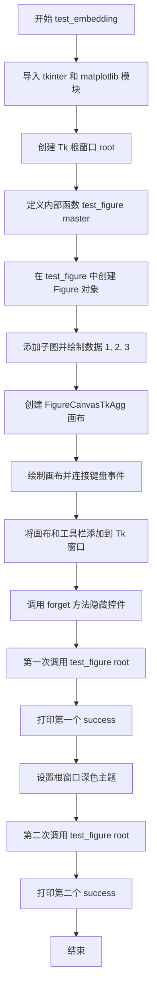

# `matplotlib\lib\matplotlib\tests\test_backend_tk.py` 详细设计文档

该文件是 matplotlib 的 TkAgg 后端集成测试套件，通过隔离的子进程运行多个测试用例，验证 Tkinter 与 matplotlib 的集成功能，包括图形 blitting、FigureManager 生命周期、导航工具栏、画布焦点管理以及嵌入式绘图等功能。

## 整体流程



## 类结构

```
无类定义 (纯测试模块)
├── 全局函数
│   ├── _isolated_tk_test (装饰器工厂)
│   ├── test_blit (blitting 测试)
│   ├── test_figuremanager_preserves_host_mainloop (主循环保持测试)
│   ├── test_figuremanager_cleans_own_mainloop (主循环清理测试)
│   ├── test_never_update (更新禁用测试)
│   ├── test_missing_back_button (工具栏按钮测试)
│   ├── test_save_figure_return (保存图形返回值测试)
│   ├── test_canvas_focus (画布焦点测试)
│   └── test_embedding (嵌入式绘图测试)
└── 全局变量
    └── _test_timeout (测试超时时间)
```

## 全局变量及字段


### `_test_timeout`
    
A reasonably safe value for slower architectures.

类型：`int`
    


    

## 全局函数及方法


### `_isolated_tk_test`

该函数是一个装饰器工厂，用于在子进程中运行 TkAgg 后端测试并验证输出。它确保测试函数在独立的子进程中执行，打印指定次数的 "success" 且 stderr 为空，从而隔离 Tkinter 测试之间的交互。

参数：

- `success_count`：`int`，期望在 stdout 中打印 "success" 的次数
- `func`：可选的 `Callable`，被装饰的测试函数，如果为 None 则返回偏函数

返回值：`Callable`，返回装饰后的测试函数或偏函数（当 func 为 None 时）

#### 流程图

```mermaid
flowchart TD
    A[开始 _isolated_tk_test] --> B{func is None?}
    B -->|是| C[返回 functools.partial<br/>_isolated_tk_test, success_count]
    B -->|否| D{"MPL_TEST_ESCAPE_HATCH"<br/>in os.environ?}
    D -->|是| E[直接返回 func<br/>跳过测试]
    D -->|否| F[添加 @pytest.mark.skipif<br/>检查 tkinter 是否存在]
    F --> G[添加 @pytest.mark.skipif<br/>检查 Linux 下 $DISPLAY]
    G --> H[添加 @pytest.mark.xfail<br/>macOS Tk 版本不匹配]
    H --> I[定义 test_func 内部函数]
    I --> J[pytest.importorskip<br/>确认 tkinter 可导入]
    J --> K[subprocess_run_helper<br/>在子进程中运行 func]
    K --> L{subprocess.TimeoutExpired?}
    L -->|是| M[pytest.fail<br/>子进程超时]
    L -->|否| N{subprocess.CalledProcessError?}
    N -->|是| O[pytest.fail<br/>子进程失败]
    N -->|否| P[检查 stderr 是否为空]
    P --> Q{stderr 包含非忽略内容?}
    Q -->|是| R[pytest.fail<br/>stderr 不为空]
    Q -->|否| S[检查 stdout 中<br/>"success" 出现次数]
    S --> T{count == success_count?}
    T -->|是| U[测试通过]
    T -->|否| V[pytest.fail<br/>success 次数不匹配]
    U --> W[返回 test_func]
    V --> W
```

#### 带注释源码

```python
def _isolated_tk_test(success_count, func=None):
    """
    A decorator to run *func* in a subprocess and assert that it prints
    "success" *success_count* times and nothing on stderr.

    TkAgg tests seem to have interactions between tests, so isolate each test
    in a subprocess. See GH#18261
    """

    # 如果 func 为 None，返回偏函数以便后续接收 func 参数
    # 支持 @_isolated_tk_test(success_count=6) 形式的装饰器
    if func is None:
        return functools.partial(_isolated_tk_test, success_count)

    # 如果设置了 MPL_TEST_ESCAPE_HATCH 环境变量，
    # 则跳过子进程隔离，直接运行原函数（用于调试）
    if "MPL_TEST_ESCAPE_HATCH" in os.environ:
        # set in subprocess_run_helper() below
        return func

    # 添加装饰器：跳过没有 tkinter 的环境
    @pytest.mark.skipif(
        not importlib.util.find_spec('tkinter'),
        reason="missing tkinter"
    )
    # 添加装饰器：Linux 下跳过没有 $DISPLAY 的环境
    @pytest.mark.skipif(
        sys.platform == "linux" and not _c_internal_utils.xdisplay_is_valid(),
        reason="$DISPLAY is unset"
    )
    # 添加装饰器：macOS CI 上 Tk 版本不匹配时预期失败
    @pytest.mark.xfail(  # https://github.com/actions/setup-python/issues/649
        ('TF_BUILD' in os.environ or 'GITHUB_ACTION' in os.environ) and
        sys.platform == 'darwin' and sys.version_info[:2] < (3, 11),
        reason='Tk version mismatch on Azure macOS CI'
    )
    # 使用 functools.wraps 保留原函数元数据
    @functools.wraps(func)
    def test_func():
        # 即使 tkinter 包存在，在某些 CI 系统上可能无法实际导入
        pytest.importorskip('tkinter')
        try:
            # 在子进程中运行测试函数，设置超时和环境变量
            proc = subprocess_run_helper(
                func, timeout=_test_timeout, extra_env=dict(
                    MPLBACKEND="TkAgg", MPL_TEST_ESCAPE_HATCH="1"))
        except subprocess.TimeoutExpired:
            pytest.fail("Subprocess timed out")
        except subprocess.CalledProcessError as e:
            pytest.fail("Subprocess failed to test intended behavior\n"
                        + str(e.stderr))
        else:
            # macOS 可能产生无关的 OpenGL 错误或权限错误，需要忽略
            # 先断言 stderr（失败时打印）有助于调试
            ignored_lines = ["OpenGL", "CFMessagePort: bootstrap_register",
                             "/usr/include/servers/bootstrap_defs.h"]
            # 断言 stderr 不包含非忽略的错误信息
            assert not [line for line in proc.stderr.splitlines()
                        if all(msg not in line for msg in ignored_lines)]
            # 断言 stdout 中 "success" 出现次数等于期望值
            assert proc.stdout.count("success") == success_count

    return test_func
```


### `test_blit`

该测试函数用于验证 Matplotlib 中 TkAgg 后端的 blit 操作，包括测试越界 blitting（应抛出 ValueError）以及测试在已销毁的画布上进行 blitting 的处理。

参数： 无

返回值： `None`，无返回值（测试函数）

#### 流程图



#### 带注释源码

```python
@_isolated_tk_test(success_count=6)  # len(bad_boxes)
def test_blit():
    """
    测试 TkAgg 后端的 blit 功能
    - 测试越界 blitting（应抛出 ValueError）
    - 测试在销毁的画布上进行 blitting
    """
    # 导入必要的模块
    import matplotlib.pyplot as plt
    import numpy as np
    import matplotlib.backends.backend_tkagg  # noqa
    from matplotlib.backends import _backend_tk, _tkagg

    # 创建一个新的图形和坐标轴
    fig, ax = plt.subplots()
    
    # 获取 TkAgg 画布的 photoimage 对象，用于 blit 操作
    photoimage = fig.canvas._tkphoto
    
    # 创建 4x4x4 的 uint8 测试数据
    data = np.ones((4, 4, 4), dtype=np.uint8)
    
    # 定义 6 个越界的边界框，用于测试 blit 边界检查
    # 这些坐标会导致 _tkagg.blit 抛出 ValueError
    bad_boxes = ((-1, 2, 0, 2),   # x1 < 0
                 (2, 0, 0, 2),    # x2 < x1
                 (1, 6, 0, 2),    # x2 > width
                 (0, 2, -1, 2),   # y1 < 0
                 (0, 2, 2, 0),    # y2 < y1
                 (0, 2, 1, 6))    # y2 > height
    
    # 遍历每个越界边界框，测试 blit 错误处理
    for bad_box in bad_boxes:
        try:
            # 调用底层 _tkagg.blit 进行越界 blitting
            # 参数: tk_interp地址, photoimage字符串, 数据, 混合模式, 目标区域, 源区域(越界)
            _tkagg.blit(
                photoimage.tk.interpaddr(), str(photoimage), data,
                _tkagg.TK_PHOTO_COMPOSITE_OVERLAY, (0, 1, 2, 3), bad_box)
        except ValueError:
            # 预期行为：越界时应抛出 ValueError，打印 success
            print("success")

    # 测试在销毁的画布上进行 blitting
    # 关闭图形后，canvas 被销毁，再调用 blit
    plt.close(fig)
    _backend_tk.blit(photoimage, data, (0, 1, 2, 3))
```


### `test_figuremanager_preserves_host_mainloop`

该测试函数用于验证 matplotlib 的 FigureManager 在使用 TkAgg 后端时，能够正确保留宿主程序的主循环（mainloop），确保在关闭图形后宿主程序的主循环不会意外退出。

参数：该函数没有显式参数。

返回值：`None`，函数通过打印 "success" 表示测试成功，否则失败。

#### 流程图

```mermaid
graph TD
    A[Start] --> B[创建Tk根窗口: root = tkinter.Tk]
    B --> C[调度do_plot函数在0毫秒后执行: root.after(0, do_plot)]
    C --> D[进入主循环: root.mainloop]
    E[do_plot执行] --> F[创建图形: plt.figure]
    F --> G[绘制图形: plt.plot([1, 2], [3, 5])]
    G --> H[关闭图形: plt.close]
    H --> I[调度legitimate_quit在0毫秒后执行: root.after(0, legitimate_quit)]
    J[legitimate_quit执行] --> K[退出主循环: root.quit]
    K --> L[在success列表中添加True: success.append(True)]
    D --> M{主循环退出}
    M -->|是| N[检查success列表]
    N --> O{success非空?}
    O -->|是| P[打印 'success']
    P --> Q[End]
    O -->|否| Q
```

#### 带注释源码

```python
@_isolated_tk_test(success_count=1)  # 装饰器，指定预期打印1次"success"
def test_figuremanager_preserves_host_mainloop():
    """
    测试FigureManager是否保留宿主程序的主循环。
    验证在关闭图形后，Tk主循环能够正确退出而不挂起。
    """
    import tkinter
    import matplotlib.pyplot as plt
    
    # 用于记录是否成功退出主循环的列表
    success = []

    def do_plot():
        """在主循环中执行的绘图操作"""
        plt.figure()          # 创建新图形
        plt.plot([1, 2], [3, 5])  # 绘制简单图形
        plt.close()           # 关闭图形
        root.after(0, legitimate_quit)  # 调度退出函数

    def legitimate_quit():
        """正确退出主循环的函数"""
        root.quit()           # 退出主循环
        success.append(True) # 标记成功

    root = tkinter.Tk()       # 创建Tk根窗口
    root.after(0, do_plot)    # 调度do_plot在主循环启动后执行
    root.mainloop()           # 启动Tk主循环

    # 如果成功退出，则打印success
    if success:
        print("success")
```


### `test_figuremanager_cleans_own_mainloop`

该测试函数用于验证FigureManager在关闭时能否正确清理自己的主循环，防止在调用`plt.show(block=True)`时发生挂起。测试通过在后台线程中关闭图形并等待主循环退出，以确认主循环被正确终止。

参数：
- 无

返回值：`None`，该函数不返回任何值，仅通过打印"success"来表示测试成功

#### 流程图



#### 带注释源码

```python
@pytest.mark.flaky(reruns=3)  # 标记为flaky，允许失败后重试3次
@_isolated_tk_test(success_count=1)  # 装饰器：在子进程中运行测试，期望输出1次"success"
def test_figuremanager_cleans_own_mainloop():
    """
    测试FigureManager是否在关闭时正确清理自己的主循环。
    
    该测试验证在子线程中调用plt.close()后，plt.show(block=True)能够
    正确返回而不是永久挂起。
    """
    import tkinter
    import time
    import matplotlib.pyplot as plt
    import threading
    from matplotlib.cbook import _get_running_interactive_framework

    # 创建Tkinter根窗口
    root = tkinter.Tk()
    
    # 创建一个简单的图形
    plt.plot([1, 2, 3], [1, 2, 5])

    # 定义后台线程的目标函数
    def target():
        # 等待当前交互式框架变为'tk'
        while not 'tk' == _get_running_interactive_framework():
            time.sleep(.01)
        
        # 关闭图形
        plt.close()
        
        # 如果显示完成事件已设置，则打印success
        if show_finished_event.wait():
            print('success')

    # 创建线程间同步事件
    show_finished_event = threading.Event()
    
    # 创建daemon线程（守护线程，主程序退出时自动终止）
    thread = threading.Thread(target=target, daemon=True)
    
    # 启动线程
    thread.start()
    
    # 显示图形并阻塞等待，这可能发生挂起
    # 测试的核心：验证此调用是否会挂起
    plt.show(block=True)
    
    # 标记显示已完成
    show_finished_event.set()
    
    # 等待线程结束
    thread.join()
```


### `test_never_update`

该测试函数用于验证 matplotlib 的 TkAgg 后端在不调用 tkinter.Misc.update 或 tkinter.Misc.update_idletasks 的情况下仍能正常工作。测试通过删除这两个方法后创建图形、绘图、配置工具栏以及使用 after 回调来确保 GUI 事件循环能够正常处理。

参数： 无

返回值： `None`，该测试函数没有返回值，通过断言和打印 "success" 来验证行为。

#### 流程图



#### 带注释源码

```python
@pytest.mark.flaky(reruns=3)  # 标记为 flaky 测试，可能不稳定，允许重试 3 次
@_isolated_tk_test(success_count=0)  # 装饰器：在子进程中运行，期望打印 0 次 "success"
def test_never_update():
    """
    测试 matplotlib 的 TkAgg 后端在不调用 update 或 update_idletasks 的情况下
    是否仍能正常工作。
    """
    import tkinter
    # 删除 tkinter.Misc.update 方法，强制测试不依赖此方法的代码路径
    del tkinter.Misc.update
    # 删除 tkinter.Misc.update_idletasks 方法
    del tkinter.Misc.update_idletasks

    import matplotlib.pyplot as plt
    # 创建图形
    fig = plt.figure()
    # 显示图形，block=False 表示非阻塞显示
    plt.show(block=False)

    # 测试 FigureCanvasTkAgg 的绘图功能
    plt.draw()
    # 测试 NavigationToolbar2Tk 的 configure_subplots 方法
    tool = fig.canvas.toolbar.configure_subplots()
    # 断言工具栏配置对象存在
    assert tool is not None
    # 断言工具栏对象被重复使用（内部复用）
    assert tool == fig.canvas.toolbar.configure_subplots()
    
    # 测试 FigureCanvasTk 的 filter_destroy 回调
    # 使用 after 方法设置 100ms 后关闭图形
    fig.canvas.get_tk_widget().after(100, plt.close, fig)

    # 启动阻塞的事件循环，检查 update() 或 update_idletasks() 
    # 是否在事件队列中被调用（功能上等同于 tkinter.Misc.update）
    plt.show(block=True)

    # 注意：异常会打印到 stderr；_isolated_tk_test 会检查它们
```


### `test_missing_back_button`

该测试函数用于验证当自定义工具栏仅包含 Home、Pan、Zoom 按钮（不包含 Back 按钮）时，NavigationToolbar2Tk 的实例化不会抛出异常。测试通过装饰器在独立子进程中运行，预期输出两个 "success" 字符串。

参数： 无

返回值：`None`，该测试函数不返回任何值，仅通过打印 "success" 和进程退出状态来表明测试成功与否

#### 流程图



#### 带注释源码

```python
@_isolated_tk_test(success_count=2)  # 装饰器：期望子进程输出 2 次 "success"
def test_missing_back_button():
    """
    测试当工具栏不包含 Back 按钮时，NavigationToolbar2Tk 能否正常实例化。
    此测试用于验证 GitHub issue 中报告的工具栏按钮缺失问题。
    """
    import matplotlib.pyplot as plt  # 导入 matplotlib 绘图库
    from matplotlib.backends.backend_tkagg import NavigationToolbar2Tk  # 导入 TkAgg 后端的导航工具栏

    class Toolbar(NavigationToolbar2Tk):
        # 仅显示所需的按钮：Home、Pan、Zoom
        # 通过过滤 toolitems 列表来排除其他按钮（包括 Back 按钮）
        toolitems = [t for t in NavigationToolbar2Tk.toolitems if
                     t[0] in ('Home', 'Pan', 'Zoom')]

    fig = plt.figure()  # 创建一个新的图形 figure
    print("success")    # 第一次打印 success，表示图形创建成功
    
    # 关键测试点：实例化自定义工具栏，不应抛出异常
    # 此处测试当 toolitems 中缺少某些默认按钮时工具栏能否正常初始化
    Toolbar(fig.canvas, fig.canvas.manager.window)  # This should not raise.
    
    print("success")    # 第二次打印 success，表示工具栏实例化成功
```


### `test_save_figure_return`

该函数是一个集成测试，用于测试 Matplotlib 的 TkAgg 后端中 `NavigationToolbar2Tk` 的 `save_figure` 方法。它通过 mock `tkinter.filedialog.asksaveasfilename` 来模拟用户保存文件的行为，验证当用户选择文件名时返回文件名，当用户取消保存时返回 None。

参数： 无

返回值： `None`，该函数为测试函数，不返回有意义的值供调用者使用

#### 流程图



#### 带注释源码

```python
@_isolated_tk_test(success_count=2)  # 装饰器：标记为隔离的 Tk 测试，期望输出 2 次 "success"
def test_save_figure_return():
    """
    测试 NavigationToolbar2Tk 的 save_figure 方法在不同返回值下的行为。
    
    该测试验证：
    1. 当用户选择保存文件时，save_figure 返回文件名
    2. 当用户取消保存操作时，save_figure 返回 None
    """
    import matplotlib.pyplot as plt  # 导入 matplotlib.pyplot 用于创建图形
    from unittest import mock        # 导入 mock 用于模拟 tkinter 文件对话框
    
    fig = plt.figure()  # 创建一个新的图形对象
    
    # 测试场景 1：用户选择保存文件
    prop = "tkinter.filedialog.asksaveasfilename"  # 要 mock 的属性路径
    with mock.patch(prop, return_value="foobar.png"):  # 模拟用户输入文件名
        fname = fig.canvas.manager.toolbar.save_figure()  # 调用工具栏的保存方法
        os.remove("foobar.png")  # 清理测试产生的文件
        assert fname == "foobar.png"  # 断言返回值是否为用户输入的文件名
        print("success")  # 输出成功标记（_isolated_tk_test 装饰器会检查此输出）
    
    # 测试场景 2：用户取消保存操作
    with mock.patch(prop, return_value=""):  # 模拟用户取消（返回空字符串）
        fname = fig.canvas.manager.toolbar.save_figure()  # 调用工具栏的保存方法
        assert fname is None  # 断言当用户取消时返回 None
        print("success")  # 输出成功标记
```


### `test_canvas_focus`

该函数是一个TkAgg后端的集成测试，用于验证matplotlib的FigureCanvasTkAgg能够正确获取键盘焦点，以便接收键盘事件。

参数： 无

返回值：`None`，该函数不返回任何值，仅通过打印"success"来表示测试通过

#### 流程图



#### 带注释源码

```python
@_isolated_tk_test(success_count=1)  # 装饰器：期望打印1次"success"
def test_canvas_focus():
    """
    测试FigureCanvasTkAgg是否能正确获取焦点以接收键盘事件。
    该测试在子进程中运行以隔离测试环境，避免TkAgg测试间的相互影响。
    """
    import tkinter as tk
    import matplotlib.pyplot as plt
    success = []  # 用于记录焦点获取是否成功的列表

    def check_focus():
        """内部函数：检查canvas是否获得焦点"""
        tkcanvas = fig.canvas.get_tk_widget()  # 获取matplotlib canvas对应的tkinter控件
        
        # 给plot窗口时间出现
        if not tkcanvas.winfo_viewable():
            tkcanvas.wait_visibility()  # 等待窗口可见
        
        # 确保canvas有焦点，以便能够接收键盘事件
        # focus_lastfor()返回最后获得焦点的控件
        if tkcanvas.focus_lastfor() == tkcanvas:
            success.append(True)  # 记录成功获取焦点
        
        plt.close()  # 关闭图表
        root.destroy()  # 销毁tkinter根窗口，结束mainloop

    root = tk.Tk()  # 创建tkinter根窗口
    fig = plt.figure()  # 创建matplotlib图表
    plt.plot([1, 2, 3])  # 绘制简单折线图
    root.after(0, plt.show)  # 立即显示图表
    root.after(100, check_focus)  # 延迟100ms后检查焦点
    root.mainloop()  # 启动tkinter事件循环

    if success:  # 如果成功获取焦点
        print("success")  # 打印success标记
```


### `test_embedding`

该函数是一个集成测试函数，用于测试 matplotlib 的 FigureCanvasTkAgg 和 NavigationToolbar2Tk 在 Tkinter 环境中的嵌入功能，包括图形绘制、工具栏显示以及深色主题的兼容性。

参数：此函数无显式参数。

返回值：`None`，该函数作为测试函数不返回任何值，仅通过打印 "success" 来指示测试成功。

#### 流程图



#### 带注释源码

```python
@_isolated_tk_test(success_count=2)  # 装饰器：期望测试输出两个 "success"
def test_embedding():
    """测试 matplotlib 图形嵌入 Tkinter 窗口的功能"""
    import tkinter as tk  # 导入 Tkinter 库
    # 导入 matplotlib 后端组件
    from matplotlib.backends.backend_tkagg import (
        FigureCanvasTkAgg, NavigationToolbar2Tk)
    from matplotlib.backend_bases import key_press_handler
    from matplotlib.figure import Figure

    root = tk.Tk()  # 创建 Tk 根窗口

    def test_figure(master):
        """内部测试函数：在给定的 master 窗口中测试图形嵌入"""
        fig = Figure()  # 创建 Figure 对象
        ax = fig.add_subplot()  # 添加子图
        ax.plot([1, 2, 3])  # 绘制简单折线图

        # 创建 TkAgg 画布，传入 figure 和 master 窗口
        canvas = FigureCanvasTkAgg(fig, master=master)
        canvas.draw()  # 渲染图形
        # 连接 matplotlib 键盘事件到处理函数
        canvas.mpl_connect("key_press_event", key_press_handler)
        # 将 Tkinter 小部件.pack() 到窗口中，expand 填充
        canvas.get_tk_widget().pack(expand=True, fill="both")

        # 创建导航工具栏，pack_toolbar=False 手动控制布局
        toolbar = NavigationToolbar2Tk(canvas, master, pack_toolbar=False)
        toolbar.pack(expand=True, fill="x")

        # 测试控件的 forget 方法（隐藏但不销毁）
        canvas.get_tk_widget().forget()
        toolbar.forget()

    # 第一次测试：默认主题
    test_figure(root)
    print("success")  # 输出成功标记

    # 测试深色按钮颜色的设置
    # 并不实际检查图标颜色是否变浅，只确保代码不崩溃
    root.tk_setPalette(background="sky blue", selectColor="midnight blue",
                       foreground="white")
    # 第二次测试：深色主题
    test_figure(root)
    print("success")  # 输出第二个成功标记
```

## 关键组件


### Tkinter子进程隔离测试装饰器 (`_isolated_tk_test`)

用于在独立子进程中运行TkAgg后端测试的装饰器，通过设置环境变量实现进程隔离，避免TkAgg测试之间的交互影响，并处理超时和错误情况。

### Blit操作测试 (`test_blit`)

测试matplotlib TkAgg后端的blit功能，包括边界外的blitting操作和已销毁画布上的blitting，验证blit函数对无效边界框的正确错误处理。

### FigureManager主循环保留测试 (`test_figuremanager_preserves_host_mainloop`)

验证FigureManager在关闭图形时能够正确保留宿主主循环，确保tkinter主循环不被意外终止。

### FigureManager主循环清理测试 (`test_figuremanager_cleans_own_mainloop`)

测试FigureManager在多线程环境下正确清理自己的主循环资源，验证图形关闭后线程能够正常退出。

### 更新机制禁用测试 (`test_never_update`)

通过删除tkinter的update和update_idletasks方法，测试在禁用更新机制的情况下FigureCanvasTkAgg和NavigationToolbar2Tk的行为。

### 工具栏按钮缺失测试 (`test_missing_back_button`)

验证当工具栏配置中缺少部分按钮（如后退按钮）时，NavigationToolbar2Tk仍能正常创建而不抛出异常。

### 图形保存返回值测试 (`test_save_figure_return`)

测试FigureManager工具栏的save_figure方法在不同场景下的返回值，包括成功保存和用户取消的情况。

### 画布焦点测试 (`test_canvas_focus`)

验证matplotlib图形画布能够正确获取并保持键盘焦点，确保能够接收键盘事件。

### Matplotlib嵌入Tkinter测试 (`test_embedding`)

测试将matplotlib图形嵌入到tkinter应用程序中的功能，包括图形绘制、工具栏配置以及不同配色方案下的显示效果。


## 问题及建议


### 已知问题

- **硬编码超时值**: `_test_timeout = 60` 是硬编码的全局变量，对于不同性能的架构缺乏灵活性，可能导致快速环境超时浪费或慢速环境测试被误杀
- **魔法数字缺乏说明**: `success_count=6`（对应`bad_boxes`长度）和各类数值缺少常量定义，代码可读性差
- **错误类型区分不足**: `test_blit`中捕获所有`ValueError`并视为成功，无法区分预期的边界检查错误与其他潜在`ValueError`
- **资源清理风险**: `test_save_figure_return`中`os.remove("foobar.png")`缺少异常保护，若文件操作失败会导致测试失败
- **全局状态修改未恢复**: `test_never_update`通过`del`删除`tkinter.Misc.update`和`update_idletasks`修改全局状态，可能影响同进程后续测试
- **平台依赖代码分散**: 多个`sys.platform`、`platform.python_implementation()`检查散落在各处，维护成本高
- **测试不稳定性**: 多个测试标记`@pytest.mark.flaky(reruns=3)`表明测试存在竞态条件或时序依赖
- **环境变量检查泄露内部逻辑**: `MPL_TEST_ESCAPE_HATCH`环境变量处理逻辑隐藏在装饰器中，意图不直观

### 优化建议

- 将超时值、success_count等数值提取为具名常量并添加注释说明其含义
- 为`test_blit`的异常处理增加更精确的错误类型过滤，或使用更具体的异常类
- 在文件删除操作外层添加`try-except`处理，或使用临时文件机制
- 考虑使用`pytest fixture`在测试前后保存/恢复`tkinter.Misc`的状态
- 将平台检测逻辑抽取为独立的配置模块或`skipif`辅助函数
- 调查并解决`flaky`测试的根本原因（如时序问题、线程竞争），减少重运行依赖
- 为环境变量使用添加文档注释，说明其用途和生效条件

## 其它


### 设计目标与约束

本模块的设计目标是验证Matplotlib的TkAgg后端在各种场景下的正确性和稳定性，包括：blit图形操作、图形管理器生命周期管理、工具栏功能、画布焦点处理以及嵌入式绘图等。约束条件包括：必须使用子进程隔离测试以避免测试间相互影响（GH#18261），必须在具有有效显示环境的系统上运行（Linux下需要$DISPLAY），测试必须在合理超时内完成（60秒），以及部分测试标记为flaky需要重试。

### 错误处理与异常设计

测试中的错误处理主要体现在以下几个方面：subprocess.TimeoutExpired异常捕获，测试超时（60秒）时调用pytest.fail报告"Subprocess timed out"；subprocess.CalledProcessError异常捕获，测试进程非正常退出时输出stderr内容辅助调试；tkinter导入失败时使用pytest.importorskip跳过测试；ValueError异常在blit测试中作为预期行为捕获并打印"success"；对于macOS上的无关错误（OpenGL、CFMessagePort等）进行忽略处理。

### 数据流与状态机

测试模块的数据流主要涉及：主进程创建子进程运行测试函数→子进程设置MPLBACKEND="TkAgg"环境变量→子进程导入matplotlib.pyplot和tkinter→执行具体测试逻辑→子进程输出"success"或异常信息→主进程验证stdout中success数量和stderr内容。状态机方面：测试函数执行前需检查tkinter可用性和DISPLAY环境；_isolated_tk_test装饰器根据环境变量MPL_TEST_ESCAPE_HATCH决定是否真正隔离执行；部分测试（test_figuremanager_cleans_own_mainloop、test_never_update）需要状态转换来验证主循环管理。

### 外部依赖与接口契约

本模块依赖以下外部组件和接口：matplotlib._c_internal_utils模块的xdisplay_is_valid()函数用于验证X显示可用性；matplotlib.testing.subprocess_run_helper用于在子进程中运行测试函数；tkinter标准库用于GUI测试；pytest框架用于测试发现和执行；matplotlib.backends.backend_tkagg和_backend_tk、_tkagg模块提供后端实现；subprocess模块用于创建隔离测试进程；platform模块用于检查Python实现类型以跳过PyPy。

### 关键组件信息

_isolated_tk_test装饰器：用于在独立子进程中运行Tk测试，验证stdout中"success"出现次数并检查stderr无错误输出；test_blit函数：测试_tkagg.blit的边界情况处理和销毁画布上的blit操作；test_figuremanager_preserves_host_mainloop函数：验证图形管理器正确保持主循环；test_figuremanager_cleans_own_mainloop函数：测试图形管理器正确清理自己的主循环线程；test_missing_back_button函数：验证自定义工具栏按钮配置不会引发异常。

### 潜在技术债务与优化空间

当前实现存在以下优化空间：test_never_update测试通过修改tkinter.Misc.update和update_idletasks来模拟禁止更新，这种 monkey patch 方式可能导致测试间相互影响；多个测试函数存在重复的import语句（matplotlib.pyplot、tkinter等），可以考虑提取到模块级别；_test_timeout设置为60秒对于某些慢速架构可能仍不够，需要根据实际CI环境调整；测试中的硬编码字符串（如"success"、ignored_lines中的错误消息）可以提取为配置常量；部分测试依赖time.sleep进行等待，可以考虑使用更可靠的同步机制（如threading.Event）替代。

    