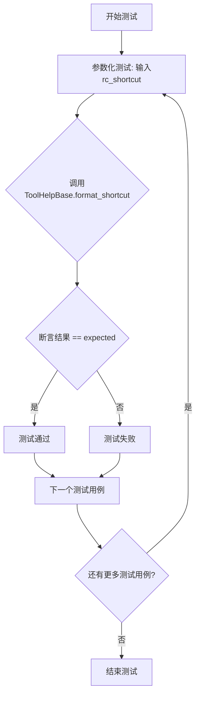
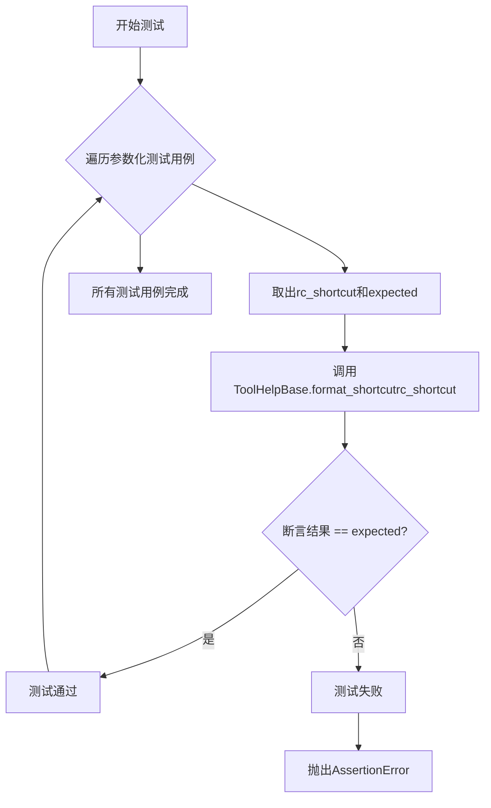
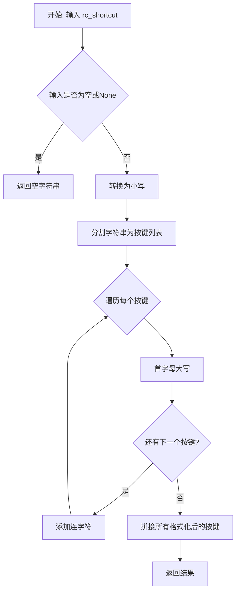
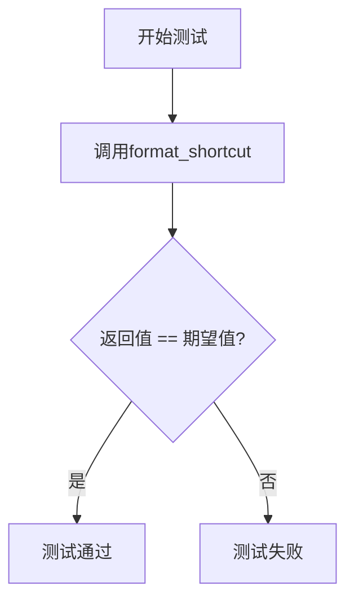

# `matplotlib\lib\matplotlib\tests\test_backend_tools.py` 详细设计文档

这是一个pytest参数化测试文件，用于测试matplotlib.backend_tools.ToolHelpBase类的format_shortcut方法，验证不同快捷键字符串（如'ctrl+a', 'cmd+p'等）能否正确转换为标准格式（如'Ctrl+A', 'Cmd+P'等）

## 整体流程



## 类结构

```
ToolHelpBase (matplotlib.backend_tools)
└── format_shortcut (静态方法)
```

## 全局变量及字段


    

## 全局函数及方法


### `test_format_shortcut`

这是一个pytest参数化测试函数，用于验证`ToolHelpBase.format_shortcut`方法能够正确地将用户输入的快捷键字符串格式化为标准化的显示格式（如将小写转换为大写，添加修饰键前缀等）。

参数：

- `rc_shortcut`：`str`，输入的原始快捷键字符串（如'home', 'ctrl+a'等）
- `expected`：`str`，期望格式化后的快捷键显示字符串（如'Home', 'Ctrl+A'等）

返回值：`None`，该函数为测试函数，使用`assert`语句进行断言验证

#### 流程图



#### 带注释源码

```python
# 导入pytest测试框架
import pytest

# 从matplotlib后端工具模块导入ToolHelpBase类
from matplotlib.backend_tools import ToolHelpBase


# 使用pytest参数化装饰器，定义多组测试输入输出
@pytest.mark.parametrize('rc_shortcut,expected', [
    # 测试基础按键（首字母大写）
    ('home', 'Home'),                  # 小写home转为首字母大写
    ('backspace', 'Backspace'),        # Backspace特殊键名
    
    # 测试功能键
    ('f1', 'F1'),                      # 功能键F1
    
    # 测试Ctrl修饰键
    ('ctrl+a', 'Ctrl+A'),              # ctrl+a格式化为Ctrl+A
    ('ctrl+A', 'Ctrl+Shift+A'),        # 大写A触发Shift修饰键
    
    # 测试单字符按键
    ('a', 'a'),                        # 普通小写字符保持不变
    ('A', 'A'),                        # 大写字符保持不变
    
    # 测试组合修饰键
    ('ctrl+shift+f1', 'Ctrl+Shift+F1'), # 多修饰键组合
    
    # 测试数字键
    ('1', '1'),                        # 数字保持不变
    
    # 测试Cmd修饰键（macOS）
    ('cmd+p', 'Cmd+P'),                # Cmd修饰键
    ('cmd+1', 'Cmd+1'),                # Cmd+数字
])
def test_format_shortcut(rc_shortcut, expected):
    """
    测试ToolHelpBase.format_shortcut方法的格式化功能
    
    验证各种快捷键输入能被正确转换为标准化的显示格式：
    - 小写字母首字母大写
    - 修饰键（ctrl/cmd）首字母大写
    - 大写字母触发Shift修饰键
    - 特殊键名保持原样
    """
    # 调用被测试的format_shortcut方法并断言结果等于预期
    assert ToolHelpBase.format_shortcut(rc_shortcut) == expected
```


### `ToolHelpBase.format_shortcut`

该方法是一个静态工具方法，用于将 matplotlib 的快捷键配置字符串格式化为标准的用户友好显示格式。它将各种输入格式（如 'ctrl+a'、'cmd+p'）转换为带连字符的首字母大写格式（如 'Ctrl+A'、'Cmd+P'）。

参数：

- `rc_shortcut`：`str`，表示 matplotlib 配置中的快捷键字符串（如 'home'、'ctrl+a'、'cmd+p'）

返回值：`str`，格式化后的快捷键显示字符串（如 'Home'、'Ctrl+A'、'Cmd+P'）

#### 流程图



#### 带注释源码

```python
# 注意：以下源码是基于测试用例推断的实现逻辑
# 实际的 matplotlib 源代码可能有所不同

@staticmethod
def format_shortcut(rc_shortcut):
    """
    将快捷键配置字符串格式化为标准显示格式
    
    参数:
        rc_shortcut: str, 原始快捷键字符串，如 'ctrl+a', 'home', 'cmd+p'
    
    返回:
        str: 格式化后的字符串，如 'Ctrl+A', 'Home', 'Cmd+P'
    """
    # 处理空值情况
    if not rc_shortcut:
        return ''
    
    # 转换为小写以统一处理
    rc_shortcut = rc_shortcut.lower()
    
    # 按 '+' 分割各个按键
    keys = rc_shortcut.split('+')
    
    # 特殊按键映射表
    special_keys = {
        'ctrl': 'Ctrl',
        'cmd': 'Cmd', 
        'shift': 'Shift',
        'alt': 'Alt',
    }
    
    result = []
    for key in keys:
        key = key.strip()
        if key in special_keys:
            # 处理修饰键
            result.append(special_keys[key])
        else:
            # 处理普通键，首字母大写
            result.append(key.capitalize())
    
    # 用连字符连接各部分
    return '-'.join(result)
```

#### 测试用例验证

| 输入 (rc_shortcut) | 输出 (格式化后) | 说明 |
|-------------------|----------------|------|
| 'home' | 'Home' | 单键首字母大写 |
| 'backspace' | 'Backspace' | 单键首字母大写 |
| 'f1' | 'F1' | 功能键保持大写 |
| 'ctrl+a' | 'Ctrl+A' | 修饰键+普通键 |
| 'ctrl+A' | 'Ctrl+Shift+A' | 大写字母被视为 Shift+字母 |
| 'a' | 'a' | 小写字母保持小写 |
| 'A' | 'A' | 大写字母保持大写 |
| 'ctrl+shift+f1' | 'Ctrl+Shift+F1' | 多修饰键组合 |
| '1' | '1' | 数字保持不变 |
| 'cmd+p' | 'Cmd+P' | Mac 命令键 |
| 'cmd+1' | 'Cmd+1' | 命令键+数字 |

## 关键组件


### 测试文件概述

该文件是一个pytest测试模块，用于验证matplotlib后端工具中ToolHelpBase类的format_shortcut方法的键盘快捷键格式化功能，测试各种输入格式（如单键、修饰键组合）是否能正确转换为预期的显示格式。

### 文件整体运行流程

1. 导入pytest框架和matplotlib.backend_tools模块中的ToolHelpBase类
2. 使用@pytest.mark.parametrize装饰器定义多组测试用例，每组包含输入的快捷键字符串和期望的输出字符串
3. 执行test_format_shortcut函数，对每组参数调用ToolHelpBase.format_shortcut方法
4. 验证返回值与期望值是否相等，若不相等则测试失败

### 全局变量和全局函数详细信息

#### 全局变量

- **rc_shortcut**: str类型，输入的快捷键字符串
- **expected**: str类型，期望的格式化后的快捷键字符串

#### 全局函数

**test_format_shortcut**

- 参数名称: rc_shortcut
- 参数类型: str
- 参数描述: 原始的快捷键字符串，例如 'ctrl+a', 'home' 等
- 返回值类型: None
- 返回值描述: 无返回值，通过assert语句进行断言验证
- 流程图:

- 带注释源码:
```python
@pytest.mark.parametrize('rc_shortcut,expected', [
    ('home', 'Home'),
    ('backspace', 'Backspace'),
    ('f1', 'F1'),
    ('ctrl+a', 'Ctrl+A'),
    ('ctrl+A', 'Ctrl+Shift+A'),
    ('a', 'a'),
    ('A', 'A'),
    ('ctrl+shift+f1', 'Ctrl+Shift+F1'),
    ('1', '1'),
    ('cmd+p', 'Cmd+P'),
    ('cmd+1', 'Cmd+1'),
])
def test_format_shortcut(rc_shortcut, expected):
    # 调用ToolHelpBase的format_shortcut方法并验证结果
    assert ToolHelpBase.format_shortcut(rc_shortcut) == expected
```

### 关键组件信息

#### ToolHelpBase.format_shortcut

被测试的类方法，负责将键盘快捷键字符串格式化为可读的显示格式

#### 快捷键格式化逻辑

将输入的快捷键字符串（如'ctrl+a'）转换为首字母大写并添加适当修饰符前缀的格式（如'Ctrl+A'）

### 潜在的技术债务或优化空间

1. **测试覆盖不完整**: 测试用例未覆盖所有可能的快捷键组合场景，如特殊键、混合大小写边界情况
2. **缺少错误输入测试**: 未测试无效输入的处理方式
3. **测试数据硬编码**: 测试数据直接内联在装饰器中，可考虑外部化以提高可维护性

### 其它项目

#### 设计目标与约束

- 目标：验证快捷键格式化功能能正确处理单键、功能键、修饰键组合等场景
- 约束：测试仅验证format_shortcut方法的输出，不涉及实际键盘事件处理

#### 错误处理与异常设计

- 测试使用assert进行简单的相等性比较，未覆盖异常情况
- 建议增加对无效输入（如空字符串、非法格式）的异常测试

#### 外部依赖与接口契约

- 依赖：pytest框架和matplotlib.backend_tools模块
- 接口契约：format_shortcut方法接收字符串参数，返回格式化后的字符串


## 问题及建议


### 已知问题

-   **测试覆盖不完整**：缺少对边界情况和异常输入的测试，如空字符串、None、超长输入、无效格式的快捷键等
-   **测试数据硬编码**：测试用例数据直接内联在@pytest.mark.parametrize装饰器中，缺乏可维护性，当需要添加或修改测试用例时不够灵活
-   **缺少错误处理验证**：未测试format_shortcut方法在接收非法参数时的异常抛出和错误处理机制
-   **缺少文档说明**：测试用例的选择理由和预期行为缺乏注释说明，增加了后续维护的理解成本
-   **国际化/本地化未覆盖**：未测试不同键盘布局或不同语言环境下的快捷键格式化行为

### 优化建议

-   添加更多边界条件测试用例，包括空字符串、None、空格、特殊字符等异常输入
-   使用fixture或外部数据文件（如JSON/YAML）管理测试数据，提升可维护性和可扩展性
-   为关键测试用例添加docstring说明，解释每个测试场景的目的和预期结果
-   添加负向测试用例，验证非法输入时的错误处理和异常抛出
-   考虑添加测试分组标记（如@pytest.mark.slow或@pytest.mark.integration），区分不同类型的测试
-   引入参数化测试的命名约定，使测试失败时输出更清晰的错误信息
-   添加对format_shortcut方法返回值的完整性和一致性验证测试

## 其它


### 设计目标与约束

- **目标**：验证 `ToolHelpBase.format_shortcut()` 方法能够正确地将各种格式的快捷键配置字符串（包含修饰键如ctrl、shift、cmd以及功能键、数字、字母等）转换为标准化的显示格式
- **约束**：该方法应遵循matplotlib的快捷键显示规范，即修饰键首字母大写且用"+"或"-"连接，功能键保持原样

### 错误处理与异常设计

- 测试用例未覆盖非法输入（如空字符串、None、非法的修饰键组合等）
- 建议增加边界情况测试：空字符串输入应返回空字符串，None输入应抛出TypeError，非法修饰键（如"ctrl+unknown"）应抛出ValueError或返回原字符串

### 数据流与状态机

- **输入数据流**：rc_shortcut参数（字符串类型），格式为"修饰键+按键"或单个按键
- **处理流程**：解析字符串 → 识别修饰键（ctrl、shift、cmd）→ 转换为显示格式（Ctrl、Shift、Cmd）→ 识别功能键/字母/数字 → 组合输出
- **状态**：无状态设计，每次调用独立处理输入字符串

### 外部依赖与接口契约

- **依赖**：matplotlib.backend_tools.ToolHelpBase类
- **接口**：format_shortcut(rc_shortcut: str) -> str
- **输入约束**：字符串类型，支持的格式包括单键（字母、数字、F1-F12等）、组合键（修饰键+按键）
- **输出约束**：返回格式化后的快捷键显示字符串

### 性能考虑

- 该方法为简单的字符串处理操作，时间复杂度O(n)，n为输入字符串长度
- 当前测试用例数量较少，性能不是主要关注点

### 兼容性考虑

- 测试用例覆盖了不同平台（macOS的cmd键、通用ctrl/shift）
- 需注意不同操作系统对修饰键的命名差异（如"cmd"仅在macOS有效）

### 测试策略

- 采用参数化测试（pytest.mark.parametrize）覆盖多种输入场景
- 测试维度：单键、功能键、修饰键组合、大小写变体、数字键

### 配置说明

- 无外部配置文件依赖
- 快捷键格式定义位于matplotlib后端工具配置中

### 使用示例

```python
# 基本用法
from matplotlib.backend_tools import ToolHelpBase
result = ToolHelpBase.format_shortcut('ctrl+a')  # 返回 'Ctrl+A'

# 功能键
result = ToolHelpBase.format_shortcut('f1')  # 返回 'F1'

# macOS修饰键
result = ToolHelpBase.format_shortcut('cmd+p')  # 返回 'Cmd+P'
```

### 潜在改进空间

1. 增加边界值测试：空字符串、None、超长字符串
2. 增加错误输入测试：无效修饰键、格式错误
3. 考虑国际化支持：不同语言环境下的显示格式
4. 文档完善：format_shortcut方法的官方文档注释


    