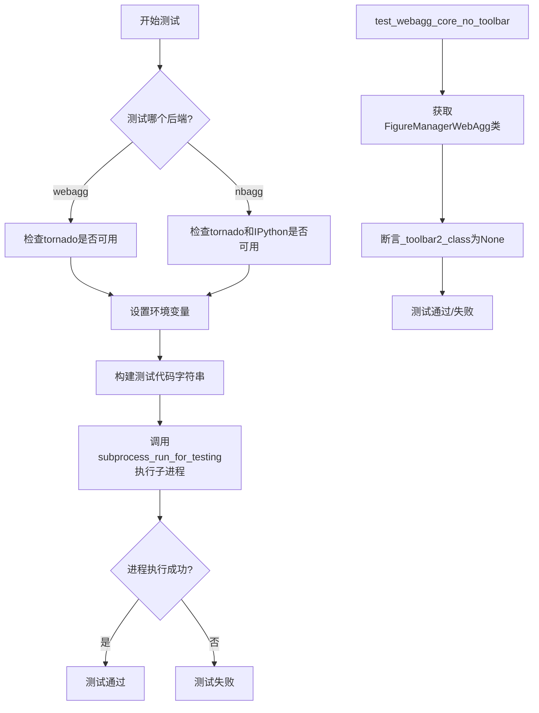
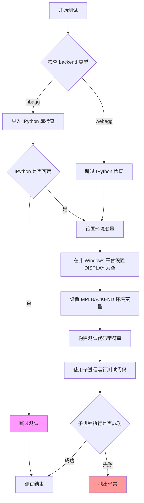
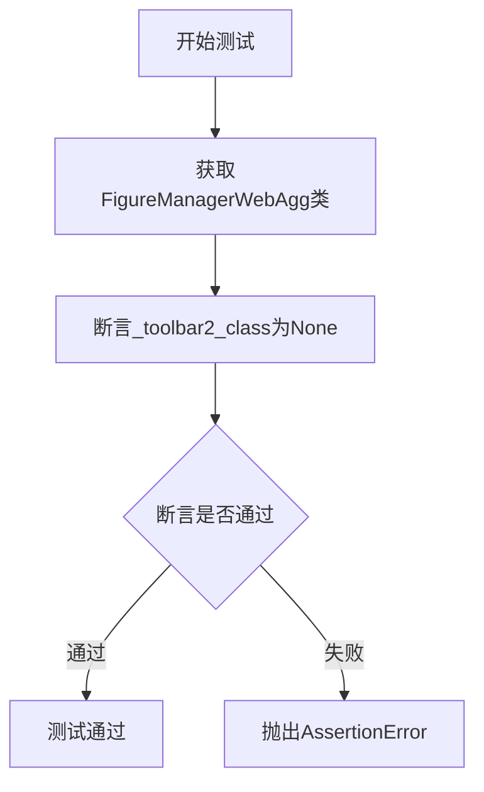
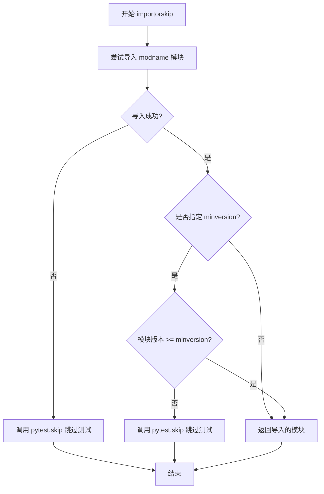
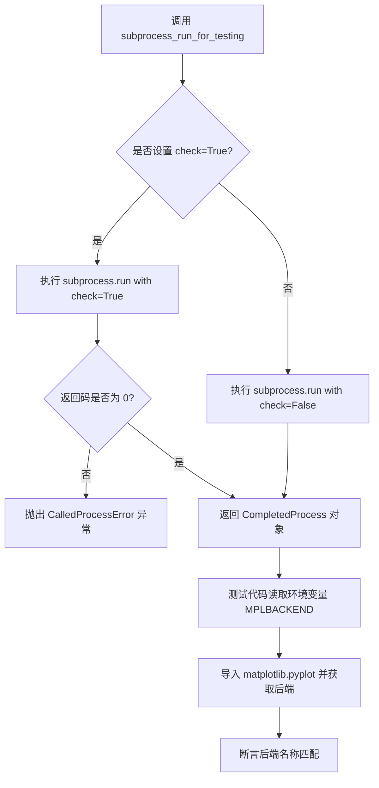
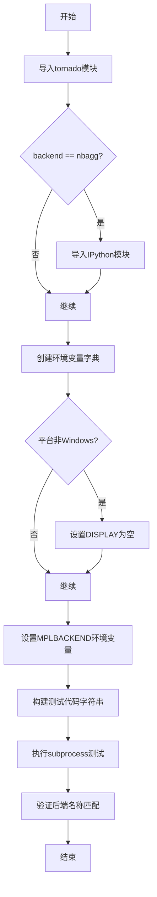
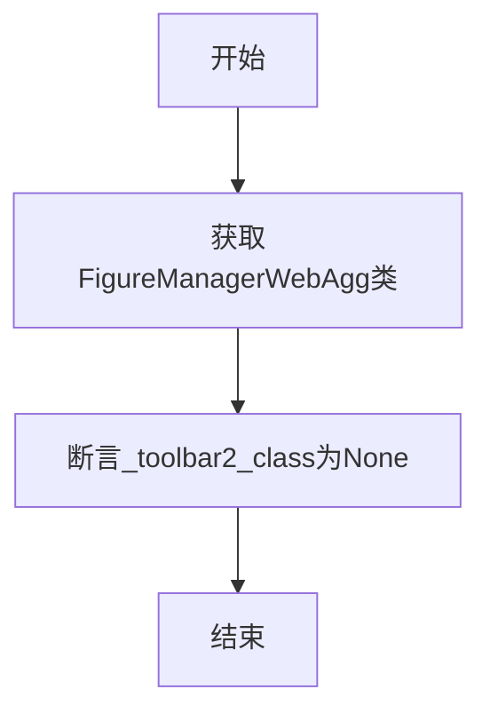

# `matplotlib\lib\matplotlib\tests\test_backend_webagg.py` 详细设计文档

这是一个matplotlib后端的测试文件，主要用于测试webagg和nbagg图形后端的回退机制以及验证FigureManagerWebAgg的_toolbar2_class属性配置。

## 整体流程



## 类结构

```
测试模块（无类定义）
└── 测试函数
    ├── test_webagg_fallback (参数化测试)
    └── test_webagg_core_no_toolbar
```

## 全局变量及字段


### `backend`
    
测试后端名称（webagg或nbagg）

类型：`str`
    


### `env`
    
环境变量字典

类型：`dict`
    


### `test_code`
    
要在子进程中执行的测试代码字符串

类型：`str`
    


### `FigureManagerWebAgg.fm`
    
matplotlib的WebAgg图形管理器类

类型：`FigureManagerWebAgg`
    
    

## 全局函数及方法


### `test_webagg_fallback`

这是一个参数化测试函数，用于测试 matplotlib 的 webagg 和 nbagg 后端的回退机制，通过检查环境变量 MPLBACKEND 是否正确设置了后端，并在子进程中验证 plt.get_backend() 返回值与环境变量设置一致。

参数：

- `backend`：`str`，参数化测试参数，表示要测试的后端类型（"webagg" 或 "nbagg"）

返回值：`None`，无返回值（pytest 测试函数）

#### 流程图



#### 带注释源码

```python
import os
import sys
import pytest

import matplotlib.backends.backend_webagg_core
from matplotlib.testing import subprocess_run_for_testing


# 参数化测试：测试 webagg 和 nbagg 两个后端的回退机制
@pytest.mark.parametrize("backend", ["webagg", "nbagg"])
def test_webagg_fallback(backend):
    """
    测试 webagg/nbagg 后端的回退机制。
    验证在设置 MPLBACKEND 环境变量后，matplotlib 能否正确使用指定的后端。
    
    参数:
        backend: str, 要测试的后端类型，可以是 "webagg" 或 "nbagg"
    """
    # 导入 tornado 库，如果不可用则跳过测试
    pytest.importorskip("tornado")
    
    # 如果是 nbagg 后端，还需要检查 IPython 是否可用
    if backend == "nbagg":
        pytest.importorskip("IPython")
    
    # 复制当前环境变量
    env = dict(os.environ)
    
    # 在非 Windows 平台上，将 DISPLAY 设置为空字符串
    # 这确保测试不依赖于 X11 显示服务器
    if sys.platform != "win32":
        env["DISPLAY"] = ""
    
    # 设置 MPLBACKEND 环境变量，指定要测试的后端
    env["MPLBACKEND"] = backend
    
    # 构建测试代码字符串
    # 1. 验证环境变量 MPLBACKEND 的值
    # 2. 导入 matplotlib.pyplot
    # 3. 打印当前后端名称
    # 4. 断言后端名称与预期一致（不区分大小写）
    test_code = (
        "import os;"
        + f"assert os.environ['MPLBACKEND'] == '{backend}';"
        + "import matplotlib.pyplot as plt; "
        + "print(plt.get_backend());"
        f"assert '{backend}' == plt.get_backend().lower();"
    )
    
    # 使用子进程运行测试代码
    # check=True 表示如果进程返回非零退出码则抛出异常
    subprocess_run_for_testing([sys.executable, "-c", test_code], env=env, check=True)


def test_webagg_core_no_toolbar():
    """
    测试 FigureManagerWebAgg 类的 toolbar2 类属性是否为 None。
    验证 webagg 核心后端默认不显示工具栏。
    """
    # 获取 FigureManagerWebAgg 类
    fm = matplotlib.backends.backend_webagg_core.FigureManagerWebAgg
    
    # 断言 _toolbar2_class 属性为 None
    assert fm._toolbar2_class is None

```


### `test_webagg_core_no_toolbar`

该函数用于测试 `FigureManagerWebAgg` 类的无工具栏配置，验证其 `_toolbar2_class` 属性是否为 `None`。

参数：无

返回值：无（返回 `None`，pytest 测试函数无需显式返回值）

#### 流程图



#### 带注释源码

```python
def test_webagg_core_no_toolbar():
    """
    测试FigureManagerWebAgg无工具栏配置。
    
    该测试函数验证 FigureManagerWebAgg 类的 _toolbar2_class 属性
    是否被正确设置为 None，表示无工具栏配置。
    """
    # 获取 FigureManagerWebAgg 类引用
    # 这是一个Web聚合后端的图形管理器类
    fm = matplotlib.backends.backend_webagg_core.FigureManagerWebAgg
    
    # 断言验证 _toolbar2_class 属性为 None
    # _toolbar2_class 为 None 表示该后端不使用工具栏
    assert fm._toolbar2_class is None
```


### `pytest.importorskip`

`pytest.importorskip` 是 pytest 的一个辅助函数，用于条件导入可选依赖。如果指定的模块不存在或版本不符合要求，该函数会调用 `pytest.skip` 跳过当前测试，而不是导致测试失败。这在测试可选功能时非常有用，可以确保测试套件在缺少某些可选依赖的情况下仍然能够正常运行。

参数：

- `modname`：`str`，要导入的模块名称
- `minversion`：`Optional[str]`，可选参数，指定模块的最低版本要求，如果模块版本低于此值则跳过测试
- `reason`：`Optional[str]`，可选参数，当模块导入失败或版本不满足时，显示的跳过原因

返回值：`Any`，返回成功导入的模块对象。如果导入失败或版本不满足要求，则不会返回（会抛出 `Skipped` 异常）

#### 流程图



#### 带注释源码

```python
def importorskip(
    modname: str,
    minversion: Optional[str] = None,
    reason: Optional[str] = None,
) -> Any:
    """
    导入并返回指定的模块 ``modname``。
    
    如果模块无法导入或版本不符合要求，则跳过测试。
    
    参数:
        modname: 要导入的模块名称
        minversion: 如果指定，导入模块的 __version__ 必须至少为此版本
        reason: 如果给出，当模块无法导入时显示此原因
    
    返回:
        成功导入的模块对象
    
    异常:
        Skipped: 如果模块无法导入或版本不满足要求
    """
    # 导入所需的模块
    import importlib
    import sys
    
    # 记录导入失败的原因
    install_reason = None
    
    # 尝试导入模块
    try:
        # 使用 importlib 动态导入模块
        mod = importlib.import_module(modname)
    except ImportError:
        # 模块导入失败，记录原因
        install_reason = f"could not import {modname!r}"
    else:
        # 模块导入成功，检查是否需要验证版本
        if minversion is None:
            # 无需版本检查，直接返回模块
            return mod
        # 获取模块的版本
        ver = mod.__version__  # type: ignore[attr-defined]
        # 解析要求的最低版本
        from packaging.version import parse as parse_version
        
        # 比较版本，如果不符合要求则跳过
        if parse_version(ver) < parse_version(minversion):
            install_reason = (
                f"module {modname!r} has version {ver} "
                f"which is less than required {minversion!r}"
            )
        else:
            # 版本满足要求，返回模块
            return mod
    
    # 如果模块导入失败或版本不满足，跳过测试
    if reason is None:
        reason = f"missing dependency: {modname}"
    # 添加安装原因到跳过原因中
    if install_reason:
        reason = f"{reason}: {install_reason}"
    
    # 调用 pytest.skip 跳过测试
    pytest.skip(reason)
```


### `subprocess_run_for_testing`

`subprocess_run_for_testing` 是 matplotlib 测试工具模块中的核心函数，用于在子进程中运行测试代码，确保测试环境与主进程隔离，并通过环境变量配置 matplotlib 后端。该函数封装了 `subprocess.run`，提供了统一的测试执行接口，支持自定义环境变量和返回码检查。

参数：

- `cmd`：列表，要执行的命令及参数，格式为 `[sys.executable, "-c", test_code]`
- `env`：字典（可选），环境变量映射，用于设置 `MPLBACKEND` 等matplotlib配置
- `check`：布尔值（可选），设为 `True` 时如果返回码非零则抛出 `CalledProcessError`

返回值：`subprocess.CompletedProcess`，包含子进程的返回码、标准输出和标准错误等信息

#### 流程图



#### 带注释源码

```python
# 从 matplotlib.testing 模块导入该函数
# 注意：实际源码位于 matplotlib/testing.py 或 matplotlib/testing/__init__.py 中
# 以下为功能等价的核心实现逻辑：

def subprocess_run_for_testing(cmd, env=None, check=True, **kwargs):
    """
    在子进程中运行命令，用于测试目的。
    
    参数:
        cmd: 命令列表，如 [sys.executable, "-c", "..."]
        env: 可选的环境变量字典
        check: 若为 True，则非零返回码会抛出异常
        **kwargs: 传递给 subprocess.run 的其他关键字参数
    
    返回:
        subprocess.CompletedProcess: 包含返回码、stdout、stderr 的对象
    """
    # 合并默认环境与自定义环境
    import os
    run_env = os.environ.copy()
    if env:
        run_env.update(env)
    
    # 执行子进程，捕获输出
    proc = subprocess.run(
        cmd,
        env=run_env,
        check=check,  # 根据参数决定是否检查返回码
        capture_output=True,  # 捕获标准输出和错误
        text=True,  # 返回字符串而非字节
        **kwargs
    )
    
    return proc
```

> **注**：实际源码位于 matplotlib 仓库的 `lib/matplotlib/testing.py` 或相关模块中。上述代码为功能等价的核心逻辑展示。该函数在测试中的典型用法是配合 `pytest` 验证不同后端配置下的 matplotlib 行为，确保后端在子进程中正确初始化。

## 关键组件


### 代码概述

该代码是matplotlib的webagg和nbagg后端的pytest测试文件，通过subprocess方式验证后端回退机制，并检查FigureManagerWebAgg的toolbar配置是否为None。

### 文件整体运行流程

1. 导入所需模块（os, sys, pytest, matplotlib后端模块, 测试工具）
2. 参数化测试test_webagg_fallback：对webagg和nbagg后端进行测试
3. 测试test_webagg_core_no_toolbar：验证toolbar类为None

### 全局变量和全局函数

| 名称 | 类型 | 描述 |
|------|------|------|
| backend | str | 参数化测试的后端名称（webagg或nbagg） |
| env | dict | 环境变量字典，用于设置MPLBACKEND |
| test_code | str | 要在子进程中执行的测试代码字符串 |
| fm | type | FigureManagerWebAgg类引用 |

### 类信息

本文件不包含类定义，仅包含测试函数。

### 函数详细信息

#### test_webagg_fallback

| 项目 | 内容 |
|------|------|
| 参数名称 | backend |
| 参数类型 | str |
| 参数描述 | 要测试的matplotlib后端名称（webagg或nbagg） |
| 返回值类型 | None |
| 返回值描述 | 该函数为测试函数，无返回值，通过pytest断言验证 |



```python
@pytest.mark.parametrize("backend", ["webagg", "nbagg"])
def test_webagg_fallback(backend):
    """测试webagg和nbagg后端的回退机制"""
    # 条件导入tornado，若不存在则跳过测试
    pytest.importorskip("tornado")
    # 如果是nbagg后端，需要导入IPython
    if backend == "nbagg":
        pytest.importorskip("IPython")
    # 复制当前环境变量
    env = dict(os.environ)
    # 非Windows平台设置DISPLAY为空
    if sys.platform != "win32":
        env["DISPLAY"] = ""
    # 设置要测试的后端环境变量
    env["MPLBACKEND"] = backend
    # 构建测试代码字符串
    test_code = (
        "import os;"
        + f"assert os.environ['MPLBACKEND'] == '{backend}';"
        + "import matplotlib.pyplot as plt; "
        + "print(plt.get_backend());"
        f"assert '{backend}' == plt.get_backend().lower();"
    )
    # 使用subprocess执行测试代码并验证结果
    subprocess_run_for_testing([sys.executable, "-c", test_code], env=env, check=True)
```

#### test_webagg_core_no_toolbar

| 项目 | 内容 |
|------|------|
| 参数名称 | 无 |
| 参数类型 | 无 |
| 参数描述 | 无参数 |
| 返回值类型 | None |
| 返回值描述 | 该函数为测试函数，无返回值，通过pytest断言验证 |



```python
def test_webagg_core_no_toolbar():
    """验证FigureManagerWebAgg没有toolbar"""
    # 获取FigureManagerWebAgg类
    fm = matplotlib.backends.backend_webagg_core.FigureManagerWebAgg
    # 断言_toolbar2_class属性为None
    assert fm._toolbar2_class is None
```

### 关键组件信息

| 组件名称 | 描述 |
|----------|------|
| 后端回退机制 | 通过设置MPLBACKEND环境变量并用subprocess验证后端是否正确加载 |
| 条件导入 | 使用pytest.importorskip进行可选依赖检查 |
| 环境变量隔离 | 通过dict(os.environ)复制环境避免污染主进程 |
| toolbar验证 | 验证webagg后端的FigureManager不包含toolbar |

### 潜在技术债务或优化空间

1. **测试代码构建方式**：使用字符串拼接构建测试代码不够清晰，可考虑使用textwrap或multiline string
2. **重复的环境变量设置逻辑**：DISPLAY设置逻辑可以抽取为独立函数
3. **缺少对Windows平台的显式测试覆盖**：虽然有条件判断但未验证Windows下的实际行为
4. **测试代码嵌入**：将测试代码以字符串形式嵌入降低了可读性和可维护性

### 其它项目

**设计目标与约束**：
- 确保matplotlib的webagg和nbagg后端在无显示器环境下能正确回退
- 验证webagg后端的toolbar配置为None以适应Web环境

**错误处理与异常设计**：
- 使用pytest.importorskip处理可选依赖缺失
- subprocess执行失败时check=True会抛出异常

**数据流与状态机**：
- 主进程设置环境变量 → 子进程读取环境变量 → matplotlib加载后端 → 验证后端名称

**外部依赖与接口契约**：
- 依赖tornado（webagg必需）
- 依赖IPython（nbagg必需）
- 调用matplotlib.testing.subprocess_run_for_testing进行测试执行


## 问题及建议


### 已知问题

-   **魔法字符串与硬编码**：backend名称（"webagg", "nbagg"）在代码中多处硬编码，出现6次以上，存在重复定义风险，未来添加新后端时需要同步修改多处
-   **测试逻辑冗余**：`pytest.importorskip("IPython")` 在backend为"webagg"时也会被执行，尽管此时并不需要，造成不必要的导入开销
-   **平台判断不够健壮**：使用 `sys.platform != "win32"` 判断非Windows平台，在WSL、Cygwin等环境下可能产生意外行为
-   **私有属性直接访问**：测试函数直接访问 `FigureManagerWebAgg._toolbar2_class` 私有属性，属于白盒测试，耦合了内部实现细节
-   **环境变量处理方式粗糙**：通过字符串拼接构建测试代码，缺乏可读性和可维护性，调试困难
-   **子进程错误信息不足**：`subprocess_run_for_testing` 报错时缺乏足够的上下文信息，难以快速定位失败原因

### 优化建议

-   **提取配置常量**：将backend列表定义为模块级常量或使用配置文件管理，避免散落的硬编码值
-   **条件化导入检查**：将IPython的importorskip检查移入backend=="nbagg"的条件分支内，减少不必要的导入
-   **改进平台检测逻辑**：使用 `os.name` 或更健壮的跨平台检测方法，或在文档中明确支持的平台
-   **封装私有属性访问**：通过公共API或添加测试专用的接口来获取_toolbar2_class信息，降低测试与实现的耦合度
-   **重构测试代码构建**：使用多行字符串或模板方式组织test_code，提高可读性；考虑将测试代码提取为独立的测试脚本文件
-   **增强错误诊断**：在subprocess调用失败时捕获并打印更多环境信息（如env内容、python版本等），便于问题排查

## 其它


### 设计目标与约束

验证matplotlib的webagg和nbagg后端在不同环境下的回退机制是否正常工作，确保在无图形显示器（DISPLAY环境变量为空）的情况下仍能正确设置后端。测试针对Linux/Unix平台（sys.platform != "win32"），验证后端设置的环境变量传递机制。

### 错误处理与异常设计

测试代码使用pytest.importorskip处理可选依赖（tornado、IPython），当依赖不可用时跳过测试而非失败。使用subprocess_run_for_testing的check=True参数确保子进程非零返回值时测试失败，提供清晰的错误信息。

### 数据流与测试流程

test_webagg_fallback流程：设置环境变量（MPLBACKEND）→ 启动子进程 → 在子进程中验证环境变量 → 导入matplotlib.pyplot → 获取后端名称 → 断言后端匹配。test_webagg_core_no_toolbar流程：直接导入FigureManagerWebAgg类 → 检查_toolbar2_class属性是否为None。

### 外部依赖与接口契约

依赖tornado（webagg后端必需）、IPython（nbagg后端必需）、matplotlib.backends.backend_webagg_core模块。关键接口：plt.get_backend()返回当前后端名称，FigureManagerWebAgg._toolbar2_class为只读类属性。

### 测试覆盖范围

覆盖两种后端（webagg、nbagg）的环境变量回退机制，覆盖FigureManagerWebAgg的_toolbar2_class属性验证。覆盖平台特定逻辑（Windows vs 非Windows的DISPLAY处理差异）。

### 性能考虑

测试使用子进程运行测试代码，确保与主测试进程隔离。环境变量设置在父进程完成，避免重复设置开销。

### 安全性考虑

使用sys.executable而非硬编码python路径，确保使用正确的Python解释器。测试代码在子进程中执行，避免污染主测试环境。

### 兼容性考虑

测试兼容Python 3.x版本。通过pytest.mark.parametrize实现参数化测试，支持后端扩展。DISPLAY环境变量处理考虑跨平台兼容性。

    