# `matplotlib\lib\matplotlib\tests\test_backends_interactive.py` 详细设计文档

这是一个基于pytest的全面测试套件，用于验证Matplotlib的各种交互式GUI后端（Qt、Tk、WebAgg等）的功能、线程安全性、定时器行为、信号处理（SIGINT）以及后端切换和跨版本兼容性。

## 整体流程

```mermaid
graph TD
    Start[开始] --> Detect[检测可用交互式后端]
    Detect --> CheckDeps{检查依赖项}
    CheckDeps -- 缺失 --> MarkSkip[标记跳过]
    CheckDeps -- 可用 --> EnvSetup[设置环境变量 (MPLBACKEND等)]
    EnvSetup --> LoopBackends[遍历可测试的后端]
    LoopBackends --> SpawnSubprocess[使用 subprocess_run_helper 启动独立进程]
    SpawnSubprocess --> RunImpl[执行具体测试逻辑 (_impl_ 开头的函数)]
    RunImpl --> SwitchBackend[在子进程中切换/加载后端]
    SwitchBackend --> PerformTest[执行绘图/交互/定时器/信号测试]
    PerformTest --> Verify[验证输出 (stdout/return code)]
    Verify --> Cleanup[清理资源 (kill/close)]
    MarkSkip --> LoopBackends
    LoopBackends -.-> End[结束]
```

## 类结构

```
TestModule (test_*.py)
├── _WaitForStringPopen (辅助类)
│   ├── __init__
│   └── wait_for
├── Global Functions (测试逻辑与工具)
│   ├── _get_available_interactive_backends
│   ├── _test_interactive_impl
│   ├── _test_thread_impl
│   ├── _impl_test_interactive_timers
│   ├── _test_sigint_impl
│   ├── test_interactive_backend
│   ├── test_interactive_thread_safety
│   └── ...
```

## 全局变量及字段


### `_test_timeout`
    
测试超时时间，根据CI环境动态调整，CI环境为120秒，本地环境为20秒

类型：`int`
    


### `_retry_count`
    
测试失败重试次数，CI环境下为3次，本地环境为0次

类型：`int`
    


### `_thread_safe_backends`
    
缓存通过测试的线程安全后端列表，用于测试后端在线程环境下的安全性

类型：`list[pytest.param]`
    


### `_blit_backends`
    
缓存支持图像blitting的后端列表，用于测试后端的图像重绘优化功能

类型：`list[pytest.param]`
    


### `_WaitForStringPopen.stdout`
    
继承自Popen，用于读取子进程的stdout输出流

类型：`TextIOWrapper`
    
    

## 全局函数及方法


### `_get_available_interactive_backends`

该函数是matplotlib测试框架中的核心后端检测函数，通过扫描系统环境、检查依赖包可用性、验证显示服务器状态，生成当前平台可用的交互式后端列表，并为不可用的后端生成跳过原因和pytest标记。

参数：无

返回值：`List[Tuple[Dict[str, str], List[pytest.Mark]]]`，返回由环境变量字典和pytest标记列表组成的元组列表，每个元素代表一个可测试的后端配置

#### 流程图

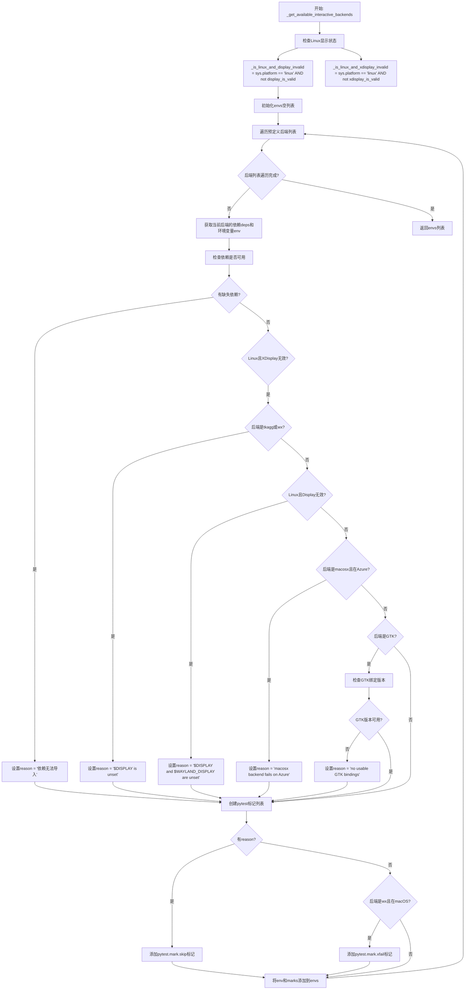

#### 带注释源码

```python
@functools.lru_cache
def _get_available_interactive_backends():
    """
    扫描系统环境，检测可用的交互式matplotlib后端。
    为每个后端检查依赖包、显示服务器可用性和平台特定约束，
    返回包含环境变量和pytest标记的后端配置列表。
    
    使用lru_cache装饰器缓存结果，避免重复检测。
    """
    # 检查Linux平台显示状态
    # 如果在Linux上且display_is_valid返回False（无显示服务器）
    _is_linux_and_display_invalid = (sys.platform == "linux" and
                                     not _c_internal_utils.display_is_valid())
    
    # 检查Linux平台X Display状态
    _is_linux_and_xdisplay_invalid = (sys.platform == "linux" and
                                      not _c_internal_utils.xdisplay_is_valid())
    
    envs = []  # 存储所有后端配置
    
    # 遍历预定义的后端列表，每个元素为(依赖列表, 环境变量字典)
    for deps, env in [
            # Qt相关后端：支持PyQt6, PySide6, PyQt5, PySide2
            *[([qt_api],
               {"MPLBACKEND": "qtagg", "QT_API": qt_api})
              for qt_api in ["PyQt6", "PySide6", "PyQt5", "PySide2"]],
            # Qt Cairo后端
            *[([qt_api, "cairocffi"],
               {"MPLBACKEND": "qtcairo", "QT_API": qt_api})
              for qt_api in ["PyQt6", "PySide6", "PyQt5", "PySide2"]],
            # GTK后端：支持GTK3和GTK4，渲染器可选agg或cairo
            *[(["cairo", "gi"], {"MPLBACKEND": f"gtk{version}{renderer}"})
              for version in [3, 4] for renderer in ["agg", "cairo"]],
            # Tk后端
            (["tkinter"], {"MPLBACKEND": "tkagg"}),
            # Wx后端
            (["wx"], {"MPLBACKEND": "wx"}),
            (["wx"], {"MPLBACKEND": "wxagg"}),
            # macOS后端
            (["matplotlib.backends._macosx"], {"MPLBACKEND": "macosx"}),
    ]:
        reason = None  # 初始化跳过原因为None
        
        # 检查依赖是否可导入
        missing = [dep for dep in deps if not importlib.util.find_spec(dep)]
        if missing:
            # 如果有缺失依赖，设置跳过原因
            reason = "{} cannot be imported".format(", ".join(missing))
        
        # Linux平台特殊检查：X Display无效时跳过tkagg和wx后端
        elif _is_linux_and_xdisplay_invalid and (
                env["MPLBACKEND"] == "tkagg"
                # wxWidgets问题：https://github.com/wxWidgets/Phoenix/pull/2638
                or env["MPLBACKEND"].startswith("wx")):
            reason = "$DISPLAY is unset"
        
        # Linux平台特殊检查：Display和Wayland Display都无效时
        elif _is_linux_and_display_invalid:
            reason = "$DISPLAY and $WAYLAND_DISPLAY are unset"
        
        # Azure CI环境跳过macOS后端
        elif env["MPLBACKEND"] == 'macosx' and os.environ.get('TF_BUILD'):
            reason = "macosx backend fails on Azure"
        
        # GTK后端特殊检查：验证GTK绑定版本
        elif env["MPLBACKEND"].startswith('gtk'):
            try:
                import gi  # type: ignore[import]
            except ImportError:
                # 即使gi存在，其C依赖可能不可用
                available_gtk_versions = []
            else:
                gi_repo = gi.Repository.get_default()
                available_gtk_versions = gi_repo.enumerate_versions('Gtk')
            version = env["MPLBACKEND"][3]  # 从后端名提取版本号(3或4)
            if f'{version}.0' not in available_gtk_versions:
                reason = "no usable GTK bindings"
        
        marks = []  # 初始化pytest标记列表
        
        # 根据原因添加跳过标记
        if reason:
            marks.append(pytest.mark.skip(reason=f"Skipping {env} because {reason}"))
        
        # macOS平台wx后端已知问题，添加xfail标记
        elif env["MPLBACKEND"].startswith('wx') and sys.platform == 'darwin':
            # github #16849: macOS上wx后端当前损坏
            marks.append(pytest.mark.xfail(reason='github #16849'))

        # 将环境变量与依赖信息合并，添加到结果列表
        envs.append(({**env, 'BACKEND_DEPS': ','.join(deps)}, marks))
    
    return envs  # 返回可用后端配置列表
```


### `_get_testable_interactive_backends`

该函数用于生成符合pytest.param格式的后端列表。它调用`_get_available_interactive_backends()`获取可用的交互式后端信息，并将每个后端的环境变量和标记转换为pytest参数化格式，为后续的测试用例提供参数化支持。

参数：
- 该函数没有参数

返回值：`list[pytest.param]`，返回一个包含所有可测试交互式后端的pytest参数列表，每个元素都是一个`pytest.param`对象，包含后端环境变量、测试标记和唯一标识ID

#### 流程图

```mermaid
flowchart TD
    A[开始] --> B[调用 _get_available_interactive_backends 获取后端列表]
    B --> C{遍历每个 env, marks}
    C -->|对于每个 env, marks| D[合并环境变量 {**env}]
    D --> E[展开标记 [*marks]]
    E --> F[生成唯一ID: '-'.join(f'{k}={v}' for k, v in env.items())]
    F --> G[创建 pytest.param 对象]
    G --> C
    C -->|遍历完成| H[收集所有 pytest.param 到列表]
    H --> I[返回列表]
    I --> J[结束]
```

#### 带注释源码

```python
def _get_testable_interactive_backends():
    """
    生成符合pytest.param格式的后端列表，用于测试交互式后端。
    
    该函数重新创建后端列表，因为下面的某些调用者可能会修改标记（marks）。
    它调用_get_available_interactive_backends()获取基础后端信息，
    然后将每个后端转换为pytest参数化测试所需的格式。
    
    返回:
        list: 包含pytest.param对象的列表，每个对象代表一个可测试的交互式后端
    """
    # 调用_get_available_interactive_backends()获取所有可用的交互式后端信息
    # 返回格式: [(env_dict, marks_list), ...]
    # We re-create this because some of the callers below might modify the markers.
    return [pytest.param({**env}, marks=[*marks],
                         id='-'.join(f'{k}={v}' for k, v in env.items()))
            for env, marks in _get_available_interactive_backends()]
            # 遍历每个(env, marks)元组
            # env: 环境变量字典（如 {"MPLBACKEND": "qtagg", "QT_API": "PyQt6"}）
            # marks: pytest标记列表（如 [pytest.mark.skip(...)]）
            # 使用pytest.param创建参数化测试对象
            # {**env}: 浅拷贝环境变量字典
            # marks=[*marks]: 展开并复制标记列表
            # id='-'.join(...): 生成描述性的唯一标识符，如 "MPLBACKEND=qtagg-QT_API=PyQt6"
```


### `_test_toolbar_button_la_mode_icon`

该函数用于测试工具栏按钮在LA（Luminance-Alpha）模式下的图标显示功能，通过创建一个LA模式的图像并将其设置为自定义工具的图标，验证工具栏能否正确显示LA模式的图标（解决GH issue 25174）。

参数：

- `fig`：`matplotlib.figure.Figure`，matplotlib的Figure对象，用于获取canvas manager以访问toolmanager和toolbar

返回值：`None`，该函数无返回值，主要用于执行测试逻辑

#### 流程图

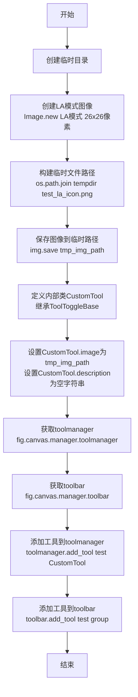

#### 带注释源码

```
def _test_toolbar_button_la_mode_icon(fig):
    # test a toolbar button icon using an image in LA mode (GH issue 25174)
    # create an icon in LA mode
    with tempfile.TemporaryDirectory() as tempdir:
        # 创建一个26x26像素的LA（Luminance-Alpha）模式图像
        # LA模式包含亮度通道和Alpha通道
        img = Image.new("LA", (26, 26))
        
        # 构建临时文件保存路径
        tmp_img_path = os.path.join(tempdir, "test_la_icon.png")
        
        # 将LA模式的图像保存为PNG文件
        img.save(tmp_img_path)

        # 定义一个内部工具类CustomTool，继承自ToolToggleBase
        # 用于测试工具栏按钮的图标显示
        class CustomTool(ToolToggleBase):
            # 设置工具图标为刚才创建的LA模式图像路径
            image = tmp_img_path
            # 设置工具描述为空字符串
            # 注意：gtk3后端不允许description为None，因此设为空字符串

        # 从Figure的canvas manager获取toolmanager
        # toolmanager负责管理工具的添加、删除和激活
        toolmanager = fig.canvas.manager.toolmanager
        
        # 从Figure的canvas manager获取toolbar
        # toolbar是实际的工具栏UI组件
        toolbar = fig.canvas.manager.toolbar
        
        # 将CustomTool添加到toolmanager中，工具名为"test"
        toolmanager.add_tool("test", CustomTool)
        
        # 将工具添加到toolbar中，属于"group"组
        toolbar.add_tool("test", "group")
```


### `_test_interactive_impl`

该函数是交互式后端测试的核心实现，在子进程中运行，用于模拟交互式后端的完整测试流程。测试涵盖后端切换、图形绘制、工具栏功能、定时器事件、图形保存以及窗口关闭后的重保存等关键交互环节。

参数：无（函数定义无参数，但通过 `sys.argv[1]` 接收 JSON 格式的配置参数）

返回值：`None`，无返回值（该函数作为测试入口，被 `test_interactive_backend` 通过子进程调用）

#### 流程图

```mermaid
flowchart TD
    A[开始 _test_interactive_impl] --> B[导入所需模块和库]
    B --> C[配置 matplotlib webagg 参数]
    C --> D[从 sys.argv[1] 解析 JSON 配置]
    D --> E[获取 backend 名称并转为小写]
    E --> F{backend 以 'agg' 结尾且非 gtk/web?}
    F -->|是| G[创建 figure 强制初始化 interactive framework]
    F -->|否| H[跳过此步骤]
    G --> I{backend 不是 'tkagg'?}
    I -->|是| J[测试切换到 tkagg 应抛出 ImportError]
    I -->|否| K[跳过切换测试]
    J --> L{cairocffi 可用?}
    L -->|是| M[测试切换到 cairo 后端]
    L -->|否| N[跳过 cairo 测试]
    M --> O[测试切换到 svg 后端]
    N --> O
    K --> O
    O --> P[强制使用指定 backend]
    P --> Q[创建 figure 和 axes]
    Q --> R[验证 canvas 类型]
    R --> S{toolbar 配置为 toolmanager?}
    S -->|是| T[测试 toolbar 按钮 LA 模式图标]
    S -->|否| U[跳过图标测试]
    T --> U
    U --> V[绘制图形 0,1 -> 2,3]
    V --> W{toolbar2 存在?}
    W -->|是| X[绘制橡皮筋选框]
    W -->|否| Y[跳过橡皮筋]
    X --> Y
    Y --> Z[如果是 webagg 且 Python >= 3.14, 设置新事件循环]
    Z --> AA[创建 timer 触发 'q' 键退出]
    AA --> AB[连接 draw_event 启动 timer]
    AB --> AC[连接 close_event]
    AC --> AD[保存图形到 BytesIO]
    AD --> AE[调用 plt.show 显示]
    AE --> AF[暂停 0.5 秒等待窗口关闭]
    AF --> AG{窗口已关闭?}
    AG -->|是| AH[验证 canvas 已重置为 FigureCanvasBase]
    AH --> AI[再次保存图形]
    AG -->|否| AF
    AI --> AJ{backend 以 agg 结尾?}
    AJ -->|是| AK[验证保存内容一致]
    AJ -->|否| AL[结束]
    AK --> AL[结束]
```

#### 带注释源码

```python
# The source of this function gets extracted and run in another process, so it
# must be fully self-contained.
# Using a timer not only allows testing of timers (on other backends), but is
# also necessary on gtk3 and wx, where directly processing a KeyEvent() for "q"
# from draw_event causes breakage as the canvas widget gets deleted too early.
def _test_interactive_impl():
    """
    在子进程中模拟交互式后端测试的核心实现函数。
    
    该函数被设计为完全自包含，可以被提取并在另一个进程中运行。
    使用定时器不仅允许测试其他后端上的定时器，而且在 gtk3 和 wx 上也是必需的，
    因为直接从 draw_event 处理 "q" 的 KeyEvent() 会导致画布小部件过早删除而崩溃。
    """
    import importlib.util
    import io
    import json
    import sys

    import pytest

    import matplotlib as mpl
    from matplotlib import pyplot as plt
    from matplotlib.backend_bases import KeyEvent, FigureCanvasBase
    
    # 配置 matplotlib 参数，禁用 webagg 浏览器打开并减少端口重试次数
    mpl.rcParams.update({
        "webagg.open_in_browser": False,
        "webagg.port_retries": 1,
    })

    # 从命令行参数解析 JSON 格式的配置（toolbar 类型等）
    mpl.rcParams.update(json.loads(sys.argv[1]))
    backend = plt.rcParams["backend"].lower()

    # 如果是 agg 后端且不是 gtk 或 web 后端，需要强制初始化 interactive framework
    if backend.endswith("agg") and not backend.startswith(("gtk", "web")):
        # Force interactive framework setup.
        # 创建并关闭 figure 以强制初始化交互式框架
        fig = plt.figure()
        plt.close(fig)

        # 检查不能切换到使用其他交互式框架的后端，但可以切换到使用 cairo 而非 agg 的后端，
        # 或非交互式后端。使用 tkagg 作为"其他"交互式后端进行测试。
        # 注意：不测试从 gtk3 切换（因为此时 Gtk.main_level() 尚未设置）和 webagg（不使用交互式框架）

        if backend != "tkagg":
            # 尝试切换到 tkagg 应该失败（如果当前不是 tkagg）
            with pytest.raises(ImportError):
                mpl.use("tkagg", force=True)

        def check_alt_backend(alt_backend):
            """测试切换到备用后端的辅助函数"""
            mpl.use(alt_backend, force=True)
            fig = plt.figure()
            # 验证 canvas 模块名匹配预期后端
            assert (type(fig.canvas).__module__ ==
                    f"matplotlib.backends.backend_{alt_backend}")
            plt.close("all")

        # 如果 cairocffi 可用，测试切换到 cairo 后端
        if importlib.util.find_spec("cairocffi"):
            check_alt_backend(backend[:-3] + "cairo")
        # 测试切换到 svg 非交互式后端
        check_alt_backend("svg")
    
    # 强制使用指定的后端
    mpl.use(backend, force=True)

    # 创建 figure 和 axes
    fig, ax = plt.subplots()
    # 验证 canvas 类型与预期后端匹配
    assert type(fig.canvas).__module__ == f"matplotlib.backends.backend_{backend}"

    # 验证窗口标题为 "Figure 1"
    assert fig.canvas.manager.get_window_title() == "Figure 1"

    # 如果使用 toolmanager，测试工具栏按钮的 LA 模式图标（处理 GH issue 25174）
    if mpl.rcParams["toolbar"] == "toolmanager":
        # test toolbar button icon LA mode see GH issue 25174
        _test_toolbar_button_la_mode_icon(fig)

    # 绘制简单的线图
    ax.plot([0, 1], [2, 3])
    # 如果存在 toolbar2，测试绘制橡皮筋选框
    if fig.canvas.toolbar:  # i.e toolbar2.
        fig.canvas.toolbar.draw_rubberband(None, 1., 1, 2., 2)

    # 对于 webagg 后端且 Python >= 3.14，需要设置新的事件循环
    if backend == 'webagg' and sys.version_info >= (3, 14):
        import asyncio
        asyncio.set_event_loop(asyncio.new_event_loop())

    # 创建定时器（测试浮点数转换为整数）
    timer = fig.canvas.new_timer(1.)  # Test that floats are cast to int.
    # 添加回调：在定时器触发时模拟按下 'q' 键退出
    timer.add_callback(KeyEvent("key_press_event", fig.canvas, "q")._process)
    # 连接 draw_event 事件以启动定时器（触发退出）
    fig.canvas.mpl_connect("draw_event", lambda event: timer.start())
    # 连接 close_event 事件以打印关闭事件
    fig.canvas.mpl_connect("close_event", print)

    # 将图形保存到 BytesIO 对象中（格式为 png，100 DPI）
    result = io.BytesIO()
    fig.savefig(result, format='png', dpi=100)

    # 调用 plt.show() 显示图形
    plt.show()

    # 确保窗口真正关闭（暂停 0.5 秒等待关闭完成）
    plt.pause(0.5)

    # 当 figure 关闭后，其 manager 被移除，canvas 重置为 FigureCanvasBase。
    # 此时应该仍然可以保存图形。
    assert type(fig.canvas) == FigureCanvasBase, str(fig.canvas)
    result_after = io.BytesIO()
    fig.savefig(result_after, format='png', dpi=100)

    # 如果是 agg 基础的交互式后端，验证关闭前后的保存内容一致
    if backend.endswith("agg"):
        # agg-based interactive backends should save the same image as a non-interactive
        # figure
        assert result.getvalue() == result_after.getvalue()
```


### `test_interactive_backend`

该函数是测试交互式后端基础功能的主测试入口，通过参数化测试不同交互式后端和工具栏类型的组合，验证后端的创建、绘图、计时器、窗口管理等功能是否正常工作。

参数：

- `env`：`dict`，包含后端环境变量（如 `MPLBACKEND`、`QT_API` 等）的字典，用于配置测试的后端类型
- `toolbar`：`str`，工具栏类型，可选值为 `"toolbar2"` 或 `"toolmanager"`，用于测试不同工具栏实现

返回值：`None`，该函数为测试函数，通过 `pytest` 断言验证行为，不直接返回值

#### 流程图

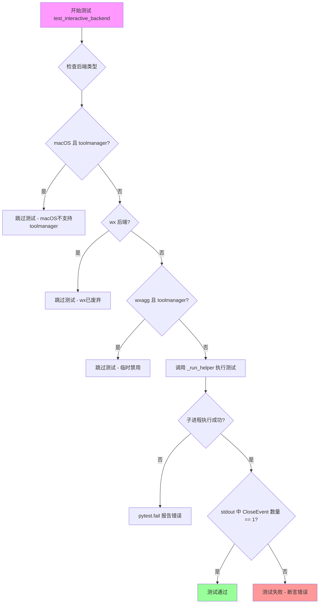

#### 带注释源码

```python
@pytest.mark.parametrize("env", _get_testable_interactive_backends())
@pytest.mark.parametrize("toolbar", ["toolbar2", "toolmanager"])
@pytest.mark.flaky(reruns=_retry_count)
def test_interactive_backend(env, toolbar):
    """
    测试交互式后端基础功能的主入口函数。
    
    参数化测试所有可用的交互式后端和两种工具栏类型（toolbar2 和 toolmanager），
    验证交互式后端的核心功能：图形创建、绘图、计时器、窗口关闭等。
    """
    # 检查 macOS 后端是否与 toolmanager 一起使用
    # macOS 后端不支持 toolmanager，跳过该组合
    if env["MPLBACKEND"] == "macosx":
        if toolbar == "toolmanager":
            pytest.skip("toolmanager is not implemented for macosx.")
    
    # wx 后端已被废弃且在 appveyor 上测试失败，跳过
    if env["MPLBACKEND"] == "wx":
        pytest.skip("wx backend is deprecated; tests failed on appveyor")
    
    # wxagg 与 toolmanager 组合时 show() 会改变图形高度导致测试失败
    # 临时跳过该组合
    if env["MPLBACKEND"] == "wxagg" and toolbar == "toolmanager":
        pytest.skip("Temporarily deactivated: show() changes figure height "
                    "and thus fails the test")
    
    # 使用子进程运行交互式测试实现
    # _run_helper 会启动一个独立的 Python 进程来执行测试
    try:
        proc = _run_helper(
            _test_interactive_impl,  # 在子进程中运行的测试逻辑
            json.dumps({"toolbar": toolbar}),  # 传递给子进程的参数
            timeout=_test_timeout,  # 超时时间（CI环境120秒，本地20秒）
            extra_env=env,  # 额外的环境变量（如 MPLBACKEND）
        )
    except subprocess.CalledProcessError as err:
        # 子进程执行失败，报告错误信息
        pytest.fail(
            "Subprocess failed to test intended behavior\n"
            + str(err.stderr))
    
    # 验证子进程输出中恰好包含一个 CloseEvent
    # 这证明窗口能够正常打开、交互并关闭
    assert proc.stdout.count("CloseEvent") == 1
```


### `_test_thread_impl`

该函数是matplotlib交互式后端线程安全性的核心测试实现，通过在独立线程中执行绘图操作（ax.plot和fig.canvas.draw）来验证matplotlib在多线程环境下的正确性和稳定性，并测试关闭事件处理流程。

参数：

- 该函数无参数

返回值：无返回值

#### 流程图

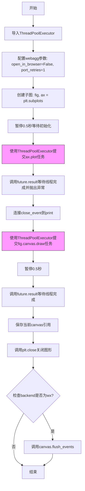

#### 带注释源码

```python
def _test_thread_impl():
    """
    测试线程池中执行绘图操作的线程安全性。
    该函数必须在子进程中运行，因为它是作为测试实现被提取并执行的。
    """
    # 导入线程池执行器，用于并发执行绘图操作
    from concurrent.futures import ThreadPoolExecutor

    # 导入matplotlib及其pyplot模块
    import matplotlib as mpl
    from matplotlib import pyplot as plt

    # 配置webagg后端参数：禁止在浏览器中打开，重试次数为1
    mpl.rcParams.update({
        "webagg.open_in_browser": False,
        "webagg.port_retries": 1,
    })

    # 测试从线程创建artist和执行draw操作不会导致崩溃
    # 注意：不提供其他保证！
    
    # 创建图形和坐标轴
    fig, ax = plt.subplots()
    
    # 需要pause而非show(block=False)，至少在toolbar2-tkagg上需要
    plt.pause(0.5)

    # 提交ax.plot任务到线程池，在独立线程中执行绘图操作
    future = ThreadPoolExecutor().submit(ax.plot, [1, 3, 6])
    # 等待线程完成并重新抛出任何异常
    future.result()

    # 连接close_event处理器到print函数
    fig.canvas.mpl_connect("close_event", print)
    
    # 提交fig.canvas.draw任务到线程池，在独立线程中执行绘制
    future = ThreadPoolExecutor().submit(fig.canvas.draw)
    
    # 暂停0.5秒
    # 注意：在Tkagg上flush_events会失败(bpo-41176)
    plt.pause(0.5)
    
    # 等待绘制线程完成
    future.result()
    
    # 保存当前canvas引用，因为关闭图形会重置canvas
    canvas = fig.canvas
    
    # 关闭图形，后端负责刷新所有事件
    plt.close()
    
    # 如果是wx后端，额外调用flush_events
    # TODO: 调查为什么WX仅在py>=3.8上需要此操作
    if plt.rcParams["backend"].lower().startswith("wx"):
        canvas.flush_events()
```


### `test_interactive_thread_safety`

该函数是 matplotlib 后端交互测试的核心部分，用于验证后端在多线程环境下的线程安全性。它通过参数化测试遍历所有可用的交互式后端，在子进程中运行线程安全实现测试，并通过断言验证子进程正确发送了关闭事件。

参数：

- `env`：`Dict[str, str]`，由 pytest 参数化传入的环境变量字典，包含后端配置（如 `MPLBACKEND`、`QT_API` 等），用于指定测试的后端类型

返回值：`None`，无显式返回值，通过 `assert` 语句进行验证，若失败则抛出 `AssertionError`

#### 流程图

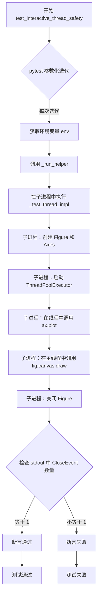

#### 带注释源码

```python
@pytest.mark.parametrize("env", _thread_safe_backends)
@pytest.mark.flaky(reruns=_retry_count)
def test_interactive_thread_safety(env):
    """
    测试交互式后端的线程安全性。
    
    该测试通过在子进程中运行 _test_thread_impl 来验证：
    1. 可以在子线程中创建 artist（如 ax.plot）
    2. 可以在子线程中调用 canvas.draw
    3. 关闭事件能正确触发和传递
    
    Parameters
    ----------
    env : dict
        参数化后端环境变量，包含 MPLBACKEND、QT_API 等配置
    """
    # 使用子进程运行线程测试实现
    # _run_helper 是 matplotlib.testing.subprocess_run_helper 的别名
    # 用于在独立子进程中运行测试代码，确保测试隔离性
    proc = _run_helper(
        _test_thread_impl,          # 线程安全测试的实现函数
        timeout=_test_timeout,      # 超时时间：CI 环境 120s，本地 20s
        extra_env=env               # 额外环境变量，指定后端类型
    )
    
    # 验证子进程输出中包含且仅包含一个 CloseEvent
    # 这确保了：
    # 1. 窗口成功打开并显示了图形
    # 2. 关闭事件被正确触发
    # 3. 没有发生崩溃或异常
    assert proc.stdout.count("CloseEvent") == 1
```


# 详细设计文档

## 1. 一段话描述

`_impl_test_lazy_auto_backend_selection` 是一个测试辅助函数，用于验证 Matplotlib 的延迟自动后端选择机制——即仅导入 `pyplot` 不会触发后端解析，但实际绘图操作（如 `plt.plot()`）才会触发后端的解析和加载。

## 2. 文件的整体运行流程

该文件是 Matplotlib 的交互式后端测试文件，主要包含以下测试模块：

1. **后端可用性检测** (`_get_available_interactive_backends`)：检测系统中可用的交互式后端
2. **交互式后端测试** (`test_interactive_backend`)：测试各后端的基本功能
3. **线程安全性测试** (`test_interactive_thread_safety`)：验证后端在多线程环境下的表现
4. **延迟后端选择测试** (`test_lazy_auto_backend_selection`)：验证后端的延迟加载机制
5. **其他专项测试**：工具栏、计时器、信号处理等

## 3. 类的详细信息

该函数为全局函数，不属于任何类。

### 全局变量

| 名称 | 类型 | 描述 |
|------|------|------|
| `_test_timeout` | `int` | 测试超时时间（CI环境120秒，本地20秒） |
| `_retry_count` | `int` | 失败重试次数（CI环境3次，本地0次） |
| `_thread_safe_backends` | `list` | 线程安全的可测试后端列表 |

### 全局函数

| 名称 | 描述 |
|------|------|
| `_get_available_interactive_backends()` | 获取系统中可用交互式后端及其依赖信息 |
| `_get_testable_interactive_backends()` | 获取可测试的交互式后端参数列表 |
| `_run_helper()` | 在子进程中运行测试的辅助函数 |
| `_impl_test_lazy_auto_backend_selection()` | 测试延迟自动后端选择的核心实现 |

---

## 4. 函数详细信息

### `_impl_test_lazy_auto_backend_selection`

参数：无

返回值：无（`None`，该函数通过断言验证行为）

#### 描述

该函数是 `test_lazy_auto_backend_selection` 的核心实现，通过子进程运行以确保测试的独立性。它验证 Matplotlib 的延迟自动后端选择机制：仅导入 `pyplot` 模块不应触发后端解析（`backend` 应为非字符串类型，`_backend_mod` 应为 `None`），而实际执行绘图操作（如 `plt.plot(5)`）才应触发后端解析（此时 `backend` 变为字符串类型，`_backend_mod` 不为 `None`）。

#### 流程图

```mermaid
flowchart TD
    A[开始] --> B[导入matplotlib和matplotlib.pyplot]
    --> C[获取backend值<br/>bk = matplotlib.rcParams._get('backend')]
    --> D{backend是否为字符串?}
    D -->|否| E[断言通过: backend未解析]
    --> F[断言plt._backend_mod is None]
    --> G[执行plt.plot(5)触发实际绘图]
    --> H[断言plt._backend_mod is not None]
    --> I[再次获取backend值]
    --> J{backend是否为字符串?}
    J -->|是| K[断言通过: backend已解析]
    --> L[测试结束]
    D -->|是| M[测试失败: backend过早解析]
    J -->|否| N[测试失败: backend未被解析]
```

#### 带注释源码

```python
def _impl_test_lazy_auto_backend_selection():
    """
    测试延迟自动后端选择逻辑的核心实现。
    
    该函数在子进程中运行，以确保测试的独立性和准确性。
    验证以下行为：
    1. 仅导入pyplot不应触发后端解析
    2. 实际绘图操作应触发后端解析
    """
    # 导入matplotlib主模块和pyplot子模块
    import matplotlib
    import matplotlib.pyplot as plt
    
    # 步骤1: 仅导入pyplot不应该触发后端解析
    # 获取backend参数值（使用_get方法避免触发解析）
    bk = matplotlib.rcParams._get('backend')
    
    # 断言: 此时backend不应该是字符串类型（说明尚未解析到具体后端）
    assert not isinstance(bk, str)
    
    # 断言: 此时pyplot的_backend_mod应该为None（后端模块未加载）
    assert plt._backend_mod is None
    
    # 步骤2: 执行实际绘图操作应该触发后端解析
    # 调用plot函数会触发后端模块的加载
    plt.plot(5)
    
    # 断言: 此时_backend_mod应该不为None（后端模块已加载）
    assert plt._backend_mod is not None
    
    # 步骤3: 再次获取backend值验证已解析为具体后端
    bk = matplotlib.rcParams._get('backend')
    
    # 断言: 此时backend应该是字符串类型（已解析为具体后端名称）
    assert isinstance(bk, str)
```

---

## 5. 关键组件信息

| 组件名称 | 一句话描述 |
|----------|------------|
| `matplotlib.rcParams` | Matplotlib的全局配置参数管理器 |
| `matplotlib.rcParams._get()` | 获取参数的内部方法，可避免触发后端解析 |
| `plt._backend_mod` | pyplot模块中存储已加载后端模块的变量 |
| `plt.plot()` | pyplot的绘图函数，会触发后端初始化 |
| `_run_helper()` | 在独立子进程中运行测试的辅助函数 |

---

## 6. 潜在的技术债务或优化空间

1. **测试覆盖不够全面**：当前只验证了 `plt.plot()` 触发后端解析，未测试其他可能触发后端解析的操作（如 `plt.figure()`、`plt.show()` 等）

2. **缺少对多后端的测试**：未测试在不同自动后端选择场景下的延迟加载行为

3. **断言信息不够详细**：断言失败时缺乏有意义的错误信息，难以快速定位问题

4. **硬编码的测试值**：`plt.plot(5)` 使用了硬编码的数据点，可以考虑使用参数化测试

---

## 7. 其它项目

### 设计目标与约束

- **设计目标**：验证 Matplotlib 采用延迟加载策略选择后端，即只有在真正需要渲染图形时才解析和加载后端模块
- **设计约束**：测试必须在独立子进程中运行，以避免影响主进程的全局状态

### 错误处理与异常设计

- 使用 `assert` 语句进行验证，符合 Python 测试惯例
- 依赖 `_run_helper` 处理子进程超时和错误情况

### 数据流与状态机

```
导入模块 --> 后端未解析状态 --> 执行绘图 --> 后端已解析状态
     |              |                       |
     v              v                       v
  backend=非字符串  _backend_mod=None       backend=字符串
                                         _backend_mod=已加载模块
```

### 外部依赖与接口契约

- **依赖模块**：`matplotlib`、`matplotlib.pyplot`
- **依赖函数**：`_run_helper`（测试运行辅助函数）
- **接口契约**：该函数不接受参数，不返回任何值，仅通过断言验证行为


### `test_lazy_auto_backend_selection`

该测试函数用于验证 Matplotlib 的延迟自动后端选择机制：仅导入 `pyplot` 模块不应立即触发后端解析，后端应在首次实际绘图操作（如 `plt.plot()`）时才被加载。

参数：

- 该函数无显式参数，依赖外部全局配置 `_test_timeout`

返回值：`None`，通过 `_run_helper` 执行子进程测试并验证结果

#### 流程图

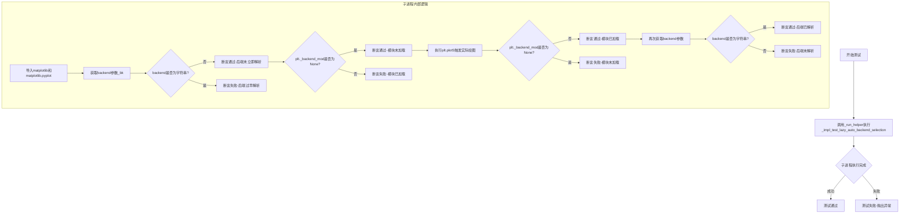

#### 带注释源码

```python
def test_lazy_auto_backend_selection():
    """
    测试延迟自动后端选择机制。
    
    该测试验证以下行为：
    1. 仅导入 pyplot 不会立即解析后端
    2. 后端模块在首次实际绘图操作时才被加载
    3. 后端参数在绘图后变为字符串类型
    """
    # 使用 _run_helper 在子进程中运行实现逻辑
    # timeout 使用全局变量 _test_timeout（CI 环境为 120s，本地为 20s）
    _run_helper(_impl_test_lazy_auto_backend_selection,
                timeout=_test_timeout)
```

---

### `_impl_test_lazy_auto_backend_selection`（内部实现）

这是实际执行测试逻辑的内部函数，被 `test_lazy_auto_backend_selection` 调用。

参数：

- 该函数无显式参数

返回值：`None`

#### 流程图

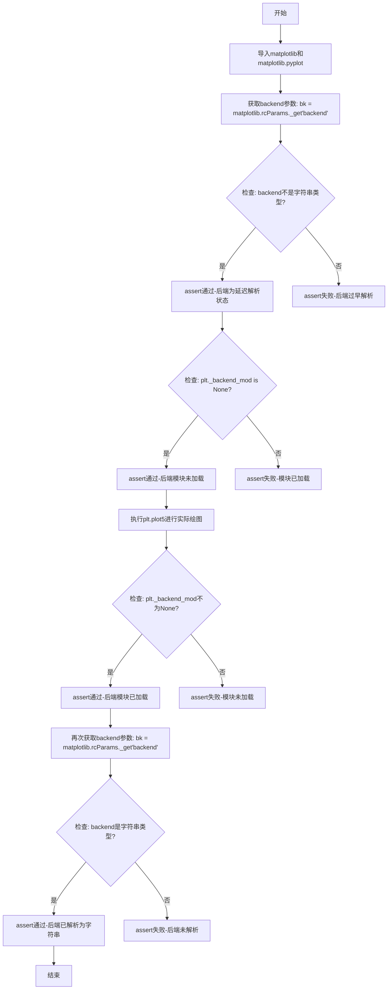

#### 带注释源码

```python
def _impl_test_lazy_auto_backend_selection():
    """
    延迟自动后端选择的核心测试实现。
    
    该函数作为子进程入口点，必须完全自包含。
    验证 Matplotlib 的懒加载机制：
    - 导入 pyplot 时不触发后端解析
    - 首次绘图时才加载后端模块
    """
    # 导入 matplotlib 库
    import matplotlib
    # 导入 pyplot 模块（此时不应触发后端解析）
    import matplotlib.pyplot as plt
    
    # 步骤 1：验证仅导入 pyplot 不会触发后端解析
    # 使用 _get 方法获取原始后端值（不触发解析）
    bk = matplotlib.rcParams._get('backend')
    # 断言：此时 backend 不应是字符串类型（应为延迟对象）
    assert not isinstance(bk, str)
    # 断言：后端模块尚未加载
    assert plt._backend_mod is None
    
    # 步骤 2：执行实际绘图操作，触发后端加载
    plt.plot(5)  # 绘制一个简单的数据点
    # 断言：后端模块现在已加载
    assert plt._backend_mod is not None
    
    # 步骤 3：验证后端已被解析为字符串
    bk = matplotlib.rcParams._get('backend')
    # 断言：backend 现在应该是字符串类型
    assert isinstance(bk, str)
```


### `test_qt5backends_uses_qt5`

验证 Qt5 后端（qt5agg、qt5cairo、qt5）确实使用了 Qt5 绑定（PyQt5 或 PySide2），而不是错误地使用了 Qt6 绑定。

参数：此函数没有参数。

返回值：`None`，该函数通过 `pytest.skip` 跳过测试或通过 `_run_helper` 执行子进程测试。

#### 流程图

```mermaid
flowchart TD
    A[开始测试 test_qt5backends_uses_qt5] --> B[检查可用的 Qt5 绑定: PyQt5, pyside2]
    C[检查可用的 Qt6 绑定: PyQt6, pyside6]
    B --> D{len(qt5_bindings) == 0 或 len(qt6_bindings) == 0?}
    D -->|是| E[pytest.skip: need both QT6 and QT5 bindings]
    D -->|否| F[_run_helper _implqt5agg]
    F --> G{pycairo 可用?}
    G -->|是| H[_run_helper _implcairo]
    G -->|否| I[跳过 cairo 测试]
    H --> J[_run_helper _implcore]
    I --> J
    J --> K[测试结束]
    E --> K
```

#### 带注释源码

```python
def test_qt5backends_uses_qt5():
    """
    测试 Qt5 后端确实使用了 Qt5 绑定。
    该测试验证当导入 qt5agg、qt5cairo 或 qt5 后端时，
    Python 环境中加载的是 PyQt5 或 PySide2，而不是 PyQt6 或 PySide6。
    """
    # 检查系统中可用的 Qt5 绑定
    qt5_bindings = [
        dep for dep in ['PyQt5', 'pyside2']
        if importlib.util.find_spec(dep) is not None
    ]
    # 检查系统中可用的 Qt6 绑定
    qt6_bindings = [
        dep for dep in ['PyQt6', 'pyside6']
        if importlib.util.find_spec(dep) is not None
    ]
    # 如果 Qt5 或 Qt6 绑定缺失，则跳过测试
    if len(qt5_bindings) == 0 or len(qt6_bindings) == 0:
        pytest.skip('need both QT6 and QT5 bindings')
    
    # 测试 qt5agg 后端
    _run_helper(_implqt5agg, timeout=_test_timeout)
    
    # 如果 pycairo 可用，测试 qt5cairo 后端
    if importlib.util.find_spec('pycairo') is not None:
        _run_helper(_implcairo, timeout=_test_timeout)
    
    # 测试 qt5 核心后端
    _run_helper(_implcore, timeout=_test_timeout)
```


### `test_cross_Qt_imports`

该测试函数用于验证当混合使用 Qt5 和 Qt6 绑定时（如主机程序使用 Qt5 但 matplotlib 使用 Qt6，或反之），系统能够正确发出警告信息。测试通过在子进程中运行混用不同 Qt 版本的代码，并检查标准错误输出中是否包含预期的警告文本。

参数：

- `host`：`str`，主机应用程序使用的 Qt 绑定名称（如 "PyQt5"、"PySide2"、"PyQt6" 或 "PySide6"）
- `mpl`：`str`，matplotlib 使用的 Qt 绑定名称（与 host 不同的 Qt major 版本）

返回值：`None`，该函数通过 assert 语句验证结果，不显式返回值

#### 流程图

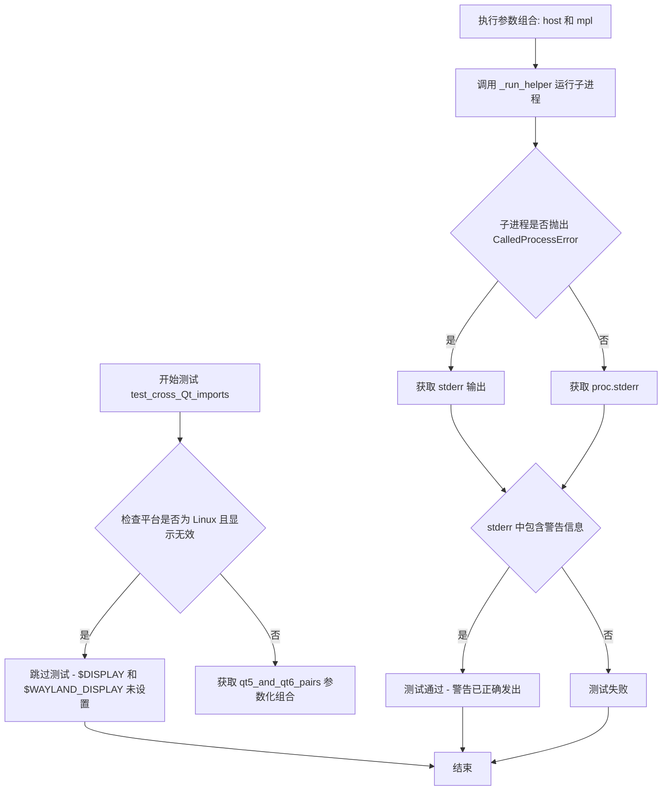

#### 带注释源码

```python
@pytest.mark.skipif(
    sys.platform == "linux" and not _c_internal_utils.display_is_valid(),
    reason="$DISPLAY and $WAYLAND_DISPLAY are unset")
@pytest.mark.parametrize('host, mpl', [*qt5_and_qt6_pairs()])
def test_cross_Qt_imports(host, mpl):
    """
    测试混合使用 Qt5 和 Qt6 绑定时的警告。
    
    该测试验证当主机应用程序使用一个 Qt major 版本（如 Qt5），
    而 matplotlib 使用另一个 Qt major 版本（如 Qt6）时，
    系统能够正确发出警告。
    """
    try:
        # 运行子进程执行 _impl_test_cross_Qt_imports
        # 传入 host 和 mpl 作为命令行参数
        proc = _run_helper(_impl_test_cross_Qt_imports, host, mpl,
                           timeout=_test_timeout)
    except subprocess.CalledProcessError as ex:
        # 如果子进程崩溃或被杀死，我们仍然检查警告是否被打印
        # 因为我们确实试图警告用户他们正在做不期望的事情
        stderr = ex.stderr
    else:
        # 正常情况下获取子进程的标准错误输出
        stderr = proc.stderr
    
    # 断言错误输出中包含预期的警告信息
    assert "Mixing Qt major versions may not work as expected." in stderr


def _impl_test_cross_Qt_imports():
    """
    在子进程中运行的实现函数，用于实际测试 Qt 混用警告。
    该函数必须完全自包含，因为它的源代码会被提取并在另一个进程中运行。
    """
    import importlib
    import sys
    import warnings

    # 从命令行参数获取主机绑定和 matplotlib 绑定
    _, host_binding, mpl_binding = sys.argv
    
    # 导入 mpl 绑定的 QtCore，强制使用该绑定
    importlib.import_module(f'{mpl_binding}.QtCore')
    mpl_binding_qwidgets = importlib.import_module(f'{mpl_binding}.QtWidgets')
    
    # 导入 matplotlib 的 Qt 后端
    import matplotlib.backends.backend_qt
    
    # 导入主机绑定的 QtWidgets
    host_qwidgets = importlib.import_module(f'{host_binding}.QtWidgets')

    # 创建主机绑定的 QApplication 实例
    host_app = host_qwidgets.QApplication(["mpl testing"])
    
    # 设置警告过滤器，将 UserWarning 级别提升为错误
    # 这样警告会被捕获而不是忽略
    warnings.filterwarnings("error", message=r".*Mixing Qt major.*",
                            category=UserWarning)
    
    # 尝试创建 matplotlib 的 QApplication
    # 这应该会触发混合 Qt major 版本的警告
    matplotlib.backends.backend_qt._create_qApp()
```


### `test_webagg`

该函数是专门针对WebAgg后端的独立测试，用于验证服务器启动和浏览器连接功能。测试启动一个子进程运行WebAgg后端，然后尝试通过HTTP连接到服务器，验证连接成功后发送SIGINT信号优雅关闭服务器，并确认进程正确退出。

参数： 无

返回值：`None`，该函数通过pytest断言进行验证，不直接返回值

#### 流程图

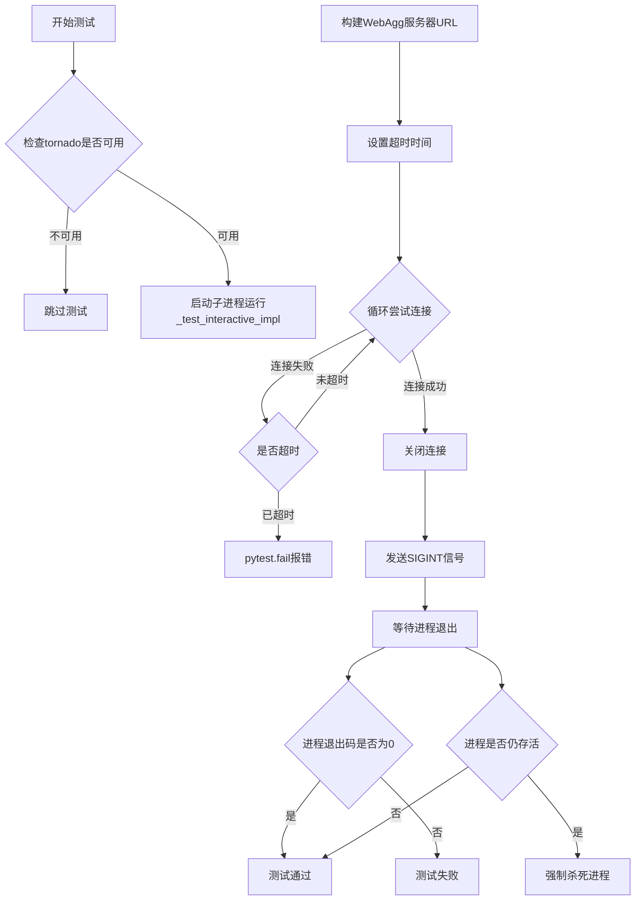

#### 带注释源码

```python
@pytest.mark.skipif('TF_BUILD' in os.environ,
                    reason="this test fails an azure for unknown reasons")
@pytest.mark.skipif(sys.platform == "win32", reason="Cannot send SIGINT on Windows.")
def test_webagg():
    """
    专门针对WebAgg后端的独立测试，验证服务器启动和浏览器连接。
    测试流程：
    1. 启动子进程运行交互式后端测试代码
    2. 轮询尝试连接到WebAgg服务器
    3. 连接成功后发送SIGINT信号优雅关闭服务器
    4. 验证进程正确退出
    """
    # 确保tornado库可用，WebAgg后端依赖tornado
    pytest.importorskip("tornado")
    
    # 启动子进程运行_test_interactive_impl函数
    # 使用subprocess.Popen创建独立进程
    proc = subprocess.Popen(
        [sys.executable, "-c",
         # 获取_test_interactive_impl函数的源代码并执行
         inspect.getsource(_test_interactive_impl)
         + "\n_test_interactive_impl()", "{}"],
        # 设置环境变量，指定使用webagg后端
        env={**os.environ, "MPLBACKEND": "webagg", "SOURCE_DATE_EPOCH": "0"})
    
    # 构建WebAgg服务器的URL地址
    # 从matplotlib配置中获取地址和端口
    url = f'http://{mpl.rcParams["webagg.address"]}:{mpl.rcParams["webagg.port"]}'
    
    # 计算超时截止时间
    timeout = time.perf_counter() + _test_timeout
    
    try:
        # 循环尝试连接到WebAgg服务器
        while True:
            try:
                # 检查子进程是否仍在运行
                retcode = proc.poll()
                # 断言子进程存活
                assert retcode is None
                # 尝试打开URL连接
                conn = urllib.request.urlopen(url)
                # 连接成功，退出循环
                break
            except urllib.error.URLError:
                # 连接失败，检查是否超时
                if time.perf_counter() > timeout:
                    # 超时，测试失败
                    pytest.fail("Failed to connect to the webagg server.")
                else:
                    # 未超时，继续重试
                    continue
        
        # 关闭连接
        conn.close()
        
        # 发送SIGINT信号给子进程，请求优雅关闭
        proc.send_signal(signal.SIGINT)
        
        # 等待进程退出，验证退出码为0（正常退出）
        assert proc.wait(timeout=_test_timeout) == 0
    finally:
        # 确保子进程被正确终止
        if proc.poll() is None:
            # 如果进程仍存活，强制杀死
            proc.kill()
```


### `_lazy_headless`

该函数是一个测试辅助函数，用于模拟无头（headless）Linux 环境，验证在无显示环境下后端是否正确回退到 Agg。函数通过移除显示相关环境变量、检查默认后端、动态加载依赖并尝试切换后端来确保后端选择的鲁棒性。

参数：

- `backend`：`str`，从命令行参数获取，表示要测试的后端名称（如 "qtagg", "tkagg" 等）
- `deps`：`str`，从命令行参数获取，逗号分隔的依赖模块名称列表（如 "PyQt6,PySide6"）

返回值：`None`，无返回值。函数通过 `sys.exit(1)` 表示测试失败（当切换后端未抛出预期异常时）。

#### 流程图

```mermaid
flowchart TD
    A[Start _lazy_headless] --> B[获取命令行参数: backend, deps]
    B --> C[解析 deps 为列表]
    C --> D[移除环境变量 DISPLAY 和 WAYLAND_DISPLAY]
    D --> E{检查依赖是否已加载}
    E -->|是| F[断言失败, 退出]
    E -->|否| G[导入 matplotlib.pyplot]
    G --> H{检查默认后端是否为 'agg'}
    H -->|否| I[断言失败, 退出]
    H -->|是| J{检查依赖是否仍未加载}
    J -->|否| K[断言失败, 退出]
    J -->|是| L[逐个动态导入依赖模块]
    L --> M{导入成功}
    M -->|否| N[断言失败, 退出]
    M -->|是| O[尝试切换到指定 backend]
    O --> P{是否抛出 ImportError}
    P -->|是| Q[Pass, 测试通过]
    P -->|否| R[sys.exit(1), 测试失败]
```

#### 带注释源码

```python
def _lazy_headless():
    """
    模拟无头 Linux 环境，验证后端回退到 Agg。
    该函数作为子进程运行，用于测试在无显示环境下后端选择的正确性。
    """
    import os
    import sys
    import importlib

    # 从命令行参数获取后端名称和依赖列表
    # 参数格式: python script.py <backend> <deps>
    # 例如: python script.py qtagg PyQt6,PySide6
    backend, deps = sys.argv[1:]
    # 将逗号分隔的依赖字符串转换为列表
    deps = deps.split(',')

    # === 步骤1: 模拟无头环境 ===
    # 移除 DISPLAY 和 WAYLAND_DISPLAY 环境变量，模拟无显示服务器
    os.environ.pop('DISPLAY', None)
    os.environ.pop('WAYLAND_DISPLAY', None)
    
    # 确保指定的依赖模块当前未加载（验证测试环境干净）
    for dep in deps:
        assert dep not in sys.modules

    # === 步骤2: 验证默认回退到 Agg ===
    # 导入 matplotlib.pyplot，此时后端应该自动选择 Agg（无头模式）
    import matplotlib.pyplot as plt
    # 断言默认后端为 Agg，这是无头环境的预期行为
    assert plt.get_backend() == 'agg'
    
    # 再次确认依赖未被导入（确保是懒加载机制）
    for dep in deps:
        assert dep not in sys.modules

    # === 步骤3: 动态加载依赖 ===
    # 手动导入依赖模块，验证它们确实已安装
    for dep in deps:
        importlib.import_module(dep)
        # 验证导入成功
        assert dep in sys.modules

    # === 步骤4: 尝试切换后端 ===
    # 尝试切换到指定的后端，在无头环境下应该失败并抛出 ImportError
    try:
        plt.switch_backend(backend)
    except ImportError:
        # 预期行为：在无显示环境下切换到交互式后端失败
        pass
    else:
        # 如果没有抛出异常，说明后端切换成功（不应该发生），测试失败
        sys.exit(1)
```


### `test_lazy_linux_headless`

该函数用于测试在 Linux 无头（headless）模式下，matplotlib 是否能够正确地延迟加载后端，即在无显示环境下自动切换到非交互式 Agg 后端，而不会尝试加载交互式后端的依赖模块。

参数：

- `env`：`Dict`，来自 `_get_testable_interactive_backends()` 的参数化环境变量字典，包含 `MPLBACKEND` 和 `BACKEND_DEPS` 等键

返回值：`None`，该函数通过 pytest 框架运行，不直接返回值，而是通过 `proc` 的状态来验证子进程是否成功执行

#### 流程图

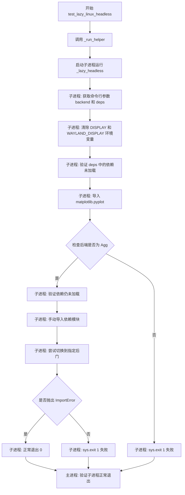

#### 带注释源码

```python
@pytest.mark.skipif(sys.platform != "linux", reason="this a linux-only test")
@pytest.mark.parametrize("env", _get_testable_interactive_backends())
def test_lazy_linux_headless(env):
    """
    测试 Linux 无头模式下的后端延迟加载行为。
    
    该测试验证在 DISPLAY 和 WAYLAND_DISPLAY 未设置的情况下，
    matplotlib 能够正确地延迟加载交互式后端，而非立即导入其依赖。
    """
    # 使用 _run_helper 在子进程中运行 _lazy_headless
    # env.pop('MPLBACKEND'): 获取要测试的后端名称（如 'qtagg', 'tkagg' 等）
    # env.pop("BACKEND_DEPS"): 获取该后端的依赖列表（如 'PyQt6', 'PySide6' 等）
    # extra_env: 设置 DISPLAY 和 WAYLAND_DISPLAY 为空字符串，模拟无头环境
    proc = _run_helper(
        _lazy_headless,
        env.pop('MPLBACKEND'), env.pop("BACKEND_DEPS"),
        timeout=_test_timeout,
        extra_env={**env, 'DISPLAY': '', 'WAYLAND_DISPLAY': ''}
    )


def _lazy_headless():
    """
    在子进程中运行的实际测试逻辑。
    
    该函数必须完全自包含，因为它会被提取并在另一个进程中运行。
    """
    import os
    import sys
    import importlib

    # 从命令行参数获取后端名称和依赖列表
    # sys.argv[1] = backend (如 'qtagg')
    # sys.argv[2] = deps (如 'PyQt6,PySide6')
    backend, deps = sys.argv[1:]
    deps = deps.split(',')

    # 移除显示相关的环境变量，模拟无头环境
    os.environ.pop('DISPLAY', None)
    os.environ.pop('WAYLAND_DISPLAY', None)
    
    # 验证依赖模块尚未被导入
    for dep in deps:
        assert dep not in sys.modules

    # 导入 pyplot，此时应该自动选择 Agg 后端（因为无显示环境）
    import matplotlib.pyplot as plt
    # 验证确实选择了 Agg 后端（非交互式后端）
    assert plt.get_backend() == 'agg'
    
    # 再次验证依赖未被导入（延迟加载的验证）
    for dep in deps:
        assert dep not in sys.modules

    # 手动导入依赖，确认依赖已安装
    for dep in deps:
        importlib.import_module(dep)
        assert dep in sys.modules

    # 尝试切换到指定的交互式后端
    # 在无显示环境下应该失败并抛出 ImportError
    try:
        plt.switch_backend(backend)
    except ImportError:
        # 预期行为：在无头环境下无法切换到交互式后端
        pass
    else:
        # 非预期行为：如果切换成功则测试失败
        sys.exit(1)
```


### `_test_number_of_draws_script`

该函数是一个测试脚本，用于验证matplotlib中blitting（位图复制）技术的实现是否正确。它通过创建动画artist、使用blitting技术重绘，并统计draw_event触发次数来确认blitting避免了过多的屏幕重绘。

参数： 无

返回值： 无（该函数为测试脚本，无返回值）

#### 流程图

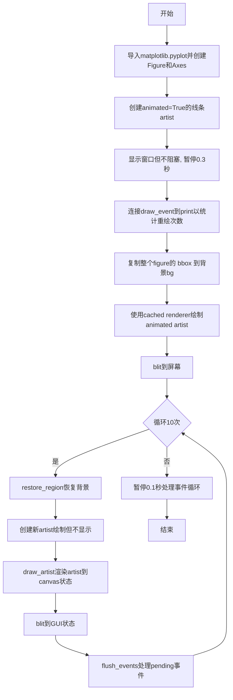

#### 带注释源码

```python
def _test_number_of_draws_script():
    """
    测试脚本：验证blitting技术是否正确实现以避免过多重绘
    核心实现：使用blitting技术绘制，统计重绘次数
    """
    import matplotlib.pyplot as plt

    # 创建Figure和Axes对象
    fig, ax = plt.subplots()

    # animated=True告诉matplotlib只在显式请求时绘制该artist
    # 这是blitting技术的关键设置
    ln, = ax.plot([0, 1], [1, 2], animated=True)

    # 确保窗口被提起，但脚本继续运行（非阻塞模式）
    plt.show(block=False)
    plt.pause(0.3)  # 等待窗口显示
    
    # 连接draw_event到print，用于统计重绘事件次数
    fig.canvas.mpl_connect('draw_event', print)

    # 获取整个figure的副本（不含animated artist）作为背景
    # copy_from_bbox: 复制指定区域到内存
    bg = fig.canvas.copy_from_bbox(fig.bbox)
    
    # 绘制animated artist，使用cached renderer
    # draw_artist: 渲染artist到canvas的缓冲区
    ax.draw_artist(ln)
    
    # blit: 将缓冲区内容复制到屏幕显示
    # 这是blitting的核心：将预渲染的图像直接拷贝到显示区域
    fig.canvas.blit(fig.bbox)

    # 循环10次测试blitting是否产生过多重绘
    for j in range(10):
        # 恢复背景到canvas状态，屏幕不变
        fig.canvas.restore_region(bg)
        
        # 创建新的artist（这是blitting的糟糕用法，但适合测试）
        # 正确用法应该是复用同一个artist对象
        ln, = ax.plot([0, 1], [1, 2])
        
        # 渲染artist，更新canvas状态但不更新屏幕
        ax.draw_artist(ln)
        
        # blit到GUI状态，但屏幕可能还没改变
        fig.canvas.blit(fig.bbox)
        
        # 刷新pending的GUI事件，如需要则重绘屏幕
        fig.canvas.flush_events()

    # 离开前让事件循环处理完所有内容
    plt.pause(0.1)
```


### `test_blitting_events`

该函数通过运行子进程执行绘图脚本，统计blitting优化下的绘制事件数量，验证blitting技术是否有效减少了重绘次数（预期<5次，而非未优化时的10次）。

参数：

- `env`：`dict`，测试环境变量字典，包含MPLBACKEND等后端配置信息

返回值：`None`，该函数为测试函数，通过断言验证绘制次数是否符合预期

#### 流程图

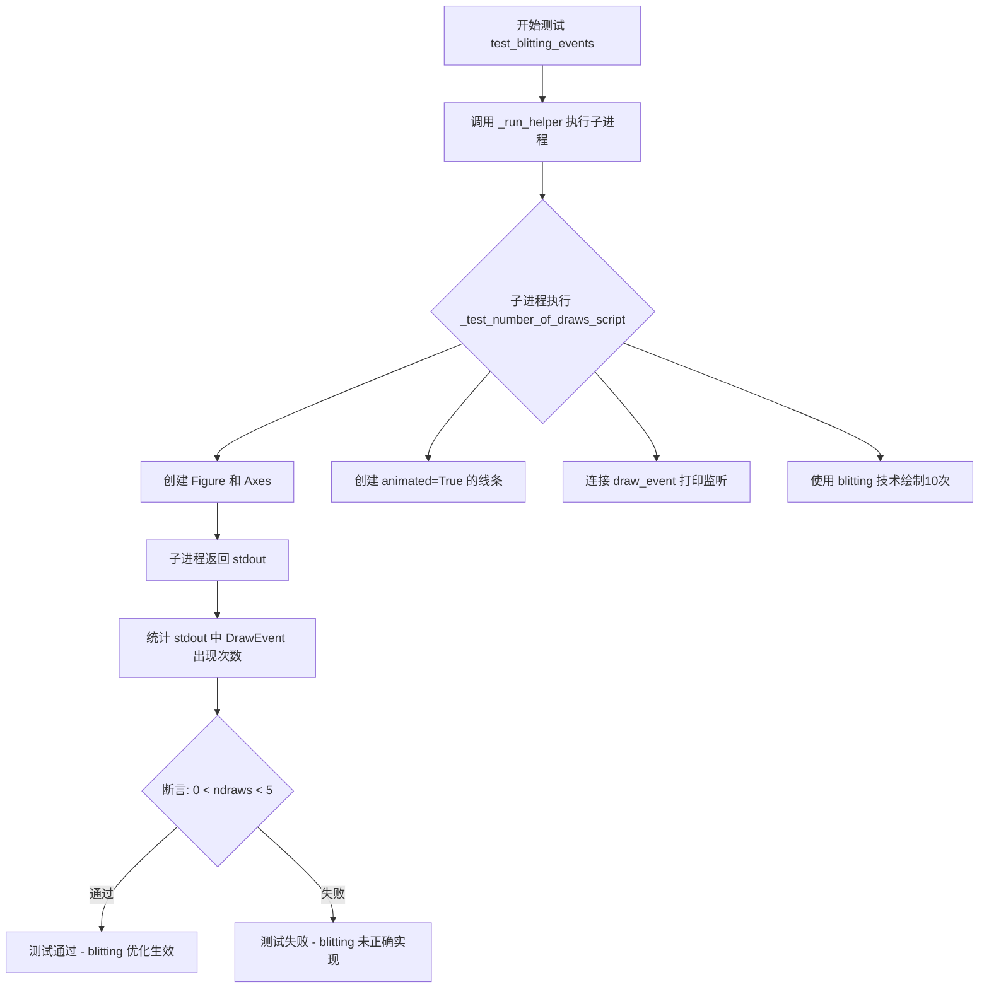

#### 带注释源码

```python
@pytest.mark.parametrize("env", _blit_backends)  # 参数化测试，遍历所有可用的blitting后端
@pytest.mark.flaky(reruns=_retry_count)  # 如果测试失败，允许重试指定次数
def test_blitting_events(env):
    """
    验证blitting优化是否减少了重绘次数。
    
    该测试通过子进程运行绘图脚本，统计使用blitting技术时的绘制事件数量。
    如果blitting正确实现，绘制次数应远少于未优化时的10次（预期<5次）。
    """
    # 使用测试辅助函数在子进程中运行绘图脚本
    # timeout 设置超时时间，extra_env 传递后端环境变量
    proc = _run_helper(
        _test_number_of_draws_script, timeout=_test_timeout, extra_env=env)
    
    # 统计子进程stdout中"DrawEvent"字符串出现的次数
    # 初始可能会有一些canvas绘制（次数因后端不同而异）
    # 关键检查：确保不是10次绘制（如果是10次说明blitting未正确实现）
    ndraws = proc.stdout.count("DrawEvent")
    
    # 断言：绘制次数应大于0（至少有一些绘制）且小于5（证明blitting优化生效）
    assert 0 < ndraws < 5
```

---

### `_test_number_of_draws_script`（被调用的子进程脚本）

参数：无（该函数无参数，通过子进程独立运行）

返回值：无（通过stdout输出绘制事件信息）

#### 流程图

```mermaid
flowchart TD
    A[开始脚本 _test_number_of_draws_script] --> B[导入 matplotlib.pyplot]
    B --> C[创建 fig, ax = plt.subplots]
    C --> D[创建 animated=True 的线条 ln]
    D --> E[plt.show(block=False) 显示窗口]
    E --> F[plt.pause(0.3) 等待渲染]
    F --> G[连接 draw_event 到 print 函数]
    G --> H[bg = fig.canvas.copy_from_bbox 复制背景]
    H --> I[ax.draw_artist 绘制动画线条]
    I --> J[fig.canvas.blit 刷新到屏幕]
    J --> K{循环 j in range(10)}
    K -->|第1次| L1[restore_region 恢复背景]
    L1 --> L2[创建新线条（错误用法但用于测试）]
    L2 --> L3[draw_artist 渲染新线条]
    L3 --> L4[blit 刷新到屏幕]
    L4 --> L5[flush_events 处理GUI事件]
    L5 --> K
    K -->|完成10次| M[plt.pause(0.1) 处理剩余事件]
    M --> N[结束]
    
    G -.-> O[每次draw_event触发时输出'DrawEvent']
    O --> P[子进程stdout]
```

#### 带注释源码

```python
def _test_number_of_draws_script():
    """
    测试blitting优化效果的脚本。
    
    该脚本在子进程中运行，用于测试使用blitting技术时是否会产生过多的重绘。
    脚本故意创建新线条（不良用法）来测试blitting是否能有效减少重绘。
    """
    import matplotlib.pyplot as plt

    # 创建图形和坐标轴
    fig, ax = plt.subplots()

    # animated=True 告诉matplotlib只在显式请求时绘制该artist
    # 这是blitting优化的基础
    ln, = ax.plot([0, 1], [1, 2], animated=True)

    # 显示窗口但不让程序阻塞
    plt.show(block=False)
    plt.pause(0.3)
    
    # 连接draw_event事件到print函数，每次触发绘制时输出"DrawEvent"
    # 这用于统计实际发生了多少次重绘
    fig.canvas.mpl_connect('draw_event', print)

    # 获取整个图形的副本（不含动画artist）
    # 这作为blitting的基准背景
    bg = fig.canvas.copy_from_bbox(fig.bbox)
    
    # 绘制动画artist，使用缓存的渲染器
    ax.draw_artist(ln)
    
    # 将结果刷新到屏幕
    fig.canvas.blit(fig.bbox)

    # 循环10次，测试blitting优化效果
    for j in range(10):
        # 恢复背景到canvas状态，屏幕不变
        fig.canvas.restore_region(bg)
        
        # 创建新的线条 - 这是blitting的不良用法
        # 但用于测试确保不会产生过多重绘
        ln, = ax.plot([0, 1], [1, 2])
        
        # 渲染artist，更新canvas状态但不更新屏幕
        ax.draw_artist(ln)
        
        # 复制图像到GUI状态，但屏幕可能还未改变
        fig.canvas.blit(fig.bbox)
        
        # 刷新待处理的GUI事件，如需要则重绘屏幕
        fig.canvas.flush_events()

    # 让事件循环在离开前处理完所有事件
    plt.pause(0.1)
```


### `test_fallback_to_different_backend`

该函数用于测试在 IPython 环境下，当某个后端无法正常加载时，Matplotlib 是否能够安全地回退到不同的后端而不会导致崩溃。该测试针对 GitHub issue #23770 中发现的问题进行验证。

参数： 无

返回值：`None`，该函数没有显式返回值，主要通过断言或异常来验证测试结果

#### 流程图

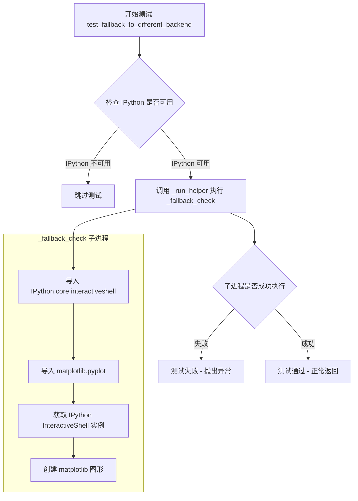

#### 带注释源码

```python
def test_fallback_to_different_backend():
    """
    测试在 IPython 环境下后端回退到不同后端的功能。
    
    该测试针对 GitHub issue #23770：确保在 IPython 环境中切换到
    不同后端时不会发生崩溃，而是能够安全地回退到备用后端。
    """
    # 检查 IPython 是否已安装，如果未安装则跳过该测试
    pytest.importorskip("IPython")
    
    # 运行导致 GitHub issue 23770 的进程
    # 确保这不会崩溃，因为应该切换到不同的后端而不是崩溃
    response = _run_helper(_fallback_check, timeout=_test_timeout)


def _fallback_check():
    """
    在子进程中运行的辅助函数，用于测试后端回退逻辑。
    
    该函数模拟了 IPython 环境下的后端加载场景：
    1. 获取 IPython InteractiveShell 实例
    2. 尝试创建 matplotlib 图形
    
    如果后端加载失败，系统应该自动回退到备用后端（如 Agg），
    而不会导致程序崩溃。
    """
    import IPython.core.interactiveshell as ipsh
    import matplotlib.pyplot
    
    # 获取 IPython 实例，这会触发后端的初始化
    ipsh.InteractiveShell.instance()
    
    # 创建图形，验证后端可以正常工作
    matplotlib.pyplot.figure()
```


### `_test_sigint_impl`

{模拟发送SIGINT信号，验证进程能否正确响应并退出。核心实现: 在启动交互式后端（如 `show` 或 `pause`）后，利用线程定时器延迟向自身发送 SIGINT 信号，捕获 `KeyboardInterrupt` 异常并打印 SUCCESS，以验证图形窗口能否响应中断信号并正常退出。}

参数：

-  `backend`：`str`，Matplotlib 后端名称（如 "Qt5Agg"），用于设置测试环境。
-  `target_name`：`str`，要调用的 `pyplot` 函数名（如 "show", "pause"）。
-  `kwargs`：`dict`，关键字参数，传递给 `target_name`（如 `{'block': True}`）。

返回值：`None`，测试结果通过标准输出（stdout）中的 "SUCCESS" 字符串传递。

#### 流程图

```mermaid
flowchart TD
    A([开始 _test_sigint_impl]) --> B[切换后端: plt.switch_backend(backend)]
    B --> C[定义拦截器函数: 向自身发送 SIGINT]
    C --> D[获取目标函数: getattr(plt, target_name)]
    D --> E[创建定时器: threading.Timer 1秒后触发 interrupter]
    E --> F[创建图形: plt.figure]
    F --> G[绑定 draw_event: 打印 DRAW 标记]
    G --> H[绑定 draw_event: 启动定时器]
    H --> I[调用目标函数: target(**kwargs)]
    I --> J{阻塞等待 / 事件循环}
    J -->|1秒后 定时器触发| K[发送 SIGINT 信号]
    K --> L[触发 KeyboardInterrupt]
    L --> M[捕获异常: except KeyboardInterrupt]
    M --> N[打印 SUCCESS 标记]
    N --> O([结束])
```

#### 带注释源码

```python
def _test_sigint_impl(backend, target_name, kwargs):
    """
    测试 SIGINT 信号处理的核心实现函数。
    该函数被提取并在子进程中运行，用于验证在调用 show 或 pause 时，
    进程能否响应中断信号 (SIGINT) 并抛出 KeyboardInterrupt。
    """
    import sys
    import matplotlib.pyplot as plt
    import os
    import threading

    # 1. 根据传入的 backend 切换当前的 matplotlib 后端
    plt.switch_backend(backend)

    def interrupter():
        """
        定时器回调函数。
        负责向当前进程发送 SIGINT 信号（Windows 下为 Console Ctrl 事件）。
        """
        if sys.platform == 'win32':
            import win32api
            # Windows 下生成控制台 Ctrl 事件 (CTRL_C_EVENT)
            win32api.GenerateConsoleCtrlEvent(0, 0)
        else:
            import signal
            # Unix-like 系统下向自身进程发送 SIGINT
            os.kill(os.getpid(), signal.SIGINT)

    # 2. 获取目标函数 (例如 plt.show 或 plt.pause)
    target = getattr(plt, target_name)
    
    # 3. 创建一个 1 秒后触发的定时器，用于发送中断信号
    timer = threading.Timer(1, interrupter)
    
    # 4. 创建一个图形实例
    fig = plt.figure()
    
    # 5. 连接 'draw_event':
    #    第一次绘制时打印 "DRAW"，通知父进程图形已成功显示
    fig.canvas.mpl_connect(
        'draw_event',
        lambda *args: print('DRAW', flush=True)
    )
    
    # 6. 连接 'draw_event':
    #    第一次绘制时启动定时器，1秒后发送 SIGINT
    fig.canvas.mpl_connect(
        'draw_event',
        lambda *args: timer.start()
    )
    
    try:
        # 7. 调用目标函数 (通常是 block=True 的 show 或 pause)
        #    此时主线程会阻塞在事件循环中
        target(**kwargs)
    except KeyboardInterrupt:
        # 8. 捕获 SIGINT 引起的 KeyboardInterrupt
        #    说明后端正确响应了信号
        print('SUCCESS', flush=True)
```


### `test_sigint`

该测试函数用于验证在交互式后端（Qt 或 macOSx）下，当进程接收到 SIGINT（Ctrl+C）信号时，matplotlib 能够正确捕获并处理该信号，使程序能够优雅地退出而不导致崩溃。测试通过在子进程中运行绘图代码，并使用定时器在一定时间后发送 SIGINT 信号，然后检查子进程是否正确处理了中断并打印 SUCCESS 标志。

参数：

-  `env`：`pytest.param` 类型，包含一个字典（来自 `_get_testable_interactive_backends()`），字典中包含 `MPLBACKEND` 等环境变量，用于指定要测试的 matplotlib 后端配置及相关的 pytest 标记
-  `target`：`str` 类型，表示要测试的目标函数名（'show' 或 'pause'）
-  `kwargs`：`dict` 类型，表示要传递给目标函数的参数，例如 `{'block': True}` 或 `{'interval': 10}`

返回值：`None`，该函数为 pytest 测试函数，通过 `assert` 语句验证子进程的 stdout 中是否包含 'SUCCESS' 字符串来判定测试是否通过

#### 流程图

```mermaid
flowchart TD
    A[开始 test_sigint] --> B{检查后端是否为 qt 或 macosx}
    B -->|否| C[跳过测试]
    B -->|是| D[创建子进程运行 _test_sigint_impl]
    E[子进程: _test_sigint_impl] --> F[切换到指定后端]
    F --> G[注册 draw_event 回调打印 DRAW]
    G --> H[启动 1 秒定时器发送 SIGINT]
    H --> I[调用 plt.show 或 plt.pause]
    I --> J{是否捕获到 KeyboardInterrupt}
    J -->|是| K[打印 SUCCESS]
    J -->|否| L[正常退出]
    D --> M{等待 DRAW 信号}
    M -->|超时| N[杀死子进程]
    M -->|收到 DRAW| O[等待子进程完成或超时]
    O --> P{检查 stdout 是否包含 SUCCESS}
    P -->|是| Q[测试通过]
    P -->|否| R[测试失败]
```

#### 带注释源码

```python
@pytest.mark.parametrize("env", _get_testable_interactive_backends())
@pytest.mark.parametrize("target, kwargs", [
    ('show', {'block': True}),
    ('pause', {'interval': 10})
])
def test_sigint(env, target, kwargs):
    """
    测试 SIGINT 信号处理功能。
    
    该测试验证在交互式后端（Qt 和 macOSx）下，matplotlib 能够正确
    处理 SIGINT 信号（Ctrl+C），使程序能够优雅地退出。
    """
    # 从环境参数中获取要测试的后端名称
    backend = env.get("MPLBACKEND")
    
    # 目前仅在 Qt 和 macOSx 后端上测试 SIGINT 功能
    if not backend.startswith(("qt", "macosx")):
        pytest.skip("SIGINT currently only tested on qt and macosx")
    
    # 使用自定义的 _WaitForStringPopen 类创建子进程
    # 子进程将运行 _test_sigint_impl 函数的源代码
    proc = _WaitForStringPopen(
        [sys.executable, "-c",
         # 获取 _test_sigint_impl 的源代码并拼接调用语句
         inspect.getsource(_test_sigint_impl) +
         f"\n_test_sigint_impl({backend!r}, {target!r}, {kwargs!r})"])
    
    try:
        # 等待子进程输出 'DRAW' 字符串，表示绘图事件已触发
        proc.wait_for('DRAW')
        
        # 等待子进程完成，设置超时时间
        stdout, _ = proc.communicate(timeout=_test_timeout)
    except Exception:
        # 如果发生异常，杀掉子进程并获取其输出
        proc.kill()
        stdout, _ = proc.communicate()
        raise
    
    # 验证子进程是否成功处理了 SIGINT 信号
    assert 'SUCCESS' in stdout
```

#### 依赖的内部函数 `_test_sigint_impl`

```python
def _test_sigint_impl(backend, target_name, kwargs):
    """
    SIGINT 测试的实际实现逻辑，运行在子进程中。
    
    参数:
        backend: str, 要测试的 matplotlib 后端名称（如 'qtagg'）
        target_name: str, 要调用的目标函数名（'show' 或 'pause'）
        kwargs: dict, 传递给目标函数的参数
    """
    import sys
    import matplotlib.pyplot as plt
    import os
    import threading

    # 切换到指定的后端
    plt.switch_backend(backend)

    # 定义中断函数，用于在定时器触发时发送 SIGINT 信号
    def interrupter():
        if sys.platform == 'win32':
            # Windows 上使用 win32api 发送 Ctrl+C 事件
            import win32api
            win32api.GenerateConsoleCtrlEvent(0, 0)
        else:
            # Unix-like 系统上直接发送 SIGINT 信号到当前进程
            import signal
            os.kill(os.getpid(), signal.SIGINT)

    # 获取目标函数（plt.show 或 plt.pause）
    target = getattr(plt, target_name)
    
    # 创建一个 1 秒后触发的定时器，用于发送中断信号
    timer = threading.Timer(1, interrupter)
    
    # 创建图形并注册回调
    fig = plt.figure()
    
    # 第一个回调：打印 DRAW 表示绘制事件发生
    fig.canvas.mpl_connect(
        'draw_event',
        lambda *args: print('DRAW', flush=True)
    )
    
    # 第二个回调：绘制事件触发后启动定时器
    fig.canvas.mpl_connect(
        'draw_event',
        lambda *args: timer.start()
    )
    
    try:
        # 调用目标函数（show 会阻塞，pause 会在指定时间后返回）
        target(**kwargs)
    except KeyboardInterrupt:
        # 如果捕获到键盘中断，说明 SIGINT 处理成功
        print('SUCCESS', flush=True)
```


### `_test_other_signal_before_sigint_impl`

该函数是一个测试实现函数，用于测试在收到 SIGINT（Ctrl+C）信号之前先收到其他信号（如 SIGUSR1）时的处理行为。函数会创建一个定时器，在收到 SIGUSR1 信号时触发，并在收到 SIGINT 信号时打印 SUCCESS 以表示测试通过。

参数：

- `backend`：`str`，要测试的 matplotlib 后端名称（如 "qt5agg", "macosx" 等）
- `target_name`：`str`，目标函数名（"show" 或 "pause"）
- `kwargs`：`dict`，传递给目标函数的关键字参数（例如 `{'block': True}` 或 `{'interval': 10}`）

返回值：`None`，无返回值（函数内部通过打印 'SUCCESS' 表示测试通过）

#### 流程图

```mermaid
graph TD
    A[开始 _test_other_signal_before_sigint_impl] --> B[导入 signal 和 matplotlib.pyplot 模块]
    B --> C[plt.switch_backend 切换到指定后端]
    C --> D[通过 getattr 获取 target 函数 show 或 pause]
    D --> E[plt.figure 创建图形窗口]
    E --> F[连接 draw_event 事件回调, 打印 'DRAW']
    F --> G[创建 canvas timer: interval=1, single_shot=True]
    G --> H[timer.add_callback 添加回调: 打印 'SIGUSR1']
    H --> I[定义 custom_signal_handler 函数]
    I --> J[signal.signal 注册 SIGUSR1 信号处理器]
    J --> K[执行 target(**kwargs) 阻塞等待]
    K --> L{是否捕获 KeyboardInterrupt}
    L -->|是| M[打印 'SUCCESS']
    L -->|否| N[结束]
    M --> N
```

#### 带注释源码

```python
def _test_other_signal_before_sigint_impl(backend, target_name, kwargs):
    """
    测试在 SIGINT 信号之前接收到其他信号（如 SIGUSR1）时的行为。
    用于验证信号处理的正确性和交互式后端的稳定性。
    
    参数:
        backend: str, matplotlib 后端名称
        target_name: str, 目标函数名 ('show' 或 'pause')
        kwargs: dict, 传递给目标函数的关键字参数
    """
    import signal
    import matplotlib.pyplot as plt

    # 切换到指定的后端进行测试
    plt.switch_backend(backend)

    # 获取目标函数（show 或 pause）
    target = getattr(plt, target_name)

    # 创建一个新的图形窗口
    fig = plt.figure()
    # 连接 draw_event 事件, 当绘制发生时打印 'DRAW'
    fig.canvas.mpl_connect('draw_event', lambda *args: print('DRAW', flush=True))

    # 创建一个定时器，间隔为 1 毫秒，单次触发
    timer = fig.canvas.new_timer(interval=1)
    timer.single_shot = True
    # 添加回调函数，当定时器触发时打印 'SIGUSR1'
    timer.add_callback(print, 'SIGUSR1', flush=True)

    # 定义自定义信号处理器，当收到 SIGUSR1 时启动定时器
    def custom_signal_handler(signum, frame):
        timer.start()
    
    # 注册 SIGUSR1 信号的自定义处理器
    signal.signal(signal.SIGUSR1, custom_signal_handler)

    try:
        # 执行目标函数（show 或 pause），这里会阻塞等待
        target(**kwargs)
    except KeyboardInterrupt:
        # 如果收到 SIGINT 信号并捕获到 KeyboardInterrupt，打印 SUCCESS
        print('SUCCESS', flush=True)
```


### `test_other_signal_before_sigint`

该测试函数用于验证在接收到 SIGINT（键盘中断）信号之前先接收到其他信号（如 SIGUSR1）时，matplotlib 后端能够正确处理信号交互，确保交互式后端在复杂信号场景下的鲁棒性。

参数：

- `env`：`_get_testable_interactive_backends()` 返回的 `pytest.param`，包含后端名称（如 qt、macosx）和环境变量配置字典
- `target`：字符串类型，目标函数名（'show' 或 'pause'）
- `kwargs`：字典类型，传递给目标函数的参数（如 `{'block': True}` 或 `{'interval': 10}`）
- `request`：pytest 的 `FixtureRequest` 对象，用于动态添加测试标记（skip/xfail）

返回值：`None`，该函数为 pytest 测试函数，无显式返回值，通过断言验证子进程输出

#### 流程图

```mermaid
flowchart TD
    A[开始测试] --> B{检查平台}
    B -->|Windows| C[跳过测试: Windows不支持]
    B -->|非Windows| D{检查后端类型}
    D -->|非qt/macosx| E[跳过测试: 仅支持qt和macosx]
    D -->|qt/macosx| F{检查macosx后端}
    F -->|macosx| G[添加xfail标记: 后端有bug]
    F -->|非macosx| H{检查darwin+show组合}
    H -->|是| I[添加xfail标记: Qt后端在macOS有bug]
    H -->|否| J[构建子进程命令]
    G --> J
    I --> J
    J --> K[启动子进程运行_test_other_signal_before_sigint_impl]
    K --> L[等待子进程输出'DRAW']
    L --> M[向子进程发送SIGUSR1信号]
    M --> N[等待子进程输出'SIGUSR1']
    N --> O[向子进程发送SIGINT信号]
    O --> P{子进程是否超时}
    P -->|是| Q[杀死子进程]
    P -->|否| R[获取子进程stdout]
    Q --> R
    R --> S{检查输出包含'SUCCESS'}
    S -->|是| T[测试通过]
    S -->|否| U[测试失败: 断言错误]
```

#### 带注释源码

```python
@pytest.mark.skipif(sys.platform == 'win32',
                    reason='No other signal available to send on Windows')
@pytest.mark.parametrize("env", _get_testable_interactive_backends())
@pytest.mark.parametrize("target, kwargs", [
    ('show', {'block': True}),
    ('pause', {'interval': 10})
])
def test_other_signal_before_sigint(env, target, kwargs, request):
    """
    测试在接收到SIGINT之前先接收到其他信号（如SIGUSR1）时的行为。
    该测试用于验证matplotlib交互式后端在复杂信号场景下的正确性。
    """
    # 从环境参数中提取后端名称
    backend = env.get("MPLBACKEND")
    
    # SIGINT测试目前仅在qt和macosx后端上进行验证
    if not backend.startswith(("qt", "macosx")):
        pytest.skip("SIGINT currently only tested on qt and macosx")
    
    # macosx后端已知存在bug，标记为预期失败
    if backend == "macosx":
        request.node.add_marker(pytest.mark.xfail(reason="macosx backend is buggy"))
    
    # 在macOS系统上，show()方法与Qt后端组合存在已知问题
    if sys.platform == "darwin" and target == "show":
        request.node.add_marker(
            pytest.mark.xfail(reason="Qt backend is buggy on macOS"))
    
    # 构建子进程命令：运行_test_other_signal_before_sigint_impl函数
    # 使用inspect.getsource获取源码并传递给子进程执行
    proc = _WaitForStringPopen(
        [sys.executable, "-c",
         inspect.getsource(_test_other_signal_before_sigint_impl) +
         "\n_test_other_signal_before_sigint_impl("
            f"{backend!r}, {target!r}, {kwargs!r})"])
    try:
        # 等待子进程输出'DRAW'，表示图形已绘制
        proc.wait_for('DRAW')
        
        # 向子进程发送SIGUSR1信号（用户自定义信号）
        os.kill(proc.pid, signal.SIGUSR1)
        
        # 等待子进程处理SIGUSR1并输出'SIGUSR1'
        proc.wait_for('SIGUSR1')
        
        # 发送SIGINT信号（键盘中断）尝试终止交互式显示
        os.kill(proc.pid, signal.SIGINT)
        
        # 获取子进程输出，设置超时时间
        stdout, _ = proc.communicate(timeout=_test_timeout)
    except Exception:
        # 异常处理：确保子进程被终止
        proc.kill()
        stdout, _ = proc.communicate()
        raise
    
    # 打印子进程输出用于调试
    print(stdout)
    
    # 断言：验证子进程成功处理了信号序列
    assert 'SUCCESS' in stdout
```


### `_WaitForStringPopen.__init__`

该方法是 `_WaitForStringPopen` 类的初始化方法，用于创建一个支持触发 KeyboardInterrupt 的子进程对象。在 Windows 平台上设置特定的创建标志，并通过环境变量强制使用 Agg 后端，同时配置标准输出为管道模式。

参数：

-  `*args`：可变位置参数，传递给 `subprocess.Popen` 父类，用于指定要执行的命令及其他位置参数
-  `**kwargs`：可变关键字参数，传递给 `subprocess.Popen` 父类，用于指定各种进程创建选项

返回值：`None`，该方法为构造函数，不返回任何值

#### 流程图

```mermaid
flowchart TD
    A[开始 __init__] --> B{判断是否为 Windows 平台}
    B -->|是| C[设置 kwargs['creationflags'] = subprocess.CREATE_NEW_CONSOLE]
    B -->|否| D[不修改 creationflags]
    C --> E[调用父类 Popen 构造函数]
    D --> E
    E --> F[传入环境变量: MPLBACKEND=Agg, SOURCE_DATE_EPOCH=0]
    E --> G[设置 stdout=subprocess.PIPE]
    E --> H[设置 universal_newlines=True]
    F --> I[结束 __init__]
    G --> I
    H --> I
```

#### 带注释源码

```python
def __init__(self, *args, **kwargs):
    """
    初始化进程，设置环境变量和输出管道。
    
    该方法重写了 subprocess.Popen 的 __init__，目的是：
    1. 在 Windows 上启用 CREATE_NEW_CONSOLE 标志以允许触发 KeyboardInterrupt
    2. 强制设置环境变量 MPLBACKEND 为 "Agg"，使每个测试可以切换到期望的后端
    3. 设置 SOURCE_DATE_EPOCH 为 "0" 以确保可复现的测试结果
    4. 配置子进程的标准输出为管道模式，以便读取输出内容
    """
    
    # 判断当前是否在 Windows 平台
    if sys.platform == 'win32':
        # 在 Windows 上设置 CREATE_NEW_CONSOLE 标志
        # 这样可以创建一个新的控制台窗口，使得可以发送 Ctrl+C 中断信号
        kwargs['creationflags'] = subprocess.CREATE_NEW_CONSOLE
    
    # 调用父类 subprocess.Popen 的构造函数
    super().__init__(
        *args,  # 传递可变位置参数（命令等）
        **kwargs,  # 传递可变关键字参数
        # 强制使用 Agg 后端，这样每个测试可以切换到其期望的后端
        # 使用字典解包合并现有环境变量，并覆盖指定的键
        env={**os.environ, "MPLBACKEND": "Agg", "SOURCE_DATE_EPOCH": "0"},
        # 设置标准输出为管道模式，通过 self.stdout 读取子进程输出
        stdout=subprocess.PIPE, 
        # 设置 universal_newlines=True 使 stdout 读取时返回字符串而不是字节
        universal_newlines=True)
```


### `_WaitForStringPopen.wait_for`

该方法用于从子进程的stdout中读取数据，直到遇到指定的终止符为止。如果在遇到终止符之前子进程退出，则抛出RuntimeError异常。

参数：

- `terminator`：`str`，要查找的终止符字符串，方法会持续读取stdout直到缓冲区内容以此字符串结尾

返回值：`None`，当成功读取到终止符时返回（通过return语句退出循环）

#### 流程图

```mermaid
flowchart TD
    A[开始 wait_for] --> B[初始化空缓冲区 buf = '']
    B --> C[从 stdout 读取 1 个字符]
    C --> D{字符为空?}
    D -->|是| E[抛出 RuntimeError: Subprocess died before emitting expected terminator]
    D -->|否| F[将字符追加到 buf]
    F --> G{buf.endswith(terminator)?}
    G -->|否| C
    G -->|是| H[返回, 结束方法]
    
    style E fill:#ffcccc
    style H fill:#ccffcc
```

#### 带注释源码

```python
def wait_for(self, terminator):
    """Read until the terminator is reached."""
    # 初始化一个空字符串缓冲区，用于累积读取的字符
    buf = ''
    # 进入无限循环，持续读取stdout直到找到终止符
    while True:
        # 从子进程的stdout读取单个字符
        c = self.stdout.read(1)
        # 如果读取不到字符（即返回空字符串），说明子进程已退出
        # 但尚未找到预期的终止符，此时抛出RuntimeError异常
        if not c:
            raise RuntimeError(
                f'Subprocess died before emitting expected {terminator!r}')
        # 将读取到的字符追加到缓冲区
        buf += c
        # 检查缓冲区是否以终止符结尾
        if buf.endswith(terminator):
            # 如果找到终止符，则返回（方法结束）
            return
```

## 关键组件


### 交互式后端可用性检测模块

负责检测并返回系统中可用的交互式图形后端列表，根据平台和依赖库情况动态判断各后端是否可用

### 交互式后端测试框架

通过子进程运行测试代码，验证matplotlib各种交互式后端（Qt、Tk、GTK、wx、macosx、webagg等）的功能完整性，包括后端切换、图形显示、工具栏、事件处理等

### 线程安全测试模块

在独立子进程中测试matplotlib交互式后端的线程安全性，验证多线程环境下图形绘制和事件处理的正确性

### 惰性自动后端选择机制

测试matplotlib的惰性自动后端选择功能，确保在仅导入pyplot时不加载后端模块，而在实际绘图时才解析并加载合适的后端

### Qt后端兼容性验证

验证Qt5后端在同时存在Qt5和Qt6绑定时的行为，确保Qt5后端使用Qt5库而非Qt6库

### 信号中断处理测试

测试在交互式后端中响应SIGINT信号（Ctrl+C）中断的能力，验证后端能正确处理中断并退出

### Blitting性能优化测试

测试各交互式后端的blitting（位块传输）性能，通过重复绘制场景验证blitting实现是否正确优化，减少不必要的重绘

### 跨Qt版本导入隔离

测试matplotlib在不同Qt版本（Qt5/Qt6）绑定混合使用时的隔离机制，确保不会意外加载错误版本的Qt库

### Web服务器后端测试

启动webagg后端服务器并验证其能正常响应HTTP请求，测试Web端交互式matplotlib图形显示功能

### 工具栏图标LA模式支持

测试matplotlib工具栏按钮图标对LA（亮度+Alpha）模式PNG图像的支持，这是GTK3后端的一个特定功能需求

## 问题及建议


### 已知问题

-   **魔法数字和硬编码值**：超时时间、暂停时间、重试次数等使用硬编码数值（如 `_test_timeout = 120 if is_ci_environment() else 20`、`pause_time = 0.5`），缺乏统一配置管理
-   **重复的后端检测逻辑**：`_get_available_interactive_backends()` 和 `_get_testable_interactive_backends()` 存在重复的列表推导逻辑；多个测试函数中重复检查后端是否支持
-   **测试函数与实现耦合**：`_test_interactive_impl`、`_test_thread_impl` 等被提取到子进程运行的函数内部包含大量逻辑，与测试框架耦合度高，难以独立维护
-   **大量条件跳过和xfail标记**：代码中散落着数十个 `pytest.mark.skip` 和 `pytest.mark.xfail`，使得测试逻辑难以跟踪，维护成本高
-   **平台特定代码混乱**：如 `sys.platform == 'linux'`、`sys.platform == 'darwin'`、Windows 的 `CREATE_NEW_CONSOLE` 等判断逻辑散布各处
-   **版本比较逻辑脆弱**：macOS 版本比较使用 `parse(mac_ver) < parse('10.16')` 处理 Big Sur 兼容性，这种字符串比较方式不够健壮
-   **导入管理不规范**：部分导入在函数内部进行（如 `import gi`、`import tornado`、`from packaging.version import parse`），部分在文件顶部，风格不统一
-   **注释中存在待办事项**：如 `# Remove when https://github.com/wxWidgets/Phoenix/pull/2638 is out`，表明存在已知的技术债务但未清理

### 优化建议

-   **抽取配置类**：创建 `BackendTestConfig` 类集中管理超时、重试次数、后端列表等配置参数
-   **提取公共后端检测函数**：将 `_get_available_interactive_backends` 和 `_get_testable_interactive_backends` 合并，使用缓存避免重复计算
-   **简化条件跳过逻辑**：使用 `pytest` 的自定义标记或 `pytest.skip` 装饰器类，将平台/后端相关的跳过逻辑集中管理
-   **规范导入位置**：将所有导入移到文件顶部，对确实需要延迟导入的场景使用明确的注释说明原因
-   **使用常量替代魔法数字**：为所有超时值、重试次数创建命名常量（如 `DEFAULT_TIMEOUT`、`SUBPROCESS_TIMEOUT` 等）
-   **清理陈旧注释**：移除已完成问题的链接注释，或将其转换为正式的 issue 链接记录
-   **统一字符串格式化**：选择 f-string 或 `%` 格式化中的一种，保持代码风格一致
-   **改进版本检测**：使用 `platform` 模块提供的方式或版本元组进行比较，而非字符串解析

## 其它


### 设计目标与约束

本测试模块的核心设计目标是全面验证matplotlib交互式后端的功能正确性、线程安全性、跨平台兼容性以及信号处理的健壮性。主要约束包括：1）必须在CI环境中稳定运行，支持多种后端（Qt、Tk、Wx、GTK、macOS、WebAgg等）；2）测试必须是自包含的，能够在子进程中独立运行；3）需要处理平台差异（如Windows、Linux、macOS）；4）必须支持超时控制和重试机制以应对不稳定的测试环境。

### 错误处理与异常设计

代码采用多层次的错误处理策略：1）子进程执行使用subprocess.CalledProcessError捕获命令执行失败；2）使用pytest.mark.skip和pytest.mark.xfail处理预期失败的后端；3）网络连接使用urllib.error.URLError处理WebAgg服务器连接失败；4）导入失败使用pytest.importorskip和pytest.importorskip；5）超时使用subprocess.TimeoutExpired异常；6）窗口标题验证使用RuntimeError。关键异常信息通过stdout/stderr收集并在主测试中断言。

### 数据流与状态机

测试数据流主要分为三类：1）环境配置流：_get_available_interactive_backends()收集可用后端及其依赖，构建测试参数；2）子进程测试流：测试函数通过_run_helper在子进程中执行测试逻辑，通过JSON参数传递配置；3）结果验证流：通过proc.stdout计数验证事件触发次数（如CloseEvent、DrawEvent）。状态转换包括：导入matplotlib→设置后端→创建Figure→执行操作→关闭Figure→验证结果。

### 外部依赖与接口契约

主要外部依赖包括：1）Qt绑定（PyQt5/PyQt6/PySide2/PySide6）；2）GTK绑定（gi、cairo）；3）Tkinter；4）WxPython；5）Web服务器（tornado）；6）图像处理（PIL）；7）IPython。接口契约：1）_run_helper函数接受测试函数、JSON参数、超时时间和额外环境变量；2）pytest参数化使用特定格式id='-'.join(f'{k}={v}' for k, v in env.items())；3）子进程必须输出特定字符串（如"CloseEvent"、"DRAW"）用于同步。

### 性能考虑与基准测试

_test_timeout根据CI环境动态设置（CI为120秒，本地为20秒）；_retry_count同样根据CI环境设置重试次数（CI为3次，本地为0次）；test_blitting_events专门测试绘图优化（blitting）以减少不必要的重绘；_test_number_of_draws_script验证blitting实现是否有效减少了draw_event触发次数。

### 兼容性考虑

代码处理多层次兼容性：1）平台兼容性：sys.platform检测（linux/win32/darwin）；2）Python版本兼容性：sys.version_info检测；3）Qt版本混用：test_cross_Qt_imports验证Qt5/Qt6混用警告；4）macOS版本检测：platform.mac_ver()处理Big Sur兼容性；5）Display检测：_c_internal_utils.display_is_valid()和xdisplay_is_valid()检测X服务器；6）后端特定标记：各种pytest.mark.skip/xfail处理已知问题。

### 测试策略与覆盖率

测试覆盖策略：1）后端覆盖：_get_available_interactive_backends()枚举所有可用交互式后端；2）功能覆盖：toolbar参数化测试toolbar2和toolmanager；3）场景覆盖：test_interactive_backend（基本交互）、test_interactive_thread_safety（线程安全）、test_blitting_events（绘图优化）、test_sigint（信号处理）、test_interactive_timers（定时器）；4）边界条件：test_lazy_linux_headless（无头环境）、test_qt_missing（缺失依赖）。

### 部署与配置要求

部署要求：1）环境变量：MPLBACKEND设置后端、QT_API设置Qt绑定、SOURCE_DATE_EPOCH禁用时间戳；2）系统依赖：DISPLAY/WAYLAND_DISPLAY设置（Linux）；3）Python包：matplotlib、pytest、相关后端包；4）特殊配置：TF_BUILD/GITHUB_ACTION检测CI环境、IPython用于fallback测试。

### 版本历史与变更记录

该测试模块随matplotlib项目演进，主要变更包括：1）macOS后端toolmanager跳过（github #16849）；2）Wx后端标记为deprecated；3）Qt5/Qt6混用警告添加；4）tkagg在macOS CI上的特殊处理；5）gtk3cairo远程CI定时器问题跳过；6）webagg Python 3.14+事件循环处理。

    