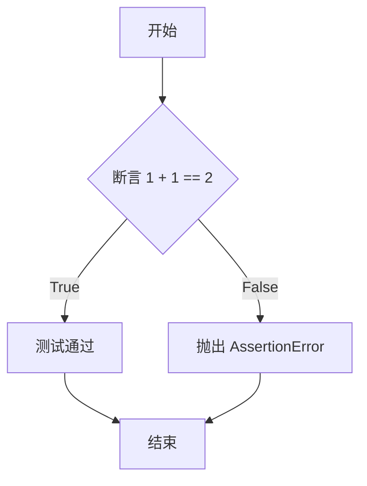
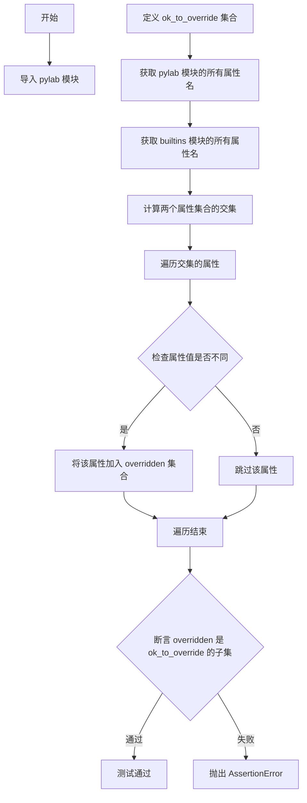
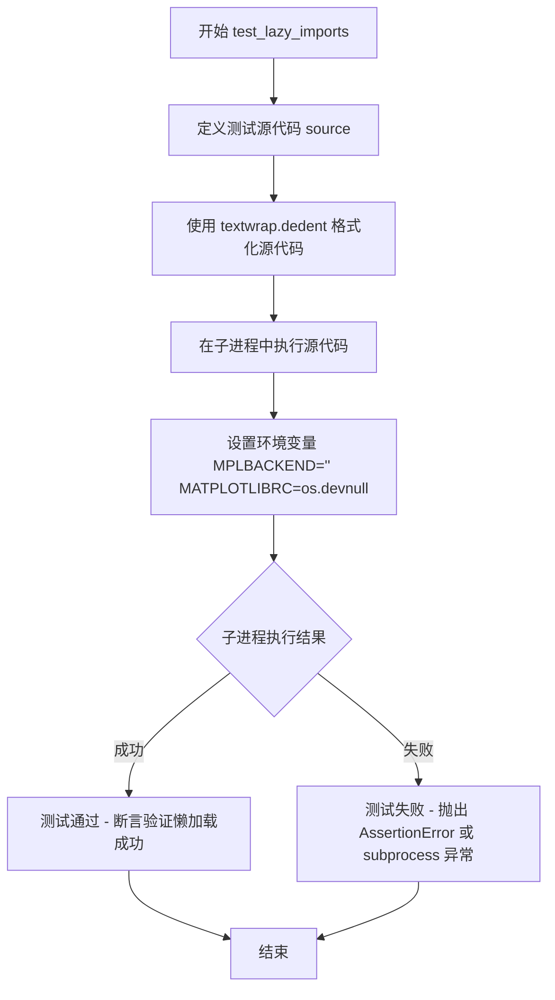

# `matplotlib\lib\matplotlib\tests\test_basic.py` 详细设计文档

这是一个matplotlib的测试文件，用于验证pylab模块对Python内置函数的覆盖行为是否符合预期，以及测试matplotlib的延迟导入机制是否能正确避免加载不必要的子模块。

## 整体流程

```mermaid
graph TD
    A[开始] --> B[执行test_simple]
    B --> C{断言 1+1 == 2}
    C -- 通过 --> D[执行test_override_builtins]
    D --> E[导入pylab模块]
    E --> F[获取pylab和builtins的交集属性]
    F --> G{属性值是否不同?}
    G -- 是 --> H[添加到overridden集合]
    G -- 否 --> I[继续下一属性]
    H --> J{overridden是否<=ok_to_override?]
    J -- 是 --> K[断言通过]
    J -- 否 --> L[断言失败]
    K --> M[执行test_lazy_imports]
    M --> N[构建测试源码字符串]
    N --> O[使用subprocess_run_for_testing执行子进程]
    O --> P[子进程检查未加载的模块]
    P --> Q{检查结果?}
    Q -- 成功 --> R[测试通过]
    Q -- 失败 --> S[测试失败]
    C -- 失败 --> T[测试失败]
```

## 类结构

```
无类结构 (函数式测试文件)
├── test_simple (简单断言测试)
├── test_override_builtins (builtins覆盖测试)
└── test_lazy_imports (延迟导入测试)
```

## 全局变量及字段


### `ok_to_override`
    
允许pylab覆盖的builtins属性集合，包含__name__、__doc__、__package__、__loader__、__spec__、any、all、sum、divmod等

类型：`set`
    


    

## 全局函数及方法


### `test_simple`

这是一个简单的测试函数，用于验证基本的数学运算是否正确（1 + 1 == 2）。

参数：无

返回值：`None`，该函数不返回任何值，仅执行断言操作

#### 流程图



#### 带注释源码

```python
def test_simple():
    """
    简单的测试函数，用于验证基础算术运算。
    
    该函数执行一个简单的断言，检查 1 + 1 是否等于 2。
    这是一个最基本的冒烟测试（smoke test），用于验证
    Python 解释器和测试框架是否正常工作。
    """
    assert 1 + 1 == 2  # 断言 1 + 1 的结果等于 2，如果不相等则抛出 AssertionError
```


### `test_override_builtins`

该测试函数用于验证 `pylab` 模块在导入时是否只覆盖了允许范围内的 Python 内置函数或属性。它通过比较 `pylab` 模块和 `builtins` 模块的属性集合，找出被覆盖的属性，并断言这些被覆盖的属性必须在预先定义的 `ok_to_override` 集合中。

参数： 无

返回值：`None`，该函数为测试函数，使用断言进行验证，不返回具体值

#### 流程图



#### 带注释源码

```python
def test_override_builtins():
    """
    测试 pylab 模块是否仅覆盖了允许范围内的内置函数/属性。
    通过比较 pylab 和 builtins 模块的属性集合来验证覆盖情况。
    """
    # 导入 pylab 模块，这会触发大量的子模块导入和属性赋值
    import pylab  # type: ignore[import]
    
    # 定义允许被覆盖的内置属性集合
    # 这些是测试预期允许被重写的属性
    ok_to_override = {
        '__name__',      # 模块名称
        '__doc__',       # 模块文档字符串
        '__package__',   # 包名
        '__loader__',    # 模块加载器
        '__spec__',      # 模块规范对象
        'any',           # 内置函数 any
        'all',           # 内置函数 all
        'sum',           # 内置函数 sum
        'divmod'         # 内置函数 divmod
    }
    
    # 计算被覆盖的属性集合：
    # 1. dir(pylab) 获取 pylab 模块的所有属性
    # 2. dir(builtins) 获取内置模块的所有属性
    # 3. {*dir(pylab)} & {*dir(builtins)} 取交集得到共同属性
    # 4. getattr 分别获取两边的属性值进行比较
    overridden = {
        key for key in {*dir(pylab)} & {*dir(builtins)}
        if getattr(pylab, key) != getattr(builtins, key)
    }
    
    # 断言：被覆盖的属性必须都是允许范围内的
    # 如果有未预期的属性被覆盖，测试将失败
    assert overridden <= ok_to_override
```


### `test_lazy_imports`

该函数用于测试matplotlib的懒加载机制是否正常工作。通过在子进程中运行一段代码，验证当仅导入指定的matplotlib模块时，某些底层模块（如`_tri`、`_qhull`、`_contour`）和无关模块（如`urllib.request`）不会被预先加载到`sys.modules`中。

参数： 无

返回值：`None`，该函数通过`subprocess_run_for_testing`执行，若断言失败则抛出`AssertionError`

#### 流程图



#### 带注释源码

```python
def test_lazy_imports():
    """
    测试matplotlib的懒加载机制。
    验证在仅导入指定的matplotlib模块时，某些底层模块和无关模块
    不会被预先加载到sys.modules中。
    """
    # 定义待执行的源代码字符串
    source = textwrap.dedent("""
    import sys

    import matplotlib.figure
    import matplotlib.backend_bases
    import matplotlib.pyplot

    # 断言这些底层模块未被提前加载（懒加载验证）
    assert 'matplotlib._tri' not in sys.modules
    assert 'matplotlib._qhull' not in sys.modules
    assert 'matplotlib._contour' not in sys.modules
    # 断言urllib.request未被提前加载（无关模块验证）
    assert 'urllib.request' not in sys.modules
    """)

    # 使用测试工具在子进程中运行源代码
    # env参数确保使用空MPLBACKEND和无效MATPLOTLIBRC以避免外部配置干扰
    subprocess_run_for_testing(
        [sys.executable, '-c', source],  # 使用当前Python解释器执行代码字符串
        env={**os.environ, "MPLBACKEND": "", "MATPLOTLIBRC": os.devnull},  # 设置测试环境
        check=True)  # 检查子进程返回码，非0则抛出异常
```

## 关键组件


### 内置函数覆盖检测机制

该组件用于验证pylab模块在导入时是否会不当覆盖Python内置函数，通过比较pylab和builtins命名空间中的同名对象来识别被覆盖的函数，并确保被覆盖的函数在允许列表内。

### 惰性导入验证模块

该组件通过子进程方式运行独立代码段，验证matplotlib的惰性加载机制是否正常工作，确保在导入matplotlib.figure等模块时不会预先加载matplotlib._tri、matplotlib._qhull、matplotlib._contour和urllib.request等可选或延迟加载的模块。

### 子进程测试执行框架

该组件封装了matplotlib.testing中的子进程运行功能，用于在隔离环境中执行测试代码，支持通过环境变量配置MPLBACKEND和MATPLOTLIBRC，并提供返回检查功能以验证测试是否成功完成。

### 允许覆盖的内置函数白名单

该组件定义了pylab模块允许覆盖的Python内置函数集合，包括__name__、__doc__、__package__、__loader__、__spec__、any、all、sum和divmod，这些函数在pylab模块中被合理重写以提供特定的绘图功能。


## 问题及建议


### 已知问题

-   `test_simple()` 函数命名过于简单，缺乏描述性，无法快速理解测试目的
-   `test_override_builtins()` 中使用复杂的集合推导式 `{*dir(pylab)} & {*dir(builtins)}`，可读性差，难以维护
-   硬编码的 `ok_to_override` 集合与实际检查逻辑分离，若新增允许覆盖的builtin属性，需要同时修改两处
-   `test_lazy_imports()` 中的 `source` 字符串作为多行代码片段内嵌在函数内部，难以单独测试和验证其正确性
-   使用 `{**os.environ, ...}` 复制整个环境变量字典，在子进程测试场景中可能引入不必要的环境变量干扰
-   缺少对 `subprocess_run_for_testing` 返回值的检查，仅依赖 `check=True` 参数
-   未为测试函数添加文档字符串，后续开发者难以理解测试意图和预期行为
-   `import pylab` 使用了类型注释忽略 `type: ignore[import]`，表明存在潜在的导入类型问题需要解决

### 优化建议

-   重命名测试函数为更具描述性的名称，如 `test_pylab_acceptable_builtin_overrides()`
-   提取 `ok_to_override` 为模块级常量或配置文件，并添加注释说明每个属性的用途
-   简化 `test_override_builtins()` 的集合运算逻辑，分步执行以提高可读性
-   将 `test_lazy_imports()` 中的源代码字符串提取为独立的测试数据文件或常量
-   考虑显式传递需要的环境变量而非展开整个 `os.environ`，减少测试间的隐式依赖
-   为所有测试函数添加 docstring，说明测试目的、前置条件和预期结果
-   考虑修复 `pylab` 的导入类型问题，而非长期使用类型忽略注释

## 其它


### 设计目标与约束

本测试套件旨在验证matplotlib库对Python内置函数的覆盖行为是否符合预期规范，并确保延迟导入机制正常工作。测试约束包括：1）仅允许特定的内置函数被覆盖；2）延迟加载的模块不应在主程序初始化时加载；3）测试必须在隔离的子进程中运行以避免环境污染。

### 错误处理与异常设计

测试代码通过subprocess_run_for_testing执行子进程测试，使用check=True参数确保子进程非零返回码时抛出异常。assert语句作为主要的验证机制，失败时直接抛出AssertionError。环境变量MPLBACKEND和MATPLOTLIBRC的清空操作通过字典解包实现，缺失键时使用os.devnull作为默认值。

### 外部依赖与接口契约

测试依赖以下外部组件：1）matplotlib库本身（通过pylab模块访问）；2）Python标准库的builtins、os、sys模块；3）matplotlib.testing模块提供的subprocess_run_for_testing工具。接口契约包括：pylab模块的dir()输出必须与builtins模块进行比较，sys.modules字典用于验证延迟加载状态。

### 性能考虑与优化空间

当前测试每次运行都启动新的子进程，存在约200-500毫秒的进程创建开销。可优化方向：1）使用pytest的monkeypatch机制替代subprocess进行部分测试；2）合并多个单函数测试为参数化测试减少进程启动次数；3）将静态检查（如ok_to_override集合定义）移至模块初始化阶段。

### 安全考虑与沙箱设计

测试通过将MPLBACKEND设为空字符串、MATPLOTLIBRC设为os.devnull来隔离matplotlib的配置文件加载。子进程环境变量继承自os.environ，确保测试在真实用户环境中运行。建议增加MATPLOTLIB_USE环境变量以强制指定后端，进一步减少测试间的状态耦合。

### 测试覆盖范围与边界条件

测试覆盖了三个核心场景：基础功能验证、内置函数覆盖白名单验证、延迟导入模块验证。边界条件包括：1）空环境变量与devnull配置文件的组合；2）多个模块同时延迟加载的验证；3）集合比较运算（overridden <= ok_to_override）的包含关系检查。

    