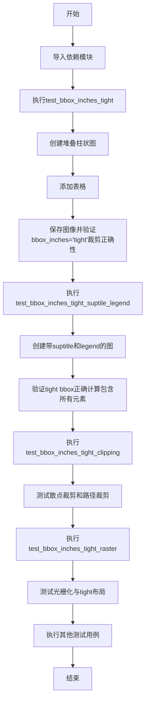
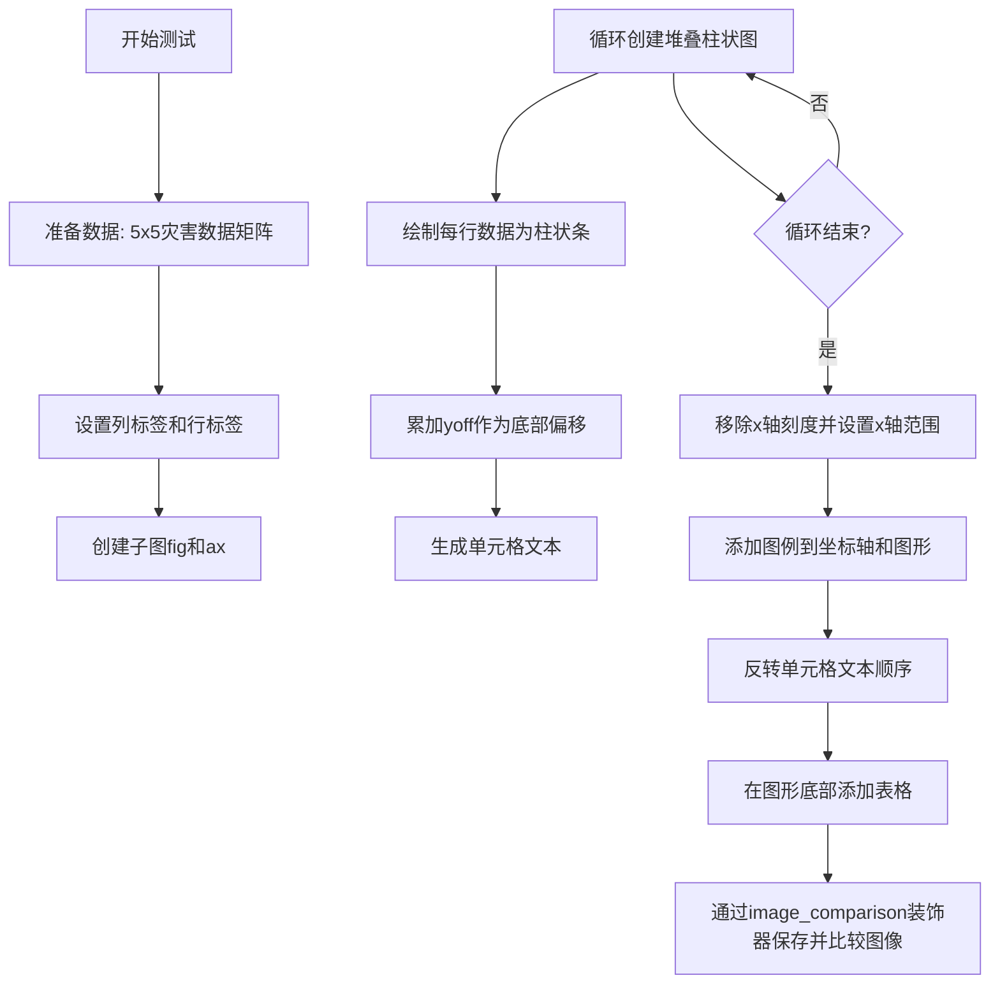
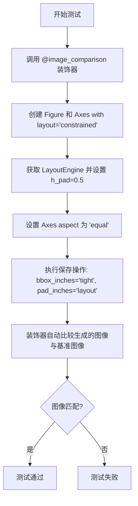
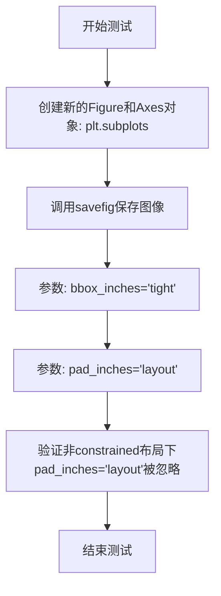
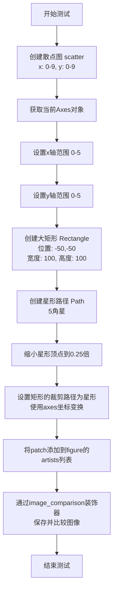
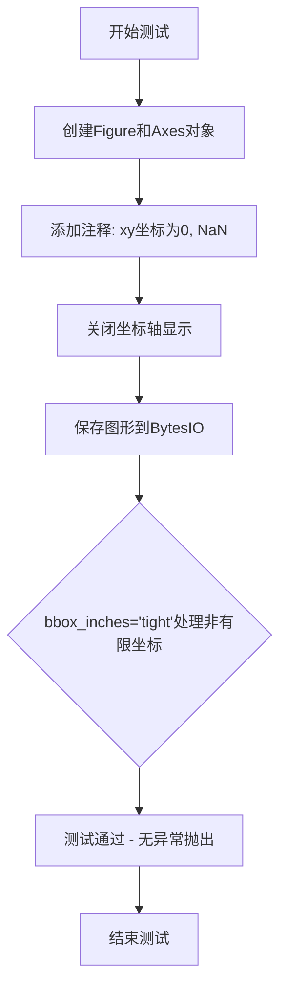
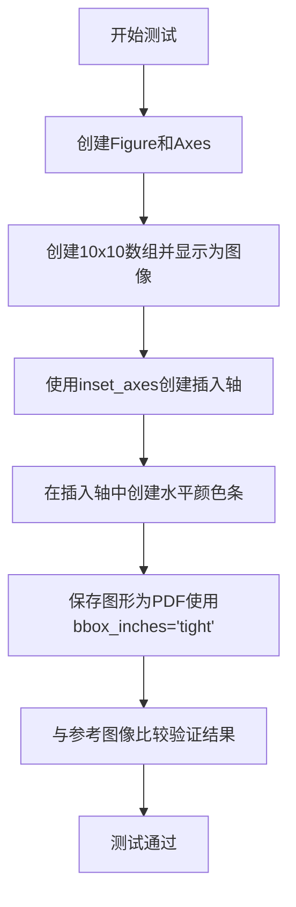

# `matplotlib\lib\matplotlib\tests\test_bbox_tight.py` 详细设计文档

这是一个matplotlib测试文件，用于测试图形保存时使用bbox_inches='tight'参数的各种场景，包括裁剪、布局、与suptitle/legend的交互、散点/路径裁剪、光栅化、坐标系等方面，确保tight bounding box功能在不同情况下都能正确工作。

## 整体流程



## 类结构

```
测试模块 (test_bbox_inches_tight.py)
├── test_bbox_inches_tight (测试函数)
├── test_bbox_inches_tight_suptile_legend (测试函数)
├── test_bbox_inches_tight_suptitle_non_default (测试函数)
├── test_bbox_inches_tight_layout_constrained (测试函数)
├── test_bbox_inches_tight_layout_notconstrained (测试函数)
├── test_bbox_inches_tight_clipping (测试函数)
├── test_bbox_inches_tight_raster (测试函数)
├── test_only_on_non_finite_bbox (测试函数)
├── test_tight_pcolorfast (测试函数)
├── test_noop_tight_bbox (测试函数)
├── test_bbox_inches_fixed_aspect (测试函数)
└── test_bbox_inches_inset_rasterized (测试函数)
```

## 全局变量及字段


### `data`
    
二维列表: 财务数据

类型：`list[list[int]]`
    


### `col_labels`
    
元组: 列标签

类型：`tuple[str, ...]`
    


### `row_labels`
    
列表: 行标签

类型：`list[str]`
    


### `rows`
    
行数

类型：`int`
    


### `ind`
    
numpy数组: x位置

类型：`numpy.ndarray`
    


### `cell_text`
    
列表: 单元格文本

类型：`list[list[str]]`
    


### `width`
    
float: 柱宽

类型：`float`
    


### `yoff`
    
numpy数组: 底部值

类型：`numpy.ndarray`
    


### `x_size`
    
图像宽度

类型：`int`
    


### `y_size`
    
图像高度

类型：`int`
    


### `dpi`
    
DPI

类型：`int`
    


### `buf`
    
缓冲区

类型：`BytesIO`
    


### `height`
    
图像高度

类型：`int`
    


### `width`
    
图像宽度

类型：`int`
    


### `im`
    
numpy数组: 图像数据

类型：`numpy.ndarray`
    


### `arr`
    
数组数据

类型：`numpy.ndarray`
    


### `inset`
    
axes: 插入的axes

类型：`Axes`
    


### `patch`
    
Rectangle: 矩形补丁

类型：`Rectangle`
    


### `path`
    
Path: 路径对象

类型：`Path`
    


    

## 全局函数及方法


### `test_bbox_inches_tight`

该测试函数用于验证 Matplotlib 在使用 `bbox_inches='tight'` 参数保存图形时，能够正确裁剪包含堆叠柱状图和底部表格的图形，确保输出图像的边界框紧密且不包含多余的空白区域。

参数：

-  `text_placeholders`：`Any`，在图像比较测试中用于处理文本占位符的占位参数，由 `@image_comparison` 装饰器自动传入

返回值：`None`，该测试函数通过 `@image_comparison` 装饰器进行图像比较验证，不直接返回结果

#### 流程图



#### 带注释源码

```python
@image_comparison(['bbox_inches_tight'], remove_text=True, style='mpl20',
                  savefig_kwarg={'bbox_inches': 'tight'})
def test_bbox_inches_tight(text_placeholders):
    #: Test that a figure saved using bbox_inches='tight' is clipped correctly
    # 定义5x5灾害数据矩阵，每行代表一个年份，每列代表一种灾害类型
    data = [[66386, 174296, 75131, 577908, 32015],
            [58230, 381139, 78045, 99308, 160454],
            [89135, 80552, 152558, 497981, 603535],
            [78415, 81858, 150656, 193263, 69638],
            [139361, 331509, 343164, 781380, 52269]]

    # 定义表格的列标签（灾害类型）
    col_labels = ('Freeze', 'Wind', 'Flood', 'Quake', 'Hail')
    # 定义表格的行标签（年份），格式为'X year'
    row_labels = [f'{x} year' for x in (100, 50, 20, 10, 5)]

    rows = len(data)
    # 计算柱状图的x位置，从0.3开始以留出左侧边距
    ind = np.arange(len(col_labels)) + 0.3  # the x locations for the groups
    cell_text = []
    width = 0.4  # the width of the bars
    # 初始化底部偏移量为零
    yoff = np.zeros(len(col_labels))
    # the bottom values for stacked bar chart
    
    # 创建1x1的子图
    fig, ax = plt.subplots(1, 1)
    
    # 循环绘制堆叠柱状图
    for row in range(rows):
        # 绘制当前行的柱状图，bottom参数指定底部起始位置
        ax.bar(ind, data[row], width, bottom=yoff, align='edge')
        # 更新底部偏移量，累加当前行数据
        yoff = yoff + data[row]
        # 将底部值转换为千分位字符串并添加到单元格文本
        cell_text.append([f'{x / 1000:1.1f}' for x in yoff])
    
    # 移除x轴刻度
    plt.xticks([])
    # 设置x轴范围
    plt.xlim(0, 5)
    # 添加坐标轴图例
    plt.legend(['1', '2', '3', '4', '5'], loc=(1.2, 0.2))
    # 添加图形级图例，bbox_to_anchor指定图例位置
    fig.legend(['a', 'b', 'c', 'd', 'e'], bbox_to_anchor=(0, 0.2), loc='lower left')
    
    # Add a table at the bottom of the axes
    # 反转单元格文本顺序以匹配堆叠柱状图的绘制顺序
    cell_text.reverse()
    # 在坐标轴底部创建表格
    plt.table(cellText=cell_text, rowLabels=row_labels, colLabels=col_labels,
              loc='bottom')
```


### `test_bbox_inches_tight_suptile_legend`

该测试函数用于验证在使用 `bbox_inches='tight'` 保存图形时，紧凑边界框（tight bbox）能够正确计算并包含 suptitle（总标题）和 legend（图例）的空间，确保这些元素不被裁剪掉。

参数：无

返回值：`None`，该函数为测试函数，通过 `@image_comparison` 装饰器自动进行图像比对验证

#### 流程图

```mermaid
flowchart TD
    A[开始测试] --> B[绘制线条: plt.plot]
    --> C[添加图例: plt.legend<br/>位置 bbox_to_anchor=(0.9, 1)]
    --> D[设置轴标题: plt.title]
    --> E[设置总标题: plt.suptitle]
    --> F[定义Y轴格式化函数 y_formatter]
    --> G[设置Y轴_major_formatter为y_formatter]
    --> H[设置X轴标签: plt.xlabel]
    --> I[图像比对验证<br/>@image_comparison装饰器]
    --> J[结束测试]
    
    F --> |"返回'The number 4'<br/>当y=4时"| G
```

#### 带注释源码

```python
@image_comparison(['bbox_inches_tight_suptile_legend'],
                  savefig_kwarg={'bbox_inches': 'tight'},
                  tol=0 if platform.machine() == 'x86_64' else 0.02)
def test_bbox_inches_tight_suptile_legend():
    """
    测试tight bbox与suptitle/legend的交互
    
    验证当使用bbox_inches='tight'保存图形时,
    紧边界框能够正确计算并包含图例(legend)和总标题(suptitle)所需的空间
    """
    # 绘制一条简单的折线数据
    plt.plot(np.arange(10), label='a straight line')
    
    # 添加图例,设置在右上角位置
    # bbox_to_anchor=(0.9, 1) 将图例放置在靠近右上角的位置
    plt.legend(bbox_to_anchor=(0.9, 1), loc='upper left')
    
    # 设置轴标题(单个 axes 的标题)
    plt.title('Axis title')
    
    # 设置总标题(整个 figure 的标题)
    # suptitle 位于图形上方,需要被 tight bbox 正确考虑
    plt.suptitle('Figure title')

    # 定义一个自定义的 Y 轴格式化函数
    # 用于生成一个特别长的 Y 轴刻度标签,以测试 bbox 计算
    def y_formatter(y, pos):
        """将 Y 轴刻度 4 格式化为较长的字符串"""
        if int(y) == 4:
            return 'The number 4'  # 较长的标签,用于测试 bbox 边界计算
        else:
            return str(y)
    
    # 获取当前 axes 并设置 Y 轴的主要格式化器
    # 这会添加一个很长的刻度标签 'The number 4'
    # 用于验证 tight bbox 是否正确考虑了这个长标签的空间
    plt.gca().yaxis.set_major_formatter(FuncFormatter(y_formatter))

    # 设置 X 轴标签
    plt.xlabel('X axis')
    
    # 注意: 此函数没有显式的 return 语句
    # @image_comparison 装饰器会自动调用 savefig
    # 并将生成的图像与 baseline 图像进行比对验证
```


### `test_bbox_inches_tight_suptitle_non_default`

验证在非默认位置（y=1.1）的 suptitle 的 tight bbox 行为，确保在保存图像时正确裁剪包含超出默认边界的 suptitle 的区域。

参数：

- 该函数无参数

返回值：`None`，无返回值（测试函数）

#### 流程图

```mermaid
flowchart TD
    A[开始测试] --> B[创建子图: fig, ax = plt.subplots]
    B --> C[设置suptitle: 'Booo' at x=0.5, y=1.1]
    C --> D[通过@image_comparison装饰器保存图像并比较]
    D --> E[使用bbox_inches='tight'保存]
    E --> F[验证裁剪结果是否匹配预期]
    F --> G[结束测试]
```

#### 带注释源码

```python
@image_comparison(['bbox_inches_tight_suptitle_non_default.png'],  # 预期输出的图像文件名
                  savefig_kwarg={'bbox_inches': 'tight'},  # 保存时使用tight bbox
                  tol=0.1)  # large tolerance because only testing clipping.
def test_bbox_inches_tight_suptitle_non_default():
    """验证非默认位置suptitle的tight bbox"""
    # 创建一个新的图形和坐标轴
    fig, ax = plt.subplots()
    # 在图形顶部添加标题，x=0.5为中心位置，y=1.1高于默认位置
    # 这会使得标题部分超出默认的图形边界
    fig.suptitle('Booo', x=0.5, y=1.1)
    # 装饰器会自动保存图形并与预期图像进行比较
    # 测试tight bbox算法是否正确包含了超出默认边界的suptitle
```


### `test_bbox_inches_tight_layout_constrained`

该测试函数用于验证 constrained（约束）布局引擎与 tight bbox（紧凑边界框）结合使用时的正确性，确保在保存图像时能够正确计算包含约束布局内容的边界框。

参数：

- 无显式参数（通过 `@image_comparison` 装饰器隐式接收配置参数）

返回值：`None`，无返回值（测试函数，通过装饰器完成图像比较验证）

#### 流程图



#### 带注释源码

```python
@image_comparison(
    ['bbox_inches_tight_layout.png'],  # 基准图像文件名列表
    remove_text=True,                   # 移除所有文本进行对比（避免字体差异）
    style='mpl20',                      # 使用 mpl20 风格（Matplotlib 2.0 风格）
    savefig_kwarg=dict(
        bbox_inches='tight',            # 紧凑边界框模式
        pad_inches='layout'             # 使用布局引擎计算的边距
    )
)
def test_bbox_inches_tight_layout_constrained():
    """
    测试 constrained 布局与 tight bbox 结合的功能
    
    验证要点：
    1. constrained 布局引擎能正确与 bbox_inches='tight' 协同工作
    2. pad_inches='layout' 参数在 constrained 布局下生效
    3. 设置 h_pad 后布局能正确应用
    4. equal aspect ratio 设置能被正确包含在边界框计算中
    """
    # 创建使用 constrained 布局引擎的 Figure 和 Axes
    # constrained 布局会自动调整子图间距以避免元素重叠
    fig, ax = plt.subplots(layout='constrained')
    
    # 获取布局引擎并设置水平填充为 0.5
    # 这会影响元素之间的间距，进而影响最终边界框大小
    fig.get_layout_engine().set(h_pad=0.5)
    
    # 设置 Axes 的宽高比为 equal
    # 确保边界框计算考虑到 aspect ratio 的影响
    ax.set_aspect('equal')
```


### `test_bbox_inches_tight_layout_notconstrained`

验证当不使用constrained/compressed布局时，pad_inches='layout'参数应被忽略，且savefig不会出错。

参数：

- `tmp_path`：`Path`，pytest的临时目录fixture，用于保存生成的测试图像文件

返回值：`None`，该函数仅执行图像保存操作，不返回任何值

#### 流程图



#### 带注释源码

```python
def test_bbox_inches_tight_layout_notconstrained(tmp_path):
    """
    测试当不使用constrained/compressed布局时，pad_inches='layout'参数应被忽略。
    这是一个冒烟测试，确保savefig在这种情况下不会报错。
    
    参数:
        tmp_path: pytest提供的临时目录路径，用于保存输出文件
    """
    # 创建一个新的Figure和一个Axes子图
    # 不使用任何布局引擎（默认非constrained布局）
    fig, ax = plt.subplots()
    
    # 使用bbox_inches='tight'和pad_inches='layout'保存图像
    # 预期行为：pad_inches='layout'在非constrained/compressed布局下应被忽略
    # 图像应正常保存，不会抛出异常
    fig.savefig(tmp_path / 'foo.png', bbox_inches='tight', pad_inches='layout')
```


### `test_bbox_inches_tight_clipping`

验证使用 `bbox_inches='tight'` 保存图形时，散点图的点裁剪和路径裁剪是否正确生成紧密边界框。

参数：

- 无显式参数（测试框架注入的 `text_placeholders` 参数由装饰器处理，不属于函数签名）

返回值：`None`，无返回值（测试函数，通过图像比较验证结果）

#### 流程图



#### 带注释源码

```python
@image_comparison(['bbox_inches_tight_clipping'],  # 装饰器：比较生成的图像与基准图像
                  remove_text=True,  # 移除所有文本（刻度标签、图例等）
                  savefig_kwarg={'bbox_inches': 'tight'})  # 保存时使用tight bbox
def test_bbox_inches_tight_clipping():
    # 测试散点图的点裁剪，以及patch的路径裁剪
    # 以生成适当紧密的边界框
    
    # 创建散点图：10个点，x和y都从0到9
    plt.scatter(np.arange(10), np.arange(10))
    
    # 获取当前axes（当前plot的axes）
    ax = plt.gca()
    
    # 限制显示范围为0到5
    # 这样散点图中5-9的点应该被裁剪掉
    ax.set_xlim(0, 5)
    ax.set_ylim(0, 5)

    # 创建一个巨大的矩形patch用于测试路径裁剪
    # 位置从-50,-50开始，宽度和高度都是100
    # 使用data坐标系（而非axes坐标系）
    patch = mpatches.Rectangle([-50, -50], 100, 100,
                               transform=ax.transData,  # 使用数据坐标
                               facecolor='blue', alpha=0.5)  # 蓝色半透明

    # 创建一个5角星形路径
    path = mpath.Path.unit_regular_star(5).deepcopy()
    
    # 将星形的顶点缩小到原来的0.25倍
    path.vertices *= 0.25
    
    # 设置矩形的裁剪路径为星形
    # 使用axes坐标系进行变换
    patch.set_clip_path(path, transform=ax.transAxes)
    
    # 将patch添加到figure的artists列表中
    # 这样它才会被渲染和包含在bbox计算中
    plt.gcf().artists.append(patch)
```


### `test_bbox_inches_tight_raster`

验证光栅化与tight布局的结合功能，确保在使用 `bbox_inches='tight'` 保存包含光栅化元素的图形时，边框裁剪正确且与光栅化兼容。

参数：

- 该函数无参数（继承自 `@image_comparison` 装饰器的配置参数由装饰器处理）

返回值：`None`，无返回值（测试函数，仅执行验证逻辑）

#### 流程图

```mermaid
flowchart TD
    A[开始执行 test_bbox_inches_tight_raster] --> B[调用 plt.subplots 创建图形和坐标轴]
    B --> C[在坐标轴上绘制线段, 设置 rasterized=True 启用光栅化]
    C --> D[@image_comparison 装饰器自动保存图形]
    E[装饰器配置: 基准图名称为 'bbox_inches_tight_raster']
    E --> F[remove_text=True: 移除文本元素]
    F --> G[savefig_kwarg={'bbox_inches': 'tight'}: 使用 tight 模式保存]
    G --> H[tol=0.15: 图像对比容差]
    H --> I[测试通过: 验证光栅化图形 tight bbox 正确裁剪]
    D --> I
    style I fill:#90EE90
```

#### 带注释源码

```python
@image_comparison(['bbox_inches_tight_raster'],  # 基准图像文件名列表
                  tol=0.15,                       # 图像对比容差, Ghostscript 10.06+ 需要较大容差
                  remove_text=True,              # 保存前移除所有文本元素
                  savefig_kwarg={'bbox_inches': 'tight'})  # 保存时使用 tight 边框模式
def test_bbox_inches_tight_raster():
    """Test rasterization with tight_layout"""
    # 创建一个新的 Figure 和 Axes 对象
    fig, ax = plt.subplots()
    
    # 绘制一条简单的线段, 并设置 rasterized=True 将其光栅化
    # 这样图形会包含矢量元素(坐标轴)和光栅元素( plot 的线)
    # 测试 tight bbox 计算是否正确处理混合渲染模式
    ax.plot([1.0, 2.0], rasterized=True)
```


### `test_only_on_non_finite_bbox`

验证非有限坐标（NaN）的bbox处理，确保在使用`bbox_inches='tight'`保存包含非有限坐标的图形时不会出错。

参数：

- 无参数

返回值：`None`，无返回值（测试函数）

#### 流程图



#### 带注释源码

```python
def test_only_on_non_finite_bbox():
    """测试非有限坐标的bbox处理"""
    
    # 步骤1: 创建一个新的图形和坐标轴
    fig, ax = plt.subplots()
    
    # 步骤2: 在坐标轴上添加注释,坐标为(0, NaN)
    # float('nan') 创建一个非有限值(Not a Number)
    # 用于测试bbox计算是否能正确处理这种情况
    ax.annotate("", xy=(0, float('nan')))
    
    # 步骤3: 关闭坐标轴显示
    # 移除坐标轴以便更清晰地测试bbox计算
    ax.set_axis_off()
    
    # 步骤4: 将图形保存到BytesIO对象中
    # 使用 bbox_inches='tight' 参数
    # 关键: 测试当图形包含NaN坐标时,紧凑bbox计算是否会出错
    # 如果没有正确的非有限值过滤,这里可能会抛出异常
    fig.savefig(BytesIO(), bbox_inches='tight', format='png')
```


### `test_tight_pcolorfast`

该测试函数用于验证 `pcolorfast` 在使用 `bbox_inches='tight'` 保存图形时能正确计算边界框，特别是当坐标轴的 y 轴限制范围很小（如 0 到 0.1）时，生成的图像应该具有合适的宽高比（宽度大于高度），而不会错误地包含被裁剪掉的图像区域。

参数：
- 无

返回值：`None`，无显式返回值（测试函数通过 assert 断言进行验证）

#### 流程图

```mermaid
flowchart TD
    A[开始] --> B[创建图形 fig 和坐标轴 ax]
    B --> C[调用 pcolorfast 绘制 2x2 数组]
    C --> D[设置 ax 的 ylim 为 0 到 0.1]
    D --> E[创建 BytesIO 缓冲区 buf]
    E --> F[调用 fig.savefig 保存图形, 使用 bbox_inches='tight']
    F --> G[重置 buf 位置到开头: buf.seek(0)]
    G --> H[使用 plt.imread 读取图像, 获取高度和宽度]
    H --> I{断言: width > height?}
    I -->|是| J[测试通过]
    I -->|否| K[测试失败]
    J --> L[结束]
    K --> L
```

#### 带注释源码

```python
def test_tight_pcolorfast():
    """
    测试 pcolorfast 的 tight bbox 计算是否正确
    
    该测试验证当使用 bbox_inches='tight' 保存包含 pcolorfast 的图形时,
    边界框计算能够正确排除被 axes 裁剪掉的图像区域。
    """
    # 创建图形和坐标轴
    fig, ax = plt.subplots()
    
    # 使用 pcolorfast 绘制一个 2x2 的数组
    # np.arange(4).reshape((2, 2)) 创建 [[0, 1], [2, 3]]
    ax.pcolorfast(np.arange(4).reshape((2, 2)))
    
    # 设置 y 轴范围为很小的值 (0, 0.1)
    # 这会导致大部分图像内容被裁剪掉
    ax.set(ylim=(0, .1))
    
    # 创建内存缓冲区用于保存图像
    buf = BytesIO()
    
    # 保存图形到缓冲区, 使用 tight bbox
    # 关键: bbox_inches='tight' 应该只包含可见内容
    fig.savefig(buf, bbox_inches="tight")
    
    # 重置缓冲区读取位置到开头
    buf.seek(0)
    
    # 读取图像并获取尺寸
    height, width, _ = plt.imread(buf).shape
    
    # 断言: 宽度应该大于高度
    # 之前(有bug时)的实现会包含被裁剪的图像区域,
    # 导致给定 y 限制为 (0, 0.1) 时生成非常高的图像
    assert width > height
```


### `test_noop_tight_bbox`

该测试函数验证当图形中包含光栅化Artist（图像）时，使用`bbox_inches='tight'`保存图形时的bbox调整应该是无操作（no-op），即不会影响后续的保存操作。具体来说，测试创建一个带有光栅化图像的图形，先保存为PDF格式（触发混合模式渲染器的bbox调整），然后再保存为PNG格式，验证最终图像的尺寸和内容符合预期。

参数：
- 无参数

返回值：无返回值（`None`），该函数为测试函数，使用assert语句进行断言验证

#### 流程图

```mermaid
flowchart TD
    A[开始测试] --> B[导入PIL.Image]
    B --> C[设置图像尺寸 x_size=10, y_size=7, dpi=100]
    C --> D[创建无边框figure<br/>fig = plt.figure(frameon=False, dpi=100, figsize=(0.1, 0.07))]
    D --> E[添加覆盖整个区域的坐标轴<br/>ax = fig.add_axes((0, 0, 1, 1))]
    E --> F[隐藏坐标轴<br/>ax.set_axis_off<br/>ax.xaxis.set_visible(False<br/>ax.yaxis.set_visible(False)]
    F --> G[生成图像数据<br/>data = np.arange(70).reshape(7, 10)]
    G --> H[在坐标轴上显示图像<br/>ax.imshow(data, rasterized=True)]
    H --> I[第一次保存: PDF格式<br/>fig.savefig(BytesIO(), bbox_inches='tight', pad_inches=0, format='pdf)]
    I --> J[第二次保存: PNG格式<br/>fig.savefig(out, bbox_inches='tight', pad_inches=0)]
    J --> K[读取保存的图像<br/>im = np.asarray(Image.open(out))]
    K --> L[断言验证]
    L --> M[验证alpha通道全为255<br/>assert (im[:, :, 3] == 255).all]
    M --> N[验证RGB通道不全是白色<br/>assert not (im[:, :, :3] == 255).all]
    N --> O[验证图像尺寸为(7, 10, 4)<br/>assert im.shape == (7, 10, 4)]
    O --> P[测试结束]
```

#### 带注释源码

```python
def test_noop_tight_bbox():
    """
    测试函数：验证光栅化Artist存在时bbox调整是noop
    
    当图形中包含光栅化Artist（如rasterized=True的图像）时，混合模式渲染器
    会进行额外的bbox调整。该测试验证这个调整应该是无操作（no-op），
    不会影响后续的保存操作。
    """
    from PIL import Image  # 导入PIL用于图像处理
    
    # 设置图像尺寸：宽度10像素，高度7像素，分辨率100 DPI
    x_size, y_size = (10, 7)
    dpi = 100
    
    # 创建无边框的figure，尺寸根据DPI计算（10/100=0.1, 7/100=0.07英寸）
    fig = plt.figure(frameon=False, dpi=dpi, figsize=(x_size/dpi, y_size/dpi))
    
    # 添加一个覆盖整个figure区域的坐标轴（参数为[left, bottom, width, height]）
    ax = fig.add_axes((0, 0, 1, 1))
    
    # 隐藏坐标轴及其刻度
    ax.set_axis_off()
    ax.xaxis.set_visible(False)
    ax.yaxis.set_visible(False)
    
    # 生成70个像素的图像数据（10x7=70），并reshape为7行10列
    data = np.arange(x_size * y_size).reshape(y_size, x_size)
    
    # 在坐标轴上显示图像，rasterized=True表示光栅化处理
    ax.imshow(data, rasterized=True)
    
    # 第一次保存为PDF格式，这会触发混合模式渲染器的bbox调整
    # bbox_inches='tight'计算紧凑边界框，pad_inches=0表示无额外填充
    # 根据注释，这个操作应该是no-op，不影响后续保存
    fig.savefig(BytesIO(), bbox_inches='tight', pad_inches=0, format='pdf')
    
    # 第二次保存为PNG格式到BytesIO对象
    out = BytesIO()
    fig.savefig(out, bbox_inches='tight', pad_inches=0)
    
    # 读取保存的图像数据
    out.seek(0)
    im = np.asarray(Image.open(out))
    
    # 断言验证：
    # 1. alpha通道（透明度）应该全为255（完全不透明）
    assert (im[:, :, 3] == 255).all()
    
    # 2. RGB通道不应该全是255（否则图像完全是白色的）
    # 这验证了图像数据确实被保存进去了
    assert not (im[:, :, :3] == 255).all()
    
    # 3. 验证图像尺寸为(height=7, width=10, channels=4即RGBA)
    assert im.shape == (7, 10, 4)
```


### `test_bbox_inches_fixed_aspect`

该测试函数用于验证当图形设置固定纵横比（`aspect='equal'`）并使用 `bbox_inches='tight'` 保存时，图形能够正确计算并应用紧凑的边界框，同时确保固定纵横比被正确保留。

参数：无

返回值：`None`，该函数为测试函数，不返回任何值，仅通过 `@image_comparison` 装饰器进行图像对比验证。

#### 流程图

```mermaid
flowchart TD
    A[开始测试] --> B[使用rc_context设置constrained_layout]
    B --> C[创建figure和axes子图]
    C --> D[在axes上绘制线条 plot0-1]
    D --> E[设置x轴范围0-1]
    E --> F[设置axes纵横比为equal]
    F --> G[@image_comparison装饰器自动保存图像]
    G --> H[与基准图像bbox_inches_fixed_aspect.png对比]
    H --> I[验证tight bbox计算正确]
    I --> J[结束测试]
```

#### 带注释源码

```python
@image_comparison(['bbox_inches_fixed_aspect.png'], remove_text=True,
                  savefig_kwarg={'bbox_inches': 'tight'})
def test_bbox_inches_fixed_aspect():
    # 测试函数：验证固定纵横比与tight bbox的兼容性
    # 使用@image_comparison装饰器自动进行图像对比验证
    # 移除文本以确保测试的确定性
    # savefig_kwarg指定保存时使用tight bbox模式
    
    # 使用rc_context上下文管理器配置rc参数
    # 启用constrained_layout布局引擎
    with plt.rc_context({'figure.constrained_layout.use': True}):
        # 创建一个figure和一个axes子图
        fig, ax = plt.subplots()
        
        # 在axes上绘制简单的线图数据[0,1]
        ax.plot([0, 1])
        
        # 设置x轴的显示范围为0到1
        ax.set_xlim(0, 1)
        
        # 设置axes的纵横比为equal
        # 这确保x轴和y轴的单位长度在屏幕上看起来相等
        ax.set_aspect('equal')
        
        # @image_comparison装饰器会自动：
        # 1. 保存当前图像到临时文件
        # 2. 与baseline图像bbox_inches_fixed_aspect.png进行对比
        # 3. 在差异超过阈值时报告测试失败
```


### `test_bbox_inches_inset_rasterized`

该测试函数用于验证 matplotlib 在包含插入轴（inset_axes）和光栅化颜色条的情况下，使用 `bbox_inches='tight'` 保存图形时能够正确处理边界框计算，确保生成的 PDF 文件中插入轴和颜色条的位置和渲染符合预期。

参数：
- 无

返回值：
- 无

#### 流程图



#### 带注释源码

```python
@image_comparison(['bbox_inches_inset_rasterized.pdf'], remove_text=True,
                  savefig_kwarg={'bbox_inches': 'tight'}, style='mpl20')
def test_bbox_inches_inset_rasterized():
    """
    测试函数：验证插入axes和光栅化颜色条
    
    装饰器参数说明：
    - image_comparison: 比较生成的图像与参考图像
    - remove_text: 移除所有文本以便图像比较
    - savefig_kwarg: 保存时的参数，bbox_inches='tight'使用紧凑边界框
    - style: 使用mpl20样式
    """
    
    # 创建图形和主坐标轴
    fig, ax = plt.subplots()

    # 创建10x10的numpy数组，值为0-99
    arr = np.arange(100).reshape(10, 10)
    # 在主坐标轴上显示数组作为图像
    im = ax.imshow(arr)
    
    # 创建插入坐标轴（inset axes）
    # 参数说明：
    # - ax: 父坐标轴
    # - width='10%': 插入轴宽度为主轴的10%
    # - height='30%': 插入轴高度为主轴的30%
    # - loc='upper left': 放置在左上角
    # - bbox_to_anchor: 边界框锚点位置 (x, y, width, height)
    # - bbox_transform: 使用父坐标轴的坐标系统
    inset = inset_axes(
        ax, width='10%', height='30%', loc='upper left',
        bbox_to_anchor=(0.045, 0., 1, 1), bbox_transform=ax.transAxes)

    # 在插入的坐标轴中创建水平方向的颜色条
    # cax参数指定颜色条绘制在哪个坐标轴上
    fig.colorbar(im, cax=inset, orientation='horizontal')
```


### y_formatter

该函数是一个本地定义的y轴格式化函数，用于自定义matplotlib图表中y轴刻度标签的显示方式。当y值等于4时，返回特定的字符串"The number 4"，否则将y值转换为字符串格式。

参数：

- `y`：`float`，y轴的数值，表示需要格式化的y坐标值
- `pos`：`int`，刻度位置索引，表示当前处理的是第几个刻度

返回值：`str`，格式化后的字符串，用于显示在y轴刻度上

#### 流程图

```mermaid
flowchart TD
    A[开始: y_formatter] --> B{int(y) == 4?}
    B -->|是| C[返回 'The number 4']
    B -->|否| D[返回 str(y)]
    C --> E[结束]
    D --> E
```

#### 带注释源码

```python
def y_formatter(y, pos):
    """
    自定义y轴格式化函数
    
    参数:
        y: float类型的值，代表y轴上的数值
        pos: int类型，代表刻度的位置索引
    
    返回:
        str: 格式化后的字符串
    """
    # 判断y值是否为4（转换为整数后比较）
    if int(y) == 4:
        # 如果是4，返回特殊字符串'The number 4'
        return 'The number 4'
    else:
        # 否则将y值转换为字符串返回
        return str(y)
```

## 关键组件


### bbox_inches='tight' 核心功能

使用matplotlib的bbox_inches='tight'参数保存图形时，自动计算并应用紧凑边界框的功能测试套件

### image_comparison 装饰器

用于自动比较测试生成的图像与参考图像，验证图形输出是否正确，包含平台特定的容差设置

### 堆叠条形图构建

在test_bbox_inches_tight中创建堆叠条形图，通过迭代累加yoff值实现底部堆叠，并动态生成表格数据

### plt.table 表格组件

在图形底部添加数据表格，包含行标签、列标签和格式化后的单元格文本

### constrained layout 约束布局

使用fig.get_layout_engine()和ax.set_aspect('equal')测试约束布局下的tight bbox行为

### 散点图与裁剪路径

使用mpatches.Rectangle和mpath.Path创建裁剪区域，测试scatter点和patch元素的边界框裁剪

### 栅格化混合模式渲染

测试包含栅格化Artist时的混合模式渲染，验证bbox调整在PDF输出中的正确性

### pcolorfast 边界框计算

测试pcolorfast在设置axes ylim后的边界框计算，确保不会错误包含被裁剪的图像区域

### inset_axes 嵌入坐标轴

在主坐标轴中创建嵌入的子坐标轴用于colorbar，测试嵌套元素下的tight bbox

### 坐标轴范围限制

通过set_xlim和set_ylim设置坐标轴范围，验证tight bbox正确考虑坐标轴可视区域


## 问题及建议


### 已知问题

-   **平台特定硬编码**：在 `test_bbox_inches_tight_suptile_legend` 中使用 `platform.machine() == 'x86_64'` 进行平台判断，这种硬编码方式不优雅且难以维护
-   **全局状态污染**：多个测试函数使用 `plt.subplots()`、`plt.legend()`、`plt.gca()` 等全局函数，可能导致测试间的状态相互影响
-   **魔法数字缺乏解释**：代码中存在多处硬编码数值（如 `0.3`、`0.4`、`100`、`50`、`0.9`、`1.1` 等）缺少注释说明其含义
-   **重复代码**：多个测试函数中重复创建 figure 和 axes 的模式，可以抽取为公共方法
-   **测试数据硬编码**：数据矩阵直接写在代码中（如 `data` 列表），缺乏可读性和可维护性
-   **注释语言不一致**：部分注释使用英文，部分使用中文（如 `#: Test that a figure saved using bbox_inches='tight' is clipped correctly`）
-   **缺少类型提示**：所有函数都缺少参数和返回值的类型注解
-   **资源清理不明确**：虽然 matplotlib 通常自动处理资源，但缺少显式的资源清理模式（如 context manager）
-   **错误处理不足**：某些测试函数（如 `test_only_on_non_finite_bbox`、`test_tight_pcolorfast`）没有适当的 try-except 保护
-   **依赖外部库版本**：测试中使用了 `PIL.Image`，但没有显式的版本检查或错误提示

### 优化建议

-   **提取公共 fixture**：使用 pytest fixtures 来管理 figure 和 axes 的创建，减少重复代码
-   **添加类型提示**：为所有函数添加类型注解，提高代码可读性和 IDE 支持
-   **统一注释规范**：统一使用英文注释或中文注释，保持代码风格一致
-   **消除魔法数字**：将硬编码的数值提取为命名常量，并添加注释说明其用途
-   **使用 pytest.mark.parametrize**：对于相似的测试场景，使用参数化减少测试函数数量
-   **添加异常处理**：为可能失败的 I/O 操作添加 try-except 块
-   **平台判断抽象**：使用 pytest 的 skipif 装饰器或单独的配置文件来处理平台差异
-   **测试数据外部化**：将测试数据移动到数据文件或使用 pytest fixtures 生成
-   **资源清理**：使用 pytest 的 yield fixture 模式显式管理资源生命周期


## 其它


### 设计目标与约束

验证matplotlib中`bbox_inches='tight'`功能在多种场景下的正确性，包括：基础条形图、包含图例和标题的图表、constrained布局、散点与路径裁剪、光栅化渲染、固定纵横比以及嵌入式子图等。约束条件：测试仅验证图像输出，不验证交互式显示；部分测试对非x86_64架构设置不同容差值以兼容跨平台结果。

### 错误处理与异常设计

测试函数通过`@image_comparison`装饰器自动捕获渲染异常；`test_only_on_non_finite_bbox`和`test_bbox_inches_tight_layout_notconstrained`使用smoke test模式验证保存操作不会抛出异常；`test_tight_pcolorfast`和`test_noop_tight_bbox`通过断言验证输出数据的有效性（如图像尺寸、透明度通道值），而非依赖异常捕获。

### 数据流与状态机

数据输入流程：测试数据（列表、numpy数组）→matplotlib axes/bar/table/scatter/imshow等API→Figure对象→savefig的bbox_inches='tight'参数触发计算→渲染器计算tight bounding box→输出 BytesIO/PDF/PNG。状态转换：plt.subplots()创建fig/ax → 添加各种artist（bar、legend、title、patch等）→ savefig时临时进入tight bbox计算状态 → 保存后恢复。

### 外部依赖与接口契约

依赖：numpy（数值计算）、PIL（图像验证，仅在test_noop_tight_bbox中）、matplotlib库本身（含path、patches、ticker、inset_locator等模块）。接口契约：所有测试函数通过`@image_comparison`装饰器声明预期输出文件名（baseline image），测试运行时自动比较渲染结果与baseline；`bbox_inches='tight'`参数需传递至savefig_kwarg；部分测试通过`style='mpl20'`指定matplotlib 2.0风格以保证渲染一致性。

### 测试覆盖场景矩阵

| 测试函数 | 核心验证点 | 特殊配置 |
|---------|-----------|---------|
| test_bbox_inches_tight | 堆叠条形图+表格+图例裁剪 | remove_text=True |
| test_bbox_inches_tight_suptile_legend | suptitle+图例+自定义y轴格式化器 | 动态容差 |
| test_bbox_inches_tight_suptitle_non_default | 非默认位置suptitle | tol=0.1 |
| test_bbox_inches_tight_layout_constrained | constrained布局+equal aspect | pad_inches='layout' |
| test_bbox_inches_tight_clipping | scatter点裁剪+patch路径裁剪 | 组合裁剪 |
| test_bbox_inches_tight_raster | 光栅化折线图 | tol=0.15 |
| test_bbox_inches_fixed_aspect | constrained+equal+tight组合 | - |
| test_bbox_inches_inset_rasterized.pdf | inset_axes+colorbar+光栅化PDF | - |

### 性能考量与边界条件

测试中未包含显式性能基准测试，但`test_noop_tight_bbox`验证了混合模式渲染器（rasterized+vector）的bbox计算不会对后续保存产生副作用；`test_tight_pcolorfast`通过大容差验证极端ylim设置下的bbox计算正确性；所有测试使用相对较小的数据集（10x10至多列数据）以保持测试执行效率。

### 代码组织与模块职责

测试文件作为功能验证层，不包含业务逻辑类；全局函数层面仅定义测试函数，每个测试函数自包含完整的setup-render-verify流程；依赖注入通过装饰器参数（style、savefig_kwarg、tol等）实现测试参数化。


    