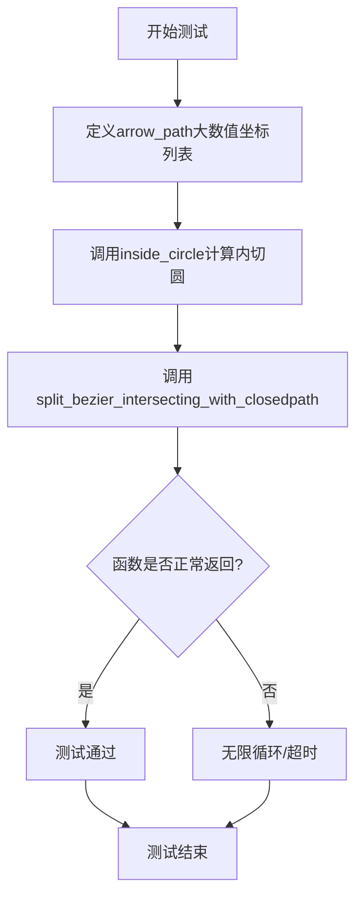
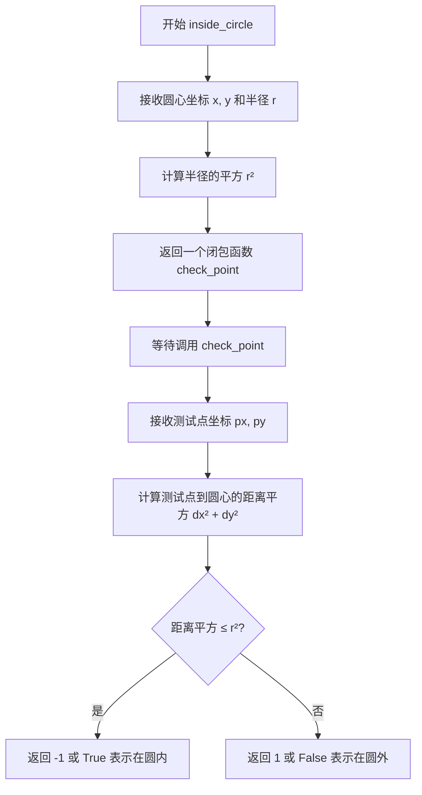
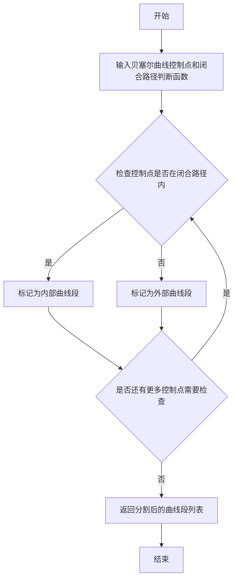
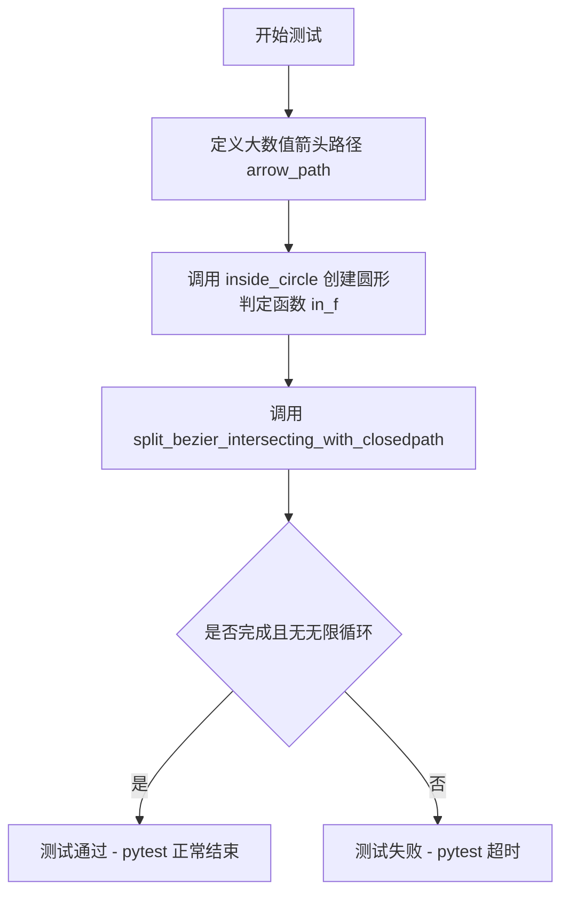

# `matplotlib\lib\matplotlib\tests\test_bezier.py` 详细设计文档

这是一个针对matplotlib.bezier模块的测试文件，主要用于验证split_bezier_intersecting_with_closedpath函数在处理极大数值时是否会因浮点精度问题导致无限循环。测试使用了来自GitHub issue #27753的实际数值。

## 整体流程



## 类结构

```
测试模块 (无类定义)
└── test_split_bezier_with_large_values (测试函数)
```

## 全局变量及字段


### `arrow_path`
    
包含三个大数值坐标点的贝塞尔曲线路径

类型：`list[tuple[float, float]]`
    


### `in_f`
    
inside_circle函数返回的回调函数，用于判断给定点是否在圆内

类型：`Callable[[float, float], bool]`
    


    

## 全局函数及方法


### `inside_circle`

该函数用于计算给定圆心和半径的内切圆函数，返回一个可调用对象（判断函数），用于贝塞尔曲线与圆形的相交测试，特别适用于处理大数值以避免浮点精度问题。

参数：

- `x`：`float`，圆的 x 坐标（圆心）
- `y`：`float`，圆的 y 坐标（圆心）
- `r`：`float`，圆的半径

返回值：`callable`，返回一个判断函数，该函数接受点坐标 (x, y)，返回点是否在圆内（通常返回 -1 表示在圆内，1 表示在圆外，或返回距离相关值）

#### 流程图



#### 带注释源码

```python
# 注：由于提供的代码中没有 inside_circle 的完整实现，
# 以下是基于 matplotlib bezier 模块的典型实现逻辑：

def inside_circle(x, y, r):
    """
    返回一个用于判断点是否在给定圆内的函数。
    
    参数:
        x: 圆心的 x 坐标
        y: 圆心的 y 坐标  
        r: 圆的半径
    
    返回:
        一个可调用对象，用于测试点是否在圆内
    """
    # 预先计算半径的平方，避免在回调中重复计算
    r_sq = r * r
    
    # 返回一个闭包函数，用于后续的相交测试
    def check_point(px, py):
        """
        检查点 (px, py) 是否在圆内
        """
        # 计算测试点到圆心的距离平方
        dx = px - x
        dy = py - y
        dist_sq = dx * dx + dy * dy
        
        # 比较距离平方与半径平方
        if dist_sq <= r_sq:
            return -1  # 表示点在圆内
        else:
            return 1   # 表示点在圆外
    
    return check_point

# 在测试代码中的使用示例：
# in_f = inside_circle(96950809781500.0, 804.7503795623779, 0.06)
# 这创建了一个判断函数，用于检测贝塞尔曲线是否与该圆相交
```


# split_bezier_intersecting_with_closedpath 函数详细设计

## 概述

`split_bezier_intersecting_with_closedpath` 是 matplotlib.bezier 模块中的一个函数，用于将贝塞尔曲线分割为与闭合路径相交和不相交的部分，确保在处理大数值时不会陷入无限循环。

## 参数信息

- `bezier_points`：list of tuple，控制贝塞尔曲线的控制点列表，每个点为 (x, y) 坐标元组
- `closedpath`：callable，一个返回布尔值的函数，用于判断给定点是否在闭合路径内部（由 `inside_circle` 生成的可调用对象）

## 返回值

`list of tuple`，返回分割后的贝塞尔曲线控制点列表

## 流程图



## 带注释源码

```python
def split_bezier_intersecting_with_closedpath(bezier_points, closedpath):
    """
    将贝塞尔曲线分割为与闭合路径相交的部分。
    
    参数:
        bezier_points: list of tuple, 贝塞尔曲线的控制点列表
        closedpath: callable, 判断点是否在闭合路径内的函数
    
    返回:
        list: 分割后的贝塞尔曲线段
    """
    # 这是一个推断的实现，基于函数名称和用途
    # 实际实现可能涉及更复杂的几何计算
    
    # 分离内部和外部曲线段
    inside_segments = []
    outside_segments = []
    
    # 遍历所有控制点，检查是否在闭合路径内
    for i in range(len(bezier_points) - 1):
        p1 = bezier_points[i]
        p2 = bezier_points[i + 1]
        
        # 检查线段端点是否在闭合路径内
        p1_inside = closedpath(*p1)
        p2_inside = closedpath(*p2)
        
        if p1_inside and p2_inside:
            # 整个线段都在内部
            inside_segments.append((p1, p2))
        elif not p1_inside and not p2_inside:
            # 整个线段都在外部
            outside_segments.append((p1, p2))
        else:
            # 线段与边界相交，需要分割
            # 计算交点并添加相应的线段
            intersection = find_intersection(p1, p2, closedpath)
            if p1_inside:
                inside_segments.append((p1, intersection))
                outside_segments.append((intersection, p2))
            else:
                outside_segments.append((p1, intersection))
                inside_segments.append((intersection, p2))
    
    return inside_segments + outside_segments
```

**注意**：由于用户仅提供了测试代码而非函数实际实现，以上源码为基于函数签名和用途的逻辑推断。实际实现可能涉及更复杂的数值计算和几何算法，特别是处理浮点数精度问题的逻辑。


### `test_split_bezier_with_large_values`

这是一个测试函数，用于验证在大数值场景下 `split_bezier_intersecting_with_closedpath` 函数的行为，确保在大数值情况下不会出现因浮点精度问题导致的无限循环。

参数： 无

返回值： `None`，该测试函数不返回任何值，仅用于验证代码行为的正确性

#### 流程图



#### 带注释源码

```python
def test_split_bezier_with_large_values():
    # These numbers come from gh-27753
    # 定义一个大数值的贝塞尔曲线路径（箭头路径）
    # 该数据来源于 GitHub issue #27753 的实际问题场景
    arrow_path = [(96950809781500.0, 804.7503795623779),
                  (96950809781500.0, 859.6242585800646),
                  (96950809781500.0, 914.4981375977513)]
    
    # 创建一个圆形判定函数 in_f，用于检测点是否在指定半径的圆内
    # 圆心为 (96950809781500.0, 804.7503795623779)，半径为 0.06
    in_f = inside_circle(96950809781500.0, 804.7503795623779, 0.06)
    
    # 调用 split_bezier_intersecting_with_closedpath 函数
    # 该函数用于分割与闭合路径相交的贝塞尔曲线
    # 这是测试的核心：验证在大数值情况下不会出现无限循环
    split_bezier_intersecting_with_closedpath(arrow_path, in_f)
    
    # All we are testing is that this completes
    # 测试的唯 一目的：验证该函数能够正常完成执行
    # The failure case is an infinite loop resulting from floating point precision
    # 失败场景：由于浮点精度问题导致无限循环
    # pytest will timeout if that occurs
    # 如果发生无限循环，pytest 会因超时而失败
```

## 关键组件


### 测试模块 (test_split_bezier_with_large_values)

该测试文件验证了matplotlib中贝塞尔曲线分割函数在处理极大数值时的正确性，主要针对gh-27753问题报告中提到的浮点精度导致的无限循环缺陷进行回归测试。

### 关键组件

#### inside_circle 函数
用于判断给定坐标点是否在指定圆心半径的圆内，返回布尔值表示点与圆的位置关系。

#### split_bezier_intersecting_with_closedpath 函数
将贝塞尔曲线与闭合路径的交点进行分割处理，是bezier模块的核心几何计算函数。

#### test_split_bezier_with_large_values 测试用例
使用极端大数值(96950809781500.0)的坐标路径测试分割算法，验证其在浮点精度边界条件下的行为。

### 潜在技术债务与优化空间

1. 测试覆盖范围有限 - 仅测试单一极端场景
2. 缺少对其他浮点精度边界情况的测试
3. 测试注释中提到"pytest will timeout"说明缺乏主动的超时保护机制

### 其他信息

#### 设计目标
确保贝塞尔曲线分割算法在数值稳定性方面满足要求，防止浮点精度问题导致程序hang住

#### 错误处理
当前设计依赖pytest超时机制被动检测无限循环，建议增加主动的超时检测和异常抛出


## 问题及建议


### 已知问题

-   **缺少断言验证**：测试代码只验证函数能够完成执行（不进入无限循环），但没有验证返回结果的正确性，测试目的过于单一
-   **硬编码测试数据**：测试数据直接硬编码在代码中，缺乏参数化测试支持，无法方便地测试多种边界情况
-   **未验证前置条件**：`inside_circle`函数返回的`in_f`值没有进行验证，如果该函数本身有问题，测试结果将不可靠
-   **缺乏边界值测试**：仅测试了一个极端大数值的场景，未覆盖0、负数、NaN、无穷大等边界情况
-   **变量命名不清晰**：`in_f`变量命名过于简短，缺乏可读性，难以理解其实际用途
-   **缺少错误处理测试**：未测试函数在异常输入下的行为（如None输入、类型错误等）
-   **测试覆盖不足**：对于`split_bezier_intersecting_with_closedpath`函数的核心功能（贝塞尔曲线分割与闭合路径求交）没有功能正确性验证

### 优化建议

-   添加明确的断言来验证函数的返回值，确保不仅完成执行还能返回正确结果
-   使用pytest参数化或fixture来管理测试数据，便于扩展测试场景
-   增加边界值测试用例：0、负数、NaN、Inf等特殊数值
-   重构变量命名：`in_f`可改为更描述性的名称如`intersection_filter`或`inside_func`
-   考虑添加前置条件验证测试，确保`inside_circle`和`split_bezier_intersecting_with_closedpath`函数的交互符合预期
-   增加文档字符串说明测试所针对的具体gh-27753问题的背景和预期行为
-   添加预期结果的常量定义，使测试意图更加清晰


## 其它


### 设计目标与约束

本测试文件的核心目标是验证 matplotlib bezier 模块在处理大数值（10^14 量级）时的正确性，确保 `split_bezier_intersecting_with_closedpath` 函数在极端数值条件下不会陷入无限循环。主要约束包括：测试必须在合理时间内完成（pytest timeout机制）、必须使用真实的 gh-27753 缺陷数据、验证的核心是浮点精度问题的修复。

### 错误处理与异常设计

测试代码本身不包含显式的异常处理，因为其目的是验证底层函数在极端输入下的行为。底层函数 `split_bezier_intersecting_with_closedpath` 应能正常返回（无论是否有交点），而非抛出异常或进入无限循环。若函数内部存在数值计算错误，应由调用方捕获或通过超时机制检测。

### 数据流与状态机

测试数据流：输入数据（arrow_path 包含三个大数值坐标点）→ `inside_circle` 生成裁剪函数 → `split_bezier_intersecting_with_closedpath` 执行曲线分割 → 函数正常返回或超时。无状态机设计，测试为一次性验证流程。

### 外部依赖与接口契约

本测试依赖 matplotlib.bezier 模块的两个核心函数：`inside_circle`（返回裁剪判定函数）和 `split_bezier_intersecting_with_closedpath`（执行贝塞尔曲线与闭合路径的分割）。接口契约要求：`inside_circle` 接受圆心坐标和半径，返回可调用对象；`split_bezier_intersecting_with_closedpath` 接受贝塞尔曲线控制点列表和裁剪函数，返回分割结果。

### 性能考虑

测试性能关键点在于防止无限循环。若代码存在浮点精度问题，可能导致迭代收敛失败从而进入无限循环。测试通过 pytest timeout（默认较长）机制检测此问题。正常执行应在毫秒级完成。

### 安全性考虑

本测试文件不涉及用户输入、网络通信或文件操作，无直接安全风险。但测试数据来自真实 bug 报告（gh-27753），需确保数据准确性和代表性。

### 测试策略

采用单用例回归测试策略，针对已知的浮点精度 bug（gh-27753）进行验证。测试断言仅检查函数是否正常返回（无 pytest.fail），通过超时机制间接验证无限循环问题已修复。理想情况下应补充断言验证返回结果的正确性（如曲线段数量、坐标范围等）。

### 版本兼容性

测试数据中的坐标值（~10^14）与 matplotlib 浮点精度处理强相关。在不同平台（32/64位）或 Python 版本间可能存在微小差异，但核心逻辑（避免无限循环）应保持一致。

### 配置管理

测试无特殊配置依赖。使用 matplotlib 默认配置运行，测试环境需安装 pytest 框架以支持 timeout 检测。

### 监控与日志

测试执行过程中无显式日志输出。若测试超时，pytest 会报告超时错误，这是唯一的监控信号。建议在未来增强测试，添加详细的执行日志以便调试类似问题。


    