# `matplotlib\lib\matplotlib\tests\test_category.py` 详细设计文档

这是matplotlib库中categorical模块的测试文件，主要用于测试类别数据（字符串类别）的转换、定位、格式化以及在不同绘图函数（scatter、plot、bar）中的处理。测试覆盖了Unicode、ASCII、字节数组等不同数据类型的兼容性。

## 整体流程

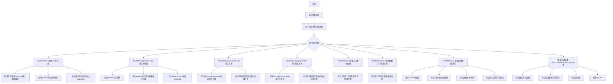

## 类结构

```
TestUnitData (测试类)
├── test_cases (测试数据)
├── failing_test_cases (失败测试数据)
└── methods: test_unit, test_update, test_non_string_fails, test_non_string_update_fails
FakeAxis (辅助类)
└── __init__(self, units)
TestStrCategoryConverter (测试类)
├── test_cases, failing_test_cases
└── methods: test_convert, test_convert_one_string, test_convert_fail, test_axisinfo, test_default_units
TestStrCategoryLocator (测试类)
└── methods: test_StrCategoryLocator, test_StrCategoryLocatorPlot
TestStrCategoryFormatter (测试类)
└── methods: test_StrCategoryFormatter, test_StrCategoryFormatterPlot
TestPlotBytes (测试类)
└── bytes_cases, test_plot_bytes
TestPlotNumlike (测试类)
└── numlike_cases, test_plot_numlike
TestPlotTypes (测试类)
├── test_data fixture
├── failing_test_cases
└── methods: test_plot_unicode, test_plot_xaxis, test_plot_yaxis, test_plot_xyaxis, test_update_plot, test_update_plot_heterogenous_plotter, test_mixed_type_exception, test_mixed_type_update_exception
独立测试函数
├── axis_test(axis, labels)
├── test_overriding_units_in_plot(fig_test, fig_ref)
├── test_no_deprecation_on_empty_data()
├── test_hist()
└── test_set_lim()
```

## 全局变量及字段


### `PLOT_LIST`
    
包含Axes.scatter, Axes.plot, Axes.bar的列表

类型：`list`
    


### `PLOT_IDS`
    
绘图函数ID列表 ['scatter', 'plot', 'bar']

类型：`list`
    


### `TestUnitData.TestUnitData.test_cases`
    
测试用例数据，包含单字符串、Unicode、混合类型

类型：`list`
    


### `TestUnitData.TestUnitData.ids`
    
测试用例ID

类型：`tuple`
    


### `TestUnitData.TestUnitData.data`
    
测试用例数据

类型：`tuple`
    


### `TestUnitData.TestUnitData.failing_test_cases`
    
预期失败的测试用例

类型：`list`
    


### `TestUnitData.TestUnitData.fids`
    
失败测试用例ID

类型：`tuple`
    


### `TestUnitData.TestUnitData.fdata`
    
失败测试用例数据

类型：`tuple`
    


### `FakeAxis.FakeAxis.units`
    
轴的单位数据

类型：`object`
    


### `TestStrCategoryConverter.TestStrCategoryConverter.cc`
    
StrCategoryConverter实例

类型：`StrCategoryConverter`
    


### `TestStrCategoryConverter.TestStrCategoryConverter.unit`
    
UnitData实例

类型：`UnitData`
    


### `TestStrCategoryConverter.TestStrCategoryConverter.ax`
    
FakeAxis实例

类型：`FakeAxis`
    


### `TestStrCategoryConverter.TestStrCategoryConverter.test_cases`
    
转换测试用例

类型：`list`
    


### `TestStrCategoryConverter.TestStrCategoryConverter.ids`
    
测试用例ID

类型：`tuple`
    


### `TestStrCategoryConverter.TestStrCategoryConverter.values`
    
测试数据

类型：`tuple`
    


### `TestStrCategoryConverter.TestStrCategoryConverter.failing_test_cases`
    
失败测试用例

类型：`list`
    


### `TestStrCategoryConverter.TestStrCategoryConverter.fids`
    
失败测试用例ID

类型：`tuple`
    


### `TestStrCategoryConverter.TestStrCategoryConverter.fvalues`
    
失败测试数据

类型：`tuple`
    


### `TestStrCategoryFormatter.TestStrCategoryFormatter.test_cases`
    
格式化测试用例

类型：`list`
    


### `TestStrCategoryFormatter.TestStrCategoryFormatter.ids`
    
测试用例ID

类型：`tuple`
    


### `TestStrCategoryFormatter.TestStrCategoryFormatter.cases`
    
测试数据

类型：`tuple`
    


### `TestPlotBytes.TestPlotBytes.bytes_cases`
    
字节数据测试用例

类型：`list`
    


### `TestPlotBytes.TestPlotBytes.bytes_ids`
    
字节测试用例ID

类型：`tuple`
    


### `TestPlotBytes.TestPlotBytes.bytes_data`
    
字节测试数据

类型：`tuple`
    


### `TestPlotNumlike.TestPlotNumlike.numlike_cases`
    
类数字字符串测试用例

类型：`list`
    


### `TestPlotNumlike.TestPlotNumlike.numlike_ids`
    
类数字测试用例ID

类型：`tuple`
    


### `TestPlotNumlike.TestPlotNumlike.numlike_data`
    
类数字测试数据

类型：`tuple`
    


### `TestPlotTypes.TestPlotTypes.x`
    
测试数据属性x轴类别

类型：`list`
    


### `TestPlotTypes.TestPlotTypes.xy`
    
测试数据属性x和y值

类型：`list`
    


### `TestPlotTypes.TestPlotTypes.y`
    
测试数据属性y轴类别

类型：`list`
    


### `TestPlotTypes.TestPlotTypes.yx`
    
测试数据属性y和x值

类型：`list`
    


### `TestPlotTypes.TestPlotTypes.failing_test_cases`
    
失败测试用例

类型：`list`
    


### `TestPlotTypes.TestPlotTypes.fids`
    
失败测试用例ID

类型：`tuple`
    


### `TestPlotTypes.TestPlotTypes.fvalues`
    
失败测试数据

类型：`tuple`
    


### `TestPlotTypes.TestPlotTypes.plotters`
    
绘图函数列表

类型：`list`
    
    

## 全局函数及方法


### `axis_test`

该函数是一个辅助测试函数，用于验证坐标轴的刻度位置是否正确、标签是否与预期一致，以及单位映射是否完整。它通过比较轴的主刻度位置、格式化后的标签以及单位数据映射来确保图表正确生成分类轴。

参数：

- `axis`：`matplotlib.axis.Axis`，坐标轴对象，用于获取刻度位置和标签
- `labels`：`list`，预期的标签列表，用于验证轴的标签和单位映射

返回值：`None`，该函数为测试辅助函数，不返回任何值，仅通过断言进行验证

#### 流程图

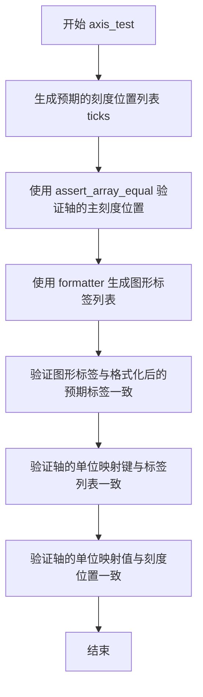

#### 带注释源码

```python
def axis_test(axis, labels):
    """
    辅助测试函数，验证轴的刻度位置、标签和单位映射
    
    参数:
        axis: matplotlib.axis.Axis对象，坐标轴
        labels: list，预期的标签列表
    """
    # 生成预期的刻度位置列表，从0开始
    ticks = list(range(len(labels)))
    
    # 验证轴的主刻度位置是否与预期一致
    np.testing.assert_array_equal(axis.get_majorticklocs(), ticks)
    
    # 使用轴的格式化器生成图形标签列表
    graph_labels = [axis.major.formatter(i, i) for i in ticks]
    
    # _text 方法还会将字节解码为 utf-8
    # 验证图形标签与预期标签经过 _text 处理后是否一致
    assert graph_labels == [cat.StrCategoryFormatter._text(l) for l in labels]
    
    # 验证轴的单位映射键（类别名称）是否与标签列表一致
    assert list(axis.units._mapping.keys()) == [l for l in labels]
    
    # 验证轴的单位映射值（位置索引）是否与刻度位置一致
    assert list(axis.units._mapping.values()) == ticks
```


### `test_overriding_units_in_plot`

该测试函数用于验证在matplotlib图表中连续绘制数据时，单位（units）不会被意外覆盖或重置。它通过比较两个图形（一个使用默认参数，另一个显式设置units为None）来确保多次调用绘图方法时轴的单位属性保持不变。

参数：

- `fig_test`：`matplotlib.figure.Figure`，测试图形，用于执行第一次绘图并验证单位保持不变
- `fig_ref`：`matplotlib.figure.Figure`，参考图形，用于执行带有显式units参数的绘图操作

返回值：`None`，该函数为测试函数，不返回任何值

#### 流程图

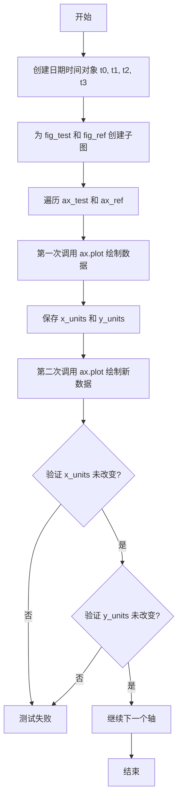

#### 带注释源码

```python
@mpl.style.context('default')
@check_figures_equal()
def test_overriding_units_in_plot(fig_test, fig_ref):
    """
    测试在连续绘图时，单位不会被覆盖。
    
    验证当在同一轴上多次调用plot方法时，
    即使数据发生变化，轴的单位（units）属性也应该保持不变。
    """
    from datetime import datetime

    # 创建测试用的日期时间对象
    t0 = datetime(2018, 3, 1)
    t1 = datetime(2018, 3, 2)
    t2 = datetime(2018, 3, 3)
    t3 = datetime(2018, 3, 4)

    # 为测试图形和参考图形创建子图
    ax_test = fig_test.subplots()
    ax_ref = fig_ref.subplots()
    
    # 遍历两个轴，分别应用不同的参数
    # ax_test: 使用默认参数 {}
    # ax_ref: 使用显式的 xunits=None, yunits=None
    for ax, kwargs in zip([ax_test, ax_ref],
                          ({}, dict(xunits=None, yunits=None))):
        # 第一次绘图：绘制日期时间x轴和字符串y轴
        ax.plot([t0, t1], ["V1", "V2"], **kwargs)
        
        # 保存当前的单位对象引用
        x_units = ax.xaxis.units
        y_units = ax.yaxis.units
        
        # 第二次绘图：绘制新的日期时间数据
        # 关键测试点：这里不应该抛出异常
        ax.plot([t2, t3], ["V1", "V2"], **kwargs)
        
        # 断言：单位对象应该仍然是同一个对象（没有被重新创建）
        assert x_units is ax.xaxis.units
        assert y_units is ax.yaxis.units
```


### `test_no_deprecation_on_empty_data`

这是一个冒烟测试（smoke test），用于验证在使用空数据绘制图形时不会触发弃用警告（deprecation warning）。该测试创建了一个图形和轴对象，向轴的 x 轴添加了字符串单位，然后绘制了一个空列表，确保整个过程不会产生任何弃用警告。

参数：此函数无参数。

返回值：`None`，该函数仅执行测试逻辑，不返回任何值。

#### 流程图

```mermaid
flowchart TD
    A[开始测试] --> B[创建子图: plt.subplots]
    B --> C[更新x轴单位: ax.xaxis.update_units(['a', 'b'])]
    C --> D[绘制空数据: ax.plot([], [])]
    D --> E{检查是否有弃用警告}
    E -->|无警告| F[测试通过]
    E -->|有警告| G[测试失败]
    F --> H[结束测试]
    G --> H
```

#### 带注释源码

```python
def test_no_deprecation_on_empty_data():
    """
    Smoke test to check that no deprecation warning is emitted. See #22640.
    """
    # 创建一个新的图形和 axes 对象
    # f: figure 对象, ax: axes 对象
    f, ax = plt.subplots()
    
    # 更新 x 轴的单位映射，添加字符串类别 'a' 和 'b'
    # 这会初始化 StrCategoryConverter 的单位数据
    ax.xaxis.update_units(["a", "b"])
    
    # 使用空列表作为数据绘制图形
    # 此处测试的目的是确保在处理空数据时
    # 不会触发任何弃用警告（与 issue #22640 相关）
    ax.plot([], [])
```


### `test_hist`

该函数是一个测试函数，用于验证 Matplotlib 在处理类别数据（字符串类型）时绘制直方图的功能是否正常工作。测试创建一个包含类别标签 'a', 'b', 'a', 'c', 'ff' 的直方图，并验证其频数分布是否符合预期。

参数： 无

返回值： 无（该函数为测试函数，无显式返回值）

#### 流程图

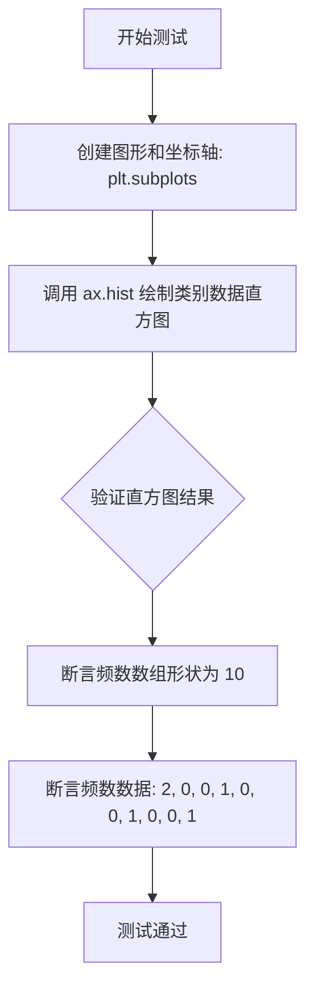

#### 带注释源码

```python
def test_hist():
    """
    测试类别数据直方图绘制功能
    
    该测试验证 Matplotlib 的 hist 方法能够正确处理字符串类别数据，
    并将类别标签转换为数值进行频数统计和直方图绘制。
    """
    # 创建一个新的图形窗口和一个子图坐标轴
    # 返回值: fig-图形对象, ax-坐标轴对象
    fig, ax = plt.subplots()
    
    # 调用坐标轴的 hist 方法绘制直方图
    # 参数: ['a', 'b', 'a', 'c', 'ff'] - 类别数据（字符串列表）
    # 返回值:
    #   n - 直方图的频数数组（ bins+1 个容器，默认 bins=10）
    #   bins - 直方图的边界值数组
    #   patches - 直方图图形块（BarContainer 对象）
    n, bins, patches = ax.hist(['a', 'b', 'a', 'c', 'ff'])
    
    # 断言验证：直方图频数数组的形状应为 (10,)
    # Matplotlib 默认将类别数据分为 10 个 bin
    assert n.shape == (10,)
    
    # 断言验证：各 bin 的频数应符合预期
    # 'a' 出现 2 次，'b' 出现 1 次，'c' 出现 1 次，'ff' 出现 1 次
    # 预期频数分布: [2., 0., 0., 1., 0., 0., 1., 0., 0., 1.]
    np.testing.assert_allclose(n, [2., 0., 0., 1., 0., 0., 1., 0., 0., 1.])
```


### `test_set_lim`

该函数是一个单元测试，用于验证 Matplotlib 的 `Axes.set_xlim()` 方法能否正确处理类别型（字符串）数据作为坐标轴的上下限。

参数：

- 无（该测试函数不接收外部参数，内部通过 `plt.subplots()` 创建所需的图形上下文）

返回值：`None`，测试执行完成后返回。

#### 流程图

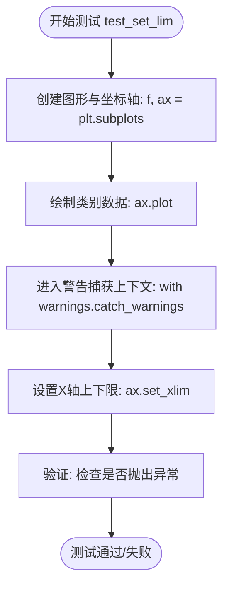

#### 带注释源码

```python
def test_set_lim():
    # 注释: NumPy 1.25 废弃了将 [2.] 强制转换为 float 的行为。
    # catch_warnings 被添加是为了在 NumPy 1.25 及之前版本中捕获错误。
    # 这部分代码是为了兼容旧版 NumPy，一旦最低版本升级（来自 gh-26597），可以移除。
    # can be removed once the minimum numpy version has expired the warning
    
    # 1. 创建一个新的图形和一个坐标轴对象
    f, ax = plt.subplots()
    
    # 2. 绘制数据，其中 X 轴为类别数据（字符串），Y 轴为数值数据
    # 这会注册 X 轴的类别单位 (Units)
    ax.plot(["a", "b", "c", "d"], [1, 2, 3, 4])
    
    # 3. 使用 with 语句捕获警告上下文，防止测试因 NumPy 的弃用警告而失败
    with warnings.catch_warnings():
        # 4. 调用 set_xlim，传入字符串 "b" 和 "c" 作为上下限
        # 内部会通过 StrCategoryConverter 将字符串转换为对应的数值索引
        ax.set_xlim("b", "c")
```


### `TestUnitData.test_unit`

该测试方法用于验证 `UnitData` 类的基本映射功能，通过传入字符串数据及其对应的预期位置索引，验证内部字典 `_mapping` 的键值对是否正确映射。

参数：

- `data`：`list`，测试用的字符串数据列表
- `locs`：`list`，与 data 对应的预期位置索引列表

返回值：`None`，该方法为测试方法，使用 `assert` 断言进行验证，不返回具体值

#### 流程图

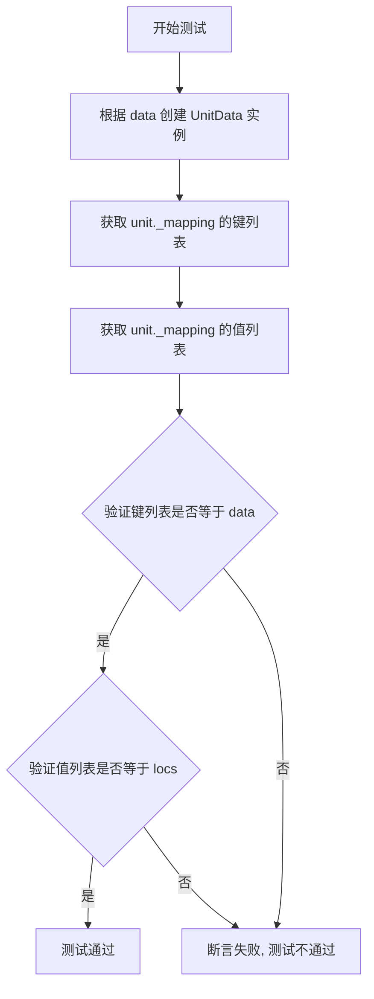

#### 带注释源码

```python
@pytest.mark.parametrize("data, locs", data, ids=ids)  # 参数化测试, 使用预定义的测试用例
def test_unit(self, data, locs):
    """
    测试 UnitData 的基本映射功能
    
    参数:
        data: 字符串列表, 用于创建 UnitData 的输入数据
        locs: 整数列表, 预期的映射值
    """
    # 使用传入的 data 创建 UnitData 实例
    # UnitData 会在内部构建 _mapping 字典, 将字符串映射到整数位置
    unit = cat.UnitData(data)
    
    # 验证 _mapping 的键(字符串)是否与输入的 data 顺序一致
    assert list(unit._mapping.keys()) == data
    
    # 验证 _mapping 的值(整数位置)是否与预期的 locs 一致
    assert list(unit._mapping.values()) == locs
```


### `TestUnitData.test_update`

该测试方法用于验证 `UnitData` 类的 `update` 方法能够正确地将新数据添加到现有的类别映射中，同时保持原有数据的顺序和位置，新增数据按顺序分配递增的位置索引。

参数：无（除了 `self`）

返回值：`None`，该方法为测试方法，不返回任何值

#### 流程图

```mermaid
graph TD
    A[开始测试] --> B[创建初始数据: data = ['a', 'd'], locs = [0, 1]]
    B --> C[创建更新数据: data_update = ['b', 'd', 'e']]
    C --> D[创建UnitData实例: unit = cat.UnitData(data)]
    D --> E[断言: unit._mapping.keys() == ['a', 'd']]
    E --> F[断言: unit._mapping.values() == [0, 1]]
    F --> G[调用unit.update(data_update)]
    G --> H[断言: unit._mapping.keys() == ['a', 'd', 'b', 'e']]
    H --> I[断言: unit._mapping.values() == [0, 1, 2, 3]]
    I --> J[结束测试]
    
    style A fill:#f9f,stroke:#333
    style J fill:#9f9,stroke:#333
```

#### 带注释源码

```python
def test_update(self):
    """
    测试UnitData类的update方法功能
    
    验证要点：
    1. 初始创建的UnitData包含指定的字符串到位置的映射
    2. update方法能够添加新的唯一字符串
    3. update方法不会重复添加已存在的字符串
    4. 新增字符串按顺序获得递增的位置索引
    """
    # 初始数据：两个字符串及其对应的位置
    data = ['a', 'd']
    locs = [0, 1]

    # 更新数据：包含新字符串'b'和'e'，以及已存在的'd'
    data_update = ['b', 'd', 'e']
    
    # 期望的最终唯一数据（保持插入顺序：原有数据 + 新数据）
    unique_data = ['a', 'd', 'b', 'e']
    
    # 期望的最终位置映射
    # 'a'在位置0，'d'在位置1（原有数据保持位置）
    # 'b'获得位置2，'e'获得位置3（新数据按顺序递增）
    updated_locs = [0, 1, 2, 3]

    # 创建UnitData实例，传入初始数据
    unit = cat.UnitData(data)
    
    # 验证初始状态：键为原始数据列表
    assert list(unit._mapping.keys()) == data
    # 验证初始状态：值为[0, 1]
    assert list(unit._mapping.values()) == locs

    # 调用update方法，添加新的字符串数据
    unit.update(data_update)
    
    # 验证更新后的键包含所有唯一字符串（保持顺序）
    assert list(unit._mapping.keys()) == unique_data
    # 验证更新后的值为0-3的连续整数
    assert list(unit._mapping.values()) == updated_locs
```

#### 关键组件信息

| 组件名称 | 一句话描述 |
|---------|-----------|
| `cat.UnitData` | 存储字符串类别到整数位置映射的类 |
| `cat.UnitData.update()` | 向现有映射添加新字符串类别的方法 |

#### 潜在的技术债务或优化空间

1. **测试数据不够多样化**：当前仅测试了字符串类型的数据，未覆盖 Unicode 字符串、bytes 类型等边界情况
2. **缺少异常情况测试**：未测试空列表更新、重复数据更新等场景
3. **断言信息不够详细**：当断言失败时，无法快速定位具体是哪个数据不匹配

#### 其它项目

**设计目标与约束**：
- `update` 方法应保持原有字符串的顺序和位置
- 新增字符串应按插入顺序分配递增的位置索引
- 不应重复添加已存在的字符串

**错误处理与异常设计**：
- 当传入非字符串类型数据时应抛出 `TypeError`（由 `test_non_string_update_fails` 测试验证）

**数据流与状态机**：
- 初始状态：`{'a': 0, 'd': 1}`
- 调用 `update(['b', 'd', 'e'])` 后
- 中间状态：处理 'b'（新增）→ `{'a': 0, 'd': 1, 'b': 2}`
- 处理 'd'（已存在，跳过）→ `{'a': 0, 'd': 1, 'b': 2}`
- 处理 'e'（新增）→ `{'a': 0, 'd': 1, 'b': 2, 'e': 3}`

**外部依赖与接口契约**：
- 依赖 `matplotlib.category` 模块中的 `UnitData` 类
- 内部使用 `_mapping` 字典属性存储字符串到位置的映射


### `TestUnitData.test_non_string_fails`

该测试方法用于验证 `cat.UnitData` 类在接收非字符串类型数据时能够正确抛出 `TypeError` 异常。它是单元测试中的一部分，通过参数化测试覆盖多种非字符串输入场景（数字、NaN、列表、混合类型）。

参数：

- `self`：隐式参数，`TestUnitData` 类的实例方法第一个参数
- `fdata`：`Any`（任意类型），非字符串类型的测试数据，用于验证 `UnitData` 构造函数对非字符串输入的类型检查

返回值：`None`，该方法为测试方法，不返回任何值，通过 `pytest.raises(TypeError)` 上下文管理器验证异常抛出

#### 流程图

```mermaid
flowchart TD
    A[开始测试 test_non_string_fails] --> B{参数化测试: 遍历 fdata}
    B -->|第1次| C[fdata = 3.14 (number)]
    B -->|第2次| D[fdata = np.nan (nan)]
    B -->|第3次| E[fdata = [3.14, 12] (list)]
    B -->|第4次| F[fdata = ['A', 2] (mixed type)]
    C --> G[调用 cat.UnitData(fdata)]
    D --> G
    E --> G
    F --> G
    G --> H{是否抛出 TypeError?}
    H -->|是| I[测试通过]
    H -->|否| J[测试失败]
```

#### 带注释源码

```python
# 定义失败测试用例：包含各种非字符串类型的数据
# 注意：代码中存在 bug，fids, fdata 错误地引用了 test_cases 而非 failing_test_cases
failing_test_cases = [("number", 3.14),          # 浮点数
                      ("nan", np.nan),           # NaN 值
                      ("list", [3.14, 12]),      # 列表
                      ("mixed type", ["A", 2])]  # 混合类型（字符串+数字）

# 提取失败测试的 ID 和数据
# 这里应该是 failing_test_cases，但代码中错误使用了 test_cases
fids, fdata = zip(*test_cases)

# 使用 pytest.mark.parametrize 参数化测试
# fdata: 测试数据参数
# ids=fids: 测试用例 ID
@pytest.mark.parametrize("fdata", fdata, ids=fids)
def test_non_string_fails(self, fdata):
    """
    测试非字符串类型输入是否触发 TypeError
    
    参数:
        self: TestUnitData 实例
        fdata: 非字符串类型的测试数据（来自参数化）
    """
    # 使用 pytest.raises 验证 UnitData 构造函数抛出 TypeError
    with pytest.raises(TypeError):
        # 尝试创建 UnitData 实例，传入非字符串数据
        # 预期行为：应该抛出 TypeError 异常
        cat.UnitData(fdata)
```


### `TestUnitData.test_non_string_update_fails`

该测试方法用于验证 `UnitData.update()` 方法在接收非字符串类型参数时是否正确抛出 `TypeError` 异常。通过参数化测试，涵盖数字、NaN、列表以及混合类型等非字符串数据的场景。

参数：

- `fdata`：任意类型，来自测试类变量 `fdata`（通过 `failing_test_cases` 定义），包括数字 (3.14)、NaN (np.nan)、列表 ([3.14, 12])、混合类型 (["A", 2]) 等非字符串数据。

返回值：无返回值（测试方法返回 void）

#### 流程图

```mermaid
flowchart TD
    A[开始测试] --> B[创建 UnitData 实例: unitdata = cat.UnitData()]
    B --> C[执行 unitdata.update with pytest.raises TypeError]
    C --> D{是否抛出 TypeError?}
    D -->|是| E[测试通过]
    D -->|否| F[测试失败]
```

#### 带注释源码

```python
@pytest.mark.parametrize("fdata", fdata, ids=fids)  # 参数化装饰器，接收来自类级别 fdata 变量的非字符串数据
def test_non_string_update_fails(self, fdata):
    """测试 update 方法在接收非字符串类型时抛出 TypeError"""
    unitdata = cat.UnitData()  # 创建一个空的 UnitData 实例
    with pytest.raises(TypeError):  # 预期 update 方法抛出 TypeError 异常
        unitdata.update(fdata)  # 尝试用非字符串数据更新 UnitData
```


### `FakeAxis.__init__`

初始化 FakeAxis 对象，将传入的 units 参数存储为实例属性，用于在测试中模拟轴对象的单位系统。

参数：

- `units`：任意类型，用于存储轴的单位数据。在测试场景中，通常传入 `cat.UnitData` 实例

返回值：`None`，`__init__` 方法不返回任何值

#### 流程图

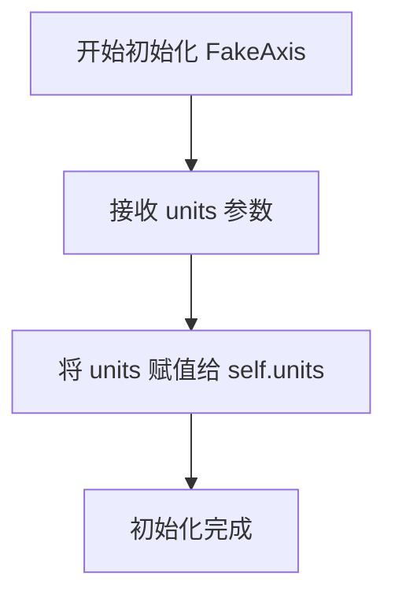

#### 带注释源码

```python
class FakeAxis:
    def __init__(self, units):
        """
        初始化 FakeAxis 实例
        
        这是一个简化的模拟轴类，用于测试 matplotlib 的类别转换功能。
        它只存储 units 参数，模拟真实轴对象的 units 属性。
        
        参数:
            units: 任意类型,代表轴的单位数据
                  在实际测试中,通常传入 cat.UnitData 实例
        """
        self.units = units  # 将传入的 units 参数存储为实例属性
```


### `TestStrCategoryConverter.mock_axis`

该 fixture 作为 TestStrCategoryConverter 类的初始化方法，在每个测试方法运行前自动执行，用于创建并初始化 StrCategoryConverter、UnitData 和 FakeAxis 实例，并将它们挂载到测试类实例上，以便后续测试方法使用这些模拟对象进行单元转换和轴信息的验证。

参数：

- `request`：`pytest.FixtureRequest`，pytest 的内置 fixture，提供对测试上下文、配置和标记的访问，用于获取当前测试的参数化信息

返回值：`None`，无返回值（pytest fixture 的 setup 阶段）

#### 流程图

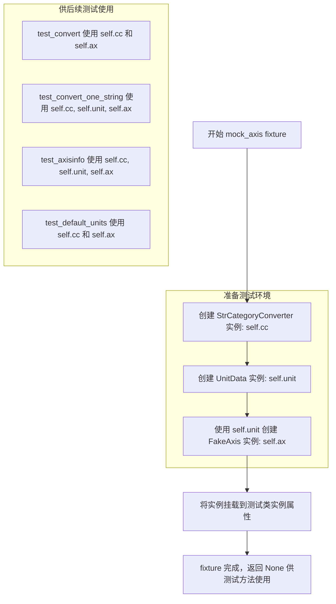

#### 带注释源码

```python
@pytest.fixture(autouse=True)  # autouse=True 表示该 fixture 会自动应用于类中的所有测试方法，无需显式声明
def mock_axis(self, request):
    """
    pytest fixture: 在每个测试方法前初始化转换器和模拟轴对象
    
    参数:
        self: TestStrCategoryConverter 类的实例
        request: pytest 内置 fixture，提供测试上下文信息
    
    作用:
        1. 创建 StrCategoryConverter 实例用于字符串类别转换
        2. 创建 UnitData 实例作为单位数据容器
        3. 创建 FakeAxis 实例并关联 UnitData，模拟 matplotlib 轴对象
        4. 将这些对象挂载到测试类实例上供后续测试方法使用
    """
    # 创建类别字符串转换器实例
    self.cc = cat.StrCategoryConverter()
    
    # 创建单位数据实例，用于存储字符串到数值的映射关系
    # self.unit should be probably be replaced with real mock unit
    # 注意：代码注释表明这里可能应该使用真正的 mock 对象
    self.unit = cat.UnitData()
    
    # 创建模拟轴对象，将 unit 数据与其关联
    # FakeAxis 是一个简化的模拟类，仅包含 units 属性
    self.ax = FakeAxis(self.unit)
    
    # 后续测试方法可以通过 self.cc、self.unit、self.ax 访问这些对象
    # 例如: test_convert() 使用 self.cc.convert(vals, self.ax.units, self.ax)
```


### `TestStrCategoryConverter.test_convert`

该方法是 `TestStrCategoryConverter` 类的测试方法，用于测试 `StrCategoryConverter.convert` 方法将字符串类别值转换为数值索引的功能是否正确。

参数：

- `vals`：`List[str]`，由 pytest 参数化提供的测试用例字符串列表，用于验证 convert 方法能否正确将字符串类别映射到从 0 开始的数值索引

返回值：`None`，该方法为测试方法，使用 `np.testing.assert_allclose` 进行断言验证，不返回具体值

#### 流程图

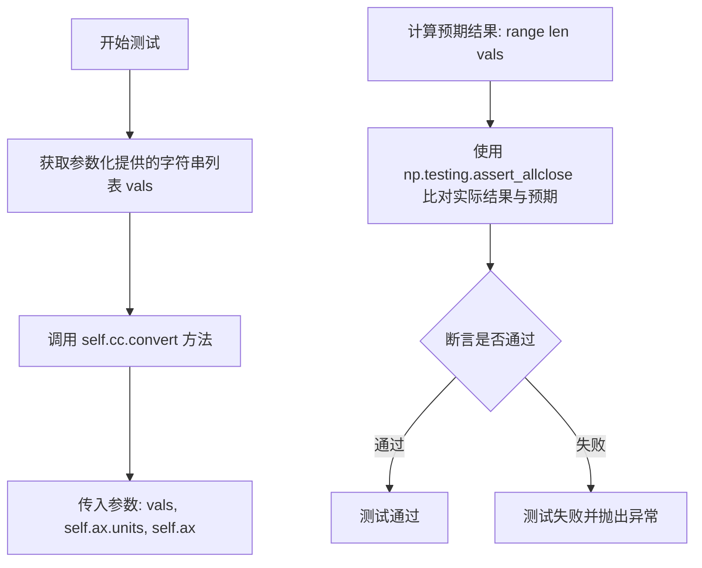

#### 带注释源码

```python
@pytest.mark.parametrize("vals", values, ids=ids)  # 参数化装饰器，从类级别的 values 元组获取测试数据
def test_convert(self, vals):
    """
    测试 StrCategoryConverter.convert 方法的核心功能
    
    该测试方法验证 convert 方法能够:
    1. 接受字符串列表、units 单位和 axis 对象
    2. 将每个唯一的字符串映射到从 0 开始的整数索引
    3. 返回与输入字符串列表长度相同的数值数组
    """
    # 调用被测试的 convert 方法，传入:
    # - vals: 要转换的字符串类别值列表
    # - self.ax.units: UnitData 实例，提供字符串到索引的映射
    # - self.ax: FakeAxis 对象，模拟 matplotlib axis
    np.testing.assert_allclose(
        self.cc.convert(vals, self.ax.units, self.ax),  # 实际转换结果
        range(len(vals))  # 预期结果：0, 1, 2, ..., n-1
    )
```


### `TestStrCategoryConverter.test_convert_one_string`

该测试方法用于验证 `StrCategoryConverter` 能够正确将单个字符串值转换为对应的类别索引值（期望为 0），确保转换器在处理 ASCII 和 Unicode 字符串时的基本功能正常。

参数：

- `value`：`str`，待转换的单个字符串，支持 ASCII 和 Unicode 字符（如 "hi" 或 "мир"）

返回值：`int`，期望返回 0，表示该字符串是类别映射中第一个出现的字符串

#### 流程图

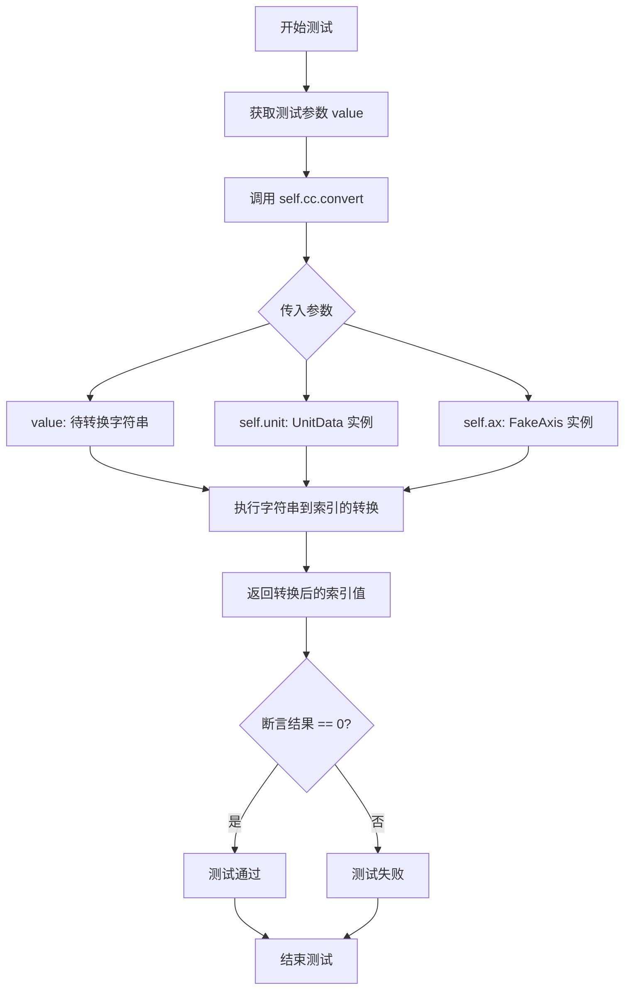

#### 带注释源码

```python
@pytest.mark.parametrize("value", ["hi", "мир"], ids=["ascii", "unicode"])
def test_convert_one_string(self, value):
    """
    测试将单个字符串转换为类别索引的功能
    
    参数化测试：
    - "hi": ASCII 字符串
    - "мир": Unicode 字符串（俄语 "世界"）
    
    测试逻辑：
    验证 convert 方法能够正确识别字符串在类别映射中的位置
    首次出现的字符串应返回索引 0
    """
    # 断言：转换器将 value 转换为索引值，期望为 0
    # self.cc: StrCategoryConverter 实例（在 mock_axis fixture 中初始化）
    # self.unit: UnitData 实例（空单元数据，用于存储字符串到索引的映射）
    # self.ax: FakeAxis 实例（模拟 axis 对象）
    assert self.cc.convert(value, self.unit, self.ax) == 0
```


### `TestStrCategoryConverter.test_convert_fail`

描述：该测试方法用于验证 `StrCategoryConverter.convert` 方法在处理非法输入（如混合类型数据或字符串与整数混合）时能够正确抛出 `TypeError` 异常。

参数：

- `self`：隐式参数，测试类实例本身，无需额外说明
- `fvals`：`list`，由 pytest 参数化提供的失败测试用例数据，包含如 `[3.14, 'A', np.inf]`（混合类型）或 `['42', 42]`（字符串整数混合）等非法输入

返回值：`None`，测试函数不返回任何值，仅通过 `pytest.raises(TypeError)` 上下文管理器验证异常行为

#### 流程图

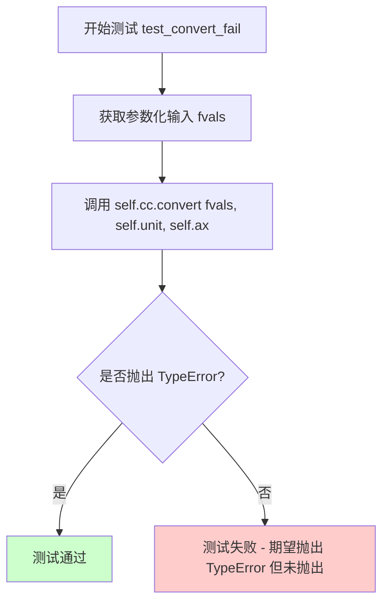

#### 带注释源码

```python
@pytest.mark.parametrize("fvals", fvalues, ids=fids)
def test_convert_fail(self, fvals):
    """
    测试 StrCategoryConverter.convert 方法在处理非法输入时是否抛出 TypeError。
    
    参数化使用以下失败测试用例:
    - ("mixed", [3.14, 'A', np.inf]): 混合了浮点数、字符串和无穷大
    - ("string integer", ['42', 42]): 混合了字符串形式的整数和实际整数
    
    这些用例违反了 StrCategoryConverter 只接受纯字符串或字节序列的约束。
    """
    # 使用 pytest.raises 上下文管理器验证 convert 方法会抛出 TypeError
    # 如果 convert 方法正确抛出 TypeError，测试通过
    # 如果 convert 方法没有抛出异常或抛出了其他类型异常，测试失败
    with pytest.raises(TypeError):
        self.cc.convert(fvals, self.unit, self.ax)
```


### `TestStrCategoryConverter.test_axisinfo`

该测试方法用于验证 `axisinfo` 方法返回的定位器（Locator）和格式化器（Formatter）是否为正确的类型（分别是 `StrCategoryLocator` 和 `StrCategoryFormatter`），确保字符串类别转换器能够正确地为坐标轴提供刻度定位和标签格式化的功能。

参数： 无（除隐含的 `self` 参数）

返回值：`None`，该方法为测试方法，无返回值，通过断言验证正确性

#### 流程图

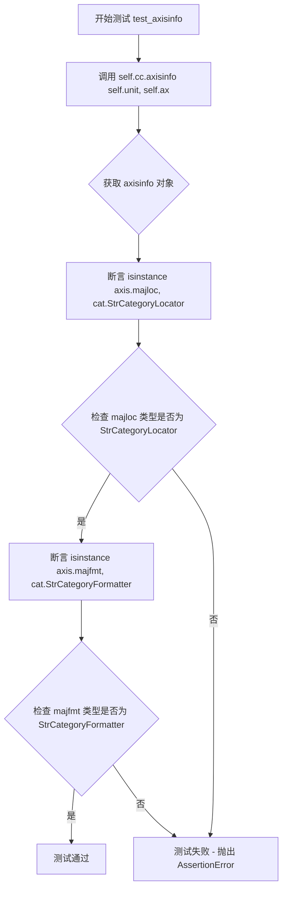

#### 带注释源码

```python
def test_axisinfo(self):
    """
    测试 axisinfo 方法返回定位器和格式化器
    
    该测试验证 StrCategoryConverter.axisinfo() 方法能够正确返回
    包含 StrCategoryLocator 和 StrCategoryFormatter 的 AxisInfo 对象，
    这两个组件对于正确渲染字符串类别坐标轴至关重要。
    """
    # 调用被测对象的 axisinfo 方法，传入 unit 数据和 axis 对象
    # 返回一个 AxisInfo 对象，其中包含 majloc（主刻度定位器）和 majfmt（主刻度格式化器）
    axis = self.cc.axisinfo(self.unit, self.ax)
    
    # 断言验证返回的定位器是 StrCategoryLocator 类型
    # StrCategoryLocator 负责确定字符串类别数据在坐标轴上的刻度位置
    assert isinstance(axis.majloc, cat.StrCategoryLocator)
    
    # 断言验证返回的格式化器是 StrCategoryFormatter 类型
    # StrCategoryFormatter 负责将刻度位置转换为对应的字符串标签
    assert isinstance(axis.majfmt, cat.StrCategoryFormatter)
```


### TestStrCategoryConverter.test_default_units

该测试方法用于验证 StrCategoryConverter 类的 default_units 方法能否正确返回 UnitData 实例，确保默认单位数据创建功能的正确性。

参数：

- `self`：TestStrCategoryConverter，测试类实例本身

返回值：`bool`，该断言返回一个布尔值，表示 isinstance 检查的结果（测试通过时返回 True）

#### 流程图

```mermaid
flowchart TD
    A[开始测试] --> B[调用 self.cc.default_units]
    B --> C[传入参数: ["a"] 和 self.ax]
    C --> D{检查返回值类型是否为 UnitData}
    D -->|是| E[测试通过]
    D -->|否| F[测试失败]
```

#### 带注释源码

```python
def test_default_units(self):
    """
    测试 default_units 方法能否正确返回 UnitData 实例。
    
    该测试验证了 StrCategoryConverter.default_units() 方法
    在给定字符串列表和轴对象时，能够正确创建并返回 UnitData 对象。
    """
    # 调用被测试的 default_units 方法
    # 参数 ["a"]: 包含单个字符串的列表，作为输入数据
    # 参数 self.ax: FakeAxis 实例，模拟 matplotlib 轴对象
    # 
    # 使用 isinstance 检查返回值是否为 cat.UnitData 类型
    # 如果是 UnitData 实例则测试通过，否则失败
    assert isinstance(self.cc.default_units(["a"], self.ax), cat.UnitData)
```


### `TestStrCategoryLocator.test_StrCategoryLocator`

测试 StrCategoryLocator 类是否能够正确返回分类数据的刻度值。

参数：

- `self`：测试类实例，隐含的 self 参数

返回值：`None`，该方法为测试方法，通过断言验证结果，不返回具体值

#### 流程图

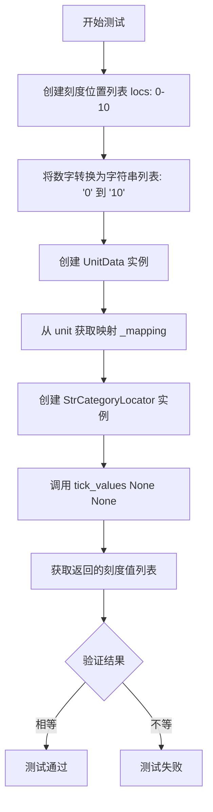

#### 带注释源码

```python
def test_StrCategoryLocator(self):
    """
    测试 StrCategoryLocator 返回正确的刻度值
    """
    # 定义期望的刻度位置列表，从 0 到 10
    locs = [0, 1, 2, 3, 4, 5, 6, 7, 8, 9, 10]
    
    # 将数字转换为字符串，模拟分类数据
    # 例如: [0, 1, 2] -> ['0', '1', '2']
    unit = cat.UnitData([str(j) for j in locs])
    
    # 创建分类定位器，传入单位数据的映射关系
    # _mapping 是一个字典，键为分类字符串，值为对应的整数索引
    ticks = cat.StrCategoryLocator(unit._mapping)
    
    # 调用 tick_values 方法获取刻度值
    # 参数为 (vmin, vmax)，此处传 None 表示使用默认范围
    # 期望返回与原始 locs 列表相同的刻度位置
    np.testing.assert_array_equal(ticks.tick_values(None, None), locs)
```


### `TestStrCategoryLocator.test_StrCategoryLocatorPlot`

该测试方法用于验证 StrCategoryLocator（字符串类别定位器）在不同绘图函数（scatter、plot、bar）中的工作情况，确保当使用字符串类别数据绘图时，y轴的主要定位器能够正确返回对应的数值索引（0, 1, 2）。

参数：

- `self`：`TestStrCategoryLocator`，测试类的实例，隐含参数
- `plotter`：`function`，接受参数化的绘图函数，可以是 `Axes.scatter`、`Axes.plot` 或 `Axes.bar` 之一，用于测试不同绘图方式下的类别定位器

返回值：`None`，该方法为测试函数，通过 `np.testing.assert_array_equal` 断言验证定位器返回值是否符合预期

#### 流程图

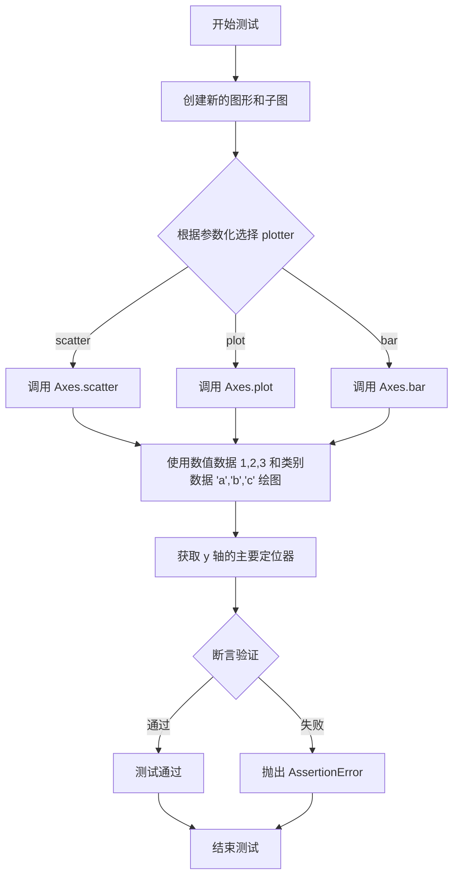

#### 带注释源码

```python
@pytest.mark.parametrize("plotter", PLOT_LIST, ids=PLOT_IDS)
def test_StrCategoryLocatorPlot(self, plotter):
    """
    测试 StrCategoryLocator 在不同绘图函数中的定位器功能。
    
    参数化说明：
    - PLOT_LIST = [Axes.scatter, Axes.plot, Axes.bar]
    - PLOT_IDS = ["scatter", "plot", "bar"]
    该测试会对这三个绘图函数分别执行验证。
    """
    # 创建一个新的图形，并获取其子图（axes）
    # 等价于 plt.figure().add_subplot(111) 或 plt.subplots()
    ax = plt.figure().subplots()
    
    # 调用参数化的绘图函数绘制数据
    # x 轴：数值数据 [1, 2, 3]
    # y 轴：字符串类别数据 ["a", "b", "c"]
    # 绘图函数会自动为字符串类别创建 CategoryLocator
    plotter(ax, [1, 2, 3], ["a", "b", "c"])
    
    # 验证 y 轴的主要定位器返回的刻度位置
    # 预期结果：range(3) 即 [0, 1, 2]
    # 这是因为字符串类别 "a", "b", "c" 被映射到索引 0, 1, 2
    np.testing.assert_array_equal(ax.yaxis.major.locator(), range(3))
```


### `TestStrCategoryFormatter.test_StrCategoryFormatter`

该测试方法用于验证 `StrCategoryFormatter` 格式化器能否根据传入的数值索引正确返回对应的原始字符串标签。

参数：
- `ydata`：`list[str]`，参数化传入的测试数据（字符串类别列表），用于生成 UnitData 并验证格式化结果。

返回值：`None`，该方法为 pytest 测试用例，通过断言（assert）验证逻辑，不返回具体值。

#### 流程图

```mermaid
graph TD
    A([Start test_StrCategoryFormatter]) --> B[Input: ydata list]
    B --> C[unit = cat.UnitData(ydata)]
    C --> D[labels = cat.StrCategoryFormatter(unit._mapping)]
    D --> E[Loop: for i, d in enumerate(ydata)]
    E --> F{Iteration Available?}
    F -->|Yes| G[Assert labels(i, i) == d]
    G --> H[Assert labels(i, None) == d]
    H --> I[Next Iteration]
    I --> F
    F -->|No| J([End])
```

#### 带注释源码

```python
@pytest.mark.parametrize("ydata", cases, ids=ids) # 参数化：接收 ["hello", "world", "hi"] 或 ["Здравствуйте", "привет"]
def test_StrCategoryFormatter(self, ydata):
    # 步骤 1: 根据传入的字符串数据创建 UnitData 实例
    # UnitData 会建立字符串到整数位置的映射
    unit = cat.UnitData(ydata)
    
    # 步骤 2: 创建格式化器实例，传入映射关系
    # StrCategoryFormatter 负责将整数位置转换回字符串标签
    labels = cat.StrCategoryFormatter(unit._mapping)
    
    # 步骤 3: 遍历测试数据，验证格式化器的还原能力
    for i, d in enumerate(ydata):
        # 验证格式化器在使用 (value, position) 参数时能返回正确标签
        assert labels(i, i) == d
        # 验证格式化器在使用 (value, None) 参数时能返回正确标签
        assert labels(i, None) == d
```


### `TestStrCategoryFormatter.test_StrCategoryFormatterPlot`

该方法用于测试 `StrCategoryFormatter`（字符串类别格式化器）在不同类型的图表绘制函数（如散点图、折线图、柱状图）中的表现。测试通过创建图表并调用格式化器，验证其是否能根据数据的索引正确返回对应的标签字符串，并检查索引越界时的行为。

参数：

-  `ydata`：`List[str]`，表示类别数据的字符串列表（如 `["hello", "world"]`），将作为 Y 轴数据传入绘图函数。
-  `plotter`：`Callable`，一个 matplotlib Axes 对象的方法（函数），用于执行具体的绘图操作（如 `Axes.scatter`, `Axes.plot`, `Axes.bar`）。

返回值：`None`，该方法为测试用例，通过断言验证结果，不返回具体值。

#### 流程图

```mermaid
flowchart TD
    A([开始测试]) --> B[创建子图 ax = plt.figure().subplots]
    B --> C[调用 plotter 绘图: plotter(ax, range(len(ydata)), ydata)]
    C --> D[获取 Y 轴的主格式化器 formatter = ax.yaxis.major.formatter]
    D --> E{遍历 ydata 中的索引 i}
    E -->|是| F[断言: formatter(i) == ydata[i]]
    F --> G[断言: formatter(i + 1) == '']
    G --> E
    E -->|否| H([测试结束])
```

#### 带注释源码

```python
@pytest.mark.parametrize("ydata", cases, ids=ids)
@pytest.mark.parametrize("plotter", PLOT_LIST, ids=PLOT_IDS)
def test_StrCategoryFormatterPlot(self, ydata, plotter):
    # 创建一个新的图形和坐标轴，用于隔离测试环境
    ax = plt.figure().subplots()
    
    # 使用传入的 plotter (如 ax.plot, ax.scatter, ax.bar) 绘制数据
    # x 轴使用数值索引 range(len(ydata))
    # y 轴使用类别标签 ydata
    # 在绘图过程中，matplotlib 会为 y 轴分配 StrCategoryConverter 和 StrCategoryFormatter
    plotter(ax, range(len(ydata)), ydata)
    
    # 遍历数据，验证格式化器是否正确工作
    for i, d in enumerate(ydata):
        # 验证特定索引 i 处的格式化器返回值是否等于原始标签 d
        assert ax.yaxis.major.formatter(i) == d
        
        # 验证下一个索引 (i+1) 处的格式化器返回值
        # 如果索引超出了当前数据的范围，格式化器通常返回空字符串
        assert ax.yaxis.major.formatter(i+1) == ""
```


### `TestPlotBytes.test_plot_bytes`

该测试方法用于验证字节类型数据（包括字符串列表、字节列表和字节 numpy 数组）在不同绘图函数（scatter、plot、bar）中的正确性，确保字节数据能够正确映射到坐标轴并绘制。

参数：

- `plotter`：`Callable`，绘图函数，可选值为 `Axes.scatter`、`Axes.plot` 或 `Axes.bar`，用于指定绑制图表的方法
- `bdata`：`list | np.ndarray`，字节类型数据，可选值为 `['a', 'b', 'c']`（字符串列表）、`[b'a', b'b', b'c']`（字节列表）或 `np.array([b'a', b'b', b'c'])`（字节数组），作为绑制图表的 x 轴数据

返回值：`None`，无返回值，仅执行测试逻辑

#### 流程图

```mermaid
flowchart TD
    A[开始测试] --> B[创建图表子图: plt.figure().subplots()]
    B --> C[定义计数数据: counts = np.array([4, 6, 5])]
    C --> D[调用绘图函数: plotter(ax, bdata, counts)]
    D --> E[调用axis_test验证: axis_test(ax.xaxis, bdata)]
    E --> F[结束测试]
```

#### 带注释源码

```python
@pytest.mark.parametrize("plotter", PLOT_LIST, ids=PLOT_IDS)
@pytest.mark.parametrize("bdata", bytes_data, ids=bytes_ids)
def test_plot_bytes(self, plotter, bdata):
    """
    测试字节类型数据的绘图功能
    
    参数:
        plotter: 绘图函数 (scatter/plot/bar)
        bdata: 字节数据 (字符串列表/字节列表/字节数组)
    """
    # 创建新的图表和子图
    ax = plt.figure().subplots()
    
    # 定义y轴数据（计数）
    counts = np.array([4, 6, 5])
    
    # 使用指定的绘图函数绑制数据
    # bdata 作为 x 轴类别数据，counts 作为 y 轴数值数据
    plotter(ax, bdata, counts)
    
    # 验证 x 轴的刻度标签、位置和单位映射是否正确
    axis_test(ax.xaxis, bdata)
```


### 1. 概述

该代码段是 Matplotlib 图形库测试套件的一部分，专门用于验证“类数字字符串”（Numeric-like strings）的分类绘图功能。`TestPlotNumlike.test_plot_numlike` 方法通过参数化测试，确保当用户使用看起来像数字的字符串（例如 "1", "11", "3"）作为分类数据（X轴）进行绘图时，系统能够正确地将它们识别为离散的类别而非数值，并正确显示刻度标签和单位映射。

### 2. 文件整体运行流程

该文件（假设为 `test_category.py`）是一个完整的pytest测试模块。
1.  **初始化与导入**：导入 Matplotlib, NumPy, Pytest 等依赖。
2.  **定义辅助类与函数**：定义 `FakeAxis`, `TestUnitData`, `TestStrCategoryConverter` 等辅助类，以及核心验证函数 `axis_test`。
3.  **测试类执行**：
    *   首先执行 `TestUnitData` 和 `TestStrCategoryConverter` 测试单元数据的映射和转换逻辑。
    *   然后执行 `TestPlotBytes` 测试字节类型数据的绘图。
    *   接着执行 **`TestPlotNumlike`**（本方法所在类），测试数字字符串的绘图。
    *   最后执行 `TestPlotTypes` 测试其他混合类型和Unicode类型。
4.  **清理**：每个测试方法运行完毕后，Matplotlib 会清理图形实例以释放内存。

### 3. 类的详细信息

#### TestPlotNumlike
*   **类职责**：专门负责测试“看起来像数字的字符串”的分类绘图处理。
*   **类字段**：
    *   `numlike_cases`：列表，存储测试用例数据（字符串列表、字节列表、字节数组等）。
    *   `numlike_ids`：列表，存储测试用例的ID描述。

#### axis_test (全局验证函数)
*   **函数职责**：一个通用的验证辅助函数，用于检查坐标轴的刻度位置、标签文本和单位映射是否与预期数据一致。
*   **调用关系**：被 `TestPlotBytes`, `TestPlotNumlike`, `TestPlotTypes` 等多个测试类频繁调用。

### 4. 字段和函数详细信息

#### 类字段 / 全局变量

*   **名称**：`numlike_cases`
    *   **类型**：`List[Tuple[str, List[str] | np.ndarray]]`
    *   **描述**：定义了四组测试数据，包括纯字符串列表、字符串数组、字节列表和字节数组，这些数据在视觉上呈现为数字，但在类型上是字符串。

*   **名称**：`plotter`
    *   **类型**：`Callable`
    *   **描述**：由 pytest 参数化传入的绘图函数，模拟用户调用 `ax.scatter`, `ax.plot` 或 `ax.bar`。

*   **名称**：`ndata`
    *   **类型**：`List[str] | np.ndarray`
    *   **描述**：具体的测试数据（如 `['1', '11', '3']`），代表需要绘制的“类数字”分类数据。

*   **名称**：`counts`
    *   **类型**：`np.ndarray`
    *   **描述**：用于绘图的数值数组 `([4, 6, 5])`，对应 `ndata` 的数量。

#### 类方法 / 全局函数

*   **名称**：`test_plot_numlike`
    *   **参数**：
        *   `self`：测试类实例。
        *   `plotter`：`Callable[[Axes, Any, Any], Any]`，绘图方法（scatter/plot/bar）。
        *   `ndata`：`List[str] | np.ndarray`，类数字字符串数据。
    *   **返回值**：`None`（测试方法无返回值，通过断言验证）。
    *   **描述**：创建一个新的图形子图，使用传入的 `plotter` 绘制 `ndata`（X轴）和 `counts`（Y轴），然后调用 `axis_test` 验证 X 轴的类别映射是否正确。

### 5. 关键组件信息

*   **matplotlib.axes.Axes**：绘图的核心容器，测试通过操作此对象的不同方法（scatter, plot, bar）来验证多态性。
*   **matplotlib.category**：处理字符串分类的内部模块，虽然未直接在测试代码中调用，但 `plotter` 内部依赖于此模块进行数据转换。
*   **pytest.mark.parametrize**：用于实现数据驱动测试的装饰器，允许用一个测试函数逻辑覆盖多种数据类型。

### 6. 潜在的技术债务或优化空间

1.  **测试数据耦合**：`counts = np.array([4, 6, 5])` 是硬编码的。在不同测试用例间，如果数值有特定含义（如比例、权重），这种硬编码可能导致测试覆盖不足。
2.  **验证逻辑分离**：`axis_test` 函数虽然提高了代码复用性，但也造成了测试逻辑与验证逻辑的分离。`test_plot_numlike` 本身的“意图”不够显式，需要跳转到 `axis_test` 才能完全理解验证了什么。
3.  **魔法数字**：断言中涉及的索引 `i+1` 等magic number如果发生变化，可能导致测试逻辑难以理解。

### 7. 其它项目

*   **设计目标与约束**：
    *   **目标**：确保“数字字符串”被视作“分类数据”（Categorical Data）而非数值数据（Numerical Data）。这意味着 X 轴应该是 ["1", "11", "3"]，而不是 [1, 3, 11]（数值排序）。
    *   **约束**：必须兼容 `scatter`, `plot`, `bar` 三种主要的绘图 API。
*   **错误处理与异常设计**：
    *   本测试用例专注于“正向验证”（Happy Path）。
    *   异常处理（类型错误、混合类型）由同文件中的 `failing_test_cases` 和专门的 `test_mixed_type_exception` 处理。
*   **数据流**：
    1.  **输入**：`plotter` 函数 + `ndata` (字符串) + `counts` (数值)。
    2.  **处理**：`plotter` 调用 `StrCategoryConverter` 将字符串转换为索引（0, 1, 2）。
    3.  **输出**：图形对象的状态（Axis 的 ticks, labels, units）。

---

### `{函数名}`

#### 参数

- `self`：`object`，测试类实例的引用。
- `plotter`：`Callable[[Axes, Any, Any], Any]`，matplotlib Axes 对象上的绘图方法（如 `Axes.scatter`, `Axes.plot`, `Axes.bar`），由 pytest 参数化提供。
- `ndata`：`List[str] | np.ndarray`，类数字字符串数据（例如 `['1', '11', '3']` 或对应的字节/数组形式），由 pytest 参数化提供。

返回值：`None`，该方法为测试用例，通过内部断言验证正确性，不返回业务数据。

#### 流程图

```mermaid
flowchart TD
    A[开始测试 test_plot_numlike] --> B[创建子图: ax = plt.figure().subplots]
    B --> C[准备Y轴数据: counts = np.array([4, 6, 5])]
    C --> D[调用绘图函数: plotter(ax, ndata, counts)]
    D --> E{调用验证函数 axis_test}
    E -->|检查刻度位置| F[验证 xaxis.get_majorticlocs == range(len(ndata))]
    E -->|检查标签文本| G[验证 formatter(i) == ndata[i]]
    E -->|检查单位映射| H[验证 units._mapping 键值对正确]
    F --> I[测试通过 / 抛出 AssertionError]
```

#### 带注释源码

```python
@pytest.mark.parametrize("plotter", PLOT_LIST, ids=PLOT_IDS)
@pytest.mark.parametrize("ndata", numlike_data, ids=numlike_ids)
def test_plot_numlike(self, plotter, ndata):
    """
    测试使用类数字字符串（如 '1', '11'）作为分类数据绘图。
    验证它们被正确识别为类别而非数值。
    """
    # 1. 准备绘图环境：创建一个新的图形和坐标轴
    ax = plt.figure().subplots()
    
    # 2. 准备绘图数据：Y轴为数值计数，X轴为字符串类型的数字
    counts = np.array([4, 6, 5])
    
    # 3. 执行绘图：根据传入的 plotter (scatter/plot/bar) 绘制数据
    # 这里的关键是 ndata 虽然看起来像数字，但会被 matplotlib category 处理
    plotter(ax, ndata, counts)
    
    # 4. 验证结果：调用 axis_test 验证 X 轴的属性是否符合分类数据的预期
    # 预期：X轴刻度应为 [0, 1, 2]；标签应为原始字符串 '1', '11', '3'
    axis_test(ax.xaxis, ndata)
```


### TestPlotTypes.test_data

该 fixture 是 TestPlotTypes 类的 pytest fixture，用于准备测试数据，通过设置实例变量为后续测试方法提供 x 轴数据、y 轴数据及对应的数值。

参数：

- `self`：TestPlotTypes 实例，fixture 被使用时自动注入
- `request`：pytest.request 对象，fixture 的上下文对象，用于访问测试请求的元数据

返回值：无返回值，通过设置实例属性（self.x, self.xy, self.y, self.yx）共享数据

#### 流程图

```mermaid
graph TD
    A[Fixture 开始] --> B[接收 self 和 request 参数]
    B --> C[设置 self.x = ['hello', 'happy', 'world']]
    C --> D[设置 self.xy = [2, 6, 3]]
    D --> E[设置 self.y = ['Python', 'is', 'fun']]
    E --> F[设置 self.yx = [3, 4, 5]]
    F --> G[Fixture 结束，数据通过 self 属性共享]
```

#### 带注释源码

```python
@pytest.fixture
def test_data(self):
    """
    pytest fixture: 准备测试数据
    为后续测试方法提供测试用的分类数据和数值数据
    """
    # x轴分类数据
    self.x = ["hello", "happy", "world"]
    # 对应 x 轴分类的数值
    self.xy = [2, 6, 3]
    # y轴分类数据
    self.y = ["Python", "is", "fun"]
    # 对应 y 轴分类的数值
    self.yx = [3, 4, 5]
```


### `TestPlotTypes.test_plot_unicode`

该测试方法用于验证Unicode字符串（如俄语"Здравствуйте"和"привет"）可以作为分类数据在matplotlib的各种图表类型（散点图、折线图、柱状图）中正确绘制，并确保Unicode字符在X轴标签和单位映射中正确处理。

参数：

- `plotter`：`Callable`，pytest参数化参数，接受`Axes.scatter`、`Axes.plot`或`Axes.bar`三种绘图函数之一，用于测试不同图表类型对Unicode字符串的支持

返回值：`None`，该方法为测试函数，通过内部断言验证功能，不返回具体值

#### 流程图

```mermaid
flowchart TD
    A[开始测试 test_plot_unicode] --> B[创建新的图表子图 ax = plt.figure().subplots]
    B --> C[准备Unicode字符串列表 words = ['Здравствуйте', 'привет']]
    C --> D[调用plotter函数绑定的绘图方法: scatter/plot/bar]
    D --> E[在ax上绘制: plotter(ax, words, [0, 1])]
    E --> F[执行axis_test验证函数: axis_test=ax.xaxis, labels=words]
    F --> G[验证X轴主刻度位置]
    F --> H[验证X轴标签文本]
    F --> I[验证X轴单位映射的键]
    F --> J[验证X轴单位映射的值]
    G --> K[测试结束]
    H --> K
    I --> K
    J --> K
```

#### 带注释源码

```python
@pytest.mark.parametrize("plotter", PLOT_LIST, ids=PLOT_IDS)
def test_plot_unicode(self, plotter):
    """
    测试Unicode字符串在分类绘图中的支持
    
    参数:
        plotter: 绘图函数,可以是 Axes.scatter, Axes.plot 或 Axes.bar
    """
    # 步骤1: 创建一个新的图表和一个子图
    # plt.figure().subplots() 返回一个 Figure 和一个 Axes 对象
    ax = plt.figure().subplots()
    
    # 步骤2: 定义Unicode字符串列表作为分类数据
    # 使用俄语单词: 'Здравствуйте'(你好) 和 'привет'(问候)
    words = ['Здравствуйте', 'привет']
    
    # 步骤3: 调用参数化的绘图函数进行绑定
    # 根据plotter的不同,会调用:
    # - Axes.scatter: 散点图
    # - Axes.plot: 折线图
    # - Axes.bar: 柱状图
    # 将Unicode字符串作为X轴分类数据,[0,1]作为Y轴数值
    plotter(ax, words, [0, 1])
    
    # 步骤4: 调用axis_test辅助函数验证X轴的正确性
    # 该函数验证:
    # - 刻度位置是否正确 [0, 1]
    # - 格式化标签是否正确显示Unicode字符
    # - 单位映射的键是否为原始Unicode字符串
    # - 单位映射的值是否为 [0, 1]
    axis_test(ax.xaxis, words)
```


### TestPlotTypes.test_plot_xaxis

该方法是一个pytest测试用例，用于验证在指定绘图函数（如scatter、plot、bar）下，x轴能否正确处理类别数据并更新单位映射。

参数：
- `test_data`：fixture，提供测试所需的数据（类别标签和数值），实际通过`self.x`和`self.xy`属性访问
- `plotter`：参数化的绘图函数，类型为`Axes`的绘图方法（如`Axes.scatter`、`Axes.plot`、`Axes.bar`）

返回值：`None`，该方法为测试用例，通过断言验证行为，无显式返回值

#### 流程图

```mermaid
flowchart TD
    A[开始测试] --> B[创建子图 ax = plt.figure().subplots]
    B --> C[调用 plotter 绘图: plotter(ax, self.x, self.xy)]
    C --> D[调用 axis_test 验证 x 轴]
    D --> E{验证结果}
    E -->|通过| F[测试通过]
    E -->|失败| G[抛出断言错误]
```

#### 带注释源码

```python
@pytest.mark.usefixtures("test_data")  # 使用 test_data fixture 初始化实例变量
@pytest.mark.parametrize("plotter", PLOT_LIST, ids=PLOT_IDS)  # 参数化测试，遍历 PLOT_LIST 中的绘图函数
def test_plot_xaxis(self, test_data, plotter):
    """
    测试 x 轴类别数据的绘图是否正确。
    
    参数:
        test_data: fixture，提供测试数据（通过 self.x 和 self.xy 访问）
        plotter: 绘图函数，如 Axes.scatter, Axes.plot, Axes.bar
    """
    # 创建一个新的子图
    ax = plt.figure().subplots()
    
    # 使用传入的 plotter 在 x 轴绘制类别数据，y 轴绘制数值
    # self.x = ["hello", "happy", "world"], self.xy = [2, 6, 3]
    plotter(ax, self.x, self.xy)
    
    # 验证 x 轴的刻度位置、标签和单位映射是否正确
    # 调用 axis_test 辅助函数进行断言检查
    axis_test(ax.xaxis, self.x)
```


### `TestPlotTypes.test_plot_yaxis`

该测试方法用于验证在图表的 y 轴上绘制字符串类别数据的功能。它通过参数化测试，使用不同的绘图函数（scatter、plot、bar）将数值数据映射到类别标签上，并使用 `axis_test` 辅助函数验证 y 轴的刻度位置、标签文本和单位映射是否正确。

参数：

- `test_data`：pytest fixture，提供测试所需的 x 轴数值数据（`self.x`、`self.xy`）和 y 轴类别数据（`self.y`、`self.yx`）
- `plotter`：`Callable[[Axes, list, list], Any]`，参数化的绘图函数，可以是 `Axes.scatter`、`Axes.plot` 或 `Axes.bar` 之一

返回值：`None`，该方法是一个测试用例，没有返回值（测试通过/失败由 pytest 框架处理）

#### 流程图

```mermaid
flowchart TD
    A[开始测试] --> B[从test_data fixture获取测试数据]
    B --> C[创建新的Figure和Axes子图]
    C --> D[调用plotter函数绑制数据<br/>plotter=ax.scatter 或 ax.plot 或 ax.bar<br/>参数: ax, self.yx, self.y]
    D --> E[调用axis_test函数验证y轴]
    E --> F{验证结果}
    F -->|通过| G[测试通过]
    F -->|失败| H[测试失败]
    
    subgraph axis_test函数验证流程
    E1[获取y轴的主要刻度位置] --> E2[获取y轴的格式化标签]
    E2 --> E3[验证刻度位置与类别索引匹配]
    E3 --> E4[验证标签文本与原始类别数据匹配]
    E4 --> E5[验证units._mapping的键值对正确性]
    E5 --> E
    end
```

#### 带注释源码

```python
@pytest.mark.usefixtures("test_data")  # 使用test_data fixture提供测试数据
@pytest.mark.parametrize("plotter", PLOT_LIST, ids=PLOT_IDS)  # 参数化测试,遍历PLOT_LIST中的所有绘图函数
def test_plot_yaxis(self, test_data, plotter):
    """
    测试y轴类别绘制功能
    
    该测试方法验证不同绘图函数(scatter/plot/bar)能否正确地在y轴上
    绘制字符串类别数据,并确保类别标签、刻度位置和单位映射都正确。
    
    Parameters:
        test_data: pytest fixture,提供以下属性:
            - self.x: x轴类别数据 ["hello", "happy", "world"]
            - self.xy: x轴对应的数值 [2, 6, 3]
            - self.y: y轴类别数据 ["Python", "is", "fun"]
            - self.yx: y轴对应的数值 [3, 4, 5]
        plotter: 绘图函数,可以是 Axes.scatter, Axes.plot 或 Axes.bar
    """
    # 创建一个新的Figure并获取其子图Axes对象
    ax = plt.figure().subplots()
    
    # 使用传入的plotter函数绑制数据
    # 参数顺序: plotter(ax, x数据, y数据)
    # 这里将数值数据self.yx作为x坐标,类别数据self.y作为y坐标
    # 这样可以在y轴上显示字符串类别
    plotter(ax, self.yx, self.y)
    
    # 调用axis_test辅助函数验证y轴的正确性
    # 该函数会检查:
    # 1. y轴刻度位置是否为 [0, 1, 2]（类别索引）
    # 2. y轴标签文本是否与self.y一致
    # 3. y轴的units._mapping是否正确映射类别到索引
    axis_test(ax.yaxis, self.y)
```


### `TestPlotTypes.test_plot_xyaxis`

该测试方法用于验证在使用类别数据同时绘制双轴（x轴和y轴）时的功能，通过参数化测试遍历散点图、折线图和柱状图三种绘图方式，确保各类别轴的刻度标签和单位映射正确。

参数：

- `self`：隐含的 TestPlotTypes 类实例
- `test_data`：pytest fixture，提供测试数据，包含 `self.x`（x轴类别 ["hello", "happy", "world"]）、`self.y`（y轴类别 ["Python", "is", "fun"]）等属性
- `plotter`：参数化参数，类型为 `Callable`，可以是 `Axes.scatter`、`Axes.plot` 或 `Axes.bar`，表示不同的绘图函数

返回值：无（测试方法返回 None），通过断言验证双轴类别绘制的正确性

#### 流程图

```mermaid
flowchart TD
    A[开始 test_plot_xyaxis] --> B[调用 test_data fixture 加载测试数据]
    B --> C[创建新的图表和子图 ax = plt.figure().subplots]
    C --> D[调用 plotter 函数绘制数据<br/>plotterax, self.x, self.y]
    D --> E[调用 axis_test 验证 x 轴类别]
    E --> F[调用 axis_test 验证 y 轴类别]
    F --> G[结束测试]
    
    subgraph axis_test 函数
    H[获取轴的主要刻度位置] --> I[对比刻度与预期值]
    I --> J[格式化刻度标签并验证]
    J --> K[验证单位映射的键和值]
    end
```

#### 带注释源码

```python
@pytest.mark.usefixtures("test_data")  # 使用 test_data fixture 加载测试数据
@pytest.mark.parametrize("plotter", PLOT_LIST, ids=PLOT_IDS)  # 参数化测试，遍历 scatter, plot, bar
def test_plot_xyaxis(self, test_data, plotter):
    """
    测试双轴类别绘图功能
    
    参数:
        test_data: pytest fixture, 提供测试数据
        plotter: 绘图函数, 可以是 Axes.scatter, Axes.plot 或 Axes.bar
    """
    # 创建一个新的图形和子图对象
    ax = plt.figure().subplots()
    
    # 使用传入的 plotter 函数绘制数据
    # x 轴使用类别数据 self.x = ["hello", "happy", "world"]
    # y 轴使用类别数据 self.y = ["Python", "is", "fun"]
    plotter(ax, self.x, self.y)
    
    # 验证 x 轴的类别映射是否正确
    # 调用 axis_test 辅助函数检查轴的刻度、标签和单位映射
    axis_test(ax.xaxis, self.x)
    
    # 验证 y 轴的类别映射是否正确
    axis_test(ax.yaxis, self.y)
```


### `TestPlotTypes.test_update_plot`

该测试方法用于验证在连续多次调用绘图函数时，分类轴（x轴和y轴）的数据能够正确更新和累积，确保分类单元数据在多次绘图操作后保持正确的映射关系。

参数：

- `plotter`：`callable`，绘图函数，可以是 `Axes.scatter`、`Axes.plot` 或 `Axes.bar` 之一，用于执行具体的绘图操作

返回值：`None`，该方法为测试函数，无返回值

#### 流程图

```mermaid
flowchart TD
    A[开始测试] --> B[创建新的Figure和Axes子图]
    B --> C[第一次调用plotter: 绘制数据 ['a', 'b'] 和 ['e', 'g']]
    C --> D[第二次调用plotter: 绘制数据 ['a', 'b', 'd'] 和 ['f', 'a', 'b']]
    D --> E[第三次调用plotter: 绘制数据 ['b', 'c', 'd'] 和 ['g', 'e', 'd']]
    E --> F[验证xaxis的分类映射: ['a', 'b', 'd', 'c']]
    F --> G[验证yaxis的分类映射: ['e', 'g', 'f', 'a', 'b', 'd']]
    G --> H[测试结束]
```

#### 带注释源码

```python
@pytest.mark.parametrize("plotter", PLOT_LIST, ids=PLOT_IDS)  # 参数化测试,遍历PLOT_LIST中的所有绘图函数
def test_update_plot(self, plotter):
    """测试在多次绘图调用后,分类轴的数据能够正确更新和累积"""
    
    # 步骤1: 创建新的Figure和Axes子图
    ax = plt.figure().subplots()
    
    # 步骤2: 第一次调用plotter绘制初始数据
    # x轴类别: ['a', 'b'], y轴类别: ['e', 'g']
    plotter(ax, ['a', 'b'], ['e', 'g'])
    
    # 步骤3: 第二次调用plotter绘制新数据
    # x轴新增类别'd', y轴新增类别'f'和'a'
    plotter(ax, ['a', 'b', 'd'], ['f', 'a', 'b'])
    
    # 步骤4: 第三次调用plotter绘制更多数据
    # x轴新增类别'c', y轴新增类别'd'
    plotter(ax, ['b', 'c', 'd'], ['g', 'e', 'd'])
    
    # 步骤5: 验证xaxis的分类单元数据
    # 预期x轴的类别顺序为: ['a', 'b', 'd', 'c']
    # 调用axis_test函数验证xaxis的tick位置、标签和单位映射
    axis_test(ax.xaxis, ['a', 'b', 'd', 'c'])
    
    # 步骤6: 验证yaxis的分类单元数据
    # 预期y轴的类别顺序为: ['e', 'g', 'f', 'a', 'b', 'd']
    # 调用axis_test函数验证yaxis的tick位置、标签和单位映射
    axis_test(ax.yaxis, ['e', 'g', 'f', 'a', 'b', 'd'])
```


### `TestPlotTypes.test_update_plot_heterogenous_plotter`

该测试方法验证了在同一个坐标轴上混合使用多种绘图方法（scatter、plot、bar）时，分类轴的标签能够正确更新和累积。

参数：

- `self`：`TestPlotTypes`，测试类的实例，包含了测试所需的上下文

返回值：`None`，无返回值（测试方法）

#### 流程图

```mermaid
flowchart TD
    A[开始测试] --> B[创建子图 ax = plt.figure().subplots]
    B --> C[使用 scatter 绘制: ['a', 'b'] vs ['e', 'g']]
    C --> D[使用 plot 绘制: ['a', 'b', 'd'] vs ['f', 'a', 'b']]
    D --> E[使用 bar 绘制: ['b', 'c', 'd'] vs ['g', 'e', 'd']]
    E --> F[调用 axis_test 验证 x 轴标签: ['a', 'b', 'd', 'c']]
    F --> G[调用 axis_test 验证 y 轴标签: ['e', 'g', 'f', 'a', 'b', 'd']]
    G --> H[测试结束]
```

#### 带注释源码

```python
def test_update_plot_heterogenous_plotter(self):
    """
    测试异构绘图器更新 - 验证混合使用多种绘图方法时分类轴的正确性
    
    该测试方法执行以下操作：
    1. 创建一个新的图形和坐标轴
    2. 使用三种不同的绘图方法（scatter、plot、bar）在同一坐标轴上绘制数据
    3. 验证x轴和y轴的标签是否正确累积和更新
    """
    # 创建子图，返回 Axes 对象
    ax = plt.figure().subplots()
    
    # 第一次绘图：使用 scatter 方法
    # x 轴数据: ['a', 'b']
    # y 轴数据: ['e', 'g']
    ax.scatter(['a', 'b'], ['e', 'g'])
    
    # 第二次绘图：使用 plot 方法
    # x 轴数据: ['a', 'b', 'd'] - 新增 'd'
    # y 轴数据: ['f', 'a', 'b'] - 新增 'f'
    ax.plot(['a', 'b', 'd'], ['f', 'a', 'b'])
    
    # 第三次绘图：使用 bar 方法
    # x 轴数据: ['b', 'c', 'd'] - 新增 'c'
    # y 轴数据: ['g', 'e', 'd'] - 新增 'd'（在y轴）
    ax.bar(['b', 'c', 'd'], ['g', 'e', 'd'])
    
    # 验证 x 轴标签是否正确累积
    # 预期顺序: ['a', 'b', 'd', 'c']（按首次出现的顺序）
    # 实际: scatter 贡献 'a','b'，plot 贡献 'd'，bar 贡献 'c'
    axis_test(ax.xaxis, ['a', 'b', 'd', 'c'])
    
    # 验证 y 轴标签是否正确累积
    # 预期顺序: ['e', 'g', 'f', 'a', 'b', 'd']
    # 实际: scatter 贡献 'e','g'，plot 贡献 'f','a','b'，bar 贡献 'd'
    axis_test(ax.yaxis, ['e', 'g', 'f', 'a', 'b', 'd'])
```


### `TestPlotTypes.test_mixed_type_exception`

**描述**  
该测试方法位于 `TestPlotTypes` 类中，用于验证在使用不同的绘图函数（如 `scatter`、`bar`、`plot`）绘制混合类型（字符串+数值）的 x 轴数据时，能够正确抛出 `TypeError`。测试通过 `pytest.raises` 捕获异常，以确保库在遇到非法混合类型时给出明确的错误提示。

**参数**

- `plotter`：`Callable[..., Any]`，绘图函数对象接受 `(ax, xdata, ydata)` 参数。取值包括 `Axes.scatter`、`Axes.bar`（以及标记为 `xfail` 的 `Axes.plot`）。
- `xdata`：`List[Any]` 或 `ArrayLike`，包含混合类型的 x 轴数据，如 `['A', 3.14]`、`['1', 1]`、`['42', 42]`、`['12', np.nan]` 等。

**返回值**

- `None`，本测试方法不返回任何值，仅通过 `pytest.raises(TypeError)` 检查是否抛出异常。

#### 流程图

```mermaid
flowchart TD
    A[创建子图: ax = plt.figure().subplots()] --> B[调用 plotter(ax, xdata, [1, 2])]
    B --> C{是否抛出 TypeError?}
    C -->|是| D[测试通过]
    C -->|否| E[测试失败]
```

#### 带注释源码

```python
@pytest.mark.parametrize("plotter", plotters)          # 参数化：scatter, bar, plot(xfail)
@pytest.mark.parametrize("xdata", fvalues, ids=fids)   # 参数化：混合类型数据
def test_mixed_type_exception(self, plotter, xdata):
    """
    测试在绘图时如果 xdata 包含非字符串类型（如数值、nan），
    应该抛出 TypeError。
    """
    # 1. 创建一个新的 figure 和 axes
    ax = plt.figure().subplots()

    # 2. 使用 pytest.raises 捕获预期的 TypeError
    with pytest.raises(TypeError):
        # 3. 调用传入的绘图函数，传入混合类型的 xdata
        #    ydata 为任意合法数据 [1, 2]
        plotter(ax, xdata, [1, 2])
```

**关键组件**

- `TestPlotTypes`：测试类，封装所有关于类别（字符串）绘图的测试用例。
- `plotters`：参数化列表，包含 `Axes.scatter`、`Axes.bar`，以及标记为 `xfail` 的 `Axes.plot`。
- `fvalues`（`failing_test_cases`）：导致异常的混合类型数据集合。

**潜在的技术债务或优化空间**

- 目前 `Axes.plot` 被标记为 `xfail`，说明在混合类型输入下尚未完全支持，未来需要统一处理逻辑以消除 `xfail`。
- 测试数据是硬编码的列表，若能通过外部配置或fixture提供，可提升可维护性。

**其它说明**

- 该测试仅验证异常是否被抛出，未检查异常信息内容；若后续需要更细粒度的错误提示，可加入 `pytest.raises(TypeError, match="...")`.
- 依赖 `matplotlib.pyplot`、`matplotlib.axes` 与 `pytest`，确保在 CI 环境中已安装相应版本。


### `TestPlotTypes.test_mixed_type_update_exception`

该测试方法用于验证在使用绘图函数更新图表时，如果传入混合类型（字符串和数字混合）的数据是否会正确抛出 TypeError 异常。

参数：

- `self`：`TestPlotTypes`，测试类实例本身
- `plotter`：`<built-in method Axes.scatter / Axes.bar / Axes.plot>`，绘图函数，用于在图表上绘制数据
- `xdata`：`list`，混合类型的数据列表，包含字符串和数字的混合（如 `['A', 3.14]`、`['1', 1]`、`['42', 42]`、`['12', np.nan]`），用于测试更新时是否抛出异常

返回值：`None`，该测试方法通过 `pytest.raises(TypeError)` 上下文管理器验证异常，不返回具体值

#### 流程图

```mermaid
flowchart TD
    A[开始测试] --> B[创建新的图表子图 ax = plt.figure().subplots]
    B --> C[使用 pytest.raises 捕获 TypeError 异常]
    C --> D[调用 plotter 绘制第一次数据: plotter(ax, [0, 3], [1, 3])]
    D --> E[调用 plotter 绘制混合类型数据: plotter(ax, xdata, [1, 2])]
    E --> F{是否抛出 TypeError?}
    F -->|是| G[测试通过 - 异常被正确捕获]
    F -->|否| H[测试失败 - 未抛出预期异常]
    G --> I[结束测试]
    H --> I
```

#### 带注释源码

```python
@pytest.mark.parametrize("plotter", plotters)  # 参数化测试，使用 scatter, bar, plot 函数
@pytest.mark.parametrize("xdata", fvalues, ids=fids)  # 参数化测试，使用混合类型数据
def test_mixed_type_update_exception(self, plotter, xdata):
    """
    测试更新时混合类型异常
    
    验证当使用绘图函数更新图表时，如果传入混合类型（字符串+数字）的数据，
    应该正确抛出 TypeError 异常。
    
    测试用例:
    - mixed: ['A', 3.14] - 字符串和浮点数混合
    - number integer: ['1', 1] - 字符串整数和整数混合
    - string integer: ['42', 42] - 数字字符串和整数混合
    - missing: ['12', np.nan] - 字符串和 NaN 混合
    """
    ax = plt.figure().subplots()  # 创建新的图表子图
    with pytest.raises(TypeError):  # 期望捕获 TypeError 异常
        plotter(ax, [0, 3], [1, 3])  # 第一次绘制有效数据
        plotter(ax, xdata, [1, 2])   # 第二次绘制混合类型数据，应抛出 TypeError
```

## 关键组件


### UnitData

字符串到整数位置的映射管理类，负责存储分类数据的唯一字符串及其对应索引位置，支持动态更新映射关系。

### StrCategoryConverter

字符串类别转换器，负责将分类数据转换为数值索引，并提供轴信息和默认单位单位数据。

### StrCategoryLocator

类别刻度定位器，根据UnitData映射关系生成分类轴的刻度位置值。

### StrCategoryFormatter

类别刻度格式化器，根据UnitData映射关系将数值索引转换回原始字符串标签。

### 字节与数值类字符串处理

支持将字节串（bytes）和类数值字符串（numeric-like strings）统一转换为UTF-8编码的字符串处理机制。

### 混合类型验证

对分类数据输入进行类型检查，确保所有数据均为字符串类型，拒绝数值、NaN及混合类型输入。

### 单元数据更新机制

支持在已有UnitData基础上动态添加新的类别数据，同时保持原有类别顺序的稳定性。


## 问题及建议


### 已知问题

-   **变量引用错误**: 在 `TestUnitData` 类中，`fids, fdata = zip(*test_cases)` 错误地引用了 `test_cases` 而非 `failing_test_cases`，这会导致参数化测试使用错误的数据
-   **私有属性直接访问**: 测试代码直接访问 `unit._mapping` 等私有属性，增加了代码脆弱性，任何内部实现变化都可能导致测试失败
-   **未使用的导入**: 导入了 `warnings` 模块但在代码中未使用
-   **测试隔离性不足**: `mock_axis` fixture 使用实例变量 `self.cc`、`self.unit`、`self.ax`，可能在测试间产生状态残留
-   **重复定义变量**: `failing_test_cases` 和 `fids, fvalues` 在多个测试类中重复定义，缺乏代码复用
-   **硬编码魔法数字**: `test_hist` 中 `n.shape == (10,)` 和直方图bin数量是硬编码的，缺乏解释

### 优化建议

-   **修复变量引用**: 将 `fids, fdata = zip(*test_cases)` 改为 `fids, fdata = zip(*failing_test_cases)`
-   **使用Mock替代私有属性**: 考虑通过公共API或更完整的Mock对象访问数据，避免直接读取 `_mapping`
-   **清理未使用导入**: 删除未使用的 `warnings` 导入或将其用于有意义的警告捕获测试
-   **提取公共测试数据**: 将 `PLOT_LIST`、`PLOT_IDS`、`failing_test_cases` 等公共数据提取到模块级别或使用共享fixture
-   **改进fixture设计**: 将 `mock_axis` 改为返回独立对象而非修改 `self` 属性，提高测试隔离性
-   **添加常量解释**: 为硬编码的数值（如直方图bin数量10）添加解释性常量或配置
-   **增强文档**: 为测试类和关键测试方法添加更详细的文档字符串，说明测试目的和预期行为

## 其它


### 设计目标与约束

本模块的设计目标是确保matplotlib能够正确处理分类数据（字符串类别）的绘图功能，包括字符串到数值位置的映射、坐标轴刻度定位和格式化。约束条件包括：仅支持字符串类型数据，不允许混合类型输入，必须保持字符串顺序与数值位置的映射一致性。

### 错误处理与异常设计

本模块采用显式异常抛出策略，主要异常类型为TypeError。当输入数据包含非字符串类型（如数字、nan、列表或混合类型）时，UnitData构造器和update方法会抛出TypeError。StrCategoryConverter的convert方法同样在遇到非字符串数据时抛出TypeError。测试用例使用pytest.raises来验证这些异常被正确触发。

### 数据流与状态机

数据流从用户输入的分类数据开始，首先经过UnitData进行字符串到整数位置的映射建立，然后通过StrCategoryConverter将分类数据转换为数值坐标轴位置，StrCategoryLocator负责计算刻度位置，StrCategoryFormatter负责生成刻度标签。状态转换包括：空UnitData初始化 -> 数据插入 -> 映射更新 -> 坐标轴属性绑定。

### 外部依赖与接口契约

本模块依赖以下外部包：numpy（数值计算）、matplotlib.axes（绘图轴）、matplotlib.pyplot（绘图接口）、matplotlib.category（核心分类功能模块）、pytest（测试框架）。核心接口契约规定：UnitData接受字符串列表返回映射字典；StrCategoryConverter.convert接受值、单位和轴对象返回数值位置；StrCategoryLocator.tick_values返回刻度值列表；StrCategoryFormatter返回格式化后的字符串标签。

### 性能考量和限制

当前实现每次更新数据都需要重新构建完整的映射字典，对于大规模分类数据可能出现性能瓶颈。映射使用字典结构确保了O(1)的查找效率，但更新操作的复杂度为O(n)。测试数据规模较小，未包含极端情况下的性能测试。

### 版本兼容性和历史背景

代码中包含针对numpy 1.25版本兼容性处理的注释，该版本废弃了将[2.]转换为float的操作。test_set_lim函数使用warnings.catch_warnings()来捕获相关警告。代码还引用了#22640和#26597等issue编号，表明这些测试是为了验证特定bug修复或兼容性改进。

### 测试覆盖范围分析

测试覆盖了多种场景：正常字符串数据处理、Unicode和混合字符串、bytes类型数据、类数字字符串、坐标轴更新机制、混合绘图器组合、以及空数据处理。主要边界情况和异常场景通过failing_test_cases进行验证，确保系统在遇到非法输入时能够正确报错。

    